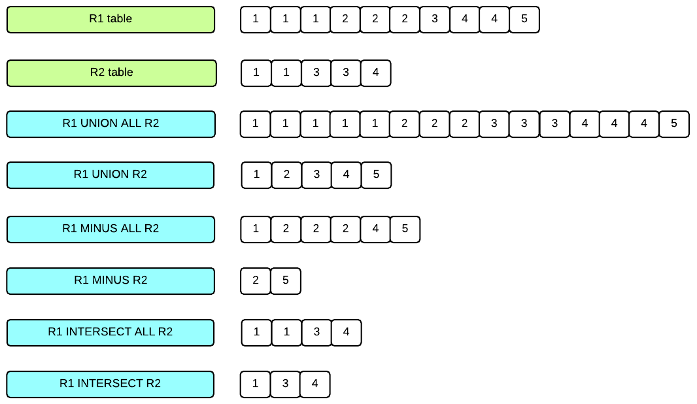

<a id="5d39fd715389f53f"></a>

# 18. SQL References

> Source: [GOLDILOCKS 20c.1 User Manual (en)](https://manual.sunjesoft.co.kr/goldilocks/20c_1/manual/en/5d39fd715389f53f)  
> Tag: `20c.1_30_tag`

[← 17. Built-in Function References](17-built-in-function-references.md) · [Table of contents](../README.md) · [19. Overview of PSM →](../part-04-psm-manual/19-overview-of-psm.md)

<a id="06a9882ab88db6e2"></a>
## ALTER AUDIT POLICY

<a id="94e1dd6b12217758"></a>
### Function

It adds an auditing target to an audit policy object, or drops an auditing target from an audit policy object.

<a id="6f0c572dd5d2fcb8"></a>
### Syntax

```
<alter audit policy statement> ::= 
    ALTER AUDIT POLICY policy_name
    { <add_audit_option> | <drop_audit_option> }
    ;

<add_audit_option> ::=
    ADD { <privilege_audit_clause> |  <action_audit_clause> | <privilege_audit_clause> <action_audit_clause> }

<drop_audit_option> ::=
    DROP { <privilege_audit_clause> |  <action_audit_clause> | <privilege_audit_clause> <action_audit_clause> }


<privilege_audit_clause> ::=
    PRIVILEGES <database_privilege> [, ...]

<action_audit_clause> ::=
    ACTIONS { <object_action_audit> | <system_action_audit> } [, ...]

<object_action_audit> ::=
      ALL ON [schema_name.]object_name
    | <object_action> ON [schema_name.]object_name

<system_action_audit> ::=
      ALL
    | <system_action>
```

<a id="1a0441db341bebcd"></a>
### Invocation and Access Rules

AUDIT SYSTEM ON DATABASE privilege is required to perform &lt;alter audit policy statement&gt;.

<a id="71aa864124350d12"></a>
### Syntax Rules and Parameters

<a id="ece5c78e7ad7c1bb"></a>
#### policy_name

It is the name of an audit policy object to be altered.

<a id="7376fa62c30c32d5"></a>
#### &lt;add_audit_option&gt;

It adds an auditing target to an audit policy.

<a id="1a42fda6444dbe10"></a>
#### &lt;drop_audit_option&gt;

It drops an auditing target from an audit policy.

<a id="41ad7e0b6ee9088e"></a>
#### &lt;privilege_audit_clause&gt;

For more information, refer to [CREATE AUDIT POLICY](#a149180e08381da2).

<a id="dde5e8e56fbedd54"></a>
#### &lt;action_audit_clause&gt;

For more information, refer to [CREATE AUDIT POLICY](#a149180e08381da2).

<a id="ec3e05bd14ccb331"></a>
### Description

It can alter an audit policy which is already activated, and it does not effect the existing session but it effects only the newly created session.

> When dropping ALL option as follows, not all actions are dropped, but only the corresponding ALL option is dropped.

```
CREATE AUDIT POLICY p1
       ACTIONS ALL ON u1.t1,
               SELECT ON u1.t1;

ALTER AUDIT POLICY p1 DROP
      ACTIONS ALL ON u1.t1;
```

<a id="ea5d8949c1e56406"></a>
### Examples

The following is an example of adding a new audit option to an audit policy.

```
ALTER AUDIT POLICY policy_dml
      ADD ACTIONS SELECT ON u1.t1;
```

The following is an example of dropping an audit option from an audit policy.

```
ALTER AUDIT POLICY policy_dml
      DROP ACTIONS SELECT ON u1.t1;
```

<a id="baff2819a9fa24b4"></a>
### Compatibility

The SQL standard does not have the audit policy.

<a id="c32deec276248d41"></a>
### For More Information

Refer to the followings.

- Managing audit policy object
    - [CREATE AUDIT POLICY](#a149180e08381da2)
    - [DROP AUDIT POLICY](#b2822776434b7deb)
    - [ALTER AUDIT POLICY](#06a9882ab88db6e2)

- Activating/ deactivating audit policy 
    - [AUDIT POLICY](#c7eaa62b370e8574)
    - [NOAUDIT POLICY](#c78dcf74817b2a96)

- Enquiring audit trail: [AUDIT_TRAIL](../part-02-administration-manual/9-database-information.md#a5b58e502af132a9)

- Dropping audit trail: [ALTER DATABASE CLEAR AUDIT TRAIL](#e89c91be9e566cd7)

<a id="619c417c530cdf9a"></a>
## ALTER CLUSTER GROUP name ADD MEMBER

<a id="dcd3276012e461c0"></a>
### Function

It adds a cluster member to a cluster group.

<a id="f6914d21936732dd"></a>
### Syntax

```
<alter cluster group add member statement> ::=
    ALTER CLUSTER GROUP group_name ADD
        <cluster member definition> [, ...]
    ;

<cluster member definition> ::=
    CLUSTER MEMBER member_name <connection attribute> [<member position>]

<connection attribute> ::=
    HOST 'address' PORT port_no

<member position> ::=
    POSITION DEFAULT
  | POSITION MAX
  | POSITION number
```

<a id="0584c1a4b97204c0"></a>
### Invocation and Access Rules

It can be performed in a cluster system.

ADMINISTRATION ON DATABASE privilege is required to perform &lt;alter cluster group add member statement&gt;.

<a id="e0d63f3dd050cee3"></a>
### Syntax Rules and Parameters

<a id="cf4c1e1fcefc00df"></a>
#### group_name

It is the cluster group name.

<a id="862b8a628e30e202"></a>
#### &lt;cluster member definition&gt;

It defines a cluster member to be included in a cluster group.  
A cluster group may include maximum 32 cluster members.

<a id="917789fd755b6168"></a>
#### member_name

It is the name of a cluster member.  
The cluster member name should be as same as the member name which was defined when the database of that cluster member was created.  
There should not be the same cluster group, nor the same cluster member.  
The length of the name should be shorter than 128 bytes.

The start-up phase for the cluster member should be GLOBAL OPEN.

<a id="cf25402b48a9390c"></a>
#### &lt;connection attribute&gt;

It defines the connection information for the communication between the cluster members.  
&lt;connection attribute&gt; should be as same as the HOST and PORT which were defined when the database of that cluster member was created.  
The combination of HOST and PORT should be unique in the cluster system.

- HOST 'address' uses ip v4 type. 
- PORT port_no should be in the range between 1024 ~ 49151.

<a id="bfbf42e7d9a06537"></a>
#### &lt;member position&gt;

It assigns the position number of the cluster member.

- POSITION DEFAULT
    - The system automatically assigns the position number.
- POSITION MAX
    - It assigns the new member position number even when an empty position number exists.
    - It assigns the value bigger than the biggest member position.
- POSITION number
    - It assigns the position number corresponding to the number
    - The position number should be unique in the cluster system.
    - The position number should be an empty position number, and it should be same or smaller than the biggest position number.
- If it is omitted, the default value is POSITION DEFAULT.

The member_position information of the cluster member can be retrieved through DBA_CLUSTER view.

```
SELECT member_name, member_id, member_position FROM dba_cluster;
```

If the following position numbers are being used,

- G1N1: 0
- G1N2: 1
- G2N2: 3
- G3N2: 5

The following values are assigned according to each option.

- POSITION DEFAULT
    - It assigns 2 which is an empty value.
- POSITION MAX
    - It assigns 6 which is a value of a new position number.
- POSITION 3
    - It is duplicated, so it is an error.
- POSITION 4
    - It assigns 4 which is a position number.

<a id="56c33e764110f0f7"></a>
### Description

&lt;alter cluster group add member statement&gt; statement does not rebalance shards in the tables.  
The following statement should be performed to rebalance shards on the added cluster member.

- [ALTER DATABASE REBALANCE](#ad1745f63208e901)
- [ALTER TABLE name REBALANCE](#2daa906aac739ab1)

<a id="ae63697c0a74a150"></a>
### Examples

The following is an example of adding two cluster members to a cluster group.

```
gSQL>
ALTER CLUSTER GROUP g1 ADD
    CLUSTER MEMBER g1n3 HOST '192.168.0.13' PORT 10130,
    CLUSTER MEMBER g1n4 HOST '192.168.0.14' PORT 10140
;

Cluster Group altered.
```

The following is an example of designating the empty member position as a cluster member position.

```
ALTER CLUSTER GROUP g2 ADD
    CLUSTER MEMBER g2n1 HOST '192.168.0.21' PORT 10210 POSITION 4
;
```

<a id="3038f353c790271a"></a>
### Compatibility

The SQL standard does not define the concepts of the cluster.

<a id="fc99738a4bd7275a"></a>
### For More Information

Refer to the followings.

- [CREATE CLUSTER GROUP](#77c1869df568145d)
- [DROP CLUSTER GROUP](#560fcc2db41c06e3)
- [ALTER DATABASE REBALANCE](#ad1745f63208e901)
- [ALTER TABLE name REBALANCE](#2daa906aac739ab1)

<a id="506cb7ee568a1be8"></a>
## ALTER CLUSTER GROUP name OFFLINE MEMBER

<a id="36463cd0a781f5d7"></a>
### Function

It sets a cluster member of the cluster group to offline.

<a id="ca803bc594d5f995"></a>
### Syntax

```
<alter cluster group offline member statement> ::=
    ALTER CLUSTER GROUP group_name OFFLINE
        <cluster member definition>
    ;

<cluster member definition> ::=
    CLUSTER MEMBER member_name
    ;
```

<a id="8f498f3d6d365e33"></a>
### Invocation and Access Rules

It can be performed in a cluster system.

ADMINISTRATION ON DATABASE privilege is required to perform &lt;alter cluster group offline member statement&gt;.

<a id="df460959868c76d8"></a>
### Syntax Rules and Parameters

<a id="b86e1cd2bd8691f1"></a>
#### group_name

It is the cluster group name.

<a id="3ec84d2f4fa4ad6f"></a>
#### &lt;cluster member definition&gt;

It defines a cluster member to be included in a cluster group.  
A cluster group may include maximum 32 cluster members.

<a id="2537f7f934c924d8"></a>
#### member_name

It is the name of a cluster member.  
The cluster member should be included in the cluster group of group_name.  
The cluster member should be inactive.

<a id="d35d3cf104d635f4"></a>
### Description

&lt;alter cluster group offline member statement&gt; statement does not rebalance shards in the tables.

<a id="38eea95220d0b6c8"></a>
### Examples

The following is an example of setting a specific cluster member to offline.

```
gSQL>

ALTER CLUSTER GROUP g1 OFFLINE
    CLUSTER MEMBER g1n3
;
Cluster Group altered.
```

<a id="66860c88007f1635"></a>
### Compatibility

The SQL standard does not define the concepts of the cluster.

<a id="d637e8895ebdacb9"></a>
### For More Information

Refer to the followings.

- [CREATE CLUSTER GROUP](#77c1869df568145d)
- [DROP CLUSTER GROUP](#560fcc2db41c06e3)
- [ALTER DATABASE REBALANCE](#ad1745f63208e901)
- [ALTER TABLE name REBALANCE](#2daa906aac739ab1)

<a id="36fa1df414c994e0"></a>
## ALTER CLUSTER LOCATION

<a id="e0744fc3684691dd"></a>
### Function

It alters a cluster location information.

<a id="a2f818cceec4a5f3"></a>
### Syntax

```
<alter cluster location statement> ::=
    ALTER CLUSTER LOCATION member_name 
    <cluster connection attribute>
    ;

<cluster connection attribute> ::
       HOST 'address' PORT port_no
```

<a id="56aa339a8b706cf8"></a>
### Invocation and Access Rules

It can be performed in a cluster system.

ADMINISTRATION ON DATABASE privilege is required to perform &lt;alter cluster location statement&gt;.

<a id="a40b9d4f1ce11150"></a>
### Syntax Rules and Parameters

<a id="2d624bba085337d4"></a>
#### member_name

It is the name of a cluster member.  
The same cluster member name should exist in the registered cluster location information.  
The length of the name should be shorter than 128 bytes.

<a id="06c3aa370a70d614"></a>
#### &lt;cluster connection attribute&gt;

It defines the connection information for the communication between the cluster members.  
The combination of HOST and PORT should be unique in the cluster system.

- HOST 'address' uses ip v4 type. 
- PORT port_no should be in the range between 1024 ~ 49151.

<a id="c900dbbee97e5db7"></a>
### Description

If the connection information of the cluster location is altered, the cluster member does not need to be dropped or recreated, but the connection information can be altered by using [ALTER CLUSTER LOCATION](#36fa1df414c994e0).

<a id="5ef9ba7fb0fa2670"></a>
### Examples

```
gSQL> 
ALTER CLUSTER LOCATION g1n2
    HOST '192.168.0.12' PORT 10120
;

altered.
```

<a id="914cc9c1dfb1126c"></a>
### Compatibility

The SQL standard does not define the concepts of the cluster.

<a id="db21d0419e90b650"></a>
### For More Information

Refer to the followings.

- [CREATE CLUSTER LOCATION](#012fa928ad307d4f)
- [DROP CLUSTER LOCATION](#8e79fe40d87a1fd8)

<a id="89d53f03e4e87839"></a>
## ALTER DATABASE ADD LOGFILE

<a id="28d1fde27a8eb146"></a>
### Function

It adds log file groups or log file members to the database.

<a id="5db80ec3ddfdcf0c"></a>
### Syntax

```
<alter database add logfile statement> ::=
      <add logfile member statement> 
    | <add logfile group statement>
    ;

<add logfile member statement> ::=
    ALTER DATABASE ADD LOGFILE MEMBER <add logfile clause> [, ...] TO 
        <group clause>

<add logfile group statement> ::=
    ALTER DATABASE ADD LOGFILE <group clause> ( 'logfile_name' [, ...] ) 
        <size clause> [ REUSE ]

<group clause> ::=
    GROUP integer

<add logfile clause> ::=
    'logfile_name' [ REUSE ]

<size clause> ::=
    integer [ M | G ]
```

<a id="944231d124f83111"></a>
### Invocation and Access Rules

ALTER DATABASE ON DATABASE privilege is required to perform &lt;alter database add logfile statement&gt;.

<a id="c3236d10248147a9"></a>
### Syntax Rules and Parameters

<a id="7896f1c1c96004af"></a>
#### &lt;alter database add logfile statement&gt;

The database should be in MOUNT phase.

<a id="0384d1c364785307"></a>
#### &lt;add logfile member statement&gt;

The log member is added to an existing log file group.

- &lt;add logfile clause&gt; 
    - 'logfile_name' is the file name of logfile member to be added to the log file group.
    - If the file does not exist, a new file is created.
    - The length of the logfile_name should be shorter than 1024 bytes.
- &lt;group clause&gt; 
    - It specifies the identifier of the logfile group to be added to the database.
    - Integer should be an identifier of the existing logfile group. 
    - If an identifier for the integer does not exist, an error occurs.

<a id="ad0aa5706bb3a2b8"></a>
#### &lt;add logfile group statement&gt;

It adds a new log file group.

- It is added as the next group of the CURRENT log file group.
- &lt;group clause&gt; 
    - It specifies the identifier of the logfile group to be added to the database.
    - Integer should be an identifier of the unexisting logfile group.
    - If an identifier for the integer exists, an error occurs.
- &lt;size clause&gt; 
    - The file size can be specified minimum of 20 MB to maximum of 120 GB.
    - The file size should be bigger than the sum of redo log buffer size and pending log buffer size.
- When logfile_name already exists, and the REUSE option is used, if the file size is as same as another group member, then the existing log file is reused.

<a id="671e35179e7b2494"></a>
### Description

It is recommended to back up the control file just in case for the file damage because the newly added log file groups and log members are stored in the control file.

<a id="0881a9b6f888f7c8"></a>
### Examples

The following is an example of adding two log file members to an existing log file group 3.

```
ALTER DATABASE ADD LOGFILE MEMBER 'logfile1.log', 'logfile2.log' TO GROUP 3;
```

The following is an example of adding a new log file group 4 to database. The size of log file group 4 is 100 M, and the log file name is 'logfile1.log'.

```
ALTER DATABASE ADD LOGFILE GROUP 4 ( 'logfile1.log' ) SIZE 100M;
```

> When adding a log group, a single log file should be used, and multiple log files can be added to an existing group as a member.

<a id="c04106d7af16a6fc"></a>
### Compatibility

The SQL standard does not define ALTER DATABASE statement.

<a id="8c2ca1e7bfe74228"></a>
### For More Information

Refer to the followings.

- [ALTER DATABASE ADD LOGFILE](#89d53f03e4e87839)
- [ALTER DATABASE DROP LOGFILE](#4a645043f7fd0dba)
- [ALTER DATABASE RENAME LOGFILE](#99034c7d5f51dd81)

<a id="23d6dd74f926c674"></a>
## ALTER DATABASE ARCHIVELOG

<a id="94cc56370cf778cb"></a>
### Function

It alters an archive setting of the online log file in the database.

<a id="c53013443c7f835a"></a>
### Syntax

```
<alter database archivelog statement> ::=
    ALTER DATABASE { ARCHIVELOG | NOARCHIVELOG }
    ;
```

<a id="4cd7bd0567a457c4"></a>
### Invocation and Access Rules

ALTER DATABASE ON DATABASE privilege is required to perform &lt;alter database archivelog statement&gt;.

<a id="9b69373cc97c098c"></a>
### Syntax Rules and Parameters

<a id="b45067855b51c4d7"></a>
#### &lt;alter database archivelog statement&gt;

- The database should be in MOUNT phase.
- ARCHIVELOG
    - It archives the online log file.
- NOARCHIVELOG
    - It does not archive the online log file.

<a id="a18cff3783abd0da"></a>
### Description

For the database backup and the media recovery using the backup, the system should be operated in ARCHIVELOG mode.

<a id="f0bfac21931fb388"></a>
### Example

The following is an example of how to set up a database to archive mode.

```
ALTER DATABASE ARCHIVELOG;
```

<a id="3404210a9b5de66b"></a>
### Compatibility

The SQL standard does not define ALTER DATABASE statement.

<a id="fae70d803385b1cb"></a>
### For More Information

Refer to the followings.

- [ALTER DATABASE BACKUP](#6d4b2dd529894584)
- [ALTER TABLESPACE name BACKUP](#c2ebb1137ae25068)

<a id="6d4b2dd529894584"></a>
## ALTER DATABASE BACKUP

<a id="ff2cfe97f329df73"></a>
### Function

The backup state is set to ACTIVE or INACTIVE to perform a full backup of the database. Then, the incremental database backup and control file backup are performed.

<a id="ea2dd5bdc0f058cb"></a>
### Syntax

```
<alter database backup statement> ::=
      <database begin backup statement>
    | <database end backup statement>
    | <database incremental backup statement>
    | <database controlfile backup statement>
    ;

<database begin backup statement> ::=
    ALTER DATABASE BEGIN BACKUP [ AT <domain name> ]
    ;

<database end backup statement> ::=
    ALTER DATABASE END BACKUP [ AT <domain name> ]
    ;

<database incremental backup statement> ::=
    ALTER DATABASE BACKUP INCREMENTAL
        <incremental backup option> [ AT <domain name> ]    ;

<incremental backup option> ::=
      LEVEL integer [ CUMULATIVE | DIFFERENTIAL ]

<database controlfile backup statement> ::=
    ALTER DATABASE BACKUP CONTROLFILE TO 'target_name'
        [ AT <domain name> ]    ;
```

<a id="9c151e31b47119d6"></a>
### Invocation and Access Rules

ALTER DATABASE ON DATABASE privilege is required to perform &lt;alter database backup statement&gt;.

<a id="c467c52e7fb85c04"></a>
### Syntax Rules and Parameters

<a id="4fbb8a3a54b316e6"></a>
#### &lt;database begin backup clause&gt;

The database is set to the state which the full backup is available.

- All tablespaces in ONLINE state, which are created and used in the database, are set to the state of which the full backup is available. 
- The database should be OPEN state and operated in ARCHIVELOG mode.
- After starting BEGIN BACKUP, the following operations which require writing to the data file can not be performed.
    - SHUTDOWN NORMAL
    - OFFLINE / DROP TABLESPACE
    - ADD / DROP DATAFILE
- It may require media recovery on restart when a full backup is ACTIVE state and the instance is abnormally terminated.

<a id="6fc68232ac3dd8d4"></a>
#### &lt;database end backup clause&gt;

The database is set to the state which the full backup is not available.

- All tablespaces in ONLINE state, which are created and used in the database, are set to the state which the full backup is not available. 
- The database should be in OPEN phase and operated in ARCHIVELOG mode.

<a id="40c013bb2830972a"></a>
#### &lt;database incremental backup statement&gt;

- An incremental backup is performed for the database.
- The database should be in OPEN phase and operated in ARCHIVELOG mode.

<a id="7b465185fa260594"></a>
#### &lt;incremental backup option&gt;

- 'integer' can be specified from 0 to 4. 
- LEVEL 0 can not specify CUMULATIVE or DIFFERENTIAL.
- CUMULATIVE | DIFFERENTIAL
    - CUMULATIVE
        - If 'integer' is n, it backs up all pages which are altered after the most recent backups of LEVEL 0 ~ LEVEL n-1. 
    - DIFFERENTIAL
        - If 'integer' is n, it backs up all pages which are altered after the most recent backups of LEVEL 0 ~ LEVEL n. 
    - If it is omitted, DIFFERENTIAL is specified by default.

<a id="722f66b816f2bb82"></a>
#### &lt;database controlfile backup statement&gt;

- The control file is backed up. 
    - The length of 'target_name' should be shorter than 1024 bytes.
    - If 'target_name' already exists, the operation fails.
- The database should be in OPEN phase and operated in ARCHIVELOG mode.

> The maximum length of the 'target_name' managed by GOLDILOCKS is 1024 bytes. However, the maximum lengths of the file name varies depending on the OS, so the actual length of 'target_name' which is available to be created can be shorter than 1024 bytes.

<a id="4e5a1cd91ca5f210"></a>
#### &lt;domain name&gt;

It is a name of a member or a group for which the statement is performed.  
If it is omitted, it is performed for all groups.

<a id="8221e54be85c5746"></a>
### Description

It backs up data files and control files in the database. A full backup of the database begins with BEGIN BACKUP, and copies the datafiles using OS file copy, then ends with END BACKUP. The incremental backup file is created in the path set by the BACKUP_DIR 1 property using a single statement.

<a id="a1e3aef85309e1f5"></a>
### Examples

The following is an example of setting the entire backup state to ACTIVE.

```
ALTER SYSTEM BEGIN BACkUP;
```

The following is an example of setting the entire backup state to INACTIVE.

```
ALTER SYSTEM END BACkUP;
```

The following is an example to create the incremental backup of LEVEL 1 by using DIFFERENTIAL.

```
ALTER DATABASE BACKUP INCREMENTAL LEVEL 1 DIFFERENTIAL;
```

The following is an example to create the 'controlfile.bak' backup file for the control file. If the absolute path is not included, a backup file is created in the path set by the LOG_DIR property.

```
ALTER DATABASE BACKUP CONTROLFILE TO 'controlfile.bak';
```

<a id="6a6739749f01a911"></a>
### Compatibility

The SQL standard does not define ALTER DATABASE statement.

<a id="0f142c6a9cfc1968"></a>
### For More Information

Refer to the followings.

- [ALTER TABLESPACE name BACKUP](#c2ebb1137ae25068)
- [ALTER DATABASE RECOVER](#f88ab245c9342b35)

<a id="e89c91be9e566cd7"></a>
## ALTER DATABASE CLEAR AUDIT TRAIL

<a id="e06e4c84b0841e67"></a>
### Function

It purges audit records which are accumulated when applying an audit policy.

<a id="a15d192dcb6227de"></a>
### Syntax

```
<clear audit trail statement> ::= 
    ALTER DATABASE CLEAR AUDIT TRAIL
;
```

<a id="2c0cbf47a7b0917a"></a>
### Invocation and Access Rules

AUDIT SYSTEM ON DATABASE privilege is required to perform &lt;clear audit trail statement&gt;.

<a id="b786943f486f3a33"></a>
### Description

If an audit policy is activated, an audit trails is getting longer as time goes by.  
Tables configuring an audit trail are stored in MEM_AUX_TBS tablespace, and a user should be cautious not to let the audit trail keep increasing.

<a id="44d533dcbcf2ab90"></a>
### Storing Audit Trail

A user should purge an audit trail after storing it according to the following procedure to store an audit trail when it is necessary.

- When performing it for the first time

```
CREATE TABLE backup_audit_trail AS SELECT * FROM AUDIT_TRAIL;
COMMIT;
```

- When repeatedly performing it

```
INSERT INTO backup_audit_trail SELECT * FROM AUDIT_TRAIL;
COMMIT;
```

- When purging an audit trail

```
ALTER DATABASE CLEAR AUDIT TRAIL;
```

<a id="51b17a4487ffcb0f"></a>
### Examples

Purge an audit trail by using the following statement.

```
ALTER DATABASE CLEAR AUDIT TRAIL;
```

<a id="f355fbfa1abb7647"></a>
### Compatibility

The SQL standard does not have the audit policy.

<a id="33520fc6d161c27b"></a>
### For More Information

Refer to the followings.

- Managing audit policy object
    - [CREATE AUDIT POLICY](#a149180e08381da2)
    - [DROP AUDIT POLICY](#b2822776434b7deb)
    - [ALTER AUDIT POLICY](#06a9882ab88db6e2)

- Activating/ deactivating audit policy 
    - [AUDIT POLICY](#c7eaa62b370e8574)
    - [NOAUDIT POLICY](#c78dcf74817b2a96)

- Enquiring audit trail: [AUDIT_TRAIL](../part-02-administration-manual/9-database-information.md#a5b58e502af132a9)

- Dropping audit trail: [ALTER DATABASE CLEAR AUDIT TRAIL](#e89c91be9e566cd7)

<a id="e885d48709ab62a6"></a>
## ALTER DATABASE CLEAR PASSWORD HISTORY

<a id="4b50317ca0fafdb8"></a>
### Function

It deletes the user's password change history which is accumulated due by applying the profile.

<a id="10d7a543a94cb7b8"></a>
### Syntax

```
<clear password history statement> ::= 
    ALTER DATABASE CLEAR PASSWORD HISTORY
    ;
```

<a id="3b38daeadd329b0d"></a>
### Invocation and Access Rules

ALTER DATABASE ON DATABASE privilege is required to perform &lt;clear password history statement&gt;.

<a id="5e8367af2a496156"></a>
### Description

When a profile is applied to a user, the user's password change history is accumulated according to the PASSWORD_REUSE_MAX and PASSWORD_REUSE_TIME policies.

**Managing the change history**

<a id="f2d1aa9c967a519a"></a>
| PASSWORD_REUSE_MAX | PASSWORD_REUSE_TIME | Managing the change history |
| --- | --- | --- |
| value | value | It manages only the change history within the value range, and the change history out of the value range is automatically deleted. |
| value | UNLIMITED | It accumulates all change history and it does not delete any change history because all change history should be checked. |
| UNLIMITED | value | It accumulates all change history and it does not delete any change history because all change history should be checked. |
| UNLIMITED | UNLIMITED | It does not manage the change history because the change history is not checked. |

&lt;Clear password history statement&gt; deletes the accumulated user's password change history.

<a id="ea7a9fb1c4deb934"></a>
### Examples

The following is an example of executing &lt;clear password history statement&gt; statement.

```
gSQL> ALTER DATABASE CLEAR PASSWORD HISTORY;

Database altered.

gSQL> COMMIT;

Commit complete.
```

<a id="28433e8398dbae65"></a>
### Compatibility

The SQL standard does not define ALTER DATABASE statement.

<a id="35af0624ca05c8df"></a>
### For More Information

Refer to the followings.

- [CREATE PROFILE](#b525ab5df12d54ce)
- [CREATE USER](#ec968b4f07613737)

<a id="c927d5b83eb47833"></a>
## ALTER DATABASE DATAFILE AUTOEXTEND

<a id="053cb81060eeb73d"></a>
### Function

It alters the property to automatically extend disk tablespace data file. If the property is ON, then the size to be extended and the maximum size of the data file also can be altered.

<a id="8feb66121887e68c"></a>
### Syntax

```
<alter database datafile autoextend statement> ::= 
    ALTER DATABASE DATAFILE datafile_name <autoextend clause>
        [ AT <domain name> ]
    ;

<autoextend clause>
    AUTOEXTEND { ON [ <next size clause> ] [ <max size clause> ] | OFF }

<next size clause>
    NEXT <size clause>

<max size clause>
    MAXSIZE { <size clause> | UNLIMITED }
```

<a id="40fa420bccc5569f"></a>
### Invocation and Access Rules

ALTER DATABASE ON DATABASE privilege is required to perform &lt;alter database datafile autoextend statement&gt;.

The datafile automatic expand property can alter the property of disk tablespace only.

<a id="ea0a2cf35c43a731"></a>
#### datafile_name

It specifies the name of the data file to be altered.

<a id="e75bcc35f7d85441"></a>
#### &lt;autoextend clause&gt;

It sets the automatic expand property to ON or OFF. If it is set to ON, then it can specify the automatic expanded size and the maximum size of the data file.

<a id="17ad0b4990dee679"></a>
#### &lt;next size clause&gt;

It specifies the size to be extended when the data file in use does not have available space.

<a id="16018e0a4cae4fc2"></a>
#### &lt;max size clause&gt;

It specifies the maximum expanded size of the data file.

<a id="72e956143044dbe6"></a>
### Description

Refer to the syntax rules of each statement.

<a id="dae2bb5812c2d3f0"></a>
### Examples

The following is an example of altering the automatic expand property of the datafile, the automatic expanded size, and datafile size.

```
gSQL> ALTER DATABASE DATAFILE 'DISK_TBS.dbf' AUTOEXTEND OFF;

Database altered.

gSQL> ALTER DATABASE DATAFILE 'DISK_TBS.dbf' AUTOEXTEND ON;

Database altered.

gSQL> ALTER DATABASE DATAFILE 'DISK_TBS.dbf' AUTOEXTEND ON NEXT 20M;

Database altered.

gSQL> ALTER DATABASE DATAFILE 'DISK_TBS.dbf' AUTOEXTEND ON MAXSIZE 1G;

Database altered.

gSQL> ALTER DATABASE DATAFILE 'DISK_TBS.dbf' AUTOEXTEND ON 20M MAXSIZE 1G;

Database altered.
```

<a id="8d4ff0b8c25d4609"></a>
### Compatibility

The SQL standard does not define the concepts of the datafile.

<a id="2c39e63e16f2c507"></a>
### For More Information

Refer to [CREATE DISK DATA TABLESPACE](#e9ad043720b9639b).

<a id="857b17d67944943d"></a>
## ALTER DATABASE DELETE BACKUP

<a id="7916e26077cb6ca4"></a>
### Function

It deletes the backup file and the backup information of incremental backup. It can delete all incremental backup of the database or no longer usable obsolete backup.

<a id="73a77bf0d5fb6e44"></a>
### Syntax

```
<alter database delete backup statement> ::=
    ALTER DATABASE DELETE <delete backup list option> 
        BACKUP LIST [ <including backup file option> ]
    ;

<delete backup list option> ::=
      OBSOLETE
    | ALL

<including backup file option> ::=
    INCLUDING BACKUP FILES
```

<a id="cf6982082a2ce699"></a>
### Invocation and Access Rules

ALTER DATABASE ON DATABASE privilege is required to perform &lt;alter database delete backup statement&gt;.

<a id="c9da0ed6ab031940"></a>
### Syntax Rules and Parameters

<a id="928e9d007dcfefca"></a>
#### &lt;alter database delete backup statement&gt;

The database should be in MOUNT or OPEN phase.

<a id="d54bbf09c374604b"></a>
#### &lt;delete backup list option&gt;

It selects the backups to be deleted among the existing incremental backups.

- OBSOLETE: It selects backups of database or tablespaces to be deleted, which was backed up before the most recent database LEVEL 0 backup. 
- ALL: It selects all incremental backups to be deleted.

<a id="c5d6b860f3cc6a7a"></a>
#### &lt;including backup file option&gt;

- If it is omitted, it deletes only the backup information from the control file.
- It also deletes not only backup information but also the backup files.

<a id="2ef875e915347f05"></a>
### Description

Deletion of the OBSOLETE incremental backup deletes the incremental backup of which is before the most recent LEVEL 0 database backup. When non-LEVEL 0 incremental backup is performed, it is not deleted even if it includes the previously performed incremental backup. It is because it can be used when performing the incomplete recovery by using the incremental backups.

> Be cautious of deleting the backup file together when an incremental backup is deleted. It can not be recovered even by using the control file which has incremental backup information.

<a id="2e1f2e3f06001170"></a>
### Example

The following is an example to delete the backup information and backup files of all existing incremental backups.

```
ALTER DATABASE DELETE ALL BACKUP LIST INCLUING BACKUP FILES;
```

<a id="faebc72292f46db0"></a>
### Compatibility

The SQL standard does not define ALTER DATABASE statement.

<a id="5e11fd76afa8cf56"></a>
### For More Information

Refer to the followings.

- [ALTER TABLESPACE name BACKUP](#c2ebb1137ae25068)
- [ALTER DATABASE RECOVER](#f88ab245c9342b35)

<a id="806fe910d09bc5ee"></a>
## ALTER DATABASE DROP INACTIVE CLUSTER MEMBERS

<a id="a3fa4efe90d3f74a"></a>
### Function

It drops the entire inactive cluster member.

<a id="1f0c38bc1cb907b4"></a>
### Syntax

```
<alter database drop inactive members statement> ::=
    ALTER DATABASE DROP INACTIVE CLUSTER MEMBERS
    ;
```

<a id="b329e4ce99c73f9d"></a>
### Invocation and Access Rules

It can be performed in a cluster system.

ADMINISTRATION ON DATABASE privilege is required to perform &lt;alter database drop inactive cluster members statement&gt;.

<a id="36f1efd04107f159"></a>
### Description

It drops the entire inactive cluster member.

The inactive state of a cluster member means that it is not connected to the cluster system, and it occurs in the following cases.

- An error occurs on a cluster member in an operating cluster system.
- Trying to start-up the cluster system without driving the cluster member.

However, if the table shard is lost while dropping the cluster member, then an inactive cluster member can not be dropped.

It is recommended to use &lt;alter database drop inactive members statement&gt; when an inactive cluster member can not be included in the cluster system any more.

<a id="a5499f222b2a6417"></a>
### Examples

The following is an example of executing &lt;alter database drop inactive members statement&gt;.

```
gSQL> ALTER DATABASE DROP INACTIVE CLUSTER MEMBERS;

Database altered.
```

<a id="fe345b9b6a0a8c44"></a>
### Compatibility

The SQL standard does not define the concepts of the cluster.

<a id="5ea9fe508f15597b"></a>
### For More Information

Refer to [ALTER SYSTEM JOIN DATABASE](#485a4a4fb17d17f0).

<a id="4a645043f7fd0dba"></a>
## ALTER DATABASE DROP LOGFILE

<a id="ddc99a14716c7639"></a>
### Function

It drops a log file group or a member which exists in the database.

<a id="1a367b4a749cbae4"></a>
### Syntax

```
<alter database drop logfile statement> ::=
      <drop logfile group statement>
    | <drop logfile member statement>
    ;

<drop logfile group statement> ::=
    ALTER DATABASE DROP LOGFILE <group clause>

<group clause> ::=
    GROUP integer

<drop logfile member statement> ::=
    ALTER DATABASE DROP LOGFILE MEMBER <logfile_list>

<logfile_list> ::=
      'logfile_name'
    | <logfile_list> , 'logfile_name'
```

<a id="7928c444623c1184"></a>
### Invocation and Access Rules

ALTER DATABASE ON DATABASE privilege is required to perform &lt;alter database drop logfile statement&gt;.

<a id="4b91fc1b942246c2"></a>
### Syntax Rules and Parameters

<a id="ab4e6f0ff84c3a0f"></a>
#### &lt;alter database drop logfile statement&gt;

The database should be in MOUNT phase.  
An error occurs when the log file to be deleted is in CURRENT or ACTIVE stage.  
At least four log file groups should be remained after dropping.

<a id="5bcf7d1a4558beb8"></a>
#### &lt;drop logfile group statement&gt;

It drops the existing log file group.

- &lt;group clause&gt; 
    - It specifies the log file group to be dropped.
    - An integer should be an identifier of the existing log file.
    - An error occurs if the integer does not exist.

<a id="1f9bf2ac1ccfdbad"></a>
#### &lt;drop logfile member statement&gt;

It drops the existing log file members.

- &lt;logfile_list&gt;
    - It is the list of the log file members to be dropped.
    - 'logfile_name' should be an existing name. 
    - An error occurs if 'logfile_name' does not exist.

<a id="70131a43b60ed319"></a>
### Description

For more information, refer to the rules for each syntax.

<a id="c7f24a3dd681b490"></a>
### Examples

The following is an example of dropping the existing log file GROUP 3.

```
ALTER DATABASE DROP LOGFILE GROUP 3;
```

The following is an example of dropping logfile1.log and logfile2.log from the existing logfile GROUP 3.

```
ALTER DATABASE DROP LOGFILE MEMBER 'logfile1.log', 'logfile2.log';
```

<a id="8d751df93d306b92"></a>
### Compatibility

The SQL standard does not define ALTER DATABASE statement.

<a id="07b2b149a1d29030"></a>
### For More Information

Refer to the respective syntax rules, and the followings.

- [ALTER DATABASE ADD LOGFILE](#89d53f03e4e87839)
- [ALTER DATABASE RENAME LOGFILE](#99034c7d5f51dd81)

<a id="9b26a8ba68752225"></a>
## ALTER DATABASE MOVE SHARD

<a id="6906068efac82a4c"></a>
### Function

It rebalances shard of all tables in a specific cluster group to another cluster group.

<a id="c327e3b6df4bdc31"></a>
### Syntax

```
<alter database move shard statement> ::=
    ALTER DATABASE MOVE SHARD FROM CLUSTER GROUP src_cluster_group
        TO CLUSTER GROUP dest_cluster_group [ ONLINE | OFFLINE ];
```

<a id="b25cf03b09cdf210"></a>
### Invocation and Access Rules

It can be performed in a cluster system.

ALTER DATABASE ON DATABASE privilege is required to perform &lt;alter database move shard statement&gt;.

<a id="83645f2f0731a085"></a>
### Syntax Rules and Parameters

<a id="f567312ab90650cf"></a>
#### src_cluster_group

It is a cluster group to which the table shard is moved.

<a id="b31ac0c6074844e9"></a>
#### dest_cluster_group

It is a target cluster group to which the table shard is moved.

<a id="7b8bf178be71e1f6"></a>
#### [ ONLINE | OFFLINE ]

It determines whether to allow DML when rebalancing table shard.

- ONLINE 
    - It allows INSERT, UPDATE, and DELETE. 
- OFFLINE 
    - It does not allow INSERT, UPDATE, DELETE.
- When it is omitted, the default value is ONLINE.

<a id="a6984e51f5250727"></a>
### Description

When adding a cluster member and a cluster group using the following statements, the table shard is not rebalanced.

- [CREATE CLUSTER GROUP](#77c1869df568145d)
- [ALTER CLUSTER GROUP name ADD MEMBER](#619c417c530cdf9a)

Perform &lt;alter database rebalance statement&gt; to rebalance the shard of the entire table which was not rebalanced when adding a cluster group and a cluster member.

&lt;alter database move shard statement&gt; is performed as the following concepts for tables which did not rebalance the shard.

```
ALTER TABLE t1 MOVE SHARD FROM CLUSTER GROUP src_group TO CLUSTER GROUP dest_group;
COMMIT;
ALTER TABLE t2 MOVE SHARD FROM CLUSTER GROUP src_group TO CLUSTER GROUP dest_group;
COMMIT;
ALTER TABLE t3 MOVE SHARD FROM CLUSTER GROUP src_group TO CLUSTER GROUP dest_group;
COMMIT;
...
...
ALTER TABLE t_n MOVE SHARD FROM CLUSTER GROUP src_group TO CLUSTER GROUP dest_group;
COMMIT;
```

The &lt;alter database move shard statement&gt; is proceeded even when the rebalancing the shard of a specific table fails. It does not rollback the table which succeeded in rebalancing the shard.

Therefore, when performing &lt;alter database move shard statement&gt; again after appropriately processed an error, then it rebalances only the shard for the table requiring the rebalancing. In this case, the table which succeeded in rebalancing the shard is not included in a target of the rebalancing.

<a id="c20273b760a87c16"></a>
### Examples

The following is an example of performing &lt;alter database move shard statement&gt;.

```
gSQL> ALTER DATABASE MOVE SHARD FROM CLUSTER GROUP G1 TO CLUSTER GROUP G2;

Database altered.
```

<a id="a6262afd4aca8c9e"></a>
### Compatibility

The SQL standard does not define the concepts of the cluster.

<a id="c6f1f3185655638a"></a>
### For More Information

Refer to the followings.

- [ALTER TABLE name MOVE SHARD](#70b22d297acc5842)
- [CREATE CLUSTER GROUP](#77c1869df568145d)
- [ALTER CLUSTER GROUP name ADD MEMBER](#619c417c530cdf9a)

<a id="56180dd223759c04"></a>
## ALTER DATABASE OFFLINE INACTIVE CLUSTER MEMBERS

<a id="71ac98ac9a313b92"></a>
### Function

It sets the entire inactive cluster member to offline. In other words, it sets the shard map for the cluster member to offline.

<a id="3ed202e91077be75"></a>
### Syntax

```
<alter database offline inactive cluster members statement> ::=
    ALTER DATABASE OFFLINE INACTIVE CLUSTER MEMBERS
    ;
```

<a id="409ef1a1c6d38332"></a>
### Invocation and Access Rules

It can be performed in a cluster system.

ADMINISTRATION ON DATABASE privilege is required to perform &lt;alter database offline inactive cluster members statement&gt;.

<a id="a327a3d57ba1cd7c"></a>
### Syntax Rules and Parameters

It sets the entire inactive cluster member to offline.  
The inactive state of a cluster member means that it is not connected to the cluster system, and it occurs in the following cases.

- An error occurs on a cluster member in an operating cluster system.
- Trying to start-up the cluster system without driving the cluster member.

<a id="4d5c828cf59995a6"></a>
### Description

It is recommended to use &lt;alter database offline inactive members statement&gt; when an inactive cluster member can not be included in the cluster system any more.

If an inactive cluster member can participate in a cluster system, then perform [ALTER SYSTEM JOIN DATABASE](#485a4a4fb17d17f0) to include it in a cluster system.

The cluster member which is set to offline can be shifted to online again by using the following statements after the join.

- [ALTER DATABASE REBALANCE](#ad1745f63208e901)
- [ALTER TABLE name REBALANCE](#2daa906aac739ab1)

<a id="a9fda5d8b9bd92c2"></a>
### Examples

```
gSQL> ALTER DATABASE OFFLINE INACTIVE CLUSTER MEMBERS;
```

<a id="517a05094fa4862e"></a>
### Compatibility

The SQL standard does not define the concepts of the cluster.

<a id="1da47e6279911520"></a>
### For More Information

Refer to the followings.

- [ALTER SYSTEM JOIN DATABASE](#485a4a4fb17d17f0)
- [ALTER DATABASE REBALANCE](#ad1745f63208e901)
- [ALTER TABLE name REBALANCE](#2daa906aac739ab1)

<a id="ad1745f63208e901"></a>
## ALTER DATABASE REBALANCE

<a id="f4bee0300f691f53"></a>
### Function

It rebalances shard of all tables.

<a id="ac428c988326df6b"></a>
### Syntax

```
<alter database rebalance statement> ::=
    ALTER DATABASE REBALANCE [ ONLINE | OFFLINE ];
```

<a id="6d123b21f1c534ac"></a>
### Invocation and Access Rules

It can be performed in a cluster system.

ALTER DATABASE ON DATABASE privilege is required to perform &lt;alter database rebalance statement&gt;.

<a id="44f99772054bbea1"></a>
### Syntax Rules and Parameters

<a id="4fde4982a007387f"></a>
#### [ ONLINE | OFFLINE ]

It determines whether to allow DML when rebalancing table shard.

- ONLINE 
    - It allows INSERT, UPDATE, and DELETE. 
- OFFLINE 
    - It does not allow INSERT, UPDATE, DELETE.
- When it is omitted, the default value is ONLINE.

<a id="3381d150a1769f56"></a>
### Description

When adding a cluster member and a cluster group using the following statements, the table shard is not rebalanced.

- [CREATE CLUSTER GROUP](#77c1869df568145d)
- [ALTER CLUSTER GROUP name ADD MEMBER](#619c417c530cdf9a)

Perform &lt;alter database rebalance statement&gt; to rebalance the shard of the entire table which was not rebalanced when adding a cluster group and a cluster member.

&lt;alter database rebalance statement&gt; is performed as the following concepts for tables which did not rebalance the shard.

```
ALTER TABLE t1 REBALANCE;
COMMIT;
ALTER TABLE t2 REBALANCE;
COMMIT;
ALTER TABLE t3 REBALANCE;
COMMIT;
...
...
ALTER TABLE t_n REBALANCE;
COMMIT;
```

The &lt;alter database rebalance statement&gt; is proceeded even when the rebalancing the shard of a specific table fails. It does not rollback the table which succeeded in rebalancing the shard.

Therefore, when performing &lt;alter database rebalance statement&gt; again after appropriately processed an error, then it rebalances only the shard for the table requiring the rebalancing. In this case, the table which succeeded in rebalancing the shard is not included in a target of the rebalancing.

<a id="831d93c3cf4a341f"></a>
### Examples

The following is an example of performing &lt;alter database rebalance statement&gt;.

```
gSQL> ALTER DATABASE REBALANCE;

Database altered.
```

<a id="7fc5b834aa9409d4"></a>
### Compatibility

The SQL standard does not define the concepts of the cluster.

<a id="41c2b1acbff09d03"></a>
### For More Information

Refer to [ALTER TABLE name REBALANCE](#2daa906aac739ab1).

<a id="b3d4377f7109ad76"></a>
## ALTER DATABASE REBALANCE EXCLUDE CLUSTER GROUP

<a id="8cb8a5636a75e338"></a>
### Function

It rebalances shard of all tables excluding shards of a specific cluster group.

<a id="21c4c64dbcfaa75b"></a>
### Syntax

```
<alter database rebalance exclude cluster group statement> ::=
    ALTER DATABASE REBALANCE EXCLUDE CLUSTER GROUP cluster_group_name [ ONLINE | OFFLINE ];
```

<a id="e7a529a0433bfe97"></a>
### Invocation and Access Rules

It can be performed in a cluster system.

ALTER DATABASE ON DATABASE privilege is required to perform &lt;alter database rebalance exclude cluster group statement&gt;.

<a id="1e953d90859c4fb5"></a>
### Syntax Rules and Parameters

<a id="44f9952cb3305705"></a>
#### cluster_group_name

It is a name of the cluster group excluding a shard of the table.  
If the specified cluster group is the only cluster group, then the statement can not be performed.

<a id="47c4c691c5a420d1"></a>
#### [ ONLINE | OFFLINE ]

It determines whether to allow DML when rebalancing table shard.

- ONLINE 
    - It allows INSERT, UPDATE, and DELETE. 
- OFFLINE 
    - It does not allow INSERT, UPDATE, DELETE.
- When it is omitted, the default value is ONLINE.

<a id="155a4039ebbae258"></a>
### Description

To drop a cluster group by using [DROP CLUSTER GROUP](#560fcc2db41c06e3), there should not be a shard in the cluster group.

Perform &lt;alter database rebalance exclude cluster group statement&gt; to exclude a shard from the cluster group. &lt;alter database rebalance exclude cluster group statement&gt; is performed as the following concepts for tables which include a shard in the cluster group.

```
ALTER TABLE t1 REBALANCE EXCLUDE CLUSTER GROUP g3;
COMMIT;
ALTER TABLE t2 REBALANCE EXCLUDE CLUSTER GROUP g3;
COMMIT;
ALTER TABLE t3 REBALANCE EXCLUDE CLUSTER GROUP g3;
COMMIT;
...
...
ALTER TABLE t_n REBALANCE EXCLUDE CLUSTER GROUP g3;
COMMIT;
```

If  the &lt;alter database rebalance exclude cluster group statement&gt; fails due to the lack of storage space, it does not rollback the table which succeed in excluding a shard.

Therefore, when performing &lt;alter database rebalance exclude cluster group statement&gt; again after appropriately processed an error, then it excludes and rebalances only the shard for the table requiring the rebalancing. In this case, the table which succeeded in excluding the shard is not included in a target of the rebalancing.

<a id="55a1efff6a36d0d9"></a>
### Examples

The following is an example of performing &lt;alter database rebalance exclude cluster group statement&gt;.

```
gSQL> ALTER DATABASE REBALANCE EXCLUDE CLUSTER GROUP g3;

Database altered.
```

<a id="c0b912624fa09e38"></a>
### Compatibility

The SQL standard does not define the concepts of the cluster.

<a id="9655af2eb634dd44"></a>
### For More Information

Refer to the followings.

- [DROP CLUSTER GROUP](#560fcc2db41c06e3)
- [ALTER TABLE name REBALANCE EXCLUDE CLUSTER GROUP cluster_group_list](#b6b9bcdd5ff36a44)

<a id="f88ab245c9342b35"></a>
## ALTER DATABASE RECOVER

<a id="a37b4bc5bc0b2ccb"></a>
### Function

It recovers the entire data file or part of the data files in the database by using the online and archive log files.

<a id="58fd82990ce4db74"></a>
### Syntax

```
<alter database recover statement> ::=
      <complete database recover statement>
    | <datafile recover statement>
    | <complete tablespace recover statement>
    | <incomplete database recover statement>
    ;

<complete database recover statement> ::=
    ALTER DATABASE RECOVER

<datafile recover statement> ::=
    ALTER DATABASE RECOVER DATAFILE <datafile recovery clause>

<datafile recovery clause> ::=
    <datafile recovery object> [, ...]

<datafile recovery object> ::=
    'datafile_name' [<recovery using backup option>] [recovery corruption option>]

<recovery using backup option> ::=
    USING BACKUP 'backup_datafile_name'

<recovery corruption option> ::=
    CORRUPTION

<complete tablespace recover statement> ::=
    ALTER DATABASE RECOVER TABLESPACE tablespace_name

<incomplete database recover statement> ::=
      <batch incomplete recovery statement>
    | <interactive incomplete recovery statement>
    ;

<batch incomplete recovery statement> ::=
    ALTER DATABASE RECOVER <until clause> [<using backup controlfile option>]
    
<until clause> ::=
      UNTIL CHANGE integer

<using backup controlfile option> ::=
    USING BACKUP CONTROLFILE

<interactive incomplete recovery statement> ::=
    ALTER DATABASE <incomplete recovery option> [<using backup controlfile option>]

<incomplete recovery option> ::=
      BEGIN INCOMPLETE RECOVERY
    | END INCOMPLETE RECOVERY
    | RECOVER 'logfile name'
    | RECOVER AUTOMATICALLY
    | RECOVER SUGGESTION
    ;
```

<a id="b8c3a6361257787e"></a>
### Invocation and Access Rules

ALTER DATABASE ON DATABASE privilege is required to perform &lt;alter database recover statement&gt;.

<a id="e259a29db7713e35"></a>
### Syntax Rules and Parameters

<a id="06aee55a27c8396f"></a>
#### &lt;complete database recover statement&gt;

The data files of the database are recovered up to date by using the online and archive log files.

- The recovery is performed for all tablespaces in the ONLINE state.
- The database should be in MOUNT phase and in ARCHIVELOG mode. 
- If the required archived log file does not exist, it fails.

<a id="1bb2fb016ed2862d"></a>
#### &lt;datafile recover statement&gt;

It recovers the backuped datafile, the datafile of the tablespace which requires the recovery by using the archive logfile due to an error during the backup, or the datafile of the tablespace which was set to offline by an immediate option, to the latest status.

- Datafile can be recovered on MOUNT phase or OPEN phase.
- The datafile of the tablespace which is in OFFLINE state can be recovered on OPEN phase, and datafile which is either in ONLINE/OFFLINE state can be recovered in MOUNT phase.
- If the required archive logfile does not exist, then the recovery fails.
- &lt;datafile recovery clause&gt;
    - It specifies one or more datafile object list which is a target of the recovery.
- &lt;datafile recovery object&gt;
    - It sets the name of datafile which is a target of the recovery, and the recovery option.
- &lt;recovery using backup option&gt;
    - It sets the name of backup datafile of the datafile which is a target of the recovery.
- &lt;recovery corruption option&gt;
    - It determines whether to recover only the pages corrupted from the datafile which is a target of the recovery.

<a id="407808c500975133"></a>
#### &lt;complete tablespace recover statement&gt;

The data files of the tablespace is recovered up to date.

- Tablespace recovery should be performed when the database is in MOUNT or OPEN phase. 
- The recovery in the OPEN phase can only be performed when the tablespaces is in the OFFLINE stage, and the recovery in MOUNT phase can be performed when the tablespace is either in ONLINE/ OFFLINE stage. 
- If the required archive log file does not exist, it fails.
- The following is the case which requires the tablespace recovery operation.
    - The tablespace became OFFLINE by IMMEDIATE. 
    - The backed up data file is used.
    - A failure occurred during the entire backup.

<a id="e924a150f43043ab"></a>
#### &lt;incomplete database recover statement&gt;

<a id="1c62548ac16a5a7a"></a>
##### &lt;batch incomplete database recover statement&gt;

The datafiles in the database are recovered in a batch up to a specific point of time by using the online and archive logfile.

- The recovery is performed for all tablespaces in the ONLINE stage.
- The database should be in MOUNT phase and in ARCHIVELOG mode.
- It fails if using the data file containing data which is after the time of the incomplete recovery.
- The database should be OPEN by using RESETLOGS after completion of incomplete recovery.
- &lt;until clause&gt; 
    - A specific point of time for incomplete recovery
    - UNTIL CHANGE: The point of time is specified for incomplete recovery in log units
- &lt;using backup controlfile&gt; 
    - Deprecated

<a id="92cd1817cfd71439"></a>
##### &lt;interactive incomplete database recover statement&gt;

The data files in the database are interactively recovered with a user up to a specific point of time by using online and archive log file.

- The recovery is performed for all tablespaces in the ONLINE stage.
- The database should be in MOUNT phase and in ARCHIVELOG mode.
- It fails if using the data file containing data which is after the time of the incomplete recovery.
- The database should be OPEN by using RESETLOGS after completion of incomplete recovery.
- &lt;incomplete recovery option&gt;
    - It is an option to perform an interactive incomplete recovery in log units.
    - BEGIN INCOMPLETE RECOVERY: It starts an incomplete recovery. 
    - END INCOMPLETE RECOVERY: It ends an incomplete recovery. 
    - RECOVER 'logfile name': A user directly specifies the log file performing the recovery. 
    - RECOVER AUTOMATICALLY: All recoverable archive log files are recovered. 
    - RECOVER SUGGESTION: It recovers archive log files which are required for the recovery and recommended by the system.
- &lt;using backup controlfile&gt;
    - Deprecated.

<a id="a73c7bb6b46ae14c"></a>
### Description

Incomplete recovery of the database is not easy to find a recovery completion point at a time. Therefore, the desired recovery point is found by performing it several times.  
However, it becomes a new database if the database is started up with RESETLOGS option after an incomplete recovery. Therefore, the incomplete recovery should be performed several times after creating a copy of the archived log files and online redo log files.

<a id="a691b38623c9be09"></a>
### Examples

The following is an example of a complete recovery for entire database.

```
ALTER DATABASE RECOVER;
```

The following is an example of a datafile recovery.

```
ALTER DATABASE RECOVER DATAFILE 'test.dbf';
```

The following is an example of a tablespace recovery.

```
ALTER DATABASE RECOVER TABLESPACE test_tbs;
```

The following is an example of incomplete recovery for the entire database until LSN is 11123.

```
ALTER DATABASE RECOVER UNTIL CHANGE 11123;
```

The following is an example of interactive incomplete recovery until the recoverable archive log files.

```
ALTER DATABASE BEGIN INCOMPLETE RECOVERY;
ALTER DATABASE RECOVER AUTOMATICALLY;
ALTER DATABASE END INCOMPLETE RECOVERY;
```

<a id="c4b2910c6c7cfbcd"></a>
### Compatibility

The SQL standard does not define ALTER DATABASE statement.

<a id="5518bf035eb42362"></a>
### For More Information

Refer to the followings.

- [ALTER DATABASE BACKUP](#6d4b2dd529894584)
- [ALTER TABLESPACE name BACKUP](#c2ebb1137ae25068)
- [ALTER SYSTEM {MOUNT | OPEN} DATABASE](#9052f7af16030cb0)

<a id="a875b8454f88fc8d"></a>
## ALTER DATABASE REGISTER

<a id="b6f9da8c85e06337"></a>
### Function

It registers unrecoverable segments in the database.

<a id="1495bc031465be60"></a>
### Syntax

```
<alter database register statement> ::=
    ALTER DATABASE REGISTER IRRECOVERALBE SEGMENT 
        <segment physical identifier list>
    ;

<segment physical identifier list> ::=
      integer
    | <segment physical identifier list> , integer
```

<a id="0574609c8fa5f3eb"></a>
### Invocation and Access Rules

ALTER DATABASE ON DATABASE privilege is required to perform &lt;alter database register statement&gt;.

<a id="1b78f7e3ee9e26cd"></a>
### Syntax Rules and Parameters

<a id="0230d71a409482bc"></a>
#### &lt;alter database register statement&gt;

It registers the unrecoverable segments in the database. The statement can be used on the assumption that the segment is not used any more, when the database is not recoverable and the backup does not exist.

- The database should be in MOUNT phase. 
- The registered segment identifier list is initialized at restart.
- If a server restart is successful, the registered segment becomes 'UNUSABLE' state, and that segments should be deleted.

<a id="018b568476923a18"></a>
#### &lt;segment physical identifier list&gt;

The list of unrecoverable segment identifier  
• Integer: 8 bytes integer segment identifier

<a id="38102eb7017ce96b"></a>
### Description

When a server restarts after abnormal termination, the database performs the recovery process. During this process, it executes pages again by using the REDO log to recover pages which was not reflected in the disk in the previous service stage.

If an unexpected failure occurs during execution of the REDO operation, that statement can be used to ignore the failure and to execute the recovery.

<a id="0f9dc1d57da931ad"></a>
### Example

The following is an example of giving up the recovery of the segment whose identifier is 4028679323648.

```
ALTER DATABASE REGISTER IRRECOVERABLE SEGMENT 4028679323648;
```

<a id="9100bbc6ddc49c89"></a>
### Compatibility

The SQL standard does not define ALTER DATABASE statement.

<a id="dbd109c6c2acc133"></a>
### For More Information

Refer to the followings.

- [ALTER TABLESPACE name BACKUP](#c2ebb1137ae25068)
- [ALTER DATABASE RECOVER](#f88ab245c9342b35)

<a id="99034c7d5f51dd81"></a>
## ALTER DATABASE RENAME LOGFILE

<a id="6069dc2096566567"></a>
### Function

It renames the logfile in the database.

<a id="776e55102c8763f2"></a>
### Syntax

```
<alter database rename logfile statement> ::=
    ALTER DATABASE RENAME LOGFILE <logfile_list> TO <logfile_list>
    ;

<logfile_list> ::=
      'logfile_name'
    | <logfile_list> , 'logfile_name'
```

<a id="0cc4346c7fabaf58"></a>
### Invocation and Access Rules

ALTER DATABASE ON DATABASE privilege is required for performing &lt;alter database rename logfile statement&gt;.

<a id="54625cbfe2c79115"></a>
### Syntax Rules and Parameters

<a id="a4fee2f4d49bdcb3"></a>
#### &lt;alter database rename logfile statement&gt;

- The database should be in MOUNT phase. 
- FROM &lt;logfile_list&gt;
    - The name list of the logfiles to modify in the database.
- TO &lt;logfile_list&gt;
    - The name list of the logfiles to be modified in the database.
    - &lt;logfile_list&gt; should be an existing file.
    - An error occurs if the file does not exist.

<a id="6b9569626d923f0b"></a>
### Description

For more information, refer to the rules for each syntax.

<a id="c558cc603ebcf263"></a>
### Example

The following is an example of modifying the existing 'logfile.log' logfile to 'newlogfile.log'.

```
ALTER DATABASE RENAME LOGFILE 'logfile.log' TO 'newlogfile.log';
```

<a id="c24ff8e6406de036"></a>
### Compatibility

The SQL standard does not define ALTER DATABASE statement.

<a id="69e0e561a10ea890"></a>
### For More Information

Refer to the followings.

- [ALTER DATABASE ADD LOGFILE](#89d53f03e4e87839)
- [ALTER DATABASE DROP LOGFILE](#4a645043f7fd0dba)

<a id="e927350d9db98bf1"></a>
## ALTER DATABASE RESET LOCAL CLUSTER MEMBER

<a id="6d925ed595e8570a"></a>
### Function

It resets the local cluster member except for the tablespace object to the time of creating the database.

<a id="dc9451e00c895c94"></a>
### Syntax

```
<alter database reset local cluster member statement> ::=
    ALTER DATABASE RESET LOCAL CLUSTER MEMBER
    ;
```

<a id="934080a06f5ee9c0"></a>
### Invocation and Access Rules

It can be performed in a cluster system.

The start-up phase should be LOCAL OPEN.

ADMINISTRATION ON DATABASE privilege is required to perform &lt;alter database reset local cluster member statement&gt;.

<a id="b2cd0b753f02eecc"></a>
### Description

It resets the local cluster member except for the tablespace object to the time of creating the database. It drops all objects created by a user except for the tablespace object.

&lt;alter database reset local cluster member statement&gt; statement resets an inactive cluster member, and makes the new cluster member to participate in a cluster system.  
An inactive cluster member which is disconnected from the cluster system is processed as follows.

- If it can join in a cluster system again, then use JOIN statement to make it join. 
    - [ALTER SYSTEM JOIN DATABASE](#485a4a4fb17d17f0)
- If it can not join in a cluster system again, then use DROP statement to exclude it. 
    - [ALTER DATABASE DROP INACTIVE CLUSTER MEMBERS](#806fe910d09bc5ee)

In this case, the device corresponding to the cluster member which is excluded from a cluster system can be used again by using the following two methods.

- Method 1: Recreate the database of the local cluster member. 
- Method 2: Reset the local cluster member by using &lt;alter database reset local cluster member statement&gt;.

The method 2 reduces the cost of recreating the tablespace comparing to the method 1.

<a id="2d04dfcccf37ce4b"></a>
### Examples

The following is an example of a reset by using &lt;alter database reset local cluster member statement&gt; after driving the local cluster member, which is excluded from the cluster system, up to LOCAL OPEN phase.

```
gSQL> \startup nomount

Startup success


gSQL> ALTER SYSTEM MOUNT DATABASE;

System altered.


gSQL> ALTER SYSTEM OPEN LOCAL DATABASE;

System altered.

gSQL> ALTER DATABASE RESET LOCAL CLUSTER MEMBER;

Database altered.
```

<a id="7ecf5d26329af7fc"></a>
### Compatibility

The SQL standard does not define the concepts of the cluster.

<a id="6ca9f9c632ff4a36"></a>
### For More Information

Refer to the followings.

- [ALTER SYSTEM JOIN DATABASE](#485a4a4fb17d17f0)
- [ALTER DATABASE DROP INACTIVE CLUSTER MEMBERS](#806fe910d09bc5ee)

<a id="e2c60dae06e9b606"></a>
## ALTER DATABASE RESTORE

<a id="e7df3c459a8bbc19"></a>
### Function

It restores the data files in the database or tablespace by using the incremental backup.

<a id="5b30ca3ba2642d6b"></a>
### Syntax

```
<alter database restore statement> ::=
      <database restore statement>
    | <tablespace restore statement>
    | <controlfile restore statement>
    ;

<database restore statement> ::=
    ALTER DATABASE RESTORE [ <until clause> ]

<until clause> ::=
    UNTIL CHANGE integer

<tablespace restore statement> ::=
    ALTER DATABASE RESTORE TABLESPACE tablespace_name

<controlfile restore statement> ::=
    ALTER DATABASE RESTORE CONTROLFILE FROM 'file_name'
```

<a id="2b00fd8c2ba877ee"></a>
### Invocation and Access Rules

ALTER DATABASE ON DATABASE privilege is required to perform &lt;alter database restore statement&gt;.

<a id="1620f4e03822c474"></a>
### Syntax Rules and Parameters

<a id="6741c47126bbd8e1"></a>
#### &lt;database restore statement&gt;

It restores the data files in the database by using the incremental backup.   
The database should be in MOUNT phase.

<a id="c16ec3ff146ab28c"></a>
#### &lt;tablespace restore statement&gt;

It restores the data files in the tablespace by using the incremental backup.

- The database should be in MOUNT or OPEN phase.
- The recovery in OPEN state can be performed only for the tablespaces in OFFLINE state. The recovery in MOUNT phase can be performed for the tablespace is either in ONLINE state or OFFLINE state.

<a id="a3c8ebe9624230e5"></a>
#### &lt;controlfile restore statement&gt;

The control file is recovered using 'file_name'.

- The database should be in NOMOUNT phase.
- The absolute path is recommended for 'file_name' but if relative path is described, then &lt;GOLDILOCKS_HOME&gt;/wal/'file_name' is used.

<a id="4e1b3d8edf5bb9b1"></a>
### Description

The data recovery using full backup uses OS copy command to directly copy the backup file to the data file path. The data recovery using incremental backup restores only the deleted data files or old data files.

<a id="b09363f13ad70bd6"></a>
### Examples

The following is an example of recovering the database by using the incremental backup.

```
ALTER DATABASE RESTORE;
```

The following is an example of recovering the tablespace by using the incremental backup.

```
ALTER DATABASE RESTORE TABLESPACE test_tbs;
```

The following is an example of recovering the database by using only the incremental backup whose LSN is smaller than 11123.

```
ALTER DATABASE RESTORE UNTIL CHANGE 11123;
```

The following is an example of recovering the control file by using controlfile.bak.

```
ALTER DATABASE RESTORE CONTROLFILE FROM 'controlfile.bak'
```

<a id="d93c8bf53edfe132"></a>
### Compatibility

The SQL standard does not define ALTER DATABASE statement.

<a id="099db29eaa799540"></a>
### For More Information

Refer to the followings.

- [ALTER DATABASE BACKUP](#6d4b2dd529894584)
- [ALTER TABLESPACE name BACKUP](#c2ebb1137ae25068)
- [ALTER DATABASE RECOVER](#f88ab245c9342b35)

<a id="8407f950de34372c"></a>
## ALTER INDEX

<a id="c895d9339c82257d"></a>
### Function

It alters the index definition.

<a id="0396d356e4e8f265"></a>
### Syntax

```
<alter index statement> ::=
      <alter index physical attribute statement>
    | <rename index statement>
    | <aging index statement>
    | <rebuild statement>
    ;
```

<a id="5b86a016b699b531"></a>
### Invocation and Access Rules

One of the following privileges is required to perform &lt;alter index statement&gt;.

- The owner of that index 
- The owner of the table to which the index belongs
- CONTROL TABLE ON TABLE for the table to which the index belongs.
- (ALTER INDEX or CONTROL SCHEMA) ON SCHEMA for the schema to which the index belongs
- ALTER ANY INDEX ON DATABASE

<a id="d65ef98b883b32aa"></a>
### Syntax Rules and Parameters

<a id="77cbda091df2857e"></a>
#### &lt;alter index physical attribute statement&gt;

It alters physical attributes of the index.  
For more information, refer to [ALTER INDEX name STORAGE](#25594d5ca0ea8a9b).

<a id="af574075ebea14b7"></a>
#### &lt;rename index statement&gt;

It alters the index name.  
For more information, refer to [ALTER INDEX name RENAME TO](#9c43b4b5667cecc3).

<a id="5769e299b72af81c"></a>
#### &lt;aging statement&gt;

It deletes the empty page of the index.  
For more information, refer to [ALTER INDEX name AGING](#a475d6f249645c4c).

<a id="f8ba3364ba689f84"></a>
#### &lt;rebuild statement&gt;

It rebuilds the index.  
For more information, refer to [ALTER INDEX name REBUILD](#acfab393b8ed037d).

<a id="0d0920d57c40edad"></a>
### Description

Refer to the descriptions of each detailed statement.

<a id="3dd2dc82781a3a7a"></a>
### Examples

Refer to the examples of each detailed statement.

<a id="7cae6bad4b8bab1b"></a>
### Compatibility

The SQL standard does not define the concepts of the index.

<a id="a475d6f249645c4c"></a>
## ALTER INDEX name AGING

<a id="9e2e2a55c8614b7b"></a>
### Function

It deletes an empty page of the index.

<a id="b1fd68fc094a3dc8"></a>
### Syntax

```
<aging index statement> ::=
    ALTER INDEX index_name AGING
    ;
```

<a id="71ac4ba2fdffaa1c"></a>
### Invocation and Access Rules

One of the following privileges is required to perform &lt;aging index statement&gt;.

- The owner of that index 
- The owner of the table to which the index belongs
- CONTROL TABLE ON TABLE for the table to which the index belongs.
- (ALTER INDEX or CONTROL SCHEMA) ON SCHEMA for the schema to which the index belongs
- ALTER ANY INDEX ON DATABASE

<a id="7ab1acdadaba9ac6"></a>
### Syntax Rules and Parameters

<a id="6b8a4075422a3407"></a>
#### index_name

It is the name of the target index.

<a id="6c248c45c314a9cb"></a>
### Description

This syntax returns pages whose all keys are deleted among index pages to a segment. Aging is processed in two steps which are logical deletion and physical deletion. A logical deletion is disconnection of index page, and it is performed when SCN of when deleting the last key of a page is smaller than the agable SCN of the system. Then the physical deletion is performed when the SCN of the logical deletion is smaller then the agable SCN of the system.

> If the agable SCN of the system does not increase, then the empty page may not be deleted even though the index AGING statement succeeded.

<a id="823ca951338974d1"></a>
### Examples

The following is an example of aging the index.

```
gSQL> select index_name, empty_blocks from user_indexes where index_name = 'T1X';

INDEX_NAME EMPTY_BLOCKS
---------- ------------
T1X                   2

1 row selected.

gSQL> alter index t1x aging;

Index altered.

gSQL> select index_name, empty_blocks from user_indexes where index_name = 'T1X';

INDEX_NAME EMPTY_BLOCKS
---------- ------------
T1X                   0

1 row selected.
```

<a id="4ba6f83c9cd7cdfc"></a>
### Compatibility

The SQL standard does not define the concepts of the index.

<a id="aa347e1aae5cc0ef"></a>
### For More Information

Refer to the followings.

- [CREATE INDEX](#3909b3cd4e331203)
- [ALTER INDEX](#8407f950de34372c)
- [DROP INDEX](#0b0568f2ef9e9b14)

<a id="acfab393b8ed037d"></a>
## ALTER INDEX name REBUILD

<a id="dadd73af6704bcec"></a>
### Function

It rebuilds an index.

<a id="43664847dcb234b5"></a>
### Syntax

```
<rebuild index statement> ::=
    ALTER INDEX index_name REBUILD
        [ ONLINE | OFFLINE ]
        [ <index attributes> [...] ]
        [ TABLESPACE tablespace_name ]
    ;

<index attributes> ::=
      <physical attribute clause>
    | STORAGE ( <segment attr clause> [...] )
    | <parallel clause> 

<physical attribute clause> ::=
      PCTFREE integer
    | INITRANS integer
    | MAXTRANS integer

<segment attr clause> ::=
      INITIAL <size_clause>
    | NEXT <size_clause>
    | MINSIZE <size_clause>
    | MAXSIZE <size_clause>

<size clause> ::=
      integer [ K | M | G | T ]

<parallel clause> ::=
      NOPARALLEL
    | PARALLEL [ integer ]
```

<a id="931c333e7ef3625b"></a>
### Invocation and Access Rules

The user should satisfy the following conditions to perform &lt;rebuild index statement&gt;.

- The owner of that index 
- The owner of the table to which the index belongs
- CONTROL TABLE ON TABLE for the table to which the index belongs.
- (ALTER INDEX or CONTROL SCHEMA) ON SCHEMA for the schema to which the index belongs
- ALTER ANY INDEX ON DATABASE

At least one of the following privileges for a tablespace in which the index is to be created is required.

- CREATE OBJECT ON TABLESPACE for that tablespace
- USAGE TABLESPACE ON DATABASE

<a id="2af2136dbdf49157"></a>
### Syntax Rules and Parameters

<a id="95e0e8518fe01f1d"></a>
#### index_name

It is the name of the target index.  
The schema name can be specified, and the user's default schema name is used when it is omitted.

<a id="7990bc8ac66e3e6c"></a>
#### [ ONLINE | OFFLINE ]

It determines whether to allow DML on the table when rebuilding the index.

- ONLINE
    - It allows INSERT, UPDATE, and DELETE.
- OFFLINE
    - It does not allow INSERT, UPDATE, DELETE.
- When it is omitted, the default value is ONLINE.

<a id="4278fe26e28eed6a"></a>
#### &lt;physical attribute clause&gt;

It defines the physical attribute information of an index.

- PCTFREE integer 
    - Definition
        - It is the reserved space for adjusting the page split frequency caused by the key inserted in the page.
    - It can use the value from 0 to 99.
    - If it is omitted, the default value is the value set in the existing index.

- INITRANS integer 
    - Definition 
        - It specifies the initial number of transactions which can simultaneously access the page. 
        - If the number of users who access the index is small, INITRANS is set to low, and if the number of users who simultaneously access the index is big, INITRANS is set to high. 
        - If necessary, it is automatically increased to the specified MAXTRANS. 
    - It can use the value from 1 to 32.
    - If it is omitted, the default value is the value set in the existing index.

- MAXTRANS integer 
    - Definition 
        - It specifies the maximum number of transactions which can simultaneously access the page. 
    - It can use the value from 1 to 32.
    - If it is omitted, the default value is the value set in the existing index.

<a id="1730a2374bafd224"></a>
#### &lt;segment attr clause&gt;

It specifies the information for the index storage space.

- INITIAL integer
    - Definition
        - It specifies the size of physical storage space which is initially allocated when creating the index.
        - This size is aligned to the EXTENT size of the TABLESPACE to which the table belongs. (e.g. If the EXT size is 8192 bytes, 'INITIAL 100' is actually operated as 8192 bytes.)
        - The size (aligned to the EXTENT size of TABLESPACE) should be equal to or bigger than MINEXTENTS, or it should be equal to or less than MAXEXTENTS.
    - The minimum value is 1, and the maximum value depends on the system environment.
    - If it is omitted, the default value is the value set in the existing index.

- NEXT integer
    - Definition
        - It specifies the physical space size to be allocated when adding the space to the index.
        - This size is aligned to the EXTENT size of the TABLESPACE to which the table belongs. (e.g. If the EXT size is 8192 bytes, 'NEXT 100' is actually operated as 8192 bytes.)
        - NEXT operates as follows, depending on the remaining space size of the index available currently. (Obtained by subtracting the amount of currently used space from the MAXEXTENTS size)  
      - If the remaining space size is 0, then it can not extend the space.  
      - If the remaining space size is bigger than 0, but smaller than NEXT, then it allocates the  
      space as big as the remaining space.  
      - If the remaining space size is bigger than NEXT, then it allocates the space as big as the NEXT.
    - The minimum value is 1 and the maximum value depends on the system environment.
    - If it is omitted, the default value is the value set in the existing index.

- MINSIZE integer
    - Definition
        - It is the minimum space size of the index.
        - The value should be equal to or smaller than MAXSIZE.
    - This size is aligned to the EXTENT size of the TABLESPACE to which the index belongs.
    - The minimum value is 1 and the maximum value depends on the system environment.
    - If it is smaller than the size of two EXTENT, it is specified to the size of two EXTENT.
    - If it is omitted, the default value is the value set in the existing index.

- MAXSIZE integer
    - Definition
        - It is the maximum space size of the index.
        - The value should be equal to or bigger than MINSIZE.
    - This size is aligned to the EXTENT size of the TABLESPACE to which the index belongs.
    - The minimum value is 1 and the maximum value depends on the system environment.
    - If it is omitted, the default value is the value set in the existing index.

<a id="1063689a77867e63"></a>
#### &lt;size clause&gt;

It specifies the file size in bytes. (If the unit is omitted, the default value is bytes.)

- K: Kilobytes 
- M: Megabytes 
- G: Gigabytes 
- T: Terabytes

<a id="64a2992ad0da3657"></a>
#### NOPARALLEL | PARALLEL [ integer ]

It specifies the number of threads to be used when rebuilding an index.

- NOPARALLEL 
    - It does not rebuild an index in parallel.
- PARALLEL [integer] 
    - It rebuilds an index in parallel.
    - If an integer is omitted or set as 0, then it follows INDEX_BUILD_PARALLEL_FACTOR property. 
    - The minimum value of an integer is 0 and the maximum value is 64. 
    - If the integer or the property value is 0, then the system determines the optimal value.
- If it is omitted, the default value is NOPARALLEL.

<a id="3bacdc4506b2e34d"></a>
#### TABLESPACE tablespace_name

It specifies the name of the tablespace in which the index is to be rebuilt.

- When it specifies tablespace_name
    - if tablespace_name is data tablespace, then it is rebuilt as a LOGGING index.
    - if tablespace_name is temporary tablespace or nologging tablespace, then it is rebuilt as a NOLOGGING index.
- When TABLESPACE clause is omitted, then it is set to the tablespace of the existing index.

<a id="8a2888653241edd1"></a>
### Description

- Dropping the index fragmentation
    - The fragmentation may occur on the index page, when DML is frequently performed in the index. If the tree becomes too big comparing to the valid data, then the index volume becomes larger and the performance is degraded. In this case, rebuilding the index can solve the index fragmentation issue so that the index volume is reduced and the index performance is recovered.
- Altering the tablespace in the index
    - The tablespace in the previously created index can be altered.
    - However, LOGGING should be set properly according to whether the tablespace is TEMPORARY or not.
- Altering LOGGING setting in the index 
    - The data tablespace should be set in TABLESPACE option to switch to the LOGGING index.
    - The temporary tablespace or the nologging tablespace should be set in TABLESPACE option to switch to the NOLOGGING index.

<a id="7435aa440592f55f"></a>
### Examples

The following is an example of altering the index logging setting and the tablespace.

```
gsql> SELECT INDEX_NAME, TABLESPACE_NAME FROM INDEXES AS IDX, TABLESPACES AS TBS WHERE IDX.TABLESPACE_ID = TBS.TABLESPACE_ID AND IDX.INDEX_NAME = 'T1X';

INDEX_NAME TABLESPACE_NAME
---------- ---------------
T1X        MEM_TEMP_TBS   

1 row selected.

gsql> ALTER INDEX T1X REBUILD TABLESPACE MEM_DATA_TBS;

SELECT INDEX_NAME, TABLESPACE_NAME FROM INDEXES AS IDX, TABLESPACES AS TBS WHERE IDX.TABLESPACE_ID = TBS.TABLESPACE_ID AND IDX.INDEX_NAME = 'T1X';

INDEX_NAME TABLESPACE_NAME
---------- ---------------
T1X        MEM_DATA_TBS   

1 row selected.
```

<a id="7082801a0e2e3742"></a>
### Compatibility

The SQL standard does not cover the concepts of the index.

<a id="853fc54ca7689413"></a>
### For More Information

Refer to the followings.

- [CREATE INDEX](#3909b3cd4e331203)
- [ALTER INDEX](#8407f950de34372c)
- [DROP INDEX](#0b0568f2ef9e9b14)

<a id="9c43b4b5667cecc3"></a>
## ALTER INDEX name RENAME TO

<a id="1a9eb6fc0675f089"></a>
### Function

It alters the index name.

<a id="c7c9f531fba05502"></a>
### Syntax

```
<rename index statement> ::=
    ALTER INDEX index_name
        RENAME TO new_index_name
    ;
```

<a id="67d787bcf96afb83"></a>
### Invocation and Access Rules

One of the following privileges is required to perform &lt;rename index statement&gt;.

- The owner of that index 
- The owner of the table to which the index belongs
- CONTROL TABLE ON TABLE for the table to which the index belongs
- (ALTER INDEX or CONTROL SCHEMA) ON SCHEMA for the schema to which the index belongs
- ALTER ANY INDEX ON DATABASE

<a id="034541c29651cc71"></a>
### Syntax Rules and Parameters

<a id="279761fc986d1c22"></a>
#### index_name

It is the name of the target index.  
The schema name can not be described and it has the same schema name as same as that of the existing index.

<a id="0a474f05e4673147"></a>
#### new_index_name

It is the name of the new index, and it should be a unique index name within the schema.

<a id="c484a7e1917eb92b"></a>
### Description

Refer to the syntax rules of each statement.

<a id="6dd13f72fcc85e9e"></a>
### Examples

The following is an example of altering the index name.

```
gSQL> ALTER INDEX t1_idx1 RENAME TO idx_t1_id;

Index altered.
```

<a id="0aa6837e388a602c"></a>
### Compatibility

The SQL standard does not define the concepts of the index.

<a id="f6875834193828e6"></a>
### For More Information

Refer to the followings.

- [CREATE INDEX](#3909b3cd4e331203)
- [ALTER INDEX](#8407f950de34372c)
- [DROP INDEX](#0b0568f2ef9e9b14)

<a id="25594d5ca0ea8a9b"></a>
## ALTER INDEX name STORAGE

<a id="ae395ebf2bc1b3db"></a>
### Function

It alters the physical attributes of the index.

<a id="ebf49deb7b24dd17"></a>
### Syntax

```
<alter index physical attribute statement> ::=
    ALTER INDEX index_name
    | <physical attribute clause>
    | [ STORAGE ( <segment attr clause> [...] ) ]
    ;

<physical attribute clause> ::=
      PCTFREE integer
    | INITRANS integer
    | MAXTRANS integer

<segment attr clause> ::=
      INITIAL <size_clause>
    | NEXT <size_clause>
    | MINSIZE <size_clause>
    | MAXSIZE <size_clause>

<size clause> ::=
      integer [ K | M | G | T ]
```

<a id="e86980f183ea3035"></a>
### Invocation and Access Rules

One of the following privileges is required to perform &lt;alter index physical attribute statement&gt;.

- The owner of that index 
- The owner of the table to which the index belongs
- CONTROL TABLE ON TABLE for the table to which the index belongs.
- (ALTER INDEX or CONTROL SCHEMA) ON SCHEMA for the schema to which the index belongs
- ALTER ANY INDEX ON DATABASE

<a id="0800654eb7472c07"></a>
### Syntax Rules and Parameters

<a id="4dde44b0ad0af6ea"></a>
#### index_name

It is the target index name.

<a id="79de2bf6dc825dc5"></a>
#### &lt;physical attribute clause&gt;

It defines the physical attribute information of the index.

- PCTFREE integer 
    - Definition 
        - The reserved space to adjust the frequency of page splits caused by inserting the key in the page.
        - It is applied only when the index bottom-up build.
    - It can use of the value from 0 to 99.
    - If it is omitted, the value set in DEFAULT_INDEX_PCTFREE property is used by default.

- INITRANS integer 
    - Definition 
        - The initial number of transactions simultaneously accessing the page.
        - If the number of users accessing the index is small, then INITRANS is set low. If the number of users simultaneously accessing the index is big, then INITRANS is set high.
        - If necessary, it is automatically increased to the specified MAXTRANS.
    - It can use the value from 1 to 32.
    - If it is omitted, the default value is 4.

- MAXTRANS integer 
    - Definition 
        - It specifies the maximum number of transactions simultaneously accessing the page.
    - It can use the value from 1 to 32. 
    - If it is omitted, the default value is 8.

<a id="a2bf0e42143e4e2f"></a>
#### &lt;segment attr clause&gt;

It specifies the information for the index storage space.

- INITIAL integer
    - Definition
        - It specifies the size of physical storage space which is initially allocated when creating the index.
        - This size is aligned to the EXTENT size of the TABLESPACE to which the table belongs. (e.g. If the EXT size is 8192 bytes, 'INITIAL 100' is actually operated as 8192 bytes.)
        - The size (aligned to the EXTENT size of TABLESPACE) should be equal to or bigger than MINEXTENTS, or it should be equal to or less than MAXEXTENTS.
        - It is applied only when the index bottom-up build.
    - The minimum value is 1, and the maximum value depends on the system environment.

- NEXT integer
    - Definition
        - It specifies the physical space size to be allocated when adding the space to the index.
        - This size is aligned to the EXTENT size of the TABLESPACE to which the table belongs. (e.g. If the EXT size is 8192 bytes, 'NEXT 100' is actually operated as 8192 bytes.)
        - NEXT operates as follows depending on the remaining space size of the currently available index. (Obtained by subtracting the amount of currently used space from the MAXEXTENTS size)  
      - If the remaining space size is 0, then it can not extend the space.  
      - If the remaining space size is bigger than 0, but smaller than NEXT, then it allocates the  
      space as big as the remaining space.  
      - If the remaining space size is bigger than NEXT, then it allocates the space as big as the NEXT.
    - The minimum value is 1 and the maximum value depends on the system environment.

- MINSIZE integer
    - Definition
        - It is the minimum space size of the index.
        - The value should be equal to or smaller than MAXSIZE.
    - This size is aligned to the EXTENT size of the TABLESPACE to which the index belongs.
    - The minimum value is 1 and the maximum value depends on the system environment.
    - If it is smaller than the size of two EXTENT, it is specified to the size of two EXTENT.

- MAXSIZE integer
    - Definition
        - It is the maximum space size of the index.
        - The value should be equal to or bigger than MINSIZE.
    - This size is aligned to the EXTENT size of the TABLESPACE to which the index belongs.
    - The minimum value is 1 and the maximum value depends on the system environment.
    - If it is omitted, the default value is EXTENT size * 2147483647(The maximum positive integer of INT32).

<a id="1d744ec48d47cc37"></a>
#### &lt;size clause&gt;

It specifies the file size in byte. (If it is omitted, the default unit is bytes.)

- K: Kilobytes 
- M: Megabytes 
- G: Gigabytes 
- T: Terabytes

<a id="52266800b15fb7d0"></a>
### Description

Refer to the syntax rules of each statement.

<a id="c1e055589be7761f"></a>
### Examples

The following is an example of altering the physical attributes of the index.

```
gSQL> ALTER INDEX idx_t1_id PCTFREE 10 INITRANS 4 MAXTRANS 8;

Index altered.
```

<a id="a37320fb28ad52d8"></a>
### Compatibility

The SQL standard does not define the concepts of the index.

<a id="7bbcc6929c92ae57"></a>
### For More Information

Refer to the followings.

- [CREATE INDEX](#3909b3cd4e331203)
- [ALTER INDEX](#8407f950de34372c)
- [DROP INDEX](#0b0568f2ef9e9b14)

<a id="04c390081cdd876a"></a>
## ALTER PROFILE

<a id="cbfbcfa31779c1dd"></a>
### Function

It alters the password management method.

<a id="530a45d025826451"></a>
### Syntax

```
<alter profile statement> ::= 
    ALTER PROFILE profile_name LIMIT 
    { <password_parameters>, ...}
    ; 

<password parameters> ::= 
      FAILED_LOGIN_ATTEMPTS { integer | UNLIMITED | DEFAULT }
    | PASSWORD_LOCK_TIME  { password_parameter_number_interval | UNLIMITED | DEFAULT }
    | PASSWORD_LIFE_TIME  { password_parameter_number_interval | UNLIMITED | DEFAULT }
    | PASSWORD_GRACE_TIME { password_parameter_number_interval | UNLIMITED | DEFAULT }
    | PASSWORD_REUSE_MAX  { integer | UNLIMITED | DEFAULT }
    | PASSWORD_REUSE_TIME { password_parameter_number_interval | UNLIMITED | DEFAULT }
    | PASSWORD_VERIFY_FUNCTION { <verify_policy> | NULL | DEFAULT }

<verify_policy> ::= 
      KISA_VERIFY_FUNCTION
    | ORA12C_VERIFY_FUNCTION
    | ORA12C_STRONG_VERIFY_FUNCTION
    | VERIFY_FUNCTION_11G 
    | VERIFY_FUNCTION

<password_parameter_number_interval> ::=
   integer 
 | integer / integer
```

<a id="aa3b24d97b4bbc36"></a>
### Invocation and Access Rules

ALTER PROFILE ON DATABASE privilege is required to perform &lt;alter profile statement&gt;.

<a id="e973dffe509a1a61"></a>
### Syntax Rules and Parameters

<a id="09d1bcbe22b7d29d"></a>
#### profile_name

It is a profile name to be altered.

<a id="fcf60b37a227a758"></a>
#### FAILED_LOGIN_ATTEMPTS

It sets the number of consecutive login attempts allowed to fail.  
For more information, refer to [CREATE PROFILE](#b525ab5df12d54ce).

<a id="679bad96ae36f080"></a>
#### PASSWORD_LOCK_TIME

It sets an account lockout duration (day) after the consecutive login failures.  
For more information, refer to [CREATE PROFILE](#b525ab5df12d54ce).

<a id="a9747a95a525ffa9"></a>
#### PASSWORD_LIFE_TIME

It sets the password lifetime (day).  
For more information, refer to [CREATE PROFILE](#b525ab5df12d54ce).

<a id="6eac1c9f48065501"></a>
#### PASSWORD_GRACE_TIME

It sets a password expiration grace period when log in after PASSWORD_LIFE_TIME.  
For more information, refer to [CREATE PROFILE](#b525ab5df12d54ce).

<a id="7806e528506eed42"></a>
#### PASSWORD_REUSE_MAX

It specifies the number of the recent passwords which can not be reused when a user wants to reuse the old password.  
For more information, refer to [CREATE PROFILE](#b525ab5df12d54ce).

<a id="7d3a4d76b66a2fc2"></a>
#### PASSWORD_REUSE_TIME

It specifies the duration which the password can not be reused when a user wants to reuse the old password.  
For more information, refer to [CREATE PROFILE](#b525ab5df12d54ce).

<a id="f6896fe12db869ef"></a>
#### PASSWORD_VERIFY_FUNCTION

It sets the password complexity verification method.  
For more information, refer to [CREATE PROFILE](#b525ab5df12d54ce).

<a id="059dec16ec6ea0dd"></a>
### Examples

The following is an example of changing the profile to control the account lockout.

```
gSQL> ALTER PROFILE prof1 LIMIT
        FAILED_LOGIN_ATTEMPTS 3
        PASSWORD_LOCK_TIME 3;

Profile altered.

gSQL> COMMIT;

Commit complete.
```

The following is an example of changing the profile to control the password lifetime.

```
gSQL> ALTER PROFILE prof1 LIMIT
        PASSWORD_LIFE_TIME 90 
        PASSWORD_GRACE_TIME 7;

Profile altered.

gSQL> COMMIT;

Commit complete.
```

The following is an example of changing the profile to control the password reusability.

```
gSQL> ALTER PROFILE prof1 LIMIT
        PASSWORD_REUSE_MAX  DEFAULT
        PASSWORD_REUSE_TIME DEFAULT;

Profile altered.

gSQL> COMMIT;

Commit complete.
```

The following is an example of changing the profile to control the password complexity verification.

```
gSQL> ALTER PROFILE prof1 LIMIT
        PASSWORD_VERIFY_FUNCTION KISA_VERIFY_FUNCTION;

Profile altered.

gSQL> COMMIT;

Commit complete.
```

<a id="00489ba59b313e50"></a>
### Compatibility

The SQL standard does not define the concepts of the profile.

<a id="8562c9d350a15d3f"></a>
### For More Information

Refer to [DROP PROFILE](#01cfe519f39f150e).

<a id="b9f7cb1eb50e084f"></a>
## ALTER SEQUENCE

<a id="ddd0b11c7ff89aa2"></a>
### Function

It alters the sequence.

<a id="a687f6d5e178d0eb"></a>
### Syntax

```
<alter sequence generator statement> ::=
    ALTER SEQUENCE sequence_name <alter sequence generator options>
    ;

<alter sequence generator options> ::=
    <alter sequence generator option> [, ...]

<alter sequence generator option> ::=
      <alter sequence generator restart option>
    | <basic sequence generator option>

<alter sequence generator restart option> ::=
    RESTART [ WITH integer ]

<basic sequence generator option> ::=
      <sequence generator increment by option>
    | <sequence generator maxvalue option>
    | <sequence generator minvalue option>
    | <sequence generator cycle option>
    | <sequence generator cache option>


<sequence generator increment by option> ::=
    INCREMENT BY integer

<sequence generator maxvalue option> ::=
      MAXVALUE integer
    | (NO MAXVALUE | NOMAXVALUE)

<sequence generator minvalue option> ::=
      MINVALUE integer
    | (NO MINVALUE | NOMINVALUE)

<sequence generator cycle option> ::=
      CYCLE 
    | (NO CYCLE | NOCYCLE)

<sequence generator cache option> ::=
      CACHE integer
    | (NO CACHE | NOCACHE)
```

<a id="b967f3061012ce17"></a>
### Invocation and Access Rules

One of the following privileges is required to perform &lt;alter sequence generator statement&gt;.

- The owner of that sequence 
- (ALTER SEQUENCE or CONTROL SCHEMA) ON SCHEMA for the schema to which the sequence belongs
- ALTER ANY SEQUENCE ON DATABASE

<a id="3f1063f278e69630"></a>
### Syntax Rules and Parameters

<a id="49b72b3215c48c08"></a>
#### sequence_name

It is the sequence name to be altered.  
It can define schema to which the sequence belongs such as schema_name.sequence_name and if schema_name is omitted, the default schema name of the user performing the statement is used.

<a id="63b15c1b209f1883"></a>
#### &lt;alter sequence generator restart option&gt;

It sets NEXT VALUE of the sequence.  
However, it does not change the value of START WITH which is defined in [CREATE SEQUENCE](#1ebe17feb0e751c8) statement.

- RESTART 
    - If the value is not specified, the value of START WITH defined in &lt;sequence generator definition&gt; is set as the next value of the sequence.
- RESTART WITH integer 
    - It sets an integer value as the next value of the sequence.
    - The integer value should be between MINVALUE and MAXVALUE.

If &lt;alter sequence generator restart option&gt; clause is not specified, it changes the sequence attributes based on the current sequence value.

<a id="7ccb9edf79ab78a3"></a>
#### &lt;sequence generator increment by option&gt;

It changes the interval of the sequence number.  
The constraints and characteristics are as follows.

- A positive or negative value can be used, but 0 can not be used.
- The absolute value of the interval should be smaller than the difference between MINVALUE and MAXVALUE.
- If it is a positive value, it an ascending sequence. If it is a negative value, it is a descending sequence.

<a id="bc0ae183a0410add"></a>
#### &lt;sequence generator maxvalue option&gt;

It changes the maximum value which the sequence can generate.  
However, the MAXVALUE should not be smaller than the current sequence value.

- MAXVALUE integer 
    - The maximum value is in the range between the minimum (-9,223,372,036,854,775,808) and the maximum (+9,223,372,036,854,775,807) of 64 bit integer.
    - It should be equal to or bigger than the value of START WITH, and bigger than the value of MINVALUE.
- NO MAXVALUE | NOMAXVALUE 
    - It changes the maximum value as follows.
        - If it is an ascending sequence, it is the maximum value (+9,223,372,036,854,775,807) of the 64 bit integer.
        - If it is a descending sequence, the value is -1.
        - NO MAXVALUE (SQL standard) and NOMAXVALUE are the reserved words with the same meaning, and either of them can be used.

<a id="ad3a82dc42414273"></a>
#### &lt;sequence generator minvalue option&gt;

It changes the minimum value which the sequence can generate.  
However, the MINVALUE should not be bigger than the current sequence value.

- MINVALUE integer 
    - The minimum value is in the range between the minimum (-9,223,372,036,854,775,808) and the maximum (+9,223,372,036,854,775,807) of 64bit integer.
    - It should be equal to or smaller than the value of START WITH, and smaller than the value of MAXVALUE.
- NO MINVALUE | NOMINVALUE 
    - It changes the minimum value as follows.
        - If it is an ascending sequence, the value is 1.
        - If it is a descending sequence, it is the minimum value (−9,223,372,036,854,775,808) of the 64bit integer.
    - NO MINVALUE (SQL standard) and NOMINVALUE are the reserved words with the same meaning, and either of them can be used.

<a id="728859c74e01bca8"></a>
#### &lt;sequence generator cycle option&gt;

It changes whether to continue generating a value when the sequence value becomes the maximum or minimum value.

- CYCLE 
    - If an ascending sequence becomes the maximum value, it generates the value again from the minimum value.
    - If a descending sequence becomes the minimum value, it generates the value again from the maximum value.
- NO CYCLE | NOCYCLE 
    - It can not generate the value sequence when it becomes the maximum value or the minimum value.
    - NO CYCLE (SQL standard) and NOCYCLE are the reserved words with the same meaning, and either of them can be used.

<a id="c1728cbe0d73b436"></a>
#### &lt;sequence generator cache option&gt;

For quick access of a sequence, it defines the number of sequence values to be pre-loaded on the memory.  
When restarting the database, the sequence value loaded on the memory is lost, and it starts from the value after loading.

- CACHE integer 
    - The CACHE value should be equal to or bigger than 2.
    - If CYCLE exists, the CACHE value should not be bigger than the length of CYCLE.
        - The length of CYCLE: CEIL(MAXVALUE - MINVALUE) / ABS(INCREMENT) 
- NO CACHE | NOCACHE 
    - It does not pre-load the sequence value in memory.

<a id="70cbdee011d00cfb"></a>
### Description

It can not change START WITH which is one of the sequence attributes defined in [CREATE SEQUENCE](#1ebe17feb0e751c8) statement. To change START WITH attribute, it should be re-created by performing [CREATE SEQUENCE](#1ebe17feb0e751c8) statement after performing [DROP SEQUENCE](#b53e1f1420d93151) statement.

<a id="b4ca9f9d946fccda"></a>
### Examples

The following is an example of restating the sequence value by using RESTART option, then assigning a new ID.

```
gSQL> SELECT id, name FROM t1 ORDER BY 1;

 ID NAME  
--- ------
 10 leekmo
 42 mkkim 
 51 jhkim 
172 ehpark

4 rows selected.


gSQL> ALTER SEQUENCE seq1 RESTART;

Sequence altered.


gSQL> UPDATE t1 SET id = seq1.NEXTVAL;

4 rows updated.


gSQL> SELECT id, name FROM t1 ORDER BY 1;

ID NAME  
-- ------
 1 leekmo
 2 mkkim 
 3 jhkim 
 4 ehpark

4 rows selected.
```

<a id="5e3b1745d5262894"></a>
### Compatibility

The SQL standard does not define CACHE/ NO CACHE statement.

**SQL standard compatibility**

<a id="bb4021da44fd73b5"></a>
| Feature ID | Description | Compatibility |
| --- | --- | --- |
| T176 | Sequence generator support | O |
| T177 | Sequence generator support: simple restart option | O |

<a id="c6634e81900aa024"></a>
### For More Information

Refer to the followings.

- [CREATE SEQUENCE](#1ebe17feb0e751c8)
- [DROP SEQUENCE](#b53e1f1420d93151)

<a id="81704a3a709e1122"></a>
## ALTER SESSION CLEANUP GLOBAL TEMPORARY SEGMENT POOL;

<a id="7da79028ffd9f792"></a>
### Function

It returns all segments which were caught to be reused in a session to tablespaces.

<a id="7ee35ba91e1758c1"></a>
### Syntax

```
<alter session cleanup global temporary segment pool statement> ::=
    ALTER SESSION CLEANUP GLOBAL TEMPORARY SEGMENT POOL
    ;
```

<a id="efaf5a0268b7dc2d"></a>
### Description

It cleans up only the segments of a segment cache in the performed session.

<a id="bf55e1fb90e6e353"></a>
### Examples

The following is an example of cleaning up the segment cache of the session.

```
gSQL> ALTER SESSION CLEANUP GLOBAL TEMPORARY SEGMENT POOL;

Session altered.
```

<a id="973cd0a80b71e2ec"></a>
### Compatibility

The SQL standard does not define the concepts of the segment cache of a global temporary table and a global temporary index.

<a id="c93bba23a26095c6"></a>
### For More Information

Refer to [Global Temporary Table](13-sql-objects.md#f8c366ef2027bcc8).

<a id="97223cf2447012a2"></a>
## ALTER SESSION SET property_name

<a id="7f8c95db8c3cbdee"></a>
### Function

It sets the property value of the session.

<a id="64044071d44999f3"></a>
### Syntax

```
<alter session set statement> ::=
    ALTER SESSION SET <property name> { = <property value> | TO DEFAULT }
    ;
```

<a id="a0f50ae15e64ee93"></a>
### Syntax Rules and Parameters

<a id="04edd2db36a39480"></a>
#### &lt;property name&gt;

It is the property name to be set.  
For more information, refer to [Server Property](../part-02-administration-manual/10-server-property.md#6333a1a5ee464a14) in an administration manual.

<a id="907d36f2a21685af"></a>
#### &lt;property value&gt;

It is the property value to be set.

<a id="1346cc2133c15aaf"></a>
#### TO DEFAULT

It sets the session property value as a system property value.

<a id="aaba82ffd8ed5acd"></a>
### Description

For more information about property, refer to [Server Property](../part-02-administration-manual/10-server-property.md#6333a1a5ee464a14) in an administration manual.

<a id="c475ed8c5fd0da45"></a>
### Examples

The following is an example of an error when setting ERROR HINT property so the hint clause includes an error.

```
gSQL> ALTER SESSION SET HINT_ERROR = ON;

Session altered.

gSQL> SELECT /*+ INDEX( t1, invalid_index ) */ name FROM t1 WHERE id = 1;

ERR-42000(16058): not applicable hint : 
SELECT /*+ INDEX( t1, invalid_index ) */ name FROM t1 WHERE id = 1
           *
ERROR at line 1:
```

The following is an example of setting the session property value as the system property value.

```
gSQL> ALTER SESSION SET HINT_ERROR TO DEFAULT;

Session altered.
```

<a id="f953a3ff5eee8e1b"></a>
### Compatibility

The SQL standard does not define the concepts of the session property.

<a id="3f5958957840aae7"></a>
### For More Information

Refer to [ALTER SESSION SET property_name](#97223cf2447012a2).

<a id="b15950ced7996608"></a>
## ALTER SYSTEM CHECKPOINT

<a id="0aa833d97ea0fa67"></a>
### Function

It performs CHECKPOINT.

<a id="1d50376196a5d602"></a>
### Syntax

```
<alter system checkpoint statement> ::=
    ALTER SYSTEM CHECKPOINT
    [ AT <domain name> ]
    ;
```

<a id="a14e740102a7f3b8"></a>
### Invocation and Access Rules

ALTER SYSTEM ON DATABASE privilege is required to perform &lt;alter system checkpoint statement&gt;.

<a id="a6f5ae0a060ed63e"></a>
### Syntax Rules and Parameters

<a id="b287674274037076"></a>
#### &lt;alter system checkpoint statement&gt;

CHECKPOINT is an operation to ensure that all altered data by the committed transactions are written to disk.

- The database should be in OPEN phase. 
- The database should be in TDS mode.
- When a full backup is in progress, the altered pages are not recorded in the data file, but only the REDO logs and control files are written to the disk. If the server is abnormally terminated in this situation, a media recovery should be performed.

<a id="c92d2d73730bd799"></a>
#### &lt;domain name&gt;

It is a name of a member or a group for which the statement is performed.  
If it is omitted, it is performed for all groups.

<a id="8d2fd7ac585c60f4"></a>
### Description

The checkpoint operation records all changes by the committed transactions to disk, so it enables a rapid recovery at system error.

<a id="fb0aa4a204856c89"></a>
### Example

The following is an example of performing CHECKPOINT.

```
ALTER SYSTEM CHECKPOINT;
```

<a id="917eef5a36e23d48"></a>
### Compatibility

The SQL standard does not define the concepts of CHECKPOINT.

<a id="40ca457d69aff6a3"></a>
## ALTER SYSTEM CLEANUP BUFFER_CACHE

<a id="da7b760b20a83a56"></a>
### Function

It clears all buffer pages which can be free from the buffer cache.

<a id="a54a95fec44be859"></a>
### Syntax

```
<alter system cleanup buffer_cache statement> ::=
    ALTER SYSTEM CLEANUP BUFFER_CACHE
    [ AT <domain name> ]
    ;
```

<a id="6b25454563357553"></a>
### Invocation and Access Rules

ALTER SYSTEM ON DATABASE privilege is required to perform &lt;alter system cleanup buffer_cache statement&gt;.

<a id="c6d076beee69a0d1"></a>
### Syntax Rules and Parameters

<a id="ba28068b4966cd34"></a>
#### &lt;alter system cleanup buffer_cache statement&gt;

Syntax rules and parameters do not exist for &lt;alter system cleanup buffer_cache statement&gt;.

<a id="3c08c850464185ee"></a>
#### &lt;domain name&gt;

It is a name of a member or a group for which the statement is performed.  
If it is omitted, it is performed for all groups.

<a id="6d6f199b31b7913d"></a>
### Description

It flushes and frees all free buffer pages cached in the buffer.

> It should be used to clear the buffer cache before the performance measuring.  
> If it is used on the operating server, then it could have fatal effect for the performance.

<a id="0fa73954ec50f230"></a>
### Example

The following is an example of performing CLEANUP BUFFER_CACHE.

```
ALTER SYSTEM CLEANUP BUFFER_CACHE;
```

<a id="90b1619ab4e9081c"></a>
### Compatibility

The SQL standard does not define the concepts of CLEANUP BUFFER_CACHE.

<a id="68dc90d4c5029899"></a>
## ALTER SYSTEM CLEANUP PLAN

<a id="8545f0311687f2b7"></a>
### Function

It cleans up all SQL plans.

<a id="93e530188c7fcd76"></a>
### Syntax

```
<alter system cleanup plan statement> ::=
    ALTER SYSTEM CLEANUP PLAN
    [ AT <domain name> ]
    ;
```

<a id="0f6e62ab3662eb90"></a>
### Invocation and Access Rules

ALTER SYSTEM ON DATABASE privilege is required to perform &lt;alter system cleanup plan statement&gt;.

<a id="7fcd8ba07f6034b2"></a>
### Syntax Rules and Parameters

<a id="63c6e1b7c5ffa3de"></a>
#### &lt;alter system cleanup plan statement&gt;

There is not any syntax rules or parameters for &lt;alter system cleanup plan statement&gt;.

<a id="d04cfb45ac23930e"></a>
#### &lt;domain name&gt;

It is a name of a member or a group for which the statement is performed.  
If it is omitted, it is performed for all groups.

<a id="9b995769a3b5304a"></a>
### Description

It cleans up all of the cached SQL plan. However, the plan whose V$SQL CACHE.REF COUNT is bigger than 0 (the plan referenced by the prepared statement) is excluded from cleanup.

<a id="3727fb9b97523b4e"></a>
### Examples

The following is an example of executing CLEANUP PLAN.

```
ALTER SYSTEM CLEANUP PLAN;
```

<a id="926f17d034301e32"></a>
### Compatibility

The SQL standard does not define the concepts of CLEANUP PLAN.

<a id="f82d54a29f6f4fd7"></a>
## ALTER SYSTEM IRRECOVERABLE CLUSTER MEMBER

<a id="80fa7968278fa81b"></a>
### Function

It specifies an irrecoverable cluster member.

<a id="6a2854409bc40673"></a>
### Syntax

```
<alter system irrecoverable cluster member statement> ::=
    ALTER SYSTEM IRRECOVERABLE CLUSTER MEMBER <domain name>
    ;
```

<a id="908a8e203656cb8b"></a>
### Invocation and Access Rules

ALTER SYSTEM ON DATABASE privilege is required to perform &lt;alter system irrecoverable cluster member statement&gt;.

<a id="94ff0b8cea62e004"></a>
### Syntax Rules and Parameters

<a id="06d5cd3d458dcd8f"></a>
#### &lt;alter system irrecoverable cluster member statement&gt;

There is not any syntax rules or parameters for &lt;alter system irrecoverable cluster member statement&gt;.

<a id="77303985eea79ca7"></a>
#### &lt;domain name&gt;

It is a name of an irrecoverable member.   
It is not allowed to specify all members in a group as an irrecoverable member.

<a id="138d31d045ccd67b"></a>
### Description

It is used to restart the system excluding the corresponding member if the cluster failed to restart due to an irrecoverable member. The corresponding member should be dropped by using [ALTER DATABASE DROP INACTIVE CLUSTER MEMBERS](#806fe910d09bc5ee) after the system succeeded to restart.

<a id="a424f37dbac14b97"></a>
### Examples

The following is an example of executing IRRECOVERABLE CLUSTER MEMBER.

```
gSQL> ALTER SYSTEM IRRECOVERABLE CLUSTER MEMBER g1n1;
```

<a id="29d91f9dce835751"></a>
### Compatibility

The SQL standard does not define the concepts of IRRECOVERABLE CLUSTER MEMBER.

<a id="485a4a4fb17d17f0"></a>
## ALTER SYSTEM JOIN DATABASE

<a id="673a398d8d9c673a"></a>
### Function

It includes a specific inactive cluster member in a cluster system again.

<a id="c3edd5ef57b5b2d8"></a>
### Syntax

```
<alter system join database statement> ::=
    ALTER SYSTEM JOIN DATABASE 
    ;
```

<a id="3d4a924c2b30baf4"></a>
### Invocation and Access Rules

It can be performed in a cluster system.

ADMINISTRATION ON DATABASE privilege is required to perform &lt;alter system join database statement&gt;.

<a id="6a07f3a49f202a44"></a>
### Description

The inactive state of a cluster member means that it is not connected to the cluster system, and it occurs in the following cases.

- An error occurs on a cluster member in an operating cluster system.
- Trying to start-up the cluster system without driving the cluster member included in the cluster system.

If a specific cluster member is inactive, then the member can be included in a cluster system again according to the following procedure.

- Start-up the unstarted cluster member to the local open phase.

```
$ gsql sys gliese --as sysdba --dsn=G3N2
gSQL> \startup
```

- Include it in a cluster system by using &lt;alter system join database statement&gt;.

```
$ gsql sys gliese --as sysdba --dsn=G3N2
gSQL> ALTER SYSTEM JOIN DATABASE;
```

Use &lt;alter system join database statement&gt; to make an inactive cluster member which is started up to the local open phase to participate in the cluster system without shutting it down.

To make the inactive cluster member to participate in the cluster system again, the database state of the cluster system and that of the inactive cluster member should be same.

The inactive cluster member can not participate in the cluster system again after the transaction altering the database in the cluster system completed.

To operate the cluster system normally the inactive cluster members should be dropped according to the following procedure when multiple inactive cluster members exist.

1. JOIN inactive cluster members which can participate in the cluster system.

```
gSQL> ALTER SYSTEM JOIN DATABASE;
```

2. DROP inactive cluster members which can not participate in the cluster system.

```
gSQL> ALTER DATABASE DROP INACTIVE CLUSTER MEMBERS;
```

All inactive cluster members which can participate in the cluster system should be included in the cluster system before dropping because all inactive cluster members are dropped from the cluster system when performing &lt;alter database drop inactive cluster member statement&gt;.

<a id="d0ef947011d55d97"></a>
### Examples

```
gSQL> ALTER SYSTEM JOIN DATABASE;
```

<a id="9a5c683ece4f4f14"></a>
### Compatibility

The SQL standard does not define the concepts of the cluster.

<a id="c726d6831b407620"></a>
### For More Information

Refer to [ALTER DATABASE DROP INACTIVE CLUSTER MEMBERS](#806fe910d09bc5ee).

<a id="f46b4cfcf2752edd"></a>
## ALTER SYSTEM [KILL | DISCONNECT] SESSION

<a id="42125c7cd0343f2a"></a>
### Function

It terminates a session.

<a id="3fdc437d1f1164d4"></a>
### Syntax

```
<alter system end session statement> ::=
      ALTER SYSTEM DISCONNECT SESSION [<member_position>,] <session_id>,
           <serial#> [<disconnect_option>] [AT <domain name>]
    |  ALTER SYSTEM KILL SESSION [<member_position>,]
           <session_id>, <serial#> [AT <domain name>]
    ;
<disconnect_option> ::=
      POST_TRANSACTION
    | IMMEDIATE
```

<a id="6ea23967532a7171"></a>
### Invocation and Access Rules

ALTER SYSTEM ON DATABASE privilege is required to perform &lt;alter system end session statement&gt;.

<a id="1ec4139cc610b840"></a>
### Syntax Rules and Parameters

<a id="ce4619e70f727e45"></a>
#### &lt;member_position&gt;

It is a member position of a session which is a disconnect/kill target in a cluster environment.

<a id="308a4639effc5253"></a>
#### &lt;session_id&gt;

It is the session ID.

<a id="4b633e516a5909c4"></a>
#### &lt;serial#&gt;

It is the SERIAL NUMBER of the session.

<a id="f19429eb89e4bb58"></a>
#### &lt;disconnect_option&gt;

- POST_TRANSACTION: The session is terminated after completion of the transaction.
- IMMEDIATE: The session is immediately terminated without waiting for the completion of the transaction.

If &lt;disconnect_option&gt; is not used, then it is operated in IMMEDIATE.

<a id="3a0d23783aed3358"></a>
#### &lt;domain name&gt;

It is a name of a member or a group for which the statement is performed.  
If it is omitted, it is performed for all groups.

<a id="ea294e43e997fbca"></a>
### Description

DISCONNECT SESSION can specify the options such as POST TRANSACTION and IMMEDIATE.   
POST TRANSACTION terminates the session after the currently running transaction is completed. IMMEDIATE terminates the session after immediately cleaning up the currently running transaction.

KILL SESSION terminates the abnormal session which remains on the system without its process.

<a id="a324758b3d202f18"></a>
### Example

```
gSQL> SELECT USER_NAME, SESSION_ID, SERIAL_NO, SESSION_STATUS, PROGRAM_NAME FROM V$SESSION WHERE USER_NAME = 'TEST';

USER_NAME SESSION_ID SERIAL_NO SESSION_STATUS PROGRAM_NAME
--------- ---------- --------- -------------- ------------
TEST              62        49 CONNECTED      gsql        
TEST              65       109 CONNECTED      gsqlnet     
TEST              66       130 CONNECTED      gsql        

3 rows selected.

gSQL> ALTER SYSTEM DISCONNECT SESSION 65, 109;

System altered.
```

<a id="22dc03d4ce96e1df"></a>
### Compatibility

The SQL standard does not define it.

<a id="9052f7af16030cb0"></a>
## ALTER SYSTEM {MOUNT | OPEN} DATABASE

<a id="1217bc6d352d0aa3"></a>
### Function

It mounts the database on system, or alters the database to the state which is available for the service.

<a id="209806dd4c641ccb"></a>
### Syntax

```
<alter system database statement> ::=
    ALTER SYSTEM <alter system database clause>
    ;

<alter system database clause> ::= 
      MOUNT DATABASE
    | OPEN [ <database_scope> ] DATABASE [ <open_database_option> ]

<open_database_option> ::=
      READ WRITE [ NORESETLOGS | RESETLOGS ]
    | READ ONLY

<database_scope> ::=
	  LOCAL
    | GLOBAL
```

<a id="bb4c0c5d4e1d0504"></a>
### Invocation and Access Rules

ADMINISTRATION ON DATABASE privilege is required to perform &lt;alter system database statement&gt;.

<a id="e2dccd7ef6d85d80"></a>
### Syntax Rules and Parameters

<a id="af0412a49c0e3534"></a>
#### &lt;alter system database clause&gt;

- MOUNT DATATABASE
    - It mounts the database on the system.
- OPEN DATABASE
    - It changes the database to the state which is available for the service.

<a id="ee948b55672c1844"></a>
#### &lt;open database option&gt;

- READ ONLY / READ WRITE
    - It specifies the read/write mode and drives the database.
    - If it is omitted, it is driven in READ WRITE.
- RESETLOGS / NORESETLOGS
    - It determines whether to keep the online redo logs after recovering the database.
    - NORESETLOGS maintains the existing redo log, but RESETLOGS initializes it.
    - RESETLOGS should be specified when the database is incompletely recovered.
    - If it is omitted, NORESETLOGS is specified by default.

<a id="58635698d6a0d3c7"></a>
#### &lt;database_scope&gt;

- LOCAL
    - It starts up the LOCAL server to the OPEN phase.
- GLOBAL
    - It starts up the GLOBAL server, the entire server, to the OPEN phase.
- If it is omitted in a cluster environment, it starts up the GLOBAL server.

<a id="13d7ac5afadfeae9"></a>
### Examples

The following is an example of driving the database in read only.

```
ALTER SYSTEM OPEN DATABASE READ ONLY;
```

The following is an example of driving the database in read/write, and initializing the online redo logs.

```
ALTER SYSTEM OPEN DATABASE READ WRITE RESETLOGS;
```

<a id="be94cd8d1aab014c"></a>
### Compatibility

The SQL standard does not define the concepts of MOUNT or OPEN in the database.

<a id="c8c3fdb3a58cf078"></a>
### For More Information

Refer to [ALTER DATABASE RECOVER](#f88ab245c9342b35).

<a id="8903540d0e2d5e63"></a>
## ALTER SYSTEM RECONNECT GLOBAL CONNECTION

<a id="0dcd829b0b029ece"></a>
### Function

It determines whether to reconnect to the session which is connected in GLOBAL CONNECTION form.

<a id="4eef481d4a3e8e68"></a>
### Syntax

```
<alter system reconnect global connection statement> ::=
    ALTER SYSTEM RECONNECT GLOBAL CONNECTION
    ;
```

<a id="b324bd1e62569a00"></a>
### Invocation and Access Rules

ALTER SYSTEM ON DATABASE privilege is required to perform &lt;alter system reconnect global connection statement&gt;.

<a id="df11456f3d47b383"></a>
### Description

Whether the GLOBAL CONNECTION client reconnects is determined by comparing SCN of a system object acquired from a server at the first connection and SCN of current server system object. This statement leads the client to reconnect by increasing SCN of the system object.

The client does not necessarily reconnect immediately after this statement is performed. The client reconnects by comparing SCN when the client executes a command in a server, and it does not try to reconnect if connections to all members from a client are valid.

<a id="5a9c0e2478d7945d"></a>
### Examples

The following is an example of executing the statement.

```
gSQL> ALTER SYSTEM RECONNECT GLOBAL CONNECTION;

System altered.
```

<a id="11b9d439d0b069ca"></a>
### Compatibility

The SQL standard does not define the concepts of GLOBAL CONNECTION.

<a id="5c3505ee408b5d85"></a>
## ALTER SYSTEM RESET property_name

<a id="4f00c7f0bd43dcec"></a>
### Function

It removes a property value from the property file.

<a id="7f48a6b549ecdd1f"></a>
### Syntax

```
<alter system reset statement> ::=
    ALTER SYSTEM { RESET | UNSET } <property name>
        [ SCOPE = { FILE | SPFILE } ]
        [ AT <domain name>]
    ;
```

<a id="81a1f7213ab56f69"></a>
### Invocation and Access Rules

ALTER SYSTEM ON DATABASE privilege is required to perform &lt;alter system reset statement&gt;.

<a id="4e775157efd7ea2c"></a>
### Syntax Rules and Parameters

<a id="fa2ce25ce8238791"></a>
#### { RESET | UNSET }

RESET and UNSET are the reserved words with the same meaning, so either of them can be used.

<a id="2a746d83da4fb2e4"></a>
#### &lt;property name&gt;

It is the property name to be removed.  
For more information, refer to [Server Property](../part-02-administration-manual/10-server-property.md#6333a1a5ee464a14) in an administration manual.

<a id="e1be13b3dd51f04e"></a>
#### [ SCOPE = { FILE | SPFILE } ]

It removes the property from a property file, so only SCOPE=FILE/SPFILE can be used.

- SCOPE = FILE 
    - FILE and SPFILE are the reserved words with the same meaning, so either of them can be used. 
    - A property is removed from FILE, and is not applied to the current state.
    - When restarting the database, the changes are applied.

If SCOPE clause is not specified, the default value is SCOPE = FILE.

<a id="412266bb278fff10"></a>
#### &lt;domain name&gt;

It is a name of a member or a group for which the statement is performed.  
If it is omitted, it is performed for all groups.

<a id="eefd07a55284311b"></a>
### Description

If a property is altered by using SCOPE=FILE/SPFILE, the updated property value is stored in the property file, and it is applied when restarting the database.

When executing RESET, the updated property value is removed from the property file and the default value is used when restarting the database.

<a id="6c6c02f40d67f263"></a>
### Examples

The following is an example of altering the property by using SCOPE=FILE.

```
gSQL> ALTER SYSTEM SET PROCESS_MAX_COUNT=128 SCOPE=FILE;

System altered.
```

The following is an example of removing the property altered above.

```
gSQL> ALTER SYSTEM RESET PROCESS_MAX_COUNT SCOPE=FILE;

System altered.

gSQL> ALTER SYSTEM RESET PROCESS_MAX_COUNT SCOPE=SPFILE;

System altered.

gSQL> ALTER SYSTEM RESET PROCESS_MAX_COUNT;

System altered.

gSQL> ALTER SYSTEM UNSET PROCESS_MAX_COUNT;

System altered.
```

<a id="9270ad3e0ea60f02"></a>
### Compatibility

The SQL standard does not define the concepts of the system property.

<a id="bb2c8489d702988f"></a>
### For More Information

Refer to [ALTER SYSTEM SET property_name](#2301d83a1155f4f2).

<a id="2301d83a1155f4f2"></a>
## ALTER SYSTEM SET property_name

<a id="d3026c2a414ba6bb"></a>
### Function

It sets the system property value.

<a id="eebee60e22b6249d"></a>
### Syntax

```
<alter system set statement> ::=
    ALTER SYSTEM SET <property name> { = <property value> | TO DEFAULT }
        [ DEFERRED ]
        [ SCOPE = [ MEMORY | { FILE | SPFILE } | BOTH ] ]
    [AT <domain name>]
    ;
```

<a id="4b47b20557261a14"></a>
### Invocation and Access Rules

ALTER SYSTEM ON DATABASE privilege is required to perform &lt;alter system set statement&gt;.

<a id="258c2c9596d3313d"></a>
### Syntax Rules and Parameters

<a id="258d35530230e949"></a>
#### &lt;property name&gt;

It is the property name to be set.  
For more information, refer to [Server Property](../part-02-administration-manual/10-server-property.md#6333a1a5ee464a14) in an administration manual.

<a id="6749578b725e83b7"></a>
#### &lt;property value&gt;

It is the property value to be set.

<a id="eeb8eaca4a5b8483"></a>
#### TO DEFAULT

It sets the system property value as the initial value of system driving.

<a id="e9951017602ebd23"></a>
#### [ DEFERRED ]

It defines the point of time to apply the altered property.

- DEFERRED 
    - It does not effect the current SESSION, but it is applied to the newly generated SESSION.
    - It can be applied when ISSYS_MODIFIABL property value is IMMEDIATE/DEFERRED. It should be explicitly specified. 
    - It is not applicable when the SYS_MODIFIABLE property value is FALSE.

If SYS_MODIFIABLE property value is IMMEDIATE, and DEFERRED is not explicitly specified, then it is immediately applied to all sessions.

<a id="0b805b2c4d6edae4"></a>
#### [ SCOPE = [ MEMORY | { FILE | SPFILE } | BOTH ] ]

It specifies the range which is affected by the property changes of the system.

- SCOPE = MEMORY 
    - The changes are applied only to the current state, and the value is lost when restarting the database.
- SCOPE = FILE 
    - FILE and SPFILE are the reserved words with the same meaning, so either of them can be used. 
    - The changes are stored in FILE, and not applied to the current state.
    - The changes are applied when restarting the database.
- SCOPE = BOTH 
    - The changes are stored in FILE, and applied to the current state.

If SCOPE clause is omitted, the default value is SCOPE = MEMORY.  
If SYS_MODIFIABLE property value is FALSE, it should be specified as SCOPE=FILE/SPFILE.

<a id="41452edc5505710c"></a>
#### &lt;domain name&gt;

It is a name of a member or a group for which the statement is performed.  
If it is omitted, it is performed for all groups.

<a id="23ae9c58b3c0d4c1"></a>
### Description

For more information, refer to [Server Property](../part-02-administration-manual/10-server-property.md#6333a1a5ee464a14) in an administration manual.

<a id="3702976264d0c870"></a>
### Examples

The following is an example of changing the property whose SYS_MODIFIABLE property is DEFERRED.

```
gSQL> ALTER SYSTEM SET HINT_ERROR = ON;

ERR-22000(13019): Invalid property modify mode.(HINT_ERROR)

gSQL> ALTER SYSTEM SET HINT_ERROR = ON DEFERRED;

System altered.
```

The following is an example of changing the property whose SYS_MODIFIABLE property is FALSE.

```
gSQL> ALTER SYSTEM SET PROCESS_MAX_COUNT=128;

ERR-22000(13018): Specified property cannot be modified with this SCOPE option.(PROCESS_MAX_COUNT)

gSQL> ALTER SYSTEM SET PROCESS_MAX_COUNT=128 SCOPE=FILE;

System altered.
```

The following is an example of changing the altered property to the default value of when the session was connected.

```
gSQL> ALTER SYSTEM SET TRANSACTION_COMMIT_WRITE_MODE=0;

System altered.

gSQL> ALTER SYSTEM SET TRANSACTION_COMMIT_WRITE_MODE TO DEFAULT;

System altered.

gSQL> ALTER SYSTEM SET TRANSACTION_COMMIT_WRITE_MODE TO DEFAULT DEFERRED;

System altered.
```

<a id="1be44f84b433deec"></a>
### Compatibility

The SQL standard does not define the concepts of the system property.

<a id="1fa8a5f23539ed65"></a>
### For More Information

Refer to [ALTER SYSTEM RESET property_name](#5c3505ee408b5d85).

<a id="549ad84838986d8c"></a>
## ALTER SYSTEM SWITCH LOGFILE

<a id="7f40678098dcb8fb"></a>
### Function

It alters the log files in CURRENT state to ACTIVE state in database.

<a id="dc79691cfccd6d3d"></a>
### Syntax

```
<alter system switch logfile statement> ::=
    ALTER SYSTEM SWITCH LOGFILE
    [ AT <domain name> ]
    ;
```

<a id="98879b95eafb82ae"></a>
### Invocation and Access Rules

ALTER SYSTEM ON DATABASE privilege is required to perform &lt;alter system switch logfile statement&gt;.

<a id="80f822427f065bfc"></a>
### Syntax Rules and Parameters

<a id="9529e1cb636babd4"></a>
#### &lt;alter system switch logfile statement&gt;

The database should be in MOUNT or OPEN phase.

<a id="abd1d3486ca351a8"></a>
#### &lt;domain name&gt;

It is a name of a member or a group for which the statement is performed.  
If it is omitted, it is performed for all groups.

<a id="b7485a8cdade8fd4"></a>
### Description

Basically, if the log file in CURRENT state is filled, the log switch automatically occurs. That statement is used to forcibly execute log switch in special circumstances.

<a id="fd6aa078f4fc1fb4"></a>
### Example

```
ALTER SYSTEM SWITCH LOGFILE;
```

<a id="9a4e8d59434efd81"></a>
### Compatibility

The SQL standard does not define the concepts of the LOGFILE.

<a id="f6f301972e294f6f"></a>
### For More Information

Refer to [ALTER SYSTEM {MOUNT | OPEN} DATABASE](#9052f7af16030cb0).

<a id="0f18af7d9f288777"></a>
## ALTER TABLE

<a id="d238e1010c349819"></a>
### Function

It alters the table definition.

<a id="5d74d0181f2845b9"></a>
### Syntax

```
<alter table statement> ::=
      <alter table physical attribute statement>
    | <rename table statement>
    | <add column definition>
    | <drop column definition>
    | <alter column definition>
    | <rename column statement>
    | <add table constraint definition>
    | <drop table constraint definition>
    | <alter table constraint definition>
    | <rename table constraint statement>
    | <add table supplemental log statement>
    | <drop table supplemental log statement>
    | <rebalance statement>
    | <move shard statement>
    | <merge shards statement>
    | <split shard statement>
    | <rename shard statement>
    | <read { only | write } statement>
    ;
```

<a id="695b70916e2dcd60"></a>
### Invocation and Access Rules

One of the following privileges is required to perform &lt;alter table statement&gt;.

- (ALTER or CONTROL TABLE) ON TABLE for the table
- (ALTER TABLE or CONTROL SCHEMA) ON SCHEMA for the schema to which the table belongs
- ALTER ANY TABLE ON DATABASE

<a id="a93d4f614833c38b"></a>
### Syntax Rules and Parameters

<a id="61596cfe797d7a62"></a>
#### &lt;alter table physical attribute statement&gt;

It alters physical attributes of a table.  
For more information, refer to [ALTER TABLE name STORAGE](#9595041cce33277b).

<a id="f05cc2dcc049417a"></a>
#### &lt;rename table statement&gt;

It renames the table.  
For more information, refer to [ALTER TABLE name RENAME TO](#9170e43711a5e5d1).

<a id="6d00cdddeb1c2042"></a>
#### &lt;add column definition&gt;

It adds columns to the table.  
For more information, refer to [ALTER TABLE name ADD COLUMN](#2aa32a0788d301fb).

<a id="7a62d05d0a617a6f"></a>
#### &lt;drop column definition&gt;

It drops a column from the table.  
For more information, refer to [ALTER TABLE name SET UNUSED COLUMN](#b9fa96556c338d39).

<a id="915538967ef34b07"></a>
#### &lt;alter column definition&gt;

It alters the column definition in the table.  
For more information, refer to [ALTER TABLE name ALTER COLUMN](#797a35a17c467b01).

<a id="ee9de7684ac965bd"></a>
#### &lt;rename column statement&gt;

It renames the column in the table.  
For more information, refer to [ALTER TABLE name RENAME COLUMN](#e266f231e1ca81a5).

<a id="8266f37487e20229"></a>
#### &lt;add table constraint definition&gt;

It adds constraints to the table.  
For more information, refer to [ALTER TABLE name ADD CONSTRAINT](#f2ec02fb4b42eb23).

<a id="19d5db29e4d50ca5"></a>
#### &lt;drop table constraint definition&gt;

It drops the constraints of the table.  
For more information, refer to [ALTER TABLE name DROP CONSTRAINT](#90b4edafdefd23db).

<a id="baa6a369c83e92be"></a>
#### &lt;alter table constraint definition&gt;

It alters the constraints of the table.  
For more information, refer to [ALTER TABLE name ALTER CONSTRAINT](#a5d5482e82e920d4).

<a id="ebe45f7e1e27717b"></a>
#### &lt;rename table constraint statement&gt;

It renames the constraints of the table.  
For more information, refer to [ALTER TABLE name RENAME CONSTRAINT](#79b6aff16b3ecbf2).

<a id="2e4f937612f99540"></a>
#### &lt;add table supplemental log statement&gt;

It sets to add information to the redo log when the data is altered in the table.  
For more information, refer to  [ALTER TABLE name ADD SUPPLEMENTAL LOG](#c9a152b5ec664aee).

<a id="2e7024cb33d26a5d"></a>
#### &lt;drop table supplemental log statement&gt;

It sets not to add information to the redo log when the data is altered in the table.   
For more information, refer to [ALTER TABLE name DROP SUPPLEMENTAL LOG](#37eb077d8f74746c).

<a id="710a331ea6bebb21"></a>
#### &lt;rebalance statement&gt;

It restores consistency by rebalancing the shard of the table or by synchronizing the broken shard in a cluster environment.   
For more information, refer to [ALTER TABLE name REBALANCE](#2daa906aac739ab1).

<a id="34367593dc1c981e"></a>
#### &lt;move shard statement&gt;

It rebalances a specific shard of a table on a specific cluster group in a cluster environment.  
For more information, refer to [ALTER TABLE name MOVE SHARD](#70b22d297acc5842).

<a id="db7703add64d03a6"></a>
#### &lt;merge shards statement&gt;

It merges specific shards in a table in a cluster environment, then rebalances them.  
For more information, refer to  [ALTER TABLE name MERGE SHARDS](#a19816c91dffcb2e).

<a id="6d4692686aa70a5b"></a>
#### &lt;split shard statement&gt;

It rebalances a specific shard of a table on a specific cluster group by splitting the shard in a cluster environment.  
For more information, refer to [ALTER TABLE name SPLIT SHARD](#8942ba937df2bc8c).

<a id="9a8d6d68fa92a9f4"></a>
#### &lt;rename shard statement&gt;

It renames a specific shard of a table in cluster environment.   
For more information, refer to [ALTER TABLE name RENAME SHARD](#b4c40e0cdb6ba90c).

<a id="d68932dcd97c57cc"></a>
#### &lt;read { only | write } statement&gt;

It sets READ ( only | write } to a table.  
For more information, refer to [ALTER TABLE name READ { ONLY | WRITE }](#3de70c50a1bb3f59).

<a id="2723952a85fe9451"></a>
### Description

For more information, refer to the description of each detailed statement.

<a id="7a7669dcd01dd02c"></a>
### Example

Refer to the examples of each detailed statement.

<a id="5e4fc660f78ff5a4"></a>
### Compatibility

The SQL standard does not define the following statements.

- &lt;alter table physical attribute statement&gt; 
- &lt;rename table statement&gt; 
- &lt;rename column statement&gt; 
- &lt;rename table constraint statement&gt;
- &lt;add table supplemental log statement&gt; 
- &lt;drop table supplemental log statement&gt;
- &lt;rebalance statement&gt;
- &lt;move shard statement&gt;
- &lt;split shard statement&gt;
- &lt;rename shard statement&gt;
- &lt;read { only | write } statement&gt;

<a id="2aa32a0788d301fb"></a>
## ALTER TABLE name ADD COLUMN

<a id="d047241e551af6ad"></a>
### Function

It adds a column to the table.

<a id="6c0ff9c9ecad5432"></a>
### Syntax

```
<add column definition> ::=
      ALTER TABLE table_name ADD [ COLUMN ] <column definition>
    | ALTER TABLE table_name ADD [ COLUMN ] ( <column definition> [, ...] )
    ;
```

<a id="8d6b71a34309381d"></a>
### Invocation and Access Rules

The user should satisfy the following conditions to perform &lt;add column definition&gt;.

- At least one of the following privileges is required to alter the table.
    - (ALTER or CONTROL TABLE) ON TABLE for that table
    - (ALTER TABLE or CONTROL SCHEMA) ON SCHEMA for the schema to which the table belongs.
    - ALTER ANY TABLE ON DATABASE

- If the constraints are specified with the added columns, the conditions should be satisfied to generate the constraints as follows.
    - One of the following privileges is required for the schema in which constraints are to be generated. 
        - (ADD CONSTRAINT or CONTROL SCHEMA) ON SCHEMA for the schema
        - ALTER ANY TABLE ON DATABASE 
    - If the key constraint is to be generated, one of the following privileges is required for the tablespace in which an index is to be created. 
        - CREATE OBJECT ON TABLESPACE for the tablespace
        - USAGE TABLESPACE ON DATABASE

- The table owner has the following privileges for the added columns.
    - Privileges on all added columns 
        - SELECT(columns) ON TABLE WITH GRANT OPTION 
        - INSERT(columns) ON TABLE WITH GRANT OPTION 
        - UPDATE(columns) ON TABLE WITH GRANT OPTION 
        - REFERENCES(columns) ON TABLE WITH GRANT OPTION 
    - Privilege on the constraint generated together
        - The owner of that constraint 
        - The index owner generated together with the constraint

<a id="d63f88aaee632784"></a>
### Syntax Rules and Parameters

<a id="46e70971f4acffb6"></a>
#### table_name

It is the table name to be altered.  
It can define the schema to which the table belongs, such as schema_name.table_name. If schema_name is omitted, the default schema name of the user performing the statement is used.

<a id="506b83fdb20acb09"></a>
#### ADD [ COLUMN ]

The reserved word COLUMN can be omitted.

<a id="a53028180c271e01"></a>
#### &lt;column definition&gt;

It defines the column to be added. For more information, refer to [&lt;column definition&gt;](#5791499923bf19c1) clause of [CREATE TABLE](#ddfa46214a0f4901) statement.  
There should not be columns with the same name in a table.

If DEFAULT clause is specified when defining the column, the default value of all rows are stored in the added column.  
If &lt;identity column specification&gt; clause is specified when defining the column, each automatically generated value of all rows is stored in the added column.  
If NOT NULL constraint is specified when defining the column, the table should be empty or it should be specified together with DEFAULT or &lt;identity column specification&gt; clause.

<a id="74a07461201ef349"></a>
#### ( &lt;column definition&gt; [, ...] )

It adds multiple columns.  
It lists multiple &lt;column definition&gt; inside the parentheses.

<a id="f227f692520b05e2"></a>
### Description

The added column is positioned at the end of the existing columns.  
When specifying DEFAULT or &lt;identity column specification&gt; clause, the processing time is increased in proportion to the number of the rows in the table.

<a id="1d1d8d8bfc99ebd8"></a>
### Examples

The following is an example of adding a column.

```
gSQL> ALTER TABLE region ADD COLUMN r_new_comment VARCHAR(152);

Table altered.
```

The following is an example of adding multiple columns.

```
gSQL> ALTER TABLE partsupp ADD COLUMN ( 
   ps_retailprice NUMERIC(12,2), 
   ps_acctbal NUMERIC(12,2), ps_mktsegment  CHAR(10) );

Table altered.
```

The following is an example of adding the identity column and the column including DEFAULT clause.

```
gSQL> ALTER TABLE region ADD COLUMN ( 
    r_regionkey INTEGER GENERATED BY DEFAULT AS IDENTITY PRIMARY KEY,
    r_comment   VARCHAR(152) DEFAULT 'N/A' );

Table altered.

gSQL> SELECT r_regionkey, r_name, r_comment FROM region;

R_REGIONKEY R_NAME                    R_COMMENT
----------- ------------------------- ---------
          1 AFRICA                    N/A      
          2 AMERICA                   N/A      
          3 ASIA                      N/A      
          4 EUROPE                    N/A      
          5 MIDDLE EAST               N/A      

5 rows selected.
```

The following is an example of adding the column including the deferrable constraint.

```
gSQL> ALTER TABLE t1 ADD COLUMN ( id INTEGER CONSTRAINT t1_uk UNIQUE DEFERRABLE );

Table altered.

gSQL> COMMIT;

Commit complete.
```

<a id="296236c40644e97a"></a>
### Compatibility

The SQL standard does not define of adding multiple column definitions.

<a id="45904e03951550d6"></a>
### For More Information

Refer to the followings.

- [ALTER TABLE](#0f18af7d9f288777)
- [ALTER TABLE name SET UNUSED COLUMN](#b9fa96556c338d39)
- [ALTER TABLE name ALTER COLUMN](#797a35a17c467b01)
- [ALTER TABLE name RENAME COLUMN](#e266f231e1ca81a5)

<a id="f2ec02fb4b42eb23"></a>
## ALTER TABLE name ADD CONSTRAINT

<a id="4f5b66c73a2e249f"></a>
### Function

It adds a table constraint.

<a id="af5f432e5405d61e"></a>
### Syntax

```
<add table constraint definition> ::=
    ALTER TABLE table_name 
        ADD <table constraint definition>
    ;
```

<a id="6786f360d87f2d3c"></a>
### Invocation and Access Rules

The user should satisfy the following conditions to perform &lt;add table constraint definition&gt; clause.

- One of the following privileges is required on the table to create the constraint.
    - (ALTER or CONTROL TABLE) ON TABLE for that table
    - (ALTER TABLE or CONTROL SCHEMA) ON SCHEMA for the schema to which the table belongs
    - ALTER ANY TABLE ON DATABASE

- One of the following privileges is required on the schema to create the constraint.
    - (ADD CONSTRAINT or CONTROL SCHEMA) ON SCHEMA for the schema
    - ALTER ANY TABLE ON DATABASE

- One of the following privileges is required for the tablespace in which the index is to be created to create the key constraint
    - CREATE OBJECT ON TABLESPACE for the tablespace
    - USAGE TABLESPACE ON DATABASE

- The owner of the created constraint is determined as follows.
    - The owner of the schema to which the constraint belongs. 
    - If the schema to which the constraint belongs is PUBLIC, then it is the user who executed the statement.

> Constraints of PRIMARY KEY, UNIQUE in a cluster system should include all sharding keys.

<a id="c0618b89bc469ca8"></a>
### Syntax Rules and Parameters

<a id="71ad919c5f64fd46"></a>
#### table_name

It is the table name to be altered.  
It can define the schema to which the table belongs, such as schema_name.table_name. If schema_name is omitted, the default schema name of the user performing the statement is used.

<a id="60e1a0d17f944699"></a>
#### &lt;table constraint definition&gt;

It defines the constraint to be added.  
NOT NULL constraint can not be added by using ALTER TABLE .. ADD CONSTRAINT statement, and it can be defined by using [ALTER TABLE name ALTER COLUMN](#797a35a17c467b01) statement as follows.

```
ALTER TABLE t1 ALTER COLUMN c1 SET NOT NULL;
```

For more information, refer to [&lt;table constraint definition&gt;](#b9bd31ac09e9cb83) clause of [CREATE TABLE](#ddfa46214a0f4901) statement.

<a id="103421170f87377a"></a>
### Description

When adding the key constraints such as primary key, unique key, the index is automatically created for them.

<a id="6c0b258dde4bc534"></a>
### Examples

The following is an example of adding the primary key constraint to the table.

```
gSQL> ALTER TABLE t1 ADD PRIMARY KEY ( id );

Table altered.
```

The following is an example of specifying the constraint name when adding a primary key constraint to the table.

```
gSQL> ALTER TABLE t1 ADD CONSTRAINT t1_pk PRIMARY KEY ( id );

Table altered.
```

The following is an example of adding a DEFERRABLE constraint.

```
gSQL> ALTER TABLE t1 ADD CONSTRAINT t1_uk UNIQUE ( id ) DEFERRABLE INITIALLY DEFERRED;

Table altered.

gSQL> COMMIT;

Commit complete.
```

<a id="eea2d9f03873bcdd"></a>
### Compatibility

**SQL standard compatibility**

<a id="4121343e3d72f435"></a>
| Feature ID | Description | Compatibility |
| --- | --- | --- |
| F381 | Extended schema manipulation | O |

<a id="d5e6c77ef3ad6a86"></a>
### For More Information

Refer to the followings.

- [CREATE TABLE](#ddfa46214a0f4901)
- [CREATE INDEX](#3909b3cd4e331203)
- [ALTER TABLE](#0f18af7d9f288777)
- [ALTER TABLE name DROP CONSTRAINT](#90b4edafdefd23db)

<a id="bdf33a2c72257528"></a>
## ALTER TABLE name ADD GLOBAL SECONDARY INDEX

<a id="37e07a4192ab84a5"></a>
### Function

It creates a global secondary index in a table.

<a id="638a1537c2a03b93"></a>
### Syntax

```
<alter table add global secondary index definition> ::=
    ALTER TABLE table_name 
        ADD GLOBAL SECONDARY INDEX
        [ <index attributes> [...] ] [ TABLESPACE tablespace_name ]
    ;

<index attributes> ::=
      <physical attribute clause>
    | STORAGE ( <segment attr clause> [...] )
    | <parallel clause> 

<physical attribute clause> ::=
      PCTFREE integer
    | INITRANS integer
    | MAXTRANS integer

<segment attr clause> ::=
      INITIAL <size_clause>
    | NEXT <size_clause>
    | MINSIZE <size_clause>
    | MAXSIZE <size_clause>

<size clause> ::=
      integer [ K | M | G | T ]

<parallel clause> ::=
      NOPARALLEL
    | PARALLEL [ integer ]
```

<a id="ab70ce8173e246f7"></a>
### Invocation and Access Rules

&lt;alter table add global secondary index definition&gt; can be defined in a cluster system, and a user should satisfy the following conditions.

- At least one of the following privileges for a table in which the index is to be created is required.
    - (ALTER or CONTROL TABLE) ON TABLE for that table
    - (ALTER TABLE or CONTROL SCHEMA) ON SCHEMA for the schema to which the table belongs.
    - ALTER ANY TABLE ON DATABASE

- At least one of the following privileges for a tablespace in which the index is to be created is required.
    - CREATE OBJECT ON TABLESPACE for that tablespace
    - USAGE TABLESPACE ON DATABASE

<a id="e5e577c6420c03e1"></a>
### Syntax Rules and Parameters

<a id="148d44e3d9d224dd"></a>
#### table_name

It is the name of a table in which the index is to be created.  
It can define a schema to which the table belongs such as schema_name.table_name.  
If schema_name is omitted, the default schema name of the user performing the statement is used.

<a id="f5c703fcf016a574"></a>
#### &lt;physical attribute clause&gt;

It defines the physical attribute information of the index.

- PCTFREE integer
    - Definition
        - The reserved space to adjust the frequency of page splits caused by key insertion within the page
        - This is applied only during the index bottom-up build.
    - The value can range from 0 to 99.
    - If omitted, the value set in the DEFAULT_INDEX_PCTFREE property will be used by default.

- INITRANS integer
    - Definition
        - The initial number of transactions that can simultaneously access the page
        - If the number of users accessing the index is small, INITRANS is set to a low value. If the number of users simultaneously accessing the index is large, INITRANS is set to a high value.
        - If necessary, INITRANS will be automatically increased up to the specified MAXTRANS.
    - The value can range from 1 to 32.
    - If omitted, the default value will be 4.

- MAXTRANS integer
    - Definition
        - The maximum number of transactions that can simultaneously access the page
    - The value can range from 1 to 32.
    - If omitted, the default value will be 8.

<a id="a3117456e3d1c3d9"></a>
#### &lt;segment attr clause&gt;

It specifies the information about the storage space where the index will be stored.

- INITIAL integer
    - Definition
        - It specifies the size of the physical storage space initially allocated when creating the index.
        - This size is aligned with the EXTENT size of the TABLESPACE to which the table belongs. (e.g. If the EXT size is 8192 bytes, 'INITIAL 100' is actually treated as 8192 bytes.)
        - The size (aligned with the EXTENT size of the TABLESPACE) must be greater than or equal to MINEXTENTS, or less than or equal to MAXEXTENTS.
    - The minimum value is 1, and the maximum value depends on the system environment.
    - If omitted, the default value will be one EXTENT size of the TABLESPACE to which the index belongs.

- NEXT integer
    - Definition
        - It specifies the size of the physical storage space to be allocated when adding space to the index.
        - This size is aligned with the EXTENT size of the TABLESPACE to which the table belongs. (e.g. If the EXT size is 8192 bytes, 'NEXT 100' is actually treated as 8192 bytes.)
        - The allocation of space for NEXT works as follows, depending on the remaining available space in the index (calculated by subtracting the amount of space currently used from the MAXEXTENTS size).  
      - If the remaining space size is 0, space cannot be extended.  
      - If the remaining space size is greater than 0 but smaller than NEXT, the space will be allocated as large as the remaining space.  
      - If the remaining space size is greater than NEXT, the space will be allocated as large as the NEXT size.
    - The minimum value is 1, and the maximum value depends on the system environment.
    - If omitted, the default value will be one EXTENT size of the TABLESPACE to which the index belongs.

- MINSIZE integer
    - Definition
        - It specifies the minimum space size for the index.
        - The value must be less than or equal to MAXSIZE.
    - This size is aligned with the EXTENT size of the TABLESPACE to which the index belongs.
    - The minimum value is 1, and the maximum value depends on the system environment.
    - If it is smaller than the size of two EXTENT, it will be set to the size of two EXTENT.
    - If omitted, the default value will be the size of two EXTENT.

- MAXSIZE integer
    - Definition
        - It specifies the maximum space size for the index.
        - The value must be greater than or equal to MINSIZE.
    - This size is aligned with the EXTENT size of the TABLESPACE to which the index belongs.
    - The minimum value is 1 and the maximum value depends on the system environment.
    - If omitted, the default value will be the EXTENT size * 2147483647 (The maximum positive integer of INT32).

<a id="935284b86987b758"></a>
#### &lt;size clause&gt;

It specifies the file size in byte. (If it is omitted, the default unit is bytes.)

- K: Kilobytes 
- M: Megabytes 
- G: Gigabytes 
- T: Terabytes

<a id="4405cfd2c663887d"></a>
#### NOPARALLEL | PARALLEL [ integer ]

It specifies the number of threads to be used when building an index.

- NOPARALLEL 
    - It does not build an index in parallel.
- PARALLEL [integer] 
    - It builds an index in parallel.
    - If an integer is omitted or set as 0, then it follows the property (INDEX_BUILD_PARALLEL_FACTOR). 
    - The minimum value of an integer is 0 and the maximum value is 16. 
    - If the property value is 0, then the system determines the optimal value.
- If it is omitted, the default value is PARALLEL.

<a id="10cda6209d2da919"></a>
#### TABLESPACE tablespace_name

It specifies the name of the tablespace in which the index is to be stored.

- If it specifies tablespace_name
    - tablespace_name should be a data tablespace to switch to the LOGGING index. 
    - tablespace_name should be a temporary tablespace or a nologging tablespace to switch to the NOLOGGING index

- If it omits TABLESPACE clause, then it follows the settings of the existing index.

<a id="e97ce1429a19de93"></a>
### Description

A non-deterministic query requires the global secondary index. LOGGING index and NOLOGGING index have the following trade-offs.

- LOGGING index
    - Advantage: It does not separately build an index because the index is automatically restored by using the log when starting up the system.
    - Disadvantage: A disk I/O occurs because the changes on the index are recorded on the log when altering the row.
- NOLOGGING index
    - Advantage: A disk I/O does not occur for the changes on the index when altering the row.
    - Disadvantage: It automatically rebuilds the index when starting up the system because the log information of the index does not exist.

<a id="0113e8ac8e4daa93"></a>
### Examples

The following is an example of adding a global secondary index to the table T1.

```
gSQL> ALTER TABLE T1 ADD GLOBAL SECONDARY INDEX;

Table altered.

gSQL> COMMIT;

Commit complete.
```

The following is an example of creating a global secondary index as a logging index on the tablespace USER_DATA_TBS of table T1.

```
gSQL> ALTER TABLE T1 ADD GLOBAL SECONDARY INDEX LOGGING TABLESPACE USER_DATA_TBS;

Table altered.

gSQL> COMMIT;

Commit complete.
```

The following is an example of creating a global secondary index as a nologging index on the tablespace USER_TEMP_TBS of table T1.

```
gSQL> ALTER TABLE T1 ADD GLOBAL SECONDARY INDEX NOLOGGING TABLESPACE USER_TEMP_TBS;

Table altered.

gSQL> COMMIT;

Commit complete.
```

<a id="c6271e874bb35884"></a>
### Compatibility

The SQL standard does not define the concepts of the global secondary index.

<a id="4ba878f919f98bea"></a>
### For More Information

Refer to the followings.

- [ALTER TABLE name DROP GLOBAL SECONDARY INDEX](#1850cbe934a5704f)
- [ALTER TABLE name ALTER GLOBAL SECONDARY INDEX](#928639c5a51b8364)
- [CREATE TABLE](#ddfa46214a0f4901)

<a id="c9a152b5ec664aee"></a>
## ALTER TABLE name ADD SUPPLEMENTAL LOG

<a id="53585e8851a5f8e3"></a>
### Function

If the primary key exists in the table when table data is altered, it sets to add the primary key value to redo log.

<a id="991ed92989056f67"></a>
### Syntax

```
<add table supplemental log statement> ::=
    ALTER TABLE table_name 
        ADD SUPPLEMENTAL LOG DATA ( PRIMARY KEY ) COLUMNS
    ;
```

<a id="23bf1246fcfc8400"></a>
### Invocation and Access Rules

One of the following privileges is required to perform &lt;add table supplemental log statement&gt;.

- (ALTER or CONTROL TABLE) ON TABLE for that table
- (ALTER TABLE or CONTROL SCHEMA) ON SCHEMA for the schema to which the table belongs
- ALTER ANY TABLE ON DATABASE

<a id="37c2a4a4e71a806d"></a>
### Syntax Rules and Parameters

<a id="7d871e73551b9ee2"></a>
#### table_name

It is the table name to be altered.  
It can define the schema to which the table belongs, such as schema_name.table_name. If schema_name is omitted, the default schema name of the user performing the statement is used.

Even when the primary key does not exist in the table, the statement can be executed.

<a id="0b4fe8e631a52c10"></a>
### Description

It additionally records SUPPLEMENTAL LOG when executing UPDATE/DELETE on the corresponding TABLE. The recorded SUPPLEMENTAL LOG is used to analyze logs or tools such as CDC.

To record SUPPLEMENTAL LOG of every TABLE, set the property as *SUPPLEMENTAL_LOG_DATA_PRIMARY_KEY = YES*.

<a id="442314dc19c2ab98"></a>
### Example

The following is an example of setting to additionally add a primary key value to the redo log when changing the data in the table.

```
gSQL> ALTER TABLE t1 ADD SUPPLEMENTAL LOG DATA ( PRIMARY KEY ) COLUMNS;

Table altered.
```

<a id="ae836b7d501491d3"></a>
### Compatibility

The SQL standard does not cover &lt;add table supplemental log statement&gt;.

<a id="387a6dcca6bb8818"></a>
### For More Information

Refer to [ALTER TABLE name DROP SUPPLEMENTAL LOG](#37eb077d8f74746c).

<a id="797a35a17c467b01"></a>
## ALTER TABLE name ALTER COLUMN

<a id="4043861af47ea946"></a>
### Function

It alters the column definition.

<a id="ea2829e95b4bb8e1"></a>
### Syntax

```
<alter column definition> ::=
    ALTER TABLE table_name 
        ALTER [ COLUMN ] column_name <alter column action>

<alter column action> ::=

      <set column default clause>
    | <drop column default clause>
    | <set column not null clause>
    | <drop column not null clause>
    | <alter column data type clause>
    | <alter identity column specification>
    | <drop identity property clause>    
    ;

<set column default clause> ::=
    SET DEFAULT <default option>

<drop column default clause> ::=
    DROP DEFAULT

<set column not null clause> ::=
    SET [ CONSTRAINT constraint_name ] NOT NULL [ <constraint characteristics> ]


<constraint characteristics> ::=
      [ NOT ] DEFERRABLE [ <constraint check time> ]
    | <constraint check time> [ [ NOT ] DEFERRABLE ]

<constraint check time> ::=
      INITIALLY DEFERRED 
    | INITIALLY IMMEDIATE

<drop column not null clause> ::=
    DROP NOT NULL

<alter column data type clause> ::=
    SET DATA TYPE <data type> 

<alter identity column specification> ::=
     <set identity column generation clause> [ <alter identity column option> ... ]
   | <alter identity column option> ...

<set identity column generation clause> ::=
   SET GENERATED { ALWAYS | BY DEFAULT }

<alter identity column option> ::=
     <alter sequence generator restart option>
   | [ SET ] <basic sequence generator option>

<alter sequence generator restart option> ::=
    RESTART [ WITH integer ]

<basic sequence generator option> ::=
      <sequence generator increment by option>
    | <sequence generator maxvalue option>
    | <sequence generator minvalue option>
    | <sequence generator cycle option>
    | <sequence generator cache option>

<drop identity property clause> ::=
    DROP IDENTITY
```

<a id="82947ce9bffcd86b"></a>
### Invocation and Access Rules

One of the following privileges is required to performing &lt;alter column definition&gt;.

- (ALTER or CONTROL TABLE) ON TABLE for that table
- (ALTER TABLE or CONTROL SCHEMA) ON SCHEMA for the schema to which the table belongs
- ALTER ANY TABLE ON DATABASE

<a id="9f94d7180e0a7928"></a>
### Syntax Rules and Parameters

<a id="707826d2f9530df9"></a>
#### table_name

It is the table name to be altered.  
It can define the schema to which the table belongs, such as schema_name.table_name. If schema_name is omitted, the default schema name of the user performing the statement is used.

<a id="9442c7bf9117746e"></a>
#### ALTER [ COLUMN ]

The reserved word COLUMN can be omitted.

<a id="2743e82914196d89"></a>
#### column_name

It is the column name to be altered.

<a id="4100635b6c2cd516"></a>
#### &lt;set column default clause&gt;

It sets the default value of the column.  
It should not be an identity column.

The default value set when using the DEFAULT clause is used in INSERT statement later.

The data type of DEFAULT expression should be compatible with the data type of the column.  
If there is insufficient space or the data type is not compatible, an error occurs when using DEFAULT  in INSERT, UPDATE statements.

For more information, refer to [&lt;default clause&gt;](#1eb049b63b1ebc5d) of [CREATE TABLE](#ddfa46214a0f4901) statement.

<a id="e9e5994dccb78b08"></a>
#### &lt;drop column default clause&gt;

It drops the default value of the column.  
It should not be an identity column.  
If the default value is dropped, NULL is set when using DEFAULT clause in INSERT statement.

<a id="9dac93d97ddd4974"></a>
#### &lt;set column not null clause&gt;

- SET [CONSTRAINT constraint_name] NOT NULL [ &lt;constraint characteristics&gt; ]
    - It sets NOT NULL constraint on the column.
    - NULL is not allowed as the column value.
    - NULL should not exist in the column.

- If [CONSTRAINT constraint_name] is omitted, the constraint name is automatically given. 
- If &lt;constraint characteristics&gt; is omitted, it has NOT DEFERRABLE INITIALLY IMMEDIATE property. 
- The Identity column can not have DEFERRABLE property.

For more information about the DEFERRABLE constraint, refer to [SET CONSTRAINTS](#e275da25e9ca7107).

<a id="658e91ecc9af1e9b"></a>
#### &lt;drop column not null clause&gt;

- DROP NOT NULL
    - It drops NOT NULL constraint from the column.

<a id="eedb955636684f2e"></a>
#### &lt;alter column data type clause&gt;

- SET DATA TYPE &lt;data type&gt;
    - It changes the data type of the column.

> SET DATA TYPE is a DDL statement which is automatically committed.

The type conversion can be executed among the same family, and it should satisfy the following conditions.

**Conversion of character string type**

<a id="9a2f607f2616e4cc"></a>
| from \ to | CHAR(n) | VARHCAR(n) | LONG VARCHAR |
| --- | --- | --- | --- |
| CHAR(m) | X | X | X |
| VARCHAR(m) | X | n >= m | X |
| LONG VARCHAR | X | X | O |

The conversion of char length unit should satisfy the following condition.

**Conversion of character length unit**

<a id="338d5c141d4db193"></a>
| from \ to | OCTETS | CHARACTERS |
| --- | --- | --- |
| OCTETS | O | O |
| CHARACTERS | X | O |

**Conversion of binary string type**

<a id="bb5412e50ca21b83"></a>
| from \ to | BINARY(n) | VARBINARY(n) | LONG VARBINARY |
| --- | --- | --- | --- |
| BINARY(m) | X | X | X |
| VARBINARY(m) | X | n >= m | X |
| LONG VARBINARY | X | X | O |

**Conversion of numeric type**

<a id="eff2b56226810618"></a>
| from \ to | SMALLINT | INTEGER | BIGINT | NUMERIC | NUMERIC(q) | NUMERIC(q,t) | NUMBER(q) | NUMBER(q,t) | REAL | DOUBLE PRECISION | FLOAT | FLOAT(q) | NUMBER |
| --- | --- | --- | --- | --- | --- | --- | --- | --- | --- | --- | --- | --- | --- |
| SMALLINT | O | O | O | O | q >= 5 | q >= 5  t >= 0  (q-t) >= 5 | q >= 5 | q >= 5  t >= 0  (q-t) >= 5 | O | O | O | ddc(q) >= 5 | O |
| INTEGER | X | O | O | O | q >= 10 | q >= 10  t >= 0  (q-t) >= 10 | q >= 10 | q >= 10  t >= 0  (q-t) >= 10 | X | O | O | ddc(q) >= 10 | O |
| BIGINT | X | X | O | O | q >= 19 | q >= 19  t >= 0  (q-t) >= 19 | q >= 19 | q >= 19  t >= 0  (q-t) >= 19 | X | X | O | ddc(q) >= 19 | O |
| NUMERIC | X | X | X | O | q == 38 | q == 38  t == 0 | q == 38 | q == 38  t == 0 | X | X | O | ddc(q) == 38 | O |
| NUMERIC(p) | 5 >= p | 10 >= p | 19 >= p | O | q >= p | q >= p  t >= 0  (q-t) >= p | q >= p | q >= p  t >= 0  (q-t) >= p | 8 >= p | 16 >= p | O | ddc(q) >= p | O |
| NUMERIC(p,s) | 5 >= p  0 >= s  5 >= (p-s) | 10 >= p  0 >= s  10 >= (p-s) | 19 >= p  0 >= s 19 >= (p-s) | 38 >= p  0 >= s  38 >= (p-s) | q >= p  0 >= s  q >= (p-s) | q >= p  t >= s  (q-t) >= (p-s) | q >= p  0 >= s  q >= (p-s) | q >= p  t >= s  (q-t) >= (p-s) | 8 >= p | 16 >= p | O | ddc(q) >= p | O |
| NUMBER(p) | 5 >= p | 10 >= p | 19 >= p | O | q >= p | q >= p  t >= 0  (q-t) >= p | q >= p | q >= p  t >= 0 (q-t) >= p | 8 >= p | 16 >= p | O | ddc(q) >= p | O |
| NUMBER(p,s) | 5 >= p  0 >= s  5 >= (p-s) | 10 >= p 0 >= s 10 >= (p-s) | 19 >= p  0 >= s  19 >= (p-s) | 38 >= p  0 >= s 3 8 >= (p-s) | q >= p  0 >= s  q >= (p-s) | q >= p  t >= s  (q-t) >= (p-s) | q >= p  0 >= s  q >= (p-s) | q >= p  t >= s (q-t) >= (p-s) | 8 >= p | 16 >= p | O | ddc(q) >= p | O |
| REAL | X | X | X | X | X | X | X | X | O | O | O | ddc(q) >= 8 | O |
| DOUBLE PRECISION | X | X | X | X | X | X | X | X | X | O | O | ddc(q) >= 16 | O |
| FLOAT | X | X | X | X | X | X | X | X | X | X | O | ddc(q) == 38 | O |
| FLOAT(p) | X | X | X | X | X | X | X | X | 8 >= ddc(p) | 16 >= ddc(p) | O | ddc(q) >= ddc(p) | O |
| NUMBER | X | X | X | X | X | X | X | X | X | - | O | ddc(q) == 38 | O |

Decimal digit count (ddc) value for the FLOAT (p) is as follows.

**Decimal digit count (ddc) value**

<a id="3c07d54c51b9fe21"></a>
| FLOAT(p) | ddc(p) |
| --- | --- |
| 1 ~ 3 | 1 |
| 4 ~ 6 | 2 |
| 7 ~ 9 | 3 |
| 10 ~ 13 | 4 |
| 14 ~ 16 | 5 |
| 17 ~ 19 | 6 |
| 20 ~ 23 | 7 |
| 24 ~ 26 | 8 |
| 27 ~ 29 | 9 |
| 30 ~ 33 | 10 |
| 34 ~ 36 | 11 |
| 37 ~ 39 | 12 |
| 40 ~ 43 | 13 |
| 44 ~ 46 | 14 |
| 47 ~ 49 | 15 |
| 50 ~ 53 | 16 |
| 54 ~ 56 | 17 |
| 57 ~ 59 | 18 |
| 60 ~ 63 | 19 |
| 64 ~ 66 | 20 |
| 67 ~ 69 | 21 |
| 70 ~ 73 | 22 |
| 74 ~ 76 | 23 |
| 77 ~ 79 | 24 |
| 80 ~ 83 | 25 |
| 84 ~ 86 | 26 |
| 87 ~ 89 | 27 |
| 90 ~ 93 | 28 |
| 94 ~ 96 | 29 |
| 97 ~ 99 | 30 |
| 100 ~ 103 | 31 |
| 104 ~ 106 | 32 |
| 107 ~ 109 | 33 |
| 110 ~ 113 | 34 |
| 114 ~ 116 | 35 |
| 117 ~ 119 | 36 |
| 120 ~ 123 | 37 |
| 124 ~ 126 | 38 |

All numeric types are managed in the same structure, and each numeric type is as same as the following NUMBER (p, s) expression.

**NUMBER expressions of the numeric types**

<a id="72ad29dff2f63a03"></a>
| Numeric type | NUMBER(p,s) expression |
| --- | --- |
| SMALLINT | NUMBER(5,0) |
| INTEGER | NUMBER(10,0) |
| BIGINT | NUMBER(19,0) |
| NUMERIC | NUMBER(38,0) |
| NUMERIC(p) | NUMBER(p,0) |
| NUMERIC(p,s) | NUMBER(p,s) |
| NUMBER(p) | NUMBER(p,0) |
| NUMBER(p,s) | NUMBER(p,s) |
| REAL | NUMBER(8,N/A) <= FLOAT(24) |
| DOUBLE PRECISION | NUMBER(16,N/A) <= FLOAT(53) |
| FLOAT | NUMBER(38,N/A) <= FLOAT(126) |
| FLOAT(p) | NUMBER( ddc(p), N/A ) |
| NUMBER | NUMBER(38, N/A ) |

Native numeric type is as same with as C language numeric type, and it can not be converted to another type.

**Conversion of native numeric type**

<a id="1c92797988cd26cd"></a>
| from \ to | NATIVE_SMALLINT | NATIVE_INTEGER | NATIVE_BIGINT | NATIVE_REAL | NATIVE_DOUBLE |
| --- | --- | --- | --- | --- | --- |
| NATIVE_SMALLINT | O | X | X | X | X |
| NATIVE_INTEGER | X | O | X | X | X |
| NATIVE_BIGINT | X | X | O | X | X |
| NATIVE_REAL | X | X | X | O | X |
| NATIVE_DOUBLE | X | X | X | X | O |

**Conversion of boolean type**

<a id="75ae608d3551b9ea"></a>
| from \ to | BOOLEAN |
| --- | --- |
| BOOLEAN | O |

**Conversion of date/time type (TZ: WITH TIME ZONE)**

<a id="5f7d3cfdb85deab8"></a>
| from \ to | DATE | TIME | TIME(g) | TIME TZ | TIME(g) TZ | TIMESTAMP | TIMESTAMP(g) | TIMESTAMP TZ | TIMESTAMP(g) TZ |
| --- | --- | --- | --- | --- | --- | --- | --- | --- | --- |
| DATE | O | X | X | X | X | X | X | X | X |
| TIME | X | O | g >= 6 | X | X | X | X | X | X |
| TIME(f) | X | 6 >= f | g >= f | X | X | X | X | X | X |
| TIME TZ | X | X | X | O | g >= 6 | X | X | X | X |
| TIME(f) TZ | X | X | X | 6 >= f | g >= f | X | X | X | X |
| TIMESTAMP | X | X | X | X | X | O | g >= 6 | X | X |
| TIMESTAMP(f) | X | X | X | X | X | 6 >= f | g >= f | X | X |
| TIMESTAMP TZ | X | X | X | X | X | X | X | O | g >= 6 |
| TIMESTAMP(f) TZ | X | X | X | X | X | X | X | 6 >= f | g >= f |

**Type conversion of INTERVAL YEAR TO MONTH family (If p,q are omitted, then it is 2.)**

<a id="27791108ccc6d136"></a>
| from \ to | YEAR(q) | MONTH(q) | YEAR(q) TO MONTH |
| --- | --- | --- | --- |
| YEAR(p) | q >= p | X | X |
| MONTH(p) | X | q >= p | X |
| YEAR(p) TO MONTH | X | X | q >= p |

**Type conversion of INTERVAL DAY TO TIME family (If p,q are omitted, then it is 2.) (If f,g are omitted, then it is 6.)**

<a id="99cc8ca7fc6e67b3"></a>
| from \ to | DAY(q) | HOUR(q) | MINUTE(q) | SECOND(q,g) | DAY(q) TO HOUR | DAY(q) TO MINUTE | DAY(q) TO SECOND(g) | HOUR(q) TO MINUTE | HOUR(q) TO SECOND(g) | MINUTE(q) TO SECOND(g) |
| --- | --- | --- | --- | --- | --- | --- | --- | --- | --- | --- |
| DAY(p) | q >= p | X | X | X | X | X | X | X | X | X |
| HOUR(p) | X | q >= p | X | X | X | X | X | X | X | X |
| MINUTE(p) | X | X | q >= p | X | X | X | X | X | X | X |
| SECOND(p,f) | X | X | X | q >= p  g >= f | X | X | X | X | X | X |
| DAY(p) TO HOUR | X | X | X | X | q >= p | X | X | X | X | X |
| DAY(p) TO MINUTE | X | X | X | X | X | q >= p | X | X | X | X |
| DAY(p) TO SECOND(f) | X | X | X | X | X | X | q >= p g >= f | X | X | X |
| HOUR(p) TO MINUTE | X | X | X | X | X | X | X | q >= p | X | X |
| HOUR(p) TO SECOND(f) | X | X | X | X | X | X | X | X | q >= p  g >= f | X |
| MINUTE(p) TO SECOND(f) | X | X | X | X | X | X | X | X | X | q >= p  g >= f |

**Conversion of ROWID type**

<a id="275587cef1847a40"></a>
| from \ to | ROWID |
| --- | --- |
| ROWID | O |

<a id="a877f105bc1324be"></a>
#### &lt;alter identity column specification&gt;

It changes the identity property of the column.  
The column should be an identity column.

- SET GENERATED [ ALWAYS | BY DEFAULT ]
    - It changes the method of generating the identity column.
    - For more information, refer to [&lt;identity column specification&gt;](#c299eaaf802f3797) of [CREATE TABLE](#ddfa46214a0f4901) statement. 
- &lt;alter sequence generator restart option&gt; 
    - It changes NEXT VALUE of the identity column.
    - For more information, refer to [&lt;alter sequence generator restart option&gt;](#63b15c1b209f1883) clause of [ALTER SEQUENCE](#b9f7cb1eb50e084f) statement. 
- &lt;basic sequence generator option&gt; 
    - It changes the property of the identity column. 
    - In SQL standard, it is defined to be described in the form of SET &lt;basic sequence generator option&gt;, but it can be omitted. 
    - For more information, refer to [ALTER SEQUENCE](#b9f7cb1eb50e084f) statement.

<a id="167677ab14531746"></a>
#### &lt;drop identity property clause&gt;

It drops the identity property of the column.  
The column should be the identity column.

<a id="2ecc63f4c5560d8e"></a>
### Description

SET NOT NULL clause requires the time for checking null in proportion to the number of table rows.

The following columns do not allow NULL values. In other words, even if DROP NOT NULL clause is performed, NULL is not allowed in the following cases.

- A column which includes NOT NULL constraint
- A column which is included in primary key constraint
- An identity column

The change of the default value using SET DEFAULT clause and the change of the identity property using &lt;alter identity column specification&gt; clause, is applied to INSERT or UPDATE statement which is performed later.

<a id="5632efe540a2d81a"></a>
### Examples

The following is an example of setting DEFAULT property to the column.

```
gSQL> ALTER TABLE region ALTER COLUMN r_comment SET DEFAULT 'N/A';

Table altered.
```

The following is an example of dropping DEFAULT property from the column.

```
gSQL> ALTER TABLE region ALTER COLUMN r_comment DROP DEFAULT;

Table altered.
```

The following is an example of setting NOT NULL constraint to the column.

```
gSQL> ALTER TABLE region ALTER COLUMN r_regionkey SET NOT NULL;

Table altered.
```

The following is an example of dropping the NOT NULL constraint from the column.

```
gSQL> ALTER TABLE region ALTER COLUMN r_regionkey DROP NOT NULL;

Table altered.
```

The following is an example of extending the data type size of the column.

```
gSQL> ALTER TABLE region ALTER COLUMN r_comment SET DATA TYPE VARCHAR(512);

Table altered.
```

The following is an example of restarting the next value of the identity column.

```
gSQL> ALTER TABLE region ALTER COLUMN r_regionkey RESTART;

Table altered.
```

The following is an example of dropping the identity property from the column.

```
gSQL> ALTER TABLE region ALTER COLUMN r_regionkey DROP IDENTITY;

Table altered.
```

<a id="30014f4437762f31"></a>
### Compatibility

**The SQL satndards compatibility**

<a id="dceab42e9815ffc8"></a>
| Feature ID | Description | Compatibility |
| --- | --- | --- |
| F381 | Extended schema manipulation | X |
| F382 | Alter column data type | O |
| F383 | Set column not null clause | O |
| F384 | Drop identity property value | O |
| F385 | Drop column generation expression clause | X |
| F386 | Set identity column generation clause | O |
| S043 | Enhanced reference types | X |
| T174 | Identity columns | O |
| T178 | Identity columns: simple restart option | O |

<a id="d285652b2604e157"></a>
### For More Information

Refer to the followings.

- [ALTER TABLE](#0f18af7d9f288777)
- [ALTER TABLE name ADD COLUMN](#2aa32a0788d301fb)
- [ALTER TABLE name SET UNUSED COLUMN](#b9fa96556c338d39)
- [ALTER TABLE name RENAME COLUMN](#e266f231e1ca81a5)

<a id="a5d5482e82e920d4"></a>
## ALTER TABLE name ALTER CONSTRAINT

<a id="25e8071a06b141d4"></a>
### Function

It alters the characteristics of the table constraint.

<a id="8b2d76916504d517"></a>
### Syntax

```
<alter table constraint definition> ::=
    ALTER TABLE table_name 
        ALTER <constraint object> <constraint characteristics>
    ;

<constraint object> ::=
      CONSTRAINT constraint_name
    | PRIMARY KEY 
    | UNIQUE ( column_name [, ...] ) 

<constraint characteristics> ::=
      [ NOT ] DEFERRABLE [ <constraint check time> ] 
    | <constraint check time> [ [ NOT ] DEFERRABLE ] 

<constraint check time> ::=
      INITIALLY DEFERRED 
    | INITIALLY IMMEDIATE
```

<a id="83310d0154752d05"></a>
### Invocation and Access Rules

One of the following privileges is required to perform &lt;alter table constraint definition&gt;.

- (ALTER or CONTROL TABLE) ON TABLE for that table
- (ALTER TABLE or CONTROL SCHEMA) ON SCHEMA for the schema to which the table belongs
- ALTER ANY TABLE ON DATABASE

> Cluster does not support the deferrable constraints.

<a id="c01b5c6b4142d747"></a>
### Syntax Rules and Parameters

<a id="9031ab935b5be391"></a>
#### table_name

It is the table name to be altered.  
It can define the schema to which the table belongs, such as schema_name.table_name. If schema_name is omitted, the default schema name of the user performing the statement is used.

<a id="58274a058cd2615b"></a>
#### &lt;constraint object&gt;

The constraint to be altered is specified as follows.

- CONSTRAINT constraint_name
    - The constraint name to be altered.
- PRIMARY KEY 
    - PRIMARY KEY constraint of the table
- UNIQUE( column [,...] ) 
    - UNIQUE constraint which satisfies the column list.

<a id="89128dfec41b4406"></a>
#### DEFERRABLE | NOT DEFERRABLE

It alters whether the constraint state is deferrable.

- DEFERRABLE
    - The constraint is altered to be deferrable. 
- NOT DEFERRABLE 
    - The constraint is altered not to be deferrable.

For more information about the deferrable constraints, refer to [SET CONSTRAINTS](#e275da25e9ca7107).

<a id="ecedbf8c1edc54ba"></a>
#### INITIALLY IMMEDIATE | INITIALLY DEFERRED

It changes an initial value of the check point for the constraint.

- INITIALLY IMMEDIATE 
    - It checks the constraints at the time of DML.
- INITIALLY DEFERRED 
    - It checks the constraints at the time of COMMIT.

The constraints defined as NOT DEFERRABLE can not be altered to INITIALLY DEFERRED.

<a id="51dbdb9478c06a39"></a>
### Description

For more information about the deferrable constraints, refer to [SET CONSTRAINTS](#e275da25e9ca7107).

<a id="decc83e95c68aee5"></a>
### Example

The following is an example that the constraint t1_uk is set as deferrable and its checking time is set as DEFERRED.

```
gSQL> ALTER TABLE t1 ALTER CONSTRAINT t1_uk DEFERRABLE INITIALLY DEFERRED;

Table altered.

gSQL> COMMIT;

Commit complete.
```

<a id="05dab806ab56b1c7"></a>
### Compatibility

The SQL standard does not define the following clauses.

- ALTER PRIMARY KEY clause
- ALTER UNIQUE(column [,...]) clause

**SQL standard compatibility**

<a id="25b89b216a314e1f"></a>
| Feature ID | Description | Compatibility |
| --- | --- | --- |
| F492 | Optional table constraint enforcement | X |

<a id="928639c5a51b8364"></a>
## ALTER TABLE name ALTER GLOBAL SECONDARY INDEX

<a id="6ccd44e222a01d06"></a>
### Function

It alters the physical attributes of the global secondary index in the table.

<a id="eb7758230ff73b18"></a>
### Syntax

```
<alter table alter global secondary index storage statement> ::=
    ALTER TABLE table_name ALTER GLOBAL SECONDARY INDEX
      <physical attribute clause>
    | [ STORAGE ( <segment attr clause> [...] ) ]
    ;

<physical attribute clause> ::=
      PCTFREE integer
    | INITRANS integer
    | MAXTRANS integer

<segment attr clause> ::=
      INITIAL <size_clause>
    | NEXT <size_clause>
    | MINSIZE <size_clause>
    | MAXSIZE <size_clause>

<size clause> ::=
      integer [ K | M | G | T ]
```

<a id="38d962131463f835"></a>
### Invocation and Access Rules

One of the following privileges is required to perform &lt;alter table alter global secondary index storage statement&gt;.

- (ALTER or CONTROL TABLE) ON TABLE for that table
- (ALTER TABLE or CONTROL SCHEMA) ON SCHEMA for the schema to which the table belongs
- ALTER ANY TABLE ON DATABASE

<a id="be8f31101a2ab0c5"></a>
### Syntax Rules and Parameters

<a id="8825684bc209f154"></a>
#### table_name

It is the name of a table in which the index is to be created.  
It can define a schema to which the table belongs such as schema_name.table_name.  
If schema_name is omitted, the default schema name of the user performing the statement is used.

<a id="e825481e30337f0b"></a>
#### &lt;physical attribute clause&gt;

It defines the physical attribute information of the index.

- PCTFREE integer
    - Definition
        - The reserved space to adjust the frequency of page splits caused by key insertion within the page
    - The value can range from 0 to 99.
    - If omitted, the existing index settings will be used.

- INITRANS integer
    - Definition
        - The initial number of transactions that can simultaneously access the page
        - If the number of users accessing the index is small, INITRANS is set to a low value. If the number of users simultaneously accessing the index is large, INITRANS is set to a high value.
        - If necessary, INITRANS is automatically increased up to the specified MAXTRANS.
    - The value can range from 1 to 32.
    - If omitted, the existing index settings will be used.

- MAXTRANS integer
    - Definition
        - The maximum number of transactions that can simultaneously access the page
    - The value can range from 1 to 32.
    - If omitted, the existing index settings will be used.

<a id="b65de18129dbba13"></a>
#### &lt;segment attr clause&gt;

It specifies the information for the index storage space.

- INITIAL integer
    - Definition
        - It specifies the size of the physical storage space initially allocated when creating the index.
        - This size is aligned with the EXTENT size of the TABLESPACE to which the table belongs. (e.g. If the EXT size is 8192 bytes, 'INITIAL 100' is actually treated as 8192 bytes.)
        - The size (aligned with the EXTENT size of the TABLESPACE) must be greater than or equal to MINEXTENTS, or less than or equal to MAXEXTENTS.
    - The minimum value is 1, and the maximum value depends on the system environment.
    - If omitted, the default value will be the one set in the existing index.

- NEXT integer
    - Definition
        - It specifies the size of the physical storage space to be allocated when adding space to the index.
        - This size is aligned with the EXTENT size of the TABLESPACE to which the table belongs. (e.g. If the EXT size is 8192 bytes, 'NEXT 100' is actually treated as 8192 bytes.)
        - The allocation of space for NEXT works as follows, depending on the remaining available space in the index (calculated by subtracting the amount of space currently used from the MAXEXTENTS size).  
      - If the remaining space size is 0, space cannot be extended.  
      - If the remaining space size is greater than 0 but smaller than NEXT, the space will be allocated as large as the remaining space.  
      - If the remaining space size is greater than NEXT, the space will be allocated as large as the NEXT size.
    - The minimum value is 1, and the maximum value depends on the system environment.
    - If omitted, the default value will be the one set in the existing index.

- MINSIZE integer
    - Definition
        - It specifies the minimum space size for the index.
        - The value must be less than or equal to MAXSIZE.
    - This size is aligned with the EXTENT size of the TABLESPACE to which the index belongs.
    - The minimum value is 1, and the maximum value depends on the system environment.
    - If it is smaller than the size of two EXTENT, it will be set to the size of two EXTENT.
    - If omitted, the default value will be the one set in the existing index.

- MAXSIZE integer
    - Definition
        - It specifies the maximum space size for the index.
        - The value must be greater than or equal to MINSIZE.
    - This size is aligned with the EXTENT size of the TABLESPACE to which the index belongs.
    - The minimum value is 1, and the maximum value depends on the system environment.
    - If omitted, the default value will be the one set in the existing index.

<a id="782e6a083bf573a9"></a>
#### &lt;size clause&gt;

It specifies the file size in byte. (If it is omitted, the default unit is bytes.)

- K: Kilobytes 
- M: Megabytes 
- G: Gigabytes 
- T: Terabytes

<a id="ba0f061d5bc98a11"></a>
### Description

A global secondary index is required to enquire a non-deterministic query.

<a id="7c9329138c2946d9"></a>
### Examples

It alters the maximum available size to be used by a global secondary index in the table T1 to 100 MBytes.

```
gSQL> ALTER TABLE T1 ALTER GLOBAL SECONDARY INDEX STORAGE( MAXSIZE 100M );

Table altered.

gSQL> COMMIT;

Commit complete.
```

It alters the INITRANS value and the MAXTRANS value to 2 and 4 each which are to be used by a global secondary index in the table T1

```
gSQL> ALTER TABLE T1 ALTER GLOBAL SECONDARY INDEX INITRANS 2 MAXTRANS 4;

Table altered.

gSQL> COMMIT;

Commit complete.
```

<a id="0f89d055cacf9149"></a>
### Compatibility

The SQL standard does not define the concepts of the global secondary index.

<a id="01ba370eed909417"></a>
### For More Information

Refer to the followings.

- [ALTER TABLE name ADD GLOBAL SECONDARY INDEX](#bdf33a2c72257528)
- [ALTER TABLE name DROP GLOBAL SECONDARY INDEX](#1850cbe934a5704f)

<a id="90b4edafdefd23db"></a>
## ALTER TABLE name DROP CONSTRAINT

<a id="e46282b045a30002"></a>
### Function

It drops a table constraint.

<a id="c83df0474998feed"></a>
### Syntax

```
<drop table constraint definition> ::=
    ALTER TABLE table_name 
        DROP <constraint object>
        [ <drop behavior> ]
    ;

<constraint object> ::=
      CONSTRAINT constraint_name
    | PRIMARY KEY 
    | UNIQUE ( column_name [, ...] ) 

<drop behavior> ::=
      RESTRICT
    | CASCADE
    | CASCADE CONSTRAINTS
```

<a id="9330899b16abb34d"></a>
### Invocation and Access Rules

One of the following privileges is required to perform &lt;drop table constraint definition&gt;.

- The owner of that constraint
- (ALTER or CONTROL TABLE) ON TABLE for that table
- (ALTER TABLE or CONTROL SCHEMA) ON SCHEMA for the schema to which the table belongs
- ALTER ANY TABLE ON DATABASE

<a id="99246d41d766b05d"></a>
### Syntax Rules and Parameters

<a id="647f8f0774aa46a1"></a>
#### table_name

It is the table name to be altered.  
It can define the schema to which the table belongs, such as schema_name.table_name. If schema_name is omitted, the default schema name of the user performing the statement is used.

<a id="ca268d768450cd33"></a>
#### CONSTRAINT constraint_name

It is the constraint name to be dropped.

<a id="4e36942cefe70ba6"></a>
#### PRIMARY KEY

It is the primary key constraint for the table.

<a id="2f33be790ab9b592"></a>
#### UNIQUE( column_name [, ...] )

It is the unique constraint for the columns.

<a id="54527ee94772edc2"></a>
#### &lt;drop behavior&gt;

When it is omitted, the default value is RESTRICT.  
Currently, RESTRICT/CASCADE is operated in the same way.

<a id="8dba04526b8a26ff"></a>
### Description

[&lt;drop column not null clause&gt;](#658e91ecc9af1e9b) of [ALTER TABLE name ALTER COLUMN](#797a35a17c467b01) is used to drop NOT NULL constraint without using the constraint name.

<a id="7af11b541914372e"></a>
### Examples

The following is an example of dropping a primary key constraint from the table.

```
gSQL> ALTER TABLE t1 DROP PRIMARY KEY;

Table altered.
```

The following is an example of dropping the table constraint by specifying the constraint name.

```
gSQL> ALTER TABLE t1 DROP CONSTRAINT t1_pk;

Table altered.
```

<a id="4e3ee809474edf3e"></a>
### Compatibility

The SQL standard does not define the following clauses.

- DROP PRIMARY KEY 
- DROP UNIQUE ( column_name [, ...] ) 
- CASCADE CONSTRAINTS

**SQL standard compatibility**

<a id="d4627d3b12d6bfc4"></a>
| Feature ID | Description | Compatibility |
| --- | --- | --- |
| F381 | Extended schema manipulation | O |

<a id="5ae22b30c1bb075d"></a>
### For More Information

Refer to the followings.

- [ALTER TABLE](#0f18af7d9f288777)
- [ALTER TABLE name ADD CONSTRAINT](#f2ec02fb4b42eb23)
- [DROP INDEX](#0b0568f2ef9e9b14)

<a id="1850cbe934a5704f"></a>
## ALTER TABLE name DROP GLOBAL SECONDARY INDEX

<a id="6575bde42a044767"></a>
### Function

It drops a global secondary index from the table.

<a id="5293b81183655cbe"></a>
### Syntax

```
<alter table drop global secondary index definition> ::=
    ALTER TABLE table_name 
        DROP GLOBAL SECONDARY INDEX
    ;
```

<a id="bc329d22e2b636cb"></a>
### Invocation and Access Rules

&lt;alter table drop global secondary index definition&gt; statement can be defined in a cluster system, and the user should satisfy the following conditions.

- The following privilege for the table from which the index is to be dropped is required 
    - (ALTER or CONTROL TABLE) ON TABLE for that table
    - (ALTER TABLE or CONTROL SCHEMA) ON SCHEMA for the schema to which the table belongs
    - ALTER ANY TABLE ON DATABASE

<a id="3cf7a9f2abb8ea27"></a>
### Syntax Rules and Parameters

<a id="94b5d145f5936f7e"></a>
#### table_name

It is the name of a table from which the index is to be dropped.

<a id="9027be4a08110a82"></a>
### Description

A global secondary index is required to enquire a non-deterministic query.

<a id="b169034cbbda404a"></a>
### Examples

It drops a global secondary index from the table T1.

```
gSQL> ALTER TABLE T1 DROP GLOBAL SECONDARY INDEX;

Table altered.

gSQL> COMMIT;

Commit complete.
```

<a id="ba35170332c7f34d"></a>
### Compatibility

The SQL standard does not define the concepts of the global secondary index.

<a id="ef8630720a881046"></a>
### For More Information

Refer to the followings.

- [ALTER TABLE name ADD GLOBAL SECONDARY INDEX](#bdf33a2c72257528)
- [ALTER TABLE name ALTER GLOBAL SECONDARY INDEX](#928639c5a51b8364)

<a id="37eb077d8f74746c"></a>
## ALTER TABLE name DROP SUPPLEMENTAL LOG

<a id="566efc558eb2599f"></a>
### Function

It sets not to leave the primary key information on the redo log when changing the data in the table.

<a id="b333f93611410eb8"></a>
### Syntax

```
<add table supplemental log statement> ::=
    ALTER TABLE table_name 
        DROP SUPPLEMENTAL LOG DATA ( PRIMARY KEY ) COLUMNS
    ;
```

<a id="5153a8a968f505de"></a>
### Invocation and Access Rules

One of the following privileges is required to perform &lt;drop table supplemental log statement&gt;.

- (ALTER or CONTROL TABLE) ON TABLE for that table
- (ALTER TABLE or CONTROL SCHEMA) ON SCHEMA for the schema to which the table belongs
- ALTER ANY TABLE ON DATABASE

<a id="a53bb839ad53b0dc"></a>
### Syntax Rules and Parameters

<a id="89ef08f8c09121ca"></a>
#### table_name

It is the table name to be altered.  
It can define the schema to which the table belongs, such as schema_name.table_name. If schema_name is omitted, the default schema name of the user performing the statement is used.  
It should have been set by using [ALTER TABLE name ADD SUPPLEMENTAL LOG](#c9a152b5ec664aee) statement.

<a id="d7f640d05febaad1"></a>
### Description

For more information, refer to the rules for each syntax.

<a id="fc68ba6d91144d79"></a>
### Example

The following is an example of setting not to leave the primary key information on the redo log when changing the data in the table.

```
gSQL> ALTER TABLE t1 DROP SUPPLEMENTAL LOG DATA ( PRIMARY KEY ) COLUMNS;

Table altered.
```

<a id="5d8ac84f81c798a9"></a>
### Compatibility

The SQL standard does not cover &lt;drop table supplemental log statement&gt;.

<a id="a19816c91dffcb2e"></a>
## ALTER TABLE name MERGE SHARDS

<a id="a54f0cccdafb5e6b"></a>
### Function

It merges specific shards in a table in a cluster environment, and rebalances them.

<a id="b8b9bcff8566011e"></a>
### Syntax

```
<alter table merge shards statement> ::=
    ALTER TABLE table_name MERGE SHARDS <source shard list> 
       INTO dest_shard_name [ <dest shard placement> ]
    ;

<source shard list> ::= 
    source_shard_name [, ...]
  | start_shard_name TO end_shard_name

<dest shard placement> ::=
    AT CLUSTER GROUP dest_group_name
```

<a id="7efed4984e60e2b1"></a>
### Invocation and Access Rules

It can be performed in the cluster system.

One of the following privileges is required to perform &lt;alter table merge shards statement&gt;.

- (ALTER or CONTROL TABLE) ON TABLE for that table
- (ALTER TABLE or CONTROL SCHEMA) ON SCHEMA for the schema to which the table belongs
- ALTER ANY TABLE ON DATABASE

<a id="a5e8b2a92018f811"></a>
### Syntax Rules and Parameters

<a id="7b6c6c6325ac255b"></a>
#### table_name

It is the name of a table.  
It can define a schema to which the table belongs such as schema_name.table_name. If schema_name is omitted, the default schema name of the user performing the statement is used.  
The statement can be performed only when the table is a cluster-specific, and a list shard or a range shard.

<a id="c0b5761f6a3e8cc3"></a>
#### &lt;source shard list&gt;

It is the list of original shards to be merged.  
The shard specified by a list should exist in the table.

<a id="64bc58ea7b4966ab"></a>
#### source_shard_name

It is the name of an original shard to be merged.  
If the shard does not exist in the table, then the statement can not be performed.

<a id="30f08ae0e7505476"></a>
#### start_shard_name

It is the name of the first shard in the range of merging.   
It is used only in a range shard.

<a id="7661c95e1fab150a"></a>
#### end_shard_name

It is the name of the last shard in the range of merging.   
It is used only in a range shard.

<a id="7713fdc1c07d43c2"></a>
#### dest_shard_name

It is the name of a target shard.

<a id="af05b52e5c84a395"></a>
#### &lt;dest shard placement&gt;

It is the name of a cluster group in which the target shard is to be placed.  
If the corresponding clause is omitted, *dest_shard_name* should be included in &lt;source shard list&gt;.

<a id="b7b347c3fbdd0bd2"></a>
### Description

It merges specific shards in a specific table, then places them in an arbitrary cluster group.

- It can not be performed in a standalone database.
- It can not be performed in a hash sharded table nor in a cloned table.
- It can not be performed in a table created as cluster wide.
- DML can not be performed for source shards while merging is in progress. 
- If it is a range shard, the beginning and ending original shards to be merged can be defined.
- Original shards to be merged can be listed in a range shard or a list shard.  
  In this case, shards listed in a range shard should be the neighboring shard.

The following is an error which occurred when merging shards which are not neighboring in a range sharded table in a way of listing.

```
CREATE TABLE t1( i1 INTEGER ) 
    SHARDING BY RANGE (i1)
    SHARD shard1 VALUES LESS THAN ( 200 )      AT CLUSTER GROUP G1,
    SHARD shard2 VALUES LESS THAN ( 400 )      AT CLUSTER GROUP G2,
    SHARD shard3 VALUES LESS THAN ( MAXVALUE ) AT CLUSTER GROUP G3
;

Table created.

ALTER TABLE t1 MERGE SHARDS shard1, shard3 INTO shard4 AT CLUSTER GROUP G2;

ERR-42000(16488): shards being merged are not adjacent : 
ALTER TABLE t1 MERGE SHARDS shard1, shard3 INTO shard4 AT CLUSTER GROUP G2
                                    *
ERROR at line 1:
```

<a id="c6bd67fbb2eb9740"></a>
### Examples

The following is an example of merging shards in a way of listing.

```
gSQL> ALTER TABLE t1 MERGE SHARDS shard1, shard2, shard3 INTO shard4 AT CLUSTER GROUP G2;

Table altered
```

The following is an example of merging shards in a way of ranging.

```
gSQL> ALTER TABLE t1 MERGE SHARDS shard1 TO shard3 INTO shard4 AT CLUSTER GROUP G2;

Table altered
```

<a id="fa926206a5fd9726"></a>
### Compatibility

The SQL standard does not define the concepts of the cluster.

<a id="8a94a1a050d8c8f9"></a>
### For More Information

Refer to the followings.

- [ALTER TABLE name MOVE SHARD](#70b22d297acc5842)
- [ALTER TABLE name SPLIT SHARD](#8942ba937df2bc8c)

<a id="70b22d297acc5842"></a>
## ALTER TABLE name MOVE SHARD

<a id="9aef133779eab381"></a>
### Function

It rebalances a specific shard of a table, or the entire shard in a specific cluster group to a specific cluster group.

<a id="9eb459ccea1f318d"></a>
### Syntax

```
<alter table move shard statement> ::=
    ALTER TABLE table_name MOVE SHARD
        { shard_name_list | FROM CLUSTER GROUP src_cluster_group }
        TO CLUSTER GROUP dest_cluster_group [ ONLINE | OFFLINE ]
    ;
```

<a id="eb980b25fd599816"></a>
### Invocation and Access Rules

It can be performed in a cluster system.

One of the following privileges is required to perform &lt;alter table move shard statement&gt;.

- (ALTER or CONTROL TABLE) ON TABLE for that table
- (ALTER TABLE or CONTROL SCHEMA) ON SCHEMA for the schema to which the table belongs
- ALTER ANY TABLE ON DATABASE

<a id="037830c86a355f52"></a>
### Syntax Rules and Parameters

<a id="780e3071724a0163"></a>
#### table_name

It is the table name.  
It can define a schema to which the table belongs such as schema_name.table_name.  
If schema_name is omitted, the default schema name of the user performing the statement is used.  
The statement can be performed only when that table is a cluster group specific table.

<a id="242a99e793ff07a6"></a>
#### shard_name_list

It is the shard name list to be rebalanced.  
If the shard does not exist in that table, then the statement can not be performed.

<a id="cf0f062fac2aa937"></a>
#### src_cluster_group

It is the name of a specific cluster group to be rebalanced.

<a id="7032d52c83d497c1"></a>
#### dest_cluster_group

It is the name of a target cluster group on which the shard of the table is to be rebalanced.  
If the shard of the table already exists in the specified cluster group, the statement cannot be performed.

<a id="f9510f37e9839646"></a>
#### [ ONLINE | OFFLINE ]

It determines whether to allow DML when rebalancing table shard.

- ONLINE 
    - It allows INSERT, UPDATE, and DELETE. 
- OFFLINE 
    - It does not allow INSERT, UPDATE, DELETE.
- When it is omitted, the default value is ONLINE.

<a id="a802c9cba4915ebf"></a>
### Description

It rebalances a specific shard of the table from a specific cluster group to another cluster group.

To drop a specific cluster group, rebalance the shard of the table then  perform the [DROP CLUSTER GROUP](#560fcc2db41c06e3) statement.

To move shards of all tables from a specific cluster group to another cluster group, then perform the ALTER DATABASE MOVE SHARD FROM CLUSTER GROUP TO CLUSTER GROUP statement.

<a id="6b5a7dbf6c86431f"></a>
### Examples

The following is an example of executing the &lt;alter table move shard statement&gt; statement.

```
gSQL> ALTER TABLE t1 MOVE SHARD shard1, shard2 TO CLUSTER GROUP g3;

Table altered.

gSQL> ALTER TABLE t1 MOVE SHARD FROM CLUSTER GROUP g1 TO CLUSTER GROUP g3;

Table altered.
```

<a id="9e13b39c7f72fd9b"></a>
### Compatibility

The SQL standard does not define the concepts of the cluster.

<a id="66055f4d215511f2"></a>
### For More Information

Refer to [ALTER DATABASE MOVE SHARD](#9b26a8ba68752225).

<a id="3de70c50a1bb3f59"></a>
## ALTER TABLE name READ { ONLY | WRITE }

<a id="d94f40e09892978c"></a>
### Function

It sets READ { ONLY | WRITE } in a table.

<a id="b9ceb4907f57b22b"></a>
### Syntax

```
<alter table read { only | write } statement> :==
     ALTER TABLE table_name
         READ { ONLY | WRITE }
     ;
```

<a id="56b7876935f08fe2"></a>
### Invocation and Access Rules

One of the following privileges is required to perform &lt;alter table read { only | write } statement&gt;.

- (ALTER or CONTROL TABLE) ON TABLE for that table
- (ALTER TABLE or CONTROL SCHEMA) ON SCHEMA for the schema to which the table belongs
- ALTER ANY TABLE ON DATABASE

<a id="8a276a5570d759ea"></a>
### Syntax Rules and Parameters

<a id="280d4058e01f9fe9"></a>
#### table_name

It is the table name.  
It can define a schema to which the table belongs such as schema_name.table_name.  
If schema_name is omitted, the default schema name of the user performing the statement is used.

<a id="d6d41395ee2ffd43"></a>
### Description

It sets table property to READ { ONLY | WRITE }.

If it is set to READ ONLY, neither SELECT .. FOR UPDATE statement, nor DML/ DDL statement which updates table data can be used. However, DDL statement which does not update the table data is allowed.

> Disallowed SQL statements when it is set to READ ONLY  
> • INSERT, UPDATE, DELETE  
> • TRUNCATE  
> • SELECT .. FOR UPDATE  
> • ALTER TABLE RENAME/DROP COLUMN  
> • ALTER TABLE SET COLUMN UNUSED  
>   
> Allowed SQL statements when it is set to READ ONLY  
> • SELECT  
> • CREATE/ALTER/DROP INDEX  
> • ALTER TABLE ADD/ALTER COLUMN  
> • ALTER TABLE ADD/ALTER/RENAME/DROP CONSTRAINT  
> • ALTER TABLE for physical property changes  
> • ALTER TABLE DROP UNUSED COLUMNS  
> • ALTER TABLE RENAME TO  
> • DROP TABLE  
> • ALTER TABLE ADD/DROP SUPPLEMENTAL LOG  
> • LOCK TABLE

<a id="0f5f9f76efbc8121"></a>
### Examples

The following is an example of executing &lt;alter table read { only | write } statement&gt;.

```
gSQL> ALTER TABLE t1 READ ONLY;

Table altered.

gSQL> ALTER TABLE t1 READ WRITE;

Table altered.
```

<a id="8a64eee0fb0c83a4"></a>
### Compatibility

The SQL standard does not define &lt;alter table read { only | write } statement&gt;.

<a id="60e5ad3bee8f2c89"></a>
### For More Information

Refer to [ALTER TABLE](#0f18af7d9f288777).

<a id="2daa906aac739ab1"></a>
## ALTER TABLE name REBALANCE

<a id="fffc500c490cd33b"></a>
### Function

It rebalances the shard in a table.

<a id="62bf462d1a7c9984"></a>
### Syntax

```
<alter table rebalance statement> ::=
    ALTER TABLE table_name REBALANCE [ ONLINE | OFFLINE ]
    ;
```

<a id="80dfc7f747a73439"></a>
### Invocation and Access Rules

It can be performed in a cluster system.

One of the following privileges is required to perform &lt;alter table rebalance statement&gt;.

- (ALTER or CONTROL TABLE) ON TABLE for that table
- (ALTER TABLE or CONTROL SCHEMA) ON SCHEMA for the schema to which the table belongs
- ALTER ANY TABLE ON DATABASE

<a id="8cabb09aa1841f4c"></a>
### Syntax Rules and Parameters

<a id="04275d293d78a872"></a>
#### table_name

It is the table name.  
It can define the schema to which the table belongs, such as schema_name.table_name. If schema_name is omitted, the default schema name of the user performing the statement is used.

<a id="2f7b2f2ee3099363"></a>
#### [ ONLINE | OFFLINE ]

It determines whether to allow DML when rebalancing table shard.

- ONLINE 
    - It allows INSERT, UPDATE, and DELETE. 
- OFFLINE 
    - It does not allow INSERT, UPDATE, DELETE.
- When it is omitted, the default value is ONLINE.

<a id="b4f883442ecdb143"></a>
### Description

It does not rebalance shards in a table when adding a cluster member or a cluster group by using the following statements.

- [CREATE CLUSTER GROUP](#77c1869df568145d)
- [ALTER CLUSTER GROUP name ADD MEMBER](#619c417c530cdf9a)

To rebalance the shards of a table in the added cluster group and the cluster member, perform the &lt;alter table rebalance statement&gt; statement. The operation succeeds without a separate rebalancing if the shard of the table is already rebalanced.

To rebalance shards in all tables, perform the [ALTER DATABASE REBALANCE](#ad1745f63208e901) statement.

<a id="971f517d2258dcf4"></a>
### Examples

The following is an example of executing the &lt;alter table rebalance statement&gt; statement.

```
gSQL> ALTER TABLE t1 REBALANCE;

Table altered.
```

<a id="b1245d824393ae80"></a>
### Compatibility

The SQL standard does not define the concepts of the cluster.

<a id="b6b9bcdd5ff36a44"></a>
## ALTER TABLE name REBALANCE EXCLUDE CLUSTER GROUP cluster_group_list

<a id="fe726fce3d960907"></a>
### Function

It rebalances the shard of the table not to include a shard in a specific cluster group.

<a id="c443b29bb6c470e6"></a>
### Syntax

```
<alter table rebalance exclude cluster group statement> ::=
    ALTER TABLE table_name REBALANCE 
        EXCLUDE CLUSTER GROUP cluster_group_list [ ONLINE | OFFLINE ]
    ;
```

<a id="9fda11e6f8486909"></a>
### Invocation and Access Rules

It can be performed in a cluster system.

One of the following privileges is required to perform &lt;alter table rebalance exclude cluster group statement&gt;.

- (ALTER or CONTROL TABLE) ON TABLE for that table
- (ALTER TABLE or CONTROL SCHEMA) ON SCHEMA for the schema to which the table belongs
- ALTER ANY TABLE ON DATABASE

<a id="f015a489bc3fce7c"></a>
### Syntax Rules and Parameters

<a id="14f024b385d62804"></a>
#### table_name

It is the table name.  
It can define a schema to which the table belongs such as schema_name.table_name.  
If schema_name is omitted, the default schema name of the user performing the statement is used.  
The statement can be performed only when that table is a cluster-wide table.

<a id="91056b832eb755b5"></a>
#### cluster_group_list

It is a list of the cluster group which does not include a shard of a table.  
If the cluster group to be excluded from the rebalancing is the entire group, the statement can not be performed.

<a id="4b0cea4ec5883804"></a>
#### [ ONLINE | OFFLINE ]

It determines whether to allow DML when rebalancing table shard.

- ONLINE 
    - It allows INSERT, UPDATE, and DELETE. 
- OFFLINE 
    - It does not allow INSERT, UPDATE, DELETE.
- When it is omitted, the default value is ONLINE.

<a id="9411deba6aba3499"></a>
### Description

It excludes a specific cluster group and rebalances the shard of the table.  
If the shard of the table does not exist in that cluster group, the operation succeeds without a separate rebalancing.   
It rebalances the shard based on the cluster group in which the shard of the table is located.

To drop a specific cluster group, rebalance the shard of the table and perform  [DROP CLUSTER GROUP](#560fcc2db41c06e3) statement.  
To rebalance the shard excluding a cluster group from all tables, perform the  [ALTER DATABASE REBALANCE EXCLUDE CLUSTER GROUP](#b3d4377f7109ad76) statement.

<a id="a4325a184d79125b"></a>
### Examples

The following is an example of executing the &lt;alter table rebalance exclude cluster group statement&gt; statement.

```
gSQL> ALTER TABLE t1 REBALANCE EXCLUDE CLUSTER GROUP g3;

Table altered.
```

<a id="d0e892bd77fa554b"></a>
### Compatibility

The SQL standard does not define the concepts of the cluster.

<a id="a99b0c18851a218a"></a>
## ALTER TABLE name REBUILD GLOBAL SECONDARY INDEX

<a id="924dbce642fdca49"></a>
### Function

It rebuilds a global secondary index

<a id="9ea58c3f8af432de"></a>
### Syntax

```
<rebuild global secondary index statement> ::=
    ALTER TABLE table_name REBUILD GLOBAL SECONDARY INDEX
        [ ONLINE | OFFLINE ]
        [ <index attributes> [...] ]
        [ TABLESPACE tablespace_name ]
    ;

<index attributes> ::=
      <physical attribute clause>
    | STORAGE ( <segment attr clause> [...] )
    | <parallel clause> 

<physical attribute clause> ::=
      PCTFREE integer
    | INITRANS integer
    | MAXTRANS integer

<segment attr clause> ::=
      INITIAL <size_clause>
    | NEXT <size_clause>
    | MINSIZE <size_clause>
    | MAXSIZE <size_clause>

<size clause> ::=
      integer [ K | M | G | T ]

<parallel clause> ::=
      NOPARALLEL
    | PARALLEL [ integer ]
```

<a id="1464c501e7a2054d"></a>
### Invocation and Access Rules

The user should satisfy the following conditions to perform &lt;rebuild global secondary index statement&gt;.

- One of the following privileges is required for the table on which the index is to be rebuilt.
    - (ALTER or CONTROL TABLE) ON TABLE for the table
    - (ALTER TABLE or CONTROL SCHEMA) ON SCHEMA for the schema to which the table belongs
    - ALTER ANY TABLE ON DATABASE

- One of the following privileges is required for the tablespace on which the index is to be rebuilt.
    - CREATE OBJECT ON TABLESPACE for the tablespace
    - USAGE TABLESPACE ON DATABASE

<a id="a71025275a27c2c7"></a>
### Syntax Rules and Parameters

<a id="3671cbb9b72890ef"></a>
#### table_name

It is the table name on which the index is to be rebuilt.   
It can define the schema to which the table belongs, such as schema_name.table_name. If schema_name is omitted, the default schema name of the user performing the statement is used.

<a id="0f36e20712ed0693"></a>
#### [ ONLINE | OFFLINE ]

It determines whether to allow DML on the table when rebuilding the index.

- ONLINE
    - It allows INSERT, UPDATE, and DELETE.
- OFFLINE
    - It does not allow INSERT, UPDATE, DELETE.
- When it is omitted, the default value is ONLINE.

<a id="0d3826b5c0e8b6c9"></a>
#### &lt;physical attribute clause&gt;

It defines the physical attribute information of an index.

- PCTFREE integer
    - Definition
        - The reserved space to adjust the frequency of page splits caused by key insertion within the page
    - It can use the value from 0 to 99.
    - If omitted, the default value will be the one set in the existing index.

- INITRANS integer
    - Definition
        - The initial number of transactions that can simultaneously access the page
        - If the number of users accessing the index is small, INITRANS is set to a low value. If the number of users simultaneously accessing the index is large, INITRANS is set to a high value.
        - If necessary, INITRANS will be automatically increased up to the specified MAXTRANS.
    - The value can range from 1 to 32.
    - If omitted, the default value will be the one set in the existing index.

- MAXTRANS integer
    - Definition
        - The maximum number of transactions that can simultaneously access the page
    - The value can range from 1 to 32.
    - If omitted, the default value will be the one set in the existing index.

<a id="61853ba948d26a34"></a>
#### &lt;segment attr clause&gt;

It specifies the information for the index storage space.

- INITIAL integer
    - Definition
        - It specifies the size of the physical storage space initially allocated when creating the index.
        - This size is aligned with the EXTENT size of the TABLESPACE to which the table belongs. (e.g. If the EXT size is 8192 bytes, 'INITIAL 100' is actually treated as 8192 bytes.)
        - The size (aligned with the EXTENT size of the TABLESPACE) must be greater than or equal to MINEXTENTS, or less than or equal to MAXEXTENTS.
    - The minimum value is 1, and the maximum value depends on the system environment.
    - If omitted, the default value will be the one set in the existing index.

- NEXT integer
    - Definition
        - It specifies the size of the physical storage space to be allocated when adding space to the index.
        - This size is aligned with the EXTENT size of the TABLESPACE to which the table belongs. (e.g. If the EXT size is 8192 bytes, 'NEXT 100' is actually treated as 8192 bytes.)
        - The allocation of space for NEXT works as follows, depending on the remaining available space in the index (calculated by subtracting the amount of space currently used from the MAXEXTENTS size).  
      - If the remaining space size is 0, space cannot be extended.  
      - If the remaining space size is greater than 0 but smaller than NEXT, the space will be allocated as large as the remaining space.  
      - If the remaining space size is greater than NEXT, the space will be allocated as large as the NEXT size.
    - The minimum value is 1, and the maximum value depends on the system environment.
    - If omitted, the default value will be the one set in the existing index.

- MINSIZE integer
    - Definition
        - It specifies the minimum space size for the index.
        - The value must be less than or equal to MAXSIZE.
    - This size is aligned with the EXTENT size of the TABLESPACE to which the index belongs.
    - The minimum value is 1, and the maximum value depends on the system environment.
    - If it is smaller than the size of two EXTENT, it will be set to the size of two EXTENT.
    - If omitted, the default value will be the one set in the existing index.

- MAXSIZE integer
    - Definition
        - It specifies the maximum space size for the index.
        - The value must be greater than or equal to MINSIZE.
    - This size is aligned with the EXTENT size of the TABLESPACE to which the index belongs.
    - The minimum value is 1, and the maximum value depends on the system environment.
    - If omitted, the default value will be the one set in the existing index.

<a id="9a1274d47d4bf91b"></a>
#### &lt;size clause&gt;

It specifies the file size in bytes. (If the unit is omitted, the default value is bytes.)

- K: Kilobytes 
- M: Megabytes 
- G: Gigabytes 
- T: Terabytes

<a id="0ad644eb865f5b7f"></a>
#### NOPARALLEL | PARALLEL [ integer ]

It specifies the number of threads to be used when rebuilding an index.

- NOPARALLEL 
    - It does not rebuild an index in parallel.
- PARALLEL [integer] 
    - It rebuilds an index in parallel.
    - If an integer is omitted or set as 0, then it follows INDEX_BUILD_PARALLEL_FACTOR property. 
    - The minimum value of an integer is 0 and the maximum value is 64. 
    - If the integer or the property value is 0, then the system determines the optimal value.
- If it is omitted, the default value is NOPARALLEL.

<a id="51306cd5ac7c21b2"></a>
#### TABLESPACE tablespace_name

It specifies the name of the tablespace in which the index is to be rebuilt.

- When it specifies tablespace_name
    - if tablespace_name is data tablespace, then it is rebuilt as a LOGGING index.
    - if tablespace_name is temporary tablespace or nologging tablespace, then it is rebuilt as a NOLOGGING index.
- When TABLESPACE clause is omitted, then it is set to the tablespace of the existing index.

<a id="5d8cb7cffdf21d7a"></a>
### Description

- Dropping the index fragmentation
    - The fragmentation may occur on the index page, when update DML is frequently performed in the index. If the tree becomes too big comparing to the valid data, then the index volume becomes larger and the performance is degraded. In this case, rebuilding the index can solve the index fragmentation issue so that the index volume is reduced and the index performance is recovered.
- Altering the tablespace in the index
    - The tablespace in the previously created index can be altered.
    - However, LOGGING should be set properly according to whether the tablespace is TEMPORARY or not.
- Altering LOGGING setting in the index 
    - The LOGGING setting in the previously created index can be altered by using TABLESPACE option.
    - The data tablespace should be set in TABLESPACE option to switch to the LOGGING index.
    - The temporary tablespace or the nologging tablespace should be set in TABLESPACE option to switch to the NOLOGGING index.

<a id="f8aefa74fb7599dd"></a>
### Examples

Rebuild the global secondary index in the table T1.

```
gSQL> ALTER TABLE T1 REBUILD GLOBAL SECONDARY INDEX;
```

Alter the tablespace and logging settings of the global secondary index in the table T1.

```
gSQL> ALTER TABLE T1 REBUILD GLOBAL SECONDARY INDEX TABLESPACE MEM_DATA_TBS;

gSQL> ALTER TABLE T1 REBUILD GLOBAL SECONDARY INDEX TABLESPACE MEM_TEMP_TBS;
```

<a id="7df5e0216e58dbe2"></a>
### Compatibility

The SQL standard does not cover the concepts of the global secondary index.

<a id="cca62f9bd4b36d45"></a>
### For More Information

Refer to the followings.

- [ALTER TABLE name ADD GLOBAL SECONDARY INDEX](#bdf33a2c72257528)
- [ALTER TABLE name DROP GLOBAL SECONDARY INDEX](#1850cbe934a5704f)
- [ALTER INDEX name REBUILD](#acfab393b8ed037d)

<a id="e266f231e1ca81a5"></a>
## ALTER TABLE name RENAME COLUMN

<a id="617ff6f0f08990be"></a>
### Function

It renames the table column.

<a id="5077439766a55eb7"></a>
### Syntax

```
<rename column statement> ::=
    ALTER TABLE table_name 
        RENAME COLUMN old_column_name TO new_column_name
    ;
```

<a id="acd4414243e44ed4"></a>
### Invocation and Access Rules

One of the following privileges is required to perform &lt;rename column statement&gt;.

- (ALTER or CONTROL TABLE) ON TABLE for that table
- (ALTER TABLE or CONTROL SCHEMA) ON SCHEMA for the schema to which the table belongs
- ALTER ANY TABLE ON DATABASE

<a id="c67b5013565930c3"></a>
### Syntax Rules and Parameters

<a id="033bf48164048772"></a>
#### table_name

It is the table name to be altered.  
It can define the schema to which the table belongs, such as schema_name.table_name. If schema_name is omitted, the default schema name of the user performing the statement is used.

<a id="2247fdecdf9085db"></a>
#### old_column_name

It is the old column name to be altered.

<a id="30aeb3b24ca50cec"></a>
#### new_column_name

It is the new column name to be altered.  
The same column name should not exist in a table.

<a id="ecde9ce8e34bf9e7"></a>
### Description

Even when the column name is altered it does not require the object change such as index, constraint which is generated based on the previous column.

<a id="a2641012535a2f7f"></a>
### Example

The following is an example of exchanging the names of two columns, col_1 and col_2.

```
gSQL> ALTER TABLE t1 RENAME COLUMN col_1 TO col_temp;

Table altered.

gSQL> ALTER TABLE t1 RENAME COLUMN col_2 TO col_1;

Table altered.

gSQL> ALTER TABLE t1 RENAME COLUMN col_temp TO col_2;

Table altered.

gSQL> COMMIT;

Commit complete.
```

<a id="e2711b9f3688b8fb"></a>
### Compatibility

The SQL standard does not define &lt;rename column statement&gt;.

<a id="7f2ac4c2ede239d0"></a>
### For More Information

Refer to the followings.

- [ALTER TABLE](#0f18af7d9f288777)
- [ALTER TABLE name ADD COLUMN](#2aa32a0788d301fb)
- [ALTER TABLE name SET UNUSED COLUMN](#b9fa96556c338d39)
- [ALTER TABLE name ALTER COLUMN](#797a35a17c467b01)

<a id="79b6aff16b3ecbf2"></a>
## ALTER TABLE name RENAME CONSTRAINT

<a id="c007eb4ba241ddf2"></a>
### Function

It renames the table constraints.

<a id="61b87e011c8b68e1"></a>
### Syntax

```
<rename table constraint statement> ::=
    ALTER TABLE table_name 
        RENAME <constraint object> TO new_constraint_name
    ;

<constraint object> ::=
      CONSTRAINT constraint_name
    | PRIMARY KEY 
    | UNIQUE ( column_name [, ...] )
```

<a id="9cc13204e10c362e"></a>
### Invocation and Access Rules

One of the following privileges is required to perform &lt;rename table constraint statement&gt;.

- (ALTER or CONTROL TABLE) ON TABLE for that table
- (ALTER TABLE or CONTROL SCHEMA) ON SCHEMA for the schema to which the table belongs
- ALTER ANY TABLE ON DATABASE

<a id="2564ca6266b6599e"></a>
### Syntax Rules and Parameters

<a id="2c6564223f99f169"></a>
#### table_name

It is the table name to be altered.  
It can define the schema to which the table belongs, such as schema_name.table_name. If schema_name is omitted, the default schema name of the user performing the statement is used.

<a id="f64f06ed62362614"></a>
#### &lt;constraint object&gt;

The existing name of the constraint to be altered is specified as follows.

- CONSTRAINT constraint_name
    - The constraint name to be altered
- PRIMARY KEY
    - PRIMARY KEY constraint of the table
- UNIQUE( column [,...] )
    - UNIQUE constraint which satisfies the column list

<a id="82f5390cba0769f6"></a>
#### new_column_name

It is the new name of a constraint to be altered.

<a id="e05bedd15b92ed7a"></a>
### Description

The index name which was automatically created with a key constraint such as primary key, unique key is not altered. Use [ALTER INDEX name RENAME TO](#9c43b4b5667cecc3) statement to rename the index.

<a id="97971681a93d6d75"></a>
### Examples

The following is an example of renaming the primary key constraint of the table.

```
gSQL> ALTER TABLE t1 RENAME PRIMARY KEY TO pk_t1;

Table altered.
```

The following is an example of renaming the table constraint by specifying the constraint name.

```
gSQL> ALTER TABLE t1 RENAME CONSTRAINT pk_t1 TO t1_pk;

Table altered.
```

<a id="86db25a117e879fa"></a>
### Compatibility

The SQL standard does not define the &lt;rename table constraint statement&gt; statement.

<a id="9bcbe0e8f6c3b26b"></a>
### For More Information

Refer to the followings.

- [ALTER TABLE](#0f18af7d9f288777)
- [ALTER TABLE name ADD CONSTRAINT](#f2ec02fb4b42eb23)
- [ALTER TABLE name DROP CONSTRAINT](#90b4edafdefd23db)
- [ALTER TABLE name ALTER CONSTRAINT](#a5d5482e82e920d4)

<a id="b4c40e0cdb6ba90c"></a>
## ALTER TABLE name RENAME SHARD

<a id="dbdcb3df56e00d95"></a>
### Function

It renames a specific shard of a table in cluster environment.

<a id="f394128a4a56772c"></a>
### Syntax

```
<alter table rename shard statement> ::=
    ALTER TABLE table_name 
        RENAME SHARD shard_name TO new_shard_name
    ;
```

<a id="446ac54d3c577581"></a>
### Invocation and Access Rules

It can be performed in a cluster system.

One of the following privileges is required to perform &lt;alter table rename shard statement&gt;.

- (ALTER or CONTROL TABLE) ON TABLE for that table
- (ALTER TABLE or CONTROL SCHEMA) ON SCHEMA for the schema to which the table belongs
- ALTER ANY TABLE ON DATABASE

<a id="bbf14ed4cae7e472"></a>
### Syntax Rules and Parameters

<a id="9f2616aa81735177"></a>
#### table_name

It is the table name to be altered.  
It can define a schema to which the table belongs such as schema_name.table_name.  
If schema_name is omitted, the default schema name of the user performing the statement is used.

<a id="68ee889cb55444d9"></a>
#### shard_name

It is the existing name of a shard to be altered.  
If the shard does not exist in that table, then the statement can not be performed.

<a id="c40774cb60490d02"></a>
#### new_shard_name

It is the new name of a shard to be altered.   
The same shard name should not exist in the table.

<a id="ba0094798572ecde"></a>
### Description

It alters the name of a specific shard of a hash, a range, or a list table. This statement can not be performed for a cloned table.

<a id="f2f598a1bfbf7f64"></a>
### Examples

The following is an example of executing &lt;alter table rename shard statement&gt; statement.

```
gSQL> ALTER TABLE t_range RENAME SHARD r_01 TO r_new_01;

Table altered.

gSQL> ALTER TABLE t_list RENAME SHARD l_01 TO l_new_01;

Table altered.

gSQL> ALTER TABLE t_hash RENAME SHARD shard_000000 TO h_new_00;

Table altered.

gSQL> COMMIT;

Commit complete.
```

<a id="496f1e455bb46344"></a>
### Compatibility

The SQL standard does not define the concepts of the cluster.

<a id="610f722a211887b1"></a>
### For More Information

Refer to the followings.

- [ALTER TABLE](#0f18af7d9f288777)
- [ALTER TABLE name MOVE SHARD](#70b22d297acc5842)
- [ALTER TABLE name SPLIT SHARD](#8942ba937df2bc8c)
- [ALTER TABLE name REBALANCE](#2daa906aac739ab1)

<a id="9170e43711a5e5d1"></a>
## ALTER TABLE name RENAME TO

<a id="21d89583a6af0a7b"></a>
### Function

It renames the table.

<a id="3e482e454c1e0db4"></a>
### Syntax

```
<rename table statement> ::=
    ALTER TABLE table_name 
        RENAME TO new_table_name
    ;
```

<a id="eedb868f10164ac7"></a>
### Invocation and Access Rules

One of the following privileges is required to perform &lt;rename table statement&gt;.

- (ALTER or CONTROL TABLE) ON TABLE for that table
- (ALTER TABLE or CONTROL SCHEMA) ON SCHEMA for the schema to which the table belongs
- ALTER ANY TABLE ON DATABASE

<a id="a3add685587d8b43"></a>
### Syntax Rules and Parameters

<a id="e7add8056b1fe0b3"></a>
#### table_name

It is the existing name of the table.  
It can define the schema to which the table belongs, such as schema_name.table_name. If schema_name is omitted, the default schema name of the user performing the statement is used.

<a id="25f5743b4c1a11b3"></a>
#### new_table_name

It is a new name of the table.  
The same table name should not exist in the schema.

<a id="50e5bb3861afcdfb"></a>
### Description

Even when the table is renamed, the object referring to the table such as index, constraint does not need to be renamed.

<a id="84258d1aecf546d2"></a>
### Example

The following is an example of exchanging the name of the two tables t1, t2.

```
gSQL> ALTER TABLE t1 RENAME TO t_temp;

Table altered.

gSQL> ALTER TABLE t2 RENAME TO t1;

Table altered.

gSQL> ALTER TABLE t_temp RENAME TO t2;

Table altered.

gSQL> COMMIT;

Commit complete.
```

<a id="d9d83cec5f444beb"></a>
### Compatibility

The SQL standard does not define &lt;rename table statement&gt;.

<a id="5277e16f174401c8"></a>
### For More Information

Refer to [ALTER TABLE](#0f18af7d9f288777).

<a id="b9fa96556c338d39"></a>
## ALTER TABLE name SET UNUSED COLUMN

<a id="9ce5bcc83f27c395"></a>
### Function

It drops a table column.

<a id="ed292984d750cefd"></a>
### Syntax

```
<drop column definition> ::=
    ALTER TABLE table_name <drop column clause>
    ;

<drop column clause> ::=
      SET UNUSED [ COLUMN ] <column_name_list> [ <drop behavior> ]

<column name list> ::=
      column_name
    | ( column_name [, ...] )

<drop behavior> ::=
      RESTRICT
    | CASCADE
    | CASCADE CONSTRAINTS
```

<a id="dadab15e63786c92"></a>
### Invocation and Access Rules

One of the following privileges is required to perform &lt;drop column definition&gt;.

- (ALTER or CONTROL TABLE) ON TABLE for that table
- (ALTER TABLE or CONTROL SCHEMA) ON SCHEMA for the schema to which the table belongs
- ALTER ANY TABLE ON DATABASE

<a id="e5d7bd7dc654c3d0"></a>
### Syntax Rules and Parameters

<a id="18ed423ccd1be318"></a>
#### table_name

It is the table name to be altered.  
It can define the schema to which the table belongs, such as schema_name.table_name. If schema_name is omitted, the default schema name of the user performing the statement is used.

<a id="df613b30ebfeec50"></a>
#### SET UNUSED [ COLUMN ]

It sets the column not to be used.

<a id="8bb01f219610f1ed"></a>
#### column_name_list

One or more column names to be dropped.

- e.g. ALTER TABLE t1 SET UNUSED COLUMN c1 
- e.g. ALTER TABLE t1 SET UNUSED COLUMN (c1, c2)

<a id="1af5fa4d4b16ae6e"></a>
#### column_name

It is the column name to be dropped.  
It also drops the constraints and indexes which use the column.

<a id="4c1887668d07c406"></a>
#### drop behavior

When it is omitted, the default value is RESTRICT.  
Currently, RESTRICT/CASCADE is operated in the same way.

<a id="d62d159a5872e8ba"></a>
### Description

SET UNUSED COLUMN does not delete the data physically, so it ensures consistent performance regardless of the number of the rows.

<a id="9bd6a4195280f93d"></a>
### Example

The following is an example of setting the column not to be used.

```
gSQL> ALTER TABLE t1 SET UNUSED COLUMN ( addr );

Table altered.
```

<a id="3f4273330a4390fd"></a>
### Compatibility

The SQL standard does not define the following clauses.

- SET UNUSED
- CASCADE CONSTRAINTS
- Listing multiple columns

**SQL standard compatibility**

<a id="71f33779ccc531d5"></a>
| Feature ID | Description | Compatibility |
| --- | --- | --- |
| F033 | ALTER TABLE statement: DROP COLUMN clause | X |

<a id="65b541979124c269"></a>
### For More Information

Refer to the followings.

- [ALTER TABLE](#0f18af7d9f288777)
- [ALTER TABLE name ADD COLUMN](#2aa32a0788d301fb)
- [ALTER TABLE name ALTER COLUMN](#797a35a17c467b01)
- [ALTER TABLE name RENAME COLUMN](#e266f231e1ca81a5)

<a id="8942ba937df2bc8c"></a>
## ALTER TABLE name SPLIT SHARD

<a id="98d72c569412dc8f"></a>
### Function

It rebalances a specific shard of a table by splitting it in a cluster environment.

<a id="78f0e1e432446e0e"></a>
### Syntax

```
<alter table split shard statement> ::=
    ALTER TABLE table_name SPLIT SHARD source_shard_name
        INTO ( <split shard placement> [, ...] )
    ;

<split shard placement> ::=
    <split shard bound def> AT CLUSTER GROUP dest_group_name

<split shard bound def> ::=
    <split list shard def>
  | <split range shard def>

<split list shard def> :=
    SHARD dest_shard_name VALUES IN ( <split list value clause> )

<split list value clause> :=
    <split list value> [, ...]

<split list value> :=
    constant
  | NULL

<split range shard def> :=
    SHARD dest_shard_name VALUES LESS THAN ( <split range value clause> )

<split range value clause> :=
    <split range value> [, ...]

<split range value> :=
    constant
```

<a id="8361275a5db9f5c6"></a>
### Invocation and Access Rules

It can be performed in a cluster system.

One of the following privileges is required to perform &lt;alter table split shard statement&gt;.

- (ALTER or CONTROL TABLE) ON TABLE for that table
- (ALTER TABLE or CONTROL SCHEMA) ON SCHEMA for the schema to which the table belongs
- ALTER ANY TABLE ON DATABASE

<a id="bf8921436f9550ed"></a>
### Syntax Rules and Parameters

<a id="5e53dbf2c68d3cb9"></a>
#### table_name

It is the table name.  
It can define a schema to which the table belongs such as schema_name.table_name.  
If schema_name is omitted, the default schema name of the user performing the statement is used.  
The statement can be performed only when that table is a cluster group specific table, and when the shard is a list shard or a range shard.

<a id="f71d7009775cb235"></a>
#### source_shard_name

It is the name of an original shard to be split.   
If the shard does not exist in that table, the statement can not be performed.

<a id="ee6da984e1bf698c"></a>
#### &lt;split shard placement&gt;

It defines the target shard to which the original shard is rebalanced by splitting.

<a id="405542122fadb197"></a>
#### &lt;split shard bound def&gt;

It defines the bound of a target shard to be split.

It can be defined as one of two following bound defs.

- &lt;split list shard def&gt;
- &lt;split range shard def&gt;

<a id="937e72da48fe7e85"></a>
##### &lt;split list shard def&gt;

It defines a split shard bound for a list shard.

- dest_shard_name
    - It is the name of a target shard.

- &lt;split list value clause&gt;
    - &lt;split list value&gt; should be an integer.
    - &lt;split list value&gt; can not be NULL.
    - &lt;split list value&gt; can not be DEFAULT.
    - S1 : ( 1, 11, 21, 31, NULL ) SPLIT SHARD S1 INTO ( &lt;split list value clause&gt; .. )
        - (O) SHARD S11 VALUES IN ( 1 )
        - (O) SHARD S11 VALUES IN ( 1, NULL ) 
        - (O) SHARD S11 VALUES IN ( 1, 11, 21, 31 ) 
        - (X) SHARD S11 VALUES IN ( 2 ) 
        - (X) SHARD S11 VALUES IN ( DEFAULT ) 
        - (X) SHARD S11 VALUES IN ( 1, 11, 21, 31, NULL )

<a id="3ca2f8e6c08f7b46"></a>
##### &lt;split range shard def&gt;

It defines a split shard bound for a range shard.

- &lt;split range value clause&gt;
    - &lt;split list value&gt; should be an integer.
    - &lt;split list value&gt; can not be NULL.
    - &lt;split list value&gt; can not be MAXVALUE.
    - S1 : ( 100, 100 ), S2 : ( 50, 50 ) SPLIT SHARD S1 INTO ( &lt;split range value clause&gt; .. )
        - (O) SHARD S11 VALUES IN ( 50, 100 )
        - (O) SHARD S11 VALUES IN ( 100, 50 )
        - (O) SHARD S11 VALUES IN ( 60, 60 )
        - (X) SHARD S11 VALUES IN ( 50, NULL )
        - (X) SHARD S11 VALUES IN ( 50, 50 )
        - (X) SHARD S11 VALUES IN ( 100, 100 )
        - (X) SHARD S11 VALUES IN ( 100, 110 )
        - (X) SHARD S11 VALUES IN ( MAXVALUE, 100 )

<a id="9d91f75c3a63cc9f"></a>
#### dest_group_name

It is the name of a cluster group in which the split shard is to be rebalanced.

<a id="cd1262aac27bf250"></a>
### Description

It splits a specific shard of a specific table and rebalances it to a random cluster group.  
This is used to distribute records and loads by splitting the shards when records corresponding to a specific shard is too much or when a specific group member is overloaded.

<a id="ce617ec62694a589"></a>
### Examples

The following is an example of executing the &lt;alter table split shard statement&gt; statement.

```
gSQL> ALTER TABLE t1 SPLIT SHARD shard1 INTO ( SHARD shard11 VALUES IN ( 11 ) AT CLUSTER GROUP G2 );

Table altered.

gSQL> ALTER TABLE t1 SPLIT SHARD shard1 INTO ( SHARD shard11 VALUES LESS THAN ( 11 ) AT CLUSTER GROUP G2 );


Table altered.
```

<a id="4cec7f592b8c661a"></a>
### Compatibility

The SQL standard does not define the concepts of the cluster.

<a id="e4be972fe74f7d78"></a>
### For More Information

Refer to the followings.

- [ALTER TABLE name REBALANCE](#2daa906aac739ab1)
- [ALTER TABLE name REBALANCE EXCLUDE CLUSTER GROUP cluster_group_list](#b6b9bcdd5ff36a44)
- [ALTER TABLE name MOVE SHARD](#70b22d297acc5842)
- [ALTER TABLE name MERGE SHARDS](#a19816c91dffcb2e)

<a id="9595041cce33277b"></a>
## ALTER TABLE name STORAGE

<a id="22edcf22b35624f2"></a>
### Function

It alters physical attributes of a table.

<a id="b7c98047976a140b"></a>
### Syntax

```
<alter table physical attribute statement> ::=
    ALTER TABLE table_name 
      [ <physical attribute clause> ]
    | [ STORAGE ( <segment attr clause> [...] ) ]
    ;

<physical attribute clause> ::=
      PCTFREE integer
    | PCTUSED integer
    | INITRANS integer
    | MAXTRANS integer

<segment attr clause> ::=
    NEXT <size_clause>
    | MINSIZE <size_clause>
    | MAXSIZE <size_clause>

<size clause> ::=
      integer [ K | M | G | T ]
```

<a id="1b8ca915f9376868"></a>
### Invocation and Access Rules

One of the following privileges is required to perform &lt;alter table physical attribute statement&gt;.

- (ALTER or CONTROL TABLE) ON TABLE for that table
- (ALTER TABLE or CONTROL SCHEMA) ON SCHEMA for the schema to which the table belongs
- ALTER ANY TABLE ON DATABASE

<a id="dcb3640c7548f8e8"></a>
### Syntax Rules and Parameters

<a id="0b9100260099c4d3"></a>
#### table_name

It is the table name to be altered.  
It can define the schema to which the table belongs, such as schema_name.table_name. If schema_name is omitted, the default schema name of the user performing the statement is used.

<a id="b032f5305e230d15"></a>
#### &lt;physical attribute clause&gt;

It alters the physical attribute of a page which configures the table.  
It is not applied to the already allocated page, but is applied to the newly allocated page.  
For more information, refer to [&lt;table physical attribute clause&gt;](#60c598a6b4b7bc79) of [CREATE TABLE](#ddfa46214a0f4901).

<a id="2302ccf77d6d9775"></a>
#### &lt;segment attr clause&gt;

It alters the physical attribute of the extent configuring the segment. It is not applied to the already allocated extent but is applied to the newly allocated extent.

- MAXSIZE integer 
    - It alters the space size of the segment which can be allocated.
    - If the newly allocated space is smaller than the already allocated space, the MAXSIZE is altered to the currently allocated space size.

<a id="bda0214e831dae74"></a>
### Description

For more information, refer to the rules for each syntax.

<a id="d0e6a296baf9b94d"></a>
### Example

The following is an example of changing the physical attribute of the table.

```
gSQL> ALTER TABLE t1 PCTFREE 10 PCTUSED 40 STORAGE ( NEXT 10M  MAXSIZE  100M );

Table altered.
```

<a id="1caecca07ac278cf"></a>
### Compatibility

The SQL standard does not define the physical property of a table.

<a id="ca9aef9bc0b89041"></a>
### For More Information

Refer to [ALTER TABLE](#0f18af7d9f288777).

<a id="274c98caa9d0208d"></a>
## ALTER TABLESPACE

<a id="50cebf1a26fe2ef9"></a>
### Function

It alters the tablespace definition.

<a id="11adce80090b53d6"></a>
### Syntax

```
<alter tablespace statement> ::=
      <rename tablespace statement>
    | <backup tablespace statement>
    | <on/offline tablespace statement>
    | <add file statement>
    | <drop file statement>
    | <rename datafile statement>
    ;
```

<a id="0d159eb80543ef13"></a>
### Invocation and Access Rules

ALTER TABLESPACE privilege is required to perform &lt;alter tablespace statement&gt;.

<a id="7a52806ac67b0769"></a>
### Syntax Rules and Parameters

<a id="8472deb34ff04b23"></a>
#### &lt;rename tablespace statement&gt;

It renames the tablespace.  
For more information, refer to [ALTER TABLESPACE name RENAME TO](#bfbce54b6a6debae) statement.

<a id="7ccdcd24f2abd143"></a>
#### &lt;backup tablespace statement&gt;

It backs up the tablespace.  
For more information, refer to [ALTER TABLESPACE name BACKUP](#c2ebb1137ae25068) statement.

<a id="7f9a536ac92525ca"></a>
#### &lt;on-offline tablespace statement&gt;

It changes all files in the tablespace to the online state or offline state.  
For more information, refer to [ALTER TABLESPACE name [ONLINE|OFFLINE]](#9aed6e62865efd03) statement.

<a id="7c352d70aa54d3ab"></a>
#### &lt;add file statement&gt;

It adds a file to the tablespace.  
For more information, refer to [ALTER TABLESPACE name ADD [DATAFILE|MEMORY]](#a9bdf9da032ac2af) statement.

<a id="8a3b95aa9219a5d7"></a>
#### &lt;drop file statement&gt;

It drops a file from the tablespace.  
For more information, refer to [ALTER TABLESPACE name DROP [DATAFILE|MEMORY]](#3a35cfc004e3bfa5) statement.

<a id="2d5ab50efb9e9df6"></a>
#### &lt;rename datafile statement&gt;

It renames the datafile in the data tablespace.   
For more information, refer to [ALTER TABLESPACE name RENAME DATAFILE](#7f851568d539d319) statement.

<a id="23e09f9c061c3678"></a>
### Description

Unlike other Data Definition Language (DDL), ALTER TABLESPACE statement is not allowed to ROLLBACK, and its transaction is automatically committed after executing the statement.

<a id="0004139b3d249bb0"></a>
### Example

Refer to the examples of each detailed statement.

<a id="ef1054c9e8d3c9c3"></a>
### Compatibility

The SQL standard does not define the concepts of the tablespace.

<a id="e758dd8139168b79"></a>
### For More Information

Refer to the followings.

- [CREATE TABLESPACE](#339563f3d70c6c7c)
- [DROP TABLESPACE](#754c1f72799c66f9)

<a id="a9bdf9da032ac2af"></a>
## ALTER TABLESPACE name ADD [DATAFILE|MEMORY]

<a id="7f76c1b5d5281145"></a>
### Function

It extends the space of the tablespace.

<a id="0dbd8b3b42628c65"></a>
### Syntax

```
<add space statement> ::=
    ALTER TABLESPACE tablespace_name ADD <space specification>
        [AT <domain name>]
    ;

<space specification> ::=
      MEMORY <memory clause> [, ...]
    | DATAFILE <add datafile clause> [, ...]

<size clause> ::=
    integer [ K | M | G | T ]

<memory clause> 
     'memory_name' { SIZE <size clause> }

<add datafile clause> ::=
     'filename' 
        { SIZE <size clause> | REUSE | SIZE <size clause> REUSE }
```

<a id="0761ad9ab9b9a5d1"></a>
### Invocation and Access Rules

ALTER TABLESPACE ON DATABASE privilege is required to perform &lt;add space statement&gt;.

<a id="0b55c64b873a5e0b"></a>
### Syntax Rules and Parameters

<a id="fe01ef32f578bec8"></a>
#### tablespace_name

It is the tablespace name to be altered.

<a id="1838d5cab8c4b171"></a>
#### &lt;file specification&gt;

The following syntax should be used according to the tablespace type.

- Memory data tablespace
    - DATAFILE &lt;add datafile clause&gt;
- Memory temporary tablespace
    - MEMORY &lt;memory clause&gt;

<a id="7fe7605cfdd6e93c"></a>
#### &lt;add datafile clause&gt;

It defines the memory datafile to be added.

- 'filename' 
    - It is the file name to store and manage the data.
    - It is the space to store the checkpoint image for the memory data. 
    - The filename can be either the new file or existing file. 
    - The length of filename should be shorter than 1024 bytes.

- SIZE &lt;size clause&gt; 
    - For the new file, the initial size is specified by using SIZE clause.
    - An error occurs if the file exists.
    - The file size can be specified from 1M to 30G.

- REUSE 
    - If the file exists, it uses REUSE clause.
    - If the file does not exist, a new file is created. 
    - The size of newly created file 
        - For the data tablespace, it is determined by MEMORY_DATA_TABLESPACE_SIZE property.
        - For the temporary table space, it is determined by MEMORY_TEMP_TABLESPACE_SIZE property.

- SIZE &lt;size clause&gt; REUSE 
    - If both of SIZE clause and REUSE clause are specified, it is operated as follows based on the presence of the filename.
        - For the new filename, the initial file size is specified by using SIZE clause.
        - For the existing filename, it is adjusted to the SIZE clause value by using the existing file.

<a id="ec92754a7dcd122d"></a>
#### &lt;memory clause&gt;

- &lt;size clause&gt;
    - It defines the memory to be added.

For more information, refer to  [&lt;memory clause&gt;](#2f290284497adc96) of [CREATE MEMORY TEMPORARY TABLESPACE](#74920b3fd268a695) statement.

<a id="411f0850d09d82d3"></a>
#### &lt;domain name&gt;

It is a name of a member or a group for which the statement is performed.  
If it is omitted, it is performed for all groups.

<a id="0551cf8b0d092d25"></a>
### Description

For more information, refer to the rules for each syntax.

<a id="27e5e1d26abdf39a"></a>
### Example

The following is an example of adding datafile to the tablespace.

```
gSQL> ALTER TABLESPACE space1 ADD DATAFILE 'test_file_a2.dbf' SIZE 10M REUSE;

Tablespace altered.
```

<a id="1607e5c21945f5c9"></a>
### Compatibility

The SQL standard does not define the concepts of the tablespace.

<a id="03526769b0d5b533"></a>
### For More Information

Refer to the followings.

- [CREATE MEMORY DATA TABLESPACE](#d3ff33ab3d9e6d0d)
- [CREATE MEMORY TEMPORARY TABLESPACE](#74920b3fd268a695)
- [ALTER TABLESPACE](#274c98caa9d0208d)

<a id="c2ebb1137ae25068"></a>
## ALTER TABLESPACE name BACKUP

<a id="1fbbb51610086257"></a>
### Function

It switches the tablespace to backup enabled state and backup disabled state to perform backup.

<a id="22b9bf361f0eeaf6"></a>
### Syntax

```
<backup tablespace statement> ::=
      <tablespace begin backup statement>
    | <tablespace end backup statement>
    | <tablespace incremental backup statement>    
    ;

<tablespace begin backup statement> ::=
    ALTER TABLESPACE tablespace_name BEGIN BACKUP [AT <domain_name>]
    ;

<tablespace end backup statement> ::=
    ALTER TABLESPACE tablespace_name END BACKUP [AT <domain_name>]
    ;

<tablesapce incremental backup statement> ::=
    ALTER TABLESPACE tablespace_name
        BACKUP INCREMENTAL <incremental backup option> [AT <domain_name>]    ;

<incremental backup option> ::=
      LEVEL integer [ CUMULATIVE | DIFFERENTIAL ]
```

<a id="c4cc2cd7ee5d6385"></a>
### Invocation and Access Rules

ALTER TABLESPACE ON DATABASE privilege is required to perform &lt;backup space statement&gt;.

<a id="a137cb47d8fef619"></a>
### Syntax Rules and Parameters

<a id="0670e02a6f85616f"></a>
#### &lt;tablespace begin backup statement&gt;

It sets the tablespace to the backup enabled state.

- The tablespace being used is set to the backup enabled state.
- The backup state of the tablespace such as OFFLINE/ temporary can not be switched.

<a id="432b11d63da4b6e0"></a>
#### tablespace_name

It is the tablespace name whose backup state is to be switched.

<a id="3a9b86fa5bb24caf"></a>
#### &lt;tablespace end backup statement&gt;

It sets the tablespace to the backup disabled state.

<a id="4bc0cc0cb3c4f62c"></a>
#### &lt;tablesapce incremental backup statement&gt;

It performs the incremental backup of the tablespace.  
The database is in OPEN phase and it should be operated in ARCHIVELOG mode.

<a id="04e59888cf7eb9b9"></a>
#### &lt;incremental backup option&gt;

- An 'Integer' can be specified from 0 to 4. 
- 'LEVEL 0' can not specify CUMULATIVE or DIFFERENTIAL.
- CUMULATIVE | DIFFERENTIAL
    - CUMULATIVE
        - If 'integer' is n, it backs up all pages which are altered after the most recent backups of LEVEL 0 ~ LEVEL n-1. 
    - DIFFERENTIAL
        - If 'integer' is n, it backs up all pages which are altered after the most recent backups of LEVEL 0 ~ LEVEL n.
    - If it is omitted, DIFFERENTIAL is specified by default.

<a id="174cf4ce93ff8cc4"></a>
#### &lt;domain name&gt;

It is a name of a member or a group for which the statement is performed.  
If it is omitted, it is performed for all groups.

<a id="7fcb3f23dc4bd6b2"></a>
### Description

It backs up the datafiles which are created in the tablespace. A full backup of the tablespace begins with BEGIN BACKUP, and copies the datafiles by OS file copy and ends with END BACKUP. The incremental backup file is created in the path set by BACKUP_DIR 1 property using a single statement.

<a id="201cbed98c4d6683"></a>
### Examples

The following is an example of setting the full backup state to 'ACTIVE' for the tablespace DICTIONARY_TBS.

```
ALTER TABLESPACE DICTIONARY_TBS BEGIN BACKUP;
```

The following is an example of setting the full backup state to 'INACTIVE' for the tablespace DICTIONARY_TBS.

```
ALTER TABLESPACE DICTIONARY_TBS END BACKUP;
```

The following is an example of generating the LEVEL 0 incremental backup of the tablespace DICTIONARY_TBS.

```
ALTER TABLESPACE DICTIONARY_TBS BACKUP INCREMENTAL LEVEL 0;
```

<a id="f8c1292570b8c07b"></a>
### Compatibility

The SQL standard does not define the concepts of the tablespace.

<a id="24668960a7c97ffc"></a>
### For More Information

Refer to the followings.

- [ALTER TABLESPACE](#274c98caa9d0208d)
- [ALTER TABLESPACE name [ONLINE|OFFLINE]](#9aed6e62865efd03)

<a id="3a35cfc004e3bfa5"></a>
## ALTER TABLESPACE name DROP [DATAFILE|MEMORY]

<a id="4b5c2567d8f34a71"></a>
### Function

It reduces the space of the tablespace.

<a id="52ae94304dec66d5"></a>
### Syntax

```
<drop space statement> ::=
    ALTER TABLESPACE tablespace_name DROP <file specification>
    [ AT <domain name> ]
    ;

<file specification> ::=
      DATAFILE 'filename' 
    | MEMORY 'memory_name'
```

<a id="b9c63e6c7324af91"></a>
### Invocation and Access Rules

ALTER TABLESPACE ON DATABASE privilege is required to perform &lt;drop space statement&gt;.

<a id="c2da85bf9c33b099"></a>
### Syntax Rules and Parameters

<a id="080f8cb234213e81"></a>
#### tablespace_name

It is the tablespace name to be altered.

<a id="2cb57629ef1bd428"></a>
#### &lt;file specification&gt;

The following syntax should be used according to the tablespace type.

- Memory data tablespace
    - DATAFILE 'filename' 
- Memory temporary tablespace
    - MEMORY 'memory_name'

> The file of OFFLINE tablespace can not be dropped.   
> The first file of the tablespace can not be dropped.   
> The data file which has been used once can not be dropped.

<a id="4e3957fdab76b1fb"></a>
#### &lt;domain name&gt;

It is a name of a member or a group for which the statement is performed.  
If it is omitted, it is performed for all groups.

<a id="5de9c3b392687e1f"></a>
### Description

For more information, refer to the rules for each syntax.

<a id="e7465cb8b289a3a8"></a>
### Example

The following is an example of dropping the file from the tablespace.

```
gSQL> ALTER TABLESPACE space1 DROP DATAFILE 'test_file_f2.dbf';

Tablespace altered.
```

<a id="96460f420b4c9afc"></a>
### Compatibility

The SQL standard does not define the concepts of the tablespace.

<a id="4cbef53d221be058"></a>
### For More Information

Refer to the followings.

- [ALTER TABLESPACE](#274c98caa9d0208d)
- [ALTER TABLESPACE name ADD [DATAFILE|MEMORY]](#a9bdf9da032ac2af)
- [ALTER TABLESPACE name RENAME DATAFILE](#7f851568d539d319)

<a id="9aed6e62865efd03"></a>
## ALTER TABLESPACE name [ONLINE|OFFLINE]

<a id="3a50adfcaddf24a7"></a>
### Function

It alters the tablespace status.

<a id="f50f1f61765fb25c"></a>
### Syntax

```
<on/off tablespace statement> ::=
    ALTER TABLESPACE tablespace_name { ONLINE | OFFLINE [ NORMAL | IMMEIDATE ] }
    [ AT <domain name> ]
    ;
```

<a id="0fcb603d247b7238"></a>
### Invocation and Access Rules

ALTER TABLESPACE ON DATABASE privilege is required to perform &lt;on/off tablespace statement&gt;.

<a id="381c2be1c516bd30"></a>
### Syntax Rules and Parameters

<a id="e3bad1d2f3aa4b49"></a>
#### ONLINE

It alters the tablespace status in OFFLINE state to ONLINE state.

<a id="f6c75af21c942a5f"></a>
#### OFFLINE NORMAL

It alters the tablespace status in ONLINE state to OFFLINE state.

The media recovery is not required in ONLINE state because the tablespace which was altered to OFFLINE state is in consistent state.

> OFFLINE NORMAL is not allowed in MOUNT phase.  
> (However, if the previous instance is terminated by `\`SHUTDOWN NORMAL, OFFLINE NORMAL is allowed.)

<a id="92900b24ff37e770"></a>
#### OFFLINE IMMEDIATE

It alters the tablespace status in ONLINE state to OFFLINE state.

The media recovery is required in ONLINE state because the tablespace which was altered to OFFLINE state is in inconsistent state.

> The SYSTEM tablespace can not be altered to OFFLINE state.   
> OFFLINE IMMEDIATE requires the media recovery, so it can be performed only in ARCHIVELOG mode.

<a id="6714193209eb5e82"></a>
#### &lt;domain name&gt;

It is a name of a member or a group for which the statement is performed.  
If it is omitted, it is performed for all groups.

<a id="342886358ba621a7"></a>
### Description

For more information, refer to the rules for each syntax.

<a id="7f0ad2538569f13f"></a>
### Examples

The following is an example of setting the tablespace to OFFLINE.

```
gSQL> ALTER TABLESPACE space1 OFFLINE;

Tablespace altered.
```

The following is an example of that OFFLINE NORMAL for the tablespace fails in MOUNT phase.

```
gSQL> ALTER TABLESPACE space1 OFFLINE;

ERR-42000(16290): OFFLINE NORMAL is only allowed if the database is in OPEN phase : 
ALTER TABLESPACE space1 OFFLINE
                 *
ERROR at line 1:

gSQL> ALTER TABLESPACE space1 OFFLINE NORMAL;

ERR-42000(16290): OFFLINE NORMAL is only allowed if the database is in OPEN phase : 
ALTER TABLESPACE space1 OFFLINE NORMAL
                 *
ERROR at line 1:
```

<a id="f5b8a9946909282f"></a>
### Compatibility

The SQL standard does not define the concepts of the tablespace.

<a id="7c79b656ecaeecb3"></a>
### For More Information

Refer to the followings.

- [ALTER TABLESPACE](#274c98caa9d0208d)
- [ALTER TABLESPACE name BACKUP](#c2ebb1137ae25068)

<a id="7f851568d539d319"></a>
## ALTER TABLESPACE name RENAME DATAFILE

<a id="98a5e68cdd2b8121"></a>
### Function

It renames the datafiles that configure the tablespace.

<a id="04a85be796ac53aa"></a>
### Syntax

```
<rename datafile statement> ::=
    ALTER TABLESPACE tablespace_name RENAME DATAFILE <filename_list> TO <filename_list>
    ;

    <filename_list> ::= 
        'filename' [, ...]
```

<a id="31d091e8f9c62144"></a>
### Invocation and Access Rules

ALTER TABLESPACE ON DATABASE privilege is required to perform &lt;rename datafile statement&gt;.

> ONLINE tablespace file can not be altered when it is in TDS mode and the database is in OPEN phase. (Except for the temporary memory tablespace.)   
> The file should exist even after the alteration.

<a id="31db4e7a61bffd64"></a>
### Syntax Rules and Parameters

<a id="4686467186cc5f4b"></a>
#### tablespace_name

It is the tablespace name to be altered.

<a id="7b02931979ba3a6e"></a>
#### 'filename'

The memory temporary tablespace is 'memory_name' and the other kinds of tablespace is 'filename'.

<a id="42b41bd9e0364ad9"></a>
#### &lt;domain name&gt;

It is a name of a member or a group for which the statement is performed.  
If it is omitted, it is performed for all groups.

<a id="fcb660f50c7787a4"></a>
### Description

The tablespace status determines whether the operation can be performed.

- OFFLINE: It can be performed in MOUNT or OPEN phase.
- ONLINE: It can be performed only in MOUNT phase.

<a id="9ed4d29387f94aea"></a>
### Example

The following is an example of renaming 'test.dbf' to 'test1.dbf'.

```
gSQL> ALTER TABLESPACE TEST_TBS RENAME DATAFILE 'test.dbf' TO 'test1.dbf';

Tablespace altered.
```

<a id="8460c0448d561672"></a>
### Compatibility

The SQL standard does not define the concepts of the tablespace.

<a id="084a302d30e970a3"></a>
### For More Information

Refer to the followings.

- [ALTER TABLESPACE](#274c98caa9d0208d)
- [ALTER TABLESPACE name ADD [DATAFILE|MEMORY]](#a9bdf9da032ac2af)
- [ALTER TABLESPACE name DROP [DATAFILE|MEMORY]](#3a35cfc004e3bfa5)

<a id="bfbce54b6a6debae"></a>
## ALTER TABLESPACE name RENAME TO

<a id="3c4776fc527a2362"></a>
### Function

It renames the tablespace.

<a id="32963e24df352083"></a>
### Syntax

```
<rename tablespace statement> ::=
    ALTER TABLESPACE tablespace_name RENAME TO <new_tablespace_name>
    ;
```

<a id="4fa1ef3c9d34ee7e"></a>
### Invocation and Access Rules

ALTER TABLESPACE ON DATABASE privilege required to perform &lt;rename space statement&gt;.

<a id="106717f2a92f2ef6"></a>
### Syntax Rules and Parameters

<a id="ec40559dc5df7e1a"></a>
#### tablespace_name

It is a name of the old tablespace.

- The built-in tablespace can not be renamed.
- The OFFLINE tablespace can not be renamed.

<a id="e78571d0bdb336dd"></a>
#### new_tablespace_name

It is a name of the new tablespace.

<a id="195ec75254c67ac8"></a>
### Description

Even when the tablespace is renamed, the table or index which was already created in the existing tablespace does not need to be renamed.

<a id="5ddd26131f2247e3"></a>
### Example

The following is an example of renaming the tablespace.

```
gSQL> ALTER TABLESPACE space1 RENAME TO space2;

Tablespace altered.
```

<a id="33c7414af7e18e94"></a>
### Compatibility

The SQL standard does not define the concepts of the tablespace.

<a id="4dfebb3fed455a60"></a>
### For More Information

Refer to [ALTER TABLESPACE](#274c98caa9d0208d).

<a id="4af363ad085378a1"></a>
## ALTER USER

<a id="ecf7e8609fc1c14e"></a>
### Function

It alters the user definition of the database.

<a id="471fcfcb3ebe1d29"></a>
### Syntax

```
<alter user statement> ::=
      ALTER USER user_identifier <alter user action>
    | ALTER USER PUBLIC <alter schema path>
    ;

<alter user action> ::=
      <alter password>
    | <alter profile>
    | <password expire>
    | <account lock>
    | <alter default tablespace>
    | <alter temporary tablespace>
    | <alter schema path>

<alter password> ::=
    IDENTIFIED BY new_password [ REPLACE old_password ]

<alter profile> ::=
    PROFILE { profile_name | DEFAULT | NULL }

<password expire> ::=
    PASSWORD EXPIRE

<account lock> ::=
    ACCOUNT { LOCK | UNLOCK }

<alter default tablespace> ::=
    DEFAULT TABLESPACE tablespace_name

<alter temporary tablespace> ::=
    TEMPORARY TABLESPACE tablespace_name

<alter schema path> ::=
    SCHEMA PATH ( { schema_name | CURRENT PATH } [, ...] )
```

<a id="88d6eeec67525cee"></a>
### Invocation and Access Rules

ALTER USER ON DATABASE privilege is required to perform &lt;alter user statement&gt;.  
However, &lt;alter password&gt; can be performed without any privilege, when the user and user_identifier are identical.

<a id="6606efbfb1f4956a"></a>
### Syntax Rules and Parameters

<a id="d5e599c4ed96a66d"></a>
#### user_identifier

It is the username to be altered.

<a id="42430b4f99a9d3a5"></a>
#### &lt;alter password&gt;

It alters the user's password.

- IDENTIFIED BY new_password 
    - The new password is encrypted and stored. 
    - The length of the password should be shorter than 128 byte. 
    - The password is case sensitive.

- REPLACE old_password 
    - It can be omitted when ALTER USER ON DATABASE privilege is given.
    - It can not be omitted when ALTER USER ON DATABASE privilege is not given.
        - The user and the user_identifier should be identical.

<a id="461323bd255db308"></a>
#### &lt;alter profile&gt;

It alters the profile for the password management policy.

- PROFILE profile_name
    - It allocates profile_name which is created by a user.
- PROFILE DEFAULT
    - It allocates "DEFAULT" which is the default profile.
- PROFILE NULL
    - It does not allocate the profile.

<a id="fe7d0f35a4bf53dd"></a>
#### &lt;password expire&gt;

It expires the user's password.

<a id="3834edc397b1d429"></a>
#### &lt;account lock&gt;

- ACCOUNT LOCK
    - It locks the user account. 
- ACCOUNT UNLOCK
    - It unlocks the user account.

<a id="e2f078bc4dff83e4"></a>
#### &lt;alter default tablespace&gt;

It alters the user's default tablespace.  
The tablespace_name should be a data tablespace.

<a id="3d7386e81bb9f109"></a>
#### &lt;alter temporary tablespace&gt;

It alters the user's temporary tablespace.  
The tablespace_name should be a temporary tablespace.

<a id="873a34492902241c"></a>
#### &lt;alter index tablespace&gt;

It alters an index tablespace of the user.

- It specifies INDEX TABLESPACE tablespace_name.
    - If the data tablespace is specified, then it becomes a LOGGING index.
    - If the temporary tablespace is specified, then it becomes a NOLOGGING index.
- INDEX TABLESPACE NULL
    - It does not specify an index tablespace.

<a id="7db2669ca9baaf03"></a>
#### &lt;alter schema path&gt;

It alters the user's schema access path.  
If the schema is not specified in user's SQL statement, the schema access path is determined in the schema order for the naming resolution of the object.

If the schema name is as same as another schema which is previously listed, it is not applied.

The following is an example of objects existing in a schema when performing *ALTER USER u1 SCHEMA PATH ( u1, s2, public );*  statement.

<a id="e3a648c535d2d54d"></a>
| Schema name | u1 | s2 | public |
| --- | --- | --- | --- |
| - | t1 | - | t1 |
| - | - | t2 | - |
| - | - | - | t3 |

The object name whose schema name is not specified when the user u1 executes the schema is interpreted by the SCHEMA PATH as follows.

- CREATE statement 
    - CREATE TABLE t1 ( c1 INTEGER ); 
        - Error: CREATE TABLE u1.t1 ( c1 INTEGER ); 
    - CREATE TABLE t2 ( c1 INTEGER ); 
        - Execution: CREATE TABLE u1.t2 ( c1 INTEGER );

- SELECT statement
    - SELECT * FROM t1; 
        - Execution: SELECT * FROM u1.t1; 
    - SELECT * FROM t2; 
        - Execution: SELECT * FROM s2.t2; 
    - SELECT * FROM t3; 
        - Execution: SELECT * FROM public.t3;

<a id="d7cffd058e7730c8"></a>
#### CURRENT PATH

It is the current user's schema path.

A new schema path can be added using CURRENT PATH maintaining the existing schema path as follows.

- The u1's current schema path 
    - (u1, public) 
- The statement execution
    - ALTER USER u1 SCHEMA PATH ( s1, CURRENT PATH, s2 ); 
- The u1's schema path is altered as follows.
    - (s1, u1, public, s2)

<a id="0018161a8f5e5435"></a>
#### ALTER USER PUBLIC &lt;alter schema path&gt;

It alters the schema path of PUBLIC account.  
The schema path of PUBLIC account is included in every user's schema path.

The initial schema path which is allocated to PUBLIC account is as follows.

- DICTIONARY_SCHEMA
- INFORMATION_SCHEMA
- DEFINITION_SCHEMA
- PERFORMANCE_VIEW_SCHEMA
- FIXED_TABLE_SCHEMA

<a id="662e48efd03db0aa"></a>
### Description

For more information, refer to the rules for each syntax.

<a id="ef221d6c31b6f173"></a>
### Examples

The following is an example of altering the user's password.

```
gSQL> ALTER USER u1 IDENTIFIED BY new_password;

User altered.
```

The following is an example of allocating the profile to the user.

```
gSQL> ALTER USER u1 PROFILE prof1;

User altered.

gSQL> COMMIT;

Commit complete.
```

The following is an example of dropping the user's profile.

```
gSQL> ALTER USER u1 PROFILE NULL;

User altered.

gSQL> COMMIT;

Commit complete.
```

The following is an example of expiring the user's password.

```
gSQL> ALTER USER u1 PASSWORD EXPIRE;

User altered.

gSQL> COMMIT;

Commit complete.
```

The following is an example of unlocking the user's account.

```
gSQL> ALTER USER u1 ACCOUNT UNLOCK;

User altered.

gSQL> COMMIT;

Commit complete.
```

The following is an example of altering the user's DEFAULT TABLESPACE.

```
gSQL> ALTER USER u1 DEFAULT TABLESPACE mem_data_tbs;

User altered.
```

The following is an example of altering the user's TEMPORARY TABLESPACE.

```
gSQL> ALTER USER u1 TEMPORARY TABLESPACE mem_temp_tbs;

User altered.
```

The following is an example of altering the user's INDEX TABLESPACE.

```
gSQL> ALTER USER u1 INDEX TABLESPACE mem_temp_tbs;

User altered.
```

The following is an example of altering the user's schema path.

```
gSQL> ALTER USER u1 SCHEMA PATH ( s1, CURRENT PATH );

User altered.
```

<a id="842576f2fafabcd1"></a>
### Compatibility

SQL standard covers the concepts of a user, but it does not define the SQL statements associated with creating, altering, dropping a user.

<a id="778a0274797a6bec"></a>
### For More Information

Refer to the followings.

- [CREATE USER](#ec968b4f07613737)
- [DROP USER](#cfe60a266fbfad7e)

<a id="d9cc0b6fb139e16b"></a>
## ALTER VIEW

<a id="72f0939b9f1f348a"></a>
### Function

It alters the view definition.

<a id="418e1aa7b19fe065"></a>
### Syntax

```
<alter view statement> ::=
    ALTER VIEW view_name <alter view action>
    ;

<alter view action> ::=
    COMPILE
```

<a id="d1d969be9f1928e0"></a>
### Invocation and Access Rules

One of the following privileges is required to perform &lt;alter view statement&gt;.

- (ALTER or CONTROL TABLE) ON TABLE for the view
- (ALTER TABLE or CONTROL SCHEMA) ON SCHEMA for the schema to which the view belongs
- ALTER ANY TABLE ON DATABASE

<a id="82fffeabd1913554"></a>
### Syntax Rules and Parameters

<a id="3bcead0f763985f6"></a>
#### view_name

It is the view name to be altered.  
It can define the schema to which the view belongs, such as schema_name.view_name. If schema_name is omitted, the default schema name of the user performing the statement is used.

<a id="fbd53d3350df1535"></a>
#### COMPILE

It compiles the view again.  
COMMENT which is given to the view column is initialized.

<a id="d6559146d7af9b60"></a>
### Description

When the table or the view which is referenced by the view is altered or dropped, then it affects that view.

This information can be retrieved from INFORMATION_SCHEMA.VIEWS.

- IS_COMPILED column
    - TRUE: The view was successfully created. 
    - FALSE: The view was created with FORCE option when an error exists.

- IS_AFFECTED column
    - TRUE: The table and the view which was referenced by the view was altered.
    - FALSE: After creation and compilation of a view, the table and the view which was referenced by the view was not altered.

<a id="5da2e82f07e7e05b"></a>
### Example

The following is an example of compiling the view which is affected by the table change referenced by that view.

```
gSQL> SELECT TABLE_NAME, IS_AFFECTED 
        FROM INFORMATION_SCHEMA.VIEWS 
       WHERE TABLE_SCHEMA = 'PUBLIC'
         AND TABLE_NAME = 'V1';

TABLE_NAME IS_AFFECTED
---------- -----------
V1         TRUE       

1 row selected.


gSQL> ALTER VIEW v1 COMPILE;

View altered.

COMMIT;

Commit complete.

gSQL> SELECT TABLE_NAME, IS_AFFECTED 
        FROM INFORMATION_SCHEMA.VIEWS 
       WHERE TABLE_SCHEMA = 'PUBLIC'
         AND TABLE_NAME = 'V1';

TABLE_NAME IS_AFFECTED
---------- -----------
V1         FALSE      

1 row selected.
```

<a id="9fe0c60d0fbbb9ee"></a>
### Compatibility

The SQL standard does not define &lt;alter view statement&gt;.

<a id="bb8a4a4d0f8f437b"></a>
### For More Information

Refer to the followings.

- [CREATE VIEW](#fda4ceeaf1f5ff7d)
- [DROP VIEW](#73a5c577ee9aeff9)

<a id="3140f07f062feb63"></a>
## ANALYZE SYSTEM

<a id="0be03e4fd2008902"></a>
### Function

It controls the statistics information of the system.

<a id="dc497672514896e1"></a>
### Syntax

```
<analyze system statement> ::=
    ANALYZE SYSTEM [ <analyze action> ]
    ;

<analyze action> ::=
      COMPUTE STATISTICS
    | DELETE STATISTICS
```

<a id="90f76c326078148b"></a>
### Invocation and Access Rules

ANALYZE ANY ON DATABASE privilege is required to perform &lt;analyze system statement&gt;.

<a id="1e55a2c55bae46e5"></a>
### Syntax Rules and Parameters

<a id="1ceff23086e50a53"></a>
#### &lt;analyze action&gt;

When it is omitted, the default value is COMPUTE STATISTICS.

<a id="a93cfec0a02b1727"></a>
#### COMPUTE STATISTICS

It builds the following statistics information related to the system.

- CPU_OPS (Operations Per Second) 
    - It is the number of operations of which the CPU can process per second.

- NETWORK_IOPS (I/O operations Per Second) 
    - It is valid for the cluster. 
    - It is the number of the network I/O which can be processed per second.

<a id="d3068d95f89b70fe"></a>
#### DELETE STATISTICS

It deletes the statistics information of the system.

<a id="407eb759bc726dc5"></a>
### Description

The built statistics information of the system is used to calculate the cost of optimization for the query process.

<a id="6b78ef4955b93c7d"></a>
### Examples

The following is an example of building the statistics information of the system by using the &lt;analyze system statement&gt; statement.

```
gSQL> ANALYZE SYSTEM COMPUTE STATISTICS;

analyzed.
```

The following is an example of retrieving the built statistics information of the system.

```
gSQL> 
SELECT * FROM DBA_STAT_SYSTEM;

 CPU_OPS NETWORK_IOPS NETWORK_BUFSIZE LAST_ANALYZED             
-------- ------------ --------------- --------------------------
53000412         2914           65536 2017-03-30 16:49:42.200000

1 row selected.
```

<a id="6e8f0e47fb2e0735"></a>
### Compatibility

The SQL standard does not define the concepts of the statistics information.

<a id="a18893cf2979008d"></a>
### For More Information

Refer to [ANALYZE TABLE](#219201f7a44b0188).

<a id="219201f7a44b0188"></a>
## ANALYZE TABLE

<a id="7017a8328e017f4a"></a>
### Function

It controls the statistics information of the table.

<a id="22409041dd9ab515"></a>
### Syntax

```
<analyze table statement> ::=
    ANALYZE TABLE table_name
    [ <parallel clause> ]
    [ <analyze action> ]
    ;

<parallel clause> ::=
      NOPARALLEL
    | PARALLEL [thread_count]

<analyze action> ::=
      COMPUTE STATISTICS [ <for_clause> ]
    | ESTIMATE STATISTICS <sample_clause> [ <for_clause> ]
    | DELETE STATISTICS

<sample_clause>
      SAMPLE row_count ROWS
    | SAMPLE percentage PERCENT

<for_clause>
      FOR ALL COLUMNS
    | FOR ALL INDEXED COLUMNS
    | FOR COLUMNS column_name [, ...]
    | FOR ALL INDEXES
    | FOR INDEXES index_name [, ...]
```

<a id="36f44e77b1b089d1"></a>
### Invocation and Access Rules

ANALYZE ANY ON DATABASE privilege is required to perform &lt;analyze table statement&gt;.

<a id="615d30d3ee86c811"></a>
### Syntax Rules and Parameters

<a id="3e10a565fe1dc28d"></a>
#### table_name

It is the table name.  
It can define the schema to which the table belongs, such as schema_name.table_name. If schema_name is omitted, the default schema name of the user performing the statement is used.

<a id="9d1594f2436f2b6e"></a>
#### &lt;parallel clause&gt;

It specifies the number of threads to be used in a analyzing process.  
If it is not specified, the default value is PARALLEL.

- NOPARALLEL
    - It does not analyze in parallel.

- PARALLEL [thread_count]
    - It analyzes in parallel.
    - The minimum value of the thread_count is 0, and the maximum value is 64.
    - If the thread_count value is 0 or it is omitted, then it is determined by the number of CPUs in the system.

<a id="211425a24ac25da6"></a>
#### &lt;analyze action&gt;

When it is omitted, the default value is COMPUTE STATISTICS.

<a id="c8600e4178bf80ed"></a>
#### COMPUTE STATISTICS

It builds the following statistics information related to the table through the all inspection.

- The table statistics information
    - Row count 
- The statistics information of each column
    - The number of different values
    - The number of NULL values 
    - The average length of the value 
    - The minimum value
    - The maximum value 
- The statistics information of an index 
    - The number of different keys

The statistics information which is built according to the data type of the column is as follows.

**Statistics information built according to the data type**

<a id="355b6114a3ca2cfa"></a>
| Data type | NUM_DISTINCT | NUM_NULLS | AVG_LENGTH | MIN/MAX |
| --- | --- | --- | --- | --- |
| BOOLEAN | O | O | O | X |
| NATIVE_SMALLINT | O | O | O | O |
| NATIVE_INTEGER | O | O | O | O |
| NATIVE_BIGINT | O | O | O | O |
| NATIVE_REAL | O | O | O | O |
| NATIVE_DOUBLE | O | O | O | O |
| NUMBER | O | O | O | O |
| NUMERIC | O | O | O | O |
| FLOAT | O | O | O | O |
| CHAR(n) | O | O | O | It is built when it is 64 bytes or smaller. |
| VARCHAR(n) | O | O | O | It is built when it is 64 bytes or smaller. |
| LONG VARCHAR | X | X | X | X |
| BINARY | O | O | O | X |
| VARBINARY | O | O | O | X |
| LONG VARBINARY | X | X | X | X |
| DATE | O | O | O | O |
| TIME | O | O | O | O |
| TIMESTAMP | O | O | O | O |
| INTERVAL | O | O | O | O |
| ROWID | O | O | O | X |

<a id="b0fca6efa51ddaa0"></a>
#### ESTIMATE STATISTICS &lt;sample_clause&gt;

It builds the statistics information of the column and the index by using as many samples as the specified &lt;sample_clause&gt;.

- SAMPLE row_count ROWS 
    - It uses as many samples as the specified number of rows.
    - row_count is a positive integer bigger than 0. 
- SAMPLE percentage PERCENT 
    - It uses as many samples as the specified ratio.
    - The percentage is a positive integer in the range between 1 and 99.

If the number of the sampling rows is smaller than the value of [MIN_SAMPLE_ROW_COUNT](../part-02-administration-manual/10-server-property.md#1a0a3d03d160a50c) property, then it follows the property value.

<a id="d2d4859f73f58300"></a>
#### &lt;for_clause&gt;

If it is omitted, it builds the statistics information of all possible columns and indexes.

<a id="087d12e92bf5cfbe"></a>
#### FOR ALL COLUMNS

It builds the statistics information of all possible columns.  
It does not build the statistics information of an index.

<a id="c153afa6c753aca7"></a>
#### FOR ALL INDEXED COLUMNS

It builds the statistics information of all columns included in an index.  
It does not build the statistics information of other columns.  
It does not build the statistics information of an index.

<a id="7032f2ff4f56ce0f"></a>
#### FOR COLUMNS column_name [, ...]

It builds the statistics information of the listed columns.  
It does not build the statistics information of unlisted columns.  
It does not build the statistics information of an index.

<a id="2418c096cf68a254"></a>
#### FOR ALL INDEXES

It builds the statistics information of all indexes.  
It does not build the statistics information of columns.

<a id="7704ede276883535"></a>
#### FOR INDEXES index_name [, ...]

It builds the statistics information of the listed indexes.  
It does not build the statistics information of unlisted indexes.  
It does not build the statistics information of a column.

<a id="ce18b210571615e4"></a>
#### DELETE STATISTICS

It deletes the statistics information of the table.

<a id="05866454fceb3342"></a>
### Description

The statistics information of the table affects the query optimization, so it is very important information.

The time to build the statistics information is increased in proportion to the data volumes in a table. Therefore, when the data volume is big, then it is recommended to build the statistics information by using the sampling or to build only the statistics of major information which affects the query.

- The following is an example of building the statistics information by using the sampling.

```
ANALYZE TABLE lineitem ESTIMATE STATISTICS SAMPLE 10 PERCENT;
```

- The following is an example of building the statistics information only of major columns and the index.

```
ANALYZE TABLE lineitem COMPUTE STATISTICS FOR ALL INDEXED COLUMNS;
ANALYZE TABLE lineitem COMPUTE STATISTICS FOR ALL INDEXES;
```

<a id="be1d0b0f978fbda1"></a>
### Examples

The following is an example of building the statistics information through the all inspection.

```
gSQL> ANALYZE TABLE orders;

Table analyzed.
```

The following is an example of retrieving the built statistics information of the table.

```
gSQL>
SELECT 
       TABLE_NAME
     , NUM_ROWS
  FROM
       DICTIONARY_SCHEMA.USER_TABLES
 WHERE
       TABLE_SCHEMA = 'PUBLIC'
   AND TABLE_NAME   = 'ORDERS'
;

TABLE_NAME NUM_ROWS
---------- --------
ORDERS      1500000

1 row selected.


gSQL>
SELECT 
       TABLE_NAME
     , COLUMN_NAME
     , NUM_DISTINCT
     , NUM_NULLS
     , LOW_VALUE
     , HIGH_VALUE
  FROM
       DICTIONARY_SCHEMA.USER_TAB_COLUMNS
 WHERE
       TABLE_SCHEMA = 'PUBLIC'
   AND TABLE_NAME   = 'ORDERS'
;

TABLE_NAME COLUMN_NAME     NUM_DISTINCT NUM_NULLS LOW_VALUE           HIGH_VALUE         
---------- --------------- ------------ --------- ------------------- -------------------
ORDERS     O_ORDERKEY           1500000         0 1                   6000000            
ORDERS     O_CUSTKEY              99996         0 1                   149999             
ORDERS     O_ORDERSTATUS              3         0 F                   P                  
ORDERS     O_TOTALPRICE         1464556         0 857.71              555285.16          
ORDERS     O_ORDERDATE             2406         0 1992-01-01 00:00:00 1998-08-02 00:00:00
ORDERS     O_ORDERPRIORITY            5         0 1-URGENT            5-LOW              
ORDERS     O_CLERK                 1000         0 Clerk#000000001     Clerk#000001000    
ORDERS     O_SHIPPRIORITY             1         0 0                   0                  
ORDERS     O_COMMENT            1482071         0 null                null               

9 rows selected.

gSQL>
SELECT 
       TABLE_NAME
     , INDEX_NAME
     , DISTINCT_KEYS
  FROM
       DICTIONARY_SCHEMA.USER_INDEXES
 WHERE
       TABLE_SCHEMA = 'PUBLIC'
   AND TABLE_NAME   = 'ORDERS'
;

TABLE_NAME INDEX_NAME        DISTINCT_KEYS
---------- ----------------- -------------
ORDERS     ORDERS_PK_INDEX         1500000
ORDERS     ORDERS_CUSTKEY_FK         99996

2 rows selected.
```

<a id="22fd17e660d88f73"></a>
### Compatibility

The SQL standard does not define the concepts of the statistics information.

<a id="afe1a25c8e0c5f9f"></a>
### For More Information

Refer to [ANALYZE SYSTEM](#3140f07f062feb63).

<a id="c7eaa62b370e8574"></a>
## AUDIT POLICY

<a id="b1fcfbb4de67750e"></a>
### Function

It activates the audit policy.

<a id="8bf0151de71cc6f9"></a>
### Syntax

```
<audit policy statement> ::= 
    AUDIT POLICY policy_name
    [ <specified_user_option> ]
    [ <specified_success_option> ]
    ;

<specified_user_option> ::=
      BY user_name [, ...]
    | EXCEPT user_name [, ...]

<specified_success_option> ::=
      WHENEVER SUCCESSFUL
    | WHENEVER NOT SUCCESSFUL
```

<a id="37809b8738d4e0d6"></a>
### Invocation and Access Rules

AUDIT SYSTEM ON DATABASE privilege is required to perform &lt;audit policy statement&gt;.

<a id="180bad86920491f9"></a>
### Syntax Rules and Parameters

<a id="978e20930bc19df7"></a>
#### policy_name

It is the name of the audit policy object to be activated.  
The activated audit policy does not effect on the existing session, and it effects only on the newly created session.

<a id="f85b127a1285a598"></a>
#### &lt;specified_user_option&gt;

It specifies the user to be audited.  
If omitted, all users are audited.

BY clause and EXCEPT clause can not be used together for the same audit policy.

- BY user_list: If the user to be audited is specified, then use BY clause.
- EXCEPT user_list: If other users excluding a specific user is to be audited, use EXCEPT clause.

<a id="d61f92308f072f9f"></a>
#### &lt;specified_success_option&gt;

- WHENEVER SUCCESSFUL
    - If an action succeeds, then the audit record is created.
- WHENEVER NOT SUCCESSFUL
    - If an action fails, then the audit record is created.
- If omitted, both when an action succeeds and fails, the audit record is created.

<a id="00d92af365b9fe9e"></a>
### Description

Activating the audit policy does not affect the existing session, but it starts to audit the newly created session.

<a id="2e537d3e651f384d"></a>
#### Retrieving Audit Record

The audit record is created when it corresponds to the audit policy, and it can be retrieved through DICTIONARY_SCHEMA.AUDIT_TRAIL view as follows.

```
SELECT logon_user
     , event_timestamp
     , action_name
     , object_name 
     , sql_text
  FROM audit_trail
 WHERE policy_name = 'P1'
;
```

SELECT privilege should be given to an ordinary user to retrieve AUDIT_TRAIL.

```
GRANT SELECT ON DICTIONARY_SCHEMA.AUDTI_TRAIL TO user_name;
```

<a id="dbde0691c735b08b"></a>
#### Retrieving Audit Policy Information

The information about the audit policy object can be retrieved through DICTIONARY_SCHEMA.AUDIT_POLICY_OPTIONS view.

```
SELECT policy_name
     , audit_option
     , object_schema
     , object_name
  FROM audit_policy_options
;
```

The information about whether the audit policy object is activated can be retrieved through DICTIONARY_SCHEMA.AUDIT_POLICY_ENABLED view.

```
SELECT policy_name
     , enabled_opt
     , user_name
     , when_success
     , when_failure
  FROM audit_policy_enabled
;
```

<a id="a990c27134eb723d"></a>
#### Cautions When Using BY and EXCEPT Clauses

Activate the users group if multiple AUDIT POLICY BY clauses are used for the same audit policy.  
In other words, the following two examples have the same meaning.

- Example 1: It activates the p1 audit policy for u1 and u2.

```
AUDIT POLICY p1 BY u1;
AUDIT POLICY p1 BY u2;
```

- Example 2: It activates the p1 audit policy for u1 and u2.

```
AUDIT POLICY p1 BY u1, u2;
```

If multiple AUDIT POLICY EXCEPT clauses are used for the same audit policy, only the last AUDIT POLICY clause is valid.  
In other words, the following two examples have different meanings.

- Example 1: Only the last clause is valid, and activates the p1 audit policy excluding u2.

```
AUDIT POLICY p1 EXCEPT u1;
AUDIT POLICY p1 EXCEPT u2;
```

- Example 2: It activates the p1 audit policy excluding u1 and u2.

```
AUDIT POLICY p1 EXCEPT u1, u2;
```

BY and EXCEPT can not be used together for the same policy.

- If the audit policy is activated with BY clause, then only BY clause can be used afterwards.

```
AUDIT POLICY p1 BY u1;
```

    - Error

```
AUDIT POLICY p1 EXCEPT u2;
```

- If the audit policy is activated with EXCEPT clause, then only EXCEPT clause can be used afterwards.

```
AUDIT POLICY p1 EXCEPT u1;
```

    - Error: It corresponds to *by all users*.

```
AUDIT POLICY p1;
```

If a user wants to convert the audit policy activated with BY to EXCEPT or to convert the audit policy activated with EXCEPT to BY, the activated audit policy should be deactivated first, then it can be converted.

Deactivate the audit policy with NOAUDIT POLICY statement as follows.

- AUDIT POLICY p1 BY u1, u2;
    - NOAUDIT POLICY p1 BY u1, u2;
- AUDIT POLICY p1;
    - NOAUDIT POLICY p1;
- AUDIT POLICY p1 EXCEPT u1, u2;
    - NOAUDIT POLICY p1;
    - NOAUDIT POLICY statement does not have an EXCEPT option.

WHENEVER clause which is used together with BY clause is accumulated.

The following two examples have the same meaning.

- Example 1: It creates the audit record regardless of success/ failure.

```
AUDIT POLICY p1 BY u1 WHENEVER SUCCESSFUL;
AUDIT POLICY p1 BY u1 WHENEVER NOT SUCCESSFUL;
```

- Example 2: It creates the audit record regardless of success/ failure.

```
AUDIT POLICY p1 BY u1;
```

If WHENEVER clauses are used together with EXCEPT clause, only the last WHENEVER clause is valid.

The following two examples have different meanings.

- Example 1: It creates the audit record when it fails.

```
AUDIT POLICY p1 EXCEPT u1 WHENEVER SUCCESSFUL;
AUDIT POLICY p1 EXCEPT u1 WHENEVER NOT SUCCESSFUL;
```

- Example 2: It creates the audit record regardless of success/ failure.

```
AUDIT POLICY p1 EXCEPT u1;
```

<a id="801ee867443a7cd3"></a>
### Examples

The following is an example of activating the audit policy for all users.

```
AUDIT POLICY table_pol;
```

The information about activation can be viewed through the following query.

```
SELECT policy_name
     , enabled_opt
     , user_name
  FROM audit_policy_enabled
 WHERE policy_name = 'TABLE_POL';

POLICY_NAME  ENABLED_OPT  USER_NAME
-----------  -----------  ---------
TABLE_POL    BY           ALL USERS
```

The following is an example of activating the audit policy by defining specific users.

```
AUDIT POLICY dml_pol BY u1, u2;
```

The following is an example of activating the audit policy by excluding a specific user.

```
AUDIT POLICY read_seq_pol EXCEPT sys;
```

The following is an example of auditing the failure of SQL statement by a specific user.

```
AUDIT POLICY delete_pol BY u1 WHENEVER NOT SUCCESSFUL;
```

<a id="9dda8435c59f085b"></a>
### Compatibility

The SQL standard does not have the audit policy.

<a id="b72c3f2647953e17"></a>
### For More Information

Refer to the followings.

- Managing audit policy object
    - [CREATE AUDIT POLICY](#a149180e08381da2)
    - [DROP AUDIT POLICY](#b2822776434b7deb)
    - [ALTER AUDIT POLICY](#06a9882ab88db6e2)

- Activating/ deactivating audit policy
    - [AUDIT POLICY](#c7eaa62b370e8574)
    - [NOAUDIT POLICY](#c78dcf74817b2a96)

- Viewing audit trail: [AUDIT_TRAIL](../part-02-administration-manual/9-database-information.md#a5b58e502af132a9)

- Clearing audit trail: [ALTER DATABASE CLEAR AUDIT TRAIL](#e89c91be9e566cd7)

<a id="7abf239715e1a841"></a>
## CLOSE cursor_name

<a id="2d610720d3167896"></a>
### Function

It closes a cursor.

<a id="db10b310b76a1c79"></a>
### Syntax

```
<close statement> ::=
    CLOSE cursor_name
    ;
```

<a id="d21a24afe01828f7"></a>
### Syntax Rules and Parameters

<a id="1864cdfd3cb51e86"></a>
#### cursor_name

The cursor should be open.  
The cursor should be declared with [DECLARE cursor_name](#cc6541d008d6e459) statement in the session.

<a id="eb2a7e758fdf3a1e"></a>
### Description

The cursor is an object which exists in the session and it does not affect the cursor in a different session.

<a id="402961ae7915135e"></a>
### Example

The following is an example of DECLARE, OPEN, FETCH, and CLOSE the cursor by using gsql (interactive SQL tool).

```
gSQL> DECLARE cur1 CURSOR FOR SELECT id, data FROM t1;

Cursor declared.

gSQL> OPEN cur1;

Cursor is open.

gSQL> \var v_id   INTEGER
gSQL> \var v_data VARCHAR(128)

gSQL> FETCH cur1 INTO :v_id, :v_data;

V_ID V_DATA
---- ------
   1 data_1

1 row fetched.


gSQL> FETCH cur1 INTO :v_id, :v_data;

V_ID V_DATA
---- ------
   2 data_2

1 row fetched.

gSQL> FETCH cur1 INTO :v_id, :v_data;

no rows fetched.

gSQL> CLOSE cur1;

Cursor closed.
```

<a id="0df48b17b4e6594f"></a>
### Compatibility

**SQL standard compatibility**

<a id="c8badefc2ba77dc7"></a>
| Feature ID | Description | Compatibility |
| --- | --- | --- |
| B031 | Basic dynamic SQL | O |

<a id="5200401a23973abd"></a>
### For More Information

Refer to the followings.

- [DECLARE cursor_name](#cc6541d008d6e459)
- [OPEN cursor_name](#eae35f3ba62256cb)
- [FETCH cursor_name](#fecfcb07236e8bdc)

<a id="0238a1308ba84e49"></a>
## COMMENT ON name IS

<a id="7e2f26b0386c1218"></a>
### Function

It stores the comments about the object in the dictionary.

<a id="5542d7ade6d8cc3a"></a>
### Syntax

```
<comment statement> ::=
    COMMENT ON <comment object> IS 'comment string'
    ;

<comment object> ::=
      CLUSTER GROUP group_name
    | CLUSTER MEMBER member_name
    | DATABASE
    | PROFILE profile_name
    | AUTHORIZATION user_name
    | TABLESPACE tablespace_name
    | SCHEMA schema_name
    | TABLE [schema_name].table_name
    | COLUMN [schema_name].table_name.column_name
    | INDEX [schema_name].index_name
    | SEQUENCE [schema_name].sequence_name
    | CONSTRAINT [schema_name].constraint_name
    | PROCEDURE [schema_name].procedure_name
```

<a id="47550a71764333f4"></a>
### Invocation and Access Rules

The altering privileges on each object are required to perform &lt;comment statement&gt; as follows.

- CLUSTER GROUP
    - ALTER SYSTEM ON DATABASE
- CLUSTER MEMBER
    - ALTER SYSTEM ON DATABASE
- DATABASE 
    - ALTER DATABASE ON DATABASE 
- PROFILE
    - ALTER PROFILE ON DATABASE
- AUDIT POLICY
    - AUDIT SYSTEM ON DATABASE
- AUTHORIZATION (user) 
    - ALTER USER ON DATABASE 
- AUTHORIZATION (role) 
    - ALTER ROLE ON DATABASE 
- TABLESPACE 
    - ALTER TABLESPACE ON DATABASE 
- SCHEMA: One of the following privileges is required. 
    - The owner of the schema 
    - CONTROL SCHEMA ON SCHEMA for the schema
    - ALTER SCHEMA ON DATABASE
- TABLE: One of the following privileges is required. 
    - The owner of the table 
    - CONTROL TABLE ON TABLE for the table
    - CONTROL SCHEMA ON SCHEMA for the schema to which the table belongs
    - ALTER ANY TABLE ON DATABASE 
- COLUMN: One of the following privileges is required. 
    - The owner of the table to which the column belongs 
    - CONTROL TABLE ON TABLE for the table to which the column belongs 
    - CONTROL SCHEMA ON SCHEMA for the schema of the table to which the column belongs
    - ALTER ANY TABLE ON DATABASE 
- INDEX: One of the following privileges is required. 
    - The owner of the index
    - CONTROL SCHEMA ON SCHEMA for the schema to which the index belongs
    - ALTER ANY INDEX ON DATABASE 
- SEQUENCE 
    - The owner of the sequence 
    - CONTROL SCHEMA ON SCHEMA for the schema to which the sequence belongs
    - ALTER ANY SEQUENCE ON DATABASE 
- CONSTRAINT 
    - The owner of that constraint 
    - CONTROL SCHEMA ON SCHEMA for the schema to which the constraint belongs 
    - ALTER ANY TABLE ON DATABASE
- PROCEDURE
    - The owner of the stored procedure/function
    - CONTROL SCHEMA ON SCHEMA for the schema to which the stored procedure/function belongs
    - ALTER ANY PROCEDURE ON DATABASE

<a id="f92be3c0c17b4e27"></a>
### Syntax Rules and Parameters

<a id="d70f46e4a9771767"></a>
#### &lt;comment object&gt;

It is an object in which the comments are to be stored. The comments for the following database objects are stored.

- Cluster object
    - CLUSTER GROUP
    - CLUSTER MEMBER 
- Non-schema object 
    - DATABASE 
    - PROFILE
    - AUDIT POLICY
    - AUTHORIZATION (User or role) 
    - TABLESPACE 
    - SCHEMA 
- Schema object 
    - TABLE or VIEW 
    - COLUMN 
    - INDEX 
    - SEQUENCE 
    - CONSTRAINT
    - PROCEDURE or FUNCTION

If schema_name for the schema object is not specified, the schema name is determined by [Schema Path](13-sql-objects.md#d5811092ba1126e4) of the user performing the statement.

```
COMMENT ON TABLE test_table IS 'test comment'; 
→ COMMENT ON TABLE user_default_schema.test_table IS 'test comment';
```

<a id="a3b0df389c2c19b3"></a>
#### 'comment string'

It describes the comments to be stored.  
Use the empty string ('') to delete the comments as follows.

```
COMMENT ON TABLE test_table IS '';
```

The length of the comment string can not exceed 1024 bytes.

<a id="6d1e17dc4be46044"></a>
### Description

The information can be retrieved from the COMMENTS column of the following dictionary view per each object type.

- Cluster objects
    - CLUSTER GROUP & CLUSTER MEMBER
        - DICTIONARY_SCHEMA.DBA_CLUSTER_COMMENTS view
- Non-schema objects
    - DATABASE
        - DICTIONARY_SCHEMA.ALL_NONSCHEMA_COMMENTS view
        - DICTIONARY_SCHEMA.DBA_NONSCHEMA_COMMENTS view
    - PROFILE
        - DICTIONARY_SCHEMA.DBA_NONSCHEMA_COMMENTS view
    - AUDIT POLICY
        - DICTIONARY_SCHEMA.AUDIT_POLICIES view
    - USER
        - DICTIONARY_SCHEMA.ALL_NONSCHEMA_COMMENTS view
        - DICTIONARY_SCHEMA.DBA_NONSCHEMA_COMMENTS view
    - TABLESPACE
        - DICTIONARY_SCHEMA.ALL_NONSCHEMA_COMMENTS view
        - DICTIONARY_SCHEMA.DBA_NONSCHEMA_COMMENTS view
    - SCHEMA
        - DICTIONARY_SCHEMA.ALL_NONSCHEMA_COMMENTS view
        - DICTIONARY_SCHEMA.DBA_NONSCHEMA_COMMENTS view
- SQL schema objects
    - TABLE
        - DICTIONARY_SCHEMA.USER_TAB_COMMENTS view
        - DICTIONARY_SCHEMA.ALL_TAB_COMMENTS view
        - DICTIONARY_SCHEMA.DBA_TAB_COMMENTS view
    - VIEW
        - DICTIONARY_SCHEMA.USER_TAB_COMMENTS view
        - DICTIONARY_SCHEMA.ALL_TAB_COMMENTS view
        - DICTIONARY_SCHEMA.DBA_TAB_COMMENTS view
    - COLUMN
        - DICTIONARY_SCHEMA.USER_COL_COMMENTS view
        - DICTIONARY_SCHEMA.ALL_COL_COMMENTS view
        - DICTIONARY_SCHEMA.DBA_COL_COMMENTS view
    - INDEX
        - DICTIONARY_SCHEMA.USER_INDEXES view
        - DICTIONARY_SCHEMA.ALL_INDEXES view
        - DICTIONARY_SCHEMA.DBA_INDEXES view
    - SEQUENCE
        - DICTIONARY_SCHEMA.USER_SEQUENCES view
        - DICTIONARY_SCHEMA.ALL_SEQUENCES view
        - DICTIONARY_SCHEMA.DBA_SEQUENCES view
    - CONSTRAINT
        - DICTIONARY_SCHEMA.USER_CONSTRAINTS view
        - DICTIONARY_SCHEMA.ALL_CONSTRAINTS view
        - DICTIONARY_SCHEMA.DBA_CONSTRAINTS view
    - PROCEDURE & FUNCTION
        - DICTIONARY_SCHEMA.USER_PROCEDURES view
        - DICTIONARY_SCHEMA.ALL_PROCEDURES view
        - DICTIONARY_SCHEMA.DBA_PROCEDURES view

For more information about the detailed description of each view, refer to [DICTIONARY_SCHEMA](../part-02-administration-manual/9-database-information.md#8aaae0e4386a0046).

<a id="e1696f47253c3132"></a>
### Examples

The following is an example of creating the comment on the table.

```
gSQL> COMMENT ON TABLE t1 IS 'test comment on table t1';

Comment created.
```

The following is an example of creating the comment on the column.

```
gSQL> COMMENT ON COLUMN t1.id IS 'test comment on column t1.id';

Comment created.
```

The following is an example of creating the comment on the schema.

```
gSQL> COMMENT ON SCHEMA s1 IS 'test comment on schema s1';

Comment created.
```

<a id="4f0aa35ebeadf61f"></a>
### Compatibility

&lt;comment statement&gt; does not exist in SQL standard.

<a id="de9729ca33ff3499"></a>
## COMMIT

<a id="ffd3314c90c01142"></a>
### Function

It terminates the current transaction and makes all changes permanent.

<a id="86fcdfec8b6acf92"></a>
### Syntax

```
<commit statement> ::=
    COMMIT [ WORK ] 
       [ [ <commit comment clause> ] [ <commit write clause> ] |
         [ <commit force clause> ] [ <commit comment clause> ] ]
    ;

<commit comment clause> ::=
      COMMENT 'comment_string'

<commit write clause> ::=
      WRITE [ WAIT | NOWAIT ]

<commit force clause> ::=
    FORCE 'xid_string'
```

<a id="c673c6e5f93cbf86"></a>
### Syntax Rules and Parameters

<a id="00261d69bbc5c7df"></a>
#### WORK

It is the reserved word which does not affect the operation.

<a id="a3bfd93686941175"></a>
#### &lt;commit comment clause&gt;

- COMMENT 'comment_string'
    - It specifies the comment to the transaction when committing the transaction.

<a id="ded2dae851284c57"></a>
#### &lt;commit write clause&gt;

It determines whether to wait until the redo logs generated by the commit operation are written on the redo log file.

- WAIT
    - It waits until the redo logs generated by the commit operation are written to the redo log file, and then the operation is terminated. 
- NOWAIT
    - The operation is terminated when the redo logs generated by the commit operation are written to the redo log buffer.
- If it is not specified, it follows the property.

<a id="2dce7b2cb3d1a7bb"></a>
#### &lt;commit force clause&gt;

It is used to manually commit a distributed transaction.

- FORCE 'xid_string'
    - It commits the distributed transaction 'xid_string'.
    - 'xid_string' consists of *'format_id.transaction_id.branch_id'*.

<a id="d9fce121d048c8f0"></a>
### Description

COMMIT statement completes the following statements which were executed in a transaction.

- Data Manipulation Language (DML) statement
    - It is the statement which changes data, such as INSERT, UPDATE, DELETE. 
- Data Definition Language (DDL) statement
    - It is the statement which changes the structure and definition of the objects, such as CREATE, DROP, ALTER, TRUNCATE, GRANT, REVOKE.

Exceptionally, the following DDL statements which manage the OS resources or change the DATA TYPE are automatically committed.

- [CREATE TABLESPACE](#339563f3d70c6c7c)
- [DROP TABLESPACE](#754c1f72799c66f9)
- [ALTER TABLESPACE](#274c98caa9d0208d)
- ALTER TABLE .. ALTER COLUMN .. SET DATA TYPE: [&lt;alter column data type clause&gt;](#eedb955636684f2e)

When performing COMMIT, the cursor opened by WITHOUT HOLD option is automatically closed. For more information about cursors, refer to the following cursor related statements.

- [DECLARE cursor_name](#cc6541d008d6e459)
- [OPEN cursor_name](#eae35f3ba62256cb)

If the transaction violates the DEFERRED constraint, the COMMIT statement fails and the transaction is rolled back. For more information about DEFERRED constraint, refer to [SET CONSTRAINTS](#e275da25e9ca7107).

<a id="20dc6be3c0e086cc"></a>
### Example

The following is an example of performing COMMIT after executing INSERT statement.

```
gSQL> INSERT INTO t1 VALUES ( 1, 'anonymous' );

1 row created.

gSQL> COMMIT WORK COMMENT 'INSERT T1';

Commit complete.
```

<a id="73752922dc73f693"></a>
### Compatibility

**SQL standard compatibility**

<a id="bacb7ed8a08ce751"></a>
| Feature ID | Description | Compatibility |
| --- | --- | --- |
| T261 | Chained transactions | X |

<a id="bf078e27920b9931"></a>
### For More Information

Refer to the followings.

- [ROLLBACK](#71d64e56aba1b4cc)
- [SAVEPOINT savepoint_specifier](#5d4a082e1c731670)

<a id="a149180e08381da2"></a>
## CREATE AUDIT POLICY

<a id="6b0283b1e63d3a7b"></a>
### Function

It creates an audit policy object.  
AUDIT POLICY should be performed to activate the created audit policy object.

<a id="194b093c53abde12"></a>
### Syntax

```
<audit policy definition> ::= 
    CREATE AUDIT POLICY policy_name
    { <privilege_audit_clause> |  <action_audit_clause> | <privilege_audit_clause> <action_audit_clause> }
    ; 

<privilege_audit_clause> ::=
    PRIVILEGES <database_privilege> [, ...]

<action_audit_clause> ::=
    ACTIONS { <object_action_audit> | <system_action_audit> } [, ...]

<object_action_audit> ::=
      ALL ON [schema_name.]object_name
    | <object_action> ON [schema_name.]object_name

<system_action_audit> ::=
      ALL
    | DDL
    | <system_action>
```

<a id="fc700ecaa261f737"></a>
### Invocation and Access Rules

AUDIT SYSTEM ON DATABASE privilege is required to perform &lt;audit policy definition&gt;.

<a id="6a8b3e69f0880226"></a>
### Syntax Rules and Parameters

<a id="9180de7ef008929a"></a>
#### policy_name

It is the name of the audit policy to be created.

<a id="a155599d38ccd06d"></a>
#### &lt;privilege_audit_clause&gt;

The privilege audit is auditing when the SQL statement is successfully performed by using the database privilege.  
It can audit a specific user performing SQL statement by using the database privilege, and it does not record the privilege audit for SYS user who is the owner of the database.

The following is an example of granting SELECT ANY TABLE privilege to user u1 and activating the audit policy.

```
CREATE AUDIT POLICY p1 
       PRIVILEGES SELECT ANY TABLE;

AUDIT POLICY p1;
```

If the user u1 performs the following SQL statement, the privilege audit differently operates.

- SELECT * FROM u1.t1;
    - It does not create the audit record by performing SQL statement with the privilege as an owner of table u1.t1.
- SELECT * FROM u2.t1;
    - It creates the audit record by performing SQL statement with SELECT ANY TABLE privilege.

&lt;database_privilege&gt; which can be described in the privilege audit can be viewed with the following query.

```
SELECT PRIVILEGE_NAME FROM V$AUDITABLE_DB_PRIVILEGES;
```

<a id="678f9db05a6f1554"></a>
#### &lt;action_audit_clause&gt;

It audits an action for a specific object and an action for the entire database.

<a id="c58d32d7736a1aa6"></a>
#### &lt;object_action_audit&gt;

<a id="11e0f9e6a4591af4"></a>
##### ALL ON object_name

It means all actions which can list objects corresponding to object_name.

The following table describes audit actions of which each object type can audit.

**Audit action per object type**

<a id="9764a392a22ff8d6"></a>
| Object type | Action |
| --- | --- |
| Table | ALTER, COMMENT, DELETE, GRANT, INDEX, INSERT, LOCK, RENAME, SELECT, UPDATE |
| View | ALTER, COMMENT, GRANT, SELECT |
| Sequence | ALTER, COMMENT, GRANT, SELECT |
| Stored Function/Procedure | ALTER, COMMENT, EXECUTE, GRANT |

<a id="d745579e720de894"></a>
##### &lt;object_action&gt; ON object_name

Each separate action per a specific object should be listed by specifying ON clause as follows.

```
CREATE AUDIT POLICY p1
       ACTIONS INSERT ON u1.t1
             , DELETE ON u1.t1
             , UPDATE ON u1.t1
;
```

<a id="8088b2ac61ac6693"></a>
##### Caution of EXECUTE action

Auditing the success or the failure of stored function or stored procedure is determined only based on whether it is executable at the time of execution.

- WHENEVER NOT SUCCESSFUL creates the audit record when neither the stored function nor procedure is executable.
- WHENEVER SUCCESSFUL creates the audit record even though an error occurs while executing SQL statement within the stored function or the procedure 
- If an auditing for the failure of SQL statement within the stored function or the procedure is required, then the audit target should include the corresponding SQL statement.

<a id="905508d525c085c7"></a>
#### &lt;system_action_audit&gt;

It audits the system action which occurs in the database regardless of a specific object.

- &lt;system_action&gt;

The valid system action can be retrieved by using the following query.

```
SELECT ACTION_NAME FROM V$AUDITABLE_SYSTEM_ACTIONS;
```

- ALL

It means all system actions.

- DDL

It means all Data Definition Language (DDL).

<a id="3ce2700afa9fd5d7"></a>
### Description

An audit policy object is an object which defines auditing targets.    
Perform AUDIT POLICY statement to activate an audit policy.

Though it is possible to define and activate multiple audit policies, but it is recommended to maintain certain number of audit policies.    
It is also recommended to bind multiple small pieces of policies into a small number of groups.

The information about an option of the created audit policy object can be retrieved through AUDIT_POLICY_OPTIONS view as follows.

```
SELECT audit_option
     , audit_option_type
     , object_schema
     , object_name
  FROM audit_policy_options
 WHERE policy_name = 'P1'
;

AUDIT_OPTION AUDIT_OPTION_TYPE OBJECT_SCHEMA  OBJECT_NAME
------------ ----------------- -------------- ------------
DELETE	     OBJECT ACTION     U1	      T1
INSERT	     OBJECT ACTION     U1	      T1
UPDATE	     OBJECT ACTION     U1	      T1
```

<a id="b17c28f755a9b2db"></a>
#### Creating Audit Record

If an action corresponding to multiple audit policies occurs, then one or more audit records are created.

If similar audit options are listed as follows, then one audit record is created.

- Defining an audit policy

```
CREATE AUDIT POLICY p1
       PRIVILEGES SELECT ANY TABLE
       ACTIONS SELECT;

AUDIT POLICY p1;
```

- Performing an audit action

```
SELECT * FROM other_user.t1;
```

If two different audit options are listed as follows, then two audit records are created.

- Defining an audit policy

```
CREATE AUDIT POLICY p1
       ACTIONS SELECT ON u1.t1
             , SELECT ON u2.t2;

AUDIT POLICY p1;
```

- Performing an audit action

```
SELECT COUNT(*) FROM u1.t1 A, u2.t2 B WHERE A.id = B.id;
```

If multiple audit policies are activated for the same action as follows, then two audit records are created.

- Defining an audit policy

```
CREATE AUDIT POLICY p1
       PRIVILEGES SELECT ANY TABLE;
AUDIT POLICY p1;

CREATE AUDIT POLICY p2
       ACTIONS SELECT;
AUDIT POLICY p2;
```

- Performing an audit action

```
SELECT * FROM other.t1;
```

<a id="e0064eb920375479"></a>
### Examples

The following is an example of defining an audit policy which audits an privilege.

```
CREATE AUDIT POLICY policy_table
       PRIVILEGES CREATE ANY TABLE
                , DROP ANY TABLE
;
```

The following is an example of defining an audit policy which audits an action for an object.

```
CREATE AUDIT POLICY policy_dml
       ACTIONS INSERT ON u1.t1
             , DELETE ON u1.t1
             , UPDATE ON u1.t1
             , ALL    ON u1.t2
;
```

The following is an example of defining an audit policy which audits the system action.

```
CREATE AUDIT POLICY policy_drop
       ACTIONS DROP TABLE, TRUNCATE TABLE
;
```

The following is an example of defining an audit policy which combines all examples above.

```
CREATE AUDIT POLICY policy_group
       PRIVILEGES CREATE ANY TABLE
                , DROP ANY TABLE
       ACTIONS INSERT ON u1.t1
             , DELETE ON u1.t1
             , UPDATE ON u1.t1
             , ALL    ON u1.t2
             , DROP TABLE
             , TRUNCATE TABLE
;
```

<a id="89812638b2d5bafa"></a>
### Compatibility

The audit policy does not exist in SQL standard.

<a id="7ede1af51e3e96a3"></a>
### For More Information

Refer to the followings.

- Managing audit policy object
    - [CREATE AUDIT POLICY](#a149180e08381da2)
    - [DROP AUDIT POLICY](#b2822776434b7deb)
    - [ALTER AUDIT POLICY](#06a9882ab88db6e2)

- Activating/ deactivating audit policy
    - [AUDIT POLICY](#c7eaa62b370e8574)
    - [NOAUDIT POLICY](#c78dcf74817b2a96)

- Retrieving audit trail: [AUDIT_TRAIL](../part-02-administration-manual/9-database-information.md#a5b58e502af132a9)

- Clearing audit trail: [ALTER DATABASE CLEAR AUDIT TRAIL](#e89c91be9e566cd7)

<a id="77c1869df568145d"></a>
## CREATE CLUSTER GROUP

<a id="0bdfb89a784906cb"></a>
### Function

It creates a cluster group which is to participate in a cluster system.

<a id="5ee0ec2cd4b62367"></a>
### Syntax

```
<cluster group definition> ::=
    CREATE CLUSTER GROUP group_name 
        <cluster member definition> [, ...]
    ;

<cluster member definition> ::=
    CLUSTER MEMBER member_name <connection attribute> [<member position>]

<connection attribute> ::=
    HOST 'address' PORT port_no

<member position> ::=
    POSITION DEFAULT
  | POSITION MAX
  | POSITION number
```

<a id="3afbb089cbecd564"></a>
### Invocation and Access Rules

It can be performed in a cluster system.  

ADMINISTRATION ON DATABASE privilege is required to perform &lt;cluster group definition&gt;.

<a id="67da4b1074145d4a"></a>
### Syntax Rules and Parameters

<a id="a667d81f6f0fc742"></a>
#### group_name

It is the name of a cluster group.  
An identical cluster group name or a cluster member name should not exist.  
The name length should be shorter than 128 bytes.

<a id="dca8c4059b06b65d"></a>
#### &lt;cluster member definition&gt;

It defines a cluster member to be included in a cluster group.  
A cluster group can include maximum 32 cluster members.  
A cluster group which is created first in a cluster system can define only one cluster member, and should include itself as a cluster member.

<a id="33721caee15b8de4"></a>
#### member_name

It is the name of a cluster member.  
The name of a cluster member should be same as the name of the member which was defined when creating the database of that member.  
An identical cluster group name or a cluster member name should not exist.  
The name length should be shorter than 128 bytes.

The start-up phase of the cluster member should be the GLOBAL OPEN phase.

<a id="d981a1fdd4134b36"></a>
#### &lt;connection attribute&gt;

It defines the connection information for the communication between the cluster members.  
&lt;connection attribute&gt; should be as same as the HOST and PORT which were defined when the database of that cluster member was created.  
The combination of HOST and PORT should be unique in the cluster system.

- HOST address uses ip v4 type.
- PORT port_no should be in the range between 1024 ~ 49151.

<a id="e5fbeab6eab918ee"></a>
#### &lt;member position&gt;

It assigns the position number of the cluster member.

- POSITION DEFAULT
    - The system automatically assigns the position number.
- POSITION MAX
    - It assigns the new member position number even when an empty position number exists.
    - It assigns the value bigger than the biggest member position.
- POSITION number
    - It assigns the position number corresponding to the number
    - The position number should be unique in the cluster system.
    - The position number should be an empty position number, and it should be same or smaller than the biggest position number.
- If it is omitted, the default value is POSITION DEFAULT.

The member_position information of the cluster member can be retrieved through DBA_CLUSTER view.

```
SELECT member_name, member_id, member_position FROM dba_cluster;
```

If the following position numbers are being used,

- G1N1: 0
- G1N2: 1
- G2N2: 3
- G3N2: 5

The following values are assigned according to each option.

- POSITION DEFAULT
    - It assigns 2 which is an empty value.
- POSITION MAX
    - It assigns 6 which is a value of a new position number.
- POSITION 3
    - It is duplicated, so it is an error.
- POSITION 4
    - It assigns 4 which is a position number.

<a id="ecb0bec73c4d1723"></a>
### Description

&lt;cluster group definition&gt; statement does not rebalance the shard of tables.

Perform the following statements to rebalance the shard to an added cluster group.

- [ALTER DATABASE REBALANCE](#ad1745f63208e901)
- [ALTER TABLE name REBALANCE](#2daa906aac739ab1)

<a id="8dfda6c89c80118f"></a>
### Examples

The following is an example of creating a cluster group which consists of two cluster members.

```
gSQL> 
CREATE CLUSTER GROUP g1
    CLUSTER MEMBER g1n1 HOST '192.168.0.11' PORT 10110
;

Cluster Group created.

gSQL>
ALTER CLUSTER GROUP g1
    ADD CLUSTER MEMBER g1n2 HOST '192.168.0.12' PORT 10120
;

Cluster Group altered.

gSQL> 
CREATE CLUSTER GROUP g2
    CLUSTER MEMBER g2n1 HOST '192.168.0.21' PORT 10210,
    CLUSTER MEMBER g2n2 HOST '192.168.0.22' PORT 10220
;

Cluster Group created.
```

<a id="6ff685740515ee69"></a>
### Compatibility

The SQL standard does not define the concepts of the cluster.

<a id="9a1c884236e5a42c"></a>
### For More Information

Refer to the followings.

- [DROP CLUSTER GROUP](#560fcc2db41c06e3)
- [ALTER CLUSTER GROUP name ADD MEMBER](#619c417c530cdf9a)

<a id="012fa928ad307d4f"></a>
## CREATE CLUSTER LOCATION

<a id="b4ce2e73c5988003"></a>
### Function

It creates the connection information of a cluster member.

<a id="b926ea253067fdc0"></a>
### Syntax

```
<cluster location definition> ::=
    CREATE CLUSTER LOCATION member_name 
    <cluster connection attribute>
    ;

<cluster connection attribute> ::
       HOST 'address' PORT port_no
```

<a id="0be2d87e69599c0f"></a>
### Invocation and Access Rules

It can be performed in a cluster system.

ADMINISTRATION ON DATABASE privilege is required to perform &lt;cluster location definition&gt;.

<a id="bae71ff74b63773b"></a>
### Syntax Rules and Parameters

<a id="f0524203972667a1"></a>
#### member_name

It is the name of a cluster member.  
The same cluster member name should not exist in the registered cluster location information.  
The length of the name should be shorter than 128 bytes.

<a id="6eaf4f8e8dc6e361"></a>
#### &lt;cluster connection attribute&gt;

It defines the connection information for the communication between the cluster members.  
The combination of HOST and PORT should be unique in the cluster system.

- HOST address uses ip v4 type.
- PORT port_no should be in the range between 1024 ~ 49151.

<a id="d8ec40ee455d5300"></a>
### Description

Generally, the information of the cluster location is automatically created by using the connection information provided when creating the cluster group or adding the cluster member. The created information is deleted together when deleting the cluster member and the cluster group.

If the information of the cluster location is modified, then the connection information can be modified by using [ALTER CLUSTER LOCATION](#36fa1df414c994e0) without deleting or recreating the cluster member.

<a id="63690d1a1a819c1d"></a>
### Examples

```
gSQL> 
CREATE CLUSTER LOCATION g1n2
    HOST '192.168.0.12' PORT 10120,
;

Created
```

<a id="9cf42fd09d32c41f"></a>
### Compatibility

The SQL standard does not define the concepts of the cluster.

<a id="7ed58cd11a0159a8"></a>
### For More Information

Refer to [DROP CLUSTER LOCATION](#8e79fe40d87a1fd8) .

<a id="e9ad043720b9639b"></a>
## CREATE DISK DATA TABLESPACE

<a id="d02e91146df74b0a"></a>
### Function

It defines the disk data tablespace.

<a id="6352b4569bfece56"></a>
### Syntax

```
<disk data tablespace statement> ::=
    CREATE DISK [ DATA ] TABLESPACE tablespace_name
        DATAFILE <disk datafile clause> [, ...]
        [ <data tablespace management clause> [, ...] ]

<disk datafile clause> ::=
     'filename' 
        [ SIZE <size clause> | REUSE | SIZE <size clause> REUSE ]
        [ <autoextend clause> ]
        [ AT <domain_name> ]

<autoextend clause>
    AUTOEXTEND { ON [ <next size clause> ] [ <max size clause> ] | OFF }

<next size clause>
    NEXT <size clause>

<max size clause>
    MAXSIZE { <size clause> | UNLIMITED }

<size clause> ::=
    integer [ K | M | G | T ]

<data tablespace management clause> ::=
      { ONLINE | OFFLINE }
    | EXTSIZE <size clause>
```

<a id="bbee14f5dd33831a"></a>
### Invocation and Access Rules

CREATE TABLESPACE ON DATABASE privilege is required to perform &lt;disk data tablespace definition&gt;.

The user who performed the statement has CREATE OBJECT ON TABLESPACE privilege for the created tablespace.

The following privileges are required to create an object on the created tablespace.

- CREATE OBJECT ON TABLESPACE for the tablespace
- USAGE TABLESPACE ON DATABASE

<a id="7338d5a74f0103c8"></a>
### Syntax Rules and Parameters

<a id="df399ebdd6ff5261"></a>
#### tablespace_name

It is the name of the tablespace to be created.  
The length of the tablespace name should be shorter than 128 bytes.

<a id="b8a07db2d64b8c04"></a>
#### &lt;disk datafile clause&gt;

- 'filename' 
    - It is the name of the file which stores and manages the data.
    - It is the space to store tables and index pages which were created in the disk tablespace.
    - filename is either a new file or an existing file. 
    - filename length should be shorter than 1024 bytes.

- SIZE &lt;size clause&gt; 
    - If it is a new file, then it specifies the initial size by using SIZE clause. 
    - If a file exists, then an error occurs. 
    - The file size can be in the range between 1 M ~ maximum 30 G.

- REUSE 
    - If it is an existing file, then it uses REUSE clause. 
    - If a file does not exist, then it creates a new file.
    - The size of the newly created files is determined by USER_DATA_TABLESPACE_SIZE property.

- SIZE &lt;size clause&gt; REUSE 
    - If both SIZE clause and REUSE clause are specified, then it is operated according to the existence of filename as follows. 
        - If it is a new filename, then it specifies the initial file size by using SIZE clause. 
        - If it is an existing filename, then it adjust the size to the value in SIZE clause.

<a id="12e0e4809e3d96cf"></a>
#### &lt;autoextend clause&gt;

It sets the automatic expand property to ON or OFF. If it is set to ON, then it can specify the automatic expanded size and the maximum size of the data file.

<a id="88229148eebd2e73"></a>
#### &lt;next size clause&gt;

It specifies the size to be extended when the data file in use does not have available space.

<a id="fb81e551b30a023c"></a>
#### &lt;max size clause&gt;

It specifies the maximum expanded size of the data file.

<a id="292d76c1e79cdd7f"></a>
#### &lt;size clause&gt;

It specifies the file size in byte. (If it is omitted, the default unit is bytes.)

- K: Kilobytes 
- M: Megabytes 
- G: Gigabytes 
- T: Terabytes

<a id="fb638979c5f0a03c"></a>
#### &lt;domain_name&gt;

It is the name of member or the group to performs the statement.  
If it is omitted, then it is performed for all groups.

<a id="a0d33bae2fd6be7d"></a>
#### ONLINE | OFFLINE

It determines whether to ONLINE/ OFFLINE the tablespace.

- If it is set to ONLINE, then the tablespace is available as soon as it is created.
- If it is set to OFFLINE, it is not available until it is explicitly switched to ONLINE.

<a id="dae946672d4745f5"></a>
#### EXTSIZE &lt;size clause&gt;

It specifies the extent size of the tablespace.

- The extent size is specified in byte, and one of the fives (64 K, 128 K, 256 K, 512 K, 1 M) are selected.
- If the extent size is specified between 64 K ~ 128 K, then it is set to 128 K, and if it is specified bigger than 1 M, then it is set to 1 M.

<a id="caac9841f1490827"></a>
### Description

The data tablespace is an object which provides a physical storage to store SQL schema objects such as a table, and index (LOGGING).

<a id="36268fe9d236afb7"></a>
### Examples

The following is an example of creating the disk data tablespace.

```
gSQL> CREATE DISK TABLESPACE space1 DATAFILE 'test_file_1.dbf' SIZE 10M REUSE;

Tablespace created.
```

The following is an example of creating the tablespace which consists of multiple data files.

```
gSQL> CREATE DISK TABLESPACE space1 
             DATAFILE 'test_file_3_1.dbf' SIZE 10M REUSE,
                      'test_file_3_2.dbf' SIZE 10M REUSE;

Tablespace created.
```

<a id="8a34105d213e544e"></a>
### Compatibility

The SQL standard does not define the concepts of the tablespace.

<a id="4b98036d505bf960"></a>
### For More Information

Refer to the followings.

- [DROP TABLESPACE](#754c1f72799c66f9)
- [ALTER TABLESPACE](#274c98caa9d0208d)
- [ALTER DATABASE DATAFILE AUTOEXTEND](#c927d5b83eb47833)

<a id="ae8ded54f744ca9a"></a>
## CREATE GLOBAL TEMPORARY TABLE

<a id="24c504ef1b7c032d"></a>
### Function

It creates a new global temporary table.

<a id="e760050bbec9a869"></a>
### Syntax

```
<global temporary table definition> ::=
    CREATE GLOBAL TEMPORARY TABLE table_name
        ( <table element> [, ...] )
        [ <table commit action clause> ]
        [ TABLESPACE tablespace_name ]
    ;

<global temporary table definition: AS query expression> ::=
    CREATE GLOBAL TEMPORARY TABLE table_name 
        [ TABLESPACE tablespace_name ]
        AS <query expression> [ WITH [ NO ] DATA ]
    ;

<table commit action clause> ::=
    ON COMMIT { PRESERVE | DELETE } ROWS
```

> The definition of &lt;table element&gt; is as same as that of &lt;table_definition&gt;.  
> For more information, refer to [CREATE TABLE](#ddfa46214a0f4901).

<a id="208771b3e1b04295"></a>
### Invocation and Access Rules

A user should satisfy the following conditions to perform &lt;global temporary table definition&gt; statement.

- Table creation privilege
    - Refer to the access privilege in [CREATE TABLE](#ddfa46214a0f4901).
- SELECT access privilege 
    - Refer to the access privilege in [SELECT](#21236c5f6d65d4e2).

<a id="6b4586b9c543a1bd"></a>
### Syntax Rules and Parameters

<a id="7d383f7eb12d5b82"></a>
#### table_name

It is the table name to be created.  
For more information, refer to [table_name](#3efd26d6bc83b24b).

<a id="4539ab2cbe60a5e4"></a>
#### other syntax

For more information about other syntaxes, refer to the syntax in [CREATE TABLE](#ddfa46214a0f4901) and in [CREATE TABLE AS SELECT](#3c85b2fb6e40d1e0) statement.

<a id="206e51267a7d608b"></a>
### Description

GLOBAL TEMPORARY TABLE is used to store the data which is maintained while a transaction or a session is performed.   
It is used for the purpose as same as that of the variable of which a developer temporarily stores the mid-data of the operation when developing an application.

The global temporary table has the following features.

- The definition of the global temporary table can be viewed in every session. 
- The physical segment is not allocated when defining the global temporary table, but the segment subordinated to that session is allocated when it is inserted for the first time.
- The data of the global temporary table can be viewed in a session or a transaction which was inserted.
- The tablespace to store the data of the global temporary table is determined as follows.

<a id="48771394e266e8e4"></a>
| Whether to specify tablespace | The tablespace in which the table is created |
| --- | --- |
| It specifies the tablespace. | It is created in the specified tablespace. |
| It does not specify the tablespace. | It is created in the default temporary tablespace of the current session user. |

- The index for the global temporary table is subordinate to the same session of the corresponding table, and the time duration is as same as that of the table. 
- It can define the view for the global temporary table.
- It can not specify &lt;table sharding strategy&gt; statement which describe the cluster-related features of the table for the global temporary table, nor &lt;table global secondary index clause&gt; statement. 
- It can not specify &lt;table attribute clause&gt; which describes the physical attributes of the table for the global temporary table, nor &lt;index attribute clause&gt; which describes the physical attributes of the index. 
- &lt;index attribute clause&gt; which describes the physical attributes of the index can not be specified for the index which is created based on the global temporary table. 
- If a transaction is terminated by &lt;table commit action clause&gt;, it can determine how to process the remaining data.

<a id="4c46cdd3ef809f57"></a>
| Table commit action | Description |
| --- | --- |
| ON COMMIT PRESERVE ROWS | It maintains the data remained in a table even after COMMIT or ROLLBACK. |
| ON COMMIT DELETE ROWS (default) | It deletes all data remained in a table at the time of COMMIT or ROLLBACK (TRUNCATE). |

- It supports most of DDLs for an ordinary table. (Including ALTER and TRUNCATE)
    - It does not support CLUSTER-related statement (SHARD and global secondary index-related statement).
    - DDL for the global temporary table which is currently used in its own session or in another session causes an error.
    - DDL is available after removing all segments which is used as TRUNCATE TABLE or COMMIT in all sessions in use.
- It supports all DMLs and select statements for an ordinary table. 
- All alteration for the global temporary table (DML) do not leave the redo log.
- All alteration for the global temporary table (DML) leaves the undo log, the location of the undo log is determined according to TEMP_UNDO_ENABLED property.

<a id="9869c5f3fc52b93c"></a>
| TEMP_UNDO_ENABLED value | Description |
| --- | --- |
| TRUE | The undo log is recorded in the default temporary tablespace of the database system. |
| FALSE | The undo log is recorded in the undo tablespace of the database system. |

- TRUNCATE command for the global temporary table truncates only the segment of the corresponding session.
- If the session is terminated, all segments are TRUNCATEd and then returned.

<a id="5f86964dc7d19820"></a>
### Examples

The following is an example of performing CREATE GLOBAL TEMPORARY TABLE statement.

```
gSQL> CREATE  GLOBAL TEMPORARY TABLE SESSION_TABLE1(
        COL1    CHAR(10)
       ,COL2    VARCHAR2(20)
       ,COL3    NUMBER(10)
)   ON  COMMIT  DELETE ROWS;

Table created.
```

The following is an example of performing CREATE GLOBAL TEMPORARY TABLE ... AS SELECT statement.

```
gSQL> CREATE  GLOBAL TEMPORARY TABLE SESSION_TABLE2
    ON  COMMIT  PRESERVE ROWS
    AS  SELECT  *
          FROM  EMPLOYEES;

Table created.
```

<a id="71d48aa2cf4104fd"></a>
### Compatibility

CREATE GLOBAL TEMPORARY TABLE and CREATE GLOBAL TEMPORARY TABLE AS SELECT statements follow the definition of SQL standard &lt;table definition&gt;. However, the following is an extension of SQL standard.

- SQL standard requires parentheses outside SELECT clause, but it is optional in GOLDILOCKS.
- SQL standard requires WITH [NO] DATA clause, but it is optional in GOLDILOCKS.
- The concepts of tablespace in GOLDILOCKS is an extended concept, and it is not supported in SQL standard.

**SQL standard compatibility**

<a id="5393fe58cabb28bf"></a>
| Feature ID | Description | Compatibility |
| --- | --- | --- |
| T171 | LIKE clause in table definition | X |
| T172 | AS subquery clause in table definition | O |
| F531 | Temporary tables | X |
| S051 | Create table of type | X |
| S043 | Enhanced reference types | X |
| S081 | Subtables | X |
| T173 | Extended LIKE clause in table definition | X |
| T180 | System-versioned tables | X |
| F692 | Extended collation support | X |
| T174 | Identity columns | O |
| T175 | Generated columns | X |
| S071 | SQL paths in function and type name resolution | X |
| F321 | User authorization | O |
| T322 | Extended roles | X |
| F762 | CURRENT_CATALOG | O |
| F763 | CURRENT_SCHEMA | O |

<a id="e7c40e20aa2504d2"></a>
### For More Information

Refer to the followings.

- [CREATE TABLE](#ddfa46214a0f4901)
- [CREATE TABLE AS SELECT](#3c85b2fb6e40d1e0)

<a id="d315be2e6bc9b1a4"></a>
## CREATE IMMUTABLE TABLE

<a id="0de774616828ad75"></a>
### Function

It creates a new immutable table.

<a id="4440478b555094b0"></a>
### Syntax

```
<immutable table definition> ::=
    CREATE IMMUTABLE TABLE table_name
        ( <table element> [, ...] )
        [ <table sharding strategy> ]
        [ <table attribute clause> [...] ]
        [ TABLESPACE tablespace_name ]
        [ <table global secondary index clause> ]
    ;

<immutable table definition: AS query expression> ::=
    CREATE IMMUTABLE TABLE table_name
        [ ( column_name [, ...] ) ]
        [ <table sharding strategy> ]
        [ <table attribute clause> [, ...] ]
        [ TABLESPACE tablespace_name ]
        [ <table global secondary index clause> ]
        AS <query expression> [ WITH [ NO ] DATA ]
    ;
```

> The definition for &lt;table element&gt;, &lt;table sharding strategy&gt;, &lt;table attribute clause&gt; and &lt;table global secondary index clause&gt; are as same as those in &lt;table_definition&gt;. For more information, refer to [CREATE TABLE](#ddfa46214a0f4901).

<a id="e35f70485bf35a04"></a>
### Invocation and Access Rules

The user should satisfy the following conditions to perform &lt;immutable table definition&gt;.

- The privilege to create the table 
    - Refer to the access rules for [CREATE TABLE](#ddfa46214a0f4901) statement.
- The privilege for SELECT to access 
    - Refer to the access rules for [SELECT](#21236c5f6d65d4e2) statement.

<a id="7273ded043fad5f2"></a>
### Syntax Rules and Parameters

<a id="fe4e6f4b6fff6491"></a>
#### table_name

It is the table name to be created and it should be unique in the schema.  
It can define the schema to which the table belongs, such as schema_name.table_name. If schema_name is omitted, the default schema name of the user performing the statement is used.  
The length of the table name should be shorter than 128 bytes.

<a id="bddf8a2cb983b4d6"></a>
#### Other Syntax

For other syntaxes, refer to the syntaxes for [CREATE TABLE](#ddfa46214a0f4901) and [CREATE TABLE AS SELECT](#3c85b2fb6e40d1e0).

<a id="ad6faade981856e1"></a>
### Description

An immutable table is used when it is required to prevent the record stored in the table from being altered or deleted and to prevent the table from being dropped.

> An immutable table can be dropped when a user, a schema, a tablespace and a cluster group are dropped.

> The following SQL statements are not allowed for an immutable table.
> 
> - UPDATE
> - DELETE
> - ALTER TABLE RENAME/DROP COLUMN
> - ALTER TABLE SET UNUSED COLUMN
> - ALTER TABLE DROP UNUSED COLUMNS
> - ALTER TABLE RENAME TO
> - TRUNCATE TABLE
> - DROP TABLE
> 
>   
> The following SQL statements are allowed for an immutable table.
> 
> - INSERT
> - SELECT
> - SELECT .. FOR UPDATE
> - CREATE/ALTER/DROP INDEX
> - ALTER TABLE ADD/ALTER COLUMN
> - ALTER TABLE ADD/ALTER/RENAME/DROP CONSTRAINT
> - ALTER TABLE for physical property changes
> - ALTER TABLE ADD/DROP SUPPLEMENTAL LOG
> - LOCK TABLE
> - ALTER TABLE .. ADD/ALTER/DROP GLOBAL SECONDARY INDEX
> - ALTER DATABASE MOVE SHARD
> - ALTER TABLE .. MOVE SHARD
> - ALTER TABLE .. SPLIT SHARD
> - ALTER TABLE .. MERGE SHARD
> - DROP TABLESPACE
> - DROP SCHEMA
> - DROP USER
> - DROP CLUSTER GROUP
> 

<a id="b3bf1456ecc4ba73"></a>
### Examples

The following is an example of executing CREATE IMMUTABLE TABLE statement.

```
gSQL> CREATE IMMUTABLE TABLE t1
(
    id INTEGER PRIMARY KEY,
    name VARCHAR(128),
    addr VARCHAR(128)
);

Table created.
```

The following is an example of executing CREATE IMMUTABLE TABLE ... AS SELECT statement.

```
gSQL> CREATE IMMUTABLE TABLE T2
       AS SELECT *
             FROM T1;

Table created.
```

<a id="ea353084fb692348"></a>
### Compatibility

The SQL standard does not cover CREATE IMMUTABLE TABLE and CREATE IMMUTABLE TABLE AS SELECT statements.

<a id="3a0e42e075b4711b"></a>
### For More Information

Refer to the followings.

- [CREATE TABLE](#ddfa46214a0f4901)
- [CREATE TABLE AS SELECT](#3c85b2fb6e40d1e0)

<a id="3909b3cd4e331203"></a>
## CREATE INDEX

<a id="78ff45d19d2bd8e7"></a>
### Function

It creates an index.

<a id="ff95fd023446d7ef"></a>
### Syntax

```
<index definition> ::=
    CREATE [ UNIQUE ] INDEX index_name
        ON table_name ( <index column element> [, ...] )
        [ <index attributes> [...] ]
        [ TABLESPACE tablespace_name ]
    ;

<index column element> ::=
    column_name [ ASC | DESC ] [ NULLS FIRST | NULLS LAST ]

<index attributes> ::=
      <physical attribute clause>
    | STORAGE ( <segment attr clause> [...] )
    | <parallel clause> 

<physical attribute clause> ::=
      PCTFREE integer
    | INITRANS integer
    | MAXTRANS integer

<segment attr clause> ::=
      INITIAL <size_clause>
    | NEXT <size_clause>
    | MINSIZE <size_clause>
    | MAXSIZE <size_clause>

<size clause> ::=
      integer [ K | M | G | T ]

<parallel clause> ::=
      NOPARALLEL
    | PARALLEL [ integer ]
```

<a id="7b255b3d6910557b"></a>
### Invocation and Access Rules

The user should satisfy the following conditions to perform &lt;index definition&gt;.

- One of the following privileges is required to create an index on the table.
    - (INDEX or CONTROL TABLE ON) TABLE for that table
    - CONTROL SCHEMA ON SCHEMA for the schema to which the table belongs
    - CREATE ANY INDEX ON DATABASE

- One of the following privileges is required for the schema on which the index is to be created.
    - (CREATE INDEX or CONTROL SCHEMA) ON SCHEMA for the schema
    - CREATE ANY INDEX ON DATABASE

- One of the following privileges is required for the tablespace on which the index is to be created.
    - CREATE OBJECT ON TABLESPACE for that tablespace
    - USAGE TABLESPACE ON DATABASE

- The owner of the index is determined as follows.
    - The owner of the schema to which the index belongs. 
    - If the schema to which the index belongs is PUBLIC, then it is the user who executed the statement.

> Unique indexes in a cluster system should include all sharding keys.

<a id="893681abe2eb9a9a"></a>
### Syntax Rules and Parameters

<a id="b0734d7a0704f9ad"></a>
#### UNIQUE

It does not allow duplicate values for the columns of the index.

<a id="fbe2d75a1731aa82"></a>
#### index_name

It is the index name to be created and it should be a unique name within the schema.  
If the schema name is omitted, the index is created in the schema to which the referring table belongs.  
The length of the index name should be shorter than 128 bytes.

<a id="04a6ed16440e793d"></a>
#### table_name

It is the table name which creates the index.  
The schema to which a table belongs, such as schema_name.table_name, can be defined. If schema_name is omitted, the default schema name of the user performing the statement is used.

<a id="ca1159200cc0ba5a"></a>
#### column_name

It is the column name to be used as an index key.  
One or more columns should be defined, and maximum 32 columns can be used as an index key.

The following constraints can occur depending on the implementation.

- If the column data type included in an index is LONG CHARACTER VARYING, LONG BINARY VARYING, an index can not be created.
- An index is created only when the sum of the column precisions is less than 1200 bytes.

<a id="1327b20e5a1148e0"></a>
#### ASC | DESC

It specifies the sort order of a column.

- ASC: It is sorted in ascending order.
- DESC: It is sorted in descending order.
- If not specified, the default value is ASC.

<a id="22673d4e07273a70"></a>
#### NULLS FIRST | NULLS LAST

It specifies the sort order of the NULL value.

- NULLS FIRST: It precedes the non-NULL values.
- NULLS LAST: It is behind the non-NULL values.
- If not specified, the default value is NULLS LAST.

<a id="6b27466934082ec5"></a>
#### &lt;physical attribute clause&gt;

It defines the physical attribute of the index.

- PCTFREE integer 
    - Definition 
        - It is the reserved space for adjusting the page split frequency caused by the key inserted in the page.
        - It applies only to the index bottom-up build.
    - It can use the value from 0 to 99.
    - If it is omitted, the default value is the value set in DEFAULT_INDEX_PCTFREE property.

- INITRANS integer 
    - Definition 
        - It specifies the initial number of transactions which can simultaneously access the page. 
        - If the number of users who access the index is small, INITRANS is set to low, and if the number of users who simultaneously access the index is big, INITRANS is set to high. 
        - If necessary, it is automatically increased to the specified MAXTRANS. 
    - It can use the value from 1 to 32.
    - If it is omitted, the default value is 4.

- MAXTRANS integer 
    - Definition 
        - It specifies the maximum number of transactions which can simultaneously access the page. 
    - It can use the value from 1 to 32.
    - If it is omitted, the default value is 8.

<a id="67a0a00bcb02f1c9"></a>
#### &lt;segment attr clause&gt;

It specifies the information for the index storage space.

- INITIAL integer
    - Definition
        - It specifies the size of physical storage space which is initially allocated when creating the index.
        - This size is aligned to the EXTENT size of the TABLESPACE to which the table belongs. (e.g. If the EXT size is 8192 bytes, 'INITIAL 100' is actually operated as 8192 bytes.)
        - The size (aligned to the EXTENT size of TABLESPACE) should be equal to or bigger than MINEXTENTS, or it should be equal to or less than MAXEXTENTS.
    - The minimum value is 1, and the maximum value depends on the system environment.
    - If it is omitted, the default value is one EXTENT size of TABLESPACE to which the table belongs.

- NEXT integer
    - Definition
        - It specifies the physical space size to be allocated when adding the space to the index.
        - This size is aligned to the EXTENT size of the TABLESPACE to which the table belongs. (e.g. If the EXT size is 8192 bytes, 'NEXT 100' is actually operated as 8192 bytes.)
        - NEXT operates as follows, depending on the remaining space size of the index available currently. (Obtained by subtracting the amount of currently used space from the MAXEXTENTS size)  
      - If the remaining space size is 0, then it can not extend the space.  
      - If the remaining space size is bigger than 0, but smaller than NEXT, then it allocates the  
      space as big as the remaining space.  
      - If the remaining space size is bigger than NEXT, then it allocates the space as big as the NEXT.
    - The minimum value is 1 and the maximum value depends on the system environment.
    - If it is omitted, the default value is one EXTENT size of TABLESPACE to which the index belongs.

- MINSIZE integer
    - Definition
        - It is the minimum space size of the index.
        - The value should be equal to or smaller than MAXSIZE.
    - This size is aligned to the EXTENT size of the TABLESPACE to which the index belongs.
    - The minimum value is 1 and the maximum value depends on the system environment.
    - If it is smaller than the size of two EXTENT, it is specified to the size of two EXTENT.
    - If it is omitted, the default value is the size of two EXTENT.

- MAXSIZE integer
    - Definition
        - It is the maximum space size of the index.
        - The value should be equal to or bigger than MINSIZE.
    - This size is aligned to the EXTENT size of the TABLESPACE to which the index belongs.
    - The minimum value is 1 and the maximum value depends on the system environment.
    - If it is omitted, the default value is EXTENT size * 2147483647 (The maximum positive integer of INT32).

<a id="024b4b846ec2c233"></a>
#### &lt;size clause&gt;

It specifies the file size in bytes. (If the unit is omitted, the default value is bytes.)

- K: Kilobytes 
- M: Megabytes 
- G: Gigabytes 
- T: Terabytes

<a id="1a40cd8f1197c1e6"></a>
#### NOPARALLEL | PARALLEL [ integer ]

It specifies the number of threads to be used when building an index.

- NOPARALLEL 
    - It does not build an index in parallel.
- PARALLEL [integer] 
    - It builds an index in parallel.
    - If an integer is omitted or set as 0, then it follows INDEX_BUILD_PARALLEL_FACTOR property. 
    - The minimum value of an integer is 0 and the maximum value is 16. 
    - If the property value is 0, then the system determines the optimal value.
- If it is omitted, the default value is PARALLEL.

<a id="4c7370087e544c94"></a>
#### TABLESPACE tablespace_name

It specifies the name of the tablespace in which the index is to be stored.

- When it specifies tablespace_name
    - if tablespace_name is data tablespace, then a LOGGING index is created.
    - if tablespace_name is temporary tablespace or nologging tablespace, then a NOLOGGING index is created.

- When it omits TABLESPACE clause
    - If INDEX TABLESPACE tablespace_name of USER is specified
        - The defined tablespace is used.
    - If INDEX TABLESPACE of USER is NULL
        - The index of the DISK table uses the user's default data tablespace.
        - The index of the MEMORY table uses the user's default temporary tablespace.

<a id="1fc3605d20e55f58"></a>
### Description

LOGGING index and NOLOGGING index have the following trade-offs.

- LOGGING index
    - Advantage: It does not separately build an index because the index is automatically restored by using the log when starting up the system.
    - Disadvantage: A disk I/O occur because the changes on the index is recorded on the log when altering the row.
- NOLOGGING index
    - Advantage: A disk I/O does not occur for the changes on the index when altering the row.
    - Disadvantage: It automatically rebuilds the index when starting up the system because the log information of the index does not exist.

<a id="da0ec4b17b53c940"></a>
### Examples

The following is an example of creating the unique index.

```
gSQL> CREATE UNIQUE INDEX idx_t1_id ON t1( id );

Index created.
```

The following is an example of creating an index for multiple columns.

```
gSQL> CREATE INDEX idx_t1_id_name ON t1( id, name );

Index created.
```

The following is an example of specifying the sort order of the index column.

```
gSQL> CREATE INDEX idx_t1_dept_id ON t1( dept_id DESC );

Index created.
```

The following is an example of specifying the sort order of NULL value of the index column.

```
gSQL> CREATE INDEX idx_t1_name ON t1( name NULLS FIRST );

Index created.
```

The following is an example of setting information about the space in which index is stored.

```
gSQL> CREATE INDEX idx_t1_id ON t1( id )
             STORAGE ( INITIAL 10M NEXT 1M MINSIZE 10M MAXSIZE 100M );

Index created.
```

The following is an example of creating the redo logging for the index.

```
gSQL> CREATE INDEX idx_t1_id ON t1( id );

Index created.
```

The following is an example of creating the index with parallel option.

```
gSQL> CREATE INDEX idx_t1_name ON t1( name ) PARALLEL;

Index created.
```

The following is an example of specifying the tablespace when creating an index.

```
gSQL> CREATE INDEX idx_t1_name ON t1( name ) TABLESPACE mem_temp_tbs;

Index created.
```

<a id="80d8f9c46cad3d3d"></a>
### Compatibility

The SQL standard does not cover the concepts of the index.

<a id="44b4009476eb44b4"></a>
### For more information

Refer to [DROP INDEX](#0b0568f2ef9e9b14).

<a id="d3ff33ab3d9e6d0d"></a>
## CREATE MEMORY DATA TABLESPACE

<a id="422b161d7b11b0cd"></a>
### Function

It defines a memory data tablespace.

<a id="beb90e6e855e0f91"></a>
### Syntax

```
<memory data tablespace statement> ::=
    CREATE [ MEMORY ] [ DATA ] TABLESPACE tablespace_name
        DATAFILE <memory datafile clause> [, ...]
        [ <data tablespace management clause> [, ...] ]

<memory datafile clause> ::=
     'filename' 
        [ SIZE <size clause> | REUSE | SIZE <size clause> REUSE ]
        [ AT <domain_name> ]
<size clause> ::=
    integer [ K | M | G | T ]

<data tablespace management clause> ::=
      { ONLINE | OFFLINE }
    | EXTSIZE <size clause>
```

<a id="ae1895044b1d3327"></a>
### Invocation and Access Rules

CREATE TABLESPACE ON DATABASE privilege is required to perform &lt;memory data tablespace definition&gt;.

The user who performed the statement has CREATE OBJECT ON TABLESPACE privilege on the created tablespace.

One of the following privileges is required to create the objects on the created tablespace.

- CREATE OBJECT ON TABLESPACE for that tablespace
- USAGE TABLESPACE ON DATABASE

<a id="072844980cd3d2d8"></a>
### Syntax Rules and Parameters

<a id="f1b22786d8bbe45f"></a>
#### [ MEMORY ] [ DATA ]

It is a memory tablespace to store the permanent objects such as tables, indexes, etc.  
The reserved words, MEMORY and DATA, can be omitted.

<a id="6ecf09b63d929d0c"></a>
#### tablespace_name

It is the tablespace name to be created.  
The length of the tablespace name should be shorter than 128 bytes.

<a id="ad89f78a6bf70f5b"></a>
#### &lt;memory datafile clause&gt;

- 'filename' 
    - It is the file name to store and manage the data.
    - It is the space to store the checkpoint image for the memory data. 
    - filename can be either a new file or an already existing file.
    - The length of the filename should be shorter than 1024 bytes.

- SIZE &lt;size clause&gt; 
    - The initial size is assigned for a new file by using the SIZE clause.
    - An error occurs if the file already exists.
    - The file size can be specified between minimum 1M and maximum 30G.

- REUSE 
    - If the file already exists, REUSE clause is used. 
    - If the file does not exist, a new file is created. 
    - The newly created file size is 
        - determined by USER_DATA_TABLESPACE_SIZE property in case of the data tablespace.
        - determined by USER_TEMP_TABLESPACE_SIZE property in case of the temporary tablespace.

- SIZE &lt;size clause&gt; REUSE 
    - If both SIZE clause and REUSE clause are specified, it is operated as follows according to the presence of the filename.
        - For the new filename, the initial file size is assigned by using the SIZE clause.
        - For the existing filename, the size is adjusted to the value of SIZE clause by using the existing file.

<a id="7e5ef8d9f7b99ce4"></a>
#### &lt;size clause&gt;

It specifies the file size in bytes. (If it is omitted, the default unit is bytes.)

- K: Kilobytes 
- M: Megabytes 
- G: Gigabytes 
- T: Terabytes

<a id="3eca3b3dea9529e2"></a>
#### &lt;domain name&gt;

It is a name of a member or a group for which the statement is performed.  
If it is omitted, it is performed for all groups.

<a id="49bd78ae5661b7e0"></a>
#### ONLINE | OFFLINE

It sets ONLINE or OFFLINE of the tablespace.

- ONLINE is the state which a tablespace can be used as soon as it is created.
- OFFLINE is the state which a tablespace is unable to be used, it can be used after switching to ONLINE state.

<a id="26d85982eccca364"></a>
#### EXTSIZE &lt;size clause&gt;

It specifies extent size of the tablespace.

- The extent size is specified in bytes, and one of the five(64K, 128K, 256K, 512K, 1M) is selected.
- If the extent size is defined as a value between 64K ~ 128K, 128K is set. If the extent size is defined as 1M or bigger, 1M is set.

<a id="b8c29740adfb87be"></a>
### Description

The data tablespace is an object which provides the physical space to store the SQL schema object such as a table, an index (LOGGING).

<a id="d30ed491cf6dbb74"></a>
### Examples

The following is an example of creating a memory data tablespace.

```
gSQL> CREATE TABLESPACE space1 DATAFILE 'test_file_1.dbf' SIZE 10M REUSE;

Tablespace created.
```

The following is an example of creating a tablespace which consists of multiple data files.

```
gSQL> CREATE TABLESPACE space1 
             DATAFILE 'test_file_3_1.dbf' SIZE 10M REUSE,
                      'test_file_3_2.dbf' SIZE 10M REUSE;

Tablespace created.
```

<a id="8318a832e9d4b549"></a>
### Compatibility

The SQL standard does not cover the concepts of the tablespace.

<a id="7cc4f299551161b9"></a>
### For More Information

Refer to the followings.

- [DROP TABLESPACE](#754c1f72799c66f9)
- [ALTER TABLESPACE](#274c98caa9d0208d)

<a id="74920b3fd268a695"></a>
## CREATE MEMORY TEMPORARY TABLESPACE

<a id="722a04473575a67e"></a>
### Function

It defines a memory temporary tablespace.

<a id="a741bb150f853928"></a>
### Syntax

```
<memory temporary tablespace statement> ::=
    CREATE [ MEMORY ] TEMPORARY TABLESPACE tablespace_name
        MEMORY <memory clause> [, ...]
        <temporary tablespace management clause>

<memory clause> 
     'memory_name' { SIZE <size clause> } [ AT <domain_name> ]

<temporary tablespace management clause> ::=
    EXTSIZE <size clause>
```

<a id="6b24c137ac9cb9ef"></a>
### Invocation and Access Rules

CREATE TABLESPACE ON DATABASE privilege is required to perform &lt;memory temporary tablespace definition&gt;.

The user who performed the statement has CREATE OBJECT ON TABLESPACE privilege on the created tablespace.

One of the following privileges is required to create the objects on the created tablespace.

- CREATE OBJECT ON TABLESPACE for the tablespace.
- USAGE TABLESPACE ON DATABASE

<a id="50d2dc1fbe1d1b7b"></a>
### Syntax Rules and Parameters

<a id="91761d0c76e3f2cb"></a>
#### [ MEMORY ] TEMPORARY

It is a memory temporary tablespace to store the no logging indexes or the temporary objects such as intermediate results which are generated during the query processing.  
The reserved word, MEMORY, can be omitted.

<a id="43f22e43a86d64e3"></a>
#### tablespace_name

It is the tablespace name to be created.  
The length of the tablespace name should be shorter than 128 bytes.

<a id="2f290284497adc96"></a>
#### &lt;memory clause&gt;

- 'memory_name' 
    - It is a memory name to store the temporary data.
    - memory_name should be guaranteed to be unique within the tablespace.
    - The length of the memory_name should be shorter than 1024 bytes.
- SIZE &lt;size clause&gt; 
    - It specifies the initial size.
    - It can be specified between minimum 1M and maximum 30G.

<a id="2dea8a7fcaffc17b"></a>
#### &lt;size clause&gt;

It specifies the size of shared memory space in bytes.(If it is omitted, the default unit is bytes.)  
The image is not managed as a file in case of the temporary memory data.

- K: Kilobytes 
- M: Megabytes 
- G: Gigabytes 
- T: Terabytes

<a id="0fd43cab62b1ed52"></a>
#### &lt;domain name&gt;

It is a name of a member or a group for which the statement is performed.  
If it is omitted, it is performed for all groups.

<a id="e29e20e989726937"></a>
#### EXTSIZE &lt;size clause&gt;

It specifies extent size of the tablespace.

- The extent size is specified in bytes, and one of the five (64K, 128K, 256K, 512K, 1M) is selected.
- If the extent size is defined as a value between 64K ~ 128K, 128K is set. If the extent size is defined as 1M or bigger, 1M is set.

<a id="75c4b3a65ea76a21"></a>
### Description

The temporary tablespace is an object which provides the physical space to store the SQL schema object such as an index (NOLOGGING), and to store the intermediate results for sorting, hashing during the query processing.

<a id="4896925c23ab7945"></a>
### Examples

The following is an example of creating a temporary tablespace.

```
gSQL> CREATE TEMPORARY TABLESPACE temp_space1 MEMORY 'test_memory_1' SIZE 10M;

Tablespace created.
```

The following is an example of creating a temporary tablespace which includes multiple memory spaces.

```
gSQL> CREATE TEMPORARY TABLESPACE temp_space1 
             MEMORY 'test_memory_3_1' SIZE 10M,
                    'test_memory_3_2' SIZE 10M;

Tablespace created.
```

<a id="c2d18a91fdcd1888"></a>
### Compatibility

The SQL standard does not cover the concepts of the tablespace.

<a id="aa9691895038729e"></a>
### For More Information

Refer to the followings.

- [DROP TABLESPACE](#754c1f72799c66f9)
- [ALTER TABLESPACE](#274c98caa9d0208d)

<a id="b525ab5df12d54ce"></a>
## CREATE PROFILE

<a id="383ee5ce110c2db3"></a>
### Function

It is the statement which creates the profile, and it sets the password management method.   
When a profile is allocated to a user, the user's password is managed in the way defined in the profile.

<a id="3c37a02f0864b848"></a>
### Syntax

```
<profile definition> ::=

    CREATE PROFILE profile_name LIMIT 
    { <password_parameters>, ...}
    ; 

<password parameters> ::= 
      FAILED_LOGIN_ATTEMPTS { integer | UNLIMITED | DEFAULT }
    | PASSWORD_LOCK_TIME  { password_parameter_number_interval | UNLIMITED | DEFAULT }
    | PASSWORD_LIFE_TIME  { password_parameter_number_interval | UNLIMITED | DEFAULT }
    | PASSWORD_GRACE_TIME { password_parameter_number_interval | UNLIMITED | DEFAULT }
    | PASSWORD_REUSE_MAX  { integer | UNLIMITED | DEFAULT }
    | PASSWORD_REUSE_TIME { password_parameter_number_interval | UNLIMITED | DEFAULT }
    | PASSWORD_VERIFY_FUNCTION { <verify_policy> | NULL | DEFAULT }

<verify_policy> ::= 
      KISA_VERIFY_FUNCTION
    | ORA12C_VERIFY_FUNCTION
    | ORA12C_STRONG_VERIFY_FUNCTION
    | VERIFY_FUNCTION_11G 
    | VERIFY_FUNCTION

<password_parameter_number_interval> ::=
   integer 
 | integer / integer
```

<a id="69662cbf4a16bdfd"></a>
### Invocation and Access Rules

CREATE PROFILE ON DATABASE privilege is required to perform &lt;profile definition&gt;.

<a id="a41f7e0a7e0bba69"></a>
### Syntax Rules and Parameters

<a id="5ff73bd8cab38d63"></a>
#### profile_name

It specifies the profile name to be created.

<a id="a44057870303f9c7"></a>
#### password_parameters

It sets the parameters for password management.

- The following parameters are to be set. 
    - FAILED_LOGIN_ATTEMPTS
    - PASSWORD_LOCK_TIME
    - PASSWORD_LIFE_TIME
    - PASSWORD_GRACE_TIME
    - PASSWORD_REUSE_MAX
    - PASSWORD_REUSE_TIME
    - PASSWORD_VERIFY_FUNCTION

The omitted parameters follow the "DEFAULT" profile policy.

<a id="34513f84de8e75c9"></a>
#### FAILED_LOGIN_ATTEMPTS

It sets the number of consecutive login attempts allowed to fail.  
If the failed attempts exceed the specified number, the account is locked.

- FAILED_LOGIN_ATTEMPTS integer
    - The value range should be a positive integer bigger than 0.
- FAILED_LOGIN_ATTEMPTS UNLIMITED
    - Account lockout which is due to a login failure does not occur.
- FAILED_LOGIN_ATTEMPTS DEFAULT
    - It follows the "DEFAULT" profile policy.

<a id="853e8e1162893293"></a>
#### PASSWORD_LOCK_TIME

It sets the period (days) which the account is locked after consecutive login failure.

- PASSWORD_LOCK_TIME constant_expression
    - It is the lock duration (day).
    - The default unit is a day.
    - Hours(n/24), minutes (n/1440), seconds (n/86400) can be specified for testing.
    - The value range is from one second (1/86400) to 100,000 days.
- PASSWORD_LOCK_TIME UNLIMITED
    - If an account lockout occurs, the lock is not release until performing ALTER USER user_name ACCOUNT UNLOCK statement.
- PASSWORD_LOCK_TIME DEFAULT
    - It follows the "DEFAULT" profile policy.

<a id="346efe4b091b8a7d"></a>
#### PASSWORD_LIFE_TIME

It sets the life time of the password (day).

- PASSWORD_LIFE_TIME constant_expression 
    - It is the life time of the password (day).
    - The default unit is a day.
    - Hours(n/24), minutes (n/1440), seconds (n/86400) can be specified for testing.
    - The value range is from one second (1/86400) to 100,000 days.
- PASSWORD_LIFE_TIME UNLIMITED 
    - The password does not have the expiration date.
- PASSWORD_LIFE_TIME DEFAULT
    - It follows the "DEFAULT" profile policy.

<a id="882811be905a3a63"></a>
#### PASSWORD_GRACE_TIME

It sets the grace period of password expiration when logging in after PASSWORD_LIFE_TIME.

- PASSWORD_GRACE_TIME constant_expression 
    - The grace period for password expiration (day)
    - The default unit is a day.
    - Hours (n/24), minutes (n/1440), seconds (n/86400) can be specified for testing.
    - The value range is from one second (1/86400) to 100,000 days.
- PASSWORD_GRACE_TIME UNLIMITED 
    - It continues to defer the password expiration. 
- PASSWORD_GRACE_TIME DEFAULT 
    - It follows the "DEFAULT" profile policy.

PASSWORD_GRACE_TIME starts at first login trial after the password life time. If the password is not altered during the grace period, the password expires.

<a id="6cb1f6fa0250076c"></a>
#### PASSWORD_REUSE_MAX

It sets the number of the recent passwords which can not be reused when the user wants to reuse the old password.

PASSWORD_REUSE_MAX should be used together with PASSWORD_REUSE_TIME.

- PASSWORD_REUSE_MAX integer
    - The value range should be a positive integer bigger than 0.
- PASSWORD_REUSE_MAX UNLIMITED
    - If PASSWORD_REUSE_TIME is UNLIMITED, all old passwords can be reused.
    - If PASSWORD_REUSE_TIME is not UNLIMITED, any old password can not be reused.
- PASSWORD_REUSE_MAX DEFAULT
    - It follows the "DEFAULT" profile policy.

<a id="89df1a1870405147"></a>
#### PASSWORD_REUSE_TIME

It sets the duration which the password can not be reused when the user wants to reuse the old password.

PASSWORD_REUSE_TIME should be used together with PASSWORD_REUSE_MAX.

- PASSWORD_REUSE_TIME constant_expression 
    - It is the duration which the password can not be reused. (day)
    - The default unit is a day.
    - Hours(n/24), minutes (n/1440), seconds (n/86400) can be specified for testing.
    - The value range is from one second (1/86400) to 100,000 days.
- PASSWORD_REUSE_TIME UNLIMITED
    - If PASSWORD_REUSE_MAX is UNLIMITED, all old passwords can be reused.
    - If PASSWORD_REUSE_MAX is not UNLIMITED, any old password can not be reused.
- PASSWORD_REUSE_TIME DEFAULT
    - It follows the "DEFAULT" profile policy.

<a id="7a33f8c756bc5ee5"></a>
#### PASSWORD_VERIFY_FUNCTION

It sets the password complexity verification methods.

- PASSWORD_VERIFY_FUNCTION null
    - The password complexity verification is not performed.
- PASSWORD_VERIFY_FUNCTION DEFAULT
    - It follows the "DEFAULT" profile policy.
- PASSWORD_VERIFY_FUNCTION &lt;verify policy&gt;
    - The password complexity verification methods can be specified as follows.
        - KISA_VERIFY_FUNCTION
        - ORA12C_VERIFY_FUNCTION
        - ORA12C_STRONG_VERIFY_FUNCTION
        - VERIFY_FUNCTION_11G 
        - VERIFY_FUNCTION

<a id="3c412a93eb749a97"></a>
##### KISA_VERIFY_FUNCTION

It is the password verification method of KISA (Korea Internet & Security Agency).

- 8 or more letters
- One or more characters
- One or more numbers
- One or more special characters

<a id="48606bf79fe2a021"></a>
##### ORA12C_VERIFY_FUNCTION

It is the password verification method of Oracle, ORA12C_VERIFY_FUNCTION.

- 8 or more letters
- 1 or more characters
- 1 or more numbers
- The database name should not be included. 
- The username or the reversed username should not be included. 
- *goldilocks* should not be included. 
- *oracle* should not be included. 
- The following simple passwords are not allowed. 
    - welcome1, database1, account1, user1234, password1, oracle123, computer1, abcdefg1, change_on_intall 
- At least 3 characters of the new password should be different from the old password.

<a id="1967280fee166752"></a>
##### ORA12C_STRONG_VERIFY_FUNCTION

It is the password verification method of Oracle, ORA12C_STRONG_VERIFY_FUNCTION.

- 9 or more letters
- 2 or more uppercases 
- 2 or more lowercases
- 2 or more numbers
- 2 or more special characters
- At least 4 characters of the new password should be different from the old password.

<a id="bba9734ac417ed76"></a>
##### VERIFY_FUNCTION_11G

It is the password verification method of Oracle, VERIFY_FUNCTION_11G.

- 8 or more letters
- 1 or more characters 
- 1 or more numbers 
- The username should not be included. 
- At least 3 characters of the new password should be different from the old password.

<a id="abc4d18b4fa67f35"></a>
##### VERIFY_FUNCTION

It is the password verification method of Oracle, VERIFY_FUNCTION.

- It should not be as same as the username.
- 4 or more letters 
- 1 or more characters
- 1 or more numbers 
- 1 or more special characters 
- The following simple passwords are not allowed. 
    - welcome, database, account, user, password, oracle, computer, abcd
- At least 3 characters of the new password should be different from the old password.

<a id="e72c27b0a0f54e9b"></a>
### Description

<a id="24bbfdd49ecd15fe"></a>
#### Account Lockout

The followings are the parameters affecting the account lockout.

- FAILED_LOGIN_ATTEMPTS
- PASSWORD_LOCK_TIME

For example, when a user and a profile are created as follows.

```
CREATE PROFILE prof LIMIT
    FAILED_LOGIN_ATTEMPTS 4
    PASSWORD_LOCK_TIME 30;

ALTER USER u1 PROFILE prof;
```

If the user u1 fails to log in more than four times, the account is locked for 30 days. Then the account lockout is released after 30 days.

If PASSWORD_LOCK_TIME is UNLIMITED, the account lockout should be explicitly released by using ALTER USER statement.

```
ALTER USER user1 ACCOUNT UNLOCK;
```

<a id="e64db2553d36cd3f"></a>
#### Password Expiration

The followings are the parameters affecting the password expiration.

- PASSWORD_LIFE_TIME
- PASSWORD_GRACE_TIME

The password is expired in the following order.

1. The password is set.
** The time of the password expiration is set to the time elapsed as much as PASSWORD_LIFE_TIME since when a password is altered.
** The password expiration status is OPEN, and it allows a normal login.

2. When a user logs in after the password expiration 
** The login succeeds but the password expiration status becomes EXPIRED (GRACE) and the following warnings occur.
*** ERR-28000(16310): The password will expire in n days
*** ERR-28000(16311): The password will expire soon
*** The SQL standard does not cover the concepts of password expiration.
*** 28000 is the authentication warning or SQL standard status code of an error. 16310, 16311 are the GOLDILOCKS error code.
** The time of the password expiration is reset to the time elapsed as much as PASSWORD_GRACE_TIME since when a user logged in.

3. When a user logs in after the grace time
** The password expiration status becomes EXPIRED, the user can not log in, and the following error occurs.
*** ERR-28000(16312): The password has expired
*** The SQL standard does not cover the concepts of password expiration.
*** 28000 is the authentication warning or SQL standard status code of an error. 16312 is the GOLDILOCKS error code.
*** GOLDILOCKS internal error code of 16312 should be used to control password reentering using program.

**Password expiration status transition**

<a id="1103bcda5790fb64"></a>
| Step | Point of time | login | Status |
| --- | --- | --- | --- |
| 1 | The password is changed. | Success | OPEN |
| 2 | PASSWORD_LIFE_TIME is elapsed. | Success with warning | EXPIRED(GRACE) |
| 3 | PASSWORD_GRACE_TIME is elapsed. | Error | EXPIRED |

The following is another example.

```
CREATE PROFILE prof LIMIT
   PASSWORD_LIFE_TIME 90
   PASSWORD_GRACE_TIME 3;

ALTER USER u1 PROFILE prof;
```

The example above describes that the user u1 succeeds in login after 90 days of password expiration. However, the user receives a warning that the password expires in three days.

If the password is not changed within three days, the password expires.  
Once the password expires, it reminds that the new password should be entered when logging in, and the account access is denied.

<a id="39f34c056854816e"></a>
#### Password Reusability

The followings are the parameters affecting the password reusability.

- PASSWORD_REUSE_MAX
- PASSWORD_REUSE_TIME

The password reusability of the two parameters above is determined according to the following table.

**Conditions for the password reusability**

<a id="6881b41fb6e504aa"></a>
| PASSWORD_REUSE_MAX | PASSWORD_REUSE_TIME | Reusable condition |
| --- | --- | --- |
| value | value | It can be reused when both conditions of PASSWORD_REUSE_TIME and PASSWORD_REUSE_MAX are satisfied. |
| value | UNLIMITED | It can not be reused. |
| UNLIMITED | value | It can not be reused. |
| UNLIMITED | UNLIMITED | It can always be reused. |

If a profile is created as follows,

```
CREATE PROFILE prof LIMIT
   PASSWORD_REUSE_MAX 5
   PASSWORD_REUSE_TIME 3;
```

the password can not be reused if it is the five recent passwords or the password changed within three days.

The following is an example of the user u1's password change history. If the current password is P # _000007 and the current date is 2015-08-08, the reusability of existing passwords is as follows.

**Examples of password reusability**

<a id="70faa058e9452629"></a>
| Password | Password_date | Password reusability |
| --- | --- | --- |
| P#_000001 | 2015-08-01 | It can be reused. |
| P#_000002 | 2015-08-02 | It can be reused. |
| P#_000003 | 2015-08-03 | It violates REUSE_MAX. |
| P#_000004 | 2015-08-04 | It violates REUSE_MAX. |
| P#_000005 | 2015-08-05 | It violates REUSE_MAX, REUSE_TIME. |
| P#_000006 | 2015-08-06 | It violates REUSE_MAX, REUSE_TIME. |
| P#_000007 | 2015-08-07 | It violates REUSE_MAX, REUSE_TIME. |

The password change history accumulated for checking the password reusability can be deleted by using the following statement.

```
ALTER DATABASE CLEAR PASSWORD HISTORY;
```

<a id="f7321d1612e530de"></a>
#### DEFAULT profile

When creating the database, the following "DEFAULT" profile is automatically created. The password parameters of the "DEFAULT" profile are as follows.

**Configuration of DEFAULT profile**

<a id="f1a75a86ca7e0349"></a>
| Parameter | Value |
| --- | --- |
| FAILED_LOGIN_ATTEMPTS | 10 |
| PASSWORD_LOCK_TIME | 1 |
| PASSWORD_LIFE_TIME | 180 |
| PASSWORD_GRACE_TIME | 7 |
| PASSWORD_REUSE_MAX | UNLIMITED |
| PASSWORD_REUSE_TIME | UNLIMITED |
| PASSWORD_VERIFY_FUNCTION | NULL |

The default values of "DEFAULT" profile have the following characteristics.

- Account lockout
    - The account is locked for one day (PASSWORD_LOCK_TIME) after ten consecutive login failure (FAILED_LOGIN_ATTEMPTS).
- Password expiration
    - The password expires after the grace period of seven days (PASSWORD_GRACE_TIME) after 180 days (PASSWORD_LIFE_TIME) are exceeded. 
- Password reusability
    - The old password can be reused. 
- Password complexity verification
    - It is not performed.

DEFAULT profile can not be dropped but it can be altered as follows.

```
ALTER PROFILE DEFAULT LIMIT ...
```

<a id="6661193e537c5f5c"></a>
### Examples

The following is an example of creating the profile to control the account lockout. The account is locked for three days after three consecutive login failures.

```
gSQL> CREATE PROFILE prof1 LIMIT
        FAILED_LOGIN_ATTEMPTS 3
        PASSWORD_LOCK_TIME 3;

Profile created.

gSQL> COMMIT;

Commit complete.
```

The following is an example of creating the profile to control the password expiration. The life time of the password is 90 days, and the grace time of the password is seven days.

```
gSQL> CREATE PROFILE prof1 LIMIT
        PASSWORD_LIFE_TIME 90 
        PASSWORD_GRACE_TIME 7;

Profile created.

gSQL> COMMIT;

Commit complete.
```

The following is an example of creating the profile to control whether the password is reusable. The following example does not verify the old password when changing the password.

```
gSQL> CREATE PROFILE prof1 LIMIT
        PASSWORD_REUSE_MAX  DEFAULT
        PASSWORD_REUSE_TIME DEFAULT;

Profile created.

gSQL> COMMIT;

Commit complete.
```

The following is an example of creating the profile to control the password complexity check.

```
gSQL> CREATE PROFILE prof1 LIMIT
        PASSWORD_VERIFY_FUNCTION KISA_VERIFY_FUNCTION;

Profile created.

gSQL> COMMIT;

Commit complete.
```

The following is an example of creating the profile by setting all parameter.

```
gSQL> CREATE PROFILE prof1 LIMIT
        FAILED_LOGIN_ATTEMPTS 3
        PASSWORD_LOCK_TIME 3
        PASSWORD_LIFE_TIME 90 
        PASSWORD_GRACE_TIME 7
        PASSWORD_REUSE_MAX  DEFAULT
        PASSWORD_REUSE_TIME DEFAULT
        PASSWORD_VERIFY_FUNCTION KISA_VERIFY_FUNCTION;

Profile created.

gSQL> COMMIT;

Commit complete.
```

<a id="2378d4491352e9d9"></a>
### Compatibility

The SQL standard does not cover the concepts of the profile.

<a id="488ff6466c0d3588"></a>
### For More Information

Refer to the followings.

- [DROP PROFILE](#01cfe519f39f150e)
- [ALTER PROFILE](#04c390081cdd876a)
- [CREATE USER](#ec968b4f07613737)
- [ALTER USER](#4af363ad085378a1)
- [ALTER DATABASE CLEAR PASSWORD HISTORY](#e885d48709ab62a6)

<a id="393bd650e0f18370"></a>
## CREATE SCHEMA

<a id="114119bdbdae8be3"></a>
### Function

It defines the schema.

<a id="b6edc6344fcbbf9c"></a>
### Syntax

```
<schema definition> ::=
    CREATE SCHEMA <schema name clause>
        [ <schema element> [...] ]
    ;

<schema name clause> ::=
      schema_name
    | AUTHORIZATION user_identifier
    | schema_name AUTHORIZATION user_identifier

<schema element> ::=
      <table definition>
    | <view definition>
    | <index definition>
    | <sequence generator definition>
    | <grant privilege statement>
    | <comment statement>
```

<a id="7a18140790c00545"></a>
### Invocation and Access Rules

The user should satisfy the following conditions to perform &lt;schema definition&gt;.

- CREATE SCHEMA ON DATABASE privilege is required to create the schema.

- If &lt;schema element&gt; exists, the privilege to perform each &lt;schema element&gt; is required.  
  For more information about the access privilege, refer to *invocation and access rules* in the following statements.
    - [CREATE TABLE](#ddfa46214a0f4901)
    - [CREATE VIEW](#fda4ceeaf1f5ff7d)
    - [CREATE INDEX](#3909b3cd4e331203)
    - [CREATE SEQUENCE](#1ebe17feb0e751c8)
    - [GRANT privileges TO](#961f14aa40cc2deb)
    - [COMMENT ON name IS](#0238a1308ba84e49)

- The user who is user_identifier has the following privileges for the created schema.
    - The owner of the created schema, which is schema_name
    - The owner of the object which is created by &lt;schema element&gt; clause

- An appropriate privilege for the schema is required to create an object because a separate privilege on the created schema is not granted.  
  For more information about schema privilege types, refer to [&lt;schema privilege&gt;](#eb105d83a3f4ce63) of GRANT privileges TO statement.  
  For more information about usage example, refer to [Examples](#ed71b5ecd4cac859) of CREATE USER statement.

<a id="7da8659e56615776"></a>
### Syntax Rules and Parameters

<a id="9f3f6c8159d943b7"></a>
#### schema_name

It is the schema name to be created.  
An identical schema name should not exist in the database.  
The length of the schema name should be shorter than 128 bytes.

<a id="854f1b010b14fe62"></a>
#### AUTHORIZATION user_identifier

If the schema name is omitted, a schema with the same name as the user_identifier is created.  
If the AUTHORIZATION is not specified, the user_identifier of the user performing the statement is used.

<a id="21bcd4decdc80827"></a>
#### schema_name AUTHORIZATION user_identifier

It specifies the schema name and schema owner to be created.  
The owner can not be a role or PUBLIC.

<a id="73157b61c568cb7f"></a>
#### &lt;schema element&gt;

It defines the objects to be created in the schema along with the schema creation.  
The schema_element is executed in the listed order, and they are separated by a white space without a comma (,).   
The object can not be defined in a schema which has different name from the schema to be created.

- The &lt;grant privilege statement&gt; can be specified only for the following privileges.
    - &lt;schema privilege&gt;
    - &lt;table privilege&gt;
    - &lt;sequence privilege&gt;

- The &lt;comment statement&gt; can be specified only for the following objects.
    - SCHEMA schema_name
    - TABLE [schema_name].table_name
    - COLUMN [schema_name].table_name.column_name
    - INDEX [schema_name].index_name
    - SEQUENCE [schema_name].sequence_name
    - CONSTRAINT [schema_name].constraint_name

<a id="5c163cbb33641b83"></a>
### Description

A schema is an object which logically classifies SQL schema objects such as table, view, index, sequence and constraint.

In GOLDILOCKS, the relationship between the user and the schema is 1 : N. In other words, the schema owned by a user may not exist, or the user may own multiple schemas.

The SQL standard does not explicitly define the relationship of the non-schema objects such as user, schema, database, but each DBMS defines the relationship between the non-schema objects as a different concept. Refer to the following note.

> The relationship between user and schema in other DBMS   
> 
> 
> - Oracle
>     - User : schema = 1 : 1 
> 
> 
> 
> - DB2 
>     - User : schema = 1 : N 
> 
> 
> 
> - Postgres 
>     - User : schema = 1 : N 
> 
> 
> 
> - MySQL 
>     - Database : schema = 1 : 1 
>     - User is a subordinate object of a database (schema).
> 

<a id="5f876db083fb1911"></a>
### Examples

The following is an example of creating a schema.

```
gSQL> CREATE SCHEMA s1;

Schema created.
```

The following is an example of creating a schema and assigning the schema owner.

```
gSQL> CREATE SCHEMA s1 AUTHORIZATION test;

Schema created.
```

The following is an example of creating a schema together with the objects which belong to the schema.

```
gSQL> CREATE SCHEMA s1 
             CREATE TABLE t1 ( id INTEGER, name VARCHAR(128) )
             CREATE INDEX idx_t1_id ON t1 ( id )
             COMMENT ON TABLE t1 IS 'comment on s1.t1'
;

Schema created.
```

<a id="4b17d5333817d164"></a>
### Compatibility

**SQL standard compatibility**

<a id="ac76f44701dbad7d"></a>
| Feature ID | Description | Compatibility |
| --- | --- | --- |
| S071 | SQL paths in function and type name resolution | X |
| F461 | Named character sets | X |
| F171 | Multiple schemas per user | O |
| T332 | Extended roles | X |

<a id="eecd77c932c045d6"></a>
### For More Information

Refer to the followings.

- [DROP SCHEMA](#66071b9cff95f92c)
- [CREATE USER](#ec968b4f07613737)
- [CREATE TABLE](#ddfa46214a0f4901)
- [CREATE VIEW](#fda4ceeaf1f5ff7d)
- [CREATE INDEX](#3909b3cd4e331203)
- [CREATE SEQUENCE](#1ebe17feb0e751c8)
- [GRANT privileges TO](#961f14aa40cc2deb)
- [COMMENT ON name IS](#0238a1308ba84e49)

<a id="1ebe17feb0e751c8"></a>
## CREATE SEQUENCE

<a id="18778456ac2e1b3d"></a>
### Function

It creates a sequence.

<a id="75e110e90db7b690"></a>
### Syntax

```
<sequence generator definition> ::=
    CREATE SEQUENCE [schema_name.] sequence_name 
        [ <sequence generator option> [, ...] ]
    ;

<sequence generator option> ::=
      <sequence generator start with option> 
    | <basic sequence generator option>

<sequence generator start with option> ::=
    START WITH integer

<basic sequence generator option> ::=
      <sequence generator increment by option>
    | <sequence generator maxvalue option>
    | <sequence generator minvalue option>
    | <sequence generator cycle option>
    | <sequence generator cache option>

<sequence generator increment by option> ::=
    INCREMENT BY integer

<sequence generator maxvalue option> ::=
      MAXVALUE integer
    | (NO MAXVALUE | NOMAXVALUE)

<sequence generator minvalue option> ::=
      MINVALUE integer
    | (NO MINVALUE | NOMINVALUE)

<sequence generator cycle option> ::=
      CYCLE 
    | (NO CYCLE | NOCYCLE)

<sequence generator cache option> ::=
      CACHE integer
    | (NO CACHE | NOCACHE)
```

<a id="dab5ffd71c692d7b"></a>
### Invocation and Access Rules

The user should have one of the following privileges to perform &lt;sequence generator definition&gt; statement.  
• (CREATE SEQUENCE or CONTROL SCHEMA) ON SCHEMA for the schema to which the sequence   
&nbsp;&nbsp;&nbsp;belongs  
• CREATE ANY SEQUENCE ON DATABASE

The sequence owner is determined as follows.  
• The owner of the schema to which the sequence belongs  
• If the schema to which the sequence belongs is PUBLIC, then it is the user who executed the statement.

The sequence owner has USAGE ON SEQUENCE WITH GRANT OPTION privilege.

One of the following privileges is required to use the created sequence.  
• USAGE ON SEQUENCE for the sequence  
• (USAGE SEQUENCE or CONTROL SCHEMA) ON SCHEMA for the schema to which the sequence   
&nbsp;&nbsp;&nbsp;belongs  
• USAGE ANY SEQUENCE ON DATABASE

<a id="555a8e07dd1a8459"></a>
### Syntax Rules and Parameters

<a id="7424ae5f4035622a"></a>
#### sequence_name

It is the sequence name to be created, and it should be a unique name within the schema.  
The schema to which the sequence belongs, such as schema_name.sequence_name, can be defined. If schema_name is omitted, the default schema name of the user performing the statement is used.  
The length of the sequence name should be shorter than 128 bytes.

<a id="14221ed2457b67f5"></a>
#### &lt;sequence generator option&gt;

If any of &lt;sequence generator option&gt; is not used, the following two statements have the same meaning.

- CREATE SEQUENCE test_seq; 
- CREATE SEQUENCE test_seq START WITH 1 INCREMENT BY 1 NO MINVALUE NO MAXVALUE NO CYCLE CACHE 20;

<a id="309f5bbee4927aa9"></a>
#### &lt;sequence generator start with option&gt;

It defines the first sequence number to be generated.  
Depending on the ascending or the descending order, it has the following features.

- Ascending sequence (INCREMENT BY a positive number)
    - It is used when starting the sequence with bigger sequence value than the minimum value.
    - If START WITH clause is omitted, the default value is the minimum value (MINVALUE value).
- Descending sequence (INCREMENT BY a negative number)
    - It is used when starting the sequence with smaller sequence value than the maximum value.
    - If START WITH clause is omitted, the default value is the maximum value (MAXVALUE value).

<a id="8961dfd85ebb26a5"></a>
#### &lt;sequence generator increment by option&gt;

It defines the interval of sequence numbers.  
The constraints and features are as follows.

- A positive number or a negative number is allowed, but 0 is not allowed.
- The absolute value of the interval should be smaller than the difference between MINVALUE and MAXVALUE.
- The ascending sequence is generated if it is a positive number, and the descending sequence is generated if it is a negative number.
- If INCREMENT BY clause is omitted, the default is a positive number 1.

<a id="3a56f5e600a50e36"></a>
#### &lt;sequence generator maxvalue option&gt;

It defines the maximum value of which the sequence can generate.

- MAXVALUE integer 
    - The maximum value range is between the minimum (-9,223,372,036,854,775,808) and the maximum (+9,223,372,036,854,775,807) of the 64 bit integer.
    - It should be equal to or bigger than START WITH value, and bigger than MINVALUE value.
- NO MAXVALUE | NOMAXVALUE 
    - The maximum value is defined as follows.
        - If it is an ascending sequence, it is the maximum value (+9,223,372,036,854,775,807) of the 64 bit integer. 
        - If it is a descending sequence, it is -1.
    - NO MAXVALUE(SQL standard) and NOMAXVALUE are the reserved words with the same meaning, so either of them can be used. 
- If MAXVALUE and NO MAXVALUE are not specified, the default value is NO MAXVALUE.

<a id="12c1d8a3aab7135c"></a>
#### &lt;sequence generator minvalue option&gt;

It defines the minimum value of which the sequence can generate.

- MINVALUE integer 
    - The minimum value range is between the minimum (-9,223,372,036,854,775,808) and the maximum (+9,223,372,036,854,775,807) of the 64 bit integer. 
    - It should be equal to or smaller than START WITH value, and smaller than MAXVALUE. 
- NO MINVALUE | NOMINVALUE 
    - The minimum value is defined as follows.
        - If it is an ascending sequence, it is 1. 
        - If it is a descending sequence, it is the minimum value (-9,223,372,036,854,775,808) of the 64 bit integer. 
    - NO MINVALUE(SQL standard) and NOMINVALUE are the reserved words with the same meaning, so either of them can be used.
- If MINVALUE and NO MINVALUE are not specified, the default value is NO MINVALUE.

<a id="6ca6681bb9cb7773"></a>
#### &lt;sequence generator cycle option&gt;

It specifies whether to continue generating a value when the sequence value becomes the maximum value or the minimum value.

- CYCLE 
    - When the ascending sequence becomes the maximum value, it generates the value again from the minimum value. 
    - When the descending sequence becomes the minimum value, it generates the value again from the maximum value. 
- NO CYCLE | NOCYCLE 
    - When the sequence value becomes the maximum value or the minimum value, it does not generate a sequence value. 
    - NO CYCLE(SQL standard) and NOCYCLE are the reserved words with the same meaning, so either of them can be used.
- If CYCLE and NO CYCLE are not specified, the default value is NO CYCLE.

<a id="9c811986b123e984"></a>
#### &lt;sequence generator cache option&gt;

For quick access of a sequence, it defines the number of the sequence values to be preloaded in memory.  
When restarting database, the sequence values loaded in memory are lost, and it starts from the value since being loaded.

- CACHE integer 
    - CACHE value should be equal to or bigger than 2. 
    - CACHE value should not be bigger than CYCLE length, if CYCLE exists.
        - CYCLE length: CEIL(MAXVALUE - MINVALUE) / ABS(INCREMENT) 
- NO CACHE | NOCACHE 
    - The sequence values are not preloaded in memory.
- If CACHE and NO CACHE are not specified, the default value is CACHE 20.

<a id="4612ff3e4ea6fc72"></a>
### Description

The sequence values of the created sequence objects are used by using [NEXTVAL](17-built-in-function-references.md#1c44abe739678742) and [CURRVAL](17-built-in-function-references.md#5f59a81ef62c1fba) functions.

The sequence value does not have a transaction property. The sequence value maintains the most recent value, even when an error occurs in the SQL statement in which the sequence function is used or when explicit ROLLBACK is performed.

CURRVAL function returns NEXTVAL value from the most recent call by a session.   
Therefore, using this feature, the sequence value obtained by NEXTVAL can still be usable in the other SQL statements. However, when the session does not call NEXTVAL, using CURRVAL function generates an error.

<a id="e41d19bc5e0dfc02"></a>
### Examples

The object seq1 without the defined sequence options is an ascending sequence of the same meanings as the object seq2 in the following example.

```
gSQL> CREATE SEQUENCE seq1;

Sequence created.


gSQL> CREATE SEQUENCE seq2 START WITH 1 INCREMENT BY 1 NO MINVALUE NO MAXVALUE NO CYCLE CACHE 20;

Sequence created.
```

The following is an example of a sequence which generates an odd value.

```
gSQL> CREATE SEQUENCE seq1 START WITH 1 INCREMENT BY 2;

Sequence created.
```

The following is an example of generating sequence which repeatedly generates an even number starting from 0 to 1000.

```
gSQL> CREATE SEQUENCE seq1 START WITH 0 MINVALUE 0 MAXVALUE 1000 INCREMENT BY 2 CYCLE;

Sequence created.
```

The following is an example of generating a descending sequence starting from -1.

```
gSQL> CREATE SEQUENCE seq1 INCREMENT BY -1;

Sequence created.
```

<a id="840f274e055c7dbd"></a>
### Compatibility

The SQL standard does not define &lt;sequence generator cache option&gt; clause.

**SQL standard compatibility**

<a id="4eff887921a0ed2d"></a>
| Feature ID | Description | Compatibility |
| --- | --- | --- |
| T176 | Sequence generator support | O |

<a id="052727b9063bb45f"></a>
### For More Information

Refer to the followings.

- [DROP SEQUENCE](#b53e1f1420d93151)
- [ALTER SEQUENCE](#b9f7cb1eb50e084f)
- [NEXTVAL](17-built-in-function-references.md#1c44abe739678742)
- [CURRVAL](17-built-in-function-references.md#5f59a81ef62c1fba)

<a id="a11822de9409d625"></a>
## CREATE SYNONYM

<a id="5697b88293f87714"></a>
### Function

It creates a synonym. A synonym is an alternative name for a table, view, sequence, or another synonym, and it can be used in the following statements.

- DML: SELECT, INSERT, UPDATE, DELETE, LOCK TABLE, CALL
- DDL: GRANT, REVOKE, COMMENT

<a id="4ab2f6c48ab0a27f"></a>
### Syntax

```
<synonym definition> ::=    
    CREATE [OR REPLACE] [PUBLIC] SYNONYM [schema_name.]synonym_name 
    FOR [schema_name.]object_name
    ;
```

<a id="e7a7387c4fb59c09"></a>
### Invocation and Access Rules

The user should satisfy the following conditions to perform &lt;synonym definition&gt; statement.

- CREATE PUBLIC SYNONYM ON DATABASE privilege is required to create public synonym by explicitly specifying PUBLIC.

- The owner of public synonym is PUBLIC. The user who created the synonym does not have any privilege.

- One of the following privileges is required to create the private synonym.
    - (CREATE SYNONYM or CONTROL SCHEMA) ON SCHEMA for that schema
    - CREATE ANY SYNONYM ON DATABASE

- The private synonym owner is determined as follows.
    - The owner of the schema to which the private synonym belongs
    - If the schema to which the private synonym belongs is PUBLIC, then it is the user who executed the statement.

- If the user does not have privilege on the base object, the user is not allowed to execute the statement using its synonym even when the user created the synonym.

- Be cautious when allowing the privilege on the synonym because it means allowing privilege on the base object to which the synonym indicates.

<a id="88b187aa1d638b93"></a>
### Syntax Rules and Parameters

<a id="a1535dd5e2f55dc9"></a>
#### [ OR REPLACE ]

It replaces the existing synonym if the synonym already exists.

<a id="af520335fb403e41"></a>
#### [ PUBLIC ]

It is specified when creating public synonym.  
If it is omitted, private synonym is created.

<a id="0da818fe690423da"></a>
#### synonym_name

It is the synonym name to be created, and it should be a unique name within the schema.  
The schema to which the synonym belongs, such as schema_name.synonym_name, can be defined. If schema_name is omitted, default schema name of the user performing the statement is used.  
The length of the synonym name should be shorter than 128 bytes.  
Public synonym is a non-schema object. Therefore, a schema name can not be specified when creating public synonym by explicitly specifying PUBLIC.

<a id="f6a11d83477c6061"></a>
#### object_name

The schema to which the object belongs, such as schema_name.object_name, can be defined. If schema_name is omitted, default schema name of the user performing the statement is used.

The object types which can specify the object_name are as follows.

- Table
- View
- Sequence
- Another synonym

Existence of the target object, cycle check and privilege check are performed when executing the statement using the synonym.

<a id="66882123624f0bda"></a>
### Description

A synonym is an alternative name for a table, view, sequence, or another synonym.

If synonym is created, the applications do not need to be modified even when the base object is changed instead only the synonyms should be redefined. Therefore, it is convenient.   
Also, the database security is improved by hiding the objects' real names and their schemas, and the usability is enhanced by changing the object's long name to a shorter name.

The synonym is literally an alternative name so creating the synonym does not mean that the synonym can be used to access the object. The proper privilege is required to access the object.

When executing the statement using the synonym, the object access procedure is as follows.

1. Find a table of the corresponding name.
2. If the table does not exist, find the private synonym of the corresponding name.
3. If the private synonym does not exist, find the public synonym of the corresponding name.

```
gSQL> CREATE PUBLIC SYNONYM syn1 FOR u1.t1;

Synonym created.

gSQL> CREATE PUBLIC SYNONYM syn2 FOR syn1;

Synonym created.

gSQL> SELECT * FROM syn2;
```

The example above is the object access procedure in SELECT statement.

1. It searched for the table syn2, but it does not exist. 
2. It searched for the private synonym syn2, but it does not exist. 
3. It searched for the public synonym syn2, and it exists. 
    1. It searched for the table syn1, but it does not exist. 
    2. It searched for the private synonym syn1, but it does not exist. 
    3. It searched for the public synonym syn2, and it exists. 
        1. It searched for the table u1.t1, and it exists.

<a id="f505bb8c65bcb61f"></a>
### Examples

The following is an example of creating a private synonym.

```
gSQL> CREATE SYNONYM MyEmp FOR branch.Employee;

Synonym created.


gSQL> SELECT * FROM MyEmp;
```

The following is an example of creating a public synonym.

```
gSQL> CREATE PUBLIC SYNONYM MainEmp FOR main.Employee;

Synonym created.


gSQL> SELECT * FROM MainEmp;
```

<a id="62b5169799f938c8"></a>
### Compatibility

The SQL standard does not define the CREATE SYNONYM statement.

<a id="40f17bc565567929"></a>
### For More Information

Refer to [DROP SYNONYM](#6124c2fc5028f24f).

<a id="ddfa46214a0f4901"></a>
## CREATE TABLE

<a id="25d372ab03c33951"></a>
### Function

It defines a table.

<a id="278728c62e830f32"></a>
### Syntax

```
<table definition> ::=
    CREATE TABLE table_name
        ( <table element> [, ...] )
        [ <table sharding strategy> ]
        [ <table attribute clause> [...] ]
        [ TABLESPACE tablespace_name ]
        [ <table global secondary index clause> ]
    ;

<table element> ::=
      <column definition>
    | <table constraint definition>

<column definition> ::=
    column_name <data type> 
        [ <default clause> | <identity column specification> ]
        [ <column constraint definition> ]

<data type> ::=
      <character string type>
    | <binary string type>
    | <numeric type>
    | <boolean type>
    | <datetime type>
    | <interval type>

<character string type> ::=
      CHARACTER [ ( integer [ <character length units> ] ) ]
    | CHAR [ ( integer [ <character length units> ] ) ]
    | CHARACTER VARYING ( integer [ <character length units> ] )
    | CHAR VARYING ( integer [ <character length units> ] )
    | VARCHAR ( integer [ <character length units> ] )
    | CHARACTER LONG VARYING
    | LONG VARCHAR
  
<character length units> ::=
      CHARACTERS
    | CHAR
    | OCTETS
    | BYTE

<binary string type> ::=
      BINARY [ ( length ) ]
    | BINARY VARYING ( length )
    | VARBINARY ( length )
    | LONG BINARY VARYING
    | LONG VARBINARY

<numeric type> ::=
      <exact numeric type>
    | <approximate numeric type>
    | <native numeric type>

<exact numeric type> ::=
      NUMERIC [ ( precision [, scale ] ) ]
    | SMALLINT
    | INTEGER
    | INT
    | BIGINT

<approximate numeric type> ::=
    | FLOAT [ ( precision ) ]
    | REAL
    | DOUBLE PRECISION

<native numeric type> ::=
      NATIVE_SMALLINT
    | NATIVE_INTEGER
    | NATIVE_BIGINT
    | NATIVE_REAL
    | NATIVE_DOUBLE

<boolean type> ::=
    BOOLEAN

<datetime type> ::=
      DATE
    | TIME [ ( time_precision ) ] [ WITH TIME ZONE | WITHOUT TIME ZONE ]
    | TIMESTAMP [ ( timestamp_precision ) ] [ WITH TIME ZONE | WITHOUT TIME ZONE ]

<interval type> ::=
    INTERVAL <interval qualifier>

<interval qualifier> ::=
      <non-second primary datetime field> [ ( interval_leading_field_precision ) ]
          TO { <non-second primary datetime field> | SECOND [ ( interval_fractional_seconds_precision ) ] }
    | <non-second primary datetime field> [ ( interval_leading_field_precision ) ]
    | SECOND [ ( interval_leading_field_precision [, interval_fractional_seconds_precision ] ) ]

<non-second primary datetime field> ::=
      YEAR
    | MONTH
    | DAY
    | HOUR
    | MINUTE

<default clause> ::=
    DEFAULT <default option>

<default option> ::=
      constant
    | NULL
    | expression

<identity column specification> ::=
    GENERATED { ALWAYS | BY DEFAULT } AS IDENTITY 
    [ ( <common sequence generator option> [, ...] ) ]

<common sequence generator option> ::=
      START WITH integer_constant
    | <basic sequence generator option>

<basic sequence generator option> ::=
      INCREMENT BY integer_constant 
    | { MAXVALUE integer_constant | NO MAXVALUE }
    | { MINVALUE integer_constant | NO MINVALUE }
    | { CYCLE | NO CYCLE }
    | { CACHE integer_constant | NO CACHE }

<column constraint definition> ::=
    [ CONSTRAINT constraint_name ] <column constraint> [ <constraint characteristics> ]

<column constraint> ::=
      NOT NULL
    | { UNIQUE | PRIMARY KEY } [ <index name clause> [ <index attributes> ] [ TABLESPACE index_tablespace_name ] ]

<index name clause> ::=
    INDEX index_name

<index attributes> ::=
      <index physical attribute clause>
    | STORAGE ( <segment attr clause> [...] )


<table constraint definition> ::=
    [ CONSTRAINT constraint_name ] <table constraint> [ <constraint characteristics> ]

<table constraint> ::=
      <unique constraint definition> [ <index name clause> [ <index attributes> ] [ TABLESPACE index_tablespace_name ] ]

<unique constraint definition> ::=
    { UNIQUE | PRIMARY KEY } ( <key column element> [, ...] )

<key column element> ::=
    column_name [ ASC | DESC ] [ NULLS FIRST | NULLS LAST ]


<table sharding strategy> ::=
      <cloned strategy>
    | <hash sharding strategy>
    | <range sharding strategy>
    | <list sharding strategy>

<cloned strategy> ::=
    CLONED [ <clone placement> ]

<clone placement> ::=
      AT CLUSTER WIDE
    | AT CLUSTER GROUP group_list

<hash sharding strategy> ::=
    SHARDING BY [HASH] ( column_list )
    [ <hash shard count> ]
    [ <hash shard placement> ]

<hash shard count> ::=
    SHARD COUNT integer

<hash shard placement> ::=
      AT CLUSTER WIDE
    | AT CLUSTER GROUP group_list

<range sharding strategy> ::=
    SHARDING BY RANGE ( column_list )
    { <cluster-wide range shard placement> | <group-specific range shard placement> }

<cluster-wide range shard placement> ::=
    AT CLUSTER WIDE
    <range shard definition> [, ...]

<group-specific range shard placement> ::=
    <group-specific range shard definition> [, ...]

<group-specific range shard definition> ::=
    <range shard definition> AT CLUSTER GROUP group_name

<range shard definition> ::=
    SHARD range_name VALUES LESS THAN ( <range value clause> )

<range value clause> ::=
    <range value> [, ...]

<range value> ::=
      constant
    | MAXVALUE

<list sharding strategy> ::=
    SHARDING BY LIST ( column_name )
    { <cluster-wide list shard placement> | <group-specific list shard placement> }

<cluster-wide list shard placement> ::=
    AT CLUSTER WIDE
    <list shard definition> [, ...]

<group-specific list shard placement> ::=
    <group-specific list shard definition> [, ...]

<group-specific list shard definition> ::=
    <list shard definition> AT CLUSTER GROUP group_name

<list shard definition> ::=
      SHARD shard_name VALUES IN ( <list value clause> )

<list value clause> ::=
    <list value> [, ...]

<list value> ::=
      constant
    | NULL
    | DEFAULT


<table attribute clause> ::=
      [ <table physical attribute clause> ]
    | [ STORAGE ( <segment attr clause> [...] ) ]

<table physical attribute clause> ::=
      PCTFREE integer
    | PCTUSED integer
    | INITRANS integer
    | MAXTRANS integer

<index physical attribute clause> ::=
      PCTFREE integer
    | INITRANS integer
    | MAXTRANS integer

<segment attr clause> ::=
      INITIAL <size_clause>
    | NEXT <size_clause>
    | MINSIZE <size_clause>
    | MAXSIZE <size_clause>

<size clause> ::=
      integer [ K | M | G | T ]


<constraint characteristics> ::=
      [ NOT ] DEFERRABLE [ <constraint check time> ]
    | <constraint check time> [ [ NOT ] DEFERRABLE ]

<constraint check time> ::=
      INITIALLY DEFERRED 
    | INITIALLY IMMEDIATE

<table global secondary index clause> ::=
      WITH GLOBAL SECONDARY INDEX [ <index attributes> [...] ] [ TABLESPACE tablespace_name ]
    |  WITHOUT GLOBAL SECONDARY INDEX
```

<a id="9f72bb50c8fe4d6c"></a>
### Invocation and Access Rules

The differences between the stand-alone database and the cluster database are as follows.

- Stand-alone
    - It can not define &lt;table sharding strategy&gt;.
    - It can not define &lt;table global secondary index clause&gt;.
- Cluster
    - Constraints of PRIMARY KEY, UNIQUE should include all sharding keys.
    - It can not define the deferrable constraints.

The user should satisfy the following conditions to perform &lt;table definition&gt; statement.

- One of the following privileges is required for the schema in which a table is to be created.
    - (CREATE TABLE or CONTROL SCHEMA) ON SCHEMA for that schema
    - CREATE ANY TABLE ON DATABASE

- One of the following privileges is required for the tablespace in which a table is to be created.
    - CREATE OBJECT ON TABLESPACE for that tablespace
    - USAGE TABLESPACE ON DATABASE

- One of the following privileges is required for the schema in which the constraints are to be created when the constraints exists which were created together.
    - (ADD CONSTRAINT or CONTROL SCHEMA) ON SCHEMA for that schema
    - ALTER ANY TABLE ON DATABASE

- One of the following privileges is required for the tablespace in which the index is to be created when the key constraint is created together.
    - CREATE OBJECT ON TABLESPACE for that tablespace
    - USAGE TABLESPACE ON DATABASE

- The owner of the table is determined as follows.
    - The owner of the schema to which the table belongs
    - If the schema to which the table belongs is PUBLIC, then it is the user who executed the statement.

- The table owner has the following privileges for the created table.
    - The privilege for the table 
        - SELECT ON TABLE WITH GRANT OPTION 
        - INSERT ON TABLE WITH GRANT OPTION 
        - UPDATE ON TABLE WITH GRANT OPTION 
        - DELETE ON TABLE WITH GRANT OPTION 
        - TRIGGER ON TABLE WITH GRANT OPTION 
        - REFERENCES ON TABLE WITH GRANT OPTION 
        - LOCK ON TABLE WITH GRANT OPTION 
        - INDEX ON TABLE WITH GRANT OPTION 
        - ALTER ON TABLE WITH GRANT OPTION 
    - The privilege for all columns in the table. 
        - SELECT(columns) ON TABLE WITH GRANT OPTION 
        - INSERT(columns) ON TABLE WITH GRANT OPTION 
        - UPDATE(columns) ON TABLE WITH GRANT OPTION 
        - REFERENCES(columns) ON TABLE WITH GRANT OPTION 
    - The privilege for the constraint which was generated together
        - The owner of that constraint
        - The owner of the index which was generated together with the constraint

&lt;table sharding strategy&gt; statement can be used in a cluster system.

<a id="e75d0afcb7374999"></a>
### Syntax Rules and Parameters

<a id="3efd26d6bc83b24b"></a>
#### table_name

It is the table name to be created and it should be a unique name within the schema.  
The schema to which the table belongs, such as schema_name.table_name, can be defined. If schema_name is omitted, the default schema name of the user performing the statement is used.  
The length of the table name should be shorter than 128 bytes.

<a id="5791499923bf19c1"></a>
#### &lt;column definition&gt;

It defines the columns which configure the table.  
The table should include one or more column definitions.   
It can specify the column data type, default value, automatically generated value, and constraints.

<a id="24e6e8d84ab9fa2b"></a>
#### column_name

It is name of the column which configures a table and each column should have a unique name within the table.  
The length of the column name should be shorter than 128 bytes.

<a id="cbc67ad3e557b7e6"></a>
#### &lt;data type&gt;

- &lt;character string type&gt; 
- &lt;binary string type&gt; 
- &lt;numeric type&gt; 
- &lt;exact numeric type&gt; 
- &lt;approximate numeric type&gt; 
- &lt;boolean type&gt; 
- &lt;datetime type&gt; 
- &lt;interval type&gt; 
- &lt;interval qualifier&gt; 
- &lt;non-second primary datetime field&gt;

It defines the data type of the column.  
When defining the column including automatically generated values(&lt;identity column specification&gt;), its data type should be one of SMALLINT, INTEGER or BIGINT.  
For more information about data types, refer to [Data Type](11-sql-elements.md#e7178d2ff000b62c).

<a id="d5217398eca06785"></a>
#### &lt;character length units&gt;

It specifies the length unit of a single character for the character type.

- CHARACTERS/ CHAR assigns the maximum bytes of a single character as the length of a single character. Therefore, the length of multi-bytes single character such as Hangul is 1.
- OCTETS/ BYTE assigns one byte for the length of a single character. Therefore, the length of multi-bytes single character such as Hangul is multi-bytes.
- If it is omitted, it follows CHAR_LENGTH UNITS property which is used when creating the database.

The SQL standard defines CHARACTERS as a default value.

> The default value of the char length unit in other DBMS are as follows.
> 
> - Oracle, DB2: OCTETS
> - MS-SQL, MySQL, PostgreSQL: CHARACTERS
> 

<a id="b5a8e746288e4ea9"></a>
#### [ &lt;default clause&gt; | &lt;identity column specification&gt; ]

It specifies the default value of a column.  
&lt;default clause&gt; and &lt;identity column specification&gt; can not be used together.  
When both of them are omitted, the default value is NULL.

<a id="1eb049b63b1ebc5d"></a>
#### &lt;default clause&gt;

The DEFAULT clause defines the default value to be used when DEFAULT is specified in INSERT, UPDATE statements or the corresponding column name is omitted.

- When DEFAULT clause is used 
    - e.g. CREATE TABLE t1 ( id INTEGER, name VARCHAR(32) DEFAULT 'anonymous' ); 
    - When the column is omitted 
        - INSERT INTO t1(id) VALUES ( 1 ); 
        - INSERT INTO t1(id) SELECT id FROM other_table; 
    - When the DEFAULT is specified 
        - INSERT INTO t1 DEFAULT VALUES; 
        - INSERT INTO t1 VALUES ( 2, DEFAULT ); 
        - UPDATE t1 SET name = DEFAULT;

The data type of DEFAULT expression should be compatible with the data type of the column.

If the data type is not compatible or the space is insufficient, an error occurs when using DEFAULT in INSERT, UPDATE statements.

- CREATE TABLE t1 ( user_name VARCHAR(1) DEFAULT CURRENT_USER );
- e.g. error: INSERT INTO t1 VALUES (DEFAULT);
- e.g. error: UPDATE t1 SET user_name = DEFAULT;

DEFAULT expression can use any built-in functions but it can not use the followings.

- Logical operators (AND, OR, NOT), comparison operators (=,>, ...)
- Stored function
- Column name
- Subquery expression

<a id="c299eaaf802f3797"></a>
#### &lt;identity column specification&gt;

It defines a column which has automatically generated values.

The table can have only one identity column.  
The identity column becomes *not nullable* column even though NOT NULL constraint is not specified.

&lt;identity column specification&gt; clause can not be specified together with DEFAULT clause.  
&lt;identity column specification&gt; clause, like as DEFAULT clause, specifies DEFAULT in INSERT, UPDATE statements or it defines the default value to be used when the column name is omitted.

The generation method is defined as follows.

- GENERATED BY DEFAULT AS IDENTITY   
  A user defined value is applied if defined, but the value is automatically generated, like as DEFAULT clause, when the default value should be used.
    - CREATE TABLE t1 ( id INTEGER GENERATED BY DEFAULT AS IDENTITY, name VARCHAR(32) );
    - (O) INSERT INTO t1 VALUES ( 12345, 'GOLDILOCKS');
        - It inserts the user defined value (12345).
    - (O) INSERT INTO t1(name) VALUES ( 'GOLDILOCKS');
        - It inserts the automatically generated value in an id column.
    - (O) INSERT INTO t1(id, name) SELECT other_id, other_name FROM other_table;
        - It inserts the user defined value.
    - (O) INSERT INTO t1(name) SELECT other_name FROM other_table;
        - It inserts the automatically generated value in an id column.
    - (O) UPDATE t1 SET id = 10000 WHERE id = 12345;
        - It inserts the user defined value
    - (O) UPDATE t1 SET id = DEFAULT WHERE id = 12345;
        - It inserts the automatically generated value in an id column.

- GENERATED ALWAYS AS IDENTITY   
  A user can not define the value and the default value should be generated like as DEFAULT clause.
    - CREATE TABLE t1 ( id INTEGER GENERATED ALWAYS AS IDENTITY, name VARCHAR(32) ); 
    - (X) INSERT INTO t1 VALUES ( 12345, 'GOLDILOCKS'); 
        - Error, a user can not define the value.
    - (O) INSERT INTO t1(name) VALUES ( 'GOLDILOCKS' ); 
        - It inserts the automatically generated value in an id column.
    - (X) INSERT INTO t1(id, name) SELECT other_id, other_name FROM other_table;
        - Error, a user can not define the value.
    - (O) INSERT INTO t1(name) SELECT other_name FROM other_table;
        - It inserts the automatically generated value in an id column.
    - (X) UPDATE t1 SET id = 10000 WHERE id = 12345;
        - Error, a user can not define the value.
    - (O) UPDATE t1 SET id = DEFAULT WHERE id = 12345;
        - It inserts the automatically generated value in an id column.

For more information about &lt;common sequence generator option&gt; and &lt;basic sequence generator option&gt;, which are options to create an identity column, refer to [CREATE SEQUENCE](#1ebe17feb0e751c8).

<a id="5260bbd18902eb86"></a>
#### &lt;column constraint definition&gt;

It defines the following constraints for a column.

- NOT NULL constraints
- UNIQUE constraints
- PRIMARY KEY constraints

<a id="ffba5b22cdf83136"></a>
#### constraint_name

It is the constraint name and it can be omitted.

If the constraint_name is omitted, it is automatically set as follows.  
If the automatically generated name is duplicated, the constraint_name should be explicitly specified.

- NOT NULL constraints
    - "table_name" + "_" + "NOT_NULL" + "_" + "column_name" 
- UNIQUE constraints
    - "table_name" + "_" + "UNIQUE" + "_" + "column_name" 
- PRIMARY KEY constraints
    - "table_name" + "_" + "PRIMARY_KEY"

The length of the constraint name should be shorter than 128 bytes.

<a id="f0e6087ba57aa119"></a>
#### NOT NULL Constraint

NULL is not allowed for the column value.

<a id="c6ba485b61c04dce"></a>
#### UNIQUE Constraint

The identical value is not allowed for the column value, but NULL is allowed.

<a id="621ab093c248a5ed"></a>
#### PRIMARY KEY Constraint

NULL or the identical value is not allowed as the column value. A single PRIMARY KEY constraint can be defined on a single table.

<a id="512df39bdc0b304c"></a>
#### &lt;index name clause&gt;

It defines the index name to be created when defining UNIQUE constraint and PRIMARY KEY constraint.

- INDEX index_name 
    - It defines the index name for the constraint.
    - It can not be used together with a schema name and it is created in the same schema where the constraint is created.

When defining UNIQUE constraint and PRIMARY KEY constraint, if INDEX clause is omitted, an index which satisfies the constraints is automatically created.  
"constraint_name" + "INDEX" is added to the name of index which is automatically generated.

- &lt;index attributes&gt; 
    - It specifies the physical attributes of the index to be created.
    - For more information, refer to [CREATE INDEX](#3909b3cd4e331203) .
- TABLESPACE index_tablespace_name 
    - It specifies the tablespace where the index is to be created.
    - For more information, refer to [CREATE INDEX](#3909b3cd4e331203).

<a id="b9bd31ac09e9cb83"></a>
#### &lt;table constraint definition&gt;

&lt;unique constraint definition&gt;

- When defining a table, the constraints can be classified in two ways depending on the location in the statement.
    - When defining a column, column constraints can be specified by using &lt;column constraint definition&gt;.
    - On the other hand, the table constraint definition clause, &lt;table constraint definition&gt;, can be specified separately from the column definition and the constraints on one or more columns can be specified.

The table constraint definition has the following syntactic difference compared to the column constraint definition.

- NOT NULL constraint 
    - It can not be specified by using the table constraint definition.
- It should explicitly specify the column unlike the column constraint definition. 
    - UNIQUE constraint &lt;unique constraint definition&gt; 
        - UNIQUE ( column_name [, ...] ) 
    - PRIMARY KEY CONSTRAINT &lt;unique constraint definition&gt; 
        - PRIMARY KEY ( column_name [, ...] )

<a id="e91ecb465bd52fb8"></a>
#### key column element

It specifies the column to be a target of the key.

- column name 
    - It is name of the column which creates the key. 
- ASC | DESC 
    - ASC: It is sorted in an ascending order. 
    - DESC: It is sorted in a descending order. 
    - If not specified, the default value is ASC. 
- NULLS FIRST | NULLS LAST 
    - NULLS FIRST: It is located before non-NULL values. 
    - NULLS LAST: It is located after non-NULL values. 
    - If not specified, the default value is NULLS LAST.

<a id="8293eb9edabcc0bf"></a>
#### &lt;table sharding strategy&gt;

It defines the sharding strategy of a table.  
It can be defined as one of the four following strategies.

- &lt;cloned strategy&gt; 
- &lt;hash sharding strategy&gt; 
- &lt;range sharding strategy&gt; 
- &lt;list sharding strategy&gt;

If it is omitted, it is determined by [DEFAULT_SHARDING](../part-02-administration-manual/10-server-property.md#94ad7bb7c7a05563) property value.

- If DEFAULT_SHARDING value is 0
    - &lt;cloned strategy&gt;
- If DEFAULT_SHARDING value is 1 
    - &lt;hash sharding strategy&gt;

<a id="dd966810fd731e71"></a>
#### &lt;cloned strategy&gt;

It clones all data in a table.

<a id="464b808d5be31bb8"></a>
#### &lt;clone placement&gt;

It defines the placement strategy of a clone.

- AT CLUSTER WIDE 
    - It places clones in all cluster members of all cluster groups in a cluster system.
    - A clone can be relocated by using [ALTER TABLE name REBALANCE](#2daa906aac739ab1) statement when adding a cluster group and a cluster member.
- AT CLUSTER GROUP group_list 
    - It places clones in all cluster members of a specified cluster groups.
    - A clone can be relocated by using [ALTER TABLE name REBALANCE](#2daa906aac739ab1) statement when adding a cluster member in a specified cluster group.
    - Adding a cluster group does not affect the relocation of the clone.
- When it is omitted, the default value is AT CLUSTER WIDE.

<a id="917456194f37fc34"></a>
#### &lt;hash sharding strategy&gt;

It shards the table data according to the hash value of the sharding key.

<a id="1b9ea51a4ffa2eaa"></a>
#### SHARDING BY [HASH] ( column_list )

It defines a sharding key for a hash sharding.

- It can list maximum 32 columns. 
- It can not use a duplicate column. 
- It can not use a LONG VARCHAR type column or a LONG VARBINARY type column.

<a id="3040975de3fe2f80"></a>
#### &lt;hash shard count&gt;

It defines the number of the hash shards to be sharded.  
The number of shards can be defined from 1 to 512.  
If it is omitted, the default value is 24.

<a id="9f63a8009169c349"></a>
#### &lt;hash shard placement&gt;

It defines the placement strategy of a hash shard.

- AT CLUSTER WIDE 
    - It places shards in all cluster members of all cluster groups in a cluster system.
    - A shard can be relocated by using [ALTER TABLE name REBALANCE](#2daa906aac739ab1) statement when adding a cluster group and a cluster member.
- AT CLUSTER GROUP group_list 
    - It places hash shards in all cluster members of a specified cluster groups.
    - The number of group_list should be equal to or smaller than the value of &lt;hash shard count&gt;.
    - Unlike a range shard and a list shard, the cluster group on which the specific hash shard is to be located can not be specified, but the system automatically determines a cluster group on which the shard is to be located.
    - A shard can be relocated by using [ALTER TABLE name REBALANCE](#2daa906aac739ab1) statement when adding a cluster member in a specified cluster group.
    - Adding a cluster group does not affect the relocation of the hash shard.
- When it is omitted, the default value is AT CLUSTER WIDE.

<a id="0c937af550663a90"></a>
#### &lt;range sharding strategy&gt;

It shards the table data according to the range value of the sharding key.

<a id="4418a3ff71967594"></a>
#### SHARDING BY RANGE ( column_list )

It defines a sharding key for the range sharding.

- It can list maximum 32 columns. 
- It can not use a duplicate column. 
- It can not use a LONG VARCHAR type column or a LONG VARBINARY type column.

<a id="0a707cb6b22ff068"></a>
#### &lt;cluster-wide range shard placement&gt;

It automatically places range shards in all cluster groups of a cluster system.  
AT CLUSTER WIDE statement is described before describing &lt;range shard definition&gt;.  
Shards can be relocated by using [ALTER TABLE name REBALANCE](#2daa906aac739ab1) statement when adding a cluster group and a cluster member.

- Create a range sharded table.
- Place six shards in the existing cluster groups (g1, g2, g3).

```
CREATE TABLE t1 
(
   id   INTEGER,
   name VARCHAR(32)
)
SHARDING BY RANGE (id)
    AT CLUSTER WIDE
    SHARD s1 VALUES LESS THAN ( 200000 ),
    SHARD s2 VALUES LESS THAN ( 400000 ),
    SHARD s3 VALUES LESS THAN ( 500000 ),
    SHARD s4 VALUES LESS THAN ( 600000 ),
    SHARD s5 VALUES LESS THAN ( 800000 ),
    SHARD s6 VALUES LESS THAN ( MAXVALUE )
;
```

- Add a cluster group.

```
CREATE CLUSTER GROUP g4 
       CLUSTER MEMBER g4n1 HOST '192.168.0.41' PORT 10401
;
```

- Relocate the range shard.
- Place six shards in the cluster groups (g1, g2, g3, g4) including the added g4.

```
ALTER TABLE t1 REBALANCE;
```

<a id="1bbbc00ae65082e7"></a>
#### &lt;group-specific range shard placement&gt;

It places range shards in a specified cluster group.  
It describes AT CLUSTER GROUP group_name statement which places that shard together with &lt;range shard definition&gt;.  
Shards can be automatically relocated by using [ALTER TABLE name REBALANCE](#2daa906aac739ab1) statement when adding a cluster member to a specified cluster group.  
Adding a cluster group does not affect the relocation of the range shard.

- Create a range sharded table.
- Place each range shard in a specified cluster group.

```
CREATE TABLE t1 
(
   id   INTEGER,
   name VARCHAR(32)
)
SHARDING BY RANGE (id)
    SHARD s1 VALUES LESS THAN ( 200000 )   AT CLUSTER GROUP g1,
    SHARD s2 VALUES LESS THAN ( 400000 )   AT CLUSTER GROUP g2,
    SHARD s3 VALUES LESS THAN ( 500000 )   AT CLUSTER GROUP g3,
    SHARD s4 VALUES LESS THAN ( 600000 )   AT CLUSTER GROUP g2,
    SHARD s5 VALUES LESS THAN ( 800000 )   AT CLUSTER GROUP g3,
    SHARD s6 VALUES LESS THAN ( MAXVALUE ) AT CLUSTER GROUP g1
;
```

- Add a cluster group.

```
CREATE CLUSTER GROUP g4 
       CLUSTER MEMBER g4n1 HOST '192.168.0.41' PORT 10401
;
```

- Relocate a range shard.
- The shard is not placed in a newly created cluster group g4.

```
ALTER TABLE t1 REBALANCE;
```

<a id="845470814dca974d"></a>
#### &lt;range shard definition&gt;

SHARD range_name should be unique in a table.

It can define maximum 512 of &lt;range shard definition&gt;.

The listed &lt;range shard definition&gt; is sorted in an order of &lt;range value clause&gt;, and it should use each different &lt;range value clause&gt;.

The &lt;range shard definition&gt; whose all values are define as MAXVALUE is a MAX shard.  
MAX shard should exist, and it should be a single one.

- It should include a MAX shard.

```
gSQL>
CREATE TABLE t1 
(
   id INTEGER,
   name VARCHAR(32)
)
SHARDING BY RANGE (id)
   AT CLUSTER WIDE
   SHARD s1 VALUES LESS THAN ( 100000 ),
   SHARD s2 VALUES LESS THAN ( 200000 ),
   SHARD s3 VALUES LESS THAN ( MAXVALUE )
;

Table created.
```

- If it does not include a MAX shard, then an error occurs.

```
gSQL>
CREATE TABLE t1 
(
   id INTEGER,
   name VARCHAR(32)
)
SHARDING BY RANGE (id)
   AT CLUSTER WIDE
   SHARD s1 VALUES LESS THAN ( 100000 ),
   SHARD s2 VALUES LESS THAN ( 200000 ),
   SHARD s3 VALUES LESS THAN ( 300000 )
;

ERR-42000(16377): MAX shard not defined : 
   SHARD s3 VALUES LESS THAN ( 300000 )
   *
ERROR at line 10:
```

<a id="261dbb746aae9e7b"></a>
#### &lt;range value clause&gt;

&lt;range value&gt; should be a constant or a MAXVALUE (a maximum value).  

NULL can not be used as &lt;range value&gt;.

- (O) SHARD s1 VALUES LESS THAN ( 1 ) 
- (O) SHARD s2 VALUES LESS THAN ( 1 + 1 ) 
- (O) SHARD s3 VALUES LESS THAN ( MAXVALUE ) 
- (X) SHARD s4 VALUES LESS THAN ( SYSDATE ) 
- (X) SHARD s5 VALUES LESS THAN ( NULL )

MAXVALUE is always bigger than any other value, and it includes null.

If there are multiple sharding keys, only a MAXVALUE can be specified after the MAXVALUE.

- (O) SHARD s1 VALUES LESS THAN ( 100, MAXVALUE ) 
- (X) SHARD s2 VALUES LESS THAN ( MAXVALUE, 100 ) 
- (O) SHARD s3 VALUES LESS THAN ( MAXVALUE, MAXVALUE )

If a sharding key is defined by using multiple columns, a MAX shard which is listed with MAXVALUE for its all values as like the SHARD s3 below should exist.

```
CREATE TABLE t1 
(
   id INTEGER,
   name VARCHAR(32)
)
SHARDING BY RANGE (id, name)
   AT CLUSTER WIDE
   SHARD s1 VALUES LESS THAN ( 100000, MAXVALUE ),
   SHARD s2 VALUES LESS THAN ( 200000, 20000 ),
   SHARD s3 VALUES LESS THAN ( MAXVALUE, MAXVALUE )
;
```

<a id="eef752d131352cd3"></a>
#### &lt;list sharding strategy&gt;

It shards the table data according to the listed value of the sharding key.

<a id="20e0fa34c2885874"></a>
#### SHARDING BY LIST ( column_name )

It defines a sharding key for a list sharding.

- It can use only one column. 
- It can not use a LONG VARCHAR type column or a LONG VARBINARY type column.

<a id="34806df185693cee"></a>
#### &lt;cluster-wide list shard placement&gt;

It automatically places list shards in all cluster groups of a cluster system.  
AT CLUSTER WIDE statement is described before describing &lt;range shard definition&gt;.  
Shards can be relocated by using [ALTER TABLE name REBALANCE](#2daa906aac739ab1) statement when adding a cluster group and a cluster member.

- Create a list sharded table.
- Place five shards in the existing cluster groups (g1, g2, g3).

```
CREATE TABLE city 
(
   id   INTEGER,
   name VARCHAR(32)
)
SHARDING BY LIST (name)
    AT CLUSTER WIDE
    SHARD s1 VALUES IN ( 'SEOUL' ),
    SHARD s2 VALUES IN ( 'PUSAN', 'ULSAN', 'DAEGU' ),
    SHARD s3 VALUES IN ( 'DAEJEON', 'GWANGJU' ),
    SHARD s4 VALUES IN ( 'ANSAN', 'GOYANG' ),
    SHARD s5 VALUES IN ( DEFAULT )
;
```

- Add a cluster group.

```
CREATE CLUSTER GROUP g4 
       CLUSTER MEMBER g4n1 HOST '192.168.0.41' PORT 10401
;
```

- Relocate a list shard.
- Place five shards in the cluster groups (g1, g2, g3, g4) including the added g4.

```
ALTER TABLE t1 REBALANCE;
```

<a id="241bfb12bf7b821c"></a>
#### &lt;group-specific list shard placement&gt;

It places list shards in a specified cluster group.  
It describes AT CLUSTER GROUP group_name statement which places that shard together with &lt;list shard definition&gt;.  
Shards can be automatically relocated by using [ALTER TABLE name REBALANCE](#2daa906aac739ab1) statement when adding a cluster member to a specified cluster group.  
Adding a cluster group does not affect the relocation of the list shard.

- Create a list sharded table.
- Place each list shard in a specified cluster group.

```
CREATE TABLE city 
(
   id   INTEGER,
   name VARCHAR(32)
)
SHARDING BY LIST (name)
    SHARD s1 VALUES IN ( 'SEOUL' )                   AT CLUSTER GROUP g1,
    SHARD s2 VALUES IN ( 'PUSAN', 'ULSAN', 'DAEGU' ) AT CLUSTER GROUP g2,
    SHARD s3 VALUES IN ( 'DAEJEON', 'GWANGJU' )      AT CLUSTER GROUP g3,
    SHARD s4 VALUES IN ( 'ANSAN', 'GOYANG' )         AT CLUSTER GROUP g2,
    SHARD s5 VALUES IN ( DEFAULT )                   AT CLUSTER GROUP g1
;
```

- Add a cluster group.

```
CREATE CLUSTER GROUP g4 
       CLUSTER MEMBER g4n1 HOST '192.168.0.41' PORT 10401
;
```

- Relocate a list shard.
- The shard is not placed in a newly added cluster group g4.

```
ALTER TABLE t1 REBALANCE;
```

<a id="d6ff414269a173ae"></a>
#### &lt;list shard definition&gt;

LIST list_name should be unique in a table.

It can define maximum 512 of &lt;list shard definition&gt;.  
All &lt;list value&gt; of the listed &lt;list shard definition&gt; should be different each other.

DFFAULT are other values which is not the listed &lt;list value&gt;.  
DFFAULT can not be defined together with another value.  
A shard including DEFAULT is a DEFAULT shard.

MAX shard should exist, and it should be a single one.

- It should include a DEFAULT shard.

```
gSQL>
CREATE TABLE t1 
(
   category INTEGER,
   name     VARCHAR(32)
)
SHARDING BY LIST (category)
   AT CLUSTER WIDE
   SHARD s1 VALUES IN ( 1, 3, 5, 7 ),
   SHARD s2 VALUES IN ( 2, 4, 6, 8 ),
   SHARD s3 VALUES IN ( DEFAULT )
;

Table created.
```

- If it does not include a DEFAULT shard, then an error occurs.

```
gSQL>

CREATE TABLE t1 
(
   category INTEGER,
   name     VARCHAR(32)
)
SHARDING BY LIST (category)
   AT CLUSTER WIDE
   SHARD s1 VALUES IN ( 1, 3, 5, 7 ),
   SHARD s2 VALUES IN ( 2, 4, 6, 8 ),
   SHARD s3 VALUES IN ( 9, 10 )
;

ERR-42000(16385): DEFAULT shard not defined : 
   SHARD s3 VALUES IN ( 9, 10 )
   *
ERROR at line 10:
```

<a id="37ae5536ed2aa478"></a>
#### &lt;list value clause&gt;

&lt;list value&gt; should be a constant.  
NULL or DEFAULT can be used as &lt;list value&gt;.

- (O) SHARD s1 VALUES IN ( 1, 1 + 1, 3, 4 ) 
- (O) SHARD s2 VALUES IN ( 5, 6, 7, NULL ) 
- (O) SHARD s3 VALUES IN ( DEFAULT ) 
- (X) SHARD s4 VALUES IN ( DEFAULT, 8, 9, 10 ) 
- (X) SHARD s5 VALUES IN ( current_timestamp, systimestamp ) 
- (X) SHARD s6 VALUES IN ( c1, c2 )

<a id="60c598a6b4b7bc79"></a>
#### &lt;table physical attribute clause&gt;

It defines the physical attribute information of the table.

- PCTFREE integer 
    - Definition 
        - The reserved space in case the row size is increased when altering or updating a row in a page.
        - The initial input is input in other space except for this reserved space.
        - If PCTFREE is not enough ROW MIGRATION occurs when altering or updating the data.
    - It can use of the value from 0 to 99.
    - If it is omitted, the default value is 10.

- PCTUSED integer 
    - Definition 
        - It is the minimum percentage which can be used for the row data and overhead before adding a new row to a page. 
        - It can be input only on this page when the value got smaller than PCTUSED due to alteration or deletion of the existing data. 
    - It can use of the value from 0 to 99.
    - If it is omitted, the default value is 40.

- INITRANS integer 
    - Definition 
        - It specifies the initial number of transactions which can simultaneously access the page. 
        - If the number of users who access the index is small, INITRANS is set to low, and if the number of users who simultaneously access the index is big, INITRANS is set to high. 
        - If necessary, it is automatically increased to the specified MAXTRANS. 
    - It can use the value from 1 to 32.
    - If it is omitted, the default value is 4.

- MAXTRANS integer 
    - Definition 
        - It specifies the maximum number of transactions which can simultaneously access the page. 
    - It can use the value from 1 to 32.
    - If it is omitted, the default value is 8.

<a id="57be459ed2c95f50"></a>
#### &lt;index physical attribute clause&gt;

It defines the physical attributes of the index.

- PCTFREE integer 
    - Definition
        - It is a reserved space for adjusting the frequency of page splits caused by the key insertion in the page.
        - It is applied only to the index bottom-up build.
    - It can use the value from 0 to 99. 
    - If it is omitted, the value set in DEFAULT_INDEX_PCTFREE property is used.
- INITRANS integer 
    - It is as same as INITRANS in &lt;table physical attribute clause&gt;. 
- MAXTRANS integer 
    - It is as same as MAXTRANS in &lt;table physical attribute clause&gt;.

<a id="3d6ceabaa0406bc4"></a>
#### &lt;segment attr clause&gt;

It describes the information about the space in which the table is stored.

- INITIAL integer 
    - Definition 
        - It specifies the size of physical storage space which is initially allocated when creating the table.
        - The size is aligned to the EXTENT size of TABLESPACE to which the table belongs. (e.g. If the EXT size is 8192 bytes, 'INITIAL 100' actually operates as 8192 bytes.)
        - The size (aligned to the size of TABLESPACE EXTENT) should be equal to or bigger than the size of MINEXTENTS, and it should be equal to or smaller than the size of the MAXEXTENTS.
    - The minimum value is 1, and the maximum value depends on the system environment. 
    - If it is omitted, the default value is a single EXTENT size of TABLESPACE where the table belongs.

- NEXT integer 
    - Definition 
        - It specifies the physical space size to be allocated when adding the space to the table.
        - The size is aligned to EXTENT size of TABLESPACE to which the table belongs. (e.g. If the EXT size is 8192 bytes, 'INITIAL 100' actually operates as 8192 bytes.)
        - NEXT is operated as follows according to the size of the remaining space of the currently available table. (The size of subtracting the currently used space from the size of MAXEXTENTS.)  
      - If the remaining space size is 0, then it can not extend the space.  
      - If the remaining space size is bigger than 0, but smaller than NEXT, then it allocates the  
      space as big as the remaining space.  
      - If the remaining space size is bigger than NEXT, then it allocates the space as big as the NEXT.
    - The minimum value is 1, and the maximum value depends on the system environment. 
    - If it is omitted, the default value is a single EXTENT size of TABLESPACE to which the table belongs.

- MINSIZE integer 
    - Definition 
        - It is the minimum space size which the table should maintain. 
        - It should be equal to or smaller than the value of MAXSIZE.
    - It is aligned to the EXTENT size of TABLESPACE to which the table belongs.
    - The minimum value is 1, and the maximum value depends on the system environment. 
    - If it is smaller than the size of two EXTENT, the size of two EXTENT is allocated.
    - If it is omitted, the default value is the size of two EXTENT.

- MAXSIZE integer 
    - Definition 
        - It is the maximum space size which can be allocated to a table.
        - It should be equal to or bigger than the value of MINSIZE.
    - This size is aligned to the EXTENT size of TABLESPACE to which the table belongs.
    - The minimum value is 1, and the maximum value depends on the system environment. 
    - If it is omitted, the default value is EXTENT size * 2147483647 (The maximum positive integer of INT32).

<a id="73894af0d66f25a8"></a>
#### &lt;size clause&gt;

It specifies the file size in bytes. (If it is omitted, the default unit is bytes.)

- K: Kilobytes 
- M: Megabytes 
- G: Gigabytes 
- T: Terabytes

<a id="999c60d2b0359725"></a>
#### TABLESPACE tablespace_name

It specifies the tablespace name in which a table is to be stored.  
If TABLESPACE clause is omitted, the default tablespace_name of the user performing the statement is used.

<a id="0829ec3753a9dd60"></a>
#### TABLESPACE index_tablespace_name

It specifies the tablespace name in which an index is to be stored.  
If TABLESPACE clause is omitted, then it uses the index tablespace of the user.   
If the index tablespace of the user is NULL, then the DISK table uses the user's data tablespace and the MEMORY table uses the user's default temporary tablespace.

<a id="90e0fc9b13f85fe2"></a>
#### &lt;constraint characteristics&gt;

It defines characteristics of the constraint.  
When defining constraints, the following characteristics can be set.

- DEFERRABLE | NOT DEFERRABLE
- &lt;constraint check time&gt;

If &lt;constraint characteristics&gt; is omitted, it is set to NOT DEFERRABLE INITIALLY IMMEDIATE.

<a id="26e8616ab3fff189"></a>
#### DEFERRABLE | NOT DEFERRABLE

It sets whether the constraints checking is deferrable so that the constraints can be checked when executing COMMIT without checking when executing DML statements.

The checking time of the deferrable constraint is controlled by [SET CONSTRAINTS](#e275da25e9ca7107).

- NOT DEFERRABLE
    - The checking point is not deferrable, and the constraints are checked when executing INSERT/DELETE/UPDATE statements. 
- DEFERRABLE
    - The checking point can be controlled by [SET CONSTRAINTS](#e275da25e9ca7107) statement.
    - SET CONSTRAINTS constraint_name IMMEDIATE
        - The constraint is checked when executing DML statement. 
    - SET CONSTRAINTS constraint_name DEFERRED
        - The constraint is checked when executing COMMIT statement. 
- If not specified, the default value is determined in accordance with the &lt;constraint check time&gt;.
    - If INITIALLY IMMEDIATE is specified, the constraint check time is NOT DEFERRABLE.
    - If INITIALLY DEFERRED is specified, the constraint check time is DEFERRABLE.
    - If &lt;constraint check time&gt; is not specified, the constraint check time is NOT DEFERRABLE.

<a id="13cd1a3fa5b92aed"></a>
#### &lt;constraint check time&gt;

If the constraints are DEFERRABLE, it sets an initial value for the checking time.

- INITIALLY IMMEDIATE
    - The constraint is checked when executing the DML statements. 
- INITIALLY DEFERRED
    - The constraint is checked when executing the COMMIT statements. 
    - It can not be used together with NOT DEFERRABLE.
- If not specified, the default value is INITIALLY IMMEDIATE.

For more information about the deferrable constraints, refer to [SET CONSTRAINTS](#e275da25e9ca7107).

<a id="6d1104488a5364b2"></a>
#### &lt;table global secondary index clause&gt;

It defines a global secondary index of the table.

- WITH GLOBAL SECONDARY INDEX [ &lt;index attributes&gt; [...] ] [ TABLESPACE tablespace_name ]
    - It creates a global secondary index when creating a table in a cluster system environment. 
    - &lt;index attribute&gt;
        - It sets an index attribute of a global secondary index.
    - TABLESPACE tablespace_name
        - It specifies a tablespace to create a global secondary index.
- WITHOUT GLOBAL SECONDARY INDEX
    - It does not create a global secondary index when creating a table in a cluster system environment.

<a id="12d4c8a90b6b5f86"></a>
### Description

<a id="92295e16fa60c64f"></a>
#### Constraint Characteristics

GOLDILOCKS automatically creates an index to check the uniqueness when generating key constraints.

The following columns do not allow NULL value.

- A column including NOT NULL constraint
- A column which is included in primary key constraints
- An identity column

<a id="3fb5fc473abb4a1f"></a>
#### Cluster Table

A table manages data using one of the following sharding strategies in a cluster environment.

- Cloned table
    - It duplicates all table data and places them in a cluster system.
- Hash sharded table
    - It divides the table data into several shards based on the hash value of a sharding key, then places them in the cluster system.
- Range sharded table
    - It divides the table data into several shards based on the range value of a sharding key, then places them in the cluster system.
- List sharded table
    - It divides the table data into several shards based on the list value of a sharding key, then places them in the cluster system.

The sharding strategy is determined considering the followings when creating a table. Tables operated in a cluster system are specified as a code table and a fact table based on its features.

- Code table 
    - It is a table such as a product list or a provider list whose data is relatively small and is not often altered
    - This table is referenced often together with a fact table. 
- Fact table 
    - It is a table such as a transaction history or a call history whose data is relatively big and is often altered. 
    - Its data is big so required to be sharded.

&lt;cloned strategy&gt; is appropriate for a code table, and an appropriate &lt;table sharding strategy&gt; should be determined according to the table access pattern in case of a fact table.

<a id="abd90f136364153c"></a>
### Examples

The following is an example of generating an ordinary table.

```
gSQL> CREATE TABLE region
(
    r_regionkey   INTEGER
  , r_name        CHAR(25)
  , r_comment     VARCHAR(152)
);

Table created.
```

The following is an example of specifying the constraints on the columns when creating a table.

```
gSQL> CREATE TABLE supplier
(
    s_suppkey     INTEGER PRIMARY KEY
  , s_name        CHAR(25) NOT NULL
  , s_address     VARCHAR(40)
  , s_nationkey   INTEGER
  , s_phone       CHAR(15)
  , s_acctbal     NUMERIC(12,2)
  , s_comment     VARCHAR(101)
);

Table created.
```

The following is an example of specifying the constraint which includes multiple columns when creating a table.

```
gSQL> CREATE TABLE partsupp
(
    ps_partkey    INTEGER
  , ps_suppkey    INTEGER
  , ps_availqty   INTEGER
  , ps_supplycost NUMERIC(12,2)    
  , ps_comment    VARCHAR(199)
  , CONSTRAINT ps_unique_key UNIQUE(ps_partkey, ps_suppkey)
);

Table created.
```

The following is an example of specifying whether constraints are deferrable when creating a table.

```
gSQL> CREATE TABLE t1 
( 
    id     NUMBER        PRIMARY KEY 
                         NOT DEFERRABLE INITIALLY IMMEDIATE
  , name   VARCHAR(128)  CONSTRAINT t1_nn NOT NULL 
                         DEFERRABLE INITIALLY IMMEDIATE
  , addr   VARCHAR(1024) 
  , CONSTRAINT t1_uk UNIQUE ( id, name ) 
                     DEFERRABLE INITIALLY DEFERRED
);

Table created.

gSQL> COMMIT;

Commit complete.
```

The following is an example of specifying a column including automatically generated values and the default value when creating a table.

```
CREATE TABLE customer
(
    c_custkey     INTEGER   GENERATED BY DEFAULT AS IDENTITY
  , c_name        VARCHAR(25)
  , c_address     VARCHAR(40) DEFAULT 'N/A'
  , c_nationkey   INTEGER
  , c_phone       CHAR(15)
  , c_acctbal     NUMERIC(12,2)
  , c_mktsegment  CHAR(10)
  , c_comment     VARCHAR(117)
);

Table created.
```

The following is an example of specifying the tablespace which is to be stored when creating a table.

```
gSQL> CREATE TABLE lineitem
(
    l_orderkey      INTEGER
  , l_partkey       INTEGER
  , l_suppkey       INTEGER
  , l_linenumber    INTEGER
  , l_quantity      NUMERIC(12,2)
  , l_extendedprice NUMERIC(12,2)
  , l_discount      NUMERIC(12,2)
  , l_tax           NUMERIC(12,2)
  , l_returnflag    CHAR(1)
  , l_linestatus    CHAR(1)
  , l_shipdate      DATE
  , l_commitdate    DATE
  , l_receiptdate   DATE
  , l_shipinstruct  CHAR(25)
  , l_shipmode      CHAR(10)
  , l_comment       VARCHAR(44)
  , PRIMARY KEY (l_orderkey, l_linenumber) INDEX lineitem_pk_idx TABLESPACE mem_temp_tbs
) TABLESPACE mem_data_tbs;

Table created.
```

The following is an example of defining a cluster-wide cloned table. The table data is copied and placed all over the cluster system.

```
gSQL>
CREATE TABLE region
(
    r_regionkey   INTEGER
  , r_name        CHAR(25)
  , r_comment     VARCHAR(152)
)
CLONED
AT CLUSTER WIDE
;

Table created.
```

The following is an example of defining a group-specific cloned table. The table data is copied and placed in a cluster group g1 and g2 specified by a user.

```
gSQL> 
CREATE TABLE region
(
    r_regionkey   INTEGER
  , r_name        CHAR(25)
  , r_comment     VARCHAR(152)
)
CLONED
AT CLUSTER GROUP g1, g2
;

Table created.
```

The following is an example of defining a cluster-wide hash sharded table. The table data is divided into 24 shards based on the hash value of a ps_partkey column, and each shard is automatically placed all over the cluster system.

```
gSQL>
CREATE TABLE partsupp
(
    ps_partkey    INTEGER
  , ps_suppkey    INTEGER
  , ps_availqty   INTEGER
  , ps_supplycost NUMERIC(12,2)    
  , ps_comment    VARCHAR(199)
)
SHARDING BY HASH ( ps_partkey )
SHARD COUNT 24
AT CLUSTER WIDE
;

Table created.
```

The following is an example of defining a group-specific hash sharded table. The table data is divided into 24 shards based on the hash value of a ps_partkey column, and each shard is automatically placed in the specified cluster groups g2 and g3.

```
gSQL>
CREATE TABLE partsupp
(
    ps_partkey    INTEGER
  , ps_suppkey    INTEGER
  , ps_availqty   INTEGER
  , ps_supplycost NUMERIC(12,2)    
  , ps_comment    VARCHAR(199)
)
SHARDING BY HASH ( ps_partkey )
SHARD COUNT 24
AT CLUSTER GROUP g2, g3
;

Table created.
```

The following is an example of defining a cluster-wide range sharded table. The table data is divided into 24 shards based on the range value of D_ID column, and each shard is automatically placed all over the cluster system.

```
gSQL>
CREATE TABLE DISTRICT (
    D_ID        INTEGER, 
    D_W_ID      INTEGER, 
    D_NAME      VARCHAR(10), 
    D_STREET_1  VARCHAR(20), 
    D_STREET_2  VARCHAR(20), 
    D_CITY      VARCHAR(20), 
    D_STATE     CHAR(2), 
    D_ZIP       CHAR(9), 
    D_TAX       NUMERIC(4,4), 
    D_YTD       NUMERIC(15,2), 
    D_NEXT_O_ID INTEGER,

    PRIMARY KEY (D_W_ID, D_ID) INDEX DISTRICT_PK_IDX
) 
    SHARDING BY RANGE (D_ID)
    AT CLUSTER WIDE
    SHARD s1 VALUES LESS THAN ( 100 ),
    SHARD s2 VALUES LESS THAN ( 200 ),
    SHARD s3 VALUES LESS THAN ( 300 ),
    SHARD s4 VALUES LESS THAN ( 400 ),
    SHARD s5 VALUES LESS THAN ( 500 ),
    SHARD s6 VALUES LESS THAN ( 600 ),
    SHARD s7 VALUES LESS THAN ( 700 ),
    SHARD s8 VALUES LESS THAN ( MAXVALUE );
;

Table created.
```

The following is an example of defining a group-specific range sharded table. The table data is divided into three range values based on the range value of a NO_D_ID column, and a shard s1 is placed in a cluster group g1, a shard s2 is placed in a cluster group g2, a shard s3 is placed in a cluster group g3.

```
gSQL>
CREATE TABLE NEW_ORDER
(
    NO_O_ID INTEGER,
    NO_D_ID INTEGER,
    NO_W_ID INTEGER,

    PRIMARY KEY(NO_W_ID, NO_D_ID, NO_O_ID) INDEX NEW_ORDER_PK_IDX
) 
    SHARDING BY RANGE (NO_D_ID)
    SHARD s1 VALUES LESS THAN ( 5 )        AT CLUSTER GROUP g1,
    SHARD s2 VALUES LESS THAN ( 8 )        AT CLUSTER GROUP g2,
    SHARD s3 VALUES LESS THAN ( MAXVALUE ) AT CLUSTER GROUP g3
;

Table created.
```

The following is an example of defining a cluster-wide list sharded table. A list shard is divided into five based on a city column, and each shard is automatically placed all over the cluster system.

```
gSQL>
CREATE TABLE t1 
(
    id   INTEGER
  , name VARCHAR(32)
  , city VARCHAR(128) 
) 
   SHARDING BY LIST (city)
      AT CLUSTER WIDE
      SHARD s1 VALUES IN ( 'seoul' ),
      SHARD s2 VALUES IN ( 'busan', 'ulsan' ),
      SHARD s3 VALUES IN ( 'suwon', 'ansan', 'osan' ),
      SHARD s4 VALUES IN ( 'goyang', 'paju', 'guri' ),
      SHARD s5 VALUES IN ( DEFAULT )            
;

Table created.
```

The following is an example of defining a group-specific list sharded table. A list shard is divided into five based on a city column, and each shard is placed in a specified cluster group.

```
gSQL>
CREATE TABLE t1 
(
    id   INTEGER
  , name VARCHAR(32)
  , city VARCHAR(128) 
) 
   SHARDING BY LIST (city)
      SHARD s1 VALUES IN ( 'seoul' )                  AT CLUSTER GROUP g1,
      SHARD s2 VALUES IN ( 'busan', 'ulsan' )         AT CLUSTER GROUP g2,
      SHARD s3 VALUES IN ( 'suwon', 'ansan', 'osan' ) AT CLUSTER GROUP g1,
      SHARD s4 VALUES IN ( 'goyang', 'paju', 'guri' ) AT CLUSTER GROUP g2,
      SHARD s5 VALUES IN ( DEFAULT )                  AT CLUSTER GROUP g3
;

Table created.
```

A table T1 is created without a global secondary index.

```
gSQL> CREATE TABLE T1 ( I1 INTEGER, I1 CHAR(32) )  WITHOUT GLOBAL SECONDARY INDEX;

Table created.
```

A global secondary index is created after creating a table T1.

```
gSQL> CREATE TABLE T1 ( I1 INTEGER, I1 CHAR(32) )  WITH GLOBAL SECONDARY INDEX;

Table created.
```

A global secondary index of table T1 is created in a tablespace USER_DATA_TBS as a logging index after creating a table T1.

```
gSQL> CREATE TABLE T1 ( I1 INTEGER, I1 CHAR(32) ) 
      WITH GLOBAL SECONDARY INDEX
      TABLESPACE USER_DATA_TBS;

Table created.
```

A global secondary index of table T1 is created in a tablespace USER_TEMP_TBS as a nologging  index after creating a table T1.

```
gSQL> CREATE TABLE T1 ( I1 INTEGER, I1 CHAR(32) ) 
      WITH GLOBAL SECONDARY INDEX
      TABLESPACE USER_TEMP_TBS;

Table created.
```

<a id="fbe9ffff318e7e95"></a>
### Compatibility

The SQL standard does not define the following clauses.

- The physical concepts of TABLESPACE clause and &lt;physical attribute clause&gt; clause. 
- The SQL standard does not allow an operation in DEFAULT clause.

**SQL standard compatibility**

<a id="a8f7552cd365525d"></a>
| Feature ID | Description | Compatibility |
| --- | --- | --- |
| T171 | LIKE clause in table definition | X |
| F531 | Temporary tables | X |
| S051 | Create table of type | X |
| S043 | Enhanced reference types | X |
| S081 | Subtables | X |
| T173 | Extended LIKE clause in table definition | X |
| T180 | System-versioned tables | X |
| F692 | Extended collation support | X |
| T174 | Identity columns | O |
| T175 | Generated columns | X |
| S071 | SQL paths in function and type name resolution | X |
| F321 | User authorization | O |
| T322 | Extended roles | X |
| F762 | CURRENT_CATALOG | O |
| F763 | CURRENT_SCHEMA | O |

<a id="266684ff8485e86f"></a>
### For More Information

Refer to the followings.

- [DROP TABLE](#08fa58e3ac424725)
- [ALTER TABLE](#0f18af7d9f288777)
- [CREATE TABLESPACE](#339563f3d70c6c7c)
- [CREATE SCHEMA](#393bd650e0f18370)
- [CREATE INDEX](#3909b3cd4e331203)
- [CREATE SEQUENCE](#1ebe17feb0e751c8)
- [SET CONSTRAINTS](#e275da25e9ca7107)
- [ALTER TABLE name ADD GLOBAL SECONDARY INDEX](#bdf33a2c72257528)

<a id="3c85b2fb6e40d1e0"></a>
## CREATE TABLE AS SELECT

<a id="5660920d561ba930"></a>
### Function

It creates a new table from the query result.

<a id="27a5b99bf44694ad"></a>
### Syntax

```
<table definition: AS query expression> ::=
    CREATE TABLE table_name 
        [ ( column_name [, ...] ) ]
        [ <table sharding strategy> ]
        [ <table attribute clause> [, ...] ]
        [ TABLESPACE tablespace_name ]
        [ <table global secondary index clause> ]
        AS <query expression> [ WITH [ NO ] DATA ]
    ;

<table sharding strategy> ::=
      <cloned strategy>
    | <hash sharding strategy>
    | <range sharding strategy>
    | <list sharding strategy>

<cloned strategy> ::=
    CLONED [ <clone placement> ]

<clone placement> ::=
      AT CLUSTER WIDE
    | AT CLUSTER GROUP group_list

<hash sharding strategy> ::=
    SHARDING BY [HASH] ( column_list )
    [ <hash shard count> ]
    [ <hash shard placement> ]

<hash shard count> ::=
    SHARD COUNT integer

<hash shard placement> ::=
      AT CLUSTER WIDE
    | AT CLUSTER GROUP group_list

<range sharding strategy> ::=
    SHARDING BY RANGE ( column_list )
    { <cluster-wide range shard placement> | <group-specific range shard placement> }

<cluster-wide range shard placement> ::=
    AT CLUSTER WIDE
    <range shard definition> [, ...]

<group-specific range shard placement> ::=
    <group-specific range shard definition> [, ...]

<group-specific range shard definition> ::=
    <range shard definition> AT CLUSTER GROUP group_name

<range shard definition> ::=
    SHARD range_name VALUES LESS THAN ( <range value clause> )

<range value clause> ::=
    <range value> [, ...]

<range value> ::=
      constant
    | MAXVALUE

<list sharding strategy> ::=
    SHARDING BY LIST ( column_name )
    { <cluster-wide list shard placement> | <group-specific list shard placement> }

<cluster-wide list shard placement> ::=
    AT CLUSTER WIDE
    <list shard definition> [, ...]

<group-specific list shard placement> ::=
    <group-specific list shard definition> [, ...]

<group-specific list shard definition> ::=
    <list shard definition> AT CLUSTER GROUP group_name

<list shard definition> ::=
      SHARD shard_name VALUES IN ( <list value clause> )

<list value clause> ::=
    <list value> [, ...]

<list value> ::=
      constant
    | NULL
    | DEFAULT


<table attribute clause> ::=
      [ <table physical attribute clause> ]
    | [ STORAGE ( <segment attr clause> [...] ) ]

<table physical attribute clause> ::=
      PCTFREE integer
    | PCTUSED integer
    | INITRANS integer
    | MAXTRANS integer

<index physical attribute clause> ::=
      PCTFREE integer
    | INITRANS integer
    | MAXTRANS integer

<segment attr clause> ::=
      INITIAL <size_clause>
    | NEXT <size_clause>
    | MINSIZE <size_clause>
    | MAXSIZE <size_clause>

<size clause> ::=
      integer [ K | M | G | T ]

<table global secondary index clause> ::=
      WITH GLOBAL SECONDARY INDEX [ <index attributes> [...] ] [ TABLESPACE tablespace_name ]
    |  WITHOUT GLOBAL SECONDARY INDEX
```

<a id="7a504d937d55683e"></a>
### Invocation and Access Rules

A user should satisfy the following conditions to perform &lt;table definition:AS query expression&gt;statement.

- Table creation privilege
    - Refer to the access privilege in [CREATE TABLE](#ddfa46214a0f4901).
- SELECT access privilege 
    - Refer to the access privilege in [SELECT](#21236c5f6d65d4e2).

<a id="05ec35e2b0a7fb30"></a>
### Syntax Rules and Parameters

<a id="a7523942a6ab5322"></a>
#### table_name

It is the table name to be created.  
For more information, refer to [table_name](#3efd26d6bc83b24b).

<a id="80a1300166ec3040"></a>
#### column_name_list

These are the names of the columns that configure the table, and it should be unique names within the table.  
The number of columns should be as same as the number of result columns in SELECT clause.  
If not specified, the column names of SELECT clause in &lt;query expression&gt; are used.

However, if an expression (such as a function, operation, or subquery) is used instead of a column in SELECT clause, the alias or column name should be specified.

The length of the column name should be shorter than 128 bytes.

<a id="3b677188d3f956fc"></a>
#### WITH [NO] DATA

If WITH DATA is specified, the result of SELECT clause is inserted to the table to be created.  
If WITH NO DATA is specified, the result of SELECT clause is not inserted to the table to be created.   
If not specified, it is operated as same as when WITH DATA is specified.

<a id="7eae98e6070e7e85"></a>
#### Other Syntax

For more information about other syntaxes, refer to the syntax in [CREATE TABLE](#ddfa46214a0f4901) statement.

<a id="f5c86aaf1f2013d6"></a>
### Description

When executing CREATE TABLE AS SELECT, if a column including a  NOT NULL constraint is specified in SELECT list, the NOT NULL constraint is also created in the new table.  
However, if the NOT NULL constraint is deferrable, then NOT NULL constraint is not created in the new table.

On the other hand, the NOT NULL constraint is not created in the new table if NOT NULL constraint was not explicitly created but there is NOT NULL property such as primary key column or identity column.

<a id="ad60d3b483933807"></a>
### Examples

The following is an example of executing CREATE TABLE AS SELECT statement.

```
gSQL> CREATE TABLE recent_orders 
                AS SELECT order_id, order_item, order_date
                   FROM orders 
                   WHERE order_date >= '2015-03-03'
Table created.
```

The following is an example of specifying the column name.

```
gSQL> CREATE TABLE recent_orders ( order_id, order_item, order_date )
                AS SELECT order_id, order_item, order_date
                   FROM orders 
                   WHERE order_date >= '2015-03-03'
Table created.
```

The following is an example of a function in SELECT list.

```
gSQL> CREATE TABLE recent_orders ( order_date, order_count )
                AS SELECT order_date, COUNT(*) 
                   FROM orders 
                   WHERE order_date >= '2015-03-03'
                   GROUP BY order_date;
Table created.
```

The following is an example of the statement including WITH DATA.

```
gSQL>CREATE TABLE orders 
( 
    order_id   NUMBER        
  , order_item VARCHAR(128)  
  , order_date DATE
);
gSQL> COMMIT;
gSQL> INSERT INTO orders VALUES ( 1, 'Pen', '2010-01-01' );
gSQL> INSERT INTO orders VALUES ( 2, 'Book', '2015-03-03' );
gSQL> COMMIT;
gSQL> CREATE TABLE recent_orders
                AS SELECT order_id, order_item, order_date 
                   FROM orders 
                   WHERE order_date >= '2015-03-03'
      WITH DATA;
Table created.
gSQL> SELECT COUNT(*) FROM recent_orders;

COUNT(*)
--------
       1

1 row selected.
```

The following is an example of the statement including WITH NO DATA.

```
gSQL>CREATE TABLE orders 
( 
    order_id   NUMBER        
  , order_item VARCHAR(128)  
  , order_date DATE
);
gSQL> COMMIT;
gSQL> INSERT INTO orders VALUES ( 1, 'Pen', '2010-01-01' );
gSQL> INSERT INTO orders VALUES ( 2, 'Book', '2015-03-03' );
gSQL> COMMIT;
gSQL> CREATE TABLE recent_orders
                AS SELECT order_id, order_item, order_date 
                   FROM orders 
                   WHERE order_date >= '2015-03-03'
      WITH NO DATA;
Table created.
gSQL> SELECT COUNT(*) FROM recent_orders;

COUNT(*)
--------
       0

1 row selected.
```

<a id="fcfadca56fb43a69"></a>
### Compatibility

CREATE TABLE AS SELECT statement follows SQL standard. However, the following is an extension of SQL standard.

- SQL standard requires parentheses outside SELECT clause, but it is optional in GOLDILOCKS. 
- SQL standard requires WITH [NO] DATA clause, but it is optional in GOLDILOCKS. 
- The concepts of tablespace in GOLDILOCKS is an extended concept, and it is not supported in SQL standard.

**SQL standard compatibility**

<a id="119ac741c9fbce31"></a>
| Feature ID | Description | Compatibility |
| --- | --- | --- |
| T172 | AS subquery clause in table definition | O |

<a id="b43de2dc2b20032d"></a>
### For More Information

Refer to the followings.

- [CREATE TABLE](#ddfa46214a0f4901)
- [SELECT](#21236c5f6d65d4e2)

<a id="339563f3d70c6c7c"></a>
## CREATE TABLESPACE

<a id="554db0e37ad97674"></a>
### Function

It creates a tablespace.

<a id="a20079c08f8fbb84"></a>
### Syntax

```
<create tablespace statement> ::=
      <memory data tablespace statement>
    | <memory temporary tablespace statement>
    ;
```

<a id="ef4a91cb7c67d96f"></a>
### Invocation and Access Rules

CREATE TABLESPACE ON DATABASE privilege is required to perform &lt;create tablespace statement&gt;.

The user who performed the statement has CREATE OBJECT ON TABLESPACE privilege on the created tablespace.

One of the following privileges is required to create the objects on the created tablespace.

- CREATE OBJECT ON TABLESPACE for that tablespace
- USAGE TABLESPACE ON DATABASE

<a id="d034aadfb24bbe66"></a>
### Syntax Rules and Parameters

<a id="e3967ebaf86811e0"></a>
#### &lt;memory data tablespace statement&gt;

- [ MEMORY ] TEMPORARY

It is a memory temporary tablespace to store the no logging indexes or the temporary objects such as intermediate results which are generated during the query processing.  
The reserved word MEMORY can be omitted.

<a id="8fb30c83336da013"></a>
#### &lt;memory data tablespace clause&gt;

It defines a memory data tablespace.  
For more information, refer to [CREATE MEMORY DATA TABLESPACE](#d3ff33ab3d9e6d0d).

<a id="3e9bde036b4e18f4"></a>
#### &lt;memory temporary tablespace definition&gt;

It defines a memory temporary tablespace.  
For more information, refer to [CREATE MEMORY TEMPORARY TABLESPACE](#74920b3fd268a695).

<a id="0d826a0196d7fc31"></a>
### Description

For more information, refer to the description of each detailed statement.

<a id="1ee902cb2e978843"></a>
### Example

For more information, refer to usage example of each detailed statement.

<a id="01b8d50a58fc1b82"></a>
### Compatibility

The SQL standard does not cover the concepts of the tablespace.

<a id="c43e74d5527b7e34"></a>
### For More Information

Refer to the followings.

- [DROP TABLESPACE](#754c1f72799c66f9)
- [ALTER TABLESPACE](#274c98caa9d0208d)

<a id="ec968b4f07613737"></a>
## CREATE USER

<a id="0db5e4f10fa6cfe0"></a>
### Function

It defines a database user.

<a id="e78807c8a73c7a4f"></a>
### Syntax

```
<user definition> ::=
    CREATE USER user_identifier IDENTIFIED BY password
    [ PROFILE { profile_name | DEFAULT | NULL } ]
    [ PASSWORD EXPIRE ]
    [ ACCOUNT { LOCK | UNLOCK } ]
    [ DEFAULT TABLESPACE tablespace_name ]
    [ TEMPORARY TABLESPACE tablespace_name ]
    [ INDEX TABLESPACE { tablespace_name | NULL } ]
    [ <schema clause> ]
    ;

<schema clause> ::=
      WITH SCHEMA [schema_name]
    | WITHOUT SCHEMA
```

<a id="89537da5adeaf346"></a>
### Invocation and Access Rules

CREATE USER ON DATABASE privilege is required to perform &lt;user definition&gt;.

The created user, user_identifier, has the privilege, which is the owner the schema created by using &lt;schema clause&gt;.

> A separate privilege is not granted to the created user_identifier.   
> The appropriate privileges should be granted to user_identifier to access and perform SQL statements.

<a id="c98d6c05479fdf18"></a>
### Syntax Rules and Parameters

<a id="59f61a11c361646d"></a>
#### user_identifier

It is the username to be created.  
The identical username (user identifier) or role (role name) should not exist.  
The length of user_identifier should be shorter than 128 bytes.

<a id="fdd46d2108f1114b"></a>
#### password

It is the user's password to be created. It is encrypted and stored.  
The length of password should be shorter than 128 bytes.  
The password is case sensitive.  
The password should start with an alphabetic character, and it can include alphabetic characters, numbers, underscore (_), and $.   
The other special characters should be enclosed in double quotes (").

<a id="c748900d3d485020"></a>
#### PROFILE { profile_name | DEFAULT | NULL }

The profile for password management policy is assigned.

- PROFILE profile_name
    - It allocates the profile_name which is created by a user. 
- PROFILE DEFAULT
    - It allocates the default profile "DEFAULT". 
- PROFILE NULL
    - It does not allocate the profile.

If PROFILE clause is omitted, it is as same as PROFILE NULL, and the profile is not applied.  
For more information about the password management policy, refer to [CREATE PROFILE](#b525ab5df12d54ce).

<a id="2c439cb047463030"></a>
#### PASSWORD EXPIRE

It expires the user's password.  
It is used when a user attempts to change the password by force before login.

<a id="438055bdcaa6568d"></a>
#### ACCOUNT { LOCK | UNLOCK }

- ACCOUNT LOCK
    - It locks the user account. 
- ACCOUNT UNLOCK
    - It unlocks the user account.

<a id="297f575fce00c500"></a>
#### DEFAULT TABLESPACE tablespace_name

It specifies the default TABLESPACE to store objects such as the table created by the user, the indexes (with NOLOGGING option).  
If DEFAULT TABLESPACE clause is omitted, default data tablespace(MEM_DATA_TBS) is specified, which was defined when creating DATABASE.

<a id="3d2c4c6521dfa1ae"></a>
#### TEMPORARY TABLESPACE tablespace_name

It specifies the TABLESPACE which stores the temporary tables created by a user, indexes (NO LOGGING), and the intermediate results generated by the query processing.  
If TEMPORARY TABLESPACE clause is omitted, default temporary tablespace (MEM_TEMP_TBS) is specified, which was defined when creating DATABASE.

<a id="a77bbd0cb4fd679a"></a>
#### INDEX TABLESPACE { tablespace_name | NULL }

It specifies the default TABLESPACE which stores the index objects created by a user.

- Specifying INDEX TABLESPACE tablespace_name
    - If it specifies the data tablespace, then it becomes the LOGGING index.
    - If it specifies the temporary tablespace, then it becomes the NOLOGGING index.

- INDEX TABLESPACE NULL
    - It does not specify the index tablespace.

If INDEX TABLESPACE clause is omitted, then it is INDEX TABLESPACE NULL.

<a id="33cb2c568038e426"></a>
#### &lt;schema clause&gt;

It creates a schema which a user uses by default.  
The schema name should be unique in the database.

- WITH SCHEMA [schema_name] 
    - If schema_name is not assigned, the schema is created whose name is as same as user_identifier.
    - SCHEMA PATH of the user is set as follows.
        - schema_name, PUBLIC 
- WITHOUT SCHEMA 
    - It does not create the schema which is to be owned by a user.
    - SCHEMA PATH of the user is set as PUBLIC.

If &lt;schema clause&gt; is not specified, the default value is WITH SCHEMA and the schema is created whose name is as same as user_identifier.  
The schema to be owned by the user can be additionally created by using [CREATE SCHEMA](#393bd650e0f18370) statement.

<a id="f6d02a96a2492c54"></a>
### Description

A user is an authorization object which consists of a set of privileges.

When &lt;user definition&gt; statement is executed for the first time, a user without any privilege is created, and the appropriate privileges should be granted as follows.

In GOLDILOCKS, the relationship between user and schema is 1 : N.  
In other words, a user does not own any schema, or a user can own multiple schemas.

The SQL standard does not explicitly define the relationship of the non-schema objects such as a user, a schema, or a database. Each DBMS defines the relationship of non-schema objects in different concept as follows.

> The relationship between user and schema in other DBMS.  
> 
> 
> - Oracle
>     - User : schema = 1 : 1.
> 
> 
> 
> - DB2 
>     - It is as same as the OS user.
>     - The separate SQL statements which creates or deletes a user do not exist.
> 
> 
> 
> - Postgres 
>     - User : schema = 1 : N. 
> 
> 
> 
> - MySQL 
>     - Database : schema = 1 : 1.
>     - User is a subordinate object of database (schema).
> 

<a id="ed71b5ecd4cac859"></a>
### Examples

At least the following privileges should be granted to create a user, and for the created user to create the objects, manipulate data.

The following is an example of creating a user and granting privileges.

• Create a user.

```
gSQL> CREATE USER u1 IDENTIFIED BY u1_password
             DEFAULT   TABLESPACE mem_data_tbs
             TEMPORARY TABLESPACE mem_temp_tbs
             INDEX TABLESPACE NULL;

User created.

gSQL> COMMIT;

Commit complete.
```

• Grant database privileges.

```
gSQL> GRANT CREATE SESSION ON DATABASE TO u1;

Grant succeeded.

COMMIT;

Commit complete.
```

• Grant schema privileges.

```
GRANT CREATE TABLE, CREATE VIEW, CREATE INDEX, CREATE SEQUENCE, ADD CONSTRAINT 
      ON SCHEMA u1 TO u1;

Grant succeeded.

COMMIT;

Commit complete.
```

• Grant tablespace privileges.

```
GRANT CREATE OBJECT ON TABLESPACE mem_data_tbs TO u1;

Grant succeeded.

GRANT CREATE OBJECT ON TABLESPACE mem_temp_tbs TO u1;

Grant succeeded.

COMMIT;

Commit complete.
```

The following is an example of creating objects by the user.

• It needs CREATE SESSION ON DATABASE.

```
gSQL> \connect u1 u1_password
```

• It needs CREATE TABLE ON SCHEMA u1.   
• It needs CREATE OBJECT ON TABLESPACE mem_data_tbs.

```
gSQL> CREATE TABLE u1.t1 ( c1 INTEGER, c2 INTEGER ) TABLESPACE mem_data_tbs;

Table created.

gSQL> COMMIT;
```

• It needs CREATE INDEX ON SCHEMA u1.   
• It needs CREATE OBJECT ON TABLESPACE mem_temp_tbs.

```
gSQL> CREATE INDEX u1.idx ON t1 (c2) TABLESPACE mem_temp_tbs;

Index created.

gSQL> COMMIT;
```

• It needs ADD CONSTRAINT ON SCHEMA u1.

```
gSQL> ALTER TABLE t1 ADD CONSTRAINT u1.t1_pk PRIMARY KEY (c1) ;

Table altered.

gSQL> COMMIT;
```

• It needs CREATE SEQUENCE ON SCHEMA u1.

```
gSQL> CREATE SEQUENCE u1.seq;

Sequence created.

gSQL> COMMIT;

gSQL> INSERT INTO u1.t1 VALUES ( u1.seq.NEXTVAL, u1.seq.NEXTVAL );

1 row created

gSQL> COMMIT;
```

<a id="5985f1be12db580a"></a>
### Compatibility

The SQL standard covers the concepts of the user, but it does not define the SQL statements associated with the creation and deletion of user.

<a id="5bef95495e0e7ce1"></a>
### For More Information

Refer to the followings.

- [DROP USER](#cfe60a266fbfad7e)
- [ALTER USER](#4af363ad085378a1)
- [CREATE SCHEMA](#393bd650e0f18370)

<a id="fda4ceeaf1f5ff7d"></a>
## CREATE VIEW

<a id="ba5bbe4e4474049c"></a>
### Function

It defines a view.

<a id="6201561ee18e3c8b"></a>
### Syntax

```
<view definition> ::=
    CREATE [ OR REPLACE ] [ FORCE | NO FORCE ] 
        VIEW view_name [ ( column_name [, ...] ) ]
        AS <query expression>
    ;
```

<a id="08232e96ccd9bd05"></a>
### Invocation and Access Rules

The user should satisfy the following conditions to perform &lt;view definition&gt; statement.

- One of the following privileges is required to create a view.
    - (CREATE VIEW or CONTROL SCHEMA) ON SCHEMA for the schema to which the view belongs
    - CREATE ANY VIEW ON DATABASE

- When using OR REPLACE clause, if a view already exists, then one of the following privileges is required to remove the existing view.
    - The owner of that view
    - CONTROL TABLE ON TABLE for that view.
    - (DROP VIEW or CONTROL SCHEMA) ON SCHEMA for the schema to which the view belongs
    - DROP ANY VIEW ON DATABASE

- One of the following privileges is required for all tables used in &lt;Query expression&gt;.
    - SELECT(columns) ON TABLE for all columns used in the statement among table columns
    - (SELECT or CONTROL TABLE) ON TABLE for the table
    - (SELECT TABLE or CONTROL SCHEMA) ON SCHEMA for the schema to which the table belongs
    - SELECT ANY TABLE ON DATABASE

- The owner of the created view is determined as follows.
    - The owner of the schema to which the view belongs. 
    - If the schema to which the view belongs is PUBLIC, then it is the user who executed the statement.

- The owner of the view has the following privileges for the created view.
    - SELECT ON TABLE WITH GRANT OPTION 
    - INSERT ON TABLE WITH GRANT OPTION 
    - UPDATE ON TABLE WITH GRANT OPTION 
    - DELETE ON TABLE WITH GRANT OPTION 
    - TRIGGER ON TABLE 
    - LOCK ON TABLE WITH GRANT OPTION 
    - ALTER ON TABLE WITH GRANT OPTION

<a id="3852270d1d4fb038"></a>
### Syntax Rules and Parameters

<a id="23d6bd1f0b559979"></a>
#### [ OR REPLACE ]

It replaces the existing view when a view already exists.

<a id="b50978f68c2a009d"></a>
#### [ FORCE | NO FORCE ]

- FORCE 
    - A view is created regardless of the validity of &lt;query expression&gt;.
- NO FORCE 
    - A view is created when &lt;Query expression&gt; is valid.
- The default value is NO FORCE.

<a id="133785ea23cbf075"></a>
#### view_name

It is the view name to be created, and it should be a unique name within the schema.  
The schema to which the view belongs, such as schema_name.view_name, can be defined. If schema_name is omitted, the default schema name of the user performing the statement is used.  
The length of the view name must be shorter than 128 bytes.

<a id="f84f948895726635"></a>
#### [ ( column_name [, ...] ) ]

It defines a column name which will configure the view.  
Each column name should be unique within the view.

The number of columns should be as same as the number of result columns in SELECT clause.

If the list of column names is omitted, the column names of SELECT clause in &lt;query expression&gt; are used.

<a id="81d753d3f7945f5e"></a>
##### AS &lt;query expression&gt;

It is the [SELECT](#21236c5f6d65d4e2) query which will create a view.

&lt;query expression&gt; can not include the following variables.

- Host parameter 
- SQL parameter 
- Dynamic parameter 
- Embedded variable 
- SEQUENCE object

<a id="ca0cd1a0b42967a7"></a>
### Description

A view is the object which gave a name to the query, and it is used in the similar way of a table.

When executing a query including the view, that view is interpreted as the query included in the view definition. If the table referenced by the view is altered, as the following example, the asterisk (*) included in the view definition is automatically interpreted based on the altered table information.

```
gSQL> CREATE VIEW v1 AS SELECT * FROM t1;
gSQL> COMMIT;
gSQL> SELECT * FROM v1;

ID NAME     
-- ---------
 1 leekmo   
 2 mkkim    
 3 egonspace

3 rows selected.

gSQL> ALTER TABLE t1 ADD COLUMN ( dept_id  INTEGER,  addr  VARCHAR(1024) );
gSQL> COMMIT;

gSQL> select * from v1;

ID NAME      DEPT_ID ADDR
-- --------- ------- ----
 1 leekmo       null null
 2 mkkim        null null
 3 egonspace    null null

3 rows selected.
```

The view is affected if the view is created on the query including errors by using FORCE option, the tables referred by the view, or views are altered or deleted.

This information can be retrieved from INFORMATION_SCHEMA.VIEWS information.

- IS_COMPILED column
    - TRUE: The view is normally created. 
    - FALSE: The view is created having an error by using FORCE option.
- IS_AFFECTED column
    - TRUE : The referenced tables by a view or view is altered.
    - FALSE: After a view is created and compiled, the referenced tables or views are not altered.

The maximum number of creating views and the maximum number of columns to be created within a view is not limited. Therefore, they can be created as many as the storage space is available.

<a id="794ef64757404996"></a>
### Examples

The following is an example of creating a view.

```
gSQL> CREATE VIEW v1 AS SELECT * FROM t1 WHERE dept_id = 101;

View created.
```

The following is an example of defining the column names when defining a view.

```
gSQL> CREATE VIEW v1 ( v_id, v_name )
          AS SELECT id, name FROM t1 WHERE dept_id = 101;

View created.
```

The following is an example of removing the existing view and creating a new view by using REPLACE option.

```
gSQL> CREATE OR REPLACE VIEW v1(id, name) 
             AS SELECT id, name FROM t1;

View created.
```

The following is an example of forcing to create a view by using FORCE option even when the referenced object by the view does not exist.

```
gSQL> CREATE FORCE VIEW v1 
          AS SELECT * FROM t1 WHERE dept_id = 101;

ERR-01000(16243): Warning: View created with compilation errors
ERR-42000(16040): table or view does not exist : 
    AS SELECT * FROM t1 WHERE dept_id = 101
                     *
ERROR at line 2:

View created.
```

<a id="4c8f73ff522f03f4"></a>
### Compatibility

The SQL standard does not define the following clauses.

- [ OR REPLACE ] clause 
- [ FORCE | NO FORCE ] clause

**SQL standard compatibility**

<a id="715f496bb8d724b3"></a>
| Feature ID | Description | Compatibility |
| --- | --- | --- |
| T131 | Recursive query | X |
| F751 | View CHECK enhancements | X |
| S043 | Enhanced reference types | X |
| T111 | Updatable joins, unions, and columns | X |
| F852 | Top-level &lt;order by clause&gt; in views | O |
| F864 | Top-level &lt;result offset clause&gt; in views | O |
| F859 | Top-level &lt;fetch first clause&gt; in views | O |
| S081 | Subtables | X |

<a id="7a186ace7d4c19ba"></a>
### For More Information

Refer to the followings.

- [DROP VIEW](#73a5c577ee9aeff9)
- [ALTER VIEW](#d9cc0b6fb139e16b)
- [SELECT](#21236c5f6d65d4e2)

<a id="cc6541d008d6e459"></a>
## DECLARE cursor_name

<a id="d72d19650b13e75e"></a>
### Function

It declares a cursor.

<a id="18a9b1e2d28bb678"></a>
### Syntax

```
<declare cursor> ::=
    DECLARE cursor_name <cursor properties> { FOR | IS } <cursor specification>
    ;

<cursor properties> ::=
      [ <cursor sensitivity> ] [ <cursor scrollability>] ] CURSOR [ <cursor holdability> ] 
    | [ <odbc cursor type] CURSOR [ <cursor holdability> ] 

<cursor sensitivity> ::=
      INSENSITIVE
    | SENSITIVE
    | ASENSITIVE

<cursor scrollability> ::=
      NO SCROLL
    | SCROLL

<cursor holdability> ::=
      WITH HOLD
    | WITHOUT HOLD

<odbc cursor type> ::=
      STATIC
    | KEYSET

<cursor specification> ::=
      statement_name
    | <cursor query>  [ <updatability clause> ]

<cursor query> ::=
      <select statement>
    | <insert returning query statement>
    | <update returning query statement>
    | <delete returning query statement>

<updatability clause> ::=
      FOR READ ONLY 
    | FOR UPDATE [ OF <column name list> ] [ <lock wait mode> ]

<lock wait mode> ::=
    | WAIT
    | WAIT second
    | NOWAIT
```

<a id="525bb18f449798aa"></a>
### Invocation and Access Rules

The dynamic cursor which uses statement_name can be used in an embedded SQL.

An appropriate access privilege is required depending on &lt;cursor query&gt; types.  
For more information about the access privileges, refer to the followings.

- The access privilege of a [SELECT](#21236c5f6d65d4e2) statement
- The access privilege of a [SELECT .. FOR UPDATE](#293a3f9eb44790c5) statement
- The access privilege of a [INSERT INTO name RETURNING](#d9971e59a726ae19) statement
- The access privilege of a [UPDATE name RETURNING](#e504dbf38273937d) statement
- The access privilege of a [DELETE FROM name RETURNING](#e0a282e7dc270467) statement

<a id="addd7cc2ddaf5cfe"></a>
### Syntax Rules and Parameters

<a id="b292d7bb289e605f"></a>
#### cursor_name

It is the cursor name to be declared.  
It should be a unique name within the session.  
The length of cursor name should be shorter than 128 bytes.

<a id="ea6a1bd7187fa329"></a>
#### { FOR | IS }

Either FOR or IS is used as a syntax keyword in SQL standard.

<a id="4b4d24e938082e0b"></a>
#### &lt;cursor properties&gt;

It defines the cursor properties.

- If &lt;cursor sensitivity&gt; is not specified, the default value is INSENSITIVE. 
- If &lt;cursor scrollability&gt; is not specified, the default value is NO SCROLL. 
- If &lt;cursor holdability&gt; is not specified, the default value is determined by &lt;cursor updatability&gt;.

<a id="9a54163c07122560"></a>
#### updatable query

To use a cursor property such as SENSITIVE or FOR UPDATE, a query of the cursor should identify changes in rows of the base table, or it should be the updatable query which can acquire a lock on the row.

The updatable query should satisfy all of the following conditions.

- DISTINCT should not exist at the top level query.
    - (X) SELECT DISTINCT * FROM t1;
- GROUP BY, HAVING, aggregation function should not exist at the top level query.
    - (X) SELECT MAX(c1) FROM t1;
- It should not be a returning query. 
    - (X) DELETE FROM t1 RETURNING c1;
- Set operator should not exist. 
    - (X) SELECT * FROM t1 UNION ALL SELECT * FROM t2;
- At least one updatable column is required on the listed tables in FROM clause.
    - The columns of the tables, which are included in join operations and are not used in the cross join, are not the updatable columns.
        - FULL OUTER JOIN is not cross join.
        - NATURAL JOIN is not cross join.
        - If INNER JOIN uses USING phrase, it is not cross join.
    - The columns of the following tables are not the updatable columns.
        - Dictionary table, fixed table, performance view
    - The columns of the view are not updatable tables.

<a id="50eb1046128726d5"></a>
#### &lt;cursor sensitivity&gt;

It determines whether the following data changes that affect the query results can be queried when operating the cursor.

- INSENSITIVE 
    - It can not detect the data updated during the cursor operation. 
- SENSITIVE 
    - &lt;cursor query&gt; should be an updatable query. 
    - It detects the updated and deleted data in the transaction as same as that of the cursor. 
    - It detects the data updated and deleted through COMMIT of other transactions. 
- ASENSITIVE 
    - INSENSITIVE or SENSITIVE is determined depending on the type of &lt;cursor query&gt;.
        - For the updatable query, it is SENSITIVE. 
        - For no updatable query, it is INSENSITIVE.
- If it is not specified, the default value is INSENSITIVE.

<a id="fd67a61ad8592780"></a>
#### &lt;cursor scrollability&gt;

It specifies whether the result set of the cursor can be fetched sequentially or non-sequentially.

- NO SCROLL 
    - Only sequential FETCH (FETCH NEXT) is possible. 
- SCROLL 
    - Non-sequential FETCH is possible.
- If not specified, the default value is NO SCROLL.

<a id="68617d9d86afb5ed"></a>
#### &lt;cursor holdability&gt;

It determines whether the cursor is maintained after the cursor is OPEN and the transaction is committed.

- WITH HOLD 
    - The cursor is maintained after the transaction is committed.
    - It can not be used together with FOR UPDATE statement.
    - It can not be used together with [INSERT INTO name RETURNING](#d9971e59a726ae19) statement. 
    - It can not be used together with [UPDATE name RETURNING](#e504dbf38273937d) statement. 
    - It can not be used together with [DELETE FROM name RETURNING](#e0a282e7dc270467) statement.

- WITHOUT HOLD 
    - When the transaction is committed or rolled back, the cursor is closed.

- Rollback and cursor
    - It closes a cursor included in a transaction when rolling back the transaction.
    - It closes a cursor created since the savepoint when rolling back up to the savepoint.

- If not specified, the default value of &lt;cursor holdability&gt; is determined by &lt;cursor updatability&gt;.
    - If it is FOR READ ONLY or &lt;cursor updatability&gt; is not specified, the default value is WITH HOLD. 
    - If it is used together with FOR UPDATE statement, the default value is WITHOUT HOLD.

<a id="7771c4d094c39d84"></a>
#### &lt;odbc cursor type&gt;

It is the cursor type in the ODBC standard, and it has the SCROLL property.

- STATIC CURSOR 
    - It is as same as INSENSITIVE SCROLL in SQL standard.
    - Non-sequential FETCH is possible. 
    - It is the static scroll cursor in the ODBC standard. 
- KEYSET CURSOR 
    - It is as same as ASENSITIVE SCROLL in SQL standard.
    - It is the keyset-driven scroll cursor in the ODBC standard.
    - The property of sensitivity is determined according to the following characteristics.

**Sensitivity according to FOR [UPDATE / READ ONLY] statement and the query type**

<a id="8b2402227100972a"></a>
| Updatability | Query type | Sensitivity |
| --- | --- | --- |
| FOR UPDATE | Updatable query | SENSITIVE |
| FOR UPDATE | Non-updatable query | Query error |
| FOR READ ONLY | Any query | INSENSITIVE |
| N/A | Updatable query | SENSITIVE |
| N/A | Non-updatable query | INSENSITIVE |

<a id="ae06709db925f361"></a>
#### &lt;cursor specification&gt;

It defines a query which is a target of the cursor.  
If statement_name is used, a dynamic cursor whose query has not been defined is declared.  
If &lt;cursor query&gt; is used, a standing cursor whose query is defined is declared.

<a id="6f1fcdd52a6cef47"></a>
#### statement_name

It is a statement_name to be referenced by the cursor, and it can be used in an embedded SQL.

statement_name should exist before performing &lt;declare cursor&gt; statement, and the SQL statement referenced by statement_name should be the query prepared by [PREPARE statement_name](#a803aa2d430a3b0b) statement.

If it is not a query, an error occurs when executing [OPEN cursor_name](#eae35f3ba62256cb) statement.

<a id="f771c239093579c2"></a>
#### &lt;cursor query&gt;

For more information about available query types in the cursor, refer to the followings.

- [SELECT](#21236c5f6d65d4e2)
- [SELECT .. FOR UPDATE](#293a3f9eb44790c5)
- [INSERT INTO name RETURNING](#d9971e59a726ae19)
- [UPDATE name RETURNING](#e504dbf38273937d)
- [DELETE FROM name RETURNING](#e0a282e7dc270467)

<a id="58e9eaaf62058560"></a>
#### &lt;updatability clause&gt;

It specifies whether to change rows by using the cursor.

- FOR READ ONLY 
    - It declares a read-only cursor.
- FOR UPDATE 
    - It declares a writable cursor. 
    - When opening the cursor, the x lock for the corresponding rows is acquired to prevent the change by other transactions until the transaction is completed. 
    - It can not be used together with WITH HOLD statement. 
    - &lt;cursor query&gt; should be an updatable query.
- If not specified, the default value is FOR READ ONLY.

<a id="3c42d8aad6fd32bd"></a>
#### FOR UPDATE OF …

It lists the columns associated with the lock obtaining when OPENing the cursor.

- If it is the columns listed in FOR UPDATE OF statement
    - It should be an updatable column of the table listed in FROM clause of &lt;select statement&gt;.
    - It acquires the lock for the table of listed columns. 
- If only FOR UPDATE statement is used
    - It is the same meaning as listing all updatable columns of the table in FROM clause of &lt;select statement&gt;.
    - It acquires the lock for the table of all columns.

<a id="d6c9538d9a587589"></a>
#### &lt;lock wait mode&gt;

It is used together with FOR UPDATE clause, and it specifies the lock acquisition method.

- WAIT 
    - It acquires the lock for all rows of the query result when OPENing the cursor.
    - It waits until acquiring the lock. 
- WAIT second 
    - It acquires the lock for all rows of the query result when OPENing the cursor.
    - An error occurs if the lock is not acquired within the specified time. 
    - The wait time is in seconds, and it can use the value between 0 and 1000000000.
- NOWAIT 
    - It acquires the lock for all rows of the query result when OPENing the cursor.
    - An error occurs if the lock is not immediately acquired.
- If not specified, the default value is WAIT.

<a id="874789f1d2f0ba8e"></a>
### Description

When controlling the query property, using DECLARE CURSOR, OPEN, FETCH, CLOSE statements have the performance burden compared to using the cursor with the ODBC or JDBC statements. It is because using DECLARE CURSOR, OPEN, FETCH, CLOSE statements control the cursor of the server.

Before executing the query, the cursor property can be controlled by ODBC statement and JDBC statement. The SQL cursor property control method by DECLARE CURSOR statement, and cursor property control method by the ODBC standard and the JDBC standard are as follows.

<a id="66d925f93cda1dcf"></a>
<table class="table column_count_4"><caption>Controlling the cursor property of ODBC/ JDBC</caption><thead><tr><th class="to_center to_middle"><div>Property</div></th><th class="to_center to_middle"><div>GOLDILOCKS 
cursor property</div></th><th class="to_center to_middle"><div>ODBC standard cursor property</div></th><th class="to_center to_middle"><div>JDBC standard cursor property</div></th></tr></thead><tbody><tr><td class="to_left to_middle" rowspan="3"><div>Sensitivity</div></td><td class="to_left to_middle"><div>INSENSITIVE</div></td><td class="to_left to_middle"><div>SQLSetStmtAttr(stmt, SQL_ATTR_CURSOR_SENSITIVITY, SQL_INSENSITIVE, len)</div></td><td class="to_left to_middle"><div>It can not be set.</div></td></tr><tr><td class="to_left to_middle"><div>SENSITIVE</div></td><td class="to_left to_middle"><div>SQLSetStmtAttr(stmt, SQL_ATTR_CURSOR_SENSITIVITY, SQL_SENSITIVE, len)</div></td><td class="to_left to_middle"><div>It can not be set.</div></td></tr><tr><td class="to_left to_middle"><div>ASENSITIVE</div></td><td class="to_left to_middle"><div>SQLSetStmtAttr(stmt, SQL_ATTR_CURSOR_SENSITIVITY, SQL_UNSPECIFIED, len)</div></td><td class="to_left to_middle"><div>It can not be set.</div></td></tr><tr><td class="to_left to_middle" rowspan="2"><div>Scrollability</div></td><td class="to_left to_middle"><div>NO SCROLL</div></td><td class="to_left to_middle"><div>SQLSetStmtAttr(stmt, SQL_ATTR_CURSOR_SCROLLABLE, SQL_NONSCROLLABLE, len)</div></td><td class="to_left to_middle"><div>It can not be set.</div></td></tr><tr><td class="to_left to_middle"><div>SCROLL</div></td><td class="to_left to_middle"><div>SQLSetStmtAttr(stmt, SQL_ATTR_CURSOR_SCROLLABLE, SQL_SCROLLABLE, len)</div></td><td class="to_left to_middle"><div>It can not be set.</div></td></tr><tr><td class="to_left to_middle" rowspan="2"><div>Holdability</div></td><td class="to_left to_middle"><div>WITHOUT HOLD</div></td><td class="to_left to_middle"><div>It can not be set.</div></td><td class="to_left to_middle"><div>java.sql.Connection::prepareStatement( query, type, conc, ResultSet.CLOSE_CURSORS_AT_COMMIT )</div></td></tr><tr><td class="to_left to_middle"><div>WITH HOLD</div></td><td class="to_left to_middle"><div>It can not be set.</div></td><td class="to_left to_middle"><div>java.sql.Connection::prepareStatement( query, type, conc, ResultSet.HOLD_CURSORS_OVER_COMMIT )</div></td></tr></tbody></table>

SQL cursor declaration corresponding to ODBC cursor type is as follows.

**SQL cursor declaration corresponding to ODBC cursor type**

<a id="e7b0906095015955"></a>
| ODBC cursor type | SQL cursor declaration |
| --- | --- |
| SQLSetStmtAttr(stmt, SQL_ATTR_CURSOR_TYPE, SQL_CURSOR_FORWARD_ONLY, len) | NO SCROLL CURSOR |
| SQLSetStmtAttr(stmt, SQL_ATTR_CURSOR_TYPE, SQL_CURSOR_STATIC, len) | STATIC CURSOR |
| SQLSetStmtAttr(stmt, SQL_ATTR_CURSOR_TYPE, SQL_CURSOR_KEYSET_DRIVEN, len) | KEYSET CURSOR |

SQL cursor declaration corresponding to JDBC cursor type is as follows.

**SQL cursor declaration corresponding to JDBC cursor type**

<a id="befdac4bfedd2213"></a>
| JDBC cursor type | SQL cursor declaration |
| --- | --- |
| java.sql.Connection::prepareStatement( query, ResultSet.TYPE_FORWARD_ONLY, conc, hold ) | INSENSITIVE NO SCROLL CURSOR |
| java.sql.Connection::prepareStatement( query, ResultSet.TYPE_SCROLL_INSENSITIVE, conc, hold ) | INSENSITIVE SCROLL CURSOR |
| java.sql.Connection::prepareStatement( query, ResultSet.TYPE_SCROLL_SENSITIVE, conc, hold ) | KEYSET CURSOR |

<a id="fda609c7425237d2"></a>
### Examples

The following is an example of declaring the cursor by using interactive SQL (gsql), and using it.

```
gSQL> DECLARE cur1 CURSOR FOR SELECT id, data FROM t1;

Cursor declared.

gSQL> OPEN cur1;

Cursor is open.

gSQL> \var v_id   INTEGER
gSQL> \var v_data VARCHAR(128)

gSQL> FETCH cur1 INTO :v_id, :v_data;

V_ID V_DATA
---- ------
   1 data_1

1 row fetched.

gSQL> FETCH cur1 INTO :v_id, :v_data;

V_ID V_DATA
---- ------
   2 data_2

1 row fetched.

gSQL> FETCH cur1 INTO :v_id, :v_data;

V_ID V_DATA
---- ------
   3 data_3

1 row fetched.

gSQL> FETCH cur1 INTO :v_id, :v_data;

V_ID V_DATA
---- ------
   4 data_4

1 row fetched.

gSQL> FETCH cur1 INTO :v_id, :v_data;

V_ID V_DATA
---- ------
   5 data_5

1 row fetched.

gSQL> FETCH cur1 INTO :v_id, :v_data;

no rows fetched.

gSQL> CLOSE cur1;

Cursor closed.
```

The following is an example of declaring KEYSET cursor, sequentially searching, then completing the transaction of UPDATE, DELETE statements, and searching for it in the reverse direction.

```
gSQL> DECLARE cur_keyset KEYSET CURSOR FOR SELECT id, data FROM t1;

Cursor declared.

gSQL> OPEN cur_keyset;

Cursor is open.

gSQL> \var v_id   INTEGER
gSQL> \var v_data VARCHAR(128)

gSQL> FETCH NEXT cur_keyset INTO :v_id, :v_data;

V_ID V_DATA
---- ------
   1 data_1

1 row fetched.


gSQL> FETCH NEXT cur_keyset INTO :v_id, :v_data;

V_ID V_DATA
---- ------
   2 data_2

1 row fetched.

gSQL> FETCH NEXT cur_keyset INTO :v_id, :v_data;

V_ID V_DATA
---- ------
   3 data_3

1 row fetched.

gSQL> FETCH NEXT cur_keyset INTO :v_id, :v_data;

V_ID V_DATA
---- ------
   4 data_4

1 row fetched.

gSQL> FETCH NEXT cur_keyset INTO :v_id, :v_data;

V_ID V_DATA
---- ------
   5 data_5

1 row fetched.

gSQL> FETCH NEXT cur_keyset INTO :v_id, :v_data;

no rows fetched.

gSQL> UPDATE t1 SET data = 'new data_2' WHERE id = 2;

1 row updated.

gSQL> COMMIT;

Commit complete.

gSQL> DELETE FROM t1 WHERE id = 4;

1 row deleted.

gSQL> COMMIT;

Commit complete.

gSQL> FETCH PRIOR cur_keyset INTO :v_id, :v_data;

V_ID V_DATA
---- ------
   5 data_5

1 row fetched.


gSQL> FETCH PRIOR cur_keyset INTO :v_id, :v_data;

no rows fetched.


gSQL> FETCH PRIOR cur_keyset INTO :v_id, :v_data;

V_ID V_DATA
---- ------
   3 data_3

1 row fetched.

gSQL> FETCH PRIOR cur_keyset INTO :v_id, :v_data;

V_ID V_DATA    
---- ----------
   2 new data_2

1 row fetched.

gSQL> FETCH PRIOR cur_keyset INTO :v_id, :v_data;

V_ID V_DATA
---- ------
   1 data_1

1 row fetched.

gSQL> CLOSE cur_keyset;

Cursor closed.
```

The following is an example of declaring SCROLL cursor, and using the cursor through the fetch orientation.

```
gSQL> DECLARE cur_scroll SCROLL CURSOR FOR SELECT id, data FROM t1;

Cursor declared.

gSQL> OPEN cur_scroll;

Cursor is open.

gSQL> \var v_id   INTEGER
gSQL> \var v_data VARCHAR(128)

gSQL> FETCH LAST cur_scroll INTO :v_id, :v_data;
V_ID V_DATA
---- ------
   5 data_5

1 row fetched.


gSQL> FETCH PRIOR cur_scroll INTO :v_id, :v_data;

V_ID V_DATA
---- ------
   4 data_4

1 row fetched.


gSQL> FETCH FIRST cur_scroll INTO :v_id, :v_data;

V_ID V_DATA
---- ------
   1 data_1

1 row fetched.


gSQL> FETCH ABSOLUTE 3 cur_scroll INTO :v_id, :v_data;

V_ID V_DATA
---- ------
   3 data_3

1 row fetched.


gSQL> FETCH RELATIVE -1 cur_scroll INTO :v_id, :v_data;

V_ID V_DATA
---- ------
   2 data_2

1 row fetched.


gSQL> FETCH ABSOLUTE 3 cur_scroll INTO :v_id, :v_data;

V_ID V_DATA
---- ------
   3 data_3

1 row fetched.

gSQL> CLOSE cur_scroll;

Cursor closed.
```

<a id="fe64ec2464f975b9"></a>
### Compatibility

&lt;declare cursor&gt; statement has the following differences compared to the SQL standard.

- In SQL standard, the default value of &lt;cursor sensitivity&gt; is ASENSITIVE, but in GOLDILOCKS, the default value is INSENSITIVE.
- The SQL standard does not cover the following &lt;odbc cursor type&gt;.
    - STATIC CURSOR 
    - KEYSET CURSOR 
- In SQL standard, the default value of &lt;cursor holdability&gt; is WITHOUT HOLD, but in GOLDILOCKS, the default value depends on &lt;cursor updatability&gt;.
- SQL standard can use only &lt;select statement&gt; as &lt;cursor query&gt;, but GOLDILOCKS can use the returning query as follows.
    - [INSERT INTO name RETURNING](#d9971e59a726ae19)
    - [UPDATE name RETURNING](#e504dbf38273937d)
    - [DELETE FROM name RETURNING](#e0a282e7dc270467)
- In SQL standard, the default value of &lt;cursor updatability&gt; is determined by &lt;select statement&gt;, but in GOLDILOCKS the default value is FOR READ ONLY.
- In SQL standard, &lt;lock wait mode&gt; statement does not exist.

**SQL standard compatibility**

<a id="690cc0476cb52ce6"></a>
| Feature ID | Description | Compatibility |
| --- | --- | --- |
| F831 | Full cursor update | O |
| T231 | Sensitive cursors | O |
| F791 | Insensitive cursors | O |
| F431 | Read-only scrollable cursors | O |
| T471 | Result sets return value | X |
| T551 | Optional key words for default syntax | O |
| T111 | Updatable joins, unions, and columns | X |
| B031 | Basic dynamic SQL | O |

<a id="ee3326a2099d9749"></a>
### For More Information

Refer to the followings.

- [OPEN cursor_name](#eae35f3ba62256cb)
- [FETCH cursor_name](#fecfcb07236e8bdc)
- [CLOSE cursor_name](#7abf239715e1a841)
- [PREPARE statement_name](#a803aa2d430a3b0b)
- [SELECT](#21236c5f6d65d4e2)
- [SELECT .. FOR UPDATE](#293a3f9eb44790c5)
- [INSERT INTO name RETURNING](#d9971e59a726ae19)
- [UPDATE name RETURNING](#e504dbf38273937d)
- [DELETE FROM name RETURNING](#e0a282e7dc270467)

<a id="d8433e23c984d7d3"></a>
## DELETE FROM

<a id="a8acecdac8cbc3f8"></a>
### Function

It deletes rows in a table.

<a id="0c3f3c5163934520"></a>
### Syntax

```
<delete statement: searched> ::=
    DELETE [ FROM ] table_name [ [ AS ] alias_name ]
        [ WHERE <search condition> ]
        [ <result offset clause> ]
        [ <fetch limit clause> ]
    ;

<result offset clause> ::=
    OFFSET skip_count [ ROW | ROWS ]

<fetch limit clause> ::=
      <fetch first clause>
    | <limit clause>

<fetch first clause> ::=
    FETCH [ FIRST | NEXT ] [ row_count ] [ ROW ONLY | ROWS ONLY ]

<limit clause>
    LIMIT { fetch_row_count | offset_row_count, fetch_row_count | ALL }
```

<a id="bc7761fc6363f77c"></a>
### Invocation and Access Rules

One of the following privileges is required to perform &lt;delete statement: searched&gt;.

- (DELETE or CONTROL TABLE) ON TABLE for the table
- (DELETE TABLE or CONTROL SCHEMA) ON SCHEMA for the schema to which the table belongs
- DELETE ANY TABLE ON DATABASE

<a id="a9bff80882adaa0c"></a>
### Syntax Rules and Parameters

<a id="92d5d096ff378718"></a>
#### table_name

It is the name of a target table whose rows are to be deleted.  
It defines the schema to which the table belongs such as schema_name.table_name.   
If schema_name is omitted, the default schema name of the user performing the statement is used.

<a id="9e3e6fe10ab71e97"></a>
#### [ AS alias_name ]

It is the alias of table_name.

<a id="a226a9ef03a0dd8a"></a>
#### WHERE &lt;search condition&gt;

It deletes the rows which satisfy WHERE condition.  
If WHERE condition is omitted, it deletes all rows.  
For more information about WHERE condition refer to [where clause](#b000ffe3e0fdb40d) of [SELECT](#21236c5f6d65d4e2) statement.

<a id="61d51fe64b60a9f6"></a>
#### &lt;result offset clause&gt;

It specifies the number of rows to be skipped among the query result.  
For more information, refer to [offset limit clause](#c09e07831754ec15) of [SELECT](#21236c5f6d65d4e2) statement.

<a id="4c43510dbd297afc"></a>
#### &lt;fetch limit clause&gt;

The following two ways are used to specify the number of rows to be fetched.

- &lt;fetch first clause&gt;
    - It specifies the number of rows to be fetched. 
    - For more information, refer to [&lt;fetch first clause&gt;](#6eee8f7f467f4ece) of [SELECT](#21236c5f6d65d4e2) statement.
- &lt;limit clause&gt;
    - It specifies the number of rows to be fetched, or it simultaneously specifies both the number of rows to be skipped and the number of rows to be fetched.
    - For more information, refer to [&lt;limit clause&gt;](#004d9291e64aa304) of [SELECT](#21236c5f6d65d4e2) statement.

<a id="b979ee1d267b3efe"></a>
### Description

<a id="d2f62efa9fa68de4"></a>
#### Differences among DELETE-related Statements

- [DELETE FROM](#d8433e23c984d7d3)
    - It deletes multiple rows which satisfy conditions. 
    - e.g. DELETE FROM t1 WHERE c1 = 0; 
- [DELETE FROM name WHERE CURRENT OF cursor_name](#40344d2ff3aee9e2)
    - It deletes the row which the current cursor indicates.
    - e.g. DELETE FROM t1 WHERE CURRENT OF cursor; 
- [DELETE FROM name RETURNING](#e0a282e7dc270467)
    - It deletes multiple rows which satisfy the conditions, and the deleted rows can be retrieved in the same way as [SELECT](#21236c5f6d65d4e2) statement (API such as SQLFetch ()).
    - e.g. DELETE FROM t1 WHERE c1 = 0 RETURNING c2; 
- [DELETE FROM name RETURNING .. INTO](#a7debaaa0de8567a)
    - It deletes row equal to or less than one, and if one row is deleted, the value is obtained into the host variable of RETURNING INTO clause.
    - e.g. DELETE FROM t1 WHERE c1 = 0 RETURNING c2 INTO :v1;

<a id="879ad5185e060624"></a>
### Examples

The following is an example of DELETE statement.

```
gSQL> DELETE FROM t1 WHERE id > 3;

2 rows deleted.
```

The following is an example of skipping some rows (two rows) and deleting some rows (two rows) among the rows which satisfy the conditions by using &lt;result offset clause&gt; and &lt;fetch first clause&gt; clauses.

```
gSQL> DELETE FROM t1 OFFSET 2 FETCH 2;

2 rows deleted.


gSQL> SELECT * FROM t1 ORDER BY 1;

ID DATA  
-- ------
 1 data_1
 2 data_2
 5 data_5

3 rows selected.
```

<a id="60e2c0dc892e635c"></a>
### Compatibility

The SQL standard does not define the following clauses of DELETE statement.

- &lt;result offset clause&gt; 
- &lt;fetch limit clause&gt;

**SQL standard compatibility**

<a id="f021b66fb2160d69"></a>
| Feature ID | Description | Compatibility |
| --- | --- | --- |
| F781 | Self-referencing operations | X |
| T111 | Updatable joins, unions, and columns | X |

<a id="c0138986ca7e2757"></a>
### For More Information

Refer to the followings.

- [DELETE FROM name WHERE CURRENT OF cursor_name](#40344d2ff3aee9e2)
- [DELETE FROM name RETURNING](#e0a282e7dc270467)
- [DELETE FROM name RETURNING .. INTO](#a7debaaa0de8567a)
- [SELECT](#21236c5f6d65d4e2)

<a id="e0a282e7dc270467"></a>
## DELETE FROM name RETURNING

<a id="c8a93c1ee5970f44"></a>
### Function

It deletes rows of the table, and retrieves the deleted rows.

<a id="1f36651b4f6d5620"></a>
### Syntax

```
<delete returning query statement> ::=
    DELETE [ FROM ] table_name [ [ AS ] alias_name ]
        [ WHERE <search condition> ]
        [ <result offset clause> ]
        [ <fetch limit clause> ]
        <returning clause>
    ;

<result offset clause> ::=
    OFFSET skip_count [ ROW | ROWS ]

<fetch limit clause> ::=
      <fetch first clause>
    | <limit clause>

<fetch first clause> ::=
    FETCH [ FIRST | NEXT ] [ row_count ] [ ROW ONLY | ROWS ONLY ]

<limit clause>
    LIMIT { fetch_row_count | offset_row_count, fetch_row_count | ALL }

<returning clause> ::=
    { RETURN | RETURNING } { * | { <value expression> [ [AS] alias_name] } [, ...] }
```

<a id="2b9ef1a0bc08470d"></a>
### Invocation and Access Rules

The user should satisfy the following conditions to perform &lt;delete returning query statement&gt;.

- One of the following privileges is required to perform DELETE statement.
    - (DELETE or CONTROL TABLE) ON TABLE for the table
    - (DELETE TABLE or CONTROL SCHEMA) ON SCHEMA for the schema to which the table belongs
    - DELETE ANY TABLE ON DATABASE

- One of the following privileges is required for all the columns used in RETURNING clause.
    - SELECT(columns) ON TABLE for all columns used in RETURNING clause. 
    - (SELECT or CONTROL TABLE) ON TABLE for the table
    - (SELECT TABLE or CONTROL SCHEMA) ON SCHEMA for the schema to which the table belongs
    - SELECT ANY TABLE ON DATABASE

<a id="062cebc371b9079e"></a>
### Syntax Rules and Parameters

<a id="2ec1d2a18cdb8ba5"></a>
#### table_name

It is the name of a target table whose rows are to be deleted.

<a id="42d7caa5328041f5"></a>
#### [ AS alias_name ]

It is the alias of table_name.

<a id="1775538a6871d72b"></a>
#### WHERE &lt;search condition&gt;

It deletes the rows which satisfy WHERE condition.  
For more information, refer to [DELETE FROM](#d8433e23c984d7d3) statement.

<a id="4ce0cc2afd38ffc2"></a>
#### &lt;result offset clause&gt;

It specifies the number of rows to be skipped among the query result.  
For more information, refer to [DELETE FROM](#d8433e23c984d7d3) statement.

<a id="af408941dda904b4"></a>
#### &lt;fetch first clause&gt;

It specifies the number of rows to be fetched.  
For more information, refer to [DELETE FROM](#d8433e23c984d7d3) statement.

<a id="7d6c1191afcd35b6"></a>
#### &lt;limit clause&gt;

It specifies the number of rows to be fetched, or it simultaneously specifies both the number of rows to be skipped and the number of rows to be fetched.  
For more information, refer to [DELETE FROM](#d8433e23c984d7d3) statement.

<a id="b2fecb915ef276a5"></a>
#### &lt;returning clause&gt;

It sets the deleted rows as a result set, and it specifies the columns to be searched from the set.

- RETURNING clause returns the rows deleted by DELETE statement as a result set.
- &lt;value expression&gt; 
    - It is as same as &lt;select list&gt; of SELECT statement, but it can not use aggregation.
- [[AS] alias_name] 
    - It can give the name to the value expression by using AS clause.

The keywords RETURNING and RETURN have the same meaning.

<a id="9afc8a74f4de044d"></a>
### Description

For more information, refer to [Differences among DELETE-related Statements](#d2f62efa9fa68de4).

<a id="ec89bd13ce831677"></a>
### Examples

The following is an example of deleting rows which satisfy the condition, and searching for the deleted rows.

```
gSQL> DELETE FROM t1 WHERE id > 3 RETURNING *;

ID DATA  
-- ------
 4 data_4
 5 data_5

2 rows deleted.
```

The following is an example of querying information of the deleted rows by using operation in RETURNING clause.

```
gSQL> DELETE FROM t1 
             WHERE id > 3 
             RETURNING 'ID: ' || id || ', DATA: ' || data AS id_data;

ID_DATA            
-------------------
ID: 4, DATA: data_4
ID: 5, DATA: data_5

2 rows deleted.
```

<a id="cc489c9dba8de632"></a>
### Compatibility

The SQL standard does not cover &lt;delete returning query statement&gt;.

<a id="931bdd4f87e1def4"></a>
### For More Information

Refer to the followings.

- [DELETE FROM](#d8433e23c984d7d3)
- [DELETE FROM name WHERE CURRENT OF cursor_name](#40344d2ff3aee9e2)
- [DELETE FROM name RETURNING .. INTO](#a7debaaa0de8567a)
- [SELECT](#21236c5f6d65d4e2)

<a id="a7debaaa0de8567a"></a>
## DELETE FROM name RETURNING .. INTO

<a id="144527583205862f"></a>
### Function

It deletes a single row from the table, and the value of the deleted row is obtained into the host variable.

<a id="1963a05f4fb87e8c"></a>
### Syntax

```
<delete returning query statement> ::=
    DELETE [ FROM ] table_name [ [ AS ] alias_name ]
        [ WHERE <search condition> ]
        [ <result offset clause> ]
        [ <fetch limit clause> ]
        <returning into clause>
    ;

<result offset clause> ::=
    OFFSET skip_count [ ROW | ROWS ]


<fetch limit clause> ::=
      <fetch first clause>
    | <limit clause>


<fetch first clause> ::=
    FETCH [ FIRST | NEXT ] [ row_count ] [ ROW ONLY | ROWS ONLY ]


<limit clause>
    LIMIT { fetch_row_count | offset_row_count, fetch_row_count | ALL }


<returning into clause> ::=
    { RETURN | RETURNING } { * | { <value expression> [ [AS] alias_name] } [, ...] } INTO variable_name [, ...]
```

<a id="3a985c0dcad981ab"></a>
### Invocation and Access Rules

The user should satisfy the following conditions to perform &lt;delete returning into statement&gt;.

- One of the following privileges is required to perform DELETE statement.
    - (DELETE or CONTROL TABLE) ON TABLE for the table
    - (DELETE TABLE or CONTROL SCHEMA) ON SCHEMA for the schema to which the table belongs
    - DELETE ANY TABLE ON DATABASE

- One of the following privileges is required for all columns used in RETURNING clause.
    - SELECT(columns) ON TABLE for all columns used in RETURNING clause
    - (SELECT or CONTROL TABLE) ON TABLE for the table
    - (SELECT TABLE or CONTROL SCHEMA) ON SCHEMA for the schema to which the table belongs
    - SELECT ANY TABLE ON DATABASE

<a id="b0c8c224d16e4c30"></a>
### Syntax Rules and Parameters

<a id="914df6b716a0a132"></a>
#### table_name

It is the name of a target table whose rows are to be deleted.

<a id="92eee0e899384be9"></a>
#### [ AS alias_name ]

It is the alias of table_name.

<a id="f3c576c6b231a6c3"></a>
#### WHERE &lt;search condition&gt;

It deletes the rows which satisfy WHERE condition.  
For more information, refer to [DELETE FROM](#d8433e23c984d7d3) statement.

<a id="c385ab0b2137f6e4"></a>
#### &lt;result offset clause&gt;

It specifies the number of rows to be skipped among the query result.  
For more information, refer to [DELETE FROM](#d8433e23c984d7d3) statement.

<a id="47fbd7fc5af2488e"></a>
#### &lt;fetch first clause&gt;

It specifies the number of rows to be fetched.  
For more information, refer to [DELETE FROM](#d8433e23c984d7d3) statement.

<a id="ff056f8f50461f0e"></a>
#### &lt;limit clause&gt;

It specifies the number of rows to be fetched, or it simultaneously specifies both the number of rows to be skipped and the number of rows to be fetched.  
For more information, refer to [DELETE FROM](#d8433e23c984d7d3) statement.

<a id="116b18a46c689440"></a>
#### &lt;returning into clause&gt;

- RETURNING .. AS ..
    - For more information, refer to &lt;returning clause&gt; of [DELETE FROM name RETURNING](#e0a282e7dc270467) statement.
- INTO variable_name [, ...]
    - The number of variables specified in INTO clause should be equal to the number of the expressions specified in RETURNING clause.

<a id="a6268dfab837bfdb"></a>
### Description

The number of rows to be deleted should be equal to or less than one.  
If two or more rows are deleted, then an error occurs.

For more information, refer to [Differences among DELETE-related Statements](#d2f62efa9fa68de4).

<a id="f4a72320c7d3ed8c"></a>
### Example

The following is an example of deleting rows and obtaining the value of deleted rows into the host variable in an interactive SQL (gsql).

```
gSQL> \var v_id    INTEGER
gSQL> \var v_data  VARCHAR(128)

gSQL> DELETE FROM t1 WHERE id = 3 RETURNING id, data INTO :v_id, :v_data;

V_ID V_DATA
---- ------
   3 data_3

1 row deleted.
```

<a id="b7f0d341ab052d20"></a>
### Compatibility

The SQL standard does not cover &lt;delete returning into statement&gt;.

<a id="f5a2acf7cf22f702"></a>
### For More Information

Refer to the followings.

- [DELETE FROM](#d8433e23c984d7d3)
- [DELETE FROM name WHERE CURRENT OF cursor_name](#40344d2ff3aee9e2)
- [DELETE FROM name RETURNING](#e0a282e7dc270467)
- [SELECT](#21236c5f6d65d4e2)

<a id="40344d2ff3aee9e2"></a>
## DELETE FROM name WHERE CURRENT OF cursor_name

<a id="69495b428a70ade6"></a>
### Function

It deletes a single row which the cursor indicates.

<a id="2363b41c01f66e55"></a>
### Syntax

```
<delete statement: positioned> ::=
    DELETE [ FROM ] table_name [ [ AS ] alias_name ]
        WHERE CURRENT OF cursor_name
    ;
```

<a id="aa4090149bf0296b"></a>
### Invocation and Access Rules

The privilege to perform [DELETE FROM](#d8433e23c984d7d3) statement is required to perform &lt;delete statement: positioned&gt;.

<a id="2a7796d4368daa59"></a>
### Syntax Rules and Parameters

<a id="79dccb5c108900ce"></a>
#### table_name

It is the name of a target table whose rows are to be deleted.

<a id="e600603abd90c2ac"></a>
#### [ AS alias_name ]

It is the alias of table_name.

<a id="c1e530fcc9700e34"></a>
#### cursor_name

The cursor corresponding to cursor_name should satisfy the following conditions.

- The cursor should be OPEN. (Refer to [OPEN cursor_name](#eae35f3ba62256cb).) 
- Fetched rows by using the cursor should exist. (Refer to [FETCH cursor_name](#fecfcb07236e8bdc).) 
- The query used for the cursor should identify table_name. (Refer to [DECLARE cursor_name](#cc6541d008d6e459).) 
- The cursor should be updatable for table_name. (Refer to [DECLARE cursor_name](#cc6541d008d6e459).)

<a id="7ff47a78d44ada8a"></a>
### Description

For more information, refer to [Differences among DELETE-related Statements](#d2f62efa9fa68de4).

<a id="4a058f539b3cf47f"></a>
### Example

The following is an example of declaring the FOR UPDATE cursor, and deleting rows by using the cursor in interactive SQL (gsql).

```
gSQL> DECLARE cur1 CURSOR FOR SELECT id, data FROM t1 FOR UPDATE;

Cursor declared.


gSQL> OPEN cur1;

Cursor is open.


gSQL> \var v_id   INTEGER
gSQL> \var v_data VARCHAR(128)

gSQL> FETCH cur1 INTO :v_id, :v_data;

V_ID V_DATA
---- ------
   1 data_1

1 row fetched.

gSQL> FETCH cur1 INTO :v_id, :v_data;

V_ID V_DATA
---- ------
   2 data_2

1 row fetched.

gSQL> DELETE FROM t1 WHERE CURRENT OF cur1;

1 row deleted.

gSQL> FETCH cur1 INTO :v_id, :v_data;

V_ID V_DATA
---- ------
   3 data_3

1 row fetched.

gSQL> FETCH cur1 INTO :v_id, :v_data;

V_ID V_DATA
---- ------
   4 data_4

1 row fetched.

gSQL> DELETE FROM t1 WHERE CURRENT OF cur1;

1 row deleted.

gSQL> FETCH cur1 INTO :v_id, :v_data;

V_ID V_DATA
---- ------
   5 data_5

1 row fetched.

gSQL> FETCH cur1 INTO :v_id, :v_data;

no rows fetched.

gSQL> CLOSE cur1;

Cursor closed.

gSQL> SELECT id, data FROM t1 ORDER BY 1;

ID DATA  
-- ------
 1 data_1
 3 data_3
 5 data_5

3 rows selected.
```

<a id="30a8d824b5d7e624"></a>
### Compatibility

**SQL standard compatibility**

<a id="2f3e119b11600a60"></a>
| Feature ID | Description | Compatibility |
| --- | --- | --- |
| S111 | ONLY in query expressions | X |
| B031 | Basic dynamic SQL | O |

<a id="4a7f88e0bcd98ed1"></a>
### For More Information

Refer to the followings.

- [DECLARE cursor_name](#cc6541d008d6e459)
- [OPEN cursor_name](#eae35f3ba62256cb)
- [FETCH cursor_name](#fecfcb07236e8bdc)
- [DELETE FROM](#d8433e23c984d7d3)
- [DELETE FROM name RETURNING](#e0a282e7dc270467)
- [DELETE FROM name RETURNING .. INTO](#a7debaaa0de8567a)

<a id="b2822776434b7deb"></a>
## DROP AUDIT POLICY

<a id="757d02a15feca093"></a>
### Function

It drops an audit policy.

<a id="77122a5bea330be9"></a>
### Syntax

```
<drop audit policy statement> ::= 
    DROP AUDIT POLICY [ IF EXISTS ] policy_name
;
```

<a id="34ce0ae109d92dcb"></a>
### Invocation and Access Rules

AUDIT SYSTEM ON DATABASE privilege is required to perform &lt;drop audit policy statement&gt;.

<a id="e579e6e2797cd627"></a>
### Syntax Rules and Parameters

<a id="c36f07e089a0a4c7"></a>
#### IF EXISTS

An error does not occur even when a policy_name does not exist.

<a id="7448cfeeb839abe0"></a>
#### policy_name

It is the name of an audit policy object to be dropped.

<a id="c542aa13a1445be1"></a>
### Description

The audit policy object which is already activated can not be dropped. In this case, the audit policy should be deactivated by using NOAUDIT POLICY statement.

<a id="15985060bee516f8"></a>
### Examples

The following is an example of dropping an audit policy.

```
DROP AUDIT POLICY policy_table;
```

<a id="1595e702836074c8"></a>
### Compatibility

In the SQL standard, an audit policy does not exist.

<a id="938b2f30da493b9f"></a>
### For More Information

Refer to the followings.

- Managing audit policy object
    - [CREATE AUDIT POLICY](#a149180e08381da2)
    - [DROP AUDIT POLICY](#b2822776434b7deb)
    - [ALTER AUDIT POLICY](#06a9882ab88db6e2)

- Activating/ deactivating audit policy
    - [AUDIT POLICY](#c7eaa62b370e8574)
    - [NOAUDIT POLICY](#c78dcf74817b2a96)

- Retrieving audit trail: [AUDIT_TRAIL](../part-02-administration-manual/9-database-information.md#a5b58e502af132a9)

- Clearing audit trail: [ALTER DATABASE CLEAR AUDIT TRAIL](#e89c91be9e566cd7)

<a id="560fcc2db41c06e3"></a>
## DROP CLUSTER GROUP

<a id="f43ad3a46d1c4d7b"></a>
### Function

It drops a cluster group from a cluster system.

<a id="619286866ac27f28"></a>
### Syntax

```
<drop cluster group statement> ::=
    DROP CLUSTER GROUP [IF EXISTS] group_name
    ;
```

<a id="d842808fadfa1194"></a>
### Invocation and Access Rules

It can be performed in a cluster system.  
ADMINISTRATION ON DATABASE privilege is required to perform &lt;drop cluster group statement&gt;.

<a id="546324a3b5112240"></a>
### Syntax Rules and Parameters

<a id="1c290f84195e9006"></a>
#### [IF EXISTS]

An error does not occur even when a cluster group does not exist.

<a id="c422286612b7ebec"></a>
#### group_name

It is the name of a cluster group.  
A cluster group without any shard can be dropped.

<a id="11728108ba1cb012"></a>
### Description

A cluster group can be dropped only when dropping the cluster group does not cause the data loss.  
However, an error may occur when trying to drop a group including the global coordinator.

<a id="0e72bff3ad536e66"></a>
### Examples

The following is an example of dropping a cluster group.

```
gSQL> DROP CLUSTER GROUP g3;

Cluster Group dropped.
```

<a id="d1eeb48de1af6025"></a>
### Compatibility

The SQL standard does not define the concepts of the cluster.

<a id="e0c180506eb49be5"></a>
### For More Information

Refer to [CREATE CLUSTER GROUP](#77c1869df568145d).

<a id="8e79fe40d87a1fd8"></a>
## DROP CLUSTER LOCATION

<a id="f989dd2fd68ad5cf"></a>
### Function

It drops the access information of a cluster member.

<a id="346b08418bfdeab9"></a>
### Syntax

```
<drop cluster location statement> ::=
    DROP CLUSTER LOCATION member_name 
    ;
```

<a id="b9a103d24c3233ab"></a>
### Invocation and Access Rules

It can be performed in a cluster system.  
ADMINISTRATION ON DATABASE privilege is required to perform &lt;drop cluster location statement&gt;.

<a id="dd4690ab2dedd93d"></a>
### Syntax Rules and Parameters

<a id="b07cc7f9d7ef7a34"></a>
#### member_name

It is the name of a cluster member.  
The same cluster member name should exist in a registered cluster location information.  
The length of the name should be shorter than 128 bytes.

<a id="7f6c72d8a8615d0c"></a>
### Description

Generally, the information of the cluster location is automatically created by using the connection information provided when creating the cluster group or adding the cluster member. The created information is deleted together when deleting the cluster member and the cluster group.

If the access information of the cluster location is modified, then the connection information can be modified by using [ALTER CLUSTER LOCATION](#36fa1df414c994e0) without deleting or recreating the cluster member.

<a id="e04714c6fe98ed73"></a>
### Example

```
gSQL> 
DROP CLUSTER LOCATION g1n2
;

Created
```

<a id="6c05d32a9d85a95d"></a>
### Compatibility

The SQL standard does not define the concepts of the cluster.

<a id="56cf436bf4ca13a4"></a>
### For More Information

Refer to the followings.

- [CREATE CLUSTER LOCATION](#012fa928ad307d4f)
- [ALTER CLUSTER LOCATION](#36fa1df414c994e0)

<a id="0b0568f2ef9e9b14"></a>
## DROP INDEX

<a id="f64becbeefcd0d2a"></a>
### Function

It drops an index.

<a id="82fe3dde9873587b"></a>
### Syntax

```
<drop index statement> ::=
    DROP INDEX [ IF EXISTS ] index_name
    ;
```

<a id="ab96eb049460f4a0"></a>
### Invocation and Access Rules

One of the following privileges is required to perform &lt;drop index statement&gt;.

- The owner of that index 
- The owner of the table to which the index belongs
- CONTROL TABLE ON TABLE for the table to which the index belongs
- (DROP INDEX or CONTROL SCHEMA) ON SCHEMA for the schema to which the index belongs
- DROP ANY INDEX ON DATABASE

<a id="13ad1ef58bbc9c82"></a>
### Syntax Rules and Parameters

<a id="069aa089810abc48"></a>
#### IF EXISTS

Even when the index does not exist, an error does not occur.

<a id="39984fc306cb2668"></a>
#### index_name

It is the index name to be dropped.  
It can define schema to which the index belongs such as schema_name.index_name and if schema_name is omitted, the default schema name of the user performing the statement is used.

The indexes created for UNIQUE constraint, PRIMARY KEY constraint can not be dropped.  
To drop the indexes created for the constraints above, the constraints should be removed through [ALTER TABLE name DROP CONSTRAINT](#90b4edafdefd23db) statement.

<a id="bb310be65448c7e3"></a>
### Description

Data Definition Language (DDL) statement such as DROP INDEX can be rolled back if it is before when the transaction is committed.

<a id="942a1d94ba33bdd9"></a>
### Examples

The following is an example of dropping an index.

```
gSQL> DROP INDEX idx_t1_id;

Index dropped.
```

The following is an example of preventing an error even when the index does not exist by using IF EXISTS statement.

```
gSQL> DROP INDEX IF EXISTS not_exist_index;

Index dropped.
```

<a id="190ff2672db15a8b"></a>
### Compatibility

The SQL standard does not cover the concepts of the index.

<a id="da9010d150295d58"></a>
### For More Information

Refer to the followings.

- [CREATE INDEX](#3909b3cd4e331203)
- [DROP TABLE](#08fa58e3ac424725)
- [ALTER TABLE name DROP CONSTRAINT](#90b4edafdefd23db)

<a id="01cfe519f39f150e"></a>
## DROP PROFILE

<a id="dc04611f0b940ece"></a>
### Function

It drops a profile.

<a id="650d97484948a5ee"></a>
### Syntax

```
<drop profile statement> ::= 
    DROP PROFILE [ IF EXISTS ] profile_name [ CASCADE ] ;
```

<a id="2df5aff48354a84a"></a>
### Invocation and Access Rules

DROP PROFILE ON DATABASE privilege is required to perform &lt;drop profile statement&gt;.

<a id="c0dde6013dac1dfb"></a>
### Syntax Rules and Parameters

<a id="e9ad25b26fa0274c"></a>
#### IF EXISTS

Even when the profile does not exist, an error does not occur.

<a id="15aac857830b7506"></a>
#### profile_name

It specifies the profile name to be dropped.  
It can not drop the DEFAULT profile.

<a id="0953742665986259"></a>
#### CASCADE

If the profile has already been assigned to users, CASCADE clause should be explicitly specified to drop the profile.  
The profile which is assigned to users and to be dropped is changed to DEFAULT profile.

<a id="3789aa4dd8aa8574"></a>
### Example

The following is an example of dropping a profile by using CASCADE statement.

```
gSQL> DROP PROFILE prof CASCADE;

Profile dropped.

gSQL> COMMIT;

Commit complete.
```

<a id="498a157e2d00f8c7"></a>
### Compatibility

The SQL standard does not cover the concepts of the profile.

<a id="adc8a8bfca466c0c"></a>
### For More Information

Refer to the followings.

- [CREATE PROFILE](#b525ab5df12d54ce)
- [ALTER PROFILE](#04c390081cdd876a)

<a id="66071b9cff95f92c"></a>
## DROP SCHEMA

<a id="8b9345209f91cb30"></a>
### Function

It drops a schema.

<a id="80ecc975a03e5b31"></a>
### Syntax

```
<drop schema statement> ::=
    DROP SCHEMA [ IF EXISTS ] schema_name
        [ <drop behavior> ]
    ;

<drop behavior> ::=
      RESTRICT
    | CASCADE
```

<a id="3f775f597e61a33a"></a>
### Invocation and Access Rules

One of the following privileges is required to perform &lt;drop schema statement&gt;.

- The owner of that schema
- CONTROL SCHEMA ON SCHEMA for the schema
- DROP SCHEMA ON DATABASE

<a id="6bb800280a51ecac"></a>
### Syntax Rules and Parameters

<a id="9663cdafb3078995"></a>
#### IF EXISTS

Even when the schema does not exist, an error does not occur.

<a id="adf2c306a346fe97"></a>
#### schema_name

It is the schema name to be dropped.  
However, it can not drop the built-in schema such as "DICTIONARY_SCHEMA", "INFORMATION_SCHEMA" and "PUBLIC" which are automatically created when creating the database.

<a id="87d04b54b8cf01aa"></a>
#### &lt;drop behavior&gt;

- When it is RESTRICT 
    - Objects should not exist within the schema.
- When it is CASCADE 
    - It drops all objects in the schema together.
- When it is omitted, the default value is RESTRICT.

<a id="64c6276e4c86571a"></a>
### Description

Data Definition Language (DDL) statement such as DROP SCHEMA can be rolled back if it is before when the transaction is committed. In this case, recycle bin objects which are included in the schema to be dropped are also dropped.

<a id="c62d042e3005ac1b"></a>
### Examples

The following is an example of dropping a schema and all objects which exist within the schema.

```
gSQL> DROP SCHEMA s1 CASCADE;

Schema dropped.
```

The following is an example of preventing an error even when the schema does not exist by using IF EXISTS statement.

```
gSQL> DROP SCHEMA IF EXISTS not_exist_schema;

Schema dropped.
```

<a id="34434c9053d86e23"></a>
### Compatibility

The SQL standard does not define IF EXISTS clause.

**SQL standard compatibility**

<a id="7e358c0e45691c8e"></a>
| Feature ID | Description | Compatibility |
| --- | --- | --- |
| F032 | CASCADE drop behavior | O |
| F381 | Extended schema manipulation | O |

<a id="e7fb95cc3a2e5e27"></a>
### For More Information

Refer to [CREATE SCHEMA](#393bd650e0f18370).

<a id="b53e1f1420d93151"></a>
## DROP SEQUENCE

<a id="89064f5163797ef7"></a>
### Function

It drops a sequence.

<a id="27e89c611d1819fd"></a>
### Syntax

```
<drop sequence generator statement> ::=
    DROP SEQUENCE [ IF EXISTS ] [schema_name.] sequence_name 
    ;
```

<a id="73163d7738120178"></a>
### Invocation and Access Rules

One of the following privileges is required to perform &lt;drop sequence generator statement&gt;.

- The owner of that sequence
- (DROP SEQUENCE or CONTROL SCHEMA) ON SCHEMA for the schema to which the sequence belongs
- DROP ANY SEQUENCE ON DATABASE

<a id="e135a71cc7709e07"></a>
### Syntax Rules and Parameters

<a id="0f3149c6c72a6b8f"></a>
#### IF EXISTS

Even when the sequence does not exist, an error does not occur.

<a id="93b11a530df74276"></a>
#### sequence_name

It is the sequence name to be dropped.  
It can define schema to which the sequence belongs such as schema_name.sequence_name and if schema_name is omitted, the default schema name of the user performing the statement is used.

<a id="36b85b745d1ddd1e"></a>
### Description

Data Definition Language (DDL) statement such as DROP SEQUENCE can be rolled back if it is before when the transaction is committed.

<a id="247fb2725261ffa2"></a>
### Examples

The following is an example of dropping a sequence.

```
gSQL> DROP SEQUENCE seq1;

Sequence dropped.
```

The following is an example of preventing an error even when the sequence does not exist by using IF EXISTS statement.

```
gSQL> DROP SEQUENCE invalid_sequence;

ERR-42000(16044): sequence does not exist : 
DROP SEQUENCE invalid_sequence
              *
ERROR at line 1:


gSQL> DROP SEQUENCE IF EXISTS invalid_sequence;

Sequence dropped.
```

<a id="9c16d59f8557e356"></a>
### Compatibility

The SQL standard does not define IF EXISTS clause.

**SQL standard compatibility**

<a id="6f3bbd53459cf4a8"></a>
| Feature ID | Description | Compatibility |
| --- | --- | --- |
| T176 | Sequence generator support | O |

<a id="0da54191150be5fb"></a>
### For More Information

Refer to the followings.

- [CREATE SEQUENCE](#1ebe17feb0e751c8)
- [ALTER SEQUENCE](#b9f7cb1eb50e084f)

<a id="6124c2fc5028f24f"></a>
## DROP SYNONYM

<a id="5ed65ed4e2cc0b94"></a>
### Function

It drops a synonym.

<a id="d8de1ed92f83359e"></a>
### Syntax

```
<drop synonym statement> ::=
    DROP [ PUBLIC ] SYNONYM [ IF EXISTS ] [schema_name.]synonym_name
    ;
```

<a id="9440254bb0644f1c"></a>
### Invocation and Access Rules

DROP PUBLIC SYNONYM ON DATABASE privilege is required to drop a public synonym by specifying PUBLIC.

One of the following privileges is required to drop a private synonym.

- The owner of that synonym
- (DROP SYNONYM or CONTROL SCHEMA) ON SCHEMA for the schema to which the synonym belongs
- DROP ANY SYNONYM ON DATABASE

<a id="221d1fe3af94fa21"></a>
### Syntax Rules and Parameters

<a id="5c88d13b36131459"></a>
#### [ PUBLIC ]

It is specified when dropping the public synonym.  
If this clause is omitted, the private synonym is dropped.

<a id="7e6a68f12cf75327"></a>
#### IF EXISTS

Even when the synonym does not exist, an error does not occur.

<a id="e5adfd2761c4a96d"></a>
#### synonym_name

It is the synonym name to be dropped.  
It can define schema to which the synonym belongs such as schema_name.synonym_name and if schema_name is omitted, the default schema name of the user performing the statement is used.  
If PUBLIC is explicitly specified, the schema name can not be specified.

<a id="4af3e0843063362d"></a>
### Description

Data Definition Language (DDL) statement such as DROP SYNONYM can be rolled back if it is before when the transaction is committed.

<a id="5072dfb2a7848259"></a>
### Examples

The following is an example of dropping a private synonym.

```
gSQL> DROP SYNONYM MyEmp;

Synonym dropped.
```

The following is an example of dropping a public synonym.

```
gSQL> DROP PUBLIC SYNONYM MainEmp;

Synonym dropped.
```

<a id="cddb240683f292d9"></a>
### Compatibility

The SQL standard does not define DROP SYNONYM statement.

<a id="a1d3940c2b812edb"></a>
### For More Information

Refer to [CREATE SYNONYM](#a11822de9409d625).

<a id="08fa58e3ac424725"></a>
## DROP TABLE

<a id="80c9a51544aa35f3"></a>
### Function

It drops a table.

> If the recycle bin feature is activated, the table is not completely dropped but it is stored in the recycle bin.

<a id="a160b7c4b34f273c"></a>
### Syntax

```
<drop table statement> ::=
    DROP TABLE [ IF EXISTS ] table_name
    [ <drop behavior> ]
    [ PURGE ]
    ;

<drop behavior> ::=
      RESTRICT
    | CASCADE
    | CASCADE CONSTRAINTS
```

<a id="06c29b01620941a3"></a>
### Invocation and Access Rules

One of the following privileges is required to perform &lt;drop table statement&gt;.

- The owner of that table 
- CONTROL TABLE ON TABLE for that table
- (DROP TABLE or CONTROL SCHEMA) ON SCHEMA for the schema to which the table belongs
- DROP ANY TABLE ON DATABASE

<a id="203866ca9abcd47f"></a>
### Syntax Rules and Parameters

<a id="5d13920dd0a00652"></a>
#### IF EXISTS

Even when the table does not exist, an error does not occur.

<a id="f5e531a5152a3adc"></a>
#### table_name

It is the table name to be dropped.  
It can define schema to which the table belongs such as schema_name.table_name and if schema_name is omitted, the default schema name of the user performing the statement is used.

The following tables which are automatically created during creating the database, can not be dropped.

- The tables in "DEFINITION_SCHEMA" schema
- The tables in "FIXED_TABLE_SCHEMA" schema

It also drops constraints and indexes created in the table.

<a id="5c6c7b1da584872f"></a>
#### drop behavior

Currently, both RESTRICT and CASCADE are operated same.  
When it is omitted, the default value is RESTRICT.

<a id="0f705ce3a6a76b7f"></a>
#### purge

It immediately drops a table instead of storing it in the recyclebin even when the recyclebin feature is activated.

<a id="a19e97e0665268d0"></a>
### Description

Data Definition Language (DDL) statement such as DROP TABLE can be rolled back if it is before when the transaction is committed.

<a id="4a7f2b6e51c47411"></a>
### Examples

The following is an example of dropping an ordinary table.

```
gSQL> DROP TABLE region;

Table dropped.
```

The following is an example of preventing an error even when the table does not exist by using IF EXISTS statement.

```
gSQL> DROP TABLE IF EXISTS invalid_table;

Table dropped.
```

The following is an example of rolling back the dropped table.

```
gSQL> SELECT r_regionkey, r_name FROM region;

R_REGIONKEY R_NAME                   
----------- -------------------------
          0 AFRICA                   
          1 AMERICA                  
          2 ASIA                     
          3 EUROPE                   
          4 MIDDLE EAST              

5 rows selected.


gSQL> DROP TABLE region;

Table dropped.


gSQL> SELECT r_regionkey, r_name FROM region;

ERR-42000(16040): table or view does not exist : 
SELECT r_regionkey, r_name FROM region
                                *
ERROR at line 1:


gSQL> ROLLBACK;

Rollback complete.


gSQL> SELECT r_regionkey, r_name FROM region;

R_REGIONKEY R_NAME                   
----------- -------------------------
          0 AFRICA                   
          1 AMERICA                  
          2 ASIA                     
          3 EUROPE                   
          4 MIDDLE EAST              

5 rows selected.
```

<a id="5b496797cc5f2a1f"></a>
### Compatibility

The SQL standard does not define the following clauses.

- IF EXISTS 
- CASCADE CONSTRAINTS

**SQL standard compatibility**

<a id="c1b9a45ef7869352"></a>
| Feature ID | Description | Compatibility |
| --- | --- | --- |
| F032 | CASCADE drop behavior | O |

<a id="ac059b85cda80126"></a>
### For More Information

Refer to [CREATE TABLE](#ddfa46214a0f4901).

<a id="754c1f72799c66f9"></a>
## DROP TABLESPACE

<a id="d279416f721d8a76"></a>
### Function

It drops a tablespace.

<a id="2eca2babb32829fe"></a>
### Syntax

```
<drop tablespace statement> ::=
    DROP TABLESPACE [ IF EXISTS ] tablespace_name
        [ INCLUDING CONTENTS ]
        [ { AND | KEEP } DATAFILES ]
        [ <drop behavior> ]
    ;

<drop behavior> ::=
      RESTRICT
    | CASCADE
    | CASCADE CONSTRAINTS
```

<a id="bfc022b55f53a5d9"></a>
### Invocation and Access Rules

DROP TABLESPACE ON DATABASE privilege is required to perform &lt;drop tablespace definition&gt;.

<a id="de3ac74cefe3bddd"></a>
### Syntax Rules and Parameters

<a id="30aee7e43cd93910"></a>
#### IF EXISTS

Even when the tablespace does not exist, an error does not occur.

<a id="91b9a2d8ac4c5a50"></a>
#### tablespace_name

It is the tablespace name to be dropped.  

The following system tablespaces which are automatically created during creating the database, can not be dropped.

- DICTIONARY_TBS: system tablespace for dictionary management
- MEM_UNDO_TBS: system tablespace for default undo tablespace
- MEM_DATA_TBS: system tablespace for default user data tablespace
- MEM_TEMP_TBS: system tablespace for default temporary tablespace

> If tablespace_name was used as a default tablespace of a user, the space for the objects can not be allocated after dropping the tablespace.  
> After dropping the tablespace, the default tablespace should be changed by using [ALTER USER](#4af363ad085378a1) statement.

<a id="67bc13c720cce80f"></a>
#### INCLUDING CONTENTS

It drops objects (table, index, key constraint) which belong to the tablespace. If the index or key constraint which refers to the table which belongs to the tablespace exists outside of the tablespace, then it is also dropped.

If INCLUDING CONTENTS clause is not used, then any object which belongs to the tablespace should not exist.

<a id="28f910fc8e345c75"></a>
#### [ { AND | KEEP } DATAFILES ]

It specifies whether to drop the datafiles which configure the tablespace together.  
The datafiles are not in the memory temporary tablespace, so the clause is ignored.

- AND DATAFILES 
    - It drops the datafiles together. 
- KEEP DATAFILES 
    - It does not drop the datafiles, but keeps them.
- If it is not specified, the default value is KEEP DATAFILES.

<a id="5f99bd5a9ec578a7"></a>
#### drop behavior

Currently, both RESTRICT and CASCADE are operated same.  
When it is omitted, the default value is RESTRICT.

<a id="721df80cf86afd44"></a>
### Description

Unlike other Data Definition Language (DDL), DROP TABLESPACE statement can not be rolled back and the executed transaction is automatically committed. In this case, recycle bin objects which are included in the tablespace to be dropped are also dropped.

<a id="63f21a5bffd6685c"></a>
### Examples

The following is an example of dropping a tablespace together with all objects in the tablespace and datafiles which configure the tablespace.

```
gSQL> DROP TABLESPACE space1 INCLUDING CONTENTS AND DATAFILES CASCADE CONSTRAINTS;

Tablespace dropped.
```

The following is an example of preventing an error even when the tablespace does not exist by using IF EXISTS statement.

```
gSQL> DROP TABLESPACE IF EXISTS not_exist_tablespace;

Tablespace dropped.
```

<a id="2775f4039407a7b5"></a>
### Compatibility

The SQL standard does not cover the concepts of the tablespace.

<a id="a99ec2dc9936d5d1"></a>
### For More Information

Refer to the followings.

- [CREATE MEMORY DATA TABLESPACE](#d3ff33ab3d9e6d0d)
- [CREATE MEMORY TEMPORARY TABLESPACE](#74920b3fd268a695)
- [ALTER TABLESPACE](#274c98caa9d0208d)

<a id="cfe60a266fbfad7e"></a>
## DROP USER

<a id="f292dd0625fad522"></a>
### Function

It drops a database user.

<a id="c94bc195d526247e"></a>
### Syntax

```
<drop user statement> ::=
    DROP USER [ IF EXISTS ] user_identifier [ <drop behavior> ]
    ;

<drop behavior> ::=
      RESTRICT
    | CASCADE
```

<a id="aa937dd9469c1acc"></a>
### Invocation and Access Rules

DROP USER ON DATABASE privilege is required to perform &lt;drop user statement&gt;.

> The schema owned by user_identifier should not exist.  
> For more information about dropping the schema, refer to [DROP SCHEMA](#66071b9cff95f92c).

<a id="e776fa28f4a03ca9"></a>
### Syntax Rules and Parameters

<a id="78223a67ca922888"></a>
#### IF EXISTS

Even when the user does not exist, an error does not occur.

<a id="08abae8f259354a1"></a>
#### user_identifier

It is the database username to be dropped.  
However, the user which is automatically created during creating the database such as "SYS", can not be dropped.

It does not drop the object which is created by user_identifier but is not an owner as follows.

- Role 
- Tablespace

<a id="380f9a705f68c11e"></a>
#### &lt;drop behavior&gt;

- RESTRICT 
    - There should not be the following user owned SQL schema objects.
        - Table, view 
        - Index 
        - Sequence 
        - Table constraint 
- CASCADE 
    - It drops all the following user owned SQL schema objects.
        - Table, view 
        - Index 
        - Sequence 
        - Table constraint 
- When it is omitted, the default value is RESTRICT.

> The relationship between user and schema in other DBMS   
> 
> 
> - Oracle
>     - User : schema = 1 : 1.
>     - When CASCADE, the schema is also dropped. 
> 
> 
> 
> - DB2 
>     - It is as same as the OS user.
>     - The separate SQL statements which create or delete a user do not exist.
> 
> 
> 
> - Postgres 
>     - User : schema = 1 : N. 
>     - It does not support CASCADE option, and a user can be dropped after dropping all the objects owned by the user and all the privileges granted to other users. 
> 
> 
> 
> - MySQL 
>     - Database : schema = 1 : 1.
>     - User is a subordinate object of database (schema), and it does not support CASCADE option.
> 

<a id="9bec3e1eaf23448a"></a>
### Description

In GOLDILOCKS, relationship between the user and the schema is 1 : N. A user does not own a schema, or the user can have multiple schemas.

To drop a user, all schema owned by the user should be dropped. In this case, recycle bin objects of the user to be dropped are also dropped.

<a id="a9ec4701f7300d3c"></a>
### Examples

The following is an example of dropping all schema owned by the user and then dropping the user.

```
gSQL> DROP SCHEMA u1 CASCADE;

Schema dropped.

gSQL> DROP USER u1 CASCADE;

User dropped.
```

The following is an example of preventing an error even when the user does not exist by using IF EXISTS statement.

```
gSQL> DROP USER IF EXISTS not_exist_user;

User dropped.
```

<a id="e1f9965a793efb4d"></a>
### Compatibility

SQL standard cover the concepts of the user, but they do not define the SQL statements related to creating or dropping a user.

<a id="3301edf73f0f230e"></a>
### For More Information

Refer to the followings.

- [CREATE USER](#ec968b4f07613737)
- [ALTER USER](#4af363ad085378a1)
- [DROP SCHEMA](#66071b9cff95f92c)

<a id="73a5c577ee9aeff9"></a>
## DROP VIEW

<a id="ac761b0c30bc2d46"></a>
### Function

It drops a view.

<a id="738122f2bdc356df"></a>
### Syntax

```
<drop view statement> ::=
    DROP VIEW [ IF EXISTS ] view_name
    ;
```

<a id="fe96f73a90417892"></a>
### Invocation and Access Rules

One of the following privileges is required to perform &lt;drop view statement&gt;.

- The owner of that view 
- CONTROL TABLE ON TABLE for that view
- (DROP VIEW or CONTROL SCHEMA) ON SCHEMA for the schema to which the view belongs
- DROP ANY VIEW ON DATABASE

<a id="7239ef75524f1e41"></a>
### Syntax Rules and Parameters

<a id="5590552e0b2c73bf"></a>
#### IF EXISTS

Even when the view does not exist, an error does not occur.

<a id="bcb0a694dfdde272"></a>
#### view_name

It is the view name to be dropped.  
The schema to which the table belongs, such as schema_name.view_name, can be defined. If schema_name is omitted, the default schema name of the user performing the statement is used.

<a id="677bceeb04f8ec0f"></a>
### Description

Data Definition Language (DDL) statement such as DROP VIEW can be rolled back if it is before when the transaction is committed.

<a id="ede0915cfcfbc5a6"></a>
### Examples

The following is an example of dropping a view.

```
gSQL> DROP VIEW v1;

View dropped.
```

The following is an example of preventing an error even when the view does not exist by using IF EXISTS statement.

```
gSQL> DROP VIEW IF EXISTS not_exist_view;

View dropped.
```

<a id="4882c3246b477a50"></a>
### Compatibility

The SQL standard does not define IF EXISTS clause.

**SQL standard compatibility**

<a id="34052b00250b9630"></a>
| Feature ID | Description | Compatibility |
| --- | --- | --- |
| F032 | CASCADE drop behavior | X |

<a id="c9df8eb9489503d7"></a>
### For More Information

Refer to the followings.

- [CREATE VIEW](#fda4ceeaf1f5ff7d)
- [ALTER VIEW](#d9cc0b6fb139e16b)

<a id="e5da6c5995cdff25"></a>
## EXECUTE IMMEDIATE 'sql_string'

<a id="79baa5bfb9c6457f"></a>
### Function

It executes a dynamic SQL statement which was not defined when writing a program.

<a id="d01c806583843dcb"></a>
### Syntax

```
<execute immediate statement> ::=
    EXECUTE IMMEDIATE <SQL statement variable>
    ;

<SQL statement variable> ::=
      variable_name
    | 'sql statement'
    | "sql statement"
    | sql statement
```

<a id="1e7ab113a24d8db4"></a>
### Invocation and Access Rules

It can be used in an embedded SQL.  
An appropriate privilege according to the type of a dynamic SQL statement is required.

<a id="0565a790e9d39aaf"></a>
### Syntax Rules and Parameters

<a id="b67ba6c3b3008fbd"></a>
#### &lt;SQL statement variable&gt;

The dynamic SQL statement referenced by &lt;SQL statement variable&gt; can not use a host variable (:var) or parameter marker (?).

The following four types of &lt;SQL statement variable&gt; can be used.

- variable_name: It is a variable in which an SQL statement is stored. 
- 'sql statement': It is an SQL statement which is enclosed with a single quote ('). 
- "sql statement": It is an SQL statement which is enclosed with double quotes ("). 
- sql statement: It is an SQL statement without quote.

The single quote (') is used twice as follows to represent string data within a single-quoted string.

```
{
    ...
    EXEC SQL EXECUTE IMMEDIATE 'INSERT INTO t1 VALUES ( ''literal data'' )'; 
    ...
}
```

If the SQL statement is a query including a query result, it is successfully executed, but the result can not be obtained.

<a id="6effe9adeea02c33"></a>
#### variable_name

The type corresponding to the variable_name should be a character string.  
The dynamic SQL statement defined in the variable_name should be valid.

<a id="1477c9652d586f73"></a>
#### sql statement

The dynamic SQL statement defined in the sql statement should be valid.

<a id="351861f38cfa9f10"></a>
### Description

EXECUTE IMMEDIATE 'sql_string' statement can be used as the non-query SQL without a host variable in dynamic embedded SQL application. It is appropriate to execute DDL, DML as one-off because it does not require separate preparation procedure.

For more information, refer to  [Embedded Dynamic SQL](../part-05-developer-manual/31-embedded-sql.md#85c9057a6dddb46d).

<a id="6c6354c4c0afbacf"></a>
### Example

The following is an example of using EXECUTE IMMEDIATE 'sql_string' in the embedded SQL source code.

```
{
    ...
    sprintf(sSqlStmt, "INSERT INTO EMP_RND\n"
            "SELECT *\n"
            "FROM   EMP\n"
            "WHERE  JOB = 'RND'\n" );
    EXEC SQL EXECUTE IMMEDIATE :sSqlStmt;
    if(sqlca.sqlcode != 0)
    {
        goto fail_exit;
    }
    ...
}
```

The full source code in which EXECUTE IMMEDIATE 'sql_string' was used can be viewed in [Dynamic Embedded SQL Example Program](../part-05-developer-manual/31-embedded-sql.md#a1a0e73dca248354).

<a id="4ddcc47cdbf6bc82"></a>
### Compatibility

**SQL standard compatibility**

<a id="c754d4cde27afe55"></a>
| Feature ID | Description | Compatibility |
| --- | --- | --- |
| B031 | Basic Dynamic SQL | O |

<a id="060bf53423e56b77"></a>
### For More Information

Refer to the followings.

- [PREPARE statement_name](#a803aa2d430a3b0b)
- [EXECUTE statement_name](#86605024fe4f9ac1)
- [Embedded Dynamic SQL](../part-05-developer-manual/31-embedded-sql.md#85c9057a6dddb46d)

<a id="86605024fe4f9ac1"></a>
## EXECUTE statement_name

<a id="83f9e1859bae9117"></a>
### Function

It executes the prepared statement.

<a id="18b3ecfcbf185681"></a>
### Syntax

```
<execute statement> ::=
    EXECUTE statement_name [ <parameter using clause> ] [ <result into clause> ]
    ;

<parameter using clause> ::=
      <using parameter arguments>

<using parameter arguments> ::=
    USING variable_name [, ...]

<result into clause> ::=
      <into result arguments>

<into result arguments> ::=
    INTO variable_name [, ...]
```

<a id="5c33e98083742cba"></a>
### Invocation and Access Rules

It can be used in an embedded SQL.  
An appropriate privilege according to the type of a dynamic SQL statement is required.

<a id="ed20005a6f48987d"></a>
### Syntax Rules and Parameters

<a id="cc059e2d279b47ff"></a>
#### statement_name

It is the name of a prepared statement.  
Statement_name should be prepared by using [PREPARE statement_name](#a803aa2d430a3b0b).

If the dynamic SQL statement referenced by statement_name contains a dynamic parameter, &lt;parameter using clause&gt; should explicitly be specified.

```
{
    ...
    EXEC SQL PREPARE stmt1 FROM 'DELETE FROM t1 WHERE c1 > ?';
    EXEC SQL EXECUTE stmt1 USING :sValue;
    ...
}
```

```
{

    ...
    EXEC SQL PREPARE stmt1 FROM 'SELECT COUNT(*) INTO :v1 FROM t1';
    EXEC SQL EXECUTE stmt1 USING :sValue;
    ...
}
```

If the dynamic SQL statement referenced by statement_name is a query or a stored function including the result, &lt;result into clause&gt; should explicitly be specified.

```
{
    ...
    EXEC SQL PREPARE stmt1 FROM 'SELECT COUNT(*) FROM t1';
    EXEC SQL EXECUTE stmt1 INTO :sValue;
    ...
}
```

If there are multiple queries they are normally executed, but only the first query can get the result.  
To get multiple results, the following statements related to the cursor should be used.

- [DECLARE cursor_name](#cc6541d008d6e459)
- [OPEN cursor_name](#eae35f3ba62256cb)
- [FETCH cursor_name](#fecfcb07236e8bdc)
- [CLOSE cursor_name](#7abf239715e1a841)

If there is not any query result, it is completed as NO DATA.

<a id="9b587d638f456d8a"></a>
#### [ &lt;parameter using clause&gt; ] [ &lt;result into clause&gt; ]

&lt;parameter using clause&gt; and &lt;result into clause&gt; can be specified in any order, but they should not be repeated.

<a id="4b9d4c018e82d88f"></a>
#### &lt;parameter using clause&gt;

If any parameter exists in a dynamic SQL statement referenced by statement_name, the parameter information is specified with &lt;using parameter arguments&gt; clause.

<a id="3adb40123e7991b2"></a>
#### &lt;using parameter arguments&gt;

If &lt;using parameter arguments&gt; statement is used, the number of variable_name should be equal to the number of the parameter included in the dynamic SQL statement referenced by statement_name.

The listed variable_name corresponds to the dynamic parameter in an order of its description.

```
{

    ...
    EXEC SQL PREPARE stmt1 FROM 'DELETE FROM t1 WHERE c1 IN ( ?, ?, ? )';
    EXEC SQL EXECUTE stmt1 USING :sValue1, :sValue2, :sValue3;
    ... 
}
```

<a id="2e6c469d926a27c6"></a>
#### &lt;result into clause&gt;

If the dynamic SQL statement referenced by statement_name is a query, the information about the result columns is specified with &lt;into result arguments&gt; clause.

If the result is null and INDICATOR is not specified, [DATA EXCEPTION, NULL VALUE, NO INDICATOR PARAMETER] error occurs.

<a id="2246ad2d83fa0b74"></a>
#### &lt;into result arguments&gt;

If &lt;into result arguments&gt; clause is used, the number of variable_name should be equal to the number of the result column in the dynamic SQL statement referenced by statement_name.

The listed variable_name corresponds to the dynamic parameter in an order of its description.

```
{

    ...
    EXEC SQL PREPARE stmt1 FROM 'SELECT MIN(salary), MAX(salary), AVG(salary) FROM employee';
    EXEC SQL EXECUTE stmt1 INTO :sMinValue, :sMaxValue, :sAvgValue;
    ... 
}
```

<a id="82939919de457176"></a>
### Description

Statement_name is an identifier which informs the precompiler the statement in an embedded SQL source code.  
A separate type or declaration is not required because statement_name is not a host variable. EXECUTE statement_name should be written after PREPARE statement_name.

For more information, refer to [Embedded Dynamic SQL](../part-05-developer-manual/31-embedded-sql.md#85c9057a6dddb46d).

<a id="d2332a0308a50e56"></a>
### Example

The following is an example of using EXECUTE statement_name in an embedded SQL source code.

```
{
    ...
    sprintf( sUpdateSql, "UPDATE EMP SET sal = sal * :v1 WHERE JOB = 'SALES'");
    EXEC SQL PREPARE UPDATE_STMT FROM :sUpdateSql;
    if(sqlca.sqlcode != 0)
    {
        goto fail_exit;
    }

    sRatio = 1.1;
    EXEC SQL EXECUTE UPDATE_STMT USING :sRatio;
    if(sqlca.sqlcode != 0)
    {
        goto fail_exit;
    }
    ...
}
```

The full source code in which EXECUTE statement_name was used can be viewed in [Dynamic Embedded SQL Example Program](../part-05-developer-manual/31-embedded-sql.md#a1a0e73dca248354).

<a id="e318ca06b6095cfe"></a>
### Compatibility

**SQL standard compatibility**

<a id="2c15c96035ba229c"></a>
| Feature ID | Description | Compatibility |
| --- | --- | --- |
| B031 | Basic Dynamic SQL | O |
| B032 | Extended dynamic SQL | X |

<a id="fe89d93c6556174b"></a>
### For More Information

Refer to the followings.

- [PREPARE statement_name](#a803aa2d430a3b0b)
- [DECLARE cursor_name](#cc6541d008d6e459)
- [OPEN cursor_name](#eae35f3ba62256cb)
- [FETCH cursor_name](#fecfcb07236e8bdc)
- [CLOSE cursor_name](#7abf239715e1a841)
- [Embedded Dynamic SQL](../part-05-developer-manual/31-embedded-sql.md#85c9057a6dddb46d)

<a id="fecfcb07236e8bdc"></a>
## FETCH cursor_name

<a id="18998a39ee2eb682"></a>
### Function

It locates the cursor on a specific row of result set, and obtains the value of that row to a host variable.

<a id="0ebcebf7125966fe"></a>
### Syntax

```
<fetch statement> ::=
    FETCH [ <fetch orientation> ] [ FROM ] cursor_name 
        <result into clause>
    ;

<fetch orientation> ::=
      NEXT
    | PRIOR
    | FIRST
    | LAST
    | CURRENT
    | ABSOLUTE position
    | RELATIVE position

<result into clause> ::=
      <into result arguments>

<into result arguments> ::=
    INTO variable_name [, ...]
```

<a id="82294229dd29bcf6"></a>
### Syntax Rules and Parameters

<a id="fecedcb5141192b2"></a>
#### [ FROM ] cursor_name

It should be an open cursor in a session.  
FROM can be omitted.

<a id="6ed4cc52806e4ce1"></a>
#### &lt;fetch orientation&gt;

To use &lt;fetch orientation&gt; other than FETCH NEXT, a scrollable cursor should be used.  
If &lt;fetch orientation&gt; is omitted, the default value is NEXT.

The open cursor has the cursor position information for the result set as follows.

<a id="f5a6f54a8a219ad7"></a>


**The position of cursor**

<a id="3b8baec9ce7cf7e8"></a>
| Cursor position | Description |
| --- | --- |
| BEFORE THE FIRST ROW | The cursor is positioned before the first row of the result set. It is also the cursor position when opening it. |
| ON A CERTAIN ROW | The cursor is positioned on a certain row of the result set through FETCH. |
| AFTER THE LAST ROW | The cursor is positioned after the last row of the result set. |

Each &lt;fetch orientation&gt; operates based on the cursor position as follows.

- NEXT: It searches for the row next to the current position. 
- PRIOR: It searches for the row prior to the current position. 
- FIRST: It searches for the first row of the result set.
- LAST: It searches for the last row of the result set.
- CURRENT: It searches for the row in the current position.
- ABSOLUTE position 
    - It searches for the row corresponding to the position from the result set. 
    - If the position value is negative, it searches for the row at previous position from AFTER THE LAST ROW.
- RELATIVE position 
    - It searches for the row apart as much as position from the current position.

<a id="69ce937f0b54fda9"></a>
#### &lt;result into clause&gt;

The variable information to obtain the result column is specified by using &lt;into result arguments&gt;.

If the result is null and INDICATOR is not specified, [DATA EXCEPTION, NULL VALUE, NO INDICATOR PARAMETER] error occurs.

<a id="8d13940ba668d69e"></a>
#### &lt;into result arguments&gt;

The number of variables in INTO clause should be as same as the number of columns in the result set of the cursor.

<a id="e0f75c5906be8487"></a>
### Description

If the cursor is BEFORE THE FIRST ROW or AFTER THE LAST ROW after performing FETCH, it is positioned at the same position regardless of the entered position in &lt;fetch orientation&gt;.

<a id="f95481b4357cd217"></a>
### Example

The following is an example of declaring SCROLL cursor by using the interactive SQL (gsql), then operating the various &lt;fetch orientation&gt;.

```
gSQL> DECLARE cur_scroll SCROLL CURSOR FOR SELECT id, data FROM t1;

Cursor declared.

gSQL> OPEN cur_scroll;

Cursor is open.

gSQL> \var v_id   INTEGER
gSQL> \var v_data VARCHAR(128)

gSQL> FETCH NEXT cur_scroll INTO :v_id, :v_data;

V_ID V_DATA
---- ------
   1 data_1

1 row fetched.

gSQL> FETCH NEXT cur_scroll INTO :v_id, :v_data;

V_ID V_DATA
---- ------
   2 data_2

1 row fetched.

gSQL> FETCH PRIOR cur_scroll INTO :v_id, :v_data;

V_ID V_DATA
---- ------
   1 data_1

1 row fetched.

gSQL> FETCH PRIOR cur_scroll INTO :v_id, :v_data;

no rows fetched.

gSQL> FETCH FIRST cur_scroll INTO :v_id, :v_data;

V_ID V_DATA
---- ------
   1 data_1

1 row fetched.

gSQL> FETCH FIRST cur_scroll INTO :v_id, :v_data;

V_ID V_DATA
---- ------
   1 data_1

1 row fetched.

gSQL> FETCH LAST cur_scroll INTO :v_id, :v_data;

V_ID V_DATA
---- ------
   5 data_5

1 row fetched.

gSQL> FETCH LAST cur_scroll INTO :v_id, :v_data;

V_ID V_DATA
---- ------
   5 data_5

1 row fetched.

gSQL> FETCH FIRST cur_scroll INTO :v_id, :v_data;

V_ID V_DATA
---- ------
   1 data_1

1 row fetched.

gSQL> FETCH CURRENT cur_scroll INTO :v_id, :v_data;

V_ID V_DATA
---- ------
   1 data_1

1 row fetched.

gSQL> FETCH LAST cur_scroll INTO :v_id, :v_data;

V_ID V_DATA
---- ------
   5 data_5

1 row fetched.

gSQL> FETCH CURRENT cur_scroll INTO :v_id, :v_data;

V_ID V_DATA
---- ------
   5 data_5

1 row fetched.

gSQL> FETCH ABSOLUTE 3 cur_scroll INTO :v_id, :v_data;

V_ID V_DATA
---- ------
   3 data_3

1 row fetched.

gSQL> FETCH CURRENT cur_scroll INTO :v_id, :v_data;

V_ID V_DATA
---- ------
   3 data_3

1 row fetched.

gSQL> FETCH ABSOLUTE 1 cur_scroll INTO :v_id, :v_data;

V_ID V_DATA
---- ------
   1 data_1

1 row fetched.

gSQL> FETCH ABSOLUTE -1 cur_scroll INTO :v_id, :v_data;

V_ID V_DATA
---- ------
   5 data_5

1 row fetched.

gSQL> FETCH ABSOLUTE 6 cur_scroll INTO :v_id, :v_data;

no rows fetched.

gSQL> FETCH ABSOLUTE -6 cur_scroll INTO :v_id, :v_data;

no rows fetched.

gSQL> FETCH ABSOLUTE 3 cur_scroll INTO :v_id, :v_data;

V_ID V_DATA
---- ------
   3 data_3

1 row fetched.

gSQL> FETCH ABSOLUTE -3 cur_scroll INTO :v_id, :v_data;

V_ID V_DATA
---- ------
   3 data_3

1 row fetched.

gSQL> FETCH RELATIVE 1 cur_scroll INTO :v_id, :v_data;

V_ID V_DATA
---- ------
   4 data_4

1 row fetched.

gSQL> FETCH RELATIVE -1 cur_scroll INTO :v_id, :v_data;

V_ID V_DATA
---- ------
   3 data_3

1 row fetched.

gSQL> FETCH RELATIVE 5 cur_scroll INTO :v_id, :v_data;

no rows fetched.

gSQL> FETCH RELATIVE -5 cur_scroll INTO :v_id, :v_data;

V_ID V_DATA
---- ------
   1 data_1

1 row fetched.

gSQL> CLOSE cur_scroll;

Cursor closed.
```

<a id="9d1da1079320055c"></a>
### Compatibility

The SQL standard does not define CURRENT among &lt;fetch orientation&gt;.

**SQL standard compatibility**

<a id="6f6a51231f2e56d8"></a>
| Feature ID | Description | Compatibility |
| --- | --- | --- |
| F431 | Read-only scrollable cursors | O |
| B031 | Basic dynamic SQL | O |

<a id="a87eaf9faa1707b3"></a>
### For More Information

Refer to the followings.

- [DECLARE cursor_name](#cc6541d008d6e459)
- [OPEN cursor_name](#eae35f3ba62256cb)
- [CLOSE cursor_name](#7abf239715e1a841)

<a id="8ffa53ef8c83bb07"></a>
## FLASHBACK TABLE

<a id="7af55745edd75f90"></a>
### Function

It restores the table object which is stored in the recycle bin.

<a id="9626d0248407f2d4"></a>
### Syntax

```
<flashback table statement> ::=
    FLASHBACK TABLE table_name
    TO BEFORE DROP [ RENAME TO new_table_name ]
    ;
```

<a id="bf7b1d1092dbcc75"></a>
### Invocation and Access Rules

One of the following privileges is required to perform &lt;flashback table statement&gt;.

- The owner of that table
- CONTROL TABLE ON TABLE for that table
- (DROP TABLE or CONTROL SCHEMA) ON SCHEMA for the schema to which the table belongs
- DROP ANY TABLE ON DATABASE

<a id="22e943014bf9ba15"></a>
### Syntax Rules and Parameters

<a id="85311e5a075bcfa2"></a>
#### table_name

It is the name of the object stored or of the dropped table in the recycle bin.  
It can define the schema to which the table belongs in the dropped table name, such as schema_name.table_name. If schema_name is omitted, the default schema name of the user performing the statement is used.

<a id="3384f1b247f0163e"></a>
#### new_table_name

It is a new name of the table to be restored.  
The duplicate table name should not exist within a single schema.

<a id="2d385f7c01e28d27"></a>
### Description

It restores the table object which is stored in the recycle bin by using the object name or the dropped table name stored in the recycle bin. If the name which is as same as that of the dropped table exists, then the newest table object is restored.

If the name which is as same as that of the table object to be restored exists, then an error occurs, but it can be restored with the new name by using RENAME TO clause. The constraints and the indexes of the restored tables are restored in its name of when before they were dropped. However, if their names of when before the constraints and the indexes were dropped already exist, then the object is restored in the name of when it is stored in the recycle bin.

Unlike other Data Definition Language (DDL), FLASHBACK TABLE statement can not be rolled back and the executed transaction is automatically committed.

<a id="eb8dc1dfe3527d94"></a>
### Example

The following is an example of restoring a table with the name of the object stored in the recycle bin.

```
gSQL> SELECT SCHEMA_NAME, OBJECT_NAME, ORIGINAL_NAME, OBJECT_TYPE FROM USER_RECYCLEBIN;

SCHEMA_NAME OBJECT_NAME                          ORIGINAL_NAME OBJECT_TYPE
----------- ------------------------------------ ------------- -----------
PUBLIC      BIN$106A4F90165D11EA9C5C835D3E4BBBF7 T1            TABLE      

1 row selected.

gSQL> FLASHBACK TABLE "BIN$106A4F90165D11EA9C5C835D3E4BBBF7" TO BEFORE DROP;

Flashback complete.
```

The following is an example of restoring the table from the recycle bin in the name of when before it is dropped.

```
gSQL> SELECT SCHEMA_NAME, OBJECT_NAME, ORIGINAL_NAME, OBJECT_TYPE FROM USER_RECYCLEBIN;

SCHEMA_NAME OBJECT_NAME                          ORIGINAL_NAME OBJECT_TYPE
----------- ------------------------------------ ------------- -----------
PUBLIC      BIN$106A4F90165D11EA9C5C835D3E4BBBF7 T1            TABLE      

gSQL> FLASHBACK TABLE T1 TO BEFORE DROP;

Flashback complete.
```

<a id="2361dc2dcafe0765"></a>
### Compatibility

The SQL standard does not define &lt;flashback table statement&gt;.

<a id="d4c24001b85e9999"></a>
### For More Information

Refer to the followings.

- [Managing Recycle Bin of Table](13-sql-objects.md#9feebbe8bc69298b)
- [PURGE](#b23bd710e90b06b9)

<a id="961f14aa40cc2deb"></a>
## GRANT privileges TO

<a id="ff341f05d1487a53"></a>
### Function

It grants privileges to a user.

<a id="fb914ddb86f911bd"></a>
### Syntax

```
<grant privilege statement> ::=
    GRANT <privilege> TO <grantee> [, ...]
        [ WITH GRANT OPTION ]
    ;

<grantee> ::=
      PUBLIC
    | user_identifier
    ;
    
<privilege> ::=
      <database privilege>
    | <tablespace privilege>
    | <schema privilege>
    | <table privilege>
    | <sequence privilege>
    | <procedure privilege>

<database privilege> ::=
      ALL [ PRIVILEGES ] [ON DATABASE]
    | <database action> [, ...] [ON DATABASE]

<database action> ::=
      ADMINISTRATION
    | ANALYZE ANY 
    | ALTER DATABASE
    | ALTER SYSTEM
    | AUDIT SYSTEM
    | ACCESS CONTROL
    | CREATE SESSION
    | CREATE PROFILE
    | ALTER PROFILE
    | DROP PROFILE 
    | CREATE USER
    | ALTER USER
    | DROP USER 
    | CREATE ROLE
    | ALTER ROLE
    | DROP ROLE
    | CREATE TABLESPACE
    | ALTER TABLESPACE
    | DROP TABLESPACE
    | USAGE TABLESPACE
    | CREATE SCHEMA
    | ALTER SCHEMA
    | DROP SCHEMA
    | CREATE PUBLIC SYNONYM
    | DROP PUBLIC SYNONYM
    | CREATE ANY TABLE
    | ALTER ANY TABLE
    | DROP ANY TABLE
    | SELECT ANY TABLE
    | INSERT ANY TABLE
    | DELETE ANY TABLE
    | UPDATE ANY TABLE
    | LOCK ANY TABLE
    | CREATE ANY VIEW
    | DROP ANY VIEW
    | CREATE ANY SEQUENCE
    | ALTER ANY SEQUENCE
    | DROP ANY SEQUENCE
    | USAGE ANY SEQUENCE
    | CREATE ANY INDEX
    | ALTER ANY INDEX
    | DROP ANY INDEX
    | CREATE ANY SYNONYM
    | DROP ANY SYNONYM
    | CREATE ANY PROCEDURE
    | ALTER ANY PROCEDURE
    | DROP ANY PROCEDURE
    | EXECUTE ANY PROCEDURE
    | PURGE DBA_RECYCLEBIN

<tablespace privilege> ::=
      ALL [ PRIVILEGES ] ON TABLESPACE tablespace_name
    | <tablespace action> [, ...] ON TABLESPACE tablespace_name

<tablespace action> ::=
    CREATE OBJECT

<schema privilege> ::=
      ALL [ PRIVILEGES ] ON SCHEMA schema_name
    | <schema action> [, ...] [ON SCHEMA schema_name]

<schema action> ::=
      CONTROL SCHEMA
    | CREATE TABLE
    | ALTER TABLE 
    | DROP TABLE
    | SELECT TABLE
    | INSERT TABLE
    | DELETE TABLE
    | UPDATE TABLE
    | LOCK TABLE
    | CREATE VIEW
    | DROP VIEW
    | CREATE SEQUENCE
    | ALTER SEQUENCE
    | DROP SEQUENCE
    | USAGE SEQUENCE
    | CREATE INDEX
    | ALTER INDEX
    | DROP INDEX
    | ADD CONSTRAINT
    | CREATE SYNONYM
    | DROP SYNONYM
    | CREATE PROCEDURE
    | ALTER PROCEDURE
    | DROP PROCEDURE
    | EXECUTE PROCEDURE

<table privilege> ::=
      ALL [ PRIVILEGES ] ON [TABLE] table_name
    | { <table action> | <column action> } [, ...] ON [TABLE] table_name

<table action> ::=
      CONTROL TABLE
    | SELECT
    | INSERT
    | UPDATE
    | DELETE
    | REFERENCES
    | LOCK
    | INDEX
    | ALTER

<column action> ::=
      SELECT ( column_name [, ...] )
    | INSERT ( column_name [, ...] )
    | UPDATE ( column_name [, ...] )
    | REFERENCES ( column_name [, ...] )

<sequence privilege> ::=
      ALL [ PRIVILEGES ] ON SEQUENCE sequence_name
    | <sequence action> ON SEQUENCE sequence_name

<sequence action> ::=
    USAGE

<procedure privilege> ::=
      ALL [ PRIVILEGES ] ON PROCEDURE procedure_name
    | <procedure action> ON PROCEDURE procedure_name

<procedure action> ::=
    EXECUTE
```

<a id="148aefda46f0ddef"></a>
### Syntax Rules and Parameters

<a id="192720c4eca89b80"></a>
#### &lt;grantee&gt;

It is the user to be granted the privileges.

- user_identifier 
    - It grants the privilege to a user. 
- PUBLIC 
    - It is an authorization object which means all users.

<a id="80e3f6138be33457"></a>
#### WITH GRANT OPTION

It allows the grantee to grant the privilege to other users.

When the same &lt;privilege&gt; is granted as follows, WITH GRANT OPTION is maintained.

- GRANT SELECT ON t1 TO u1 WITH GRANT OPTION; 
- GRANT SELECT ON t1 TO u1;

<a id="b4bd26058a137917"></a>
#### &lt;privilege&gt;

It is a privilege which is to be granted to a grantee (the user to be granted the privilege).

The grantor (the user to perform the statement) should satisfy one of the following conditions.

- The grantor owns that &lt;privilege&gt; by using WITH GRANT OPTION. 
    - The grantor is the user who performs the statement.
- The grantor owns the ACCESS CONTROL ON DATABASE privilege.
    - The grantor is the object owner. 
        - &lt;database privilege&gt;: _SYSTEM account
        - &lt;tablespace privilege&gt;: _SYSTEM account 
        - &lt;schema privilege&gt;: _SYSTEM account
        - &lt;table privilege&gt;: The owner of the table 
        - &lt;sequence privilege&gt;: The owner of the sequence
        - &lt;procedure privilege&gt;: The owner of the procedure/function

<a id="0652c968c821ce80"></a>
#### &lt;database privilege&gt;

It is the privilege for the database objects.  
[ON DATABASE] statement can be omitted.

The database action which can be defined with the database privilege is as follows.

- ALL [ PRIVILEGES ] [ON DATABASE] 
    - All privileges for the database which the grantor (the user who performs the statement) owns by using WITH GRANT OPTION.

**Database privilege**

<a id="0342d5e10ff64d74"></a>
| &lt;database action&gt; | Description |
| --- | --- |
| ADMINISTRATION | Privilege for starting or terminating the server |
| ALTER DATABASE | Privilege for executing ALTER DATABASE |
| ALTER SYSTEM | Privilege for executing ALTER SYSTEM |
| AUDIT SYSTEM | Privilege for controlling the audit policy |
| ACCESS CONTROL | Privilege for controlling all the privileges |
| CREATE SESSION | Privilege for connecting to the database |
| CREATE PROFILE | Privilege for creating profiles in the database |
| ALTER PROFILE | Privilege for altering any profile in the database |
| DROP PROFILE | Privilege for dropping any profile in the database |
| CREATE USER | Privilege for creating users in the database |
| ALTER USER | Privilege for altering any user in the database |
| DROP USER | Privilege for dropping any user in the database |
| CREATE ROLE | Privilege for creating roles in the database |
| ALTER ROLE | Privilege for altering any role in the database |
| DROP ROLE | Privilege for dropping any role in the database |
| CREATE TABLESPACE | Privilege for creating tablespaces in the database |
| ALTER TABLESPACE | Privilege for altering any tablespace in the database |
| DROP TABLESPACE | Privilege for dropping any tablespace in the database |
| USAGE TABLESPACE | Privilege for using any tablespace in the database |
| CREATE SCHEMA | Privilege for creating schemas in the database |
| ALTER SCHEMA | Privilege for altering any schema in the database |
| DROP SCHEMA | Privilege for dropping any schema in the database |
| CREATE PUBLIC SYNONYM | Privilege for creating public synonyms in the database |
| DROP PUBLIC SYNONYM | Privilege for dropping any public synonym in the database |
| CREATE ANY TABLE | Privilege for creating tables in any schema of the database |
| ALTER ANY TABLE | Privilege for altering any table in the database |
| DROP ANY TABLE | Privilege for dropping any table in the database |
| SELECT ANY TABLE | Privilege for querying rows of any table in the database |
| INSERT ANY TABLE | Privilege for creating rows of any table in the database |
| DELETE ANY TABLE | Privilege for deleting rows of any table in the database |
| UPDATE ANY TABLE | Privilege for updating rows of any table in the database |
| LOCK ANY TABLE | Privilege for locking any table in the database |
| CREATE ANY VIEW | Privilege for creating views in any schema of the database |
| DROP ANY VIEW | Privilege for dropping any view in the database |
| CREATE ANY SEQUENCE | Privilege for creating sequences in any schema of the database |
| ALTER ANY SEQUENCE | Privilege for altering any sequence of the database |
| DROP ANY SEQUENCE | Privilege for dropping any sequence of the database |
| USAGE ANY SEQUENCE | Privilege for using any sequence of the database |
| CREATE ANY INDEX | Privilege for creating indexes in any schema of the database |
| ALTER ANY INDEX | Privilege for altering any index in the database |
| DROP ANY INDEX | Privilege for dropping any index in the database |
| CREATE ANY SYNONYM | Privilege for creating synonyms in the database |
| DROP ANY SYNONYM | Privilege for dropping any synonym in the database |
| CREATE ANY PROCEDURE | Privilege for creating any procedure/function in any schema of the database |
| ALTER ANY PROCEDURE | Privilege for altering any procedure/function in the database |
| DROP ANY PROCEDURE | Privilege for dropping any procedure/function in the database |
| EXECUTE ANY PROCEDURE | Privilege for executing any procedure/function in the database |
| PURGE DBA_RECYCLEBIN | Privilege for dropping any recycle bin in the database |

<a id="c7d02d7dbf9c8c96"></a>
#### &lt;tablespace privilege&gt;

It is the privilege for the tablespace objects.

The tablespace action which can be defined with the tablespace privilege is as follows.

- ALL [ PRIVILEGES ] ON TABLESPACE tablespace_name 
    - All privileges for the tablespace which the grantor (the user who performs the statement) owns by using WITH GRANT OPTION.

**Tablespace privilege**

<a id="744e70534c684fce"></a>
| &lt;tablespace action&gt; | Description |
| --- | --- |
| CREATE OBJECT | Privilege for creating objects in the tablespace |

<a id="eb105d83a3f4ce63"></a>
#### &lt;schema privilege&gt;

It is the privilege for the schema objects.

- Whether to omit [ON SCHEMA schema_name]
    - If multiple &lt;grantee&gt; exist, [ON SCHEMA schema_name] statement can not be omitted. 
    - If ALL [PRIVILEGES] is used, [ON SCHEMA schema_name] statement can not be omitted. 
    - If [ON SCHEMA schema_name] statement is omitted, &lt;grantee&gt; can use only one user_identifier, and the privilege on the first schema in the schema search path of &lt;grantee&gt; is granted.

The schema action which can be defined with the schema privilege is as follows.

- ALL [ PRIVILEGES ] ON SCHEMA schema_name 
    - All privileges for the schema which the grantor (the user who performs the statement) owns by using WITH GRANT OPTION

**Schema privilege**

<a id="40f43bb5a99eee98"></a>
| &lt;schema action&gt; | Description |
| --- | --- |
| CONTROL SCHEMA | All privileges for that schema |
| CREATE TABLE | Privilege for creating tables in the schema |
| ALTER TABLE | Privilege for altering any table in the schema |
| DROP TABLE | Privilege for dropping any table in the schema |
| SELECT TABLE | Privilege for querying rows of any table in the schema |
| INSERT TABLE | Privilege for creating rows of any table in the schema |
| DELETE TABLE | Privilege for deleting rows of any table in the schema |
| UPDATE TABLE | Privilege for updating rows of any table in the schema |
| LOCK TABLE | Privilege for locking any table of the schema |
| CREATE VIEW | Privilege for creating views in the schema |
| DROP VIEW | Privilege for dropping any view of the schema |
| CREATE SEQUENCE | Privilege for creating sequences in the schema |
| ALTER SEQUENCE | Privilege for altering any sequence of the schema |
| DROP SEQUENCE | Privilege for dropping any sequence of the schema |
| USAGE SEQUENCE | Privilege for using any sequence of the schema |
| CREATE INDEX | Privilege for creating indexes in the schema |
| ALTER INDEX | Privilege for altering any index in the schema |
| DROP INDEX | Privilege for dropping any index in the schema |
| ADD CONSTRAINT | Privilege for creating constraints in the schema |
| CREATE SYNONYM | Privilege for creating synonyms in the schema |
| DROP SYNONYM | Privilege for dropping any synonym of the schema |
| CREATE PROCEDURE | Privilege for creating any procedure/function in the schema |
| ALTER PROCEDURE | Privilege for altering any procedure/function in the schema |
| DROP PROCEDURE | Privilege for dropping any procedure/function in the schema |
| EXECUTE PROCEDURE | Privilege for executing any procedure/function in the schema |

<a id="8e91708072ff26b0"></a>
#### &lt;table privilege&gt;

It is the privilege for the table object or the view object.  
[TABLE] statement can be omitted.

The table action which can be defined with the table privilege is as follows.

- ALL [ PRIVILEGES ] ON [TABLE] table_name 
    - All privileges for the table which the grantor (the user who performs the statement) owns by using WITH GRANT OPTION

**Table privilege**

<a id="ccb451a02b9c2973"></a>
| &lt;table action&gt; | Description |
| --- | --- |
| CONTROL TABLE | All privileges for that table |
| SELECT | Privilege for querying rows of the table |
| INSERT | Privilege for creating rows into the table |
| UPDATE | Privilege for updating rows in the table |
| DELETE | Privilege for deleting rows from the table |
| REFERENCES | Privilege for creating referential constraints which refers to the table |
| LOCK | Privilege for locking the table |
| INDEX | Privilege for creating indexes in the table |
| ALTER | Privilege for altering the table |

For SELECT, INSERT, UPDATE, REFERENCES, additional privileges are granted to all columns of the table.

The column action which can be defined with the table privilege is as follows. However, the column action is applicable only to the base table.

**Column privilege**

<a id="bc060ac34a819312"></a>
| &lt;column action&gt; | Description |
| --- | --- |
| SELECT (columns) | Privilege for querying that columns |
| INSERT (columns) | Privilege for creating rows including that columns |
| UPDATE (columns) | Privilege for updating that columns |
| REFERENCES (columns) | Privilege for creating referential constraints which refers to that columns |

<a id="88bfa8234ac9b693"></a>
#### &lt;sequence privilege&gt;

It is the privilege for the sequence object.

The sequence action which can be defined with the sequence privilege is as follows.

- ALL [ PRIVILEGES ] ON SEQUENCE sequence_name 
    - All privileges for the sequence which the grantor (the user who performs the statement) owns by using WITH GRANT OPTION.

**Sequence privilege**

<a id="21f3ff27fcc6c2e7"></a>
| &lt;sequence action&gt; | Description |
| --- | --- |
| USAGE | Privilege for using the sequence |

<a id="8116f3fcbf08699e"></a>
#### &lt;procedure privilege&gt;

It is the privilege for the procedure/ function object.

The action which can be defined with the procedure privilege is as follows.

- ALL [ PRIVILEGES ] ON PROCEDURE procedure_name 
    - All privileges for the procedure/ function which the grantor (the user who performs the statement) owns by using WITH GRANT OPTION

**Procedure privilege**

<a id="2fb9f873b0c41d30"></a>
| &lt;procedure action&gt; | Description |
| --- | --- |
| EXECUTE | Privilege for executing the procedure/function |

<a id="b1ef360ec3d55464"></a>
### Description

Data Definition Language (DDL) such as GRANT privilege can be rolled back if it is before when the transaction is committed.

The owner who created SQL schema object, such as table, sequence, has certain privileges without being granted any separate privilege for the object.    
For more information, refer to the following CREATE statements.

- [CREATE TABLE](#ddfa46214a0f4901)
- [CREATE VIEW](#fda4ceeaf1f5ff7d)
- [CREATE SEQUENCE](#1ebe17feb0e751c8)
- [ALTER TABLE name ADD COLUMN](#2aa32a0788d301fb) 
- [CREATE FUNCTION](../part-04-psm-manual/27-psm-sql-references.md#d8170858a1ff601a)
- [CREATE PROCEDURE](../part-04-psm-manual/27-psm-sql-references.md#5d4ca7cc7bd25c89)

The owner who created non-schema object such as schema, tablespace, does not automatically have any privilege for the object. Therefore, the privilege should be separately granted.   
For more information, refer to the following CREATE statements.

- [CREATE SCHEMA](#393bd650e0f18370)
- [CREATE TABLESPACE](#339563f3d70c6c7c)
- [CREATE USER](#ec968b4f07613737)

<a id="e7d0c460d1d95151"></a>
### Examples

The following is an example of granting SELECT ON TABLE t1 privilege to the user u1.

```
gSQL> GRANT SELECT ON t1 TO u1;

Grant succeeded.
```

The following is an example of granting SELECT ON TABLE t1 privilege to the PUBLIC account (all users).

```
gSQL> GRANT SELECT ON t1 TO PUBLIC;

Grant succeeded.
```

The following is an example that the user u1 grants the privilege to the other user by using WITH GRANT OPTION.

```
gSQL> GRANT SELECT ON t1 TO u1 WITH GRANT OPTION;

Grant succeeded.
```

The following is the example that the user executing the statement grants all privileges on the TABLE t1 to user u1 by using WITH GRANT OPTION.

```
gSQL> GRANT ALL PRIVILEGES ON TABLE t1 TO u1;

Grant succeeded.
```

The following is an example of granting CREATE SESSION ON DATABASE privilege which is a privilege for connecting to the database.

```
gSQL> GRANT CREATE SESSION ON DATABASE TO u1;

Grant succeeded.
```

The following is an example of granting multiple privileges for creating objects such as the table, view, index, sequence, constraint in the SCHEMA s1 to the user u1.

```
gSQL> GRANT CREATE TABLE, CREATE VIEW, CREATE INDEX, CREATE SEQUENCE, ADD CONSTRAINT ON SCHEMA s1 TO u1;

Grant succeeded.
```

The following is an example of granting the privileges for creating objects in TABLESPACE mem_data_tbs to the user u1.

```
gSQL> GRANT CREATE OBJECT ON TABLESPACE mem_data_tbs TO u1;

Grant succeeded.
```

The following is an example of granting the privilege for querying some columns in the TABLE t1 to the user u1.

```
gSQL> GRANT SELECT( id, name ) ON TABLE t1 TO u1;

Grant succeeded.
```

The following is an example of granting the privilege to the user u1 for using NEXTVAL(), CURRVAL() functions in the SEQUENCE seq1.

```
gSQL> GRANT USAGE ON SEQUENCE seq1 TO u1;
Grant succeeded.
```

<a id="983cda6983db0ab9"></a>
### Compatibility

The SQL standard does not define the following privileges.

- &lt;database privilege&gt; 
- &lt;tablespace privilege&gt; 
- &lt;schema privilege&gt;

**SQL standard compatibility**

<a id="d322245ff6df9097"></a>
| Feature ID | Description | Compatibility |
| --- | --- | --- |
| S023 | Basic structured types | X |
| S024 | Enhanced structured types | X |
| S081 | Subtables | X |
| T211 | Basic trigger capability | X |
| T281 | SELECT privilege with column granularity | O |
| T332 | Extended Roles | X |
| F731 | INSERT column privileges | O |

<a id="737632c8f19de382"></a>
### For More Information

Refer to the followings.

- [REVOKE privileges FROM](#707983bf0bcbbff7)
- [CREATE USER](#ec968b4f07613737)
- [DROP USER](#cfe60a266fbfad7e)
- [ALTER USER](#4af363ad085378a1)

<a id="a7e6ef843b2a371e"></a>
## INSERT INTO

<a id="5411c8185b98e8d9"></a>
### Function

It creates new rows in a table.

<a id="4aa4e1929d8d2828"></a>
### Syntax

```
<insert statement> ::=
    INSERT INTO table_name [ ( column_name [, ...] ) ]
        <insert source>
    ;

<insert source> ::=
      <values clause>
    | <from subquery>
    | <from default>

<values clause> ::=
    VALUES { ( { <value expression> | DEFAULT } [, ...] ) } [, ...]

<from subquery> ::=
    <query expression>

<from default> ::=
    DEFAULT VALUES
```

<a id="a0e57a7179fffc66"></a>
### Invocation and Access Rules

A user should satisfy the following conditions to perform &lt;Insert statement&gt;.

- One of the following privileges is required to perform the INSERT statement.
    - INSERT(columns) ON TABLE for all columns which are targets of insert 
    - (INSERT or CONTROL TABLE) ON TABLE for the table
    - (INSERT TABLE or CONTROL SCHEMA) ON SCHEMA for the schema to which the table belongs
    - INSERT ANY TABLE ON DATABASE

- One of the following privileges is required for all tables used in &lt;from subquery&gt;.
    - SELECT(columns) ON TABLE for all columns of tables which were used in the statement
    - (SELECT or CONTROL TABLE) ON TABLE for the table
    - (SELECT TABLE or CONTROL SCHEMA) ON SCHEMA for the schema to which the table belongs
    - SELECT ANY TABLE ON DATABASE

<a id="7dc808eb74858554"></a>
### Syntax Rules and Parameters

<a id="70e7e59bbce3758c"></a>
#### table_name

It is the name of a target table in which the row is to be created.  
It can define schema to which the table belongs such as schema_name.table_name and if schema_name is omitted, the default schema name of the user performing the statement is used.

<a id="ba44870c9189553c"></a>
#### [ ( column_name [, ...] ) ]

It is the column name of a table.  
The column list can be omitted.  
The number of columns and the number of  &lt;insert source&gt; values should be same, and DEFAULT value is assigned to the omitted column.

<a id="c8afb510bb310c26"></a>
#### &lt;values clause&gt;

It is the list of values to be assigned to the corresponding columns.

- &lt;value expression&gt; 
    - It is the value or expression to be assigned to the corresponding column. 
- DEFAULT 
    - The value of corresponding column will use the default value which were defined through [CREATE TABLE](#ddfa46214a0f4901).
    - If it is not defined, NULL will be assigned.

Multiple rows can be created as follows.

```
INSERT INTO table_name VALUES ( 1, 'A' ), ( 2, 'B' ), ( 3, 'C' )
```

<a id="c0b89366c22f26d7"></a>
#### &lt;from subquery&gt;

It is the query to create rows.  
For more information, refer to [query expression](#d7784c9ef81c98a3) clause of [SELECT](#21236c5f6d65d4e2) statement.

<a id="50fd589a13092e96"></a>
#### DEFAULT VALUES

It fills every column with default value.

DEFAULT VALUES clause means as same as the following.

```
VALUES ( DEFAULT, DEFAULT, ..., DEFAULT )
```

<a id="475222d45803f7f4"></a>
### Description

<a id="366e1e9909b06f67"></a>
#### Differences among INSERT-related Statements

- [INSERT INTO](#a7e6ef843b2a371e)
    - It creates one or multiple rows into the table. 
    - e.g. INSERT INTO t1 SELECT * FROM t1; 
- [INSERT INTO name RETURNING](#d9971e59a726ae19)
    - It creates one or multiple rows into the table, then the created rows can be retrieved in the same way as SELECT statement(API such as SQLFetch()).
    - e.g. INSERT INTO t1 SELECT * FROM t1 RETURNING c1; 
- [INSERT INTO name RETURNING .. INTO](#f91945147cdebfe8)
    - It creates one or less row, and if a single row is created, it obtains the value to the host variable of RETURNING INTO clause.
    - e.g. INSERT INTO t1 DEFAULT VALUES RETURNING c1 INTO :v1;

<a id="d64455e6e7b14b49"></a>
### Examples

The following is an example of creating a single row by using INSERT statement.

```
gSQL> INSERT INTO region VALUES ( 0, 'AFRICA' );

1 row created.
```

The following is an example of using the DEFAULT value or identity value of the column in INSERT statement.

```
gSQL> CREATE TABLE region
(
    r_regionkey   BIGINT    GENERATED BY DEFAULT AS IDENTITY
  , r_name        CHAR(25)  DEFAULT 'N/A'
);

Table created.

gSQL> COMMIT;

Commit complete.
```

• DEFAULT is inserted into all columns.

```
gSQL> INSERT INTO region DEFAULT VALUES;

1 row created.
```

• DEFAULT is inserted into all columns.

```
gSQL> INSERT INTO region VALUES (DEFAULT, DEFAULT);

1 row created.
```

• If a column is omitted, the DEFAULT value of r_name column is used.

```
gSQL> INSERT INTO region(r_regionkey) VALUES (-100);

1 row created.
```

• If a column is omitted, the identity value of r_regionkey column is used.

```
gSQL> INSERT INTO region(r_name) VALUES ('ASIA');

1 row created.


gSQL> SELECT * FROM region;

R_REGIONKEY R_NAME                   
----------- -------------------------
          1 N/A                      
          2 N/A                      
       -100 N/A                      
          3 ASIA                     

4 rows selected.
```

The following is an example of creating multiple rows by describing them in VALUES clause.

```
gSQL> INSERT INTO region
       VALUES ( 1, 'AFRICA' ),
              ( 2, 'ASIA'   ),
              ( 3, 'EUROPE' );

3 rows created.
```

The following is an example of creating multiple rows by using a subquery.

```
gSQL> INSERT INTO region SELECT r_regionkey, r_name FROM tmp_region WHERE r_regionkey < 3;

3 rows created.
```

<a id="09f2e297716e5b52"></a>
### Compatibility

**SQL standard compatibility**

<a id="164bbb32d903304f"></a>
| Feature ID | Description | Compatibility |
| --- | --- | --- |
| F781 | Self-referencing operations | X |
| F222 | INSERT statement: DEFAULT VALUES clause | O |
| S204 | Enhanced structured types | X |
| S043 | Enhanced reference types | X |
| T111 | Updatable joins, unions, and columns | X |

<a id="9bbf8bc528eb33bc"></a>
### For More Information

Refer to the followings.

- [SELECT](#21236c5f6d65d4e2)
- [INSERT INTO name RETURNING](#d9971e59a726ae19)
- [INSERT INTO name RETURNING .. INTO](#f91945147cdebfe8)

<a id="d9971e59a726ae19"></a>
## INSERT INTO name RETURNING

<a id="4c0938ddbaf7ebd9"></a>
### Function

It creates new rows in the table, and retrieves them.

<a id="025ad5c95f6adb1a"></a>
### Syntax

```
<insert statement> ::=
    INSERT INTO table_name [ ( column_name [, ...] ) ]
        <insert source>
        <returning clause>
    ;

<insert source> ::=
      <values clause>
    | <from subquery>
    | <from default>

<values clause> ::=
    VALUES { ( { <value expression> | DEFAULT } [, ...] ) } [, ...]

<from subquery> ::=
    <query expression>

<from default> ::=
    DEFAULT VALUES

<returning clause> ::=
      [ RETURN | RETURNING ] { * | { <value expression> [ [AS] alias_name ] } [, ...]
```

<a id="d34cb8ea2fad9aa1"></a>
### Invocation and Access Rules

A user should satisfy the following conditions to perform &lt;insert returning query statement&gt;.

- One of the following privileges is required to perform INSERT statement.
    - INSERT(columns) ON TABLE for all columns which are targets of insert
    - (INSERT or CONTROL TABLE) ON TABLE for the table
    - (INSERT TABLE or CONTROL SCHEMA) ON SCHEMA for the schema to which the table belongs
    - INSERT ANY TABLE ON DATABASE

- One of the following privileges is required for all tables used in &lt;from subquery&gt;.
    - SELECT(columns) ON TABLE for all columns of tables which were used in the statement
    - (SELECT or CONTROL TABLE) ON TABLE for the table
    - (SELECT TABLE or CONTROL SCHEMA) ON SCHEMA for the schema to which the table belongs
    - SELECT ANY TABLE ON DATABASE

- One of the following privileges is required for all columns used in RETURNING clause.
    - SELECT(columns) ON TABLE for all columns which were used in RETURNING clause. 
    - (SELECT or CONTROL TABLE) ON TABLE for the table
    - (SELECT TABLE or CONTROL SCHEMA) ON SCHEMA for the schema to which the table belongs
    - SELECT ANY TABLE ON DATABASE

<a id="05b78286ecec7fe4"></a>
### Syntax Rules and Parameters

<a id="b0ed302f0dfad421"></a>
#### table_name

It is the name of a target table in which the row is to be created.

<a id="f6283c8cdf9a228e"></a>
#### [ ( column_name [, ...] ) ]

It is the column name of a table.  
For more information, refer to [INSERT INTO](#a7e6ef843b2a371e).

<a id="d82075219bb23c6b"></a>
#### &lt;values clause&gt;

It is the list of values to be assigned to the corresponding columns.  
For more information, refer to [INSERT INTO](#a7e6ef843b2a371e).

<a id="4ae01725b17465d8"></a>
#### &lt;from subquery&gt;

It is the query to create rows.  
For more information, refer to [INSERT INTO](#a7e6ef843b2a371e).

<a id="3f92353839a901b0"></a>
#### DEFAULT VALUES

It fills every column with default value.  
For more information, refer to [INSERT INTO](#a7e6ef843b2a371e).

<a id="5d236604535ada6d"></a>
#### &lt;returning clause&gt;

It returns the inserted rows.

- It sets the inserted rows as a result set, and specifies the rows to be retrieved.
    - RETURNING clause returns the rows which were inserted by INSERT statement, and which is a result set. 
    - &lt;value expression&gt; 
        - It is as same as &lt;select list&gt; in SELECT statement, but it can not use the aggregation.
    - [[AS] alias_name] 
        - It can name a value expression by using AS clause.

The keywords RETURNING and RETURN have the same meaning.

<a id="0a80d32ebf0be813"></a>
### Description

For more information, refer to [Differences among INSERT-related Statements](#366e1e9909b06f67).

<a id="cf8bacb5cf827a37"></a>
### Examples

The following is an example of retrieving the column values created by using INSERT statement.

```
gSQL> CREATE TABLE region
(
    r_regionkey   BIGINT    GENERATED BY DEFAULT AS IDENTITY
  , r_name        CHAR(25)  DEFAULT 'N/A'
);

Table created.

gSQL> COMMIT;

Commit complete.
```

- The following is an example of returning the created DEFAULT value (RETURNING).

```
gSQL> INSERT INTO region VALUES ( DEFAULT, DEFAULT ) RETURNING r_regionkey, r_name;

R_REGIONKEY R_NAME                   
----------- -------------------------
          1 N/A                      

1 row created.
```

- The following is an example of returning the omitted column value (RETURNING).

```
gSQL> INSERT INTO region(r_name) VALUES ('ASIA') RETURNING r_regionkey;

R_REGIONKEY
-----------
          2

1 row created.
```

The following is an example of retrieving the rows created by using the subquery.

```
gSQL> INSERT INTO region 
      SELECT r_regionkey, r_name FROM tmp_region WHERE r_regionkey < 3 
      RETURNING r_regionkey, r_name;

R_REGIONKEY R_NAME                   
----------- -------------------------
          0 AFRICA                   
          1 AMERICA                  
          2 ASIA                     

3 rows created.
```

<a id="52ea3580d62b8de7"></a>
### Compatibility

The SQL standard does not define &lt;insert returning query statement&gt;.

<a id="1e7b81c246639f9e"></a>
### For More Information

Refer to the followings.

- [INSERT INTO](#a7e6ef843b2a371e)
- [INSERT INTO name RETURNING .. INTO](#f91945147cdebfe8)

<a id="f91945147cdebfe8"></a>
## INSERT INTO name RETURNING .. INTO

<a id="cd634067f3b7d3b7"></a>
### Function

It creates a single row in a table, and obtains the value of the created row as a host variable.

<a id="3a330f626b8f36fe"></a>
### Syntax

```
<insert statement> ::=
    INSERT INTO table_name [ ( column_name [, ...] ) ]
        <insert source>
        <returning into clause>
    ;

<insert source> ::=
      <values clause>
    | <from subquery>
    | <from default>

<values clause> ::=
    VALUES { ( { <value expression> | DEFAULT } [, ...] ) } [, ...]

<from subquery> ::=
    <query expression>

<from default> ::=
    DEFAULT VALUES

<returning into clause> ::=
      [ RETURN | RETURNING ] { * | { <value expression> [ [AS] alias_name ] } [, ...] INTO variable_name [, ...]
```

<a id="64bf084b310d6de3"></a>
### Invocation and Access Rules

A user should satisfy the following conditions to perform &lt;insert returning into statement&gt;.

- One of the following privileges is required to perform INSERT statement.
    - INSERT(columns) ON TABLE for all columns which are targets of insert.
    - (INSERT or CONTROL TABLE) ON TABLE for the table 
    - (INSERT TABLE or CONTROL SCHEMA) ON SCHEMA for the schema to which the table belongs
    - INSERT ANY TABLE ON DATABASE

- One of the following privileges is required for all tables used in &lt;from subquery&gt;.
    - SELECT(columns) ON TABLE for all columns of tables which were used in the statement
    - (SELECT or CONTROL TABLE) ON TABLE for the table
    - (SELECT TABLE or CONTROL SCHEMA) ON SCHEMA for the schema to which the table belongs
    - SELECT ANY TABLE ON DATABASE

- One of the following privileges is required for all columns used in RETURNING clause.
    - SELECT(columns) ON TABLE for all columns which were used in RETURNING clause
    - (SELECT or CONTROL TABLE) ON TABLE for the table
    - (SELECT TABLE or CONTROL SCHEMA) ON SCHEMA for the schema to which the table belongs
    - SELECT ANY TABLE ON DATABASE

<a id="56a75f84a3865f06"></a>
### Syntax Rules and Parameters

<a id="9f14a685ac623219"></a>
#### table_name

It is the name of a target table in which the row is to be created.

<a id="0cd181146ddb6be9"></a>
#### [ ( column_name [, ...] ) ]

It is the column name of a table.  
For more information, refer to [INSERT INTO](#a7e6ef843b2a371e).

<a id="a4318afdd8ccdc34"></a>
#### &lt;values clause&gt;

It is the list of values to be assigned to the corresponding columns.  
For more information, refer to [INSERT INTO](#a7e6ef843b2a371e).

<a id="f4833e98c3deac14"></a>
#### &lt;from subquery&gt;

It is the query to create rows.  
For more information, refer to [INSERT INTO](#a7e6ef843b2a371e).

<a id="3a69fe7759d9d490"></a>
#### DEFAULT VALUES

It fills every column with default value.  
For more information, refer to [INSERT INTO](#a7e6ef843b2a371e).

<a id="eaf0eb20b4ccc372"></a>
#### &lt;returning clause&gt;

It returns the inserted rows.  
For more information, refer to [&lt;returning clause&gt;](#5d236604535ada6d) in [INSERT INTO name RETURNING](#d9971e59a726ae19) statement.

<a id="0ad1d8ba086973d7"></a>
##### INTO variable_name [, ...]

The number of variables in INTO clause should be equal to the number of the expressions in RETURNING clause.  
The row to be created should be one or less. If two or more rows are created, an error occurs.

<a id="b50460870edac9f5"></a>
### Description

For more information, refer to [Differences among INSERT-related Statements](#366e1e9909b06f67).

<a id="266b725b2734a960"></a>
### Example

The following is an example of obtaining the value of the created row as a host variable.

```
gSQL> CREATE TABLE region
(
    r_regionkey   BIGINT    GENERATED BY DEFAULT AS IDENTITY
  , r_name        CHAR(25)  DEFAULT 'N/A'
);

Table created.

gSQL> COMMIT;

Commit complete.
```

• The host variables are declared.

```
\VAR v_key  BIGINT
\VAR v_name VARCHAR(128)
```

• The created DEFAULT values are obtained as the host variables.

```
gSQL> INSERT INTO region 
      VALUES ( DEFAULT, DEFAULT ) 
      RETURNING r_regionkey, r_name 
      INTO :v_key, :v_name;

V_KEY V_NAME                   
----- -------------------------
    1 N/A                      

1 row created.
```

• The omitted column value is obtained as the host variable.

```
gSQL> INSERT INTO region(r_name) 
      VALUES ('ASIA') 
      RETURNING r_regionkey 
      INTO :v_key;

V_KEY
-----
    2

1 row created.
```

<a id="6e19358d570386d3"></a>
### Compatibility

The SQL standard does not define &lt;insert returning into statement&gt;.

<a id="00d288c13a54bf32"></a>
### For More Information

Refer to the followings.

- [INSERT INTO](#a7e6ef843b2a371e)
- [INSERT INTO name RETURNING](#d9971e59a726ae19)

<a id="17db6c2f89da161d"></a>
## LOCK TABLE

<a id="89a5658fe34f802d"></a>
### Function

It locks one or more tables.

<a id="e8febb3487581463"></a>
### Syntax

```
<lock table statement> ::=
    LOCK TABLE lock target [, ...] 
    IN <lock mode> MODE [<wait clause>]
    ;

<lock mode> ::=
    SHARE
    | EXCLUSIVE
    | ROW SHARE
    | ROW EXCLUSIVE
    | SHARE ROW EXCLUSIVE


<wait clause> ::=
    NOWAIT
    | WAIT time
```

<a id="a60a10009590d8a1"></a>
### Invocation and Access Rules

One of the following privileges is required to perform &lt;lock table statement&gt;.

- (LOCK or CONTROL TABLE) ON TABLE for the table
- (LOCK TABLE or CONTROL SCHEMA) ON SCHEMA for the schema to which the table belongs
- LOCK ANY TABLE ON DATABASE

<a id="eb72af19cc8f0a25"></a>
### Syntax Rules and Parameters

<a id="0f16e5190b07129f"></a>
#### &lt;lock target&gt;

It specifies the target table to be locked.

<a id="fe8201719d203713"></a>
#### &lt;lock mode&gt;

It specifies the LOCK mode.

- SHARE 
    - It allows concurrent queries for the locked table, but prohibits updating the table.
- EXCLUSIVE 
    - It allows exclusive queries for the locked table. 
- ROW SHARE 
    - It allows concurrent access to the locked table, but prohibits locking the entire table for exclusive access. 
- ROW EXCLUSIVE 
    - It allows concurrent access to the locked table, but prohibits locking the entire table for exclusive access. 
    - If ROW EXCLUSIVE mode is set, it prohibits locking in SHARE mode. 
    - ROW EXCLUSIVE mode is automatically obtained when updating, inserting, deleting. 
- SHARE ROW EXCLUSIVE 
    - It is used to search for the entire table or to make other users search for the rows in the table.
    - It prohibits other users from accessing the locked tables in SHARE mode or accessing the rows being updated.

<a id="6fa00b0bbd5bb963"></a>
#### &lt;wait clause&gt;

It specifies the waiting time to acquire the lock.

- NOWAIT 
    - It immediately acquires the lock contol for the object.
    - If the lock is already set by another user, the control is immediately handed over.
        - In this case, the database generates a message. 
- WAIT time 
    - It sets the waiting time for acquiring the lock.
    - It is specified in seconds, and its value is from 0 to 1,000,000,000.
- If it is not specified, it waits indefinitely until acquiring the lock.

<a id="1e8d9c4ec4ce29d0"></a>
### Description

If the transaction is committed or rolled back all acquired locks are automatically released. When using ROLLBACK TO SAVEPOINT statement, all locks acquired since that savepoint are released.

<a id="77f3ca7904fa74d1"></a>
### Examples

The following is an example of locking the TABLE t1 to prevent any updating operation by another transaction.

```
gSQL> LOCK TABLE t1 IN EXCLUSIVE MODE;

Table locked.
```

The following is an example of performing LOCK statement for multiple tables.

```
gSQL> LOCK TABLE t1, t2 IN EXCLUSIVE MODE;

Table locked.
```

The following is an example of acquiring SHARE ROW EXCLUSIVE lock for the TABLE t1.

```
gSQL> LOCK TABLE t1 IN SHARE ROW EXCLUSIVE MODE;

Table locked.
```

The following statement is performed only when the lock can be immediately acquired for the table. If the lock can not be acquired, an error occurs.

```
gSQL> LOCK TABLE t1 IN EXCLUSIVE MODE NOWAIT;

Table locked.
```

The following is an example of waiting 10 seconds to acquire the lock.

```
gSQL> LOCK TABLE t1 IN EXCLUSIVE MODE WAIT 10;

Table locked.
```

<a id="85c65b90a1d11981"></a>
### Compatibility

The SQL standard does not cover the concepts of the lock table.

<a id="1eec0832561300a7"></a>
### For More Information

Refer to the followings.

- [COMMIT](#de9729ca33ff3499)
- [ROLLBACK](#71d64e56aba1b4cc)

<a id="c78dcf74817b2a96"></a>
## NOAUDIT POLICY

<a id="92b7390ebc06ac23"></a>
### Function

It deactivates the audit policy.

<a id="b7721ce0e52793ff"></a>
### Syntax

```
<noaudit policy statement> ::= 
    NOAUDIT POLICY policy_name
    [ <specified_user_option> ]
    ;

<specified_user_option> ::=
      BY user_name [, ...]
```

<a id="cb692e09f5cb88d5"></a>
### Invocation and Access Rules

AUDIT SYSTEM ON DATABASE privilege is required to perform &lt;noaudit policy statement&gt;.

<a id="91d50d4b41cb3946"></a>
### Syntax Rules and Parameters

<a id="bf1ed88757f7b98a"></a>
#### policy_name

It is the name of the audit policy object to be deactivated.  
The deactivated audit policy does not effect on the existing session, and it effects only on the newly created session.

<a id="5e428cedd2f8d862"></a>
#### &lt;specified_user_option&gt;

It specifies the user to be excluded from the auditing target.

Unlike AUDIT POLICY statement, NOAUDIT POLICY does not have EXCEPT option.

If AUDIT POLICY name BY clause is used, NOAUDIT POLICY name BY statement should be used to deactivate it.  
If AUDIT POLICY name EXCEPT clause is used, NOAUDIT POLICY name statement without BY clause should be used to deactivate it.

NOAUDIT POLICY statement should be used as follows according to the usage of AUDIT POLICY statement to deactivate it.

**Activating/ deactivating audit policy**

<a id="0c278b7f8dd48f54"></a>
| Type | AUDIT POLICY statement | NOAUDIT POLICY statement |
| --- | --- | --- |
| All users | AUDIT POLICY p1 | NOAUDIT POLICY p1 |
| Using BY | AUDIT POLICY p1 BY u1 | NOAUDIT POLICY p1 BY u1 |
| Using EXCEPT | AUDIT POLICY p1 EXCEPT u1 | NOAUDIT POLICY p1 |

When deactivating all activated users, the audit policy object is completely deactivated.

<a id="e3338406091937c2"></a>
### Description

The activation information of an audit policy object can be queried as follows.

```
SELECT policy_name
     , enabled_opt
     , user_name
  FROM audit_policy_enabled
 WHERE policy_name = 'P1';
```

NOAUDIT POLICY statement deletes each created information about activationaccording to the AUDIT POLICY specifying method.  
If the information activated through the query above does not exist, then the audit policy is completely deactivated.

If all users are activated as follows, NOAUDIT POLICY BY clause does not does not affect it.

```
AUDIT POLICY p1;
```

- It does not have any effect.

```
NOAUDIT POLICY p1 BY u1;
```

- It should be deactivated as follows.

```
NOAUDIT POLICY p1;
```

If one or more users are separately activated, use NOAUDIT POLICY statement according to the AUDIT POLICY specifying method.

<a id="9087e96d35a66a73"></a>
#### When Activated by Using BY

If the audit policy is activated as follows,

```
AUDIT POLICY p1 WHENEVER NOT SUCCESSFUL;
AUDIT POLICY p1 BY u1;
AUDIT POLICY p1 BY u2;
```

the information about activation is as follows.

```
SELECT policy_name
     , enabled_opt
     , user_name
     , when_success
     , when_failure
  FROM audit_policy_enabled
 WHERE policy_name = 'P1';

POLICY_NAME  ENABLED_OPT  USER_NAME    WHEN_SUCCESS  WHEN_FAILURE
-----------  -----------  ---------    ------------  ------------
P1           BY           ALL USERS    NO            YES
P1           BY           U1           YES           YES
P1           BY           U2           YES           YES
```

The following is an example of performing NOAUDIT statement and the information about activation.

```
NOAUDIT POLICY p1;

SELECT policy_name
     , enabled_opt
     , user_name
     , when_success
     , when_failure
  FROM audit_policy_enabled
 WHERE policy_name = 'P1';

POLICY_NAME  ENABLED_OPT  USER_NAME    WHEN_SUCCESS    WHEN_FAILURE
-----------  -----------  ---------    ------------    ------------
P1           BY           U1           YES             YES
P1           BY           U2           YES             YES
```

The auditing for a failure for ALL USERS is deactivated, but the auditing for user u1, u2 is still activated.

If NOAUDIT POLICY statement is additionally used through BY option as follows, then audit policy p1 is completely deactivated.

```
NOAUDIT POLICY p1 BY u1, u2;

SELECT policy_name
     , enabled_opt
     , user_name
     , when_success
     , when_failure
  FROM audit_policy_enabled
 WHERE policy_name = 'P1';

no rows selected.
```

<a id="12422ad923f6ebf6"></a>
#### When Activated by Using EXCEPT

If the audit policy is activated as follows,

```
AUDIT POLICY p1 EXCEPT u1, sys;
```

the information about activation is as follows.

```
SELECT policy_name
     , enabled_opt
     , user_name
     , when_success
     , when_failure
  FROM audit_policy_enabled
 WHERE policy_name = 'P1';

POLICY_NAME  ENABLED_OPT  USER_NAME    WHEN_SUCCESS    WHEN_FAILURE
-----------  -----------  ---------    ------------    ------------
P1           EXCEPT       U1           YES             YES
P1           EXCEPT       SYS          YES             YES
```

Unlike AUDIT POLICY statement, NOAUDIT POLICY does not have EXCEPT option, so execute the statement without an option as follows.

```
NOAUDIT POLICY p1;

SELECT policy_name
     , enabled_opt
     , user_name
     , when_success
     , when_failure
  FROM audit_policy_enabled
 WHERE policy_name = 'P1';

no rows selected.
```

In other words, if the audit policy is activated by using EXCEPT option, each user can not be deactivated again by using NOAUDIT POLICY statement.

<a id="773f2a4a45cdabdf"></a>
### Examples

The following is an example of deactivating all users.

```
NOAUDIT POLICY table_pol;
```

The following is an example of deactivating a specific activated user by using BY.

```
NOAUDIT POLICY table_pol BY u1;
```

<a id="883c197b03c3cb27"></a>
### Compatibility

The SQL standard does not have the audit policy.

<a id="ed345ba25b275bcf"></a>
### For More Information

Refer to the followings.

- Managing audit policy object
    - [CREATE AUDIT POLICY](#a149180e08381da2)
    - [DROP AUDIT POLICY](#b2822776434b7deb)
    - [ALTER AUDIT POLICY](#06a9882ab88db6e2)

- Activating/ deactivating audit policy
    - [AUDIT POLICY](#c7eaa62b370e8574)
    - [NOAUDIT POLICY](#c78dcf74817b2a96)

- Viewing audit trail: [AUDIT_TRAIL](../part-02-administration-manual/9-database-information.md#a5b58e502af132a9)

- Clearing audit trail: [ALTER DATABASE CLEAR AUDIT TRAIL](#e89c91be9e566cd7)

<a id="eae35f3ba62256cb"></a>
## OPEN cursor_name

<a id="34ae7ec372e27e23"></a>
### Function

It opens a cursor.

<a id="e4deb4ae7225b267"></a>
### Syntax

```
<open statement> ::=
    OPEN cursor_name [ <parameter using clause> ]
    ;

<parameter using clause> ::=
      <using parameter arguments>

<using parameter arguments> ::=
    USING variable_name [, ...]
```

<a id="8c610a1d5ea72b3a"></a>
### Invocation and Access Rules

If cursor_name is a dynamic cursor which is declared by using [PREPARE statement_name](#a803aa2d430a3b0b) and [DECLARE cursor_name](#cc6541d008d6e459), it can be used in an embedded SQL.

It is same with the privilege of [&lt;cursor query&gt;](#f771c239093579c2) included in [DECLARE cursor_name](#cc6541d008d6e459) which declared cursor_name.

<a id="2a68cd4aeb707def"></a>
### Syntax Rules and Parameters

<a id="744f716f081fce7d"></a>
#### cursor_name

It should be a cursor declared with [DECLARE cursor_name](#cc6541d008d6e459) within the session.

<a id="7aafb1a6e933d3b7"></a>
#### &lt;parameter using clause&gt;

It can be used in an embedded SQL.

When &lt;parameter using clause&gt; is used, cursor_name should be a dynamic cursor declared by using [PREPARE statement_name](#a803aa2d430a3b0b) and [DECLARE cursor_name](#cc6541d008d6e459).

<a id="c35a2c069146200d"></a>
#### &lt;using parameter arguments&gt;

When &lt;using parameter arguments&gt; is used, the number of variable_name should be equal to the number of the parameter included in a query which is referenced by [PREPARE statement_name](#a803aa2d430a3b0b).

The listed variable_name corresponds to the dynamic parameter in an order of its description.

```
{
    ...
    EXEC SQL PREPARE stmt1 FROM 'SELECT c1, c2 FROM t1 WHERE c1 IN ( ?, ?, ? )';
    EXEC SQL DECLARE cur1 CURSOR FOR stmt1;
    EXEC SQL OPEN cur1 USING :sValue1, :sValue2, :sValue3;
    ...
    EXEC SQL WHENEVER NOT FOUND DO break;
    for(;;)
    {
        EXEC SQL FETCH cur1 INTO :sC1, :sC2;    
    }
    EXEC SQL WHENEVER NOT FOUND CONTINUE;
    ...
    EXEC SQL CLOSE cur1;    
    ... 
}
```

<a id="b75a4f7d3c22f690"></a>
### Description

The cursor is a distinguishable object in a session. The cursor being used in the current session has nothing to do with the cursor being used in another session.

To use OPEN cursor_name statement, it should be a cursor declared with [DECLARE cursor_name](#cc6541d008d6e459), and it should be a closed cursor.

<a id="4d9ef1242816eb20"></a>
### Examples

The following is an example of declaring a cursor and using OPEN cursor statement in an interactive SQL (gsql).

```
gSQL> DECLARE cur1 CURSOR FOR SELECT id, data FROM t1;

Cursor declared.

gSQL> OPEN cur1;

Cursor is open.

gSQL> \var v_id   INTEGER
gSQL> \var v_data VARCHAR(128)

gSQL> FETCH cur1 INTO :v_id, :v_data;

V_ID V_DATA
---- ------
   1 data_1

1 row fetched.

gSQL> FETCH cur1 INTO :v_id, :v_data;

V_ID V_DATA
---- ------
   2 data_2

1 row fetched.

gSQL> FETCH cur1 INTO :v_id, :v_data;

V_ID V_DATA
---- ------
   3 data_3

1 row fetched.

gSQL> FETCH cur1 INTO :v_id, :v_data;

V_ID V_DATA
---- ------
   4 data_4

1 row fetched.

gSQL> FETCH cur1 INTO :v_id, :v_data;

V_ID V_DATA
---- ------
   5 data_5

1 row fetched.

gSQL> FETCH cur1 INTO :v_id, :v_data;

no rows fetched.

gSQL> CLOSE cur1;

Cursor closed.
```

<a id="076b65ae9091996e"></a>
### Compatibility

**SQL standard compatibility**

<a id="a8a4d1a7c04d4b83"></a>
| Feature ID | Description | Compatibility |
| --- | --- | --- |
| B031 | Basic Dynamic SQL | O |

<a id="a54a1a50409b01ce"></a>
### For More Information

Refer to the followings.

- [DECLARE cursor_name](#cc6541d008d6e459)
- [FETCH cursor_name](#fecfcb07236e8bdc)
- [CLOSE cursor_name](#7abf239715e1a841)
- [PREPARE statement_name](#a803aa2d430a3b0b)

<a id="a803aa2d430a3b0b"></a>
## PREPARE statement_name

<a id="dd542a20fa1867fe"></a>
### Function

It prepares a dynamic SQL statement for a repeated execution.

<a id="017b72943d95de7e"></a>
### Syntax

```
<prepare statement> ::=
    PREPARE statement_name FROM <SQL statement variable>
    ;

<SQL statement variable> ::=
      variable_name
    | 'sql statement'
    | "sql statement"
    | sql statement
```

<a id="d31ee4975820af7c"></a>
### Invocation and Access Rules

It can be used in an embedded SQL.  
An appropriate privilege according to the type of a dynamic SQL statement is required.

<a id="fbece966719691ce"></a>
### Syntax Rules and Parameters

<a id="ec77d32514095f70"></a>
#### statement_name

It is the name of the statement to be prepared.  
The length of the statement name should be shorter than 128 bytes.  
[EXECUTE statement_name](#86605024fe4f9ac1) and [DECLARE cursor_name](#cc6541d008d6e459), which are to be performed later, refers to the statement_name.  
If the same statement_name exists, the previously prepared dynamic SQL is dropped.

```
{
    ...

    EXEC SQL PREPARE stmt1 FROM 'DELETE FROM t1';
    ...
    EXEC SQL PREPARE stmt1 FROM 'UPDATE t1 SET c1 = c1 + 10';
    ...
}
```

<a id="4a0699a42d1eb9be"></a>
#### &lt;SQL statement variable&gt;

&lt;SQL statement variable&gt; can be used as following four types.

- variable_name: It is a variable in which an SQL statement is stored. 
- 'sql statement': It is an SQL statement which is enclosed with single quote ('). 
- "sql statement": It is an SQL statement which is enclosed with double quotes ("). 
- sql statement: It is an SQL statement without quote.

The single quote (') is used twice as follows to represent string data within single-quoted string.

```
{
    ...
    PREPARE stmt_name FROM 'INSERT INTO t1 VALUES ( ''literal data'' )'; 
    ...
}
```

The dynamic SQL statement referenced by &lt;SQL statement variable&gt; can use a host variable (:var) or parameter marker (?).   
However, if the unquoted SQL statement is used, the parameter marker (?) can not be used.

Depending on the characteristics of the referenced dynamic SQL statements, the variable can be either input or output dynamic parameter.   
The dynamic parameter described in the dynamic SQL statement does not have a meaning for the variable name, and it is identified by the specified order regardless of its type.

- Example 1

```
{
    ...
    int sValue1;
    int sValue2;
    ...
    EXEC SQL PREPARE stmt1 FROM 'DELETE FROM t1 WHERE c1 BETWEEN ? AND ?';
    EXEC SQL EXECUTE stmt1 USING :sValue1, :sValue2;   
    ...
}
```

- All parameter markers are the input dynamic parameters.
- The order to identify
    - No. 1 - BETWEEN ? 
        - Input dynamic parameter 
        - It uses the value of :sValue1. 
    - No. 2 - AND ? 
        - Input dynamic parameter 
        - It uses the value of :sValue2.

- Example 2

```
{
    ...
    int sValue1;
    int sValue2;
    ...
    EXEC SQL PREPARE stmt1 FROM 'SELECT SUM(c2) INTO :v1 FROM t1 WHERE c1 > :v2';
    EXEC SQL EXECUTE stmt1 USING :sValue1, :sValue2;
    ...
}
```

- The input dynamic parameter and the output dynamic parameter exist.
- The order to identify 
    - No. 1 - :v1 
        - Output dynamic parameter 
        - It stores the value in :sValue1. 
    - No. 2 - :v2 
        - Input dynamic parameter 
        - It uses the value of :sValue2.

<a id="58098c677d40cbe7"></a>
#### variable_name

The type corresponding to variable_name should be a character string.  
The dynamic SQL statement defined in variable_name should be valid.

<a id="44e90d9731bf9ba2"></a>
#### sql statement

The dynamic SQL statement defined in the sql statement should be valid.

<a id="21a8bb8b4a940a4c"></a>
### Description

PREPARE statement_name FROM sql_string statement analyzes SQL statement to use EXECUTE or cursor statement. Statement_name is an identifier which informs the precompiler the statement in an embedded SQL source code. A separate type or declaration is not required because statement_name is not a host variable.

For more information, refer to [Embedded Dynamic SQL](../part-05-developer-manual/31-embedded-sql.md#85c9057a6dddb46d).

<a id="6a18a18abfc889ad"></a>
### Example

The following is an example of using PREPARE statement_name in an embedded SQL source code.

```
{
    ...
    sprintf( sUpdateSql, "UPDATE EMP SET sal = sal * :v1 WHERE JOB = 'SALES'");
    EXEC SQL PREPARE UPDATE_STMT FROM :sUpdateSql;
    if(sqlca.sqlcode != 0)
    {
        goto fail_exit;
    }

    sRatio = 1.1;
    EXEC SQL EXECUTE UPDATE_STMT USING :sRatio;
    if(sqlca.sqlcode != 0)
    {
        goto fail_exit;
    }
    ...
}
```

The full source code in which PREPARE statement_name was used can be viewed in [Dynamic Embedded SQL Example Program](../part-05-developer-manual/31-embedded-sql.md#a1a0e73dca248354).

<a id="96cafe0eae458d7f"></a>
### Compatibility

**SQL standard compatibility**

<a id="02b602f86a12d6b2"></a>
| Feature ID | Description | Compatibility |
| --- | --- | --- |
| B031 | Basic Dynamic SQL | O |
| B034 | Dynamic specification of cursor attributes | X |

<a id="625b67adf34234c9"></a>
### For More Information

Refer to the followings.

- [EXECUTE statement_name](#86605024fe4f9ac1)
- [DECLARE cursor_name](#cc6541d008d6e459)
- [EXECUTE IMMEDIATE 'sql_string'](#e5da6c5995cdff25)
- [Embedded Dynamic SQL](../part-05-developer-manual/31-embedded-sql.md#85c9057a6dddb46d)

<a id="b23bd710e90b06b9"></a>
## PURGE

<a id="6a708b8035885d63"></a>
### Function

It permanently drops objects stored in the recycle bin.

<a id="3b058677c2209cee"></a>
### Syntax

```
<purge statement> :==
    PURGE <purge action>
    ;

<purge action> :==
     TABLE table_name
   | INDEX index_name
   | CONSTRAINT constraint_name
   | TABLESPACE tablespace_name [ USER user_name ]
   | RECYCLEBIN 
   | USER_RECYCLEBIN
   | DBA_RECYCLEBIN
```

<a id="939085ead37efa2b"></a>
### Invocation and Access Rules

One of the following privileges is required for a user to perform &lt;purge statement&gt;.

- The owner of that table
- CONTROL TABLE ON TABLE for that table
- (DROP TABLE or CONTROL SCHEMA) ON SCHEMA for the schema to which the table belongs
- DROP ANY TABLE ON DATABASE

<a id="095f16d831e70a98"></a>
### Syntax Rules and Parameters

<a id="f183a61fb45ec9d0"></a>
#### table_name

It is the name of the object stored or of the dropped table in the recycle bin.  
It can define the schema to which the table belongs in the dropped table name, such as schema_name.table_name. If schema_name is omitted, the default schema name of the user performing the statement is used. In this case, indexes and constraints which are related to the table are also dropped.

<a id="6f4ae59be76df5d6"></a>
#### index_name

It is the name of the object stored or of the dropped index in the recycle bin.   
It can define the schema to which the index belongs such as schema_name.index_name.   
If schema_name is omitted, the default schema name of the user performing the statement is used.   
The key index which is created with a constraint should be dropped with the constraint.

<a id="96c047b10dccdadd"></a>
#### constraint_name

It is the name of the object stored or of the dropped constraint in the recycle bin.

<a id="ac41d225db09f9cc"></a>
#### tablespace_name

It is the name of the tablespace.   
When assigning USER, DROP ANY TABLE ON DATABASE privilege is required.

<a id="36f9bec2d0705d09"></a>
#### user_name

It is the name of the user.

<a id="7080d2384a830528"></a>
#### recyclebin

It is the alias of user_recyclebin.

<a id="ad9e0411b0ab0c2f"></a>
#### user_recyclebin

It drops all recycle bins owned by a user.

<a id="a5a329a4d687e37e"></a>
#### dba_recyclebin

It drops all recycle bins in the database.   
PURGE DBA_RECYCLEBIN ON DATABASE privilege is required.

<a id="1f0cc9705e2369c5"></a>
### Description

It permanently drops objects stored in the recycle bin by using the object name or the dropped table name stored in the recycle bin. If the name which is as same as that of the dropped table exists, then the oldest table object is dropped.

When specifying a tablespace in the recycle bin object owned by a user, then only the objects included in the tablespace are dropped. In this case, if a user is assigned, then only the objects included in the specified tablespace owned by the user are dropped.

PURGE TABLE, INDEX, CONSTRAINT statements  can be rolled back if it is before when the transaction is committed. However, PURGE TABLESPACE, RECYCLEBIN, DBA_RECYCLEBIN statements can not be rolled back, and the transaction which performed the statement is automatically committed.

<a id="d99059aa857153c8"></a>
### Example

The following is an example of dropping a table stored in the recycle bin.

```
gSQL> SELECT OBJECT_NAME, ORIGINAL_NAME, OBJECT_TYPE FROM USER_RECYCLEBIN;

OBJECT_NAME                          ORIGINAL_NAME        OBJECT_TYPE
------------------------------------ -------------------- -----------
BIN$135B9908166111EA9C5C835D3E4BBBF7 T1                   TABLE      
BIN$135B993A166111EA9C5C835D3E4BBBF7 T1_PRIMARY_KEY       CONSTRAINT 
BIN$135B991C166111EA9C5C835D3E4BBBF7 T1_PRIMARY_KEY_INDEX INDEX      
BIN$135B9926166111EA9C5C835D3E4BBBF7 T1_IDX1              INDEX      

4 rows selected.

gSQL> PURGE TABLE t1;

Table purged.
```

The following is an example of dropping an index stored in the recycle bin.

```
gSQL> SELECT OBJECT_NAME, ORIGINAL_NAME, OBJECT_TYPE FROM USER_RECYCLEBIN;

OBJECT_NAME                          ORIGINAL_NAME        OBJECT_TYPE
------------------------------------ -------------------- -----------
BIN$135B9908166111EA9C5C835D3E4BBBF7 T1                   TABLE      
BIN$135B993A166111EA9C5C835D3E4BBBF7 T1_PRIMARY_KEY       CONSTRAINT 
BIN$135B991C166111EA9C5C835D3E4BBBF7 T1_PRIMARY_KEY_INDEX INDEX      
BIN$135B9926166111EA9C5C835D3E4BBBF7 T1_IDX1              INDEX      

4 rows selected.

gSQL> PURGE INDEX t1_idx1;

Index purged.
```

The following is an example of dropping constraints stored in the recycle bin.

```
gSQL> SELECT OBJECT_NAME, ORIGINAL_NAME, OBJECT_TYPE FROM USER_RECYCLEBIN;

OBJECT_NAME                          ORIGINAL_NAME        OBJECT_TYPE
------------------------------------ -------------------- -----------
BIN$135B9908166111EA9C5C835D3E4BBBF7 T1                   TABLE      
BIN$135B993A166111EA9C5C835D3E4BBBF7 T1_PRIMARY_KEY       CONSTRAINT 
BIN$135B991C166111EA9C5C835D3E4BBBF7 T1_PRIMARY_KEY_INDEX INDEX      

3 rows selected.

gSQL> PURGE CONSTRAINT t1_primary_key;

Constraints purged.
```

The following is an example of dropping objects included in the tablespace stored in the recycle bin.

```
gSQL> SELECT OBJECT_NAME, ORIGINAL_NAME, OBJECT_TYPE, TABLESPACE_NAME FROM USER_RECYCLEBIN;

OBJECT_NAME                          ORIGINAL_NAME OBJECT_TYPE TABLESPACE_NAME
------------------------------------ ------------- ----------- ---------------
BIN$02C76B24166311EA9C5C835D3E4BBBF7 T1            TABLE       MEM_DATA_TBS   

1 row selected.

gSQL> PURGE TABLESPACE MEM_DATA_TBS;

Tablespace purged.
```

The following is an example of dropping all recycle bins owned by a user.

```
gSQL> SELECT OBJECT_NAME, ORIGINAL_NAME, OBJECT_TYPE FROM USER_RECYCLEBIN;

OBJECT_NAME                          ORIGINAL_NAME        OBJECT_TYPE
------------------------------------ -------------------- -----------
BIN$64F6BFFC166311EA9C5C835D3E4BBBF7 T1                   TABLE      
BIN$64F6C042166311EA9C5C835D3E4BBBF7 T1_PRIMARY_KEY       CONSTRAINT 
BIN$64F6C010166311EA9C5C835D3E4BBBF7 T1_PRIMARY_KEY_INDEX INDEX      
BIN$64F6C024166311EA9C5C835D3E4BBBF7 T1_IDX1              INDEX      

4 rows selected.

gSQL> PURGE USER_RECYCLEBIN;

Recyclebin purged.
```

The following is an example of dropping all recycle bins in the system.

```
gSQL> SELECT OWNER, OBJECT_NAME, ORIGINAL_NAME, OBJECT_TYPE FROM USER_RECYCLEBIN;

OWNER OBJECT_NAME                          ORIGINAL_NAME        OBJECT_TYPE
----- ------------------------------------ -------------------- -----------
TEST  BIN$F0FB26F0166311EAA7C5D51B86D72AB6 T1                   TABLE      
TEST  BIN$F0FB272C166311EAA7C5D51B86D72AB6 T1_PRIMARY_KEY       CONSTRAINT 
TEST  BIN$F0FB2704166311EAA7C5D51B86D72AB6 T1_PRIMARY_KEY_INDEX INDEX      
TEST  BIN$F0FB2718166311EAA7C5D51B86D72AB6 T1_IDX1              INDEX      

4 rows selected.

gSQL> PURGE DBA_RECYCLEBIN;

DBA Recyclebin purged.
```

<a id="a08ef634b20ebc7b"></a>
### Compatibility

The SQL standard does not define &lt;purge statement&gt;.

<a id="2c7f1d994e66b87a"></a>
### For More Information

Refer to the followings.

- [Managing Recycle Bin of Table](13-sql-objects.md#9feebbe8bc69298b)
- [FLASHBACK TABLE](#8ffa53ef8c83bb07)

<a id="8ba5aff61ee3211c"></a>
## RELEASE SAVEPOINT savepoint_specifier

<a id="f6c7c84208711a31"></a>
### Function

It releases a savepoint.

<a id="06445dfd395b8f4f"></a>
### Syntax

```
<release savepoint statement> ::=
    RELEASE SAVEPOINT savepoint_name 
    ;
```

<a id="f31e29ec81eb7bb2"></a>
### Syntax Rules and Parameters

<a id="92c9be7454e91585"></a>
#### savepoint_name

It is a name of the savepoint, and it should exist.   
The length of the savepoint name should be shorter than 128 bytes.

<a id="f262d04156d9cd57"></a>
### Description

If multiple savepoints are defined and RELEASE SAVEPOINT savepoint_name statement is performed, all savepoints defined since the savepoint_name are also released.

<a id="205c79ee2c7812c6"></a>
### Example

The following is an example of releasing a savepoint.

```
gSQL> RELEASE SAVEPOINT sp2;

Savepoint dropped.
```

<a id="85b1fbd08728e73a"></a>
### Compatibility

**SQL standard compatibility**

<a id="b0ab9cd8206847f1"></a>
| Feature ID | Description | Compatibility |
| --- | --- | --- |
| T271 | Savepoints | O |

<a id="ae94318ff389f15d"></a>
### For More Information

Refer to the followings.

- [COMMIT](#de9729ca33ff3499)
- [ROLLBACK](#71d64e56aba1b4cc)
- [SAVEPOINT savepoint_specifier](#5d4a082e1c731670)

<a id="707983bf0bcbbff7"></a>
## REVOKE privileges FROM

<a id="32cf6261ebf1d79d"></a>
### Function

It revokes the granted privilege from a user.

<a id="99c5ce849b46c51e"></a>
### Syntax

```
<revoke privilege statement> ::=
    REVOKE [ <revoke option extention> ] <privilege>
      FROM <grantee> [, ...]
      [ <revoke behavior> ]
    ;

<revoke option extention> ::=
      GRANT OPTION FOR

<revoke behavior> ::=
      RESTRICT
    | CASCADE
    | CASCADE CONSTRAINTS
```

<a id="71faf1367181bac5"></a>
### Syntax Rules and Parameters

<a id="270942e825cbc902"></a>
#### &lt;privilege&gt;

It is a privilege which is to be revoked from the revokee (the user whose privilege is to be revoked).

The revoker (the user who performs the statement) should satisfy one of the following conditions.

- If it is &lt;privilege&gt; which the revoker grants to the revokee.
    - Only the &lt;privilege&gt; which the revoker grants to the revokee is revoked. 
- If the revoker owns ACCESS CONTROL ON DATABASE privilege. 
    - The &lt;privilege&gt; which other grantors grant to the revokee is revoked.

When using ALL [PRIVILEGES], it succeeds even when the satisfying &lt;privilege&gt; does not exist.

For more information about the types of &lt;privilege&gt;, refer to [&lt;privilege&gt;](#b4bd26058a137917) clause of [GRANT privileges TO](#961f14aa40cc2deb) statement.

<a id="b7d2fba971f8b933"></a>
#### &lt;grantee&gt;

It is a user whose privilege is to be revoked.

- user_identifier 
    - It revokes the privilege of that user.
- PUBLIC 
    - They are authorization objects which mean all users.

<a id="8494ed9e9d34c258"></a>
#### GRANT OPTION FOR

It revokes WITH GRANT OPTION included in the privilege.   
It also revokes WITH GRANT OPTION of the dependent privilege.

The privilege is maintained.

<a id="43a25ae88402e258"></a>
#### &lt;revoke behavior&gt;

- Dependent privilege: It is as same as the &lt;privilege&gt; which was granted to the revokee by using WITH GRANT OPTION and granted to another user by the revokee. 
- RESTRICT 
    - If the dependent privilege exists, it can not be revoked. 
- CASCADE 
    - The dependent privilege should also be revoked.
- CASCADE CONSTRAINTS 
    - The dependent privilege should also be revoked.
- If it is omitted, the default value is CASCADE.

<a id="58fe2640689f89ca"></a>
### Description

Data Definition Language (DDL) such as REVOKE privilege can be rolled back if it is before when the transaction is committed.

When performing the following DROP statement, all privilege information related to the object is revoked even without performing any separate REVOKE statement.

- DROP statement related to SQL schema object
    - [DROP TABLE](#08fa58e3ac424725)
    - [DROP VIEW](#73a5c577ee9aeff9)
    - [DROP SEQUENCE](#b53e1f1420d93151)
    - [ALTER TABLE name SET UNUSED COLUMN](#b9fa96556c338d39)
    - [DROP FUNCTION](../part-04-psm-manual/27-psm-sql-references.md#7a369d8891ee7e56)
    - [DROP PROCEDURE](../part-04-psm-manual/27-psm-sql-references.md#42a1923f875beab4)

- DROP statement related to non-schema object 
    - [DROP SCHEMA](#66071b9cff95f92c)
    - [DROP TABLESPACE](#754c1f72799c66f9)
    - [DROP USER](#cfe60a266fbfad7e)

<a id="f030093ba5131739"></a>
### Examples

The following is an example of revoking multiple privileges for the table t1.

```
gSQL> REVOKE INSERT, UPDATE, DELETE, LOCK, ALTER, INDEX ON t1 FROM u1;

Revoke succeeded.
```

The following is an example of revoking SELECT ON TABLE t1 privilege granted to the PUBLIC account, which means all users. However, only the privilege for PUBLIC account is revoked, and SELECT ON TABLE t1 privilege which was explicitly granted to a specific user is not revoked.

```
gSQL> REVOKE SELECT ON t1 FROM PUBLIC;

Revoke succeeded.
```

The following is an example that SELECT ON TABLE t1 privilege granted to user u1 is remained, and only REVOKE GRANT OPTION which can grant the privilege to another user is revoked.

```
gSQL> REVOKE GRANT OPTION FOR SELECT ON t1 FROM u1;

Revoke succeeded.
```

The following is an example that an error occurs when the privilege granted to the user u1 is revoked by using RESTRICT option and the user u1 grants it to another user. CASCADE option is used to revoke these dependent privileges as well.

```
gSQL> REVOKE SELECT ON t1 FROM u1 RESTRICT;

ERR-2B000(16235): dependent privilege descriptors still exist

gSQL> REVOKE SELECT ON t1 FROM u1 CASCADE;

Revoke succeeded.
```

<a id="8847e2fe0d792f30"></a>
### Compatibility

The SQL standard does not define the following privileges.

- &lt;database privilege&gt; 
- &lt;tablespace privilege&gt; 
- &lt;schema privilege&gt;

&lt;revoke behavior&gt; of the SQL standard has the following differences.

- The default value of the SQL standard is RESTRICT.
- The SQL standard does not cover CASCADE CONSTRAINTS.

**SQL standard compatibility**

<a id="b2c1d096f0fae757"></a>
| Feature ID | Description | Compatibility |
| --- | --- | --- |
| T311 | Basic roles | X |
| F034 | Extended REVOKE statement | X |
| S081 | Subtables | X |

<a id="9fb9b75ed4c1b537"></a>
### For More Information

Refer to the followings.

- [GRANT privileges TO](#961f14aa40cc2deb)
- [&lt;database privilege&gt;](#0652c968c821ce80)
- [&lt;tablespace privilege&gt;](#c7d02d7dbf9c8c96)
- [&lt;schema privilege&gt;](#eb105d83a3f4ce63)
- [&lt;table privilege&gt;](#8e91708072ff26b0)
- [Column privilege](#bc060ac34a819312)
- [&lt;sequence privilege&gt;](#88bfa8234ac9b693)

<a id="71d64e56aba1b4cc"></a>
## ROLLBACK

<a id="db6ab460c60ddf42"></a>
### Function

It rolls back a transaction, or the operation after the savepoint.

<a id="0178093ec3f903ed"></a>
### Syntax

```
<rollback statement> ::=
    ROLLBACK [ WORK ] [ <rollback force clause> | <savepoint clause> ]
    ;

<rollback force clause> ::=
    FORCE 'xid_string' [ COMMENT 'comment_string' ]

<savepoint clause> ::=
    TO SAVEPOINT savepoint_name
```

<a id="cce90c013c5abb05"></a>
### Syntax Rules and Parameters

<a id="c2f7d50b1df26b83"></a>
#### WORK

It is a reserved word which does not affect the operation.

<a id="e2f2a8a76ecc13f3"></a>
#### &lt;rollback force clause&gt;

It is used to manually rollback the distributed transaction.

- FORCE 'xid_string'
    - It rolls back the distributed transaction corresponding to 'xid_string'.
    - 'xid_string' consists of 'format_id.transaction_id.branch_id'.
- COMMENT 'comment_string'
    - It specifies the comment on a transaction when rolling back the distributed transaction.

<a id="bfa6a528d0143c31"></a>
#### &lt;savepoint clause&gt;

It specifies the rollback scope of the current transaction.

- If it is omitted 
    - It undoes all operations of the current transaction. 
    - It ends the transaction. 
    - It deletes all savepoints. 
    - It releases all transaction locks.

- TO SAVEPOINT savepoint_name 
    - It undoes the operations of the current transaction since savepoint_name.
    - It does not end the transaction. 
    - It deletes all savepoints since savepoint_name. 
    - It releases all transaction locks acquired since savepoint_name.

<a id="b0c92c2a81591673"></a>
### Description

ROLLBACK statement undoes the following statements performed in the transaction.

- Data Manipulation Language (DML) statement
    - The statements to update data, such as INSERT, UPDATE and DELETE
- Data Definition Language (DDL) statement 
    - The statements to alter the structure and definition of the object such as CREATE, DROP, ALTER, TRUNCATE, GRANT and REVOKE

Exceptionally, the following statements of DDL which deals with OS resources or alters the DATA TYPE can not be rolled back, but are automatically committed when executing the statement.

- [CREATE TABLESPACE](#339563f3d70c6c7c)
- [DROP TABLESPACE](#754c1f72799c66f9)
- [ALTER TABLESPACE](#274c98caa9d0208d)
- ALTER TABLE .. ALTER COLUMN .. SET DATA TYPE: [&lt;alter column data type clause&gt;](#eedb955636684f2e)

<a id="130026c0b44e7ad4"></a>
### Examples

The following is an example of rolling back the INSERT statement.

```
gSQL> INSERT INTO t1 VALUES ( 1, 'anonymous' );

1 row created.

gSQL> SELECT * FROM t1;

ID DATA     
-- ---------
 1 anonymous

1 row selected.

gSQL> ROLLBACK;

Rollback complete.

gSQL> SELECT * FROM t1;

no rows selected.
```

The following is an example of ROLLBACK after performing the DROP TABLE statement.

```
gSQL> DROP TABLE t1;

Table dropped.

gSQL> SELECT * FROM t1;

ERR-42000(16040): table or view does not exist : 
SELECT * FROM t1
              *
ERROR at line 1:

gSQL> ROLLBACK;

Rollback complete.

gSQL> SELECT * FROM t1;

ID DATA     
-- ---------
 1 anonymous

1 row selected.
```

<a id="7425cd31ddcdeab3"></a>
### Compatibility

**SQL standard compatibility**

<a id="205f46ce8e5081c1"></a>
| Feature ID | Description | Compatibility |
| --- | --- | --- |
| T271 | Savepoints | O |
| T261 | Chained transactions | X |

<a id="9a7881a97a821ab9"></a>
### For More Information

Refer to the followings.

- [COMMIT](#de9729ca33ff3499)
- [SAVEPOINT savepoint_specifier](#5d4a082e1c731670)

<a id="5d4a082e1c731670"></a>
## SAVEPOINT savepoint_specifier

<a id="62f812b1f01970c8"></a>
### Function

It defines a savepoint.

<a id="4bc5cb15b647feed"></a>
### Syntax

```
<savepoint statement> ::=
    SAVEPOINT savepoint_name 
    ;
```

<a id="0f5e1adeb33d1264"></a>
### Syntax Rules and Parameters

<a id="03ca1aa09a1c26b2"></a>
#### savepoint_name

It is a name of the savepoint.  
If the savepoint name is as same as the existing savepoint name, then the existing savepoint is deleted.  
The length of the savepoint name should be shorter than 128 bytes.

<a id="42ee6665e4d315da"></a>
### Description

The defined savepoint is used by ROLLBACK TO SAVEPOINT statement (refer to [ROLLBACK](#71d64e56aba1b4cc).), and DML or DDL statement which has been performed up to the savepoint is rolled back. Then the locks acquired by using that statement are released, too.

The defined savepoint is automatically deleted when the transaction is committed or rolled back, or it can be explicitly deleted by using [RELEASE SAVEPOINT savepoint_specifier](#8ba5aff61ee3211c).

<a id="158b5a0580868f91"></a>
### Example

The following is an example of defining the savepoint and using ROLLBACK TO SAVEPOINT statement.

```
gSQL> SAVEPOINT sp1;

Savepoint created.

gSQL> INSERT INTO t1 VALUES ( 1, 'anonymous' );

1 row created.

gSQL> SAVEPOINT sp2;

Savepoint created.

gSQL> INSERT INTO t1 VALUES ( 2, 'someone' );

1 row created.

gSQL> SAVEPOINT sp3;

Savepoint created.

gSQL> INSERT INTO t1 VALUES ( 3, 'anyone' );

1 row created.

gSQL> SELECT * FROM t1;

ID DATA     
-- ---------
 1 anonymous
 2 someone  
 3 anyone   

3 rows selected.

gSQL> ROLLBACK TO SAVEPOINT sp3;

Rollback complete.

gSQL> SELECT * FROM t1;

ID DATA     
-- ---------
 1 anonymous
 2 someone  

2 rows selected.

gSQL> ROLLBACK TO SAVEPOINT sp2;

Rollback complete.

gSQL> SELECT * FROM t1;

ID DATA     
-- ---------
 1 anonymous

1 row selected.

gSQL> ROLLBACK TO SAVEPOINT sp1;

Rollback complete.

gSQL> SELECT * FROM t1;

no rows selected.
```

<a id="0d961c5c6ee205f4"></a>
### Compatibility

**SQL standard compatibility**

<a id="5732f2aa95a168c3"></a>
| Feature ID | Description | Compatibility |
| --- | --- | --- |
| T271 | Savepoints | O |

<a id="75fe8a21e9db1cc7"></a>
### For More Information

Refer to the followings.

- [COMMIT](#de9729ca33ff3499)
- [ROLLBACK](#71d64e56aba1b4cc)
- [RELEASE SAVEPOINT savepoint_specifier](#8ba5aff61ee3211c)

<a id="21236c5f6d65d4e2"></a>
## SELECT

<a id="d7784c9ef81c98a3"></a>
### query expression

<a id="ae3bc92a96c40708"></a>
#### Function

It retrieves desired rows from one or more tables or views.

<a id="3a8e554e13ef0921"></a>
#### Syntax

```
<query expression> ::=
    <query expression body> [ <order by clause> ] [ <offset limit clause> ]

<query expression body> ::=
      <query term>
    | <set operator>

<query term> ::=
      <query specification>
    | <left paren> <query expression body> [ <order by clause> ] [ <offset limit clause> ] <right paren>
```

<a id="43566cc7a09b130c"></a>
#### Invocation and Access Rules

One of the following privileges for all tables used in the statement is required for a user to perform &lt;query expression&gt;.

- SELECT(columns) ON TABLE for all used columns of table in the statement 
- (SELECT or CONTROL TABLE) ON TABLE for the table
- (SELECT TABLE or CONTROL SCHEMA) ON SCHEMA for the schema to which the table belongs
- SELECT ANY TABLE ON DATABASE

<a id="9e58dd001fce377f"></a>
#### Syntax Rules and Parameters

<a id="feefbbc80f7eae4f"></a>
##### &lt;set operator&gt;

It performs a set operation among the subqueries.  
For more information, refer to [set operator](#a67c75bbf581ce01).

<a id="7aa433f01fae30cf"></a>
##### &lt;query specification&gt;

It specifies a single subquery.   
For more information, refer to [&lt;query specification&gt;](#7aa433f01fae30cf).

<a id="c4a546c619d9ed53"></a>
##### &lt;order by clause&gt;

It specifies sorting information of a query result.   
For more information, refer to [order by clause](#f9a5cd20d3137ba6).

<a id="8cb9f4b1462c176b"></a>
##### &lt;offset limit clause&gt;

It specifies the number of rows to skip and the number of rows to fetch from the query result set.   
For more information, refer to [offset limit clause](#c09e07831754ec15).

<a id="25a10e993d22a127"></a>
#### Description

It specifies a query with SELECT statement.   
&lt;order by clause&gt;, &lt;offset limit clause&gt; can be omitted.  
Two or more subqueries can be specified by using &lt;set operator&gt;.

<a id="f79798ae89082eb0"></a>
#### Examples

The following is an example of SELECT statement.

```
gSQL> SELECT s_name, s_nation FROM supplier;

S_NAME                    S_NATION     
------------------------- -------------
Supplier#1                FRANCE       
Supplier#2                KOREA        
Supplier#3                GERMANY      
Supplier#4                UNITED STATES
Supplier#5                CANADA       

5 rows selected.
```

The following is an example of the SELECT statement which uses &lt;order by clause&gt;.

```
gSQL> SELECT s_name, s_nation FROM supplier ORDER BY s_name DESC;

S_NAME                    S_NATION
------------------------- -------------
Supplier#5                CANADA
Supplier#4                UNITED STATES
Supplier#3                GERMANY
Supplier#2                KOREA
Supplier#1                FRANCE

5 rows selected.
```

The following is an example of the SELECT statement which uses &lt;offset limit clause&gt;.

```
gSQL> SELECT s_name, s_nation FROM supplier OFFSET 1;

S_NAME                    S_NATION
------------------------- -------------
Supplier#2                KOREA
Supplier#3                GERMANY
Supplier#4                UNITED STATES
Supplier#5                CANADA

4 rows selected.

gSQL> SELECT s_name, s_nation FROM supplier LIMIT 1; 

S_NAME                    S_NATION
------------------------- --------
Supplier#1                FRANCE  

1 row selected.
```

The following is an example of the SELECT statement which uses &lt;order by clause&gt; and &lt;offset limit clause&gt;.

```
gSQL> SELECT s_name, s_nation FROM supplier ORDER BY s_name DESC OFFSET 3 LIMIT 1; 

S_NAME                    S_NATION
------------------------- --------
Supplier#2                KOREA   

1 row selected.
```

<a id="2dcfbc49c396c5bd"></a>
#### Compatibility

**SQL standard compatibility**

<a id="af347d3164700dbb"></a>
| Feature ID | Description | Compatibility |
| --- | --- | --- |
| T121 | WITH(excluding RECURSIVE) in query expression | X |
| T122 | WITH(excluding RECURSIVE) in subquery | X |
| T131 | Recursive query | X |
| T132 | Recursive query in subquery | X |
| F661 | Simple tables | O |
| F302 | INTERSECT table operator | O |
| F301 | CORRESPONDING in query expressions | X |
| T551 | Optional key words for default syntax | O |
| F304 | EXCEPT ALL table operator | O |
| F850 | Top-level &lt;order by clause&gt; in &lt;query expression&gt; | X |
| F851 | &lt;order by clause&gt; in subqueries | O |
| F855 | Nested &lt;order by clause&gt; in &lt;query expression&gt; | O |
| F856 | Nested &lt;fetch first clause&gt; in &lt;query expression&gt; | X |
| F857 | Top-level &lt;fetch first clause&gt; in &lt;query expression&gt; | X |
| F858 | &lt;fetch first clause&gt; in subqueries | X |
| F860 | dynamic &lt;fetch first row count&gt; in &lt;fetch first clause&gt; | X |
| F861 | Top-level &lt;result offset clause&gt; in &lt;query expression&gt; | O |
| F862 | &lt;result offset clause&gt; in subqueries | O |
| F863 | Nested &lt;result offset clause&gt; in &lt;query expression&gt; | O |
| F865 | dynamic &lt;offset row count&gt; in &lt;result offset clause&gt; | X |
| F866 | FETCH FIRST clause: PERCENT option | X |
| F867 | FETCH FIRST clause: WITH TIES option | X |

<a id="fd837981647e789c"></a>
### query specification

<a id="fd7d134467df6858"></a>
#### Function

It specifies the table which is derived from the result of &lt;table expression&gt;.

<a id="594e50048f09810e"></a>
#### Syntax

```
<query specification> ::=
    SELECT [ <hint clause> ] [ <set quantifier> ] <select list> <table expression>

<set quantifier> ::=
      ALL
    | DISTINCT

<table expression> ::=
      <from clause> [ <where clause> ] [ <group by clause> ] [ <having clause> ]
```

<a id="ad1844a49677479e"></a>
#### Invocation and Access Rules

The user should satisfy one of the following conditions to perform &lt;query specification&gt;.

- The owner of that table 
- SELECT privilege for the table
- The user owns one of SELECT TABLE, CONTROL TABLE, CONTROL privileges for the schema to which the table belongs
- The user owns the SELECT TABLE privilege for the database

<a id="ed667fcf59757542"></a>
#### Syntax Rules and Parameters

<a id="e7e62de172971ab0"></a>
##### &lt;hint clause&gt;

It specifies the hint for query execution.   
For more information, refer to [SQL Hint](15-sql-tuning.md#a8d7c98285c6afa3).

<a id="d4aa88b7d5ea3e28"></a>
##### &lt;set quantifier&gt;

It specifies whether to remove a duplicate of the query result.   
If it is omitted, it operates in the same way as ALL.

<a id="3be32e6fe994b624"></a>
##### &lt;select list&gt;

It specifies the column to be retrieved among query results.   
For more information, refer to [select list](#e303822fb0c4dfc0).

<a id="c5e9014169cb65f2"></a>
##### &lt;from clause&gt;

It specifies the tables to be retrieved.  
For more information, refer to [from clause](#be6f5f20182a1908).

<a id="2827beac8372b32d"></a>
##### &lt;where clause&gt;

It specifies conditions for retrieving.  
For more information, refer to [where clause](#b000ffe3e0fdb40d).

<a id="d892a65f4030fbc7"></a>
##### &lt;group by clause&gt;

It specifies grouping of the query result.   
For more information, refer to [group by clause](#a09dee7e8bd006b9).

<a id="cf4496c738c704d6"></a>
##### &lt;having clause&gt;

It specifies conditions for the grouping result.  
For more information, refer to [having clause](#4daf3bbc8bdc1b48).

<a id="37f03c8df46eaa52"></a>
#### Description

<a id="92565b58349908e9"></a>
##### &lt;hint clause&gt;

&lt;hint clause&gt; is a comment which the user uses to directly command an optimizer how to execute SQL statement.

The optimizer of GOLDILOCKS preferentially applies &lt;hint clause&gt; specified by a user.   
If it is not applicable, the optimizer selects the best execution plan through the cost calculation.

Even when a syntactic error occurs in &lt;hint clause&gt;, GOLDILOCKS is set to ignore and perform it by default. Set [HINT_ERROR](../part-02-administration-manual/10-server-property.md#45d66081bfdb5288) property to *on*, then execute the query to check if a syntactic error exist in &lt;hint clause&gt;.

<a id="480e95f9a587dd01"></a>
##### &lt;set quantifier&gt;

&lt;set quantifier&gt; sets whether to remove duplicates from the result set  consisting of the &lt;select list&gt; expressions.

- ALL: It does not remove the duplicates from the result set. 
- DISTINCT: It removes the duplicates from the result set.
- If it is omitted, it is operated by default which is as same as ALL.

<a id="8468005cffd23829"></a>
##### &lt;select list&gt;

It specifies columns to be retrieved from the query result.   
They are listed by separating by a comma (,).   
An asterisk (*) is used to specify all columns in &lt;from clause&gt;.

<a id="c6e86024cc8e4ad9"></a>
##### &lt;from clause&gt;

&lt;from clause&gt; specifies the tables or views to be retrieved.

<a id="bc750c977e10d131"></a>
##### &lt;where clause&gt;

&lt;where clause&gt; specifies the conditions to get only the desired results from the result obtained from &lt;from clause&gt;.

<a id="e11c5c65dcaae119"></a>
##### &lt;group by clause&gt;

&lt;group by clause&gt; specifies the method of grouping the result set to which &lt;where clause&gt; was applied.

When &lt;group by clause&gt; is specified, the following expressions can be used in &lt;select list&gt;.

- Constant number
- Expression specified in *group by*
- Operation expression specified in *group by*
- Aggregation function for an expression belonging to a group

<a id="ae7de06f7a325dbc"></a>
##### &lt;having clause&gt;

&lt;having clause&gt; specifies the retrieving condition for the grouped result set.  
It is generally used together with &lt;group by clause&gt;.

<a id="664c098da9c9adb0"></a>
#### Examples

The following is an example of SELECT statement which uses &lt;hint clause&gt;.

```
gSQL> SELECT /*+ INDEX_DESC(supplier, supplier_pk_index) */ s_name, s_nation FROM supplier;

S_NAME                    S_NATION
------------------------- -------------
Supplier#5                CANADA
Supplier#4                UNITED STATES
Supplier#3                GERMANY
Supplier#2                KOREA
Supplier#1                FRANCE

5 rows selected.
```

The following is an example of SELECT statement which uses &lt;set quantifier&gt;.

```
gSQL> SELECT ALL p_type FROM part;

P_TYPE
------
COPPER
NICKEL
STEEL
NICKEL
STEEL

5 rows selected.

gSQL> SELECT DISTINCT p_type FROM part;

P_TYPE
------
COPPER
STEEL
NICKEL

3 rows selected.
```

The following is an example of SELECT statement which uses &lt;where clause&gt;.

```
gSQL> SELECT p_name, p_brand, p_type, p_size FROM part where p_size < 10;

P_NAME P_BRAND    P_TYPE P_SIZE
------ ---------- ------ ------
Part#1 Brand#1    COPPER      7
Part#2 Brand#1    NICKEL      1

2 rows selected.
```

The following is an example of SELECT statement which uses &lt;group by clause&gt;.

```
gSQL> SELECT ps_partkey, SUM(ps_availqty) FROM partsupp GROUP BY ps_partkey;

PS_PARTKEY SUM(PS_AVAILQTY)
---------- ----------------
         1            11401
         2             8025
         3            13864
         4            11564
         5             8744

5 rows selected.
```

The following is an example of SELECT statement which uses &lt;having clause&gt;.

```
gSQL> SELECT ps_partkey, SUM(ps_availqty) FROM partsupp GROUP BY ps_partkey having SUM(ps_availqty) > 10000;

PS_PARTKEY SUM(PS_AVAILQTY)
---------- ----------------
         1            11401
         3            13864
         4            11564

3 rows selected.
```

<a id="d4b3232e9f49010d"></a>
#### Compatibility

**SQL standard compatibility**

<a id="c882970a5233ddaf"></a>
| Feature ID | Description | Compatibility |
| --- | --- | --- |
| F801 | Full set function | X |
| T051 | Row types | X |
| T301 | Functional dependencies | X |
| T325 | Qualified SQL parameter references | X |
| T053 | Explicit aliases for all-fields reference | O |
| T285 | Enhanced derived column names | O |

<a id="8692e39a8a71cf0a"></a>
#### For More Information

Refer to [query expression](#d7784c9ef81c98a3).

<a id="e303822fb0c4dfc0"></a>
### select list

<a id="88308464d2b76237"></a>
#### Function

It specifies the columns to be retrieved from the query result.

<a id="00f1facc62a4d56d"></a>
#### Syntax

```
<select list> ::=
      <asterisk>
    | <select sublist> [ { <comma> <select sublist> } ... ]

<select sublist> ::=
      <derived column>
    | <qualified asterisk>

<qualified asterisk> ::=
      <asterisked identifier chain> <period> <asterisk>

<asterisked identifier chain> ::=
    <asterisked identifier> [ { <period> <asterisked identifier> } ... ]

<derived column> ::=
    <value expression> [ <as clause> ]

<as clause> ::=
    [ AS ] <column name>
```

<a id="a0dd1c8f2ec2a8d9"></a>
#### Invocation and Access Rules

If columns or subqueries exist in &lt;select list&gt; statement, the user should satisfy the followings.

- The access privileges for the columns
- The access privileges for the table and columns of the subqueries

<a id="b2535972f06024bf"></a>
#### Syntax Rules and Parameters

<a id="d20161565426bb8d"></a>
##### &lt;select list&gt;

It has &lt;asterisk&gt; or &lt;select sublist&gt;.

<a id="40a3a73f729b6ff6"></a>
##### &lt;asterisk&gt;

- &lt;asterisk&gt; can be used only alone in &lt;select list&gt;. 
    - (O) SELECT * FROM t1;
    - (X) SELECT *, c1 FROM t1;

<a id="298158aa40d2baf5"></a>
##### &lt;select sublist&gt;

- It has &lt;derived column&gt; or &lt;qualified asterisk&gt;.
    - SELECT c1, c2 FROM t1;
    - SELECT t1.* FROM t1;
- &lt;derived column&gt; can change the output name by using *AS*, and *AS* can be omitted.
    - SELECT c1 AS col1, c2 AS col2 AS FROM t1;
    - SELECT c1 col1, c2 col2 FROM t1;
- If two or more &lt;select sublist&gt; are specified, each &lt;select sublist&gt; should be separated by a comma (,).
    - (O) SELECT c1, c2 FROM t1;
    - (O) SELECT c1, c2, t1.* FROM t1;
    - (X) SELECT c1 c2 FROM t1;
        - c2 is processed as ALIAS.
    - (X) SELECT c1 c2 c3 FROM t1;

<a id="d99ce8380adf442d"></a>
#### Description

<a id="f91b058867471b9b"></a>
##### &lt;select list&gt;

&lt;select list&gt; specifies the columns to be included in the result set.

<a id="e9d8ae16fd2ec1c0"></a>
##### &lt;asterisk&gt;

&lt;asterisk&gt; sets all columns in &lt;from clause&gt; as a select list.

<a id="3b4a18d5b2e98de6"></a>
##### &lt;select sublist&gt;

&lt;select sublist&gt; has &lt;derived column&gt; or &lt;qualified asterisk&gt;.

- &lt;qualified asterisk&gt;
    - It sets all columns belonging to a specific table or a view as a select list.
- &lt;derived column&gt;
    - It can specifies a column or &lt;value expression&gt;.
    - The column name can be updated by using &lt;as clause&gt;, and *AS* can be omitted.
    - If &lt;from clause&gt; has tables with the same column name, then the table name or the table alias should be specified to refer to that columns. 
        - SELECT T1.C1, T2.C1 FROM T1, T2;
        - SELECT A.C1, B.C1 FROM T1 A, T2 B;

If two or more &lt;select sublist&gt; are specified, each &lt;select sublist&gt; should be separated by a comma (',').

<a id="99db5f4da612deb7"></a>
##### Names to Be Set in select list

- When &lt;column name&gt; is specified in &lt;derived column&gt;, that name is set as a select list name
    - SELECT i1 AS name FROM t1;
- When &lt;column name&gt; is not specified in &lt;derived column&gt;
    - When &lt;derived column&gt; is a single column reference
        - The column name of a single column is set as a select list name.
        - SELECT i1 FROM t1;
    - If &lt;derived column&gt; is not a column but it is an expression
        - The select list name is not set.
        - SELECT i1 + 100 FROM t1;
        - If it is written in CREATE TABLE AS SELECT clause, the column name should be specified.
        - CREATE TABLE t2 AS SELECT i1 + 100 AS sum_i1 FROM t1;

<a id="d0cb698b9657d772"></a>
#### Examples

The following is an example of SELECT statement which uses &lt;asterisk&gt;.

```
gSQL> SELECT * FROM supplier;

S_SUPPKEY S_NAME                    S_NATION      S_PHONE
--------- ------------------------- ------------- ---------------
        1 Supplier#1                FRANCE        27-918-335-1736
        2 Supplier#2                KOREA         15-679-861-2259
        3 Supplier#3                GERMANY       11-383-516-1199
        4 Supplier#4                UNITED STATES 25-843-787-7479
        5 Supplier#5                CANADA        21-151-690-3663

5 rows selected.
```

The following is an example of SELECT statement which uses &lt;select sublist&gt;.

```
gSQL> SELECT revenue.* FROM revenue;

SUPPLIER_NO TOTAL_REVENUE
----------- -------------
          1      11978.64
          2       20321.5
          3      41844.68

3 rows selected.

gSQL> SELECT supplier_no suppno, total_revenue AS TOTAL FROM revenue;

SUPPNO    TOTAL
------ --------
     1 11978.64
     2  20321.5
     3 41844.68

3 rows selected.

gSQL> SELECT 1, revenue.*, CAST( total_revenue AS NATIVE_INTEGER ) TOTAL FROM revenue;

1 SUPPLIER_NO TOTAL_REVENUE TOTAL
- ----------- ------------- -----
1           1      11978.64 11979
1           2       20321.5 20322
1           3      41844.68 41845

3 rows selected.
```

<a id="e551308581f50262"></a>
#### For More Information

Refer to [query specification](#fd837981647e789c).

<a id="be6f5f20182a1908"></a>
### from clause

<a id="eccad73f9a239e0f"></a>
#### Function

It specifies the table which is derived from one or more tables.

<a id="f64cfdf763bfbf84"></a>
#### Syntax

```
<from clause> ::=
    FROM <table reference list>

<table reference list> ::=
    <table reference> [ { , <table reference> } ... ]

<table reference> ::=
      <table factor>
    | <joined table>

<table factor> ::=
    <table primary>

<table primary> ::=
      <table name> [ <cluster domain> ] [ [ AS ] <correlation name> ]
    | <derived table> [ <cluster domain> ] [ [ AS ] <correlation name> [ <left paren> <derived column list> <right paren> ] ]
    | <parenthesized joined table>

<derived table> ::=
    <table subquery>

<parenthesized joined table> ::=
      <left paren> <parenthesized joined table> <right paren>
    | <left paren> <joined table> <right paren>

<derived column list> ::=
    <column name list>

<cluster domain> ::=
    @ <cluster domain name>

<cluster domain name> ::=
      GLOBAL
    | LOCAL
    | LOCAL_OFFLINE
    | <identifier>
```

<a id="b7a11deb0538638d"></a>
#### Invocation and Access Rules

The access privilege for the table or view specified in &lt;table reference list&gt; is required.

<a id="c1e1f15ccf16681f"></a>
#### Syntax Rules and Parameters

<a id="f7c0db51d26461aa"></a>
##### &lt;table reference list&gt;

- One or more tables can be specified in &lt;table reference list&gt; by using a comma (,).
- When two or more tables are specified 
    - The evaluation order for the tables is from left to right.
    - When * is specified in &lt;select list&gt;, the columns are sequentially mapped in &lt;select list&gt; from the left table to the right table.

<a id="57e206ba431240c3"></a>
##### &lt;table primary&gt;

- An alias name can be specified by using &lt;correlation name&gt;.
    - SELECT * FROM t1 AS a, t2 AS b;
    - SELECT * FROM ( SELECT i1 FROM t1 ) AS a;

- &lt;derived table&gt; as known as &lt;table subquery&gt;
    - can specify an alias name by using &lt;correlation name&gt;.
        - SELECT * FROM ( SELECT i1, i2, i3 FROM t1 ) AS a;
    - can specify &lt;derived column list&gt;.
        - SELECT * FROM ( SELECT i1, i2, i3 FROM t1 ) AS a( col1, col2, col3 );
        - The number of &lt;column name&gt; in &lt;derived column list&gt; should be same as the number of targets in &lt;select list&gt; specified in &lt;table subquery&gt;.
        - It is sequentially mapped 1 :1 to the target in &lt;select list&gt; specified in &lt;table subquery&gt;.
        - It should use &lt;column name&gt; specified in &lt;derived column list&gt; to refer to &lt;select list&gt; of &lt;table subquery&gt; in that &lt;derived table&gt;.

```
SELECT col1, col2 
FROM ( SELECT i1, i2 FROM t1 ) AS a( col1, col2 ) 
WHERE col1 = 1 AND col2 = 1;
```

<a id="a80eae44d759fc38"></a>
##### &lt;correlation name&gt;

- The same &lt;correlation name&gt; should not exist two or more in &lt;table reference list&gt;.
- When &lt;correlation name&gt; is specified, &lt;correlation name&gt; should be used to refer to &lt;table name&gt; or &lt;derived table&gt;.
    - SELECT a.i1 FROM t1 AS a WHERE a.i1 > 3;
    - (X) SELECT t1.i1 FROM t1 AS a WHERE t1.i1 > 3;
- When specifying &lt;correlation name&gt;, AS can be omitted.
    - SELECT a.i1 FROM t1 a;

<a id="75c4dc281cebee46"></a>
##### &lt;derived column list&gt;

The same &lt;column name&gt; should not exist two or more in &lt;derived column list&gt;.

<a id="ac53a1cf2e187bb9"></a>
##### &lt;cluster domain&gt;

- &lt;cluster domain&gt; can be specified in a table, a view, or a table subquery.
    - SELECT * FROM t1@G1;
    - It can not be specified in &lt;parenthesized joined table&gt;.
        - (X) SELECT * FROM ( t1 INNER JOIN t2 ON t1.sk = t2.sk )@G2;
- &lt;cluster domain&gt; can not be specified in a table or a view whose structure or data is to be altered.
    - (X) DELETE FROM t2@GLOBAL;
    - (X) UPDATE t1@GLOBAL SET i1 = 1;
    - (X) INSERT INTO t1@GLOBAL VALUES ( 1, 10 );
    - (X) SELECT * FROM t1@GLOBAL FOR UPDATE;
    - (X) CREATE INDEX t1_idx ON t1@GLOBAL( i1 );

<a id="28bfb1aea8a80c03"></a>
##### &lt;cluster domain name&gt;

Only a cluster group name or a cluster member name can be &lt;identifier&gt; of &lt;cluster domain name&gt;.

- cluster group name 
    - SELECT * FROM t1@G1;
- cluster member name
    - SELECT * FROM t1@G1N1;

<a id="a83ffa2b61ea10f3"></a>
#### Description

<a id="c5b3894b4331981f"></a>
##### &lt;table reference list&gt;

Two or more tables can be specified in &lt;table reference list&gt; by using a comma (,).

- If two or more tables are specified, it operates in the same way as cross join each table from left to right. 
    - SELECT * FROM t1, t2;
    - &lt;=&gt; SELECT * FROM t1 CROSS JOIN t2;
- If the conditions to join two tables exist in &lt;where clause&gt;, the two tables operate in the same way as inner join which has &lt;where clause&gt; as a join condition.
    - SELECT * FROM t1, t2 WHERE t1.I1 = t2.I1;
    - &lt;=&gt; SELECT * FROM t1 INNER JOIN t2 ON t1.i1 = t2.i1;
- If outer join operator (+) is used in &lt;where clause&gt;, it operates in the same way as outer join.
    - For more information about outer join operator (+), refer to [OUTER JOIN](12-sql-languages.md#1bbde64e90e8cef7).

<a id="5a6506e9225a2b07"></a>
##### &lt;table reference&gt;

A single table, or view, table subquery, joined table can be &lt;table reference&gt;. Others except for the joined table can have a correlation name.

For more information about joined table, refer to [joined table](#5b88469e5d5e7174).

<a id="70a52f1a573ff865"></a>
##### &lt;table primary&gt;

The tables, views, table subqueries and &lt;parenthesized joined table&gt; can be &lt;table primary&gt;.

The table, view, table subquery can have a correlation name, and AS can be omitted. If the correlation name is specified, it should be used in everywhere referring to the table, view, table subquery such as &lt;select list&gt;, &lt;where clause&gt;.

The table subquery can specify &lt;derived column list&gt;. The name specified in &lt;derived column list&gt; should be used in everywhere referring to table subquery column as like correlation name. To use &lt;derived column list&gt; in the table subquery, the correlation name should be specified.

&lt;parenthesized joined table&gt; specifies the logical join order for the table participating in the join operation. At this time, if all join operations for the tables enclosed with parentheses are cross join, inner join, the join order can be changed by an optimizer.

<a id="1702547ce38e35bd"></a>
##### &lt;cluster domain&gt;

When &lt;cluster domain&gt; is omitted, it means the same as using GLOBAL as &lt;cluster domain name&gt;.  
For more information, refer to [Cluster Domain](12-sql-languages.md#e6303ccf1a089a31).

<a id="44258c08d49a2e85"></a>
##### &lt;cluster domain name&gt;

The reserved words defined in &lt;cluster domain name&gt; mean as follows.

- GLOBAL
    - It selects all cluster groups as a cluster domain.
- LOCAL
    - It selects only the server performing the user query as a cluster domain.
        - It brings data of G2N1 when performing the following query in G2N1.
        - SELECT * FROM t1@LOCAL;
- LOCAL_OFFLINE
    - It selects only the server performing the user query as a cluster domain to retrieve the offline table data.
        - It brings data of offline table T1 in G2N1 when performing the following query in G2N1.
        - SELECT * FROM t1@LOCAL_OFFLINE;
    - If LOCAL_OFFLINE domain is specified in an online table, then an error occurs.

If &lt;identifier&gt; is specified in &lt;cluster domain name&gt;, a cluster group or a cluster member with the corresponding name is selected as [Cluster Domain](12-sql-languages.md#e6303ccf1a089a31).

<a id="cd5c15501ec64238"></a>
#### Examples

The following is an example of SELECT statement to query a single table by using &lt;table name&gt;.

```
gSQL> SELECT c_name, c_nation FROM customer;

C_NAME     C_NATION
---------- -------------
Customer#1 KOREA
Customer#2 CANADA
Customer#3 KOREA
Customer#4 GERMANY
Customer#5 UNITED STATES

5 rows selected.
```

The following is an example of SELECT statement which uses &lt;derived table&gt;.

```
gSQL> SELECT * FROM (SELECT c_name, c_nation FROM customer);

C_NAME     C_NATION
---------- -------------
Customer#1 KOREA
Customer#2 CANADA
Customer#3 KOREA
Customer#4 GERMANY
Customer#5 UNITED STATES

5 rows selected.


gSQL> SELECT * FROM (SELECT c_name, c_nation FROM customer) AS CUST ("CUSTOMER_NAME", "CUSTOMER_NATION");

CUSTOMER_NAME CUSTOMER_NATION
------------- ---------------
Customer#1    KOREA          
Customer#2    CANADA         
Customer#3    KOREA          
Customer#4    GERMANY        
Customer#5    UNITED STATES  

5 rows selected.
```

The following is an example of SELECT statement for a joined table which uses parentheses.

```
gSQL> SELECT customer.c_name, o_totalprice FROM (customer INNER JOIN orders ON customer.c_custkey = orders.o_custkey);

C_NAME     O_TOTALPRICE
---------- ------------
Customer#1    173665.47
Customer#2     46929.18
Customer#4    193846.25
Customer#3     32151.78
Customer#5     144659.2

5 rows selected.
```

The following is an example of SELECT statement which uses two table separated by a comma (,).

```
gSQL> SELECT c_name, o_totalprice FROM customer, orders;

C_NAME     O_TOTALPRICE
---------- ------------
Customer#1    173665.47
Customer#1     46929.18
Customer#1    193846.25
Customer#1     32151.78
Customer#1     144659.2
Customer#2    173665.47
Customer#2     46929.18
Customer#2    193846.25
Customer#2     32151.78
Customer#2     144659.2
Customer#3    173665.47
Customer#3     46929.18
Customer#3    193846.25
Customer#3     32151.78
Customer#3     144659.2
Customer#4    173665.47
Customer#4     46929.18
Customer#4    193846.25
Customer#4     32151.78
Customer#4     144659.2

C_NAME     O_TOTALPRICE
---------- ------------
Customer#5    173665.47
Customer#5     46929.18
Customer#5    193846.25
Customer#5     32151.78
Customer#5     144659.2

25 rows selected.
```

The following is an example of SELECT statement which uses &lt;cluster domain&gt;.

- Using the reserved word GLOBAL

```
gSQL> SELECT * FROM (SELECT c_name, c_nation FROM customer@GLOBAL);

C_NAME     C_NATION
---------- -------------
Customer#1 KOREA
Customer#2 CANADA
Customer#3 KOREA
Customer#4 GERMANY
Customer#5 UNITED STATES

5 rows selected.
```

- Using the reserved word LOCAL

```
gSQL> SELECT * FROM (SELECT c_name, c_nation FROM customer)@LOCAL;

C_NAME     C_NATION
---------- -------------
Customer#1 KOREA
Customer#2 CANADA

2 rows selected.
```

- Using the cluster group name G1

```
gSQL> SELECT * FROM (SELECT c_name, c_nation FROM customer@G1);

C_NAME     C_NATION
---------- -------------
Customer#1 KOREA
Customer#2 CANADA

2 rows selected.
```

- Using the cluster member name G2N1

```
gSQL> SELECT * FROM (SELECT c_name, c_nation FROM customer@G2N1);

C_NAME     C_NATION
---------- -------------
Customer#3 KOREA
Customer#4 GERMANY

2 rows selected.
```

<a id="be309a75d98dabc9"></a>
#### For More Information

Refer to [subquery](#49a763245fa30e72).

<a id="5b88469e5d5e7174"></a>
### joined table

<a id="542425c21064a83b"></a>
#### Function

It specifies the table derived from a cartesian product, inner join, outer join.

<a id="2385fd4785cec58a"></a>
#### Syntax

```
<joined table> ::=
      <cross join>
    | <qualified join>
    | <natural join>

<cross join> ::=
    <table reference> CROSS JOIN <table factor>

<qualified join> ::=
    <table reference> [ <join type> ] JOIN <table reference> <join specification>

<natural join> ::=
    <table reference> NATURAL [ <join type> ] JOIN <table factor>

<join specification> ::=
      <join condition>
    | <named columns join>

<join condition> ::=
    ON <search condition>

<named columns join> ::=
    USING ( <join column list> )

<join type> ::=
      INNER
    | { LEFT | RIGHT | FULL } [ OUTER ]

<join column list> ::=
    <column name list>
```

<a id="c6336327960383f8"></a>
#### Invocation and Access Rules

The access privilege for all tables and views specified in a joined table is required.

<a id="b152854dec4d4d64"></a>
#### Syntax Rules and Parameters

<a id="c63f978a42606fd2"></a>
##### &lt;cross join&gt;

&lt;join specification&gt; specifying the join condition does not appear at the location of &lt;cross join&gt;.  
A single table, &lt;table subquery&gt; or &lt;parenthesized joined table&gt; can appear on the right of &lt;cross join&gt;.

<a id="aeee00c34eac9ac2"></a>
##### &lt;qualified join&gt;

- &lt;join specification&gt; specifying the join condition should be specified.
    - SELECT * FROM t1 INNER JOIN t2 ON t1.i1 = t2.i1;
    - SELECT * FROM t1 INNER JOIN t2 USING ( i1 );
- &lt;join type&gt; can be omitted, and it is processed as INNER when omitted.
    - SELECT * FROM t1 JOIN t2 ON t1.i1 = t2.i1;
    - &lt;=&gt; SELECT * FROM t1 INNER JOIN t2 ON t1.i1 = t2.i1;
- OUTER can be omitted in &lt;join type&gt;.
    - SELECT * FROM t1 LEFT JOIN t2 ON t1.i1 = t2.i1;
    - &lt;=&gt; SELECT * FROM t1 LEFT OUTER JOIN t2 ON t1.i1 = t2.i1;
- If &lt;join type&gt; is OUTER JOIN, then only &lt;join condition&gt; can appear on &lt;join specification&gt;.
    - SELECT * FROM t1 FULL OUTER JOIN t2 ON t1.i1 = t2.i1;
    - (X) SELECT * FROM t1 FULL OUTER JOIN t2 USING ( i1 );

<a id="1420627ede5705ee"></a>
##### &lt;natural join&gt;

- &lt;join specification&gt; specifying the join condition does not appear at the location of &lt;natural join&gt;.
- A single table, &lt;table subquery&gt; or &lt;parenthesized joined table&gt; can appear on the right of &lt;natural join&gt;.
- &lt;join type&gt; can be omitted. When it is omitted, it performs INNER.
    - SELECT * FROM t1 NATURAL JOIN t2;
    - &lt;=&gt; SELECT * FROM t1 NATURAL INNER JOIN t2;
- It does not allow OUTER in &lt;join type&gt;.
    - (X) SELECT * FROM t1 NATURAL LEFT OUTER JOIN t2;
- If the same &lt;column name&gt; does not exist between the left row and right row of NATURAL JOIN, it performs &lt;cross join&gt;.
    - t1( c1 INTEGER, c2 INTEGER );
    - t2( c3 INTEGER, c4 INTEGER );
    - SELECT * FROM t1 NATURAL INNER JOIN t2;
    - &lt;=&gt; SELECT * FROM t1 CROSS JOIN t2;
- If the same &lt;column name&gt; exists between the left row and right row of NATURAL JOIN, it is performed as if USING clause is specified. 
    - t1( c1 INTEGER, c2 INTEGER );
    - t2( c2 INTEGER, c3 INTEGER );
    - SELECT * FROM t1 NATURAL INNER JOIN t2;
    - &lt;=&gt; SELECT * FROM t1 INNER JOIN t2 USING( c2 );

<a id="ecdaefd8bc32d2cd"></a>
##### &lt;join specification&gt;

- Only one of &lt;join condition&gt; or &lt;named columns join&gt; can be specified.
    - &lt;join condition&gt;
        - SELECT * FROM t1 INNER JOIN t2 ON t1.i1 = t2.i1;
    - &lt;named columns join&gt;
        - SELECT * FROM t1 INNER JOIN t2 USING ( i1 );
- When &lt;named columns join&gt; is specified
    - One or more column name should be specified in &lt;join column list&gt;.
        - SELECT * FROM t1 INNER JOIN t2 USING ( i1 );
    - The column name can not be specified such as &lt;table name&gt;.&lt;column name&gt;.
        - (X) SELECT * FROM t1 INNER JOIN t2 USING ( t1.i1 );
    - The listed columns in &lt;join column list&gt; should be on the left row and right row of JOIN, and they should be able to be compared.
        - t1( c1 INTEGER, c2 INTEGER );
        - t2( c2 INTEGER, c3 INTEGER );
        - SELECT * FROM t1 INNER JOIN t2 USING ( c2 );
    - If * is used in &lt;select list&gt;, then the records are configured as follows.  
      1) Columns specified in &lt;join column list&gt;  
      2) Columns which does not correspond to &lt;join column list&gt; among left rows.  
      3) Columns which does not correspond to &lt;join column list&gt; among right rows.
        - t1( c1 INTEGER, c2 INTEGER );
        - t2( c2 INTEGER, c3 INTEGER );
        - SELECT * FROM t1 INNER JOIN t2 USING ( c2 );
        - Record configuration: C2, C1, C3
    - &lt;column name&gt; specified in &lt;join column list&gt; can not be referenced together with &lt;table name&gt;.&lt;column name&gt;, but it can be referenced only by the &lt;column name&gt;.
        - SELECT c2 FROM t1 INNER JOIN t2 USING ( c2 ) WHERE c2 > 3;
        - (X) SELECT t1.c2 FROM t1 INNER JOIN t2 USING ( c2 );
        - (X) SELECT * FROM t1 INNER JOIN t2 USING ( c2 ) WHERE t1.c2 > 3;
    - Processing the join condition of &lt;join column list&gt;
        - For each column listed in &lt;join column list&gt;
        - The condition &lt;left table name&gt;.&lt;column name&gt; = &lt;right table name&gt;.&lt;column name&gt; is generated
        - and the conditions to process each &lt;column name&gt; condition using AND are generated.
        - t1( c1 INTEGER, c2 INTEGER );
        - t2( c1 INTEGER, c2 INTEGER );
        - SELECT * FROM t1 INNER JOIN t2 USING ( c1, c2 );
        - Join condition: t1.c1 = t2.c1 AND t1.c2 = t2.c2
    - &lt;table name&gt;.* statement which returns all the row for a particular table can not be used in &lt;select list&gt;.
        - (X) SELECT t1.*, t2.* FROM t1 INNER JOIN t2 USING ( c1, c2 );

<a id="70b0258452bcfe7f"></a>
#### Description

<a id="108d7b44c3d05d1a"></a>
##### &lt;cross join&gt;

&lt;cross join&gt; returns a result which combines each left row with all right rows.

```
T1 ( 1, 1 ), ( 2, 2 )
T2 ( 2, 2 ), ( 3, 3 )

gSQL> SELECT * FROM t1 CROSS JOIN t2;
C1 C2 C1 C2
-- -- -- --
 1  1  2  2
 1  1  3  3
 2  2  2  2
 2  2  3  3
4 rows selected.
```

The explicit join condition can not be specified in &lt;cross join&gt;, but the join condition for the two tables can be specified in &lt;where clause&gt;. In this case, it performs inner join.  
• SELECT * FROM t1 CROSS JOIN t2 WHERE t1.c1 = t2.c1;  
• &lt;=&gt; SELECT * FROM t1 INNER JOIN t2 ON t1.c1 = t2.c1;

```
T1 ( 1, 1 ), ( 2, 2 )
T2 ( 2, 2 ), ( 3, 3 )

gSQL> SELECT * FROM t1 CROSS JOIN t2 WHERE t1.c1 = t2.c1;
C1 C2 C1 C2
-- -- -- --
 2  2  2  2
1 row selected.
```

<a id="b518aeea3f4735de"></a>
##### &lt;qualified join&gt;

&lt;qualified join&gt; combines each left row with all right rows, then returns only the rows satisfying the join condition as a result.

If &lt;where clause&gt; exists in &lt;table expression&gt;, then conditions in &lt;where clause&gt; are applied to the result set of &lt;qualified join&gt;.

The result is same, even when inner join processes the conditions in &lt;where clause&gt; as join conditions. But result differs when outer join processes the conditions in &lt;where clause&gt; as join conditions.

- **INNER JOIN:** 

```
t1 ( 1, 1 ), ( 2, 2 ), ( 3, 3 ), ( 4, 4 ), ( 5, 5 )
t2 ( 2, 2 ), ( 3, 3 )
```

- When a condition exists only on ON clause

```
gSQL> SELECT * FROM t1 INNER JOIN t2 ON t1.c1 = t2.c1 AND t1.c2 = t2.c2;
C1 C2 C1 C2
-- -- -- --
 2  2  2  2
 3  3  3  3
2 rows selected.
```

- When a condition exists on ON clause and WHERE clause
    - It applies WHERE condition t1.c2 = t2.c2 to the result set to which JOIN condition ON t1.c1 = t2.c1 is applied.

```
gSQL> SELECT * FROM t1 INNER JOIN t2 ON t1.c1 = t2.c1 WHERE t1.c2 = t2.c2;
C1 C2 C1 C2
-- -- -- --
 2  2  2  2
 3  3  3  3
2 rows selected.
```

    - The result set to which JOIN condition ON t1.c1 = t2.c1 is applied → Apply WHERE condition t1.c2 = t2.c2

```
( 2,  2,    2,    2 )                        ( 2,  2,    2,    2 )
  ( 3,  3,    3,    3 )                   →   ( 3,  3,    3,    3 )
```

- **OUTER JOIN:** 

```
t1 ( 1, 1 ), ( 2, 2 ), ( 3, 3 ), ( 4, 4 ), ( 5, 5 )
t2 ( 2, 2 ), ( 3, 3 )
```

- When a condition exists only on ON clause

```
gSQL> SELECT * FROM t1 LEFT OUTER JOIN t2 ON t1.c1 = t2.c1 AND t1.c2 = t2.c2;
C1 C2   C1   C2
-- -- ---- ----
 1  1 null null
 2  2    2    2
 3  3    3    3
 4  4 null null
 5  5 null null
5 rows selected.
```

- When a condition exists on ON clause and WHERE clause
    - It applies WHERE condition t1.c2 = t2.c2 to the result set to which JOIN condition ON t1.c1 = t2.c1 is applied.

```
gSQL> SELECT * FROM t1 LEFT OUTER JOIN t2 ON t1.c1 = t2.c1 WHERE t1.c2 = t2.c2;
C1 C2 C1 C2
-- -- -- --
 2  2  2  2
 3  3  3  3
2 rows selected.
```

    - The result set to which JOIN condition ON t1.c1 = t2.c1 is applied → Apply WHERE condition t1.c2 = t2.c2

```
( 1,  1, null, null )
  ( 2,  2,    2,    2 )                        ( 2,  2,    2,    2 )
  ( 3,  3,    3,    3 )                   →   ( 3,  3,    3,    3 ) 
  ( 4,  4, null, null )
  ( 5,  5, null, null )
```

Left outer join combines right rows satisfying the join condition for the left rows, then returns the combined rows as a result. If right rows satisfying the join condition does not exist, then it returns the result whose left row values are as they are and whose right row values are filled with NULL.

- **LEFT OUTER JOIN:** 

```
t1 ( 1, 1 ), ( 2, 2 )
t2 ( 2, 2 ), ( 3, 3 )

gSQL> SELECT * FROM t1 LEFT OUTER JOIN t2 ON t1.c1 = t2.c1;
C1 C2   C1   C2
-- -- ---- ----
 1  1 null null
 2  2    2    2
2 rows selected.
```

Right outer join is operated in an opposite way of left outer join.

```
RIGHT OUTER JOIN

t1 ( 1, 1 ), ( 2, 2 )
t2 ( 2, 2 ), ( 3, 3 )

gSQL> SELECT * FROM t1 RIGHT OUTER JOIN t2 ON t1.c1 = t2.c1;
  C1   C2 C1 C2
---- ---- -- --
   2    2  2  2
null null  3  3
2 rows selected.
```

Full outer join returns the left rows filled with NULL for all right rows which do not satisfy the join condition together with left outer join results.

```
FULL OUTER JOIN

t1 ( 1, 1 ), ( 2, 2 )
t2 ( 2, 2 ), ( 3, 3 )

gSQL> SELECT * FROM t1 FULL OUTER JOIN t2 ON t1.c1 = t2.c1;
  C1   C2   C1   C2
---- ---- ---- ----
   1    1 null null
   2    2    2    2
null null    3    3
3 rows selected.
```

<a id="fc0cc0302349a605"></a>
##### &lt;natural join&gt;

&lt;natural join&gt; joins all columns with same names in two tables participating in join as equal. In other words, it is as same as specifying all columns with same names of two tables participating in join in USING clause of inner join.

```
t1 ( C1 INTEGER, C2 INTEGER )
t2 ( C1 INTEGER, C3 INTEGER )

t1 ( 1, 10 ), ( 2, 20 ), ( 3, 30 )
t2 ( 1, 100 ), ( 2, 200 ), ( 3, 300 )

gSQL> SELECT * FROM t1 NATURAL JOIN t2; 
C1 C2  C3
-- -- ---
 1 10 100
 2 20 200
 3 30 300
3 rows selected.

gSQL> SELECT * FROM t1 INNER JOIN t2 USING ( c1 );
C1 C2  C3
-- -- ---
 1 10 100
 2 20 200
 3 30 300
3 rows selected.
```

<a id="4671ccc02f0ffdd3"></a>
##### &lt;join specification&gt;

It specifies the join condition.  
&lt;join condition&gt; specifies the condition for joining left rows and right rows of a join statement.  
&lt;named columns join&gt; specifies the join condition by listing that &lt;column name&gt;, if the same &lt;column name&gt; exist in left rows and right rows.

```
t1 ( C1 INTEGER, C2 INTEGER )
t2 ( C1 INTEGER, C3 INTEGER )

t1 ( 1, 10 ), ( 2, 20 ), ( 3, 30 )
t2 ( 1, 100 ), ( 2, 200 ), ( 3, 300 )

• <join condition>
gSQL> SELECT * FROM t1 INNER JOIN t2 ON t1.c1 = t2.c1;
C1 C2 C1  C3
-- -- -- ---
 1 10  1 100
 2 20  2 200
 3 30  3 300
3 rows selected.

• <named columns join>
gSQL> SELECT * FROM t1 INNER JOIN t2 USING ( c1 );
C1 C2  C3
-- -- ---
 1 10 100
 2 20 200
 3 30 300
3 rows selected.
```

<a id="f124bf1febe718b8"></a>
#### Examples

The following is an example of SELECT statement which uses &lt;cross join&gt;.

```
gSQL> SELECT c_name, o_totalprice FROM customer CROSS JOIN orders;

C_NAME     O_TOTALPRICE
---------- ------------
Customer#1    173665.47
Customer#1     46929.18
Customer#1    193846.25
Customer#1     32151.78
Customer#1     144659.2
Customer#2    173665.47
Customer#2     46929.18
Customer#2    193846.25
Customer#2     32151.78
Customer#2     144659.2
Customer#3    173665.47
Customer#3     46929.18
Customer#3    193846.25
Customer#3     32151.78
Customer#3     144659.2
Customer#4    173665.47
Customer#4     46929.18
Customer#4    193846.25
Customer#4     32151.78
Customer#4     144659.2

C_NAME     O_TOTALPRICE
---------- ------------
Customer#5    173665.47
Customer#5     46929.18
Customer#5    193846.25
Customer#5     32151.78
Customer#5     144659.2

25 rows selected.
```

The following is an example of SELECT statement which uses inner join.

```
gSQL> SELECT c_name, o_totalprice FROM customer INNER JOIN orders ON c_custkey = o_custkey;

C_NAME     O_TOTALPRICE
---------- ------------
Customer#1    173665.47
Customer#2     46929.18
Customer#4    193846.25
Customer#3     32151.78
Customer#5     144659.2

5 rows selected.
```

The following is an example of SELECT statement which uses outer join.

```
gSQL> SELECT c_name, o_totalprice FROM customer LEFT OUTER JOIN orders ON c_custkey = o_custkey AND o_orderdate < '1996-01-01';

C_NAME     O_TOTALPRICE
---------- ------------
Customer#1         null
Customer#2         null
Customer#3     32151.78
Customer#4    193846.25
Customer#5     144659.2

5 rows selected.

gSQL> SELECT c_name, o_totalprice FROM customer RIGHT OUTER JOIN orders ON c_custkey = o_custkey AND c_nation = 'KOREA';

C_NAME     O_TOTALPRICE
---------- ------------
Customer#1    173665.47
null           46929.18
null          193846.25
Customer#3     32151.78
null           144659.2

5 rows selected.

gSQL> SELECT c_name, o_totalprice FROM customer FULL OUTER JOIN orders ON c_custkey = o_custkey AND c_nation = 'KOREA' AND o_orderdate < '1996-01-01';

C_NAME     O_TOTALPRICE
---------- ------------
Customer#1         null
Customer#2         null
Customer#3     32151.78
Customer#4         null
Customer#5         null
null          173665.47
null           46929.18
null          193846.25
null           144659.2

9 rows selected.
```

The following is an example of SELECT statement which uses natural join.

```
gSQL> SELECT c_name, o_totalprice FROM (SELECT c_custkey custkey, c_name FROM customer) NATURAL JOIN (SELECT o_custkey custkey, o_totalprice FROM orders);

C_NAME     O_TOTALPRICE
---------- ------------
Customer#1    173665.47
Customer#2     46929.18
Customer#4    193846.25
Customer#3     32151.78
Customer#5     144659.2

5 rows selected.
```

<a id="ed3b0c9946d50436"></a>
#### Compatibility

**SQL standard compatibility**

<a id="6318e40a74ffe90a"></a>
| Feature ID | Description | Compatibility |
| --- | --- | --- |
| F401 | Extended joined table | O |
| F402 | Named column joins for LOBs, arrays, and multisets | X |
| F403 | Partitioned join tables | X |

<a id="80e2b8e1d38561ec"></a>
#### For More Information

Refer to [from clause](#be6f5f20182a1908).

<a id="b000ffe3e0fdb40d"></a>
### where clause

<a id="d3002e5863a2fc24"></a>
#### Function

It applies &lt;search condition&gt; to the result of &lt;from clause&gt;.

<a id="a95bd0b01dae805a"></a>
#### Syntax

```
<where clause> ::=
    WHERE <search condition>
```

<a id="adaeb73bde3f205f"></a>
#### Syntax Rules and Parameters

<a id="55ce16ae4282d4c8"></a>
##### &lt;where clause&gt;

&lt;search condition&gt; which returns a boolean type is required after WHERE keyword.

<a id="ec1fc8e31461500c"></a>
#### Description

For more information about &lt;where clause&gt;, refer to [Conditions](11-sql-elements.md#372c2d5e3fc16dbb).

<a id="b36155065a3b0f83"></a>
#### Example

The following is an example of SELECT statement which uses &lt;where clause&gt;.

```
gSQL> SELECT s_name, s_nation FROM supplier WHERE s_nation = 'KOREA';

S_NAME                    S_NATION
------------------------- --------
Supplier#2                KOREA

1 row selected.

gSQL> SELECT s_name, ps_availqty, ps_supplycost FROM supplier, partsupp WHERE s_nation = 'KOREA' AND s_suppkey = ps_suppkey;

S_NAME                    PS_AVAILQTY PS_SUPPLYCOST
------------------------- ----------- -------------
Supplier#2                       8076        993.49
Supplier#2                       4069        357.84

2 rows selected.
```

<a id="3eba29c121a408c8"></a>
#### Compatibility

**SQL standard compatibility**

<a id="3282013bd99861bf"></a>
| Feature ID | Description | Compatibility |
| --- | --- | --- |
| F441 | Extended set function support | O |

<a id="0d0197cd99d22499"></a>
#### For More Information

Refer to [query specification](#fd837981647e789c).

<a id="a09dee7e8bd006b9"></a>
### group by clause

<a id="409cd63002a58c9c"></a>
#### Function

It specifies the grouped table of which &lt;group by clause&gt; was applied to the result processed by the previous statements.

<a id="593c37c443a8fb5b"></a>
#### Syntax

```
<group by clause> ::=
    GROUP BY <grouping element list>

<grouping element list> ::=
    <grouping element> [ { , <grouping element> } ... ]

<grouping element> ::=
      <ordinary grouping set>
    | <empty grouping set>

<ordinary grouping set> ::=
      <grouping column reference>

<grouping column reference> ::=
    <column reference>
    | <value_expression>

<empty grouping set> ::=
    <left paren> <right paren>
```

<a id="c08d762d7789a8b8"></a>
#### Invocation and Access Rules

Any separate access privilege is not required for a user to perform &lt;group by clause&gt;.

<a id="0ae9a251fd3e0898"></a>
#### Syntax Rules and Parameters

<a id="7d3e68c155589f8f"></a>
##### &lt;ordinary grouping set&gt;

It consists of one or more &lt;grouping column reference&gt;.  
It does not support LONG type (LONG VARCHAR, LONG VARBINARY).  

• SELECT c1, sum(c2) FROM t1 GROUP BY c1;  
• SELECT sum(c1) FROM t1 GROUP BY NULL;

<a id="053bb846fc33a910"></a>
##### &lt;empty grouping set&gt;

It can be specified by using only parentheses.  

• SELECT sum(c1) FROM t1 GROUP BY ();

<a id="e11a0209a35426de"></a>
#### Description

<a id="6a563aee98e27031"></a>
##### &lt;grouping element list&gt;

It groups &lt;grouping element list&gt; specified in &lt;group by clause&gt; into a GROUPING SET. If all values of &lt;grouping element&gt; in GROUPING SET are matched, it is processed as the same group.

- If &lt;group by clause&gt; is specified, the following expressions can appear in &lt;select list&gt;.
    - Constant number
    - &lt;grouping column reference&gt; specified in &lt;group by clause&gt;
    - Operation expression including &lt;grouping column reference&gt; specified in &lt;group by clause&gt;
    - Aggregation function of a column which is not specified in &lt;group by clause&gt;
    - SELECT c1, sum(c2) FROM t1 GROUP BY c1;

<a id="9ad68465d506dca6"></a>
##### &lt;grouping column reference&gt;

&lt;column reference&gt; or &lt;value expression&gt; can appear in &lt;grouping column reference&gt;.

- &lt;column reference&gt;
    - Only the columns belonging to &lt;from clause&gt; of &lt;query specification&gt; can be referenced.
        - SELECT c1 FROM t1 GROUP BY c1;
    - If same column names exist, then clearly specify the column name by using a table name. 
        - SELECT t1.c1, t2.c1 FROM t1, t2 GROUP BY t1.c1, t2.c1;

- &lt;value expression&gt; 
    - It is an expression which includes &lt;column reference&gt;.
        - It can be divided into several groups by using &lt;column reference&gt;
        - SELECT sum(c2) FROM t1 GROUP BY c1 + 10;
    - It is an expression which does not include &lt;column reference&gt;.
        - Values in &lt;value expression&gt; are all same constants, so all records are configured into a single group.
        - If null is specified in &lt;value expression&gt;, the null values are treated as the same value, so all records are configured into a single group.
        - SELECT sum(c1), sum(c2) FROM t1 GROUP BY NULL;

<a id="4b75b339bddb4209"></a>
##### &lt;empty grouping set&gt;

All records in &lt;empty grouping set&gt; are configured into a single group.  
• SELECT sum(c1), sum(c2) FROM t1 GROUP BY ();

<a id="c1df2f854f82cf42"></a>
#### Example

The following is an example of SELECT statement which uses GROUP BY clause.

```
gSQL> SELECT c_nation, COUNT(c_name) FROM customer GROUP BY c_nation;

C_NATION      COUNT(C_NAME)
------------- -------------
UNITED STATES             1
CANADA                    1
KOREA                     2
GERMANY                   1

4 rows selected.

gSQL> SELECT COUNT(c_name) FROM customer GROUP BY NULL;

COUNT(C_NAME)
-------------
            5

1 row selected.

gSQL> SELECT COUNT(c_name) FROM customer GROUP BY ();

COUNT(C_NAME)
-------------
            5

1 row selected.
```

<a id="61afc4f017bdcb2d"></a>
#### Compatibility

**SQL standard compatibility**

<a id="6608196b9b7c294c"></a>
| Feature ID | Description | Compatibility |
| --- | --- | --- |
| T431 | Extended grouping capabilities | X |
| T432 | Nested and concatenated GROUPING SETS | X |
| T434 | GROUP BY DISTINCT | X |

<a id="2fe2ad3d2c60c0cd"></a>
#### For More Information

Refer to the followings.

- [having clause](#4daf3bbc8bdc1b48)
- [query specification](#fd837981647e789c)

<a id="4daf3bbc8bdc1b48"></a>
### having clause

<a id="a49f003160245b7b"></a>
#### Function

It specifies grouped tables having removed groups which do not satisfy &lt;search condition&gt;.

<a id="d923ac5a1e6209bf"></a>
#### Syntax

```
<having clause> ::=
    HAVING <search condition>
```

<a id="67c2c5df31e79a99"></a>
#### Invocation and Access Rules

Any separate access privilege is not required for a user to perform &lt;having clause&gt;.

<a id="b777b10cb92d7527"></a>
#### Syntax Rules and Parameters

<a id="eb9ae4363dfbae89"></a>
##### &lt;having clause&gt;

- What can be used without aggregate functions in &lt;search condition&gt; is only &lt;grouping column reference&gt; specified in &lt;group by clause&gt;.
    - SELECT c1, sum(c2) FROM t1 GROUP BY c1 HAVING c1 > 3;
- The columns which are not specified in &lt;group by clause&gt; can be specified by using aggregate functions.
    - SELECT c1, sum(c2) FROM t1 GROUP BY c1 HAVING sum(c2) > 100;

<a id="cc3d55de3c22dc34"></a>
#### Description

<a id="77a99c195f7057cb"></a>
##### &lt;having clause&gt;

&lt;having clause&gt; specifies search conditions for the grouped data.

Generally, it is used together with &lt;group by clause&gt;. When &lt;having clause&gt; is used without &lt;group by clause&gt;, it is considered as if &lt;empty grouping set&gt; exists.

- SELECT sum(c1), sum(c2) FROM t1 HAVING sum(c1) > 0;
- &lt;=&gt; SELECT sum(c1), sum(c2) FROM t1 GROUP BY () HAVING sum(c1) > 0;

&lt;grouping column reference&gt; specified in &lt;group by clause&gt; can be specified in &lt;having clause&gt;.   
The columns which are not specified in &lt;group by clause&gt; can be specified by using aggregate functions.

- SELECT c1, sum(c2) FROM t1 GROUP BY c1 HAVING c1 > 3 AND sum(c2) > 100;

<a id="5a05e3dba0d6064f"></a>
#### Example

The following is an example of SELECT statement which uses &lt;having clause&gt;.

```
gSQL> SELECT c_nation, COUNT(c_name) FROM customer GROUP BY c_nation HAVING COUNT(c_name) > 1;

C_NATION COUNT(C_NAME)
-------- -------------
KOREA                2

1 row selected.

gSQL> SELECT COUNT(c_name) FROM customer HAVING COUNT(c_name) > 1;

COUNT(C_NAME)
-------------
            5

1 row selected.
```

<a id="3bdc30af4a700ee6"></a>
#### Compatibility

**SQL standard compatibility**

<a id="f148614f0df57924"></a>
| Feature ID | Description | Compatibility |
| --- | --- | --- |
| T301 | Functional dependencies | O |

<a id="313852fabe6b9e5e"></a>
#### For More Information

Refer to the followings.

- [group by clause](#a09dee7e8bd006b9)
- [Conditions](11-sql-elements.md#372c2d5e3fc16dbb)

<a id="f9a5cd20d3137ba6"></a>
### order by clause

<a id="f00e20b199e2af60"></a>
#### Function

It specifies the sorting order of the query results.

<a id="a292ba1187188881"></a>
#### Syntax

```
<order by clause> ::=
    ORDER BY <sort specification list>

<sort specification list> ::=
    <sort specification> [ { <comma> <sort specification> }... ]

<sort specification> ::=
    <sort key> [ <ordering specification> ] [ <null ordering> ]

<sort key> ::=
    <value expression>

<ordering specification> ::=
      ASC
    | DESC

<null ordering> ::=
      NULLS FIRST
    | NULLS LAST
```

<a id="0ceee6007f6a38ec"></a>
#### Invocation and Access Rules

The access privilege for a column is required if the column exist in a sort key specified for sorting.

<a id="f0f4a05cd4fe9219"></a>
#### Syntax Rules and Parameters

<a id="17e534353113f0f8"></a>
##### &lt;order by clause&gt;

- When &lt;set quantifier&gt; DISTINCT is specified in &lt;query specification&gt;, then only the expression specified in &lt;select list&gt; can appear in &lt;sort key&gt;.
    - SELECT DISTINCT c1, c2 FROM t1 ORDER BY c1;
    - (X) SELECT DISTINCT c1, c2 FROM t1 ORDER BY c5;
- When one or more &lt;set function specification&gt; are specified in &lt;select list&gt; of &lt;query specification&gt;, then only the expression specified in &lt;select list&gt; can appear in &lt;sort key&gt;.
    - SELECT c1, sum(c2) FROM t1 GROUP BY c1 ORDER BY c1;
    - (X) SELECT c1, sum(c2) FROM t1 GROUP BY c1 ORDER BY c5;
- If &lt;order by clause&gt; is specified in &lt;set operator&gt;, &lt;sort key&gt; is analysed based on the firstly specified &lt;query specification&gt;.
    - SELECT c1, c2 FROM t1 UNION SELECT i1, i2 FROM t3 ORDER BY c1, c2;
    - (X) SELECT c1, c2 FROM t1 UNION SELECT i1, i2 FROM t3 ORDER BY i1, i2;

<a id="a12fdfce54c6326c"></a>
##### &lt;sort specification list&gt;

- &lt;ordering specification&gt;
    - ASC
    - DESC
    - If it is not specified, the default value is ASC. 
- &lt;null ordering&gt;
    - NULLS FIRST
    - NULLS LAST
    - If it is not specified, the default value is NULLS LAST.

<a id="2f93f9be7d2c793d"></a>
##### &lt;sort key&gt;

- If &lt;value expression&gt; of &lt;sort key&gt; is the positive integer value, the value is used as a sort key index.
    - The i-th &lt;select sublist&gt; of &lt;query specification&gt; which corresponds to the value is used as a sort key.
        - SELECT c1, c2 FROM t1 ORDER BY 1;
        - C1 is sorted by the sort key.
    - If the i-th &lt;select sublist&gt; of &lt;query specification&gt; >which corresponds to the value does not exist, it returns an error.
        - (X) SELECT c1, c2 FROM t1 ORDER BY 3;
- A row subquery or relation subquery is not supported as &lt;value expression&gt;.
    - (X) SELECT c1, c2 FROM t1 ORDER BY ( SELECT i1, i2 FROM t2 FETCH FIRST ROW ONLY );
    - Multiple records exist in T2.
        - (X) SELECT c1, c2 FROM t1 ORDER BY ( SELECT i1 FROM t2 );
- Other &lt;value expression&gt; are used as sort keys.

<a id="9f314524dff754e1"></a>
#### Description

<a id="dec32ee8eb32ee55"></a>
##### &lt;order by clause&gt;

&lt;order by clause&gt; specifies a method to sort the query results.

&lt;sort key&gt; can be listed in &lt;order by clause&gt; by using a comma (,), and &lt;sort key&gt; of each records are compared and listed in order.

```
SELECT c1, c2 FROM t1 ORDER BY c1, c2;
```

&lt;ordering specification&gt; which specifies an ascending order or an descending order can be specified in &lt;sort key&gt;. If it is omitted, then they are sorted in an ascending order.

```
gSQL> SELECT c1 FROM t1;
C1
--
 2
 3
 1
3 rows selected.
```

- Ascending order (ASC)

```
gSQL> SELECT c1 FROM t1 ORDER BY c1;
C1
--
 1
 2
 3
3 rows selected.

gSQL> SELECT c1 FROM t1 ORDER BY c1 ASC;
C1
--
 1
 2
 3
3 rows selected.
```

- Descending order (DESC)

```
gSQL> SELECT c1 FROM t1 ORDER BY c1 DESC;
C1
--
 3
 2
 1
3 rows selected.
```

&lt;null ordering&gt; specifies an order between the non-NULL values and NULL values in &lt;sort key&gt;. If it is omitted, then they are sorted as NULLS LAST.

```
gSQL> SELECT c1 FROM t1;
  C1
----
   2
null
   1
3 rows selected.
```

- NULLS LAST

```
gSQL> SELECT c1 FROM t1 ORDER BY c1;    
  C1
----
   1
   2
null
3 rows selected.

gSQL> SELECT c1 FROM t1 ORDER BY c1 NULLS LAST;
  C1
----
   1
   2
null
3 rows selected.
```

- NULLS FIRST

```
gSQL> SELECT c1 FROM t1 ORDER BY c1 NULLS FIRST;
  C1
----
null
   1
   2
3 rows selected.
```

If a constant value is specified in &lt;sort key&gt;, the expression positioned in the location corresponding to the order of the corresponding value in &lt;select list&gt; is regarded as &lt;sort key&gt;. In this case, the constant is an integer bigger than 0, and it should be equal or smaller than the total number of expression in &lt;select list&gt;.

```
gSQL> SELECT c1 FROM t1 ORDER BY 1;
  C1
----
   1
   2
null
3 rows selected.
```

LONG (LONG VARCHAR, LONG VARBINARY) type can not be specified in &lt;sort key&gt;.

<a id="96c9f98f1b1d61f7"></a>
##### Comparison of Null Value

- The comparison between null values is regarded as the same value.
- The comparison between non-null value and null value is subject to the following rules.
    - When it is NULLS FIRST and ASC: null value < not null value
    - When it is NULLS LAST and ASC: null value > not null value
    - When it is NULLS FIRST and DESC: null value > not null value
    - When it is NULLS LAST and DESC: null value < not null value
- If the comparison result between null values is UNKNOWN, it is sorted according to the scan order.

<a id="d504dd1750de1d8e"></a>
##### Sorting Rows Which Have Same Sort Key Value

Peers are rows which can not be distinguished by a sort key, and the peers are sorted according to the scan order.

<a id="c17e66ce4f8c6188"></a>
##### &lt;aggregation function&gt; Which Is Used As &lt;sort key&gt;

If &lt;aggregation function&gt; is used in &lt;query specification&gt;, or &lt;group by clause&gt; is specified, &lt;aggregation function&gt; can be used as &lt;sort key&gt;.  
However, the nested aggregation function can be used as &lt;sort key&gt; only when &lt;group by clause&gt; is specified.

```
gSQL> SELECT c1, c2 FROM t1;
C1 C2
-- --
 2  1
 3  5
 1  2
 2 10
 3 10
5 rows selected.

gSQL> SELECT sum(c1) FROM t1 ORDER BY sum(c1);
SUM(C1)
-------
     11
1 row selected.

gSQL> SELECT c1, sum(c2) FROM t1 GROUP BY c1 ORDER BY sum(c2);
C1 SUM(C2)
-- -------
 1       2
 2      11
 3      15
3 rows selected.

gSQL> SELECT sum(c1) FROM t1 GROUP BY c1 ORDER BY sum(sum(c1));
SUM(C1)
-------
      6
1 row selected.
```

<a id="8b7e45abeafa29ce"></a>
#### Example

The following is an example of SELECT statement which uses ORDER BY clause.

```
gSQL> SELECT c_name, c_nation FROM customer ORDER BY c_nation;

C_NAME     C_NATION
---------- -------------
Customer#2 CANADA
Customer#4 GERMANY
Customer#1 KOREA
Customer#3 KOREA
Customer#5 UNITED STATES

5 rows selected.

gSQL> SELECT c_name, c_nation FROM customer ORDER BY c_nation DESC;

C_NAME     C_NATION
---------- -------------
Customer#5 UNITED STATES
Customer#1 KOREA
Customer#3 KOREA
Customer#4 GERMANY
Customer#2 CANADA

5 rows selected.

gSQL> SELECT c_name, c_nation FROM customer ORDER BY 2 DESC;

C_NAME     C_NATION     
---------- -------------
Customer#5 UNITED STATES
Customer#1 KOREA        
Customer#3 KOREA        
Customer#4 GERMANY      
Customer#2 CANADA       

5 rows selected.
```

<a id="4e7b499719ac5afc"></a>
#### Compatibility

**SQL standard compatibility**

<a id="8b60f28cac753d57"></a>
| Feature ID | Description | Compatibility |
| --- | --- | --- |
| F850 | Top-level &lt;order by clause&gt; in &lt;query expression&gt; | X |
| F851 | &lt;order by clause&gt; in subqueries | O |
| F852 | Top-level &lt;order by clause&gt; in views | O |
| F855 | Nested &lt;order by clause&gt; in &lt;query expression&gt; | O |

<a id="c7970c7d95206723"></a>
#### For More Information

Refer to [query expression](#d7784c9ef81c98a3).

<a id="c09e07831754ec15"></a>
### offset limit clause

<a id="19e7b1dc853bef3c"></a>
#### Function

It specifies the number of rows to skip and the number of rows to fetch from the query results.

<a id="8f784fa6ca0ef83d"></a>
#### Syntax

```
<offset limit clause> ::=
      <result offset clause>
    | <fetch limit clause>
    | <result offset clause> <fetch limit clause>

<result offset clause> ::=
    OFFSET <offset row count> [ { ROW | ROWS } ]

<fetch limit clause> ::=
      <fetch first clause>
    | <limit clause>

<fetch first clause> ::=
    FETCH [ FIRST | NEXT ] [ <fetch row count> ] [ ROW ONLY | ROWS ONLY ]

<limit clause> ::=
    LIMIT { <fetch row count> | <offset row count> , <fetch row count> | ALL }
```

<a id="e94dd549aaef3c42"></a>
#### Invocation and Access Rules

The access privilege for &lt;offset limit clause&gt; is not required.

<a id="0c515bbd227fed99"></a>
#### Syntax Rules and Parameters

<a id="aa240e3cca06aa12"></a>
##### &lt;result offset clause&gt;

- &lt;offset row count&gt; value should be a positive integer which is equal to or bigger than zero.
- ROW and ROWS are keywords with the same meaning and they can be omitted.
- If the statement is omitted, it means as same as *OFFSET 0 ROWS*.

<a id="3ea7b25da85c8036"></a>
##### &lt;fetch limit clause&gt;

- It specifies the number of rows to skip in the query result.
- If the statement is omitted, it means as same as *LIMIT ALL*.

<a id="6eee8f7f467f4ece"></a>
##### &lt;fetch first clause&gt;

- It specifies the number of rows to fetch from the query result.
- It can not be used together with &lt;limit clause&gt;.
- FIRST and NEXT are keywords with the same meaning and they can be omitted.
- ROW ONLY and ROWS ONLY are keywords with the same meaning and they can be omitted.
- &lt;fetch row count&gt;
    - It should be a positive integer which is bigger than zero. 
    - It can be omitted and if it is omitted, its value is one.

<a id="004d9291e64aa304"></a>
##### &lt;limit clause&gt;

- It specifies the number of rows to fetch.
- It can simultaneously specify both the number of rows to fetch and the number of rows to be skipped from query results .
- It can not be used together with &lt;fetch first clause&gt;.
- When it is used as LIMIT &lt;fetch row count&gt;
    - &lt;fetch row count&gt; should be a positive integer which is bigger than zero.
    - The statement means same as *FETCH FIRST &lt;fetch row count&gt; ROWS ONLY*.
- When it is used as LIMIT &lt;offset row count&gt;, &lt;fetch row count&gt;
    - It can not be used together with &lt;result offset clause&gt;.
    - &lt;offset row count&gt; should be a positive integer which is equal to or bigger than zero.
    - &lt;fetch row count&gt; should be a positive integer which is bigger than zero.
    - The statement means same as *OFFSET &lt;offset row count&gt; ROWS FETCH FIRST &lt;fetch row count&gt; ROWS ONLY*.
- When it is used as LIMIT ALL
    - It does not limit the number of rows to fetch.

<a id="54f580ad386f311a"></a>
#### Description

<a id="af4e0c28f7ce2052"></a>
##### &lt;result offset clause&gt;

It fetches rows from the &lt;offset row count&gt;th of the query results. If the result which &lt;offset row count&gt; queried is equal to or greater than the number of rows, the number of fetch rows is 0.

```
gSQL> SELECT c1 FROM t1;
C1
--
 1
 2
 3
3 rows selected.

gSQL> SELECT c1 FROM t1 OFFSET 1;
C1
--
 2
 3
2 rows selected.

gSQL> SELECT c1 FROM t1 OFFSET 3;
no rows selected.
```

<a id="909ed9f7df4506cb"></a>
##### &lt;fetch first clause&gt;

It fetches the query results as many as the number of &lt;fetch row count&gt;.

```
gSQL> SELECT c1 FROM t1;
C1
--
 1
 2
 3
3 rows selected.

gSQL> SELECT c1 FROM t1 FETCH FIRST 2 ROWS ONLY;
C1
--
 1
 2
2 rows selected.
```

<a id="bf0e5be900a3ae03"></a>
##### &lt;limit clause&gt;

When LIMIT &lt;fetch_row_count&gt; is used, it fetches the query results as many as the number of &lt;fetch row count&gt;.

When LIMIT &lt;offset row count&gt; is used, &lt;fetch row count&gt;, it fetches the query results as many as the number of &lt;fetch row count&gt; from the &lt;offset row count&gt;th row.

When LIMIT ALL is used, it returns the query results to a user without limit of the number.

```
gSQL> SELECT c1 FROM t1;
C1
--
 1
 2
 3
3 rows selected.

• LIMIT <fetch_row_count>
gSQL> SELECT c1 FROM t1 LIMIT 2;
C1
--
 1
 2
2 rows selected.

• LIMIT <offset row count>, <fetch_row_count>
gSQL> SELECT c1 FROM t1 LIMIT 1, 1;
C1
--
 2
1 row selected.

• LIMIT ALL
gSQL> SELECT c1 FROM t1 LIMIT ALL;
C1
--
 1
 2
 3
3 rows selected.
```

<a id="0f50413a16573f28"></a>
#### Examples

The following is an example of SELECT statement which uses &lt;result offset clause&gt;.

```
gSQL> SELECT c_name, c_nation FROM customer OFFSET 1;

C_NAME     C_NATION
---------- -------------
Customer#2 CANADA
Customer#3 KOREA
Customer#4 GERMANY
Customer#5 UNITED STATES

4 rows selected.
```

The following is an example of SELECT statement which uses &lt;fetch first clause&gt;.

```
gSQL> SELECT c_name, c_nation FROM customer FETCH FIRST ROW ONLY;

C_NAME     C_NATION
---------- --------
Customer#1 KOREA

1 row selected.

gSQL> SELECT c_name, c_nation FROM customer FETCH FIRST 2 ROW ONLY;

C_NAME     C_NATION
---------- --------
Customer#1 KOREA
Customer#2 CANADA

2 rows selected.
```

The following is an example of SELECT statement which uses &lt;limit clause&gt;.

```
gSQL> SELECT c_name, c_nation FROM customer LIMIT 1;

C_NAME     C_NATION
---------- --------
Customer#1 KOREA

1 row selected.

gSQL> SELECT c_name, c_nation FROM customer LIMIT 1, 2;

C_NAME     C_NATION
---------- --------
Customer#2 CANADA
Customer#3 KOREA

2 rows selected.

gSQL> SELECT c_name, c_nation FROM customer LIMIT ALL;

C_NAME     C_NATION
---------- -------------
Customer#1 KOREA
Customer#2 CANADA
Customer#3 KOREA
Customer#4 GERMANY
Customer#5 UNITED STATES

5 rows selected.
```

The following is an example of SELECT statement which uses &lt;result offset clause&gt; and &lt;fetch limit clause&gt;.

```
gSQL> SELECT c_name, c_nation FROM customer OFFSET 1 FETCH 2;

C_NAME     C_NATION
---------- --------
Customer#2 CANADA
Customer#3 KOREA

2 rows selected.

gSQL> SELECT c_name, c_nation FROM customer OFFSET 1 LIMIT 2;

C_NAME     C_NATION
---------- --------
Customer#2 CANADA
Customer#3 KOREA

2 rows selected.
```

<a id="fd84c080c6848adf"></a>
#### Compatibility

**SQL standard compatibility**

<a id="cc43ba98f0132083"></a>
| Feature ID | Description | Compatibility |
| --- | --- | --- |
| F861 | Top-level &lt;result offset clause&gt; in &lt;query expression&gt; | O |
| F862 | &lt;result offset clause&gt; in subqueries | O |
| F863 | Nested &lt;result offset clause&gt; in &lt;query expression&gt; | O |
| F864 | Top-level &lt;result offset clause&gt; in views | O |
| F865 | dynamic &lt;offset row count&gt; in &lt;result offset clause&gt; | X |

<a id="a67c75bbf581ce01"></a>
### set operator

<a id="a3c8648f0e6c8219"></a>
#### Function

It performs a set operation for results of the subquery.

<a id="be0c44731ea58125"></a>
#### Syntax

```
<set operator> ::=
      <set operator term>
    | <query expression body> UNION [ ALL | DISTINCT ] <set operator term>
    | <query expression body> EXCEPT [ ALL | DISTINCT ] <set operator term>
    | <query expression body> MINUS [ ALL | DISTINCT ] <set operator term>

<set operator term> ::=
      <query term>
    | <set operator term> INTERSECT [ ALL | DISTINCT ] <set operator term>
```

<a id="c2b6bca2fcf88763"></a>
#### Invocation and Access Rules

All access privileges for the &lt;query expression&gt; in each &lt;set operator term&gt; are required for using &lt;set operator&gt; statement.

<a id="eb1b36d0ba3fb308"></a>
#### Syntax Rules and Parameters

<a id="0299a7eaaf3adcef"></a>
##### &lt;set operator&gt;

- It specifies the set operations among the subqueries.
- The number of the target in &lt;select list&gt; of each subquery should be same, and all matched targets should belong to the same data type group.
- The representative name of the result target of &lt;set operator&gt; is the target name of &lt;select list&gt; of the first subquery.
    - gSQL> SELECT c1 AS NAME FROM t1 UNION SELECT i1 FROM t2;  
      NAME  
      ----  
      1  
      2  
      2 rows selected.
- If the processing order is not explicitly specified by using parentheses it processes by evaluating specified subqueries from the left to the the right.
- The meaning of each operator in &lt;set operator&gt; is as follows.
    - UNION
        - UNION ALL: It is a union of all subquery results without removing the duplicates.
        - UNION DISTINCT: It is a union of all subquery results, which removed the duplicates.
        - If at least one of ALL and DISTINCT is not specified, it is operated as same as when DISTINCT is specified.
    - EXCEPT
        - EXCEPT ALL: It returns the difference of all rows for the subquery result including all duplicates.
        - EXCEPT DISTINCT: It returns the difference of all rows for the subquery result excluding all duplicates.
        - If at least one of ALL and DISTINCT is not specified, it is operated as same as when DISTINCT is specified.
    - MINUS
        - It is an alias of EXCEPT and, it is operated as same as EXCEPT.
    - INTERSECT
        - INTERSECT ALL: It is a intersection of all subquery results without removing the duplicates.
        - INTERSECT DISTINCT: It is a intersection of all subquery results, which removed the duplicates.
        - If at least one of ALL and DISTINCT is not specified, it is operated as same as when DISTINCT is specified.

<a id="bf28adc910aad29d"></a>
##### &lt;query term&gt;

It specifies the single subquery.  
For more information, refer to [query expression](#d7784c9ef81c98a3).

<a id="8f962ab6c4150063"></a>
#### Description

<a id="2265bbc8d302b2a2"></a>
##### The Differences between ALL and DISTINCT in &lt;set operator&gt;

For example, if the data of the table R1 and R2 is given as follows, the result of each &lt;set operator &gt; is as follows.

- TABLE data
    - R1 TABLE = {1, 1, 1, 2, 2, 2, 3, 4, 4, 5}
    - R2 TABLE = {1, 1, 3, 3, 4}
- SELECT * FROM R1 UNION ALL SELECT * FROM R2;
    - result = {1, 1, 1, 1, 1, 2, 2, 2, 3, 3, 3, 4, 4, 4, 5}
- SELECT * FROM R1 UNION DISTINCT SELECT * FROM R2;
    - result = {1, 2, 3, 4, 5}
- SELECT * FROM R1 MINUS ALL SELECT * FROM R2;
    - result = {1, 2, 2, 2, 4, 5}
- SELECT * FROM R1 MINUS DISTINCT SELECT * FROM R2;
    - result = {2, 5}
- SELECT * FROM R1 INTERSECT ALL SELECT * FROM R2;
    - result = {1, 1, 3, 4}
- SELECT * FROM R1 INTERSECT DISTINCT SELECT * FROM R2;
    - result = {1, 3, 4}

<a id="d3b5ce09b906067a"></a>


<a id="8389088d5216d6b7"></a>
##### Operator Precedence

The operator precedence of &lt;set operator&gt; is as follows.

- Parentheses ( ) has a priority.
- INTERSECT has a priority.
- For UNION and EXCEPT, the precedence is according to an order listed from left to right within an expression.

<a id="2ec85042a45fd221"></a>
##### Result Type of &lt;set operator&gt;

The i-th column of all subqueries in &lt;set operator&gt; should be a data type of the same family, and its result type is determined by  [Result Type Combination Rule](11-sql-elements.md#8ed35905e84aa434).  
However, LONG VARCHAR and LONG VARBINARY types can only use UNION ALL.

<a id="2440dc60497b8bec"></a>
##### ORDER BY Clause

When &lt;set operator&gt; is used together with ORDER BY, and the column names are different among subqueries, then it can be used as follows.

- ORDER BY indicator
    - It specifies the order of result columns.  
      SELECT c1 FROM t1  
      UNION ALL  
      SELECT c2 FROM t2  
      ORDER BY 1;
- ORDER BY left_column_name
    - It specifies the column name of the first subquery.  
      SELECT c1 FROM t1  
      UNION ALL  
      SELECT c2 FROM t2  
      ORDER BY c1;

<a id="3d8cf75ffe7c53f7"></a>
#### Examples

The following is an example of SELECT statement which uses UNION operator.

```
gSQL> SELECT s_nation nation FROM supplier UNION ALL SELECT c_nation FROM customer;

NATION
-------------
FRANCE
KOREA
GERMANY
UNITED STATES
CANADA
KOREA
CANADA
KOREA
GERMANY
UNITED STATES

10 rows selected.

gSQL> SELECT s_nation nation FROM supplier UNION DISTINCT SELECT c_nation FROM customer;

NATION
-------------
UNITED STATES
CANADA
KOREA
GERMANY
FRANCE

5 rows selected.
```

The following is an example of SELECT statement which uses EXCEPT operator.

```
gSQL> SELECT c_nation nation FROM customer EXCEPT ALL SELECT s_nation FROM supplier;

NATION
------
KOREA

1 row selected.

gSQL> SELECT c_nation nation FROM customer EXCEPT DISTINCT SELECT s_nation FROM supplier;

no rows selected.
```

The following is an example of SELECT statement which uses INTERSECT operator.

```
gSQL> SELECT c_nation nation FROM customer INTERSECT ALL SELECT s_nation FROM supplier;

NATION
-------------
UNITED STATES
CANADA
KOREA
GERMANY

4 rows selected.

gSQL> SELECT c_nation nation FROM customer INTERSECT DISTINCT SELECT s_nation FROM supplier;

NATION
-------------
UNITED STATES
CANADA
KOREA
GERMANY

4 rows selected.
```

<a id="070251bf663d9c3d"></a>
#### Compatibility

**SQL standard compatibility**

<a id="1c5be29344c45bf6"></a>
| Feature ID | Description | Compatibility |
| --- | --- | --- |
| F302 | INTERSECT table operator | O |
| F301 | CORRESPONDING | X |
| T551 | Optional key words for default syntax | O |
| F304 | EXCEPT ALL table operator | O |

<a id="394fead0add2119d"></a>
#### For More Information

Refer to [query expression](#d7784c9ef81c98a3).

<a id="49a763245fa30e72"></a>
### subquery

<a id="32557fe3c199b4a3"></a>
#### Function

It specifies the scalar value, row, table which are derived from &lt;query expression&gt;.

<a id="41911a143bcbf035"></a>
#### Syntax

```
<scalar subquery> ::=
    <subquery>

<row subquery> ::=
    <subquery>

<table subquery> ::=
    <subquery>

<subquery> ::=
    ( <query expression> )
```

<a id="3636619549cf44cc"></a>
#### Invocation and Access Rules

The access privilege for &lt;query expression&gt; in &lt;subquery&gt; is required.

<a id="8c7d8f4000da1dbd"></a>
#### Syntax Rules and Parameters

<a id="c1a16b6860b0c879"></a>
##### &lt;scalar subquery&gt;

- The number of targets in &lt;query expression&gt; should be one.
- The result value according to the number of rows returned from &lt;query expression&gt; is as follows.
    - If the number of returned rows is zero, the result value is NULL.
    - If the number of returned rows is one, the result value is a value contained in the row.
    - If the number of returned rows is two or more, an exception error occurs.

<a id="2f2ab5bdb9eda2e6"></a>
##### &lt;row subquery&gt;

- The number of target in &lt;query expression&gt; should be two or more.
- The result value according to the number of rows returned from &lt;query expression&gt; is as follows.
    - If the number of returned rows is zero, the result value is a row all of whose columns are NULL.
    - If the number of returned rows is one, the result value is that row.
    - If the number of returned rows is two or more, an exception error occurs.

<a id="9912eb1595cf0a3b"></a>
##### &lt;table subquery&gt;

- The number of target in &lt;query expression&gt; should be one or more.
- The result according to the number of rows returned from &lt;query expression&gt; is as follows. 
    - If the number of returned rows is zero, the result value is *no rows*.
    - If the number of returned rows is one or more, the result value is that row.

<a id="536eea9e83de480b"></a>
#### Description

<a id="5fa4b82c03aad219"></a>
##### &lt;scalar subquery&gt;

&lt;scalar subquery&gt; returns one row which has one column as a result. The target of &lt;scalar subquery&gt; should be only one, and the result data type depends on the data type of the target.

&lt;scalar subquery&gt; can be used alone in the target of &lt;select list&gt;, and it can be used in the operator which has a single column.

<a id="6a4dc6464487b04a"></a>
##### &lt;row subquery&gt;

&lt;row subquery&gt; returns one row which has two or more columns as a result. The targets of &lt;row subquery&gt; should be two or more, and the result data type depends on the data type of each target.

&lt;row subquery&gt; can not be used alone in the target of &lt;select list&gt;, and it can only be used in the row operator which has two or more columns.

<a id="fabe9c6aafc1cc95"></a>
##### &lt;table subquery&gt;

&lt;table subquery&gt; returns one or more rows which have one or more columns as a result. The targets of &lt;table subquery&gt; should be one or more, and the result data type depends on the data type of each target.

&lt;table subquery&gt; can not be used alone in the target of &lt;select list&gt;, but it can be used in the operators such as IN, NOT IN, EXISTS, NOT EXISTS, quantify operator.

<a id="858109348f04228f"></a>
#### Examples

The following is an example of SELECT statement which uses &lt;scalar subquery&gt;.

```
gSQL> SELECT (SELECT c_name FROM dual)  FROM customer;

(SELECT C_NAME FROM DUAL)
-------------------------
Customer#1
Customer#2
Customer#3
Customer#4
Customer#5

5 rows selected.

gSQL> SELECT c_name, c_nation FROM customer WHERE c_nation = (SELECT 'CANADA' FROM dual);

C_NAME     C_NATION
---------- --------
Customer#2 CANADA

1 row selected.
```

The following is an example of SELECT statement which uses &lt;row subquery&gt;.

```
gSQL> SELECT p_name, p_brand, p_type FROM part WHERE (p_brand, p_type) = (SELECT 'Brand#1', 'NICKEL' FROM dual);

P_NAME P_BRAND    P_TYPE
------ ---------- ------
Part#2 Brand#1    NICKEL

1 row selected.
```

The following is an example of SELECT statement which uses &lt;table subquery&gt;.

```
gSQL> SELECT s_name, s_nation FROM supplier WHERE s_nation IN (SELECT c_nation FROM customer);

S_NAME                    S_NATION
------------------------- -------------
Supplier#2                KOREA
Supplier#3                GERMANY
Supplier#4                UNITED STATES
Supplier#5                CANADA

4 rows selected.

gSQL> SELECT * FROM (SELECT s_name, s_nation FROM supplier);

S_NAME                    S_NATION
------------------------- -------------
Supplier#1                FRANCE
Supplier#2                KOREA
Supplier#3                GERMANY
Supplier#4                UNITED STATES
Supplier#5                CANADA

5 rows selected.
```

<a id="8c2fd835e5f69e22"></a>
#### Compatibility

**SQL standard compatibility**

<a id="16c1a20cd6842a24"></a>
| Feature ID | Description | Compatibility |
| --- | --- | --- |
| F471 | Scalar subquery values | O |
| F641 | Row and table constructors | X |
| T501 | Enhanced EXISTS predicate | O |
| E061-11 | Subqueries in IN predicate | O |
| E061-12 | Subqueries in quantified comparison predicate | O |
| E061-12 | Correlated subqueries | O |

<a id="4608b99a2e7e1b0a"></a>
#### For More Information

Refer to the followings.

- [from clause](#be6f5f20182a1908)
- [where clause](#b000ffe3e0fdb40d)

<a id="bfd1c5153a319b2f"></a>
### hint clause

It specifies a hint to be used for a query execution.  
For more information, refer to [SQL Hint](15-sql-tuning.md#a8d7c98285c6afa3).

<a id="293a3f9eb44790c5"></a>
## SELECT .. FOR UPDATE

<a id="519095678f204ede"></a>
### Function

It sets whether or not to update the result set of SELECT statement.

<a id="06cc79462e58e7d9"></a>
### Syntax

```
<select for update statement> ::=
    <query expression>  <updatability clause>
    ;

<updatability clause> ::=
      FOR READ ONLY 
    | FOR UPDATE [ OF <column name list> ] [ <lock wait mode> ]

<lock wait mode> ::=
    | WAIT
    | WAIT second
    | NOWAIT
```

<a id="7c99bc2f3b4e5b72"></a>
### Invocation and Access Rules

The user should satisfy the following conditions to perform &lt;select for update statement&gt;.

- One of the following privileges for all tables used in the statement is required for a user to perform &lt;query expression&gt;.
    - SELECT(columns) ON TABLE for all columns used in the statement among the table columns
    - (SELECT or CONTROL TABLE) ON TABLE for that table
    - (SELECT TABLE or CONTROL SCHEMA) ON SCHEMA for the schema to which the table belongs
    - SELECT ANY TABLE ON DATABASE

- If FOR UPDATE clause is used, one of the following privileges for the tables to be locked is required.
    - (LOCK or CONTROL TABLE) ON TABLE for that table
    - (LOCK TABLE or CONTROL SCHEMA) ON SCHEMA for the schema to which the table belongs
    - LOCK ANY TABLE ON DATABASE

<a id="19e8039d9f56623c"></a>
### Syntax Rules and Parameters

<a id="c1cbff208a2983cf"></a>
#### &lt;query expression&gt;

INTO clause should not exist in SELECT statement.

To use FOR UPDATE, the query should identify the row updates of the base table, or it should be an updatable query which can acquire the lock into the row.

The updatable query should satisfy all of following conditions.

- DISTINCT should not exist in the top-level query. 
    - (X) SELECT DISTINCT * FROM t1; 
- GROUP BY, HAVING, aggregation function should not exist in the top-level query. 
    - (X) SELECT MAX(c1) FROM t1; 
- Set operators should not exist. 
    - (X) SELECT * FROM t1 UNION ALL SELECT * FROM t2; 
- There should be at least one updatable column in the table listed in FROM clause. 
    - The column of the table which is not for cross join among the tables included in join is not an updatable column.
        - OUTER JOIN is not the cross join. 
        - NATURAL JOIN is not the cross join. 
        - If USING clause is is used in INNER JOIN, it is not the cross join. 
    - The column of the following tables is not an updatable column.
        - Dictionary table, fixed table, performance view 
    - The column of a view is not an updatable table.

For more information about SELECT statement, refer to [query expression](#d7784c9ef81c98a3).

<a id="d1f126270c3d0c69"></a>
#### &lt;updatability clause&gt;

It specifies whether or not to update the row for the result set.

- FOR READ ONLY 
    - The read-only query is declared.
- FOR UPDATE 
    - The writable query is declared. 
    - x lock is acquired for the rows until the end of the transaction to prevent other transactions from updating the rows when executing the query.
    - &lt;query expression&gt; should be an updatable query.

<a id="d69d4a42bb46e93b"></a>
#### FOR UPDATE OF …

It lists the columns relating to acquiring lock when executing the query.

- The column listed in FOR UPDATE OF statement. 
    - It should be updatable columns of the table listed in the FROM clause of &lt;query expression&gt;.
    - It acquires a lock for the table of the listed column.
- Only FOR UPDATE is used 
    - It means the same as listing all updatable columns of the table in FROM clause of &lt;query expression&gt;.
    - It acquires a lock for the table of all columns.

<a id="d73ea4b442740043"></a>
#### &lt;lock wait mode&gt;

It is used together with FOR UPDATE statement, and it specifies the lock acquisition method.

- WAIT 
    - It acquires a lock for all rows of the query result before obtaining the query result.
    - It waits until acquiring a lock.
- WAIT second 
    - It acquires a lock for all rows of the query result before acquiring the query result.
    - If the lock is not acquired for a specified time, an error occurs.
    - The wait time is in seconds and it can use the value between 0 and 1,000,000,000.
- NOWAIT 
    - It acquires a lock for all rows of the query result before acquiring the query result.
    - If the lock is not immediately acquired, an error occurs.
- If it is not specified, the default value is WAIT.

<a id="ccd3f45d8288c60d"></a>
### Description

SELECT statement keep fetching the rows regardless of whether the transaction ends. However, SELECT .. FOR UPDATE statement can not fetch the rows when the transaction ends because the statement acquires the lock for the rows.

> Cursor holdability  
> 
> 
> - WITH HOLD
>     - It can keep fetching regardless of whether the transaction ends. 
>     - It is also known as fetch across commit.
> 
> 
> 
> - WITHOUT HOLD
>     - When the transaction ends, it can not fetch.
> 

<a id="b5d7bf23e60bd368"></a>
### Examples

The following is an example of acquiring a lock for the row by using FOR UPDATE statement.

```
gSQL> SELECT id, data FROM t1 WHERE id = 3 FOR UPDATE;

ID DATA  
-- ------
 3 data_3

1 row selected.
```

The following uses join and ORDER BY clause but it is an updatable query, so FOR UPDATE statement can be used.

```
gSQL> SELECT t1.id, t1.name, t2.addr 
        FROM t1, t2
       WHERE t1.id = t2.id
       ORDER BY 1
         FOR UPDATE;

ID NAME    ADDR         
-- ------- -------------
 1 someone somewhere    
 2 anyone  anywhere     
 3 unknown N/A          
 4 leekmo  leekmo's home
 5 mkkim   seoul        

5 rows selected.
```

The following is a non-updatable query, so FOR UPDATE statement can not be used.

```
gSQL> SELECT id, COUNT(*)
        FROM t1
       GROUP BY id
         FOR UPDATE;

ERR-42000(16112): query expression is not updatable
```

<a id="6608b2459e4e953a"></a>
### Compatibility

In the SQL standard, &lt;select for update statement&gt; is not defined, but it can be defined by using [DECLARE cursor_name](#cc6541d008d6e459) statement.

<a id="d8b12af3d97a212b"></a>
## SELECT .. INTO

<a id="22e310204e5466dd"></a>
### Function

It retrieves a single row by using a query, then obtains the value of retrieved row into the host variable.

<a id="db1d271769e08adc"></a>
### Syntax

```
<select statement: single row> ::=
    SELECT [ <hint clause> ] [ <set quantifier> ] <select list>
        INTO <select target list>
        <table expression>
    ;

<select target list> ::=
    variable_name [, ...]
```

<a id="3a3afd08dfbe150e"></a>
### Invocation and Access Rules

One of the following privileges for all tables used in the statement is required for a user to perform &lt;select statement: single row&gt;.

- SELECT(columns) ON TABLE for all columns used in the statement among the table columns
- (SELECT or CONTROL TABLE) ON TABLE for that table
- (SELECT TABLE or CONTROL SCHEMA) ON SCHEMA for the schema to which the table belongs
- SELECT ANY TABLE ON DATABASE

<a id="2c661be720a14dd4"></a>
### Syntax Rules and Parameters

<a id="3ca3f89211b83271"></a>
#### &lt;hint clause&gt;

It specifies hints for query execution.  
For more information, refer to [hint clause](#bfd1c5153a319b2f) of [SELECT](#21236c5f6d65d4e2) statement.

<a id="34d17f38df84d193"></a>
#### &lt;set quantifier&gt;

It specifies whether to remove duplicates from the query result.  
For more information, refer to [query specification](#fd837981647e789c) clause.

<a id="c6ea6908d2b5925c"></a>
#### &lt;select list&gt;

It specifies the columns to be retrieved from the query result.  
For more information, refer to [select list](#e303822fb0c4dfc0) clause.

<a id="29a28e13f8d1034d"></a>
#### INTO &lt;select target list&gt;

The number of the variable specified in INTO clause should be equal to the number of the expression specified in &lt;select list&gt;.

<a id="6557f6f6bacd1333"></a>
#### &lt;table expression&gt;

It specifies the query information such as a search condition.  
For more information, refer to [query specification](#fd837981647e789c) clause.

<a id="bf08b83b22734410"></a>
### Description

The rows to be retrieved should be one or less.  
If two or more rows are retrieved, an error occurs.

<a id="f0d97df4bf01f337"></a>
#### Differences among SELECT-related Statements

- &lt;select statement&gt;
    - It retrieves multiple rows which satisfy the condition, and the retrieved rows can be retrieved by using API such as SQLFetch ().
    - e.g. SELECT c1 FROM t1 WHERE c1 > 0; 
- &lt;select statement: single row&gt;
    - It can retrieve one or less row which satisfies the condition, then obtains the value into the host variable in INTO clause when the retrieved row is a single row. 
    - e.g. SELECT c2 INTO :v1 FROM t1 WHERE c1 = 0;

<a id="b3cc45d6bdced5d7"></a>
### Example

The following is an example of obtaining the value into the host variable by using interactive SQL (gsql).

```
gSQL> \var v_id   INTEGER
gSLQ> \var v_data VARCHAR(128)

gSQL> SELECT id, data INTO :v_id, :v_data FROM t1 WHERE id = 3;

V_ID V_DATA
---- ------
   3 data_3

1 row selected.
```

<a id="5a52230b1d6b482f"></a>
## SELECT .. INTO .. FOR UPDATE

<a id="3923b568393b8c0e"></a>
### Function

It sets whether to update the row by retrieving a single row through the query, then obtains the value of retrieved row into the host variable.

<a id="57e77472aee19797"></a>
### Syntax

```
<select for update statement: single row> ::=
    SELECT [ <hint clause> ] [ <set quantifier> ] <select list>
        INTO <select target list>
        <table expression>  <updatability clause>
    ;

<select target list> ::=
    variable_name [, ...]

<updatability clause> ::=
      FOR READ ONLY 
    | FOR UPDATE [ OF <column name list> ] [ <lock wait mode> ]

<lock wait mode> ::=
    | WAIT
    | WAIT second
    | NOWAIT
```

<a id="227f94806be543c8"></a>
### Invocation and Access Rules

One of the following privileges for all tables used in the statement is required for a user to perform &lt;select statement: single row&gt;.

- SELECT(columns) ON TABLE for all columns used in the statement among the table columns
- (SELECT or CONTROL TABLE) ON TABLE for that table
- (SELECT TABLE or CONTROL SCHEMA) ON SCHEMA for the schema to which the table belongs
- SELECT ANY TABLE ON DATABASE

If FOR UPDATE clause is used, one of the following privileges for the tables to be locked is required.

- (LOCK or CONTROL TABLE) ON TABLE for that table
- (LOCK TABLE or CONTROL SCHEMA) ON SCHEMA for the schema to which the table belongs
- LOCK ANY TABLE ON DATABASE

<a id="208f9c94a630ceb7"></a>
### Syntax Rules and Parameters

<a id="de88dcad51e10a81"></a>
#### &lt;select for update statement: single row&gt;

To use FOR UPDATE, the query should identify the row updates of the base table, or it should be an updatable query which can acquire the lock into the row.

The updatable query should satisfy all of following conditions.

- DISTINCT should not exist in the top-level query. 
    - (X) SELECT DISTINCT * FROM t1; 
- GROUP BY, HAVING, aggregation function should not exist in the top-level query. 
    - (X) SELECT MAX(c1) FROM t1; 
- Set operators should not exist. 
    - (X) SELECT * FROM t1 UNION ALL SELECT * FROM t2; 
- There should be at least one updatable column in the table listed in FROM clause. 
    - The column of the table which is not for cross join among the tables included in join is not an updatable column.
        - FULL OUTER JOIN is not the cross join. 
        - NATURAL JOIN is not the cross join. 
        - If USING clause is is used in INNER JOIN, it is not the cross join. 
    - The column of the following tables is not an updatable column.
        - Dictionary table, fixed table, performance view 
    - The column of a view is not an updatable table.

<a id="267594e7d9ca93a4"></a>
#### &lt;updatability clause&gt;

It specifies whether or not to update the row for the result set.

- FOR READ ONLY 
    - The read-only query is declared.
- FOR UPDATE 
    - The writable query is declared. 
    - x lock is acquired for the rows until the end of the transaction to prevent other transactions from updating the rows when executing the query.
    - &lt;query expression&gt; should be an updatable query.

<a id="001fc7cc76279205"></a>
#### FOR UPDATE OF …

It lists the columns relating to acquiring lock when executing the query.

- The column listed in FOR UPDATE OF statement. 
    - It should be updatable columns of the table listed in the FROM clause of &lt;query expression&gt;.
    - It acquires a lock for the table of the listed column.
- Only FOR UPDATE is used 
    - It means the same as listing all updatable columns of the table in FROM clause of &lt;query expression&gt;.
    - It acquires a lock for the table of all columns.

<a id="9d0e155555b64fed"></a>
#### &lt;lock wait mode&gt;

It is used together with FOR UPDATE statement, and it specifies the lock acquisition method.

- WAIT 
    - It acquires a lock for all rows of the query result before obtaining the query result.
    - It waits until acquiring a lock.
- WAIT second 
    - It acquires a lock for all rows of the query result before acquiring the query result.
    - If the lock is not acquired for a specified time, an error occurs.
    - The wait time is in seconds and it can use the value between 0 and 1,000,000,000.
- NOWAIT 
    - It acquires a lock for all rows of the query result before acquiring the query result.
    - If the lock is not immediately acquired, an error occurs.
- If it is not specified, the default value is WAIT.

<a id="f5ad0396291fe949"></a>
#### &lt;hint clause&gt;

It specifies hints for query execution.  
For more information, refer to [hint clause](#bfd1c5153a319b2f) of [SELECT](#21236c5f6d65d4e2) statement.

<a id="cfd53e2ee319388a"></a>
#### &lt;set quantifier&gt;

It specifies whether to remove duplicates from the query result.  
For more information, refer to [query specification](#fd837981647e789c) clause.

<a id="dc3aabe6bcc3b67a"></a>
#### &lt;select list&gt;

It specifies the columns to be retrieved from the query result.  
For more information, refer to [select list](#e303822fb0c4dfc0) clause.

<a id="7852deb70bb7ec67"></a>
#### INTO &lt;select target list&gt;

The number of the variable specified in INTO clause should be equal to the number of the expression specified in &lt;select list&gt;.

<a id="fe648e1d6b56517a"></a>
#### &lt;table expression&gt;

It specifies the query information such as a search condition.  
For more information, refer to [query specification](#fd837981647e789c) clause.

<a id="42ecb66af8d08e54"></a>
### Description

The rows to be retrieved should be one or less.  
If two or more rows are retrieved, an error occurs.

SELECT statement keep fetching the rows regardless of whether the transaction ends. However, SELECT .. FOR UPDATE statement can not fetch the rows when the transaction ends because the statement acquires the lock for the rows.

> Cursor holdability  
> 
> 
> - WITH HOLD
>     - It can keep fetching regardless of whether the transaction ends. 
>     - It is also known as fetch across commit.
> 
> 
> 
> - WITHOUT HOLD
>     - When the transaction ends, it can not fetch.
> 

<a id="44483a0e7c0459a7"></a>
#### Differences among SELECT-related Statements

- &lt;select for update statement&gt;
    - It retrieves multiple rows which satisfy the condition, sets whether to update them and the retrieved rows can be retrieved by using API such as SQLFetch ().
    - e.g. SELECT c1 FROM t1 WHERE c1 > 0 FOR UPDATE; 
- &lt;select for update statement: single row&gt;
    - It can retrieve one or less row which satisfies the condition, sets whether to update them then obtains the value into the host variable in INTO clause when the retrieved row is a single row. 
    - e.g. SELECT c2 INTO :v1 FROM t1 WHERE c1 = 0 FOR UPDATE;

<a id="14df8b36fb583ed1"></a>
### Examples

The following is an example of acquiring a lock for the row by using FOR UPDATE statement, and obtaining the value into the host variable by using interactive SQL (gsql).

```
gSQL> \var v_id   INTEGER
gSQL> \var v_data VARCHAR(128)

gSQL> SELECT id, data INTO :v_id, :v_data FROM t1 WHERE id = 3 FOR UPDATE;

V_ID V_DATA
---- ------
   3 data_3

1 row selected.
```

The following uses join and ORDER BY clause but it is an updatable query, so FOR UPDATE statement can be used.

```
gSQL> \var v_id   INTEGER
gSQL> \var v_name VARCHAR(128)
gSQL> \var v_addr VARCHAR(128)


gSQL> SELECT t1.id, t1.name, t2.addr 
        INTO :v_id, :v_name, :v_addr
        FROM t1, t2
       WHERE t1.id = t2.id
       ORDER BY 1
       LIMIT 1
         FOR UPDATE;

ID NAME    ADDR         
-- ------- -------------
 1 someone somewhere    

1 row selected.
```

The following is a non-updatable query, so FOR UPDATE statement can not be used.

```
gSQL> \var v_id    INTEGER
gSQL> \var v_count INTEGER

gSQL> SELECT id, COUNT(*)
        INTO :v_id, :v_count
        FROM t1
       GROUP BY id
         FOR UPDATE;

ERR-42000(16112): query expression is not updatable
```

<a id="cf47e3c2e2b99340"></a>
### For More Information

Refer to the followings.

- [SELECT .. FOR UPDATE](#293a3f9eb44790c5)
- [SELECT .. INTO](#d8b12af3d97a212b)

<a id="e275da25e9ca7107"></a>
## SET CONSTRAINTS

<a id="5e46491b11e56d34"></a>
### Function

It sets the check point of deferrable constraint in a transaction to IMMEDIATE or DEFERRED.

<a id="83cccc1c762cc2fc"></a>
### Syntax

```
<set constraints mode statement> ::=
    SET { CONSTRAINT | CONSTRAINTS } <constraint name list> { DEFERRED | IMMEDIATE }
    ;

<constraint name list> ::=
      ALL
    | <constraint name> [, ...]
```

<a id="36d0dbb0f6dcc7ca"></a>
### Invocation and Access Rules

Any separate access privilege is not required for a user to perform SET CONSTRAINTS.

> It is not supported in the cluster system.

<a id="f1179552c842bf49"></a>
### Syntax Rules and Parameters

<a id="763721b052cba72e"></a>
#### CONSTRAINT | CONSTRAINTS

CONSTRAINT and CONSTRAINTS are the keywords of the same meaning, and the SQL standard uses CONSTRAINTS.

<a id="e2a026bf4d2ee60a"></a>
#### &lt;constraint name list&gt;

It specifies the list of constraint names, or specifies ALL to set all deferrable constraints.  
When specifying &lt;constraint name&gt;, it should be the name of the deferrable constraint.  
ALL means all deferrable constraints.

<a id="f7b5a04d4c662490"></a>
#### DEFERRED | IMMEDIATE

It sets the check point of specified deferrable constraints.

- IMMEDIATE
    - It checks the specified constraints when executing the DML statement. 
    - If the transaction violates the constraints, then an error occurs.
- DEFERRED
    - It checks the specified constraints when the transaction is committed.

If the transaction is in progress, the check point of the constraint is set in the current transaction. If the transaction is not in progress, it is set in the next transaction.  
After the transaction ends, it does not affect the next transaction.

<a id="7a55fda4265fbaa0"></a>
### Description

<a id="e3224bdc11670a2b"></a>
#### Deferrable Constraint

DEFERRABLE constraint can change its check point.  
The following is an example of creating a table with a deferrable constraint, and inserting data to the table.

```
gSQL> CREATE TABLE t1 
( 
    id   INTEGER, 
    name VARCHAR(128) CONSTRAINT t1_uk UNIQUE 
                      DEFERRABLE INITIALLY IMMEDIATE
);

Table created.

gSQL> COMMIT;

Commit complete.

gSQL> INSERT INTO t1 VALUES ( 1, 'leekmo' );

1 row created.

gSQL> INSERT INTO t1 VALUES ( 2, 'mkkim' );

1 row created.

gSQL> COMMIT;

Commit complete.
```

In the example above, UNIQUE constraint which is deferrable is created on a name column, and the initial check point is set as INITIALLY IMMEDIATE. Therefore, the constraint is checked whenever DML statement is executed.

In this case, if the user tries to exchange the name value of two rows as follows, it violates the constraint because the check point is IMMEDIATE.

```
gSQL> UPDATE t1 SET name = 'mkkim' WHERE id = 1;

ERR-23000(16057): unique constraint (PUBLIC.T1_UK) violated

gSQL> UPDATE t1 SET name = 'leekmo' WHERE id = 2;

ERR-23000(16057): unique constraint (PUBLIC.T1_UK) violated
```

If the check point is changed to DEFERRED as follows, the operation as same as above succeeds because the constraint is checked when the transaction is committed.

```
gSQL> SET CONSTRAINTS t1_uk DEFERRED;

Constraints set.

gSQL> UPDATE t1 SET name = 'mkkim' WHERE id = 1;

1 row updated.

gSQL> UPDATE t1 SET name = 'leekmo' WHERE id = 2;

1 row updated.

gSQL> COMMIT;

Commit complete.
```

If the check point is set to DEFERRED, then the constraint is checked when the transaction is committed. Therefore, if the transaction is committed when the constraint is violated, then the transaction fails and it is rolled back as follows.

```
gSQL> SET CONSTRAINTS t1_uk DEFERRED;

Constraints set.

gSQL> INSERT INTO t1 VALUES ( 3, 'leekmo' );

1 row created.

gSQL> COMMIT;

ERR-40002(16291): transaction rollback: integrity constraint violation : PUBLIC.T1_UK(1)
```

<a id="c0e1ea0c68e773f0"></a>
#### Violation of a Deferred Constraint

Executing the following statements when the transaction violates the constraints set to DEFFFERED, then an error occurs as follows.

- COMMIT
    - An error occurs and the transaction is rolled back.
- SET CONSTRAINTS ALL IMMEDIATE
    - An syntax error occurs. 
- DDL
    - An syntax error occurs.

An unexpected ROLLBACK can occur when COMMIT, it is necessary to ensure whether the transaction violates the constraint by using SET CONSTRAINTS ALL IMMEDIATE statement.

```
gSQL> SET CONSTRAINTS t1_uk DEFERRED;

Constraints set.

gSQL> INSERT INTO t1 VALUES ( 3, 'leekmo' );

1 row created.

gSQL> SET CONSTRAINTS ALL IMMEDIATE;

ERR-23000(16038): integrity constraint violation : PUBLIC.T1_UK(1)

gSQL> SELECT * FROM t1 ORDER BY id;

ID NAME  
-- ------
 1 mkkim 
 2 leekmo
 3 leekmo

3 rows selected.

gSQL> UPDATE t1 SET name = 'xcom73' WHERE id = 3;

1 row updated.

gSQL> SET CONSTRAINTS ALL IMMEDIATE;

Constraints set.

gSQL> COMMIT;

Commit complete.
```

<a id="6f43fdb03c7f20db"></a>
#### Transaction Control Language

SET CONSTRAINTS statement is a transaction control language which is used when the transaction is in progress such as [SAVEPOINT savepoint_specifier](#5d4a082e1c731670).  
The transaction control such as COMMIT, ROLLBACK, ROLLBACK TO SAVEPOINT statement is applied to SET CONSTRAINTS statement.

The following is an example of a table with multiple deferrable constraints.

```
CREATE TABLE t1
(
   id1 INTEGER CONSTRAINT t1_uk1 UNIQUE DEFERRABLE INITIALLY IMMEDIATE,
   id2 INTEGER CONSTRAINT t1_uk2 UNIQUE DEFERRABLE INITIALLY IMMEDIATE,
   id3 INTEGER CONSTRAINT t1_uk3 UNIQUE DEFERRABLE INITIALLY IMMEDIATE
);
```

If &lt;set constraints mode statement&gt; statement is performed when the transaction is in progress, the check point of deferrable constraints is changed depending on each point as follows.

- result: success

```
INSERT INTO t1 VALUES ( 1, 1, 1 );

1 row created.

COMMIT;

Commit complete.
```

- result: success

```
SAVEPOINT sp1;

Savepoint created.
```

- result: success
- t1_uk1 constraint is DEFERRED

```
SET CONSTRAINTS t1_uk1 DEFERRED;

Constraints set.
```

- result: success

```
SAVEPOINT sp2;

Savepoint created.
```

- result: success
- t1_uk1, t1_uk2 constraints are DEFERRED

```
SET CONSTRAINTS t1_uk2 DEFERRED;

Constraints set.
```

- result: success

```
SAVEPOINT sp3;

Savepoint created.
```

- result: success
- ALL constraints are DEFERRED

```
SET CONSTRAINTS ALL DEFERRED;

Constraints set.
```

- result: success

```
SAVEPOINT sp4;

Savepoint created.
```

- result: success
- ALL constraints are IMMEDIATE

```
SET CONSTRAINTS ALL IMMEDIATE;

Constraints set.
```

When the transaction is partially rolled back by using ROLLBACK TO SAVEPOINT statement as follows, SET CONSTRAINTS statement is also partially rolled back and the check point is changed.

- result: error

```
INSERT INTO t1 VALUES ( 1, 2, 2 );

ERR-23000(16057): unique constraint (PUBLIC.T1_UK1) violated
```

- result: error

```
INSERT INTO t1 VALUES ( 3, 1, 3 );

ERR-23000(16057): unique constraint (PUBLIC.T1_UK2) violated
```

- result: error

```
INSERT INTO t1 VALUES ( 4, 4, 1 );

ERR-23000(16057): unique constraint (PUBLIC.T1_UK3) violated
```

- result: success
- t1_uk1, t1_uk2 constraints are DEFERRED

```
ROLLBACK TO SAVEPOINT sp4;

Rollback complete.
```

- result: success

```
INSERT INTO t1 VALUES ( 1, 2, 2 );

1 row created.
```

- result: success

```
INSERT INTO t1 VALUES ( 3, 1, 3 );

1 row created.
```

- result: success

```
INSERT INTO t1 VALUES ( 4, 4, 1 );

1 row created.
```

- result: success
- t1_uk1, t1_uk2 constraints are DEFERRED

```
ROLLBACK TO SAVEPOINT sp3;

Rollback complete.
```

- result: success

```
INSERT INTO t1 VALUES ( 1, 2, 2 );

1 row created.
```

- result: success

```
INSERT INTO t1 VALUES ( 3, 1, 3 );

1 row created.
```

- result: success

```
INSERT INTO t1 VALUES ( 4, 4, 1 );

ERR-23000(16057): unique constraint (PUBLIC.T1_UK3) violated
```

- result: success
- t1_uk1 constraint is DEFERRED

```
ROLLBACK TO SAVEPOINT sp2;

Rollback complete.
```

- result: success

```
INSERT INTO t1 VALUES ( 1, 2, 2 );

1 row created.
```

- result: error

```
INSERT INTO t1 VALUES ( 3, 1, 3 );

ERR-23000(16057): unique constraint (PUBLIC.T1_UK2) violated
```

- result: error

```
INSERT INTO t1 VALUES ( 4, 4, 1 );

ERR-23000(16057): unique constraint (PUBLIC.T1_UK3) violated
```

- result: success
- all constraint are IMMEDIATE

```
ROLLBACK TO SAVEPOINT sp1;

Rollback complete.
```

- result: error

```
INSERT INTO t1 VALUES ( 1, 2, 2 );

ERR-23000(16057): unique constraint (PUBLIC.T1_UK1) violated
```

- result: error

```
INSERT INTO t1 VALUES ( 3, 1, 3 );

ERR-23000(16057): unique constraint (PUBLIC.T1_UK2) violated
```

- result: error

```
INSERT INTO t1 VALUES ( 4, 4, 1 );

ERR-23000(16057): unique constraint (PUBLIC.T1_UK3) violated
```

- result: 1 row
- 1 1 1

```
SELECT * FROM t1;

ID1 ID2 ID3
--- --- ---
  1   1   1

1 row selected.
```

When the transaction is committed or rolled back, the effects of SET CONSTRAINTS statement is also terminated, and all deferrable constraints follows the constraints property which is INITIALLY IMMEDIATE or INITIALLY DEFERRED value.

<a id="10ce64fae551f084"></a>
### Examples

The following is an example of changing the check point by specifying the constraint name.

```
gSQL> SET CONSTRAINTS t1_uk1 DEFERRED;

Constraints set.
```

The following is an example of changing the check point of all deferrable constraints.

```
gSQL> SET CONSTRAINTS ALL DEFERRED;

Constraints set.
```

<a id="d90a70196a054389"></a>
### Compatibility

The SQL standard does not define CONSTRAINT keyword clause.

**SQL standard compatibility**

<a id="d4604b93320398a3"></a>
| Feature ID | Description | Compatibility |
| --- | --- | --- |
| F721 | Deferrable constraints | O |

<a id="118b325d4e53a5b2"></a>
### For More Information

Refer to the followings.

- Adding constraints
    - [CREATE TABLE](#ddfa46214a0f4901)
    - [ALTER TABLE name ADD CONSTRAINT](#f2ec02fb4b42eb23)
    - [ALTER TABLE name ADD COLUMN](#2aa32a0788d301fb)
    - [ALTER TABLE name ALTER COLUMN](#797a35a17c467b01)

- Altering constraints: [ALTER TABLE name ALTER CONSTRAINT](#a5d5482e82e920d4)

- Controlling the check point of constraints: [SET CONSTRAINTS](#e275da25e9ca7107)

<a id="38ed02d17ee7f4a4"></a>
## SET SESSION AUTHORIZATION user_identifier

<a id="10af4bcae6b45b87"></a>
### Function

It sets the session user and current user.

<a id="936073acf8aa9a52"></a>
### Syntax

```
<set session user identifier statement> ::=
    SET SESSION AUTHORIZATION user_identifier
    ;
```

<a id="0dc8537ce024cf91"></a>
### Invocation and Access Rules

ACCESS CONTROL ON DATABASE privilege is required for a logon user to perform &lt;set session user identifier statement&gt;.

The user information is managed in three types as follows.

- Logon user
    - It is a user who performed login, and it is maintained until the connection is closed.
- Session user
    - It is as same as the first logon user, but it can be changed using the SET SESSION AUTHORIZATION statement.
- Current user
    - It is generally as same as the session user, but it is temporarily changed internally in system to control access when using the PSM or view.
    - The session user and current user is similar to the difference between the unix system's real user and the effective user.

<a id="63adea45f11feb3b"></a>
### Syntax Rules and Parameters

<a id="8b805b45f436b733"></a>
#### user_identifier

It is the username to be altered.

<a id="74b0be320480cf39"></a>
### Description

After performing SET SESSION AUTHORIZATION statement, all statements is performed based on the session user. Therefore, the privilege for the session user is checked and the owner of when creating objects also is the session user.

<a id="63b9348a22602620"></a>
### Example

The following is an example that the user test with ACCESS CONTROL ON DATABASE privilege sets the user u1 to the session user.

```
gSQL> SET SESSION AUTHORIZATION u1;

Session set.

gSQL> SELECT LOGON_USER(), SESSION_USER(), CURRENT_USER FROM dual;

LOGON_USER() SESSION_USER() CURRENT_USER
------------ -------------- ------------
TEST         U1             U1          

1 row selected.
```

<a id="367b8e9c840e9c1d"></a>
### Compatibility

**SQL standard compatibility**

<a id="355259a75e11c583"></a>
| Feature ID | Description | Compatibility |
| --- | --- | --- |
| F321 | User authorization | O |

<a id="4910aa9a75a67829"></a>
## SET SESSION CHARACTERISTICS AS transaction_mode

<a id="d84f166cf94130a7"></a>
### Function

It sets the transaction property of a session.

<a id="98c190d0dad2ce03"></a>
### Syntax

```
<set session characteristics statement> ::=
    SET SESSION CHARACTERISTICS AS TRANSACTION <transaction_mode>
    ;

<transaction_mode> ::=
    { <transaction_access_mode> | ISOLATION LEVEL < isolation_level > }

<transaction_access_mode> ::=
    READ { ONLY | WRITE }

< isolation_level > ::=
    { READ COMMITTED | SERIALIZABLE }
```

<a id="0705c212fcd0cfa6"></a>
### Syntax Rules and Parameters

<a id="6ec203e1e2b16b21"></a>
#### &lt;transaction_access_mode&gt;

It is ACCESS MODE of the following transactions.

- READ ONLY 
- READ WRITE

<a id="374974d6a9364cf2"></a>
#### &lt;isolation_level&gt;

It is ISOLATION LEVEL of the following transactions.

- READ COMMITTED 
- SERIALIZABLE

<a id="72b5bdcadeb0eae6"></a>
### Description

SET SESSION CHARACTERISTICS sets the transaction property of a session. In other words, properties of all transactions created within the session follows these properties.

However, [SET TRANSACTION transaction_mode](#24b2a59d01e6fd41) statement sets only the property of a single transaction which is performed next.

<a id="3342c49f0ed783d2"></a>
### Examples

The following is an example that all transactions to be created within the session are set to READ ONLY.

```
gSQL> SET SESSION CHARACTERISTICS AS TRANSACTION READ ONLY;

Session set.
```

The following is an example that the isolation level of all transactions to be created within the session is set to READ COMMITTED.

```
gSQL> SET SESSION CHARACTERISTICS AS TRANSACTION ISOLATION LEVEL READ COMMITTED;

Session set.
```

<a id="347fc9dca38bf8a9"></a>
### Compatibility

**SQL standard compatibility**

<a id="cd89c7ff56d3f12a"></a>
| Feature ID | Description | Compatibility |
| --- | --- | --- |
| F761 | Session management | O |

<a id="8c016fbc013c4186"></a>
### For More Information

Refer to [SET TRANSACTION transaction_mode](#24b2a59d01e6fd41).

<a id="4538585e6c014d1d"></a>
## SET TIME ZONE

<a id="c9b66d0a45550eaf"></a>
### Function

It sets the TIMEZONE of a session.

<a id="e8d34d7ccddbe5d1"></a>
### Syntax

```
<set local time zone statement> ::=
    SET TIME ZONE <set time zone value>
    ;

<set time zone value> ::= 
    { '[+|-]hh:mm' | LOCAL }
```

<a id="6ceb5be5b0f7ef0e"></a>
### Syntax Rules and Parameters

<a id="705b3b4ec383017e"></a>
#### &lt;set time zone value&gt;

It is the TIMEZONE value to be set.

- hh:mm: It is a GMT OFFSET of the TIMEZONE to be set.
    - The range of the offset value is '-14:00' ~ '+14:00' .
- LOCAL: It is the TIME ZONE at the time of session creation.
    - TIME ZONE at the time of session creation is set to TIME ZONE of the client OS.

<a id="fde7ac1a39b6995a"></a>
### Description

Altering the time zone of the session affects the result value of function such as [CURRENT_TIME](17-built-in-function-references.md#41060514eb7badef), [CURRENT_TIMESTAMP](17-built-in-function-references.md#07bcd31b7971348e).

<a id="a044e6005c6cbca2"></a>
### Example

The following is an example of altering the session time zone to '+09: 00'.

```
gSQL> SET TIME ZONE '+09:00';

Session set.
```

<a id="371ec3f32a2d88ed"></a>
### Compatibility

**SQL standard compatibility**

<a id="9e87ad072102bbd2"></a>
| Feature ID | Description | Compatibility |
| --- | --- | --- |
| F411 | Time zone specifications | O |

<a id="24b2a59d01e6fd41"></a>
## SET TRANSACTION transaction_mode

<a id="917458d51ab3d995"></a>
### Function

It sets the transaction property.

<a id="75ac79cf77bd7642"></a>
### Syntax

```
<set transaction statement> ::=
    SET TRANSACTION <transaction_mode>
    ;

<transaction_mode> ::=
    { <transaction_access_mode> | ISOLATION LEVEL < isolation_level > }

<transaction_access_mode> ::=
    READ { ONLY | WRITE }

< isolation_level > ::=
    { READ COMMITTED | SERIALIZABLE }
```

<a id="d9c66d770ee03d58"></a>
### Syntax Rules and Parameters

<a id="5a0b0fb98e2279f5"></a>
#### &lt;transaction_access_mode&gt;

It is ACCESS MODE of the following transactions.

- READ ONLY 
- READ WRITE

<a id="9b6e6baf95fabd90"></a>
#### &lt;isolation_level&gt;

It is ISOLATION LEVEL of the following transactions.

- READ COMMITTED 
- SERIALIZABLE

<a id="460486d52b6a0460"></a>
### Description

SET TRANSACTION sets property of the next transaction, and the property is reset to the default value after the next transaction ends.

<a id="753b20766ec4000b"></a>
### Example

The following is an example of setting the next transaction to READ ONLY.

```
gSQL> SET TRANSACTION READ ONLY;

Transaction set.
```

<a id="cb658c21c9ca1c36"></a>
### Compatibility

**SQL standard compatibility**

<a id="6e02835f6666365e"></a>
| Feature ID | Description | Compatibility |
| --- | --- | --- |
| T251 | SET TRANSACTION statement: LOCAL option | X |

<a id="e31048877ad3e7d0"></a>
### For More Information

Refer to [SET SESSION CHARACTERISTICS AS transaction_mode](#4910aa9a75a67829).

<a id="34bdb77b13264c91"></a>
## TRUNCATE TABLE

<a id="433492cecc918f17"></a>
### Function

It truncates all rows from a table.

<a id="4d7a7f39349b2066"></a>
### Syntax

```
<truncate table statement> ::= 
    TRUNCATE TABLE table_name 
        [ RESTART IDENTITY | CONTINUE IDENTITY ] 
        [ DROP STORAGE | DROP ALL STORAGE ] 
    ;
```

<a id="43e73cb556373ba3"></a>
### Invocation and Access Rules

One of the following privileges is required for a user to perform &lt;truncate table statement&gt;.

- The owner of that table 
- CONTROL TABLE ON TABLE for the table
- (DROP TABLE or CONTROL SCHEMA) ON SCHEMA for the schema to which the table belongs
- DROP ANY TABLE ON DATABASE

<a id="938b7c32bb614051"></a>
### Syntax Rules and Parameters

<a id="5895377b4f5f9b1e"></a>
#### table_name

It is the name of a target table whose rows are to be truncated.  
It can define schema to which the table belongs such as schema_name.table_name and if schema_name is omitted, the default schema name of the user performing the statement is used.

<a id="b2b745beaa02faf6"></a>
#### [ RESTART IDENTITY | CONTINUE IDENTITY ]

- RESTART IDENTITY 
    - If an identity column which has auto created value in that table exists, it automatically restarts value.
- CONTINUE IDENTITY 
    - If an identity column which has auto created value in that table exists, it does not change the existing value.
- If it is not specified, the default value is CONTINUE IDENTITY.

<a id="e925aeb3118328a4"></a>
#### [ DROP STORAGE | DROP ALL STORAGE ]

- DROP STORAGE 
    - It drops allocated extents from the the table excluding the space of MINSIZE.
- DROP ALL STORAGE 
    - It drops all extents allocated to the table.
- If it is not specified, the default value is DROP STORAGE.

<a id="b4906caff539ecf8"></a>
### Description

Data Definition Language (DDL) statement such as TRUNCATE TABLE can be rolled back if it is before when the transaction is committed.

<a id="b377fb120a0b6e30"></a>
### Examples

The following is an example of performing TRUNCATE TABLE statement.

```
gSQL> TRUNCATE TABLE t1;

Table truncated.
```

The following is an example of restarting the value of the identity column when performing TRUNCATE TABLE.

```
TRUNCATE TABLE t1 RESTART IDENTITY;

Table truncated.
```

<a id="27b016189ff101f5"></a>
### Compatibility

The SQL standard does not define [ DROP STORAGE | DROP ALL STORAGE ] clause.

**SQL standard compatibility**

<a id="beacb12469bc87eb"></a>
| Feature ID | Description | Compatibility |
| --- | --- | --- |
| F200 | TRUNCATE TABLE statement | O |
| F202 | TRUNCATE TABLE: identity column restart option | O |

<a id="51864a309b952845"></a>
## UPDATE

<a id="35be6c3fb2e4f559"></a>
### Function

It updates rows in a table.

<a id="c4e62f2394b91c43"></a>
### Syntax

```
<update statement: searched> ::=
    UPDATE table_name [ [ AS ] alias_name ]
        SET <set clause> [, ...]
        [ WHERE <search condition> ]
        [ <result offset clause> ]
        [ <fetch limit clause> ]
    ;

<set clause> ::=
      column_name = { <value expression> | DEFAULT }
    | ( column_name [, ...] ) = ( { <value expression> | DEFAULT } [, ...] )
    | ( column_name [, ...] ) = ( <query expression> )


<result offset clause> ::=
    OFFSET skip_count [ ROW | ROWS ]


<fetch limit clause> ::=
      <fetch first clause>
    | <limit clause>


<fetch first clause> ::=
    FETCH [ FIRST | NEXT ] [ row_count ] [ ROW ONLY | ROWS ONLY ]


<limit clause>
    LIMIT { fetch_row_count | offset_row_count, fetch_row_count | ALL }
```

<a id="097670715800fff0"></a>
### Invocation and Access Rules

One of the following privileges is required for a user to perform &lt;update statement: searched&gt;.

- UPDATE(columns) ON TABLE for all columns which are targets to be updated
- (UPDATE or CONTROL TABLE) ON TABLE for the table
- (UPDATE TABLE or CONTROL SCHEMA) ON SCHEMA for the schema to which the table belongs
- UPDATE ANY TABLE ON DATABASE

<a id="d96d3474109a80c8"></a>
### Syntax Rules and Parameters

<a id="b0329ce607e76f50"></a>
#### table_name

It is the name of a target table whose rows are to be updated.  
It can define schema to which the table belongs such as schema_name.table_name and if schema_name is omitted, the default schema name of the user performing the statement is used.

<a id="328e70650ee8a373"></a>
#### [ AS alias_name ]

It is the alias of table_name.

<a id="808d2c5a138a4f76"></a>
#### &lt;set clause&gt;

It defines the columns to be updated and its values to be assigned. The number of columns in &lt;set clause&gt; should be as same as the number of values.

It can be defined as follows.

- column_name = { &lt;value expression&gt; | DEFAULT }

```
UPDATE table_name 
   SET column1 = value1, column2 = value2, column3 = value3
```

- ( column_name [, ...] ) = ( { &lt;value expression&gt; | DEFAULT } [, ...] )

```
UPDATE table_name 
   SET ( column1, column2, column3 ) = ( value1, value2, value3 )
```

- ( column_name [, ...] ) = ( &lt;query expression&gt; )

```
UPDATE table_name 
   SET column1 = ( SELECT max(value1) FROM other_table_name )
```

&lt;query expression&gt; should be a query which creates a single row.

If DEFAULT is defined as a column value, the default values (refer to [&lt;default clause&gt;](#1eb049b63b1ebc5d)) defined when executing [CREATE TABLE](#ddfa46214a0f4901) is used. If it is not defined, NULL value is assigned.

<a id="ae5928635fd80157"></a>
#### WHERE &lt;search condition&gt;

It updates the rows which satisfy WHERE condition.  
If WHERE condition is not specified, all rows are updated.  
For more information about WHERE condition, refer to [where clause](#b000ffe3e0fdb40d) of [SELECT](#21236c5f6d65d4e2).

<a id="b05cf70cb169f645"></a>
#### &lt;result offset clause&gt;

It specifies the number of rows to skip from the query result.  
For more information, refer to [&lt;result offset clause&gt;](#aa240e3cca06aa12) of [SELECT](#21236c5f6d65d4e2).

<a id="827c9ca7062298ad"></a>
#### &lt;fetch limit clause&gt;

It specifies the number of rows to fetch in two ways, which are &lt;fetch first clause&gt; and &lt;limit clause&gt;.

- &lt;fetch first clause&gt;
    - It specifies the number of rows to be fetched. 
    - For more information, refer to [&lt;fetch first clause&gt;](#6eee8f7f467f4ece) of [SELECT](#21236c5f6d65d4e2) statement.
- &lt;limit clause&gt;
    - It specifies the number of rows to be fetched, or it simultaneously specifies both the number of rows to be skipped and the number of rows to be fetched.
    - For more information, refer to [&lt;limit clause&gt;](#004d9291e64aa304) of [SELECT](#21236c5f6d65d4e2) statement.

<a id="8c685975596cd540"></a>
### Description

<a id="e57ff67aa602ec91"></a>
#### Differences among UPDATE-related Statements

- [UPDATE](#51864a309b952845)
    - It updates multiple rows which satisfy the condition.
    - e.g. UPDATE t1 SET c2 = c2 + 1 WHERE c1 > 0; 
- [UPDATE name WHERE CURRENT OF cursor_name](#0003d825971cb305)
    - It updates the row which the current cursor indicates.
    - e.g. UPDATE t1 WHERE CURRENT OF cursor; 
- [UPDATE name RETURNING](#e504dbf38273937d)
    - It updates multiple rows which satisfy the conditions, and the updated rows can be retrieved in the same way as [SELECT](#21236c5f6d65d4e2) statement (API such as SQLFetch ()).
    - e.g. UPDATE t1 SET c2 = c2 + 1 WHERE c1 > 0 RETURNING c2; 
- [UPDATE name RETURNING .. INTO](#091bc1d3632afa59)
    - It updates row equal to or less than one, and if a single row is updated, it obtains the value to the host variable of RETURNING INTO clause.
    - e.g. UPDATE t1 SET c2 = c2 + 1 WHERE c1 = 0 RETURNING c2 INTO :v1;

<a id="2f867dab9cef2c0f"></a>
### Examples

The following is an example of updating multiple rows which satisfy the condition.

```
gSQL> UPDATE lineitem
         SET l_shipdate = CURRENT_DATE
       WHERE l_returnflag = 'R';

5 rows updated.
```

The following is an example of updating the value of multiple columns.

```
gSQL> UPDATE lineitem
         SET l_shipdate   = CURRENT_DATE
           , l_returnflag = 'A'
       WHERE l_returnflag = 'R';

5 rows updated.
```

The following is an example of updating multiple columns by enclosing them with parentheses.

```
gSQL> UPDATE lineitem
         SET ( l_shipdate  , l_returnflag )
           = ( CURRENT_DATE, 'A' )
       WHERE l_returnflag = 'R';

5 rows updated.
```

The following is an example of updating the column value by using the subquery.

```
gSQL> UPDATE lineitem
         SET l_discount = ( SELECT MAX(l_discount) + 0.01 FROM lineitem )
       WHERE l_returnflag = 'R';

5 rows updated.
```

The following is an example of updating part of the rows which satisfy the condition by using OFFSET and FETCH clauses.

```
gSQL> UPDATE lineitem
         SET l_discount = l_discount + 0.01
       WHERE l_returnflag = 'R'
      OFFSET 3
      FETCH 2;

2 rows updated.
```

<a id="86afebe97be33174"></a>
### Compatibility

The SQL standard does not define the following clauses in UPDATE statement.

- &lt;result offset clause&gt; 
- &lt;fetch limit clause&gt;

**SQL standard compatibility**

<a id="d55e680f33b5f5d1"></a>
| Feature ID | Description | Compatibility |
| --- | --- | --- |
| F781 | Self-referencing operations | X |
| T111 | Updatable joins, unions, and columns | X |

<a id="e504dbf38273937d"></a>
## UPDATE name RETURNING

<a id="53f7c993fe2ced1f"></a>
### Function

It updates rows in a table, and retrieves the rows of before or after the update.

<a id="01b37e8990b48ec4"></a>
### Syntax

```
<update statement: searched> ::=
    UPDATE table_name [ [ AS ] alias_name ]
        SET <set clause> [, ...]
        [ WHERE <search condition> ]
        [ <result offset clause> ]
        [ <fetch limit clause> ]
        <returning clause>

<set clause> ::=
      column_name = { <value expression> | DEFAULT }
    | ( column_name [, ...] ) = ( { <value expression> | DEFAULT } [, ...] )
    | ( column_name [, ...] ) = ( <query expression> )


<result offset clause> ::=
    OFFSET skip_count [ ROW | ROWS ]


<fetch limit clause> ::=
      <fetch first clause>
    | <limit clause>


<fetch first clause> ::=
    FETCH [ FIRST | NEXT ] [ row_count ] [ ROW ONLY | ROWS ONLY ]


<limit clause>
    LIMIT { fetch_row_count | offset_row_count, fetch_row_count | ALL }


<returning clause> ::=
    { RETURN | RETURNING } [ NEW | OLD ] { * | { <value expression> [ [AS] alias_name] } [, ...] }
```

<a id="c3cd4cb4ca3b430a"></a>
### Invocation and Access Rules

The user should satisfy the following conditions to perform &lt;update returning query statement&gt;.

- One of the following privileges is required to perform UPDATE statement.
    - UPDATE(columns) ON TABLE for all columns which are targets to be updated
    - (UPDATE or CONTROL TABLE) ON TABLE for the table
    - (UPDATE TABLE or CONTROL SCHEMA) ON SCHEMA for the schema to which the table belongs
    - UPDATE ANY TABLE ON DATABASE

- One of the following privileges for all columns used in RETURNING clause is required.
    - SELECT(columns) ON TABLE for all columns used in RETURNING clause 
    - (SELECT or CONTROL TABLE) ON TABLE for the table
    - (SELECT TABLE or CONTROL SCHEMA) ON SCHEMA for the schema to which the table belongs
    - SELECT ANY TABLE ON DATABASE

<a id="f8ee0e0a18f52cc3"></a>
### Syntax Rules and Parameters

<a id="b53afc22e65bc86f"></a>
#### table_name

It is the name of a target table whose rows are to be updated.

<a id="ecbe7f8795511201"></a>
#### [ AS alias_name ]

It is the alias of table_name.

<a id="dea1307c3c70cb68"></a>
#### &lt;set clause&gt;

It defines the columns to be updated and its values to be assigned. The number of columns in &lt;set clause&gt; should be as same as the number of values.  
For more information, refer to [UPDATE](#51864a309b952845).

<a id="8878ab24528eefed"></a>
#### WHERE &lt;search condition&gt;

It updates the rows which satisfy WHERE condition.  
If WHERE condition is not specified, all rows are updated.  
For more information about WHERE condition, refer to [where clause](#b000ffe3e0fdb40d) of [SELECT](#21236c5f6d65d4e2).

<a id="bb66751f4c14e2ec"></a>
#### &lt;result offset clause&gt;

It specifies the number of rows to skip from the query result.  
For more information, refer to [&lt;result offset clause&gt;](#aa240e3cca06aa12) of [SELECT](#21236c5f6d65d4e2).

<a id="d7f47c1153139c97"></a>
#### &lt;fetch limit clause&gt;

It specifies the number of rows to fetch in two ways, which are &lt;fetch first clause&gt; and &lt;limit clause&gt;.

- &lt;fetch first clause&gt;
    - It specifies the number of rows to be fetched. 
    - For more information, refer to [&lt;fetch first clause&gt;](#6eee8f7f467f4ece) of [SELECT](#21236c5f6d65d4e2) statement.
- &lt;limit clause&gt;
    - It specifies the number of rows to be fetched, or it simultaneously specifies both the number of rows to be skipped and the number of rows to be fetched.
    - For more information, refer to [&lt;limit clause&gt;](#004d9291e64aa304) of [SELECT](#21236c5f6d65d4e2) statement.

<a id="1d281dd7a5d77ce1"></a>
#### &lt;returning clause&gt;

It defines the updated rows as a result set, and specifies columns to be retrieved from the result set.

- RETURN and RETURNING are the keywords with the same meaning. 
- NEW | OLD 
    - NEW: It searches for updated rows based on the row after the update.
    - OLD: It searches for updated rows based on the row before the update.
    - If it is omitted, the default value is NEW. 
- &lt;value expression&gt; 
    - It is as same as &lt;select list&gt; in SELECT statement, but aggregation can not be used.
- [ [AS] alias_name] 
    - It can name &lt;value expression&gt; by using AS clause.

<a id="1304cede6da7b624"></a>
### Description

For more information, refer to [Differences among UPDATE-related Statements](#e57ff67aa602ec91).

<a id="ba5890133f6d0ef6"></a>
### Examples

The following is an example of obtaining values of the updated rows by using RETURNING clause.

```
gSQL> UPDATE lineitem 
         SET l_discount = l_discount + 0.01
       WHERE l_returnflag = 'R'
   RETURNING l_orderkey, l_linenumber, l_discount;

L_ORDERKEY L_LINENUMBER L_DISCOUNT
---------- ------------ ----------
         8            1        .07
         9            2        .11
        12            5        .05
        15            1        .03
        16            2        .08

5 rows updated.
```

The following is an example of obtaining values before the update for the updated rows by using RETURNING OLD clause.

```
gSQL> UPDATE lineitem 
         SET l_discount = l_discount + 0.01
       WHERE l_returnflag = 'R'
   RETURNING OLD l_orderkey, l_linenumber, l_discount;

L_ORDERKEY L_LINENUMBER L_DISCOUNT
---------- ------------ ----------
         8            1        .06
         9            2         .1
        12            5        .04
        15            1        .02
        16            2        .07

5 rows updated.
```

<a id="11cff17db1e89090"></a>
### Compatibility

The SQL standard does not define &lt;update returning query statement&gt;.

<a id="091bc1d3632afa59"></a>
## UPDATE name RETURNING .. INTO

<a id="ade11a3514e978e9"></a>
### Function

It updates a single row of a table, and the updated value is obtained into the host variable.

<a id="b1416253c9749fc3"></a>
### Syntax

```
<update statement: searched> ::=
    UPDATE table_name [ [ AS ] alias_name ]
        SET <set clause> [, ...]
        [ WHERE <search condition> ]
        [ <result offset clause> ]
        [ <fetch limit clause> ]
        <returning into clause>
    ;


<set clause> ::=
      column_name = { <value expression> | DEFAULT }
    | ( column_name [, ...] ) = ( { <value expression> | DEFAULT } [, ...] )
    | ( column_name [, ...] ) = ( <query expression> )


<result offset clause> ::=
    OFFSET skip_count [ ROW | ROWS ]


<fetch limit clause> ::=
      <fetch first clause>
    | <limit clause>


<fetch first clause> ::=
    FETCH [ FIRST | NEXT ] [ row_count ] [ ROW ONLY | ROWS ONLY ]


<limit clause>
    LIMIT { fetch_row_count | offset_row_count, fetch_row_count | ALL }


<returning into clause> ::=
    { RETURN | RETURNING } [ NEW | OLD ] { * | { <value expression> [ [AS] alias_name] } [, ...] } INTO variable_name [, ...]
```

<a id="6e37a8348fc89c95"></a>
### Invocation and Access Rules

The user should satisfy the following conditions to perform &lt;update returning query statement&gt;.

- One of the following privileges is required to perform UPDATE statement.
    - UPDATE(columns) ON TABLE for all columns which are targets to be updated
    - (UPDATE or CONTROL TABLE) ON TABLE for the table
    - (UPDATE TABLE or CONTROL SCHEMA) ON SCHEMA for the schema to which the table belongs
    - UPDATE ANY TABLE ON DATABASE

- One of the following privileges for all columns used in RETURNING clause is required.
    - SELECT(columns) ON TABLE for all columns used in RETURNING clause
    - (SELECT or CONTROL TABLE) ON TABLE for the table 
    - (SELECT TABLE or CONTROL SCHEMA) ON SCHEMA for the schema to which the table belongs
    - SELECT ANY TABLE ON DATABASE

<a id="79c52007288ce2dc"></a>
### Syntax Rules and Parameters

<a id="be721f03702b1344"></a>
#### table_name

It is the name of a target table whose rows are to be updated.

<a id="6c14e03901db92c1"></a>
#### [ AS alias_name ]

It is the alias of table_name.

<a id="32c1d3ec0af17ccc"></a>
#### &lt;set clause&gt;

It defines the columns to be updated and its values to be assigned. The number of columns in &lt;set clause&gt; should be as same as the number of values.  
For more information, refer to [UPDATE](#51864a309b952845).

<a id="0749eddd3b9cfcc8"></a>
#### WHERE &lt;search condition&gt;

It updates the rows which satisfy WHERE condition.  
If WHERE condition is not specified, all rows are updated.  
For more information about WHERE condition, refer to [where clause](#b000ffe3e0fdb40d) of [SELECT](#21236c5f6d65d4e2).

<a id="26ad0eb6a555cf81"></a>
#### &lt;result offset clause&gt;

It specifies the number of rows to skip in the query result.  
For more information, refer to [&lt;result offset clause&gt;](#aa240e3cca06aa12) of [SELECT](#21236c5f6d65d4e2).

<a id="be45321c3fcdac05"></a>
#### &lt;fetch limit clause&gt;

It specifies the number of rows to fetch in two ways, which are &lt;fetch first clause&gt; and &lt;limit clause&gt;.

- &lt;fetch first clause&gt;
    - It specifies the number of rows to be fetched. 
    - For more information, refer to [&lt;fetch first clause&gt;](#6eee8f7f467f4ece) of [SELECT](#21236c5f6d65d4e2) statement.
- &lt;limit clause&gt;
    - It specifies the number of rows to be fetched, or it simultaneously specifies both the number of rows to be skipped and the number of rows to be fetched.
    - For more information, refer to [&lt;limit clause&gt;](#004d9291e64aa304) of [SELECT](#21236c5f6d65d4e2) statement.

<a id="8b41dc1753c1d912"></a>
#### RETURNING .. AS ..

It defines the updated rows as a result set, and specifies columns to be retrieved from the result set.  
For more information, refer to [&lt;returning clause&gt;](#1d281dd7a5d77ce1) of [UPDATE name RETURNING](#e504dbf38273937d).

<a id="65b486902144fe56"></a>
#### INTO variable_name [, ...]

The number of variables specified in INTO clause should be equal to the number of the expressions specified in RETURNING clause.  
The row to be updated should be one or less. If two or more rows are updated, an error occurs.

<a id="f68efaec886ed764"></a>
### Description

For more information, refer to [Differences among UPDATE-related Statements](#e57ff67aa602ec91).

<a id="d2fb30517d984c1e"></a>
### Example

The following is an example of obtaining column values of the updated rows into the host variables.

• Declare the host variable.

```
gSQL> \VAR v_discount NUMBER

gSQL> UPDATE lineitem 
         SET l_discount = l_discount + 0.01
       WHERE l_orderkey = 12 AND l_linenumber = 5
   RETURNING l_discount INTO :v_discount;

V_DISCOUNT
----------
       .05

1 row updated.
```

<a id="135f068c062ec97f"></a>
### Compatibility

In the SQL standard, &lt;update returning into statement&gt; statement does not exist.

<a id="0003d825971cb305"></a>
## UPDATE name WHERE CURRENT OF cursor_name

<a id="6408b543224269ab"></a>
### Function

It updates a single row which the current cursor indicates.

<a id="f248003129f7f172"></a>
### Syntax

```
<update statement: positioned> ::=
    UPDATE table_name [ [ AS ] alias_name ]
        SET <set clause> [, ...]
        WHERE CURRENT OF cursor_name
    ;
```

<a id="35d1f58c9ccc8c80"></a>
### Invocation and Access Rules

The user should satisfy the following conditions to perform &lt;update statement: positioned&gt;.

- One of the following privileges is required to perform UPDATE statement.
    - UPDATE(columns) ON TABLE for all columns which are targets to be updated
    - (UPDATE or CONTROL TABLE) ON TABLE for the table
    - (UPDATE TABLE or CONTROL SCHEMA) ON SCHEMA for the schema to which the table belongs
    - UPDATE ANY TABLE ON DATABASE

<a id="d95a25ea192dd005"></a>
### Syntax Rules and Parameters

<a id="ee9d3922ba1e60c4"></a>
#### table_name

It is the name of a table whose rows are to be updated.

<a id="495e974193b68eba"></a>
#### [ AS alias_name ]

It is the alias of table_name.

<a id="731176b5d8a1ac84"></a>
#### &lt;set clause&gt;

It defines the columns to be updated and its values to be assigned. The number of columns in &lt;set clause&gt; should be as same as the number of values.  
For more information, refer to [UPDATE](#51864a309b952845).

<a id="ae2b06857dbd5852"></a>
#### cursor_name

The cursor corresponding to cursor_name should satisfy the following conditions.

- The cursor should be OPEN. (Refer to [OPEN cursor_name](#eae35f3ba62256cb).) 
- Fetched rows by using the cursor should exist. (Refer to [FETCH cursor_name](#fecfcb07236e8bdc).) 
- The query used for the cursor should identify table_name. (Refer to [DECLARE cursor_name](#cc6541d008d6e459).) 
- The cursor should be updatable for table_name. (Refer to [DECLARE cursor_name](#cc6541d008d6e459).)

<a id="b8b15bea337911a5"></a>
### Description

For more information, refer to [Differences among UPDATE-related Statements](#e57ff67aa602ec91).

<a id="131c953ce6bded79"></a>
### Examples

The following is an example that &lt;update statement: positioned&gt; is performed in interactive SQL (gsql) using the cursor.

- Declare the host variable.

```
gSQL> \VAR v_discount NUMBER
```

- Declare the cursor.

```
gSQL> DECLARE update_cursor CURSOR FOR 
        SELECT l_discount
          FROM lineitem
         WHERE l_orderkey = 8 AND l_linenumber = 1
           FOR UPDATE;

Cursor declared.
```

- Open the cursor.

```
gSQL> OPEN update_cursor;

Cursor is open.
```

- Fetch the row.

```
gSQL> FETCH update_cursor INTO :v_discount;

V_DISCOUNT
----------
       .06

1 row fetched.
```

- Update the current row.

```
gSQL> UPDATE lineitem 
         SET l_discount = l_discount + 0.01 
       WHERE CURRENT OF update_cursor;

1 row updated.
```

- Close the cursor.

```
gSQL> CLOSE update_cursor;

Cursor closed.

gSQL> COMMIT;

Commit complete.
```

The following is an example of performing &lt;update statement: positioned&gt; by using the cursor in embedded SQL program.

```
{
    ...
    EXEC SQL BEGIN DECLARE SECTION;
        ...    
        double v_discount;  
        ...   
    EXEC SQL END DECLARE SECTION;
    ...
    EXEC SQL DECLARE update_cursor CURSOR FOR
              SELECT l_discount
                FROM lineitem
               WHERE l_orderkey = 8 AND l_linenumber = 1
                 FOR UPDATE;
    ...
    EXEC SQL OPEN update_cursor;
    ...
    EXEC SQL FETCH NEXT update_cursor INTO :v_discount;
    ...
    EXEC SQL UPDATE lineitem 
                SET l_discount = l_discount + 0.01 
              WHERE CURRENT OF update_cursor;
    ...
    EXEC SQL CLOSE update_cursor;
    ...
    EXEC SQL COMMIT WORK;
    ...
}
```

<a id="4340e9c795a23a26"></a>
### Compatibility

**SQL standard compatibility**

<a id="53697d983a8e8298"></a>
| Feature ID | Description | Compatibility |
| --- | --- | --- |
| F831 | Full cursor update | O |
| B031 | Basic dynamic SQL | O |

<a id="430c4ee8ddc2007e"></a>
### For More Information

Refer to [CLOSE cursor_name](#7abf239715e1a841).

---

[← 17. Built-in Function References](17-built-in-function-references.md) · [Table of contents](../README.md) · [19. Overview of PSM →](../part-04-psm-manual/19-overview-of-psm.md)

<sub>Copyright © 2010 SUNJESOFT Inc. All rights reserved.</sub>
