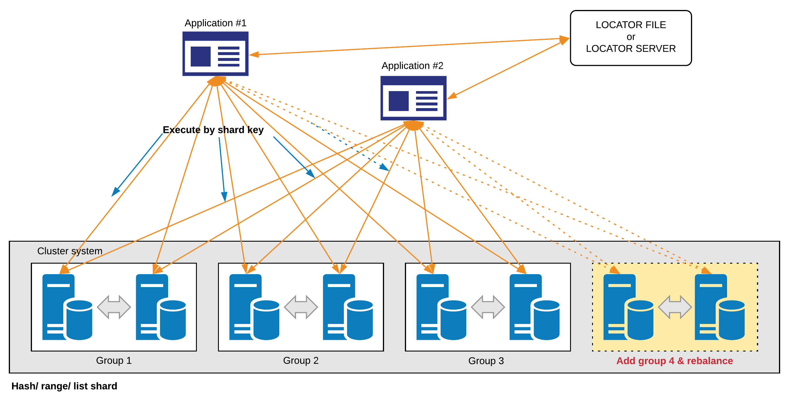
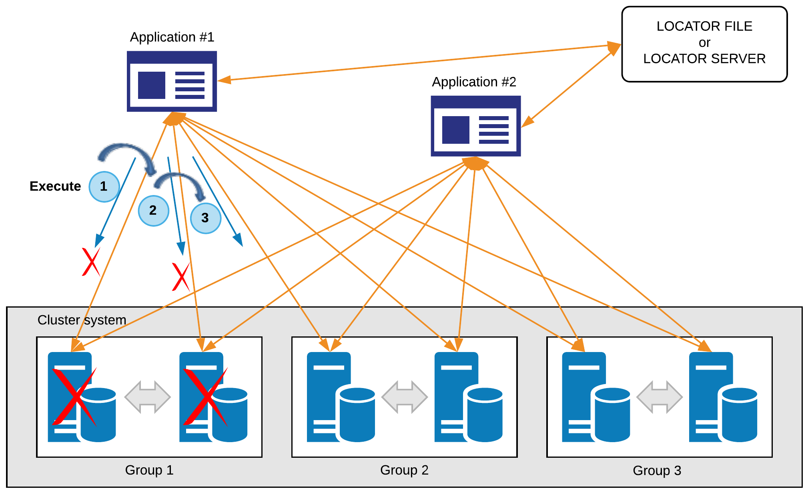
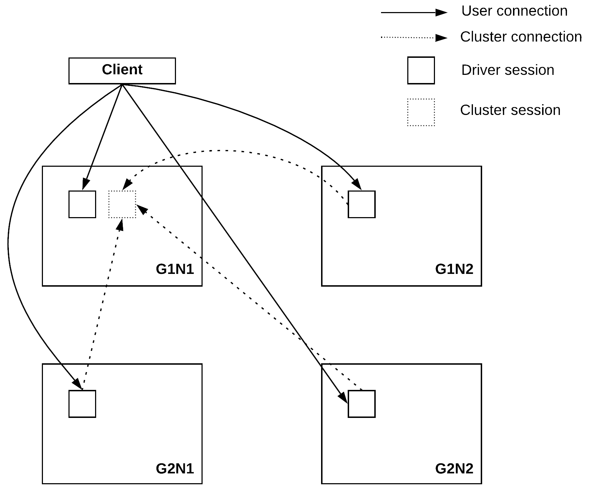

<a id="c9c515204ba9b32e"></a>

# 28. Database Connection

> Source: [GOLDILOCKS 20c.1 User Manual (en)](https://manual.sunjesoft.co.kr/goldilocks/20c_1/manual/en/c9c515204ba9b32e)  
> Tag: `20c.1_30_tag`

[← 27. PSM SQL References](../part-04-psm-manual/27-psm-sql-references.md) · [Table of contents](../README.md) · [29. ODBC →](29-odbc.md)

<a id="82af8f6164f96726"></a>
## Features

<a id="9b3fa3c88af0607e"></a>


Global connection feature is a method of optimizing transaction performance in consideration of data locality.  
A general connection is a connection with a single member, but global connection is a connection with all members. An application using the global connection makes the member with most data accessed by queries perform the query, so the performance is upgraded.   
Hash, range, list sharding method can use the global connection, and the application does not need to be altered at that moment.

When the online scale-out is performed, a user does not need to consider a new node but the the application automatically connects to a new node and operates it.

<a id="27bfe3c24f8108fa"></a>


If an error occurs on the selected node when performing SQL, then the SQL is performed through another node in the same group. If errors occur on all nodes in the selected group, then the SQL is performed through another group.    
When a node is recovered from an error, the it is automatically connected to the node again online. Moreover, a user can make an application connect again by using the following syntax.

```
ALTER SYSTEM RECONNECT GLOBAL CONNECTION
```

<a id="d2d0d5930bcfd8fd"></a>
## Selecting Execution Member

An execution member is selected per transaction. When DML query is first performed without a transaction, a group is selected according to the sharding key, and an execution member in the group is selected according to LOCALITY_MEMBER_POLICY property. Then, all queries are processed in the selected member until COMMIT or ROLLBACK. If the first query can not select the appropriate group according to a sharding key, then the group is selected according to LOCALITY_GROUP_POLICY property.

<a id="6ea19e0b89bf9186"></a>


In case of transaction1 in the figure above, UPDATE query is performed in the group1 according to the sharding key, so all queries between COMMITs are performed in group1. In case of transaction2, UPDATE query is performed in group3, and all queries are performed in group3 before COMMIT even when further queries are not appropriate to perform in group3.

The read-only query (SELECT) without a transaction selects an execution member according to  a sharding key like as other queries, but further queries are not always performed in the previously selected member.   
In other words, all queries included in a transaction is performed only in a single member, but a query  irrelevant to a transaction selects a member per a member.

<a id="cf8b2749195c9fc5"></a>
## Global Session

<a id="3472fca679761e76"></a>


The session directly connected to an application is called as a driver session, and a session from a driver session to another member is called as a cluster session. Global connection creates a driver session in all members, and creates cluster sessions in another member when it is needed. Global connection can make multiple cluster sessions in a single member.

<a id="c60bddfd937cbe16"></a>


Global session is a feature for a cluster sessions created in the global connection shares a single session to improve the resource efficiency. When the global connection does not use a global session, then the cluster session increases according to increasing groups and members. However, when it uses the global session, then the cluster session does not increase even when groups and members increase.

The global session feature is available only in the global connection, but it is not available in the general connection.

<a id="93dc6413d4bcea29"></a>
## Constraints

When using the global connection, a session dependent object is not available in SQL statement, a session dependent clause nor is a session dependent function available.

Also, if SQLs accessing to multiple cluster nodes exist in a single transaction, then SQLs in the transaction uses the cluster node in common which were selected by the sharding key of the first SQL.

The query in the global connection is performed in consideration of data locality only when it is performed with prepare execute. However, it is performed in an arbitrary node when it is performed with direct execute.

<a id="8b3ff80d9c7cfa2a"></a>
### Session Dependent Object

When using a session dependent object in SQL statement, the global connection is not available.

- Global temporary table

<a id="2d831cb350253c0f"></a>
### Session Dependent Clause

When using a session dependent clause in SQL statement, the global connection is not available.

- All @domain-related statements

<a id="eda685b0f16efcea"></a>
### Session Dependent Function and Pseudo Column

When using session dependent information in SQL statement, the global connection is not available.

- CURRVAL(sequence), sequence.CURRVAL
- UUID()
- VERSION()
- SESSION_ID()
- SESSION_SERIAL()
- USER_ID()
- LAST_IDENTITY_VALUE()
- STATEMENT_VIEW_SCN()
- STATEMENT_VIEW_SCN_GCN()
- STATEMENT_VIEW_SCN_DCN()
- STATEMENT_VIEW_SCN_LCN()
- LOCAL_GROUP_ID()
- LOCAL_MEMBER_ID()
- LOCAL_GROUP_NAME()
- LOCAL_MEMBER_NAME()
- CLUSTER_GROUP_ID
- CLUSTER_GROUP_NAME
- CLUSTER_MEMBER_ID
- CLUSTER_MEMBER_NAME
- CLUSTER_SHARD_ID

<a id="92f8c92dfeeb33ab"></a>
### When Using Global Session

Data Definition Language (DDL) is not available in SQL statement.

<a id="e7a5802712145d7f"></a>
## Settings

For more information, refer to the followings.

- [Setting global connection in ODBC ](29-odbc.md#d131d180c289e2eb)
- [Setting global connection in JDBC ](30-jdbc.md#364f4d5ddb0f28da)

---

[← 27. PSM SQL References](../part-04-psm-manual/27-psm-sql-references.md) · [Table of contents](../README.md) · [29. ODBC →](29-odbc.md)

<sub>Copyright © 2010 SUNJESOFT Inc. All rights reserved.</sub>
