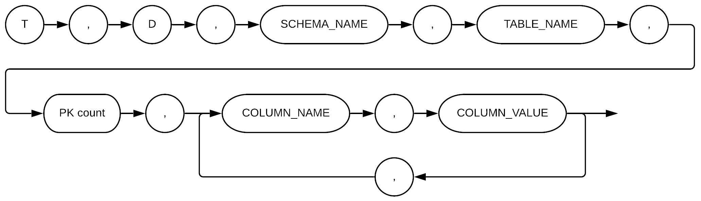
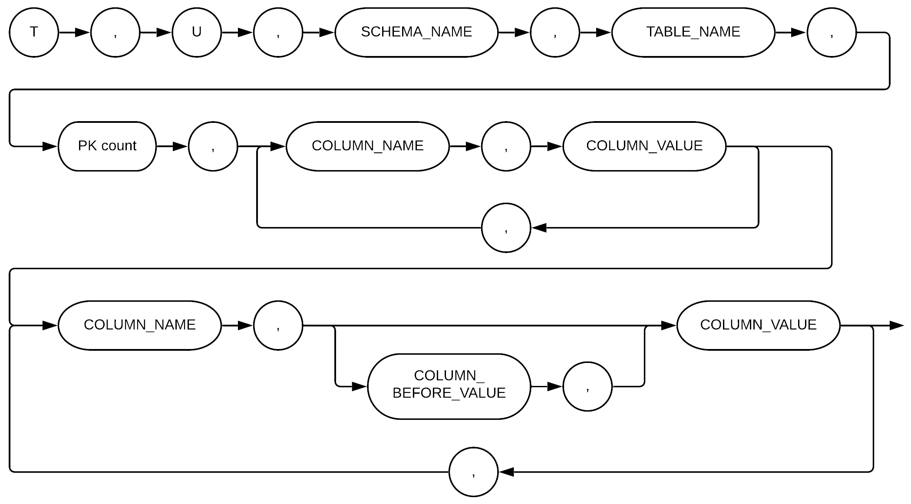

<a id="52130028f49b61b1"></a>

# 50. CYFILE

> Source: [GOLDILOCKS 20c.1 User Manual (en)](https://manual.sunjesoft.co.kr/goldilocks/20c_1/manual/en/52130028f49b61b1)  
> Tag: `20c.1_30_tag`

[← 49. LOGMIRROR](49-logmirror.md) · [Table of contents](../README.md) · [Appendix A. Error Codes →](../appendices/appendix-01-appendix-a-error-codes.md)

<a id="3b9647321eda8aeb"></a>
## CYFILE

CYFILE is a tool which uses Change Data Capture (CDC) method to store the altered data in Comma-Separated Values (CSV) format file.

<a id="ffbfe99f306b18f9"></a>
### Overview

It analyzes the redo log file in real time and stores the transaction executed in the database in CSV format file. It can replicate the transaction file which is recorded in an async way and in near real time to database by using the 3rd party tool, or converts it to another format.

<a id="46d4348d64c3c06e"></a>
### Operational Features

- It should be operated in the device in which the database is being operated. 
- A single file is stored per a group.
- It can be started or terminated in groups.
- Storing CSV file can be set in a unit of table, and one or more tables can be included in a group. 
- A table can be included in multiple groups.
- The redo log file should exist in the original database. In other words, DATA_STORE_MODE should be operated in TDS.
- SUPPLEMENTAL LOGGING should exist in the original database.
    - SUPPLEMENTAL LOGGING adds an additional information to the redo log file.
- The database should be operated in ARCHIVE LOG mode.
- Its process is independent from that of GOLDILOCKS, so terminating the tool does not affect GOLDILOCKS.

<a id="5ddca51e87a35bc0"></a>
### Operational Restrictions

- The table to capture should have PRIMARY KEY.
- It captures the committed transaction only. Therefore, it is unable to see the contents in CSV file before commitment
- It does not support the primary key update.
    - When the primary key value is updated, then the table is given up and is not captured any more.
- The table to capture can not use a column which has Generated Always As Identity property.
- When Data Definition Language (DDL) was performed on the table to capture, then it is given up. 
    - It does not affect the replication of another table.
    - It is same for the truncate table.
- Only the table which was given up with --reset TABLE_NAME among give up tables can be reset. 
- The table stored in the trash bin can not be a target to capture.
- It does not support long varchar, long varbinary.

> The server property [DISABLE_DDL_CDC_GIVEUP](../part-02-administration-manual/10-server-property.md#36aaa8c8b9b62794) can disable the DDL statement which causes the replication give up to avoid user created errors. Also, the server property [DISABLE_UPDATE_PK_CDC_GIVEUP](../part-02-administration-manual/10-server-property.md#644e62e8b4ce59b8) can disable primary key update.

<a id="4c4cab048b421673"></a>
### Others

It stores the file at the following moment.

- It stores the file from the moment when TX occurs at the first running.
- It stores the file in succession from the terminated moment even when run it again after it is terminated during the operation.
- Use --reset option to give up the old file and restart from the current time.

<a id="1a37839c835b327a"></a>
## Requirements

It is required to perform GOLDILOCKS preparations, user registration and privilege settings.

<a id="a69de9363c55c942"></a>
### GOLDILOCKS Requirements

The followings should be set in GOLDILOCKS before starting CYFILE.

<a id="a11038517a69f017"></a>
#### SUPPLEMENTAL LOGGING

SUPPLEMENTAL LOGGING stores an additional information together in the redo log file. The database should be restarted to change the settings of operating database, but restarting is not needed when setting SUPPLEMENTAL LOGGING only in the specific table.

<a id="3fc1fef3b1c26eae"></a>
##### Setting SUPPLEMENTAL LOGGING in Database

- When setting SUPPLEMENTAL LOGGING as GOLDILOCKS property, SUPPLEMENTAL LOGGING is recorded for all tables.
- Restart GOLDILOCKS.
- Add or update the contents in the property file.
    - Property file: goldilocks.properties.conf
    - Property setting: SUPPLEMENTAL LOG_DATA_PRIMARY_KEY = YES

<a id="e10df1ed621f49e4"></a>
##### Setting SUPPLEMENTAL LOGGING in Specific Table Participating in the Replication

```
<add table supplemental log statement> ::=
    ALTER TABLE table_name 
        ADD SUPPLEMENTAL LOG DATA ( PRIMARY KEY ) COLUMNS
    ;
```

<a id="9d651e4c0aa533aa"></a>
#### ARCHIVE LOG

GOLDILOCKS reuses the redo log files recursively. When GOLDILOCKS reuses the redo log file being processed by CYFILE, then CYFILE does not proceed and is terminated. GOLDILOCKS should be operated in ARCHIVE LOG mode to ensure the continuous replication operation.

<a id="fdaf7d0ddd48825e"></a>
##### Changing Database in Operation to ARCHIVE LOG Mode

- Restart GOLDILOCKS.
- After database is shutdown, connect with sysdba and change it to ARCHIVE LOG mode in MOUNT phase.

```
gSQL> \startup mount

Startup success

gSQL> alter database archivelog;

Database altered.
```

<a id="84e306bf19b0a885"></a>
##### Setting ARCHIVE LOG Mode When Creating Database

- Update the property file before creating the database.
    - Property file: goldilocks.properties.conf
    - Property setting: ARCHIVELOG_MODE = 1

> The path in which ARCHIVE LOG file is stored can be viewed and updated with 'ARCHIVELOG_DIR'.

<a id="19187b89fb4a0562"></a>
#### DATA_STORE_MODE

CYFILE performs the replication by reading the redo log files of GOLDILOCKS. Therefore, GOLDILOCKS should be operated in Transactional Data Store (TDS) mode.

<a id="52aad1c365431f91"></a>
##### Changing DATA_STORE_MODE

- Restart the database. 
- Add or update the corresponding information in the property file.
    - Property file: goldilocks.properies.conf
    - Property setting: DATA_STORE_MODE = 2

> If the value of DATA_STORE_MODE is 1, it indicates Concurrent Data Store (CDS), and if it is 2, it indicates Transactional Data Store (TDS).

<a id="45ceee75783cf9dc"></a>
### Registering User and Setting Privileges

CYFILE retrieves and manipulates the required information during the operation. The user operating CYFILE and the proper privileges for the user are required.

<a id="d686bfb5906ad224"></a>
#### Creating Database User

A specific user should be added to operate CYFILE.

```
<user definition> ::=
    CREATE USER user_identifier IDENTIFIED BY password
    [ DEFAULT TABLESPACE tablespace_name ]
    [ TEMPORARY TABLESPACE tablespace_name ]
    [ INDEX TABLESPACE {tablespace_name|NULL} ]
    [ <schema clause> ]
    ;

<schema clause> ::=
      WITH SCHEMA [schema_name]
    | WITHOUT SCHEMA
```

The following is an example of creating the user cyfile_user and the password cyfile_password.

```
gSQL> CREATE USER cyfile_user IDENTIFIED BY cyfile_password;
```

<a id="39244e1aa62d733b"></a>
#### Database Privileges

<a id="b31bce609682410b"></a>
##### Granting User Access Privilege

The following is an example for granting the access privilege to cyfile_user.

```
gSQL> GRANT CREATE SESSION ON DATABASE TO cyfile_user;
```

<a id="2635d85fba30adc0"></a>
## Configuration

<a id="6125c8d8ad3efd18"></a>
### Configuration File

When performing CYFILE, the information and options required for operating are set by using the configuration file.

- When a specific configuration file is not set by using the --conf option, *$GOLDILOCKS_DATA/conf/ cyfile.conf* file is read.

**Configuration file options**

<a id="3cc320a0a278c84c"></a>
| Name | Description |
| --- | --- |
| DSN | It sets Data Source Name. |
| GROUP_NAME | It sets the group name. |
| HOST_IP | It sets the host IP address of which GOLDILOCKS operates. |
| HOST_PORT | It sets the host port of which GOLDILOCKS operates. |
| USER_ID | It sets the user name. |
| USER_PW | It sets the user password. |
| USER_ENCRYPT_PW | It sets the encrypted password for a user. |
| CAPTURE_TABLE | It sets the table to be replicated. |
| PROTOCOL | It sets the connection type which is to be connected to GOLDILOCKS. (DA or TCP) |
| READ_LOG_BLOCK_COUNT | It sets the amount of data to be read at a time when operating CAPTURE. |
| TRANS_SORT_AREA_SIZE | It sets the size of the BUFFER to be allocated to CAPTURE. |
| TRANS_FILE_PATH | It sets the location in which the temporarily generated file is to be stored when operating CAPTURE. |
| LOG_CAPTURE_INTERVAL_1 | It sets the execution cycle of capture. If the value is not changed after executing 10 times with that value, then it is converted to the value of LOG_CAPTURE_INTERVAL_2 and performs capture. (The default value is 0.2 seconds.) |
| LOG_CAPTURE_INTERVAL_2 | It sets the execution cycle of capture. If the value is not changed after executing with the value of LOG_CAPTURE_INTERVAL_1, then it sets the execution cycle of capture. (The default value is 1 second.) |
| DATA_FILE_PATH | It sets the path to store CSV file. (It should be an absolute path.) |
| DATA_FILE_PREFIX | It sets the prefix of CSV file name. |
| DATA_FILE_SIZE | It sets the maximum size of CSV file. (It is an approximate size and it is not always set to the specified value.) |
| UPDATE_BEFORE_VALUE | It sets whether to store the value before the update in CSV when processing update SQL. (The default value is 0.) |

<a id="9a9bbd6596fed7dc"></a>
### Configuration Options

<a id="757ad360ce95f0f2"></a>
#### DSN

- It sets the data source name required for the access to GOLDILOCKS.
- It can be set in master and slave.
- The default value is GOLDILOCKS.

• Settings applied to all groups

```
DSN=GOLDILOCKS
```

• Settings applied to a specific group

```
GROUP_NAME = testGROUP
{
    DSN=GOLDILOCKS
    ....
    ....
}
```

<a id="aa896b30ab7649b2"></a>
#### GROUP_NAME

- It is necessary for distinguishing the CYFILE operation within the equipment and it is a unit of generating the operation process.
- It is the delimiter of when starting or terminating CYFILE in group unit.
- After it is set, it should not be changed. If changed, it is regarded as a new group.
- GROUP_NAME should be unique in the same equipment.
- The braces { } should be used.

```
GROUP_NAME = testGROUP
{
    ....
    ....
}
```

<a id="e34617a31c0b7d69"></a>
#### HOST_IP

- It sets the IP address of GOLDILOCKS in which CYFILE accesses to.
- It is valid only when PROTOCOL is set to TCP.

• Settings applied to all groups

```
HOST_IP = 127.0.0.1
```

• Settings applied to a specific group

```
GROUP_NAME = testGROUP
{
    HOST_IP = 127.0.0.1
    ....
    ....
}
```

<a id="e7d12d54d24fd966"></a>
#### HOST_PORT

- It sets port of GOLDILOCKS in which CYFILE accesses to.
- It should be set together with HOST_IP.

• Settings applied to all groups

```
HOST_PORT = 22531
```

• Settings applied to a specific group

```
GROUP_NAME = testGROUP
{
    HOST_PORT = 22531
    ....
    ....
}
```

<a id="1894c2990d34df19"></a>
#### USER_ID

It sets the user ID required for the access to GOLDILOCKS.

• Settings applied to all groups

```
USER_ID = testID
```

• Settings applied to a specific group

```
GROUP_NAME = testGROUP
{
    USER_ID = testID
    ....
    ....
}
```

<a id="dc7a22a74f0c2f01"></a>
#### USER_PW

It sets the user password required for the access to GOLDILOCKS.

• Settings applied to all groups

```
USER_PW = testPW
```

• Settings applied to a specific group

```
GROUP_NAME = testGROUP
{
    USER_PW = testPW
    ....
    ....
}
```

<a id="1cb172644abdcce7"></a>
#### USER_ENCRYPT_PW

- It sets the user password which is required for the access to GOLDILOCKS by encrypting.
- It is used instead of USER_PW.
- Encrypted user password is created by [cyfile --encrypt *user password* --key *the key to be encrypted*].
- If this value is used, then --key option should be used when executing cyfile. (In this case, the key value as same as that created with --encrypt should be used.

• Settings applied to all groups

```
USER_ENCRYPT_PW = 't33KImiqvhqNyfN+uZmFrw=='
```

• Settings applied to a specific group

```
GROUP_NAME = testGROUP
{
    USER_ENCRYPT_PW = 't33KImiqvhqNyfN+uZmFrw=='
    ....
    ....
}
```

<a id="8c78ca1ef256412e"></a>
#### CAPTURE_TABLE

- It sets the table to capture. 
    - It is set in *schema name.table name* format.
- It can be set only within a group.
- When specifying several tables, the parentheses ( ) should be used.
- The table stored in the recycle bin can not be set to be replicated.

```
GROUP_NAME = testGROUP
{
    CAPTURE_TABLE = 
    (
        testSchema1.testTable1,
        testSchema1.testTable2,
        testSchema2.testTable1
    )
}
```

<a id="eb83bb50557c5734"></a>
#### PROTOCOL

- It sets the type to connect to GOLDILOCKS in operation.
- It can be set to DA or TCP.
- If PROTOCOL is set to DA, neither HOST_IP nor is HOST_PORT used when accessing to GOLDILOCKS.
- The default value is DA.

• Settings applied to all groups

```
PROTOCOL = DA
```

• Settings applied to a specific group

```
GROUP_NAME = testGROUP
{
    PROTOCOL = DA
    ....
    ....
}
```

<a id="5de59613034a4375"></a>
#### READ_LOG_BLOCK_COUNT

- It sets the number of the log blocks to be read at a time when capturing redo log file.
- The size of a log block is 512 bytes.
- The default value is 40960, and the actual read size is 20 MBytes.
    - The minimum value is 100.

• Settings applied to all groups

```
READ_LOG_BLOCK_COUNT = 1024
```

• Settings applied to a specific group

```
GROUP_NAME = testGROUP
{
    READ_LOG_BLOCK_COUNT = 1024
    ....
    ....
}
```

<a id="c564c944d27552b5"></a>
#### TRANS_SORT_AREA_SIZE

- It sets the memory space required for capturing the redo log files.
- The unit is MB (megabytes).
- The default value is 500 MB.
    - The minimum value is 10 MB.
- If the value is set too small, the performance becomes poor.

• Settings applied to all groups

```
TRANS_SORT_AREA_SIZE = 300
```

• Settings applied to a specific group

```
GROUP_NAME = testGROUP
{
    TRANS_SORT_AREA_SIZE = 300
    ....
    ....
}
```

<a id="5baf34876bb0ac72"></a>
#### TRANS_FILE_PATH

- If a space bigger than TRANS_SORT_AREA_SIZE is required, the temporary file is created. It sets the path in which the temporary file is to be stored.
    - The absolute path should be used.
    - The path should be specified by using single quote (').

• Settings applied to all groups

```
TRANS_FILE_PATH = '/data/TmpTrans'
```

• Settings applied to a specific group

```
GROUP_NAME = testGROUP
{
    TRANS_FILE_PATH = '/data/TmpTrans'
    ....
    ....
}
```

<a id="bc9e55212eb88145"></a>
#### LOG_CAPTURE_INTERVAL_1

- It sets the execution cycle of capture in millisecond.
- It is used to quickly detect the changes of the redo log file.
- If the value of redo log file is not changed after executing 10 times with that value, then it is converted to the value of LOG_CAPTURE_INTERVAL_2 and performs capture.
- The default value is 200 (0.2 seconds), and the unit is millisecond.

• Settings applied to all groups

```
LOG_CAPTURE_INTERVAL_1 = 200
```

• Settings applied to a specific group

```
GROUP_NAME = testGROUP
{
    LOG_CAPTURE_INTERVAL_1 = 200
    ....
    ....
}
```

<a id="7290728a51593abc"></a>
#### LOG_CAPTURE_INTERVAL_2

- It sets the execution cycle of capture in millisecond.
- It is used to quickly detect the changes of the redo log file.
- If the value of redo log file is not changed after executing 10 times with the value of LOG_CAPTURE_INTERVAL_1, then it is converted to the corresponding value and performs capture.
- The default value is 1000(1 second), and the unit is millisecond.

• Settings applied to all groups

```
LOG_CAPTURE_INTERVAL_2 = 1000
```

• Settings applied to a specific group

```
GROUP_NAME = testGROUP
{
    LOG_CAPTURE_INTERVAL_2 = 1000
    ....
    ....
}
```

<a id="1c804cd4fcdd6d00"></a>
#### DATA_FILE_PATH

- It sets the path to store CSV file.
    - The absolute path should be used.
    - The path should be specified by using single quote (').
- If it is not set, then the location in which cyfile is run becomes the default path.
- The following files are stored.
    - Data file (.dat)
    - Control file (.ctl)
    - Control mirror file (.ctl_0)

• Settings applied to all groups

```
DATA_FILE_PATH = '/home/goldilocks/dat'
```

• Settings applied to a specific group

```
GROUP_NAME = testGROUP
{
    DATA_FILE_PATH = '/home/goldilocks/dat'
    ....
    ....
}
```

<a id="a3c02385fa6345d4"></a>
#### DATA_FILE_PREFIX

- It sets the prefix of the name to be used when storing CSV file.
- If it is not set, then the prefix is 'cyfile'.

• Settings applied to all groups

```
DATA_FILE_PREFIX = 'SET_PREFIX'
```

• Settings applied to a specific group

```
GROUP_NAME = testGROUP
{
    DATA_FILE_PREFIX = 'SET_PREFIX'
    ....
    ....
}
```

<a id="a6c34bd082da1f6c"></a>
#### DATA_FILE_SIZE

- It sets the approximate maximum size of CSV file.
    - The size can be maximum 16 M bigger than the input size.
- The input value is in megabytes.
    - Input 1024 for 1 giga.
- The default value is 100 M.
    - The minimum value is 30 M and the maximum value is 4096 M (4G).

• Settings applied to all groups

```
DATA_FILE_SIZE = 200
```

• Settings applied to a specific group

```
GROUP_NAME = testGROUP
{
    DATA_FILE_SIZE = 200
    ....
    ....
}
```

<a id="7e81bf856c180b89"></a>
#### UPDATE_BEFORE_VALUE

- It sets whether to store the value before the update in CSV when processing UPDATE SQL.
    - Set it to 1 to preserve the previous value. 
    - Set it to 0 not to preserve the previous value.
- The default value is 0 which does not preserve the previous value.

• Settings applied to all groups

```
UPDATE_BEFORE_VALUE = 1
```

• Settings applied to a specific group

```
GROUP_NAME = testGROUP
{
    UPDATE_BEFORE_VALUE = 1
    ....
    ....
}
```

<a id="e17617e0a77996ed"></a>
## Operating

CYFILE can be operated in D/A or C/S environment of GOLDILOCKS.

CONFIG file or PROTOCOL configuration of ODBC.INI should be used according to the environments as follows. CONFIG configuration takes precedence over ODBC.INI configuration.

**CONFIG, ODBC.INI**

<a id="7b762455f4318acd"></a>
| Configuration | Description |
| --- | --- |
| PROTOCOL=DA | It is used in D/A environment. (Default) |
| PROTOCOL=TCP | It is used in C/S environment. |

The running contents during the operation can be viewed through trace log.

<a id="6fc06dcc7bfe6b58"></a>
| Item | File |
| --- | --- |
| Cyfile | $GOLDILOCKS_DATA/trc/cyfile_(groupName).trc |

<a id="cbe7d43db841e2fd"></a>
### Executing Option

CYFILE should be used with the following options at run-time.

**Executing options**

<a id="e1704dde3d78d04b"></a>
| Option | Description | Remarks |
| --- | --- | --- |
| --start \| -s | It starts CYFILE. | - |
| --stop \| -t | It stops CYFILE. | - |
| --status \| -u | It displays the status of CYFILE. | - |
| --conf \| -c | It sets the path of configuration file which is required when executing CYFILE. | It is input in --conf CONFIG_FILE format. It should be used together with --start. If it is not explicitly set, $GOLDILOCKS_DATA/conf/cyfile.conf is used. |
| --silent \| -i | It sets not to output messages. | - |
| --reset \| -r | It resets the information about capture. | It is input in --reset TABLE_NAME or --reset all format. It should be described within a single quote (') when resetting multiple tables. |
| --group \| -g | It sets a specific group. | It is input in --group GROUP_NAME format. |
| --help \| -h | It outputs the help message. | - |
| --encrypt \| -e | It encrypts the user password with the given key. | - |
| --key \| -k | It sets the encryption key when performing the --encrypt option. If USER_ENCRYPT_PW is used in the config, it sets the decryption key. | - |
| --info \| -o | It displays the status of currently running table. | It should be used together with --group. |

- It executes all groups by using the default environment file.

```
prompt> cyfile --start
```

- It stops all groups.

```
prompt> cyfile --stop
```

- * It executes TEST_GROUP group only.

```
prompt> cyfile --start --group TEST_GROUP
```

- It stops only TEST_GROUP group among operating groups.

```
prompt> cyfile --stop --group TEST_GROUP
```

- The encrypts GOLDILOCKS user password.

```
prompt> cyfile --encrypt test --key 1234
Cyfile Encrypted Passwd : '73LsLxss6lk='
```

- USER_ENCRYPT_PW is set in the config.

```
prompt> cyfile --start --key 1234
```

- It deletes the existing operational information and newly starts it.

```
prompt> cyfile --start --reset all
```

- It deletes the existing operational information of the tables T1, T2, and starts it newly from the current point.

```
prompt> cyfile --start --reset 'T1, T2'
```

- It displays the current operational information per each table.

```
prompt> cyfile --info --group GROUP1

================================================
 GROUP NAME = GROUP1
================================================
 SCHEMA NAME         : PUBLIC
 TABLE NAME          : TEST_TABLE_02 (ACTIVE (CAPTURE-START-LSN:217368))
 PHYSICAL ID         : 36313948487680
 STATUS              : ONLINE
================================================
 SCHEMA NAME         : PUBLIC
 TABLE NAME          : TEST_TABLE_01 (ACTIVE (CAPTURE-START-LSN:217602))
 PHYSICAL ID         : 36322538422272
 STATUS              : ONLINE
================================================
   TOTAL   COUNT : 2
   GIVE-UP COUNT : 0
   NODE          : TRUST
================================================
```

<a id="85ec3225618e7182"></a>
## Files

CYFILE stores the information about insert/ update/ delete and capture table in CSV format. It uses async method but it is operated in near real-time.

There are two types of file for storage when operating CYFILE, which are the data file and the control file. The data file stores the transaction in CSV format and the control file stores the storage information about the data file. The control file creates and operates the mirror file in preparation for data loss or damage.

**CYFILE**

<a id="faa4fad781a6474e"></a>
| File | Name information |
| --- | --- |
| Data file | It is stored in CSV format, and the extension is dat. |
| Control file | The extension is ctl.  The extension of mirror file is ctl_0. |

<a id="c44c13dbf558c5dd"></a>
### Data File

It records I/D/U information which is performed in transaction unit and in CSV format, the information about the column of the table participating in capture and give up table information. Those files are not automatically deleted unless a user deletes them.

<a id="9bff5bb25b63e33f"></a>
#### File Name

The location and name of the stored file is determined by DATA_FILE_PREFIX, DATA_FILE_PATH. The extension is .dat and it is created according to the following rules.

- Data file format
    - (DATA_FILE_PREFIX).(GROUP_NAME)_(FILE_SEQUENCE).dat
        - e.g. CYFILE.GROUP1_1.dat, CYFILE.GROUP1_2.dat

When a new file is created because the data file size becomes bigger than DATA_FILE_SIZE, then the value is determined by adding 1 to FILE_SEQUENCE.

> DATA_FILE_PATH, DATA_FILE_PREFIX should not be changed after it starts the operation.

<a id="553102f2a35f43ff"></a>
#### INSERT Storage Format

- In case of INSERT, T standing for table and I standing for insert are described as delimiters, and the schema name and the table name of the table in which the insert is performed are described.
- The actual data is a pair of the column name and the column value, and the information about the entire column is described in it.

<a id="505c1bdd1f874b47"></a>


```
Query: INSERT INTO PUBLIC.TEST(C1, C2, C3) VALUES( 1, 2, 'ABC' );
CSV storage: T, I, "PUBLIC", "TEST", "C1", "1", "C2", "2", "C3", "ABC"
```

```
Query: INSERT INTO PUBLIC.TEST(C1, C3) VALUES( 1, ABC );
CSV storage: T, I, "PUBLIC", "TEST", "C1", "1", "C2", NULL, "C3", "ABC"
```

<a id="bdcc0df48b3e263e"></a>
#### DELETE Storage Format

- In case of DELETE, T standing for table and D standing for delete are described as delimiters, and the schema name and the table name of the table in which the delete is performed are described.
- The primary key information of the deleted data is described, and if it is a composite key, then the primary key count becomes 2 or bigger and repeatedly described as many times as the count.

<a id="2f80e34d92460d0a"></a>


```
Sample: When there is one primary key
Query: DELETE FROM PUBLIC.TEST WHERE C1=1;
CSV storage: T, D, "PUBLIC", "TEST", 1, "C1", "1"
```

```
Sample: When there are two or more primary keys
Query: DELETE FROM PUBLIC.TEST WHERE C1=1 AND C2=2;
CSV storage: T, D, "PUBLIC", "TEST", 2, "C1", "1", "C2", "2"
```

<a id="633736ba5ff009a1"></a>
#### UPDATE Storage Format

- In case of UPDATE, T standing for table and U standing for update are described as delimiters, and the schema name and the table name of the table in which the update is performed are described.
- The primary key information of the updated data is described, and if it is a composite key, then the primary key count becomes 2 or bigger and repeatedly described as many times as the count.
- The information of actually updated column is repeatedly described.
    - When UPDATE_BEFORE_VALUE is set to 1, the value before the update is described together.

<a id="992217ef034f1b0d"></a>


```
Sample: C2 value in the record whose primary key is only c1 is changed from 1 to 2. 
Query: UPDATE PUBLIC.TEST SET C2=2 WHERE C1=1;

* When UPDATE_BEFORE_VALUE is not set
CSV storage: T, U, "PUBLIC", "TEST", 1, "C1", "1", "C2", "2"

* When UPDATE_BEFORE_VALUE is set
CSV storage: T, U, "PUBLIC", "TEST", 1, "C1", "1", "C2", "1", "2"
```

```
Sample: Change C3 value from 'ABC' to 'BCD', and C4 value from 3 to 4 in the record whose primary keys are C1, C2.
Query: UPDATE PUBLIC.TEST SET C3='BCD', C4=4 WHERE C1=1 AND C2=2;

* When UPDATE_BEFORE_VALUE is not set
CSV storage: T, U, "PUBLIC", "TEST", 2, "C1", "1", "C2", "2", "C3", "BCD", "C4", "4"

* When UPDATE_BEFORE_VALUE is set
CSV storage: T, U, "PUBLIC", "TEST", 2, "C1", "1", "C2", "2", "C3", "ABC", "BCD", "C4", "3", "4"
```

<a id="d663f7c7af480c6b"></a>
#### Transaction Information

- begin stands for the beginning of the transaction.
    - Additional information: Transaction ID
        - For cluster environment (Global transaction ID)
- Transaction commit
    - Additional information: Commit SCN (System Change Number)
        - For cluster environment (Global SCN)

<a id="8c15ae54f986226f"></a>


<a id="ae306596900186e5"></a>


<a id="f4cfc52818fe2522"></a>
#### Table Information

- It records the information about the table and column to replicate.
    - The information about N columns per one table information are consecutively recorded. 
    - It is repeatedly recorded as may times as the number of tables to replicate. 
- It is recorded only once.
    - It is recorded for the first time when starting the program.
    - It is not recorded when restarting the program.
- When resetting or the table is added, then the information is recorded again. 
- It records the information about the give up table.
    - The give up table is not captured any more.
    - It can make the table to participate in the replication again by using reset option.

<a id="142c7bc493648f8f"></a>


<a id="905c20cc83fcf20f"></a>


- Information about table TEST, TEST2

```
I,T,"PUBLIC","TEST",3,1
I,C,"C1","NUMBER(10,0)",1,0,0
I,C,"C2","VARCHAR(20)",0,0,1
I,C,"C3","VARCHAR(10)",0,0,1
I,T,"PUBLIC","TEST2",2,1
I,C,"C1","NUMBER(10,0)",1,0,0
I,C,"C2","VARCHAR(20)",0,0,1
```

<a id="9ac92553fe632515"></a>
#### Meta Information

- The following information is recorded at the front line when creating the data file.
    - Version information
        - 8 byte version information
        - It is used to check the compatibility of the data file.
    - Date information
        - The point of when the file is created is recorded.
    - Control file path
        - It records the path of the control file in which the information of the data file is recorded.

<a id="dae1a610ba8befec"></a>


<a id="42c7d276df1e7a57"></a>


<a id="1baf319c1a44382d"></a>


```
I,V, 00000000
I,D,"2022-12-24 00:01:00.000000"
I,M,"/home/cyfile/ctrl_file/cyfile.GROUP1.ctl"
```

<a id="73262e68de76d079"></a>
#### Command Information

- EOF is recorded at the end of the existing file when the data file is stored in a new file because its size exceeds the maximum size. 
    - Process it by reading the following file when that information is recorded.

<a id="68e13f3371fce238"></a>


<a id="10215dc6dfe8e513"></a>
### Control File

- It records the valid information about the data file. 
    - The data file is restarted and restored, so the stored value is not always valid.
    - If the information in the control file is used, then the value is always valid even when it is restarted and restored. 
- The control file size is 512 Bytes.
    - It should be used by offsetting the data or defining the structure.

```
typedef struct ctrlFileStr
{
    char           mVersion[8];
    unsigned int   mFileInfoCrc;   //mFileSeq + mFileOffset CRC
    unsigned int   mDummy;         //Not Used.
   
    signed long    mFileSeq;
    signed long    mFileOffset;    //Valid Offset
} ctrlFileStr;
```

- mVersion: Checking the compatibility
- mFileInfoCRC: CRC information of mFileSeq and mFileOffset
- mDummy: It is not used.
- mFileSeq: The current data file number
- mFileSeq: The valid location in the data file number including mFileSeq (Offset)

---

[← 49. LOGMIRROR](49-logmirror.md) · [Table of contents](../README.md) · [Appendix A. Error Codes →](../appendices/appendix-01-appendix-a-error-codes.md)

<sub>Copyright © 2010 SUNJESOFT Inc. All rights reserved.</sub>
