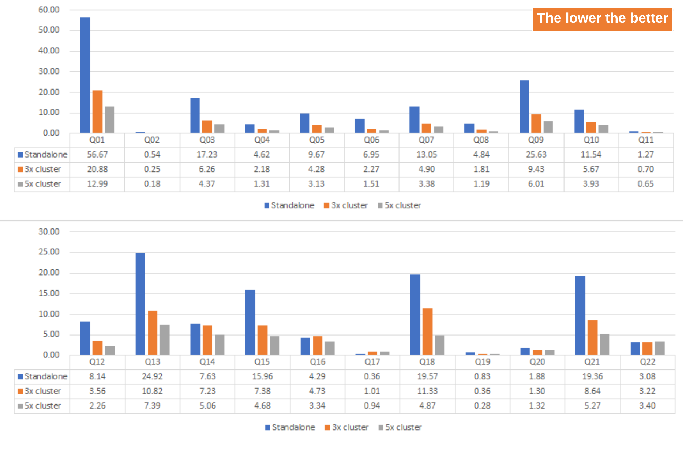

<a id="21794ae98de79c08"></a>

# 4. What's New

> 원본: [GOLDILOCKS 20c.1 User Manual (ko)](https://manual.sunjesoft.co.kr/goldilocks/20c_1/manual/ko/21794ae98de79c08)  
> 태그: `20c.1_30_tag`

[← 3. Cluster 튜토리얼](3-cluster-튜토리얼.md) · [전체 목차](../README.md) · [5. GOLDILOCKS 데이터베이스 관리 기본 →](../part-02-administration-manual/5-goldilocks-데이터베이스-관리-기본.md)

<a id="59aab86aebd365c3"></a>
## Feature Matrix

본 장에서는 각 major version 별로 추가된 주요 기능들에 대해 간략히 설명한다.

<a id="db65df57e2e743c6"></a>
### Architecture

<a id="d605275be1535058"></a>
#### System Architecture

System architecture에 대한 feature matrix는 다음과 같다.

**System architecture의 feature matrix**

<a id="54d23437bb1a1e67"></a>
| Feature | 1.x | 2.x | 3.1 | 3.2 | 20c.1 |
| --- | --- | --- | --- | --- | --- |
| Shared Nothing Cluster | X | X | O | O | O |
| DA (Direct Attach) | O | O | O | O | O |
| JDBC DA (Direct Attach) | X | X | O | O | O |
| C/S (Client/Server) Dedicated | X | O | O | O | O |
| C/S (Client/Server) Shared | X | O | O | O | O |
| multi-process applications | O | O | O | O | O |
| multi-threaded applications | O | O | O | O | O |
| Linux platform | O | O | O | O | O |
| HP platform | X | O | O | O | O |
| AIX platform | X | O | O | O | O |
| Windows Client Platform | X | O | O | O | O |
| CDC(Change Data Capture) replication | X | O | O | O | O |
| CDC replication with log mirror | X | O | O | O | O |
| multi-level start up | X | O | O | O | O |
| parallel database loading | O | O | O | O | O |
| parallel index build | X | O | O | O | O |
| SQL plan cache | X | O | O | O | O |

<a id="05bf6de167598f23"></a>
#### Storage Internal

Storage internal에 대한 feature matrix는 다음과 같다.

**Storage internal의 feature matrix**

<a id="841d506854b249d8"></a>
| Feature | 1.x | 2.x | 3.1 | 3.2 | 20c.1 |
| --- | --- | --- | --- | --- | --- |
| memory dictionary tablespace | O | O | O | O | O |
| memory data tablespace | O | O | O | O | O |
| memory undo tablespace | O | O | O | O | O |
| memory temporary tablespace | X | O | O | O | O |
| memory bitmap data segment | O | O | O | O | O |
| memory bitmap undo segment | O | O | O | O | O |
| memory bitmap instant segment | X | O | O | O | O |
| memory heap table | O | O | O | O | O |
| memory instant table | X | O | O | O | O |
| memory B-tree index | O | O | O | O | O |
| memory instant B-tree | X | O | O | O | O |
| memory instant hash | X | O | O | O | O |
| global secondary index | X | X | O | O | O |
| disk data tablespace | X | X | X | X | O |
| disk bitmap data segment | X | X | X | X | O |
| disk B-tree index | X | X | X | X | O |
| disk global secondary index | X | X | X | X | O |

<a id="1b53f598510ee8bc"></a>
#### Transaction Control

Transaction control에 대한 feature matrix는 다음과 같다.

**Transaction control의 feature matrix**

<a id="3b5f9f3e8b8ca1f7"></a>
| Feature | 1.x | 2.x | 3.1 | 3.2 | 20c.1 |
| --- | --- | --- | --- | --- | --- |
| CDS(Concurrency Data Store) database mode | O | O | O | O | O |
| TDS(Transactional Data Store) database mode | O | O | O | O | O |
| read-only database | X | O | O | O | O |
| read/write database | O | O | O | O | O |
| flat transaction | O | O | O | O | O |
| distributed transaction | X | O | O | O | O |
| read-only transaction | X | O | O | O | O |
| read/write transaction | O | O | O | O | O |
| READ COMMITTED isolation level | O | O | O | O | O |
| SERIALIZABLE isolation level with SELECT FOR UPDATE | O | O | O | O | O |
| MVCC(Multi Version Concurrency Control) | O | O | O | O | O |
| multi-version read consistency | O | O | O | O | O |
| multi-statement consistent read | O | O | O | O | O |
| implicit lock for DML | O | O | O | O | O |
| writer don't blocks readers | O | O | O | O | O |
| row-level locking | O | O | O | O | O |
| deadlock detection | O | O | O | O | O |
| deadlock resolution | O | O | O | O | O |
| lock granularity | O | O | O | O | O |
| read lock | O | O | O | O | O |
| write lock | O | O | O | O | O |
| intention lock | O | O | O | O | O |
| WAL(Write Ahead Logging) | O | O | O | O | O |
| repeat history | O | O | O | O | O |
| restart recovery | O | O | O | O | O |
| circular logging | O | O | O | O | O |
| buffered logging | O | O | O | O | O |
| logging group | X | O | O | O | O |
| supplemental logging | X | O | O | O | O |
| mirrored logging | X | O | O | O | O |
| synchronous commit | O | O | O | O | O |
| asynchronous commit | O | O | O | O | O |
| grouped commit | O | O | O | O | O |
| total rollback | O | O | O | O | O |
| implicit statement rollback | O | O | O | O | O |
| savepoint management | X | O | O | O | O |

<a id="dd90e9b01f81dcef"></a>
#### Backup & Recovery

Backup & recovery에 대한 feature matrix는 다음과 같다.

**Backup & recovery의 feature matrix**

<a id="f28c377be8bdb1ad"></a>
| Feature | 1.x | 2.x | 3.1 | 3.2 | 20c.1 |
| --- | --- | --- | --- | --- | --- |
| off-line backup | O | O | O | O | O |
| on-line backup | X | O | O | O | O |
| full backup | X | O | O | O | O |
| incremental backup | X | O | O | O | O |
| complete recovery | O | O | O | O | O |
| incomplete recovery | X | O | O | O | O |
| auto instance recovery | O | O | O | O | O |
| tablespace recovery | X | O | O | O | O |
| file recovery | X | O | O | O | O |
| change tracking | X | X | X | X | O |

<a id="d5222ad179fc7996"></a>
#### Database Information

<a id="4577498956e87ff3"></a>
##### DICTIONARY_SCHEMA 스키마

DICTIONARY_SCHEMA 스키마에 대한 feature matrix는 다음과 같다.

<a id="5fec44e11c19bdfe"></a>
<table class="table column_count_7"><caption>DICTIONARY_SCHEMA schema의 feature matrix</caption><thead><tr><th class="to_center"><div>계열</div></th><th class="to_center"><div>Feature</div></th><th class="to_center"><div>1.x</div></th><th class="to_center"><div>2.x</div></th><th class="to_center"><div>3.1</div></th><th class="to_center"><div>3.2</div></th><th class="to_center"><div>20c.1</div></th></tr></thead><tbody><tr><td class="to_middle" rowspan="56"><div>ALL_ 계열 view</div></td><td><div>ALL_ALL_TABLES</div></td><td class="to_center"><div>X</div></td><td class="to_center"><div>O</div></td><td class="to_center"><div>O</div></td><td class="to_center"><div>O</div></td><td class="to_center"><div>O</div></td></tr><tr><td><div>ALL_ARGUMENTS</div></td><td class="to_center"><div>X</div></td><td class="to_center"><div>X</div></td><td class="to_center"><div>O</div></td><td class="to_center"><div>O</div></td><td class="to_center"><div>O</div></td></tr><tr><td><div>ALL_CATALOG</div></td><td class="to_center"><div>X</div></td><td class="to_center"><div>O</div></td><td class="to_center"><div>O</div></td><td class="to_center"><div>O</div></td><td class="to_center"><div>O</div></td></tr><tr><td><div>ALL_CLUSTER_TABLES</div></td><td class="to_center"><div>X</div></td><td class="to_center"><div>X</div></td><td class="to_center"><div>O</div></td><td class="to_center"><div>O</div></td><td class="to_center"><div>O</div></td></tr><tr><td><div>ALL_COL_COMMENTS</div></td><td class="to_center"><div>X</div></td><td class="to_center"><div>O</div></td><td class="to_center"><div>O</div></td><td class="to_center"><div>O</div></td><td class="to_center"><div>O</div></td></tr><tr><td><div>ALL_COL_PLACE</div></td><td class="to_center"><div>X</div></td><td class="to_center"><div>X</div></td><td class="to_center"><div>O</div></td><td class="to_center"><div>X</div></td><td class="to_center"><div>X</div></td></tr><tr><td><div>ALL_COL_PRIVS</div></td><td class="to_center"><div>X</div></td><td class="to_center"><div>O</div></td><td class="to_center"><div>O</div></td><td class="to_center"><div>O</div></td><td class="to_center"><div>O</div></td></tr><tr><td><div>ALL_COL_PRIVS_MADE</div></td><td class="to_center"><div>X</div></td><td class="to_center"><div>O</div></td><td class="to_center"><div>O</div></td><td class="to_center"><div>O</div></td><td class="to_center"><div>O</div></td></tr><tr><td><div>ALL_COL_PRIVS_RECD</div></td><td class="to_center"><div>X</div></td><td class="to_center"><div>O</div></td><td class="to_center"><div>O</div></td><td class="to_center"><div>O</div></td><td class="to_center"><div>O</div></td></tr><tr><td><div>ALL_CONSTRAINTS</div></td><td class="to_center"><div>X</div></td><td class="to_center"><div>O</div></td><td class="to_center"><div>O</div></td><td class="to_center"><div>O</div></td><td class="to_center"><div>O</div></td></tr><tr><td><div>ALL_CONS_COLUMNS</div></td><td class="to_center"><div>X</div></td><td class="to_center"><div>O</div></td><td class="to_center"><div>O</div></td><td class="to_center"><div>O</div></td><td class="to_center"><div>O</div></td></tr><tr><td><div>ALL_DB_PRIVS</div></td><td class="to_center"><div>X</div></td><td class="to_center"><div>O</div></td><td class="to_center"><div>O</div></td><td class="to_center"><div>O</div></td><td class="to_center"><div>O</div></td></tr><tr><td><div>ALL_DB_PRIVS_MADE</div></td><td class="to_center"><div>X</div></td><td class="to_center"><div>O</div></td><td class="to_center"><div>O</div></td><td class="to_center"><div>O</div></td><td class="to_center"><div>O</div></td></tr><tr><td><div>ALL_DB_PRIVS_RECD</div></td><td class="to_center"><div>X</div></td><td class="to_center"><div>O</div></td><td class="to_center"><div>O</div></td><td class="to_center"><div>O</div></td><td class="to_center"><div>O</div></td></tr><tr><td><div>ALL_DEPENDENCIES</div></td><td class="to_center"><div>X</div></td><td class="to_center"><div>X</div></td><td class="to_center"><div>O</div></td><td class="to_center"><div>O</div></td><td class="to_center"><div>O</div></td></tr><tr><td><div>ALL_GLOBAL_SECONDARY_INDEXES</div></td><td class="to_center"><div>X</div></td><td class="to_center"><div>X</div></td><td class="to_center"><div>O</div></td><td class="to_center"><div>O</div></td><td class="to_center"><div>O</div></td></tr><tr><td><div>ALL_GSI_PLACE</div></td><td class="to_center"><div>X</div></td><td class="to_center"><div>X</div></td><td class="to_center"><div>O</div></td><td class="to_center"><div>O</div></td><td class="to_center"><div>O</div></td></tr><tr><td><div>ALL_INDEXES</div></td><td class="to_center"><div>X</div></td><td class="to_center"><div>O</div></td><td class="to_center"><div>O</div></td><td class="to_center"><div>O</div></td><td class="to_center"><div>O</div></td></tr><tr><td><div>ALL_IND_COLUMNS</div></td><td class="to_center"><div>X</div></td><td class="to_center"><div>O</div></td><td class="to_center"><div>O</div></td><td class="to_center"><div>O</div></td><td class="to_center"><div>O</div></td></tr><tr><td><div>ALL_IND_PLACE</div></td><td class="to_center"><div>X</div></td><td class="to_center"><div>X</div></td><td class="to_center"><div>O</div></td><td class="to_center"><div>O</div></td><td class="to_center"><div>O</div></td></tr><tr><td><div>ALL_NONSCHEMA_COMMENTS</div></td><td class="to_center"><div>X</div></td><td class="to_center"><div>O</div></td><td class="to_center"><div>O</div></td><td class="to_center"><div>O</div></td><td class="to_center"><div>O</div></td></tr><tr><td><div>ALL_OBJECTS</div></td><td class="to_center"><div>X</div></td><td class="to_center"><div>O</div></td><td class="to_center"><div>O</div></td><td class="to_center"><div>O</div></td><td class="to_center"><div>O</div></td></tr><tr><td><div>ALL_PACKAGE_PRIVS</div></td><td class="to_center to_middle"><div>X</div></td><td class="to_center"><div>X</div></td><td class="to_center"><div>X</div></td><td class="to_center"><div>X</div></td><td class="to_center"><div>O</div></td></tr><tr><td><div>ALL_PACKAGE_PRIV_MADE</div></td><td class="to_center to_middle"><div>X</div></td><td class="to_center"><div>X</div></td><td class="to_center"><div>X</div></td><td class="to_center"><div>X</div></td><td class="to_center"><div>O</div></td></tr><tr><td><div>ALL_PACKAGE_PRIV_RECD</div></td><td class="to_center to_middle"><div>X</div></td><td class="to_center"><div>X</div></td><td class="to_center"><div>X</div></td><td class="to_center"><div>X</div></td><td class="to_center"><div>O</div></td></tr><tr><td><div>ALL_PROCEDURES</div></td><td class="to_center"><div>X</div></td><td class="to_center"><div>X</div></td><td class="to_center"><div>O</div></td><td class="to_center"><div>O</div></td><td class="to_center"><div>O</div></td></tr><tr><td><div>ALL_PROC_PRIVS</div></td><td class="to_center"><div>X</div></td><td class="to_center"><div>X</div></td><td class="to_center"><div>O</div></td><td class="to_center"><div>O</div></td><td class="to_center"><div>O</div></td></tr><tr><td><div>ALL_PROC_PRIV_MADE</div></td><td class="to_center"><div>X</div></td><td class="to_center"><div>X</div></td><td class="to_center"><div>O</div></td><td class="to_center"><div>O</div></td><td class="to_center"><div>O</div></td></tr><tr><td><div>ALL_PROC_PRIV_RECD</div></td><td class="to_center"><div>X</div></td><td class="to_center"><div>X</div></td><td class="to_center"><div>O</div></td><td class="to_center"><div>O</div></td><td class="to_center"><div>O</div></td></tr><tr><td><div>ALL_SCHEMAS</div></td><td class="to_center"><div>X</div></td><td class="to_center"><div>O</div></td><td class="to_center"><div>O</div></td><td class="to_center"><div>O</div></td><td class="to_center"><div>O</div></td></tr><tr><td><div>ALL_SCHEMA_PATH</div></td><td class="to_center"><div>X</div></td><td class="to_center"><div>O</div></td><td class="to_center"><div>O</div></td><td class="to_center"><div>O</div></td><td class="to_center"><div>O</div></td></tr><tr><td><div>ALL_SCHEMA_PRIVS</div></td><td class="to_center"><div>X</div></td><td class="to_center"><div>O</div></td><td class="to_center"><div>O</div></td><td class="to_center"><div>O</div></td><td class="to_center"><div>O</div></td></tr><tr><td><div>ALL_SCHEMA_PRIVS_MADE</div></td><td class="to_center"><div>X</div></td><td class="to_center"><div>O</div></td><td class="to_center"><div>O</div></td><td class="to_center"><div>O</div></td><td class="to_center"><div>O</div></td></tr><tr><td><div>ALL_SCHEMA_PRIVS_RECD</div></td><td class="to_center"><div>X</div></td><td class="to_center"><div>O</div></td><td class="to_center"><div>O</div></td><td class="to_center"><div>O</div></td><td class="to_center"><div>O</div></td></tr><tr><td><div>ALL_SEQUENCES</div></td><td class="to_center"><div>X</div></td><td class="to_center"><div>O</div></td><td class="to_center"><div>O</div></td><td class="to_center"><div>O</div></td><td class="to_center"><div>O</div></td></tr><tr><td><div>ALL_SEQ_PRIVS</div></td><td class="to_center"><div>X</div></td><td class="to_center"><div>O</div></td><td class="to_center"><div>O</div></td><td class="to_center"><div>O</div></td><td class="to_center"><div>O</div></td></tr><tr><td><div>ALL_SEQ_PRIVS_MADE</div></td><td class="to_center"><div>X</div></td><td class="to_center"><div>O</div></td><td class="to_center"><div>O</div></td><td class="to_center"><div>O</div></td><td class="to_center"><div>O</div></td></tr><tr><td><div>ALL_SEQ_PRIVS_RECD</div></td><td class="to_center"><div>X</div></td><td class="to_center"><div>O</div></td><td class="to_center"><div>O</div></td><td class="to_center"><div>O</div></td><td class="to_center"><div>O</div></td></tr><tr><td><div>ALL_SHARD_KEY_COLUMNS</div></td><td class="to_center"><div>X</div></td><td class="to_center"><div>X</div></td><td class="to_center"><div>O</div></td><td class="to_center"><div>O</div></td><td class="to_center"><div>O</div></td></tr><tr><td><div>ALL_SOURCE</div></td><td class="to_center"><div>X</div></td><td class="to_center"><div>X</div></td><td class="to_center"><div>O</div></td><td class="to_center"><div>O</div></td><td class="to_center"><div>O</div></td></tr><tr><td><div>ALL_SYNONYMS</div></td><td class="to_center"><div>X</div></td><td class="to_center"><div>O</div></td><td class="to_center"><div>O</div></td><td class="to_center"><div>O</div></td><td class="to_center"><div>O</div></td></tr><tr><td><div>ALL_TABLES</div></td><td class="to_center"><div>X</div></td><td class="to_center"><div>O</div></td><td class="to_center"><div>O</div></td><td class="to_center"><div>O</div></td><td class="to_center"><div>O</div></td></tr><tr><td><div>ALL_TAB_COLS</div></td><td class="to_center"><div>X</div></td><td class="to_center"><div>O</div></td><td class="to_center"><div>O</div></td><td class="to_center"><div>O</div></td><td class="to_center"><div>O</div></td></tr><tr><td><div>ALL_TAB_COLUMNS</div></td><td class="to_center"><div>X</div></td><td class="to_center"><div>O</div></td><td class="to_center"><div>O</div></td><td class="to_center"><div>O</div></td><td class="to_center"><div>O</div></td></tr><tr><td><div>ALL_TAB_COMMENTS</div></td><td class="to_center"><div>X</div></td><td class="to_center"><div>O</div></td><td class="to_center"><div>O</div></td><td class="to_center"><div>O</div></td><td class="to_center"><div>O</div></td></tr><tr><td><div>ALL_TAB_IDENTITY_COLS</div></td><td class="to_center"><div>X</div></td><td class="to_center"><div>O</div></td><td class="to_center"><div>O</div></td><td class="to_center"><div>O</div></td><td class="to_center"><div>O</div></td></tr><tr><td><div>ALL_TAB_PLACE</div></td><td class="to_center"><div>X</div></td><td class="to_center"><div>X</div></td><td class="to_center"><div>X</div></td><td class="to_center"><div>O</div></td><td class="to_center"><div>O</div></td></tr><tr><td><div>ALL_TAB_SHARDS</div></td><td class="to_center"><div>X</div></td><td class="to_center"><div>X</div></td><td class="to_center"><div>O</div></td><td class="to_center"><div>O</div></td><td class="to_center"><div>O</div></td></tr><tr><td><div>ALL_TAB_PRIVS</div></td><td class="to_center"><div>X</div></td><td class="to_center"><div>O</div></td><td class="to_center"><div>O</div></td><td class="to_center"><div>O</div></td><td class="to_center"><div>O</div></td></tr><tr><td><div>ALL_TAB_PRIVS_MADE</div></td><td class="to_center"><div>X</div></td><td class="to_center"><div>O</div></td><td class="to_center"><div>O</div></td><td class="to_center"><div>O</div></td><td class="to_center"><div>O</div></td></tr><tr><td><div>ALL_TAB_PRIVS_RECD</div></td><td class="to_center"><div>X</div></td><td class="to_center"><div>O</div></td><td class="to_center"><div>O</div></td><td class="to_center"><div>O</div></td><td class="to_center"><div>O</div></td></tr><tr><td><div>ALL_TBS_PRIVS</div></td><td class="to_center"><div>X</div></td><td class="to_center"><div>O</div></td><td class="to_center"><div>O</div></td><td class="to_center"><div>O</div></td><td class="to_center"><div>O</div></td></tr><tr><td><div>ALL_TBS_PRIVS_MADE</div></td><td class="to_center"><div>X</div></td><td class="to_center"><div>O</div></td><td class="to_center"><div>O</div></td><td class="to_center"><div>O</div></td><td class="to_center"><div>O</div></td></tr><tr><td><div>ALL_TBS_PRIVS_RECD</div></td><td class="to_center"><div>X</div></td><td class="to_center"><div>O</div></td><td class="to_center"><div>O</div></td><td class="to_center"><div>O</div></td><td class="to_center"><div>O</div></td></tr><tr><td><div>ALL_USERS</div></td><td class="to_center"><div>X</div></td><td class="to_center"><div>O</div></td><td class="to_center"><div>O</div></td><td class="to_center"><div>O</div></td><td class="to_center"><div>O</div></td></tr><tr><td><div>ALL_VIEWS</div></td><td class="to_center"><div>X</div></td><td class="to_center"><div>O</div></td><td class="to_center"><div>O</div></td><td class="to_center"><div>O</div></td><td class="to_center"><div>O</div></td></tr><tr><td class="to_left to_middle" rowspan="48"><div>DBA_ 계열 view</div></td><td><div>DBA_ALL_TABLES</div></td><td class="to_center"><div>X</div></td><td class="to_center"><div>O</div></td><td class="to_center"><div>O</div></td><td class="to_center"><div>O</div></td><td class="to_center"><div>O</div></td></tr><tr><td><div>DBA_ARGUMENTS</div></td><td class="to_center"><div>X</div></td><td class="to_center"><div>X</div></td><td class="to_center"><div>O</div></td><td class="to_center"><div>O</div></td><td class="to_center"><div>O</div></td></tr><tr><td><div>DBA_CATALOG</div></td><td class="to_center"><div>X</div></td><td class="to_center"><div>O</div></td><td class="to_center"><div>O</div></td><td class="to_center"><div>O</div></td><td class="to_center"><div>O</div></td></tr><tr><td><div>DBA_CLUSTER</div></td><td class="to_center"><div>X</div></td><td class="to_center"><div>X</div></td><td class="to_center"><div>O</div></td><td class="to_center"><div>O</div></td><td class="to_center"><div>O</div></td></tr><tr><td><div>DBA_CLUSTER_COMMENTS</div></td><td class="to_center"><div>X</div></td><td class="to_center"><div>X</div></td><td class="to_center"><div>O</div></td><td class="to_center"><div>O</div></td><td class="to_center"><div>O</div></td></tr><tr><td><div>DBA_CLUSTER_TABLES</div></td><td class="to_center"><div>X</div></td><td class="to_center"><div>X</div></td><td class="to_center"><div>O</div></td><td class="to_center"><div>O</div></td><td class="to_center"><div>O</div></td></tr><tr><td><div>DBA_COL_COMMENTS</div></td><td class="to_center"><div>X</div></td><td class="to_center"><div>O</div></td><td class="to_center"><div>O</div></td><td class="to_center"><div>O</div></td><td class="to_center"><div>O</div></td></tr><tr><td><div>DBA_COL_PLACE</div></td><td class="to_center"><div>X</div></td><td class="to_center"><div>X</div></td><td class="to_center"><div>O</div></td><td class="to_center"><div>X</div></td><td class="to_center"><div>X</div></td></tr><tr><td><div>DBA_COL_PRIVS</div></td><td class="to_center"><div>X</div></td><td class="to_center"><div>O</div></td><td class="to_center"><div>O</div></td><td class="to_center"><div>O</div></td><td class="to_center"><div>O</div></td></tr><tr><td><div>DBA_CONSTRAINTS</div></td><td class="to_center"><div>X</div></td><td class="to_center"><div>O</div></td><td class="to_center"><div>O</div></td><td class="to_center"><div>O</div></td><td class="to_center"><div>O</div></td></tr><tr><td><div>DBA_CONS_COLUMNS</div></td><td class="to_center"><div>X</div></td><td class="to_center"><div>O</div></td><td class="to_center"><div>O</div></td><td class="to_center"><div>O</div></td><td class="to_center"><div>O</div></td></tr><tr><td><div>DBA_DB_PRIVS</div></td><td class="to_center"><div>X</div></td><td class="to_center"><div>O</div></td><td class="to_center"><div>O</div></td><td class="to_center"><div>O</div></td><td class="to_center"><div>O</div></td></tr><tr><td><div>DBA_DEPENDENCIES</div></td><td class="to_center"><div>X</div></td><td class="to_center"><div>X</div></td><td class="to_center"><div>O</div></td><td class="to_center"><div>O</div></td><td class="to_center"><div>O</div></td></tr><tr><td><div>DBA_EXTENTS</div></td><td class="to_center"><div>X</div></td><td class="to_center"><div>O</div></td><td class="to_center"><div>O</div></td><td class="to_center"><div>O</div></td><td class="to_center"><div>O</div></td></tr><tr><td><div>DBA_GLOBAL_SECONDARY_INDEXES</div></td><td class="to_center"><div>X</div></td><td class="to_center"><div>X</div></td><td class="to_center"><div>O</div></td><td class="to_center"><div>O</div></td><td class="to_center"><div>O</div></td></tr><tr><td><div>DBA_GSI_PLACE</div></td><td class="to_center"><div>X</div></td><td class="to_center"><div>X</div></td><td class="to_center"><div>O</div></td><td class="to_center"><div>O</div></td><td class="to_center"><div>O</div></td></tr><tr><td><div>DBA_INDEXES</div></td><td class="to_center"><div>X</div></td><td class="to_center"><div>O</div></td><td class="to_center"><div>O</div></td><td class="to_center"><div>O</div></td><td class="to_center"><div>O</div></td></tr><tr><td><div>DBA_IND_COLUMNS</div></td><td class="to_center"><div>X</div></td><td class="to_center"><div>O</div></td><td class="to_center"><div>O</div></td><td class="to_center"><div>O</div></td><td class="to_center"><div>O</div></td></tr><tr><td><div>DBA_IND_PLACE</div></td><td class="to_center"><div>X</div></td><td class="to_center"><div>X</div></td><td class="to_center"><div>O</div></td><td class="to_center"><div>O</div></td><td class="to_center"><div>O</div></td></tr><tr><td><div>DBA_NONSCHEMA_COMMENTS</div></td><td class="to_center"><div>X</div></td><td class="to_center"><div>O</div></td><td class="to_center"><div>O</div></td><td class="to_center"><div>O</div></td><td class="to_center"><div>O</div></td></tr><tr><td><div>DBA_OBJECTS</div></td><td class="to_center"><div>X</div></td><td class="to_center"><div>O</div></td><td class="to_center"><div>O</div></td><td class="to_center"><div>O</div></td><td class="to_center"><div>O</div></td></tr><tr><td><div>DBA_PACKAGE_PRIVS</div></td><td class="to_center to_middle"><div>X</div></td><td class="to_center"><div>X</div></td><td class="to_center"><div>X</div></td><td class="to_center"><div>X</div></td><td class="to_center"><div>O</div></td></tr><tr><td><div>DBA_PROCEDURES</div></td><td class="to_center"><div>X</div></td><td class="to_center"><div>X</div></td><td class="to_center"><div>O</div></td><td class="to_center"><div>O</div></td><td class="to_center"><div>O</div></td></tr><tr><td><div>DBA_PROC_PRIVS</div></td><td class="to_center"><div>X</div></td><td class="to_center"><div>X</div></td><td class="to_center"><div>O</div></td><td class="to_center"><div>O</div></td><td class="to_center"><div>O</div></td></tr><tr><td class="to_left"><div>DBA_PROFILES</div></td><td class="to_center"><div>X</div></td><td class="to_center"><div>O</div></td><td class="to_center"><div>O</div></td><td class="to_center"><div>O</div></td><td class="to_center"><div>O</div></td></tr><tr><td><div>DBA_RECYCLEBIN</div></td><td class="to_center to_middle"><div>X</div></td><td class="to_center"><div>X</div></td><td class="to_center"><div>X</div></td><td class="to_center"><div>X</div></td><td class="to_center"><div>O</div></td></tr><tr><td><div>DBA_SCHEMAS</div></td><td class="to_center"><div>X</div></td><td class="to_center"><div>O</div></td><td class="to_center"><div>O</div></td><td class="to_center"><div>O</div></td><td class="to_center"><div>O</div></td></tr><tr><td><div>DBA_SCHEMA_PATH</div></td><td class="to_center"><div>X</div></td><td class="to_center"><div>O</div></td><td class="to_center"><div>O</div></td><td class="to_center"><div>O</div></td><td class="to_center"><div>O</div></td></tr><tr><td><div>DBA_SCHEMA_PRIVS</div></td><td class="to_center"><div>X</div></td><td class="to_center"><div>O</div></td><td class="to_center"><div>O</div></td><td class="to_center"><div>O</div></td><td class="to_center"><div>O</div></td></tr><tr><td><div>DBA_SEQUENCES</div></td><td class="to_center"><div>X</div></td><td class="to_center"><div>O</div></td><td class="to_center"><div>O</div></td><td class="to_center"><div>O</div></td><td class="to_center"><div>O</div></td></tr><tr><td><div>DBA_SEQ_PRIVS</div></td><td class="to_center"><div>X</div></td><td class="to_center"><div>O</div></td><td class="to_center"><div>O</div></td><td class="to_center"><div>O</div></td><td class="to_center"><div>O</div></td></tr><tr><td><div>DBA_SHARD_KEY_COLUMNS</div></td><td class="to_center"><div>X</div></td><td class="to_center"><div>X</div></td><td class="to_center"><div>O</div></td><td class="to_center"><div>O</div></td><td class="to_center"><div>O</div></td></tr><tr><td><div>DBA_SOURCE</div></td><td class="to_center"><div>X</div></td><td class="to_center"><div>X</div></td><td class="to_center"><div>O</div></td><td class="to_center"><div>O</div></td><td class="to_center"><div>O</div></td></tr><tr><td><div>DBA_STAT_SYSTEM</div></td><td class="to_center"><div>X</div></td><td class="to_center"><div>X</div></td><td class="to_center"><div>O</div></td><td class="to_center"><div>O</div></td><td class="to_center"><div>O</div></td></tr><tr><td><div>DBA_SYNONYMS</div></td><td class="to_center"><div>X</div></td><td class="to_center"><div>O</div></td><td class="to_center"><div>O</div></td><td class="to_center"><div>O</div></td><td class="to_center"><div>O</div></td></tr><tr><td><div>DBA_SYS_PRIVS</div></td><td class="to_center"><div>X</div></td><td class="to_center"><div>O</div></td><td class="to_center"><div>O</div></td><td class="to_center"><div>O</div></td><td class="to_center"><div>O</div></td></tr><tr><td><div>DBA_TABLES</div></td><td class="to_center"><div>X</div></td><td class="to_center"><div>O</div></td><td class="to_center"><div>O</div></td><td class="to_center"><div>O</div></td><td class="to_center"><div>O</div></td></tr><tr><td><div>DBA_TABLESPACES</div></td><td class="to_center"><div>X</div></td><td class="to_center"><div>O</div></td><td class="to_center"><div>O</div></td><td class="to_center"><div>O</div></td><td class="to_center"><div>O</div></td></tr><tr><td><div>DBA_TAB_COLS</div></td><td class="to_center"><div>X</div></td><td class="to_center"><div>O</div></td><td class="to_center"><div>O</div></td><td class="to_center"><div>O</div></td><td class="to_center"><div>O</div></td></tr><tr><td><div>DBA_TAB_COLUMNS</div></td><td class="to_center"><div>X</div></td><td class="to_center"><div>O</div></td><td class="to_center"><div>O</div></td><td class="to_center"><div>O</div></td><td class="to_center"><div>O</div></td></tr><tr><td><div>DBA_TAB_COMMENTS</div></td><td class="to_center"><div>X</div></td><td class="to_center"><div>O</div></td><td class="to_center"><div>O</div></td><td class="to_center"><div>O</div></td><td class="to_center"><div>O</div></td></tr><tr><td><div>DBA_TAB_IDENTITY_COLS</div></td><td class="to_center"><div>X</div></td><td class="to_center"><div>O</div></td><td class="to_center"><div>O</div></td><td class="to_center"><div>O</div></td><td class="to_center"><div>O</div></td></tr><tr><td><div>DBA_TAB_PLACE</div></td><td class="to_center"><div>X</div></td><td class="to_center"><div>X</div></td><td class="to_center"><div>O</div></td><td class="to_center"><div>O</div></td><td class="to_center"><div>O</div></td></tr><tr><td><div>DBA_TAB_PRIVS</div></td><td class="to_center"><div>X</div></td><td class="to_center"><div>O</div></td><td class="to_center"><div>O</div></td><td class="to_center"><div>O</div></td><td class="to_center"><div>O</div></td></tr><tr><td><div>DBA_TAB_SHARDS</div></td><td class="to_center"><div>X</div></td><td class="to_center"><div>X</div></td><td class="to_center"><div>O</div></td><td class="to_center"><div>O</div></td><td class="to_center"><div>O</div></td></tr><tr><td><div>DBA_TBS_PRIVS</div></td><td class="to_center"><div>X</div></td><td class="to_center"><div>O</div></td><td class="to_center"><div>O</div></td><td class="to_center"><div>O</div></td><td class="to_center"><div>O</div></td></tr><tr><td><div>DBA_USERS</div></td><td class="to_center"><div>X</div></td><td class="to_center"><div>O</div></td><td class="to_center"><div>O</div></td><td class="to_center"><div>O</div></td><td class="to_center"><div>O</div></td></tr><tr><td><div>DBA_VIEWS</div></td><td class="to_center"><div>X</div></td><td class="to_center"><div>O</div></td><td class="to_center"><div>O</div></td><td class="to_center"><div>O</div></td><td class="to_center"><div>O</div></td></tr><tr><td class="to_middle" rowspan="53"><div>USER_ 계열 view</div></td><td><div>USER_ALL_TABLES</div></td><td class="to_center"><div>X</div></td><td class="to_center"><div>O</div></td><td class="to_center"><div>O</div></td><td class="to_center"><div>O</div></td><td class="to_center"><div>O</div></td></tr><tr><td><div>USER_ARGUMENTS</div></td><td class="to_center"><div>X</div></td><td class="to_center"><div>X</div></td><td class="to_center"><div>O</div></td><td class="to_center"><div>O</div></td><td class="to_center"><div>O</div></td></tr><tr><td><div>USER_CATALOG</div></td><td class="to_center"><div>X</div></td><td class="to_center"><div>O</div></td><td class="to_center"><div>O</div></td><td class="to_center"><div>O</div></td><td class="to_center"><div>O</div></td></tr><tr><td><div>USER_CLUSTER_TABLES</div></td><td class="to_center"><div>X</div></td><td class="to_center"><div>X</div></td><td class="to_center"><div>O</div></td><td class="to_center"><div>O</div></td><td class="to_center"><div>O</div></td></tr><tr><td><div>USER_COL_COMMENTS</div></td><td class="to_center"><div>X</div></td><td class="to_center"><div>O</div></td><td class="to_center"><div>O</div></td><td class="to_center"><div>O</div></td><td class="to_center"><div>O</div></td></tr><tr><td><div>USER_COL_PLACE</div></td><td class="to_center"><div>X</div></td><td class="to_center"><div>X</div></td><td class="to_center"><div>O</div></td><td class="to_center"><div>X</div></td><td class="to_center"><div>X</div></td></tr><tr><td><div>USER_COL_PRIVS</div></td><td class="to_center"><div>X</div></td><td class="to_center"><div>O</div></td><td class="to_center"><div>O</div></td><td class="to_center"><div>O</div></td><td class="to_center"><div>O</div></td></tr><tr><td><div>USER_COL_PRIVS_MADE</div></td><td class="to_center"><div>X</div></td><td class="to_center"><div>O</div></td><td class="to_center"><div>O</div></td><td class="to_center"><div>O</div></td><td class="to_center"><div>O</div></td></tr><tr><td><div>USER_COL_PRIVS_RECD</div></td><td class="to_center"><div>X</div></td><td class="to_center"><div>O</div></td><td class="to_center"><div>O</div></td><td class="to_center"><div>O</div></td><td class="to_center"><div>O</div></td></tr><tr><td><div>USER_CONSTRAINTS</div></td><td class="to_center"><div>X</div></td><td class="to_center"><div>O</div></td><td class="to_center"><div>O</div></td><td class="to_center"><div>O</div></td><td class="to_center"><div>O</div></td></tr><tr><td><div>USER_CONS_COLUMNS</div></td><td class="to_center"><div>X</div></td><td class="to_center"><div>O</div></td><td class="to_center"><div>O</div></td><td class="to_center"><div>O</div></td><td class="to_center"><div>O</div></td></tr><tr><td><div>USER_DEPENDENCIES</div></td><td class="to_center"><div>X</div></td><td class="to_center"><div>X</div></td><td class="to_center"><div>O</div></td><td class="to_center"><div>O</div></td><td class="to_center"><div>O</div></td></tr><tr><td><div>USER_EXTENTS</div></td><td class="to_center"><div>X</div></td><td class="to_center"><div>O</div></td><td class="to_center"><div>O</div></td><td class="to_center"><div>O</div></td><td class="to_center"><div>O</div></td></tr><tr><td><div>USER_GLOBAL_SECONDARY_INDEXES</div></td><td class="to_center"><div>X</div></td><td class="to_center"><div>X</div></td><td class="to_center"><div>O</div></td><td class="to_center"><div>O</div></td><td class="to_center"><div>O</div></td></tr><tr><td><div>USER_GSI_PLACE</div></td><td class="to_center"><div>X</div></td><td class="to_center"><div>X</div></td><td class="to_center"><div>O</div></td><td class="to_center"><div>O</div></td><td class="to_center"><div>O</div></td></tr><tr><td><div>USER_INDEXES</div></td><td class="to_center"><div>X</div></td><td class="to_center"><div>O</div></td><td class="to_center"><div>O</div></td><td class="to_center"><div>O</div></td><td class="to_center"><div>O</div></td></tr><tr><td><div>USER_IND_COLUMNS</div></td><td class="to_center"><div>X</div></td><td class="to_center"><div>O</div></td><td class="to_center"><div>O</div></td><td class="to_center"><div>O</div></td><td class="to_center"><div>O</div></td></tr><tr><td><div>USER_IND_PLACE</div></td><td class="to_center"><div>X</div></td><td class="to_center"><div>X</div></td><td class="to_center"><div>O</div></td><td class="to_center"><div>O</div></td><td class="to_center"><div>O</div></td></tr><tr><td><div>USER_OBJECTS</div></td><td class="to_center"><div>X</div></td><td class="to_center"><div>O</div></td><td class="to_center"><div>O</div></td><td class="to_center"><div>O</div></td><td class="to_center"><div>O</div></td></tr><tr><td><div>USER_PACKAGE_PRIVS</div></td><td class="to_center to_middle"><div>X</div></td><td class="to_center"><div>X</div></td><td class="to_center"><div>X</div></td><td class="to_center"><div>X</div></td><td class="to_center"><div>O</div></td></tr><tr><td><div>USER_PACKAGE_PRIVS_MADE</div></td><td class="to_center to_middle"><div>X</div></td><td class="to_center"><div>X</div></td><td class="to_center"><div>X</div></td><td class="to_center"><div>X</div></td><td class="to_center"><div>O</div></td></tr><tr><td><div>USER_PACKAGE_PRIVS_RECD</div></td><td class="to_center to_middle"><div>X</div></td><td class="to_center"><div>X</div></td><td class="to_center"><div>X</div></td><td class="to_center"><div>X</div></td><td class="to_center"><div>O</div></td></tr><tr><td><div>USER_PROCEDURES</div></td><td class="to_center"><div>X</div></td><td class="to_center"><div>X</div></td><td class="to_center"><div>O</div></td><td class="to_center"><div>O</div></td><td class="to_center"><div>O</div></td></tr><tr><td><div>USER_PROC_PRIVS</div></td><td class="to_center"><div>X</div></td><td class="to_center"><div>X</div></td><td class="to_center"><div>O</div></td><td class="to_center"><div>O</div></td><td class="to_center"><div>O</div></td></tr><tr><td><div>USER_PROC_PRIVS_MADE</div></td><td class="to_center"><div>X</div></td><td class="to_center"><div>X</div></td><td class="to_center"><div>O</div></td><td class="to_center"><div>O</div></td><td class="to_center"><div>O</div></td></tr><tr><td><div>USER_PROC_PRIVS_RECD</div></td><td class="to_center"><div>X</div></td><td class="to_center"><div>X</div></td><td class="to_center"><div>O</div></td><td class="to_center"><div>O</div></td><td class="to_center"><div>O</div></td></tr><tr><td><div>USER_RECYCLEBIN</div></td><td class="to_center to_middle"><div>X</div></td><td class="to_center"><div>X</div></td><td class="to_center"><div>X</div></td><td class="to_center"><div>X</div></td><td class="to_center"><div>O</div></td></tr><tr><td><div>USER_SCHEMAS</div></td><td class="to_center"><div>X</div></td><td class="to_center"><div>O</div></td><td class="to_center"><div>O</div></td><td class="to_center"><div>O</div></td><td class="to_center"><div>O</div></td></tr><tr><td><div>USER_SCHEMA_PATH</div></td><td class="to_center"><div>X</div></td><td class="to_center"><div>O</div></td><td class="to_center"><div>O</div></td><td class="to_center"><div>O</div></td><td class="to_center"><div>O</div></td></tr><tr><td><div>USER_SCHEMA_PRIVS</div></td><td class="to_center"><div>X</div></td><td class="to_center"><div>O</div></td><td class="to_center"><div>O</div></td><td class="to_center"><div>O</div></td><td class="to_center"><div>O</div></td></tr><tr><td><div>USER_SCHEMA_PRIVS_MADE</div></td><td class="to_center"><div>X</div></td><td class="to_center"><div>O</div></td><td class="to_center"><div>O</div></td><td class="to_center"><div>O</div></td><td class="to_center"><div>O</div></td></tr><tr><td><div>USER_SCHEMA_PRIVS_RECD</div></td><td class="to_center"><div>X</div></td><td class="to_center"><div>O</div></td><td class="to_center"><div>O</div></td><td class="to_center"><div>O</div></td><td class="to_center"><div>O</div></td></tr><tr><td><div>USER_SEQUENCES</div></td><td class="to_center"><div>X</div></td><td class="to_center"><div>O</div></td><td class="to_center"><div>O</div></td><td class="to_center"><div>O</div></td><td class="to_center"><div>O</div></td></tr><tr><td><div>USER_SEQ_PRIVS</div></td><td class="to_center"><div>X</div></td><td class="to_center"><div>O</div></td><td class="to_center"><div>O</div></td><td class="to_center"><div>O</div></td><td class="to_center"><div>O</div></td></tr><tr><td><div>USER_SEQ_PRIVS_MADE</div></td><td class="to_center"><div>X</div></td><td class="to_center"><div>O</div></td><td class="to_center"><div>O</div></td><td class="to_center"><div>O</div></td><td class="to_center"><div>O</div></td></tr><tr><td><div>USER_SEQ_PRIVS_RECD</div></td><td class="to_center"><div>X</div></td><td class="to_center"><div>O</div></td><td class="to_center"><div>O</div></td><td class="to_center"><div>O</div></td><td class="to_center"><div>O</div></td></tr><tr><td><div>USER_SHARD_KEY_COLUMNS</div></td><td class="to_center"><div>X</div></td><td class="to_center"><div>X</div></td><td class="to_center"><div>O</div></td><td class="to_center"><div>O</div></td><td class="to_center"><div>O</div></td></tr><tr><td><div>USER_SOURCE</div></td><td class="to_center"><div>X</div></td><td class="to_center"><div>X</div></td><td class="to_center"><div>O</div></td><td class="to_center"><div>O</div></td><td class="to_center"><div>O</div></td></tr><tr><td><div>USER_SYNONYMS</div></td><td class="to_center"><div>X</div></td><td class="to_center"><div>O</div></td><td class="to_center"><div>O</div></td><td class="to_center"><div>O</div></td><td class="to_center"><div>O</div></td></tr><tr><td><div>USER_SYS_PRIVS</div></td><td class="to_center"><div>X</div></td><td class="to_center"><div>O</div></td><td class="to_center"><div>O</div></td><td class="to_center"><div>O</div></td><td class="to_center"><div>O</div></td></tr><tr><td><div>USER_TABLES</div></td><td class="to_center"><div>X</div></td><td class="to_center"><div>O</div></td><td class="to_center"><div>O</div></td><td class="to_center"><div>O</div></td><td class="to_center"><div>O</div></td></tr><tr><td><div>USER_TABLESPACES</div></td><td class="to_center"><div>X</div></td><td class="to_center"><div>O</div></td><td class="to_center"><div>O</div></td><td class="to_center"><div>O</div></td><td class="to_center"><div>O</div></td></tr><tr><td><div>USER_TAB_COLS</div></td><td class="to_center"><div>X</div></td><td class="to_center"><div>O</div></td><td class="to_center"><div>O</div></td><td class="to_center"><div>O</div></td><td class="to_center"><div>O</div></td></tr><tr><td><div>USER_TAB_COLUMNS</div></td><td class="to_center"><div>X</div></td><td class="to_center"><div>O</div></td><td class="to_center"><div>O</div></td><td class="to_center"><div>O</div></td><td class="to_center"><div>O</div></td></tr><tr><td><div>USER_TAB_COMMENTS</div></td><td class="to_center"><div>X</div></td><td class="to_center"><div>O</div></td><td class="to_center"><div>O</div></td><td class="to_center"><div>O</div></td><td class="to_center"><div>O</div></td></tr><tr><td><div>USER_TAB_IDENTITY_COLS</div></td><td class="to_center"><div>X</div></td><td class="to_center"><div>O</div></td><td class="to_center"><div>O</div></td><td class="to_center"><div>O</div></td><td class="to_center"><div>O</div></td></tr><tr><td><div>USER_TAB_PLACE</div></td><td class="to_center"><div>X</div></td><td class="to_center"><div>X</div></td><td class="to_center"><div>O</div></td><td class="to_center"><div>O</div></td><td class="to_center"><div>O</div></td></tr><tr><td><div>USER_TAB_PRIVS</div></td><td class="to_center"><div>X</div></td><td class="to_center"><div>O</div></td><td class="to_center"><div>O</div></td><td class="to_center"><div>O</div></td><td class="to_center"><div>O</div></td></tr><tr><td><div>USER_TAB_PRIVS_MADE</div></td><td class="to_center"><div>X</div></td><td class="to_center"><div>O</div></td><td class="to_center"><div>O</div></td><td class="to_center"><div>O</div></td><td class="to_center"><div>O</div></td></tr><tr><td><div>USER_TAB_PRIVS_RECD</div></td><td class="to_center"><div>X</div></td><td class="to_center"><div>O</div></td><td class="to_center"><div>O</div></td><td class="to_center"><div>O</div></td><td class="to_center"><div>O</div></td></tr><tr><td><div>USER_TAB_SHARDS</div></td><td class="to_center"><div>X</div></td><td class="to_center"><div>X</div></td><td class="to_center"><div>O</div></td><td class="to_center"><div>O</div></td><td class="to_center"><div>O</div></td></tr><tr><td><div>USER_USERS</div></td><td class="to_center"><div>X</div></td><td class="to_center"><div>O</div></td><td class="to_center"><div>O</div></td><td class="to_center"><div>O</div></td><td class="to_center"><div>O</div></td></tr><tr><td><div>USER_VIEWS</div></td><td class="to_center"><div>X</div></td><td class="to_center"><div>O</div></td><td class="to_center"><div>O</div></td><td class="to_center"><div>O</div></td><td class="to_center"><div>O</div></td></tr><tr><td class="to_middle" rowspan="15"><div>기타 view</div></td><td><div>AUDIT_POLICIES</div></td><td class="to_center"><div>X</div></td><td class="to_center"><div>X</div></td><td class="to_center"><div>X</div></td><td class="to_center"><div>O</div></td><td class="to_center"><div>O</div></td></tr><tr><td><div>AUDIT_POLICY_ENABLED</div></td><td class="to_center"><div>X</div></td><td class="to_center"><div>X</div></td><td class="to_center"><div>X</div></td><td class="to_center"><div>O</div></td><td class="to_center"><div>O</div></td></tr><tr><td><div>AUDIT_POLICY_OPTIONS</div></td><td class="to_center"><div>X</div></td><td class="to_center"><div>X</div></td><td class="to_center"><div>X</div></td><td class="to_center"><div>O</div></td><td class="to_center"><div>O</div></td></tr><tr><td><div>AUDIT_TRAIL</div></td><td class="to_center"><div>X</div></td><td class="to_center"><div>X</div></td><td class="to_center"><div>X</div></td><td class="to_center"><div>O</div></td><td class="to_center"><div>O</div></td></tr><tr><td><div>DATABASE_PROPERTIES</div></td><td class="to_center"><div>X</div></td><td class="to_center"><div>O</div></td><td class="to_center"><div>O</div></td><td class="to_center"><div>O</div></td><td class="to_center"><div>O</div></td></tr><tr><td><div>DBC_TABLE_TYPE_INFO</div></td><td class="to_center"><div>X</div></td><td class="to_center"><div>O</div></td><td class="to_center"><div>O</div></td><td class="to_center"><div>O</div></td><td class="to_center"><div>O</div></td></tr><tr><td><div>DICTIONARY</div></td><td class="to_center"><div>X</div></td><td class="to_center"><div>O</div></td><td class="to_center"><div>O</div></td><td class="to_center"><div>O</div></td><td class="to_center"><div>O</div></td></tr><tr><td><div>DICT_COLUMNS</div></td><td class="to_center"><div>X</div></td><td class="to_center"><div>O</div></td><td class="to_center"><div>O</div></td><td class="to_center"><div>O</div></td><td class="to_center"><div>O</div></td></tr><tr><td><div>DUAL</div></td><td class="to_center"><div>X</div></td><td class="to_center"><div>X</div></td><td class="to_center"><div>O</div></td><td class="to_center"><div>O</div></td><td class="to_center"><div>O</div></td></tr><tr><td><div>IMPLEMENTATION_INFO</div></td><td class="to_center"><div>X</div></td><td class="to_center"><div>O</div></td><td class="to_center"><div>O</div></td><td class="to_center"><div>O</div></td><td class="to_center"><div>O</div></td></tr><tr><td><div>IMPLEMENTATION_INFO_BASE</div></td><td class="to_center"><div>X</div></td><td class="to_center"><div>O</div></td><td class="to_center"><div>O</div></td><td class="to_center"><div>O</div></td><td class="to_center"><div>O</div></td></tr><tr><td><div>JDBC_CLIENT_PROPS</div></td><td class="to_center"><div>X</div></td><td class="to_center"><div>O</div></td><td class="to_center"><div>O</div></td><td class="to_center"><div>O</div></td><td class="to_center"><div>O</div></td></tr><tr><td><div>PRODUCT</div></td><td class="to_center"><div>X</div></td><td class="to_center"><div>O</div></td><td class="to_center"><div>O</div></td><td class="to_center"><div>O</div></td><td class="to_center"><div>O</div></td></tr><tr><td><div>SESSION_PRIVS</div></td><td class="to_center"><div>X</div></td><td class="to_center"><div>O</div></td><td class="to_center"><div>O</div></td><td class="to_center"><div>O</div></td><td class="to_center"><div>O</div></td></tr><tr><td><div>SUPPLEMENTAL_LOG_TABLE_INFO</div></td><td class="to_center"><div>X</div></td><td class="to_center"><div>O</div></td><td class="to_center"><div>O</div></td><td class="to_center"><div>O</div></td><td class="to_center"><div>O</div></td></tr><tr><td class="to_middle" rowspan="7"><div>Aliased synonym</div></td><td><div>COLS</div></td><td class="to_center"><div>X</div></td><td class="to_center"><div>O</div></td><td class="to_center"><div>O</div></td><td class="to_center"><div>O</div></td><td class="to_center"><div>O</div></td></tr><tr><td><div>DICT</div></td><td class="to_center"><div>X</div></td><td class="to_center"><div>O</div></td><td class="to_center"><div>O</div></td><td class="to_center"><div>O</div></td><td class="to_center"><div>O</div></td></tr><tr><td><div>IND</div></td><td class="to_center"><div>X</div></td><td class="to_center"><div>O</div></td><td class="to_center"><div>O</div></td><td class="to_center"><div>O</div></td><td class="to_center"><div>O</div></td></tr><tr><td><div>OBJ</div></td><td class="to_center"><div>X</div></td><td class="to_center"><div>O</div></td><td class="to_center"><div>O</div></td><td class="to_center"><div>O</div></td><td class="to_center"><div>O</div></td></tr><tr><td><div>RECYCLEBIN</div></td><td class="to_center to_middle"><div>X</div></td><td class="to_center"><div>X</div></td><td class="to_center"><div>X</div></td><td class="to_center"><div>X</div></td><td class="to_center"><div>O</div></td></tr><tr><td><div>SEQ</div></td><td class="to_center"><div>X</div></td><td class="to_center"><div>O</div></td><td class="to_center"><div>O</div></td><td class="to_center"><div>O</div></td><td class="to_center"><div>O</div></td></tr><tr><td><div>TABS</div></td><td class="to_center"><div>X</div></td><td class="to_center"><div>O</div></td><td class="to_center"><div>O</div></td><td class="to_center"><div>O</div></td><td class="to_center"><div>O</div></td></tr></tbody></table>

<a id="5487f0bc1ea7677d"></a>
##### INFORMATION_SCHEMA 스키마

INFORMATION_SCHEMA 스키마에 대한 feature matrix는 다음과 같다.

**INFORMATION_SCHEMA schema의 feature matrix**

<a id="5cab59c419fbda74"></a>
| Feature | 1.x | 2.x | 3.1 | 3.2 | 20c.1 |
| --- | --- | --- | --- | --- | --- |
| COLUMNS | X | O | O | O | O |
| COLUMN_PRIVILEGES | X | O | O | O | O |
| CONSTRAINT_COLUMN_USAGE | X | O | O | O | O |
| CONSTRAINT_TABLE_USAGE | X | O | O | O | O |
| INFORMATION_SCHEMA_CATALOG_NAME | X | O | O | O | O |
| KEY_COLUMN_USAGE | X | O | O | O | O |
| MODULES | X | X | X | X | O |
| MODULE_BODY | X | X | X | X | O |
| MODULE_BODY_MODULE_USAGE | X | X | X | X | O |
| MODULE_BODY_ROUTINE_USAGE | X | X | X | X | O |
| MODULE_BODY_SEQUENCE_USAGE | X | X | X | X | O |
| MODULEBODY_TABLE_USAGE | X | X | X | X | O |
| MODULE_MODULE_USAGE | X | X | X | X | O |
| MODULE_PRIVILEGES | X | X | X | X | O |
| MODULE_ROUTINE_USAGE | X | X | X | X | O |
| MODULE_SEQUENCE_USAGE | X | X | X | X | O |
| MODULE_TABLE_USAGE | X | X | X | X | O |
| PARAMETERS | X | X | O | O | O |
| REFERENTIAL_CONSTRAINTS | X | O | O | O | O |
| ROUTINES | X | X | O | O | O |
| ROUTINE_MODULE_USAGE | X | X | X | X | O |
| ROUTINE_PRIVILEGES | X | X | O | O | O |
| ROUTINE_ROUTINE_USAGE | X | X | O | O | O |
| ROUTINE_SEQUENCE_USAGE | X | X | O | O | O |
| ROUTINE_TABLE_USAGE | X | X | O | O | O |
| SCHEMATA | X | O | O | O | O |
| SEQUENCES | X | O | O | O | O |
| SQL_FEATURES | X | O | O | O | O |
| SQL_IMPLEMENTATION_INFO | X | O | O | O | O |
| SQL_PACKAGES | X | O | O | O | O |
| SQL_PARTS | X | O | O | O | O |
| SQL_SIZING | X | O | O | O | O |
| STATISTICS | X | O | O | O | O |
| TABLES | X | O | O | O | O |
| TABLE_CONSTRAINTS | X | O | O | O | O |
| TABLE_PRIVILEGES | X | O | O | O | O |
| USAGE_PRIVILEGES | X | O | O | O | O |
| VIEWS | X | O | O | O | O |
| VIEW_MODULE_USAGE | X | X | X | X | O |
| VIEW_ROUTINE_USAGE | X | X | O | O | O |
| VIEW_TABLE_USAGE | X | O | O | O | O |

<a id="03b527819fdc26c1"></a>
##### PERFORMANCE_VIEW_SCHEMA 스키마

PERFORMANCE_VIEW_SCHEMA 스키마에 대한 feature matrix는 다음과 같다.

**PERFORMANCE_VIEW_SCHEMA schema의 feature matrix**

<a id="ced6f63284fe3be4"></a>
| Feature | 1.x | 2.x | 3.1 | 3.2 | 20c.1 |
| --- | --- | --- | --- | --- | --- |
| GV$____ | X | X | O | O | O |
| V$AGABLE_INFO | X | X | O | O | O |
| V$ARCHIVELOG | X | O | O | O | O |
| V$AUDITABLE_DB_PRIVILEGES | X | X | X | O | O |
| V$AUDITABLE_SYSTEM_ACTIONS | X | X | X | O | O |
| V$BACKUP | X | O | O | O | O |
| V$BALANCER | X | O | O | O | O |
| V$BCH | X | X | X | X | O |
| V$BUFFER_STAT | X | X | X | X | O |
| V$CLUSTER_DISPATCHER | X | X | O | O | O |
| V$CLUSTER_LOCATION | X | X | O | O | O |
| V$CLUSTER_MEMBER | X | X | O | O | O |
| V$COLUMNS | X | O | O | O | O |
| V$CONTROLFILE | X | O | O | O | O |
| V$DATAFILE | X | O | O | O | O |
| V$DB_CHANGE_TRACKING | X | X | X | X | O |
| V$DB_FILE | X | O | O | O | O |
| V$DISPATCHER | X | O | O | O | O |
| V$ERROR_CODE | X | O | O | O | O |
| V$GLOBAL_TRANSACTION | X | O | O | O | O |
| V$JOURNALING | X | X | O | O | O |
| V$INCREMENTAL_BACKUP | X | O | O | O | O |
| V$INSTANCE | X | O | O | O | O |
| V$KEYWORDS | X | O | O | O | O |
| V$LATCH | X | O | O | O | O |
| V$LOCK_WAIT | X | O | O | O | O |
| V$LOCKED_OBJECT | X | X | X | X | O |
| V$LOGFILE | X | O | O | O | O |
| V$PROCESS_MEM_STAT | X | O | O | O | O |
| V$PROCESS_SQL_STAT | X | O | O | O | O |
| V$PROCESS_STAT | X | O | O | O | O |
| V$PROPERTY | X | O | O | O | O |
| V$PSM_RESERVED_WORDS | X | X | O | O | O |
| V$QUEUE | X | O | O | O | O |
| V$RESERVED_WORDS | X | O | O | O | O |
| V$SESSION | X | O | O | O | O |
| V$SESSION_AUDIT | X | X | X | O | O |
| V$SESSION_CONNECT_INFO | X | O | O | O | O |
| V$SESSION_EVENT | X | X | O | O | O |
| V$SESSION_MEM_STAT | X | O | O | O | O |
| V$SESSION_SQL_STAT | X | O | O | O | O |
| V$SESSION_STAT | X | O | O | O | O |
| V$SESSION_WAIT | X | X | O | O | O |
| V$SHARED_MODE | X | O | O | O | O |
| V$SHARED_SERVER | X | O | O | O | O |
| V$SHM_SEGMENT | X | O | O | O | O |
| V$SPROPERTY | X | O | O | O | O |
| V$SQLFN_METADATA | X | O | O | O | O |
| V$SQL_CACHE | X | O | O | O | O |
| V$SQL_COMMAND | X | X | O | O | O |
| V$SQL_HISTORY | X | X | O | O | O |
| V$STATEMENT | X | O | O | O | O |
| V$SYSTEM_EVENT | X | X | O | O | O |
| V$SYSTEM_MEM_STAT | X | O | O | O | O |
| V$SYSTEM_SQL_STAT | X | O | O | O | O |
| V$SYSTEM_STAT | X | O | O | O | O |
| V$TABLES | X | O | O | O | O |
| V$TABLESPACE | X | O | O | O | O |
| V$TABLESPACE_STAT | X | X | O | O | O |
| V$TRANSACTION | X | O | O | O | O |
| V$WAIT_EVENT_CLASS_NAME | X | X | O | O | O |
| V$WAIT_EVENT_NAME | X | X | O | O | O |
| V$XA_TRANSATION | X | X | O | O | O |

<a id="4d9ccb57a680fe98"></a>
#### Server Property

Server property에 대한 feature matrix는 다음과 같다.

**Server property의 feature matrix**

<a id="3b6d4c82fb4a44b4"></a>
| Feature | 1.x | 2.x | 3.1 | 3.2 | 20c.1 |
| --- | --- | --- | --- | --- | --- |
| AGING_INTERVAL | O | O | O | O | O |
| AGING_PLAN_INTERVAL | X | O | O | O | O |
| ARCHIVELOG_DIR | O | O | X | X | X |
| ARCHIVELOG_DIR_1 ~ DIR_10 | X | O | O | O | O |
| ARCHIVELOG_FILE | X | O | O | O | O |
| ARCHIVELOG_MODE | X | O | O | O | O |
| BACKUP_DIR_1 ~ DIR_10 | X | O | O | O | O |
| BLOCK_READ_COUNT | O | O | O | O | O |
| BROADCAST_INDEX_REBUILD_PROTOCOL | X | X | X | X | O |
| BROADCAST_REBALANCE_PROTOCOL | X | X | X | X | O |
| BUFFER_CACHE_SIZE | X | X | X | X | O |
| BUFFER_CHECKPOINT_LIST_COUNT | X | X | X | X | O |
| BUFFER_FLUSH_THREADS | X | X | X | X | O |
| BUFFER_FLUSHING_INTERVAL | X | X | X | X | O |
| BUFFER_FREE_LIST_COUNT | X | X | X | X | O |
| BUFFER_HASH_BUCKETS | X | X | X | X | O |
| BUFFER_HOT_REGION_CRITERIA | X | X | X | X | O |
| BUFFER_HOT_REGION_PERCENT | X | X | X | X | O |
| BUFFER_LRU_LIST_COUNT | X | X | X | X | O |
| BUFFER_MULTIPAGE_READ_COUNT | X | X | X | X | O |
| BULK_IO_PAGE_COUNT | X | O | O | O | O |
| CDISPATCHER_HOT_POLICY_INTERVAL | X | X | O | O | O |
| CDISPATCHER_LOCKLESS_THREADS | X | X | X | X | O |
| CDISPATCHER_SOCKET_BUFFER_SIZE | X | X | O | O | O |
| CDISPATCHER_THREADS | X | X | O | O | O |
| CHANGE_TRACKING | X | X | X | X | O |
| CHANGE_TRACKING_EXTENT_SIZE | X | X | X | X | O |
| CHANGE_TRACKING_FILE | X | X | X | X | O |
| CHAR_LENGTH_UNITS | X | O | O | O | O |
| CHARACTER_SET | X | O | O | O | O |
| CHECK_DEDICATE_CONNECTION_INTERVAL | X | X | O | O | O |
| CHECK_DEDICATE_SOCKET | X | X | O | X | X |
| CLIENT_MAX_COUNT | O | O | O | O | O |
| CLIENT_NUMA_POLICY | X | X | O | O | O |
| CLOSE_PSM_CHILD_STMTS | X | X | O | O | O |
| CLUSTER_ASYNC_COMMIT | X | X | O | O | O |
| CLUSTER_ASYNC_REPLICATION | X | X | O | O | O |
| CLUSTER_CM_BUFFER_COUNT | X | X | O | O | O |
| CLUSTER_CM_BUFFER_SIZE | X | X | O | O | O |
| CLUSTER_CM_READ_BUFFER_SIZE | X | X | O | O | O |
| CLUSTER_COMMIT_SLAVES | X | X | O | O | O |
| CLUSTER_COMMIT_STREAM_ISOLATION | X | X | O | O | O |
| CLUSTER_CONNECTION | X | X | O | O | O |
| CLUSTER_CONNECTION_TIMEOUT_SEC | X | X | O | O | O |
| CLUSTER_DATA_SYNC_SERVERS | X | X | O | O | O |
| CLUSTER_DEADLOCK_TIMEOUT | X | X | X | X | O |
| CLUSTER_DISPATCHER_IN_QUEUE_SIZE | X | X | O | O | O |
| CLUSTER_DISPATCHER_NUMA_STREAM_MAP | X | X | O | O | O |
| CLUSTER_DISPATCHER_OUT_QUEUE_SIZE | X | X | O | O | O |
| CLUSTER_HEARTBEAT_INTERVAL | X | X | O | O | O |
| CLUSTER_HEARTBEAT_RETRY_COUNT | X | X | O | O | O |
| CLUSTER_IGNORE_INACTIVE_MEMBER | X | X | O | O | O |
| CLUSTER_MAX_PACKET_SIZE | X | X | O | O | O |
| CLUSTER_MAX_PAYLOAD_SIZE | X | X | O | O | O |
| CLUSTER_PACKET_ALLOCATION_TIMEOUT | X | X | O | O | O |
| CLUSTER_SERVER_RESPONSE_QUEUE_SIZE | X | X | O | O | O |
| CLUSTER_SESSION_HASH_BUCKETS | X | X | X | X | O |
| CLUSTER_SPLIT_BRAIN_RESOLUTION_POLICY | X | X | O | O | O |
| CLUSTER_SPLIT_BRAIN_RETRY_COUNT | X | X | O | O | O |
| COMMITTER_HOT_POLICY_INTERVAL | X | X | O | O | O |
| CONTROL_FILE_0 ~ FILE_7 | X | O | O | O | O |
| CONTROL_FILE_COUNT | X | O | O | O | O |
| CONTROL_FILE_TEMP_NAME | X | O | O | O | O |
| COORDINATOR_COMMIT_WRITE_MODE | X | X | O | O | O |
| CSERVERS | X | X | O | O | O |
| DA_CLIENT_NUMA_MODE | X | X | O | O | O |
| DATA_STORE_MODE | O | O | O | O | O |
| DATABASE_ACCESS_MODE | X | O | O | O | O |
| DATABASE_INSTANCE_NAME | X | X | O | O | O |
| DDL_AUTOCOMMIT | X | O | O | O | O |
| DDL_LOCK_TIMEOUT | O | O | O | O | O |
| DEADLOCK_PRIORITY | X | X | X | X | O |
| DEFAULT_GLOBAL_SECONDARY_INDEX_CREATION | X | X | O | O | O |
| DEFAULT_INDEX_LOGGING | X | O | O | O | X |
| DEFAULT_INDEX_PCTFREE | X | X | O | O | O |
| DEFAULT_INITRANS | O | O | O | O | O |
| DEFAULT_MAXTRANS | O | O | O | O | O |
| DEFAULT_PCTFREE | O | O | O | O | O |
| DEFAULT_PCTUSED | O | O | O | O | O |
| DEFAULT_REMOVAL_BACKUP_FILE | X | O | O | O | O |
| DEFAULT_REMOVAL_OBSOLETE_BACKUP_LIST | X | O | O | O | O |
| DEFAULT_SHARDING | X | X | O | O | O |
| DISABLE_DDL_CDC_GIVEUP | X | O | O | O | O |
| DISABLE_UPDATE_PK_CDC_GIVEUP | X | O | O | O | O |
| DISALLOWED_PROTOCOL_TARGETTYPE | X | X | O | O | O |
| DISALLOWED_PROTOCOL_TARGETTYPE_WITH_ALL | X | X | X | O | O |
| DISALLOWED_PROTOCOL_TARGETTYPE_WITH_NAME | X | X | O | O | O |
| DISPATCHERS | X | O | O | O | O |
| DISPATCHER_CM_BUFFER_SIZE | X | O | O | O | O |
| DISPATCHER_CM_UNIT_SIZE | X | O | O | O | O |
| DISPATCHER_CONNECTIONS | X | O | O | O | O |
| DISPATCHER_HOT_POLICY_INTERVAL | X | X | O | O | O |
| DISPATCHER_LOAD_BALANCING | X | X | O | O | O |
| DISPATCHER_NUMA_STREAM_MAP | X | X | O | O | O |
| DISPATCHER_QUEUE_SIZE | X | O | O | O | O |
| DISPATCHER_REQUEST_MINI_QUEUE_COUNT | X | X | O | O | O |
| DISPATCHER_RESPONSE_MINI_QUEUE_COUNT | X | X | O | O | O |
| FETCH_FAILOVER | X | X | O | O | O |
| GLOBAL_CONNECTION_ALLOW_SESSION_DEPENDENCY | X | X | X | O | O |
| GLOBAL_JOURNAL_BUFFER_SIZE | X | X | O | O | O |
| GLOBAL_JOURNAL_BUFFER_TOTAL_MAX_SIZE | X | X | O | O | O |
| GLOBAL_PROPERTY_LOCK_TIMEOUT | X | X | O | O | O |
| GLOBAL_TRANSACTION_COMMIT_WRITE_MODE | X | X | O | O | O |
| GLOBAL_TRANSACTION_ISOLATION_SCOPE | X | X | O | O | O |
| GLOBAL_TRANSACTION_LOG_DIR | X | X | O | O | O |
| GLOBAL_TRANSACTION_LOG_FILE_SIZE | X | X | O | O | O |
| GMASTER_NUMA_NODE | X | X | O | O | O |
| GMON_AUTOSTART | X | X | O | O | O |
| HINT_ERROR | X | O | O | O | O |
| IDLE_TIMEOUT | O | O | O | O | O |
| IN_DOUBT_DECISION | X | O | O | O | O |
| IN_KEY_RANGE_ARRAY_COUNT | X | X | X | X | O |
| INCREMENTAL_BACKUP_SCAN_BUFFER_SIZE | X | X | X | X | O |
| INDEX_BUILD_PARALLEL_FACTOR | X | O | O | O | O |
| INDEX_REBUILD_BLOCK_READ_COUNT | X | X | X | X | O |
| INDEX_TREE_MERGE_PARALLEL_FACTOR | X | X | O | O | O |
| INST_ALLOCATOR_COUNT | X | X | O | O | O |
| INST_TABLE_BLOCK_SIZE | X | X | O | O | O |
| JOURNAL_TEMP_DIR | X | X | O | O | O |
| KEEPALIVE_IDLE_TIME | X | O | O | O | O |
| LOCAL_CLUSTER_MEMBER | X | X | O | O | O |
| LOCAL_CLUSTER_MEMBER_HOST | X | X | O | O | O |
| LOCAL_CLUSTER_MEMBER_PORT | X | X | O | O | O |
| LOCAL_JOURNAL_BUFFER_SIZE | X | X | O | O | O |
| LOCATION_FILE | X | X | O | O | O |
| LOCATOR_QUERY_TIMEOUT | X | X | O | O | O |
| LOCK_HASH_TABLE_SIZE | X | O | O | O | O |
| LOCKLESS_CSERVERS | X | X | X | X | O |
| LOG_BLOCK_SIZE | O | O | O | O | O |
| LOG_BUFFER_SIZE | O | O | O | O | O |
| LOG_DIR | O | O | O | O | O |
| LOG_FILE_SIZE | O | O | O | O | O |
| LOG_GROUP_COUNT | O | O | O | O | O |
| LOG_MIRROR_MODE | X | O | O | O | O |
| LOG_MIRROR_SHARED_MEMORY_STATIC_SIZE | X | O | O | O | O |
| LOG_MIRROR_TIMEOUT | X | O | O | O | O |
| LOG_SYNC_INTERVAL | X | O | O | O | O |
| LOG_SYNC_INTERVAL_MSEC | X | X | O | O | O |
| MAX_GROUP_COUNT | X | X | O | O | O |
| MAX_JOURNAL_FILE_SIZE | X | X | O | O | O |
| MAX_NODE_COUNT | X | X | O | O | O |
| MAXIMUM_CONCURRENT_ACTIVITIES | X | O | O | O | O |
| MAXIMUM_FLANGE_COUNT | X | X | O | O | O |
| MAXIMUM_FLUSH_LOG_BLOCK_COUNT | O | O | O | O | O |
| MAXIMUM_FLUSH_PAGE_COUNT | O | O | O | O | O |
| MAXIMUM_INDEX_REBUILD_JOURNAL_REPLAY_COUNT | X | X | X | X | O |
| MAXIMUM_JOURNAL_REPLAY_COUNT | X | X | X | O | O |
| MAXIMUM_NAMED_CURSOR_COUNT | X | O | O | O | O |
| MAXIMUM_SESSION_CM_BUFFER_SIZE | X | O | O | O | O |
| MEASURE_CLUSTER_LATENCY | X | X | O | O | O |
| MEDIA_RECOVERY_LOG_BUFFER_SIZE | X | O | X | X | X |
| MEMORY_MERGE_RUN_COUNT | X | O | O | O | O |
| MEMORY_SORT_RUN_SIZE | X | O | O | O | O |
| MIN_SAMPLE_ROW_COUNT | X | X | O | O | O |
| MINIMUM_UNDO_PAGE_COUNT | O | O | O | O | O |
| NET_BUFFER_SIZE | X | O | O | O | O |
| NLS_DATE_FORMAT | X | O | O | O | O |
| NLS_TIME_FORMAT | X | O | O | O | O |
| NLS_TIME_WITH_TIME_ZONE_FORMAT | X | O | O | O | O |
| NLS_TIMESTAMP_FORMAT | X | O | O | O | O |
| NLS_TIMESTAMP_WITH_TIME_ZONE_FORMAT | X | O | O | O | O |
| NUMA | X | X | O | O | O |
| NUMA_MAP | X | X | O | O | O |
| OFFLINE_MEMBER_AFTER_FAILOVER | X | X | O | O | O |
| ONLINE_INDEX_REBUILD_JOURNAL_REPLAY_THRESHOLD | X | X | X | X | O |
| ONLINE_JOURNAL_REPLAY_THRESHOLD | X | X | X | O | O |
| OS_GROUP_ACCESS | X | X | O | O | O |
| PACKET_COMPRESSION_THRESHOLD | X | X | X | X | O |
| PAGE_CHECKSUM_TYPE | X | O | O | O | O |
| PARALLEL_IO_FACTOR | O | O | O | O | O |
| PARALLEL_IO_GROUP_1 ~ GROUP_16 | O | O | O | O | O |
| PARALLEL_LOAD_FACTOR | O | O | O | O | O |
| PENDING_LOG_BUFFER_COUNT | O | O | O | O | O |
| PLAN_CACHE | X | O | O | O | O |
| PLAN_CACHE_SIZE | X | O | O | O | O |
| PRIVATE_STATIC_AREA_INIT_SIZE | X | X | X | X | O |
| PRIVATE_STATIC_AREA_NEXT_SIZE | X | X | X | X | O |
| PRIVATE_STATIC_AREA_SHRINK_THRESHOLD | X | X | X | X | O |
| PRIVATE_STATIC_AREA_SIZE | X | O | O | O | O |
| PROCESS_MAX_COUNT | O | O | O | O | O |
| QUERY_TIMEOUT | O | O | O | O | O |
| READABLE_ARCHIVELOG_DIR_COUNT | X | O | O | O | O |
| READABLE_BACKUP_DIR_COUNT | X | O | O | O | O |
| REBALANCE_BLOCK_READ_COUNT | X | X | O | O | O |
| RECOMPILE_CHECK_MINIMUM_PAGE_COUNT | X | O | O | X | X |
| RECOMPILE_PAGE_PERCENT | X | O | O | X | X |
| RECOVERY_LOG_BUFFER_SIZE | X | X | O | O | O |
| RECYCLEBIN | X | X | X | X | O |
| REDO_LOG_COMPRESSION_THRESHOLD | X | X | X | O | O |
| REFINE_RELATION | X | O | O | O | O |
| SESSION_FATAL_BEHAVIOR | X | O | O | O | O |
| SESSION_MEMORY_INIT_SIZE | X | X | X | O | O |
| SESSION_MEMORY_SHRINK_THRESHOLD | X | X | X | O | O |
| SHARED_MEMORY_ADDRESS | O | O | O | O | O |
| SHARED_MEMORY_STATIC_KEY | O | O | O | O | O |
| SHARED_MEMORY_STATIC_NAME | O | O | O | O | O |
| SHARED_MEMORY_STATIC_SIZE | O | O | O | O | O |
| SHARED_REQUEST_QUEUE_COUNT | X | O | O | O | O |
| SHARED_SERVERS | X | O | O | O | O |
| SHARED_SESSION | X | O | O | O | O |
| SNAPSHOT_STATEMENT_TIMEOUT | X | O | O | O | O |
| SQL_HISTORY_SIZE | X | X | O | O | O |
| SUPPLEMENTAL_LOG_DATA_PRIMARY_KEY | X | O | O | O | O |
| SYSTEM_DISK_DATA_TABLESPACE_SIZE | X | X | X | X | O |
| SYSTEM_FILE_IO | X | O | O | O | O |
| SYSTEM_LOGGER_DIR | X | O | O | O | O |
| SYSTEM_MEMORY_AUX_TABLESPACE_SIZE | X | X | X | O | O |
| SYSTEM_MEMORY_DATA_TABLESPACE_SIZE | O | O | O | O | O |
| SYSTEM_MEMORY_DICT_TABLESPACE_SIZE | O | O | O | O | O |
| SYSTEM_MEMORY_TEMP_TABLESPACE_SIZE | O | O | O | O | O |
| SYSTEM_MEMORY_UNDO_TABLESPACE_SIZE | O | O | O | O | O |
| SYSTEM_TABLESPACE_DIR | O | O | O | O | O |
| SYSTEM_UDS_DIR | X | X | O | O | O |
| TCP_NODELAY | X | X | O | O | O |
| TEMP_SEGMENT_CACHE_SIZE | X | X | X | O | O |
| TEMP_UNDO_ENABLED | X | X | X | O | O |
| TIMED_STATISTICS | X | X | O | O | O |
| TIMER_INTERVAL | O | O | X | X | X |
| TIMEZONE | X | O | O | O | O |
| TRACE_ALTER_SYSTEM | X | O | O | O | O |
| TRACE_DDL | O | O | O | O | O |
| TRACE_LOG_ID | X | O | O | O | O |
| TRACE_LOG_MSGBUG_SIZE | X | X | O | O | O |
| TRACE_LOG_TIME_DETAIL | X | O | O | O | O |
| TRACE_LOGGER | X | X | O | O | O |
| TRACE_LOGGER_REMOTE_HOST | X | X | O | O | O |
| TRACE_LOGGER_REMOTE_PORT | X | X | O | O | O |
| TRACE_LOGIN | X | O | O | O | O |
| TRACE_LONG_RUN_CURSOR | X | O | O | O | O |
| TRACE_LONG_RUN_SQL | X | O | O | O | O |
| TRACE_LONG_RUN_TIMER | X | X | X | X | O |
| TRACE_XA | X | O | O | O | O |
| TRANSACTION_ALLOCATION_TIMEOUT | X | X | X | O | O |
| TRANSACTION_COMMIT_WRITE_MODE | O | O | O | O | O |
| TRANSACTION_MAXIMUM_UNDO_PAGE_COUNT | X | O | O | O | O |
| TRANSACTION_TABLE_SIZE | O | O | O | O | O |
| TRANSACTION_TIMEOUT | X | X | O | O | O |
| UNDO_RELATION_ALLOCATION_TIMEOUT | X | X | X | O | O |
| UNDO_RELATION_COUNT | O | O | O | O | O |
| UNDO_SHRINK_THRESHOLD | X | O | O | O | O |
| USE_LARGE_PAGES | X | X | X | X | O |
| USER_DATA_TABLESPACE_MEDIA_TYPE | X | X | X | X | O |
| USER_DATA_TABLESPACE_SIZE | X | X | X | X | O |
| USER_DISK_DATA_TABLESPACE_NEXTSIZE | X | X | X | X | O |
| USER_TEMP_TABLESPACE_SIZE | O | O | O | O | O |
| XA_TRANSACTION_IDLE_TIMEOUT | X | X | X | X | O |

<a id="2cdae00f71ac7697"></a>
### SQL

<a id="84568b3ab49eb0b2"></a>
#### SQL Element

<a id="cbd25cce0a979468"></a>
##### Data Type

데이터 타입에 대한 feature matrix는 다음과 같다.

<a id="5d40a95c4d874d81"></a>
<table class="table column_count_7"><caption>Data type의 feature matrix</caption><thead><tr><th class="to_center"><div>Type</div></th><th class="to_center"><div>Feature</div></th><th class="to_center"><div>1.x</div></th><th class="to_center"><div>2.x</div></th><th class="to_center"><div>3.1</div></th><th class="to_center"><div>3.2</div></th><th class="to_center"><div>20c.1</div></th></tr></thead><tbody><tr><td class="to_middle" rowspan="3"><div>문자 스트링 타입</div></td><td><div>CHAR</div></td><td class="to_center"><div>O</div></td><td class="to_center"><div>O</div></td><td class="to_center"><div>O</div></td><td class="to_center"><div>O</div></td><td class="to_center"><div>O</div></td></tr><tr><td><div>VARCHAR</div></td><td class="to_center"><div>O</div></td><td class="to_center"><div>O</div></td><td class="to_center"><div>O</div></td><td class="to_center"><div>O</div></td><td class="to_center"><div>O</div></td></tr><tr><td><div>LONG VARCHAR</div></td><td class="to_center"><div>X</div></td><td class="to_center"><div>O</div></td><td class="to_center"><div>O</div></td><td class="to_center"><div>O</div></td><td class="to_center"><div>O</div></td></tr><tr><td class="to_middle" rowspan="3"><div>이진 스트링 타입</div></td><td><div>BINARY</div></td><td class="to_center"><div>O</div></td><td class="to_center"><div>O</div></td><td class="to_center"><div>O</div></td><td class="to_center"><div>O</div></td><td class="to_center"><div>O</div></td></tr><tr><td><div>VARBINARY</div></td><td class="to_center"><div>O</div></td><td class="to_center"><div>O</div></td><td class="to_center"><div>O</div></td><td class="to_center"><div>O</div></td><td class="to_center"><div>O</div></td></tr><tr><td><div>LONG VARBINARY</div></td><td class="to_center"><div>X</div></td><td class="to_center"><div>O</div></td><td class="to_center"><div>O</div></td><td class="to_center"><div>O</div></td><td class="to_center"><div>O</div></td></tr><tr><td class="to_middle" rowspan="9"><div>십진 숫자 타입</div></td><td><div>SMALLINT</div></td><td class="to_center"><div>X</div></td><td class="to_center"><div>O</div></td><td class="to_center"><div>O</div></td><td class="to_center"><div>O</div></td><td class="to_center"><div>O</div></td></tr><tr><td><div>INTEGER</div></td><td class="to_center"><div>X</div></td><td class="to_center"><div>O</div></td><td class="to_center"><div>O</div></td><td class="to_center"><div>O</div></td><td class="to_center"><div>O</div></td></tr><tr><td><div>BIGINT</div></td><td class="to_center"><div>X</div></td><td class="to_center"><div>O</div></td><td class="to_center"><div>O</div></td><td class="to_center"><div>O</div></td><td class="to_center"><div>O</div></td></tr><tr><td><div>NUMERIC</div></td><td class="to_center"><div>O</div></td><td class="to_center"><div>O</div></td><td class="to_center"><div>O</div></td><td class="to_center"><div>O</div></td><td class="to_center"><div>O</div></td></tr><tr><td><div>DECIMAL</div></td><td class="to_center"><div>X</div></td><td class="to_center"><div>X</div></td><td class="to_center"><div>O</div></td><td class="to_center"><div>O</div></td><td class="to_center"><div>O</div></td></tr><tr><td><div>NUMBER</div></td><td class="to_center"><div>X</div></td><td class="to_center"><div>O</div></td><td class="to_center"><div>O</div></td><td class="to_center"><div>O</div></td><td class="to_center"><div>O</div></td></tr><tr><td><div>REAL</div></td><td class="to_center"><div>X</div></td><td class="to_center"><div>O</div></td><td class="to_center"><div>O</div></td><td class="to_center"><div>O</div></td><td class="to_center"><div>O</div></td></tr><tr><td><div>DOUBLE PRECISION</div></td><td class="to_center"><div>X</div></td><td class="to_center"><div>O</div></td><td class="to_center"><div>O</div></td><td class="to_center"><div>O</div></td><td class="to_center"><div>O</div></td></tr><tr><td><div>FLOAT</div></td><td class="to_center"><div>X</div></td><td class="to_center"><div>O</div></td><td class="to_center"><div>O</div></td><td class="to_center"><div>O</div></td><td class="to_center"><div>O</div></td></tr><tr><td class="to_middle" rowspan="5"><div>이진 숫자 타입</div></td><td><div>NATIVE_SMALLINT</div></td><td class="to_center"><div>X</div></td><td class="to_center"><div>O</div></td><td class="to_center"><div>O</div></td><td class="to_center"><div>O</div></td><td class="to_center"><div>O</div></td></tr><tr><td><div>NATIVE_INTEGER</div></td><td class="to_center"><div>X</div></td><td class="to_center"><div>O</div></td><td class="to_center"><div>O</div></td><td class="to_center"><div>O</div></td><td class="to_center"><div>O</div></td></tr><tr><td><div>NATIVE_BIGINT</div></td><td class="to_center"><div>X</div></td><td class="to_center"><div>O</div></td><td class="to_center"><div>O</div></td><td class="to_center"><div>O</div></td><td class="to_center"><div>O</div></td></tr><tr><td><div>NATIVE_REAL</div></td><td class="to_center"><div>X</div></td><td class="to_center"><div>O</div></td><td class="to_center"><div>O</div></td><td class="to_center"><div>O</div></td><td class="to_center"><div>O</div></td></tr><tr><td><div>NATIVE_DOUBLE</div></td><td class="to_center"><div>X</div></td><td class="to_center"><div>O</div></td><td class="to_center"><div>O</div></td><td class="to_center"><div>O</div></td><td class="to_center"><div>O</div></td></tr><tr><td class="to_middle"><div>BOOLEAN 타입</div></td><td><div>BOOLEAN</div></td><td class="to_center"><div>O</div></td><td class="to_center"><div>O</div></td><td class="to_center"><div>O</div></td><td class="to_center"><div>O</div></td><td class="to_center"><div>O</div></td></tr><tr><td class="to_middle" rowspan="5"><div>날짜/시간 타입</div></td><td><div>DATE</div></td><td class="to_center"><div>O</div></td><td class="to_center"><div>O</div></td><td class="to_center"><div>O</div></td><td class="to_center"><div>O</div></td><td class="to_center"><div>O</div></td></tr><tr><td><div>TIME</div></td><td class="to_center"><div>O</div></td><td class="to_center"><div>O</div></td><td class="to_center"><div>O</div></td><td class="to_center"><div>O</div></td><td class="to_center"><div>O</div></td></tr><tr><td><div>TIME WITH TIME ZONE</div></td><td class="to_center"><div>O</div></td><td class="to_center"><div>O</div></td><td class="to_center"><div>O</div></td><td class="to_center"><div>O</div></td><td class="to_center"><div>O</div></td></tr><tr><td><div>TIMESTAMP</div></td><td class="to_center"><div>O</div></td><td class="to_center"><div>O</div></td><td class="to_center"><div>O</div></td><td class="to_center"><div>O</div></td><td class="to_center"><div>O</div></td></tr><tr><td><div>TIMESTAMP WITH TIME ZONE</div></td><td class="to_center"><div>O</div></td><td class="to_center"><div>O</div></td><td class="to_center"><div>O</div></td><td class="to_center"><div>O</div></td><td class="to_center"><div>O</div></td></tr><tr><td class="to_middle" rowspan="13"><div>INTERVAL 타입</div></td><td><div>INTERVAL YEAR TO MONTH</div></td><td class="to_center"><div>O</div></td><td class="to_center"><div>O</div></td><td class="to_center"><div>O</div></td><td class="to_center"><div>O</div></td><td class="to_center"><div>O</div></td></tr><tr><td><div>INTERVAL YEAR</div></td><td class="to_center"><div>O</div></td><td class="to_center"><div>O</div></td><td class="to_center"><div>O</div></td><td class="to_center"><div>O</div></td><td class="to_center"><div>O</div></td></tr><tr><td><div>INTERVAL MONTH</div></td><td class="to_center"><div>O</div></td><td class="to_center"><div>O</div></td><td class="to_center"><div>O</div></td><td class="to_center"><div>O</div></td><td class="to_center"><div>O</div></td></tr><tr><td><div>INTERVAL DAY TO SECOND</div></td><td class="to_center"><div>O</div></td><td class="to_center"><div>O</div></td><td class="to_center"><div>O</div></td><td class="to_center"><div>O</div></td><td class="to_center"><div>O</div></td></tr><tr><td><div>INTERVAL DAY</div></td><td class="to_center"><div>O</div></td><td class="to_center"><div>O</div></td><td class="to_center"><div>O</div></td><td class="to_center"><div>O</div></td><td class="to_center"><div>O</div></td></tr><tr><td><div>INTERVAL HOUR</div></td><td class="to_center"><div>O</div></td><td class="to_center"><div>O</div></td><td class="to_center"><div>O</div></td><td class="to_center"><div>O</div></td><td class="to_center"><div>O</div></td></tr><tr><td><div>INTERVAL MINUTE</div></td><td class="to_center"><div>O</div></td><td class="to_center"><div>O</div></td><td class="to_center"><div>O</div></td><td class="to_center"><div>O</div></td><td class="to_center"><div>O</div></td></tr><tr><td><div>INTERVAL SECOND</div></td><td class="to_center"><div>O</div></td><td class="to_center"><div>O</div></td><td class="to_center"><div>O</div></td><td class="to_center"><div>O</div></td><td class="to_center"><div>O</div></td></tr><tr><td><div>INTERVAL DAY TO HOUR</div></td><td class="to_center"><div>O</div></td><td class="to_center"><div>O</div></td><td class="to_center"><div>O</div></td><td class="to_center"><div>O</div></td><td class="to_center"><div>O</div></td></tr><tr><td><div>INTERVAL DAY TO MINUTE</div></td><td class="to_center"><div>O</div></td><td class="to_center"><div>O</div></td><td class="to_center"><div>O</div></td><td class="to_center"><div>O</div></td><td class="to_center"><div>O</div></td></tr><tr><td><div>INTERVAL HOUR TO MINUTE</div></td><td class="to_center"><div>O</div></td><td class="to_center"><div>O</div></td><td class="to_center"><div>O</div></td><td class="to_center"><div>O</div></td><td class="to_center"><div>O</div></td></tr><tr><td><div>INTERVAL HOUR TO SECOND</div></td><td class="to_center"><div>O</div></td><td class="to_center"><div>O</div></td><td class="to_center"><div>O</div></td><td class="to_center"><div>O</div></td><td class="to_center"><div>O</div></td></tr><tr><td><div>INTERVAL MINUTE TO SECOND</div></td><td class="to_center"><div>O</div></td><td class="to_center"><div>O</div></td><td class="to_center"><div>O</div></td><td class="to_center"><div>O</div></td><td class="to_center"><div>O</div></td></tr><tr><td><div>ROWID 타입</div></td><td><div>ROWID</div></td><td class="to_center"><div>X</div></td><td class="to_center"><div>O</div></td><td class="to_center"><div>O</div></td><td class="to_center"><div>O</div></td><td class="to_center"><div>O</div></td></tr></tbody></table>

<a id="81197c8c9a5896f7"></a>
##### Function

함수 및 연산자에 대한 feature matrix는 다음과 같다.

**Function의 feature matrix**

<a id="5e3c3bd68c72f730"></a>
| Feature | 1.x | 2.x | 3.1 | 3.2 | 20c.1 |
| --- | --- | --- | --- | --- | --- |
| expr1 * expr2 | O | O | O | O | O |
| expr1 + expr2 | O | O | O | O | O |
| datetime + interval | X | O | O | O | O |
| ＋ expr | O | O | O | O | O |
| expr1 - expr2 | O | O | O | O | O |
| datetime - interval | X | O | O | O | O |
| - expr | O | O | O | O | O |
| expr1 / expr2 | O | O | O | O | O |
| str1 \|\| str2 | O | O | O | O | O |
| expr &lt;comp&gt; expr | O | O | O | O | O |
| expr &lt;comp&gt; ( subquery ) | X | O | O | O | O |
| ( subquery ) &lt;comp&gt; expr | X | O | O | O | O |
| ( subquery ) &lt;comp&gt; ( subquery ) | X | O | O | O | O |
| ( expr, ... ) &lt;comp&gt; ( expr, ... ) | X | O | O | O | O |
| ( expr, ... ) &lt;comp&gt; ( subquery ) | X | O | O | O | O |
| ( subquery ) &lt;comp&gt; ( expr, ... ) | X | O | O | O | O |
| expr &lt;comp&gt; {ALL\|ANY\|SOME} ( expr, ... ) | X | O | O | O | O |
| expr &lt;comp&gt; {ALL\|ANY\|SOME} ( subquery ) | X | O | O | O | O |
| ( subquery ) &lt;comp&gt; {ALL\|ANY\|SOME} ( expr, ... ) | X | O | O | O | O |
| ( subquery ) &lt;comp&gt; {ALL\|ANY\|SOME} ( subquery ) | X | O | O | O | O |
| ( expr, ... ) &lt;comp&gt; {ALL\|ANY\|SOME} ( expr_list, ... ) | X | O | O | O | O |
| ( expr, ... ) &lt;comp&gt; {ALL\|ANY\|SOME} ( subquery ) | X | O | O | O | O |
| ( subquery ) &lt;comp&gt; {ALL\|ANY\|SOME} ( expr_list, ... ) | X | O | O | O | O |
| ABS( num ) | O | O | O | O | O |
| ACOS( num ) | O | O | O | O | O |
| ADDDATE( date, interval ) | X | O | O | O | O |
| ADDDATE( expr, days ) | X | O | O | O | O |
| ADDTIME( expr1, expr2 ) | X | O | O | O | O |
| ADD_MONTHS( date, number ) | X | O | O | O | O |
| AND | O | O | O | O | O |
| ASCII( char ) | X | X | O | O | O |
| ASIN( num ) | O | O | O | O | O |
| ATAN( num ) | O | O | O | O | O |
| ATAN2( num1, num2 ) | O | O | O | O | O |
| AVG( num ) | X | O | O | O | O |
| expr1 [NOT] BETWEEN [ASYMMETRIC\|SYMMETRIC] expr2 AND expr3 | X | O | O | O | O |
| BITAND( num1, num2 ) | O | O | O | O | O |
| BITNOT( num ) | O | O | O | O | O |
| BITOR( num1, num2 ) | O | O | O | O | O |
| BITXOR( num1, num2 ) | O | O | O | O | O |
| BIT_LENGTH( str ) | O | O | O | O | O |
| BYTE_LENGTH( str ) | O | O | O | O | O |
| CASE .. WHEN .. THEN .. ELSE .. END | X | O | O | O | O |
| CASE2( condition, result, ... ) | X | O | O | O | O |
| CAST( expr AS datatype ) | O | O | O | O | O |
| CBRT( num ) | O | O | O | O | O |
| CEIL( num ) | O | O | O | O | O |
| CEILING( num ) | O | O | O | O | O |
| CHAR_LENGTH( str ) | O | O | O | O | O |
| CHARACTER_LENGTH( str ) | O | O | O | O | O |
| CHR( num ) | X | X | O | O | O |
| CLOCK_DATE() | O | O | O | O | O |
| CLOCK_LOCALTIME() | O | O | O | O | O |
| CLOCK_LOCALTIMESTAMP() | O | O | O | O | O |
| CLOCK_TIME() | O | O | O | O | O |
| CLOCK_TIMESTAMP() | O | O | O | O | O |
| COALESCE( expr1, ..., exprN ) | X | O | O | O | O |
| CONCAT( str1, str2 ) | O | O | O | O | O |
| CONCATENATE( str1, str2 ) | O | O | O | O | O |
| COS( num ) | O | O | O | O | O |
| COT( num ) | O | O | O | O | O |
| COUNT( expr ) | X | O | O | O | O |
| COUNT(*) | X | O | O | O | O |
| CURRENT_CATALOG | O | O | O | O | O |
| CURRENT_DATE | O | O | O | O | O |
| CURRENT_SCHEMA | O | O | O | O | O |
| CURRENT_TIME | O | O | O | O | O |
| CURRENT_TIMESTAMP | O | O | O | O | O |
| CURRENT_USER | O | O | O | O | O |
| seq.CURRVAL | O | O | O | O | O |
| CURRVAL( seq ) | O | O | O | O | O |
| DATEADD( datepart, number, date ) | O | O | O | O | O |
| DATEDIFF( datepart, startdate, enddate ) | X | O | O | O | O |
| DATE_ADD( date, interval ) | X | O | O | O | O |
| DATE_PART( field, datetime ) | X | O | O | O | O |
| DECODE( expr, comparison, result, ... ) | X | O | O | O | O |
| DEGREES( radians ) | O | O | O | O | O |
| DIGEST ( data, type ) | X | X | O | O | O |
| DUMP( expr ) | X | O | O | O | O |
| EXISTS( subquery ) | X | O | O | O | O |
| EXP( num ) | O | O | O | O | O |
| EXTRACT( field FROM datetime ) | X | O | O | O | O |
| FACTORIAL( num ) | O | O | O | O | O |
| FLOOR( num ) | O | O | O | O | O |
| FROM_BASE64( str ) | X | X | O | O | O |
| GREATEST( expr, ... ) | X | O | O | O | O |
| HEX( str ) | X | X | O | O | O |
| expr1 [NOT] IN ( expr, ... ) | X | O | O | O | O |
| expr1 [NOT] IN ( subquery ) | X | O | O | O | O |
| subquery [NOT] IN ( &lt;expr_list&gt; ) | X | O | O | O | O |
| subquery [NOT] IN ( subquery ) | X | O | O | O | O |
| &lt;expr_list&gt; [NOT] IN ( &lt;expr_list&gt;, ... ) | X | O | O | O | O |
| &lt;expr_list&gt; [NOT] IN ( subquery ) | X | O | O | O | O |
| subquery [NOT] IN ( &lt;expr_list&gt;, ... ) | X | O | O | O | O |
| INITCAP( str ) | X | O | O | O | O |
| INSTR( str, substr, ... ) | X | O | O | O | O |
| IS NOT NULL | O | O | O | O | O |
| IS NULL | O | O | O | O | O |
| LAST_DAY( date ) | X | O | O | O | O |
| LAST_IDENTITY_VALUE() | X | X | O | O | O |
| LEAST( expr, ... ) | X | O | O | O | O |
| LENGTH( str ) | O | O | O | O | O |
| LENGTHB( str ) | O | O | O | O | O |
| string [NOT] LIKE pattern ESCAPE escape_char | X | O | O | O | O |
| LN( num ) | O | O | O | O | O |
| LNNVL( expr ) | X | X | X | X | O |
| LOCALTIME | O | O | O | O | O |
| LOCALTIMESTAMP | O | O | O | O | O |
| LOCAL_GROUP_ID() | X | X | O | O | O |
| LOCAL_GROUP_NAME() | X | X | O | O | O |
| LOCAL_MEMBER_ID() | X | X | O | O | O |
| LOCAL_MEMBER_NAME() | X | X | O | O | O |
| LOG( num2 ) | O | O | O | O | O |
| LOG( num1, num2 ) | O | O | O | O | O |
| LOGON_USER() | X | O | O | O | O |
| LOWER( str ) | O | O | O | O | O |
| LPAD( str, length, fill ) | X | O | O | O | O |
| LTRIM( str, [ str ] ) | X | O | O | O | O |
| MAX( expr ) | X | O | O | O | O |
| MIN( expr ) | X | O | O | O | O |
| MOD( num1, num2 ) | O | O | O | O | O |
| MONTHS_BETWEEN( date1, date2 ) | X | X | X | O | O |
| NEXT_DAY( date, day ) | X | X | O | O | O |
| seq.NEXTVAL | O | O | O | O | O |
| NEXTVAL( seq ) | O | O | O | O | O |
| NEXT VALUE FOR seq | O | O | O | O | O |
| NOT | X | O | O | O | O |
| NULLIF( expr1, expr2 ) | X | O | O | O | O |
| NUMTODSINTERVAL( num, interval_indicator ) | X | X | X | X | O |
| NUMTOYMINTERVAL( num, interval_indicator ) | X | X | X | X | O |
| NVL( expr1, expr2 ) | X | O | O | O | O |
| NVL2( expr1, expr2, expr3 ) | X | O | O | O | O |
| OCTET_LENGTH( str ) | O | O | O | O | O |
| OVERLAY( str1 PLACING str2 FROM start FOR length ) | X | O | O | O | O |
| OR | X | O | O | O | O |
| PHYSICAL_LENGTH( expr ) | X | X | X | X | O |
| PI() | O | O | O | O | O |
| POSITION( str1 IN str2 ) | O | O | O | O | O |
| POWER( num1, num2 ) | O | O | O | O | O |
| RADIANS( degrees ) | O | O | O | O | O |
| RANDOM( min, max ) | O | O | O | O | O |
| REPEAT( str, num ) | X | O | O | O | O |
| REPLACE( str, from, to ) | X | O | O | O | O |
| REVERSE( str ) | X | X | X | O | O |
| ROUND( num ) | X | O | O | O | O |
| ROUND( date, fmt ) | X | O | O | O | O |
| ROWID_GRID_BLOCK_ID( rowid ) | X | X | O | O | O |
| ROWID_GRID_BLOCK_SEQ( rowid ) | X | X | O | O | O |
| ROWID_MEMBER_ID( rowid ) | X | X | O | O | O |
| ROWID_OBJECT_ID( rowid ) | X | O | O | O | O |
| ROWID_PAGE_ID( rowid ) | X | O | O | O | O |
| ROWID_ROW_NUMBER( rowid ) | X | O | O | O | O |
| ROWID_SHARD_ID( rowid ) | X | X | O | O | O |
| ROWID_TABLESPACE_ID( rowid ) | X | O | O | O | O |
| ROWNUM | X | X | O | O | O |
| RPAD( str, length, fill ) | X | O | O | O | O |
| RTRIM( str, [ str ] ) | X | O | O | O | O |
| SESSION_ID() | X | O | O | O | O |
| SESSION_SERIAL() | X | O | O | O | O |
| SESSION_USER | X | O | O | O | O |
| SHARD_GROUP_ID( table, expr ) | X | X | O | O | O |
| SHARD_GROUP_NAME( table_name, shard_key_value [, ...] ) | X | X | O | O | O |
| SHARD_ID( table, expr ) | X | X | O | O | O |
| SHARD_NAME( table_name, shard_key_value [, ...] ) | X | X | O | O | O |
| SHIFT_LEFT( num, cnt ) | O | O | O | O | O |
| SHIFT_RIGHT( num, cnt ) | O | O | O | O | O |
| SIGN( num ) | O | O | O | O | O |
| SIN( num ) | O | O | O | O | O |
| SPLIT_PART( str, delimiter, field ) | X | O | O | O | O |
| SQRT( num ) | O | O | O | O | O |
| STATEMENT_DATE() | O | O | O | O | O |
| STATEMENT_LOCALTIME() | O | O | O | O | O |
| STATEMENT_LOCALTIMESTAMP() | O | O | O | O | O |
| STATEMENT_TIME() | O | O | O | O | O |
| STATEMENT_TIMESTAMP() | O | O | O | O | O |
| STATEMENT_VIEW_SCN() | X | O | O | O | O |
| STATEMENT_VIEW_SCN_DCN() | X | X | O | O | O |
| STATEMENT_VIEW_SCN_GCN() | X | X | O | O | O |
| STATEMENT_VIEW_SCN_LCN() | X | X | O | O | O |
| STDDEV( [ ALL \| DISTINCT ] expr ) | X | X | X | O | O |
| STDDEV_POP( expr ) | X | X | X | O | O |
| STDDEV_SAMP( expr ) | X | X | X | O | O |
| SUBSTR( str FROM start FOR length ) | X | O | O | O | O |
| SUBSTR( str, start, length ) | X | O | O | O | O |
| SUBSTRB( str, start, length ) | X | O | O | O | O |
| SUBSTRING( str FROM start FOR length ) | X | O | O | O | O |
| SUBSTRING( str, start, length ) | X | O | O | O | O |
| SUM( expr ) | X | O | O | O | O |
| SYSDATE | O | O | O | O | O |
| SYS_EXTRACT_UTC( datetime_with_timezone ) | X | X | O | O | O |
| SYSTIME | O | O | O | O | O |
| SYSTIMESTAMP | O | O | O | O | O |
| TAN( num ) | O | O | O | O | O |
| TO_CHAR( datetime, fmt ) | X | O | O | O | O |
| TO_CHAR( number, fmt ) | X | O | O | O | O |
| TO_BASE64( str ) | X | X | O | O | O |
| TO_DATE( str, fmt ) | X | O | O | O | O |
| TO_NATIVE_BIGINT( str, fmt ) | X | X | X | X | O |
| TO_NATIVE_DOUBLE( str, fmt ) | X | O | O | O | O |
| TO_NATIVE_INTEGER( str, fmt ) | X | X | X | X | O |
| TO_NATIVE_REAL( str, fmt ) | X | O | O | O | O |
| TO_NATIVE_SMALLINT( str, fmt ) | X | X | X | X | O |
| TO_NUMBER( num, fmt ) | X | O | O | O | O |
| TO_TIME( str, fmt ) | X | O | O | O | O |
| TO_TIME_TZ( str, fmt ) | X | O | O | O | O |
| TO_TIME_WITH_TIME_ZONE( str, fmt ) | X | O | O | O | O |
| TO_TIMESTAMP( str, fmt ) | X | O | O | O | O |
| TO_TIMESTAMP_TZ( str, fmt ) | X | O | O | O | O |
| TO_TIMESTAMP_WITH_TIME_ZONE( str, fmt ) | X | O | O | O | O |
| TRANSACTION_DATE() | O | O | O | O | O |
| TRANSACTION_LOCALTIME() | O | O | O | O | O |
| TRANSACTION_LOCALTIMESTAMP() | O | O | O | O | O |
| TRANSACTION_TIME() | O | O | O | O | O |
| TRANSACTION_TIMESTAMP() | O | O | O | O | O |
| TRANSLATE( str, from, to ) | X | O | O | O | O |
| TRIM( LEADING\|TRAILING\|BOTH trim_char FROM source ) | O | O | O | O | O |
| TRUNC( num, scale ) | X | O | O | O | O |
| TRUNC( date, fmt ) | X | O | O | O | O |
| UPPER( str ) | O | O | O | O | O |
| UNHEX( str ) | X | X | O | O | O |
| UNHEX_TO_CHARSTR( str ) | X | X | O | O | O |
| USER_ID() | O | O | O | O | O |
| UUID() | X | X | O | O | O |
| VAR_POP( expr ) | X | X | X | O | O |
| VAR_SAMP( expr ) | X | X | X | O | O |
| VARIANCE( [ ALL \| DISTINCT ] expr ) | X | X | X | O | O |
| VERSION() | O | O | O | O | O |
| WIDTH_BUCKET( num, min, max, cnt ) | O | O | O | O | O |

<a id="b333208efe5c3b99"></a>
#### Object

<a id="77b6c26aff73c9ed"></a>
##### SQL Object

SQL 객체를 생성/ 제거/ 변경하는 DDL에 대한 feature matrix는 다음과 같다.

<a id="933092dd40d2e3d5"></a>
<table class="table column_count_7"><caption>SQL 객체 DDL의 feature matrix</caption><thead><tr><th class="to_center"><div>객체</div></th><th class="to_center"><div>Feature</div></th><th class="to_center"><div>1.x</div></th><th class="to_center"><div>2.x</div></th><th class="to_center"><div>3.1</div></th><th class="to_center"><div>3.2</div></th><th class="to_center"><div>20c.1</div></th></tr></thead><tbody><tr><td class="to_middle" rowspan="11"><div>Database 
객체</div></td><td class="to_middle"><div>ALTER DATABASE ARCHIVELOG</div></td><td class="to_center to_middle"><div>X</div></td><td class="to_center to_middle"><div>O</div></td><td class="to_center to_middle"><div>O</div></td><td class="to_center to_middle"><div>O</div></td><td class="to_center to_middle"><div>O</div></td></tr><tr><td class="to_middle"><div>ALTER DATABASE ADD LOGFILE</div></td><td class="to_center to_middle"><div>X</div></td><td class="to_center to_middle"><div>O</div></td><td class="to_center to_middle"><div>O</div></td><td class="to_center to_middle"><div>O</div></td><td class="to_center to_middle"><div>O</div></td></tr><tr><td class="to_middle"><div>ALTER DATABASE DROP LOGFILE</div></td><td class="to_center to_middle"><div>X</div></td><td class="to_center to_middle"><div>O</div></td><td class="to_center to_middle"><div>O</div></td><td class="to_center to_middle"><div>O</div></td><td class="to_center to_middle"><div>O</div></td></tr><tr><td class="to_middle"><div>ALTER DATABASE RENAME LOGFILE</div></td><td class="to_center to_middle"><div>X</div></td><td class="to_center to_middle"><div>O</div></td><td class="to_center to_middle"><div>O</div></td><td class="to_center to_middle"><div>O</div></td><td class="to_center to_middle"><div>O</div></td></tr><tr><td class="to_middle"><div>ALTER DATABASE BEGIN/END BACKUP</div></td><td class="to_center to_middle"><div>X</div></td><td class="to_center to_middle"><div>O</div></td><td class="to_center to_middle"><div>O</div></td><td class="to_center to_middle"><div>O</div></td><td class="to_center to_middle"><div>O</div></td></tr><tr><td class="to_middle"><div>ALTER DATABASE RECOVER</div></td><td class="to_center to_middle"><div>X</div></td><td class="to_center to_middle"><div>O</div></td><td class="to_center to_middle"><div>O</div></td><td class="to_center to_middle"><div>O</div></td><td class="to_center to_middle"><div>O</div></td></tr><tr><td class="to_middle"><div>ALTER DATABASE RECOVER TABLESPACE</div></td><td class="to_center to_middle"><div>X</div></td><td class="to_center to_middle"><div>O</div></td><td class="to_center to_middle"><div>O</div></td><td class="to_center to_middle"><div>O</div></td><td class="to_center to_middle"><div>O</div></td></tr><tr><td class="to_middle"><div>ALTER DATABASE REGISTER</div></td><td class="to_center to_middle"><div>X</div></td><td class="to_center to_middle"><div>O</div></td><td class="to_center to_middle"><div>O</div></td><td class="to_center to_middle"><div>O</div></td><td class="to_center to_middle"><div>O</div></td></tr><tr><td class="to_middle"><div>ALTER DATABASE RESTORE</div></td><td class="to_center to_middle"><div>X</div></td><td class="to_center to_middle"><div>O</div></td><td class="to_center to_middle"><div>O</div></td><td class="to_center to_middle"><div>O</div></td><td class="to_center to_middle"><div>O</div></td></tr><tr><td class="to_middle"><div>ANALYZE SYSTEM</div></td><td class="to_center to_middle"><div>X</div></td><td class="to_center to_middle"><div>X</div></td><td class="to_center to_middle"><div>O</div></td><td class="to_center to_middle"><div>O</div></td><td class="to_center to_middle"><div>O</div></td></tr><tr><td class="to_middle"><div>COMMENT ON object IS ..</div></td><td class="to_center to_middle"><div>X</div></td><td class="to_center to_middle"><div>O</div></td><td class="to_center to_middle"><div>O</div></td><td class="to_center to_middle"><div>O</div></td><td class="to_center to_middle"><div>O</div></td></tr><tr><td class="to_middle" rowspan="3"><div>Profile 
객체</div></td><td class="to_middle"><div>CREATE PROFILE</div></td><td class="to_center to_middle"><div>X</div></td><td class="to_center to_middle"><div>O</div></td><td class="to_center to_middle"><div>O</div></td><td class="to_center to_middle"><div>O</div></td><td class="to_center to_middle"><div>O</div></td></tr><tr><td class="to_middle"><div>DROP PROFILE</div></td><td class="to_center to_middle"><div>X</div></td><td class="to_center to_middle"><div>O</div></td><td class="to_center to_middle"><div>O</div></td><td class="to_center to_middle"><div>O</div></td><td class="to_center to_middle"><div>O</div></td></tr><tr><td class="to_middle"><div>ALTER PROFILE</div></td><td class="to_center to_middle"><div>X</div></td><td class="to_center to_middle"><div>O</div></td><td class="to_center to_middle"><div>O</div></td><td class="to_center to_middle"><div>O</div></td><td class="to_center to_middle"><div>O</div></td></tr><tr><td class="to_middle" rowspan="5"><div>Audit policy 
객체</div></td><td class="to_middle"><div>CREATE AUDIT POLICY</div></td><td class="to_center to_middle"><div>X</div></td><td class="to_center to_middle"><div>X</div></td><td class="to_center to_middle"><div>X</div></td><td class="to_center to_middle"><div>O</div></td><td class="to_center to_middle"><div>O</div></td></tr><tr><td class="to_middle"><div>DROP AUDIT POLICY</div></td><td class="to_center to_middle"><div>X</div></td><td class="to_center to_middle"><div>X</div></td><td class="to_center to_middle"><div>X</div></td><td class="to_center to_middle"><div>O</div></td><td class="to_center to_middle"><div>O</div></td></tr><tr><td class="to_middle"><div>ALTER AUDIT POLICY</div></td><td class="to_center to_middle"><div>X</div></td><td class="to_center to_middle"><div>X</div></td><td class="to_center to_middle"><div>X</div></td><td class="to_center to_middle"><div>O</div></td><td class="to_center to_middle"><div>O</div></td></tr><tr><td class="to_middle"><div>AUDIT POLICY</div></td><td class="to_center to_middle"><div>X</div></td><td class="to_center to_middle"><div>X</div></td><td class="to_center to_middle"><div>X</div></td><td class="to_center to_middle"><div>O</div></td><td class="to_center to_middle"><div>O</div></td></tr><tr><td class="to_middle"><div>NOAUDIT POLICY</div></td><td class="to_center to_middle"><div>X</div></td><td class="to_center to_middle"><div>X</div></td><td class="to_center to_middle"><div>X</div></td><td class="to_center to_middle"><div>O</div></td><td class="to_center to_middle"><div>O</div></td></tr><tr><td class="to_middle" rowspan="5"><div>Authorization 
객체</div></td><td class="to_middle"><div>CREATE USER</div></td><td class="to_center to_middle"><div>X</div></td><td class="to_center to_middle"><div>O</div></td><td class="to_center to_middle"><div>O</div></td><td class="to_center to_middle"><div>O</div></td><td class="to_center to_middle"><div>O</div></td></tr><tr><td class="to_middle"><div>DROP USER</div></td><td class="to_center to_middle"><div>X</div></td><td class="to_center to_middle"><div>O</div></td><td class="to_center to_middle"><div>O</div></td><td class="to_center to_middle"><div>O</div></td><td class="to_center to_middle"><div>O</div></td></tr><tr><td class="to_middle"><div>ALTER USER</div></td><td class="to_center to_middle"><div>X</div></td><td class="to_center to_middle"><div>O</div></td><td class="to_center to_middle"><div>O</div></td><td class="to_center to_middle"><div>O</div></td><td class="to_center to_middle"><div>O</div></td></tr><tr><td class="to_middle"><div>GRANT privileges TO</div></td><td class="to_center to_middle"><div>X</div></td><td class="to_center to_middle"><div>O</div></td><td class="to_center to_middle"><div>O</div></td><td class="to_center to_middle"><div>O</div></td><td class="to_center to_middle"><div>O</div></td></tr><tr><td class="to_middle"><div>REVOKE privileges FROM</div></td><td class="to_center to_middle"><div>X</div></td><td class="to_center to_middle"><div>O</div></td><td class="to_center to_middle"><div>O</div></td><td class="to_center to_middle"><div>O</div></td><td class="to_center to_middle"><div>O</div></td></tr><tr><td class="to_middle" rowspan="2"><div>Schema 객체</div></td><td class="to_middle"><div>CREATE SCHEMA</div></td><td class="to_center to_middle"><div>X</div></td><td class="to_center to_middle"><div>O</div></td><td class="to_center to_middle"><div>O</div></td><td class="to_center to_middle"><div>O</div></td><td class="to_center to_middle"><div>O</div></td></tr><tr><td class="to_middle"><div>DROP SCHEMA</div></td><td class="to_center to_middle"><div>X</div></td><td class="to_center to_middle"><div>O</div></td><td class="to_center to_middle"><div>O</div></td><td class="to_center to_middle"><div>O</div></td><td class="to_center to_middle"><div>O</div></td></tr><tr><td class="to_middle" rowspan="9"><div>Tablespace 
객체</div></td><td class="to_middle"><div>CREATE MEMORY DATA TABLESPACE</div></td><td class="to_center to_middle"><div>X</div></td><td class="to_center to_middle"><div>O</div></td><td class="to_center to_middle"><div>O</div></td><td class="to_center to_middle"><div>O</div></td><td class="to_center to_middle"><div>O</div></td></tr><tr><td class="to_middle"><div>CREATE MEMORY TEMPORARY TABLESPACE</div></td><td class="to_center to_middle"><div>X</div></td><td class="to_center to_middle"><div>O</div></td><td class="to_center to_middle"><div>O</div></td><td class="to_center to_middle"><div>O</div></td><td class="to_center to_middle"><div>O</div></td></tr><tr><td class="to_middle"><div>DROP TABLESPACE</div></td><td class="to_center to_middle"><div>X</div></td><td class="to_center to_middle"><div>O</div></td><td class="to_center to_middle"><div>O</div></td><td class="to_center to_middle"><div>O</div></td><td class="to_center to_middle"><div>O</div></td></tr><tr><td class="to_middle"><div>ALTER TABLESPACE .. RENAME TO</div></td><td class="to_center to_middle"><div>X</div></td><td class="to_center to_middle"><div>O</div></td><td class="to_center to_middle"><div>O</div></td><td class="to_center to_middle"><div>O</div></td><td class="to_center to_middle"><div>O</div></td></tr><tr><td class="to_middle"><div>ALTER TABLESPACE .. BEGIN/END BACKUP</div></td><td class="to_center to_middle"><div>X</div></td><td class="to_center to_middle"><div>O</div></td><td class="to_center to_middle"><div>O</div></td><td class="to_center to_middle"><div>O</div></td><td class="to_center to_middle"><div>O</div></td></tr><tr><td class="to_middle"><div>ALTER TABLESPACE .. ADD [DATAFILE|MEMORY]</div></td><td class="to_center to_middle"><div>O</div></td><td class="to_center to_middle"><div>O</div></td><td class="to_center to_middle"><div>O</div></td><td class="to_center to_middle"><div>O</div></td><td class="to_center to_middle"><div>O</div></td></tr><tr><td class="to_middle"><div>ALTER TABLESPACE .. DROP [DATAFILE|MEMORY]</div></td><td class="to_center to_middle"><div>X</div></td><td class="to_center to_middle"><div>O</div></td><td class="to_center to_middle"><div>O</div></td><td class="to_center to_middle"><div>O</div></td><td class="to_center to_middle"><div>O</div></td></tr><tr><td class="to_middle"><div>ALTER TABLESPACE .. RENAME DATAFILE</div></td><td class="to_center to_middle"><div>X</div></td><td class="to_center to_middle"><div>O</div></td><td class="to_center to_middle"><div>O</div></td><td class="to_center to_middle"><div>O</div></td><td class="to_center to_middle"><div>O</div></td></tr><tr><td class="to_middle"><div>ALTER TABLESPACE .. { ONLINE | OFFLINE }</div></td><td class="to_center to_middle"><div>X</div></td><td class="to_center to_middle"><div>O</div></td><td class="to_center to_middle"><div>O</div></td><td class="to_center to_middle"><div>O</div></td><td class="to_center to_middle"><div>O</div></td></tr><tr><td class="to_middle" rowspan="24"><div>Table 
객체</div></td><td class="to_middle"><div>CREATE TABLE</div></td><td class="to_center to_middle"><div>O</div></td><td class="to_center to_middle"><div>O</div></td><td class="to_center to_middle"><div>O</div></td><td class="to_center to_middle"><div>O</div></td><td class="to_center to_middle"><div>O</div></td></tr><tr><td class="to_middle"><div>CREATE TABLE AS SELECT</div></td><td class="to_center to_middle"><div>X</div></td><td class="to_center to_middle"><div>O</div></td><td class="to_center to_middle"><div>O</div></td><td class="to_center to_middle"><div>O</div></td><td class="to_center to_middle"><div>O</div></td></tr><tr><td class="to_middle"><div>CREATE GLOBAL TEMPORARY TABLE</div></td><td class="to_center to_middle"><div>X</div></td><td class="to_center to_middle"><div>X</div></td><td class="to_center to_middle"><div>X</div></td><td class="to_center to_middle"><div>O</div></td><td class="to_center to_middle"><div>O</div></td></tr><tr><td class="to_middle"><div>CREATE GLOBAL TEMPORARY TABLE AS SELECT</div></td><td class="to_center to_middle"><div>X</div></td><td class="to_center to_middle"><div>X</div></td><td class="to_center to_middle"><div>X</div></td><td class="to_center to_middle"><div>O</div></td><td class="to_center to_middle"><div>O</div></td></tr><tr><td class="to_middle"><div>CREATE IMMUTABLE TABLE</div></td><td class="to_center to_middle"><div>X</div></td><td class="to_center to_middle"><div>X</div></td><td class="to_center to_middle"><div>X</div></td><td class="to_center to_middle"><div>X</div></td><td class="to_center to_middle"><div>O</div></td></tr><tr><td class="to_middle"><div>CREATE IMMUTABLE TABLE AS SELECT</div></td><td class="to_center to_middle"><div>X</div></td><td class="to_center to_middle"><div>X</div></td><td class="to_center to_middle"><div>X</div></td><td class="to_center to_middle"><div>X</div></td><td class="to_center to_middle"><div>O</div></td></tr><tr><td class="to_middle"><div>DROP TABLE</div></td><td class="to_center to_middle"><div>O</div></td><td class="to_center to_middle"><div>O</div></td><td class="to_center to_middle"><div>O</div></td><td class="to_center to_middle"><div>O</div></td><td class="to_center to_middle"><div>O</div></td></tr><tr><td class="to_middle"><div>TRUNCATE TABLE</div></td><td class="to_center to_middle"><div>X</div></td><td class="to_center to_middle"><div>O</div></td><td class="to_center to_middle"><div>O</div></td><td class="to_center to_middle"><div>O</div></td><td class="to_center to_middle"><div>O</div></td></tr><tr><td class="to_middle"><div>ALTER TABLE .. STORAGE</div></td><td class="to_center to_middle"><div>X</div></td><td class="to_center to_middle"><div>O</div></td><td class="to_center to_middle"><div>O</div></td><td class="to_center to_middle"><div>O</div></td><td class="to_center to_middle"><div>O</div></td></tr><tr><td class="to_middle"><div>ALTER TABLE .. RENAME TO</div></td><td class="to_center to_middle"><div>X</div></td><td class="to_center to_middle"><div>O</div></td><td class="to_center to_middle"><div>O</div></td><td class="to_center to_middle"><div>O</div></td><td class="to_center to_middle"><div>O</div></td></tr><tr><td class="to_middle"><div>ALTER TABLE .. ADD COLUMN</div></td><td class="to_center to_middle"><div>X</div></td><td class="to_center to_middle"><div>O</div></td><td class="to_center to_middle"><div>O</div></td><td class="to_center to_middle"><div>O</div></td><td class="to_center to_middle"><div>O</div></td></tr><tr><td class="to_middle"><div>ALTER TABLE .. SET UNUSED COLUMN</div></td><td class="to_center to_middle"><div>X</div></td><td class="to_center to_middle"><div>O</div></td><td class="to_center to_middle"><div>O</div></td><td class="to_center to_middle"><div>O</div></td><td class="to_center to_middle"><div>O</div></td></tr><tr><td class="to_middle"><div>ALTER TABLE .. ALTER COLUMN</div></td><td class="to_center to_middle"><div>X</div></td><td class="to_center to_middle"><div>O</div></td><td class="to_center to_middle"><div>O</div></td><td class="to_center to_middle"><div>O</div></td><td class="to_center to_middle"><div>O</div></td></tr><tr><td class="to_middle"><div>ALTER TABLE .. RENAME COLUMN</div></td><td class="to_center to_middle"><div>X</div></td><td class="to_center to_middle"><div>O</div></td><td class="to_center to_middle"><div>O</div></td><td class="to_center to_middle"><div>O</div></td><td class="to_center to_middle"><div>O</div></td></tr><tr><td class="to_middle"><div>ALTER TABLE .. RENAME CONSTRAINT</div></td><td class="to_center to_middle"><div>X</div></td><td class="to_center to_middle"><div>X</div></td><td class="to_center to_middle"><div>X</div></td><td class="to_center to_middle"><div>O</div></td><td class="to_center to_middle"><div>O</div></td></tr><tr><td class="to_middle"><div>ALTER TABLE .. ADD CONSTRAINT</div></td><td class="to_center to_middle"><div>X</div></td><td class="to_center to_middle"><div>O</div></td><td class="to_center to_middle"><div>O</div></td><td class="to_center to_middle"><div>O</div></td><td class="to_center to_middle"><div>O</div></td></tr><tr><td class="to_middle"><div>ALTER TABLE .. DROP CONSTRAINT</div></td><td class="to_center to_middle"><div>X</div></td><td class="to_center to_middle"><div>O</div></td><td class="to_center to_middle"><div>O</div></td><td class="to_center to_middle"><div>O</div></td><td class="to_center to_middle"><div>O</div></td></tr><tr><td class="to_middle"><div>ALTER TABLE .. ALTER CONSTRAINT</div></td><td class="to_center to_middle"><div>X</div></td><td class="to_center to_middle"><div>O</div></td><td class="to_center to_middle"><div>O</div></td><td class="to_center to_middle"><div>O</div></td><td class="to_center to_middle"><div>O</div></td></tr><tr><td class="to_middle"><div>ALTER TABLE .. ADD SUPPLEMENTAL LOG</div></td><td class="to_center to_middle"><div>X</div></td><td class="to_center to_middle"><div>O</div></td><td class="to_center to_middle"><div>O</div></td><td class="to_center to_middle"><div>O</div></td><td class="to_center to_middle"><div>O</div></td></tr><tr><td class="to_middle"><div>ALTER TABLE .. DROP SUPPLEMENTAL LOG</div></td><td class="to_center to_middle"><div>X</div></td><td class="to_center to_middle"><div>O</div></td><td class="to_center to_middle"><div>O</div></td><td class="to_center to_middle"><div>O</div></td><td class="to_center to_middle"><div>O</div></td></tr><tr><td class="to_middle"><div>ALTER TABLE .. READ { ONLY | WRITE }</div></td><td class="to_center to_middle"><div>X</div></td><td class="to_center to_middle"><div>X</div></td><td class="to_center to_middle"><div>X</div></td><td class="to_center to_middle"><div>O</div></td><td class="to_center to_middle"><div>O</div></td></tr><tr><td class="to_middle"><div>ANALYZE TABLE</div></td><td class="to_center to_middle"><div>X</div></td><td class="to_center to_middle"><div>X</div></td><td class="to_center to_middle"><div>O</div></td><td class="to_center to_middle"><div>O</div></td><td class="to_center to_middle"><div>O</div></td></tr><tr><td class="to_middle"><div>FLASHBACK TABLE</div></td><td class="to_center to_middle"><div>X</div></td><td class="to_center to_middle"><div>X</div></td><td class="to_center to_middle"><div>X</div></td><td class="to_center to_middle"><div>X</div></td><td class="to_center to_middle"><div>O</div></td></tr><tr><td class="to_middle"><div>PURGE</div></td><td class="to_center to_middle"><div>X</div></td><td class="to_center to_middle"><div>X</div></td><td class="to_center to_middle"><div>X</div></td><td class="to_center to_middle"><div>X</div></td><td class="to_center to_middle"><div>O</div></td></tr><tr><td class="to_middle" rowspan="3"><div>View 
객체</div></td><td class="to_middle"><div>CREATE VIEW</div></td><td class="to_center to_middle"><div>X</div></td><td class="to_center to_middle"><div>O</div></td><td class="to_center to_middle"><div>O</div></td><td class="to_center to_middle"><div>O</div></td><td class="to_center to_middle"><div>O</div></td></tr><tr><td class="to_middle"><div>DROP VIEW</div></td><td class="to_center to_middle"><div>X</div></td><td class="to_center to_middle"><div>O</div></td><td class="to_center to_middle"><div>O</div></td><td class="to_center to_middle"><div>O</div></td><td class="to_center to_middle"><div>O</div></td></tr><tr><td class="to_middle"><div>ALTER VIEW</div></td><td class="to_center to_middle"><div>X</div></td><td class="to_center to_middle"><div>O</div></td><td class="to_center to_middle"><div>O</div></td><td class="to_center to_middle"><div>O</div></td><td class="to_center to_middle"><div>O</div></td></tr><tr><td class="to_middle" rowspan="6"><div>Index 
객체</div></td><td class="to_middle"><div>CREATE INDEX</div></td><td class="to_center to_middle"><div>O</div></td><td class="to_center to_middle"><div>O</div></td><td class="to_center to_middle"><div>O</div></td><td class="to_center to_middle"><div>O</div></td><td class="to_center to_middle"><div>O</div></td></tr><tr><td class="to_middle"><div>DROP INDEX</div></td><td class="to_center to_middle"><div>O</div></td><td class="to_center to_middle"><div>O</div></td><td class="to_center to_middle"><div>O</div></td><td class="to_center to_middle"><div>O</div></td><td class="to_center to_middle"><div>O</div></td></tr><tr><td class="to_middle"><div>ALTER INDEX .. AGING</div></td><td class="to_center to_middle"><div>X</div></td><td class="to_center to_middle"><div>X</div></td><td class="to_center to_middle"><div>O</div></td><td class="to_center to_middle"><div>O</div></td><td class="to_center to_middle"><div>O</div></td></tr><tr><td class="to_middle"><div>ALTER INDEX .. STORAGE</div></td><td class="to_center to_middle"><div>X</div></td><td class="to_center to_middle"><div>O</div></td><td class="to_center to_middle"><div>O</div></td><td class="to_center to_middle"><div>O</div></td><td class="to_center to_middle"><div>O</div></td></tr><tr><td class="to_middle"><div>ALTER INDEX .. RENAME</div></td><td class="to_center to_middle"><div>X</div></td><td class="to_center to_middle"><div>X</div></td><td class="to_center to_middle"><div>X</div></td><td class="to_center to_middle"><div>O</div></td><td class="to_center to_middle"><div>O</div></td></tr><tr><td class="to_middle"><div>ALTER INDEX .. REBUILD</div></td><td class="to_center to_middle"><div>X</div></td><td class="to_center to_middle"><div>X</div></td><td class="to_center to_middle"><div>X</div></td><td class="to_center to_middle"><div>X</div></td><td class="to_center to_middle"><div>O</div></td></tr><tr><td class="to_middle" rowspan="3"><div>Sequence 
객체</div></td><td class="to_middle"><div>CREATE SEQUENCE</div></td><td class="to_center to_middle"><div>O</div></td><td class="to_center to_middle"><div>O</div></td><td class="to_center to_middle"><div>O</div></td><td class="to_center to_middle"><div>O</div></td><td class="to_center to_middle"><div>O</div></td></tr><tr><td class="to_middle"><div>DROP SEQUENCE</div></td><td class="to_center to_middle"><div>O</div></td><td class="to_center to_middle"><div>O</div></td><td class="to_center to_middle"><div>O</div></td><td class="to_center to_middle"><div>O</div></td><td class="to_center to_middle"><div>O</div></td></tr><tr><td class="to_middle"><div>ALTER SEQUENCE</div></td><td class="to_center to_middle"><div>X</div></td><td class="to_center to_middle"><div>O</div></td><td class="to_center to_middle"><div>O</div></td><td class="to_center to_middle"><div>O</div></td><td class="to_center to_middle"><div>O</div></td></tr><tr><td class="to_middle" rowspan="4"><div>Synonym 
객체</div></td><td class="to_middle"><div>CREATE SYNONYM</div></td><td class="to_center to_middle"><div>X</div></td><td class="to_center to_middle"><div>O</div></td><td class="to_center to_middle"><div>O</div></td><td class="to_center to_middle"><div>O</div></td><td class="to_center to_middle"><div>O</div></td></tr><tr><td class="to_middle"><div>DROP SYNONYM</div></td><td class="to_center to_middle"><div>X</div></td><td class="to_center to_middle"><div>O</div></td><td class="to_center to_middle"><div>O</div></td><td class="to_center to_middle"><div>O</div></td><td class="to_center to_middle"><div>O</div></td></tr><tr><td class="to_middle"><div>CREATE PUBLIC SYNONYM</div></td><td class="to_center to_middle"><div>X</div></td><td class="to_center to_middle"><div>O</div></td><td class="to_center to_middle"><div>O</div></td><td class="to_center to_middle"><div>O</div></td><td class="to_center to_middle"><div>O</div></td></tr><tr><td class="to_middle"><div>DROP PUBLIC SYNONYM</div></td><td class="to_center to_middle"><div>X</div></td><td class="to_center to_middle"><div>O</div></td><td class="to_center to_middle"><div>O</div></td><td class="to_center to_middle"><div>O</div></td><td class="to_center to_middle"><div>O</div></td></tr><tr><td class="to_middle" rowspan="3"><div>Stored procedure 
객체</div></td><td class="to_middle"><div>CREATE PROCEDURE</div></td><td class="to_center to_middle"><div>X</div></td><td class="to_center to_middle"><div>X</div></td><td class="to_center to_middle"><div>O</div></td><td class="to_center to_middle"><div>O</div></td><td class="to_center to_middle"><div>O</div></td></tr><tr><td class="to_middle"><div>DROP PROCEDURE</div></td><td class="to_center to_middle"><div>X</div></td><td class="to_center to_middle"><div>X</div></td><td class="to_center to_middle"><div>O</div></td><td class="to_center to_middle"><div>O</div></td><td class="to_center to_middle"><div>O</div></td></tr><tr><td class="to_middle"><div>ALTER PROCEDURE</div></td><td class="to_center to_middle"><div>X</div></td><td class="to_center to_middle"><div>X</div></td><td class="to_center to_middle"><div>O</div></td><td class="to_center to_middle"><div>O</div></td><td class="to_center to_middle"><div>O</div></td></tr><tr><td class="to_middle" rowspan="3"><div>Stored function 
객체</div></td><td class="to_middle"><div>CREATE FUNCTION</div></td><td class="to_center to_middle"><div>X</div></td><td class="to_center to_middle"><div>X</div></td><td class="to_center to_middle"><div>O</div></td><td class="to_center to_middle"><div>O</div></td><td class="to_center to_middle"><div>O</div></td></tr><tr><td class="to_middle"><div>DROP FUNCTION</div></td><td class="to_center to_middle"><div>X</div></td><td class="to_center to_middle"><div>X</div></td><td class="to_center to_middle"><div>O</div></td><td class="to_center to_middle"><div>O</div></td><td class="to_center to_middle"><div>O</div></td></tr><tr><td class="to_middle"><div>ALTER FUNCTION</div></td><td class="to_center to_middle"><div>X</div></td><td class="to_center to_middle"><div>X</div></td><td class="to_center to_middle"><div>O</div></td><td class="to_center to_middle"><div>O</div></td><td class="to_center to_middle"><div>O</div></td></tr><tr><td class="to_middle" rowspan="4"><div>Package
객체</div></td><td class="to_middle"><div>CREATE PACKAGE</div></td><td class="to_center to_middle"><div>X</div></td><td class="to_center to_middle"><div>X</div></td><td class="to_center to_middle"><div>X</div></td><td class="to_center to_middle"><div>X</div></td><td class="to_center to_middle"><div>O</div></td></tr><tr><td class="to_middle"><div>CREATE PACKAGE BODY</div></td><td class="to_center to_middle"><div>X</div></td><td class="to_center to_middle"><div>X</div></td><td class="to_center to_middle"><div>X</div></td><td class="to_center to_middle"><div>X</div></td><td class="to_center to_middle"><div>O</div></td></tr><tr><td class="to_middle"><div>ALTER PACKAGE</div></td><td class="to_center to_middle"><div>X</div></td><td class="to_center to_middle"><div>X</div></td><td class="to_center to_middle"><div>X</div></td><td class="to_center to_middle"><div>X</div></td><td class="to_center to_middle"><div>O</div></td></tr><tr><td class="to_middle"><div>DROP PACKAGE</div></td><td class="to_center to_middle"><div>X</div></td><td class="to_center to_middle"><div>X</div></td><td class="to_center to_middle"><div>X</div></td><td class="to_center to_middle"><div>X</div></td><td class="to_center to_middle"><div>O</div></td></tr></tbody></table>

<a id="4d95a878cb0cf80c"></a>
##### Cluster Object

Cluster 객체를 생성/ 제거/ 변경하는 DDL에 대한 feature matrix는 다음과 같다.

<a id="5f6e8975ed500b74"></a>
<table class="table column_count_7"><caption>Cluster 객체 DDL의 feature matrix</caption><thead><tr><th class="to_center to_middle"><div>객체</div></th><th class="to_center to_middle"><div>Feature</div></th><th class="to_center to_middle"><div>1.x</div></th><th class="to_center to_middle"><div>2.x</div></th><th class="to_center to_middle"><div>3.1</div></th><th class="to_center to_middle"><div>3.2</div></th><th class="to_center to_middle"><div>20c.1</div></th></tr></thead><tbody><tr><td class="to_middle" rowspan="2"><div>Cluster system 
객체</div></td><td class="to_middle"><div>ALTER DATABASE REBALANCE</div></td><td class="to_center to_middle"><div>X</div></td><td class="to_center to_middle"><div>X</div></td><td class="to_center to_middle"><div>O</div></td><td class="to_center to_middle"><div>O</div></td><td class="to_center to_middle"><div>O</div></td></tr><tr><td class="to_middle"><div>ALTER DATABASE DROP INACTIVE CLUSTER MEMBERS</div></td><td class="to_center to_middle"><div>X</div></td><td class="to_center to_middle"><div>X</div></td><td class="to_center to_middle"><div>O</div></td><td class="to_center to_middle"><div>O</div></td><td class="to_center to_middle"><div>O</div></td></tr><tr><td class="to_middle" rowspan="2"><div>Cluster group 
객체</div></td><td class="to_middle"><div>CREATE CLUSTER GROUP</div></td><td class="to_center to_middle"><div>X</div></td><td class="to_center to_middle"><div>X</div></td><td class="to_center to_middle"><div>O</div></td><td class="to_center to_middle"><div>O</div></td><td class="to_center to_middle"><div>O</div></td></tr><tr><td class="to_middle"><div>DROP CLUSTER GROUP</div></td><td class="to_center to_middle"><div>X</div></td><td class="to_center to_middle"><div>X</div></td><td class="to_center to_middle"><div>O</div></td><td class="to_center to_middle"><div>O</div></td><td class="to_center to_middle"><div>O</div></td></tr><tr><td class="to_middle" rowspan="5"><div>Cluster member 
객체</div></td><td class="to_middle"><div>ALTER CLUSTER GROUP name ADD MEMBER</div></td><td class="to_center to_middle"><div>X</div></td><td class="to_center to_middle"><div>X</div></td><td class="to_center to_middle"><div>O</div></td><td class="to_center to_middle"><div>O</div></td><td class="to_center to_middle"><div>O</div></td></tr><tr><td class="to_middle"><div>ALTER CLUSTER GROUP name OFFLINE MEMBER</div></td><td class="to_center to_middle"><div>X</div></td><td class="to_center to_middle"><div>X</div></td><td class="to_center to_middle"><div>O</div></td><td class="to_center to_middle"><div>O</div></td><td class="to_center to_middle"><div>O</div></td></tr><tr><td class="to_middle"><div>ALTER DATABASE RESET LOCAL CLUSTER MEMBER</div></td><td class="to_center to_middle"><div>X</div></td><td class="to_center to_middle"><div>X</div></td><td class="to_center to_middle"><div>O</div></td><td class="to_center to_middle"><div>O</div></td><td class="to_center to_middle"><div>O</div></td></tr><tr><td class="to_middle"><div>ALTER SYSTEM IRRECOVERABLE CLUSTER MEMBER</div></td><td class="to_center to_middle"><div>X</div></td><td class="to_center to_middle"><div>X</div></td><td class="to_center to_middle"><div>X</div></td><td class="to_center to_middle"><div>O</div></td><td class="to_center to_middle"><div>O</div></td></tr><tr><td class="to_middle"><div>ALTER SYSTEM JOIN DATABASE</div></td><td class="to_center to_middle"><div>X</div></td><td class="to_center to_middle"><div>X</div></td><td class="to_center to_middle"><div>O</div></td><td class="to_center to_middle"><div>O</div></td><td class="to_center to_middle"><div>O</div></td></tr><tr><td class="to_middle" rowspan="3"><div>Cluster location 
객체</div></td><td class="to_middle"><div>CREATE CLUSTER LOCATION</div></td><td class="to_center to_middle"><div>X</div></td><td class="to_center to_middle"><div>X</div></td><td class="to_center to_middle"><div>O</div></td><td class="to_center to_middle"><div>O</div></td><td class="to_center to_middle"><div>O</div></td></tr><tr><td class="to_middle"><div>DROP CLUSTER LOCATION</div></td><td class="to_center to_middle"><div>X</div></td><td class="to_center to_middle"><div>X</div></td><td class="to_center to_middle"><div>O</div></td><td class="to_center to_middle"><div>O</div></td><td class="to_center to_middle"><div>O</div></td></tr><tr><td class="to_middle"><div>ALTER CLUSTER LOCATION</div></td><td class="to_center to_middle"><div>X</div></td><td class="to_center to_middle"><div>X</div></td><td class="to_center to_middle"><div>O</div></td><td class="to_center to_middle"><div>O</div></td><td class="to_center to_middle"><div>O</div></td></tr><tr><td class="to_middle" rowspan="5"><div>Cluster table과 shard
객체</div></td><td class="to_middle"><div>ALTER TABLE name REBALANCE</div></td><td class="to_center to_middle"><div>X</div></td><td class="to_center to_middle"><div>X</div></td><td class="to_center to_middle"><div>O</div></td><td class="to_center to_middle"><div>O</div></td><td class="to_center to_middle"><div>O</div></td></tr><tr><td><div>ALTER TABLE name MERGE SHARDS</div></td><td class="to_center"><div>X</div></td><td class="to_center"><div>X</div></td><td class="to_center"><div>X</div></td><td class="to_center"><div>X</div></td><td class="to_center"><div>O</div></td></tr><tr><td class="to_middle"><div>ALTER TABLE name MOVE SHARD</div></td><td class="to_center to_middle"><div>X</div></td><td class="to_center to_middle"><div>X</div></td><td class="to_center to_middle"><div>O</div></td><td class="to_center to_middle"><div>O</div></td><td class="to_center to_middle"><div>O</div></td></tr><tr><td class="to_middle"><div>ALTER TABLE name SPLIT SHARD</div></td><td class="to_center to_middle"><div>X</div></td><td class="to_center to_middle"><div>X</div></td><td class="to_center to_middle"><div>O</div></td><td class="to_center to_middle"><div>O</div></td><td class="to_center to_middle"><div>O</div></td></tr><tr><td class="to_middle"><div>ALTER TABLE name RENAME SHARD</div></td><td class="to_center to_middle"><div>X</div></td><td class="to_center to_middle"><div>X</div></td><td class="to_center to_middle"><div>X</div></td><td class="to_center to_middle"><div>O</div></td><td class="to_center to_middle"><div>O</div></td></tr><tr><td class="to_middle" rowspan="4"><div>Global 
secondary index
객체</div></td><td class="to_middle"><div>ALTER TABLE name ADD GLOBAL SECONDARY INDEX</div></td><td class="to_center to_middle"><div>X</div></td><td class="to_center to_middle"><div>X</div></td><td class="to_center to_middle"><div>O</div></td><td class="to_center to_middle"><div>O</div></td><td class="to_center to_middle"><div>O</div></td></tr><tr><td class="to_middle"><div>ALTER TABLE name DROP GLOBAL SECONDARY INDEX</div></td><td class="to_center to_middle"><div>X</div></td><td class="to_center to_middle"><div>X</div></td><td class="to_center to_middle"><div>O</div></td><td class="to_center to_middle"><div>O</div></td><td class="to_center to_middle"><div>O</div></td></tr><tr><td class="to_middle"><div>ALTER TABLE name ALTER GLOBAL SECONDARY INDEX</div></td><td class="to_center to_middle"><div>X</div></td><td class="to_center to_middle"><div>X</div></td><td class="to_center to_middle"><div>O</div></td><td class="to_center to_middle"><div>O</div></td><td class="to_center to_middle"><div>O</div></td></tr><tr><td><div>ALTER TABLE name REBUILD GLOBAL SECONDARY INDEX</div></td><td class="to_center to_middle"><div>X</div></td><td class="to_center to_middle"><div>X</div></td><td class="to_center to_middle"><div>X</div></td><td class="to_center to_middle"><div>X</div></td><td class="to_center to_middle"><div>O</div></td></tr></tbody></table>

<a id="c0f778ccd14b3d70"></a>
#### SQL Language

<a id="8a737ff3994d1e72"></a>
##### DML

데이터를 조작하는 DML 구문의 feature matrix는 다음과 같다.

**DML의 feature matrix**

<a id="eaa255cba98f1c47"></a>
| Feature | 1.x | 2.x | 3.1 | 3.2 | 20c.1 |
| --- | --- | --- | --- | --- | --- |
| INSERT INTO .. | O | O | O | O | O |
| INSERT INTO .. RETURNING query | X | O | O | O | O |
| INSERT INTO .. RETURNING .. INTO .. | X | O | O | O | O |
| DELETE FROM .. | O | O | O | O | O |
| DELETE FROM .. RETURNING query | X | O | O | O | O |
| DELETE FROM .. RETURNING .. INTO .. | X | O | O | O | O |
| DELETE FROM .. WHERE CURRENT OF cursor | X | O | O | O | O |
| UPDATE .. | O | O | O | O | O |
| UPDATE .. RETURNING query | X | O | O | O | O |
| UPDATE .. RETURNING .. INTO .. | X | O | O | O | O |
| UPDATE .. WHERE CURRENT OF cursor | X | O | O | O | O |
| CALL proc_name | X | X | O | O | O |

<a id="00b885892ef9c600"></a>
##### Query

데이터를 조회하는 SELECT 구문의 feature matrix는 다음과 같다.

**SELECT의 feature matrix**

<a id="09cbea7a64aaf076"></a>
| Feature | 1.x | 2.x | 3.1 | 3.2 | 20c.1 |
| --- | --- | --- | --- | --- | --- |
| &lt;query expression&gt; | O | O | O | O | O |
| &lt;query specification&gt; | O | O | O | O | O |
| &lt;select list&gt; | O | O | O | O | O |
| &lt;from clause&gt; | O | O | O | O | O |
| &lt;joined table&gt; | X | O | O | O | O |
| &lt;where clause&gt; | O | O | O | O | O |
| &lt;group by clause&gt; | X | O | O | O | O |
| &lt;order by clause&gt; | X | O | O | O | O |
| &lt;offset limit clause&gt; | O | O | O | O | O |
| &lt;set operator&gt; | X | O | O | O | O |
| &lt;subquery&gt; | X | O | O | O | O |
| &lt;hint clause&gt; | X | O | O | O | O |

<a id="09eb97c42bc09f13"></a>
##### Control Language

제어 구문의 feature matrix는 다음과 같다.

<a id="841e904eec419a0d"></a>
<table class="table column_count_7"><caption>제어 구문의 feature matrix</caption><thead><tr><th class="to_center"><div>구분</div></th><th class="to_center"><div>Feature</div></th><th class="to_center"><div>1.x</div></th><th class="to_center"><div>2.x</div></th><th class="to_center"><div>3.1</div></th><th class="to_center"><div>3.2</div></th><th class="to_center"><div>20c.1</div></th></tr></thead><tbody><tr><td class="to_middle" rowspan="7"><div>Transaction</div></td><td><div>COMMIT</div></td><td class="to_center"><div>O</div></td><td class="to_center"><div>O</div></td><td class="to_center"><div>O</div></td><td class="to_center"><div>O</div></td><td class="to_center"><div>O</div></td></tr><tr><td><div>ROLLBACK</div></td><td class="to_center"><div>O</div></td><td class="to_center"><div>O</div></td><td class="to_center"><div>O</div></td><td class="to_center"><div>O</div></td><td class="to_center"><div>O</div></td></tr><tr><td><div>SAVEPOINT</div></td><td class="to_center"><div>X</div></td><td class="to_center"><div>O</div></td><td class="to_center"><div>O</div></td><td class="to_center"><div>O</div></td><td class="to_center"><div>O</div></td></tr><tr><td><div>RELEASE SAVEPOINT</div></td><td class="to_center"><div>X</div></td><td class="to_center"><div>O</div></td><td class="to_center"><div>O</div></td><td class="to_center"><div>O</div></td><td class="to_center"><div>O</div></td></tr><tr><td><div>LOCK TABLE</div></td><td class="to_center"><div>X</div></td><td class="to_center"><div>O</div></td><td class="to_center"><div>O</div></td><td class="to_center"><div>O</div></td><td class="to_center"><div>O</div></td></tr><tr><td><div>SET CONSTRAINTS</div></td><td class="to_center"><div>X</div></td><td class="to_center"><div>O</div></td><td class="to_center"><div>O</div></td><td class="to_center"><div>O</div></td><td class="to_center"><div>O</div></td></tr><tr><td><div>SET TRANSACTION</div></td><td class="to_center"><div>X</div></td><td class="to_center"><div>O</div></td><td class="to_center"><div>O</div></td><td class="to_center"><div>O</div></td><td class="to_center"><div>O</div></td></tr><tr><td class="to_middle" rowspan="4"><div>Session</div></td><td><div>SET SESSION CHARACTERISTICS AS</div></td><td class="to_center"><div>X</div></td><td class="to_center"><div>O</div></td><td class="to_center"><div>O</div></td><td class="to_center"><div>O</div></td><td class="to_center"><div>O</div></td></tr><tr><td><div>SET SESSION AUTHORIZATION</div></td><td class="to_center"><div>X</div></td><td class="to_center"><div>O</div></td><td class="to_center"><div>O</div></td><td class="to_center"><div>O</div></td><td class="to_center"><div>O</div></td></tr><tr><td><div>SET TIME ZONE</div></td><td class="to_center"><div>X</div></td><td class="to_center"><div>O</div></td><td class="to_center"><div>O</div></td><td class="to_center"><div>O</div></td><td class="to_center"><div>O</div></td></tr><tr><td><div>ALTER SESSION SET property</div></td><td class="to_center"><div>O</div></td><td class="to_center"><div>O</div></td><td class="to_center"><div>O</div></td><td class="to_center"><div>O</div></td><td class="to_center"><div>O</div></td></tr><tr><td class="to_middle" rowspan="7"><div>System</div></td><td><div>ALTER SYSTEM {OPEN|MOUNT} DATABASE</div></td><td class="to_center"><div>X</div></td><td class="to_center"><div>O</div></td><td class="to_center"><div>O</div></td><td class="to_center"><div>O</div></td><td class="to_center"><div>O</div></td></tr><tr><td><div>ALTER SYSTEM CHECKPOINT</div></td><td class="to_center"><div>O</div></td><td class="to_center"><div>O</div></td><td class="to_center"><div>O</div></td><td class="to_center"><div>O</div></td><td class="to_center"><div>O</div></td></tr><tr><td><div>ALTER SYSTEM KILL SESSION</div></td><td class="to_center"><div>X</div></td><td class="to_center"><div>O</div></td><td class="to_center"><div>O</div></td><td class="to_center"><div>O</div></td><td class="to_center"><div>O</div></td></tr><tr><td><div>ALTER SYSTEM RECONNECT GLOBAL CONNECTION</div></td><td class="to_center"><div>X</div></td><td class="to_center"><div>X</div></td><td class="to_center"><div>X</div></td><td class="to_center"><div>O</div></td><td class="to_center"><div>O</div></td></tr><tr><td><div>ALTER SYSTEM SWITCH LOGFILE</div></td><td class="to_center"><div>X</div></td><td class="to_center"><div>O</div></td><td class="to_center"><div>O</div></td><td class="to_center"><div>O</div></td><td class="to_center"><div>O</div></td></tr><tr><td><div>ALTER SYSTEM SET property</div></td><td class="to_center"><div>X</div></td><td class="to_center"><div>O</div></td><td class="to_center"><div>O</div></td><td class="to_center"><div>O</div></td><td class="to_center"><div>O</div></td></tr><tr><td><div>ALTER SYSTEM RESET property</div></td><td class="to_center"><div>X</div></td><td class="to_center"><div>O</div></td><td class="to_center"><div>O</div></td><td class="to_center"><div>O</div></td><td class="to_center"><div>O</div></td></tr></tbody></table>

<a id="3d566409b3b2f889"></a>
#### PSM Language

Persistent Stored Module (PSM) language element의 feature matrix는 다음과 같다.

**Persistent Stored Module (PSM) language element의 feature matrix**

<a id="9c24d0f0586c47c8"></a>
| Feature | 1.x | 2.x | 3.1 | 3.2 | 20c.1 |
| --- | --- | --- | --- | --- | --- |
| Assignment Statement | X | X | O | O | O |
| Basic LOOP Statement | X | X | O | O | O |
| Block (BEGIN .. END) | X | X | O | O | O |
| CASE Statement | X | X | O | O | O |
| CLOSE Statement | X | X | O | O | O |
| Collection Method Invocation | X | X | O | O | O |
| Collection Variable Declaration | X | X | O | O | O |
| CONTINUE Statement | X | X | O | O | O |
| Cursor FOR LOOP Statement | X | X | O | O | O |
| Cursor Variable Declaration | X | X | O | O | O |
| DELETE Statement Extension | X | X | O | O | O |
| EXCEPTION_INIT Pragma | X | X | O | O | O |
| Exception Declaration | X | X | O | O | O |
| Exception Handler | X | X | O | O | O |
| EXECUTE IMMEDIATE Statement | X | X | O | O | O |
| EXIT Statement | X | X | O | O | O |
| Explicit Cursor Declaration and Definition | X | X | O | O | O |
| FETCH Statement | X | X | O | O | O |
| FOR LOOP Statement | X | X | O | O | O |
| GOTO Statement | X | X | O | O | O |
| IF Statement | X | X | O | O | O |
| Implicit Cursor Attribute | X | X | O | O | O |
| INSERT Statement Extension | X | X | O | O | O |
| Named Cursor Attribute | X | X | O | O | O |
| NULL Statement | X | X | O | O | O |
| OPEN Statement | X | X | O | O | O |
| OPEN FOR Statement | X | X | O | O | O |
| Procedure Call | X | X | O | O | O |
| Procedure Declaration and Definition | X | X | O | O | O |
| RAISE Statement | X | X | O | O | O |
| Record Variable Declaration | X | X | O | O | O |
| RETURN Statement | X | X | O | O | O |
| RETURNING INTO clause | X | X | O | O | O |
| %ROWTYPE Attribute | X | X | O | O | O |
| Scalar Variable Declaration | X | X | O | O | O |
| SELECT INTO Statement | X | X | O | O | O |
| SQLCODE Function | X | X | O | O | O |
| SQLERRM Function | X | X | O | O | O |
| %TYPE Attribute | X | X | O | O | O |
| UPDATE Statement Extension | X | X | O | O | O |
| WHILE LOOP Statement | X | X | O | O | O |

Built-in Package 의 feature matrix는 다음과 같다.

<a id="0b9ab4224081a371"></a>
<table class="table column_count_7"><caption>Built-in Package의 feature matrix</caption><thead><tr><th class="to_center to_middle"><div>Package</div></th><th class="to_center to_middle"><div>Sub Routine</div></th><th class="to_center"><div>1.x</div></th><th class="to_center"><div>2.x</div></th><th class="to_center to_middle"><div>3.1</div></th><th class="to_center to_middle"><div>3.2</div></th><th class="to_center to_middle"><div>20c.1</div></th></tr></thead><tbody><tr><td class="to_middle"><div>DBMS_LOCK</div></td><td class="to_middle"><div>SLEEP()</div></td><td class="to_center to_middle"><div>X</div></td><td class="to_center to_middle"><div>X</div></td><td class="to_center to_middle"><div>X</div></td><td class="to_center to_middle"><div>X</div></td><td class="to_center to_middle"><div>O</div></td></tr><tr><td class="to_middle" rowspan="7"><div>DBMS_OUTPUT</div></td><td class="to_middle"><div>DISABLE()</div></td><td class="to_center to_middle"><div>X</div></td><td class="to_center to_middle"><div>X</div></td><td class="to_center to_middle"><div>X</div></td><td class="to_center to_middle"><div>O</div></td><td class="to_center to_middle"><div>O</div></td></tr><tr><td class="to_middle"><div>ENABLE()</div></td><td class="to_center to_middle"><div>X</div></td><td class="to_center to_middle"><div>X</div></td><td class="to_center to_middle"><div>X</div></td><td class="to_center to_middle"><div>O</div></td><td class="to_center to_middle"><div>O</div></td></tr><tr><td class="to_middle"><div>GET_LINE()</div></td><td class="to_center to_middle"><div>X</div></td><td class="to_center to_middle"><div>X</div></td><td class="to_center to_middle"><div>X</div></td><td class="to_center to_middle"><div>O</div></td><td class="to_center to_middle"><div>O</div></td></tr><tr><td><div>NEW_LINE()</div></td><td class="to_center to_middle"><div>X</div></td><td class="to_center to_middle"><div>X</div></td><td class="to_center to_middle"><div>X</div></td><td class="to_center to_middle"><div>X</div></td><td class="to_center to_middle"><div>X</div></td></tr><tr><td><div>PUT()</div></td><td class="to_center to_middle"><div>X</div></td><td class="to_center to_middle"><div>X</div></td><td class="to_center to_middle"><div>X</div></td><td class="to_center to_middle"><div>X</div></td><td class="to_center to_middle"><div>X</div></td></tr><tr><td><div>PUT_LINE()</div></td><td class="to_center to_middle"><div>X</div></td><td class="to_center to_middle"><div>X</div></td><td class="to_center to_middle"><div>O</div></td><td class="to_center to_middle"><div>O</div></td><td class="to_center to_middle"><div>O</div></td></tr><tr><td><div>SET_LOG()</div></td><td class="to_center to_middle"><div>X</div></td><td class="to_center to_middle"><div>X</div></td><td class="to_center to_middle"><div>X</div></td><td class="to_center to_middle"><div>O</div></td><td class="to_center to_middle"><div>O</div></td></tr><tr><td class="to_middle"><div>DBMS_SQL</div></td><td class="to_middle"><div>RETURN_RESULT()</div></td><td class="to_center to_middle"><div>X</div></td><td class="to_center to_middle"><div>X</div></td><td class="to_center to_middle"><div>X</div></td><td class="to_center to_middle"><div>X</div></td><td class="to_center to_middle"><div>X</div></td></tr><tr><td class="to_middle"><div>DBMS_STANDARD</div></td><td><div>RAISE_APPLICATION_ERROR()</div></td><td class="to_center to_middle"><div>X</div></td><td class="to_center to_middle"><div>X</div></td><td class="to_center to_middle"><div>O</div></td><td class="to_center to_middle"><div>O</div></td><td class="to_center to_middle"><div>O</div></td></tr></tbody></table>

<a id="4388950157ea25a1"></a>
### API

<a id="d93f9f0f3256ae35"></a>
#### ODBC

ODBC 표준 API에 대한 feature matrix는 다음과 같다.

**ODBC 표준 feature matrix**

<a id="6d97e12a127b9483"></a>
| Feature | 1.x | 2.x | 3.1 | 3.2 | 20c.1 |
| --- | --- | --- | --- | --- | --- |
| SQLAllocHandle() | O | O | O | O | O |
| SQLBindCol() | O | O | O | O | O |
| SQLBindParameter() | O | O | O | O | O |
| SQLCloseCursor() | O | O | O | O | O |
| SQLColAttribute() | X | O | O | O | O |
| SQLColumnPrivileges() | X | O | O | O | O |
| SQLColumns() | X | O | O | O | O |
| SQLConnect() | O | O | O | O | O |
| SQLDescribeCol() | O | O | O | O | O |
| SQLDescribeParam() | O | O | O | O | O |
| SQLDisconnect() | O | O | O | O | O |
| SQLDriverConnect() | X | O | O | O | O |
| SQLEndTran() | O | O | O | O | O |
| SQLExecDirect() | O | O | O | O | O |
| SQLExecute() | O | O | O | O | O |
| SQLExtendedFetch() | X | O | O | O | O |
| SQLFetch() | O | O | O | O | O |
| SQLFetchScroll() | X | O | O | O | O |
| SQLForeignKeys() | X | O | O | O | O |
| SQLFreeHandle() | O | O | O | O | O |
| SQLFreeStmt() | O | O | O | O | O |
| SQLGetConnectAttr() | O | O | O | O | O |
| SQLGetCursorName() | X | O | O | O | O |
| SQLGetData() | X | O | O | O | O |
| SQLGetDescField() | O | O | O | O | O |
| SQLGetDescRec() | O | O | O | O | O |
| SQLGetDiagField() | O | O | O | O | O |
| SQLGetDiagRec() | O | O | O | O | O |
| SQLGetEnvAttr() | O | O | O | O | O |
| SQLGetFunctions() | O | O | O | O | O |
| SQLGetInfo() | X | O | O | O | O |
| SQLGetStmtAttr() | O | O | O | O | O |
| SQLGetTypeInfo() | X | O | O | O | O |
| SQLMoreResults() | X | O | O | O | O |
| SQLNumParams() | O | O | O | O | O |
| SQLNumResultCols() | O | O | O | O | O |
| SQLParamData() | X | O | O | O | O |
| SQLPrepare() | O | O | O | O | O |
| SQLPrimaryKeys() | X | O | O | O | O |
| SQLProcedureColumns() | X | O | O | O | O |
| SQLProcedures() | X | O | O | O | O |
| SQLPutData() | X | O | O | O | O |
| SQLRowCount() | O | O | O | O | O |
| SQLSetConnectAttr() | O | O | O | O | O |
| SQLSetCursorName() | X | O | O | O | O |
| SQLSetDescField() | O | O | O | O | O |
| SQLSetDescRec() | O | O | O | O | O |
| SQLSetEnvAttr() | O | O | O | O | O |
| SQLSetPos() | X | O | O | O | O |
| SQLSetStmtAttr() | O | O | O | O | O |
| SQLSpecialColumns() | X | O | O | O | O |
| SQLStatistics() | X | O | O | O | O |
| SQLTablePrivileges() | X | O | O | O | O |
| SQLTables() | X | O | O | O | O |

ODBC 표준 이외의 부가적으로 지원하는 API에 대한 feature matrix는 다음과 같다.

**ODBC 표준 외 함수의 feature matrix**

<a id="06d504a2995463b1"></a>
| Feature | 1.x | 2.x | 3.1 | 3.2 | 20c.1 |
| --- | --- | --- | --- | --- | --- |
| xa_open | X | O | O | O | O |
| xa_close | X | O | O | O | O |
| xa_start | X | O | O | O | O |
| xa_end | X | O | O | O | O |
| xa_rollback | X | O | O | O | O |
| xa_prepare | X | O | O | O | O |
| xa_commit | X | O | O | O | O |
| xa_recover | X | O | O | O | O |
| xa_forget | X | O | O | O | O |
| SQLGetXaSwitch | X | O | O | O | O |
| SQLGetXaConnectionHandle | X | O | O | O | O |
| SQLGetGroupCount | X | X | X | O | O |
| SQLGetGroupIDs | X | X | X | O | O |
| SQLGetGroupName | X | X | X | O | O |
| SQLGetSuitableGroupID | X | X | X | O | O |

<a id="6e152df4d25c701e"></a>
#### JDBC

JDBC에 대한 class feature matrix는 다음과 같다.

**JDBC class의 feature matrix**

<a id="1cda80f57de4cfc9"></a>
| Feature | 1.x | 2.x | 3.1 | 3.2 | 20c.1 |
| --- | --- | --- | --- | --- | --- |
| CallableStatement | X | X | O | O | O |
| CommonDataSource | X | O | O | O | O |
| Connection | X | O | O | O | O |
| ConnectionPoolDataSource | X | O | O | O | O |
| DatabaseMetaData | X | O | O | O | O |
| DataSource | X | O | O | O | O |
| Driver | X | O | O | O | O |
| ParameterMetaData | X | O | O | O | O |
| PooledConnection | X | O | O | O | O |
| PreparedStatement | X | O | O | O | O |
| ResultSet | X | O | O | O | O |
| ResultSetMetaData | X | O | O | O | O |
| RowId | X | O | O | O | O |
| Savepoint | X | O | O | O | O |
| Statement | X | O | O | O | O |
| XAConnection | X | O | O | O | O |
| XADataSource | X | O | O | O | O |
| XAResource | X | O | O | O | O |
| GoldilocksInterval | X | O | O | O | O |
| GoldilocksTypes | X | O | O | O | O |

<a id="5b73259717b7c2b6"></a>
#### Embedded SQL

<a id="77b855e720f7da1e"></a>
##### Precompiler Option

Precompiler의 option에 대한 feature matrix는 다음과 같다.

**Precompiler option의 feature matrix**

<a id="4f3a0d331fcb4660"></a>
| Feature | 1.x | 2.x | 3.1 | 3.2 | 20c.1 |
| --- | --- | --- | --- | --- | --- |
| --help | X | O | O | O | O |
| --include-path | X | O | O | O | O |
| --no-prompt | X | O | O | O | O |
| --output | X | O | O | O | O |
| --unsafe-null | X | O | O | O | O |
| --version | X | O | O | O | O |
| --no-lineinfo | X | X | X | O | O |
| --char_map | X | X | X | O | O |
| --cumulative | X | X | X | X | O |
| --parse | X | X | X | X | O |

<a id="fd20cc4e8d81a541"></a>
##### Embedded SQL 전용 구문

Embedded SQL에서만 사용 가능한 SQL 구문에 대한 feature matrix는 다음과 같다.

**Embedded SQL 전용 구문의 feature matrix**

<a id="daa4a5f2a868d841"></a>
| Feature | 1.x | 2.x | 3.1 | 3.2 | 20c.1 |
| --- | --- | --- | --- | --- | --- |
| EXEC SQL AT | X | O | O | O | O |
| EXEC SQL ATOMIC INSERT | X | O | O | O | O |
| EXEC SQL AUTOCOMMIT | X | O | O | O | O |
| EXEC SQL BEGIN DECLARE SECTION | X | O | O | O | O |
| EXEC SQL COMMIT RELEASE | X | O | O | O | O |
| EXEC SQL CONNECT | X | O | O | O | O |
| EXEC SQL CONTEXT ALLOCATE | X | O | O | O | O |
| EXEC SQL CONTEXT FREE | X | O | O | O | O |
| EXEC SQL CONTEXT USE | X | O | O | O | O |
| EXEC SQL DISCONNECT | X | O | O | O | O |
| EXEC SQL END DECLARE SECTION | X | O | O | O | O |
| EXEC SQL FOR | X | O | O | O | O |
| EXEC SQL GET GROUPID | X | X | X | O | O |
| EXEC SQL INCLUDE | X | O | O | O | O |
| EXEC SQL INCLUDE SQLCA | X | O | O | O | O |
| EXEC SQL OPTION | X | O | O | O | O |
| EXEC SQL ROLLBACK RELEASE | X | O | O | O | O |
| EXEC SQL WHENEVER | X | O | O | O | O |

<a id="ab4d9b6ba4b5b2c2"></a>
##### Host Variable Data Type

Host 변수에 사용할 수 있는 embbeded SQL data type의 feature matrix는 다음과 같다.

**Host data type의 feature matrix**

<a id="6b10b531be6265d4"></a>
| Feature | 1.x | 2.x | 3.1 | 3.2 | 20c.1 |
| --- | --- | --- | --- | --- | --- |
| C native type | X | O | O | O | O |
| struct, union | X | O | O | O | O |
| typedef | X | O | O | O | O |
| VARCHAR | X | O | O | O | O |
| LONG VARCHAR | X | O | O | O | O |
| BINARY | X | O | O | O | O |
| LONG VARBINARY | X | O | O | O | O |
| BOOLEAN | X | O | O | O | O |
| NUMBER | X | O | O | O | O |
| DATE | X | O | O | O | O |
| TIME | X | O | O | O | O |
| TIME WITH TIMEZONE | X | O | O | O | O |
| TIMESTAMP | X | O | O | O | O |
| TIMESTAMP WITH TIMEZONE | X | O | O | O | O |
| INTERVAL YEAR | X | O | O | O | O |
| INTERVAL MONTH | X | O | O | O | O |
| INTERVAL DAY | X | O | O | O | O |
| INTERVAL HOUR | X | O | O | O | O |
| INTERVAL MINUTE | X | O | O | O | O |
| INTERVAL SECOND | X | O | O | O | O |
| INTERVAL YEAR TO MONTH | X | O | O | O | O |
| INTERVAL DAY TO HOUR | X | O | O | O | O |
| INTERVAL DAY TO MINUTE | X | O | O | O | O |
| INTERVAL DAY TO SECOND | X | O | O | O | O |
| INTERVAL HOUR TO MINUTE | X | O | O | O | O |
| INTERVAL HOUR TO SECOND | X | O | O | O | O |
| INTERVAL MINUTE TO SECOND | X | O | O | O | O |

<a id="e7e3fd5afa77d4c8"></a>
##### Dynamic SQL

Dynamic SQL에 대한 feature matrix는 다음과 같다.

**Dynamic SQL의 feature matrix**

<a id="a7d960ffe941706c"></a>
| Feature | 1.x | 2.x | 3.1 | 3.2 | 20c.1 |
| --- | --- | --- | --- | --- | --- |
| SELECT .. INTO | X | O | O | O | O |
| EXECUTE IMMEDIATE sql | X | O | O | O | O |
| PREPARE stmt | X | O | O | O | O |
| EXECUTE stmt | X | O | O | O | O |
| DECLARE cursor FOR sql | X | O | O | O | O |
| DECLARE cursor FOR stmt | X | O | O | O | O |
| OPEN cursor | X | O | O | O | O |
| OPEN cursor USING | X | O | O | O | O |
| FETCH cursor INTO | X | O | O | O | O |
| CLOSE cursor | X | O | O | O | O |
| DELETE .. WHERE CURRENT OF cursor | X | O | O | O | O |
| UPDATE .. WHERE CURRENT OF cursor | X | O | O | O | O |

<a id="381777db05c84d43"></a>
#### PyDBC

<a id="f5b342ff4fc72671"></a>
##### Module

PyDBC가 제공하는 pygoldilocks의 method feature matrix는 다음과 같다.

**pygoldilock method의 feature matrix**

<a id="6e2ed6418ddfff3d"></a>
| Feature | 1.x | 2.x | 3.1 | 3.2 | 20c.1 |
| --- | --- | --- | --- | --- | --- |
| connect | X | X | X | O | O |
| Date | X | X | X | O | O |
| Time | X | X | X | O | O |
| Timestamp | X | X | X | O | O |
| DateFromTicks | X | X | X | O | O |
| TimeFromTicks | X | X | X | O | O |
| TimestampFromTicks | X | X | X | O | O |
| Binary | X | X | X | O | O |
| STRING | X | X | X | O | O |
| BINARY | X | X | X | O | O |
| NUMBER | X | X | X | O | O |
| DATETIME | X | X | X | O | O |
| ROWID | X | X | X | O | O |
| getDecimalSeparator | X | X | X | O | O |
| setDecimalSeparator | X | X | X | O | O |

pygoldilocks module의 attribute feature matrix는 다음과 같다.

**pygoldilock attribute의 feature matrix**

<a id="cc769e174fb3f0b2"></a>
| Feature | 1.x | 2.x | 3.1 | 3.2 | 20c.1 |
| --- | --- | --- | --- | --- | --- |
| apilevel | X | X | X | O | O |
| threadsafety | X | X | X | O | O |
| paramstyle | X | X | X | O | O |
| version | X | X | X | O | O |
| lowercase | X | X | X | O | O |

<a id="cee49f63c943f5a8"></a>
##### Connection

Connection 객체의 method feature matrix는 다음과 같다.

**Connection method의 feature matrix**

<a id="750554835c9f997e"></a>
| Feature | 1.x | 2.x | 3.1 | 3.2 | 20c.1 |
| --- | --- | --- | --- | --- | --- |
| cursor | X | X | X | O | O |
| commit | X | X | X | O | O |
| rollback | X | X | X | O | O |
| close | X | X | X | O | O |
| getinfo | X | X | X | O | O |
| execute | X | X | X | O | O |
| set_attr | X | X | X | O | O |

Connection 객체의 attribute feature matrix는 다음과 같다.

**Connection attribute의 feature matrix**

<a id="1d114742b35c7485"></a>
| Feature | 1.x | 2.x | 3.1 | 3.2 | 20c.1 |
| --- | --- | --- | --- | --- | --- |
| autocommit | X | X | X | O | O |
| searchescape | X | X | X | O | O |
| timeout | X | X | X | O | O |

<a id="5e49fc618d59bab9"></a>
##### Cursor

Cursor 객체의 method feature matrix는 다음과 같다.

**Cursor method의 feature matrix**

<a id="1e2090d6a12e9678"></a>
| Feature | 1.x | 2.x | 3.1 | 3.2 | 20c.1 |
| --- | --- | --- | --- | --- | --- |
| excute | X | X | X | O | O |
| executemany | X | X | X | O | O |
| fetchone | X | X | X | O | O |
| fetchall | X | X | X | O | O |
| fetchmany | X | X | X | O | O |
| commit | X | X | X | O | O |
| rollback | X | X | X | O | O |
| skip | X | X | X | O | O |
| nextset | X | X | X | O | O |
| close | X | X | X | O | O |
| setinputsizes | X | X | X | O | O |
| setoutputsize | X | X | X | O | O |
| callproc | X | X | X | O | O |
| callfunc | X | X | X | O | O |
| tables | X | X | X | O | O |
| columns | X | X | X | O | O |
| statistics | X | X | X | O | O |
| rowIdColumns | X | X | X | O | O |
| rowVerColumns | X | X | X | O | O |
| primaryKeys | X | X | X | O | O |
| foreignKeys | X | X | X | O | O |
| procedures | X | X | X | O | O |
| getTypeInfo | X | X | X | O | O |

Cursor 객체의 attribute feature matrix는 다음과 같다.

**Cursor attribute의 feature matrix**

<a id="7b3d963e6ddc1354"></a>
| Feature | 1.x | 2.x | 3.1 | 3.2 | 20c.1 |
| --- | --- | --- | --- | --- | --- |
| Description | X | X | X | O | O |
| rowcount | X | X | X | O | O |
| arraysize | X | X | X | O | O |
| connection | X | X | X | O | O |
| fast_executemany | X | X | X | O | O |

<a id="fdda4d5a9d8600ee"></a>
##### Row

Row 객체의 attribute feature matrix는 다음과 같다.

**Row attribute의 feature matrix**

<a id="0a616a089b7456e1"></a>
| Feature | 1.x | 2.x | 3.1 | 3.2 | 20c.1 |
| --- | --- | --- | --- | --- | --- |
| cursor_description | X | X | X | O | O |

<a id="142cabf5f0107947"></a>
### Utility

<a id="44a4505a57a335ad"></a>
#### gcreatedb

<a id="dd7cdb2df6082dce"></a>
##### Command Usage

gcreatedb의 command usage에 대한 feature matrix는 다음과 같다.

**gcreatedb command usage의 feature matrix**

<a id="7c183b4451e94d13"></a>
| Feature | 1.x | 2.x | 3.1 | 3.2 | 20c.1 |
| --- | --- | --- | --- | --- | --- |
| --character_set | O | O | O | O | O |
| --char_length_units | X | O | O | O | O |
| --cluster | X | X | O | O | O |
| --db_comment | O | O | O | O | O |
| --help | O | O | O | O | O |
| --host | X | X | O | O | O |
| --member | X | X | O | O | O |
| --port | X | X | O | O | O |
| --silent | O | O | O | O | O |
| --timezone | X | O | O | O | O |

<a id="f607f936881b433e"></a>
#### glsnr

<a id="d533c7ac408b2790"></a>
##### Command Usage

glsnr의 command usage에 대한 feature matrix는 다음과 같다.

**glsnr command usage의 feature matrix**

<a id="eac2581c48a7c976"></a>
| Feature | 1.x | 2.x | 3.1 | 3.2 | 20c.1 |
| --- | --- | --- | --- | --- | --- |
| --help | X | O | O | O | O |
| --home | X | X | O | O | O |
| --silent | X | O | O | O | O |
| --start | X | O | O | O | O |
| --status | X | O | O | O | O |
| --stop | X | O | O | O | O |

<a id="0a1dcca0245c0154"></a>
##### Configuration File

glsnr의 configuration에 대한 feature matrix는 다음과 같다.

**glsnr configuration file syntax의 feature matrix**

<a id="f881ee18e7a99f34"></a>
| Feature | 1.x | 2.x | 3.1 | 3.2 | 20c.1 |
| --- | --- | --- | --- | --- | --- |
| BACKLOG | X | O | O | O | O |
| DEFAULT_CS_MODE | X | O | O | O | O |
| LISTENER_LOG_DIR | X | X | O | O | O |
| LISTEN_PORT | X | O | O | O | O |
| TCP_EXCLUDED | X | O | O | O | O |
| TCP_INVITED | X | O | O | O | O |
| TCP_HOST | X | O | O | O | O |
| TCP_VALIDNODE_CHECKING | X | O | O | O | O |
| TIMEOUT | X | O | O | O | O |
| USR_DIR | X | X | O | O | O |

<a id="c4170d8e4b25afa0"></a>
#### gsql/gsqlnet

<a id="3867bc121d2833f5"></a>
##### Command Usage

gsql의 command usage에 대한 feature matrix는 다음과 같다.

**gsql command usage의 feature matrix**

<a id="f1b86f0e576fa94a"></a>
| Feature | 1.x | 2.x | 3.1 | 3.2 | 20c.1 |
| --- | --- | --- | --- | --- | --- |
| username password | O | O | O | O | O |
| --as {SYSDBA\|ADMIN} | X | O | O | O | O |
| --conn-string | X | O | O | O | O |
| --dsn | X | O | O | O | O |
| --enable-color | O | O | O | O | O |
| --help | O | O | O | O | O |
| --import | O | O | O | O | O |
| --no-prompt | O | O | O | O | O |
| --prompt | O | O | O | O | O |
| --silent | O | O | O | O | O |
| --version | O | O | O | O | O |

<a id="9460171049d0c8d2"></a>
##### Interactive gsql Command

gsql 프롬프트 상태에서 사용하는 interactive gsql command에 대한 feature matrix는 다음과 같다.

**Interactive gsql command의 feature matrix**

<a id="fa894f8759266467"></a>
| Feature | 1.x | 2.x | 3.1 | 3.2 | 20c.1 |
| --- | --- | --- | --- | --- | --- |
| `\\` | O | O | O | O | O |
| `\connect userid password [as sysdba] ` | X | O | O | O | O |
| `\cshutdown` | X | X | O | O | O |
| `\cstartup` | X | X | O | O | O |
| `\ddl_cluster` | X | X | O | O | O |
| `\ddl_db` | X | O | O | O | O |
| `\ddl_tablespace` | X | O | O | O | O |
| `\ddl_profile` | X | O | O | O | O |
| `\ddl_audit_policy` | X | X | X | O | O |
| `\ddl_auth` | X | O | O | O | O |
| `\ddl_schema` | X | O | O | O | O |
| `\ddl_public_synonym` | X | O | O | O | O |
| `\ddl_table` | X | O | O | O | O |
| `\ddl_constraint` | X | O | O | O | O |
| `\ddl_index` | X | O | O | O | O |
| `\ddl_view` | X | O | O | O | O |
| `\ddl_sequence` | X | O | O | O | O |
| `\ddl_synonym` | X | O | O | O | O |
| `\ddl_procedure` | X | X | O | O | O |
| `\ddl_package` | X | X | X | X | O |
| `\desc ` | O | O | O | O | O |
| `\dynamic sql :var ` | X | O | O | O | O |
| `\exec ` | O | O | O | O | O |
| `\exec :var := :value` | O | O | O | O | O |
| `\exec sql ` | O | O | O | O | O |
| `\explain plan [on\|only] ` | O | O | O | O | O |
| `\help ` | O | O | O | O | O |
| `\history` | O | O | O | O | O |
| `\host {os_command}` | X | X | O | O | O |
| `\import` | O | O | O | O | O |
| `\idesc ` | O | O | O | O | O |
| `\{n} ` | O | O | O | O | O |
| `\prepare sql ` | O | O | O | O | O |
| `\print ` | O | O | O | O | O |
| `\quit` | O | O | O | O | O |
| `\set autocommit ` | O | O | O | O | O |
| `\set color ` | O | O | O | O | O |
| `\set colsize ` | X | O | O | O | O |
| `\set ddlsize` | X | O | O | O | O |
| `\set error ` | O | O | O | O | O |
| `\set history ` | O | O | O | O | O |
| `\set linesize ` | O | O | O | O | O |
| `\set numsize ` | X | O | O | O | O |
| `\set pagesize ` | O | O | O | O | O |
| `\set timing ` | O | O | O | O | O |
| `\set vertical ` | O | O | O | O | O |
| `\shutdown {abort\|immediate\|transactional\|normal}` | X | O | O | O | O |
| `\startup {nomount\|mount\|open} ` | X | O | O | O | O |
| `\var ` | O | O | O | O | O |

<a id="c312fc502a0fb484"></a>
#### gloader/gloadernet

<a id="b9c11358a9614bb0"></a>
##### Command Usage

gloader의 command usage에 대한 feature matrix는 다음과 같다.

**gloader command usage의 feature matrix**

<a id="65f749f2f19a335f"></a>
| Feature | 1.x | 2.x | 3.1 | 3.2 | 20c.1 |
| --- | --- | --- | --- | --- | --- |
| username password | O | O | O | O | O |
| --array | O | O | O | O | O |
| --atomic | O | O | O | O | O |
| --bad | O | O | O | O | O |
| --buffered | X | O | O | O | O |
| --commit | O | O | O | O | O |
| --control | O | O | O | O | O |
| --data | O | O | O | O | O |
| --dsn | X | O | O | O | O |
| --errors | X | O | O | O | O |
| --export | O | O | O | O | O |
| --fieldterm | X | X | O | O | O |
| --filesize | X | O | O | O | O |
| --format | X | O | O | O | O |
| --help | O | O | O | O | O |
| --import | O | O | O | O | O |
| --lineterm | X | X | O | O | O |
| --log | O | O | O | O | O |
| --no-prompt | O | O | O | O | O |
| --parallel | O | O | O | O | O |
| --propagation | X | O | O | O | O |
| --qualifier | X | X | O | O | O |
| --silent | O | O | O | O | O |
| --AsTIMESTAMP | X | O | O | O | O |
| --where | X | X | X | O | O |
| --group-id | X | X | X | O | O |
| --directio-size | X | X | X | O | O |

<a id="a8134c607764c6d2"></a>
##### Control File Syntax

gloader의 control file syntax에 대한 feature matrix는 다음과 같다.

**gloader control file syntax의 feature matrix**

<a id="973f6ec1e6110aef"></a>
| Feature | 1.x | 2.x | 3.1 | 3.2 | 20c.1 |
| --- | --- | --- | --- | --- | --- |
| CHARACTERSET | X | O | O | O | O |
| FIELDS TERMINATED BY | O | O | O | O | O |
| OPTIONALLY ENCLOSED BY | O | O | O | O | O |
| TABLE table_name | O | O | O | O | O |
| TABLE schema_name.table_name | X | O | O | O | O |
| LTRIM | X | X | O | O | O |
| RTRIM | X | X | O | O | O |
| LINES TERMINATED BY | X | X | O | O | O |
| WHERE | X | X | X | O | O |

<a id="72dc942ac0112124"></a>
#### gdump

<a id="2fd1c2be8d9a6c9a"></a>
##### Command Usage

gdump의 command usage에 대한 feature matrix는 다음과 같다.

<a id="ab48003a9f627c12"></a>
<table class="table column_count_7"><caption>gdump command usage의 feature matrix</caption><thead><tr><th class="to_center" colspan="2"><div>Feature</div></th><th class="to_center"><div>1.x</div></th><th class="to_center"><div>2.x</div></th><th class="to_center"><div>3.1</div></th><th class="to_center"><div>3.2</div></th><th class="to_center"><div>20c.1</div></th></tr></thead><tbody><tr><td><div>Common arguments</div></td><td><div>--silent</div></td><td class="to_center"><div>X</div></td><td class="to_center"><div>O</div></td><td class="to_center"><div>O</div></td><td class="to_center"><div>O</div></td><td class="to_center"><div>O</div></td></tr><tr><td class="to_middle" rowspan="8"><div>File type</div></td><td><div>BACKUP</div></td><td class="to_center"><div>X</div></td><td class="to_center"><div>O</div></td><td class="to_center"><div>O</div></td><td class="to_center"><div>O</div></td><td class="to_center"><div>O</div></td></tr><tr><td><div>COMMIT_LOG</div></td><td class="to_center"><div>X</div></td><td class="to_center"><div>X</div></td><td class="to_center"><div>O</div></td><td class="to_center"><div>O</div></td><td class="to_center"><div>O</div></td></tr><tr><td><div>CONTROL</div></td><td class="to_center"><div>X</div></td><td class="to_center"><div>O</div></td><td class="to_center"><div>O</div></td><td class="to_center"><div>O</div></td><td class="to_center"><div>O</div></td></tr><tr><td><div>DATA</div></td><td class="to_center"><div>X</div></td><td class="to_center"><div>O</div></td><td class="to_center"><div>O</div></td><td class="to_center"><div>O</div></td><td class="to_center"><div>O</div></td></tr><tr><td><div>LOG</div></td><td class="to_center"><div>X</div></td><td class="to_center"><div>O</div></td><td class="to_center"><div>O</div></td><td class="to_center"><div>O</div></td><td class="to_center"><div>O</div></td></tr><tr><td><div>LOG_BUFFER</div></td><td class="to_center"><div>X</div></td><td class="to_center"><div>X</div></td><td class="to_center"><div>O</div></td><td class="to_center"><div>O</div></td><td class="to_center"><div>O</div></td></tr><tr><td><div>PEND_BUFFER</div></td><td class="to_center"><div>X</div></td><td class="to_center"><div>X</div></td><td class="to_center"><div>O</div></td><td class="to_center"><div>O</div></td><td class="to_center"><div>O</div></td></tr><tr><td><div>PROPERTY</div></td><td class="to_center"><div>X</div></td><td class="to_center"><div>O</div></td><td class="to_center"><div>O</div></td><td class="to_center"><div>O</div></td><td class="to_center"><div>O</div></td></tr><tr><td class="to_middle" rowspan="4"><div>BACKUP file arguments</div></td><td><div>--body</div></td><td class="to_center"><div>X</div></td><td class="to_center"><div>O</div></td><td class="to_center"><div>O</div></td><td class="to_center"><div>O</div></td><td class="to_center"><div>O</div></td></tr><tr><td><div>--tbs</div></td><td class="to_center"><div>X</div></td><td class="to_center"><div>O</div></td><td class="to_center"><div>O</div></td><td class="to_center"><div>O</div></td><td class="to_center"><div>O</div></td></tr><tr><td><div>--number</div></td><td class="to_center"><div>X</div></td><td class="to_center"><div>O</div></td><td class="to_center"><div>O</div></td><td class="to_center"><div>O</div></td><td class="to_center"><div>O</div></td></tr><tr><td><div>--fetch</div></td><td class="to_center"><div>X</div></td><td class="to_center"><div>O</div></td><td class="to_center"><div>O</div></td><td class="to_center"><div>O</div></td><td class="to_center"><div>O</div></td></tr><tr><td><div>CONTROL file arguments</div></td><td><div>--section</div></td><td class="to_center"><div>X</div></td><td class="to_center"><div>O</div></td><td class="to_center"><div>O</div></td><td class="to_center"><div>O</div></td><td class="to_center"><div>O</div></td></tr><tr><td class="to_middle" rowspan="3"><div>DATA file arguments</div></td><td><div>--header</div></td><td class="to_center"><div>X</div></td><td class="to_center"><div>O</div></td><td class="to_center"><div>O</div></td><td class="to_center"><div>O</div></td><td class="to_center"><div>O</div></td></tr><tr><td><div>--number</div></td><td class="to_center"><div>X</div></td><td class="to_center"><div>O</div></td><td class="to_center"><div>O</div></td><td class="to_center"><div>O</div></td><td class="to_center"><div>O</div></td></tr><tr><td><div>--fetch</div></td><td class="to_center"><div>X</div></td><td class="to_center"><div>O</div></td><td class="to_center"><div>O</div></td><td class="to_center"><div>O</div></td><td class="to_center"><div>O</div></td></tr><tr><td class="to_middle" rowspan="5"><div>LOG file arguments</div></td><td><div>--all</div></td><td class="to_center"><div>X</div></td><td class="to_center"><div>X</div></td><td class="to_center"><div>O</div></td><td class="to_center"><div>O</div></td><td class="to_center"><div>O</div></td></tr><tr><td><div>--fetch</div></td><td class="to_center"><div>X</div></td><td class="to_center"><div>O</div></td><td class="to_center"><div>O</div></td><td class="to_center"><div>O</div></td><td class="to_center"><div>O</div></td></tr><tr><td><div>--header</div></td><td class="to_center"><div>X</div></td><td class="to_center"><div>X</div></td><td class="to_center"><div>O</div></td><td class="to_center"><div>O</div></td><td class="to_center"><div>O</div></td></tr><tr><td><div>--number</div></td><td class="to_center"><div>X</div></td><td class="to_center"><div>O</div></td><td class="to_center"><div>O</div></td><td class="to_center"><div>O</div></td><td class="to_center"><div>O</div></td></tr><tr><td><div>--offset</div></td><td class="to_center"><div>X</div></td><td class="to_center"><div>O</div></td><td class="to_center"><div>O</div></td><td class="to_center"><div>O</div></td><td class="to_center"><div>O</div></td></tr></tbody></table>

<a id="a0deb12a5c0419dd"></a>
#### tablediff

<a id="7d51d8b647ef17f1"></a>
##### Configuration File

tablediff의 configuration file에 대한 feature matrix는 다음과 같다.

<a id="7e63f82d259f06c3"></a>
<table class="table column_count_7"><caption>tablediff configuration file의 feature matrix</caption><thead><tr><th class="to_center" colspan="2"><div>Feature</div></th><th class="to_center"><div>1.x</div></th><th class="to_center"><div>2.x</div></th><th class="to_center"><div>3.1</div></th><th class="to_center"><div>3.2</div></th><th class="to_center"><div>20c.1</div></th></tr></thead><tbody><tr><td class="to_middle" rowspan="5"><div>Source table</div></td><td><div>SOURCE_PASSWORD</div></td><td class="to_center"><div>X</div></td><td class="to_center"><div>O</div></td><td class="to_center"><div>O</div></td><td class="to_center"><div>O</div></td><td class="to_center"><div>O</div></td></tr><tr><td><div>SOURCE_SCHEMA</div></td><td class="to_center"><div>X</div></td><td class="to_center"><div>O</div></td><td class="to_center"><div>O</div></td><td class="to_center"><div>O</div></td><td class="to_center"><div>O</div></td></tr><tr><td><div>SOURCE_TABLE</div></td><td class="to_center"><div>X</div></td><td class="to_center"><div>O</div></td><td class="to_center"><div>O</div></td><td class="to_center"><div>O</div></td><td class="to_center"><div>O</div></td></tr><tr><td><div>SOURCE_URL</div></td><td class="to_center"><div>X</div></td><td class="to_center"><div>O</div></td><td class="to_center"><div>O</div></td><td class="to_center"><div>O</div></td><td class="to_center"><div>O</div></td></tr><tr><td><div>SOURCE_USER</div></td><td class="to_center"><div>X</div></td><td class="to_center"><div>O</div></td><td class="to_center"><div>O</div></td><td class="to_center"><div>O</div></td><td class="to_center"><div>O</div></td></tr><tr><td class="to_middle" rowspan="5"><div>Target table</div></td><td><div>TARGET_PASSWORD</div></td><td class="to_center"><div>X</div></td><td class="to_center"><div>O</div></td><td class="to_center"><div>O</div></td><td class="to_center"><div>O</div></td><td class="to_center"><div>O</div></td></tr><tr><td><div>TARGET_SCHEMA</div></td><td class="to_center"><div>X</div></td><td class="to_center"><div>O</div></td><td class="to_center"><div>O</div></td><td class="to_center"><div>O</div></td><td class="to_center"><div>O</div></td></tr><tr><td><div>TARGET_TABLE</div></td><td class="to_center"><div>X</div></td><td class="to_center"><div>O</div></td><td class="to_center"><div>O</div></td><td class="to_center"><div>O</div></td><td class="to_center"><div>O</div></td></tr><tr><td><div>TARGET_URL</div></td><td class="to_center"><div>X</div></td><td class="to_center"><div>O</div></td><td class="to_center"><div>O</div></td><td class="to_center"><div>O</div></td><td class="to_center"><div>O</div></td></tr><tr><td><div>TARGET_USER</div></td><td class="to_center"><div>X</div></td><td class="to_center"><div>O</div></td><td class="to_center"><div>O</div></td><td class="to_center"><div>O</div></td><td class="to_center"><div>O</div></td></tr><tr><td class="to_middle" rowspan="4"><div>Sync operation</div></td><td><div>TARGET_INSERT</div></td><td class="to_center"><div>X</div></td><td class="to_center"><div>O</div></td><td class="to_center"><div>O</div></td><td class="to_center"><div>O</div></td><td class="to_center"><div>O</div></td></tr><tr><td><div>TARGET_UPDATE</div></td><td class="to_center"><div>X</div></td><td class="to_center"><div>O</div></td><td class="to_center"><div>O</div></td><td class="to_center"><div>O</div></td><td class="to_center"><div>O</div></td></tr><tr><td><div>TARGET_DELETE</div></td><td class="to_center"><div>X</div></td><td class="to_center"><div>O</div></td><td class="to_center"><div>O</div></td><td class="to_center"><div>O</div></td><td class="to_center"><div>O</div></td></tr><tr><td><div>SOURCE_INSERT</div></td><td class="to_center"><div>X</div></td><td class="to_center"><div>O</div></td><td class="to_center"><div>O</div></td><td class="to_center"><div>O</div></td><td class="to_center"><div>O</div></td></tr><tr><td class="to_middle" rowspan="13"><div>Operation options</div></td><td><div>DIFF_BIN_FILE</div></td><td class="to_center"><div>X</div></td><td class="to_center"><div>O</div></td><td class="to_center"><div>O</div></td><td class="to_center"><div>O</div></td><td class="to_center"><div>O</div></td></tr><tr><td><div>DIFF_OUT_FILE</div></td><td class="to_center"><div>X</div></td><td class="to_center"><div>O</div></td><td class="to_center"><div>O</div></td><td class="to_center"><div>O</div></td><td class="to_center"><div>O</div></td></tr><tr><td><div>DISPLAY_CALL_STACK</div></td><td class="to_center"><div>X</div></td><td class="to_center"><div>O</div></td><td class="to_center"><div>O</div></td><td class="to_center"><div>O</div></td><td class="to_center"><div>O</div></td></tr><tr><td><div>DISPLAY_ROW_UNIT</div></td><td class="to_center"><div>X</div></td><td class="to_center"><div>O</div></td><td class="to_center"><div>O</div></td><td class="to_center"><div>O</div></td><td class="to_center"><div>O</div></td></tr><tr><td><div>EXCLUDE_COLUMNS</div></td><td class="to_center"><div>X</div></td><td class="to_center"><div>O</div></td><td class="to_center"><div>O</div></td><td class="to_center"><div>O</div></td><td class="to_center"><div>O</div></td></tr><tr><td><div>LOGGING_ON_DIFF</div></td><td class="to_center"><div>X</div></td><td class="to_center"><div>O</div></td><td class="to_center"><div>O</div></td><td class="to_center"><div>O</div></td><td class="to_center"><div>O</div></td></tr><tr><td><div>LOGGING_ON_SUCCESS</div></td><td class="to_center"><div>X</div></td><td class="to_center"><div>O</div></td><td class="to_center"><div>O</div></td><td class="to_center"><div>O</div></td><td class="to_center"><div>O</div></td></tr><tr><td><div>JOB_QUEUE_SIZE</div></td><td class="to_center"><div>X</div></td><td class="to_center"><div>O</div></td><td class="to_center"><div>O</div></td><td class="to_center"><div>O</div></td><td class="to_center"><div>O</div></td></tr><tr><td><div>JOB_THREAD</div></td><td class="to_center"><div>X</div></td><td class="to_center"><div>O</div></td><td class="to_center"><div>O</div></td><td class="to_center"><div>O</div></td><td class="to_center"><div>O</div></td></tr><tr><td><div>JOB_UNIT_SIZE</div></td><td class="to_center"><div>X</div></td><td class="to_center"><div>O</div></td><td class="to_center"><div>O</div></td><td class="to_center"><div>O</div></td><td class="to_center"><div>O</div></td></tr><tr><td><div>PARTITION_RANGE</div></td><td class="to_center"><div>X</div></td><td class="to_center"><div>O</div></td><td class="to_center"><div>O</div></td><td class="to_center"><div>O</div></td><td class="to_center"><div>O</div></td></tr><tr><td><div>SYNC_OUT_FILE</div></td><td class="to_center"><div>X</div></td><td class="to_center"><div>O</div></td><td class="to_center"><div>O</div></td><td class="to_center"><div>O</div></td><td class="to_center"><div>O</div></td></tr><tr><td><div>WHERE_CLAUSE</div></td><td class="to_center"><div>X</div></td><td class="to_center"><div>O</div></td><td class="to_center"><div>O</div></td><td class="to_center"><div>O</div></td><td class="to_center"><div>O</div></td></tr></tbody></table>

<a id="97c6b13ad79624e5"></a>
#### gsyncher

<a id="cf27a7881e21ce86"></a>
##### Command Usage

gsyncher의 command usage에 대한 feature matrix는 다음과 같다.

**gsyncher command usage의 feature matrix**

<a id="04d2e620a1678ddd"></a>
| Feature | 1.x | 2.x | 3.1 | 3.2 | 20c.1 |
| --- | --- | --- | --- | --- | --- |
| --log | X | O | O | O | O |
| --silent | X | O | O | O | O |
| --home | X | X | O | O | O |
| --copy-right | X | O | O | O | O |
| --backup-path | X | O | O | O | O |
| --help | X | O | O | O | O |

<a id="a457c47919d5b749"></a>
#### gmon

<a id="fec56004a8b60ec3"></a>
##### Command Usage

gmon의 command usage에 대한 feature matrix는 다음과 같다.

**gmon command usage의 feature matrix**

<a id="18df24003258ea98"></a>
| Feature | 1.x | 2.x | 3.1 | 3.2 | 20c.1 |
| --- | --- | --- | --- | --- | --- |
| --start | X | X | O | O | O |
| --stop | X | X | O | O | O |
| --status | X | X | O | O | O |
| --home | X | X | O | O | O |
| --uds_dir | X | X | X | X | O |
| --silent | X | X | O | O | O |
| --no-copyright | X | X | O | O | O |
| --help | X | X | O | O | O |

<a id="7c54e54c786c457f"></a>
#### gtrclogger

<a id="fb47e8cf94c1c5f2"></a>
##### Command Usage

gtrclogger의 command usage에 대한 feature matrix는 다음과 같다.

**gtrclogger command usage의 feature matrix**

<a id="9c7aed67898f79ee"></a>
| Feature | 1.x | 2.x | 3.1 | 3.2 | 20c.1 |
| --- | --- | --- | --- | --- | --- |
| --dir | X | X | O | O | O |
| --help | X | X | O | O | O |
| --port | X | X | O | O | O |
| --start | X | X | O | O | O |
| --stop | X | X | O | O | O |

<a id="5ef12a1fad389973"></a>
#### glocator

<a id="9bc72de6f9eaa7ac"></a>
##### Command Usage

glocator의 command usage에 대한 feature matrix는 다음과 같다.

**glocator command usage의 feature matrix**

<a id="54cd05e894e166bd"></a>
| Feature | 1.x | 2.x | 3.1 | 3.2 | 20c.1 |
| --- | --- | --- | --- | --- | --- |
| --create | X | X | O | O | O |
| --start | X | X | O | O | O |
| --stop | X | X | O | O | O |
| --conf | X | X | O | O | O |
| --status | X | X | O | O | O |
| --sync | X | X | X | O | O |
| --silent | X | X | O | O | O |
| --no-copyright | X | X | O | O | O |
| --help | X | X | O | O | O |

<a id="555165286914e40c"></a>
##### Configuration File

glocator의 configuration file에 대한 feature matrix는 다음과 같다.

**glocator configuration file의 feature matrix**

<a id="003987850b2515c6"></a>
| Feature | 1.x | 2.x | 3.1 | 3.2 | 20c.1 |
| --- | --- | --- | --- | --- | --- |
| PORT | X | X | O | O | O |
| WORKER_COUNT | X | X | O | O | O |
| SESSION_QUEUE_SIZE | X | X | O | O | O |
| SESSION_ALLOCATOR_SIZE | X | X | O | O | O |
| PACKET_ALLOCATOR_SIZE | X | X | O | O | O |
| SYSTEM_LOGGER_DIR | X | X | O | O | O |
| SYSTEM_UDS_DIR | X | X | O | O | O |
| LOCATION_FILE_DIR | X | X | O | O | O |
| LOCATION_FILE_SIZE | X | X | O | O | O |
| LOCATION_FILE_MAX_SIZE | X | X | O | O | O |
| SESSION_TIMEOUT | X | X | O | O | O |
| FAILOVER_TIMEOUT | X | X | O | O | O |
| ALTERNATE_LOCATORS | X | X | X | O | O |
| SYNC_RETRY_COUNT | X | X | X | O | O |
| SYNC_RESPONSE_TIMEOUT | X | X | X | O | O |

<a id="8cc0ef94cd9d29ec"></a>
#### gagent

<a id="2844622afe14364f"></a>
##### Command Usage

gagent의 command usage에 대한 feature matrix는 다음과 같다.

**gagent command usage의 feature matrix**

<a id="05661c8f4b90b40f"></a>
| Feature | 1.x | 2.x | 3.1 | 3.2 | 20c.1 |
| --- | --- | --- | --- | --- | --- |
| --start | X | X | O | O | O |
| --stop | X | X | O | O | O |
| --conf | X | X | O | O | O |
| --status | X | X | O | O | O |
| --home | X | X | O | O | O |
| --silent | X | X | O | O | O |
| --no-copyright | X | X | O | O | O |
| --help | X | X | O | O | O |

<a id="7967d1342c7a2acb"></a>
##### Configuration File

gagent의 configuration file에 대한 feature matrix는 다음과 같다.

**gagent configuration file의 feature matrix**

<a id="cd331fd6b80656e7"></a>
| Feature | 1.x | 2.x | 3.1 | 3.2 | 20c.1 |
| --- | --- | --- | --- | --- | --- |
| PORT | X | X | O | O | O |
| LOCATOR_HOST | X | X | O | O | O |
| LOCATOR_PORT | X | X | O | O | O |
| COMMAND_QUEUE_SIZE | X | X | O | O | O |
| COMMAND_ALLOCATOR_SIZE | X | X | O | O | O |
| PACKET_ALLOCATOR_SIZE | X | X | O | O | O |
| SYSTEM_LOGGER_DIR | X | X | O | O | O |
| SESSION_TIMEOUT | X | X | O | O | O |
| UPDATE_LOCATION_TIME | X | X | O | O | O |
| ALTERNATE_LOCATORS | X | X | X | O | O |

<a id="be4c188aaf3cad0b"></a>
#### gloctl

<a id="6d1aba8b3e9e1f8e"></a>
##### Command Usage

gloctl의 command usage에 대한 feature matrix는 다음과 같다.

**gloctl command usage의 feature matrix**

<a id="33213ba29970af6e"></a>
| Feature | 1.x | 2.x | 3.1 | 3.2 | 20c.1 |
| --- | --- | --- | --- | --- | --- |
| --dsn | X | X | O | X | X |
| --conf | X | X | X | O | O |
| --ip | X | X | O | O | O |
| --port | X | X | O | O | O |
| --import | X | X | O | O | O |
| --silent | X | X | O | O | O |
| --no-copyright | X | X | O | O | O |
| --help | X | X | O | O | O |

<a id="2811d78b7a40f946"></a>
##### Configuration File

gloctl의 configuration file에 대한 feature matrix는 다음과 같다.

**gloctl configuration file의 feature matrix**

<a id="79162e7f6568780d"></a>
| Feature | 1.x | 2.x | 3.1 | 3.2 | 20c.1 |
| --- | --- | --- | --- | --- | --- |
| PORT | X | X | X | O | O |
| LOCATOR_HOST | X | X | X | O | O |
| LOCATOR_PORT | X | X | X | O | O |

<a id="2a072da779fd2c40"></a>
### Replication

<a id="43092c494d118ef9"></a>
#### cyclone

<a id="1b93ab48859b7409"></a>
##### Command Usage

cyclone의 command usage에 대한 feature matrix는 다음과 같다.

**cyclone command usage의 feature matrix**

<a id="58d93049d7fe2735"></a>
| Feature | 1.x | 2.x | 3.1 | 3.2 | 20c.1 |
| --- | --- | --- | --- | --- | --- |
| --conf | X | O | O | O | O |
| --encrypt | X | X | O | O | O |
| --group | X | O | O | O | O |
| --help | X | O | O | O | O |
| --key | X | X | O | O | O |
| --master | X | O | O | O | O |
| --reset | X | O | O | O | O |
| --silent | X | O | O | O | O |
| --slave | X | O | O | O | O |
| --start | X | O | O | O | O |
| --status | X | O | O | O | O |
| --stop | X | O | O | O | O |
| --sync | X | O | O | O | O |
| --stand-alone | X | X | X | O | O |
| --recovery | X | X | X | O | O |
| --local | X | X | X | O | O |
| --info | X | O | O | O | O |

<a id="d07e192d52a161d7"></a>
##### Configuration File

cyclone의 configuration file에 대한 feature matrix는 다음과 같다.

<a id="2379523d1f2470f4"></a>
<table class="table column_count_7"><caption>cyclone configuration file의 feature matrix</caption><thead><tr><th class="to_center"><div>Configuration</div></th><th class="to_center"><div>Feature</div></th><th class="to_center"><div>1.x</div></th><th class="to_center"><div>2.x</div></th><th class="to_center"><div>3.1</div></th><th class="to_center"><div>3.2</div></th><th class="to_center"><div>20c.1</div></th></tr></thead><tbody><tr><td class="to_middle" rowspan="12"><div>Common configuration</div></td><td><div>COMM_CHUNK_COUNT</div></td><td class="to_center"><div>X</div></td><td class="to_center"><div>O</div></td><td class="to_center"><div>O</div></td><td class="to_center"><div>O</div></td><td class="to_center"><div>O</div></td></tr><tr><td><div>DSN</div></td><td class="to_center"><div>X</div></td><td class="to_center"><div>O</div></td><td class="to_center"><div>O</div></td><td class="to_center"><div>O</div></td><td class="to_center"><div>O</div></td></tr><tr><td><div>USER_ENCRYPT_PW</div></td><td class="to_center"><div>X</div></td><td class="to_center"><div>X</div></td><td class="to_center"><div>O</div></td><td class="to_center"><div>O</div></td><td class="to_center"><div>O</div></td></tr><tr><td><div>GROUP_NAME</div></td><td class="to_center"><div>X</div></td><td class="to_center"><div>O</div></td><td class="to_center"><div>O</div></td><td class="to_center"><div>O</div></td><td class="to_center"><div>O</div></td></tr><tr><td><div>HOST_IP</div></td><td class="to_center"><div>X</div></td><td class="to_center"><div>O</div></td><td class="to_center"><div>O</div></td><td class="to_center"><div>O</div></td><td class="to_center"><div>O</div></td></tr><tr><td><div>HOST_EXTERNAL_IP</div></td><td class="to_center"><div>X</div></td><td class="to_center"><div>X</div></td><td class="to_center"><div>O</div></td><td class="to_center"><div>O</div></td><td class="to_center"><div>O</div></td></tr><tr><td><div>HOST_PORT</div></td><td class="to_center"><div>X</div></td><td class="to_center"><div>O</div></td><td class="to_center"><div>O</div></td><td class="to_center"><div>O</div></td><td class="to_center"><div>O</div></td></tr><tr><td><div>PORT</div></td><td class="to_center"><div>X</div></td><td class="to_center"><div>O</div></td><td class="to_center"><div>O</div></td><td class="to_center"><div>O</div></td><td class="to_center"><div>O</div></td></tr><tr><td><div>PROTOCOL</div></td><td class="to_center"><div>X</div></td><td class="to_center"><div>X</div></td><td class="to_center"><div>O</div></td><td class="to_center"><div>O</div></td><td class="to_center"><div>O</div></td></tr><tr><td class="to_left"><div>USER_ID</div></td><td class="to_center"><div>X</div></td><td class="to_center"><div>O</div></td><td class="to_center"><div>O</div></td><td class="to_center"><div>O</div></td><td class="to_center"><div>O</div></td></tr><tr><td><div>USER_PW</div></td><td class="to_center"><div>X</div></td><td class="to_center"><div>O</div></td><td class="to_center"><div>O</div></td><td class="to_center"><div>O</div></td><td class="to_center"><div>O</div></td></tr><tr><td><div>HEARTBEAT_TIMEOUT</div></td><td class="to_center"><div>X</div></td><td class="to_center"><div>X</div></td><td class="to_center"><div>X</div></td><td class="to_center"><div>X</div></td><td class="to_center"><div>O</div></td></tr><tr><td class="to_middle" rowspan="11"><div>MASTER configuration</div></td><td><div>CAPTURE_TABLE</div></td><td class="to_center"><div>X</div></td><td class="to_center"><div>O</div></td><td class="to_center"><div>O</div></td><td class="to_center"><div>O</div></td><td class="to_center"><div>O</div></td></tr><tr><td><div>LOG_PATH</div></td><td class="to_center"><div>X</div></td><td class="to_center"><div>O</div></td><td class="to_center"><div>O</div></td><td class="to_center"><div>O</div></td><td class="to_center"><div>O</div></td></tr><tr><td><div>READ_LOG_BLOCK_COUNT</div></td><td class="to_center"><div>X</div></td><td class="to_center"><div>O</div></td><td class="to_center"><div>O</div></td><td class="to_center"><div>O</div></td><td class="to_center"><div>O</div></td></tr><tr><td><div>TRANS_SORT_AREA_SIZE</div></td><td class="to_center"><div>X</div></td><td class="to_center"><div>O</div></td><td class="to_center"><div>O</div></td><td class="to_center"><div>O</div></td><td class="to_center"><div>O</div></td></tr><tr><td><div>TRANS_FILE_PATH</div></td><td class="to_center"><div>X</div></td><td class="to_center"><div>O</div></td><td class="to_center"><div>O</div></td><td class="to_center"><div>O</div></td><td class="to_center"><div>O</div></td></tr><tr><td><div>SYNCHER_COUNT</div></td><td class="to_center"><div>X</div></td><td class="to_center"><div>O</div></td><td class="to_center"><div>O</div></td><td class="to_center"><div>O</div></td><td class="to_center"><div>O</div></td></tr><tr><td><div>SYNC_ARRAY_SIZE</div></td><td class="to_center"><div>X</div></td><td class="to_center"><div>O</div></td><td class="to_center"><div>O</div></td><td class="to_center"><div>O</div></td><td class="to_center"><div>O</div></td></tr><tr><td><div>GIVEUP_INTERVAL</div></td><td class="to_center"><div>X</div></td><td class="to_center"><div>O</div></td><td class="to_center"><div>O</div></td><td class="to_center"><div>O</div></td><td class="to_center"><div>O</div></td></tr><tr><td><div>SKIP_COMMENT</div></td><td class="to_center"><div>X</div></td><td class="to_center"><div>X</div></td><td class="to_center"><div>X</div></td><td class="to_center"><div>X</div></td><td class="to_center"><div>O</div></td></tr><tr><td><div>LOG_CAPTURE_INTERVAL_1</div></td><td class="to_center"><div>X</div></td><td class="to_center"><div>X</div></td><td class="to_center"><div>O</div></td><td class="to_center"><div>O</div></td><td class="to_center"><div>O</div></td></tr><tr><td><div>LOG_CAPTURE_INTERVAL_2</div></td><td class="to_center"><div>X</div></td><td class="to_center"><div>X</div></td><td class="to_center"><div>O</div></td><td class="to_center"><div>O</div></td><td class="to_center"><div>O</div></td></tr><tr><td class="to_middle" rowspan="8"><div>SLAVE configuration</div></td><td><div>APPLIER_COUNT</div></td><td class="to_center"><div>X</div></td><td class="to_center"><div>O</div></td><td class="to_center"><div>O</div></td><td class="to_center"><div>O</div></td><td class="to_center"><div>O</div></td></tr><tr><td><div>APPLY_ARRAY_SIZE</div></td><td class="to_center"><div>X</div></td><td class="to_center"><div>O</div></td><td class="to_center"><div>X</div></td><td class="to_center"><div>X</div></td><td class="to_center"><div>X</div></td></tr><tr><td><div>APPLY_COMMIT_SIZE</div></td><td class="to_center"><div>X</div></td><td class="to_center"><div>O</div></td><td class="to_center"><div>O</div></td><td class="to_center"><div>O</div></td><td class="to_center"><div>O</div></td></tr><tr><td><div>APPLY_TABLE</div></td><td class="to_center"><div>X</div></td><td class="to_center"><div>O</div></td><td class="to_center"><div>O</div></td><td class="to_center"><div>O</div></td><td class="to_center"><div>O</div></td></tr><tr><td><div>MASTER_IP</div></td><td class="to_center"><div>X</div></td><td class="to_center"><div>O</div></td><td class="to_center"><div>O</div></td><td class="to_center"><div>O</div></td><td class="to_center"><div>O</div></td></tr><tr><td><div>PROPAGATE_MODE</div></td><td class="to_center"><div>X</div></td><td class="to_center"><div>O</div></td><td class="to_center"><div>O</div></td><td class="to_center"><div>O</div></td><td class="to_center"><div>O</div></td></tr><tr><td><div>CLUSTER</div></td><td class="to_center"><div>X</div></td><td class="to_center"><div>X</div></td><td class="to_center"><div>X</div></td><td class="to_center"><div>O</div></td><td class="to_center"><div>O</div></td></tr><tr><td><div>ORACLE_DRIVER</div></td><td class="to_center"><div>X</div></td><td class="to_center"><div>X</div></td><td class="to_center"><div>X</div></td><td class="to_center"><div>O</div></td><td class="to_center"><div>O</div></td></tr></tbody></table>

<a id="72624a087092c7df"></a>
#### logmirror

<a id="8d803421d5118ad7"></a>
##### Command Usage

logmirror의 command usage에 대한 feature matrix는 다음과 같다.

**logmirror command usage의 feature matrix**

<a id="dc2454b9457715e9"></a>
| Feature | 1.x | 2.x | 3.1 | 3.2 | 20c.1 |
| --- | --- | --- | --- | --- | --- |
| --conf | X | O | O | O | O |
| --help | X | O | O | O | O |
| --infiniband | X | O | O | O | O |
| --master | X | O | O | O | O |
| --silent | X | O | O | O | O |
| --slave | X | O | O | O | O |
| --start | X | O | O | O | O |
| --stop | X | O | O | O | O |

<a id="83c282b852399772"></a>
##### Configuration File

logmirror의 configuration file에 대한 feature matrix는 다음과 같다.

<a id="4f0aa5b5ebef3f16"></a>
<table class="table column_count_7"><caption>logmirror configuration file of feature matrix</caption><thead><tr><th class="to_center"><div>Configuration</div></th><th class="to_center"><div>Feature</div></th><th class="to_center"><div>1.x</div></th><th class="to_center"><div>2.x</div></th><th class="to_center"><div>3.1</div></th><th class="to_center"><div>3.2</div></th><th class="to_center"><div>20c.1</div></th></tr></thead><tbody><tr><td><div>Common configuration</div></td><td><div>PORT</div></td><td class="to_center"><div>X</div></td><td class="to_center"><div>O</div></td><td class="to_center"><div>O</div></td><td class="to_center"><div>O</div></td><td class="to_center"><div>O</div></td></tr><tr><td class="to_middle" rowspan="6"><div>MASTER configuration</div></td><td><div>DSN</div></td><td class="to_center"><div>X</div></td><td class="to_center"><div>O</div></td><td class="to_center"><div>O</div></td><td class="to_center"><div>O</div></td><td class="to_center"><div>O</div></td></tr><tr><td><div>HOST_IP</div></td><td class="to_center"><div>X</div></td><td class="to_center"><div>O</div></td><td class="to_center"><div>O</div></td><td class="to_center"><div>O</div></td><td class="to_center"><div>O</div></td></tr><tr><td><div>HOST_PORT</div></td><td class="to_center"><div>X</div></td><td class="to_center"><div>O</div></td><td class="to_center"><div>O</div></td><td class="to_center"><div>O</div></td><td class="to_center"><div>O</div></td></tr><tr><td><div>PROTOCOL</div></td><td class="to_center"><div>X</div></td><td class="to_center"><div>X</div></td><td class="to_center"><div>O</div></td><td class="to_center"><div>O</div></td><td class="to_center"><div>O</div></td></tr><tr><td><div>USER_ID</div></td><td class="to_center"><div>X</div></td><td class="to_center"><div>O</div></td><td class="to_center"><div>O</div></td><td class="to_center"><div>O</div></td><td class="to_center"><div>O</div></td></tr><tr><td><div>USER_PW</div></td><td class="to_center"><div>X</div></td><td class="to_center"><div>O</div></td><td class="to_center"><div>O</div></td><td class="to_center"><div>O</div></td><td class="to_center"><div>O</div></td></tr><tr><td class="to_middle" rowspan="2"><div>SLAVE configuration</div></td><td><div>LOG_PATH</div></td><td class="to_center"><div>X</div></td><td class="to_center"><div>O</div></td><td class="to_center"><div>O</div></td><td class="to_center"><div>O</div></td><td class="to_center"><div>O</div></td></tr><tr><td><div>MASTER_IP</div></td><td class="to_center"><div>X</div></td><td class="to_center"><div>O</div></td><td class="to_center"><div>O</div></td><td class="to_center"><div>O</div></td><td class="to_center"><div>O</div></td></tr></tbody></table>

<a id="d3c743ea7bb686b4"></a>
#### cymon

<a id="920b59605d14d9eb"></a>
##### Command Usage

cymon의 command usage에 대한 feature matrix는 다음과 같다.

**cymon command usage의 feature matrix**

<a id="016138d9afbbda9c"></a>
| Feature | 1.x | 2.x | 3.1 | 3.2 | 20c.1 |
| --- | --- | --- | --- | --- | --- |
| --conf | X | O | O | O | O |
| --help | X | O | O | O | O |
| --cycle | X | O | O | O | O |
| --key | X | X | O | O | O |
| --start | X | O | O | O | O |
| --stop | X | O | O | O | O |
| --status | X | O | O | O | O |

<a id="59af846415fe7a5e"></a>
#### cyfile

<a id="074b8ee28ab8bd98"></a>
##### Command Usage

cyfile의 command usage에 대한 feature matrix는 다음과 같다.

**cyfile command usage의 feature matrix**

<a id="565d4becf4d3cbe9"></a>
| Feature | 1.x | 2.x | 3.1 | 3.2 | 20c.1 |
| --- | --- | --- | --- | --- | --- |
| --conf | X | X | X | X | O |
| --help | X | X | X | X | O |
| --reset | X | X | X | X | O |
| --key | X | X | X | X | O |
| --silent | X | X | X | X | O |
| --info | X | X | X | X | O |
| --start | X | X | X | X | O |
| --stop | X | X | X | X | O |
| --group | X | X | X | X | O |
| --encrypt | X | X | X | X | O |
| --status | X | X | X | X | O |

<a id="7301d9395e962c26"></a>
##### Configuration File

cyfile의 configuration file에 대한 feature matrix는 다음과 같다.

**cyfile configuration file의 feature matrix**

<a id="909142123cff89ca"></a>
| Feature | 1.x | 2.x | 3.1 | 3.2 | 20c.1 |
| --- | --- | --- | --- | --- | --- |
| DSN | X | X | X | X | O |
| HOST_IP | X | X | X | X | O |
| HOST_PORT | X | X | X | X | O |
| PROTOCOL | X | X | X | X | O |
| USER_ID | X | X | X | X | O |
| USER_PW | X | X | X | X | O |
| GROUP_NAME | X | X | X | X | O |
| USER_ENCRYPT_PW | X | X | X | X | O |
| CAPTURE_TABLE | X | X | X | X | O |
| READ_LOG_BLOCK_COUNT | X | X | X | X | O |
| TRANS_SORT_AREA_SIZE | X | X | X | X | O |
| TRANS_FILE_PATH | X | X | X | X | O |
| LOG_CAPTURE_INTERVAL_1 | X | X | X | X | O |
| LOG_CAPTURE_INTERVAL_2 | X | X | X | X | O |
| DATA_FILE_PATH | X | X | X | X | O |
| DATA_FILE_PREFIX | X | X | X | X | O |
| DATA_FILE_SIZE | X | X | X | X | O |
| UPDATE_BEFORE_VALUE | X | X | X | X | O |

<a id="3b3333ff71808aae"></a>
## What's New in GOLDILOCKS 20c.1

본 장은 GOLDILOCKS 20c.1에 새로 추가된 기능들에 대해 간략히 설명한다.

<a id="60c798f722e53be0"></a>
### Architecture

<a id="38c447f49b1bb9af"></a>
#### System Architecture

지원 가능한 플랫폼이 변경되었다.

- [linux-powerpc-64](2-튜토리얼.md#c35420c0e83de358) 추가
- [aix6-powerpc-64](2-튜토리얼.md#c35420c0e83de358) 제거
- [aix7-powerpc-64](2-튜토리얼.md#c35420c0e83de358) 추가

<a id="aeaf6c5224bbd536"></a>
#### Storage Internal

디스크 테이블스페이스에 테이블, 인덱스를 저장할 수 있게 되었다. 디스크 테이블스페이스의 페이지는 별도의 메모리 공간을 이용하여 디스크의 데이터파일에서 읽어야 하는데, 이를 위한 버퍼 캐쉬 기능도 함께 추가되었다.

또한, 디스크 테이블스페이스에 대한 증분 백업은 이전 백업 후 변경된 페이지를 찾기 위해 전체 데이터파일을 검사한 후 백업 여부를 판단하므로 데이터파일의 크기가 큰 경우 변경된 페이지 수가 적더라도 백업 속도가 느리다는 문제가 있었다. 디스크 테이블스페이스 증분 백업의 문제점을 해결하기 위해 변경된 페이지들의 정보를 유지하는 체인지 트래킹 기능이 추가되었다.

<a id="1e3a45de68aead78"></a>
#### Transaction Control

변동 사항 없음

<a id="15aea51b06a037da"></a>
#### Backup & Recovery

변동 사항 없음

<a id="968c6fd12ce69ac2"></a>
#### Database Information

<a id="025a27ceb4e7fe41"></a>
##### DICTIONARY_SCHEMA

Recyclebins 객체 정보를 조회하기 위해 다음 view가 추가되었다.

- [DBA_RECYCLEBIN](../part-02-administration-manual/9-database-information.md#46c461bf11c7d901)
- [USER_RECYCLEBIN](../part-02-administration-manual/9-database-information.md#382321fd211ddd95)
- [RECYCLEBIN](../part-02-administration-manual/9-database-information.md#3bd64bfa22a07edc)

PSM package 객체 정보를 조회하기 위해 다음 view가 추가되었다.

- [ALL_PACKAGE_PRIVS](../part-02-administration-manual/9-database-information.md#237dd5f3d671094b)
- [ALL_PACKAGE_PRIVS_MADE](../part-02-administration-manual/9-database-information.md#18e79e9308720573)
- [ALL_PACKAGE_PRIVS_RECD](../part-02-administration-manual/9-database-information.md#2206cc3cc9944ced)
- [DBA_PACKAGE_PRIVS](../part-02-administration-manual/9-database-information.md#96b0e4ee53a0b393)
- [USER_PACKAGE_PRIVS](../part-02-administration-manual/9-database-information.md#37eb75f2d98faa83)
- [USER_PACKAGE_PRIVS_MADE](../part-02-administration-manual/9-database-information.md#7000f617c075db83)
- [USER_PACKAGE_PRIVS_RECD](../part-02-administration-manual/9-database-information.md#7f92c8b6179dc141)

<a id="be3551f63c254fa7"></a>
##### INFORMATION_SCHEMA

PSM package 객체 정보를 조회하기 위해 다음 view가 추가되었다.

- [MODULES](../part-02-administration-manual/9-database-information.md#4207a0429751da9a)
- [MODULE_BODY](../part-02-administration-manual/9-database-information.md#22f59e01e461b091)
- [MODULE_BODY_MODULE_USAGE](../part-02-administration-manual/9-database-information.md#d9de1a418e12aac2)
- [MODULE_BODY_ROUTINE_USAGE](../part-02-administration-manual/9-database-information.md#8e34bc57bf954829)
- [MODULE_BODY_SEQUENCE_USAGE](../part-02-administration-manual/9-database-information.md#c28552549e43af1d)
- [MODULE_BODY_TABLE_USAGE](../part-02-administration-manual/9-database-information.md#bed8f9f0a3606e07)
- [MODULE_MODULE_USAGE](../part-02-administration-manual/9-database-information.md#2e68c828e45ad6eb)
- [MODULE_PRIVILEGES](../part-02-administration-manual/9-database-information.md#d6a6dddc97ab8a50)
- [MODULE_ROUTINE_USAGE](../part-02-administration-manual/9-database-information.md#63d5fdc9ed532ffe)
- [MODULE_SEQUENCE_USAGE](../part-02-administration-manual/9-database-information.md#9554422b58701ecc)
- [MODULE_TABLE_USAGE](../part-02-administration-manual/9-database-information.md#fc5b1279a5ccd8e7)
- [ROUTINE_MODULE_USAGE](../part-02-administration-manual/9-database-information.md#78fad405c6505f84)
- [VIEW_MODULE_USAGE](../part-02-administration-manual/9-database-information.md#412cc0ba7811506a)

<a id="33be6434504e994e"></a>
##### PERFORMANCE_VIEW_SCHEMA

디스크 테이블스페이스의 페이지들을 캐싱하기 위한 버퍼 캐쉬의 모든 페이지 프레임과 버퍼 캐쉬의 통계치 등을 조회하기 위해 다음 view들이 추가되었다.

- [V$BCH](../part-02-administration-manual/9-database-information.md#0e88aa4126a5cab4)
- [V$BUFFER_STAT](../part-02-administration-manual/9-database-information.md#b565e68b6aa145d8)

디스크 테이블스페이스를 증분 백업할 때 사용되는 체인지 트래킹 정보를 조회하기 위해 .[V$DB_CHANGE_TRACKING](../part-02-administration-manual/9-database-information.md#1db859de747fa6bd)이 추가되었다

<a id="7d26c2c17f62e954"></a>
#### Server Property

<a id="04e3602f86eed314"></a>
##### 휴지통 기능에 대한 프로퍼티 추가

휴지통 기능을 활성화 하기 위해 [RECYCLEBIN](../part-02-administration-manual/10-server-property.md#304a84aea67996e1) 프로퍼티가 추가되었다.

<a id="fd090d83e54fd333"></a>
##### CLUSTER_SESSION_HASH_BUCKETS 추가

Cluster session의 hash bucket 개수를 제어하기 위해 [CLUSTER_SESSION_HASH_BUCKETS](../part-02-administration-manual/10-server-property.md#7827552e29820f46) 프로퍼티가 추가되었다.

<a id="2088abde57655377"></a>
##### DEADLOCK_PRIORITY 추가

다수의 트랜잭션을 동시에 수행하다가 deadlock이 발생할 경우, 이를 해결하기 위해 특정 트랜잭션을 victim으로 설정하는 [DEADLOCK_PRIORITY](../part-02-administration-manual/10-server-property.md#c1c580cb41b0ba84) 프로퍼티가 추가되었다.

<a id="be9cfc34aee9e12d"></a>
##### USE_LARGE_PAGES 추가

HugePage를 사용하기 위해 [USE_LARGE_PAGES](../part-02-administration-manual/10-server-property.md#0dc500429d1dfbc0) 프로퍼티가 추가되었다.

<a id="0c44bde6c8013c16"></a>
##### BUFFER_CACHE_SIZE 추가

디스크 테이블스페이스를 캐싱하기 위한 버퍼 캐쉬 크기를 설정하는 [BUFFER_CACHE_SIZE](../part-02-administration-manual/10-server-property.md#a5dee0c6da72e54b) 프로퍼티가 추가되었다.

<a id="2c4f3725981ecde2"></a>
##### BUFFER_CHECKPOINT_LIST_COUNT 추가

버퍼 캐쉬에서 갱신된 페이지를 체크포인트 할 때 디스크로 flush 하기 위해 연결하는 checkpoint list의 개수를 설정하는 [BUFFER_CHECKPOINT_LIST_COUNT](../part-02-administration-manual/10-server-property.md#4bfcc335a472ab8d) 프로퍼티가 추가되었다.

<a id="ec11993bbbc77782"></a>
##### BUFFER_FLUSH_THREADS 추가

데이터베이스 시스템의 버퍼를 flush 하는 thread 개수를 설정하는 [BUFFER_FLUSH_THREADS](../part-02-administration-manual/10-server-property.md#af5aad728aafedc5) 프로퍼티가 추가되었다.

<a id="a2ff57aee0df8811"></a>
##### BUFFER_FLUSHING_INTERVAL 추가

버퍼 flush thread가 처리할 작업이 없을 때의 유휴 시간을 설정하는 [BUFFER_FLUSHING_INTERVAL](../part-02-administration-manual/10-server-property.md#1c158820718e049f) 프로퍼티가 추가되었다.

<a id="5959021bab16bbb7"></a>
##### BUFFER_FREE_LIST_COUNT 추가

버퍼 캐쉬에서 즉시 사용 가능한 bch를 연결하는 list의 개수를 설정하는 [BUFFER_FREE_LIST_COUNT](../part-02-administration-manual/10-server-property.md#b96275518efeb2cc) 프로퍼티가 추가되었다.

<a id="d625db7a69d12b1b"></a>
##### BUFFER_HASH_BUCKETS 추가

버퍼 캐쉬에 caching 된 페이지를 lookup 하기 위한 hash bucket 개수를 설정하는 [BUFFER_HASH_BUCKETS](../part-02-administration-manual/10-server-property.md#1bd792f53d5ba663) 프로퍼티가 추가되었다.

<a id="445ad9639bc7c310"></a>
##### BUFFER_HOT_REGION_CRITERIA 추가

페이지를 버퍼 lru list의 hot region으로 옮기기 위한 touch count를 설정하는 [BUFFER_HOT_REGION_CRITERIA](../part-02-administration-manual/10-server-property.md#d3646878a9120d28) 프로퍼티가 추가되었다.

<a id="4d7533772c24c748"></a>
##### BUFFER_HOT_REGION_PERCENT 추가

버퍼 lru list의 전체 페이지 중 hot region에 남겨둘 페이지의 비율 (백분율)을 설정하는 [BUFFER_HOT_REGION_PERCENT](../part-02-administration-manual/10-server-property.md#10e1956399f865fb) 프로퍼티가 추가되었다.

<a id="25284e5d5b72fa53"></a>
##### BUFFER_LRU_LIST_COUNT 추가

데이터베이스 시스템에서 사용할 버퍼 lru list의 개수를 설정하는 [BUFFER_LRU_LIST_COUNT](../part-02-administration-manual/10-server-property.md#13083c99a7903cf9) 프로퍼티가 추가되었다.

<a id="17872bcbdbfb7490"></a>
##### BUFFER_MULTIPAGE_READ_COUNT 추가

디스크 테이블을 full scan 할 때 한 번의 디스크 IO에 사용할 최대 페이지 수를 설정하는 [BUFFER_MULTIPAGE_READ_COUNT](../part-02-administration-manual/10-server-property.md#6a085d73f9b87018) 프로퍼티가 추가되었다.

<a id="ab98be4a1ffde226"></a>
##### CHANGE_TRACKING 추가

디스크 테이블스페이스를 incremental backup 하기 위해 변경된 페이지들을 tracking 할지 여부를 설정하는 [CHANGE_TRACKING](../part-02-administration-manual/10-server-property.md#1dee2f55589adbef) 프로퍼티가 추가되었다.

<a id="2394268e1016af21"></a>
##### CHANGE_TRACKING_EXTENT_SIZE 추가

Change tracking을 수행할 때 하나의 extent에 포함될 페이지 수를 설정하는 [CHANGE_TRACKING_EXTENT_SIZE](../part-02-administration-manual/10-server-property.md#2c74cdeb62faf3ef) 프로퍼티가 추가되었다.

<a id="69afc5a41f776ffe"></a>
##### CHANGE_TRACKING_FILE 추가

Change tracking 파일을 저장할 디렉토리와 파일 이름을 설정하는 [CHANGE_TRACKING_FILE](../part-02-administration-manual/10-server-property.md#972bd916aa3076a6) 프로퍼티가 추가되었다.

<a id="8cdd96c1f3aa192c"></a>
##### INCREMENTAL_BACKUP_SCAN_BUFFER_SIZE 추가

디스크 테이블스페이스를 incremental backup 할 때 한 번의 디스크 IO로 읽어들일 최대 페이지 수를 설정하는 [INCREMENTAL_BACKUP_SCAN_BUFFER_SIZE](../part-02-administration-manual/10-server-property.md#2f496b4892fdea11) 프로퍼티가 추가되었다.

<a id="b705f22cc0b7b6d7"></a>
##### REDO_LOG_COMPRESSION_THRESHOLD 추가

로그를 압축할 때 threshold 크기를 설정하는 [REDO_LOG_COMPRESSION_THRESHOLD](../part-02-administration-manual/10-server-property.md#f84f432b4708656a) 프로퍼티가 추가되었다.

<a id="f833fd070cdfe392"></a>
##### SYSTEM_DISK_DATA_TABLESPACE_SIZE 추가

데이터베이스를 생성할 때 DISK_DATA_TBS 테이블스페이스 크기를 설정하는 [SYSTEM_DISK_DATA_TABLESPACE_SIZE](../part-02-administration-manual/10-server-property.md#9605699e2c1952d0) 프로퍼티가 추가되었다.

<a id="3125258208b47d38"></a>
##### USER_DATA_TABLESPACE_MEDIA_TYPE 추가

사용자 데이터 테이블스페이스를 생성할 때 테이블스페이스의 media 타입이 생략될 경우 사용할 default media 타입을 설정하는 [USER_DATA_TABLESPACE_MEDIA_TYPE](../part-02-administration-manual/10-server-property.md#ac6ec7fa9db4e073) 프로퍼티가 추가되었다.

<a id="4bcaef0dd2ec15f5"></a>
##### USER_DATA_TABLESPACE_SIZE 추가

사용자 데이터 테이블스페이스를 생성하거나 데이터 파일을 추가할 때 데이터 파일의 크기가 생략될 경우 사용할 default 크기를 설정하는 [USER_DATA_TABLESPACE_SIZE](../part-02-administration-manual/10-server-property.md#d983d67a71231b74) 프로퍼티가 추가되었다.

<a id="82892b41fd1a0cce"></a>
##### USER_DISK_DATA_TABLESPACE_NEXTSIZE 추가

사용자 디스크 데이터 테이블스페이스의 데이터 파일이 확장되어야 할 때 확장할 크기가 설정되지 않은 경우 사용할 default 크기를 설정하는 [USER_DISK_DATA_TABLESPACE_NEXTSIZE](../part-02-administration-manual/10-server-property.md#de868894b7d8c5a5) 프로퍼티가 추가되었다.

<a id="54f16ce48eaeae39"></a>
##### USER_TEMP_TABLESPACE_SIZE 추가

사용자 temp 테이블스페이스를 생성하거나 데이터 파일을 추가할 때 데이터 파일의 크기가 생략된 경우 사용할 default 크기를 설정하는 [USER_TEMP_TABLESPACE_SIZE](../part-02-administration-manual/10-server-property.md#dcf959182b502ba9) 프로퍼티가 추가되었다.

<a id="843915e7e77f0d76"></a>
##### IN_KEY_RANGE_ARRAY_COUNT 추가

Array 기반 in key range scan에 대한 array 크기를 설정하는 [IN_KEY_RANGE_ARRAY_COUNT](../part-02-administration-manual/10-server-property.md#174103a82ca33399) 프로퍼티가 추가되었다

<a id="cec933fc207430f3"></a>
##### BROADCAST_INDEX_REBUILD_PROTOCOL 추가

클러스터 환경에서 인덱스를 재구축할 때 모든 멤버에 동시에 재구축할지 여부를 설정하는 [BROADCAST_INDEX_REBUILD_PROTOCOL](../part-02-administration-manual/10-server-property.md#1f5b674b7f44f688) 프로퍼티가 추가되었다.

<a id="35caed9710d356cb"></a>
### SQL

<a id="54915d69bfa29203"></a>
#### Cluster Query 성능 개선

Cluster 환경에서 복잡한 query를 처리하는 성능이 향상되었다.

TPC-H(scale factor 10) 테스트에서 각 query 별 cluster group이 증가함에 따라 다음과 같이 성능이 변화된다.

다음 그림은 20c.1 버전의 그래프이다.  
Cluster group이 증가함에 따라 대부분 query의 응답시간이 감소한다.

<a id="2ccc9350d303e5be"></a>


Cluster 환경에서의 질의 처리에 대한 자세한 내용은 다음을 참조한다.

- [Cluster의 SELECT 처리](../part-03-sql-manual/12-sql-languages.md#41d2e23d43d4395c)
- [SQL Tuning](../part-03-sql-manual/15-sql-tuning.md#d9d5d3ed2aec9db6)

<a id="4970188986febf5b"></a>
#### SQL Element

<a id="31479fb145e75b1b"></a>
##### Data Type

변동 사항 없음

<a id="7a1d25fde1a36871"></a>
##### Function

다음과 같은 formatting 함수가 추가되었다.

- [NUMTODSINTERVAL](../part-03-sql-manual/17-built-in-function-references.md#d37de1ba15fe628b)
- [NUMTOYMINTERVAL](../part-03-sql-manual/17-built-in-function-references.md#403c620fa29a8d5a)
- [TO_NATIVE_SMALLINT](../part-03-sql-manual/17-built-in-function-references.md#b14c8133f703798a)
- [TO_NATIVE_INTEGER](../part-03-sql-manual/17-built-in-function-references.md#c2469a52fabc4b1e)
- [TO_NATIVE_BIGINT](../part-03-sql-manual/17-built-in-function-references.md#b11ead8c69613a1b)

[PHYSICAL_LENGTH](../part-03-sql-manual/17-built-in-function-references.md#107a84e0e38c9710) 함수가 추가되었다.

[LNNVL](../part-03-sql-manual/17-built-in-function-references.md#49068bf73aaf985b) 함수가 추가되었다.

<a id="1f202cf25d971d40"></a>
##### Pseudo Column

[CLUSTER_SHARD_ID Pseudo Column](../part-03-sql-manual/11-sql-elements.md#4258be38b894e285)이 추가되었다.

<a id="e787bc6347f4ae5a"></a>
#### Object

<a id="80a962bc73d7ce37"></a>
##### Package 객체

PSM package 객체가 추가되었다.

<a id="a096e92a10b482a8"></a>
#### SQL Language

<a id="0dbe8a33bfe07f02"></a>
##### Table DDL

테이블에 휴지통 기능이 추가되었다.

- 휴지통에 보관된 객체 복구
    - [FLASHBACK TABLE](../part-03-sql-manual/18-sql-references.md#68eab71c0033b21e)
- 휴지통에 보관된 객체 제거
    - [PURGE](../part-03-sql-manual/18-sql-references.md#79aef06d7d731846)

Shard들을 병합하는 기능인 [ALTER TABLE name MERGE SHARDS](../part-03-sql-manual/18-sql-references.md#c29d9bc11c0a25f8)가 추가되었다.

Global secondary index를 재구축하는 기능인 [REBUILD GLOBAL SECONDARY INDEX](../part-03-sql-manual/18-sql-references.md#8569879417a60655)가 추가되었다.

<a id="6641baa6ab6fec1c"></a>
##### Index DDL

인덱스를 재구축하는 기능인 [ALTER INDEX name REBUILD](../part-03-sql-manual/18-sql-references.md#0c9fcc7fd3031814)가 추가되었다.

<a id="8ba5abed53443166"></a>
##### Immutable Table

테이블을 삭제하거나 저장된 레코드를 삭제 또는 변경할 수 없는 테이블 기능이 추가되었다.

<a id="c69e7939c6614eba"></a>
##### ADD MEMBER 수행 시 position 지정

Cluster member를 추가할 때 member position을 지정할 수 있는 구문이 추가되었다.

- [ALTER CLUSTER GROUP name ADD MEMBER](../part-03-sql-manual/18-sql-references.md#72ed23526a0c9e3b)의 &lt;member position&gt; 
- [CREATE CLUSTER GROUP](../part-03-sql-manual/18-sql-references.md#dd23e8e2eae3991d)의 &lt;member position&gt;

<a id="5e68d610acf1d7b7"></a>
##### PSM Package 관련 DDL

PSM package를 생성하거나 삭제할 때 사용되는 DDL이 추가되었다.

- [ALTER PACKAGE](../part-04-psm-manual/27-psm-sql-references.md#d832fc93cc42dd95)
- [CREATE PACKAGE](../part-04-psm-manual/27-psm-sql-references.md#6aabbd4af8bb049b)
- [CREATE PACKAGE BODY](../part-04-psm-manual/27-psm-sql-references.md#be7bb0a00a34c743)
- [DROP PACKAGE](../part-04-psm-manual/27-psm-sql-references.md#6d701903dec1e955)

<a id="09c7468253ccd3d8"></a>
##### 성능 측정 관련

Disk buffer cache의 buffer page들을 비우는 구문인 [ALTER SYSTEM CLEANUP BUFFER_CACHE](../part-03-sql-manual/18-sql-references.md#149cfe4dd51fd012)가 추가되었다.

<a id="9f076da62ee10691"></a>
### API

<a id="d20738e9dc636df5"></a>
#### ODBC

[데이터 원본 스펙 섹션의 키워드](../part-05-developer-manual/29-odbc.md#6fb4ea9db659b729)에 DOT_NET_FOR_ODBC가 추가되었다.

<a id="99f646c8294f13dc"></a>
##### 데이터 원본 구성

[데이터 원본 구성](../part-05-developer-manual/29-odbc.md#95f39b6bab8f3af7)에 trace와 tracefile, include_synonyms가 추가되었다.

<a id="2d886020afd2642e"></a>
#### JDBC

[Statement Pooling](../part-05-developer-manual/30-jdbc.md#71cc0c9b07254639) 기능이 추가되었다.

[Connection](../part-05-developer-manual/30-jdbc.md#e51a9550879faee8) 클래스의 [getNetworkTimeout](../part-05-developer-manual/30-jdbc.md#59b4b4e3f8048f76) 및 [setNetworkTimeout](../part-05-developer-manual/30-jdbc.md#cb0a7378a322ed7b) method를 지원한다.

<a id="ad4cd7dbdfba3538"></a>
##### 연결 프로퍼티

[연결 프로퍼티](../part-05-developer-manual/30-jdbc.md#d57eb595207c6cfe)에 tcp_nodelay와 login_timeout, include_synonyms가 추가되었다.

<a id="f49440af5c2c347b"></a>
#### Embedded SQL

<a id="2fc5f58015d0cddd"></a>
##### Precompiler(gpec)

[--cumulative](../part-05-developer-manual/31-embedded-sql.md#382e15424d707a60) 옵션이 추가되었다.

gpec에 [--parse](../part-05-developer-manual/31-embedded-sql.md#4d9bd453b32acb53) 옵션이 추가되었다.

<a id="5645d2807a54560a"></a>
#### PDO

변동 사항 없음

<a id="945763cda0a5eab7"></a>
#### PyDBC

변동 사항 없음

<a id="2c01e167a3f1770e"></a>
#### Ruby

변동 사항 없음

<a id="1311e5a603257c9e"></a>
#### Hibernate

변동 사항 없음

<a id="763586558ab49a2b"></a>
### Utility

<a id="b885e6a667982867"></a>
#### gcreatedb

변동 사항 없음

<a id="6c8ebcc7f591bd56"></a>
#### glsnr

변동 사항 없음

<a id="f08f50f2bee0a345"></a>
#### gsql/gsqlnet

Package 객체들의 DDL 구문을 export 하기 위해 [`\ddl_package`](../part-06-utility-manual/37-gsql-gsqlnet-interactive-sql-tool.md#b3e38d648d9ce661) 기능이 추가되었다.

<a id="cc46a56ebc701ee5"></a>
#### gloader/gloadernet

변동 사항 없음

<a id="850d786eb23407a1"></a>
#### gdump

변동 사항 없음

<a id="7143a9352576c7e6"></a>
#### tablediff

변동 사항 없음

<a id="e84abcec8c710f31"></a>
#### gsyncher

변동 사항 없음

<a id="f1b575b5df412b3c"></a>
#### gmon

변동 사항 없음

<a id="88d4b945aa647d5c"></a>
#### gtrclogger

변동 사항 없음

<a id="3a2be3129d144bef"></a>
#### glocator

gagent와 통신하는 방법이 TCP로 변경되었다.

Configure 파일에서 FAILOVER_TIMEOUT이 삭제되었다.

Configure 파일에 [MAX_NODE_COUNT](../part-06-utility-manual/44-glocator.md#3916bc6719ad020b)가 추가되었다.

Configure 파일에 [KEEPALIVE_IDLE_TIME](../part-06-utility-manual/44-glocator.md#8d67946e3a1cf470), [KEEPALIVE_COUNT](../part-06-utility-manual/44-glocator.md#b8191be5bb8ccc3a), [KEEPALIVE_INTERVAL](../part-06-utility-manual/44-glocator.md#4168ffc44a4f7dc7)이 추가되었다.

<a id="0b7765ddb5322335"></a>
#### gagent

glocator와 통신하는 방법이 TCP로 변경되었다.

Configure 파일에서 COMMAND_QUEUE_SIZE가 삭제되었다.

Configure 파일에서 COMMAND_ALLOCATOR_SIZE가 삭제되었다.

Configure 파일에서 PACKET_ALLOCATOR_SIZE가 삭제되었다.

Configure 파일에서 UPDATE_LOCATION_TIME이 삭제되었다.

Configure 파일에서 SESSION_TIMEOUT이 삭제되었다.

Configure 파일에 [SYSTEM_UDS_DIR](../part-06-utility-manual/45-gagent.md#7e27aeec9c8aa752)이 추가되었다.

Configure 파일에서 PORT가 삭제되고 [REQUEST_PORT](../part-06-utility-manual/45-gagent.md#151b0a59fb95b2a3), [RESPONSE_PORT](../part-06-utility-manual/45-gagent.md#d25274fee4c8d5bb)가 추가되었다.

Configure 파일에 [KEEPALIVE_IDLE_TIME](../part-06-utility-manual/45-gagent.md#8a1039afdef7040e), [KEEPALIVE_COUNT](../part-06-utility-manual/45-gagent.md#f81b5dcb1d9abece), [KEEPALIVE_INTERVAL](../part-06-utility-manual/45-gagent.md#15018094cc453738)이 추가되었다.

<a id="fe0a1eff5e1560da"></a>
#### gloctl

변동 사항 없음

<a id="4026e09f1d8d7f08"></a>
### Replication

<a id="19dcf954e24fb61e"></a>
#### cyclone

변동 사항 없음

<a id="377a8813d21ec4a0"></a>
#### logmirror

변동 사항 없음

<a id="646f299f865cd676"></a>
#### cymon

변동 사항 없음

<a id="5327570d83f9daf4"></a>
#### cyfile

CDC 방식을 사용하여 원본 데이터베이스의 transaction을 CSV 형식의 파일로 저장/ 기록하는 툴이 추가되었다.

<a id="a3e1350f4aef3ac0"></a>
## Patch Notes

<a id="ee899be7f954a8f5"></a>
### 20c.1.30 Patch Notes

<a id="ed04b2adc6514a4c"></a>
#### <kbd>ISSUE-4478</kbd> JDBC connection 클래스의 setNetworkTimeout 동작을 비동기 방식에서 동기 방식으로 변경하였다.

<a id="0ac610c5f694cba1"></a>
##### 개요

Connection 클래스의 setNetworkTimeout() 의 내부 동작을 비동기 방식에서 동기 방식으로 변경하였다.

<a id="428b0b7cd69e94f1"></a>
##### 현상 및 증상

기존 비동기 방식에서는 네트워크 타임아웃 설정 요청이 즉시 반환되고, 실제 설정 적용은 별도의 스레드에서 수행되었다.   
이로 인해 setNetworkTimeout() 호출 직후 실행되는 SQL이 새로운 타임아웃 값이 적용되기 전에 수행될 수 있었다. 따라서 타임아웃이 의도한 대로 동작하지 않거나, 설정 적용 시점이 일정하지 않은 문제가 발생할 수 있었다.

<a id="b0da8e506d08bc44"></a>
##### 수정 전 대처

setNetworkTimeout() 호출 후 일정 시간 대기하거나, 타임아웃 설정이 완료된 것으로 예상되는 시점 이후에 SQL을 수행하는 등의 우회 방법이 필요하다.

<a id="434ad5658ccefb80"></a>
#### <kbd>ISSUE-8272</kbd> View projection pruning 과정에서 view 상위에서 사용되지 않는 column을 제거할 때 다른 target에서 사용하는 aggregation까지 함께 삭제되는 문제가 발생하여 이를 수정하였다.

<a id="3e5af31a188ca53d"></a>
##### 개요

View projection pruning 과정에서 view 상위에서 사용되지 않는 column을 제거할 때 다른 target에서 사용하는 aggregation까지 함께 삭제되는 문제가 발생하였다.

<a id="9e85dc24b9c40414"></a>
##### 현상 및 증상

아래 질의를 수행하면 비정상 종료가 발생한다.

```
DROP VIEW IF EXISTS v1;

CREATE VIEW v1( sum1, sum2 )
AS
SELECT
  SUM(c2),
  SUM(c2) - SUM(c2)
FROM ( SELECT 1, 2 FROM dual 
       UNION ALL 
       SELECT 1, 2 FROM dual ) as v2( c1, c2 )
GROUP BY c1
ORDER BY c1;
COMMIT;

--# 비정상 종료가 발생하는 질의 
SELECT sum2 FROM v1;
```

수정 후에는 위 질의가 정상적으로 수행되며, 다음과 같은 결과를 반환한다.

```
DROP VIEW IF EXISTS v1;

CREATE VIEW v1( sum1, sum2 )
AS
SELECT
  SUM(c2),
  SUM(c2) - SUM(c2)
FROM ( SELECT 1, 2 FROM dual 
       UNION ALL 
       SELECT 1, 2 FROM dual ) as v2( c1, c2 )
GROUP BY c1
ORDER BY c1;
COMMIT;

SELECT sum2 FROM v1;

SUM2
----
   0

1 row selected.
```

<a id="020ab4f9c9c075b0"></a>
##### 수정 전 대처

없음

<a id="13069882b69af4b3"></a>
### 20c.1.29 Patch Notes

<a id="0ed93fc574e8b2fa"></a>
#### <kbd>ISSUE-4478</kbd> JDBC connection 클래스의 getNetworkTimeout 및 setNetworkTimeout method를 지원한다.

<a id="ce2a7fac3c4b4146"></a>
##### 개요

Connection 클래스의 getNetworkTimeout 및 setNetworkTimeout method를 지원한다.

<a id="b54a5fed4956ebec"></a>
##### 현상 및 증상

없음

<a id="d412f7416f36d92c"></a>
##### 수정 전 대처

없음

<a id="6460b77ab747f661"></a>
#### <kbd>ISSUE-8058</kbd> glibc 2.34 환경에서 pthread_yield의 호환성 문제를 수정하였다.

<a id="69116a927cb5d1fa"></a>
##### 개요

glibc 2.34 환경에서 pthread_yield() 를 참조할 때 호환성 문제가 발생하여, GOLDILOCKS 공유 라이브러리의 링크 실패를 유발할 수 있었다. 이에 따라 thread yield 를 구현할 때 표준 sched_yield() 를 우선 사용하도록 변경하여,  glibc 2.34 계열 환경에서의 빌드 호환성을 확보하였다.

<a id="f8e983772b3fc274"></a>
##### 현상 및 증상

glibc 2.34 환경에서 애플리케이션을 빌드할 때 최종 링크 단계에서 GOLDILOCKS 공유 라이브러리가 pthread_yield 심볼을 해석하지 못해 빌드에 실패하였다. 대표 오류 메시지는 다음과 같다.  
• `undefined reference to 'pthread_yield'`

<a id="f96cdb4c45d84105"></a>
##### 수정 전 대처

glibc 2.34 미만 환경을 사용한다.

<a id="6043f47ced83853b"></a>
#### <kbd>ISSUE-7805</kbd> ODBC의 LONG VARCHAR, LONG VARBINARY 타입 처리 과정에서 할당된 메모리가 정상적으로 해제되지 않는 문제가 있어 이를 수정하였다.

<a id="ffd1eb6906fb0753"></a>
##### 개요

FETCH 작업 중인 테이블의 스키마 구조가 변경된 뒤 동일 테이블에 대해 다시 FETCH 작업을 수행할 경우, 메타데이터 재구축 과정에서 LONG VARCHAR, LONG VARBINARY 타입 column에 대해 메모리 누수가 발생하였다.

<a id="7aace80f65a05634"></a>
##### 현상 및 증상

클라이언트-서버 (CS) 환경에서 ODBC를 사용해 데이터를 조회하는 과정에서, FETCH 작업 도중 해당 테이블에 대해 ALTER 구문으로 테이블 구조가 변경되면 메타데이터를 재구축한다. 이 때 테이블에 LONG VARCHAR, LONG VARBINARY 타입 column이 존재하면 해당 column 타입에 대해 동적으로 할당된 메모리가 해제되지 않아 메모리 누수가 발생하였다.

<a id="ab87d55b27b20b59"></a>
##### 수정 전 대처

이 문제가 수정되기 전까지는 fetch 작업 중 테이블 구조를 변경하지 않는 것이 가장 안정적인 방법이다. 부득이하게 테이블 구조가 변경되는 경우에는 해당 SQLHSTMT 핸들에 대해 SQLFreeHandle을 호출한 뒤, SQLAllocHandle 을 다시 수행하여 핸들을 재할당해야 한다.

<a id="f62b29a31c4452cb"></a>
#### <kbd>ISSUE-7782</kbd> gpec에 parse 옵션을 추가하였다.

<a id="90015962d9330c58"></a>
##### 개요

gpec에 소스 파싱 동작을 제어하기 위한 parse 옵션을 추가하였다. 해당 옵션값으로 none 또는 partial을 지정할 수 있으며, 별도로 지정하지 않을 경우 기본값은 partial이다.

<a id="b028b306f822c856"></a>
##### 현상 및 증상

없음

<a id="6d12babb0a44c24c"></a>
##### 수정 전 대처

없음

<a id="2eda23721196139b"></a>
#### <kbd>ISSUE-7782</kbd> gpec 전처리기의 코드 처리 방식을 수정하였다.

<a id="61e57331e53c47ab"></a>
##### 개요

gpec 전처리기에서 조건이 false로 평가되는 전처리기 분기 (#if, #elif, #else, #ifdef, #ifndef)에 포함된 코드의 처리 방식이 변경되었다.   
기존에는 false 조건에 해당하는 코드를 출력 결과에서 제거하였으나, 패치 이후에는 해당 코드를 삭제하지 않고 그대로 출력하도록 수정하였다.

<a id="e51f3a57ef190122"></a>
##### 현상 및 증상

일부 헤더 파일에서 정의된 매크로를 gpec 전처리기가 인식하지 못하는 경우가 있었다. 이 경우 gpec은 전처리기 조건을 false 로 간주하여 관련 코드 전체를 삭제하였다. 그 결과 실제 컴파일 환경에서는 유효한 코드임에도 불구하고 gpec 처리 결과에서는 누락되는 문제가 발생하였다.  
즉, 전처리기 차이에 의해 gpec 결과물이 실제 빌드 결과와 불일치하는 상황이 발생할 수 있었다.

예를 들어, 다음과 같이 gc 파일에서 EXEC SQL INCLUDE 문으로 헤더 파일을 포함하는 경우, 해당 헤더가 다른 헤더에 정의된 매크로를 참조하면 gpec은 해당 매크로를 해석할 수 없으므로 조건을 false로 판단한다. 그 결과 삭제되어서는 안되는 코드가 제거되는 문제가 발생한다.

다음은 gpec에서 참조되지 않은 헤더 파일 예시이다.

```
#ifndef SYS_FLAG_H
#define SYS_FLAG_H
#define SYS_FEATURE_FLAG 1
#endif /* SYS_FLAG_H */
```

다음은 gpec에서 정상적으로 참조된 헤더 파일 예시이다.

```
#ifndef SYS_CONFIG_H
#define SYS_CONFIG_H

/* 다른 헤더에 정의된 매크로를 참조 */
#define ENABLE_FEATURE SYS_FEATURE_FLAG

#endif /* SYS_CONFIG_H */
```

다음은 gc 파일이다.

```
EXEC SQL INCLUDE sys_config.h;
int main(void)
{
#if ENABLE_FEATURE
/* 실제 컴파일 환경에서는 SYS_FEATURE_FLAG == 1 이므로
이 코드가 포함되어야 한다. */
feature_func();
#endif
return 0;
}
```

sys_config.h는 다른 헤더에 정의된 매크로를 참조하고 있으나, gpec은 해당 매크로를 해석하지 못한다. 그 결과 ENABLE_FEATURE 조건이 false로 평가되고, 실제 컴파일 환경에서는 유효한 코드임에도 gpec 처리 결과에서는 삭제된다.

<a id="6b48abbe75d3f985"></a>
##### 수정 전 대처

gc 파일에서 사용하는 전처리 조건과 매크로는 EXEC SQL INCLUDE로 포함되는 헤더 파일 내에서 정의되도록 구성한다.

<a id="ae128650dd4a085e"></a>
#### <kbd>ISSUE-7743</kbd> gpec 전처리기에서 중첩된 #if / #endif 구문을 처리하는 과정에서 발생하던 오류를 수정하였다.

<a id="d2872279fc9ad04f"></a>
##### 개요

gpec 전처리기는 #if 전처리기 구문을 처리할 때, 조건이 false 로 평가되면 해당 #endif 구문까지의 모든 문장을 제거 (빈 문자열로 치환)한다.   
그러나 #if / #endif 구문이 중첩되어 사용되는 경우, 내부 전처리기 블록에 포함된 일부 문장이 정상적으로 제거되지 않는 오류가 확인되어 이를 수정하였다.   
본 수정 사항은 #if 구문뿐만 아니라 #elif, #else, #ifdef, #ifndef 등 모든 조건부 전처리기 구문에 동일하게 적용된다.

<a id="35ac5d4df07a80c6"></a>
##### 현상 및 증상

다음은 중첩된 #if / #endif 구문을 포함한 gc 파일의 일부이다.

```
#if 0
    #if 0
        printf("error 1");
    #else
        printf("error 2");
    #endif
    printf("error 3");
#endif
```

위 코드를 gpec 전처리기를 통해 변환하여 생성된 c 파일의 일부는 다음과 같다.

```
printf("error 3");
```

중첩된 #if 0 조건에 따라 세 개의 printf 문장은 모두 제거되어야 하나, 변환 결과물에는 printf("error 3"); 문장이 남아 있는 문제가 발생하였다.

<a id="13f1002df9b9ff3d"></a>
##### 수정 전 대처

중첩된 #if, #endif 구문의 사용을 피하거나, 다음과 같이 #endif 구문 이후에 실행 문장을 작성하지 않아야 한다.

```
#if 0
    #if 0
        printf("error 1");
    #else
        printf("error 2");
    #endif                 // 이 구문 이하는 정상적으로 처리 되지 않음.
    printf("error 3");
#endif
```

<a id="1e59580e3577fa76"></a>
#### <kbd>ISSUE-7353</kbd> ODBC fetch 중 배열 크기 변경 시 데이터가 누락되는 문제가 있어 이를 수정하였다.

<a id="67362127511fabc1"></a>
##### 개요

ODBC 클라이언트-서버 환경에서 데이터 fetch 도중 배열 크기(array size) 를 동적으로 변경할 때 발생하는 데이터 조회 실패 문제를 수정하였다.

<a id="f88ed6ebda50c7dd"></a>
##### 현상 및 증상

클라이언트-서버(CS) 환경에서 ODBC를 사용하여 데이터를 조회할 때, fetch 작업 도중 배열 크기를 변경하면 데이터를 정상적으로 가져오지 못하는 문제가 발생했다. 이 문제는 SQLExtendedFetch, SQLFetch, SQLFetchScroll 함수를 사용할 때 공통적으로 나타났으며, 특히 작은 배열 크기(예: 1건) 로 fetch를 시작한 후 큰 배열 크기(예: 100건) 로 변경하는 경우에 발생했다.

구체적인 증상으로는 SQL_ROWSET_SIZE 또는 SQL_ATTR_ROW_ARRAY_SIZE 속성을 변경한 후, 실제로는 더 많은 데이터가 존재함에도 불구하고 SQL_NO_DATA가 조기에 반환되어 일부 데이터만 조회되는 현상이 있었다.

<a id="4c738e4e814e92ba"></a>
##### 수정 전 대처

이 문제가 수정되기 전까지는 fetch 작업 중 배열 크기를 변경하지 않고 고정된 크기로 유지하는 것이 가장 안정적인 방법이다. 만약 배열 크기를 반드시 변경해야 하는 경우라면, SQLCloseCursor 함수를 사용하여 현재 커서를 닫은 후에 쿼리를 다시 실행하여 새로운 배열 크기로 처음부터 fetch를 수행해야 한다. 성능보다 안정성이 중요한 경우에는 배열 크기를 1로 고정하여 단일 행 씩 fetch 하는 방법을 사용할 수 있다.

<a id="63bb31196c73f07c"></a>
#### <kbd>ISSUE-6575</kbd> Fetch statement의 INTO 절에 record type variable의 field만 명시하면 에러가 발생한다.

<a id="34c8cb6cd8a44a21"></a>
##### 개요

Fetch statement에 fetch 하려는 cursor의 target 수와 INTO 절의 target 수가 동일함에도 record type variable의 field를 명시하면 에러가 발생한다.

<a id="43ba39ae8e8fb9ac"></a>
##### 현상 및 증상

Cursor의 SELECT statement의 target 수와 fetch into 절의 target 수가 동일함에도 에러가 발생한다.

```
gSQL>
DECLARE
  TYPE rec1 IS RECORD( c1 INTEGER , c2 INTEGER );
  v_rec rec1;
  
  CURSOR cur1 IS SELECT 100 FROM dual;
BEGIN
  OPEN cur1;
  FETCH cur1 INTO v_rec.c2;
  CLOSE cur1;
END;
/

ERR-2F000(17032): PSM compilation error : 
(1) at (8:3): ERR-2F000(17040): fetch target count mismatch
```

현재는 정상 동작하도록 수정되었다.

```
gSQL>
DECLARE
  TYPE rec1 IS RECORD( c1 INTEGER , c2 INTEGER );
  v_rec rec1;
  
  CURSOR cur1 IS SELECT 100 FROM dual;
BEGIN
  OPEN cur1;
  FETCH cur1 INTO v_rec.c2;
  CLOSE cur1;
END;
/

Anonymous PL block executed.
```

<a id="3b49ef8e590a4b94"></a>
##### 수정 전 대처

Scalar type variable을 사용한다.

```
gSQL>
DECLARE
  TYPE rec1 IS RECORD( c1 INTEGER , c2 INTEGER );
  v_rec rec1;
  
  var1 INTEGER;
  
  CURSOR cur1 IS SELECT 100 FROM dual;
BEGIN
  OPEN cur1;
  FETCH cur1 INTO var1;
  v_rec.c2 := var1;
  CLOSE cur1;
END;
/

Anonymous PL block executed.
```

<a id="7c4f629eb8b0fe1c"></a>
#### <kbd>ISSUE-6574</kbd> GSI REBUILD 과정에서 member info array의 경계를 침범하는 경우가 있다.

<a id="975c9de1da713a8c"></a>
##### 개요

클러스터 멤버를 DROP 한 뒤에 GSI를 REBUILD하면 시스템이 비정상적으로 종료될 수 있다.

<a id="0dabd0a862ddbd0f"></a>
##### 현상 및 증상

하나 이상의 클러스터 노드가 DROP 된 뒤에 다음과 같이 클러스터 멤버를 정리하고 GSI를 REBUILD하면 시스템이 비정상적으로 종료된다.

```
ALTER DATABASE DROP INACTIVE CLUSTER MEMBERS;
Database altered.

ALTER TABLE T1 REBALANCE;
Table altered.

ALTER TABLE T1 REBUILD GLOBAL SECONDARY INDEX;
```

<a id="47c1b0190d960d6d"></a>
##### 수정 전 대처

없음

<a id="9151ba12b7ed5751"></a>
#### <kbd>ISSUE-6557</kbd> Outer join을 사용할 때, where 절에 right table의 column이 포함된 DECODE, stored function, concat과 같은 함수가 존재하면 잘못된 결과가 도출될 수 있다.

<a id="e0d3276ade5de089"></a>
##### 개요

Where 절에 right table의 column이 포함된 DECODE, stored function, concat과 같은 함수가 존재할 경우, 아래와 같은 outer join operation elimination이 적용되어서는 안 되지만 실제로는 적용되는 문제가 발생했다.

- Left outer join이 inner join으로 transform 되었다.
- Full outer join이 left outer join으로 transform 되었다.

<a id="4f97e20e245c3f64"></a>
##### 현상 및 증상

다음과 같이 outer join operation elimination이 발생하는 경우, where 절에 DECODE, stored function 등이 포함되면 잘못된 결과가 도출된다.

수정 전에는 다음과 같이 잘못된 결과가 도출되었다.

```
CREATE TABLE t1 ( c1 INTEGER, c2 INTEGER );
INSERT INTO t1 VALUES(1,1);
INSERT INTO t1 VALUES(2,2);
CREATE TABLE t2 ( c1 INTEGER, c2 INTEGER );
INSERT INTO t2 VALUES(1,1);
COMMIT;


gSQL> \EXPLAIN PLAN 
SELECT t1.c1, t2.c1
  FROM t1 LEFT OUTER JOIN t2
    ON t1.c1 = t2.c1
 WHERE DECODE( t2.c2, NULL, 'A', 'B' ) = 'A'
; 

no rows selected.

>>>  start print plan

< Execution Plan >
========================================================================
|  IDX  |  NODE DESCRIPTION                                            |
------------------------------------------------------------------------
|    0  |  SELECT STATEMENT                                            |
|    1  |    QUERY BLOCK ("$QB_IDX_2")                                 |
|    2  |      HASH JOIN (INNER JOIN)                                  |
|    3  |        TABLE ACCESS ("T1")                                   |
|    4  |        HASH JOIN INSTANT                                     |
|    5  |          TABLE ACCESS ("T2")                                 |
========================================================================

     1  -  TARGET : T1.C1, T2.C1
     2  -  JOINED COLUMN : T1.C1, T2.C1
     3  -  READ COLUMN : T1.C1
     4  -  HASH KEY : T2.C1
           READ KEY COLUMN : T2.C1
             HASH FILTER : T2.C1 = T1.C1
     5  -  READ COLUMN : T2.C1, T2.C2
             LOGICAL FILTER : DECODE(T2.C2,NULL,'A','B') = 'A'

<<<  end print plan
```

수정 후, 올바른 plan과 결과는 다음과 같다.

```
\EXPLAIN PLAN 
SELECT t1.c1, t2.c1
  FROM t1 LEFT OUTER JOIN t2
    ON t1.c1 = t2.c1
 WHERE DECODE( t2.c2, NULL, 'A', 'B' ) = 'A'
;

C1   C1
-- ----
 2 null

1 row selected.

>>>  start print plan

< Execution Plan >
========================================================================
|  IDX  |  NODE DESCRIPTION                                            |
------------------------------------------------------------------------
|    0  |  SELECT STATEMENT                                            |
|    1  |    QUERY BLOCK ("$QB_IDX_2")                                 |
|    2  |      HASH JOIN (LEFT OUTER JOIN)                             |
|    3  |        TABLE ACCESS ("T1")                                   |
|    4  |        HASH JOIN INSTANT                                     |
|    5  |          TABLE ACCESS ("T2")                                 |
========================================================================

     1  -  TARGET : T1.C1, T2.C1
     2  -  JOINED COLUMN : T2.C2, T1.C1, T2.C1
             WHERE FILTER : DECODE(T2.C2,NULL,'A','B') = 'A'
     3  -  READ COLUMN : T1.C1
     4  -  HASH KEY : T2.C1
           RECORD COLUMN : T2.C2
           READ KEY COLUMN : T2.C1, T2.C2
             HASH FILTER : T2.C1 = T1.C1
     5  -  READ COLUMN : T2.C1, T2.C2

<<<  end print plan
```

<a id="c5eadd6233f4dbe4"></a>
##### 수정 전 대처

다음과 같이 NO_QUERY_TRANSFORMATION hint를 사용한다.

```
\EXPLAIN PLAN 
SELECT /*+ NO_QUERY_TRANSFORMATION */
       t1.c1, t2.c1
  FROM t1 LEFT OUTER JOIN t2
    ON t1.c1 = t2.c1
 WHERE DECODE( t2.c2, NULL, 'A', 'B' ) = 'A'
;

C1   C1
-- ----
 2 null

1 row selected.

>>>  start print plan

< Execution Plan >
========================================================================
|  IDX  |  NODE DESCRIPTION                                            |
------------------------------------------------------------------------
|    0  |  SELECT STATEMENT                                            |
|    1  |    QUERY BLOCK ("$QB_IDX_2")                                 |
|    2  |      HASH JOIN (LEFT OUTER JOIN)                             |
|    3  |        TABLE ACCESS ("T1")                                   |
|    4  |        HASH JOIN INSTANT                                     |
|    5  |          TABLE ACCESS ("T2")                                 |
========================================================================

     1  -  TARGET : T1.C1, T2.C1
     2  -  JOINED COLUMN : T2.C2, T1.C1, T2.C1
             WHERE FILTER : DECODE(T2.C2,NULL,'A','B') = 'A'
     3  -  READ COLUMN : T1.C1
     4  -  HASH KEY : T2.C1
           RECORD COLUMN : T2.C2
           READ KEY COLUMN : T2.C1, T2.C2
             HASH FILTER : T2.C1 = T1.C1
     5  -  READ COLUMN : T2.C1, T2.C2

<<<  end print plan
```

<a id="b3f43b194eae800c"></a>
#### <kbd>ISSUE-4334</kbd> Global Open 으로 상승할 때 SCN 차이로 인해 노드 JOIN에 실패한다.

<a id="57d19b3c58161e22"></a>
##### 개요

특정 멤버의 scn이 cluster의 최대 scn 보다 작아서 cluster에 조인하지 못하는 현상이 있어 이를 수정하였다.

<a id="4cc36dc212d4413d"></a>
##### 현상 및 증상

다음과 같은 에러와 함께 Global Open 으로 올라오지 못하는 현상이 발생한다.

```
gSQL> ALTER SYSTEM OPEN GLOBAL DATABASE;

ERR-42000(16410): Startup driver node must have the latest data - a suitable startup driver node is 'G1N1' member
```

<a id="79ce3c12257b71a9"></a>
##### 수정 전 대처

없음

<a id="864159c97fa43ab1"></a>
#### <kbd>ISSUE-6129</kbd> Global Connection 에서 prepare/execute 시 유효한 plan cache 를 drop 하는 경우가 있다.

<a id="1b6495d1a9ab5fcd"></a>
##### 개요

20c.1.12 버전부터 존재하는 현상이다.

Global connection 에서 prepare/execute 시 최초 execute 에서 유효한 plan cache 임에도 이를 drop 하고 새로운 plan cache 를 생성하는 현상이 있어 이를 수정하였다.

<a id="8e43104b75753b75"></a>
##### 현상 및 증상

Global connection 환경에서 여러 gsqlnet 으로 다음과 같이 prepare/execute 를 수행한다.

```
gSQL> \var v1 INTEGER
gSQL> \exec :v1 := 1111

gSQL> \prepare sql SELECT * FROM t1 WHERE sk = :v1;

SQL prepared.

gSQL> \exec

  SK
----
1111

1 row selected.
```

이후 plan cache 의 상태를 조회해 보면 아래와 같이 drop 된 plan cache 가 존재한다.

```
SELECT COUNT(*) FROM x$sql_cache WHERE dropped IS TRUE;

COUNT(*)
--------
       2

1 row selected.
```

<a id="7c59e3c0fe3fd135"></a>
##### 수정 전 대처

없음

<a id="820620ee9cd129ad"></a>
#### <kbd>ISSUE-4575</kbd> Embedded SQL에서 동일한 SQL 문이 중복 캐시된다.

<a id="f2b350fbdf32b6bd"></a>
##### 개요

Embedded SQL은 DML과 query 구문을 캐시하여 동일한 SQL을 사용할 때 재활용 한다. char 포인터가 호스트 변수로 사용되는 경우에는 동일한 SQL 문이 중복 캐시된다.

<a id="4664d0a5ee1800ea"></a>
##### 현상 및 증상

다음과 같이 char 포인터가 호스트 변수로 사용되고 이 char 포인터의 문자열 길이가 달라지면 SQL 구문이 새로 생성된다.

```
void func(char * data)
{
    EXEC SQL BEGIN DECLARE SECTION;
    char * strPtr;
    EXEC SQL END DECLARE SECTION;
	strPtr = data;
    EXEC SQL DELETE FROM TEST WHERE C1 = :strPtr;
    if(sqlca.sqlcode == 0 )
    ....
}
```

<a id="52b7ddcf6c1a4507"></a>
##### 수정 전 대처

호스트 변수로 char 포인터를 사용하는 대신에 char array를 사용한다.

<a id="24da3c0815b9f330"></a>
### 20c.1.28 Patch Notes

<a id="aa12b2c55fcbba9e"></a>
#### <kbd>ISSUE-5828</kbd> ROWNUM을 포함한 join 질의는 원격 노드로 보낼 수 없는데 보내는 경우가 있다.

<a id="cdb4d0f47a6fad9b"></a>
##### 개요

ROWNUM을 포함한 join 질의는 원격 노드로 보낼 수 없다. Clone 테이블이라 하더라도 각 노드마다 data의 저장 순서가 다를 경우, 잘못된 결과가 도출될 수 있다.

<a id="046686cf2fe117ab"></a>
##### 현상 및 증상

```
\explain plan
SELECT COUNT(*)
  FROM ( SELECT c1
           FROM t_clone
          WHERE ROWNUM <= 1000
       ) X
     , t_shard Y
 WHERE X.c1 = Y.c1
; 

COUNT(*)
--------
    1005

1 row selected.

>>>  start print plan

< Execution Plan >
============================================================================
|IDX| NODE DESCRIPTION                                                     |
----------------------------------------------------------------------------
|  0|  SELECT STATEMENT                                                    |
|  1|    QUERY BLOCK ("$QB_IDX_2")                                         |
|  2|      SINGLE CLUSTER                                                  |
|  3|        CLUSTER PUSHER ("_$NI_6")                                     |
|  4|          INLINE_VIEW ("X")                                           |
|  5|            QUERY BLOCK ("$QB_IDX_6")                                 |
|  6|              COUNT                                                   |
|  7|                TABLE ACCESS ("T_CLONE")                              |
|  8|        AGGREGATION BY HASH                                           |
|  9|          NESTED JOIN (INNER JOIN)                                    |
| 10|            PUSHER TABLE ACCESS ("_$NI_6")                            |
| 11|            INDEX ACCESS ("T_SHARD" AS Y, "T_SHARD_PRIMARY_KEY_INDEX")|
============================================================================

     1  -  TARGET : COUNT(*)
     2  -  SQL : SELECT /*+ KEEP_JOINED_TABLE USE_HASH_IN( _A1, 7801 ) NO_MERGE( _A2 ) INDEX( _A1, "PUBLIC"."T_SHARD_PRIMARY_KEY_INDEX" ) */ COUNT(*) FROM ( ( SELECT /*+ FULL( _A3 ) */ "_A3"."C1" FROM "PUBLIC"."T_CLONE"@LOCAL AS "_A3" WHERE ROWNUM <= :_V0 ) AS "_A2"("C1") INNER JOIN "PUBLIC"."T_SHARD"@LOCAL AS "_A1" ON "_A1"."C1" = "_A2"."C1") ALIAS "_A4"
           TARGET DOMAIN : G1(G1N1) 1 rows, G2(G2N1) 1 rows, G3(G3N1) 1 rows
           RE-AGGREGATION
             AGGREGATION : SUM( COUNT(*) )
     4  -  TARGET : COUNT(*)
     5  -  AGGREGATION : COUNT(*)
     6  -  JOINED COLUMN : NOTHING
     7  -  COLUMN : _A3.C1 AS C1
     8  -  TARGET : _A3.C1
     9  -  STOP KEY FILTER : ROWNUM <= :_V0
    10  -  CLONED 
           READ COLUMN : _A3.C1
    11  -  HASH KEY : _A1.C1
           READ KEY COLUMN : _A1.C1
             HASH FILTER : _A1.C1 = _A2.C1
           FETCH ONE ROW
    12  -  HASH SHARD ( # 3 ) 
           READ INDEX COLUMN : _A1.C1

<<<  end print plan
```

ROWNUM을 포함한 join 질의는 원격 노드로 보낼 수 없는데, 위 질의를 보면 ROWNUM filter를 원격 질의 노드로 보내고 있다.

<a id="4549a1e92dd1fc89"></a>
##### 수정 전 대처

/*+ LOCAL_JOIN(Y) */ hint를 사용한다.

<a id="7e379d01c94b0810"></a>
#### <kbd>ISSUE-5665</kbd> 세 개 이상의 테이블이 포함된 join이 instant nested loop join method 방식으로 수행되면 잘못된 결과가 도출될 수 있다.

<a id="523d0bcf9c767635"></a>
##### 개요

세 개 이상의 테이블이 포함된 join이 instant nested loop join method 방식으로 수행되면 잘못된 결과가 도출될 수 있다.

<a id="4630b3f8fc4d213a"></a>
##### 현상 및 증상

```
--# result : 27
\EXPLAIN PLAN
SELECT COUNT(t2.col1)
  FROM t2, t3, t4, t1
 WHERE t2.col1 + t1.col1 = t4.col1
   AND t3.col1 + t1.col1 = t4.col1;

COUNT(T2.COL1)
--------------
             0

1 row selected.

>>>  start print plan

< Execution Plan >
========================================================================
|  IDX  |  NODE DESCRIPTION                                            |
------------------------------------------------------------------------
|    0  |  SELECT STATEMENT                                            |
|    1  |    QUERY BLOCK ("$QB_IDX_2")                                 |
|    2  |      AGGREGATION BY HASH                                     |
|    3  |        NESTED JOIN (INNER JOIN)                              |
|    4  |          TABLE ACCESS ("T1")                                 |
|    5  |          SORT JOIN INSTANT                                   |
|    6  |            NESTED JOIN (INNER JOIN)                          |
|    7  |              NESTED JOIN (INNER JOIN)                        |
|    8  |                INDEX ACCESS ("T2", "T2_COL1")                |
|    9  |                INDEX ACCESS ("T3", "T3_COL1")                |
|   10  |              INDEX ACCESS ("T4", "T4_COL1")                  |
========================================================================

     1  -  TARGET : COUNT( T2.COL1 )
     2  -  AGGREGATION : COUNT( T2.COL1 )
     3  -  JOINED COLUMN : T2.COL1
     4  -  READ COLUMN : T1.COL1
     5  -  SORT KEY : "T4.COL1 ASC NULLS LAST"
           RECORD COLUMN : T2.COL1
           READ KEY COLUMN : T4.COL1
           READ RECORD COLUMN : T2.COL1
             MIN RANGE : T4.COL1 = T2.COL1 + {T1.COL1} AND T4.COL1 = T3.COL1 + {T1.COL1}
             MAX RANGE : T4.COL1 = T2.COL1 + {T1.COL1} AND T4.COL1 = T3.COL1 + {T1.COL1}
     6  -  JOINED COLUMN : T4.COL1, T2.COL1, T3.COL1
     7  -  JOINED COLUMN : T2.COL1, T3.COL1
     8  -  READ INDEX COLUMN : T2.COL1
     9  -  READ INDEX COLUMN : T3.COL1
    10  -  READ INDEX COLUMN : T4.COL1

<<<  end print plan
```

위 질의의 결과는 '27' 이어야 하지만 실제 결과는 '0' 이 도출된다.

WHERE 절 조건 'T4.COL1 = T2.COL1 + T1.COL1 AND T4.COL1 = T3.COL1 + T1.COL1'은 index range 조건으로 사용될 수 없는데 실제로는 사용되고 있다.

문제를 수정하면 다음과 같이 결과가 정상적으로 도출된다.

```
\EXPLAIN PLAN
SELECT COUNT(t2.col1)
  FROM t2, t3, t4, t1
 WHERE t2.col1 + t1.col1 = t4.col1
   AND t3.col1 + t1.col1 = t4.col1;

COUNT(T2.COL1)
--------------
            27

1 row selected.

>>>  start print plan

< Execution Plan >
========================================================================
|  IDX  |  NODE DESCRIPTION                                            |
------------------------------------------------------------------------
|    0  |  SELECT STATEMENT                                            |
|    1  |    QUERY BLOCK ("$QB_IDX_2")                                 |
|    2  |      AGGREGATION BY HASH                                     |
|    3  |        NESTED JOIN (INNER JOIN)                              |
|    4  |          NESTED JOIN (INNER JOIN)                            |
|    5  |            NESTED JOIN (INNER JOIN)                          |
|    6  |              INDEX ACCESS ("T2", "T2_COL1")                  |
|    7  |              INDEX ACCESS ("T3", "T3_COL1")                  |
|    8  |            INDEX ACCESS ("T4", "T4_COL1")                    |
|    9  |          FLAT JOIN INSTANT                                   | 
|   10  |            TABLE ACCESS ("T1")                               |
========================================================================

     1  -  TARGET : COUNT( T2.COL1 )
     2  -  AGGREGATION : COUNT( T2.COL1 )
     3  -  JOINED COLUMN : T3.COL1, T1.COL1, T4.COL1, T2.COL1
             ON FILTER : ( T3.COL1 + T1.COL1 ) = T4.COL1 AND ( T2.COL1 + T1.COL1 ) = T4.COL1
     4  -  JOINED COLUMN : T3.COL1, T4.COL1, T2.COL1
     5  -  JOINED COLUMN : T3.COL1, T2.COL1
     6  -  READ INDEX COLUMN : T2.COL1
     7  -  READ INDEX COLUMN : T3.COL1
     8  -  READ INDEX COLUMN : T4.COL1
     9  -  RECORD COLUMN : T1.COL1
           READ COLUMN : T1.COL1
    10  -  READ COLUMN : T1.COL1

<<<  end print plan
```

<a id="100efaa7cfb25179"></a>
##### 수정 전 대처

USE_INL(t1) 외의 다른 hint를 사용한다. 예를 들면 USE_NL(t1), USE_HASH(t1), USE_MERGE(t1) 등을 사용한다.

<a id="a12cfe764ea32871"></a>
#### <kbd>ISSUE-4863</kbd> REBALANCE 후에 lock이 optimistic mode로 전환되지 않는다.

<a id="55284df1a13f7271"></a>
##### 개요

ALTER TABLE REBALANCE 하는 도중에 pessimistic mode로 전환된 lock이 optimistic mode로 전환되지 않아 성능이 저하될 수 있다.

<a id="171e2502d18d5879"></a>
##### 현상 및 증상

DML이 발생한 상황에서 ALTER TABLE REBALANCE ONLINE을 수행하면 성능이 저하될 수 있다.

<a id="52b7ae1b9537fb6a"></a>
##### 수정 전 대처

없음

<a id="8faff3c872df16e7"></a>
### 20c.1.27 Patch Notes

<a id="88805270ae0989a1"></a>
#### <kbd>ISSUE-5505</kbd> Join의 가장 왼쪽 테이블에 대한 access method가 unique index access 이고, group by의 key column 중 일부만 그 unique index에 속하는 경우, 잘못된 결과가 도출될 수 있다.

<a id="59316ed7366f24f6"></a>
##### 개요

Join의 가장 왼쪽 테이블에 대한 access method가 unique index access 이고, group by의 key column 중 일부만 그 unique index에 속하는 경우, 잘못된 결과가 도출될 수 있다.

<a id="002008e6e155bbab"></a>
##### 현상 및 증상

```
DROP TABLE IF EXISTS r;
DROP TABLE IF EXISTS s;
DROP TABLE IF EXISTS t;

CREATE TABLE r( c1 INTEGER, c2 INTEGER, c3 INTEGER, c4 INTEGER, c5 INTEGER );

INSERT INTO r VALUES(1, 1, 1, 1, 1);
INSERT INTO r VALUES(1, 2, 1, 1, 1);
INSERT INTO r VALUES(1, 2, 1, 1, 1);
INSERT INTO r VALUES(2, 1, 2, 1, 1);
INSERT INTO r VALUES(2, 1, 2, 2, 1);
INSERT INTO r VALUES(3, 1, 2, 2, 1);
INSERT INTO r VALUES(3, 2, 3, 2, 1);
INSERT INTO r VALUES(4, 1, 3, 3, 1);
INSERT INTO r VALUES(5, 1, 3, 3, 1);
INSERT INTO r VALUES(1, 3, 2, 1, 1);
INSERT INTO r VALUES(1, 1, 1, 1, 1);

COMMIT;

CREATE TABLE s( c1 INTEGER PRIMARY KEY, c2 INTEGER, c3 INTEGER, c4 INTEGER, c5 INTEGER );

INSERT INTO s VALUES(1, 1, 1, 1, 1);
INSERT INTO s VALUES(2, 3, 1, 1, 1);
INSERT INTO s VALUES(3, 3, 1, 1, 1);
INSERT INTO s VALUES(4, 2, 2, 1, 1);
INSERT INTO s VALUES(5, 2, 2, 2, 1);
INSERT INTO s VALUES(6, 1, 2, 2, 1);
INSERT INTO s VALUES(7, 1, 3, 2, 1);
INSERT INTO s VALUES(8, 3, 3, 3, 1);
INSERT INTO s VALUES(9, 3, 3, 3, 1);

COMMIT;


CREATE TABLE t( c1 INTEGER, c2 INTEGER, c3 INTEGER, c4 INTEGER, c5 INTEGER );

INSERT INTO t VALUES(1, 1, 1, 1, 1);
INSERT INTO t VALUES(1, 3, 3, 1, 1);
INSERT INTO t VALUES(1, 3, 3, 1, 1);
INSERT INTO t VALUES(1, 2, 2, 1, 1);
INSERT INTO t VALUES(1, 2, 2, 1, 1);
INSERT INTO t VALUES(2, 3, 1, 1, 1);
INSERT INTO t VALUES(3, 3, 1, 1, 1);
INSERT INTO t VALUES(4, 2, 2, 1, 1);
INSERT INTO t VALUES(5, 2, 2, 2, 1);

COMMIT;

--# result : 6 rows
\EXPLAIN PLAN
SELECT s.c1, s.c2, t.c3
  FROM s, r, t
 WHERE s.c1 > 0 AND s.c1 < 5
   AND s.c1 = r.c1
   AND r.c1 = t.c1
 GROUP BY s.c1, s.c2, t.c3;


C1 C2 C3
-- -- --
 1  1  2
 1  1  3
 1  1  1
 1  1  2
 1  1  3
 1  1  1
 1  1  2
...
18 rows selected

< Execution Plan >
========================================================================
|  IDX  |  NODE DESCRIPTION                                            |
------------------------------------------------------------------------
|    0  |  SELECT STATEMENT                                            |
|    1  |    QUERY BLOCK ("$QB_IDX_2")                                 |
|    2  |      GROUP                                                   |
|    3  |        HASH JOIN (INNER JOIN)                                |
|    4  |          MERGE JOIN (INNER JOIN)                             |
|    5  |            INDEX ACCESS ("S", "S_PRIMARY_KEY_INDEX")         |
|    6  |            INDEX ACCESS ("R", "R_IDX")                       |
|    7  |          HASH JOIN INSTANT                                   |
|    8  |            TABLE ACCESS ("T")                                |
========================================================================
```

위 질의 수행 결과는 6 rows 이어야 하는데, 18 rows가 출력되고 있다. 가장 왼쪽 테이블 s가 'S_PRIMARY_KEY_INDEX'를 이용하기 때문에 join의 결과는 s.c1에 대하여 정렬되어 올라온다. 위 plan을 보면 group by가 join의 정렬된 결과를 이용하여 grouping을 수행한다. 그러나 그 정렬된 record들은 모든 group key 칼럼에 대하여 정렬된 것이 아니기 때문에 틀린 결과가 도출될 수 있다.

<a id="10c65d2f2cb02d7d"></a>
##### 수정 전 대처

/*+ USE_GROUP_HASH */ hint를 사용한다.

<a id="ad8f4b06ab29e051"></a>
#### <kbd>ISSUE-5353</kbd> 윈도우 ODBC 연결 및 해제 시 프로그램 handle 개수가 증가하는 문제가 있어 이를 수정하였다.

<a id="d2a056770bd41fbe"></a>
##### 개요

윈도우 ODBC를 사용해 연결과 해제를 반복할 경우 프로그램의 전체 handle 개수가 증가되는 문제가 있어 수정하였다.

<a id="54f7aeba02ea03a5"></a>
##### 현상 및 증상

윈도우 ODBC를 사용해 연결과 해제를 반복할 경우 프로그램의 전체 handle 수가 증가한다.

<a id="cd0e6c2c342ce602"></a>
##### 수정 전 대처

없음

<a id="d745d88610ad19f9"></a>
#### <kbd>ISSUE-5367</kbd> JDBC에 Statement Pooling 기능을 추가하였다.

<a id="815085626dce6be0"></a>
##### 개요

Statement Pooling 기능을 지원한다.

<a id="37e8a6866427017e"></a>
##### 현상 및 증상

없음

<a id="b1b0cc41366d9aa2"></a>
##### 수정 전 대처

없음

<a id="d3ec18e80afd3b9c"></a>
#### <kbd>ISSUE-5344</kbd> View projection pruning을 수행할 때, 상위 block에서 사용하는 column까지 삭제하는 문제가 있다.

<a id="a323f3e0e134ed48"></a>
##### 개요

다음 조건을 만족하는 경우, 잘못 수행된 view projection pruning으로 인해 서버가 비정상 종료할 수 있다.

- View 내부에 group by 또는 order by가 있다.
- View의 select list에서 삭제하려는 expr이 다른 function expression의 argument 이다.

<a id="9b6209ae69059d0e"></a>
##### 현상 및 증상

다음은 문제가 발생할 수 있는 질의의 예이다.

```
SELECT sum_col1
  FROM ( SELECT sum(col1) as sum_col1
              , DECODE( sum(col1), NULL, 0 ) as decode_sum_col1
           FROM t1
          GROUP BY col2 
       ) v1;
```

v1에서 decode_sum_col1은 상위 block에서 쓰이지 않기 때문에 pruning 된다. 그런데 이 때 DECODE의 argument인 sum(col1)도 pruning 하는 문제가 있다. 하지만 sum(col1)은 select list에 이미 명시되어 있고 view 상위 block에서 쓰고 있으므로 삭제하면 안된다.

<a id="af898fba81842075"></a>
##### 수정 전 대처

없음

<a id="271a44b80f92ed0b"></a>
#### <kbd>ISSUE-4234</kbd> ADD MEMBER 후 PSM DDL을 수행하면 ROUTINE primary key에 대한 dictionary integrity constraint violation 에러가 발생할 수 있다.

<a id="215883219d23afa4"></a>
##### 개요

ADD MEMBER 후 PSM DDL을 수행하면 ROUTINE primary key에 대한 dictionary integrity constraint violation 에러가 발생하는 문제가 있어 이를 수정하였다.

<a id="ea6b49aecf47c09f"></a>
##### 현상 및 증상

다음과 같이 routine을 생성한 후에 cluster member를 추가하고 나서 routine을 생성하면 에러가 발생한다.

```
gSQL> 
CREATE OR REPLACE FUNCTION u1.func1 ()
RETURN INTEGER
AS
BEGIN
    RETURN 0;
END;
/

Function created.

gSQL> 
CREATE OR REPLACE FUNCTION u1.func2 ()
RETURN INTEGER
AS
BEGIN
    RETURN 0;
END;
/

Function created.

gSQL> 
CREATE OR REPLACE FUNCTION u1.func3 ()
RETURN INTEGER
AS
BEGIN
    RETURN 0;
END;
/

Function created.

gSQL> 
CREATE OR REPLACE FUNCTION u1.func4 ()
RETURN INTEGER
AS
BEGIN
    RETURN 0;
END;
/

Function created.
```

```
\connect as sysdba

gSQL> ALTER CLUSTER GROUP G3 ADD CLUSTER MEMBER G3N3 HOST '127.0.0.1' PORT 13350;
```

```
gSQL>
CREATE OR REPLACE FUNCTION u1.func5 ()
RETURN INTEGER
AS
BEGIN
    RETURN 0;
END;
/

ERR-23000(15006): MEMBER(G3N3): "ROUTINES_PRIMARY_KEY": dictionary integrity constraint violation by concurrent DDL execution
```

<a id="d490024ef07c4b5a"></a>
##### 수정 전 대처

없음

<a id="db3017331adea842"></a>
#### <kbd>ISSUE-5162</kbd> ODBC의 SQL_ATTR_CONNECTION_TIMEOUT을 설정했어도 오랜 시간 동안 대기하는 문제를 수정하였다.

<a id="93a6073364b6ad61"></a>
##### 개요

네트워크 단절을 인지하기 위해 ODBC의 SQL_ATTR_CONNECTION_TIMEOUT을 설정했는데도 주어진 TIMEOUT 보다 더 오래 대기하는 문제를 수정하였다.

<a id="5fbea7cca923c094"></a>
##### 현상 및 증상

ODBC의 SQL_ATTR_CONNECTION_TIMEOUT을 설정하였지만 특정 상황에서 네트워크 단절을 인지하지 못해 ODBC에서 서버 응답을 계속 기다리는 문제가 있다.

<a id="2e13e595bb09b327"></a>
##### 수정 전 대처

odbc.ini에 다음 속성을 추가하여 네트워크 단절을 빨리 인지할 수 있도록 한다.

- KEEPALIVE_IDLE_TIME
- KEEPALIVE_INTERVAL
- KEEPALIVE_COUNT

또는 다음 커널 속성을 변경하여 네트워크 단절을 빨리 인지할 수 있도록 한다.

- net.ipv4.tcp_keepalive_intvl
- net.ipv4.tcp_keepalive_probes
- net.ipv4.tcp_keepalive_time
- net.ipv4.tcp_retries2

<a id="9b04a27d15cc9134"></a>
#### <kbd>ISSUE-5124</kbd> Dynamic memory를 할당하다 실패하면 동시성 문제로 서버가 죽을 수 있다.

<a id="10e7a06bd926d53a"></a>
##### 개요

Dynamic memory를 할당하다 실패할 경우 동시성 문제로 서버가 죽을 수 있다.

<a id="1744a464d963f282"></a>
##### 현상 및 증상

한 개의 dynamic memory를 여러 thread에서 할당하다 실패하면 동시성 문제로 서버가 죽을 수 있다.

<a id="7c4d5982fa04289d"></a>
##### 수정 전 대처

없음

<a id="75f1197bb7e3ddcd"></a>
### 20c.1.26 Patch Notes

<a id="033459eba4870347"></a>
#### <kbd>ISSUE-4933</kbd> JDBC XA 사용 도중 서버가 내려가면 클라이언트에게 XA 에러를 전달해야 한다.

<a id="43de199f1a31ad7e"></a>
##### 개요

JDBC XA를 사용하는 도중에 서버가 내려가면 클라이언트에게 XA 에러를 전달해야 한다.

<a id="850a95d511be19bc"></a>
##### 현상 및 증상

JDBC XA를 사용하는 도중에 서버가 내려가면 클라이언트에게 XA 에러를 전달해야 하지만 실제로는 그렇게 하지 못해 XA 동작이 성공한 것처럼 동작한다.

<a id="23b54cbb27b1bfa9"></a>
##### 수정 전 대처

없음

<a id="a204e7a49242c4c2"></a>
#### <kbd>ISSUE-4873</kbd> 세션에서 dissociate 되지 않은 XA 트랜잭션에 대한 XA rollback 기능을 지원한다.

<a id="f84b7921462e8190"></a>
##### 개요

XA 트랜잭션은 xa end가 수행되기 전까지 세션에 associate 되어 있는데 이 XA 트랜잭션을 commit 하거나 rollback 하려면 세션과 dissociate 해야만 한다. 그런데 타 DBMS의 경우, 세션에서 dissociate하지 않은 상태에서도 rollback 할 수 있는 기능을 지원하고 있어 이에 맞춰 동일한 기능을 지원하도록 개선하였다.

<a id="aab0b212eea6a2bc"></a>
##### 현상 및 증상

세션에서 수행 중인 XA 트랜잭션을 xa end 하지 않고 xa rollback 하면 에러가 발생하고, xa end 후에 xa rollback을 하면 정상적으로 동작한다.

```
gSQL> XA START 10

XA transaction started

gSQL> INSERT INTO T1 VALUES ( 1 );

1 row created.

gSQL> XA ROLLBACK 10   

ERR-HY000(40035): resource manager unavailable

gSQL> XA END 10 SUCCESS

XA transaction ended

gSQL> XA ROLLBACK 10  

Rollback completed
```

<a id="b2f6ab3e1ce3e0bf"></a>
##### 수정 전 대처

없음

<a id="ca0c26db0c9c3c9e"></a>
#### <kbd>ISSUE-4753</kbd> USER_TABLES를 조회할 때 global temporary table이 조회되지 않는다.

<a id="6a48e912d1efeea3"></a>
##### 개요

USER_TABLES, ALL_TABLES, DBA_TABLES와 같은 dictionary view를 조회할 때 global temporary table이 조회되지 않는다.

<a id="4f910e016e2ca430"></a>
##### 현상 및 증상

다음과 같이 global temporary table을 생성한 후에 USER_TABLES을 통해 조회해도 조회되지 않는다.

```
gSQL> CREATE GLOBAL TEMPORARY TABLE gt1 ( c1 INTEGER ) ON COMMIT DELETE ROWS;

Table created.

gSQL> CREATE GLOBAL TEMPORARY TABLE gt2 ( c1 INTEGER ) ON COMMIT PRESERVE ROWS;

Table created.

gSQL> COMMIT;

Commit complete.

gSQL> 
SELECT table_schema
     , table_name
     , temporary
     , duration
  FROM USER_TABLES
 WHERE table_name IN ( 'GT1', 'GT2' )
 ORDER BY 2
; 

no rows selected.
```

패치하면 다음과 같이 올바른 결과가 조회된다.

```
gSQL>
SELECT table_schema
     , table_name
     , table_type
     , commit_action
  FROM TABLES
 WHERE table_name IN ( 'GT1', 'GT2' )
 ORDER BY 2
; 

TABLE_SCHEMA TABLE_NAME TABLE_TYPE       COMMIT_ACTION
------------ ---------- ---------------- -------------
PUBLIC       GT1        GLOBAL TEMPORARY DELETE       
PUBLIC       GT2        GLOBAL TEMPORARY PRESERVE     

2 rows selected.
```

해당 패치를 적용하려면 다음과 같이 DictionarySchema.sql을 실행해야 한다.

- Standalone의 경우

```
% gsql sys gliese --as sysdba --import $GOLDILOCKS_HOME/admin/standalone/DictionarySchema.sql
```

- Cluster의 경우

```
% gsql sys gliese --as sysdba --import $GOLDILOCKS_HOME/admin/cluster/DictionarySchema.sql
```

<a id="cf5f1cd2d847a46f"></a>
##### 수정 전 대처

SQL 표준인 INFORMATION_SCHEMA.TABLES를 조회한다.

```
gSQL>
SELECT table_schema
     , table_name
     , table_type
     , commit_action
  FROM TABLES
 WHERE table_name IN ( 'GT1', 'GT2' )
 ORDER BY 2
; 

TABLE_SCHEMA TABLE_NAME TABLE_TYPE       COMMIT_ACTION
------------ ---------- ---------------- -------------
PUBLIC       GT1        GLOBAL TEMPORARY DELETE       
PUBLIC       GT2        GLOBAL TEMPORARY PRESERVE     

2 rows selected.
```

<a id="9df3070e3681768c"></a>
#### <kbd>ISSUE-4709</kbd> Local open 단계에서 local 노드에 대한 질의 수행이 실패하는 경우가 있다.

<a id="ec19763911719884"></a>
##### 개요

Cluster 환경에서 local open 상태인 노드에 접속하여 테이블을 조회할 때 에러가 발생한다.

<a id="6925740f7031afa8"></a>
##### 현상 및 증상

접속한 노드가 local open 상태일 경우 remote 노드에는 접근할 수 없지만 local 노드에는 접근할 수 있다. 하지만 local open 상태의 노드에서 local 노드로 접속할 수 없다고 판단하여 질의가 실패하는 경우가 있다.

다음은 local open 상태인 G1N1에서 질의를 수행했을 때 에러가 발생하는 예이다.

```
gSQL> SELECT * FROM v$datafile;

ERR-HY000(16354): connection of member 'G1N1' is broken
```

현재 노드에서 특정 노드로 접근할 수 있는지 여부는 connection 정보를 기준으로 판단한다. 그런데 local open 단계와 같이 connection 정보를 참조할 수 없는 경우에는 현재 노드에도 접근할 수 없다고 판단하는 경우가 있다.

Connection 정보를 참조할 수 없는 경우에도 현재 노드로의 접근은 가능하다고 판단할 수 있게 수정하였다.

<a id="d9c7f5cb4b224e43"></a>
##### 수정 전 대처

없음

<a id="eafda27469dc882e"></a>
#### <kbd>ISSUE-4696</kbd> Cluster table의 update master 정보를 조회하기 위한 view column을 추가하였다.

<a id="fed40d76b4555138"></a>
##### 개요

Cluster table의 update master는 table에 DML이 발생할 경우 가장 먼저 DML이 수행되는 member node 이다.

각 cluster table의 update master를 결정하는데 영향을 주는 요소는 다음과 같다.

- Cluster table 배치
- Cluster group 내 member들의 position
- Online/ offline 여부
- Rebalance 수행 여부

운영 중에 변경될 수 있는 update master 정보를 쉽게 조회할 수 있도록 아래 dictionary view에 IS_UPDATE_MASTER column을 추가하였다.

- [DBA_TAB_PLACE](../part-02-administration-manual/9-database-information.md#8f2b1939ba632bf9)
- [ALL_TAB_PLACE](../part-02-administration-manual/9-database-information.md#c31af616ee8fbda6)
- [USER_TAB_PLACE](../part-02-administration-manual/9-database-information.md#7956b3bddf26a80d)

<a id="22c8fe34d05cdd6b"></a>
##### 현상 및 증상

다음과 같이 조회할 수 있다.

```
SELECT group_name, member_name, is_update_master 
  FROM user_tab_place 
 WHERE table_name = 'R';

GROUP_NAME MEMBER_NAME IS_UPDATE_MASTER
---------- ----------- ----------------
G1         G1N1        TRUE            
G1         G1N2        FALSE           
G2         G2N1        TRUE            
G2         G2N2        FALSE           
G3         G3N1        TRUE            
G3         G3N2        FALSE           

6 rows selected.
```

Cluster table R은 G1, G2, G3 그룹에 배치되어 있는데 각 그룹에서 update master에 해당하는 멤버는 G1N1, G2N1, G3N1 이다.

<a id="6087d2334d2a2df2"></a>
##### 수정 전 대처

없음

<a id="19212ffe491b75f4"></a>
#### <kbd>ISSUE-4609</kbd> Join combine이 포함된 subquery expression을 둘 이상 사용할 경우 segment fault가 발생한다.

<a id="db1b85dc5228a530"></a>
##### 개요

Join combine이 포함된 subquery expression이 둘 이상 사용된 구문에서 subquery expression의 정보를 참조할 때 segment fault가 발생한다.

다음과 같은 절에서 문제가 발생하였다.

- TARGET 절
- WHERE 절
- HAVING 절
- ORDER BY 절

<a id="b78482bfe878e531"></a>
##### 현상 및 증상

Subquery expression이 포함된 clause에서 subquery expression를 참조하기 위한 정보를 구축할 때  
관련된 expression을 찾지 못하여 expression 검색을 무한정 시도한다. 이로 인해 segment fault가 발생하였다.

```
CREATE TABLE T1(
       C1   NUMBER,
       C2   NUMBER,
       C3   NUMBER,
       C4   NUMBER );

CREATE TABLE T2(
       C1   NUMBER,   
       C2   NUMBER,
       C3   NUMBER,
       C4   NUMBER );

--# Segment Fault
SELECT 
     (
      SELECT t1.c1 
        FROM T1
             INNER 
             JOIN
             T2
             ON ( t1.c3 = t2.c2 OR t1.c3 = t2.c3 ) 
     )
   , (  
      SELECT t1.c1 
        FROM T1
             INNER 
             JOIN
             T2
             ON ( t1.c3 = t2.c2 OR t1.c3 = t2.c3 ) 
     ) AS DS2
  FROM dual;
```

<a id="be3ea440388da485"></a>
##### 수정 전 대처

없음

<a id="4277cc413587fbf6"></a>
#### <kbd>ISSUE-4589</kbd> SELECT FOR UPDATE, UPDATE, DELETE는 complex view merging을 지원하지 않고 있는데도 complex view merging으로 처리되는 것을 막지 못하였다.

<a id="67403eba2f0332dd"></a>
##### 개요

SELECT FOR UPDATE, UPDATE, DELETE 구문은 complex view merging을 지원하지 않고 있는데도complex view merging으로 처리한다.

<a id="06df84b468bfa392"></a>
##### 현상 및 증상

다음 질의는 complex view merging 하지 말아야 한다. 그러나 subquery unnesting 후에 complex view merging 처리하여 서버가 비정상적으로 종료되었다.

```
DROP TABLE IF EXISTS t1;

CREATE TABLE t1
(
    c1 INTEGER
  , c2 INTEGER
  , c3 INTEGER
  , c4 INTEGER
);

COMMIT;

UPDATE t1
   SET c1 = 1
 WHERE ( c1, c2, c3, c4 )
    IN ( SELECT c1, c2, c3, c4
           FROM t1
          GROUP BY c1, c2, c3, c4
       );
```

<a id="0959aec2939fa20a"></a>
##### 수정 전 대처

없음

<a id="1af4e5929cf287f8"></a>
#### <kbd>ISSUE-4566</kbd> 숫자 타입을 NUMBER 타입으로 변환할 때 반올림 후 자리수가 늘어났는데 overflow 처리를 하지 못하는 경우가 있다.

<a id="a13d05b1cfd364bf"></a>
##### 개요

숫자 타입을 NUMBER 타입으로 변환할 때 반올림 후 자리수가 늘어났는데 overflow 처리를 하지 못하는 경우가 있다.

<a id="c5061bea6c558ba2"></a>
##### 현상 및 증상

다음 질의는 원래 overflow 오류가 발생해야 하는 경우이다.

```
gSQL> SELECT CAST( 9999999999.9 AS NUMBER(10,0)) FROM dual;

CAST( 9999999999.9 AS NUMBER(10,0))
-----------------------------------
                        10000000000

1 row selected.
```

<a id="ca1636320f09bffe"></a>
##### 수정 전 대처

문자 타입으로 변환한 후에 NUMBER 타입으로 변환한다.

```
gSQL> SELECT CAST( TO_CHAR( 9999999999.9 ) AS NUMBER(10,0) ) FROM dual;

ERR-22003(12060): data is outside the range of the data type to which the number is being converted : 
SELECT CAST( TO_CHAR( 9999999999.9 ) AS NUMBER(10,0) ) FROM dual
       *
ERROR at line 1:
```

<a id="9c0720276e4e2322"></a>
#### <kbd>ISSUE-4559</kbd> SELECT INTO 구문에 cursor가 없는데도 TRACE_LONG_RUN_CURSOR로 trace log가 출력되는 경우가 있다.

<a id="4bb4f44f7ecfca2e"></a>
##### 개요

TRACE_LONG_RUN_CURSOR property는 지정된 시간 이상의 long run cursor들을 trace log에 기록한다. SELECT INTO 구문에는 cursor가 필요없는데도 long run cursor로 분류되어 trace log에 남겨지는 경우가 있어 이를 수정하였다.

<a id="3332ac03ce9d6280"></a>
##### 현상 및 증상

다음 예와 같이 SELECT INTO 구문이 실패할 경우 TRACE_LONG_RUN_CURSOR로 판단되어 trace log가 남는다.

```
gSQL> CREATE TABLE r ( c1 INTEGER );

Table created.

gSQL> INSERT INTO r VALUES ( 1 );

1 row created.


--# 1 초 이상 걸리는 long run cursor trace
gSQL> ALTER SYSTEM SET TRACE_LONG_RUN_CURSOR = 1000;

System altered.


gSQL> \var v1 INTEGER
gSQL> \prepare sql SELECT c1 INTO :v1 FROM r WHERE c1 = 1 FOR UPDATE;

SQL prepared.

--# Trace log에 TRACE_LONG_RUN_CURSOR로 기록되지 않음
gSQL> \exec

V1
--
 1

1 row selected.


gSQL> INSERT INTO r VALUES ( 1 );

1 row created.


--# 2 초후 수행
--# Trace log에 TRACE_LONG_RUN_CURSOR로 기록됨
gSQL> \exec

ERR-42000(16289): into clause can have only one row
```

<a id="b70c61466c33c029"></a>
##### 수정 전 대처

없음

<a id="4cf3c6bb1a119b7e"></a>
#### <kbd>ISSUE-4537</kbd> 잘못된 DROP TABLESPACE 구문이 성공한 후에 ADD MEMBER를 수행하면 새로운 member가 비정상 종료된다.

<a id="5777b49a699978c9"></a>
##### 개요

Cluster 환경에서 실패해야 할 DROP TABLESPACE 구문이 성공한 경우, ADD MEMBER를 수행하면 새로 추가할 cluster member가 비정상적으로 종료되어 ADD MEMBER가 실패한다.

DROP TABLESPACE 대상이 되는 tablespace가 사용자의 기본 tablespace로 지정된 경우 에러가 발생하도록 수정하였다.

```
gSQL> CREATE USER u1 IDENTIFIED BY u1
         TEMPORARY TABLESPACE temp_tbs;

User created.

gSQL> DROP TABLESPACE temp_tbs CASCADE;

ERR-42000(16133): cannot drop tablespace: "TEMP_TBS" is default tablespace of user "U1"
```

해당 tablespace를 제거하려면 다음과 같이 사용자의 기본 tablespace를 먼저 변경한 후에 제거해야 한다.

```
gSQL> ALTER USER u1 TEMPORARY TABLESPACE mem_temp_tbs;

User altered.

gSQL> DROP TABLESPACE temp_tbs CASCADE;

Tablespace dropped.
```

<a id="31621c98b5045fc0"></a>
##### 현상 및 증상

다음과 같이 사용자의 기본 tablespace는 제거할 수 없음에도 불구하고 DROP TABLESPACE가 성공하였다.

```
gSQL> CREATE USER u1 IDENTIFIED BY u1
         TEMPORARY TABLESPACE temp_tbs;

User created.

gSQL> DROP TABLESPACE temp_tbs CASCADE;

Tablespace dropped.
```

이후 다음과 같이 새로운 cluster member를 추가하면 새로운 member(g2n3)가 비정상적으로 종료되어 ADD MEMBER가 실패한다.

```
gSQL> ALTER CLUSTER GROUP g2 ADD CLUSTER MEMBER g2n3 HOST '127.0.0.1' PORT 12350;
```

<a id="6bea670b332777c0"></a>
##### 수정 전 대처

ADD MEMBER를 수행하기 전에 다음과 같이 DROP TABLESPACE 무결성을 위반한 사용자를 찾아 사용자의 기본 tablespace를 변경해야 한다.

다음 질의 결과가 존재하는 경우, 해당 user의 default tablespace를 변경해야 한다.

```
SELECT auth.authorization_name
  FROM definition_schema.authorizations@local AS auth
     , definition_schema.users@local AS usr
 WHERE auth.auth_id = usr.auth_id
   AND NOT EXISTS ( SELECT *
                      FROM definition_schema.tablespaces@local AS tbs
                     WHERE tbs.tablespace_id = usr.default_data_tablespace_id );
```

다음 질의 결과가 존재하는 경우, 해당 user의 temporary tablespace를 변경해야 한다.

```
SELECT auth.authorization_name
  FROM definition_schema.authorizations@local AS auth
     , definition_schema.users@local AS usr
 WHERE auth.auth_id = usr.auth_id
   AND NOT EXISTS ( SELECT *
                      FROM definition_schema.tablespaces@local AS tbs
                     WHERE tbs.tablespace_id = usr.default_temp_tablespace_id );
```

다음 질의 결과가 존재하는 경우, 해당 user의 index tablespace를 변경해야 한다.

```
SELECT auth.authorization_name
  FROM definition_schema.authorizations@local AS auth
     , definition_schema.users@local AS usr
 WHERE auth.auth_id = usr.auth_id
   AND NOT EXISTS ( SELECT *
                      FROM definition_schema.tablespaces@local AS tbs
                     WHERE tbs.tablespace_id = usr.default_index_tablespace_id )
;
```

<a id="4d5f14ee754d9060"></a>
#### <kbd>ISSUE-4500</kbd> Join condition이 OR 조건을 포함할 때 또다른 OR 조건을 이용하여 index scan을 수행하면 질의가 무한 대기한다.

<a id="3a19748eb741a367"></a>
##### 개요

OR 조건을 포함하는 join condition에 의해 join combine 기법이 선택되고, 또 다른 join에 속한 relation에서 join combine에 포함된 column을 참조하면 무한 대기가 발생한다.

<a id="32c2478967c99c42"></a>
##### 현상 및 증상

다음 예와 같이 join combine으로 구성된 join에 포함된 column을 참조하면 column 정보를 찾지 못하여 무한 대기가 발생한다.

```
gSQL> CREATE TABLE T1( C1 INT, C2 INT );

Table created.

gSQL> CREATE INDEX IDX_T1_C1 ON T1( C1 );

Index created.

gSQL> CREATE INDEX IDX_T1_C2 ON T1( C2 );

Index created.

gSQL> INSERT INTO T1 VALUES ( 1, 1 );

1 row created.

--# 무한 대기
gSQL> SELECT *
  FROM T1 A, T1 B
 WHERE ( A.C1 = B.C1 OR A.C1 = B.C2 )
   AND EXISTS( SELECT 1
                 FROM T1 C
                WHERE ( C.C1 = A.C1 OR C.C2 = A.C1 ) );
```

<a id="449efe2214a707e5"></a>
##### 수정 전 대처

다음과 같이 JOIN COMBINE이 구성되지 않도록 NO_USE_JOIN_COMBINE hint를 부여한다.

```
gSQL> SELECT /*+ NO_USE_JOIN_COMBINE( A ) */ *
  FROM T1 A, T1 B
 WHERE ( A.C1 = B.C1 OR A.C1 = B.C2 )
   AND EXISTS( SELECT 1
                 FROM T1 C
                WHERE ( C.C1 = A.C1 OR C.C2 = A.C1 ) );

C1 C2 C1 C2
-- -- -- --
 1  1  1  1

1 rows selected.
```

<a id="e36bc7c53f99a5af"></a>
#### <kbd>ISSUE-4480</kbd> Reserved word가 column name인 column을 참조하는 %TYPE을 정의하면 에러가 발생한다.

<a id="0f3b4b265c4c0aa1"></a>
##### 개요

Reserved word가 column name인 column을 참조하는 %TYPE을 정의하면 에러가 발생한다.

<a id="d997fe0009b9ffa2"></a>
##### 현상 및 증상

다음 예와 같이 table에 OFFSET이라는 column이 있음에도 불구하고 column 정보를 찾지 못하고 에러가 발생한다.

```
gSQL> CREATE TABLE t1( "OFFSET" INTEGER, LENGTH INTEGER );

Table created.

gSQL> COMMIT;

Commit complete.

gSQL> CREATE OR REPLACE PROCEDURE proc1( p1 public.t1."OFFSET"%TYPE )
      AS
      BEGIN
        NULL;
      END;
      /

ERR-2F000(17012): unknown type name : 
CREATE OR REPLACE PROCEDURE proc1( p1 public.t1."OFFSET"%TYPE )
```

<a id="1a5de2c11f68a8e8"></a>
##### 수정 전 대처

없음

<a id="072fcfbe58a154a0"></a>
#### <kbd>ISSUE-4472</kbd> DDL_DB 출력 시 schema privilege DDL이 출력되지 않는다.

<a id="c3076ca647fe3370"></a>
##### 개요

Schema가 두 개 이상 생성되어 있을 때, DDL_DB를 출력하면 일부만 출력되고 일부는 출력되지 않는 문제가 발생한다.

<a id="41a5a25a4988d176"></a>
##### 현상 및 증상

다음 예에서는 schema privilege DDL가 세 개 생겨야 하는데 실제로는 하나만 발생했다.

```
gSQL> CREATE SCHEMA s1;

Schema created.

gSQL> CREATE SCHEMA s2;

Schema created.

gSQL> CREATE SCHEMA s3;

Schema created.

gSQL> COMMIT;

Commit complete.

gSQL> CREATE USER u1 IDENTIFIED BY u1 WITHOUT SCHEMA;

User created.

gSQL> CREATE USER u2 IDENTIFIED BY u2 WITHOUT SCHEMA;

User created.

gSQL> CREATE USER u3 IDENTIFIED BY u3 WITHOUT SCHEMA;

User created.

gSQL> COMMIT;

Commit complete.

gSQL> GRANT CREATE TABLE ON SCHEMA s1 TO u1;

Grant succeeded.

gSQL> GRANT CREATE VIEW  ON SCHEMA s2 TO u2, u3;

Grant succeeded.

gSQL> COMMIT;

Commit complete.

gSQL> \ddl_db


--##################################################### 
--# Database DDL 
--##################################################### 


SET SESSION AUTHORIZATION "SYS"; 
COMMENT 
    ON DATABASE 
    IS 'goldilocks database' 
;
COMMIT;

...중략...

--##################################################### 
--# Schema Privilege DDL 
--##################################################### 


SET SESSION AUTHORIZATION "SYS"; 
GRANT 
    CREATE TABLE ON SCHEMA "S1" 
    TO "U1" 
;
COMMIT;

--##################################################### 
--# Public Synonym DDL 
--##################################################### 

...생략...
```

문제를 수정한 후에 schema privilege DDL이 세 개 모두 정상적으로 발생한 것을 확인할 수 있다.

```
gSQL> CREATE SCHEMA s1;

Schema created.

gSQL> CREATE SCHEMA s2;

Schema created.

gSQL> CREATE SCHEMA s3;

Schema created.

gSQL> COMMIT;

Commit complete.

gSQL> CREATE USER u1 IDENTIFIED BY u1 WITHOUT SCHEMA;

User created.

gSQL> CREATE USER u2 IDENTIFIED BY u2 WITHOUT SCHEMA;

User created.

gSQL> CREATE USER u3 IDENTIFIED BY u3 WITHOUT SCHEMA;

User created.

gSQL> COMMIT;

Commit complete.

gSQL> GRANT CREATE TABLE ON SCHEMA s1 TO u1;

Grant succeeded.

gSQL> GRANT CREATE VIEW  ON SCHEMA s2 TO u2, u3;

Grant succeeded.

gSQL> COMMIT;

Commit complete.

gSQL> \ddl_db


--##################################################### 
--# Database DDL 
--##################################################### 


SET SESSION AUTHORIZATION "SYS"; 
COMMENT 
    ON DATABASE 
    IS 'goldilocks database' 
;
COMMIT;

...중략...

--##################################################### 
--# Schema Privilege DDL 
--##################################################### 


SET SESSION AUTHORIZATION "SYS"; 
GRANT 
    CREATE TABLE ON SCHEMA "S1" 
    TO "U1" 
;
COMMIT;

SET SESSION AUTHORIZATION "SYS"; 
GRANT 
    CREATE VIEW ON SCHEMA "S2" 
    TO "U2" 
;
COMMIT;

SET SESSION AUTHORIZATION "SYS"; 
GRANT 
    CREATE VIEW ON SCHEMA "S2" 
    TO "U3" 
;
COMMIT;

--##################################################### 
--# Public Synonym DDL 
--##################################################### 

...생략...
```

<a id="fd796b4b18f185df"></a>
##### 수정 전 대처

Schema 별로 GRANT 정보를 출력한다.

```
gSQL> \ddl_schema s1 GRANT


SET SESSION AUTHORIZATION "SYS"; 
GRANT 
    CREATE TABLE ON SCHEMA "S1" 
    TO "U1" 
;
COMMIT;

gSQL> \ddl_schema s2 GRANT


SET SESSION AUTHORIZATION "SYS"; 
GRANT 
    CREATE VIEW ON SCHEMA "S2" 
    TO "U2" 
;
COMMIT;

SET SESSION AUTHORIZATION "SYS"; 
GRANT 
    CREATE VIEW ON SCHEMA "S2" 
    TO "U3" 
;
COMMIT;
```

<a id="4092aa7f1df342ed"></a>
#### <kbd>ISSUE-4471</kbd> DDL_DB 명령어로 출력된 DISK TABLESPACE 구문으로 TABLESPACE를 생성할 때 syntax error가 발생한다.

<a id="f775820d4664d633"></a>
##### 개요

DDL_DB 명령어로 출력된 CREATE DISK TABLESPACE 구문으로 TABLESPACE를 생성할 때 syntax error가 발생한다.

<a id="0849244a92ce45a8"></a>
##### 현상 및 증상

1. Tablespace를 생성한다.

```
gSQL> CREATE DISK DATA TABLESPACE disk_test_01 DATAFILE 'DISK_TEST_01.dbf' SIZE 100M;
COMMIT;
```

2. \ddl_db를 입력한다.

```
gSQL> \ddl_db

--##################################################### 
--# Database DDL 
--##################################################### 


SET SESSION AUTHORIZATION "SYS"; 
COMMENT 
    ON DATABASE 
    IS 'goldilocks database' 
;
COMMIT;

--##################################################### 
--# Tablespace DDL 
--##################################################### 

SET SESSION AUTHORIZATION "SYS"; 
CREATE DISK DATA TABLESPACE "DISK_TEST_01" 
    DATAFILE 
        '/home/product/Gliese/home/g1n1_home/db/DISK_TEST_01.dbf' 
        SIZE 104857600 REUSE 
        AT "G1N1" 
        AUTOEXTEND OFF 
      , 
        '/home/product/Gliese/home/g2n1_home/db/DISK_TEST_01.dbf' 
        SIZE 104857600 REUSE 
        AT "G2N1" 
        AUTOEXTEND OFF 
    ONLINE 
    EXTSIZE 262144 
;
COMMIT;

... 생략 ...
```

3. 2 단계에서 \ddl_db 명령어를 수행하여 출력된 tablespace DDL 구문을 입력한다.

```
gSQL> CREATE DISK DATA TABLESPACE "DISK_TEST_01" 
    DATAFILE 
        '/home/product/Gliese/home/g1n1_home/db/DISK_TEST_01.dbf' 
        SIZE 104857600 REUSE 
        AT "G1N1" 
        AUTOEXTEND OFF 
      , 
        '/home/product/Gliese/home/g2n1_home/db/DISK_TEST_01.dbf' 
        SIZE 104857600 REUSE 
        AT "G2N1" 
        AUTOEXTEND OFF 
    ONLINE 
    EXTSIZE 262144 
;

ERR-42000(40000): syntax error: 
        AUTOEXTEND OFF 
        ^        ^
Error at line 6
```

<a id="c86c881ce7558a13"></a>
##### 수정 전 대처

\ddl_db로 출력된 CREATE TABLESPACE 구문에서 AUTOEXTEND OFF와 AT &lt;domain_name&gt; 위치를 수정하여 실행한다.

```
gSQL> CREATE DISK DATA TABLESPACE "DISK_TEST_01" 
    DATAFILE 
        '/home/product/Gliese/home/g1n1_home/db/DISK_TEST_01.dbf' 
        SIZE 104857600 REUSE 
        AUTOEXTEND OFF 
        AT "G1N1" 
      , 
        '/home/product/Gliese/home/g2n1_home/db/DISK_TEST_01.dbf' 
        SIZE 104857600 REUSE 
        AUTOEXTEND OFF 
        AT "G2N1" 
    ONLINE 
    EXTSIZE 262144 
;

Tablespace created.
```

<a id="b566ad58cbc46847"></a>
#### <kbd>ISSUE-4454</kbd> TRACE_LOG_ID = xxxxx1로 설정한 환경에서 수행한 질의의 구간별 수행 시간이 trace log에 출력되지 않는다.

<a id="0cf48681b6f97022"></a>
##### 개요

Property TRACE_LOG_ID = xxxxx1로 설정한 환경에서 수행한 질의의 구간별 수행 시간이 trace log에 출력되지 않는 문제가 있다. TRACE_LOG_ID에서 1의 자리는 구간별 수행시간 출력 여부를 판단하는 flag로써 이 값이 1이면 수행한 질의의 구간별 수행시간을 출력한다.

<a id="c8ee5ca2c75faaaf"></a>
##### 현상 및 증상

TRACE_LOG_ID = xxxxx1로 설정한 환경에서 수행한 질의의 구간별 수행 시간이 trace log에 출력되지 않는다.

```
[S][0.000000] SELECT * FROM dual

... 중략 ...

< Time Info >
======================================================
| Module    | Time             | Rate     | Call     |
------------------------------------------------------
| Parse     |   0:00:00.000000 |   0.00 % |        1 |
| Validate  |   0:00:00.000000 |   0.00 % |        1 |
| Cost Opt  |   0:00:00.000000 |   0.00 % |        1 |
| Code Opt  |   0:00:00.000000 |   0.00 % |        1 |
| Data Opt  |   0:00:00.000000 |   0.00 % |        1 |
| Execute   |   0:00:00.000000 |   0.00 % |        1 |
| Fetch     |   0:00:00.000000 |   0.00 % |        1 |
| Total     |   0:00:00.000000 | 100.00 % |          |
======================================================
```

<a id="caa8afc445243f68"></a>
##### 수정 전 대처

없음

<a id="bd740c16d08a1cab"></a>
#### <kbd>ISSUE-4317</kbd> SQL_ATTR_CONNECTION_TIMEOUT 속성을 지원한다.

<a id="03f0560a47df42e6"></a>
##### 개요

네트워크가 불안정할 경우, 클라이언트가 서버에 질의한 후에 응답을 받지 못하고 계속 blocking 상태에 머물 수 있다. 이런 문제를 해결하기 위해 SQLSetConnectAttr()의 SQL_ATTR_CONNECTION_TIMEOUT 속성을 지원한다.

SQL_ATTR_CONNECTION_TIMEOUT 값을 설정하면 클라이언트는 서버에 질의한 후에 해당 시간만큼 응답을 기다린다. 만일 주어진 시간 동안 응답이 없을 경우 클라이언트는 서버와의 연결을 끊고, HYT01 Connection timeout expired 에러를 반환한다.

<a id="9d8bd699a758a3f8"></a>
##### 현상 및 증상

네트워크가 불안정할 경우 클라이언트는 서버에 응답을 요청한 후 일정 시간 동안 대기한다.

<a id="525b80530be397f3"></a>
##### 수정 전 대처

다음과 같이 kernel 속성값을 변경하면 클라이언트와 서버의 연결에 이상이 있는지 여부를 빨리 감지할 수 있다.

```
net.ipv4.tcp_keepalive_time = 3
net.ipv4.tcp_keepalive_probes = 3
net.ipv4.tcp_keepalive_intvl = 3
net.ipv4.tcp_retries2 = 5
```

<a id="a16fbde5fd6f57cd"></a>
#### <kbd>ISSUE-4031</kbd> .Net Framework에서 테이블의 column 이름이 정상적으로 표시되지 않는다.

<a id="f186f92eaa5d9555"></a>
##### 개요

SQLColAttribute()와 SQLGetDescField()에서 column 이름을 조회할 때 사용되는 속성은 SQL_DESC_LABEL, SQL_DESC_NAME 또는 SQL_DESC_BASE_COLUMN_NAME 이다. SQL_DESC_LABEL은 column의 label이 있는 경우 label을 반환한다. SQL_DESC_NAME은 column의 alias가 있을 경우 alias를 반환한다. SQL_DESC_BASE_COLUMN_NAME은 column name을 반환한다.

Data provider for ODBC인 .Net Framework는 column 이름을 조회할 때 SQL_DESC_NAME을 사용하는데 column 이름에 label을 부여할 경우 의도치 않은 column 이름이 조회된다. 따라서 .Net Framework를 위한 연결 속성 DOT_NET_FOR_ODBC를 추가하여 이를 개선하였다.

<a id="df3fbadb06a909a5"></a>
##### 현상 및 증상

gsql에서 다음과 같은 query를 실행하면 column 이름은 다음과 같이 조회된다.

```
gSQL> SELECT I1, I1 + I1, I1 AS C1 FROM TEST;

I1 I1 + I1 C1
-- ------- --
 1       2  1
```

Data provider for ODBC인 .Net Framework에서 위의 query를 실행하면 다음과 같이 조회된다.

```
SELECT I1, I1 + I1, I1 AS C1 FROM TEST;
I1 NULL C1
-- ---- --
 1    2  1
```

<a id="e119b94e4dd0c933"></a>
##### 수정 전 대처

없음

<a id="3457aa4127804d23"></a>
#### <kbd>ISSUE-4254</kbd> Cluster에서 DISTINCT가 포함된 subquery를 수행하면 remote server에서 구문 에러가 발생한다.

<a id="ee13fa40830c70ff"></a>
##### 개요

Cluster system에 DISTINCT가 포함된 subquery가 기술되어 있고, 참조되지 않은 subquery의 target이 존재할 경우 해당 질의로 cluster query를 구성하여 수행하면 remote server에서 구문 에러가 발생한다.  
생성된 cluster query의 target expression 개수와 view column name 개수가 불일치하여 발생하는 문제이다.

<a id="7392e36c6aa3b20a"></a>
##### 현상 및 증상

```
gSQL> CREATE TABLE t1 ( i1 INTEGER, i2 INTEGER ) SHARDING BY HASH( i1 );

Table created.

gSQL> commit;

Commit complete.

gSQL> SELECT v1.i1 FROM ( SELECT DISTINCT i1, i2 FROM t1) v1;

ERR-42000(16241): MEMBER(G2N1): invalid number of column names specified : 
SELECT /*+ NO_MERGE( _A1 ) */ * FROM ( SELECT /*+ USE_DISTINCT_HASH(50) FULL( _A2 ) */ DISTINCT "_A2"."I1", "_A2"."I2" FROM "PUBLIC"."T1"@LOCAL AS "_A2" ) AS "_A1"("I1")
                                                                                                                                                              *
ERROR at line 1:
```

<a id="752e79acdcf03c0d"></a>
##### 수정 전 대처

DISTINCT 구문을 GROUP BY 구문으로 변환한다.

DISTINCT를 기술한 query 내에 GROUP BY가 기술되지 않은 경우, DISTINCT 대상들을 모두 GROUP BY로 정의하고 DISTINCT를 생략한다.

```
gSQL> SELECT v1.i1 FROM ( SELECT i1, i2 FROM t1 GROUP BY i1, i2 ) v1;

no rows selected.
```

<a id="85fbf6d4cc65a70b"></a>
### 20c.1.25 Patch Notes

<a id="672be81393d32c02"></a>
#### <kbd>ISSUE-4246</kbd> EXEC SQL AUTOCOMMIT 구문에서 AT 절을 사용하면 에러가 발생한다.

<a id="244b7458c5e075df"></a>
##### 개요

EXEC SQL AT :db_name AUTOCOMMIT 구문에서 AT 절을 인식하지 못하여 INVALID HANDLE 에러가 발생한다.

<a id="6ada8a6d6b6be262"></a>
##### 현상 및 증상

다음 구문에서 에러가 발생한다.

```
EXEC SQL BEGIN DECLARE SECTION;
char         sConnName[10]="con";
EXEC SQL END DECLARE SECTION;

EXEC SQL AT :sConnName AUTOCOMMIT ON;
```

```
[ERROR] SQL ERROR -
SQLCODE : -2
SQLSTATE : HY000
ERROR MSG : Invalid handle
FAILURE
```

<a id="7081a542e1342f01"></a>
##### 수정 전 대처

없음

<a id="ea3598d4aaca69af"></a>
#### <kbd>ISSUE-4215</kbd> EXECUTE IMMEDIATE의 using 절 변수가 IN OUT type이면 에러가 발생한다.

<a id="613721a2c20c7b4e"></a>
##### 개요

EXECUTE IMMEDIATE의 using 절 변수의 bind type이 IN OUT type이면 에러가 발생한다.

<a id="452bc71b452a9bd3"></a>
##### 현상 및 증상

다음과 같이 에러가 발생한다.

```
CREATE OR REPLACE PROCEDURE proc_inout( p1 IN OUT INTEGER ) AS
  var1 INTEGER := 0;
BEGIN
  DBMS_OUTPUT.PUT_LINE( 'p1 : ' || p1 );

  var1 := p1;
  p1 := var1 + 10;
END;
/
COMMIT;

DECLARE
  var1 INTEGER;
BEGIN
  var1 := 30;

  EXECUTE IMMEDIATE 'BEGIN proc_inout( ? ); END;' USING IN OUT var1;

  DBMS_OUTPUT.PUT_LINE( 'var1 : ' || var1 );
END;
/


ERR-07006(16098): bind type mismatch of parameter number (1) : 
BEGIN proc_inout( ? ); END;
*
ERROR at line 1:
ERR-2F000(17041): execution fail : 
  EXECUTE IMMEDIATE 'BEGIN proc_inout( ? ); END;' USING IN OUT var1;
  *
ERROR at line 6:
```

<a id="5e9b2e80a1477584"></a>
##### 수정 전 대처

없음

<a id="471f3d3005df609e"></a>
#### <kbd>ISSUE-4189</kbd> Parameter가 ref cursor, DB type 순으로 되어 있는 procedure를 생성했을 때 이를 실행하면 에러가 발생한다.

<a id="1f4c963451ee3e9c"></a>
##### 개요

Parameter가 ref cursor, DB type 순으로 되어 있는 procedure를 생성했을 때 이를 실행하면 에러가 발생한다.

<a id="35eb4ce383eb8c30"></a>
##### 현상 및 증상

다음과 같이 사용자가 procedure를 호출하면 에러가 발생한다.

```
CREATE OR REPLACE PROCEDURE p_test( p1 IN OUT SYS_REFCURSOR,
                                    p2 IN INTEGER ) AS
BEGIN
  IF p2 = 1 THEN
    OPEN p1 FOR SELECT * FROM t1;
  ELSIF p2 = 2 THEN
    OPEN p1 FOR SELECT * FROM t2;
  END IF;
END;
/

Procedure created.


DECLARE
  refcur1 SYS_REFCURSOR;
BEGIN
  p_test( refcur1 , 1 );
END;
/

ERR-2F000(17032): PSM compilation error : 
(1) at (4:21): ERR-2F000(17068): wrong number or types of arguments
```

<a id="f845af46e86a3214"></a>
##### 수정 전 대처

Procedure를 선언할 때 parameter를 정의하는 순서를 변경한다.

```
CREATE OR REPLACE PROCEDURE p_test( p2 IN INTEGER,
                                    p1 IN OUT SYS_REFCURSOR) AS
BEGIN
  IF p2 = 1 THEN
    OPEN p1 FOR SELECT * FROM t1;
  ELSIF p2 = 2 THEN
    OPEN p1 FOR SELECT * FROM t2;
  END IF;
END;
/

Procedure created.


DECLARE
  refcur1 SYS_REFCURSOR;
BEGIN
  p_test( 1, refcur1 );
END;
/

Anonymous PL block executed.
```

<a id="4ab129ca23f64e36"></a>
### 20c.1.24 Patch Notes

<a id="8132e338395bfd12"></a>
#### <kbd>ISSUE-4178</kbd> DBMS_OUTPUT.PUT_LINE()을 두 번 출력한다.

<a id="3e2069db5ce944ff"></a>
##### 개요

DBMS_OUTPUT.PUT_LINE()가 actual parameter인 DBMS_OUTPUT.PUT_LINE()을 포함하는 function을 호출하면 function 내용이 두 번 출력된다.

<a id="68e0fd9fe50001e1"></a>
##### 현상 및 증상

DBMS_OUTPUT.PUT_LINE을 수행할 때 actual parameter인 function이 두 번 수행되어 function 안에 있는 DBMS_OUTPUT.PUT_LINE()도 두 번 수행된다.

```
DECLARE
  FUNCTION sub( p1 INTEGER ) RETURN INTEGER AS
  BEGIN 
    DBMS_OUTPUT.PUT_LINE( 'p1 = ' || p1 );
    RETURN p1;
  END;
BEGIN
  DBMS_OUTPUT.PUT_LINE( 'sub(x) = ' || sub(10) );
END;
/

p1 = 10
p1 = 10
sub(x) = 10
Anonymous PL block executed.
```

<a id="a62831d131dac93d"></a>
##### 수정 전 대처

없음

<a id="b8e355258f4e361d"></a>
#### <kbd>ISSUE-4135</kbd> Cluster 환경에서 socket 에러가 발생하면 시스템에 hang이 걸린다.

<a id="9c4a630d6c7fd2af"></a>
##### 개요

Cluster 환경에서 sender thread에 socket 에러가 발생했을 때 원격 멤버로 메시지를 전송하지 못하여 전체 시스템이 멈추는 현상이 발생하였다. 이 문제를 해결하기 위해 송수신 thread에서 socket 에러가 발생하면 원격 멤버를 failover 하도록 수정하였다.

<a id="ff9fbace69f9188e"></a>
##### 현상 및 증상

Cluster에서 네트워크 장애가 발생하면 heartbeat를 체크하여 failover가 발생한다. 이 때 원격 멤버와 메시지를 주고받는 thread들 중에 heartbeat가 아닌 특정 socket에서만 에러가 발생하면 응답을 받지 못하여 시스템 전체가 멈추는 현상이 발생한다.

<a id="417bb999e2bf2580"></a>
##### 수정 전 대처

없음

<a id="dd631b4474a1c604"></a>
#### <kbd>ISSUE-4174</kbd> Global sequence의 local cache가 고갈되었을 때의 성능을 개선하였다.

<a id="6d5101cb772118b2"></a>
##### 개요

Global sequence의 local cache가 고갈될 경우 성능이 급격하게 저하되는 문제가 있어 이를 수정하였다.

<a id="9988c14a9ec94870"></a>
##### 현상 및 증상

Sequence를 사용하는 모든 서버들은 local cache가 고갈될 경우 global cache로부터 local cache를 확보하기 위한 작업을 진행한다. 이 과정에서 원격 cserver를 경쟁적으로 확보하려 하기 때문에 성능이 급격하게 저하될 수 있다.

<a id="607f8fe2fd535496"></a>
##### 수정 전 대처

없음

<a id="ca1ab0fc40ed7023"></a>
#### <kbd>ISSUE-4182</kbd> Cyfile을 restart 할 때 recovery가 정상적으로 동작하지 않을 수 있다.

<a id="d2b7c49330678e58"></a>
##### 개요

여러 transaction이 동시에 수행되고 있는 도중에 cyfile을 stop 한 후 restart 하면 recovery가 정상적으로 동작하지 않는 문제가 있어 이를 수정하였다.

<a id="0673171e55385175"></a>
##### 현상 및 증상

여러 session에서 transaction을 수행하는 도중에 cyfile을 stop 한 후 restart 하면 이미 저장된 transaction이 다시 한 번 데이터 파일에 저장되어 문제가 발생한다.

<a id="1695f752ca23abf0"></a>
##### 수정 전 대처

없음

<a id="49fef5125407dd2c"></a>
### 20c.1.23 Patch Notes

<a id="862542a322ec6fa7"></a>
#### <kbd>ISSUE-4088</kbd> ODBC나 JDBC에서 out parameter가 있는 function에 사용자가 명시적으로 bind parameter를 OUT binding 하면 에러가 발생한다.

<a id="86d0f405fa33e687"></a>
##### 개요

ODBC나 JDBC에서 out parameter가 있는 function에 사용자가 명시적으로 bind parameter를 OUT binding 하면 에러가 발생한다.

<a id="7efcf74992b0263f"></a>
##### 현상 및 증상

Function parameter가 out type이고 ODBC 프로그램에서 사용자가 parameter type에 맞춰 bind parameter에 명시적으로 OUT binding 하였음에도 execute 할 때 에러가 발생한다.

```
CREATE OR REPLACE FUNCTION func1( a1 OUT INTEGER )
RETURN INTEGER
IS
BEGIN
  a1 := 110;
  RETURN 10;
END;
/
```

```
sRet = SQLPrepare( sStmt1,
                   (SQLCHAR*)"CALL FUNC1(?) INTO ?",
                   SQL_NTS );  
        
sRet = SQLBindParameter( sStmt1,
                         1,  
                         SQL_PARAM_OUTPUT,
                         SQL_C_SLONG,
                         SQL_INTEGER,
                         0,  
                         0,  
                         &sV1,
                         0,  
                         &sV1Ind );

sRet = SQLBindParameter( sStmt1,
                         2,  
                         SQL_PARAM_OUTPUT,
                         SQL_C_SLONG,
                         SQL_INTEGER,
                         0,
                         0,
                         &sV2,
                         0,
                         &sV2Ind ) );

sRet = SQLExecute( sStmt1 );
```

<a id="c3270bb3f2a5a7f3"></a>
##### 수정 전 대처

없음

<a id="98a3f1f8613c32d1"></a>
#### <kbd>ISSUE-4078</kbd> Package의 field에 default value가 있는 type을 정의하고, 이를 다른 PSM 객체에서 참조하면 에러가 발생한다.

<a id="4a63309f14aad38f"></a>
##### 개요

Package에 default value가 있는 field를 가진 TYPE을 정의하고, 이를 다른 PSM 객체에서 참조하면 에러가 발생한다.

<a id="1b2248d1ff9abec8"></a>
##### 현상 및 증상

다음 예와 같이 package에 default value를 가지는 field가 있는 type을 정의한다. 그리고 나서 procedure에서 이를 참조하면 syntax error가 발생한다.

```
CREATE OR REPLACE PACKAGE pkg1 AS
  TYPE rec IS RECORD( f1 VARCHAR(10) := 'abcde' );
  v_rec rec;
  v_int INTEGER;
END;
/ 
Package created.

CREATE OR REPLACE PROCEDURE proc1( p1 IN pkg1.rec ) AS
BEGIN
  DBMS_OUTPUT.PUT_LINE( 'p1 : ' || p1.f1 );
END;
/

ERR-42000(16062): syntax error : 
RETURN RETURN 'abcde' 
       ^    ^
Error at line 1
```

<a id="8e5b6d46d93f0ff9"></a>
##### 수정 전 대처

없음

<a id="d900754179ac7197"></a>
#### <kbd>ISSUE-4081</kbd> TRACE_LONG_RUN_TIMER 프로퍼티 추가

<a id="011c54bb42d1e3af"></a>
##### 개요

다음 두 프로퍼티를 사용할 때 실행시간의 정밀도를 제어할 수 있는 [TRACE_LONG_RUN_TIMER](../part-02-administration-manual/10-server-property.md#d616832efbabdbc3) 프로퍼티가 추가되었다.

- TRACE_LONG_RUN_CURSOR
- TRACE_LONG_RUN_SQL

<a id="57c3aa5a8759ce34"></a>
##### 현상 및 증상

없음

<a id="e32a02f35dc82f61"></a>
##### 수정 전 대처

없음

<a id="5dcc003c5e7cfcc0"></a>
#### <kbd>ISSUE-4045</kbd> BROADCAST_INDEX_REBUILD_PROTOCOL 프로퍼티 추가

<a id="58e733e86fd3ada7"></a>
##### 개요

클러스터 환경에서 인덱스를 재구축할 때 모든 멤버에 동시에 재구축할지 여부를 설정하는 [BROADCAST_INDEX_REBUILD_PROTOCOL](../part-02-administration-manual/10-server-property.md#1f5b674b7f44f688) 프로퍼티가 추가되었다.

<a id="4d3c79fde8db9b80"></a>
##### 현상 및 증상

없음

<a id="df43c4721ccb560f"></a>
##### 수정 전 대처

없음

<a id="69f841b0d1abc7f2"></a>
### 20c.1.22 Patch Notes

<a id="1f884afa9a9124d5"></a>
#### <kbd>ISSUE-4062</kbd> Formal parameter가 %TYPE이고 default value를 가질 때 actual parameter가 없으면 에러가 발생한다.

<a id="810b1093c62cd182"></a>
##### 개요

Formal parameter의 datatype이 %TYPE이고 default value가 있는 PSM 객체를 실행할 때 actual parameter를 명시하지 않으면 에러가 발생한다.

<a id="1de64406e41c5f92"></a>
##### 현상 및 증상

다음과 같이 actual parameter를 생략하면 wrong number of parameters 에러가 발생한다.

```
CREATE TABLE t1( c1 INTEGER, c2 INTEGER );

Table created.

CREATE OR REPLACE FUNCTION func1( p1 IN t1.c1%type default 100,
                                  p2 IN t1.c2%type default 200 )
RETURN INTEGER AS
BEGIN
  RETURN p1 + p2;
END;
/

Function created.

SELECT func1( 10 ) FROM DUAL;
```

<a id="2a1532823ba474b3"></a>
##### 수정 전 대처

없음

<a id="43ea70b96191ba03"></a>
### 20c.1.21 Patch Notes

<a id="c09f75c8d20af378"></a>
#### <kbd>ISSUE-4049</kbd> Cluster 환경에서 CYCLONE slave group 전체 장애시 데이터에 문제가 생긴다.

<a id="e890ba0844108485"></a>
##### 개요

Cluster 환경에 두 개 이상의 group이 있을 때 데이터에 문제가 생긴다. 특정 group의 member 전체가 종료되어 부분적인 서비스가 가능한 상태에서 sharding table이 종료된 group에 있는 데이터를 조작해야 할 경우, 해당 query는 실패하고 CYCLONE은 정상적으로 운영된다.

<a id="51b3ec9d38b5e82b"></a>
##### 현상 및 증상

Slave 측에서 ERR-42000(16357) : must be accessible to at least one member of group 'GX' 에러가 발생할 경우, CYCLONE이 종료되지 않고 정상적으로 운영되면서 데이터에 문제가 생길 수 있다.

<a id="cf352d8bb9ad5fe7"></a>
##### 수정 전 대처

없음

<a id="7411f358a54ee2d2"></a>
### 20c.1.20 Patch Notes

<a id="add0207afd1797be"></a>
#### <kbd>ISSUE-4039</kbd> Cursor For Loop에서 PSM 변수를 할용한 연산 결과를 반올림하여 반환한다.

<a id="3daf110c9cbbacbf"></a>
##### 개요

Cursor For Loop의 SELECT문에서 PSM 변수를 활용하여 연산한 결과를 반올림하여 반환한다.

<a id="688d0a74a0eb2322"></a>
##### 현상 및 증상

다음과 같이 Cursor For Loop의 SELECT문에서 PSM 변수를 활용하여 연산한 결과를 반올림하여 반환한다.

```
DECLARE
  v1 NUMBER;
  v2 NUMBER;
BEGIN
  v1 := 5.02;
  v2 := 5.01;

  FOR tmp IN ( SELECT v1 + v2 res FROM DUAL ) LOOP
    DBMS_OUTPUT.PUT_LINE( tmp.res );
  END LOOP;
END;
/

10
Anonymous PL block executed.
```

<a id="048ba1f8c60f69ba"></a>
##### 수정 전 대처

PSM 변수에 CAST 함수를 사용하여 DATA TYPE을 명시한다.

```
DECLARE
  v1 NUMBER;
  v2 NUMBER;
BEGIN
  v1 := 5.02;
  v2 := 5.01;

  FOR tmp IN ( SELECT CASE(v1 as NUMBER) + v2 res FROM DUAL ) LOOP
    DBMS_OUTPUT.PUT_LINE( tmp.res );
  END LOOP;
END;
/

10.03
Anonymous PL block executed.
```

<a id="cb64165a32faa38e"></a>
#### <kbd>ISSUE-4042</kbd> Cursor For Loop 구문 수행 중에 commit 구문을 수행하면 에러가 발생한다.

<a id="9005576cf88b2028"></a>
##### 개요

Cursor For Loop 구문 수행 중에 commit 구문을 수행하면 cursor not open 에러가 발생한다.

<a id="c0e02e1baac2e6aa"></a>
##### 현상 및 증상

Commit을 수행할 때 open되어 있는 cursor를 close 하고 commit을 수행한다. 이후 cursor for loop 구문종료할 때 사용했던 cursor를 close하면 앞서 commit을 수행하면서 cursor가 이미 close 된 상태이기 때문에 cursor is not open 에러가 발생한다.

```
BEGIN
  FOR cur1 IN ( SELECT r_c1 FROM r FOR UPDATE ) LOOP
    IF ( cur1.r_c1 = 2 ) THEN
      COMMIT;
      RETURN;
    END IF;
  END LOOP;
END;
/
```

<a id="203cb16686d33433"></a>
##### 수정 전 대처

Cursor for loop 구문 수행이 모두 완료된 후에 commit을 명시한다.

```
BEGIN
  FOR cur1 IN ( SELECT r_c1 FROM r FOR UPDATE ) LOOP
    IF ( cur1.r_c1 = 2 ) THEN
      RETURN;
    END IF;
  END LOOP;

  COMMIT;
END;
/
```

<a id="a8242c60f33d4d37"></a>
#### <kbd>ISSUE-4040</kbd> PSM 내에서 ALTER SEQUENCE 수행 후 sequence를 사용하면 SELECT 구문이 무한 대기한다.

<a id="1d01a914c9c254ce"></a>
##### 개요

Cluster 환경에서 PSM 내에서 ALTER SEQUENCE 구문을 수행한 후에 sequence를 사용하면 해당 sequence를 사용하는 SELECT 구문이 무한 대기한다.

<a id="b581201b7e1e6b05"></a>
##### 현상 및 증상

다음과 같이 cluster 환경에서 PSM의 EXECUTE IMMEDIATE 구문을 이용하여 ALTER SEQUENCE 구문을 수행한 후에 sequence를 사용하면 해당 sequence를 사용하는 SELECT 구문이 무한 대기한다.

```
DECLARE
    curr_val INTEGER;
BEGIN
    EXECUTE IMMEDIATE 'ALTER SEQUENCE seq CACHE 100';
    EXECUTE IMMEDIATE 'SELECT seq.nextval FROM DUAL' INTO curr_val; 
END;
/
```

<a id="6b002b7f105874aa"></a>
##### 수정 전 대처

다음과 같이 ALTER SEQUENCE 구문을 수행한 후에 COMMIT를 명시한다.

```
DECLARE
    curr_val INTEGER;
BEGIN
    EXECUTE IMMEDIATE 'ALTER SEQUENCE seq CACHE 100';
    COMMIT;
    EXECUTE IMMEDIATE 'SELECT seq.nextval FROM DUAL' INTO curr_val; 
END;
/
```

<a id="df81cab959f4d8c6"></a>
### 20c.1.19 Patch Notes

<a id="4568e55d44d52029"></a>
#### <kbd>ISSUE-4024</kbd> Cluster에서 원격 멤버 장애 시 savepoint hang이 발생한다.

<a id="c67815f60bd87ad4"></a>
##### 개요

Cluster의 특정 상황에서 savepoint 구문에 hang이 걸리는 경우가 있다.

<a id="5ecbccee44cae934"></a>
##### 현상 및 증상

트랜잭션이 접근했던 특정 멤버가 비정상적으로 종료되고 이후 savepoint 구문이 수행될 경우에 hang이 발생할 수 있다.

<a id="18bf8fdbf3c6ae59"></a>
##### 수정 전 대처

없음

<a id="d988655ab8fc3fb7"></a>
### 20c.1.18 Patch Notes

<a id="1ad81e2ed30148b6"></a>
#### <kbd>ISSUE-4021</kbd> Embedded SQL에서 fetch cursor 중에 프로그램이 비정상 종료된다.

<a id="6f29e171fe4156f1"></a>
##### 개요

Embedded SQL에서 STANDING CURSOR를 재사용할 때 FETCH CURSOR에서 배열 크기가 커지면 클라이언트 프로그램이 비정상 종료된다.

<a id="6e99f92132bc8420"></a>
##### 현상 및 증상

다음 예제 코드와 같이 cursor를 재사용할 때 cursor fetch 과정에서 배열의 크기가 커지면 프로그램이 비정상 종료된다.

```
int OpenCursor()
{
    printf( "DECLARE CRS_ ... \n");
    EXEC SQL DECLARE CRS_ CURSOR FOR
        SELECT ename FROM emp;
    if( sqlca.sqlcode != 0 )
        goto FINISH_LABEL;

    printf( "OPEN CRS_ ... \n");
    EXEC SQL OPEN CRS_;
    if( sqlca.sqlcode != 0 )
        goto FINISH_LABEL;

    return 0;

    FINISH_LABEL:

    return -1;
}

int FetchCursor()
{
    EXEC SQL BEGIN DECLARE SECTION;
    char  name[100];
    EXEC SQL END DECLARE SECTION;
    int  count = 0;

    printf( "ARRAY SIZE: 1\n" );
    printf( "FETCH CRS_ ... \n");

    while( 1 )
    {
        EXEC SQL FETCH CRS_ INTO :name;
        if( sqlca.sqlcode == 100 )
        {
            break;
        }

        if( sqlca.sqlcode != 0 )
            goto FINISH_LABEL;
        count++;
    }

    printf( "%d fetched.\n", count );
    
    printf( "CLOSE CRS_ ... \n\n");
    EXEC SQL CLOSE CRS_;
    if( sqlca.sqlcode != 0 )
        goto FINISH_LABEL;
    
    return 0;

    FINISH_LABEL:

    return -1;
}


int FetchCursorArray()
{
    EXEC SQL BEGIN DECLARE SECTION;
    char  name[20][100];
    EXEC SQL END DECLARE SECTION;
    int  count = 0;

    printf( "ARRAY SIZE: 20\n" );
    printf( "FETCH CRS_ ... \n");

    while( 1 )
    {
        EXEC SQL FETCH CRS_ INTO :name;
        if( sqlca.sqlcode == 100 )
        {
            break;
        }

        if( sqlca.sqlcode != 0 )
            goto FINISH_LABEL;
        count += sqlca.sqlerrd[2];
    }

    printf( "%d fetched.\n", count );
    
    printf( "CLOSE CRS_ ... \n\n");
    EXEC SQL CLOSE CRS_;
    if( sqlca.sqlcode != 0 )
        goto FINISH_LABEL;
    
    return 0;

    FINISH_LABEL:

    return -1;
}

int DoJob()
{
    if( OpenCursor() == -1 ) goto FINISH_LABEL;
    if( FetchCursor() == -1 ) goto FINISH_LABEL;

    if( OpenCursor() == -1 ) goto FINISH_LABEL;
    if( FetchCursorArray() == -1 ) goto FINISH_LABEL;
	return 0;
    FINISH_LABEL:
    return -1;
}
```

<a id="b588b0b508d53ce5"></a>
##### 수정 전 대처

Standing cursor를 재사용할 경우 FETCH CURSOR에 사용되는 호스트 변수의 크기를 동일하게 한다.

<a id="f32c496bdab88d57"></a>
#### <kbd>ISSUE-4017</kbd> XA transaction의 idle timeout 기능이 추가되었다.

<a id="2a19582993375fa0"></a>
##### 개요

XA_TRANSACTION_IDLE_TIMEOUT 속성이 추가되었다. XA에서 transaction을 처리한 후에 idle 상태로 있을 수 있는 최대 시간을 의미하며, 기본값은 60 초이다.

<a id="9fedceae92c036f0"></a>
##### 현상 및 증상

XA transaction이 commit 또는 rollback 되지 못한 상태에서 session이 종료된 경우, 해당 transaction의 자원들을 반환할 수 없어 무한 대기하는 문제가 발생할 수 있다.

<a id="cb0f03d3599896f8"></a>
##### 수정 전 대처

없음

<a id="c8a104538c94e07a"></a>
### 20c.1.17 Patch Notes

<a id="b23a023de4207480"></a>
#### <kbd>ISSUE-3994</kbd> Embedded SQL에서 sqlca.sqlerrd[2] 값을 선택할 수 있도록 하였다.

<a id="a622d472e8bf64be"></a>
##### 개요

Embedded SQL에서 sqlca.sqlerrd[2] 값으로는 직전에 실행한 row 개수가 저장된다. 하지만 FETCH CURSOR 구문에서는 row의 누적 합계 또는 직전에 가져온 row의 수 중에 선택하여 사용할 수 있도록 변경하였다. 자세한 내용은 precompiler gpec의 옵션 [--cumulative](../part-05-developer-manual/31-embedded-sql.md#382e15424d707a60)를 참조한다.

<a id="45a0bc693cebd078"></a>
##### 현상 및 증상

없음

<a id="11789cab47c473f5"></a>
##### 수정 전 대처

없음

<a id="14981af3f41c5d79"></a>
#### <kbd>ISSUE-3981</kbd> ODBC와 JDBC에 include_synonyms 속성이 추가되었다.

<a id="f80c4724d5180edf"></a>
##### 개요

ODBC의 SQLColumns()와 JDBC의 DatabaseMetaData.getColumns()에서 synonym 객체를 포함할지 여부를 설정할 수 있는 include_synonyms 속성을 추가하였다.

<a id="c6a5ad97bed3df3d"></a>
##### 현상 및 증상

ODBC의 SQLColumns()와 JDBC의 DatabaseMetaData.getColumns()에 synonym 객체 정보가 포함되지 않았다.

<a id="d16d623c043e010c"></a>
##### 수정 전 대처

없음

<a id="c190209a31920cbd"></a>
#### <kbd>ISSUE-3900</kbd> gpec에서 cursor 이름의 고유성을 제거하였다.

<a id="ad3ae345340607bb"></a>
##### 개요

gpec을 사용할 때 하나의 gc 파일 내에 있는 cursor 이름은 고유해야 한다는 제약이 있다. 동일한 이름을 갖는 cursor를 다중으로 선언한 gc 파일에 대해 gpec은 "이미 Cursor 이름이 선언되었다"라는 메시지와 함께 이를 에러로 처리한다. 이는 불필요한 코드를 양산하고 생산성을 떨어뜨리므로 cursor 이름의 고유성을 제거하였다.

<a id="f7517f8b9380ad39"></a>
##### 현상 및 증상

다음과 같이 조건문을 사용하여 선택적으로 cursor를 선언하고 싶은 경우 gpec이 이를 에러로 처리하고 있다.

```
if( isTrue == 1 )
{
    EXEC SQL DECLARE CURSOR CUR1 FOR 
SELECT I1 FROM T1;
}
else
{
    EXEC SQL DECLARE CURSOR CUR1 FOR
SELECT C1 FROM T2;
}
```

예제와 같은 조건문을 사용하여 cursor를 선택하려고 할 경우 cursor 이름을 다르게 선언한 후 하위 코드에도 조건문을 추가하여 작성해야 했다.

```
if( isTrue == 1 )
{
    EXEC SQL DECLARE CURSOR CUR1 FOR 
SELECT I1 FROM T1;
}
else
{
    EXEC SQL DECLARE CURSOR CUR2 FOR
SELECT C1 FROM T2;
}

if( isTrue == 1 )
{
    EXEC SQL OPEN CUR1;
}
else
{
    EXEC SQL OPEN CUR2;
}
```

<a id="d07f6bb5306f3b93"></a>
##### 수정 전 대처

없음

<a id="6333a77d2cda06dd"></a>
#### <kbd>ISSUE-3679</kbd> ODBC API trace 기능을 추가하였다.

<a id="1ebe07d337e4a6ec"></a>
##### 개요

ODBC API를 trace 할 수 있는 기능이 추가됨에 따라 연결 속성에도 TRACE와 TRACEFILE을 추가하였다.

<a id="3f746b2425a6c6bf"></a>
##### 현상 및 증상

없음

<a id="21e9b8e466d3775d"></a>
##### 수정 전 대처

없음

<a id="a96215254fc0ddeb"></a>
### 20c.1.16 Patch Notes

<a id="714a6649dffee4a7"></a>
#### <kbd>ISSUE-3958</kbd> ODBC의 SQLTables()와 JDBC의 DatabaseMetaData.getTables()에서 SYNONYM 정보를 확인할 수 없다.

<a id="cdf7ac55334ae937"></a>
##### 개요

ODBC의 SQLTables()와 JDBC의 DatabaseMetaData.getTables()에서 TABLE, VIEW, SYNONYM 정보를 확인할 수 있어야 하지만 현재는 SYNONYM 정보를 확인할 수 없다. 각 함수를 통해 SYNONYM 정보를 확인해야 한다.

<a id="9761feedb62ce727"></a>
##### 현상 및 증상

ODBC의 SQLTables()나 JDBC의 DatabaseMetaData.getTables()를 호출할 때 TABLE, VIEW 정보는 확인할 수 있지만 SYNONYM 정보는 확인할 수 없다.

<a id="62176ad3fe080c19"></a>
##### 수정 전 대처

다음 SQL 문을 사용하여 SYNONYM 정보를 확인한다.

```
gSQL> SELECT * FROM DICTIONARY_SCHEMA.ALL_SYNONYMS;
```

<a id="1a82a4dd90feb23c"></a>
#### <kbd>ISSUE-3954</kbd> Embedded SQL에서 SELECT INTO ARRAY 절을 사용하면 결과값이 올바르지 못하다.

<a id="f350d8ee4ad26707"></a>
##### 개요

SELECT INTO ARRAY 절을 사용할 때 FETCHED ROW 개수에 따라 결과값이 다르게 나온다.

<a id="010fa9db69c9a055"></a>
##### 현상 및 증상

다음은 배열 크기 3으로 SELECT INTO ARRAY 절을 사용하는 코드이다.

```
EXEC SQL BEGIN DECLARE SECTION;
int  sI1[3];
char sI2[3][10];
EXEC SQL END DECLARE SECTION;

SELECT I1, I2 INTO :sI1, :sI2 FROM TEST;
printf( "Fetched Count: %d\n", sqlca.sqlerrd[2] );
if( sqlca.sqlcode != 0 )
{
    printf( "SQLCODE: %d\n SQLSTATE: %s\n ERROR MSG: %s\n\n",
             sqlca.sqlcode, SQLSTATE, sqlca.sqlerrm.sqlerrmc );
}
```

전체 ROW 개수가 한 개일 때 sqlca.sqlcode의 값은 0 이었어야 하지만 sqlca.sqlcode 값은 -23034 이고 "SELECT INTO returns too many rows" 에러가 발생한다.

<a id="e88c0002a470044d"></a>
##### 수정 전 대처

없음

<a id="03b3affddff52f7a"></a>
#### <kbd>ISSUE-3950</kbd> JDBC/ ODBC를 사용하여 사용자에게 지원하지 않는 PSM 질의를 수행하면 서버가 비정상적으로 종료된다.

<a id="d3ac0caa18359ddf"></a>
##### 개요

Plan cache에는 등록되어 있지만 JDBC/ ODBC를 통해 사용자에게 지원되지 않는 PSM 질의를 수행하면 오류가 발생하는데 이 같은 질의가 수행되지 않도록 수정하였다.

<a id="dfca601b163a146c"></a>
##### 현상 및 증상

다음과 같이 plan cache에 등록되어 있는 쿼리를 그대로 가지고 와서 ODBC를 통해 수행하면 서버가 비정상적으로 종료된다.

```
sRet = SQLExecDirect( sStmt,
                     (SQLCHAR*)"PROCEDURE \"PUBLIC\".\"PROC1\"  AS BEGIN NULL; END;",
                     SQL_NTS ) 
       == STL_SUCCESS );
```

다음과 같이 plan cache에 등록되어 있는 쿼리를 그대로 가지고 와서 JDBC를 통해 수행하면 서버가 비정상적으로 종료된다.

```
Statement sStmt = aCon.createStatement();
sStmt.execute("PROCEDURE \"PUBLIC\".\"PROC1\"  AS BEGIN NULL; END;);
```

<a id="cde1faddfdca6bea"></a>
##### 수정 전 대처

다음과 같이 ODBC를 통해 올바른 질의를 수행한다.

```
sRet = SQLExecDirect( sStmt,
                     (SQLCHAR*)"CALL PROC1;",
                     SQL_NTS ) 
       == STL_SUCCESS );
```

다음과 같이 JDBC를 통해 올바른 질의를 수행한다.

```
Statement sStmt = aCon.createStatement();
sStmt.execute("CALL PROC1");
```

<a id="9d6bc26324975964"></a>
#### <kbd>ISSUE-3959</kbd> Global sequence 동기화 과정 중에 지워진 statement handle에 접근하는 경우가 있다.

<a id="ed7ca9576d146725"></a>
##### 개요

Global sequence를 동기화하기 전에 사전 작업으로써 이전에 사용한 executor들의 프로토콜 응답을 기다리는 단계에서 지워진 statement handle에 접근하는 경우가 있었다.

<a id="38008e0767e71aaa"></a>
##### 현상 및 증상

지워진 statement handle에 접근하려다가 서버가 비정상적으로 종료된다.

<a id="e541377ace8ac455"></a>
##### 수정 전 대처

없음

<a id="f6fa27b916a382c4"></a>
### 20c.1.15 Patch Notes

<a id="bacdf8ec9b0694f3"></a>
#### <kbd>ISSUE-3923</kbd> SELECT 문에서 group by 절에 stored function을 사용하면 서버가 비정상적으로 종료된다.

<a id="4fed375c219f42c9"></a>
##### 개요

SELECT 문에서 group by 절에 stored function을 사용할 경우 오류가 발생하여 이를 수정하였다.

<a id="2413a3bd91ece41c"></a>
##### 현상 및 증상

다음과 같이 SELECT 문에서 group by 절에 stored function을 사용하면 서버가 비정상적으로 종료된다.

```
gSQL> 
SELECT func1( r_c1, r_c2 )
     , SUM( r_c1 )
  FROM r
 GROUP BY func1( r_c1, r_c2 );
```

<a id="dbbcbfa371105fc3"></a>
##### 수정 전 대처

없음

<a id="b43876600b82cebe"></a>
### 20c.1.14 Patch Notes

<a id="71a06dfeba79447f"></a>
#### <kbd>ISSUE-3909</kbd> 국가 전략물자에 해당하는 기능은 지원하지 않는다.

<a id="4eed892b9dc20fd1"></a>
##### 개요

국가 전략물자 정책에 따른 제약으로 다음 함수들을 지원하지 않는다.

- ENCRYPT_STR() 
- DECRYPT_STR()

<a id="e0714a5148742aab"></a>
##### 현상 및 증상

없음

<a id="1ef72b96c1e63741"></a>
##### 수정 전 대처

없음

<a id="a0cc924528e48357"></a>
#### <kbd>ISSUE-3917</kbd> XA 환경에서 procedure 실행 시 에러가 발생한다.

<a id="49e09d0f961d2641"></a>
##### 개요

XA 환경에서 procedure나 anonymous block을 수행할 수 없는 문제가 있어서 이를 수정하였다.

<a id="641a74fae993ad63"></a>
##### 현상 및 증상

XA 환경에서 procedure를 실행하면 다음과 같은 에러가 발생한다.

```
gSQL> CALL proc1();

ERR-42000(18009): The command cannot be executed when global transaction is in the ACTIVE state
```

<a id="bab5818122371359"></a>
##### 수정 전 대처

없음

<a id="e2aacc57dc507af9"></a>
#### <kbd>ISSUE-3913</kbd> DBMS_OUTPUT.SET_LOG() procedure에 permission을 지정할 수 있는 option을 추가하였다.

<a id="5f89013b118fd667"></a>
##### 개요

DBMS_OUTPUT.SET_LOG() procedure에서 permission을 지정할 수 있도록 하였다.

```
gSQL> CALL DBMS_OUTPUT.SET_LOG('a.txt', 640);

Procedure Call complete.
```

<a id="7446d6028ff74131"></a>
##### 현상 및 증상

없음

<a id="14aa582f68a64ec3"></a>
##### 수정 전 대처

없음

<a id="641867e7690703d9"></a>
### 20c.1.13 Patch Notes

<a id="f3ad4e468842623b"></a>
#### <kbd>ISSUE-3884</kbd> JDBC를 사용할 때 한 프로세스에서 connect를 반복할 경우 fd가 계속 늘어난다.

<a id="38658fa7a433b499"></a>
##### 개요

JDBC를 사용할 때 한 프로세스에서 connect를 반복할 경우 pipe, eventpoll fd가 계속 늘어나서 "can not open files" 에러가 발생한다.

<a id="ed58b68c5e4acbf4"></a>
##### 현상 및 증상

다음과 같이 connect를 반복해서 수행할 경우 fd가 늘어난 것을 lsof으로 확인할 수 있다.

```
while (true)
{
    Connection con = DriverManager.getConnection("jdbc:goldilocks://127.0.0.1:11100/test", "TEST", "test");

    ...

    con.close();
    con = null;
}
```

```
% lsof -p 359414 | awk '{print $9}' | sort | uniq -c | sort -rn
    192 pipe
     96 [eventpoll]
     65 type=STREAM
     ...
```

```
% lsof -p 359414 | awk '{print $9}' | sort | uniq -c | sort -rn
    224 pipe
    112 [eventpoll]
     81 type=STREAM
     ...
```

<a id="8f01415df083c7c6"></a>
##### 수정 전 대처

없음

<a id="6411b46ed93b337b"></a>
#### <kbd>ISSUE-3869</kbd> ODBC에서 array fetch 할 때 row status의 결과가 잘못되었다.

<a id="f7ea369b3ada2a52"></a>
##### 개요

ODBC에서 array fetch 할 때 SQLFetch 함수를 호출한 후에 row의 status 값을 확인할 수 있다. 만일 SQLFetch의 반환값이 SQL_SUCCESS가 아닐 경우에는 row status나 diagnostic을 확인해야 한다.   
하지만 SQLFetch의 반환값이 SQL_SUCCESS_WITH_INFO인 상황에서 diagnostic 메시지는 조회할 수 있지만 row의 status는 모두 SQL_ROW_SUCCESS라고 잘못 나온다.

<a id="776835e44004b647"></a>
##### 현상 및 증상

다음은 숫자로 변환하지 못하는 문자열 데이터이다.

```
CREATE TABLE T1 ( I1 VARCHAR(10) );
INSERT INTO T1 VALUES ( '1' );
INSERT INTO T1 VALUES ( '2A' );
INSERT INTO T1 VALUES ( '3' );
INSERT INTO T1 VALUES ( 'AB' );
COMMIT;
```

다음은 위 데이터를 숫자 타입으로 변환해서 array fetch하는 예제의 일부이다.

```
sRet = SQLPrepare( sStmt,
                   (SQLCHAR*)"SELECT I1 FROM T1 ORDER BY I1",
                   SQL_NTS );

sRet = SQLBindCol( sStmt,
                   1,
                   SQL_C_LONG,
                   sI1,
                   sizeof(SQLINTEGER),
                   sI1Ind );

sRet = SQLSetStmtAttr( sStmt,
                       SQL_ATTR_ROW_BIND_TYPE,
                       (SQLPOINTER)SQL_BIND_BY_COLUMN,
                       0 );

sRet = SQLSetStmtAttr( sStmt,
                       SQL_ATTR_ROW_STATUS_PTR,
                       sRowStatus,
                       0 );

sRet = SQLExecute( sStmt );

sRet = SQLFetch( sStmt );

switch( sRet )
{
    case SQL_SUCCESS_WITH_INFO:
        for( i = 0; i < sFetched; i++ )
            printf( "row status: %d\n", sRowStatus[i]);
        break;
    default
        break;
}
```

숫자로 변환하지 못하는 데이터가 포함되어 있지만 row status가 모두 SQL_ROW_SUCCESS라고 나온다.

```
row status: 0
row status: 0
row status: 0
row status: 0
```

<a id="b996ac277d2fef21"></a>
##### 수정 전 대처

없음

<a id="f73fe95bbba3b190"></a>
### 20c.1.12 Patch Notes

<a id="49240bc8e98f71dd"></a>
#### <kbd>ISSUE-3859</kbd> Embedded SQL, SELECT INTO 절에서 array 사용시 array 크기가 record 수보다 작은 경우에는 에러로 처리해야 한다.

<a id="2486b0cb75f144b0"></a>
##### 개요

Embedded SQL에서 SELECT INTO 구문에 array를 사용할 때 array 크기가 fetch 되는 레코드 수 보다 작은 경우 현재로서는 어떠한 처리도 하지 않고 있다. 이 경우 array 크기가 레코드 수보다 작으면 응용 프로그램은 추가 레코드가 있는지 여부를 알 수 없다. 따라서 array 크기가 fetch 되는 레코드 수 보다 작을 경우 에러로 처리해야 한다.

<a id="a75544c3c1d9e0ee"></a>
##### 현상 및 증상

```
gSQL> SELECT COUNT(*) FROM TEST;

COUNT(*)
--------
      20

1 row selected.
```

```
EXEC SQL BEGIN DECLARE SECTION;
int c1[10];
EXEC SQL END DECLARE SECTION;

EXEC SQL SELECT C1 INTO :c1 FROM TEST;
printf( "SQLCODE: %d\n", sqlca.sqlcode );
```

위의 예와 같이 array 크기가 fetch 되는 레코드 수 보다 작은 경우, sqlca.sqlcode가 0으로 정상 처리되고 있다.

<a id="6097ec95dc5b76fb"></a>
##### 수정 전 대처

없음

<a id="282eeaf0f058d9c3"></a>
#### <kbd>ISSUE-3846</kbd> Cluster 환경에서 멤버간 프로퍼티 값이 다를 경우 재기동할 때 core가 발생한다.

<a id="3ca310b2fa6b21b3"></a>
##### 개요

클러스터 환경의 모든 멤버들에서 값이 동일해야 하는 프로퍼티들이 있다. 재기동할 때 이 프로퍼티 값이 다른 멤버가 있을 경우 cserver가 죽는 문제가 발생한다.

<a id="67be1671a45767d2"></a>
##### 현상 및 증상

클러스터 환경에서 멤버를 재기동할 때 모든 멤버들에서 동일한 값을 가져야 하는 프로퍼티들의 값을 비교하는데 이 때 다른 값을 가지는 멤버가 있을 때 cserver가 죽는 문제가 발생한다.

클러스터 환경에서 동일한 값을 가져야 하는 프로퍼티는 다음과 같다.

```
gSQL> SELECT PROPERTY_NAME FROM X$PROPERTY@LOCAL WHERE CLUSTER_SCOPE = 'GLOBAL';

PROPERTY_NAME                          
---------------------------------------
TRANSACTION_TABLE_SIZE                 
NLS_DATE_FORMAT                        
NLS_TIME_FORMAT                        
NLS_TIME_WITH_TIME_ZONE_FORMAT         
NLS_TIMESTAMP_FORMAT                   
NLS_TIMESTAMP_WITH_TIME_ZONE_FORMAT    
DISABLE_DDL_CDC_GIVEUP                 
DISABLE_UPDATE_PK_CDC_GIVEUP           
DATABASE_ACCESS_MODE                   
IN_DOUBT_DECISION                      
DATABASE_TEST_OPTION                   
DDL_AUTOCOMMIT                         
SHARED_REQUEST_QUEUE_COUNT             
CLUSTER_CONNECTION                     
CDISPATCHER_THREADS                    
MAX_NODE_COUNT                         
MAX_GROUP_COUNT                        
CLUSTER_COMMIT_STREAM_ISOLATION        
DEFAULT_GLOBAL_SECONDARY_INDEX_CREATION
TRACE_LOG_MSGBUF_SIZE                  

PROPERTY_NAME                           
----------------------------------------
DEFAULT_SHARDING                        
LOCATOR_QUERY_TIMEOUT                   
DISALLOWED_PROTOCOL_TARGETTYPE          
DISALLOWED_PROTOCOL_TARGETTYPE_WITH_NAME
DISALLOWED_PROTOCOL_TARGETTYPE_WITH_ALL 
FAILOVER_DRIVER_MEMBER                  
CDISPATCHER_SYNC_THREADS                
CLUSTER_SPLIT_BRAIN_RETRY_COUNT         
CLUSTER_TEST_SBR_POLICY                 
COORDINATOR_COMMIT_WRITE_MODE           
OFFLINE_MEMBER_AFTER_FAILOVER           
RECYCLEBIN                              
CDISPATCHER_LOCKLESS_THREADS            

33 rows selected.
```

<a id="b70f232ed401681f"></a>
##### 수정 전 대처

멤버들의 프로퍼티 값을 동일하게 수정한 후 재기동한다.

<a id="3817842dc069a23a"></a>
#### <kbd>ISSUE-3842</kbd> gpec이 특정 DML 구문에서 EXEC SQL WHENEVER NOT FOUND 구문을 생략한다.

<a id="ec0d96b19daa11e6"></a>
##### 개요

gpec이 embedded SQL 코드를 C 코드로 변환할 때 WHENEVER EXCEPTION 처리가 모든 DML 구문에 적용되어야 한다. 하지만 SELECT INTO 절과 FETCH 절에만 적용되고 있었다.

<a id="8f0f3e77c7f11b24"></a>
##### 현상 및 증상

코드 변환 전 gc 파일

```
EXEC SQL WHENEVER SQLERROR DO callErrorLog( param->param, 0, sqlca.sqlcode, sqlca.sqlerrd[2] );

EXEC SQL WHENEVER NOT FOUND DO callLog( param->param, 0, sqlca.sqlcode, sqlca.sqlerrd[2] );

EXEC SQL DELETE FROM TEST
    WHERE ENUMBER = :in.enumber
        AND ENAME = :in.ename;
```

코드 변환 후 c 파일

```
DBESQL_Execute(NULL, &sqlargs);

if(sqlca.sqlcode < 0) callErrorLog(param->param, 0, sqlca.sqlcode, sqlca.sqlerrd[2]);
```

NOT FOUND에 대한 action 코드가 생략된 채 코드가 생성되었다.

<a id="118cee1fb319aabd"></a>
##### 수정 전 대처

다음과 같이 gc 파일에 NOT FOUND에 대한 처리를 직접 작성한다.

```
EXEC SQL DELETE FROM TEST
    WHERE ENUMBER = :in.enumber
        AND ENAME = :in.ename;
if(sqlca.sqlcode == 0) callLog( ... );
```

<a id="fa59f5eeed3a329b"></a>
#### <kbd>ISSUE-3830</kbd> Embedded SQL에서 XA connection을 default context로 사용할 수 없다.

<a id="02125acfbae696c7"></a>
##### 개요

Embedded SQL에서는 XA를 사용하기 위해 default context를 사용하거나 named context를 생성할 수 있다.

Default context로 XA를 사용할 때 default context에 어떠한 connection도 생성되지 않은 상태에서 connection name 없이 xa open 하면 XA connection이 default context에 연결되어야 한다. 그렇지만 실제로는 default context에 연결되지 않는다.

<a id="55aae147c50746ab"></a>
##### 현상 및 증상

다음과 같이 default context에 어떠한 connection도 없는 상태에서 connection name이 없는 XA connection을 생성하면 default context에 연결되어야 한다. 또한 default context로 SQL 구문을 실행할 수 있어야 한다.

```
int main( int argc, char** argv)
{
	xa_switch_t * sXaSwitch;

    sXaSwitch = SQLGetXaSwitch();

    if( (sXaSwitch->xa_open_entry)( "DSN=GOLDILOCKS;UID=test;PWD=test", 0, TMNOFLAGS ) != XA_OK )
    {
        GOLDILOCKS_SQL_THROW( GOLDILOCKS_FINISH_LABEL );
    }
    EXEC SQL DROP TABLE IF EXISTS DEPOSIT;

    ... /* 생략 */

}
```

위 코드로 생성한 프로그램을 실행하면 invalid handle 에러가 발생한다.

```
[ERROR] SQL ERROR -
SQLCODE : -2
SQLSTATE : HY000
ERROR MSG : Invalid handle
```

<a id="a0fc08e2ebc828a1"></a>
##### 수정 전 대처

Named context를 생성하여 사용한다.

<a id="b2c724ee0aef45d6"></a>
### 20c.1.11 Patch Notes

<a id="3e71717c3cc190de"></a>
#### <kbd>ISSUE-3371</kbd> 클러스터 환경에서 Xa 트랜잭션을 지원한다.

<a id="a48cc18b93cb0fc0"></a>
##### 개요

클러스터 환경에서 Xa 트랜잭션 기능을 지원한다.

<a id="0b02c7c3c13cd7c8"></a>
##### 현상 및 증상

없음

<a id="3957e8d3eb668c4d"></a>
##### 수정 전 대처

없음

<a id="d6644192e897a018"></a>
#### <kbd>ISSUE-3821</kbd> Shared segment 할당 시 large page 사용에 실패할 경우 normal page를 사용할 수 있는 기능이 필요하다.

<a id="ed973d52fc15ac66"></a>
##### 개요

기존 USE_LARGE_PAGES 프로퍼티는 0과 1을 지원한다. 0으로 설정하면 large page를 사용하지 않고 1로 설정하면 large page를 사용한다. 1로 설정된 상태에서 공유 메모리 할당에 실패하면 에러로 처리된다.

이에 large page에서 공유 메모리 할당을 시도하다가 실패할 경우에 normal page를 사용할 수 있는 기능을 추가하였다.

<a id="9ee903098b84f4cd"></a>
##### 현상 및 증상

USE_LARGE_PAGE를 2로 설정할 경우 우선적으로 large page에서 공유 메모리 할당을 시도하는데 만약 실패할 경우에는 normal page에서 공유 메모리를 할당한다.

```
gSQL> alter tablespace mem_data_tbs add datafile 'test1.dbf' size 5G;

ERR-HY000(11042): Not enough memory : sthCreate() returned errno(12)

gSQL> alter system set use_large_pages = 2;

System altered.

gSQL> alter tablespace mem_data_tbs add datafile 'test1.dbf' size 5G;

Tablespace altered.
```

<a id="212011b33467de61"></a>
##### 수정 전 대처

없음

<a id="82958ca13cb5c395"></a>
#### <kbd>ISSUE-3798</kbd> Cluster에서 synonym을 이용한 protocol 방식의 DML을 수행할 때 시스템이 비정상 종료되거나 질의 처리가 무한 반복될 수 있다.

<a id="a4fda1d93cda1d00"></a>
##### 개요

Cluster 환경에서 synonym을 대상 객체와 다른 스키마에 정의한 상황에서 synonym을 이용하여 DML을 처리하면 시스템이 비정상적으로 종료되거나 질의 처리가 무한 반복되는 경우가 있다.

<a id="025d95273bb15bf9"></a>
##### 현상 및 증상

다음과 같이 table과 synonym을 정의한 후에 synonym을 통해 insert를 수행하면 질의 처리가 무한 반복된다.

```
gSQL> CREATE USER u1 IDENTIFIED BY u1;

User created.

gSQL> GRANT ALL PRIVILEGES TO u1;

Grant succeeded.

gSQL> CREATE USER u2 IDENTIFIED BY u2;

User created.

gSQL> GRANT ALL PRIVILEGES TO u2;

Grant succeeded.

gSQL> \CONNECT u2 u2
gSQL> CREATE TABLE u1.t_cloned ( c1 NUMBER ) CLONED;

Table created.

gSQL> CREATE SYNONYM u2.syn FOR u1.t_cloned;

Synonym created.


--# hang
gSQL> INSERT INTO u2.syn VALUES( 1 );
```

<a id="c663e5fe56a073ab"></a>
##### 수정 전 대처

DML을 수행할 때 synonym을 사용하지 않는다.

```
INSERT INTO u1.t_cloned VALUES( 2 );
```

또는 insert를 제외한 delete, update, select for update의 경우 다음과 같은 제약에 맞춰 query 기반의 DML을 수행한다.

- Subquery expression, non-deterministic expression을 포함하지 않는다.
- OFFSET/ LIMIT 구문을 사용하지 않는다.
- ROWNUM을 사용하지 않는다.
- Sharding key에 대한 UPDATE를 제한한다.

<a id="981d6b0b10df6869"></a>
### 20c.1.10 Patch Notes

<a id="d935e7b54c5d95fd"></a>
#### <kbd>ISSUE-3768</kbd> prepare/ execution 시 IN 함수를 수행하면 시스템이 간헐적으로 비정상 종료된다.

<a id="4ccd9ce3c2bd59f3"></a>
##### 개요

IN 함수의 value part 값들의 개수가 10 개 이상인 질의를 prepare/ execution 하면서 prepare 한 후 두 번 이상 execute 하면 시스템이 비정상적으로 종료되는 경우가 있다.

<a id="837959d3ae226363"></a>
##### 현상 및 증상

다음과 같이 테이블을 구축한 후에 질의를 prepare 한 후 두 번 이상 execute 하면 시스템이 비정상적으로 종료될 수 있다.

```
gSQL> CREATE TABLE t1 ( c1 INTEGER, c2 VARCHAR(1) );

Table created.

gSQL> INSERT INTO t1 VALUES ( 1, 'A' );

1 row created.

gSQL> INSERT INTO t1 VALUES ( 2, 'B' );

1 row created.

gSQL> CREATE INDEX idx_t1 ON t1 ( c1 );

Index created.

gSQL> \var v1 INTEGER
gSQL> \prepare sql
SELECT *
  FROM t1
 WHERE c1 = :v1
   AND c2 IN ( 'P','T','X','C','W','B','L','M','H','J','Z','G','D' );
    2     3     4     5 
SQL prepared.

gSQL> \exec

no rows selected.

gSQL> SELECT COUNT(*) FROM t1;

COUNT(*)
--------
       2

1 row selected.

gSQL> \exec

no rows selected.

gSQL> \exec :v1 := 2
gSQL> \exec

C1 C2
-- --
 2 B 

1 row selected.

gSQL> SELECT COUNT(*) FROM t1;

COUNT(*)
--------
       2

1 row selected.
```

- exec을 반복적으로 수행하면 시스템이 비정상적으로 종료된다.  
  문제가 발생하는 exec 위치는 일정하지 않다.

```
gSQL> \exec

C1 C2
-- --
 2 B 

1 row selected.
```

<a id="40ac794e41c89429"></a>
##### 수정 전 대처

IN 함수의 value part 값들을 10개 미만으로 구성하여 IN_HASH가 적용되지 않도록 한다.

```
\prepare sql
SELECT *
  FROM t1
 WHERE c1 = :v1
   AND c2 IN ( 'P','T','X','C','W','B','L','M','H','J','Z','G','D' );
```

위와 같이 IN 함수의 value part 값들이 10개 이상인 경우 IN 함수를 여러 개로 나누어 OR로 연결한다.

```
\prepare sql
SELECT *
  FROM t1
 WHERE c1 = :v1
   AND ( 
         c2 IN ( 'P','T','X','C','W','B' ) 
         OR
         c2 IN ( 'L','M','H','J','Z','G','D' ) 
       );
```

<a id="da37d1d150a181f4"></a>
#### <kbd>ISSUE-3766</kbd> ROWNUM의 remote method 가능 여부를 검사할 때 subquery filter에 대한 검사가 누락된다.

<a id="219ba5d5e3dea4f3"></a>
##### 개요

다음 query와 같은 상황에서 subquery filter가 제거되어 질의 결과에 오류가 발생할 수 있다.

```
SELECT r_sk
     , r_nk
  FROM r
 WHERE r_sk = 202
   AND r_nk = ( SELECT r_nk + 999 FROM dual )
   AND ROWNUM < 5
```

위의 query에서처럼 다음 세 가지 조건이 모두 존재할 때, subquery filter가 사라진다.

- r_sk = 202 
    - 하나의 원격 서버를 결정할 수 있는 sharding key 조건
- r_nk = ( SELECT r_nk + 999 FROM dual )
    - unnest 할 수 없는 subquery 조건
- ROWNUM < 5
    - 개수를 제한하는 ROWNUM 조건

<a id="903dbdc2b748a819"></a>
##### 현상 및 증상

다음과 같이 테이블을 구축한 후에는 질의 결과가 없어야 함에도 subquery filter가 제거되어 질의 결과가 생성된다.

```
CREATE TABLE r
(
    r_sk INTEGER,
    r_nk INTEGER
) SHARDING BY RANGE(r_sk)
  SHARD s1 VALUES LESS THAN ( 200      ) AT CLUSTER GROUP g1,
  SHARD s2 VALUES LESS THAN ( 300      ) AT CLUSTER GROUP g2,
  SHARD s3 VALUES LESS THAN ( MAXVALUE ) AT CLUSTER GROUP g3
;

INSERT INTO r VALUES ( 101, 101 );
INSERT INTO r VALUES ( 202, 202 );
INSERT INTO r VALUES ( 303, 303 );
COMMIT;
```

- 질의 결과가 없어야 함

```
\explain plan
SELECT r_sk
     , r_nk
  FROM r
 WHERE r_sk = 202
   AND r_nk = ( SELECT r_nk + 999 FROM dual )
   AND ROWNUM < 5
;   

R_SK R_NK
---- ----
 202  202

1 row selected.

>>>  start print plan

< Execution Plan >
==================================================================================================
|  IDX  |  NODE DESCRIPTION                                            |                    ROWS |
--------------------------------------------------------------------------------------------------
|    0  |  SELECT STATEMENT                                            |                       1 |
|    1  |    QUERY BLOCK ("$QB_IDX_2")                                 |                       1 |
|    2  |      PLAN BASED CLUSTER                                      | REMOTE ONLY           1 |
|    3  |        COUNT                                                 |                       0 |
|    4  |          TABLE ACCESS ("R")                                  |                       0 |
==================================================================================================

     1  -  TARGET : R.R_SK, R.R_NK
     2  -  SQL : SELECT /*+ FULL( _A1 ) */ "_A1"."R_SK", "_A1"."R_NK" FROM "PUBLIC"."R"@LOCAL AS "_A1" WHERE "_A1"."R_SK" = :_V0 AND ROWNUM < :_V1
           TARGET DOMAIN : G2(G2N1,G2N2) 1 rows
     3  -  STOP KEY FILTER : ROWNUM < 5
     4  -  RANGE SHARD ( # 3 ) 
           READ COLUMN : R.R_SK, R.R_NK
             PHYSICAL FILTER : R.R_SK = 202

<<<  end print plan
```

<a id="ca1453308f1da426"></a>
##### 수정 전 대처

다음과 같이 ROWNUM 조건을 LIMIT 조건으로 변경한다.

```
\explain plan
SELECT r_sk
     , r_nk
  FROM r
 WHERE r_sk = 202
   AND r_nk = ( SELECT r_nk + 999 FROM dual )
 LIMIT 4
;   

no rows selected.

>>>  start print plan

< Execution Plan >
==================================================================================================
|  IDX  |  NODE DESCRIPTION                                            |                    ROWS |
--------------------------------------------------------------------------------------------------
|    0  |  SELECT STATEMENT                                            |                       0 |
|    1  |    QUERY BLOCK ("$QB_IDX_2")                                 |                       0 |
|    2  |      PLAN BASED CLUSTER                                      | REMOTE ONLY           0 |
|    3  |        TABLE ACCESS ("R")                                    |                       0 |
|    4  |      SUB QUERY LIST                                          |                         |
|    5  |        INLINE_VIEW ("$V5")                                   |                       1 |
|    6  |          QUERY BLOCK ("$QB_IDX_6")                           |                       1 |
|    7  |            FAST DUAL ACCESS ("DUAL")                         |                       1 |
==================================================================================================

     1  -  TARGET : R.R_SK, R.R_NK
     2  -  SQL : SELECT /*+ FULL( _A1 ) */ "_A1"."R_SK", "_A1"."R_NK" FROM "PUBLIC"."R"@LOCAL AS "_A1" WHERE "_A1"."R_SK" = :_V0
           TARGET DOMAIN : G2(G2N1,G2N2) 1 rows
             POST FILTER : R.R_NK = $V5.$C0
     3  -  RANGE SHARD ( # 3 ) 
           READ COLUMN : R.R_SK, R.R_NK
             PHYSICAL FILTER : R.R_SK = 202
     5  -  COLUMN : {R.R_NK} + 999 AS $C0
     6  -  TARGET : {R.R_NK} + 999
     7  -  READ COLUMN : NOTHING

<<<  end print plan
```

<a id="9ce8be7fd91c5a7f"></a>
#### <kbd>ISSUE-3751</kbd> prepare/ execution 시 cluster puller 이하 plan 들의 rows 정보가 누적되어 출력된다.

<a id="9e3b45e420c0d3fa"></a>
##### 개요

Cluster puller plan을 포함하는 질의를 prepare/ execute 할 경우, execute 할 때마다 cluster puller와 하위 노드들에 대한 결과 row 개수가 누적되어 출력된다.

결과 row 개수를 집계하는 것과 관련된 문제이며, 질의 수행에는 영향을 주지 않는다.

<a id="131ae0c2948128b8"></a>
##### 현상 및 증상

다음과 같이 테이블을 구축한 후에 질의를 prepare 한 후 두 번 이상 execute 하면 잘못된 수행 결과를 출력한다.

```
gSQL> CREATE TABLE T1 ( SK INT, C1 INT ) SHARDING BY HASH ( SK );

Table created.

gSQL> INSERT INTO T1 VALUES ( 1, 10 );

1 row created.

gSQL> \SET AUTOTRACE ON
gSQL> \PREPARE SQL SELECT SUM( SK ) FROM T1 GROUP BY C1;

SQL prepared.

gSQL> \EXEC

SUM( SK )
---------
        1

1 row selected.

>>>  start print plan

< Execution Plan >
=========================================================================
|  IDX  |  NODE DESCRIPTION                          |             ROWS |
-------------------------------------------------------------------------
|    0  |  SELECT STATEMENT                          |                1 |
|    1  |    QUERY BLOCK ("$QB_IDX_2")               |                1 |
|    2  |      SINGLE CLUSTER                        | LOCAL/REMOTE   1 |
|    3  |        SELECT STATEMENT                    |                1 |
|    4  |          QUERY BLOCK ("$QB_IDX_2")         |                1 |
|    5  |            GROUP HASH INSTANT              |                1 |
|    6  |              TABLE ACCESS ("T1" AS _A1)    |                1 |
=========================================================================

     1  -  TARGET : SUM( T1.SK )
     2  -  SQL : SELECT /*+ USE_GROUP_HASH(10) FULL( _A1 ) */ "_A1"."C1", SUM( "_A1"."SK" ) FROM "PUBLIC"."T1"@LOCAL AS "_A1" GROUP BY "_A1"."C1"
           TARGET DOMAIN : G1(G1N1) 1 rows, G2(G2N1) 0 rows, G3(G3N1) 0 rows
           RE-GROUPING
             GROUP KEY : T1.C1
             AGGREGATION : SUM( SUM( T1.SK ) )
     4  -  TARGET : _A1.C1, SUM( _A1.SK )
     5  -  GROUP KEY : _A1.C1
           RECORD COLUMN : SUM( _A1.SK )
           READ KEY COLUMN : _A1.C1
           READ RECORD COLUMN : SUM( _A1.SK )
     6  -  HASH SHARD ( # 3 ) 
           READ COLUMN : _A1.SK, _A1.C1

<<<  end print plan


gSQL> \EXEC

SUM( SK )
---------
        1

1 row selected.

>>>  start print plan

< Execution Plan >
=========================================================================
|  IDX  |  NODE DESCRIPTION                          |             ROWS |
-------------------------------------------------------------------------
|    0  |  SELECT STATEMENT                          |                1 |
|    1  |    QUERY BLOCK ("$QB_IDX_2")               |                1 |
|    2  |      SINGLE CLUSTER                        | LOCAL/REMOTE   1 |
|    3  |        SELECT STATEMENT                    |                2 |
|    4  |          QUERY BLOCK ("$QB_IDX_2")         |                2 |
|    5  |            GROUP HASH INSTANT              |                2 |
|    6  |              TABLE ACCESS ("T1" AS _A1)    |                2 |
=========================================================================

     1  -  TARGET : SUM( T1.SK )
     2  -  SQL : SELECT /*+ USE_GROUP_HASH(10) FULL( _A1 ) */ "_A1"."C1", SUM( "_A1"."SK" ) FROM "PUBLIC"."T1"@LOCAL AS "_A1" GROUP BY "_A1"."C1"
           TARGET DOMAIN : G1(G1N1) 1 rows, G2(G2N1) 0 rows, G3(G3N1) 0 rows
           RE-GROUPING
             GROUP KEY : T1.C1
             AGGREGATION : SUM( SUM( T1.SK ) )
     4  -  TARGET : _A1.C1, SUM( _A1.SK )
     5  -  GROUP KEY : _A1.C1
           RECORD COLUMN : SUM( _A1.SK )
           READ KEY COLUMN : _A1.C1
           READ RECORD COLUMN : SUM( _A1.SK )
     6  -  HASH SHARD ( # 3 ) 
           READ COLUMN : _A1.SK, _A1.C1

<<<  end print plan
```

<a id="290553c5053bba05"></a>
##### 수정 전 대처

없음

<a id="4ef4650ebd0d3884"></a>
### 20c.1.9 Patch Notes

<a id="af55a7d6a4acddca"></a>
#### <kbd>ISSUE-3752</kbd> Global connection 사용 시 질의 대상이 전체가 아닌 일부 그룹일 경우 클라이언트가 비정상적으로 종료될 수 있다.

<a id="eba1ededb19ecc88"></a>
##### 개요

Global connection을 사용할 때 모든 그룹의 shard 정보를 전달하는게 아니라 질의에 사용되는 그룹의 shard 정보만 전달한다. 이로 인해 그룹 정보 중 일부만 전달될 경우 잘못된 메모리를 참조하는 문제가 있다. 이 경우, 클라이언트가 비정상적으로 종료될 수 있다.

> 이 패치를 적용할 경우, 클라이언트를 다시 build 해야 한다.

<a id="8b3734e5bd97f4ab"></a>
##### 현상 및 증상

다음과 같이 테이블을 구축한 후에 global connection 환경에서 질의를 수행할 경우, 클라이언트가 비정상적으로 종료된다.

```
gSQL> create table t1 ( i1 integer ) sharding by (i1);

Table created.

gSQL> insert into t1 values (1),(2),(3),(4),(5),(6),(7),(8),(9),(10),(11),(12),(13),(14),(15),(16),(17),(18),(19),(20),(21),(22),(23),(24);

24 rows created.

gSQL> commit;

Commit complete.

gSQL> select * from t1@g2;

I1
--
12
13
14
15
16
17
18
19

8 rows selected.

gSQL> select * from t1@g3;

I1
--
 8
 9
10
11
20
21
22
23

8 rows selected.
```

```
gSQL> \var v1 integer;
gSQL> \exec :v1 := 8
gSQL> \prepare sql select * from t1 where i1 = :v1 and i1 in (8,12);

SQL prepared.
```

- 클라이언트 비정상 종료

```
gSQL> \exec
```

<a id="a6d3d6d2c76fa706"></a>
##### 수정 전 대처

Global connection을 사용하지 않는다.

<a id="4193941ee7a98fbd"></a>
### 20c.1.8 Patch Notes

<a id="b9b0eda79f5688d7"></a>
#### <kbd>ISSUE-3726</kbd> JDBC의 Statement.getUpdateCount()를 반복해서 호출할 경우 update count를 초기화해야 한다.

<a id="b39a7bfeaa21834a"></a>
##### 개요

JDBC의 Statement.getUpdateCount()는 아래 인용된 바와 같이 result당 한 번만 호출될 수 있다.


> 
> 1. Retrieves the current result as an update count; if the result is a ResultSet object or there are no more results, -1 is returned. This method should be called only once per result.
> 

Statement.getUpdateCount()를 반복해서 호출할 경우 -1을 반환한다.

<a id="e9562022765b9869"></a>
##### 현상 및 증상

Statement.getUpdateCount()를 반복해서 호출할 경우 계속 같은 값을 반환한다.

<a id="bc3272a1761e2945"></a>
##### 수정 전 대처

없음

<a id="28877a45750a583c"></a>
### 20c.1.7 Patch Notes

<a id="0319c3341b7fe26f"></a>
#### <kbd>ISSUE-3716</kbd> 상위 query에 sequence가 있고 view 내부에 order by가 있는 상황에서 view merging을 하면 잘못된 결과가 도출된다.

<a id="11751c894a62361d"></a>
##### 개요

상위 query에 sequence가 있을 경우 view merging을 하지 않아야 함에도 불구하고 실제로는 view merging을 실행하여 잘못된 결과가 도출되었다.

<a id="a5994aad1590971e"></a>
##### 현상 및 증상

다음과 같은 질의를 수행하면 잘못된 결과가 도출된다.

```
CREATE SEQUENCE seq1;
CREATE TABLE t1 ( col1 INTEGER, col2 INTEGER );
INSERT INTO t1 VALUES(1,1);
INSERT INTO t1 VALUES(2,2);
INSERT INTO t1 VALUES(3,3);


\EXPLAIN PLAN
SELECT seq1.nextval
  FROM ( SELECT * 
           FROM t1 
         ORDER BY col1 )v1;

NEXTVAL
-------
   NULL
   NULL
   NULL

3 rows selected.
```

<a id="2cd64c871aa28ff6"></a>
##### 수정 전 대처

NO_MERGE( view_name) hint를 추가한다.

```
\EXPLAIN PLAN
SELECT /*+ NO_MERGE(v1) */
       seq1.nextval
  FROM ( SELECT * 
           FROM t1 )v1;

NEXTVAL
-------
      1
      2
      3

3 rows selected.

< Execution Plan >
========================================================================
|  IDX  |  NODE DESCRIPTION                                            |
------------------------------------------------------------------------
|    0  |  SELECT STATEMENT                                            |
|    1  |    QUERY BLOCK ("$QB_IDX_2")                                 |
|    2  |      INLINE_VIEW ("V1")                                      |
|    3  |        QUERY BLOCK ("$QB_IDX_5")                             |
|    4  |          SORT INSTANT                                        |
|    5  |            TABLE ACCESS ("T1")                               |
========================================================================

     1  -  TARGET : NEXTVAL(SEQ1)
     2  -  COLUMN : V1.DUMMY_COL AS DUMMY_COL
     3  -  TARGET : NOTHING
     4  -  SORT KEY : "T1.COL1 ASC NULLS LAST"
     5  -  READ COLUMN : T1.COL1

<<<  end print plan
```

<a id="10dafaeeb5a38af8"></a>
#### <kbd>ISSUE-3707</kbd> Simple view merging 대상 view가 left outer join의 오른쪽에 위치하고, view의 select list에 constant가 하나만 올 경우 비정상 종료된다.

<a id="fbfa240494f540aa"></a>
##### 개요

다음의 조건을 만족할 경우 프로세스가 비정상적으로 종료될 수 있다.

- View 안에 left outer join이 존재한다.
- Left outer join의 오른쪽이 또 view 이고, 그 view의 select list에 constant가 하나만 존재한다.

<a id="02b87ecbbceb9f37"></a>
##### 현상 및 증상

다음과 같은 질의를 수행하면 프로세스가 비정상적으로 종료된다.

```
\EXPLAIN PLAN 
SELECT COUNT(*)
  FROM ( SELECT t1.col1
           FROM t1 LEFT OUTER JOIN ( SELECT 1 as col1 FROM dual ) v1
                ON v1.col1 = t1.col1
      ) AAA;
```

<a id="7bc19edb9d902793"></a>
##### 수정 전 대처

NO_MERGE( view_name) hint를 추가한다.

```
\EXPLAIN PLAN 
SELECT COUNT(*)
  FROM ( SELECT /*+ NO_MERGE(v1) */ t1.col1
           FROM t1 LEFT OUTER JOIN ( SELECT 1 as col1 FROM dual ) v1
                ON v1.col1 = t1.col1
      ) AAA;
```

<a id="9dd272b7248a8b3d"></a>
#### <kbd>ISSUE-3699</kbd> 데이터베이스 재시작 시 페이지 공간이 부족하여 복구에 실패한다.

<a id="6c6fff6ca24cec44"></a>
##### 개요

테이블 데이터 페이지와 인덱스 리프 페이지에서 레코드와 키의 트랜잭션 정보는 RTS 공간에 저장되는데 동시에 많은 트랜잭션들이 하나의 페이지를 갱신할 경우 RTS는 확장될 수 있다. 삭제된 레코드들의 공간을 재사용하기 위해 페이지 컴팩션을 수행하는데 이 때 가능한 경우 RTS를 축소한다.

서비스 도중 페이지를 컴팩션할 때 RTS가 축소되어 공간이 확보되었는데도 불구하고 복구할 때는 RTS가 축소될 수 있는 조건이 되지 않아서 공간을 늘리지 못하는 바람에 문제가 발생하였다.

<a id="a1ff9d504ae99122"></a>
##### 현상 및 증상

데이터베이스를 재시작할 때 페이지 공간이 부족하여 복구에 실패한다.

<a id="120ce033f27fc116"></a>
##### 수정 전 대처

없음

<a id="a73f3a93a5776d92"></a>
#### <kbd>ISSUE-3705</kbd> Transitive predicate을 잘못 생성한다.

<a id="51ab2763b8f0da00"></a>
##### 개요

Transitive predicate을 생성한 후에 LIKE, NOT LIKE predicate이 오면 잘못된 transitive predicate을 생성한다.

<a id="6f7336b15a70bf0b"></a>
##### 현상 및 증상

다음은 문제가 발생하는 SQL의 예이다.

```
\EXPLAIN PLAN
SELECT r_c1, s_c1
  FROM r, s
 WHERE r_c1 = 'A'     ❶ Transitive predicate을 생성할 수 있는 filter가 먼저 기술됨 
   AND s_c2 LIKE '99%'  ❷ LIKE 또는 NOT LIKE 함수가 존재 
   AND r_c1 = s_c1      ❸ Equi join condition이 존재 
;

no rows selected.

>>>  start print plan

< Execution Plan >
========================================================================
|  IDX  |  NODE DESCRIPTION                                            |
------------------------------------------------------------------------
|    0  |  SELECT STATEMENT                                            |
|    1  |    QUERY BLOCK ("$QB_IDX_2")                                 |
|    2  |      NESTED JOIN (INNER JOIN)                                |
|    3  |        INDEX ACCESS ("S", "S_PRIMARY_KEY_INDEX")             |
|    4  |        INDEX ACCESS ("R", "IDX_R_C1")                        |
========================================================================

     1  -  TARGET : R.R_C1, S.S_C1
     2  -  JOINED COLUMN : R.R_C1, S.S_C1
     3  -  READ INDEX COLUMN : S.S_C1
           READ TABLE COLUMN : S.S_C2
             MIN RANGE : S.S_C1 = 'A' AND S.S_C1 LIKE '99%'
             MAX RANGE : S.S_C1 = 'A' AND S.S_C1 LIKE '99%'
             LOGICAL KEY FILTER : S.S_C1 LIKE '99%'
             LOGICAL TABLE FILTER : S.S_C2 LIKE '99%'
           FETCH ONE ROW
     4  -  READ INDEX COLUMN : R.R_C1
             MIN RANGE : R.R_C1 = {S.S_C1} AND R.R_C1 = 'A'
             MAX RANGE : R.R_C1 = {S.S_C1} AND R.R_C1 = 'A'

<<<  end print plan
```

<a id="2634d96b92d4ec82"></a>
##### 수정 전 대처

다음과 같이 LIKE, NOT LIKE 함수가 존재하는 predicate을 먼저 기술한다.

```
\EXPLAIN PLAN
SELECT r_c1, s_c1
  FROM r, s
 WHERE s_c2 LIKE '99%' 
   AND r_c1 = 'A'    
   AND r_c1 = s_c1    
;


R_C1 S_C1
---- ----
A    A

1 row selected.
```

<a id="53c5f7470df6c87b"></a>
#### <kbd>ISSUE-3697</kbd> gpec에서 타입 한정자를 출력하지 않는다.

<a id="eea55dd5069d5121"></a>
##### 개요

gpec이 embedded SQL pseudo type 앞에 storage class 또는 type qualifier를 사용하는 gc 파일을 c 파일로 변환하면 storage class와 type qualifier가 누락된다.

<a id="98c83e2a1a9c6721"></a>
##### 현상 및 증상

다음은 gc 파일의 일부이다.

```
EXEC SQL BEGIN DECLARE SECTION;
static VARCHAR gUid[10];
static char    gPwd[10];
EXEC SQL END DECLARE SECTION;
```

다음은 gpec이 위에서 생성한 gc 파일을 c 파일로 변환한 일부이다.

```
/* EXEC SQL BEGIN DECLARE SECTION; */
#line 16 "test.gc"

/* static VARCHAR gUid[10]; */
struct { int len; char arr[10]; } gUid;
#line 17 "test.gc"

static char    gPwd[10];
/* EXEC SQL END DECLARE SECTION; */
#line 19 "test.gc"
```

static Varchar gUid[10] 코드가 C 코드로 변환되면서 static 연산자가 제거되었다.

<a id="3bc45e4a3e6c2204"></a>
##### 수정 전 대처

없음

<a id="3a7458372bfb45e8"></a>
#### <kbd>ISSUE-3698</kbd> JDBC statement 클래스의 getUpdateCount가 비정상적인 값을 반환한다.

<a id="cb7ced58da069e47"></a>
##### 개요

QUERY를 사용한 INSERT INTO 구문을 실행하면 getUpdateCount()의 결과값이 0으로 나온다.

<a id="d3109aa71fe3f9f3"></a>
##### 현상 및 증상

```
Statement stmt = conn.createStatement();
stmt.executeUpdate( "CREATE TABLE TEST ( I1 INTEGER )" );
stmt.executeUpdate( "INSERT INTO TEST VALUES ( 1 ) );
stmt.executeUpdate( "INSERT INTO TEST SELECT I1 FROM TEST" );

int count = stmt.getUpdateCount();
```

getUpdateCount() 값으로 0이 반환된다.

<a id="fd6ca24a9e5f75f0"></a>
##### 수정 전 대처

없음

<a id="2ab2a6f40e2a512e"></a>
### 20c.1.6 Patch Notes

<a id="3aa255779f45cc2b"></a>
#### <kbd>ISSUE-3690</kbd> 윈도우 환경에서 JDBC URL에 파일 경로를 입력하였을 경우 해당 파일을 읽지 못한다.

<a id="81733e5ab9560fb8"></a>
##### 개요

윈도우 환경에서 URL에 / 구분자를 사용하여 올바른 파일 경로를 입력했지만 JDBC에서 해당 파일을 읽지 못하는 문제가 있다.

<a id="35ab8e15cb694baa"></a>
##### 현상 및 증상

해당 파일을 읽을 수 없다는 에러가 발생한다.

<a id="921f93600abbfe4e"></a>
##### 수정 전 대처

없음

<a id="25523b258fb04f35"></a>
#### <kbd>ISSUE-3687</kbd> Transaction retransmission 시 sorting block의 크기를 초과한 transaction을 block에 저장한다.

<a id="c02b961f2a28385c"></a>
##### 개요

Coordinator failover가 발생했을 때 transaction retransmission을 위해 sorting block 구성하는 도중에 block의 크기를 초과하여 transaction들을 저장하고 이를 정렬함으로써 할당되지 않은 메모리 영역을 침범하는 문제가 발생하였다.

<a id="987361c61b99a07d"></a>
##### 현상 및 증상

Coordinator 서버가 coordinator failover를 실행하는 도중에 SEGV로 비정상 종료된다.

<a id="9db15eb698a1f0a6"></a>
##### 수정 전 대처

없음

<a id="207e99f339fa9648"></a>
### 20c.1.5 Patch Notes

<a id="76a1b57e8c912910"></a>
#### <kbd>ISSUE-3678</kbd> JDBC 연결 프로퍼티 login_timeout을 추가하였다.

<a id="d1ddea1db1303517"></a>
##### 개요

기존에는 DriverManager/DataSource 클래스의 setLoginTimeout 메소드로 login timeout을 설정할 수 있었다. 하지만 WAS와 같이 특정 상황에서는 setLoginTimeout 메소드를 호출하지 못할 수 있다. 따라서 연결 프로퍼티 login_timeout을 추가하였다.

<a id="df81850d87c71a18"></a>
##### 현상 및 증상

JDBC에서 잘못된 IP나 PORT로 서버에 연결할 때 에러가 발생하지 않고 무한대기한다.

<a id="e677044cc2345a8b"></a>
##### 수정 전 대처

없음

<a id="f9e268439dfdd87a"></a>
### 20c.1.4 Patch Notes

<a id="fdc312208ffcaa95"></a>
#### <kbd>ISSUE-3669</kbd> Heartbeat에 의해 failover가 발생하는 경우 aging 정보가 reset 되지 않는다.

<a id="35fe66bc2e29720f"></a>
##### 개요

Failover를 처리하는 동안 active 노드들에서 관리하는 죽은 노드의 aging 정보를 reset 해야 함에도 이를 처리하지 않고 있었음.

<a id="e43f55f2fbe546d3"></a>
##### 현상 및 증상

Active 노드가 죽은 노드의 aging 정보를 reset 하지 않을 경우, UNDO 테이블스페이스가 부족해질 수 있다.

<a id="386a9fc6e7d71e78"></a>
##### 수정 전 대처

없음

<a id="c806728089587a16"></a>
### 20c.1.3 Patch Notes

<a id="45068611ae83a076"></a>
#### <kbd>ISSUE-3655</kbd> Rebalance protocol을 여러 멤버에서 동시에 수행한다.

<a id="c7c8a00def96047d"></a>
##### 개요

테이블 리밸런스를 수행할 때 프로토콜을 원격 멤버들에 차례로 전송하고 응답을 받는 방식으로 수행하면 지연이 발생한다. 이에 프로토콜을 동시에 처리할 수 있는 경우에는 원격 멤버들에 broadcast 하고 동시에 처리할 수 있는 프로퍼티 (BROADCAST_REBALANCE_PROTOCOL)를 추가하여 지연시간을 단축할 수 있도록 개선하였다.

<a id="67fd8e5979c5b666"></a>
##### 현상 및 증상

테이블 리밸런스를 수행할 때 lock을 잡거나 리밸런스를 시작하기 위한 프로토콜들을 원격 멤버들에 차례로 전송하고 응답을 받는 과정에서 타겟 멤버들의 수만큼 처리 시간이 지연된다.

<a id="092d4e17855104d0"></a>
##### 수정 전 대처

없음

<a id="fd03db863f1c9058"></a>
#### <kbd>ISSUE-3649</kbd> Lockless protocol들을 전담할 수 있는 cluster server가 필요하다.

<a id="dd6ac5783e7013d9"></a>
##### 개요

Lock이 필요없는 SELECT와 같은 질의가 cluster server를 확보하지 못하여 대기한다.

<a id="7252955656401058"></a>
##### 현상 및 증상

Shared 연결 방식을 사용하는 cluster server는 lock 대기가 빈번하게 발생하는 경우 server를 확보한 상태에서 lock 대기 상태로 기다리는 경우가 많이 생길 수 있다. 이 경우, SELECT와 같이 lock이 필요없는 질의들도 cluster server를 확보하지 못하여 대기하는 현상이 발생한다.

<a id="f6dd89ec3b1af5ca"></a>
##### 수정 전 대처

없음

<a id="ecfd0a89a6952852"></a>
#### <kbd>ISSUE-3663</kbd> DML 수행 중 cluster deadlock timeout이 발생하면 질의를 재수행한다.

<a id="5f1d3f6f88251f85"></a>
##### 개요

DML 수행 중에 발생한 cluster deadlock timeout은 transaction 간의 경합으로 인한 deadlock이 아니므로 질의 실패로 종료할 필요가 없다. 따라서 rollback 후에 질의를 다시 수행한다.

<a id="6eb6be3ec1421b58"></a>
##### 현상 및 증상

Lockable cluster server 부족 등과 같은 이유로 cluster deadlock이 발생할 수 있다. Cluster deadlock이 해결되길 기다리며 [CLUSTER_DEADLOCK_TIMEOUT](../part-02-administration-manual/10-server-property.md#9368ee056984faf2)에 설정된 시간만큼 대기했지만 deadlock이 해결되지 않은 경우에는 CLUSTER_DEADLOCK_TIMEOUT 에러가 발생한다.

단, DML 질의는 CLUSTER DEADLOCK TIMEOUT이 발생하면 rollback 한 후에 질의를 다시 수행한다.

<a id="411362ae05f68674"></a>
##### 수정 전 대처

없음

<a id="96960cb9d1c72d2c"></a>
### 20c.1.2 Patch Notes

<a id="6a5d3023913003b4"></a>
#### <kbd>ISSUE-3648</kbd> Failover 시 transaction retransmission의 결과 패킷이 잘못되었다.

<a id="18323f0abcc9bdeb"></a>
##### 개요

Failover 과정 중에 transaction retransmission을 수행하면 이미 commit이 완료된 트랜잭션들은 무시해야 함에도 불구하고 잘못된 응답 패킷을 구성하여 client로 전달한다.

<a id="ae7657b9d3a1c3e8"></a>
##### 현상 및 증상

결과 패킷에 접근할 때 서버가 비정상적으로 종료되며 삼중화 이상에서만 발생한다.

<a id="1717e2d3c05032ad"></a>
##### 수정 전 대처

없음

<a id="77c3beb50be11595"></a>
### 20c.1.1 Patch Notes

<a id="d3dfa024b739207d"></a>
#### <kbd>ISSUE-3621</kbd> MERGE_DISTINCT hint를 추가하였다.

<a id="74a5504a10a49837"></a>
##### 개요

MERGE_DISTINCT hint를 추가하였다.

Cluster 환경에서 distinct 절을 수행할 때 사용할 수 있는 hint로써 다음 조건을 만족할 때 사용할 수 있다.

- Distinct 절이 존재한다.
- Remote distinct로 수행할 수 있다.
- Distinct 노드의 하위 노드에서 중간 결과가 distinct key column에 대한 order가 보장된 상태로 올라온다.

<a id="894fc0ef84921933"></a>
##### 현상 및 증상

다음은 MERGE_DISTINCT hint를 사용하는 예이다.

```
\EXPLAIN PLAN
SELECT /*+ MERGE_DISTINCT */
       DISTINCT o_custkey
  FROM orders
 WHERE o_custkey > 0
ORDER BY o_custkey;

O_CUSTKEY
---------
        1
        2
        4
      ...

99996 rows selected.

>>>  start print plan

< Execution Plan >
==========================================================================
|IDX|  NODE DESCRIPTION                                                  |
--------------------------------------------------------------------------
| 0 |  SELECT STATEMENT                                                  |
| 1 |    QUERY BLOCK ("$QB_IDX_2")                                       |
| 2 |      MULTIPLE CLUSTER                                              |
| 3 |        SELECT STATEMENT                                            |
| 4 |          QUERY BLOCK ("$QB_IDX_2")                                 |
| 5 |            GROUP                                                   |
| 6 |              INDEX ACCESS ("ORDERS" AS _A1, "ORDERS_CUSTKEY_FK")   |
==========================================================================

     1  -  TARGET : ORDERS.O_CUSTKEY
     2  -  SQL : SELECT /*+ INDEX( _A1, "PUBLIC"."ORDERS_CUSTKEY_FK" ) */
                        DISTINCT "_A1"."O_CUSTKEY" 
                   FROM "PUBLIC"."ORDERS"@LOCAL AS "_A1" 
                  WHERE "_A1"."O_CUSTKEY" > :_V0 
               ORDER BY "_A1"."O_CUSTKEY" ASC NULLS LAST
           TARGET DOMAIN : G1(G1N1,G1N2) 98218 rows, 
                           G2(G2N1,G2N2) 98174 rows,
                           G3(G3N1,G3N2) 98138 rows
           MERGE GROUPING
             SORT KEY : ORDERS.O_CUSTKEY
             GROUP KEY : ORDERS.O_CUSTKEY
     4  -  TARGET : _A1.O_CUSTKEY
     5  -  GROUP KEY : _A1.O_CUSTKEY
     6  -  HASH SHARD ( # 3 ) 
           READ INDEX COLUMN : _A1.O_CUSTKEY
             MIN RANGE : _A1.O_CUSTKEY > :_V0
             MAX RANGE : _A1.O_CUSTKEY IS NOT NULL

<<<  end print plan
```

위 execution plan을 보면 *MULTIPLE CLUSTER(IDX:2)*가 o_custkey에 대한 order를 유지시켜주고 있는 것을 확인할 수 있다. 이로 인해 ORDER BY를 위한 SORT 노드도 필요하지 않아 제거되었다.

<a id="868b055630c78e84"></a>
##### 수정 전 대처

없음

<a id="958dd32917815f05"></a>
#### <kbd>ISSUE-3619</kbd> Sampling ANALYZE 성능을 개선하였다.

<a id="927918f24ec78c3c"></a>
##### 개요

Cluster 환경에서 indexed column에 대한 sampling ANALYZE 성능을 개선하였다.

<a id="741cee0e845accdb"></a>
##### 현상 및 증상

다음과 같이 indexed column에 대한 sampling ANALYZE는 전체 row의 건수에 비례하여 처리되었다.

```
ANALYZE TABLE large_shard_table ESTIMATE STATISTICS 
        SAMPLE 1000000 ROWS FOR COLUMNS indexed_column;
```

위 query가 사용자가 정의한 SAMPLE n ROWS에 비례하여 처리되도록 성능을 개선하였다.

<a id="bf34701475a860c7"></a>
##### 수정 전 대처

없음

---

[← 3. Cluster 튜토리얼](3-cluster-튜토리얼.md) · [전체 목차](../README.md) · [5. GOLDILOCKS 데이터베이스 관리 기본 →](../part-02-administration-manual/5-goldilocks-데이터베이스-관리-기본.md)

<sub>Copyright © 2010 SUNJESOFT Inc. All rights reserved.</sub>
