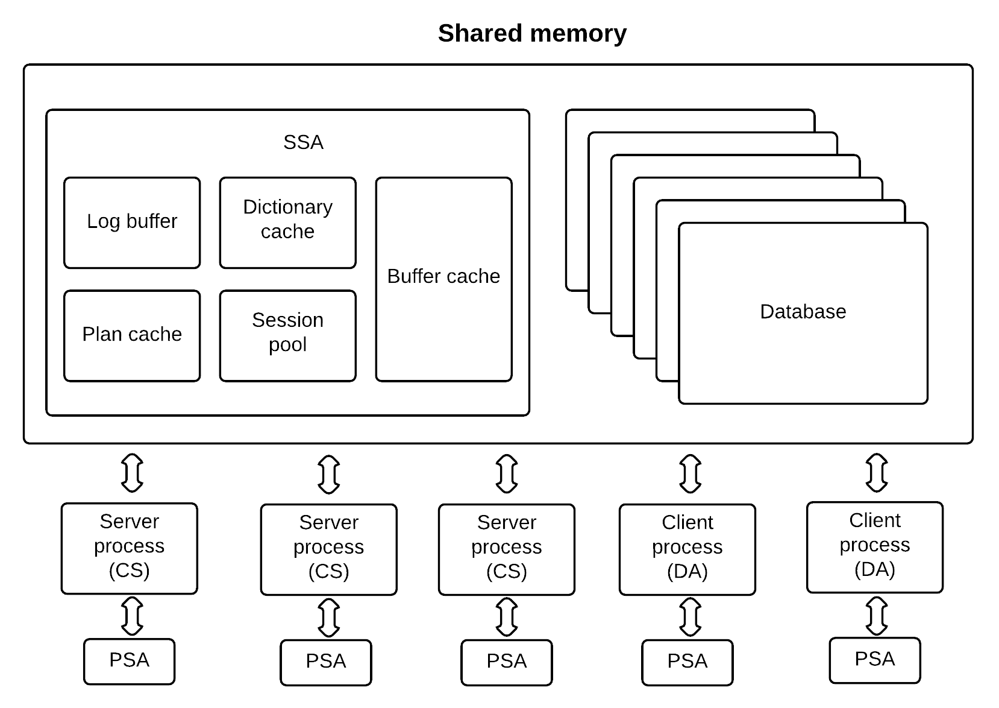

<a id="50ca522a5e6ccb8d"></a>

# 5. GOLDILOCKS 데이터베이스 관리 기본

> 원본: [GOLDILOCKS 20c.1 User Manual (ko)](https://manual.sunjesoft.co.kr/goldilocks/20c_1/manual/ko/50ca522a5e6ccb8d)  
> 태그: `20c.1_30_tag`

[← 4. What's New](../part-01-getting-started/4-what-s-new.md) · [전체 목차](../README.md) · [6. GOLDILOCKS 데이터베이스의 구조 및 저장 구조 →](6-goldilocks-데이터베이스의-구조-및-저장-구조.md)

<a id="e01a5f5bba2d1d64"></a>
## GOLDILOCKS 데이터베이스 생성과 구성

<a id="90ac0ff2757a2466"></a>
### 데이터베이스 생성

GOLDILOCKS package에 포함된 gcreatedb를 이용하여 데이터베이스를 생성한다. 데이터베이스 생성에 앞서 다음과 같은 몇가지 사항을 고려해야 한다.

**데이터베이스 생성 시 고려 사항**

<a id="dd333789918a757d"></a>
<table><thead><tr><th align="center">고려 사항</th><th align="center">참고</th></tr></thead><tbody><tr><td valign="middle">데이터베이스에서 사용할 테이블, 인덱스가 사용할 공간의 크기를 고려해야 한다.</td><td valign="middle"><ul><li><a href="6-goldilocks-데이터베이스의-구조-및-저장-구조.md#6b84f0fb7d327b4a">GOLDILOCKS 데이터베이스의 구조 및 저장 구조</a></li></ul></td></tr><tr><td valign="middle">데이터베이스의 파일들이 생성될 위치를 고려해야 한다. 파일들을 적절히 분배하여 disk IO를 분산함으로써 데이터베이스 성능을 향상시킬 수 있기 때문이다. 예를 들어, redo log file을 별도의 디스크에 배치하거나 스트라이핑하고 데이터 파일을 여러 개의 디스크로 분산시켜 disk IO를 분산시키고 병렬 disk IO를 수행할 수 있다.</td><td valign="middle"><ul><li><a href="6-goldilocks-데이터베이스의-구조-및-저장-구조.md#0562788626465737">Redo Log File 관리</a></li></ul></td></tr><tr><td valign="middle">서버 프로퍼티 파일에 설정된 각 프로퍼티의 개념과 동작을 숙지하고 지속적으로 관리해야 한다.</td><td valign="middle"><ul><li><a href="#e9f2ba5dffdc5010">초기 Property 설정</a></li><li><a href="#904946dc389a613d">GOLDILOCKS 설정파일을 이용한 초기 Property 관리</a></li><li><a href="10-server-property.md#5892e8fc0b188208">Server Property</a></li></ul></td></tr></tbody></table>

위의 고려 사항 외에도 [Getting Started](../part-01-getting-started/README.md#d6aaa025bd0f3bfe) 매뉴얼의 [Database 생성](../part-01-getting-started/2-튜토리얼.md#c02d4ed05186a0af) 부분을 참조하여 데이터베이스를 생성한다.

GOLDILOCKS를 사용하기 위해 환경 변수 $GOLDILOCKS_HOME과 $GOLDILOCKS_DATA를 설정해야 한다. GOLDILOCKS 데이터베이스를 생성하고 운용하기 위한 프로퍼티 파일 (goldilocks.properties.conf)은 $GOLDILOCKS_DATA/conf에 존재한다.

- GOLDILOCKS_HOME: GOLDILOCKS package에 포함된 binary가 설치되는 위치이며 업데이트 할 때 overwrite 할 수 있다. (License는 백업해두어야 한다.)
- GOLDILOCKS_DATA: Log file 및 data file, control file 등 GOLDILOCKS 데이터베이스가 사용하는 파일들이 기본적으로 생성되는 경로이며 overwrite 할 수 없다.

<a id="e9f2ba5dffdc5010"></a>
### 초기 Property 설정

GOLDILOCKS에서는 property를 사용하여 운영, 관리에 필요한 정보를 제어할 수 있다.

<a id="ae50cc6f65d79550"></a>
#### 초기 Property

데이터베이스를 생성하거나 시작할 때 다음과 같이 property를 설정할 수 있다.

1. System environment variable (시스템 환경 변수)
    1. GOLDILOCKS가 설치된 후 데이터베이스를 생성하거나 구동하는 명령어창에 입력하여 변경한다.
    2. 프로퍼티 이름 앞에 반드시 prefix를 붙여야 한다. Prefix는 GOLDILOCKS_이다.

- 다음은 SHARED_MEMORY_STATIC_SIZE를 100 M로 변경하는 예이다.

```
export GOLDILOCKS_SHARED_MEMORY_STATIC_SIZE=100M
```

2. Property file (프로퍼티 파일): 프로퍼티 파일에서 직접 변경할 수 있으며 prefix는 필요하지 않다.

- 다음은 SHARED_MEMORY_STATIC_SIZE를 200 M로 변경하는 예이다.
- Shared memory static size (100 M ~ 32 G)

```
SHARED_MEMORY_STATIC_SIZE = 200M
```

> 만약 동일한 프로퍼티를 시스템 환경 변수와 프로퍼티 파일에 설정할 경우 프로퍼티 파일 값이 적용된다. 즉, 시스템 환경 변수로 SHARED_MEMORY_STATIC_SIZE를 100 M로 설정하고, 프로퍼티 파일에 200 M로 설정하였다면 데이터베이스를 구동할 때 SHARED_MEMORY_STATIC_SIZE는 200 M로 적용된다.

<a id="904946dc389a613d"></a>
### GOLDILOCKS 설정파일을 이용한 초기 Property 관리

Property file은 $GOLDILOCKS_DATA/conf에 위치하며 파일 형식에 따라 두 가지로 구분된다.

- Text property file (텍스트 프로퍼티 파일)
    - 파일이름: goldilocks.properties.conf
    - "프로퍼티 이름 = 값"의 형식으로 구성된 파일이며 사용자가 직접 편집할 수 있다.
    - 만약 binary property file이 존재할 경우에는 text property file을 읽지 않는다.

- Binary property file (바이너리 프로퍼티 파일)
    - 시스템에 의해 생성되는 파일이며 사용자가 직접 편집할 수 없다.
    - 파일이름: goldilocks.properties.binary
    - 해당 바이너리 파일의 내용을 조회하기 위해서는 gdump 툴을 이용해야 한다.

> 텍스트 프로퍼티 파일과 바이너리 프로퍼티 파일이 함께 존재할 경우에는 바이너리 프로퍼티 파일만 읽는다. 즉, 텍스트 프로퍼티 파일은 아무런 처리를 하지 않는다. 이런 바이너리 프로퍼티 파일은 사용자의 SQL (ALTER SYSTEM SET)에 의해서 관리되며, 편집 또한 SQL을 통해서만 가능하다.  
>   
> 자세한 내용은 [ALTER SYSTEM SET property_name](../part-03-sql-manual/18-sql-references.md#daca16c30923690a), [ALTER SYSTEM RESET property_name](../part-03-sql-manual/18-sql-references.md#6f09e8a1c2c4db67)을 참조한다.

- Text property file 편집
    - PROPERTY_NAME = VALUE 형식으로 사용해야 한다.
    - 주석은 '#'을 사용한다.
    - Property는 다음과 같은 세 가지 데이터 타입 중 하나를 갖는다.
        - 문자형: Single quote (')를 사용해서 설정해야 한다. 문자형의 값이 $GOLDILOCKS_DATA의 경로를 포함할 경우 &lt;GOLDILOCKS_DATA&gt;로 사용해야 한다.
        - 숫자형: 계산식 (예: LOG_BUFFER_SIZE=1024 * 1024 (X))은 사용할 수 없다. 경우에 따라 K (kilobyte), M (megabyte), G (gigabyte), T (terabyte), P (petabyte) 와 같은 사이즈를 선택할 수 있다.
        - 논리형: ON/OFF, ENABLE/DISABLE, 1/0, TRUE/FALSE, YES/NO를 사용할 수 있다.

<a id="3ee9ff8ce61f1dda"></a>
## GOLDILOCKS Instance의 시작과 종료

Instance의 시작과 종료에 대해 설명한다.

<a id="cd85738aefe72c55"></a>
### Instance 시작

GOLDILOCKS instance는 SYSDBA 권한을 가진 사용자만 구동할 수 있다.  
Direct Attach (D/A) 방식과 Client/ Server (C/S)의 dedicated 방식으로 구동할 수 있고 C/S의 shared 방식으로는 구동할 수 없다.

<a id="324d293a99dd4a23"></a>
#### 다단계 시작

GOLDILOCKS instance는 여러 단계를 거쳐 구동된다. 다단계 구동 기능은 각 단계별로 관리자가 개입하여 데이터베이스의 상태를 변경할 수 있도록 하기 위한 기능이다.

각 단계는 idle, nomount, mount, open으로 구분되며 단계별 특징은 다음과 같다.

<a id="7af3ec18d344f54f"></a>
##### Idle 단계

Instance가 구동되어 있지 않은 상태이다.

다음과 같이 instance가 구동되어 있지 않은 상태에서 gsql로 접속하면 idle instance에 접속되고 해당 단계에서는 `\startup`을 제외한 어떠한 서버 명령도 수행할 수 없다.

```
% gsql sys gliese --as sysdba

Connected to an idle instance.

gSQL> select * from dual;

ERR-08003(40044): connection does not exist 

gSQL>
```

- Idle에서 관리자가 할 수 있는 작업
    - Instance 구동에 필요한 프로퍼티 조정
    - gsql 에서 `\startup`을 이용한 nomount 전이

- Nomount 단계로 전이될 때 instance 내에서 수행되는 작업
    - GOLDILOCKS instance를 관리하는 데몬인 gmaster를 구동한다.
    - gmaster 내의 timer와 cleanup thread가 구동된다.
    - Shared memory Static Area (SSA)를 할당하고 초기화한다.

**Nomount 단계로 전이될 때 적용되는 프로퍼티**

<a id="f90458ea1f80546d"></a>
| 이름 | 설명 |
| --- | --- |
| CLIENT_MAX_COUNT | 최대로 접속할 수 있는 세션 개수 |
| CONTROL_FILE_0 ~ 7 | 제어 파일 경로 |
| CONTROL_FILE_COUNT | 제어 파일의 경로들 중 유효한 경로의 개수 |
| DATA_STORE_MODE | GOLDILOCKS 인스턴스의 저장모드 |
| PLAN_CACHE_SIZE | 플랜 캐시를 위한 공유 메모리의 최대 크기 |
| PROCESS_MAX_COUNT | 최대로 접속할 수 있는 프로세스 개수 |
| SHARED_MEMORY_ADDRESS | 공유 메모리 주소 |
| SHARED_MEMORY_STATIC_NAME | 공유 메모리 이름 |
| SHARED_MEMORY_STATIC_KEY | 공유 메모리가 생성되는 key 값 |
| SHARED_MEMORY_STATIC_SIZE | 생성되는 공유 메모리의 사이즈 |
| SYSTEM_LOGGER_DIR | 시스템 로거의 경로 |

Idle 상태에서는 프로퍼티를 변경할 수 없다. 관리자가 해당 프로퍼티들을 변경하려면 다음과 같은 방법을 사용한다.

환경 변수를 이용하는 방법으로써 GOLDILOCKS_[property_name]을 원하는 값으로 설정하고 nomount로 전이시키면 해당 프로퍼티가 적용된다.

```
% export GOLDILOCKS_CLIENT_MAX_COUNT=1000
```

'SCOPE = FILE'을 이용하여 변경하고자 하는 프로퍼티 값을 파일에 기록한다. 기록된 프로퍼티는 nomount로 전이될 때 적용된다.

```
gSQL> alter system set client_max_count = 1000 scope = file;

System altered.

gSQL> \shutdown 

Shutdown success

gSQL> \startup    

Startup success

gSQL>
```

<a id="e331110bbacfa6d6"></a>
##### Nomount 단계

데이터베이스에 아직 mount 되지 않았고 GOLDILOCKS instance를 관리하는 데몬인 gmaster 프로세스만 구동된 상태이다.

Idle 단계에서 nomount 단계로 전이시키는 방법은 다음과 같다.

```
% gsql sys gliese --as sysdba

Connected to an idle instance.

gSQL> \startup nomount

Startup success

gSQL>
```

- Nomount에서 관리자가 할 수 있는 작업
    - Nomount 프로퍼티 조정 
    - 자세한 내용은 [ALTER SYSTEM MOUNT DATABASE](../part-03-sql-manual/18-sql-references.md#f9fc4d123ed9181c), [ALTER DATABASE RESTORE CONTROLFILE FROM 'file_name'](../part-03-sql-manual/18-sql-references.md#1905dbe34e65c587) 을 참조한다.

- Mount 단계로 전이될 때 instance 내에서 수행되는 작업
    - 제어 파일 (control file)을 데이터베이스로 로딩한다.
    - 데이터베이스 복구를 위한 준비를 한다.
    - gmaster 내의 checkpoint, log flusher, page flusher, IO slave, archive log thread가 구동된다.

**Nomount에서 변경할 수 있는 프로퍼티**

<a id="6e9b9df2f8333602"></a>
| 이름 | 설명 |
| --- | --- |
| DATABASE_ACCESS_MODE | 데이터베이스 접근 모드 (READ ONLY, READ WRITE) |
| LOG_BUFFER_SIZE | Redo log 버퍼 사이즈 |
| PARALLEL_LOAD_FACTOR | 데이터베이스 로딩 후 병렬 작업을 위한 thread 개수 |
| PARALLEL_IO_FACTOR | 데이터베이스 로딩을 위한 병렬 thread 개수 |
| PARALLEL_IO_GROUP_1 ~ 16 | 병렬 로딩할 때의 데이터 파일 그룹 |
| PENDING_LOG_BUFFER_COUNT | 지연 로그 버퍼의 개수 |
| TRANSACTION_TABLE_SIZE | 트랜잭션 테이블의 크기 |
| UNDO_RELATION_COUNT | Undo 릴레이션의 개수 |

<a id="3a40aa07039dcff1"></a>
##### Mount 단계

데이터베이스에 mount 된 상태이고 control file을 데이터베이스에서 인식하고 있는 상태이다. 해당 단계에서는 control file 내의 모든 section들을 제어할 수 있다.

Nomount 단계에서 mount 단계로 전이시키는 방법은 다음과 같다.

```
% gsql sys gliese --as sysdba

Connected to an idle instance.

gSQL> \startup nomount

Startup success

gSQL> alter system mount database;

System altered.

gSQL>
```

- Mount에서 관리자가 할 수 있는 작업
    - Mount 프로퍼티 조정 
    - [ALTER SYSTEM {MOUNT | OPEN} DATABASE](../part-03-sql-manual/18-sql-references.md#f9fc4d123ed9181c)
    - [ALTER DATABASE ADD LOGFILE](../part-03-sql-manual/18-sql-references.md#1bb9e8840b302b97)
    - [ALTER DATABASE DROP LOGFILE](../part-03-sql-manual/18-sql-references.md#36106c490d8bf76f)
    - [ALTER DATABASE RENAME LOGFILE](../part-03-sql-manual/18-sql-references.md#9691ec461f59ba6a)
    - [ALTER DATABASE { ARCHIVELOG | NOARCHIVELOG }](../part-03-sql-manual/18-sql-references.md#651e8451c4e3feb6)
    - [ALTER DATABASE DELETE BACKUP](../part-03-sql-manual/18-sql-references.md#24fa3bfc96889571)
    - [ALTER DATABASE REGISTER](../part-03-sql-manual/18-sql-references.md#85b498c49bcc12c8)
    - [ALTER DATABASE RECOVER](../part-03-sql-manual/18-sql-references.md#2e60420db9e1864f)
    - [ALTER DATABASE RESTORE](../part-03-sql-manual/18-sql-references.md#1905dbe34e65c587)
    - [ALTER SESSION SET property_name](../part-03-sql-manual/18-sql-references.md#4b18743f121b279d)
    - [ALTER SYSTEM RESET property_name](../part-03-sql-manual/18-sql-references.md#6f09e8a1c2c4db67)
    - [ALTER SYSTEM SWITCH LOGFILE](../part-03-sql-manual/18-sql-references.md#b5b3c583477146bf)
    - [ALTER SYSTEM { KILL | DISCONNECT } SESSION](../part-03-sql-manual/18-sql-references.md#3a477be27663df5b)
    - [ALTER TABLESPACE name ADD [DATAFILE|MEMORY]](../part-03-sql-manual/18-sql-references.md#c9983dcbc2b77c83)
    - [ALTER TABLESPACE name RENAME DATAFILE](../part-03-sql-manual/18-sql-references.md#ab6203181b2f50fe)
    - [ALTER TABLESPACE name [ONLINE|OFFLINE]](../part-03-sql-manual/18-sql-references.md#501dd7429c17f768)

- Open 단계로 전이될 때 instance 내에서 수행되는 작업
    - Instance에서 사용하는 모든 데이터 파일을 공유 메모리로 로딩한다.
    - Instance 복구를 수행한다.
    - NOLOGGING 인덱스를 구축한다.
    - Ager thread가 삭제하지 못한 객체나 파일을 정리한다.
    - 딕셔너리 (dictionary) 객체를 위한 캐시를 구축한다.
    - "SHARED_SESSION" property가 YES로 설정된 경우 gmaster내의 process monitor thread가 구동된다.
    - Process monitor thread는 balancer process, dispatcher process, shared-server process를 실행한다.

**Mount에서 변경할 수 있는 프로퍼티**

<a id="23cad040a192c332"></a>
| 이름 | 설명 |
| --- | --- |
| ARCHIVELOG_FILE | Archive 파일의 prefix 이름 |
| IN_DOUBT_DECISION | In-doubt 트랜잭션에 대한 의사결정 |
| LOCK_HASH_TABLE_SIZE | Lock 관리자의 해시 테이블 크기 |
| LOG_MIRROR_MODE | 로그 미러링 모드 |
| LOG_MIRROR_SHARED_MEMORY_STATIC_SIZE | 로그 미러링을 위한 공유 메모리 크기 |
| SUPPLEMENTAL_LOG_DATA_PRIMARY_KEY | 데이터베이스 수준의 supplemental 로깅 여부 |

<a id="92f3b801d10cbdf9"></a>
##### Open 단계

데이터베이스 내의 모든 데이터 파일이 메모리로 로딩되며 사용자에게 서비스를 제공할 수 있는 상태이다. 해당 단계에서는 모든 작업이 허용된다.

```
% gsql sys gliese --as sysdba

Connected to an idle instance.

gSQL> \startup mount

Startup success

gSQL> alter system open database;

System altered.

gSQL>
```

Open 단계로 전이될 때 데이터베이스의 접근 모드를 선택할 수 있다. 데이터베이스 접근 모드는 READ_ONLY와 READ_WRITE 두 가지이며, READ_ONLY는 데이터베이스의 모든 데이터에 대한 읽기만 가능하고, READ_WRITE는 읽기와 갱신이 모두 가능하다.

이전에 데이터베이스가 정상적으로 종료된 경우에만 데이터베이스를 READ_ONLY 모드로 OPEN 할 수 있다. 데이터베이스를 OPEN 할 때 접근 모드가 생략될 경우, 프로퍼티 (DATABASE_ACCESS_MODE)를 참조한다.

```
gSQL> \shutdown abort

Shutdown success

gSQL> \startup mount

Startup success

gSQL> alter system open database read only;

ERR-42000(14038): unable to recover database in READ ONLY mode

gSQL> alter system open database read write;

System altered.

...

gSQL> \shutdown normal

Shutdown success

gSQL> \startup mount

Startup success

gSQL> alter system open database read only;

System altered.
```

<a id="2844539886ad9fbb"></a>
#### 진단

Instance를 구동할 때 하나의 `\startup` 명령어로 여러 단계를 한꺼번에 올릴 수 있다. 만약 특정 단계에서 구동에 실패한 경우, 관리자는 어떤 단계에서 실패했는지 알아야 한다. 현재 instance가 어느 단계까지 올라왔는지는 V$INSTANCE를 이용해서 확인할 수 있고 관리자는 그 이후 단계부터 instance 구동을 계속 진행할 수 있다.

다음은 `\`startup에 실패했을 경우 instance를 open 단계까지 구동하는 예이다.

```
% gsql sys gliese --as sysdba

Connected to an idle instance.

gSQL> \startup

ERR-42000(14051): media recovery required - 'TEST_TBS'

gSQL> select INSTANCE_STATUS from v$instance;

INSTANCE_STATUS
---------------
MOUNTED           

1 row selected.

...

gSQL> alter system open database;

System altered.
```

<a id="15f44cff2fa6318f"></a>
### Instance 종료

GOLDILOCKS instance는 SYSDBA 권한을 가진 사용자만 종료할 수 있고 종료하는 중에는 새로운 세션을 허용하지 않는다.

Direct Attach (D/A) 방식과 Client/ Server (C/S)의 dedicated 방식으로 종료할 수 있고 C/S의 shared 방식으로는 종료할 수 없다.

```
% gsql sys gliese --as sysdba

ERR-RD000(13034): Service is not available
```

Instance 종료에는 normal, immediate, transactional, abort라는 네 가지 모드가 있다.

<a id="df0f5c54a9b6d043"></a>
#### Shutdown Normal

Shutdown normal은 shutdown 할 때 특정한 모드를 지정하지 않은 경우에 기본 모드로 동작하며 instance가 정상적으로 종료되기를 원할 경우에 사용한다.

```
gSQL> \shutdown normal

Shutdown success

gSQL>
```

Shutdown normal은 다음과 같은 특징을 갖는다.

- 새로운 세션을 허용하지 않는다.
- 이미 접속되어 있는 세션에서는 새로운 트랜잭션이나 statement들을 허용한다.
- Instance에 접속되어 있는 모든 세션이 종료되기를 기다린다.
- 이후 instance를 구동할 때 instance 복구를 수행하지 않는다.

<a id="699fedda68bc161a"></a>
#### Shutdown Transactional

Shutdown transactional은 진행 중인 세션을 강제 종료하더라도 이미 진행하고 있는 트랜잭션들을 정상적으로 종료하고 싶은 경우에 사용한다.

```
gSQL> \shutdown transactional

Shutdown success

gSQL>
```

Shutdown transactional은 다음과 같은 특징을 갖는다.

- 새로운 세션과 트랜잭션을 허용하지 않는다.
- 이미 진행된 트랜잭션에서는 새로운 statement들을 허용한다.
- 현재 진행 중인 트랜잭션들이 종료되기를 기다린다.
- 현재 진행 중인 트랜잭션이 종료된 이후에 세션이 자동 종료된다.
- 이후 instance를 구동할 때 instance 복구를 수행하지 않는다.

<a id="8012d317a585a07f"></a>
#### Shutdown Immediate

Shutdown immediate는 발생한 트랜잭션들을 종료할 수 없는 상황에서 사용자가 instance를 종료하고자 할 때 사용한다.

```
gSQL> \shutdown immediate

Shutdown success

gSQL>
```

Shutdown immediate는 다음과 같은 특징을 갖는다.

- 새로운 세션과 트랜잭션을 허용하지 않는다.
- 현재 진행 중인 세션과 트랜잭션들은 강제로 종료시킨다.
- 시스템의 백그라운드 thread들이 수행 중이던 것을 완료할 때까지 기다린다.
- 이후 instance를 구동할 때 instance 복구를 수행하지 않는다.

<a id="a5fb3c8a72de66d1"></a>
#### Shutdown Abort

Shutdown abort는 instance가 비정상적인 상태라고 판단되었을 때 사용한다.

```
gSQL> \shutdown abort

Shutdown success

gSQL>
```

Shutdown abort는 다음과 같은 특징을 갖는다.

- 새로운 세션과 트랜잭션을 허용하지 않는다.
- 현재 진행 중인 세션과 트랜잭션들은 강제 종료된다.
- 시스템의 백그라운드 thread들을 즉시 종료시킨다.
- 이후 instance를 구동할 때 instance 복구를 수행한다.

<a id="11b88488cc60f1c6"></a>
## 프로세스 관리

본 장에서는 GOLDILOCKS instance와 관련된 백그라운드 (background) 프로세스들에 대해 설명한다.

<a id="fdbdcafd9e45aec2"></a>
### 마스터 프로세스

마스터 프로세스는 데이터베이스 성능과 모니터링을 위한 비동기적 작업을 수행하며 다수의 thread들로 구성되어 있다.

마스터 프로세스의 실행파일 이름은 gmaster이다.

<a id="381c4cbab3e2c9d9"></a>
#### Checkpoint Thread

체크포인트 thread는 로그 플러싱 thread에서 발생하는 비동기적 체크포인트 이벤트를 수행한다. 체크포인트 이벤트는 redo log file이 스위칭될 때마다 발생한다.

체크포인트 이벤트는 사용자와 무관하게 비동기적으로 수행되며 관련 로그는 system.trc에 다음과 같이 기록된다.

```
[2014-09-11 14:04:34.704465 THREAD(14497,140178383427328)] [INFORMATION]
[CHECKPOINT] begin

...

[2014-09-11 14:04:34.743933 THREAD(14497,140178383427328)] [INFORMATION]
[CHECKPOINT] save control file

[2014-09-11 14:04:34.759521 THREAD(14497,140178383427328)] [INFORMATION]
[CHECKPOINT] end
```

<a id="f2d0286d26c94204"></a>
#### Log Flushing Thread

사용자 트랜잭션들이 기록한 redo log는 로그 버퍼에 기록되며 로그 플러싱 thread에 의해 주기적으로 로그 파일에 기록된다.

Redo log가 로그 파일 끝까지 기록된 경우 로그 스위칭이 발생하고 다음 redo log file에 기록된다. 로그 스위칭이 발생할 때 체크포인트 이벤트가 체크포인트 thread로 전달된다.

만약 로그 스위칭할 때 재사용 가능한 로그 파일이 없는 경우에는 읽기 전용 질의를 제외한 모든 질의가 재사용 가능한 로그 파일이 만들어질 때까지 대기한다.

다음은 로깅이 블로킹될 때 system.trc에 남은 메시지이다.

```
...

[2014-09-11 14:31:44.315871 THREAD(19102,139674683647744)] [INFORMATION]
[LOG FLUSHER] disable logging - blocked lfsn(1)

...
```

<a id="e11f0afd5de276a7"></a>
#### Log Archiving Thread

로그 아카이빙 thread는 비동기적으로 redo log file을 아카이빙한다. 해당 thread는 데이터베이스가 ARCHIVELOG 모드로 운영되는 경우에만 동작한다.

로그 아카이빙은 체크포인트 과정의 일부이며 체크포인트 thread가 발생한 로그 아카이빙 이벤트에 의해 수행된다.

다음은 redo_0_0.log가 archive_0.log로 아카이빙될 때 system.trc에 남은 메시지이다.

```
[2014-09-11 14:13:32.515996 THREAD(16913,140631135463168)] [INFORMATION]
[ARCHIVELOG BEGIN] LOG(/home/test/work/product/Gliese/home/wal/redo_0_0.log(0)) => ARCHIVE(/home/test/work/product/Gliese/home/archive_log/archive_0.log)

[2014-09-11 14:13:33.145850 THREAD(16913,140631135463168)] [INFORMATION]
[ARCHIVELOG END] (/home/test/work/product/Gliese/home/archive_log/archive_0.log) : SUCCESS

...
```

<a id="c4a9478359787cf1"></a>
#### Ager Thread

에이져 thread는 논리적으로 삭제된 데이터베이스 객체를 물리적으로 삭제한다.

GOLDILOCKS는 DROP TABLE 할 때 statement level consistency를 유지하기 위해 논리적 삭제만 수행한다. 즉, DROP TABLE이 수행되었다고 해도 DROP TABLE 이전에 수행되고 있던 statement는 삭제된 테이블에 대한 레코드를 탐색할 수 있다.

다음은 테이블과 테이블스페이스가 물리적으로 삭제될 때 system.trc에 남은 메시지이다.

```
[2014-09-11 14:13:37.966788 THREAD(16925,139892990408448)] [INFORMATION]
[AGER] aging table - object scn(4561), object view scn(4562), type(0), physical id(25043954302976)

...

[2014-09-11 14:13:37.966917 THREAD(16925,139892990408448)] [INFORMATION]
[AGER] aging tablespace - object scn(4561), object view scn(4564), tablespace id(61)
```

<a id="9ff7aa291ecea5e9"></a>
#### Timer Thread

타이머 thread는 사용자 트랜잭션들의 시간 측정 비용을 줄이기 위해 비동기적으로 시스템에 시간을 설정하며 사용자 트랜잭션들은 시스템에 설정된 시간을 읽는다.  
설정된 시간의 정밀도는 10 ms 이다.

타이머 thread에서 설정된 시간을 사용하는 경우는 다음과 같고 10 ms의 오차를 갖는다.

- 타임아웃: QUERY_TIMEOUT, IDLE_TIMEOUT, DDL_LOCK_TIMEOUT
- 추적 로그에 남은 메시지 기록 시간
- 로그인 statement나 트랜잭션의 시작 시간
- 트랜잭션 완료 redo log에 기록되는 시간

<a id="f4a393f4f798c7a7"></a>
#### Page Flusher & IO Slave Thread

체크포인트가 발생하면 변경된 데이터 페이지들을 디스크에 반영한다. 변경 사항은 테이블스페이스에 있는 다수의 데이터 파일에 저장될 수 있다. 이를 위해 page flusher thread는 테이블스페이스와 데이터 파일별로 IO 슬레이브 thread들에 작업을 분배하여 관리하고 IO 슬레이브 thread들은 변경된 페이지를 데이터 파일에 병렬로 기록한다.

변경된 페이지를 저장할 때는 한꺼번에 가능한 많이 저장하는 것이 성능 향상에 도움이 된다. 한 번에 기록되는 페이지 개수는 [MAXIMUM_FLUSH_PAGE_COUNT](10-server-property.md#d1118fe7aa94012f) 프로퍼티에 따른다.

변경된 페이지들을 데이터 파일에 기록한 후 system.trc에 다음과 같은 메시지를 남긴다.

```
[2014-09-11 14:13:38.329162 THREAD(16925,139893221086976)] [INFORMATION]
[IO SLAVE] flush datafile ( tablespace : 0, datafile : 0 )

[2014-09-11 14:13:38.552161 THREAD(16925,139893221086976)] [INFORMATION]
[IO SLAVE] flush datafile ( tablespace : 1, datafile : 0 )

[2014-09-11 14:13:38.587510 THREAD(16925,139893221086976)] [INFORMATION]
[IO SLAVE] flush datafile ( tablespace : 2, datafile : 0 )

[2014-09-11 14:13:38.587831 THREAD(16925,139893221086976)] [INFORMATION]
[IO SLAVE] flush datafile ( tablespace : 62, datafile : 0 )

[2014-09-11 14:13:38.620239 THREAD(16925,139893221086976)] [INFORMATION]
[IO SLAVE] flush datafile ( tablespace : 63, datafile : 0 )
```

<a id="9796f02306997eff"></a>
#### Cleanup Thread

Cleanup thread는 시스템의 자원을 비동기적으로 정리하며 다음과 같은 작업을 수행한다.

- 정상적으로 종료된 세션을 정리한다. GOLDILOCKS는 사용자의 세션 종료를 논리적으로 처리하며 물리적 세션 종료는 cleanup thread가 수행한다.
- 비정상적으로 종료된 세션을 종료하며 만약 해당 세션이 트랜잭션을 사용하고 있다면 이를 rollback한다.
- Snapshot statement들의 타임아웃을 검사하고 만약 타임아웃을 초과한 세션이 있을 경우 이를 강제로 종료시킨다.

다음은 비정상적으로 종료된 세션을 정리할 때 system.trc에 남은 메시지이다.

```
[2014-09-12 10:34:38.387349 THREAD(23003,140722556352256)] [WARNING]
[CLEANUP] cleaning session - env(19), session(20), transaction(FFFFFFFFFFFFFFFF), program(gsql), pid(23209), thread(140080441665280)

[2014-09-12 10:34:38.387515 THREAD(23003,140722556352256)] [WARNING]
[CLEANUP] cleaning up 1 sessions
```

다음은 snapshot statement가 타임아웃을 초과한 경우 system.trc에 남은 메시지이다.

```
[2014-09-12 10:49:21.842179 THREAD(3972,139706316711680)] [WARNING]
[CLEANUP] long statement timeout - pid(8029), thread(140053960505088), program(gsql), statement start time(2014-09-12 10:48:49.963471)
```

비정상적으로 종료된 세션이 배타적 (exclusive) 래치를 획득한 상태에서 공유 메모리를 변경하는 도중에 'kill -9'와 같은 시그널에 의해 종료될 경우, 데이터베이스를 더 이상 운영할 수 없다. 이 경우, 다음과 같은 메시지가 system.trc에 남으며 'SHUTDOWN ABORT'로 instance를 종료시켜야 한다.

```
[2014-09-12 11:12:58.809249 THREAD(15313,140671386121984)] [WARNING]
[CLEANUP] failed to cleaning session - server restart required
...... dead session in critical section - env(3), session(4), transaction(47001E0004), pid(15296), thread(140178075756288)
```

<a id="4c4cda3b38f6e1e8"></a>
#### Process Monitor Thread

Process monitor thread는 process들을 실행하고 모니터링한다.

- "SHARED_SESSION" property가 YES로 설정되었을 때만 실행된다.
- Load-balancer (gbalancer), dispatcher (gdispatcher), shared-server (gserver)를 실행하고 비정상적으로 종료될 경우 재실행한다.
- Listener (glsnr) process는 모니터링 대상이 아니다.

<a id="ebaee88d5dbfdeee"></a>
#### Cluster Recover Thread

Cluster system 환경에서 노드를 시작할 때 노드가 MOUNT 단계로 phase up되면 cluster recover thread가 생성된다. In-doubt 트랜잭션이 있을 경우, cluster recover thread가 원격 노드의 cluster recover thread와 통신하여 in-doubt 트랜잭션을 복구한다.

In-doubt 트랜잭션이 있을 때 cluster recover thread는 원격 노드의 cluster recover thread와 통신하여 복구가 필요한 in-doubt 트랜잭션의 상태를 파악한다. 만약 원격 노드가 재시작되어 복구되기 전이라면 복구를 먼저 수행하도록 메시지를 전송하고 복구가 완료된 후에 in-doubt 트랜잭션의 상태를 구한다.

원격 노드를 통해서 파악할 수 있는 in-doubt 트랜잭션의 상태는 NONE, PREPARE, COMMIT, ROLLBACK 이다. 최소 한 개의 원격 노드에서 COMMIT이나 ROLLBACK 응답을 받을 경우 COMMIT이나 ROLLBACK을 수행한다. 모든 원격 노드에서 NONE 또는 PREPARE 응답을 받은 경우 모든 cluster 노드에서 COMMIT이나 ROLLBACK을 수행한 적이 없기 때문에 ROLLBACK을 수행한다.

Cluster recover thread가 in-doubt 트랜잭션을 복구했을 경우 system.trc에 다음과 같은 메시지를 남긴다.

```
[2018-11-22 16:52:00.466805 INSTANCE(G3N2) THREAD(7828,140557371479808)] [WARNING]
[CLUSTER RECOVER] begin recovery

[2018-11-22 16:52:00.467221 INSTANCE(G3N2) THREAD(7828,140557371479808)] [WARNING]
[CLUSTER RECOVER] commit in-doubt transaction - commit scn(999.0.439), global transaction id(1.29294650), local transaction id(4)

[2018-11-22 16:52:00.468253 INSTANCE(G3N2) THREAD(7828,140557371479808)] [WARNING]
[CLUSTER RECOVER] rollback in-doubt transaction - commit scn(1000.439), global transaction id(4.34406459), local transaction id(59)

[2018-11-22 16:52:00.469198 INSTANCE(G3N2) THREAD(7828,140557371479808)] [WARNING]
[CLUSTER RECOVER] commit in-doubt transaction - commit scn(1001.0.439), global transaction id(5.35127356), local transaction id(60)
```

<a id="472bc755ee1b1599"></a>
#### Failover Thread

Cluster system 환경에서 노드를 시작할 때 노드가 LOCAL OPEN 단계로 phase up되면 cluster failover thread가 생성된다. Cluster failover thread는 cluster system에서 특정 노드나 네트워크에 장애가 발생했을 때 장애 노드에 대해 offline이나 coordinator 재선정과 같은 failover 처리를 수행한다

Failover 상황이 발생하면 정상 노드들 중에 failover lock을 획득한 하나의 노드가 다른 노드들의 failover thread와 통신하여 failover를 수행한다.

Failover thread가 failover를 수행한 경우 system.trc에 다음과 같은 메시지를 남긴다.

```
[2018-11-22 15:27:34.619208 INSTANCE(G1N1) THREAD(20140,140219957368576)] [INFORMATION]
[FAILOVER] begin - failover member(5)

[2018-11-22 15:27:34.619418 INSTANCE(G1N1) THREAD(20140,140219957368576)] [INFORMATION]
[FAILOVER] acquire failover lock - driver(0), target(5), driver seq(1)

[2018-11-22 15:27:34.619692 INSTANCE(G1N1) THREAD(20183,140317097449216)] [INFORMATION]
[CDISPATCHER-S2] disconnect member - target member(5)

[2018-11-22 15:27:34.619893 INSTANCE(G1N1) THREAD(20183,140317097449216)] [INFORMATION]
[CDISPATCHER-S2] finalize sender socket - member(5)

[2018-11-22 15:27:34.621860 INSTANCE(G1N1) THREAD(20140,140219957368576)] [INFORMATION]
[FAILOVER] acquire failover lock

...

[2018-11-22 15:27:38.726436 INSTANCE(G1N1) THREAD(20140,140219957368576)] [INFORMATION][FAILOVER] member(5) has failovered

[2018-11-22 15:27:38.728624 INSTANCE(G1N1) THREAD(20140,140219957368576)] [INFORMATION]
[FAILOVER] release failover lock - driver(-1), target(5), driver seq(1)

[2018-11-22 15:27:38.728786 INSTANCE(G1N1) THREAD(20140,140219957368576)] [WARNING]
reset remote session map - member(5)

[2018-11-22 15:27:38.729679 INSTANCE(G1N1) THREAD(20140,140219957368576)] [INFORMATION]
[FAILOVER] finished
```

<a id="d3897f9125394f76"></a>
#### Buffer Checkpoint Flusher, Buffer Replace Flusher

디스크 테이블스페이스에 저장된 테이블, 인덱스 페이지들이 버퍼에 캐싱되어 변경되면 체크포인트 리스트에 연결된다. Buffer checkpoint flusher는 checkpoint list에 연결된 페이지를 해당 데이터파일에 반영한다. Buffer checkpoint flusher는 체크포인트 이벤트가 발생했을 때 수행되거나 [BUFFER_FLUSHING_INTERVAL](10-server-property.md#1c158820718e049f) 프로퍼티에 설정된 시간만큼 sleep 하면서 주기적으로 수행된다. Buffer checkpoint flusher의 개수는 [BUFFER_CHECKPOINT_LIST_COUNT](10-server-property.md#4bfcc335a472ab8d) 프로퍼티에 따라 결정된다.

버퍼 캐쉬에 요청된 페이지가 없을 때 데이터파일로부터 페이지를 읽어와서 버퍼 캐쉬에 채운다. 버퍼 캐쉬에서 사용 가능한 공간을 찾을 때 현재 사용하고 있지 않은 갱신된 페이지들은 buffer replace list에 연결하고, buffer replace flusher가 buffer replace list에 연결된 페이지를 해당 데이터파일에 반영한다. Buffer replace flusher는 버퍼가 가득 차서 사용가능한 공간이 없을 때 이벤트에 의해 깨어나거나 BUFFER_FLUSHING_INTERVAL 프로퍼티에 설정된 시간만큼 sleep 하면서 주기적으로 수행된다. Buffer replace flusher의 개수는 [BUFFER_FLUSH_THREADS](10-server-property.md#af5aad728aafedc5) 프로퍼티에 따라 결정된다.

<a id="4744d9d7fe2b7cc6"></a>
### 리스너 프로세스

리스너 프로세스는 Client/ Server 환경에서 네트워크를 통한 원격 접속을 가능하게 한다. 리스너 프로세스는 [LISTEN_PORT](../part-06-utility-manual/36-glsnr.md#3c7b255f96a782c5)로 클라이언트 접속을 기다리는데 클라이언트가 접속할 때 dedicated 모드일 경우, 새로운 gserver를 구동하여 클라이언트와 연결하고 shared 모드일 경우, load-balancer (gbalancer)를 통해 부하가 적은 dispatcher (gdispatcher)를 선택하여 클라이언트와 연결한다.

gserver는 일종의 작업 서버로써 클라이언트에서 요청한 명령을 수행한다.

만약 LISTEN_PORT가 이미 사용 중일 경우, 다음과 같은 에러가 발생한다.

```
% glsnr --start

ERR-HY000(11077): given address is already in use
```

리스너 프로세스는 instance와 무관하게 동작한다. 즉, 리스너 프로세스는 instance의 구동 여부와 관계없이 언제든지 구동하고 종료할 수 있다.

<a id="c75654759041925f"></a>
## 메모리 관리

<a id="445b0ea91e10eb02"></a>
### GOLDILOCKS 메모리 구조

GOLDILOCKS는 시스템의 모든 세션에서 공유하기 위한 메모리 (SSA)와 데이터베이스 페이지를 위한 공유 메모리, 각 세션마다 독립적으로 사용하는 heap 전용 메모리 (PSA)들을 사용한다.

<a id="aad94ac7e0193513"></a>


<a id="5ab2b9ff83fdf787"></a>
### SSA 관리

Shared Static Area (SSA)는 시스템의 모든 세션에서 공유해야 하는 정보들이 저장되어 있는 메모리 영역이다.

SSA에서 참조하는 모든 정보의 위치는 물리적 주소를 사용하기 때문에 새로운 프로세스가 SSA를 사용하려면 같은 물리적 주소를 사용해야 한다.

SSA의 물리적 시작 주소는 [SHARED_MEMORY_STATIC_KEY](10-server-property.md#746000a2b592d37c)와 [SHARED_MEMORY_ADDRESS](10-server-property.md#27ca012b7c47898a)에 의해 결정된다. 만약 다른 프로그램에서 같은 SHARED_MEMORY_STATIC_KEY에 지정된 공유 메모리 key와 SHARED_MEMORY_ADDRESS에 지정된 메모리를 이미 사용하고 있다면 다음과 같은 에러가 발생한다.

```
% gsql sys gliese --as sysdba

Connected to an idle instance.

gSQL> \startup

ERR-HY000(11029): shared memory segment exists 

gSQL>
```

SSA에는 log buffer, dictionary cache, plan cache, session pool, lock pool, transaction pool과 같은 주요 정보들이 저장된다.

SSA 크기는 [SHARED_MEMORY_STATIC_SIZE](10-server-property.md#7a7e11988a1247ab)에 의해 결정된다. Session/ lock/ transaction pool 및 dictionary cache에서 사용되는 메모리들은 시스템에서 자동으로 관리하며 사용자가 임의로 사용량을 제어할 수 없는 반면에 log buffer와 plan cache는 사용자가 임의로 제어할 수 있다.

Log buffer와 plan cache의 기본값을 늘리는 경우에는 증가된 양만큼 SHARED_MEMORY_STATIC_SIZE를 늘려야 한다. 그렇지 않으면 다음과 같은 에러가 발생할 수 있다.

```
% gsql sys gliese --as sysdba

Connected to an idle instance.

gSQL> \startup

ERR-HY000(13010): Insufficient static area

gSQL>
```

<a id="7eab594f5fccf32d"></a>
### PSA 관리

Private Static Area (PSA)는 각 세션마다 독립적으로 사용하는 heap 메모리 영역이다. 최대 크기는 [PRIVATE_STATIC_AREA_SIZE](10-server-property.md#aca98e8e7e220b62)에 의해 결정된다.

세션이 만들어질 때는 PSA의 초기값만 할당하는데 세션에서 추가적인 메모리가 필요할 경우, 최대 크기만큼 할당할 수 있다. 다음은 최대 크기를 초과한 경우에 발생하는 에러이다.

```
ERR-HY000(13011): Unable to extend memory: [MAX: 104857600, TOTAL: 102764408, ALLOC: 2097240] DESC: private static area
```

<a id="e2cecf2a71120693"></a>
## 모니터링

데이터베이스 모니터링은 향후 이슈가 될 수 있는 문제점을 사전에 인지하고 대비할 뿐만 아니라 데이터베이스 운영을 위한 개선점을 찾기 위해 필요하다. GOLDILOCKS 데이터베이스는 모니터링을 위해 텍스트 파일 형식의 trace 로그와 다양한 성능 view를 제공한다.

<a id="8779700a54a4e61e"></a>
### TRACE 파일을 이용한 모니터링

GOLDILOCKS 데이터베이스는 instance의 시작부터 종료까지 시스템 전반적인 오류, 경고, 정보를 기록하는 시스템 로그와 XA 트랜잭션 로그, DDL 로그와 같은 trace 로그를 제공한다. 또한 SQL trace log를 제공하는데 자세한 내용은 [SQL Trace Log](../part-03-sql-manual/15-sql-tuning.md#ac67f5007e5baa74)를 참조한다.

<a id="b1175a8972a4d900"></a>
#### TRACE 파일 관리

GOLDILOCKS 데이터베이스의 trace 로그 파일은 시스템 로그와 DDL 로그를 기록하는 'system.trc'와 XA 트랜잭션 로그를 기록하는 'xa.trc' 두 개의 파일로 구성된다. Trace 로그 파일은 SYSTEM_LOGGER_DIR 프로퍼티에 설정된 디렉토리에 생성되며 기본적으로 'GOLDILOCKS_DATA' 환경 변수에 설정된 디렉토리 하위의 'trc' 디렉토리에 생성된다. Trace 로그 파일의 크기는 10 Mbyte인데 쓸 공간이 부족할 경우 고유한 파일 확장자가 추가된 파일로 보존하고 새로운 trace 로그 파일을 생성하여 기록한다.

Listener의 trace 로그 파일은 'GOLDILOCKS_DATA' 환경 변수에 설정된 디렉토리 하위의 'trc' 디렉토리에 'listener.trc'라는 이름으로 생성된다. 로그 파일의 크기는 10 Mbyte인데 쓸 공간이 부족할 경우, 고유한 파일 확장자가 추가된 파일로 보존하고 새로운 trace 로그 파일을 생성하여 기록한다.

시스템 로그 외에 XA 트랜잭션 로그나 DDL 로그는 모니터링 ON/ OFF를 선택할 수 있다. TRACE_DDL 프로퍼티 값을 '0'으로 설정하여 DDL 로그를 OFF하거나 '1'로 설정하여 ON시킨다. XA 로그는 TRACE_XA 프로퍼티를 이용하여 동일한 방법으로 설정한다.

<a id="bc4ec8831eae4311"></a>
#### 시스템 로그

마스터 프로세스가 시작된 후 종료될 때까지 데이터베이스 instance에 발생하는 오류, 경고, 정보가 시스템 로그에 기록된다.

<a id="fdb7dac191f4dc35"></a>
##### 시스템 로그 포맷

시스템 로그는 다음과 같은 포맷으로 기록된다.

```
['로그 기록 날짜 및 시간' THREAD('프로세스 Id', '쓰레드 handle')] ['로그 레벨']
['로그 프리픽스'] '로그 바디'
```

- '로그 기록 날짜 및 시간'은 로그를 남긴 날짜 및 시간이다.
- THREAD('프로세스 Id', 'thread handle')는 로그를 남긴 프로세스의 ID와 thread handle 정보이다.
- '로그 프리픽스'는 로그를 만든 주체나 기능을 의미하고 '로그 바디'는 세부 내용이다.
- '로그 레벨'은 시스템 로그에 기록되는 로그의 레벨로써 FATAL, ABORT, WARNING, INFO가 있는데 다음과 같은 속성을 가진다.

**Log level properties**

<a id="7c07254c5884abcc"></a>
| 로그 레벨 | 설명 | 처리 |
| --- | --- | --- |
| FATAL | 마스터 프로세스 또는 클라이언트가 비정상적으로 종료된 상태이다. | 클라이언트 프로세스 FATAL인 경우 클라이언트 재접속해야 하고 시스템 FATAL인 경우 데이터베이스 instance를 종료한 후에 다시 시작해야 한다. 데이터 파일, 제어 파일, redo log file, 시스템 로그 파일을 백업하여 데이터베이스 제조사에 문의해야 한다. |
| ABORT | Rollback을 수행한 후 서비스를 계속할 수 있는 상태이다. | 시스템 운영을 위한 정상적인 과정이며 rollback 원인을 제거한 후에 다시 수행해야 한다. |
| WARNING | 운영상의 경고이다. | 데이터베이스 instance에 비정상적인 상황이 발생하였다. 운영상 문제는 없으나 원인을 분석할 필요가 있다. |
| INFO | 운영상의 정보이다. | - |

예를 들어 다음과 같은 시스템 로그는 2014년 9월 11일 17시 30분 55초 경에 남겨진 운영상의 정보로써 프로세스 ID가 21395인 프로세스 (thread handle이 139982731163392)에 의한 시스템 로그이다. 로그 prefix는 'STARTUP-SM'인데 GOLDILOCKS 데이터베이스의 마스터 프로세스가 시작될 때 저장 관리자(storage manager)를 기동하는 중이며, 다단계 시작 중에 NOMOUNT 단계로 전이하였다는 것을 의미한다.

```
[2014-09-11 17:30:55.758164 THREAD(21395,139982731163392)] [INFORMATION]
[STARTUP-SM] NO-MOUNT PHASE
```

<a id="5093471c3459ca2c"></a>
##### GOLDILOCKS 데이터베이스 운영 정보

데이터베이스 instance의 생성, 다단계 시작 및 종료, 데이터 파일 로드, 재시작 복구, 미디어 복구 수행 등의 로그로써 마스터 프로세스가 시작된 후 종료될 때까지 운영을 위해 필요한 정보를 남긴다.

- GOLDILOCKS instance 생성 로그

데이터베이스 instance를 생성할 때 다음과 같은 시스템 로그가 기록된다. 데이터베이스를 생성하기 위해 NOMOUNT 단계로 전이한 후 제어 파일을 생성한다.

```
=================================================
 Startup GOLDILOCKS
 TIME    : 2014-09-03 14:43:17.321020
=================================================


[2014-09-03 14:43:17.321134 THREAD(14979,140542517491456)] [INFORMATION]
[STARTUP-SM] NO-MOUNT PHASE

[2014-09-03 14:43:17.321658 THREAD(14979,140542517491456)] [INFORMATION]
[STARTUP-SM] DATA_STORE_MODE(2)

[2014-09-03 14:43:17.335809 THREAD(14979,140542517491456)] [INFORMATION]
.... copy control file from '/goldilocks_data/wal/control_0.ctl' to '/goldilocks_data/wal/control_1.ctl'
```

그리고 OPEN 단계로 전이하여 시스템 테이블스페이스를 생성한다.

```
[2014-09-03 14:43:17.401356 THREAD(14979,140542517491456)] [INFORMATION]
[STARTUP-SM] MOUNT PHASE

[2014-09-03 14:43:19.319769 THREAD(14979,140542517491456)] [INFORMATION]
[STARTUP-SM] PRE-OPEN PHASE

[2014-09-03 14:43:19.320494 THREAD(14979,140542517491456)] [INFORMATION]
[STARTUP-SM] RECOVER TABLESPACE AND DATAFILE STATE

[2014-09-03 14:43:19.326269 THREAD(14979,140542517491456)] [INFORMATION]
[STARTUP-SM] OPEN PHASE

[2014-09-03 14:43:21.005536 THREAD(14979,140542517491456)] [INFORMATION]
[TABLESPACE] Create Tablespace(0)

[2014-09-03 14:43:21.005593 THREAD(14979,140542517491456)] [INFORMATION]
[TABLESPACE] Create Tablespace(1)

...
```

시스템 테이블스페이스를 생성한 후에 체크포인트를 수행하고 데이터베이스 instance를 종료한다.

```
[2014-09-03 14:43:21.788129 THREAD(14979,140542517491456)] [INFORMATION]
[CHECKPOINT] begin - checkpoint lid(0,10128,13), checkpoint lsn(10512), oldest lsn(10512)

[2014-09-03 14:43:21.788188 THREAD(14979,140542517491456)] [INFORMATION]
[CHECKPOINT] body - checkpoint lid(-1,0,0), checkpoint lsn(-1), active transaction count(0)

[2014-09-03 14:43:21.788203 THREAD(14979,140542517491456)] [INFORMATION]
[CHECKPOINT] end - checkpoint lid(0,10128,77), checkpoint lsn(10513)

[2014-09-03 14:43:21.788214 THREAD(14979,140542517491456)] [INFORMATION]
[CHECKPOINT] flush redo log

[2014-09-03 14:43:21.949589 THREAD(14979,140542517491456)] [INFORMATION]
[CHECKPOINT] save control file

[2014-09-03 14:43:21.957563 THREAD(14979,140542517491456)] [INFORMATION]
[SHUTDOWN-SM] CLOSE

[2014-09-03 14:43:21.957595 THREAD(14979,140542517491456)] [INFORMATION]
[SHUTDOWN-SM] POST CLOSE

[2014-09-03 14:43:21.992521 THREAD(14979,140542517491456)] [INFORMATION]
[SHUTDOWN-SM] DISMOUNT

[2014-09-03 14:43:21.992557 THREAD(14979,140542517491456)] [INFORMATION]
[SHUTDOWN-SM] INIT
```

- GOLDILOCKS instance 시작 로그

마스터 프로세스가 데이터베이스 instance의 다단계 시작, 데이터 파일 로드, 재시작 복구, 미디어 복구 수행 등과 같은 로그를 기록한다. 먼저 MOUNT 단계로 전이한 후에 데이터 파일을 로드한다.

```
=================================================
 Startup GOLDILOCKS
 TIME    : 2014-09-03 14:43:22.162601
=================================================


[2014-09-03 14:43:22.162765 THREAD(14982,140025756808960)] [INFORMATION]
[STARTUP-SM] NO-MOUNT PHASE

[2014-09-03 14:43:22.163389 THREAD(14982,140025756808960)] [INFORMATION]
[STARTUP-SM] DATA_STORE_MODE(2)

[2014-09-03 14:43:22.429311 THREAD(14983,140025756808960)] [INFORMATION]
[STARTUP-SM] MOUNT PHASE

[2014-09-03 14:43:22.559395 THREAD(14983,140025756808960)] [INFORMATION]
[EVENT] system startup : SUCCESS

[2014-09-03 14:43:22.568526 THREAD(14981,139649517561600)] [INFORMATION]
[STARTUP] MOUNT PHASE

[2014-09-03 14:43:22.571200 THREAD(14983,140025756808960)] [INFORMATION]
[STARTUP-SM] LOAD DATAFILES

[2014-09-03 14:43:22.571241 THREAD(14983,140025756808960)] [INFORMATION]
.... datafile '/goldilocks_data/db/system_dict.dbf' assigned to PARALLEL_IO_GROUP_1

...

[2014-09-03 14:43:22.571562 THREAD(14983,140025280841472)] [INFORMATION]
.... LOAD DATAFILE(/goldilocks_data/db/system_dict.dbf)

...
```

데이터 파일을 메모리로 로드한 후에 복구를 수행한다.

```
[2014-09-03 14:43:23.537256 THREAD(14983,140025756808960)] [INFORMATION]
[STARTUP-SM] REFINE TABLESPACE AND DATAFILE

[2014-09-03 14:43:23.631974 THREAD(14983,140025756808960)] [INFORMATION]
[RESTART REDO] begin

[2014-09-03 14:43:23.634374 THREAD(14983,140025756808960)] [INFORMATION]
[RESTART REOD] read checkpoint log - checkpoint log id(0,10128,13), oldest lsn(10512), system scn(7)

[2014-09-03 14:43:23.756293 THREAD(14983,140025756808960)] [INFORMATION]
[RESTART REDO] ready to redo - start lid(0,10128,13), lsn(10512)

...

[2014-09-03 14:43:24.090755 THREAD(14983,140025756808960)] [INFORMATION]
[RESTART REDO] end - restart lsn(10514), restart scn(7)

[2014-09-03 14:43:24.091551 THREAD(14983,140025756808960)] [INFORMATION]
[RESTART UNDO] begin

[2014-09-03 14:43:24.091598 THREAD(14983,140025756808960)] [INFORMATION]
[RESTART UNDO] end
```

복구가 완료되면 체크포인트를 수행하여 복구된 결과를 디스크 데이터 파일에 반영하고 인덱스를 생성한 후 OPEN 단계로 전이한다.

```
[2014-09-03 14:43:24.111878 THREAD(14983,140025633163008)] [INFORMATION]
[CHECKPOINT] begin

...

[2014-09-03 14:43:24.129995 THREAD(14983,140025633163008)] [INFORMATION]
[CHECKPOINT] save control file

[2014-09-03 14:43:24.135864 THREAD(14983,140025633163008)] [INFORMATION]
[CHECKPOINT] end

[2014-09-03 14:43:24.144525 THREAD(14983,140025756808960)] [INFORMATION]
[STARTUP-SM] PRE-OPEN PHASE

[2014-09-03 14:43:24.202782 THREAD(14983,140025756808960)] [INFORMATION]
[STARTUP-SM] RECOVER TABLESPACE AND DATAFILE STATE

[2014-09-03 14:43:24.210158 THREAD(14983,140025756808960)] [INFORMATION]
[STARTUP-SM] REFINE RELATIONS

[2014-09-03 14:43:24.210304 THREAD(14983,140025756808960)] [INFORMATION]
[STARTUP-SM] REBUILD INDEXES

[2014-09-03 14:43:24.210375 THREAD(14983,140025756808960)] [INFORMATION]
[STARTUP-SM] OPEN PHASE

[2014-09-03 14:43:24.332064 THREAD(14983,140025756808960)] [INFORMATION]
[EVENT] system startup : SUCCESS

[2014-09-03 14:43:24.340843 THREAD(14981,139649517561600)] [INFORMATION]
[STARTUP] OPEN PHASE
```

- GOLDILOCKS instance 종료 로그

데이터베이스 instance를 종료하려면 먼저 모든 데이터 파일들을 디스크에 반영한 후에 체크포인트를 수행하고 마스터 프로세스를 종료해야 한다.

```
[2014-09-03 14:48:03.467293 THREAD(15416,139855812097792)] [INFORMATION]
[IO SLAVE] flush datafile ( tablespace : 0, datafile : 0 )

...

[2014-09-03 14:48:03.748958 THREAD(15416,139855908558592)] [INFORMATION]
[PAGE FLUSHER] flushed lsn(137496), flushed page count(9216)]

[2014-09-03 14:48:03.761055 THREAD(15416,139856376227584)] [INFORMATION]
[CHECKPOINT] begin

...

[2014-09-03 14:48:03.780011 THREAD(15416,139856376227584)] [INFORMATION]
[CHECKPOINT] save control file

[2014-09-03 14:48:03.786387 THREAD(15416,139856376227584)] [INFORMATION]
[CHECKPOINT] end

[2014-09-03 14:48:03.791251 THREAD(15416,139856430274304)] [INFORMATION]
[SHUTDOWN-SM] CLOSE

[2014-09-03 14:48:03.791383 THREAD(15416,139856430274304)] [INFORMATION]
[SHUTDOWN-SM] POST CLOSE

[2014-09-03 14:48:03.824445 THREAD(15416,139856430274304)] [INFORMATION]
[SHUTDOWN-SM] DISMOUNT

[2014-09-03 14:48:03.824518 THREAD(15416,139856430274304)] [INFORMATION]
[EVENT] system shutdown : SUCCESS

[2014-09-03 14:48:04.267130 THREAD(15416,139856430274304)] [INFORMATION]
[SHUTDOWN-SM] INIT
```

`\shutdown abort`를 이용하여 강제로 서버를 중지시킨 경우에는 체크포인트를 수행하지 않고 정상 적인 서버 중지 절차를 수행하지 않는다.

```
[2014-09-03 14:51:45.353154 THREAD(8989,139949509089024)] [INFORMATION]
[SHUTDOWN] skip CLOSE phase

[2014-09-03 14:51:45.678461 THREAD(8989,139949509089024)] [INFORMATION]
[SHUTDOWN] skip DISMOUNT phase

[2014-09-03 14:51:45.678696 THREAD(8989,139949509089024)] [INFORMATION]
[EVENT] system shutdown : SUCCESS

[2014-09-03 14:51:45.678928 THREAD(8989,139949509089024)] [INFORMATION]
[SHUTDOWN-SM] INIT
```

- 데이터베이스 운용 중 마스터 프로세스의 체크포인트, 로그 플러셔, 로그 아카이빙, ager, 병렬 IO, cleanup thread들의 로그

체크포인트는 체크포인트 시점에 디스크에 반영되지 않고 메모리에서만 변경된 데이터 파일을 모두 디스크에 반영한다. 만약 병렬 IO를 이용하는 경우에는 데이터 파일 단위로 병렬 IO가 수행된다. 체크포인트 로그는 '[CHECKPOINT] begin'에서 '[CHECKPOINT] end'까지가 한 세트이다.

[IO SLAVE]는 병렬 IO를 전담하는 IO thread에 의해 기록되는 로그이다. '[IO SLAVE] flush datafile ( tablespace : 0, datafile : 0 )' 로그는 ID가 '0'인 테이블스페이스의 데이터 파일과 ID가 '0'인 데이터 파일을 디스크에 반영한 후에 기록된다. 이러한 데이터 파일 플러쉬 로그는 체크포인트 할 때 데이터 파일 개수만큼 반복적으로 기록된다.

'[PAGE FLUSHER] flushed lsn(139039), flushed page count(9216)]'는 디스크에 반영된 최소 LSN이 139039이고 9216 페이지가 디스크에 반영되었다는 의미이다. 또한 마지막 로그 LSN이 139039보다 작은 redo log file들을 아카이빙하고 체크포인트 로그와 제어 파일을 기록하여 디스크에 반영한다.

데이터베이스가 대용량이면 체크포인트 시간이 길어질 수 있다. [IO SLAVE] 로그를 추적하여 계속해서 데이터 파일을 기록하는 중인지 체크하고 만약 디스크 IO가 발생하지 않고 멈춘 경우 로그 아카이빙이 진행중인지 검사하여 디스크 공간이 부족할 경우, 디스크 공간을 확보하여 로그 아카이빙이 정상적으로 진행될 수 있도록 한다.

만약 체크포인트가 실패하면 '[CHECKPOINT] CHECKPOINT was failed' 로그가 기록된다. 특히 로그 파일 스위치로 인한 체크포인트 시에는 체크포인트가 생략될 수 있고, 이 때 '[CHECKPOINT] CHECKPOINT was skipped' 로그가 기록된다.

```
[2014-09-12 15:54:59.654427 THREAD(13780,140493515450112)] [INFORMATION]
[CHECKPOINT] begin

[2014-09-12 15:54:59.654798 THREAD(13780,140493029623552)] [INFORMATION]
[IO SLAVE] flush datafile ( tablespace : 0, datafile : 0 )

[2014-09-12 15:54:59.835173 THREAD(13780,140493029623552)] [INFORMATION]
[IO SLAVE] flush datafile ( tablespace : 1, datafile : 0 )

[2014-09-12 15:54:59.893991 THREAD(13780,140493029623552)] [INFORMATION]
[IO SLAVE] flush datafile ( tablespace : 2, datafile : 0 )

[2014-09-12 15:54:59.926753 THREAD(13780,140493050603264)] [INFORMATION]
[PAGE FLUSHER] flushed lsn(138895), flushed page count(9216)]

[2014-09-12 15:54:59.926989 THREAD(13780,140492777965312)] [INFORMATION]
[ARCHIVING] stable lsn(139039)

[2014-09-12 15:54:59.933780 THREAD(13780,140493515450112)] [INFORMATION]
[CHECKPOINT] begin - checkpoint lid(0,55527,13), checkpoint lsn(139040), oldest lsn(139040)

[2014-09-12 15:54:59.933825 THREAD(13780,140493515450112)] [INFORMATION]
[CHECKPOINT] body - checkpoint lid(0,55527,77), checkpoint lsn(139041), active transaction count(1)

[2014-09-12 15:54:59.933844 THREAD(13780,140493515450112)] [INFORMATION]
[CHECKPOINT] end - checkpoint lid(0,55527,155), checkpoint lsn(139042)

[2014-09-12 15:54:59.933859 THREAD(13780,140493515450112)] [INFORMATION]
[CHECKPOINT] flush redo log

[2014-09-12 15:54:59.936154 THREAD(13780,140493515450112)] [INFORMATION]
[CHECKPOINT] save control file

[2014-09-12 15:54:59.942850 THREAD(13780,140493515450112)] [INFORMATION]
[CHECKPOINT] end
```

로그 플러셔는 로그 버퍼를 디스크에 플러쉬하는 것이 중지되었을 때와 중지된 플러쉬를 재개할 때 시스템 로그를 기록한다. 다음 로그 그룹이 재사용 가능한 로그 파일이 아닌 경우 재사용 가능할 때까지 로깅이 중지된다. 다음은 redo log file 시퀀스 번호가 34인 redo log file이 아직 아카이빙되지 않아서 로깅이 중지된 경우이다.

```
[2014-09-12 16:01:57.514303 THREAD(13780,140573333325568)] [INFORMATION]
[LOG FLUSHER] disable logging - blocked lfsn(34)
```

로깅이 중지되면 트랜잭션도 중지되므로 즉각적인 조치가 필요하고, 체크포인트가 수행되어 아카이빙이 이루어지면 로깅이 재개된다.

```
[2014-09-12 16:01:58.079236 THREAD(13780,140380267869952)] [INFORMATION]
[ARCHIVING] enable logging - blocked lfsn(34), inactivated lfsn(34)
```

로그 아카이빙 thread는 ACTIVE 상태의 redo log file을 아카이빙하고 시스템 로그를 기록한다. '[ARCHIVING] stable lsn(...)' 부터 '[ARCHIVING] inactivate group ...'까지가 한 세트이다. 그리고 데이터베이스가 archive 로그 모드로 운영 중인 경우 redo log file을 아카이빙 하는 로그 '[ARCHIVELOG BEGIN] ...' 부터 '[ARCHIVELOG END] ...'가 기록된다.

```
[2014-09-02 17:41:56.762950 THREAD(20800,140129584793344)] [INFORMATION]
[ARCHIVING] stable lsn(144143)

[2014-09-02 17:41:56.763549 THREAD(20800,140129584793344)] [INFORMATION]
[ARCHIVELOG BEGIN] LOG(/goldilocks_data/wal/redo_0_0.log(8)) => ARCHIVE(/goldilocks_data/archive_log/archive_8.log)

[2014-09-02 17:41:57.385936 THREAD(20800,140129584793344)] [INFORMATION]
[ARCHIVELOG END] (/goldilocks_data/archive_log/archive_8.log) : SUCCESS

[2014-09-02 17:41:57.385987 THREAD(20800,140129584793344)] [INFORMATION]
[ARCHIVING] inactivate group #0(8)
```

'[ARCHIVELOG BEGIN] ...' 로그 후 'Archiving was failed - ...' 로그가 출력된 경우, 로그 아카이빙이 실패한 것이므로 즉시 해결해야 ACTIVE 상태의 redo log file을 재사용하여 서비스할 수 있다.

Ager가 삭제된 테이블과 테이블스페이스에 대해 에이징한 정보는 다음과 같이 기록된다. 테이블이 삭제될 때 테이블의 lock도 함께 삭제되며 테이블의 scn과 에이징 시점의 에이징 가능한 scn 및 테이블 lock의 에이징 정보도 기록된다. 만약 테이블에 인덱스가 생성되어 있을 경우, 테이블을 제거할 때 인덱스도 함께 삭제된다.

```
[2014-09-03 12:13:56.539971 THREAD(5225,139821699815168)] [INFORMATION]
[AGER] aging index - object scn(224), type(0), physical id(22634477649920)

[2014-09-03 12:13:56.540388 THREAD(5225,139821699815168)] [INFORMATION]
[AGER] aging table - object scn(224), object view scn(225), type(0), physical id(22630182682624)

[2014-09-03 12:13:56.540491 THREAD(5225,139821699815168)] [INFORMATION]
[AGER] aging lock item - object scn(226), agable stmt scn(228), physical id(22630182682624)
```

테이블스페이스를 제거할 때 테이블스페이스의 scn과 에이징 시점의 에이징 가능한 scn 그리고 제거된 테이블스페이스의 ID를 기록한다.

```
[2014-09-03 12:13:56.540553 THREAD(5225,139821699815168)] [INFORMATION]
[AGER] aging tablespace - object scn(224), object view scn(227), tablespace id(5)
```

비정상적으로 종료된 세션에 대해 cleanup thread가 정리한 정보는 다음과 같이 기록된다. 사용자 세션이 비정상 종료되더라도 세션의 자원을 정리하므로 데이터베이스 instance나 다른 사용자들은 계속해서 운영할 수 있다.

```
[2014-09-03 13:43:02.220139 THREAD(7768,140298504156928)] [WARNING]
[CLEANUP] snipe at zombie session - pid(7766), thread(139967223228160), program(gsql)

[2014-09-03 13:43:02.220211 THREAD(7768,140298504156928)] [WARNING]
[CLEANUP] cleaning session - env(3), session(4), transaction(FFFFFFFFFFFFFFFF), program(gsql), pid(7766), thread(139967223228160)
[2014-09-03 13:43:02.220270 THREAD(7768,140298504156928)] [WARNING]
[CLEANUP] cleaning up 1 sessions
```

- 사용자에 의한 테이블스페이스 생성, 제거, 변경 로그

사용자 테이블스페이스를 생성, 제거 또는 변경할 경우 시스템 로그에 기록된다. 테이블스페이스 관련 DDL은 TRACE_DDL ON/ OFF에 관계없이 기본적으로 기록이 남는다. DDL 실패는 시스템 로그에 기록되지 않으므로 DDL 로그에 대한 자세한 정보와 실패 시 실패 원인을 알기 위해서는 TRACE_DDL을 ON하여 시스템을 운영하도록 한다.

```
[2014-09-15 10:26:41.649909 THREAD(24881,140468897289984)] [INFORMATION]
[TABLESPACE] Create Tablespace(7)

[2014-09-15 10:26:55.966385 THREAD(24881,140468897289984)] [INFORMATION]
[DATAFILE] add datafile(/home/zkyungoh/work/product/Gliese/home/db/TEST1.dbf)

[2014-09-15 10:27:11.325897 THREAD(24881,140468897289984)] [INFORMATION]
[DATAFILE] Drop Datafile(/home/zkyungoh/work/product/Gliese/home/db/TEST1.dbf)

...

[2014-09-15 10:32:00.669550 THREAD(24881,140468897289984)] [INFORMATION]
[TABLESPACE] drop tablespace ( 7 )
```

- 시스템 인터널 오류 및 인덱스 생성 실패 로그

GOLDILOCKS 데이터베이스 시스템의 오류는 맞지만 정확한 원인을 정의할 수 없는 경우에는 인터널 에러가 발생한다. 인터널 에러가 발생한 경우, 에러를 발생시킨 SQL 문은 rollback되고 시스템과 다른 세션에 영향을 주지 않으므로 계속 서비스할 수 있다.

또한 에러를 발생시킨 SQL 문을 다시 실행하면 동일하게 실패할 수도 있고 실패했던 원인이 사라져 성공할 수도 있으므로 원인을 찾기 위해서는 실패 시점의 데이터베이스를 변경하지 말고 그대로 유지한 채 원인 분석을 요청해야 한다.

UNIQUE 인덱스를 생성할 때 테이블에 동일한 키가 존재하는 경우에는 인덱스 생성에 실패한다. 인덱스 생성에 실패하더라도 테이블과 테이블에 이미 생성된 인덱스에는 영향이 없으므로 서비스에도 영향을 미치지 않는다.

```
[2014-09-15 11:26:59.640345 THREAD(7819,140737354012416)] [INFORMATION]
Index creation failed ( physical id : 22638772617216, error code : 14016 )
```

<a id="e23f003c58ef2dce"></a>
#### XA 로그

분산 트랜잭션을 처리하기 위한 XA 트랜잭션 인터페이스 start, close, end, rollback, prepare, commit, recover, forget 등에 대한 성공, 실패 로그를 기록한다. GOLDILOCKS 데이터베이스는 XA 추적 로그를 기본적으로 기록하지 않도록 한다. XA 추적 로그를 기록하기 위해서는 다음과 같이 TRACE_XA를 ON시켜야 한다. XA 트랜잭션 인터페이스의 자세한 스펙은 [XA API References](../part-05-developer-manual/29-odbc.md#ebd7470f6b088372)를 참조한다.

```
gSQL> alter system set trace_xa = yes;

System altered.
```

'xa.trc'에 기록되는 XA 추적 로그는 다음과 같다. 먼저 수행된 XA 인터페이스가 기록되고 성공 (complete) 또는 실패 (failed) 여부가 기록된다. 수행된 세션의 세션 ID와 XA 트랜잭션 ID 등의 정보가 함께 기록되고 실패할 경우 [XA API References](../part-05-developer-manual/29-odbc.md#ebd7470f6b088372)에 정의된 에러 코드가 기록된다.

```
[2014-09-15 11:45:19.599018 THREAD(7966,139931504572160)] [INFORMATION]
xa_start() complete - session(4), xid(0.3231.00), flags(0)

[2014-09-15 11:45:19.599360 THREAD(7966,139931504572160)] [INFORMATION]
xa_end() complete - session(4), xid(0.3231.00), flags(4000000)

[2014-09-15 11:45:19.599418 THREAD(7966,139931504572160)] [INFORMATION]
xa_prepare() complete - session(4), xid(0.3231.00), flags(0)

[2014-09-15 11:45:22.864563 THREAD(7966,139931504572160)] [INFORMATION]
xa_recover() complete - session(4), xid(), flags(1000000)

[2014-09-15 11:45:22.864829 THREAD(7966,139931504572160)] [INFORMATION]
xa_commit() complete - session(4), xid(0.3231.00), flags(0)

[2014-09-15 11:45:22.864887 THREAD(7966,139931504572160)] [INFORMATION]
xa_rollback() complete - session(4), xid(0.3232.00), flags(0)

[2014-09-15 11:45:22.885951 THREAD(7966,139931504572160)] [INFORMATION]
xa_forget() complete - session(4), xid(0.3230.00), flags(0)

[2014-09-15 11:45:22.886017 THREAD(7966,139931504572160)] [INFORMATION]
xa_forget() failed - session(4), xid(0.3231.00), flags(0), xa_error(-4)
```

<a id="1eec18be5e1261e3"></a>
#### DDL 로그

GOLDILOCKS 데이터베이스에서 발생한 모든 DDL (생성, 제거, 변경)에 대해 DDL을 발생시킨 세션과 전체 SQL 구문 및 성공 (success), 실패 (failure) 여부를 시스템 로그에 추가한다. GOLDILOCKS 데이터베이스는 DDL 로그를 기본적으로 기록하지 않도록 한다. DDL 추적 로그를 기록하기 위해서는 다음과 같이 TRACE_DDL을 ON시켜야 한다.

```
gSQL> alter system set trace_ddl = yes;

System altered.
```

예를 들어 다음과 같은 DDL 문으로 테이블스페이스를 생성하였을 때는 다음과 같은 DDL 로그가 기록된다.

```
gSQL> CREATE TABLESPACE TEST_TBS1 
DATAFILE 'TEST_TBS1_01.dbf' SIZE 10M, 
                      'TEST_TBS1_02.dbf' SIZE 10M, 
                      'TEST_TBS1_03.dbf' SIZE 10M;

Tablespace created.
```

```
[2014-09-15 12:26:29.209210 THREAD(8149,140267442067200)] [INFORMATION]
[SESSION:11][DDL success] CREATE TABLESPACE TEST_TBS1 
DATAFILE 'TEST_TBS1_01.dbf' SIZE 10M, 
                      'TEST_TBS1_02.dbf' SIZE 10M, 
                      'TEST_TBS1_03.dbf' SIZE 10M

[2014-09-15 12:26:29.209277 THREAD(8149,140267442067200)] [INFORMATION]
[SESSION:11][COMMIT with DDL]
```

DDL 문이 실패할 경우, 다음과 같이 'DDL failure'로 기록된다.

```
gSQL> ALTER TABLESPACE TEST_TBS1 ADD DATAFILE 'TEST_TBS1_04.dbf' SIZE 10M;

ERR-42000(16130): file is already exist - '/home/zkyungoh/work/product/Gliese/home/db/TEST_TBS1_04.dbf' : 
ALTER TABLESPACE TEST_TBS1 ADD DATAFILE 'TEST_TBS1_04.dbf' SIZE 10M
                                        *
ERROR at line 1:
```

```
[2014-09-15 12:45:08.598789 THREAD(8115,140191085913856)] [INFORMATION]
[SESSION:4][DDL failure] ALTER TABLESPACE TEST_TBS1 ADD DATAFILE 'TEST_TBS1_01.dbf' SIZE 10M
```

테이블, 인덱스에 대한 DDL 문도 동일한 방식으로 DDL 로그를 기록한다. 다음은 테이블과 인덱스를 생성한 후에 COMMIT 한 DDL 로그이다.

```
gSQL> CREATE TABLE T1 ( I1 NATIVE_INTEGER ) TABLESPACE TEST_TBS1;

Table created.

gSQL> CREATE INDEX T1X ON T1 ( I1 );

Index created.

gSQL> COMMIT;

Commit complete.
```

```
[2014-09-15 12:40:37.887952 THREAD(8115,140191085913856)] [INFORMATION]
[SESSION:4][DDL success] CREATE TABLE T1 ( I1 NATIVE_INTEGER ) TABLESPACE TEST_TBS1

[2014-09-15 12:40:47.451806 THREAD(8115,140191085913856)] [INFORMATION]
[SESSION:4][DDL success] CREATE INDEX T1X ON T1 ( I1 )

[2014-09-15 12:40:51.017975 THREAD(8115,140191085913856)] [INFORMATION]
[SESSION:4][COMMIT with DDL]
```

다음은 테이블과 인덱스를 생성한 후에 ROLLBACK 한 DDL 로그이다.

```
[2014-09-15 12:42:27.367722 THREAD(8115,140191085913856)] [INFORMATION]
[SESSION:4][DDL success] CREATE TABLE T1 ( I1 NATIVE_INTEGER ) TABLESPACE TEST_TBS1

[2014-09-15 12:42:31.317436 THREAD(8115,140191085913856)] [INFORMATION]
[SESSION:4][DDL success] CREATE INDEX T1X ON T1 ( I1 )

[2014-09-15 12:42:34.601738 THREAD(8115,140191085913856)] [INFORMATION]
[SESSION:4][ROLLBACK with DDL]
```

<a id="c75ede3ad66cf9e4"></a>
#### 이중화 Trace 로그

GOLDILOCKS의 이중화 툴인 CYCLONE 및 LOGMIRROR를 이용할 때 별도의 파일로 이중화 관련 추적 로그를 기록한다. 이중화 추적 로그는 CYCLONE의 [운영하기](../part-07-replication/48-cyclone.md#4331fd9136cbed51) 및 LOGMIRROR의 [운영](../part-07-replication/49-logmirror.md#33916eea18331d30)을 참조한다.

<a id="6ddf536c7db3d7d1"></a>
#### Listener 로그

Listener 프로세스가 시작된 후 종료될 때까지 발생하는 오류와 정보를 listener 로그에 기록한다.

<a id="012e850ac1a97898"></a>
##### Listener 로그 포맷

Listener 로그는 다음과 같은 포맷으로 기록된다.

```
['로그 기록 날짜 및 시간' THREAD('프로세스 Id', '쓰레드 handle')]
['로그 프리픽스'] '로그 바디'
```

- '로그 기록 날짜 및 시간'은 로그를 남긴 날짜와 시간이다.
- THREAD('프로세스 Id', 'thread handle')는 로그를 남긴 프로세스의 ID와 thread handle 정보이다.
- '로그 프리픽스'는 로그를 만든 주체나 기능을 의미하고 '로그 바디'는 세부 내용이다.

<a id="c841eda836ac7b24"></a>
### View를 이용한 성능 모니터링

여러 사용자가 동시에 데이터베이스에 접속하여 갱신할 수 있기 때문에 다중 사용자에 대한 동시성 제어가 필요하다. SQL 문에 의한 명시적인 데이터의 동시성 뿐만 아니라 시스템을 위한 데이터, 공유된 자원들에 대해서도 동시성을 제공해야 하는데 GOLDILOCKS는 래치 (latch)를 이용하여 동시성을 제어한다.

Lock 기반의 동시성 제어기법은 서로 다른 트랜잭션에 의해 동일한 데이터들이 갱신될 때 데드락(deadlock)을 유발할 수 있고 GOLDILOCKS의 래치 기반 동시성 제어도 데드락을 발생시킬 수 있다. 데드락이 발생할 경우 성능에 영향을 미치기 때문에 데드락이 발생한 래치를 처리할 수 있는 view를 제공한다.

V$LOCK_WAIT를 이용하여 데드락을 유발한 트랜잭션들을 찾을 수 있는데 관리자는 이를 모니터링하여 데드락을 해제해야 한다. V$LOCK_WAIT에 대한 자세한 내용은 [V$LOCK_WAIT](9-database-information.md#59062c8f834a2223)를 참조한다. 또한 데드락의 원인인 래치 아이템을 모니터링 하기 위해서는 [V$LATCH](9-database-information.md#8e40f9f19d14bbb4)를 참조한다.

---

[← 4. What's New](../part-01-getting-started/4-what-s-new.md) · [전체 목차](../README.md) · [6. GOLDILOCKS 데이터베이스의 구조 및 저장 구조 →](6-goldilocks-데이터베이스의-구조-및-저장-구조.md)

<sub>Copyright © 2010 SUNJESOFT Inc. All rights reserved.</sub>
