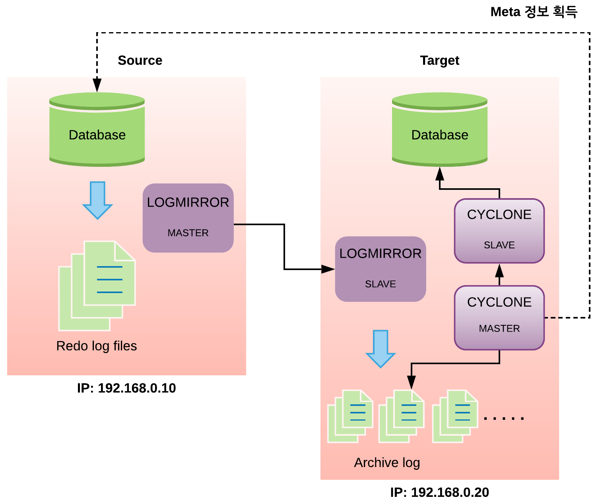

<a id="65bcd92474b119c9"></a>

# 49. LOGMIRROR

> 원본: [GOLDILOCKS 20c.1 User Manual (ko)](https://manual.sunjesoft.co.kr/goldilocks/20c_1/manual/ko/65bcd92474b119c9)  
> 태그: `20c.1_30_tag`

[← 48. CYCLONE](48-cyclone.md) · [전체 목차](../README.md) · [50. CYFILE →](50-cyfile.md)

<a id="d2823ce2dc7bacda"></a>
## LOGMIRROR

LOGMIRROR는 GOLDILOCKS가 생성하는 redo log를 원격지에 복제하여 동일한 redo log file을 구성하는 redo log 이중화 툴이다.

<a id="6ecbc50a021e2838"></a>
### 개요

CDC 방식을 사용하는 CYCLONE은 GOLDILOCKS가 운영 중에 생성하는 redo log file을 분석하여 이중화한다. 따라서 redo log file을 분석하지 못한 상태에서 운영 서버에 장애가 발생할 경우, 분석하지 못한 redo log 만큼의 데이터는 이중화하지 못하고 이는 데이터 손실로 이어진다.

그러나 LOGMIRROR를 이용하여 손실없이 원격지에 redo log를 전송하고 redo log file을 구성할 수 있다면 CYCLONE의 데이터 손실 문제를 해결할 수 있다.

즉, LOGMIRROR는 CYCLONE이 ASYNC 방식을 사용함으로써 발생하는 데이터 손실을 완벽하게 방지하기 위한 툴이며 CYCLONE과 함께 동작해야 한다.

<a id="7cf141266d0009aa"></a>
### 운영상 특징

- Master와 slave로 구분되어 수행되며 GOLDILOCKS 하나당 LOGMIRROR 한 개만 운영할 수 있다.
- Master와 slave는 TCP/ IP와 Infiniband 통신을 사용할 수 있다.
    - Network 속도는 GOLDILOCKS 운영 속도에 많은 영향을 준다.
- 이중화하는 대상은 GOLDILOCKS의 redo log file이다.
- 원본 데이터베이스는 반드시 Transactional Data Store (TDS) 모드로 운영해야 한다.
    - CYCLONE을 함께 운영해야하므로 CYCLONE의 운영상 특징을 모두 동일하게 갖는다.

<a id="114df85696f3f20a"></a>
### LOGMIRROR 운영시 GOLDILOCKS 성능저하 요인

LOGMIRROR는 GOLDILOCKS가 운영 중에 생성하는 redo log를 파일로 저장하기 전에 원격지로 보내고 정상적으로 처리된 이후에 다음 처리과정을 수행한다. 따라서 이중화하는 장비간의 네트워크 속도가 성능의 주요 요인이며 LOGMIRROR 없이 운영되는 GOLDILOCKS보다 성능이 저하될 수 있다. 이에, 네트워크 속도가 빠른 Infiniband까지 지원함으로써 성능 저하를 최소화하였다.

<a id="27ee3d90cb6f6539"></a>
## 준비사항

<a id="8d1101a0f82ba123"></a>
### GOLDILOCKS 준비사항

LOGMIRROR를 수행하기 전에 GOLDILOCKS에 다음과 같은 사항이 설정되어 있어야 한다.

<a id="b2dc5e5fa86afd93"></a>
#### LOG_MIRROR_MODE

LOG_MIRROR_MODE 프로퍼티는 GOLDILOCKS에서 LOGMIRROR를 사용하기 위한 설정이다. 이 설정이 활성화되면 GOLDILOCKS가 생성하는 redo log를 LOGMIRROR가 원격지로 전송하기 전에 임시로 저장할 자원이 할당된다.

- LOG_MIRROR_MODE 프로퍼티를 변경하면 GOLDILOCKS가 재시작된 후에 적용된다.
- 프로퍼티 파일에 해당 내용을 추가하거나 갱신한다.
    - 프로퍼티 파일: goldilocks.properties.conf
    - 프로퍼티 설정: LOG_MIRROR_MODE = 1

또는 gSQL에서 다음을 수행한다.

```
gSQL> ALTER SYSTEM SET LOG_MIRROR_MODE=1 SCOPE=FILE;

System altered.
```

<a id="7b998375d50882f8"></a>
#### LOG_MIRROR_SHARED_MEMORY_STATIC_SIZE

LOG_MIRROR_SHARED_MEMORY_STATIC_SIZE는 LOGMIRROR에서 사용할 임시 저장 공간을 설정한다.

- Redo log buffer에서 redo log file로 저장하기 전에 사용되는 임시 저장 공간이다.
    - 설정값은 redo log file로 저장할 때 사용되는 MAXIMUM_FLUSH_LOG_BLOCK_COUNT와 관련있다.
- 기본값은 100 M 이다.
    - 최소값은 10 M이며, 최대값은 1 G이다.
    - 설정값이 너무 작을 경우 성능에 영향을 줄 수 있다.

- LOG_MIRROR_SHARED_MEMORY_STATIC_SIZE 프로퍼티를 변경할 경우, GOLDILOCKS가 재시작된 이후에 적용된다.
- 프로퍼티 파일에 해당 내용을 추가하거나 갱신한다.
    - 프로퍼티 파일 : goldilocks.properties.conf
    - 프로퍼티 설정 : LOG_MIRROR_SHARED_MEMORY_STATIC_SIZE = 설정값

또는 gSQL에서 다음을 수행한다.

```
gSQL> ALTER SYSTEM SET LOG_MIRROR_SHARED_MEMORY_STATIC_SIZE = 200M SCOPE=FILE;

System altered.
```

<a id="a56fbaacf0e4b6ee"></a>
#### LOG_MIRROR_TIMEOUT

GOLDILOCKS는 LOGMIRROR와 연동될 때 LOGMIRROR의 응답을 기다리는 과정을 포함한다. 이 응답이 너무 느리면 이 과정을 포함하는 GOLDILOCKS 또한 느려진다. LOG_MIRROR_TIMEOUT은 응답 대기시간을 지정하고 이 시간을 경과할 때까지 응답이 오지 않을 경우 LOGMIRROR 서비스를 중단한 채 GOLDILOCKS의 서비스만 계속 수행한다.

LOGMIRROR를 다시 수행하려면 LOGMIRROR를 재구동하여 recovery 과정을 거치면 정상적으로 다시 운영할 수 있다.

- 기본값은 0 이다.
    - 0은 무한대기를 나타낸다.
    - 초 단위로 설정할 수 있다.
- LOG_MIRROR_TIMEOUT 프로퍼티를 변경할 경우, 그 즉시 반영된다.
- 프로퍼티 파일에 해당 내용을 추가하거나 갱신한다.
    - 프로퍼티 파일: goldilocks.properties.conf
    - 프로퍼티 설정: LOG_MIRROR_TIMEOUT = 설정값

또는 gSQL에서 다음을 수행한다.

```
gSQL> ALTER SYSTEM SET LOG_MIRROR_TIMEOUT = 20;

System altered.
```

> CYCLONE을 운영할 때 필요한 GOLDILOCKS 준비사항 역시 적용되어 있어야 한다.

<a id="201a638b373dc06a"></a>
## 환경설정

<a id="6b525fbf2fe5f450"></a>
### 환경설정 파일

LOGMIRROR를 실행할 때 환경 설정 파일을 사용하여 운영에 필요한 정보와 옵션을 설정할 수 있다.

- --conf 옵션을 사용하여 특정 환경설정 파일을 설정하지 않을 경우, $GOLDILOCKS_DATA/conf 디렉토리에서 특정 파일을 읽게 되는데 master로 동작할 경우에는 logmirror.master.conf 파일을 읽고, slave로 동작할 경우에는 logmirror.slave.conf 파일을 읽는다.

**설정 내용**

<a id="a47fed1a7731c349"></a>
| 이름 | 설명 | 적용범위 |
| --- | --- | --- |
| PORT | Master/ slave 통신에 사용할 port를 설정한다. | Master/ slave |
| DSN | Data Source Name을 설정한다. | Master |
| HOST_IP | GOLDILOCKS가 운영 중인 host IP address를 설정한다. | Master |
| HOST_PORT | GOLDILOCKS가 운영 중인 host port를 설정한다. | Master |
| USER_ID | 사용자 이름을 설정한다. | Master |
| USER_PW | 사용자 암호를 설정한다. | Master |
| USER_ENCRYPT_PW | 암호화된 사용자 암호를 설정한다. | Master/ slave |
| LOG_PATH | 이중화된 redo log file이 저장될 경로를 설정한다. | Slave |
| MASTER_IP | LogMirror master가 운영 중인 장비의 IP address를 설정한다. | Slave |
| HEARTBEAT_TIMEOUT | 이중화 연결 후에 network가 끊기거나 시스템 장애에 의해 연결이 원활하지 않을 경우, 연결을 유지하는 최대 시간 (초)을 설정한다. | Master/ slave |
| TCP_NODELAY | Socket의 TCP_NODELAY 옵션을 설정한다. (Default는 1 이다) * 0: TCP_NODELAY off * 1: TCP_NODELAY on | Master |

<a id="6ec2d1ba0c5c3ad7"></a>
### 환경설정 옵션

<a id="5f3170b3cf0e58e6"></a>
#### PORT

- Master와 slave간에 통신할 때 사용되는 port를 설정한다.
- Master와 slave에서 설정할 수 있다.

```
PORT=21106
```

<a id="da571defb4adeb9e"></a>
#### DSN

- GOLDILOCKS 접속시 필요한 Data Source Name을 설정한다.
- Master에서 설정할 수 있다.

```
DSN = GOLDILOCKS
```

<a id="9a1298bf3c2ae66f"></a>
#### HOST_IP

- LOGMIRROR가 운영될 GOLDILOCKS의 IP address를 설정한다.
- HOST_PORT와 함께 설정해야 한다.
- Master에서 설정할 수 있다.

```
HOST_IP = 127.0.0.1
```

<a id="03546bfe8a9c78dd"></a>
#### HOST_PORT

- LOGMIRROR가 운영될 GOLDILOCKS의 port를 설정한다.
- HOST_IP와 함께 설정해야 한다.
- Master에서 설정할 수 있다.

```
HOST_PORT = 22531
```

<a id="e79ef28f8f361729"></a>
#### USER_ID

- GOLDILOCKS 접속에 필요한 사용자 ID를 설정한다.
- Master에서 설정할 수 있다.

```
USER_ID = testID
```

<a id="88814cebc7deb42c"></a>
#### USER_PW

- GOLDILOCKS 접속에 필요한 사용자 암호를 설정한다.
- Master에서 설정할 수 있다.

```
USER_PW = testPW
```

<a id="471161e1bffefbd5"></a>
#### USER_ENCRYPT_PW

- GOLDILOCKS접속에 필요한 사용자 패스워드를 encrypt하여 설정한다.
- USER_PW를 대신하여 사용한다.
- Encrypt 된 사용자 패스워드는 *[logmirror --encrypt 사용자패스워드 --key 암호화할key]* 로 생성한다.
- 해당 설정값을 사용한 경우 logmirror를 실행할 때 --key 옵션을 사용해야 한다. (이 때 --encrypt로 생성한 key와 동일한 key 값을 사용해야 한다.))

```
USER_ENCRYPT_PW = 't33KImiqvhqNyfN+uZmFrw=='
```

<a id="638b20bbc545b96c"></a>
#### LOG_PATH

- 이중화되는 redo log file이 저장될 경로를 설정한다.
    - 절대 경로를 사용해야 한다.
    - 경로에는 single quote (')를 사용해야 한다.
- Slave에서 설정할 수 있다.

```
LOG_PATH = '/data/wal'
```

<a id="be0ade703bc87460"></a>
#### MASTER_IP

- LOGMIRROR master가 운영 중인 장비의 IP address를 설정한다.
- Slave에서 설정할 수 있다.

```
MASTER_IP = 192.168.0.100
```

<a id="08540a7a56dd41d1"></a>
#### HEARTBEAT_TIMEOUT

- Master와 slave에서 설정할 수 있다.
- Master와 slave의 이중화 연결 후에 network가 끊기거나 시스템 장애에 의해 연결이 원활하지 않을 경우, 연결 유지를 지속하는 최대 시간 (초)을 설정한다.
- 기본값은 30 (초)이다.
    - 최소값은 10 (초)이다.

```
HEARTBEAT_TIMEOUT = 40
```

<a id="05a240467dcc7252"></a>
#### TCP_NODELAY

- Master에서만 사용된다.
- LogMirror전송 socket에 대한 TCP_NODELAY 옵션을 설정한다.
    - 0: socket TCP_NODELAY 옵션을 off 한다.
    - 1: socket TCP_NODELAY 옵션을 on 한다. (Default)

```
TCP_NODELAY = 1
```

<a id="33916eea18331d30"></a>
## 운영

LOGMIRROR의 master/ slave 실행 환경은 다음과 같다.

**실행환경**

<a id="304d884f8032d661"></a>
| 구분 | GOLDILOCKS 운영여부 | 설명 |
| --- | --- | --- |
| Master | O | Master로 운영할 때 반드시 GOLDILOCKS가 운영되고 있는 장비에서 LogMirror를 수행해야 한다. |
| Slave | X | Slave로 운영할 때 GOLDILOCKS는 운영하고 있지 않아도 되지만 redo log file이 저장될 디스크 여유공간은 반드시 필요하다. |

운영 중에 수행되는 내용은 trace log를 통해 확인할 수 있다.

<a id="2a9e5e6d07dd99e2"></a>
| 구분 | 파일 |
| --- | --- |
| Master | $GOLDILOCKS_DATA/trc/LogMirror_master.trc |
| Slave | $GOLDILOCKS_DATA/trc/LogMirror_slave.trc |

> Trace log에 저장되는 에러 메시지와 처리방법은 [LOGMIRROR 에러 메시지와 처리 방법](../part-02-administration-manual/8-goldilocks-데이터베이스-이중화.md#981b7cc256b5a2e8)을 참조한다.

<a id="67e82779c9c7b919"></a>
### LOGMIRROR 운영

LOGMIRROR는 GOLDILOCKS의 환경 설정 및 master/ slave 초기화와 운영 이후에도 다음 과정이 완료되어야만 정상적으로 redo log file을 이중화할 수 있다.

> 이중화를 시작하려면 redo log file을 SWITCH 해야 한다. 즉, 새로운 로그 파일이 생성되어야만 LOGMIRROR의 정상적 운영이 시작된다. 따라서 다음 과정을 수행해야 한다.

```
gSQL> ALTER SYSTEM SWITCH LOGFILE;

System altered.
```

> LOGMIRROR가 이중화하는 redo log file은 지속적으로 저장된다. 즉, 자동으로 지워지지 않는다. 따라서 운영 장비의 환경에 따라 주기적으로 파일을 삭제하거나 이동하는 등의 관리 작업이 필요하다.

<a id="3b3e63ddfc7e98ce"></a>
### 실행 옵션

**실행 옵션**

<a id="833da064272e561a"></a>
| 옵션 | 설명 | 비고 |
| --- | --- | --- |
| --start \| -s | LOGMIRROR를 실행한다. | --master \| --slave 와 함께 사용해야 한다. |
| --stop \| -t | LOGMIRROR를 종료한다. | --master \| --slave 와 함께 사용해야 한다. |
| --master \| -m | Master 모드로 수행한다. | --start \| --stop 과 함께 사용해야 한다. |
| --slave \| -l | Slave 모드로 수행한다. | --start \| --stop 과 함께 사용해야 한다. |
| --conf \| -c | 환경 파일의 경로를 설정한다. | --conf CONFIG_FILE 형식으로 입력한다. |
| --infiniband \| -f | infiniband 네트워크 환경을 사용한다. | TCP/ IP 환경을 사용할 경우, 입력하지 않는다. |
| --silent \| -i | 메시지를 출력하지 않도록 한다. | - |
| --help \| -h | 도움말을 출력한다. | - |

- 기본 환경 파일을 사용하여 master 모드로 실행한다.

```
prompt> logmirror --master --start
```

- Master 모드로 운영 중인 LOGMIRROR를 종료한다.

```
prompt> logmirror --master --stop
```

- 기본 환경 파일을 사용하여 slave 모드로 실행한다.

```
prompt> logmirror --slave --start
```

- Slave 모드로 운영 중인 LOGMIRROR를 종료한다.

```
prompt> logmirror --slave --stop
```

- TEST_CONFIG 파일, infiniband network를 사용하여 master 모드로 실행한다.

```
prompt> logmirror --master --start --conf TEST_CONFIG --infiniband
```

- TEST_CONFIG 파일, infiniband network를 사용하여 slave 모드로 실행한다.

```
prompt> logmirror --slave --start --conf TEST_CONFIG --infiniband
```

> LOGMIRROR를 초기화하는 예는 [LOGMIRROR](../part-02-administration-manual/8-goldilocks-데이터베이스-이중화.md#0a727669539ece46)를 참조한다.

<a id="19f0fc00bc6823fe"></a>
## CYCLONE과 연동 예

CDC 이중화 툴인 CYCLONE을 redo log file 이중화 툴인 LOGMIRROR와 연동하여 사용할 경우 이중화 데이터 손실을 방지할 수 있다.

<a id="491c59adf7e899fd"></a>
| TOOL | 기능 | 연동 |
| --- | --- | --- |
| CYCLONE | CDC 이중화 | 독립적으로 운영할 경우 데이터가 손실될 수 있다. |
| LOGMIRROR | REDO LOG FILE 이중화 | 연동하여 운영할 경우 데이터가 손실되지 않는다. |

다음은 연동을 위한 운영 구조의 예이다.

<a id="797cdaa500be0412"></a>


- 장비 구조
    - 데이터의 원본이 되는 source 장비 
        - IP: 192.168.0.10
        - GOLDILOCKS listen port: 22581
        - 이중화할 테이블: T1, T2
    - 이중화를 위한 원격 target 장비 
        - IP: 192.168.0.20
- 두 개의 장비는 데이터 손실없는 이중화를 위해 LOGMIRROR와 CYCLONE을 연동하여 운영한다.
    - Source 장비: LOGMIRROR (master)
    - Target 장비: LOGMIRROR (slave) + CYCLONE (master, slave)

<a id="b05a9d60284e6461"></a>
### 운영 순서

1. 원본 GOLDILOCKS에 CYCLONE 및 LOGMIRROR 환경 설정
2. LOGMIRROR MASTER/ SLAVE 환경 설정
3. LOGMIRROR MASTER/ SLAVE 실행
4. LOGMIRROR를 정상적으로 운영하기 위한 원본 GOLDILOCKS의 LOGFILE SWITCH를 수행
5. 원격 GOLDILOCKS 환경 설정
6. CYCLONE MASTER/ SLAVE 환경 설정
7. CYCLONE MASTER/ SLAVE 실행

<a id="1783777e6c3b7674"></a>
#### 원본 GOLDILOCKS에 CYCLONE 및 LOGMIRROR 환경 설정

다음을 참조한다.  
• CYCLONE 환경설정: [준비사항](48-cyclone.md#7bdc143e1a810eb0)  
• LOGMIRROR 환경설정: [준비사항](#27ee3d90cb6f6539)

환경 설정을 마친 후, 테스트를 위해 T1, T2 table을 생성한다.

```
gSQL > CREATE TABLE T1( COL1 INTEGER PRIMARY KEY, COL2 VARCHAR(20) );
gSQL > CREATE TABLE T2( COL1 INTEGER PRIMARY KEY, COL2 VARCHAR(20) );
gSQL > COMMIT;
```

<a id="810a2b77113f3aea"></a>
#### LOGMIRROR MASTER/ SLAVE 환경 설정

- LOGMIRROR MASTER 환경 설정 파일
    - 저장위치: $GOLDILOCKS_DATA/conf/logmirror.master.conf
    - Source 장비이다.

> LOGMIRROR MASTER는 반드시 원본 GOLDILOCKS가 운영되는 장비에서 실행되어야 한다.

- DSN 또는 HOST 정보를 입력한다. 여기서는 HOST 정보를 입력한다.

```
HOST_IP   = 192.168.0.10
HOST_PORT = 22581
```

- 위 단계에서 생성한 CYCYLONE USER를 사용한다.

```
USER_ID = cdc_user
USER_PW = cdc_password
```

- LOGMIRROR 통신에 사용할 PORT를 설정한다.

```
PORT = 21106
```

- LOGMIRROR SLAVE 환경 설정 파일
    - 저장위치: $GOLDILOCKS_DATA/conf/logmirror.slave.conf
    - Target 장비이다.

- LOGMIRROR MASTER가 운영되고 있는 장비의 IP를 입력한다.

```
MASTER_IP = 192.168.0.10
```

- LOGMIRROR MASTER와 동일한 PORT를 입력해야 한다.

```
PORT = 21106
```

- 이중화된 redo log file이 저장될 절대 경로를 입력한다.

```
LOG_PATH = '/data/LogMirrorWAL'
```

<a id="72e6aa63b04327a6"></a>
#### LOGMIRROR MASTER/ SLAVE 실행

- LOGMIRROR MASTER 실행
    - Source 장비에서 실행해야 한다.

```
logmirror --master --start --conf $GOLDILOCKS_DATA/conf/logmirror.master.conf
```

- LOGMIRROR SLAVE 실행
    - Target 장비에서 실행해야 한다.

```
logmirror --slave --start --conf $GOLDILOCKS_DATA/conf/logmirror.slave.conf
```

<a id="b59fbd3fde6a5cc6"></a>
#### 정상적인 LOGMIRROR 운영을 위해 원본 GOLDILOCKS의 LOGFILE SWITCH 수행

- LOGFILE SWITCH를 수행하여 LOGMIRROR 파일을 기록하기 시작한다.
    - Source 장비에서 실행해야 한다.

```
gSQL> ALTER SYSTEM SWITCH LOGFILE;
```

> 위와 같이 실행할 경우 SLAVE 장비의 설정된 경로에 redo log file이 생성된다. 만약 redo log file이 생성되지 않았으면 디렉토리 권한이나 디렉토리 생성 여부를 확인해봐야 한다.

<a id="963fa81448e8fa48"></a>
#### 원격 GOLDILOCKS 환경 설정

Target 장비에서 운영되는 GOLDILOCKS의 정상적인 운영 및 이중화를 위한 테이블 구성, 스키마 정보를 확인한다.

여기에서는 테스트를 위해 T1, T2 table을 생성한다.

```
gSQL > CREATE TABLE T1( COL1 INTEGER PRIMARY KEY, COL2 VARCHAR(20) );
gSQL > CREATE TABLE T2( COL1 INTEGER PRIMARY KEY, COL2 VARCHAR(20) );
gSQL > COMMIT;
```

<a id="6d54b9e92506e234"></a>
#### CYCLONE MASTER/ SLAVE 환경 설정

- CYCLONE MASTER 환경 설정 파일
    - 저장위치: $GOLDILOCKS_DATA/conf/cyclone.master.conf
    - Target 장비이다.

- Source 장비의 DSN 또는 HOST 정보를 입력한다. 여기서는 HOST 정보를 입력한다.

```
HOST_IP   = 192.168.0.10
HOST_PORT = 22581
```

- CYCLONE USER를 사용한다.

```
USER_ID = cdc_user
USER_PW = cdc_password

GROUP_NAME = GROUP1
{
    PORT = 21102
    CAPTURE_TABLE = 
    (
        T1,
        T2
    )
}
```

- CYCLONE SLAVE 환경 설정 파일
    - 저장위치: $GOLDILOCKS_DATA/conf/cyclone.slave.conf
    - Target 장비이다.

- Target 장비에서 운영되는 GOLDILOCKS에 D/A로 접속한다. (따라서 DSN, HOST 정보는 없다)

```
USER_ID = cdc_user
USER_PW = cdc_password
```

- CYCLONE master는 동일한 장비에서 수행되고 있다.

```
MASTER_IP = 192.168.0.20

GROUP_NAME = GROUP1
{
```

- LogMirror slave가 설정한 경로를 입력해야 한다.

```
LOG_PATH = '/data/LogMirrorWAL'
    PORT = 21102
    APPLY_TABLE =
    ( 
        T1 TO T1,
        T2 TO T2
    }
}
```

<a id="7df248578175d7f0"></a>
#### CYCLONE MASTER/ SLAVE 실행

- CYCLONE MASTER 실행
    - D/A로 접속하는 경우 target 장비에서 실행되어야 한다.

```
cyclone --master --start --conf $GOLDILOCKS_DATA/conf/cyclone.master.conf
```

- CYCLONE SLAVE 실행
    - D/A로 접속하는 경우 target 장비에서 실행되어야 한다.

```
cyclone --slave --start --conf $GOLDILOCKS_DATA/conf/cyclone.slave.conf
```

---

[← 48. CYCLONE](48-cyclone.md) · [전체 목차](../README.md) · [50. CYFILE →](50-cyfile.md)

<sub>Copyright © 2010 SUNJESOFT Inc. All rights reserved.</sub>
