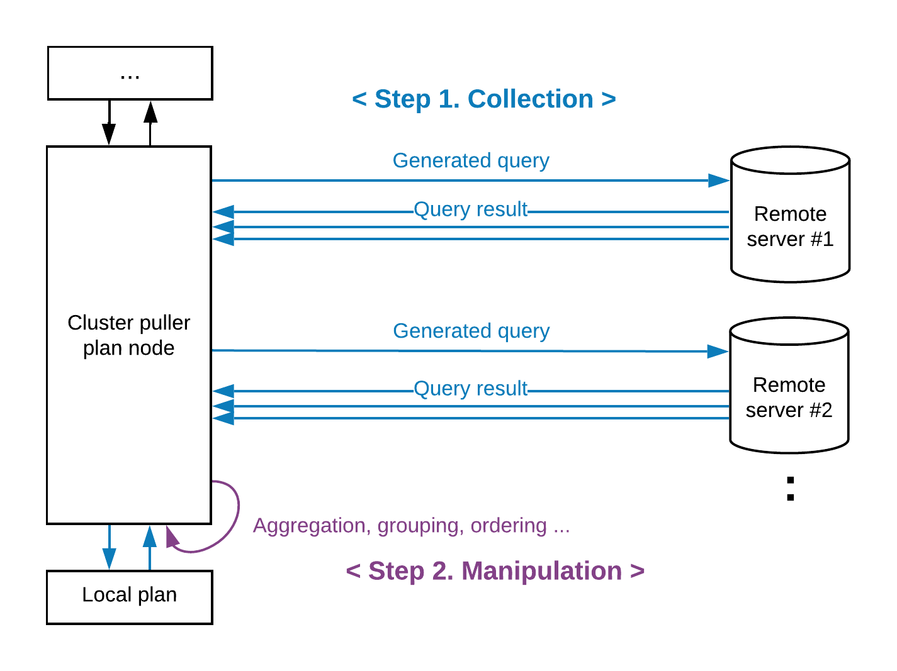
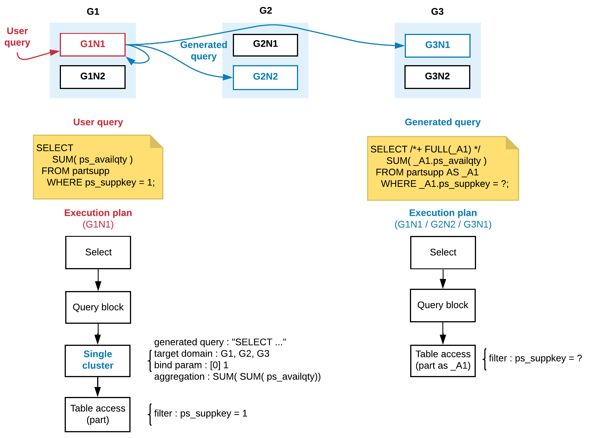
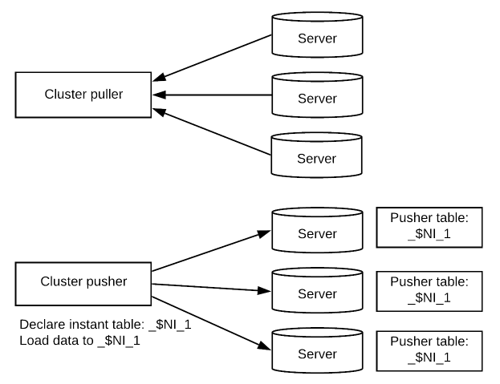
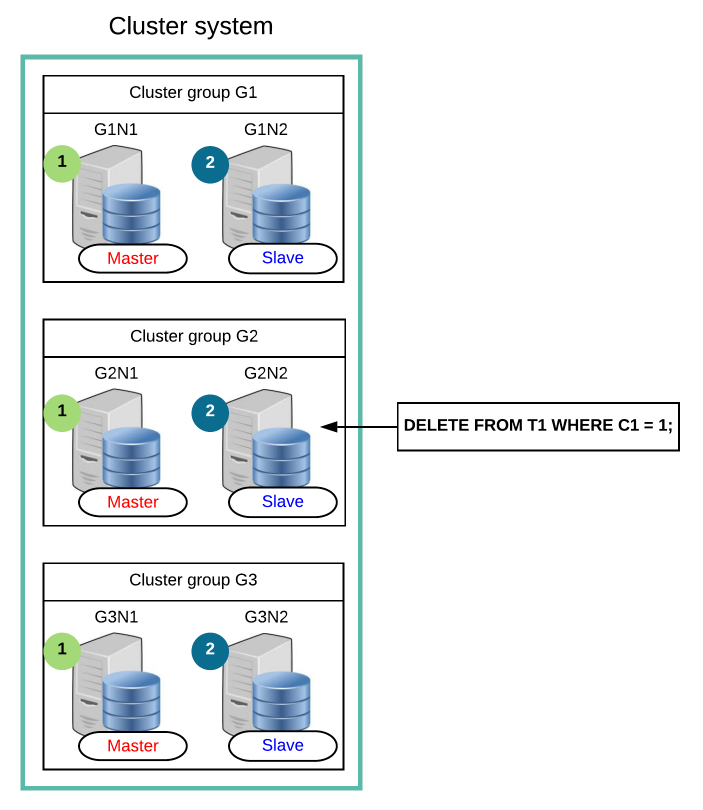
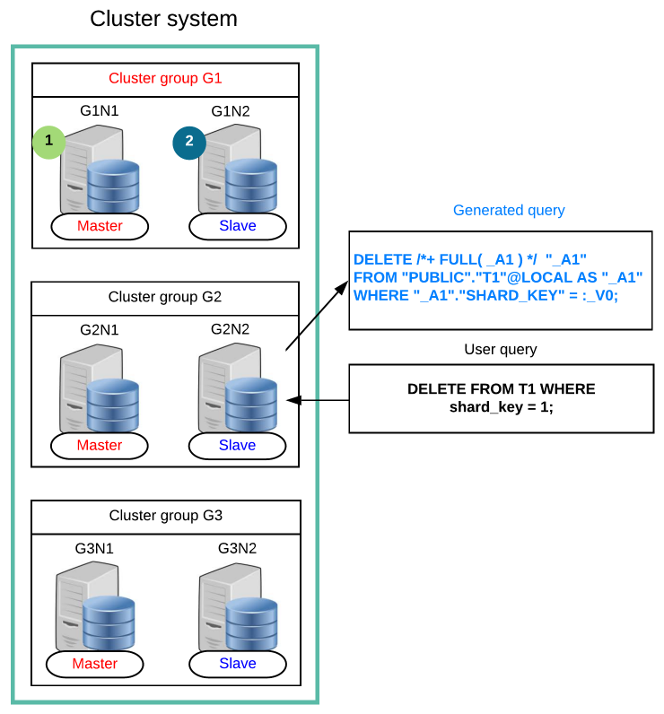

<a id="a12cbd54a53fd61b"></a>

# 12. SQL Languages

> Source: [GOLDILOCKS 21c.1 User Manual (en)](https://manual.sunjesoft.co.kr/goldilocks/21c_1/manual/en/a12cbd54a53fd61b)  
> Tag: `21c.1_35_tag`

[← 11. SQL Elements](11-sql-elements.md) · [Table of contents](../README.md) · [13. SQL Objects →](13-sql-objects.md)

Structured Query Languages (SQL) are classified as follows.

- Data Definition Language
- Data Manipulation Language
- Data Query Language
- Control Language

<a id="e7a505104660ca57"></a>
## Data Definition Language

<a id="ebe84752ab180f41"></a>
### DDL Related Statements

For more information, refer to the followings.

- Non-schema object DDL
    - [Database Related Statements](13-sql-objects.md#2788e45a624571d0)
    - [Profile Related Statements](13-sql-objects.md#2862f7aebdf9db3f)
    - [Audit Policy Related Statement](13-sql-objects.md#7e83902e63139016)
    - [Authorization Related Statements](13-sql-objects.md#449291de5b7ef236)
    - [Schema Related Statements](13-sql-objects.md#3b84afbfcbc375ab)
    - [Tablespace Related Statements](13-sql-objects.md#4ec4a2ed84ddfdd3)

- SQL schema object DDL
    - [Table Related Statements](13-sql-objects.md#720261831a59f06c)
    - [Index Related Statements](13-sql-objects.md#918a17ac04e10ac1)
    - [View Related Statements](13-sql-objects.md#a4d2c1023a0a0190)
    - [Sequence Related Statements](13-sql-objects.md#11f216885507334b)
    - [Synonym Related Statements](13-sql-objects.md#357bfca0a97a5259)

- Cluster object DDL
    - [Cluster System Related Statements](14-cluster-objects.md#a46569c04b11f061)
    - [Cluster Group Related Statements](14-cluster-objects.md#3114a9a64ee06ca8)
    - [Cluster Member Related Statements](14-cluster-objects.md#862e45012e9ffe17)
    - [Cluster Location Related Statements](14-cluster-objects.md#1b0279009f7b2c0c)
    - [Global Secondary Index Related Statements](14-cluster-objects.md#dfdd230c62e428f6)

<a id="0baa50ba06e81ff7"></a>
### Concepts of DDL

Data Definition Language (DDL) is an SQL language which creates, drops and alters SQL objects.

SQL objects of a database are listed in the following table. For more information, refer to the links in the following table.

<a id="8e4ec915037b1cf0"></a>
<table class="table column_count_4"><caption>SQL objects types</caption><thead><tr><th class="to_center"><div>Object type</div></th><th class="to_center"><div>Object</div></th><th class="to_center"><div>Description</div></th><th class="to_center"><div>Refer to</div></th></tr></thead><tbody><tr><td class="to_left to_middle" rowspan="6"><div>Non-schema
object</div></td><td class="to_left to_middle"><div>Profile</div></td><td class="to_left to_middle"><div>It is an object which defines a password management policy.</div></td><td class="to_left to_middle"><div><a class="reference text" href="13-sql-objects.md#42f2d2b3e24e3945">Profile</a></div></td></tr><tr><td class="to_middle"><div>Audit policy</div></td><td class="to_middle"><div>It is an object which defines the SQL audit policy.</div></td><td class="to_middle"><div><a class="reference text" href="13-sql-objects.md#199a62950f3c92e4">Audit Policy</a></div></td></tr><tr><td class="to_left to_middle"><div>User</div></td><td class="to_left to_middle"><div>It is a user object which consists of a set of privileges.</div></td><td class="to_left to_middle"><div><a class="reference text" href="13-sql-objects.md#193f3865824190f7">Authorization</a></div></td></tr><tr><td class="to_left to_middle"><div>Schema</div></td><td class="to_left to_middle"><div>It is a logical position including SQL schema objects such as tables.</div></td><td class="to_left to_middle"><div><a class="reference text" href="13-sql-objects.md#68b6b280d70ae475">Schema</a></div></td></tr><tr><td class="to_left to_middle"><div>Tablespace</div></td><td class="to_left to_middle"><div>It is a physical storage of objects such as tables, indexes, etc.</div></td><td class="to_left to_middle"><div><a class="reference text" href="13-sql-objects.md#136d04619f335821">Tablespace</a></div></td></tr><tr><td class="to_left to_middle"><div>Public synonym</div></td><td class="to_left to_middle"><div>It is a public synonym.</div></td><td class="to_left to_middle"><div><a class="reference text" href="13-sql-objects.md#32fd066020452c72">Public Synonym</a></div></td></tr><tr><td class="to_left to_middle" rowspan="7"><div>SQL schema 
object</div></td><td class="to_left to_middle"><div>Table</div></td><td class="to_left to_middle"><div>It is a physical relation where the data is stored.</div></td><td class="to_left to_middle"><div><a class="reference text" href="13-sql-objects.md#f70f2dbf53e5e70c">Table</a></div></td></tr><tr><td class="to_left to_middle"><div>View</div></td><td class="to_left to_middle"><div>It is a logical relation which consists of queries.</div></td><td class="to_left to_middle"><div><a class="reference text" href="13-sql-objects.md#c72f627aa7242298">View</a></div></td></tr><tr><td class="to_left to_middle"><div>Index</div></td><td class="to_left to_middle"><div>It is an index object to improve query performance.</div></td><td class="to_left to_middle"><div><a class="reference text" href="13-sql-objects.md#1050054911461c65">Index</a></div></td></tr><tr><td class="to_left to_middle"><div>Sequence</div></td><td class="to_left to_middle"><div>It is an object which generate sequence number.</div></td><td class="to_left to_middle"><div><a class="reference text" href="13-sql-objects.md#aa20c5113b53eabd">Sequence</a></div></td></tr><tr><td class="to_left to_middle"><div>Synonym</div></td><td class="to_left to_middle"><div>It is an object which declares an alias for an object.</div></td><td class="to_left to_middle"><div><a class="reference text" href="13-sql-objects.md#e471dbb7c52ddbb8">Synonym</a></div></td></tr><tr><td class="to_middle"><div>Stored procedure</div></td><td class="to_middle"><div>It is a user defined procedure object.</div></td><td class="to_middle"><div><a class="reference text" href="13-sql-objects.md#c12c62b7f8e9b541">Stored Procedure</a></div></td></tr><tr><td class="to_middle"><div>Stored function</div></td><td class="to_middle"><div>It is a user defined function object.</div></td><td class="to_middle"><div><a class="reference text" href="13-sql-objects.md#a9d0984093eae751">Stored Function</a></div></td></tr><tr><td class="to_left to_middle" rowspan="5"><div>Cluster
object</div></td><td class="to_left to_middle"><div>Cluster group</div></td><td class="to_left to_middle"><div>It is a cluster member set.</div></td><td class="to_left to_middle"><div><a class="reference text" href="14-cluster-objects.md#70d0347244e4536f">Cluster Group</a></div></td></tr><tr><td class="to_left to_middle"><div>Cluster member</div></td><td class="to_left to_middle"><div>It is a data server which configures a cluster system.</div></td><td class="to_left to_middle"><div><a class="reference text" href="14-cluster-objects.md#9826b8acb6931b4e">Cluster Member</a></div></td></tr><tr><td class="to_left to_middle"><div>Cluster location</div></td><td class="to_left to_middle"><div>It is a location object of a cluster member.</div></td><td class="to_left to_middle"><div><a class="reference text" href="14-cluster-objects.md#b06475247161ec22">Cluster Location</a></div></td></tr><tr><td class="to_left to_middle"><div>Shard</div></td><td class="to_left to_middle"><div>It is a set of rows which horizontally divides a cluster table.</div></td><td class="to_left to_middle"><div><a class="reference text" href="14-cluster-objects.md#6a3c9da5975bc644">Cluster Table and Shard</a></div></td></tr><tr><td class="to_left to_middle"><div>Global secondary
index</div></td><td class="to_left to_middle"><div>It is an index for the row identifier of a cluster.</div></td><td class="to_left to_middle"><div><a class="reference text" href="14-cluster-objects.md#c2261199baae711d">Global Secondary Index</a></div></td></tr></tbody></table>

<a id="1c2ba86dcec2b83b"></a>
### DDL and Transaction

A transaction of GOLDILOCKS includes not only DML statements such as INSERT, DELETE, UPDATE data, but also DDL statement such as CREATE, DROP, ALTER objects. Many DBMS performs implicit transactions of DDL. On the other hand, GOLDILOCKS includes a DDL statement in the transaction, and it guarantees the atomicity and consistency of transaction.

This feature is useful when a user needs to atomically perform batch DDL such as database migration ortool installation, or to recover a mistake through ROLLBACK when statement such as DROP TABLE or TRUNCATE TABLE is executed by user mistake.

If the property of DDL statement is auto-commit, then it automatically commits when executing the statement. On the other hand, if it is not auto-commit, then it can rollback the transaction even after the statement was executed. Whether the DDL is auto-commit or not is queried by using [V$SQL_COMMAND](../part-02-administration-manual/9-database-information.md#0b783f2a767d8eda) view as follows.

```
gSQL> 
SELECT command, auto_commit 
  FROM V$SQL_COMMAND 
 WHERE is_ddl = 'YES';


COMMAND                                                   AUTO_COMMIT
--------------------------------------------------------- -----------
ALTER AUDIT POLICY                                        YES
ALTER CLUSTER GROUP .. ADD CLUSTER MEMBER                 YES
ALTER CLUSTER GROUP .. OFFLINE CLUSTER MEMBER             YES
ALTER DATABASE DROP INACTIVE CLUSTER MEMBERS              YES
ALTER DATABASE OFFLINE INACTIVE CLUSTER MEMBERS           YES
ALTER DATABASE RESET LOCAL CLUSTER MEMBER                 YES
ALTER DATABASE ADD LOGFILE GROUP                          YES
ALTER DATABASE ADD LOGFILE MEMBER                         YES
ALTER DATABASE DROP LOGFILE GROUP                         YES
ALTER DATABASE DROP LOGFILE MEMBER                        YES
ALTER DATABASE RENAME LOGFILE                             YES
ALTER DATABASE ARCHIVELOG                                 YES
ALTER DATABASE NOARCHIVELOG                               YES
ALTER DATABASE DATAFILE AUTOEXTEND ..                     YES
ALTER DATABASE CLEAR PASSWORD HISTORY                     NO
ALTER FUNCTION                                            NO
ALTER INDEX AGING                                         NO
ALTER INDEX .. STORAGE                                    NO
ALTER INDEX .. RENAME                                     NO
ALTER INDEX .. REBUILD                                    YES
ALTER PACKAGE                                             YES
ALTER PROCEDURE                                           NO
ALTER PROFILE                                             YES
ALTER SEQUENCE                                            YES
ALTER SEQUENCE .. SYNCHRONIZE                             YES
ALTER SYSTEM SWITCH LOGFILE                               YES
ALTER TABLE .. ADD COLUMN                                 NO
ALTER TABLE .. SET UNUSED COLUMN                          NO
ALTER TABLE .. ALTER COLUMN .. SET DEFAULT                NO
ALTER TABLE .. ALTER COLUMN .. DROP DEFAULT               NO
ALTER TABLE .. ALTER COLUMN .. SET NOT NULL               NO
ALTER TABLE .. ALTER COLUMN .. DROP NOT NULL              NO
ALTER TABLE .. ALTER COLUMN .. SET DATA TYPE              YES
ALTER TABLE .. ALTER COLUMN .. AS IDENTITY                YES
ALTER TABLE .. ALTER COLUMN .. DROP IDENTITY              YES
ALTER TABLE .. RENAME COLUMN                              NO
ALTER TABLE .. STORAGE                                    NO
ALTER TABLE .. ADD CONSTRAINT                             NO
ALTER TABLE .. ALTER CONSTRAINT                           NO
ALTER TABLE .. DROP CONSTRAINT                            NO
ALTER TABLE .. RENAME CONSTRAINT                          NO
ALTER TABLE .. RENAME TO ..                               NO
ALTER TABLE .. REBALANCE ..                               YES
ALTER TABLE .. MOVE SHARD .. TO CLUSTER GROUP ..          YES
ALTER TABLE .. SPLIT SHARD .. INTO .. AT CLUSTER GROUP .. YES
ALTER TABLE .. MERGE SHARDS .. INTO ..                    YES
ALTER TABLE .. RENAME SHARD .. TO ..                      NO
ALTER TABLE .. ADD SUPPLEMENTAL LOG                       NO
ALTER TABLE .. ADD GLOBAL SECONDARY INDEX                 NO
ALTER TABLE .. ALTER GLOBAL SECONDARY INDEX               NO
ALTER TABLE .. ALTER GLOBAL SECONDARY INDEX AGING         NO
ALTER TABLE .. DROP GLOBAL SECONDARY INDEX                NO
ALTER TABLE .. REBUILD GLOBAL SECONDARY INDEX             YES
ALTER TABLE .. DROP SUPPLEMENTAL LOG                      NO
ALTER TABLE .. READ ONLY                                  YES
ALTER TABLE .. READ WRITE                                 YES
ALTER TABLE .. SYNCHRONIZE IDENTITY COLUMN                YES
ALTER TABLESPACE .. ADD                                   YES
ALTER TABLESPACE .. DROP                                  YES
ALTER TABLESPACE .. ONLINE                                YES
ALTER TABLESPACE .. OFFLINE                               YES
ALTER TABLESPACE .. RENAME TO                             YES
ALTER TABLESPACE .. RENAME { DATAFILE | MEMORY }          YES
ALTER USER                                                YES
ALTER USER .. IDENTIFIED BY                               YES
ALTER VIEW                                                NO
ANALYZE SYSTEM COMPUTE STATISTICS                         NO
ANALYZE SYSTEM DELETE STATISTICS                          NO
ANALYZE TABLE .. [COMPUTE|ESTIMATE] STATISTICS            YES
ANALYZE TABLE .. DELETE STATISTICS                        NO
AUDIT POLICY                                              YES
COMMENT ON .. IS                                          NO
CREATE AUDIT POLICY                                       YES
CREATE CLUSTER GROUP                                      YES
CREATE FUNCTION                                           NO
CREATE INDEX                                              NO
CREATE PACKAGE                                            YES
CREATE PACKAGE BODY                                       YES
CREATE PROCEDURE                                          NO
CREATE PROFILE                                            YES
CREATE SCHEMA                                             YES
CREATE SEQUENCE                                           YES
CREATE SYNONYM                                            NO
CREATE TABLE                                              NO
CREATE TABLE ... AS SELECT                                NO
CREATE TABLESPACE                                         YES
CREATE USER                                               YES
CREATE VIEW                                               NO
DROP AUDIT POLICY                                         YES
DROP CLUSTER GROUP                                        YES
DROP FUNCTION                                             NO
DROP INDEX                                                NO
DROP PACKAGE                                              YES
DROP PROCEDURE                                            NO
DROP PROFILE                                              YES
DROP SCHEMA                                               YES
DROP SEQUENCE                                             YES
DROP SYNONYM                                              NO
DROP TABLE                                                NO
DROP TABLESPACE                                           YES
DROP USER                                                 YES
DROP VIEW                                                 NO
GRANT .. ON DATABASE                                      NO
GRANT .. ON TABLESPACE                                    NO
GRANT .. ON SCHEMA                                        NO
GRANT .. ON TABLE                                         NO
GRANT USAGE ON ..                                         NO
GRANT .. ON PROCEDURE                                     NO
GRANT .. ON PACKAGE                                       NO
NOAUDIT POLICY                                            YES
REVOKE .. ON DATABASE                                     NO
REVOKE .. ON TABLESPACE                                   NO
REVOKE .. ON SCHEMA                                       NO
REVOKE .. ON TABLE                                        NO
REVOKE USAGE ON ..                                        NO
REVOKE .. ON PROCEDURE                                    NO
REVOKE .. ON PACKAGE                                      NO
TRUNCATE TABLE                                            NO
PURGE CONSTRAINT                                          NO
PURGE INDEX                                               NO
PURGE TABLE                                               NO
PURGE TABLESPACE                                          YES
PURGE RECYCLEBIN                                          YES
PURGE DBA_RECYCLEBIN                                      YES
FLASHBACK TABLE                                           YES

125 rows selected.
```

The followings are examples of COMMIT and ROLLBACK when table-related DDL statements are included in the transactions, and examples of its effects on other transactions. The example shows that the transaction including DDL guarantees the transaction atomicity. In addition, it ensures the reading consistency of the transaction, which is not affected by other transactions before transaction's commitment or when the transaction is rolled back.

<a id="f1fc002872843ceb"></a>
#### Creating Object and Transaction

- Before committing or rolling back a transaction of creating table

When a table is created, and transaction is not committed, the table data can be manipulated on the DDL transaction as follows. However, other transactions are not allowed to enquire the table until the creating table transaction is committed. CREATE TABLE statement, like as INSERT statement, can not be queried by any other transaction until the transaction is committed.

    - Transaction A: Table t1 is created but the transaction is not committed.

```
gSQL> CREATE TABLE t1 ( id INTEGER, name VARCHAR(128) );
Table created.

gSQL> INSERT INTO t1 VALUES ( 1, 'leekmo' );
1 row created.

gSQL> SELECT * FROM t1;

ID NAME  
-- ------
 1 leekmo

1 row selected.
```

As above, if table t1 is created on the transaction A and the transaction is not yet committed, the transaction B in another session can not enquire the table t1 and can not create the table named as t1.

    - Transaction B: Table t1 can not be enquired until committing the transaction A.

```
gSQL> SELECT * FROM t1;

ERR-42000(16040): table or view does not exist : 
SELECT * FROM t1
              *
ERROR at line 1:
```

    - Table t1 can not be created until the transaction A is rolled back.

```
gSQL> CREATE TABLE t1 ( emp_no INTEGER );

ERR-HYT00(14026): resource busy or timeout expired
```

- After committing a transaction of creating table

If the transaction A is committed, table t1 can be enquired by the transaction B and CREATE TABLE statement returns a validation error to notify that the table t1 exists as follows.

    - Transaction B: After committing the transaction A, the table can be enquired as follows.

```
gSQL> SELECT * FROM t1;

ID NAME  
-- ------
 1 leekmo

1 row selected.
```

    - After the transaction A is committed, a validation error is returned.

```
gSQL> CREATE TABLE t1 ( emp_no INTEGER );

ERR-42000(16005): name 'PUBLIC.T1' is already used by an existing object : 
CREATE TABLE t1 ( emp_no INTEGER )
             *
ERROR at line 1:
```

- After rolling back a transaction of creating table

If the transaction A is rolled back, creating table t1 is also rolled back, and table t1 can be created by the transaction B.

    - Transaction B: The transaction A is rolled back and its state becomes as same as before creating table t1.

```
gSQL> SELECT * FROM t1;

ERR-42000(16040): table or view does not exist : 
SELECT * FROM t1
              *
ERROR at line 1:
```

    - The transaction A is rolled back and it can create the table t1.

```
gSQL> CREATE TABLE t1 ( emp_no INTEGER );

Table created.
```

<a id="c55b080feafc70ef"></a>
#### Dropping Object and Transaction

- Before committing or rolling back a transaction of dropping table

When a table is dropped, and transaction is not committed, other transactions can enquire the dropped table until the DROP TABLE transaction is committed. DROP TABLE statement, like as DELETE statement, retrieves the state of before deleting the table when other transaction enquires it until the transaction is committed.

The following example describes the state which the transaction A drops the table t1, then it creates new table t1, and the transaction is not committed.

    - Transaction A: There is a row having two columns in the table t1 before dropping the table.

```
gSQL> SELECT * FROM t1;

ID NAME  
-- ------
 1 leekmo

1 row selected.
```

    - Dropping the existing table t1

```
gSQL> DROP TABLE t1;

Table dropped.
```

    - Creating the new table t1

```
gSQL> CREATE TABLE t1 ( addr VARCHAR(128) );    

Table created.
```

    - Creating a new row in the newly created table t1

```
gSQL> INSERT INTO t1 VALUES ( 'Seoul, Korea' );

1 row created.

gSQL> SELECT * FROM t1;

ADDR        
------------
Seoul, Korea

1 row selected.
```

If the transaction B enquires when the transaction A is not committed, the information which is before the transaction A is executed is obtained as follows. DROP TABLE statement, like as DELETE statement, does not affect any other transaction until the transaction is committed.

    - Transaction B: The transaction B retrieves the table which is before the execution of the transaction A.

```
gSQL> SELECT * FROM t1;

ID NAME  
-- ------
 1 leekmo

1 row selected.
```

- After committing a transaction of dropping table

If the transaction A is committed, then the transaction B enquires the newly created table t1 as follows.

    - Transaction B: After committing the transaction A, the transaction B enquires the newly created table t1.

```
gSQL> SELECT * FROM t1;

ADDR        
------------
Seoul, Korea

1 row selected.
```

- After rolling back a transaction of dropping table

If the transaction A is rolled back, the transaction B enquires the table t1 which is before the execution of the transaction A as follows. Namely, if the transaction A is rolled back, the rollback transaction does not affect the data of which the transaction B enquires.

    - Transaction B: If the transaction A is rolled back, the transaction B enquires the information which is before the execution of the transaction A.

```
gSQL> SELECT * FROM t1;

ID NAME  
-- ------
 1 leekmo

1 row selected.
```

<a id="b5a9fbb21c80bc37"></a>
#### Altering Object and Transaction

ALTER TABLE statement is used to alter the table structure. ALTER TABLE statement also ensures atomicity and consistency of the transaction like as CREATING TABLE or DROPPING TABLE statements. Before committing a transaction in which a column is added to a table, other transactions retrieve the information of the existing table as follows. Namely, ALTER TABLE statement, like as UPDATE statement, retrieves information which is before DDL transaction in other transaction until the transaction is committed.

- Transaction A: It adds a new UPDATE_TIME column.

```
gSQL> ALTER TABLE t1 ADD COLUMN ( update_time TIMESTAMP DEFAULT CURRENT_TIMESTAMP );

Table altered.
```

- The table t1 including the added column is retrieved.

```
gSQL> select * from t1;

ID NAME   UPDATE_TIME               
-- ------ --------------------------
 1 leekmo 2014-07-10 12:50:33.540495

1 row selected.
```

If the transaction B is executed before committing the transaction A as follows, then the table t1 which is before adding a column is retrieved.

- Transaction B: The added column UPDATE_TIME is not retrieve, because the transaction A is not committed.

```
gSQL> SELECT * FROM t1;

ID NAME  
-- ------
 1 leekmo

1 row selected.
```

<a id="9571a960e2711b92"></a>
## Data Manipulation Language

<a id="7deeec74ddec8e46"></a>
### DML Related Statements

For more information, refer to the followings.

- INSERT related statements
    - [INSERT INTO](20-sql-references-h-z.md#7883425ecb8b149c)
    - [INSERT INTO name RETURNING](20-sql-references-h-z.md#6a81cf659499eec4)
    - [INSERT INTO name RETURNING .. INTO](20-sql-references-h-z.md#1daa6b22c80b52a7)

- UPDATE related statements
    - [UPDATE](20-sql-references-h-z.md#070a47d09a3b6b6f)
    - [UPDATE name RETURNING](20-sql-references-h-z.md#926e12086d39dc4d)
    - [UPDATE name RETURNING .. INTO](20-sql-references-h-z.md#edb0a3091deae3b8)
    - [UPDATE name WHERE CURRENT OF cursor_name](20-sql-references-h-z.md#60ead56dc4950218)

- DELETE related statements
    - [DELETE FROM](19-sql-references-c-g.md#66917622c0a305db)
    - [DELETE FROM name RETURNING](19-sql-references-c-g.md#5363553d184a14da)
    - [DELETE FROM name RETURNING .. INTO](19-sql-references-c-g.md#134bdaa5055cd709)
    - [DELETE FROM name WHERE CURRENT OF cursor_name](19-sql-references-c-g.md#41d060c0d86599cc)

- SELECT related statements: [SELECT .. INTO](20-sql-references-h-z.md#ad4e213eb51f9cf8)

- Dynamic SQL related statements
    - [EXECUTE IMMEDIATE 'sql_string'](19-sql-references-c-g.md#512d2b2288401131)
    - [PREPARE statement_name](20-sql-references-h-z.md#fe0135540bee6aee)
    - [EXECUTE statement_name](19-sql-references-c-g.md#e4c1bc28bb314674)

<a id="8c098586812debb4"></a>
### Concepts of DML

Data Manipulation Language (DML) is an SQL language which manipulates and enquires data in existing tables such as INSERT, DELETE, UPDATE.

This chapter describes only DML statements which change data. For more information about queries, refer to [Data Query Language](#14e0ab3aad15e729).

The DDL statements change the SQL object structure, but DML statements manipulate the objects contents. For example, ALTER TABLE statement alters the table structure, but INSERT statement adds one or more rows in the table.

DML statements such as inserting, deleting, updating data in table are classified as follows.

<a id="9c0172f6292157ec"></a>
<table class="table column_count_3"><caption>Data manipulation statements</caption><thead><tr><th class="to_center"><div>Category</div></th><th class="to_center"><div>Statements</div></th><th class="to_center"><div>Description</div></th></tr></thead><tbody><tr><td class="to_left to_middle" rowspan="4"><div>INSERT</div></td><td class="to_left to_middle"><div>INSERT .. VALUES</div></td><td class="to_left to_middle"><div>It adds a single row to the table.</div></td></tr><tr><td class="to_left to_middle"><div>INSERT .. SELECT</div></td><td class="to_left to_middle"><div>It adds the query results to the table.</div></td></tr><tr><td class="to_left to_middle"><div>INSERT .. RETURN .. INTO</div></td><td class="to_left to_middle"><div>It sets the value of the added row as a variable.</div></td></tr><tr><td class="to_left to_middle"><div>INSERT .. RETURN</div></td><td class="to_left to_middle"><div>It retrieves the added row as the query result.</div></td></tr><tr><td class="to_left to_middle" rowspan="4"><div>DELETE</div></td><td class="to_left to_middle"><div>DELETE .. WHERE</div></td><td class="to_left to_middle"><div>It deletes the row which satisfies the condition.</div></td></tr><tr><td class="to_left to_middle"><div>DELETE .. WHERE CURRENT OF</div></td><td class="to_left to_middle"><div>It deletes the row which is at the cursor's position.</div></td></tr><tr><td class="to_left to_middle"><div>DELETE .. RETURN .. INTO</div></td><td class="to_left to_middle"><div>It sets the value of the removed row as a variable.</div></td></tr><tr><td class="to_left to_middle"><div>DELETE .. RETURN</div></td><td class="to_left to_middle"><div>It retrieves the removed row as the query result.</div></td></tr><tr><td class="to_left to_middle" rowspan="4"><div>UPDATE</div></td><td class="to_left to_middle"><div>UPDATE .. WHERE</div></td><td class="to_left to_middle"><div>It updates the row which satisfies the condition.</div></td></tr><tr><td class="to_left to_middle"><div>UPDATE .. WHERE CURRENT OF</div></td><td class="to_left to_middle"><div>It updates the row which is at the cursor's position.</div></td></tr><tr><td class="to_left to_middle"><div>UPDATE .. RETURN .. INTO</div></td><td class="to_left to_middle"><div>It sets the value of the updated row as a variable.</div></td></tr><tr><td class="to_left to_middle"><div>UPDATE .. RETURN</div></td><td class="to_left to_middle"><div>It retrieves the updated row as the query result.</div></td></tr></tbody></table>

<a id="fbe7e4e1c0a6f422"></a>
### Inserting Data

It adds data in a row unit when adding data to a table. The INSERT statement cad add one or more rows to a table. Even when the data in some columns are omitted, all rows are added with completed columns to the table.

The following is an example of a table.

```
CREATE TABLE t1
(
    id   NUMBER(10,0),
    name VARCHAR(128),
    addr VARCHAR(1024) DEFAULT 'n/a'
);
```

The most basic way to add a row is as follows.

```
INSERT INTO t1 VALUES ( 1, 'leekmo', 'Seoul, Korea' );
```

The values listed in the VALUES clause are inserted in accordance with the sequence of the listed column when the table is created.   
However, the example above can cause an unexpected failure when inserting or deleting columns, so it is recommended to explicitly specify the column name as follows.

```
INSERT INTO t1 (id, name, addr) VALUES ( 1, 'leekmo', 'Seoul, Korea' );
INSERT INTO t1 (name, addr, id) VALUES ( 'leekmo', 'Seoul, Korea', 1 );
```

The two INSERT statements above are listed in different order from the columns, but the added row of the table t1 has the same data.

If the table does not list all the columns, unspecified column is set to the default value to complete the row. The addr column which was not used in the statement stores the default value (n/a) which was specified when creating table as follows.

```
INSERT INTO t1 ( id, name ) VALUES ( 1, 'leekmo' );
INSERT INTO t1 ( id, name ) SELECT id, name FROM emp;
```

Use DEFAULT to explicitly specify the default value for the column as follows.

```
INSERT INTO t1 ( id, name, addr ) VALUES ( 1, 'leekmo', DEFAULT );
```

Use either of the following two statements to set all the columns to the default value.

```
INSERT INTO t1 ( id, name, addr ) VALUES ( DEFAULT, DEFAULT, DEFAULT );
INSERT INTO t1 DEFAULT VALUES;
```

Use a single INSERT statement to add multiple rows. The following is an example of adding three new rows using a single INSERT statement.

```
INSERT INTO t1 (id, name, addr) VALUES
  ( 1, 'leekmo', 'Seoul, Korea' ),
  ( 2, 'mkkim', 'Seoul, Korea' ),
  ( 3, 'xcom', 'Inchon, Korea' );
```

Use the SELECT query results to add multiple rows. The following is an example of adding rows to the table t1 by retrieving employees who joined the company more than three years ago.

```
INSERT INTO t1 ( id, name, addr )
SELECT id, name, addr 
  FROM emp 
 WHERE DATEDIFF( YEAR, SYSDATE, join_date ) >= 3;
```

<a id="1d595e9bf0a41d8a"></a>
### Deleting Data

DELETE statement deletes data from the table in a row unit like when inserting data. Rows can be deleted by using WHERE condition or by using row's ID(ROWID).

The following is an example of deleting rows which satisfy WHERE condition.

```
DELETE FROM t1 WHERE id = 1;
```

The following is an example of deleting the row using ROWID.

```
gSQL> SELECT rowid FROM t1 WHERE id = 1;

                  ROWID
-----------------------
AAAAAAAAFNHAACAAAAAiAAA

1 row selected.

gSQL> DELETE FROM t1 WHERE ROWID = 'AAAAAAAAFNHAACAAAAAiAAA';

1 row deleted.
```

DELETE statement without a WHERE clause deletes the entire row in a table. DELETE statement without a WHERE clause is similar to TRUNCATE TABLE statement in terms of deleting entire row, but it is recommended to use the TRUNCATE TABLE statement.

```
DELETE FROM t1;
TRUNCATE TABLE t1;
```

<a id="5b96773b7a4d8e4c"></a>
### Updating Data

Update data by using UPDATE statement. One or more rows and columns can be updated. Other columns which is not specified in the UPDATE statement is not affected.

The following is an example of updating a column in rows which satisfy the condition.

```
UPDATE t1 SET page_view = page_view + 1 WHERE id = 1;
```

The followings are examples of updating multiple columns, and the two UPDATE statements mean the same.

```
UPDATE t1 SET page_view = page_view + 1, status = 'F' WHERE id = 1;
UPDATE t1 SET (page_view, status) = (page_view + 1, 'F') WHERE id = 1;
```

Use DEFAULT as follows to set the column value to a default value.

```
UPDATE t1 SET addr = DEFAULT WHERE id = 1;
```

<a id="a05634f9e762250f"></a>
### Manipulating Data Using Cursor

Cursor is a session object to execute queries and to manipulate the query result. Use cursor to update or delete the query result set.

The following is an example of declaring updatable cursor, and updating or deleting the row at the position of the current cursor using the updatable cursor.

```
gSQL> DECLARE cur1 CURSOR FOR SELECT id, data FROM t1 FOR UPDATE;

Cursor declared.

gSQL> OPEN cur1;

Cursor is open.

gSQL> \var v_id INTEGER
gSQL> \var v_data VARCHAR(128)
gSQL> FETCH cur1 INTO :v_id, :v_data;

V_ID V_DATA
---- ------
   1 data_1

1 row fetched.

gSQL> FETCH cur1 INTO :v_id, :v_data;

V_ID V_DATA
---- ------
   2 data_2

1 row fetched.

gSQL> DELETE FROM t1 WHERE CURRENT OF cur1;

1 row deleted.

gSQL> FETCH cur1 INTO :v_id, :v_data;

V_ID V_DATA
---- ------
   3 data_3

1 row fetched.

gSQL> UPDATE t1 SET id = id + :v_id WHERE CURRENT OF cur1;

1 row updated.

gSQL> COMMIT;

Commit complete.

gSQL> SELECT * FROM t1 ORDER BY 1;

ID DATA  
-- ------
 1 data_1
 6 data_3

2 rows selected.
```

The examples above describe the followings.  
Use [DECLARE cursor_name](19-sql-references-c-g.md#d5d4c37681027dd4) to declare FOR UPDATE cursor, and use [OPEN cursor_name](20-sql-references-h-z.md#5c3a8ed73a7b2121) to open the cursor.  
Use [FETCH cursor_name](19-sql-references-c-g.md#fcce02e780b87a86) to move the cursor to the specified position.  
Use [DELETE FROM name WHERE CURRENT OF cursor_name](19-sql-references-c-g.md#41d060c0d86599cc) to delete the row in the specified position.  
Use [UPDATE name WHERE CURRENT OF cursor_name](20-sql-references-h-z.md#60ead56dc4950218) to update the row in the specified position.

FOR UPDATE cursor is closed using [CLOSE cursor_name](19-sql-references-c-g.md#a7de81e9ff1d1b99), or it is closed when committing transaction.

<a id="755ae989d990d4fb"></a>
### DML Query

When executing DML statements changing the data, use RETURNING clause to retrieve the changed data. The RETURNING clause of DML statements, like as SELECT, can retrieve data, so the execution of the DML statement and the SELECT statement can be replaced with the DML query.

The following is an example of using [INSERT INTO name RETURNING](20-sql-references-h-z.md#6a81cf659499eec4) syntax to insert data and retrieve the result. The join_date value which was input by using SYSDATE function can be retrieved by a single DML query.

```
gSQL> INSERT INTO t1 ( id, join_date )  VALUES ( 1, SYSDATE ) RETURNING id, join_date;

ID JOIN_DATE 
-- ----------
 1 2014-07-18

1 row created.
```

The following is an example of using [DELETE FROM name RETURNING](19-sql-references-c-g.md#5363553d184a14da) syntax to delete data and retrieve the result. The result data can be manipulated by using operation in RETURNING clause.

```
gSQL> DELETE FROM t1 RETURNING ( id || ': ' || join_date ) AS id_and_join_date;

ID_AND_JOIN_DATE
----------------
1: 2014-07-18   

1 row deleted.
```

The following is an example of using [UPDATE name RETURNING](20-sql-references-h-z.md#926e12086d39dc4d) syntax to update rows and retrieve the updated values. The value which is before updating can be retrieved by using OLD clause.

- It updates the row and retrieves the updated value.

```
gSQL> UPDATE t1 SET page_view = page_view + 1 WHERE id = 1 RETURNING page_view;

PAGE_VIEW
---------
      102

1 row updated.
```

- It updates the row and retrieves the value which is before the updating.

```
gSQL> UPDATE t1 SET page_view = page_view + 1 WHERE id = 1 RETURNING OLD page_view;

PAGE_VIEW
---------
      102

1 row updated.
```

RETURNING clause of DML statements, like as SELECT query, can retrieve multiple query results. However, if the DML is executed only for a single row, then the host variable can be obtained by using RETURNING INTO clause. In this case, the number of changed rows should be one or less, like [SELECT .. INTO](20-sql-references-h-z.md#ad4e213eb51f9cf8) clause .

The following is an example of setting the value to the host variable using RETURNING .. INTO clause of each DML statement.

- It declares the host variable.

```
gSQL> \var v_id        INTEGER
gSQL> \var v_page_view BIGINT
gSQL> \var v_date      DATE
```

- After inserting the row, a value is set to the host variable.

```
gSQL> INSERT INTO t1 ( id, join_date ) VALUES ( 1, SYSDATE ) RETURNING join_date INTO :v_date;

V_DATE                    
--------------------------
2014-07-18 16:57:11.000000

1 row created.
```

- After updating the row, a value is set to the host variable.

```
gSQL> UPDATE t1 SET page_view = page_view + 1 WHERE id = 1 RETURN page_view INTO :v_page_view;

V_PAGE_VIEW
-----------
        101

1 row updated.
```

- After deleting the row, a value is set to the host variable.

```
gSQL> DELETE FROM t1 WHERE id = 1 RETURN id, page_view INTO :v_id, :v_page_view;

V_ID V_PAGE_VIEW
---- -----------
   1         101

1 row deleted.
```

For more information about DML query, refer to the followings.

- [INSERT INTO name RETURNING](20-sql-references-h-z.md#6a81cf659499eec4)
- [INSERT INTO name RETURNING .. INTO](20-sql-references-h-z.md#1daa6b22c80b52a7)
- [DELETE FROM name RETURNING](19-sql-references-c-g.md#5363553d184a14da)
- [DELETE FROM name RETURNING .. INTO](19-sql-references-c-g.md#134bdaa5055cd709)
- [UPDATE name RETURNING](20-sql-references-h-z.md#926e12086d39dc4d)
- [UPDATE name RETURNING .. INTO](20-sql-references-h-z.md#edb0a3091deae3b8)

<a id="14e0ab3aad15e729"></a>
## Data Query Language

<a id="5711bf9b9f8d8db1"></a>
### Query Related Statements

For more information, refer to the followings.

- SELECT query related statements
    - [SELECT](20-sql-references-h-z.md#94be89d31f330d61)
    - [SELECT .. FOR UPDATE](20-sql-references-h-z.md#444c1075ec03498c)

- DML query related statements
    - [INSERT INTO name RETURNING](20-sql-references-h-z.md#6a81cf659499eec4)
    - [UPDATE name RETURNING](20-sql-references-h-z.md#926e12086d39dc4d)
    - [DELETE FROM name RETURNING](19-sql-references-c-g.md#5363553d184a14da)

- Cursor related statements
    - [DECLARE cursor_name](19-sql-references-c-g.md#d5d4c37681027dd4)
    - [OPEN cursor_name](20-sql-references-h-z.md#5c3a8ed73a7b2121)
    - [FETCH cursor_name](19-sql-references-c-g.md#fcce02e780b87a86)
    - [CLOSE cursor_name](19-sql-references-c-g.md#a7de81e9ff1d1b99)
    - [DELETE FROM name WHERE CURRENT OF cursor_name](19-sql-references-c-g.md#41d060c0d86599cc)
    - [UPDATE name WHERE CURRENT OF cursor_name](20-sql-references-h-z.md#60ead56dc4950218)

<a id="0b8408b692f1dc8f"></a>
### Concepts of Query

Query means a series of operations to retrieve data for one or more of the table or view. By using the query, a user can get the result data which satisfies the specific condition in the desired form from the stored data.

Query is a SELECT statement which is at the top in the entire SQL statement separated by ';'. Top-level SELECT statement can include another SELECT statement in it. In this case, the subordinate SELECT statement is called as a subquery.

In GOLDILOCKS, query is divided into SELECT query, DML query, and cursor. SELECT query returns the result by using the SELECT statement. DML query returns the result by using the RETURNING phrase in INSERT, DELETE, UPDATE statements. Cursor temporarily saves the result sets when it is enquired once, and randomly accesses to a row of the saved result set, then brings the result.   
A user can get the results at once by using SELECT query and DML query. On the other hand, by using the cursor, SELECT statement specified with DECLARE cursor is executed in OPEN cursor, and then it holds the result set until CLOSE cursor is called. Then it repeatedly brings the result by randomly accessing a row of the result set using FETCH cursor.

This chapter describes SELECT query, DML query and cursor.

<a id="dc050364f71b4fc0"></a>
### Basic Query

The basic form of a query is *SELECT &lt;select list&gt; FROM &lt;table expression&gt;*. *&lt;select list&gt;* which is between SELECT and FROM keywords, specifies one or more columns or expressions to be included in rows which are the result for the table or view described in *&lt;table expression&gt;*.

```
SELECT n_name
     , INITCAP( n_name )  
  FROM nation
 WHERE n_regionkey = 1;           


N_NAME                    INITCAP( N_NAME )        
------------------------- -------------------------
ARGENTINA                 Argentina                
BRAZIL                    Brazil                   
CANADA                    Canada                   
PERU                      Peru                     
UNITED STATES             United States            

5 rows selected.
```

One or more tables or views can be described in &lt;table expression&gt;, and same column can be included in two tables or views. In this case, the name of table or view should be specified together when describing that column in &lt;select list&gt;. When describing a table or a column, it is recommended to clearly describe the schema names and table names, etc.

- A wrong example

```
SELECT n_name
  FROM nation   AS n
     , v_nation AS v
 WHERE n.n_nationkey = v.n_nationkey
   AND v.n_regionkey = 1;


ERR-42000(16142): column ambiguously defined : 
SELECT n_name
       *
ERROR at line 1:
```

- A correct example

```
SELECT n.n_name
  FROM nation   AS n
     , v_nation AS v
 WHERE n.n_nationkey = v.n_nationkey
   AND v.n_regionkey = 1;

N_NAME                   
-------------------------
ARGENTINA                
BRAZIL                   
CANADA                   
PERU                     
UNITED STATES            

5 rows selected.
```

&lt;select list&gt; supports the alias name. It changes output column names in each columns which are separated by comma (,). Alias name can be used only in the &lt;order by clause&gt;, and it can not to be used in other phrases.

```
SELECT p_type
     , p_retailprice * 0.9 AS discount_price
  FROM part
 ORDER BY discount_price
 FETCH 5;

    2     3     4     5 
P_TYPE                 DISCOUNT_PRICE
---------------------- --------------
PROMO BURNISHED COPPER          810.9
ECONOMY BRUSHED NICKEL          810.9
LARGE BRUSHED BRASS             811.8
LARGE BRUSHED NICKEL            811.8
PROMO ANODIZED STEEL            811.8

5 rows selected.
```

In addition to &lt;select list&gt;, &lt;hint clause&gt; and &lt;set quantifier&gt; can also be used between SELECT and FROM keywords. &lt;hint clause&gt; allows a user to directly adjust the query execution plan. For more information, refer to [SQL Hint](15-sql-tuning.md#978b4333efa9352a). &lt;set quantifier&gt; removes the duplicate data of the row which is returned as the result. For more information, refer to [query specification](20-sql-references-h-z.md#5784f5c2bc143471).

- An example of using hint

```
SELECT 
       /*+ INDEX( part ) */
       p_type
     , p_retailprice
  FROM part
 WHERE p_partkey = 100;

P_TYPE               P_RETAILPRICE
-------------------- -------------
ECONOMY ANODIZED TIN        1000.1

1 row selected.
```

- An example of using &lt;set quantifier&gt;

```
SELECT DISTINCT
       o_orderpriority
  FROM orders;

O_ORDERPRIORITY
---------------
5-LOW          
2-HIGH         
3-MEDIUM       
1-URGENT       
4-NOT SPECIFIED

5 rows selected.
```

<a id="afabb9377171ae85"></a>
### SET Operator

SET operators combine the result set of two or more queries into a single result set. SET operators are UNION, EXCEPT, INTERSECT, and MINUS. MINUS operates as same as EXCEPT. Each SET operator has additional options such as ALL and DISTINCT. If the option is omitted, DISTINCT is used by default.

When using the SET operators to describe two or more queries, generally the queries are processed sequentially from the left. When parentheses are used to explicitly specify the processing order of the queries, then those queries are processed first.

```
SELECT n_name
  FROM nation
 WHERE n_nationkey < 10
INTERSECT
( SELECT n_name
    FROM nation
   WHERE n_regionkey = 1
  UNION ALL
  SELECT n_name
    FROM nation
   WHERE n_regionkey = 2 );

N_NAME                   
-------------------------
BRAZIL                   
ARGENTINA                
INDONESIA                
INDIA                    
CANADA                   

5 rows selected.
```

Each query of the SET operators should have the same number of the target, and the target at the same positions of each query should have a data type which belongs to the same group.

&lt;order by clause&gt; of SET operator sorts the final result set. Each query of SET operators can have its own &lt;order by clause&gt; to sort themselves.

For more information about SET operators, refer to [set operator](20-sql-references-h-z.md#8932b5195fe10811).

<a id="e4c4d80df855548e"></a>
### Common Table Expression (CTE)

The temporary result set configured through &lt;with clause&gt; is called as Common Table Expression (CTE). CTE defined in the syntax can be referenced within the execution range. One or more CTE are configured in &lt;with clause&gt;, and each CTE can be configured by referencing CTE including itself. Repeatedly executing the query to configure the temporary result set is called as recursive subquery factoring.

CTE is classified into recursive CTE and non-recursive CTE.

Referring to CTE which is currently defined within CTE (self-reference CTE) is called as recursive CTE. CTE other than recursive CTE is called as non-recursive CTE.

```
* recursive CTE
WITH RECURSIVE_CTE ( c1 ) AS
     (
          SELECT 1 
            FROM dual
          UNION ALL
          SELECT c1 + 1 
            FROM RECURSIVE_CTE     ❶ Self reference
           WHERE c1 < 10
     )
SELECT c1 FROM RECURSIVE_CTE;
```

```
* non-recursive CTE
WITH NON_RECURSIVE_CTE ( c1 ) AS 
     (
          SELECT i1
            FROM t1
          UNION ALL
          SELECT i1
            FROM t2 
     )
SELECT c1 FROM NON_RECURSIVE_CTE;
```

<a id="1f58940265bfadda"></a>
#### Recursive CTE

Recursive CTE always consists of two query block sets using UNION ALL. The query block including self-reference CTE is called as a recursive member query, and other query blocks are called as anchor member queries.

```
WITH CTE_RECURSIVE( c1, c2 ) AS
    (  
         SELECT i1, i2                           ❶ Anchor member query
           FROM t1
          WHERE i2 IS NULL
         UNION ALL
         SELECT i1, i2                           ❷ Recursive member query
           FROM CTE_RECURSIVE, t1
          WHERE CTE_RECURSIVE.c1 = t1.i2
    )
SELECT c1, c2 FROM CTE_RECURSIVE;
```

Recursive CTE configures records acquired from an anchor member query into the temporary result set, and acquires those records through CTE reference in the recursive member query. Recursive CTE also configures results acquired from the recursive member query into the temporary result set, and tries to execute the recursive member query again. This process is repeated until it is unable to configure the temporary result set.

&lt;search clause&gt; is used to specify the sequence of the record configuration configured in the current step. &lt;search clause&gt; supports DEPTH FIRST BY and BREADTH FIRST BY. &lt;search clause&gt; can be described only within recursive CTE.

For more information, refer to [&lt;search clause&gt;](20-sql-references-h-z.md#0aaa707c167b7354).

```
gSQL> SELECT * FROM t1;
I1  I2 
--- ---
A   ---
AA    A
AB    A
AC    A
AAX  AA
ABX  AB
ACX  AC
7 rows selected.

* SEARCH BREADTH FIRST BY
gSQL> WITH w1( w_i1, w_i2 ) AS
    ( 
         SELECT i1, i2
           FROM t1
          WHERE i1 = 'A'
         UNION ALL
         SELECT i1, i2
           FROM w1, t1
          WHERE w_i1 = i2
    ) SEARCH BREADTH FIRST BY w_i1, w_i2 SET w_seq
SELECT w_i1, w_i2, w_seq
 FROM w1;
W_I1 W_I2 W_SEQ
---- ---- -----
A    ---      1
AA   A        2
AB   A        3
AC   A        4
AAX  AA       5
ABX  AB       6
ACX  AC       7
7 rows selected.

* SEARCH DEPTH FIRST BY
gSQL> WITH w1( w_i1, w_i2 ) AS
    ( 
         SELECT i1, i2
           FROM t1
          WHERE i1 = 'A'
         UNION ALL
         SELECT i1, i2
           FROM w1, t1
          WHERE w_i1 = i2
    ) SEARCH DEPTH FIRST BY w_i1, w_i2 SET w_seq
SELECT w_i1, w_i2, w_seq
 FROM w1;
W_I1 W_I2 W_SEQ
---- ---- -----
A    ---      1
AA   A        2
AAX  AA       3
AB   A        4
ABX  AB       5
AC   A        6
ACX  AC       7
7 rows selected.
```

When configuring the results configured in the previous step into the current temporary result set, then recursive CTE is infinitely executed. In this case, the system determines that the cycle occurs, so it causes cycle detected error.

The comparing target is selected through &lt;cycle clause&gt; to determine whether cycle occurs, and whether cycle occurred is also can be seen. If using &lt;cycle clause&gt;, it does not cause an error for cycle detected when cycle occurred.

When &lt;cycle clause&gt; is not specified, then all columns used when defining CTE are selected as targets of determining whether cycle occurred.

```
gSQL> SELECT * FROM t1;
I1  I2 
--- ---
A   ---
AA  A  
AB  A  
AC  A  
AA  AA 
AAX AA 
ABX AB 
ACX AC 
8 rows selected.
```

- When cycle occurred but cycle clause is not described

```
gSQL> WITH w1( w_i1, w_i2 ) AS
     (           SELECT i1, i2
            FROM t1
           WHERE i1 = 'A'
          UNION ALL
          SELECT i1, i2
            FROM w1, t1
           WHERE w_i1 = i2
     )
SELECT w_i1, w_i2
  FROM w1;
ERR-42000(16511): cycle detected while executing recursive WITH query
```

- When cycle occurred and cycle clause is described

```
gSQL> WITH w1( w_i1, w_i2 ) AS
     ( 
          SELECT i1, i2
            FROM t1
           WHERE i1 = 'A'
          UNION ALL
          SELECT i1, i2
            FROM w1, t1
           WHERE w_i1 = i2
     ) CYCLE w_i1, w_i2 SET c_cycle TO 'T' DEFAULT 'F'
SELECT w_i1, w_i2, c_cycle
  FROM w1;
W_I1 W_I2 C_CYCLE
---- ---- -------
A    ---  F      
AC   A    F      
AB   A    F      
AA   A    F      
ACX  AC   F      
ABX  AB   F      
AAX  AA   F      
AA   AA   F      
AAX  AA   F      
AA   AA   T      
10 rows selected.
```

<a id="b1661eb0874076cb"></a>
### Join

Join is a query that combines rows from more than one table or view in &lt;from clause&gt;. If there is not a join condition, the result is obtained by combining each result row of the left table or view with each result row of the right table or view.

If tables or views have a column name in common when joining two or more tables or views in &lt;from clause&gt;, a user should distinguish these columns by using the table or view name in &lt;select list&gt;, &lt;where clause&gt;. Otherwise, a validation error occurs.

Join queries either contain the join condition or do not contain the join condition. Join condition is for comparing columns from two different tables or views. If the join condition is not specified, each row of a table or view is combined with each row of another table or view, and the combined row is returned. If the join condition is specified, rows from each table or view which satisfies the join condition, are returned in the combined form.

Equi-join is a join whose join condition contains an equality operator(=). Equi-join condition is an important factor in optimizing the join operation by the optimizer.

Self-join is a join operation which has only the same tables in &lt;from clause&gt;. To describe column in &lt;select list&gt;, the alias name in each table is described and table alias in column is used.

<a id="5c578b12d86113dc"></a>
#### CROSS JOIN

CROSS JOIN is a join operation whose join condition does not exist, and it is also called as Cartesian Product. CROSS JOIN combines each row of one table or view with each row of the other, and the combined row is returned as a result.

```
SELECT a.r_name
     , b.r_name
  FROM region AS a
     , region AS b
 FETCH 5;


R_NAME                    R_NAME                   
------------------------- -------------------------
AFRICA                    AFRICA                   
AFRICA                    AMERICA                  
AFRICA                    ASIA                     
AFRICA                    EUROPE                   
AFRICA                    MIDDLE EAST              

5 rows selected.
```

<a id="465577e57bdb7a1f"></a>
#### INNER JOIN

INNER JOIN returns the rows which satisfy the join condition for two or more tables or views. INNER JOIN is when *inner join* is explicitly specified in &lt;from clause&gt;. Or, when tables or views are listed with comma (,) in &lt;from clause&gt; and its join condition is specified in &lt;where clause&gt;.   
If there are explicit *inner join* in &lt;from clause&gt;, and the join condition in &lt;where clause&gt;, then they are processed as one inner join condition.

- An example of using an INNER JOIN statement

```
SELECT n_name
  FROM region INNER JOIN nation ON r_regionkey = n_regionkey
 WHERE r_name = 'AFRICA';

N_NAME                   
-------------------------
ALGERIA                  
ETHIOPIA                 
KENYA                    
MOROCCO                  
MOZAMBIQUE               

5 rows selected.
```

- An example of a list using a comma (,)

```
SELECT n_name
  FROM region
     , nation
 WHERE r_regionkey = n_regionkey
   AND r_name = 'AFRICA';

N_NAME                   
-------------------------
ALGERIA                  
ETHIOPIA                 
KENYA                    
MOROCCO                  
MOZAMBIQUE               

5 rows selected.
```

<a id="845d9e6be7001783"></a>
#### OUTER JOIN

OUTER JOIN returns all rows which satisfy the join condition for two or more tables or views. It also returns rows which do not satisfy the join condition for one or both side of table or view depending on the direction of OUTER JOIN.

OUTER JOIN can be classified as LEFT OUTER JOIN , RIGHT OUTER JOIN, FULL OUTER JOIN. All three OUTER JOIN return rows which satisfy the join condition, but they are distinguished by the additional results.  
LEFT OUTER JOIN returns all rows of the left table which do not satisfy the join condition by filling NULL for all of its right rows. RIGHT OUTER JOIN returns all rows of the right table which do not satisfy the join condition by filling NULL for all of its left rows. FULL OUTER JOIN returns all additional return results of LEFT OUTER JOIN and RIGHT OUTER JOIN.

```
SELECT r_name
     , n_name
  FROM region LEFT OUTER JOIN nation 
       ON r_regionkey = n_regionkey AND r_name = 'AFRICA'; 

R_NAME                    N_NAME                   
------------------------- -------------------------
AFRICA                    ALGERIA                  
AFRICA                    ETHIOPIA                 
AFRICA                    KENYA                    
AFRICA                    MOROCCO                  
AFRICA                    MOZAMBIQUE               
AMERICA                   null                     
ASIA                      null                     
EUROPE                    null                     
MIDDLE EAST               null                     

9 rows selected.
```

GOLDILOCKS supports the outer join operator(+) for compatibility with Oracle, and which is not supported in the SQL standard. The outer join operator(+) lists tables by using a comma(,) in &lt;from clause&gt; and it adds a (+) to a node column which is operated as the outer node in the join condition of &lt;where clause&gt;.

When using the outer join operator (+), the sign(+) should be specified on the right side of the column as follows.

```
select * from t1, t2 where t1.i1 = t2.i1(+);
```

The syntax rules of the outer join operator (+) are as follows.

- &lt;Join outer operator&gt; can be used only for &lt;where clause&gt;.
- &lt;Join outer operator&gt; can be used only for &lt;column reference&gt; of &lt;table reference&gt; which is a target of &lt;joined table&gt;.
- &lt;value expression&gt; including &lt;join outer operator&gt;, can not be combined with other conditions which use &lt;OR logical operator&gt;.
- &lt;column reference&gt; including &lt;join outer operator&gt; can not be used as the argument of IN function.
- A &lt;table reference&gt; can not be used as null generated table of many outer joins (constraints on the outer join)
- When executing the outer join of two or more tables, they are listed according to the left outer join sequence, and executes the outer join from the very left of them.
- When executing outer join between two or more tables and multiple tables are combined into a table by the outer join, then the outer join is executed according to the sequence of calculation by an optimizer.

Even when the outer join operator (+) is specified, it is ignored in the following cases.

- &lt;join outer operator&gt; can be used for &lt;value expression&gt; which can be used as the join condition between the two tables, if it can not be used as the join condition, then it is ignored and an error or warning does not occur.
- &lt;join outer operator&gt; which is specified in &lt;column reference&gt; of the outer query is ignored, and an error or warning does not occur.
- If two &lt;table reference&gt; are outer joined using &lt;join outer operator&gt;, then &lt;join outer operator&gt; should be specified in all &lt;column reference&gt; which belong to null generated tables. Otherwise, join of two &lt;table reference&gt; is processed as an inner join, an error or warning does not occur.

Differences between Oracle and GOLDILOCKS for the outer join operator (+) are as follows.

- Quantified comparison (in, = any, = all = row, etc.)
    - GOLDILOCKS: It processes the operation as a validation error.
    - Oracle: The and/or operation is applied, and performs the validation check.
- *Or *sub-clause in an *and* clause
    - GOLDILOCKS: Validation is applied on the columns of an *or* sub-clause.
    - Oracle: Validation is ignored on the columns of an *or* sub-clause.
- When the condition clause includes a subquery
    - GOLDILOCKS: The outer join is applied and the condition is processed as a join condition.
    - Oracle: The outer join is applied but the condition is processed as a where filter.

> GOLDILOCKS supports the outer join operator (+) for compatibility with Oracle. It is recommended to specify OUTER JOIN in &lt;from clause&gt;. (Oracle also recommends to specify OUTER JOIN in &lt;from clause&gt;.)

<a id="59d9bc14d33441d0"></a>
#### NATURAL JOIN

NATURAL JOIN uses the join condition of an equality operator(=) for columns of same name when joining two or more tables or views. It is as same as INNER JOIN except that NATURLAL JOIN has the implicit join condition for columns of the same name.

```
SELECT r_name
  FROM region a NATURAL JOIN region b;

R_NAME                   
-------------------------
AFRICA                   
AMERICA                  
ASIA                     
EUROPE                   
MIDDLE EAST              

5 rows selected.
```

<a id="cc42aca6e1f53792"></a>
#### SEMI JOIN

SEMI JOIN returns the corresponding left rows if there exist right rows which satisfy the join condition. Unlike other join operations to return the rows which combine the left and right rows, SEMI JOIN returns only the left rows as the result.

- An example of using the semi join

```
SELECT r_name
  FROM region
 WHERE r_regionkey IN ( SELECT n_regionkey
                          FROM nation
                         WHERE n_nationkey < 5 );

R_NAME                   
-------------------------
AFRICA                   
AMERICA                  
MIDDLE EAST              

3 rows selected.
```

<a id="c752693913096ce1"></a>
#### ANTI-SEMI JOIN

ANTI-SEMI JOIN returns the corresponding left rows if there does not exist any right rows which satisfy the join condition. It returns only the left rows as the result like as SEMI JOIN.

- An example of using the anti-semi join

```
SELECT r_name
  FROM region
 WHERE r_regionkey NOT IN ( SELECT n_regionkey
                              FROM nation
                             WHERE n_nationkey < 5 );

R_NAME                   
-------------------------
ASIA                     
EUROPE                   

2 rows selected.
```

For more information about the join operation, refer to [joined table](20-sql-references-h-z.md#74a3fe71c6993343).

<a id="c7e3b399195ed372"></a>
### Hierarchical Query

A hierarchical query can process the hierarchical model data. The hierarchical model data consists of the hierarchical relationship with the connecting condition.

Recursive CTE is used to express the hierarchical query. For more information, refer to [Recursive CTE](#1f58940265bfadda).

The other way to configure a hierarchical query is using &lt;hierarchical query clause&gt;.

&lt;hierarchical query clause&gt; creates a hierarchy by using the given starting condition (&lt;start with clause&gt;) and child connecting condition (&lt;connect by clause&gt;), and configures the result record with depth-first method. &lt;hierarchical query clause&gt; should include &lt;connect by clause&gt;.

```
SELECT *
  FROM r_region
 WHERE r_population > 10000000
 START WITH r_name = 'EARTH'             ❶ Starting condition
CONNECT BY r_domain = PRIOR r_name       ❷ Connecting condition
```

All expressions used as an argument of PRIOR operator among expressions described in &lt;connect by&gt; are configured into the result for the current hierarchy. Only the expressions configured into the result are used as targets to check whether cycle occurs. The results configured in this way can be referenced through [&lt;hierarchy expression&gt;](20-sql-references-h-z.md#b3da5fac1511a4b0).

Whether cycle occurs in a hierarchical query is checked by repeatedly searching along the parent hierarchy based on currently configured result and checking whether the same result exists. When it is determined that cycle occurred based on the current result, then the information is set that the parent record of the current result record includes the record where cycle occurred.

If searching for the record including cycle occurrence information, then the system determines that the cycle occurs, so it causes cycle detected error. If describing NOCYCLE in &lt;connect by&gt; statement, then it does not cause cycle detected error, and whether cycle occurs is known through CONNECT_BY_ISCYCLE which is one of &lt;hierarchical expression&gt;.

```
gSQL> 
SELECT * FROM t1;

I1 I2  
-- ----
A  null
AA A   
AB A   
AC A   
AA AA  
AB AA  

6 rows selected.

gSQL> 
SELECT i1, i2, CONNECT_BY_ISCYCLE 
  FROM t1
START WITH i1 = 'A'
CONNECT BY NOCYCLE i2 = prior i1;

I1 I2   CONNECT_BY_ISCYCLE
-- ---- ------------------
A  null                  0
AA A                     1
AB AA                    0
AB A                     0
AC A                     0

5 rows selected.
```

Sibling records of the same parent records are sorted through &lt;order sibling by clause&gt;. &lt;order sibling by clause&gt; is applied when configuring the result record per each hierarchy.   
However, &lt;order by clause&gt; which has a similar form sorts all records acquired from the query block. Therefore, &lt;order sibling by clause&gt; and &lt;order by clause&gt; do not affect each other, and constraints do not exist between them.

```
gSQL> 
SELECT * FROM t1;

I1  I2
--- ----
A   null
AA  A   
AB  A   
fAA AA  
eAA AA  
bAA AA  
dAB AB  
cAB AB  
aAB AB  

9 rows selected.
```

- The following is an example of defining the order of fetching sibling records of the same parent records.

```
gSQL> 
SELECT LEVEL, i1, i2
  FROM t1
START WITH i1 = 'A' 
CONNECT BY i2 = PRIOR i1
ORDER SIBLINGS BY i1;

LEVEL I1  I2
----- --- ----
    1 A   null
    2 AA  A   
    3 bAA AA  
    3 eAA AA  
    3 fAA AA  
    2 AB  A   
    3 aAB AB  
    3 cAB AB  
    3 dAB AB  

9 rows selected.
```

- The following is an example of sorting all results retrieved in a hierarchy by using ORDER BY clause in an order of LEVEL.

```
gSQL> 
SELECT LEVEL, i1, i2
  FROM t1
START WITH i1 = 'A'
CONNECT BY i2 = PRIOR i1
ORDER SIBLINGS BY i1
ORDER BY LEVEL;

LEVEL I1  I2  
----- --- ----
    1 A   null
    2 AA  A   
    2 AB  A   
    3 bAA AA  
    3 eAA AA  
    3 fAA AA  
    3 aAB AB  
    3 cAB AB  
    3 dAB AB  

9 rows selected.
```

<a id="6425c2b03d6babbc"></a>
#### Order of Evaluating Hierarchical Query

&lt;hierarchical query clause&gt; consists of &lt;start with connect by clause&gt; and &lt;order siblings by clause&gt;.

Statements in &lt;hierarchical query clause&gt; are executed in the following order.

Results acquired through &lt;start with connect by clause&gt; from each hierarchy are sorted through &lt;order siblings by clause&gt;. &lt;start with clause&gt; is evaluated for the root hierarchy and &lt;order siblings by clause&gt; is applied. Then, the result is configured by using &lt;connect by clause&gt; and &lt;order siblings by clause&gt; for child hierarchy which is configured later.

<a id="50af7056303e1a1b"></a>


&lt;hierarchical query clause&gt; in the query block is executed in the following order.

&lt;hierarchical query clause&gt; is described between &lt;where clause&gt; and &lt;group by clause&gt; after &lt;from clause&gt;. Unlike the describing order for &lt;hierarchical query clause&gt;, &lt;hierarchical query clause&gt; is evaluated after &lt;from clause&gt; and before &lt;where clause&gt;.

Conditions described in &lt;where clause&gt; do not affect the evaluation of &lt;hierarchical query clause&gt;.

The followings are the evaluating order of &lt;hierarchical query clause&gt; according to the configuration of &lt;from clause&gt; and &lt;where clause&gt;.

- When only a single table exists in *from* clause

```
SELECT *
 FROM r_region
WHERE r_population > 10000000             ❸ Condition in WHERE clause
START WITH r_name = 'EARTH'               ❶ START WITH
CONNECT BY r_domain = PRIOR r_name        ❷ CONNECT BY
```

- When join condition configured with multiple tables exists in *from* clause

    - When join condition is described in ON clause of FROM clause

```
SELECT *
  FROM r_region INNER JOIN s_region 
       ON r_id = s_id                    ❶ Join condition in ON clause
 WHERE r_population > 10000000           ❹ Condition in WHERE clause
START WITH r_name = 'EARTH'              ❷ START WITH
CONNECT BY r_domain = PRIOR r_name       ❸ CONNECT BY
```

- When join condition is described in WHERE clause

```
SELECT *
  FROM r_region, s_region
 WHERE r_population > 10000000            ❸ Condition in WHERE clause
   AND r_id = s_id                        ❸ Join condition in WHERE clause
START WITH r_name = 'EARTH'               ❶ START WITH
CONNECT BY r_domain = PRIOR r_name        ❷ CONNECT BY
```

    - When join condition is described in both ON clause of FROM and in WHERE clause

```
SELECT *
  FROM r_region INNER JOIN s_region
       ON r_name = s_name                   ❶ Join condition in ON clause
 WHERE r_population > 10000000              ❹ Condition in WHERE clause
   AND r_id = s_id                          ❹ Join condition in WHERE clause
START WITH r_name = 'EARTH'                 ❷ START WITH
CONNECT BY r_domain = PRIOR r_name          ❸ CONNECT BY
```

If &lt;group by clause&gt; is used in a query block including &lt;hierarchical query clause&gt;, then it is able to configure the result set group by using &lt;hierarchical expression&gt;.

```
SELECT COUNT(*)
  FROM r_region
 START WITH r_name = 'EARTH'
CONNECT BY r_domain = PRIOR r_name
 GROUP BY PROIR r_domain
```

<a id="8995ee96e514ea58"></a>
### Grouping Result Set (group by)

&lt;group by clause&gt; is used in order to group the rows which have the same column into one. &lt;group by clause&gt; lists and delimiters columns by using the comma (,), and GOLDILOCKS supports the group operation based on it.

```
SELECT 
       o_orderpriority
     , MIN( o_totalprice ) AS min_price
     , MAX( o_totalprice ) AS max_price
  FROM orders
 GROUP BY
       o_orderpriority;

O_ORDERPRIORITY MIN_PRICE MAX_PRICE
--------------- --------- ---------
5-LOW              857.71 530604.44
2-HIGH              896.8 522720.61
3-MEDIUM           875.52 508668.52
1-URGENT            866.9 544089.09
4-NOT SPECIFIED    884.82 555285.16

5 rows selected.
```

If &lt;group by clause&gt; is specified, only the columns and the aggregate functions described in &lt;group by clause&gt; can be included in &lt;select list&gt;.

If only constants or parentheses instead of columns are specified in &lt;group by clause&gt;, it is assumed to be empty grouping set which includes the imaginary columns of the same value in each row. Then, the grouping in column base is performed. It is same when specifying &lt;having clause&gt; without &lt;group by clause&gt;.

&lt;having clause&gt; can be used to get the specified rows from grouped results by &lt;group by clause&gt;. &lt;having clause&gt; describes the conditions for each group, and it can describes the condition using the aggregate operation.

```
SELECT 
       o_orderpriority
     , MIN( o_totalprice ) AS min_price
     , MAX( o_totalprice ) AS max_price
  FROM orders
 GROUP BY
       o_orderpriority
 HAVING
       MIN( o_totalprice ) < 870;

O_ORDERPRIORITY MIN_PRICE MAX_PRICE
--------------- --------- ---------
5-LOW              857.71 530604.44
1-URGENT            866.9 544089.09

2 rows selected.
```

For more information about the grouping, refer to [group by clause](20-sql-references-h-z.md#3b5c56454d91c410).

<a id="f9df06faf8b8b527"></a>
### Sorting Result Set (order by)

&lt;Order by clause&gt; sorts the result set based on the specific columns. &lt;order by clause&gt; can sort based on all types of column except the LONG type.

When a positive integer value is in &lt;order by clause&gt;, it means the column which is located in the corresponding to an integer value for the targets in the &lt;select list&gt;. The range of positive integer value which can be described in &lt;order by clause&gt; is from 1 and to the number of the targets in &lt;select list&gt;.

```
SELECT 
       o_orderpriority
     , MIN( o_totalprice ) AS min_price
     , MAX( o_totalprice ) AS max_price
  FROM orders
 GROUP BY
       o_orderpriority
 ORDER BY 1;

O_ORDERPRIORITY MIN_PRICE MAX_PRICE
--------------- --------- ---------
1-URGENT            866.9 544089.09
2-HIGH              896.8 522720.61
3-MEDIUM           875.52 508668.52
4-NOT SPECIFIED    884.82 555285.16
5-LOW              857.71 530604.44

5 rows selected.
```

If the column data type in &lt;order by clause&gt; is numeric, it is sorted by numeric comparison. If the column data type is a character type, it is sorted by character comparison.

Each column in &lt;order by clause&gt; can be described by using the sorting direction option such as  ASC, DESC. If it is omitted, it is regarded as ASC.

For more information about sorting, refer to [order by clause](20-sql-references-h-z.md#f44fb80e9facbbac).

<a id="4ab07b8ef1687d76"></a>
### Subquery

Subquery supports a multi-level search request. The multi-level search request means that the result of the current query depends on the result of the subquery.   
For example, the query to get people who are older than the average age of the people in a specific group is written in multi-step. The first query is to obtain the average age of people in a specific group, then the second query is to retrieve the number of people who are older than the average using the first query.

```
SELECT e_name
  FROM emp
 WHERE e_age > ( SELECT AVG(e_age)
                   FROM emp
                  WHERE e_dept = 'RND' );
```

A subquery can be used in &lt;from clause&gt;, &lt;where clause&gt;. The subquery in &lt;from clause&gt; is "inline view" and the subquery in &lt;where clause&gt; is "nested subquery".

The column name of a table or view in nested subquery can be same as the column name of a table or view in the query including the nested subquery when using the nested subquery. If only the column name exists in &lt;select list&gt; of the nested subquery, then it refer to the column of the table or view in the nested subquery. If the column name in &lt;select list&gt; of the nested subquery does not exist in the nested subquery's table or view, then it refers to the column name of the table or view in the query which includes the nested subquery, if exists.

```
SELECT r_name
  FROM region
 WHERE EXISTS ( SELECT * 
                  FROM nation
                 WHERE n_nationkey < 5             /* nation.n_nationkey */
                   AND n_regionkey = r_regionkey ) /* nation.n_regionkey = region.r_regionkey */
;
```

The optimizer unnests the nested subquery of &lt;where clause&gt;  in the query which includes the nested subquery. Then it processes it as SEMI JOIN or ANTI-SEMI JOIN operation.  
This is an optimization of the nested subquery, and the optimizer determines it by calculating the cost of unnesting if the subquery exists in IN, NOT IN, EXISTS, NOT EXISTS, quantify operator.   
If a user wants to forcibly unnest the nested subquery, the user can use &lt;hint clause&gt; of nested subquery.

For more information about unnesting the nested subquery, refer to [SQL Hint](15-sql-tuning.md#978b4333efa9352a).

```
SELECT r_name
  FROM region
 WHERE r_regionkey IN ( SELECT /*+ UNNEST */
                               n_regionkey
                          FROM nation
                         WHERE n_nationkey < 5 );
```

For more information about subquery, refer to [subquery](20-sql-references-h-z.md#481324b54a852320).

<a id="56f04b31fefd3caa"></a>
## Control Language

<a id="4272ac2861d8d174"></a>
### Control Language Related Statements

For more information, refer to the followings.

- Transaction control related statements
    - [COMMIT](19-sql-references-c-g.md#c2b7ad9d96c93c7b)
    - [ROLLBACK](20-sql-references-h-z.md#1c726f64ce2dea9c)
    - [LOCK TABLE](20-sql-references-h-z.md#3cab30ef4432268b)
    - [SAVEPOINT savepoint_specifier](20-sql-references-h-z.md#723785c99b199c7c)
    - [RELEASE SAVEPOINT savepoint_specifier](20-sql-references-h-z.md#5611ee0e116c8a43)

- Session control related statements: Refer to the followings.
    - [ALTER SESSION SET property_name](18-sql-references-a-b.md#9478b0e9e0d1d5e2)
    - [SET SESSION AUTHORIZATION user_identifier](20-sql-references-h-z.md#3e95257f972c9741)
    - [SET SESSION CHARACTERISTICS AS transaction_mode](20-sql-references-h-z.md#69cd0356046c41ac)
    - [SET TIME ZONE](20-sql-references-h-z.md#1179efe05ac905c5)
    - [SET TRANSACTION transaction_mode](20-sql-references-h-z.md#2e11372b419af878)

- System control related statements: Refer to the followings.
    - [ALTER SYSTEM CHECKPOINT](18-sql-references-a-b.md#22987caefdea5e8d)
    - [ALTER SYSTEM {MOUNT | OPEN} DATABASE](18-sql-references-a-b.md#54011886eee6d8dd)
    - [ALTER SYSTEM [KILL | DISCONNECT] SESSION](18-sql-references-a-b.md#38e96a269836e35e)
    - [ALTER SYSTEM SET property_name](18-sql-references-a-b.md#8524798b9d7f6a03)
    - [ALTER SYSTEM RESET property_name](18-sql-references-a-b.md#8c8b1bcebb15cd54)
    - [ALTER SYSTEM SWITCH LOGFILE](18-sql-references-a-b.md#cad24f3df58ddc03)

<a id="9722d96d9d4aedfb"></a>
### Transaction Control

Transaction control statements are used to manage the changes caused by executing DML or DDL statements in the transactions. Transaction control statements can be committed to keep the changes permanently, or rolled back to undo the changes.

Transaction control statements are classified as follows.

**Transaction control statements**

<a id="c06b3180fd762bb8"></a>
| Statement | Description | Refer to |
| --- | --- | --- |
| COMMIT | It terminates the transaction normally. | [COMMIT](19-sql-references-c-g.md#c2b7ad9d96c93c7b) |
| ROLLBACK | It undoes the transaction. | [ROLLBACK](20-sql-references-h-z.md#1c726f64ce2dea9c) |
| SAVEPOINT | It creates the savepoint. | [SAVEPOINT savepoint_specifier](20-sql-references-h-z.md#723785c99b199c7c) |
| RELEASE SAVEPOINT | It removes the savepoint. | [RELEASE SAVEPOINT savepoint_specifier](20-sql-references-h-z.md#5611ee0e116c8a43) |
| LOCK TABLE | It sets the table-level lock. | [LOCK TABLE](20-sql-references-h-z.md#3cab30ef4432268b) |
| SET TRANSACTION | It controls the transaction properties. (Read/write, isolation level) | [SET TRANSACTION transaction_mode](20-sql-references-h-z.md#2e11372b419af878) |
| SET CONSTRAINTS | It controls the checkpoint of the deferrable constraints. | [SET CONSTRAINTS](20-sql-references-h-z.md#0465632935b629b3) |

A transaction is automatically created when the DML statements or DDL statements are executed for the first time. DML statements change the data and DDL statements change the SQL objects. However, the SELECT statements or the control statement do not generate a transaction.

The transaction rollbacks are classified as total rollback and partial rollback. The partial rollback is executed either in an explicit method or an implicit method. The total rollback is executed by ROLLBACK statement, and it undoes any changes performed by DML, DDL within the transaction.

The explicit partial rollback is a method which a user executes ROLLBACK statement using the savepoint as follows.  
The following example describes that savepoints sp1, sp2 are declared, and then the partial rollback is explicitly executed.

```
gSQL> CREATE TABLE t1 ( id INTEGER, name VARCHAR(128) );

Table created.

gSQL> COMMIT;

Commit complete.

gSQL> INSERT INTO t1 VALUES ( 1, 'leekmo' );

1 row created.

gSQL> SAVEPOINT sp1;

Savepoint created.

gSQL> INSERT INTO t1 VALUES ( 2, 'mkkim' );

1 row created.

gSQL> SAVEPOINT sp2;

Savepoint created.

gSQL> INSERT INTO t1 VALUES ( 3, 'xcom' );

1 row created.

gSQL> ROLLBACK TO SAVEPOINT sp2;

Rollback complete.

gSQL> SELECT * FROM t1;

ID NAME  
-- ------
 1 leekmo
 2 mkkim 

2 rows selected.

gSQL> ROLLBACK TO SAVEPOINT sp1;

Rollback complete.

gSQL> SELECT * FROM t1;

ID NAME  
-- ------
 1 leekmo

1 row selected.

gSQL> ROLLBACK WORK;

Rollback complete.

gSQL> SELECT * FROM t1;

no rows selected.
```

The implicit partial rollback is undoing only the changes of the corresponding statement when an error occurs while executing the statement.   
The following example describes the implicit partial rollback.   
If a unique constraint is violated, only the INSERT statement is rolled back and the previous changes of the transaction are retained.

```
gSQL> ALTER TABLE t1 ADD CONSTRAINT t1_uk UNIQUE(id);

Table altered.

gSQL> COMMIT;

Commit complete.

gSQL> INSERT INTO t1 VALUES ( 4, 'egonspace' );

1 row created.

gSQL> INSERT INTO t1 VALUES ( 1, 'jhkim' );  

ERR-40002(16057): unique constraint (PUBLIC.T1_UK) violated

gSQL> SELECT * FROM t1;

ID NAME     
-- ---------
 1 leekmo   
 2 mkkim    
 3 xcom     
 4 egonspace

4 rows selected.
```

<a id="7cb807761aeedee6"></a>
### Session Control

Session is a logical object to manage the user's state information who accesses the database. Session control statement changes the session properties.

Session control statements are classified as follows.

**Session control statements**

<a id="c1ed1330682bfa17"></a>
| Statement | Description | Refer to |
| --- | --- | --- |
| SET SESSION CHARACTERISTICS | It controls the transaction properties in the session. | [SET SESSION CHARACTERISTICS AS transaction_mode](20-sql-references-h-z.md#69cd0356046c41ac) |
| SET TIME ZONE | It alters the time zone of the session. | [SET TIME ZONE](20-sql-references-h-z.md#1179efe05ac905c5) |
| SET SESSION AUTHORIZATION | It alters the user of the session. | [SET SESSION AUTHORIZATION user_identifier](20-sql-references-h-z.md#3e95257f972c9741) |
| SET SCHEMA | It alters the session schema. | [SET SCHEMA schema_name](20-sql-references-h-z.md#5dea9f1e93eb2d19) |
| ALTER SESSION SET | It alters the session property. | [ALTER SESSION SET property_name](18-sql-references-a-b.md#9478b0e9e0d1d5e2) |

SET TRANSACTION statement is the transaction controlling statement and SET SESSION CHARACTERISTICS statement is session controlling statement. Both SET TRANSACTION statement and SET SESSION CHARACTERISTICS statement control the transaction properties.   
The difference between SET TRANSACTION statement and SET SESSION CHARACTERISTICS statement  is that SET TRANSACTION statement is applied only to a transaction which will be executed next. On the other hand, SET SESSION CHARACTERISTICS statement is applied for all transactions which occur in the session afterwards.

The following is a result of CURRENT_TIMESTAMP statement which obtains the current date and time after changing the time zone by using SET TIME ZONE statement.

```
gSQL> SELECT CURRENT_TIMESTAMP FROM DUAL;

CURRENT_TIMESTAMP                
---------------------------------
2014-07-21 11:42:49.828276 +09:00

1 row selected.

gSQL> SET TIME ZONE '+00:00';

Session set.

gSQL> SELECT CURRENT_TIMESTAMP FROM DUAL;

CURRENT_TIMESTAMP                
---------------------------------
2014-07-21 02:43:03.437940 +00:00

1 row selected.
```

<a id="6174b439190be89c"></a>
### System Control

System control statements manage the database system, and they are classified as follows.

**System control statements**

<a id="664e6f6dfd25dec7"></a>
| Statement | Description | Refer to |
| --- | --- | --- |
| ALTER SYSTEM {OPEN\|MOUNT} DATABASE | It starts up the database. | [ALTER SYSTEM {MOUNT \| OPEN} DATABASE](18-sql-references-a-b.md#54011886eee6d8dd) |
| ALTER SYSTEM CHECKPOINT | It performs the checkpoint. | [ALTER SYSTEM CHECKPOINT](18-sql-references-a-b.md#22987caefdea5e8d) |
| ALTER SYSTEM KILL SESSION | It forcibly terminates the specific session. | [ALTER SYSTEM [KILL \| DISCONNECT] SESSION](18-sql-references-a-b.md#38e96a269836e35e) |
| ALTER SYSTEM SWITCH LOGFILE | It switches the log file. | [ALTER SYSTEM SWITCH LOGFILE](18-sql-references-a-b.md#cad24f3df58ddc03) |
| ALTER SYSTEM SET | It sets the system properties. | [ALTER SYSTEM SET property_name](18-sql-references-a-b.md#8524798b9d7f6a03) |
| ALTER SYSTEM RESET | It removes the system properties. | [ALTER SYSTEM RESET property_name](18-sql-references-a-b.md#8c8b1bcebb15cd54) |

The following is an example of enquiring sessions connected to the database, and terminating the specific session.

```
gSQL> SELECT USER_NAME, SESSION_ID, SERIAL_NO, SESSION_STATUS, PROGRAM_NAME FROM V$SESSION WHERE USER_NAME = 'TEST';

USER_NAME SESSION_ID SERIAL_NO SESSION_STATUS PROGRAM_NAME
--------- ---------- --------- -------------- ------------
TEST              62        49 CONNECTED      gsql        
TEST              65       109 CONNECTED      gsqlnet     
TEST              66       130 CONNECTED      gsql        

3 rows selected.

gSQL> ALTER SYSTEM DISCONNECT SESSION 65, 109;

System altered.
```

<a id="5108c7ff82ab61e9"></a>
## Processing SQL in Cluster

This chapter describes how to process various SQL statements in a cluster environment.

<a id="cf4290065c4a2d4f"></a>
### Processing DDL in Cluster

<a id="7dabb9204d9ce21f"></a>
#### DDL Processing Procedure in Cluster

GOLDILOCKS cluster does not have a separate meta server, and a user can perform DDL in any cluster member configuring the cluster system.

DDL is executed following the procedure below in a cluster environment.

<a id="141cc0f47bfb974f"></a>


DDL is performed through two phases, which are a lock phase and and execution phase. On the lock phase, a lock which is required for performing DDL is acquired and DDL is sequentially performed on every cluster member. On the execute phase, DDL is simultaneously performed for every cluster member.

DDL is completed when DDL is successfully performed on every cluster members. If DDL fails on a specific cluster member, then DDL operations on every cluster members are cancelled. DDL can not be performed if an error occurred in any cluster member. All cluster member synchronize meta information for objects through this process.

<a id="d1caa308c4a47b09"></a>
#### Simultaneous DDL Execution

The cluster object DDL which changes the cluster system configuration and the SQL object DDL can not be simultaneously performed. The availability of simultaneously performing the cluster object DDL and the SQL object DDL are as follows.

**Availability of simultaneously performing DDL**

<a id="1524cbba145d54c3"></a>
| DDL | Cluster object DDL | SQL object DDL |
| --- | --- | --- |
| Cluster object DDL | X | X |
| SQL object DDL | X | O |

The following DDL can not be simultaneously performed as given above.

- Cluster object DDL and cluster object DDL
    - (X) CREATE CLUSTER GROUP g2 CLUSTER MEMBER g2n1 HOST '192.168.0.21' PORT 10210;
    - (X) ALTER CLUSTER GROUP g1 ADD CLUSTER MEMBER g1n2 HOST '192.168.0.12' PORT 10120;
- Cluster object DDL and SQL object DDL
    - (X) CREATE CLUSTER GROUP g2 CLUSTER MEMBER g2n1 HOST '192.168.0.21' PORT 10210;
    - (X) CREATE TABLE t1 ( c1 INTEGER );
- SQL object DDL and SQL object DDL
    - (O) CREATE TABLE t1 ( c1 INTEGER );
    - (O) CREATE TABLE t2 ( a1 INTEGER );

<a id="3f13fcdba47362a0"></a>
### Processing SELECT in Cluster

Generally, a query processing of the cluster is similar to that of the stand alone. However, when the data exist on both a local server and a remote server, it is different that the cluster requests the query processing to a remote server and receives the result from it.

There are a sharded table and a cloned table (refer to [Cluster Table and Shard](14-cluster-objects.md#6a3c9da5975bc644)) in a cluster environment, and each table data is stored in a local server and a remote server. The sharded table data is dividedly stored in a group, and its duplicated data is stored in members of the same group. The data is duplicated and stored in every group and member of a cloned table.

The following figure describes a 3 x 2 GOLDILOCKS cluster and tables stored in that cluster.

<a id="b2b79afb6f749c22"></a>


The following DDL creates the tables given above.

```
CREATE TABLE part

(
    p_partkey     INTEGER
  , p_name        VARCHAR(55)
  , p_brand       CHAR(10)
  , p_type        VARCHAR(25)
  , p_size        INTEGER
  , p_retailprice NUMERIC(12,2)
  , CONSTRAINT part_pk PRIMARY KEY( p_partkey ) INDEX part_pk_index
) 
    SHARDING BY HASH(p_partkey) 
    SHARD COUNT 3;

CREATE TABLE partsupp
(
    ps_partkey    INTEGER
  , ps_suppkey    INTEGER
  , ps_availqty   INTEGER
  , ps_supplycost NUMERIC(12,2)
  , CONSTRAINT partsupp_pk PRIMARY KEY( ps_partkey, ps_suppkey ) INDEX partsupp_pk_index
) 
   SHARDING BY HASH(ps_partkey) 
   SHARD COUNT 3;

CREATE TABLE supplier
(
    s_suppkey     INTEGER
  , s_name        CHAR(25)
  , s_nationkey   INTEGER
  , s_phone       CHAR(15)
  , CONSTRAINT supplier_pk PRIMARY KEY( s_suppkey ) INDEX supplier_pk_index
)  CLONED;


CREATE TABLE nation
(
    n_nationkey   INTEGER
  , n_name        CHAR(25)
)  CLONED;
```

In the figure above, the part table and the partsupp table is a sharded table, and their data are dividedly stored per a group. The supplier table is a cloned table and its data is duplicated and stored in every node.

GOLDILOCKS in a cluster environment processes a query depending on the table type and the location of search target data. Cluster processes the query according to the method to collect the data and the method to manipulate the fetched data.

<a id="d2351650e199fb20"></a>
#### Query Processing Method in a Cluster

A cluster should collect data from both a local server and a remote server to process a query. It creates SQL statement, delivers it to a local server and a remote server, then collects the results of query processing to collect the data.

The data is manipulated according to the statement type of the collected data. For example, the cluster query for *group by* statement is processed by grouping after collecting the data.

Collecting and manipulating data is performed by the plan node called as a cluster puller.

<a id="1b1395907c081a82"></a>
##### Cluster Puller

Cluster puller node collects and manipulates the data.

- The data collection is a process to collect the data from multiple servers.
- The data manipulation is a process to create a new data based on the collected data.

The following is a process to perform the cluster puller.

<a id="4f07c171a414ac44"></a>


A cluster puller is classified according to the data fetching method from a local server and whether to distinguish a remote delivering server when fetching data from a remote server.

A cluster puller is divided into the following three plan nodes.

**Cluster puller node**

<a id="53fb2fa2cec549a5"></a>
| Cluster puller node | How to collect the local data | How to collect the remote data |
| --- | --- | --- |
| Plan based cluster | It performs a plan configured in the local. | It performs a generated query. (It collects the result without distinguishing the remote server.) |
| Single cluster | It performs a generated query. | It performs a generated query. (It collects the result without distinguishing the remote server.) |
| Multiple cluster | It performs a generated query. | It perform a generated query. (It collects the result by distinguishing the remote server.) |

A generated query is configured to collect or update the data while performing a query provided by a user. For more information, refer to [Generated Query](#214ff694df6afd8f).

Those paragraphs below describes how to collect the data per each feature in available in each cluster puller node and how to manipulate the data.

<a id="367e97f7cfbfca4a"></a>
##### How to Collect Data

- By pass: It collects the processed results in the delivered sequence.
- Merge sort: It sequentially collects the processed results according to the given order of sorting.

<a id="6924a408c14a859c"></a>
##### How to Manipulate the Collected Data

- No manipulation: It does not manipulate the data.
- Aggregation: It aggregates the collected data.
- Grouping: It groups the collected data.
- Ordering: It orders for the collected data.
- Intersect key group: It classifies the collected data based on the delivering server, and groups each server data by a given key, then intersects them in group unit.
- Distinct key group: It classifies the collected data based on the delivering server, and groups each server data by a given key, then performs distinct on them in group unit.

<a id="887daf1edfb9db82"></a>
##### Cluster Puller Feature

The cluster puller node collects data from a local server or a remote server. It determines the server from which to collect he data, then fetches data by transferring a generated query.

The following is an example of retrieving a single table without *where* condition.

```
gSQL> \EXPLAIN PLAN SELECT c1 FROM t_shard_1;

C1
--
 1
 2
 3

3 rows selected.

>>>  start print plan

< Execution Plan >
===========================================================================
|  IDX  |  NODE DESCRIPTION                          |               ROWS |
---------------------------------------------------------------------------
|    0  |  SELECT STATEMENT                          |                  3 |
|    1  |    QUERY BLOCK ("$QB_IDX_2")               |                  3 |
|    2  |      PLAN BASED CLUSTER                    | LOCAL/REMOTE     3 |
|    3  |        INDEX ACCESS ("T_SHARD_1", "IDX")   | (         1)     1 |
===========================================================================

     1  -  TARGET : T_SHARD_1.C1
     2  -  SQL : SELECT /*+ INDEX( _A1, "PUBLIC"."IDX" ) */ "_A1"."C1" FROM "PUBLIC"."T_SHARD_1"@LOCAL AS "_A1"
           TARGET DOMAIN : G1(G1N1,G1N2) 1 rows, G2(G2N1,G2N2) 1 rows, G3(G3N1,G3N2) 1 rows
     3  -  RANGE SHARD ( # 3 ) 
           READ INDEX COLUMN : T_SHARD_1.C1

<<<  end print plan
```

After performing the query, a plan based cluster is used as cluster puller. The plan based cluster in the execution plan above is a plan whose idx is 2 in &lt;Execution Plan&gt;.

The following information is output on ROWS field of the cluster puller.

- LOCAL ONLY n: The number of data fetched from a local server.
- REMOTE ONLY n: The number of data fetched from a remote server.
- LOCAL/REMOTE n: The total number of data fetched from a local server and a remote server.

The following is the detailed information about PLAN BASED CLUSTER.

- SQL: Generated query
- TARGET DOMAIN: The target group and the target member to transfer a generated query and the number of data fetched from the group

<a id="66ea2f9ca04e715b"></a>
##### Selecting Target Server to Perform in Cluster Puller

It analyzes the following information and selects the target to perform a generated query.

- Table replication placement strategy
- [Cluster Domain](#73deddef0a922de4)
- [Reducing Target Domain of Cluster Puller](#96e447de6554172a)

It analyzes the information listed above for each table included in a generated query, and find a server in common, then selects it as a target server to perform the generated query. They are classified as target domains on the cluster puller node.

The following is a summary of the replication placement strategy of defined tables to describe [Generated Query](#214ff694df6afd8f).

```
t_shard_1 (shard table)  : at cluster group G1, G2, G3
t_shard_2 (shard table)  : at cluster group G1, G3
t_clone_1 (cloned table) : at cluster group G1, G2, G3 (cluster wide)
t_clone_2 (cloned table) : at cluster group G2, G3
```

The following is an example of selecting the execution target server according to the table replication placement strategy.

- Execution target server: All servers in G1, G3

```
gSQL> SELECT c1 FROM t_shard_2;
```

- Execution target server: All servers in G1, G2, G3

```
gSQL> SELECT c1 FROM t_clone_1;
```

- Execution target server: All servers in G1, G3 (Commonly included cluster group )

```
gSQL> SELECT c1 FROM t_shard_2, t_clone_1;
```

The following is an example of selecting the execution target server according to the description of the cluster domain.

- Execution target server: All servers in G1, G2, G3

```
gSQL> SELECT c1 FROM t_shard_1@GLOBAL;
```

- Execution target server: The server to which the user query was requested

```
gSQL> SELECT c1 FROM t_shard_1@LOCAL;
```

- Execution target server: All servers in G2

```
gSQL> SELECT c1 FROM t_shard_1@G2;
```

- Execution target server: G3N1 server

```
gSQL> SELECT c1 FROM t_shard_1@G3N1;
```

- Execution target server: Target server does not exist

```
gSQL> SELECT c1 FROM t_shard_1@G4;
```

The following is an example of selecting the execution target server according to the sharding key search condition.

- Execution target server: All servers in G1, G2, G3

```
gSQL> SELECT c1 FROM t_shard_1;
```

- Execution target server: All servers in G1, G2, G3

```
gSQL> SELECT c1 FROM t_shard_1 WHERE c1 = 1;
```

- Execution target server: All servers in G3

```
gSQL> SELECT c1 FROM t_shard_1 WHERE shard_key = 500;
```

- Execution target server: Target server does not exist

```
gSQL> SELECT c1 FROM t_shard_1 WHERE shard_key = 100 AND shard_key = 500;
```

It looks for servers in common through the table replication placement strategy and cluster domain, sharding key searching strategy when performing the generated query searching for the data. If multiple servers in the same cluster group are targets to perform, then the generated query is performed for only one accessible server per each cluster group considering the network condition of when it is performed.

The following is an example of selecting a target server to perform.

- Table replication placement strategy: All servers in G1, G2, G3

- Cluster domain
- t_shard_1: All servers in G2
- t_clone_1: All servers in G1, G2, G3
- join: All servers in G1, G2, G3

- Sharding key searching strategy: All servers in G2

- Target servers to perform the generated query: A single server in G2

```
gSQL> \EXPLAIN PLAN ONLY SELECT * FROM t_shard_1@G2, t_clone_1 WHERE t_shard_1.shard_key = 300;

>>>  start print plan

< Execution Plan >
===================================================================
|  IDX  |  NODE DESCRIPTION                      |           ROWS |
-------------------------------------------------------------------
|    0  |  SELECT STATEMENT                      |              0 |
|    1  |    QUERY BLOCK ("$QB_IDX_2")           |              0 |
|    2  |      PLAN BASED CLUSTER                |              0 |
|    3  |        NESTED JOIN (INNER JOIN)        |              0 |
|    4  |          TABLE ACCESS ("T_SHARD_1")    |              0 |
|    5  |          TABLE ACCESS ("T_CLONE_1")    |              0 |
===================================================================

     1  -  TARGET : T_SHARD_1.SHARD_KEY, T_SHARD_1.C1, T_CLONE_1.C1
     2  -  SQL : SELECT /*+ KEEP_JOINED_TABLE USE_NL_IN( _A1 ) FULL( _A2 ) FULL( _A1 ) */ "_A2"."SHARD_KEY", "_A2"."C1", "_A1"."C1" FROM ( "PUBLIC"."T_SHARD_1"@LOCAL AS "_A2" INNER JOIN "PUBLIC"."T_CLONE_1"@LOCAL AS "_A1" ON true ) ALIAS "_A3" WHERE "_A2"."SHARD_KEY" = :_V0
           TARGET DOMAIN : G2(G2N1,G2N2) 0 rows
     3  -  JOINED COLUMN : T_SHARD_1.SHARD_KEY, T_SHARD_1.C1, T_CLONE_1.C1
     4  -  RANGE SHARD ( # 3 ) 
           READ COLUMN : T_SHARD_1.SHARD_KEY, T_SHARD_1.C1
             PHYSICAL FILTER : T_SHARD_1.SHARD_KEY = 300
     5  -  CLONED 
           READ COLUMN : T_CLONE_1.C1

<<<  end print plan
```

<a id="9b1e8a1b6cb39ce1"></a>
##### Utilizing Cluster Puller

It selects a cluster puller node according to the data manipulation method. If the data manipulation is not required, then it can use a plan based cluster or a single cluster. If the ordering for the results are required, then it uses multiple clusters. The data collection method is determined according to the data manipulation method.

**Features supported by cluster puller node**

<a id="2be07c7424eacd1c"></a>
| Cluster | How to collect the data | How to manipulate the data |
| --- | --- | --- |
| Plan based cluster | By pass | No manipulation |
| Single cluster | By pass | No manipulation Aggregation Grouping |
| Multiple cluster | Merge sort | Ordering Grouping Intersect key group Distinct key group |

<a id="79ba632229e16999"></a>
#### Cluster Puller Plan Node

The cluster puller plan node is classified according to the data collection method from a local server and a remote server. For more information about the classification of cluster puller plan nodes according to the data collection, refer to [Cluster Puller Plan Node](#79ba632229e16999).

<a id="813031138a9da063"></a>
##### Plan Based Cluster

It collects the execution results in an order received from the data collection phase.

- Collecting local data: It performs the plan configured in local.
- Collecting remote data: It performs the generated query.

It does not manipulate anything except for applying a filter to the collected data. (No manipulation)

The following is an example of performing the plan based cluster.

<a id="9f946f19d1628b80"></a>


<a id="02ae8674808e4756"></a>
##### Single Cluster

It collects the execution results in an order received from the data collection phase.

- Collecting local data: It performs the generated query.
- Collecting remote data: It performs the generated query.

A single cluster supports the following data manipulation methods.

- No manipulation
- Aggregation
- Grouping

The following is an example of performing a single cluster.

<a id="550edabb98f383ec"></a>


<a id="667bc45d32c0c8e3"></a>
##### Multiple Clusters

Multiple clusters perform the generated query by using each different cluster executor per group. They collect data by performing merge sort the data received with all cluster executors on the data collection phase.

- Collecting local data: It performs the generated query.
- Collecting remote data: It performs the generated query.

Multiple clusters support the following data manipulation methods.

- Ordering
- Grouping
- Intersect key group
- Distinct key group

The following is an example of performing multiple clusters.

<a id="0d99bddf99ad8097"></a>


<a id="73deddef0a922de4"></a>
#### Cluster Domain

Cluster domain collects data only from limited servers in cluster environment. For example, if it queries as follows by setting the cluster group corresponding to employees in a specific range as a cluster domain, then it can find specific employees from the sharded table which consists of salary class.

- It configures a sharded table per a salary class.

```
gSQL> CREATE TABLE t1( name VARCHAR(128), salary INTEGER )
    SHARDING BY RANGE( salary )
        SHARD s1 VALUES LESS THAN ( 200 )       AT CLUSTER GROUP G1,
        SHARD s2 VALUES LESS THAN ( 400 )       AT CLUSTER GROUP G2,
        SHARD s3 VALUES LESS THAN ( MAXVALUE )  AT CLUSTER GROUP G3;

Table created.

gSQL> INSERT INTO t1 VALUES ( 'A', 500 );

1 row created.

gSQL> INSERT INTO t1 VALUES ( 'B', 100 );

1 row created.

gSQL> INSERT INTO t1 VALUES ( 'C', 300 );

1 row created.
```

- It searches for employees in a specific salary range.

```
gSQL> SELECT name, salary FROM t1@G2;

NAME SALARY
---- ------
C       300

1 row selected.
```

Cluster domain is defined by targeting a table or a view specified in [from clause](20-sql-references-h-z.md#9582722f5e700b4b) and referring to [&lt;cluster domain&gt;](20-sql-references-h-z.md#dbf4819dd2b69aa3), and one of the followings can be selected.

- Cluster member performing a user query
- Cluster member performing a user query targeting offline table
- All cluster groups
- A cluster group
- A cluster member

When a cluster member is selected as a cluster domain, then it accesses the corresponding server, then collects data. If the server does not have the data distribution for the target table, then the query result does not exist.

It supports *@LOCAL_OFFLINE* cluster domain to retrieve the offline table data from the server to which the user is connected. If the table is online, then an error occurs.

If a cluster group is selected as a cluster domain, then it has the data distribution for the corresponding table in the group, and it collects data by accessing a server which can communicate with. If an accessible server does not exist, then the query result does not exist.

If all cluster groups are selected as a cluster domain, then data from each cluster group are collected and transferred to a user.

A cluster domain can not be used to determine the data update target. In other words, &lt;cluster domain&gt; can not be applied to a target table of DML.

A cluster domain for a target table of DML causes a syntax error as follows.

```
gSQL> INSERT INTO t1@LOCAL VALUES ( 1 );

ERR-42000(16062): syntax error : 
INSERT INTO t1@LOCAL VALUES ( 1 )
              *
ERROR at line 1:


gSQL> UPDATE t1@GLOBAL SET c1 = 1;

ERR-42000(16062): syntax error : 
UPDATE t1@GLOBAL SET c1 = 1
         *
ERROR at line 1:


gSQL> DELETE FROM t1@G1;

ERR-42000(16062): syntax error : 
DELETE FROM t1@G1
              *
ERROR at line 1:
```

A cluster domain for a target table of SELECT FOR UPDATE causes a syntax error as follows.

- Cluster domain for the data collection target

```
gSQL> SELECT c1 FROM t1@LOCAL;

I1
--
 1

1 row selected.
```

- Cluster domain for the data update target

```
gSQL> SELECT c1 FROM t1@LOCAL FOR UPDATE;

ERR-42000(16062): syntax error : 
SELECT c1 FROM t1@LOCAL FOR UPDATE
                 *
ERROR at line 1:
```

<a id="96e447de6554172a"></a>
##### Reducing Target Domain of Cluster Puller

The methods to reduce the target domain to be processed by transferring a generated query are as follows.

- [Cluster Domain](#73deddef0a922de4): It reduces the target domain by specifying the domain.
- Shard key filter: It reduces the target domain by providing the sharding key condition. 
- Rowinfo domain filter: It reduces the target domain by providing the pseudo column condition related to a table.

The combination of the shard key filter and the rowinfo domain filter is called as the domain filter.

The following is an example of retrieving a single table by specifying the retrieving target domain in the table.

```
gSQL> \EXPLAIN PLAN SELECT c1 FROM t_shard_1@G2;

C1
--
 2

1 row selected.

>>>  start print plan

< Execution Plan >
==========================================================================
|  IDX  |  NODE DESCRIPTION                          |              ROWS |
--------------------------------------------------------------------------
|    0  |  SELECT STATEMENT                          |                 1 |
|    1  |    QUERY BLOCK ("$QB_IDX_2")               |                 1 |
|    2  |      PLAN BASED CLUSTER                    | REMOTE ONLY     1 |
|    3  |        INDEX ACCESS ("T_SHARD_1", "IDX")   | (         0)    0 |
==========================================================================

     1  -  TARGET : T_SHARD_1.C1
     2  -  SQL : SELECT /*+ INDEX( _A1, "PUBLIC"."IDX" ) */ "_A1"."C1" FROM "PUBLIC"."T_SHARD_1"@LOCAL AS "_A1"
           TARGET DOMAIN : G2(G2N1,G2N2) 1 rows
     3  -  RANGE SHARD ( # 3 ) 
           READ INDEX COLUMN : T_SHARD_1.C1

<<<  end print plan
```

When the retrieving target domain is specified, then TARGET DOMAIN is reduced to G2 as in the example above. For more information about domain, refer to [Cluster Domain](#73deddef0a922de4).

The following is an example of restricting TARGET DOMAIN by adding the shard key condition on where clause.

```
gSQL> \EXPLAIN PLAN SELECT c1 FROM t_shard_1 WHERE shard_key = 555;

C1
--
 3

1 row selected.

>>>  start print plan

< Execution Plan >
=========================================================================
|  IDX  |  NODE DESCRIPTION                       |                ROWS |
-------------------------------------------------------------------------
|    0  |  SELECT STATEMENT                       |                   1 |
|    1  |    QUERY BLOCK ("$QB_IDX_2")            |                   1 |
|    2  |      PLAN BASED CLUSTER                 | REMOTE ONLY       1 |
|    3  |        TABLE ACCESS ("T_SHARD_1")       |                   0 |
=========================================================================

     1  -  TARGET : T_SHARD_1.C1
     2  -  SQL : SELECT /*+ FULL( _A1 ) */ "_A1"."C1" FROM "PUBLIC"."T_SHARD_1"@LOCAL AS "_A1" WHERE "_A1"."SHARD_KEY" = :_V0
           TARGET DOMAIN : G3(G3N1,G3N2) 1 rows
     3  -  RANGE SHARD ( # 3 ) 
           READ COLUMN : T_SHARD_1.SHARD_KEY, T_SHARD_1.C1
             PHYSICAL FILTER : T_SHARD_1.SHARD_KEY = 555

<<<  end print plan
```

When the shard key condition which has a constant value is added, then TARGET DOMAIN is reduced as in the example above.

The retrieving target group can be restricted by using the shard key condition. The shard key condition which has a constant value can determine the retrieving target while configuring the plan. The shard key condition which is not a constant value determines the retrieving target group at the time of executing the query.    
In other words, adding the shard key condition which is not a constant value does not reduce TARGET DOMAIN. Instead, SHARD KEY FILTER condition which is the information to determine the domain is configured at the time of executing the query.

The following is an example of restricting TARGET DOMAIN by adding the shard key condition which is not a constant value to where clause.

```
gSQL> VAR V1 INTEGER
gSQL> EXEC :V1 := 555
gSQL> \EXPLAIN PLAN SELECT c1 FROM t_shard_1 WHERE shard_key = :V1;

C1
--
 3

1 row selected.

>>>  start print plan

< Execution Plan >
=======================================================================
|  IDX  |  NODE DESCRIPTION                     |                ROWS |
-----------------------------------------------------------------------
|    0  |  SELECT STATEMENT                     |                   1 |
|    1  |    QUERY BLOCK ("$QB_IDX_2")          |                   1 |
|    2  |      PLAN BASED CLUSTER               | REMOTE ONLY       1 |
|    3  |        TABLE ACCESS ("T_SHARD_1")     |                   0 |
=======================================================================

     1  -  TARGET : T_SHARD_1.C1
     2  -  SQL : SELECT /*+ FULL( _A1 ) */ "_A1"."C1" FROM "PUBLIC"."T_SHARD_1"@LOCAL AS "_A1" WHERE "_A1"."SHARD_KEY" = :_V0
           TARGET DOMAIN : G1(G1N1,G1N2) 0 rows, G2(G2N1,G2N2) 0 rows, G3(G3N1,G3N2) 1 rows
             SHARD KEY FILTER : ( T_SHARD_1.SHARD_KEY = :V1 )
     3  -  RANGE SHARD ( # 3 ) 
           READ COLUMN : T_SHARD_1.SHARD_KEY, T_SHARD_1.C1
             PHYSICAL FILTER : T_SHARD_1.SHARD_KEY = :V1

<<<  end print plan
```

TARGET DOMAIN can also be reduced by providing the [Pseudo Columns](11-sql-elements.md#cc6cfd2672612ae8) condition related to the table. It can be used as a domain filter only when using equal (=) condition for the pseudo column.

**Pseudo column which can be used as the domain filter**

<a id="1ca34896b36348ae"></a>
| Pseudo column | Whether to use the pseudo column as the domain filter |
| --- | --- |
| CURRVAL | Not available |
| NEXTVAL | Not available |
| ROWNUM | Not available |
| ROWID | Available |
| CLUSTER_GROUP_ID | Available |
| CLUSTER_MEMBER_ID | Available |
| CLUSTER_GROUP_NAME | Available |
| CLUSTER_NAME_ID | Available |
| CLUSTER_SHARD_ID | Available |

The following is an example of restricting TARGET DOMAIN by adding the pseudo column condition.

```
gSQL> \EXPLAIN PLAN SELECT c1 FROM t_shard_1 WHERE cluster_group_name = 'G3';

C1
--
 3

1 row selected.

>>>  start print plan

< Execution Plan >
============================================================================
|  IDX  |  NODE DESCRIPTION                          |                ROWS |
----------------------------------------------------------------------------
|    0  |  SELECT STATEMENT                          |                   1 |
|    1  |    QUERY BLOCK ("$QB_IDX_2")               |                   1 |
|    2  |      PLAN BASED CLUSTER                    | REMOTE ONLY       1 |
|    3  |        INDEX ACCESS ("T_SHARD_1", "IDX")   | (         0)      0 |
============================================================================

     1  -  TARGET : T_SHARD_1.C1
     2  -  SQL : SELECT /*+ INDEX( _A1, "PUBLIC"."IDX" ) */ "_A1"."C1" FROM "PUBLIC"."T_SHARD_1"@LOCAL AS "_A1" WHERE "_A1"."CLUSTER_GROUP_NAME" = :_V0
           TARGET DOMAIN : G3(G3N1,G3N2) 1 rows
     3  -  RANGE SHARD ( # 3 ) 
           READ INDEX COLUMN : T_SHARD_1.C1
             LOGICAL KEY FILTER : T_SHARD_1.CLUSTER_GROUP_NAME = 'G3'

<<<  end print plan
```

The pseudo column condition using the constant value reduces TARGET DOMAIN.

The following is an example of using the pseudo column condition which is not a constant value.

```
gSQL> VAR V1 VARCHAR( 10 )
gSQL> EXEC :V1 := 'G3N1'
gSQL> \EXPLAIN PLAN SELECT c1 FROM t_shard_1 WHERE cluster_member_name = :V1;

C1
--
 3

1 row selected.

>>>  start print plan

< Execution Plan >
===========================================================================
|  IDX  |  NODE DESCRIPTION                          |               ROWS |
---------------------------------------------------------------------------
|    0  |  SELECT STATEMENT                          |                  1 |
|    1  |    QUERY BLOCK ("$QB_IDX_2")               |                  1 |
|    2  |      PLAN BASED CLUSTER                    | REMOTE ONLY      1 |
|    3  |        INDEX ACCESS ("T_SHARD_1", "IDX")   | (       0)       0 |
===========================================================================

     1  -  TARGET : T_SHARD_1.C1
     2  -  SQL : SELECT /*+ INDEX( _A1, "PUBLIC"."IDX" ) */ "_A1"."C1" FROM "PUBLIC"."T_SHARD_1"@LOCAL AS "_A1" WHERE "_A1"."CLUSTER_MEMBER_NAME" = :_V0
           TARGET DOMAIN : G1(G1N1,G1N2) 0 rows, G2(G2N1,G2N2) 0 rows, G3(G3N1,G3N2) 1 rows
             ROWINFO DOMAIN FILTER : T_SHARD_1.CLUSTER_MEMBER_NAME = :V1
     3  -  RANGE SHARD ( # 3 ) 
           READ INDEX COLUMN : T_SHARD_1.C1
             LOGICAL KEY FILTER : T_SHARD_1.CLUSTER_MEMBER_NAME = :V1

<<<  end print plan
```

Adding the pseudo column condition which is not a constant value does not reduce TARGET DOMAIN. Instead, ROWINFO DOMAIN FILTER condition which is the information to determine the domain is configured at the time of execution.

<a id="214ff694df6afd8f"></a>
#### Generated Query

The generated query is generated to refer to or to update the data in another server when processing a query given by a user.

```
SELECT c1 FROM t1;
```

When the query is given by a user as above, then the server to which the query is given generates a similar generated query to collect the t1 data from all related cluster groups as follows.

```
SELECT c1 FROM t1@LOCAL;
```

The following example table is configured to describe the generated query.

```
CREATE TABLE t_shard_1( shard_key INTEGER, c1 INTEGER )
    SHARDING BY RANGE( shard_key )
        SHARD s1 VALUES LESS THAN ( 200 )       AT CLUSTER GROUP G1,
        SHARD s2 VALUES LESS THAN ( 400 )       AT CLUSTER GROUP G2,
        SHARD s3 VALUES LESS THAN ( MAXVALUE )  AT CLUSTER GROUP G3;

CREATE TABLE t_shard_2( shard_key INTEGER, c1 INTEGER )
    SHARDING BY RANGE( shard_key )
        SHARD s1 VALUES LESS THAN ( 300 )       AT CLUSTER GROUP G1,
        SHARD s2 VALUES LESS THAN ( MAXVALUE )  AT CLUSTER GROUP G3;


CREATE TABLE t_clone_1( c1 INTEGER ) CLONED AT CLUSTER WIDE;


CREATE TABLE t_clone_2( c1 INTEGER ) CLONED AT CLUSTER GROUP G2, G3;
```

The generated query is a query which was configured again based on the cluster puller plan node.

Each cluster puller plan node configures the generated query for [data collection method](#367e97f7cfbfca4a) according to [Utilizing Cluster Puller](#9b1e8a1b6cb39ce1).

<a id="7db9e35cfc896d4a"></a>
##### Generated Query for No Manipulation

When the collected data is not manipulated, then the plan based cluster or the single cluster is used as the cluster puller plan node.

The generated query is configured and output on the explain plan result for the cluster puller plan node which does not manipulate the data, but the information about manipulation is not output.

The following is an example of no manipulation using the plan based cluster.

```
gSQL> \EXPLAIN PLAN SELECT c1 FROM t_shard_1;

C1
--
 1
 3
 2

3 rows selected.

>>>  start print plan

< Execution Plan >
============================================================================
|  IDX  |  NODE DESCRIPTION                             |             ROWS |
----------------------------------------------------------------------------
|    0  |  SELECT STATEMENT                             |                3 |
|    1  |    QUERY BLOCK ("$QB_IDX_2")                  |                3 |
|    2  |      PLAN BASED CLUSTER                       | LOCAL/REMOTE   3 |
|    3  |        TABLE ACCESS ("T_SHARD_1")             |                1 |
============================================================================

     1  -  TARGET : T_SHARD_1.C1
     2  -  SQL : SELECT /*+ FULL( _A1 ) */ "_A1"."C1" FROM "PUBLIC"."T_SHARD_1"@LOCAL AS "_A1"
           TARGET DOMAIN : G1(G1N1,G1N2) 1 rows, G2(G2N1,G2N2) 1 rows, G3(G3N1,G3N2) 1 rows
     3  -  RANGE SHARD ( # 3 ) 
           READ COLUMN : T_SHARD_1.C1

<<<  end print plan
```

The following is an example of no manipulation using a single cluster.

```
gSQL> \EXPLAIN PLAN SELECT t_shard_1.c1 FROM t_shard_1, t_shard_2 WHERE t_shard_1.shard_key = t_shard_2.c1;

C1
--
 1
 2

2 rows selected.

>>>  start print plan

< Execution Plan >
============================================================================
| IDX | NODE DESCRIPTION                                  |           ROWS |
----------------------------------------------------------------------------
|   0 | SELECT STATEMENT                                  |              2 |
|   1 |   QUERY BLOCK ("$QB_IDX_2")                       |              2 |
|   2 |     SINGLE CLUSTER                                | LOCAL/REMOTE 2 |
|   3 |       CLUSTER PUSHER ("_$NI_6")                   |              3 |
|   4 |         PLAN BASED CLUSTER                        | LOCAL/REMOTE 3 |
|   5 |           TABLE ACCESS ("T_SHARD_2")              |              2 |
|   6 |       SELECT STATEMENT                            |              0 |
|   7 |         QUERY BLOCK ("$QB_IDX_2")                 |              0 |
|   8 |           NESTED JOIN (INNER JOIN)                |              0 |
|   9 |             TABLE ACCESS ("T_SHARD_1" AS _A2)     |              1 |
|  10 |             PUSHER TABLE ACCESS ("_$NI_6" AS _A1) |              0 |
============================================================================

     1  -  TARGET : T_SHARD_1.C1
     2  -  SQL : SELECT /*+ KEEP_JOINED_TABLE USE_NL_IN( _A1 ) FULL( _A2 ) FULL( _A1 ) */ "_A2"."C1" FROM ( "PUBLIC"."T_SHARD_1"@LOCAL AS "_A2" INNER JOIN "SESSION_SCHEMA"."_$NI_6"@LOCAL AS "_A1" ON "_A2"."SHARD_KEY" = "_A1"."C1") ALIAS "_A3"
           TARGET DOMAIN : G1(G1N1,G1N2) 1 rows, G2(G2N1,G2N2) 1 rows, G3(G3N1,G3N2) 0 rows
     3  -  SQL : DECLARE INSTANT TABLE "SESSION_SCHEMA"."_$NI_6" ( "C1" NUMBER(10, 0) ) 
           COLUMN : T_SHARD_2.C1 AS C1           
           SHARDED : T_SHARD_2.C1
           TARGET DOMAIN : G1(G1N1,G1N2) 1 rows, G2(G2N1,G2N2) 2 rows, G3(G3N1,G3N2) 0 rows
     4  -  SQL : SELECT /*+ FULL( _A1 ) */ "_A1"."C1" FROM "PUBLIC"."T_SHARD_2"@LOCAL AS "_A1"
           TARGET DOMAIN : G1(G1N1,G1N2) 1 rows, G3(G3N1,G3N2) 2 rows
     5  -  RANGE SHARD ( # 4 ) 
           READ COLUMN : T_SHARD_2.C1
     7  -  TARGET : _A2.C1
     8  -  JOINED COLUMN : _A2.SHARD_KEY, _A1.C1, _A2.C1
             ON FILTER : _A2.SHARD_KEY = _A1.C1
     9  -  RANGE SHARD ( # 3 ) 
           READ COLUMN : _A2.SHARD_KEY, _A2.C1
    10  -  READ COLUMN : _A1.C1

<<<  end print plan
```

<a id="164b510a514a3aa0"></a>
##### Generated Query for Aggregation

The generated query for aggregation supports aggregation per each group. It aggregates the data collected through the generated query again, then configures the final result.

**How to manipulate aggregation data**

<a id="8b1f496c45db9f00"></a>
| Aggregation in user query | Operation form included  in the generated query | Operation for the aggregation result |
| --- | --- | --- |
| COUNT() | COUNT() | SUM( COUNT() ) |
| SUM() | SUM() | SUM( SUM() ) |
| AVG() | COUNT(), SUM() | SUM( SUM() ) / SUM( COUNT() ) |
| MIN() | MIN() | MIN( MIN() ) |
| MAX() | MAX() | MAX( MAX() ) |

The generated query configures a query including COUNT operation to process COUNT operation of the user query. It gathers the data collected through the generated query, and accumulates COUNT results per each group. The accumulated value of COUNT result for every group becomes the result of user COUNT operation.

The following is an example of an aggregation using a single cluster.

```
gSQL> \EXPLAIN PLAN SELECT COUNT( c1 ) FROM t_shard_1;

COUNT( C1 )
-----------
          3

1 row selected.

>>>  start print plan

< Execution Plan >
==========================================================================
|  IDX  |  NODE DESCRIPTION                            |            ROWS |
--------------------------------------------------------------------------
|    0  |  SELECT STATEMENT                            |               1 |
|    1  |    QUERY BLOCK ("$QB_IDX_2")                 |               1 |
|    2  |      SINGLE CLUSTER                          | LOCAL/REMOTE  1 |
|    3  |        SELECT STATEMENT                      |               1 |
|    4  |          QUERY BLOCK ("$QB_IDX_2")           |               1 |
|    5  |            TABLE ACCESS ("T_SHARD_1" AS _A1) |               1 |
==========================================================================

     1  -  TARGET : COUNT( T_SHARD_1.C1 )
     2  -  SQL : SELECT /*+ FULL( _A1 ) */ COUNT( "_A1"."C1" ) FROM "PUBLIC"."T_SHARD_1"@LOCAL AS "_A1"
           TARGET DOMAIN : G1(G1N1,G1N2) 1 rows, G2(G2N1,G2N2) 1 rows, G3(G3N1,G3N2) 1 rows
           RE-AGGREGATION
             AGGREGATION : SUM( COUNT( T_SHARD_1.C1 ) )
     4  -  TARGET : COUNT( _A1.C1 )
     5  -  RANGE SHARD ( # 3 ) 
           READ COLUMN : _A1.C1
           AGGREGATION : COUNT( _A1.C1 )

<<<  end print plan
```

When DISTINCT is specified in the aggregation operation as if COUNT( DISTINCT c1 ), then the generated query including the aggregation can not be configured, and the cluster puller plan node does not support the data manipulation related to the aggregation.

The following is an example of COUNT( DISTINCT ) operation.

```
gSQL> \EXPLAIN PLAN SELECT COUNT( DISTINCT c1 ) FROM t_shard_1;

COUNT( DISTINCT C1 )
--------------------
                   3

1 row selected.

>>>  start print plan

< Execution Plan >
============================================================================
|  IDX  |  NODE DESCRIPTION                              |            ROWS |
----------------------------------------------------------------------------
|    0  |  SELECT STATEMENT                              |               1 |
|    1  |    QUERY BLOCK ("$QB_IDX_2")                   |               1 |
|    2  |      AGGREGATION BY HASH                       |               1 |
|    3  |        PLAN BASED CLUSTER                      | LOCAL/REMOTE  3 |
|    4  |          TABLE ACCESS ("T_SHARD_1")            |               1 |
============================================================================

     1  -  TARGET : COUNT( DISTINCT T_SHARD_1.C1 )
     2  -  DISTINCT AGGREGATION : COUNT( DISTINCT T_SHARD_1.C1 )
     3  -  SQL : SELECT /*+ FULL( _A1 ) */ "_A1"."C1" FROM "PUBLIC"."T_SHARD_1"@LOCAL AS "_A1"
           TARGET DOMAIN : G1(G1N1,G1N2) 1 rows, G2(G2N1,G2N2) 1 rows, G3(G3N1,G3N2) 1 rows
     4  -  RANGE SHARD ( # 3 ) 
           READ COLUMN : T_SHARD_1.C1

<<<  end print plan
```

When the aggregation including DISTINCT is used, the generated query of the cluster puller does not include the aggregation. The data collected by the cluster puller performs the aggregation operation through separate plan node.

<a id="e0de93f1e8297d23"></a>
##### Generated Query for Grouping

The generated query for grouping performs grouping per each group. It groups the data collected through the generated query again.

HAVING condition is applied after the grouping is completed on the cluster puller plan node.

The following is an example of grouping on the cluster puller plan node.

```
gSQL> \EXPLAIN PLAN SELECT COUNT( c1 ) FROM t_shard_1 AS A GROUP BY c1 HAVING MIN( shard_key ) > 1;

COUNT( C1 )
-----------
          1
          1
          1

3 rows selected.

>>>  start print plan

< Execution Plan >
============================================================================
|  IDX  |  NODE DESCRIPTION                              |            ROWS |
----------------------------------------------------------------------------
|    0  |  SELECT STATEMENT                              |               3 |
|    1  |    QUERY BLOCK ("$QB_IDX_2")                   |               3 |
|    2  |      SINGLE CLUSTER                            | LOCAL/REMOTE  3 |
|    3  |        SELECT STATEMENT                        |               1 |
|    4  |          QUERY BLOCK ("$QB_IDX_2")             |               1 |
|    5  |            GROUP HASH INSTANT                  |               1 |
|    6  |              TABLE ACCESS ("T_SHARD_1" AS _A1) |               1 |
============================================================================

     1  -  TARGET : COUNT( A.C1 )
     2  -  SQL : SELECT /*+ USE_GROUP_HASH(100) FULL( _A1 ) */ "_A1"."C1", MIN( "_A1"."SHARD_KEY" ), COUNT( "_A1"."C1" ) FROM "PUBLIC"."T_SHARD_1"@LOCAL AS "_A1" GROUP BY "_A1"."C1"
           TARGET DOMAIN : G1(G1N1,G1N2) 1 rows, G2(G2N1,G2N2) 1 rows, G3(G3N1,G3N2) 1 rows
           RE-GROUPING
             GROUP KEY : A.C1
             AGGREGATION : MIN( MIN( A.SHARD_KEY ) ), SUM( COUNT( A.C1 ) )
             PHYSICAL FILTER : MIN( A.SHARD_KEY ) > 1
     4  -  TARGET : _A1.C1, MIN( _A1.SHARD_KEY ), COUNT( _A1.C1 )
     5  -  GROUP KEY : _A1.C1
           RECORD COLUMN : MIN( _A1.SHARD_KEY ), COUNT( _A1.C1 )
           READ KEY COLUMN : _A1.C1
           READ RECORD COLUMN : MIN( _A1.SHARD_KEY ), COUNT( _A1.C1 )
     6  -  RANGE SHARD ( # 3 ) 
           READ COLUMN : _A1.SHARD_KEY, _A1.C1

<<<  end print plan
```

The cluster puller plan node is determined according to [data collection method](#367e97f7cfbfca4a) grouped per group. When the data is collected in the way of by pass, a single cluster is used. When the data is collected in the way of merge sort, multiple clusters are used.

When using the preserved order of the subordinate node of the cluster puller plan node for grouping, the data is collected in the way of merge sort.

The following is an example of grouping which uses a single cluster.

```
gSQL> \EXPLAIN PLAN SELECT c1 FROM t_shard_1 AS A GROUP BY c1;

C1
--
 1
 2
 3

3 rows selected.

>>>  start print plan

< Execution Plan >
==========================================================================
| IDX | NODE DESCRIPTION                               |            ROWS |
--------------------------------------------------------------------------
|   0 | SELECT STATEMENT                               |               3 |
|   1 |  QUERY BLOCK ("$QB_IDX_2")                     |               3 |
|   2 |   SINGLE CLUSTER                               | LOCAL/REMOTE  3 |
|   3 |    SELECT STATEMENT                            |               1 |
|   4 |     QUERY BLOCK ("$QB_IDX_2")                  |               1 |
|   5 |      GROUP                                     |               1 |
|   6 |       INDEX ACCESS ("T_SHARD_1" AS _A1, "IDX") | (      1)     1 |
==========================================================================

     1  -  TARGET : A.C1
     2  -  SQL : SELECT /*+ INDEX( _A1, "PUBLIC"."IDX" ) */ "_A1"."C1" FROM "PUBLIC"."T_SHARD_1"@LOCAL AS "_A1" GROUP BY "_A1"."C1"
           TARGET DOMAIN : G1(G1N1,G1N2) 1 rows, G2(G2N1,G2N2) 1 rows, G3(G3N1,G3N2) 1 rows
           RE-GROUPING
             GROUP KEY : A.C1
     4  -  TARGET : _A1.C1
     5  -  GROUP KEY : _A1.C1
     6  -  RANGE SHARD ( # 3 ) 
           READ INDEX COLUMN : _A1.C1

<<<  end print plan
```

The grouping which uses a single cluster can get the grouping result after all data is collected.

The following is an example of grouping which uses multiple clusters.

```
gSQL> \EXPLAIN PLAN SELECT /*+ MERGE_GROUP */ c1 FROM t_shard_1 AS A GROUP BY c1;

C1
--
 1
 2
 3

3 rows selected.

>>>  start print plan

< Execution Plan >
==========================================================================
| IDX | NODE DESCRIPTION                               |            ROWS |
--------------------------------------------------------------------------
|   0 | SELECT STATEMENT                               |               3 |
|   1 |  QUERY BLOCK ("$QB_IDX_2")                     |               3 |
|   2 |   MULTIPLE CLUSTER                             | LOCAL/REMOTE  3 |
|   3 |    SELECT STATEMENT                            |               1 |
|   4 |     QUERY BLOCK ("$QB_IDX_2")                  |               1 |
|   5 |      GROUP                                     |               1 |
|   6 |       INDEX ACCESS ("T_SHARD_1" AS _A1, "IDX") | (      1)     1 |
==========================================================================

     1  -  TARGET : A.C1
     2  -  SQL : SELECT /*+ INDEX( _A1, "PUBLIC"."IDX" ) */ "_A1"."C1" FROM "PUBLIC"."T_SHARD_1"@LOCAL AS "_A1" GROUP BY "_A1"."C1" ORDER BY "_A1"."C1" ASC NULLS LAST
           TARGET DOMAIN : G1(G1N1,G1N2) 1 rows, G2(G2N1,G2N2) 1 rows, G3(G3N1,G3N2) 1 rows
           MERGE GROUPING
             SORT KEY : A.C1
             GROUP KEY : A.C1
     4  -  TARGET : _A1.C1
     5  -  GROUP KEY : _A1.C1
     6  -  RANGE SHARD ( # 3 ) 
           READ INDEX COLUMN : _A1.C1

<<<  end print plan
```

The grouping which uses multiple clusters can get the grouping result after the data collection per grouping key is completed.

However, if all sharding keys are used as a grouping condition, then the cluster puller using no manipulation is configured. The cluster puller configures the generated query including grouping, and transfers the result to the superordinate plan without manipulating the collected data.

The following is an example of grouping with no manipulation when a user query includes GROUP BY statement.

```
gSQL> \EXPLAIN PLAN SELECT shard_key FROM t_shard_1 AS A GROUP BY shard_key;

SHARD_KEY
---------
      111
      555
      333

3 rows selected.

>>>  start print plan

< Execution Plan >
=========================================================================
|  IDX  |  NODE DESCRIPTION                         |              ROWS |
-------------------------------------------------------------------------
|    0  |  SELECT STATEMENT                         |                 3 |
|    1  |    QUERY BLOCK ("$QB_IDX_2")              |                 3 |
|    2  |      PLAN BASED CLUSTER                   | LOCAL/REMOTE    3 |
|    3  |        GROUP HASH INSTANT                 |                 1 |
|    4  |          TABLE ACCESS ("T_SHARD_1" AS A)  |                 1 |
=========================================================================

     1  -  TARGET : A.SHARD_KEY
     2  -  SQL : SELECT /*+ USE_GROUP_HASH(10) FULL( _A1 ) */ "_A1"."SHARD_KEY" FROM "PUBLIC"."T_SHARD_1"@LOCAL AS "_A1" GROUP BY "_A1"."SHARD_KEY"
           TARGET DOMAIN : G1(G1N1,G1N2) 1 rows, G2(G2N1,G2N2) 1 rows, G3(G3N1,G3N2) 1 rows
     3  -  GROUP KEY : A.SHARD_KEY
           READ KEY COLUMN : A.SHARD_KEY
     4  -  RANGE SHARD ( # 3 ) 
           READ COLUMN : A.SHARD_KEY

<<<  end print plan
```

<a id="e61bb7d160a2eacf"></a>
##### Generated Query for Ordering

The generated query for ordering performs ordering per each group. It orders the data collected through the generated query again, then configures the result.

The data collection for ordering is supported by the merge sort method. The merge sort method uses multiple clusters.

The following is an example of processing the ordering by using the preserved order in multiple clusters.

```
gSQL> \EXPLAIN PLAN SELECT c1 FROM t_shard_1 ORDER BY c1;

C1
--
 1
 2
 3

3 rows selected.

>>>  start print plan

< Execution Plan >
============================================================================
| IDX | NODE DESCRIPTION                                  |           ROWS |
----------------------------------------------------------------------------
|   0 |SELECT STATEMENT                                   |              3 |
|   1 |  QUERY BLOCK ("$QB_IDX_2")                        |              3 |
|   2 |    MULTIPLE CLUSTER                               | LOCAL/REMOTE 3 |
|   3 |      SELECT STATEMENT                             |              1 |
|   4 |        QUERY BLOCK ("$QB_IDX_2")                  |              1 |
|   5 |          INDEX ACCESS ("T_SHARD_1" AS _A1, "IDX") | (      1)    1 |
============================================================================

     1  -  TARGET : T_SHARD_1.C1
     2  -  SQL : SELECT /*+ INDEX( _A1, "PUBLIC"."IDX" ) */ "_A1"."C1" FROM "PUBLIC"."T_SHARD_1"@LOCAL AS "_A1" ORDER BY "_A1"."C1" ASC NULLS LAST
           TARGET DOMAIN : G1(G1N1,G1N2) 1 rows, G2(G2N1,G2N2) 1 rows, G3(G3N1,G3N2) 1 rows
           MERGE SORTING
             SORT KEY : T_SHARD_1.C1
     4  -  TARGET : _A1.C1
     5  -  RANGE SHARD ( # 3 ) 
           READ INDEX COLUMN : _A1.C1

<<<  end print plan
```

The following is an example of processing the ordering when the preserved order does not exist in multiple clusters.

```
gSQL> \EXPLAIN PLAN SELECT /*+ FULL( t_shard_1 ) */ c1 FROM t_shard_1 ORDER BY c1;

C1
--
 1
 2
 3

3 rows selected.

>>>  start print plan

< Execution Plan >
============================================================================
|  IDX  |  NODE DESCRIPTION                              |            ROWS |
----------------------------------------------------------------------------
|    0  |  SELECT STATEMENT                              |               3 |
|    1  |    QUERY BLOCK ("$QB_IDX_2")                   |               3 |
|    2  |      MULTIPLE CLUSTER                          | LOCAL/REMOTE  3 |
|    3  |        SELECT STATEMENT                        |               1 |
|    4  |          QUERY BLOCK ("$QB_IDX_2")             |               1 |
|    5  |            SORT INSTANT                        |               1 |
|    6  |              TABLE ACCESS ("T_SHARD_1" AS _A1) |               1 |
============================================================================

     1  -  TARGET : T_SHARD_1.C1
     2  -  SQL : SELECT /*+ USE_ORDER_SORT FULL( _A1 ) */ "_A1"."C1" FROM "PUBLIC"."T_SHARD_1"@LOCAL AS "_A1" ORDER BY "_A1"."C1" ASC NULLS LAST
           TARGET DOMAIN : G1(G1N1,G1N2) 1 rows, G2(G2N1,G2N2) 1 rows, G3(G3N1,G3N2) 1 rows
           MERGE SORTING
             SORT KEY : T_SHARD_1.C1
     4  -  TARGET : _A1.C1
     5  -  SORT KEY : "_A1.C1 ASC NULLS LAST"
           READ KEY COLUMN : _A1.C1
     6  -  RANGE SHARD ( # 3 ) 
           READ COLUMN : _A1.C1

<<<  end print plan
```

<a id="16fbc5c313442ce6"></a>
##### Generated Query for Intersect Key Group

The intersect key group evaluation determines whether it received the same data from all groups.

It is not applied to all collected data. The intersect is applied only when key group values are same and all of nil expression values are null.

If nil expression value is not null, then the result is configured without evaluating the intersect key group.

If all nil expression values are null, then it configures the intersect key group result only when it received the same data from all groups.

The generated query for the intersect key group is ordered in an order of the key group. The data collected through the generated query is ordered again in an order of the key group. The intersect key group is applied to the sorted data according to the nil expression value.

The following is an example of processing the intersect key group in multiple clusters.

```
gSQL> \EXPLAIN PLAN
      SELECT /*+ REMOTE_JOIN( t_clone_1 ) */ t_clone_1.c1, t_shard_1.c1
        FROM t_clone_1
             LEFT OUTER JOIN
             t_shard_1
             ON t_clone_1.c1 = t_shard_1.c1;

C1   C1
-- ----
 1    1
 3    3
 5 null

3 rows selected.

>>>  start print plan

< Execution Plan >
===========================================================================
| IDX | NODE DESCRIPTION                                |            ROWS |
---------------------------------------------------------------------------
|   0 | SELECT STATEMENT                                |               3 |
|   1 |  QUERY BLOCK ("$QB_IDX_2")                      |               3 |
|   2 |   MULTIPLE CLUSTER                              | LOCAL/REMOTE  3 |
|   3 |    SELECT STATEMENT                             |               3 |
|   4 |     QUERY BLOCK ("$QB_IDX_2")                   |               3 |
|   5 |      SORT INSTANT                               |               3 |
|   6 |       NESTED JOIN (LEFT OUTER JOIN)             |               3 |
|   7 |        TABLE ACCESS ("T_CLONE_1" AS _A2)        |               3 |
|   8 |        INDEX ACCESS ("T_SHARD_1" AS _A1, "IDX") | (    1)       1 |
===========================================================================

     1  -  TARGET : T_CLONE_1.C1, T_SHARD_1.C1
     2  -  SQL : SELECT /*+ KEEP_JOINED_TABLE USE_NL_IN( _A1 ) FULL( _A2 ) INDEX( _A1, "PUBLIC"."IDX" ) */ "_A2"."C1", "_A1"."C1" FROM ( "PUBLIC"."T_CLONE_1"@"G1N1"|"G1N2"|"G2N1"|"G2N2"|"G3N1"|"G3N2" AS "_A2" LEFT OUTER JOIN "PUBLIC"."T_SHARD_1"@"G1N1"|"G1N2"|"G2N1"|"G2N2"|"G3N1"|"G3N2" AS "_A1" ON "_A1"."C1" = "_A2"."C1") ALIAS "_A3" ORDER BY "_A2"."C1" ASC NULLS LAST
           TARGET DOMAIN : G1(G1N1,G1N2) 3 rows, G2(G2N1,G2N2) 3 rows, G3(G3N1,G3N2) 3 rows
           INTERSECT KEY GROUP
             KEY GROUP : T_CLONE_1.C1
             Nil Expression : T_SHARD_1.C1
     4  -  TARGET : _A2.C1, _A1.C1
     5  -  SORT KEY : "_A2.C1 ASC NULLS LAST"
           RECORD COLUMN : _A1.C1
           READ KEY COLUMN : _A2.C1
           READ RECORD COLUMN : _A1.C1
     6  -  JOINED COLUMN : _A2.C1, _A1.C1
     7  -  CLONED 
           READ COLUMN : _A2.C1
     8  -  RANGE SHARD ( # 3 ) 
           READ INDEX COLUMN : _A1.C1
             MIN RANGE : _A1.C1 = {_A2.C1}
             MAX RANGE : _A1.C1 = {_A2.C1}

<<<  end print plan
```

<a id="2ddc56d8536bf9fa"></a>
##### Generated Query for Distinct Key Group

The distinct key group evaluation determines whether it received the same data from two or more groups.

Distinct is applied when the key group values are same and the data was received from each group. Distinct is not applied to the data from the same group.

The generated query for the distinct key group is ordered in an order of the key group. The data collected through the generated query is ordered again in an order of the key group. The distinct key group is applied to the sorted data according to the received group.

The following is an example of processing the distinct key group in multiple clusters.

```
gSQL> \EXPLAIN PLAN
      SELECT t_clone_1.c1
        FROM t_clone_1
       WHERE t_clone_1.c1 IN ( SELECT /*+ REMOTE_UNNEST */ t_shard_1.c1 FROM t_shard_1 );

C1
--
 1
 3

2 rows selected.

>>>  start print plan

< Execution Plan >
============================================================================
| IDX |  NODE DESCRIPTION                                |            ROWS |
----------------------------------------------------------------------------
|   0 | SELECT STATEMENT                                 |               2 |
|   1 |  QUERY BLOCK ("$QB_IDX_2")                       |               2 |
|   2 |   MULTIPLE CLUSTER                               | LOCAL/REMOTE  2 |
|   3 |    SELECT STATEMENT                              |               1 |
|   4 |     QUERY BLOCK ("$QB_IDX_2")                    |               1 |
|   5 |      SORT INSTANT                                |               1 |
|   6 |       HASH JOIN (SEMI)                           |               1 |
|   7 |        TABLE ACCESS ("T_CLONE_1" AS _A2)         |               3 |
|   8 |        HASH JOIN INSTANT (UNIQUE)                |               1 |
|   9 |         INDEX ACCESS ("T_SHARD_1" AS _A1, "IDX") | (     1)      1 |
============================================================================

     1  -  TARGET : T_CLONE_1.C1
     2  -  SQL : SELECT /*+ KEEP_JOINED_TABLE USE_HASH_IN( _A1, 100 ) FULL( _A2 ) INDEX( _A1, "PUBLIC"."IDX" ) */ "_A2"."C1" FROM ( "PUBLIC"."T_CLONE_1"@"G1N1"|"G1N2"|"G2N1"|"G2N2"|"G3N1"|"G3N2" AS "_A2" SEMI JOIN "PUBLIC"."T_SHARD_1"@"G1N1"|"G1N2"|"G2N1"|"G2N2"|"G3N1"|"G3N2" AS "_A1" ON "_A1"."C1" = "_A2"."C1") ALIAS "_A3" ORDER BY "_A2"."C1" ASC NULLS LAST
           TARGET DOMAIN : G1(G1N1,G1N2) 1 rows, G2(G2N1,G2N2) 0 rows, G3(G3N1,G3N2) 1 rows
           DISTINCT KEY GROUP
             KEY GROUP : T_CLONE_1.C1
     4  -  TARGET : _A2.C1
     5  -  SORT KEY : "_A2.C1 ASC NULLS LAST"
           READ KEY COLUMN : _A2.C1
     6  -  JOINED COLUMN : _A2.C1
     7  -  CLONED 
           READ COLUMN : _A2.C1
     8  -  HASH KEY : _A1.C1
           READ KEY COLUMN : _A1.C1
             HASH FILTER : _A1.C1 = _A2.C1
           FETCH ONE ROW
     9  -  RANGE SHARD ( # 3 ) 
           READ INDEX COLUMN : _A1.C1

<<<  end print plan
```

<a id="d4cbf8192c36c826"></a>
#### Constraints of Generated Query Configuration

The generated query configuration is constrained in the following cases.

- [Offset & limit](#7875cac3c14a1888)
- [Using non-deterministic expression](#b908d023ec80f588)
- [When unable to unnest subquery](#5b32673ff28ae69a)

<a id="7875cac3c14a1888"></a>
##### Offset & limit

> The information about [offset limit clause](20-sql-references-h-z.md#ba0c692a791aafab) is not included in a generated query.

- The generated query does not include the offset information.

```
gSQL> \EXPLAIN PLAN ONLY SELECT c1 FROM t_shard_1 OFFSET 1;

>>>  start print plan

< Execution Plan >
========================================================================
|  IDX  |  NODE DESCRIPTION                              |        ROWS |
------------------------------------------------------------------------
|    0  |  SELECT STATEMENT                              |           0 |
|    1  |    QUERY BLOCK ("$QB_IDX_2")                   |           0 |
|    2  |      PLAN BASED CLUSTER                        |           0 |
|    3  |        INDEX ACCESS ("T_SHARD_1", "IDX")       |           0 |
========================================================================

     1  -  TARGET : T_SHARD_1.C1
     2  -  SQL : SELECT /*+ INDEX( _A1, "PUBLIC"."IDX" ) */ "_A1"."C1" FROM "PUBLIC"."T_SHARD_1"@LOCAL AS "_A1"
           TARGET DOMAIN : G1(G1N1,G1N2) 0 rows, G2(G2N1,G2N2) 0 rows, G3(G3N1,G3N2) 0 rows
     3  -  RANGE SHARD ( # 3 ) 
           READ INDEX COLUMN : T_SHARD_1.C1

<<<  end print plan
```

- The generated query does not include the limit information.

```
gSQL> \EXPLAIN PLAN ONLY SELECT c1 FROM t_shard_1 LIMIT 1;

>>>  start print plan

< Execution Plan >
========================================================================
|  IDX  |  NODE DESCRIPTION                              |        ROWS |
------------------------------------------------------------------------
|    0  |  SELECT STATEMENT                              |           0 |
|    1  |    QUERY BLOCK ("$QB_IDX_2")                   |           0 |
|    2  |      PLAN BASED CLUSTER                        |           0 |
|    3  |        INDEX ACCESS ("T_SHARD_1", "IDX")       |           0 |
========================================================================

     1  -  TARGET : T_SHARD_1.C1
     2  -  SQL : SELECT /*+ INDEX( _A1, "PUBLIC"."IDX" ) */ "_A1"."C1" FROM "PUBLIC"."T_SHARD_1"@LOCAL AS "_A1"
           TARGET DOMAIN : G1(G1N1,G1N2) 0 rows, G2(G2N1,G2N2) 0 rows, G3(G3N1,G3N2) 0 rows
     3  -  RANGE SHARD ( # 3 ) 
           READ INDEX COLUMN : T_SHARD_1.C1

<<<  end print plan
```

<a id="b908d023ec80f588"></a>
##### Using non-deterministic expression

> When using the non-deterministic expression, if non-deterministic expression can not be made into a constant, then it is not included in the generated query.

- The generated query does not include a sequence related expression.

```
gSQL> \EXPLAIN PLAN ONLY SELECT seq.nextval FROM t_shard_1;

>>>  start print plan

< Execution Plan >
=======================================================================
|  IDX  |  NODE DESCRIPTION                            |         ROWS |
-----------------------------------------------------------------------
|    0  |  SELECT STATEMENT                            |            0 |
|    1  |    QUERY BLOCK ("$QB_IDX_2")                 |            0 |
|    2  |      PLAN BASED CLUSTER                      |            0 |
|    3  |        INDEX ACCESS ("T_SHARD_1", "IDX")     |            0 |
=======================================================================

     1  -  TARGET : NEXTVAL(SEQ)
     2  -  SQL : SELECT /*+ INDEX( _A1, "PUBLIC"."IDX" ) */ NULL FROM "PUBLIC"."T_SHARD_1"@LOCAL AS "_A1"
           TARGET DOMAIN : G1(G1N1,G1N2) 0 rows, G2(G2N1,G2N2) 0 rows, G3(G3N1,G3N2) 0 rows
     3  -  RANGE SHARD ( # 3 ) 
           READ INDEX COLUMN : NOTHING

<<<  end print plan
```

- The non-deterministic expression which can be made into a constant is made into a constant by the subordinate cluster puller node.
- The generated query includes the non-deterministic expression in a bind parameter form.

```
gSQL> \EXPLAIN PLAN ONLY SELECT c1 FROM t_shard_1 WHERE shard_key = random( 1, 100 );

>>>  start print plan

< Execution Plan >
========================================================================
|  IDX  |  NODE DESCRIPTION                       |               ROWS |
------------------------------------------------------------------------
|    0  |  SELECT STATEMENT                       |                  0 |
|    1  |    QUERY BLOCK ("$QB_IDX_2")            |                  0 |
|    2  |      PLAN BASED CLUSTER                 |                  0 |
|    3  |        TABLE ACCESS ("T_SHARD_1")       |                  0 |
========================================================================

     1  -  TARGET : T_SHARD_1.C1
     2  -  SQL : SELECT /*+ FULL( _A1 ) */ "_A1"."C1" FROM "PUBLIC"."T_SHARD_1"@LOCAL AS "_A1" WHERE "_A1"."SHARD_KEY" = :_V0
           TARGET DOMAIN : G1(G1N1,G1N2) 0 rows, G2(G2N1,G2N2) 0 rows, G3(G3N1,G3N2) 0 rows
     3  -  RANGE SHARD ( # 3 ) 
           READ COLUMN : T_SHARD_1.SHARD_KEY, T_SHARD_1.C1
             PHYSICAL FILTER : T_SHARD_1.SHARD_KEY = RANDOM(1,100)

<<<  end print plan
```

- The non-deterministic expression which can not be made into a constant is not included in the generated query.
- The non-deterministic expression is processed after the data is collected on the cluster puller node.

```
gSQL> \EXPLAIN PLAN ONLY
SELECT 1 FROM t_shard_1 WHERE shard_key = random( c1, 100 ); 

>>>  start print plan

< Execution Plan >
==================================================================================================
|  IDX  |  NODE DESCRIPTION                                            |                    ROWS |
--------------------------------------------------------------------------------------------------
|    0  |  SELECT STATEMENT                                            |                         |
|    1  |    FILTER                                                    |                       0 |
|    2  |      CLUSTER ACCESS ("T_SHARD_1") [RANGE SHARDING]           |                       0 |
|    3  |        TABLE ACCESS ("T_SHARD_1") [RANGE SHARDING]           |                       0 |
==================================================================================================

     1  -  READ COLUMNS : NOTHING
           FILTER : T_SHARD_1.SHARD_KEY = RANDOM(T_SHARD_1.C1,100)
     2  -  SQL : SELECT /*+ FULL("_A1") */ "_A1"."SHARD_KEY","_A1"."C1" FROM "PUBLIC"."T_SHARD_1"@LOCAL "_A1"
     3  -  READ COLUMNS : SHARD_KEY, C1

<<<  end print plan
```

<a id="5b32673ff28ae69a"></a>
##### When unable to unnest subquery

> A subquery which can be made into a constant is included in the generated query in a bind parameter form.  
> A subquery which can not be made into a constant is not included in the generated query.

For more information about unnesting a subquery, refer to [Subquery](#4ab07b8ef1687d76).

- The generated query can not include the unnested subquery.
- The subquery is processed on the cluster puller node or the superordinate node.

```
gSQL> \EXPLAIN PLAN
      SELECT shard_key
        FROM t_shard_1
       WHERE t_shard_1.c1 IN ( SELECT /*+ NO_QUERY_TRANSFORMATION */ t_clone_1.c1 FROM t_clone_1 );

SHARD_KEY
---------
      111
      555

2 rows selected.

>>>  start print plan

< Execution Plan >
========================================================================
|  IDX  |  NODE DESCRIPTION                      |                ROWS |
------------------------------------------------------------------------
|    0  |  SELECT STATEMENT                      |                   2 |
|    1  |    QUERY BLOCK ("$QB_IDX_2")           |                   2 |
|    2  |      PLAN BASED CLUSTER                | LOCAL/REMOTE      2 |
|    3  |        TABLE ACCESS ("T_SHARD_1")      |                   1 |
|    4  |  SUB QUERY LIST                        |                     |
|    5  |    INLINE_VIEW ("$V5") (MATERIALIZED)  |                   2 |
|    6  |      QUERY BLOCK ("$QB_IDX_6")         |                   3 |
|    7  |        TABLE ACCESS ("T_CLONE_1")      |                   3 |
========================================================================

     1  -  TARGET : T_SHARD_1.SHARD_KEY
     2  -  SQL : SELECT /*+ FULL( _A1 ) */ "_A1"."SHARD_KEY", "_A1"."C1" FROM "PUBLIC"."T_SHARD_1"@LOCAL AS "_A1"
           TARGET DOMAIN : G1(G1N1,G1N2) 1 rows, G2(G2N1,G2N2) 1 rows, G3(G3N1,G3N2) 1 rows
             POST FILTER : ( T_SHARD_1.C1 ) IN ( $V5.C1 )
     3  -  RANGE SHARD ( # 3 ) 
           READ COLUMN : T_SHARD_1.SHARD_KEY, T_SHARD_1.C1
     5  -  COLUMN : T_CLONE_1.C1 AS C1
     6  -  TARGET : T_CLONE_1.C1
     7  -  CLONED 
           READ COLUMN : T_CLONE_1.C1

<<<  end print plan
```

- The generated query can not include a subquery which can not be made into a constant.

```
gSQL> \EXPLAIN PLAN
      SELECT shard_key
        FROM t_shard_1
       WHERE shard_key = ( SELECT c1 FROM dual );

no rows selected.

>>>  start print plan

< Execution Plan >
===========================================================================
|  IDX  |  NODE DESCRIPTION                          |               ROWS |
---------------------------------------------------------------------------
|    0  |  SELECT STATEMENT                          |                  0 |
|    1  |    QUERY BLOCK ("$QB_IDX_2")               |                  0 |
|    2  |      PLAN BASED CLUSTER                    | LOCAL/REMOTE     0 |
|    3  |        TABLE ACCESS ("T_SHARD_1")          |                  1 |
|    4  |      SUB QUERY LIST                        |                    |
|    5  |        INLINE_VIEW ("$V5")                 |                  3 |
|    6  |          QUERY BLOCK ("$QB_IDX_6")         |                  3 |
|    7  |            FAST DUAL ACCESS ("DUAL")       |                  3 |
===========================================================================

     1  -  TARGET : T_SHARD_1.SHARD_KEY
     2  -  SQL : SELECT /*+ FULL( _A1 ) */ "_A1"."SHARD_KEY", "_A1"."C1" FROM "PUBLIC"."T_SHARD_1"@LOCAL AS "_A1"
           TARGET DOMAIN : G1(G1N1,G1N2) 1 rows, G2(G2N1,G2N2) 1 rows, G3(G3N1,G3N2) 1 rows
             POST FILTER : T_SHARD_1.SHARD_KEY = $V5.C1
     3  -  RANGE SHARD ( # 3 ) 
           READ COLUMN : T_SHARD_1.SHARD_KEY, T_SHARD_1.C1
     5  -  COLUMN : {T_SHARD_1.C1} AS C1
     6  -  TARGET : {T_SHARD_1.C1}
     7  -  READ COLUMN : NOTHING

<<<  end print plan
```

- The generated query includes a subquery which can be made into a constant in a bind parameter form.

```
gSQL> \EXPLAIN PLAN
SELECT shard_key
  FROM t_shard_1
 WHERE shard_key = ( SELECT 111 FROM dual );

SHARD_KEY
---------
      111

1 row selected.

>>>  start print plan

< Execution Plan >
=======================================================================
|  IDX  |  NODE DESCRIPTION                      |               ROWS |
-----------------------------------------------------------------------
|    0  |  SELECT STATEMENT                      |                  1 |
|    1  |    QUERY BLOCK ("$QB_IDX_2")           |                  1 |
|    2  |      PLAN BASED CLUSTER                | LOCAL ONLY       1 |
|    3  |        TABLE ACCESS ("T_SHARD_1")      |                  1 |
|    4  |  SUB QUERY LIST                        |                    |
|    5  |    INLINE_VIEW ("$V5")                 |                  1 |
|    6  |      QUERY BLOCK ("$QB_IDX_6")         |                  1 |
|    7  |        FAST DUAL ACCESS ("DUAL")       |                  1 |
=======================================================================

     1  -  TARGET : T_SHARD_1.SHARD_KEY
     2  -  SQL : SELECT /*+ FULL( _A1 ) */ "_A1"."SHARD_KEY" FROM "PUBLIC"."T_SHARD_1"@LOCAL AS "_A1" WHERE "_A1"."SHARD_KEY" = :_V0
           TARGET DOMAIN : G1(G1N1,G1N2) 1 rows, G2(G2N1,G2N2) 0 rows, G3(G3N1,G3N2) 0 rows
             SHARD KEY FILTER : ( T_SHARD_1.SHARD_KEY = $V5.$C0 )
     3  -  RANGE SHARD ( # 3 ) 
           READ COLUMN : T_SHARD_1.SHARD_KEY
             PHYSICAL FILTER : T_SHARD_1.SHARD_KEY = $V5.$C0
     5  -  COLUMN : 111 AS $C0
     6  -  TARGET : 111
     7  -  READ COLUMN : NOTHING

<<<  end print plan
```

<a id="7dee5cccb433fa88"></a>
#### Cluster Pusher

The cluster pusher node creates and manages a virtual table for the efficient query process of the cluster puller node.

<a id="fd81c71a190e0880"></a>


The cluster puller node collects the data. The cluster pusher node distributes the data in a new table form.

The cluster pusher node declares a pusher table and loads the data.

- Declaring pusher table: It creates an instant table in a local server and a remote server.
- Loading data: It loads the data received from the subordinate node of the cluster pusher node on the pusher table.

<a id="4b508b8feb0311ae"></a>


The following is an example of using the cluster pusher.

```
gSQL> \EXPLAIN PLAN ONLY
      SELECT A.c1
        FROM t_shard_1 AS A, t_shard_1 AS B
       WHERE A.shard_key = B.c1;

>>>  start print plan

< Execution Plan >
==========================================================================
|  IDX  |  NODE DESCRIPTION                                  |      ROWS |
--------------------------------------------------------------------------
|    0  |  SELECT STATEMENT                                  |         0 |
|    1  |    QUERY BLOCK ("$QB_IDX_2")                       |         0 |
|    2  |      SINGLE CLUSTER                                |         0 |
|    3  |        CLUSTER PUSHER ("_$NI_7")                   |         0 |
|    4  |          PLAN BASED CLUSTER                        |         0 |
|    5  |            INDEX ACCESS ("T_SHARD_1" AS B, "IDX")  |         0 |
|    6  |        HASH JOIN (INNER JOIN)                      |         0 |
|    7  |          TABLE ACCESS ("T_SHARD_1" AS A)           |         0 |
|    8  |          HASH JOIN INSTANT                         |         0 |
|    9  |            PUSHER TABLE ACCESS ("_$NI_7")          |         0 |
==========================================================================

     1  -  TARGET : A.C1
     2  -  SQL : SELECT /*+ KEEP_JOINED_TABLE USE_HASH_IN( _A1, 100 ) FULL( _A2 ) FULL( _A1 ) */ "_A2"."C1" FROM ( "PUBLIC"."T_SHARD_1"@LOCAL AS "_A2" INNER JOIN "SESSION_SCHEMA"."_$NI_7"@LOCAL AS "_A1" ON "_A1"."C1" = "_A2"."SHARD_KEY") ALIAS "_A3"
           TARGET DOMAIN : G1(G1N1,G1N2) 0 rows, G2(G2N1,G2N2) 0 rows, G3(G3N1,G3N2) 0 rows
     3  -  SQL : DECLARE INSTANT TABLE "SESSION_SCHEMA"."_$NI_7" ( "C1" NUMBER(10, 0) ) 
           COLUMN : B.C1 AS C1           
           SHARDED : B.C1
           TARGET DOMAIN : G1(G1N1,G1N2) 0 rows, G2(G2N1,G2N2) 0 rows, G3(G3N1,G3N2) 0 rows
     4  -  SQL : SELECT /*+ INDEX( _A1, "PUBLIC"."IDX" ) */ "_A1"."C1" FROM "PUBLIC"."T_SHARD_1"@LOCAL AS "_A1"
           TARGET DOMAIN : G1(G1N1,G1N2) 0 rows, G2(G2N1,G2N2) 0 rows, G3(G3N1,G3N2) 0 rows
     5  -  RANGE SHARD ( # 3 ) 
           READ INDEX COLUMN : B.C1
     6  -  JOINED COLUMN : A.C1
     7  -  RANGE SHARD ( # 3 ) 
           READ COLUMN : A.SHARD_KEY, A.C1
     8  -  HASH KEY : _$NI_7.C1
           READ KEY COLUMN : _$NI_7.C1
             HASH FILTER : _$NI_7.C1 = A.SHARD_KEY

<<<  end print plan
```

In the execution plan above, the plan whose idx of &lt;Execution Plan&gt; is 3 is the cluster pusher.

The pusher table name is output on NODE DESCRIPTION of the cluster pusher.

The detailed information about CLUSTER PUSHER is as follows.

- SQL: It is a query declaring a pusher table.
- COLUMN: It is an original expression per each column of the pusher table. 
- SHARDED: They are columns of a pusher table used based on the pusher table data distribution. 
- TARGET DOMAIN: It is the member and group to configure the pusher table, and the number of data transferred that group.

<a id="b2012032ff60418e"></a>
##### Pusher Table

The pusher table is an instant table in user query unit which is configured by the query processor to efficiently use the cluster puller. It is used to build the collected data in the driver server in a relation form.

The configured pusher table can be referred from the generated query like as a general table.

The following is an example of performing the join query which does not use the pusher table.

```
gSQL> \EXPLAIN PLAN
      SELECT /*+ LOCAL_JOIN( t_shard_1 ) */ t_shard_1.c1
        FROM t_shard_1, t_shard_2
       WHERE t_shard_1.shard_key = t_shard_2.shard_key;

C1
--
 1
 3
 2

3 rows selected.

>>>  start print plan

< Execution Plan >
========================================================================
|  IDX  |  NODE DESCRIPTION                       |               ROWS |
------------------------------------------------------------------------
|    0  |  SELECT STATEMENT                       |                  3 |
|    1  |    QUERY BLOCK ("$QB_IDX_2")            |                  3 |
|    2  |      HASH JOIN (INNER JOIN)             |                  3 |
|    3  |        PLAN BASED CLUSTER               | LOCAL/REMOTE     3 |
|    4  |          TABLE ACCESS ("T_SHARD_1")     |                  1 |
|    5  |        HASH JOIN INSTANT                |                  3 |
|    6  |          PLAN BASED CLUSTER             | LOCAL/REMOTE     3 |
|    7  |            TABLE ACCESS ("T_SHARD_2")   |                  1 |
========================================================================

     1  -  TARGET : T_SHARD_1.C1
     2  -  JOINED COLUMN : T_SHARD_1.C1
     3  -  SQL : SELECT /*+ FULL( _A1 ) */ "_A1"."SHARD_KEY", "_A1"."C1" FROM "PUBLIC"."T_SHARD_1"@LOCAL AS "_A1"
           TARGET DOMAIN : G1(G1N1,G1N2) 1 rows, G2(G2N1,G2N2) 1 rows, G3(G3N1,G3N2) 1 rows
     4  -  RANGE SHARD ( # 3 ) 
           READ COLUMN : T_SHARD_1.SHARD_KEY, T_SHARD_1.C1
     5  -  HASH KEY : T_SHARD_2.SHARD_KEY
           READ KEY COLUMN : T_SHARD_2.SHARD_KEY
             HASH FILTER : T_SHARD_2.SHARD_KEY = T_SHARD_1.SHARD_KEY
     6  -  SQL : SELECT /*+ FULL( _A1 ) */ "_A1"."SHARD_KEY" FROM "PUBLIC"."T_SHARD_2"@LOCAL AS "_A1"
           TARGET DOMAIN : G1(G1N1,G1N2) 1 rows, G3(G3N1,G3N2) 2 rows
     7  -  RANGE SHARD ( # 4 ) 
           READ COLUMN : T_SHARD_2.SHARD_KEY

<<<  end print plan
```

Two cluster puller plans are used when performing the join as given above. It is because a single generated query can not process the join for two tables with each different sharding strategy.

The following is an example of performing the join query by using the pusher table.

```
gSQL> \EXPLAIN PLAN
SELECT /*+ REMOTE_JOIN( t_shard_1 ) */ t_shard_1.c1
  FROM t_shard_1, t_shard_2
 WHERE t_shard_1.shard_key = t_shard_2.shard_key;

C1
--
 1
 2
 3

3 rows selected.

>>>  start print plan

< Execution Plan >
=========================================================================
| IDX | NODE DESCRIPTION                              |            ROWS |
-------------------------------------------------------------------------
|   0 | SELECT STATEMENT                              |               3 |
|   1 |  QUERY BLOCK ("$QB_IDX_2")                    |               3 |
|   2 |   SINGLE CLUSTER                              | LOCAL/REMOTE  3 |
|   3 |    CLUSTER PUSHER ("_$NI_7")                  |               3 |
|   4 |     PLAN BASED CLUSTER                        | LOCAL/REMOTE  3 |
|   5 |      TABLE ACCESS ("T_SHARD_2")               |               1 |
|   6 |    SELECT STATEMENT                           |               1 |
|   7 |     QUERY BLOCK ("$QB_IDX_2")                 |               1 |
|   8 |      HASH JOIN (INNER JOIN)                   |               1 |
|   9 |       TABLE ACCESS ("T_SHARD_1" AS _A2)       |               1 |
|  10 |       HASH JOIN INSTANT                       |               1 |
|  11 |        PUSHER TABLE ACCESS ("_$NI_7" AS _A1)  |               1 |
=========================================================================

     1  -  TARGET : T_SHARD_1.C1
     2  -  SQL : SELECT /*+ KEEP_JOINED_TABLE USE_HASH_IN( _A1, 10 ) FULL( _A2 ) FULL( _A1 ) */ "_A2"."C1" FROM ( "PUBLIC"."T_SHARD_1"@LOCAL AS "_A2" INNER JOIN "SESSION_SCHEMA"."_$NI_7"@LOCAL AS "_A1" ON "_A1"."SHARD_KEY" = "_A2"."SHARD_KEY") ALIAS "_A3"
           TARGET DOMAIN : G1(G1N1,G1N2) 1 rows, G2(G2N1,G2N2) 1 rows, G3(G3N1,G3N2) 1 rows
     3  -  SQL : DECLARE INSTANT TABLE "SESSION_SCHEMA"."_$NI_7" ( "SHARD_KEY" NUMBER(10, 0) ) 
           COLUMN : T_SHARD_2.SHARD_KEY AS SHARD_KEY           
           SHARDED : T_SHARD_2.SHARD_KEY
           TARGET DOMAIN : G1(G1N1,G1N2) 1 rows, G2(G2N1,G2N2) 1 rows, G3(G3N1,G3N2) 1 rows
     4  -  SQL : SELECT /*+ FULL( _A1 ) */ "_A1"."SHARD_KEY" FROM "PUBLIC"."T_SHARD_2"@LOCAL AS "_A1"
           TARGET DOMAIN : G1(G1N1,G1N2) 1 rows, G3(G3N1,G3N2) 2 rows
     5  -  RANGE SHARD ( # 4 ) 
           READ COLUMN : T_SHARD_2.SHARD_KEY
     7  -  TARGET : _A2.C1
     8  -  JOINED COLUMN : _A2.C1
     9  -  RANGE SHARD ( # 3 ) 
           READ COLUMN : _A2.SHARD_KEY, _A2.C1
    10  -  HASH KEY : _A1.SHARD_KEY
           READ KEY COLUMN : _A1.SHARD_KEY
             HASH FILTER : _A1.SHARD_KEY = _A2.SHARD_KEY
    11  -  READ COLUMN : _A1.SHARD_KEY

<<<  end print plan
```

The generated query of the cluster puller configured in the execution result above includes the join.

CLUSTER PUSHER which is configured under SINGLE CLUSTER defines the pusher table "_$NI_7" through DECLARE statement.

The data collected from table t_shard_2 in CLUSTER PUSHER are distributed to the pusher table in a local server and a remote server by using the sharding strategy of t_shard_1. The join for those two tables can be processed by expressing them as a single generated query, because t_shard_1 and pusher table use the same sharding strategy.

The pusher table has following features.

- It declares the pusher table on the cluster pusher plan node, and loads the data. 
- It is configured as a table included in SESSION_SCHEMA.
- It can not configure an index.
- Multiple pusher tables can be configured in a single user query.
- Pusher tables are not shared among user queries.
- The performance cycle of the user query and the management cycle of the pusher table are same.
- The pusher table configured in each server has either a replicated data or a distributed data.

<a id="4e9471c4865e1e0c"></a>
##### Pusher Table Configured with Replicated Data

The data configuration of the pusher table varies upon performing the cluster puller.

The pusher table configured to process the outer join as given below processes the generated query including the outer join with all servers having the same data for t_shard_2.

```
gSQL> \EXPLAIN PLAN ONLY
      SELECT A.c1
        FROM t_shard_1 AS A LEFT OUTER JOIN t_shard_2 AS B ON A.c1 = B.c1;

>>>  start print plan

< Execution Plan >
==========================================================================
|  IDX  |  NODE DESCRIPTION                                  |      ROWS |
--------------------------------------------------------------------------
|    0  |  SELECT STATEMENT                                  |         0 |
|    1  |    QUERY BLOCK ("$QB_IDX_2")                       |         0 |
|    2  |      SINGLE CLUSTER                                |         0 |
|    3  |        CLUSTER PUSHER ("_$NI_5")                   |         0 |
|    4  |          PLAN BASED CLUSTER                        |         0 |
|    5  |            TABLE ACCESS ("T_SHARD_2" AS B)         |         0 |
|    6  |        HASH JOIN (INVERTED LEFT OUTER JOIN)        |         0 |
|    7  |          PUSHER TABLE ACCESS ("_$NI_5")            |         0 |
|    8  |          HASH JOIN INSTANT                         |         0 |
|    9  |            INDEX ACCESS ("T_SHARD_1" AS A, "IDX")  |         0 |
==========================================================================

     1  -  TARGET : A.C1
     2  -  SQL : SELECT /*+ KEEP_JOINED_TABLE USE_HASH_IN( _A1, 100 ) FULL( _A2 ) INDEX( _A1, "PUBLIC"."IDX" ) */ "_A1"."C1" FROM ( "PUBLIC"."T_SHARD_1"@"G1N1"|"G1N2"|"G2N1"|"G2N2"|"G3N1"|"G3N2" AS "_A1" LEFT OUTER JOIN "SESSION_SCHEMA"."_$NI_5"@LOCAL AS "_A2" ON "_A1"."C1" = "_A2"."C1") ALIAS "_A3"
           TARGET DOMAIN : G1(G1N1,G1N2) 0 rows, G2(G2N1,G2N2) 0 rows, G3(G3N1,G3N2) 0 rows
     3  -  SQL : DECLARE INSTANT TABLE "SESSION_SCHEMA"."_$NI_5" ( "C1" NUMBER(10, 0) ) 
           COLUMN : B.C1 AS C1
           CLONED
           TARGET DOMAIN : G1(G1N1,G1N2) 0 rows, G2(G2N1,G2N2) 0 rows, G3(G3N1,G3N2) 0 rows
     4  -  SQL : SELECT /*+ FULL( _A1 ) */ "_A1"."C1" FROM "PUBLIC"."T_SHARD_2"@LOCAL AS "_A1"
           TARGET DOMAIN : G1(G1N1,G1N2) 0 rows, G3(G3N1,G3N2) 0 rows
     5  -  RANGE SHARD ( # 4 ) 
           READ COLUMN : B.C1
     6  -  JOINED COLUMN : A.C1
     8  -  HASH KEY : A.C1
           READ KEY COLUMN : A.C1
             HASH FILTER : A.C1 = _$NI_5.C1
     9  -  RANGE SHARD ( # 3 ) 
           READ INDEX COLUMN : A.C1

<<<  end print plan
```

The pusher table configured with the replicated data is output as CLONED as the result above.

<a id="cb647825a7e6127b"></a>
##### Pusher Table Configured with Distributed Data

The following is an example of processing outer join by using the sharding key of t_shard_1 as the join condition.

```
gSQL> \EXPLAIN PLAN ONLY
      SELECT A.c1
        FROM t_shard_1 AS A LEFT OUTER JOIN t_shard_2 AS B ON A.shard_key = B.c1;

>>>  start print plan

< Execution Plan >
=======================================================================
|  IDX  |  NODE DESCRIPTION                           |          ROWS |
-----------------------------------------------------------------------
|    0  |  SELECT STATEMENT                           |             0 |
|    1  |    QUERY BLOCK ("$QB_IDX_2")                |             0 |
|    2  |      SINGLE CLUSTER                         |             0 |
|    3  |        CLUSTER PUSHER ("_$NI_7")            |             0 |
|    4  |          PLAN BASED CLUSTER                 |             0 |
|    5  |            TABLE ACCESS ("T_SHARD_2" AS B)  |             0 |
|    6  |        HASH JOIN (LEFT OUTER JOIN)          |             0 |
|    7  |          TABLE ACCESS ("T_SHARD_1" AS A)    |             0 |
|    8  |          HASH JOIN INSTANT                  |             0 |
|    9  |            PUSHER TABLE ACCESS ("_$NI_7")   |             0 |
=======================================================================

     1  -  TARGET : A.C1
     2  -  SQL : SELECT /*+ KEEP_JOINED_TABLE USE_HASH_IN( _A1, 10 ) FULL( _A2 ) FULL( _A1 ) */ "_A2"."C1" FROM ( "PUBLIC"."T_SHARD_1"@"G1N1"|"G1N2"|"G2N1"|"G2N2"|"G3N1"|"G3N2" AS "_A2" LEFT OUTER JOIN "SESSION_SCHEMA"."_$NI_7"@LOCAL AS "_A1" ON "_A1"."C1" = "_A2"."SHARD_KEY") ALIAS "_A3"
           TARGET DOMAIN : G1(G1N1,G1N2) 0 rows, G2(G2N1,G2N2) 0 rows, G3(G3N1,G3N2) 0 rows
     3  -  SQL : DECLARE INSTANT TABLE "SESSION_SCHEMA"."_$NI_7" ( "C1" NUMBER(10, 0) ) 
           COLUMN : B.C1 AS C1           
           SHARDED : B.C1
           TARGET DOMAIN : G1(G1N1,G1N2) 0 rows, G2(G2N1,G2N2) 0 rows, G3(G3N1,G3N2) 0 rows
     4  -  SQL : SELECT /*+ FULL( _A1 ) */ "_A1"."C1" FROM "PUBLIC"."T_SHARD_2"@LOCAL AS "_A1"
           TARGET DOMAIN : G1(G1N1,G1N2) 0 rows, G3(G3N1,G3N2) 0 rows
     5  -  RANGE SHARD ( # 4 ) 
           READ COLUMN : B.C1
     6  -  JOINED COLUMN : A.C1
     7  -  RANGE SHARD ( # 3 ) 
           READ COLUMN : A.SHARD_KEY, A.C1
     8  -  HASH KEY : _$NI_7.C1
           READ KEY COLUMN : _$NI_7.C1
             HASH FILTER : _$NI_7.C1 = A.SHARD_KEY

<<<  end print plan
```

The pusher table divides the data for t_shard_2 per a group. The data is distributed based on C1 column of t_shard_2 according to the sharding strategy configured in the sharding key of t_shard_1.

The pusher table which consists of the distributed data is output SHARDED as the detailed result above.

<a id="70ef62e15c6d6483"></a>
#### Processing Cluster Query per SELECT Statement

The chapters above describe the [Cluster Puller](#1b1395907c081a82) and [Cluster Pusher](#7dee5cccb433fa88) plan node to process SELECT in cluster. This chapter describes how to process cluster query per SELECT statement by using them.

<a id="3e18fd043c275ce4"></a>
##### FROM Statement (Single Table)

Processing a query in a single table is divided into the processing in a sharded table and the processing in a cloned table. If it is processed in a sharded table, then it is divided into n groups and stored, so it requests the query to both a local server and a remote server, then collects them and makes them into a result. GOLDILOCKS uses the plan based cluster or the single cluster plan node to request the query to the remote server and receive the result from it. Those cluster pullers simultaneously requests the query to both a local server and a remote server, then collect the results in parallel to make them into a result set.

The following is an example of processing the query in *part* table which is a sharded table.

```
gSQL> \EXPLAIN PLAN
      SELECT p_name, p_brand, p_type, cluster_group_id
        FROM part;

P_NAME P_BRAND    P_TYPE CLUSTER_GROUP_ID
------ ---------- ------ ----------------
Part#3 Brand#2    STEEL                 1
Part#2 Brand#1    NICKEL                2
Part#5 Brand#3    STEEL                 2
Part#1 Brand#1    COPPER                3
Part#4 Brand#3    NICKEL                3

5 rows selected.

>>>  start print plan

< Execution Plan >
===============================================================
|  IDX  |  NODE DESCRIPTION              |               ROWS |
---------------------------------------------------------------
|    0  |  SELECT STATEMENT              |                  5 |
|    1  |    QUERY BLOCK ("$QB_IDX_2")   |                  5 |
|    2  |      PLAN BASED CLUSTER        | LOCAL/REMOTE     5 |
|    3  |        TABLE ACCESS ("PART")   |                  1 |
===============================================================

     1  -  TARGET : PART.P_NAME, PART.P_BRAND, PART.P_TYPE, PART.CLUSTER_GROUP_ID
     2  -  SQL : SELECT /*+ FULL( _A1 ) */ "_A1"."CLUSTER_GROUP_ID", "_A1"."P_NAME", "_A1"."P_BRAND", "_A1"."P_TYPE" FROM "PUBLIC"."PART"@LOCAL AS "_A1"
           TARGET DOMAIN : G1(G1N1,G1N2) 1 rows, G2(G2N1,G2N2) 2 rows, G3(G3N1,G3N2) 2 rows
     3  -  HASH SHARD ( # 3 ) 
           READ COLUMN : PART.P_NAME, PART.P_BRAND, PART.P_TYPE

<<<  end print plan
```

When the cloned table is created by using the cloned strategy as AT CLUSTER WIDE strategy, then all nodes have replications, so most of local servers can process the query about the cloned table. However, if a new group or a new member is added, then the group or the member dos not have data about the cloned table. Therefore, it should bring the data from the remote server, so it configures the cluster puller at this moment. For more information about the cloned strategy, refer to [Cloned Strategy](../part-01-getting-started/3-cluster-tutorial.md#ad943771550dc7a2).

The following is an example of processing the query in *supplier* table which is a cloned table.

```
gSQL> \EXPLAIN PLAN
      SELECT s_name, s_nationkey
        FROM supplier;

S_NAME                    S_NATIONKEY    
------------------------- ---------------
Supplier#1                FRANCE         
Supplier#2                KOREA          
Supplier#3                GERMANY        
Supplier#4                UNITED STATES  
Supplier#5                CANADA         

5 rows selected.

>>>  start print plan

< Execution Plan >
======================================================================
|  IDX  |  NODE DESCRIPTION                        |            ROWS |
----------------------------------------------------------------------
|    0  |  SELECT STATEMENT                        |               5 |
|    1  |    QUERY BLOCK ("$QB_IDX_2")             |               5 |
|    2  |      TABLE ACCESS ("SUPPLIER")           |               5 |
======================================================================

     1  -  TARGET : SUPPLIER.S_NAME, SUPPLIER.S_NATIONKEY
     2  -  CLONED 
           READ COLUMN : SUPPLIER.S_NAME, SUPPLIER.S_NATIONKEY

<<<  end print plan
```

It can bring all data about *supplier* table from a local server as given above, so it does not configure the cluster puller.

The following is an example of processing the query in *supplier* table which is a cloned table by using the domain.

```
gSQL> \EXPLAIN PLAN
      SELECT s_name, s_nationkey
        FROM supplier@G2;

S_NAME                    S_NATIONKEY    
------------------------- ---------------
Supplier#1                FRANCE         
Supplier#2                KOREA          
Supplier#3                GERMANY        
Supplier#4                UNITED STATES  
Supplier#5                CANADA         

5 rows selected.

>>>  start print plan

< Execution Plan >
=======================================================================
|  IDX  |  NODE DESCRIPTION                      |               ROWS |
-----------------------------------------------------------------------
|    0  |  SELECT STATEMENT                      |                  5 |
|    1  |    QUERY BLOCK ("$QB_IDX_2")           |                  5 |
|    2  |      PLAN BASED CLUSTER                | REMOTE ONLY      5 |
|    3  |        TABLE ACCESS ("SUPPLIER")       |                  0 |
=======================================================================

     1  -  TARGET : SUPPLIER.S_NAME, SUPPLIER.S_NATIONKEY
     2  -  SQL : SELECT /*+ FULL( _A1 ) */ "_A1"."S_NAME", "_A1"."S_NATIONKEY" FROM "PUBLIC"."SUPPLIER"@LOCAL AS "_A1"
           TARGET DOMAIN : G2(G2N1,G2N2) 5 rows
     3  -  CLONED 
           READ COLUMN : SUPPLIER.S_NAME, SUPPLIER.S_NATIONKEY

<<<  end print plan
```

It configures the cluster puller as given above to bring the data about supplier table from the remote server.

<a id="afcf584650c86f07"></a>
##### FROM Statement (Join)

The data collection for the cluster puller plan node are processed in one of the two following forms.

- Data collection from a single group: It is used for a query which consists of cloned tables only or when the cluster domain is limited to a single group.
- Data collection from multiple groups: It is used for a query which includes a sharded table.

Join using the cluster puller plan node are also performed in the two forms above.

When performing join by collecting data from a single group, then the join between two cloned tables configures cluster puller by collecting the data.  
If the common cluster domain does not exist between two cloned tables, then one of the two following methods can be selected to perform it.

First, it configures the cluster puller per each join target table, then performs the join.

```
gSQL> \EXPLAIN PLAN
      SELECT s_suppkey, n_name
        FROM supplier@g2, nation@g3
       WHERE s_nationkey = n_nationkey;

S_SUPPKEY N_NAME                   
--------- -------------------------
        1 FRANCE                   
        2 INDIA                    
        3 GERMANY                  
        4 CANADA                   
        5 UNITED STATES            

5 rows selected.

>>>  start print plan

< Execution Plan >
=========================================================================
|  IDX  |  NODE DESCRIPTION                        |               ROWS |
-------------------------------------------------------------------------
|    0  |  SELECT STATEMENT                        |                  5 |
|    1  |    QUERY BLOCK ("$QB_IDX_2")             |                  5 |
|    2  |      HASH JOIN (INNER JOIN)              |                  5 |
|    3  |        PLAN BASED CLUSTER                | REMOTE ONLY      5 |
|    4  |          TABLE ACCESS ("SUPPLIER")       |                  0 |
|    5  |        HASH JOIN INSTANT                 |                  5 |
|    6  |          PLAN BASED CLUSTER              | REMOTE ONLY     30 |
|    7  |            TABLE ACCESS ("NATION")       |                  0 |
=========================================================================

     1  -  TARGET : SUPPLIER.S_SUPPKEY, NATION.N_NAME
     2  -  JOINED COLUMN : SUPPLIER.S_SUPPKEY, NATION.N_NAME
     3  -  SQL : SELECT /*+ FULL( _A1 ) */ "_A1"."S_SUPPKEY", "_A1"."S_NATIONKEY" FROM "PUBLIC"."SUPPLIER"@LOCAL AS "_A1"
           TARGET DOMAIN : G2(G2N1,G2N2) 5 rows
     4  -  CLONED 
           READ COLUMN : SUPPLIER.S_SUPPKEY, SUPPLIER.S_NATIONKEY
     5  -  HASH KEY : NATION.N_NATIONKEY
           RECORD COLUMN : NATION.N_NAME
           READ KEY COLUMN : NATION.N_NATIONKEY, NATION.N_NAME
             HASH FILTER : NATION.N_NATIONKEY = SUPPLIER.S_NATIONKEY
     6  -  SQL : SELECT /*+ FULL( _A1 ) */ "_A1"."N_NATIONKEY", "_A1"."N_NAME" FROM "PUBLIC"."NATION"@LOCAL AS "_A1"
           TARGET DOMAIN : G3(G3N1,G3N2) 30 rows
     7  -  CLONED 
           READ COLUMN : NATION.N_NATIONKEY, NATION.N_NAME

<<<  end print plan
```

However, if it is performed as given above, the problem is that it should bring all data from the two tables.

Second, it configures the pusher table for a table, then performs the join query including the pusher table. In this case, a single group collects the data as follows.

```
gSQL> \EXPLAIN PLAN
      SELECT /*+ REMOTE_JOIN( supplier ) */ s_suppkey, n_name
        FROM supplier@g2, nation@g3
       WHERE s_nationkey = n_nationkey;

S_SUPPKEY N_NAME                   
--------- -------------------------
        4 CANADA                   
        1 FRANCE                   
        3 GERMANY                  
        2 INDIA                    
        5 UNITED STATES            

5 rows selected.

>>>  start print plan

< Execution Plan >
===========================================================================
|  IDX  |  NODE DESCRIPTION                           |              ROWS |
---------------------------------------------------------------------------
|    0  |  SELECT STATEMENT                           |                 5 |
|    1  |    QUERY BLOCK ("$QB_IDX_2")                |                 5 |
|    2  |      SINGLE CLUSTER                         | REMOTE ONLY     5 |
|    3  |        CLUSTER PUSHER ("_$NI_7")            |                 5 |
|    4  |          PLAN BASED CLUSTER                 | REMOTE ONLY     5 |
|    5  |            TABLE ACCESS ("SUPPLIER")        |                 0 |
|    6  |        HASH JOIN (INNER JOIN)               |                 0 |
|    7  |          TABLE ACCESS ("NATION")            |                 0 |
|    8  |          HASH JOIN INSTANT                  |                 0 |
|    9  |            PUSHER TABLE ACCESS ("_$NI_7")   |                 0 |
===========================================================================

     1  -  TARGET : _$NI_7.S_SUPPKEY, NATION.N_NAME
     2  -  SQL : SELECT /*+ KEEP_JOINED_TABLE USE_HASH_IN( _A1, 5 ) FULL( _A2 ) FULL( _A1 ) */ "_A1"."S_SUPPKEY", "_A2"."N_NAME" FROM ( "PUBLIC"."NATION"@LOCAL AS "_A2" INNER JOIN "SESSION_SCHEMA"."_$NI_7"@LOCAL AS "_A1" ON "_A1"."S_NATIONKEY" = "_A2"."N_NATIONKEY") ALIAS "_A3"
           TARGET DOMAIN : G3(G3N1,G3N2) 5 rows
     3  -  SQL : DECLARE INSTANT TABLE "SESSION_SCHEMA"."_$NI_7" ( "S_NATIONKEY" NUMBER(10, 0), "S_SUPPKEY" NUMBER(10, 0) ) 
           COLUMN : SUPPLIER.S_NATIONKEY AS S_NATIONKEY, SUPPLIER.S_SUPPKEY AS S_SUPPKEY
           CLONED
           TARGET DOMAIN : G3(G3N1,G3N2) 5 rows
     4  -  SQL : SELECT /*+ FULL( _A1 ) */ "_A1"."S_SUPPKEY", "_A1"."S_NATIONKEY" FROM "PUBLIC"."SUPPLIER"@LOCAL AS "_A1"
           TARGET DOMAIN : G2(G2N1,G2N2) 5 rows
     5  -  CLONED 
           READ COLUMN : SUPPLIER.S_SUPPKEY, SUPPLIER.S_NATIONKEY
     6  -  JOINED COLUMN : _$NI_7.S_SUPPKEY, NATION.N_NAME
     7  -  CLONED 
           READ COLUMN : NATION.N_NATIONKEY, NATION.N_NAME
     8  -  HASH KEY : _$NI_7.S_NATIONKEY
           RECORD COLUMN : _$NI_7.S_SUPPKEY
           READ KEY COLUMN : _$NI_7.S_NATIONKEY, _$NI_7.S_SUPPKEY
             HASH FILTER : _$NI_7.S_NATIONKEY = NATION.N_NATIONKEY

<<<  end print plan
```

When performing the join by collecting the data from multiple groups, then the data should be collected from multiple groups when processing the query because the data are distributed into multiple groups in the sharded table.

Joins including the sharded table are classified as follows.

- Case 1: Joining sharded table and cloned table
    - The cloned table data is distributed to all groups where sharded table data were distributed. 
- Case 2: Joining sharded table and cloned table
    - The cloned table data is not distributed to one or more groups where sharded table data were distributed. 
- Case 3: Joining sharded table and sharded table
    - Equi-join condition between sharding keys of two sharded tables exists.
- Case 4: Joining sharded table and sharded table
    - Equi-join condition using the sharding key of a sharded table exists.
- Case 5: Joining sharded table and sharded table
    - Equi-join condition using the sharding key does not exist.

In case 1, if the cloned table data exists in all groups where the sharded table data is distributed, then the total sum of join results from each group becomes the entire join result.

```
gSQL> \EXPLAIN PLAN
      SELECT ps_partkey, s_name
        FROM partsupp, supplier
       WHERE ps_suppkey = s_suppkey;

PS_PARTKEY S_NAME                   
---------- -------------------------
         3 Supplier#1               
         3 Supplier#4               
         2 Supplier#2               
         2 Supplier#5               
         5 Supplier#1               
         5 Supplier#4               
         1 Supplier#2               
         1 Supplier#3               
         4 Supplier#3               
         4 Supplier#5               

10 rows selected.

>>>  start print plan

< Execution Plan >
===========================================================================
|IDX| NODE DESCRIPTION                                  |            ROWS |
---------------------------------------------------------------------------
| 0 | SELECT STATEMENT                                  |              10 |
| 1 |  QUERY BLOCK ("$QB_IDX_2")                        |              10 |
| 2 |   PLAN BASED CLUSTER                              | LOCAL/REMOTE 10 |
| 3 |    HASH JOIN (INNER JOIN)                         |               2 |
| 4 |     INDEX ACCESS ("PARTSUPP", "PARTSUPP_PK_INDEX")| (    2)       2 |
| 5 |     HASH JOIN INSTANT                             |               2 |
| 6 |      TABLE ACCESS ("SUPPLIER")                    |               5 |
===========================================================================

     1  -  TARGET : PARTSUPP.PS_PARTKEY, SUPPLIER.S_NAME
     2  -  SQL : SELECT /*+ KEEP_JOINED_TABLE USE_HASH_IN( _A1, 5 ) INDEX( _A2, "PUBLIC"."PARTSUPP_PK_INDEX" ) FULL( _A1 ) */ "_A2"."PS_PARTKEY", "_A1"."S_NAME" FROM ( "PUBLIC"."PARTSUPP"@LOCAL AS "_A2" INNER JOIN "PUBLIC"."SUPPLIER"@LOCAL AS "_A1" ON "_A1"."S_SUPPKEY" = "_A2"."PS_SUPPKEY") ALIAS "_A3"
           TARGET DOMAIN : G1(G1N1,G1N2) 2 rows, G2(G2N1,G2N2) 4 rows, G3(G3N1,G3N2) 4 rows
     3  -  JOINED COLUMN : PARTSUPP.PS_PARTKEY, SUPPLIER.S_NAME
     4  -  HASH SHARD ( # 3 ) 
           READ INDEX COLUMN : PARTSUPP.PS_PARTKEY, PARTSUPP.PS_SUPPKEY
     5  -  HASH KEY : SUPPLIER.S_SUPPKEY
           RECORD COLUMN : SUPPLIER.S_NAME
           READ KEY COLUMN : SUPPLIER.S_SUPPKEY, SUPPLIER.S_NAME
             HASH FILTER : SUPPLIER.S_SUPPKEY = PARTSUPP.PS_SUPPKEY
           FETCH ONE ROW
     6  -  CLONED 
           READ COLUMN : SUPPLIER.S_SUPPKEY, SUPPLIER.S_NAME

<<<  end print plan
```

In case 2, it can not configure the generated query including the join. In this case, it configures the cluster puller for each table which is a join target, then performs the join as follows.

```
gSQL> \EXPLAIN PLAN
      SELECT ps_partkey, s_name
        FROM partsupp, supplier@G2|G3
       WHERE ps_suppkey = s_suppkey;

PS_PARTKEY S_NAME                   
---------- -------------------------
         3 Supplier#1               
         3 Supplier#4               
         1 Supplier#2               
         1 Supplier#3               
         4 Supplier#3               
         4 Supplier#5               
         2 Supplier#2               
         2 Supplier#5               
         5 Supplier#1               
         5 Supplier#4               

10 rows selected.

>>>  start print plan

< Execution Plan >
===========================================================================
|IDX| NODE DESCRIPTION                                  |            ROWS |
---------------------------------------------------------------------------
| 0 |SELECT STATEMENT                                   |              10 |
| 1 | QUERY BLOCK ("$QB_IDX_2")                         |              10 |
| 2 |  HASH JOIN (INNER JOIN)                           |              10 |
| 3 |   PLAN BASED CLUSTER                              | LOCAL/REMOTE 10 |
| 4 |    INDEX ACCESS ("PARTSUPP", "PARTSUPP_PK_INDEX") |(    2)        2 |
| 5 |   HASH JOIN INSTANT                               |              10 |
| 6 |    PLAN BASED CLUSTER                             | REMOTE ONLY   5 |
| 7 |     TABLE ACCESS ("SUPPLIER")                     |               0 |
===========================================================================

     1  -  TARGET : PARTSUPP.PS_PARTKEY, SUPPLIER.S_NAME
     2  -  JOINED COLUMN : PARTSUPP.PS_PARTKEY, SUPPLIER.S_NAME
     3  -  SQL : SELECT /*+ INDEX( _A1, "PUBLIC"."PARTSUPP_PK_INDEX" ) */ "_A1"."PS_PARTKEY", "_A1"."PS_SUPPKEY" FROM "PUBLIC"."PARTSUPP"@LOCAL AS "_A1"
           TARGET DOMAIN : G1(G1N1,G1N2) 2 rows, G2(G2N1,G2N2) 4 rows, G3(G3N1,G3N2) 4 rows
     4  -  HASH SHARD ( # 3 ) 
           READ INDEX COLUMN : PARTSUPP.PS_PARTKEY, PARTSUPP.PS_SUPPKEY
     5  -  HASH KEY : SUPPLIER.S_SUPPKEY
           RECORD COLUMN : SUPPLIER.S_NAME
           READ KEY COLUMN : SUPPLIER.S_SUPPKEY, SUPPLIER.S_NAME
             HASH FILTER : SUPPLIER.S_SUPPKEY = PARTSUPP.PS_SUPPKEY
     6  -  SQL : SELECT /*+ FULL( _A1 ) */ "_A1"."S_SUPPKEY", "_A1"."S_NAME" FROM "PUBLIC"."SUPPLIER"@LOCAL AS "_A1"
           TARGET DOMAIN : G2(G2N1,G2N2) 5 rows, G3(G3N1,G3N2) 0 rows
     7  -  CLONED 
           READ COLUMN : SUPPLIER.S_SUPPKEY, SUPPLIER.S_NAME

<<<  end print plan
```

In case 3, if sharding strategies for two tables are same, then the total sum of join results from each group is the entire join result. If sharding strategies of two tables are different, then the situation is as same as the case 4.

If sharding strategies of two tables are same, then the case 3 is performed as follows.

```
gSQL> \EXPLAIN PLAN
      SELECT p_name, ps_suppkey
        FROM part, partsupp
       WHERE p_partkey = ps_partkey;

P_NAME PS_SUPPKEY
------ ----------
Part#3          4
Part#3          1
Part#2          5
Part#2          2
Part#5          4
Part#5          1
Part#1          3
Part#1          2
Part#4          5
Part#4          3

10 rows selected.

>>>  start print plan

< Execution Plan >
===========================================================================
|IDX| NODE DESCRIPTION                                  |            ROWS |
---------------------------------------------------------------------------
| 0 |SELECT STATEMENT                                   |              10 |
| 1 | QUERY BLOCK ("$QB_IDX_2")                         |              10 |
| 2 |  PLAN BASED CLUSTER                               | LOCAL/REMOTE 10 |
| 3 |   HASH JOIN (INNER JOIN)                          |               2 |
| 4 |    TABLE ACCESS ("PART")                          |               1 |
| 5 |    HASH JOIN INSTANT                              |               2 |
| 6 |     INDEX ACCESS ("PARTSUPP", "PARTSUPP_PK_INDEX")| (      2)     2 |
===========================================================================

     1  -  TARGET : PART.P_NAME, PARTSUPP.PS_SUPPKEY
     2  -  SQL : SELECT /*+ KEEP_JOINED_TABLE USE_HASH_IN( _A1, 10 ) FULL( _A2 ) INDEX( _A1, "PUBLIC"."PARTSUPP_PK_INDEX" ) */ "_A2"."P_NAME", "_A1"."PS_SUPPKEY" FROM ( "PUBLIC"."PART"@LOCAL AS "_A2" INNER JOIN "PUBLIC"."PARTSUPP"@LOCAL AS "_A1" ON "_A1"."PS_PARTKEY" = "_A2"."P_PARTKEY") ALIAS "_A3"
           TARGET DOMAIN : G1(G1N1,G1N2) 2 rows, G2(G2N1,G2N2) 4 rows, G3(G3N1,G3N2) 4 rows
     3  -  JOINED COLUMN : PART.P_NAME, PARTSUPP.PS_SUPPKEY
     4  -  HASH SHARD ( # 3 ) 
           READ COLUMN : PART.P_PARTKEY, PART.P_NAME
     5  -  HASH KEY : PARTSUPP.PS_PARTKEY
           RECORD COLUMN : PARTSUPP.PS_SUPPKEY
           READ KEY COLUMN : PARTSUPP.PS_PARTKEY, PARTSUPP.PS_SUPPKEY
             HASH FILTER : PARTSUPP.PS_PARTKEY = PART.P_PARTKEY
     6  -  HASH SHARD ( # 3 ) 
           READ INDEX COLUMN : PARTSUPP.PS_PARTKEY, PARTSUPP.PS_SUPPKEY

<<<  end print plan
```

In case 4, it can not configure the generated query including the join for two sharded tables. It can process the join as same as the case of 1 by creating the pusher table for the opposite table of the table which used the sharding key in the equi-join condition.

The case 4 is performed for two sharded tables as follows.

```
gSQL> \EXPLAIN PLAN
      SELECT /*+ REMOTE_JOIN( part ) */ p_name, ps_suppkey
        FROM part, partsupp
       WHERE p_partkey = ps_suppkey;

P_NAME PS_SUPPKEY
------ ----------
Part#3          3
Part#3          3
Part#1          1
Part#1          1
Part#4          4
Part#4          4
Part#2          2
Part#2          2
Part#5          5
Part#5          5

10 rows selected.

>>>  start print plan

< Execution Plan >
===========================================================================
|IDX| NODE DESCRIPTION                                  |            ROWS |
---------------------------------------------------------------------------
|  0|SELECT STATEMENT                                   |              10 |
|  1| QUERY BLOCK ("$QB_IDX_2")                         |              10 |
|  2|  SINGLE CLUSTER                                   | LOCAL/REMOTE 10 |
|  3|   CLUSTER PUSHER ("_$NI_7")                       |              10 |
|  4|    PLAN BASED CLUSTER                             | LOCAL/REMOTE 10 |
|  5|     INDEX ACCESS ("PARTSUPP", "PARTSUPP_PK_INDEX")| (     2)      2 |
|  6|   SELECT STATEMENT                                |               2 |
|  7|    QUERY BLOCK ("$QB_IDX_2")                      |               2 |
|  8|     HASH JOIN (INNER JOIN)                        |               2 |
|  9|      TABLE ACCESS ("PART" AS _A2)                 |               1 |
| 10|      HASH JOIN INSTANT                            |               2 |
| 11|       PUSHER TABLE ACCESS ("_$NI_7" AS _A1)       |               2 |
===========================================================================

     1  -  TARGET : PART.P_NAME, _$NI_7.PS_SUPPKEY
     2  -  SQL : SELECT /*+ KEEP_JOINED_TABLE USE_HASH_IN( _A1, 10 ) FULL( _A2 ) FULL( _A1 ) */ "_A2"."P_NAME", "_A1"."PS_SUPPKEY" FROM ( "PUBLIC"."PART"@LOCAL AS "_A2" INNER JOIN "SESSION_SCHEMA"."_$NI_7"@LOCAL AS "_A1" ON "_A1"."PS_SUPPKEY" = "_A2"."P_PARTKEY") ALIAS "_A3"
           TARGET DOMAIN : G1(G1N1,G1N2) 2 rows, G2(G2N1,G2N2) 4 rows, G3(G3N1,G3N2) 4 rows
     3  -  SQL : DECLARE INSTANT TABLE "SESSION_SCHEMA"."_$NI_7" ( "PS_SUPPKEY" NUMBER(10, 0) ) 
           COLUMN : PARTSUPP.PS_SUPPKEY AS PS_SUPPKEY           
           SHARDED : PARTSUPP.PS_SUPPKEY
           TARGET DOMAIN : G1(G1N1,G1N2) 2 rows, G2(G2N1,G2N2) 4 rows, G3(G3N1,G3N2) 4 rows
     4  -  SQL : SELECT /*+ INDEX( _A1, "PUBLIC"."PARTSUPP_PK_INDEX" ) */ "_A1"."PS_SUPPKEY" FROM "PUBLIC"."PARTSUPP"@LOCAL AS "_A1"
           TARGET DOMAIN : G1(G1N1,G1N2) 2 rows, G2(G2N1,G2N2) 4 rows, G3(G3N1,G3N2) 4 rows
     5  -  HASH SHARD ( # 3 ) 
           READ INDEX COLUMN : PARTSUPP.PS_SUPPKEY
     7  -  TARGET : _A2.P_NAME, _A1.PS_SUPPKEY
     8  -  JOINED COLUMN : _A2.P_NAME, _A1.PS_SUPPKEY
     9  -  HASH SHARD ( # 3 ) 
           READ COLUMN : _A2.P_PARTKEY, _A2.P_NAME
    10  -  HASH KEY : _A1.PS_SUPPKEY
           READ KEY COLUMN : _A1.PS_SUPPKEY
             HASH FILTER : _A1.PS_SUPPKEY = _A2.P_PARTKEY
    11  -  READ COLUMN : _A1.PS_SUPPKEY

<<<  end print plan
```

In case 5, it can not use the sharding strategy for two sharded tables. In this case, it can perform the join by configuring one of the join target table into the pusher table in a cloned table form with as follows.

```
gSQL> \EXPLAIN PLAN
      SELECT SUM( A.p_size )
        FROM part A, part B
       WHERE A.p_type = B.p_type;

SUM( A.P_SIZE )
---------------
            109

1 row selected.

>>>  start print plan

< Execution Plan >
===========================================================================
|IDX|  NODE DESCRIPTION                                  |           ROWS |
---------------------------------------------------------------------------
|  0|SELECT STATEMENT                                    |              1 |
|  1|  QUERY BLOCK ("$QB_IDX_2")                         |              1 |
|  2|    SINGLE CLUSTER                                  | LOCAL/REMOTE 1 |
|  3|      CLUSTER PUSHER ("_$NI_6")                     |              5 |
|  4|        PLAN BASED CLUSTER                          | LOCAL/REMOTE 5 |
|  5|          TABLE ACCESS ("PART" AS B)                |              1 |
|  6|      SELECT STATEMENT                              |              1 |
|  7|        QUERY BLOCK ("$QB_IDX_2")                   |              1 |
|  8|          AGGREGATION BY HASH                       |              1 |
|  9|            HASH JOIN (INNER JOIN)                  |              2 |
| 10|              PUSHER TABLE ACCESS ("_$NI_6" AS _A2) |              5 |
| 11|              HASH JOIN INSTANT                     |              2 |
| 12|                TABLE ACCESS ("PART" AS _A1)        |              1 |
===========================================================================

     1  -  TARGET : SUM( A.P_SIZE )
     2  -  SQL : SELECT /*+ KEEP_JOINED_TABLE USE_HASH_IN( _A1, 10 ) FULL( _A2 ) FULL( _A1 ) */ SUM( "_A1"."P_SIZE" ) FROM ( "SESSION_SCHEMA"."_$NI_6"@LOCAL AS "_A2" INNER JOIN "PUBLIC"."PART"@LOCAL AS "_A1" ON "_A1"."P_TYPE" = "_A2"."P_TYPE") ALIAS "_A3"
           TARGET DOMAIN : G1(G1N1,G1N2) 1 rows, G2(G2N1,G2N2) 1 rows, G3(G3N1,G3N2) 1 rows
           RE-AGGREGATION
             AGGREGATION : SUM( SUM( A.P_SIZE ) )
     3  -  SQL : DECLARE INSTANT TABLE "SESSION_SCHEMA"."_$NI_6" ( "P_TYPE" VARCHAR(25 OCTETS) ) 
           COLUMN : B.P_TYPE AS P_TYPE
           CLONED
           TARGET DOMAIN : G1(G1N1,G1N2) 5 rows, G2(G2N1,G2N2) 5 rows, G3(G3N1,G3N2) 5 rows
     4  -  SQL : SELECT /*+ FULL( _A1 ) */ "_A1"."P_TYPE" FROM "PUBLIC"."PART"@LOCAL AS "_A1"
           TARGET DOMAIN : G1(G1N1,G1N2) 1 rows, G2(G2N1,G2N2) 2 rows, G3(G3N1,G3N2) 2 rows
     5  -  HASH SHARD ( # 3 ) 
           READ COLUMN : B.P_TYPE
     7  -  TARGET : SUM( _A1.P_SIZE )
     8  -  AGGREGATION : SUM( _A1.P_SIZE )
     9  -  JOINED COLUMN : _A1.P_SIZE
    10  -  READ COLUMN : _A2.P_TYPE
    11  -  HASH KEY : _A1.P_TYPE
           RECORD COLUMN : _A1.P_SIZE
           READ KEY COLUMN : _A1.P_TYPE, _A1.P_SIZE
             HASH FILTER : _A1.P_TYPE = _A2.P_TYPE
    12  -  HASH SHARD ( # 3 ) 
           READ COLUMN : _A1.P_TYPE, _A1.P_SIZE

<<<  end print plan
```

<a id="8c053346e8440a2d"></a>
##### FROM Statement (Outer Join)

The query process in outer join is divided into the data collection from a single group and the data collection from multiple groups like as [FROM Statement (Join)](#afcf584650c86f07).

Outer join which collects data from a single group is applied only to a query which consists of cloned tables only or when the cluster domain is limited to a single group. It configures the join result by performing the generated query including the outer join in a single group as follows.

```
gSQL> \EXPLAIN PLAN
      SELECT s_suppkey, n_name
        FROM supplier@g2
             LEFT OUTER JOIN
             nation@g2
             ON s_nationkey = n_nationkey;

S_SUPPKEY N_NAME                   
--------- -------------------------
        4 CANADA                   
        1 FRANCE                   
        3 GERMANY                  
        2 INDIA                    
        5 UNITED STATES            

5 rows selected.

>>>  start print plan

< Execution Plan >
========================================================================
|  IDX  |  NODE DESCRIPTION                           |           ROWS |
------------------------------------------------------------------------
|    0  |  SELECT STATEMENT                           |              5 |
|    1  |    QUERY BLOCK ("$QB_IDX_2")                |              5 |
|    2  |      SINGLE CLUSTER                         | REMOTE ONLY  5 |
|    3  |        HASH JOIN (INVERTED LEFT OUTER JOIN) |              0 |
|    4  |          TABLE ACCESS ("NATION")            |              0 |
|    5  |          HASH JOIN INSTANT                  |              0 |
|    6  |            TABLE ACCESS ("SUPPLIER")        |              0 |
========================================================================

     1  -  TARGET : SUPPLIER.S_SUPPKEY, NATION.N_NAME
     2  -  SQL : SELECT /*+ KEEP_JOINED_TABLE USE_HASH_IN( _A1, 5 ) FULL( _A2 ) FULL( _A1 ) */ "_A1"."S_SUPPKEY", "_A2"."N_NAME" FROM ( "PUBLIC"."SUPPLIER"@"G2N1"|"G2N2" AS "_A1" LEFT OUTER JOIN "PUBLIC"."NATION"@"G2N1"|"G2N2" AS "_A2" ON "_A1"."S_NATIONKEY" = "_A2"."N_NATIONKEY") ALIAS "_A3"
           TARGET DOMAIN : G2(G2N1,G2N2) 5 rows
     3  -  JOINED COLUMN : SUPPLIER.S_SUPPKEY, NATION.N_NAME
     4  -  CLONED 
           READ COLUMN : NATION.N_NATIONKEY, NATION.N_NAME
     5  -  HASH KEY : SUPPLIER.S_NATIONKEY
           RECORD COLUMN : SUPPLIER.S_SUPPKEY
           READ KEY COLUMN : SUPPLIER.S_NATIONKEY, SUPPLIER.S_SUPPKEY
             HASH FILTER : SUPPLIER.S_NATIONKEY = NATION.N_NATIONKEY
     6  -  CLONED 
           READ COLUMN : SUPPLIER.S_SUPPKEY, SUPPLIER.S_NATIONKEY

<<<  end print plan
```

Outer join which collects data from multiple groups is applied to following three cases.

- Case 1: Joining sharded table and cloned table
    - The cloned table data is distributed to all groups where sharded table data were distributed.
- Case 2: Joining sharded table and sharded table
    - Equi-join condition between sharding keys of two sharded tables exists.
- Case 3: It includes one or more sharded tables and equi-join condition does not exists between sharding keys.

In case 1, it configures the generated query including the outer join.  
The total sum of outer join results from each group becomes the entire join result as follows.

```
gSQL> \EXPLAIN PLAN
      SELECT p_name, ps_suppkey
        FROM part
             LEFT OUTER JOIN
             partsupp
             ON p_partkey = ps_partkey;

P_NAME PS_SUPPKEY
------ ----------
Part#3          4
Part#3          1
Part#1          3
Part#1          2
Part#4          5
Part#4          3
Part#2          5
Part#2          2
Part#5          4
Part#5          1

10 rows selected.

>>>  start print plan

< Execution Plan >
=========================================================================
|IDX| NODE DESCRIPTION                                |            ROWS |
-------------------------------------------------------------------------
| 0 | SELECT STATEMENT                                |              10 |
| 1 |  QUERY BLOCK ("$QB_IDX_2")                      |              10 |
| 2 |   SINGLE CLUSTER                                | LOCAL/REMOTE 10 |
| 3 |    SELECT STATEMENT                             |               2 |
| 4 |     QUERY BLOCK ("$QB_IDX_2")                   |               2 |
| 5 |      HASH JOIN (LEFT OUTER JOIN)                |               2 |
| 6 |       TABLE ACCESS ("PART" AS _A2)              |               1 |
| 7 |       HASH JOIN INSTANT                         |               2 |
| 8 |        INDEX ACCESS ("PARTSUPP" AS _A1, ... )   | (     2)      2 |
=========================================================================

     1  -  TARGET : PART.P_NAME, PARTSUPP.PS_SUPPKEY
     2  -  SQL : SELECT /*+ KEEP_JOINED_TABLE USE_HASH_IN( _A1, 10 ) FULL( _A2 ) INDEX( _A1, "PUBLIC"."PARTSUPP_PK_INDEX" ) */ "_A2"."P_NAME", "_A1"."PS_SUPPKEY" FROM ( "PUBLIC"."PART"@"G1N1"|"G1N2"|"G2N1"|"G2N2"|"G3N1"|"G3N2" AS "_A2" LEFT OUTER JOIN "PUBLIC"."PARTSUPP"@"G1N1"|"G1N2"|"G2N1"|"G2N2"|"G3N1"|"G3N2" AS "_A1" ON "_A1"."PS_PARTKEY" = "_A2"."P_PARTKEY") ALIAS "_A3"
           TARGET DOMAIN : G1(G1N1,G1N2) 2 rows, G2(G2N1,G2N2) 4 rows, G3(G3N1,G3N2) 4 rows
     4  -  TARGET : _A2.P_NAME, _A1.PS_SUPPKEY
     5  -  JOINED COLUMN : _A2.P_NAME, _A1.PS_SUPPKEY
     6  -  HASH SHARD ( # 3 ) 
           READ COLUMN : _A2.P_PARTKEY, _A2.P_NAME
     7  -  HASH KEY : _A1.PS_PARTKEY
           RECORD COLUMN : _A1.PS_SUPPKEY
           READ KEY COLUMN : _A1.PS_PARTKEY, _A1.PS_SUPPKEY
             HASH FILTER : _A1.PS_PARTKEY = _A2.P_PARTKEY
     8  -  HASH SHARD ( # 3 ) 
           READ INDEX COLUMN : _A1.PS_PARTKEY, _A1.PS_SUPPKEY

<<<  end print plan
```

In case 2, it configures the generated query including the outer join like as case 1.   
The total sum of outer join results from each group becomes the entire join result as follows.

```
gSQL> \EXPLAIN PLAN
      SELECT p_name, ps_suppkey
        FROM part
             LEFT OUTER JOIN
             partsupp
             ON p_partkey = ps_partkey;

P_NAME PS_SUPPKEY
------ ----------
Part#3          4
Part#3          1
Part#1          3
Part#1          2
Part#4          5
Part#4          3
Part#2          5
Part#2          2
Part#5          4
Part#5          1

10 rows selected.

>>>  start print plan

< Execution Plan >
=========================================================================
|IDX| NODE DESCRIPTION                                |            ROWS |
-------------------------------------------------------------------------
| 0 | SELECT STATEMENT                                |              10 |
| 1 |  QUERY BLOCK ("$QB_IDX_2")                      |              10 |
| 2 |   SINGLE CLUSTER                                | LOCAL/REMOTE 10 |
| 3 |    SELECT STATEMENT                             |               2 |
| 4 |     QUERY BLOCK ("$QB_IDX_2")                   |               2 |
| 5 |      HASH JOIN (LEFT OUTER JOIN)                |               2 |
| 6 |       TABLE ACCESS ("PART" AS _A2)              |               1 |
| 7 |       HASH JOIN INSTANT                         |               2 |
| 8 |        INDEX ACCESS ("PARTSUPP" AS _A1, ... )   | (     2)      2 |
=========================================================================

     1  -  TARGET : PART.P_NAME, PARTSUPP.PS_SUPPKEY
     2  -  SQL : SELECT /*+ KEEP_JOINED_TABLE USE_HASH_IN( _A1, 10 ) FULL( _A2 ) INDEX( _A1, "PUBLIC"."PARTSUPP_PK_INDEX" ) */ "_A2"."P_NAME", "_A1"."PS_SUPPKEY" FROM ( "PUBLIC"."PART"@"G1N1"|"G1N2"|"G2N1"|"G2N2"|"G3N1"|"G3N2" AS "_A2" LEFT OUTER JOIN "PUBLIC"."PARTSUPP"@"G1N1"|"G1N2"|"G2N1"|"G2N2"|"G3N1"|"G3N2" AS "_A1" ON "_A1"."PS_PARTKEY" = "_A2"."P_PARTKEY") ALIAS "_A3"
           TARGET DOMAIN : G1(G1N1,G1N2) 2 rows, G2(G2N1,G2N2) 4 rows, G3(G3N1,G3N2) 4 rows
     4  -  TARGET : _A2.P_NAME, _A1.PS_SUPPKEY
     5  -  JOINED COLUMN : _A2.P_NAME, _A1.PS_SUPPKEY
     6  -  HASH SHARD ( # 3 ) 
           READ COLUMN : _A2.P_PARTKEY, _A2.P_NAME
     7  -  HASH KEY : _A1.PS_PARTKEY
           RECORD COLUMN : _A1.PS_SUPPKEY
           READ KEY COLUMN : _A1.PS_PARTKEY, _A1.PS_SUPPKEY
             HASH FILTER : _A1.PS_PARTKEY = _A2.P_PARTKEY
     8  -  HASH SHARD ( # 3 ) 
           READ INDEX COLUMN : _A1.PS_PARTKEY, _A1.PS_SUPPKEY

<<<  end print plan
```

In case 3, the total sum of the results of the generated query including the outer join from each group becomes the duplicate entire anti join result like as case 1. It manipulates the data in intersect key group method to delete the duplicate anti join results. For more information about the intersect key group, refer to [Generated Query for Intersect Key Group](#16fbc5c313442ce6).

The following is an example of processing the intersect key group for the outer join.

```
gSQL> \EXPLAIN PLAN
      SELECT /*+ REMOTE_JOIN( supplier ) */ ps_partkey, s_name
        FROM supplier
             LEFT OUTER JOIN
             partsupp
             ON ps_suppkey = s_suppkey;

PS_PARTKEY S_NAME                   
---------- -------------------------
         3 Supplier#1               
         5 Supplier#1               
         2 Supplier#2               
         1 Supplier#2               
         1 Supplier#3               
         4 Supplier#3               
         3 Supplier#4               
         5 Supplier#4               
         2 Supplier#5               
         4 Supplier#5               

10 rows selected.

>>>  start print plan

< Execution Plan >
===========================================================================
|IDX| NODE DESCRIPTION                                  |            ROWS |
---------------------------------------------------------------------------
| 0 |SELECT STATEMENT                                   |              10 |
| 1 |  QUERY BLOCK ("$QB_IDX_2")                        |              10 |
| 2 |    MULTIPLE CLUSTER                               | LOCAL/REMOTE 10 |
| 3 |      SELECT STATEMENT                             |               5 |
| 4 |        QUERY BLOCK ("$QB_IDX_2")                  |               5 |
| 5 |          SORT INSTANT                             |               5 |
| 6 |            HASH JOIN (INVERTED LEFT OUTER JOIN)   |               5 |
| 7 |              INDEX ACCESS ("PARTSUPP" AS _A2, ... | (     2)      2 |
| 8 |              HASH JOIN INSTANT                    |               5 |
| 9 |                TABLE ACCESS ("SUPPLIER" AS _A1)   |               5 |
===========================================================================

     1  -  TARGET : PARTSUPP.PS_PARTKEY, SUPPLIER.S_NAME
     2  -  SQL : SELECT /*+ KEEP_JOINED_TABLE USE_HASH_IN( _A1, 5 ) INDEX( _A2, "PUBLIC"."PARTSUPP_PK_INDEX" ) FULL( _A1 ) */ "_A1"."S_SUPPKEY", "_A2"."PS_SUPPKEY", "_A2"."PS_PARTKEY", "_A1"."S_NAME" FROM ( "PUBLIC"."SUPPLIER"@"G1N1"|"G1N2"|"G2N1"|"G2N2"|"G3N1"|"G3N2" AS "_A1" LEFT OUTER JOIN "PUBLIC"."PARTSUPP"@"G1N1"|"G1N2"|"G2N1"|"G2N2"|"G3N1"|"G3N2" AS "_A2" ON "_A1"."S_SUPPKEY" = "_A2"."PS_SUPPKEY") ALIAS "_A3" ORDER BY "_A1"."S_SUPPKEY" ASC NULLS LAST
           TARGET DOMAIN : G1(G1N1,G1N2) 5 rows, G2(G2N1,G2N2) 5 rows, G3(G3N1,G3N2) 6 rows
           INTERSECT KEY GROUP
             KEY GROUP : SUPPLIER.S_SUPPKEY
             Nil Expression : PARTSUPP.PS_SUPPKEY
     4  -  TARGET : _A1.S_SUPPKEY, _A2.PS_SUPPKEY, _A2.PS_PARTKEY, _A1.S_NAME
     5  -  SORT KEY : "_A1.S_SUPPKEY ASC NULLS LAST"
           RECORD COLUMN : _A2.PS_SUPPKEY, _A2.PS_PARTKEY, _A1.S_NAME
           READ KEY COLUMN : _A1.S_SUPPKEY
           READ RECORD COLUMN : _A2.PS_SUPPKEY, _A2.PS_PARTKEY, _A1.S_NAME
     6  -  JOINED COLUMN : _A1.S_SUPPKEY, _A2.PS_SUPPKEY, _A2.PS_PARTKEY, _A1.S_NAME
     7  -  HASH SHARD ( # 3 ) 
           READ INDEX COLUMN : _A2.PS_PARTKEY, _A2.PS_SUPPKEY
     8  -  HASH KEY : _A1.S_SUPPKEY
           RECORD COLUMN : _A1.S_NAME
           READ KEY COLUMN : _A1.S_SUPPKEY, _A1.S_NAME
             HASH FILTER : _A1.S_SUPPKEY = _A2.PS_SUPPKEY
     9  -  CLONED 
           READ COLUMN : _A1.S_SUPPKEY, _A1.S_NAME

<<<  end print plan
```

The generated query includes the ordering for columns included in an equi-join condition as above. It collects data collected from each group in an order of the ordering, then applies the intersect key group only to the case whose nil expression value is null.

<a id="8868d00cf7d10305"></a>
##### FROM Statement (Join Including Subquery)

The join including the subquery is classified according to whether the subquery is used as a join condition. When processing the cluster of the join which does not use the subquery as a join condition, it collects and manipulates the data through the cluster puller, then applies the filter related to the subquery. The join which uses the subquery as a join condition processes the join according to the join operation.

The following is an example of processing the subquery which is not used as the join condition.

```
gSQL> \EXPLAIN PLAN
      SELECT p_name, ps_suppkey
        FROM part, partsupp
       WHERE p_partkey = ps_partkey
             AND ps_suppkey IN ( SELECT /*+ NO_UNNEST */ s_suppkey FROM supplier );

P_NAME PS_SUPPKEY
------ ----------
Part#3          4
Part#3          1
Part#2          5
Part#2          2
Part#5          4
Part#5          1
Part#1          3
Part#1          2
Part#4          5
Part#4          3

10 rows selected.

>>>  start print plan

< Execution Plan >
========================================================================
|  IDX  |  NODE DESCRIPTION                         |             ROWS |
------------------------------------------------------------------------
|    0  |  SELECT STATEMENT                         |               10 |
|    1  |    QUERY BLOCK ("$QB_IDX_2")              |               10 |
|    2  |      PLAN BASED CLUSTER                   | LOCAL/REMOTE  10 |
|    3  |        HASH JOIN (INNER JOIN)             |                2 |
|    4  |          TABLE ACCESS ("PART")            |                1 |
|    5  |          HASH JOIN INSTANT                |                2 |
|    6  |            INDEX ACCESS ("PARTSUPP", ...) | (      2)      2 |
|    7  |  SUB QUERY LIST                           |                  |
|    8  |    INLINE_VIEW ("$V8") (MATERIALIZED)     |               10 |
|    9  |      QUERY BLOCK ("$QB_IDX_8")            |                5 |
|   10  |        INDEX ACCESS ("SUPPLIER", ...)     | (      5)      5 |
========================================================================

     1  -  TARGET : PART.P_NAME, PARTSUPP.PS_SUPPKEY
     2  -  SQL : SELECT /*+ KEEP_JOINED_TABLE USE_HASH_IN( _A1, 10 ) FULL( _A2 ) INDEX( _A1, "PUBLIC"."PARTSUPP_PK_INDEX" ) */ "_A1"."PS_SUPPKEY", "_A2"."P_NAME" FROM ( "PUBLIC"."PART"@LOCAL AS "_A2" INNER JOIN "PUBLIC"."PARTSUPP"@LOCAL AS "_A1" ON "_A1"."PS_PARTKEY" = "_A2"."P_PARTKEY") ALIAS "_A3"
           TARGET DOMAIN : G1(G1N1,G1N2) 2 rows, G2(G2N1,G2N2) 4 rows, G3(G3N1,G3N2) 4 rows
             POST FILTER : ( PARTSUPP.PS_SUPPKEY ) IN ( $V8.S_SUPPKEY )
     3  -  JOINED COLUMN : PARTSUPP.PS_SUPPKEY, PART.P_NAME
     4  -  HASH SHARD ( # 3 ) 
           READ COLUMN : PART.P_PARTKEY, PART.P_NAME
     5  -  HASH KEY : PARTSUPP.PS_PARTKEY
           RECORD COLUMN : PARTSUPP.PS_SUPPKEY
           READ KEY COLUMN : PARTSUPP.PS_PARTKEY, PARTSUPP.PS_SUPPKEY
             HASH FILTER : PARTSUPP.PS_PARTKEY = PART.P_PARTKEY
     6  -  HASH SHARD ( # 3 ) 
           READ INDEX COLUMN : PARTSUPP.PS_PARTKEY, PARTSUPP.PS_SUPPKEY
     8  -  COLUMN : SUPPLIER.S_SUPPKEY AS S_SUPPKEY
     9  -  TARGET : SUPPLIER.S_SUPPKEY
    10  -  CLONED 
           READ INDEX COLUMN : SUPPLIER.S_SUPPKEY

<<<  end print plan
```

Joins which use the subquery as a join condition are classified according to the operator including the subquery as follows.

**Join including subquery**

<a id="321b7d71bd19a7ab"></a>
| Join operation | Operator including the subquery |
| --- | --- |
| INNER JOIN | All operators except for [&lt;Group Comparison Conditions&gt;](11-sql-elements.md#fa94f5c7faa18afd) |
| OUTER JOIN | All operators except for [&lt;Group Comparison Conditions&gt;](11-sql-elements.md#fa94f5c7faa18afd) |
| SEMI JOIN | [&lt;Group Comparison Conditions&gt;](11-sql-elements.md#fa94f5c7faa18afd) having EXISTS, IN, ANY quantifier |
| ANTI-SEMI JOIN | [&lt;Group Comparison Conditions&gt;](11-sql-elements.md#fa94f5c7faa18afd) having NOT EXISTS, NOT IN, ALL quantifier |

For more information about the join operation, refer to [Join](15-sql-tuning.md#cd1328e740d2cf7f).

If a join condition or a filter, which includes a subquery is used in an inner join, then it collects the data and applies the filter related to the subquery as follows.

```
gSQL> \EXPLAIN PLAN
      SELECT ps_partkey, s_name
        FROM supplier
             INNER JOIN
             partsupp
             ON ps_suppkey = s_suppkey
                AND ps_suppkey = ( SELECT s_suppkey FROM DUAL );

PS_PARTKEY S_NAME                   
---------- -------------------------
         3 Supplier#1               
         3 Supplier#4               
         1 Supplier#2               
         1 Supplier#3               
         4 Supplier#3               
         4 Supplier#5               
         2 Supplier#2               
         2 Supplier#5               
         5 Supplier#1               
         5 Supplier#4               

10 rows selected.

>>>  start print plan

< Execution Plan >
=======================================================================
|  IDX  |  NODE DESCRIPTION                        |             ROWS |
-----------------------------------------------------------------------
|    0  |  SELECT STATEMENT                        |               10 |
|    1  |    QUERY BLOCK ("$QB_IDX_2")             |               10 |
|    2  |      PLAN BASED CLUSTER                  | LOCAL/REMOTE  10 |
|    3  |        HASH JOIN (INNER JOIN)            |                2 |
|    4  |          INDEX ACCESS ("PARTSUPP", ...)  | (      2)      2 |
|    5  |          HASH JOIN INSTANT               |                2 |
|    6  |            TABLE ACCESS ("SUPPLIER")     |                5 |
|    7  |      SUB QUERY LIST                      |                  |
|    8  |        INLINE_VIEW ("$V8")               |               10 |
|    9  |          QUERY BLOCK ("$QB_IDX_8")       |               10 |
|   10  |            FAST DUAL ACCESS ("DUAL")     |               10 |
=======================================================================

     1  -  TARGET : PARTSUPP.PS_PARTKEY, SUPPLIER.S_NAME
     2  -  SQL : SELECT /*+ KEEP_JOINED_TABLE USE_HASH_IN( _A1, 5 ) INDEX( _A2, "PUBLIC"."PARTSUPP_PK_INDEX" ) FULL( _A1 ) */ "_A2"."PS_SUPPKEY", "_A1"."S_SUPPKEY", "_A2"."PS_PARTKEY", "_A1"."S_NAME" FROM ( "PUBLIC"."PARTSUPP"@LOCAL AS "_A2" INNER JOIN "PUBLIC"."SUPPLIER"@LOCAL AS "_A1" ON "_A1"."S_SUPPKEY" = "_A2"."PS_SUPPKEY") ALIAS "_A3"
           TARGET DOMAIN : G1(G1N1,G1N2) 2 rows, G2(G2N1,G2N2) 4 rows, G3(G3N1,G3N2) 4 rows
             POST FILTER : PARTSUPP.PS_SUPPKEY = $V8.S_SUPPKEY
     3  -  JOINED COLUMN : PARTSUPP.PS_SUPPKEY, SUPPLIER.S_SUPPKEY, PARTSUPP.PS_PARTKEY, SUPPLIER.S_NAME
     4  -  HASH SHARD ( # 3 ) 
           READ INDEX COLUMN : PARTSUPP.PS_PARTKEY, PARTSUPP.PS_SUPPKEY
     5  -  HASH KEY : SUPPLIER.S_SUPPKEY
           RECORD COLUMN : SUPPLIER.S_NAME
           READ KEY COLUMN : SUPPLIER.S_SUPPKEY, SUPPLIER.S_NAME
             HASH FILTER : SUPPLIER.S_SUPPKEY = PARTSUPP.PS_SUPPKEY
           FETCH ONE ROW
     6  -  CLONED 
           READ COLUMN : SUPPLIER.S_SUPPKEY, SUPPLIER.S_NAME
     8  -  COLUMN : {SUPPLIER.S_SUPPKEY} AS S_SUPPKEY
     9  -  TARGET : {SUPPLIER.S_SUPPKEY}
    10  -  READ COLUMN : NOTHING

<<<  end print plan
```

If a join condition including a subquery exists in an outer join, then it can not configure the generated query including the outer join.   
In this case, perform the join by configuring the cluster puller per each join target table as follows.

```
gSQL> \EXPLAIN PLAN
      SELECT ps_partkey, s_name
        FROM supplier
             LEFT OUTER JOIN
             partsupp
             ON ps_suppkey = ( SELECT s_suppkey FROM DUAL );

PS_PARTKEY S_NAME                   
---------- -------------------------
         3 Supplier#1               
         5 Supplier#1               
         2 Supplier#2               
         1 Supplier#2               
         1 Supplier#3               
         4 Supplier#3               
         3 Supplier#4               
         5 Supplier#4               
         4 Supplier#5               
         2 Supplier#5               

10 rows selected.

>>>  start print plan

< Execution Plan >
========================================================================
|  IDX  |  NODE DESCRIPTION                        |              ROWS |
------------------------------------------------------------------------
|    0  |  SELECT STATEMENT                        |                10 |
|    1  |    QUERY BLOCK ("$QB_IDX_2")             |                10 |
|    2  |      NESTED JOIN (LEFT OUTER JOIN)       |                10 |
|    3  |        TABLE ACCESS ("SUPPLIER")         |                 5 |
|    4  |        PLAN BASED CLUSTER                | LOCAL/REMOTE   50 |
|    5  |          INDEX ACCESS ("PARTSUPP", ...)  | (        10)   10 |
|    6  |      SUB QUERY LIST                      |                   |
|    7  |        INLINE_VIEW ("$V7")               |                50 |
|    8  |          QUERY BLOCK ("$QB_IDX_8")       |                50 |
|    9  |            FAST DUAL ACCESS ("DUAL")     |                50 |
========================================================================

     1  -  TARGET : PARTSUPP.PS_PARTKEY, SUPPLIER.S_NAME
     2  -  JOINED COLUMN : PARTSUPP.PS_SUPPKEY, SUPPLIER.S_SUPPKEY, PARTSUPP.PS_PARTKEY, SUPPLIER.S_NAME
             POST ON FILTER : PARTSUPP.PS_SUPPKEY = $V7.S_SUPPKEY
     3  -  CLONED 
           READ COLUMN : SUPPLIER.S_SUPPKEY, SUPPLIER.S_NAME
     4  -  SQL : SELECT /*+ INDEX( _A1, "PUBLIC"."PARTSUPP_PK_INDEX" ) */ "_A1"."PS_PARTKEY", "_A1"."PS_SUPPKEY" FROM "PUBLIC"."PARTSUPP"@LOCAL AS "_A1"
           TARGET DOMAIN : G1(G1N1,G1N2) 10 rows, G2(G2N1,G2N2) 20 rows, G3(G3N1,G3N2) 20 rows
     5  -  HASH SHARD ( # 3 ) 
           READ INDEX COLUMN : PARTSUPP.PS_PARTKEY, PARTSUPP.PS_SUPPKEY
     7  -  COLUMN : {SUPPLIER.S_SUPPKEY} AS S_SUPPKEY
     8  -  TARGET : {SUPPLIER.S_SUPPKEY}
     9  -  READ COLUMN : NOTHING

<<<  end print plan
```

The filter including a subquery in an outer join is not included in the generated query. The cluster puller for an outer join collects and manipulates the data, then performs filters which are not included in the generated query.

The following is an example of processing a filter including a subquery in an outer join.

```
gSQL> \EXPLAIN PLAN
      SELECT p_name, ps_suppkey
        FROM partsupp
             LEFT OUTER JOIN
             part
             ON p_partkey = ps_partkey
       WHERE ps_supplycost > ( SELECT p_retailprice FROM supplier WHERE s_suppkey = ps_suppkey );

P_NAME PS_SUPPKEY
------ ----------
Part#3          4
Part#1          2
Part#5          1

3 rows selected.

>>>  start print plan

< Execution Plan >
===========================================================================
|  IDX  |  NODE DESCRIPTION                             |            ROWS |
---------------------------------------------------------------------------
|    0  |  SELECT STATEMENT                             |               3 |
|    1  |    QUERY BLOCK ("$QB_IDX_2")                  |               3 |
|    2  |      SINGLE CLUSTER                           | LOCAL/REMOTE  3 |
|    3  |        SELECT STATEMENT                       |               2 |
|    4  |          QUERY BLOCK ("$QB_IDX_2")            |               2 |
|    5  |            HASH JOIN (LEFT OUTER JOIN)        |               2 |
|    6  |              TABLE ACCESS ("PARTSUPP" AS _A2) |               2 |
|    7  |              HASH JOIN INSTANT                |               2 |
|    8  |                TABLE ACCESS ("PART" AS _A1)   |               1 |
|    9  |      SUB QUERY LIST                           |                 |
|   10  |        INLINE_VIEW ("$V8")                    |              10 |
|   11  |          QUERY BLOCK ("$QB_IDX_8")            |              10 |
|   12  |            INDEX ACCESS ("SUPPLIER", ...)     | (     10)    10 |
===========================================================================

     1  -  TARGET : PART.P_NAME, PARTSUPP.PS_SUPPKEY
     2  -  SQL : SELECT /*+ KEEP_JOINED_TABLE USE_HASH_IN( _A1, 500 ) FULL( _A2 ) FULL( _A1 ) */ "_A2"."PS_SUPPLYCOST", "_A2"."PS_SUPPKEY", "_A1"."P_RETAILPRICE", "_A1"."P_NAME" FROM ( "PUBLIC"."PARTSUPP"@"G1N1"|"G1N2"|"G2N1"|"G2N2"|"G3N1"|"G3N2" AS "_A2" LEFT OUTER JOIN "PUBLIC"."PART"@"G1N1"|"G1N2"|"G2N1"|"G2N2"|"G3N1"|"G3N2" AS "_A1" ON "_A1"."P_PARTKEY" = "_A2"."PS_PARTKEY") ALIAS "_A3"
           TARGET DOMAIN : G1(G1N1,G1N2) 2 rows, G2(G2N1,G2N2) 4 rows, G3(G3N1,G3N2) 4 rows
             POST FILTER : PARTSUPP.PS_SUPPLYCOST > $V8.P_RETAILPRICE
     4  -  TARGET : _A2.PS_SUPPLYCOST, _A2.PS_SUPPKEY, _A1.P_RETAILPRICE, _A1.P_NAME
     5  -  JOINED COLUMN : _A2.PS_SUPPLYCOST, _A2.PS_SUPPKEY, _A1.P_RETAILPRICE, _A1.P_NAME
     6  -  HASH SHARD ( # 3 ) 
           READ COLUMN : _A2.PS_PARTKEY, _A2.PS_SUPPKEY, _A2.PS_SUPPLYCOST
     7  -  HASH KEY : _A1.P_PARTKEY
           RECORD COLUMN : _A1.P_RETAILPRICE, _A1.P_NAME
           READ KEY COLUMN : _A1.P_PARTKEY, _A1.P_RETAILPRICE, _A1.P_NAME
             HASH FILTER : _A1.P_PARTKEY = _A2.PS_PARTKEY
           FETCH ONE ROW
     8  -  HASH SHARD ( # 3 ) 
           READ COLUMN : _A1.P_PARTKEY, _A1.P_NAME, _A1.P_RETAILPRICE
    10  -  COLUMN : {PART.P_RETAILPRICE} AS P_RETAILPRICE
    11  -  TARGET : {PART.P_RETAILPRICE}
    12  -  CLONED 
           READ INDEX COLUMN : SUPPLIER.S_SUPPKEY
             MIN RANGE : SUPPLIER.S_SUPPKEY = {PARTSUPP.PS_SUPPKEY}
             MAX RANGE : SUPPLIER.S_SUPPKEY = {PARTSUPP.PS_SUPPKEY}
           FETCH ONE ROW

<<<  end print plan
```

When a subquery specified in where statement is converted into a semi join by performing &lt;subquery unnest&gt;, then the generated query to process the semi join includes the semi join statement. The total sum of generated query results from multiple groups becomes the duplicate semi join result. Then, it manipulates the data in distinct key group method to delete the duplicate semi join results. For more information about distinct key group, refer to [Generated Query for Distinct Key Group](#2ddc56d8536bf9fa).

The following is an example of processing the distinct key group for the semi join.

```
gSQL> \EXPLAIN PLAN
      SELECT s_name
        FROM supplier
       WHERE s_suppkey IN ( SELECT /*+ REMOTE_UNNEST */ ps_suppkey FROM partsupp );

S_NAME                   
-------------------------
Supplier#1               
Supplier#2               
Supplier#3               
Supplier#4               
Supplier#5               

5 rows selected.

>>>  start print plan

< Execution Plan >
===========================================================================
|IDX|  NODE DESCRIPTION                                  |           ROWS |
---------------------------------------------------------------------------
| 0 |SELECT STATEMENT                                    |              5 |
| 1 |  QUERY BLOCK ("$QB_IDX_2")                         |              5 |
| 2 |    MULTIPLE CLUSTER                                | LOCAL/REMOTE 5 |
| 3 |      SELECT STATEMENT                              |              2 |
| 4 |        QUERY BLOCK ("$QB_IDX_2")                   |              2 |
| 5 |          SORT INSTANT                              |              2 |
| 6 |            HASH JOIN (INVERTED SEMI)               |              2 |
| 7 |              INDEX ACCESS ("PARTSUPP" AS _A2, ...) | (    2)      2 |
| 8 |              HASH JOIN INSTANT                     |              2 |
| 9 |                TABLE ACCESS ("SUPPLIER" AS _A1)    |              5 |
===========================================================================

     1  -  TARGET : SUPPLIER.S_NAME
     2  -  SQL : SELECT /*+ KEEP_JOINED_TABLE USE_HASH_IN( _A1, 5 ) INDEX( _A2, "PUBLIC"."PARTSUPP_PK_INDEX" ) FULL( _A1 ) */ "_A1"."S_SUPPKEY", "_A1"."S_NAME" FROM ( "PUBLIC"."SUPPLIER"@"G1N1"|"G1N2"|"G2N1"|"G2N2"|"G3N1"|"G3N2" AS "_A1" SEMI JOIN "PUBLIC"."PARTSUPP"@"G1N1"|"G1N2"|"G2N1"|"G2N2"|"G3N1"|"G3N2" AS "_A2" ON "_A1"."S_SUPPKEY" = "_A2"."PS_SUPPKEY") ALIAS "_A3" ORDER BY "_A1"."S_SUPPKEY" ASC NULLS LAST
           TARGET DOMAIN : G1(G1N1,G1N2) 2 rows, G2(G2N1,G2N2) 4 rows, G3(G3N1,G3N2) 3 rows
           DISTINCT KEY GROUP
             KEY GROUP : SUPPLIER.S_SUPPKEY
     4  -  TARGET : _A1.S_SUPPKEY, _A1.S_NAME
     5  -  SORT KEY : "_A1.S_SUPPKEY ASC NULLS LAST"
           RECORD COLUMN : _A1.S_NAME
           READ KEY COLUMN : _A1.S_SUPPKEY
           READ RECORD COLUMN : _A1.S_NAME
     6  -  JOINED COLUMN : _A1.S_SUPPKEY, _A1.S_NAME
     7  -  HASH SHARD ( # 3 ) 
           READ INDEX COLUMN : _A2.PS_SUPPKEY
     8  -  HASH KEY : _A1.S_SUPPKEY
           RECORD COLUMN : _A1.S_NAME
           READ KEY COLUMN : _A1.S_SUPPKEY, _A1.S_NAME
             HASH FILTER : _A1.S_SUPPKEY = _A2.PS_SUPPKEY
     9  -  CLONED 
           READ COLUMN : _A1.S_SUPPKEY, _A1.S_NAME

<<<  end print plan
```

When a subquery specified in where statement is converted into an anti-semi join by performing &lt;subquery unnest&gt;, then the generated query to process the anti-semi join includes the anti-semi join statement. The total sum of generated query results from multiple groups becomes the duplicate anti-semi join result. Then, it manipulates the data in intersect key group method to delete the duplicate anti-semi join results. For more information about intersect key group, refer to [Generated Query for Intersect Key Group](#16fbc5c313442ce6).

The following is an example of processing the intersect key group for the anti-semi join.

```
gSQL> \EXPLAIN PLAN
      SELECT s_name
        FROM supplier
       WHERE s_suppkey NOT IN ( SELECT /*+ REMOTE_UNNEST */ ps_suppkey FROM partsupp WHERE ps_supplycost > 900 );

S_NAME                   
-------------------------
Supplier#3               
Supplier#5               

2 rows selected.

>>>  start print plan

< Execution Plan >
==========================================================================
|IDX|  NODE DESCRIPTION                                 |           ROWS |
--------------------------------------------------------------------------
| 0 |  SELECT STATEMENT                                 |              2 |
| 1 |    QUERY BLOCK ("$QB_IDX_2")                      |              2 |
| 2 |      MULTIPLE CLUSTER                             | LOCAL/REMOTE 2 |
| 3 |        SELECT STATEMENT                           |              4 |
| 4 |          QUERY BLOCK ("$QB_IDX_2")                |              4 |
| 5 |            SORT INSTANT                           |              4 |
| 6 |              HASH JOIN (ANTI SEMI)                |              4 |
| 7 |                TABLE ACCESS ("SUPPLIER" AS _A2)   |              5 |
| 8 |                HASH JOIN INSTANT (UNIQUE)         |              4 |
| 9 |                  TABLE ACCESS ("PARTSUPP" AS _A1) |              1 |
==========================================================================

     1  -  TARGET : SUPPLIER.S_NAME
     2  -  SQL : SELECT /*+ KEEP_JOINED_TABLE USE_HASH_IN( _A1, 10 ) FULL( _A2 ) FULL( _A1 ) */ "_A2"."S_SUPPKEY", "_A2"."S_NAME" FROM ( "PUBLIC"."SUPPLIER"@"G1N1"|"G1N2"|"G2N1"|"G2N2"|"G3N1"|"G3N2" AS "_A2" ANTI SEMI JOIN "PUBLIC"."PARTSUPP"@"G1N1"|"G1N2"|"G2N1"|"G2N2"|"G3N1"|"G3N2" AS "_A1" ON "_A1"."PS_SUPPKEY" = "_A2"."S_SUPPKEY" AND "_A1"."PS_SUPPLYCOST" > :_V0) ALIAS "_A3" ORDER BY "_A2"."S_SUPPKEY" ASC NULLS LAST
           TARGET DOMAIN : G1(G1N1,G1N2) 4 rows, G2(G2N1,G2N2) 4 rows, G3(G3N1,G3N2) 4 rows
           INTERSECT KEY GROUP
             KEY GROUP : SUPPLIER.S_SUPPKEY
     4  -  TARGET : _A2.S_SUPPKEY, _A2.S_NAME
     5  -  SORT KEY : "_A2.S_SUPPKEY ASC NULLS LAST"
           RECORD COLUMN : _A2.S_NAME
           READ KEY COLUMN : _A2.S_SUPPKEY
           READ RECORD COLUMN : _A2.S_NAME
     6  -  JOINED COLUMN : _A2.S_SUPPKEY, _A2.S_NAME
     7  -  CLONED 
           READ COLUMN : _A2.S_SUPPKEY, _A2.S_NAME
     8  -  HASH KEY : _A1.PS_SUPPKEY
           READ KEY COLUMN : _A1.PS_SUPPKEY
             HASH FILTER : _A1.PS_SUPPKEY = _A2.S_SUPPKEY
           FETCH ONE ROW
     9  -  HASH SHARD ( # 3 ) 
           READ COLUMN : _A1.PS_SUPPKEY, _A1.PS_SUPPLYCOST
             PHYSICAL FILTER : _A1.PS_SUPPLYCOST > :_V0

<<<  end print plan
```

<a id="a1064a290b4da552"></a>
##### WHERE Statement

Filter configured on plan node are classified as follows.

- Constant filter: This filter is processed by being made into a constant in plan node unit.
- Post filter: This filter includes a subquery or it consists of non-deterministic expressions.
- Filter: This filter is the rest of what is not classified as a constant filter or a post filter.

The generated query configures the cluster puller and the filter belonging to the subordinate node into a query. It configures the query in a bind parameter form by making a constant filter into a constant, and configures the filter into a query without modification. However, it does not configure the generated query for a post filter.

The following is an example of the generated query including a constant filter.

```
gSQL> \VAR v1 INTEGER
gSQL> \EXEC :v1 := 1
gSQL> \EXPLAIN PLAN
      SELECT p_name, p_brand, p_type, cluster_group_id
        FROM part
       WHERE :v1 = 1;
       
P_NAME P_BRAND    P_TYPE CLUSTER_GROUP_ID
------ ---------- ------ ----------------
Part#3 Brand#2    STEEL                 1
Part#2 Brand#1    NICKEL                2
Part#5 Brand#3    STEEL                 2
Part#1 Brand#1    COPPER                3
Part#4 Brand#3    NICKEL                3

5 rows selected.

>>>  start print plan

< Execution Plan >
=====================================================================
|  IDX  |  NODE DESCRIPTION                    |               ROWS |
---------------------------------------------------------------------
|    0  |  SELECT STATEMENT                    |                  5 |
|    1  |    QUERY BLOCK ("$QB_IDX_2")         |                  5 |
|    2  |      PLAN BASED CLUSTER              | LOCAL/REMOTE     5 |
|    3  |        TABLE ACCESS ("PART")         |                  1 |
=====================================================================

     1  -  TARGET : PART.P_NAME, PART.P_BRAND, PART.P_TYPE, PART.CLUSTER_GROUP_ID
     2  -  SQL : SELECT /*+ FULL( _A1 ) */ "_A1"."CLUSTER_GROUP_ID", "_A1"."P_NAME", "_A1"."P_BRAND", "_A1"."P_TYPE" FROM "PUBLIC"."PART"@LOCAL AS "_A1" WHERE :_V0
           TARGET DOMAIN : G1(G1N1,G1N2) 1 rows, G2(G2N1,G2N2) 2 rows, G3(G3N1,G3N2) 2 rows
             CONSTANT FILTER : :V1 = 1
     3  -  HASH SHARD ( # 3 ) 
           READ COLUMN : PART.P_NAME, PART.P_BRAND, PART.P_TYPE
             CONSTANT FILTER : :V1 = 1

<<<  end print plan
```

The following is an example of the generated query including a subordinate filter of the cluster puller.

```
gSQL> \EXPLAIN PLAN
      SELECT p_name, p_brand, p_type, cluster_group_id
        FROM part
       WHERE p_partkey = 1;

P_NAME P_BRAND    P_TYPE CLUSTER_GROUP_ID
------ ---------- ------ ----------------
Part#1 Brand#1    COPPER                3

1 row selected.

>>>  start print plan

< Execution Plan >
===========================================================================
|  IDX  |  NODE DESCRIPTION                              |           ROWS |
---------------------------------------------------------------------------
|    0  |  SELECT STATEMENT                              |              1 |
|    1  |    QUERY BLOCK ("$QB_IDX_2")                   |              1 |
|    2  |      PLAN BASED CLUSTER                        | REMOTE ONLY  1 |
|    3  |        INDEX ACCESS ("PART", "PART_PK_INDEX")  | (     0)     0 |
===========================================================================

     1  -  TARGET : PART.P_NAME, PART.P_BRAND, PART.P_TYPE, PART.CLUSTER_GROUP_ID
     2  -  SQL : SELECT /*+ INDEX( _A1, "PUBLIC"."PART_PK_INDEX" ) */ "_A1"."CLUSTER_GROUP_ID", "_A1"."P_NAME", "_A1"."P_BRAND", "_A1"."P_TYPE" FROM "PUBLIC"."PART"@LOCAL AS "_A1" WHERE "_A1"."P_PARTKEY" = :_V0
           TARGET DOMAIN : G3(G3N1,G3N2) 1 rows
     3  -  HASH SHARD ( # 3 ) 
           READ INDEX COLUMN : PART.P_PARTKEY
           READ TABLE COLUMN : PART.P_NAME, PART.P_BRAND, PART.P_TYPE
             MIN RANGE : PART.P_PARTKEY = 1
             MAX RANGE : PART.P_PARTKEY = 1
           FETCH ONE ROW

<<<  end print plan
```

The following is an example of the generated query of when the cluster puller has a post filter.

```
gSQL> \EXPLAIN PLAN
      SELECT p_name, p_brand, p_type, cluster_group_id
        FROM part
       WHERE p_name = 'Part#5' AND p_partkey IN ( SELECT /*+ NO_UNNEST */ p_partkey FROM DUAL );

P_NAME P_BRAND    P_TYPE CLUSTER_GROUP_ID
------ ---------- ------ ----------------
Part#5 Brand#3    STEEL                 2

1 row selected.

>>>  start print plan

< Execution Plan >
====================================================================
|  IDX  |  NODE DESCRIPTION                     |             ROWS |
--------------------------------------------------------------------
|    0  |  SELECT STATEMENT                     |                1 |
|    1  |    QUERY BLOCK ("$QB_IDX_2")          |                1 |
|    2  |      PLAN BASED CLUSTER               | LOCAL/REMOTE   1 |
|    3  |        TABLE ACCESS ("PART")          |                0 |
|    4  |      SUB QUERY LIST                   |                  |
|    5  |        INLINE_VIEW ("$V5")            |                1 |
|    6  |          QUERY BLOCK ("$QB_IDX_6")    |                1 |
|    7  |            FAST DUAL ACCESS ("DUAL")  |                1 |
====================================================================

     1  -  TARGET : PART.P_NAME, PART.P_BRAND, PART.P_TYPE, PART.CLUSTER_GROUP_ID
     2  -  SQL : SELECT /*+ FULL( _A1 ) */ "_A1"."CLUSTER_GROUP_ID", "_A1"."P_PARTKEY", "_A1"."P_NAME", "_A1"."P_BRAND", "_A1"."P_TYPE" FROM "PUBLIC"."PART"@LOCAL AS "_A1" WHERE "_A1"."P_NAME" = :_V0
           TARGET DOMAIN : G1(G1N1,G1N2) 0 rows, G2(G2N1,G2N2) 1 rows, G3(G3N1,G3N2) 0 rows
             POST FILTER : ( PART.P_PARTKEY ) IN ( $V5.P_PARTKEY )
     3  -  HASH SHARD ( # 3 ) 
           READ COLUMN : PART.P_PARTKEY, PART.P_NAME, PART.P_BRAND, PART.P_TYPE
             PHYSICAL FILTER : PART.P_NAME = 'Part#5'
     5  -  COLUMN : {PART.P_PARTKEY} AS P_PARTKEY
     6  -  TARGET : {PART.P_PARTKEY}
     7  -  READ COLUMN : NOTHING

<<<  end print plan
```

<a id="94a1b835fd3094d8"></a>
##### Using ROWNUM

The generated query can not include a non-deterministic statement, so it can not include rownum. When rownum is used, it configures COUNT plan node. In conclusion, the cluster puller can not be configured on the top of COUNT plan.

The following is an example of the generated query of when rownum is used.

```
gSQL> \EXPLAIN PLAN
      SELECT rownum, p_name, p_brand, p_type, cluster_group_id
        FROM part;

ROWNUM P_NAME P_BRAND    P_TYPE CLUSTER_GROUP_ID
------ ------ ---------- ------ ----------------
     1 Part#3 Brand#2    STEEL                 1
     2 Part#1 Brand#1    COPPER                3
     3 Part#4 Brand#3    NICKEL                3
     4 Part#2 Brand#1    NICKEL                2
     5 Part#5 Brand#3    STEEL                 2

5 rows selected.

>>>  start print plan

< Execution Plan >
=================================================================
|  IDX  |  NODE DESCRIPTION                |               ROWS |
-----------------------------------------------------------------
|    0  |  SELECT STATEMENT                |                  5 |
|    1  |    QUERY BLOCK ("$QB_IDX_2")     |                  5 |
|    2  |      COUNT                       |                  5 |
|    3  |        PLAN BASED CLUSTER        | LOCAL/REMOTE     5 |
|    4  |          TABLE ACCESS ("PART")   |                  1 |
=================================================================

     1  -  TARGET : ROWNUM, PART.P_NAME, PART.P_BRAND, PART.P_TYPE, PART.CLUSTER_GROUP_ID
     3  -  SQL : SELECT /*+ FULL( _A1 ) */ "_A1"."CLUSTER_GROUP_ID", "_A1"."P_NAME", "_A1"."P_BRAND", "_A1"."P_TYPE" FROM "PUBLIC"."PART"@LOCAL AS "_A1"
           TARGET DOMAIN : G1(G1N1,G1N2) 1 rows, G2(G2N1,G2N2) 2 rows, G3(G3N1,G3N2) 2 rows
     4  -  HASH SHARD ( # 3 ) 
           READ COLUMN : PART.P_NAME, PART.P_BRAND, PART.P_TYPE

<<<  end print plan
```

The following is an example of the generated query of when rownum filter is used.

```
gSQL> \EXPLAIN PLAN
      SELECT p_name, p_brand, p_type, cluster_group_id
        FROM part
       WHERE rownum < 3;

P_NAME P_BRAND    P_TYPE CLUSTER_GROUP_ID
------ ---------- ------ ----------------
Part#3 Brand#2    STEEL                 1
Part#1 Brand#1    COPPER                3

2 rows selected.

>>>  start print plan

< Execution Plan >
==================================================================
|  IDX  |  NODE DESCRIPTION                |                ROWS |
------------------------------------------------------------------
|    0  |  SELECT STATEMENT                |                   2 |
|    1  |    QUERY BLOCK ("$QB_IDX_2")     |                   2 |
|    2  |      COUNT                       |                   2 |
|    3  |        PLAN BASED CLUSTER        | LOCAL/REMOTE      3 |
|    4  |          TABLE ACCESS ("PART")   |                   1 |
==================================================================

     1  -  TARGET : PART.P_NAME, PART.P_BRAND, PART.P_TYPE, PART.CLUSTER_GROUP_ID
     2  -  STOP KEY FILTER : ROWNUM < 3
     3  -  SQL : SELECT /*+ FULL( _A1 ) */ "_A1"."CLUSTER_GROUP_ID", "_A1"."P_NAME", "_A1"."P_BRAND", "_A1"."P_TYPE" FROM "PUBLIC"."PART"@LOCAL AS "_A1"
           TARGET DOMAIN : G1(G1N1,G1N2) 1 rows, G2(G2N1,G2N2) 0 rows, G3(G3N1,G3N2) 2 rows
     4  -  HASH SHARD ( # 3 ) 
           READ COLUMN : PART.P_NAME, PART.P_BRAND, PART.P_TYPE

<<<  end print plan
```

<a id="16b068da8ba48585"></a>
##### GROUP BY Statement

The query process for the group by statement varies upon the sharding strategy which can be used by the subordinate plan node, and grouping configuration.

**Grouping according to the sharding strategy of subordinate node**

<a id="20a77262f524fafd"></a>
| Sharding strategy of subordinate node, and grouping | Data collection | Data manipulation | Processing *having* clause |
| --- | --- | --- | --- |
| When all sharding keys of subordinate node are included in the grouping key | It performs the generated query including *group by* statement in all groups. | no manipulation | It includes *having* clause in the generated query. |
| When subordinate node is a cloned node | It performs the generated query including *group by* statement in a single group. | no manipulation | It includes *having* clause in the generated query. |
| When it is unable to use the sharding strategy of the subordinate node | It performs the generated query excluding *group by* statement in all groups. | grouping | It applies *having* clause after manipulating the data. |

> If having clause includes the non-deterministic information, except when the subordinate node is a cloned node, then the generated query including grouping can not be configured. In conclusion, the cluster puller plan node is configured below *group by*.

The following is an example of grouping when all sharding keys on the subordinate node are included in the grouping key.

```
gSQL> \EXPLAIN PLAN
      SELECT p_partkey
        FROM part
       GROUP BY p_partkey
      HAVING SUM( p_size ) > 0;

P_PARTKEY
---------
        3
        1
        4
        2
        5

5 rows selected.

>>>  start print plan

< Execution Plan >
=====================================================================
|  IDX  |  NODE DESCRIPTION                   |                ROWS |
---------------------------------------------------------------------
|    0  |  SELECT STATEMENT                   |                   5 |
|    1  |    QUERY BLOCK ("$QB_IDX_2")        |                   5 |
|    2  |      PLAN BASED CLUSTER             | LOCAL/REMOTE      5 |
|    3  |        GROUP HASH INSTANT           |                   1 |
|    4  |          TABLE ACCESS ("PART")      |                   1 |
=====================================================================

     1  -  TARGET : PART.P_PARTKEY
     2  -  SQL : SELECT /*+ USE_GROUP_HASH(500) FULL( _A1 ) */ "_A1"."P_PARTKEY" FROM "PUBLIC"."PART"@LOCAL AS "_A1" GROUP BY "_A1"."P_PARTKEY" HAVING SUM( "_A1"."P_SIZE" ) > :_V0
           TARGET DOMAIN : G1(G1N1,G1N2) 1 rows, G2(G2N1,G2N2) 2 rows, G3(G3N1,G3N2) 2 rows
     3  -  GROUP KEY : PART.P_PARTKEY
           RECORD COLUMN : SUM( PART.P_SIZE )
           READ KEY COLUMN : PART.P_PARTKEY
           READ RECORD COLUMN : SUM( PART.P_SIZE )
             PHYSICAL FILTER : SUM( PART.P_SIZE ) > 0
     4  -  HASH SHARD ( # 3 ) 
           READ COLUMN : PART.P_PARTKEY, PART.P_SIZE

<<<  end print plan
```

The following is an example of grouping when the subordinate node is a cloned node.

```
gSQL> \EXPLAIN PLAN
      SELECT s_nationkey
        FROM supplier
       GROUP BY s_nationkey
      HAVING COUNT( DISTINCT s_name ) > 0;

S_NATIONKEY    
---------------
CANADA         
UNITED STATES  
GERMANY        
KOREA          
FRANCE         

5 rows selected.

>>>  start print plan

< Execution Plan >
=========================================================================
|  IDX  |  NODE DESCRIPTION                          |             ROWS |
-------------------------------------------------------------------------
|    0  |  SELECT STATEMENT                          |                5 |
|    1  |    QUERY BLOCK ("$QB_IDX_2")               |                5 |
|    2  |      GROUP HASH INSTANT                    |                5 |
|    3  |        TABLE ACCESS ("SUPPLIER")           |                5 |
=========================================================================

     1  -  TARGET : SUPPLIER.S_NATIONKEY
     2  -  GROUP KEY : SUPPLIER.S_NATIONKEY
           RECORD COLUMN : COUNT( DISTINCT SUPPLIER.S_NAME )
           READ KEY COLUMN : SUPPLIER.S_NATIONKEY
           READ RECORD COLUMN : COUNT( DISTINCT SUPPLIER.S_NAME )
             PHYSICAL FILTER : COUNT( DISTINCT SUPPLIER.S_NAME ) > 0
     3  -  CLONED 
           READ COLUMN : SUPPLIER.S_NAME, SUPPLIER.S_NATIONKEY

<<<  end print plan
```

In the result above, it accessed only to a local server (a single group) when grouping the cloned table. The following is an example of grouping when it is required to access the data in the remote server.

```
gSQL> \EXPLAIN PLAN
      SELECT s_nationkey
        FROM supplier@g2
       GROUP BY s_nationkey
      HAVING COUNT( DISTINCT s_name ) > 0;

S_NATIONKEY    
---------------
CANADA         
UNITED STATES  
GERMANY        
KOREA          
FRANCE         

5 rows selected.

>>>  start print plan

< Execution Plan >
=========================================================================
|  IDX  |  NODE DESCRIPTION                      |                 ROWS |
-------------------------------------------------------------------------
|    0  |  SELECT STATEMENT                      |                    5 |
|    1  |    QUERY BLOCK ("$QB_IDX_2")           |                    5 |
|    2  |      PLAN BASED CLUSTER                | REMOTE ONLY        5 |
|    3  |        GROUP HASH INSTANT              |                    0 |
|    4  |          TABLE ACCESS ("SUPPLIER")     |                    0 |
=========================================================================

     1  -  TARGET : SUPPLIER.S_NATIONKEY
     2  -  SQL : SELECT /*+ USE_GROUP_HASH(10) FULL( _A1 ) */ "_A1"."S_NATIONKEY" FROM "PUBLIC"."SUPPLIER"@LOCAL AS "_A1" GROUP BY "_A1"."S_NATIONKEY" HAVING COUNT( DISTINCT "_A1"."S_NAME" ) > :_V0
           TARGET DOMAIN : G2(G2N1,G2N2) 5 rows, G3(G3N1,G3N2) 0 rows
     3  -  GROUP KEY : SUPPLIER.S_NATIONKEY
           RECORD COLUMN : COUNT( DISTINCT SUPPLIER.S_NAME )
           READ KEY COLUMN : SUPPLIER.S_NATIONKEY
           READ RECORD COLUMN : COUNT( DISTINCT SUPPLIER.S_NAME )
             PHYSICAL FILTER : COUNT( DISTINCT SUPPLIER.S_NAME ) > 0
     4  -  CLONED 
           READ COLUMN : SUPPLIER.S_NAME, SUPPLIER.S_NATIONKEY

<<<  end print plan
```

When sharding strategy of the subordinate node is unable to use for grouping, it performs the grouping per group through the generated query. It collects the data, then performs the grouping again to create the grouping result. The generated query configured at that moment does not include *having* clause. *having* clause is evaluated after creating the grouping result.

The following is an example of grouping which can not use the sharding strategy of the subordinate node.

```
gSQL> \EXPLAIN PLAN
      SELECT p_type
        FROM part
       GROUP BY p_type
      HAVING SUM( p_size ) > 0;

P_TYPE
------
STEEL 
NICKEL
COPPER

3 rows selected.

>>>  start print plan

< Execution Plan >
===========================================================================
|  IDX  |  NODE DESCRIPTION                           |              ROWS |
---------------------------------------------------------------------------
|    0  |  SELECT STATEMENT                           |                 3 |
|    1  |    QUERY BLOCK ("$QB_IDX_2")                |                 3 |
|    2  |      SINGLE CLUSTER                         | LOCAL/REMOTE    3 |
|    3  |        SELECT STATEMENT                     |                 1 |
|    4  |          QUERY BLOCK ("$QB_IDX_2")          |                 1 |
|    5  |            GROUP HASH INSTANT               |                 1 |
|    6  |              TABLE ACCESS ("PART" AS _A1)   |                 1 |
===========================================================================

     1  -  TARGET : PART.P_TYPE
     2  -  SQL : SELECT /*+ USE_GROUP_HASH(10) FULL( _A1 ) */ "_A1"."P_TYPE", SUM( "_A1"."P_SIZE" ) FROM "PUBLIC"."PART"@LOCAL AS "_A1" GROUP BY "_A1"."P_TYPE"
           TARGET DOMAIN : G1(G1N1,G1N2) 1 rows, G2(G2N1,G2N2) 2 rows, G3(G3N1,G3N2) 2 rows
           RE-GROUPING
             GROUP KEY : PART.P_TYPE
             AGGREGATION : SUM( SUM( PART.P_SIZE ) )
             PHYSICAL FILTER : SUM( PART.P_SIZE ) > 0
     4  -  TARGET : _A1.P_TYPE, SUM( _A1.P_SIZE )
     5  -  GROUP KEY : _A1.P_TYPE
           RECORD COLUMN : SUM( _A1.P_SIZE )
           READ KEY COLUMN : _A1.P_TYPE
           READ RECORD COLUMN : SUM( _A1.P_SIZE )
     6  -  HASH SHARD ( # 3 ) 
           READ COLUMN : _A1.P_TYPE, _A1.P_SIZE

<<<  end print plan
```

In the result above, it collects the data by using the single cluster, then performs grouping.

When sharding strategy of the subordinate node is unable to use for grouping, it can be processed by using ordering for the grouping key in the generated query. The data collected by processing the generated query from each group is sorted per grouping key by merge sorting. Then, it performs the grouping again based on the sorted data, and it is called as merge-grouping.

The following is an example of grouping by using the merge-grouping.

```
gSQL> \EXPLAIN PLAN
      SELECT /*+ MERGE_GROUP */ p_brand
        FROM part
       GROUP BY p_brand
      HAVING SUM( p_size ) > 0;

P_BRAND   
----------
Brand#1   
Brand#2   
Brand#3   

3 rows selected.

>>>  start print plan

< Execution Plan >
============================================================================
| IDX | NODE DESCRIPTION                                  |           ROWS |
----------------------------------------------------------------------------
|   0 | SELECT STATEMENT                                  |              3 |
|   1 |  QUERY BLOCK ("$QB_IDX_2")                        |              3 |
|   2 |   MULTIPLE CLUSTER                                | LOCAL/REMOTE 3 |
|   3 |    SELECT STATEMENT                               |              1 |
|   4 |     QUERY BLOCK ("$QB_IDX_2")                     |              1 |
|   5 |      GROUP                                        |              1 |
|   6 |       INDEX ACCESS ("PART" AS _A1, "IDX_P_BRAND") | (    1)      1 |
============================================================================

     1  -  TARGET : PART.P_BRAND
     2  -  SQL : SELECT /*+ INDEX( _A1, "PUBLIC"."IDX_P_BRAND" ) */ "_A1"."P_BRAND", SUM( "_A1"."P_SIZE" ) FROM "PUBLIC"."PART"@LOCAL AS "_A1" GROUP BY "_A1"."P_BRAND" ORDER BY "_A1"."P_BRAND" ASC NULLS LAST
           TARGET DOMAIN : G1(G1N1,G1N2) 1 rows, G2(G2N1,G2N2) 2 rows, G3(G3N1,G3N2) 2 rows
           MERGE GROUPING
             SORT KEY : PART.P_BRAND
             GROUP KEY : PART.P_BRAND
             AGGREGATION : SUM( SUM( PART.P_SIZE ) )
             LOGICAL FILTER : SUM( PART.P_SIZE ) > 0
     4  -  TARGET : _A1.P_BRAND, SUM( _A1.P_SIZE )
     5  -  GROUP KEY : _A1.P_BRAND
           RECORD COLUMN : SUM( _A1.P_SIZE )
     6  -  HASH SHARD ( # 3 ) 
           READ INDEX COLUMN : _A1.P_BRAND
           READ TABLE COLUMN : _A1.P_SIZE

<<<  end print plan
```

<a id="c281fda7988d3bd3"></a>
##### ORDER BY Statement

The cluster puller uses merge sorting to manipulate the data for *order by* statement. It configures the generated query including ordering, then collects the data per group. It merges the data while sorting the collected data in an order of the ordering key. *Order by* node can not have a filter, so it transfers the merge sorting result to the superordinate node without modification.

It uses multiple clusters to perform merge sorting.

The following is an example of processing *order by* statement for the sharded table by using merge sorting.

```
gSQL> \EXPLAIN PLAN
      SELECT p_type
        FROM part
       ORDER BY p_size;

P_TYPE
------
NICKEL
COPPER
NICKEL
STEEL 
STEEL 

5 rows selected.

>>>  start print plan

< Execution Plan >
==========================================================================
|  IDX  |  NODE DESCRIPTION                           |             ROWS |
--------------------------------------------------------------------------
|    0  |  SELECT STATEMENT                           |                5 |
|    1  |    QUERY BLOCK ("$QB_IDX_2")                |                5 |
|    2  |      MULTIPLE CLUSTER                       | LOCAL/REMOTE   5 |
|    3  |        SELECT STATEMENT                     |                1 |
|    4  |          QUERY BLOCK ("$QB_IDX_2")          |                1 |
|    5  |            SORT INSTANT                     |                1 |
|    6  |              TABLE ACCESS ("PART" AS _A1)   |                1 |
==========================================================================

     1  -  TARGET : PART.P_TYPE
     2  -  SQL : SELECT /*+ USE_ORDER_SORT FULL( _A1 ) */ "_A1"."P_SIZE", "_A1"."P_TYPE" FROM "PUBLIC"."PART"@LOCAL AS "_A1" ORDER BY "_A1"."P_SIZE" ASC NULLS LAST
           TARGET DOMAIN : G1(G1N1,G1N2) 1 rows, G2(G2N1,G2N2) 2 rows, G3(G3N1,G3N2) 2 rows
           MERGE SORTING
             SORT KEY : PART.P_SIZE
     4  -  TARGET : _A1.P_SIZE, _A1.P_TYPE
     5  -  SORT KEY : "_A1.P_SIZE ASC NULLS LAST"
           RECORD COLUMN : _A1.P_TYPE
           READ KEY COLUMN : _A1.P_SIZE
           READ RECORD COLUMN : _A1.P_TYPE
     6  -  HASH SHARD ( # 3 ) 
           READ COLUMN : _A1.P_TYPE, _A1.P_SIZE

<<<  end print plan
```

If non-deterministic information is included in the ordering key, then the generated query can not include the ordering information. In this case, the cluster puller plan node is configured below the *order by* node.

The following is an example of an ordering including the non-deterministic information.

```
gSQL> \EXPLAIN PLAN
      SELECT p_type
        FROM part
       ORDER BY p_size, RANDOM( 1, 1 );

P_TYPE
------
NICKEL
COPPER
NICKEL
STEEL 
STEEL 

5 rows selected.

>>>  start print plan

< Execution Plan >
======================================================================
|  IDX  |  NODE DESCRIPTION                    |                ROWS |
----------------------------------------------------------------------
|    0  |  SELECT STATEMENT                    |                   5 |
|    1  |    QUERY BLOCK ("$QB_IDX_2")         |                   5 |
|    2  |      SORT INSTANT                    |                   5 |
|    3  |        PLAN BASED CLUSTER            | LOCAL/REMOTE      5 |
|    4  |          TABLE ACCESS ("PART")       |                   1 |
======================================================================

     1  -  TARGET : PART.P_TYPE
     2  -  SORT KEY : "PART.P_SIZE ASC NULLS LAST", "RANDOM(1,1) ASC NULLS LAST"
           RECORD COLUMN : PART.P_TYPE
           READ RECORD COLUMN : PART.P_TYPE
     3  -  SQL : SELECT /*+ FULL( _A1 ) */ "_A1"."P_TYPE", "_A1"."P_SIZE" FROM "PUBLIC"."PART"@LOCAL AS "_A1"
           TARGET DOMAIN : G1(G1N1,G1N2) 1 rows, G2(G2N1,G2N2) 2 rows, G3(G3N1,G3N2) 2 rows
     4  -  HASH SHARD ( # 3 ) 
           READ COLUMN : PART.P_TYPE, PART.P_SIZE

<<<  end print plan
```

*order by* statement and *group by* statement can be processed by using a single cluster puller in the following cases.

- When all ordering keys are included in the grouping key
- When the subordinate node of grouping is a cloned node
- When all sharding keys on the subordinate node of grouping are used as a grouping key

The following is an example of when all ordering keys are included in the grouping key.

```
gSQL> \EXPLAIN PLAN
      SELECT p_partkey, COUNT( p_type )
        FROM part
       GROUP BY p_partkey
       ORDER BY p_partkey;


P_PARTKEY COUNT( P_TYPE )
--------- ---------------
        1               1
        2               1
        3               1
        4               1
        5               1

5 rows selected.

>>>  start print plan

< Execution Plan >
==========================================================================
|  IDX  |  NODE DESCRIPTION                           |             ROWS |
--------------------------------------------------------------------------
|    0  |  SELECT STATEMENT                           |                5 |
|    1  |    QUERY BLOCK ("$QB_IDX_2")                |                5 |
|    2  |      MULTIPLE CLUSTER                       | LOCAL/REMOTE   5 |
|    3  |        SELECT STATEMENT                     |                1 |
|    4  |          QUERY BLOCK ("$QB_IDX_2")          |                1 |
|    5  |            SORT INSTANT                     |                1 |
|    6  |              GROUP HASH INSTANT             |                1 |
|    7  |                TABLE ACCESS ("PART" AS _A1) |                1 |
==========================================================================

     1  -  TARGET : PART.P_PARTKEY, COUNT( PART.P_TYPE )
     2  -  SQL : SELECT /*+ USE_ORDER_SORT USE_GROUP_HASH(500) FULL( _A1 ) */ "_A1"."P_PARTKEY", COUNT( "_A1"."P_TYPE" ) FROM "PUBLIC"."PART"@LOCAL AS "_A1" GROUP BY "_A1"."P_PARTKEY" ORDER BY "_A1"."P_PARTKEY" ASC NULLS LAST
           TARGET DOMAIN : G1(G1N1,G1N2) 1 rows, G2(G2N1,G2N2) 2 rows, G3(G3N1,G3N2) 2 rows
           MERGE SORTING
             SORT KEY : PART.P_PARTKEY
     4  -  TARGET : _A1.P_PARTKEY, COUNT( _A1.P_TYPE )
     5  -  SORT KEY : "_A1.P_PARTKEY ASC NULLS LAST"
           RECORD COLUMN : COUNT( _A1.P_TYPE )
           READ KEY COLUMN : _A1.P_PARTKEY
           READ RECORD COLUMN : COUNT( _A1.P_TYPE )
     6  -  GROUP KEY : _A1.P_PARTKEY
           RECORD COLUMN : COUNT( _A1.P_TYPE )
           READ KEY COLUMN : _A1.P_PARTKEY
           READ RECORD COLUMN : COUNT( _A1.P_TYPE )
     7  -  HASH SHARD ( # 3 ) 
           READ COLUMN : _A1.P_PARTKEY, _A1.P_TYPE

<<<  end print plan
```

The following is an example of ordering and grouping by using a single cluster puller when the subordinate node of grouping is a cloned node.

```
gSQL> \EXPLAIN PLAN
      SELECT s_nationkey, COUNT( s_suppkey )
        FROM supplier@G2|G3
       GROUP BY s_nationkey
       ORDER BY COUNT( s_suppkey );

S_NATIONKEY     COUNT( S_SUPPKEY )
--------------- ------------------
CANADA                           1
UNITED STATES                    1
GERMANY                          1
KOREA                            1
FRANCE                           1

5 rows selected.

>>>  start print plan

< Execution Plan >
======================================================================
|  IDX  |  NODE DESCRIPTION                      |              ROWS |
----------------------------------------------------------------------
|    0  |  SELECT STATEMENT                      |                 5 |
|    1  |    QUERY BLOCK ("$QB_IDX_2")           |                 5 |
|    2  |      PLAN BASED CLUSTER                | REMOTE ONLY     5 |
|    3  |        SORT INSTANT                    |                 0 |
|    4  |          GROUP HASH INSTANT            |                 0 |
|    5  |            TABLE ACCESS ("SUPPLIER")   |                 0 |
======================================================================

     1  -  TARGET : SUPPLIER.S_NATIONKEY, COUNT( SUPPLIER.S_SUPPKEY )
     2  -  SQL : SELECT /*+ USE_ORDER_SORT USE_GROUP_HASH(10) FULL( _A1 ) */ COUNT( "_A1"."S_SUPPKEY" ), "_A1"."S_NATIONKEY" FROM "PUBLIC"."SUPPLIER"@LOCAL AS "_A1" GROUP BY "_A1"."S_NATIONKEY" ORDER BY COUNT( "_A1"."S_SUPPKEY" ) ASC NULLS LAST
           TARGET DOMAIN : G2(G2N1,G2N2) 5 rows, G3(G3N1,G3N2) 0 rows
     3  -  SORT KEY : "COUNT( SUPPLIER.S_SUPPKEY ) ASC NULLS LAST"
           RECORD COLUMN : SUPPLIER.S_NATIONKEY
           READ KEY COLUMN : COUNT( SUPPLIER.S_SUPPKEY )
           READ RECORD COLUMN : SUPPLIER.S_NATIONKEY
     4  -  GROUP KEY : SUPPLIER.S_NATIONKEY
           RECORD COLUMN : COUNT( SUPPLIER.S_SUPPKEY )
           READ KEY COLUMN : SUPPLIER.S_NATIONKEY
           READ RECORD COLUMN : COUNT( SUPPLIER.S_SUPPKEY )
     5  -  CLONED 
           READ COLUMN : SUPPLIER.S_SUPPKEY, SUPPLIER.S_NATIONKEY

<<<  end print plan
```

The following is an example of ordering and grouping by using a single cluster puller when all sharding keys on the subordinate node of grouping are used as a grouping key.

```
gSQL> \EXPLAIN PLAN
      SELECT p_partkey, COUNT( p_type )
        FROM part
       GROUP BY p_partkey
       ORDER BY COUNT( p_type );

P_PARTKEY COUNT( P_TYPE )
--------- ---------------
        3               1
        2               1
        5               1
        1               1
        4               1

5 rows selected.

>>>  start print plan

< Execution Plan >
===========================================================================
|  IDX  |  NODE DESCRIPTION                             |            ROWS |
---------------------------------------------------------------------------
|    0  |  SELECT STATEMENT                             |               5 |
|    1  |    QUERY BLOCK ("$QB_IDX_2")                  |               5 |
|    2  |      MULTIPLE CLUSTER                         | LOCAL/REMOTE  5 |
|    3  |        SELECT STATEMENT                       |               1 |
|    4  |          QUERY BLOCK ("$QB_IDX_2")            |               1 |
|    5  |            SORT INSTANT                       |               1 |
|    6  |              GROUP HASH INSTANT               |               1 |
|    7  |                TABLE ACCESS ("PART" AS _A1)   |               1 |
===========================================================================

     1  -  TARGET : PART.P_PARTKEY, COUNT( PART.P_TYPE )
     2  -  SQL : SELECT /*+ USE_ORDER_SORT USE_GROUP_HASH(500) FULL( _A1 ) */ COUNT( "_A1"."P_TYPE" ), "_A1"."P_PARTKEY" FROM "PUBLIC"."PART"@LOCAL AS "_A1" GROUP BY "_A1"."P_PARTKEY" ORDER BY COUNT( "_A1"."P_TYPE" ) ASC NULLS LAST
           TARGET DOMAIN : G1(G1N1,G1N2) 1 rows, G2(G2N1,G2N2) 2 rows, G3(G3N1,G3N2) 2 rows
           MERGE SORTING
             SORT KEY : COUNT( PART.P_TYPE )
     4  -  TARGET : COUNT( _A1.P_TYPE ), _A1.P_PARTKEY
     5  -  SORT KEY : "COUNT( _A1.P_TYPE ) ASC NULLS LAST"
           RECORD COLUMN : _A1.P_PARTKEY
           READ KEY COLUMN : COUNT( _A1.P_TYPE )
           READ RECORD COLUMN : _A1.P_PARTKEY
     6  -  GROUP KEY : _A1.P_PARTKEY
           RECORD COLUMN : COUNT( _A1.P_TYPE )
           READ KEY COLUMN : _A1.P_PARTKEY
           READ RECORD COLUMN : COUNT( _A1.P_TYPE )
     7  -  HASH SHARD ( # 3 ) 
           READ COLUMN : _A1.P_PARTKEY, _A1.P_TYPE

<<<  end print plan
```

<a id="3c6e4112f36c39dd"></a>
##### DISTINCT Statement

The generated query of the cluster puller to perform distinct statement includes distinct statement. When performing distinct for the sharded table, then it collects the data and configures the result through grouping. Performing distinct for a cloned table configures the result without modifying the collected data.

The following is an example of processing distinct statement for the sharded table.

```
gSQL> \EXPLAIN PLAN
      SELECT DISTINCT p_name
        FROM part;

P_NAME
------
Part#2
Part#4
Part#3
Part#1
Part#5

5 rows selected.

>>>  start print plan

< Execution Plan >
===========================================================================
|  IDX  |  NODE DESCRIPTION                           |              ROWS |
---------------------------------------------------------------------------
|    0  |  SELECT STATEMENT                           |                 5 |
|    1  |    QUERY BLOCK ("$QB_IDX_2")                |                 5 |
|    2  |      SINGLE CLUSTER                         | LOCAL/REMOTE    5 |
|    3  |        SELECT STATEMENT                     |                 1 |
|    4  |          QUERY BLOCK ("$QB_IDX_2")          |                 1 |
|    5  |            GROUP HASH INSTANT               |                 1 |
|    6  |              TABLE ACCESS ("PART" AS _A1)   |                 1 |
===========================================================================

     1  -  TARGET : PART.P_NAME
     2  -  SQL : SELECT /*+ USE_DISTINCT_HASH(10) FULL( _A1 ) */ DISTINCT "_A1"."P_NAME" FROM "PUBLIC"."PART"@LOCAL AS "_A1"
           TARGET DOMAIN : G1(G1N1,G1N2) 1 rows, G2(G2N1,G2N2) 2 rows, G3(G3N1,G3N2) 2 rows
           RE-GROUPING
             GROUP KEY : PART.P_NAME
     4  -  TARGET : _A1.P_NAME
     5  -  GROUP KEY : _A1.P_NAME
           READ KEY COLUMN : _A1.P_NAME
     6  -  HASH SHARD ( # 3 ) 
           READ COLUMN : _A1.P_NAME

<<<  end print plan
```

The following is an example of processing distinct statement for the cloned table in a remote server.

```
gSQL> \EXPLAIN PLAN
      SELECT DISTINCT s_name, s_nationkey
        FROM supplier@G2;

S_NAME                    S_NATIONKEY    
------------------------- ---------------
Supplier#1                FRANCE         
Supplier#5                CANADA         
Supplier#4                UNITED STATES  
Supplier#3                GERMANY        
Supplier#2                KOREA          

5 rows selected.

>>>  start print plan

< Execution Plan >
=====================================================================
|  IDX  |  NODE DESCRIPTION                     |              ROWS |
---------------------------------------------------------------------
|    0  |  SELECT STATEMENT                     |                 5 |
|    1  |    QUERY BLOCK ("$QB_IDX_2")          |                 5 |
|    2  |      PLAN BASED CLUSTER               | REMOTE ONLY     5 |
|    3  |        GROUP HASH INSTANT             |                 0 |
|    4  |          TABLE ACCESS ("SUPPLIER")    |                 0 |
=====================================================================

     1  -  TARGET : SUPPLIER.S_NAME, SUPPLIER.S_NATIONKEY
     2  -  SQL : SELECT /*+ USE_DISTINCT_HASH(100) FULL( _A1 ) */ DISTINCT "_A1"."S_NAME", "_A1"."S_NATIONKEY" FROM "PUBLIC"."SUPPLIER"@LOCAL AS "_A1"
           TARGET DOMAIN : G2(G2N1,G2N2) 5 rows
     3  -  GROUP KEY : SUPPLIER.S_NAME, SUPPLIER.S_NATIONKEY
           READ KEY COLUMN : SUPPLIER.S_NAME, SUPPLIER.S_NATIONKEY
     4  -  CLONED 
           READ COLUMN : SUPPLIER.S_NAME, SUPPLIER.S_NATIONKEY

<<<  end print plan
```

<a id="0bbc1b8c25ca7225"></a>
##### Single Row Statement

Single row query processing in cluster is classified according to whether it is a cloned table or a sharded table. The generated query for process the single row query for the cloned table includes all aggregation functions. It configures the result by collecting the data performed the generated query only in a single group.

The following is an example of a single row statement for the cloned table in a remote server.

```
gSQL> \EXPLAIN PLAN
      SELECT COUNT( DISTINCT s_name ), SUM( s_suppkey )
        FROM supplier@G2;

COUNT( DISTINCT S_NAME ) SUM( S_SUPPKEY )
------------------------ ----------------
                       5               15

1 row selected.

>>>  start print plan

< Execution Plan >
======================================================================
|  IDX  |  NODE DESCRIPTION                     |               ROWS |
----------------------------------------------------------------------
|    0  |  SELECT STATEMENT                     |                  1 |
|    1  |    QUERY BLOCK ("$QB_IDX_2")          |                  1 |
|    2  |      PLAN BASED CLUSTER               | REMOTE ONLY      1 |
|    3  |        AGGREGATION BY HASH            |                  0 |
|    4  |          TABLE ACCESS ("SUPPLIER")    |                  0 |
======================================================================

     1  -  TARGET : COUNT( DISTINCT SUPPLIER.S_NAME ), SUM( SUPPLIER.S_SUPPKEY )
     2  -  SQL : SELECT /*+ FULL( _A1 ) */ COUNT( DISTINCT "_A1"."S_NAME" ), SUM( "_A1"."S_SUPPKEY" ) FROM "PUBLIC"."SUPPLIER"@LOCAL AS "_A1"
           TARGET DOMAIN : G2(G2N1,G2N2) 1 rows
     3  -  AGGREGATION : SUM( SUPPLIER.S_SUPPKEY )
           DISTINCT AGGREGATION : COUNT( DISTINCT SUPPLIER.S_NAME )
     4  -  CLONED 
           READ COLUMN : SUPPLIER.S_SUPPKEY, SUPPLIER.S_NAME

<<<  end print plan
```

Single row query processing in a sharded table is classified according to whether the aggregation function includes distinct or not.

When one or more aggregation functions including distinct exist.

- The cluster puller plan node is configured below the plan for a single row processing.
- The generated query does not include an aggregation function.

The following is an example of processing a single row for a sharded table which has an aggregation including distinct.

```
gSQL> \EXPLAIN PLAN
      SELECT COUNT( DISTINCT p_name ), SUM( p_size )
        FROM part;

COUNT( DISTINCT P_NAME ) SUM( P_SIZE )
------------------------ -------------
                       5            58

1 row selected.

>>>  start print plan

< Execution Plan >
===================================================================
|  IDX  |  NODE DESCRIPTION                  |               ROWS |
-------------------------------------------------------------------
|    0  |  SELECT STATEMENT                  |                  1 |
|    1  |    QUERY BLOCK ("$QB_IDX_2")       |                  1 |
|    2  |      AGGREGATION BY HASH           |                  1 |
|    3  |        PLAN BASED CLUSTER          | LOCAL/REMOTE     5 |
|    4  |          TABLE ACCESS ("PART")     |                  1 |
===================================================================

     1  -  TARGET : COUNT( DISTINCT PART.P_NAME ), SUM( PART.P_SIZE )
     2  -  AGGREGATION : SUM( PART.P_SIZE )
           DISTINCT AGGREGATION : COUNT( DISTINCT PART.P_NAME )
     3  -  SQL : SELECT /*+ FULL( _A1 ) */ "_A1"."P_NAME", "_A1"."P_SIZE" FROM "PUBLIC"."PART"@LOCAL AS "_A1"
           TARGET DOMAIN : G1(G1N1,G1N2) 1 rows, G2(G2N1,G2N2) 2 rows, G3(G3N1,G3N2) 2 rows
     4  -  HASH SHARD ( # 3 ) 
           READ COLUMN : PART.P_NAME, PART.P_SIZE

<<<  end print plan
```

When all aggregations do not have distinct

- The plan to process a single row is not configured.
- The generated query includes an aggregation function.
- It configures the result by performing an aggregation after collecting the data.

The following is an example of processing a single row for a sharded table which does not have an aggregation including distinct.

```
gSQL> \EXPLAIN PLAN
      SELECT COUNT( p_name ), SUM( p_size )
        FROM part;

COUNT( P_NAME ) SUM( P_SIZE )
--------------- -------------
              5            58

1 row selected.

>>>  start print plan

< Execution Plan >
==========================================================================
|  IDX  |  NODE DESCRIPTION                         |               ROWS |
--------------------------------------------------------------------------
|    0  |  SELECT STATEMENT                         |                  1 |
|    1  |    QUERY BLOCK ("$QB_IDX_2")              |                  1 |
|    2  |      SINGLE CLUSTER                       | LOCAL/REMOTE     1 |
|    3  |        SELECT STATEMENT                   |                  1 |
|    4  |          QUERY BLOCK ("$QB_IDX_2")        |                  1 |
|    5  |            TABLE ACCESS ("PART" AS _A1)   |                  1 |
==========================================================================

     1  -  TARGET : COUNT( PART.P_NAME ), SUM( PART.P_SIZE )
     2  -  SQL : SELECT /*+ FULL( _A1 ) */ COUNT( "_A1"."P_NAME" ), SUM( "_A1"."P_SIZE" ) FROM "PUBLIC"."PART"@LOCAL AS "_A1"
           TARGET DOMAIN : G1(G1N1,G1N2) 1 rows, G2(G2N1,G2N2) 1 rows, G3(G3N1,G3N2) 1 rows
           RE-AGGREGATION
             AGGREGATION : SUM( COUNT( PART.P_NAME ) ), SUM( SUM( PART.P_SIZE ) )
     4  -  TARGET : COUNT( _A1.P_NAME ), SUM( _A1.P_SIZE )
     5  -  HASH SHARD ( # 3 ) 
           READ COLUMN : _A1.P_NAME, _A1.P_SIZE
           AGGREGATION : COUNT( _A1.P_NAME ), SUM( _A1.P_SIZE )

<<<  end print plan
```

<a id="2efe4fb6a648b9f1"></a>
### Processing DML in Cluster

In GOLDILOCKS, a user can perform DML for all cluster members configuring a cluster system.

Data manipulation in cluster environment manipulates the data of the cluster member containing the same data replication same as well.

The following constructed table is used to describe the data manipulation.

```
CREATE TABLE t1( shard_key INTEGER, c1 INTEGER )
    SHARDING BY RANGE( shard_key )
        SHARD s1 VALUES LESS THAN ( 200 )       AT CLUSTER GROUP G1,
        SHARD s2 VALUES LESS THAN ( 400 )       AT CLUSTER GROUP G2,
        SHARD s3 VALUES LESS THAN ( MAXVALUE )  AT CLUSTER GROUP G3;
```

DML is performed as the figure below in cluster environment.

<a id="eeaface6de031a31"></a>


A master server and a slave server per each group are defined for the DML processing in cluster.

<a id="9cdc7176ea165524"></a>
#### Selecting Master Server in Each Cluster Group

It selects a cluster member which was included first among cluster members accessible from each cluster group when manipulating data in cluster environment.

<a id="f7b08e4d3ffa9d06"></a>
#### Selecting Slave Server in Each Cluster Group

It selects cluster members remained after excluding master servers from accessible cluster members per each cluster group when manipulating data in cluster environment.

Find the information about the master/ slave configuration of each table using the user_tab_place view. In the following example, the members for which IS_UPDATE_MASTER is TRUE are the master servers of each cluster group.

```
gSQL> 
SELECT group_name, member_name, member_position, is_update_master
  FROM user_tab_place
 WHERE table_name = 'T1';

GROUP_NAME MEMBER_NAME MEMBER_POSITION IS_UPDATE_MASTER
---------- ----------- --------------- ----------------
G1         G1N1                      0 TRUE            
G1         G1N2                      1 FALSE           
G2         G2N1                      2 TRUE            
G2         G2N2                      3 FALSE           
G3         G3N1                      4 TRUE            
G3         G3N2                      5 FALSE
```

<a id="ae3ae0bca909ec13"></a>
#### Performing DML

DML is sequentially performed by applying to a master server phase then applying to a slave server phase.

- Applying to a master server 
    - It manipulates the data in the master server in each cluster group.
- Applying to a slave server
    - It manipulates the data in the slave server in the same way as they were applied in the master server in each cluster group.

In GOLDILOCKS, the following two methods are used to manipulate data while synchronizing the master server and the slave server per each cluster group.

- [Data Modification Using a Generated Query](#fba94aa911a85adb)
- [Data Modification Using Rowid (Rowid Pseudo Column)](#0f34e809d9e6c4d8)

<a id="fba94aa911a85adb"></a>
#### Query Based DML

Query based DML is a method to manipulate records of each server by using the generated query. The generated query is internally generated by a server which was given a query from a user. It is supported only if the same result is guaranteed when performing DML with a generated query from each server.

For more information, refer to [Generated Query](#214ff694df6afd8f).

The generated query for a master server and the generated query for a slave server may be different each other depending on whether the manipulated record returns the result.

The data manipulation using the generated query is performed as the figure below.

<a id="c7b8fdeea69204fe"></a>


If there is not a condition to select an manipulation target cluster group in a conditional clause as given above, then all cluster groups become the data manipulation target of using the generated query.

The data manipulation using the generated query is performed as follows.

1. The generated query is performed on each master server
2. The generated query is performed on each slave server

If only a specific cluster group is selected as a data manipulation target by a conditional clause, then it is performed as follows.

<a id="3fe0d04e1ed96cc5"></a>


If the manipulation target is determined by using the search condition (shard_key = 1) as given above, it is found that the record whose shard_key is 1 is in G1 cluster group by the sharding strategy. Therefore, only the record in G1 cluster group is deleted.

Manipulating the data in a specific cluster group is applied to a slave after it is applied to a master as like manipulating the data in the entire cluster group.

The plan node called as DML cluster performs the query based DML. For more information, refer to [DML Cluster](#f0a981b45a7f31e9).

Data manipulation using the generated query is supported only in the following cases.

- If the generated query which guarantees the same result when performing the generated query on each cluster member of a cluster group can be generated
    - Refer to [Constraints of Generated Query Configuration](#d4cbf8192c36c826).
- If the data reference target server and the data manipulation target server can be restricted to a same server when configuring the generated query
    - This means that the server performing the generated query does not need to access another server while processing the query.

The following user queries support the data manipulation using the generated query.

- [SELECT .. FOR UPDATE](20-sql-references-h-z.md#444c1075ec03498c)
- [SELECT .. INTO .. FOR UPDATE](20-sql-references-h-z.md#ef32ad680745a273)
- [DELETE FROM](19-sql-references-c-g.md#66917622c0a305db)
- [DELETE FROM name RETURNING](19-sql-references-c-g.md#5363553d184a14da)
- [DELETE FROM name RETURNING .. INTO](19-sql-references-c-g.md#134bdaa5055cd709)
- [UPDATE](20-sql-references-h-z.md#070a47d09a3b6b6f)
- [UPDATE name RETURNING](20-sql-references-h-z.md#926e12086d39dc4d)
- [UPDATE name RETURNING .. INTO](20-sql-references-h-z.md#edb0a3091deae3b8)

The data manipulation using the generated query is available even when the [Global Secondary Index](14-cluster-objects.md#c2261199baae711d) is not configured.

<a id="f0a981b45a7f31e9"></a>
##### DML Cluster

DML cluster manipulates data from each server by using the generated query, and collects data when it is needed.

The following is an example of processing DELETE RETURN statement for a sharded table with the query based DML.

```
gSQL> \EXPLAIN PLAN DELETE FROM part WHERE p_partkey = 5 RETURN p_name;

P_NAME
------
Part#3

1 row deleted.

>>>  start print plan

< Execution Plan >
==========================================================================
|  IDX  |  NODE DESCRIPTION                             |           ROWS |
--------------------------------------------------------------------------
|    0  |  DELETE STATEMENT ("PART")                    |              1 |
|    1  |    QUERY BLOCK ("$QB_IDX_2")                  |              0 |
|    2  |      DML CLUSTER                              | REMOTE ONLY  1 |
|    3  |        INDEX ACCESS ("PART", "PART_PK_INDEX") | (    0)      0 |
==========================================================================

     1  -  TARGET : PART.P_NAME
     2  -  FETCH
           Fetch SQL : DELETE /*+ INDEX( _A1, "PUBLIC"."PART_PK_INDEX" ) */  "_A1" FROM "PUBLIC"."PART"@LOCAL AS "_A1" WHERE "_A1"."P_PARTKEY" = :_V0 RETURN "_A1"."$PHYSICAL_ROWID", "_A1"."P_PARTKEY", "_A1"."P_NAME", "_A1"."P_BRAND"
           Non-Fetch SQL : DELETE /*+ INDEX( _A1, "PUBLIC"."PART_PK_INDEX" ) */  "_A1" FROM "PUBLIC"."PART"@LOCAL AS "_A1" WHERE "_A1"."P_PARTKEY" = :_V0
           TARGET DOMAIN : G2(G2N1,G2N2) 1 rows
     3  -  HASH SHARD ( # 3 ) 
           READ INDEX COLUMN : PART.P_PARTKEY
           READ TABLE COLUMN : PART.P_NAME, PART.P_BRAND
             MIN RANGE : PART.P_PARTKEY = 5
             MAX RANGE : PART.P_PARTKEY = 5
           FETCH ONE ROW

<<<  end print plan
```

DML cluster is used to perform DELETE statement in the query execution result. DML cluster is a plan whose idx of &lt;Execution Plan&gt; is 2 in the execution plan output above.

The detailed information about DML cluster is as follows.

- DML cluster usage type: FETCH, WITHOUT FETCH, SHARD KEY UPDATE
- Fetch SQL: The generated query for performing DML and collecting the data
- Non-fetch SQL: The generated query only for performing DML
- TARGET DOMAIN: The group and member to transfer the generated query and the number of data received from the group
- Shard key update information: The generated query which divided a singe UPDATE statement into UPDATE, SELECT, and DELETE

DML cluster usage type is classified according to the user query.

- WITHOUT FETCH: DML which does not acquire the execution result data (DELETE, UPDATE)
- FETCH: DML to acquire the execution result data (SELECT FOR UPDATE, DELETE RETURN, UPDATE RETURN)
- SHARD KEY UPDATE: UPDATE which updates the sharding key (UPDATE, UPDATE RETURN)

<a id="e94f6efd95e82233"></a>
###### **DML Cluster (WITHOUT FETCH)**

If DML cluster usage type is WITHOUT FETCH, then the detailed information about DML cluster is configured with non-fetch SQL and TARGET DOMAIN as follows.

```
gSQL> \EXPLAIN PLAN DELETE FROM supplier;

5 rows deleted.

>>>  start print plan

< Execution Plan >
=====================================================================
|  IDX  |  NODE DESCRIPTION                        |           ROWS |
---------------------------------------------------------------------
|    0  |  DELETE STATEMENT ("SUPPLIER")           |              5 |
|    1  |    QUERY BLOCK ("$QB_IDX_2")             |              0 |
|    2  |      DML CLUSTER                         |              5 |
|    3  |        INDEX ACCESS ("SUPPLIER", ...)    | (     5)     5 |
=====================================================================

     1  -  TARGET : NOTHING
     2  -  WITHOUT FETCH
           Non-Fetch SQL : DELETE /*+ INDEX( _A1, "PUBLIC"."SUPPLIER_PK_INDEX" ) */  "_A1" FROM "PUBLIC"."SUPPLIER"@LOCAL AS "_A1"
           TARGET DOMAIN : G1(G1N1,G1N2) 5 rows, G2(G2N1,G2N2) 5 rows, G3(G3N1,G3N2) 5 rows
     3  -  CLONED 
           READ INDEX COLUMN : SUPPLIER.S_SUPPKEY

<<<  end print plan
```

If sharded table data manipulation affects only a specific group as follows, then the group in which a non-fetch SQL is performed is restricted.

```
gSQL> \EXPLAIN PLAN DELETE FROM part WHERE p_partkey = 5;

1 row deleted.

>>>  start print plan

< Execution Plan >
=======================================================================
|  IDX  |  NODE DESCRIPTION                             |        ROWS |
-----------------------------------------------------------------------
|    0  |  DELETE STATEMENT ("PART")                    |           1 |
|    1  |    QUERY BLOCK ("$QB_IDX_2")                  |           0 |
|    2  |      DML CLUSTER                              |           1 |
|    3  |        INDEX ACCESS ("PART", "PART_PK_INDEX") | (    0)   0 |
=======================================================================

     1  -  TARGET : NOTHING
     2  -  WITHOUT FETCH
           Non-Fetch SQL : DELETE /*+ INDEX( _A1, "PUBLIC"."PART_PK_INDEX" ) */  "_A1" FROM "PUBLIC"."PART"@LOCAL AS "_A1" WHERE "_A1"."P_PARTKEY" = :_V0
           TARGET DOMAIN : G2(G2N1,G2N2) 1 rows
     3  -  HASH SHARD ( # 3 ) 
           READ INDEX COLUMN : PART.P_PARTKEY
           READ TABLE COLUMN : PART.P_BRAND
             MIN RANGE : PART.P_PARTKEY = 5
             MAX RANGE : PART.P_PARTKEY = 5
           FETCH ONE ROW

<<<  end print plan
```

A non-fetch SQL of DML cluster which consists of WITHOUT FETCH is performed equally in all master servers and slave servers without distinguishing a cloned table and a sharded table.

<a id="84f1a8df18b6fa79"></a>
###### **DML Cluster (FETCH)**

If DML cluster usage type is FETCH, then the detailed information about DML cluster is configured with fetch SQL, non-fetch SQL and TARGET DOMAIN as follows.

```
gSQL> \EXPLAIN PLAN SELECT p_name FROM part FOR UPDATE;

P_NAME
------
Part#1
Part#4
Part#3
Part#2
Part#5

5 rows selected.

>>>  start print plan

< Execution Plan >
=================================================================
|  IDX  |  NODE DESCRIPTION                |               ROWS |
-----------------------------------------------------------------
|    0  |  SELECT FOR UPDATE STATEMENT     |                  5 |
|    1  |    QUERY BLOCK ("$QB_IDX_2")     |                  0 |
|    2  |      DML CLUSTER                 | REMOTE ONLY      5 |
|    3  |        TABLE ACCESS ("PART")     |                  2 |
=================================================================

     1  -  TARGET : PART.P_NAME
     2  -  FETCH
           Fetch SQL : SELECT /*+ FULL( _A1 ) */ "_A1"."$PHYSICAL_ROWID", "_A1"."P_NAME" FROM "PUBLIC"."PART"@LOCAL AS "_A1" FOR UPDATE OF "_A1"."P_PARTKEY"
           Non-Fetch SQL : SELECT /*+ FULL( _A1 ) */  NULL FROM "PUBLIC"."PART"@LOCAL AS "_A1" FOR UPDATE OF "_A1"."P_PARTKEY" WITHOUT FETCH
           TARGET DOMAIN : G1(G1N1,G1N2) 2 rows, G2(G2N1,G2N2) 1 rows, G3(G3N1,G3N2) 2 rows
     3  -  HASH SHARD ( # 3 ) 
           READ COLUMN : PART.P_NAME

<<<  end print plan
```

A non-fetch SQL consists of SELECT FOR UPDATE statement in the result above. The non-fetch SQL configured like this is performed in a local server and a remote server, but it does not collect the data through SELECT FOR UPDATE statement.

The fetch SQL of query based DML for a cloned table is performed on a member among the entire group. If a local server has a replication of a cloned table, then the fetch SQL is performed in a local server. If a local server does not have a replication of a cloned table, then the fetch SQL is performed in an arbitrary server. All servers having a replication of a cloned table except for the server performing fetch SQL performs non-fetch SQLs.

The fetch SQL of query based DML for a sharded table is performed on master servers of each group. All of slave servers perform non-fetch SQL.

If sharded table data manipulation affects only a specific group as follows, then the group in which a fetch SQL and a non-fetch SQL are performed is restricted.

```
gSQL> \EXPLAIN PLAN SELECT p_name FROM part WHERE p_partkey = 5 FOR UPDATE;

P_NAME
------
Part#3

1 row selected.

>>>  start print plan

< Execution Plan >
==========================================================================
|  IDX  |  NODE DESCRIPTION                             |           ROWS |
--------------------------------------------------------------------------
|    0  |  SELECT FOR UPDATE STATEMENT                  |              1 |
|    1  |    QUERY BLOCK ("$QB_IDX_2")                  |              0 |
|    2  |      DML CLUSTER                              | REMOTE ONLY  1 |
|    3  |        INDEX ACCESS ("PART", "PART_PK_INDEX") | (    0)      0 |
==========================================================================

     1  -  TARGET : PART.P_NAME
     2  -  FETCH
           Fetch SQL : SELECT /*+ INDEX( _A1, "PUBLIC"."PART_PK_INDEX" ) */ "_A1"."$PHYSICAL_ROWID", "_A1"."P_NAME" FROM "PUBLIC"."PART"@LOCAL AS "_A1" WHERE "_A1"."P_PARTKEY" = :_V0 FOR UPDATE OF "_A1"."P_PARTKEY"
           Non-Fetch SQL : SELECT /*+ INDEX( _A1, "PUBLIC"."PART_PK_INDEX" ) */  NULL FROM "PUBLIC"."PART"@LOCAL AS "_A1" WHERE "_A1"."P_PARTKEY" = :_V0 FOR UPDATE OF "_A1"."P_PARTKEY" WITHOUT FETCH
           TARGET DOMAIN : G2(G2N1,G2N2) 1 rows
     3  -  HASH SHARD ( # 3 ) 
           READ INDEX COLUMN : PART.P_PARTKEY
           READ TABLE COLUMN : PART.P_NAME
             MIN RANGE : PART.P_PARTKEY = 5
             MAX RANGE : PART.P_PARTKEY = 5
           FETCH ONE ROW

<<<  end print plan
```

<a id="d736dbd0455c9b15"></a>
###### **DML Cluster (SHARD KEY UPDATE)**

UPDATE for the sharding key column is classified to the following two types according to whether the shard to which the record belongs is altered before and after the data manipulation.

- In-place update: The shard to which the record belongs is same before and after the data manipulation.
- Out-place update: The shard to which the record belongs is different before and after the data manipulation.

In-place update alters the value without moving the record. The rowid information of the record which were updated through in-place update is not updated.

Out-place update inserts a new record after delete the existing record. New rowid is set in the record which were updated through out-place update.

SHARD KEY UPDATE configures the generated query distinguishing an in-place update and an out-place update.

The generated query for an in-place update consists of UPDATE statement. The generated query has a filter which guarantees that the shards to which the value belongs before and after update are same.

The generated query for an out-place update separately consists of SELECT statement and DELETE statement. Each generated query has a filter which guarantees that the shards to which the value belongs before and after update are different. It configures a new record by collecting data before the update through the generated query consisting of SELECT statement. It inserts new records by using &lt;global rowid based DML&gt;. It deletes all previous records through DELETE statement.

If DML cluster usage type is SHARD KEY UPDATE, then the detailed information about DML cluster is configured with UPDATE SQL for in-place update and SELECT SQL & DELETE SQL for out-place update as follows.

```
gSQL> \EXPLAIN PLAN UPDATE part SET p_partkey = p_partkey + 10;

5 rows updated.

>>>  start print plan

< Execution Plan >
==========================================================================
|  IDX  |  NODE DESCRIPTION                            |            ROWS |
--------------------------------------------------------------------------
|    0  |  UPDATE STATEMENT ("PART")                   |               5 |
|    1  |    QUERY BLOCK ("$QB_IDX_2")                 |               0 |
|    2  |      DML CLUSTER                             |               5 |
|    3  |        UPDATE STATEMENT ("PART")             |               0 |
|    4  |          QUERY BLOCK ("$QB_IDX_2")           |               0 |
|    5  |            DML CLUSTER                       |               0 |
|    6  |              TABLE ACCESS ("PART" AS _A1)    |               0 |
|    7  |          QUERY BLOCK ("$QB_IDX_6")           |               0 |
|    8  |            INDEX ACCESS ("PART" AS _A1, ...) |               0 |
|    9  |        SELECT STATEMENT                      |               5 |
|   10  |          QUERY BLOCK ("$QB_IDX_2")           |               5 |
|   11  |            PLAN BASED CLUSTER                | LOCAL/REMOTE  5 |
|   12  |              TABLE ACCESS ("PART" AS _A1)    |               2 |
|   13  |        DELETE STATEMENT ("PART")             |               5 |
|   14  |          QUERY BLOCK ("$QB_IDX_2")           |               0 |
|   15  |            DML CLUSTER                       |               5 |
|   16  |              TABLE ACCESS ("PART" AS _A1)    |               2 |
|   17  |    QUERY BLOCK ("$QB_IDX_6")                 |               0 |
|   18  |      TABLE ACCESS ("PART")                   |               0 |
==========================================================================

     1  -  TARGET : NOTHING
     2  -  SHARD KEY UPDATE
           UPDATE SQL : UPDATE /*+ FULL( _A1 ) */ "PUBLIC"."PART"@"G1N1"|"G1N2"|"G2N1"|"G2N2"|"G3N1"|"G3N2" AS "_A1" SET ( "_A1"."P_PARTKEY" ) = ( CAST( "_A1"."P_PARTKEY" + :_V0 AS NUMBER(10, 0) ) ) FROM "PUBLIC"."PART"@"G1N1"|"G1N2"|"G2N1"|"G2N2"|"G3N1"|"G3N2" AS "_A1" WHERE SHARD_ID("PUBLIC"."PART", "_A1"."P_PARTKEY") = SHARD_ID("PUBLIC"."PART", CAST( "_A1"."P_PARTKEY" + :_V0 AS NUMBER(10, 0) ))
           SELECT SQL : SELECT /*+ FULL( _A1 ) */ "_A1"."$PHYSICAL_ROWID", "_A1"."P_PARTKEY", "_A1"."P_NAME", "_A1"."P_BRAND", "_A1"."P_TYPE", "_A1"."P_SIZE", "_A1"."P_RETAILPRICE" FROM "PUBLIC"."PART"@"G1N1"|"G1N2"|"G2N1"|"G2N2"|"G3N1"|"G3N2" AS "_A1" WHERE SHARD_ID("PUBLIC"."PART", "_A1"."P_PARTKEY") <> SHARD_ID("PUBLIC"."PART", CAST( "_A1"."P_PARTKEY" + :_V0 AS NUMBER(10, 0) ))
           DELETE SQL : DELETE /*+ FULL( _A1 ) */  "_A1" FROM "PUBLIC"."PART"@"G1N1"|"G1N2"|"G2N1"|"G2N2"|"G3N1"|"G3N2" AS "_A1" WHERE SHARD_ID("PUBLIC"."PART", "_A1"."P_PARTKEY") <> SHARD_ID("PUBLIC"."PART", CAST( "_A1"."P_PARTKEY" + :_V0 AS NUMBER(10, 0) ))
     4  -  TARGET : NOTHING
     5  -  WITHOUT FETCH
           Non-Fetch SQL : UPDATE /*+ FULL( _A1 ) */ "PUBLIC"."PART"@LOCAL AS "_A1" SET ( "_A1"."P_PARTKEY" ) = ( CAST( "_A1"."P_PARTKEY" + :_V0 AS NUMBER(10, 0) ) ) FROM "PUBLIC"."PART"@LOCAL AS "_A1" WHERE SHARD_ID("PUBLIC"."PART","_A1"."P_PARTKEY") = SHARD_ID("PUBLIC"."PART",CAST( "_A1"."P_PARTKEY" + :_V1 AS NUMBER(10, 0) ))
           TARGET DOMAIN : G1(G1N1,G1N2) 0 rows, G2(G2N1,G2N2) 0 rows, G3(G3N1,G3N2) 0 rows
     6  -  HASH SHARD ( # 3 ) 
           READ COLUMN : _A1.P_PARTKEY
             LOGICAL FILTER : SHARD_ID( "PUBLIC"."PART",_A1.P_PARTKEY) = SHARD_ID( "PUBLIC"."PART",CAST( _A1.P_PARTKEY + :_V0 AS NUMBER(10, 0) ))
     7  -  TARGET : NOTHING
     8  -  HASH SHARD ( # 3 ) 
           READ INDEX COLUMN : _A1.P_PARTKEY
    10  -  TARGET : _A1.$PHYSICAL_ROWID, _A1.P_PARTKEY, _A1.P_NAME, _A1.P_BRAND, _A1.P_TYPE, _A1.P_SIZE, _A1.P_RETAILPRICE
    11  -  SQL : SELECT /*+ FULL( _A1 ) */ "_A1"."$PHYSICAL_ROWID", "_A1"."P_PARTKEY", "_A1"."P_NAME", "_A1"."P_BRAND", "_A1"."P_TYPE", "_A1"."P_SIZE", "_A1"."P_RETAILPRICE" FROM "PUBLIC"."PART"@LOCAL AS "_A1" WHERE SHARD_ID("PUBLIC"."PART","_A1"."P_PARTKEY") <> SHARD_ID("PUBLIC"."PART",CAST( "_A1"."P_PARTKEY" + :_V0 AS NUMBER(10, 0) ))
           TARGET DOMAIN : G1(G1N1,G1N2) 2 rows, G2(G2N1,G2N2) 1 rows, G3(G3N1,G3N2) 2 rows
    12  -  HASH SHARD ( # 3 ) 
           READ COLUMN : _A1.P_PARTKEY, _A1.P_NAME, _A1.P_BRAND, _A1.P_TYPE, _A1.P_SIZE, _A1.P_RETAILPRICE
             LOGICAL FILTER : SHARD_ID( "PUBLIC"."PART",_A1.P_PARTKEY) <> SHARD_ID( "PUBLIC"."PART",CAST( _A1.P_PARTKEY + :_V0 AS NUMBER(10, 0) ))
    14  -  TARGET : NOTHING
    15  -  WITHOUT FETCH
           Non-Fetch SQL : DELETE /*+ FULL( _A1 ) */  "_A1" FROM "PUBLIC"."PART"@LOCAL AS "_A1" WHERE SHARD_ID("PUBLIC"."PART","_A1"."P_PARTKEY") <> SHARD_ID("PUBLIC"."PART",CAST( "_A1"."P_PARTKEY" + :_V0 AS NUMBER(10, 0) ))
           TARGET DOMAIN : G1(G1N1,G1N2) 2 rows, G2(G2N1,G2N2) 1 rows, G3(G3N1,G3N2) 2 rows
    16  -  HASH SHARD ( # 3 ) 
           READ COLUMN : _A1.P_PARTKEY, _A1.P_BRAND
             LOGICAL FILTER : SHARD_ID( "PUBLIC"."PART",_A1.P_PARTKEY) <> SHARD_ID( "PUBLIC"."PART",CAST( _A1.P_PARTKEY + :_V0 AS NUMBER(10, 0) ))
    17  -  TARGET : NOTHING
    18  -  HASH SHARD ( # 3 ) 
           READ COLUMN : PART.P_PARTKEY, PART.P_NAME, PART.P_BRAND, PART.P_TYPE, PART.P_SIZE, PART.P_RETAILPRICE

<<<  end print plan
```

<a id="f8ba3da3044025d4"></a>
###### **Join Operation in DML Cluster**

The statement including a subquery can be converted into a join operation by the query processor like as [Join including subquery](#321b7d71bd19a7ab). The subquery for DML statement can also be converted to a join operation. DML cluster plan node supports the generated query including a join.

The following is an example of performing DELETE including a subquery.

```
gSQL> \EXPLAIN PLAN
      DELETE FROM part WHERE p_partkey IN ( SELECT ps_partkey FROM partsupp );

3 rows deleted.

>>>  start print plan

< Execution Plan >
=======================================================================
|  IDX  |  NODE DESCRIPTION                         |            ROWS |
-----------------------------------------------------------------------
|    0  |  DELETE STATEMENT ("PART")                |               3 |
|    1  |    QUERY BLOCK ("$QB_IDX_2")              |               0 |
|    2  |      DML CLUSTER                          |               3 |
|    3  |        HASH JOIN (SEMI)                   |               1 |
|    4  |          TABLE ACCESS ("PART")            |               2 |
|    5  |          HASH JOIN INSTANT (UNIQUE)       |               1 |
|    6  |            INDEX ACCESS ("PARTSUPP", ...) | (     2)      2 |
=======================================================================

     1  -  TARGET : NOTHING
     2  -  WITHOUT FETCH
           Non-Fetch SQL : DELETE /*+ KEEP_JOINED_TABLE USE_HASH_IN( _A2, 10 ) FULL( _A1 ) INDEX( _A2, "PUBLIC"."PARTSUPP_PK_INDEX" ) */  "_A1" FROM ( "PUBLIC"."PART"@"G1N1"|"G1N2"|"G2N1"|"G2N2"|"G3N1"|"G3N2" AS "_A1" SEMI JOIN "PUBLIC"."PARTSUPP"@"G1N1"|"G1N2"|"G2N1"|"G2N2"|"G3N1"|"G3N2" AS "_A2" ON "_A2"."PS_PARTKEY" = "_A1"."P_PARTKEY") ALIAS "_A3"
           TARGET DOMAIN : G1(G1N1,G1N2) 1 rows, G2(G2N1,G2N2) 1 rows, G3(G3N1,G3N2) 1 rows
     3  -  JOINED COLUMN : PART.$PHYSICAL_ROWID, PART.P_PARTKEY, PART.P_BRAND
     4  -  HASH SHARD ( # 3 ) 
           READ COLUMN : PART.P_PARTKEY, PART.P_BRAND
     5  -  HASH KEY : PARTSUPP.PS_PARTKEY
           READ KEY COLUMN : PARTSUPP.PS_PARTKEY
             HASH FILTER : PARTSUPP.PS_PARTKEY = PART.P_PARTKEY
           FETCH ONE ROW
     6  -  HASH SHARD ( # 3 ) 
           READ INDEX COLUMN : PARTSUPP.PS_PARTKEY

<<<  end print plan
```

However, DML cluster plan node does not support the manipulating the collected data. The join operation which required the data manipulation after collecting the data through the generated query can not configure DML cluster.

The following is an example of when it converts DML including a subquery to a join operation, but can not configure DML cluster.

```
gSQL> \EXPLAIN PLAN
      DELETE FROM supplier WHERE s_suppkey IN ( SELECT ps_partkey FROM partsupp );

5 rows deleted.

>>>  start print plan

< Execution Plan >
===========================================================================
|IDX|  NODE DESCRIPTION                                  |           ROWS |
---------------------------------------------------------------------------
| 0 |  DELETE STATEMENT ("SUPPLIER")                     |              5 |
| 1 |    QUERY BLOCK ("$QB_IDX_2")                       |              5 |
| 2 |      SINGLE CLUSTER                                | LOCAL/REMOTE 5 |
| 3 |        SELECT STATEMENT                            |              1 |
| 4 |          QUERY BLOCK ("$QB_IDX_2")                 |              1 |
| 5 |            NESTED JOIN (SEMI)                      |              1 |
| 6 |              INDEX ACCESS ("SUPPLIER" AS _A2, ...) | (     5)     5 |
| 7 |              INDEX ACCESS ("PARTSUPP" AS _A1, ...) | (     1)     1 |
===========================================================================

     1  -  TARGET : NOTHING
     2  -  SQL : SELECT /*+ KEEP_JOINED_TABLE USE_NL_IN( _A1 ) INDEX( _A2, "PUBLIC"."SUPPLIER_PK_INDEX" ) INDEX( _A1, "PUBLIC"."PARTSUPP_PK_INDEX" ) */ "_A2"."$PHYSICAL_ROWID", "_A2"."S_SUPPKEY" FROM ( "PUBLIC"."SUPPLIER"@"G1N1"|"G1N2"|"G2N1"|"G2N2"|"G3N1"|"G3N2" AS "_A2" SEMI JOIN "PUBLIC"."PARTSUPP"@"G1N1"|"G1N2"|"G2N1"|"G2N2"|"G3N1"|"G3N2" AS "_A1" ON "_A1"."PS_PARTKEY" = "_A2"."S_SUPPKEY") ALIAS "_A3"
           TARGET DOMAIN : G1(G1N1,G1N2) 1 rows, G2(G2N1,G2N2) 2 rows, G3(G3N1,G3N2) 2 rows
     4  -  TARGET : _A2.$PHYSICAL_ROWID, _A2.S_SUPPKEY
     5  -  JOINED COLUMN : _A2.$PHYSICAL_ROWID, _A2.S_SUPPKEY
     6  -  CLONED 
           READ INDEX COLUMN : _A2.S_SUPPKEY
     7  -  HASH SHARD ( # 3 ) 
           READ INDEX COLUMN : _A1.PS_PARTKEY
             MIN RANGE : _A1.PS_PARTKEY = {_A2.S_SUPPKEY}
             MAX RANGE : _A1.PS_PARTKEY = {_A2.S_SUPPKEY}

<<<  end print plan
```

<a id="0f34e809d9e6c4d8"></a>
#### Global Rowid Based DML

Global rowid based DML is a method to manipulates the same records stored in different cluster members by using the rowid. This method is used when adding a new record or when [Query Based DML](#fba94aa911a85adb) is not available.

The rowid provided in cluster environment is a logical identification information given to the record and it is a standard to determine whether the records are same. If a single record is stored in different cluster members, then all of them have same rowid. Rowid information is given when creating a record, or a new rowid information is given when modifying the value of the sharding key column.

For more information about the rowid, refer to [ROWID Pseudo Column](11-sql-elements.md#97d0dedf97e4117b) .

Data manipulation using the rowid information is divided into a rowid information collection phase and a data manipulation phase. When manipulating two or more records, a rowid information collection phase and a data manipulation phase are repeated per record.

- The rowid information collection phase 
    - It collects the rowid information of records to be added or to be manipulated. 
- The data manipulation phase
    - It manipulates records of a cluster group corresponding to the collected rowid.
    - It sequentially manipulates records in a slave server after manipulating records in a master server.

Data manipulation using the rowid information supports the following two methods depending on whether to use the [Global Secondary Index](14-cluster-objects.md#c2261199baae711d).

- [Global rowid Based DML without Using Global Secondary Index](#40ffe94b84ba70bf)
- [Global rowid Based DML Using Global Secondary Index](#d82b266170f96010)

<a id="40ffe94b84ba70bf"></a>
##### Global rowid Based DML without Using Global Secondary Index

Global rowid based DML without using global secondary index is used when it is not required to determine whether the update target record in a master server and that in a slave server are same.  It is when it configures a new record without referring to the existing record like as INSERT.

Data manipulation using the rowid information without using the global secondary index is performed as follows.

<a id="36ab585015941380"></a>


When adding a record, a rowid is given to a new record and each record is stored at an appropriate position in a master server. All records are applied to a slave server after applying to a master server.

If the sharding key column is configured by using the value (shard_key = 1) as given above, it is found that the record whose shard_key is 1 is in G1 cluster group by the sharding strategy. Therefore, the record is added only to the G1 cluster group.

The following is a result of performing user query of [Global rowid based DML without using global secondary index](#36ab585015941380). As a result, there is not any result output for global rowid based DML.

```
gSQL> \EXPLAIN PLAN INSERT INTO t1 VALUES ( 1, 100 );

1 row created.

>>>  start print plan

< Execution Plan >
====================================================================
|  IDX  |  NODE DESCRIPTION                     |             ROWS |
--------------------------------------------------------------------
|    0  |  INSERT VALUES STATEMENT ("T1")       |                1 |
|    1  |    QUERY BLOCK ("$QB_IDX_2")          |                0 |
|    2  |      TABLE ACCESS ("T1")              |                0 |
====================================================================

     1  -  TARGET : NOTHING
     2  -  RANGE SHARD ( # 3 ) 
           READ COLUMN : T1.SHARD_KEY, T1.C1

<<<  end print plan
```

Global rowid based DML without using global secondary index supports the following query types.

- [INSERT INTO](20-sql-references-h-z.md#7883425ecb8b149c)
- [INSERT INTO name RETURNING](20-sql-references-h-z.md#6a81cf659499eec4)
- [INSERT INTO name RETURNING .. INTO](20-sql-references-h-z.md#1daa6b22c80b52a7)

<a id="d82b266170f96010"></a>
##### Global rowid Based DML Using Global Secondary Index

The replicated record included in a master server and a slave server has the same global rowid value.

It should be guaranteed that the same data in a master server and a slave server are manipulated same by using the global rowid information to manipulate the existing record. The global secondary index is used to acquire the information about the record replicated through the global rowid.

Data manipulation using the rowid using the global secondary index is performed as follows.

<a id="4ea5215a5d4ac613"></a>


On the rowid information collection phase, the server received the user query collects row id and column value of the target record to be manipulated.

On the data manipulation phase, data in a master server and a slave server for a cluster group to which the records selected on the rowid information collection phase belong is sequentially manipulated.

On the data manipulation phase, the server which collected the rowid information, transfers it to a master server and a slave server, and requests the data manipulation. The servers received the request retrieve the target record stored in each server and manipulate it by using the received rowid information and the existing global secondary index.

The rowid information collection phase and the data manipulation phase are repeated until there is not any record to be manipulated.

The following is a result of performing user query of [Data manipulation using the rowid using the global secondary index](#4ea5215a5d4ac613). As a result, there is not any result output for global rowid based DML.

```
gSQL> \EXPLAIN PLAN DELETE FROM t1 LIMIT 3;

3 rows deleted.

>>>  start print plan

< Execution Plan >
===============================================================
|  IDX  |  NODE DESCRIPTION                |             ROWS |
---------------------------------------------------------------
|    0  |  DELETE STATEMENT ("T1")         |                3 |
|    1  |    QUERY BLOCK ("$QB_IDX_2")     |                3 |
|    2  |      PLAN BASED CLUSTER          | LOCAL/REMOTE   3 |
|    3  |        TABLE ACCESS ("T1")       |                2 |
===============================================================

     1  -  TARGET : NOTHING
     2  -  SQL : SELECT /*+ FULL( _A1 ) */ "_A1"."$PHYSICAL_ROWID" FROM "PUBLIC"."T1"@LOCAL AS "_A1"
           TARGET DOMAIN : G1(G1N1,G1N2) 2 rows, G2(G2N1,G2N2) 1 rows, G3(G3N1,G3N2) 0 rows
     3  -  RANGE SHARD ( # 3 ) 
           READ COLUMN : NOTHING

<<<  end print plan
```

Global rowid based DML using global secondary index supports the following query types.

- [SELECT .. FOR UPDATE](20-sql-references-h-z.md#444c1075ec03498c)
- [SELECT .. INTO .. FOR UPDATE](20-sql-references-h-z.md#ef32ad680745a273)
- [DELETE FROM](19-sql-references-c-g.md#66917622c0a305db)
- [DELETE FROM name RETURNING](19-sql-references-c-g.md#5363553d184a14da)
- [DELETE FROM name RETURNING .. INTO](19-sql-references-c-g.md#134bdaa5055cd709)
- [DELETE FROM name WHERE CURRENT OF cursor_name](19-sql-references-c-g.md#41d060c0d86599cc)
- [UPDATE](20-sql-references-h-z.md#070a47d09a3b6b6f)
- [UPDATE name RETURNING](20-sql-references-h-z.md#926e12086d39dc4d)
- [UPDATE name RETURNING .. INTO](20-sql-references-h-z.md#edb0a3091deae3b8)
- [UPDATE name WHERE CURRENT OF cursor_name](20-sql-references-h-z.md#60ead56dc4950218)

---

[← 11. SQL Elements](11-sql-elements.md) · [Table of contents](../README.md) · [13. SQL Objects →](13-sql-objects.md)

<sub>Copyright © 2010 SUNJESOFT Inc. All rights reserved.</sub>
