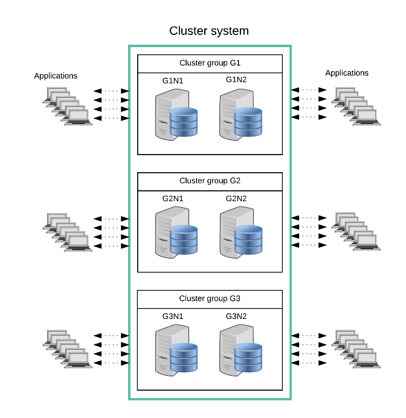
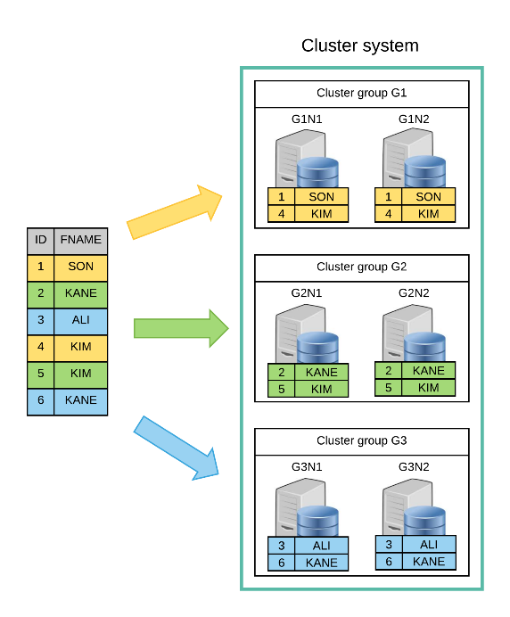
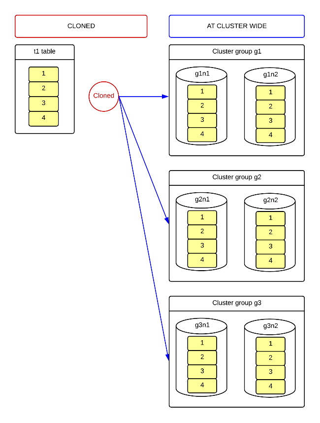
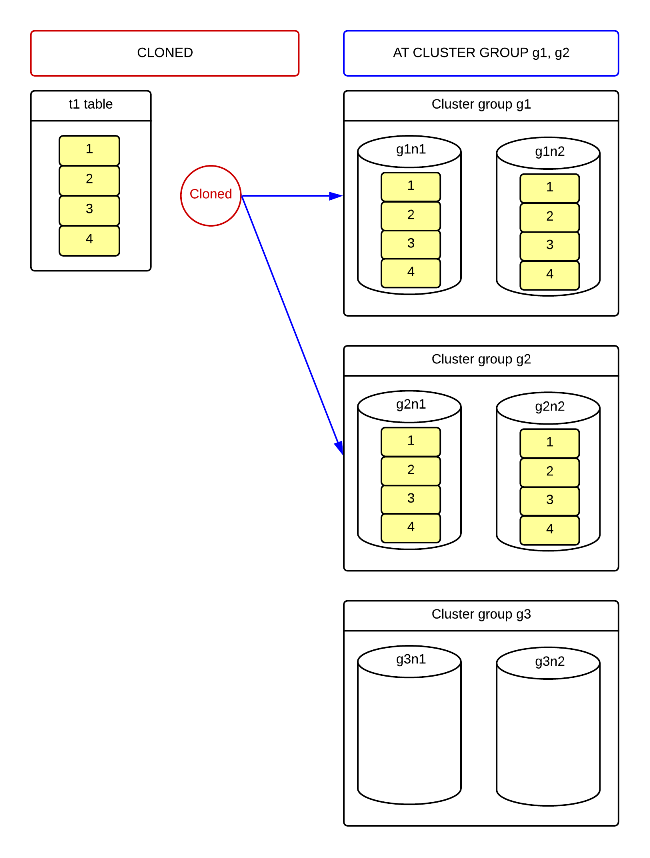
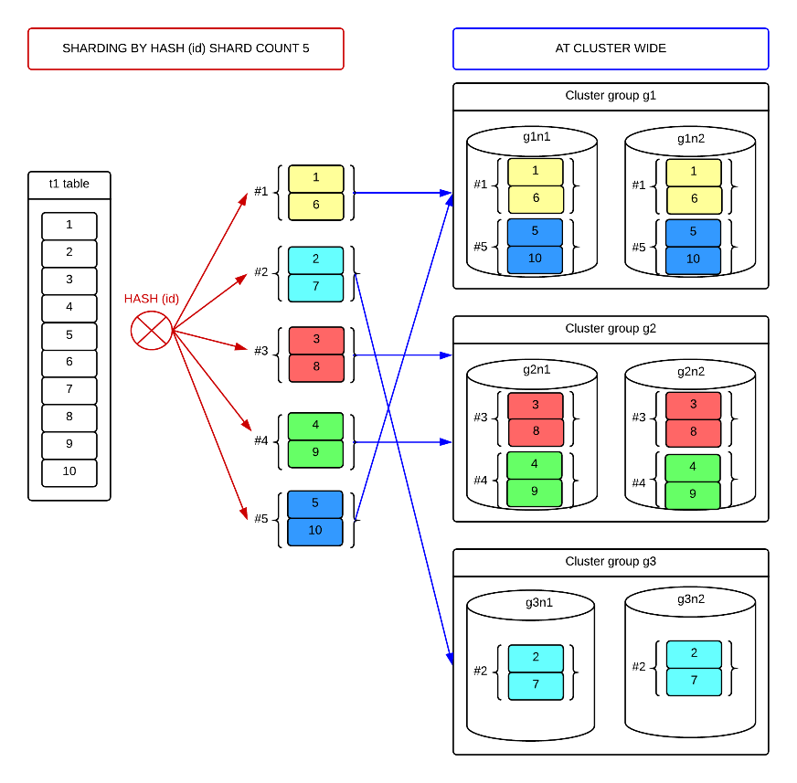
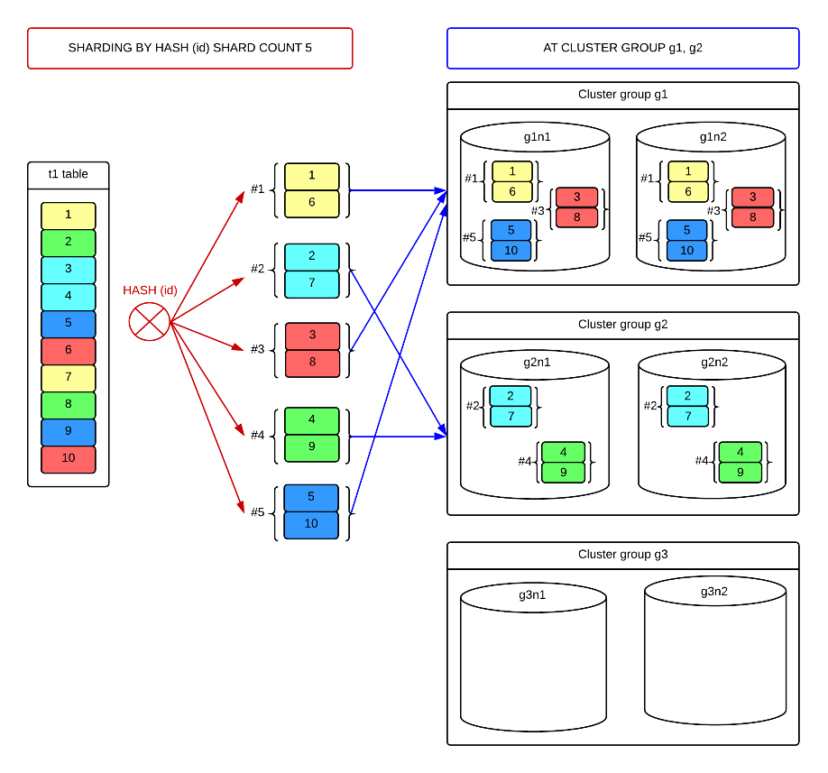
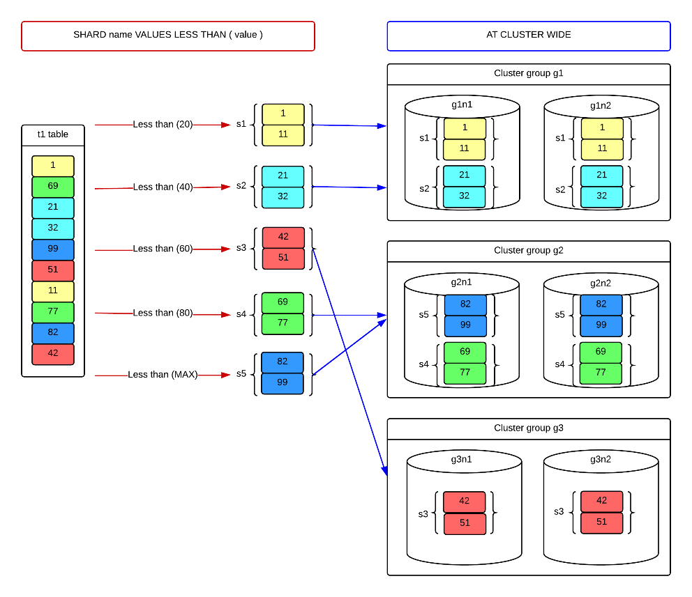
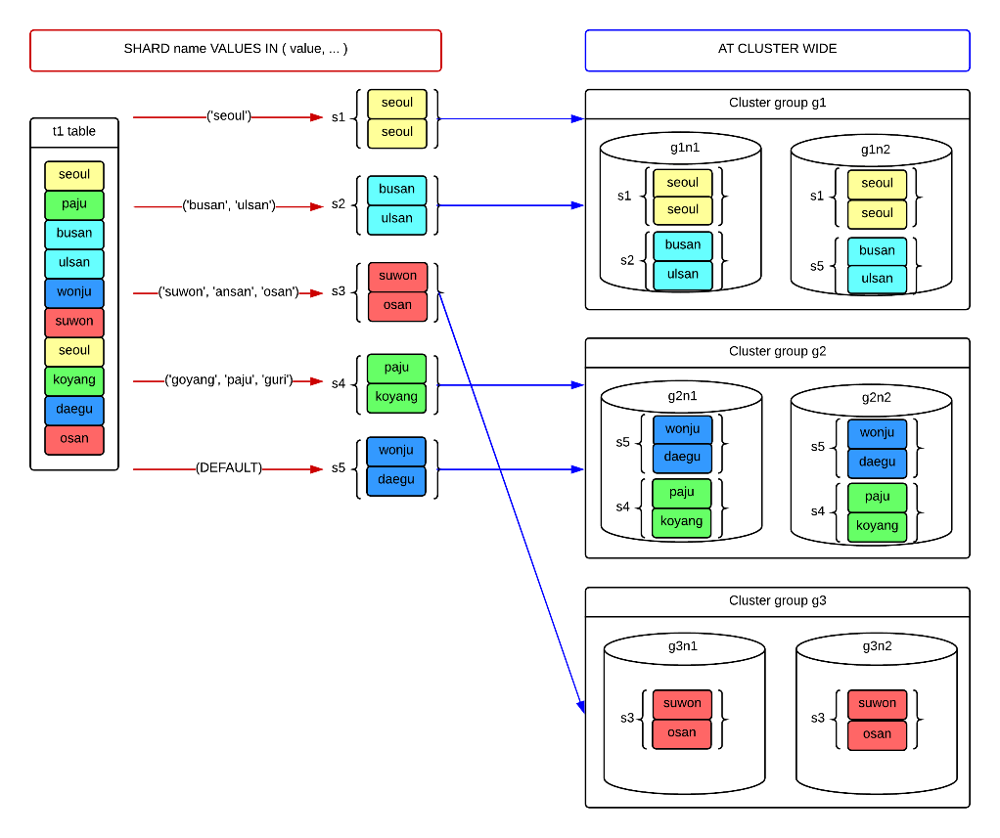
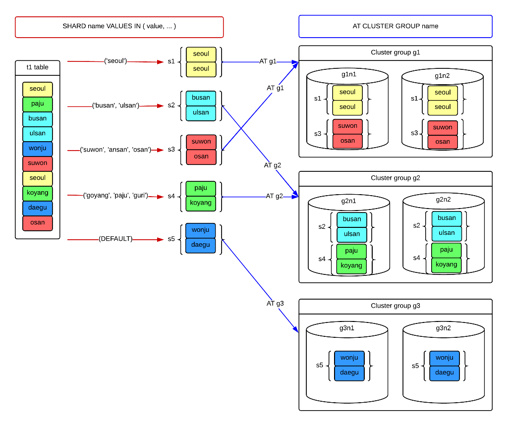

<a id="ac0448b169ba2bf6"></a>

# 14. Cluster Objects

> Source: [GOLDILOCKS 21c.1 User Manual (en)](https://manual.sunjesoft.co.kr/goldilocks/21c_1/manual/en/ac0448b169ba2bf6)  
> Tag: `21c.1_35_tag`

[← 13. SQL Objects](13-sql-objects.md) · [Table of contents](../README.md) · [15. SQL Tuning →](15-sql-tuning.md)

<a id="6063667d1526bd5b"></a>
## Cluster System

<a id="a46569c04b11f061"></a>
### Cluster System Related Statements

For more information, refer to the followings.

- Expanding a cluster system
    - [CREATE CLUSTER GROUP](19-sql-references-c-g.md#3f7a6957233a40f7)
    - [ALTER CLUSTER GROUP name ADD MEMBER](18-sql-references-a-b.md#0a6879be2602f377)

- Controlling an inactive cluster member
    - [ALTER DATABASE DROP INACTIVE CLUSTER MEMBERS](18-sql-references-a-b.md#63f811ebc15cf737)
    - [ALTER SYSTEM JOIN DATABASE](18-sql-references-a-b.md#389b6cddb5c2c458)

- Rebalancing data
    - [ALTER DATABASE REBALANCE](18-sql-references-a-b.md#218ad4f730bea674)
    - [ALTER TABLE name REBALANCE](18-sql-references-a-b.md#f7d09b5058d6293a)

Information which is related to a cluster system can be retrieved through the following views.

<a id="b52e6e3deb9d21b3"></a>
<table class="table column_count_3"><caption>Cluster system related information</caption><thead><tr><th class="to_center"><div>Schema</div></th><th class="to_center"><div>View</div></th><th class="to_center"><div>Description</div></th></tr></thead><tbody><tr><td class="to_middle" rowspan="2"><div>DICTIONARY_SCHEMA</div></td><td class="to_middle"><div><a class="reference" href="../part-02-administration-manual/9-database-information.md#0dc669eae9bc3c0f">DBA_CLUSTER</a></div></td><td class="to_middle"><div>Object information of a cluster group and a cluster member which configure a cluster</div></td></tr><tr><td class="to_middle"><div><a class="reference" href="../part-02-administration-manual/9-database-information.md#c7e0409af3625e54">DBA_CLUSTER_COMMENTS</a></div></td><td class="to_middle"><div>Comment information of a cluster group and a cluster member</div></td></tr><tr><td class="to_middle"><div>PERFORMANCE_VIEW_SCHEMA</div></td><td class="to_middle"><div><a class="reference" href="../part-02-administration-manual/9-database-information.md#827bf475388f7a84">V$CLUSTER_MEMBER</a></div></td><td class="to_middle"><div>Status information of a cluster member</div></td></tr></tbody></table>

<a id="d21138e2fe3648e8"></a>
### Concepts of Cluster System

GOLDILOCKS cluster system manages data of a single database by sharding or duplicating the data into several servers. Applications can be run on every server configuring a cluster system, and run in the same way as using a single database system regardless of a system configuration or a connected server.

GOLDILOCKS cluster system consists of one or more cluster groups, and a cluster group consists of one or more cluster members. It does not require a separate application server or a meta server, but applications are connected to a cluster member corresponding to a data server, and run.

<a id="134b846e5396dbcc"></a>


The figure above is a 3x2 cluster system which consists of two cluster members consisting of three cluster groups and a single cluster group. In the figure above, the cluster system consists of cluster groups (G1, G2, G3), and the cluster group G1 consists of cluster members (G1N1, G1N2), the cluster group G2 consists of cluster members (G2N1 and G2N2), and the cluster group G3 consists of cluster members (G3N1, G3N2). Applications can access any of those six cluster members and it is run as same as using a single database.

The table data is sharded and placed in each cluster group, and cluster members in a cluster group maintain the replications same. The figure below describes the concepts of the table data placement in a 3x2 cluster.

<a id="f6a105bf76dcfefc"></a>


The table data is sharded and placed in each cluster group according to the sharding strategy defined by a user. (According to the ID column in the figure above) The placed data in a cluster group maintains the replication of a cluster member in a cluster group.

<a id="ad04f1d4b24a55e8"></a>
### Availability of Cluster System

Cluster continues to provide service even when a specific server is broken or the network is cut. Cluster members configuring each cluster group maintain the same data replications, so the service does not stop even when a single cluster member is broken. In other words, unless the data is lost due to the malfunction of all cluster members in a cluster group, the service continues to be provided.

The cluster continues to provide service even when three devices are broken in the 3x2 cluster as follows.

<a id="d76612421757a692"></a>


If additional errors occur in G1N1, G2N2, G3N1 in the situation above, then the data loss occurs and the service can not be provided any more. Therefore, a user should make the broken device to participate in a cluster system, or add a new cluster member before an additional error occurs.

- [ALTER SYSTEM JOIN DATABASE](18-sql-references-a-b.md#389b6cddb5c2c458) statement is used to make the broken cluster member to participate in a cluster system again.

- [ALTER DATABASE DROP INACTIVE CLUSTER MEMBERS](18-sql-references-a-b.md#63f811ebc15cf737) statement is used to drop the broken cluster member from the cluster system.

- [ALTER CLUSTER GROUP name ADD MEMBER](18-sql-references-a-b.md#0a6879be2602f377) statement is used to add a cluster member to a cluster group for the high availability.

- [ALTER DATABASE REBALANCE](18-sql-references-a-b.md#218ad4f730bea674) statement and [ALTER TABLE name REBALANCE](18-sql-references-a-b.md#f7d09b5058d6293a) statement are used to rebalance data to a newly added cluster member.

<a id="c3f9d18486c91bbc"></a>
### Expanding Cluster System

The cluster can be expanded by adding a new server without stopping the service.

Cluster is expanded by adding a cluster member or a cluster group and by rebalancing the data to an created server.

The following is an example of expanding a 2x1 cluster to a 3x2 cluster.

<a id="707a10603142094b"></a>


Add a cluster group and a cluster member by using the following statements to expand a cluster.

- [ALTER CLUSTER GROUP name ADD MEMBER](18-sql-references-a-b.md#0a6879be2602f377)
- [CREATE CLUSTER GROUP](19-sql-references-c-g.md#3f7a6957233a40f7)

To add a new cluster member to the cluster system, tablespaces in the cluster member and those in the cluster system should be same. In other words, tablespaces as same as all tablespaces in the cluster system should be created in the cluster member.

The following is an example of adding a cluster group and a cluster member of the 3x2 cluster to the 2x1 cluster. Add the member G1N2 to the group G1, and add the member G2N2 to the group G2. Then, create the group G3 including the members (G3N1, G3N2).

- Add the member G1N2 to the group G1.

```
gSQL> 
ALTER CLUSTER GROUP G1 
      ADD CLUSTER MEMBER G1N2 HOST '192.168.0.12' PORT 10120;

Cluster Group altered.
```

- Add the member G2N2 to the group G2.

```
gSQL> 
ALTER CLUSTER GROUP G2 
      ADD CLUSTER MEMBER G2N2 HOST '192.168.0.22' PORT 10220;

Cluster Group altered.
```

- Create the group G3.

```
gSQL>
CREATE CLUSTER GROUP G3 
       CLUSTER MEMBER G3N1 HOST '192.168.0.31' PORT 10310,
       CLUSTER MEMBER G3N2 HOST '192.168.0.32' PORT 10320;

Cluster Group created.
```

The cluster group and the cluster member which are newly added to the cluster system can provide the service by synchronizing the dictionary information of the SQL object. However, the data is not yet placed in the added cluster member, so the availability can not be increased nor can the load balancing be expected. Therefore, the data should be rebalanced to the created cluster member for the high availability and the load balancing.

Use the following statements sequentially to rebalance the data.

- [ALTER DATABASE REBALANCE](18-sql-references-a-b.md#218ad4f730bea674)
- [ALTER TABLE name REBALANCE](18-sql-references-a-b.md#f7d09b5058d6293a)

The following is an example of rebalancing data to all tables in the database.

```
gSQL> ALTER DATABASE REBALANCE;

Database altered.
```

<a id="70d0347244e4536f"></a>
## Cluster Group

<a id="3114a9a64ee06ca8"></a>
### Cluster Group Related Statements

For more information about creating, dropping, and altering a cluster group, refer to the followings.

- Creating a cluster group: [CREATE CLUSTER GROUP](19-sql-references-c-g.md#3f7a6957233a40f7)
- Dropping a cluster group: [DROP CLUSTER GROUP](19-sql-references-c-g.md#76a15fea6a02da13)
- Altering a cluster group: [ALTER CLUSTER GROUP name ADD MEMBER](18-sql-references-a-b.md#0a6879be2602f377)

Information which is related to a cluster group can be retrieved through the following views.

<a id="b5a6c3f9cfba3b24"></a>
<table class="table column_count_3"><caption>Cluster group related information</caption><thead><tr><th class="to_center"><div>Schema</div></th><th class="to_center"><div>View</div></th><th class="to_center"><div>Description</div></th></tr></thead><tbody><tr><td class="to_middle" rowspan="2"><div>DICTIONARY_SCHEMA</div></td><td class="to_middle"><div><a class="reference" href="../part-02-administration-manual/9-database-information.md#0dc669eae9bc3c0f">DBA_CLUSTER</a></div></td><td class="to_middle"><div>Object information of a cluster group and a cluster member which configure the cluster</div></td></tr><tr><td class="to_middle"><div><a class="reference" href="../part-02-administration-manual/9-database-information.md#c7e0409af3625e54">DBA_CLUSTER_COMMENTS</a></div></td><td class="to_middle"><div>Comment information of a cluster group and a cluster member</div></td></tr></tbody></table>

<a id="8755c8ee0ac379df"></a>
### Concepts of Cluster Group

At least one cluster group should be created to run the cluster system.

<a id="174cc3f37167236a"></a>
#### Creating Cluster Group

The first created cluster group should include itself as a cluster member. For more information about creating a cluster group, refer to [CREATE CLUSTER GROUP](19-sql-references-c-g.md#3f7a6957233a40f7).

A cluster member is a physical concept meaning the data server, but a cluster group is a logical concept consisting of one or more cluster members.

The availability and load balancing of the cluster system depend on the configuration of the cluster group. The more cluster members the cluster group includes the higher the availability. The more the number of the cluster groups the bigger the throughput of the cluster system because the data is distributed.

All cluster members in a cluster group maintain the same data replications, so it can continuously provides the service unless an error occurs in all cluster members configuring a cluster group. It is recommended to configure the cluster group with two or more cluster members to maintain the availability of the cluster system.

The table data is sharded according to the sharding strategy, and it is stored and managed in each different cluster group according to the shard placement strategy. An appropriate table sharding strategy and the placement strategy according to the service feature determines the entire system performance. Each transaction and query is processed focusing on a cluster group in which the data is stored, so the performance is improved if the referenced data exist in the same cluster group.

<a id="b742b7db2028d769"></a>
#### Dropping Cluster Group

The cluster group participating in a cluster system and providing a service can be dropped for various reasons. For more information about dropping the cluster group, refer to [DROP CLUSTER GROUP](19-sql-references-c-g.md#76a15fea6a02da13).

To drop the cluster group, all shards in a sharded table which is created in that cluster group should be transferred to another cluster group. It should be transferred separately according to cluster-wide, group-specific table.

<a id="9826b8acb6931b4e"></a>
## Cluster Member

<a id="862e45012e9ffe17"></a>
### Cluster Member Related Statements

For more information, refer to the followings.

- Adding a cluster member: [ALTER CLUSTER GROUP name ADD MEMBER](18-sql-references-a-b.md#0a6879be2602f377)
- Dropping a cluster member: [ALTER DATABASE DROP INACTIVE CLUSTER MEMBERS](18-sql-references-a-b.md#63f811ebc15cf737)
- Controlling a cluster member
    - [ALTER SYSTEM JOIN DATABASE](18-sql-references-a-b.md#389b6cddb5c2c458)
    - [ALTER CLUSTER GROUP name OFFLINE MEMBER](18-sql-references-a-b.md#09ca7c14c479f510)
    - [ALTER DATABASE RESET LOCAL CLUSTER MEMBER](18-sql-references-a-b.md#ebfd1a9a53aef514)

Information which is related to a cluster member can be retrieved through the following views.

<a id="f03ef7f2e1ae1180"></a>
<table class="table column_count_3"><caption>Cluster member related information</caption><thead><tr><th class="to_center"><div>Schema</div></th><th class="to_center"><div>View</div></th><th class="to_center"><div>Description</div></th></tr></thead><tbody><tr><td class="to_middle" rowspan="2"><div>DICTIONARY_SCHEMA</div></td><td class="to_middle"><div><a class="reference" href="../part-02-administration-manual/9-database-information.md#0dc669eae9bc3c0f">DBA_CLUSTER</a></div></td><td class="to_middle"><div>Object information of a cluster group and a cluster member which configure a cluster</div></td></tr><tr><td class="to_middle"><div><a class="reference" href="../part-02-administration-manual/9-database-information.md#c7e0409af3625e54">DBA_CLUSTER_COMMENTS</a></div></td><td class="to_middle"><div>Comment information of a cluster group and a cluster member</div></td></tr><tr><td class="to_middle"><div>PERFORMANCE_VIEW_SCHEMA</div></td><td class="to_middle"><div><a class="reference" href="../part-02-administration-manual/9-database-information.md#827bf475388f7a84">V$CLUSTER_MEMBER</a></div></td><td class="to_middle"><div>Status information of a cluster member</div></td></tr></tbody></table>

<a id="5416f00fa0255980"></a>
### Concepts of Cluster Member

The cluster member is a server configuring a cluster system, and it maintains the replications as same as those of cluster member in a cluster group.

The cluster member is a data server storing a part of the cluster database data, and it is also an application server processing the connection and request of an application. Moreover, it is a meta server duplicating and managing the meta information. In other words, GOLDILOCKS cluster does not require any data server, application server, or meta server.

Cluster members which belong to the same cluster group have the same data replications. Therefore, an error in a specific cluster member does not cause an error in the entire system. It is recommended to include two or more cluster members in each cluster group for the high availability of the system. A single cluster group can be configured with maximum 32 cluster members.

Perform [ALTER CLUSTER GROUP name ADD MEMBER](18-sql-references-a-b.md#0a6879be2602f377) statement to add a new cluster member to a cluster group.

The added cluster member maintains the meta information of the SQL object as same as that in the cluster system, so it can process the connection and request of the application. However, the data is not placed, so adding a cluster member does not guarantee the high availability of the cluster group.

Perform the following statements to place the data after adding a cluster member.

- For rebalancing the entire data: Refer to [ALTER DATABASE REBALANCE](18-sql-references-a-b.md#218ad4f730bea674).
- For rebalancing only a part of the table: Refer to [ALTER TABLE name REBALANCE](18-sql-references-a-b.md#f7d09b5058d6293a).

When an error occurs on a cluster member, service is continously provided but DDL can not be performed. For a normal service operation, an appropriate action should be taken for the cluster member with an error.

To make the cluster member with an error to participate in the cluster system again, then perform [ALTER SYSTEM JOIN DATABASE](18-sql-references-a-b.md#389b6cddb5c2c458) statement after connecting to the cluster member and driving up to the LOCAL OPEN phase.

Even when a part of cluster members are not driven or the cluster system is driven while the network is disconnected, perform [ALTER SYSTEM JOIN DATABASE](18-sql-references-a-b.md#389b6cddb5c2c458) statement after driving up the cluster member to the LOCAL OPEN phase.

If the cluster member device with an error can not be restored, then drop that cluster member by performing [ALTER DATABASE DROP INACTIVE CLUSTER MEMBERS](18-sql-references-a-b.md#63f811ebc15cf737) statement in the cluster system.

The cluster member dropped from the cluster system still includes the previous information, and it can not participate in the cluster system again. Perform [ALTER DATABASE RESET LOCAL CLUSTER MEMBER](18-sql-references-a-b.md#ebfd1a9a53aef514) statement to reset the cluster member to when it is before participating in the cluster system.

The statement above is different from newly creating the database of the cluster member because it maintains the tablespace information. Therefore, it can shorten the time to create the tablespace when adding a new cluster member to the cluster system.

<a id="b06475247161ec22"></a>
## Cluster Location

<a id="1b0279009f7b2c0c"></a>
### Cluster Location Related Statements

For more information about creating, dropping, and altering a cluster location, refer to the followings.

- Creating a cluster location: [CREATE CLUSTER LOCATION](19-sql-references-c-g.md#67ef6e090f63d08d)
- Dropping a cluster location: [DROP CLUSTER LOCATION](19-sql-references-c-g.md#351e9009d382090f)
- Altering a cluster location: [ALTER CLUSTER LOCATION](18-sql-references-a-b.md#68afa63d36875d46)

Information which is related to a cluster location can be retrieved through the following views.

**Cluster location related information**

<a id="96ad518249a04fa2"></a>
| Schema | View | Description |
| --- | --- | --- |
| PERFORMANCE_VIEW_SCHEMA | [V$CLUSTER_LOCATION](../part-02-administration-manual/9-database-information.md#17a9cab59986eba7) | Information of cluster location |

<a id="23481f5c1475a6e3"></a>
### Concepts of Cluster Location

Cluster location is a connection information to connect the internal cluster networks of each cluster member registered on the cluster system. Each cluster members use the cluster-exclusive tcp network to transfer and receive various protocols such as the transaction processing and the exchanging the management information. In this case, the member name, host ip address, and port are used for the connection and they are called as a cluster location by the lump.

A unique cluster location information should be specified for each member, and if the information is duplicate, then the cluster network connection fails and the cluster system does not operate normally.

Cluster location information is automatically added or deleted when adding or dropping a cluster member, so a user rarely need to directly and solely add or delete the location information. However, DDL statement related to the cluster location can be used in the following case.

- When the cluster location information is lost due to the deleted location control file: [CREATE CLUSTER LOCATION](19-sql-references-c-g.md#67ef6e090f63d08d)
- When the previously registered connection information of the cluster member is altered, which means that the hardware or the connected ip and port is altered: [ALTER CLUSTER LOCATION](18-sql-references-a-b.md#68afa63d36875d46)

<a id="6a3c9da5975bc644"></a>
## Cluster Table and Shard

<a id="f7aac588810a3dff"></a>
### Shard Related Statements

For more information about definition and rebalance of the shard, refer to the followings.

- Definition of a shard: &lt;table sharding strategy&gt; clause of [CREATE TABLE](19-sql-references-c-g.md#4c3b06d433f75b3d).
- Rebalancing a shard: [ALTER TABLE name REBALANCE](18-sql-references-a-b.md#f7d09b5058d6293a)

Information which is related to a shard in a cluster table can be retrieved through the following views.

<a id="1a4089f036099376"></a>
<table class="table column_count_3"><caption>Shard in a cluster table related information </caption><thead><tr><th class="to_center"><div>Schema</div></th><th class="to_center"><div>View</div></th><th class="to_center"><div>Description</div></th></tr></thead><tbody><tr><td class="to_middle" rowspan="8"><div>DICTIONARY_SCHEMA</div></td><td class="to_middle"><div><a class="reference" href="../part-02-administration-manual/9-database-information.md#26ea8626ffc597ae">ALL_CLUSTER_TABLES</a></div></td><td class="to_middle"><div>Information of user accessible cluster table</div></td></tr><tr><td class="to_middle"><div><a class="reference" href="../part-02-administration-manual/9-database-information.md#9dbcb5a62c74ffd5">ALL_SHARD_KEY_COLUMNS</a></div></td><td class="to_middle"><div>Shard key column information of user accessible cluster table</div></td></tr><tr><td class="to_middle"><div><a class="reference" href="../part-02-administration-manual/9-database-information.md#a4e803ae54843007">ALL_TAB_PLACE</a></div></td><td class="to_middle"><div>Placement information of user accessible cluster table</div></td></tr><tr><td class="to_middle"><div><a class="reference" href="../part-02-administration-manual/9-database-information.md#f17cc38d0a5a7cf3">ALL_TAB_SHARDS</a></div></td><td class="to_middle"><div>Shard information of user accessible cluster table</div></td></tr><tr><td class="to_middle"><div><a class="reference" href="../part-02-administration-manual/9-database-information.md#5d00ceb94b62134e">USER_CLUSTER_TABLES</a></div></td><td class="to_middle"><div>Information of user owned cluster table</div></td></tr><tr><td class="to_middle"><div><a class="reference" href="../part-02-administration-manual/9-database-information.md#c31972f8744f10aa">USER_SHARD_KEY_COLUMNS</a></div></td><td class="to_middle"><div>Shard key column information of user owned cluster table</div></td></tr><tr><td class="to_middle"><div><a class="reference" href="../part-02-administration-manual/9-database-information.md#4fab79a17608da9e">USER_TAB_PLACE</a></div></td><td class="to_middle"><div>Placement information of user owned cluster table</div></td></tr><tr><td class="to_middle"><div><a class="reference" href="../part-02-administration-manual/9-database-information.md#9e010f62a06fe8ca">USER_TAB_SHARDS</a></div></td><td class="to_middle"><div>Shard information of user owned cluster table</div></td></tr></tbody></table>

<a id="bc040ee7ffdc682b"></a>
### Cluster Table Type

A table which is created by a user in a cluster environment is one of the followings.

- Cloned table: Equally duplicating the table data and managing it
- Sharded table: Horizontally sharding the table data and managing it

A cloned table is appropriate for a table such as a product list or a provider list whose data is relatively small and is not often altered, because a cloned table duplicates all table data and manages it. When inserting, deleting, updating data to the cloned table, they are applied same to all cluster members to which the cloned table is placed.

A sharded table is appropriate for a table such as a transaction history or a call history whose data is big so required to be sharded. They are classifed according to three sharding strategies as follows.

- Hash sharded table 
    - It divides the table data into several shards based on the hash value of a sharding key, then places them in the cluster system.
- Range sharded table
    - It divides the table data into several shards based on the range value of a sharding key, then places them in the cluster system.
- List sharded table
    - It divides the table data into several shards based on the list value of a sharding key, then places them in the cluster system.

A sharded table horizontally divides rows and manages them in shard unit, the sharding strategy is defined by using the SHARDING BY clause in [CREATE TABLE](19-sql-references-c-g.md#4c3b06d433f75b3d) statement. The row set classified by the sharding strategy is called as shard.

Each shard is placed in a cluster group according to the placement strategy defined by a user. A shard can automatically be placed by using AT CLUSTER WIDE of [CREATE TABLE](19-sql-references-c-g.md#4c3b06d433f75b3d), or a cluster group to place a shard can be specified by using AT CLUSTER GROUP clause. When a shard is automatically placed by using AT CLUSTER WIDE, [ALTER TABLE name REBALANCE](18-sql-references-a-b.md#f7d09b5058d6293a) is performed after creating the cluster group by using [CREATE CLUSTER GROUP](19-sql-references-c-g.md#3f7a6957233a40f7). However, when specifying a cluster group to allocate a shard using AT CLUSTER GROUP, the shard is not placed in the newly created cluster group.

The following is an example of creating a table according to the cluster table type and placing the data in the 3x2 cluster environment.

<a id="2f8386463e5e557b"></a>
### Cloned Table

A cloned table equally duplicates the table data and manages it.

The following is an example of creating a cluster-wide cloned table. All table data is equally duplicated and placed in 3x2 cluster members.

```
CREATE TABLE t1 ( id INTEGER )
   CLONED
   AT CLUSTER WIDE
;
```

<a id="b12a2a142d274cee"></a>


The following is an example of creating a group-specific cloned table. All table data is equally duplicated and managed, but the duplicated table data exists only in cluster members of group g1 and g2 which are specified by a user, but it does not exist in a group g3.

```
CREATE TABLE t1 ( id INTEGER )
   CLONED
   AT CLUSTER GROUP g1, g2
;
```

<a id="82828bc984695fc9"></a>


<a id="6eb13667a30737cb"></a>
### Hash-sharded table

A hash-sharded table divides the table data into several shards based on the hash value of a sharding key, then places them in the cluster system.

The following is an example of creating the cluster-wide hash-sharded table. When adding data to a table, the hash value is created based on the ID column value, and the shard to place row is selected among five shards by using the hash value. Each shard is automatically placed. All rows with the same ID column value are included in the same shard, and placed in the same cluster group.

```
CREATE TABLE t1 ( id INTEGER )
   SHARDING BY HASH(id)
   SHARD COUNT 5
   AT CLUSTER WIDE
;
```

<a id="21676d50b2be1f82"></a>


The following is an example of creating the group-specific hash-sharded table. The hash value of an ID column determines the shard, but each shard is placed only in the cluster group g1 and g2 which are specified by a user.

```
CREATE TABLE t1 ( id INTEGER )
   SHARDING BY HASH(id)
   SHARD COUNT 5
   AT CLUSTER GROUP g1, g2
;
```

<a id="8360c645e4df2257"></a>


<a id="78a6e77727aacde4"></a>
### Range-sharded Table

A range-sharded table divides the table data into several shards based on the range value of a sharding key, then places them in the cluster system.

The following is an example of creating the cluster-wide range-sharded table. When adding data to a table, the shard to place row is selected among five shards based on the range value of the ID column. Each shard is automatically placed. All rows of the ID column within the same range are included in the same shard, and placed in the same cluster group.

```
CREATE TABLE t1 ( id INTEGER )
   SHARDING BY RANGE(id)
   AT CLUSTER WIDE
       SHARD s1 VALUES LESS THAN ( 20 ),
       SHARD s2 VALUES LESS THAN ( 40 ),
       SHARD s3 VALUES LESS THAN ( 60 ),
       SHARD s4 VALUES LESS THAN ( 80 ),
       SHARD s5 VALUES LESS THAN ( MAXVALUE )
;
```

<a id="0a6c206f474665bf"></a>


The following is an example of creating the group-specific range-sharded table. The range value of the ID column defines the shard, but each shard is placed in a cluster group specified by a user.

```
CREATE TABLE t1 ( id INTEGER )
   SHARDING BY RANGE(id)
       SHARD s1 VALUES LESS THAN ( 20 )       AT CLUSTER GROUP g1,
       SHARD s2 VALUES LESS THAN ( 40 )       AT CLUSTER GROUP g2,
       SHARD s3 VALUES LESS THAN ( 60 )       AT CLUSTER GROUP g1,
       SHARD s4 VALUES LESS THAN ( 80 )       AT CLUSTER GROUP g2,
       SHARD s5 VALUES LESS THAN ( MAXVALUE ) AT CLUSTER GROUP g3
;
```

<a id="835c0f6da983a634"></a>


<a id="e0fb5f412c7826af"></a>
### List-sharded Table

A list-sharded table divides the table data into several shards based on the list value of a sharding key, then places them in the cluster system.

The following is an example of creating the cluster-wide list-sharded table. When adding data to a table, rows are placed in a shard with the list value as same as the CITY column value. Each shard is automatically placed.

```
CREATE TABLE t1 ( city VARCHAR(128) ) 
   SHARDING BY LIST (city)
      AT CLUSTER WIDE
      SHARD s1 VALUES IN ( 'seoul' ),
      SHARD s2 VALUES IN ( 'busan', 'ulsan' ),
      SHARD s3 VALUES IN ( 'suwon', 'ansan', 'osan' ),
      SHARD s4 VALUES IN ( 'goyang', 'paju', 'guri' ),
      SHARD s5 VALUES IN ( DEFAULT )            
;
```

<a id="46fdba554973855f"></a>


The following is an example of creating the group-specific list-sharded table. The shard is selected by the list value of the CITY column, but each shard is placed in the cluster group specified by a user.

```
CREATE TABLE t1 ( city VARCHAR(128) ) 
   SHARDING BY LIST (city)
      SHARD s1 VALUES IN ( 'seoul' )                  AT CLUSTER GROUP g1,
      SHARD s2 VALUES IN ( 'busan', 'ulsan' )         AT CLUSTER GROUP g2,
      SHARD s3 VALUES IN ( 'suwon', 'ansan', 'osan' ) AT CLUSTER GROUP g1,
      SHARD s4 VALUES IN ( 'goyang', 'paju', 'guri' ) AT CLUSTER GROUP g2,
      SHARD s5 VALUES IN ( DEFAULT )                  AT CLUSTER GROUP g3
;
```

<a id="0cad6655e1837f7e"></a>


<a id="fd1a6de42aaa8fef"></a>
### Rebalancing Cluster Table

Rebalance the data of the cluster table by using [ALTER TABLE name REBALANCE](18-sql-references-a-b.md#f7d09b5058d6293a) statement.

Data of the cluster table is rebalanced in the following unit.

- Cloned table: The entire table 
- Sharded table: shard unit

If the table is specified as AT CLUSTER WIDE, the shard is automatically rebalanced to the created cluster group, but if the cluster group to place the shard is specified by AT CLUSTER GROUP, the shard is not rebalanced to the created cluster group.

- When automatically rebalancing by using AT CLUSTER WIDE, then the data can be rebalanced to a new cluster group and a new cluster member.

```
CREATE TABLE region
(
    r_regionkey   INTEGER
  , r_name        CHAR(25)
  , r_comment     VARCHAR(152)
)
CLONED
AT CLUSTER WIDE;
```

<a id="238b596622a180c1"></a>


- When specifying the location to place the shard by using AT CLUSTER GROUP
    - The data is not rebalanced on the new cluster group.
    - The data can be rebalanced on the new cluster member which is added to the specified cluster group.

```
CREATE TABLE nation
(
    n_nationkey   INTEGER
  , n_name        CHAR(25)
  , n_regionkey   INTEGER
  , n_comment     VARCHAR(152)
)
CLONED
AT CLUSTER GROUP g1, g2;
```

<a id="0fdc16023ed46bbf"></a>


Information about the table placement can be retrieved through the following views.

- [USER_TAB_PLACE](../part-02-administration-manual/9-database-information.md#4fab79a17608da9e)
- [ALL_TAB_PLACE](../part-02-administration-manual/9-database-information.md#a4e803ae54843007)

```
gSQL> 
SELECT group_name, member_name 
  FROM user_tab_place 
 WHERE table_name = 'REGION';

GROUP_NAME MEMBER_NAME
---------- -----------
G1         G1N1       
G1         G1N2       
G2         G2N1       
G2         G2N2       
G3         G3N1       
G3         G3N2       

6 rows selected.
```

The sharded table is rebalanced in shard unit, and rebalancing shards due to the increase of groups is as follows.

```
CREATE TABLE orders
(
    o_orderkey     INTEGER
  , o_custkey      INTEGER
  , o_orderstatus  CHAR(1)
  , o_totalprice   NUMERIC(12,2)
  , o_orderdate     DATE
  , o_orderpriority CHAR(15)
  , o_clerk        CHAR(15)
  , o_shippriority INTEGER
  , o_comment      VARCHAR(79)
)
SHARDING BY HASH( o_orderkey )
SHARD COUNT 24
AT CLUSTER WIDE
;
```

<a id="5a62a1fc6d56c13e"></a>


In the example above, the data of orders table is divided into 24 shards and placed. All shards are placed in a single group of 1x cluster which has only one group. 12 shards are placed in each group of 2x cluster which has two groups.

When expanding 2x cluster to 3x cluster, shards are transferred from an old group to the new group, but the number of shards in each group is same (8). When expanding 3x cluster to 4x cluster, then each G1, G2, G3 rebalances two shards to the newly created group G4.

In other words, the shard rebalancing minimizes the movement when shards are transferred from an old group to the new group, then data is equally rebalanced maintaining the same number of shards in each group.

Information about the shard placement of the sharded table can be retrieved through the following views.

- [USER_TAB_SHARDS](../part-02-administration-manual/9-database-information.md#9e010f62a06fe8ca)
- [ALL_TAB_SHARDS](../part-02-administration-manual/9-database-information.md#f17cc38d0a5a7cf3)

```
gSQL> 
SELECT shard_name, group_name 
  FROM user_tab_shards 
 WHERE table_name = 'ORDERS';

SHARD_NAME   GROUP_NAME
------------ ----------
SHARD_000000 G1        
SHARD_000001 G1        
SHARD_000002 G1        
SHARD_000003 G1        
SHARD_000004 G1        
SHARD_000005 G1        
SHARD_000006 G1        
SHARD_000007 G1        
SHARD_000008 G3        
SHARD_000009 G3        
SHARD_000010 G3        
SHARD_000011 G3        
SHARD_000012 G2        
SHARD_000013 G2        
SHARD_000014 G2        
SHARD_000015 G2        
SHARD_000016 G2        
SHARD_000017 G2        
SHARD_000018 G2        
SHARD_000019 G2        
SHARD_000020 G3        
SHARD_000021 G3        
SHARD_000022 G3        
SHARD_000023 G3        

24 rows selected.
```

When tables which have the same &lt;sharding strategy&gt; are completely rebalanced as follows, then the shard placement result is same. Rows with the same shard key are guaranteed to be placed in the same shard and the same group even when the tables are different.

- Table t1
    - It is created in the 2x cluster.
    - CREATE TABLE t1 ( c1 INTEGER ) SHARDING BY (c1);
    - It is rebalanced in the 4x cluster.
    - ALTER TABLE t1 REBALANCE:
- Table t2
    - It is created in the 3x cluster.
    - CREATE TABLE t2 ( a1 INTEGER ) SHARDING BY (a1);
    - It is rebalanced in the 4x cluster.
    - ALTER TABLE t2 REBALANCE:
- Table t3
    - It is created in the 4x cluster.
    - CREATE TABLE t3 ( i1 INTEGER ) SHARDING BY (i1);

In other words, the following query can access only to a single cluster member and process it.

```
SELECT COUNT(*)
  FROM t1, t2, t3
 WHERE t1.c1 = t2.a1
   AND t2.a1 = t3.i1
   AND t1.c1 = 1;
```

<a id="c2261199baae711d"></a>
## Global Secondary Index

<a id="dfdd230c62e428f6"></a>
### Global Secondary Index Related Statements

For more information about creating, dropping, and altering a global secondary index, refer to the followings.

- Creating a global secondary index: [ALTER TABLE name ADD GLOBAL SECONDARY INDEX](18-sql-references-a-b.md#35909868f7689aed)
- Dropping a global secondary index: [ALTER TABLE name DROP GLOBAL SECONDARY INDEX](18-sql-references-a-b.md#6a4810ca2588350f)
- Altering a global secondary index: [ALTER TABLE name ALTER GLOBAL SECONDARY INDEX](18-sql-references-a-b.md#60f7aeca8914e724)

Information related to a global secondary index can be retrieved through the following views.

<a id="866d2b9039479482"></a>
<table class="table column_count_3"><caption>Global secondary index related information</caption><thead><tr><th class="to_center"><div>Schema</div></th><th class="to_center"><div>View</div></th><th class="to_center"><div>Description</div></th></tr></thead><tbody><tr><td class="to_middle" rowspan="6"><div>DICTIONARY_SCHEMA</div></td><td class="to_middle"><div><a class="reference" href="../part-02-administration-manual/9-database-information.md#26ea8626ffc597ae">ALL_CLUSTER_TABLES</a></div></td><td class="to_middle"><div>Existence of a global secondary index in user accessible table</div></td></tr><tr><td class="to_middle"><div><a class="reference" href="../part-02-administration-manual/9-database-information.md#bb10f5df9c94a338">ALL_GLOBAL_SECONDARY_INDEXES</a></div></td><td class="to_middle"><div>Object information of user accessible global secondary index</div></td></tr><tr><td class="to_middle"><div><a class="reference" href="../part-02-administration-manual/9-database-information.md#3a3918cd51706c40">ALL_GSI_PLACE</a></div></td><td class="to_middle"><div>Placement information of user accessible global secondary index</div></td></tr><tr><td class="to_middle"><div><a class="reference" href="../part-02-administration-manual/9-database-information.md#5d00ceb94b62134e">USER_CLUSTER_TABLES</a></div></td><td class="to_middle"><div>Existence of a global secondary index in user owned table</div></td></tr><tr><td class="to_middle"><div><a class="reference" href="../part-02-administration-manual/9-database-information.md#b3fef390e232d0cc">USER_GLOBAL_SECONDARY_INDEXES</a></div></td><td class="to_middle"><div>Object information of user owned global secondary index</div></td></tr><tr><td class="to_middle"><div><a class="reference" href="../part-02-administration-manual/9-database-information.md#c5cef30351356d62">USER_GSI_PLACE</a></div></td><td class="to_middle"><div>Placement information of user owned global secondary index</div></td></tr></tbody></table>

<a id="a31cb28bb91a9919"></a>
### Concepts of Global Secondary Index

A global secondary index is a B-Tree index which configures the GRID (global row identifier) value as a key in each cluster member of the cluster environment.

Tables in the cluster environment are duplicated to all members in a group and the same records are applied and retrieved when performing DML or select. GRID is a unique value identifying the same records in cluster members, and it is allocated when the record is inserted for the first time, and it is spread over all members in a group, then stored together with the record.

When creating a table in a cluster environment, a global secondary index may or may not be created, and it can be separately created or deleted after the table is created. A table may not have a global secondary index, or it may have maximum one global secondary index.

<a id="e7d9ec6362a7705f"></a>


A global secondary index is required to perform a non-deterministic query for a table. If the table does not have a global secondary index, then the non-deterministic query fails as follows.

```
gSQL> DELETE FROM T1 LIMIT 1;

ERR-42000(16423): does not support non-deterministic DML in the cluster system : global secondary index expected
```

Refer to the dictionary such as ALL_GSI_PLACE, DBA_GSI_PLACE, and USER_GSI_PLACE to check if a table has a global secondary index.

---

[← 13. SQL Objects](13-sql-objects.md) · [Table of contents](../README.md) · [15. SQL Tuning →](15-sql-tuning.md)

<sub>Copyright © 2010 SUNJESOFT Inc. All rights reserved.</sub>
