<a id="819af019cbdb21ba"></a>

# 15. SQL Tuning

> Source: [GOLDILOCKS 21c.1 User Manual (en)](https://manual.sunjesoft.co.kr/goldilocks/21c_1/manual/en/819af019cbdb21ba)  
> Tag: `21c.1_35_tag`

[← 14. Cluster Objects](14-cluster-objects.md) · [Table of contents](../README.md) · [16. Built-in Data Type References →](16-built-in-data-type-references.md)

<a id="b3afa660b3f14605"></a>
## SQL Tuning

<a id="5f76c0e180d05f03"></a>
### Overview

SQL tuning is a process of analyzing and modifying a query statement to improve the performance.

This process helps a query statement reach to the desired performance level by decreasing the response time of a query statement or by increasing the throughput.

The knowledge about SQL processing and an optimizer is required to perform SQL tuning, so this chapter describes them.

<a id="8e6c6d3d0f37b0f0"></a>
### SQL Processing

The following figure describes the SQL processing.

<a id="4972512dd38c5b6e"></a>
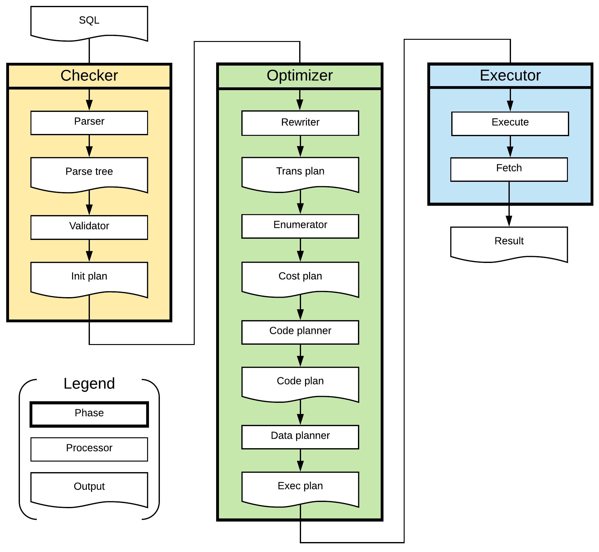

The user query returns the result through a parser, a validator, a rewriter, an enumerator, a code planner, a data planner, an executor phases. The following paragraphs describes each phase.

<a id="a9d304c2172bc245"></a>
#### Parser

A parser checks a grammatical error of SQL statement input by a user.

```
gSQL> SELECT * FORM customer;

ERR-42000(40000): syntax error 
SELECT * FORM customer
.........^  ^
Error at line 1
```

If the SQL statement does not have a grammatical error, then it creates a parse tree. Then it becomes an input argument of a validator in the next phase.

<a id="125ca5232e32408f"></a>
#### Validator

A validator checks semantic error of a parse tree which was input.

For example, it checks whether an object such as a table or a column specified in a query exists, and if a user has a privilege to refer to those objects.

```
gSQL> SELECT * FROM customer;

ERR-42000(16040): table or view does not exist : 
SELECT * FROM customer
              *
ERROR at line 1:
```

If a parse tree does not have a semantic error, then an init plan is created based on it.

<a id="c016328fc190aac5"></a>
#### Rewriter

A rewriter converts a SQL statement into a high performance SQL with the same meaning.

It analyzes an init plan, creates a trans plan, converts it to a trans plan in a form whose high performance is expected. The converted trans plan becomes an input argument of enumerator phase.

For more information about converting SQL statement, refer to [Rewriter](#fd0fd5abef2ab12f).

<a id="9516512e164792ff"></a>
#### Enumerator

An enumerator calculates the cost of multiple plans based on the statistics information, and creates the best cost plan.

For more information about various optimization methods such as an access path to a table a join ordering and a join method determination, refer to [Enumerator](#bcaa2c906a5c6be5).

<a id="68364961dd2f2c01"></a>
#### Code Planner

A code planner creates a code plan.

A code plan creates the plan finally selected by an enumerator into a execution plan form. An execution plan consists of tree structure nodes, and it includes the following information.

- How to access each table
- The sequence to refer to tables
- How perform the operation joining tables
- The information about the data filter
- The information about grouping and aggregating the data
- The information about sorting the data

<a id="5e9d04ea98812d4f"></a>
#### Plan Cache

Code plans created by a code planner are registered in a plan cache. The registered plans are classified according to whether plan cache parameters values match.

**Plan cache parameters**

<a id="9b19fff108365f38"></a>
| Parameter | Description |
| --- | --- |
| Query text | Case-sensitive query text |
| User information | User ID |
| Cursor property | Cursor property of a query requiring fetch |
| Bind parameter | The number of bind parameters and IN/ OUT property of each bind parameter |
| Enable atomic | Whether to use an atomic insertion |
| Enable hint error | Whether a validation error occurs in a hint |

When a user query is input, then it checks whether the plan with the same plan cache parameters values exist in a plan cache. If exists, it omits parser-validator-rewriter-enumerator-code planner process, and used the plan registered in the plan cache.   
When using the plan registered in the plan cache in this way, then the cost for parser-validator-rewriter-enumerator-code planner process decreases, so it improves the performance.

The following is an example of queries whose query texts values are different. Though they are same queries, but their capitalization is different, so the queries below are not recognized as a same plan.

```
"SELECT * FROM customer"
"select * from customer"
"Select * From customer"
"SELECT * FROM  customer"
```

> If a schema object (table, index, view, sequence) referenced by a plan is not committed, then the plan is not registered.

<a id="2e7b25c6b5d3bcaf"></a>
#### Data Planner

A data planner creates a data plan. A data plan has a space to store the intermediate result and a temporary space to store the expression result while performing code plans.

<a id="a1d505833cf613ed"></a>
#### Executor

An executor returns the actual executed result of performing a code plan and a data plan.

<a id="f172f7560a3bf44e"></a>
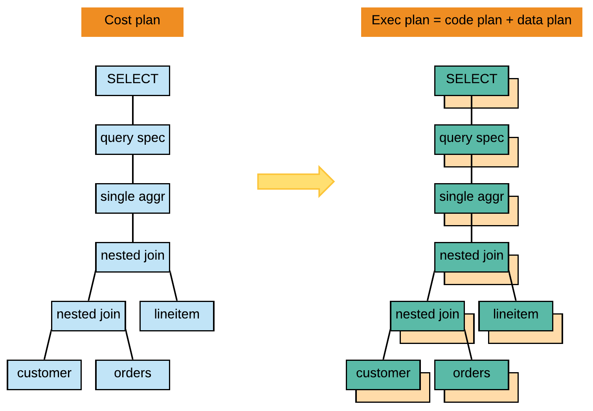

<a id="f9ebd1340dab39f7"></a>
#### Execution Plan

The execution plan consists of a code plan and a data plan. It is a tree form whose top node is INSERT, DELETE, UPDATE, SELECT statement.

The execution is a basic analysis tool of SQL tuning. The execution plan describes how the query is converted by a rewriter and which access path, join order, join method is selected by an enumerator.

The followings are a syntax and an example to output the execution plan.

<a id="0a14a151720f6796"></a>
##### Syntax

The following is a syntax to output the execution plan.

```
<explain plan> ::= 
      \explain plan [ on | only ] <sql statement>

<sql statement> ::= 
        <query expression>
      | <select for update statement>
      | <select statement: single row>
      | <insert statement>
      | <update statement: searched>
      | <delete statement: searched>
```

<a id="253ce89c55649195"></a>
##### Invocation and Access Rules

The privilege to access &lt;sql statement&gt; statement is required to perform &lt;explain plan&gt; statement.

<a id="86e672a2b942852d"></a>
##### Syntax Rules and Parameters

```
\EXPLAIN PLAN ON
\EXPLAIN PLAN
```

When specifying as above, it performs the query then outputs the execution plan.

```
\EXPLAIN PLAN ONLY
```

When specifying as above, it does not perform the query but only outputs the execution plan.

<a id="24f6259d1874e6a7"></a>
##### Example

When executing as follows, it performs SQL statement, and outputs the query result and the execution plan together.

The following example is executed in a cluster system which consists of G1(G1N1, G1N2), G2(G2N1, G2N2) and G3(G3N1, G3N2). The customer is a cloned table and orders is a sharded table whose data is divided by do_orderkey.

<a id="731f0d42586cf278"></a>
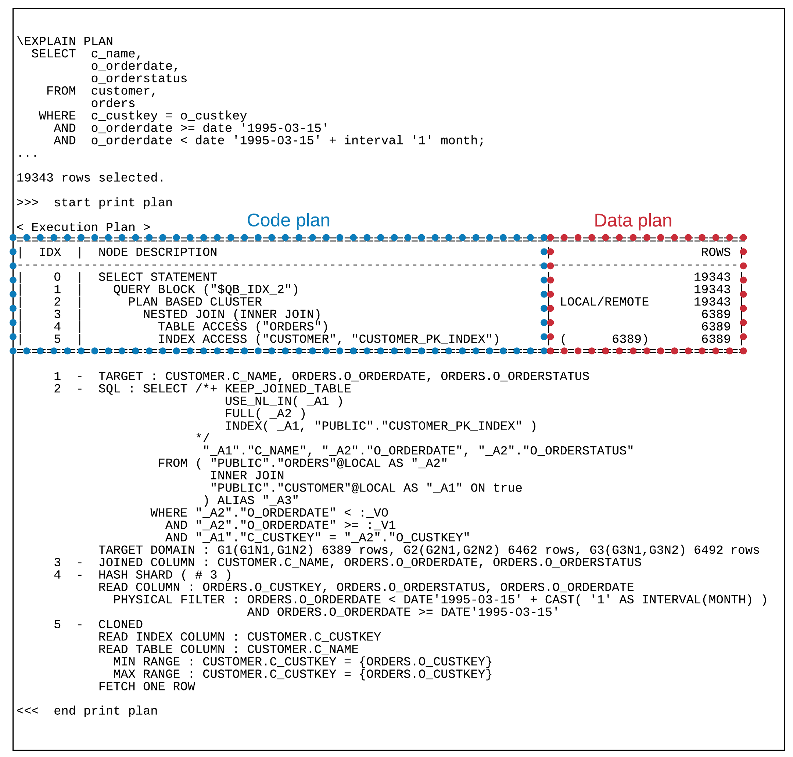

The execution plan above is represented as the following tree. The execution starts from the bottom node.

<a id="9e93989455e9a049"></a>
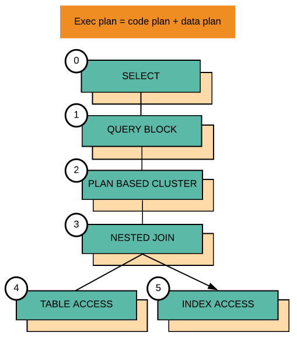

The execution tree above is performed as follows.

First, PLAN BASED CLUSTER(IDX 2) transfers the following SQL to G1, G2 and G3.

```
SELECT /*+ KEEP_JOINED_TABLE
           USE_NL_IN( _A1 ) 
           FULL( _A2 ) 
           INDEX( _A1, "PUBLIC"."CUSTOMER_PK_INDEX" ) 
       */ 
       "_A1"."C_NAME", "_A2"."O_ORDERDATE", "_A2"."O_ORDERSTATUS" 
  FROM ( "PUBLIC"."ORDERS"@LOCAL AS "_A2" 
         INNER JOIN 
         "PUBLIC"."CUSTOMER"@LOCAL AS "_A1" ON true 
       ) ALIAS "_A3" 
 WHERE "_A2"."O_ORDERDATE" < :_V0 
   AND "_A2"."O_ORDERDATE" >= :_V1 
   AND "_A1"."C_CUSTKEY" = "_A2"."O_CUSTKEY"
```

TABLE ACCESS(IDX:4) and INDEX ACCESS(IDX:5) read data from customer table and orders table and perform NESTED JOIN(IDX 3) in G1, G2, G3.

PLAN BASED CLUSTER brings all NESTED JOIN(IDX 3) results of G1, G2, G3 to local.

Then, it returns the result.

<a id="c06c54c0186ff074"></a>
##### Execution Plan Information

The information about each column in the execution plan table is as follows.

- IDX
    - It is an identifier given to each plan node.
- NODE DESCRIPTION
    - It is the name of a plan node.
    - The contents in brackets are additional information which distinguishes plan nodes.
    - The indented plan node means the subordinate plan node.
        - The execution starts from the bottom plan node, and the result is transferred to the superordinate node. 
- ROWS
    - It is the number of result records according to the plan node execution.

Each plan node contains the following optimization information.

- [Access Paths](#719ef786f17cd9b4) to each table
- The sequence to process [Join](#43aac990933bbc29) and join method
- The information about [Group By](#d12f470e0d07ca2c) processing
- The information about [Distinct](#b7f70360db7f8856) processing
- The information about [Single Row Aggregation](#0c056cff20b1efbd) processing
- The information about [Order By](#cb9d8e4ae4445c5e) processing
- The information about [Cluster Puller](12-sql-languages.md#1b1395907c081a82) processing
- The information about [Cluster Pusher](12-sql-languages.md#7dee5cccb433fa88) processing

<a id="fd0fd5abef2ab12f"></a>
## Rewriter

This chapter describes various query transformation methods processed by a rewriter.

<a id="2c1aefc3c473c67f"></a>
### Filter Push Down

It pushes down the filter as down as possible so that it reduces the intermediate result to be processed.

The following is an example of filter push down.

<a id="a36f96d94f32e5f4"></a>
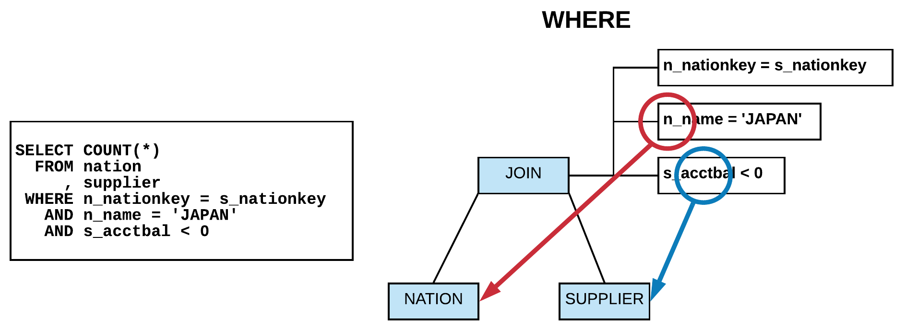

It filters rows satisfying n_name = JAPAN condition in NATION, and filters rows satisfying s_acctbal < 0 condition in SUPPLIER before performing join. In this case the number of join target rows decreases so it improves the performance.

The following is an example of performing filter push down into the view.

<a id="ff3adf7c8fef41ab"></a>
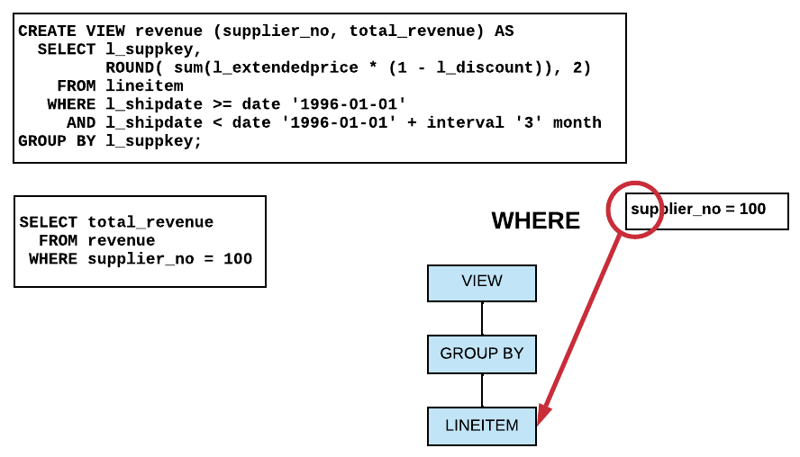

When pushing it down to lineitem TABLE ACCESS node after converting supplier_no = 100 to l_suppkey = 100, then target rows of GROUP BY decreases so it improves the performance.

<a id="2bcd3fd6bfe542a5"></a>
### DISTINCT Elimination

It eliminates the unnecessary DISTINCT.

DISTINCT is eliminated in the following cases.

- The query result of a single-row aggregation is one, so duplicate results do not occur even without DISTINCT.
- If *group by* exists and all key columns of *group by* exist in a select list, then the result is unique so duplicate results do not occur even without DISTINCT.
- If all key columns in a primary key exist in a select list, then the result is unique so duplicate results do not occur even without DISTINCT.

The following is an example of eliminating DISTINCT.

<a id="4f64846fdde57e77"></a>
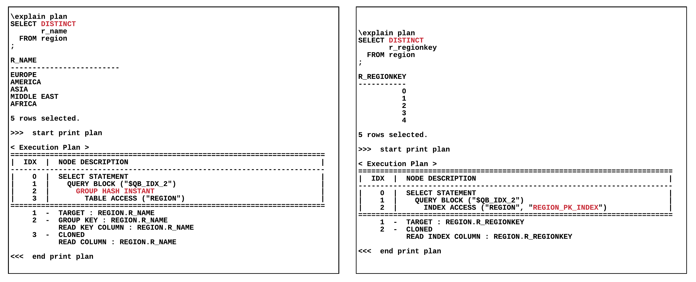

The left execution plan has GROUP HASH INSTANT node to process DISTINCT, but the right execution plan does not have GROUP HASH INSTANT node to process DISTINCT.

r_regionkey is a primary key, so it is guaranteed that the result is distinct even when DISTINCT is eliminated. Therefore, the unnecessary DISTINCT is eliminated.

<a id="965f237ce7103505"></a>
### ORDER BY Elimination

It eliminates unnecessary ORDER BY.

ORDER BY is not required in the following cases.

- When only a view exists in *from* clause, and *group by* clause, *distinct* clause or *order by* clause exists, then *order by* exists in a query block within a view is not necessary. It is because the sequence ordered by *group by*, *distinct*, *order by* disappears even though it was ordered. 
- *order by* exists in a query block within a subquery is not necessary. It is because the subquery result is used only when determining whether to return the row of an outer query.

The following is an example of eliminating ORDER BY.

<a id="bc8564bcc3b15bbd"></a>
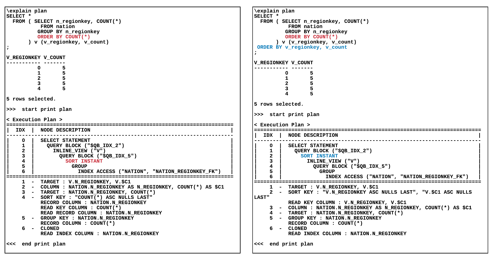

The left and right views are same in the figure above, but the right SQL has *order by* in a superordinate query of the view, so the *order by* within the view is eliminated.

<a id="2ddee297188a47ea"></a>
### Simple View Merging

It merges a simple view which does not include *group by*, *distinct*, *aggregation* into a superordinate query block.

Applying a simple view merging enables an optimizer to select various access path, join ordering, join method, so it can acquire the better execution plan.

A simple view merging can not be applied to the following cases.

- When a query block within the view includes the followings
    - Set operator
    - LIMIT, OFFSET
    - DISTINCT
    - GROUP BY
    - Single row aggregation 
    - Full outer join
    - Natural join
    - ROWNUM
    - When a subquery expression exists in SELECT list
- When a view participates in the following query.
    - A view participate in a full outer join.
    - A view participate in a left outer join, and two or more tables exist within a view.

The following is an example of merging a simple view.

```
CREATE VIEW v_nation 
( 
    v_nationkey,
    v_nation_name,
    v_region_name
)
AS
SELECT n_nationkey,
       n_name,
       r_name
  FROM nation, region
 WHERE n_regionkey = r_regionkey;
```

```
\EXPLAIN PLAN 
SELECT v_nation_name, COUNT(*)
  FROM customer, v_nation
 WHERE c_nationkey = v_nationkey
   AND v_region_name = 'ASIA'
GROUP BY v_nation_name;

V_NATION_NAME             COUNT(*)
------------------------- --------
CHINA                         6024
INDIA                         6042
INDONESIA                     6161
JAPAN                         5948
VIETNAM                       6008

5 rows selected.

>>>  start print plan

< Execution Plan >
=========================================================================
|  IDX  |  NODE DESCRIPTION                                             |
-------------------------------------------------------------------------
|    0  |  SELECT STATEMENT                                             |
|    1  |    QUERY BLOCK ("$QB_IDX_2")                                  |
|    2  |      GROUP HASH INSTANT                                       |
|    3  |        NESTED JOIN (INNER JOIN)                               |
|    4  |          NESTED JOIN (INNER JOIN)                             |
|    5  |            TABLE ACCESS ("REGION")                            |
|    6  |            INDEX ACCESS ("NATION", "NATION_REGIONKEY_FK")     |
|    7  |          INDEX ACCESS ("CUSTOMER", "CUSTOMER_NATIONKEY_FK")   |
=========================================================================

     1  -  TARGET : NATION.N_NAME, COUNT(*)
     2  -  GROUP KEY : NATION.N_NAME
           RECORD COLUMN : COUNT(*)
           READ KEY COLUMN : NATION.N_NAME
           READ RECORD COLUMN : COUNT(*)
     3  -  JOINED COLUMN : NATION.N_NAME
     4  -  JOINED COLUMN : NATION.N_NATIONKEY, NATION.N_NAME
     5  -  CLONED 
           READ COLUMN : REGION.R_REGIONKEY, REGION.R_NAME
             PHYSICAL FILTER : REGION.R_NAME = 'ASIA'
     6  -  CLONED 
           READ INDEX COLUMN : NATION.N_REGIONKEY
           READ TABLE COLUMN : NATION.N_NATIONKEY, NATION.N_NAME
             MIN RANGE : NATION.N_REGIONKEY = {REGION.R_REGIONKEY}
             MAX RANGE : NATION.N_REGIONKEY = {REGION.R_REGIONKEY}
     7  -  CLONED 
           READ INDEX COLUMN : CUSTOMER.C_NATIONKEY
             MIN RANGE : CUSTOMER.C_NATIONKEY = {NATION.N_NATIONKEY}
             MAX RANGE : CUSTOMER.C_NATIONKEY = {NATION.N_NATIONKEY}

<<<  end print plan
```

A view does not exist in the execution plan above. The view is merged to an outer query, then it is performed as a converted query form as follows.

<a id="d2a926b2bf803118"></a>
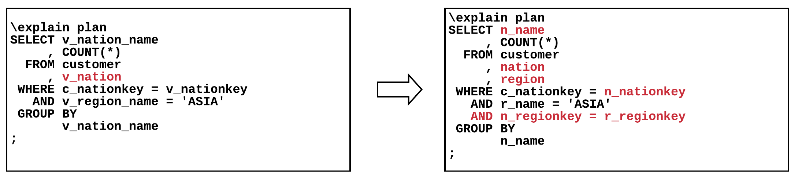

<a id="fb5c3f1c17606b61"></a>
### Outer Join Table Elimination

It eliminates an unnecessary outer join table.

Neither an outer join nor access to the right table is required in the following cases.

- It is a left outer join, and
    - a predicate in a form of *left_table.col = right_table.col* exists in ON clause.
    - a unique index for right_table.col of ON clause exists.
    - a column in a right table is not used in any other clauses except for ON clause condition.

The following is an example of eliminating an outer join table.

The access to nation table exists only in ON clause, and n_nationkey is a primary key column in the following example, so it is unique and even null data does not exist. Therefore, eliminating nation table does not affect the result.

```
\EXPLAIN PLAN
SELECT COUNT(*)
  FROM supplier 
       LEFT OUTER JOIN
       nation
       ON s_nationkey = n_nationkey
 WHERE s_acctbal < 0
;

COUNT(*)
--------
     886

1 row selected.

>>>  start print plan

< Execution Plan >
============================================================================
|  IDX  |  NODE DESCRIPTION                                         | ROWS |
----------------------------------------------------------------------------
|    0  |  SELECT STATEMENT                                         |    1 |
|    1  |    QUERY BLOCK ("$QB_IDX_2")                              |    1 |
|    2  |      TABLE ACCESS ("SUPPLIER")                            |    1 |
============================================================================

     1  -  TARGET : COUNT(*)
     2  -  CLONED 
           READ COLUMN : SUPPLIER.S_ACCTBAL
           AGGREGATION : COUNT(*)
             PHYSICAL FILTER : SUPPLIER.S_ACCTBAL < 0

<<<  end print plan
```

All accesses to OUTER JOIN and right table are eliminated in the execution plan above.

<a id="1e6a10ff9e671f43"></a>
### Outer Join Operation Elimination

It eliminates an unnecessary outer join operation.

- For a left outer join,
    - If a conditional clause corresponding to the right table exists in where clause, and the conditional clause is not IS NULL,
        - It can be changed to an inner join
- For a full outer join,
    - If a conditional clause corresponding to the right table exists in where clause, and the conditional clause is not IS NULL,
        - It can be changed to a right outer join
    - If a conditional clause corresponding to the left table exists in where clause, and the conditional clause is not IS NULL,
        - It can be changed to a left outer join.
    - If a conditional clause corresponding to both left and right tables exists in where clause, and the conditional clause is not IS NULL,
        - It can be changed to an inner join

The following is an example of eliminating an outer join operation.

```
\EXPLAIN PLAN
  SELECT MAX(COUNT(*))
    FROM customer
         LEFT OUTER JOIN
         orders
         ON  c_custkey = o_custkey
         AND o_comment LIKE '%special%requests%'
   WHERE o_orderpriority = '1-URGENT'
GROUP BY c_custkey;


MAX(COUNT(*))
-------------
            3

1 row selected.

>>>  start print plan

< Execution Plan >
========================================================================
|  IDX  |  NODE DESCRIPTION                                            |
------------------------------------------------------------------------
|    0  |  SELECT STATEMENT                                            |
|    1  |    QUERY BLOCK ("$QB_IDX_2")                                 |
|    2  |      AGGREGATION BY HASH                                     |
|    3  |        GROUP                                                 |
|    4  |          HASH JOIN (INNER JOIN)                              |
|    5  |            INDEX ACCESS ("CUSTOMER", "CUSTOMER_PK_INDEX")    |
|    6  |            HASH JOIN INSTANT                                 |
|    7  |              TABLE ACCESS ("ORDERS")                         |
========================================================================

     1  -  TARGET : MAX( COUNT(*) )
     2  -  AGGREGATION : MAX( COUNT(*) )
     3  -  GROUP KEY : CUSTOMER.C_CUSTKEY
           RECORD COLUMN : COUNT(*)
     4  -  JOINED COLUMN : CUSTOMER.C_CUSTKEY
     5  -  READ INDEX COLUMN : CUSTOMER.C_CUSTKEY
     6  -  HASH KEY : ORDERS.O_CUSTKEY
           READ KEY COLUMN : ORDERS.O_CUSTKEY
             HASH FILTER : ORDERS.O_CUSTKEY = CUSTOMER.C_CUSTKEY
     7  -  READ COLUMN : ORDERS.O_CUSTKEY, ORDERS.O_ORDERPRIORITY,
                         ORDERS.O_COMMENT
             PHYSICAL FILTER : ORDERS.O_ORDERPRIORITY = '1-URGENT'
             LOGICAL FILTER : ORDERS.O_COMMENT LIKE '%special%requests%'

<<<  end print plan
```

*o_orderpriority = '1-URGENT* condition exists in WHERE clause in the example above. Therefore, rows all of whose data is NULL can not exist as a result of the right table due to this condition.

Therefore, the results are same even when converting a left outer join to an inner join.

<a id="1896ef8476368797"></a>
### EXISTS/NOT EXIST Operation Target Optimization

It decreases unnecessary expressions from SELECT list of a subquery which exists in EXISTS or NOT EXISTS, so that it improves the query processing performance.

EXISTS or NOT EXISTS operation is a operator which determines whether the result row of a subquery exists, so neither the number of expressions in SELECT list of a subquery nor does the processing result affect the operation result. Therefore, it changes SELECT list of the subquery to TRUE (BOOLEAN constant).

The following is an example of optimizing EXISTS operation target.

```
\EXPLAIN PLAN
SELECT o_orderpriority,
       count(*) as order_count
  FROM orders
 WHERE o_orderdate = date '1993-07-01'
   AND EXISTS (
               SELECT /*+ NO_UNNEST */
                      *
                 FROM lineitem
                WHERE l_orderkey = o_orderkey
                  AND l_commitdate < l_receiptdate
             )
GROUP BY o_orderpriority
ORDER BY o_orderpriority;

O_ORDERPRIORITY ORDER_COUNT
--------------- -----------
1-URGENT                113
2-HIGH                  136
3-MEDIUM                112
4-NOT SPECIFIED         103
5-LOW                    97

5 rows selected.

>>>  start print plan

< Execution Plan >
==========================================================================
|IDX|  NODE DESCRIPTION                                                  |
--------------------------------------------------------------------------
| 0 |  SELECT STATEMENT                                                  |
| 1 |    QUERY BLOCK ("$QB_IDX_2")                                       |
| 2 |      SORT INSTANT                                                  |
| 3 |        GROUP HASH INSTANT                                          |
| 4 |          TABLE ACCESS ("ORDERS")                                   |
| 5 |          SUB QUERY LIST                                            |
| 6 |            INLINE_VIEW ("$V6")                                     |
| 7 |              QUERY BLOCK ("$QB_IDX_6")                             |
| 8 |                INDEX ACCESS ("LINEITEM", "LINEITEM_ORDERKEY_FK")   |
==========================================================================

     1  -  TARGET : ORDERS.O_ORDERPRIORITY, COUNT(*) AS ORDER_COUNT
     2  -  SORT KEY : "ORDERS.O_ORDERPRIORITY ASC NULLS LAST"
           RECORD COLUMN : COUNT(*)
           READ KEY COLUMN : ORDERS.O_ORDERPRIORITY
           READ RECORD COLUMN : COUNT(*)
     3  -  GROUP KEY : ORDERS.O_ORDERPRIORITY
           RECORD COLUMN : COUNT(*)
           READ KEY COLUMN : ORDERS.O_ORDERPRIORITY
           READ RECORD COLUMN : COUNT(*)
     4  -  READ COLUMN : ORDERS.O_ORDERKEY, ORDERS.O_ORDERDATE, 
                         ORDERS.O_ORDERPRIORITY
             PHYSICAL FILTER : ORDERS.O_ORDERDATE = DATE'1993-07-01'
             POST FILTER : EXISTS( ( $V6.DUMMY_COL ) )
     6  -  COLUMN : $V6.DUMMY_COL AS DUMMY_COL
     7  -  TARGET : NOTHING
     8  -  READ INDEX COLUMN : LINEITEM.L_ORDERKEY
           READ TABLE COLUMN : LINEITEM.L_COMMITDATE, LINEITEM.L_RECEIPTDATE
             MIN RANGE : LINEITEM.L_ORDERKEY = {ORDERS.O_ORDERKEY}
             MAX RANGE : LINEITEM.L_ORDERKEY = {ORDERS.O_ORDERKEY}
             PHYSICAL TABLE FILTER : LINEITEM.L_RECEIPTDATE > LINEITEM.L_COMMITDATE

<<<  end print plan
```

lineitem is a table with 16 columns in the example above. It is specified to read all columns in lineitem by using * in SELECT list within EXISTS subquery of a user query. However, it fetches only the information about whether the row satisfying the condition exists, but target column value does not fetch anything at the time of execution.

<a id="bdc988f6d3cd7998"></a>
### Quantifier Elimination

It alters SQL as follows to eliminate ANY quantifier.

<a id="7c6303bd4f155bf3"></a>
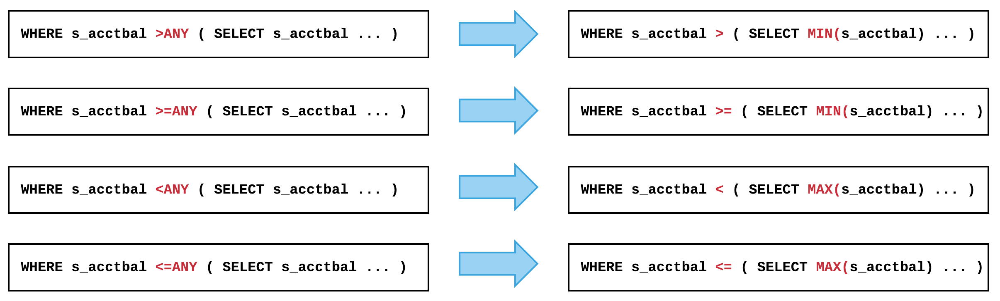

The following is an example of eliminating a quantifier.

```
\EXPLAIN PLAN
SELECT COUNT(*)
  FROM supplier
 WHERE s_acctbal >ANY ( SELECT s_acctbal
                          FROM supplier, nation
                         WHERE s_nationkey = n_nationkey
                           AND n_name = 'CHINA' )
;

COUNT(*)
--------
    9950

1 row selected.

>>>  start print plan

< Execution Plan >
===========================================================================
|  IDX  |  NODE DESCRIPTION                                               |
---------------------------------------------------------------------------
|    0  |  SELECT STATEMENT                                               |
|    1  |    QUERY BLOCK ("$QB_IDX_2")                                    |
|    2  |      TABLE ACCESS ("SUPPLIER")                                  |
|    3  |  SUB QUERY LIST                                                 |
|    4  |    INLINE_VIEW ("$V4")                                          |
|    5  |      QUERY BLOCK ("$QB_IDX_6")                                  |
|    6  |        AGGREGATION BY HASH                                      |
|    7  |          NESTED JOIN (INNER JOIN)                               |
|    8  |            TABLE ACCESS ("NATION")                              |
|    9  |            INDEX ACCESS ("SUPPLIER", "SUPPLIER_NATIONKEY_FK")   |
===========================================================================

     1  -  TARGET : COUNT(*)
     2  -  READ COLUMN : SUPPLIER.S_ACCTBAL
           AGGREGATION : COUNT(*)
             PHYSICAL FILTER : SUPPLIER.S_ACCTBAL > $V4.$C0
     4  -  COLUMN : MIN( SUPPLIER.S_ACCTBAL ) AS $C0
     5  -  TARGET : MIN( SUPPLIER.S_ACCTBAL )
     6  -  AGGREGATION : MIN( SUPPLIER.S_ACCTBAL )
     7  -  JOINED COLUMN : SUPPLIER.S_ACCTBAL
     8  -  READ COLUMN : NATION.N_NATIONKEY, NATION.N_NAME
             PHYSICAL FILTER : NATION.N_NAME = 'CHINA'
     9  -  READ INDEX COLUMN : SUPPLIER.S_NATIONKEY
           READ TABLE COLUMN : SUPPLIER.S_ACCTBAL
             MIN RANGE : SUPPLIER.S_NATIONKEY = {NATION.N_NATIONKEY}
             MAX RANGE : SUPPLIER.S_NATIONKEY = {NATION.N_NATIONKEY}

<<<  end print plan
```

<a id="44578e14b48d902f"></a>
### Transitive Closure

It creates a constant condition in another table by using a join condition. In this way, the throughput of join is decreased and the performance is improved.

The following is an example of a transitive closure.

<a id="766680def5b5c366"></a>
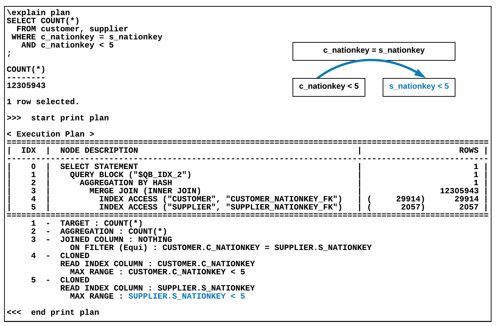

<a id="c87030fd37f2448e"></a>
### Join Transitive Closure

It creates a join condition in another table by using a join condition. Various join orderings and join methods are available, so a better execution plan can be made.

It is performed in a way of adding a join condition (A=C) to the other join condition (A = B AND B = C).

The following is an example of a join transitive closure.

<a id="c7ba30fdb4a4e83d"></a>
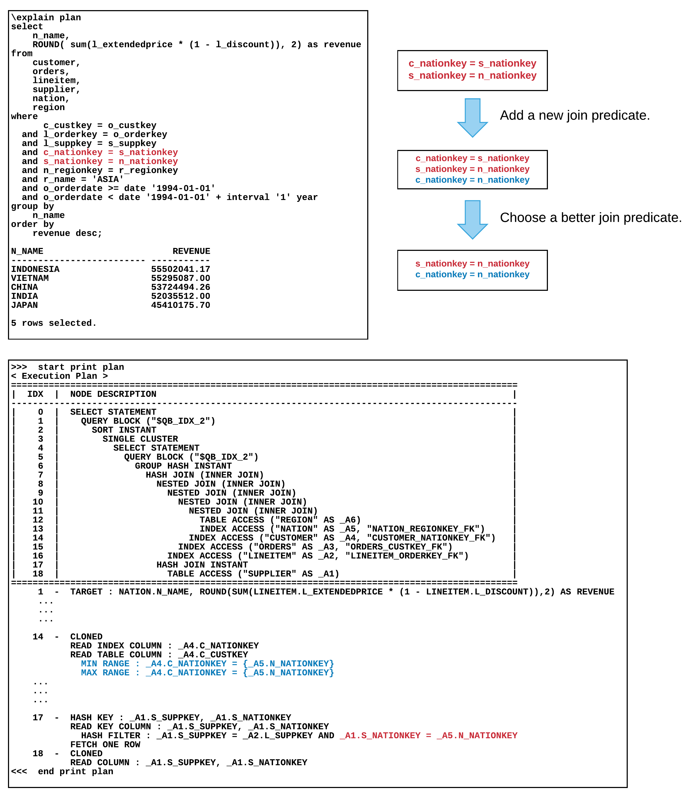

<a id="dfa79382566fd308"></a>
### Subquery Unnesting

A subquery unnesting converts a subquery in a conditional clause into a join statement guaranteeing the same result. It enables to select various access path, join method, join order, so a better execution plan can be made.

Subqueries are classified into the following two types.

- Nested subquery (Regular non-scalar subquery )
    - EXISTS/NOT EXIST subquery 
    - Comparison operator ( =, >,>=, <, <=, &lt;&gt;) ANY subquery
    - Comparison operator ( =, >,>=, <, <=, &lt;&gt;) ALL subquery 
    - IN/NOT IN subquery 
- Scalar subquery: It is used in WHERE clause or a SELECT list, and returns only a single result.

Not all subqueries are unnested. The subquery can be unnested only when it satisfies the following constraints.

- It should not include set operator. 
- A scalar subquery is available only when it is specified on WHERE clause.
- It should include a correlated predicate.

A correlated predicate is a predicate including a column of an undefined outer query block in a subquery.  
In the example below, *c.cust_id* is a correlated column and *s.cust_id = c.cust_id* is a correlated predicate.

```
SELECT C.cust_last_name, C.country_id
FROM   customers C
WHERE  EXISTS (SELECT 1
                 FROM sales S
                WHERE S.quantity_sold > 1000
                  AND S.cust_id = C.cust_id);
```

<a id="c721786fc808e1f6"></a>
#### Nested Subquery Unnesting

It converts a subquery into a semi join, an anti-join, or an inner join.

<a id="5b4b3d41dccb5699"></a>
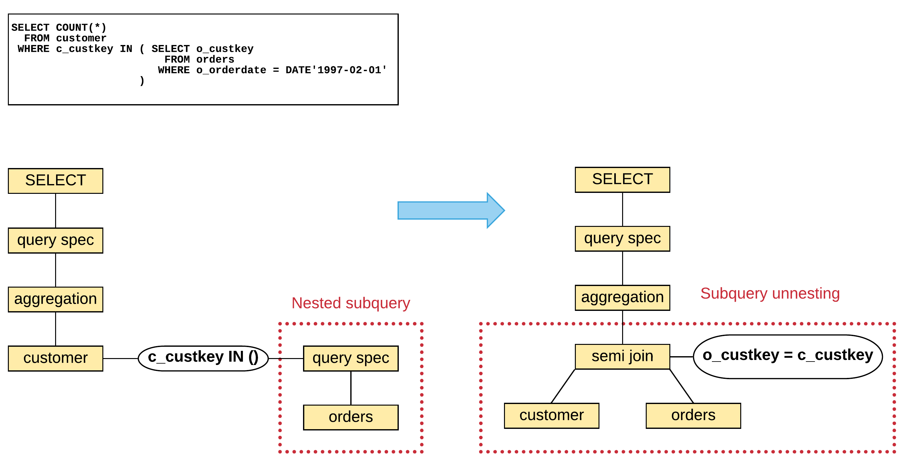

<a id="18993f13223dcccb"></a>
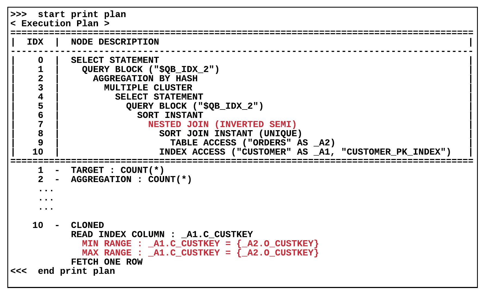

<a id="f7ba28c456021459"></a>
#### Scalar Subquery Unnesting

It can unnest only a scalar subquery in WHERE clause, and the following conditions should be satisfied.  
• It should be a single row aggregation   
• It should include a correlated predicate.

The following is an example of unnesting a scalar subquery.

<a id="87b0cc5fd87f9d84"></a>
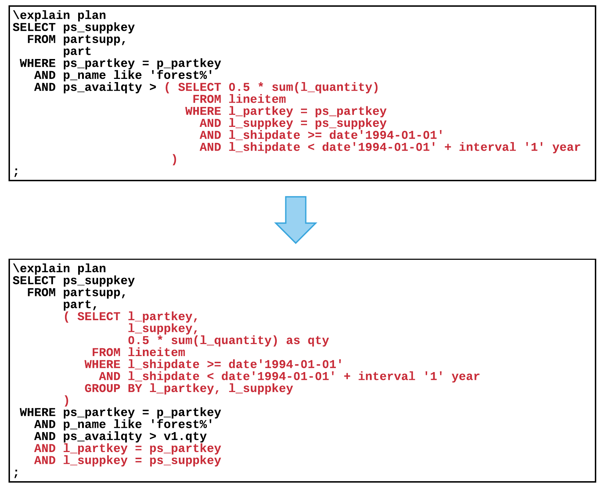

<a id="e2582af615a71775"></a>
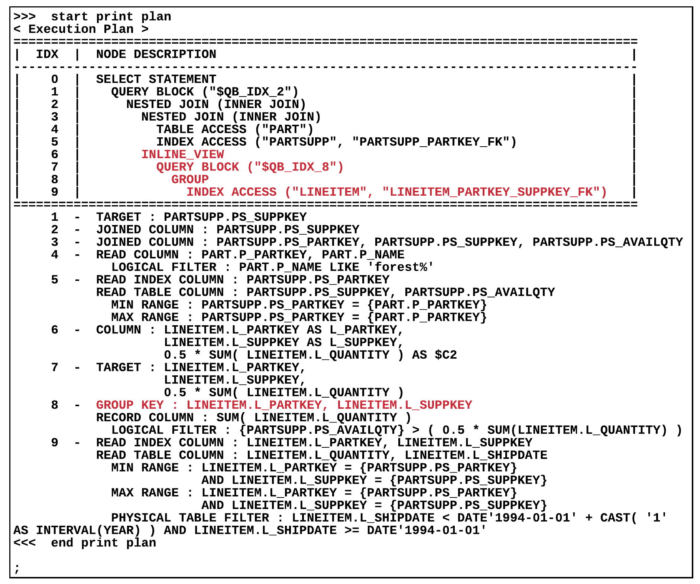

<a id="c33f9133a26ee2ce"></a>
### Complex View Merging

It merges a view including *group by* with a superordinate query block.   
A complex view merging is useful when *group by* can not decrease the intermediate results a lot and the join filtering with a superordinate query block is effective. In other words, if a complex view merging is used when *group by* can decrease the intermediate results a lot, then it may degrade the performance.

A complex view merging can not be applied in the following cases.

- When a query block within a view includes the following item
    - SET operator
    - ROWNUM
    - LIMIT/OFFSET
    - Single row aggregation
    - ORDER BY
    - SELECT list including a subquery 
    - FULL OUTER JOIN
    - NATURAL JOIN
- When a view participates in the following query
    - Join other than an inner join 
    - An equi join predicate does not exist

The following is an example of merging a complex view.

<a id="168adca79ddfba9b"></a>
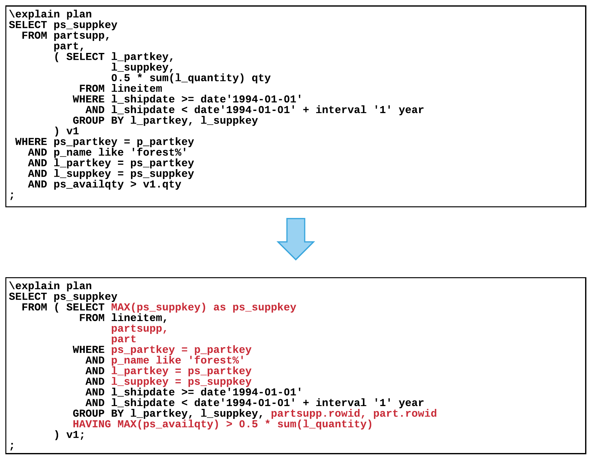

<a id="f21ba26ad0e3f991"></a>
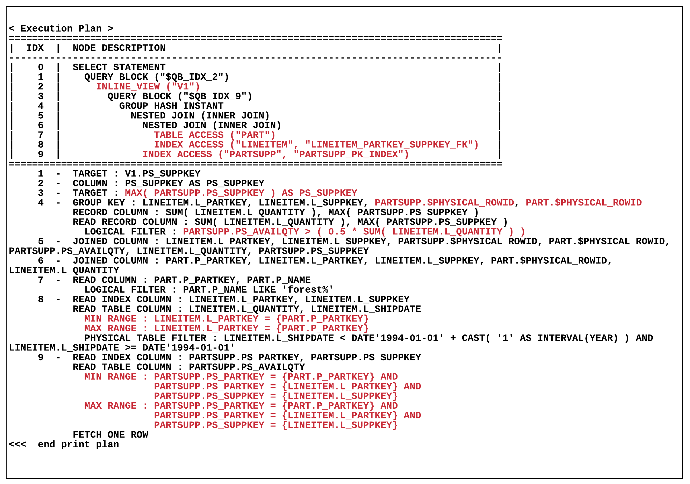

<a id="bcaa2c906a5c6be5"></a>
## Enumerator

An enumerator calculates the cost based on statistics information to find the most efficient plan.

It receives a trans plan and creates various cost plans about it, then calculates the cost per each cost plan based on statistics information to select the plan of the lowest cost.

<a id="719ef786f17cd9b4"></a>
### Access Paths

An access path is a method to access a single table, and there are following four types.

- Table access
- Index access
- Rowid access
- Index concat

It calculates the cost according to the methods above, and selects an access of the lowest cost as an execution plan.

<a id="c18625b03a4fb3f0"></a>
#### Table Access

A table access reads all rows stored in a table in a way as they were stored.

A table access is selected in the following cases.

- When an index does not exist
- When a predicate for using an index does not exist even though an index exists (e.g. WHERE col1 + 1 = 10)
- When the table accessing cost is big because a condition for the first key column of an index does not exist  
  (e.g. WHERE col2 > 3 when only a condition for the second column of composite index (col1, col2) exists)
- When a table access cost is smaller than an index access cost because the table data is small
- When a user gives a table access hint (e.g. FULL(t1))
- When an index selectivity is poor or the data is extremely disproportionately distributed

The following is an example of using table access.

```
\EXPLAIN PLAN
SELECT r_regionkey, r_name 
  FROM region;

R_REGIONKEY R_NAME                   
----------- -------------------------
          0 AFRICA                   
          1 AMERICA                  
          2 ASIA                     
          3 EUROPE                   
          4 MIDDLE EAST              

5 rows selected.

>>>  start print plan

< Execution Plan >
========================================================================
|  IDX  |  NODE DESCRIPTION                                            |
------------------------------------------------------------------------
|    0  |  SELECT STATEMENT                                            |
|    1  |    QUERY BLOCK ("$QB_IDX_2")                                 |
|    2  |      TABLE ACCESS ("REGION")                                 |
========================================================================

     1  -  TARGET : REGION.R_REGIONKEY, REGION.R_NAME
     2  -  READ COLUMN : REGION.R_REGIONKEY, REGION.R_NAME

<<<  end print plan
```

<a id="f7074dc34102699e"></a>
#### Index Access

An index access uses an index to read a table.

Index access types are an index full scan, an index unique scan, an index range scan and an in key range scan, and the best type is selected by the cost estimation.

<a id="f8b4b837377371c4"></a>
##### Index Full Scan

It fully scans the index.

The following is an example of an index full scan.

```
\EXPLAIN PLAN
SELECT p_partkey
  FROM part;
...

200000 rows selected.

>>>  start print plan

< Execution Plan >
========================================================================
|  IDX  |  NODE DESCRIPTION                                            |
------------------------------------------------------------------------
|    0  |  SELECT STATEMENT                                            |                  
|    1  |    QUERY BLOCK ("$QB_IDX_2")                                 |
|    2  |      INDEX ACCESS ("PART", "PART_PK_INDEX")                  |
========================================================================

     1  -  TARGET : PART.P_PARTKEY
     2  -  READ INDEX COLUMN : PART.P_PARTKEY

<<<  end print plan
```

It retrieves p_partkey which is a key column of PART_PK_INDEX only, so making the result by the index full scan costs less than the table full scan.

<a id="1ae1dae59ff8dd16"></a>
##### Index Unique Scan

It fetches only one row through the index.

The following is an example of an index unique scan.

```
\EXPLAIN PLAN
SELECT * 
  FROM part
 WHERE p_partkey = 1;
...
1 row selected.

>>>  start print plan

< Execution Plan >
========================================================================
|  IDX  |  NODE DESCRIPTION                                            |
------------------------------------------------------------------------
|    0  |  SELECT STATEMENT                                            |
|    1  |    QUERY BLOCK ("$QB_IDX_2")                                 |
|    2  |      INDEX ACCESS ("PART", "PART_PK_INDEX")                  |
========================================================================

     1  -  TARGET : PART.P_PARTKEY, PART.P_NAME, PART.P_MFGR, PART.P_BRAND, 
                    PART.P_TYPE, PART.P_SIZE, PART.P_CONTAINER, 
                    PART.P_RETAILPRICE, PART.P_COMMENT
     2  -  READ INDEX COLUMN : PART.P_PARTKEY
           READ TABLE COLUMN : PART.P_NAME, PART.P_MFGR, PART.P_BRAND, 
                               PART.P_TYPE, PART.P_SIZE, PART.P_CONTAINER, 
                               PART.P_RETAILPRICE, PART.P_COMMENT
             MIN RANGE : PART.P_PARTKEY = 1
             MAX RANGE : PART.P_PARTKEY = 1
           FETCH ONE ROW

<<<  end print plan
```

<a id="7c7b690fd28a3d98"></a>
##### Index Range Scan

It reads rows in the range satisfying a predicate condition through an index. The result rows are sorted for an index key column because they are read through the index.

The following is an example of an index range scan.

```
\EXPLAIN PLAN
SELECT p_partkey, p_brand, p_type
  FROM part
 WHERE p_partkey >= 10
   AND p_partkey < 20;

P_PARTKEY P_BRAND    P_TYPE                   
--------- ---------- -------------------------
       10 Brand#54   LARGE BURNISHED STEEL    
       11 Brand#25   STANDARD BURNISHED NICKEL
       12 Brand#33   MEDIUM ANODIZED STEEL    
       13 Brand#55   MEDIUM BURNISHED NICKEL  
       14 Brand#13   SMALL POLISHED STEEL     
       15 Brand#15   LARGE ANODIZED BRASS     
       16 Brand#32   PROMO PLATED TIN         
       17 Brand#43   ECONOMY BRUSHED STEEL    
       18 Brand#11   SMALL BURNISHED STEEL    
       19 Brand#23   SMALL ANODIZED NICKEL    

10 rows selected.

>>>  start print plan

< Execution Plan >
========================================================================
|  IDX  |  NODE DESCRIPTION                                            |
------------------------------------------------------------------------
|    0  |  SELECT STATEMENT                                            |
|    1  |    QUERY BLOCK ("$QB_IDX_2")                                 |
|    2  |      INDEX ACCESS ("PART", "PART_PK_INDEX")                  |
========================================================================

     1  -  TARGET : PART.P_PARTKEY, PART.P_BRAND, PART.P_TYPE
     2  -  READ INDEX COLUMN : PART.P_PARTKEY
           READ TABLE COLUMN : PART.P_BRAND, PART.P_TYPE
             MIN RANGE : PART.P_PARTKEY >= 10
             MAX RANGE : PART.P_PARTKEY IS NOT NULL AND PART.P_PARTKEY < 20

<<<  end print plan
```

<a id="11a8f0356cf687da"></a>
##### In Key Range Scan

An in key range scan is available when the following predicate exists.

```
( col1, col2 ) IN ( (val1, val2), (val3, val4) )
```

- IN or =ANY list function filter exists in WHERE clause.
- col1 and col2 should be base columns. (It should be a column without an operation or a function.)
- (val1, val3) corresponding to col1 should be convertible to a single data type.
- (val2, val4) corresponding to col2 should be convertible to a single data type.

The following is an example of an in key range scan.

```
\EXPLAIN PLAN
  SELECT o_orderstatus
    FROM orders
   WHERE o_custkey IN ( 1, 10, 100, 1000, 10000 );
...
91 rows selected.

>>>  start print plan

< Execution Plan >
========================================================================
|  IDX  |  NODE DESCRIPTION                                            |
------------------------------------------------------------------------
|    0  |  SELECT STATEMENT                                            |
|    1  |    QUERY BLOCK ("$QB_IDX_2")                                 |
|    2  |      INDEX ACCESS ("ORDERS", "ORDERS_CUSTKEY_FK")            |
========================================================================

     1  -  TARGET : ORDERS.O_ORDERSTATUS
     2  -  READ INDEX COLUMN : ORDERS.O_CUSTKEY
           READ TABLE COLUMN : ORDERS.O_ORDERSTATUS
           IN KEY RANGE
             MIN RANGE : ORDERS.O_CUSTKEY = ?
             MAX RANGE : ORDERS.O_CUSTKEY = ?

<<<  end print plan
```

<a id="07be26e25b5413f7"></a>
#### Rowid Access

A rowid access directly accesses to the corresponding page by using a rowid.

A predicate for the rowid should exist when using the rowid access. Generally, a rowid access is faster than other access paths, so an estimator most likely to select a rowid access as the best access path as long as a predicate for a rowid exists.

```
gSQL> \EXPLAIN PLAN
SELECT p_brand, p_type
  FROM part
 WHERE rowid = 'AAAAAAAAYe8AACAAAEMJAAA';

P_BRAND    P_TYPE                  
---------- ------------------------
Brand#33   STANDARD POLISHED COPPER

1 row selected.

>>>  start print plan

< Execution Plan >
========================================================================
|  IDX  |  NODE DESCRIPTION                                            | 
------------------------------------------------------------------------
|    0  |  SELECT STATEMENT                                            |
|    1  |    QUERY BLOCK ("$QB_IDX_2")                                 |
|    2  |      ROWID ACCESS ("PART")                                   |
========================================================================

     1  -  TARGET : PART.P_BRAND, PART.P_TYPE
     2  -  READ COLUMN : PART.P_BRAND, PART.P_TYPE
             ROWID FILTER : PART.ROWID = 'AAAAAAAAYe8AACAAAEMJAAA'

<<<  end print plan
```

<a id="91a151752e85fccb"></a>
#### Index Concat

An index concat intergrates results of index access, and makes it into a single result. Therefore, it can be used only when OR predicate exists and each predicate can use an index access.

If OR predicate exists, an estimator calculates the cost of index concat, and selects the method when the cost is smaller than that of other access paths.

The following is an example of using an index concat.

```
gSQL> \EXPLAIN PLAN
SELECT p_brand, p_type
  FROM part
 WHERE p_partkey = 1 OR p_partkey = 20;

P_BRAND    P_TYPE                
---------- ----------------------
Brand#13   PROMO BURNISHED COPPER
Brand#12   LARGE POLISHED NICKEL 

2 rows selected.

>>>  start print plan

< Execution Plan >
========================================================================
|  IDX  |  NODE DESCRIPTION                                            |
------------------------------------------------------------------------
|    0  |  SELECT STATEMENT                                            |
|    1  |    QUERY BLOCK ("$QB_IDX_2")                                 |
|    2  |      CONCAT (Compare Nothing)                                |
|    3  |        INDEX ACCESS ("PART", "PART_PK_INDEX")                |
|    4  |        INDEX ACCESS ("PART", "PART_PK_INDEX")                |
========================================================================

     1  -  TARGET : PART.P_BRAND, PART.P_TYPE
     2  -  CONCAT COLUMN : PART.P_BRAND, PART.P_TYPE
     3  -  READ INDEX COLUMN : PART.P_PARTKEY
           READ TABLE COLUMN : PART.P_BRAND, PART.P_TYPE
             MIN RANGE : PART.P_PARTKEY = 1
             MAX RANGE : PART.P_PARTKEY = 1
           FETCH ONE ROW
     4  -  READ INDEX COLUMN : PART.P_PARTKEY
           READ TABLE COLUMN : PART.P_BRAND, PART.P_TYPE
             MIN RANGE : PART.P_PARTKEY = 20
             MAX RANGE : PART.P_PARTKEY = 20
           FETCH ONE ROW

<<<  end print plan
```

<a id="43aac990933bbc29"></a>
### Join

Join combines two or more tables to make them into a single result set.

In this case, a join condition defines the relation between tables. If a join condition does not exist, then multiplying rows of every table compose a new result set.

An estimator creates various cost plans considering join order, join method, and access path according to the join type, and calculates a cost, then selects the best cost plan. [Access Paths](#719ef786f17cd9b4) are described in a chapter above and this chapter describes a join type, a join method and a join order.

<a id="cf5b79286f99f27e"></a>
#### Join Type

<a id="c64e2d2350e01fe0"></a>
##### Cross Join

A join condition does not exist. Therefore, a multiplication set of two tables composes a new result of join.

The following is an example of a cross join.

```
gSQL> \EXPLAIN PLAN SELECT r_regionkey, n_nationkey FROM region, nation;

R_REGIONKEY N_NATIONKEY
----------- -----------
          0           0
          0           1
          0           2
          0           3
          0           4
          0           5
          0           6
          0           7
          0           8
          0           9
          0          10
          0          11
          0          12
          0          13
          0          14
          0          15
          0          16
          0          17
          0          18
          0          19

R_REGIONKEY N_NATIONKEY
----------- -----------
          0          20
          0          21
          0          22
          0          23
          0          24
          1           0
          1           1
         ...         ...
          4          24


125 rows selected.

>>>  start print plan

< Execution Plan >
========================================================================
|  IDX  |  NODE DESCRIPTION                                            |
------------------------------------------------------------------------
|    0  |  SELECT STATEMENT                                            |
|    1  |    QUERY BLOCK ("$QB_IDX_2")                                 |
|    2  |      NESTED JOIN (INNER JOIN)                                |
|    3  |        INDEX ACCESS ("REGION", "REGION_PK_INDEX")            |
|    4  |        INDEX ACCESS ("NATION", "NATION_PK_INDEX")            |
========================================================================

     1  -  TARGET : REGION.R_REGIONKEY, NATION.N_NATIONKEY
     2  -  JOINED COLUMN : REGION.R_REGIONKEY, NATION.N_NATIONKEY
     3  -  READ INDEX COLUMN : REGION.R_REGIONKEY
     4  -  READ INDEX COLUMN : NATION.N_NATIONKEY

<<<  end print plan
```

<a id="7666c76cf28ef001"></a>
##### Inner Join

Only the rows satisfying a join condition from a multiplication set of two tables configure a result set.

The following is an example of an inner join.

```
gSQL> \EXPLAIN PLAN 
SELECT r_regionkey, n_nationkey 
  FROM region, nation 
 WHERE r_regionkey = n_nationkey;

R_REGIONKEY N_NATIONKEY
----------- -----------
          0           0
          1           1
          2           2
          3           3
          4           4

5 rows selected.

>>>  start print plan

< Execution Plan >
========================================================================
|  IDX  |  NODE DESCRIPTION                                            |
------------------------------------------------------------------------
|    0  |  SELECT STATEMENT                                            |
|    1  |    QUERY BLOCK ("$QB_IDX_2")                                 |
|    2  |      NESTED JOIN (INNER JOIN)                                |
|    3  |        INDEX ACCESS ("REGION", "REGION_PK_INDEX")            |
|    4  |        INDEX ACCESS ("NATION", "NATION_PK_INDEX")            |
========================================================================

     1  -  TARGET : REGION.R_REGIONKEY, NATION.N_NATIONKEY
     2  -  JOINED COLUMN : REGION.R_REGIONKEY, NATION.N_NATIONKEY
     3  -  READ INDEX COLUMN : REGION.R_REGIONKEY
     4  -  READ INDEX COLUMN : NATION.N_NATIONKEY
             MIN RANGE : NATION.N_NATIONKEY = {REGION.R_REGIONKEY}
             MAX RANGE : NATION.N_NATIONKEY = {REGION.R_REGIONKEY}
           FETCH ONE ROW

<<<  end print plan
```

<a id="31e39d9184f044df"></a>
##### Outer Join

It returns rows satisfying a join condition from a multiplication set of two tables as result, and it also returns rows in an outer table as result even though the rows do not satisfy the join condition. In other words, an outer join is used to output even the rows which do not satisfy the join condition as well.

In this case, values corresponding to an inner table are NULL padded.

The left table becomes an outer table in a left outer join. Therefore, *part* which is a left table becomes an outer table so it outputs even the rows which do not satisfy the join condition as well in the example below. In this case, *partsupp* value which is an inner table is NULL padded.

<a id="eda8bea9ba379265"></a>
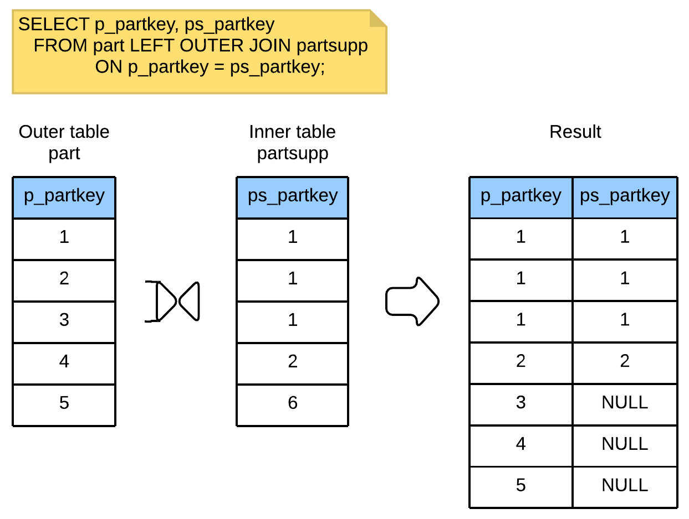

The right table becomes an outer table in a right outer join.  
Therefore, *partsupp* which is a right table becomes an outer table so it outputs even the rows which do not satisfy the join condition as well in the example below. In this case, *parts* value which is an inner table is NULL padded.

<a id="6635d31422d73299"></a>
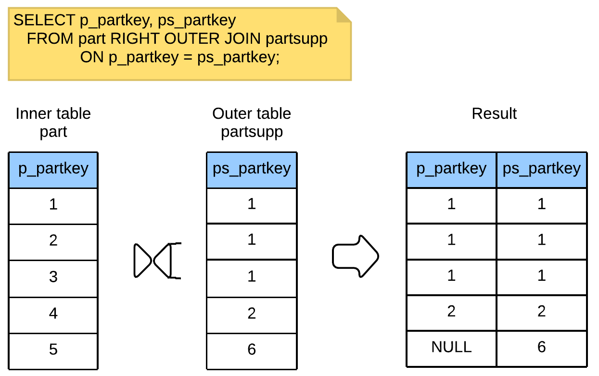

A full outer join join outputs rows satisfying the join condition, then it performs left outer join and a right outer join so that it outputs all rows.

<a id="eb570f37aaaaabdb"></a>
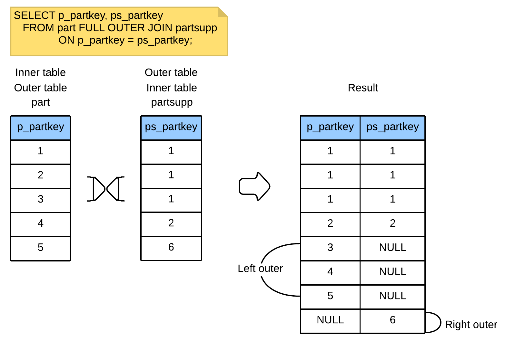

<a id="d3b1bac319210f6b"></a>
###### **Left Outer Join**

It returns all rows satisfying a join condition as result, and also returns rows in a left table as result even though the rows do not satisfy the join condition.

The following is an example of a left outer join.

```
gSQL> \EXPLAIN PLAN 
SELECT r_name, n_name
  FROM region 
       LEFT OUTER JOIN 
       nation 
       ON  r_regionkey = n_regionkey
       AND n_nationkey > 20;

R_NAME                    N_NAME                   
------------------------- -------------------------
AFRICA                    null                     
AMERICA                   UNITED STATES            
ASIA                      VIETNAM                  
EUROPE                    UNITED KINGDOM           
EUROPE                    RUSSIA                   
MIDDLE EAST               null                     

6 rows selected.

>>>  start print plan

< Execution Plan >
========================================================================
|  IDX  |  NODE DESCRIPTION                                            |
------------------------------------------------------------------------
|    0  |  SELECT STATEMENT                                            |
|    1  |    QUERY BLOCK ("$QB_IDX_2")                                 |
|    2  |      HASH JOIN (LEFT OUTER JOIN)                             |
|    3  |        TABLE ACCESS ("REGION")                               |
|    4  |        HASH JOIN INSTANT                                     | 
|    5  |          INDEX ACCESS ("NATION", "NATION_PK_INDEX")          |
========================================================================

     1  -  TARGET : REGION.R_NAME, NATION.N_NAME
     2  -  JOINED COLUMN : REGION.R_NAME, NATION.N_NAME
     3  -  READ COLUMN : REGION.R_REGIONKEY, REGION.R_NAME
     4  -  HASH KEY : NATION.N_REGIONKEY
           RECORD COLUMN : NATION.N_NAME
           READ KEY COLUMN : NATION.N_REGIONKEY, NATION.N_NAME
             HASH FILTER : NATION.N_REGIONKEY = REGION.R_REGIONKEY
     5  -  READ INDEX COLUMN : NATION.N_NATIONKEY
           READ TABLE COLUMN : NATION.N_NAME, NATION.N_REGIONKEY
             MIN RANGE : NATION.N_NATIONKEY > 20
             MAX RANGE : NATION.N_NATIONKEY IS NOT NULL

<<<  end print plan
```

<a id="0e2fdef15a0aa6f6"></a>
###### **Right Outer Join**

It returns all rows satisfying a join condition as result, and also returns rows in a right table as result even though the rows do not satisfy the join condition.

The following is an example of a right outer join.

```
gSQL> \EXPLAIN PLAN 
SELECT r_name, n_name
  FROM region RIGHT OUTER JOIN nation ON  r_regionkey = n_regionkey
                                      AND n_nationkey > 20; 
R_NAME N_NAME                   
------ -------------------------
null                      ALGERIA                  
null                      ARGENTINA                
null                      BRAZIL                   
null                      CANADA                   
null                      EGYPT                    
null                      ETHIOPIA                 
null                      FRANCE                   
null                      GERMANY                  
null                      INDIA                    
null                      INDONESIA                
null                      IRAN                     
null                      IRAQ                     
null                      JAPAN                    
null                      JORDAN                   
null                      KENYA                    
null                      MOROCCO                  
null                      MOZAMBIQUE               
null                      PERU                     
null                      CHINA                    
null                      ROMANIA                  
null                      SAUDI ARABIA             
ASIA                      VIETNAM                  
EUROPE                    RUSSIA                   
EUROPE                    UNITED KINGDOM           
AMERICA                   UNITED STATES            

25 rows selected.

>>>  start print plan

< Execution Plan >
========================================================================
|  IDX  |  NODE DESCRIPTION                                            |
------------------------------------------------------------------------
|    0  |  SELECT STATEMENT                                            |
|    1  |    QUERY BLOCK ("$QB_IDX_2")                                 |
|    2  |      HASH JOIN (LEFT OUTER JOIN)                             |
|    3  |        TABLE ACCESS ("NATION")                               |
|    4  |        HASH JOIN INSTANT                                     |
|    5  |          TABLE ACCESS ("REGION")                             |
========================================================================

     1  -  TARGET : REGION.R_NAME, NATION.N_NAME
     2  -  JOINED COLUMN : REGION.R_NAME, NATION.N_NAME
     3  -  READ COLUMN : NATION.N_NATIONKEY, NATION.N_NAME, NATION.N_REGIONKEY
     4  -  HASH KEY : REGION.R_REGIONKEY
           RECORD COLUMN : REGION.R_NAME
           READ KEY COLUMN : REGION.R_REGIONKEY, REGION.R_NAME
             HASH FILTER : REGION.R_REGIONKEY = NATION.N_REGIONKEY
             LOGICAL FILTER : {NATION.N_NATIONKEY} > 20
           FETCH ONE ROW
     5  -  READ COLUMN : REGION.R_REGIONKEY, REGION.R_NAME

<<<  end print plan
```

<a id="53ffbf12153e0682"></a>
###### **Full Outer Join**

It returns all rows satisfying a join condition as result, and also returns all rows in both of a left table and a right table as result even though the rows do not satisfy the join condition.

The following is an example of a full outer join.

```
gSQL> \EXPLAIN PLAN 
SELECT r_name, n_name
  FROM region FULL OUTER JOIN nation ON  r_regionkey = n_regionkey
                                      AND n_nationkey > 20;
R_NAME N_NAME                   
------ -------------------------
null                      ALGERIA                  
null                      ARGENTINA                
null                      BRAZIL                   
null                      CANADA                   
null                      EGYPT                    
null                      ETHIOPIA                 
null                      FRANCE                   
null                      GERMANY                  
null                      INDIA                    
null                      INDONESIA                
null                      IRAN                     
null                      IRAQ                     
null                      JAPAN                    
null                      JORDAN                   
null                      KENYA                    
null                      MOROCCO                  
null                      MOZAMBIQUE               
null                      PERU                     
null                      CHINA                    
null                      ROMANIA                  
null                      SAUDI ARABIA             
ASIA                      VIETNAM                  
EUROPE                    RUSSIA                   
EUROPE                    UNITED KINGDOM           
AMERICA                   UNITED STATES            
AFRICA                    null                     
MIDDLE EAST               null                     

27 rows selected.

>>>  start print plan

< Execution Plan >
========================================================================
|  IDX  |  NODE DESCRIPTION                                            |
------------------------------------------------------------------------
|    0  |  SELECT STATEMENT                                            |
|    1  |    QUERY BLOCK ("$QB_IDX_2")                                 |
|    2  |      HASH JOIN (FULL OUTER JOIN)                             |
|    3  |        TABLE ACCESS ("NATION")                               |
|    4  |        HASH JOIN INSTANT                                     |                      
|    5  |          TABLE ACCESS ("REGION")                             |
========================================================================

     1  -  TARGET : REGION.R_NAME, NATION.N_NAME
     2  -  JOINED COLUMN : REGION.R_NAME, NATION.N_NAME
     3  -  READ COLUMN : NATION.N_NATIONKEY, NATION.N_NAME, NATION.N_REGIONKEY
     4  -  HASH KEY : REGION.R_REGIONKEY
           RECORD COLUMN : REGION.R_NAME
           READ KEY COLUMN : REGION.R_REGIONKEY, REGION.R_NAME
             HASH FILTER : REGION.R_REGIONKEY = NATION.N_REGIONKEY
             LOGICAL FILTER : {NATION.N_NATIONKEY} > 20
     5  -  READ COLUMN : REGION.R_REGIONKEY, REGION.R_NAME

<<<  end print plan
```

<a id="f136f01fc183b377"></a>
##### Semi Join

A semi join can not be explicitly specified by using SQL statement. When a user used a subquery together with a quantifier such as IN, EXISTS, =ANY, then a rewriter converts it to a semi join while unnesting the subquery.

When a row satisfying the join condition exists, then it returns the row of a main query as result.

The following is an example of a semi join.

```
\EXPLAIN PLAN
SELECT o_orderpriority,
       count(*) as order_count
  FROM orders
 WHERE o_orderdate = date '1993-07-01'
   AND EXISTS (
               SELECT *
                 FROM lineitem
                WHERE l_orderkey = o_orderkey
                  AND l_commitdate < l_receiptdate
             )
GROUP BY o_orderpriority
ORDER BY o_orderpriority;

O_ORDERPRIORITY ORDER_COUNT
--------------- -----------
1-URGENT                113
2-HIGH                  136
3-MEDIUM                112
4-NOT SPECIFIED         103
5-LOW                    97

5 rows selected.

>>>  start print plan

< Execution Plan >
==========================================================================
|  IDX  |  NODE DESCRIPTION                                              |
--------------------------------------------------------------------------
|    0  |  SELECT STATEMENT                                              |
|    1  |    QUERY BLOCK ("$QB_IDX_2")                                   |
|    2  |      SORT INSTANT                                              |
|    3  |        GROUP HASH INSTANT                                      |
|    4  |          NESTED JOIN (SEMI)                                    |
|    5  |            TABLE ACCESS ("ORDERS")                             |
|    6  |            INDEX ACCESS ("LINEITEM", "LINEITEM_ORDERKEY_FK")   |
==========================================================================

     1  -  TARGET : ORDERS.O_ORDERPRIORITY, COUNT(*) AS ORDER_COUNT
     2  -  SORT KEY : "ORDERS.O_ORDERPRIORITY ASC NULLS LAST"
           RECORD COLUMN : COUNT(*)
           READ KEY COLUMN : ORDERS.O_ORDERPRIORITY
           READ RECORD COLUMN : COUNT(*)
     3  -  GROUP KEY : ORDERS.O_ORDERPRIORITY
           RECORD COLUMN : COUNT(*)
           READ KEY COLUMN : ORDERS.O_ORDERPRIORITY
           READ RECORD COLUMN : COUNT(*)
     4  -  JOINED COLUMN : ORDERS.O_ORDERPRIORITY
     5  -  READ COLUMN : ORDERS.O_ORDERKEY, ORDERS.O_ORDERDATE, ORDERS.O_ORDERPRIORITY
             PHYSICAL FILTER : ORDERS.O_ORDERDATE = DATE'1993-07-01'
     6  -  READ INDEX COLUMN : LINEITEM.L_ORDERKEY
           READ TABLE COLUMN : LINEITEM.L_COMMITDATE, LINEITEM.L_RECEIPTDATE
             MIN RANGE : LINEITEM.L_ORDERKEY = {ORDERS.O_ORDERKEY}
             MAX RANGE : LINEITEM.L_ORDERKEY = {ORDERS.O_ORDERKEY}
             PHYSICAL TABLE FILTER :
                         LINEITEM.L_RECEIPTDATE > LINEITEM.L_COMMITDATE

<<<  end print plan
```

<a id="c9a1d8af5f57a77d"></a>
##### Anti Semi Join

An anti semi join can not be explicitly specified by using SQL statement. When a user used a subquery together with a quantifier such as NOT IN, NOT EXISTS, !=ALL, =ALL, then a rewriter converts it to an anti semi join while unnesting the subquery.

When a row satisfying the join condition does not exist, then it returns the row of a main query as result.

When a nullable column exists in the join condition, then it is performed as a null-aware anti-semi join. Otherwise, it is performed as an anti-semi join.

The following is an example of an anti semi join.   
Both p_partkey and ps_partkey are primary key columns. Therefore, all of them are not null columns.

```
\EXPLAIN PLAN
SELECT p_name, p_brand
  FROM part
 WHERE p_partkey NOT IN ( SELECT ps_partkey
                            FROM partsupp
                           WHERE ps_availqty > 5000 );
...

12511 rows selected.

>>>  start print plan

< Execution Plan >
========================================================================
|  IDX  |  NODE DESCRIPTION                                            |
------------------------------------------------------------------------
|    0  |  SELECT STATEMENT                                            |
|    1  |    QUERY BLOCK ("$QB_IDX_2")                                 |
|    2  |      HASH JOIN (ANTI SEMI)                                   |
|    3  |        TABLE ACCESS ("PART")                                 |
|    4  |        HASH JOIN INSTANT (UNIQUE)                            |
|    5  |          TABLE ACCESS ("PARTSUPP")                           |
========================================================================

     1  -  TARGET : PART.P_NAME, PART.P_BRAND
     2  -  JOINED COLUMN : PART.P_NAME, PART.P_BRAND
     3  -  READ COLUMN : PART.P_PARTKEY, PART.P_NAME, PART.P_BRAND
     4  -  HASH KEY : PARTSUPP.PS_PARTKEY
           READ KEY COLUMN : PARTSUPP.PS_PARTKEY
             HASH FILTER : PARTSUPP.PS_PARTKEY = PART.P_PARTKEY
           FETCH ONE ROW
     5  -  READ COLUMN : PARTSUPP.PS_PARTKEY, PARTSUPP.PS_AVAILQTY
             PHYSICAL FILTER : PARTSUPP.PS_AVAILQTY > 5000

<<<  end print plan
```

The following is an example of a null-aware anti-semi join.  
p_partkey is not null because it is a primary key column, but l_partkey is nullable.

```
\EXPLAIN PLAN
SELECT p_name, p_brand
  FROM part
 WHERE p_partkey NOT IN ( SELECT l_partkey
                            FROM lineitem
                           WHERE l_quantity > 30 );

no rows selected.

>>>  start print plan

< Execution Plan >
========================================================================
|  IDX  |  NODE DESCRIPTION                                            |
------------------------------------------------------------------------
|    0  |  SELECT STATEMENT                                            |
|    1  |    QUERY BLOCK ("$QB_IDX_2")                                 |
|    2  |      HASH JOIN (ANTI SEMI NA)                                |
|    3  |        TABLE ACCESS ("PART")                                 |
|    4  |        HASH JOIN INSTANT (UNIQUE)                            |
|    5  |          TABLE ACCESS ("LINEITEM")                           |
========================================================================

     1  -  TARGET : PART.P_NAME, PART.P_BRAND
     2  -  JOINED COLUMN : PART.P_NAME, PART.P_BRAND
     3  -  READ COLUMN : PART.P_PARTKEY, PART.P_NAME, PART.P_BRAND
     4  -  HASH KEY : LINEITEM.L_PARTKEY
           READ KEY COLUMN : LINEITEM.L_PARTKEY
             HASH FILTER : LINEITEM.L_PARTKEY = PART.P_PARTKEY
           FETCH ONE ROW
     5  -  READ COLUMN : LINEITEM.L_PARTKEY, LINEITEM.L_QUANTITY
             PHYSICAL FILTER : LINEITEM.L_QUANTITY > 30

<<<  end print plan
```

<a id="2b4bba3b36f275e2"></a>
#### Join Method

Join operation methods between two tables are a nested loops join, a sort merge join and a hash join. An enumerator calculates the cost for those join methods, then select the join operation of the lowest cost.

<a id="fc7bb483575c80c6"></a>
##### Nested Loops Join

It scans all rows in an inner table for each row of an outer table, then retrieves results satisfying the join condition.

<a id="35e881789416008b"></a>
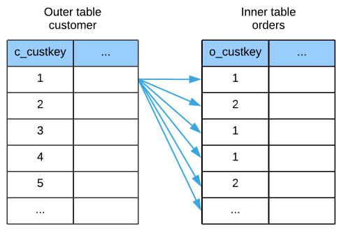

It performs the full scan for the inner table as many as the number of rows in an outer table, so the less rows in an outer table the better.

Even the join without a join condition can return the execution result to a cartesian product through a nested loop join. Therefore, a nested loop join is available even when a hash join and a sort merge join are not available.

<a id="d6c0a9d51d391819"></a>
###### **Index Nested Loops Join**

It performs an index nested loop join when it can retrieve the row satisfying the join condition by using an index in an inner table. An index access accesses only to necessary rows, so the performance is improved.

<a id="b22dd9687d96ab00"></a>
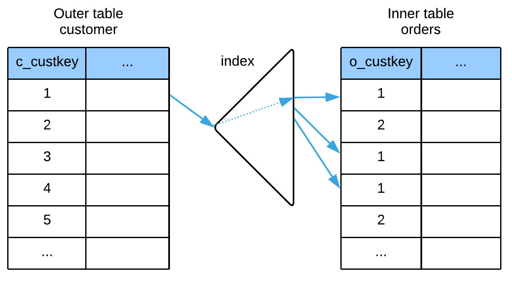

The following is an example of an index nested loop join.

```
\EXPLAIN PLAN
  SELECT c_custkey, count(o_orderkey)
    FROM customer, orders
   WHERE c_custkey = o_custkey
     AND c_comment like '%special%requests%'
GROUP BY c_custkey;
... 
2265 rows selected.

>>>  start print plan

< Execution Plan >
========================================================================
|  IDX  |  NODE DESCRIPTION                                            |
------------------------------------------------------------------------
|    0  |  SELECT STATEMENT                                            |
|    1  |    QUERY BLOCK ("$QB_IDX_2")                                 |
|    2  |      GROUP HASH INSTANT                                      |
|    3  |        NESTED JOIN (INNER JOIN)                              |
|    4  |          TABLE ACCESS ("CUSTOMER")                           |
|    5  |          INDEX ACCESS ("ORDERS", "ORDERS_CUSTKEY_FK")        |
========================================================================

     1  -  TARGET : CUSTOMER.C_CUSTKEY, COUNT( ORDERS.O_ORDERKEY )
     2  -  GROUP KEY : CUSTOMER.C_CUSTKEY
           RECORD COLUMN : COUNT( ORDERS.O_ORDERKEY )
           READ KEY COLUMN : CUSTOMER.C_CUSTKEY
           READ RECORD COLUMN : COUNT( ORDERS.O_ORDERKEY )
     3  -  JOINED COLUMN : CUSTOMER.C_CUSTKEY, ORDERS.O_ORDERKEY
     4  -  READ COLUMN : CUSTOMER.C_CUSTKEY, CUSTOMER.C_COMMENT
             LOGICAL FILTER : CUSTOMER.C_COMMENT LIKE '%special%requests%'
     5  -  READ INDEX COLUMN : ORDERS.O_CUSTKEY
           READ TABLE COLUMN : ORDERS.O_ORDERKEY
             MIN RANGE : ORDERS.O_CUSTKEY = {CUSTOMER.C_CUSTKEY}
             MAX RANGE : ORDERS.O_CUSTKEY = {CUSTOMER.C_CUSTKEY}

<<<  end print plan
```

<a id="12413174f9a1c296"></a>
###### **Instant Nested Loops Join**

It performs a nested loop join after loading the intermediate result of an inner table on an instant table.

<a id="efb7ebc39df14ef4"></a>
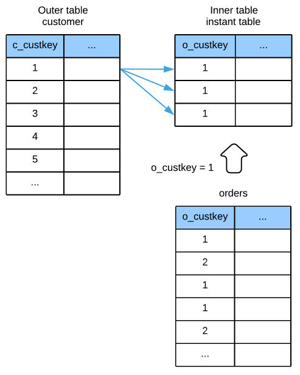

When the condition such as o_custkey = 1 exists as the example above, a nested loop join is available by loading the intermediate result of *orders* on an instant table.

The following is an example of an instant nested loop join.

```
\EXPLAIN PLAN
  SELECT c_custkey, count(o_orderkey)
    FROM customer, orders
   WHERE c_comment like '%special%requests%'
     AND o_orderdate = date '1995-03-15'
GROUP BY c_custkey;

...
3380 rows selected.

>>>  start print plan

< Execution Plan >
========================================================================
|  IDX  |  NODE DESCRIPTION                                            |
------------------------------------------------------------------------
|    0  |  SELECT STATEMENT                                            |
|    1  |    QUERY BLOCK ("$QB_IDX_2")                                 |
|    2  |      GROUP HASH INSTANT                                      |
|    3  |        NESTED JOIN (INNER JOIN)                              |
|    4  |          TABLE ACCESS ("ORDERS")                             |
|    5  |          FLAT JOIN INSTANT                                   |
|    6  |            TABLE ACCESS ("CUSTOMER")                         |
========================================================================

     1  -  TARGET : CUSTOMER.C_CUSTKEY, COUNT( ORDERS.O_ORDERKEY )
     2  -  GROUP KEY : CUSTOMER.C_CUSTKEY
           RECORD COLUMN : COUNT( ORDERS.O_ORDERKEY )
           READ KEY COLUMN : CUSTOMER.C_CUSTKEY
           READ RECORD COLUMN : COUNT( ORDERS.O_ORDERKEY )
     3  -  JOINED COLUMN : CUSTOMER.C_CUSTKEY, ORDERS.O_ORDERKEY
     4  -  READ COLUMN : ORDERS.O_ORDERKEY, ORDERS.O_ORDERDATE
             PHYSICAL FILTER : ORDERS.O_ORDERDATE = DATE'1995-03-15'
     5  -  RECORD COLUMN : CUSTOMER.C_CUSTKEY
           READ COLUMN : CUSTOMER.C_CUSTKEY
     6  -  READ COLUMN : CUSTOMER.C_CUSTKEY, CUSTOMER.C_COMMENT
             LOGICAL FILTER : CUSTOMER.C_COMMENT LIKE '%special%requests%'

<<<  end print plan
```

<a id="c84bf63cc254bfac"></a>
##### Sort Merge Join

It sorts the intermediate results of an outer table and an inner table, then sequentially compares them, checks whether they satisfy the join condition and returns the join result.

When an index available exists in either an outer table or an inner table, then the table obtains the sorted intermediate results by using an index instead of using a sort instant.

One or more equi join conditions are required to perform a sort merge join.

<a id="23d13cac92b64a39"></a>
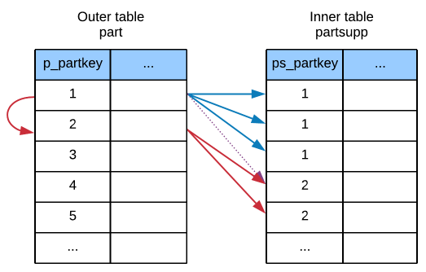

The following is an example of a sort merge join.

```
\EXPLAIN PLAN
SELECT p_name, p_brand, p_type
  FROM part, partsupp
 WHERE p_partkey = ps_partkey
   AND p_partkey < 10;
...
36 rows selected.

>>>  start print plan

< Execution Plan >
========================================================================
|  IDX  |  NODE DESCRIPTION                                            |
------------------------------------------------------------------------
|    0  |  SELECT STATEMENT                                            |
|    1  |    QUERY BLOCK ("$QB_IDX_2")                                 |
|    2  |      MERGE JOIN (INNER JOIN)                                 |
|    3  |        INDEX ACCESS ("PART", "PART_PK_INDEX")                |
|    4  |        INDEX ACCESS ("PARTSUPP", "PARTSUPP_PARTKEY_FK")      |
========================================================================

     1  -  TARGET : PART.P_NAME, PART.P_BRAND, PART.P_TYPE
     2  -  JOINED COLUMN : PART.P_NAME, PART.P_BRAND, PART.P_TYPE
             ON FILTER (Equi) : PART.P_PARTKEY = PARTSUPP.PS_PARTKEY
     3  -  READ INDEX COLUMN : PART.P_PARTKEY
           READ TABLE COLUMN : PART.P_NAME, PART.P_BRAND, PART.P_TYPE
             MAX RANGE : PART.P_PARTKEY < 10
     4  -  READ INDEX COLUMN : PARTSUPP.PS_PARTKEY
             MAX RANGE : PARTSUPP.PS_PARTKEY < 10

<<<  end print plan
```

<a id="f841921025d2dae1"></a>
##### Hash Join

It creates a hash instant in an inner table, then returns the join result satisfying the join condition by using a hash.

One or more equi join conditions are required to perform a hash join.

<a id="9760a292e2f387f9"></a>
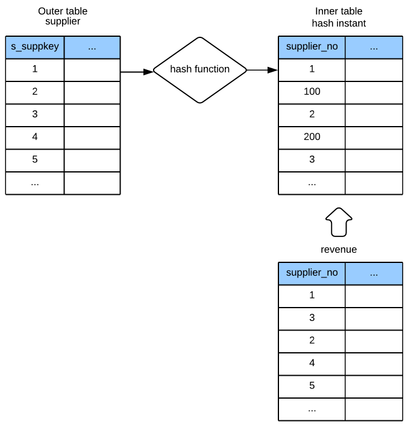

The following is an example of a hash join.

```
\EXPLAIN PLAN
SELECT s_suppkey,
       s_name,
       total_revenue
  FROM supplier, 
         (
            SELECT l_suppkey,
                   ROUND( sum(l_extendedprice * (1 - l_discount)), 2)
              FROM lineitem
             WHERE l_shipdate >= date '1996-01-01'
               AND l_shipdate < date '1996-01-01' + interval '3' month
             GROUP BY l_suppkey
       ) revenue(supplier_no, total_revenue)
 WHERE
      s_suppkey = supplier_no;


...
10000 rows selected.

>>>  start print plan

< Execution Plan >
========================================================================
|  IDX  |  NODE DESCRIPTION                                            |
------------------------------------------------------------------------
|    0  |  SELECT STATEMENT                                            |
|    1  |    QUERY BLOCK ("$QB_IDX_2")                                 |
|    2  |      HASH JOIN (INNER JOIN)                                  |
|    3  |        TABLE ACCESS ("SUPPLIER")                             |
|    4  |        HASH JOIN INSTANT                                     |
|    5  |          INLINE_VIEW ("REVENUE")                             |
|    6  |            QUERY BLOCK ("$QB_IDX_7")                         |
|    7  |              GROUP HASH INSTANT                              |
|    8  |                TABLE ACCESS ("LINEITEM")                     |
========================================================================

     1  -  TARGET : SUPPLIER.S_SUPPKEY, SUPPLIER.S_NAME, REVENUE.$C1
     2  -  JOINED COLUMN : SUPPLIER.S_SUPPKEY, SUPPLIER.S_NAME, REVENUE.$C1
     3  -  READ COLUMN : SUPPLIER.S_SUPPKEY, SUPPLIER.S_NAME
     4  -  HASH KEY : REVENUE.L_SUPPKEY
           RECORD COLUMN : REVENUE.$C1
           READ KEY COLUMN : REVENUE.L_SUPPKEY, REVENUE.$C1
             HASH FILTER : REVENUE.L_SUPPKEY = SUPPLIER.S_SUPPKEY
     5  -  COLUMN : LINEITEM.L_SUPPKEY AS L_SUPPKEY, ROUND(SUM( LINEITEM.L_EXTENDEDPRICE * ( 1 - LINEITEM.L_DISCOUNT ) ),2) AS $C1
     6  -  TARGET : LINEITEM.L_SUPPKEY, ROUND(SUM( LINEITEM.L_EXTENDEDPRICE * ( 1 - LINEITEM.L_DISCOUNT ) ),2)
     7  -  GROUP KEY : LINEITEM.L_SUPPKEY
           RECORD COLUMN : SUM( LINEITEM.L_EXTENDEDPRICE * ( 1 - LINEITEM.L_DISCOUNT ) )
           READ KEY COLUMN : LINEITEM.L_SUPPKEY
           READ RECORD COLUMN : SUM( LINEITEM.L_EXTENDEDPRICE * ( 1 - LINEITEM.L_DISCOUNT ) )
     8  -  READ COLUMN : LINEITEM.L_SUPPKEY, LINEITEM.L_EXTENDEDPRICE, LINEITEM.L_DISCOUNT, LINEITEM.L_SHIPDATE
             PHYSICAL FILTER : LINEITEM.L_SHIPDATE < DATE'1996-01-01' + CAST( '3' AS INTERVAL(MONTH) ) AND LINEITEM.L_SHIPDATE >= DATE'1996-01-01'

<<<  end print plan
```

<a id="c70b59aa6189417e"></a>
#### Join Order

When joining three or more tables, the join order should be determined. The join order is determined in the way of joining two tables, then joining the intermediate result and the next table.

When there are three tables, then there are various join orders as follows.

<a id="5317eb93641e1fe0"></a>
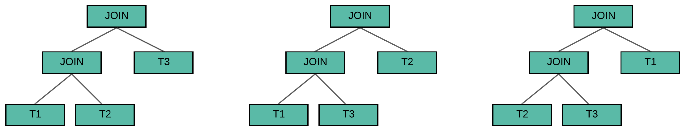

An enumerator creates sets of various execution plans according to join orders, join methods and access paths available, then it determines the join ordering by selecting the plan whose intermediate results and cost is low.

<a id="d12f470e0d07ca2c"></a>
### Group By

It processes *group by*.

Generally, it processes *group by* by creating GROUP HASH INSTANT.

If the intermediate result is sorted for *group by key column* and ascends from the subordinate node, then it can be processed without accumulating separate hash instants.

The following is an example of processing *group by* by creating GROUP HASH INSTANT.

```
\EXPLAIN PLAN
  SELECT c_custkey, count(o_orderkey)
    FROM customer, orders
 WHERE c_custkey = o_custkey 
     AND c_comment like '%special%requests%'
     AND o_orderdate = date '1995-03-15'
GROUP BY c_custkey;

...
12 rows selected.

>>>  start print plan

< Execution Plan >
========================================================================
|  IDX  |  NODE DESCRIPTION                                            |
------------------------------------------------------------------------
|    0  |  SELECT STATEMENT                                            |
|    1  |    QUERY BLOCK ("$QB_IDX_2")                                 |
|    2  |      GROUP HASH INSTANT                                      |
|    3  |        NESTED JOIN (INNER JOIN)                              |
|    4  |          TABLE ACCESS ("CUSTOMER")                           |
|    5  |          INDEX ACCESS ("ORDERS", "ORDERS_CUSTKEY_FK")        |
========================================================================

     1  -  TARGET : CUSTOMER.C_CUSTKEY, COUNT( ORDERS.O_ORDERKEY )
     2  -  GROUP KEY : CUSTOMER.C_CUSTKEY
           RECORD COLUMN : COUNT( ORDERS.O_ORDERKEY )
           READ KEY COLUMN : CUSTOMER.C_CUSTKEY
           READ RECORD COLUMN : COUNT( ORDERS.O_ORDERKEY )
     3  -  JOINED COLUMN : CUSTOMER.C_CUSTKEY, ORDERS.O_ORDERKEY
     4  -  READ COLUMN : CUSTOMER.C_CUSTKEY, CUSTOMER.C_COMMENT
             LOGICAL FILTER : CUSTOMER.C_COMMENT LIKE '%special%requests%'
     5  -  READ INDEX COLUMN : ORDERS.O_CUSTKEY
           READ TABLE COLUMN : ORDERS.O_ORDERKEY, ORDERS.O_ORDERDATE
             MIN RANGE : ORDERS.O_CUSTKEY = {CUSTOMER.C_CUSTKEY}
             MAX RANGE : ORDERS.O_CUSTKEY = {CUSTOMER.C_CUSTKEY}
             PHYSICAL TABLE FILTER : ORDERS.O_ORDERDATE = DATE'1995-03-15'

<<<  end print plan
```

The following is an example of processing *group by* by using the sorted intermediate results on the subordinate node.

```
\EXPLAIN PLAN
  SELECT c_custkey, count(o_orderkey)
    FROM customer, orders
   WHERE c_custkey = o_custkey 
     AND c_custkey >= 10
     AND c_custkey < 20
     AND c_comment like '%special%requests%'
     AND o_orderdate = date '1995-03-15'
GROUP BY c_custkey;

...

>>>  start print plan

< Execution Plan >
========================================================================
|  IDX  |  NODE DESCRIPTION                                            |
------------------------------------------------------------------------
|    0  |  SELECT STATEMENT                                            |
|    1  |    QUERY BLOCK ("$QB_IDX_2")                                 |
|    2  |      GROUP                                                   |
|    3  |        NESTED JOIN (INNER JOIN)                              |
|    4  |          INDEX ACCESS ("CUSTOMER", "CUSTOMER_PK_INDEX")      |
|    5  |          INDEX ACCESS ("ORDERS", "ORDERS_CUSTKEY_FK")        |
========================================================================

     1  -  TARGET : CUSTOMER.C_CUSTKEY, COUNT( ORDERS.O_ORDERKEY )
     2  -  GROUP KEY : CUSTOMER.C_CUSTKEY
           RECORD COLUMN : COUNT( ORDERS.O_ORDERKEY )
     3  -  JOINED COLUMN : CUSTOMER.C_CUSTKEY, ORDERS.O_ORDERKEY
     4  -  READ INDEX COLUMN : CUSTOMER.C_CUSTKEY
           READ TABLE COLUMN : CUSTOMER.C_COMMENT
             MIN RANGE : CUSTOMER.C_CUSTKEY >= 10
             MAX RANGE : CUSTOMER.C_CUSTKEY IS NOT NULL AND CUSTOMER.C_CUSTKEY < 20
             LOGICAL TABLE FILTER : CUSTOMER.C_COMMENT LIKE '%special%requests%'
     5  -  READ INDEX COLUMN : ORDERS.O_CUSTKEY
           READ TABLE COLUMN : ORDERS.O_ORDERKEY, ORDERS.O_ORDERDATE
             MIN RANGE : ORDERS.O_CUSTKEY = {CUSTOMER.C_CUSTKEY} AND ORDERS.O_CUSTKEY >= 10
             MAX RANGE : ORDERS.O_CUSTKEY = {CUSTOMER.C_CUSTKEY} AND ORDERS.O_CUSTKEY < 20
             LOGICAL KEY FILTER : ORDERS.O_CUSTKEY LIKE '%special%requests%'
             PHYSICAL TABLE FILTER : ORDERS.O_ORDERDATE = DATE'1995-03-15'

<<<  end print plan
```

<a id="b7f70360db7f8856"></a>
### Distinct

It processes distinct.

Generally, it processes distinct by creating GROUP HASH INSTANT.

If the intermediate result is sorted for distinct key column and ascends from the subordinate node, then it can be processed without accumulating separate hash instants.

The following is an example of processing distinct by creating GROUP HASH INSTANT.

```
\EXPLAIN PLAN
SELECT DISTINCT c_nationkey
  FROM customer
 WHERE c_comment like '%special%requests%'
;

...

>>>  start print plan

< Execution Plan >
========================================================================
|  IDX  |  NODE DESCRIPTION                                            |
------------------------------------------------------------------------
|    0  |  SELECT STATEMENT                                            |
|    1  |    QUERY BLOCK ("$QB_IDX_2")                                 |
|    2  |      GROUP HASH INSTANT                                      |
|    3  |        TABLE ACCESS ("CUSTOMER")                             |
========================================================================

     1  -  TARGET : CUSTOMER.C_NATIONKEY
     2  -  GROUP KEY : CUSTOMER.C_NATIONKEY
           READ KEY COLUMN : CUSTOMER.C_NATIONKEY
     3  -  READ COLUMN : CUSTOMER.C_NATIONKEY, CUSTOMER.C_COMMENT
             LOGICAL FILTER : CUSTOMER.C_COMMENT LIKE '%special%requests%'

<<<  end print plan
```

The following is an example of processing distinct by using the sorted intermediate results on the subordinate node.

```
\EXPLAIN PLAN
  SELECT DISTINCT c_nationkey
    FROM customer
   WHERE c_nationkey >= 15
     AND c_nationkey < 20
     AND c_comment like '%special%requests%'
;
...
>>>  start print plan

< Execution Plan >
========================================================================
|  IDX  |  NODE DESCRIPTION                                            |
------------------------------------------------------------------------
|    0  |  SELECT STATEMENT                                            |
|    1  |    QUERY BLOCK ("$QB_IDX_2")                                 |
|    2  |      GROUP                                                   |
|    3  |        INDEX ACCESS ("CUSTOMER", "CUSTOMER_NATIONKEY_FK")    |
========================================================================

     1  -  TARGET : CUSTOMER.C_NATIONKEY
     2  -  GROUP KEY : CUSTOMER.C_NATIONKEY
     3  -  READ INDEX COLUMN : CUSTOMER.C_NATIONKEY
           READ TABLE COLUMN : CUSTOMER.C_COMMENT
             MIN RANGE : CUSTOMER.C_NATIONKEY >= 15
             MAX RANGE : CUSTOMER.C_NATIONKEY IS NOT NULL AND CUSTOMER.C_NATIONKEY < 20
             LOGICAL TABLE FILTER : CUSTOMER.C_COMMENT LIKE '%special%requests%'

<<<  end print plan
```

<a id="0c056cff20b1efbd"></a>
### Single Row Aggregation

It processes single row aggregation.

Generally, it performs aggregation by using a hash.

If it is a simple query acquiring MIN(), MAX(), then it may use an index.

The following is an example of processing single row aggregation by using a hash.

```
\EXPLAIN PLAN
SELECT count(o_orderkey)
  FROM customer, orders
 WHERE c_custkey = o_custkey 
   AND c_comment like '%special%requests%';

COUNT(O_ORDERKEY)
-----------------
            33526

1 row selected.

>>>  start print plan

< Execution Plan >
========================================================================
|  IDX  |  NODE DESCRIPTION                                            |
------------------------------------------------------------------------
|    0  |  SELECT STATEMENT                                            |
|    1  |    QUERY BLOCK ("$QB_IDX_2")                                 |
|    2  |      AGGREGATION BY HASH                                     |
|    3  |        NESTED JOIN (INNER JOIN)                              |
|    4  |          TABLE ACCESS ("CUSTOMER")                           |
|    5  |          INDEX ACCESS ("ORDERS", "ORDERS_CUSTKEY_FK")        |
========================================================================

     1  -  TARGET : COUNT( ORDERS.O_ORDERKEY )
     2  -  AGGREGATION : COUNT( ORDERS.O_ORDERKEY )
     3  -  JOINED COLUMN : ORDERS.O_ORDERKEY
     4  -  READ COLUMN : CUSTOMER.C_CUSTKEY, CUSTOMER.C_COMMENT
             LOGICAL FILTER : CUSTOMER.C_COMMENT LIKE '%special%requests%'
     5  -  READ INDEX COLUMN : ORDERS.O_CUSTKEY
           READ TABLE COLUMN : ORDERS.O_ORDERKEY
             MIN RANGE : ORDERS.O_CUSTKEY = {CUSTOMER.C_CUSTKEY}
             MAX RANGE : ORDERS.O_CUSTKEY = {CUSTOMER.C_CUSTKEY}

<<<  end print plan
```

The following is an example of processing single row aggregation by using an index.

```
\EXPLAIN PLAN SELECT MIN(c_custkey), MAX(c_custkey) FROM customer;

MIN(C_CUSTKEY) MAX(C_CUSTKEY)
-------------- --------------
             1         150000

1 row selected.

>>>  start print plan

< Execution Plan >
========================================================================
|  IDX  |  NODE DESCRIPTION                                            |
------------------------------------------------------------------------
|    0  |  SELECT STATEMENT                                            |
|    1  |    QUERY BLOCK ("$QB_IDX_2")                                 |
|    2  |      INDEX ACCESS ("CUSTOMER", "CUSTOMER_PK_INDEX")          |
========================================================================

     1  -  TARGET : MIN( CUSTOMER.C_CUSTKEY ), MAX( CUSTOMER.C_CUSTKEY )
     2  -  READ INDEX COLUMN : CUSTOMER.C_CUSTKEY
           AGGREGATION : MIN( CUSTOMER.C_CUSTKEY ), MAX( CUSTOMER.C_CUSTKEY )

<<<  end print plan
```

<a id="cb9d8e4ae4445c5e"></a>
### Order By

It processes *order by*.

Generally, it processes order by by creating SORT INSTANT.

The following two methods are used to process *order by* of SORT INSTANT node.

- Sorting by using sort instant table
- Sorting by using limit sort (If *order by* is used together with *limit, *limit sort method is applied.)

If the intermediate result is sorted for order by key column and ascends from the subordinate node, then it can be processed without accumulating separate sort instants.

The following is an example of processing *order by* by creating SORT INSTANT.

```
\EXPLAIN PLAN
  SELECT c_nationkey
    FROM customer
   WHERE c_comment like '%special%requests%'
ORDER BY c_nationkey;
...
>>>  start print plan

< Execution Plan >
========================================================================
|  IDX  |  NODE DESCRIPTION                                            |
------------------------------------------------------------------------
|    0  |  SELECT STATEMENT                                            |
|    1  |    QUERY BLOCK ("$QB_IDX_2")                                 |
|    2  |      SORT INSTANT                                            |
|    3  |        TABLE ACCESS ("CUSTOMER")                             |
========================================================================

     1  -  TARGET : CUSTOMER.C_NATIONKEY
     2  -  SORT KEY : "CUSTOMER.C_NATIONKEY ASC NULLS LAST"
           READ KEY COLUMN : CUSTOMER.C_NATIONKEY
     3  -  READ COLUMN : CUSTOMER.C_NATIONKEY, CUSTOMER.C_COMMENT
             LOGICAL FILTER : CUSTOMER.C_COMMENT LIKE '%special%requests%'

<<<  end print plan
```

The following is an example of processing *order by* by using LIMIT SORT method. It is performed within SORT INSTANT node.

```
\EXPLAIN PLAN
  SELECT c_nationkey
    FROM customer
   WHERE c_comment like '%special%requests%'
ORDER BY c_nationkey
   LIMIT 3;
...
>>>  start print plan

< Execution Plan >
==================================================================================================
|  IDX  |  NODE DESCRIPTION                                            |                    ROWS |
--------------------------------------------------------------------------------------------------
|    0  |  SELECT STATEMENT                                            |                       0 |
|    1  |    QUERY BLOCK ("$QB_IDX_2")                                 |                       0 |
|    2  |      SORT INSTANT                                            |                       0 |
|    3  |        TABLE ACCESS ("CUSTOMER")                             |                       0 |
==================================================================================================

     1  -  TARGET : CUSTOMER.C_NATIONKEY
     2  -  LIMIT SORT
           SORT KEY : "CUSTOMER.C_NATIONKEY ASC NULLS LAST"
           READ KEY COLUMN : CUSTOMER.C_NATIONKEY
     3  -  READ COLUMN : CUSTOMER.C_NATIONKEY, CUSTOMER.C_COMMENT
             LOGICAL FILTER : CUSTOMER.C_COMMENT LIKE '%special%requests%'

<<<  end print plan
```

The following is an example of processing *order by* by using the sorted intermediate results on the subordinate node. The *order by* processing is omitted.

```
>>>  start print plan

\EXPLAIN PLAN
  SELECT c_nationkey
    FROM customer
   WHERE c_nationkey >= 15
     AND c_nationkey < 20
ORDER BY c_nationkey;
...


>>>  start print plan

< Execution Plan >
========================================================================
|  IDX  |  NODE DESCRIPTION                                            |
------------------------------------------------------------------------
|    0  |  SELECT STATEMENT                                            |
|    1  |    QUERY BLOCK ("$QB_IDX_2")                                 |
|    2  |      INDEX ACCESS ("CUSTOMER", "CUSTOMER_NATIONKEY_FK")      |
========================================================================

     1  -  TARGET : CUSTOMER.C_NATIONKEY
     2  -  READ INDEX COLUMN : CUSTOMER.C_NATIONKEY
           READ TABLE COLUMN : CUSTOMER.C_COMMENT
             MIN RANGE : CUSTOMER.C_NATIONKEY >= 15
             MAX RANGE : CUSTOMER.C_NATIONKEY IS NOT NULL AND CUSTOMER.C_NATIONKEY < 20

<<<  end print plan
```

<a id="9c608bee2b7199d1"></a>
## Cluster

This chapter describes optimizing the cluster query in the cluster system.  
For more information about the cluster system, refer to [GOLDILOCKS Cluster System Architecture](../part-01-getting-started/1-preface.md#421388c925475312).

<a id="af85f698db3bfc27"></a>
### Table Sharding Strategy

There are two types of table sharding strategies as follows.

- Cloned table
- Sharded table

The description and examples of table sharding strategies are as follows.

<a id="8647af203cb3b414"></a>
#### Cloned Table

All table data of every node in every group are stored same in the cloned table. Therefore it is appropriate for the table which is rarely updated and whose data is little.

The following is an example of creating a customer table with a cloned table.

<a id="aef96a19faaa4c29"></a>
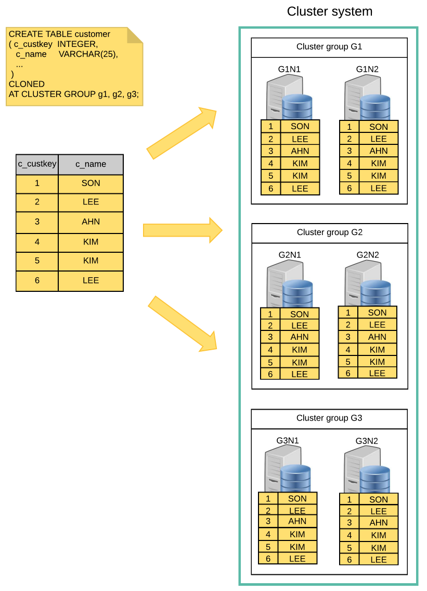

<a id="0f7a1f4bfc40ef36"></a>
#### Sharded Table

The data is divided in a group by a shard key, then stored. Nodes in a single group have the same data. Therefore, it is it is appropriate for the table which should be divided due to many data. There are three types of shards according to the sharding strategies as follows.

- Hash shard
- Range shard
- List shard

The following is an example of creating an order table by using hash shards.

<a id="db5427e86de1097f"></a>
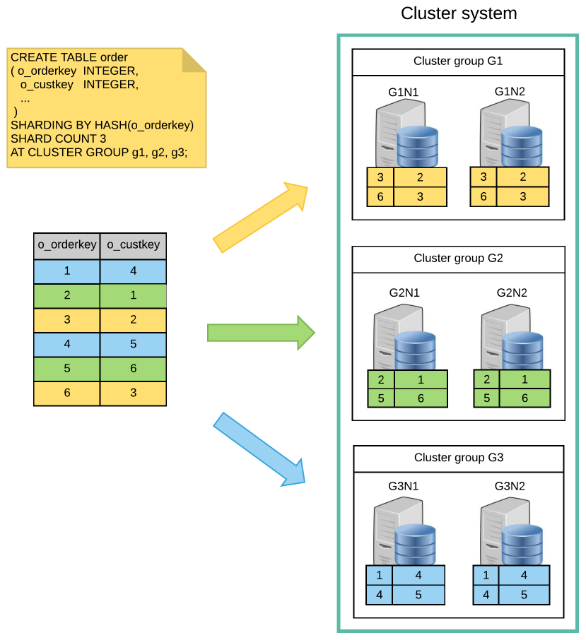

<a id="81226d861c6da64a"></a>
### Access

This paragraph describes the case of which a cluster query access a single table.

The following figure describes a local access and a remote access of when the current server is G1N1.

<a id="9c7840a83f77f7ff"></a>
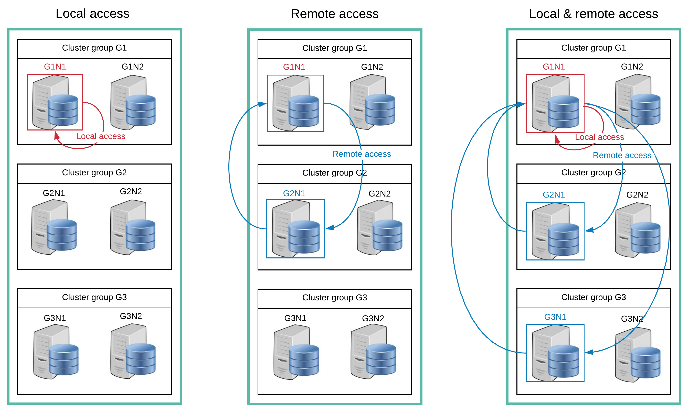

<a id="a628942f1e35d056"></a>
#### Local Access

It performs the operation only on the current server in driver aspect.

If enquiring about the cloned table as follows, then it only needs to be performed in the current server because data in every node in all group are the same.

<a id="cf7d837fe4ba011f"></a>
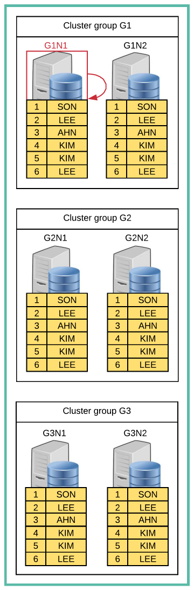

```
\EXPLAIN PLAN SELECT * FROM customer;

C_CUSTKEY C_NAME
--------- ------
        1 SON   
        2 LEE   
        3 AHN   
        4 KIM   
        5 KIM   
        6 LEE   

6 rows selected.

>>>  start print plan

< Execution Plan >
==========================================================================
| IDX |  NODE DESCRIPTION                                         | ROWS |
--------------------------------------------------------------------------
|  0  |  SELECT STATEMENT                                         |    6 |
|  1  |    QUERY BLOCK ("$QB_IDX_2")                              |    6 |
|  2  |      TABLE ACCESS ("CUSTOMER")                            |    6 |
==========================================================================

     1  -  TARGET : CUSTOMER.C_CUSTKEY, CUSTOMER.C_NAME
     2  -  CLONED 
           READ COLUMN : CUSTOMER.C_CUSTKEY, CUSTOMER.C_NAME

<<<  end print plan
```

The data is divided in a group by a shard key, then stored in the sharded table. Therefore, it performs the local access when a filter for a shard key exists and the value can be performed only in the current server.

<a id="a925a67283dea6c6"></a>
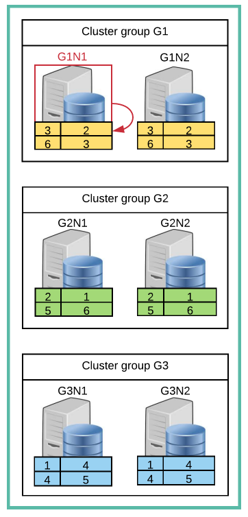

```
\EXPLAIN PLAN SELECT * FROM orders WHERE o_orderkey = 3;

O_ORDERKEY O_CUSTKEY
---------- ---------
         3         2

1 row selected.

>>>  start print plan

< Execution Plan >
===========================================================================
| IDX |  NODE DESCRIPTION                                          | ROWS |
---------------------------------------------------------------------------
|  0  |  SELECT STATEMENT                                          |    1 |
|  1  |    QUERY BLOCK ("$QB_IDX_2")                               |    1 |
|  2  |      TABLE ACCESS ("ORDERS")                               |    1 |
===========================================================================

     1  -  TARGET : ORDERS.O_ORDERKEY, ORDERS.O_CUSTKEY
     2  -  HASH SHARD ( # 3 ) 
           READ COLUMN : ORDERS.O_ORDERKEY, ORDERS.O_CUSTKEY
             PHYSICAL FILTER : ORDERS.O_ORDERKEY = 3

<<<  end print plan
```

<a id="32bbfe8b5568de7f"></a>
#### Remote Access

The data is divided in a group by a shard key, then stored in the sharded table. Therefore, it can fetch the result by the remote access only to a specific server when a filter for a shard key exists.

<a id="1907d0a2284daeb9"></a>
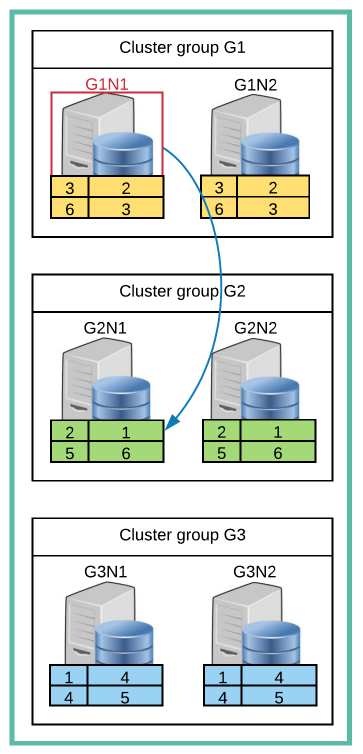

```
\EXPLAIN PLAN SELECT * FROM orders WHERE o_orderkey = 2;

O_ORDERKEY O_CUSTKEY
---------- ---------
         2         1

1 row selected.

>>>  start print plan

< Execution Plan >
===========================================================================
|  IDX  |  NODE DESCRIPTION                               |          ROWS |
---------------------------------------------------------------------------
|  0  |  SELECT STATEMENT                                 |             1 |
|  1  |    QUERY BLOCK ("$QB_IDX_2")                      |             1 |
|  2  |      PLAN BASED CLUSTER                           | REMOTE ONLY 1 |
|  3  |        TABLE ACCESS ("ORDERS")                    |             0 |
===========================================================================

     1  -  TARGET : ORDERS.O_ORDERKEY, ORDERS.O_CUSTKEY
     2  -  SQL : SELECT /*+ FULL( _A1 ) */
                        "_A1"."O_ORDERKEY", "_A1"."O_CUSTKEY"
                   FROM "PUBLIC"."ORDERS"@LOCAL AS "_A1"
                  WHERE "_A1"."O_ORDERKEY" = :_V0
           TARGET DOMAIN : G2(G2N1,G2N2) 1 rows
     3  -  HASH SHARD ( # 3 ) 
           READ COLUMN : ORDERS.O_ORDERKEY, ORDERS.O_CUSTKEY
             PHYSICAL FILTER : ORDERS.O_ORDERKEY = 2

<<<  end print plan
```

In the execution plan above, it fetched the result by remotely transferring SQL to G2.

If the sharded table does not have a filter for the shard key, then it should receive the result by transferring the query to each server.

<a id="500ad0ee23f99a2a"></a>
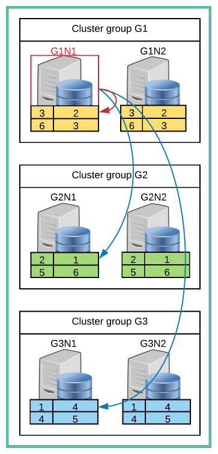

```
\EXPLAIN PLAN SELECT * FROM orders WHERE o_custkey = 1;

O_ORDERKEY O_CUSTKEY
---------- ---------
         2         1

1 row selected.

>>>  start print plan

< Execution Plan >
===========================================================================
|  IDX  |  NODE DESCRIPTION                               |          ROWS |
---------------------------------------------------------------------------
|    0  |  SELECT STATEMENT                               |             1 |
|  1  |    QUERY BLOCK ("$QB_IDX_2")                      |             1 |
|  2  |      PLAN BASED CLUSTER                           |LOCAL/REMOTE 1 |
|  3  |        TABLE ACCESS ("ORDERS")                    |             0 |
===========================================================================

     1  -  TARGET : ORDERS.O_ORDERKEY, ORDERS.O_CUSTKEY
     2  -  SQL : SELECT /*+ FULL( _A1 ) */
                        "_A1"."O_ORDERKEY", "_A1"."O_CUSTKEY"
                   FROM "PUBLIC"."ORDERS"@LOCAL AS "_A1"
                  WHERE "_A1"."O_CUSTKEY" = :_V0
           TARGET DOMAIN : G1(G1N1,G1N2) 0 rows,
                           G2(G2N1,G2N2) 1 rows,
                           G3(G3N1,G3N2) 0 rows
     3  -  HASH SHARD ( # 3 ) 
           READ COLUMN : ORDERS.O_ORDERKEY, ORDERS.O_CUSTKEY
             PHYSICAL FILTER : ORDERS.O_CUSTKEY = 1

<<<  end print plan
```

In the execution plan above, it fetched the result by remotely transferring SQL to G1, G2, G3.

<a id="cd1328e740d2cf7f"></a>
### Join

<a id="d0235fcc901921a0"></a>
#### Local Join

It performs join in the current server. Local join types are various as follows.

The following is an example of joining *region* and *nation*. Both tables are cloned tables. All nodes in every group of the cloned tables has the same data. Therefore, it can perform the join only with data in G1N1 in the following example whose drive is G1N1.

```
\EXPLAIN PLAN
SELECT r_name, n_name
  FROM region, nation
 WHERE r_regionkey = n_regionkey;
```

<a id="1909098521083a24"></a>
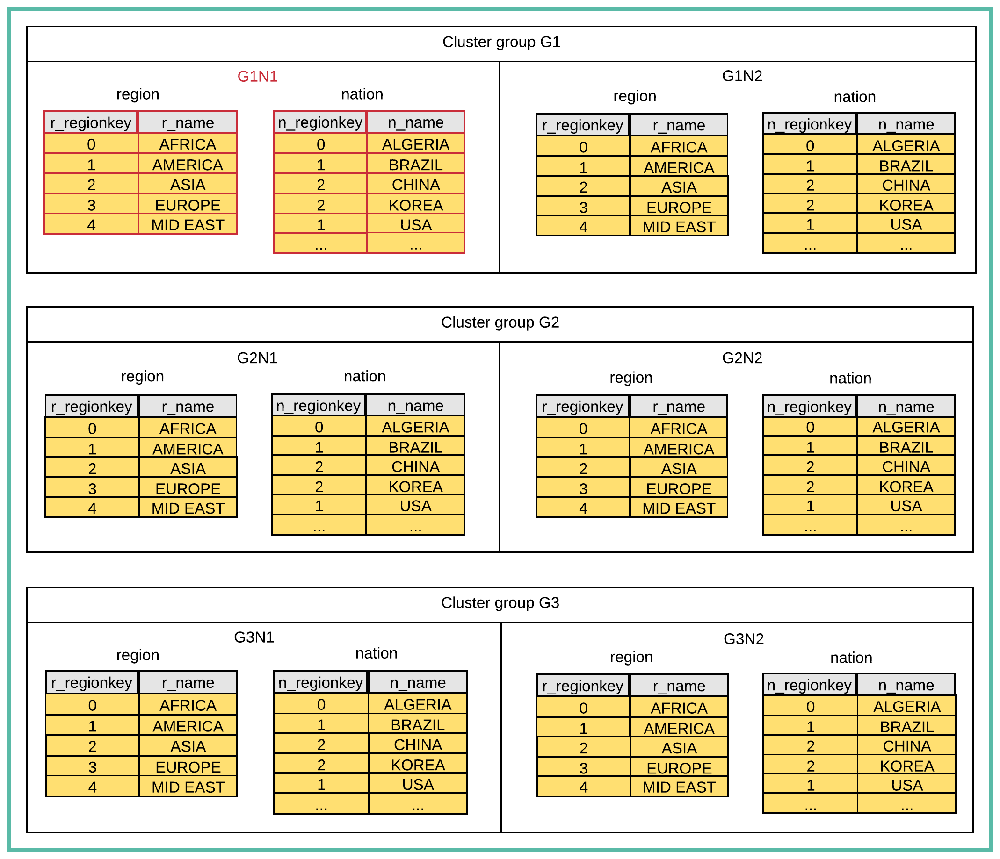

```
>>>  start print plan

< Execution Plan >
========================================================================
|  IDX  |  NODE DESCRIPTION                                            |
------------------------------------------------------------------------
|    0  |  SELECT STATEMENT                                            |
|    1  |    QUERY BLOCK ("$QB_IDX_2")                                 |
|    2  |      HASH JOIN (INNER JOIN)                                  |
|    3  |        TABLE ACCESS ("NATION")                               |
|    4  |        HASH JOIN INSTANT                                     |
|    5  |          TABLE ACCESS ("REGION")                             |
========================================================================

     1  -  TARGET : REGION.R_NAME, NATION.N_NAME
     2  -  JOINED COLUMN : REGION.R_NAME, NATION.N_NAME
     3  -  CLONED 
           READ COLUMN : NATION.N_NAME, NATION.N_REGIONKEY
     4  -  HASH KEY : REGION.R_REGIONKEY
           RECORD COLUMN : REGION.R_NAME
           READ KEY COLUMN : REGION.R_REGIONKEY, REGION.R_NAME
             HASH FILTER : REGION.R_REGIONKEY = NATION.N_REGIONKEY
           FETCH ONE ROW
     5  -  CLONED 
           READ COLUMN : REGION.R_REGIONKEY, REGION.R_NAME

<<<  end print plan
```

The following is an example of joining customer and orders. Customer is a cloned table and order is a sharded table. The data in the sharded table divided in a group by a shard key. Therefore, it can perform the local join when a filter for a shard key column exists and the data exists in the current server as the following example.

```
\EXPLAIN PLAN
SELECT c_custkey, COUNT(o_orderkey)
  FROM customer, orders
 WHERE c_custkey = o_custkey
   AND o_orderkey = 3
GROUP BY c_custkey;
```

<a id="034b35a830120c15"></a>
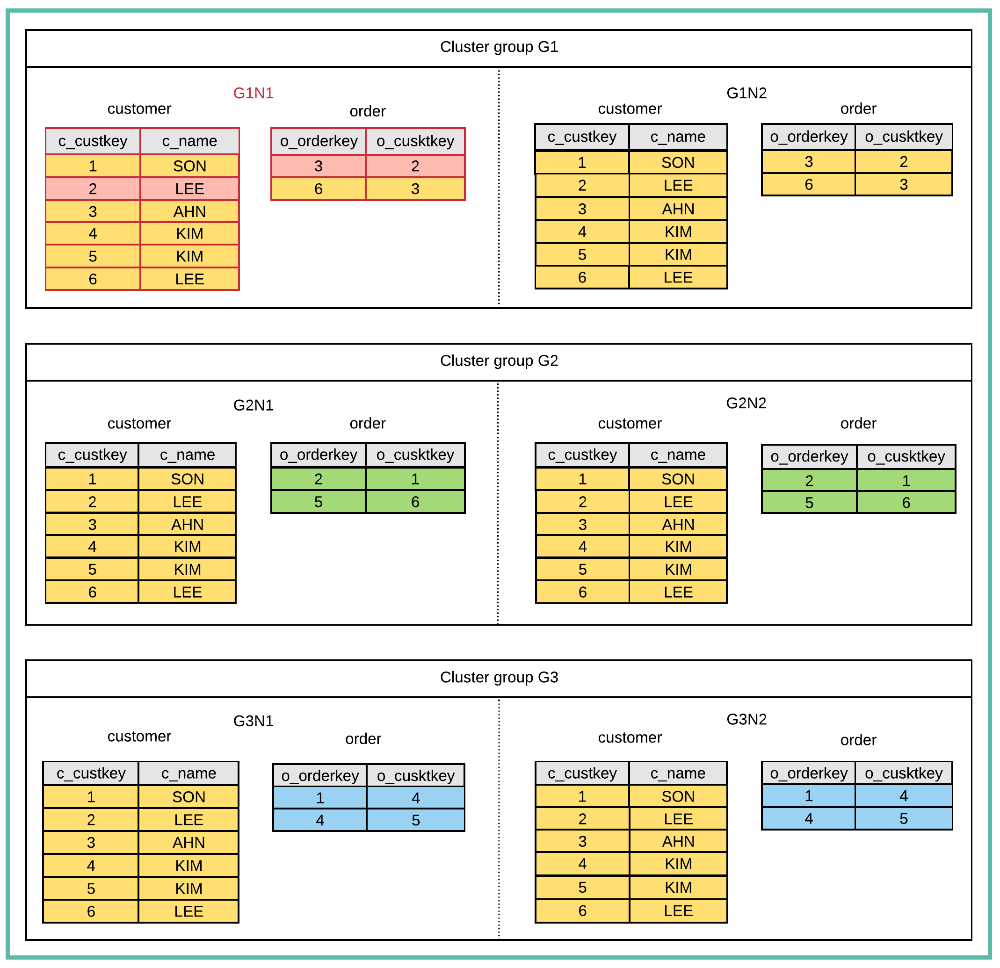

```
>>>  start print plan

< Execution Plan >
========================================================================
|  IDX  |  NODE DESCRIPTION                                            |
------------------------------------------------------------------------
|    0  |  SELECT STATEMENT                                            |
|    1  |    QUERY BLOCK ("$QB_IDX_2")                                 |
|    2  |      GROUP HASH INSTANT                                      |
|    3  |        NESTED JOIN (INNER JOIN)                              |
|    4  |          INDEX ACCESS ("ORDERS", "ORDERS_PK_INDEX")          |
|    5  |          INDEX ACCESS ("CUSTOMER", "CUSTOMER_PK_INDEX")      |
========================================================================

     1  -  TARGET : CUSTOMER.C_CUSTKEY, COUNT( ORDERS.O_ORDERKEY )
     2  -  GROUP KEY : CUSTOMER.C_CUSTKEY
           RECORD COLUMN : COUNT( ORDERS.O_ORDERKEY )
           READ KEY COLUMN : CUSTOMER.C_CUSTKEY
           READ RECORD COLUMN : COUNT( ORDERS.O_ORDERKEY )
     3  -  JOINED COLUMN : CUSTOMER.C_CUSTKEY, ORDERS.O_ORDERKEY
     4  -  HASH SHARD ( # 3 ) 
           READ INDEX COLUMN : ORDERS.O_ORDERKEY
           READ TABLE COLUMN : ORDERS.O_CUSTKEY
             MIN RANGE : ORDERS.O_ORDERKEY = 3
             MAX RANGE : ORDERS.O_ORDERKEY = 3
           FETCH ONE ROW
     5  -  CLONED 
           READ INDEX COLUMN : CUSTOMER.C_CUSTKEY
             MIN RANGE : CUSTOMER.C_CUSTKEY = {ORDERS.O_CUSTKEY}
             MAX RANGE : CUSTOMER.C_CUSTKEY = {ORDERS.O_CUSTKEY}
           FETCH ONE ROW

<<<  end print plan
```

The following is an example of joining customer and orders without a filter for a shard key column. In this case, the local join is available only after fetching all data in the sharded table.

<a id="3f0fded9dfd1a937"></a>
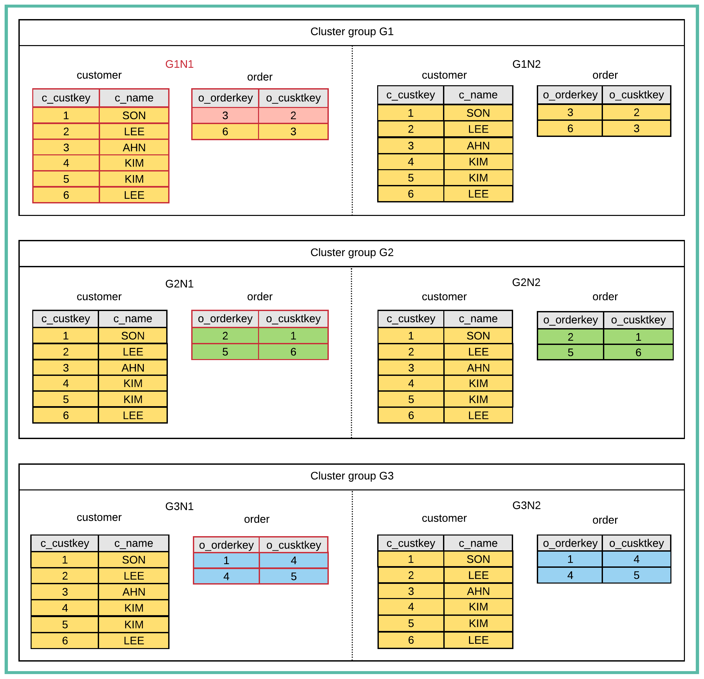

```
\EXPLAIN PLAN
SELECT /*+ LOCAL_JOIN(orders) */
       c_custkey, COUNT(o_orderkey)
  FROM customer, orders
 WHERE c_custkey = o_custkey
GROUP BY c_custkey;
```

```
< Execution Plan >
============================================================================
|IDX|  NODE DESCRIPTION                                   |           ROWS |
----------------------------------------------------------------------------
| 0 |  SELECT STATEMENT                                   |              6 |
| 1 |    QUERY BLOCK ("$QB_IDX_2")                        |              6 |
| 2 |      HASH JOIN (INNER JOIN)                         |              6 |
| 3 |        PLAN BASED CLUSTER                           | LOCAL/REMOTE 6 |
| 4 |          INDEX ACCESS ("ORDERS", "ORDERS_PK_INDEX") | (6)          6 |
| 5 |        HASH JOIN INSTANT                            |              6 |
| 6 |          TABLE ACCESS ("CUSTOMER")                  |              6 |
============================================================================

     1  -  TARGET : CUSTOMER.C_CUSTKEY, CUSTOMER.C_NAME, ORDERS.O_ORDERKEY
     2  -  JOINED COLUMN : CUSTOMER.C_CUSTKEY, CUSTOMER.C_NAME, ORDERS.O_ORDERKEY
     3  -  SQL : SELECT /*+ INDEX( _A1, "PUBLIC"."ORDERS_PK_INDEX" ) */
                       "_A1"."O_ORDERKEY"
                  FROM "PUBLIC"."ORDERS"@LOCAL AS "_A1"
           TARGET DOMAIN : G1(G1N1,G1N2) 2 rows,
                           G2(G2N1,G2N2) 2 rows,
                           G3(G3N1,G3N2) 2 rows
     4  -  HASH SHARD ( # 3 ) 
           READ INDEX COLUMN : ORDERS.O_ORDERKEY
     5  -  HASH KEY : CUSTOMER.C_CUSTKEY
           RECORD COLUMN : CUSTOMER.C_NAME
           READ KEY COLUMN : CUSTOMER.C_CUSTKEY, CUSTOMER.C_NAME
             HASH FILTER : CUSTOMER.C_CUSTKEY = ORDERS.O_ORDERKEY
           FETCH ONE ROW
     6  -  CLONED 
           READ COLUMN : CUSTOMER.C_CUSTKEY, CUSTOMER.C_NAME

<<<  end print plan
```

In the execution plan above, it fetched all data in order table by transferring SQL to G1, G2, G3.

<a id="9953b3767932cf8c"></a>
#### Remote Join

It performs join in each server.

Join processing in each server has a parallel processing effect. Also, when results are decreased a lot by the join, then bringing the result by performing join in the server reduces the network cost.

This chapter describes various forms of remote.

<a id="3f73841d4ced4b7a"></a>
##### Joining Cloned Table and Sharded Table

This chapter describes about joining a cloned table and a sharded table.

The following is an example of joining customer and orders. Customer is a cloned table, order is a sharded table, and the data is distributed as follows.

<a id="b76a14c1cfee6c74"></a>
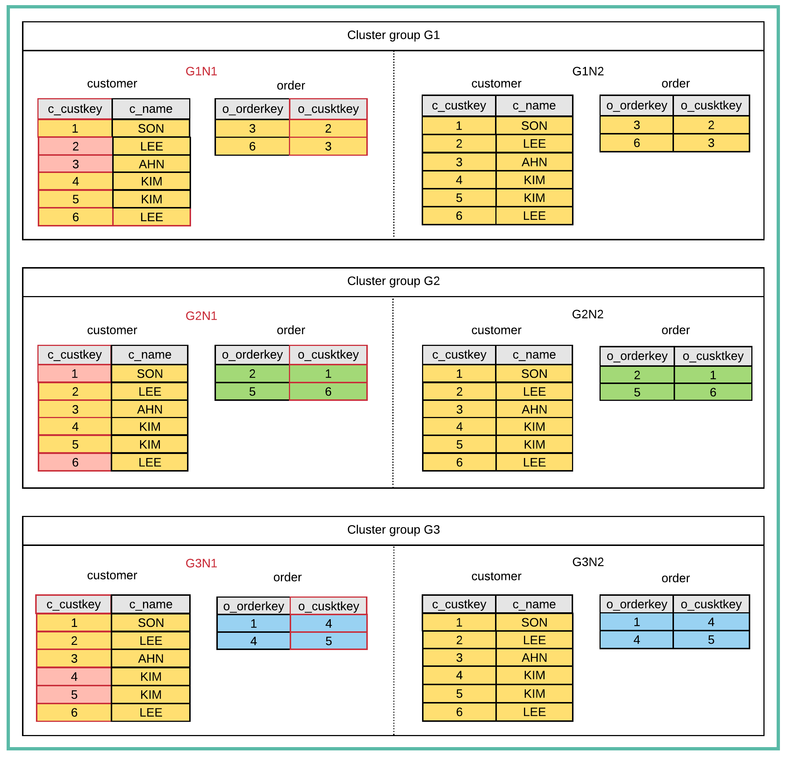

```
\EXPLAIN PLAN
SELECT /*+ REMOTE_JOIN(orders) */
       c_custkey, COUNT(o_orderkey)
  FROM customer, orders
 WHERE c_custkey = o_custkey
GROUP BY c_custkey;


>>>  start print plan

< Execution Plan >
============================================================================
|IDX|  NODE DESCRIPTION                                   |           ROWS |
----------------------------------------------------------------------------
| 0 |  SELECT STATEMENT                                   |              6 |
| 1 |    QUERY BLOCK ("$QB_IDX_2")                        |              6 |
| 2 |      PLAN BASED CLUSTER                             | LOCAL/REMOTE 6 |
| 3 |        HASH JOIN (INNER JOIN)                       |              6 |
| 4 |          TABLE ACCESS ("ORDERS")                    |              6 |
| 5 |          HASH JOIN INSTANT                          |              6 |
| 6 |            TABLE ACCESS ("CUSTOMER")                |              6 |
============================================================================

     1  -  TARGET : CUSTOMER.C_CUSTKEY, CUSTOMER.C_NAME, ORDERS.O_ORDERKEY
     2  -  SQL : SELECT /*+ KEEP_JOINED_TABLE USE_HASH_IN( _A1, 10 )
                            FULL( _A2 )
                            FULL( _A1 ) */
                      "_A1"."C_CUSTKEY", "_A1"."C_NAME", "_A2"."O_ORDERKEY"
                   FROM ("PUBLIC"."ORDERS"@LOCAL AS "_A2"
                         INNER JOIN
                         "PUBLIC"."CUSTOMER"@LOCAL AS "_A1"
                     ON "_A1"."C_CUSTKEY" = "_A2"."O_ORDERKEY") ALIAS "_A3"
           TARGET DOMAIN : G1(G1N1,G1N2) 2 rows,
                           G2(G2N1,G2N2) 2 rows,
                           G3(G3N1,G3N2) 2 rows
     3  -  JOINED COLUMN : CUSTOMER.C_CUSTKEY, CUSTOMER.C_NAME, ORDERS.O_ORDERKEY
     4  -  HASH SHARD ( # 3 ) 
           READ COLUMN : ORDERS.O_ORDERKEY
     5  -  HASH KEY : CUSTOMER.C_CUSTKEY
           RECORD COLUMN : CUSTOMER.C_NAME
           READ KEY COLUMN : CUSTOMER.C_CUSTKEY, CUSTOMER.C_NAME
             HASH FILTER : CUSTOMER.C_CUSTKEY = ORDERS.O_ORDERKEY
     6  -  CLONED 
           READ COLUMN : CUSTOMER.C_CUSTKEY, CUSTOMER.C_NAME

<<<  end print plan
```

In the execution plan above, it performed join in each server and fetched the result by transferring SQL to G1, G2, G3.

<a id="ad386175012d8d8d"></a>
##### Joining Sharded Table and Sharded Table

The remote join is available when satisfying the following conditions.

- A shard key join condition exsists. (e.g. t1.shardKeyCol = t2.shardKeyCol )
- Shard strategies are same.
    - Joining hash sharded table and hash sharded table
    - Joining range shard and range shard 
    - Joining list shard and list shard 
- Shard counts are same. 
- Shard key column types are same.
- The number of shard key columns are same.

The following is an example of joining orders and lineitem. Both tables are hash sharded tables, and a shard key join condition exists. They are sharded for orderkey of the same standard, so the join is performed in each server.

<a id="5ea7e9774145ec21"></a>
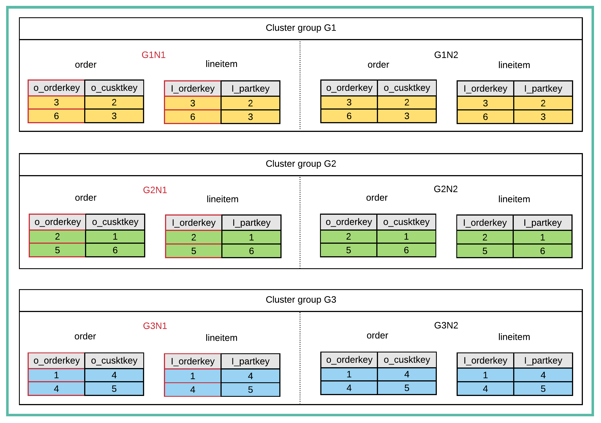

```
\EXPLAIN PLAN
SELECT o_orderkey, l_partkey
  FROM orders, lineitem
 WHERE o_orderkey = l_orderkey;
```

```
>>>  start print plan

< Execution Plan >
============================================================================
|IDX|  NODE DESCRIPTION                                   |           ROWS |
----------------------------------------------------------------------------
| 0 |  SELECT STATEMENT                                   |              6 |
| 1 |    QUERY BLOCK ("$QB_IDX_2")                        |              6 |
| 2 |      PLAN BASED CLUSTER                             | LOCAL/REMOTE 6 |
| 3 |        HASH JOIN (INNER JOIN)                       |              2 |
| 4 |          INDEX ACCESS ("ORDERS", "ORDERS_PK_INDEX") | (2)          2 |
| 5 |          HASH JOIN INSTANT                          |              2 |
| 6 |            TABLE ACCESS ("LINEITEM")                |              2 |
============================================================================

     1  -  TARGET : ORDERS.O_ORDERKEY, LINEITEM.L_PARTKEY
     2  -  SQL : SELECT /*+ KEEP_JOINED_TABLE USE_HASH_IN( _A1, 10 )
                            INDEX( _A2, "PUBLIC"."ORDERS_PK_INDEX" ) 
                            FULL( _A1 ) */ 
                       "_A2"."O_ORDERKEY", "_A1"."L_PARTKEY" 
                  FROM ( "PUBLIC"."ORDERS"@LOCAL AS "_A2" 
                         INNER JOIN 
                         "PUBLIC"."LINEITEM"@LOCAL AS "_A1" 
                    ON "_A1"."L_ORDERKEY" = "_A2"."O_ORDERKEY") ALIAS "_A3"
           TARGET DOMAIN : G1(G1N1,G1N2) 2 rows, 
                           G2(G2N1,G2N2) 2 rows, 
                           G3(G3N1,G3N2) 2 rows
     3  -  JOINED COLUMN : ORDERS.O_ORDERKEY, LINEITEM.L_PARTKEY
     4  -  HASH SHARD ( # 3 ) 
           READ INDEX COLUMN : ORDERS.O_ORDERKEY
     5  -  HASH KEY : LINEITEM.L_ORDERKEY
           RECORD COLUMN : LINEITEM.L_PARTKEY
           READ KEY COLUMN : LINEITEM.L_ORDERKEY, LINEITEM.L_PARTKEY
             HASH FILTER : LINEITEM.L_ORDERKEY = ORDERS.O_ORDERKEY
     6  -  HASH SHARD ( # 3 ) 
           READ COLUMN : LINEITEM.L_ORDERKEY, LINEITEM.L_PARTKEY

<<<  end print plan
```

In the execution plan above, it performed join in each server and fetched the result by transferring join SQL to each server.

The following is an example of joining part and lineitem. Both tables are hash sharded tables. However, a shard key join condition does not exist.

Both part and lineitem are hash sharded tables. However, data in part is sharded based on p_partkey because the shard key of part is p_partkey. On the other hand, data in lineitem is sharded based on l_orderkey because the shard key of lineitem is l_orderkey.

```
\EXPLAIN PLAN
SELECT /*+ REMOTE_JOIN(lineitem) */
       l_orderkey, p_partkey
  FROM part, lineitem
 WHERE p_partkey = l_partkey;
```

<a id="dd649ed9f366c804"></a>
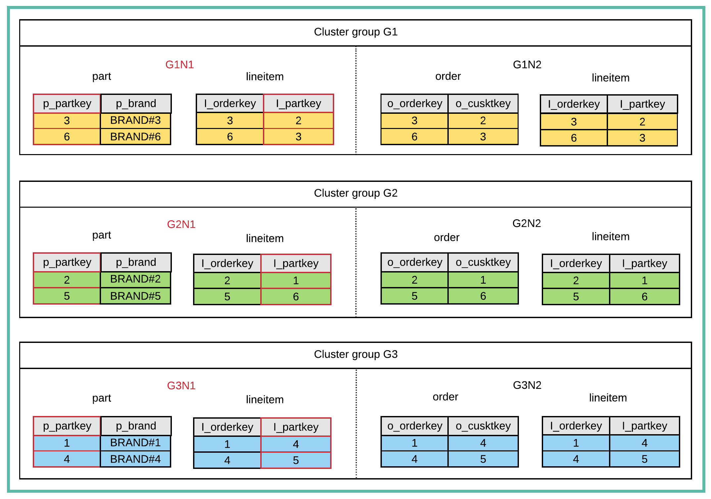

For the query above to perform the remote join, it should fetch all data of lineitem, then shard them with l_partkey and transfer to G1, G2, G3. In this case, a puller and a pusher take this role.

<a id="2f9209ffec6f8253"></a>
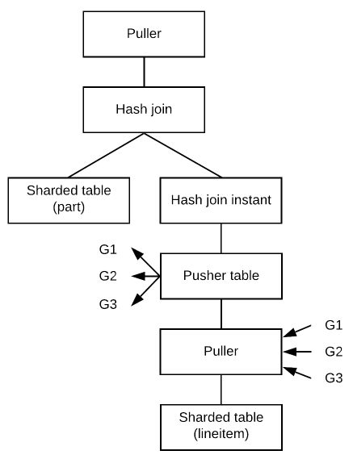

- [Cluster Puller](12-sql-languages.md#1b1395907c081a82): It fetches data by transferring the SQL query to each server.
- [Cluster Pusher](12-sql-languages.md#7dee5cccb433fa88): It transfers data to each server.

In the figure above, a puller fetches all data from  lineitem. Then, l_partkey makes a pusher table which is a shard key, and transfers data to G1, G2, G3. And it performs a remote join of part table and pusher table in G1, G2 and G3.

The execution plan is as follows.

```
>>>  start print plan

< Execution Plan >
============================================================================
|IDX|  NODE DESCRIPTION                                           |   ROWS |
----------------------------------------------------------------------------
| 0 |  SELECT STATEMENT                                           |      6 |
| 1 |    QUERY BLOCK ("$QB_IDX_2")                                |      6 |
| 2 |      SINGLE CLUSTER                                  |LOCAL/REMOTE 6 |
| 3 |        CLUSTER PUSHER ("_$NI_7")                            |      6 |
| 4 |          PLAN BASED CLUSTER                          |LOCAL/REMOTE 6 |
| 5 |            TABLE ACCESS ("LINEITEM")                        |      2 |
| 6 |        SELECT STATEMENT                                     |      2 |
| 7 |          QUERY BLOCK ("$QB_IDX_2")                          |      2 |
| 8 |            HASH JOIN (INNER JOIN)                           |      2 |
| 9 |              INDEX ACCESS ("PART" AS _A2, "PART_PK_INDEX")  | (2)  2 |
| 10 |              HASH JOIN INSTANT                             |      2 |
| 11 |                PUSHER TABLE ACCESS ("_$NI_7" AS _A1)       |     2 |
============================================================================

     1  -  TARGET : _$NI_7.L_ORDERKEY, PART.P_PARTKEY
     2  -  SQL : SELECT /*+ KEEP_JOINED_TABLE USE_HASH_IN( _A1, 10 ) 
                            INDEX( _A2, "PUBLIC"."PART_PK_INDEX" ) 
                            FULL( _A1 ) */ 
                        "_A1"."L_ORDERKEY", "_A2"."P_PARTKEY" 
                   FROM ( "PUBLIC"."PART"@LOCAL AS "_A2"
                          INNER JOIN 
                         "SESSION_SCHEMA"."_$NI_7"@LOCAL AS "_A1"
                     ON "_A1"."L_PARTKEY" = "_A2"."P_PARTKEY") ALIAS "_A3"
           TARGET DOMAIN : G1(G1N1,G1N2) 2 rows,
                           G2(G2N1,G2N2) 2 rows, 
                           G3(G3N1,G3N2) 2 rows
     3  -  SQL : DECLARE INSTANT TABLE "SESSION_SCHEMA"."_$NI_7"
                ( "L_PARTKEY" NUMBER(10, 0), "L_ORDERKEY" NUMBER(10, 0) ) 
           COLUMN : LINEITEM.L_PARTKEY AS L_PARTKEY, 
                    LINEITEM.L_ORDERKEY AS L_ORDERKEY           
           SHARDED : LINEITEM.L_PARTKEY
           TARGET DOMAIN : G1(G1N1,G1N2) 2 rows, 
                           G2(G2N1,G2N2) 2 rows, 
                           G3(G3N1,G3N2) 2 rows
     4  -  SQL : SELECT /*+ FULL( _A1 ) */
                        "_A1"."L_ORDERKEY", "_A1"."L_PARTKEY" 
                   FROM "PUBLIC"."LINEITEM"@LOCAL AS "_A1"
           TARGET DOMAIN : G1(G1N1,G1N2) 2 rows, 
                           G2(G2N1,G2N2) 2 rows, 
                           G3(G3N1,G3N2) 2 rows
     5  -  HASH SHARD ( # 3 ) 
           READ COLUMN : LINEITEM.L_ORDERKEY, LINEITEM.L_PARTKEY
     7  -  TARGET : _A1.L_ORDERKEY, _A2.P_PARTKEY
     8  -  JOINED COLUMN : _A1.L_ORDERKEY, _A2.P_PARTKEY
     9  -  HASH SHARD ( # 3 ) 
           READ INDEX COLUMN : _A2.P_PARTKEY
    10  -  HASH KEY : _A1.L_PARTKEY
           RECORD COLUMN : _A1.L_ORDERKEY
           READ KEY COLUMN : _A1.L_PARTKEY, _A1.L_ORDERKEY
             HASH FILTER : _A1.L_PARTKEY = _A2.P_PARTKEY
    11  -  READ COLUMN : _A1.L_PARTKEY, _A1.L_ORDERKEY

<<<  end print plan
```

In the execution plan above, (l_orderkey, l_partkey) is fetched by transferring SQL to G1, G2, G3 in 4. And  (l_partkey, l_orderkey) value fetched from 4 is stored in a pusher table whose shard key is  (l_partkey, l_orderkey) in 3. This pusher table is sharded by l_partkey, then transferred and temporarily stored in G1, G2, G3.  
A remote join is performed as joining part table and pusher table.

<a id="20c92a3cd18ddd26"></a>
### Group By

<a id="e02c9a412f9410a5"></a>
#### Local Group By

It performs *group by* in current server.

If it is group by for a cloned table, then every node in all groups have the same data, so just perform *group by* in the current server.

```
\EXPLAIN PLAN
  SELECT c_nationkey, COUNT(c_custkey)
    FROM customer
GROUP BY c_nationkey;

>>>  start print plan

< Execution Plan >
========================================================================
|  IDX  |  NODE DESCRIPTION                                            |
------------------------------------------------------------------------
|    0  |  SELECT STATEMENT                                            |
|    1  |    QUERY BLOCK ("$QB_IDX_2")                                 |
|    2  |      GROUP HASH INSTANT                                      |
|    3  |        TABLE ACCESS ("CUSTOMER")                             |
========================================================================

     1  -  TARGET : CUSTOMER.C_NATIONKEY, COUNT( CUSTOMER.C_CUSTKEY )
     2  -  GROUP KEY : CUSTOMER.C_NATIONKEY
           RECORD COLUMN : COUNT( CUSTOMER.C_CUSTKEY )
           READ KEY COLUMN : CUSTOMER.C_NATIONKEY
           READ RECORD COLUMN : COUNT( CUSTOMER.C_CUSTKEY )
     3  -  CLONED 
           READ COLUMN : CUSTOMER.C_CUSTKEY, CUSTOMER.C_NATIONKEY

<<<  end print plan
```

<a id="494869c49aaa9ec1"></a>
#### Remote Group By

It performs *group by* in each server.

*Group by* processing in each server has a parallel processing effect. Also, generally *group by* reduces results, so it reduces the network cost to bring the data.

```
\EXPLAIN PLAN
SELECT c_custkey, COUNT(o_orderkey)
  FROM customer, orders
 WHERE c_custkey = o_custkey
GROUP BY c_custkey;

>>>  start print plan

< Execution Plan >
===========================================================================
|IDX|  NODE DESCRIPTION                                  |           ROWS |
---------------------------------------------------------------------------
| 0 |  SELECT STATEMENT                                  |              6 |
| 1 |    QUERY BLOCK ("$QB_IDX_2")                       |              6 |
| 2 |     SINGLE CLUSTER                                 | LOCAL/REMOTE 6 |
| 3 |        SELECT STATEMENT                            |              2 |
| 4 |          QUERY BLOCK ("$QB_IDX_2")                 |              2 |
| 5 |            GROUP HASH INSTANT                      |              2 |
| 6 |              HASH JOIN (INNER JOIN)                |              2 |
| 7 |                TABLE ACCESS ("CUSTOMER" AS _A2)    |              6 |
| 8 |                HASH JOIN INSTANT                   |              2 |
| 9 |                  TABLE ACCESS ("ORDERS" AS _A1)    |              2 |
===========================================================================

     1  -  TARGET : CUSTOMER.C_CUSTKEY, COUNT( ORDERS.O_ORDERKEY )
     2  -  SQL : SELECT /*+ USE_GROUP_HASH(10)
                            KEEP_JOINED_TABLE USE_HASH_IN( _A1, 100 ) 
                            FULL( _A2 ) FULL( _A1 ) 
                        */ 
                        "_A2"."C_CUSTKEY", COUNT( "_A1"."O_ORDERKEY" ) 
                   FROM ( "PUBLIC"."CUSTOMER"@LOCAL AS "_A2" 
                          INNER JOIN 
                          "PUBLIC"."ORDERS"@LOCAL AS "_A1" 
                     ON "_A1"."O_CUSTKEY" = "_A2"."C_CUSTKEY") ALIAS "_A3" 
                GROUP BY "_A2"."C_CUSTKEY"
           TARGET DOMAIN : G1(G1N1,G1N2) 2 rows, 
                           G2(G2N1,G2N2) 2 rows, 
                           G3(G3N1,G3N2) 2 rows
           RE-GROUPING
             GROUP KEY : CUSTOMER.C_CUSTKEY
             AGGREGATION : SUM( COUNT( ORDERS.O_ORDERKEY ) )
     4  -  TARGET : _A2.C_CUSTKEY, COUNT( _A1.O_ORDERKEY )
     5  -  GROUP KEY : _A2.C_CUSTKEY
           RECORD COLUMN : COUNT( _A1.O_ORDERKEY )
           READ KEY COLUMN : _A2.C_CUSTKEY
           READ RECORD COLUMN : COUNT( _A1.O_ORDERKEY )
     6  -  JOINED COLUMN : _A2.C_CUSTKEY, _A1.O_ORDERKEY
     7  -  CLONED 
           READ COLUMN : _A2.C_CUSTKEY
     8  -  HASH KEY : _A1.O_CUSTKEY
           RECORD COLUMN : _A1.O_ORDERKEY
           READ KEY COLUMN : _A1.O_CUSTKEY, _A1.O_ORDERKEY
             HASH FILTER : _A1.O_CUSTKEY = _A2.C_CUSTKEY
     9  -  HASH SHARD ( # 3 ) 
           READ COLUMN : _A1.O_ORDERKEY, _A1.O_CUSTKEY

<<<  end print plan
```

<a id="969f6fbe97e4a07a"></a>
### Distinct

<a id="836fe63f37136f81"></a>
#### Local Distinct

It performs distinct in current server.

The following is an example of using distinct in customer which is a cloned table. Every node in all groups in a cloned table has the same data, so just perform distinct in the current server.

```
\EXPLAIN PLAN 
SELECT DISTINCT c_nationkey
  FROM customer;

>>>  start print plan

< Execution Plan >
========================================================================
|  IDX  |  NODE DESCRIPTION                                            |
------------------------------------------------------------------------
|    0  |  SELECT STATEMENT                                            |
|    1  |    QUERY BLOCK ("$QB_IDX_2")                                 |
|    2  |      GROUP                                                   |
|    3  |        INDEX ACCESS ("CUSTOMER", "CUSTOMER_NATIONKEY_FK")    |
========================================================================

     1  -  TARGET : CUSTOMER.C_NATIONKEY
     2  -  GROUP KEY : CUSTOMER.C_NATIONKEY
     3  -  CLONED 
           READ INDEX COLUMN : CUSTOMER.C_NATIONKEY

<<<  end print plan
```

The following is an example of using distinct in orders which is a sharded table. The data in a sharded table is sharded based in a shard key, so the data from all groups should be fetched when it is needed to locally perform distinct.

```
\EXPLAIN PLAN 
SELECT /*+ LOCAL_DISTINCT */
       DISTINCT o_orderstatus 
  FROM orders
 WHERE o_orderdate = date '1995-03-15';

>>>  start print plan

< Execution Plan >
============================================================================
|IDX|  NODE DESCRIPTION                                 |             ROWS |
----------------------------------------------------------------------------
| 0 |  SELECT STATEMENT                                 |                3 |
| 1 |    QUERY BLOCK ("$QB_IDX_2")                      |                3 |
| 2 |      GROUP HASH INSTANT                           |                3 |
| 3 |        PLAN BASED CLUSTER                         | LOCAL/REMOTE 603 |
| 4 |          TABLE ACCESS ("ORDERS")                  |              221 |
============================================================================

     1  -  TARGET : ORDERS.O_ORDERSTATUS
     2  -  GROUP KEY : ORDERS.O_ORDERSTATUS
           READ KEY COLUMN : ORDERS.O_ORDERSTATUS
     3  -  SQL : SELECT /*+ FULL( _A1 ) */
                        "_A1"."O_ORDERSTATUS" 
                  FROM "PUBLIC"."ORDERS"@LOCAL AS "_A1" 
                 WHERE "_A1"."O_ORDERDATE" = :_V0
           TARGET DOMAIN : G1(G1N1,G1N2) 221 rows, 
                           G2(G2N1,G2N2) 184 rows, 
                           G3(G3N1,G3N2) 198 rows
     4  -  HASH SHARD ( # 3 ) 
           READ COLUMN : ORDERS.O_ORDERSTATUS, ORDERS.O_ORDERDATE
             PHYSICAL FILTER : ORDERS.O_ORDERDATE = DATE'1995-03-15'

<<<  end print plan
```

In the execution plan above, GROUP HASH INSTANT for distinct was performed after fetching data satisfying the condition from G1, G2, G3.

<a id="8b3d19bae7eb7122"></a>
#### Remote Distinct

It performs distinct in each server.

Distinct processing in each server has a parallel processing effect. Also, generally distinct reduces results, so it reduces the network cost to bring the data.

```
\EXPLAIN PLAN 
SELECT DISTINCT o_orderstatus 
  FROM orders
 WHERE o_orderdate = date '1995-03-15';

>>>  start print plan

< Execution Plan >
============================================================================
|IDX|  NODE DESCRIPTION                                   |           ROWS |
----------------------------------------------------------------------------
| 0 |  SELECT STATEMENT                                   |              3 |
| 1 |    QUERY BLOCK ("$QB_IDX_2")                        |              3 |
| 2 |      SINGLE CLUSTER                                 | LOCAL/REMOTE 3 |
| 3 |        SELECT STATEMENT                             |              3 |
| 4 |          QUERY BLOCK ("$QB_IDX_2")                  |              3 |
| 5 |            GROUP HASH INSTANT                       |              3 |
| 6 |              TABLE ACCESS ("ORDERS" AS _A1)         |            221 |
============================================================================

     1  -  TARGET : ORDERS.O_ORDERSTATUS
     2  -  SQL : SELECT /*+ USE_DISTINCT_HASH(3) FULL( _A1 ) */
                        DISTINCT "_A1"."O_ORDERSTATUS" 
                   FROM "PUBLIC"."ORDERS"@LOCAL AS "_A1" 
                  WHERE "_A1"."O_ORDERDATE" = :_V0
           TARGET DOMAIN : G1(G1N1,G1N2) 3 rows, 
                           G2(G2N1,G2N2) 3 rows, 
                           G3(G3N1,G3N2) 3 rows
           RE-GROUPING
             GROUP KEY : ORDERS.O_ORDERSTATUS
     4  -  TARGET : _A1.O_ORDERSTATUS
     5  -  GROUP KEY : _A1.O_ORDERSTATUS
           READ KEY COLUMN : _A1.O_ORDERSTATUS
     6  -  HASH SHARD ( # 3 ) 
           READ COLUMN : _A1.O_ORDERSTATUS, _A1.O_ORDERDATE
             PHYSICAL FILTER : _A1.O_ORDERDATE = :_V0

<<<  end print plan
```

In the execution plan above, It fetched results of performing distinct from G1, G2, G3, then performed distinct again with RE-GROUPING. Though RE-GROUPING is performed, the results are decreased a lot so the network cost is reduced and it is efficient.

<a id="323887b382116e83"></a>
### Order By

<a id="772803439c61f667"></a>
#### Local Order By

It performs *order by* in the current server.

The following is an example of using *order by* in customer which is a cloned table. Every node in all groups in a cloned table has the same data, so just perform *order by* in the current server.

```
\EXPLAIN PLAN
  SELECT c_nationkey, COUNT(c_custkey)
    FROM customer
GROUP BY c_nationkey
ORDER BY c_nationkey;

>>>  start print plan

< Execution Plan >
===========================================================================
| IDX |  NODE DESCRIPTION                                        |   ROWS |
---------------------------------------------------------------------------
|  0  |  SELECT STATEMENT                                        |     25 |
|  1  |    QUERY BLOCK ("$QB_IDX_2")                             |     25 |
|  2  |      SORT INSTANT                                        |     25 |
|  3  |        GROUP HASH INSTANT                                |     25 |
|  4  |          TABLE ACCESS ("CUSTOMER")                       | 150000 |
===========================================================================

     1  -  TARGET : CUSTOMER.C_NATIONKEY, COUNT( CUSTOMER.C_CUSTKEY )
     2  -  SORT KEY : "CUSTOMER.C_NATIONKEY ASC NULLS LAST"
           RECORD COLUMN : COUNT( CUSTOMER.C_CUSTKEY )
           READ KEY COLUMN : CUSTOMER.C_NATIONKEY
           READ RECORD COLUMN : COUNT( CUSTOMER.C_CUSTKEY )
     3  -  GROUP KEY : CUSTOMER.C_NATIONKEY
           RECORD COLUMN : COUNT( CUSTOMER.C_CUSTKEY )
           READ KEY COLUMN : CUSTOMER.C_NATIONKEY
           READ RECORD COLUMN : COUNT( CUSTOMER.C_CUSTKEY )
     4  -  CLONED 
           READ COLUMN : CUSTOMER.C_CUSTKEY, CUSTOMER.C_NATIONKEY

<<<  end print plan
```

The following is an example of using *order by* in orders which is a sharded table. The data in a sharded table is sharded based in a shard key, so the data from all groups should be fetched when it is needed to locally perform *order by*.

```
\EXPLAIN PLAN 
  SELECT /*+ LOCAL_ORDER */ o_orderdate, o_shippriority
    FROM orders
   WHERE o_orderdate >= date '1993-07-01'
     AND o_orderdate < date '1993-07-01' + interval '1' month
ORDER BY o_orderdate; 

>>>  start print plan

< Execution Plan >
============================================================================
|IDX|  NODE DESCRIPTION                               |               ROWS |
----------------------------------------------------------------------------
| 0 |  SELECT STATEMENT                               |              19319 |
| 1 |    QUERY BLOCK ("$QB_IDX_2")                    |              19319 |
| 2 |      SORT INSTANT                               |              19319 |
| 3 |        PLAN BASED CLUSTER                       | LOCAL/REMOTE 19319 |
| 4 |          TABLE ACCESS ("ORDERS")                |               6453 |
============================================================================

     1  -  TARGET : ORDERS.O_ORDERDATE, ORDERS.O_SHIPPRIORITY
     2  -  SORT KEY : "ORDERS.O_ORDERDATE ASC NULLS LAST"
           RECORD COLUMN : ORDERS.O_SHIPPRIORITY
           READ KEY COLUMN : ORDERS.O_ORDERDATE
           READ RECORD COLUMN : ORDERS.O_SHIPPRIORITY
     3  -  SQL : SELECT /*+ FULL( _A1 ) */
                       "_A1"."O_ORDERDATE", "_A1"."O_SHIPPRIORITY" 
                   FROM "PUBLIC"."ORDERS"@LOCAL AS "_A1" 
                  WHERE "_A1"."O_ORDERDATE" < :_V0 
                    AND "_A1"."O_ORDERDATE" >= :_V1
           TARGET DOMAIN : G1(G1N1,G1N2) 6453 rows,
                           G2(G2N1,G2N2) 6450 rows, 
                           G3(G3N1,G3N2) 6416 rows
     4  -  HASH SHARD ( # 3 ) 
           READ COLUMN : ORDERS.O_ORDERDATE, ORDERS.O_SHIPPRIORITY
             PHYSICAL FILTER : ORDERS.O_ORDERDATE < DATE'1993-07-01' + CAST( '1' AS INTERVAL(MONTH) ) AND ORDERS.O_ORDERDATE >= DATE'1993-07-01'

<<<  end print plan
```

In the execution plan above, It fetched data satisfying the condition from G1, G2, G3, then performed SORT INSTANT.

<a id="8439d4d5f32523d2"></a>
#### Remote Order By

It performs *order by* in each server.

*Order by* processing in each server has a parallel processing effect. Also, if results are sorted on the subordinate node and ascends to the superordinate node, then each server does not need to separately process *order by* and the driver just merges and sorts the result received from each server.

The following is an example of remote order by. orders is a sharded table.

```
\EXPLAIN PLAN 
  SELECT o_custkey, o_orderstatus
    FROM orders
   WHERE o_custkey > 0 AND o_custkey < 10
ORDER BY o_custkey;


>>>  start print plan

< Execution Plan >
============================================================================
|IDX| NODE DESCRIPTION                                              | ROWS |
----------------------------------------------------------------------------
| 0 | SELECT STATEMENT                                              |   66 |
| 1 |   QUERY BLOCK ("$QB_IDX_2")                                   |   66 |
| 2 |     MULTIPLE CLUSTER                               | LOCAL/REMOTE 66 |
| 3 |       SELECT STATEMENT                                        |   24 |
| 4 |          QUERY BLOCK ("$QB_IDX_2")                            |   24 |
| 5 |           INDEX ACCESS ("ORDERS" AS _A1, "ORDERS_CUSTKEY_FK") |   24 |
============================================================================

     1  -  TARGET : ORDERS.O_CUSTKEY, ORDERS.O_ORDERSTATUS
     2  -  SQL : SELECT /*+ INDEX( _A1, "PUBLIC"."ORDERS_CUSTKEY_FK" ) */
                        "_A1"."O_CUSTKEY", "_A1"."O_ORDERSTATUS" 
                   FROM "PUBLIC"."ORDERS"@LOCAL AS "_A1" 
                  WHERE "_A1"."O_CUSTKEY" > :_V0 
                    AND "_A1"."O_CUSTKEY" < :_V1 
               ORDER BY "_A1"."O_CUSTKEY" ASC NULLS LAST
           TARGET DOMAIN : G1(G1N1,G1N2) 24 rows, 
                           G2(G2N1,G2N2) 23 rows, 
                           G3(G3N1,G3N2) 19 rows
           MERGE SORTING
             SORT KEY : ORDERS.O_CUSTKEY
     4  -  TARGET : _A1.O_CUSTKEY, _A1.O_ORDERSTATUS
     5  -  HASH SHARD ( # 3 ) 
           READ INDEX COLUMN : _A1.O_CUSTKEY
           READ TABLE COLUMN : _A1.O_ORDERSTATUS
             MIN RANGE : _A1.O_CUSTKEY > :_V0
             MAX RANGE : _A1.O_CUSTKEY IS NOT NULL AND _A1.O_CUSTKEY < :_V1

<<<  end print plan
```

In the execution plan above, it fetched ordered data from G1, G2, G3, then merged data, and sorted for order by key col.

<a id="3d557d942b98d0a1"></a>
### Aggregation

<a id="461681ea2c17d90a"></a>
#### Local Aggregation

It performs aggregation in the current server.

The following is an example of a local aggregation. customer is a cloned table.

```
\EXPLAIN PLAN 
SELECT COUNT(DISTINCT c_nationkey)
  FROM customer;

>>>  start print plan

< Execution Plan >
============================================================================
|IDX|  NODE DESCRIPTION                                           |   ROWS |
----------------------------------------------------------------------------
| 0 |  SELECT STATEMENT                                           |      1 |
| 1 |    QUERY BLOCK ("$QB_IDX_2")                                |      1 |
| 2 |      AGGREGATION BY HASH                                    |      1 |
| 3 |        INDEX ACCESS ("CUSTOMER", "CUSTOMER_NATIONKEY_FK")   | 150000 |
============================================================================

     1  -  TARGET : COUNT( DISTINCT CUSTOMER.C_NATIONKEY )
     2  -  DISTINCT AGGREGATION : COUNT( DISTINCT CUSTOMER.C_NATIONKEY )
     3  -  CLONED 
           READ INDEX COLUMN : CUSTOMER.C_NATIONKEY

<<<  end print plan
```

<a id="774a256f2216c99b"></a>
#### Remote Aggregation

It performs aggregation in each server.

Aggregation processing in each server has a parallel processing effect. Also, generally aggregation reduces results, so it reduces the network cost to bring the data.

```
\EXPLAIN PLAN
SELECT sum(ps_supplycost * ps_availqty) * 0.0001
  FROM partsupp,
       supplier,
       nation
 WHERE ps_suppkey = s_suppkey
   AND s_nationkey = n_nationkey
   AND n_name = 'GERMANY';

>>>  start print plan

< Execution Plan >
===========================================================================
|IDX|  NODE DESCRIPTION                                           |  ROWS |
---------------------------------------------------------------------------
| 0 |  SELECT STATEMENT                                           |     1 |
| 1 |    QUERY BLOCK ("$QB_IDX_2")                                |     1 |
| 2 |      SINGLE CLUSTER                               | LOCAL/REMOTE  1 |
| 3 |        SELECT STATEMENT                                     |     1 |
| 4 |          QUERY BLOCK ("$QB_IDX_2")                          |     1 |
| 5 |            AGGREGATION BY HASH                              |     1 |
| 6 |              NESTED JOIN (INNER JOIN)                       | 10508 |
| 7 |                NESTED JOIN (INNER JOIN)                     |   396 |
| 8 |                  TABLE ACCESS ("NATION" AS _A3)             |     1 |
| 9 |               INDEX ACCESS ("SUPPLIER" AS _A2)              |   396 |
| 10 |                INDEX ACCESS ("PARTSUPP" AS _A1)            | 10508 |
===========================================================================

     1  -  TARGET : SUM( PARTSUPP.PS_SUPPLYCOST * PARTSUPP.PS_AVAILQTY ) * 0.0001
     2  -  SQL : SELECT /*+ KEEP_JOINED_TABLE USE_NL_IN( _A1 )
                            USE_NL_IN( _A2 ) 
                            FULL( _A3 ) 
                            INDEX( _A2, "PUBLIC"."SUPPLIER_NATIONKEY_FK" ) 
                            INDEX( _A1, "PUBLIC"."PARTSUPP_SUPPKEY_FK" ) 
                         */ 
                         SUM( "_A1"."PS_SUPPLYCOST" * "_A1"."PS_AVAILQTY" ) 
                   FROM ( ( "PUBLIC"."NATION"@LOCAL AS "_A3" 
                             INNER JOIN 
                            "PUBLIC"."SUPPLIER"@LOCAL AS "_A2" 
                             ON true 
                           ) ALIAS "_A4" 
                          INNER JOIN 
                          "PUBLIC"."PARTSUPP"@LOCAL AS "_A1" ON true 
                        ) ALIAS "_A5" 
                 WHERE "_A3"."N_NAME" = :_V0 
                   AND "_A2"."S_NATIONKEY" = "_A3"."N_NATIONKEY" 
                   AND "_A1"."PS_SUPPKEY" = "_A2"."S_SUPPKEY"
           TARGET DOMAIN : G1(G1N1,G1N2) 1 rows, 
                           G2(G2N1,G2N2) 1 rows, 
                           G3(G3N1,G3N2) 1 rows
           RE-AGGREGATION
             AGGREGATION : SUM( SUM( PARTSUPP.PS_SUPPLYCOST * PARTSUPP.PS_AVAILQTY ) )
     4  -  TARGET : SUM( _A1.PS_SUPPLYCOST * _A1.PS_AVAILQTY )
     5  -  AGGREGATION : SUM( _A1.PS_SUPPLYCOST * _A1.PS_AVAILQTY )
     6  -  JOINED COLUMN : _A1.PS_SUPPLYCOST, _A1.PS_AVAILQTY
             CONSTANT FILTER : TRUE
     7  -  JOINED COLUMN : _A2.S_SUPPKEY
             CONSTANT FILTER : TRUE
     8  -  CLONED 
           READ COLUMN : _A3.N_NATIONKEY, _A3.N_NAME
             PHYSICAL FILTER : _A3.N_NAME = :_V0
     9  -  CLONED 
           READ INDEX COLUMN : _A2.S_NATIONKEY
           READ TABLE COLUMN : _A2.S_SUPPKEY
             MIN RANGE : _A2.S_NATIONKEY = {_A3.N_NATIONKEY}
             MAX RANGE : _A2.S_NATIONKEY = {_A3.N_NATIONKEY}
    10  -  HASH SHARD ( # 3 ) 
           READ INDEX COLUMN : _A1.PS_SUPPKEY
           READ TABLE COLUMN : _A1.PS_AVAILQTY, _A1.PS_SUPPLYCOST
             MIN RANGE : _A1.PS_SUPPKEY = {_A2.S_SUPPKEY}
             MAX RANGE : _A1.PS_SUPPKEY = {_A2.S_SUPPKEY}

<<<  end print plan
```

In the execution plan above, it fetched aggregation results from G1, G2, G3, then performed re-aggregation and returned the result.

<a id="53bd48bca7a9b9fd"></a>
## Statistics Information

A query optimizer calculates the cost by using the statistics information. The statistics information used by a query optimizer are table statistics information, column statistics information, index statistics information.

- Table statistics information
    - The number of rows
- Column statistics information
    - The number of each different values
    - The number of NULL values
    - The average length of value
    - The minimum value
    - The maximum value
- Index statistics information
    - The number of each different keys

Perform [ANALYZE TABLE](18-sql-references-a-b.md#30fc30b6cd667055) statement to build the statistics information. The built statistics information is stored in the database, and the same statistics information is used until it is rebuilt.

If the statistics information is not built for a table, then build a simple statistics information by using a catalog information and the page information at the time of query execution and use it.

<a id="4c52cbadf42be7b2"></a>
### Adjusting Optimizer

Generally, a query optimizer selects the most efficient plan by using the given statistics information. However, there could be a better plan than the plan selected by a query optimizer, so a user can specify to select the plan when it was not selected by a query optimizer.

Currently, a query optimizer of GOLDILOCKS provides a hint, and the hint specified by a user is preferentially applied when it is applicable regardless of the calculated cost. Therefore, if the better plan exists, a user can forcibly change the plan by using a hint.

For more information about hints, refer to [SQL Hint](#978b4333efa9352a).

<a id="978b4333efa9352a"></a>
## SQL Hint

<a id="30a4b23479f0916d"></a>
### Description

A hint is a comment which is used by a user to directly instruct the GOLDILOCKS optimizer how to perform the SQL statement. The user uses the hint to select the execution plan when GOLDILOCKS optimizer can not select the appropriate execution plan due to an inaccurate statistics information.

If the user provides a hint, the optimizer will prioritize it. Therefore, it is recommended to use hints only when the execution plan selected by the optimizer is deemed incorrect.

If the hint provided by the user can not be used, the GOLDILOCKS optimizer will determine the execution plan.

In GOLDILOCKS, hints can be used with statements such as SELECT, INSERT SELECT, UPDATE, and DELETE. Hints are enclosed with /*+ and */ on either side and are specified following the keyword of each statement.

<a id="1c6806e2aa535a1e"></a>
### Syntax

The following is a hint syntax.

```
<hint clause> ::=
    /*+ <hint element> [ comment ] [ [ , ] <hint element> [ comment ] ] */

<hint element> ::=
      <statement hints>
    | <query block hints>
    | <operation hints>

<statement hints> ::=
      <dml hints >
    | <fetch fail over hints>

<dml hints> ::=
      DML_GLOBAL_ROWID

<fetch fail over hints> ::=
      FETCH_FAIL_OVER

<query block hints> ::=
      <push subquery hints>
    | <cte query hints>
    | <query transformation hints>

<push subquery hints> ::=
      PUSH_SUBQ
    | NO_PUSH_SUBQ

<cte query hints> ::=
      INLINE
    | MATERIALIZE

<query transformation hints> ::=
      NO_QUERY_TRANSFORMATION
    | <unnest subquery hints>
    | <transitive closure hints>
    | <view hints>

<unnest subquery hints> ::=
      <unnest hints>
    | <unnest join operation hints>
    | <unnest join driver hints>
    | <unnest join pusher hints> 
    | <unnest merge hints>

<unnest hints> ::=
      UNNEST
    | NO_UNNEST

<unnest join operation hints> ::=
      UNNEST_NL
    | UNNEST_NL_IN
    | UNNEST_NL_OUT
    | UNNEST_INL
    | UNNEST_INL_IN
    | UNNEST_INL_OUT
    | UNNEST_HASH
    | UNNEST_HASH( hash_bucket_count ) 
    | UNNEST_HASH_IN
    | UNNEST_HASH_IN( hash_bucket_count )
    | UNNEST_HASH_OUT
    | UNNEST_HASH_OUT( hash_bucket_count )
    | UNNEST_MERGE
    | UNNEST_MERGE_IN
    | UNNEST_MERGE_OUT
    | NL_SJ
    | NL_ISJ
    | NL_AJ
    | INL_SJ
    | INL_AJ
    | MERGE_SJ
    | MERGE_AJ
    | HASH_SJ
    | HASH_ISJ
    | HASH_AJ

<unnest join driver hints> ::=
    | LOCAL_UNNEST
    | REMOTE_UNNEST

<unnest join pusher hints> ::=
      PUSHER_SUBQ
    | NO_PUSHER_SUBQ
    | PUSHER_OUTQ
    | NO_PUSHER_OUTQ

<unnest merge hints> ::=
      MERGE_SUBQ
    | NO_MERGE_SUBQ

<transitive closure hints> ::=
    | TRANSITIVE_CLOSURE
    | NO_TRANSITIVE_CLOSURE

< view hints > ::=
      <view merge hints>
    | <push view predicate hints>

<view merge hints> ::=
    | MERGE( view_name ) 
    | NO_MERGE( view_name ) 

<push view predicate hints> ::=    
      PUSH_PRED
    | NO_PUSH_PRED
    | PUSH_PRED( view_name[ [ , ] table_name ] ) 
    | NO_PUSH_PRED( view_name[ [ , ] table_name ] ) 


<operation hints> ::=
      <access path hints>
    | <join hints>
    | <group hints>
    | <distinct hints>
    | <order hints>
    | <aggr hints>
    | <rownum hints>

<access path hints> ::=
      FULL( table_name )
    | INDEX( table_name [ , ] [ index_name [ [ , ] index_name ] ] )
    | NO_INDEX( table_name [ , ] [ index_name [ [ , ] index_name ] ] )
    | INDEX_FORWARD( table_name [ , ] [ index_name [ [ , ] index_name ] ] )
    | INDEX_BACKWARD( table_name [ , ] [ index_name [ [ , ] index_name ] ] )
    | INDEX_ASC( table_name [ , ] [ index_name [ [ , ] index_name ] ] )
    | INDEX_DESC( table_name [ , ] [ index_name [ [ , ] index_name ] ] )
    | INDEX_COMBINE( table_name [ , ] [ index_name [ [ , ] index_name ] ] )
    | IN_KEY_RANGE( table_name [ , ] [ index_name [ [ , ] index_name ] ] )
    | ROWID( table_name )


<join hints> ::=
    < join order hints >
    | < join operation hints >
    | < join driver hints >
    | < join pusher hints >

<join order hints> ::=
      ORDERED
    | ORDERING( table_name [LEFT | RIGHT] [ , table_name [LEFT | RIGHT] ]
    | LEADING( table_name [ [ , ] table_name ] )
    | KEEP_JOINED_TABLE

<join operation hints> ::=
      USE_HASH( table_name [ [ , ] table_name ] )
    | USE_HASH( table_name [ [ , ] table_name ], hash_bucket_count )
    | NO_USE_HASH( table_name [ [ , ] table_name ] )
    | USE_MERGE( table_name [ [ , ] table_name ] )
    | NO_USE_MERGE( table_name [ [ , ] table_name ] )
    | USE_NL( table_name [ [ , ] table_name ] )
    | NO_USE_NL( table_name [ [ , ] table_name ] )
    | USE_INL( table_name [ [ , ] table_name ] )
    | NO_USE_INL( table_name [ [ , ] table_name ] )
    | USE_JOIN_COMBINE( alias ) 
    | NO_USE_JOIN_COMBINE( alias )
    | USE_NL_IN( alias )    
    | USE_NL_OUT( alias )   
    | USE_INL_IN( alias )    
    | USE_INL_OUT( alias )   
    | USE_HASH_IN( alias )  
    | USE_HASH_IN( alias, hash_bucket_count )  
    | USE_HASH_OUT( alias ) 
    | USE_HASH_OUT( alias, hash_bucket_count )  
    | USE_MERGE_IN( alias ) 
    | USE_MERGE_OUT( alias )

<join driver hints> ::=
    | LOCAL_JOIN( alias ) 
    | REMOTE_JOIN( alias )

<join pusher hints> ::=
      PUSHER( alias ) 
    | NO_PUSHER( alias )


<group hints> ::=   
      <group operation hints>
    | <group driver hints>

<group operation hints> ::=   
      USE_GROUP_HASH
    | USE_GROUP_HASH( hash_bucket_count )  

<group driver hints> ::=   
      LOCAL_GROUP
    | REMOTE_GROUP


<distinct hints> ::=   
      <distinct operation hints>
    | <distinct driver hints>

<distinct operation hints> ::=   
      DISTINCT_HASH
    | USE_DISTINCT_HASH( hash_bucket_count )  

<distinct driver hints> ::=   
      LOCAL_DISTINCT
    | REMOTE_DISTINCT


<order hints> ::=   
      <order operation hints>
    | <order driver hints>

<order operation hints> ::=   
      USE_ORDER_SORT
    | NO_USE_ORDER_SORT
    | USE_ORDER_LIMIT_SORT
    | NO_USE_ORDER_LIMIT_SORT

<order driver hints> ::=   
      LOCAL_ORDER
    | REMOTE_ORDER


<aggr hints> ::=   
      <aggr driver hint>

<aggr driver hints> ::=   
      LOCAL_AGGR
    | REMOTE_AGGR
```

<a id="8549751170db5048"></a>
#### Invocation and Access Rules

The user should have the privilege to perform the query to perform &lt;hint clause&gt; statement.

<a id="597732c4d594cfda"></a>
#### Syntax Rules and Parameters

The followings are syntax rules to use &lt;hint clause&gt;.

- Multiple &lt;hint element&gt; can be described by using white space or comma (,) in &lt;hint clause&gt;.
- If there are two or more &lt;hint element&gt; and they can not be applied simultaneously, then only the previously described &lt;hint element&gt; is applied.
- If a syntactic error occurs in &lt;hint element&gt;, then the &lt;hint element&gt; is ignored, and if hint_error property is turned on, then it is processed as a validation error for &lt;hint clause&gt;.
- table_name and view_name described in &lt;hint clause&gt; should be matched with one of table_name, view_name described in &lt;from clause&gt; or aliases indicating them.
- table_name can not be described together with a schema name.
- Even when &lt;hint element&gt; is correctly described, but if it is not applicable, then the &lt;hint element&gt;is ignored.

<a id="750ede5b8dc2941f"></a>
#### Examples

The following is an example of using &lt;hint clause&gt; in SELECT, INSERT SELECT, UPDATE, DELETE statements.

- Using &lt;hint clause&gt; in SELECT statement

```
SELECT /*+ INDEX(orders, o_orderdate_idx) */ * 
  FROM orders 
 WHERE o_orderdate < date '2019-04-12';
```

- Using &lt;hint clause&gt; in INSERT SELECT statement

```
INSERT INTO orders_bk SELECT /*+ INDEX(orders, o_orderdate_idx) */ * 
                        FROM orders 
                       WHERE o_orderdate < date '2019-04-12';
```

- Using &lt;hint clause&gt; in UPDATE statement

```
UPDATE /*+ INDEX(lineitem, l_shipdate_idx) */ * lineitem
   SET l_receiptdate = CURRENT_DATE
 WHERE l_shipdate = date '2020-04-12';
```

- Using &lt;hint clause&gt; in DELETE statement

```
DELETE /*+ INDEX(lineitem, l_shipdate_idx) */ * lineitem
 WHERE l_receiptdate < date '2020-04-12';
```

The following is an example of incorrectly using a hint after setting HINT_ERROR property to *ON* by using ALTER statement.

```
ALTER SESSION SET HINT_ERROR = ON;

SELECT /*+ INDEX(orders, o_orderdate_idxx) */ * 
  FROM orders 
 WHERE o_orderdate < date '2019-04-12';

ERR-42000(16058): not applicable hint ( cannot find index ) : 
SELECT /*+ INDEX(orders, o_orderdate_idxx) */ * 
                         *
ERROR at line 1:
```

For more information about descriptions and examples of all hints, refer to [Query Block Hint](#2933b182d49a94e6) and [Operation Hint](#1cf302d75238163d).

<a id="f9d3e4517876d630"></a>
### Statement Hint

Those hints are applied per each statement.

<a id="e5c087df88402308"></a>
#### &lt;dml hints&gt;

<a id="b6c2d2ee6014f75c"></a>
##### DML_GLOBAL_ROWID

When processing DML statement in cluster environment, a node received a user query transfers the updated information of the record to another node, then applies it.

DML statement in cluster environment is processed with the following two methods.

- Query based DML: It creates a new query to transfer the updated statement.
- Global rowid based DML: It uses the record identifier information to transfer the updated information of a specific record.

If DML_GLOBAL_ROWID hint is specified, then the global rowid based DML method is preferentially applied.   
This hint is applied to SELECT FOR UPDATE, INSERT, UPDATE, DELETE statements.

The following is an example of applying the query based DML.

```
\EXPLAIN PLAN
DELETE FROM orders;


>>>  start print plan

< Execution Plan >
========================================================================
|  IDX  |  NODE DESCRIPTION                                            |
------------------------------------------------------------------------
|    0  |  DELETE STATEMENT ("ORDERS")                                 |    
|    1  |    QUERY BLOCK ("$QB_IDX_2")                                 |    
|    2  |      DML CLUSTER                                      |
|    3  |        TABLE ACCESS ("ORDERS")                               |    
========================================================================

     1  -  TARGET : NOTHING
     2  -  WITHOUT FETCH
           Non-Fetch SQL : DELETE /*+ FULL( _A1 ) */  "_A1" FROM "PUBLIC"."ORDERS"@LOCAL AS "_A1"
           TARGET DOMAIN : G1(G1N1,G1N2) 0 rows, G2(G2N1,G2N2) 0 rows, G3(G3N1,G3N2) 0 rows
     3  -  HASH SHARD ( # 3 ) 
           READ COLUMN : ORDERS.O_ORDERKEY, ORDERS.O_CUSTKEY

<<<  end print plan
```

The following is an example of using DML_GLOBAL_ROWID hint.

```
\EXPLAIN PLAN
DELETE /*+ DML_GLOBAL_ROWID */ FROM orders;


>>>  start print plan

< Execution Plan >
========================================================================
|  IDX  |  NODE DESCRIPTION                                            |
------------------------------------------------------------------------
|    0  |  DELETE STATEMENT ("ORDERS")                                 |
|    1  |    QUERY BLOCK ("$QB_IDX_2")                                 |
|    2  |      PLAN BASED CLUSTER                                      |
|    3  |        TABLE ACCESS ("ORDERS")                               |
========================================================================

     1  -  TARGET : NOTHING
     2  -  SQL : SELECT /*+ FULL( _A1 ) */ "_A1"."$PHYSICAL_ROWID", "_A1"."O_ORDERKEY", "_A1"."O_CUSTKEY" FROM "PUBLIC"."ORDERS"@LOCAL AS "_A1"
           TARGET DOMAIN : G1(G1N1,G1N2) 0 rows, G2(G2N1,G2N2) 0 rows, G3(G3N1,G3N2) 0 rows
     3  -  HASH SHARD ( # 3 ) 
           READ COLUMN : ORDERS.O_ORDERKEY, ORDERS.O_CUSTKEY

<<<  end print plan
```

<a id="ae2ef15185ed8f66"></a>
#### &lt;fetch fail over hints&gt;

<a id="e27852a6358c1bcd"></a>
##### FETCH_FAIL_OVER

The fetch fail over feature provides an intact fetch result by considering communication error situation while performing fetch for SELECT statement in cluster environment.   
Using FETCH_FAIL_OVER hint enables the fetch fail over feature.  
This hint is applied to SELECT statement.

The following is an example of using FETCH_FAIL_OVER hint.

```
\EXPLAIN PLAN
SELECT /*+ FETCH_FAIL_OVER */ o_orderkey FROM orders;


>>>  start print plan

< Execution Plan >
========================================================================
|  IDX  |  NODE DESCRIPTION                                            |
------------------------------------------------------------------------
|    0  |  SELECT STATEMENT                                            |
|    1  |    QUERY BLOCK ("$QB_IDX_2")                                 |
|    2  |      PLAN BASED CLUSTER                                      |
|    3  |        INDEX ACCESS ("ORDERS", "ORDERS_PK_INDEX")            |
========================================================================

     0  -  FETCH FAIL OVER
     1  -  TARGET : ORDERS.O_ORDERKEY
     2  -  SQL : SELECT /*+ INDEX( _A1, "PUBLIC"."ORDERS_PK_INDEX" ) */ "_A1"."O_ORDERKEY" FROM "PUBLIC"."ORDERS"@LOCAL AS "_A1"
           TARGET DOMAIN : G1(G1N1,G1N2) 0 rows, G2(G2N1,G2N2) 0 rows, G3(G3N1,G3N2) 0 rows
     3  -  HASH SHARD ( # 3 ) 
           READ INDEX COLUMN : ORDERS.O_ORDERKEY

<<<  end print plan
```

<a id="2933b182d49a94e6"></a>
### Query Block Hint

Those hints are applied per each query block.

<a id="bcc23e5774c9b423"></a>
#### &lt;push subquery hints&gt;

<a id="672f940273390f15"></a>
##### PUSH_SUBQ

If PUSH_SUBQ hint is specified, then an optimizer pushes the subquery to the lowest node of available execution plan nodes. It is a hint for a subquery which is not unnested, so PUSH_SUBQ hint is ignored when &lt;unnest subquery hints&gt; is specified beforehand.

If PUSH_SUBQ hint is not specified, then an optimizer calculates a cost, then pushes the subquery to the node whose cost is the best.

If PUSH_SUBQ hint is used, the subquery is applied unnested as soon as possible. Therefore, the performance is upgraded, when subquery filtering has a large effect and the intermediate result can be stored by performing the subquery only once.  
The following is an example of using PUSH_SUBQ hint in this case.

```
\EXPLAIN PLAN
SELECT
       c_name,
       o_totalprice
  FROM
       customer,
       orders,
       lineitem
 WHERE c_custkey = o_custkey
   AND o_orderkey = l_orderkey
   AND o_orderkey IN (
                      SELECT   /*+ PUSH_SUBQ */
                               l_orderkey
                        FROM   lineitem
                      GROUP BY l_orderkey 
                      HAVING   sum(l_quantity) > 300
                    );


>>>  start print plan

< Execution Plan >
========================================================================
|  IDX  |  NODE DESCRIPTION                                            |
------------------------------------------------------------------------
|    0  |  SELECT STATEMENT                                            |
|    1  |    QUERY BLOCK ("$QB_IDX_2")                                 |
|    2  |      NESTED JOIN (INNER JOIN)                                |
|    3  |        MERGE JOIN (INNER JOIN)                               |
|    4  |          INDEX ACCESS ("ORDERS", "ORDERS_PK_INDEX")          |
|    5  |          INDEX ACCESS ("LINEITEM", "LINEITEM_PK_INDEX")      |
|    6  |        INDEX ACCESS ("CUSTOMER", "CUSTOMER_PK_INDEX")        |
|    7  |  SUB QUERY LIST                                              |
|    8  |    INLINE_VIEW ("$V8") (MATERIALIZED)                        |
|    9  |      QUERY BLOCK ("$QB_IDX_10")                              |
|   10  |        GROUP HASH INSTANT                                    |
|   11  |          TABLE ACCESS ("LINEITEM")                           |
========================================================================

     1  -  TARGET : CUSTOMER.C_NAME, ORDERS.O_TOTALPRICE
     2  -  JOINED COLUMN : CUSTOMER.C_NAME, ORDERS.O_TOTALPRICE
     3  -  JOINED COLUMN : ORDERS.O_CUSTKEY, ORDERS.O_TOTALPRICE
             ON FILTER (Equi) : ORDERS.O_ORDERKEY = LINEITEM.L_ORDERKEY
     4  -  READ INDEX COLUMN : ORDERS.O_ORDERKEY
           READ TABLE COLUMN : ORDERS.O_CUSTKEY, ORDERS.O_TOTALPRICE
             POST FILTER : ( ORDERS.O_ORDERKEY ) IN ( $V8.L_ORDERKEY )
     5  -  READ INDEX COLUMN : LINEITEM.L_ORDERKEY
             MIN RANGE : LINEITEM.L_ORDERKEY >= {ORDERS.O_ORDERKEY}
             MAX RANGE : LINEITEM.L_ORDERKEY IS NOT NULL
     6  -  READ INDEX COLUMN : CUSTOMER.C_CUSTKEY
           READ TABLE COLUMN : CUSTOMER.C_NAME
             MIN RANGE : CUSTOMER.C_CUSTKEY = {ORDERS.O_CUSTKEY}
             MAX RANGE : CUSTOMER.C_CUSTKEY = {ORDERS.O_CUSTKEY}
           FETCH ONE ROW
     8  -  COLUMN : LINEITEM.L_ORDERKEY AS L_ORDERKEY
     9  -  TARGET : LINEITEM.L_ORDERKEY
    10  -  GROUP KEY : LINEITEM.L_ORDERKEY
           RECORD COLUMN : SUM( LINEITEM.L_QUANTITY )
           READ KEY COLUMN : LINEITEM.L_ORDERKEY
           READ RECORD COLUMN : SUM( LINEITEM.L_QUANTITY )
             PHYSICAL FILTER : SUM( LINEITEM.L_QUANTITY ) > 300
    11  -  READ COLUMN : LINEITEM.L_ORDERKEY, LINEITEM.L_QUANTITY

<<<  end print plan
```

The subquery in the example above can be performed either in join or on orders, and it is performed on *INDEX ACCESS ("ORDERS")* which is the lowest node of available execution nodes, and it is not unnested either.

<a id="5b41997779693207"></a>
##### NO_PUSH_SUBQ

If NO_PUSH_SUBQ hint is specified, then an optimizer does not push the subquery. Therefore, the subquery is performed on the top node of available execution plan nodes. It is a hint for a subquery which is not unnested, so NO_PUSH_SUBQ hint is ignored when &lt;unnest subquery hints&gt; is specified beforehand.

If NO_PUSH_SUBQ hint is not specified, then an optimizer calculates a cost, then pushes the subquery to the node whose cost is the best.

If NO_PUSH_SUBQ hint is specified, the subquery is applied unnested as late as possible. Therefore, if the subquery is applied before the intermediate result is reduced by the join when the subquery filtering has a small effect and the subquery is repeatedly performed, then the performance gets slow because the subquery is repeatedly performed. In this case, it is recommended to delay the time of applying the subquery as long as possible by using NO_PUSH_SUBQ hint.

The following is an example of using NO_PUSH_SUBQ hint in this case.

```
\EXPLAIN PLAN
SELECT
       c_name,
       o_totalprice
  FROM
       customer,
       orders,
       lineitem
 WHERE c_custkey = o_custkey
   AND o_orderkey = l_orderkey
   AND o_orderkey IN (
                      SELECT   /*+ NO_PUSH_SUBQ */
                              l_orderkey
                        FROM  lineitem
                       WHERE  o_orderdate = l_shipdate
                     );

>>>  start print plan

< Execution Plan >
========================================================================
|  IDX  |  NODE DESCRIPTION                                            |
------------------------------------------------------------------------
|    0  |  SELECT STATEMENT                                            |
|    1  |    QUERY BLOCK ("$QB_IDX_2")                                 |
|    2  |      NESTED JOIN (INNER JOIN)                                |
|    3  |        MERGE JOIN (INNER JOIN)                               |
|    4  |          INDEX ACCESS ("ORDERS", "ORDERS_PK_INDEX")          |
|    5  |          INDEX ACCESS ("LINEITEM", "LINEITEM_PK_INDEX")      |
|    6  |        INDEX ACCESS ("CUSTOMER", "CUSTOMER_PK_INDEX")        |
|    7  |      SUB QUERY LIST                                          |
|    8  |        INLINE_VIEW ("$V8")                                   |
|    9  |          QUERY BLOCK ("$QB_IDX_10")                          |
|   10  |            TABLE ACCESS ("LINEITEM")                         |
========================================================================

     1  -  TARGET : CUSTOMER.C_NAME, ORDERS.O_TOTALPRICE
     2  -  JOINED COLUMN : ORDERS.O_ORDERDATE, ORDERS.O_ORDERKEY, CUSTOMER.C_NAME, ORDERS.O_TOTALPRICE
             POST WHERE FILTER : ( ORDERS.O_ORDERKEY ) IN ( $V8.L_ORDERKEY )
     3  -  JOINED COLUMN : ORDERS.O_CUSTKEY, ORDERS.O_ORDERDATE, ORDERS.O_ORDERKEY, ORDERS.O_TOTALPRICE
             ON FILTER (Equi) : ORDERS.O_ORDERKEY = LINEITEM.L_ORDERKEY
     4  -  READ INDEX COLUMN : ORDERS.O_ORDERKEY
           READ TABLE COLUMN : ORDERS.O_CUSTKEY, ORDERS.O_TOTALPRICE, ORDERS.O_ORDERDATE
     5  -  READ INDEX COLUMN : LINEITEM.L_ORDERKEY
             MIN RANGE : LINEITEM.L_ORDERKEY >= {ORDERS.O_ORDERKEY}
             MAX RANGE : LINEITEM.L_ORDERKEY IS NOT NULL
     6  -  READ INDEX COLUMN : CUSTOMER.C_CUSTKEY
           READ TABLE COLUMN : CUSTOMER.C_NAME
             MIN RANGE : CUSTOMER.C_CUSTKEY = {ORDERS.O_CUSTKEY}
             MAX RANGE : CUSTOMER.C_CUSTKEY = {ORDERS.O_CUSTKEY}
           FETCH ONE ROW
     8  -  COLUMN : LINEITEM.L_ORDERKEY AS L_ORDERKEY
     9  -  TARGET : LINEITEM.L_ORDERKEY
    10  -  READ COLUMN : LINEITEM.L_ORDERKEY, LINEITEM.L_SHIPDATE
             PHYSICAL FILTER : LINEITEM.L_SHIPDATE = {ORDERS.O_ORDERDATE}
```

The subquery in the example above can be performed either in nested join, merge join or orders index access, and it is performed on NESTED JOIN (INNER JOIN) which is the top node of available execution nodes.

<a id="7fd70f43a908cd5f"></a>
#### &lt; cte query hints &gt;

This hint is for the query block of the common table expression.

The common table expression is performed either in inline method or in materialize method.

- Inline method: It is performed in the form of inline view.
- Materialize method: It stores the result of the common table expression in an instant, then perform the query by reading rows from the instant table.

Generally, in case of when using the common table expression only once, then it is performed in inline method. In case of when using the common table expression two or more times, then it is performed in materialize method.

<a id="ba5327ddcc08070c"></a>
##### INLINE

INLINE hint is valid only in a query block of the common table expression, and if this hint is specified, then the common table expression is performed like as inline view.

The following is an example of using INLINE hint.

```
gSQL> \explain plan
WITH revenue ( supplier_no, total_revenue ) AS
     (
        SELECT /*+ INLINE */
               l_suppkey,
               SUM(l_extendedprice * (1 - l_discount))
          FROM lineitem
         WHERE l_shipdate >= DATE '1996-01-01'
           AND l_shipdate < DATE '1996-01-01' + INTERVAL '3' MONTH
         GROUP BY
               l_suppkey    
     )
SELECT
    s_suppkey,
    s_name,
    ROUND( total_revenue, 2 ) as total_revenue
FROM
    supplier,
    revenue
WHERE
      s_suppkey = supplier_no
  AND total_revenue = (
                        select
                            max(total_revenue)
                        from
                            revenue
                      )
ORDER BY
   s_suppkey;


S_SUPPKEY S_NAME                    TOTAL_REVENUE
--------- ------------------------- -------------
     8449 Supplier#000008449           1772627.21

1 row selected.

>>>  start print plan

< Execution Plan >
========================================================================
|  IDX  |  NODE DESCRIPTION                                            |
------------------------------------------------------------------------
|    0  |  SELECT STATEMENT                                            |
|    1  |    QUERY BLOCK ("$QB_IDX_2")                                 |
|    2  |      SORT INSTANT                                            |
|    3  |        NESTED JOIN (INNER JOIN)                              |
|    4  |          VIEW ("REVENUE")                                    |
|    5  |            QUERY BLOCK ("$QB_IDX_7")                         |
|    6  |              GROUP HASH INSTANT                              |
|    7  |                TABLE ACCESS ("LINEITEM")                     |
|    8  |          INDEX ACCESS ("SUPPLIER", "SUPPLIER_PK_INDEX")      |
|    9  |  SUB QUERY LIST                                              |
|   10  |    INLINE_VIEW ("$V10")                                      |
|   11  |      QUERY BLOCK ("$QB_IDX_14")                              |
|   12  |        AGGREGATION BY HASH                                   |
|   13  |          VIEW ("REVENUE")                                    |
|   14  |            QUERY BLOCK ("$QB_IDX_17")                        |
|   15  |              GROUP HASH INSTANT                              |
|   16  |                TABLE ACCESS ("LINEITEM")                     |
========================================================================

     1  -  TARGET : SUPPLIER.S_SUPPKEY, SUPPLIER.S_NAME, ROUND(REVENUE.TOTAL_REVENUE,2) AS TOTAL_REVENUE
     2  -  SORT KEY : "SUPPLIER.S_SUPPKEY ASC NULLS LAST"
           RECORD COLUMN : SUPPLIER.S_NAME, ROUND(REVENUE.TOTAL_REVENUE,2)
           READ KEY COLUMN : SUPPLIER.S_SUPPKEY
           READ RECORD COLUMN : SUPPLIER.S_NAME, ROUND(REVENUE.TOTAL_REVENUE,2)
     3  -  JOINED COLUMN : SUPPLIER.S_SUPPKEY, SUPPLIER.S_NAME, REVENUE.TOTAL_REVENUE
     4  -  COLUMN : LINEITEM.L_SUPPKEY AS SUPPLIER_NO, SUM( LINEITEM.L_EXTENDEDPRICE * ( 1 - LINEITEM.L_DISCOUNT ) ) AS TOTAL_REVENUE
     5  -  TARGET : LINEITEM.L_SUPPKEY, SUM( LINEITEM.L_EXTENDEDPRICE * ( 1 - LINEITEM.L_DISCOUNT ) )
     6  -  GROUP KEY : LINEITEM.L_SUPPKEY
           RECORD COLUMN : SUM( LINEITEM.L_EXTENDEDPRICE * ( 1 - LINEITEM.L_DISCOUNT ) )
           READ KEY COLUMN : LINEITEM.L_SUPPKEY
           READ RECORD COLUMN : SUM( LINEITEM.L_EXTENDEDPRICE * ( 1 - LINEITEM.L_DISCOUNT ) )
             PHYSICAL FILTER : SUM( LINEITEM.L_EXTENDEDPRICE * ( 1 - LINEITEM.L_DISCOUNT ) ) = $V10.$C0
     7  -  READ COLUMN : LINEITEM.L_SUPPKEY, LINEITEM.L_EXTENDEDPRICE, LINEITEM.L_DISCOUNT, LINEITEM.L_SHIPDATE
             PHYSICAL FILTER : LINEITEM.L_SHIPDATE < DATE'1996-01-01' + CAST( '3' AS INTERVAL(MONTH) ) AND LINEITEM.L_SHIPDATE >= DATE'1996-01-01'
     8  -  READ INDEX COLUMN : SUPPLIER.S_SUPPKEY
           READ TABLE COLUMN : SUPPLIER.S_NAME
             MIN RANGE : SUPPLIER.S_SUPPKEY = {REVENUE.SUPPLIER_NO}
             MAX RANGE : SUPPLIER.S_SUPPKEY = {REVENUE.SUPPLIER_NO}
           FETCH ONE ROW
    10  -  COLUMN : MAX( REVENUE.TOTAL_REVENUE ) AS $C0
    11  -  TARGET : MAX( REVENUE.TOTAL_REVENUE )
    12  -  AGGREGATION : MAX( REVENUE.TOTAL_REVENUE )
    13  -  COLUMN : SUM( LINEITEM.L_EXTENDEDPRICE * ( 1 - LINEITEM.L_DISCOUNT ) ) AS TOTAL_REVENUE
    14  -  TARGET : SUM( LINEITEM.L_EXTENDEDPRICE * ( 1 - LINEITEM.L_DISCOUNT ) )
    15  -  GROUP KEY : LINEITEM.L_SUPPKEY
           RECORD COLUMN : SUM( LINEITEM.L_EXTENDEDPRICE * ( 1 - LINEITEM.L_DISCOUNT ) )
           READ RECORD COLUMN : SUM( LINEITEM.L_EXTENDEDPRICE * ( 1 - LINEITEM.L_DISCOUNT ) )
    16  -  READ COLUMN : LINEITEM.L_SUPPKEY, LINEITEM.L_EXTENDEDPRICE, LINEITEM.L_DISCOUNT, LINEITEM.L_SHIPDATE
             PHYSICAL FILTER : LINEITEM.L_SHIPDATE < DATE'1996-01-01' + CAST( '3' AS INTERVAL(MONTH) ) AND LINEITEM.L_SHIPDATE >= DATE'1996-01-01'

<<<  end print plan
```

In the query above, revenue defined in WITH clause is used twice in SELECT query.   
In this case, it is recommended to process it in materialize method not to perform revenue multiple times. However, if the cost of materialize is bigger than that of performing it twice, then use INLINE hint to prevent it performing in materialize method.

<a id="241f50d6a8672353"></a>
##### MATERIALIZE

MATERIALIZE hint is valid only in a query block of the common table expression, and if this hint is specified, then the common table expression is performed once and the result is stored in an instant table.

The following is an example of using MATERIALIZE hint.

```
gSQL> \explain plan
WITH revenue ( supplier_no, total_revenue ) AS
     (
        SELECT /*+ MATERIALIZE */
               l_suppkey,
               SUM(l_extendedprice * (1 - l_discount))
          FROM lineitem
         WHERE l_shipdate >= DATE '1996-01-01'
           AND l_shipdate < DATE '1996-01-01' + INTERVAL '3' MONTH
         GROUP BY
               l_suppkey    
     )
SELECT
    s_suppkey,
    s_name,
    ROUND( total_revenue, 2 ) as total_revenue
FROM
    supplier,
    revenue
WHERE
      s_suppkey = supplier_no
  AND total_revenue = (
                        select
                            max(total_revenue)
                        from
                            revenue
                      )
ORDER BY
   s_suppkey; 


S_SUPPKEY S_NAME                    TOTAL_REVENUE
--------- ------------------------- -------------
     8449 Supplier#000008449           1772627.21

1 row selected.

>>>  start print plan

< Execution Plan >
========================================================================
|  IDX  |  NODE DESCRIPTION                                            |
------------------------------------------------------------------------
|    0  |  SELECT STATEMENT                                            |
|    1  |    QUERY BLOCK ("$QB_IDX_2")                                 |
|    2  |      SORT INSTANT                                            |
|    3  |        NESTED JOIN (INNER JOIN)                              |
|    4  |          MTR ACCESS ("REVENUE")                              |
|    5  |          INDEX ACCESS ("SUPPLIER", "SUPPLIER_PK_INDEX")      |
|    6  |    MTR LOADER LIST                                           |
|    7  |      MTR LOADER ("REVENUE")                                  |
|    8  |        VIEW ("REVENUE")                                      |
|    9  |          QUERY BLOCK ("$QB_IDX_7")                           |
|   10  |            GROUP HASH INSTANT                                |
|   11  |              TABLE ACCESS ("LINEITEM")                       |
|   12  |  SUB QUERY LIST                                              |
|   13  |    INLINE_VIEW ("$V12")                                      |
|   14  |      QUERY BLOCK ("$QB_IDX_14")                              |
|   15  |        MTR ACCESS ("REVENUE")                                |
========================================================================

     1  -  TARGET : SUPPLIER.S_SUPPKEY, 
                    SUPPLIER.S_NAME,
                    ROUND(REVENUE.TOTAL_REVENUE,2) AS TOTAL_REVENUE
     2  -  SORT KEY : "SUPPLIER.S_SUPPKEY ASC NULLS LAST"
           RECORD COLUMN : SUPPLIER.S_NAME, ROUND(REVENUE.TOTAL_REVENUE,2)
           READ KEY COLUMN : SUPPLIER.S_SUPPKEY
           READ RECORD COLUMN : SUPPLIER.S_NAME,
                                ROUND(REVENUE.TOTAL_REVENUE,2)
     3  -  JOINED COLUMN : SUPPLIER.S_SUPPKEY, 
                           SUPPLIER.S_NAME,
                           REVENUE.TOTAL_REVENUE
     4  -  READ COLUMN : REVENUE.SUPPLIER_NO, REVENUE.TOTAL_REVENUE
             PHYSICAL FILTER : REVENUE.TOTAL_REVENUE = $V12.$C0
     5  -  READ INDEX COLUMN : SUPPLIER.S_SUPPKEY
           READ TABLE COLUMN : SUPPLIER.S_NAME
             MIN RANGE : SUPPLIER.S_SUPPKEY = {REVENUE.SUPPLIER_NO}
             MAX RANGE : SUPPLIER.S_SUPPKEY = {REVENUE.SUPPLIER_NO}
           FETCH ONE ROW
     7  -  RECORD COLUMN : REVENUE.SUPPLIER_NO, REVENUE.TOTAL_REVENUE
     8  -  COLUMN : LINEITEM.L_SUPPKEY AS SUPPLIER_NO,
                   SUM( LINEITEM.L_EXTENDEDPRICE * ( 1 - LINEITEM.L_DISCOUNT ) ) AS TOTAL_REVENUE
     9  -  TARGET : LINEITEM.L_SUPPKEY,
                  SUM( LINEITEM.L_EXTENDEDPRICE * ( 1 - LINEITEM.L_DISCOUNT ) )
    10  -  GROUP KEY : LINEITEM.L_SUPPKEY
           RECORD COLUMN : SUM( LINEITEM.L_EXTENDEDPRICE * ( 1 - LINEITEM.L_DISCOUNT ) )
           READ KEY COLUMN : LINEITEM.L_SUPPKEY
           READ RECORD COLUMN : SUM( LINEITEM.L_EXTENDEDPRICE * ( 1 - LINEITEM.L_DISCOUNT ) )
    11  -  READ COLUMN : LINEITEM.L_SUPPKEY, 
                         LINEITEM.L_EXTENDEDPRICE,
                         LINEITEM.L_DISCOUNT, LINEITEM.L_SHIPDATE
         PHYSICAL FILTER : LINEITEM.L_SHIPDATE < DATE'1996-01-01' + CAST( '3' AS INTERVAL(MONTH) ) AND LINEITEM.L_SHIPDATE >= DATE'1996-01-01'
    13  -  COLUMN : MAX( REVENUE.TOTAL_REVENUE ) AS $C0
    14  -  TARGET : MAX( REVENUE.TOTAL_REVENUE )
    15  -  READ COLUMN : REVENUE.TOTAL_REVENUE
           AGGREGATION : MAX( REVENUE.TOTAL_REVENUE )

<<<  end print plan
```

In the query above, revenue defined in WITH clause is used twice in SELECT query.   
When performing it in materialize method, then it performs the common table expression only once and stores the result in an instant table, then uses it, so the operating time is reduced.

<a id="6233cfadc6972d4b"></a>
#### NO_QUERY_TRANSFORMATION

If NO_QUERY_TRANSFORMATION hint is specified, then the query block in which the hint is specified and all query blocks below it do not perform the query transformation.

The following is an example of using NO_QUERY_TRANSFORMATION hint.

```
\EXPLAIN PLAN
SELECT /*+ NO_QUERY_TRANSFORMATION */
       s_name,
       l_quantity
  FROM supplier,
       ( 
        SELECT
               l_suppkey, 
               l_quantity
          FROM lineitem
         WHERE l_shipdate >= date '1996-01-01'
           AND l_shipdate < date '1996-01-01' + interval '3' month
       ) lineitem_view
 WHERE s_suppkey = l_suppkey 
   AND s_nationkey IN (
                        SELECT n_nationkey 
                          FROM nation 
                         WHERE n_name = 'FRANCE' OR n_name = 'GERMANY'
                      )
;

>>>  start print plan

< Execution Plan >
========================================================================
|  IDX  |  NODE DESCRIPTION                                            |
------------------------------------------------------------------------
|    0  |  SELECT STATEMENT                                            |
|    1  |    QUERY BLOCK ("$QB_IDX_2")                                 |
|    2  |      NESTED JOIN (INNER JOIN)                                |
|    3  |        INLINE_VIEW ("LINEITEM_VIEW")                         |
|    4  |          QUERY BLOCK ("$QB_IDX_7")                           |
|    5  |            TABLE ACCESS ("LINEITEM")                         |
|    6  |        INDEX ACCESS ("SUPPLIER", "SUPPLIER_PK_INDEX")        |
|    7  |  SUB QUERY LIST                                              |
|    8  |    INLINE_VIEW ("$V8") (MATERIALIZED)                        |
|    9  |      QUERY BLOCK ("$QB_IDX_12")                              |
|   10  |        TABLE ACCESS ("NATION")                               |
========================================================================

     1  -  TARGET : SUPPLIER.S_NAME, LINEITEM_VIEW.L_QUANTITY
     2  -  JOINED COLUMN : SUPPLIER.S_NATIONKEY, SUPPLIER.S_NAME, LINEITEM_VIEW.L_QUANTITY
             POST WHERE FILTER : ( SUPPLIER.S_NATIONKEY ) IN ( $V8.N_NATIONKEY )
     3  -  COLUMN : LINEITEM.L_SUPPKEY AS L_SUPPKEY, LINEITEM.L_QUANTITY AS L_QUANTITY
     4  -  TARGET : LINEITEM.L_SUPPKEY, LINEITEM.L_QUANTITY
     5  -  READ COLUMN : LINEITEM.L_SUPPKEY, LINEITEM.L_QUANTITY, LINEITEM.L_SHIPDATE
             PHYSICAL FILTER : LINEITEM.L_SHIPDATE >= DATE'1996-01-01' AND LINEITEM.L_SHIPDATE < DATE'1996-01-01' + CAST( '3' AS INTERVAL(MONTH) )
     6  -  READ INDEX COLUMN : SUPPLIER.S_SUPPKEY
           READ TABLE COLUMN : SUPPLIER.S_NAME, SUPPLIER.S_NATIONKEY
             MIN RANGE : SUPPLIER.S_SUPPKEY = {LINEITEM_VIEW.L_SUPPKEY}
             MAX RANGE : SUPPLIER.S_SUPPKEY = {LINEITEM_VIEW.L_SUPPKEY}
           FETCH ONE ROW
     8  -  COLUMN : NATION.N_NATIONKEY AS N_NATIONKEY
     9  -  TARGET : NATION.N_NATIONKEY
    10  -  READ COLUMN : NATION.N_NATIONKEY, NATION.N_NAME
             LOGICAL FILTER : NATION.N_NAME = 'FRANCE' OR NATION.N_NAME = 'GERMANY'

<<<  end print plan
```

A simple view merging and a subquery unnesting can be applied in the example above, but neither of those query transformation method are applied due to NO_QUERY_TRANSFORMATION hint.

<a id="13e9a030ef665ff6"></a>
#### &lt;unnest subquery hints&gt;

&lt;unnest subquery hints&gt; are &lt;unnest hints&gt;, &lt;unnest join operation hints&gt;, &lt;unnest join driver hints&gt;, &lt;unnest join pusher hints&gt;, &lt;unnest merge hints&gt;.

Subquery unnesting is a part of the query transformation process. Therefore, if NO_QUERY_TRANSFORMATION hint is specified, then subquery unnesting is not performed.

If NO_QUERY_TRANSFORMATION hint and &lt;unnest subquery hints&gt; are simultaneously specified in the same subquery, then the first specified hint is applied only and other hints are ignored.

If &lt;push subquery hints&gt; and &lt;unnest subquery hints&gt; are simultaneously specified in the same subquery, then the first specified hint is applied only and other hints are ignored as well. This is because &lt;push subquery hints&gt; is a hint for a non-unnested subquery and cannot be used together with &lt;unnest subquery hints&gt;.

Descriptions and examples for the hints are as follows.

<a id="abf5eecfc950f009"></a>
##### &lt;unnest hints&gt;

<a id="36c3da206e7115c7"></a>
###### **UNNEST**

If UNNEST hint is specified, an optimizer transforms the subquery into the join statement which guarantees the same result. However, the hint can be applied when it satisfies the subquery unnesting constraints. If the hint is not applicable to the subquery, then the hint is ignored.  
For more information about constraints, refer to [SubQuery Unnesting](#dfa79382566fd308).

The following is an example of using UNNEST hint.

```
\EXPLAIN PLAN
SELECT 
       o_orderdate,
       o_totalprice
  FROM orders 
 WHERE o_orderkey IN (
                      SELECT   /*+ UNNEST */
                               l_orderkey
                        FROM   lineitem
                      GROUP BY l_orderkey 
                      HAVING   sum(l_quantity) > 300
                    )
;

>>>  start print plan

< Execution Plan >
========================================================================
|  IDX  |  NODE DESCRIPTION                                            |
------------------------------------------------------------------------
|    0  |  SELECT STATEMENT                                            |
|    1  |    QUERY BLOCK ("$QB_IDX_2")                                 |
|    2  |      NESTED JOIN (INNER JOIN)                                |
|    3  |        INLINE_VIEW ("$V4")                                   |
|    4  |          QUERY BLOCK ("$QB_IDX_6")                           |
|    5  |            GROUP HASH INSTANT                                |
|    6  |              TABLE ACCESS ("LINEITEM")                       |
|    7  |        INDEX ACCESS ("ORDERS", "ORDERS_PK_INDEX")            |
========================================================================

     1  -  TARGET : ORDERS.O_ORDERDATE, ORDERS.O_TOTALPRICE
     2  -  JOINED COLUMN : ORDERS.O_ORDERDATE, ORDERS.O_TOTALPRICE
     3  -  COLUMN : LINEITEM.L_ORDERKEY AS L_ORDERKEY
     4  -  TARGET : LINEITEM.L_ORDERKEY
     5  -  GROUP KEY : LINEITEM.L_ORDERKEY
           RECORD COLUMN : SUM( LINEITEM.L_QUANTITY )
           READ KEY COLUMN : LINEITEM.L_ORDERKEY
           READ RECORD COLUMN : SUM( LINEITEM.L_QUANTITY )
             PHYSICAL FILTER : SUM( LINEITEM.L_QUANTITY ) > 300
     6  -  READ COLUMN : LINEITEM.L_ORDERKEY, LINEITEM.L_QUANTITY
     7  -  READ INDEX COLUMN : ORDERS.O_ORDERKEY
           READ TABLE COLUMN : ORDERS.O_TOTALPRICE, ORDERS.O_ORDERDATE
             MIN RANGE : ORDERS.O_ORDERKEY = {$V4.L_ORDERKEY}
             MAX RANGE : ORDERS.O_ORDERKEY = {$V4.L_ORDERKEY}
           FETCH ONE ROW

<<<  end print plan
```

<a id="2d889b22c8fe0f0c"></a>
###### **NO_UNNEST**

If NO_UNNEST hint is specified, an optimizer does not unnest a subquery. In other words, the subquery is filtered as it is.

The following is an example of using NO_UNNEST hint.

```
\EXPLAIN PLAN
SELECT 
       o_orderdate,
       o_totalprice
  FROM orders 
 WHERE o_orderkey IN (
                      SELECT   /*+ NO_UNNEST */
                               l_orderkey
                        FROM   lineitem
                      GROUP BY l_orderkey 
                      HAVING   sum(l_quantity) > 300
                    )
;

no rows selected.

>>>  start print plan

< Execution Plan >
========================================================================
|  IDX  |  NODE DESCRIPTION                                            |
------------------------------------------------------------------------
|    0  |  SELECT STATEMENT                                            |
|    1  |    QUERY BLOCK ("$QB_IDX_2")                                 |
|    2  |      TABLE ACCESS ("ORDERS")                                 |
|    3  |  SUB QUERY LIST                                              |
|    4  |    INLINE_VIEW ("$V4") (MATERIALIZED)                        |
|    5  |      QUERY BLOCK ("$QB_IDX_6")                               |
|    6  |        GROUP HASH INSTANT                                    |
|    7  |          TABLE ACCESS ("LINEITEM")                           |
========================================================================

     1  -  TARGET : ORDERS.O_ORDERDATE, ORDERS.O_TOTALPRICE
     2  -  READ COLUMN : ORDERS.O_ORDERKEY, ORDERS.O_TOTALPRICE, ORDERS.O_ORDERDATE
             POST FILTER : ( ORDERS.O_ORDERKEY ) IN ( $V4.L_ORDERKEY )
     4  -  COLUMN : LINEITEM.L_ORDERKEY AS L_ORDERKEY
     5  -  TARGET : LINEITEM.L_ORDERKEY
     6  -  GROUP KEY : LINEITEM.L_ORDERKEY
           RECORD COLUMN : SUM( LINEITEM.L_QUANTITY )
           READ KEY COLUMN : LINEITEM.L_ORDERKEY
           READ RECORD COLUMN : SUM( LINEITEM.L_QUANTITY )
             PHYSICAL FILTER : SUM( LINEITEM.L_QUANTITY ) > 300
     7  -  READ COLUMN : LINEITEM.L_ORDERKEY, LINEITEM.L_QUANTITY

<<<  end print plan
```

<a id="e43a50a0708e22fd"></a>
##### &lt;unnest join operation hints&gt;

If &lt;unnest join operation hints&gt; is specified, an optimizer transforms the subquery into the join statement which guarantees the same result, and performs the join as specified by a hint.

<a id="04e0074335ba9663"></a>
###### **UNNEST_NL**

If UNNEST_NL hint is specified, an optimizer transforms the subquery into the join statement which guarantees the same result, and performs the join by nested loop join method.

The following is an example of using UNNEST_NL hint.

```
\EXPLAIN PLAN
SELECT 
       o_orderdate,
       o_totalprice
  FROM orders 
 WHERE o_orderkey IN (
                      SELECT   /*+ UNNEST_NL */
                               l_orderkey
                        FROM   lineitem
                      GROUP BY l_orderkey 
                      HAVING   sum(l_quantity) > 300
                    )
;


>>>  start print plan

< Execution Plan >
========================================================================
|  IDX  |  NODE DESCRIPTION                                            |
------------------------------------------------------------------------
|    0  |  SELECT STATEMENT                                            |
|    1  |    QUERY BLOCK ("$QB_IDX_2")                                 |
|    2  |      NESTED JOIN (INNER JOIN)                                |
|    3  |        INLINE_VIEW ("$V4")                                   |
|    4  |          QUERY BLOCK ("$QB_IDX_6")                           |
|    5  |            GROUP HASH INSTANT                                |
|    6  |              TABLE ACCESS ("LINEITEM")                       |
|    7  |        INDEX ACCESS ("ORDERS", "ORDERS_PK_INDEX")            |
========================================================================

     1  -  TARGET : ORDERS.O_ORDERDATE, ORDERS.O_TOTALPRICE
     2  -  JOINED COLUMN : ORDERS.O_ORDERDATE, ORDERS.O_TOTALPRICE
     3  -  COLUMN : LINEITEM.L_ORDERKEY AS L_ORDERKEY
     4  -  TARGET : LINEITEM.L_ORDERKEY
     5  -  GROUP KEY : LINEITEM.L_ORDERKEY
           RECORD COLUMN : SUM( LINEITEM.L_QUANTITY )
           READ KEY COLUMN : LINEITEM.L_ORDERKEY
           READ RECORD COLUMN : SUM( LINEITEM.L_QUANTITY )
             PHYSICAL FILTER : SUM( LINEITEM.L_QUANTITY ) > 300
     6  -  READ COLUMN : LINEITEM.L_ORDERKEY, LINEITEM.L_QUANTITY
     7  -  READ INDEX COLUMN : ORDERS.O_ORDERKEY
           READ TABLE COLUMN : ORDERS.O_TOTALPRICE, ORDERS.O_ORDERDATE
             MIN RANGE : ORDERS.O_ORDERKEY = {$V4.L_ORDERKEY}
             MAX RANGE : ORDERS.O_ORDERKEY = {$V4.L_ORDERKEY}
           FETCH ONE ROW

<<<  end print plan
```

In the example above, a subquery is unnested to INLINE_VIEW ("$V4") and participates in NESTED JOIN.

<a id="0676ff72de49f629"></a>
###### **UNNEST_NL_IN**

If UNNEST_NL_IN hint is specified, an optimizer transforms the subquery into the join statement which guarantees the same result, and performs the join by nested loop join method. Then, it places the subquery which is unnested to a table or a view, on the right of the join.

The following is an example of using UNNEST_NL_IN hint.

```
\EXPLAIN PLAN
SELECT 
       o_orderdate,
       o_totalprice
  FROM orders 
 WHERE o_orderkey IN (
                      SELECT   /*+ UNNEST_NL_IN */
                               l_orderkey
                        FROM   lineitem
                      GROUP BY l_orderkey 
                      HAVING   sum(l_quantity) > 300
                    )
;

>>>  start print plan

< Execution Plan >
=========================================================================
|  IDX  |  NODE DESCRIPTION                                             |
-------------------------------------------------------------------------
|    0  |  SELECT STATEMENT                                             |
|    1  |    QUERY BLOCK ("$QB_IDX_2")                                  |
|    2  |      NESTED JOIN (INNER JOIN)                                 |
|    3  |        TABLE ACCESS ("ORDERS")                                |
|    4  |        INLINE_VIEW ("$V5")                                    |
|    5  |          QUERY BLOCK ("$QB_IDX_6")                            |
|    6  |            GROUP                                              |
|    7  |              INDEX ACCESS ("LINEITEM", "LINEITEM_PK_INDEX")   |
=========================================================================

     1  -  TARGET : ORDERS.O_ORDERDATE, ORDERS.O_TOTALPRICE
     2  -  JOINED COLUMN : ORDERS.O_ORDERDATE, ORDERS.O_TOTALPRICE
     3  -  READ COLUMN : ORDERS.O_ORDERKEY, ORDERS.O_TOTALPRICE, ORDERS.O_ORDERDATE
     4  -  COLUMN : LINEITEM.L_ORDERKEY AS L_ORDERKEY
     5  -  TARGET : LINEITEM.L_ORDERKEY
     6  -  GROUP KEY : LINEITEM.L_ORDERKEY
           RECORD COLUMN : SUM( LINEITEM.L_QUANTITY )
             LOGICAL FILTER : SUM( LINEITEM.L_QUANTITY ) > 300
     7  -  READ INDEX COLUMN : LINEITEM.L_ORDERKEY
           READ TABLE COLUMN : LINEITEM.L_QUANTITY
             MIN RANGE : LINEITEM.L_ORDERKEY = {ORDERS.O_ORDERKEY}
             MAX RANGE : LINEITEM.L_ORDERKEY = {ORDERS.O_ORDERKEY}

<<<  end print plan
```

In the example above, a subquery is unnested to INLINE_VIEW ("$V5"), becomes a right child of NESTED JOIN and participates in the join.

<a id="d04206ff5c125a36"></a>
###### **UNNEST_NL_OUT**

If UNNEST_NL_OUT hint is specified, an optimizer transforms the subquery into the join statement which guarantees the same result, and performs the join by nested loop join method. Then, it places the subquery which is unnested to a table or a view, on the left of the join.

The following is an example of using UNNEST_NL_OUT hint.

```
\EXPLAIN PLAN
SELECT 
       o_orderdate,
       o_totalprice
  FROM orders 
 WHERE o_orderkey IN (
                      SELECT   /*+ UNNEST_NL_OUT */
                               l_orderkey
                        FROM   lineitem
                      GROUP BY l_orderkey 
                      HAVING   sum(l_quantity) > 300
                    )
;


>>>  start print plan

< Execution Plan >
========================================================================
|  IDX  |  NODE DESCRIPTION                                            |
------------------------------------------------------------------------
|    0  |  SELECT STATEMENT                                            |
|    1  |    QUERY BLOCK ("$QB_IDX_2")                                 |
|    2  |      NESTED JOIN (INNER JOIN)                                |
|    3  |        INLINE_VIEW ("$V4")                                   |
|    4  |          QUERY BLOCK ("$QB_IDX_6")                           |
|    5  |            GROUP HASH INSTANT                                |
|    6  |              TABLE ACCESS ("LINEITEM")                       |
|    7  |        INDEX ACCESS ("ORDERS", "ORDERS_PK_INDEX")            |
========================================================================

     1  -  TARGET : ORDERS.O_ORDERDATE, ORDERS.O_TOTALPRICE
     2  -  JOINED COLUMN : ORDERS.O_ORDERDATE, ORDERS.O_TOTALPRICE
     3  -  COLUMN : LINEITEM.L_ORDERKEY AS L_ORDERKEY
     4  -  TARGET : LINEITEM.L_ORDERKEY
     5  -  GROUP KEY : LINEITEM.L_ORDERKEY
           RECORD COLUMN : SUM( LINEITEM.L_QUANTITY )
           READ KEY COLUMN : LINEITEM.L_ORDERKEY
           READ RECORD COLUMN : SUM( LINEITEM.L_QUANTITY )
             PHYSICAL FILTER : SUM( LINEITEM.L_QUANTITY ) > 300
     6  -  READ COLUMN : LINEITEM.L_ORDERKEY, LINEITEM.L_QUANTITY
     7  -  READ INDEX COLUMN : ORDERS.O_ORDERKEY
           READ TABLE COLUMN : ORDERS.O_TOTALPRICE, ORDERS.O_ORDERDATE
             MIN RANGE : ORDERS.O_ORDERKEY = {$V4.L_ORDERKEY}
             MAX RANGE : ORDERS.O_ORDERKEY = {$V4.L_ORDERKEY}
           FETCH ONE ROW

<<<  end print plan
```

In the example above, a subquery is unnested to INLINE_VIEW ("$V4"), becomes a left child of NESTED JOIN and participates in the join.

<a id="063f412d16b9a401"></a>
###### **UNNEST_INL**

If UNNEST_INL hint is specified, an optimizer transforms the subquery into the join statement which guarantees the same result, and performs the join by instant nested loop join method.

The following is an example of using UNNEST_INL hint.

```
\EXPLAIN PLAN
SELECT 
       o_orderdate,
       o_totalprice
  FROM orders 
 WHERE o_orderkey IN (
                      SELECT   /*+ UNNEST_INL */
                               l_orderkey
                        FROM   lineitem
                      GROUP BY l_orderkey 
                      HAVING   sum(l_quantity) > 300
                    )
;

>>>  start print plan

< Execution Plan >
========================================================================
|  IDX  |  NODE DESCRIPTION                                            |
------------------------------------------------------------------------
|    0  |  SELECT STATEMENT                                            |
|    1  |    QUERY BLOCK ("$QB_IDX_2")                                 |
|    2  |      NESTED JOIN (INNER JOIN)                                |
|    3  |        TABLE ACCESS ("ORDERS")                               |
|    4  |        SORT JOIN INSTANT                                     |
|    5  |          INLINE_VIEW ("$V6")                                 |
|    6  |            QUERY BLOCK ("$QB_IDX_6")                         |
|    7  |              GROUP HASH INSTANT                              |
|    8  |                TABLE ACCESS ("LINEITEM")                     |
========================================================================

     1  -  TARGET : ORDERS.O_ORDERDATE, ORDERS.O_TOTALPRICE
     2  -  JOINED COLUMN : ORDERS.O_ORDERDATE, ORDERS.O_TOTALPRICE
     3  -  READ COLUMN : ORDERS.O_ORDERKEY, ORDERS.O_TOTALPRICE, ORDERS.O_ORDERDATE
     4  -  SORT KEY : "$V6.L_ORDERKEY ASC NULLS LAST"
           READ KEY COLUMN : $V6.L_ORDERKEY
             MIN RANGE : $V6.L_ORDERKEY = {ORDERS.O_ORDERKEY}
             MAX RANGE : $V6.L_ORDERKEY = {ORDERS.O_ORDERKEY}
     5  -  COLUMN : LINEITEM.L_ORDERKEY AS L_ORDERKEY
     6  -  TARGET : LINEITEM.L_ORDERKEY
     7  -  GROUP KEY : LINEITEM.L_ORDERKEY
           RECORD COLUMN : SUM( LINEITEM.L_QUANTITY )
           READ KEY COLUMN : LINEITEM.L_ORDERKEY
           READ RECORD COLUMN : SUM( LINEITEM.L_QUANTITY )
             PHYSICAL FILTER : SUM( LINEITEM.L_QUANTITY ) > 300
     8  -  READ COLUMN : LINEITEM.L_ORDERKEY, LINEITEM.L_QUANTITY

<<<  end print plan
```

In the example above, a subquery is unnested to INLINE_VIEW ("$V6") and participates in NESTED JOIN.

<a id="d5a7c9c25a90b1ce"></a>
###### **UNNEST_INL_IN**

If UNNEST_INL_IN hint is specified, an optimizer transforms the subquery into the join statement which guarantees the same result, and performs the join by instant nested loop join method. Then, it places the subquery which is unnested to a table or a view, on the right of the join.

The following is an example of using UNNEST_INL_IN hint.

```
\EXPLAIN PLAN
SELECT 
       o_orderdate,
       o_totalprice
  FROM orders 
 WHERE o_orderkey IN (
                      SELECT   /*+ UNNEST_INL_IN */
                               l_orderkey
                        FROM   lineitem
                      GROUP BY l_orderkey 
                      HAVING   sum(l_quantity) > 300
                    )
;

no rows selected.

>>>  start print plan

< Execution Plan >
========================================================================
|  IDX  |  NODE DESCRIPTION                                            |
------------------------------------------------------------------------
|    0  |  SELECT STATEMENT                                            |
|    1  |    QUERY BLOCK ("$QB_IDX_2")                                 |
|    2  |      NESTED JOIN (INNER JOIN)                                |
|    3  |        TABLE ACCESS ("ORDERS")                               |
|    4  |        SORT JOIN INSTANT                                     |
|    5  |          INLINE_VIEW ("$V6")                                 |
|    6  |            QUERY BLOCK ("$QB_IDX_6")                         |
|    7  |              GROUP HASH INSTANT                              |
|    8  |                TABLE ACCESS ("LINEITEM")                     |
========================================================================

     1  -  TARGET : ORDERS.O_ORDERDATE, ORDERS.O_TOTALPRICE
     2  -  JOINED COLUMN : ORDERS.O_ORDERDATE, ORDERS.O_TOTALPRICE
     3  -  READ COLUMN : ORDERS.O_ORDERKEY, ORDERS.O_TOTALPRICE, ORDERS.O_ORDERDATE
     4  -  SORT KEY : "$V6.L_ORDERKEY ASC NULLS LAST"
           READ KEY COLUMN : $V6.L_ORDERKEY
             MIN RANGE : $V6.L_ORDERKEY = {ORDERS.O_ORDERKEY}
             MAX RANGE : $V6.L_ORDERKEY = {ORDERS.O_ORDERKEY}
     5  -  COLUMN : LINEITEM.L_ORDERKEY AS L_ORDERKEY
     6  -  TARGET : LINEITEM.L_ORDERKEY
     7  -  GROUP KEY : LINEITEM.L_ORDERKEY
           RECORD COLUMN : SUM( LINEITEM.L_QUANTITY )
           READ KEY COLUMN : LINEITEM.L_ORDERKEY
           READ RECORD COLUMN : SUM( LINEITEM.L_QUANTITY )
             PHYSICAL FILTER : SUM( LINEITEM.L_QUANTITY ) > 300
     8  -  READ COLUMN : LINEITEM.L_ORDERKEY, LINEITEM.L_QUANTITY

<<<  end print plan
```

In the example above, a subquery is unnested to INLINE_VIEW ("$V6"), becomes a right child of NESTED JOIN and participates in the join.

<a id="ab497fb395b7b6e3"></a>
###### **UNNEST_INL_OUT**

If UNNEST_INL_OUT hint is specified, an optimizer transforms the subquery into the join statement which guarantees the same result, and performs the join by instant nested loop join method. Then, it places the subquery which is unnested to a table or a view, on the left of the join.

The following is an example of using UNNEST_INL_OUT hint.

```
\EXPLAIN PLAN
SELECT 
       o_orderdate,
       o_totalprice
  FROM orders 
 WHERE o_orderkey IN (
                      SELECT   /*+ UNNEST_INL_OUT */
                               l_orderkey
                        FROM   lineitem
                      GROUP BY l_orderkey 
                      HAVING   sum(l_quantity) > 300
                    )
;

no rows selected.

>>>  start print plan

< Execution Plan >
========================================================================
|  IDX  |  NODE DESCRIPTION                                            |
------------------------------------------------------------------------
|    0  |  SELECT STATEMENT                                            |
|    1  |    QUERY BLOCK ("$QB_IDX_2")                                 |
|    2  |      NESTED JOIN (INNER JOIN)                                |
|    3  |        INLINE_VIEW ("$V4")                                   |
|    4  |          QUERY BLOCK ("$QB_IDX_6")                           |
|    5  |            GROUP HASH INSTANT                                |
|    6  |              TABLE ACCESS ("LINEITEM")                       |
|    7  |        SORT JOIN INSTANT                                     |
|    8  |          TABLE ACCESS ("ORDERS")                             |
========================================================================

     1  -  TARGET : ORDERS.O_ORDERDATE, ORDERS.O_TOTALPRICE
     2  -  JOINED COLUMN : ORDERS.O_ORDERDATE, ORDERS.O_TOTALPRICE
     3  -  COLUMN : LINEITEM.L_ORDERKEY AS L_ORDERKEY
     4  -  TARGET : LINEITEM.L_ORDERKEY
     5  -  GROUP KEY : LINEITEM.L_ORDERKEY
           RECORD COLUMN : SUM( LINEITEM.L_QUANTITY )
           READ KEY COLUMN : LINEITEM.L_ORDERKEY
           READ RECORD COLUMN : SUM( LINEITEM.L_QUANTITY )
             PHYSICAL FILTER : SUM( LINEITEM.L_QUANTITY ) > 300
     6  -  READ COLUMN : LINEITEM.L_ORDERKEY, LINEITEM.L_QUANTITY
     7  -  SORT KEY : "ORDERS.O_ORDERKEY ASC NULLS LAST"
           RECORD COLUMN : ORDERS.O_ORDERDATE, ORDERS.O_TOTALPRICE
           READ KEY COLUMN : ORDERS.O_ORDERKEY
           READ RECORD COLUMN : ORDERS.O_ORDERDATE, ORDERS.O_TOTALPRICE
             MIN RANGE : ORDERS.O_ORDERKEY = {$V4.L_ORDERKEY}
             MAX RANGE : ORDERS.O_ORDERKEY = {$V4.L_ORDERKEY}
     8  -  READ COLUMN : ORDERS.O_ORDERKEY, ORDERS.O_TOTALPRICE, ORDERS.O_ORDERDATE

<<<  end print plan
```

In the example above, a subquery is unnested to INLINE_VIEW ("$V4"), becomes a left child of NESTED JOIN and participates in the join.

<a id="7e0bff475e84ec27"></a>
###### **UNNEST_HASH**

If UNNEST_HASH hint is specified, an optimizer transforms the subquery into the join statement which guarantees the same result, and performs the join by hash join method.

The following is an example of using UNNEST_HASH hint.

```
\EXPLAIN PLAN
SELECT 
       o_orderdate,
       o_totalprice
  FROM orders 
 WHERE o_orderkey IN (
                      SELECT   /*+ UNNEST_HASH */
                               l_orderkey
                        FROM   lineitem
                      GROUP BY l_orderkey 
                      HAVING   sum(l_quantity) > 300
                    )
;

>>>  start print plan

< Execution Plan >
========================================================================
|  IDX  |  NODE DESCRIPTION                                            |
------------------------------------------------------------------------
|    0  |  SELECT STATEMENT                                            |
|    1  |    QUERY BLOCK ("$QB_IDX_2")                                 |
|    2  |      HASH JOIN (INNER JOIN)                                  |
|    3  |        TABLE ACCESS ("ORDERS")                               |
|    4  |        HASH JOIN INSTANT                                     |
|    5  |          INLINE_VIEW ("$V6")                                 |
|    6  |            QUERY BLOCK ("$QB_IDX_6")                         |
|    7  |              GROUP HASH INSTANT                              |
|    8  |                TABLE ACCESS ("LINEITEM")                     |
========================================================================

     1  -  TARGET : ORDERS.O_ORDERDATE, ORDERS.O_TOTALPRICE
     2  -  JOINED COLUMN : ORDERS.O_ORDERDATE, ORDERS.O_TOTALPRICE
     3  -  READ COLUMN : ORDERS.O_ORDERKEY, ORDERS.O_TOTALPRICE, ORDERS.O_ORDERDATE
     4  -  HASH KEY : $V6.L_ORDERKEY
           READ KEY COLUMN : $V6.L_ORDERKEY
             HASH FILTER : $V6.L_ORDERKEY = ORDERS.O_ORDERKEY
           FETCH ONE ROW
     5  -  COLUMN : LINEITEM.L_ORDERKEY AS L_ORDERKEY
     6  -  TARGET : LINEITEM.L_ORDERKEY
     7  -  GROUP KEY : LINEITEM.L_ORDERKEY
           RECORD COLUMN : SUM( LINEITEM.L_QUANTITY )
           READ KEY COLUMN : LINEITEM.L_ORDERKEY
           READ RECORD COLUMN : SUM( LINEITEM.L_QUANTITY )
             PHYSICAL FILTER : SUM( LINEITEM.L_QUANTITY ) > 300
     8  -  READ COLUMN : LINEITEM.L_ORDERKEY, LINEITEM.L_QUANTITY

<<<  end print plan
```

In the example above, a subquery is unnested to INLINE_VIEW ("$V6") and participates in NESTED JOIN.

<a id="aa1adb096ee645e8"></a>
###### **UNNEST_HASH( hash_bucket_count)**

UNNEST_HASH(hash_bucket_count) hint is as same as UNNEST_HASH hint, but in addition to that it can specify the hash bucket count.  
Therefore, if UNNEST_HASH(hash_bucket_count) hint is used, then it creates hash buckets as many as hash_bucket_count.

The following is an example of using UNNEST_HASH(hash_bucket_count) hint.

```
\EXPLAIN PLAN
SELECT 
       o_orderdate,
       o_totalprice
  FROM orders 
 WHERE o_orderkey IN (
                      SELECT   /*+ UNNEST_HASH(3) */
                               l_orderkey
                        FROM   lineitem
                      GROUP BY l_orderkey 
                      HAVING   sum(l_quantity) > 300
                    )
;


>>>  start print plan

< Execution Plan >
========================================================================
|  IDX  |  NODE DESCRIPTION                                            |
------------------------------------------------------------------------
|    0  |  SELECT STATEMENT                                            |
|    1  |    QUERY BLOCK ("$QB_IDX_2")                                 |
|    2  |      HASH JOIN (INNER JOIN)                                  |
|    3  |        TABLE ACCESS ("ORDERS")                               |
|    4  |        HASH JOIN INSTANT                                     |
|    5  |          INLINE_VIEW ("$V6")                                 |
|    6  |            QUERY BLOCK ("$QB_IDX_6")                         |
|    7  |              GROUP HASH INSTANT                              |
|    8  |                TABLE ACCESS ("LINEITEM")                     |
========================================================================

     1  -  TARGET : ORDERS.O_ORDERDATE, ORDERS.O_TOTALPRICE
     2  -  JOINED COLUMN : ORDERS.O_ORDERDATE, ORDERS.O_TOTALPRICE
     3  -  READ COLUMN : ORDERS.O_ORDERKEY, ORDERS.O_TOTALPRICE, ORDERS.O_ORDERDATE
     4  -  HASH KEY : $V6.L_ORDERKEY
           READ KEY COLUMN : $V6.L_ORDERKEY
             HASH FILTER : $V6.L_ORDERKEY = ORDERS.O_ORDERKEY
           FETCH ONE ROW
     5  -  COLUMN : LINEITEM.L_ORDERKEY AS L_ORDERKEY
     6  -  TARGET : LINEITEM.L_ORDERKEY
     7  -  GROUP KEY : LINEITEM.L_ORDERKEY
           RECORD COLUMN : SUM( LINEITEM.L_QUANTITY )
           READ KEY COLUMN : LINEITEM.L_ORDERKEY
           READ RECORD COLUMN : SUM( LINEITEM.L_QUANTITY )
             PHYSICAL FILTER : SUM( LINEITEM.L_QUANTITY ) > 300
     8  -  READ COLUMN : LINEITEM.L_ORDERKEY, LINEITEM.L_QUANTITY

<<<  end print plan
```

The execution plan is as same as the example of using UNNEST_HASH hint, but hash buckets are created in HASH JOIN INSTANT as many as hash bucket count when using the hint above. Therefore, use this hint to adjust hash bucket count if the performance gets slower because hash bucket count is estimated too big or too small while performing cost estimation.

<a id="7fcf4a4f5c947bf2"></a>
###### **UNNEST_HASH_IN**

If UNNEST_HASH_IN hint is specified, an optimizer transforms the subquery into the join statement which guarantees the same result, and performs the join by hash join method. Then, it places the subquery which is unnested to a table or a view, on the right of the join.

The following is an example of using UNNEST_HASH_IN hint.

```
\EXPLAIN PLAN
SELECT 
       o_orderdate,
       o_totalprice
  FROM orders 
 WHERE o_orderkey IN (
                      SELECT   /*+ UNNEST_HASH_IN */
                               l_orderkey
                        FROM   lineitem
                      GROUP BY l_orderkey 
                      HAVING   sum(l_quantity) > 300
                    )
;

>>>  start print plan

< Execution Plan >
========================================================================
|  IDX  |  NODE DESCRIPTION                                            |
------------------------------------------------------------------------
|    0  |  SELECT STATEMENT                                            |
|    1  |    QUERY BLOCK ("$QB_IDX_2")                                 |
|    2  |      HASH JOIN (INNER JOIN)                                  |
|    3  |        TABLE ACCESS ("ORDERS")                               |
|    4  |        HASH JOIN INSTANT                                     |
|    5  |          INLINE_VIEW ("$V6")                                 |
|    6  |            QUERY BLOCK ("$QB_IDX_6")                         |
|    7  |              GROUP HASH INSTANT                              |
|    8  |                TABLE ACCESS ("LINEITEM")                     |
========================================================================

     1  -  TARGET : ORDERS.O_ORDERDATE, ORDERS.O_TOTALPRICE
     2  -  JOINED COLUMN : ORDERS.O_ORDERDATE, ORDERS.O_TOTALPRICE
     3  -  READ COLUMN : ORDERS.O_ORDERKEY, ORDERS.O_TOTALPRICE, ORDERS.O_ORDERDATE
     4  -  HASH KEY : $V6.L_ORDERKEY
           READ KEY COLUMN : $V6.L_ORDERKEY
             HASH FILTER : $V6.L_ORDERKEY = ORDERS.O_ORDERKEY
           FETCH ONE ROW
     5  -  COLUMN : LINEITEM.L_ORDERKEY AS L_ORDERKEY
     6  -  TARGET : LINEITEM.L_ORDERKEY
     7  -  GROUP KEY : LINEITEM.L_ORDERKEY
           RECORD COLUMN : SUM( LINEITEM.L_QUANTITY )
           READ KEY COLUMN : LINEITEM.L_ORDERKEY
           READ RECORD COLUMN : SUM( LINEITEM.L_QUANTITY )
             PHYSICAL FILTER : SUM( LINEITEM.L_QUANTITY ) > 300
     8  -  READ COLUMN : LINEITEM.L_ORDERKEY, LINEITEM.L_QUANTITY

<<<  end print plan
```

In the example above, a subquery is unnested to INLINE_VIEW ("$V4"), becomes a right child of NESTED JOIN and participates in the join.

<a id="9910ff5a101273f4"></a>
###### **UNNEST_HASH_IN( hash_bucket_count )**

UNNEST_HASH_IN(hash_bucket_count) hint is as same as UNNEST_HASH_IN hint, but in addition to that it can specify the hash bucket count.  
Therefore, if UNNEST_HASH_IN(hash_bucket_count) hint is used, then it creates hash buckets as many as hash_bucket_count.

The following is an example of using UNNEST_HASH_IN(hash_bucket_count) hint.

```
\EXPLAIN PLAN
SELECT 
       o_orderdate,
       o_totalprice
  FROM orders 
 WHERE o_orderkey IN (
                      SELECT   /*+ UNNEST_HASH_IN(3) */
                               l_orderkey
                        FROM   lineitem
                      GROUP BY l_orderkey 
                      HAVING   sum(l_quantity) > 300
                    )
;


>>>  start print plan

< Execution Plan >
========================================================================
|  IDX  |  NODE DESCRIPTION                                            |
------------------------------------------------------------------------
|    0  |  SELECT STATEMENT                                            |
|    1  |    QUERY BLOCK ("$QB_IDX_2")                                 |
|    2  |      HASH JOIN (INNER JOIN)                                  |
|    3  |        TABLE ACCESS ("ORDERS")                               |
|    4  |        HASH JOIN INSTANT                                     |
|    5  |          INLINE_VIEW ("$V6")                                 |
|    6  |            QUERY BLOCK ("$QB_IDX_6")                         |
|    7  |              GROUP HASH INSTANT                              |
|    8  |                TABLE ACCESS ("LINEITEM")                     |
========================================================================

     1  -  TARGET : ORDERS.O_ORDERDATE, ORDERS.O_TOTALPRICE
     2  -  JOINED COLUMN : ORDERS.O_ORDERDATE, ORDERS.O_TOTALPRICE
     3  -  READ COLUMN : ORDERS.O_ORDERKEY, ORDERS.O_TOTALPRICE, ORDERS.O_ORDERDATE
     4  -  HASH KEY : $V6.L_ORDERKEY
           READ KEY COLUMN : $V6.L_ORDERKEY
             HASH FILTER : $V6.L_ORDERKEY = ORDERS.O_ORDERKEY
           FETCH ONE ROW
     5  -  COLUMN : LINEITEM.L_ORDERKEY AS L_ORDERKEY
     6  -  TARGET : LINEITEM.L_ORDERKEY
     7  -  GROUP KEY : LINEITEM.L_ORDERKEY
           RECORD COLUMN : SUM( LINEITEM.L_QUANTITY )
           READ KEY COLUMN : LINEITEM.L_ORDERKEY
           READ RECORD COLUMN : SUM( LINEITEM.L_QUANTITY )
             PHYSICAL FILTER : SUM( LINEITEM.L_QUANTITY ) > 300
     8  -  READ COLUMN : LINEITEM.L_ORDERKEY, LINEITEM.L_QUANTITY

<<<  end print plan
```

The execution plan is as same as the example of using UNNEST_HASH_IN hint, but hash buckets are created in HASH JOIN INSTANT as many as hash bucket count when using the hint above. Therefore, use this hint to adjust hash bucket count if the performance gets slower because hash bucket count is estimated too big or too small while performing cost estimation.

<a id="69ed28911dfd88bf"></a>
###### **UNNEST_HASH_OUT**

If UNNEST_HASH_OUT hint is specified, an optimizer transforms the subquery into the join statement which guarantees the same result, and performs the join by hash join method. Then, it places the subquery which is unnested to a table or a view, on the left of the join.

The following is an example of using UNNEST_HASH_OUT hint.

```
\EXPLAIN PLAN
SELECT 
       o_orderdate,
       o_totalprice
  FROM orders 
 WHERE o_orderkey IN (
                      SELECT   /*+ UNNEST_HASH_OUT */
                               l_orderkey
                        FROM   lineitem
                      GROUP BY l_orderkey 
                      HAVING   sum(l_quantity) > 300
                    )
;

>>>  start print plan

< Execution Plan >
========================================================================
|  IDX  |  NODE DESCRIPTION                                            |
------------------------------------------------------------------------
|    0  |  SELECT STATEMENT                                            |
|    1  |    QUERY BLOCK ("$QB_IDX_2")                                 |
|    2  |      HASH JOIN (INNER JOIN)                                  |
|    3  |        INLINE_VIEW ("$V4")                                   |
|    4  |          QUERY BLOCK ("$QB_IDX_6")                           |
|    5  |            GROUP HASH INSTANT                                |
|    6  |              TABLE ACCESS ("LINEITEM")                       |
|    7  |        HASH JOIN INSTANT                                     |
|    8  |          TABLE ACCESS ("ORDERS")                             |
========================================================================

     1  -  TARGET : ORDERS.O_ORDERDATE, ORDERS.O_TOTALPRICE
     2  -  JOINED COLUMN : ORDERS.O_ORDERDATE, ORDERS.O_TOTALPRICE
     3  -  COLUMN : LINEITEM.L_ORDERKEY AS L_ORDERKEY
     4  -  TARGET : LINEITEM.L_ORDERKEY
     5  -  GROUP KEY : LINEITEM.L_ORDERKEY
           RECORD COLUMN : SUM( LINEITEM.L_QUANTITY )
           READ KEY COLUMN : LINEITEM.L_ORDERKEY
           READ RECORD COLUMN : SUM( LINEITEM.L_QUANTITY )
             PHYSICAL FILTER : SUM( LINEITEM.L_QUANTITY ) > 300
     6  -  READ COLUMN : LINEITEM.L_ORDERKEY, LINEITEM.L_QUANTITY
     7  -  HASH KEY : ORDERS.O_ORDERKEY
           RECORD COLUMN : ORDERS.O_ORDERDATE, ORDERS.O_TOTALPRICE
           READ KEY COLUMN : ORDERS.O_ORDERKEY, ORDERS.O_ORDERDATE, ORDERS.O_TOTALPRICE
             HASH FILTER : ORDERS.O_ORDERKEY = $V4.L_ORDERKEY
           FETCH ONE ROW
     8  -  READ COLUMN : ORDERS.O_ORDERKEY, ORDERS.O_TOTALPRICE, ORDERS.O_ORDERDATE

<<<  end print plan
```

In the example above, a subquery is unnested to INLINE_VIEW ("$V4"), becomes a left child of HASH JOIN and participates in the join.

<a id="cb19a554c58c243a"></a>
###### **UNNEST_HASH_OUT( hash_bucket_count )**

UNNEST_HASH_OUT(hash_bucket_count) hint is as same as UNNEST_HASH_OUT hint, but in addition to that it can specify the hash bucket count.  
Therefore, if UNNEST_HASH_OUT(hash_bucket_count) hint is used, then it creates hash buckets as many as hash_bucket_count.

The following is an example of using UNNEST_HASH_OUT(hash_bucket_count) hint.

```
\EXPLAIN PLAN
SELECT 
       o_orderdate,
       o_totalprice
  FROM orders 
 WHERE o_orderkey IN (
                      SELECT   /*+ UNNEST_HASH_OUT(3) */
                               l_orderkey
                        FROM   lineitem
                      GROUP BY l_orderkey 
                      HAVING   sum(l_quantity) > 300
                    )
;


>>>  start print plan

< Execution Plan >
========================================================================
|  IDX  |  NODE DESCRIPTION                                            |
------------------------------------------------------------------------
|    0  |  SELECT STATEMENT                                            |
|    1  |    QUERY BLOCK ("$QB_IDX_2")                                 |
|    2  |      HASH JOIN (INNER JOIN)                                  |
|    3  |        INLINE_VIEW ("$V4")                                   |
|    4  |          QUERY BLOCK ("$QB_IDX_6")                           |
|    5  |            GROUP HASH INSTANT                                |
|    6  |              TABLE ACCESS ("LINEITEM")                       |
|    7  |        HASH JOIN INSTANT                                     |
|    8  |          TABLE ACCESS ("ORDERS")                             |
========================================================================

     1  -  TARGET : ORDERS.O_ORDERDATE, ORDERS.O_TOTALPRICE
     2  -  JOINED COLUMN : ORDERS.O_ORDERDATE, ORDERS.O_TOTALPRICE
     3  -  COLUMN : LINEITEM.L_ORDERKEY AS L_ORDERKEY
     4  -  TARGET : LINEITEM.L_ORDERKEY
     5  -  GROUP KEY : LINEITEM.L_ORDERKEY
           RECORD COLUMN : SUM( LINEITEM.L_QUANTITY )
           READ KEY COLUMN : LINEITEM.L_ORDERKEY
           READ RECORD COLUMN : SUM( LINEITEM.L_QUANTITY )
             PHYSICAL FILTER : SUM( LINEITEM.L_QUANTITY ) > 300
     6  -  READ COLUMN : LINEITEM.L_ORDERKEY, LINEITEM.L_QUANTITY
     7  -  HASH KEY : ORDERS.O_ORDERKEY
           RECORD COLUMN : ORDERS.O_ORDERDATE, ORDERS.O_TOTALPRICE
           READ KEY COLUMN : ORDERS.O_ORDERKEY, ORDERS.O_ORDERDATE, ORDERS.O_TOTALPRICE
             HASH FILTER : ORDERS.O_ORDERKEY = $V4.L_ORDERKEY
           FETCH ONE ROW
     8  -  READ COLUMN : ORDERS.O_ORDERKEY, ORDERS.O_TOTALPRICE, ORDERS.O_ORDERDATE

<<<  end print plan
```

The execution plan is as same as the example of using UNNEST_HASH_OUT hint, but hash buckets are created in HASH JOIN INSTANT as many as hash bucket count when using the hint above. Therefore, use this hint to adjust hash bucket count if the performance gets slower because hash bucket count is estimated too big or too small while performing cost estimation.

<a id="7ad46593b40744c7"></a>
###### **UNNEST_MERGE**

If UNNEST_MERGE hint is specified, an optimizer transforms the subquery into the join statement which guarantees the same result, and performs the join by merge join method.

The following is an example of using UNNEST_MERGE hint.

```
\EXPLAIN PLAN
SELECT 
       o_orderdate,
       o_totalprice
  FROM orders 
 WHERE o_orderkey IN (
                      SELECT   /*+ UNNEST_MERGE */
                               l_orderkey
                        FROM   lineitem
                      GROUP BY l_orderkey 
                      HAVING   sum(l_quantity) > 300
                    )
;

>>>  start print plan

< Execution Plan >
========================================================================
|  IDX  |  NODE DESCRIPTION                                            |
------------------------------------------------------------------------
|    0  |  SELECT STATEMENT                                            |
|    1  |    QUERY BLOCK ("$QB_IDX_2")                                 |
|    2  |      MERGE JOIN (INNER JOIN)                                 |
|    3  |        INDEX ACCESS ("ORDERS", "ORDERS_PK_INDEX")            |
|    4  |        SORT JOIN INSTANT                                     |
|    5  |          INLINE_VIEW ("$V6")                                 |
|    6  |            QUERY BLOCK ("$QB_IDX_6")                         |
|    7  |              GROUP HASH INSTANT                              |
|    8  |                TABLE ACCESS ("LINEITEM")                     |
========================================================================

     1  -  TARGET : ORDERS.O_ORDERDATE, ORDERS.O_TOTALPRICE
     2  -  JOINED COLUMN : ORDERS.O_ORDERDATE, ORDERS.O_TOTALPRICE
             ON FILTER (Equi) : ORDERS.O_ORDERKEY = $V6.L_ORDERKEY
     3  -  READ INDEX COLUMN : ORDERS.O_ORDERKEY
           READ TABLE COLUMN : ORDERS.O_TOTALPRICE, ORDERS.O_ORDERDATE
     4  -  SORT KEY : "$V6.L_ORDERKEY ASC NULLS LAST"
           READ KEY COLUMN : $V6.L_ORDERKEY
             MIN RANGE : $V6.L_ORDERKEY >= {ORDERS.O_ORDERKEY}
             MAX RANGE : $V6.L_ORDERKEY IS NOT NULL
     5  -  COLUMN : LINEITEM.L_ORDERKEY AS L_ORDERKEY
     6  -  TARGET : LINEITEM.L_ORDERKEY
     7  -  GROUP KEY : LINEITEM.L_ORDERKEY
           RECORD COLUMN : SUM( LINEITEM.L_QUANTITY )
           READ KEY COLUMN : LINEITEM.L_ORDERKEY
           READ RECORD COLUMN : SUM( LINEITEM.L_QUANTITY )
             PHYSICAL FILTER : SUM( LINEITEM.L_QUANTITY ) > 300
     8  -  READ COLUMN : LINEITEM.L_ORDERKEY, LINEITEM.L_QUANTITY

<<<  end print plan
```

In the example above, a subquery is unnested to INLINE_VIEW ("$V6"), and participates in MERGE JOIN.

<a id="4ba0fc85fc6b2141"></a>
###### **UNNEST_MERGE_IN**

If UNNEST_MERGE_IN hint is specified, an optimizer transforms the subquery into the join statement which guarantees the same result, and performs the join by merge join method. Then, it places the subquery which is unnested to a table or a view, on the right of the join.

The following is an example of using UNNEST_MERGE_IN hint.

```
\EXPLAIN PLAN
SELECT 
       o_orderdate,
       o_totalprice
  FROM orders 
 WHERE o_orderkey IN (
                      SELECT   /*+ UNNEST_MERGE_IN */
                               l_orderkey
                        FROM   lineitem
                      GROUP BY l_orderkey 
                      HAVING   sum(l_quantity) > 300
                    )
;


>>>  start print plan

< Execution Plan >
========================================================================
|  IDX  |  NODE DESCRIPTION                                            |
------------------------------------------------------------------------
|    0  |  SELECT STATEMENT                                            |
|    1  |    QUERY BLOCK ("$QB_IDX_2")                                 |
|    2  |      MERGE JOIN (INNER JOIN)                                 |
|    3  |        INDEX ACCESS ("ORDERS", "ORDERS_PK_INDEX")            |
|    4  |        SORT JOIN INSTANT                                     |
|    5  |          INLINE_VIEW ("$V6")                                 |
|    6  |            QUERY BLOCK ("$QB_IDX_6")                         |
|    7  |              GROUP HASH INSTANT                              |
|    8  |                TABLE ACCESS ("LINEITEM")                     |
========================================================================

     1  -  TARGET : ORDERS.O_ORDERDATE, ORDERS.O_TOTALPRICE
     2  -  JOINED COLUMN : ORDERS.O_ORDERDATE, ORDERS.O_TOTALPRICE
             ON FILTER (Equi) : ORDERS.O_ORDERKEY = $V6.L_ORDERKEY
     3  -  READ INDEX COLUMN : ORDERS.O_ORDERKEY
           READ TABLE COLUMN : ORDERS.O_TOTALPRICE, ORDERS.O_ORDERDATE
     4  -  SORT KEY : "$V6.L_ORDERKEY ASC NULLS LAST"
           READ KEY COLUMN : $V6.L_ORDERKEY
             MIN RANGE : $V6.L_ORDERKEY >= {ORDERS.O_ORDERKEY}
             MAX RANGE : $V6.L_ORDERKEY IS NOT NULL
     5  -  COLUMN : LINEITEM.L_ORDERKEY AS L_ORDERKEY
     6  -  TARGET : LINEITEM.L_ORDERKEY
     7  -  GROUP KEY : LINEITEM.L_ORDERKEY
           RECORD COLUMN : SUM( LINEITEM.L_QUANTITY )
           READ KEY COLUMN : LINEITEM.L_ORDERKEY
           READ RECORD COLUMN : SUM( LINEITEM.L_QUANTITY )
             PHYSICAL FILTER : SUM( LINEITEM.L_QUANTITY ) > 300
     8  -  READ COLUMN : LINEITEM.L_ORDERKEY, LINEITEM.L_QUANTITY

<<<  end print plan
```

In the example above, a subquery is unnested to INLINE_VIEW ("$V6"), becomes a right child of MERGE JOIN and participates in the join.

<a id="3e022d118ae3f6fd"></a>
###### **UNNEST_MERGE_OUT**

If UNNEST_MERGE_OUT hint is specified, an optimizer transforms the subquery into the join statement which guarantees the same result, and performs the join by merge join method. Then, it places the subquery which is unnested to a table or a view, on the left of the join.

The following is an example of using UNNEST_MERGE_OUT hint.

```
\EXPLAIN PLAN
SELECT 
       o_orderdate,
       o_totalprice
  FROM orders 
 WHERE o_orderkey IN (
                      SELECT   /*+ UNNEST_MERGE_OUT */
                               l_orderkey
                        FROM   lineitem
                      GROUP BY l_orderkey 
                      HAVING   sum(l_quantity) > 300
                    )
;


>>>  start print plan

< Execution Plan >
========================================================================
|  IDX  |  NODE DESCRIPTION                                            |
------------------------------------------------------------------------
|    0  |  SELECT STATEMENT                                            |
|    1  |    QUERY BLOCK ("$QB_IDX_2")                                 |
|    2  |      MERGE JOIN (INNER JOIN)                                 |
|    3  |        SORT JOIN INSTANT                                     |
|    4  |          INLINE_VIEW ("$V5")                                 |
|    5  |            QUERY BLOCK ("$QB_IDX_6")                         |
|    6  |              GROUP HASH INSTANT                              |
|    7  |                TABLE ACCESS ("LINEITEM")                     |
|    8  |        INDEX ACCESS ("ORDERS", "ORDERS_PK_INDEX")            |
========================================================================

     1  -  TARGET : ORDERS.O_ORDERDATE, ORDERS.O_TOTALPRICE
     2  -  JOINED COLUMN : ORDERS.O_ORDERDATE, ORDERS.O_TOTALPRICE
             ON FILTER (Equi) : $V5.L_ORDERKEY = ORDERS.O_ORDERKEY
     3  -  SORT KEY : "$V5.L_ORDERKEY ASC NULLS LAST"
           READ KEY COLUMN : $V5.L_ORDERKEY
     4  -  COLUMN : LINEITEM.L_ORDERKEY AS L_ORDERKEY
     5  -  TARGET : LINEITEM.L_ORDERKEY
     6  -  GROUP KEY : LINEITEM.L_ORDERKEY
           RECORD COLUMN : SUM( LINEITEM.L_QUANTITY )
           READ KEY COLUMN : LINEITEM.L_ORDERKEY
           READ RECORD COLUMN : SUM( LINEITEM.L_QUANTITY )
             PHYSICAL FILTER : SUM( LINEITEM.L_QUANTITY ) > 300
     7  -  READ COLUMN : LINEITEM.L_ORDERKEY, LINEITEM.L_QUANTITY
     8  -  READ INDEX COLUMN : ORDERS.O_ORDERKEY
           READ TABLE COLUMN : ORDERS.O_TOTALPRICE, ORDERS.O_ORDERDATE
             MIN RANGE : ORDERS.O_ORDERKEY >= {$V5.L_ORDERKEY}
             MAX RANGE : ORDERS.O_ORDERKEY IS NOT NULL

<<<  end print plan
```

In the example above, a subquery is unnested to INLINE_VIEW ("$V5"), becomes a left child of MERGE JOIN and participates in the join.

<a id="506c430171e0cffc"></a>
###### **NL_SJ**

If NL_SJ hint is specified, an optimizer unnests the subquery in semi join form, and performs the semi join in nested loop method.

It is operated in the same way as that of UNNEST_NL hint. However, UNNEST_NL hint is applied to both semi join and anti-semi join, on the other hand, NL_SJ hint is applied only to semi join.  
Therefore, if the hint above is specified on a subquery which is unnested with anti-semi join, then an optimizer ignores it.

The following is an example of using NL_SJ hint.

```
\EXPLAIN PLAN
SELECT 
       o_orderdate,
       o_totalprice
  FROM orders 
 WHERE o_orderkey IN (
                      SELECT   /*+ NL_SJ */
                               l_orderkey
                        FROM   lineitem
                      GROUP BY l_orderkey 
                      HAVING   sum(l_quantity) > 300
                    )
;


>>>  start print plan

< Execution Plan >
=========================================================================
|  IDX  |  NODE DESCRIPTION                                             |
-------------------------------------------------------------------------
|    0  |  SELECT STATEMENT                                             |
|    1  |    QUERY BLOCK ("$QB_IDX_2")                                  |
|    2  |      NESTED JOIN (INNER JOIN)                                 |
|    3  |        TABLE ACCESS ("ORDERS")                                |
|    4  |        INLINE_VIEW ("$V5")                                    |
|    5  |          QUERY BLOCK ("$QB_IDX_6")                            |
|    6  |            GROUP                                              |
|    7  |              INDEX ACCESS ("LINEITEM", "LINEITEM_PK_INDEX")   |
=========================================================================

     1  -  TARGET : ORDERS.O_ORDERDATE, ORDERS.O_TOTALPRICE
     2  -  JOINED COLUMN : ORDERS.O_ORDERDATE, ORDERS.O_TOTALPRICE
     3  -  READ COLUMN : ORDERS.O_ORDERKEY, ORDERS.O_TOTALPRICE, ORDERS.O_ORDERDATE
     4  -  COLUMN : LINEITEM.L_ORDERKEY AS L_ORDERKEY
     5  -  TARGET : LINEITEM.L_ORDERKEY
     6  -  GROUP KEY : LINEITEM.L_ORDERKEY
           RECORD COLUMN : SUM( LINEITEM.L_QUANTITY )
             LOGICAL FILTER : SUM( LINEITEM.L_QUANTITY ) > 300
     7  -  READ INDEX COLUMN : LINEITEM.L_ORDERKEY
           READ TABLE COLUMN : LINEITEM.L_QUANTITY
             MIN RANGE : LINEITEM.L_ORDERKEY = {ORDERS.O_ORDERKEY}
             MAX RANGE : LINEITEM.L_ORDERKEY = {ORDERS.O_ORDERKEY}

<<<  end print plan
```

In the example above, NL_SJ hint is applied, so a subquery is unnested with semi join and nested loop join is performed. Also, the semi join is converted into an inner join because both o_orderkey and l_orderkey are primary keys.

The following is an example of using NL_SJ hint on a subquery which can be unnested only in anti-semi join form.

```
\EXPLAIN PLAN
SELECT 
       o_orderdate,
       o_totalprice
  FROM orders 
 WHERE o_orderkey NOT IN (
                          SELECT   /*+ NL_SJ */
                                   l_orderkey
                            FROM   lineitem
                           GROUP BY l_orderkey 
                           HAVING   sum(l_quantity) > 300
                         )
;

>>>  start print plan

< Execution Plan >
========================================================================
|  IDX  |  NODE DESCRIPTION                                            |
------------------------------------------------------------------------
|    0  |  SELECT STATEMENT                                            |
|    1  |    QUERY BLOCK ("$QB_IDX_2")                                 |
|    2  |      HASH JOIN (ANTI SEMI)                                   |
|    3  |        TABLE ACCESS ("ORDERS")                               |
|    4  |        HASH JOIN INSTANT (UNIQUE)                            |
|    5  |          INLINE_VIEW ("$V6")                                 |
|    6  |            QUERY BLOCK ("$QB_IDX_6")                         |
|    7  |              GROUP HASH INSTANT                              |
|    8  |                TABLE ACCESS ("LINEITEM")                     |
========================================================================

     1  -  TARGET : ORDERS.O_ORDERDATE, ORDERS.O_TOTALPRICE
     2  -  JOINED COLUMN : ORDERS.O_ORDERDATE, ORDERS.O_TOTALPRICE
     3  -  READ COLUMN : ORDERS.O_ORDERKEY, ORDERS.O_TOTALPRICE, ORDERS.O_ORDERDATE
     4  -  HASH KEY : $V6.L_ORDERKEY
           READ KEY COLUMN : $V6.L_ORDERKEY
             HASH FILTER : $V6.L_ORDERKEY = ORDERS.O_ORDERKEY
           FETCH ONE ROW
     5  -  COLUMN : LINEITEM.L_ORDERKEY AS L_ORDERKEY
     6  -  TARGET : LINEITEM.L_ORDERKEY
     7  -  GROUP KEY : LINEITEM.L_ORDERKEY
           RECORD COLUMN : SUM( LINEITEM.L_QUANTITY )
           READ KEY COLUMN : LINEITEM.L_ORDERKEY
           READ RECORD COLUMN : SUM( LINEITEM.L_QUANTITY )
             PHYSICAL FILTER : SUM( LINEITEM.L_QUANTITY ) > 300
     8  -  READ COLUMN : LINEITEM.L_ORDERKEY, LINEITEM.L_QUANTITY

<<<  end print plan
```

The hint is ignored, so it is unnested by anti-semi join method, then performed in hash join method.

<a id="c0459499d14e71a8"></a>
###### **NL_ISJ**

If NL_ISJ hint is specified, an optimizer unnests the subquery in inverted semi join form, and performs the semi join in nested loop method. Then, it places the subquery which is unnested to a table or a view, on the left of the join because it is an inverted semi join.

It is operated in the same way as that of UNNEST_NL_OUT hint. However, UNNEST_NL_OUT hint is applied to both semi join and anti-semi join, on the other hand, NL_ISJ hint is applied only to semi join.  
Therefore, if the hint above is specified on a subquery which is unnested with anti-semi join, then an optimizer ignores it.

The following is an example of using NL_ISJ hint.

```
\EXPLAIN PLAN
SELECT 
       o_orderdate,
       o_totalprice
  FROM orders 
 WHERE o_orderkey IN (
                      SELECT   /*+ NL_ISJ */
                               l_orderkey
                        FROM   lineitem
                      GROUP BY l_orderkey 
                      HAVING   sum(l_quantity) > 300
                    )
;


>>>  start print plan

< Execution Plan >
========================================================================
|  IDX  |  NODE DESCRIPTION                                            |
------------------------------------------------------------------------
|    0  |  SELECT STATEMENT                                            |
|    1  |    QUERY BLOCK ("$QB_IDX_2")                                 |
|    2  |      NESTED JOIN (INNER JOIN)                                |
|    3  |        INLINE_VIEW ("$V4")                                   |
|    4  |          QUERY BLOCK ("$QB_IDX_6")                           |
|    5  |            GROUP HASH INSTANT                                |
|    6  |              TABLE ACCESS ("LINEITEM")                       |
|    7  |        INDEX ACCESS ("ORDERS", "ORDERS_PK_INDEX")            |
========================================================================

     1  -  TARGET : ORDERS.O_ORDERDATE, ORDERS.O_TOTALPRICE
     2  -  JOINED COLUMN : ORDERS.O_ORDERDATE, ORDERS.O_TOTALPRICE
     3  -  COLUMN : LINEITEM.L_ORDERKEY AS L_ORDERKEY
     4  -  TARGET : LINEITEM.L_ORDERKEY
     5  -  GROUP KEY : LINEITEM.L_ORDERKEY
           RECORD COLUMN : SUM( LINEITEM.L_QUANTITY )
           READ KEY COLUMN : LINEITEM.L_ORDERKEY
           READ RECORD COLUMN : SUM( LINEITEM.L_QUANTITY )
             PHYSICAL FILTER : SUM( LINEITEM.L_QUANTITY ) > 300
     6  -  READ COLUMN : LINEITEM.L_ORDERKEY, LINEITEM.L_QUANTITY
     7  -  READ INDEX COLUMN : ORDERS.O_ORDERKEY
           READ TABLE COLUMN : ORDERS.O_TOTALPRICE, ORDERS.O_ORDERDATE
             MIN RANGE : ORDERS.O_ORDERKEY = {$V4.L_ORDERKEY}
             MAX RANGE : ORDERS.O_ORDERKEY = {$V4.L_ORDERKEY}
           FETCH ONE ROW

<<<  end print plan
```

In the example above, NL_ISJ hint is applied, so a subquery is unnested with inverted semi join and nested loop join is performed. Also, the semi join is converted into an inner join because both o_orderkey and l_orderkey are primary keys.

The following is an example of using NL_ISJ hint in a subquery which can be unnested only in anti-semi join form.

```
\EXPLAIN PLAN
SELECT 
       o_orderdate,
       o_totalprice
  FROM orders 
 WHERE o_orderkey NOT IN (
                          SELECT   /*+ NL_ISJ */
                                   l_orderkey
                            FROM   lineitem
                           GROUP BY l_orderkey 
                           HAVING   sum(l_quantity) > 300
                         )
;

>>>  start print plan

< Execution Plan >
========================================================================
|  IDX  |  NODE DESCRIPTION                                            |
------------------------------------------------------------------------
|    0  |  SELECT STATEMENT                                            |
|    1  |    QUERY BLOCK ("$QB_IDX_2")                                 |
|    2  |      HASH JOIN (ANTI SEMI)                                   |
|    3  |        TABLE ACCESS ("ORDERS")                               |
|    4  |        HASH JOIN INSTANT (UNIQUE)                            |
|    5  |          INLINE_VIEW ("$V6")                                 |
|    6  |            QUERY BLOCK ("$QB_IDX_6")                         |
|    7  |              GROUP HASH INSTANT                              |
|    8  |                TABLE ACCESS ("LINEITEM")                     |
========================================================================

     1  -  TARGET : ORDERS.O_ORDERDATE, ORDERS.O_TOTALPRICE
     2  -  JOINED COLUMN : ORDERS.O_ORDERDATE, ORDERS.O_TOTALPRICE
     3  -  READ COLUMN : ORDERS.O_ORDERKEY, ORDERS.O_TOTALPRICE, ORDERS.O_ORDERDATE
     4  -  HASH KEY : $V6.L_ORDERKEY
           READ KEY COLUMN : $V6.L_ORDERKEY
             HASH FILTER : $V6.L_ORDERKEY = ORDERS.O_ORDERKEY
           FETCH ONE ROW
     5  -  COLUMN : LINEITEM.L_ORDERKEY AS L_ORDERKEY
     6  -  TARGET : LINEITEM.L_ORDERKEY
     7  -  GROUP KEY : LINEITEM.L_ORDERKEY
           RECORD COLUMN : SUM( LINEITEM.L_QUANTITY )
           READ KEY COLUMN : LINEITEM.L_ORDERKEY
           READ RECORD COLUMN : SUM( LINEITEM.L_QUANTITY )
             PHYSICAL FILTER : SUM( LINEITEM.L_QUANTITY ) > 300
     8  -  READ COLUMN : LINEITEM.L_ORDERKEY, LINEITEM.L_QUANTITY

<<<  end print plan
```

The hint is ignored, so it is unnested by anti-semi join method, performed in hash join method, and the unnested subquery is located on the right.

<a id="af329f493c2456d7"></a>
###### **INL_SJ**

If INL_SJ hint is specified, an optimizer unnests the subquery in semi join form, and performs the semi join in instant nested loop method.

It is operated in the same way as that of UNNEST_INL hint. However, UNNEST_INL hint is applied to both semi join and anti-semi join, on the other hand, INL_SJ hint is applied only to semi join. Therefore, if the hint above is specified on a subquery which is unnested with anti-semi join, then an optimizer ignores it.

The following is an example of using INL_SJ hint.

```
\EXPLAIN PLAN
SELECT 
       o_orderdate,
       o_totalprice
  FROM orders 
 WHERE o_orderkey IN (
                      SELECT   /*+ INL_SJ */
                               l_orderkey
                        FROM   lineitem
                      GROUP BY l_orderkey 
                      HAVING   sum(l_quantity) > 300
                    )
;


>>>  start print plan

< Execution Plan >
========================================================================
|  IDX  |  NODE DESCRIPTION                                            |
------------------------------------------------------------------------
|    0  |  SELECT STATEMENT                                            |
|    1  |    QUERY BLOCK ("$QB_IDX_2")                                 |
|    2  |      NESTED JOIN (INNER JOIN)                                |
|    3  |        TABLE ACCESS ("ORDERS")                               |
|    4  |        SORT JOIN INSTANT                                     |
|    5  |          INLINE_VIEW ("$V6")                                 |
|    6  |            QUERY BLOCK ("$QB_IDX_6")                         |
|    7  |              GROUP HASH INSTANT                              |
|    8  |                TABLE ACCESS ("LINEITEM")                     |
========================================================================

     1  -  TARGET : ORDERS.O_ORDERDATE, ORDERS.O_TOTALPRICE
     2  -  JOINED COLUMN : ORDERS.O_ORDERDATE, ORDERS.O_TOTALPRICE
     3  -  READ COLUMN : ORDERS.O_ORDERKEY, ORDERS.O_TOTALPRICE, ORDERS.O_ORDERDATE
     4  -  SORT KEY : "$V6.L_ORDERKEY ASC NULLS LAST"
           READ KEY COLUMN : $V6.L_ORDERKEY
             MIN RANGE : $V6.L_ORDERKEY = {ORDERS.O_ORDERKEY}
             MAX RANGE : $V6.L_ORDERKEY = {ORDERS.O_ORDERKEY}
     5  -  COLUMN : LINEITEM.L_ORDERKEY AS L_ORDERKEY
     6  -  TARGET : LINEITEM.L_ORDERKEY
     7  -  GROUP KEY : LINEITEM.L_ORDERKEY
           RECORD COLUMN : SUM( LINEITEM.L_QUANTITY )
           READ KEY COLUMN : LINEITEM.L_ORDERKEY
           READ RECORD COLUMN : SUM( LINEITEM.L_QUANTITY )
             PHYSICAL FILTER : SUM( LINEITEM.L_QUANTITY ) > 300
     8  -  READ COLUMN : LINEITEM.L_ORDERKEY, LINEITEM.L_QUANTITY

<<<  end print plan
```

In the example above, INL_SJ hint is applied, so a subquery is unnested with semi join and instant nested loop join is performed. Also, the semi join is converted into an inner join because both o_orderkey and l_orderkey are primary keys.

The following is an example of using INL_SJ hint in a subquery which can be unnested only in anti-semi join form.

```
\EXPLAIN PLAN
SELECT 
       o_orderdate,
       o_totalprice
  FROM orders 
 WHERE o_orderkey NOT IN (
                          SELECT   /*+ INL_SJ */
                                   l_orderkey
                            FROM   lineitem
                           GROUP BY l_orderkey 
                           HAVING   sum(l_quantity) > 300
                         )
;

>>>  start print plan

< Execution Plan >
========================================================================
|  IDX  |  NODE DESCRIPTION                                            |
------------------------------------------------------------------------
|    0  |  SELECT STATEMENT                                            |
|    1  |    QUERY BLOCK ("$QB_IDX_2")                                 |
|    2  |      HASH JOIN (ANTI SEMI)                                   |
|    3  |        TABLE ACCESS ("ORDERS")                               |
|    4  |        HASH JOIN INSTANT (UNIQUE)                            |
|    5  |          INLINE_VIEW ("$V6")                                 |
|    6  |            QUERY BLOCK ("$QB_IDX_6")                         |
|    7  |              GROUP HASH INSTANT                              |
|    8  |                TABLE ACCESS ("LINEITEM")                     |
========================================================================

     1  -  TARGET : ORDERS.O_ORDERDATE, ORDERS.O_TOTALPRICE
     2  -  JOINED COLUMN : ORDERS.O_ORDERDATE, ORDERS.O_TOTALPRICE
     3  -  READ COLUMN : ORDERS.O_ORDERKEY, ORDERS.O_TOTALPRICE, ORDERS.O_ORDERDATE
     4  -  HASH KEY : $V6.L_ORDERKEY
           READ KEY COLUMN : $V6.L_ORDERKEY
             HASH FILTER : $V6.L_ORDERKEY = ORDERS.O_ORDERKEY
           FETCH ONE ROW
     5  -  COLUMN : LINEITEM.L_ORDERKEY AS L_ORDERKEY
     6  -  TARGET : LINEITEM.L_ORDERKEY
     7  -  GROUP KEY : LINEITEM.L_ORDERKEY
           RECORD COLUMN : SUM( LINEITEM.L_QUANTITY )
           READ KEY COLUMN : LINEITEM.L_ORDERKEY
           READ RECORD COLUMN : SUM( LINEITEM.L_QUANTITY )
             PHYSICAL FILTER : SUM( LINEITEM.L_QUANTITY ) > 300
     8  -  READ COLUMN : LINEITEM.L_ORDERKEY, LINEITEM.L_QUANTITY

<<<  end print plan
```

The hint is ignored, so it is unnested by anti-semi join method, then performed in hash join method.

<a id="79fd321a74b9387a"></a>
###### **MERGE_SJ**

If MERGE_SJ hint is specified, an optimizer unnests the subquery in semi join form, and performs the semi join in merge join method.

It is operated in the same way as that of UNNEST_MERGE hint. However, UNNEST_MERGE hint is applied to both semi join and anti-semi join, on the other hand, MERGE_SJ hint is applied only to semi join.  
Therefore, if the hint above is specified on a subquery which is unnested with anti-semi join, then an optimizer ignores it.

The following is an example of using MERGE_SJ hint.

```
\EXPLAIN PLAN
SELECT 
       o_orderdate,
       o_totalprice
  FROM orders 
 WHERE o_orderkey IN (
                      SELECT   /*+ MERGE_SJ */
                               l_orderkey
                        FROM   lineitem
                      GROUP BY l_orderkey 
                      HAVING   sum(l_quantity) > 300
                    )
;


>>>  start print plan

< Execution Plan >
========================================================================
|  IDX  |  NODE DESCRIPTION                                            |
------------------------------------------------------------------------
|    0  |  SELECT STATEMENT                                            |
|    1  |    QUERY BLOCK ("$QB_IDX_2")                                 |
|    2  |      MERGE JOIN (INNER JOIN)                                 |
|    3  |        INDEX ACCESS ("ORDERS", "ORDERS_PK_INDEX")            |
|    4  |        SORT JOIN INSTANT                                     |
|    5  |          INLINE_VIEW ("$V6")                                 |
|    6  |            QUERY BLOCK ("$QB_IDX_6")                         |
|    7  |              GROUP HASH INSTANT                              |
|    8  |                TABLE ACCESS ("LINEITEM")                     |
========================================================================

     1  -  TARGET : ORDERS.O_ORDERDATE, ORDERS.O_TOTALPRICE
     2  -  JOINED COLUMN : ORDERS.O_ORDERDATE, ORDERS.O_TOTALPRICE
             ON FILTER (Equi) : ORDERS.O_ORDERKEY = $V6.L_ORDERKEY
     3  -  READ INDEX COLUMN : ORDERS.O_ORDERKEY
           READ TABLE COLUMN : ORDERS.O_TOTALPRICE, ORDERS.O_ORDERDATE
     4  -  SORT KEY : "$V6.L_ORDERKEY ASC NULLS LAST"
           READ KEY COLUMN : $V6.L_ORDERKEY
             MIN RANGE : $V6.L_ORDERKEY >= {ORDERS.O_ORDERKEY}
             MAX RANGE : $V6.L_ORDERKEY IS NOT NULL
     5  -  COLUMN : LINEITEM.L_ORDERKEY AS L_ORDERKEY
     6  -  TARGET : LINEITEM.L_ORDERKEY
     7  -  GROUP KEY : LINEITEM.L_ORDERKEY
           RECORD COLUMN : SUM( LINEITEM.L_QUANTITY )
           READ KEY COLUMN : LINEITEM.L_ORDERKEY
           READ RECORD COLUMN : SUM( LINEITEM.L_QUANTITY )
             PHYSICAL FILTER : SUM( LINEITEM.L_QUANTITY ) > 300
     8  -  READ COLUMN : LINEITEM.L_ORDERKEY, LINEITEM.L_QUANTITY

<<<  end print plan
```

In the example above, MERGE_SJ hint is applied, so a subquery is unnested with semi join and merge join is performed. Also, the semi join is converted into an inner join because both o_orderkey and l_orderkey are primary keys.

The following is an example of using MERGE_SJ hint in a subquery which can be unnested only in anti-semi join form.

```
\EXPLAIN PLAN
SELECT 
       o_orderdate,
       o_totalprice
  FROM orders 
 WHERE o_orderkey NOT IN (
                          SELECT   /*+ MERGE_SJ */
                                   l_orderkey
                            FROM   lineitem
                           GROUP BY l_orderkey 
                           HAVING   sum(l_quantity) > 300
                         )
;

>>>  start print plan

< Execution Plan >
========================================================================
|  IDX  |  NODE DESCRIPTION                                            |
------------------------------------------------------------------------
|    0  |  SELECT STATEMENT                                            |
|    1  |    QUERY BLOCK ("$QB_IDX_2")                                 |
|    2  |      HASH JOIN (ANTI SEMI)                                   |
|    3  |        TABLE ACCESS ("ORDERS")                               |
|    4  |        HASH JOIN INSTANT (UNIQUE)                            |
|    5  |          INLINE_VIEW ("$V6")                                 |
|    6  |            QUERY BLOCK ("$QB_IDX_6")                         |
|    7  |              GROUP HASH INSTANT                              |
|    8  |                TABLE ACCESS ("LINEITEM")                     |
========================================================================

     1  -  TARGET : ORDERS.O_ORDERDATE, ORDERS.O_TOTALPRICE
     2  -  JOINED COLUMN : ORDERS.O_ORDERDATE, ORDERS.O_TOTALPRICE
     3  -  READ COLUMN : ORDERS.O_ORDERKEY, ORDERS.O_TOTALPRICE, ORDERS.O_ORDERDATE
     4  -  HASH KEY : $V6.L_ORDERKEY
           READ KEY COLUMN : $V6.L_ORDERKEY
             HASH FILTER : $V6.L_ORDERKEY = ORDERS.O_ORDERKEY
           FETCH ONE ROW
     5  -  COLUMN : LINEITEM.L_ORDERKEY AS L_ORDERKEY
     6  -  TARGET : LINEITEM.L_ORDERKEY
     7  -  GROUP KEY : LINEITEM.L_ORDERKEY
           RECORD COLUMN : SUM( LINEITEM.L_QUANTITY )
           READ KEY COLUMN : LINEITEM.L_ORDERKEY
           READ RECORD COLUMN : SUM( LINEITEM.L_QUANTITY )
             PHYSICAL FILTER : SUM( LINEITEM.L_QUANTITY ) > 300
     8  -  READ COLUMN : LINEITEM.L_ORDERKEY, LINEITEM.L_QUANTITY

<<<  end print plan
```

The hint is ignored, so it is unnested by anti-semi join method, then performed in hash join method.

<a id="ed3c0221cf181498"></a>
###### **HASH_SJ**

If HASH_SJ hint is specified, an optimizer unnests the subquery in semi join form, and performs the semi join in hash join method.

It is operated in the same way as that of UNNEST_HASH hint. However, UNNEST_HASH hint is applied to both semi join and anti-semi join, on the other hand, HASH_SJ hint is applied only to semi join. Therefore, if the hint above is specified on a subquery which is unnested with anti-semi join, then an optimizer ignores it.

The following is an example of using HASH_SJ hint.

```
\EXPLAIN PLAN
SELECT 
       o_orderdate,
       o_totalprice
  FROM orders 
 WHERE o_orderkey IN (
                      SELECT   /*+ HASH_SJ */
                               l_orderkey
                        FROM   lineitem
                      GROUP BY l_orderkey 
                      HAVING   sum(l_quantity) > 300
                    )
;

no rows selected.

>>>  start print plan

< Execution Plan >
========================================================================
|  IDX  |  NODE DESCRIPTION                                            |
------------------------------------------------------------------------
|    0  |  SELECT STATEMENT                                            |
|    1  |    QUERY BLOCK ("$QB_IDX_2")                                 |
|    2  |      HASH JOIN (INNER JOIN)                                  |
|    3  |        TABLE ACCESS ("ORDERS")                               |
|    4  |        HASH JOIN INSTANT                                     |
|    5  |          INLINE_VIEW ("$V6")                                 |
|    6  |            QUERY BLOCK ("$QB_IDX_6")                         |
|    7  |              GROUP HASH INSTANT                              |
|    8  |                TABLE ACCESS ("LINEITEM")                     |
========================================================================

     1  -  TARGET : ORDERS.O_ORDERDATE, ORDERS.O_TOTALPRICE
     2  -  JOINED COLUMN : ORDERS.O_ORDERDATE, ORDERS.O_TOTALPRICE
     3  -  READ COLUMN : ORDERS.O_ORDERKEY, ORDERS.O_TOTALPRICE, ORDERS.O_ORDERDATE
     4  -  HASH KEY : $V6.L_ORDERKEY
           READ KEY COLUMN : $V6.L_ORDERKEY
             HASH FILTER : $V6.L_ORDERKEY = ORDERS.O_ORDERKEY
           FETCH ONE ROW
     5  -  COLUMN : LINEITEM.L_ORDERKEY AS L_ORDERKEY
     6  -  TARGET : LINEITEM.L_ORDERKEY
     7  -  GROUP KEY : LINEITEM.L_ORDERKEY
           RECORD COLUMN : SUM( LINEITEM.L_QUANTITY )
           READ KEY COLUMN : LINEITEM.L_ORDERKEY
           READ RECORD COLUMN : SUM( LINEITEM.L_QUANTITY )
             PHYSICAL FILTER : SUM( LINEITEM.L_QUANTITY ) > 300
     8  -  READ COLUMN : LINEITEM.L_ORDERKEY, LINEITEM.L_QUANTITY

<<<  end print plan
```

In the example above, HASH_SJ hint is applied, so a subquery is unnested with semi join and hash join is performed. Also, the semi join is converted into an inner join because both o_orderkey and l_orderkey are primary keys.

The following is an example of using HASH_SJ hint in a subquery which can be unnested only in anti-semi join form.

```
\EXPLAIN PLAN
SELECT 
       o_orderdate,
       o_totalprice
  FROM orders 
 WHERE o_orderkey NOT IN (
                          SELECT   /*+ HASH_SJ */
                                   l_orderkey
                            FROM   lineitem
                           WHERE   l_shipdate >= date '1996-01-01'
                             AND   l_shipdate < date '1996-02-01'
                             AND   l_commitdate < l_receiptdate
                           GROUP BY l_orderkey 
                           HAVING   sum(l_quantity) > 300
                         )
   AND  o_orderdate >= date '1996-01-01'
   AND  o_orderdate < date '1996-02-01'
   AND  o_comment like '%Customer%Complaints%'
   AND  o_orderstatus = 'F'
;

>>>  start print plan

< Execution Plan >
=========================================================================
|  IDX  |  NODE DESCRIPTION                                             |
-------------------------------------------------------------------------
|    0  |  SELECT STATEMENT                                             |
|    1  |    QUERY BLOCK ("$QB_IDX_2")                                  |
|    2  |      NESTED JOIN (ANTI SEMI)                                  |
|    3  |        TABLE ACCESS ("ORDERS")                                |
|    4  |        INLINE_VIEW ("$V5")                                    |
|    5  |          QUERY BLOCK ("$QB_IDX_6")                            |
|    6  |            GROUP                                              |
|    7  |              INDEX ACCESS ("LINEITEM", "LINEITEM_PK_INDEX")   |
=========================================================================

     1  -  TARGET : ORDERS.O_ORDERDATE, ORDERS.O_TOTALPRICE
     2  -  JOINED COLUMN : ORDERS.O_ORDERDATE, ORDERS.O_TOTALPRICE
     3  -  READ COLUMN : ORDERS.O_ORDERKEY, ORDERS.O_ORDERSTATUS, ORDERS.O_TOTALPRICE, ORDERS.O_ORDERDATE, ORDERS.O_COMMENT
             PHYSICAL FILTER : ORDERS.O_ORDERSTATUS = 'F' AND ORDERS.O_ORDERDATE >= DATE'1996-01-01' AND ORDERS.O_ORDERDATE < DATE'1996-02-01'
             LOGICAL FILTER : ORDERS.O_COMMENT LIKE '%Customer%Complaints%'
     4  -  COLUMN : LINEITEM.L_ORDERKEY AS L_ORDERKEY
     5  -  TARGET : LINEITEM.L_ORDERKEY
     6  -  GROUP KEY : LINEITEM.L_ORDERKEY
           RECORD COLUMN : SUM( LINEITEM.L_QUANTITY )
             LOGICAL FILTER : SUM( LINEITEM.L_QUANTITY ) > 300
     7  -  READ INDEX COLUMN : LINEITEM.L_ORDERKEY
           READ TABLE COLUMN : LINEITEM.L_QUANTITY, LINEITEM.L_SHIPDATE, LINEITEM.L_COMMITDATE, LINEITEM.L_RECEIPTDATE
             MIN RANGE : LINEITEM.L_ORDERKEY = {ORDERS.O_ORDERKEY}
             MAX RANGE : LINEITEM.L_ORDERKEY = {ORDERS.O_ORDERKEY}
             PHYSICAL TABLE FILTER : LINEITEM.L_SHIPDATE >= DATE'1996-01-01' AND LINEITEM.L_SHIPDATE < DATE'1996-02-01' AND LINEITEM.L_RECEIPTDATE > LINEITEM.L_COMMITDATE

<<<  end print plan
```

The hint is ignored, so it is unnested by anti-semi join method, then performed in nested loop join method.

<a id="c2d9b59deda5f17a"></a>
###### **HASH_ISJ**

If HASH_ISJ hint is specified, an optimizer unnests the subquery in inverted semi join form, and performs the join in hash join method.

It is operated in the same way as that of UNNEST_HASH_OUT hint. However, UNNEST_HASH_OUT hint is applied to both semi join and anti-semi join, on the other hand, HASH_ISJ hint is applied only to semi join. Therefore, if the hint above is specified on a subquery which is unnested with anti-semi join, then an optimizer ignores it.

The following is an example of using HASH_ISJ hint.

```
\EXPLAIN PLAN
SELECT 
       o_orderdate,
       o_totalprice
  FROM orders 
 WHERE o_orderkey IN (
                      SELECT   /*+ HASH_ISJ */
                               l_orderkey
                        FROM   lineitem
                      GROUP BY l_orderkey 
                      HAVING   sum(l_quantity) > 300
                    )
;

>>>  start print plan

< Execution Plan >
========================================================================
|  IDX  |  NODE DESCRIPTION                                            |
------------------------------------------------------------------------
|    0  |  SELECT STATEMENT                                            |
|    1  |    QUERY BLOCK ("$QB_IDX_2")                                 |
|    2  |      HASH JOIN (INNER JOIN)                                  |
|    3  |        INLINE_VIEW ("$V4")                                   |
|    4  |          QUERY BLOCK ("$QB_IDX_6")                           |
|    5  |            GROUP HASH INSTANT                                |
|    6  |              TABLE ACCESS ("LINEITEM")                       |
|    7  |        HASH JOIN INSTANT                                     |
|    8  |          TABLE ACCESS ("ORDERS")                             |
========================================================================

     1  -  TARGET : ORDERS.O_ORDERDATE, ORDERS.O_TOTALPRICE
     2  -  JOINED COLUMN : ORDERS.O_ORDERDATE, ORDERS.O_TOTALPRICE
     3  -  COLUMN : LINEITEM.L_ORDERKEY AS L_ORDERKEY
     4  -  TARGET : LINEITEM.L_ORDERKEY
     5  -  GROUP KEY : LINEITEM.L_ORDERKEY
           RECORD COLUMN : SUM( LINEITEM.L_QUANTITY )
           READ KEY COLUMN : LINEITEM.L_ORDERKEY
           READ RECORD COLUMN : SUM( LINEITEM.L_QUANTITY )
             PHYSICAL FILTER : SUM( LINEITEM.L_QUANTITY ) > 300
     6  -  READ COLUMN : LINEITEM.L_ORDERKEY, LINEITEM.L_QUANTITY
     7  -  HASH KEY : ORDERS.O_ORDERKEY
           RECORD COLUMN : ORDERS.O_ORDERDATE, ORDERS.O_TOTALPRICE
           READ KEY COLUMN : ORDERS.O_ORDERKEY, ORDERS.O_ORDERDATE, ORDERS.O_TOTALPRICE
             HASH FILTER : ORDERS.O_ORDERKEY = $V4.L_ORDERKEY
           FETCH ONE ROW
     8  -  READ COLUMN : ORDERS.O_ORDERKEY, ORDERS.O_TOTALPRICE, ORDERS.O_ORDERDATE

<<<  end print plan
```

In the example above, HASH_ISJ hint is applied, so a subquery is unnested with inverted semi join and hash join is performed. Also, the semi join is converted into an inner join because both o_orderkey and l_orderkey are primary keys.

The following is an example of using HASH_ISJ hint in a subquery which can be unnested only in anti-semi join form.

```
\EXPLAIN PLAN
SELECT 
       o_orderdate,
       o_totalprice
  FROM orders 
 WHERE o_orderkey NOT IN (
                          SELECT   /*+ HASH_ISJ */
                                   l_orderkey
                            FROM   lineitem
                           WHERE   l_shipdate >= date '1996-01-01'
                             AND   l_shipdate < date '1996-02-01'
                             AND   l_commitdate < l_receiptdate
                           GROUP BY l_orderkey 
                           HAVING   sum(l_quantity) > 300
                         )
   AND  o_orderdate >= date '1996-01-01'
   AND  o_orderdate < date '1996-02-01'
   AND  o_comment like '%Customer%Complaints%'
   AND  o_orderstatus = 'F'
;


>>>  start print plan

< Execution Plan >
=========================================================================
|  IDX  |  NODE DESCRIPTION                                             |
-------------------------------------------------------------------------
|    0  |  SELECT STATEMENT                                             |
|    1  |    QUERY BLOCK ("$QB_IDX_2")                                  |
|    2  |      NESTED JOIN (ANTI SEMI)                                  |
|    3  |        TABLE ACCESS ("ORDERS")                                |
|    4  |        INLINE_VIEW ("$V5")                                    |
|    5  |          QUERY BLOCK ("$QB_IDX_6")                            |
|    6  |            GROUP                                              |
|    7  |              INDEX ACCESS ("LINEITEM", "LINEITEM_PK_INDEX")   |
=========================================================================

     1  -  TARGET : ORDERS.O_ORDERDATE, ORDERS.O_TOTALPRICE
     2  -  JOINED COLUMN : ORDERS.O_ORDERDATE, ORDERS.O_TOTALPRICE
     3  -  READ COLUMN : ORDERS.O_ORDERKEY, ORDERS.O_ORDERSTATUS, ORDERS.O_TOTALPRICE, ORDERS.O_ORDERDATE, ORDERS.O_COMMENT
             PHYSICAL FILTER : ORDERS.O_ORDERSTATUS = 'F' AND ORDERS.O_ORDERDATE >= DATE'1996-01-01' AND ORDERS.O_ORDERDATE < DATE'1996-02-01'
             LOGICAL FILTER : ORDERS.O_COMMENT LIKE '%Customer%Complaints%'
     4  -  COLUMN : LINEITEM.L_ORDERKEY AS L_ORDERKEY
     5  -  TARGET : LINEITEM.L_ORDERKEY
     6  -  GROUP KEY : LINEITEM.L_ORDERKEY
           RECORD COLUMN : SUM( LINEITEM.L_QUANTITY )
             LOGICAL FILTER : SUM( LINEITEM.L_QUANTITY ) > 300
     7  -  READ INDEX COLUMN : LINEITEM.L_ORDERKEY
           READ TABLE COLUMN : LINEITEM.L_QUANTITY, LINEITEM.L_SHIPDATE, LINEITEM.L_COMMITDATE, LINEITEM.L_RECEIPTDATE
             MIN RANGE : LINEITEM.L_ORDERKEY = {ORDERS.O_ORDERKEY}
             MAX RANGE : LINEITEM.L_ORDERKEY = {ORDERS.O_ORDERKEY}
             PHYSICAL TABLE FILTER : LINEITEM.L_SHIPDATE >= DATE'1996-01-01' AND LINEITEM.L_SHIPDATE < DATE'1996-02-01' AND LINEITEM.L_RECEIPTDATE > LINEITEM.L_COMMITDATE

<<<  end print plan
```

The hint is ignored, so it is unnested by anti-semi join method, then performed in nested loop join method.

<a id="cd0d4ba6d862d2cb"></a>
###### **NL_AJ**

If NL_AJ hint is specified, an optimizer unnests the subquery in anti-semi join form, and performs the join in nested loop method.

It is operated in the same way as that of UNNEST_NL hint. However, UNNEST_NL hint is applied to both semi join and anti-semi join, on the other hand, NL_AJ hint is applied only to anti-semi join. Therefore, if the hint above is specified on a subquery which is unnested with semi join, then an optimizer ignores it.

The following is an example of using NL_AJ hint.

```
\EXPLAIN PLAN
SELECT 
       o_orderdate,
       o_totalprice
  FROM orders 
 WHERE o_orderkey NOT IN (
                          SELECT   /*+ NL_AJ */
                                   l_orderkey
                            FROM   lineitem
                           GROUP BY l_orderkey 
                           HAVING   sum(l_quantity) > 300
                         )
;

>>>  start print plan

< Execution Plan >
=========================================================================
|  IDX  |  NODE DESCRIPTION                                             |
-------------------------------------------------------------------------
|    0  |  SELECT STATEMENT                                             |
|    1  |    QUERY BLOCK ("$QB_IDX_2")                                  |
|    2  |      NESTED JOIN (ANTI SEMI)                                  |
|    3  |        TABLE ACCESS ("ORDERS")                                |
|    4  |        INLINE_VIEW ("$V5")                                    |
|    5  |          QUERY BLOCK ("$QB_IDX_6")                            |
|    6  |            GROUP                                              |
|    7  |              INDEX ACCESS ("LINEITEM", "LINEITEM_PK_INDEX")   |
=========================================================================

     1  -  TARGET : ORDERS.O_ORDERDATE, ORDERS.O_TOTALPRICE
     2  -  JOINED COLUMN : ORDERS.O_ORDERDATE, ORDERS.O_TOTALPRICE
     3  -  READ COLUMN : ORDERS.O_ORDERKEY, ORDERS.O_TOTALPRICE, ORDERS.O_ORDERDATE
     4  -  COLUMN : LINEITEM.L_ORDERKEY AS L_ORDERKEY
     5  -  TARGET : LINEITEM.L_ORDERKEY
     6  -  GROUP KEY : LINEITEM.L_ORDERKEY
           RECORD COLUMN : SUM( LINEITEM.L_QUANTITY )
             LOGICAL FILTER : SUM( LINEITEM.L_QUANTITY ) > 300
     7  -  READ INDEX COLUMN : LINEITEM.L_ORDERKEY
           READ TABLE COLUMN : LINEITEM.L_QUANTITY
             MIN RANGE : LINEITEM.L_ORDERKEY = {ORDERS.O_ORDERKEY}
             MAX RANGE : LINEITEM.L_ORDERKEY = {ORDERS.O_ORDERKEY}

<<<  end print plan
```

The following is an example of using NL_AJ hint in a subquery which can be unnested only in semi join form.

```
\EXPLAIN PLAN
SELECT 
       o_orderdate,
       o_totalprice
  FROM orders 
 WHERE o_comment IN (
                      SELECT   /*+ NL_AJ */
                               l_comment
                        FROM   lineitem
                       WHERE   l_shipdate >= date '1996-01-01'
                         AND   l_shipdate < date '1996-02-01'

                    )
;

>>>  start print plan

< Execution Plan >
========================================================================
|  IDX  |  NODE DESCRIPTION                                            |
------------------------------------------------------------------------
|    0  |  SELECT STATEMENT                                            |
|    1  |    QUERY BLOCK ("$QB_IDX_2")                                 |
|    2  |      HASH JOIN (SEMI)                                        |
|    3  |        TABLE ACCESS ("ORDERS")                               |
|    4  |        HASH JOIN INSTANT (UNIQUE)                            |
|    5  |          TABLE ACCESS ("LINEITEM")                           |
========================================================================

     1  -  TARGET : ORDERS.O_ORDERDATE, ORDERS.O_TOTALPRICE
     2  -  JOINED COLUMN : ORDERS.O_ORDERDATE, ORDERS.O_TOTALPRICE
     3  -  READ COLUMN : ORDERS.O_TOTALPRICE, ORDERS.O_ORDERDATE, ORDERS.O_COMMENT
     4  -  HASH KEY : LINEITEM.L_COMMENT
           READ KEY COLUMN : LINEITEM.L_COMMENT
             HASH FILTER : LINEITEM.L_COMMENT = ORDERS.O_COMMENT
           FETCH ONE ROW
     5  -  READ COLUMN : LINEITEM.L_SHIPDATE, LINEITEM.L_COMMENT
             PHYSICAL FILTER : LINEITEM.L_SHIPDATE >= DATE'1996-01-01' AND LINEITEM.L_SHIPDATE < DATE'1996-02-01'

<<<  end print plan
```

The hint is ignored, so it is unnested by semi join method, then performed in hash join method. Also, the semi join is converted into an inner join because both o_orderkey and l_orderkey are primary keys.

<a id="c29549ac4a2fcb15"></a>
###### **INL_AJ**

If INL_AJ hint is specified, an optimizer unnests the subquery in anti-semi join form, and performs the join in instant nested loop join method.

It is operated in the same way as that of UNNEST_INL hint. However, UNNEST_INL hint is applied to both semi join and anti-semi join, on the other hand, INL_AJ hint is applied only to anti-semi join. Therefore, if the hint above is specified on a subquery which is unnested with semi join, then an optimizer ignores it.

The following is an example of using INL_AJ hint.

```
\EXPLAIN PLAN
SELECT 
       o_orderdate,
       o_totalprice
  FROM orders 
 WHERE o_orderkey NOT IN (
                          SELECT   /*+ INL_AJ */
                                   l_orderkey
                            FROM   lineitem
                           GROUP BY l_orderkey 
                           HAVING   sum(l_quantity) > 300
                         )
;

>>>  start print plan

< Execution Plan >
========================================================================
|  IDX  |  NODE DESCRIPTION                                            |
------------------------------------------------------------------------
|    0  |  SELECT STATEMENT                                            |
|    1  |    QUERY BLOCK ("$QB_IDX_2")                                 |
|    2  |      NESTED JOIN (ANTI SEMI)                                 |
|    3  |        TABLE ACCESS ("ORDERS")                               |
|    4  |        SORT JOIN INSTANT                                     |
|    5  |          INLINE_VIEW ("$V6")                                 |
|    6  |            QUERY BLOCK ("$QB_IDX_6")                         |
|    7  |              GROUP HASH INSTANT                              |
|    8  |                TABLE ACCESS ("LINEITEM")                     |
========================================================================

     1  -  TARGET : ORDERS.O_ORDERDATE, ORDERS.O_TOTALPRICE
     2  -  JOINED COLUMN : ORDERS.O_ORDERDATE, ORDERS.O_TOTALPRICE
     3  -  READ COLUMN : ORDERS.O_ORDERKEY, ORDERS.O_TOTALPRICE, ORDERS.O_ORDERDATE
     4  -  SORT KEY : "$V6.L_ORDERKEY ASC NULLS LAST"
           READ KEY COLUMN : $V6.L_ORDERKEY
             MIN RANGE : $V6.L_ORDERKEY = {ORDERS.O_ORDERKEY}
             MAX RANGE : $V6.L_ORDERKEY = {ORDERS.O_ORDERKEY}
     5  -  COLUMN : LINEITEM.L_ORDERKEY AS L_ORDERKEY
     6  -  TARGET : LINEITEM.L_ORDERKEY
     7  -  GROUP KEY : LINEITEM.L_ORDERKEY
           RECORD COLUMN : SUM( LINEITEM.L_QUANTITY )
           READ KEY COLUMN : LINEITEM.L_ORDERKEY
           READ RECORD COLUMN : SUM( LINEITEM.L_QUANTITY )
             PHYSICAL FILTER : SUM( LINEITEM.L_QUANTITY ) > 300
     8  -  READ COLUMN : LINEITEM.L_ORDERKEY, LINEITEM.L_QUANTITY

<<<  end print plan
```

The following is an example of using INL_AJ hint in a subquery which can be unnested only in semi join form.

```
\EXPLAIN PLAN
SELECT 
       o_orderdate,
       o_totalprice
  FROM orders 
 WHERE o_orderkey IN (
                      SELECT   /*+ INL_AJ */
                               l_orderkey
                        FROM   lineitem
                      GROUP BY l_orderkey 
                      HAVING   sum(l_quantity) > 300
                    )
;

>>>  start print plan

< Execution Plan >
========================================================================
|  IDX  |  NODE DESCRIPTION                                            |
------------------------------------------------------------------------
|    0  |  SELECT STATEMENT                                            |
|    1  |    QUERY BLOCK ("$QB_IDX_2")                                 |
|    2  |      NESTED JOIN (INNER JOIN)                                |
|    3  |        INLINE_VIEW ("$V4")                                   |
|    4  |          QUERY BLOCK ("$QB_IDX_6")                           |
|    5  |            GROUP HASH INSTANT                                |
|    6  |              TABLE ACCESS ("LINEITEM")                       |
|    7  |        INDEX ACCESS ("ORDERS", "ORDERS_PK_INDEX")            |
========================================================================

     1  -  TARGET : ORDERS.O_ORDERDATE, ORDERS.O_TOTALPRICE
     2  -  JOINED COLUMN : ORDERS.O_ORDERDATE, ORDERS.O_TOTALPRICE
     3  -  COLUMN : LINEITEM.L_ORDERKEY AS L_ORDERKEY
     4  -  TARGET : LINEITEM.L_ORDERKEY
     5  -  GROUP KEY : LINEITEM.L_ORDERKEY
           RECORD COLUMN : SUM( LINEITEM.L_QUANTITY )
           READ KEY COLUMN : LINEITEM.L_ORDERKEY
           READ RECORD COLUMN : SUM( LINEITEM.L_QUANTITY )
             PHYSICAL FILTER : SUM( LINEITEM.L_QUANTITY ) > 300
     6  -  READ COLUMN : LINEITEM.L_ORDERKEY, LINEITEM.L_QUANTITY
     7  -  READ INDEX COLUMN : ORDERS.O_ORDERKEY
           READ TABLE COLUMN : ORDERS.O_TOTALPRICE, ORDERS.O_ORDERDATE
             MIN RANGE : ORDERS.O_ORDERKEY = {$V4.L_ORDERKEY}
             MAX RANGE : ORDERS.O_ORDERKEY = {$V4.L_ORDERKEY}
           FETCH ONE ROW

<<<  end print plan
```

The hint is ignored, so it is unnested by semi join method, then performed in nested loop join method. Also, the semi join is converted into an inner join because both o_orderkey and l_orderkey are primary keys.

<a id="19710c180335844e"></a>
###### **MERGE_AJ**

If MERGE_AJ hint is specified, an optimizer unnests the subquery in anti-semi join form, and performs the join in merge join method.

It is operated in the same way as that of UNNEST_MERGE hint. However, UNNEST_MERGE hint is applied to both semi join and anti-semi join, on the other hand, MERGE_AJ hint is applied only to anti-semi join. Therefore, if the hint above is specified on a subquery which is unnested with semi join, then an optimizer ignores it.

The following is an example of using MERGE_AJ hint.

```
\EXPLAIN PLAN
SELECT 
       o_orderdate,
       o_totalprice
  FROM orders 
 WHERE o_orderkey NOT IN (
                          SELECT   /*+ MERGE_AJ */
                                   l_orderkey
                            FROM   lineitem
                           GROUP BY l_orderkey 
                           HAVING   sum(l_quantity) > 300
                         )
;

>>>  start print plan

< Execution Plan >
========================================================================
|  IDX  |  NODE DESCRIPTION                                            |
------------------------------------------------------------------------
|    0  |  SELECT STATEMENT                                            |
|    1  |    QUERY BLOCK ("$QB_IDX_2")                                 |
|    2  |      MERGE JOIN (ANTI SEMI)                                  |
|    3  |        INDEX ACCESS ("ORDERS", "ORDERS_PK_INDEX")            |
|    4  |        SORT JOIN INSTANT (UNIQUE)                            |
|    5  |          INLINE_VIEW ("$V6")                                 |
|    6  |            QUERY BLOCK ("$QB_IDX_6")                         |
|    7  |              GROUP HASH INSTANT                              |
|    8  |                TABLE ACCESS ("LINEITEM")                     |
========================================================================

     1  -  TARGET : ORDERS.O_ORDERDATE, ORDERS.O_TOTALPRICE
     2  -  JOINED COLUMN : ORDERS.O_ORDERDATE, ORDERS.O_TOTALPRICE
             ON FILTER (Equi) : ORDERS.O_ORDERKEY = $V6.L_ORDERKEY
     3  -  READ INDEX COLUMN : ORDERS.O_ORDERKEY
           READ TABLE COLUMN : ORDERS.O_TOTALPRICE, ORDERS.O_ORDERDATE
     4  -  SORT KEY : "$V6.L_ORDERKEY ASC NULLS LAST"
           READ KEY COLUMN : $V6.L_ORDERKEY
             MIN RANGE : $V6.L_ORDERKEY >= {ORDERS.O_ORDERKEY}
             MAX RANGE : $V6.L_ORDERKEY IS NOT NULL
     5  -  COLUMN : LINEITEM.L_ORDERKEY AS L_ORDERKEY
     6  -  TARGET : LINEITEM.L_ORDERKEY
     7  -  GROUP KEY : LINEITEM.L_ORDERKEY
           RECORD COLUMN : SUM( LINEITEM.L_QUANTITY )
           READ KEY COLUMN : LINEITEM.L_ORDERKEY
           READ RECORD COLUMN : SUM( LINEITEM.L_QUANTITY )
             PHYSICAL FILTER : SUM( LINEITEM.L_QUANTITY ) > 300
     8  -  READ COLUMN : LINEITEM.L_ORDERKEY, LINEITEM.L_QUANTITY

<<<  end print plan
```

The following is an example of using MERGE_AJ hint in a subquery which can be unnested only in semi join form.

```
\EXPLAIN PLAN
SELECT 
       o_orderdate,
       o_totalprice
  FROM orders 
 WHERE o_orderkey IN (
                      SELECT   /*+ MERGE_AJ */
                               l_orderkey
                        FROM   lineitem
                      GROUP BY l_orderkey 
                      HAVING   sum(l_quantity) > 300
                    )
;

>>>  start print plan

< Execution Plan >
========================================================================
|  IDX  |  NODE DESCRIPTION                                            |
------------------------------------------------------------------------
|    0  |  SELECT STATEMENT                                            |
|    1  |    QUERY BLOCK ("$QB_IDX_2")                                 |
|    2  |      NESTED JOIN (INNER JOIN)                                |
|    3  |        INLINE_VIEW ("$V4")                                   |
|    4  |          QUERY BLOCK ("$QB_IDX_6")                           |
|    5  |            GROUP HASH INSTANT                                |
|    6  |              TABLE ACCESS ("LINEITEM")                       |
|    7  |        INDEX ACCESS ("ORDERS", "ORDERS_PK_INDEX")            |
========================================================================

     1  -  TARGET : ORDERS.O_ORDERDATE, ORDERS.O_TOTALPRICE
     2  -  JOINED COLUMN : ORDERS.O_ORDERDATE, ORDERS.O_TOTALPRICE
     3  -  COLUMN : LINEITEM.L_ORDERKEY AS L_ORDERKEY
     4  -  TARGET : LINEITEM.L_ORDERKEY
     5  -  GROUP KEY : LINEITEM.L_ORDERKEY
           RECORD COLUMN : SUM( LINEITEM.L_QUANTITY )
           READ KEY COLUMN : LINEITEM.L_ORDERKEY
           READ RECORD COLUMN : SUM( LINEITEM.L_QUANTITY )
             PHYSICAL FILTER : SUM( LINEITEM.L_QUANTITY ) > 300
     6  -  READ COLUMN : LINEITEM.L_ORDERKEY, LINEITEM.L_QUANTITY
     7  -  READ INDEX COLUMN : ORDERS.O_ORDERKEY
           READ TABLE COLUMN : ORDERS.O_TOTALPRICE, ORDERS.O_ORDERDATE
             MIN RANGE : ORDERS.O_ORDERKEY = {$V4.L_ORDERKEY}
             MAX RANGE : ORDERS.O_ORDERKEY = {$V4.L_ORDERKEY}
           FETCH ONE ROW

<<<  end print plan
```

The hint is ignored, so it is unnested by semi join method, then performed in nested loop join method. Also, the semi join is converted into an inner join because both o_orderkey and l_orderkey are primary keys.

<a id="c183b796ced953ed"></a>
###### **HASH_AJ**

If HASH_AJ hint is specified, an optimizer unnests the subquery in anti-semi join form, and performs the join in hash join method.

It is operated in the same way as that of UNNEST_HASH hint. However, UNNEST_HASH hint is applied to both semi join and anti-semi join, on the other hand, HASH_AJ hint is applied only to anti-semi join. Therefore, if the hint above is specified on a subquery which is unnested with semi join, then an optimizer ignores it.

The following is an example of using HASH_AJ hint.

```
\EXPLAIN PLAN
SELECT 
       o_orderdate,
       o_totalprice
  FROM orders 
 WHERE o_orderkey NOT IN (
                          SELECT   /*+ HASH_AJ */
                                   l_orderkey
                            FROM   lineitem
                           GROUP BY l_orderkey 
                           HAVING   sum(l_quantity) > 300
                         )
;

>>>  start print plan

< Execution Plan >
========================================================================
|  IDX  |  NODE DESCRIPTION                                            |
------------------------------------------------------------------------
|    0  |  SELECT STATEMENT                                            |
|    1  |    QUERY BLOCK ("$QB_IDX_2")                                 |
|    2  |      HASH JOIN (ANTI SEMI)                                   |
|    3  |        TABLE ACCESS ("ORDERS")                               |
|    4  |        HASH JOIN INSTANT (UNIQUE)                            |
|    5  |          INLINE_VIEW ("$V6")                                 |
|    6  |            QUERY BLOCK ("$QB_IDX_6")                         |
|    7  |              GROUP HASH INSTANT                              |
|    8  |                TABLE ACCESS ("LINEITEM")                     |
========================================================================

     1  -  TARGET : ORDERS.O_ORDERDATE, ORDERS.O_TOTALPRICE
     2  -  JOINED COLUMN : ORDERS.O_ORDERDATE, ORDERS.O_TOTALPRICE
     3  -  READ COLUMN : ORDERS.O_ORDERKEY, ORDERS.O_TOTALPRICE, ORDERS.O_ORDERDATE
     4  -  HASH KEY : $V6.L_ORDERKEY
           READ KEY COLUMN : $V6.L_ORDERKEY
             HASH FILTER : $V6.L_ORDERKEY = ORDERS.O_ORDERKEY
           FETCH ONE ROW
     5  -  COLUMN : LINEITEM.L_ORDERKEY AS L_ORDERKEY
     6  -  TARGET : LINEITEM.L_ORDERKEY
     7  -  GROUP KEY : LINEITEM.L_ORDERKEY
           RECORD COLUMN : SUM( LINEITEM.L_QUANTITY )
           READ KEY COLUMN : LINEITEM.L_ORDERKEY
           READ RECORD COLUMN : SUM( LINEITEM.L_QUANTITY )
             PHYSICAL FILTER : SUM( LINEITEM.L_QUANTITY ) > 300
     8  -  READ COLUMN : LINEITEM.L_ORDERKEY, LINEITEM.L_QUANTITY

<<<  end print plan
```

The following is an example of using HASH_AJ hint in a subquery which can be unnested only in semi join form.

```
\EXPLAIN PLAN
SELECT 
       o_orderdate,
       o_totalprice
  FROM orders 
 WHERE o_orderkey IN (
                      SELECT   /*+ HASH_AJ */
                               l_orderkey
                        FROM   lineitem
                      GROUP BY l_orderkey 
                      HAVING   sum(l_quantity) > 300
                    )
;

>>>  start print plan

< Execution Plan >
========================================================================
|  IDX  |  NODE DESCRIPTION                                            |
------------------------------------------------------------------------
|    0  |  SELECT STATEMENT                                            |
|    1  |    QUERY BLOCK ("$QB_IDX_2")                                 |
|    2  |      NESTED JOIN (INNER JOIN)                                |
|    3  |        INLINE_VIEW ("$V4")                                   |
|    4  |          QUERY BLOCK ("$QB_IDX_6")                           |
|    5  |            GROUP HASH INSTANT                                |
|    6  |              TABLE ACCESS ("LINEITEM")                       |
|    7  |        INDEX ACCESS ("ORDERS", "ORDERS_PK_INDEX")            |
========================================================================

     1  -  TARGET : ORDERS.O_ORDERDATE, ORDERS.O_TOTALPRICE
     2  -  JOINED COLUMN : ORDERS.O_ORDERDATE, ORDERS.O_TOTALPRICE
     3  -  COLUMN : LINEITEM.L_ORDERKEY AS L_ORDERKEY
     4  -  TARGET : LINEITEM.L_ORDERKEY
     5  -  GROUP KEY : LINEITEM.L_ORDERKEY
           RECORD COLUMN : SUM( LINEITEM.L_QUANTITY )
           READ KEY COLUMN : LINEITEM.L_ORDERKEY
           READ RECORD COLUMN : SUM( LINEITEM.L_QUANTITY )
             PHYSICAL FILTER : SUM( LINEITEM.L_QUANTITY ) > 300
     6  -  READ COLUMN : LINEITEM.L_ORDERKEY, LINEITEM.L_QUANTITY
     7  -  READ INDEX COLUMN : ORDERS.O_ORDERKEY
           READ TABLE COLUMN : ORDERS.O_TOTALPRICE, ORDERS.O_ORDERDATE
             MIN RANGE : ORDERS.O_ORDERKEY = {$V4.L_ORDERKEY}
             MAX RANGE : ORDERS.O_ORDERKEY = {$V4.L_ORDERKEY}
           FETCH ONE ROW

<<<  end print plan
```

The hint is ignored, so it is unnested by semi join method, then performed in nested loop join method. Also, the semi join is converted into an inner join because both o_orderkey and l_orderkey are primary keys.

<a id="b127400580a03a4c"></a>
##### &lt;unnest join driver hints&gt;

Those hints are available when performing subquery unnesting in the cluster system. They are ignored in the standalone system.

<a id="08bc3f865025951f"></a>
###### **LOCAL_UNNEST**

If LOCAL_UNNEST hint is specified, an optimizer transforms the subquery into the join statement which guarantees the same result, then performs the join in a local. In other words, it performs the join by bring results of both a left child and a right child to the local.

The following is an example of using LOCAL_UNNEST hint.

```
\EXPLAIN PLAN
SELECT 
       o_orderdate,
       o_totalprice
  FROM orders 
 WHERE o_orderkey IN (
                      SELECT   /*+ LOCAL_UNNEST */
                               l_orderkey
                        FROM   lineitem
                      GROUP BY l_orderkey 
                      HAVING   sum(l_quantity) > 300
                    )
;

>>>  start print plan

< Execution Plan >
========================================================================
|  IDX  |  NODE DESCRIPTION                                            |
------------------------------------------------------------------------
|    0  |  SELECT STATEMENT                                            |
|    1  |    QUERY BLOCK ("$QB_IDX_2")                                 |
|    2  |      HASH JOIN (INNER JOIN)                                  |
|    3  |        PLAN BASED CLUSTER                                    |
|    4  |          TABLE ACCESS ("ORDERS")                             |
|    5  |        HASH JOIN INSTANT                                     |
|    6  |          PLAN BASED CLUSTER                                  |
|    7  |            INLINE_VIEW ("$V8")                               |
|    8  |              QUERY BLOCK ("$QB_IDX_6")                       |
|    9  |                GROUP HASH INSTANT                            |
|   10  |                  TABLE ACCESS ("LINEITEM")                   |
========================================================================

     1  -  TARGET : ORDERS.O_ORDERDATE, ORDERS.O_TOTALPRICE
     2  -  JOINED COLUMN : ORDERS.O_ORDERDATE, ORDERS.O_TOTALPRICE
     3  -  SQL : SELECT /*+ FULL( _A1 ) */ "_A1"."O_ORDERKEY", "_A1"."O_TOTALPRICE", "_A1"."O_ORDERDATE" FROM "PUBLIC"."ORDERS"@LOCAL AS "_A1"
           TARGET DOMAIN : G1(G1N1,G1N2) 0 rows, G2(G2N1,G2N2) 0 rows, G3(G3N1,G3N2) 0 rows
     4  -  HASH SHARD ( # 3 ) 
           READ COLUMN : ORDERS.O_ORDERKEY, ORDERS.O_TOTALPRICE, ORDERS.O_ORDERDATE
     5  -  HASH KEY : $V8.L_ORDERKEY
           READ KEY COLUMN : $V8.L_ORDERKEY
             HASH FILTER : $V8.L_ORDERKEY = ORDERS.O_ORDERKEY
     6  -  SQL : SELECT /*+ NO_MERGE( _A1 ) */ * FROM ( SELECT /*+ USE_GROUP_HASH(10) FULL( _A2 ) */ "_A2"."L_ORDERKEY" FROM "PUBLIC"."LINEITEM"@LOCAL AS "_A2" GROUP BY "_A2"."L_ORDERKEY" HAVING SUM( "_A2"."L_QUANTITY" ) > :_V0 ) AS "_A1"("L_ORDERKEY")
           TARGET DOMAIN : G1(G1N1,G1N2) 0 rows, G2(G2N1,G2N2) 0 rows, G3(G3N1,G3N2) 0 rows
     7  -  COLUMN : LINEITEM.L_ORDERKEY AS L_ORDERKEY
     8  -  TARGET : LINEITEM.L_ORDERKEY
     9  -  GROUP KEY : LINEITEM.L_ORDERKEY
           RECORD COLUMN : SUM( LINEITEM.L_QUANTITY )
           READ KEY COLUMN : LINEITEM.L_ORDERKEY
           READ RECORD COLUMN : SUM( LINEITEM.L_QUANTITY )
             PHYSICAL FILTER : SUM( LINEITEM.L_QUANTITY ) > 300
    10  -  HASH SHARD ( # 3 ) 
           READ COLUMN : LINEITEM.L_ORDERKEY, LINEITEM.L_QUANTITY

<<<  end print plan
```

In the execution plan above, HASH JOIN (INNER JOIN) is performed in local by bringing TABLE ACCESS ("ORDERS") result from PLAN BASED CLUSTER of IDX 3 and bringing INLINE_VIEW ("$V8") result from PLAN BASED CLUSTER of IDX 6.

<a id="90ec599b492717df"></a>
###### **REMOTE_UNNEST**

If REMOTE_UNNEST hint is specified, an optimizer transforms the subquery into the join statement which guarantees the same result. Then it performs the join in remote. In other words, it performs the join in each group.

The following is an example of using REMOTE_UNNEST hint.

```
\EXPLAIN PLAN
SELECT 
       o_orderdate,
       o_totalprice
  FROM orders 
 WHERE o_orderkey IN (
                      SELECT   /*+ REMOTE_UNNEST */
                               l_orderkey
                        FROM   lineitem
                      GROUP BY l_orderkey 
                      HAVING   sum(l_quantity) > 300
                    )
;


>>>  start print plan

< Execution Plan >
========================================================================
|  IDX  |  NODE DESCRIPTION                                            |
------------------------------------------------------------------------
|    0  |  SELECT STATEMENT                                            |
|    1  |    QUERY BLOCK ("$QB_IDX_2")                                 |
|    2  |      PLAN BASED CLUSTER                                      |
|    3  |        NESTED JOIN (INNER JOIN)                              |
|    4  |          INLINE_VIEW ("$V5")                                 |
|    5  |            QUERY BLOCK ("$QB_IDX_6")                         |
|    6  |              GROUP HASH INSTANT                              |
|    7  |                TABLE ACCESS ("LINEITEM")                     |
|    8  |          INDEX ACCESS ("ORDERS", "ORDERS_PK_INDEX")          |
========================================================================

     1  -  TARGET : ORDERS.O_ORDERDATE, ORDERS.O_TOTALPRICE
     2  -  SQL : SELECT /*+ KEEP_JOINED_TABLE USE_NL_IN( _A1 ) NO_MERGE( _A2 ) INDEX( _A1, "PUBLIC"."ORDERS_PK_INDEX" ) */ "_A1"."O_ORDERDATE", "_A1"."O_TOTALPRICE" FROM ( ( SELECT /*+ USE_GROUP_HASH(10) FULL( _A3 ) */ "_A3"."L_ORDERKEY" FROM "PUBLIC"."LINEITEM"@LOCAL AS "_A3" GROUP BY "_A3"."L_ORDERKEY" HAVING SUM( "_A3"."L_QUANTITY" ) > :_V0 ) AS "_A2"("L_ORDERKEY") INNER JOIN "PUBLIC"."ORDERS"@LOCAL AS "_A1" ON true ) ALIAS "_A4" WHERE "_A1"."O_ORDERKEY" = "_A2"."L_ORDERKEY"
           TARGET DOMAIN : G1(G1N1,G1N2) 0 rows, G2(G2N1,G2N2) 0 rows, G3(G3N1,G3N2) 0 rows
     3  -  JOINED COLUMN : ORDERS.O_ORDERDATE, ORDERS.O_TOTALPRICE
     4  -  COLUMN : LINEITEM.L_ORDERKEY AS L_ORDERKEY
     5  -  TARGET : LINEITEM.L_ORDERKEY
     6  -  GROUP KEY : LINEITEM.L_ORDERKEY
           RECORD COLUMN : SUM( LINEITEM.L_QUANTITY )
           READ KEY COLUMN : LINEITEM.L_ORDERKEY
           READ RECORD COLUMN : SUM( LINEITEM.L_QUANTITY )
             PHYSICAL FILTER : SUM( LINEITEM.L_QUANTITY ) > 300
     7  -  HASH SHARD ( # 3 ) 
           READ COLUMN : LINEITEM.L_ORDERKEY, LINEITEM.L_QUANTITY
     8  -  HASH SHARD ( # 3 ) 
           READ INDEX COLUMN : ORDERS.O_ORDERKEY
           READ TABLE COLUMN : ORDERS.O_TOTALPRICE, ORDERS.O_ORDERDATE
             MIN RANGE : ORDERS.O_ORDERKEY = {$V5.L_ORDERKEY}
             MAX RANGE : ORDERS.O_ORDERKEY = {$V5.L_ORDERKEY}
           FETCH ONE ROW

<<<  end print plan
```

In the execution plan above, the join is performed in each group and join results are collected from PLAN BASED CLUSTER of IDX 2, then returned.

<a id="6dd1cd5057084962"></a>
##### &lt;unnest join pusher hints&gt;

Those hints are available when performing subquery unnesting in the cluster system. They are ignored in the standalone system.

<a id="35f80711d7eb0935"></a>
###### **PUSHER_SUBQ**

If PUSHER_SUBQ hint is specified, an optimizer transforms the subquery into the join statement which guarantees the same result. Then, it builds the view or the table which was created by unnesting the subquery as a pusher table when performing the join in a remote.

The following is an example of using PUSHER_SUBQ hint.

```
\EXPLAIN PLAN
SELECT p_name
  FROM part
 WHERE p_partkey IN ( SELECT /*+ PUSHER_SUBQ */
                             l_partkey
                        FROM lineitem 
                       WHERE l_shipdate = date'1998-12-01'
                     );

< Execution Plan >
===========================================================================
|IDX |  NODE DESCRIPTION                                           | ROWS |
--------------------------------------------------------------------------
|  0 |  SELECT STATEMENT                                           |  18 |
|  1 |    QUERY BLOCK ("$QB_IDX_2")                                |  18 |
|  2 |      SINGLE CLUSTER                             | LOCAL/REMOTE 18 |
|  3 |        CLUSTER PUSHER ("_$NI_6")                            |  18 |
|  4 |          PLAN BASED CLUSTER                     | LOCAL/REMOTE 18 |
|  5 |            TABLE ACCESS ("LINEITEM")                        |   7 |
|  6 |        SELECT STATEMENT                                     |   5 |
|  7 |          QUERY BLOCK ("$QB_IDX_2")                          |   5 |
|  8 |            NESTED JOIN (INVERTED SEMI)                      |   5 |
|  9 |              SORT JOIN INSTANT (UNIQUE)                     |   5 |
| 10 |                PUSHER TABLE ACCESS ("_$NI_6" AS _A2)        |   5 |
| 11 |              INDEX ACCESS ("PART" AS _A1, "PART_PK_INDEX")  |   5 |
==========================================================================

     1  -  TARGET : PART.P_NAME
     2  -  SQL : 
           SELECT /*+ KEEP_JOINED_TABLE USE_NL_IN( _A1 )
                      FULL( _A2 ) 
                      INDEX( _A1, "PUBLIC"."PART_PK_INDEX" ) 
                  */ 
                  "_A1"."P_NAME" 
           FROM ( "PUBLIC"."PART"@"G1N1"|"G1N2"|"G2N1"|"G2N2"|"G3N1"|"G3N2" 
                   AS "_A1"
                  SEMI JOIN 
                  "SESSION_SCHEMA"."_$NI_6"@LOCAL AS "_A2" 
                  ON "_A1"."P_PARTKEY" = "_A2"."L_PARTKEY"
                ) ALIAS "_A3"
           TARGET DOMAIN : G1(G1N1,G1N2) 5 rows, 
                           G2(G2N1,G2N2) 9 rows, 
                           G3(G3N1,G3N2) 4 rows
     3  -  SQL : DECLARE INSTANT TABLE "SESSION_SCHEMA"."_$NI_6"
                 ( "L_PARTKEY" NUMBER(10, 0) ) 
           COLUMN : LINEITEM.L_PARTKEY AS L_PARTKEY           
           SHARDED : LINEITEM.L_PARTKEY
           TARGET DOMAIN : G1(G1N1,G1N2) 5 rows, 
                           G2(G2N1,G2N2) 9 rows, 
                           G3(G3N1,G3N2) 4 rows
     4  -  SQL : 
           SELECT /*+ FULL( _A1 ) */ 
                  "_A1"."L_PARTKEY" 
             FROM "PUBLIC"."LINEITEM"@LOCAL AS "_A1" 
            WHERE "_A1"."L_SHIPDATE" = :_V0
           TARGET DOMAIN : G1(G1N1,G1N2) 7 rows, 
                           G2(G2N1,G2N2) 4 rows, 
                           G3(G3N1,G3N2) 7 rows
     5  -  HASH SHARD ( # 3 ) 
           READ COLUMN : LINEITEM.L_PARTKEY, LINEITEM.L_SHIPDATE
             PHYSICAL FILTER : LINEITEM.L_SHIPDATE = DATE'1998-12-01'
     7  -  TARGET : _A1.P_NAME
     8  -  JOINED COLUMN : _A1.P_NAME
     9  -  SORT KEY : "_A2.L_PARTKEY ASC NULLS LAST"
           READ KEY COLUMN : _A2.L_PARTKEY
    10  -  READ COLUMN : _A2.L_PARTKEY
    11  -  HASH SHARD ( # 3 ) 
           READ INDEX COLUMN : _A1.P_PARTKEY
           READ TABLE COLUMN : _A1.P_NAME
             MIN RANGE : _A1.P_PARTKEY = {_A2.L_PARTKEY}
             MAX RANGE : _A1.P_PARTKEY = {_A2.L_PARTKEY}
           FETCH ONE ROW

<<<  end print plan
```

In [IDX 3] of the execution plan above, l_partkey creates a pusher table which is a shard key and the data read from [IDX 4] is stored. Then, remote semi joined is performed for part and the pusher table.

<a id="41e6420db49b133b"></a>
###### **NO_PUSHER_SUBQ**

If NO_PUSHER_SUBQ hint is specified, an optimizer transforms the subquery into the join statement which guarantees the same result. Then, it prevents to build the view or the table which was created by unnesting the subquery as a pusher table when performing the join in a remote.

Therefore, the remote unnest may not be available, and a sibling table can be built as a pusher table.

The following is an example of using NO_PUSHER_SUBQ hint.

```
\EXPLAIN PLAN
SELECT p_name
  FROM part
 WHERE p_partkey IN ( SELECT /*+ NO_PUSHER_SUBQ */
                             l_partkey
                        FROM lineitem 
                       WHERE l_shipdate = date'1998-12-01'
                     );


>>>  start print plan

< Execution Plan >
============================================================================
|IDX|  NODE DESCRIPTION                              |                ROWS |
----------------------------------------------------------------------------
| 0 |  SELECT STATEMENT                              |                  18 |
| 1 |    QUERY BLOCK ("$QB_IDX_2")                   |                  18 |
| 2 |      HASH JOIN (SEMI)                          |                  18 |
| 3 |        PLAN BASED CLUSTER                      | LOCAL/REMOTE 200000 |
| 4 |          TABLE ACCESS ("PART")                 |               66675 |
| 5 |        HASH JOIN INSTANT (UNIQUE)              |                  18 |
| 6 |          PLAN BASED CLUSTER                    |     LOCAL/REMOTE 18 |
| 7 |            TABLE ACCESS ("LINEITEM")           |                   7 |
============================================================================

     1  -  TARGET : PART.P_NAME
     2  -  JOINED COLUMN : PART.P_NAME
     3  -  SQL : SELECT /*+ FULL( _A1 ) */ 
                        "_A1"."P_PARTKEY", "_A1"."P_NAME" 
                   FROM "PUBLIC"."PART"@LOCAL AS "_A1"
           TARGET DOMAIN : G1(G1N1,G1N2) 66675 rows, 
                           G2(G2N1,G2N2) 66664 rows, 
                           G3(G3N1,G3N2) 66661 rows
     4  -  HASH SHARD ( # 3 ) 
           READ COLUMN : PART.P_PARTKEY, PART.P_NAME
     5  -  HASH KEY : LINEITEM.L_PARTKEY
           READ KEY COLUMN : LINEITEM.L_PARTKEY
             HASH FILTER : LINEITEM.L_PARTKEY = PART.P_PARTKEY
           FETCH ONE ROW
     6  -  SQL : SELECT /*+ FULL( _A1 ) */ 
                        "_A1"."L_PARTKEY" 
                   FROM "PUBLIC"."LINEITEM"@LOCAL AS "_A1" 
                  WHERE "_A1"."L_SHIPDATE" = :_V0
           TARGET DOMAIN : G1(G1N1,G1N2) 7 rows, 
                           G2(G2N1,G2N2) 4 rows, 
                           G3(G3N1,G3N2) 7 rows
     7  -  HASH SHARD ( # 3 ) 
           READ COLUMN : LINEITEM.L_PARTKEY, LINEITEM.L_SHIPDATE
             PHYSICAL FILTER : LINEITEM.L_SHIPDATE = DATE'1998-12-01'

<<<  end print plan
```

In the execution above, remote unnest is not performed, but local unnest is performed. In other words, it reads the data satisfying conditions from part and lineitem to G1, G2 and G3, then performs semi join in the current driver server.

The following is an example of using REMOTE_UNNEST hint and NO_PUSHER_SUBQ hint together.

```
\EXPLAIN PLAN
SELECT p_name
  FROM part
 WHERE p_partkey IN ( SELECT /*+ REMOTE_UNNEST NO_PUSHER_SUBQ */
                             l_partkey
                        FROM lineitem 
                       WHERE l_shipdate = date'1998-12-01'
                     );

>>>  start print plan

< Execution Plan >
============================================================================
| IDX|  NODE DESCRIPTION                                          |   ROWS |
----------------------------------------------------------------------------
|  0 |  SELECT STATEMENT                                          |     18 |
|  1 |    QUERY BLOCK ("$QB_IDX_2")                               |     18 |
|  2 |      MULTIPLE CLUSTER                         |     LOCAL/REMOTE 18 |
|  3 |        CLUSTER PUSHER ("_$NI_5")                           | 200000 |
|  4 |          PLAN BASED CLUSTER                   | LOCAL/REMOTE 200000 |
|  5 |            TABLE ACCESS ("PART")                           |  66675 |
|  6 |        SELECT STATEMENT                                    |      7 |
|  7 |          QUERY BLOCK ("$QB_IDX_2")                         |      7 |
|  8 |            SORT INSTANT                                    |      7 |
|  9 |              HASH JOIN (SEMI)                              |      7 |
| 10 |                PUSHER TABLE ACCESS ("_$NI_5" AS _A2)       | 200000 |
| 11 |                HASH JOIN INSTANT (UNIQUE)                  |      7 |
| 12 |                  TABLE ACCESS ("LINEITEM" AS _A1)          |      7 |
============================================================================

     1  -  TARGET : _$NI_5.P_NAME
     2  -  SQL : 
           SELECT /*+ KEEP_JOINED_TABLE 
                      USE_HASH_IN( _A1, 396 ) 
                      FULL( _A2 ) 
                      FULL( _A1 ) 
                  */ 
                  "_A2"."P_PARTKEY", "_A2"."P_NAME" 
            FROM ( "SESSION_SCHEMA"."_$NI_5"@LOCAL AS "_A2" 
                   SEMI JOIN 
                   "PUBLIC"."LINEITEM"@"G1N1"|"G1N2"|
                                       "G2N1"|"G2N2"|
                                       "G3N1"|"G3N2" 
                   AS "_A1" 
                   ON  "_A1"."L_PARTKEY" = "_A2"."P_PARTKEY" 
                   AND "_A1"."L_SHIPDATE" = :_V0
                 ) ALIAS "_A3" 
           ORDER BY "_A2"."P_PARTKEY" ASC NULLS LAST
           TARGET DOMAIN : G1(G1N1,G1N2) 7 rows, 
                           G2(G2N1,G2N2) 4 rows, 
                           G3(G3N1,G3N2) 7 rows
           DISTINCT KEY GROUP
             KEY GROUP : _$NI_5.P_PARTKEY
     3  -  SQL : DECLARE INSTANT TABLE "SESSION_SCHEMA"."_$NI_5"
                ( "P_PARTKEY" NUMBER(10, 0), "P_NAME" VARCHAR(55 OCTETS) ) 
           COLUMN : PART.P_PARTKEY AS P_PARTKEY, PART.P_NAME AS P_NAME
           CLONED
           TARGET DOMAIN : G1(G1N1,G1N2) 200000 rows, 
                           G2(G2N1,G2N2) 200000 rows, 
                           G3(G3N1,G3N2) 200000 rows
     4  -  SQL : 
           SELECT /*+ FULL( _A1 ) */ 
                  "_A1"."P_PARTKEY", "_A1"."P_NAME" 
             FROM "PUBLIC"."PART"@LOCAL AS "_A1"
           TARGET DOMAIN : G1(G1N1,G1N2) 66675 rows, 
                           G2(G2N1,G2N2) 66664 rows, 
                           G3(G3N1,G3N2) 66661 rows
     5  -  HASH SHARD ( # 3 ) 
           READ COLUMN : PART.P_PARTKEY, PART.P_NAME
     7  -  TARGET : _A2.P_PARTKEY, _A2.P_NAME
     8  -  SORT KEY : "_A2.P_PARTKEY ASC NULLS LAST"
           RECORD COLUMN : _A2.P_NAME
           READ KEY COLUMN : _A2.P_PARTKEY
           READ RECORD COLUMN : _A2.P_NAME
     9  -  JOINED COLUMN : _A2.P_PARTKEY, _A2.P_NAME
    10  -  READ COLUMN : _A2.P_PARTKEY, _A2.P_NAME
    11  -  HASH KEY : _A1.L_PARTKEY
           READ KEY COLUMN : _A1.L_PARTKEY
             HASH FILTER : _A1.L_PARTKEY = _A2.P_PARTKEY
           FETCH ONE ROW
    12  -  HASH SHARD ( # 3 ) 
           READ COLUMN : _A1.L_PARTKEY, _A1.L_SHIPDATE
             PHYSICAL FILTER : _A1.L_SHIPDATE = :_V0

<<<  end print plan
```

In the execution plan above, it can not accumulate a subquery in a pusher table, so it creates part as a cloned pusher table, then performs remote join.

<a id="cceada9d57d2c8e2"></a>
###### **PUSHER_OUTQ**

If PUSHER_OUTQ hint is specified, an optimizer transforms the subquery into the join statement which guarantees the same result. Then, it accumulates a subquery of an outer table in a pusher table when performing the join in a remote.

The following is an example of using PUSHER_OUTQ hint.

```
\EXPLAIN PLAN
SELECT p_name
  FROM part
 WHERE p_partkey IN ( SELECT /*+ PUSHER_OUTQ */
                             l_partkey
                        FROM lineitem 
                       WHERE l_shipdate = date'1998-12-01'
                     );

< Execution Plan >
============================================================================
|IDX|  NODE DESCRIPTION                              |                ROWS |
----------------------------------------------------------------------------
| 0 |  SELECT STATEMENT                              |                  18 |
| 1 |    QUERY BLOCK ("$QB_IDX_2")                   |                  18 |
| 2 |      HASH JOIN (SEMI)                          |                  18 |
| 3 |        PLAN BASED CLUSTER                      | LOCAL/REMOTE 200000 |
| 4 |          TABLE ACCESS ("PART")                 |               66675 |
| 5 |        HASH JOIN INSTANT (UNIQUE)              |                  18 |
| 6 |          PLAN BASED CLUSTER                    |     LOCAL/REMOTE 18 |
| 7 |            TABLE ACCESS ("LINEITEM")           |                   7 |
============================================================================

     1  -  TARGET : PART.P_NAME
     2  -  JOINED COLUMN : PART.P_NAME
     3  -  SQL : SELECT /*+ FULL( _A1 ) */ 
                        "_A1"."P_PARTKEY", "_A1"."P_NAME"
                   FROM "PUBLIC"."PART"@LOCAL AS "_A1"
           TARGET DOMAIN : G1(G1N1,G1N2) 66675 rows, 
                           G2(G2N1,G2N2) 66664 rows, 
                           G3(G3N1,G3N2) 66661 rows
     4  -  HASH SHARD ( # 3 ) 
           READ COLUMN : PART.P_PARTKEY, PART.P_NAME
     5  -  HASH KEY : LINEITEM.L_PARTKEY
           READ KEY COLUMN : LINEITEM.L_PARTKEY
             HASH FILTER : LINEITEM.L_PARTKEY = PART.P_PARTKEY
           FETCH ONE ROW
     6  -  SQL : SELECT /*+ FULL( _A1 ) */ 
                        "_A1"."L_PARTKEY" 
                   FROM "PUBLIC"."LINEITEM"@LOCAL AS "_A1" 
                  WHERE "_A1"."L_SHIPDATE" = :_V0
           TARGET DOMAIN : G1(G1N1,G1N2) 7 rows,
                           G2(G2N1,G2N2) 4 rows, 
                           G3(G3N1,G3N2) 7 rows
     7  -  HASH SHARD ( # 3 ) 
           READ COLUMN : LINEITEM.L_PARTKEY, LINEITEM.L_SHIPDATE
             PHYSICAL FILTER : LINEITEM.L_SHIPDATE = DATE'1998-12-01'

<<<  end print plan
```

PUSHER_OUTQ hint is applied when it is remote semi join.   
If the cost of local semi join is better than that of remote semi join to which PUSHER_OUTQ was applied, then local semi join is selected. Therefore, whether the hint is applied can not be checked in the execution plan.

Therefore, use REMOTE_UNNEST hint and PUSHER_OUTQ hint together as follows to check whether the hint is applied.

```
\EXPLAIN PLAN
SELECT p_name
  FROM part
 WHERE p_partkey IN ( SELECT /*+ REMOTE_UNNEST PUSHER_OUTQ */
                             l_partkey
                        FROM lineitem 
                       WHERE l_shipdate = date'1998-12-01'
                     );

>>>  start print plan

< Execution Plan >
============================================================================
| IDX |  NODE DESCRIPTION                            |                ROWS |
----------------------------------------------------------------------------
|  0 |  SELECT STATEMENT                             |                  18 |
|  1 |    QUERY BLOCK ("$QB_IDX_2")                  |                  18 |
|  2 |      MULTIPLE CLUSTER                         |     LOCAL/REMOTE 18 |
|  3 |        CLUSTER PUSHER ("_$NI_5")              |              200000 |
|  4 |          PLAN BASED CLUSTER                   | LOCAL/REMOTE 200000 |
|  5 |            TABLE ACCESS ("PART")                           |  66675 |
|  6 |        SELECT STATEMENT                                    |      7 |
|  7 |          QUERY BLOCK ("$QB_IDX_2")                         |      7 |
|  8 |            SORT INSTANT                                    |      7 |
|  9 |              HASH JOIN (SEMI)                              |      7 |
| 10 |                PUSHER TABLE ACCESS ("_$NI_5" AS _A2)       | 200000 |
| 11 |                HASH JOIN INSTANT (UNIQUE)                  |      7 |
| 12 |                  TABLE ACCESS ("LINEITEM" AS _A1)          |      7 |
============================================================================

     1  -  TARGET : _$NI_5.P_NAME
     2  -  SQL : SELECT /*+ KEEP_JOINED_TABLE 
                            USE_HASH_IN( _A1, 396 )
                            FULL( _A2 ) 
                            FULL( _A1 ) 
                        */ 
                         "_A2"."P_PARTKEY", "_A2"."P_NAME" 
                   FROM ( "SESSION_SCHEMA"."_$NI_5"@LOCAL AS "_A2" 
                          SEMI JOIN 
                          "PUBLIC"."LINEITEM"@"G1N1"|"G1N2"|
                                              "G2N1"|"G2N2"|
                                              "G3N1"|"G3N2" AS "_A1" 
                          ON  "_A1"."L_PARTKEY" = "_A2"."P_PARTKEY" 
                          AND "_A1"."L_SHIPDATE" = :_V0
                        ) ALIAS "_A3" 
                ORDER BY "_A2"."P_PARTKEY" ASC NULLS LAST
           TARGET DOMAIN : G1(G1N1,G1N2) 7 rows,
                           G2(G2N1,G2N2) 4 rows, 
                           G3(G3N1,G3N2) 7 rows
           DISTINCT KEY GROUP
             KEY GROUP : _$NI_5.P_PARTKEY
     3  -  SQL : DECLARE INSTANT TABLE "SESSION_SCHEMA"."_$NI_5"
                 ( "P_PARTKEY" NUMBER(10, 0), "P_NAME" VARCHAR(55 OCTETS) ) 
           COLUMN : PART.P_PARTKEY AS P_PARTKEY, PART.P_NAME AS P_NAME
           CLONED
           TARGET DOMAIN : G1(G1N1,G1N2) 200000 rows, 
                           G2(G2N1,G2N2) 200000 rows,
                           G3(G3N1,G3N2) 200000 rows
     4  -  SQL : SELECT /*+ FULL( _A1 ) */ 
                        "_A1"."P_PARTKEY", "_A1"."P_NAME" 
                   FROM "PUBLIC"."PART"@LOCAL AS "_A1"
           TARGET DOMAIN : G1(G1N1,G1N2) 66675 rows, 
                           G2(G2N1,G2N2) 66664 rows, 
                           G3(G3N1,G3N2) 66661 rows 
     5  -  HASH SHARD ( # 3 ) 
           READ COLUMN : PART.P_PARTKEY, PART.P_NAME
     7  -  TARGET : _A2.P_PARTKEY, _A2.P_NAME
     8  -  SORT KEY : "_A2.P_PARTKEY ASC NULLS LAST"
           RECORD COLUMN : _A2.P_NAME
           READ KEY COLUMN : _A2.P_PARTKEY
           READ RECORD COLUMN : _A2.P_NAME
     9  -  JOINED COLUMN : _A2.P_PARTKEY, _A2.P_NAME
    10  -  READ COLUMN : _A2.P_PARTKEY, _A2.P_NAME
    11  -  HASH KEY : _A1.L_PARTKEY
           READ KEY COLUMN : _A1.L_PARTKEY
             HASH FILTER : _A1.L_PARTKEY = _A2.P_PARTKEY
           FETCH ONE ROW
    12  -  HASH SHARD ( # 3 ) 
           READ COLUMN : _A1.L_PARTKEY, _A1.L_SHIPDATE
             PHYSICAL FILTER : _A1.L_SHIPDATE = :_V0

<<<  end print plan
```

In the execution plan above, it performs remote semi join and builds part which is a table of an outer query as a pusher table.

<a id="81d9a43fe8faec21"></a>
###### **NO_PUSHER_OUTQ**

If NO_PUSHER_OUTQ hint is specified, an optimizer transforms the subquery into the join statement which guarantees the same result. Then, it should not build an outer table of a subquery as a pusher table when performing the join in a remote.

The following is an example of using NO_PUSHER_OUTQ hint.

```
\EXPLAIN PLAN
SELECT p_name
  FROM part
 WHERE p_partkey IN ( SELECT /*+ NO_PUSHER_OUTQ */
                             l_partkey
                        FROM lineitem 
                       WHERE l_shipdate = date'1998-12-01'
                     );

>>>  start print plan

< Execution Plan >
============================================================================
| IDX |  NODE DESCRIPTION                                           | ROWS |
----------------------------------------------------------------------------
|  0 |  SELECT STATEMENT                                            |    1 |
|  1 |    QUERY BLOCK ("$QB_IDX_2")                                 |    1 |
|  2 |      SINGLE CLUSTER                               |  LOCAL/REMOTE 1 |
|  3 |        CLUSTER PUSHER ("_$NI_7")                             |   18 |
|  4 |          PLAN BASED CLUSTER                       | LOCAL/REMOTE 18 |
|  5 |            TABLE ACCESS ("LINEITEM")                         |    7 |
|  6 |        SELECT STATEMENT                                      |    1 |
|  7 |          QUERY BLOCK ("$QB_IDX_2")                           |    1 |
|  8 |            AGGREGATION BY HASH                               |    1 |
|  9 |              NESTED JOIN (INVERTED SEMI)                     |    5 |
| 10 |                SORT JOIN INSTANT (UNIQUE)                    |    5 |
| 11 |                  PUSHER TABLE ACCESS ("_$NI_7" AS _A2)       |    5 |
| 12 |                INDEX ACCESS ("PART" AS _A1, "PART_PK_INDEX") |(5) 5 |
============================================================================

     1  -  TARGET : COUNT(*)
     2  -  SQL : SELECT /*+ KEEP_JOINED_TABLE 
                            USE_NL_IN( _A1 ) 
                            FULL( _A2 ) 
                            INDEX( _A1, "PUBLIC"."PART_PK_INDEX" ) 
                        */
                        COUNT(*) 
                  FROM ( "PUBLIC"."PART"@"G1N1"|"G1N2"|
                                         "G2N1"|"G2N2"|
                                         "G3N1"|"G3N2" AS "_A1" 
                         SEMI JOIN 
                        "SESSION_SCHEMA"."_$NI_7"@LOCAL AS "_A2" 
                         ON "_A1"."P_PARTKEY" = "_A2"."L_PARTKEY"
                      ) ALIAS "_A3"
           TARGET DOMAIN : G1(G1N1,G1N2) 1 rows, 
                           G2(G2N1,G2N2) 1 rows, 
                           G3(G3N1,G3N2) 1 rows
           RE-AGGREGATION
             AGGREGATION : SUM( COUNT(*) )
     3  -  SQL : DECLARE INSTANT TABLE "SESSION_SCHEMA"."_$NI_7"
                 ( "L_PARTKEY" NUMBER(10, 0) ) 
           COLUMN : LINEITEM.L_PARTKEY AS L_PARTKEY           
           SHARDED : LINEITEM.L_PARTKEY
           TARGET DOMAIN : G1(G1N1,G1N2) 5 rows,
                           G2(G2N1,G2N2) 9 rows, 
                           G3(G3N1,G3N2) 4 rows
     4  -  SQL : SELECT /*+ FULL( _A1 ) */  
                        "_A1"."L_PARTKEY" 
                   FROM "PUBLIC"."LINEITEM"@LOCAL AS "_A1" 
                  WHERE "_A1"."L_SHIPDATE" = :_V0
           TARGET DOMAIN : G1(G1N1,G1N2) 7 rows, 
                           G2(G2N1,G2N2) 4 rows, 
                           G3(G3N1,G3N2) 7 rows
     5  -  HASH SHARD ( # 3 ) 
           READ COLUMN : LINEITEM.L_PARTKEY, LINEITEM.L_SHIPDATE
             PHYSICAL FILTER : LINEITEM.L_SHIPDATE = DATE'1998-12-01'
     7  -  TARGET : COUNT(*)
     8  -  AGGREGATION : COUNT(*)
     9  -  JOINED COLUMN : NOTHING
    10  -  SORT KEY : "_A2.L_PARTKEY ASC NULLS LAST"
           READ KEY COLUMN : _A2.L_PARTKEY
    11  -  READ COLUMN : _A2.L_PARTKEY
    12  -  HASH SHARD ( # 3 ) 
           READ INDEX COLUMN : _A1.P_PARTKEY
             MIN RANGE : _A1.P_PARTKEY = {_A2.L_PARTKEY}
             MAX RANGE : _A1.P_PARTKEY = {_A2.L_PARTKEY}
           FETCH ONE ROW

<<<  end print plan
```

In the execution plan above, it does not build part which is a table of an outer query as a pusher table, but it builds lineitem which is a table whose subquery is unnested as a pusher table.

<a id="2350756fedd3db82"></a>
##### &lt;unnest merge hints&gt;

If a subquery is unnested as a view, then the hint defines whether to merge the view.

<a id="5800b81867b526b9"></a>
###### **MERGE_SUBQ**

If a subquery is unnested as a view, then the hint merges the view.

The following is an example of using MERGE_SUBQ hint.

```
\EXPLAIN PLAN
SELECT 
       o_orderdate,
       o_totalprice
  FROM orders 
 WHERE o_orderkey IN (
                      SELECT   /*+ MERGE_SUBQ */
                               l_orderkey
                        FROM   lineitem
                      GROUP BY l_orderkey 
                    )
;

no rows selected.

>>>  start print plan

< Execution Plan >
===========================================================================
|  IDX  |  NODE DESCRIPTION                                               |
---------------------------------------------------------------------------
|    0  |  SELECT STATEMENT                                               |
|    1  |    QUERY BLOCK ("$QB_IDX_2")                                    |
|    2  |      INLINE_VIEW ("$V3")                                        |
|    3  |        QUERY BLOCK ("$QB_IDX_6")                                |
|    4  |          GROUP HASH INSTANT                                     |
|    5  |            HASH JOIN (INNER JOIN)                               |
|    6  |              TABLE ACCESS ("ORDERS")                            |
|    7  |              HASH JOIN INSTANT                                  |
|    8  |                INDEX ACCESS ("LINEITEM", "LINEITEM_PK_INDEX")   |
===========================================================================

     1  -  TARGET : $V3.O_ORDERDATE, $V3.O_TOTALPRICE
     2  -  COLUMN : O_TOTALPRICE AS O_TOTALPRICE, O_ORDERDATE AS O_ORDERDATE
     3  -  TARGET : MAX( ORDERS.O_TOTALPRICE ) AS O_TOTALPRICE, MAX( ORDERS.O_ORDERDATE ) AS O_ORDERDATE
     4  -  GROUP KEY : LINEITEM.L_ORDERKEY, ORDERS.$PHYSICAL_ROWID
           RECORD COLUMN : MAX( ORDERS.O_TOTALPRICE ), MAX( ORDERS.O_ORDERDATE )
           READ RECORD COLUMN : MAX( ORDERS.O_TOTALPRICE ), MAX( ORDERS.O_ORDERDATE )
     5  -  JOINED COLUMN : LINEITEM.L_ORDERKEY, ORDERS.$PHYSICAL_ROWID, ORDERS.O_TOTALPRICE, ORDERS.O_ORDERDATE
     6  -  READ COLUMN : ORDERS.O_ORDERKEY, ORDERS.O_TOTALPRICE, ORDERS.O_ORDERDATE
     7  -  HASH KEY : LINEITEM.L_ORDERKEY
           READ KEY COLUMN : LINEITEM.L_ORDERKEY
             HASH FILTER : LINEITEM.L_ORDERKEY = ORDERS.O_ORDERKEY
     8  -  READ INDEX COLUMN : LINEITEM.L_ORDERKEY

<<<  end print plan
```

In the execution plan above, if a subquery is unnested as a view, then the complex view merging is performed for the view.

<a id="082090927f9b82f7"></a>
###### **NO_MERGE_SUBQ**

If a subquery is unnested as a view, then the hint does not merge the view.

The following is an example of using NO_MERGE_SUBQ hint.

```
\EXPLAIN PLAN
SELECT 
       o_orderdate,
       o_totalprice
  FROM orders 
 WHERE o_orderkey IN (
                      SELECT   /*+ NO_MERGE_SUBQ */
                               l_orderkey
                        FROM   lineitem
                      GROUP BY l_orderkey 
                    )
;

>>>  start print plan

< Execution Plan >
=========================================================================
|  IDX  |  NODE DESCRIPTION                                             |
-------------------------------------------------------------------------
|    0  |  SELECT STATEMENT                                             |
|    1  |    QUERY BLOCK ("$QB_IDX_2")                                  |
|    2  |      NESTED JOIN (INNER JOIN)                                 |
|    3  |        INLINE_VIEW ("$V4")                                    |
|    4  |          QUERY BLOCK ("$QB_IDX_6")                            |
|    5  |            GROUP                                              |
|    6  |              INDEX ACCESS ("LINEITEM", "LINEITEM_PK_INDEX")   |
|    7  |        INDEX ACCESS ("ORDERS", "ORDERS_PK_INDEX")             |
=========================================================================

     1  -  TARGET : ORDERS.O_ORDERDATE, ORDERS.O_TOTALPRICE
     2  -  JOINED COLUMN : ORDERS.O_ORDERDATE, ORDERS.O_TOTALPRICE
     3  -  COLUMN : LINEITEM.L_ORDERKEY AS L_ORDERKEY
     4  -  TARGET : LINEITEM.L_ORDERKEY
     5  -  GROUP KEY : LINEITEM.L_ORDERKEY
     6  -  READ INDEX COLUMN : LINEITEM.L_ORDERKEY
     7  -  READ INDEX COLUMN : ORDERS.O_ORDERKEY
           READ TABLE COLUMN : ORDERS.O_TOTALPRICE, ORDERS.O_ORDERDATE
             MIN RANGE : ORDERS.O_ORDERKEY = {$V4.L_ORDERKEY}
             MAX RANGE : ORDERS.O_ORDERKEY = {$V4.L_ORDERKEY}
           FETCH ONE ROW

<<<  end print plan
```

In the execution plan above, if a subquery is unnested as a view, then the nested join is performed for the view as it is.

<a id="85864c20b9312c28"></a>
#### &lt;transitive closure hints&gt;

Those hints determine whether to apply the join transitive closure method.  
For more information about join transitive closure, refer to [Join Transitive Closure](#c87030fd37f2448e).

<a id="bd55779b73dbe844"></a>
##### TRANSITIVE_CLOSURE

If TRANSITIVE_CLOSURE hint is specified, join transitive closure is applied during the rewriter process.

The following is an example of using TRANSITIVE_CLOSURE hint.

```
\EXPLAIN PLAN
SELECT /*+ TRANSITIVE_CLOSURE */ 
       l_extendedprice * (1 - l_discount) - ps_supplycost * l_quantity as amount
  FROM part,
       lineitem,
       partsupp
 WHERE ps_suppkey = l_suppkey
   AND ps_partkey = l_partkey
   AND p_partkey = l_partkey
   AND p_name like '%green%';

>>>  start print plan

< Execution Plan >
============================================================================
|  IDX  |  NODE DESCRIPTION                                       |   ROWS |
----------------------------------------------------------------------------
| 0 |SELECT STATEMENT                                             | 319404 |
| 1 |  QUERY BLOCK ("$QB_IDX_2")                                  | 319404 |
| 2 |    NESTED JOIN (INNER JOIN)                                 | 319404 |
| 3 |      NESTED JOIN (INNER JOIN)                               |  42656 |
| 4 |        TABLE ACCESS ("PART")                                |  10664 |
| 5 |        INDEX ACCESS ("PARTSUPP", "PARTSUPP_PARTKEY_FK")     |  42656 |
| 6 |      INDEX ACCESS ("LINEITEM","LINEITEM_PARTKEY_SUPPKEY_FK")| 319404 |
============================================================================

     1  -  TARGET : ( LINEITEM.L_EXTENDEDPRICE * ( 1 - LINEITEM.L_DISCOUNT ) ) - ( PARTSUPP.PS_SUPPLYCOST * LINEITEM.L_QUANTITY ) AS AMOUNT
     2  -  JOINED COLUMN : LINEITEM.L_EXTENDEDPRICE, LINEITEM.L_DISCOUNT, PARTSUPP.PS_SUPPLYCOST, LINEITEM.L_QUANTITY
     3  -  JOINED COLUMN : PART.P_PARTKEY, PARTSUPP.PS_SUPPKEY, PARTSUPP.PS_SUPPLYCOST
     4  -  READ COLUMN : PART.P_PARTKEY, PART.P_NAME
             LOGICAL FILTER : PART.P_NAME LIKE '%green%'
     5  -  READ INDEX COLUMN : PARTSUPP.PS_PARTKEY
           READ TABLE COLUMN : PARTSUPP.PS_SUPPKEY, PARTSUPP.PS_SUPPLYCOST
             MIN RANGE : PARTSUPP.PS_PARTKEY = {PART.P_PARTKEY}
             MAX RANGE : PARTSUPP.PS_PARTKEY = {PART.P_PARTKEY}
     6  -  READ INDEX COLUMN : LINEITEM.L_PARTKEY, LINEITEM.L_SUPPKEY
           READ TABLE COLUMN : LINEITEM.L_QUANTITY, LINEITEM.L_EXTENDEDPRICE, LINEITEM.L_DISCOUNT
             MIN RANGE : LINEITEM.L_PARTKEY = {PART.P_PARTKEY} AND LINEITEM.L_SUPPKEY = {PARTSUPP.PS_SUPPKEY}
             MAX RANGE : LINEITEM.L_PARTKEY = {PART.P_PARTKEY} AND LINEITEM.L_SUPPKEY = {PARTSUPP.PS_SUPPKEY}

<<<  end print plan
```

A join condition does not exist in *partsupp* and *part* in the example query above, but the join condition (*ps_partkey = p_partkey*) exists in *partsupp* and *part* in the execution plan.

The user does not specify ps_partkey = p_partkey, but it is created through the relation such as ps_partkey = l_partkey AND p_partkey = l_partkey. The method creating a join condition by using another join condition in this way is called as join transitive closure. Therefore, part and partsupp can be joined first, so the join whose intermediate result are relatively fewer is preferencially performed so that the performance is upgraded.

<a id="3254f141895ff910"></a>
##### NO_TRANSITIVE_CLOSURE

If NO_TRANSITIVE_CLOSURE hint is specified, join transitive closure is not applied during the rewriter process.

The following is an example of using NO_TRANSITIVE_CLOSURE hint.

```
\EXPLAIN PLAN
SELECT /*+ NO_TRANSITIVE_CLOSURE */ 
       l_extendedprice * (1 - l_discount) - ps_supplycost * l_quantity as amount
  FROM part,
       lineitem,
       partsupp
 WHERE ps_suppkey = l_suppkey
   AND ps_partkey = l_partkey
   AND p_partkey = l_partkey
   AND p_name like '%green%';

>>>  start print plan

< Execution Plan >
===========================================================================
|  IDX  |  NODE DESCRIPTION                                       |  ROWS |
-------------------------------------------------------------------------
| 0 |SELECT STATEMENT                                             | 319404 |
| 1 |  QUERY BLOCK ("$QB_IDX_2")                                  | 319404 |
| 2 |    HASH JOIN (INNER JOIN)                                   | 319404 |
| 3 |      TABLE ACCESS ("PARTSUPP")                              | 800000 |
| 4 |      HASH JOIN INSTANT                                      | 319404 |
| 5 |        NESTED JOIN (INNER JOIN)                             | 319404 |
| 6 |          TABLE ACCESS ("PART")                              |  10664 |
| 7 |          INDEX ACCESS ("LINEITEM","LINEITEM_PARTKEY_SUPPKEY_FK")| 319404 |
============================================================================

     1  -  TARGET : ( LINEITEM.L_EXTENDEDPRICE * ( 1 - LINEITEM.L_DISCOUNT ) ) - ( PARTSUPP.PS_SUPPLYCOST * LINEITEM.L_QUANTITY ) AS AMOUNT
     2  -  JOINED COLUMN : LINEITEM.L_EXTENDEDPRICE, LINEITEM.L_DISCOUNT, PARTSUPP.PS_SUPPLYCOST, LINEITEM.L_QUANTITY
     3  -  READ COLUMN : PARTSUPP.PS_PARTKEY, PARTSUPP.PS_SUPPKEY, PARTSUPP.PS_SUPPLYCOST
     4  -  HASH KEY : LINEITEM.L_PARTKEY, LINEITEM.L_SUPPKEY
           RECORD COLUMN : LINEITEM.L_EXTENDEDPRICE, LINEITEM.L_DISCOUNT, LINEITEM.L_QUANTITY
           READ KEY COLUMN : LINEITEM.L_PARTKEY, LINEITEM.L_SUPPKEY, LINEITEM.L_EXTENDEDPRICE, LINEITEM.L_DISCOUNT, LINEITEM.L_QUANTITY
             HASH FILTER : LINEITEM.L_PARTKEY = PARTSUPP.PS_PARTKEY AND LINEITEM.L_SUPPKEY = PARTSUPP.PS_SUPPKEY
     5  -  JOINED COLUMN : LINEITEM.L_PARTKEY, LINEITEM.L_SUPPKEY, LINEITEM.L_EXTENDEDPRICE, LINEITEM.L_DISCOUNT, LINEITEM.L_QUANTITY
     6  -  READ COLUMN : PART.P_PARTKEY, PART.P_NAME
             LOGICAL FILTER : PART.P_NAME LIKE '%green%'
     7  -  READ INDEX COLUMN : LINEITEM.L_PARTKEY, LINEITEM.L_SUPPKEY
           READ TABLE COLUMN : LINEITEM.L_QUANTITY, LINEITEM.L_EXTENDEDPRICE, LINEITEM.L_DISCOUNT
             MIN RANGE : LINEITEM.L_PARTKEY = {PART.P_PARTKEY}
             MAX RANGE : LINEITEM.L_PARTKEY = {PART.P_PARTKEY}

<<<  end print plan
```

In the example above, the example and the query are as same as those of TRANSITIVE_CLOSURE hint, but the execution plan is different from that of TRANSITIVE_CLOSURE hint. It is because the execution plan is created with only the join condition described by the user.

If statistics information is correct, then the time to perform the query in the execution plan above may take longer than the time to perform the example of TRANSITIVE_CLOSURE hint. It is because its intermediate results of join are more.

However, if the number of lineitem rows is much smaller due to an incorrect statistics information, then it is more effective to create the execution plan with only the join condition specified by the user. Therefore, use NO_TRANSITIVE_CLOSURE hint in this case.

<a id="0ffb0c1d4ea583f3"></a>
#### &lt;view hints&gt;

<a id="64fa2284bbe42916"></a>
##### &lt;view merge hints&gt;

Those hints determine whether to apply the view merging method during the rewriter process.

<a id="93c91e75d35fcbc6"></a>
###### **MERGE(view_name)**

If MERGE(view_name) hint is specified, the view with view_name is merged with an outer query.

The following is an example of using MERGE(view_name) hint.

```
CREATE OR REPLACE VIEW v_nation
  (
     v_nationkey,
     v_nation_name,
     v_region_name
  )
AS SELECT n_nationkey,
          n_name, 
          r_name
     FROM nation,
          region
    WHERE n_regionkey = r_regionkey;


\EXPLAIN PLAN 
  SELECT /*+ MERGE(v_nation) */
         v_nation_name,
         count(*)
    FROM customer,
         v_nation
   WHERE c_nationkey = v_nationkey
     AND v_region_name = 'ASIA'
GROUP BY v_nation_name ;

>>>  start print plan

< Execution Plan >
=========================================================================
|  IDX  |  NODE DESCRIPTION                                             |
-------------------------------------------------------------------------
|    0  |  SELECT STATEMENT                                             |
|    1  |    QUERY BLOCK ("$QB_IDX_2")                                  |
|    2  |      GROUP HASH INSTANT                                       |
|    3  |        NESTED JOIN (INNER JOIN)                               |
|    4  |          NESTED JOIN (INNER JOIN)                             |
|    5  |            TABLE ACCESS ("REGION")                            |
|    6  |            INDEX ACCESS ("NATION", "NATION_REGIONKEY_FK")     |
|    7  |          INDEX ACCESS ("CUSTOMER", "CUSTOMER_NATIONKEY_FK")   |
=========================================================================

     1  -  TARGET : NATION.N_NAME, COUNT(*)
     2  -  GROUP KEY : NATION.N_NAME
           RECORD COLUMN : COUNT(*)
           READ KEY COLUMN : NATION.N_NAME
           READ RECORD COLUMN : COUNT(*)
     3  -  JOINED COLUMN : NATION.N_NAME
     4  -  JOINED COLUMN : NATION.N_NATIONKEY, NATION.N_NAME
     5  -  READ COLUMN : REGION.R_REGIONKEY, REGION.R_NAME
             PHYSICAL FILTER : REGION.R_NAME = 'ASIA'
     6  -  READ INDEX COLUMN : NATION.N_REGIONKEY
           READ TABLE COLUMN : NATION.N_NATIONKEY, NATION.N_NAME
             MIN RANGE : NATION.N_REGIONKEY = {REGION.R_REGIONKEY}
             MAX RANGE : NATION.N_REGIONKEY = {REGION.R_REGIONKEY}
     7  -  READ INDEX COLUMN : CUSTOMER.C_NATIONKEY
             MIN RANGE : CUSTOMER.C_NATIONKEY = {NATION.N_NATIONKEY}
             MAX RANGE : CUSTOMER.C_NATIONKEY = {NATION.N_NATIONKEY}

<<<  end print plan
```

In the execution plan above, v_nation is merged with an outer query.

<a id="acf74d49e599e0a6"></a>
###### **NO_MERGE(view_name)**

If NO_MERGE(view_name) hint is specified, the view with view_name is not merged with an outer query.

The following is an example of using NO_MERGE(view_name) hint.

```
CREATE OR REPLACE VIEW v_nation
  (
     v_nationkey,
     v_nation_name,
     v_region_name
  )
AS SELECT n_nationkey,
          n_name, 
          r_name
     FROM nation,
          region
    WHERE n_regionkey = r_regionkey;
```

- The view merging method is not applied.

```
\EXPLAIN PLAN 
  SELECT /*+ NO_MERGE(v_nation) */
         v_nation_name,
         count(*)
    FROM customer,
         v_nation
   WHERE c_nationkey = v_nationkey
     AND v_region_name = 'ASIA'
GROUP BY v_nation_name ;

>>>  start print plan

< Execution Plan >
===========================================================================
|  IDX  |  NODE DESCRIPTION                                               |
---------------------------------------------------------------------------
|    0  |  SELECT STATEMENT                                               |
|    1  |    QUERY BLOCK ("$QB_IDX_2")                                    |
|    2  |      GROUP HASH INSTANT                                         |
|    3  |        NESTED JOIN (INNER JOIN)                                 |
|    4  |          VIEW ("V_NATION")                               |
|    5  |            QUERY BLOCK ("$QB_IDX_7")                            |
|    6  |              NESTED JOIN (INNER JOIN)                           |
|    7  |                TABLE ACCESS ("REGION")                          |
|    8  |                INDEX ACCESS ("NATION", "NATION_REGIONKEY_FK")   |
|    9  |          INDEX ACCESS ("CUSTOMER", "CUSTOMER_NATIONKEY_FK")     |
===========================================================================

     1  -  TARGET : V_NATION.V_NATION_NAME, COUNT(*)
     2  -  GROUP KEY : V_NATION.V_NATION_NAME
           RECORD COLUMN : COUNT(*)
           READ KEY COLUMN : V_NATION.V_NATION_NAME
           READ RECORD COLUMN : COUNT(*)
     3  -  JOINED COLUMN : V_NATION.V_NATION_NAME
     4  -  COLUMN : V_NATIONKEY AS V_NATIONKEY, V_NATION_NAME AS V_NATION_NAME, V_REGION_NAME AS V_REGION_NAME
     5  -  TARGET : NATION.N_NATIONKEY AS V_NATIONKEY, NATION.N_NAME AS V_NATION_NAME, REGION.R_NAME AS V_REGION_NAME
     6  -  JOINED COLUMN : NATION.N_NATIONKEY, NATION.N_NAME, REGION.R_NAME
     7  -  READ COLUMN : REGION.R_REGIONKEY, REGION.R_NAME
             PHYSICAL FILTER : REGION.R_NAME = 'ASIA'
     8  -  READ INDEX COLUMN : NATION.N_REGIONKEY
           READ TABLE COLUMN : NATION.N_NATIONKEY, NATION.N_NAME
             MIN RANGE : NATION.N_REGIONKEY = {REGION.R_REGIONKEY}
             MAX RANGE : NATION.N_REGIONKEY = {REGION.R_REGIONKEY}
     9  -  READ INDEX COLUMN : CUSTOMER.C_NATIONKEY
             MIN RANGE : CUSTOMER.C_NATIONKEY = {V_NATION.V_NATIONKEY}
             MAX RANGE : CUSTOMER.C_NATIONKEY = {V_NATION.V_NATIONKEY}

<<<  end print plan
```

In the execution plan above, v_nation is not merged with an outer query, but it exists as it is in view form.

<a id="ebaf3b664d740c2f"></a>
##### &lt;push view predicate hints&gt;

Those hints either push the view-related join predicate into the view or prevent the pushing.

<a id="8618225fc6e1be48"></a>
###### **PUSH_PRED**

If PUSH_PRED hint is specified, it pushes all join predicates related to views listed in a from clause into the view.

The following is an example of using PUSH_PRED hint.

```
CREATE OR REPLACE VIEW v_nation
  (
     v_nationkey,
     v_nation_name,
     v_region_name
  )
AS SELECT n_nationkey,
          n_name, 
          r_name
     FROM nation,
          region
    WHERE n_regionkey = r_regionkey;

\EXPLAIN PLAN 
  SELECT /*+ PUSH_PRED */
         v_nation_name,
         count(*)
    FROM customer,
         v_nation
   WHERE c_nationkey = v_nationkey
     AND v_region_name = 'ASIA'
GROUP BY v_nation_name;

>>>  start print plan

< Execution Plan >
=========================================================================
|  IDX  |  NODE DESCRIPTION                                             |
-------------------------------------------------------------------------
|    0  |  SELECT STATEMENT                                             |
|    1  |    QUERY BLOCK ("$QB_IDX_2")                                  |
|    2  |      GROUP HASH INSTANT                                       |
|    3  |        NESTED JOIN (INNER JOIN)                               |
|    4  |          INDEX ACCESS ("CUSTOMER", "CUSTOMER_NATIONKEY_FK")   |
|    5  |          VIEW ("V_NATION")                                    |
|    6  |            QUERY BLOCK ("$QB_IDX_7")                          |
|    7  |              NESTED JOIN (INNER JOIN)                         |
|    8  |                INDEX ACCESS ("NATION", "NATION_PK_INDEX")     |
|    9  |                INDEX ACCESS ("REGION", "REGION_PK_INDEX")     |
=========================================================================

     1  -  TARGET : V_NATION.V_NATION_NAME, COUNT(*)
     2  -  GROUP KEY : V_NATION.V_NATION_NAME
           RECORD COLUMN : COUNT(*)
           READ KEY COLUMN : V_NATION.V_NATION_NAME
           READ RECORD COLUMN : COUNT(*)
     3  -  JOINED COLUMN : V_NATION.V_NATION_NAME
     4  -  READ INDEX COLUMN : CUSTOMER.C_NATIONKEY
     5  -  COLUMN : V_NATIONKEY AS V_NATIONKEY, V_NATION_NAME AS V_NATION_NAME, V_REGION_NAME AS V_REGION_NAME
     6  -  TARGET : NATION.N_NATIONKEY AS V_NATIONKEY, NATION.N_NAME AS V_NATION_NAME, REGION.R_NAME AS V_REGION_NAME
     7  -  JOINED COLUMN : NATION.N_NATIONKEY, NATION.N_NAME, REGION.R_NAME
     8  -  READ INDEX COLUMN : NATION.N_NATIONKEY
           READ TABLE COLUMN : NATION.N_NAME, NATION.N_REGIONKEY
             MIN RANGE : NATION.N_NATIONKEY = {CUSTOMER.C_NATIONKEY}
             MAX RANGE : NATION.N_NATIONKEY = {CUSTOMER.C_NATIONKEY}
           FETCH ONE ROW
     9  -  READ INDEX COLUMN : REGION.R_REGIONKEY
           READ TABLE COLUMN : REGION.R_NAME
             MIN RANGE : REGION.R_REGIONKEY = {NATION.N_REGIONKEY}
             MAX RANGE : REGION.R_REGIONKEY = {NATION.N_REGIONKEY}
             PHYSICAL TABLE FILTER : REGION.R_NAME = 'ASIA'
           FETCH ONE ROW

<<<  end print plan
```

In the execution plan above, c_nationkey = v_nationkey is used by being pushed into the view.

<a id="5a93e33df71406b4"></a>
###### **NO_PUSH_PRED**

If NO_PUSH_PRED hint is specified, it prevents pushing all join predicates related to views listed in a from clause into the view.

The following is an example of using NO_PUSH_PRED hint.

```
CREATE OR REPLACE VIEW v_nation
  (
     v_nationkey,
     v_nation_name,
     v_region_name
  )
AS SELECT n_nationkey,
          n_name, 
          r_name
     FROM nation,
          region
    WHERE n_regionkey = r_regionkey;

\EXPLAIN PLAN 
  SELECT /*+ NO_PUSH_PRED */
         v_nation_name,
         count(*)
    FROM customer,
         v_nation
   WHERE c_nationkey = v_nationkey
     AND v_region_name = 'ASIA'
GROUP BY v_nation_name;

>>>  start print plan

< Execution Plan >
===========================================================================
|  IDX  |  NODE DESCRIPTION                                               |
---------------------------------------------------------------------------
|    0  |  SELECT STATEMENT                                               |
|    1  |    QUERY BLOCK ("$QB_IDX_2")                                    |
|    2  |      GROUP HASH INSTANT                                         |
|    3  |        NESTED JOIN (INNER JOIN)                                 |
|    4  |          VIEW ("V_NATION")                                      |
|    5  |            QUERY BLOCK ("$QB_IDX_7")                            |
|    6  |              NESTED JOIN (INNER JOIN)                           |
|    7  |                TABLE ACCESS ("REGION")                          |
|    8  |                INDEX ACCESS ("NATION", "NATION_REGIONKEY_FK")   |
|    9  |          INDEX ACCESS ("CUSTOMER", "CUSTOMER_NATIONKEY_FK")     |
===========================================================================

     1  -  TARGET : V_NATION.V_NATION_NAME, COUNT(*)
     2  -  GROUP KEY : V_NATION.V_NATION_NAME
           RECORD COLUMN : COUNT(*)
           READ KEY COLUMN : V_NATION.V_NATION_NAME
           READ RECORD COLUMN : COUNT(*)
     3  -  JOINED COLUMN : V_NATION.V_NATION_NAME
     4  -  COLUMN : V_NATIONKEY AS V_NATIONKEY, V_NATION_NAME AS V_NATION_NAME, V_REGION_NAME AS V_REGION_NAME
     5  -  TARGET : NATION.N_NATIONKEY AS V_NATIONKEY, NATION.N_NAME AS V_NATION_NAME, REGION.R_NAME AS V_REGION_NAME
     6  -  JOINED COLUMN : NATION.N_NATIONKEY, NATION.N_NAME, REGION.R_NAME
     7  -  READ COLUMN : REGION.R_REGIONKEY, REGION.R_NAME
             PHYSICAL FILTER : REGION.R_NAME = 'ASIA'
     8  -  READ INDEX COLUMN : NATION.N_REGIONKEY
           READ TABLE COLUMN : NATION.N_NATIONKEY, NATION.N_NAME
             MIN RANGE : NATION.N_REGIONKEY = {REGION.R_REGIONKEY}
             MAX RANGE : NATION.N_REGIONKEY = {REGION.R_REGIONKEY}
     9  -  READ INDEX COLUMN : CUSTOMER.C_NATIONKEY
             MIN RANGE : CUSTOMER.C_NATIONKEY = {V_NATION.V_NATIONKEY}
             MAX RANGE : CUSTOMER.C_NATIONKEY = {V_NATION.V_NATIONKEY}

<<<  end print plan
```

In the execution plan above, c_nationkey = v_nationkey is used outside of the view.

<a id="789d61b10bc3651f"></a>
###### **PUSH_PRED( view_name[ [ , ] view_name ] )**

If PUSH_PRED( view_name[ [ , ] view_name ] ) hint is specified, it pushes all join predicates related to views listed in the from clause into the view.

The following is an example of using PUSH_PRED( view_name[ [ , ] view_name ] ) hint.

```
CREATE OR REPLACE VIEW v_nation
  (
     v_nationkey,
     v_nation_name,
     v_region_name
  )
AS SELECT n_nationkey,
          n_name, 
          r_name
     FROM nation,
          region
    WHERE n_regionkey = r_regionkey;

\EXPLAIN PLAN 
  SELECT /*+ PUSH_PRED(v_nation) */
         v_nation_name,
         count(*)
    FROM customer,
         v_nation
   WHERE c_nationkey = v_nationkey
     AND v_region_name = 'ASIA'
GROUP BY v_nation_name;

>>>  start print plan

< Execution Plan >
=========================================================================
|  IDX  |  NODE DESCRIPTION                                             | 
-------------------------------------------------------------------------
|    0  |  SELECT STATEMENT                                             |
|    1  |    QUERY BLOCK ("$QB_IDX_2")                                  |
|    2  |      GROUP HASH INSTANT                                       |
|    3  |        NESTED JOIN (INNER JOIN)                               |
|    4  |          INDEX ACCESS ("CUSTOMER", "CUSTOMER_NATIONKEY_FK")   |
|    5  |          VIEW ("V_NATION")                                    |
|    6  |            QUERY BLOCK ("$QB_IDX_7")                          |
|    7  |              NESTED JOIN (INNER JOIN)                         |
|    8  |                INDEX ACCESS ("NATION", "NATION_PK_INDEX")     |
|    9  |                INDEX ACCESS ("REGION", "REGION_PK_INDEX")     |
=========================================================================

     1  -  TARGET : V_NATION.V_NATION_NAME, COUNT(*)
     2  -  GROUP KEY : V_NATION.V_NATION_NAME
           RECORD COLUMN : COUNT(*)
           READ KEY COLUMN : V_NATION.V_NATION_NAME
           READ RECORD COLUMN : COUNT(*)
     3  -  JOINED COLUMN : V_NATION.V_NATION_NAME
     4  -  READ INDEX COLUMN : CUSTOMER.C_NATIONKEY
     5  -  COLUMN : V_NATIONKEY AS V_NATIONKEY, V_NATION_NAME AS V_NATION_NAME, V_REGION_NAME AS V_REGION_NAME
     6  -  TARGET : NATION.N_NATIONKEY AS V_NATIONKEY, NATION.N_NAME AS V_NATION_NAME, REGION.R_NAME AS V_REGION_NAME
     7  -  JOINED COLUMN : NATION.N_NATIONKEY, NATION.N_NAME, REGION.R_NAME
     8  -  READ INDEX COLUMN : NATION.N_NATIONKEY
           READ TABLE COLUMN : NATION.N_NAME, NATION.N_REGIONKEY
             MIN RANGE : NATION.N_NATIONKEY = {CUSTOMER.C_NATIONKEY}
             MAX RANGE : NATION.N_NATIONKEY = {CUSTOMER.C_NATIONKEY}
           FETCH ONE ROW
     9  -  READ INDEX COLUMN : REGION.R_REGIONKEY
           READ TABLE COLUMN : REGION.R_NAME
             MIN RANGE : REGION.R_REGIONKEY = {NATION.N_REGIONKEY}
             MAX RANGE : REGION.R_REGIONKEY = {NATION.N_REGIONKEY}
             PHYSICAL TABLE FILTER : REGION.R_NAME = 'ASIA'
           FETCH ONE ROW

<<<  end print plan
```

<a id="078acc48a90881dc"></a>
###### **NO_PUSH_PRED( view_name[ [ , ] view_name ] )**

If NO_PUSH_PRED( view_name[ [ , ] view_name ] ) hint is specified, it prevents pushing all join predicates related to views listed in a from clause into the view.

The following is an example of using NO_PUSH_PRED( view_name[ [ , ] view_name ] ) hint.

```
CREATE OR REPLACE VIEW v_nation
  (
     v_nationkey,
     v_nation_name,
     v_region_name
  )
AS SELECT n_nationkey,
          n_name, 
          r_name
     FROM nation,
          region
    WHERE n_regionkey = r_regionkey;

\EXPLAIN PLAN 
  SELECT /*+ NO_PUSH_PRED(v_nation) */
         v_nation_name,
         count(*)
    FROM customer,
         v_nation
   WHERE c_nationkey = v_nationkey
     AND v_region_name = 'ASIA'
GROUP BY v_nation_name;

>>>  start print plan

< Execution Plan >
===========================================================================
|  IDX  |  NODE DESCRIPTION                                               |
---------------------------------------------------------------------------
|    0  |  SELECT STATEMENT                                               |
|    1  |    QUERY BLOCK ("$QB_IDX_2")                                    |
|    2  |      GROUP HASH INSTANT                                         |
|    3  |        NESTED JOIN (INNER JOIN)                                 |
|    4  |          VIEW ("V_NATION")                                      |
|    5  |            QUERY BLOCK ("$QB_IDX_7")                            |
|    6  |              NESTED JOIN (INNER JOIN)                           |
|    7  |                TABLE ACCESS ("REGION")                          |
|    8  |                INDEX ACCESS ("NATION", "NATION_REGIONKEY_FK")   |
|    9  |          INDEX ACCESS ("CUSTOMER", "CUSTOMER_NATIONKEY_FK")     |
===========================================================================

     1  -  TARGET : V_NATION.V_NATION_NAME, COUNT(*)
     2  -  GROUP KEY : V_NATION.V_NATION_NAME
           RECORD COLUMN : COUNT(*)
           READ KEY COLUMN : V_NATION.V_NATION_NAME
           READ RECORD COLUMN : COUNT(*)
     3  -  JOINED COLUMN : V_NATION.V_NATION_NAME
     4  -  COLUMN : V_NATIONKEY AS V_NATIONKEY, V_NATION_NAME AS V_NATION_NAME, V_REGION_NAME AS V_REGION_NAME
     5  -  TARGET : NATION.N_NATIONKEY AS V_NATIONKEY, NATION.N_NAME AS V_NATION_NAME, REGION.R_NAME AS V_REGION_NAME
     6  -  JOINED COLUMN : NATION.N_NATIONKEY, NATION.N_NAME, REGION.R_NAME
     7  -  READ COLUMN : REGION.R_REGIONKEY, REGION.R_NAME
             PHYSICAL FILTER : REGION.R_NAME = 'ASIA'
     8  -  READ INDEX COLUMN : NATION.N_REGIONKEY
           READ TABLE COLUMN : NATION.N_NATIONKEY, NATION.N_NAME
             MIN RANGE : NATION.N_REGIONKEY = {REGION.R_REGIONKEY}
             MAX RANGE : NATION.N_REGIONKEY = {REGION.R_REGIONKEY}
     9  -  READ INDEX COLUMN : CUSTOMER.C_NATIONKEY
            MIN RANGE : CUSTOMER.C_NATIONKEY = {V_NATION.V_NATIONKEY}
            MAX RANGE : CUSTOMER.C_NATIONKEY = {V_NATION.V_NATIONKEY}

<<<  end print plan
```

<a id="1cf302d75238163d"></a>
### Operation Hint

Those hints are applied per each relation.

<a id="9f36f40186ef8eaf"></a>
#### &lt;access path hints&gt;

It defines how to access a single table.

<a id="46e82868aefc4a96"></a>
##### **FULL( table_name )**

If FULL( table_name ) hint is specified, then an optimizer performs the table full scan for the specified table.   
Only one table_name can be specified, and it should exist in &lt;from clause&gt;.

The following is an example of using FULL( table_name ) hint.

```
SELECT count(*) FROM nation;

COUNT(*)
--------
      25


1 row selected.


\EXPLAIN PLAN
SELECT /*+ FULL( nation ) */ 
       n_name
  FROM nation
 WHERE n_nationkey < 10;

>>>  start print plan

< Execution Plan >
====================================================================
|  IDX  |  NODE DESCRIPTION                                 | ROWS |
--------------------------------------------------------------------
|    0  |  SELECT STATEMENT                                 |   10 |
|    1  |    QUERY BLOCK ("$QB_IDX_2")                      |   10 |
|    2  |      TABLE ACCESS ("NATION")                      |   10 |
====================================================================

     1  -  TARGET : NATION.N_NAME
     2  -  READ COLUMN : NATION.N_NATIONKEY, NATION.N_NAME
             PHYSICAL FILTER : NATION.N_NATIONKEY < 10

<<<  end print plan
```

In the example above, n_nationkey is a primary key column so the index access is available. However the performance of the table access is better than that of the index access when selecting ten results from a small table whose nation table has 25 rows only.

<a id="a5a7d3c21297a084"></a>
##### INDEX( table_name [ , ] [ index_name [ [ , ] index_name ] ] )

If INDEX( table_name [ , ] [ index_name [ [ , ] index_name ] ] ) hint is specified, then an optimizer performs the index scan for the specified table. In this case, the index with the best cost is selected among listed indexes. If index_name is not specified, then the index with the best cost is selected among all indexes in the table.  
One or more table_name can be specified, and it should exist in &lt;from clause&gt;.

An index name can be specified one or more, or it can be omitted. And it should be index_name which exists in the table corresponding to table_name.

The following is an example of using INDEX( table_name ) hint.

```
\EXPLAIN PLAN
  SELECT /*+ INDEX( nation ) */ 
         n_nationkey,
         n_name
    FROM nation
   WHERE n_nationkey < 10
ORDER BY n_nationkey;
  
>>>  start print plan

< Execution Plan >
====================================================================
|  IDX  |  NODE DESCRIPTION                                 | ROWS |
--------------------------------------------------------------------
| 0 |  SELECT STATEMENT                                     |  10  |
| 1 |    QUERY BLOCK ("$QB_IDX_2")                          |  10  |
| 2 |      INDEX ACCESS ("NATION", "NATION_PK_INDEX")       |  10  |
====================================================================

     1  -  TARGET : NATION.N_NATIONKEY, NATION.N_NAME
     2  -  READ INDEX COLUMN : NATION.N_NATIONKEY
           READ TABLE COLUMN : NATION.N_NAME
             MAX RANGE : NATION.N_NATIONKEY < 10

<<<  end print plan
```

In the example above, a nation table is a small table which has 25 rows, and only 10 rows are selected among those. Therefore, the performance of the table access is better than that of the index access. However, the result of an index access is as if it is ordered by even though the order by is not separately performed, so the order by can be omitted. Therefore, an index access may be better in this case.

<a id="707e3325a0f4eb86"></a>
##### NO_INDEX( table_name [ , ] [ index_name [ [ , ] index_name ] ] )

If NO_INDEX( table_name [ , ] [ index_name [ [ , ] index_name ] ] ) hint is specified, then an optimizer prevents using the specified index. If index_name is not specified, then none of the index is used. In other words, it does not perform the index scan.    
Only one table_name can be specified, and it should exist in &lt;from clause&gt;.

An index name can be specified one or more, or it can be omitted. And it should be index_name which exists in the table corresponding to table_name.

The following is an example of using NO_INDEX( table_name ) hint.

```
\EXPLAIN PLAN
  SELECT /*+ NO_INDEX( nation ) */ 
         n_nationkey,
         n_name
    FROM nation
   WHERE n_nationkey < 10
ORDER BY n_nationkey; 

>>>  start print plan

< Execution Plan >
====================================================================
|  IDX  |  NODE DESCRIPTION                                 | ROWS |
--------------------------------------------------------------------
|    0  |  SELECT STATEMENT                                 |  10  |
|    1  |    QUERY BLOCK ("$QB_IDX_2")                      |  10  |
|    2  |      SORT INSTANT                                 |  10  |
|    3  |        TABLE ACCESS ("NATION")                    |  10  |
====================================================================

     1  -  TARGET : NATION.N_NATIONKEY, NATION.N_NAME
     2  -  SORT KEY : "NATION.N_NATIONKEY ASC NULLS LAST"
           RECORD COLUMN : NATION.N_NAME
           READ KEY COLUMN : NATION.N_NATIONKEY
           READ RECORD COLUMN : NATION.N_NAME
     3  -  READ COLUMN : NATION.N_NATIONKEY, NATION.N_NAME
             PHYSICAL FILTER : NATION.N_NATIONKEY < 10

<<<  end print plan
```

In the example above, the table access is performed because using any index is prevented.

<a id="0a1287ef67666960"></a>
##### INDEX_FORWARD( table_name [ , ] [ index_name [ [ , ] index_name ] ] )

INDEX_FORWARD( table_name [ , ] [ index_name [ [ , ] index_name ] ] ) hint is as same as INDEX(table_name [,] [index_name[[,] index_name]]) hint.  
It performs the forward scan for the index. Therefore, if the index was created in an ascending order, then it outputs the result in an ascending order. If the index was created in a descending order, then it outputs the result in a descending order.

The following is an example of using INDEX_FORWARD( table_name ) hint.

```
\EXPLAIN PLAN
  SELECT /*+ INDEX_FORWARD( nation ) */ 
         n_nationkey,
         n_name
    FROM nation
   WHERE n_nationkey < 10
ORDER BY n_nationkey ASC; 
>>>  start print plan

< Execution Plan >
====================================================================
|  IDX  |  NODE DESCRIPTION                                 | ROWS |
--------------------------------------------------------------------
|    0  |  SELECT STATEMENT                                 |  10  |
|    1  |    QUERY BLOCK ("$QB_IDX_2")                      |  10  |
|    2  |      INDEX ACCESS ("NATION", "NATION_PK_INDEX")   |  10  |
====================================================================

     1  -  TARGET : NATION.N_NATIONKEY, NATION.N_NAME
     2  -  READ INDEX COLUMN : NATION.N_NATIONKEY
           READ TABLE COLUMN : NATION.N_NAME
             MAX RANGE : NATION.N_NATIONKEY < 10

<<<  end print plan
```

In the example above, if NATION_PK_INDEX was created in an ascending order, then separate sorting for ORDER BY is not required when performing the forward scan for the index.

<a id="d67bdbae70184729"></a>
##### INDEX_BACKWARD( table_name [ , ] [ index_name [ [ , ] index_name ] ] )

It performs the backward scan for the index. Therefore, if the index was created in an ascending order, then it outputs the result in a descending order. If the index was created in a descending order, then it outputs the result in an ascending order.  
The syntax rule of INDEX_BACKWARD( table_name [ , ] [ index_name [ [ , ] index_name ] ] ) hint is as same as that of INDEX(table_name [,] [index_name[[,] index_name]]) hint.

The following is an example of using INDEX_BACKWARD( table_name ) hint.

```
\EXPLAIN PLAN
  SELECT /*+ INDEX_BACKWARD( nation ) */ 
         n_nationkey,
         n_name
    FROM nation
   WHERE n_nationkey < 10
ORDER BY n_nationkey DESC; 

>>>  start print plan

< Execution Plan >
====================================================================
|  IDX  |  NODE DESCRIPTION                                 | ROWS |
--------------------------------------------------------------------
|    0  |  SELECT STATEMENT                                 |  10  |
|    1  |    QUERY BLOCK ("$QB_IDX_2")                      |  10  |
|    2  |      INDEX ACCESS ("NATION", "NATION_PK_INDEX")   |  10  |
====================================================================

     1  -  TARGET : NATION.N_NATIONKEY, NATION.N_NAME
     2  -  READ INDEX COLUMN : NATION.N_NATIONKEY
           READ TABLE COLUMN : NATION.N_NAME
             MAX RANGE : NATION.N_NATIONKEY < 10

<<<  end print plan
```

In the example above, if NATION_PK_INDEX was created in an ascending order, then separate sorting for ORDER BY is not required when performing the backward scan for the index.

<a id="a4cca9f269327e86"></a>
##### INDEX_ASC( table_name [ , ] [ index_name [ [ , ] index_name ] ] )

INDEX_ASC( table_name [ , ] [ index_name [ [ , ] index_name ] ] ) hint is as same as INDEX(table_name [,] [index_name[[,] index_name]]) hint.  
It performs the forward scan for the index. Therefore, if the index was created in an ascending order, then it outputs the result in an ascending order. If the index was created in a descending order, then it outputs the result in a descending order.

The following is an example of using INDEX_ASC( table_name ) hint.

```
\EXPLAIN PLAN
  SELECT /*+ INDEX_ASC( nation ) */ 
         n_nationkey,
         n_name
    FROM nation
   WHERE n_nationkey < 10
ORDER BY n_nationkey ASC; 
>>>  start print plan

< Execution Plan >
====================================================================
|  IDX  |  NODE DESCRIPTION                                 | ROWS |
--------------------------------------------------------------------
|    0  |  SELECT STATEMENT                                 |  10  |
|    1  |    QUERY BLOCK ("$QB_IDX_2")                      |  10  |
|    2  |      INDEX ACCESS ("NATION", "NATION_PK_INDEX")   |  10  |
====================================================================

     1  -  TARGET : NATION.N_NATIONKEY, NATION.N_NAME
     2  -  READ INDEX COLUMN : NATION.N_NATIONKEY
           READ TABLE COLUMN : NATION.N_NAME
             MAX RANGE : NATION.N_NATIONKEY < 10

<<<  end print plan
```

In the example above, if NATION_PK_INDEX was created in an ascending order, then separate sorting for ORDER BY is not required when performing the forward scan for the index.

<a id="db1094b81adf7852"></a>
##### INDEX_DESC( table_name [ , ] [ index_name [ [ , ] index_name ] ] )

It performs the backward scan for the index. Therefore, if the index was created in an ascending order, then it outputs the result in a descending order. If the index was created in a descending order, then it outputs the result in an ascending order.  
The syntax rule of INDEX_DESC( table_name [ , ] [ index_name [ [ , ] index_name ] ] ) hint is as same as that of INDEX(table_name [,] [index_name[[,] index_name]]) hint.

The following is an example of using INDEX_DESC( table_name ) hint.

```
\EXPLAIN PLAN
  SELECT /*+ INDEX_DESC( nation ) */ 
         n_nationkey,
         n_name
    FROM nation
   WHERE n_nationkey < 10
ORDER BY n_nationkey DESC; 

>>>  start print plan

< Execution Plan >
====================================================================
|  IDX  |  NODE DESCRIPTION                                 | ROWS |
--------------------------------------------------------------------
|    0  |  SELECT STATEMENT                                 |  10  |
|    1  |    QUERY BLOCK ("$QB_IDX_2")                      |  10  |
|    2  |      INDEX ACCESS ("NATION", "NATION_PK_INDEX")   |  10  |
====================================================================

     1  -  TARGET : NATION.N_NATIONKEY, NATION.N_NAME
     2  -  READ INDEX COLUMN : NATION.N_NATIONKEY
           READ TABLE COLUMN : NATION.N_NAME
             MAX RANGE : NATION.N_NATIONKEY < 10

<<<  end print plan
```

In the example above, if NATION_PK_INDEX was created in an ascending order, then separate sorting for ORDER BY is not required when performing the backward scan for the index.

<a id="abd11897afa2eb5c"></a>
##### INDEX_COMBINE( table_name [ , ] [ index_name [ [ , ] index_name ] ] )

If INDEX_COMBINE( table_name [ , ] [ index_name [ [ , ] index_name ] ] ) hint is specified, then an optimizer separates OR statements in the specified table, performs the index scan and merges the results. In this case, the index with the best cost is selected among listed indexes when determining each index scan. If index_name is not specified, then the index with the best cost is selected among all indexes in the table. Therefore, each different index can be used according to OR statements.

When specifying INDEX_COMBINE hint, a table name should exist in &lt;from clause&gt; and the index name should be the one existing in the table.

The or statement should exist in the condition to scan the table for performing INDEX_COMBINE hint. If the or statement does not exist, then the optimizer ignores the hint.

The following is an example of using INDEX_COMBINE( table_name ) hint.

```
\EXPLAIN PLAN
SELECT /*+ INDEX_COMBINE( orders ) */ 
       o_orderstatus
  FROM orders
 WHERE o_orderkey = 1 OR o_custkey = 1;

>>>  start print plan

< Execution Plan >
=========================================================================
|  IDX  |  NODE DESCRIPTION                                      | ROWS |
-------------------------------------------------------------------------
|    0  |  SELECT STATEMENT                                      |   7  |
|    1  |    QUERY BLOCK ("$QB_IDX_2")                           |   7  |
|    2  |      CONCAT (Compare RID)                              |   7  |
|    3  |        INDEX ACCESS ("ORDERS", "ORDERS_PK_INDEX")      |   1  |
|    4  |        INDEX ACCESS ("ORDERS", "ORDERS_CUSTKEY_FK")    |   6  |
=========================================================================

     1  -  TARGET : ORDERS.O_ORDERSTATUS
     2  -  CONCAT COLUMN : ORDERS.$PHYSICAL_ROWID, ORDERS.O_ORDERSTATUS
     3  -  READ INDEX COLUMN : ORDERS.O_ORDERKEY
           READ TABLE COLUMN : ORDERS.O_ORDERSTATUS
             MIN RANGE : ORDERS.O_ORDERKEY = 1
             MAX RANGE : ORDERS.O_ORDERKEY = 1
           FETCH ONE ROW
     4  -  READ INDEX COLUMN : ORDERS.O_CUSTKEY
           READ TABLE COLUMN : ORDERS.O_ORDERSTATUS
             MIN RANGE : ORDERS.O_CUSTKEY = 1
             MAX RANGE : ORDERS.O_CUSTKEY = 1

<<<  end print plan
```

In the example above, the index scan is not available with the entire o_orderkey = 1 OR o_custkey = 1 condition, so the performance may become slow. Therefore, separate OR statement and perform the index scan for each condition (o_orderkey = 1 and o_custkey = 1), then merge the results to upgrade the performance.

<a id="d53d0e10f64e5085"></a>
##### IN_KEY_RANGE( table_name [ , ] [ index_name [ [ , ] index_name ] ] )

If IN_KEY_RANGE( table_name [ , ] [ index_name [ [ , ] index_name ] ] ) hint is specified, then an optimizer performs the IN key range scan for the specified table. In this case, the index with the best cost is selected among specified indexes. If index_name is not specified, then the index with the best cost is selected among all indexes in the table.  
However, a filter which is capable of the IN key range is required for applying IN_KEY_RANGE( table_name [ , ] [ index_name [ [ , ] index_name ] ] ) hint.

Filter conditions for IN key range are as follows.

e.g. ( col1, col2 ) IN ( (val1, val2), (val3, val4) )   
• *IN* or *=ANY List Function Filter* should exist in WHERE clause.  
• col1 and col2 should be base columns. In other words, they should not be operations nor are functions.   
• (val1, val3) corresponding to col1 can be converted to a single data type,   
&nbsp;&nbsp;(val2, val4) corresponding to col2 can be converted to a single data type.

The following is an example of using IN_KEY_RANGE hint.

```
\EXPLAIN PLAN
  SELECT /*+ IN_KEY_RANGE( orders ) */ 
         o_orderstatus
    FROM orders
   WHERE o_orderkey > 500 AND o_custkey IN ( 1, 10, 100, 1000, 10000 );

< Execution Plan >
=========================================================================
|  IDX  |  NODE DESCRIPTION                                      | ROWS |
-------------------------------------------------------------------------
|    0  |  SELECT STATEMENT                                      |   91 |
|    1  |    QUERY BLOCK ("$QB_IDX_2")                           |   91 |
|    2  |      INDEX ACCESS ("ORDERS", "ORDERS_CUSTKEY_FK")      |   91 |
=========================================================================

     1  -  TARGET : ORDERS.O_ORDERSTATUS
     2  -  READ INDEX COLUMN : ORDERS.O_CUSTKEY
           READ TABLE COLUMN : ORDERS.O_ORDERKEY, ORDERS.O_ORDERSTATUS
           IN KEY RANGE
             MIN RANGE : ORDERS.O_CUSTKEY = ?
             MAX RANGE : ORDERS.O_CUSTKEY = ?
             PHYSICAL TABLE FILTER : ORDERS.O_ORDERKEY > 500

<<<  end print plan
```

In the execution plan above, the IN key range scan is performed.

<a id="5784d1f96da7172e"></a>
##### ROWID( table_name )

If ROWID( table_name ) hint is specified, then an optimizer performs the rowid scan for the specified table. The table name should exist in &lt;from clause&gt; when specifying ROWID hint.

The equal condition using ROWID should exist in the table to apply ROWID hint. If this condition does not exist, then an optimizer ignores this hint.

The following is an example of using ROWID hint.

```
\EXPLAIN PLAN
  SELECT /*+ ROWID( orders ) */ 
         o_orderstatus
    FROM orders
   WHERE rowid = 'AAAAAAAAYfAAACAAACGjAAA'; 

>>>  start print plan

< Execution Plan >
=========================================================================
|  IDX  |  NODE DESCRIPTION                                      | ROWS |
-------------------------------------------------------------------------
|    0  |  SELECT STATEMENT                                      |    1 |
|    1  |    QUERY BLOCK ("$QB_IDX_2")                           |    1 |
|    2  |      ROWID ACCESS ("ORDERS")                           |    1 |
=========================================================================

     1  -  TARGET : ORDERS.O_ORDERSTATUS
     2  -  READ COLUMN : ORDERS.O_ORDERSTATUS
             ROWID FILTER : ORDERS.ROWID = 'AAAAAAAAYfAAACAAACGjAAA'

<<<  end print plan
```

<a id="978ca864ed2fa0e4"></a>
#### &lt;join hints&gt;

<a id="6925f7bc965b4811"></a>
##### &lt;join order hints&gt;

Those hints define how to perform the join ordering.

<a id="23543b7eef7a00e1"></a>
###### **ORDERED**

If ORDERED hint is specified, then an optimizer orders to perform joining in an order described in &lt;from clause&gt; when performing the join ordering.

If a user knows how many number of rows satisfying the join conditions and the best join order, then the user can decrease the join ordering cost by using ORDERED hint.

The following is an example of using ORDERED hint.

```
\EXPLAIN PLAN
  SELECT  /*+ ORDERED */
          l_orderkey,
          ROUND( sum(l_extendedprice*(1-l_discount)), 2) as revenue,
          o_orderdate,
          o_shippriority
   FROM   customer,
          orders,
          lineitem
  WHERE   c_mktsegment = 'BUILDING'
    AND   c_custkey = o_custkey
    AND   l_orderkey = o_orderkey
    AND   o_orderdate < date '1995-03-15'
    AND   l_shipdate > date '1995-03-15'
GROUP BY  l_orderkey,
          o_orderdate,
          o_shippriority;

>>>  start print plan

< Execution Plan >
============================================================================
|  IDX  |  NODE DESCRIPTION                                       |   ROWS |
----------------------------------------------------------------------------
| 0 |  SELECT STATEMENT                                           |  11620 |
| 1 |    QUERY BLOCK ("$QB_IDX_2")                                |  11620 |
| 2 |      GROUP HASH INSTANT                                     |  11620 |
| 3 |        NESTED JOIN (INNER JOIN)                             |  30519 |
| 4 |          NESTED JOIN (INNER JOIN)                           | 147126 |
| 5 |            TABLE ACCESS ("CUSTOMER")                        |  30142 |
| 6 |            INDEX ACCESS ("ORDERS", "ORDERS_CUSTKEY_FK")     | 147126 |
| 7 |          INDEX ACCESS ("LINEITEM", "LINEITEM_ORDERKEY_FK")  |  30519 |
============================================================================

     1  -  TARGET : LINEITEM.L_ORDERKEY, ROUND(SUM( LINEITEM.L_EXTENDEDPRICE * ( 1 - LINEITEM.L_DISCOUNT ) ),2) AS REVENUE, ORDERS.O_ORDERDATE, ORDERS.O_SHIPPRIORITY
     2  -  GROUP KEY : LINEITEM.L_ORDERKEY, ORDERS.O_ORDERDATE, ORDERS.O_SHIPPRIORITY
           RECORD COLUMN : SUM( LINEITEM.L_EXTENDEDPRICE * ( 1 - LINEITEM.L_DISCOUNT ) )
           READ KEY COLUMN : LINEITEM.L_ORDERKEY, ORDERS.O_ORDERDATE, ORDERS.O_SHIPPRIORITY
           READ RECORD COLUMN : SUM( LINEITEM.L_EXTENDEDPRICE * ( 1 - LINEITEM.L_DISCOUNT ) )
     3  -  JOINED COLUMN : LINEITEM.L_ORDERKEY, ORDERS.O_ORDERDATE, ORDERS.O_SHIPPRIORITY, LINEITEM.L_EXTENDEDPRICE, LINEITEM.L_DISCOUNT
     4  -  JOINED COLUMN : ORDERS.O_ORDERKEY, ORDERS.O_ORDERDATE, ORDERS.O_SHIPPRIORITY
     5  -  READ COLUMN : CUSTOMER.C_CUSTKEY, CUSTOMER.C_MKTSEGMENT
             PHYSICAL FILTER : CUSTOMER.C_MKTSEGMENT = 'BUILDING'
     6  -  READ INDEX COLUMN : ORDERS.O_CUSTKEY
           READ TABLE COLUMN : ORDERS.O_ORDERKEY, ORDERS.O_ORDERDATE, ORDERS.O_SHIPPRIORITY
             MIN RANGE : ORDERS.O_CUSTKEY = {CUSTOMER.C_CUSTKEY}
             MAX RANGE : ORDERS.O_CUSTKEY = {CUSTOMER.C_CUSTKEY}
             PHYSICAL TABLE FILTER : ORDERS.O_ORDERDATE < DATE'1995-03-15'
     7  -  READ INDEX COLUMN : LINEITEM.L_ORDERKEY
           READ TABLE COLUMN : LINEITEM.L_EXTENDEDPRICE, LINEITEM.L_DISCOUNT, LINEITEM.L_SHIPDATE
             MIN RANGE : LINEITEM.L_ORDERKEY = {ORDERS.O_ORDERKEY}
             MAX RANGE : LINEITEM.L_ORDERKEY = {ORDERS.O_ORDERKEY}
             PHYSICAL TABLE FILTER : LINEITEM.L_SHIPDATE > DATE'1995-03-15'

<<<  end print plan
```

<a id="00b4627d50e66920"></a>
###### **ORDERING( table_name [ , table_name [ , table_name [ LEFT | RIGHT ] ] ] )**

If ORDERING( table_name [ , table_name [ , table_name [ LEFT | RIGHT ] ] ] ) hint is specified, then an optimizer orders to perform joining in an order described in the hint when performing the join ordering.

A locating option can not be specified for the first and the second tables, but it can be specified from the third table. Location options are LEFT and RIGHT. LEFT places the table on the left node (outer node) of the join, and RIGHT places the table on the right node (inner node) of the join. If a locating option is not used, then the location is determined by the cost estimation.

The following is an example of using ORDERING hint.

```
\EXPLAIN PLAN
  SELECT  /*+ ORDERING( customer, orders, lineitem RIGHT ) */
          l_orderkey,
          ROUND( sum(l_extendedprice*(1-l_discount)), 2) as revenue,
          o_orderdate,
          o_shippriority
   FROM   lineitem,
          orders,
          customer
  WHERE   c_mktsegment = 'BUILDING'
    AND   c_custkey = o_custkey
    AND   l_orderkey = o_orderkey
    AND   o_orderdate < date '1995-03-15'
    AND   l_shipdate > date '1995-03-15'
GROUP BY  l_orderkey,
          o_orderdate,
          o_shippriority;

>>>  start print plan

< Execution Plan >
============================================================================
|  IDX  |  NODE DESCRIPTION                                       |   ROWS |
----------------------------------------------------------------------------
| 0 |  SELECT STATEMENT                                           |  11620 |
| 1 |    QUERY BLOCK ("$QB_IDX_2")                                |  11620 |
| 2 |      GROUP HASH INSTANT                                     |  11620 |
| 3 |        NESTED JOIN (INNER JOIN)                             |  30519 |
| 4 |          NESTED JOIN (INNER JOIN)                           | 147126 |
| 5 |            TABLE ACCESS ("CUSTOMER")                        |  30142 |
| 6 |            INDEX ACCESS ("ORDERS", "ORDERS_CUSTKEY_FK")     | 147126 |
| 7 |          INDEX ACCESS ("LINEITEM", "LINEITEM_ORDERKEY_FK")  |  30519 |
============================================================================

     1  -  TARGET : LINEITEM.L_ORDERKEY, ROUND(SUM( LINEITEM.L_EXTENDEDPRICE * ( 1 - LINEITEM.L_DISCOUNT ) ),2) AS REVENUE, ORDERS.O_ORDERDATE, ORDERS.O_SHIPPRIORITY
     2  -  GROUP KEY : LINEITEM.L_ORDERKEY, ORDERS.O_ORDERDATE, ORDERS.O_SHIPPRIORITY
           RECORD COLUMN : SUM( LINEITEM.L_EXTENDEDPRICE * ( 1 - LINEITEM.L_DISCOUNT ) )
           READ KEY COLUMN : LINEITEM.L_ORDERKEY, ORDERS.O_ORDERDATE, ORDERS.O_SHIPPRIORITY
           READ RECORD COLUMN : SUM( LINEITEM.L_EXTENDEDPRICE * ( 1 - LINEITEM.L_DISCOUNT ) )
     3  -  JOINED COLUMN : LINEITEM.L_ORDERKEY, ORDERS.O_ORDERDATE, ORDERS.O_SHIPPRIORITY, LINEITEM.L_EXTENDEDPRICE, LINEITEM.L_DISCOUNT
     4  -  JOINED COLUMN : ORDERS.O_ORDERKEY, ORDERS.O_ORDERDATE, ORDERS.O_SHIPPRIORITY
     5  -  READ COLUMN : CUSTOMER.C_CUSTKEY, CUSTOMER.C_MKTSEGMENT
             PHYSICAL FILTER : CUSTOMER.C_MKTSEGMENT = 'BUILDING'
     6  -  READ INDEX COLUMN : ORDERS.O_CUSTKEY
           READ TABLE COLUMN : ORDERS.O_ORDERKEY, ORDERS.O_ORDERDATE, ORDERS.O_SHIPPRIORITY
             MIN RANGE : ORDERS.O_CUSTKEY = {CUSTOMER.C_CUSTKEY}
             MAX RANGE : ORDERS.O_CUSTKEY = {CUSTOMER.C_CUSTKEY}
             PHYSICAL TABLE FILTER : ORDERS.O_ORDERDATE < DATE'1995-03-15'
     7  -  READ INDEX COLUMN : LINEITEM.L_ORDERKEY
           READ TABLE COLUMN : LINEITEM.L_EXTENDEDPRICE, LINEITEM.L_DISCOUNT, LINEITEM.L_SHIPDATE
             MIN RANGE : LINEITEM.L_ORDERKEY = {ORDERS.O_ORDERKEY}
             MAX RANGE : LINEITEM.L_ORDERKEY = {ORDERS.O_ORDERKEY}
             PHYSICAL TABLE FILTER : LINEITEM.L_SHIPDATE > DATE'1995-03-15'

<<<  end print plan
```

<a id="91762f1e1f9e5322"></a>
###### **LEADING( table_name [ [ , ] table_name ] )**

If LEADING( table_name [ [ , ] table_name ] ) hint is specified, then an optimizer orders to perform joining in an order described in the hint when performing the join ordering. Unlike an ORDERING hint, LEADING( table_name [ [ , ] table_name ] ) hint can not specify the location of tables, but it can only specify the order of tables participating in the join ordering.

The following is an example of using LEADING hint.

```
\EXPLAIN PLAN
  SELECT  /*+ LEADING( customer, orders, lineitem ) */
          l_orderkey,
          ROUND( sum(l_extendedprice*(1-l_discount)), 2) as revenue,
          o_orderdate,
          o_shippriority
   FROM   lineitem,
          orders,
          customer
  WHERE   c_mktsegment = 'BUILDING'
    AND   c_custkey = o_custkey
    AND   l_orderkey = o_orderkey
    AND   o_orderdate < date '1995-03-15'
    AND   l_shipdate > date '1995-03-15'
GROUP BY  l_orderkey,
          o_orderdate,
          o_shippriority;

>>>  start print plan

< Execution Plan >
============================================================================
|  IDX  |  NODE DESCRIPTION                                       |   ROWS |
----------------------------------------------------------------------------
| 0 |  SELECT STATEMENT                                           |  11620 |
| 1 |    QUERY BLOCK ("$QB_IDX_2")                                |  11620 |
| 2 |      GROUP HASH INSTANT                                     |  11620 |
| 3 |        NESTED JOIN (INNER JOIN)                             |  30519 |
| 4 |          NESTED JOIN (INNER JOIN)                           | 147126 |
| 5 |            TABLE ACCESS ("CUSTOMER")                        |  30142 |
| 6 |            INDEX ACCESS ("ORDERS", "ORDERS_CUSTKEY_FK")     | 147126 |
| 7 |          INDEX ACCESS ("LINEITEM", "LINEITEM_ORDERKEY_FK")  |  30519 |
============================================================================

 1  -  TARGET : LINEITEM.L_ORDERKEY, ROUND(SUM( LINEITEM.L_EXTENDEDPRICE * ( 1 - LINEITEM.L_DISCOUNT ) ),2) AS REVENUE, ORDERS.O_ORDERDATE, ORDERS.O_SHIPPRIORITY
     2  -  GROUP KEY : LINEITEM.L_ORDERKEY, ORDERS.O_ORDERDATE, ORDERS.O_SHIPPRIORITY
           RECORD COLUMN : SUM( LINEITEM.L_EXTENDEDPRICE * ( 1 - LINEITEM.L_DISCOUNT ) )
           READ KEY COLUMN : LINEITEM.L_ORDERKEY, ORDERS.O_ORDERDATE, ORDERS.O_SHIPPRIORITY
           READ RECORD COLUMN : SUM( LINEITEM.L_EXTENDEDPRICE * ( 1 - LINEITEM.L_DISCOUNT ) )
     3  -  JOINED COLUMN : LINEITEM.L_ORDERKEY, ORDERS.O_ORDERDATE, ORDERS.O_SHIPPRIORITY, LINEITEM.L_EXTENDEDPRICE, LINEITEM.L_DISCOUNT
     4  -  JOINED COLUMN : ORDERS.O_ORDERKEY, ORDERS.O_ORDERDATE, ORDERS.O_SHIPPRIORITY
     5  -  READ COLUMN : CUSTOMER.C_CUSTKEY, CUSTOMER.C_MKTSEGMENT
             PHYSICAL FILTER : CUSTOMER.C_MKTSEGMENT = 'BUILDING'
     6  -  READ INDEX COLUMN : ORDERS.O_CUSTKEY
           READ TABLE COLUMN : ORDERS.O_ORDERKEY, ORDERS.O_ORDERDATE, ORDERS.O_SHIPPRIORITY
             MIN RANGE : ORDERS.O_CUSTKEY = {CUSTOMER.C_CUSTKEY}
             MAX RANGE : ORDERS.O_CUSTKEY = {CUSTOMER.C_CUSTKEY}
             PHYSICAL TABLE FILTER : ORDERS.O_ORDERDATE < DATE'1995-03-15'
     7  -  READ INDEX COLUMN : LINEITEM.L_ORDERKEY
           READ TABLE COLUMN : LINEITEM.L_EXTENDEDPRICE, LINEITEM.L_DISCOUNT, LINEITEM.L_SHIPDATE
             MIN RANGE : LINEITEM.L_ORDERKEY = {ORDERS.O_ORDERKEY}
             MAX RANGE : LINEITEM.L_ORDERKEY = {ORDERS.O_ORDERKEY}
             PHYSICAL TABLE FILTER : LINEITEM.L_SHIPDATE > DATE'1995-03-15'

<<<  end print plan
```

<a id="cd0cfd61f70f254b"></a>
##### &lt;join operation hints&gt;

<a id="24ea2e33d08f534c"></a>
###### **USE_HASH( table_name [ [ , ] table_name ] )**

If USE_HASH( table_name [ [ , ] table_name ] ) hint is specified, then an optimizer selects hash join when determining the join operation of the join in which table_name participates.

One or more table should be specified, and the same tables can not be specified more than two. If &lt;join operation hints&gt; already exists in the specified table, then the hint is ignored. Also, if each different join operation hint is specified in two tables participating in join, then the hint specified in a right node (inner node) is preferentially applied.

The hint is applied only when an equi-join condition exists even though USE_HASH hint is specified. If a join condition which is capable of hash join does not exist, then an optimizer selects the best join operation through a cost estimation.

The following is an example of using USE_HASH( table_name [ [ , ] table_name ] ) hint.

```
\EXPLAIN PLAN
  SELECT  /*+ USE_HASH( orders ) */
          c_name, 
          o_orderdate,
          o_orderstatus
    FROM  customer,
          orders
   WHERE  c_custkey = o_custkey
     AND  o_orderdate >= date '1995-03-15'
     AND  o_orderdate < date '1995-03-15' + interval '1' month;

>>>  start print plan

< Execution Plan >
============================================================================
|  IDX  |  NODE DESCRIPTION                                       |   ROWS |
----------------------------------------------------------------------------
|    0  |  SELECT STATEMENT                                       |  19343 |
|    1  |    QUERY BLOCK ("$QB_IDX_2")                            |  19343 |
|    2  |      HASH JOIN (INNER JOIN)                             |  19343 |
|    3  |        TABLE ACCESS ("CUSTOMER")                        | 150000 |
|    4  |        HASH JOIN INSTANT                                |  19343 |
|    5  |          TABLE ACCESS ("ORDERS")                        |  19343 |
============================================================================

     1  -  TARGET : CUSTOMER.C_NAME, ORDERS.O_ORDERDATE, ORDERS.O_ORDERSTATUS
     2  -  JOINED COLUMN : CUSTOMER.C_NAME, ORDERS.O_ORDERDATE, ORDERS.O_ORDERSTATUS
     3  -  READ COLUMN : CUSTOMER.C_CUSTKEY, CUSTOMER.C_NAME
     4  -  HASH KEY : ORDERS.O_CUSTKEY
           RECORD COLUMN : ORDERS.O_ORDERDATE, ORDERS.O_ORDERSTATUS
           READ KEY COLUMN : ORDERS.O_CUSTKEY, ORDERS.O_ORDERDATE, ORDERS.O_ORDERSTATUS
             HASH FILTER : ORDERS.O_CUSTKEY = CUSTOMER.C_CUSTKEY
     5  -  READ COLUMN : ORDERS.O_CUSTKEY, ORDERS.O_ORDERSTATUS, ORDERS.O_ORDERDATE
             PHYSICAL FILTER : ORDERS.O_ORDERDATE < DATE'1995-03-15' + CAST( '1' AS INTERVAL(MONTH) ) AND ORDERS.O_ORDERDATE >= DATE'1995-03-15'

<<<  end print plan
```

<a id="be46a3ea2ff61ed8"></a>
###### **USE_HASH( table_name [ [ , ] table_name ] , hash_bucket_count )**

USE_HASH( table_name [ [ , ] table_name ] , hash_bucket_count ) hint is as same as UNNEST_HASH hint, but in addition to that it can specify the hash bucket count.

If statistics information is incorrect, then hash bucket count of hash instants created for hash join may be too many or too little so it may degrade the performance. In this case, specify the hash bucket count by using the hint to prevent the performance from degrading.

The following is an example of using USE_HASH( table_name [ [ , ] table_name ], hash_bucket_count ) hint.

```
SELECT COUNT(DISTINCT o_custkey)
  FROM orders
 WHERE o_orderdate >= date '1995-03-15'
   AND o_orderdate < date '1995-03-15' + interval '1' month;

COUNT(DISTINCT O_CUSTKEY)
-------------------------
                    17430

1 row selected.

\EXPLAIN PLAN VERBOSE
  SELECT  /*+ USE_HASH( orders, 17430 ) */
          c_name, 
          o_orderdate,
          o_orderstatus
    FROM  customer,
          orders
   WHERE  c_custkey = o_custkey
     AND  o_orderdate >= date '1995-03-15'
     AND  o_orderdate < date '1995-03-15' + interval '1' month;


>>>  start print plan

< Execution Plan >
===========================================================================
|  IDX  |  NODE DESCRIPTION                                |  ROWS | Ellipsis  | 
---------------------------------------------------------------------------
|  0  |  SELECT STATEMENT                                  |  19343 | ... |
|  1  |    QUERY BLOCK ("$QB_IDX_2")                       |  19343 | ... |
|  2  |      HASH JOIN (INNER JOIN)                        |  19343 | ... |
|  3  |        TABLE ACCESS ("CUSTOMER")                   | 150000 | ... |
|  4  |        HASH JOIN INSTANT                           |  19343 | ... | 
|  5  |          TABLE ACCESS ("ORDERS")                   |  19343 | ... | 
===========================================================================

     1  -  TARGET : CUSTOMER.C_NAME, ORDERS.O_ORDERDATE, ORDERS.O_ORDERSTATUS
     2  -  JOINED COLUMN : CUSTOMER.C_NAME, ORDERS.O_ORDERDATE, ORDERS.O_ORDERSTATUS
     3  -  READ COLUMN : CUSTOMER.C_CUSTKEY, CUSTOMER.C_NAME
     4  -  HASH KEY : ORDERS.O_CUSTKEY
           RECORD COLUMN : ORDERS.O_ORDERDATE, ORDERS.O_ORDERSTATUS
           READ KEY COLUMN : ORDERS.O_CUSTKEY, ORDERS.O_ORDERDATE, ORDERS.O_ORDERSTATUS
             HASH FILTER : ORDERS.O_CUSTKEY = CUSTOMER.C_CUSTKEY
           HASH BUCKET COUNT : 17430
     5  -  READ COLUMN : ORDERS.O_CUSTKEY, ORDERS.O_ORDERSTATUS, ORDERS.O_ORDERDATE
             PHYSICAL FILTER : ORDERS.O_ORDERDATE < DATE'1995-03-15' + CAST( '1' AS INTERVAL(MONTH) ) AND ORDERS.O_ORDERDATE >= DATE'1995-03-15'

<<<  end print plan
```

In the example above, the hash bucket count in an output of orders participating in the join is specified as many as the number of distinct values.

<a id="b1e13ef0203e8e25"></a>
###### **USE_HASH_IN( alias )**

If USE_HASH_IN( alias ) hint is specified, then an optimizer selects hash join when determining the join operation of the join in which the alias participates. Then it places the alias on the right (inner) of the join.

If &lt;join operation hints&gt; already exists in the specified alias, then the hint is ignored. Also, if each different join operation hint is specified in two tables participating in join, then the hint specified in a right node (inner node) is preferentially applied.

A table name, a table alias name, a view name, a view alias name and a join alias name can be an alias.

The following is an example of using USE_HASH_IN( alias ) hint.

```
--# hash join 
\EXPLAIN PLAN
  SELECT  /*+ USE_HASH_IN( orders ) */
          c_name, 
          o_orderdate,
          o_orderstatus
    FROM  customer,
          orders
   WHERE  c_custkey = o_custkey
     AND  o_orderdate >= date '1995-03-15'
     AND  o_orderdate < date '1995-03-15' + interval '1' month;

>>>  start print plan

< Execution Plan >
============================================================================
|  IDX  |  NODE DESCRIPTION                                       |   ROWS |
----------------------------------------------------------------------------
|    0  |  SELECT STATEMENT                                       |  19343 |
|    1  |    QUERY BLOCK ("$QB_IDX_2")                            |  19343 |
|    2  |      HASH JOIN (INNER JOIN)                             |  19343 |
|    3  |        TABLE ACCESS ("CUSTOMER")                        | 150000 |
|    4  |        HASH JOIN INSTANT                                |  19343 |
|    5  |          TABLE ACCESS ("ORDERS")                        |  19343 |
============================================================================

     1  -  TARGET : CUSTOMER.C_NAME, ORDERS.O_ORDERDATE, ORDERS.O_ORDERSTATUS
     2  -  JOINED COLUMN : CUSTOMER.C_NAME, ORDERS.O_ORDERDATE, ORDERS.O_ORDERSTATUS
     3  -  READ COLUMN : CUSTOMER.C_CUSTKEY, CUSTOMER.C_NAME
     4  -  HASH KEY : ORDERS.O_CUSTKEY
           RECORD COLUMN : ORDERS.O_ORDERDATE, ORDERS.O_ORDERSTATUS
           READ KEY COLUMN : ORDERS.O_CUSTKEY, ORDERS.O_ORDERDATE, ORDERS.O_ORDERSTATUS
             HASH FILTER : ORDERS.O_CUSTKEY = CUSTOMER.C_CUSTKEY
     5  -  READ COLUMN : ORDERS.O_CUSTKEY, ORDERS.O_ORDERSTATUS, ORDERS.O_ORDERDATE
             PHYSICAL FILTER : ORDERS.O_ORDERDATE < DATE'1995-03-15' + CAST( '1' AS INTERVAL(MONTH) ) AND ORDERS.O_ORDERDATE >= DATE'1995-03-15'

<<<  end print plan
```

The following is an example of using USE_HASH_IN( alias ) hint by using join alias.

```
\EXPLAIN PLAN
  SELECT  /*+ USE_HASH_IN( j1 )  */
          l_orderkey,
          ROUND( sum(l_extendedprice*(1-l_discount)), 2) as revenue,
          o_orderdate,
          o_shippriority
   FROM   ( customer INNER JOIN orders ON  c_mktsegment = 'BUILDING' 
                                       AND c_custkey = o_custkey
                                       AND o_orderdate < date '1995-03-15'
          ) ALIAS j1
          INNER JOIN lineitem ON  l_orderkey = o_orderkey
                              AND l_shipdate > date '1995-03-15'
GROUP BY  l_orderkey,
          o_orderdate,
          o_shippriority;

>>>  start print plan

< Execution Plan >
===========================================================================
| IDX |  NODE DESCRIPTION                                       |    ROWS |
---------------------------------------------------------------------------
| 0 |  SELECT STATEMENT                                         |   11620 |
| 1 |    QUERY BLOCK ("$QB_IDX_2")                              |   11620 |
| 2 |      GROUP HASH INSTANT                                   |   11620 |
| 3 |        HASH JOIN (INNER JOIN)                             |   30519 |
| 4 |          TABLE ACCESS ("LINEITEM")                        | 3241776 |
| 5 |          HASH JOIN INSTANT                                |   30519 |
| 6 |            NESTED JOIN (INNER JOIN)                       |  147126 |
| 7 |              TABLE ACCESS ("CUSTOMER")                    |   30142 |
| 8 |              INDEX ACCESS ("ORDERS", "ORDERS_CUSTKEY_FK") |  147126 |
===========================================================================

     1  -  TARGET : LINEITEM.L_ORDERKEY, ROUND(SUM( LINEITEM.L_EXTENDEDPRICE * ( 1 - LINEITEM.L_DISCOUNT ) ),2) AS REVENUE, ORDERS.O_ORDERDATE, ORDERS.O_SHIPPRIORITY
     2  -  GROUP KEY : LINEITEM.L_ORDERKEY, ORDERS.O_ORDERDATE, ORDERS.O_SHIPPRIORITY
           RECORD COLUMN : SUM( LINEITEM.L_EXTENDEDPRICE * ( 1 - LINEITEM.L_DISCOUNT ) )
           READ KEY COLUMN : LINEITEM.L_ORDERKEY, ORDERS.O_ORDERDATE, ORDERS.O_SHIPPRIORITY
           READ RECORD COLUMN : SUM( LINEITEM.L_EXTENDEDPRICE * ( 1 - LINEITEM.L_DISCOUNT ) )
     3  -  JOINED COLUMN : LINEITEM.L_ORDERKEY, ORDERS.O_ORDERDATE, ORDERS.O_SHIPPRIORITY, LINEITEM.L_EXTENDEDPRICE, LINEITEM.L_DISCOUNT
     4  -  READ COLUMN : LINEITEM.L_ORDERKEY, LINEITEM.L_EXTENDEDPRICE, LINEITEM.L_DISCOUNT, LINEITEM.L_SHIPDATE
             PHYSICAL FILTER : LINEITEM.L_SHIPDATE > DATE'1995-03-15'
     5  -  HASH KEY : ORDERS.O_ORDERKEY
           RECORD COLUMN : ORDERS.O_ORDERDATE, ORDERS.O_SHIPPRIORITY
           READ KEY COLUMN : ORDERS.O_ORDERKEY, ORDERS.O_ORDERDATE, ORDERS.O_SHIPPRIORITY
             HASH FILTER : ORDERS.O_ORDERKEY = LINEITEM.L_ORDERKEY
     6  -  JOINED COLUMN : ORDERS.O_ORDERKEY, ORDERS.O_ORDERDATE, ORDERS.O_SHIPPRIORITY
     7  -  READ COLUMN : CUSTOMER.C_CUSTKEY, CUSTOMER.C_MKTSEGMENT
             PHYSICAL FILTER : CUSTOMER.C_MKTSEGMENT = 'BUILDING'
     8  -  READ INDEX COLUMN : ORDERS.O_CUSTKEY
           READ TABLE COLUMN : ORDERS.O_ORDERKEY, ORDERS.O_ORDERDATE, ORDERS.O_SHIPPRIORITY
             MIN RANGE : ORDERS.O_CUSTKEY = {CUSTOMER.C_CUSTKEY}
             MAX RANGE : ORDERS.O_CUSTKEY = {CUSTOMER.C_CUSTKEY}
             PHYSICAL TABLE FILTER : ORDERS.O_ORDERDATE < DATE'1995-03-15'

<<<  end print plan
```

In the execution plan above, join alias j1 is located on the right of the hash join.

<a id="e1e58a242aa8c3ca"></a>
###### **USE_HASH_OUT( alias )**

If USE_HASH_OUT( alias ) hint is specified, then an optimizer selects hash join when determining the join operation of the join in which the alias participates. Then it places the alias on the left(outer) of the join.

If &lt;join operation hints&gt; already exists in the specified alias, then the hint is ignored. Also, if each different join operation hint is specified in two tables participating in join, then the hint specified in a right node (inner node) is preferentially applied.

A table name, a table alias name, a view name, a view alias name and a join alias name can be an alias.

The following is an example of using USE_HASH_OUT( alias ) hint.

```
\EXPLAIN PLAN
  SELECT  /*+ USE_HASH_OUT( orders ) */
          c_name, 
          o_orderdate,
          o_orderstatus
    FROM  customer,
          orders
   WHERE  c_custkey = o_custkey
     AND  o_orderdate >= date '1995-03-15'
     AND  o_orderdate < date '1995-03-15' + interval '1' month;

>>>  start print plan

< Execution Plan >
============================================================================|  IDX  |  NODE DESCRIPTION                                       |   ROWS |----------------------------------------------------------------------------
|    0  |  SELECT STATEMENT                                       |  19343 |
|    1  |    QUERY BLOCK ("$QB_IDX_2")                            |  19343 |
|    2  |      HASH JOIN (INNER JOIN)                             |  19343 |
|    3  |        TABLE ACCESS ("ORDERS")                          |  19343 |
|    4  |        HASH JOIN INSTANT                                |  19343 |
|    5  |          TABLE ACCESS ("CUSTOMER")                      | 150000 |
============================================================================

     1  -  TARGET : CUSTOMER.C_NAME, ORDERS.O_ORDERDATE, ORDERS.O_ORDERSTATUS
     2  -  JOINED COLUMN : CUSTOMER.C_NAME, ORDERS.O_ORDERDATE, ORDERS.O_ORDERSTATUS
     3  -  READ COLUMN : ORDERS.O_CUSTKEY, ORDERS.O_ORDERSTATUS, ORDERS.O_ORDERDATE
             PHYSICAL FILTER : ORDERS.O_ORDERDATE < DATE'1995-03-15' + CAST( '1' AS INTERVAL(MONTH) ) AND ORDERS.O_ORDERDATE >= DATE'1995-03-15'
     4  -  HASH KEY : CUSTOMER.C_CUSTKEY
           RECORD COLUMN : CUSTOMER.C_NAME
           READ KEY COLUMN : CUSTOMER.C_CUSTKEY, CUSTOMER.C_NAME
             HASH FILTER : CUSTOMER.C_CUSTKEY = ORDERS.O_CUSTKEY
           FETCH ONE ROW
     5  -  READ COLUMN : CUSTOMER.C_CUSTKEY, CUSTOMER.C_NAME

<<<  end print plan
```

<a id="d369837264eb9794"></a>
###### **NO_USE_HASH( table_name [ [ , ] table_name ] )**

If NO_USE_HASH( table_name [ [ , ] table_name ] ) hint is specified, then an optimizer excludes hash join when determining the join operation of the join in which table_name participates. Therefore, it selects the join operation whose cost estimation is the best among other join operations except for hash join.

One or more table should be specified, and the same tables can not be specified more than two. If &lt;join operation hints&gt; already exists in the specified table, then the hint is ignored. Also, if each different join operation hint is specified in two tables participating in join, then the hint specified in a right node (inner node) is preferentially applied.

The following is an example of using NO_USE_HASH( table_name [ [ , ] table_name ] ) hint.

```
\EXPLAIN PLAN
  SELECT  /*+ NO_USE_HASH( orders ) */
          c_name, 
          o_orderdate,
          o_orderstatus
    FROM  customer,
          orders
   WHERE  c_custkey = o_custkey
     AND  o_orderdate >= date '1995-03-15'
     AND  o_orderdate < date '1995-03-15' + interval '1' month;

>>>  start print plan

< Execution Plan >
===========================================================================
|  IDX  |  NODE DESCRIPTION                                        | ROWS |
---------------------------------------------------------------------------
|  0  |  SELECT STATEMENT                                         | 19343 |
|  1  |    QUERY BLOCK ("$QB_IDX_2")                              | 19343 |
|  2  |      NESTED JOIN (INNER JOIN)                             | 19343 |
|  3  |        TABLE ACCESS ("ORDERS")                            | 19343 |
|  4  |        INDEX ACCESS ("CUSTOMER", "CUSTOMER_PK_INDEX")     | 19343 |
===========================================================================

     1  -  TARGET : CUSTOMER.C_NAME, ORDERS.O_ORDERDATE, ORDERS.O_ORDERSTATUS
     2  -  JOINED COLUMN : CUSTOMER.C_NAME, ORDERS.O_ORDERDATE, ORDERS.O_ORDERSTATUS
     3  -  READ COLUMN : ORDERS.O_CUSTKEY, ORDERS.O_ORDERSTATUS, ORDERS.O_ORDERDATE
             PHYSICAL FILTER : ORDERS.O_ORDERDATE < DATE'1995-03-15' + CAST( '1' AS INTERVAL(MONTH) ) AND ORDERS.O_ORDERDATE >= DATE'1995-03-15'
     4  -  READ INDEX COLUMN : CUSTOMER.C_CUSTKEY
           READ TABLE COLUMN : CUSTOMER.C_NAME
             MIN RANGE : CUSTOMER.C_CUSTKEY = {ORDERS.O_CUSTKEY}
             MAX RANGE : CUSTOMER.C_CUSTKEY = {ORDERS.O_CUSTKEY}
           FETCH ONE ROW

<<<  end print plan
```

<a id="19cfca67829e229b"></a>
###### **USE_MERGE( table_name [ [ , ] table_name ] )**

If USE_MERGE( table_name [ [ , ] table_name ] ) hint is specified, then an optimizer selects merge join when determining the join operation of the join in which table_name participates.

One or more table should be specified, and the same tables can not be specified more than two. If &lt;join operation hints&gt; already exists in the specified table, then the hint is ignored. Also, if each different join operation hint is specified in two tables participating in join, then the hint specified in a right node (inner node) is preferentially applied.

The following is an example of using USE_MERGE( table_name [ [ , ] table_name ] ) hint.

```
\EXPLAIN PLAN
  SELECT  /*+ USE_MERGE( orders ) */
          c_name, 
          o_orderdate,
          o_orderstatus
    FROM  customer,
          orders
   WHERE  c_custkey = o_custkey
     AND  o_orderdate >= date '1995-03-15'
     AND  o_orderdate < date '1995-03-15' + interval '1' month;

>>>  start print plan

< Execution Plan >
============================================================================
|  IDX  |  NODE DESCRIPTION                                       |   ROWS |
----------------------------------------------------------------------------
|  0  |  SELECT STATEMENT                                         |  19343 |
|  1  |    QUERY BLOCK ("$QB_IDX_2")                              |  19343 |
|  2  |      MERGE JOIN (INNER JOIN)                              |  19343 |
|  3  |        INDEX ACCESS ("CUSTOMER", "CUSTOMER_PK_INDEX")     | 150000 |
|  4  |        SORT JOIN INSTANT                                  |  19343 |
|  5  |          TABLE ACCESS ("ORDERS")                          |  19343 |
============================================================================

     1  -  TARGET : CUSTOMER.C_NAME, ORDERS.O_ORDERDATE, ORDERS.O_ORDERSTATUS
     2  -  JOINED COLUMN : CUSTOMER.C_NAME, ORDERS.O_ORDERDATE, ORDERS.O_ORDERSTATUS
             ON FILTER (Equi) : CUSTOMER.C_CUSTKEY = ORDERS.O_CUSTKEY
     3  -  READ INDEX COLUMN : CUSTOMER.C_CUSTKEY
           READ TABLE COLUMN : CUSTOMER.C_NAME
     4  -  SORT KEY : "ORDERS.O_CUSTKEY ASC NULLS LAST"
           RECORD COLUMN : ORDERS.O_ORDERDATE, ORDERS.O_ORDERSTATUS
           READ KEY COLUMN : ORDERS.O_CUSTKEY
           READ RECORD COLUMN : ORDERS.O_ORDERDATE, ORDERS.O_ORDERSTATUS
             MIN RANGE : ORDERS.O_CUSTKEY >= {CUSTOMER.C_CUSTKEY}
             MAX RANGE : ORDERS.O_CUSTKEY IS NOT NULL
     5  -  READ COLUMN : ORDERS.O_CUSTKEY, ORDERS.O_ORDERSTATUS, ORDERS.O_ORDERDATE
             PHYSICAL FILTER : ORDERS.O_ORDERDATE < DATE'1995-03-15' + CAST( '1' AS INTERVAL(MONTH) ) AND ORDERS.O_ORDERDATE >= DATE'1995-03-15'

<<<  end print plan
```

<a id="5dc9e246b95ec97d"></a>
###### **USE_MERGE_IN( alias )**

If USE_MERGE_IN( alias ) hint is specified, then an optimizer selects merge join when determining the join operation of the join in which the alias participates. Then it places the alias on the right (inner) of the join.

If &lt;join operation hints&gt; already exists in the specified alias, then the hint is ignored. Also, if each different join operation hint is specified in two tables participating in join, then the hint specified in a right node (inner node) is preferentially applied.

A table name, a table alias name, a view name, a view alias name and a join alias name can be an alias.

The following is an example of using USE_MERGE_IN( alias ) hint.

```
\EXPLAIN PLAN
  SELECT  /*+ USE_MERGE_IN( orders ) */
          c_name, 
          o_orderdate,
          o_orderstatus
    FROM  customer,
          orders
   WHERE  c_custkey = o_custkey
     AND  o_orderdate >= date '1995-03-15'
     AND  o_orderdate < date '1995-03-15' + interval '1' month;

< Execution Plan >
===========================================================================
|  IDX  |  NODE DESCRIPTION                                      |   ROWS |
---------------------------------------------------------------------------
|  0  |  SELECT STATEMENT                                        |  19343 |
|  1  |    QUERY BLOCK ("$QB_IDX_2")                             |  19343 |
|  2  |      MERGE JOIN (INNER JOIN)                             |  19343 |
|  3  |        INDEX ACCESS ("CUSTOMER", "CUSTOMER_PK_INDEX")    | 150000 |
|  4  |        SORT JOIN INSTANT                                 |  19343 |
|  5  |          TABLE ACCESS ("ORDERS")                         |  19343 |
===========================================================================

     1  -  TARGET : CUSTOMER.C_NAME, ORDERS.O_ORDERDATE, ORDERS.O_ORDERSTATUS
     2  -  JOINED COLUMN : CUSTOMER.C_NAME, ORDERS.O_ORDERDATE, ORDERS.O_ORDERSTATUS
             ON FILTER (Equi) : CUSTOMER.C_CUSTKEY = ORDERS.O_CUSTKEY
     3  -  READ INDEX COLUMN : CUSTOMER.C_CUSTKEY
           READ TABLE COLUMN : CUSTOMER.C_NAME
     4  -  SORT KEY : "ORDERS.O_CUSTKEY ASC NULLS LAST"
           RECORD COLUMN : ORDERS.O_ORDERDATE, ORDERS.O_ORDERSTATUS
           READ KEY COLUMN : ORDERS.O_CUSTKEY
           READ RECORD COLUMN : ORDERS.O_ORDERDATE, ORDERS.O_ORDERSTATUS
             MIN RANGE : ORDERS.O_CUSTKEY >= {CUSTOMER.C_CUSTKEY}
             MAX RANGE : ORDERS.O_CUSTKEY IS NOT NULL
     5  -  READ COLUMN : ORDERS.O_CUSTKEY, ORDERS.O_ORDERSTATUS, ORDERS.O_ORDERDATE
             PHYSICAL FILTER : ORDERS.O_ORDERDATE < DATE'1995-03-15' + CAST( '1' AS INTERVAL(MONTH) ) AND ORDERS.O_ORDERDATE >= DATE'1995-03-15'

<<<  end print plan
```

<a id="50ffc1f0692a9c29"></a>
###### **USE_MERGE_OUT( alias )**

If USE_MERGE_OUT( alias ) hint is specified, then an optimizer selects merge join when determining the join operation of the join in which the alias participates. Then it places the alias on the left(outer)of the join.

If &lt;join operation hints&gt; already exists in the specified alias, then the hint is ignored. Also, if each different join operation hint is specified in two tables participating in join, then the hint specified in a right node (inner node) is preferentially applied.

The following is an example of using USE_MERGE_OUT( alias ) hint.

```
\EXPLAIN PLAN
  SELECT  /*+ USE_MERGE_OUT( orders ) */
          c_name, 
          o_orderdate,
          o_orderstatus
    FROM  customer,
          orders
   WHERE  c_custkey = o_custkey
     AND  o_orderdate >= date '1995-03-15'
     AND  o_orderdate < date '1995-03-15' + interval '1' month;


< Execution Plan >
============================================================================
|  IDX  |  NODE DESCRIPTION                                       |   ROWS |
----------------------------------------------------------------------------
|  0  |  SELECT STATEMENT                                         |  19343 |
|  1  |    QUERY BLOCK ("$QB_IDX_2")                              |  19343 |
|  2  |      MERGE JOIN (INNER JOIN)                              |  19343 |
|  3  |        SORT JOIN INSTANT                                  |  19343 |
|  4  |          TABLE ACCESS ("ORDERS")                          |  19343 |
|  5  |        INDEX ACCESS ("CUSTOMER", "CUSTOMER_PK_INDEX")     | 149991 |
============================================================================

     1  -  TARGET : CUSTOMER.C_NAME, ORDERS.O_ORDERDATE, ORDERS.O_ORDERSTATUS
     2  -  JOINED COLUMN : CUSTOMER.C_NAME, ORDERS.O_ORDERDATE, ORDERS.O_ORDERSTATUS
             ON FILTER (Equi) : ORDERS.O_CUSTKEY = CUSTOMER.C_CUSTKEY
     3  -  SORT KEY : "ORDERS.O_CUSTKEY ASC NULLS LAST"
           RECORD COLUMN : ORDERS.O_ORDERDATE, ORDERS.O_ORDERSTATUS
           READ KEY COLUMN : ORDERS.O_CUSTKEY
           READ RECORD COLUMN : ORDERS.O_ORDERDATE, ORDERS.O_ORDERSTATUS
     4  -  READ COLUMN : ORDERS.O_CUSTKEY, ORDERS.O_ORDERSTATUS, ORDERS.O_ORDERDATE
             PHYSICAL FILTER : ORDERS.O_ORDERDATE < DATE'1995-03-15' + CAST( '1' AS INTERVAL(MONTH) ) AND ORDERS.O_ORDERDATE >= DATE'1995-03-15'
     5  -  READ INDEX COLUMN : CUSTOMER.C_CUSTKEY
           READ TABLE COLUMN : CUSTOMER.C_NAME
             MIN RANGE : CUSTOMER.C_CUSTKEY >= {ORDERS.O_CUSTKEY}
             MAX RANGE : CUSTOMER.C_CUSTKEY IS NOT NULL

<<<  end print plan
```

<a id="fc6e99fefb97480e"></a>
###### **NO_USE_MERGE( table_name [ [ , ] table_name ] )**

If NO_USE_MERGE( table_name [ [ , ] table_name ] ) hint is specified, then an optimizer excludes merge join when determining the join operation of the join in which table_name participates. Therefore, it selects the join operation whose cost estimation is the best among other join operations except for merge join.

One or more table should be specified, and the same tables can not be specified more than two. If &lt;join operation hints&gt; already exists in the specified table, then the hint is ignored. Also, if each different join operation hint is specified in two tables participating in join, then the hint specified in a right node (inner node) is preferentially applied.

The following is an example of using NO_USE_MERGE( table_name [ [ , ] table_name ] ) hint.

```
\EXPLAIN PLAN
  SELECT  /*+ NO_USE_MERGE( orders ) */
          c_name, 
          o_orderdate,
          o_orderstatus
    FROM  customer,
          orders
   WHERE  c_custkey = o_custkey
     AND  o_orderdate >= date '1995-03-15'
     AND  o_orderdate < date '1995-03-15' + interval '1' month;

< Execution Plan >
===========================================================================
|  IDX  |  NODE DESCRIPTION                                        | ROWS |
---------------------------------------------------------------------------
|  0  |  SELECT STATEMENT                                         | 19343 |
|  1  |    QUERY BLOCK ("$QB_IDX_2")                              | 19343 |
|  2  |      NESTED JOIN (INNER JOIN)                             | 19343 |
|  3  |        TABLE ACCESS ("ORDERS")                            | 19343 |
|  4  |        INDEX ACCESS ("CUSTOMER", "CUSTOMER_PK_INDEX")     | 19343 |
===========================================================================

     1  -  TARGET : CUSTOMER.C_NAME, ORDERS.O_ORDERDATE, ORDERS.O_ORDERSTATUS
     2  -  JOINED COLUMN : CUSTOMER.C_NAME, ORDERS.O_ORDERDATE, ORDERS.O_ORDERSTATUS
     3  -  READ COLUMN : ORDERS.O_CUSTKEY, ORDERS.O_ORDERSTATUS, ORDERS.O_ORDERDATE
             PHYSICAL FILTER : ORDERS.O_ORDERDATE < DATE'1995-03-15' + CAST( '1' AS INTERVAL(MONTH) ) AND ORDERS.O_ORDERDATE >= DATE'1995-03-15'
     4  -  READ INDEX COLUMN : CUSTOMER.C_CUSTKEY
           READ TABLE COLUMN : CUSTOMER.C_NAME
             MIN RANGE : CUSTOMER.C_CUSTKEY = {ORDERS.O_CUSTKEY}
             MAX RANGE : CUSTOMER.C_CUSTKEY = {ORDERS.O_CUSTKEY}
           FETCH ONE ROW

<<<  end print plan
```

<a id="5f7fa4a6e8de511f"></a>
###### **USE_NL( table_name [ [ , ] table_name ] )**

If USE_NL( table_name [ [ , ] table_name ] ) hint is specified, then an optimizer selects nested loop join when determining the join operation of the join in which table_name participates.

One or more table should be specified, and the same tables can not be specified more than two. If &lt;join operation hints&gt; already exists in the specified table, then the hint is ignored. Also, if each different join operation hint is specified in two tables participating in join, then the hint specified in a right node (inner node) is preferentially applied.

The following is an example of using USE_NL( table_name [ [ , ] table_name ] ) hint.

```
\EXPLAIN PLAN
  SELECT  /*+ USE_NL( orders ) */
          c_name, 
          o_orderdate,
          o_orderstatus
    FROM  customer,
          orders
   WHERE  c_custkey = o_custkey
     AND  o_orderdate >= date '1995-03-15'
     AND  o_orderdate < date '1995-03-15' + interval '1' month;

< Execution Plan >
===========================================================================
|  IDX  |  NODE DESCRIPTION                                        | ROWS |
---------------------------------------------------------------------------
|  0  |  SELECT STATEMENT                                         | 19343 |
|  1  |    QUERY BLOCK ("$QB_IDX_2")                              | 19343 |
|  2  |      NESTED JOIN (INNER JOIN)                             | 19343 |
|  3  |        TABLE ACCESS ("ORDERS")                            | 19343 |
|  4  |        INDEX ACCESS ("CUSTOMER", "CUSTOMER_PK_INDEX")     | 19343 |
===========================================================================

     1  -  TARGET : CUSTOMER.C_NAME, ORDERS.O_ORDERDATE, ORDERS.O_ORDERSTATUS
     2  -  JOINED COLUMN : CUSTOMER.C_NAME, ORDERS.O_ORDERDATE, ORDERS.O_ORDERSTATUS
     3  -  READ COLUMN : ORDERS.O_CUSTKEY, ORDERS.O_ORDERSTATUS, ORDERS.O_ORDERDATE
             PHYSICAL FILTER : ORDERS.O_ORDERDATE < DATE'1995-03-15' + CAST( '1' AS INTERVAL(MONTH) ) AND ORDERS.O_ORDERDATE >= DATE'1995-03-15'
     4  -  READ INDEX COLUMN : CUSTOMER.C_CUSTKEY
           READ TABLE COLUMN : CUSTOMER.C_NAME
             MIN RANGE : CUSTOMER.C_CUSTKEY = {ORDERS.O_CUSTKEY}
             MAX RANGE : CUSTOMER.C_CUSTKEY = {ORDERS.O_CUSTKEY}
           FETCH ONE ROW

<<<  end print plan
```

<a id="d09af7e27e08c542"></a>
###### **USE_NL_IN( alias )**

If USE_NL_IN( alias ) hint is specified, then an optimizer selects nested loop join when determining the join operation of the join in which the alias participates. Then it places the alias on the right (inner) of the join.

A table name, a table alias name, a view name, a view alias name and a join alias name can be an alias.

The following is an example of using USE_NL_IN( alias ) hint.

```
\EXPLAIN PLAN
  SELECT  /*+ USE_NL_IN( orders ) */
          c_name, 
          o_orderdate,
          o_orderstatus
    FROM  customer,
          orders
   WHERE  c_custkey = o_custkey
     AND  o_orderdate >= date '1995-03-15'
     AND  o_orderdate < date '1995-03-15' + interval '1' month;

>>>  start print plan

< Execution Plan >
============================================================================
| IDX |  NODE DESCRIPTION                                         |   ROWS |
----------------------------------------------------------------------------
|  0  |  SELECT STATEMENT                                         |  19343 |
|  1  |    QUERY BLOCK ("$QB_IDX_2")                              |  19343 |
|  2  |      NESTED JOIN (INNER JOIN)                             |  19343 |
|  3  |        TABLE ACCESS ("CUSTOMER")                          | 150000 |
|  4  |        INDEX ACCESS ("ORDERS", "ORDERS_CUSTKEY_FK")       |  19343 |
============================================================================

     1  -  TARGET : CUSTOMER.C_NAME, ORDERS.O_ORDERDATE, ORDERS.O_ORDERSTATUS
     2  -  JOINED COLUMN : CUSTOMER.C_NAME, ORDERS.O_ORDERDATE, ORDERS.O_ORDERSTATUS
     3  -  READ COLUMN : CUSTOMER.C_CUSTKEY, CUSTOMER.C_NAME
     4  -  READ INDEX COLUMN : ORDERS.O_CUSTKEY
           READ TABLE COLUMN : ORDERS.O_ORDERSTATUS, ORDERS.O_ORDERDATE
             MIN RANGE : ORDERS.O_CUSTKEY = {CUSTOMER.C_CUSTKEY}
             MAX RANGE : ORDERS.O_CUSTKEY = {CUSTOMER.C_CUSTKEY}
             PHYSICAL TABLE FILTER : ORDERS.O_ORDERDATE < DATE'1995-03-15' + CAST( '1' AS INTERVAL(MONTH) ) AND ORDERS.O_ORDERDATE >= DATE'1995-03-15'

<<<  end print plan
```

<a id="188121358982d023"></a>
###### **USE_NL_OUT( alias )**

If USE_NL_OUT( alias ) hint is specified, then an optimizer selects nested loop join when determining the join operation of the join in which the alias participates. Then it places the alias on the left(outer) of the join.

A table name, a table alias name, a view name, a view alias name and a join alias name can be an alias.

The following is an example of using USE_NL_OUT( alias ) hint.

```
\EXPLAIN PLAN
  SELECT  /*+ USE_NL_OUT( orders ) */
          c_name, 
          o_orderdate,
          o_orderstatus
    FROM  customer,
          orders
   WHERE  c_custkey = o_custkey
     AND  o_orderdate >= date '1995-03-15'
     AND  o_orderdate < date '1995-03-15' + interval '1' month;

< Execution Plan >
===========================================================================
|  IDX  |  NODE DESCRIPTION                                        | ROWS |
---------------------------------------------------------------------------
|  0  |  SELECT STATEMENT                                         | 19343 |
|  1  |    QUERY BLOCK ("$QB_IDX_2")                              | 19343 |
|  2  |      NESTED JOIN (INNER JOIN)                             | 19343 |
|  3  |        TABLE ACCESS ("ORDERS")                            | 19343 |
|  4  |        INDEX ACCESS ("CUSTOMER", "CUSTOMER_PK_INDEX")     | 19343 |
===========================================================================

     1  -  TARGET : CUSTOMER.C_NAME, ORDERS.O_ORDERDATE, ORDERS.O_ORDERSTATUS
     2  -  JOINED COLUMN : CUSTOMER.C_NAME, ORDERS.O_ORDERDATE, ORDERS.O_ORDERSTATUS
     3  -  READ COLUMN : ORDERS.O_CUSTKEY, ORDERS.O_ORDERSTATUS, ORDERS.O_ORDERDATE
             PHYSICAL FILTER : ORDERS.O_ORDERDATE < DATE'1995-03-15' + CAST( '1' AS INTERVAL(MONTH) ) AND ORDERS.O_ORDERDATE >= DATE'1995-03-15'
     4  -  READ INDEX COLUMN : CUSTOMER.C_CUSTKEY
           READ TABLE COLUMN : CUSTOMER.C_NAME
             MIN RANGE : CUSTOMER.C_CUSTKEY = {ORDERS.O_CUSTKEY}
             MAX RANGE : CUSTOMER.C_CUSTKEY = {ORDERS.O_CUSTKEY}
           FETCH ONE ROW

<<<  end print plan
```

<a id="da03e45d6b8afb8e"></a>
###### **NO_USE_NL( table_name [ [ , ] table_name ] )**

If NO_USE_NL( table_name [ [ , ] table_name ] ) hint is specified, then an optimizer excludes nested loop join when determining the join operation of the join in which table_name participates. Therefore, it selects the join operation whose cost estimation is the best among other join operations except for nested loop join.

The following is an example of using NO_USE_NL( table_name [ [ , ] table_name ] ) hint.

```
\EXPLAIN PLAN
  SELECT  /*+ NO_USE_NL( orders ) */
          c_name, 
          o_orderdate,
          o_orderstatus
    FROM  customer,
          orders
   WHERE  c_custkey = o_custkey
     AND  o_orderdate >= date '1995-03-15'
     AND  o_orderdate < date '1995-03-15' + interval '1' month;

>>>  start print plan

< Execution Plan >
============================================================================
| IDX |  NODE DESCRIPTION                                         |   ROWS |
----------------------------------------------------------------------------
|  0  |  SELECT STATEMENT                                         |  19343 |
|  1  |    QUERY BLOCK ("$QB_IDX_2")                              |  19343 |
|  2  |      HASH JOIN (INNER JOIN)                               |  19343 |
|  3  |        TABLE ACCESS ("CUSTOMER")                          | 150000 |
|  4  |        HASH JOIN INSTANT                                  |  19343 |
|  5  |          TABLE ACCESS ("ORDERS")                          |  19343 |
============================================================================

     1  -  TARGET : CUSTOMER.C_NAME, ORDERS.O_ORDERDATE, ORDERS.O_ORDERSTATUS
     2  -  JOINED COLUMN : CUSTOMER.C_NAME, ORDERS.O_ORDERDATE, ORDERS.O_ORDERSTATUS
     3  -  READ COLUMN : CUSTOMER.C_CUSTKEY, CUSTOMER.C_NAME
     4  -  HASH KEY : ORDERS.O_CUSTKEY
           RECORD COLUMN : ORDERS.O_ORDERDATE, ORDERS.O_ORDERSTATUS
           READ KEY COLUMN : ORDERS.O_CUSTKEY, ORDERS.O_ORDERDATE, ORDERS.O_ORDERSTATUS
             HASH FILTER : ORDERS.O_CUSTKEY = CUSTOMER.C_CUSTKEY
     5  -  READ COLUMN : ORDERS.O_CUSTKEY, ORDERS.O_ORDERSTATUS, ORDERS.O_ORDERDATE
             PHYSICAL FILTER : ORDERS.O_ORDERDATE < DATE'1995-03-15' + CAST( '1' AS INTERVAL(MONTH) ) AND ORDERS.O_ORDERDATE >= DATE'1995-03-15'

<<<  end print plan
```

<a id="9c2a9f5e8ad2f6be"></a>
###### **USE_INL( table_name [ [ , ] table_name ] )**

If USE_INL( table_name [ [ , ] table_name ] ) hint is specified, then an optimizer selects instant nested loop join when determining the join operation of the join in which table_name participates.

One or more table should be specified, and the same tables can not be specified more than two. If &lt;join operation hints&gt; already exists in the specified table, then the hint is ignored. Also, if each different join operation hint is specified in two tables participating in join, then the hint specified in a right node (inner node) is preferentially applied.

The following is an example of using USE_INL( table_name [ [ , ] table_name ] ) hint.

```
\EXPLAIN PLAN
  SELECT  /*+ USE_INL( orders ) */
          c_name, 
          o_orderdate,
          o_orderstatus
    FROM  customer,
          orders
   WHERE  c_custkey = o_custkey
     AND  o_orderdate >= date '1995-03-15'
     AND  o_orderdate < date '1995-03-15' + interval '1' month;

>>>  start print plan

< Execution Plan >
===========================================================================
| IDX |  NODE DESCRIPTION                                        |   ROWS |
---------------------------------------------------------------------------
|  0  |  SELECT STATEMENT                                        |  19343 |
|  1  |    QUERY BLOCK ("$QB_IDX_2")                             |  19343 |
|  2  |      NESTED JOIN (INNER JOIN)                            |  19343 |
|  3  |        TABLE ACCESS ("ORDERS")                           |  19343 |
|  4  |        SORT JOIN INSTANT                                 |  19343 |
|  5  |          TABLE ACCESS ("CUSTOMER")                       | 150000 |
===========================================================================

     1  -  TARGET : CUSTOMER.C_NAME, ORDERS.O_ORDERDATE, ORDERS.O_ORDERSTATUS
     2  -  JOINED COLUMN : CUSTOMER.C_NAME, ORDERS.O_ORDERDATE, ORDERS.O_ORDERSTATUS
     3  -  READ COLUMN : ORDERS.O_CUSTKEY, ORDERS.O_ORDERSTATUS, ORDERS.O_ORDERDATE
             PHYSICAL FILTER : ORDERS.O_ORDERDATE < DATE'1995-03-15' + CAST( '1' AS INTERVAL(MONTH) ) AND ORDERS.O_ORDERDATE >= DATE'1995-03-15'
     4  -  SORT KEY : "CUSTOMER.C_CUSTKEY ASC NULLS LAST"
           RECORD COLUMN : CUSTOMER.C_NAME
           READ KEY COLUMN : CUSTOMER.C_CUSTKEY
           READ RECORD COLUMN : CUSTOMER.C_NAME
             MIN RANGE : CUSTOMER.C_CUSTKEY = {ORDERS.O_CUSTKEY}
             MAX RANGE : CUSTOMER.C_CUSTKEY = {ORDERS.O_CUSTKEY}
     5  -  READ COLUMN : CUSTOMER.C_CUSTKEY, CUSTOMER.C_NAME

<<<  end print plan
```

<a id="2e890f4e6b5e5c15"></a>
###### **USE_INL_IN( alias )**

If USE_INL_IN( alias ) hint is specified, then an optimizer selects instant nested loop join when determining the join operation of the join in which the alias participates. Then it places the alias on the right (inner) of the join.

A table name, a table alias name, a view name, a view alias name and a join alias name can be an alias.

The following is an example of using USE_INL_IN( alias ) hint.

```
\EXPLAIN PLAN
  SELECT  /*+ USE_INL_IN( orders ) */
          c_name, 
          o_orderdate,
          o_orderstatus
    FROM  customer,
          orders
   WHERE  c_custkey = o_custkey
     AND  o_orderdate >= date '1995-03-15'
     AND  o_orderdate < date '1995-03-15' + interval '1' month;

>>>  start print plan

< Execution Plan >
============================================================================
|  IDX  |  NODE DESCRIPTION                                       |   ROWS |
----------------------------------------------------------------------------
|  0  |  SELECT STATEMENT                                         |  19343 |
|  1  |    QUERY BLOCK ("$QB_IDX_2")                              |  19343 |
|  2  |      NESTED JOIN (INNER JOIN)                             |  19343 |
|  3  |        TABLE ACCESS ("CUSTOMER")                          | 150000 |
|  4  |        SORT JOIN INSTANT                                  |  19343 |
|  5  |          TABLE ACCESS ("ORDERS")                          |  19343 |
============================================================================

     1  -  TARGET : CUSTOMER.C_NAME, ORDERS.O_ORDERDATE, ORDERS.O_ORDERSTATUS
     2  -  JOINED COLUMN : CUSTOMER.C_NAME, ORDERS.O_ORDERDATE, ORDERS.O_ORDERSTATUS
     3  -  READ COLUMN : CUSTOMER.C_CUSTKEY, CUSTOMER.C_NAME
     4  -  SORT KEY : "ORDERS.O_CUSTKEY ASC NULLS LAST"
           RECORD COLUMN : ORDERS.O_ORDERDATE, ORDERS.O_ORDERSTATUS
           READ KEY COLUMN : ORDERS.O_CUSTKEY
           READ RECORD COLUMN : ORDERS.O_ORDERDATE, ORDERS.O_ORDERSTATUS
             MIN RANGE : ORDERS.O_CUSTKEY = {CUSTOMER.C_CUSTKEY}
             MAX RANGE : ORDERS.O_CUSTKEY = {CUSTOMER.C_CUSTKEY}
     5  -  READ COLUMN : ORDERS.O_CUSTKEY, ORDERS.O_ORDERSTATUS, ORDERS.O_ORDERDATE
             PHYSICAL FILTER : ORDERS.O_ORDERDATE < DATE'1995-03-15' + CAST( '1' AS INTERVAL(MONTH) ) AND ORDERS.O_ORDERDATE >= DATE'1995-03-15'

<<<  end print plan
```

<a id="9aea99e8a6462651"></a>
###### **USE_INL_OUT( alias )**

If USE_INL_OUT( alias ) hint is specified, then an optimizer selects instant nested loop join when determining the join operation of the join in which the alias participates. Then it places the alias on the left(outer) of the join.

A table name, a table alias name, a view name, a view alias name and a join alias name can be an alias.

The following is an example of using USE_INL_OUT( alias ) hint.

```
\EXPLAIN PLAN
  SELECT  /*+ USE_INL_OUT( orders ) */
          c_name, 
          o_orderdate,
          o_orderstatus
    FROM  customer,
          orders
   WHERE  c_custkey = o_custkey
     AND  o_orderdate >= date '1995-03-15'
     AND  o_orderdate < date '1995-03-15' + interval '1' month;

>>>  start print plan

< Execution Plan >
===========================================================================
| IDX |  NODE DESCRIPTION                                        |   ROWS |
---------------------------------------------------------------------------
|  0  |  SELECT STATEMENT                                        |  19343 |
|  1  |    QUERY BLOCK ("$QB_IDX_2")                             |  19343 |
|  2  |      NESTED JOIN (INNER JOIN)                            |  19343 |
|  3  |        TABLE ACCESS ("ORDERS")                           |  19343 |
|  4  |        SORT JOIN INSTANT                                 |  19343 |
|  5  |          TABLE ACCESS ("CUSTOMER")                       | 150000 |
===========================================================================

     1  -  TARGET : CUSTOMER.C_NAME, ORDERS.O_ORDERDATE, ORDERS.O_ORDERSTATUS
     2  -  JOINED COLUMN : CUSTOMER.C_NAME, ORDERS.O_ORDERDATE, ORDERS.O_ORDERSTATUS
     3  -  READ COLUMN : ORDERS.O_CUSTKEY, ORDERS.O_ORDERSTATUS, ORDERS.O_ORDERDATE
             PHYSICAL FILTER : ORDERS.O_ORDERDATE < DATE'1995-03-15' + CAST( '1' AS INTERVAL(MONTH) ) AND ORDERS.O_ORDERDATE >= DATE'1995-03-15'
     4  -  SORT KEY : "CUSTOMER.C_CUSTKEY ASC NULLS LAST"
           RECORD COLUMN : CUSTOMER.C_NAME
           READ KEY COLUMN : CUSTOMER.C_CUSTKEY
           READ RECORD COLUMN : CUSTOMER.C_NAME
             MIN RANGE : CUSTOMER.C_CUSTKEY = {ORDERS.O_CUSTKEY}
             MAX RANGE : CUSTOMER.C_CUSTKEY = {ORDERS.O_CUSTKEY}
     5  -  READ COLUMN : CUSTOMER.C_CUSTKEY, CUSTOMER.C_NAME

<<<  end print plan
```

<a id="abd51ba5ffb83052"></a>
###### **NO_USE_INL( table_name [ [ , ] table_name ] )**

If NO_USE_INL( table_name [ [ , ] table_name ] ) hint is specified, then an optimizer excludes instant nested loop join when determining the join operation of the join in which table_name participates. Therefore, it selects the join operation whose cost estimation is the best among other join operations except for instant nested loop join.

One or more table should be specified, and the same tables can not be specified more than two. If &lt;join operation hints&gt; already exists in the specified table, then the hint is ignored. Also, if each different join operation hint is specified in two tables participating in join, then the hint specified in a right node (inner node) is preferentially applied.

The following is an example of using NO_USE_INL( table_name [ [ , ] table_name ] ) hint.

```
\EXPLAIN PLAN
  SELECT  /*+ NO_USE_INL( orders ) */
          c_name, 
          o_orderdate,
          o_orderstatus
    FROM  customer,
          orders
   WHERE  c_custkey = o_custkey
     AND  o_orderdate >= date '1995-03-15'
     AND  o_orderdate < date '1995-03-15' + interval '1' month;

< Execution Plan >
===========================================================================
|  IDX  |  NODE DESCRIPTION                                        | ROWS |
---------------------------------------------------------------------------
|  0  |  SELECT STATEMENT                                         | 19343 |
|  1  |    QUERY BLOCK ("$QB_IDX_2")                              | 19343 |
|  2  |      NESTED JOIN (INNER JOIN)                             | 19343 |
|  3  |        TABLE ACCESS ("ORDERS")                            | 19343 |
|  4  |        INDEX ACCESS ("CUSTOMER", "CUSTOMER_PK_INDEX")     | 19343 |
===========================================================================

     1  -  TARGET : CUSTOMER.C_NAME, ORDERS.O_ORDERDATE, ORDERS.O_ORDERSTATUS
     2  -  JOINED COLUMN : CUSTOMER.C_NAME, ORDERS.O_ORDERDATE, ORDERS.O_ORDERSTATUS
     3  -  READ COLUMN : ORDERS.O_CUSTKEY, ORDERS.O_ORDERSTATUS, ORDERS.O_ORDERDATE
             PHYSICAL FILTER : ORDERS.O_ORDERDATE < DATE'1995-03-15' + CAST( '1' AS INTERVAL(MONTH) ) AND ORDERS.O_ORDERDATE >= DATE'1995-03-15'
     4  -  READ INDEX COLUMN : CUSTOMER.C_CUSTKEY
           READ TABLE COLUMN : CUSTOMER.C_NAME
             MIN RANGE : CUSTOMER.C_CUSTKEY = {ORDERS.O_CUSTKEY}
             MAX RANGE : CUSTOMER.C_CUSTKEY = {ORDERS.O_CUSTKEY}
           FETCH ONE ROW

<<<  end print plan
```

<a id="b1799f5ad84a37cd"></a>
###### **USE_JOIN_COMBINE( alias )**

If USE_JOIN_COMBINE( alias ) hint is specified, then an optimizer selects join combine when determining the join operation of the join in which the alias participates.

A table name, a table alias name, a view name, a view alias name and a join alias name can be an alias.

The following is an example of using USE_JOIN_COMBINE( alias ) hint.

```
\EXPLAIN PLAN 
SELECT /*+ USE_JOIN_COMBINE(part) */ 
        sum(l_extendedprice * (1 - l_discount) ) as revenue
  FROM lineitem,
       part
 WHERE
       (
            p_partkey = l_partkey
        and p_brand = 'Brand#12'
        and p_container in ( 'SM CASE', 'SM BOX', 'SM PACK', 'SM PKG')
        and l_quantity >= 1 and l_quantity <= 1 + 10
        and p_size between 1 and 5
        and l_shipmode in ('AIR', 'AIR REG')
        and l_shipinstruct = 'DELIVER IN PERSON'
       )
       or
       (
            p_partkey = l_partkey
        and p_brand = 'Brand#23'
        and p_container in ('MED BAG', 'MED BOX', 'MED PKG', 'MED PACK')
        and l_quantity >= 10 and l_quantity <= 10 + 10
        and p_size between 1 and 10
        and l_shipmode in ('AIR', 'AIR REG')
        and l_shipinstruct = 'DELIVER IN PERSON'
       )
      or
      (
            p_partkey = l_partkey
        and p_brand = 'Brand#34'
        and p_container in ( 'LG CASE', 'LG BOX', 'LG PACK', 'LG PKG')
        and l_quantity >= 20 and l_quantity <= 20 + 10
        and p_size between 1 and 15
        and l_shipmode in ('AIR', 'AIR REG')
        and l_shipinstruct = 'DELIVER IN PERSON'
      );

>>>  start print plan

< Execution Plan >
===========================================================================
|IDX|  NODE DESCRIPTION                                                   |
---------------------------------------------------------------------------
| 0 |  SELECT STATEMENT                                                   |
| 1 |    QUERY BLOCK ("$QB_IDX_2")                                        |
| 2 |      AGGREGATION BY HASH                                            |
| 3 |        CONCAT (Compare Nothing)                                     |
| 4 |          NESTED JOIN (INNER JOIN)                                   |
| 5 |            TABLE ACCESS ("PART")                                    |
| 6 |            INDEX ACCESS ("LINEITEM", "LINEITEM_PARTKEY_SUPPKEY_FK") |
| 7 |          NESTED JOIN (INNER JOIN)                                   |
| 8 |            TABLE ACCESS ("PART")                                    |
| 9 |            INDEX ACCESS ("LINEITEM", "LINEITEM_PARTKEY_SUPPKEY_FK") |
|10 |          NESTED JOIN (INNER JOIN)                                   |
|11 |            TABLE ACCESS ("PART")                                    |
|12 |            INDEX ACCESS ("LINEITEM", "LINEITEM_PARTKEY_SUPPKEY_FK") |
===========================================================================


     1  -  TARGET : SUM( LINEITEM.L_EXTENDEDPRICE * ( 1 - LINEITEM.L_DISCOUNT ) ) AS REVENUE
     2  -  AGGREGATION : SUM( LINEITEM.L_EXTENDEDPRICE * ( 1 - LINEITEM.L_DISCOUNT ) )
     3  -  CONCAT COLUMN : LINEITEM.L_EXTENDEDPRICE, LINEITEM.L_DISCOUNT
     4  -  JOINED COLUMN : LINEITEM.L_EXTENDEDPRICE, LINEITEM.L_DISCOUNT
     5  -  READ COLUMN : PART.P_PARTKEY, PART.P_BRAND, PART.P_SIZE, PART.P_CONTAINER
             PHYSICAL FILTER : PART.P_BRAND = 'Brand#12' AND PART.P_SIZE <= 5 AND PART.P_SIZE >= 1 AND ( PART.P_CONTAINER ) IN ( 'SM CASE', 'SM BOX', 'SM PACK', 'SM PKG' )
     6  -  READ INDEX COLUMN : LINEITEM.L_PARTKEY
           READ TABLE COLUMN : LINEITEM.L_QUANTITY, LINEITEM.L_EXTENDEDPRICE, LINEITEM.L_DISCOUNT, LINEITEM.L_SHIPINSTRUCT, LINEITEM.L_SHIPMODE
             MIN RANGE : LINEITEM.L_PARTKEY = {PART.P_PARTKEY}
             MAX RANGE : LINEITEM.L_PARTKEY = {PART.P_PARTKEY}
             PHYSICAL TABLE FILTER : LINEITEM.L_QUANTITY <= 1 + 10 AND LINEITEM.L_QUANTITY >= 1 AND LINEITEM.L_SHIPINSTRUCT = 'DELIVER IN PERSON' AND ( LINEITEM.L_SHIPMODE ) IN ( 'AIR', 'AIR REG' )
     7  -  JOINED COLUMN : LINEITEM.L_EXTENDEDPRICE, LINEITEM.L_DISCOUNT
     8  -  READ COLUMN : PART.P_PARTKEY, PART.P_BRAND, PART.P_SIZE, PART.P_CONTAINER
             PHYSICAL FILTER : PART.P_BRAND = 'Brand#23' AND PART.P_SIZE <= 10 AND PART.P_SIZE >= 1 AND ( PART.P_CONTAINER ) IN ( 'MED BAG', 'MED BOX', 'MED PKG', 'MED PACK' )
     9  -  READ INDEX COLUMN : LINEITEM.L_PARTKEY
           READ TABLE COLUMN : LINEITEM.L_QUANTITY, LINEITEM.L_EXTENDEDPRICE, LINEITEM.L_DISCOUNT, LINEITEM.L_SHIPINSTRUCT, LINEITEM.L_SHIPMODE
             MIN RANGE : LINEITEM.L_PARTKEY = {PART.P_PARTKEY}
             MAX RANGE : LINEITEM.L_PARTKEY = {PART.P_PARTKEY}
             PHYSICAL TABLE FILTER : LINEITEM.L_QUANTITY <= 10 + 10 AND LINEITEM.L_QUANTITY >= 10 AND LINEITEM.L_SHIPINSTRUCT = 'DELIVER IN PERSON' AND ( LINEITEM.L_SHIPMODE ) IN ( 'AIR', 'AIR REG' )
    10  -  JOINED COLUMN : LINEITEM.L_EXTENDEDPRICE, LINEITEM.L_DISCOUNT
    11  -  READ COLUMN : PART.P_PARTKEY, PART.P_BRAND, PART.P_SIZE, PART.P_CONTAINER
             PHYSICAL FILTER : PART.P_BRAND = 'Brand#34' AND PART.P_SIZE <= 15 AND PART.P_SIZE >= 1 AND ( PART.P_CONTAINER ) IN ( 'LG CASE', 'LG BOX', 'LG PACK', 'LG PKG' )
    12  -  READ INDEX COLUMN : LINEITEM.L_PARTKEY
           READ TABLE COLUMN : LINEITEM.L_QUANTITY, LINEITEM.L_EXTENDEDPRICE, LINEITEM.L_DISCOUNT, LINEITEM.L_SHIPINSTRUCT, LINEITEM.L_SHIPMODE
             MIN RANGE : LINEITEM.L_PARTKEY = {PART.P_PARTKEY}
             MAX RANGE : LINEITEM.L_PARTKEY = {PART.P_PARTKEY}
             PHYSICAL TABLE FILTER : LINEITEM.L_QUANTITY <= 20 + 10 AND LINEITEM.L_QUANTITY >= 20 AND LINEITEM.L_SHIPINSTRUCT = 'DELIVER IN PERSON' AND ( LINEITEM.L_SHIPMODE ) IN ( 'AIR', 'AIR REG' )

<<<  end print plan
```

<a id="3f42e124909777b0"></a>
###### **NO_USE_JOIN_COMBINE( alias )**

If NO_USE_JOIN_COMBINE( alias ) hint is specified, then an optimizer excludes join combine when determining the join operation of the join in which the alias participates.

A table name, a table alias name, a view name, a view alias name and a join alias name can be an alias.

The following is an example of using NO_USE_JOIN_COMBINE( alias ) hint.

```
\EXPLAIN PLAN 
SELECT /*+ NO_USE_JOIN_COMBINE(part) */ 
        sum(l_extendedprice * (1 - l_discount) ) as revenue
  FROM lineitem,
       part
 WHERE
       (
            p_partkey = l_partkey
        and p_brand = 'Brand#12'
        and p_container in ( 'SM CASE', 'SM BOX', 'SM PACK', 'SM PKG')
        and l_quantity >= 1 and l_quantity <= 1 + 10
        and p_size between 1 and 5
        and l_shipmode in ('AIR', 'AIR REG')
        and l_shipinstruct = 'DELIVER IN PERSON'
       )
       or
       (
            p_partkey = l_partkey
        and p_brand = 'Brand#23'
        and p_container in ('MED BAG', 'MED BOX', 'MED PKG', 'MED PACK')
        and l_quantity >= 10 and l_quantity <= 10 + 10
        and p_size between 1 and 10
        and l_shipmode in ('AIR', 'AIR REG')
        and l_shipinstruct = 'DELIVER IN PERSON'
       )
      or
      (
            p_partkey = l_partkey
        and p_brand = 'Brand#34'
        and p_container in ( 'LG CASE', 'LG BOX', 'LG PACK', 'LG PKG')
        and l_quantity >= 20 and l_quantity <= 20 + 10
        and p_size between 1 and 15
        and l_shipmode in ('AIR', 'AIR REG')
        and l_shipinstruct = 'DELIVER IN PERSON'
      );

>>>  start print plan

< Execution Plan >
===========================================================================
|IDX|  NODE DESCRIPTION                                                   |
---------------------------------------------------------------------------
| 0 |  SELECT STATEMENT                                                   |
| 1 |    QUERY BLOCK ("$QB_IDX_2")                                        |
| 2 |      AGGREGATION BY HASH                                            |
| 3 |        NESTED JOIN (INNER JOIN)                                     |
| 4 |          TABLE ACCESS ("PART")                                      |
| 5 |          CONCAT (Compare Nothing)                                   |
| 6 |            INDEX ACCESS ("LINEITEM", "LINEITEM_PARTKEY_SUPPKEY_FK") |
| 7 |            INDEX ACCESS ("LINEITEM", "LINEITEM_PARTKEY_SUPPKEY_FK") |
| 8 |            INDEX ACCESS ("LINEITEM", "LINEITEM_PARTKEY_SUPPKEY_FK") |
===========================================================================

     1  -  TARGET : SUM( LINEITEM.L_EXTENDEDPRICE * ( 1 - LINEITEM.L_DISCOUNT ) ) AS REVENUE
     2  -  AGGREGATION : SUM( LINEITEM.L_EXTENDEDPRICE * ( 1 - LINEITEM.L_DISCOUNT ) )
     3  -  JOINED COLUMN : LINEITEM.L_EXTENDEDPRICE, LINEITEM.L_DISCOUNT
     4  -  READ COLUMN : PART.P_PARTKEY, PART.P_BRAND, PART.P_SIZE, PART.P_CONTAINER
     5  -  CONCAT COLUMN : LINEITEM.L_EXTENDEDPRICE, LINEITEM.L_DISCOUNT
     6  -  READ INDEX COLUMN : LINEITEM.L_PARTKEY
           READ TABLE COLUMN : LINEITEM.L_QUANTITY, LINEITEM.L_EXTENDEDPRICE, LINEITEM.L_DISCOUNT, LINEITEM.L_SHIPINSTRUCT, LINEITEM.L_SHIPMODE
             MIN RANGE : LINEITEM.L_PARTKEY = {PART.P_PARTKEY}
             MAX RANGE : LINEITEM.L_PARTKEY = {PART.P_PARTKEY}
             PHYSICAL TABLE FILTER : LINEITEM.L_QUANTITY <= 1 + 10 AND LINEITEM.L_QUANTITY >= 1 AND LINEITEM.L_SHIPINSTRUCT = 'DELIVER IN PERSON' AND ( LINEITEM.L_SHIPMODE ) IN ( 'AIR', 'AIR REG' )
             CONSTANT FILTER : {PART.P_BRAND} = 'Brand#12' AND ( {PART.P_CONTAINER} ) IN ( 'SM CASE', 'SM BOX', 'SM PACK', 'SM PKG' ) AND {PART.P_SIZE} <= 5 AND {PART.P_SIZE} >= 1
     7  -  READ INDEX COLUMN : LINEITEM.L_PARTKEY
           READ TABLE COLUMN : LINEITEM.L_QUANTITY, LINEITEM.L_EXTENDEDPRICE, LINEITEM.L_DISCOUNT, LINEITEM.L_SHIPINSTRUCT, LINEITEM.L_SHIPMODE
             MIN RANGE : LINEITEM.L_PARTKEY = {PART.P_PARTKEY}
             MAX RANGE : LINEITEM.L_PARTKEY = {PART.P_PARTKEY}
             PHYSICAL TABLE FILTER : LINEITEM.L_QUANTITY <= 10 + 10 AND LINEITEM.L_QUANTITY >= 10 AND LINEITEM.L_SHIPINSTRUCT = 'DELIVER IN PERSON' AND ( LINEITEM.L_SHIPMODE ) IN ( 'AIR', 'AIR REG' )
             CONSTANT FILTER : {PART.P_BRAND} = 'Brand#23' AND ( {PART.P_CONTAINER} ) IN ( 'MED BAG', 'MED BOX', 'MED PKG', 'MED PACK' ) AND {PART.P_SIZE} <= 10 AND {PART.P_SIZE} >= 1
     8  -  READ INDEX COLUMN : LINEITEM.L_PARTKEY
           READ TABLE COLUMN : LINEITEM.L_QUANTITY, LINEITEM.L_EXTENDEDPRICE, LINEITEM.L_DISCOUNT, LINEITEM.L_SHIPINSTRUCT, LINEITEM.L_SHIPMODE
             MIN RANGE : LINEITEM.L_PARTKEY = {PART.P_PARTKEY}
             MAX RANGE : LINEITEM.L_PARTKEY = {PART.P_PARTKEY}
             PHYSICAL TABLE FILTER : LINEITEM.L_QUANTITY <= 20 + 10 AND LINEITEM.L_QUANTITY >= 20 AND LINEITEM.L_SHIPINSTRUCT = 'DELIVER IN PERSON' AND ( LINEITEM.L_SHIPMODE ) IN ( 'AIR', 'AIR REG' )
             CONSTANT FILTER : {PART.P_BRAND} = 'Brand#34' AND ( {PART.P_CONTAINER} ) IN ( 'LG CASE', 'LG BOX', 'LG PACK', 'LG PKG' ) AND {PART.P_SIZE} <= 15 AND {PART.P_SIZE} >= 1

<<<  end print plan
```

<a id="f007d2355833fbf0"></a>
##### &lt;join driver hints&gt;

Those hints are available when performing the join in the cluster system. They are ignored in the standalone system.

<a id="3633eabb35290d37"></a>
###### **LOCAL_JOIN( alias )**

It performs the join in the current server when an alias participates in the join. If both a left child and a right child are sharded tables, it brings all subordinate rows to a local, then performs the join.

The following is an example of using LOCAL_JOIN hint.

```
\EXPLAIN PLAN
SELECT /*+ LOCAL_JOIN(lineitem) */
       l_orderkey, p_partkey
  FROM part, lineitem
 WHERE p_partkey = l_partkey;

>>>  start print plan

< Execution Plan >
============================================================================
|  IDX  |  NODE DESCRIPTION                          |                ROWS |
----------------------------------------------------------------------------
| 0 |  SELECT STATEMENT                              |                2528 |
| 1 |    QUERY BLOCK ("$QB_IDX_2")                   |                2528 |
| 2 |      HASH JOIN (INNER JOIN)                    |                2528 |
| 3 |        PLAN BASED CLUSTER                      | LOCAL/REMOTE 200000 |
| 4 |          INDEX ACCESS ("PART", "PART_PK_INDEX")|       (66675) 66675 |
| 5 |        HASH JOIN INSTANT                       |                2528 |
| 6 |          PLAN BASED CLUSTER                    |   LOCAL/REMOTE 2528 |
| 7 |            TABLE ACCESS ("LINEITEM")           |                 840 |
============================================================================

     1  -  TARGET : LINEITEM.L_ORDERKEY, PART.P_PARTKEY
     2  -  JOINED COLUMN : LINEITEM.L_ORDERKEY, PART.P_PARTKEY
     3  -  SQL : SELECT /*+ INDEX( _A1, "PUBLIC"."PART_PK_INDEX" ) */
                        "_A1"."P_PARTKEY"
                   FROM "PUBLIC"."PART"@LOCAL AS "_A1"
           TARGET DOMAIN : G1(G1N1,G1N2) 66675 rows, 
                           G2(G2N1,G2N2) 66664 rows,
                           G3(G3N1,G3N2) 66661 rows
     4  -  HASH SHARD ( # 3 ) 
           READ INDEX COLUMN : PART.P_PARTKEY
     5  -  HASH KEY : LINEITEM.L_PARTKEY
           RECORD COLUMN : LINEITEM.L_ORDERKEY
           READ KEY COLUMN : LINEITEM.L_PARTKEY, LINEITEM.L_ORDERKEY
             HASH FILTER : LINEITEM.L_PARTKEY = PART.P_PARTKEY
     6  -  SQL : SELECT /*+ FULL( _A1 ) */
                        "_A1"."L_ORDERKEY", "_A1"."L_PARTKEY"
                   FROM "PUBLIC"."LINEITEM"@LOCAL AS "_A1" 
                  WHERE "_A1"."L_SHIPDATE" = :_V0
           TARGET DOMAIN : G1(G1N1,G1N2) 840 rows,
                           G2(G2N1,G2N2) 824 rows,
                           G3(G3N1,G3N2) 864 rows
     7  -  HASH SHARD ( # 3 ) 
           READ COLUMN : LINEITEM.L_ORDERKEY, LINEITEM.L_PARTKEY, LINEITEM.L_SHIPDATE
             PHYSICAL FILTER : LINEITEM.L_SHIPDATE = DATE'1995-03-15'

<<<  end print plan
```

Both part and lineitem are hash sharded tables. In the execution plan above, it brings both tables to G1, G2 and G3, then performs the join in a local.

<a id="f657b6c404452acb"></a>
###### **REMOTE_JOIN( alias )**

It performs the join in each server when an alias participates in the join.

The following is an example of using REMOTE_JOIN hint.

```
\EXPLAIN PLAN
SELECT /*+ REMOTE_JOIN(lineitem) */
       l_orderkey, p_partkey
  FROM part, lineitem
 WHERE p_partkey = l_partkey
   AND l_shipdate = date '1995-03-15';


>>>  start print plan

< Execution Plan >
============================================================================
| IDX |NODE DESCRIPTION                                        |      ROWS |
----------------------------------------------------------------------------
|  0 |SELECT STATEMENT                                         |      2528 |
|  1 |  QUERY BLOCK ("$QB_IDX_2")                              |      2528 |
|  2 |    SINGLE CLUSTER                               | LOCAL/REMOTE 2528 |
|  3 |      CLUSTER PUSHER ("_$NI_5")                          |      2528 |
|  4 |        PLAN BASED CLUSTER                       | LOCAL/REMOTE 2528 |
|  5 |          TABLE ACCESS ("LINEITEM")                      |       840 |
|  6 |      SELECT STATEMENT                                   |       857 |
|  7 |        QUERY BLOCK ("$QB_IDX_2")                        |       857 |
|  8 |          NESTED JOIN (INNER JOIN)                       |       857 |
|  9 |            PUSHER TABLE ACCESS ("_$NI_5" AS _A2)        |       857 |
| 10 |            INDEX ACCESS ("PART" AS _A1, "PART_PK_INDEX")| (857) 857 |
============================================================================

     1  -  TARGET : _$NI_5.L_ORDERKEY, PART.P_PARTKEY
     2  -  SQL : SELECT /*+ KEEP_JOINED_TABLE
                            USE_NL_IN( _A1 )
                            FULL( _A2 ) 
                            INDEX( _A1, "PUBLIC"."PART_PK_INDEX" ) 
                        */ 
                        "_A2"."L_ORDERKEY", "_A1"."P_PARTKEY" 
                   FROM ( "SESSION_SCHEMA"."_$NI_5"@LOCAL AS "_A2" 
                          INNER JOIN 
                          "PUBLIC"."PART"@LOCAL AS "_A1" 
                          ON true 
                        ) ALIAS "_A3" 
                  WHERE "_A1"."P_PARTKEY" = "_A2"."L_PARTKEY"
           TARGET DOMAIN : G1(G1N1,G1N2) 857 rows, 
                           G2(G2N1,G2N2) 845 rows,
                           G3(G3N1,G3N2) 826 rows
     3  -  SQL : DECLARE INSTANT TABLE "SESSION_SCHEMA"."_$NI_5" 
                 ( "L_PARTKEY" NUMBER(10, 0), "L_ORDERKEY" NUMBER(10, 0) ) 
           COLUMN : LINEITEM.L_PARTKEY AS L_PARTKEY, LINEITEM.L_ORDERKEY AS L_ORDERKEY           
           SHARDED : LINEITEM.L_PARTKEY
           TARGET DOMAIN : G1(G1N1,G1N2) 857 rows, 
                           G2(G2N1,G2N2) 845 rows, 
                           G3(G3N1,G3N2) 826 rows
     4  -  SQL : SELECT /*+ FULL( _A1 ) */ 
                        "_A1"."L_ORDERKEY", "_A1"."L_PARTKEY" 
                   FROM "PUBLIC"."LINEITEM"@LOCAL AS "_A1" 
                  WHERE "_A1"."L_SHIPDATE" = :_V0
           TARGET DOMAIN : G1(G1N1,G1N2) 840 rows,
                           G2(G2N1,G2N2) 824 rows,
                           G3(G3N1,G3N2) 864 rows
     5  -  HASH SHARD ( # 3 ) 
           READ COLUMN : LINEITEM.L_ORDERKEY, LINEITEM.L_PARTKEY, LINEITEM.L_SHIPDATE
             PHYSICAL FILTER : LINEITEM.L_SHIPDATE = DATE'1995-03-15'
     7  -  TARGET : _A2.L_ORDERKEY, _A1.P_PARTKEY
     8  -  JOINED COLUMN : _A2.L_ORDERKEY, _A1.P_PARTKEY
             CONSTANT FILTER : TRUE
     9  -  READ COLUMN : _A2.L_PARTKEY, _A2.L_ORDERKEY
    10  -  HASH SHARD ( # 3 ) 
           READ INDEX COLUMN : _A1.P_PARTKEY
             MIN RANGE : _A1.P_PARTKEY = {_A2.L_PARTKEY}
             MAX RANGE : _A1.P_PARTKEY = {_A2.L_PARTKEY}
           FETCH ONE ROW

<<<  end print plan
```

In the execution plan above, it performs the remote join by creating lineitem as a pusher table whose shard key is l_partkey, then transferring SQL to each server.

<a id="abe35d22435b5d06"></a>
##### &lt;join pusher hints&gt;

Those hints are used when performing the remote join in a cluster system. It is ignored in a standalone system.

<a id="ca60a9653384bccc"></a>
###### **PUSHER( alias )**

It builds a table or a view corresponding to an alias as a pusher table when an alias participates in a remote join.  
The hint is not applied when the remote join is available without a pusher table.

The following is an example of using PUSHER hint.

```
\EXPLAIN PLAN
SELECT /*+ PUSHER(lineitem) */
       l_orderkey, p_partkey
  FROM part, lineitem
 WHERE p_partkey = l_partkey
   AND l_shipdate = date '1995-03-15';

>>>  start print plan

< Execution Plan >
============================================================================
|  IDX  |  NODE DESCRIPTION                                         | ROWS |
----------------------------------------------------------------------------
|  0 |  SELECT STATEMENT                                            | 2528 |
|  1 |    QUERY BLOCK ("$QB_IDX_2")                                 | 2528 |
|  2 |      SINGLE CLUSTER                             | LOCAL/REMOTE 2528 |
|  3 |        CLUSTER PUSHER ("_$NI_5")                             | 2528 |
|  4 |          PLAN BASED CLUSTER                     | LOCAL/REMOTE 2528 |
|  5 |            TABLE ACCESS ("LINEITEM")                          | 840 |
|  6 |        SELECT STATEMENT                                       | 857 |
|  7 |          QUERY BLOCK ("$QB_IDX_2")                            | 857 |
|  8 |            NESTED JOIN (INNER JOIN)                           | 857 |
|  9 |              PUSHER TABLE ACCESS ("_$NI_5" AS _A2)            | 857 |
| 10 |              INDEX ACCESS ("PART" AS _A1, "PART_PK_INDEX")    | 857 |
============================================================================

     1  -  TARGET : _$NI_5.L_ORDERKEY, PART.P_PARTKEY
     2  -  SQL : SELECT /*+ KEEP_JOINED_TABLE 
                            USE_NL_IN( _A1 )
                            FULL( _A2 )
                            INDEX( _A1, "PUBLIC"."PART_PK_INDEX" ) 
                        */ 
                        "_A2"."L_ORDERKEY", "_A1"."P_PARTKEY" 
                  FROM ( "SESSION_SCHEMA"."_$NI_5"@LOCAL AS "_A2" 
                         INNER JOIN 
                         "PUBLIC"."PART"@LOCAL AS "_A1" 
                         ON true 
                       ) ALIAS "_A3"
                 WHERE "_A1"."P_PARTKEY" = "_A2"."L_PARTKEY"
           TARGET DOMAIN : G1(G1N1,G1N2) 857 rows,
                           G2(G2N1,G2N2) 845 rows, 
                           G3(G3N1,G3N2) 826 rows
     3  -  SQL : DECLARE INSTANT TABLE "SESSION_SCHEMA"."_$NI_5"
                ( "L_PARTKEY" NUMBER(10, 0), "L_ORDERKEY" NUMBER(10, 0) ) 
           COLUMN : LINEITEM.L_PARTKEY AS L_PARTKEY, LINEITEM.L_ORDERKEY AS L_ORDERKEY           
           SHARDED : LINEITEM.L_PARTKEY
           TARGET DOMAIN : G1(G1N1,G1N2) 857 rows, 
                           G2(G2N1,G2N2) 845 rows, 
                           G3(G3N1,G3N2) 826 rows
     4  -  SQL : SELECT /*+ FULL( _A1 ) */ 
                        "_A1"."L_ORDERKEY", "_A1"."L_PARTKEY" 
                   FROM "PUBLIC"."LINEITEM"@LOCAL AS "_A1" 
                 WHERE "_A1"."L_SHIPDATE" = :_V0
           TARGET DOMAIN : G1(G1N1,G1N2) 840 rows, 
                           G2(G2N1,G2N2) 824 rows, 
                           G3(G3N1,G3N2) 864 rows
     5  -  HASH SHARD ( # 3 ) 
           READ COLUMN : LINEITEM.L_ORDERKEY, LINEITEM.L_PARTKEY, LINEITEM.L_SHIPDATE
             PHYSICAL FILTER : LINEITEM.L_SHIPDATE = DATE'1995-03-15'
     7  -  TARGET : _A2.L_ORDERKEY, _A1.P_PARTKEY
     8  -  JOINED COLUMN : _A2.L_ORDERKEY, _A1.P_PARTKEY
             CONSTANT FILTER : TRUE
     9  -  READ COLUMN : _A2.L_PARTKEY, _A2.L_ORDERKEY
    10  -  HASH SHARD ( # 3 ) 
           READ INDEX COLUMN : _A1.P_PARTKEY
             MIN RANGE : _A1.P_PARTKEY = {_A2.L_PARTKEY}
             MAX RANGE : _A1.P_PARTKEY = {_A2.L_PARTKEY}
           FETCH ONE ROW

<<<  end print plan
```

In the execution plan above, it performs the remote join by creating lineitem as a pusher table whose shard key is l_partkey, then transferring SQL to each server.

<a id="0e9a34d0a4ae4063"></a>
###### **NO_PUSHER( alias )**

It does not build a table or a view corresponding to an alias as a pusher table when an alias participates in the join.

If the remote join cost of when building a sibling of an alias as a pusher table is big, then a local join can be selected.  
In this case, if using it together with REMOTE_JOIN hint, then it performs the remote join by building a sibling of an alias as a pusher table.

The following is an example of using NO_PUSHER hint.

```
\EXPLAIN PLAN
SELECT /*+ NO_PUSHER(lineitem) */
       l_orderkey, p_partkey
  FROM part, lineitem
 WHERE p_partkey = l_partkey
   AND l_shipdate = date '1995-03-15';

>>>  start print plan

< Execution Plan >
============================================================================
|IDX|  NODE DESCRIPTION                              |                ROWS |
----------------------------------------------------------------------------
| 0 | SELECT STATEMENT                               |                2528 |
| 1 |   QUERY BLOCK ("$QB_IDX_2")                    |                2528 |
| 2 |     HASH JOIN (INNER JOIN)                     |                2528 |
| 3 |       PLAN BASED CLUSTER                       | LOCAL/REMOTE 200000 |
| 4 |         INDEX ACCESS ("PART", "PART_PK_INDEX") |     (66675)   66675 |
| 5 |       HASH JOIN INSTANT                        |                2528 |
| 6 |         PLAN BASED CLUSTER                     | LOCAL/REMOTE   2528 |
| 7 |           TABLE ACCESS ("LINEITEM")            |                 840 |
============================================================================

     1  -  TARGET : LINEITEM.L_ORDERKEY, PART.P_PARTKEY
     2  -  JOINED COLUMN : LINEITEM.L_ORDERKEY, PART.P_PARTKEY
     3  -  SQL : SELECT /*+ INDEX( _A1, "PUBLIC"."PART_PK_INDEX" ) */
                       "_A1"."P_PARTKEY" 
                   FROM "PUBLIC"."PART"@LOCAL AS "_A1"
           TARGET DOMAIN : G1(G1N1,G1N2) 66675 rows, 
                           G2(G2N1,G2N2) 66664 rows, 
                           G3(G3N1,G3N2) 66661 rows
     4  -  HASH SHARD ( # 3 ) 
           READ INDEX COLUMN : PART.P_PARTKEY
     5  -  HASH KEY : LINEITEM.L_PARTKEY
           RECORD COLUMN : LINEITEM.L_ORDERKEY
           READ KEY COLUMN : LINEITEM.L_PARTKEY, LINEITEM.L_ORDERKEY
             HASH FILTER : LINEITEM.L_PARTKEY = PART.P_PARTKEY
     6  -  SQL : SELECT /*+ FULL( _A1 ) */ 
                        "_A1"."L_ORDERKEY", "_A1"."L_PARTKEY" 
                   FROM "PUBLIC"."LINEITEM"@LOCAL AS "_A1" 
                 WHERE "_A1"."L_SHIPDATE" = :_V0
           TARGET DOMAIN : G1(G1N1,G1N2) 840 rows, 
                           G2(G2N1,G2N2) 824 rows, 
                           G3(G3N1,G3N2) 864 rows
     7  -  HASH SHARD ( # 3 ) 
           READ COLUMN : LINEITEM.L_ORDERKEY, LINEITEM.L_PARTKEY, LINEITEM.L_SHIPDATE
             PHYSICAL FILTER : LINEITEM.L_SHIPDATE = DATE'1995-03-15'

<<<  end print plan
```

In the execution plan above, the local join is performed. If the remote join cost of when building a sibling of an alias as a pusher table is big, then a local join can be selected as follows.

```
\EXPLAIN PLAN
SELECT /*+ REMOTE_JOIN(lineitem) NO_PUSHER(lineitem) */
       l_orderkey, p_partkey
  FROM part, lineitem
 WHERE p_partkey = l_partkey
   AND l_shipdate = date '1995-03-15';

>>>  start print plan

< Execution Plan >
============================================================================
|  IDX  |  NODE DESCRIPTION                           |               ROWS |
----------------------------------------------------------------------------
|  0 |  SELECT STATEMENT                              |               2528 |
|  1 |    QUERY BLOCK ("$QB_IDX_2")                   |               2528 |
|  2 |      SINGLE CLUSTER                            |LOCAL/REMOTE   2528 |
|  3 |        CLUSTER PUSHER ("_$NI_5")               |             200000 |
|  4 |          PLAN BASED CLUSTER                    |LOCAL/REMOTE 200000 |
|  5 |            INDEX ACCESS ("PART", "PART_PK_INDEX")    |(66675) 66675 |
|  6 |        SELECT STATEMENT                                    |    840 |
|  7 |          QUERY BLOCK ("$QB_IDX_2")                         |    840 |
|  8 |            HASH JOIN (INNER JOIN)                          |    840 |
|  9 |              PUSHER TABLE ACCESS ("_$NI_5" AS _A2)         | 200000 |
| 10 |              HASH JOIN INSTANT                             |    840 |
| 11 |                TABLE ACCESS ("LINEITEM" AS _A1)            |    840 |
============================================================================

     1  -  TARGET : LINEITEM.L_ORDERKEY, _$NI_5.P_PARTKEY
     2  -  SQL : SELECT /*+ KEEP_JOINED_TABLE
                            USE_HASH_IN( _A1, 396 ) 
                            FULL( _A2 ) 
                            FULL( _A1 ) 
                       */ 
                       "_A1"."L_ORDERKEY", "_A2"."P_PARTKEY" 
                  FROM ( "SESSION_SCHEMA"."_$NI_5"@LOCAL AS "_A2" 
                         INNER JOIN 
                         "PUBLIC"."LINEITEM"@LOCAL AS "_A1" 
                         ON "_A1"."L_PARTKEY" = "_A2"."P_PARTKEY"
                       ) ALIAS "_A3"
                 WHERE "_A1"."L_SHIPDATE" = :_V0
           TARGET DOMAIN : G1(G1N1,G1N2) 840 rows, 
                           G2(G2N1,G2N2) 824 rows,
                           G3(G3N1,G3N2) 864 rows
     3  -  SQL : DECLARE INSTANT TABLE "SESSION_SCHEMA"."_$NI_5"
                ( "P_PARTKEY" NUMBER(10, 0) ) 
           COLUMN : PART.P_PARTKEY AS P_PARTKEY
           CLONED
           TARGET DOMAIN : G1(G1N1,G1N2) 200000 rows, 
                           G2(G2N1,G2N2) 200000 rows,
                           G3(G3N1,G3N2) 200000 rows
     4  -  SQL : SELECT /*+ INDEX( _A1, "PUBLIC"."PART_PK_INDEX" ) */ 
                        "_A1"."P_PARTKEY"
                   FROM "PUBLIC"."PART"@LOCAL AS "_A1"
           TARGET DOMAIN : G1(G1N1,G1N2) 66675 rows,
                           G2(G2N1,G2N2) 66664 rows, 
                           G3(G3N1,G3N2) 66661 rows
     5  -  HASH SHARD ( # 3 ) 
           READ INDEX COLUMN : PART.P_PARTKEY
     7  -  TARGET : _A1.L_ORDERKEY, _A2.P_PARTKEY
     8  -  JOINED COLUMN : _A1.L_ORDERKEY, _A2.P_PARTKEY
     9  -  READ COLUMN : _A2.P_PARTKEY
    10  -  HASH KEY : _A1.L_PARTKEY
           RECORD COLUMN : _A1.L_ORDERKEY
           READ KEY COLUMN : _A1.L_PARTKEY, _A1.L_ORDERKEY
             HASH FILTER : _A1.L_PARTKEY = _A2.P_PARTKEY
    11  -  HASH SHARD ( # 3 ) 
           READ COLUMN : _A1.L_ORDERKEY, _A1.L_PARTKEY, _A1.L_SHIPDATE
             PHYSICAL FILTER : _A1.L_SHIPDATE = :_V0

<<<  end print plan
```

In the execution plan above, it performs the remote join by building a sibling of an alias as a pusher table.

<a id="be47a21acbfae90f"></a>
#### &lt;group hints&gt;

Those hints are related to *group by* processing, so they are valid only when *group by* clause exists.

<a id="d0203b967abd8b5d"></a>
##### &lt;group operation hints&gt;

<a id="87065f191e300594"></a>
###### **USE_GROUP_HASH**

If USE_GROUP_HASH hint is specified, then an optimizer uses a hash instant to process *group by*.

Generally, a hash instant is used to process *group by*. However, if rows on the subordinate nodes ascend by being sorted for the *group by* key column, then hash instants are not accumulated. Instead, *group by* is processed by comparing the *group by* key column values of rows.

An optimizer does not accumulate hash instants when performing the cost estimation but guides the subordinate node to use an index. However, if the statistics information is incorrect, then the cost of this method can be more expensive. Therefore, use USE_GROUP_HASH hint in this case.

The following is an example of using USE_GROUP_HASH hint. Compare the execution plan before and after using the hint to figure out the process of USE_GROUP_HASH hint.

```
\EXPLAIN PLAN 
   SELECT  
           c_custkey,
           count(o_orderkey) as c_count
     FROM  customer LEFT OUTER JOIN orders 
           ON  c_custkey = o_custkey
           AND o_comment not like '%special%requests%'
           AND c_mktsegment = 'BUILDING'
 GROUP BY   c_custkey;


>>>  start print plan

< Execution Plan >
========================================================================
|  IDX  |  NODE DESCRIPTION                                            |
------------------------------------------------------------------------
|    0  |  SELECT STATEMENT                                            |
|    1  |    QUERY BLOCK ("$QB_IDX_2")                                 |
|    2  |      GROUP                                            |
|    3  |        HASH JOIN (LEFT OUTER JOIN)                           |
|    4  |          INDEX ACCESS ("CUSTOMER", "CUSTOMER_PK_INDEX")  |
|    5  |          HASH JOIN INSTANT                                   |
|    6  |            TABLE ACCESS ("ORDERS")                           |
========================================================================

     1  -  TARGET : CUSTOMER.C_CUSTKEY, COUNT( ORDERS.O_ORDERKEY ) AS C_COUNT
     2  -  GROUP KEY : CUSTOMER.C_CUSTKEY
           RECORD COLUMN : COUNT( ORDERS.O_ORDERKEY )
           READ KEY COLUMN : CUSTOMER.C_CUSTKEY
           READ RECORD COLUMN : COUNT( ORDERS.O_ORDERKEY )
     3  -  JOINED COLUMN : CUSTOMER.C_CUSTKEY, ORDERS.O_ORDERKEY
     4  -  READ COLUMN : ORDERS.O_ORDERKEY, ORDERS.O_CUSTKEY, ORDERS.O_COMMENT
             LOGICAL FILTER : ORDERS.O_COMMENT NOT LIKE '%special%requests%'
     5  -  HASH KEY : CUSTOMER.C_CUSTKEY
           READ KEY COLUMN : CUSTOMER.C_CUSTKEY
             HASH FILTER : CUSTOMER.C_CUSTKEY = ORDERS.O_CUSTKEY
     6  -  READ INDEX COLUMN : CUSTOMER.C_CUSTKEY

<<<  end print plan

\EXPLAIN PLAN 
   SELECT  /*+ USE_GROUP_HASH */
           c_custkey,
           count(o_orderkey) as c_count
     FROM  customer LEFT OUTER JOIN orders 
           ON  c_custkey = o_custkey
           AND o_comment not like '%special%requests%'
           AND c_mktsegment = 'BUILDING'
 GROUP BY   c_custkey;

>>>  start print plan

< Execution Plan >
========================================================================
|  IDX  |  NODE DESCRIPTION                                            |
------------------------------------------------------------------------
|    0  |  SELECT STATEMENT                                            |
|    1  |    QUERY BLOCK ("$QB_IDX_2")                                 |
|    2  |      GROUP HASH INSTANT                               |
|    3  |        HASH JOIN (LEFT OUTER JOIN)                           |                       
|    4  |          TABLE ACCESS ("CUSTOMER")                    |
|    5  |          HASH JOIN INSTANT                                   |
|    6  |            TABLE ACCESS ("ORDERS")                           |
========================================================================

     1  -  TARGET : CUSTOMER.C_CUSTKEY, COUNT( ORDERS.O_ORDERKEY ) AS C_COUNT
     2  -  GROUP KEY : CUSTOMER.C_CUSTKEY
           RECORD COLUMN : COUNT( ORDERS.O_ORDERKEY )
           READ KEY COLUMN : CUSTOMER.C_CUSTKEY
           READ RECORD COLUMN : COUNT( ORDERS.O_ORDERKEY )
     3  -  JOINED COLUMN : CUSTOMER.C_CUSTKEY, ORDERS.O_ORDERKEY
     4  -  READ COLUMN : CUSTOMER.C_CUSTKEY, CUSTOMER.C_MKTSEGMENT
     5  -  HASH KEY : ORDERS.O_CUSTKEY
           RECORD COLUMN : ORDERS.O_ORDERKEY
           READ KEY COLUMN : ORDERS.O_CUSTKEY, ORDERS.O_ORDERKEY
             HASH FILTER : ORDERS.O_CUSTKEY = CUSTOMER.C_CUSTKEY
             LOGICAL FILTER : {CUSTOMER.C_MKTSEGMENT} = 'BUILDING'
     6  -  READ COLUMN : ORDERS.O_ORDERKEY, ORDERS.O_CUSTKEY, ORDERS.O_COMMENT
             LOGICAL FILTER : ORDERS.O_COMMENT NOT LIKE '%special%requests%'

<<<  end print plan
```

<a id="4eff6ed8c625639e"></a>
###### **USE_GROUP_HASH( hash_bucket_count )**

USE_GROUP_HASH( hash_bucket_count ) hint is as same as USE_GROUP_HASH hint, but in addition to that it can specify the hash bucket count.

If statistics information is incorrect, then hash bucket count of hash instants created for GROUP BY may be too many or too little so it may degrade the performance. In this case, specify the hash bucket count by using the hint to prevent the performance from degrading.

The following is an example of using USE_GROUP_HASH( hash_bucket_count ) hint.

```
\EXPLAIN PLAN VERBOSE
   SELECT  /*+ USE_GROUP_HASH(15000) */
           c_custkey,
           count(o_orderkey) as c_count
     FROM  customer LEFT OUTER JOIN orders 
           ON  c_custkey = o_custkey
           AND o_comment not like '%special%requests%'
           AND c_mktsegment = 'BUILDING'
 GROUP BY   c_custkey;

>>>  start print plan

< Execution Plan >
============================================================================
|IDX|  NODE DESCRIPTION                                    |   ROWS  | Ellipsis |
----------------------------------------------------------------------------
| 0 |  SELECT STATEMENT                                    |  150000 | ... |
| 1 |    QUERY BLOCK ("$QB_IDX_2")                         |  150000 | ... |
| 2 |      GROUP HASH INSTANT                              |  150000 | ... |
| 3 |        HASH JOIN (INVERTED LEFT OUTER JOIN)          |  430506 | ... |
| 4 |          TABLE ACCESS ("ORDERS")                     | 1483918 | ... |
| 5 |          HASH JOIN INSTANT                           |  430506 | ... |
| 6 |            TABLE ACCESS ("CUSTOMER")                 |  150000 | ... |
============================================================================

     1  -  TARGET : CUSTOMER.C_CUSTKEY, COUNT( ORDERS.O_ORDERKEY ) AS C_COUNT
     2  -  GROUP KEY : CUSTOMER.C_CUSTKEY
           RECORD COLUMN : COUNT( ORDERS.O_ORDERKEY )
           READ KEY COLUMN : CUSTOMER.C_CUSTKEY
           READ RECORD COLUMN : COUNT( ORDERS.O_ORDERKEY )
           HASH BUCKET COUNT : 15000
     3  -  JOINED COLUMN : CUSTOMER.C_CUSTKEY, ORDERS.O_ORDERKEY
     4  -  READ COLUMN : ORDERS.O_ORDERKEY, ORDERS.O_CUSTKEY, ORDERS.O_COMMENT
             LOGICAL FILTER : ORDERS.O_COMMENT NOT LIKE '%special%requests%'
     5  -  HASH KEY : CUSTOMER.C_CUSTKEY
           RECORD COLUMN : CUSTOMER.C_MKTSEGMENT
           READ KEY COLUMN : CUSTOMER.C_CUSTKEY
           READ RECORD COLUMN : CUSTOMER.C_MKTSEGMENT
             HASH FILTER : CUSTOMER.C_CUSTKEY = ORDERS.O_CUSTKEY
             PHYSICAL FILTER : CUSTOMER.C_MKTSEGMENT = 'BUILDING'
           HASH BUCKET COUNT : 150000
     6  -  READ COLUMN : CUSTOMER.C_CUSTKEY, CUSTOMER.C_MKTSEGMENT

<<<  end print plan
```

In the example above, the hash bucket count is specified as many as the number of expected output rows of GROUP HASH INSTANT.

<a id="a8d5c2ccc4f1d4ac"></a>
##### &lt;group driver hints&gt;

Those hints are available when performing *group by* clause in the cluster system. They are ignored in the standalone system.

<a id="e5b848db1351bc0d"></a>
###### **LOCAL_GROUP**

It performs *group by* in the current server.

The following is an example of using LOCAL_GROUP hint.

```
\EXPLAIN PLAN
SELECT /*+ LOCAL_GROUP */
       c_custkey, COUNT(o_orderkey)
  FROM customer, orders
 WHERE c_custkey = o_custkey
   AND o_orderdate >= date '1993-07-01'
   AND c_nationkey = 1
   AND o_orderstatus = 'F'
   AND o_orderpriority = '2-HIGH'
GROUP BY c_custkey;

>>>  start print plan

< Execution Plan >
============================================================================
|IDX|  NODE DESCRIPTION                                             | ROWS |
----------------------------------------------------------------------------
| 0 |  SELECT STATEMENT                                             | 2094 |
| 1 |    QUERY BLOCK ("$QB_IDX_2")                                  | 2094 |
| 2 |      GROUP HASH INSTANT                                       | 2094 |
| 3 |        PLAN BASED CLUSTER                         |LOCAL/REMOTE 3049 |
| 4 |          NESTED JOIN (INNER JOIN)                             | 1004 |
| 5 |            INDEX ACCESS ("CUSTOMER", "CUSTOMER_NATIONKEY_FK") | 5975 |
| 6 |            INDEX ACCESS ("ORDERS", "ORDERS_CUSTKEY_FK")       | 1004 |
============================================================================

     1  -  TARGET : CUSTOMER.C_CUSTKEY, COUNT( ORDERS.O_ORDERKEY )
     2  -  GROUP KEY : CUSTOMER.C_CUSTKEY
           RECORD COLUMN : COUNT( ORDERS.O_ORDERKEY )
           READ KEY COLUMN : CUSTOMER.C_CUSTKEY
           READ RECORD COLUMN : COUNT( ORDERS.O_ORDERKEY )
     3  -  SQL : SELECT /*+ KEEP_JOINED_TABLE 
                            USE_NL_IN( _A1 ) 
                            INDEX( _A2, "PUBLIC"."CUSTOMER_NATIONKEY_FK" ) 
                            INDEX( _A1, "PUBLIC"."ORDERS_CUSTKEY_FK" ) 
                        */ 
                        "_A2"."C_CUSTKEY", "_A1"."O_ORDERKEY" 
                   FROM ( "PUBLIC"."CUSTOMER"@LOCAL AS "_A2" 
                          INNER JOIN 
                          "PUBLIC"."ORDERS"@LOCAL AS "_A1" ON true 
                        ) ALIAS "_A3" 
                 WHERE "_A2"."C_NATIONKEY" = :_V0 
                   AND "_A1"."O_CUSTKEY" = "_A2"."C_CUSTKEY" 
                   AND "_A1"."O_ORDERSTATUS" = :_V1 
                   AND "_A1"."O_ORDERDATE" >= :_V2 
                   AND "_A1"."O_ORDERPRIORITY" = :_V3
           TARGET DOMAIN : G1(G1N1,G1N2) 1004 rows, 
                           G2(G2N1,G2N2) 995 rows, 
                           G3(G3N1,G3N2) 1050 rows
     4  -  JOINED COLUMN : CUSTOMER.C_CUSTKEY, ORDERS.O_ORDERKEY
     5  -  CLONED 
           READ INDEX COLUMN : CUSTOMER.C_NATIONKEY
           READ TABLE COLUMN : CUSTOMER.C_CUSTKEY
             MIN RANGE : CUSTOMER.C_NATIONKEY = 1
             MAX RANGE : CUSTOMER.C_NATIONKEY = 1
     6  -  HASH SHARD ( # 3 ) 
           READ INDEX COLUMN : ORDERS.O_CUSTKEY
           READ TABLE COLUMN : ORDERS.O_ORDERKEY, ORDERS.O_ORDERSTATUS, ORDERS.O_ORDERDATE, ORDERS.O_ORDERPRIORITY
             MIN RANGE : ORDERS.O_CUSTKEY = {CUSTOMER.C_CUSTKEY}
             MAX RANGE : ORDERS.O_CUSTKEY = {CUSTOMER.C_CUSTKEY}
             PHYSICAL TABLE FILTER : ORDERS.O_ORDERSTATUS = 'F' AND ORDERS.O_ORDERDATE >= DATE'1993-07-01' AND ORDERS.O_ORDERPRIORITY = '2-HIGH'

<<<  end print plan
```

In the execution plan above, it brings all join results from G1, G2 and G3, then performs *group by* in a local.

Generally, if it is a sharded table, it is recommended to process it with remote group if possible. It is because that it can process grouping in parallel and the intermediate results to be transferred are decreased.

However, if the target rows of group by is few, so the parallel processing effect is not expected, then it is recommended to process *group by* in a local.

<a id="129ce86d5b759ebf"></a>
###### **REMOTE_GROUP**

It performs *group by* in a server of each group.

The following is an example of using REMOTE_GROUP hint.

```
\EXPLAIN PLAN
SELECT /*+ REMOTE_GROUP */
       c_custkey, COUNT(o_orderkey)
  FROM customer, orders
 WHERE c_custkey = o_custkey
GROUP BY c_custkey;

>>>  start print plan

< Execution Plan >
============================================================================
| IDX |  NODE DESCRIPTION                                         |   ROWS |
----------------------------------------------------------------------------
| 0 |  SELECT STATEMENT                                           |  99996 |
| 1 |    QUERY BLOCK ("$QB_IDX_2")                                |  99996 |
| 2 |      SINGLE CLUSTER                             | LOCAL/REMOTE 99996 |
| 3 |        SELECT STATEMENT                                     |  98218 |
| 4 |          QUERY BLOCK ("$QB_IDX_2")                          |  98218 |
| 5 |            GROUP HASH INSTANT                               |  98218 |
| 6 |              HASH JOIN (INNER JOIN)                         | 500004 |
| 7 |                TABLE ACCESS ("ORDERS" AS _A2)               | 500004 |
| 8 |                HASH JOIN INSTANT                            | 500004 |
| 9 |                  INDEX ACCESS ("CUSTOMER" AS _A1")          | 150000 |
============================================================================

     1  -  TARGET : CUSTOMER.C_CUSTKEY, COUNT( ORDERS.O_ORDERKEY )
     2  -  SQL : SELECT /*+ USE_GROUP_HASH(150000)
                            KEEP_JOINED_TABLE 
                            USE_HASH_IN( _A1, 150000 ) 
                            FULL( _A2 ) 
                            INDEX( _A1, "PUBLIC"."CUSTOMER_PK_INDEX" ) 
                        */ 
                        "_A1"."C_CUSTKEY", COUNT( "_A2"."O_ORDERKEY" ) 
                   FROM ( "PUBLIC"."ORDERS"@LOCAL AS "_A2" 
                           INNER JOIN 
                          "PUBLIC"."CUSTOMER"@LOCAL AS "_A1" 
                          ON "_A1"."C_CUSTKEY" = "_A2"."O_CUSTKEY"
                        ) ALIAS "_A3" 
                 GROUP BY "_A1"."C_CUSTKEY"
           TARGET DOMAIN : G1(G1N1,G1N2) 98218 rows,
                           G2(G2N1,G2N2) 98174 rows, 
                           G3(G3N1,G3N2) 98138 rows
           RE-GROUPING
             GROUP KEY : CUSTOMER.C_CUSTKEY
             AGGREGATION : SUM( COUNT( ORDERS.O_ORDERKEY ) )
     4  -  TARGET : _A1.C_CUSTKEY, COUNT( _A2.O_ORDERKEY )
     5  -  GROUP KEY : _A1.C_CUSTKEY
           RECORD COLUMN : COUNT( _A2.O_ORDERKEY )
           READ KEY COLUMN : _A1.C_CUSTKEY
           READ RECORD COLUMN : COUNT( _A2.O_ORDERKEY )
     6  -  JOINED COLUMN : _A1.C_CUSTKEY, _A2.O_ORDERKEY
     7  -  HASH SHARD ( # 3 ) 
           READ COLUMN : _A2.O_ORDERKEY, _A2.O_CUSTKEY
     8  -  HASH KEY : _A1.C_CUSTKEY
           READ KEY COLUMN : _A1.C_CUSTKEY
             HASH FILTER : _A1.C_CUSTKEY = _A2.O_CUSTKEY
           FETCH ONE ROW
     9  -  CLONED 
           READ INDEX COLUMN : _A1.C_CUSTKEY

<<<  end print plan
```

In the execution plan above, it processes group by in each server. After processing the join in each server, it groups 500,000 data and outputs 100,000 intermediate results. In this way, it can process the grouping in parallel and decrease intermediate results to be brought to the network.

If processing the example above in a local, then it should bring 1,500,000 join results and perform group by for 1,500,000 results. In this case, it cost for bring 1,500,000 data to the network and for grouping 1,500,000 data at once.

<a id="70546d005be40b18"></a>
##### &lt;group cluster regrouping hints&gt;

Those hints are available when performing *group by* in the cluster system. They are ignored in the standalone system.

<a id="d28b680947a61f57"></a>
###### **MERGE_GROUP**

MERGE_GROUP hint is available when it satisfies the following conditions.

- Group by clause exists.
- It can be performed with remote group.
- The intermediate results ascend from the subordinate node of a group in a state that the order for the group by key column is guaranteed.

Using MERGE_GROUP hint guarantees the order even after fetching the intermediate results to the driver.

The following is an example of using MERGE_GROUP hint.

```
\EXPLAIN PLAN
SELECT /*+ MERGE_GROUP */
       o_custkey
  FROM orders
 WHERE o_custkey > 0 
GROUP BY o_custkey;

O_CUSTKEY
---------
        1
        2
        4
        5
        7
        8
       10
       11
      ...
   149992
   149993
   149995
   149996
   149998
   149999

99996 rows selected.


>>>  start print plan

< Execution Plan >
============================================================================
|IDX|  NODE DESCRIPTION                               |               ROWS |
----------------------------------------------------------------------------
| 0 |  SELECT STATEMENT                               |              99996 |
| 1 |    QUERY BLOCK ("$QB_IDX_2")                    |              99996 |
| 2 |      MULTIPLE CLUSTER                           | LOCAL/REMOTE 99996 |
| 3 |        SELECT STATEMENT                         |              98218 |
| 4 |          QUERY BLOCK ("$QB_IDX_2")              |              98218 |
| 5 |            GROUP                                |              98218 |
| 6 |              INDEX ACCESS ("ORDERS" AS _A1)     |             500004 |
============================================================================

     1  -  TARGET : ORDERS.O_CUSTKEY
     2  -  SQL : SELECT /*+ INDEX( _A1, "PUBLIC"."ORDERS_CUSTKEY_FK" ) */ 
                        "_A1"."O_CUSTKEY" 
                   FROM "PUBLIC"."ORDERS"@LOCAL AS "_A1" 
                  WHERE "_A1"."O_CUSTKEY" > :_V0 
               GROUP BY "_A1"."O_CUSTKEY" 
               ORDER BY "_A1"."O_CUSTKEY" ASC NULLS LAST
           TARGET DOMAIN : G1(G1N1,G1N2) 98218 rows, 
                           G2(G2N1,G2N2) 98174 rows,
                           G3(G3N1,G3N2) 98138 rows
           MERGE GROUPING
             SORT KEY : ORDERS.O_CUSTKEY
             GROUP KEY : ORDERS.O_CUSTKEY
     4  -  TARGET : _A1.O_CUSTKEY
     5  -  GROUP KEY : _A1.O_CUSTKEY
     6  -  HASH SHARD ( # 3 ) 
           READ INDEX COLUMN : _A1.O_CUSTKEY
             MIN RANGE : _A1.O_CUSTKEY > :_V0
             MAX RANGE : _A1.O_CUSTKEY IS NOT NULL

<<<  end print plan
```

In the execution result above, they are output in an order of group key col.

<a id="656c92bb019f3b12"></a>
#### &lt;distinct hints&gt;

Those hints are related to *distinct* processing, so they are valid only when *distinct* clause exists.

<a id="8e50bca2efa71175"></a>
##### &lt;distinct operation hints&gt;

<a id="5274af4596316272"></a>
###### **USE_DISTINCT_HASH**

If USE_DISTINCT_HASH hint is specified, then an optimizer uses a hash instant to process *distinct*.

Generally, a hash instant is used to process *distinct*. However, if rows on the subordinate nodes ascend by being sorted for the distinct key column, then hash instants are not accumulated. Instead, *distinct* is processed by comparing the distinct key column values of rows.

An optimizer does not accumulate hash instants when performing the cost estimation but guides the subordinate node to use an index. However, if the statistics information is incorrect, then the cost of this method can be more expensive. Therefore, use USE_DISTINCT_HASH hint in this case.

The following is an example of using USE_DISTINCT_HASH hint. Compare the execution plan before and after using the hint to figure out the process of USE_DISTINCT_HASH hint.

```
EXPLAIN PLAN 
   SELECT  
           DISTINCT
           c_nationkey
     FROM  customer
    WHERE  c_comment not like '%special%requests%'
      AND  c_nationkey > 5;
>>>  start print plan

< Execution Plan >
========================================================================
|  IDX  |  NODE DESCRIPTION                                            |                    
------------------------------------------------------------------------
|    0  |  SELECT STATEMENT                                            |
|    1  |    QUERY BLOCK ("$QB_IDX_2")                                 |
|    2  |      GROUP                                            |
|    3  |        INDEX ACCESS ("CUSTOMER", "CUSTOMER_NATIONKEY_FK")    |
========================================================================

     1  -  TARGET : CUSTOMER.C_NATIONKEY
     2  -  GROUP KEY : CUSTOMER.C_NATIONKEY
     3  -  READ INDEX COLUMN : CUSTOMER.C_NATIONKEY
           READ TABLE COLUMN : CUSTOMER.C_COMMENT
             MIN RANGE : CUSTOMER.C_NATIONKEY > 5
             MAX RANGE : CUSTOMER.C_NATIONKEY IS NOT NULL
             LOGICAL TABLE FILTER : CUSTOMER.C_COMMENT NOT LIKE '%special%requests%'

<<<  end print plan

\EXPLAIN PLAN 
   SELECT  /*+ USE_DISTINCT_HASH */
           DISTINCT
           c_nationkey
     FROM  customer
    WHERE  c_comment not like '%special%requests%'
      AND  c_nationkey > 5;

>>>  start print plan

< Execution Plan >
========================================================================
|  IDX  |  NODE DESCRIPTION                                            |
------------------------------------------------------------------------
|    0  |  SELECT STATEMENT                                            |
|    1  |    QUERY BLOCK ("$QB_IDX_2")                                 |
|    2  |      GROUP HASH INSTANT                              |
|    3  |        INDEX ACCESS ("CUSTOMER", "CUSTOMER_NATIONKEY_FK")    |
========================================================================

     1  -  TARGET : CUSTOMER.C_NATIONKEY
     2  -  GROUP KEY : CUSTOMER.C_NATIONKEY
           READ KEY COLUMN : CUSTOMER.C_NATIONKEY
     3  -  READ INDEX COLUMN : CUSTOMER.C_NATIONKEY
           READ TABLE COLUMN : CUSTOMER.C_COMMENT
             MIN RANGE : CUSTOMER.C_NATIONKEY > 5
             MAX RANGE : CUSTOMER.C_NATIONKEY IS NOT NULL
             LOGICAL TABLE FILTER : CUSTOMER.C_COMMENT NOT LIKE '%special%requests%'

<<<  end print plan
```

<a id="044b4ea78ecae89d"></a>
###### **USE_DISTINCT_HASH( hash__bucket_count )**

USE_DISTINCT_HASH( hash__bucket_count ) hint is as same as USE_DISTINCT_HASH hint, but in addition to that it can specify the hash bucket count.

If statistics information is incorrect, then hash bucket count of hash instants created for DISTINCT may be too many or too little so it may degrade the performance. In this case, specify the hash bucket count by using the hint to prevent the performance from degrading.

The following is an example of using USE_DISTINCT_HASH hint( hash_bucket_count ).

```
\EXPLAIN PLAN VERBOSE
   SELECT  /*+ USE_DISTINCT_HASH(19) */
           DISTINCT
           c_nationkey
     FROM  customer
    WHERE  c_comment not like '%special%requests%'
      AND  c_nationkey > 5;


>>>  start print plan

< Execution Plan >
============================================================================
|  IDX  |  NODE DESCRIPTION                                  |  ROWS | Ellipsis |
----------------------------------------------------------------------------
| 0 |SELECT STATEMENT                                        |    19 | ... |
| 1 |  QUERY BLOCK ("$QB_IDX_2")                             |    19 | ... |
| 2 |    GROUP HASH INSTANT                                  |    19 | ... |
| 3 |      INDEX ACCESS ("CUSTOMER", "CUSTOMER_NATIONKEY_FK")|111562 | ... |
============================================================================

     1  -  TARGET : CUSTOMER.C_NATIONKEY
     2  -  GROUP KEY : CUSTOMER.C_NATIONKEY
           READ KEY COLUMN : CUSTOMER.C_NATIONKEY
           HASH BUCKET COUNT : 19
     3  -  READ INDEX COLUMN : CUSTOMER.C_NATIONKEY
           READ TABLE COLUMN : CUSTOMER.C_COMMENT
             MIN RANGE : CUSTOMER.C_NATIONKEY > 5
             MAX RANGE : CUSTOMER.C_NATIONKEY IS NOT NULL
             LOGICAL TABLE FILTER : CUSTOMER.C_COMMENT NOT LIKE '%special%requests%'

<<<  end print plan
```

In the example above, the hash bucket count is specified as many as the number of expected output rows of GROUP HASH INSTANT.

<a id="dc73ea5ba2dac469"></a>
##### &lt;distinct driver hints&gt;

Those hints are available when performing distinct clause in the cluster system. They are ignored in the standalone system.

<a id="728a846cb07b0252"></a>
###### **LOCAL_DISTINCT**

It performs distinct in the current server.

The following is an example of using LOCAL_DISTINCT hint.

```
\EXPLAIN PLAN 
SELECT /*+ LOCAL_DISTINCT */
       DISTINCT o_custkey
  FROM orders
 WHERE o_orderdate = date '1995-03-15'
   AND o_orderstatus = 'F'
   AND o_orderpriority = '2-HIGH';


>>>  start print plan

< Execution Plan >
============================================================================
|  IDX  |  NODE DESCRIPTION                              |            ROWS |
----------------------------------------------------------------------------
|    0  |  SELECT STATEMENT                              |              34 |
|    1  |    QUERY BLOCK ("$QB_IDX_2")                   |              34 |
|    2  |      GROUP HASH INSTANT                        |              34 |
|    3  |        PLAN BASED CLUSTER                      | LOCAL/REMOTE 34 |
|    4  |          TABLE ACCESS ("ORDERS")               |              13 |
============================================================================

     1  -  TARGET : ORDERS.O_CUSTKEY
     2  -  GROUP KEY : ORDERS.O_CUSTKEY
           READ KEY COLUMN : ORDERS.O_CUSTKEY
     3  -  SQL : SELECT /*+ FULL( _A1 ) */ 
                        "_A1"."O_CUSTKEY" 
                   FROM "PUBLIC"."ORDERS"@LOCAL AS "_A1" 
                  WHERE "_A1"."O_ORDERSTATUS" = :_V0 
                    AND "_A1"."O_ORDERDATE" = :_V1
                    AND "_A1"."O_ORDERPRIORITY" = :_V2
           TARGET DOMAIN : G1(G1N1,G1N2) 13 rows,
                           G2(G2N1,G2N2) 11 rows,
                           G3(G3N1,G3N2) 10 rows
     4  -  HASH SHARD ( # 3 ) 
           READ COLUMN : ORDERS.O_CUSTKEY, ORDERS.O_ORDERSTATUS, ORDERS.O_ORDERDATE, ORDERS.O_ORDERPRIORITY
             PHYSICAL FILTER : ORDERS.O_ORDERSTATUS = 'F' AND ORDERS.O_ORDERDATE = DATE'1995-03-15' AND ORDERS.O_ORDERPRIORITY = '2-HIGH'

<<<  end print plan
```

In the execution plan above, it brings intermediate results satisfying conditions from orders to a local, then creates GROUP HASH INSTANT for distinct.

<a id="eb5a01064b758566"></a>
###### **REMOTE_DISTINCT**

It performs distinct in a server of each group.

The following is an example of using REMOTE_DISTINCT hint.

```
\EXPLAIN PLAN 
SELECT /*+ REMOTE_DISTINCT */
       DISTINCT o_orderstatus 
  FROM orders
 WHERE o_orderdate = date '1995-03-15';

>>>  start print plan

< Execution Plan >
============================================================================
|  IDX  |  NODE DESCRIPTION                                |          ROWS |
----------------------------------------------------------------------------
|    0  |  SELECT STATEMENT                                |             3 |
|    1  |    QUERY BLOCK ("$QB_IDX_2")                     |             3 |
|    2  |      SINGLE CLUSTER                              |LOCAL/REMOTE 3 |
|    3  |        SELECT STATEMENT                          |             3 |
|    4  |          QUERY BLOCK ("$QB_IDX_2")               |             3 |
|    5  |            GROUP HASH INSTANT                    |             3 |
|    6  |              TABLE ACCESS ("ORDERS" AS _A1)      |           221 |
============================================================================

     1  -  TARGET : ORDERS.O_ORDERSTATUS
     2  -  SQL : SELECT /*+ USE_DISTINCT_HASH(3)
                            FULL( _A1 ) 
                        */ 
                        DISTINCT "_A1"."O_ORDERSTATUS" 
                   FROM "PUBLIC"."ORDERS"@LOCAL AS "_A1" 
                  WHERE "_A1"."O_ORDERDATE" = :_V0
           TARGET DOMAIN : G1(G1N1,G1N2) 3 rows, 
                           G2(G2N1,G2N2) 3 rows, 
                           G3(G3N1,G3N2) 3 rows
           RE-GROUPING
             GROUP KEY : ORDERS.O_ORDERSTATUS
     4  -  TARGET : _A1.O_ORDERSTATUS
     5  -  GROUP KEY : _A1.O_ORDERSTATUS
           READ KEY COLUMN : _A1.O_ORDERSTATUS
     6  -  HASH SHARD ( # 3 ) 
           READ COLUMN : _A1.O_ORDERSTATUS, _A1.O_ORDERDATE
             PHYSICAL FILTER : _A1.O_ORDERDATE = :_V0

<<<  end print plan
```

In the execution plan above, it performs remote distinct by transferring SQL including DISTINCT.

<a id="df5d9141c9f8ec91"></a>
##### &lt;distinct cluster regrouping hints&gt;

Those hints are available when performing the distinct clause in the cluster system. It is ignored in the standalone system.

<a id="2a63244a66ff4cd7"></a>
###### **MERGE_DISTINCT**

MERGE_DISTINCT hint is available when it satisfies the following conditions.

- A distinct clause exists.
- It can be performed with remote distinct.
- The intermediate result ascends from the subordinate node of the distinct node in a state that the order for the distinct key column is guaranteed.

Using MERGE_DISTINCT hint guarantees the order even after fetching the intermediate result to the driver.

The following is an example of using MERGE_DISTINCT hint.

```
\EXPLAIN PLAN
SELECT /*+ MERGE_DISTINCT */
       DISTINCT o_custkey
  FROM orders
 WHERE o_custkey > 0
ORDER BY o_custkey;

O_CUSTKEY
---------
        1
        2
        4
      ...

99996 rows selected.

>>>  start print plan

< Execution Plan >
==========================================================================
|IDX|  NODE DESCRIPTION                                                  |
--------------------------------------------------------------------------
| 0 |  SELECT STATEMENT                                                  |
| 1 |    QUERY BLOCK ("$QB_IDX_2")                                       |
| 2 |      MULTIPLE CLUSTER                                              |
| 3 |        SELECT STATEMENT                                            |
| 4 |          QUERY BLOCK ("$QB_IDX_2")                                 |
| 5 |            GROUP                                                   |
| 6 |              INDEX ACCESS ("ORDERS" AS _A1, "ORDERS_CUSTKEY_FK")   |
==========================================================================

     1  -  TARGET : ORDERS.O_CUSTKEY
     2  -  SQL : SELECT /*+ INDEX( _A1, "PUBLIC"."ORDERS_CUSTKEY_FK" ) */
                        DISTINCT "_A1"."O_CUSTKEY" 
                   FROM "PUBLIC"."ORDERS"@LOCAL AS "_A1" 
                  WHERE "_A1"."O_CUSTKEY" > :_V0 
               ORDER BY "_A1"."O_CUSTKEY" ASC NULLS LAST
           TARGET DOMAIN : G1(G1N1,G1N2) 98218 rows, 
                           G2(G2N1,G2N2) 98174 rows,
                           G3(G3N1,G3N2) 98138 rows
           MERGE GROUPING
             SORT KEY : ORDERS.O_CUSTKEY
             GROUP KEY : ORDERS.O_CUSTKEY
     4  -  TARGET : _A1.O_CUSTKEY
     5  -  GROUP KEY : _A1.O_CUSTKEY
     6  -  HASH SHARD ( # 3 ) 
           READ INDEX COLUMN : _A1.O_CUSTKEY
             MIN RANGE : _A1.O_CUSTKEY > :_V0
             MAX RANGE : _A1.O_CUSTKEY IS NOT NULL

<<<  end print plan
```

In the execution plan above, *MULTIPLE CLUSTER(IDX:2)* keeps the order for o_custkey. Therefore, SORT node for ORDER BY is useless, so it is dropped.

<a id="84546ffec11e06e5"></a>
#### &lt;order hints&gt;

Those hints are related to *order by* processing, so they are valid only when *order by* clause exists.

<a id="3bde8c96d6327abf"></a>
##### &lt;order operation hints&gt;

<a id="970be700c8bd38f5"></a>
###### **USE_ORDER_SORT**

If USE_ORDER_SORT hint is specified, then an optimizer uses a sort instant to process *order by*.

Generally, a sort instant is used to process *order by*. However, if rows on the subordinate nodes ascend by being sorted for the sort key column, then *order by* is processed without accumulating sort instants.

An optimizer does not accumulate sort instants when performing the cost estimation but guides the subordinate node to use an index. However, if the statistics information is incorrect, then the cost of this method can be more expensive. Therefore, use USE_ORDER_SORT hint in this case.

The following is an example of using USE_ORDER_SORT hint. Compare the execution plan before and after using the hint to figure out the process of USE_ORDER_SORT hint.

```
\EXPLAIN PLAN
  SELECT n_nationkey,
         n_name
    FROM nation
ORDER BY n_nationkey;

>>>  start print plan

< Execution Plan >
========================================================================
|  IDX  |  NODE DESCRIPTION                                            |
------------------------------------------------------------------------
|    0  |  SELECT STATEMENT                                            |
|    1  |    QUERY BLOCK ("$QB_IDX_2")                                 |
|    2  |      INDEX ACCESS ("NATION", "NATION_PK_INDEX")       |
========================================================================

     1  -  TARGET : NATION.N_NATIONKEY, NATION.N_NAME
     2  -  READ INDEX COLUMN : NATION.N_NATIONKEY
           READ TABLE COLUMN : NATION.N_NAME

<<<  end print plan

\EXPLAIN PLAN
  SELECT /*+ USE_ORDER_SORT */ 
         n_nationkey,
         n_name
    FROM nation
ORDER BY n_nationkey;

>>>  start print plan

< Execution Plan >
========================================================================
|  IDX  |  NODE DESCRIPTION                                            |
------------------------------------------------------------------------
|    0  |  SELECT STATEMENT                                            |
|    1  |    QUERY BLOCK ("$QB_IDX_2")                                 |
|    2  |      SORT INSTANT                                     |
|    3  |        TABLE ACCESS ("NATION")                        |
========================================================================

     1  -  TARGET : NATION.N_NATIONKEY, NATION.N_NAME
     2  -  SORT KEY : "NATION.N_NATIONKEY ASC NULLS LAST"
           RECORD COLUMN : NATION.N_NAME
           READ KEY COLUMN : NATION.N_NATIONKEY
           READ RECORD COLUMN : NATION.N_NAME
     3  -  READ COLUMN : NATION.N_NATIONKEY, NATION.N_NAME

<<<  end print plan
```

<a id="4d84f1ef48eac7ef"></a>
###### **NO_USE_ORDER_SORT**

If NO_USE_ORDER_SORT hint is specified, then an optimizer makes the row to be sorted for sort key column and ascend from the subordinate node without accumulating sort instant.

```
\EXPLAIN PLAN
  SELECT /*+ NO_USE_ORDER_SORT */ 
         n_nationkey,
         n_name
    FROM nation
ORDER BY n_nationkey;

>>>  start print plan

< Execution Plan >
========================================================================
|  IDX  |  NODE DESCRIPTION                                            |
------------------------------------------------------------------------
|    0  |  SELECT STATEMENT                                            |
|    1  |    QUERY BLOCK ("$QB_IDX_2")                                 |
|    2  |      INDEX ACCESS ("NATION", "NATION_PK_INDEX")              |
========================================================================

     1  -  TARGET : NATION.N_NATIONKEY, NATION.N_NAME
     2  -  READ INDEX COLUMN : NATION.N_NATIONKEY
           READ TABLE COLUMN : NATION.N_NAME

<<<  end print plan
```

SORT INSTANT does not exist in the execution plan above. Instead, it outputs the result which is sorted for n_nationkey by performing INDEX ACCESS.

<a id="648b78017500cfb2"></a>
###### **USE_ORDER_LIMIT_SORT**

If USE_ORDER_LIMIT_SORT hint is specified, then an optimizer sorts the results by using limit sort method. In this case, it is applicable only when LIMIT clause and ORDER BY clause are used together.

```
\EXPLAIN PLAN
  SELECT /*+ USE_ORDER_LIMIT_SORT */ 
         n_nationkey,
         n_name
    FROM nation
ORDER BY n_nationkey
   LIMIT 10,10;


>>>  start print plan

< Execution Plan >
========================================================================
|  IDX  |  NODE DESCRIPTION                                            |
------------------------------------------------------------------------
|    0  |  SELECT STATEMENT                                            |
|    1  |    QUERY BLOCK ("$QB_IDX_2")                                 |
|    2  |      SORT INSTANT                                            |
|    3  |        TABLE ACCESS ("NATION")                               |
========================================================================

     1  -  TARGET : NATION.N_NATIONKEY, NATION.N_NAME
     2  -  LIMIT SORT
           SORT KEY : "NATION.N_NATIONKEY ASC NULLS LAST"
           RECORD COLUMN : NATION.N_NAME
           READ KEY COLUMN : NATION.N_NATIONKEY
           READ RECORD COLUMN : NATION.N_NAME
     3  -  READ COLUMN : NATION.N_NATIONKEY, NATION.N_NAME

<<<  end print plan
```

SORT INSTANT is performed with LIMIT SORT in the execution plan above.

<a id="4c875fe3505f9393"></a>
###### **NO_USE_ORDER_LIMIT_SORT**

If NO_USE_ORDER_LIMIT_SORT hint is specified, then an optimizer does not apply limit sort method. Therefore, it is processed by creating SORT INSTANT, or making the row to be sorted for sort key column and to ascend from the subordinate node.

```
\EXPLAIN PLAN
  SELECT /*+ NO_USE_ORDER_LIMIT_SORT */ 
         n_nationkey,
         n_name
    FROM nation
ORDER BY n_nationkey
   LIMIT 10,10;


>>>  start print plan

< Execution Plan >
========================================================================
|  IDX  |  NODE DESCRIPTION                                            |
------------------------------------------------------------------------
|    0  |  SELECT STATEMENT                                            |
|    1  |    QUERY BLOCK ("$QB_IDX_2")                                 |
|    2  |      INDEX ACCESS ("NATION", "NATION_PK_INDEX")              |
========================================================================

     1  -  TARGET : NATION.N_NATIONKEY, NATION.N_NAME
     2  -  READ INDEX COLUMN : NATION.N_NATIONKEY
           READ TABLE COLUMN : NATION.N_NAME

<<<  end print plan
```

LIMIT SORT method is not applied in the execution plan above.

<a id="8da8e3eaa937ddbf"></a>
##### &lt;order driver hints&gt;

Those hints are available when performing *order by* clause in the cluster system. They are ignored in the standalone system.

<a id="cff4d2ff5be6e055"></a>
###### **LOCAL_ORDER**

It performs *order by* in the current server.

The following is an example of using LOCAL_ORDER hint.

```
\EXPLAIN PLAN 
  SELECT /*+ LOCAL_ORDER */ 
         o_orderdate, o_orderstatus
    FROM orders
   WHERE o_orderdate >= date '1993-07-01'
     AND o_orderdate < date '1993-07-01' + interval '1' month
ORDER BY o_orderdate; 

>>>  start print plan

< Execution Plan >
============================================================================
|  IDX  |  NODE DESCRIPTION                           |               ROWS |
----------------------------------------------------------------------------
|    0  |  SELECT STATEMENT                           |              19319 |
|    1  |    QUERY BLOCK ("$QB_IDX_2")                |              19319 |
|    2  |      SORT INSTANT                           |              19319 |
|    3  |        PLAN BASED CLUSTER                   | LOCAL/REMOTE 19319 |
|    4  |          TABLE ACCESS ("ORDERS")            |               6453 |
============================================================================

     1  -  TARGET : ORDERS.O_ORDERDATE, ORDERS.O_ORDERSTATUS
     2  -  SORT KEY : "ORDERS.O_ORDERDATE ASC NULLS LAST"
           RECORD COLUMN : ORDERS.O_ORDERSTATUS
           READ KEY COLUMN : ORDERS.O_ORDERDATE
           READ RECORD COLUMN : ORDERS.O_ORDERSTATUS
     3  -  SQL : SELECT /*+ FULL( _A1 ) */ 
                        "_A1"."O_ORDERSTATUS", "_A1"."O_ORDERDATE" 
                   FROM "PUBLIC"."ORDERS"@LOCAL AS "_A1" 
                  WHERE "_A1"."O_ORDERDATE" < :_V0 
                    AND "_A1"."O_ORDERDATE" >= :_V1
           TARGET DOMAIN : G1(G1N1,G1N2) 6453 rows, 
                           G2(G2N1,G2N2) 6450 rows, 
                           G3(G3N1,G3N2) 6416 rows
     4  -  HASH SHARD ( # 3 ) 
           READ COLUMN : ORDERS.O_ORDERSTATUS, ORDERS.O_ORDERDATE
             PHYSICAL FILTER : ORDERS.O_ORDERDATE < DATE'1993-07-01' + CAST( '1' AS INTERVAL(MONTH) ) AND ORDERS.O_ORDERDATE >= DATE'1993-07-01'
```

<a id="738f08b63a1df7d2"></a>
###### **REMOTE_ORDER**

It performs *order by* in a server of each group.

The following is an example of using REMOTE_ORDER hint.

```
\EXPLAIN PLAN 
  SELECT /*+ REMOTE_ORDER */ 
         o_orderdate, o_orderstatus
    FROM orders
   WHERE o_orderdate >= date '1993-07-01'
     AND o_orderdate < date '1993-07-01' + interval '1' month
ORDER BY o_orderdate; 

>>>  start print plan

< Execution Plan >
============================================================================
|  IDX  |  NODE DESCRIPTION                           |               ROWS |
----------------------------------------------------------------------------
|    0  |  SELECT STATEMENT                           |              19319 |
|    1  |    QUERY BLOCK ("$QB_IDX_2")                |              19319 |
|    2  |      MULTIPLE CLUSTER                       | LOCAL/REMOTE 19319 |
|    3  |        SELECT STATEMENT                     |               6453 |
|    4  |          QUERY BLOCK ("$QB_IDX_2")          |               6453 |
|    5  |            SORT INSTANT                     |               6453 |
|    6  |              TABLE ACCESS ("ORDERS" AS _A1) |               6453 |
============================================================================

     1  -  TARGET : ORDERS.O_ORDERDATE, ORDERS.O_ORDERSTATUS
     2  -  SQL : SELECT /*+ USE_ORDER_SORT
                            FULL( _A1 ) 
                        */ 
                        "_A1"."O_ORDERDATE", "_A1"."O_ORDERSTATUS" 
                   FROM "PUBLIC"."ORDERS"@LOCAL AS "_A1" 
                  WHERE "_A1"."O_ORDERDATE" < :_V0 
                    AND "_A1"."O_ORDERDATE" >= :_V1 
               ORDER BY "_A1"."O_ORDERDATE" ASC NULLS LAST
           TARGET DOMAIN : G1(G1N1,G1N2) 6453 rows,
                           G2(G2N1,G2N2) 6450 rows, 
                           G3(G3N1,G3N2) 6416 rows
           MERGE SORTING
             SORT KEY : ORDERS.O_ORDERDATE
     4  -  TARGET : _A1.O_ORDERDATE, _A1.O_ORDERSTATUS
     5  -  SORT KEY : "_A1.O_ORDERDATE ASC NULLS LAST"
           RECORD COLUMN : _A1.O_ORDERSTATUS
           READ KEY COLUMN : _A1.O_ORDERDATE
           READ RECORD COLUMN : _A1.O_ORDERSTATUS
     6  -  HASH SHARD ( # 3 ) 
           READ COLUMN : _A1.O_ORDERSTATUS, _A1.O_ORDERDATE
             PHYSICAL FILTER : _A1.O_ORDERDATE < :_V0 AND _A1.O_ORDERDATE >= :_V1

<<<  end print plan
```

<a id="f4c19df8b9a5b998"></a>
#### &lt;aggregation hints&gt;

Those hints are available when performing single-row aggregation.

<a id="a4a4ad78688de06a"></a>
##### &lt;aggregation driver hints&gt;

Those hints are available when performing single-row aggregation in the cluster system. It is ignored in the standalone system.

<a id="c3a2c540d8d17282"></a>
###### **LOCAL_AGGR**

It performs aggregation in the current server.

The following is an example of using LOCAL_AGGR hint.

```
\EXPLAIN PLAN
SELECT /*+ LOCAL_AGGR */ 
       sum(ps_supplycost * ps_availqty) * 0.0001
  FROM partsupp,
       supplier,
       nation
 WHERE ps_suppkey = s_suppkey
   AND s_nationkey = n_nationkey
   AND n_name = 'GERMANY';

>>>  start print plan

< Execution Plan >
============================================================================
|IDX|  NODE DESCRIPTION                               |               ROWS |
----------------------------------------------------------------------------
| 0 |  SELECT STATEMENT                               |                  1 |
| 1 |    QUERY BLOCK ("$QB_IDX_2")                    |                  1 |
| 2 |      AGGREGATION BY HASH                        |                  1 |
| 3 |        PLAN BASED CLUSTER                       | LOCAL/REMOTE 31680 |
| 4 |          NESTED JOIN (INNER JOIN)               |              10508 |
| 5 |            NESTED JOIN (INNER JOIN)             |                396 |
| 6 |              TABLE ACCESS ("NATION")            |                  1 |
| 7 |              INDEX ACCESS ("SUPPLIER")          |                396 |
| 8 |            INDEX ACCESS ("PARTSUPP")            |              10508 |
============================================================================

     1  -  TARGET : SUM( PARTSUPP.PS_SUPPLYCOST * PARTSUPP.PS_AVAILQTY ) * 0.0001
     2  -  AGGREGATION : SUM( PARTSUPP.PS_SUPPLYCOST * PARTSUPP.PS_AVAILQTY )
     3  -  SQL : SELECT /*+ KEEP_JOINED_TABLE 
                            USE_NL_IN( _A1 ) 
                            USE_NL_IN( _A2 ) 
                            FULL( _A3 )
                            INDEX( _A2, "PUBLIC"."SUPPLIER_NATIONKEY_FK" ) 
                            INDEX( _A1, "PUBLIC"."PARTSUPP_SUPPKEY_FK" ) 
                        */ 
                        "_A1"."PS_SUPPLYCOST", "_A1"."PS_AVAILQTY" 
                   FROM ( ( "PUBLIC"."NATION"@LOCAL AS "_A3" 
                            INNER JOIN 
                            "PUBLIC"."SUPPLIER"@LOCAL AS "_A2" ON true
                          ) ALIAS "_A4" 
                          INNER JOIN 
                          "PUBLIC"."PARTSUPP"@LOCAL AS "_A1" ON true 
                        ) ALIAS "_A5" 
                  WHERE "_A3"."N_NAME" = :_V0 
                    AND "_A2"."S_NATIONKEY" = "_A3"."N_NATIONKEY" 
                    AND "_A1"."PS_SUPPKEY" = "_A2"."S_SUPPKEY"
           TARGET DOMAIN : G1(G1N1,G1N2) 10508 rows,
                           G2(G2N1,G2N2) 10567 rows,
                           G3(G3N1,G3N2) 10605 rows
     4  -  JOINED COLUMN : PARTSUPP.PS_SUPPLYCOST, PARTSUPP.PS_AVAILQTY
     5  -  JOINED COLUMN : SUPPLIER.S_SUPPKEY
     6  -  CLONED 
           READ COLUMN : NATION.N_NATIONKEY, NATION.N_NAME
             PHYSICAL FILTER : NATION.N_NAME = 'GERMANY'
     7  -  CLONED 
           READ INDEX COLUMN : SUPPLIER.S_NATIONKEY
           READ TABLE COLUMN : SUPPLIER.S_SUPPKEY
             MIN RANGE : SUPPLIER.S_NATIONKEY = {NATION.N_NATIONKEY}
             MAX RANGE : SUPPLIER.S_NATIONKEY = {NATION.N_NATIONKEY}
     8  -  HASH SHARD ( # 3 ) 
           READ INDEX COLUMN : PARTSUPP.PS_SUPPKEY
           READ TABLE COLUMN : PARTSUPP.PS_AVAILQTY, PARTSUPP.PS_SUPPLYCOST
             MIN RANGE : PARTSUPP.PS_SUPPKEY = {SUPPLIER.S_SUPPKEY}
             MAX RANGE : PARTSUPP.PS_SUPPKEY = {SUPPLIER.S_SUPPKEY}

<<<  end print plan
```

In the execution plan above, it brings all join results to a local, then performs aggregation.

<a id="abf5b370b6c33c3b"></a>
###### **REMOTE_AGGR**

It performs *aggregation* in a server of each group.

The following is an example of using REMOTE_AGGR hint.

```
\EXPLAIN PLAN
SELECT /*+ REMOTE_AGGR */ 
       sum(ps_supplycost * ps_availqty) * 0.0001
  FROM partsupp,
       supplier,
       nation
 WHERE ps_suppkey = s_suppkey
   AND s_nationkey = n_nationkey
   AND n_name = 'GERMANY';

>>>  start print plan

< Execution Plan >
============================================================================
| IDX |  NODE DESCRIPTION                                 |           ROWS |
----------------------------------------------------------------------------
|  0 |  SELECT STATEMENT                                  |              1 |
|  1 |    QUERY BLOCK ("$QB_IDX_2")                       |              1 |
|  2 |      SINGLE CLUSTER                                | LOCAL/REMOTE 1 |
|  3 |        SELECT STATEMENT                            |              1 |
|  4 |          QUERY BLOCK ("$QB_IDX_2")                 |              1 |
|  5 |            AGGREGATION BY HASH                     |              1 |
|  6 |              NESTED JOIN (INNER JOIN)              |          10508 |
|  7 |                NESTED JOIN (INNER JOIN)            |            396 |
|  8 |                  TABLE ACCESS ("NATION" AS _A3)    |              1 |
|  9 |                  INDEX ACCESS ("SUPPLIER" AS _A2)  |            396 |
| 10 |                INDEX ACCESS ("PARTSUPP" AS _A1)    |          10508 |
============================================================================

     1  -  TARGET : SUM( PARTSUPP.PS_SUPPLYCOST * PARTSUPP.PS_AVAILQTY ) * 0.0001
     2  -  SQL : SELECT /*+ KEEP_JOINED_TABLE
                            USE_NL_IN( _A1 ) 
                            USE_NL_IN( _A2 )
                            FULL( _A3 )  
                            INDEX( _A2, "PUBLIC"."SUPPLIER_NATIONKEY_FK" ) 
                            INDEX( _A1, "PUBLIC"."PARTSUPP_SUPPKEY_FK" )
                         */
                         SUM( "_A1"."PS_SUPPLYCOST" * "_A1"."PS_AVAILQTY" ) 
                   FROM ( ( "PUBLIC"."NATION"@LOCAL AS "_A3" 
                            INNER JOIN 
                            "PUBLIC"."SUPPLIER"@LOCAL AS "_A2" ON true 
                          ) ALIAS "_A4" 
                          INNER JOIN 
                          "PUBLIC"."PARTSUPP"@LOCAL AS "_A1" ON true 
                        ) ALIAS "_A5" 
                  WHERE "_A3"."N_NAME" = :_V0 
                    AND "_A2"."S_NATIONKEY" = "_A3"."N_NATIONKEY" 
                    AND "_A1"."PS_SUPPKEY" = "_A2"."S_SUPPKEY"
           TARGET DOMAIN : G1(G1N1,G1N2) 1 rows, 
                           G2(G2N1,G2N2) 1 rows,
                           G3(G3N1,G3N2) 1 rows
           RE-AGGREGATION
             AGGREGATION : SUM( SUM( PARTSUPP.PS_SUPPLYCOST * PARTSUPP.PS_AVAILQTY ) )
     4  -  TARGET : SUM( _A1.PS_SUPPLYCOST * _A1.PS_AVAILQTY )
     5  -  AGGREGATION : SUM( _A1.PS_SUPPLYCOST * _A1.PS_AVAILQTY )
     6  -  JOINED COLUMN : _A1.PS_SUPPLYCOST, _A1.PS_AVAILQTY
             CONSTANT FILTER : TRUE
     7  -  JOINED COLUMN : _A2.S_SUPPKEY
             CONSTANT FILTER : TRUE
     8  -  CLONED 
           READ COLUMN : _A3.N_NATIONKEY, _A3.N_NAME
             PHYSICAL FILTER : _A3.N_NAME = :_V0
     9  -  CLONED 
           READ INDEX COLUMN : _A2.S_NATIONKEY
           READ TABLE COLUMN : _A2.S_SUPPKEY
             MIN RANGE : _A2.S_NATIONKEY = {_A3.N_NATIONKEY}
             MAX RANGE : _A2.S_NATIONKEY = {_A3.N_NATIONKEY}
    10  -  HASH SHARD ( # 3 ) 
           READ INDEX COLUMN : _A1.PS_SUPPKEY
           READ TABLE COLUMN : _A1.PS_AVAILQTY, _A1.PS_SUPPLYCOST
             MIN RANGE : _A1.PS_SUPPKEY = {_A2.S_SUPPKEY}
             MAX RANGE : _A1.PS_SUPPKEY = {_A2.S_SUPPKEY}

<<<  end print plan
```

In the execution plan above, it performs aggregation in each server, then performs re-aggregation by bring the result to a local.

<a id="2e4e615384b6c596"></a>
## SQL Trace Log

<a id="7c1647fe5062a783"></a>
### Overview

SQL trace log records the information about performing a user query which can is analyzable. SQL trace log is created in $GOLDILOCKS_DATA/trc directory being separated as independent files such as process ID and a session ID. SQL trace log consists of various information such as a user query, SQL execution plan, and SQL execution time per each SQL process phase, then output.

<a id="44a272f3304b59f5"></a>
### Output

TRACE_LOG_ID value should be set by using ALTER SESSION statement or ALTER SYSTEM statement to output SQL trace log. For more information about the set value, refer to [TRACE_LOG_ID](../part-02-administration-manual/10-server-property.md#7d9bb4095129a530) of server property.

Trace log can record both successful SQL query and failed SQL query, and it can be set by combining flag values of TRACE_LOG_ID.

> SQL query which failed on execution phase of [SQL Processing](#8e6c6d3d0f37b0f0) is called as a failed SQL query. Therefore, SQL queries failed on a parser, a validator, a rewriter, an enumerator, a code planner, a data planner phases are not recorded on a trace log.

The following is an example of outputting SQL trace log by using TRACE_LOG_ID property.

- It outputs both successful SQL statement and failed SQL statement.

```
gSQL> ALTER SESSION SET TRACE_LOG_ID = 110000;

Session altered.
```

- It outputs both successful SQL statement and the bind value.

```
gSQL> ALTER SYSTEM SET TRACE_LOG_ID = 100010;

System altered.
```

When set TRACE_LOG_ID, which is a property to output SQL trace log, using ALTER SESSION, then it is applied only to the corresponding session and operated in it. If it is set using ALTER SYSTEM, then it is applied to all sessions of all processes connected to the server then operated in them. Therefore, use ALTER SESSION to see the SQL trace log of the current session, and use ALTER SYSTEM to see SQL trace log of other processes and other sessions.

> If the number of processes and sessions connected to the server when it is set to ALTER SYSTEM, then SQL trace log files are created as many, so be cautious to use it.

SQL trace log file is created under trc directory, and the file name is created as follows.

```
opt_p[process ID]_s[session ID].trc
```

It specifies opt in front of a file name, then identifier p together with process ID, then session ID together with identifier s. The delimiter is_, and extension is trc. If the data created in the same session of the same process is bigger than the maximum size of SQL trace log file, then the file name is changed by adding the current time at the end of the existing file name. Then, it creates a new file with the current file name and keep recording.

The following is an example of SQL trace log file name.

```
opt_p17104_s12.trc
```

<a id="75507baf2c7ac7a3"></a>
### Output Format

SQL trace logs are divided into &lt;SQL query string&gt;, &lt;Execution plan&gt;, &lt;Execution type&gt;, &lt;Bind param value&gt; and &lt;Time info&gt;.

<a id="1ae7f7ae23b92098"></a>
#### SQL Query String

It outputs the query input by a user including the current time, whether it is successful and the query processing time, and the output format is as follows.

```
[current time] [whether it is successful][query processing time] SQL statement
```

The date and time in us unit is input in [current time], and if it is successful S is input in [*whether it is successful*], if it is failed, then F is output. The query processing time is output in us unit, and SQL statement is input by a user.

The query processing time is measure in 10 ms when [TRACE_LOG_TIME_DETAIL](../part-02-administration-manual/10-server-property.md#1440ee0e87acca1d) property is not set to *ON*. However, if this property is set to *ON*, then the query processing performance may be degraded.

<a id="5b73bf143429ca00"></a>
#### Execution Plan

It outputs the execution plan of SQL statement. The form is similar to [Execution Plan](#f9ebd1340dab39f7), and the total time column is additionally output on the execution plan node table. The total time output on the statement is the time of processing the entire query, and the total time output on other nodes is the processing time on each node. In this case, the total time is output in 10 ms unit.

Use [TRACE_LOG_TIME_DETAIL](../part-02-administration-manual/10-server-property.md#1440ee0e87acca1d) property to output the detailed time. However, if this property is set to *ON*, the query processing performance may be degraded.

<a id="b094095276c24f5e"></a>
#### Execution Type

When it directly performs the query by executing SQL statement, then it outputs *DIRECT EXECUTE*. When it performs the query by using prepare, it outputs *PREPARE EXECUTE*.

<a id="3527c60ec0ff78cf"></a>
#### Bind Param Value

When a bind param value is used in SQL statement, then it outputs the information about the bind param value. When a bind param value is not used in SQL statement, it outputs *No Bind Param*.

<a id="40fcce286a7e7648"></a>
#### Time Info

It outputs the execution time per each phase of SQL processing. Time info is output being divided into module, time, rate and call. Module outputs the phase name such as parse and validate, and time output the actual execution time, and rate outputs the ratio of execution time of each phase to the total execution time. Call outputs how may times each phase is called.

Module consists of 7 phases such as parse, validate, code opt, optimizer, data opt, execute, fetch and total phase. A query is parsed on parse phase, and the parsed query is validated on phase. it is preprocessed to perform SQL optimizer on code opt phase, and SQL optimizer is actually executed on optimizer phase. It is prepared to execute the SQL execution plan on data opt phase, then SQL execution plan is executed on execute phase. Query results are collected like as SELECT statement and the result is returned on fetch phase.

When a plan cache is used, validate, code opt, optimizer may not be called. Time is output in 10 ms unit, so the execution time shorter than 10 ms is output as 0. Also, rate is the ratio of execution time of each phase to the total execution time, so the total is 100%, and the ratio of dividing the execution time of each phase to total is output. In this case, of the execution time of each phase is 0, then it is output as 0%.

Use [TRACE_LOG_TIME_DETAIL](../part-02-administration-manual/10-server-property.md#1440ee0e87acca1d) property to output the detailed time. However, if this property is set to *ON*, the query processing performance may be degraded.

<a id="123f19f4018b3c7d"></a>
### Examples

The following is SQL statement which does not have a bind param value.

```
SELECT O_TOTALPRICE, O_ORDERDATE, L_QUANTITY
  FROM ORDERS, LINEITEM
 WHERE O_ORDERKEY = L_ORDERKEY
   AND O_ORDERDATE >= DATE '1996-01-01'
   AND L_SHIPMODE = 'AIR';
```

The following SQL trace log is output when executing the SQL statement above after setting TRACE_LOG_ID to 101111.

```
[2017-05-25 12:27:59.199657] [S][0.000000] SELECT O_TOTALPRICE, O_ORDERDATE, L_QUANTITY
  FROM ORDERS, LINEITEM
 WHERE O_ORDERKEY = L_ORDERKEY
   AND O_ORDERDATE >= DATE '1996-01-01'
   AND L_SHIPMODE = 'AIR'

< Execution Plan >
============================================================================
| IDX |  NODE DESCRIPTION                              | ROWS | Total Time |
----------------------------------------------------------------------------
|  0  |  SELECT STATEMENT                              |      | 0:00:00.00 |
|  1  |    NESTED LOOP JOIN (INNER JOIN)               |    1 | 0:00:00.00 |
|  2  |      TABLE ACCESS ("LINEITEM")                 |    2 | 0:00:00.00 |
|  3  |      INDEX ACCESS ("ORDERS, ORDERS_PK_INDEX")  |    1 | 0:00:00.00 |
============================================================================

     1  -  JOINED COLUMNS : ORDERS.O_TOTALPRICE, ORDERS.O_ORDERDATE, LINEITEM.L_QUANTITY
     2  -  READ COLUMNS : L_ORDERKEY, L_QUANTITY, L_SHIPMODE
             PHYSICAL FILTER : L_SHIPMODE = 'AIR'
     3  -  READ INDEX COLUMNS : O_ORDERKEY
           READ TABLE COLUMNS : O_TOTALPRICE, O_ORDERDATE
             MIN RANGE : O_ORDERKEY = {L_ORDERKEY}
             MAX RANGE : O_ORDERKEY = {L_ORDERKEY}
             PHYSICAL TABLE FILTER : O_ORDERDATE >= CAST( '1996-01-01' AS DATE )


< Execution Type >
----------------------
  DIRECT EXECUTE


< Bind Param Value >
--------------------------
  No Bind Param.


< Time Info >
============================================
| Module    | Time       | Rate     | Call |
--------------------------------------------
| Parse     | 0:00:00.00 |   0.00 % |    1 |
| Validate  | 0:00:00.00 |   0.00 % |    1 |
| Code Opt  | 0:00:00.00 |   0.00 % |    1 |
| Optimizer | 0:00:00.00 |   0.00 % |    1 |
| Data Opt  | 0:00:00.00 |   0.00 % |    1 |
| Execute   | 0:00:00.00 |   0.00 % |    1 |
| Fetch     | 0:00:00.00 |   0.00 % |    1 |
| Total     | 0:00:00.00 | 100.00 % |      |
============================================
```

The following is SQL statement which has a bind param value.

```
SELECT L_QUANTITY
  FROM LINEITEM
 WHERE L_SHIPMODE = :V1;
```

The following SQL trace log is output when executing the SQL statement above after setting TRACE_LOG_ID to 101111.

```
[2017-05-25 12:27:59.200204] [S][0.000000] SELECT L_QUANTITY
  FROM LINEITEM
 WHERE L_SHIPMODE = :V1

< Execution Plan >
============================================================================
|  IDX  |  NODE DESCRIPTION                      |       ROWS | Total Time |
----------------------------------------------------------------------------
|    0  |  SELECT STATEMENT                      |            | 0:00:00.00 |
|    1  |    TABLE ACCESS ("LINEITEM")           |          0 | 0:00:00.00 |
============================================================================

     1  -  READ COLUMNS : L_QUANTITY, L_SHIPMODE
             PHYSICAL FILTER : L_SHIPMODE = :V1


< Execution Type >
----------------------
  DIRECT EXECUTE


< Bind Param Value >
--------------------------
   1 - :V1(IN, "AIR")


< Time Info >
============================================
| Module    | Time       | Rate     | Call |
--------------------------------------------
| Parse     | 0:00:00.00 |   0.00 % |    1 |
| Validate  | 0:00:00.00 |   0.00 % |    1 |
| Code Opt  | 0:00:00.00 |   0.00 % |    1 |
| Optimizer | 0:00:00.00 |   0.00 % |    1 |
| Data Opt  | 0:00:00.00 |   0.00 % |    1 |
| Execute   | 0:00:00.00 |   0.00 % |    1 |
| Fetch     | 0:00:00.00 |   0.00 % |    1 |
| Total     | 0:00:00.00 | 100.00 % |      |
============================================
```

---

[← 14. Cluster Objects](14-cluster-objects.md) · [Table of contents](../README.md) · [16. Built-in Data Type References →](16-built-in-data-type-references.md)

<sub>Copyright © 2010 SUNJESOFT Inc. All rights reserved.</sub>
