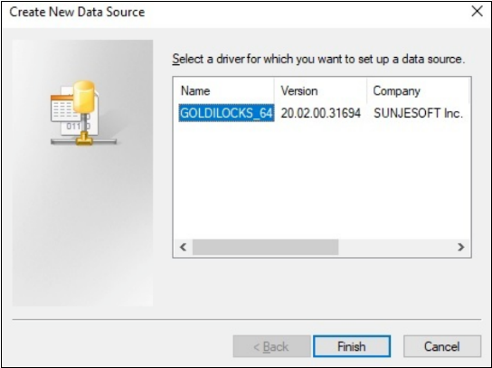
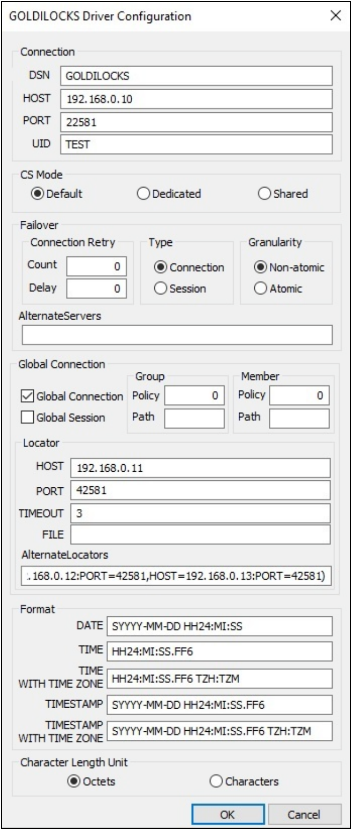

<a id="802b520477c7c771"></a>

# 31. ODBC

> Source: [GOLDILOCKS 21c.1 User Manual (en)](https://manual.sunjesoft.co.kr/goldilocks/21c_1/manual/en/802b520477c7c771)  
> Tag: `21c.1_35_tag`

[← 30. Database Connection](30-database-connection.md) · [Table of contents](../README.md) · [32. JDBC →](32-jdbc.md)

<a id="f75190e758887a01"></a>
## Overview of GOLDILOCKS ODBC Driver

<a id="6508bcbf29d0b9c3"></a>
### Concepts of GOLDILOCKS ODBC Driver

Open Database Connectivity (ODBC) is a specifications for a database Application Programming Interface (API). Microsoft ODBC version 3.0 is based on International Standards Organization/ International Electromechanical Commission (ISO/ IEC) and the recommended specifications of Call Level Interface (CLI) of X/ open. ODBC supports the SQL statements by using C library functions. The application implements the ODBC features by calling these functions.

ODBC architecture has four components which perform the following features.

<a id="560354944c8e9f75"></a>
| Component | Description |
| --- | --- |
| Application | It calls ODBC function which communicated with an ODBC data source and sends an SQL statement and processes the result set. |
| Driver manager | It manages the communication between an application and all ODBC drivers which are used by the application. |
| Driver | It processes all ODBC calls from applications, and connects to data source, and submits the SQL statement to the data source in the application, and returns results to the application. If necessary, the driver converts the ODBC SQL sent form the application to the default SQL which is used in the data source. |
| Data source | It includes all information which the driver needs to access the data in the DBMS. |

The following operations can be executed by using ODBC applications.

- Connecting to a data source
- Sending SQL statements to the data source
- Processing the results of an SQL statement in the data source
- Handling errors and messages
- Terminating the connection to the data source

<a id="38f22c622f711fa0"></a>
### Overview of ODBC Components

<a id="694cef459f6d15bc"></a>
#### GOLDILOCKS ODBC Driver Including Driver Manager

The following is a software architecture of when the driver manager is included in the system. In this case, the application should be linked to the driver manager library.

<a id="e726dd068af5e8c1"></a>


<a id="8d12c3d508fcaeba"></a>
#### GOLDILOCKS ODBC Driver Not Including Driver Manager

The following is an architecture of when the application does not include a driver manager and uses GOLDILOCKS ODBC driver. In this case, the application should be linked to GOLDILOCKS ODBC driver library.

<a id="759817e405c32563"></a>


<a id="bfd191008451effa"></a>
### Using GOLDILOCKS ODBC Driver

<a id="a08e8360f6230185"></a>
#### Header File

goldilocks.h file installed on $GOLDILOCKS_HOME/include should be included to execute GOLDILOCKS ODBC driver. This file defines constant and type of GOLDILOCKS ODBC driver, and provides a function prototype of GOLDILOCKS ODBC driver function.

<a id="5936a4fc3aad41cd"></a>
#### Library

The application which does not use a driver manager should be linked to a static or shared version of GOLDILOCKS ODBC driver library.

<a id="6016a17c31d9857d"></a>
##### UNIX

**GOLDILOCKS UNIX ODBC driver libraries**

<a id="f37538a6d9eb4e34"></a>
| File name | Description |
| --- | --- |
| libgoldilocks.a | It is a static version of library including DA and CS. |
| libgoldilocksa.a | It is a static version of DA dedicated library. |
| libgoldilocksas.so | It is a shared version of DA dedicated library. |
| libgoldilocksc.a | It is a static version of CS dedicated library. |
| libgoldilockscs-ul32.so | It is a shared version of 64-bit CS dedicated library recognizing SQLLEN to 4 bytes. |
| libgoldilockscs-ul64.so | It is a shared version of 64-bit CS dedicated library recognizing SQLLEN to 8 bytes. |
| libgoldilockscs.so | It is a shared version of 32-bit CS dedicated library. |
| libgoldilockss.so | It is a shared version of library including DA and CS. |

<a id="42e08117f8c77dc0"></a>
##### Windows

GOLDILOCKS Windows ODBC driver libraries provide CS libraries only.

**GOLDILOCKS Windows ODBC driver libraries**

<a id="32ba58b06920d4f8"></a>
| File name | Description |
| --- | --- |
| goldilockscs-ul64.dll | It is a shared version of 64-bit CS dedicated library recognizing SQLLEN to 8 bytes. |
| goldilockscs.dll | It is a shared version of 32-bit CS dedicated library. |
| goldilockssetup32.dll | It is a setup library for 32-bit ODBC driver manager. |
| goldilockssetup64.dll | It is a setup library for 64-bit ODBC driver manager. |

<a id="dab52d76efc5663a"></a>
## Data Source Configuration

<a id="c6af88c49fc43ec7"></a>
### DSN Configuration on UNIX

<a id="72da8d36ac2819cb"></a>
#### odbcinst.ini File

odbcinst.ini file is a configuration file for installed ODBC driver.

- unixODBC

```
% odbcinst -j
unixODBC 2.3.2
DRIVERS............: /etc/odbcinst.ini
SYSTEM DATA SOURCES: /etc/odbc.ini
FILE DATA SOURCES..: /etc/ODBCDataSources
USER DATA SOURCES..: /home/goldilocks/.odbc.ini
SQLULEN Size.......: 8
SQLLEN Size........: 8
SQLSETPOSIROW Size.: 8
```

- iODBC

```
% iodbc-config --odbcinstini
/etc/odbcinst.ini
```

<a id="8fe356eb0f3d5400"></a>
##### ODBC Driver Specification

ODBC driver specification section in odbcinst.ini file specifies the driver property values and list. The registered information section is under the driver name in each driver installed.

```
[driver_name]
Description = driver_description
Driver = driver_library_path
Setup = setup_library_path
FileUsage = file_usage
```

The following table describes keywords in the driver specification section.

<a id="9b16a3265a9ba1bc"></a>
| Keyword | Description |
| --- | --- |
| Description | It is a string which describes the driver. |
| Driver | It is a driver library path. |
| Setup | It is a setup library path. |
| FileUsage | It is a character which displays how to directly process the file in DSN by the file-based driver. |

The following is an example of information of GOLDILOCKS ODBC driver specifications.

```
[GOLDILOCKS ODBC Driver]
Description= GOLDILOCKS ODBC Driver
Driver = /home/goldilocks/home/lib/libgoldilockscs-ul64.so
Setup = /home/goldilocks/home/lib/libgoldilockscs-ul64.so
FileUsage = 0
```

<a id="dd24d6ea4d90d7f1"></a>
#### odbc.ini File

odbc.ini file is the configuration file for the DSN connected by the application, and it is divided into a user DSN and system DSN. Typically, a user DSN file is ~ / .odbc.ini file, and a system DSN file is /etc/odbc.ini.

- unixODBC

```
% odbcinst -j
unixODBC 2.3.4
DRIVERS............: /etc/odbcinst.ini
SYSTEM DATA SOURCES: /etc/odbc.ini
FILE DATA SOURCES..: /etc/ODBCDataSources
USER DATA SOURCES..: /home/goldilocks/.odbc.ini
SQLULEN Size.......: 8
SQLLEN Size........: 8
SQLSETPOSIROW Size.: 8
```

- iODBC

```
% iodbc-config --odbcini
/etc/odbc.ini
```

<a id="29f8ddb0cb57dea1"></a>
##### Data Source Specification

Data source specification section of the odbc.ini file describes DSN.

```
[data_source_name]
Driver = driver_name
PROTOCOL = {DA | TCP | IPC}
CS_MODE = {default | dedicated | shared}
HOST = host_address
PORT = port_no
PREFER_IPV6 = {0 | 1}
CHARSET = {SQL_ASCII | UTF8 | UHC | GB18030}
TCP_NODELAY = {0 | 1}
ALTERNATE_SERVERS = (HOST=ADDRESS1:PORT=PORT1,HOST=ADDRESS2:PORT=PORT2)
CONNECTION_RETRY_COUNT = retry_count
CONNECTION_RETRY_DELAY = retry_delay
FAILOVER_TYPE = {CONNECTION | SESSION}
FAILOVER_GRANULARITY = {0 | 1 | 2}
FAILOVER_ROUTING_POLICY = {0 | 1}
DATE_FORMAT = date_format_string
TIME_FORMAT = time_format_string
TIME_WITH_TIME_ZONE_FORMAT = timetz_format_string
TIMESTAMP_FORMAT = timestamp_format_string
TIMESTAMP_WITH_TIME_ZONE_FORMAT = timestamptz_format_string
CHAR_LENGTH_UNITS = {BYTE | OCTETS | CHAR | CHARACTERS}
ENABLE_SQLDESCRIBEPARAM = {0 | 1}
ENABLE_SQLBINDPARAMETER_CONSISTENCY_CHECK = {0 | 1}
USE_TARGETTYPE = {0 | 1 | 2} 
LOCATOR_DSN = locator_dsn_name
LOCATOR_SERVICE = locator_service_name
LOCALITY_AWARE_TRANSACTION = {0 | 1}
LOCALITY_GROUP_POLICY = {0 | 1 | 2}
LOCALITY_GROUP_PATH = group_name1, group_name2, group_name3
LOCALITY_MEMBER_POLICY = {0 | 1 | 2 | 3 | 4}
LOCALITY_MEMBER_PATH = member_name1,member_name2, member_name3
DB_HOME = database_home_path
PACKET_COMPRESSION_THRESHOLD = packet_compression_threshold
USE_GLOBAL_SESSION = {0 | 1}
CONNECTION_TIMEOUT = connection_timeout
LOGIN_TIMEOUT = login_timeout
TRACE = {0 | 1}
TRACEFILE = file_path_name
TRACE_POLICY={DEFAULT | ERROR}
INCLUDE_SYNONYMS = {0 | 1}
DOT_NET_FOR_ODBC = {0 | 1}

[locator_dsn_name]
FILE = location_file_name
HOST = IP address(v4)
PORT = locator_port
CONNECTION_TIMEOUT = second 
ALTERNATE_LOCATORS = (HOST=ADDRESS1:PORT=PORT1,HOST=ADDRESS2:PORT=PORT2)
```

The following table describes keywords in the data source specification section.

**Keywords in the data source specification section**

<a id="753e6de9f2a389a2"></a>
<table><thead><tr><th align="center" valign="middle">Keyword</th><th align="center" valign="middle">Description</th></tr></thead><tbody><tr><td valign="middle">data_source_name</td><td valign="middle">It is the data source specified in the data source section.</td></tr><tr><td valign="middle">Driver</td><td valign="middle">It is a driver name installed on odbcinst.ini.</td></tr><tr><td valign="middle">PROTOCOL</td><td valign="middle">It is a connection type with the server.<br><ul><li>DA: It directly accesses to the server without communication.</li><li>TCP: It communicates with the server through TCP socket.</li><li>IPC: It communicates with the server through the shared memory, and it is available only in the same device of the server. It uses TCP connection to transfer IPC information when accessing for the first time, so HOST and PORT should be set. It can access the server only in dedicated mode.</li></ul></td></tr><tr><td valign="middle">CS_MODE</td><td align="left" valign="middle">It sets whether to connect as dedicated mode or shared mode.<br>If it is not set, the default mode is determined depending on the configuration (DEFAULT_CS_MODE) of the listener.</td></tr><tr><td valign="middle">HOST</td><td valign="middle">It is a host IP address or a host name.</td></tr><tr><td valign="middle">PORT</td><td align="left" valign="middle">It is a connection port number.</td></tr><tr><td valign="middle">PREFER_IPV6</td><td valign="middle">If the host parameter is the host name, then IPv6 takes precedence over other IP addresses.</td></tr><tr><td valign="middle">TCP_NODELAY</td><td valign="middle">It is a socket TCP_NODELAY option.</td></tr><tr><td valign="middle">UID</td><td valign="middle">It is a user ID.</td></tr><tr><td valign="middle">PWD</td><td valign="middle">It is a user password.</td></tr><tr><td valign="middle">CHARSET</td><td valign="middle">It is a client character set.</td></tr><tr><td valign="middle">ALTERNATE_SERVERS</td><td valign="middle">It is a server list which attempts to connect when the failover occurs. Each servers is separated by a comma (,).<br>To disable the failover feature, set ALTERNATE_SERVERS as a white space.</td></tr><tr><td valign="middle">CONNECTION_RETRY_COUNT</td><td valign="middle">It is the number of times which the driver attempts to connect to the server when the connection fails.</td></tr><tr><td valign="middle">CONNECTION_RETRY_DELAY</td><td align="left" valign="middle">It is the server connection retry interval (in seconds) when the connection fails.</td></tr><tr><td valign="middle">FAILOVER_TYPE</td><td align="left" valign="middle"><ul><li>CONNECTION: When the connection fails, it is connected to ALTERNATE_SERVERS.</li><li>SESSION: When the connection fails or the connection is disconnected during operating the statement, it is connected to ALTERNATE_SERVERS and the statement is restored. The statement is executed after the failover if the connection is disconnected when a transaction is not in progress.</li></ul></td></tr><tr><td valign="middle">FAILOVER_GRANULARITY</td><td valign="middle"><ul><li>0: The failover proceeds even when an error occurs.</li><li>1: The failover fails when an error except for SQLExecute (), SQLExecDirect ()occurs during the failover).</li><li>2: The failover fails when an error occurs.</li></ul></td></tr><tr><td valign="middle">FAILOVER_ROUTING_POLICY</td><td valign="middle"><ul><li>0: If an error occurs in the last server of ALTERNATE_SERVERS, then the failover starts again from the primary server.</li><li>1: If an error occurs in the last server of ALTERNATE_SERVERS, then the failover ends.</li></ul></td></tr><tr><td valign="middle">DATE_FORMAT</td><td valign="middle">It is a DATE type string.</td></tr><tr><td valign="middle">TIME_FORMAT</td><td valign="middle">It is a TIME type string.</td></tr><tr><td valign="middle">TIME_WITH_TIME_ZONE_FORMAT</td><td valign="middle">It is a TIME WITH TIME ZONE type string.</td></tr><tr><td valign="middle">TIMESTAMP_FORMAT</td><td valign="middle">It is a TIMESTAMP type string.</td></tr><tr><td valign="middle">TIMESTAMP_WITH_TIME_ZONE_FORMAT</td><td valign="middle">It is a TIMESTAMP WITH TIME ZONE type string.</td></tr><tr><td valign="middle">CHAR_LENGTH_UNITS</td><td valign="middle">It is the unit of ColumnSize when ParameterType in SQLBindParameter() is SQL_CHAR, SQL_VARCHAR.<br><ul><li>BYTE, OCTETS: Byte unit</li><li>CHAR, CHARACTERS: Character unit</li></ul></td></tr><tr><td valign="middle">ENABLE_SQLDESCRIBEPARAM</td><td valign="middle">It determines whether to enable SQLDescribeParam().<br><ul><li>0: The driver does not support SQLDescribeParam().</li><li>1: The driver returns SQL_VARCHAR for all parameters.</li></ul></td></tr><tr><td valign="middle">ENABLE_SQLBINDPARAMETER_CONSISTENCY_CHECK</td><td valign="middle">It determines whether to check ColumnSize and DecimalDigits in SQLBindParameter().<br><ul><li>0: It does not check ColumnSize and DecimalDigits.</li><li>1: It checks ColumnSize and DecimalDigits.</li></ul></td></tr><tr><td valign="middle">USE_TARGETTYPE</td><td valign="middle">It sets the type information which is to be received together when receiving a column type through communication.<br><ul><li>0: It receives only the column type.</li><li>1: It receives the column type and column name.</li><li>2: It receives the column type and all information about the column.</li></ul></td></tr><tr><td valign="middle">LOCATOR_DSN</td><td valign="middle">It is Data Source Name (DSN) which specifies a location information.</td></tr><tr><td valign="middle">LOCATOR_SERVICE</td><td valign="middle">It gets the connection information from a service hint and glocator.</td></tr><tr><td valign="middle">LOCALITY_AWARE_TRANSACTION</td><td valign="middle">It determines whether to use GLOBAL CONNECTION.<br><ul><li>0: It does not use GLOBAL CONNECTION.</li><li>1: It uses GLOBAL CONNECTION.</li></ul></td></tr><tr><td valign="middle">LOCALITY_GROUP_POLICY</td><td valign="middle">It determines how to select a group if neither of groups are available, or two or more groups are available when using GLOBAL CONNECTION.<br><ul><li>0: It randomly selects the group.</li><li>1: It sequentially selects groups which exist in LOCALITY_GROUP_PATH setting. If neither of groups in LOCALITY_GROUP_PATH are not available, it randomly selects the group.</li><li>2: It sequentially selects groups. It always selects groups in an order of they are connected to the driver.</li></ul></td></tr><tr><td valign="middle">LOCALITY_GROUP_PATH</td><td valign="middle">It defines the list of selected groups when the available group is not a single one when using GLOBAL CONNECTION. Each group is distinguished with comma (,).<br>e.g. G1,G2,G3</td></tr><tr><td valign="middle">LOCALITY_MEMBER_POLICY</td><td valign="middle">It determines how to select a member in the selected group when using GLOBAL CONNECTION.<br><ul><li>0: DML : MASTER / SELECT : MASTER</li><li>1: DML : ANY / SELECT : ANY</li><li>2: DML : MASTER / SELECT : ANY</li><li>3: DML : MASTER / SELECT : SLAVE</li><li>4: It sequentially selects members which exist in LOCALITY_MEMBER_PATH setting. If neither of members in LOCALITY_MEMBER_PATH are not available, it uses the MASTER in the selected group.</li></ul></td></tr><tr><td valign="middle">LOCALITY_MEMBER_PATH</td><td valign="middle">It defines the list of members to be used in the selected group when using GLOBAL CONNECTION. Each member is distinguished with comma (,).<br>e.g. G1N1,G2N1,G3N1,G1N2,G2N2,G3N2</td></tr><tr><td valign="middle">DB_HOME</td><td valign="middle">It sets the home directory of the database. The default value uses $GOLDILOCKS_HOME environment variable.</td></tr><tr><td valign="middle">PACKET_COMPRESSION_THRESHOLD</td><td valign="middle">It compresses the communication data when the size of the communication data to be sent to the server is bigger than PACKET_COMPRESSION_THRESHOLD. The range of the set value is 32 ~ 2113929216.</td></tr><tr><td valign="middle">USE_GLOBAL_SESSION</td><td valign="middle">It is whether to use GLOBAL SESSION.<br><ul><li>0: It does not use GLOBAL SESSION.</li><li>1: uses GLOBAL SESSION.</li></ul></td></tr><tr><td>CONNECTION_TIMEOUT</td><td>It is waiting time (in seconds) for the response after the request.</td></tr><tr><td valign="middle">LOGIN_TIMEOUT</td><td valign="middle">It is waiting time (in seconds) for the login request to be completed.</td></tr><tr><td valign="middle">TRACE</td><td valign="middle">It sets whether to use trace in ODBC API.<br><ul><li>0: It does not use the trace.</li><li>1: It uses the trace.</li></ul></td></tr><tr><td valign="middle">TRACEFILE</td><td valign="middle">It is the name of the trace file. When the relative path is input, then it is based on the directory in which the program currently runs. The default value is 'odbc_trace.log'.</td></tr><tr><td valign="middle">INCLUDE_SYNONYMS</td><td valign="middle">It sets whether to include the synonym object in SQLGetColumns().<br><ul><li>0: It does not include the synonym object.</li><li>1: It includes the synonym object.</li></ul></td></tr><tr><td valign="middle">DOT_NET_FOR_ODBC</td><td valign="middle">It is whether to use ODBC for .NET Framework.<br><ul><li>0: It does not change its usage.</li><li>1: It replaces SQL_DESC_BASE_COLUMN_NAME, SQL_DESC_NAME properties, in SQLGetDescField() and SQLColAttribute() with SQL_DESC_LABEL property.</li></ul></td></tr></tbody></table>

**Location**

<a id="b3610ecfd4dbf3b4"></a>
| Keyword | Description |
| --- | --- |
| FILE | Location file name |
| HOST | glocator ip address |
| PORT | glocator port number |
| CONNECTION_TIMEOUT | Connection timeout with glocator (second) |
| ALTERNATE_LOCATORS | If glocator does not respond, it gets the connection information by using ALTERNATE_LOCATORS. |


> 
> - If properties of FILE, HOST, PORT are all set in LOCATOR_DSN, then the FILE property is prior to others. For more information, refer to [Location File](../part-06-utility-manual/48-gloctl.md#5a93eeebc4b5377a).
> 
> 
> 
> - LOCATOR_SERVICE property enables to connect to a server belonging to LOCATOR_SERVICE. Servers other than the connected server become ALTERNATE_SERVERS.  
>   If FAILOVER_TYPE is not set, then FAILOVER_TYPE is a session.  
>   If FAILOVER_GRANULARITY is not set, then FAILOVER_GRANULARITY is 1.  
>   For more information, refer to [glocator](../part-06-utility-manual/46-glocator.md#5c6d9f818741f0f3) and [gloctl](../part-06-utility-manual/48-gloctl.md#a4f051a64cd67b11).
> 

The following is an example of DSN configuration of GOLDILOCKS.

```
[GOLDILOCKS]
Driver = GOLDILOCKS ODBC Driver
PROTOCOL = TCP
CS_MODE = SHARED
HOST = 192.168.0.10
PORT = 22581
CHARSET = UTF8
TCP_NODELAY = 1
ALTERNATE_SERVERS = (HOST=192.168.0.11:PORT=22581,HOST=192.168.0.12:PORT=22581)
CONNECTION_RETRY_COUNT = 3
CONNECTION_RETRY_DELAY = 1
FAILOVER_TYPE = SESSION
FAILOVER_GRANULARITY = 0
FAILOVER_ROUTING_POLICY = 0
DATE_FORMAT = YYYY-MM-DD
TIME_FORMAT = HH24:MI:SS.FF6
TIME_WITH_TIME_ZONE_FORMAT = HH24:MI:SS.FF6 TZH:TZM
TIMESTAMP_FORMAT = YYYY-MM-DD HH24:MI:SS.FF6
TIMESTAMP_WITH_TIME_ZONE_FORMAT = YYYY-MM-DD HH24:MI:SS.FF6 TZH:TZM
CHAR_LENGTH_UNITS = CHARACTERS
ENABLE_SQLDESCRIBEPARAM = 1
ENABLE_SQLBINDPARAMETER_CONSISTENCY_CHECK = 1

USE_TARGETTYPE = 0
INCLUDE_SYNONYMS = 0

PACKET_COMPRESSION_THRESHOLD = 2113929216

LOCALITY_AWARE_TRANSACTION = 0
LOCALITY_GROUP_POLICY = 0
LOCALITY_GROUP_PATH = G1,G2,G3
LOCALITY_MEMBER_POLICY = 0
LOCALITY_MEMBER_PATH = G1N1,G2N1,G3N1,G1N2,G2N2,G3N2

USE_GLOBAL_SESSION = 0

CONNECTION_TIMEOUT = 0
LOGIN_TIMEOUT = 0

LOCATOR_DSN = LOCATOR
LOCATOR_SERVICE = S1

TRACE = 1
TRACEFILE = /home/test/log/mytrace.log

DOT_NET_FOR_ODBC = 0

[LOCATOR]
FILE = /home/test/.location.ini
HOST = 127.0.0.1
PORT = 42581
ALTERNATE_LOCATORS=(HOST=127.0.0.1:PORT=42582,HOST=127.0.0.1:PORT=42583)
```

<a id="97a59af0a9b63a25"></a>
### DSN Configuration on Windows

ODBC data source manager can add or set up DSN on Windows.

<a id="bace541bbe509ea7"></a>


<a id="ed6188f8b96a089d"></a>


The following table describes keywords for DSN configuration.

**Keywords for DSN configuration**

<a id="3c461056a152fcc5"></a>
<table><thead><tr><th align="center">Keyword</th><th align="center">Description</th></tr></thead><tbody><tr><td valign="middle">DSN</td><td valign="middle">It is a data source name.</td></tr><tr><td valign="middle">HOST</td><td valign="middle">It is a host IP address or a host name.</td></tr><tr><td valign="middle">PORT</td><td valign="middle">It is a connection port number.</td></tr><tr><td valign="middle">UID</td><td align="left" valign="middle">It is a user ID.</td></tr><tr><td valign="middle">CS_MODE</td><td align="left" valign="middle">It sets whether to connect as dedicated mode or shared mode.<br>If it is not set, the default mode is determined depending on the configuration (DEFAULT_CS_MODE) of the listener.</td></tr><tr><td valign="middle">ALTERNATE_SERVERS</td><td align="left" valign="middle">It is a server list which attempts to connect when the failover occurs. Each servers is separated by a comma (,).<br>To disable the failover feature, set ALTERNATE_SERVERS as a white space.</td></tr><tr><td valign="middle">CONNECTION_RETRY_COUNT</td><td valign="middle">It is the number of times which the driver attempts to connect to the server when the connection fails.</td></tr><tr><td valign="middle">CONNECTION_RETRY_DELAY</td><td valign="middle">It is the server connection retry interval (in seconds) when the connection fails.</td></tr><tr><td valign="middle">FAILOVER_TYPE</td><td valign="middle"><ul><li>CONNECTION: When the connection fails, it is connected to ALTERNATE_SERVERS.</li><li>SESSION: When the connection fails or the connection is disconnected during operating the statement, it is connected to ALTERNATE_SERVERS and the statement is restored. The statement is executed after the failover if the connection is disconnected when a transaction is not in progress.</li></ul></td></tr><tr><td valign="middle">FAILOVER_GRANULARITY</td><td valign="middle"><ul><li>Non-atomic: The failover proceeds even when an error occurs.</li><li>Atomic: The failover fails when an error occurs.</li></ul></td></tr><tr><td valign="middle">DATE_FORMAT</td><td align="left" valign="middle">It is a DATE type string.</td></tr><tr><td valign="middle">TIME_FORMAT</td><td align="left" valign="middle">It is a TIME type string.</td></tr><tr><td valign="middle">TIME_WITH_TIME_ZONE_FORMAT</td><td valign="middle">It is a TIME WITH TIME ZONE type string.</td></tr><tr><td valign="middle">TIMESTAMP_FORMAT</td><td valign="middle">It is a TIMESTAMP type string.</td></tr><tr><td valign="middle">TIMESTAMP_WITH_TIME_ZONE_FORMAT</td><td valign="middle">It is a TIMESTAMP WITH TIME ZONE type string.</td></tr><tr><td valign="middle">CHAR_LENGTH_UNITS</td><td valign="middle">It is the unit of ColumnSize when ParameterType in SQLBindParameter() is SQL_CHAR, SQL_VARCHAR.<br><ul><li>BYTE, OCTETS: Byte unit</li><li>CHAR, CHARACTERS: Character unit</li></ul></td></tr><tr><td valign="middle">LOCALITY_AWARE_TRANSACTION</td><td valign="middle">It sets whether to use GLOBAL CONNECTION.<br><ul><li>It does not use GLOBAL CONNECTION.</li><li>It uses GLOBAL CONNECTION.</li></ul></td></tr><tr><td valign="middle">USE_GLOBAL_SESSION</td><td valign="middle">It sets whether to use GLOBAL SESSION.<br><ul><li>It does not use GLOBAL SESSION.</li><li>It uses GLOBAL SESSION.</li></ul></td></tr><tr><td valign="middle">LOCALITY_GROUP_POLICY</td><td valign="middle">If an available group does not exist or two or more groups can be selected when using GLOBAL CONNECTION, it sets how to select a group.<br><ul><li>0: It arbitrarily selects a group.</li><li>1: It sequentially selects groups existing in LOCALITY_GROUP_PATH settings. If all groups in LOCALITY_GROUP_PATH are not available, then it arbitrarily selects a group.</li><li>2: It sequentially selects groups. It selects a group in a sequence of connected to the driver everytime.</li></ul></td></tr><tr><td valign="middle">LOCALITY_GROUP_PATH</td><td valign="middle">It specifies a list of selected groups if more than one group can be selected when using GLOBAL CONNECTION. Each group is separated with a comma (,).<br>e.g. G1,G2,G3</td></tr><tr><td valign="middle">LOCALITY_MEMBER_POLICY</td><td valign="middle">It determines how to select a member within a selected group when using GLOBAL CONNECTION.<br><ul><li>0: DML : MASTER / SELECT : MASTER</li><li>1: DML : ANY / SELECT : ANY</li><li>2: DML : MASTER / SELECT : ANY</li><li>3: DML : MASTER / SELECT : SLAVE</li><li>4: It sequentially selects members in LOCALITY_MEMBER_PATH settings. If all members in LOCALITY_MEMBER_PATH are not available, then it arbitrarily selects MASTER in the selected group.</li></ul></td></tr><tr><td valign="middle">LOCALITY_MEMBER_PATH</td><td valign="middle">It specifies a list of members to be used within a selected group when using GLOBAL CONNECTION. Each member is separated with a comma (,).<br>e.g. G1N1,G2N1,G3N1,G1N2,G2N2,G3N2</td></tr><tr><td valign="middle">LOCATOR_HOST</td><td valign="middle">glocator ip address</td></tr><tr><td valign="middle">LOCATOR_PORT</td><td valign="middle">glocator port number</td></tr><tr><td valign="middle">LOCATOR_CONNECTION_TIMEOUT</td><td valign="middle">Connection timeout with glocator (second)</td></tr><tr><td valign="middle">ALTERNATE_LOCATORS</td><td valign="middle">If glocator does not respond, then it gets the connection information by using ALTERNATE_LOCATORS.</td></tr><tr><td valign="middle">TRACE</td><td valign="middle">It sets whether to use trace in ODBC API.<br><ul><li>0: It does not use the trace.</li><li>1: It uses the trace.</li></ul></td></tr><tr><td valign="middle">TRACEFILE</td><td valign="middle">It is the name of the trace file. When the relative path is input, then it is based on the directory in which the program currently runs. The default value is 'odbc_trace.log'.</td></tr><tr><td valign="middle">DOT_NET_FOR_ODBC</td><td valign="middle">It is whether to use ODBC for .NET Framework.<br><ul><li>0: It does not change its usage.</li><li>1: It replaces SQL_DESC_BASE_COLUMN_NAME, SQL_DESC_NAME properties, in SQLGetDescField() and SQLColAttribute() with SQL_DESC_LABEL property.</li></ul></td></tr></tbody></table>

<a id="ed625d890d935bd7"></a>
## GLOBAL CONNECTION

GLOBAL CONNECTION of which an application selects and performs an appropriate node for a query processing in cluster environment is supported.

<a id="c99461781e56a5ed"></a>
### Settings

GLOBAL CONNECTION is available only when PROTOCOL is TCP. In this case, LOCALITY_AWARE_TRANSACTION property value should be set together with LOCATOR file or LOCATOR server. USE_GLOBAL_SESSION property value should be set to 1 to use the global session feature.

- .odbc.ini of when using DSN

```
[GOLDILOCKS]
PROTOCOL = TCP
HOST = 192.168.0.1
PORT = 22581
UID = TEST
PWD = test
LOCALITY_AWARE_TRANSACTION = 1
LOCATOR_DSN = LOCATOR

[LOCATOR]
FILE = /home/goldilocks/.location.ini
```

- Using connection string

```
SQLDriverConnect( dbc,
                  NULL,
                  (SQLCHAR*)"PROTOCOL=TCP;HOST=192.168.0.1;PORT=22581;UID=TEST;PWD=test;LOCALITY_AWARE_TRANSACTION=1;LOCATOR_HOST=192.168.0.2;LOCATOR_PORT=42581",
                  SQL_NTS,
                  NULL,
                  0,
                  NULL,
                  SQL_DRIVER_NOPROMPT );
```

<a id="e68ccf1eb9cc4a8f"></a>
### Processing GLOBAL CONNECTION

<a id="713560a9a2684a14"></a>


1. SQLAllocHandle (DBC)  
   It allocates a connection handle.

2. SQLConnect  
   It connects to a server which was given server information from a user, and obtains the information about the cluster system. Then builds the cluster system information through LOCATOR file or LOCATOR server, and connects to all nodes of cluster system.

3. SQLAllocHandle( STMT )  
   It allocates a statement to each of all connected nodes.

4. SQLPrepare  
   It prepares to execute SQL in all connected nodes.

5. SQLExecute  
   If the information about the cluster system is not built, an application builds the information about the cluster system through LOCATOR file or LOCATOR server, then connects to all nodes in the cluster system.  
   When connecting to a new node by adding a node to cluster, all statements of other nodes are equally created in that node, and prepares to execute SQL.

If the information about a sharding key has already built, an application selects an appropriate node and performs a query by using the sharding key information.  
If the information about a sharding key is not built, an application builds the sharding key information of the SQL from an arbitrary server, then selects a node and performs a query.

If an error occurs on the selected node, an appropriate node is selected again, then performs a query.

If the information about a sharding key is altered after SQLExecute, then it deletes the built   information about a sharding key  
If the information about the cluster system is altered such as adding or deleting a cluster node after SQLExecute, then it deletes the built cluster system information.

6. SQLFetch  
   It brings data from the node on which SQL was executed.

7. SQLCloseCursor  
   It closes a cursor from the node on which SQL was executed.

8. SQLFreeHandle( STMT )  
   It releases a statement from all connected nodes.

9. SQLDisconnect  
   It releases connections with all nodes.

10. SQLFreeHandle( DBC )  
   It releases a connection handle.

<a id="602a815e95b4683b"></a>
### Handling GLOBAL CONNECTION Exception

When using GLOBAL CONNECTION, if an error occurs on the selected node during the operation, then it is operated as follows according to the transaction occurrence and SELECT progress.

- When a transaction did not occur

If an error occurs on the selected node when a transaction did not occur, then it selects another node within ODBC and executes the query. Though an error occurred on the selected node, the query was normally executed on another node, so it does not transfer an error to a user.

- When a transaction occurred or SELECT is in progress

If an error occurs on the selected node when a transaction occurred or SQLFetch() is in progress, then ODBC can not proceeds the current operation any more so it transfers 19068(Retry the transactional operations) error. If 19068 error occurs, then a user should perform the transaction or SELECT again.

```
if( !SQL_SUCCEEDED(SQLPrepare( sStmt,
                               (SQLCHAR*)"INSERT INTO T1 VALUES ( ? )",
                               SQL_NTS )) )
{
    goto stmt_error;
}

trans_retry:

if( !SQL_SUCCEEDED(SQLExecute( sStmt )) )
{
    SQLGetDiagRec( SQL_HANDLE_STMT,
                   sStmt,
                   1,
                   sSQLState,
                   &sNativeError,
                   sMessageText,
                   sizeof(sMessageText),
                   &sTextLength );

    if( sNativeError == 19068 )
    {
        goto trans_retry;
    }
        
    goto stmt_error;
}
```

```
if( !SQL_SUCCEEDED(SQLPrepare( sStmt,
                               (SQLCHAR*)"SELECT * FROM T1 WHERE C1 = ?",
                               SQL_NTS )) )
{
    goto stmt_error;
}

trans_begin:

sReturn = SQLExecute( sStmt );

if( sRetrun == SQL_ERROR )
{
    SQLGetDiagRec( SQL_HANDLE_STMT,
                   sStmt,
                   1,
                   sSQLState,
                   &sNativeError,
                   sMessageText,
                   sizeof(sMessageText),
                   &sTextLength );

    if( sNativeError == 19068 )
    {
        goto trans_retry;
    }
        
    goto stmt_error;
}

while( 1 )
{
    sReturn = SQLFetch( sStmt );

    if( sReturn == SQL_NO_DATA )
    {
        SQLCloseCursor( sStmt );
        break;
    }
    else if( sReturn == SQL_ERROR )
    {
        SQLGetDiagRec( SQL_HANDLE_STMT,
                       sStmt,
                       1,
                       sSQLState,
                       &sNativeError,
                       sMessageText,
                       sizeof(sMessageText),
                       &sTextLength );

        if( sNativeError == 19068 )
        {
            goto trans_retry;
        }
        
        goto stmt_error;
    }

    ...
}
```

- When committing or rolling back a transaction

If an error occurs on the selected node when committing a transaction, then ODBC checks whether the transaction has been committed before the error occurred through another node. Though an error occurred on the selected node, if the transaction was normally committed, then it does not transfer an error. Also, if an error occurred on the selected node when a transaction has not been committed, then it transfers 19068(Retry the transactional operations) error. If 19068 error occurs, then a user should perform the transaction again.

If an error occurs on the selected node when rolling back a transaction, then ODBC does not transfer an error. It is because the transaction already has been rolled back due to the node error.

```
if( !SQL_SUCCEEDED(SQLSetConnectAttr( sDbc,
                                      SQL_AUTOCOMMIT,
                                      (SQLPOINTER)SQL_AUTOCOMMIT_OFF,
                                      0 ) ))
{
    goto dbc_error;
}

if( !SQL_SUCCEEDED(SQLPrepare( sStmt,
                               (SQLCHAR*)"INSERT INTO T1 VALUES ( ? )",
                               SQL_NTS )) )
{
    goto stmt_error;
}

trans_retry:

if( !SQL_SUCCEEDED(SQLExecute( sStmt )) )
{
    SQLGetDiagRec( SQL_HANDLE_STMT,
                   sStmt,
                   1,
                   sSQLState,
                   &sNativeError,
                   sMessageText,
                   sizeof(sMessageText),
                   &sTextLength );

    if( sNativeError == 19068 )
    {
        goto trans_retry;
    }
        
    goto stmt_error;
}

if( !SQL_SUCCEEDED(SQLEndTran( SQL_HANDLE_DBC,
                               sDbc,
                               SQL_COMMIT)) )
{
    SQLGetDiagRec( SQL_HANDLE_DBC,
                   sDbc,
                   1,
                   sSQLState,
                   &sNativeError,
                   sMessageText,
                   sizeof(sMessageText),
                   &sTextLength );

    if( sNativeError == 19068 )
    {
        goto trans_retry;
    }
        
    goto stmt_error;
}
```

<a id="719d52b4e4c51ad2"></a>
### Constraints of GLOBAL CONNECTION

- Use SQLPrepare() and SQLExecute() to select a node appropriate for the query.

Use SQLPrepare() and SQLExecute() to select a node appropriate for the query by using GLOBAL CONNECTION. SQLExecDirect() does not have an information required to select a node appropriate for the query, so the node is selected according to OCALITY_GROUP_POLICY and LOCALITY_MEMBER_POLICY property.

- Use SQLEndTran() to commit or rollback a transaction.

If committing or rolling back with SQL statement when using GLOBAL CONNECTION, then the status change of the transaction is not detected. It is mandatory to use SQLEndTran() to commit or rollback the transaction.

- Global session feature does not support Data Definition Language (DDL) among SQL statements.

<a id="0067ab430fe39190"></a>
## Catalog Function

All databases have schemas of how to store the data in the database. For example, a simple sales order database will have the schemas shown in the following figure, and the ID columns are used to connect the tables.

<a id="9f9584165e7a5168"></a>


The schema is stored in the set of system tables which is called as a database catalog along with other information such as privileges. This is also known as a data dictionary.

Applications can find this schema by calling the catalog functions. Catalog functions return the information to the result set, and typically they are implemented by SELECT statements for the tables in the catalog.

<a id="3e181b59303b8842"></a>
### Using Catalog Data

Applications use catalog data in various ways. The followings are some common usages.

<a id="01ca5e1d0468db9d"></a>
#### Configuring SQL statements at the time of execution

The vertical applications such as the order input application include the hard-coded SQL statements. The tables and columns used by the application were previously fixed, and the application access these tables. For example, the ordering application typically has one parameterized statement to add a new order to the system.

A general application such as a spreadsheet program using ODBC for collecting the data sometimes configures the SQL statement based on the input from a user at the time of execution. This application may request a user for the format to use tables and columns. However, if the list of tables or columns selected by a user is shown to the application, it will be easier to the user. The application will call catalog functions such as SQLTables and SQLColumns to configure these lists.

<a id="697413e0c4511f72"></a>
#### Configuring SQL statements during the development

The application development environments allow the developers to create database queries during developing the program. And then the queries are hard-coded and embedded into the application.

These environments can also create a list of what were selected by the developer by using the SQLTables and SQLColumns. The environments find out and display the relationships among the tables automatically selected by using SQLPrimaryKeys and SQLForeignKeys. Then they find out and emphasize the index fields by using SQLStatistics, so the developers can create queries effectively.

<a id="6d76cac94980ddca"></a>
#### Configuring a Cursor

The application, driver, middleware which provides a scroll cursor, find out column(s) which is the only column of identifying a row by using SQLSpecialColumns. The program can configure a keyset including the values of these columns for the collected rows. The application will use these values to collect the latest data for the rows by scrolling backwards.

<a id="94dbbd7d1e706e18"></a>
### Catalog Function on ODBC

ODBC includes the following catalog functions.

**Catalog functions on ODBC**

<a id="287e218e1ccd27d5"></a>
| Function | Description |
| --- | --- |
| SQLTables | It returns a list of catalogs, schemas, tables or table types in the data source. |
| SQLColumns | It returns a list of columns in one or more tables. |
| SQLStatistics | It returns a list of statistics for a single table. It also returns a list of indexes linked to the table. |
| SQLSpecialColumns | It returns a list of columns which is the only column of identifying a row in a table. Also, it returns a list of columns in the table, and they are automatically updated. |
| SQLPrimaryKeys | It returns a list of columns which configure the primary key of a table. |
| SQLForeignKeys | It returns a list of foreign keys in a table or it returns a list of foreign keys in another table referring that table. |
| SQLTablePrivileges | It returns a list of privileges associated with one or more tables. |
| SQLColumnPrivileges | It returns a list of privileges associated with one or more columns in a table. |
| SQLProcedures | It is not supported by the driver. |
| SQLProcedureColumns | It is not supported by the driver. |
| SQLGetTypeInfo | It returns a list of SQL data types supported by the data source. These data types are generally used in CREATE TABLE, ALTER TABLE statements. |

<a id="f380a4087576b813"></a>
#### Data Returning of Catalog Function

Each catalog function returns the data as a result set. The result set is not different from any other result set. It is usually hard-coded into the driver, or it is created by the predefined statement such as the parameterized SELECT statement stored in the procedure of data source.

The result set for each catalog function is described in *For More Information* paragraph of each function in this user manual. The result set can include the columns specified in the driver after the column selected last besides the listed columns. These columns are described in a user manual for the driver.

The applications bind the columns specified in the driver based on the end of result set. They calculate the number of columns specified in the driver as the number of last columns which are smaller than the number of columns after the required column. This saves the trouble of changing the application when a new column is added in future version or ODBC driver. To operate this schema, drives should add the columns specified in the new driver before the columns specified in the old driver to prevent changing the row number based on the end of result set.

Even when they include special characters, they do not quote the identifiers returned in the result set. For example, if the Accounts Payable table's identifier quote character which is specified in the driver and returned by SQL GetInfo is a double quotes ("), and the Accounts Payable table has a Customer Name column, then TABLE_NAME column value in the rows which is returned by SQLColumns is Accounts Payable, but it is not "Accounts Payable", and COLUMN_NAME column value is Customer Name, but it is not "Customer Name".   
The application collects the names of customers from the Accounts Payable table as follows.

```
SELECT "Customer Name" FROM "Accounts Payable"
```

Catalog functions are based on SQL-like model in connection based on the user name and password, and their data is returned only to the users with the proper privilege. The file password protection which is inappropriate to this model is defined by the drivers.

Most result set returned by the catalog functions can not be updated, and the application should not expect to change the database schema by updating the data in the result set.

<a id="7cf4d6b4857c8047"></a>
#### Arguments of Catalog Function

<a id="51c8e9fcf290542e"></a>
##### Pattern Value Argument

Some arguments in catalog function accept the search pattern, like as TableName argument in SQLTables. The arguments accept the search pattern if SQL_ATTR_METADATA_ID attribute is set to SQL_FALSE. The arguments do not accept the search pattern if SQL_ATTR_METADATA_ID attribute is set to SQL_TRUE.

Search pattern letters have the following features.

- An underscore(_) represents any single character.
- Percent sign (%) represents zero or more characters. 
- An escape character is specified in the driver and it is used to include the percent sign, underscore, escape character as literals. If an escape character is prior to a non-special character, it does not have any special meaning. But if an escape character is prior to a special character, it is a special character. For example, "\a" is treated as two characters consisting of "\" and "a", but "\%" refers to "%".

An escape character is returned by using SQL_SEARCH_PATTERN_ESCAPE option in SQLGetInfo. To include that character as a literal in an argument which accepts search patterns, it should be prior to any underscore, percent sign, or escape character.

The following table describes how to use search patterns.

**Examples of search pattern**

<a id="87bf6c8a5e8615d6"></a>
| Search pattern | Description |
| --- | --- |
| %A% | It is all identifiers which contain A. |
| ABC_ | It is all four letter characters which start with ABC. |
| ABC\_ | It assumes the escape character a backslash(\), and the identifier is ABC_. |
| \\% | It assumes the escape character a backslash(\), and the identifier which start with a backslash(\). |

> Be cautious when using a escape character in an argument which accepts a search pattern. This is particularly TRUE for the underscore(_) which is generally used as the identifier.   
> It is a common mistake in the application that the value returned by one catalog function is passed to the search pattern argument of another catalog function.   
> For example, if the application gets MY_TABLE table from the result set of SQLTables and passes it to SQLColumns to retrieve the column list of MY_TABLE, then, the application will get the columns of all tables such as MY_TABLE, MY1TABLE, MY2TABLE instead of getting the columns of MY_TABLE because they match the search pattern MY_TABLE.

> ODBC 2.x driver does not support the search pattern for CatalogName argument of SQL tables.  
> ODBC 3.x driver supports the search pattern within the argument if the environment attribute SQL_ATTR_ODBC_VERSION is set to SQL_OV_ODBC3. The argument does not accept the search pattern if this property is set to SQL_OV_ODBC2.

Passing a NULL pointer to the search pattern argument does not force the argument to search. NULL pointer and the search patterns % (any character) are equivalent. However, a zero-length search pattern is matched with an empty string ("").

<a id="ae3034c195a4b3e4"></a>
## ODBC API References

<a id="1959da51c8af6362"></a>
### SQLAllocConnect

<a id="100ba9d7b680896d"></a>
#### Conformance

Introduced version: ODBC 1.0

<a id="925de6df2f2b04e5"></a>
#### Overview

SQLAllocConnect function is replaced by SQLAllocHandle function in ODBC 3.x.   
For more information, refer to [SQLAllocHandle](#e82a58a0bbe7105b).

<a id="ac7ccf4c1a27a176"></a>
#### Syntax

```
SQLRETURN SQLAllocConnect(
    SQLHENV   EnvironmentHandle,
    SQLHDBC * ConnectionHandlePtr);
```

<a id="78cf15b1b55cc064"></a>
#### Arguments

- **EnvironmentHandle:** [Input] It is the environment handle.
- **ConnectionHandlePtr:** [Output] It is the pointer of the connection handle to be newly allocated.

<a id="087227b837b196d7"></a>
### SQLAllocEnv

<a id="fa8615a1b193b9aa"></a>
#### Conformance

Introduced version: ODBC 1.0

<a id="9ab4a8790463fdd5"></a>
#### Overview

SQLAllocEnv function is replaced by SQLAllocHandle function in ODBC 3.x.   
For more information, refer to [SQLAllocHandle](#e82a58a0bbe7105b).

<a id="a63fefea7d95f919"></a>
#### Syntax

```
SQLRETURN SQLAllocEnv(
    SQLHENV * EnvironmentHandlePtr);
```

<a id="cc5704b3ea65c3f4"></a>
#### Arguments

- **EnvironmentHandlePtr:** [Output] It is the pointer of the environment handle to be newly allocated.

<a id="e82a58a0bbe7105b"></a>
### SQLAllocHandle

<a id="aa2142633e61a6a4"></a>
#### Conformance

Introduced version: ODBC 3.0  
Standards compliance: ISO 92

<a id="7fe0020a253b91ac"></a>
#### Overview

SQLAllocHandle allocates the environment handle, the connection handle, or the statement handle.

<a id="0d6f535e6767233e"></a>
#### Syntax

```
SQLRETURN SQLAllocHandle(
    SQLSMALLINT   HandleType,
    SQLHANDLE     InputHandle,
    SQLHANDLE *   OutputHandlePtr);
```

<a id="bdfbda460d4c90b6"></a>
#### Arguments

- **HandleType:** [Input] It is the handle type allocated by SQLAllocHandle and it should be one of SQL_HANDLE_DBC, SQL_HANDLE_ENV, SQL_HANDLE_STMT.
- **InputHandle:** [Input] If HandleType is SQL_HANDLE_ENV, it is SQL_NULL_HANDLE.   
  If HandleType is SQL_HANDLE_DBC, it should be an environment handle.   
  If it is SQL_HANDLE_STMT, it should be a connection handle.
- **OutputHandlePtr:** [Output] It is the newly allocated handle pointer.

<a id="6e6ae3ae57a98b7c"></a>
#### Returns

SQL_SUCCESS, SQL_SUCCESS_WITH_INFO, SQL_INVALID_HANDLE, SQL_ERROR

<a id="1c2ec9b130b89b00"></a>
#### Diagnosis

<a id="47e096ea30bfcf5a"></a>
| SQLSTATE | Error | Description |
| --- | --- | --- |
| 08003 | Connection not open | It is not connected and HandleType is one of SQL_HANDLE_STMT and SQL_HANDLE_DESC. |
| HY000 | General error | It is an error without any specific SQLSTATE. |
| HY001 | Memory allocation error | It is a memory allocation error. |
| HY009 | Invalid use of null pointer | OutputHandlePtr argument is a null pointer. |
| HY010 | Function sequence error | HandleType argument is SQL_HANDLE_DBC, and SQLSetEnvAttr is not called for setting SQL_ODBC_VERSION environment attribute. |
| HY014 | Limit on the number of handles exceeded | It limits the number of allocated handles. |
| HY092 | Invalid attribute/option identifier | HandleType argument is not one of SQL_HANDLE_ENV, SQL_HANDLE_DBC, SQL_HANDLE_STMT, SQL_HANDLE_DESC. |
| IM001 | Driver does not support this function | HandleType argument is SQL_HANDLE_DESC. |

<a id="b9b48da470fb615a"></a>
#### Description

SQLAllocHandle is used to allocate the handle for environment, connection, statement, descriptor. When using SQLAllocHandle with *OutputHandlePtr, the driver will overwrite the information on the correspoidning handle. The driver manager can not verify whether the handle in *OutputHandlePtr is already used, and it can not know the previously overwritten information.

<a id="fd55fc11159511f9"></a>
##### Allocating Environment Handle

The environment handle provides the global information such as whether the connection handle is valid or active.

For requesting the environment handle, the application calls SQLAllocHandle whose HandleType is SQL_HANDLE_ENV and whose InputHandle is SQL_NULL_HANDLE. The driver allocates memory for the environment information, and passes an allocated handle to *OutputHandle argument. The application passes the value of *OutputHandle to the call requiring the environment handle argument.

After allocating the environment handle, the application should set the attribute of SQL_ATTR_ODBC_VERSIONby calling SQLSetEnvAttr. If the attribute is not set when calling SQLAllocHandle for allocating the connection handle, SQLSTATE HY010 (Function sequence error) is returned.

<a id="a19a4040c8ca83d3"></a>
##### Allocating Connection Handle

The connection handle provides the information such as whether the statement is valid, the descriptor handle is connected, or the transaction currently is opened.

For requesting the connection handle, the application calls SQLAllocHandle whose HandleType is SQL_HANDLE_DBC. InputHandler argument is set to the environment handle returned by calling SQLAllocHandle. The driver allocates memory for the connection information, and passes an allocated handle to *OutputHandle argument. The application passes the value of *OutputHandle to the call requiring a connection handle argument.

If the environment attribute of SQL_ATTR_ODBC_VERSION is not set before the calling SQLAllocHandle which allocates a connection handle, SQLSTATE HY010(Function sequence error) is returned.

<a id="64afbe0e519c4450"></a>
##### Allocating Statement Handle

The statement handle provides the information such as the error message, the cursor name and the SQL statement processing status.

For requesting the statement handle, the application connects to the data source and then calls SQLAllocHandle before sending the SQL statement. In this call, HandleType should be set to SQL_HANDLE_STMT and InputHandler should be set to the connection handle returned by calling SQLAllocHandle. The driver allocates memory for the statement information, and passes the allocated handle to *OutputHandle argument. The application passes the value of *OutputHandle to the call requiring a statement handle argument.

If the statement handle is allocated, the driver automatically allocates four descriptor sets, and these descriptor handles are allocated to the statement attribute of SQL_ATTR_APP_ROW_DESC, SQL_ATTR_APP_PARAM_DESC, SQL_ATTR_IMP_ROW_DESC and SQL_ATTR_IMP_PARAM_DESC. This is called as implicit descriptor allocation.

<a id="d76b194268f4e7bb"></a>
### SQLAllocStmt

<a id="02778e6308218492"></a>
#### Conformance

Introduced version: ODBC 1.0

<a id="b68e9fef1a0ab5c2"></a>
#### Overview

SQLAllocStmt function is replaced by SQLAllocHandle function in ODBC 3.x.   
For more information, refer to [SQLAllocHandle](#e82a58a0bbe7105b).

<a id="5edaeea3ff1a78f6"></a>
#### Syntax

```
SQLRETURN SQLAllocStmt(
    SQLHDBC    ConnectionHandle,
    SQLHSTMT * StatementHandlePtr);
```

<a id="6e1d3dbfb22e3728"></a>
#### Arguments

- **ConnectionHandle:** [Input] It is the connection handle.
- **StatementHandlePtr:** [Output] It is the pointer of the statement handle to be newly allocated.

<a id="ff29ef6fcc303b05"></a>
### SQLBindCol

<a id="49e2bc42e587f8a9"></a>
#### Conformance

Introduced version: ODBC 1.0  
Standards compliance: ISO 92

<a id="a687ae8b0bf68b56"></a>
#### Overview

SQLBindCol binds the application data buffer to the columns in the result set.

<a id="3194b6e4f65e96a2"></a>
#### Syntax

```
SQLRETURN SQLBindCol(
    SQLHSTMT       StatementHandle,
    SQLUSMALLINT   ColumnNumber,
    SQLSMALLINT    TargetType,
    SQLPOINTER     TargetValuePtr,
    SQLLEN         BufferLength,
    SQLLEN *       StrLen_or_Ind);
```

<a id="2986b5d4aeb4e27e"></a>
#### Arguments

- **StatementHandle:** [Input] It is the statement handle
- **ColumnNumber:** [Input] It is the column number in the result set to be bound. The number is in ascending order starting from 1.
- **TargetType:** [Input] It is the identifier of C data type of *TargetValuePtr buffer. When retrieving data using SQLFetch, SQLFetchScroll, SQLSetPos, the driver converts the data into this type.   
  If TargetType is the interval data type, the default value is the interval leading precision (2), interval seconds precision (6), and it is set in each field of SQL_DESC_DATETIME_INTERVAL_PRECISION and SQL_DESC_PRECISION of ARD. If TargetType argument is SQL_C_NUMERIC, the default value is precision (38), scale (0), and it is set in each field of SQL_DESC_PRECISION and SQL_DESC_SCALE of ARD. If the default precision and scale are not appropriate, the application must explicitly set the descriptor field by calling SQLSetDescField or SQLSetDescRec.
- **TargetValuePtr:** [Delayed Input/Output] It is the data buffer pointer to bind to the column. SQLFetch and SQLFetchScroll return data to this buffer.  
  If TargetValuePtr is the null pointer, the driver releases the data buffer binding for the column. The application may release the binding of all the columns by calling SQLFreeStmt as SQL_BIND option. The application can release the data buffer binding for the column by setting TargetValuePtr argument as a null pointer and calling SQLBindCol. But if StrLen_or_IndPtr is valid, the length/indicator buffer for the column is still bound.
- **BufferLength:** [Input] It is the length of *TargetValuePtr buffer in bytes.  
  The driver uses BufferLength in order to avoid writing beyond the end of *TargetValuePtr buffer when returning the variable-length data such as text or binary data. It should be noted that the driver take into account the null terminator when returning the character data in *TargetValuePtr. So, *TargetValuePtr should include the space for a null terminator, otherwise the drive may drop the data. The driver assumes that the buffer is large enough to store data and it ignores BufferLength when returning a fixed-length data structure such as an integer or date. It is important that the application allocates the large buffer for the fixed-length data, otherwise the driver can write beyond the end of the buffer.
- **StrLen_or_IndPtr:** [Delayed Input/Output] It is the pointer to the length/indicator buffer to be bound to the column. SQLFetch and SQLFetchScroll return the value to this buffer.  
  SQLFetch and SQLFetchScroll return the length of data for the length/indicator buffer, SQL_NO_TOTAL and SQL_NULL_DATA. If there are two separate buffers for the length and indicator, the length buffer may return all values, and the indicator buffer may only return only SQL_NULL_DATA. If StrLen_or_IndPtr is the null pointer, the value of length/indicator is not used and an error occurs when getting the null data.

<a id="2e21174f0f6b948f"></a>
#### Returns

SQL_SUCCESS, SQL_SUCCESS_WITH_INFO, SQL_INVALID_HANDLE, SQL_ERROR

<a id="62f1b670473c8179"></a>
#### Diagnosis

<a id="32bdae2824ccd875"></a>
| SQLSTATE | Error | Description |
| --- | --- | --- |
| 07006 | Restricted data type attribute violation | ColumnNumber argumnet is 0, and TargetType argument is neither SQL_C_BOOKMARK nor is SQL_C_VARBOOKMARK. |
| HY000 | General error | It is an error without any specific SQLSTATE. |
| HY001 | Memory allocation error | It is a memory allocation error. |
| HY003 | Invalid application buffer type | The value of TargetType argument is the invalid data type. |
| HY010 | Function sequence error | After calling SQLExecute and SQLExecDirect, then SQL_NEED_DATA is returned, and the function is called before sending all data-at-execution variables. |
| HY090 | Invalid string or buffer length | The value of BufferLength argument is smaller than 0. |
| HYC00 | Optional feature not implemented | The driver does not support the SQL data type of the column and the value of TargetType argument and the conversion. The value of ColumnNumber argument is 0, and the driver does not support bookmarks. |

<a id="3eebb10014e3713b"></a>
#### Description

SQLBindCol is used to bind columns in the result set to the data buffer and the length/indicator buffers in the application. The application calls SQLFetch and SQLFetchScroll to retrieve the data, and the driver returns the bound column data to the specified buffer.  
The application does not bind the column, and the data is retrieved by calling SQLGetData.

<a id="77bc5a05ae1aafcb"></a>
##### Binding Column

The application calls SQLBindCol to bind the column, and passes the column number, the type, the address, the data buffer length and the address of length/indicator buffer.

Though the application binds the buffer by calling SQLBindCol, but the driver accesses them when calling SQLFetch and SQLFetchScroll, so these buffers are delayed when it is used. Therefore, the application should make the pointer set in SQLBindCol to be valid until the data is returned. If the application calls after making the pointer invalid, like when releasing the buffer, the result is not correct.

The binding remains until when it is replaced by a new binding, the column binding is released, or the statement is released.

<a id="0e891b4b6a89fe3b"></a>
##### Releasing Bound Column

To release only one bound column, set the column number to be released as ColumnNumber and call SQLBindCol by setting TargetValue to the null pointer in the application. If ColumnNumber is the column number whose binding is released, SQLBindCol continues returning SQL_SUCCESS.

To release all bound columns, call SQLFreeStmt by setting option to SQL_UNBIND in the application. Or, set SQL_DESC_COUNT field of ARD to 0 to release all bound columns.

<a id="92ddbee5c452011f"></a>
##### Rebinding Column

The application can perform one of two operations to change the binding.

- A new binding is specified for an existing bound column by calling SQLBindCol. 
- The offset is added to the specified buffer address by calling SQLBindCol. For more information, refer to [Binding Offsets](#307bfc7f91e486f6).

<a id="307bfc7f91e486f6"></a>
##### Binding Offsets

Binding offset is the value added to the address before the data and length/indicator buffers (specified in TargetValuePtr and StrLen_or_IndPtr) are dereferenced.

Using binding offset generally has the same effect as rebinding the column by calling SQLBindCol. However, the new address of the data and length/indicator buffer are specified when newly calling SQLBindCol, but binding offset does not change the address, instead it adds only the offsets to the address. The application can specify a new offset anytime, and the offset is always added to the originally bound address. Especially, if the offset is set to 0 or the statement attribute is set to NULL pointer, the driver uses the originally bound address.

The sum of the originally bound address and the offset should be a valid address, but the offset address to be added does not have to be valid.

<a id="7736af6fa0dccde4"></a>
##### Binding Array

If the row set size (the value of SQL_ATTR_ROW_ARRAY_SIZE statement attribute) is bigger than 1, the application binds a buffer array instead of a single buffer.

The application can bind an array in two ways as follows.

- Bind an array to each column. Each data structure (array) contains data for a single column, so it is called as [Column-wise Binding](#1a17f731f9163e6c).
- Define as structure containing the entire row data and bind the array of these structures. Each data structure contains data for a single row. so it is called as [Row-wise Binding](#4a97ff7b2c391732).

Each buffer array should have at least as many elements as the row set size.

<a id="1a17f731f9163e6c"></a>
##### Column-wise Binding

The application binds the separate data and length/indicator array to each column in column-wise binding.

The application should set SQL_ATTR_ROW_BIND_TYPE statement attribute to SQL_BIND_BY_COLUMN (default value) to use the column-wise binding. Then, the application performs the following processes for the columns to be bound.

1. It allocates the data buffer array. 
2. It allocates the array of length/indicator buffer.

> If the application directly records to the descriptors when using the column-wise binding, the separate arrays can be used for length and indicator data.

3. It calls SQLBindCol together with the following arguments.

- TargetType is the type of each element of the data buffer array.
- TargetValuePtr is the address of the data buffer array.
- BufferLength is the size of each element of the data buffer array. BufferLength is ignored when the data is fixed length data.
- StrLen_or_IndPtr is the address of the length/indicator array.

<a id="4a97ff7b2c391732"></a>
##### Row-wise Binding

The application defines a structure which contains the data and length/indicator buffer of each column to be bound in row-wise binding.

The application performs the following processes to use row-wise binding.

1. It defines a structure which contains a row(including both of data and the length/indicator buffer) and allocates an array of the structures.

> If the application directly records to the descriptors when using the row-wise binding, the separate fields can be used for length and indicator data.

2. SQL_ATTR_ROW_BIND_TYPE statement attribute sets the size of structure including a data row or as the buffer instance size for the result columns to be bound. The length should include the space and structure of all bound columns and the padding of the buffer. It should guarantee to point to the starting position in the same column of the next line when the address of the bound column is increased by the specified length. ANSI C guarantees it by using the sizeof operator.

3. It calls SQLBindCol together with the following arguments for each column to be bound.

- TargetType is the type of the data buffer member to be bound to the column. 
- TargetValuePtr is the address of the data buffer member in the first array element.
- BufferLength is the size of the data buffer member.
- StrLen_or_IndPtr the address of the length/indicator member to be bound.

<a id="df19d94fc04eadea"></a>
##### Buffer Address

The buffer address is an actual address of the data or the length/indicator buffer. The driver calculates the buffer address before writing to the buffer (such as the data collect). It is calculated by the following formula, which uses the address, binding offset, row number specified in TargetValuePtr and StrLen_or_IndPtr.

```
Bound Address + Binding Offset + ((Row Number -1) x Element Size )
```

The following table describes the definitions the formula's variables.

**Formula's variable**

<a id="4b08642787d9853d"></a>
| Variable | Description |
| --- | --- |
| Bound address | The address of data buffer is specified in TargetValuePtr argument of SQLBindCol. The address of length/indicator buffer is specified in StrLen_of_IndPtr argument of SQLBindCol.  If the binding address is 0, the data value is not returned, even though the calculated address is not 0. |
| Binding offset | If row-wise binding is used, this value is stored in the address specified with the SQL_ATTR_ROW_BIND_OFFSET_PTR statement attribute. If column-wise binding is used or the SQL_ATTR_ROW_BIND_OFFSET_PTR statement attribute is a NULL pointer, then the binding offset is 0. |
| Row number | It is 1-based number of the row in the row set. When fetching a single row, generally the row number is 1. |
| Element size | It is the element size of binding array.  If column-wise binding is used, it is sizeof (SQLLEN) for the length/indicator buffer. The element size of the data buffer of variable length data type is the value of BufferLength argument of SQLBindCol, and the element size of the data buffer of fixed length data type is the size of the data type.   If row-wise binding is used, the element size of both the data and the length/indicator buffer are the value of the SQL_ATTR_ROW_BIND_TYPE statement. |

<a id="eb2f09b895134bd1"></a>
##### Descriptors and SQLBindCol

This chapter describes how SQLBindCol interacts with descriptors.

> Calling SQLBindCol for a single statement may affect other statements. It occurs when ARD related to the statement is explicitly allocated and it is related to other statements. The modifications for the descriptor affects all statements related the descriptor because SQLBindCol modifies the descriptor. If it is not the required behavior, the application should release the relationship between the descriptor and other statements before calling SQLBindCol.

<a id="3f2107d2b8144728"></a>
###### **Argument Mapping**

Notionally, SQLBindCol performs the following processes in order.

1. It calls SQLGetStmtAttr to obtain ARD handle.

2. It calls SQLGetDescField to obtain the descriptor of SQL_DESC_COUNT field, and if the value in the ColumnNumber argument exceeds the value of SQL_DESC_COUNT, it calls SQLSetDescField to increase the value of SQL_DESC_COUNT to ColumnNumber.

3. It calls SQLSetDescField multiple times to assign values to the following fields of ARD.

- It sets SQL_DESC_TYPE and SQL_DESC_CONCISE_TYPE to the value of TargetType.
    - Except when TargetType is one of the concise identifiers of a datetime or interval subtype, it respectively sets SQL_DESC_TYPE to SQL_DATETIME or SQL_INTERVAL. It sets SQL_DESC_CONCISE_TYPE to the concise identifier; and sets SQL_DESC_DATETIME_INTERVAL_CODE to the corresponding datetime or interval subcode. 
- It appropriately sets one or more of SQL_DESC_LENGTH, SQL_DESC_PRECISION, SQL_DESC_SCALE, and SQL_DESC_DATETIME_INTERVAL_PRECISION, for TargetType. 
- It sets the SQL_DESC_OCTET_LENGTH field to the value of BufferLength.
- It sets the SQL_DESC_DATA_PTR field to the value of TargetValue. 
- It sets the SQL_DESC_INDICATOR_PTR field to the value of StrLen_or_Ind. 
- It sets the SQL_DESC_OCTET_LENGTH_PTR field to the value of StrLen_or_Ind.

The variable referenced by StrLen_or_Ind argument is used for both indicator and length information. If the value of column when fetching is null, it stores SQL_NULL_DATA in this variable. Otherwise, it stores the data length in this variable.  
Entering a null pointer, and the value of column when fetching is null, then the fetch fails because it can not return SQL_NULL_DATA.

If SQLBindCol fails, the contents of the descriptor fields which will be set in ARD are not defined, and the value of SQL_DESC_COUNT field of ARD is not updated.

<a id="a2e1f2a07e19dc37"></a>
###### **Implicit Initialization of COUNT Field**

SQLBindCol sets SQL_DESC_COUNT to the value of the ColumnNumber only when ColumnNumber increase the value of SQL_DESC_COUNT. If the value in the TargetValuePtr argument is a null pointer and the value in the ColumnNumber argument is equal to SQL_DESC_COUNT (when releasing the highest bound column), then SQL_DESC_COUNT is set to the number of the highest remaining bound column.

<a id="27d308059f28df6b"></a>
###### **Caution for SQL_DEFAULT**

The application should determine the correct length and starting point of the data in the application buffer to successfully retrieve column data. When the application explicitly specifies an TargetType, application errors are easily detected.

However, when the application specifies a TargetType of SQL_DEFAULT, SQLBindCol can be applied to a column of a different data type from the one data type intended by the application, either from changes to the metadata or by applying the code to a different column. In this case, the application may not always determine the start or length of the fetched column data. This may lead to unreported data errors or memory violations.

<a id="71f4a9b61a4547c7"></a>
### SQLBindParameter

<a id="9dac83ae8e48754e"></a>
#### Conformance

Introduced version: ODBC 2.0  
Standards compliance: ODBC

<a id="e71748c0a12ef7bf"></a>
#### Overview

SQLBindParameter binds the buffer to the parameter marker of SQL statement.

<a id="e4d8609b01457d8f"></a>
#### Syntax

```
SQLRETURN SQLBindParameter(
    SQLHSTMT        StatementHandle,
    SQLUSMALLINT    ParameterNumber,
    SQLSMALLINT     InputOutputType,
    SQLSMALLINT     ValueType,
    SQLSMALLINT     ParameterType,
    SQLULEN         ColumnSize,
    SQLSMALLINT     DecimalDigits,
    SQLPOINTER      ParameterValuePtr,
    SQLLEN          BufferLength,
    SQLLEN *        StrLen_or_IndPtr);
```

<a id="3c1b900fdbb1996b"></a>
#### Arguments

- **StatementHandle:** [Input] It is the statement handle.
- **ParameterNumber:** [Input] It is the parameter number which is increased sequentially from 1.
- **InputOutputType:** [Input] It is the parameter type.
- **ValueType:** [Input] It is the C data type of the parameter.
- **ParameterType:** [Input] It is the SQL data type of the parameter.
- **ColumnSize:** [Input] It is the size of column or expression of the parameter marker.
- **DecimalDigits:** [Input] It is the number of decimal point of column or expression of the parameter marker.
- **ParameterValuePtr:** [Delayed Input] It is the data buffer pointer of the parameter.
- **BufferLength:** [Input/Output] It is the byte length of ParameterValuePtr buffer.
- **StrLen_or_IndPtr:** [Delayed Input] It is the pointer to the length/indicator of the parameter.

<a id="3f8070217853bdee"></a>
#### Returns

SQL_SUCCESS, SQL_SUCCESS_WITH_INFO, SQL_ERROR, SQL_INVALID_HANDLE

<a id="db0628d0489de8eb"></a>
#### Diagnosis

**SQLSTATE values**

<a id="d75de3073cbaa381"></a>
| SQLSTATE | Error | Description |
| --- | --- | --- |
| 07006 | Restricted data type attribute violation | ValueType argument data type can not be converted into ParameterType argument data type. |
| 07009 | Invalid descriptor index | The value of ParameterNumber argument is smaller than 1. |
| HY000 | General error | It is an error without any specific SQLSTATE. |
| HY001 | Memory allocation error | It is a memory allocation error. |
| HY003 | Invalid application buffer type | The value of ValueType argument is not a valid C data type. |
| HY004 | Invalid SQL data type | The value of ParameterType argument is not a valid SQL data type. |
| HY009 | Invalid argument value | ParameterValuePtr argument and StrLen_or_IndPtr argument are the NULL pointer, and InputOutputType argument is not SQL_PARAM_OUTPUT.  InputOutputType argument is SQL_PARAM_OUTPUT, and ParameterValuePtr argument is the NULL pointer, and C type is a character or binary, and BufferLength is greater than 0. |
| HY010 | Function sequence error | SQL_NEED_DATA is returned after calling SQLExecute, SQLExecDirect, and this function is called before sending all data-at-execution variables. |
| HY021 | Inconsistent descriptor information | Descriptor information is inconsistent when the integrity is checked. |
| HY090 | Invalid string or buffer length | The value of BufferLength is smaller than 0. |
| HY104 | Invalid precision or scale value | The value specified in ColumnSize and DecimalDigits is beyond the SQL data support range of ParameterType argument. |
| HY105 | Invalid parameter type | The value of InputOutType argument is not valid. |
| HYC00 | Optional feature not implemented | The driver does not support the conversion of values of ValueType argumentand ParameterType argument.  The value of ParameterType argument is valid but the driver does not support. |

<a id="6eb82b928559c476"></a>
#### Description

The application calls SQLBindParameter to bind each parameter marker in an SQL statement. Bindings remain valid until the application calls SQLBindParameter again, calls SQLFreeStmt with the SQL_RESET_PARAMS option, or calls SQLSetDescField to set the SQL_DESC_COUNT header field of the APD to 0.

<a id="07eea98780163f9f"></a>
##### ParameterNumber Argument

If ParameterNumber is bigger than the value of SQL_DESC_COUNT when calling SQLBindParameter, SQLSetDescField is called to increase the value of SQL_DESC_COUNT to ParameterNumber.

<a id="468e79e80fafc954"></a>
##### InputOutputType Argument

The InputOutputType argument specifies the type of the parameter. This argument sets the SQL_DESC_PARAMETER_TYPE field of the IPD.

InputOutputType argument is one of the followings.

- SQL_PARAM_INPUT: The parameter marks a parameter in an SQL statement, not in a procedure nor in SELECT INTO statement. For example, the parameters in INSERT INTO Employee VALUES (?, ?, ?) are input parameters.
    - When the statement is executed, the driver sends data for the parameter, and the *ParameterValuePtr buffer should contain a valid input value, or the *StrLen_or_IndPtr buffer should contain SQL_NULL_DATA, SQL_DATA_AT_EXEC, or the result of the SQL_LEN_DATA_AT_EXEC macro. 
- SQL_PARAM_INPUT_OUTPUT: The parameter marks an input/output parameter in a procedure. 
    - When the statement is executed, the driver sends data for the parameter and the *ParameterValuePtr buffer should contain a valid input value, or the *StrLen_or_IndPtr buffer should contain SQL_NULL_DATA, SQL_DATA_AT_EXEC, or the result of the SQL_LEN_DATA_AT_EXEC macro. 
    - After the statement is executed, the driver returns data to the parameter of the application. If the data source does not return a value to an input/output parameter, the driver sets SQL_NULL_DATA in *StrLen_or_IndPtr buffer.
- SQL_PARAM_OUTPUT: The parameter marks the return value of a procedure, or an output parameter in a procedure or SELECT INTO statement. For example, the parameter in SELECT ID INTO ? FROM Employee WHERE NAME = 'Paul' is an output parameter which returns the ID. 
    - After the statement is executed, the driver returns data to the parameter, if the ParameterValuePtr and StrLen_or_IndPtr arguments of an application are not null pointers. Otherwise, the driver discards the output value. 
    - If the data source can not return a value to an output parameter, the driver sets SQL_NULL_DATA in *StrLen_or_IndPtr buffer.

<a id="0eadb7302460568b"></a>
##### ValueType Argument

ValueType argument specifies C data type of the parameter. It sets the values of SQL_DESC_TYPE, SQL_DESC_CONCISE_TYPE, SQL_DESC_DATETIME_INTERVAL_CODE fields of APD.

When the ValueType argument is an interval data type,

- SQL_DESC_TYPE field of APD ParameterNumber record is set to SQL INTERVAL.
- SQL_DESC_CONCISE_TYPE field is set to concise interval data type.
- SQL_DESC_DATETIME_INTERVAL_CODE field is set to subcode of a specific interval data.
- The default value of interval leading precision is (2), and the default value of interval seconds precision is (6), and they are respectively set in SQL_DESC_DATETIME_INTERVAL_PRECISION and SQL_DESC_PRECISION fields of APD.
- If the default precision or scale is not appropriate, the application should explicitly set the descriptor field by calling SQLSetDescField or SQLSetDescRec.

When the ValueType argument is a datetime data type,

- SQL_DESC_TYPE field of ParameterNumber record in APD is set to SQL_DATETIME.
- SQL_DESC_CONCISE_TYPE field is set to the concise date C data type.
- SQL_DESC_DATETIME_INTERVAL_CODE field is set to the sub code of the specific datetime data.

When the ValueType argument is an SQL_C_NUMERIC data type,

- The default precision is (38), the default scale is (0), and they are respectively set in SQL_DESC_PRECISION, SQL_DESC_SCALE fields of APD. 
- If the default precision or scale is not appropriate, the application should explicitly set the descriptor field by calling SQLSetDescField or SQLSetDescRec.

<a id="c668d4c197996318"></a>
##### ParameterType Argument

ParameterType specifies the SQL data type of the parameter. It sets the values of SQL_DESC_TYPE, SQL_DESC_CONCISE_TYPE, SQL_DESC_DATETIME_INTERVAL_CODE fields of IPD.

When the ParameterType argument is a datetime data type,

- SQL_DESC_TYPE field of IPD is set to SQL_DATETIME.
- SQL_DESC_CONCISE_TYPE field is set to the concise datetime SQL data type. 
- SQL_DESC_DATETIME_INTERVAL_CODE field is set to the sub code of the specific datetime data.

When the ParameterType argument is a interval data type,

- SQL_DESC_TYPE field of IPD is set to SQL_INTERVAL.
- SQL_DESC_CONCISE_TYPE field is set to the concise SQL interval data type.
- SQL_DESC_DATETIME_INTERVAL_CODE field is set to the sub code of the specific interval data.
- The interval leading precision is set in SQL_DESC_DATETIME_INTERVAL_PRECISION field of IPD, and the interval second precision is set in SQL_DESC_PRECISION field of IPD. 
- If the defaults of SQL_DESC_DATETIME_INTERVAL_PRECISION and SQL_DESC_PRECISION are not appropriate, the application sets it by calling SQLSetDescField.

When the ParameterType argument is an SQL_NUMERIC data type,

- The default precision is (38), the default scale is (0), and they are respectively set in SQL_DESC_PRECISION and SQL_DESC_SCALE fields of IPD. 
- If the default precision or scale is not appropriate, the application should explicitly set the descriptors field by calling SQLSetDescField or SQLSetDescRec.

<a id="2af908c2dad9b6e4"></a>
##### ColumnSize Argument

ColumnSize argument specifies the size of the column or expression corresponding the parameter marker. It sets different fields of the IPD depending on SQL data type of ParameterType.

- If ParameterType is SQL_CHAR, SQL_VARCHAR, SQL_LONGVARCHAR, SQL_BINARY, SQL_VARBINARY, SQL_LONGVARBINARY, concise SQL datetime, or interval data type, it sets the value of ColumnSize in SQL_DESC_LENGTH field of IPD.
- If ParameterType is SQL_DECIMAL, SQL_NUMERIC, SQL_FLOAT, SQL_REAL, or SQL_DOUBLE, it sets the value of ColumnSize in SQL_DESC_PRECISION field of IPD.
- For other data types, ColumnSize argument is ignored.

<a id="8da8c0a4d1692010"></a>
##### DecimalDigit Argument

- If ParameterType argument is SQL_TYPE_TIME, SQL_TYPE_TIMESTAMP, SQL_INTERVAL_SECOND, SQL_INTERVAL_DAY_TO_SECOND, SQL_INTERVAL_HOUR_TO_SECOND, or SQL_INTERVAL_MINUTE_TO_SECOND, it sets the value of DecimalDigits in SQL_DESC_PRECISION field of IPD.
- If ParameterType argument is SQL_NUMERIC or SQL_DECIMAL, it sets the value of DecimalDigits in SQL_DESC_SCALE field of IPD.
- For other data types, DecimalDigits argument is ignored.

<a id="37dd668eaf01c19a"></a>
##### ParameterValuePtr Argument

When calling SQLExecute and SQLExecDirect, ParameterValuePtr points to the actual data for the parameter. The data type should be in a form specified by ValueType argument. This argument sets the SQL_DESC_DATA_PTR field of the APD.

If *StrLen_or_IndPtr is the result of the SQL_LEN_DATA_AT_EXEC (length) macro or SQL_DATA_AT_EXEC, then ParameterValuePtr is an application-defined pointer value which is related to the parameter. It is returned to the application through SQLParamData.   
For example, ParameterValuePtr might be a non-zero token such as a parameter number, a pointer to data, or a pointer to a structure that the application used to bind input parameters.

If InputOutputType argument is SQL_PARAM_INPUT_OUTPUT or SQL_PARAM_OUTPUT, ParameterValuePtr should be a buffer pointer in which the output value is stored.

If the value in the SQL_ATTR_PARAMSET_SIZE statement attribute is bigger than 1, ParameterValuePtr points to an array. A single SQL statement processes the complete array of input values for an input or input/output parameter and returns an array of output values for an input/output or output parameter.

<a id="45956e9dbd303cdd"></a>
##### BufferLength Argument

For character and binary C data, the BufferLength argument specifies the length of the *ParameterValuePtr buffer (if the value in the SQL_ATTR_PARAMSET_SIZE statement attribute is 1), or specifies the length of the element in the *ParameterValuePtr array(if the value in the SQL_ATTR_PARAMSET_SIZE statement attribute is bigger than 1).

Both when input and output, BufferLength is used to determine the position in the array of *ParameterValuePtr for. It sets SQL_DESC_OCTET_LENGTH field of APD.

For an input/output parameter and an output parameter, BufferLength is used to determine whether or not to truncate the output.

- For character C data, if the number of bytes available to return is equal to or bigger than BufferLength, the data in *ParameterValuePtr is truncated to BufferLength minus 1 bytes and it is null-terminated.
- For binary C data, if the number of bytes available to return is equal to or bigger than BufferLength, the data in *ParameterValuePtr is truncated to BufferLength bytes.
- For other C data types, the BufferLength argument is ignored.

<a id="085d34212ca59a43"></a>
##### StrLen_or_IndPtr Argument

The StrLen_or_IndPtr argument contains one of the followings when SQLExecute or SQLExecDirect is called. (This argument sets the SQL_DESC_OCTET_LENGTH_PTR and SQL_DESC_INDICATOR_PTR of APD.)

- The length of the parameter value stored in *ParameterValuePtr. This is ignored except for character or binary C data. 
- SQL_NTS: The parameter value is a null-terminated string. 
- SQL_NULL_DATA: The parameter value is NULL. 
- The result of the SQL_LEN_DATA_AT_EXEC(length) macro: The data for the parameter will be sent when performing SQLPutData. 
    - If the ParameterType argument is SQL_LONGVARBINARY, SQL_LONGVARCHAR, or a long, and SQL_NEED_LONG_DATA_LEN information of SQLGetInfo returns "Y", then the length is the number of bytes of data to be sent for the parameter
    - If SQL_NEED_LONG_DATA_LEN information of SQLGetInfo is "N", length should be a nonnegative value and is ignored. 
    - For example, to specify 10,000 bytes of SQL_LONGVARCAHR parameter data to be sent by calling SQLPutData for multiple times, *StrLen_or_IndPtr should be set to SQL_LEN_DATA_AT_EXEC(10000).
- SQL_DATA_AT_EXEC: The data for the parameter will be sent when performing SQLPutData.

If StrLen_or_IndPtr is a null pointer, the driver assumes that all input parameter values are non-NULL and that character and binary data is null-terminated. If InputOutputType is SQL_PARAM_OUTPUT, and ParameterValuePtr and StrLen_or_IndPtr are both null pointers, the driver discards the output value.

If the InputOutputType argument is SQL_PARAM_INPUT_OUTPUT, SQL_PARAM_OUTPUT, then StrLen_or_IndPtr points to SQL_NULL_DATA, the number of bytes available to return in *ParameterValuePtr (excluding the null-termination byte of character data), or SQL_NO_TOTAL (if the number of bytes available to return cannot be determined).

If the value in the SQL_ATTR_PARAMSET_SIZE statement attribute is greater than 1, StrLen_or_IndPtr points to an array of SQLLEN values.

<a id="ae48717f9d486160"></a>
##### Passing Parameter Values

An application can pass the value for a parameter by calling the *ParameterValuePtr buffer or multiple SQLPutData. Parameters whose data is passed through SQLPutData are known as data-at-execution parameters. These are typically used to send data for SQL_LONGVARBINARY and SQL_LONGVARCHAR parameters, and can be mixed with other parameters.

The application should perform the following process to pass the parameter values.

1. It calls SQLBindParameter for each parameter to bind buffers for the parameter's value (ParameterValuePtr argument) and length/indicator (StrLen_or_IndPtr argument). For data-at-execution parameters, ParameterValuePtr is an application-defined pointer value such as a parameter number or a pointer to data. The value will be returned later and can be used to identify the parameter.

2. It sets values for an input parameter or an input/output parameter in the *ParameterValuePtr and *StrLen_or_IndPtr buffers.

- For normal parameters, the application inputs the parameter value in the *ParameterValuePtr buffer and the length of that value in the *StrLen_or_IndPtr buffer. 
- For data-at-execution parameters, the application inputs the result of the SQL_LEN_DATA_AT_EXEC(length) macro (when calling an ODBC 2.0 driver) in the *StrLen_or_IndPtr buffer.

3. It calls SQLExecute or SQLExecDirect to execute the SQL statement.

- If data-at-execution parameters do not exist, the process is complete. 
- If any data-at-execution parameters exist, the function returns SQL_NEED_DATA.

4. It calls SQLParamData to retrieve the application-defined value specified in the ParameterValuePtr argument of SQLBindParameter for the first data-at-execution parameter to be processed. SQLParamData returns SQL_NEED_DATA.

> Although data-at-execution parameters resemble data-at-execution columns, the value returned by SQLParamData is different for each.   
>   
> Data-at-execution parameters are parameters in an SQL statement for which data will be sent toSQLPutData when the statement is executed together with SQLExecDirect or SQLExecute. They are bound with SQLBindParameter.   
>   
> The value returned by SQLParamData is a pointer value passed to the ParameterValuePtr argument of SQLBindParameter. Data-at-execution columns are columns in a rowset for which data will be sent when a row is updated or added with SQLBulkOperations or updated with SQLSetPos. They are bound with SQLBindCol. The value returned by SQLParamData is the address of the row in the TargetValuePtr* buffer (set by a call to **SQLBindCol) which is to be processed.

5. It calls SQLPutData for one or more times to send data for the parameter. One or more calls are required if the data value is bigger than what is specified in the *ParameterValuePtr buffer of SQLPutData. Multiple SQLPutData calls for the same parameter are allowed only when sending character C data to a column with a character, binary, or data source–specific data type or when sending binary C data to a column with a character, binary, or data source–specific data type.

6. It calls SQLParamData again to signal that all data has been sent for the parameter.

- If one or more data-at-execution parameters exist, SQLParamData returns SQL_NEED_DATA and processes the application-defined value for the next data-at-execution parameter. The application repeats steps 4 and 5. 
- If data-at-execution parameter does not exist, the process is complete. If the statement was successfully executed, SQLParamData returns SQL_SUCCESS or SQL_SUCCESS_WITH_INFO. If the execution failed, it returns SQL_ERROR. At this point, SQLParamData can be returned by any SQLSTATE. It can also be returned by SQLExecDirect or SQLExecute which is used to execute the statement. 
- Output values for any input/output or output parameters are available in the *ParameterValuePtr and *StrLen_or_IndPtr buffers after the application retrieves all result sets generated by the statement.

Calling SQLExecute or SQLExecDirect puts the statement in an SQL_NEED_DATA state. At this point, the application can call only SQLCancel, SQLGetDiagField, SQLGetDiagRec, SQLGetFunctions, SQLParamData, or SQLPutData together with the statement or the connection handle related to the statement.

If it calls any other function for the statement or the connection related to the statement, the function returns SQLSTATE HY010(Function sequence error). The statement is released from the SQL_NEED_DATA state when SQLParamData or SQLPutData returns an error, SQLParamData returns SQL_SUCCESS or SQL_SUCCESS_WITH_INFO, or the statement is canceled.

If the application calls SQLCancel while the driver still needs data for data-at-execution parameters, the driver cancels statement execution. Then the application can call SQLExecute or SQLExecDirect again.

<a id="8b316159254444c7"></a>
##### Using Parameter Array

An application prepares a statement together with parameter markers and passes it in an array of parameters in the following two ways.

- One method is for the driver to rely on the array-processing capabilities, in this case the entire statement with the array of parameters is treated as one atomic unit. Oracle is an example of a data source which supports array processing capabilities. 
- The other method is for the driver to generate a batch of SQL statements. Each set of parameters in the parameter array is allocated per an SQL statement and is made into a batch, then the batch is executed. Arrays of parameters can not be used in an UPDATE WHERE CURRENT OF statement.

When processing the parameter array, the number of each result sets/ rows are available per each parameter set or the number of each result sets/ rows are available in whole. The SQL_PARAM_ARRAY_ROW_COUNTS option in SQLGetInfo indicates whether the number of rows are available for each set of parameters(SQL_PARC_BATCH) or only a single row is available (SQL_PARC_NO_BATCH).

The SQL_PARAM_ARRAY_SELECTS option in SQLGetInfo indicates whether a result set is available for each set of parameters (SQL_PAS_BATCH) or  is available only in one result set(SQL_PAS_NO_BATCH). If the driver does not allow a result set–generating statement to be executed together with an array of parameters, SQL_PARAM_ARRAY_SELECTS returns SQL_PAS_NO_SELECT.   
For more information, refer to [SQLGetInfo](#436286c6970b13ba).

To support the parameter array, the SQL_ATTR_PARAMSET_SIZE statement attribute is set to specify the number of values for each parameter. If the field is bigger than 1, the SQL_DESC_DATA_PTR, SQL_DESC_INDICATOR_PTR, and SQL_DESC_OCTET_LENGTH_PTR fields of the APD should point to arrays. The number of elements in each array is equal to the value of SQL_ATTR_PARAMSET_SIZE.

The SQL_DESC_ROWS_PROCESSED_PTR field of the APD points to a buffer which contains the number of sets of parameters which have been processed, including error sets. As like each processed parameters set, the driver stores a new value in the buffer. Any number will not be returned if this is a null pointer.   
When arrays of parameters are used, the value pointed to by the SQL_DESC_ROWS_PROCESSED_PTR field of the APD is generated even when SQL_ERROR is returned by the setting function. If SQL_NEED_DATA is returned, the value pointed to by the SQL_DESC_ROWS_PROCESSED_PTR field of the APD is set to the set of parameters which is being processed.

<a id="661f93f960f8804f"></a>
##### Binding Column-wise Parameter

For column-wise binding, the application binds the separate parameter and length/indicator arrays to each parameter.

For column-wise binding, the application firstly sets the SQL_ATTR_PARAM_BIND_TYPE statement attribute to SQL_PARAM_BIND_BY_COLUMN. (It is the default value.) The application performs the following processes to use column-wise binding.

1. It allocates the parameter buffer array.

2. It allocates the length/indicator buffer array.

> If the application directly records to the descriptors when using the column-wise binding, the separate arrays can be used for length and indicator data.

3. It calls SQLBindParameter together with the following arguments.

- ValueType is the C type of a single element in the parameter buffer array. 
- ParameterType is the SQL type of the parameter. 
- ParameterValuePtr is the address of the parameter buffer array. 
- BufferLength is the size of a single element in the parameter buffer array. The BufferLength argument is ignored when the data is fixed-length data.

<a id="bf85bf4f359fa60c"></a>
##### Binding Row-wise Parameter

For row-wise binding, the application defines a structure which contains parameter and length/indicator buffers for each parameter to be bound.

The application performs the following processes to use row-wise binding.

1. It defines a structure to hold a single set of parameters (including both parameter and length/indicator buffers) and allocates an array of these structures.

> If the application directly records to the descriptors when using the row-wise binding, the separate fields can be used for length and indicator data.

2. SQL_ATTR_PARAM_BIND_TYPE statement attribute sets the size of the structure which contains a single set of parameters or to the size of an instance of a buffer into which the parameters will be bound. The length should include space for all bound parameters. The length should include space for binding parameter and the structure buffer, or should be buffered to ensure the result to point to the beginning of the next parameter when the address of a bound parameter is incremented to the specified length. ANSI C guarantees it by using the sizeof operator.

3. It calls SQLBindParameter together with the following arguments for each parameter to be bound.

- ValueType is the type of the parameter buffer member to be bound to the column. 
- ParameterType is the SQL type of the parameter. 
- ParameterValuePtr is the address of the parameter buffer member in the first array element. 
- BufferLength is the size of the parameter buffer member. 
- StrLen_or_IndPtr is the address of the length/indicator member to be bound.

<a id="3a76a25e30496a8d"></a>
##### Error Information

If a driver does not perform parameter arrays as same as batches (the SQL_PARAM_ARRAY_ROW_COUNTS option is as same as SQL_PARC_NO_BATCH), error situations are handled as if one statement were executed.

If the driver performs parameter arrays as batches, an application can use the SQL_DESC_ARRAY_STATUS_PTR header field of the IPD to determine if a parameter of an SQL statement or a parameter in an array of parameters caused SQLExecDirect or SQLExecute to return an error.   
This field contains status information for each row of parameter values. If the field represents that an error occurs, fields in the diagnostic data structure will represent the row and parameter number of the failed parameter. The number of columns in the array will be defined by the SQL_DESC_ARRAY_SIZE header field in the APD, and it can be set by the SQL_ATTR_PARAMSET_SIZE statement attribute.

> The SQL_DESC_ARRAY_STATUS_PTR header field in the APD is used to ignore parameters. For more information about ignoring parameters, refer to [Ignoring The Parameter Set](#729faa3be86d6987).

When SQLExecute or SQLExecDirect returns SQL_ERROR, the elements in the array pointed to by the SQL_DESC_ARRAY_STATUS_PTR field in the IPD contain SQL_PARAM_ERROR, SQL_PARAM_SUCCESS, SQL_PARAM_SUCCESS_WITH_INFO, SQL_PARAM_UNUSED, or SQL_PARAM_DIAG_UNAVAILABLE.

For each element in this array, the diagnostic data structure contains one or more status records. The SQL_DIAG_ROW_NUMBER field of the structure represents the row number of the parameter values which caused the error. If it is possible to determine the particular parameter in a row of parameters which caused the error, the parameter number will be entered in the SQL_DIAG_COLUMN_NUMBER field.

SQL_PARAM_UNUSED is set when a parameter is not used due to an error because SQLExecute or SQLExecDirect forcibly canceled an earlier parameter. For example, if 50 parameters exist and an error occurred while executing the 40th set of parameters which caused the cancellation by SQLExecute or SQLExecDirect, then SQL_PARAM_UNUSED is set in the status array for parameters from 41 to 50.

SQL_PARAM_DIAG_UNAVAILABLE is set when the driver treats arrays of parameters as a single unit, so it does not generate individual error information of parameter level.

Some errors in the processing of a single set of parameters cause processing of the subsequent sets of parameters in the array to stop. Other errors do not affect the processing of subsequent parameters. The driver defines which errors will stop processing. If processing does not stop, all parameters in the array are processed, SQL_SUCCESS_WITH_INFO is returned as a result of the error, and the buffer defined by SQL_ATTR_PARAMS_PROCESSED_PTR is set to the total number of sets of parameters processed which includes error sets.

> ODBC behavior when an error occurs in the processing of an array of parameters is different between ODBC 3.x and ODBC 2.x.   
>   
> In ODBC 2.x, the function returns SQL_ERROR and stops the processing. The buffer pointed to by the pirow argument of SQLParamOptions contained the number of the error row.   
>   
> In ODBC 3.x, the function returns SQL_SUCCESS_WITH_INFO, and it may stop or continue processing. If it continues, the buffer specified by SQL_ATTR_PARAMS_PROCESSED_PTR will be set to the value of all parameters processed, including those which resulted in an error. This change in behavior can cause problems for existing applications.

When SQLExecute or SQLExecDirect returns SQL_ERROR or SQL_NEED_DATA before completing the processing of all parameter sets in a parameter array, the status array contains statuses for those parameters which have already been processed.   
The location pointed to by the SQL_DESC_ROWS_PROCESSED_PTR field in the IPD contains the row number in the parameter array which caused the SQL_ERROR or SQL_NEED_DATA error code. When an array of parameters is sent to a SELECT statement, the availability of status array values is defined by the driver. They are available after the statement is executed or result sets are fetched.

<a id="729faa3be86d6987"></a>
##### Ignoring Parameter Set

SQL_DESC_ARRAY_STATUS_PTR field of APD can be used to indicate the binding parameter set which should be ignored in SQL statement. The application should perform the following processes in order that the driver directly ignores one or more parameter sets during the execution.

1. It calls SQLSetDescField in order that the header field of SQL_DESC_ARRAY_STATUS_PTR of APD points to an array of SQLUSMALLINT values including the status information. The field also can be set through SQL_ATTR_PARAM_OPERATION_PTR of Attribute argument in SQLSetStmtAttr, and it allows to set the field without a descriptor handle which is the application.

2. It sets each element of the array defined by SQL_DESC_ARRAY_STATUS_PTR of APD to one of the following two values.

- SQL_PARAM_IGNORE: The row is excluded from the execution of the statement.
- SQL_PARAM_PROCEED: The row is included in the execution of the statement.

3. It calls SQLExecDirect or SQLExecute, and executes the prepared statement. It applies the following rules to the array defined by SQL_DESC_ARRAY_STATUS_PTR of APD.

- The pointer is set to NULL by default.
- If the pointer is NULL, all parameter set are used as if all elements are set to SQL_ROW_PROCEED.
- Setting the element to SQL_PARAM_PROCEED does not guarantee that the operation would use the specific parameter set.
- SQL_PARAM_PROCEED is defines as 0 in the header file.

An application can set SQL_DESC_ARRAY_STATUS_PTR field of APD to refer to the same array as SQL_DESC_ARRAY_STATUS_PTR field of IRD. It is very useful when binding the parameters to the row data. The parameters may be ignored depending on the status of row data.

Along with SQL_PARAM_IGNORE, the following status codes are to ignore the parameter set in the SQL statement.

- SQL_ROW_DELETED
- SQL_ROW_UPDATED
- SQL_ROW_ERROR

Along with SQL_PARAM_PROCEED, the following status codes are to process the parameter set in the SQL statement.

- SQL_ROW_SUCCESS
- SQL_ROW_SUCCESS_WITH_INFO
- SQL_ROW_ADDED

<a id="5bbcae378b280f53"></a>
##### Rebinding Parameter

The application can include many parameters, but if there is a buffer area for calling SQLExecDirect or SQLExecute which uses only some parameters, rebinding the parameter is particularly useful. The remaining space of buffer area can be used to set the next parameter by modifying the existing binding through offset.

The SQL_DESC_BIND_OFFSET_PTR header field of APD points to the binding offset. If the field is not NULL, the driver dereferences to the pointer. If values of SQL_DESC_DATA_PTR, SQL_INDICATOR_PTR do not exist, and SQL_DESC_OCTET_LENGTH_PTR field is the NULL pointer, then the dereferenced value is added to the fields in the descriptor records during the execution time.

Offset is valid after rebinding. The application can directly modify the offset without calling SQLSetDescField or SQLSetDescRec to update the descriptor field because SQL_DESC_BIND_OFFSET_PTR field is the pointer to offset rather than the offset itself. The pointer is NULL by default.

SQL_DESC_BIND_OFFSET_PTR field of ARD can be set by calling SQLSetDescField or through SQL_ATTR_PARAM_BIND_OFFSET_PTR in Attribute argument of SQLSetStmtAttr. The offset binding always adds the value directly to SQL_DESC_DATA_PTR, SQL_DESC_INDICATOR_PTR and SQL_DESC_OCTET_LENGTH_PTR. If offset is changed to another value, the new value is continuously added directly to each descriptor field. The new offset is not added to the previous one.

<a id="bb5e612445e8a7cd"></a>
##### Descriptor

The way which the parameter is bound is determined by APD and the IPD fields. The arguments in SQLBindParameter are used to set the descriptor fields. It is more effective to use the SQLBindParameter because the application can call SQLBindParameter without obtaining the descriptor handle, but the fields can also be set by the SQLSetDescField function.

> Calling SQLBindParameter for a single statement may affect other statements. It occurs when ARD related to the statement is explicitly allocated and it is related to other statements. The modifications for the field affects all statements related the descriptor because SQLBindParameter modifies the fields of ARD. If it is not the required behavior, the application should release the relationship between the descriptor and other statements before calling SQLBindParameter.

Notionally, SQLBindParameter should perform the following processes.

1. It calls SQLGetStmtAttr, and obtains the APD handle.

2. It calls SQLGetDescField, and obtains SQL_DESC_COUNT field of APD is obtained. If the value of ColumnNumber exceeds the value of SQL_DESC_COUNT, then it calls SQLSetDescField to increase the value of SQL_DESC_COUNT to the value of ColumnNumber.

3. It calls SQLSetDescField multiple times, and sets the values of the following fields of APD.

- It sets SQL_DESC_TYPE and SQL_DESC_CONCISE_TYPE to the value of ValueType.
    - It excludes ValueType if ValueType is one of the implied identifiers in datetime or interval sub format. It sets SQL_DESC_TYPE to SQL_DATETIME or SQL_INTERVAL, and it sets SQL_DESC_CONCISE_TYPE to the implied identifier, and sets SQL_DESC_DATETIME_INTERVAL_CODE to the corresponding datetime or interval subcode.
- It sets SQL_DESC_OCTET_LENGTH field to the value of BufferLength.
- It sets SQL_DESC_DATA_PTR field to the value of ParameterValue.
- It sets SQL_DESC_OCTET_LENGTH_PTR field to the value of StrLen_or_Ind.
- It also sets SQL_DESC_INDICATOR_PTR field to the value of StrLen_or_Ind.
- StrLen_or_Ind specifies both the indicator information and length of parameter value.

4. It calls SQLGetStmtAttr, and obtains the IPD handle.

5. It calls SQLGetDescField, and obtains SQL_DESC_COUNT field of IPD. If the value of ColumnNumber exceeds the value of SQL_DESC_COUNT, then it calls SQLSetDescField to increase the value of SQL_DESC_COUNT to the value of ColumnNumber.

6. It calls SQLSetDescField multiple times, and sets the values of following fields of IPD.

- It sets SQL_DESC_TYPE and SQL_DESC_CONCISE_TYPE to the value of ParameterType.
    - It excludes ParameterType, if ParameterType is one of the implied identifiers with datetime or interval sub format. It sets SQL_DESC_TYPE to SQL_DATETIME or SQL_INTERVAL, and it sets SQL_DESC_CONCISE_TYPE to the implied identifier, and sets SQL_DESC_DATETIME_INTERVAL_CODE to the corresponding datetime or interval subcode.
- It sets one or more SQL_DESC_LENGTH, SQL_DESC_PRECISION and SQL_DESC_DATETIME_INTERVAL_PRECISION for ParameterType, properly.
- It sets SQL_DESC_SCALE to the value of DecimalDigits.

If it failed to call SQLBindParameter, the contents of the descriptor fields to be set in APD are not defined and SQL_DESC_COUNT field of APD is not changed. Additionally, SQL_DESC_LENGTH, SQL_DESC_PRECISION, SQL_DESC_SCALE, and SQL_DESC_TYPE fields of the proper record in IPD are not defined and SQL_DESC_COUNT field of IPD is not changed.

<a id="a01d432316dae469"></a>
### SQLBrowseConnect

It is not supported.

<a id="da0d0a226dd1cfc5"></a>
#### Conformance

Introduced version: ODBC 1.0  
Standards compliance: ODBC

<a id="ad896b0fdeaeb766"></a>
#### Overview

SQLBrowseConnect finds the attribute and its value which are required to connect to the data source, and supports a method for the iterative list.

<a id="8642455b9970b225"></a>
#### Syntax

```
SQLRETURN SQLBrowseConnect(
    SQLHDBC         ConnectionHandle,
    SQLCHAR *       InConnectionString,
    SQLSMALLINT     StringLength1,
    SQLCHAR *       OutConnectionString,
    SQLSMALLINT     BufferLength,
    SQLSMALLINT *   StringLength2Ptr);
```

<a id="89f09f43d3aecabf"></a>
### SQLBulkOperations

It is not supported.

<a id="45fcb9c7f24b5c26"></a>
#### Conformance

Introduced version: ODBC 3.0  
Standards compliance: ODBC

<a id="e9691e2897657bc1"></a>
#### Overview

SQLBulkOperations performs the massive bookmark operations such as the bulk inserts, and the updates, deletes, fetches through the bookmark.

<a id="3be54303a9252212"></a>
#### Syntax

```
SQLRETURN SQLBulkOperations(
    SQLHSTMT       StatementHandle,
    SQLUSMALLINT   Operation);
```

<a id="46babfd26d4fe437"></a>
### SQLCancel

It is not supported.

<a id="510c75027cb747f2"></a>
#### Conformance

Introduced version: ODBC 1.0  
Standards compliance: ISO 92

<a id="f8742013b0badcf7"></a>
#### Overview

SQLCancel cancels the statement in progress.  
Use [SQLCancelHandle](#ce7f604ece24e436) function to cancel the connection or statement in progress.

<a id="16f90a606b8a0d36"></a>
#### Syntax

```
SQLRETURN SQLCancel(
    SQLHSTMT     StatementHandle);
```

<a id="ce7f604ece24e436"></a>
### SQLCancelHandle

It is not supported.

<a id="c33f41161cb6d3d1"></a>
#### Conformance

Introduced version: ODBC 3.8  
Standards compliance: It is not available.

<a id="3da4e5f0abaf03b1"></a>
#### Overview

SQLCancelHandle cancels processing of the connection or the statement.

<a id="9e1703c171a37f29"></a>
#### Syntax

```
SQLRETURN SQLCancelHandle(
    SQLSMALLINT  HandleType,
    SQLHANDLE    Handle);
```

<a id="49111f33af2c71be"></a>
### SQLCloseCursor

<a id="d362157f0c919746"></a>
#### Conformance

Introduced version: ODBC 3.0  
Standards compliance: ISO 92

<a id="94e6244ee6ed62d3"></a>
#### Overview

SQLCloseCursor closes an open cursor on the statement and discards the remaining results.

<a id="43f4e6ba03166418"></a>
#### Syntax

```
SQLRETURN SQLCloseCursor(
    SQLHSTMT     StatementHandle);
```

<a id="660ff563bd655f49"></a>
#### Arguments

- **StatementHandle:** [Input] It is the statement handle.

<a id="9c89109c44624f7e"></a>
#### Returns

SQL_SUCCESS, SQL_SUCCESS_WITH_INFO, SQL_ERROR, SQL_INVALID_HANDLE

<a id="ce4d473cbf0008a6"></a>
#### Diagnosis

<a id="ee6943f4fba5feec"></a>
| SQLSTATE | Error | Description |
| --- | --- | --- |
| 24000 | Invalid cursor state | Open cursor does not exist on the statement. |
| HY000 | General error | It is an error without any specific SQLSTATE. |
| HY001 | Memory allocation error | It is a memory allocation error. |
| HY010 | Function sequence error | SQL_NEED_DATA is returned after calling SQLExecute, SQLExecDirect, the function is called before sending all data-at-execution parameters. |

<a id="f3d15eefb109aab4"></a>
#### Description

If open cursor does not exist, SQLCloseCursor returns SQLSTATE 24000(Invalid cursor state). Calling SQLCloseCursor is as same as calling SQLFreeStmt with SQL_CLOSE option. However, when open cursor does not exist, SQLCloseCursor returns SQLSTATE 24000 (Invalid cursor state), but calling SQLFreeStmt does not affect the application.

<a id="6f20c4108973caaf"></a>
### SQLColAttribute

<a id="89d1090f2b0f034d"></a>
#### Conformance

Introduced version: ODBC 3.0  
Standards compliance: ISO 92

<a id="f81af01e56c0dbb7"></a>
#### Overview

SQLColAttribute returns the descriptor information for the result set column. The descriptor information is returned as a string or integer value.

<a id="acfac836256f909c"></a>
#### Syntax

```
SQLRETURN SQLColAttribute (
    SQLHSTMT        StatementHandle,
    SQLUSMALLINT    ColumnNumber,
    SQLUSMALLINT    FieldIdentifier,
    SQLPOINTER      CharacterAttributePtr,
    SQLSMALLINT     BufferLength,
    SQLSMALLINT *   StringLengthPtr,
    SQLLEN *        NumericAttributePtr);
```

<a id="53d398660ed056b7"></a>
#### Arguments

- **StatementHandle :** [Input] It is the statement handle.
- **ColumnNumber:** [Input] It is the record number to retrieve for a field value in IRD. It starts from 1 and corresponds to the column number of result data which sequentially increases. The column can be described in random order.  
  The number 0 column can be specified to ColumnNumber, but the undefined value is returned except for SQL_DESC_TYPE and SQL_DESC_OCTET_LENGTH.
- **FieldIdentifier:** [Input] It is the descriptor handle. It defines the field retrieved in IRD. (e.g. SQL_COLUMN_TABLE_NAME)
- **CharacterAttributePtr:** [Output] It is the buffer pointer returning the field value when the value of FieldIdentifier field of the ColumnNumber column of IRD is a string. If the field value is not a string, it is not used.   
  If CharacterAttributePtr is NULL, StringLengthPtr returns the total number of bytes which can be returned. (Except for null-termination character)
- **BufferLength:** [Input] It is the length of *CharacterAttributePtr when FieldIdentifier is defined in ODBC and CharacterAttributePtr points to a string or binary buffer. If FieldIdentifier is defined in ODBC and *CharacterAttributePtr is an integer, it is ignored.
- **StringLengthPtr:** [Output] It is the pointer returning the total number of bytes which can be returned in *CharacterAttributePtr. (Except for null-termination character for the character data)  
  For the character data, if the number of bytes which can be returned is equal to or bigger than BufferLength, the description information of *CharacterAttributePtr is truncated to the length of BufferLength minus 1, and it is null terminated by the driver.   
  For other data types, the value of BufferLength is ignored.
- **NumericAttributePtr:** [Output] It is the buffer pointer which returns the field value when the value of FieldIdentifier field of the ColumnNumber column of IRD is a number such as SQL_DESC_COLUMN_LENGTH. If the field value is not a number, it is not used.

<a id="9fcebaf584a7bae7"></a>
#### Returns

SQL_SUCCESS, SQL_SUCCESS_WITH_INFO, SQL_STILL_EXECUTING, SQL_ERROR, SQL_INVALID_HANDLE

<a id="0202d9b728a0c775"></a>
#### Diagnosis

<a id="11c9d4cea8dd104a"></a>
| SQLSTATE | Error | Description |
| --- | --- | --- |
| 01004 | String data, right truncated | *CharacterAttributePtr buffer is not large enough to return the entire string, so the string is truncated. The length of string not truncated is returned to *StringLengthPtr. (The function returns SQL_SUCCESS_WITH_INFO.) |
| 07005 | Prepared statement not a cursor-specification | The statement does not return the result set, and FieldIdentifier is not SQL_DESC_COUNT. The column to explain does not exist. |
| 07009 | Invalid descriptor  index | The value of ColumnNumber argument is bigger than the number of columns in the result set. |
| HY000 | General error | It is an error without any specific SQLSTATE. |
| HY001 | Memory allocation  error | It is a memory allocation error. |
| HY010 | Function sequence  error | This function is called before SQLPrepre, SQLExecDirect, the catalog function.  After calling SQLExecute, SQLExecDirect, then SQL_NEED_DATA is returned, and this function is called before sending all data-at-execution variables. |
| HY090 | Invalid string or buffer length | *CharacterAttributePtr is a string, BufferLength is smaller than 0 but it is not SQL_NTS. |
| HY091 | Invalid descriptor field identifier | The value of FieldIdentifier argument is not defined. |

<a id="dcac2d51b9c32a43"></a>
#### Description

SQLColAttribute returns information to *NumericAttributePtr or *CharacterAttributePtr. Integer information is returned as SQLLEN value to *NumericAttributePtr. All other data type information is returned to *CharacterAttributePtr. When information is returned to *NumericAttributePtr, the driver ignores CharacterAttributePtr, BufferLength, StringLengthPtr. When the information is returned to *CharacterAttributePtr, the driver ignores NumericAttributePtr.

SQLColAttribute returns the value in the descriptor field of IRD. The value of FieldIdentifier returned to SQLColAttribute can be obtained by calling SQLGetDescField with appropriate IRD handle.

The following table is the descriptor types returned to SQLColAttribute. The type of NumericAttributePtr is SQLLEN*.

<a id="7000de2bf052306a"></a>
<table><thead><tr><th align="center" valign="middle">FieldIdentifier</th><th align="center" valign="middle">Information<br>return</th><th align="center" valign="middle">Description</th></tr></thead><tbody><tr><td align="left" valign="middle">SQL_DESC_AUTO_UNIQUE_VALUE (ODBC 1.0)</td><td align="left" valign="middle">NumericAttributePtr</td><td align="left" valign="middle"><ul><li>SQL_TRUE: It is an auto increment column.</li><li>SQL_FALSE: It is neither an auto increment column nor a numeric type.</li></ul></td></tr><tr><td align="left" valign="middle">SQL_DESC_BASE_COLUMN_NAME (ODBC 3.0)</td><td align="left" valign="middle">CharacterAttributePtr</td><td align="left" valign="middle">It is the default column name for the result set columns. If the default column name does not exist(in case of an expression column), the variable will contain an empty string.<br><br>This information is returned in the record field of SQL_DESC_BASE_COLUMN_NAME which is the read-only field of IRD.</td></tr><tr><td align="left" valign="middle">SQL_DESC_BASE_TABLE_NAME (ODBC 3.0)</td><td align="left" valign="middle">CharacterAttributePtr</td><td align="left" valign="middle">It is the base table name which contains the column. If the base table name can not be defined or is not applicable the variable contains an empty string.<br><br>This information is returned in the record field of SQL_DESC_BASE_TABLE_NAME which is the read-only field of IRD.</td></tr><tr><td align="left" valign="middle">SQL_DESC_CASE_SENSITIVE (ODBC 1.0)</td><td align="left" valign="middle">NumericAttributePtr</td><td align="left" valign="middle"><ul><li>SQL_TRUE: The column is case-sensitive for sorting or comparisons.</li><li>SQL_FALSE: The column is neither case-sensitive for sorting or comparison nor is a character.</li></ul></td></tr><tr><td align="left" valign="middle">SQL_DESC_CATALOG_NAME (ODBC 2.0)</td><td align="left" valign="middle">CharacterAttributePtr</td><td align="left" valign="middle">It is the catalog of the table containing the column.</td></tr><tr><td align="left" valign="middle">SQL_DESC_CONCISE_TYPE (ODBC 1.0)</td><td align="left" valign="middle">NumericAttributePtr</td><td align="left" valign="middle">It is concise data type.<br>For datetime and interval data, the concise data such as SQL_TYPE_TIME, SQL_INTERVAL_YEAR is returned.<br><br>This information is returned in the record field of SQL_DESC_CONCISE_TYPE of IRD.</td></tr><tr><td align="left" valign="middle">SQL_DESC_COUNT (ODBC 1.0)</td><td align="left" valign="middle">NumericAttributePtr</td><td align="left" valign="middle">It is the number of columns which can be used in the result set. If column does not exist in the result set, 0 is returned.<br>ColumnNumber argument is ignored.<br><br>This information is returned in the header field of SQL_DESC_COUNT of IRD.</td></tr><tr><td align="left" valign="middle">SQL_DESC_DISPLAY_SIZE (ODBC 1.0)</td><td align="left" valign="middle">NumericAttributePtr</td><td align="left" valign="middle">It is the maximum number of characters required to display the column.</td></tr><tr><td align="left" valign="middle">SQL_DESC_FIXED_PREC_SCALE (ODBC 1.0)</td><td align="left" valign="middle">NumericAttributePtr</td><td align="left" valign="middle"><ul><li>SQL_TRUE: The column has the fixed precision and non-zero scale.</li><li>SQL_FALSE: The column does not have the fixed precision but it has the non-zero scale.</li></ul></td></tr><tr><td align="left" valign="middle">SQL_DESC_LABEL (ODBC 2.0)</td><td align="left" valign="middle">CharacterAttributePtr</td><td align="left" valign="middle">It is the column label or title. For example, the column name, EmpName, can be displayed as employee name or alias.<br>If the label doe not exist, the column name is returned. If a label or name is not specified to the column, an empty string is returned.</td></tr><tr><td align="left" valign="middle">SQL_DESC_LENGTH (ODBC 3.0)</td><td align="left" valign="middle">NumericAttributePtr</td><td align="left" valign="middle">It is the maximum or actual length of data of the string or binary data type. A fixed length data type is the maximum character length, and a variable-length data type is the actual character length. This value always excludes the null-termination byte of the string at the end.<br><br>This information is returned in the record field of SQL_DESC_LENGTH of IRD.</td></tr><tr><td align="left" valign="middle">SQL_DESC_LITERAL_PREFIX (ODBC 3.0)</td><td align="left" valign="middle">CharacterAttributePtr</td><td align="left" valign="middle">This VARCHAR (128) record field contains a character or string which the driver recognizes the prefix of the data type. The data type to which a prefix is not applied contains an empty string.</td></tr><tr><td align="left" valign="middle">SQL_DESC_LITERAL_SUFFIX (ODBC 3.0)</td><td align="left" valign="middle">CharacterAttributePtr</td><td align="left" valign="middle">This VARCHAR (128) record field contains a character or string which the driver recognizes the suffix of the data type. The data type to which a suffix is not applied contains an empty string.</td></tr><tr><td align="left" valign="middle">SQL_DESC_LOCAL_TYPE_NAME (ODBC 3.0)</td><td align="left" valign="middle">CharacterAttributePtr</td><td align="left" valign="middle">The VARCHAR (128) record field contains the localized(native language) name of data type which is different from the regular name of data type. If the localized name does not exist, an empty string is returned. This field is only for display purposes. The character set of string depends on the locale, and the default is usually the character set of the server.</td></tr><tr><td align="left" valign="middle">SQL_DESC_NAME (ODBC 3.0)</td><td align="left" valign="middle">CharacterAttributePtr</td><td align="left" valign="middle">It is the column alias of when the column alias is applied. If the column alias is not applied, the column name is returned. In both cases, SQL_DESC_UNNAMED is set to SQL_NAMED. If column name or alias does not exist, an empty string is returned, and SQL_DESC_UNNAMED is set to SQL_UNNAMED.<br><br>This information is returned in the record field of SQL_DESC_NAME of IRD.</td></tr><tr><td align="left" valign="middle">SQL_DESC_NULLABLE (ODBC 3.0)</td><td align="left" valign="middle">NumericAttributePtr</td><td align="left" valign="middle"><ul><li>SQL_NULLABLE: The column can have NULL value.</li><li>SQL_NO_NULLS: The column can not have NULL value.</li><li>SQL_NULLABLE_UNKNOWN: It is unknown whether NULL value is allowed for the column.</li></ul><br>This information is returned in the record field of SQL_DESC_NULLABLE of IRD.</td></tr><tr><td align="left" valign="middle">SQL_DESC_NUM_PREC_RADIX (ODBC 3.0)</td><td align="left" valign="middle">NumericAttributePtr</td><td align="left" valign="middle">If the data type of SQL_DESC_TYPE field is the approximate numeric data type, this field contains 2 because SQL_DESC_PRECISION field contains the number of bits. If the data type of SQL_DESC_TYPE field is the exact numeric data type, this field contains 10 because SQL_DESC_PRECISION field contains the number of decimal digits. This field is set to 0 for all non-numeric data types.</td></tr><tr><td align="left" valign="middle">SQL_DESC_OCTET_LENGTH (ODBC 3.0)</td><td align="left" valign="middle">NumericAttributePtr</td><td align="left" valign="middle">It is byte length of string or binary data type. For a fixed-length character or binary data type, it is the actual byte length. For a variable-length character or binary data type, it is the maximum length in bytes. This value does not include null termination.<br><br>This information is returned in the record field of SQL_DESC_OCTET_LENGTH of IRD.</td></tr><tr><td align="left" valign="middle">SQL_DESC_PRECISION (ODBC 3.0)</td><td align="left" valign="middle">NumericAttributePtr</td><td align="left" valign="middle">It is the precision applicable to the numeric data type. For SQL_TYPE_TIME, SQL_TYPE_TIMESTAMP, all interval data types representing time interval, the value is the applicable fractional seconds precision.<br><br>This information is returned in the record field of SQL_DESC__PRECISION of IRD.</td></tr><tr><td align="left" valign="middle">SQL_DESC_SCALE (ODBC 3.0)</td><td align="left" valign="middle">NumericAttributePtr</td><td align="left" valign="middle">It is the scale applicable to the numeric data type. For DECIMAL or NUMERIC data type, the scale is defined, and for all other data types, it is not defined.<br><br>This information is returned in the record field of SQL_DESC_SCALE of IRD.</td></tr><tr><td align="left" valign="middle">SQL_DESC_SCHEMA_NAME (ODBC 2.0)</td><td align="left" valign="middle">CharacterAttributePtr</td><td align="left" valign="middle">It is the schema of a table containing a column.</td></tr><tr><td align="left" valign="middle">SQL_DESC_SEARCHABLE (ODBC 1.0)</td><td align="left" valign="middle">NumericAttributePtr</td><td align="left" valign="middle"><ul><li>SQL_PRED_NONE: The column can not used in WHERE clause. (It is as same as SQL_UNSEARCHABLE of ODBC 2.x.)</li><li>SQL_PRED_CHAR: The column can be used in WHERE clause but only with the LIKE predicate. (It is as same as SQL_LIKE_ONLY of ODBC 2.x.).</li><li>SQL_PRED_BASIC: Any comparison operator except LIKE can be used in WHERE clause. (It is as same as SQL_EXCEPT_LIKE of ODBC 2.x.)</li><li>SQL_PRED_SEARCHABLE: The column can be used in WHERE clause together with any comparison operator.</li></ul></td></tr><tr><td align="left" valign="middle">SQL_DESC_TABLE_NAME (ODBC 2.0)</td><td align="left" valign="middle">CharacterAttributePtr</td><td align="left" valign="middle">It is the name of table including the column.<br>If the tabe name is unknown, an empty string is returned.</td></tr><tr><td align="left" valign="middle">SQL_DESC_TYPE (ODBC 3.0)</td><td align="left" valign="middle">NumericAttributePtr</td><td align="left" valign="middle">It is the numeric value to specify the SQL data type.<br>For datetime or interval data type, the verbose data type such as SQL_DATETIME or SQL_INTERVAL is returned.<br><br>This information is returned in the record field of SQL_DESC_TYPE of IRD.</td></tr><tr><td align="left" valign="middle">SQL_DESC_TYPE_NAME (ODBC 1.0)</td><td align="left" valign="middle">CharacterAttributePtr</td><td align="left" valign="middle">It is the data type name which is dependent on the data source. (e.g. "CHARACTER", "CHARACTER VARYING", "CHARACTER LONG VARYING")</td></tr><tr><td align="left" valign="middle">SQL_DESC_UNNAMED (ODBC 3.0)</td><td align="left" valign="middle">NumericAttributePtr</td><td align="left" valign="middle">It is SQL_NAMED or SQL_UNNAMED. If the column alias or column name is included in the field of SQL_DESC_NAME of IRD, SQL_NAMED is returned, and if there is not a column name or alias, SQL_UNNAME is returned.<br><br>This information is returned in the record field of SQL_DESC_UNNAMED of IRD.</td></tr><tr><td align="left" valign="middle">SQL_DESC_UNSIGNED (ODBC 1.0)</td><td align="left" valign="middle">NumericAttributePtr</td><td align="left" valign="middle"><ul><li>SQL_TRUE: The column is neither an unsigned nor is a number.</li><li>SQL_FALSE: The column is a signed.</li></ul></td></tr><tr><td align="left" valign="middle">SQL_DESC_UPDATABLE (ODBC 1.0)</td><td align="left" valign="middle">NumericAttributePtr</td><td align="left" valign="middle">The column can have the value of SQL_ATTR_READONLY, SQL_ATTR_WRITE, SQL_ATTR_READWRITE_UNKNOWN.</td></tr></tbody></table>

<a id="d1407ecdf7d121f5"></a>
### SQLColAttributes

<a id="d802b7afe0664a64"></a>
#### Conformance

Introduced version: ODBC 1.0  
Standards compliance: It is not available.

<a id="c057c81da7fc74f4"></a>
#### Overview

SQLColAttributes function in ODBC 2.0 was replaced with SQLColAttribute function in ODBC 3.x.   
For more information, refer to [SQLColAttribute](#6f20c4108973caaf).

<a id="db7fb7aa604ab674"></a>
### SQLColumnPrivileges

<a id="b13498988877385d"></a>
#### Conformance

Introduced version: ODBC 1.0  
Standards compliance: ODBC

<a id="75b67db77f705c39"></a>
#### Overview

SQLColumnPrivileges returns a list of columns and related privileges for the specified table as a result set.

<a id="08e069730ce8233c"></a>
#### Syntax

```
SQLRETURN SQLColumnPrivileges(
    SQLHSTMT      StatementHandle,
    SQLCHAR *     CatalogName,
    SQLSMALLINT   NameLength1,
    SQLCHAR *     SchemaName,
    SQLSMALLINT   NameLength2,
    SQLCHAR *     TableName,
    SQLSMALLINT   NameLength3,
    SQLCHAR *     ColumnName,
    SQLSMALLINT   NameLength4);
```

<a id="dd3977fcad2aad14"></a>
#### Arguments

- **StatementHandle:** [Input] It is the statement handle.
- **CatalogName:** [Input] It is the catalog name. CatalogName can not include the string search pattern.   
  If the SQL_ATTR_METADATA_ID statement attribute is set to SQL_TRUE, CatalogName is treated as a case-insensitive identifier. If it is set to SQL_FALSE, CatalogName is case-sensitive, and it is an ordinary argument literally processed.
- **NameLength1:** [Input] It is the length of *CatalogName.
- **SchemaName:** [Input] It is the schema name. SchemaName can not include the string search pattern.   
  If the SQL_ATTR_METADATA_ID statement attribute is set to SQL_TRUE, SchemaName is treated as a case-insensitive identifier. If it is set to SQL_FALSE, SchemaName is case-sensitive, and it is an ordinary argument literally processed.
- **NameLength2:** [Input] It is the length of *SchemaName.
- **TableName:** [Input] It is the table name. This argument can not be a null pointer. TableName can not include the string search pattern.  
  If the SQL_ATTR_METADATA_ID statement attribute is set to SQL_TRUE, TableName is treated as a case-insensitive identifier. If it is set to SQL_FALSE, TableName is case-sensitive, and it is an ordinary argument literally processed.
- **NameLength3:** [Input] It is the length of *TableName.
- **ColumnName:** [Input] It is the string search pattern for the column name.   
  If the SQL_ATTR_METADATA_ID statement attribute is set to SQL_TRUE, ColumnName is treated as a case-insensitive identifier. If it is set to SQL_FALSE, ColumnName is case-sensitive, and it is a patternvalue literally processed.
- ** NameLength4:** [Input] It is the length of *ColumnName.

<a id="cc1f3d556dec78e1"></a>
#### Returns

SQL_SUCCESS, SQL_SUCCESS_WITH_INFO, SQL_STILL_EXECUTING, SQL_ERROR, SQL_INVALID_HANDLE

<a id="0b3aa5305d172e97"></a>
#### Diagnosis

<a id="58cfee497836dd9d"></a>
| SQLSTATE | Error | Description |
| --- | --- | --- |
| 08S01 | Communication link failure | Before the function processing is completed, the connection between the driver and the data source is failed. |
| 24000 | Invalid cursor state | SQLFetch, SQLFetchScroll are called and a cursor is open. |
| HY000 | General error | It is an error without specific SQLSTATE. |
| HY001 | Memory allocation error | It is a memory allocation error. |
| HY009 | Invalid use of null pointer | TableName argument is the null pointer.   The attribute value of SQL_ATTR_METADATA_ID is SQL_TRUE statement, and SchemaName or ColumnName is the null pointer. |
| HY010 | Function sequence error | After calling SQLExecute, SQLExecDirect, then SQL_NEED_DATA is returned, and the function is called before sending all data-at-execution variables. |
| HY090 | Invalid string or buffer length | A name length argument value is smaller than 0 but it is not SQL_NTS. |
| HYT00 | Timeout expired | Before downloading the entire result set from the data source, the query timeout expired. The timeout can be set through SQL_ATTR_QUERY_TIMEOUT of SQLSetStmtAttr. |

<a id="b403948d38043ad7"></a>
#### Description

SQLColumnPrivileges returns the standard result set aligned as TABLE_CAT, TABLE_SCHEM, TABLE_NAME, COLUMN_NAME, PRIVILEGE.

The following table describes the columns in the result set.

<a id="e80c968a70482baa"></a>
| Column name | Column  number | Data type | Description |
| --- | --- | --- | --- |
| TABLE_CAT (ODBC 1.0) | 1 | VARCHAR | It is the catalog identifier. |
| TABLE_SCHEM (ODBC 1.0) | 2 | VARCHAR | It is the schema identifier. |
| TABLE_NAME (ODBC 1.0) | 3 | VARCHAR not NULL | It is the table identifier. |
| COLUMN_NAME (ODBC 1.0) | 4 | VARCHAR not NULL | It is the column name. It returns an empty string for a column which does not have a name. |
| GRANTOR  (ODBC 1.0) | 5 | VARCHAR | It is the grantor name. |
| GRANTEE  (ODBC 1.0) | 6 | VARCHAR not NULL | It is the grantee name. |
| PRIVILEGE  (ODBC 1.0) | 7 | VARCHAR not NULL | It is the column privilege identifier. It can be one of the followings. * SELECT: The grantee is allowed to retrieve the column data. * INSERT: The grantee is allowed to insert the data to the column of the associated table. * UPDATE: The grantee is allowed to update the column data. * REFERENCES: The grantee is allowed to reference the column in the constrains (e.g. unique, referential, table check constraint). |
| IS_GRANTABLE  (ODBC 1.0) | 8 | VARCHAR | It checks whether the grantee can grant the privilege to other user, and it is specified as "YES", "NO". |

<a id="ee8501bd11bc04db"></a>
### SQLColumns

<a id="a4477e1588e598ea"></a>
#### Conformance

Introduced version: ODBC 1.0  
Standards compliance: Open Group

<a id="194e00ecf072b7f2"></a>
#### Overview

SQLColumns returns a list of column names in the specified table as a result set.

<a id="3796b239ed933710"></a>
#### Syntax

```
SQLRETURN SQLColumns(
    SQLHSTMT       StatementHandle,
    SQLCHAR *      CatalogName,
    SQLSMALLINT    NameLength1,
    SQLCHAR *      SchemaName,
    SQLSMALLINT    NameLength2,
    SQLCHAR *      TableName,
    SQLSMALLINT    NameLength3,
    SQLCHAR *      ColumnName,
    SQLSMALLINT    NameLength4);
```

<a id="34dc7232017bd248"></a>
#### Arguments

- **StatementHandle:** [Input] It is the statement handle.
- **CatalogName:** [Input] It is the catalog name. CatalogName can not include the string search pattern.  
  If the SQL_ATTR_METADATA_ID statement attribute is set to SQL_TRUE, CatalogName is treated as a case-insensitive identifier. If it is set to SQL_FALSE, CatalogName is case-sensitive, and it is an ordinary argument literally processed.
- **NameLength1:** [Input] It is the length of *CatalogName
- **SchemaName:** [Input] It is the string search pattern for the schema name.  
  If the SQL_ATTR_METADATA_ID statement attribute is set to SQL_TRUE, SchemaName is treated as a case-insensitive identifier. If it is set to SQL_FALSE, SchemaName is case-sensitive, and it is an ordinary argument literally processed.
- **NameLength2:** [Input] It is the length of *SchemaName.
- **TableName:** [Input] It is the string search pattern for the table name.  
  If the SQL_ATTR_METADATA_ID statement attribute is set to SQL_TRUE, TableName is treated as a case-insensitive identifier. If it is set to SQL_FALSE, TableName is case-sensitive, and it is an ordinary argument literally processed.
- **NameLength3:** [Input] It is the length of *TableName.
- **ColumnName:** [Input] It is the string search pattern for the column name.  
  If the SQL_ATTR_METADATA_ID statement attribute is set to SQL_TRUE, ColumnName is treated as a case-insensitive identifier. If it is set to SQL_FALSE, ColumnName is case-sensitive, and it is a pattern value literally processed.
- **NameLength4:** [Input] It is the length of *ColumnName.

<a id="99025c09d959b06d"></a>
#### Returns

SQL_SUCCESS, SQL_SUCCESS_WITH_INFO, SQL_STILL_EXECUTING, SQL_ERROR, SQL_INVALID_HANDLE

<a id="e2ccd5dbbb9d81c7"></a>
#### Diagnosis

<a id="d8afc76b689e217a"></a>
| SQLSTATE | Error | Description |
| --- | --- | --- |
| 08S01 | Communication link failure | Before the function processing is completed, the connection between the driver and the data source is failed. |
| 24000 | Invalid cursor state | SQLFetch, SQLFetchScroll are called and a cursor is open. |
| HY000 | General error | It is an error without any specific SQLSTATE. |
| HY001 | Memory allocation error | It is a memory allocation error. |
| HY009 | Invalid use of null  pointer | TableName argument is a null pointer.  The attribute value of SQL_ATTR_METADATA_ID statement is SQL_TRUE, SchemaName or ColumnName is a null pointer. |
| HY010 | Function sequence error | After calling SQLExecute, SQLExecDirect, then SQL_NEED_DATA is returned, and the function is called before sending all data-at-execution variables. |
| HY090 | Invalid string or  buffer length | A name length argument value is smaller than 0 but it is not SQL_NTS. |
| HYT00 | Timeout expired | Before downloading the entire result set from the data source, the query timeout expired. The timeout can be set through SQL_ATTR_QUERY_TIMEOUT of SQLSetStmtAttr. |

<a id="cefebe8efec7fe99"></a>
#### Description

This function is generally used prior to the execution of statement which retrieves information about the columns of the table or tables in the catalog of the data source. SQLColumns can be used to retrieve all data types returned by SQLTables. By contrast, SQLColAttribute and SQLDescribeCol describe the columns in the result set, and SQLNumResultCols returns the number of columns in the result set.

SQLColumns returns the standard result set sorted as TABLE_CAT, TABLE_SCHEM, TABLE_NAME, ORDINAL_POSITION.

The following table describes the columns in the result set.

<a id="3e57ebd93de19865"></a>
<table><thead><tr><th align="center" valign="middle">Column<br>name</th><th align="center" valign="middle">Column<br>number</th><th align="center" valign="middle">Data type</th><th align="center" valign="middle">Description</th></tr></thead><tbody><tr><td align="left" valign="middle">TABLE_CAT (ODBC 1.0)</td><td align="left" valign="middle">1</td><td align="left" valign="middle">VARCHAR</td><td align="left" valign="middle">It is the catalog name.</td></tr><tr><td align="left" valign="middle">TABLE_SCHEM (ODBC 1.0)</td><td align="left" valign="middle">2</td><td align="left" valign="middle">VARCHAR</td><td align="left" valign="middle">It is the schema name.</td></tr><tr><td align="left" valign="middle">TABLE_NAME (ODBC 1.0)</td><td align="left" valign="middle">3</td><td align="left" valign="middle">VARCHAR not NULL</td><td align="left" valign="middle">It is the table name.</td></tr><tr><td align="left" valign="middle">COLUMN_NAME (ODBC 1.0)</td><td align="left" valign="middle">4</td><td align="left" valign="middle">VARCHAR not NULL</td><td align="left" valign="middle">It is the column name. It returns an empty string for a column which does not have a name.</td></tr><tr><td align="left" valign="middle">DATA_TYPE (ODBC 1.0)</td><td align="left" valign="middle">5</td><td align="left" valign="middle">SMALLINT not NULL</td><td align="left" valign="middle">It is SQL data type. For datetime and interval data types, the column returns the concise data type like SQL_TYPE_DATE, SQL_INTERVAL_YEAR_TO_MONTH.</td></tr><tr><td align="left" valign="middle">TYPE_NAME (ODBC 1.0)</td><td align="left" valign="middle">6</td><td align="left" valign="middle">VARCHAR not NULL</td><td align="left" valign="middle">It is the data type name dependent on the data source. (e.g. "CHARACTER", "CHARACTER VARYING", "CHARACTER LONG VARYING")</td></tr><tr><td align="left" valign="middle">COLUMN_SIZE (ODBC 1.0)</td><td align="left" valign="middle">7</td><td align="left" valign="middle">INTEGER</td><td align="left" valign="middle">If DATA_TYPE is SQL_CHAR or SQL_VARCHAR, the column includes the maximum number of characters up to length of the column. If it is datetime data column, it is the number of characters needed for converting the value to the character. If it is a numeric data type, it is the total number of digits of the column NUM_PREC_RADIX or the number of bits allowed for the column. If it is an interval data type, it is the number of characters needed to be represented by the interval leading precision.</td></tr><tr><td align="left" valign="middle">BUFFER_LENGTH (ODBC 1.0)</td><td align="left" valign="middle">8</td><td align="left" valign="middle">INTEGER</td><td align="left" valign="middle">If SQL_C_DEFAULT is specified, it is the byte length of the data to be transmitted to SQLGetData, SQLFetch, SQLFetchScroll.</td></tr><tr><td align="left" valign="middle">DECIMAL_DIGITS (ODBC 1.0)</td><td align="left" valign="middle">9</td><td align="left" valign="middle">SMALLINT</td><td align="left" valign="middle">For a positive number, it is the number of significant digits on the right of the decimal point. For a negative number, it is the number of significant digits on the left of the decimal point. For SQL_TYPE_TIME and SQL_TYPE_TIMESTAMP, this column is the number of digits of fractional seconds. For interval data type that contains the second, it is the number of digits right of the decimal point(fractional seconds). The data type that DECIMAL DIGITS can not be applied, returns NULL.</td></tr><tr><td align="left" valign="middle">NUM_PREC_RADIX (ODBC 1.0)</td><td align="left" valign="middle">10</td><td align="left" valign="middle">SMALLINT</td><td align="left" valign="middle">For the numeric data type, it is 2 or 10.<br>For 2, COLUMN_SIZE and DECIMAL_DIGITS are the number of bits allowed in the column. For 10, COLUMN_SIZE and DECIMAL_DIGITS are the number of digits allowed in the column.<br><br>The data type that NUM_PREC_RADIX can not be applied, returns NULL.</td></tr><tr><td align="left" valign="middle">NULLABLE (ODBC 1.0)</td><td align="left" valign="middle">11</td><td align="left" valign="middle">SMALLINT not NULL</td><td align="left" valign="middle"><ul><li>SQL_NO_NULLS: The column can not have NULL value.</li><li>SQL_NULLABLE: The column can have NULL value.</li><li>SQL_NULLABLE_UNKNOWN: It is unknown whether the column is allowed to have NULL value.</li></ul></td></tr><tr><td align="left" valign="middle">REMARKS (ODBC 1.0)</td><td align="left" valign="middle">12</td><td align="left" valign="middle">VARCHAR</td><td align="left" valign="middle">It is the description on the column.</td></tr><tr><td align="left" valign="middle">COLUMN_DEF (ODBC 3.0)</td><td align="left" valign="middle">13</td><td align="left" valign="middle">VARCHAR</td><td align="left" valign="middle">It is the default value of column. If the value is enclosed by the quote, the column should be interpreted as a string.</td></tr><tr><td align="left" valign="middle">SQL_DATA_TYPE (ODBC 3.0)</td><td align="left" valign="middle">14</td><td align="left" valign="middle">SMALLINT not NULL</td><td align="left" valign="middle">It is the SQL data type of the record field of SQL_DESC_TYPE of IRD. The column is the same as DATA TYPE except the datetime and interval data types. For datetime and interval data types, the column returns the nonconcise data type like SQL_DATE, SQL_INTERVAL, and the specific data type is determined using SQL_DATETIME_SUB column.</td></tr><tr><td align="left" valign="middle">SQL_DATETIME_SUB (ODBC 3.0)</td><td align="left" valign="middle">15</td><td align="left" valign="middle">SMALLINT</td><td align="left" valign="middle">It is the sub type code of datetime and interval data types. Other data types return NULL.</td></tr><tr><td align="left" valign="middle">CHAR_OCTET_LENGTH (ODBC 3.0)</td><td align="left" valign="middle">16</td><td align="left" valign="middle">INTEGER</td><td align="left" valign="middle">It is the maximum length in bytes of characters or binary data type column. Other data types return NULL.</td></tr><tr><td align="left" valign="middle">ORDINAL_POSITION (ODBC 3.0)</td><td align="left" valign="middle">17</td><td align="left" valign="middle">INTEGER not NULL</td><td align="left" valign="middle">It is the column position in the table.</td></tr><tr><td align="left" valign="middle">IS_NULLABLE (ODBC 3.0)</td><td align="left" valign="middle">18</td><td align="left" valign="middle">VARCHAR</td><td align="left" valign="middle"><ul><li>"NO": The column can not contain NULL.</li><li>"YES": The column can contain NULL.</li></ul>If it is unknown whether NULL is allowed, It returns a zero-length string.</td></tr></tbody></table>

<a id="2ee865a4fba4522f"></a>
### SQLConnect

<a id="c6b0f55db471c814"></a>
#### Conformance

Introduced version: ODBC 1.0  
Standards compliance: ISO 92

<a id="9bc1177622028a28"></a>
#### Overview

SQLConnect sets a connection between the driver and the data source. The connection handle refers to all information about the connection including status, transaction status and error information.

<a id="0848807d5645371e"></a>
#### Syntax

```
SQLRETURN SQLConnect(
    SQLHDBC        ConnectionHandle,
    SQLCHAR *      ServerName,
    SQLSMALLINT    NameLength1,
    SQLCHAR *      UserName,
    SQLSMALLINT    NameLength2,
    SQLCHAR *      Authentication,
    SQLSMALLINT    NameLength3);
```

<a id="f257a6eb90f02197"></a>
#### Arguments

- **ConnectionHandle:** [Input] It is the connection handle.
- **ServerName:** [Input] It is the data source name.
- **NameLength1:** [Input] It is the length of *ServerName.
- **UserName:** [Input] It is the user identifier.
- **NameLength2:** [Input] It is the length of *UserName.
- **Authentication:** [Input] It is the authentication string (typically password).
- **NameLength3:** [Input] It is the length of *Authentication.

<a id="a978b0bd1a6dacb7"></a>
#### Returns

SQL_SUCCESS, SQL_SUCCESS_WITH_INFO, SQL_ERROR, SQL_INVALID_HANDLE, SQL_STILL_EXECUTING

<a id="a9d600680a367404"></a>
#### Diagnosis

<a id="149466d098dfb1bd"></a>
| SQLSTATE | Error | Description |
| --- | --- | --- |
| 08001 | Client unable to establish connection | The driver can not set a connection with a data source. |
| 08002 | Connection name in use | The specified ConnectionHandle is already connected with the data source. |
| 08004 | Server rejected the connection | In the state of the setting limits, the data source rejects to establish the connection. |
| 08S01 | Communication link failure | Before the function processing is completed, the connection between the driver and the data source is failed. |
| 28000 | Invalid authorization specification | The argument value of UserName or Authentication is not correct. |
| HY000 | General error | It is an error without any specific SQLSTATE. |
| HY001 | Memory allocation error | It is a memory allocation error. |
| HY090 | Invalid string or buffer length | The value of NameLength1, NameLength2 or NameLength3 is smaller than 0, but it is not SQL_NTS. |
| HYT00 | Timeout expired | Before connecting to the data source, Login timeout expired. The timeout can be set through SQL_ATTR_LOGIN_TIMEOUT of SQLSetConnectAttr. |

<a id="c79faf6cfeb450f8"></a>
#### Description

The driver searches for the user DSN information in an order of $HOME/.odbc.ini file and /home/.odbc.ini file which are files set in $ODBCINI environment variable. If the DSN which was input in the user DSN does not exist, the driver searches for the DSN information in an order of $ODBCSYSINI/odbc.ini file, /etc/odbc.ini file which is system DSN.

<a id="66edce4eab91e720"></a>
### SQLCopyDesc

It is not supported.

<a id="4b8df5413a2dde34"></a>
#### Conformance

Introduced version: ODBC 3.0  
Standards compliance: ISO 92

<a id="e3632e55b9c0b398"></a>
#### Overview

SQLCopyDesc copies the descriptor information from one descriptor handle to another descriptor handle.

<a id="84722f1f57bb03a5"></a>
#### Syntax

```
SQLRETURN SQLCopyDesc(
    SQLHDESC     SourceDescHandle,
    SQLHDESC     TargetDescHandle);
```

<a id="13c987b2f0477a7e"></a>
### SQLDescribeCol

<a id="26df58857cd6ca18"></a>
#### Conformance

Introduced version: ODBC 1.0  
Standards compliance: ISO 92

<a id="779806a92d4fb3ee"></a>
#### Overview

SQLDescribeCol returns a column name, type, column size, decimal place, information about null permit in the result set column. The information can be used in the fields of IRD.

<a id="5e986dca67fa4359"></a>
#### Syntax

```
SQLRETURN SQLDescribeCol(
    SQLHSTMT       StatementHandle,
    SQLUSMALLINT   ColumnNumber,
    SQLCHAR *      ColumnName,
    SQLSMALLINT    BufferLength,
    SQLSMALLINT *  NameLengthPtr,
    SQLSMALLINT *  DataTypePtr,
    SQLULEN *      ColumnSizePtr,
    SQLSMALLINT *  DecimalDigitsPtr,
    SQLSMALLINT *  NullablePtr);
```

<a id="c338b3d743eaf844"></a>
#### Arguments

- **StatementHandle:** [Input] It is the statement handle.
- **ColumnNumber:** [Input] It is the column number in the result set which is started from 1 and increased sequentially.
- **ColumnName:** [Output] It is the buffer pointer which is terminated by a null and returns the column name. This value can be read in SQL_DESC_NAME field of IRD. If the column name does not exist or the column name is unknown, the driver returns an empty string.  
  If ColumnName is null, NameLengthPtr returns the total number of bytes returnable. (excluding null-termination character)
- **BufferLength:** [Input] It is the length of *ColumnName.
- **NameLengthPtr:** [Output] It is the buffer pointer which returns the total number of bytes returnable to *ColumnName (excluding the null-termination character). If the returnable length is equal to or bigger than BufferLength, *ColumnName is truncated to the length of BufferLength minus null.
- **DataTypePtr:** [Output] It is the buffer pointer which returns the SQL type of a column. The value can be read in SQL_DESC_CONCISE_TYPE of IRD.
- **ColumnSizePtr:** [Output] It is the buffer pointer which returns the column size of the data source.
- **DecimalDigitsPtr:** [Output] It is the buffer pointer which returns the decimal place of the data source.
- **NullablePtr:** [Output] It is the buffer pointer which returns whether the column allows for null. The value can be read in SQL_DESC_NULLABLE field of IRD. It is one of the followings.  
  • SQL_NO_NULLS: The column does not allow NULL.  
  • SQL_NULLABLE: The column allows NULL.  
  • SQL_NULLABLE_UNKNOWN: The driver can not determine whether the column allows NULL.

<a id="c02db0125d688a66"></a>
#### Returns

SQL_SUCCESS, SQL_SUCCESS_WITH_INFO, SQL_STILL_EXECUTING, SQL_ERROR, SQL_INVALID_HANDLE

<a id="f114ebfb133dd915"></a>
#### Diagnosis

<a id="9a13893e998266db"></a>
| SQLSTATE | Error | Description |
| --- | --- | --- |
| 01004 | String data,  right truncated | *ColumnName is not large enough to return the entire column name, so the column name is truncated. The column length not truncated is returned in *NameLengthPtr. (The function returns SQL_SUCCESS_WITH_INFO.) |
| 07005 | Prepared statement not a cursor-specification | The statement does not return a result set, so there is not a column to be explained. |
| 07009 | Invalid descriptor  index | The value of ColumnNumber argument is bigger than the number of columns in the result set. |
| 08S01 | Communication link  failure | Before the function processing is completed, the connection between the driver and the data source is failed. |
| HY000 | General error | It is an error without any specific SQLSTATE. |
| HY001 | Memory allocation  failure | It is a memory allocation error. |
| HY010 | Function sequence  error | After calling SQLExecute, SQLExecDirect, then SQL_NEED_DATA is returned, the function is called before sending all data-at-execution variables. |
| HY090 | Invalid string  or buffer length | The value of BufferLength argument is smaller than 0. |

<a id="f3feaac383a14bcd"></a>
#### Description

Generally, the application calls SQLDescibeCol before or after calling SQLExecute related after calling SQLPrepare. Also, the application may call SQLDescribeCol after calling SQLExecDirect.

<a id="e660b5d81924188d"></a>
### SQLDescribeParam

<a id="6b4526a2333dbaf4"></a>
#### Conformance

Introduced version: ODBC 1.0  
Standards compliance: ODBC

<a id="4adc36a1ddd82c57"></a>
#### Overview

SQLDescribeParam returns the description of a parameter marker related to a prepared SQL statement. This information can be used in the fields of the IPD.

<a id="9c4c098d8832a207"></a>
#### Syntax

```
SQLRETURN SQLDescribeParam(
    SQLHSTMT        StatementHandle,
    SQLUSMALLINT    ParameterNumber,
    SQLSMALLINT *   DataTypePtr,
    SQLULEN *       ParameterSizePtr,
    SQLSMALLINT *   DecimalDigitsPtr,
    SQLSMALLINT *   NullablePtr);
```

<a id="da7cc78b99844d20"></a>
#### Arguments

- **StatementHandle:** [Input] It is the statement handle.
- **ParameterNumber:** [Input] It is the parameter marker number which is started from 1 and increased sequentially.
- **DataTypePtr:** [Output] It is the buffer pointer which returns the SQL type of parameter. The value can be read in the record field of SQL_DESC_CONCISE_TYPE of IPD.
- **ParameterSizePtr:** [Output] It is the buffer pointer which returns the size of column or expression for the parameter marker.
- **DecimalDigitsPtr:** [Output] It is the buffer pointer which returns the decimal places of column or expression for the parameter marker.
- **NullablePtr:** [Output] It is the buffer pointer which returns whether the parameter allows for null. The value can be read in SQL_DESC_NULLABLE of IPD. The value is one of the followings.  
  • SQL_NO_NULLS: The parameter does not allow NULL.  
  • SQL_NULLABLE: The parameter allows NULL.  
  • SQL_NULLABLE_UNKNOWN: The driver can not determine whether the parameter allows NULL.

<a id="4d90e55d10652e3c"></a>
#### Returns

SQL_SUCCESS, SQL_SUCCESS_WITH_INFO, SQL_STILL_EXECUTING, SQL_ERROR, SQL_INVALID_HANDLE

<a id="e43e0cd5dad52684"></a>
#### Diagnosis

<a id="76ecba38fb9ecca0"></a>
| SQLSTATE | Error | Description |
| --- | --- | --- |
| 07009 | Invalid descriptor  index | The value of ParameterNumber argument is smaller than 1. The value of ParameterNumber argument is bigger than the number of parameters of the related SQL statement. |
| 08S01 | Communication  link failure | Before the function processing is completed, the connection between the driver and the data source is failed. |
| HY000 | General error | It is an error without any specific SQLSTATE. |
| HY001 | Memory allocation error | It is a memory allocation error. |
| HY010 | Function sequence error | The function is called before SQLPrepare or SQLExecDirect. After calling SQLExecute, SQLExecDirect, then SQL_NEED_DATA is returned, and the function is called before sending all data-at-execution variables. |

<a id="089d993d08c9d081"></a>
#### Description

SQL_VARCHAR should be returned to *DataTypePtr, 4000 should be returned to *ParameterSizePtr, 0 should be returned to *DecimalDigitsPtr, and SQL_NULLABLE should be returned to *NullablePtr because the driver can not provide the exact information of the parameter using the prepared SQL.

<a id="de49b6f69d653646"></a>
### SQLDisconnect

<a id="1737676101bc4d13"></a>
#### Conformance

Introduced version: ODBC 1.0  
Standards compliance: ISO 92

<a id="07f9026cc8e7d064"></a>
#### Overview

SQLDisconnect closes the connection related to the specific connection handle.

<a id="ae9c83dbf8586f66"></a>
#### Syntax

```
SQLRETURN SQLDisconnect(
    SQLHDBC     ConnectionHandle);
```

<a id="dfb77a8c6aba57fe"></a>
#### Arguments

- **ConnectionHandle:** [Input] It is the connection handle.

<a id="081e92d2af007bf4"></a>
#### Returns

SQL_SUCCESS, SQL_SUCCESS_WITH_INFO, SQL_ERROR, SQL_INVALID_HANDLE, SQL_STILL_EXECUTING

<a id="9dfc67bb07fbd099"></a>
#### Diagnosis

<a id="75b702af2e54489c"></a>
| SQLSTATE | Error | Description |
| --- | --- | --- |
| 08003 | Connection not open | The connection of ConnectionHandle argument is not open. |
| 25000 | Invalid transaction state | The transaction is in progress on the connection of ConnectionHandle argument. The transaction remains active. |
| HY000 | General error | It is an error without any specific SQLSTATE. |
| HY001 | Memory allocation error | It is a memory allocation error. |

<a id="883b2a3cc6fab0c3"></a>
#### Description

If the application calls SQLDisconnect to the connection handle with an incomplete transaction, the driver returns SQLSTATE 25000 (Invalid transaction state), the transaction is not changed, and the connection is open. The incomplete transaction is a transaction which is not committed or rolled back by using SQLEndTran.

If the application calls SQLDisconnect before disconnecting all statements, the driver is disconnected from the data source, then deletes all statements and the descriptor explicitly assigned to the connection handle.

<a id="efb5a881a6195b52"></a>
### SQLDriverConnect

<a id="91d4b33a30bb642f"></a>
#### Conformance

Introduced version: ODBC 1.0  
Standards compliance: ODBC

<a id="a5cb64677af98250"></a>
#### Overview

SQLDriverConnect can replace SQLConnect, and it supports the data source which requires more information of connection than three arguments of SQLConnect.

SQLDriverConnect establishes the connection by using the connection string which includes other information required by the data source name, one or more users, one or more passwords and the data sources.

When the connection is established, SQLDriverConnect returns the completed connection string. The application can use this string when requesting the next connection.

<a id="f357d07cd27e8d13"></a>
#### Syntax

```
SQLRETURN SQLDriverConnect(
    SQLHDBC         ConnectionHandle,
    SQLHWND         WindowHandle,
    SQLCHAR *       InConnectionString,
    SQLSMALLINT     StringLength1,
    SQLCHAR *       OutConnectionString,
    SQLSMALLINT     BufferLength,
    SQLSMALLINT *   StringLength2Ptr,
    SQLUSMALLINT    DriverCompletion);
```

<a id="848740b2f470ed96"></a>
#### Arguments

- **ConnectionHandle:** [Input] It is the connection handle.
- **WindowHandle:** [Input] It is the window handle. The application passes the superordinate window handle or a null pointer, and for the null pointer, SQLDriverConnect does not display the dialog box.
- **InConnectionString:** [Input] It is the full connection string, partial connection string or empty string.
- **StringLength1:** [Input] It is the length of *InConnectionString.
- **OutConnectionString:** [Output] It is the buffer pointer of the completed connection string. If it is successfully connected to the target data source, the buffer contains the completed connection string. The application should allocate a buffer with at least 1,024 characters.  
  If OutConnectionString is NULL, the total number of returnable characters are returned in StringLength2Ptr (excluding null termination character).
- **BufferLength:** [Input] It is the length of *OutConnectionString
- **StringLength2Ptr:** [Output] It is the buffer pointer which returns the total number of returnable characters to *OutConnectionString (excluding null termination character). If the returnable length is equal to or bigger than BufferLength, *OutConnectionString is truncated to the length of BufferLength minus a null-termination character.
- **DriverCompletion:** [Input] It is a flag that indicates whether the driver has to request more information. the value is one of SQL_DRIVER_PROMPT, SQL_DRIVER_COMPLETE, SQL_DRIVER_COMPLETE_REQUIRED, SQL_DRIVER_NOPROMPT.

<a id="f182b772b7db4c66"></a>
#### Returns

SQL_SUCCESS, SQL_SUCCESS_WITH_INFO, SQL_NO_DATA, SQL_ERROR, SQL_INVALID_HANDLE, SQL_STILL_EXECUTING

<a id="40cbc4dfb65217df"></a>
#### Diagnosis

<a id="d95d0eb930a0c92b"></a>
| SQLSTATE | Error | Description |
| --- | --- | --- |
| 01004 | String data, right truncated | *OutConnectionString buffer is not large enough to return the entire connection string, so the connection string is truncated. The connection string length not truncated is returned in *StringLength2Ptr. (The function returns SQL_SUCCESS_WITH_INFO.) |
| 08001 | Client unable to establish connection | The driver can not establish a connection with the data source. |
| 08002 | Connection name in use | The specified ConnectionHandle is already connected with a data source. |
| 08004 | Server rejected the connection | In the state of the limits of the setting value, the data source rejects to establish the connection. |
| 08S01 | Communication link failure | Before the function processing is completed, the connection between the driver and the data source is failed. |
| 28000 | Invalid authorization specification | The user identifier and authentication string of the connection string are not correct. |
| HY000 | General error | It is an error without any specific SQLSTATE. |
| HY001 | Memory allocation error | It is a memory allocation error. |
| HY090 | Invalid string or buffer length | The value of StringLength1 argument is smaller than 0, but it is not SQL_NTS. The value of BufferLength argument is smaller than 0. |
| HY110 | Invalid driver completion | The value of DriverCompletion argument is not one of SQL_DRIVER_PROMPT, SQL_DRIVER_COMPLETE, SQL_DRIVER_COMPLETE_REQUIRED, SQL_DRIVER_NOPROMPT. |
| HYC00 | Optional feature not implemented | The driver does not support the ODBC operation which is required by the application. |
| HYT00 | Timeout expired | Before connecting to the data source, login timeout is expired. The timeout can be set through SQL_ATTR_LOGIN_TIMEOUT of SQLSetConnectAttr. |

<a id="5fd84fc49b9568f8"></a>
#### Description

The syntax of connection string is as follows.

```
connection-string ::= empty-string[;] | attribute[;] | attribute; connection-string

empty-string ::=attribute ::= attribute-keyword=attribute-value | DRIVER=[{]attribute-value[}]

attribute-keyword ::= DSN | PROTOCOL | CS_MODE | HOST | PORT | UID | PWD | ALTERNATE_SERVERS | FAILOVER_TYPE | FAILOVER_GRANULARITY | DATE_FORMAT | TIME_FORMAT | TIME_WITH_TIME_ZONE_FORMAT | TIMESTAMP_FORMAT | TIMESTAMP_WITH_TIME_ZONE_FORMAT | CHAR_LENGTH_UNITS | CONN_NAME

attribute-value ::= character-string
```

character-string is zero or more characters. attribute-keyword is case-insensitive, and attribute-value may be case-sensitive. The value of DSN keyword does not consist only of white spaces.

The following table describes attribute-keywords.

<a id="fe122b4f1e34855b"></a>
<table><thead><tr><th align="center">Keyword</th><th align="center">Description</th></tr></thead><tbody><tr><td align="left" valign="middle">DSN</td><td align="left" valign="middle">It is the data source name.</td></tr><tr><td align="left" valign="middle">PROTOCOL</td><td align="left" valign="middle">It is the connection type (DA, TCP).</td></tr><tr><td align="left" valign="middle">CS_MODE</td><td align="left" valign="middle">It sets whether to connect with dedicated mode or shared mode.<br>If the setting is not used, the mode is determined depending on the configuration (DEFAULT_CS_MODE) of listener.</td></tr><tr><td align="left" valign="middle">HOST</td><td align="left" valign="middle">It is the host IP address.</td></tr><tr><td align="left" valign="middle">PORT</td><td align="left" valign="middle">It is the connection port number.</td></tr><tr><td>TCP_NODELAY</td><td>It is a socket TCP_NODELAY option.</td></tr><tr><td align="left" valign="middle">UID</td><td align="left" valign="middle">It is the user ID.</td></tr><tr><td valign="middle">PWD</td><td align="left" valign="middle">It is the password for user ID. If password does not exist, it is an empty string (PWD=;).</td></tr><tr><td valign="middle">ALTERNATE_SERVERS</td><td valign="middle">It is a server list which attempts a connection when the failover occurs, and each server is separated with comma (,).<br>If failover is not used, ALTERNATE_SERVERS is not set.</td></tr><tr><td valign="middle">FAILOVER_TYPE</td><td valign="middle"><ul><li>CONNECTION: When the connection fails, it is connected to ALTERNATE_SERVERS.</li><li>SESSION: When the connection fails or the connection is disconnected during operating the statement, it is connected to ALTERNATE_SERVERS and the statement is restored. The statement is executed after the failover if the connection is disconnected when a transaction is not in progress.</li></ul></td></tr><tr><td valign="middle">FAILOVER_GRANULARITY</td><td valign="middle"><ul><li>0: Failover proceeds even when an error occurs during the failover.</li><li>1: Failover fails when an error occurs except for SQLExeceute(), SQLExecDirect() during the failover.</li><li>2: Failover fails when an error occurs during the failover.</li></ul></td></tr><tr><td valign="middle">DATE_FORMAT</td><td valign="middle">It is the DATE type format string.</td></tr><tr><td valign="middle">TIME_FORMAT</td><td valign="middle">It is the TIME type format string.</td></tr><tr><td valign="middle">TIME_WITH_TIME_ZONE_FORMAT</td><td valign="middle">It is the TIME WITH TIME ZONE type format string.</td></tr><tr><td valign="middle">TIMESTAMP_FORMAT</td><td valign="middle">It is the TIMESTAMP type format string.</td></tr><tr><td valign="middle">TIMESTAMP_WITH_TIME_ZONE_FORMAT</td><td valign="middle">It is the TIMESTAMP WITH TIME ZONE type format string.</td></tr><tr><td valign="middle">CHAR_LENGTH_UNITS</td><td valign="middle">If ParameterType is one of SQL_CHAR or SQL_VARCHAR in SQLBindParameter(), it is a unit of ColumnSize.<br><ul><li>BYTE, OCTETS: Bytes unit</li><li>CHAR, CHARACTERS: Characters unit</li></ul></td></tr><tr><td valign="middle">CONN_NAME</td><td valign="middle">It is the connection name used in XA. The specified name is valid only in embedded SQL program, and is ignored in other programs.</td></tr></tbody></table>

<a id="e3cd96dd3c02a255"></a>
### SQLEndTran

<a id="7e6c5785b78ef101"></a>
#### Conformance

Introduced version: ODBC 3.0  
Standards compliance: ISO 92

<a id="4998b37a0837a55b"></a>
#### Overview

SQLEndTran requests a commit or rollback for active transactions of all statements related to the connection.

<a id="2d471a443d2e0e17"></a>
#### Syntax

```
SQLRETURN SQLEndTran(
    SQLSMALLINT   HandleType,
    SQLHANDLE     Handle,
    SQLSMALLINT   CompletionType);
```

<a id="ffdc109d3056580b"></a>
#### Arguments

- **HandleType:** [Input] It is the handle identifier. If it is an environment handle it is SQL_HANDLE_ENV, and if it is a connection handle it is SQL_HANDLE_DBC. 
- **Handle:** [Input] It is the handle of HandleType which indicates the transaction range.
- **CompletionType:** [Input] It is SQL_COMMIT or SQL_ROLLBACK.

<a id="4a4867dcfbb7e1d3"></a>
#### Returns

SQL_SUCCESS, SQL_SUCCESS_WITH_INFO, SQL_ERROR, SQL_INVALID_HANDLE, SQL_STILL_EXECUTING

<a id="f0c093401480754b"></a>
#### Diagnosis

<a id="a6fad3b4a9fa2dfb"></a>
| SQLSTATE | Error | Description |
| --- | --- | --- |
| 08003 | Connection not open | HandleType is SQL_HANDLE_DBC, and a handle is not connected. |
| HY000 | General error | It is an error without any specific SQLSTATE. |
| HY001 | Memory allocation  error | It is a memory allocation error. |
| HY010 | Function sequence error | After calling SQLExecute, SQLExecDirect, then SQL_NEED_DATA is returned, and the function is called before sending all data-at-execution variables. |
| HY012 | Invalid transaction  operation code | The value of CompletionType argument is not one of SQL_COMMIT or SQL_ROLLBACK. |
| HY092 | Invalid attribute/option identifier | The value of HandleType argument is not one of SQL_HANDLE_ENV or SQL_HANDLE_DBC. |

<a id="a9f95c521f7ee697"></a>
#### Description

If CompletionType is SQL_COMMIT, then SQLEndTran requests the commit for all active transactions of statements related to the connection. If CompletionType is SQL_ROLLBACK, then SQLEndTran requests the rollback for all active transactions of statements related to the connection. If active transaction does not exist, SQLEndTran returns SQL_SUCCESS without affecting the data source.

If the driver is a manual commit mode(The SQL_ATTR_AUTOCOMMIT attribute is set to SQL_AUTOCOMMIT_OFF by calling SQLSetConnectAttr.) and the SQL statement is executed for the current data source, a new transaction implicitly starts.

SQLEndTran does not affect the open cursor related to the connection when committing. The cursor remains on the row pointed before calling SQLEndTran.

SQLEndTran closes all open cursors on all statements when rolling back. SQLEndTran sets the statement to the ready state, and the application does not call SQLPrepare, but it calls SQLExecute.

If an active transaction does not exist, SQLEndTran returns SQL_SUCCESS.

If the driver is an auto commit mode, SQLEndTran always returns SQL_SUCCESS regardless of CompletionType.

<a id="fbecb8fb9dd83b25"></a>
### SQLError

<a id="5683b0185d5eee4e"></a>
#### Conformance

Introduced version: ODBC 1.0  
Standards compliance: It is not available.

<a id="8727c11b691f8fd8"></a>
#### Overview

SQLError returns an error or status information.

<a id="c3016974442808d7"></a>
### SQLExecDirect

<a id="e3bf09369a38aaa4"></a>
#### Conformance

Introduced version: ODBC 1.0  
Standards compliance: ISO 92

<a id="995cf6b823981d8f"></a>
#### Overview

If SQLExecDirect has the parameter in the statement, it executs the statement by using the current value of parameter marker. SQLExecDirect is the fastest way of when the statement is executed only once.

<a id="e97d8cbfcbd0932a"></a>
#### Syntax

```
SQLRETURN SQLExecDirect(
    SQLHSTMT     StatementHandle,
    SQLCHAR *    StatementText,
    SQLINTEGER   TextLength);
```

<a id="33ea5be208f21f44"></a>
#### Arguments

- **StatementHandle:** [Input] It is the statement handle.
- **StatementText:** [Input] It is the executed SQL statement.
- **TextLength:** [Input] It is the length of *StatementText.

<a id="9025bcacd008ce2f"></a>
#### Returns

SQL_SUCCESS, SQL_SUCCESS_WITH_INFO, SQL_NEED_DATA, SQL_STILL_EXECUTING, SQL_ERROR, SQL_NO_DATA, SQL_INVALID_HANDLE, SQL_PARAM_DATA_AVAILABLE

<a id="473549877893cb37"></a>
#### Diagnosis

<a id="09ccc3d1161c4cce"></a>
| SQLSTATE | Error | Description |
| --- | --- | --- |
| 01004 | String data, right  truncated | The string or binary data returned to the input/output or output parameters are truncated. The right part of the string is truncated. (The function returns SQL_SUCCESS_WITH_INFO.) |
| 01S02 | Option value  changed | It is temporarily replaced with a similar value because the attribute value of the specified statement is not suitable for executing the operation. (SQLGetStmtAttr can be called to see which value is temporarily changed.) The replaced value is valid until the cursor is closed, and it is changed to the previous value when the cursor is closed.   The statement attributes which can be changed are as follows. SQL_ATTR_CONCURRENCY, SQL_ATTR_CURSOR_TYPE, SQL_ ATTR_KEYSET_SIZE, SQL_ATTR_MAX_LENGTH, SQL_ATTR_MAX_ROWS, SQL_ ATTR_QUERY_TIMEOUT, SQL_ATTR_SIMULATE_CURSOR.   (The function returns SQL_SUCCESS_WITH_INFO.) |
| 07006 | Restricted data type attribute violation | The data value identified by ValueType argument of SQLBindParameter can not be converted to the data type identified by ParameterType argument of SQLBindParameter.   The data value returned to the parameter of SQL_PARAM_INPUT_OUTPUT or SQL_PARAM_OUTPUT can not be converted to the data type identified by ValueType argument of SQLBindParameter.   (If one or more rows are successfully returned, the function returns SQL_SUCCESS_WITH_INFO.) |
| 07007 | Restricted parameter value violation | The parameter type is SQL_PARAM_INPUT_OUTPUT, and *StrLen_or_IndPtr of SQLBindParameter is not one of SQL_NULL_DATA, SQL_DEFAULT_PARAM, SQL_LEN_DATA_AT_EXEC(len), or SQL_DATA_AT_EXEC. |
| 08S01 | Communication  link failure | Before the function processing is completed, the connection between the driver and the data source is failed. |
| 22001 | String data, right  truncation | The string, or binary data is truncated. |
| 22002 | Indicator variable required but not  supplied | NULL data is bound to the output parameter whose of StrLen_or_IndPtr of SQLBindParameter is the null pointer. |
| 24000 | Invalid cursor  state | The cursor is positioned in StatementHandle through SQLFetch, SQLFetchScroll.   The cursor is open but it is not positioned in StatementHandle.  *StatementText is the positioned update or delete statement, and the cursor is positioned before the start or after the end of the result set. |
| HY000 | General error | It is an error without any specific SQLSTATE. |
| HY001 | Memory  allocation error | It is a memory allocation error. |
| HY009 | Invalid use of  null pointer | *StatementText is the null pointer. |
| HY010 | Function sequence error | After calling SQLExecute, SQLExecDirect, then SQL_NEED_DATA is returned and the function is called before sending all data-at-execution variables. |
| HY090 | Invalid string or  buffer length | The argument value of TextLength is smaller than 0, but it is not SQL_NTS.  The parameter value set by SQLBindParameter is the null pointer, and the parameter length is not 0, SQL_NULL_DATA, SQL_DATA_AT_EXEC, SQL_DEFAULT_PARAM, or less than SQL_LEN_DATA_AT_EXEC_OFFSET.  The parameter value set by SQLBindParameter is not the null pointer, and C data type is SQL_C_BINARY or SQL_C_CHAR, and the parameter length is smaller than 0, but it is not less than SQL_NTS, SQL_NULL_DATA, SQL_DATA_AT_EXEC, SQL_DEFAULT_PARAM, or equal to or less than SQL_LEN_DATA_AT_EXEC_OFFSET. |
| HYT00 | Timeout expired | Before returning the result set from the data source, the query timeout is expired. The timeout can be set through SQL_ATTR_QUERY_TIMEOUT of SQLSetStmtAttr. |

<a id="e57fc2a47d285fa6"></a>
#### Description

The application sends the SQL statement to the data source by calling SQLExecDirect.

The application can include one or more parameter markers in an SQL statement. The application should include a question mark (?) on the appropriate position of SQL statement to include a parameter marker.

If the SQL statement is the SELECT statement and the application connects the cursor with SQLSetCursorName, the driver uses the specified cursor. If the application does not connect the statement and the cursor, then the driver creates a cursor name.

If the data source is the manual commit mode, and the transaction has not yet been started, the driver starts the transaction before sending the SQL statement.

If SQLExecDirect finds the parameter of data-at-execution, it returns SQL_NEED_DATA. The application transmits data by using SQLParamData and SQLPutData.

If SQLExecDirect executes the statement such as searched update, insert, or delete, but rows have not been changed on the data source, then calling SQLExecDirect returns SQL_NO_DATA.

If the attribute value of SQL_ATTR_PARAMSET_SIZE statement is bigger than 1, and the SQL statement includes at least one parameter marker character, then SQLExecDirect executes the SQL statement once per a parameter set in the array pointed by ParameterValuePtr argument of SQLBindParameter.

<a id="2c255191379c317c"></a>
### SQLExecute

<a id="c7952d5ee0149d95"></a>
#### Conformance

Introduced version: ODBC 1.0  
Standards compliance: ISO 92

<a id="1c877ca882424b3f"></a>
#### Overview

If a statement includes a parameter, SQLExecute performs the prepared statement by using the current value of the parameter marker.

<a id="2dedd19465de5d19"></a>
#### Syntax

```
SQLRETURN SQLExecute(
    SQLHSTMT     StatementHandle);
```

<a id="aeae98a173cc9a6e"></a>
#### Arguments

- **StatementHandle:** [Input] It is the statement handle.

<a id="5e8a079b58e7b5c8"></a>
#### Returns

SQL_SUCCESS, SQL_SUCCESS_WITH_INFO, SQL_NEED_DATA, SQL_STILL_EXECUTING, SQL_ERROR, SQL_NO_DATA, SQL_INVALID_HANDLE, SQL_PARAM_DATA_AVAILABLE

<a id="5c0fbb2ecb621bf3"></a>
#### Diagnosis

<a id="4254c4270268c645"></a>
| SQLSTATE | Error | Description |
| --- | --- | --- |
| 01004 | String data, right  truncated | The string or binary data returned to the input/output or output parameters are truncated. The right part of the string is truncated. (The function returns SQL_SUCCESS_WITH_INFO.) |
| 01S02 | Option value  changed | It is temporarily replaced with a similar value because the attribute value of the specified statement is not suitable for executing the operation. (SQLGetStmtAttr can be called to see which value is temporarily changed.) The replaced value is valid until the cursor is closed, and it is changed to the previous value when the cursor is closed.   The statement attributes which can be changed are as follows. SQL_ATTR_CONCURRENCY, SQL_ATTR_CURSOR_TYPE, SQL_ ATTR_KEYSET_SIZE, SQL_ATTR_MAX_LENGTH, SQL_ATTR_MAX_ROWS, SQL_ ATTR_QUERY_TIMEOUT, SQL_ATTR_SIMULATE_CURSOR.   (The function returns SQL_SUCCESS_WITH_INFO.) |
| 07006 | Restricted data type attribute  violation | The data value identified by ValueType argument of SQLBindParameter can not be converted to the data type identified by ParameterType argument of SQLBindParameter.   The data value returned to the parameter of SQL_PARAM_INPUT_OUTPUT or SQL_PARAM_OUTPUT can not be converted to the data type identified by ValueType argument of SQLBindParameter.   (If one or more rows are successfully returned, the function returns SQL_SUCCESS_WITH_INFO.) |
| 07007 | Restricted parameter value violation | The parameter type is SQL_PARAM_INPUT_OUTPUT, and *StrLen_or_IndPtr of SQLBindParameter is not one of SQL_NULL_DATA, SQL_DEFAULT_PARAM, SQL_LEN_DATA_AT_EXEC(len), or SQL_DATA_AT_EXEC. |
| 08S01 | Communication  link failure | Before the function processing is completed, the connection between the driver and the data source is failed. |
| 22001 | String data, right  truncation | The string, or binary data is truncated. |
| 22002 | Indicator variable required but not  supplied | NULL data is bound to the output parameter whose of StrLen_or_IndPtr of SQLBindParameter is the null pointer. |
| 24000 | Invalid cursor  state | The cursor is positioned in StatementHandle through SQLFetch, SQLFetchScroll.   The cursor is open but it is not positioned in StatementHandle.  *StatementText is the positioned update or delete statement, and the cursor is positioned before the start or after the end of the result set. |
| HY000 | General error | It is an error without any specific SQLSTATE. |
| HY001 | Memory  allocation error | It is a memory allocation error. |
| HY009 | Invalid use of  null pointer | *StatementText is the null pointer. |
| HY010 | Function sequence error | After calling SQLExecute, SQLExecDirect, then SQL_NEED_DATA is returned and the function is called before sending all data-at-execution variables. |
| HY090 | Invalid string or  buffer length | The argument value of TextLength is smaller than 0, but it is not SQL_NTS.  The parameter value set by SQLBindParameter is the null pointer, and the parameter length is not 0, SQL_NULL_DATA, SQL_DATA_AT_EXEC, SQL_DEFAULT_PARAM, or less than SQL_LEN_DATA_AT_EXEC_OFFSET.  The parameter value set by SQLBindParameter is not the null pointer, and C data type is SQL_C_BINARY or SQL_C_CHAR, and the parameter length is smaller than 0, but it is not less than SQL_NTS, SQL_NULL_DATA, SQL_DATA_AT_EXEC, SQL_DEFAULT_PARAM, or equal to or less than SQL_LEN_DATA_AT_EXEC_OFFSET. |
| HYT00 | Timeout expired | Before returning the result set from the data source, the query timeout is expired. The timeout can be set through SQL_ATTR_QUERY_TIMEOUT of SQLSetStmtAttr. |

<a id="d1d58ef2854cfab5"></a>
#### Description

SQLExecute executes the statement prepared by SQLPrepare. The application can call SQLExecute again with the new parameter value after it discards the result of calling SQLExecute.

To execute SELECT statement once or more, the application should call SQLCloseCursor before executing SELECT statement again.

If the data source is a manual commit mode, and the transaction has not yet been started, the driver starts the transaction before sending the SQL statement.

If SQLExecute finds a data-at-execution parameter, it returns SQL_NEED_DATA. The application sends data by using SQLParamData and SQLPutData.

If SQLExecute executes the statement such as searched update, insert, or delete, but rows have not been changed on the data source, calling SQLExecute returns SQL_NO_DATA.

If the attribute value of SQL_ATTR_PARAMSET_SIZE statement is bigger than 1, and the SQL statement includes at least one parameter marker character, then SQLExecute executes the SQL statement once per a parameter set in the array pointed by ParameterValuePtr argument of SQLBindParameter.

<a id="64e2cabb0bbbab6a"></a>
### SQLExtendedFetch

<a id="cefa75010be91396"></a>
#### Conformance

Introduced version: ODBC 1.0.  
Compliance: It is not available.

<a id="6b3caf3b28b01846"></a>
#### Overview

SQLExtendedFetch fetches the specified data set from the result set, and returns it to all bound columns.

<a id="27b9e59e5ea1474a"></a>
#### Syntax

```
SQLRETURN SQLExtendedFetch(
    SQLHSTMT         StatementHandle,
    SQLUSMALLINT     FetchOrientation,
    SQLLEN           FetchOffset,
    SQLULEN *        RowCountPtr,
    SQLUSMALLINT *   RowStatusArray);
```

<a id="f18e18147ddce7e7"></a>
### SQLFetch

<a id="c29b5f72f36b7c94"></a>
#### Conformance

Introduced version: ODBC 1.0  
Standards compliance: ISO 92

<a id="e0c76aa272724a63"></a>
#### Overview

SQLFetch fetches the next row set from the result set, and returns it to all columns bound.

<a id="dae145325fdbdbbc"></a>
#### Syntax

```
SQLRETURN SQLFetch(
    SQLHSTMT     StatementHandle);
```

<a id="84230db021fc26b1"></a>
#### Arguments

- **StatementHandle:** [Input] It is the statement handle.

<a id="badd1a78533e130c"></a>
#### Returns

SQL_SUCCESS, SQL_SUCCESS_WITH_INFO, SQL_NO_DATA, SQL_STILL_EXECUTING, SQL_ERROR, SQL_INVALID_HANDLE

<a id="08078009a34cf5b2"></a>
#### Diagnosis

<a id="89d2e8a4b4fffefe"></a>
| SQLSTATE | Error | Description |
| --- | --- | --- |
| 01004 | String data, right truncated | The string, binary data returned for the columns are truncated. The right part of the string is truncated. |
| 01S07 | Fractional truncation | The data returned for the column is truncated. For numeric data types, the decimal place is truncated. For time, timestamp, interval data types which contain the period component, the decimal place of time is truncated. (The function returns SQL_SUCCESS_WITH_INFO.) |
| 07006 | Restricted data type attribute violation | The column data value in the result set can not be converted to the data type specified by TargetType of SQLBindCol. |
| 08S01 | Communication link failure | Before the function processing is completed, the connection between the driver and the data source is failed. |
| 22002 | Indicator variable required but not supplied | StrLen_or_IndPtr (or SQL_DESC_INDICATOR_PTR set by SQLSetDescField or SQLSetDescRec) of SQLBindCol fetches NULL data to the column which is the null pointer. |
| 22003 | Numeric value out of range | The integer part (not the decimal place) of the numerical value returned from one or more columns is truncated. |
| 22007 | Invalid datetime format | The string in the result set is not the valid date, time, timestamp format. |
| 22012 | Division by zero | The result of the arithmetic expression divided by 0 is returned. |
| 22015 | Interval field overflow | When the interval C type is specified in the exact numeric or interval SQL data type, the significant figures in the leading field is lost.  The value of SQL type can not be expressed to C interval type. |
| 22018 | Invalid character value for cast specification | The character not represented as the character set of C buffer is included in the character column of the result set.  The C type is the exact or approximate numeric, datetime, interval data type, and if the SQL type is the character data type, the value of the column bound to the C type is not valid. |
| 24000 | Invalid cursor state | StatementHandle is executed but the result set related to StatementHandle does not exist. |
| HY000 | General error | It is an error without any specific SQLSTATE. |
| HY001 | Memory allocation error | It is a memory allocation error. |
| HY010 | Function sequence error | The StatementHandle specified is not at the state of running. The function is called without calling SQLExecDirect, SQLExecute, the catalog function.  After calling SQLExecute, SQLExecDirect, then SQL_NEED_DATA is returned and the function is called before sending all data-at-execution variables. |
| HYT00 | Timeout expired | Before returning the result set from the data source, the query timeout is expired. The timeout can be set through SQL_ATTR_QUERY_TIMEOUT of SQLSetStmtAttr. |

<a id="be222e48d8ba1c5a"></a>
#### Description

SQLFetch returns the next data set from the result set. SQLFetch can be called while the result set exists, which is after the result set is created and before the cursor is closed. If the column is bound, the data is returned to the column. If the application specifies the pointer to a row status array or specifies the buffer which returns the number of fetched rows, SQLFetch also returns this information. SQLFetch and SQLFetchScroll can be called being mixed together.

<a id="b979bcf57d65d275"></a>
##### Cursor Position

If the result set is generated, the cursor is positioned before the start of result set. SQLFetch fetches the next row set. It is as same as calling SQLFetchScroll which FetchOrientation is set to SQL_FETCH_NEXT.

The attribute of SQL_ATTR_ROW_ARRAY_SIZE statement specifies the number of rows in the row set. If the row set fetched by SQLFetch overlaps with the end of result set, SQLFetch returns a partial row set. If S is the start row of fetched row set, R is the size of row set, L is the last row of result set, S + R - 1 is bigger than L, then only the first L - S + 1 rows of row set is valid. All remaining rows are empty, and it becomes the SQL_ROW_NOROW state.

After returning SQLFetch, the current row is the first row of row set.

The rules in the following table describes the cursor position according to the conditions in the second table of the session after calling SQLFetch.

<a id="ee9ff051a1e6705b"></a>
| Status | The first row of new row set |
| --- | --- |
| Before start | 1 |
| CurrRowsetStart <= LastResultRow – RowsetSize<small>[1]</small> | CurrRowsetStart + RowsetSize<small>[2]</small> |
| CurrRowsetStart > LastResultRow - RowsetSize<small>[1]</small> | After end |
| After end | After end |

<small>[1]</small> If the row set size is changed during fetching, the row set size is the row set size used before fetching.   
<small>[2]</small> If the row set size is changed during fetching, the row set size is the row set size used in new fetch.

<a id="aa003e26fe7ad5df"></a>
| Notation | Description |
| --- | --- |
| Before start | The block cursor is positioned before the start of result set. If the first row of new row set is before the start of result set, SQLFetch returns SQL_NO_DATA. |
| After end | The block cursor is positioned after the end of result set. If the first row of new row set is after the end of result set, SQLFetch returns SQL_NO_DATA. |
| CurrRowsetStart | It is the first row number of the current row set. |
| LastResultRow | It is the last row number of result set. |
| RowsetSize | It is the row set size. |

The following is an example of when 100 rows exist in the result set and the row set size is 5, then the following table describes the row set and the return code returned by SQLFetch for the different start position.

<a id="76e2405a2da70559"></a>
| Current  row set | Return code | New row set | The number of  fetched rows |
| --- | --- | --- | --- |
| Before start | SQL_SUCCESS | 1 to 5 | 5 |
| 1 to 5 | SQL_SUCCESS | 6 to 10 | 5 |
| 52 to 56 | SQL_SUCCESS | 57 to 61 | 5 |
| 91 to 95 | SQL_SUCCESS | 96 to 100 | 5 |
| 93 to 97 | SQL_SUCCESS | 98 to 100 4,5 rows of the row status array are set to SQL_ROW_NOROW. | 3 |
| 96 to 100 | SQL_NO_DATA | None | 0 |
| 99 to 100 | SQL_NO_DATA | None | 0 |
| After end | SQL_NO_DATA | None | 0 |

<a id="8b987c3ad8f55f83"></a>
##### Returing the Data in the Bound Column

Like as SQLFetch returns each row, it inserts the data into each bound column in the buffer bound to the column. If the bound column does not exist, SQLFetch does not return any data, but it does not move the cursor forward. Data can be continuously fetched through SQLGetData. If the cursor is a multiple row cursor (SQL_ATTR_ROW_ARRAY_SIZE is bigger than 1.), SQLGetData can be called when after setting InfoType of SQLGetInfo to SQL_FETDATA_EXTENSIONS, or when returning SQL_GD_BLOCK.   
For more information, refer to [SQLGetData](#2393c7d6b13d4acd).

SQLFetch executes the followings for each bound columns in the row.

1. If data is NULL, the length/indicator buffer is set to SQL_NULL_DATA and the next row is processed. If the data is NULL and the length/indicator buffer is not bound, SQLFetch returns SQLSTATE 22002 (Indicator variable required but not supplied) for the row and the next row to be processed. For more information about how to determine the address of the length/indicator, refer to [Buffer Address](#df19d94fc04eadea) of SQLBindCol. If the column data is not NULL, SQLFetch executes the process number 2.

2. If the attribute of SQL_ATTR_MAX_LENGTH statement is set to non-zero and the column includes the character or binary data, the data is truncated to the length of SQL_ATTR_MAX_LENGTH in bytes.

> The attribute of SQL_ATTR_MAX_LENGTH statement is intended to reduce network traffic. It is usually implemented by the data source, and the data is truncated before the data is returned from the network. Drivers and data sources are not required to support it. Therefore, the application should specify the size to cbValueMax argument of SQLBindCol and creates the buffer to guarantee that the data is truncated to the specific size.

3. The data is converted to the format specified in TargetType of SQLBindCol.

4. If the data is converted to the variable length data type such as a string or binary, SQLFetch confirms if the data length exceeds the data buffer length. If the character data (including NULL termination character) exceeds the data buffer length, SQLFetch truncates the data to the data buffer length which is smaller than NULL termination character length. In this case, the data is terminated by NULL. If the binary data length exceeds the data buffer length, SQLFetch truncates the data to the data buffer length. The data buffer length is specified in BufferLength of SQLBindCol. SQLFetch never truncate the data converted to the fixed length data format because the data buffer length is always equal to the data type length.

5. The converted data (truncated data if possible) is put in the data buffer. For more information about how to determine the data buffer address, refer to [Buffer Address](#df19d94fc04eadea) of SQLBindCol.

6. The data length is put in the length/indicator buffer. If both the length pointer and indicator pointer are set in the same buffer (by calling SQLBindCol), the valid data length is recorded in the buffer, and SQL_NULL_DATA is recorded in the buffer if the data is NULL. If the length/indicator buffer is not bound, SQLFetch does not return the length.

- For the character or binary data, it is the data length before truncated after the data is converted because of too small buffer size. If the driver can not determine the length of too long data after conversion, the length is set to SQL_NO_TOTAL. If the data is truncated due to the attribute of SQL_ATTR_MAX_LENGTH statement, this attribute value is put in the length/indicator buffer instead of the actual length. It is because the attribute is designed to truncate the data in the server before conversion. So, the driver can not calculate the actual length.
- For all other data types, it is the data length after conversion.

7. If the data is truncated without any lost of significant digits during conversion(for example, the real number 1.234 is converted into 1 by truncation.), SQLFetch returns SQLSTATE 01S07(Fractional truncation) and SQL_SUCCESS_WITH_INFO. If the data is truncated because the data buffer length is too small (For example the string "abcdef" is put in the buffer of four bytes.), SQLFetch returns SQLSTATE 01004 (Data truncated) and SQL_SUCCESS_WITH_INFO. If the data is truncated because of the attribute of SQL_ATTR_MAX_LENGTH statement, SQLFetch returns SQL_SUCCESS and it does not return SQLSTATE 01S07(Fractional truncation) nor SQLSTATE 01004(Data truncated). If the significant digits of data is truncated while the data is converted (for example, the value of SQL_INTEGER which is bigger than 100,000 is converted into SQL_C_TINYINT.), SQLFetch returns SQLSTATE 22003(Numeric value out of range), SQL_ERROR (If the row set size is 1.) or SQL_SUCCESS_WITH_INFO (If the row set size is bigger than 1.).

If SQLFetch, SQL_SUCCESS of SQLFetchScroll, or SQL_SUCCESS_WITH_INFO is not returned, then the contents of the bound data buffer and the length/indicator buffer are not defined.

<a id="2de05025c4b9b541"></a>
##### Row Status Array

The row status array is used to return the status of each row set. The array address is specified in the attribute of SQL_ATTR_ROW_STATUS_PTR statement. The array should assign the elements as many as specified by the attribute of SQL_ATTR_ROW_ARRAY_SIZE statement in the application. The value is set by SQLFetch, SQLFetchScroll, SQLBulkOperations or SQLSetPos. If the attribute value of SQL_ATTR_ROW_STATUS_PTR statement is the null pointer, the function does not return the row status.

The content of row status buffer is not defined if SQL_SUCCESS or SQL_SUCCESS_WITH_INFO is not returned by SQLFetch, SQLFetchScroll.

The following values are returned to the row status array.

<a id="cdb9749c2e938471"></a>
| The value of  row status array | Description |
| --- | --- |
| SQL_ROW_SUCCESS | The row is successfully fetched, and it is not changed after the last fetch from the result set. |
| SQL_ROW_SUCCESS_WITH_INFO | The row is successfully fetched, and it is not changed after the last fetch from the result set. But the warning about the row is returned. |
| SQL_ROW_ERROR | An error occurs while the row is fetched. |
| SQL_ROW_UPDATED | The row is successfully fetched, and it is changed after the last fetch from the result set. If the row is fetched again or it is refreshed by SQLSetPos. Status is changed to the new row status. |
| SQL_ROW_DELETED | It is deleted after the row is fetched last from the result set. |
| SQL_ROW_NOROW | The row set is overlapped with the end of result set, and returns that there is not a row. |

<a id="9c62b2956672663b"></a>
##### Row Fetch Buffer

The row fetch buffer is used to return the number of fetched rows. When the data is fetched, the row without data due to an error is also included. It is the number of rows which is not SQL_ROW_NOROW value in the row status array. This buffer address is specified in the arribute of SQL_ATTR_ROWS_FETCHED_PTR statement. The buffer is allocated by the application, and it is set by SQLFetch, SQLFetchScroll. If the attribute value of SQL_ATTR_ROWS_FETCHED_PTR statement is the null pointer, the function does not return the number of fetched rows. The application calls SQLGetStmtAttr as the attribute of SQL_ATTR_ROW_NUMBER to determine the number of current rows in the result set.

The content of row fetch buffer is not defined if SQLFetch, SQLFetchScroll does not return SQL_SUCCESS or SQL_SUCCESS_WITH_INFO. If SQL_NO_DATA is returned, the value of row fetch buffer is set to 0.

<a id="8159ea3e128053a8"></a>
##### Error Processing

Errors and warnings can be applied to the individual row or the entire function.

- **Error and Warning for Entire Function:** 

If the error is applied to the entire function, as like SQLSTATE HYT00 (Timeout expired) or SQLSTATE 24000 (Invalid cursor state), SQLFetch returns SQL_ERROR and the corresponding SQLSTATE. The content of row buffer is not defined and the cursor position is not changed.

If the warning is applied to the entire function, SQLFetch returns SQL_SUCCESS_WITH_INFO and the corresponding SQLSTATE. The warning applied to the entire function is returned before the state is recorded to each row.

- **Error and Warning for Individual Row:** 

The error such as SQLSTATE 22012 (division by zero) or the warning such as SQLSTATE 01004 (data truncated) is applied to the individual row.

SQLFetch executes the followings.

- It sets the element of row status array to SQL_ROW_ERROR for an error or SQL_ROW_SUCCESS_WITH_INFO for a warning.
- It adds one or more records which includes SQLSTATE for the error or warnig. 
- It sets the row and column number fields in the status record. If SQLFetch can not determine the row or column number, it sets each number to SQL_ROW_NUMBER_UNKNOWN or SQL_COLUMN_NUMBER_UNKNOWN. If the status record is not applied to the specified column, SQLFetch sets the column number to SQL_NO_COLUMN_NUMBER.

If an error occurs in all rows of the row set (excluding the row in SQL_ROW_NOROW status), SQLFetch returns SQL_ERROR. If an error occurs in some rows, it returns SQL_SUCCESS_WITH_INFO. If the row set size is 1 and an error occurs in the row, SQLFetch returns SQL_ERROR.

<a id="e0f932451b79f309"></a>
##### Descriptor and SQLFetch

SQLFetch uses the following descriptor fields.

<a id="e613739cef0ca305"></a>
| Descriptor field | Descriptor | Field  location | Setting |
| --- | --- | --- | --- |
| SQL_DESC_ARRAY_SIZE | ARD | header | SQL_ATTR_ROW_ARRAY_SIZE statement attribute |
| SQL_DESC_ARRAY_STATUS_PTR | IRD | header | SQL_ATTR_ROW_STATUS_PTR statement attribute |
| SQL_DESC_BIND_OFFSET_PTR | ARD | header | SQL_ATTR_ROW_BIND_OFFSET_PTR statement attribute |
| SQL_DESC_BIND_TYPE | ARD | header | SQL_ATTR_ROW_BIND_TYPE statement attribute |
| SQL_DESC_COUNT | ARD | header | ColumnNumber argument of SQLBindCol |
| SQL_DESC_DATA_PTR | ARD | record | TargetValuePtr argument of SQLBindCol |
| SQL_DESC_INDICATOR_PTR | ARD | record | StrLen_or_IndPtr argument of SQLBindCol |
| SQL_DESC_OCTET_LENGTH | ARD | record | BufferLength argument of SQLBindCol |
| SQL_DESC_OCTET_LENGTH_PTR | ARD | record | StrLen_or_IndPtr argument of SQLBindCol |
| SQL_DESC_ROWS_PROCESSED_PTR | IRD | record | SQL_ATTR_ROWS_FETCHED_PTR statement attribute |
| SQL_DESC_TYPE | ARD | record | TargetType argument of SQLBindCol |

All descriptor fields can be set through SQLSetDescField.

- **Separating Length and Indicator Buffer:** 

The application can bind one or two buffers to store the length and indicator value. If the application calls SQLBindCOl, SQL_DESC_OCTET_LENGTH_PTR and SQL_DESC_INDICATOR_PTR field of ARD is set in the address passed to StrLen_or_IndPtr argument. The application can set the two fields to another addresses by calling SQLSetDescField or SQLSetDescRec.

SQLFetch determines whether the application specifies a separate length and indicator buffer. If the data is not NULL, SQLFetch sets the indicator buffer to 0, and returns the length to the length buffer. If the data is NULL, SQLFetch sets the indicator buffer to SQL_NULL_DATA, and it does not modify the length buffer.

<a id="b1f970727bfb2403"></a>
### SQLFetchScroll

<a id="7e4bf3932c6fc288"></a>
#### Conformance

Introduced version: ODBC 3.0  
Standards compliance: ISO 92

<a id="99677e75284f87cc"></a>
#### Overview

SQLFetchScroll fetches the specified data set from the result set, and returns it to all bound columns.

<a id="38bf1d4919512961"></a>
#### Syntax

```
SQLRETURN SQLFetchScroll(
    SQLHSTMT      StatementHandle,
    SQLSMALLINT   FetchOrientation,
    SQLLEN        FetchOffset);
```

<a id="3434d147e687a61d"></a>
#### Arguments

- **StatementHandle:** [Input] It is the statement handle.
- **FetchOrientation:** [Input] It is the fetch type: SQL_FETCH_NEXT, SQL_FETCH_PRIOR, SQL_FETCH_FIRST, SQL_FETCH_LAST, SQL_FETCH_ABSOLUTE, SQL_FETCH_RELATIVE, SQL_FETCH_BOOKMARK
- **FetchOffset:** [Input] It is the number of rows to fetch. The interpretation of this argument depends on the value of FetchOrientation argument.

<a id="f79af5b7d8fa3596"></a>
#### Returns

SQL_SUCCESS, SQL_SUCCESS_WITH_INFO, SQL_NO_DATA, SQL_STILL_EXECUTING, SQL_ERROR, SQL_INVALID_HANDLE

<a id="19070cffb417873f"></a>
#### Diagnosis

<a id="4057cca4fad24289"></a>
| SQLSTATE | Error | Description |
| --- | --- | --- |
| 01004 | String data, right truncated | The string, binary data returned for the columns are truncated. The right part of the string is truncated. |
| 01S07 | Fractional truncation | The data returned for the column is truncated. For numeric data types, the decimal place is truncated. For time, timestamp, interval data types which contain the period component, the decimal place of time is truncated. (The function returns SQL_SUCCESS_WITH_INFO.) |
| 07006 | Restricted data type attribute violation | The column data value in the result set can not be converted to the data type specified by TargetType of SQLBindCol. |
| 08S01 | Communication link failure | Before the function processing is completed, the connection between the driver and the data source is failed. |
| 22002 | Indicator variable required but not supplied | StrLen_or_IndPtr (or SQL_DESC_INDICATOR_PTR set by SQLSetDescField or SQLSetDescRec) of SQLBindCol fetches NULL data to the column which is the null pointer. |
| 22003 | Numeric value out of range | The integer part (not the decimal place) of the numerical value returned from one or more columns is truncated. |
| 22007 | Invalid datetime format | The string in the result set is not the valid date, time, timestamp format. |
| 22012 | Division by zero | The result of the arithmetic expression divided by 0 is returned. |
| 22015 | Interval field overflow | When the interval C type is specified in the exact numeric or interval SQL data type, the significant figures in the leading field is lost.  The value of SQL type can not be expressed to C interval type. |
| 22018 | Invalid character value for cast specification | The character not represented as the character set of C buffer is included in the character column of the result set.  The C type is the exact or approximate numeric, datetime, interval data type, and if the SQL type is the character data type, the value of the column bound to the C type is not valid. |
| 24000 | Invalid cursor state | StatementHandle is executed but the result set related to StatementHandle does not exist. |
| HY000 | General error | It is an error without any specific SQLSTATE. |
| HY001 | Memory allocation error | It is a memory allocation error. |
| HY010 | Function sequence error | The StatementHandle specified is not at the state of running. The function is called without calling SQLExecDirect, SQLExecute, the catalog function.  After calling SQLExecute, SQLExecDirect, then SQL_NEED_DATA is returned and the function is called before sending all data-at-execution variables. |
| HY106 | Fetch type out of range | The value specified to FetchOrientation argument is not valid.  The attribute value of SQL_ATTR_CURSOR_TYPE statement is SQL_CURSOR_FORWARD_ONLY, and the value of FetchOrientation argument is not SQL_FETCH_NEXT.  The attribute value of SQL_ATTR_CURSOR_SCROLLABLE statement is SQL_NONSCROLLABLE, and the value of FetchOrientation argument is not SQL_FETCH_NEXT. |
| HYT00 | Timeout expired | Before returning the result set from the data source, the query timeout is expired. The timeout can be set through SQL_ATTR_QUERY_TIMEOUT of SQLSetStmtAttr. |

<a id="5093bf8f2a5ee365"></a>
#### Description

SQLFetchScroll returns the specified row set in the result set. The row set is set as the absolute or relative position or the bookmark position. SQLFetchScroll can be called while the result set exists, which is after the result set is created and before the cursor is closed. If the column is bound, the data is returned to the column. If the application specifies the pointer to a row status array or specifies the buffer which returns rows fetched, SQLFetchScroll also returns this information. SQLFetch and SQLFetchScroll can be called being mixed together.

<a id="ce69d6260a536618"></a>
##### Cursor Position

If the result set is created, the cursor is positioned before the start of result set. SQLFetchScroll positions the block cursor according to FetchOrientation argument and FetchOffset argument as follows. The following rules are used to determine the beginning of new row set.

<a id="a42897c0817a1023"></a>
| FetchOrientation | Description |
| --- | --- |
| SQL_FETCH_NEXT | It returns the next row set. it is as same as calling SQLFetch.  SQLFetchScroll ignores the value of FetchOffset. |
| SQL_FETCH_PRIOR | It returns the previous row set.  SQLFetchScroll ignores the value of FetchOffset. |
| SQL_FETCH_RELATIVE | It returns the row set of FetchOffset at the beginning of current row set. |
| SQL_FETCH_ABSOLUTE | It returns the row set starting at FetchOffset. |
| SQL_FETCH_FIRST | It returns the first row set in the result set.  SQLFetchScroll ignores the value of FetchOffset. |
| SQL_FETCH_LAST | It returns the last complete row set in the result set.  SQLFetchScroll ignores the value of FetchOffset. |
| SQL_FETCH_BOOKMARK | It returns the row set of FetchOffset on the bookmark specified by the attribute of SQL_ATTR_FETCH_BOOKMARK_PTR statement. |

The attribute of SQL_ATTR_ROW_ARRAY_SIZE statement specifies the number of rows of the row set. If the row set fetched by SQLFetchScroll overlaps with the end of result set, SQLFetchScroll returns a partial row set. If S is the start row of fetched row set, R is the row set size, L is the last row of result set, S + R - 1 is bigger than L, and the first L - S + 1 rows of row set is valid. All remaining rows are empty, and it becomes SQL_ROW_NOROW state.

After returning SQLFetchScroll, the current row is the first row of row set.

<a id="be48adcb235ed741"></a>
##### Cursor Position Rules

The following chapters describe rules for each FetchOrientation. The following notations are used for the rules.

<a id="6f0923ad02823d7e"></a>
| Notation | Meaning |
| --- | --- |
| Before start | The block cursor is positioned before the start of result set. If the first row of the new row set is before the start of the result set, SQLFetchScroll returns SQL_NO_DATA. |
| After end | The block cursor is positioned after the end of result set. If the first row of the new row set is after the end of the result set, SQLFetchScroll returns SQL_NO_DATA. |
| CurrRowsetStart | It is the first row number of current row set. |
| LastResultRow | It is the last row number of result set. |
| RowsetSize | It is the row set size. |
| FetchOffset | It is the value of FetchOffset argument. |
| BookmarkRow | It is the row which corresponds to the bookmark specified by the attribute of SQL_ATTR_FETCH_BOOKMARK_PTR statement. |

- **SQL_FETCH_NEXT:** 

The following rule is applied.

<a id="05f24491e2e30233"></a>
| State | The first row of the new row set |
| --- | --- |
| Before start | 1 |
| CurrRowsetStart + RowsetSize<small>[1]</small> <= LastResultRow | CurrRowsetStart + RowsetSize<small>[1]</small> |
| CurrRowsetStart + RowsetSize<small>[1]</small> > LastResultRow | After end |
| After end | After end |

<small>[1]</small> If the row set size is changed during fetching the row set size is the row set size used before fetching.

- **SQL_FETCH_PRIOR:** 

The following rule is applied.

<a id="038042da230a53a3"></a>
| State | The first row of the new row set |
| --- | --- |
| Before start | Before start |
| CurrRowsetStart = 1 | Before start |
| 1 < CurrRowsetStart <= RowsetSize<small>[1] </small> | 1 |
| CurrRowsetStart > RowsetSize<small>[1]</small> | CurrRowsetStart – RowsetSize<small>[1]</small> |
| After end AND LastResultRow < RowsetSize<small>[1]</small> | 1 |
| After end AND LastResultRow >= RowsetSize<small>[1]</small> | LastResultRow – RowsetSize + 1<small>[1]</small> |

<small>[1] </small>If the row set size is changed during fetching, the row set size is the row set size used in new fetch.

- **SQL_FETCH_RELATIVE:** 

The following rule is applied.

<a id="4d95d65fd2296ac3"></a>
| State | The first row of  the new row set |
| --- | --- |
| (Before start AND FetchOffset > 0) OR (After end AND FetchOffset < 0) | __ <small>[1]</small> |
| BeforeStart AND FetchOffset <= 0 | Before start |
| CurrRowsetStart = 1 AND FetchOffset < 0 | Before start |
| CurrRowsetStart > 1 AND CurrRowsetStart + FetchOffset &lt; 1 AND \| FetchOffset \| &gt; RowsetSize<small>[2]</small> | Before start |
| CurrRowsetStart > 1 AND CurrRowsetStart + FetchOffset < 1 AND \| FetchOffset \| <= RowsetSize<small>[2]</small> | 1 |
| 1 <= CurrRowsetStart + FetchOffset <= LastResultRow | CurrRowsetStart + FetchOffset |
| CurrRowsetStart + FetchOffset > LastResultRow | After end |
| After end AND FetchOffset >= 0 | After end |

<small>[1] </small>SQLFetchScroll returns the row set as same as when FetchOrientation is set to SQL_FETCH_ABSOLUTE and it is called.  
<small>[2]</small> If the row set size is changed during fetching, the row set size is the row set size used in new fetch.

- **SQL_FETCH_ABSOLUTE:** 

The following rule is applied.

<a id="63736319af3b63ed"></a>
| State | The first row of  the new row set |
| --- | --- |
| FetchOffset < 0 AND \| FetchOffset \| <= LastResultRow | LastResultRow + FetchOffset + 1 |
| FetchOffset &lt; 0 AND \| FetchOffset \| &gt; LastResultRow AND \| FetchOffset \| > RowsetSize<small>[1]</small> | Before start |
| FetchOffset &lt; 0 AND \| FetchOffset \| &gt; LastResultRow AND \| FetchOffset \| <= RowsetSize<small>[1]</small> | 1 |
| FetchOffset = 0 | Before start |
| 1 <= FetchOffset <= LastResultRow | FetchOffset |
| FetchOffset > LastResultRow | After end |

<small>[1]</small> If the row set size is changed during fetching, the row set size is the row set size used in new fetch.

- **SQL_FETCH_FIRST:** 

The following rule is applied.

<a id="f5e97b640e3516b8"></a>
| State | The first row of the new row set |
| --- | --- |
| Any | 1 |

- **SQL_FETCH_LAST:** 

The following rule is applied.

<a id="6fe0dbbecb2055d4"></a>
| State | The first row of the new row set |
| --- | --- |
| RowsetSize<small>[1]</small><= LastResultRow | LastResultRow – RowsetSize + 1<small>[1]</small> |
| RowsetSize<small>[1]</small>> LastResultRow | 1 |

<small>[1]</small>If the row set size is changed during fetching, the row set size is the row set size used in new fetch.

- **SQL_FETCH_BOOKMARK:** 

The following rule is applied.

<a id="8672fd40d437f4b0"></a>
| State | The first row of the new row set |
| --- | --- |
| BookmarkRow + FetchOffset < 1 | Before start |
| 1 <= BookmarkRow + FetchOffset <= LastResultRow | BookmarkRow + FetchOffset |
| BookmarkRow + FetchOffset > LastResultRow | After end |

<a id="6f978ab4e6b94928"></a>
##### Buffer Address

SQLFetchScroll determines the data address and length/indicator buffer address in the same way as SQLFetch. For more information, refer to [Buffer Address](#df19d94fc04eadea) of SQLBindCol.

<a id="cfbe59594726e446"></a>
##### Row Status Array

SQLFetchScroll sets the row status array in the same way as SQLFetch. For more information, refer to [Row Status Array](#2de05025c4b9b541) of SQLFetch.

<a id="109014bf4e5a756d"></a>
##### Row Fetch Buffer

SQLFetchScroll returns the number of rows fetched in the same way as SQLFetch. For more information, refer to [Row Fetch Buffer](#9c62b2956672663b) of SQLFetch.

<a id="750393d7404ec712"></a>
##### Error Processing

SQLFetchScroll returns the errors and warning in the same way as SQLFetch. For more information, refer to [Error Processing](#8159ea3e128053a8) of SQLFetch.

<a id="f315ad2e30ef73d6"></a>
### SQLForeignKeys

<a id="5822a412ee3dbb14"></a>
#### Conformance

Introduced version: ODBC 1.0  
Standards compliance: ODBC

<a id="133627b5dc2b2df3"></a>
#### Overview

SQLForeignKeys returns the followings.

- The foreign key list of the specified table (the column in the specified table which refers to the the primary key of another table)
- The foreign key list of another table which refers to the primary key of the specified table

The driver returns each list as the result set.

<a id="457c1b4db9ea6a3f"></a>
#### Syntax

```
SQLRETURN SQLForeignKeys(
    SQLHSTMT       StatementHandle,
    SQLCHAR *      PKCatalogName,
    SQLSMALLINT    NameLength1,
    SQLCHAR *      PKSchemaName,
    SQLSMALLINT    NameLength2,
    SQLCHAR *      PKTableName,
    SQLSMALLINT    NameLength3,
    SQLCHAR *      FKCatalogName,
    SQLSMALLINT    NameLength4,
    SQLCHAR *      FKSchemaName,
    SQLSMALLINT    NameLength5,
    SQLCHAR *      FKTableName,
    SQLSMALLINT    NameLength6);
```

<a id="93dc8d6c7c53261f"></a>
#### Arguments

- **StatementHandle:** [Input] It is the statement handle
- **PKCatalogName:** [Input] It is the primary key table catalog name. PKCatalogName can not include the string search pattern.  
  If the attribute of SQL_ATTR_METADATA_ID statement is set to SQL_TRUE, then PKCatalogName is treated as a case-insensitive identifier. If it is set to SQL_FALSE, then PKCatalogName is case-sensitive, and it is an ordinary argument literally processed. 
- **NameLength1:** [Input] It is the length of *PKCatalogName
- **PKSchemaName:** [Input] It is the primary key table schema name. PKSchemaName can not include the string search pattern.  
  If the attribute of SQL_ATTR_METADATA_ID statement is set to SQL_TRUE, then PKSchemaName is treated as a case-insensitive identifier. If it is set to SQL_FALSE, then PKSchemaName is case-sensitive, and it is an ordinary argument literally processed. 
- **NameLength2:** [Input] It is the length of *PKSchemaName
- **PKTableName:** [Input] It is the primary key table name. PKTableName can not include the string search pattern.  
  If the attribute of SQL_ATTR_METADATA_ID statement is set to SQL_TRUE, then PKTableName is treated as a case-insensitive identifier. If it is set to SQL_FALSE, then PKTableName is case-sensitive, and it is an ordinary argument literally processed. 
- **NameLength3:** [Input] It is the length of *PKTableName
- **FKCatalogName:** [Input] It is the foreign key table catalog name. FKCatalogName can not include the string search pattern.  
  If the attribute of SQL_ATTR_METADATA_ID statement is set to SQL_TRUE, then FKCatalogName is treated as a case-insensitive identifier. If it is set to SQL_FALSE, then FKCatalogName is case-sensitive, and it is an ordinary argument literally processed. 
- **NameLength4:** [Input] It is the length of *FKCatalogName
- **FKSchemaName:** [Input] It is the foreign key table schema name. FKSchemaName can not include the string search pattern.  
  If the attribute of SQL_ATTR_METADATA_ID statement is set to SQL_TRUE, FKSchemaName is treated as a case-insensitive identifier. If it is set to SQL_FALSE, FKSchemaName is case-sensitive, and it is an ordinary argument literally processed. 
- **NameLength5:** [Input] It is the length of *FKSchemaName
- **FKTableName:** [Input] It is the foreign key table name. FKTableName can not include the string search pattern.  
  If the attribute of SQL_ATTR_METADATA_ID statement is set to SQL_TRUE, then FKTableName is treated as a case-insensitive identifier. If it is set to SQL_FALSE, FKTableName is case-sensitive, and it is an ordinary argument literally processed. 
- **NameLength6:** [Input] It is the length of *FKTableName

<a id="ddcfe91806fc375c"></a>
#### Returns

SQL_SUCCESS, SQL_SUCCESS_WITH_INFO, SQL_STILL_EXECUTING, SQL_ERROR, SQL_INVALID_HANDLE

<a id="cb62b44cc3d5d25d"></a>
#### Diagnosis

<a id="fe14c0f522e31ca9"></a>
| SQLSTATE | Error | Description |
| --- | --- | --- |
| 08S01 | Communication link failure | Before the function processing is completed, the connection between the driver and the data source is failed. |
| 24000 | Invalid cursor state | SQLFetch, SQLFetchScroll are called and a cursor is open. |
| HY000 | General error | It is an error without any specific SQLSTATE. |
| HY001 | Memory allocation error | It is a memory allocation error. |
| HY009 | Invalid use of null pointer | The PKTableName argument and FKTableName argument are the null pointer.   The attribute value of SQL_ATTR_METADATA_ID statement is SQL_TRUE, and the arguments of PKSchemaName, FKSchemaName, PKTableame or FKTableame are the null pointer. |
| HY010 | Function sequence error | After calling SQLExecute, SQLExecDirect, then SQL_NEED_DATA is returned and the function is called before sending all data-at-execution variables. |
| HY090 | Invalid string or buffer length | A name length argument value is smaller than 0, but it is not SQL_NTS. |
| HYT00 | Timeout expired | Before returning the result set from the data source, the query timeout is expired. The timeout can be set through SQL_ATTR_QUERY_TIMEOUT of SQLSetStmtAttr. |

<a id="e04aa536e6c0fd46"></a>
#### Description

If *PKTableName includes the table name, SQLForeignKeys returns a result set which includes the primary key of the specified table and all foreign keys referring it. The foreign key list of another table does not include the foreign key pointing to the unique constraint on the specified table.

If *FKTableName includes the table name, SQLForeignKeys returns the result set which contains the foreign key in the specified table pointing to the primary key of another table, and returns its primary key of another table which is referenced by them.

If both *PKTableName and *FKTableName include the table name, SQLForeignKeys returns the foreign key of the table specified in *FKTableName which refers to the primary key of the table specified in *PKTableName. The key should be one.

SQLForeignKeys returns the standard result set. If the foreign key related to the primary key is requested, the result set is sorted as FKTABLE_CAT, FKTABLE_SCHEM, FKTABLE_NAME, KEY_SEQ. If the primary key related to the foreign key is requested, the result set is sorted as PKTABLE_CAT, PKTABLE_SCHEM, PKTABLE_NAME, KEY_SEQ.

The following table describes the columns of result set.

<a id="daf8511dc72b1f39"></a>
| Column name | Column  number | Data type | Description |
| --- | --- | --- | --- |
| PKTABLE_CAT (ODBC 1.0) | 1 | VARCHAR | It is the primary key table catalog name. |
| PKTABLE_SCHEM (ODBC 1.0) | 2 | VARCHAR | It is the primary key table schema name. |
| PKTABLE_NAME (ODBC 1.0) | 3 | VARCHAR not NULL | It is the primary key table name. |
| PKCOLUMN_NAME (ODBC 1.0) | 4 | VARCHAR not NULL | It is the primary key column name. The driver returns an empty string for a column which does not have a name. |
| FKTABLE_CAT (ODBC 1.0) | 5 | VARCHAR | It is the foreign key table catalog name. |
| FKTABLE_SCHEM (ODBC 1.0) | 6 | VARCHAR | It is the foreign key table schema name. |
| FKTABLE_NAME (ODBC 1.0) | 7 | VARCHAR not NULL | It is the foreign key table name. |
| FKCOLUMN_NAME (ODBC 1.0) | 8 | VARCHAR not NULL | It is the foreign key column name. The driver returns an empty string for a column which does not have a name. |
| KEY_SEQ (ODBC 1.0) | 9 | SMALLINT not NULL | It is the column sequential number of the key starting from 1. |
| UPDATE_RULE (ODBC 1.0) | 10 | SMALLINT | It is the operation applied to the foreign key when the SQL operation is UPDATE. (The referenced table has the primary key, and the referring table has the foreign key.)  * SQL_CASCADE: If the primary key of referencing table is updated, the foreign key of the referring table is also updated.   * SQL_NO_ACTION: If a row in the referring table does not corresponds to the referenced table when updating the primary key of the referenced table, the update is rejected. If the foreign key update of the referring table does not exist as the value of the primary key of the referenced table, the update is rejected.  * SQL_SET_NULL: If one or more rows in the referenced table are updated in a way that one or more components of the primary key are changed, the components of the foreign key in the referring table which corresponds to the changed components of the primary key are set to NULL in all matching rows of the referring table.  * SQL_SET_DEFAULT: If one or more rows in the referenced table are updated in a way that one or more components of the primary key are changed, the components of the foreign key in the referring table which corresponds to the changed components of the primary key are set to the default value in all matching rows of the referring table. |
| DELETE_RULE (ODBC 1.0) | 11 | SMALLINT | It is the operation applied to the foreign key when the SQL operation is DELETE. (The referenced table has the primary key, and the referring table has the foreign key.)  * SQL_CASCADE: If the primary key of referenced table is deleted, the foreign key of the referring table is also deleted.   * SQL_NO_ACTION: If a row in the referring table does not corresponds to the referenced table when deleting the primary key of the referenced table, the update is rejected.  * SQL_SET_NULL: If one or more rows of the referenced table are deleted, each components of the foreign key of the referring table is set to NULL in all matching rows of the referring table.  * SQL_SET_DEFAULT: If one or more rows of the referenced table are deleted, each component of the foreign key of the referencing table is set to the applicable default in all matching rows of the referencing table. |
| FK_NAME (ODBC 2.0) | 12 | VARCHAR | It is the foreign key name. |
| PK_NAME (ODBC 2.0) | 13 | VARCHAR | It is the primary key name. |
| DEFERRABILITY (ODBC 3.0) | 14 | SMALLINT | SQL_INITIALLY_DEFERRED, SQL_INITIALLY_IMMEDIATE, SQL_NOT_DEFERRABLE. |

<a id="4f27d6e91dae3f6d"></a>
### SQLFreeConnect

<a id="7f6ed4045a34f712"></a>
#### Conformance

Introduced version: ODBC 1.0  
Standards compliance: It is not available.

<a id="720049b26e30d05f"></a>
#### Overview

SQLFreeConnect function is replaced with SQLFreeHandle function in ODBC 3.x.   
For more information, refer to [SQLFreeHandle](#e0d1516695f0ae5b).

<a id="2bc9ff9bcbd12ccd"></a>
### SQLFreeEnv

<a id="eef01401ecdd30c2"></a>
#### Conformance

Introduced version: ODBC 1.0  
Standards compliance: It is not available.

<a id="339170b739d05b27"></a>
#### Overview

SQLFreeEnv function is replaced with SQLFreeHandle function in ODBC 3.x.   
For more information, refer to [SQLFreeHandle](#e0d1516695f0ae5b).

<a id="e0d1516695f0ae5b"></a>
### SQLFreeHandle

<a id="38f097f2daa4b4b5"></a>
#### Conformance

Introduced version: ODBC 3.0  
Standards compliance: ISO 92

<a id="fff3d27461b5ff63"></a>
#### Overview

SQLFreeHandle releases the resources related to the specified environment, connection, statement, and descriptor handles.

<a id="4b485de1b9d3cbe6"></a>
#### Syntax

```
SQLRETURN SQLFreeHandle(
    SQLSMALLINT   HandleType,
    SQLHANDLE     Handle);
```

<a id="c3d2728598579134"></a>
#### Arguments

- **HandleType:** [Input] It is the handle type to be released by using SQLFreeHandle. It should be one of SQL_HANDLE_DBC, SQL_HANDLE_DESC, SQL_HANDLE_ENV, SQL_HANDLE_STMT.  
  If HandleType is not one of the values above, SQLFreeHandle returns SQL_INVALID_HANDLE.
- **Handle:** [Input] It is the handle to be released.

<a id="9973cdc44b181a02"></a>
#### Returns

SQL_SUCCESS, SQL_ERROR, SQL_INVALID_HANDLE.  
If SQLFreeHandle returns SQL_ERROR, the handle is still valid.

<a id="1141453b35ab593d"></a>
#### Diagnosis

<a id="65484a60d12e2a8a"></a>
| SQLSTATE | Error | Description |
| --- | --- | --- |
| HY000 | General error | It is an error without any specific SQLSTATE. |
| HY001 | Memory allocation error | It is a memory allocation error. |
| HY010 | Function  sequence error | HandleType argument is SQL_HANDLE_ENV, and at least one connection is assigned or connected. Before calling SQLFreeHandle whose HandleType argument is SQL_HANDLE_ENV, SQLDisconnect and SQLFreeHandle argument whose HandleType argument is SQL_HANDLE_DBC should be called.  HandleType argument is SQL_HANDLE_DBC, the function is called before SQLDisconnect is called.   HandleType argument is SQL_HANDLE_STMT, after calling SQLExecute, SQLExecDirect, then SQL_NEED_DATA is returned and the function is called before sending all data-at-execution variables. |

<a id="4796f2a59ed8c3fc"></a>
#### Description

SQLFreeHandle is used to release the environment, connection, statement, descriptor handles.  
After the handle is released, the application can not use the released handle.

<a id="b915cf083afe6634"></a>
##### Releasing the Environment Handle

Before calling SQLFreeHandle whose HandleType is SQL_HANDLE_ENV, the application should call SQLFreeHandle whose HandleType is SQL_HANDLE_DBC for all connection allocated from the environment. Otherwise, SQLFreeHandle returns SQL_ERROR, and the environment and active connection remain valid.

<a id="2f10de44edfb93b4"></a>
##### Releasing the Connection Handle

Before calling SQLFreeHandle whose HandleType is SQL_HANDLE_DBC, if the handle is connected, the application should call SQLDisconnect. Otherwise, SQLFreeHandle returns SQL_ERROR, and the connection remains valid.

<a id="89316a8875e9fd20"></a>
##### Releasing the Statement Handle

SQLFreeHandle whose HandleType is SQL_HANDLE_STMT, releases all resources allocated by calling SQLAllocHandle whose HandleType is SQL_HANDLE_STMT. If the application calls SQLFreeHandle with the remaining statement, the remaining result is deleted. When the application releases the statement handle, the driver releases the four auto allocation descriptors related to the statement.

SQLDisconnect automatically deletes all statements and descriptors which are opened for the connection.

<a id="86854ab98f26cccc"></a>
### SQLFreeStmt

<a id="1acdca7416f7097f"></a>
#### Conformance

Introduced version: ODBC 1.0  
Standards compliance: ISO 92

<a id="0523a079ffe681c6"></a>
#### Overview

SQLFreeStmt stops the processing related to the specified statement, closes an open cursor, removes the remaining result or selectively releases all resources connected to the statement handle.

<a id="33de7f47e32b8040"></a>
#### Syntax

```
SQLRETURN SQLFreeStmt(
    SQLHSTMT       StatementHandle,
    SQLUSMALLINT   Option);
```

<a id="0655bc0c41310bde"></a>
#### Arguments

- **StatementHandle:** [Input] It is the statement handle.
- **Option:** [Input] It is one of the following options.  
  • SQL_ CLOSE: It closes the cursor related to StatementHandle, and deletes the remaining result. The applications executes SELECT statement with the same or different parameter values, and it can open cursor again later. If the cursor is not open, this option does not affect the application. SQLCloseCursor also closes the cursor.   
  • SQL_DROP: This option is not used any more.   
  • SQL_UNBIND: It releases all column buffers bound with SQLBindCol for the specified StatementHandle, and sets SQL_DESC_COUNT field of ARD to 0.   
  • SQL_RESET_PARAMS: It releases all parameter buffers set to SQLBindParameter for the specified StatementHandle, and sets SQL_DESC_COUNT field of APD to 0.

<a id="c87cba1aee7f4b7a"></a>
#### Returns

SQL_SUCCESS, SQL_SUCCESS_WITH_INFO, SQL_ERROR, SQL_INVALID_HANDLE

<a id="c0b37e77b87d1e7a"></a>
#### Diagnosis

<a id="2c8e2be54b816e68"></a>
| SQLSTATE | Error | Description |
| --- | --- | --- |
| HY000 | General error | It is an error without any specific SQLSTATE. |
| HY001 | Memory allocation error | It is a memory allocation error. |
| HY010 | Function sequence error | After calling SQLExecute, SQLExecDirect, then SQL_NEED_DATA is returned and the function is called before sending all data-at-execution variables. |
| HY092 | Option type out of range | The value of option argument is not SQL_CLOSE, SQL_DROP, SQL_UNBIND, SQL_RESET_PARAMS. |

<a id="8509d002bdb54f23"></a>
#### Description

Calling SQLFreeStmt with SQL_CLOSE option is as same as calling of SQLCloseCursor. However, if an open cursor does not exist, calling SQLFreeStmt with SQL_CLOSE option does not affect the application. SQLCloseCursor returns SQLSTATE 24000 (Invalid cursor state).

<a id="4e43a41d25500b04"></a>
### SQLGetConnectAttr

<a id="522e6606bb13e964"></a>
#### Conformance

Introduced version: ODBC 3.0  
Standards compliance: ISO 92

<a id="e2493c664af28f27"></a>
#### Overview

SQLGetConnectAttr returns the current setting of the connection attribute.

<a id="05586d26279d13ed"></a>
#### Syntax

```
SQLRETURN SQLGetConnectAttr(
    SQLHDBC        ConnectionHandle,
    SQLINTEGER     Attribute,
    SQLPOINTER     ValuePtr,
    SQLINTEGER     BufferLength,
    SQLINTEGER *   StringLengthPtr);
```

<a id="3ee647efade48d85"></a>
#### Arguments

- **ConnectionHandle:** [Input] It is the connection handle.
- **Attribute:** [Input] It is the attribute to be searched
- **ValuePtr:** [Output] It is a memory pointer which returns the current setting value of the attribute specified by Attribute.   
  If ValuePtr is null, StringLengthPtr returns the total number of bytes returnable (excluding the null-termination character).
- **BufferLength:** [Input] If Attribute is a defined field in ODBC and ValuePtr points to the string or binary buffer, this argument should be the length of *ValuePtr. If Attribute is a defined field in ODBC and *ValuePtr is an integer, this argument is ignored.
- **StringLengthPtr:** [Output] It is the pointer which returns the total number of bytes returnable in *Value_Ptr (excluding null-termination byte for character data)  
  For the character data, if the number of returnable bytes is equal to or bigger than BufferLength, *ValuePtr is truncated to length of BufferLength minus 1, and it is null terminated by the driver.

<a id="98438da13c1a9b5f"></a>
#### Returns

SQL_SUCCESS, SQL_SUCCESS_WITH_INFO, SQL_NO_DATA, SQL_ERROR, SQL_INVALID_HANDLE

<a id="225a237eae5839c3"></a>
#### Diagnosis

<a id="95455c98d1ea322d"></a>
| SQLSTATE | Error | Description |
| --- | --- | --- |
| 01004 | String data, right  truncated | The data truncated to the length of BufferLength minus null-termination character is returned to *ValuePtr. The length of string not truncated is returned to *StringLengthPtr. (The function returns SQL_SUCCESS_WITH_INFO.) |
| 08003 | Connection  not open | The Attribute value required on the connection status is specified. |
| 08S01 | Communication link failure | Before the function processing is completed, the connection between the driver and the data source is failed. |
| HY000 | General error | It is an error without any specific SQLSTATE. |
| HY001 | Memory allocation error | It is a memory allocation error. |
| HY090 | Invalid string or  buffer length | *ValuePtr is a string, and BufferLength is smaller than 0 but it is not SQL_NTS. |
| HY092 | Invalid attribute/ option identifier | The Attribute argument value is not valid. |
| HYC00 | Optional feature not implemented | The Attribute argument value is valid but it is not supported by the driver. |

<a id="78188049905a8890"></a>
#### Description

If an attribute specifies the attribute which returns the string, ValuePtr should have the pointer to the string buffer. The maximum length of the returned string including null-termination character is BufferLength in bytes.

<a id="c9f7dd09c163b6f0"></a>
| Attribute | The description of ValuePtr |
| --- | --- |
| SQL_ATTR_ACCESS_MODE (ODBC 1.0) | It is the SQLUINTEGER value. SQL_MODE_READ_ONLY is used as the indicator of the connection which does not request the update. This mode is used for the transaction management, the optimization, and the lock plan of the driver or data source. The default value is SQL_MODE_READ_WRITE. |
| SQL_ATTR_AUTOCOMMIT (ODBC 1.0) | It is SQLUINTEGER value which specifies whether to use auto commit or manual commit.  * SQL_AUTOCOMMIT_ON: It is the default value. The driver uses the auto commit mode. Each statement is immediately committed after execution. When SQL_ATTR_AUTOCOMMIT is set to SQL_AUTOCOMMIT_ON, the open transaction is committed to the connection to change from the manual commit mode to the auto commit mode.  * SQL_AUTOCOMMIT_OFF: The driver uses the manual commit mode, and the application should explicitly commit or rollback with SQLEndTrans. |
| SQL_ATTR_CHARACTER_SET | It is the character set string of the driver. |
| SQL_ATTR_DATABASE_CHARACTER_SET | It is the character set string of the data source. |
| SQL_ATTR_DATE_FORMAT | It is the DATE format string of the driver. |
| SQL_ATTR_LOGIN_TIMEOUT (ODBC 1.0) | It is the waiting time (in seconds) for a login request with SQLUINTEGER value. If ValuePtr is 0, timeout is not used, and the connection attempt indefinitely wait. |
| SQL_ATTR_METADATA_ID (ODBC 3.0) | It is SQLUINTEGER value which determines the string argument of the catalog function.  If it is SQL_TRUE, the string argument of catalog function is treated as an identifier, and it is case-insensitive. If the string is not separated by a delimiter, the driver removes all leading or trailing spaces and the string is capitalized. If the string is separated by a delimiter, the driver removes all leading or trailing spaces and the string between delimiters remains literally. If one of the arguments is set to the null pointer, the function returns SQL_ERROR and SQLSTATE HY009 (Invalid use of null pointer).  If it is SQL_FALSE, the string argument of catalog function is not treated as an identifier. It may or may not include a search string pattern depending on the string argument.  The default value is SQL_FALSE.  SQL_ATTR_METADATA_ID can also be set in the statement level. |
| SQL_ATTR_TIMESTAMP_FORMAT | It is the TIMESTAMP format string of the driver. |
| SQL_ATTR_TIMESTAMP_WITH_TIMEZONE_FORMAT | It is the TIMESTAMP WITH TIME ZONE format string of the driver. |
| SQL_ATTR_TIMEZONE | It is the timezone string of the driver. |
| SQL_ATTR_TIME_FORMAT | It is the TIME format string of the driver. |
| SQL_ATTR_TIME_WITH_TIMEZONE_FORMAT | It is the TIME WITH TIME ZONE format string of the driver. |
| SQL_ATTR_TXN_ISOLATION (ODBC 1.0) | It is 32-bit mask which sets the isolation level for the current connection. |

<a id="5f64bdfd54997cf5"></a>
### SQLGetConnectOption

<a id="2ac922b2a79c9c94"></a>
#### Conformance

Introduced version: ODBC 1.0  
Standards compliance: It is not available.

<a id="010896a36280082c"></a>
#### Overview

SQLGetConnectOption function is replaced with SQLGetConnectAttr function in ODBC 3.x.   
For more information, refer to [SQLGetConnectAttr](#4e43a41d25500b04).

<a id="399a44b15e00ad36"></a>
### SQLGetCursorName

<a id="eff2405cbba15d9f"></a>
#### Conformance

Introduced version: ODBC 1.0  
Standards compliance: ISO 92

<a id="425f89be44d83544"></a>
#### Overview

SQLGetCursorName returns the specified statement and related cursor name.

<a id="f5cefa024926a878"></a>
#### Syntax

```
SQLRETURN SQLGetCursorName(
    SQLHSTMT        StatementHandle,
    SQLCHAR *       CursorName,
    SQLSMALLINT     BufferLength,
    SQLSMALLINT *   NameLengthPtr);
```

<a id="9c42d092ffe370c2"></a>
#### Arguments

- **StatementHandle:** [Input] It is the statement handle.
- **CursorName:** [Output] It is the buffer pointer which returns the cursor name  
  If CursorName is NULL, NameLengthPtr returns the returnable byte length (excluding the null-termination character)
- **BufferLength:** [Input] It is the length of *CursorName.
- **NameLengthPtr:** [Output] It is the memory pointer for the length of bytes returnable to *CursorName (excluding the null-termination character). If the returnable byte length is equal to or bigger than it, *sCursorName is truncated to the length of BufferLength minus 1.

<a id="6a3ab43c90834d06"></a>
#### Returns

SQL_SUCCESS, SQL_SUCCESS_WITH_INFO, SQL_ERROR, SQL_INVALID_HANDLE

<a id="ad8364b2c21c1fcb"></a>
#### Diagnosis

<a id="c58c4d0d1d60cbc8"></a>
| SQLSTATE | Error | Description |
| --- | --- | --- |
| 01004 | String data,  right truncated | *CursorName buffer is not large enough to return the entire cursor name, so the cursor name is truncated. The length of cursor name not truncated is returned to *NameLengthPtr. (The function returns SQL_SUCCESS_WITH_INFO.) |
| HY000 | General error | It is an error without any specific SQLSTATE. |
| HY001 | Memory  allocation error | It is a memory allocation error. |
| HY010 | Function  sequence error | After calling SQLExecute, SQLExecDirect, then SQL_NEED_DATA is returned and the function is called before sending all data-at-execution variables. |
| HY090 | Invalid string or buffer length | The value of BufferLength argument is smaller than 0. |

<a id="037c30b2cd5a0afe"></a>
#### Description

The cursor name is used only in positioned update and positioned delete statements. (e.g. UPDATE table-name ...WHERE CURRENT OF cursor-name) If the cursor name is not set with SQLSetCursorName in the application, the driver generates the cursor name starting with SQL_CUR.

SQLGetCursorName can re-set the cursor name, if the statement is the assigned or ready state.

The cursor name which is explicitly or implicitly set is valid until the related statement is deleted by calling SQLFreeHandle whose HandleType is SQL_HANDLE_STMT.

<a id="2393c7d6b13d4acd"></a>
### SQLGetData

<a id="b852ae5850fff4be"></a>
#### Conformance

Introduced version: ODBC 1.0  
Standards compliance: ISO 92

<a id="694e9243bb312839"></a>
#### Overview

SQLGetData retrieves a column data in the result set, and it can be called multiple times to retrieve the variable length data.

<a id="4720240225d4ce17"></a>
#### Syntax

```
SQLRETURN SQLGetData(
    SQLHSTMT       StatementHandle,
    SQLUSMALLINT   Col_or_Param_Num,
    SQLSMALLINT    TargetType,
    SQLPOINTER     TargetValuePtr,
    SQLLEN         BufferLength,
    SQLLEN *       StrLen_or_IndPtr);
```

<a id="ad8eb47b06ffe4cc"></a>
#### Arguments

- **StatementHandle:** [Input] It is the statement handle.
- **Col_or_Param_Num:** [Input] It is the column number for retrieving the column data from the returned data. Result set columns are numbered in increasing order, starting from 1.
- **TargetType:** [Input] It is the C data type identifier of *TargetValuePtr buffer.   
  If TargetType is SQL_ARD_TYPE, the driver uses the type identifier specified in SQL_DESC_CONCISE_TYPE field of ARD.
- **TargetValuePtr:** [Output] It is the buffer pointer to which the data is returned   
  TargetValuePtr can not be NULL.
- **BufferLength:** [Input] It is the byte length of *TargetValuePtr buffer.  
  When the driver returns the variable length data such as string or binary data, it uses BufferLength to avoid writing beyond the end of *TargetValuePtr buffer. Be cautious when returning character data to *TargetValuePtr because the driver calculates the null-termination character. Therefore, *TargetValuePtr should include the space for the null-termination character. Otherwise, the driver can truncate the data.   
  When the driver returns the fixed length data such as integer or date structure, the driver assumes that the buffer is large enough to store the data, and it ignores BufferLength. Therefore, the application should allocate the buffer which is large enough to the fixed length data. If not, the driver can write beyond the end of buffer.  
  SQLGetData returns SQLSTATE HY090(Invalid string or buffer length), if BufferLength is smaller than 0.
- **StrLen_or_IndPtr:** [Output] It is the buffer pointer which returns the length or indicator value. If the argument is the null pointer, the length and indicator values are not returned, and an error occurs when fetching NULL data.   
  SQLGetData can return SQL_NO_TOTAL, SQL_NULL_DATA, and the data length which can be returned to the length/indicator buffer.

<a id="f6707c0e6368e229"></a>
#### Returns

SQL_SUCCESS, SQL_SUCCESS_WITH_INFO, SQL_NO_DATA, SQL_STILL_EXECUTING, SQL_ERROR, SQL_INVALID_HANDLE

<a id="c3149e0bfc4ac4ea"></a>
#### Diagnosis

<a id="ee8b9a523e34aaf2"></a>
| SQLSTATE | Error | Description |
| --- | --- | --- |
| 01004 | String data, right truncated | All data for the column specified as Col_or_Param_Num can not be retrieved by a single function call. The length of the remaining data in the specified column is returned to *StrLen_or_IndPtr before calling SQL_NO_TOTAL or SQLGetData. (The function returns SQL_SUCCESS_WITH_INFO.) |
| 01S07 | Fractional truncation | The data returned for one or more column is truncated. For numeric data types, the decimal place is truncated. For time, timestamp, interval data types which contain the period component, the decimal place of time is truncated. (The function returns SQL_SUCCESS_WITH_INFO.) |
| 07006 | Restricted data type attribute violation | The column data value in the result set can not be converted to the C data type specified by TargetType. |
| 07009 | Invalid descriptor index | Col_or_Param_Num argument value is bigger than the number of columns in the result set. |
| 08S01 | Communication link failure | Before the function processing is completed, the connection between the driver and the data source is failed. |
| 22002 | Indicator variable required but not supplied | StrLen_or_IndPtr is the null pointer, and the returned data is NULL. |
| 22003 | Numeric value out of range | The integer part (not the decimal place) of the numerical value returned from one or more columns is truncated. |
| 22007 | Invalid datetime format | The string in the result set is not the valid date, time, timestamp format. |
| 22012 | Division by zero | The result of the arithmetic expression divided by 0 is returned. |
| 22015 | Interval field overflow | When the interval C type is specified in the exact numeric or interval SQL data type, the significant figures in the leading field is lost. The value of SQL type can not be expressed to C interval type. |
| 22018 | Invalid character value for cast specification | The character not represented as the character set of C buffer is included in the character column of the result set. The C type is the exact or approximate numeric, datetime, interval data type, and if the SQL type is the character data type, the value of the column bound to the C type is not valid. |
| 24000 | Invalid cursor state | The function is called without calling SQLFetch or SQLFetchScroll.  StatementHandle is executed but result set related to StatementHandle does not exist.  The cursor is open by calling SQLFetch or SQLFetchScroll, but the cursor is pointing to before the start or after the end of result set. |
| HY000 | General error | It is an error without any specific SQLSTATE. |
| HY001 | Memory allocation error | It is a memory allocation error. |
| HY003 | Program type out of range | TargetType argument value is not valid. |
| HY009 | Invalid use of null pointer | TargetValuePtr argument is the null pointer. |
| HY010 | Function sequence error | The specified StatementHandle is not in executed state. The function is called without calling SQLExecDirect, SQLExecute, the catalog function.   After calling SQLExecute, SQLExecDirect, then SQL_NEED_DATA is returned and the function is called before sending all data-at-execution variables. |
| HY090 | Invalid string or buffer length | BufferLength argument value is smaller than 0. |

<a id="d47564af8e328341"></a>
#### Description

SQLGetData returns the data of the specified column, and it can be called only after one or more rows are fetched from the result set of SQLFetch or SQLFetchScroll. When the variable length data is too large to be returned with a single call SQLGetData (because of application restrictions), SQLGetData can partially retrieve it.

<a id="4c8f560738728c83"></a>
##### Using SQLGetData

If TargetType argument is the interval data type, the default value is interval leading precision(2), interval seconds precision(6), and it is set to SQL_DESC_DATETIME_INTERVAL_PRECISION field and SQL_DESC_PRECISION field of ARD each. If TargetType argument is the SQL_C_NUMERIC data type, the default value is precision(38), scale(0), and it is set to SQL_DESC_PRECISION field and SQL_DESC_SCALE field of ARD each. If the default precision and scale are not appropriate, the application should explicitly set the descriptor field by calling SQLSetDescField or SQLSetDescRec.

<a id="b120a908e4825493"></a>
##### Partial Retrieving of Variable Length Data

SQLGetData can partially retrieve the variable length data whose SQL data type is SQL_CHAR, SQL_VARCHAR, SQL_LONGVARCHAR, SQL_WCHAR, SQL_WVARCHAR, SQL_WLONGVARCHAR, SQL_BINARY, SQL_VARBINARY, SQL_LONGVARBINARY.

The application continuously calls SQLGetData multiple times for the same column to partially retrieve the data of the column. SQLGetData returns the next part of the data at each call. The applications should reassemble the parts, being careful to remove the null-termination character in the middle of the character data. If more data should be returned, SQLGetData returns SQL_SUCCESS_WITH_INFO, SQLSTATE 01004(Data truncated). If the last part of data is returned, SQL_SUCCESS is returned.

SQLGetData can not be used for returning the part of fixed length data. If SQLGetData is called once or more for a column which contains the fixed-length data, SQL_NO_DATA is returned after the first call.

<a id="f72e58a48f9f0348"></a>
##### Retrieving Data Using SQLGetData

SQLGetData performs the following processes to return the data for the specified column.

1. If all data is returned to the column, SQL_NO_DATA is returned.

2. If the data is NULL, *StrLen_or_IndPtr is set to SQL_NULL_DATA. If the data is NULL and *StrLen_or_IndPtr is the null pointer, SQLGetData returns SQLSTATE 22002 (Indicator variable required but not supplied).  
   If the column data is not NULL, SQLGetData performs the third process.

3. If the attribute of SQL_ATTR_MAX_LENGTH statement is set to non-zero value or the column contains the string or binary data or SQLGetData is not called for the column before, then the data is truncated to length of SQL_ATTR MAXLENGTH bytes.

> The attribute of SQL_ATTR_MAX_LENGTH statement is used to reduce the network traffic. It is generally implemented by the data source, and it truncates the data before returning the data via the network. The driver and the data source are not required to support it. Therefore, the application should allocate a buffer of the proper size, and specify the size of BufferLength argument to guarantee that the data is truncated to the specific size.

4. The data is converted to the data type specified in TargetType. The default precision and scale values for the data type are given to the data. If TargetType is SQL_ARD_TYPE, the data type in SQL_DESC_CONCISE_TYPE field of ARD is used. The data provides the precision and scale of SQL_DESC_DATETIME_INTERVAL_PRECISION field, SQL_DESC_PRECISION field, SQL_DESC_SCALE field of ARD depending on the data type of SQL_DESC_CONCISE_TYPE field. If all default precisions and scales are not appropriate, the application should explicitly set the descriptor field by calling SQLSetDescField or SQLSetDescRec.

5. If the data is converted to the variable length data type such as the string or binary, SQLGetData checks whether the data length exceeds BufferLength (including the null-termination character). If the data length exceeds BufferLength, SQLGetData truncates the data to the length of BufferLength minus the null-termination character. If the binary data length exceeds the data buffer length, SQLGetData truncates it to the length of BufferLength bytes.   
   If the null-termination character is not stored in the provided data buffer, SQLGetData returns SQL_SUCCESS_WITH_INFO and SQLSTATE 01004.   
   SQLGetData does not truncate the data converted to the fixed length data type. In this case, the length of *TargetValuePtr is always assumed as the size of the data type.

6. It stores the converted data in *TargetValuePtr. Be cautious that SQLGetData can not return data out of line.

7. The data length is stored in *StrLen_or_IndPtr. If StrLen_or_IndPtr is the null pointer, SQLGetData does not return the length.
** For the string and binary data, it is the length after conversion and before truncated to BufferLength. If the driver can not check the data length after conversion (it can happen when it is a long data type), it returns SQL_SUCCESS_WITH_INFO, and it sets the length to SQL_NO_TOTAL.(The last call of SQLGetData should return the value of data length which is neither 0 nor is SQL_NO_TOTAL) If the data is truncated by the attribute of SQL_ATTR_MAX_LENGTH statement, the attribute value is stored in *StrLen_or_IndPtr. It is because the data is designed to be passed on the server before the attribute is converted, and the driver can not know the actual length. When SQLGetData is continuously called multiple times for the same column, this is the data length available at the beginning of the current call. In other words, the length is reduced due to each subsequent calls.
** For all other data types, this is the data length after conversion. In other words, it is the size of the type to which data is converted.

8. If the data is truncated without loss of the default value(for example, the real number 1.234 is truncated to an integer 1 when converted), or if it is truncated because BufferLength is too small (e.g. the string "abcdef" is stored in the buffer of 4-byte length) during data conversion, then SQLGetData returns SQLSTATE 01004 (Data truncated) and SQL_SUCCESS_WITH_INFO. If the data is truncated without loss of the default value due to the attribute of SQL_ATTR_MAX_LENGTH statement, SQLGetData returns SQL_SUCCESS but it does not return SQLSTATE 01004 (Data truncated).

If SQLGetData does not return SQL_SUCCESS nor SQL_SUCCESS_WITH_INFO (When SQLGetData is called for the bound column) the contents of bound data buffer, and the length/indicator buffer are not defined.

If SQLGetData is continuously called, it retrieves the data from the last column requested. The previous offset is not valid.

The following is an example.

```
SQLGetData(icol=n), SQLGetData(icol=m), SQLGetData(icol=n)
```

The second call SQLGetData(icol=n) retrieves the data starting from the column n. All offsets of the data are not valid any more due to the previous SQLGetData call.

<a id="e73e555ec230543b"></a>
##### SQLGetData and Descriptor

SQLGetData does not directly interact with any descriptor field.

If TargetType is SQL_ARD_TYPE, the data type of SQL_DESC_CONCISE_TYPE field of ARD is used. If TargetType is SQL_ARD_TYPE or SQL_C_DEFAULT, the precisions and scales of SQL_DESC_DATETIME_INTERVAL_PRECISION field, SQL_DESC_PRECISION field, and SQL_DESC_SCALE field of ARD are given according to the data type of SQL_DESC_CONCISE_TYPE field.

<a id="d98cfc6d93dd09ff"></a>
### SQLGetDescField

<a id="59c49a76dcd772b1"></a>
#### Conformance

Introduced version: ODBC 3.0  
Standards compliance: ISO 92

<a id="ed5d8c125709151a"></a>
#### Overview

SQLGetDescField returns the current setting or value of a single field of descriptor record.

<a id="e59057cd3c10455e"></a>
#### Syntax

```
SQLRETURN SQLGetDescField(
    SQLHDESC        DescriptorHandle,
    SQLSMALLINT     RecNumber,
    SQLSMALLINT     FieldIdentifier,
    SQLPOINTER      ValuePtr,
    SQLINTEGER      BufferLength,
    SQLINTEGER *    StringLengthPtr);
```

<a id="374d9db9dcbb0c2e"></a>
#### Arguments

- **DescriptorHandle:** [Input] It is the descriptor handle.
- **RecNumber:** [Input] It is the descriptor record of information which the application tries to find. If FieldIdentifier argument is the header field, RecNumber is ignored. If RecNumber is equal to or less than SQL_DESC_COUNT, and the row does not include the data for the column or parameter, SQLGetDescField returns the default value of field.
- **FieldIdentifier :** [Input] It is the descriptor field to which the value is returned. 
- **ValuePtr :** [Output] It is the buffer pointer which returns the descriptor information. The data type is dependent on the value of FieldIdentifier.  
  If ValuePtr is the integer type, the application should use SQLULEN buffer initialized to 0.  
  If ValuePtr is null, StringLengthPtr returns the number of the total returnable bytes (excluding null-termination character).
- **BufferLength :** [Input] If FieldIdentifier field is defined in ODBC and ValuePtr points to the string or binary buffer, the argument should be the length of *ValuePtr. If FieldIdentifier field is defined in ODBC and *ValuePtr is an integer, the argument is ignored. 
- **StringLengthPtr:** [Output] It is the pointer which returns the number of the total returnable bytes from *ValuePtr (excluding null-termination byte for the character data).

<a id="68b2fa1d1257ebef"></a>
#### Returns

SQL_SUCCESS, SQL_SUCCESS_WITH_INFO, SQL_ERROR, SQL_NO_DATA, SQL_INVALID_HANDLE

If RecNumber is bigger than the number of current descriptor records, SQL_NO_DATA is returned.  
If DescriptorHandle is IRD handle and the statement is in the ready state or executing state but associated cursor does not exist, SQL_NO_DATA is returned.

<a id="ec5f9b4d3719303d"></a>
#### Diagnosis

<a id="fd31299353936aa3"></a>
| SQLSTATE | Error | Description |
| --- | --- | --- |
| 01000 | General Warning | It is the driver-specific informational message. (The function returns SQL_SUCCESS_WITH_INFO.) |
| 01004 | String data, right truncated | The buffer length of *ValuePtr is shorter than the value length of descriptor field, so it is truncated. The remaining length of descriptor field is returned in *StringLengthPtr. (The function returns SQL_SUCCESS_WITH_INFO.) |
| 07009 | Invalid descriptor index | RecNumber argument is set to 0, and the status attribute of SQL_ATTR_USE_BOOKMARKS is set to SQL_UB_OFF, and DescriptorHandle argument is a IRD handle.  FieldIdentifier argument is the record field, RecNumber argument is 0, and DescriptorHandle argument is a IPD handle.  RecNumber argument is smaller than 0. |
| 08S01 | Communication link failure | Before the function processing is completed, the connection between the driver and the data source is failed. |
| HY000 | General error | It is an error without any specific SQLSTATE. |
| HY001 | Memory allocation error | It is a memory allocation error. |
| HY007 | Associated statement is not prepared | DescriptorHandle is related to a IRD handle, and the related handle is not in the preparation state or executing state. |
| HY010 | Function sequence error | It is the DescriptorHandle related to StatementHandle for the asynchronous performance function which is still being executed while it is called.   It is the DescriptorHandle related to StatementHandle which SQLExecute, SQLExecDirect, SQLBulkOperations, SQLSetPos are called and SQL_NEED_DATA is returned.   The asynchronously executing function is called for the connection handle related to DescriptorHandle, and it is still being executed even when SQLGetDescField is called. |
| HY013 | Memory management error | The size of buffer used as an argument is smaller than 0, or it can not access the memory. |
| HY021 | Inconsistent descriptor information | SQL_DESC_TYPE and SQL_DESC_DATETIME_INTERVAL_CODE field are not the valid format for ODBC SQL type, SQL type of the specific driver (for IPD) or ODBC C type (for APD or ARD). |
| HY090 | Invalid string or buffer length | *Valueptr is the string, and BufferLength is smaller than 0. |
| HY091 | Invalid descriptor field Identifier | FieldIdentifier is not the field defined in ODBC, and it is not the implemented value.  FieldIdentifier is not defined for DescriptorHandle. |
| HY117 | Connection is suspended due to unknown transaction state. Only disconnect and read-only functions are allowed. | For more information about the suspended state, refer to [SQLEndTran](#e3cd96dd3c02a255). |
| HYT01 | Connection timeout expired | The connection is expired before the data source responds to the request. The time limit can be set via SQL_ATTR_CONNECTION_TIMEOUT of SQLSetStmtAttr. |
| IM001 | Driver does not support this function | The driver related to DescriptorHandle does not support the function. |

<a id="222b131d0165222f"></a>
#### Description

The application can call SQLGetDescField to return a single field value of the descriptor record. Calling SQLGetDescField returns the settings for all fields of all descriptor types including the header field, record fields, and bookmarks field. The application can obtain the multiple field settings in an arbitrary order in the same or another descriptor by repeatedly calling SQLGetDescField. SQLGetDescField can be called to return the driver definition descriptor field.

For the performance reason, the application should not call SQLGetDescField for IRD before executing the statement.

Multiple field settings for the size of name, data type, column or parameter data can be retrieved by calling SQLGetDescRec once. SQLGetStmtAttr can be called to return a single field settings in the descriptor header which is the statement attribute. SQLColAttribute, SQLDescribeCol, SQLDescribeParam return the records or book mark fields.

When the application calls SQLGetDescField to retrieve the undefined field value for a particular descriptor type, the function returns SQL_SUCCESS but the returned field value is not defined. For example, calling SQLGetDescField for SQL_DESC_NAME field of APD/ ARD or calling SQLGetDescField for SQL_DESC_NULLABLE field returns SQL_SUCCESS, but the field value is not defined.

When the application calls SQLGetDescField to retrieve the field value whose particular descriptor is defined but any settings such as default value are not defined, then the function returns SQL_SUCCESS but the returned field value is not defined.

<a id="85cd5653d8e98fbf"></a>
##### Header Field

Each descriptor consists of the following fields.

- **SQL_DESC_ALLOC_TYPE[All]:** It is the header field which is read-only SQLSMALLINT. It specifies whether the descriptor is automatically assigned by the driver or it is explicitly assigned by the application. The application can read the field but can not modify it. When the descriptor is automatically allocated by the driver, the field is set to SQL_DESC_ALLOC_AUTO by the driver.
- **SQL_DESC_ARRAY_SIZE[Application descriptors]:** It is the header field which is SQLULEN in ARD. It specifies the number of rows in the row set. This is the number of rows returned by the operation caused by calling SQLFetch, SQLFetchScroll, SQLBulkOperations or SQLSetPos.  
  It is the header field which is SQLULEN in APD. It specifies the number of values of each parameter.  
  The default value of the field is 1. If SQL_DESC_ARRAY_SIZE is bigger than 1, SQL_DESC_DATA_PTR, SQL_DESC_INDICATOR_PTR, SQL_DESC_OCTET_LENGTH_PTR of APD or ARD points to the array. The constant of each array is equal to the field value.  
  This field in ARD can be set by calling SQLSetStmtAttr together with SQL_ATTR_ROW_ARRAY_SIZE attribute. The field in APD can also be set by calling SQLSetStmtAttr together with SQL_ATTR_PARAMSET_SIZE.
- **SQL_DESC_ARRAY_STATUS_PTR[All]:** For each descriptor type, the header field which is SQLUSMALLINT* points to the array of SQLUSMALLINT value. The arrays are named as row status array (IRD), parameter status array (IPD), row operation array (ARD), parameter operation array (APD).  
  This header field in IRD points to the row status array which contains the status value after calling SQLBulkOperations, SQLFetch, SQLFetchScroll, or SQLSetPos. The application allocates SQLUSMALLINT array, and this field should point to the array. The field is generally the NULL pointer. The driver will create an array unless SQL_DESC_ARRAY_STATUS_PTR is set to the NULL pointer.

> If the application sets the elements of row status array pointed by SQL_DESC_ARRAY_STATUS_PTR field of IRD, then the operation of driver is not defined.

The array is initialized and created by calling SQLBulkOperations, SQLFetch, SQLFetchScroll or SQLSetPos. If this call does not return SQL_SUCCESS or SQL_SUCCESS_WITH_INFO, then the content of array pointed by the field is not defined.

Elements in the array can contain the following values.

- SQL_ROW_SUCCESS: The row is successfully retrieved, and it is not updated since the last retrieving.
- SQL_ROW_SUCCESS_WITH_INFO: The row is successfully retrieved, and it is not updated since the last return. However, the warning for the row is returned.
- SQL_ROW_ERROR: An error occurs during retrieving the row.
- SQL_ROW_UPDATED: The row is successfully retrieved, and it is updated since the last retrieving. If the row is retrieved again, the state is SQL_ROW_SUCCESS.
- SQL_ROW_DELETED: The row is deleted since the last retrieving.
- SQL_ROW_ADDED: The row is entered by SQLBulkOperations. If the row is retrieved again, the state is SQL_ROW_SUCCESS.
- SQL_ROW_NOROW: The row set and the last of result set are overlapped. And a row is not returned corresponding to the elements of row status array.

This field of IRD can be set by calling SQLSetStmtAttr together with SQL_ATTR_ROW_STATUS_PTR attribute.

SQL_DESC_ARRAY_STATUS_PTR field of IRD is valid only after SQL_SUCCESS or SQL_SUCCESS_WITH_INFO is returned. If the return code is not one of these, the thing pointed by SQL_DESC_ROWS_PROCESSED_PTR is not defined.

This header field in IPD calls SQLExecute or SQLExecDirect and then points to the parameter status array which includes each parameter status information. If SQLExecute or SQLExecDirect is called and SQL_SUCCESS or SQL_SUCCESS_WITH_INFO is not returned, then the content of array pointed by this field is not defined. The application allocates SQLUSMALLINT array, and this field should point the array. The driver will create an array if SQL_DESC_ARRAY_STATUS_PTR field is not set to the NULL pointer.

Elements in the array can contain the following values.

- SQL_PARAM_SUCCESS: SQL statement was successfully executed for this parameter set.
- SQL_PARAM_SUCCESS_WITH_INFO: SQL statement was successfully executed for this parameter set, but there is a warning information available to the diagnostic data structure.
- SQL_PARAM_ERROR: An error occurred when processing the parameter set. Additional error information is in the diagnostic data structure.
- SQL_PARAM_UNUSED: An error occurred while processing some previous parameters, or it is not used because SQL_PARAM_IGNORE is set in the parameter set of the array pointed by SQL_DESC_ARRAY_STATUS_PTR field of APD.
- SQL_PARAM_DIAG_UNAVAILABLE: The diagnostic information can not be used. For example, the driver treats the array of the parameter as one and does not generate the level of the error information.

This field in IPD can be set by calling SQLSetStmtAttr together with SQL_ATTR_PARAM_STATUS_PTR attribute.

In ARD, the corresponding field points to the row operation array for the values set by the application to determine whether or not to ignore the row in SQLSetPos operation.

Elements in the array can contain the following values.

- SQL_ROW_PROCEED: The row is included in the bulk operation which uses SQLSetPos. (This setting does not guarantee that the operation occurs on the row. If the row has SQL_ROW_ERROR state of the row status array of IRD, the driver can not implement the operation for the row.)
- SQL_ROW_IGNORE: The row is excluded from the bulk operation which uses SQLSetPos.

If elements of the array is not set, all rows are included in the bulk operation. If the value of SQL_DESC_ARRAY_STATUS_PTR field of ARD is the NULL pointer, all rows are included in the bulk operation. It is translated as same as when the pointer points to a valid array and all elements of the array are SQL_ROW_PROCEED. When all elements in the array are set to SQL_ROW_IGNORE, the values in the row status array for the ignored rows are not updated.

This field in ARD can also be set by calling SQLSetStmtAttr together with SQL_ATTR_ROW_OPERATION_PTR attribute.

When SQLExecute or SQLExecDirect is called, this header field in APD points to the parameter operation array of the values set by the application to indicate whether or not to ignore the parameter set.

Elements in the array can contain the following values.

- SQL_PARAM_PROCEED: The parameter set is included in calling SQLExecute or SQLExecDirect.
- SQL_PARAM_IGNORE: The parameter set is not included in calling SQLExecute or SQLExecDirect.

If elements of the array are not set, all parameter sets of the array are used to call SQLExecute or SQLExecDirect. If the value of SQL_DESC_ARRAY_STATUS_PTR field of APD is the NULL pointer, all parameter set are used. It is read as same as when the pointer points to the valid array, or the array whose all elements are SQL_PARAM_PROCEED.

This field in APD can also be set by calling SQLSetStmtAttr together with SQL_ATTR_PARAM_OPERATION_PTR attribute.

- **SQL_DESC_BIND_OFFSET_PTR[Application descriptors]:** This header field is SQLLEN* and it points to the binding offset. It is set to the NULL pointer by default. If this field is not the NULL pointer, the driver dereferences the pointer and each value of the deferred field which has non-NULL value of the descriptor record (SQL_DESC_DATA_PTR_, SQL_DESC_INDICATOR_PTR and SQL_DESC_OCTET_LENGTH_PTR) at fetching time, and uses a new pointer value when binding.  
  The binding offset is always directly added to SQL_DESC_DATA_PTR field, SQL_DESC_INDICATOR_PTR field and SQL_DESC_OCTET_LENGTH_PTR field. If the offset value is changed to another value, the new value is directly and continuously added as each descriptor field value. The new offset is not added to the previous offset value of the field.  
  It is the deferred field. This field is not used at the time of setting, but it is used by the driver when the data buffer address is checked.   
  This field in ARD can be set by calling SQLSsetStmtAttr together with SQL_ATTR_ROW_BIND_OFFSET_PTR attribute.  
  For more information, refer to [SQLFetchScroll](#b1f970727bfb2403) or [SQLBindParameter](#71f4a9b61a4547c7).

- **SQL_DESC_BIND_TYPE[Application descriptors]:** This header field is SQLUINTEGER and is used to set the binding direction.   
  This field in ARD specifies the binding direction when SQLFetchScroll or SQLFetch is called on the related statement handle.  
  This field can be set to SQL_BIND_BY_COLUMN(default) to select the column-wise binding for the columns.  
  The field in ARD can be set by calling SQLSetStmtAttr together with SQL_ATTR_ROW_BIND_TYPE attribute.  
  The field specifies the binding direction used in the dynamic parameter.   
  This field may be set to SQL_BIND_BY_COLUMN(default) to select the column-wise binding for the parameter.  
  This field can be set by calling SQLSetStmtAttr together with SQL_ATTR_PARAM_BIND_TYPE attribute.

- **SQL_DESC_COUNT[All]:** This header field is SQLSMALLINT and specifies the 1-based index of the top-level record which includes the data. When the driver sets the data structure to the descriptor, SQL_DESC_COUNT should be set to display the number of important records. It is not required to specify how many space to reserve for the record when the application allocates instances of data structure. Like as the application specifies the contents of the records, the driver performs the requested operation for the descriptor handle to guarantee displaying the sufficient size of the data structure.  
  It is not the number of all data column or all parameters which SQL_DESC_COUNT is bound to, but it is the number of top-level records. If the binding of the top-level column or parameter is released, SQL_DESC_COUNT is changed to the number of next top-level columns or parameters. If the binding of the top-level column, the column which is smaller than the parameter, or parameters is released (if TargetValuePtr argument is set to the NULL pointer, and SQLBindCol is called, or if ParameterValuePtr argument is set to the NULL pointer and SQLBindParameter is called), SQL_DESC_COUNT is not changed. If the added column or parameter is bound with bigger number than the number of top level records which includes the data, the driver automatically increases the value of SQL_DESC_COUNT field. If the binding for all columns is released by calling SQLFreeStmt with the SQL_UNBIND option, SQL_DESC_COUNT in ARD and IRD is set to 0. If SQLFreeStmt is called with the SQL_RESET_PARAMS option, SQL_DESC_COUNT fields in APD and IPD is set to 0.  
  The value of SQL_DESC_COUNT is explicitly set by calling SQLSetDescField in the application. If the value of SQL_DESC_COUNT is explicitly decreased, the records which have the value bigger than the new value of SQL_DESC_COUNT are effectively removed. If the value of SQL_DESC_COUNT field of ARD is set to 0, all buffers are released except for the bound bookmark column. The number of records of the field Of ARD does not include the bound bookmark column. The only way to release the binding of book mark column is to set SQL_DESC_DATA_PTR to NULL pointer.

- **SQL_DESC_ROWS_PROCESSED_PTR[Implementation descriptors]:** This header field is SQLULEN* of IRD, and points to the buffer. The buffer includes the number of rows returned after calling SQLFetch or SQLFetchScroll, and the number of rows or number of errors affected by calling SQLBulkOperations or SQLSetPos and executing the bulk operation.  
  This header field is SQLUINTEGER* of IPD and points to the buffer which includes the processed parameter set or the number of errors. If it is NULL pointer, the number is not returned.   
  SQL_DESC_ROWS_PROCESSED_PTR is valid only after calling SQLFetch or SQLFetchScroll(IRD) or after SQL_SUCCESS or SQL_SUCCESS_WITH_INFO is returned by calling SQLExecute, SQLExecDirect or SQLParamData(IPD). If the functions above do not return SQL_SUCCESS or SQL_SUCCESS_WITH_INFO, then the buffer contents are not defined and the buffer value is set to 0 until SQL_NO_DATA is returned.   
  The field in ARD can be set by calling SQLSetStmtAttr together with SQL_ATTR_ROWS_FETCHED_PTR attribute. APD can be set by calling SQL_ATTR_PARAMS_PROCESSED_PTR.   
  The buffer pointed by this field is allocated by the application. It is the deferred output buffer defined by the driver. NULL pointer is set by default.

<a id="128a4784eb14383b"></a>
##### Record Field

Each descriptor includes one or more records consisting of the fields which define the column data or dynamic parameter depending on the descriptor type. Each record is a complete specification of a single column or parameter.

- **SQL_DESC_AUTO_UNIQUE_VALUE[IRDs]:** This record field is read-only SQLINTEGER. It is SQL_TRUE if the column is automatically increased. Otherwise, it is SQL_FALSE. The auto-increment column does not need to be read-only.
- **SQL_DESC_BASE_COLUMN_NAME[IRDs]:** This record field is read-only SQLCHAR*. It includs the default column name of the result set column. If the default column name does not exist, the field should include an empty string.
- **SQL_DESC_TABLE_NAME[IRDs]:** This record field is read-only SQLCHAR*. It includes the base table name of the result set column. If the base table name is not defined or used, the field should include an empty string.
- **SQL_DESC_CASE_SENSITIVE[Implementation descriptors]:** This record field is read-only SQLINTEGER. It includes SQL_TRUE if the column or parameter is case-sensitive when sorting or comparing columns or parameters, but it includes SQL_FALSE if the column or parameter is case-insensitive or non-character column.
- **SQL_DESC_CATALOG_NAME[IRDs]:** This record field that is read-only SQLCHAR*. It includes the catalog of the base table which includes the column. If the column is an expression or a part of a view, the return value is dependent on the driver. If the data source does not support the catalog nor does it check the catalog, the field should include an empty string.
- **SQL_DESC_CONCISE_TYPE[All]:** This header field is SQLSMALLINT. It speifies the simple format for the data types which includes datetime and interval data types.  
  The value of SQL_DESC_CONCISE_TYPE field, SQL_DESC_TYPE field and SQL_DESC_DATETIME_INTERVAL_CODE field are interdependent. If time is set in one of the fields, it should be set on other fields as well. SQL_DESC_CONCISE_TYPE can be set by calling SQLBindCol, SQLBindParameter or SQLSetDescField. SQL_DESC_TYPE is set by calling SQLSetDescField or SQLSetDescRec.   
  If SQL_DESC_CONCISE_TYPE is set as the simple data types except for the interval or datetime data type, then SQL_DESC_TYPE field is set to the same value, and SQL_DESC_DATETIME_INTERVAL_CODE field is set to 0.  
  If SQL_DESC_CONCISE_TYPE is set as the simple datetime or interval data type, then SQL_DESC_TYPE field is set to the detailed type(SQL_DATETIME or SQL_INTERVAL), and SQL_DESC_DATETIME_INTERVAL_CODE field is set to the proper subcode.
- **SQL_DESC_DATA_PTR [Application descriptors and IPD] :** The SQLPOINTER record field points to the address of a variable that stores either parameter values (in the case of the APD) or column values (in the case of the ARD). This field is a deferred field, meaning it is not used at the time it is set, but rather when the driver retrieves the actual data later.   
  A column specified in the SQL_DESC_DATA_PTR field of the ARD becomes unbound if the TargetValuePtr argument is a null pointer when calling SQLBindCol, or if the SQL_DESC_DATA_PTR field of the ARD is set to a null pointer calling SQLSetDescField or SQLSetDescRec. However, other fields remain unaffected even if the SQL_DESC_DATA_PTR field is set to a null pointer.   
  When the buffer pointed to by this field is filled upon calling SQLFetch or SQLFetchScroll, if SQL_SUCCESS or SQL_SUCCESS_WITH_INFO is not returned, the contents of the buffer remain in an undefined state.   
  Whenever the SQL_DESC_DATA_PTR field of the APD, ARD, or IPD is set, the driver verifies that the SQL_DESC_TYPE field contains a valid ODBC C data type or a driver-specific data type. It also checks for consistency in other fields related to the data type. In particular, the SQL_DESC_DATA_PTR field of the IPD is used solely for consistency checks. That is, even if an application sets the SQL_DESC_DATA_PTR field of the IPD, calling SQLGetDescField on this field later does not necessarily return the previously set value.
- **SQL_DESC_DATETIME_INTERVAL_CODE[All]:** This record field is SQLSMALLINT. It includes the subcode which specifies the datetime or interval data type when SQL_DESC_TYPE field is SQL_DATETIME or SQL_INTERVAL. It is the same for both SQL and C support it, the code includes the data type name such as "TYPE" or "C_TYPE" for datetime type, "CODE" replaced from "INTERVAL" or "C_INTERVAL" for interval types.  
  If SQL_DESC_TYPE and SQL_DESC_CONCISE_TYPE of the application descriptor are set to SQL_C_DEFAULT and the descriptor is not related to the statement handle, then the content of SQL_DESC_DATETIME_INTERVAL_CODE is not defined.

This field can set the datetime data types listed in the following table.

<a id="c2bd340464960d0b"></a>
| Datetime type | DATETIME_INTERVAL_CODE |
| --- | --- |
| SQL_TYPE_DATE SQL_C_TYPE_DATE | SQL_CODE_DATE |
| SQL_TYPE_TIME SQL_C_TYPE_TIME | SQL_CODE_TIME |
| SQL_TYPE_TIME_WITH_TIMEZONE/ SQL_C_TYPE_TIME_WITH_TIMEZONE | SQL_CODE_TIME_WITH_TIMEZONE |
| SQL_TYPE_TIMESTAMP SQL_C_TYPE_TIMESTAMP | SQL_CODE_TIMESTAMP |
| SQL_TYPE_TIMESTAMP_WITH_TIMEZONE/ SQL_C_TYPE_TIMESTAMP_WITH_TIMEZONE | SQL_CODE_TIMESTAMP_WITH_TIMEZONE |

This field can set the interval data types listed in the following table.

<a id="d651442afccac52a"></a>
| Interval type | DATETIME_INTERVAL_CODE |
| --- | --- |
| SQL_INTERVAL_DAY SQL_C_INTERVAL_DAY | SQL_CODE_DAY |
| SQL_INTERVAL_DAY_TO_HOUR SQL_C_INTERVAL_DAY_TO_HOUR | SQL_CODE_DAY_TO_HOUR |
| SQL_INTERVAL_DAY_TO_MINUTE SQL_C_INTERVAL_DAY_TO_MINUTE | SQL_CODE_DAY_TO_MINUTE |
| SQL_INTERVAL_DAY_TO_SECOND  SQL_C_INTERVAL_DAY_TO_SECOND | SQL_CODE_DAY_TO_SECOND |
| SQL_INTERVAL_HOUR SQL_C_INTERVAL_HOUR | SQL_CODE_HOUR |
| SQL_INTERVAL_HOUR_TO_MINUTE SQL_C_INTERVAL_HOUR_TO_MINUTE | SQL_CODE_HOUR_TO_MINUTE |
| SQL_INTERVAL_HOUR_TO_SECOND SQL_C_INTERVAL_HOUR_TO_SECOND | SQL_CODE_HOUR_TO_SECOND |
| SQL_INTERVAL_MINUTE SQL_C_INTERVAL_MINUTE | SQL_CODE_MINUTE |
| SQL_INTERVAL_MINUTE_TO_SECOND SQL_C_INTERVAL_MINUTE_TO_SECOND | SQL_CODE_MONUTE_TO_SECOND |
| SQL_INTERVAL_MONTH SQL_C_INTERVAL_MONTH | SQL_CODE_MONTH |
| SQL_INTERVAL_SECOND SQL_C_INTERVAL_SECOND | SQL_CODE_SECOND |
| SQL_INTERVAL_YEAR SQL_C_INTERVAL_YEAR | SQL_CODE_YEAR |
| SQL_INTERVAL_YEAR_TO_MONTH SQL_C_INTERVAL_YEAR_TO_MONTH | SQL_CODE_YEAR_TO_MONTH |

- **SQL_DESC_DATETIME_INTERVAL_PRECISION[All]:** This SQLINTEGER record field includes the interval leading precision if SQL_DESC_TYPE field is SQL_INTERVAL. When SQL_DESC_DATETIME_INTERVAL_CODE field is set to the interval data type, the field sets the default interval leading precision.
- **SQL_DESC_DISPLAY_SIZE[IRDs]:** This read-only SQLLEN record field contains the maximum number of characters required to show the data from the column.
- **SQL_DESC_FIXED_PREC_SCALE[Implementation descriptors]:** This read-only SQLSMALLINT record field sets SQL_TRUE if the column is the exact numeric column and it has non-zero scale and the fixed precision. Otherwise, it sets SQL_FALSE.
- **SQL_DESC_INDICATOR_PTR[Application descriptors]:** This SQLLEN* record field in ARD represents the indicator variable. The variable includes SQL_NULL_DATE if the column value is NULL. For APD, the indicator variable is set to SQL_NULL_DATA to specify a dynamic factor as NULL, otherwise the variable is zero.  
  If SQL_DESC_INDICATOR_PTR field of ARD is NULL pointer, the driver prevents the information returned for whether the column is NULL. If the column is NULL and SQL_DESC_INDICATOR_PTR is NULL pointer, SQLSTATE 22002(Indicator variable required but not supplied) is returned when the driver creates the buffer after calling SQLFetch or SQLFetchScroll. If calling SQLFetch or SQLFetchScroll does not return SQL_SUCCESS or SQL_SUCCESS_WITH_INFO, the buffer content is not defined.  
  SQL_DESC_INDICATOR_PTR field determines whether to set the field represented by SQL_DESC_OCTET_LENGTH_PTR. If the column value is NULL, the driver sets the indicator variable to SQL_NULL_DATA. The field represented by SQL_DESC_OCTET_LENGTH_PTR is not set at that moment. If NULL is not returned while retrieving the data, the buffer represented by SQL_DESC_INDICATOR_PTR is set to 0, and the buffer represented by SQL_DESC_OCTET_LENGTH_PTR sets the data length.   
  If SQL_DESC_INDICATOR_PTR field of APD is NULL pointer, the application can not use the descriptor record to specify the argument as NULL.  
  This field is the deferred field. It is not used when the driver is set, but it is used when the driver displays NULL possibility (ARD) or determines the NULL possibility (APD).
- **SQL_DESC_LABEL[IRDs]:** This read-only SQLCHAR* record field includes the label or mark of a column. If the column does not have label, then the variable contains the column name. If the column is not named or it can not use the label, then the variable includes an empty string. 
- **SQL_DESC_LENGTH[All]:** This SQLULEN record field is the maximum length or actual length of the string or binary data in bytes. It is the maximum length of fixed length data type data or the actual length of variable length data type data. The value always excludes NULL termination character at the end of string. If its data type is SQL_TYPE_DATE, SQL_TYPE_TIME, SQL_TYPE_TIMESTAMP or SQL interval data type, the field has the string length of when datetime or interval value is rewritten to string.  
  The field value is different from the value of "length" defined in ODBC 2.x. 
- **SQL_DESC_LITERAL_PREFIX[IRDs]:** This read-only SQLCHAR* record field contains characters or the characters recognized as a prefix by the driver. This variable holds an empty string for data types to which a character prefix cannot be applied.
- **SQL_DESC_LITERAL_SUFFIX[IRDs]:** This read-only SQLCHAR* record field contains characters or the characters recognized as a suffix by the driver. This variable holds an empty string for data types to which a character suffix cannot be applied. 
- **SQL_DESC_LOCAL_TYPE_NAME[Implementation descriptors]:** This read-only SQLCHAR* record field includes the localized name in the data type, and it could be different from the regular name in the data type. If the localized name does not exist, an empty string is returned. The field is only for the purpose of displaying. 
- **SQL_DESC_NAME[Implementation descriptor]:** This SQLCHAR* record field includes the field alias in the row descriptor. If the column alias is not applied, the column name is returned. In some cases, the driver sets SQL DESC_UNNAMED field to SQL_NAMED when setting SQL_DESC_NAME field. If neither column name nor column alias existm the driver returns the empty string of SQL_DESC_NAME field, and sets SQL_DESC_UNNAME field to SQL_UNNAMED.  
  The application can set SQL_DESC_NAME field of IPD for an alias to specify the parameter name or stored named procedure parameter. SQL_DESC_NAME field of IRD is the read-only field. If the application tries to set this field, SQLSTATE HY091 (invalid descriptor field identifier) will be returned.   
  For IPD, if the driver does not support the named parameter, the field is not defined. If the driver supports the named parameter and specifies the parameter, the name of the parameter is returned to this field. 
- **SQL_DESC_NULLABLE[Implementation descriptors]:** For IRD, this read-only SQLSMALLINT record field is SQL_NULLABLE if the column have NULL, otherwise it is SQL_NO_NULLS. If it is unknown whether the column allows NULL, it is SQL_NULLABLE_UNKNOWN. The field exists particularly for the column in the result set.  
  For IPD, The field is always set to SQL_NULLABLE because the dynamic parameter can always be NULL and it can not set by the application.
- **SQL_DESC_NUM_PREC_RADIX[All]:** This SQLINTEGER field has the value of 2 when SQL_DESC_TYPE field is the approximate numeric data type. It is because SQL_DESC_PRECISION field includes the number of bits. The field has the value of 10 when SQL_DESC_TYPE field is the exact numeric data type and SQL_DESC_PRECISION contains the number of decimal places. The field sets 0 for a non-numeric data types. 
- **SQL_DESC_OCTET_LENGTH[All]:** This SQLLEN record field includes the length in bytes of a string or binary data type. For the fixed length character or binary data, it is the actual length in bytes. For the variable length character or binary data, it is the maximum length in bytes. The value does not include the empty string of NULL termination character for the implement descriptor, and it includes the empty string of NULL termination character for the application descriptor. For the application data, the field contains the buffer size. For APD, the field is defined only for the output or input/output parameters.
- **SQL_DESC_OCTET_LENGTH_PTR[Application descriptors]:** The SQLLEN* record field points to the variable including the total length in bytes of the dynamic argument(parameter descriptor) or the binding column values (row descriptor).  
  This value is ignored for all arguments excluding the string or binary data in APD. If the field is SQL_NTS, the dynamic argument should be terminated with NULL. The application sets the variable including the macro result of SQL_DATA_AT_EXEC or SQL_LEN_DATA_AT_EXEC in this record field of APD to indicate that the bound parameter is to be a data parameter at the run-time. If one or more fields exist, SQL_DESC_DATA_PTR can be set as the value which identifies the parameter required by the application, and which is helpful to determine the parameter.   
  If OCTET_LENGTH_PTR field of ARD is NULL pointer, the driver does not return the column length. If SQL_DESC_OCTET_LENGTH_PTR of APD is NULL pointer, the driver assumes that the string and binary values are terminated by NULL. (Binary values should not be terminated by NULL, but the length should be given to avoid data interruption.)  
  If SQLFetch or SQLFetchScroll which fills the buffer pointed by the field does not return SQL_SUCCESS or SQL_SUCCESS_WITH_INFO, the buffer content is not defined. It is the deferred field. The field is not immediately used, but it is used later when the driver displays or determines the data length in octet.
- **SQL_DESC_PARAMETER_TYPE[IPDs]:** This SQLSMALLINT record field sets the input parameter to SQL_PARAM_INPUT, the input/output parameter to SQL_PARAM_INPUT_OUTPUT, the output parameter to SQL_PARAM_OUTPUT, the stream input/output parameter to SQL_PARAM_INPUT_OUTPUT_STREAM or the stream output parameter to SQL_PARAM_OUTPUT_STREAM. It is set to SQL_PARAM_INPUT by default. 
- **SQL_DESC_PRECISION[All]:** This SQLSMALLINT record field includes the number of valid integers for the exact numeric data types, and it includes the number of bits in mantissa (the binary precision) for the approximate numeric data types. Or, it contains the number of valid integer of the fractional seconds parts of the SQL_TYPE_TIME, SQL_TYPE_TIMESTAMP, or SQL_INTERVAL_SECOND data type. The field is not defined for all other data types.  
  The field value is different from the "precision" value defined in ODBC 2.x.
- **SQL_DESC_ROWVER[Implementation descriptors]:** This SQLSMALLINT record field indicates whether the column is automatically updated by DBMS when the row is updated(for example, "timestamp" in SQL Server). The record field value is set to SQL_TRUE for the row versioning column, otherwise it is set to SQL_FALSE. The column attribute is similar to setting and calling SQL_ROWVER in IdentifierType argument of SQLSpecialColumn to determine whether to automatically update column.
- **SQL_DESC_SCALE[All]:** This SQLSMALLINT record field includes the number of decimal places defined in the decimal and numeric data types. The field is not defined for all other data types.  
  The field value is different from the "scale" value defined in ODBC 2.x.
- **SQL_DESC_SCHEMA_NAME[IRDs]:** This read-only SQLCHAR* record field includes the schema name of the base table that includes the column. If the column is an expression or a part of the view, the return value is dependent on the driver. If the data source does not support the schema or can not identify the schema name, then this variable contains an empty string.
- **SQL_DESC_SEARCHABLE[IRDs]:** This read-only SQLSMALLINT record field sets one of the following values.  
  • If the column can not be used in WHERE clause, it is SQL_PRED_NONE. (It is as same as SQL_UNSEARCHABLE in ODBC 2.X.)  
  • If the column can only be used with LIKE predicate in WHERE clause, it is SQL_PRED_CHAR.  
  • If the column can be used with all comparison operators except for LIKE in WHERE clause, it is SQL_PRED_BASIC. (It is as same as the value of SQL_EXCEPT_LIKE in ODBC 2.x.)  
  • If the column can be used with any comparison operator in WHERE clause, it is SQL_PRED_SEARCHABLE.

- **SQL_DESC_TABLE_NAME[IRDs]:** This read-only SQLCHAR* record field includes the base table name which includes column. The return value is dependent on the driver if the column is an expression or a part of the view.
- **SQL_DESC_TYPE[All]:** This SQLSMALLINT record field includes an abbreviated SQL data types or C data types for all data types except for the interval and datetime data types. The field specifies SQL_DATETIME or SQL_INTERVAL for datetime and interval data types.  
  Whenever this field includes SQL_DATETIME or SQL_INTERVAL, SQL_DESC_DATETIME_INTERVAL_CODE field should include the appropriate subcode in the implied format. For datetime data types, SQL_DESC_TYPE includes SQL_DATETIME, and SQL_DESC_DATETIME_INTERVAL_CODE field includes the subcode that specifies the datetime data type. For interval data types, SQL_DESC_TYPE includes SQL_INTERVAL, and SQL_DESC_DATETIME_INTERVAL_CODE field includes the subcode that specifies the interval data type.   
  The values of SQL_DESC_TYPE and SQL_DESC_CONCISE_TYPE field are interdependent. When one of the fields is set, the other field should also be set. SQL_DESC_TYPE can be set by calling SQLSetDescField or SQLSetDescRec. SQL_DESC_CONCISE_TYPE can be set by calling SQLBindCol, SQLBindParameter or SQLSetDescField.  
  If SQL_DESC_TYPE is set to the implied data type other than the interval or datetime data type, SQL_DESC_CONCISE_TYPE field is set to the same value and SQL_DESC_DATETIME_INTERVAL_CODE is set to 0.   
  If SQL_DESC_TYPE is set to the long data type of datetime or interval data type (SQL_DATETIME or SQL_INTERVAL), SQL_DESC_DATETIME_INTERVAL_CODE field is set to the approprieate subcode, SQL_DESC_CONCISE_TYPE may be set to a value corresponding to the implied data type. If SQL_DESC_TYPE is set to one of the implied datetime or interval data type, SQLSTATE HY021 (Inconsistent descriptor information) is returned.   
  When SQL_DESC_TYPE is set by calling SQLBindCol, SQLBindParameter or SQLSetDescField, the next fields are set to the default values in the following table. The values of remaining fields in the same record are not defined.

<a id="0fb9b48e97047835"></a>
| SQL_DESC_TYPE value | Setting other fields implicitly |
| --- | --- |
| SQL_CHAR, SQL_VARCHAR, SQL_C_CHAR, SQL_C_VARCHAR | SQL_DESC_LENGTH is set to 1. SQL_DESC_PRECISION is set to 0. |
| SQL_DATETIME | If SQL_DESC_DATETIME_INTERVAL_CODE is set to SQL_CODE_DATE or SQL_CODE_TIME, SQL_DESC_PRECISION is set to 0. If SQL_DESC_TIMESTAMP is set, SQL_DESC_PRECISION is set to 6. |
| SQL_DECIMAL, SQL_NUMERIC, SQL_C_NUMERIC | SQL_DESC_SCALE is set to 0. SQL_DESC_PRECISION is set to the implemented precision of each data type. |
| SQL_FLOAT, SQL_C_FLOAT | SQL_DESC_PRECISION is set to the default precision implemented in SQL_FLOAT. |
| SQL_INTERVAL | When SQL_DESC_DATETIME_INTERVAL_CODE is set to the interval data type, SQL_DESC_DATETIME_INTERVAL_PRECISION is set to 2 (default interval leading precision). When the interval has the part of seconds, SQL DESC PRECISION is set to 6 (the default interval seconds precision). |

When the application sets the descriptor field by calling not SQLSetDescRec but SQLSetDescField, the application should define the data type firstly. Therefore other fields in the previous table are implicitly set. If it is not allowed to implicitly set any value, the application explicitly sets the value by calling SQLSetDescField or SQLSetDescRec.

- **SQL_DESC_TYPE_NAME[Implementation descriptors]:** This read-only SQLCHAR* record field includes the data source dependent type name ("CHAR", "VARCHAR", etc.). If the data type name is unknown, the variable includes an empty string. 
- **SQL_DESC_UNNAMED[Implementation descriptors]:** If SQL_DESC_NAME field is set, the SQLSMALLINT record field in the row descriptor is set to one of SQL_NAME or SQL_UNNAMED by the driver. If SQL_DESC_NAME field does not include the column alias or if the column alias does not apply, the driver sets SQL_DESC_UNNAMED field to SQL_NAMED. If the application sets SQL_DESC_NAME field of IPD to the parameter name or alias, the driver sets SQL_DESC_UNNAMED field of IPD to SQL_NAMED. If neither column name nor does alias exist, the driver sets SQL_DESC_UNNAMED field of IPD to SQL_UNNAMED.  
  The application sets SQL_DESC_UNNAMED field of IPD to SQL_UNNAMED. If the application tries to set SQL_DESC_UNANMED field of IPD to SQL_NAMED, the driver returns SQLSTATE HY091 (Invalid descriptor field identifier). SQLSTATE HY091 (Invalid descriptor field identifier) is returned if the read-only application tries to set SQL_DESC_UNNAMED field of IRD. 
- **SQL_DESC_UNSIGNED[Implemetation descriptors]:** This read-only SQLSMALLINT record field is set to SQL_TRUE, if the column type is the unsigned or non-numeric data type. It is set to SQL_FALSE, if the column type is the signed data type.
- **SQL_DESC_UPDATABLE[IRDs]:** The read-only SQLSMALLINT record field is set to one of the following values.  
  • If the result set column is read-only, it is SQL_ATTR_READ_ONLY.  
  • If the result set column is read and write, it is SQL_ATTR_WRITE.  
  • If the updatability for the result set column is unknown, it is SQL_ATTR_READWRITE_UNKNOWN.  
  SQL_DESC_UPDATABLE explains the updatability of the result set column (the column is not in the base table). The updatabilty of the column in the primary table which is a base of the result set columns may be different from the value in this field. The updatability is based on the data type, the user privileges and the result set definition. If it is not sure that the column can be updated, SQL_ATTR_READWITE_UNKNOWN should be returned.
- **SQL_DESC_CHAR_LENGTH_UNITS[Implemetation descriptors]:** This SQLSMALLINT record field indicates the length units of the column whose SQL types are SQL_CHAR, SQL_VARCHAR and SQL_LONGVARCHAR.  
  • SQL_CLU_CHARACTERS: The length unit is CHARACTER. For example, the length of data "문자열" is 3 if the encoding method is UHC(Unified Hangul Code).  
  • SQL_CLU_OCTETS: The length unit is OCTETS. For example, the length of data "문자열" is 6 if the encoding method is UHC(Unified Hangul Code).  
  • SQL_CLU_NONE: The length unit is undefined. It is the value which is returned for the SQL types excluding the SQL types listed above.

<a id="e620bc83da0956d3"></a>
### SQLGetDescRec

<a id="224fb204dda07b36"></a>
#### Conformance

Introduced version: ODBC 3.0  
Standards compliance: ISO 92

<a id="966ed979c61417c3"></a>
#### Overview

SQLGetDescRec returns the current value or setting for the multiple fields of the descriptor record. The returned field describes the name, the data type, the column size or the argument data.

<a id="f195ceb401a3fd5e"></a>
#### Syntax

```
SQLRETURN SQLGetDescRec(
    SQLHDESC        DescriptorHandle,
    SQLSMALLINT     RecNumber,
    SQLCHAR *       Name,
    SQLSMALLINT     BufferLength,
    SQLSMALLINT *   StringLengthPtr,
    SQLSMALLINT *   TypePtr,
    SQLSMALLINT *   SubTypePtr,
    SQLLEN *        LengthPtr,
    SQLSMALLINT *   PrecisionPtr,
    SQLSMALLINT *   ScalePtr,
    SQLSMALLINT *   NullablePtr);
```

<a id="19b09f7389e31b04"></a>
#### Arguments

- **DescriptorHandle:** [Input] It is the descriptor handle.
- **RecNumber:** [Input] It is the descriptor record of the information which the application wants to retrieve. The record number 0 is set as the bookmark record and the descriptor record starts from 1. If RecNumber is equal to or smaller than SQL_DESC_COUNT, but the data for the column or parameter is not included in the row, SQLGetDescField returns the default value of the field. 
- **Name:** [Output] It is the buffer pointer which returns SQL_DESC_NAME for the descriptor record. If Name is NULL, StringLengthPtr returns the buffer length of Name (including null-termination character).
- **BufferLength:** [Input] It is the length of name buffer.
- **StringLengthPtr:** [Output] It is the pointer which returns the number of characters returnable in *Name buffer excluding null-termination character. If the number of characters are equal to or bigger than BufferLength, the data of *Name is truncated to BufferLength minus the length of a null-termination character, and is null-terminated.
- **TypePtr:** [Output] It is the buffer pointer which returns the value of SQL_DESC_TYPE for the descriptor field. 
- **SubTypePtr:** [Output] It is the buffer pointer which returns the value of SQL_DESC_DATETIME_INTERVAL_CODE field for the record of SQL_DATETIME or SQL_INTERAVL type.
- **LengthPtr:** [Output] It is the buffer pointer which returns the value of SQL_DESC_OCTET_LENGTH field for the descriptor field. 
- **PrecisionPtr:** [Output] It is the pointer which returns the value of SQL_DESC_PRECISION field for the descriptor record. 
- **ScalePtr:** [Output] It is the pointer which returns the value of SQL_DESC_SCALE field for the descriptor record.
- **NullablePtr :** [Output] It is the pointer which returns the value of SQL_DESC_NULLABLE field for the descriptor record.

<a id="1685b93042977462"></a>
#### Returns

SQL_SUCCESS, SQL_SUCCESS_WITH_INFO, SQL_ERROR, SQL_NO_DATA, SQL_INVALID_HANDLE

If RecNumber is bigger than the number of current descriptor records, SQL_NO_DATA is returned. If DescriptorHandle is the IRD handle and the statement is on the preparation or execution state but related cursor does not exist, then SQL_NO_DATA is returned.

<a id="a80150275971f95c"></a>
#### Diagnosis

<a id="a8f4928e2ce931e1"></a>
| SQLSTATE | Error | Description |
| --- | --- | --- |
| 01000 | General Warning | It is a specific information message of the driver. (The function returns SQL_SUCCESS_WITH_INFO.) |
| 01004 | String data, right truncated | The length of *ValuePtr buffer is shorter than the length of the descriptor field value, so the length is truncated. The remaining length of the descriptor field is returned to *StringLengthPtr. (The function returns SQL_SUCCESS_WITH_INFO.) |
| 07009 | Invalid descriptor index | The fieldIdentifier argument is the record field, and the value of RecNumber argument is set to 0, and DescriptorHandle argument is the IPD handle.  RecNumber argument is set to 0, and SQL_ATTR_USE_BOOKMARKS attribute is set to SQL_UB_OFF, and DescriptorHandle argument is the IRD handle.  RecNumber argument is smaller than 0. |
| 08S01 | Communication link failure | Before the function processing is completed, the connection between the driver and the data source is failed. |
| HY000 | General error | It is an error without any specific SQLSTATE. |
| HY001 | Memory allocation error | It is a memory allocation error. |
| HY007 | Associated statement is not prepared | DescriptorHandle is related to the IRD handle, and the related statement handle is not on the preparation or execution state. |
| HY010 | Function sequence error | StatementHandle related to DescriptorHandle asynchronously executes the function and it is still executung the function when called.  After calling SQLExecute, SQLExecDirect, then SQL_NEED_DATA is returned and the function is called before sending all data-at-execution variables.  The function for the connetion handle related to DescriptorHandle is called, and it is still executing when SQLGetDescRec is called. |
| HY013 | Memory management error | The buffer size used as the argument is smaller than 0, or it can not access the memory. |
| HY117 | Connection is suspended due to unknown transaction state. Only disconnect and read-only functions are allowed. | For more information about the suspended state, refer to [SQLEndTran](#e3cd96dd3c02a255) function. |
| HYT01 | Connection timeout expired | The connection is expired before the data source responds to the request. The timeout can be set via SQL_ATTR_CONNECTION_TIMEOUT of SQLSetStmtAttr. |
| IM001 | Driver does not support this function | The driver related to DescriptorHandle does not support the function. |

<a id="eb0799fda5875eab"></a>
#### Description

The application can call SQLGetDescRec to retrieve the following descriptor field value for a column or parameter.

- SQL_DESC_NAME
- SQL_DESC_TYPE
- SQL_DESC_DATETIME_INTERVAL_CODE
- SQL_DESC_OCTET_LENGTH
- SQL_DESC_PRECISION
- SQL_DESC_SCALE
- SQL_DESC_NULLABLE

SQLGetDescRec does not retrieve the header field value.

The application can set the argument corresponding to the null pointer field so that it prevents the return for the field setting.

When the application retrieves the value of the undefined field for the specific descriptor type by calling SQLGetDescRec, the function returns SQL_SUCCESS, but the return value for the field is not defined. For example, if SQLGetDescRec is called for SQL_DESC_NAME field or SQL_DESC_NULLABLE field of APD or ARD, then SQL_SUCCESS is returned but the field value is not defined.

When the application calls SQLGetDescRec to retrieve the value of the field which is defined as the specific descriptor type but is not set as the default, the function returns SQL_SUCCESS, but the field value is not defined. For more information, refer to [Initializing Descriptor Field](#502be8e08432e160) of SQLSetDescField.

Each field value can be retrieved separately by calling SQLGetDescField. For more information about the descriptor header or the fields in the record, refer to [SQLSetDescField](#52a74af61482f8bb).

<a id="665024c83a6b49f7"></a>
### SQLGetDiagField

<a id="798841fde5b875d5"></a>
#### Conformance

Introduced version: ODBC 3.0  
Standards compliance: ISO 92

<a id="a1bc43875b2c74ca"></a>
#### Overview

SQLGetDiagField returns the current value of the record fields in the diagnostic data structure which contains an error, warning, and status information.

<a id="481b4026036a5f0f"></a>
#### Syntax

```
SQLRETURN SQLGetDiagField(
    SQLSMALLINT     HandleType,
    SQLHANDLE       Handle,
    SQLSMALLINT     RecNumber,
    SQLSMALLINT     DiagIdentifier,
    SQLPOINTER      DiagInfoPtr,
    SQLSMALLINT     BufferLength,
    SQLSMALLINT *   StringLengthPtr);
```

<a id="fe2e983baf6f38b4"></a>
#### Arguments

- **HandleType :** [Input] It is the handle type identifier which requires diagnostics. The identifier should be one of the followings.  
  • SQL_HANDLE_DBC   
  • SQL_HANDLE_DESC   
  • SQL_HANDLE_ENV   
  • SQL_HANDLE_STMT 
- ** Handle :** [Input] It is the handle for the diagnostic data structure, of the type pointed by HandleType. If HandleType is SQL_HANDLE_ENV, the Handle can be the shared or non-shared environment handle.
- **RecNumber :** [Input] It indicates the state record of the information found by the application. The status record starts from 1. If DiagIdentifier points any field of the diagnostic header, RecNumber is ignored. Otherwise, RecNumber should be bigger than 0.
- **DiagIdentifier :** [Input] It refers to the diagnostic field whose value is returned. For more information, refer to [DiagIdentifier Argument](#d8342e3b065e426f) in the Description section. 
- **DiagInfoPtr :** [Output] It is the buffer pointer to which return the diagnostic information. The data type depnends on the value of DiagIdentifier. If DiagInfoPtr is an integer type, the application should use the SQLULEN buffer and initialize it to 0 before calling the function because some drivers record only the lower 32-bits or 16-bits of the buffer and leave the upper bits intact. If DiagInfoPtr is NULL, StringLengthPtr returns the total number of returnable bytes excluding null-termination character in the buffer pointed by DiagInfoPtr.
- **BufferLength :** [Input] If DiagIdentifier is the ODBC defined diagnosis, and DiagInfoPtr points to the string or binary buffer, the argument should be the length of DiagInfoPtr. If DiagIdentifier is the ODBC defined diagnosis field, and DiagInfoPtr is a number, BufferLength is ignored. If the value of DiagInfoPtr is the Unicode string (When calling SQLGetDiagFieldW), BufferLength should be an even number. If DiagIdentifier is a driver defined field, the application refers to the field characteristic to the driver manager by setting BufferLength argument. BufferLength can have the following values.  
  • If DiagInfoPtr is a string buffer pointer, BufferLength is the string length or SQL_NTS.  
  • If DiagInfoPtr is a binary buffer pointer, the application stores the macro result of SQL_LENG_BINARY_ATTR(length) in BufferLength. A negative number is stored in BufferLength.   
  • If DiagInfoPtr is not a string or binary buffer pointer, BufferLength should have the value of SQL_IS_POINTER.  
  • If DiagInfoPtr is the fixed length data type, BufferLength is one of SQL_IS_INTEGER, SQL_IS_UINTEGER, SQL_IS_SMALLINT, or SQL_IS_USMALLINT.
- ** StringLengthPtr :** [Output] It is the buffer pointer which returns the total length of bytes excluding the null-termination character which is returned to *DiagInfoPtr for the character data. If the returnable length in bytes is equal to or bigger than BufferLength, the text in *DiagInfoPtr is truncated to the length of BufferLength minus null-termination character.

<a id="e92c7144862b10e3"></a>
#### Returns

SQL_SUCCESS, SQL_SUCCESS_WITH_INFO, SQL_ERROR, SQL_INVALID_HANDLE, SQL_NO_DATA

<a id="c834755d412fa3fd"></a>
#### Diagnosis

SQLGetDiagField does not post the diagnostic record. The result of the return value is used as follows.

- SQL_SUCCESS: The function successfully returns the diagnosis information.
- SQL_SUCCESS_WITH_INFO: The data in the diagnostic field is truncated because *DiagInfoPtr is too small to store the requested diagnosis field. The application should compare BufferLength to the actual byte number stored in *StringLengthPtr to check whether the truncation occurred.
- SQL_INVALID_HANDLE: The handle is not valid for a type indicating HandleType.
- SQL_ERROR: One of the followings occurs.
    - DiagIdentifier argument does not have the valid value. 
    - DiagIdentifier argument is one of SQL_DIAG_CURSOR_ROW_COUNT, SQL_DIAG_DYNAMIC_FUNCTION, SQL_DIAG_DYNAMIC_FUNCTION_CODE, SQL_DIAG_ROW_COUNT , and Handle is not the statement handle. 
    - When DiagIdentifier refers to the diagnosis record field, RecNumber is a negative number or 0. RecNumber is ignored for the header field. 
    - The requested value is a string, and BufferLength is smaller than 0.
    - If an asynchronous notification is used, the asynchronous execution of handle is not completed. 
- SQL_NO_DATA: RecNumber is bigger than the number of diagnosis records for the handle specified in Handle. If the diagnosis record for handle does not exist, then the function returns SQL_NO_DATA for RecNumber of any positive number.

<a id="0af8bced006a6bf5"></a>
#### Description

The application generally calls SQLGetDiagField for one of the three purposes.

- To obtain specific error or warning information when a function returns SQL_ERROR or SQL_SUCCESS_WITH_INFO (SQLBrowseConnect function returns SQL_NEED_DATA.)
- To obtain the number of rows in the data source when insert, delete, or update operations were performed with a call to SQLExecute, SQLExecDirect, SQLBulkOperations or SQLSetPos. Or, to obtain the number of rows which exist in the current open cursor, if the driver can provide this information.
- To obtain the information of which function is executed by a calling SQLExecDirect or SQLExecute

Whenever the function is called, all ODBC functions can post 0 or more diagnosis records. Therefore, the application can call SQLGetDiagField after calling all functions. There is no limitation on the number of diagnosis records which can be stored at a time. SQLGetDiagField retrieves the diagnosis data structure specified in Handle and the most recent related diagnosis information. If the application calls another ODBC function instead of SQLGetDiagField or SQLGetDiagRec, diagnostic information obtained by the previous call of the same handle can be lost.

As long as SQLGetDiagField returns SQL_SUCCESS, the application can read the diagnosis record by increasing RecNumber. The number of state records is displayed on the header field of SQL_DIAG_NUMBER. Calling SQLGetDiagField does not affect the header and record field. As long as a function except for the diagnostic function is not called, the application can retrieve a record field by calling SQLGetDiagField again using the same handle.

The application can call SQLGetDiagField anytime to return any diagnostic fields. If Handle is not the statement handle, SQL_DIAG_CURSOR_ROW_COUNT or SQL_DIAG_ROW_COUNT is excluded because it returns SQL_ERROR. If any diagnosis field is not defined, calling SQLGetDiagField returns SQL_SUCCESS and the undefined value.

API call other than the function executed asynchronously causes HY010 (Function sequence error). However, the error code is not retrieved before the asynchronous processing is completed.

<a id="083f0a92d6b8903a"></a>
##### HandleType Argument

Each handle type has the related diagnosis information, and HandleType argument refers to the handle type.

Some headers and record fields are not returned for the environment, connection, statement, descriptor handles. The handles which are not applicable are described in the following Header Fields and Record Fields tables.

If HandleType is SQL_HANDLE_ENV, the handle can be the shared or non-shared environment handle.  
A specific header diagnosis field of the driver is not related to the environment handle.  
The diagnosis header defined for the descriptor handle is only SQL_DIAG_NUMBER and SQL_DIAG_RETURNCODE.

<a id="d8342e3b065e426f"></a>
##### DiagIdentifier Argument

The argument is the field identifier required in the diagnosis data structure. If RecNumber is equal to or bigger than 1, the data in the field is the diagnostic information returned by the function. If RecNumber is 0, the field is in the header of the diagnostic data structure, and it has the data related to the function call returning the diagnostic information, not the specific information.

The driver may define a driver-specific header and record fields in the diagnosis data structure.

ODBC 3.x application which uses ODBC 2.x driver can call SQLGetDiagField when DiagIdentifier argument is SQL_DIAG_CLASS_ORIGIN, SQL_DIAG_CLASS_SUBCLASS_ORIGIN, SQL_DIAG_CONNECTION_NAME, SQL_DIAG_MESSAGE_TEXT, SQL_DIAG_NATIVE, SQL_DIAG_NUMBER, SQL_DIAG_RETURNCODE, SQL_DIAG_SERVER_NAME, SQL_DIAG_SQLSTATE, and it returns SQL_ERROR for other diagnostic fields.

<a id="4a306f294a5538f4"></a>
##### Header Field

<a id="5e976ce1ca919de3"></a>
| DiagIdentifier | Return type | Returns |
| --- | --- | --- |
| SQL_DIAG_CURSOR_ROW_COUNT | SQLLEN | This field contains the number of rows in the cursor. Its meaning depends on the information type of SQLGetInfo. The information type is SQL_DYNAMIC_CURSOR_ATTRIBUTES2, SQL_FORWARD_ONLY_CURSOR_ATTRIBUTES2, SQL_KEYSET_CURSOR_ATTRIBUTES2, SQL_STATIC_CURSOR_ATTRIBUTES2, and it refers to the number of rows which can be used in each cursor type. (It is in SQL_CA2_CRC_EXACT and SQL_CA2_CRC_APPROXIMATE bits.)   This field content is defined after calling the statement handle, SQLExecute, SQLExecDirect, or SQLMoreResults. SQLGetDiagField returns SQL_ERROR if DiagIdentifier is the statement handle except for SQL_DIAG_CURSOR_ROW_COUNT. |
| SQL_DIAG_DYNAMIC_FUNCTION | SQLCHAR * | It is a string which describes the SQL statements executing the basic function. The field content is defined after calling SQLExecute, SQLExecDirect, or SQLMoreResults. Calling SQLGetDiagField returns SQL_ERROR if DiagIdentifier is the statement handle except for SQL_DIAG_DYNAMIC_FUNCTION. |
| SQL_DIAG_DYNAMIC_FUNCTION_CODE | SQLINTEGER | It is the numeric code which describes the SQL statement executing the basic function. The field content is defined after calling SQLExecute, SQLExecDirect, or SQLMoreResults. Calling SQLGetDiagField returns SQL_ERROR if DiagIdentifier is the statement handle except for SQL_DIAG_DYNAMIC_FUNCTION_CODE. |
| SQL_DIAG_NUMBER | SQLINTEGER | It is the number of records which are in the usable state of the specified handles. |
| SQL_DIAG_RETURNCODE | SQLRETURN | It is the code returned by the function. The driver does not need to implement SQL_DIAG_RETURNCODE, and it is implemented by the driver manager.   If the handle is not called by any function, SQL_SUCCESS is returned for SQL_DIAG_RETURNCODE. |
| SQL_DIAG_ROW_COUNT | SQLLEN | It is the number of rows which are affected by the INSERT, DELETE, UPDATE statement executed by SQLExecute, SQLExecDirect, SQLBulkOperations, or SQLSetPos. It is defined by the driver after cursor specification is executed. The field content is defined only for the statement handle.   Calling SQLGetDiagField returns SQL_ERROR if DiagIdentifier is the statement handle except for SQL_DIAG_ROW_COUNT. The field data is also returned to RowCountPtr of SQLRowCount. The row count returned to SQLRowCount among data of this field remains the same until statement is set back to the prepared or allocated state, but it is set again after calling the non-diagnostic function. |

<a id="140c932c4d98161d"></a>
##### Record Field

<a id="e4fe6fbb506916fe"></a>
| DiagIdentifier | Return type | Returns |
| --- | --- | --- |
| SQL_DIAG_CLASS_ORIGIN | SQLCHAR * | It is a string representing the document which defines the class of SQLSTATE value in this record. This value is ISO 9075 for all SQLSTATE defined by the Open Group and the ISO call level interface. This value is ODBC 3.0 for the specified ODBC SQLSTATE (for All SQLSTATE classes having IM). |
| SQL_DIAG_COLUMN_NUMBER | SQLINTEGER | If SQL_DIAG_ROW_NUMBER is the valid row number in the row set or parameter set, this field is a value representing the column number of result set or parameter number of parameter sets. The result set column number always starts from 1. If the state record is related to the bookmark column, the field can be 0. The parameter number starts from 1.  If the state record is not related to the column number or to the parameter number, the value can be SQL_NO_COLUMN_NUMBER. If the driver can not determine the column number or parameter number related to the record, the field value is SQL_COLUMN_NUMBER_UNKNOWN.  The field content is defined only for the statement handle. |
| SQL_DIAG_CONNECTION_NAME | SQLCHAR * | It is the string representing the connection name related to the diagnostic record. The field is the driver definition. The field is a zero-length string for the diagnosis which is not related to any server and the environment handle related to the diagnostic data structure. |
| SQL_DIAG_MESSAGE_TEXT | SQLCHAR * | It is an information message about the error or warning. |
| SQL_DIAG_NATIVE | SQLINTEGER | It is the driver/ data source–specific native error code. If native error code does not exist, the driver returns 0. |
| SQL_DIAG_ROW_NUMBER | SQLLEN | This field contains the row number in the row set or the parameter number in the parameter set which is related to the state record. The row number and parameter number start from 1. If the state record is not related to the row number or parameter number, the field value is SQL_NO_ROW_NUMBER. If the driver can not determine the row number or parameter number related to the record, the field value is SQL_ROW_NUMBER_UNKNOWN.  The field content is defined only for the statement handle. |
| SQL_DIAG_SERVER_NAME | SQLCHAR * | It is the string representing the server name related to the diagnostic record. It is as same as the value returned by calling SQLGetInfo with SQL_DATA_SOURCE_NAME option. The field is a zero-length string for the diagnosis which is not related to any server and the environment handle related to the diagnostic data structure. |
| SQL_DIAG_SQLSTATE | SQLCHAR * | It is SQLSTATE diagnostic code of the five characters. |
| SQL_DIAG_SUBCLASS_ORIGIN | SQLCHAR * | It is the string of the same format and valid value with SQL_DIAG_CLASS_ORIGIN which is defines the subclass part of the SQLSTATE code.   The specific ODBC SQLSTATE codes in ODBC 3.0 are as follows. 01S00, 01S01, 01S02, 01S06, 01S07, 07S01, 08S01, 21S01, 21S02, 25S01, 25S02, 25S03, 42S01, 42S02, 42S11, 42S12, 42S21, 42S22, HY095, HY097, HY098, HY099, HY100, HY101, HY105, HY107, HY109, HY110, HY111, HYT00, HYT01, IM001, IM002, IM003, IM004, IM005, IM006, IM007, IM008, IM010, IM011, IM012. |

<a id="ef395b6722140d4c"></a>
##### Dynamic Function Field Value

<a id="97d5bc7e32f9f2ca"></a>
| SQL statement executed | Value of SQL_DIAG_DYNAMIC_FUNCTION | Value of SQL_DIAG_DYNAMIC_FUNCTION_CODE |
| --- | --- | --- |
| alter-domain-statement | "ALTER DOMAIN" | SQL_DIAG_ALTER_DOMAIN |
| alter-table-statement | "ALTER TABLE" | SQL_DIAG_ALTER_TABLE |
| assertion-definition | "CREATE ASSERTION" | SQL_DIAG_CREATE_ASSERTION |
| character-set-definition | "CREATE CHARACTER SET" | SQL_DIAG_CREATE_CHARACTER_SET |
| collation-definition | "CREATE COLLATION" | SQL_DIAG_CREATE_COLLATION |
| create-index-statement | "CREATE INDEX" | SQL_DIAG_CREATE_INDEX |
| create-table-statement | "CREATE TABLE" | SQL_DIAG_CREATE_TABLE |
| create-view-statement | "CREATE VIEW" | SQL_DIAG_CREATE_VIEW |
| cursor-specification | "SELECT CURSOR" | SQL_DIAG_SELECT_CURSOR |
| delete-statement-positioned | "DYNAMIC DELETE CURSOR" | SQL_DIAG_DYNAMIC_DELETE_CURSOR |
| delete-statement-searched | "DELETE WHERE" | SQL_DIAG_DELETE_WHERE |
| domain-definition | "CREATE DOMAIN" | SQL_DIAG_CREATE_DOMAIN |
| drop-assertion-statement | "DROP ASSERTION" | SQL_DIAG_DROP_ASSERTION |
| drop-character-set-stmt | "DROP CHARACTER SET" | SQL_DIAG_DROP_CHARACTER_SET |
| drop-collation-statement | "DROP COLLATION" | SQL_DIAG_DROP_COLLATION |
| drop-domain-statement | "DROP DOMAIN" | SQL_DIAG_DROP_DOMAIN |
| drop-index-statement | "DROP INDEX" | SQL_DIAG_DROP_INDEX |
| drop-schema-statement | "DROP SCHEMA" | SQL_DIAG_DROP_SCHEMA |
| drop-table-statement | "DROP TABLE" | SQL_DIAG_DROP_TABLE |
| drop-translation-statement | "DROP TRANSLATION" | SQL_DIAG_DROP_TRANSLATION |
| drop-view-statement | "DROP VIEW" | SQL_DIAG_DROP_VIEW |
| grant-statement | "GRANT" | SQL_DIAG_GRANT |
| insert-statement | "INSERT" | SQL_DIAG_INSERT |
| ODBC-procedure-extension | "CALL" | SQL_DIAG_CALL |
| revoke-statement | "REVOKE" | SQL_DIAG_REVOKE |
| schema-definition | "CREATE SCHEMA" | SQL_DIAG_CREATE_SCHEMA |
| translation-definition | "CREATE TRANSLATION" | SQL_DIAG_CREATE_TRANSLATION |
| update-statement-positioned | "DYNAMIC UPDATE CURSOR" | SQL_DIAG_DYNAMIC_UPDATE_CURSOR |
| update-statement-searched | "UPDATE WHERE" | SQL_DIAG_UPDATE_WHERE |
| Unknown | empty string | SQL_DIAG_UNKNOWN_STATEMENT |

<a id="7b8b35ebad33f3a4"></a>
##### Sequence of Status Record

The state record is sequentially located according to the row number and diagnostic type. The driver manager determines the final step of returning the created state record.

If the diagnostic record is posted by the driver manager and the driver, the driver manager is responsible for determining the order of the diagnostic records.

If two or more state records exist, the order of the record is determined first by the row number. The following rules are applied to determine the order of the diagnostic record by the row.

- The record not corresponding to any row because SQL_NO_ROW_NUMBER is defined as -1, is positioned in front of the record corresponding to the particular row.
- The record which does not know the row number because SQL_ROW_NUMBER_UNKNOWN is defined as -2 is positioned in front of all the other records.
- For all record which are related to a particular row, the records are sorted by the value of SQL_DIAG ROW_NUMBER. All errors and warnings for the first row are listed, and then all the errors and warnings for the next row are sequentially listed.

> If SQLSTATE 01S01 is returned by the ODBC 2.x driver, or SQLSTATE 01S01 is returned by the ODBC 3.x driver when calling SQLExtendedFetch or when calling SQLSetPos for the cursor in SQLExtendedFetch, then the ODBC 3.x driver manager does not require the state record in a diagnosis queue.

Within each row, or for all rows which do not correspond to the row or which do not know the row number or which have the row number as same as SQL_NO_ROW_NUMBER, the first record listed is determined by using the set of ordering rules. After the first record, the order of other records which affect the row is not defined. The application can not assume that an error precedes a warning after the first record. The application should check the complete diagnostic data structure to get the complete information about the failed function call.

The following rules are used to determine the first record in the row. The highest grade record is the first record. The record source (driver manager, driver, gateway, etc.) does not affect the determination of the record ranks.

- Errors state record describing the error has the highest grade. The following rules are applied to align the errors.
    - The record which refers to the transaction failure or possible transaction failure has a higher grade than any other record.
    - If two or more records describe the same error condition, SQLSTATE defined in the Open Group CLI specifications(Class 03 ~ HZ) has a higher grade than SQLSTATE defined in ODBC and the driver.
- Implementation-defined No Data Values state record which describes No Data values (class 02) defined by the driver has the second highest rank. 
- Warnings state record(class 01) describing the warning has the lowest grade. If two or more records describe the same error condition, SQLSTATE defined in the Open Group CLI specifications has a higher grade than SQLSTATE defined in ODBC and the driver.

<a id="ed22f01707ce979d"></a>
### SQLGetDiagRec

<a id="38162c58cd67b354"></a>
#### Conformance

Introduced version: ODBC 3.0  
Standards compliance: ISO 92

<a id="8898ad4139f4a305"></a>
#### Overview

SQLGetDiagRec returns the current value of the record field of the diagnostic data source (related to the specified handle) which contains an error, warning, state information.

<a id="3a457fab5dc51d85"></a>
#### Syntax

```
SQLRETURN SQLGetDiagRec(
    SQLSMALLINT     HandleType,
    SQLHANDLE       Handle,
    SQLSMALLINT     RecNumber,
    SQLCHAR *       SQLState,  
    SQLINTEGER *    NativeErrorPtr,  
    SQLCHAR *       MessageText,  
    SQLSMALLINT     BufferLength,  
    SQLSMALLINT *   TextLengthPtr);
```

<a id="29b953a8298d3e97"></a>
#### Arguments

- **HandleType :** [Input] It is the handle type identifier of which diagnosis is required. The identifier should be one of the followings.  
  • SQL_HANDLE_DBC   
  • SQL_HANDLE_DESC   
  • SQL_HANDLE_ENV   
  • SQL_HANDLE_STMT 
- ** Handle :** [Input] It is the handle for the diagnosis data structure of the type pointed by HandleType. If HandleType is SQL_HANDLE_ENV, the handle can be the shared or non-shared environment handle. 
- ** RecNumber :** [Input] It indicates the state record of the information found by the application. The number of the state record starts from 1.
- **SQLState:** [Output] It is the buffer pointer which returns five character SQLSTATE code for the diagnostic record RecNumber. The first two characters indicate a class and the next three characters indicate a subclass. The information is in the SQL_DIAG_SQLSTATE diagnostic field.
- ** NativeErrorPtr :** [Output] It is the buffer pointer which returns the specific native error code to the data source. The information is in the diagnostic field SQL_DIAG_NATIVE.
- **MessageText:** [Output] It is the buffer point which returns the diagnostic message text string. The information is in the SQL_DIAG_MESSAGE_TEXT diagnostic field.  
  If MessageText is NULL, TextLegnthPtr returns the total number of returnable characters (excluding null-termination character) to the buffer pointed by MessageText.
- **BufferLength :** [Input] It is the length of characters within *MessageText buffer. Diagnostic message text does not have the maximum length.
- ** TextLegnthPtr :** [Output] It is the buffer pointer to which the total number of characters returnable to *MessageText is returned (excluding null-termination character). If the number of returnable characters is bigger than BufferLength, the diagnostic message text of *MessageText is truncated to the length of BufferLength minus null-termination character.

<a id="f43b68e47140f965"></a>
#### Returns

SQL_SUCCESS, SQL_SUCCESS_WITH_INFO, SQL_ERROR, SQL_INVALID_HANDLE

<a id="b356da1a8f8766fd"></a>
#### Diagnosis

SQLGetDiagRec does not post the diagnostic record. It uses the result of the return value as follows.

- SQL_SUCCESS: The function successfully returns the diagnosis information.
- SQL_SUCCESS_WITH_INFO: *MessageText buffer is too small to store the requested diagnosis message. The diagnostic record is not generated. The application should compare BufferLength to the actual byte number stored in *StringLengthPtr to check whether the truncation occurred.
- SQL_INVALID_HANDLE: The handle is not valid for a type indicating HandleType.
- SQL_ERROR: One of the followings occurs.
    - RecNumber argument is the negative number or 0.
    - BufferLength is smaller than 0.
    - If an asynchronous notification is used, the asynchronous execution of handle is not completed. 
- SQL_NO_DATA: RecNumber is bigger than the number of diagnosis records for the handle specified in Handle. If the diagnosis record for handle does not exist, then the function returns SQL_NO_DATA for RecNumber of any positive number.

<a id="7e50e2aa7613304a"></a>
#### Description

When the ODBC function returns SQL_ERROR or SQL_SUCCESS_WITH_INFO, generally the application calls SQLGetDiagRec. However, the application can call the SQLGetDiagRec after any function is called because any ODBC function can post zero or more diagnostic records. The application can call SQLGetDiagRec several times to return some or all records in the diagnostic data structure. ODBC does not have limit on the number of diagnostic records which can be stored at a time.

SQLGetDiagRec can not be used to return the header field of the diagnostic data structure.(RecNumber should be bigger than 0.) The application should call SQLGetDiagField instead of SQLGetDiagRec.

SQLGetDiagRec retrieves only the handle specified to Handle and the latest related diagnostic information. If the application calls any other ODBC function (excluding SQLGetDiagRec, SQLGetDiagField, SQLError), diagnostic information from the previous call of the same handle is lost.

The application can repeatedly retrieve the diagnostic record by increasing RecNumber as long as SQLGetDiagRec returns SQL_SUCCESS. SQLGetDiagRec call do not affect the header and record fields. If intervention of other function does not exist except for SQLGetDiagRec, SQLGetDiagField, SQLError, then the applicatin can call SQLGetDiagRec again to retrieve the field in the record. The application can retrieve the total number of diagnostic records available by calling SQLGetDiagField to retrieve the value of the SQL_DIAG_NUMBER field, and calling SQLGetDiagRec several times.

<a id="34072f2383079177"></a>
##### HandleType Argument

Each handle type has the related diagnosis information, and HandleType argument refers to the Handle type.

Some header and record fields are not returned for the environment, connection, statement, descriptor handles. In the header field and record field table of [SQLGetDiagField](#665024c83a6b49f7), the inappropriate handles in the field are described.

If HandleType is SQL_HANDLE_SENV which indicates the shared environment handle, then calling SQLGetDiagRec returns SQL_INVALID_HANLDE. If HandleType is SQL_HANDLE_ENV, then the handle can be the shared or non-shared environment handle.

<a id="bfe51f51b2d0b734"></a>
### SQLGetEnvAttr

<a id="bba820d2a061a10a"></a>
#### Conformance

Introduced version: ODBC 3.0  
Standards compliance: ISO 92

<a id="6514c24d1f7e1b88"></a>
#### Overview

SQLGetEnvAttr returns the current settings of the environment attributes.

<a id="534d86e48fb89223"></a>
#### Syntax

```
SQLRETURN SQLGetEnvAttr(
    SQLHENV        EnvironmentHandle,
    SQLINTEGER     Attribute,
    SQLPOINTER     ValuePtr,
    SQLINTEGER     BufferLength,
    SQLINTEGER *   StringLengthPtr);
```

<a id="3e5d02a8ed9d1651"></a>
#### Arguments

- **EnvironmentHandle :** [Input] It is the environment handle.
- ** Attribute :** [Input] It is the attribute to be retrieved. 
- **ValuePtr :** [Output] It is the buffer pointer in which to return the current attribute value specified by Attribute. If ValuePtr is NULL, StringLengthPtr returns the total number of bytes returnable to the buffer pointed by ValuePtr (excluding null-termination character).
- ** BufferLength :** [Input] If ValuePtr points to a string, the argument should be the length of *ValuePtr. If ValuePtr is an integer, BufferLength is ignored. If *ValuePtr(when SQLGetEnvAttrW is called) is a unicode string, BufferLength should be an even number. If the attribute value is not a string, BufferLength is not used. 
- **StringLengthPtr :** [Output] It is the buffer pointer to which the total number of bytes to be returned to *ValuePtr (excluding null-termination character) is returned. If ValuePtr is the null pointer, the length is not returned. If the attribute value is a string and the number of bytes returnable is equal to or bigger than BufferLength, *ValuePtr is truncated to the length of BufferLength minus the length of a null-termination character and is a null-terminated by the driver.

<a id="12d6997f76360e55"></a>
#### Returns

SQL_SUCCESS, SQL_SUCCESS_WITH_INFO, SQL_NO_DATA, SQL_ERROR, SQL_INVALID_HANDLE

<a id="153ff43cd942bd25"></a>
#### Diagnosis

<a id="e1f48f3bd62adec3"></a>
| SQLSTATE | Error | Description |
| --- | --- | --- |
| 01000 | General Warning | It is the driver-specific informational message. (The function returns SQL_SUCCESS_WITH_INFO.) |
| 01004 | String data, right truncated | The data returned to *ValuePtr is truncated to the length of BufferLength minus null-termination character. The remaining length of string is returned to *StringLengthPtr. (The function returns SQL_SUCCESS_WITH_INFO.) |
| HY000 | General error | It is an error without any specific SQLSTATE. |
| HY001 | Memory allocation error | It is a memory allocation error. |
| HY010 | Function sequence error | SQL_ATTR_ODBC_VERSION is not set through SQLSetEnvAttr. If SQLAllocHandleStd is used, then SQL_ATTR_ODBC_VERSION does not need to be explicitly set. |
| HY013 | Memory management error | The size of buffer used as an argument is smaller than 0 or it can not access the memory. |
| HY092 | Invalid attribute/option identifier | The value specified in attribute argument is not valid for ODBC version supported by the driver. |
| HY117 | Connection is suspended due to unknown transaction state. Only disconnect and read-only functions are allowed. | For more information about the suspended state, refer to [SQLEndTran](#e3cd96dd3c02a255). |
| HYC00 | Optional feature not implemented | The value specified in attribute argument is valid for ODBC environment of ODBC version supported by the driver, but it is not supported by the driver. |
| IM001 | Driver does not support this function | The driver related to DescriptorHandle does not support the function. |

<a id="3c3fbf774e36fa4a"></a>
#### Description

The driver-specific environment attributes does not exist. If Attribute specifies the attribute which returns a string, ValuePtr should be the buffer pointer whose string is returned. The maximum string length including the null-termination character is the BufferLength in bytes.

SQLGetEnvAttr can be called at any point between the allocation and release of the environment handle. All environment attributes successfully allocated by the application for the environment are maintained until SQLFreeHandle is called with Handletype of SQL_HANDLE_ENV in EnvrionmentHandle. It is recommended to use only one environment handle.

> SQL_ATTR_OUTPUT_NTS environment attributes are supported by the application which complies with standards. If SQLGetEnvAttr is called, ODBC 3.x driver manager always returns SQL_TRUE for the attribute. SQL_ATTR_OUTPUT_NTS is set to SQL_TRUE only by calling SQLSetEnvAttr.

The following table describes attribute list which can be queried through SQLGetEnvAttr.

<a id="860444fbd03a1cf4"></a>
| Attribute | ValuePtr Content |
| --- | --- |
| SQL_ATTR_CONNECTION_POOLING (ODBC 3.8) | It is not supported by the driver. |
| SQL_ATTR_CP_MATCH (ODBC 3.0) | It is not supported by the driver. |
| SQL_ATTR_ODBC_VERSION (ODBC 3.0) | It is 32-bit integer which indicates whether a particular feature is operated as ODBC 2.x or ODBC 3.x. The following values are used to set the attribute.  SQL_OV_ODBC3_80 = The driver manager or driver performs the following ODBC 3.8 behaviors. * The driver expects and returns ODBC 3.x code values for DATE, TIME, TIMESTAMP.  * The driver returns ODBC 3.x SQLSTATE codes when SQLError, SQLGetDiagField or SQLGetDiagRec is called.  * CatalogName argument of SQLTables allows the pattern matching.  SQL_OV_ODBC3 = The driver manager or driver performs the following ODBC 3.x behaviors. * The driver expects and returns ODBC 3.x code values for DATE, TIME, TIMESTAMP. * The driver returns ODBC 3.x SQLSTATE codes when SQLError, SQLGetDiagField or SQLGetDiagRec is called. * CatalogName argument of SQLTables allows the pattern matching. * The driver manager does not support C data type extensibility.  SQL_OV_ODBC2 = The driver manager or driver performs the following ODBC 2.x behaviors. It is very helpful when ODBC 2.x applications operate in the ODBC 3.x driver. * The driver expects and returns ODBC 2.x code values for DATE, TIME, TIMESTAMP.  * The driver returns ODBC 2.x SQLSTATE codes when SQLError, SQLGetDiagField or SQLGetDiagRec is called. * CatalogName argument of SQLTables does not allow the pattern matching. * The driver manager does not support C data type extensibility.  An application should set this environment attribute before it calls any function which has an SQLHENV argument or a function which returns SQLSTATE HY010 (Function sequence error). The driver should specify whether the additional operations for the environmental flag exists. |
| SQL_ATTR_OUTPUT_NTS (ODBC 3.0) | It is not supported by the driver. |

<a id="9961f88d9d6cf7ed"></a>
### SQLGetFunctions

<a id="681785dd198c791a"></a>
#### Conformance

Introduced version: ODBC 1.0  
Standards compliance: ISO 92

<a id="a92d8d2e2350d2b1"></a>
#### Overview

SQLGetFunctions returns information whether the driver supports the given ODBC function. The function is implemented by the driver manager or the driver. If the driver implements SQLGetFunctions, the driver manager will call the function in the driver.

<a id="7a53ad607da19c0a"></a>
#### Syntax

```
SQLRETURN SQLGetFunctions(
    SQLHDBC           ConnectionHandle,
    SQLUSMALLINT      FunctionId,
    SQLUSMALLINT *    SupportedPtr);
```

<a id="9024212ca0f471a0"></a>
#### Arguments

- **ConnectionHandle :** [Input] It is the connection handle.
- ** FunctionId :** [Input] It is the #define value which identifies the ODBC function related to SQL_API_ODBC3_ALL_FUNCTIONS or SQL_API_ALL_FUNCTIONS. SQL_API_ODBC3_ALL_FUNCTIONS is used in ODBC 3.x application to determine to support the function in ODBC 3.x and in earlier version. SQL_API_ALL_FUNCTIONS is used in ODBC 2.x to determine whether to support the function in ODBC 2.x and in earlier version.  
  For more information about the value list of #define which identifies the ODBC function, refer to the table in the description section.
- ** SupportedPtr :** [Output] If FunctionId identifies the single ODBC, SupportedPtr points to the single SQLUSMALLINT value. If the specified function is supported by the driver, it is SQL_TRUE. Otherwise, it is SQL_FALSE.   
  If FunctionId is SQL_API_ODBC3_ALL_FUNCTIONS, SupprtedPtr points to the SQLSMALLINT array which has the number of elements equal to SQL_API_ODBC3_ALL_FUNCTIONS_SIZE. The array is managed by the driver manager as 4000-bit bitmap which can be used to determine to support the function in ODBC 3.x or in earlier version. SQL_FUNC_EXISTS macro is called to check whether the function is supported. ODBC 3.x application can call SQLGetFunctions by using SQL_API_ODBC3_ALL_FUNCTIONS in preparation for ODBC 2.x or ODBC 3.x.  
  If FunctionId is SQL_API_ALL_FUNCTIONS, SupportedPtr points to the array with 100 elements. The array is indexed by #define value used by the FunctionId to identify each ODBC function, and several elements are reserved without being used. If the function in ODBC 2.x or earlier version is supported by the driver, the element is SQL_TRUE. If the ODBC function is not supported by the driver or it is not the ODBC function, the element is SQL_FALSE.  
  The array that is returned to *SupportedPtr uses the 0-based indexing.

<a id="3ee0c735c9dd2a5f"></a>
#### Returns

SQL_SUCCESS, SQL_SUCCESS_WITH_INFO, SQL_ERROR, SQL_INVALID_HANDLE

<a id="4bcb6787918904ac"></a>
#### Diagnosis

<a id="b82594086e4f09ec"></a>
| SQLSTATE | Error | Description |
| --- | --- | --- |
| 01000 | General Warning | It is the driver-specific informational message. (The function returns SQL_SUCCESS_WITH_INFO.) |
| 08S01 | Communication link failure | Before the function processing is completed, the connection between the driver and the data source is failed. |
| HY000 | General error | It is an error without any specific SQLSTATE. |
| HY001 | Memory allocation error | It is a memory allocation error. |
| HY010 | Function sequence error | SQLGetFunctions is called before SQLConnect, SQLBrowseConnect, SQLDriverConnect.  SQLBrowseConnect is called for ConnectionHandle, and SQL_NEED_DATA is returned.   SQLGetfunction is called before SQLBrowseConnect returns SQL_SUCCESS_WITH_INFO or SQL_SUCCESS.  SQLExecute, SQLExecDirect, SQLMoreResults is called for ConnectionHandle, and SQL_PARAM_DATA_AVAILABLE is returned. The function is called, before the data retrieves all streamed parameters. |
| HY013 | Memory management error | The size of buffer used as an argument is smaller than 0, or it can not access the memory. |
| HY095 | Function type out of range | FunctionId value is not valid. |
| HY117 | Connection is suspended due to unknown transaction state. Only disconnect and read-only functions are allowed. | For more information about the suspended state, refer to [SQLEndTran](#e3cd96dd3c02a255). |
| HYT01 | Connection timeout expired | The connection is expired before the data source response to the request. The connection timeout interval can be set to SQL_ATTR_CONNECTION_TIMEOUT through SQLSetConnectAttr. |
| IM001 | Driver does not support this function | The driver related to DescriptorHandle does not support the function. |

<a id="3d59466852258c10"></a>
#### Description

SQLGetFunctions returns the supported SQLGetFunctions, SQLDataSources, SQLDrivers. This is because the function is implemented in the driver manager. If an unicode function exist, the driver manager maps the ANSI function corresponding to the Unicode function. If an ANSI function exist, the driver manager maps the unicode function corresponding to the ANSI function.

The following is the list of valid values for FunctionId for the functions which comply with ISO 92 standards compliance level.

- SQL_API_SQLALLOCHANDLE
- SQL_API_SQLBINDCOL
- SQL_API_SQLCANCEL
- SQL_API_SQLCLOSECURSOR
- SQL_API_SQLCOLATTRIBUTE
- SQL_API_SQLCONNECT
- SQL_API_SQLCOPYDESC
- SQL_API_SQLDATASOURCES
- SQL_API_SQLDESCRIBECOL
- SQL_API_SQLDISCONNECT
- SQL_API_SQLDRIVERS
- SQL_API_SQLENDTRAN
- SQL_API_SQLEXECDIRECT
- SQL_API_SQLEXECUTE
- SQL_API_SQLFETCH
- SQL_API_SQLFETCHSCROLL
- SQL_API_SQLFREEHANDLE
- SQL_API_SQLFREESTMT
- SQL_API_SQLGETCONNECTATTR
- SQL_API_SQLGETCURSORNAME
- SQL_API_SQLGETDATA
- SQL_API_SQLGETDESCFIELD
- SQL_API_SQLGETDESCREC
- SQL_API_SQLGETDIAGFIELD
- SQL_API_SQLGETDIAGREC
- SQL_API_SQLGETENVATTR
- SQL_API_SQLGETFUNCTIONS
- SQL_API_SQLGETINFO
- SQL_API_SQLGETSTMTATTR
- SQL_API_SQLGETTYPEINFO
- SQL_API_SQLNUMRESULTCOLS
- SQL_API_SQLPARAMDATA
- SQL_API_SQLPREPARE
- SQL_API_SQLPUTDATA
- SQL_API_SQLROWCOUNT
- SQL_API_SQLSETCONNECTATTR
- SQL_API_SQLSETCURSORNAME
- SQL_API_SQLSETDESCFIELD
- SQL_API_SQLSETDESCREC
- SQL_API_SQLSETENVATTR
- SQL_API_SQLSETSTMTATTR

The following is the list of valid values for FunctionId for the functions which comply with open group standard compliance level.

- SQL_API_SQLCOLUMNS
- SQL_API_SQLSPECIALCOLUMNS
- SQL_API_SQLSTATISTICS
- SQL_API_SQLTABLES

The following is the list of valid values for FunctionId for the functions which comply with ODBC standards compliance level.

- SQL_API_SQLBINDPARAMETER
- SQL_API_SQLBROWSECONNECT
- SQL_API_SQLBULKOPERATIONS<small>[1]</small>
- SQL_API_SQLCOLUMNPRIVILEGES
- SQL_API_SQLDESCRIBEPARAM
- SQL_API_SQLDRIVERCONNECT
- SQL_API_SQLFOREIGNKEYS
- SQL_API_SQLMORERESULTS
- SQL_API_SQLNATIVESQL
- SQL_API_SQLNUMPARAMS
- SQL_API_SQLPRIMARYKEYS
- SQL_API_SQLPROCEDURECOLUMNS
- SQL_API_SQLPROCEDURES
- SQL_API_SQLSETPOS
- SQL_API_SQLTABLEPRIVILEGES

<small>[1]</small> When operating with ODBC 2.x driver, SQLBulkOperations is supported and returned only when the both of the followings are true. ODBC 2.x driver supports SQLSetPos, and the SQL_POS_OPERATIONS information type returns SQL_POS_ADD bit as set.

The valid value of FunctionId for the functions introduced after ODBC 3.8 is SQL_API_SQLCANCELHANDLE. <small>[2]</small>

<small>[2]</small>SQLCancelHandle is returned only when the driver supports both of SQLCancel and SQLCancelHandle. If SQLCancel is supported but SQLCancelHandle is not suported, the application can still call SQLCancelHandle for the statement handle, because it is mapped to SQLCancel.

<a id="ca6322929744466d"></a>
##### SQL_FUNC_EXISTS Macro

SQL_FUNC_EXISTS (SupportedPtr, FunctionID) macro is used to call SQLGetFunctions to SQL_API_ODBC3_ALL_FUNCTIONS by using FunctionId argument and to check the function supported in ODBC 3.x or in the earlier version. The application uses SQL_FUNC_EXISTS by setting SupportedPtr transferred from SQLGetFuncions to SupportedPtr argument and by setting the FunctionID argument to the #define for the function. If the function is supported, SQL_FUNC_EXIST returns SQL_TRUE. Otherwise, it returns SQL_FALSE.

> When operating with ODBC 2.x driver, ODBC 3.x driver manager returns SQL_TRUE for SQLAllocHandle and SQLFreeHandle. It is because SQLAllocHandle is mapped to SQLAllocEnv, SQLAllocConnect orSQLAllocStmt, and SQLFreeHandle is mapped to SQLFreeEnv, SQLFreeConnect or SQLFreeStmt. However, although SQLFreeHandle returns SQL_TRUE, SQLFreeHandle whose SQL_HANDLE_DESC is used as HandleType argument is not supported. It is because function mapped to ODBC 2.x function for this case does not exist.

<a id="884e182afa9fc6ed"></a>
### SQLGetGroupCount

<a id="e3204aac5272a5f7"></a>
#### Conformance

Standards compliance: It is not available.

<a id="db090e7c12b9a494"></a>
#### Overview

SQLGetGroupCount returns the number of cluster groups.

<a id="243fc98cfd8d2382"></a>
#### Syntax

```
SQLRETURN SQLGetGroupCount( 
    SQLHDBC      ConnectionHandle,
    SQLINTEGER * GroupCountPtr );
```

<a id="7ec9584676db0f54"></a>
#### Arguments

- **ConnectionHandle :** [Input] It is the connection handle.
- ** GroupCountPtr :** [Output] It is the number of cluster groups.

<a id="8ba6050158d43f36"></a>
#### Returns

SQL_SUCCESS, SQL_NO_DATA, SQL_ERROR, SQL_INVALID_HANDLE

<a id="01f6ffa4a0502210"></a>
#### Diagnosis

<a id="e29be67618bb0ce5"></a>
| SQLSTATE | Error | Description |
| --- | --- | --- |
| 08003 | Connection not open | ConnectionHandle is not in a connected state. |
| 08S01 | Communication link failure | Before the function processing is completed, the connection between the driver and the data source is failed. |
| HY010 | Function sequence error | This function should be called only when the connection property SQL_ATTR_LOCALITY_AWARE_TRANSACTION is set. |

<a id="241e681db10e58b2"></a>
#### Description

SQLGetGroupCount can be called only when the connection property SQL_ATTR_LOCALITY_AWARE_TRANSACTION is set.

<a id="47fd67b95afbc19b"></a>
### SQLGetGroupIDs

<a id="64af2fd4d8c7433a"></a>
#### Conformance

Standards compliance: It is not available.

<a id="03fe8b2b99c23de0"></a>
#### Overview

SQLGetGroupIDs returns IDs of cluster groups.

<a id="07d2469d685afa46"></a>
#### Syntax

```
SQLRETURN SQLGetGroupIDs(
    SQLHDBC      ConnectionHandle,
    SQLINTEGER * GroupIDArray );
```

<a id="3215b1a11fd858ae"></a>
#### Arguments

- **ConnectionHandle :** [Input] It is the connection handle.
- ** GroupIDArray :** [output] It is the array of cluster group IDs.

<a id="15ace6c4250945f6"></a>
#### Returns

SQL_SUCCESS, SQL_NO_DATA, SQL_ERROR, SQL_INVALID_HANDLE

<a id="1ad3bcccc5417fe7"></a>
#### Diagnosis

<a id="91e08911eb99cb98"></a>
| SQLSTATE | Error | Description |
| --- | --- | --- |
| 08003 | Connection not open | ConnectionHandle is not in a connected state. |
| 08S01 | Communication link failure | Before the function processing is completed, the connection between the driver and the data source is failed. |
| HY010 | Function sequence error | This function should be called only when the connection property SQL_ATTR_LOCALITY_AWARE_TRANSACTION is set. |

<a id="c8d6d91504e1638a"></a>
#### Description

SQLGetGroupID can be called only when the connection property SQL_ATTR_LOCALITY_AWARE_TRANSACTION is set.  
The number of elements of GroupIDArray should be as same as the number of cluster groups which are returned by SQLGetGroupCount.

<a id="4e10ca6658e6c561"></a>
### SQLGetGroupName

<a id="c3d3a4619c2859b7"></a>
#### Conformance

Standards compliance: It is not available.

<a id="d53477ba863e578b"></a>
#### Overview

SQLGetGroupName returns the name of the cluster group which corresponds to GroupID.

<a id="9aca848c635892a5"></a>
#### Syntax

```
SQLRETURN SQLGetGroupName(
    SQLHDBC       ConnectionHandle,
    SQLINTEGER    GroupID,
    SQLCHAR     * GroupName,
    SQLSMALLINT   BufferLength,
    SQLSMALLINT * NameLengthPtr );
```

<a id="9b67614cd02264df"></a>
#### Arguments

- **ConnectionHandle:** [Input] It is the connection handle.
- **GroupID:** [Input] It is the cluster group ID.
- **GroupName:** [output] It is the buffer pointer which returns the name of the cluster group which is terminated with null.
- **BufferLength:** [Input] It is the length of *GroupName.
- **NameLengthPtr:** [Output] It is the buffer pointer which returns the total number of bytes returnable to *ColumnName (excluding the null-termination character). If the returnable length is equal to or bigger than BufferLength, *ColumnName is truncated to the length of BufferLength minus null.

<a id="94e1e5ea2967a73c"></a>
#### Returns

SQL_SUCCESS, SQL_SUCCESS_WITH_INFO, SQL_NO_DATA, SQL_ERROR, SQL_INVALID_HANDLE

<a id="bd656bacb6dd2a39"></a>
#### Diagnosis

<a id="79ed7254342e6bde"></a>
| SQLSTATE | Error | Description |
| --- | --- | --- |
| 01004 | String data, right truncated | The size of *GroupName is not large enough to return the name of the cluster group, so the name of the cluster group is truncated. The length of the cluster name which is not truncated is returned in *NameLengthPtr. (The function returns SQL_SUCCESS_WITH_INFO.) |
| 08003 | Connection not open | ConnectionHandle is not in a connected state. |
| 08S01 | Communication link failure | Before the function processing is completed, the connection between the driver and the data source is failed. |
| HY010 | Function sequence error | This function should be called only when the connection property SQL_ATTR_LOCALITY_AWARE_TRANSACTION is set. |

<a id="d15ab79e00b0a498"></a>
#### Description

SQLGetGroupIDs can be called only when the connection property SQL_ATTR_LOCALITY_AWARE_TRANSACTION is set.

<a id="436286c6970b13ba"></a>
### SQLGetInfo

<a id="ec9562dee3b4270c"></a>
#### Conformance

Introduced version: ODBC 1.0  
Standards compliance: ISO 92

<a id="7cdfa887d08d9342"></a>
#### Overview

SQLGetInfo returns the general information on the connection associated with the driver and the data source.

<a id="cb992b9ac34e58f1"></a>
#### Syntax

```
SQLRETURN SQLGetInfo(
    SQLHDBC         ConnectionHandle,
    SQLUSMALLINT    InfoType,
    SQLPOINTER      InfoValuePtr,
    SQLSMALLINT     BufferLength,
    SQLSMALLINT *   StringLengthPtr);
```

<a id="34390b058db93de2"></a>
#### Arguments

- **ConnectionHandle :** [Input] It is the connection handle.
- ** InfoType :** [Input] It is the information type.
- ** InfoValuePtr :** [Output] It is the buffer pointer whose information is returned. According to InfoType requested, one of the following information will be returned. Null termination character, SQLUSMALLINT value, SQLUINTEGER bit mask, SQLUINTEGER flag, SQLUINTEGER binary value, or SQLULEN value.  
  If InfoType argument is SQL_DRIVER_HDESC or SQL_DRIVER_HSTMT, InfoValuePtr argument is input and output.   
  If InfoValuePtr is NULL, StringLengthPtr returns the total number of returnable bytes to the buffer pointed by InfoValuePtr (null termination character is excluded).
- ** BufferLength :** [Input] It is the length of *InfoValuePtr buffer. If *InfoValuePtr is not a string or InfoValuePtr is the null pointer, BufferLength argument is ignored. The driver assumes the size of *InfoValuePtr as SQLUSMALLINT or SQLUINTEGER according to InfoType. (When SQLGetInfoW is called) if InfoValuePtr is a unicode string, BufferLength must be an even number. Otherwise SQLSTATE HY090 is returned.
- ** StringLengthPtr :** [Output] It is the buffer pointer which returns the total number of bytes returnable to *InfoValuePtr (excluding null-termination character for the character data).   
  If the number of bytes returnable for the character is equal to or bigger than BufferLength, the information in *InfoValuePtr is truncated to the length of BufferLength in byte (excluding null-termination character) and is null terminated by the driver.   
  BufferLength is ignored for the data of the other data types, and the driver assumes the size of *InfoValuePtr as SQLUSMALLINT or SQLUINTEGER according to InfoType.

<a id="b51284d11401b814"></a>
#### Returns

SQL_SUCCESS, SQL_SUCCESS_WITH_INFO, SQL_ERROR, or SQL_INVALID_HANDLE

<a id="03f935a001bd886c"></a>
#### Diagnosis

<a id="9b9cf4280f73f540"></a>
| SQLSTATE | Error | Description |
| --- | --- | --- |
| 01000 | General Warning | It is the driver-specific informational message. (The function returns SQL_SUCCESS_WITH_INFO.) |
| 01004 | String data, right truncated | The buffer length of *InfoValuePtr is not large enough to return all required information, so the information is truncated. The length of untruncated information is returned to *StringLengthPtr. (The function returns SQL_SUCCESS_WITH_INFO.) |
| 08003 | Connection not open | The connection should be open for the type of information requested in InfoType. SQL_ODBC_VER which is the reserved information in ODBC can be returned without open connection. |
| 08S01 | Communication link failure | Before the function processing is completed, the connection between the driver and the data source is failed. |
| HY000 | General error | It is an error without any specific SQLSTATE. |
| HY001 | Memory allocation error | It is a memory allocation error. |
| HY010 | Function sequence error | SQLExecute, SQLExecDirect, or SQLMoreResults is called for StatementHandle, and SQL_PARAM_DATA_AVAILABLE is returned. The function is called, before the data retrieves all streamed parameters. |
| HY013 | Memory management error | The size of buffer used as an argument is smaller than 0, or it can not access the memory. |
| HY024 | Invalid attribute value | The InfoType argument is SQL_DRIVER_HSTMT, and the value pointed by InfoValuePtr is an invalid statetment handle.  The InfoType argument is SQL_DRIVER_HDESC, the value pointed by InfoValuePtr is an invalid descriptor handle. |
| HY090 | Invalid string or buffer length | The value for BufferLength argument is smaller than 0.  The value for BufferLength argument is an odd number, and *InfoValuePtr is the unicode data type. |
| HY096 | Information type out of range | The value specified in InfoType argument is not valid for ODBC version which is supported by the driver. |
| HY117 | Connection is suspended due to unknown transaction state. Only disconnect and read-only functions are allowed. | For more information about the suspended state, refer to [SQLEndTran](#e3cd96dd3c02a255). |
| HYC00 | Optional field not implemented | The value specified in InfoType is the specific driver value which is not supported by the driver. |
| HYT01 | Connection timeout expired | The connection is expired before the data source responds to the request. The timeout can be set via SQL_ATTR_CONNECTION_TIMEOUT of SQLSetStmtAttr. |
| IM001 | Driver does not support this function | The driver which is related to DescriptorHandle does not support the function. |

<a id="0e4a312cc2805e24"></a>
#### Description

The currently defined information types will be described in the following sections. The range of information types is reserved by ODBC. The driver developer should reserve the values for the driver-specific use of their own from Open Group. SQLGetInfo does not perform unicode conversion or thunking for InfoTypes defined by the driver. The information type returned to *InfoValuePtr is determined according to InfoTypes requested.

SQLGetInfo returns one of the following five types.

- Null-termination string
- SQLUSMALLINT value
- SQLUINTEGER bit mask
- SQLUINTEGER value
- SQLUINTEGER binary value

The application should cast according to the value returned in *InfoValuePtr.

The driver should return a value for each information type defined in the following table. If the information type is not applied to the driver or the data source, the driver has to return one of the following values.

- **Character string ("Y" or "N"):** "N" 
- **Character string (not "Y" or "N"):** Empty string 
- **SQLUSMALLINT:** 0 
- **SQLUINTEGER bit mask or SQLUINTEGER binary value:** 0L

For example, if the data source does not support the procedure, SQLGetInfo returns the following value for the value of InfoType related to the procedure.

- **SQL_PROCEDURES:** "N" 
- **SQL_ACCESSIBLE_PROCEDURES:** "N" 
- **SQL_MAX_PROCEDURE_NAME_LEN:** 0 
- **SQL_PROCEDURE_TERM:** Empty string

SQLGetInfo returns SQLSTATE HY096 for the value of InfoType which is in the range of information type reserved for use by ODBD but which is not defined by the ODBC version supported by the driver. The driver compiles and calls SQLGetInfo as the SQL_DRIVER_ODBC_VER information type of an application to determine the ODBC version. SQLGetInfo returns SQLSTATE HYC00 for the value of InfoType which is in the range of reserved information type for the separate use of the driver but which is not supported by the driver.

Calling all SQLGetInfo should be open for connection, except for InfoType which returns the driver manager version is SQL_ODBC_VER.

<a id="74513795b1e32eeb"></a>
##### Driver Information

The following values of InfoType argument return ODBC information such as an active statement, data source name, interface standards compliance level.

- SQL_ACTIVE_ENVIRONMENTS
- SQL_ASYNC_DBC_FUNCTIONS
- SQL_ASYNC_MODE
- SQL_ASYNC_NOTIFICATION
- SQL_BATCH_ROW_COUNT
- SQL_BATCH_SUPPORT
- SQL_DATA_SOURCE_NAME
- SQL_DRIVER_AWARE_POOLING_SUPPORTED
- SQL_DRIVER_HDBC
- SQL_DRIVER_HDESC
- SQL_DRIVER_HENV
- SQL_DRIVER_HLIB
- SQL_DRIVER_HSTMT
- SQL_DRIVER_NAME
- SQL_DRIVER_ODBC_VER
- SQL_DRIVER_VER
- SQL_DYNAMIC_CURSOR_ATTRIBUTES1
- SQL_DYNAMIC_CURSOR_ATTRIBUTES2
- SQL_FORWARD_ONLY_CURSOR_ATTRIBUTES1
- SQL_FORWARD_ONLY_CURSOR_ATTRIBUTES2
- SQL_FILE_USAGE
- SQL_GETDATA_EXTENSIONS
- SQL_INFO_SCHEMA_VIEWS
- SQL_KEYSET_CURSOR_ATTRIBUTES1
- SQL_KEYSET_CURSOR_ATTRIBUTES2
- SQL_MAX_ASYNC_CONCURRENT_STATEMENTS
- SQL_MAX_CONCURRENT_ACTIVITIES
- SQL_MAX_DRIVER_CONNECTIONS
- SQL_ODBC_INTERFACE_CONFORMANCE
- SQL_ODBC_STANDARD_CLI_CONFORMANCE
- SQL_ODBC_VER
- SQL_PARAM_ARRAY_ROW_COUNTS
- SQL_PARAM_ARRAY_SELECTS
- SQL_ROW_UPDATES
- SQL_SEARCH_PATTERN_ESCAPE
- SQL_SERVER_NAME
- SQL_STATIC_CURSOR_ATTRIBUTES1
- SQL_STATIC_CURSOR_ATTRIBUTES2

> When performing SQLGetInfo, the driver can improve the performance by minimizing the number of requests or of the number of transmitting information from the server.

<a id="d331495c0341e0c0"></a>
##### DBMS Product Information

The following values of InfoType argument return information on the DBMS product such as DBMS name and information.

- SQL_DATABASE_NAME
- SQL_DBMS_NAME
- SQL_DBMS_VER

<a id="35d061296f762d6e"></a>
##### Data Source Information

The following values of InfoType argument return information on the data source such as cursor characteristics and transaction features.

- SQL_ACCESSIBLE_PROCEDURES
- SQL_ACCESSIBLE_TABLES
- SQL_BOOKMARK_PERSISTENCE
- SQL_CATALOG_TERM
- SQL_COLLATION_SEQ
- SQL_CONCAT_NULL_BEHAVIOR
- SQL_CURSOR_COMMIT_BEHAVIOR
- SQL_CURSOR_ROLLBACK_BEHAVIOR
- SQL_CURSOR_SENSITIVITY
- SQL_DATA_SOURCE_READ_ONLY
- SQL_DEFAULT_TXN_ISOLATION
- SQL_DESCRIBE_PARAMETER
- SQL_MULT_RESULT_SETS
- SQL_MULTIPLE_ACTIVE_TXN
- SQL_NEED_LONG_DATA_LEN
- SQL_NULL_COLLATION
- SQL_PROCEDURE_TERM
- SQL_SCHEMA_TERM
- SQL_SCROLL_OPTIONS
- SQL_TABLE_TERM
- SQL_TXN_CAPABLE
- SQL_TXN_ISOLATION_OPTION
- SQL_USER_NAME

<a id="193680909cfcc8b9"></a>
##### Supported SQL

The following values of InfoType argument return Information on the SQL statements supported by the data source.

- SQL_AGGREGATE_FUNCTIONS
- SQL_ALTER_DOMAIN
- SQL_ALTER_SCHEMA
- SQL_ALTER_TABLE
- SQL_ANSI_SQL_DATETIME_LITERALS
- SQL_CATALOG_LOCATION
- SQL_CATALOG_NAME
- SQL_CATALOG_NAME_SEPARATOR
- SQL_CATALOG_USAGE
- SQL_COLUMN_ALIAS
- SQL_CORRELATION_NAME
- SQL_CREATE_ASSERTION
- SQL_CREATE_CHARACTER_SET
- SQL_CREATE_COLLATION
- SQL_CREATE_DOMAIN
- SQL_CREATE_SCHEMA
- SQL_CREATE_TABLE
- SQL_CREATE_TRANSLATION
- SQL_DDL_INDEX
- SQL_DROP_ASSERTION
- SQL_DROP_CHARACTER_SET
- SQL_DROP_COLLATION
- SQL_DROP_DOMAIN
- SQL_DROP_SCHEMA
- SQL_DROP_TABLE
- SQL_DROP_TRANSLATION
- SQL_DROP_VIEW
- SQL_EXPRESSIONS_IN_ORDERBY
- SQL_GROUP_BY
- SQL_IDENTIFIER_CASE
- SQL_IDENTIFIER_QUOTE_CHAR
- SQL_INDEX_KEYWORDS
- SQL_INSERT_STATEMENT
- SQL_INTEGRITY
- SQL_KEYWORDS
- SQL_LIKE_ESCAPE_CLAUSE
- SQL_NON_NULLABLE_COLUMNS
- SQL_SQL_CONFORMANCE
- SQL_OJ_CAPABILITIES
- SQL_ORDER_BY_COLUMNS_IN_SELECT
- SQL_OUTER_JOINS
- SQL_PROCEDURES
- SQL_QUOTED_IDENTIFIER_CASE
- SQL_SCHEMA_USAGE
- SQL_SPECIAL_CHARACTERS
- SQL_SUBQUERIES
- SQL_UNION

<a id="a302f010e2317ca4"></a>
##### SQL Restrictions

The following values of the InfoType argument return restrictions applied to identifiers and clauses in SQL statements, such as the maximum lengths of identifiers and the maximum number of columns in a select list. Restriction can be imposed by the driver or data source.

- SQL_MAX_BINARY_LITERAL_LEN
- SQL_MAX_CATALOG_NAME_LEN
- SQL_MAX_CHAR_LITERAL_LEN
- SQL_MAX_COLUMN_NAME_LEN
- SQL_MAX_COLUMNS_IN_GROUP_BY
- SQL_MAX_COLUMNS_IN_INDEX
- SQL_MAX_COLUMNS_IN_ORDER_BY
- SQL_MAX_COLUMNS_IN_SELECT
- SQL_MAX_COLUMNS_IN_TABLE
- SQL_MAX_CURSOR_NAME_LEN
- SQL_MAX_IDENTIFIER_LEN
- SQL_MAX_INDEX_SIZE
- SQL_MAX_PROCEDURE_NAME_LEN
- SQL_MAX_ROW_SIZE
- SQL_MAX_ROW_SIZE_INCLUDES_LONG
- SQL_MAX_SCHEMA_NAME_LEN
- SQL_MAX_STATEMENT_LEN
- SQL_MAX_TABLE_NAME_LEN
- SQL_MAX_TABLES_IN_SELECT
- SQL_MAX_USER_NAME_LEN

<a id="bf8bef2c64b16c86"></a>
##### Scalar Funtion Information

The following values of InfoType argument return information on the scalar functions supported by the data source or driver.

- SQL_CONVERT_FUNCTIONS
- SQL_NUMERIC_FUNCTIONS
- SQL_STRING_FUNCTIONS
- SQL_SYSTEM_FUNCTIONS
- SQL_TIMEDATE_ADD_INTERVALS
- SQL_TIMEDATE_DIFF_INTERVALS
- SQL_TIMEDATE_FUNCTIONS

<a id="14b56adaf3d11829"></a>
##### Conversion Information

The following values of InfoType argument return the list of SQL data types of which the data source can be converted to the specified SQL data type with CONVERT scalar function.

- SQL_CONVERT_BIGINT
- SQL_CONVERT_BINARY
- SQL_CONVERT_BIT
- SQL_CONVERT_CHAR
- SQL_CONVERT_DATE
- SQL_CONVERT_DECIMAL
- SQL_CONVERT_DOUBLE
- SQL_CONVERT_FLOAT
- SQL_CONVERT_INTEGER
- SQL_CONVERT_INTERVAL_YEAR_MONTH
- SQL_CONVERT_INTERVAL_DAY_TIME
- SQL_CONVERT_LONGVARBINARY
- SQL_CONVERT_LONGVARCHAR
- SQL_CONVERT_NUMERIC
- SQL_CONVERT_REAL
- SQL_CONVERT_SMALLINT
- SQL_CONVERT_TIME
- SQL_CONVERT_TIMESTAMP
- SQL_CONVERT_TINYINT
- SQL_CONVERT_VARBINARY
- SQL_CONVERT_VARCHAR

<a id="bf0937046bddd071"></a>
##### Added Information Type in ODBC 3.x

The following values of InfoType argument are added to ODBC 3.x.

- SQL_ACTIVE_ENVIRONMENTS
- SQL_AGGREGATE_FUNCTIONS
- SQL_ALTER_DOMAIN
- SQL_ALTER_SCHEMA
- SQL_ANSI_SQL_DATETIME_LITERALS
- SQL_ASYNC_DBC_FUNCTIONS
- SQL_ASYNC_MODE
- SQL_ASYNC_NOTIFICATION
- SQL_BATCH_ROW_COUNT
- SQL_BATCH_SUPPORT
- SQL_CATALOG_NAME
- SQL_COLLATION_SEQ
- SQL_CONVERT_INTERVAL_YEAR_MONTH
- SQL_CONVERT_INTERVAL_DAY_TIME
- SQL_CREATE_ASSERTION
- SQL_CREATE_CHARACTER_SET
- SQL_CREATE_COLLATION
- SQL_CREATE_DOMAIN
- SQL_CREATE_SCHEMA
- SQL_CREATE_TABLE
- SQL_CREATE_TRANSLATION
- SQL_CURSOR_SENSITIVITY
- SQL_DDL_INDEX
- SQL_DESCRIBE_PARAMETER
- SQL_DM_VER
- SQL_DRIVER_AWARE_POOLING_SUPPORTED
- SQL_DRIVER_HDESC
- SQL_DROP_ASSERTION
- SQL_DROP_CHARACTER_SET
- SQL_DROP_COLLATION
- SQL_DROP_DOMAIN
- SQL_DROP_SCHEMA
- SQL_DROP_TABLE
- SQL_DROP_TRANSLATION
- SQL_DROP_VIEW
- SQL_DYNAMIC_CURSOR_ATTRIBUTES1
- SQL_DYNAMIC_CURSOR_ATTRIBUTES2
- SQL_FORWARD_ONLY_CURSOR_ATTRIBUTES1
- SQL_FORWARD_ONLY_CURSOR_ATTRIBUTES2
- SQL_INFO_SCHEMA_VIEWS
- SQL_INSERT_STATEMENT
- SQL_KEYSET_CURSOR_ATTRIBUTES1
- SQL_KEYSET_CURSOR_ATTRIBUTES2
- SQL_MAX_ASYNC_CONCURRENT_STATEMENTS
- SQL_MAX_IDENTIFIER_LEN
- SQL_PARAM_ARRAY_ROW_COUNTS
- SQL_PARAM_ARRAY_SELECTS
- SQL_STATIC_CURSOR_ATTRIBUTES1
- SQL_STATIC_CURSOR_ATTRIBUTES2
- SQL_XOPEN_CLI_YEAR

<a id="0321b5684b985fa8"></a>
##### Renamed Information Type in ODBC 3.x

The following values of InfoType argument are renamed for ODBC 3.x.

- SQL_ACTIVE_CONNECTIONS: SQL_MAX_DRIVER_CONNECTIONS
- SQL_ACTIVE_STATEMENTS: SQL_MAX_CONCURRENT_ACTIVITIES
- SQL_MAX_OWNER_NAME_LEN: SQL_MAX_SCHEMA_NAME_LEN
- SQL_MAX_QUALIFIER_NAME_LEN: SQL_MAX_CATALOG_NAME_LEN
- SQL_ODBC_SQL_OPT_IEF: SQL_INTEGRITY
- SQL_OWNER_TERM: SQL_SCHEMA_TERM
- SQL_OWNER_USAGE: SQL_SCHEMA_USAGE
- SQL_QUALIFIER_LOCATION: SQL_CATALOG_LOCATION
- SQL_QUALIFIER_NAME_SEPARATOR: SQL_CATALOG_NAME_SEPARATOR
- SQL_QUALIFIER_TERM: SQL_CATALOG_TERM
- SQL_QUALIFIER_USAGE: SQL_CATALOG_USAGE

<a id="a2c7546875bab86c"></a>
##### Deprecated Information Type in ODBC 3.x

The following InfoType argument values are information types which are deprecated in ODBC 3.x driver but are still supported for compatibility with ODBC 2.x applications.

- SQL_FETCH_DIRECTION
- SQL_LOCK_TYPES
- SQL_ODBC_API_CONFORMANCE
- SQL_ODBC_SQL_CONFORMANCE
- SQL_POS_OPERATIONS
- SQL_POSITIONED_STATEMENTS
- SQL_SCROLL_CONCURRENCY
- SQL_STATIC_SENSITIVITY

<a id="15692cb64d5f4ec9"></a>
### SQLGetStmtAttr

<a id="8346218291b6ac45"></a>
#### Conformance

Introduced version: ODBC 3.0  
Standards compliance: ISO 92

<a id="314184d20fbfccb4"></a>
#### Overview

SQLGetStmtAttr returns the current setting of the statement attribute.

<a id="0919dcb953d4995a"></a>
#### Syntax

```
SQLRETURN SQLGetStmtAttr(
    SQLHSTMT        StatementHandle,
    SQLINTEGER      Attribute,
    SQLPOINTER      ValuePtr,
    SQLINTEGER      BufferLength,
    SQLINTEGER *    StringLengthPtr);
```

<a id="ca89e36f2001a2ac"></a>
#### Arguments

- **StatementHandle :** [Input] It is the statement handle.
- ** Attribute :** [Input] It is the attribute to be retrieved.
- ** ValuePtr :** [Output] It is the buffer pointer in which to return the attribute value specified in Attribute. If ValuePtr is NULL, StringLengthPtr returns the total number of bytes returnable to the buffer pointed by ValuePtr (excluding null-termination character).
- ** BufferLength :** [Input] If Attribute is the attribute defined in ODBC and ValuePtr points to a string or binary buffer, the argument is the length of *ValuePtr. If Attribute is the attribute defined in ODBC and *ValuePtr is an integer, BufferLength is ignored. If *ValuePtr (when SQLGetStmtAttrW is called) is a unicode string, BufferLength should be an even number.   
  If Attribute is the driver defined attribute, the application displays the attribute characteristic to the driver manager by setting BufferLength argument. BufferLength has one of the following values.  
  • If *ValuePtr is a string pointer, BufferLength is the string length or SQL_NTS.  
  • If *ValuePtr is a binary buffer pointer, the application stores SQL_LEN_BINARY_ATTR (length) macro result in BufferLength. It stores an negative number in BufferLength.  
  • If *ValuePtr is a pointer of the value other than a string or a binary string, BufferLength has the value of SQL_IS_POINTER.  
  • If *ValuePtr has the fixed length data type, BufferLength has SQL_IS_INTEGER or SQL_IS_UINTEGER.
- **StringLengthPtr :** [Output] It is the buffer pointer which returns the total number of bytes returnable to *ValuePtr (excluding null-termination character). If ValuePtr is null, the length is not returned. If the attribute value is a string and the bytes returnable is equal to or bigger than BufferLength, the data in *ValuePtr is truncated to the length of BufferLength minus the null-termination character, and it is null-terminated by the driver).

<a id="fd71496ee2007df4"></a>
#### Returns

SQL_SUCCESS, SQL_SUCCESS_WITH_INFO, SQL_ERROR, SQL_INVALID_HANDLE

<a id="4198c04df8359b2b"></a>
#### Diagnosis

<a id="c0676df1beb7cecb"></a>
| SQLSTATE | Error | Description |
| --- | --- | --- |
| 01000 | General warning | It is the driver-specific informational message. (The function returns SQL_SUCCESS_WITH_INFO.) |
| 01004 | String data, right truncated | The data returned to *ValuePtr is truncated to the length of BufferLength minus null-termination character. The untruncated string value is returned in *StringLengthPtr. (The function returns SQL_SUCCESS_WITH_INFO.) |
| 24000 | Invalid cursor state | Attribute argument is SQL_ATTR_ROW_NUMBER, and the cursor is not open or the cursor is positioned before or after the result set. |
| HY000 | General error | It is an error without any specific SQLSTATE. |
| HY001 | Memory allocation error | It is a memory allocation error. |
| HY010 | Function sequence error | The asynchronously executing function is called for the connection handle related to StatementHandle, and this function is still being executed when SQLGetStmtAttr is called.   The asynchronously executing function is called for StatementHandle, and is still being executing when the function is called.  SQLExecute, SQLExecDirect, SQLBulkOperation or SQLSetPos are called for StatementHandle, and SQL_NEED_DATA is returned. This function is called before data is sent for all data-at-execution parameters or columns. |
| HY013 | Memory management error | The size of buffer used as an argument is smaller than 0, or it can not access the memory. |
| HY090 | Invalid string or buffer length | *ValuePtr is a string, and BufferLength is smaller than 0 but it is not equal to SQL_NTS. |
| HY092 | Invalid attribute/ option identifier | The specified value of Attribute argument is not valid for ODBC version supported by the driver. |
| HY109 | Invalid cursor position | Attribute argument is SQL_ATTR_ROW_NUMBER, and the row is deleted or can not be retrieved. |
| HY117 | Connection is suspended due to unknown transaction state. Only disconnect and read-only functions are allowed. | For more information about the suspended state, refer to [SQLEndTran](#e3cd96dd3c02a255). |
| HYC00 | Optional field not implemented | The value specified in attribute argument is valid ODBC statement attribute in ODBC version supported by the driver, but it is not supported by the driver. |
| HYT01 | Connection timeout expired | The connection is expired before the data source responds to the request. The timeout can be set via SQL_ATTR_CONNECTION_TIMEOUT of SQLSetStmtAttr. |
| IM001 | Driver does not support this function | The driver which is related to DescriptorHandle does not support the function. |

<a id="c049c001b735d597"></a>
#### Description

SQLGetStmtAttr returns the statement attribute value specified in Attribute to *ValuePtr. The value returned can be the SQLULEN value or null-termination string. If the value is SQLULEN, some drivers write the lower 32 bits or 16 bits of the buffer and keep the upper bits as they are. Therefore, the application should use the buffer of SQLULEN and initialize it to 0 before the function is called. Also BufferLength and StringLengthPtr are not used. If the value is the null termination string, the application specifies the maximum string length of BufferLength argument, and the driver returns the string length to *StringLengthPtr buffer.

If  an application which is operated with ODBC 2.x driver wants to call SQLGetStmtAttr,  SQLGetStmtAttr should be mapped to the SQLGetStmtOption of the driver manager.

The following statement can be retrieved by SQLGetStmtAttr but it can not set by SQLSetStmtAttr because the attributes are read-only.

- SQL_ATTR_IMP_PARAM_DESC 
- SQL_ATTR_IMP_ROW_DESC 
- SQL_ATTR_ROW_NUMBER

<a id="804bc001bfabf8bd"></a>
##### Statement Attributes

The following table describes currently defined attributes and its introduced ODBC version.

<a id="3024117c863b5b37"></a>
<table><thead><tr><th align="center">Attribute</th><th align="center">ValuePtr contents</th></tr></thead><tbody><tr><td align="left" valign="middle">SQL_ATTR_APP_PARAM_DESC<br>(ODBC 3.0)</td><td align="left" valign="middle">It is the APD handle for the time after calling SQLExecute and SQLExecDirect on the statement handle. The initial value of this attribute is the descriptor implicitly allocated when the statement is initially allocated. If the value of this attribute is set to the descriptor which is originally allocated by SQL_NULL_DESC or the handle, an explicitly allocated APD handle which is previously related to the statement handle is detached from it and the statement handle is returned to the implicitly allocated APD handle.<br><br>This attribute can not be set to a descriptor handle which is implicitly allocated for another statement, nor set to another descriptor handle which is implicitly allocated for the same statement. The implicitly allocated descriptor handles cannot be related to a statement or a descriptor handle.</td></tr><tr><td align="left" valign="middle">SQL_ATTR_APP_ROW_DESC<br>(ODBC 3.0)</td><td align="left" valign="middle">It is the ARD handle for the next fetches of the statement handle. The initial value of the attribute is the descriptor implicitly allocated when the statement is initially allocated. If the attribute is set to SQL_NULL_DESC or to the descriptor allocated by the handle, ARD handle which is explicitly allocated and related to the previous statement is detached and the statement handle is returned to ARD handle implicitly allocated.<br><br>The attribute can not be set to a descriptor handle which is implicitly allocated for another statement, nor set to another descriptor handle which is implicitly set on the same statement. The implicitly allocated descriptor handle can not be related to a statement or descriptor handle.</td></tr><tr><td align="left" valign="middle">SQL_ATTR_ASYNC_ENABLE<br>(ODBC 1.0)</td><td align="left" valign="middle">It is not supported by the driver.</td></tr><tr><td align="left" valign="middle">SQL_ATTR_ASYNC_STMT_EVENT<br>(ODBC 3.8)</td><td align="left" valign="middle">It is not supported by the driver.</td></tr><tr><td align="left" valign="middle">SQL_ATTR_ASYNC_STMT_PCALLBACK<br>(ODBC3.8)</td><td align="left" valign="middle">It is not supported by the driver.</td></tr><tr><td align="left" valign="middle">SQL_ATTR_ASYNC_STMT_PCONTEXT<br>(ODBC 3.8)</td><td align="left" valign="middle">It is not supported by the driver.</td></tr><tr><td valign="middle">SQL_ATTR_ATOMIC_EXECUTION</td><td valign="middle">SQLUSMALLINT: It is whether an atomic insert operation is operable.<br><ul><li>SQL_ATOMIC_EXECUTION_OFF</li><li>SQL_ATOMIC_EXECUTION_ON</li></ul></td></tr><tr><td align="left" valign="middle">SQL_ATTR_CONCURRENCY<br>(ODBC 2.0)</td><td align="left" valign="middle"><ul><li>SQLULEN: It is the value which specifies the concurrency of cursor.</li></ul><br><ul><li>SQL_CONCUR_READ_ONLY: The cursor is read-only, and the update is not allowed.</li></ul><br><ul><li>SQL_CONCUR_LOCK: The cursor uses the locking of the minimum level which is enough to complete update the row.</li></ul><br><ul><li>SQL_CONCUR_ROWVER: The cursor uses the concurrency which controls and compares the row version such as SQLBase ROWID or Sybase TIMESTAMP.</li></ul><br><ul><li>SQL_CONCUR_VALUES: The cursor uses the concurrency which controls and compares the value.</li></ul><br>The default value of SQL_ATTR_CONCURRENCY is SQL_CONCUR_READ_ONLY.<br><br>If the Attribute of SQL_ATTR_CURSOR_TYPE is changed to the value not supported by SQL_ATTR_CONCURRENCY, then the value of SQL_ATTR_CONCURRENCY is changed at the execution time, and the warning will be issued when SQLExecDirect or SQLPrepare is called.<br><br>If SQL_ATTR_CONCURRENCY is changed to SQL_CONCUR_READ_ONLY, while the driver supports and executes SELECT FOR UPDATE statement, then an error is returned. If SQL_ATTR_CONCURRENCY value is changed to SQL_ATTR_CURSOR_TYPE value supported by the driver or the value not supported, SQL_ATTR_CURSOR_TYPE value is changed at the execution time, SQLSTATE 01S02 (Option value changed) is issued when SQLExecDirect or SQLPrepare is executed.<br><br>If the specified concurrency is not supported in the data source, the driver replaces it with another concurrency and returns SQLSTATE 01S02 (Option value changed). The driver replaces SQL_CONCUR_VALUES with SQL_CONCUR_ROWVER, or vice versa. Also SQL_CONCUR_LOCK is replaced with SQL_CONCUR_ROWVER, SQL_CONCUR_VALUES in order. The validity of the replaced value is not confirmed until the execution time.</td></tr><tr><td valign="middle">SQL_ATTR_CURSOR_HOLDABLE</td><td valign="middle">This attribute specifies whether a cursor should be held after the transaction ends, using a SQLULEN type value.<br><br><ul><li>SQL_NONHOLDABLE: The cursor is discarded when the transaction ends and can no longer be used. In other words, the cursor's lifetime is limited to the current transaction.</li></ul><br><ul><li>SQL_HOLDABLE: The cursor is held after the transaction ends and can still be used. The cursor's lifetime extends beyond the transaction boundary.</li></ul><br>The default value is SQL_HOLDABLE. Setting this attribute will affect subsequent calling of SQLExecDirect or SQLExecute.</td></tr><tr><td align="left" valign="middle">SQL_ATTR_CURSOR_SCROLLABLE<br>(ODBC 3.0)</td><td align="left" valign="middle">This attribute specifies the level of cursor support required by the application, using a SQLULEN type value. Setting this attribute will affect subsequent calling of SQLExecDirect and SQLExecute.<br><br><ul><li>SQL_NONSCROLLABLE: This is the default value. It indicates that a scrollable cursor is not required for the statement handle. When the application calls SQLFetchScroll on this handle, the only valid value for FetchOrientation is SQL_FETCH_NEXT.</li></ul><br><ul><li>SQL_SCROLLABLE: This value indicates that a scrollable cursor is required for the statement handle. When the application calls SQLFetchScroll, it can specify any valid value for FetchOrientation, allowing the cursor to move in ways other than sequential mode.</li></ul></td></tr><tr><td align="left" valign="middle">iSQL_ATTR_CURSOR_SENSITIVITY<br>(ODBC 3.0)</td><td align="left" valign="middle">This attribute specifies whether the cursor for the statement handle reflects changes made to the result set by other cursors (i.e., whether the changes are visible). It uses a SQLULEN type value. Setting this attribute will affect subsequent calling of SQLExecDirect and SQLExecute. The application can read the value of this attribute to check the initial state or the most recently set state.<br><br><ul><li>SQL_UNSPECIFIED: This is the default value. It indicates that whether the cursor reflects changes made to the result set by other cursors is unspecified. The cursor for this statement handle may or may not reflect changes from other cursors, and may reflect some or all of those changes.</li></ul><br><ul><li>SQL_INSENSITIVE: This value indicates that the cursor for the statement handle displays data that does not reflect changes made to the result set by other cursors. An insensitive cursor is read-only. This corresponds to a static cursor with read-only concurrency.</li></ul><br><ul><li>SQL_SENSITIVE: This value indicates that the cursor for the statement handle displays data that reflects changes made to the result set by other cursors.</li></ul></td></tr><tr><td align="left" valign="middle">SQL_ATTR_CURSOR_TYPE<br>(ODBC 2.0)</td><td align="left" valign="middle">SQL_ATTR_CURSOR_TYPE (ODBC 2.0)<br><br>This attribute specifies the type of cursor using a SQLULEN value:<br><br><ul><li>SQL_CURSOR_FORWARD_ONLY: The cursor can only move forward (forward-only).</li></ul><br><ul><li>SQL_CURSOR_STATIC: The data in the result set is static.</li></ul><br><ul><li>SQL_CURSOR_KEYSET_DRIVEN: The driver stores and uses keys for the number of rows specified by the SQL_ATTR_KEYSET_SIZE statement attribute.</li></ul><br><ul><li>SQL_CURSOR_DYNAMIC: The driver stores and uses keys for only the rows currently in the rowset.</li></ul><br>The default value is SQL_CURSOR_FORWARD_ONLY. Once a SQL statement is prepared, this value cannot be changed.<br><br>If the specified cursor type is not supported by the data source, the driver will substitute it with another cursor type and return SQLSTATE 01S02 (Option value changed). If mixed or dynamic cursors are not supported, the driver will first attempt to substitute with a keyset-driven cursor, and if that is also not supported, it will substitute with a static cursor. Similarly, if keyset-driven cursors are not supported, the driver will substitute with a static cursor.</td></tr><tr><td align="left" valign="middle">SQL_ATTR_ENABLE_AUTO_IPD<br>(ODBC 3.0)</td><td align="left" valign="middle">It is not supported by the driver.</td></tr><tr><td valign="middle">SQL_ATTR_EXPLAIN_PLAN_OPTION</td><td valign="middle">SQLUSMALLINT: Whether to create the plan information.<br><ul><li>SQL_EXPLAIN_PLAN_OFF: Plan information is not generated.</li><li>SQL_EXPLAIN_PLAN_ON: The SQL statement is performed and plan information is generated.</li><li>SQL_EXPLAIN_PLAN_ONLY: The SQL statement is not performed and plan information is generated.</li></ul></td></tr><tr><td valign="middle">SQL_ATTR_EXPLAIN_PLAN_TEXT</td><td valign="middle">It is the generated plan string. (read-only)</td></tr><tr><td align="left" valign="middle">SQL_ATTR_FETCH_BOOKMARK_PTR<br>(ODBC 3.0)</td><td align="left" valign="middle">It is not supported by the driver.</td></tr><tr><td valign="middle">SQL_ATTR_FETCH_FAILOVER</td><td valign="middle">SQLUSMALLINT: It is whether to use fetch failover.<br><ul><li>SQL_FETCH_FAILOVER_OFF: It does not use fetch failover.</li><li>SQL_FETCH_FAILOVER_ON: It uses fetch failover.</li></ul></td></tr><tr><td align="left" valign="middle">SQL_ATTR_IMP_PARAM_DESC<br>(ODBC 3.0)</td><td align="left" valign="middle">It is the handle of IPD. This attribute value is the descriptor allocated when the statement is initially allocated. The application can not set the attribute.<br><br>The attribute can be retrieved by calling SQLGetStmtAttr, but it can not be set via SQLSetStmtAttr.</td></tr><tr><td align="left" valign="middle">SQL_ATTR_IMP_ROW_DESC<br>(ODBC 3.0)</td><td align="left" valign="middle">It is the handle of IRD. This attribute value is the descriptor allocated when the statement is initially allocated. The application can not set the attribute.<br><br>The attribute can be retrieved by calling SQLGetStmtAttr, but it can not be set via SQLSetStmtAttr.</td></tr><tr><td align="left" valign="middle">SQL_ATTR_KEYSET_SIZE<br>(ODBC 2.0)</td><td align="left" valign="middle">It is not supported by the driver.</td></tr><tr><td align="left" valign="middle">SQL_ATTR_MAX_LENGTH<br>(ODBC 1.0)</td><td align="left" valign="middle">It is not supported by the driver.</td></tr><tr><td align="left" valign="middle">SQL_ATTR_MAX_ROWS<br>(ODBC 1.0)</td><td align="left" valign="middle"><ul><li>SQLULEN: It is the value which corresponds to the maximum number of rows which are returned from SELECT statement. If *ValuePtr is equal to 0, the driver returns all rows.</li></ul><br>The attribute is intended to reduce the network traffic. Notionally it is applied when the result set is generated, it limits the result set of the first ValuePtr row. If the number of rows in the result set are bigger than ValuePtr, then the result set is reduced.<br><br>SQL_ATTR_MAX_ROWS includes those which are applied to all result set of the statement and returned by the catalog function.<br>SQL_ATTR_MAX_ROWS sets the maximum number of the cursor rows.<br><br>If SQL_ATTR_MAX_ROWS can not be guaranteed to be correctly implemented (if the result set size limit can not be implemented in the data source), then the driver should not imitate SQL_ATTR_MAX_ROWS operation for SQLFetch or SQLFetchScroll.<br><br>The driver defines whether to apply SQL_ATTR_MAX_ROWS to the statements except for SELECT statement(such as the catalog functions).<br><br>The attribute can be set in the open cursor. However, it does not immediately bring the effect. In this case, the driver returns SQLSTATE 01S02 (Option value changed) and sets the attribute to its original value.</td></tr><tr><td align="left" valign="middle">SQL_ATTR_METADATA_ID<br>(ODBC 3.0)</td><td align="left" valign="middle"><ul><li>SQLULEN: It is the value which determines how to treat the string arguments of the catalog functions.</li></ul><br>If it is SQL_TRUE, the catalog functions treat the string arguments as the identifiers. In this case, it is not case sensitive. The driver removes the trailing spaces and converts to uppercase for the string whose scope is not defined. The driver removes the leading and trailing spaces and literally takes the string between the delimiters for the string whose scope is defined. If one of the arguments is set to NULL pointer, the function returns SQL_ERROR and SQLSTATE HY009 (Invalid use of null pointer).<br><br>If it is SQL_FALSE, the catalog functions do not treat the string arguments as the identifiers. In this case, it is case sensitive. The arguments may or may not include a string search pattern depending on the argument.<br><br>The default value is SQL_FALSE.<br><br>The list of values of TableType argument of SQLTables is not affected by the attribute.<br><br>SQL_ATTR_METADATA_ID can be set on the connection level.(SQL_ATTR_METADATA_ID and SQL_ATTR_ASYNC_ENABLE are unique and they are the statement attributes and connection attributes.)<br><br>For more information, refer to<a href="#7cf4d6b4857c8047">Arguments of Catalog Function</a>.</td></tr><tr><td align="left" valign="middle">SQL_ATTR_NOSCAN<br>(ODBC 1.0)</td><td align="left" valign="middle">It is not supported by the driver.</td></tr><tr><td align="left" valign="middle">SQL_ATTR_PARAM_BIND_OFFSET_PTR<br>(ODBC 3.0)</td><td align="left" valign="middle"><ul><li>SQLULEN*: It is the value which points to the offset to add a pointer to change the dynamic parameter binding. If the field is not NULL, the driver dereferences the pointer, and additionally it dereferences each value of the deferred fields in the descriptor record(SQL_DESC_DATA_PTR, SQL_DESC_INDICATOR_PTR, SQL_DESC_OCTET_LENGTH_PTR) and it uses the new pointer values when bound. It is set to NULL by default.</li></ul><br>The bind offset is always directly added to SQL_DESC_DATA_PTR, SQL_DESC_INDICATOR_PTR, SQL_DESC_OCTET_LENGTH_PTR fields. If the offset is changed to another value, the new value is directly added to the descriptor field value. The new offset will not be added to any previous offset value in the field.<br><br>SQL_DESC_BIND TYPE field in APD header is set by setting this statement attribute.</td></tr><tr><td align="left" valign="middle">SQL_ATTR_PARAM_BIND_TYPE<br>(ODBC 3.0)</td><td align="left" valign="middle"><ul><li>SQLULEN: It is the value which refers to the binding direction used in the dynamic parameter.</li></ul><br>This field is set to SQL_PARAM_BIND_BY_COLUMN which selects the column-wise binding. (default value)<br><br>The field is set to the instance of the buffer to be bound to the structure length or dynamic parameter set to select the row-wise binding. This length should include the space for all bound parameters and the structure padding, or the address of the binding parameter is increased to the specified length, then the result should be buffered to point to the beginning of the next parameter. The sizeof operation of ANSI C guarantees this behavior.<br><br>SQL_DESC_BIND_TYPE field in APD header is set by setting this statement attribute.</td></tr><tr><td align="left" valign="middle">SQL_ATTR_PARAM_OPERATION_PTR<br>(ODBC 3.0)</td><td align="left" valign="middle"><ul><li>SQLUSMALLINT*: It is the value which points to the array of SQLSMALLINT values used to ignore the parameter while executing the SQL statement. Each value is SQL_PARAM_PROCEED(to execute the parameter) or SQL_PARAM_IGNORE(to ignore the parameter).</li></ul><br>The parameter set can be ignored during processing by setting the status value of the array pointed by SQL_DESC_ARRAY_STATUS_PTR in APD. The parameter set is processed when the status value is SQL_PARAM_PROCEED or the array elements are not set.<br><br>The statement attribute can be set to a NULL pointer and the driver does not return the status value of the parameter. The attribute can be set at any time but the new value is not used until SQLExecDirect or SQLExecute is called.<br><br>The attribute is ignored if bound parameter does not exist.<br><br>SQL_DESC_ARRAY_STATUS_PTR field in APD header is set by setting this statement attribute.</td></tr><tr><td align="left" valign="middle">SQL_ATTR_PARAM_STATUS_PTR<br>(ODBC 3.0)</td><td align="left" valign="middle"><ul><li>SQLUSMALLINT*: It is the value points to SQLUSMALLINT array which includes the status information value of each row parameter value after calling SQLExecute or SQLExecDirect. The field is required only when PARAMSET_SIZE is bigger than 1. The status value can include other values.</li></ul><br><ul><li>SQL_PARAM_SUCCESS: SQL statement is successfully executed for the parameter set</li></ul><br><ul><li>SQL_PARAM_SUCCESS_WITH_INFO: SQL statement is successfully executed for the parameter set but the warning information exists in the diagnostic data structure.</li></ul><br><ul><li>SQL_PARAM_ERROR: An error occurs when processing the parameter set. The additional error information is in the diagnostic data structure.</li></ul><br><ul><li>SQL_PARAM_UNUSED: The parameter set is not used because some previous parameter set caused an error which interrupts the processing, or the parameter set of the array specified by SQL_ATTR_PARAM_OPERATION_PTR is set to SQL_PARAM_IGNORE.</li></ul><br><ul><li>SQL_PARAM_DIAG_UNAVAILABLE: The driver treats the parameter array as a uniform unit because the error information level is not generated.</li></ul><br>The statement attribute can be set to a NULL pointer and the driver does not return the status value of the parameter. The attribute can always be set. But the new value is not used until SQLExecDirect or SQLExecute is called. The attribute may affect the operation that the parameter outputs in the driver.<br><br>SQL_DESC_ARRAY_STATUS_PTR field of IPD header is set by setting this statement attribute.</td></tr><tr><td align="left" valign="middle">SQL_ATTR_PARAMS_PROCESSED PTR<br>(ODBC 3.0)</td><td align="left" valign="middle"><ul><li>SQLULEN*: It is the record field pointing to the buffer in which to return the number of parameter sets processed and it includes the error set. If it is a NULL pointer, any number will not be returned.</li></ul><br>SQL_DESC_ROWS_PROCESSED_PTR field of IPD is set by setting this statement attribute.<br><br>If SQLExecDirect or SQLExecute which will fill the buffer specified in this attribute does not return SQL_SUCCESS or SQL_SUCCESS_WITH_INFO, the buffer content is not defined.</td></tr><tr><td align="left" valign="middle">SQL_ATTR_PARAMSET_SIZE<br>(ODBC 3.0)</td><td align="left" valign="middle"><ul><li>SQLULEN: It is the value which specifies the number of each parameter values. If SQL_ATTR_PARAMSET_SIZE is bigger than 1, then SQL_DESC_DATA_PTR, SQL_DESC_INDICATOR_PTR, SQL_DESC_OCTET_LENGTH_PTR of APD points to the array. Each array constant is equal to the field value.</li></ul><br>If binding parameter does not exist, this attribute is ignored.<br><br>SQL_DESC_ARRAY_SIZE field of APD header is set by setting the statement attribute.</td></tr><tr><td valign="middle">SQL_ATTR_PREFETCH_ROWS</td><td valign="middle">This attribute specifies the number of rows the driver will prefetch in a single fetch operation, using a SQLULEN type value.<br><br>The default value is 1000. Increasing this value can reduce the number of network round-trips, potentially improving performance, but it may increase memory usage. Conversely, decreasing this value reduces memory usage but may increase the number of network round-trips.<br><br>This attribute can be set after SQLExecute or SQLExecDirect. When SQLFetch or SQLFetchScroll is called afterward, the driver will prefetch the specified number of rows. Even if a fetch operation has already been performed on the statement handle, the new setting will be applied starting from the next fetch operation.</td></tr><tr><td align="left" valign="middle">SQL_ATTR_QUERY_TIMEOUT<br>(ODBC 1.0)</td><td align="left" valign="middle"><ul><li>SQLULEN: It is the value which value in seconds which wait for the SQL statement to execute before returing to the application. If ValuePtr is 0(default value), the timeout does not occur.</li></ul><br>If the specified timeout value exceeds the maximum value of the data source or it is smaller than the minimum value, then SQLSetStmtAttr replaces the value and returns SQLSTATE 01S02 (Option value changed).<br><br>Even if SELECT statement is timed out, SQLCloseCursor does not need to be called when reuse the statement.<br><br>It is valid to set the query timeout of the statement attribute for both synchronous and asynchronous mode.</td></tr><tr><td align="left" valign="middle">SQL_ATTR_RETRIEVE_DATA<br>(ODBC 2.0)</td><td align="left" valign="middle">It is not supported by the driver.</td></tr><tr><td align="left" valign="middle">SQL_ATTR_ROW_ARRAY_SIZE<br>(ODBC 3.0)</td><td align="left" valign="middle"><ul><li>SQLULEN: It is the value which points to the number of rows returned by calling each SQLFetch or SQLFetchScroll. It is also the number of rows of the bookmark array used in a bulk bookmark operation in SQLBulkOperations. The default value is 1.</li></ul><br>If the specified row set size exceeds the row set size supported by the data source, the driver replaces the value and returns SQLSTATE 01S02 (option value changed).<br><br>SQL_DESC_ARRAY_SIZE field of ARD header is set by setting this statement attribute.</td></tr><tr><td align="left" valign="middle">SQL_ATTR_ROW_BIND_OFFSET_PTR<br>(ODBC 3.0)</td><td align="left" valign="middle"><ul><li>SQLULEN: It is the value which points to the offset added to pointers to change binding of the column data. If the field is not NULL, the driver dereferences the pointer and adds the value dereferenced to each field of the descriptor record (SQL_DESC_DATA_PTR, SQL_DESC_INDICATOR_PTR, SQL_DESC_OCTET_LENGTH_PTR), and it uses the new pointer value when binding occurs. The default value is NULL.</li></ul><br>SQL_DESC_BIND_OFFSET_PTR field of ARD header is set by setting the statement attribute.</td></tr><tr><td align="left" valign="middle">SQL_ATTR_ROW_BIND_TYPE<br>(ODBC 1.0)</td><td align="left" valign="middle"><ul><li>SQLULEN: It is the value which sets the binding direction when SQLFetch or SQLFetchScroll is called in the related statement. If SQL_BIND_BY_COLUMN is set, the column-wise binding is selected. If the structure or result column sets the length for an instance of the buffer bound, then the row-wise binding is selected.</li></ul><br>If the length is specified and the address of the all columns and bound columns are increased to the specified length, then all columns should include enough space for the strucure or the buffer padding. The behavior is guaranteed when sizeof operator is used with the structure or union in ANSI C.<br><br>The column-wise binding is the default bindng direction of SQLFetch and SQLFetchScroll.<br><br>SQL_DESC_BIND_TYPE field of ARD header is set by setting this statement attribute.</td></tr><tr><td align="left" valign="middle">SQL_ATTR_ROW_NUMBER<br>(ODBC 2.0)</td><td align="left" valign="middle"><ul><li>SQLULEN: It is the current row order in the entire result set. If the number of the current rows can not be determined or the the current row does not exist, then the driver returns 0.</li></ul><br>The attribute can be retrieved by calling SQLGetStmtAttr. It can not be set by callingSQLSetStmtAttr.</td></tr><tr><td align="left" valign="middle">SQL_ATTR_ROW_OPERATION_PTR<br>(ODBC 3.0)</td><td align="left" valign="middle">It is not supported by the driver.</td></tr><tr><td align="left" valign="middle">SQL_ATTR_ROW_STATUS_PTR<br>(ODBC 3.0)</td><td align="left" valign="middle"><ul><li>SQLUSMALLINT*: It is the value which points to SQLUSMALLINT array containing the status values after calling SQLFetch or SQLFetchScroll. The array has the elements as many as the number of rows in the row set.</li></ul><br>The statement attribute can be set to a NULL pointer, and in this case the driver does not return the row status value. The attribute can be set at any time but the new value is not used until the next SQLBulkOperations, SQLFetch, SQLFetchScroll or SQLSetPos is called.<br><br>SQL_DESC_ARRAY_STATUS_PTR field of IRD header is set by setting the statement attribute.<br><br>The attribute is mapped to rgbRowStatus array of SQLExtendedFetch in ODBC 2.x driver.</td></tr><tr><td align="left" valign="middle">SQL_ATTR_ROWS_FETCHED_PTR<br>(ODBC 3.0)</td><td align="left" valign="middle"><ul><li>SQLULEN*: It points to the buffer which returns the number of collected rows after calling SQLFetch or SQLFetchScroll. The number of rows are determined by calling SQLSetPos by setting SQL_REFRESH in operation argument, or determined by processing the bulk operation via SQLBulkOperations. The number of rows include the error rows.</li></ul><br>SQL_DESC_ROWS_PROCESSED_PTR field of IRD header is set by setting the statement attribute.<br><br>If calling SQLFetch or SQLFetchScroll which fills in the buffer pointed by the attribute does not return SQL_SUCCESS or SQL_SUCCESS_WITH_INFO, the buffer content is not defined.</td></tr><tr><td align="left" valign="middle">SQL_ATTR_SIMULATE_CURSOR<br>(ODBC 2.0)</td><td align="left" valign="middle">It is not supported by the driver.</td></tr><tr><td align="left" valign="middle">SQL_ATTR_USE_BOOKMARKS<br>(ODBC 2.0)</td><td align="left" valign="middle">It is not supported by the driver.</td></tr><tr><td valign="middle">SQL_ROWSET_SIZE (ODBC 2.0)</td><td valign="middle">This attribute specifies the number of rows returned by a single SQLExtendedFetch call. In other words, it is a 32-bit integer value that determines the size of the rowset.<br><br>The default value is 1. Setting this value to a number greater than 1 allows multiple rows to be fetched in a single SQLExtendedFetch call, enabling the application to efficiently handle large volumes of data.<br><br>This attribute can be set while the cursor is open.<br><br>This attribute applies only to the SQLExtendedFetch function. To specify the rowset size for SQLFetch or SQLFetchScroll, the SQL_ATTR_ROW_ARRAY_SIZE attribute should be used.</td></tr></tbody></table>

<a id="e369a28dd1572d9f"></a>
### SQLGetStmtOption

<a id="9d2ca56291d37b00"></a>
#### Conformance

Introduced version: ODBC 1.0  
Standards compliance: It is not available.

<a id="3dcea5bd62888aab"></a>
#### Overview

In ODBC 3.x, SQLGetStmtOption function is replaced with SQLGetStmtAttr function.   
For more information, refer to [SQLGetStmtAttr](#15692cb64d5f4ec9).

<a id="6f74c1b850e87dee"></a>
### SQLGetSuitableGroupID

<a id="11b503362592ca92"></a>
#### Conformance

Standards compliance: It is not available.

<a id="f1e057f347576f44"></a>
#### Overview

SQLGetSuitableGroupID returns the ID of the cluster group which is the most suitable for the prepared statement to perform in cluster system.

<a id="36ae133b54014ed6"></a>
#### Syntax

```
SQLRETURN SQLGetSuitableGroupID( 
    SQLHSTMT     StatementHandle,
    SQLINTEGER * GroupIDPtr );
```

<a id="6dec5e704c76dddc"></a>
#### Arguments

- **ConnectionHandle :** [Input] It is the connection handle.
- ** GroupIDPtr :** [Output] It is the ID of the cluster group.

<a id="d4365830e51854ca"></a>
#### Returns

SQL_SUCCESS, SQL_ERROR, SQL_INVALID_HANDLE

<a id="f9323ac81f4f8f63"></a>
#### Diagnosis

<a id="92c965c2da8ebe7c"></a>
| SQLSTATE | Error | Description |
| --- | --- | --- |
| 08S01 | Communication link failure | Before the function processing is completed, the connection between the driver and the data source is failed. |
| HY010 | Function sequence error | This function is called before SQLPrepare.  This function should be called only when the connection property SQL_ATTR_LOCALITY_AWARE_TRANSACTION is set. |

<a id="27b4ac634a012f24"></a>
#### Description

SQLGetSuitableGroupID can be called  only when the connection property SQL_ATTR_LOCALITY_AWARE_TRANSACTION is set and the statement is prepared.  
SQLGetSuitableGroupID returns the ID of the cluster group which is the most suitable for the preparedstatement to perform in cluster system by using the current value of the parameter marker when the parameter exists in the statement. If the cluster group which is the most suitable for the prepared statement to perform can not be determined, then it returns SQL_INVALID_GROUP_ID(-1).

<a id="e8dc4ba0c680dc73"></a>
### SQLGetTypeInfo

<a id="d622c58f342d4194"></a>
#### Conformance

Introduced version: ODBC 1.0  
Standards compliance: ISO 92

<a id="44444768c8559939"></a>
#### Overview

SQLGetTypeInfo returns the information of data type supported by the data source. The driver returns information in the form of SQL result set. Data types are used for Data Definition Language (DDL).

<a id="7bf1f832ba2f2fcb"></a>
#### Syntax

```
SQLRETURN SQLGetTypeInfo(
    SQLHSTMT      StatementHandle,
    SQLSMALLINT   DataType);
```

<a id="c0679b52c658f3b4"></a>
#### Arguments

- **StatementHandle :** [Input] It is the statement handle for the result set.
- ** DataType :** [Input] It is the SQL data type. It is data type or the specified driver SQL data type. SQL_ALL_TYPES specifies that the information about all data types should be returned.

<a id="a06fe8114b57af1e"></a>
#### Returns

SQL_SUCCESS, SQL_SUCCESS_WITH_INFO, SQL_STILL_EXECUTING, SQL_ERROR, SQL_INVALID_HANDLE

<a id="3801ec9fddcefbce"></a>
#### Diagnosis

<a id="46a85e29de0cedb1"></a>
| SQLSTATE | Error | Description |
| --- | --- | --- |
| 01000 | General Warning | It is the driver-specific informational message. (The function returns SQL_SUCCESS_WITH_INFO.) |
| 01S02 | Option value changed | It is temporarily replaced with the similar value because the specified statement attribute is invalid due to implementation working condition. The replaced value is valid for StatementHandle until the cursor is closed.   The updatable statement attributes are as follows. SQL_ATTR_CONCURRENCY, SQL_ATTR_CURSOR_TYPE, SQL_ATTR_KEYSET_SIZE, SQL_ATTR_MAX_LENGTH, SQL_ATTR_MAX_ROWS, SQL_ATTR_QUERY_TIMEOUT, SQL_ATTR_SIMULATE_CURSOR. (The function returns SQL_SUCCESS_WITH_INFO.) |
| 08S01 | Communication link failure | Before the function processing is completed, the connection between the driver and the data source is failed. |
| 24000 | Invalid cursor state | The cursor is open in StatementHandle, and SQLFetch or SQLFetchScroll is called.   If SQLFetch or SQLFetchScroll returns SQL_NO_DATA, the driver returns this error. If SQLFetch or SQLFetchScroll does not return SQL_NO_DATA, the driver manager returns this error.  The result set is open in StatementHandle, but SQLFetch or SQLFetchScroll is not called. |
| 40001 | Serailization failure | The transaction is rolled back due to a resource deadlock of other transactions. |
| 40003 | Statement completion unknown | The related connection fails during the function execution and the status of the transaction is not able to be checked. |
| HY000 | General error | It is an error without any specific SQLSTATE. |
| HY001 | Memory allocation error | It is a memory allocation error. |
| HY004 | Invalid SQL data type | The value which is specified in DataType argument is neither ODBC SQL data type identifier supported by the driver nor the driver-specific data type identifier. |
| HY008 | Operation canceled | Asynchronous processing for StatementHandle is available and SQLCancel or SQLCancelHandle is called on StatementHandle before the function is called and completed. Then this function is called again on StatementHandle.  SQLCancel or SQLCancelHandle is called on StatementHandle from other thread in the multithreaded application before the function is called and completed. |
| HY010 | Function sequence error | The asynchronously executing function is called for the connection handle related to StatementHandle, but it is still being asynchronously executed when SQLGetStmtAttr is called.   The asynchronously executing function is called for the StatementHandle, it is still being asynchronously executed when the function is called.  SQLExecute, SQLExecDirect, SQLBulkOperation or SQLSetPos is called for StatementHandle, and SQL_NEED_DATA is returned. This function is called before data is sent for all data-at-execution parameters or columns. |
| HY013 | Memory management error | The size of buffer used as an argument is smaller than 0, or it can not access the memory. |
| HY117 | Connection is suspended due to unknown transaction state. Only disconnect and read-only functions are allowed. | For more information about the suspended state, refer to [SQLEndTran](#e3cd96dd3c02a255). |
| HYC00 | Optional field not implemented | The combination for the current setting of SQL_ATTR_CONCURRENCY and SQL_ATTR_CURSOR_TYPE statement attributes is not supported by the driver or by the data source.  SQL_ATTR_USE_BOOKMARKS statement attribute is not set in SQL_UB_VARIABLE, and SQL_ATTR_CURSOR_TYPE statement attribute is set to the cursor type for the bookmarkwhich is not supported by the driver. |
| HYT00 | Timeout expired | Before the data source returns the result set, the query timeout period is expired. The timeout can be set via SQL_ATTR_QUERY_TIMEOUT of SQLSetStmtAttr. |
| HYT01 | Connection timeout expired | The connection is expired before the data source responds to the request. The timeout can be set via SQL_ATTR_CONNECTION_TIMEOUT of SQLSetStmtAttr. |
| IM001 | Driver does not support this function | The driver which is related to DescriptorHandle does not support the function. |
| IM017 | Polling is disabled in asynchronous notification mode | Whenever using the notification model, polling can not be used. |
| Im018 | SQLCompleteAsync has not been called to complete the previous asynchronous operation on this handle. | If the previous function call for the handle returns SQL_STILL_EXECUTING and if the notification mode is activated, then SQLCompleteAsync should be called for the handle to do post processing and complete the operation. |

<a id="34ed8e44c507e53e"></a>
#### Description

SQLGetTypeInfo returns the same result as the standard result set, and it is sorted to be closely mapped to the data types corresponding to the DATA_TYPE, ODBC SQL data type. The data types defined by the data source takes precedence over user defined data types. Therefore, the sorting order can be generalized in the ascending order and whose first order is DATA TYPE and then TYPE_NAME though the order is not always consistent.

For example, if the data source defines an INTEGER and COUNTER data types and COUNTER is automatically increased, and the user defined data type WHOLENUM is defined, then INTEGER, WHOLENUM and COUNTER will be returned in order. The result is because WHOLENUM is closely mapped to SQL_INTEGER and ODBC SQL data type. On the other hand, even though the automatic increasing data types are supported by the data source, they are not mapped closely with ODBC SQL data types.

If DataType argument is valid for ODBC version supported by the driver but the driver does not support it, then an empty result set is returned.

The following column names are changed in ODBC 3.x. The column name change does not affect the compatibility with the previous version because the application is bound by the column number.

<a id="2eff22a8d8f61705"></a>
<table><tbody><tr><th align="center">ODBC 2.0 column</th><th align="center">ODBC 3.x column</th></tr><tr><td align="left">PRECISION</td><td align="left">COLUMN_SIZE</td></tr><tr><td align="left">MONEY</td><td align="left">FIXED_PREC_SCALE</td></tr><tr><td align="left">AUTO_INCREMENT</td><td align="left">AUTO_UNIQUE_VALUE</td></tr></tbody></table>

In ODBC 3.x, the following columns are added to the result set returned by SQLGetTypeInfo.

- SQL_DATA_TYPE 
- INTERVAL_PRECISION 
- SQL_DATETIME_SUB 
- NUM_PREC_RADIX

The following table lists the columns in the result set. The additional row after column 19 (INTERVAL_PRECISION) is defined by the driver. The applications should get access to a specific driver column by performing the countdown from the end of the result set instead of specifying an explicit ordinal position.

> SQLGetTypeInfo may not return for all data types. For example, the driver may not return the user defined data type. The application can use the valid data types regardless of returning SQLGetTypeInfo. Data types returned by SQLGetTypeInfo are supported by the data source. They are intended to be used in Data Definition Language (DDL). The driver can return the data types used in the result set other than the data types that returned by SQLGetTypeInfo. The driver may use the data types which are not supported by the data source in generating the result set for the catalog function.

<a id="b211b0a8c329cb2b"></a>
| Column  name | Column  number | Data type | Comment |
| --- | --- | --- | --- |
| TYPE_NAME (ODBC 2.0) | 1 | Varchar not NULL | It is data source-dependent data type name. For example, it is "CHAR()", "VARCHAR()", "MONEY", "LONG VARBINARY", or "CHAR ( ) FOR BIT DATA". The application should use this name in CREATE TABLE and ALTER TABLE statements. |
| DATA_TYPE (ODBC 2.0) | 2 | Smallint not NULL | It is SQL data type. It can be the ODBC SQL data type or driver specific SQL data. For DATETIME or INTERVAL data type, the column returns the simple data type (such as SQL_TYPE_TIME or SQL_INTERVAL_YEAR_TO_MOUNT). |
| COLUMN_SIZE (ODBC 2.0) | 3 | Integer | It is the maximum column size for the data type supported by the server. For numeric data, it is the maximum precision. For string data, it returns a length of characters. For datetime data types, it returns a length of represented characters. For interval data, it returns the length of characters in the character representation of the interval literal. NULL is returned for data types whose column size is not applicable. |
| LITERAL_PREFIX (ODBC 2.0) | 4 | Varchar | A character or string is used as a prefix. For example, a single quote (') is for a character, 0x, or binary data type. NULL is returned for a data type which can not be used as a prefix. |
| LITERAL_SUFFIX (ODBC 2.0) | 5 | Varchar | A character or string is used as the termination character. For example, a single mark (') is for the character data type. NULL is returned for data types that can not be used as a suffix. |
| CREATE_PARAMS (ODBC 2.0) | 6 | Varchar | It is a keyword list corresponding to each parameter (separated by commas) which is specified by the application in parentheses when the name which is returned to TYPE_NAME is used.  The keywords in the list are length, precision, or scale. They appear in the order in which the grammar uses these keywords. For example, the CREATE_PARAMS for NUMBER is 'precision, scale,' and the CREATE_PARAMS for VARCHAR is 'length.' If parameter does not exist for defining data type, NULL is returned (e.g. INTERGER). The driver provides CREATE_PARAMS text in the language of the country/region. |
| NULLABLE (ODBC 2.0) | 7 | Smallint not NULL | It is whether the data type accepts NULL.  SQL_NO_NULLS does not accept NULL as a data type.  SQL_NULLABLE does accept NULL as a data type. SQL_NULLABLE_UNKNOWN do not know whether the column accepts NULL. |
| CASE_SENSITIVE (ODBC 2.0) | 8 | Smallint not NULL | It is whether the character data type is case-sensitive in sorting and comparison. It is SQL_TRUE if the data type is a character data type and it is case-sensitive. It is SQL_FALSE if the data type is not a character data type or it is case-insensitive. |
| SEARCHABLE (ODBC 2.0) | 9 | Smallint not NULL | It is how the data type is used in a WHERE clause. If a column can not be used in WHERE clause, it is SQL_PRED_NONE. (It is as same as the value of SQL_UNSEARCHABLE in ODBC 2.x.) If a column can be used only with LIKE condition in WHERE clause, it is SQL_PRED_CHAR. (It is as same as the value of SQL_LIKE_ONLY in ODBC 2.x.) If a column can be used with all comparison operators except LIKE condition in WHERE clause, it is SQL_PRED_BASIC. (It is as same as the value of SQL_ALL_EXCEPT_LIKE in ODBC 2.x.) If a column can be used with all comparison operators in WHERE clause, it is SQL_SEARCHABLE. |
| UNSIGNED_ATTRIBUTE (ODBC 2.0) | 10 | Smallint | It is whether the data type is signed. If a data type is unsigned, it is SQL_TRUE. If a data type is signed, it is SQL_FALSE. If the attribute can not be used in data type or it is not a numeric data type NULL is returned. |
| FIXED_PREC_SCALE (ODBC 2.0) | 11 | Smallint not NULL | It is whether the data type (specific data source) has a predefined fixed precision and scale. If the data type has a predefined fixed precision and scale, it is SQL_TRUE. If the data type does not have predefined fixed precision and scale, it is SQL_FALSE. |
| AUTO_UNIQUE_VALUE (ODBC 2.0) | 12 | Smallint | It is whether data type is automatically increased. If the data type is automatically increased, it is SQL_TRUE. If the data type is not automatically increased, it is SQL_FALSE If the attribute can not be used in data type or it is not a numeric data type, NULL is returned. The application can insert the value in the column having this attribute, but can not typically update the value of the column. When insertion occurs in the automatically increased column, a unique value is inserted in the column. The increment is not defined but is data source-specific. The application should not assume that the auto-increment column starts at a specific point or it is increased by a certain value. |
| LOCAL_TYPE_NAME (ODBC 2.0) | 13 | Varchar | It is a localized version of the data type name dependent on the data source. If the localized name is not supported by the data source, NULL is returned. The name is used for display only, like as a dialog box. |
| MINIMUM_SCALE (ODBC 2.0) | 14 | Smallint | It is the minimum scale of the data type on the data source. If the data type is a fixed Scale, MINIMUM_SCALE and MAXIMUM_SCALE columns have this value. For example, SQL_TYPE_TIMESTAMP column has the fixed scale for fractional seconds. NULL is returned if scale can not be used. |
| MAXIMUM_SCALE (ODBC 2.0) | 15 | Smallint | It is the maximum scale of the data type on the data source. If scale can not be used, NULL is returned. If the maximum scale is not separately defined on the data source, but it is defined as same as the maximum precision, then the column has the same value as COLUMN_SIZE. |
| SQL_DATA_TYPE (ODBC 3.0) | 16 | Smallint NOT NULL | It is the value of SQL data type which appears in SQL_DESC_TYPE field of the descriptor. The column is as same as DATA_TYPE column except for INTERVAL and DATETIME data types. SQL_DATE_TYPE field in the result set returns SQL_INTERVAL or SQL_DATETIME for INTERVAL and DATETIME data types, and SQL_DATETIME_SUB field returns the sub-code for INTERVAL or DATETIME data types. |
| SQL_DATETIME_SUB (ODBC 3.0) | 17 | Smallint | If a value of SQL_DATE_TYPE is SQL_DATETIME or SQL_INTERVAL, this column has the sub code of DATETIME/ INTERVAL. For other data types, the field is NULL.  For INTERVAL or DATETIME data types, SQL_DATE_TYPE of the result set returns SQL_INTERVAL or SQL_DATETIME, SQL_DATETIME_SUB field returns the sub code for INTERVAL or DATETIME data type. |
| NUM_PREC_RADIX (ODBC 3.0) | 18 | Integer | If the data type is an approximate numeric type, the column has the value 2 to indicate that the COLUMN_SIZE specifies the number of bits. For the exact numeric type, the column has the value 10 to indicate that COLUMN_SIZE specifies decimal values. Otherwise, this column is NULL. |
| INTERVAL_PRECISION (ODBC 3.0) | 19 | Smallint | For INTERVAL data type, the column has the value of "INTERVAL leading precision". Otherwise, the column has NULL. |

Attribute information can be applied to a particular column in the result set or the data type. SQLGetTypeInfo returns information about the attributes related to a data type. SQLColAttribute returns information about the attributes related to a column in the result set.

<a id="781200ac7f81856f"></a>
### SQLMoreResults

<a id="a34e696c87eb97af"></a>
#### Conformance

Introduced version: ODBC 1.0  
Standards compliance: ODBC

<a id="5ab0eb93bec406c6"></a>
#### Overview

SQLMoreResults checks that more results are available in the statements including SELECT, UPDATE, INSERT, or DELETE statement, and if so, the processing for the results is initialized.

<a id="baa5ab8640beea2e"></a>
#### Syntax

```
SQLRETURN SQLMoreResults(
    SQLHSTMT     StatementHandle);
```

<a id="2454baf7c794b51f"></a>
#### Arguments

- **StatementHandle :** [Input] It is the statement handle.

<a id="2bfcc598d1dfa6e2"></a>
#### Returns

SQL_SUCCESS, SQL_SUCCESS_WITH_INFO, SQL_STILL_EXECUTING, SQL_NO_DATA, SQL_ERROR, SQL_INVALID_HANDLE, SQL_PARAM_DATA_AVAILABLE

<a id="4dd928be254a8ac6"></a>
#### Diagnosis

<a id="53c665ebd89dd1e5"></a>
| SQLSTATE | Error | Description |
| --- | --- | --- |
| 01000 | General Warning | It is the driver-specific informational message. (The function returns SQL_SUCCESS_WITH_INFO.) |
| 01S02 | Option value changed | The value of the statement attribute is changed while the batch is being processed. (The function returns SQL_SUCCESS_WITH_INFO.) |
| 08S01 | Communication link failure | Before the function processing is completed, the connection between the driver and the data source is failed. |
| 40001 | Serailization failure | The transaction is rolled back due to a resource deadlock of other transactions. |
| 40003 | Statement completion unknown | The related connection is failed during the function execution, and the status of transaction can not be checked. |
| HY000 | General error | It is an error without any specific SQLSTATE. |
| HY001 | Memory allocation error | It is a memory allocation error. |
| HY008 | Operation canceled | Asynchronous processing for StatementHandle is available and SQLCancel or SQLCancelHandle is called on StatementHandle before the function is called and completed. Then this function is called again on StatementHandle.  SQLCancel or SQLCancelHandle is called on StatementHandle from other thread in the multithreaded application before the function is called and completed. |
| HY010 | Function sequence error | The asynchronously executing function is called for the connection handle related to StatementHandle, but it is still being asynchronously executed when SQLMoreResultsr is called.   The asynchronously executing function is called for the StatementHandle, it is still being asynchronously executed when the function is called.  SQLExecute, SQLExecDirect, SQLBulkOperation or SQLSetPos is called for StatementHandle, and SQL_NEED_DATA is returned. This function is called before data is sent for all data-at-execution parameters or columns. |
| HY013 | Memory management error | The size of buffer used as an argument is smaller than 0, or it can not access the memory. |
| HY117 | Connection is suspended due to unknown transaction state. Only disconnect and read-only functions are allowed. | For more information about the suspended state, refer to [SQLEndTran](#e3cd96dd3c02a255). |
| HYT01 | Connection timeout expired | The connection is expired before the data source responds to the request. The timeout can be set via SQL_ATTR_CONNECTION_TIMEOUT of SQLSetStmtAttr. |
| IM001 | Driver does not support this function | The driver which is related to DescriptorHandle does not support the function. |
| IM017 | Polling is disabled in asynchronous notification mode | Whenever using the notification model, polling can not be used. |
| Im018 | SQLCompleteAsync has not been called to complete the previous asynchronous operation on this handle. | If the previous function call for the handle returns SQL_STILL_EXECUTING and if the notification mode is activated, then SQLCompleteAsync should be called for the handle to do post processing and complete the operation. |

<a id="49554901a3af01f1"></a>
#### Description

SELECT statement returns the result set. UPDATE, INSERT, and DELETE statements return the number of rows affected.

If one of these statements are batched or an array of parameters are passed or in progress, then multiple result sets or the number of rows can be returned.

The batch is processed, and the application is positioned in the first result set. The application can call SQLBindCol, SQLBulkOperations, SQLFetch, SQLGetData, SQLFetchScroll, SQLSetPos and all the meta data functions as if a single result set exists for the first or subsequent result sets. When SQLMoreResults is executed as the first result set, the application calls SQLMoreResults to move to the next result set. If another result set or its number is available, SQLMoreResults returns SQL_SUCCESS and initializes the result set or performs the aggregate for the additional operations. If any count row generation statement appears between the result set generation statements, the row generation statement can be sent to SQLMoreResults call. If SQLMoreResults is called for UPDATE, INSERT, or DELETE statement, the application can call SQLRowCount.

If a current result set with unfetched rows exists, SQLMoreResults discards the result set and generates the next result set or aggregates it. If all result sets are processed, SQLMoreResults returns SQL_NO_DATA. For some drivers, the output parameter and the return value can not be used until all result sets and row aggregation are processed. In this case, the output parameter and return value can be used after SQLMoreResults returned SQL_NO_DATA.

All bindings made for the previous result set still remains valid. If the column structure is different from the result set, then calling SQLFetch or SQLFetchScroll can cause an error or truncation. To prevent it, the application should call SQLBindCol for the explicit rebinding. The application can call SQLFreeStmt with SQL_UNBIND option to release the binding for all column buffers.

The statement attribute values such as the cursor type, cursor concurrency, key set size, or maximum length can be changed while the application calls SQLMoreResults and performs the batch processing. SQLMoreResults can return SQL_SUCCESS_WITH_INFO and SQLSTATE 01S02 (Option value has changed).

If SQLCloseCursor or SQLFreeStmt is called with an SQL_CLOSE option, then the number of available rows such as all the result set and batch processing result is discarded. The statement handle returns one of the assigned state and prepared state. When the batch is processed and the statement handle is executed, then SQLCancel is called to cancel the asynchronously executing function. If SQLCancel is executed successfully, all asynchronous status results which are generated by the batch processing, and the number of rows can be discarded. The statement handle returns one of the assigned state and prepared state.

If the batch or procedure of the statement mixes SELECT, UPDATE, INSERT, DELETE statements with other SQL statements, these statements does not affect SQLMoreReuslt.

If a searched update, insert or delete statement in batch statements does not affect to any row of the data source, SQLMoreResults returns SQL_SUCCESS. It is different from the case of when SQLExecDirect, SQLExecute, or SQLParamData returns SQL_NO_DATA. If the application calls SQLRowCount to retrieve the number of rows after SQLMoreResults does not affect any row, then SQLRowCount may return SQL_NO_DATA.

<a id="89ef816a2331fc05"></a>
##### Availability of the Number of Rows

If the batch processing includes the statement for consecutive multiple row aggregate generation, the row aggregation can be rolled up to a single row. For example, if a batch includes five INSERT statements, the particular data source can return the five individual rows. Some other data sources return a single row that represents the sum of the total five individual rows.

If a batch processing includes the combination of the result set generation and row aggregate generation statement, then the number of rows may not be available.

The driver operation for the availability of the number of rows is listed in SQL_BATCH_ROW_COUNT information type used via SQLGetInfo call. For example, if the batch processing includes two INSERT statements and SELECT statement followed by the other SELECT statement, then the following cases are available.

- The number of rows corresponding to the two INSERT statements can not be used. The first call of SQLMoreResults is located in the result set of the second SELECT statement. 
- The number of rows corresponding to the two INSERT statements can be individually used.(SQLGetInfo does not return SQL_BRC_ROLLED_UP bit for SQL_BATCH_ROW_COUNT information type.) The first call of SQLMoreResults is located in the number of rows of the first INSERT statement, and the second call is positioned in the number of rows of the second INSERT statement. The third call may be located in result set of the second SELECT statement. 
- The number of rows corresponding to the two INSERT statements is rolled up to a single available row.(Calling SQLGetInfo returns SQL_BRC_ROLLED_UP bit for SQL_BATCH_ROW_COUNT information type.) The first SQLMoreResults may be located overlapping with the number of rows, and the second SQLMoreResults may be located in the result set of the second SELECT statement.

A specific driver makes the number of rows available only for the explicit batch processing.

<a id="e8864a88d87d1be9"></a>
### SQLNativeSql

It is not supported.

<a id="28479524fa45a0bd"></a>
#### Conformance

Introduced version: ODBC 1.0  
Standards compliance: ODBC

<a id="94d1c6e50d25991f"></a>
#### Overview

SQLNativeSql returns the SQL string modified by the driver. SQLNativeSql does not executeSQL statement.

<a id="d5dabe995b5ec7c5"></a>
#### Syntax

```
SQLRETURN SQLNativeSql(
    SQLHDBC        ConnectionHandle,
    SQLCHAR *      InStatementText,
    SQLINTEGER     TextLength1,
    SQLCHAR *      OutStatementText,
    SQLINTEGER     BufferLength,
    SQLINTEGER *   TextLength2Ptr);
```

<a id="d43297ff57aaa47f"></a>
### SQLNumParams

<a id="1c2b147c3e8a6307"></a>
#### Conformance

Introduced version: ODBC 1.0  
Standards compliance: ISO 92

<a id="8acbc6f69757f19f"></a>
#### Overview

SQLNumParams returns the number of parameters in the SQL statement.

<a id="f8185763dc1a51f2"></a>
#### Syntax

```
SQLRETURN SQLNumParams(
    SQLHSTMT        StatementHandle,
    SQLSMALLINT *   ParameterCountPtr);
```

<a id="677e0d896487df4f"></a>
#### Arguments

- **StatementHandle :** [Input] It is the statement handle.
- **ParameterCountPtr :**  [Output] It is the buffer pointer to which the number of parameters of the statement is to be returned.

<a id="e0aae7058bd8cba0"></a>
#### Returns

SQL_SUCCESS, SQL_SUCCESS_WITH_INFO, SQL_STILL_EXECUTING, SQL_ERROR, SQL_INVALID_HANDLE

<a id="2ad917e25e5daaaa"></a>
#### Diagnosis

<a id="b5005beca3e8fb36"></a>
| SQLSTATE | Error | Description |
| --- | --- | --- |
| 01000 | General warning | It is the driver-specific informational message. (The function returns SQL_SUCCESS_WITH_INFO.) |
| 08S01 | Communication link failure | Before the function processing is completed, the connection between the driver and the data source is failed. |
| HY000 | General error | It is an error without any specific SQLSTATE. |
| HY001 | Memory allocation error | It is a memory allocation error. |
| HY008 | Operation canceled | Asynchronous processing for StatementHandle is available and SQLCancel or SQLCancelHandle is called on StatementHandle before the function is called and completed. Then this function is called again on StatementHandle.  SQLCancel or SQLCancelHandle is called on StatementHandle from other thread in the multithreaded application before the function is called and completed. |
| HY010 | Function sequence error | The function is called in StatementHandle before calling SQLPrepare or SQLExecDirect.  The asynchronously executing function is called for the connection handle related to StatementHandle, but it is still being asynchronously executed when SQLNumParams is called.   The asynchronously executing function is called for the StatementHandle, it is still being asynchronously executed when the function is called.  SQLExecute, SQLExecDirect, SQLBulkOperation or SQLSetPos is called for StatementHandle, and SQL_NEED_DATA is returned. This function is called before data is sent for all data-at-execution parameters or columns. |
| HY013 | Memory management error | The internal memory can not be accessed or the available memory size is small. |
| HY117 | Connection is suspended due to unknown transaction state. Only disconnect and read-only functions are allowed. | For more information about the suspended state, refer to [SQLEndTran](#e3cd96dd3c02a255). |
| HYT01 | Connection timeout expired | The connection is expired before the data source responds to the request. The timeout can be set via SQL_ATTR_CONNECTION_TIMEOUT of SQLSetStmtAttr. |
| IM001 | Driver does not support this function | The driver which is related to StatementHandle does not support the function. |
| IM017 | Polling is disabled in asynchronous notification mode | Whenever using the notification model, polling can not be used. |
| IM018 | SQLCompleteAsync has not been called to complete the previous asynchronous operation on this handle. | If the previous function call for the handle returns SQL_STILL_EXECUTING and if the notification mode is activated, then SQLCompleteAsync should be called for the handle to do post processing and complete the operation. |

<a id="a3a93964ab1cd428"></a>
#### Description

SQLNumParams can be called only after SQLPrepare is called.

If the statement related to StatementHandle does not have any parameter, then SQLNumParams sets*ParameterCountPtr to 0.

The number of parameters which are returned by SQLNumParams is as same as the value of SQL_DESC_COUNT field of IPD.

<a id="ee8dd59630e8b0da"></a>
### SQLNumResultCols

<a id="cdbceafbc49a5924"></a>
#### Conformance

Introduced version: ODBC 1.0  
Standards compliance: ISO 92

<a id="c597f9229a06262b"></a>
#### Overview

SQLNumResultCols returns the number of columns in the result set.

<a id="edd6d139ac1dcda5"></a>
#### Syntax

```
SQLRETURN SQLNumResultCols(
    SQLHSTMT        StatementHandle,
    SQLSMALLINT *   ColumnCountPtr);
```

<a id="1184c644af11efc5"></a>
#### Arguments

- **StatementHandle :** [Input] It is the statement handle.
- ** ColumnCountPtr :** [Output] It is the buffer pointer to which the number of columns in the result set is to be returned. The number does not include the bookmark column.

<a id="fc992207cd816b14"></a>
#### Returns

SQL_SUCCESS, SQL_SUCCESS_WITH_INFO, SQL_STILL_EXECUTING, SQL_ERROR, SQL_INVALID_HANDLE

<a id="cf14f4345414d191"></a>
#### Diagnosis

<a id="3219126121d610ae"></a>
| SQLSTATE | Error | Description |
| --- | --- | --- |
| 01000 | General warning | It is the driver-specific informational message. (The function returns SQL_SUCCESS_WITH_INFO.) |
| 08S01 | Communication link failure | Before the function processing is completed, the connection between the driver and the data source is failed. |
| HY000 | General error | It is an error without any specific SQLSTATE. |
| HY001 | Memory allocation error | It is a memory allocation error. |
| HY008 | Operation canceled | Asynchronous processing for StatementHandle is available and SQLCancel or SQLCancelHandle is called on StatementHandle before the function is called and completed. Then this function is called again on StatementHandle.  SQLCancel or SQLCancelHandle is called on StatementHandle from other thread in the multithreaded application before the function is called and completed. |
| HY010 | Function sequence error | The function is called in StatementHandle, before SQLPrepare or SQLExecDirect is called.   The asynchronously executing function is called for the connection handle related to StatementHandle, but it is still being asynchronously executed when SQLNumResultsCols is called.   The asynchronously executing function is called for the StatementHandle, it is still being asynchronously executed when the function is called.  SQLExecute, SQLExecDirect, SQLBulkOperation or SQLSetPos is called for StatementHandle, and SQL_NEED_DATA is returned. This function is called before data is sent for all data-at-execution parameters or columns. |
| HY013 | Memory management error | The internal memory can not be accessed or the available memory size is small. |
| HY117 | Connection is suspended due to unknown transaction state. Only disconnect and read-only functions are allowed. | For more information about the suspended state, refer to [SQLEndTran](#e3cd96dd3c02a255). |
| HYT01 | Connection timeout expired | The connection is expired before the data source responds to the request. The timeout can be set via SQL_ATTR_CONNECTION_TIMEOUT of SQLSetStmtAttr. |
| IM001 | Driver does not support this function | The driver which is related to DescriptorHandle does not support the function. |
| IM017 | Polling is disabled in asynchronous notification mode | Whenever using the notification model, polling can not be used. |
| IM018 | SQLCompleteAsync has not been called to complete the previous asynchronous operation on this handle. | If the previous function call for the handle returns SQL_STILL_EXECUTING and if the notification mode is activated, then SQLCompleteAsync should be called for the handle to do post processing and complete the operation. |

<a id="95abeaef1bab0aef"></a>
#### Description

SQLNumResultCols is successfully called only when the statement is in the prepared, executed, positioned state.

If the statement related to StatementHandle does not return the column, then SQLNumResultCols sets*ColumnCountPtr to 0.

The number of rows returned by SQLNumResultCols is as same as the value of SQL_DESC_COUNT field of IRD.

<a id="3f1d721346fe3f7c"></a>
### SQLParamData

<a id="e3b0ebc1672b01d9"></a>
#### Conformance

Introduced version: ODBC 1.0  
Standards compliance: ISO 92

<a id="96cf5b72474f7b9e"></a>
#### Overview

SQLParamData is used together with SQLPutData to provide the parameters at the statement execution time.

<a id="abc531cc292e781e"></a>
#### Syntax

```
SQLRETURN SQLParamData(
    SQLHSTMT       StatementHandle,
    SQLPOINTER *   ValuePtrPtr);
```

<a id="151b6fb828ece4d1"></a>
#### Returns

SQL_SUCCESS, SQL_SUCCESS_WITH_INFO, SQL_NEED_DATA, SQL_NO_DATA, SQL_STILL_EXECUTING, SQL_ERROR, SQL_INVALID_HANDLE, SQL_PARAM_DATA_AVAILABLE

<a id="6db4c2b89a4d45f2"></a>
#### Diagnosis

<a id="d90ddf6f7ba13737"></a>
| SQLSTATE | Error | Description |
| --- | --- | --- |
| 01000 | General warning | It is the driver-specific informational message. (The function returns SQL_SUCCESS_WITH_INFO.) |
| 08S01 | Communication link failure | Before the function processing is completed, the connection between the driver and the data source is failed. |
| HY000 | General error | It is an error without any specific SQLSTATE. |
| HY001 | Memory allocation error | It is a memory allocation error. |
| HY010 | Function sequence error | The previous function is not SQLExecute nor is SQLExecDirect which returns SQL_NEED_DATA.  The previous function is SQLParamData. |
| HY013 | Memory management error | The internal memory can not be accessed or the available memory size is small. |
| HYT01 | Connection timeout expired | The connection is expired before the data source responds to the request. The timeout can be set via SQL_ATTR_CONNECTION_TIMEOUT of SQLSetStmtAttr. |

If SQLParamData is called to transfer the data for a parameter, then it can return SQLSTATE of SQLExecute or SQLExecDirect.

<a id="d028098574e88ac0"></a>
#### Description

The driver returns SQL_NEED_DATA when the application calls SQLExecute or SQLExecDirect which requires data-at-execution. The application calls SQLParamData to determine the data to be transferred. If the driver needs the parameter data, then the value of *ValuePtr entered by the application is returned. The application can use the value to determine the parameter data requested by the driver.

The application calls SQLPutData as many times as necessary to transfer data-at-execution parameter. The application calls SQLParamData again after all parameter data is transferred. When SQLParamData returns SQL_NEED_DATA again, the application should call SQLPutData to transfer the other parameter data again. If all parameter data are transferred, then SQLParamData returns SQL_SUCCESS or SQL_SUCCESS_WITH_INFO and the value of *ValuePtr is not defined and the SQL statement can be executed.

<a id="b247164c4849e6a7"></a>
### SQLParamOptions

<a id="dbc6fe1fbd95a48f"></a>
#### Conformance

Introduced version: ODBC 1.0  
Standards compliance: It is not available.

<a id="b0f23037e6382bc6"></a>
#### Overview

SQLParamOptions function in ODBC 2.0 is replace with [SQLSetStmtAttr](#100a9b91e6aa4a19) in ODBC 3.x.

<a id="c397586c166019a3"></a>
### SQLPrepare

<a id="d705eb3dd7a6dcff"></a>
#### Conformance

Introduced version: ODBC 1.0  
Standards compliance: ISO 92

<a id="78cb5118d28ad83b"></a>
#### Overview

SQLPrepare prepares the SQL string for execution.

<a id="6f5be7122c157442"></a>
#### Syntax

```
SQLRETURN SQLPrepare(
    SQLHSTMT      StatementHandle,
    SQLCHAR *     StatementText,
    SQLINTEGER    TextLength);
```

<a id="7a9d5c47e11c92c8"></a>
#### Arguments

- **StatementHandle :** [Input] It is the statement handle.
- ** StatementText :** [Input] It is the SQL text string.
- ** TextLength :** [Input] It is the length of *StatementText in characters.

<a id="bb9bcd40039e9fa4"></a>
#### Returns

SQL_SUCCESS, SQL_SUCCESS_WITH_INFO, SQL_STILL_EXECUTING, SQL_ERROR, SQL_INVALID_HANDLE

<a id="7d1bb8c25c1796b2"></a>
#### Diagnosis

<a id="154b47ec8955aa64"></a>
| SQLSTATE | Error | Description |
| --- | --- | --- |
| 01000 | General warning | It is the driver-specific informational message. (The function returns SQL_SUCCESS_WITH_INFO.) |
| 01S02 | Option value changed | It is temporarily replaced with the similar value because the specified statement attribute is invalid due to implementation working condition. (SQLGetStmtAttr can be called to see which value is temporarily changed.) The replaced value is valid for StatementHandle until the cursor is closed,   and it is changed to the previous value when the cursor is closed.   The updatable statement attributes are as follows. SQL_ATTR_CONCURRENCY, SQL_ATTR_CURSOR_TYPE, SQL_ATTR_KEYSET_SIZE, SQL_ATTR_MAX_LENGTH, SQL_ATTR_MAX_ROWS, SQL_ATTR_QUERY_TIMEOUT, SQL_ATTR_SIMULATE_CURSOR. (The function returns SQL_SUCCESS_WITH_INFO.) |
| 21S01 | Insert value list does not match column list | INSERT statement is in *StatementText, and the number of values to be inserted do not match the derived table. |
| 21S02 | Degree of derived table does not match column list | CREATE view statement is in *StatementText, and the number of specified names are not as same as the derived table defined by the query specifications. |
| 22018 | Invalid charcter value for cast specification | The SQL statement which includes a string or parameter is in *StatementText, and the value is not compatible with the data type of related table column. |
| 22019 | Invalid escape character | StatementText argument includes LIKE predicate such as ESCAPE in WHERE clause, and a control character length of ESCAPE is not 1. |
| 22025 | Invalid escape sequence | StatementText argument includes "LIKE pattern value ESCAPE escape character" in WHERE clause, and the pattern value control character is neither "%" nor is "-". |
| 24000 | Invalid cursor state | The cursor is open in StatementHandle, and SQLFetch or SQLFetchScroll is called. |
| 34000 | Invalid cursor name | *StatementText includes the positioned DELETE or positioned UPDATE, and the cursor referenced by the prepared statement is not open. |
| 3D000 | Invalid catalog name | The catalog name specified in StatementText is not valid. |
| 3F000 | Invalid schema name | The schema name specified in StatementText is not valid. |
| 42000 | Syntax error or access violation | *StatementText includes an SQL statement which is not preparable or it includes a syntax error. *StatementText includes a user without required privileges in a statement. |
| 42S01 | Base table or view already exists | *StatementText includes CREATE TABLE or CREATE VIEW statement, and the specified table name or the view name already exists. |
| 42S02 | Base table or view not found | *StatementText includes DROP TABLE or DROP VIEW statement, and the specified table name or view name does not exists.  *StatementText includes ALTER TABLE statement, and the specified table name does not exist.  *StatementText includes CREATE VIEW statement, and the table name or view name defined does not exist in the query specifications.  *StatementText includes CREATE INDEX statement, and the specified table name does not exist.  *StatementText includes GRANT or REVOKE statement, and the specified table name or view name does not exist.  *StatementText includes SELECT statement, and the table or view name specified does not exist.  *StatementText includes DELETE, INSERT or UPDATE statement, and the specified table name does not exist.  *StatementText includes CREATE TABLE statement, and the table (refers to other tables) whose constraint is specified does not exist. |
| 42S11 | Index already exists | CREATE INDEX statement is in *StatementText, and the specified INDEX name already exists. |
| 42S12 | Index not found | DROP INDEX statement is in *StatementText, and the specified INDEX name does not exist. |
| 42S21 | Column already exist | ALTER TABLE statement is in *StatementText, and the specified column in ADD clause is not unique or it identifies the existing column in the base table. |
| 42S22 | Column not found | CREATE INDEX statement is in *StatementText, and one or more column names do not exist in the specified column list.  GRANT or REVOKE statement is in *StatementText, and the specified column name does not exist.  SELECT, DELETE or UPDATE statement is in *StatementText, and the specified column name does not exist.  CREATE TABLE statement is in *StatementText, the column whose constraint is specified does not exist. |
| HY000 | General error | It is an error without any specific SQLSTATE. |
| HY001 | Memory allocation error | It is a memory allocation error. |
| HY008 | Operation canceled | Asynchronous processing for StatementHandle is available and SQLCancel or SQLCancelHandle is called on StatementHandle before the function is called and completed. Then, this function is called again on StatementHandle.  SQLCancel or SQLCancelHandle is called on StatementHandle from another thread in the multithreaded application before the function is called and completed. |
| HY009 | Invalid use of null pointer | StatementText is a NULL pointer. |
| HY010 | Function sequence error | The function is called in StatementHandle before calling SQLPrepare or SQLExecDirect.   The asynchronously executing function is called for the connection handle related to StatementHandle, but it is still being asynchronously executed when SQLPrepare is called.   The asynchronously executing function is called for the StatementHandle, it is still being asynchronously executed when the function is called.  SQLExecute, SQLExecDirect, SQLBulkOperation or SQLSetPos is called for StatementHandle, and SQL_NEED_DATA is returned. This function is called before data is sent for all data-at-execution parameters or columns. |
| HY013 | Memory management error | The internal memory can not be accessed or the available memory size is small. |
| HY090 | Invalid string or buffer length | TextLength is equal to or smaller than 0, or it is not as same as SQL_NTS. |
| HY117 | Connection is suspended due to unknown transaction state. Only disconnect and read-only functions are allowed. | For more information about the suspended state, refer to [SQLEndTran](#e3cd96dd3c02a255). |
| HYC00 | Optional feature not implemented | The concurrency set is not valid for the defined cursor type.  SQL_ATTR_USE_BOOKMARKS statement attribute is set to SQL_UB_VARIABLE, and SQL_ATTR_CURSOR_TYPE statement attribute is set to the cursor type for the bookmark that is not supported by the driver. |
| HYT00 | Timeout expired | The query timeout is expired before getting the result set from the data source. The timeout can be set via SQL_ATTR_QUERY_TIMEOUT of SQLSetStmtAttr. |
| HYT01 | Connection timeout expired | The connection is expired before the data source responds to the request. The timeout can be set via SQL_ATTR_CONNECTION_TIMEOUT of SQLSetStmtAttr |
| IM001 | Driver does not support this function | The driver which is related to StatementHandle does not support the function. |
| IM017 | Polling is disabled in asynchronous notification mode | Whenever using the notification model, polling can not be used. |
| IM018 | SQLCompleteAsync has not been called to complete the previous asynchronous operation on this handle. | If the previous function call for the handle returns SQL_STILL_EXECUTING and if the notification mode is activated, then SQLCompleteAsync should be called for the handle to do post processing and complete the operation. |

<a id="6fe7cfb045575ec9"></a>
#### Description

The application calls SQLPrepare to send the SQL statements to the data source for preparation. The application can include one or more parameter markers in the SQL statement. The application describes the question mark (?) at an appropriate position in the SQL string to include the parameter marker.

> If the application uses SQLPrepare to prepare, or uses SQLExecute to submit COMMIT or ROLLBACK statement, then it is impossible to interoperate between DBMS products.

The driver can update the statement to use the SQL types used by the data source, and pass it to the data source for the preparation. Especially, the driver updates the extended bit string which is used to define the SQL statement for a particular function. In the driver, the statement handle is similar to the statement identifier in the embedded SQL code. If the data source supports statement identifiers, the driver can send a statement identifier and parameter values to the data source.

After the statement is prepared, the application uses the statement handle to refer to the statement in the later function calls. The prepared statement related to the statement handle can be executed again with calling SQLExecute until the application releases the statement by calling SQLFreeStmt with SQL_DROP option or the statement handle uses one of SQLPrepare, SQLExecDirect or catalog function(SQLColumns, SQLTables, etc.). Once the application prepares the statement, information about the format of the result set may be requested. For some implementations, after SQLPrepare, calling of SQLDescribeCol or SQLDescribeParam is not as effective as calling after SQLExecute or SQLExecDirec.

The driver can not return an syntax error or access violation when the application calls SQLPrepare. The driver can handle all syntax errors and access violations, or it can handle only syntax errors, or it can not handle all syntax errors nor does return access violations. The application should be able to handle these conditions when calling a subsequent related functions (the subsequent functions such as SQLNumResultCols, SQLDescribeCol, SQLColAttribute, SQLExecute).

According to the features of the driver and data source, parameter information (such as the data type) can be checked when the statement is prepared (when all parameters are bound) or is executed (when all parameters are not bound).  
The application should release the binding of all parameters previously applied to the SQL statement before preparing the new SQL statement in the same statement. It can prevent an error whose previous parameter information is applied to the new statement.

> Committing a transaction by explicitly calling SQLEndTran or by working in autocommit mode, can cause the data source to delete the access plans for all statements on a connection. For more information, refer to SQL_CURSOR_COMMIT_BEHAVIOR and SQL_CURSOR_ROLLBACK_BEHAVIOR information types in [SQLGetInfo](#436286c6970b13ba).

<a id="6ea5dfd479cbcea7"></a>
### SQLPrimaryKeys

<a id="4f43baa5dec318bd"></a>
#### Conformance

Introduced version: ODBC 1.0  
Standards compliance: ODBC

<a id="d8e24e5ecd0004d5"></a>
#### Overview

SQLPrimaryKeys returns the column name consists of the primary key of a table. The driver returns information as a result set. The function does not support returning the primary key from the multiple tables in a single call.

<a id="3c7d180e276d1c52"></a>
#### Syntax

```
SQLRETURN SQLPrimaryKeys(
    SQLHSTMT       StatementHandle,
    SQLCHAR *      CatalogName,
    SQLSMALLINT    NameLength1,
    SQLCHAR *      SchemaName,
    SQLSMALLINT    NameLength2,
    SQLCHAR *      TableName,
    SQLSMALLINT    NameLength3);
```

<a id="ebc73850d63b026e"></a>
#### Arguments

- **StatementHandle :** [Input] It is the statement handle.
- ** CatalogName :** [Input] It is the catalog name. If the driver supports the catalog only for a few tables, an empty string ("") indicates the table with no catalog. CatalogName can not include the string search pattern.  
  If SQL_ATTR_METADATA_ID is set to SQL_TRUE, CatalogName is treated as an identifier, and it is not case sensitive. If it is set to SQL_FALSE, CatalogName is treated as an ordinary argument literal, and it is case sensitive.
- **NameLength1 :** [Input] It is the length of *CatalogName in characters.
- **SchemaName :** [Input] It is the schema name. If the driver supports the schema only for a few tables, an empty string ("") indicates the table with no schema. SchemaName can not include the string search pattern.  
  If SQL_ATTR_METADATA_ID is set to SQL_TRUE, SchemaName is treated as an identifier, and it is not case sensitive. If it is set to SQL_FALSE, SchemaName is treated as a pattern value string, and it is not case sensitive.
- **NameLength2 :** [Input] It is the length of *SchemaName in characters.
- ** TableName :** [Input] It is the table name. The argument can not be a null pointer. TableName can not include the string search pattern.  
  If SQL_ATTR_METADATA_ID is set to SQL_TRUE, TableName is treated as an identifier, and it is not case sensitive. If it is set to SQL_FALSE, TableName is treated as an ordinary literal, and it is not case sensitive.
- **NameLength3 :** [Input] It is the length of *TableName in characters.

<a id="7c7d857b0daaf3b5"></a>
#### Returns

SQL_SUCCESS, SQL_SUCCESS_WITH_INFO, SQL_STILL_EXECUTING, SQL_ERROR, SQL_INVALID_HANDLE

<a id="e0ce1a229f315c7e"></a>
#### Diagnosis

<a id="50c57eaf71d1b9ce"></a>
| SQLSTATE | Error | Description |
| --- | --- | --- |
| 01000 | General warning | It is the driver-specific informational message. (The function returns SQL_SUCCESS_WITH_INFO.) |
| 08S01 | Communication link failure | Before the function processing is completed, the connection between the driver and the data source is failed. |
| 24000 | Invalid cursor state | SQLFetch or SQLFetchScroll is called, and the cursor is open.  SQLFetch or SQLFetchScroll is not called, but the cursor is open. |
| 40001 | Serialization failure | The transaction is rolled back due to a resource deadlock of other transactions. |
| 40003 | Statement completion unknown | The related connection fails during the function execution and the status of the transaction is not able to be checked. |
| HY000 | General error | It is an error without any specific SQLSTATE. |
| HY001 | Memory allocation error | It is a memory allocation error. |
| HY008 | Operation canceled | Asynchronous processing for StatementHandle is available and SQLCancel or SQLCancelHandle is called on StatementHandle before the function is called and completed. Then this function is called again on StatementHandle.  SQLCancel or SQLCancelHandle is called on StatementHandle from another thread in the multithreaded application before this function is called and completed. |
| HY009 | Invalid use of null pointer | TableName argument is a null pointer.  SQL_ATTR_METADATA_ID statement attribute is set to SQL_TRUE, and CatalogName argument is a null pointer. SQLGetInfo with the SQL_CATALOG_NAME information type returns that catalog names are supported.   SQL_ATTR_METADATA_ID statement attribute is set to SQL_TRUE, and SchemaName argument is a null pointer. |
| HY010 | Function sequence error | The asynchronously executing function is called for the connection handle related to StatementHandle, and this function is still being executed when SQLPrimaryKeys is called.   SQLExecute, SQLExecDirect, or SQLMoreResults is called for StatementHandle, and SQL_PARAM_DATA_AVAILABLE is returned. This function is called before the data is checked for all connected parameters.  The asynchronously executing function is called for StatementHandle, and is still being executed when this function is called.  SQLExecute, SQLExecDirect, SQLBulkOperation or SQLSetPos is called for StatementHandle, and SQL_NEED_DATA is returned. This function is called before data is sent for all data-at-execution parameters or columns. |
| HY013 | Memory management error | The internal memory can not be accessed or the available memory size is small. |
| HY090 | Invalid string or buffer length | A name length argument value is smaller than 0 but it is not as same as SQL_NTS. The name argument is not a null pointer.   A name length argument value is bigger than the maximum length corresponding to the name. |
| HY117 | Connection is suspended due to unknown transaction state. Only disconnect and read-only functions are allowed. | For more information about the suspended state, refer to [SQLEndTran](#e3cd96dd3c02a255). |
| HYC00 | Optional feature not implemented | The catalog is specified, but the driver or the data source does not support the catalog.  The schema is specified, but the driver or the data source does not support the schema.  The combination of current setting of SQL_ATTR_CONCURRENCY and SQL_ATTR_CURSOR_TYPE statement attributes is not supported by the driver or data source.  SQL_ATTR_USE_BOOKMARKS statement attribute is set to SQL_UB_VARIABLE, and SQL_ATTR_CURSOR_TYPE statement attribute is set to the cursor type for the bookmark that is not supported by the driver. |
| HYT00 | Timeout expired | The query timeout is expired before getting the result set from the data source. The timeout can be set via SQL_ATTR_QUERY_TIMEOUT of SQLSetStmtAttr. |
| HYT01 | Connection timeout expired | The connection is expired before the data source responds to the request. The timeout can be set via SQL_ATTR_CONNECTION_TIMEOUT of SQLSetStmtAttr. |
| IM001 | Driver does not support this function | The driver which is related to StatementHandle does not support the function. |
| IM017 | Polling is disabled in asynchronous notification mode | Whenever using the notification model, polling can not be used. |
| IM018 | SQLCompleteAsync has not been called to complete the previous asynchronous operation on this handle. | If the previous function call for the handle returns SQL_STILL_EXECUTING and if the notification mode is activated, then SQLCompleteAsync should be called for the handle to do post processing and complete the operation. |

<a id="c8549c168744ca17"></a>
#### Description

SQLPrimaryKeys returns the result as the standard result set sorted by TABLE_CAT, TABLE_SCHEM, TABLE_NAME, and KEY_SEQ. For more information about how to use this information, refer to [Using Catalog Data](#3e181b59303b8842).

The names in the following columns are changed in ODBC 3.x. The column name change does not affect compatibility with the previous version because the application binds by the column number.

<a id="b892dea3c6c52bdf"></a>
| ODBC 2.0 column | ODBC 3.x column |
| --- | --- |
| TABLE_QUALIFIER | TABLE_CAT |
| TABLE_OWNER | TABLE_SCHEM |

SQLGetInfo is called together with SQL_MAX_CATALOG_NAME_LEN, SQL_MAX_SCHEMA_NAME_LEN, SQL_MAX_TABLE_NAME_LEN, and SQL_MAX_COLUMN_NAME_LEN options to determine the actual column length of TABLE_CAT, TABLE_SCHEM, TABLE_NAME, and COLUMN_NAME.

> For more information about general use, arguments, and the returned data of the ODBC catalog functions, refer to [Catalog Function](#0067ab430fe39190).

The following table is a column list in the result set. An additional column after the column 6 can be defined by the driver. The application should access the related column by counting down from the end in the result set rather than by explicitly specifying the position. For more information, refer to [Data Returning of Catalog Function](#f380a4087576b813).

<a id="3b91fa23b7564185"></a>
| Column  name | Column  number | Data type | Description |
| --- | --- | --- | --- |
| TABLE_CAT  (ODBC 1.0) | 1 | Varchar | It is the primary key table catalog name. If it can not be used in the data source, it is NULL. If the driver supports the catalog only for some tables, such as when the drive retrieves the data from another DBMS, it returns an empty string ("") for the table which does not have a catalog. |
| TABLE_SCHEM (ODBC 1.0) | 2 | Varchar | It is the primary key table schema name. If it can not be used in the data source, it is NULL. If the driver supports the schema only for some table, such as when the drive retrieves the data from another DBMS, it returns an empty string ("") for the table which does not have a schema. |
| TABLE_NAME (ODBC 1.0) | 3 | Varchar not NULL | It is the primary key table name. |
| COLUMN_NAME  (ODBC 1.0) | 4 | Varchar not NULL | It is the primary key column name. The driver returns an empty string for a column which does not have a name. |
| KEY_SEQ  (ODBC 1.0) | 5 | Smallint not NULL | It is the column sequence number of the key (starting from 1). |
| PK_NAME  (ODBC 2.0) | 6 | Varchar | It is the primary key name. If it can not be applied to the data source, it is NULL. |

<a id="95c0c78fabdf93c6"></a>
### SQLProcedureColumns

<a id="7346b2c523c8a2d4"></a>
#### Conformance

Introduced version: ODBC 1.0  
Standards compliance: ODBC

<a id="85b0db4b119db189"></a>
#### Overview

SQLProcedureColumns returns the list of input output parameters and the columns which configure the result set of the specified procedure. The driver returns information as the result set for the specified statement.

<a id="322e0f95a384d454"></a>
#### Syntax

```
SQLRETURN SQLProcedureColumns(
    SQLHSTMT      StatementHandle,
    SQLCHAR *     CatalogName,
    SQLSMALLINT   NameLength1,
    SQLCHAR *     SchemaName,
    SQLSMALLINT   NameLength2,
    SQLCHAR *     ProcName,
    SQLSMALLINT   NameLength3,
    SQLCHAR *     ColumnName,
    SQLSMALLINT   NameLength4); 
                                    
```

<a id="1698fb01ae34a3a1"></a>
#### Arguments

- **StatementHandle :** [Input] It is the statement handle.
- ** CatalogName :** [Input] It is the name of the procedure catalog. If the driver does not support the catalog, it returns an empty string ("") and the procedure does not include catalog. CatalogName can not include the string search pattern.  
  If SQL_ATTR_METADATA_ID is set to SQL_TRUE, CatalogName is treated as an identifier, and it is not case sensitive. If it is set to SQL_FALSE, CatalogName is treated as an ordinary argument literal, and it is case sensitive. For more information, refer to Arguments of Catalog Function.
- **NameLength1 :** [Input] It is the length of *CatalogName in characters.
- **SchemaName :** [Input] It is the name of procedure schema. It is the string search pattern for the schema name. If the driver does not support the schema, it returns an empty string ("") and the procedure does not include the schema. SchemaName can not include the string search pattern.  
  If SQL_ATTR_METADATA_ID is set to SQL_TRUE, SchemaName is treated as an identifier, and it is not case sensitive. If it is set to SQL_FALSE, SchemaName is treated as a pattern value string argument, and it is case sensitive.
- **NameLength2 :** [Input] It is the length of *SchemaName in characters.
- ** ProcName:** [Input] It is the procedure name. This argument can not be a null pointer. ProcName can not include the string search pattern.  
  If SQL_ATTR_METADATA_ID is set to SQL_TRUE, ProcName is treated as an identifier, and it is not case sensitive. If it is set to SQL_FALSE, ProcName is treated as an ordinary literal, and it is not case sensitive.
- **NameLength3 :** [Input] It is the length of *ProcName in characters.
- **ColumnName:** [Input] It is the column name. This argument can not be a null pointer. ColumnName can not include the string search pattern.  
  If SQL_ATTR_METADATA_ID is set to SQL_TRUE, ColumnName is treated as an identifier, and it is not case sensitive. If it is set to SQL_FALSE, ColumnName is treated as an ordinary literal, and it is not case sensitive.
- **NameLength4:** [Input] It is the length of *ColumnName in characters.

<a id="9aa04d64c0d292f2"></a>
#### Returns

SQL_SUCCESS, SQL_SUCCESS_WITH_INFO, SQL_STILL_EXECUTING, SQL_ERROR, SQL_INVALID_HANDLE

<a id="401114f02eecd6c6"></a>
#### Diagnosis

<a id="399e6d0cfc37b14f"></a>
| SQLSTATE | Error | Description |
| --- | --- | --- |
| 01000 | General warning | It is the driver-specific informational message. (The function returns SQL_SUCCESS_WITH_INFO.) |
| 08S01 | Communication link failure | Before the function processing is completed, the connection between the driver and the data source is failed. |
| 24000 | Invalid cursor state | The cursor is open in StatementHandle, and SQLFetch or SQLFetchScroll is called.   If SQLFetch or SQLFetchScroll returns SQL_NO_DATA, the driver returns this error. If SQLFetch or SQLFetchScroll does not return SQL_NO_DATA, the driver manager returns this error.  The result set is open in StatementHandle, but SQLFetch or SQLFetchScroll is not called. |
| 40001 | Serialization failure | The transaction is rolled back due to a resource deadlock of other transactions. |
| 40003 | Statement completion unknown | The related connection fails during the function execution and the status of the transaction is not able to be checked. |
| HY000 | General error | It is an error without any specific SQLSTATE. |
| HY001 | Memory allocation error | It is a memory allocation error. |
| HY009 | Invalid use of null pointer | TableName argument is a null pointer.  SQL_ATTR_METADATA_ID statement attribute is set to SQL_TRUE, and CatalogName argument is a null pointer. SQLGetInfo with the SQL_CATALOG_NAME information type returns that catalog names are supported.   SQL_ATTR_METADATA_ID statement attribute is set to SQL_TRUE, and SchemaName, ProcName or ColumnName argument is a null pointer. |
| HY010 | Function sequence error | The asynchronously executing function is called for the connection handle related to StatementHandle, and this function is still executing when SQLProcedureColumns is called.   SQLExecute, SQLExecDirect, or SQLMoreResults is called for StatementHandle, and SQL_PARAM_DATA_AVAILABLE is returned. This function is called before the data is checked for all connected parameters.  SQLExecute, SQLExecDirect, SQLBulkOperation or SQLSetPos is called for StatementHandle, and SQL_NEED_DATA is returned. This function is called before data is sent for all data-at-execution parameters or columns.  The asynchronously executing function is called for StatementHandle, and is still being executed when this function is called. |
| HY090 | Invalid string or buffer length | A name length argument value is smaller than 0 but it is not as same as SQL_NTS.   A name length argument value is bigger than the maximum length corresponding to the name. |
| HY117 | Connection is suspended due to unknown transaction state. Only disconnect and read-only functions are allowed. | For more information about the suspended state, refer to [SQLEndTran](#e3cd96dd3c02a255). |
| HYC00 | Optional feature not implemented | The catalog is specified, but the driver or the data source does not support the catalog.  The schema is specified, but the driver or the data source does not support the schema.  The combination of current setting of SQL_ATTR_CONCURRENCY and SQL_ATTR_CURSOR_TYPE statement attributes is not supported by the driver or data source.  SQL_ATTR_USE_BOOKMARKS statement attribute is set to SQL_UB_VARIABLE, and SQL_ATTR_CURSOR_TYPE statement attribute is set to the cursor type for the bookmark that is not supported by the driver. |
| HYT00 | Timeout expired | The query timeout is expired before getting the result set from the data source. The timeout can be set via SQL_ATTR_QUERY_TIMEOUT of SQLSetStmtAttr. |
| HYT01 | Connection timeout expired | The connection is expired before the data source responds to the request. The timeout can be set via SQL_ATTR_CONNECTION_TIMEOUT of SQLSetStmtAttr. |
| IM001 | Driver does not support this function | The driver which is related to StatementHandle does not support the function. |
| IM017 | Polling is disabled in asynchronous notification mode | Whenever using the notification model, polling can not be used. |
| IM018 | SQLCompleteAsync has not been called to complete the previous asynchronous operation on this handle. | If the previous function call for the handle returns SQL_STILL_EXECUTING and if the notification mode is activated, then SQLCompleteAsync should be called for the handle to do post processing and complete the operation. |

<a id="235953e11f3520fe"></a>
#### Description

SQLProcedureColumns returns the list of input output parameters and the columns which configure the result set of the specified procedure. The driver returns information as the result set for the specified statement.

SQLProcedureColumns returns the results as a standard result set, sorted in an order of PROCEDURE_CAT, PROCEDURE_SCHEM, PROCEDURE_NAME, COLUMN TYPE. Column names are returned in an order of each parameter name (in call order) and the name of each column in the result set returned by the procedure.

SQLGetInfo is called together with SQL_MAX_CATALOG_NAME_LEN, SQL_MAX_SCHEMA_NAME, SQL_MAX_PROCEDURE_NAME_LEN options in an application to determine the actual column length of PROCEDURE_CAT, PROCEDURE_SCHEM, PROCEDURE_NAME, COLUMN_NAME.

The names in the following columns are changed in ODBC 3.x. The column name change does not affect compatibility with the previous version because the application binds by the column number.

<a id="51ac3a1b8adf97f5"></a>
| ODBC 2.0 column | ODBC 3.x column |
| --- | --- |
| PROCEDURE_QUALIFIER | PROCEDURE_CAT |
| PROCEDURE_OWNER | PROCEDURE_SCHEM |
| PRECISION | COLUMN_SIZE |
| LENGTH | BUFFER_LENGTH |
| SCALE | DECIMAL_DIGITS |
| RADIX | NUM_PREC_RADIX |

In ODBC 3.x, the following columns are added to the result set returned by SQLProcedureColumns.

- COLUMN_DEF
- DATETIME_CODE
- CHAR_OCTET_LENGTH
- ORDINAL_POSITION
- IS_NULLABLE

The following table lists the columns in the result set. The additional row after column 19 (IS_NULLABLE)  is defined by the driver. The applications should get access to a specific driver column by performing the countdown from the end of the result set instead of specifying an explicit ordinal position.

<a id="990545c881ed95b9"></a>
<table><thead><tr><th align="center" valign="middle">Column<br>name</th><th align="center" valign="middle">Column<br>number</th><th align="center" valign="middle">Data type</th><th align="center" valign="middle">Description</th></tr></thead><tbody><tr><td align="left" valign="middle">PROCEDURE_CAT (ODBC 2.0)</td><td align="left" valign="middle">1</td><td align="left" valign="middle">Varchar</td><td align="left" valign="middle">It is the procedure catalog name. If it can not be used in the data source, it is NULL. If the driver supports the catalog only for some tables, such as when the drive retrieves the data from another DBMS, it returns an empty string ("") for the table which does not have a catalog.</td></tr><tr><td align="left" valign="middle">PROCEDURE_SCHEM (ODBC 2.0)</td><td align="left" valign="middle">2</td><td align="left" valign="middle">Varchar</td><td align="left" valign="middle">It is the procedure schema name. If it can not be used in the data source, it is NULL. If the driver supports the schema only for some table, such as when the drive retrieves the data from another DBMS, it returns an empty string ("") for the table which does not have a schema.</td></tr><tr><td align="left" valign="middle">PROCEDURE_NAME (ODBC 2.0)</td><td align="left" valign="middle">3</td><td align="left" valign="middle">Varchar not NULL</td><td align="left" valign="middle">It is the procedure name. If the procedure does not have a name, then it returns an empty string.</td></tr><tr><td align="left" valign="middle">COLUMN_NAME (ODBC 2.0)</td><td align="left" valign="middle">4</td><td align="left" valign="middle">Varchar not NULL</td><td align="left" valign="middle">It is the procedure column name. If the procedure does not have a name, then the driver returns an empty string.</td></tr><tr><td align="left" valign="middle">COLUMN_TYPE (ODBC 2.0)</td><td align="left" valign="middle">5</td><td align="left" valign="middle">Smallint not NULL</td><td align="left" valign="middle">It defines the procedure types.<br><ul><li>SQL_PARAM_TYPE_UNKNOWN: The procedure column type is not known. (ODBC 1.0)</li><li>SQL_PARAM_INPUT: The procedure column is an input parameter. (ODBC 1.0)</li><li>SQL_PARAM_INPUT_OUTPUT: The procedure column is an input/output parameter. (ODBC 1.0)</li><li>SQL_PARAM_OUTPUT: The procedure column is an output parameter. (ODBC 2.0)</li><li>SQL_RETURN_VALUES: The procedure column is a return value of the procedure. (ODBC 2.0)</li><li>SQL_RESULT_COL: The procedure column is a column of result set. (ODBC 1.0)</li></ul></td></tr><tr><td align="left" valign="middle">DATA_TYPE (ODBC 1.0)</td><td align="left" valign="middle">6</td><td align="left" valign="middle">Smallint not NULL</td><td align="left" valign="middle">It is SQL data type. For datetime and interval data type, this column returns a concise data type such as SQL_TYPE_DATE, SQL_INTERVAL_YEAR_TO_MONTH.</td></tr><tr><td align="left" valign="middle">TYPE_NAME (ODBC 2.0)</td><td align="left" valign="middle">7</td><td align="left" valign="middle">Varchar not NULL</td><td align="left" valign="middle">It is the name of a data source dependent data type. For example, it is CHAR(), VARCHAR(), MONEY, LONG VARBINARY or CHAR ( ) FOR BIT DATA. An application should use this name in CREATE TABLE and ALTER TABLE statement.</td></tr><tr><td align="left" valign="middle">COLUMN_SIZE (ODBC 2.0)</td><td align="left" valign="middle">8</td><td align="left" valign="middle">Integer</td><td align="left" valign="middle">It is the maximum column size of the data type supported by the server. The maximum precision is returned for the numeric data type, string data type returns return the character length, DATATIME data type returns the length of expressed character, INTERVAL data type returns the character length of literal INTERVAL character, and the datatype to which the column size is not applicable returns NULL.</td></tr><tr><td align="left" valign="middle">BUFFER_LENGTH<br>(ODBC 1.0)</td><td align="left" valign="middle">9</td><td align="left" valign="middle">Integer</td><td align="left" valign="middle">It is the byte length transferred from SQLGetData or SQLFetch operation when SQL_C_DEFAULT is specified. The size of numeric data can be different from that of the data stored in the data source. For a string or a binary data, this value is as same as COLUMN_SIZE column.</td></tr><tr><td align="left" valign="middle">DECIMAL_DIGITS<br>(ODBC 1.0)</td><td align="left" valign="middle">10</td><td align="left" valign="middle">Smallint</td><td align="left" valign="middle">It is the practional digit in a column of the data source. If the decimal place of the data type can not be applicable, it returns NULL.</td></tr><tr><td align="left" valign="middle">NUM_PREC_RADIX (ODBC 2.0)</td><td align="left" valign="middle">11</td><td align="left" valign="middle">Smallint</td><td align="left" valign="middle">It is 2 or 10 for a numeric data type.<br>If it is 2, COLUMN_SIZE and DECIMAL_DIGITS are number of bits allowed for a column.<br>If it is 10, COLUMN_SIZE and DECIMAL_DIGITS are number of digits allowed for a column.<br><br>The data type to which NUM_PREC_RADIX can not be applicable returns NULL.</td></tr><tr><td align="left" valign="middle">NULLABLE (ODBC 2.0)</td><td align="left" valign="middle">12</td><td align="left" valign="middle">Smallint not NULL</td><td align="left" valign="middle">It is whether the data type allows NULL value.<br>If it is SQL_NULLABLE, the data type allows NULL value.<br>If it is SQL_NO_NULLS, the data type does not allow NULL value.<br>If it is SQL_NULLABLE_UNKNOWN, it is unknown if the column allows NULL value.</td></tr><tr><td align="left" valign="middle">REMAKRS (ODBC 2.0)</td><td align="left" valign="middle">13</td><td align="left" valign="middle">Varchar</td><td align="left" valign="middle">It is a description about the procedure column.</td></tr><tr><td align="left" valign="middle">COLUMN_DEF (ODBC 3.0)</td><td align="left" valign="middle">14</td><td align="left" valign="middle">Varchar</td><td align="left" valign="middle">It is the default value of a column. If this value is enclosed in double quotes, then this column should be interpreted as a string.</td></tr><tr><td align="left" valign="middle">SQL_DATA_TYPE (ODBC 3.0)</td><td align="left" valign="middle">15</td><td align="left" valign="middle">Smallint not NULL</td><td align="left" valign="middle">It is the SQL data type value appears in the SQL_DESC_TYPE field of a descriptor. This column is as same as DATA_TYPE column, except for INTERVAL and DATETIME data type. For INTERVAL and DATETIME data types, SQL_DATE_TYPE field in the result set returns SQL_INTERVAL or SQL_DATETIME, and SQL_DATETIME_SUB field returns the subcode for INTERVAL or DATETIME data type.</td></tr><tr><td align="left" valign="middle">SQL_DATETIME_SUB (ODBC 3.0)</td><td align="left" valign="middle">16</td><td align="left" valign="middle">Smallint</td><td align="left" valign="middle">It is the subtype code ofdatetime and interval data types. It returns NULL for other data types.</td></tr><tr><td align="left" valign="middle">CHAR_OCTET_LENGTH (ODBC 3.0)</td><td align="left" valign="middle">17</td><td align="left" valign="middle">Integer</td><td align="left" valign="middle">It is the maximum length in byte of character or binary data type column. It returns NULL for other data types.</td></tr><tr><td align="left" valign="middle">ORDINAL_POSITION (ODBC 3.0</td><td align="left" valign="middle">18</td><td align="left" valign="middle">Integer not NULL</td><td align="left" valign="middle">It is the column location in a table.</td></tr><tr><td align="left" valign="middle">IS_NULLABLE (ODBC 3.0)</td><td align="left" valign="middle">19</td><td align="left" valign="middle">Varchar</td><td align="left" valign="middle"><ul><li>"YES": A column can include NULL.</li><li>"NO": A column can not include NULL.</li><li>It returns a string whose length is 0 when it is unknown whether to allow NULL.</li></ul></td></tr></tbody></table>

<a id="e04f7a6bd7388fb2"></a>
### SQLProcedures

<a id="0279bd42801cb0f5"></a>
#### Conformance

Introduced version: ODBC 1.0  
Standards compliance: ODBC

<a id="719c9cebbd2cd3f2"></a>
#### Overview

SQLProcedures returns the list of procedure names stored in the specified data source. Procedure is a general term used to describe a named object which can be called by using the executable object or input and output parameter.

<a id="bc75fb69569c6e5f"></a>
#### Syntax

```
SQLRETURN SQLProcedures(
    SQLHSTMT       StatementHandle,
    SQLCHAR *      CatalogName,
    SQLSMALLINT    NameLength1,
    SQLCHAR *      SchemaName,
    SQLSMALLINT    NameLength2,
    SQLCHAR *      ProcName,
    SQLSMALLINT    NameLength3); 
```

<a id="1ac53725c032f846"></a>
#### Arguments

- **StatementHandle :** [Input] It is the statement handle.
- **CatalogName:** [Input] It is the name of the procedure catalog. If the driver does not support the catalog, it returns an empty string ("") and the procedure does not include catalog. CatalogName can not include the string search pattern.  
  If SQL_ATTR_METADATA_ID is set to SQL_TRUE, CatalogName is treated as an identifier, and it is not case sensitive. If it is set to SQL_FALSE, CatalogName is treated as an ordinary argument literal, and it is case sensitive. For more information, refer to [Arguments of Catalog Function](#7cf4d6b4857c8047).
- **NameLength1:** [Input] It is the length of *CatalogName in characters.
- **SchemaName:** [Input] It is the name of procedure schema. The string search pattern for the schema name. If the driver does not support the schema, it returns an empty string ("") and the procedure does not include the schema. SchemaName can not include the string search pattern.  
  If SQL_ATTR_METADATA_ID is set to SQL_TRUE, SchemaName is treated as an identifier, and it is not case sensitive. If it is set to SQL_FALSE, SchemaName is treated as a pattern value string argument, and it is case sensitive.
- **NameLength2:** [Input] It is the length of *SchemaName in characters.
- **ProcName:** [Input] It is the procedure name. This argument can not be a null pointer. ProcName can not include the string search pattern.  
  If SQL_ATTR_METADATA_ID is set to SQL_TRUE, ProcName is treated as an identifier, and it is not case sensitive. If it is set to SQL_FALSE, ProcName is treated as a pattern value string argument, and it is case sensitive.
- **NameLength3:** [Input] It is the length of *ProcName in characters

<a id="3df29091341c85e2"></a>
#### Returns

SQL_SUCCESS, SQL_SUCCESS_WITH_INFO, SQL_STILL_EXECUTING, SQL_ERROR,  SQL_INVALID_HANDLE.

<a id="3348ffd290271de7"></a>
#### Diagnosis

<a id="67559587fe245006"></a>
| SQLSTATE | Error | Description |
| --- | --- | --- |
| 01000 | General warning | It is the driver-specific informational message. (The function returns SQL_SUCCESS_WITH_INFO.) |
| 08S01 | Communication link failure | Before the function processing is completed, the connection between the driver and the data source is failed. |
| 24000 | Invalid cursor state | The cursor is open in StatementHandle, and SQLFetch or SQLFetchScroll is called.   If SQLFetch or SQLFetchScroll returns SQL_NO_DATA, the driver returns this error. If SQLFetch or SQLFetchScroll does not return SQL_NO_DATA, the driver manager returns this error.  The result set is open in StatementHandle, but SQLFetch or SQLFetchScroll is not called. |
| 40001 | Serialization failure | The transaction is rolled back due to a resource deadlock of other transactions. |
| 40003 | Statement completion unknown | The related connection fails during the function execution and the status of the transaction is not able to be checked. |
| HY000 | General error | It is an error without any specific SQLSTATE. |
| HY001 | Memory allocation error | It is a memory allocation error. |
| HY009 | Invalid use of null pointer | TableName argument is a null pointer.  SQL_ATTR_METADATA_ID statement attribute is set to SQL_TRUE, and CatalogName argument is a null pointer. SQLGetInfo with the SQL_CATALOG_NAME information type returns that catalog names are supported.   SQL_ATTR_METADATA_ID statement attribute is set to SQL_TRUE, and SchemaName, ProcName or ColumnName argument is a null pointer. |
| HY010 | Function sequence error | The asynchronously executing function is called for the connection handle related to StatementHandle, and this function is still being executed when SQLProcedureColumns is called.   SQLExecute, SQLExecDirect, or SQLMoreResults is called for StatementHandle, and SQL_PARAM_DATA_AVAILABLE is returned. This function is called before the data is checked for all connected parameters.  The asynchronously executing function is called for StatementHandle, and is still being executed when this function is called.  SQLExecute, SQLExecDirect, SQLBulkOperation or SQLSetPos is called for StatementHandle, and SQL_NEED_DATA is returned. This function is called before data is sent for all data-at-execution parameters or columns. |
| HY013 | Memory management error | The internal memory can not be accessed or the available memory size is small. |
| HY090 | Invalid string or buffer length | A name length argument value is smaller than 0 but it is not as same as SQL_NTS.   A name length argument value is bigger than the maximum length corresponding to the name. |
| HY117 | Connection is suspended due to unknown transaction state. Only disconnect and read-only functions are allowed. | For more information about the suspended state, refer to [SQLEndTran](#e3cd96dd3c02a255). |
| HYC00 | Optional feature not implemented | The catalog is specified, but the driver or the data source does not support the catalog.  The schema is specified, but the driver or the data source does not support the schema.  The combination of current setting of SQL_ATTR_CONCURRENCY and SQL_ATTR_CURSOR_TYPE statement attributes is not supported by the driver or data source.  SQL_ATTR_USE_BOOKMARKS statement attribute is set to SQL_UB_VARIABLE, and SQL_ATTR_CURSOR_TYPE statement attribute is set to the cursor type for the bookmark that is not supported by the driver. |
| HYT00 | Timeout expired | The query timeout is expired before getting the result set from the data source. The timeout can be set via SQL_ATTR_QUERY_TIMEOUT of SQLSetStmtAttr. |
| HYT01 | Connection timeout expired | The connection is expired before the data source responds to the request. The timeout can be set via SQL_ATTR_CONNECTION_TIMEOUT of SQLSetStmtAttr. |
| IM001 | Driver does not support this function | The driver which is related to StatementHandle does not support the function. |
| IM017 | Polling is disabled in asynchronous notification mode | Whenever using the notification model, polling can not be used. |
| IM018 | SQLCompleteAsync has not been called to complete the previous asynchronous operation on this handle. | If the previous function call for the handle returns SQL_STILL_EXECUTING and if the notification mode is activated, then SQLCompleteAsync should be called for the handle to do post processing and complete the operation. |

<a id="3f83c380cf8f0c46"></a>
#### Description

SQLProcedures lists all procedures in the requested range. A user may or may not have privileges to execute these procedures. Refer SQL_ACCESSIBLE_PROCEDURES of SQLGetInfo to check accessibility. If a user selects the procedure which can not be executed, the application should be able to handle the situation. SQLProcedures returns the standard result set, and it is sorted in an order of PROCEDURE_CAT, PROCEDURE_SCHEMA, PROCEDURE_NAME

The following column names are changed in ODBC 3.x. The column name change does not affect the compatibility with the previous version because the application binds by the column number.

<a id="48c5840427509b77"></a>
| ODBC 2.0 column | ODBC 3.x column |
| --- | --- |
| PROCEDURE_QUALIFIER | PROCEDURE_CAT |
| PROCEDURE_OWNER | PROCEDURE_SCHEM |

SQLGetInfo is called together with SQL_MAX_CATALOG_NAME_LEN, SQL_MAX_SCHEMA_NAME, SQL_MAX_PROCEDURE_NAME_LEN options in an application to determine the actual column length of PROCEDURE_CAT, PROCEDURE_SCHEM, PROCEDURE_NAME, COLUMN_NAME

The following table lists the columns in the result set. The additional row after column 8 (PROCEDURE_TYPE) is defined by the driver. The applications should get access to a specific driver column by performing the countdown from the end of the result set instead of specifying an explicit ordinal position.

<a id="ab7223841b84f47d"></a>
<table><thead><tr><th align="center" valign="middle">Column<br>name</th><th align="center" valign="middle">Column<br>number</th><th align="center" valign="middle">Data type</th><th align="center" valign="middle">Comments</th></tr></thead><tbody><tr><td align="left" valign="middle">PROCEDURE_CAT (ODBC 2.0)</td><td align="left" valign="middle">1</td><td align="left" valign="middle">Varchar</td><td align="left" valign="middle">It is the procedure catalog name. If it can not be used in the data source, it is NULL. If the driver supports the catalog only for some tables, such as when the drive retrieves the data from another DBMS, it returns an empty string ("") for the table which does not have a catalog.</td></tr><tr><td align="left" valign="middle">PROCEDURE_SCHEM (ODBC 2.0)</td><td align="left" valign="middle">2</td><td align="left" valign="middle">Varchar</td><td align="left" valign="middle">It is the procedure schema identifier. If it can not be used in the data source, it is NULL. If the driver supports the schema only for some table, such as when the drive retrieves the data from another DBMS, it returns an empty string ("") for the table which does not have a schema.</td></tr><tr><td align="left" valign="middle">PROCEDURE_NAME (ODBC 2.0)</td><td align="left" valign="middle">3</td><td align="left" valign="middle">Varchar not null</td><td align="left" valign="middle">It is the procedure identifier.</td></tr><tr><td valign="middle">NUM_INPUT_PARAMS (ODBC 2.0)</td><td valign="middle">4</td><td valign="middle">N/A</td><td valign="middle"><ul><li>reserved</li></ul>Applications should not depend on the data returned in these result columns.</td></tr><tr><td valign="middle">NUM_OUTPUT_PARAMS (ODBC 2.0)</td><td valign="middle">5</td><td valign="middle">N/A</td><td valign="middle"><ul><li>reserved</li></ul>Applications should not depend on the data returned in these result columns.</td></tr><tr><td valign="middle">NUM_RESULT_SETS (ODBC 2.0)</td><td valign="middle">6</td><td valign="middle">N/A</td><td valign="middle"><ul><li>reserved</li></ul>Applications should not depend on the data returned in these result columns.</td></tr><tr><td align="left" valign="middle">REMARK (ODBC 2.0)</td><td align="left" valign="middle">7</td><td align="left" valign="middle">Varchar</td><td align="left" valign="middle">It is the description on the procedure.</td></tr><tr><td align="left" valign="middle">PROCEDURE_TYPE (ODBC 2.0)</td><td align="left" valign="middle">8</td><td align="left" valign="middle">Smallint</td><td align="left" valign="middle">It defines a procedure type.<br><ul><li>SQL_PT_UNKNOWN: Where the procedure returns the value or not is unknown.</li><li>SQL_PT_PROCEDURE: The returned object is a procedure. In other words, a return value does not exist.</li><li>SQL_PT_FUNCTION: The returned object is a function. In other words, a return value exists.</li></ul></td></tr></tbody></table>

<a id="c57d7014d63a382c"></a>
### SQLPutData

<a id="18eb6a38410ffbe8"></a>
#### Conformance

Introduced version: ODBC 1.0  
Standards compliance: ISO 92

<a id="3468ca867c711949"></a>
#### Overview

SQLPutData allows the application to transfer a parameter to the driver or transfer the data to a column at statement execution time.   
The function can be used to transfer a character or binary data value in parts to a column with a character, binary, or data source specific data type (For example, the parameter of SQL_LONGVARBINARY or SQL_LONGVARCHAR types).  
Even if the default driver does not support unicode, SQLPutData supports the binding to Unicode C data types.

<a id="502fdd26ca611ded"></a>
#### Syntax

```
SQLRETURN SQLPutData(
    SQLHSTMT     StatementHandle,
    SQLPOINTER   DataPtr,
    SQLLEN       StrLen_or_Ind); 
```

<a id="10ce0a2b8975b7be"></a>
#### Arguments

- **StatementHandle :** [Input] It is the statement handle.
- ** DataPtr :** [Input] It is the buffer pointer which includess the actual data for the parameter or column. The data should be the C data types specified by ValueType argument of SQLBindParameter (parameter data) or TargetType argument of SQLBindCol (column data).
- **StrLen_or_Ind :** [Input] It is the length of *DataPtr. It specifies the amount of data transferred to SQLPutData call. The amount of data can be varied depending on each call to the given parameter or the column. StrLen_or_Ind is ignored if one of the following conditions is not satisfied.  
  • StrLen_or_Ind is SQL_NTS, SQL_NULL_DATA, or SQL_DEFAULT_PARAM.   
  • The C data type that is specified in SQLBindParameter or SQLBindCol is SQL_C_CHAR or SQL_C_BINARY.  
  • The C data type is SQL_C_DEFAULT, and the default C data type for the specified SQL data type is SQL_C_CHAR or SQL_C_BINARY.  
  For all other types of C data, if StrLen_or_Ind is not SQL_NULL_DATA or SQL_DEFAULT_PARAM, the driver determines that the size of *DataPtr is the size of C data type specified in ValueType or TargetType, and transfers the entire data value.

<a id="ae9d1cc4afc3cf3e"></a>
#### Returns

SQL_SUCCESS, SQL_SUCCESS_WITH_INFO, SQL_STILL_EXECUTING, SQL_ERROR, SQL_INVALID_HANDLE

<a id="838898431160fe85"></a>
#### Diagnosis

<a id="5a3995e3973d6ef7"></a>
| SQLSTATE | Error | Description |
| --- | --- | --- |
| 01000 | General warning | It is the driver-specific informational message. (The function returns SQL_SUCCESS_WITH_INFO.) |
| 01004 | String data, right truncated | The string or binary data returned to the input/output or output parameters are truncated. If a string is truncated, the right part of the string is truncated. (The function returns SQL_SUCCESS_WITH_INFO.) |
| 07006 | Restricted data type attribute violation | The data value identified by the ValueType argument in SQLBindParameter for the bound parameter can not be converted to the data type identified by the ParameterType argument in SQLBindParameter. |
| 07S01 | Invalid use of default parameter | The parameter value set in SQLBindParameter is SQL_DEFAULT_PARAM, and the corresponded parameter does not have the default value. |
| 08S01 | Communication link failure | Before the function processing is completed, the connection between the driver and the data source is failed. |
| 22001 | String data, right truncation | The string or binary data is truncated.   SQL_NEED_LONG_DATA_LEN information type is "Y" in SQLGetInfo, and more data is transferred for a long parameter than is specified with StrLen_or_IndPtr argument in SQLBindParameter.  SQL_NEED_LONG_DATA_LEN information type is "Y" in SQLGetInfo, and more data is transferred for a long column than is specified in the buffer length corresponding to the data rows which are added or updated with SQLBulkOperation or updated with SQLSetPos. |
| 22003 | Numeric value out of range | The bound numeric parameter or the data which is transferred to the column causes the truncation for the numeric value when the related table column is allocated.  The numeric value which is returned for the input/output parameter or output parameter is truncated. |
| 22007 | Invalid datetime format | The data sent for a parameter or column which is bound to a date, time, or timestamp structure is invalid for each type.  An input/output or output parameter is bound to a date, time, or timestamp C structure, and a value in the returned parameter is invalid for each type.  (The function returns SQL_SUCCESS_WITH_INFO.) |
| 22008 | Datetime field overflow | DATETIME expression is not valid for the bound DATE, TIME or TIMESTAMP C structure. |
| 22012 | Division by zero | An arithmetic expression calculated for an input/output or output parameter is in divided by zero. |
| 22015 | Interval field overflow | The significant digits are lost due to the data transfer for an exact numeric or interval column or parameter to an interval SQL data type.  The data transferred to one or more INTERVAL columns or parameters is converted into a numeric data type, but it can not be expressed as a numeric data type.  The data transferred for the column or parameter data is assigned to INTERVAL SQL type, but it can not be expressed as the value of C type in INTERVAL SQL type.  The significant digits of the data transferred for the exact number or the INTERVAL C column or parameter are lost.  The data transferred for the column or parameter data is assigned to INTERVAL C type, but it can not be expressed as INTERVAL data structure. |
| 22018 | Invalid character value for cast specification | The character not represented as the character set of C buffer is included in the character column of the result set.  The C type is the exact or approximate numeric, datetime, interval data type, and if the SQL type is the character data type, then the value of the column bound to the C type is invalid. |
| HY000 | General error | It is an error without any specific SQLSTATE. |
| HY001 | Memory allocation error | It is a memory allocation error. |
| HY008 | Operation canceled | Asynchronous processing for StatementHandle is available and SQLCancel or SQLCancelHandle is called on StatementHandle before the function is called and completed. Then, this function is called again on StatementHandle.  SQLCancel or SQLCancelHandle is called on StatementHandle from other thread in the multithreaded application before this function is called and completed. |
| HY009 | Invalid use of null pointer | DataPtr argument is a null pointer, and StrLen_or_Ind argument is neither SQL_DEFAULT_PARAM nor SQL_NULL_DATA. |
| HY010 | Function sequence error | The previous function is not a call to SQLPutData or SQLParamData.  The asynchronously executing function is called for the connection handle related to StatementHandle, but it is still being asynchronously executed when SQLPrimaryKeys is called.   The asynchronously executing function is called for StatementHandle, but it is still being asynchronously executed when the function is called.   SQLExecute, SQLExecDirect, SQLBulkOperation or SQLSetPos is called for StatementHandle, and SQL_NEED_DATA is returned. This function is called before data is sent for all data-at-execution parameters or columns. |
| HY013 | Memory management error | The internal memory can not be accessed or the available memory size is small. |
| HY019 | Non-character and non-binary data sent in pieces | SQLPutData is called for the parameter or column one or more times, and it is not used to transfer the character C data to a column with the character, the binary or the data source-specific data type, or to transfer the binary C data to a column with the character, the binary or the data source-specific data type. |
| HY020 | Attempt to concatenate a null value | SQLPutData is called once or more after SQL_NEED_DATA is returned, and StrLen_or_Ind argument includes SQL_NULL_DATA or SQL_DEFAULT_PARAM in one of these calls. |
| HY090 | Invalid string or buffer length | DataPtr argument is not a null pointer, and StrLen_or_Ind is not equal to SQL_NTS or SQL_NULL_DATA, or is smaller than than 0. |
| HY117 | Connection is suspended due to unknown transaction state. Only disconnect and read-only functions are allowed. | For more information about the suspended state, refer to [SQLEndTran](#e3cd96dd3c02a255). |
| HYT01 | Connection timeout expired | The connection is expired before the data source responds to the request. The timeout can be set via SQL_ATTR_CONNECTION_TIMEOUT of SQLSetStmtAttr. |
| IM001 | Driver does not support this function | The driver related to StatementHandle does not support the function. |
| IM017 | Polling is disabled in asynchronous notification mode | Whenever using the notification model, polling can not be used. |
| IM018 | SQLCompleteAsync has not been called to complete the previous asynchronous operation on this handle. | If the previous function call for the handle returns SQL_STILL_EXECUTING and if the notification mode is activated, then SQLCompleteAsync should be called for the handle to do post processing and complete the operation. |

<a id="8802af8fde913dc3"></a>
#### Description

SQLPutData can be called to provide data-at-execution data for two uses. One is to use it as parameter data when calling SQLExecute or SQLExecDirect. The other is to use it as column data when updating or adding a row by calling SQLBulkOperations, or when updating a row by calling SQLSetPos.

When the application calls SQLParamData to determine which data should be transferred, the driver returns an indicator that the application can use to determine which parameter data to send or where column data can be found. The function also returns SQL_NEED_DATA which is an indicator to the application that it should call SQLPutData to transfer the data. In the DataPtr argument to SQLPutData, the application passes a pointer to the buffer including the actual data for the parameter or column.

When the driver returns SQL_SUCCESS for SQLPutData, the application calls SQLParamData again. For transferring more data, SQLParamData returns SQL_NEED_DATA, and the application calls SQLPutData again. If all data-at-execution data are transferred, SQL_SUCCESS is returned. And then the application calls SQLParamData again. If the driver returns SQL_NEED_DATA and another marker in *ValuePtrPtr, then it requests the data for other parameter or column and calls SQLPutData again. If the driver returns SQL_SUCCESS, then all data-at-execution data are transferred, and the SQL statement can be executed or SQLBulkOperations or SQLSetPos can be processed.

> The application is allowed to use SQLPutData only when the character C data or binary C data is transferred to the character, binary or data source specific data type. If SQLPutData is called once or more under different conditions, SQL_ERROR and SQLSTATE HY019 are returned. (Non-character and non-binary data sent in pieces)

<a id="bfac0edb7de2c069"></a>
### SQLRowCount

<a id="1e77a61be577c3cf"></a>
#### Conformance

Introduced version: ODBC 1.0  
Standards compliance: ISO 92

<a id="e2d8461960058904"></a>
#### Overview

SQLRowCount returns the number of rows whih are affected by UPDATE, INSERT, or DELETE statement. (SQL_ADD, SQL_UPDATE_BY_BOOKMARK or SQL_DELETE_BY_BOOKMARK operation in SQLBulkOperations. Or SQL_UPDATE or SQL_DELETE operation in SQLSetPos)

<a id="5728df4e2cbf1444"></a>
#### Syntax

```
SQLRETURN SQLRowCount(
    SQLHSTMT   StatementHandle,
    SQLLEN *   RowCountPtr); 
```

<a id="b17ce05b2fd7c76a"></a>
#### Arguments

- **StatementHandle :** [Input] It is the statement handle.
- ** RowCountPtr :** [Output] It is the buffer pointer to which the number of rows is to be returned. For UPDATE, INSERT, DELETE statements, for the SQL_ADD, SQL_UPDATE_BY_BOOKMARK, SQL_DELETE_BY_BOOKMARK operations in SQLBulkOperations, and for the SQL_UPDATE or SQL_DELETE operations in SQLSetPos, the value returned to *RowCountPtr is the number of rows affected by the request. Or, it is -1 if the number of affected rows is not available.  
  When SQLExecute, SQLExecDirect, SQLBulkOperations, SQLSetPos or SQLMoreResults is called, SQL_DIAG_ROW_COUNT field of the diagnostic data structure is set to the number of rows, and the number of rows are cached in a way that depends on the implementation. SQLRowCount returns the number of cashed rows. The number of cashed rows are valid until when the statement handle is set again in the prepared or assigned state, or when the statement is executed again or when SQLCloseCursor is called. If SQL_DIAG_ROW_COUNT field is set and the function is called, then SQL_DIAG_ROW_COUNT field is set to 0 by calling any function, and the return value by SQLRowCount can be different from the value in SQL_DIAG_ROW_COUNT field.   
  For other statements and functions, the driver can define the value returned in *RowCountPtr. For example, some data source can return the number of rows returned by SELECT statement before rows are patched.

<a id="0dad14eb667d23fb"></a>
#### Returns

SQL_SUCCESS, SQL_SUCCESS_WITH_INFO, SQL_ERROR, SQL_INVALID_HANDLE

<a id="93ee63cb2d5fa11a"></a>
#### Diagnosis

<a id="86c062e5fcb496a5"></a>
| SQLSTATE | Error | Description |
| --- | --- | --- |
| 01000 | General warning | It is the driver-specific informational message. (The function returns SQL_SUCCESS_WITH_INFO.) |
| HY000 | General error | It is an error without any specific SQLSTATE. |
| HY001 | Memory allocation error | It is a memory allocation error. |
| HY010 | Function sequence error | The asynchronously executing function is called for the connection handle related to StatementHandle, and this function is still being executed when SQLRowCount is called.  SQLExecute, SQLExecDirect, SQLMoreResults is called for StatementHandle, and SQL_PARAM_DATA_AVAILABLE is returned. The function is called before data is retrieved for all streamed parameters.  The function is called for StatementHandle, before SQLExecute, SQLExecDirect, SQLBulkOperations, or SQLSetPos is called.   The asynchronously executing function is called for StatementHandle, and this function is still being executed when this function is called.  SQLExecute, SQLExecDirect, SQLBulkOperation or SQLSetPos are called for StatementHandle, and SQL_NEED_DATA is returned. This function is called before data is sent for all data-at-execution parameters or columns. |
| HY013 | Memory management error | The internal memory can not be accessed or the available memory size is small. |
| HY117 | Connection is suspended due to unknown transaction state. Only disconnect and read-only functions are allowed. | For more information about the suspended state, refer to [SQLEndTran](#e3cd96dd3c02a255). |
| HYT00 | Timeout expired | The query timeout is expired before getting the entire result set from the data source. The timeout can be set via SQL_ATTR_QUERY_TIMEOUT of SQLSetStmtAttr. |
| HYT01 | Connection timeout expired | The connection is expired before the data source responds to the request. The timeout can be set via SQL_ATTR_CONNECTION_TIMEOUT of SQLSetStmtAttr. |
| IM001 | Driver does not support this function | The driver which is related to StatementHandle does not support the function. |

<a id="47c2a60e786eed41"></a>
#### Description

If the last SQL statement executed for the statement handle is not UPDATE, INSERT, DELETE, or if an operation argument of the previous SQLBulkOperations call is not SQL_ADD, SQL_UPDATE_BY_BOOKMARK, SQL_DELETE_BY_BOOKMARK or if an operation argument of the previous SQLSetPos call is not SQL_UPDATE, SQL_DELETE, then the value of *RowCountPtr is defined by the driver.

<a id="53dfa937501f7a12"></a>
### SQLSetConnectAttr

<a id="41284a8415dcc1ed"></a>
#### Conformance

Introduced version: ODBC 3.0  
Standards compliance: ISO 92

<a id="e56270dfa7a61b60"></a>
#### Overview

SQLSetConnectAttr sets the attribute which controls the connection.

<a id="685c9a96657163d0"></a>
#### Syntax

```
SQLRETURN SQLSetConnectAttr(
    SQLHDBC       ConnectionHandle,
    SQLINTEGER    Attribute,
    SQLPOINTER    ValuePtr,
    SQLINTEGER    StringLength);
```

<a id="c068da66f99dc4a1"></a>
#### Arguments

- **ConnectionHandle :** [Input] It is the connection handle.
- ** Attribute :** [Input] It is the attribute for setting.
- **ValuePtr :** [Input] It is the pointer of the value related to attribute. According to the value of attribute, ValuePtr can be an unsigned integer or it points to a null-termination string. The integer type of attribute argument may not be the fixed length data type. For more information, refer to the Description section. 
- **StringLength :** [Input] If attribute is the ODBC-defined attribute and ValuePtr points to the string or binary buffer, then the argument should be the length of *ValuePtr. For string data, the argument should include the number of bytes of the string.   
  If attribute is the ODBC-defined attribute and ValuePtr is an integer, then StringLength is ignored.   
  If attribute is the driver-defined attribute, then the application indicates the attribute characteristics set by StringLength argument to the driver manager. StringLength may have one of the following values:  
  • If ValuePtr is a string pointer, StringLength is the string length or SQL_NTS.  
  • If ValuePtr is a binary buffer pointer, the application stores the result of SQL_LEN_BINARY_ATTR (length) macro which is a negative value in StringLength.  
  • If ValuePtr is neither string pointer nor binary buffer pointer, StringLength must have SQL_IS_POINTER.  
  • If ValuePtr contains the fixed length value, StringLength is SQL_IS_INTEGER or SQL_IS_UINTEGER.

<a id="0b37c228b29e2267"></a>
#### Returns

SQL_SUCCESS, SQL_SUCCESS_WITH_INFO, SQL_ERROR, SQL_INVALID_HANDLE, SQL_STILL_EXECUTING

<a id="6498dc4be269a9ce"></a>
#### Diagnosis

<a id="6ab74645660d934a"></a>
| SQLSTATE | Error | Description |
| --- | --- | --- |
| 01000 | General warning | It is the driver-specific informational message. (The function returns SQL_SUCCESS_WITH_INFO.) |
| 01S02 | Option value changed | The value specified in ValuePtr is not supported by the driver and it is replaced with a similar value. (The function returns SQL_SUCCESS_WITH_INFO.) |
| 08002 | Connection name in use | Attribute argument is SQL_ATTR_ODBC_CURSORS, and the driver is already connected to the data source. |
| 08003 | Connection not open | Attribute value is assigned to request an open connection, but ConnectionHandle is not in a connected state. |
| 08S01 | Communication link failure | Before the function processing is completed, the connection between the driver and the data source is failed. |
| 24000 | Invalid cursor state | Attribute argument is SQL_ATTR_CURRENT_CATALOG, and the result set is deferred. |
| 25000 | Illegal operation while in a local transaction | The local transaction is connected while attempting to connect the distributed transaction by setting of the connection attribute SQL_ATTR_ENLIST_IN_DTC.  The connection to the distributed transaction is already enlisted.   The connection to the distributed transaction is already enlisted, the local transaction is started by setting SQL_ATTR_AUTOCOMMIT to SQL_AUTOCOMMIT_OFF. |
| 3D000 | Invalid catalog name | Attribute argument is SQL_ATTR_CURRENT_CATALOG and the specified catalog name is not valid. |
| HY000 | General error | It is an error without any specific SQLSTATE. |
| HY001 | Memory allocation error | It is a memory allocation error. |
| HY008 | Operation canceled | The asynchronous processing is activated for ConnectionHandle. The SQLSetConnectAttr function is called, and before it completes execution, the SQLCancelHandle function is called on the ConnectionHandle, and then the SQLSetConnectAttr function is called again on the ConnectionHandle.  Or, SQLSetConnectAttr function is called, and before it completes execution, SQLCancelHandle is called on the ConnectionHandle from a different thread in a multithread application. |
| HY009 | Invalid use of null pointer | Attribute argument identifies the connection attribute which requires the string value, and ValuePtr argument is a null pointer. |
| HY010 | Function sequence error | The asynchronously executing function is called for the statementHandle related to ConnectionHandle, and this function is still being executed when SQLSetConnectAttr is called.  The asynchronously executing function is called for the ConnectionHandle, and this function is still being executed when this function is called.  SQLExecute, SQLExecDirect, SQLMoreResults is called for one of StatementHandle related to ConnectionHandle, and SQL_PARAM_DATA_AVAILABLE is returned. The function is called before data is retrieved for all streamed parameters.  SQLExecute, SQLExecDirect, SQLBulkOperation or SQLSetPos are called for StatementHandle related to ConnectionHandle, and SQL_NEED_DATA is returned. This function is called before data is sent for all data-at-execution parameters or columns.  SQLBrowseConnect is called for ConnectionHandle, and SQL_NEED_DATA is returned. The function is called before SQLBrowseConnect returns SQL_SUCCESS_WITH_INFO or SQL_SUCCESS. |
| HY011 | Attribute cannot be set now | Attribute argument is SQL_ATTR_TXN_ISOLATION, and the transaction is open. |
| HY013 | Memory management error | The internal memory can not be accessed or the available memory size is small. |
| HY024 | Invalid attribute value | The specified Attribute value is assigned, and the invalid value is specified to ValuePtr. Attribute argument is SQL_ATTR_TRACEFILE or SQL_ATTR_TRANSLATE_LIB, and ValuePtr is an empty string. |
| HY090 | Invalid string or buffer length | ValuePtr is a string and StringLength argument is smaller than 0 but it is not SQL_NTS. |
| HY114 | Driver does not support connection-level asynchronous function execution | The application tries to activate asynchronous execution with SQL_ATTR_ASYNC_DBC_FUNCTIONS_ENABLE when the driver does not support asynchronous connection. |
| HY117 | Connection is suspended due to unknown transaction state. Only disconnect and read-only functions are allowed. | For more information about the suspended state, refer to [SQLEndTran](#e3cd96dd3c02a255). |
| HY121 | Cursor Library and Driver-Aware Pooling cannot be enabled at the same time | It is not supported by the driver. |
| HYC00 | Optional feature not implemented | The value specified for Attribute argument is valid for the ODBC connection or the statement attribute for the version supported by the driver, but it is not supported by the driver. |
| HYT01 | Connection timeout expired | The connection is expired before the data source responds to the request. The timeout can be set via SQL_ATTR_CONNECTION_TIMEOUT of SQLSetStmtAttr. |
| IM001 | Driver does not support this function | The driver which is related to ConnectionHandle does not support the function. |
| IM009 | Unable to load translation DLL | The driver can not load the transaction DDL specified for the connection. The error can be returned only when attribute is SQL_ATTR_TRANSLATE_LIB. |
| IM017 | Polling is disabled in asynchronous notification mode | Whenever using the notification model, polling can not be used. |
| IM018 | SQLCompleteAsync has not been called to complete the previous asynchronous operation on this handle. | If the previous function call for the handle returns SQL_STILL_EXECUTING and if the notification mode is activated, then SQLCompleteAsync should be called for the handle to do post processing and complete the operation. |
| S1118 | Driver does not support asynchronous notification | SQL_ATTR_ASYNC_DBC_EVENT is set but the asynchronous notification is not supported by the driver. |

<a id="eb9347f2c461ac24"></a>
#### Description

The application can call SQLSetConnectAttr at any time between the connection is assigned and released. All connections and the statement attributes set by the application for conncetion are maintained until SQLFreeHandle is called. For example, if an application calls SQLSetConnectAttr before connecting to a data source, the attribute is maintained even when SQLSetConnectAttr fails in the driver when the application connects to the data source. If the application sets the driver-specific attribute then the attribute is maintained even when the application connects to a different driver.

> The feature to set the statement attribute at the connection level by SQLSetConnectAttr call is not used in ODBC 3.x. ODBC 3.x application should not set the statement attribute at the connection level. ODBC 3.x application can not set the statement attributes except for SQL_ATTR_METADATA_ID and SQL_ATTR_ASYNC_ENABLE attributes at the connection level. The two attributes are both the connection attribute and statement attribute and they can be set at the connection level or statement level. If ODBC 3.x driver operates with ODBC 2.x application which sets the ODBC 2.x statement option at the connection level, the ODBC 3.x driver is required to support it.

Some connection attributes can be set only before the connection is made, and some other attributes can be set only after the connection is made. The following table describes these connection attributes.

<a id="290fe5eddb3d8365"></a>
| Attribute | Whether it is set before or after connection |
| --- | --- |
| SQL_ATTR_ACCESS_MODE | Either<small>[1]</small> |
| SQL_ATTR_ASYNC_DBC_EVENT | Either |
| SQL_ATTR_ASYNC_DBC_FUNCTIONS_ENABLE | Either<small>[4]</small> |
| SQL_ATTR_ASYNC_DBC_PCALLBACK | Either |
| SQL_ATTR_ASYNC_DBC_PCONTEXT | Either |
| SQL_ATTR_ASYNC_ENABLE | Either<small>[2]</small> |
| SQL_ATTR_AUTO_IPD | Either |
| SQL_ATTR_AUTOCOMMIT | Either<small>[5]</small> |
| SQL_ATTR_CONNECTION_DEAD | After |
| SQL_ATTR_CONNECTION_TIMEOUT | Either |
| SQL_ATTR_CURRENT_CATALOG | Either<small>[1]</small> |
| SQL_ATTR_DBC_INFO_TOKEN | After |
| SQL_ATTR_ENLIST_IN_DTC | After |
| SQL_ATTR_LOGIN_TIMEOUT | Before |
| SQL_ATTR_METADATA_ID | Either |
| SQL_ATTR_OLDPWD | Before |
| SQL_ATTR_ODBC_CURSORS | Before |
| SQL_ATTR_PACKET_SIZE | Before |
| SQL_ATTR_QUIET_MODE | Either |
| SQL_ATTR_TRACE | Either |
| SQL_ATTR_TRACEFILE | Either |
| SQL_ATTR_TRANSLATE_LIB | After |
| SQL_ATTR_TRANSLATE_OPTION | After |
| SQL_ATTR_TXN_ISOLATION | Either<small>[3]</small> |

<small>[1]</small>SQL_ATTR_ACCESS_MODE and SQL_ATTR_CURRENT_CATALOG can be set before and after the connection according to the driver. But the application which uses multiple drivers should set before the connection because these changes are not supported after the connection depending on the driver.

<small>[2]</small>SQL_ATTR_ASYNC_ENABLE should be set before the statement is activated.

<small>[3]</small>SQL_ATTR_TXN_ISOLATION can be set only when there is not any open transaction on  theconnection. Some connection attributes is supported by replacing with the similar value if the data source does not support the value specified by *ValuePtr. In this case, the driver returns SQL_SUCCESS_WITH_INFO and SQLSTATE 01S02 (Option value changed). For example, if Attribute is SQL_ATTR_PACKET_SIZE and *ValuePtr exceeds the maximum packet size, the driver replaces it with the maximum packet size, the application calls SQLSetConnectAttr to check the replaced value.

<small>[4]</small> If SQL_ATTR_ASYNC_DBC_FUNCTIONS_ENABLE is set before the connection is open, the driver manager sets the driver attribute when the driver is loaded while SQLBrowseConnect, SQLConnect, or SQLDriverConnect is called. Before SQLBrowseConnect, SQLConnect, or SQLDriverConnect is called, the driver manager does not know which driver is connected and does not know whether the driver supports the asynchronous operation for connection. Therefore, the driver manager returns SQL_SUCCESS. However if the driver does not support the asynchronous operation for connection, then calling SQLBrowseConnect, SQLConnect, or SQLDriverConnect will fail.

<small>[5]</small> If SQL_ATTR_AUTOCOMMIT is set to FALSE and API returns SQL_ERROR, the application should call SQLEndTran (SQL_ROLLBACK) to guarantee the transaction consistency.

Information type in *ValuePtr buffer depends on the specified attribute. SQLSetConnectAttr accepts one of the null-termination character or integer value as attribute information. The character string indicated to by the ValuePtr argument of SQLSetConnectAttr has StringLength bytes length.

If the length is defined in the attribute, StringLength argument is ignored as is the case of all attributes introduced in ODBC 2.x or the previous version.

<a id="13315867bd1f3927"></a>
| Attribute | ValuePtr contents |
| --- | --- |
| SQL_ATTR_ACCESS_MODE (ODBC 1.0) | It is an SQLUINTEGER value. SQL_MODE_READ_WRITE is the default value. SQL_MODE_READ_ONLY is used in the driver or data source as an indicator of which the connection is not requested to support SQL statement which causes update to occur. The mode can be used to optimize the proper lock strategy, transaction management or other area for the driver or the data source. The driver is not required to prevent such information which is sent to the data source. The behavior of the driver and data source when asked to process SQL statements which are not read-only during a read-only connection is implementation-defined. |
| SQL_ATTR_ASYNC_DBC_EVENT (ODBC 3.8) | It is not supported by the driver. |
| SQL_ATTR_ASYNC_DBC_FUNCTIONS_ENABLE (ODBC 3.8) | It is not supported by the driver. |
| SQL_ATTR_ASYNC_DBC_PCALLBACK (ODBC 3.8) | It is not supported by the driver. |
| SQL_ATTR_ASYNC_DBC_PCONTEXT (ODBC 3.8) | It is not supported by the driver.. |
| SQL_ATTR_ASYNC_ENABLE (ODBC 3.0) | It is not supported by the driver. |
| SQL_ATTR_AUTO_IPD (ODBC 3.0) | It is not supported by the driver. |
| SQL_ATTR_AUTOCOMMIT (ODBC 1.0) | It is an SQLUINTEGER value which specifies whether to use the auto-commit or manual commit mode.  * SQL_AUTOCOMMIT_OFF: The driver uses the manual commit mode, and the application should explicitly commit or roll back the transaction with SQLEndTran. * SQL_AUTOCOMMIT_ON: The driver uses the auto-commit mode. Each statement is immediately executed and committed. All open transactions in the connection are committed when SQL_ATTR_AUTOCOMMIT is set to SQL_AUTOCOMMIT_ON.  Some data sources remove the access plan at the time of when the statement is committed to the connection and close the cursor. It may occur in auto commit mode after each non-query statements are executed or after the cursor is closed for the query. For more information, refer to SQL_CURSOR_COMMIT_BEHAVIOR and SQL_CURSOR_ROLLBACK_BEHAVIOR information type of [SQLGetInfo](#436286c6970b13ba).   The batch can be executed in auto commit mode in two ways. The entire batch can be treated as the automatic processing unit, or each statement in a batch can be treated as the automatic processing unit. A particular data source may support both of these ways or it may select one and support it. The driver defines the entire batch or each statement in the batch processing can be treated as the automatic processing unit. |
| SQL_ATTR_CONNECTION_DEAD(ODBC 3.5) | It is not supported by the driver. |
| SQL_ATTR_CONNECTION_TIMEOUT (ODBC 3.0) | It is not supported by the driver. |
| SQL_ATTR_CURRENT_CATALOG (ODBC 2.0) | It is not supported by the driver. |
| SQL_ATTR_DBC_INFO_TOKEN (ODBC 3.8 | It is not supported by the driver. |
| SQL_ATTR_ENLIST_IN_DTC (ODBC 3.0) | It is not supported by the driver. |
| SQL_ATTR_LOGIN_TIMEOUT (ODBC 1.0) | It is SQLUINTERGER value corresponding to a wait time, in seconds, until the login request is completed before returning to the application. The default value depends on the driver. If ValuePtr is 0, the time limit is deactivated and the connection attempt will indefinitely wait.  If the specified login request timeout exceeds the maximum login time limit, then the driver replaces the value and returns SQLSTATE 01S02 (Option value changed). |
| SQL_ATTR_METADATA_ID (ODBC 3.0) | It is SQLUINTEGER value which determines how to handle the string argument of the catalog function. The default value is SQL_FALSE.  If it is SQL_TRUE, string argument of the catalog function is regarded as an identifier and it is not case-sensitive. For a non-delimited string, the driver removes all trailing spaces and changes the string to uppercase. For a delimited string, the driver removes leading or trailing spaces and still has the character between delimiters. If one of these arguments is a null pointer, the function returns SQL_ERROR and SQLSTATE HY009 (Invalid use of null pointer).  If it is SQL_FALSE, string argument of the catalog function is not regarded as an identifier and it is case-sensitive. So it may be processed as a string pattern according to the argument, or not.  TableType argument of SQLTables which has the value list is not affected by the attribute.  SQL_ATTR_METADATA_ID can be set in the statement step. (It is the unique connection attribute in the statement attribute.)  For more information, refer to [Arguments of Catalog Function](#7cf4d6b4857c8047). |
| SQL_ATTR_OLDPWD | It is SQLPOINTER for the previous encrypted string. The value is write only, and it should be set prior to connecting to the server. |
| SQL_ATTR_ODBC_CURSORS (ODBC 2.0) | It is not supported by the driver. |
| SQL_ATTR_PACKET_SIZE (ODBC 2.0) | It is not supported by the driver. |
| SQL_ATTR_QUIET_MODE (ODBC 2.0) | It is not supported by the driver. |
| SQL_ATTR_TRACE (ODBC 1.0) | It is not supported by the driver. |
| SQL_ATTR_TRACEFILE (ODBC 1.0) | It is not supported by the driver. |
| SQL_ATTR_TRANSLATE_LIB (ODBC 1.0) | It is not supported by the driver. |
| SQL_ATTR_TRANSLATE_OPTION (ODBC 1.0) | It is not supported by the driver. |
| SQL_ATTR_TXN_ISOLATION (ODBC 1.0) | It is 32-bit bit mask for setting the transaction isolation level for the current connection. The application should call SQLEndTran by using this option before calling SQLSetConnectAttr to commit or roll back all open transactions on connection.   The valid value for ValuePtr can be determined by calling SQLGetInfo with InfoType which is equal to SQL_TXN_ISOLATION_OPTIONS.  For more information about the transaction isolation level, refer to SQL_DEFAULT_TXN_ISOLATION information type of [SQLGetInfo](#436286c6970b13ba). |

<small>[1]</small> The function can be asynchronously called only when the descriptor is the implementation descriptor, but not the application descriptor.

<a id="01848a7b92fdabd9"></a>
### SQLSetConnectOption

<a id="7092d6b7d2bceec1"></a>
#### Conformance

Introduced version: ODBC 1.0  
Standards compliance: It is not available.

<a id="d9f780caf6b58b06"></a>
#### Overview

ODBC 2.0 function SQLSetConnectOption is replaced with SQLSetConnectAttr In ODBC 3.x. For more information, refer to [SQLSetConnectAttr](#53dfa937501f7a12).

<a id="1fe9801dac3c6742"></a>
### SQLSetCursorName

<a id="050d5ba72fb437a1"></a>
#### Conformance

Introduced version: ODBC 1.0  
Standards compliance: ISO 92

<a id="f1b105c5eb3285ae"></a>
#### Overview

SQLSetCursorName connects the cursor name to the activated statement. If the application does not call SQLSetCursorName, then the driver generates the cursor name which is necessary to the SQL statement processing.

<a id="6953ba9a16bd5208"></a>
#### Syntax

```
SQLRETURN SQLSetCursorName(
    SQLHSTMT      StatementHandle,
    SQLCHAR *     CursorName,
    SQLSMALLINT   NameLength);
```

<a id="03438e0d1c925b22"></a>
#### Arguments

- **StatementHandle:** [Input] It is the statement handle.
- **CursorName:** [Input] It is the cursor name. A cursor name should not contain leading or trailing spaces for efficient processing, and if the cursor name includes a limited identifier, then the delimiter should be positioned on the first letter of the cursor name.
- **NameLength:** [Input] It is the string length of *CursorName.

<a id="06bc3c26f0661b84"></a>
#### Returns

SQL_SUCCESS, SQL_SUCCESS_WITH_INFO, SQL_ERROR, SQL_INVALID_HANDLE

<a id="3d8d30ab65e93333"></a>
#### Diagnosis

<a id="895024de35b7dce4"></a>
| SQLSTATE | Error | Description |
| --- | --- | --- |
| 01000 | General warning | It is the driver-specific informational message. (The function returns SQL_SUCCESS_WITH_INFO.) |
| 01004 | String data, right truncated | The cursor name length exceeds the maximum, and only the string of the maximum allowable number is used. |
| 24000 | Invalid cursor state | The statement corresponding to StatementHandle is already running or it is in use as the to a positioning cursor. |
| 34000 | Invalid cursor name | The cursor name specified in *CursorName exceeds the maximum value of the driver, or it is not valid because it is started with SQLCUR or SQL_CUR. |
| 3C000 | Duplicate cursor name | The name specified in *CursorName already exists. |
| HY000 | General error | It is an error without any specific SQLSTATE. |
| HY001 | Memory allocation error | It is a memory allocation error. |
| HY009 | Invalid use of null pointer | CursorName argument is a NULL pointer. |
| HY010 | Function sequence error | The asynchronously executing function is called for the connection handle related to StatementHandle, and this function is still being executed when SQLSetCursorName is called.   SQLSetCursorName function is called and the asynchronously executing function is called for StatementHandle.  SQLExecute, SQLExecDirect, SQLBulkOperation or SQLSetPos are called for StatementHandle, and SQL_NEED_DATA is returned. This function is called before data is sent for all data-at-execution parameters or columns. |
| HY013 | Memory management error | The internal memory can not be accessed or the available memory size is small. |
| HY090 | Invalid string or buffer length | NameLength argument is smaller than 0. (It is not SQL_NTS.) |
| HY117 | Connection is suspended due to unknown tracsaction state. Only disconnect and read-only functions are allowed. | For more information about the suspended state, refer to [SQLEndTran](#e3cd96dd3c02a255). |
| HYT01 | Connection timeout expired | The connection timeout period is expired before the data source responds to the request. The timeout can be set through SQL_ATTR_CONNECTION_TIMEOUT of SQLSetConnectAttr. |
| IM001 | Driver does not support this function | The driver does not support the function. |

<a id="f5399238f1887a47"></a>
#### Description

The cursor name is used for positioning update statements and positioning delete statements. (e.g. UPDATE table-name ... WHERE CURRENT OF cursor-name). If the application does not define the cursor name by calling SQLSetCursorName in the execution of query statement, then the driver generates the name which starts with SQL_CUR and does not exceed a length of 18 characters.

All cursor names should be unique within a connection. The maximum length of the cursor name is defined in the driver. For maximum interoperability, it is recommended that the application limit the cursor name of more than 18 characters. In ODBC 3.x, if the cursor name is enclosed in double quotes ("), it is considered to be case sensitive and it is not allowed by SQL syntax or it can include the specially treated characters like space or reserved word. The case-sensitive cursor name should be enclosed with double quotes (") identifier.

The cursor name remains until the related statement is deleted by using SQLFreeHandle. SQLSetCursorName can be called to rename a cursor on a statement when the cursor is in an allocated or prepared state.

<a id="52a74af61482f8bb"></a>
### SQLSetDescField

<a id="f62a7adf957947d2"></a>
#### Conformance

Introduced version: ODBC 3.0  
Standards compliance: ISO 92

<a id="ace8e0131fee22ab"></a>
#### Overview

SQLSetDescField sets the value of a single field of the descriptor record.

<a id="fb603bbc7306bb6a"></a>
#### Syntax

```
SQLRETURN SQLSetDescField(
    SQLHDESC      DescriptorHandle,
    SQLSMALLINT   RecNumber,
    SQLSMALLINT   FieldIdentifier,
    SQLPOINTER    ValuePtr,
    SQLINTEGER    BufferLength);
```

<a id="7c137a95b75b2fa5"></a>
#### Arguments

- **DescriptorHandle:** [Input] It is the descriptor handle.
- **RecNumber:** [Input] It points to the descriptor record including a field which the application seeks to set. The descriptor records are numbered from 0 and the record number 0 is the bookmark record. RecNumber argument is ignored for the header field.
- **FieldIdentifier:** [Input] It indicates the descriptor field to be set.
- **ValuePtr:** [Input] It describes a buffer which contains the descriptor information or integer value. The data type depends on the value of FieldIdentifier. If ValuePtr is an integer value, it can be considered to be 8 bytes (SQLLEN), 4 bytes (SQLINTEGER), 2 bytes (SQLSMALLINT) according to the value of FieldIdentifier argument.
- **BufferLength:** [Input] If FieldIdentifier is the ODBC defined field and ValuePtr points to the string or binary buffer, the argument should be the length of *ValuePTr. The argument should contain the number of bytes of the string for the string data.   
  If FieldIdentifier is the ODBC defined field and ValuePtr is an integer, BufferLength is ignored.   
  If FieldIdentifier is the driver defined field, the application describes the attribute features to the driver manager by setting BufferLength argument. BufferLength can have the following values.  
  • If ValuePtr is a string buffer pointer, BufferLength is the string length or SQL_NTS.  
  • If ValuePtr is a binary buffer pointer, the application stores the result of SQL_LEN_BINARY_ATTR (length) macro in BufferLengfth. BufferLength stores the negative value.  
  • If ValuePtr includes the fixed length value, BufferLength is one of SQL_IS_INTEGER, SQL_IS_UINTEGER, SQL_IS_SMALLINT or SQL_IS_USMALLINT.

<a id="3658d84fc7e7a552"></a>
#### Returns

SQL_SUCCESS, SQL_SUCCESS_WITH_INFO, SQL_ERROR, SQL_INVALID_HANDLE

<a id="2181329d4e289795"></a>
#### Diagnosis

<a id="b2e92753242f27fd"></a>
| SQLSTATE | Error | Description |
| --- | --- | --- |
| 01000 | Genaral warning | It is the driver-specific informational message. (The function returns SQL_SUCCESS_WITH_INFO.) |
| 01S02 | Option value changed | The driver does not support the value specified in *ValuePtr (if the value of ValuPtr is an integer.), or *ValuPtr is not valid on the implementation conditions, so the driver replaces it with a similar value. (The function returns SQL_SUCCESS_WITH_INFO.) |
| 07009 | Invalid descriptor index | When FieldIdentifier argument is a record field, and RecNumber argument is 0, then DescriptorHandle argument refers to IPD handle.   RecNumber argument is smaller than 0, and DescriptorHandle argument refers to ARD or APD.  RecNumber argument is bigger than the maximum of the column or parameter supported by the data source, and DescriptorHandle argument refers to APD or ARD.  FieldIdentifier argument is SQL_DESC_COUNT, and *ValuePtr argument is smaller than 0.  RecNumber argument is equal to 0, and DescriptorHandle argument refers to APD which is implicitly assigned. (This error does not occur for the explicitly assigned application descriptor because it is unknown the application descriptor is APD or ARD until the execution time.) |
| 08S01 | Communication link failure | Before completing the function processing, the connection between the driver and the data source is failed. |
| 22001 | String data, right truncated | FieldIdentifier argument is SQL_DESC_NAME, and BufferLength argument has the value which is bigger than SQL_MAX_IDENTIFIER_LEN. |
| HY000 | General error | It is an error without any specific SQLSTATE. |
| HY001 | Memory allocation error | It is a memory allocation error. |
| HY010 | Function sequence error | The asynchronously executing function is called for DescriptorHandle related to StatementHandle, and this function is still being executed when SQLSetDescField is called.   SQLExecute, SQLExecDirect, SQLBulkOperations or SQLSetPos is called on StatementHandle related to DescriptorHandle, and SQL_NEED_DATA is returned.  The function is called before all data of the column or parameter are sent at the execution time.  The asynchronously executing function is called for connection handle related to DescriptorHandle, and this function is still being executed when SQLSetDescField is called.   SQLExecute, SQLExecDirect or SQLMoreResults is called for one of the statement handles related to DescriptorHandle, and SQL_PARAM_DATA_AVAILABLE is returned. The function is called before retrieving data for all streamed parameters. |
| HY013 | Memory management error | The internal memory can not be accessed or the available memory size is small. |
| HY016 | Cannot modify an implementation row descriptor | DescriptorHandle argument is related to IRD, and FieldIdentifier argument is not SQL_DESC_ARRAY_STATUS_PTR nor SQL_DESC_ROWS_PROCESSED_PTR. |
| HY021 | Inconsistent descriptor information | SQL_DESC_TYPE and SQL_DESC_DATETIME_INTERVAL_CODE fields are not a valid ODBC SQL type, valid driver-specific SQL type or a valid ODBC C type.  Descriptor information is not consistent when checking the integrity. |
| HY090 | Invalid string or buffer length | *ValuePtr is a string and BufferLength is smaller than 0. (It is not SQL_NTS.)  When the driver is the ODBC 2.x driver and the descriptor is ARD and ColumnNumber argument is set to 0, then the value specified in BufferLength is not 4. |
| HY091 | Invalid descriptor field identifier | The value specified in FieldIdentifier argument is not the value of ODBC defined field or the implementation defined value.   FieldIdentifier argument is invalid for DescriptorHandle argument.  FieldIdentifier argument is the ODBC defined field and it is read-only. |
| HY092 | Invalid attribute/option identifier | The *ValuePtr value is invalid for FieldIdentifier argument.   FieldIdentifier argument is SQL_DESC_UNNAMED,and ValuePtr is SQL_NAMED. |
| HY105 | Invalid parameter type | The value specified in SQL_DESC_PARAMETER_TYPE field is invalid. (Refer to [InputOutputType Argument](#468e79e80fafc954) in SQLBindParameter.) |
| HY117 | Connection is suspended due to unknown transaction state. Only disconnect and read-only functions are allowed. | For more information about the suspended state, refer to [SQLEndTran](#e3cd96dd3c02a255). |
| HYT01 | Connection timeout expired | The connection timeout period expired before the response to the data request. The connection timeout period be set via SQL_ATTR_CONNECTION_TIMEOUT of SQLSetConnectAttr. |
| IM001 | Driver does not support this function | The driver does not support the function. |

<a id="0f62e992657cc4ea"></a>
#### Description

The application can call SQLSetDescField to set any descriptor field one at a time. One call sets a single field in a single descriptor. The function can be called for setting any field in any descriptor type if the field can be set.

> If calling SQLSetDescField fails, the descriptor record contents identified by RecNumber argument is undefined.

Other functions can be called to set multiple descriptor fields with a single call. SQLSetDescRec function can set various fields which affect the data type and the binding column or the parameter buffer. (SQL_DESC_TYPE, SQL_DESC_DATETIME_INTERVAL_CODE, SQL_DESC_OCTET_LENGTH, SQL_DESC_PRECISION, SQL_DESC_SCALE, SQL_DESC_DATA_PTR, SQL_DESC_OCTET_LENGTH_PTR, SQL_DESC_INDICATOR_PTR )

SQLBindCol or SQLBindParameter can be used to completely set the columns and parameters. These functions can set a group of descriptor field with a single function call.

SQLSetDescField can be called to change the binding buffer by adding the offset to the binding points. (SQL_DESC_DATA_PTR, SQL_DESC_INDICATOR_PTR, SQL_DESC_OCTET_LENGTH_PTR) It allows the application change the binding buffers without calling SQLBindCol or SQLBindParameter like as SQL_DESC_DATA_TYPE changes SQL_DESC_DATA_PTR without changing other fields.

If the application calls SQLSetDescField to set any field other than  SQL_DESC_COUNT or deferred fields (SQL_DESC_DATA_PTR, SQL_DESC_OCTET_LENGTH_PTR, SQL_DESC_INDICAITOR_PTR), then the record binding can be released.

The descriptor header fields is set by calling SQLSetDescField with appropriate FieldIdentifier. Many header fields are the statement attributes, so they can be set by calling SQLSetStmtAttr. It allows the application to set the descriptor field first without obtaining the descriptor handle. When the header field is set by calling SQLSetDescField, RecNumber argument is ignored.

RecNumber which is 0 is used to set the bookmark field.

> The statement attribute SQL_ATTR_USE_BOOKMARKS should be set before calling SQLSetDescField to set the bookmark fields. It is not necessary but is strongly recommended.

<a id="b431c9b58e1ff582"></a>
##### Order of Setting Descriptor Fields

When setting the descriptor fields by calling SQLSetDescField, the application should follow the specified order.

1. The application should preferentially set SQL_DESC_TYPE, SQL_DESC_CONCISE_TYPE or SQL_DESC_DATETIME_INTERVAL_CODE field.

2. After one of these fields is set, the application can set the attributes of the data types and the driver can set the data type setting fields to appropriate default values for the data types. Automatic default setting of the type attribute fields ensures that the descriptor is always ready to use after the application specifies the data types. When the application explicitly sets the data type attribute, the default attribute will be overwritten.

3. After setting one of the fields in step 1 and setting the data type attribute, the application can set SQL_DESC_DATA_PTR. It prompts the consistency check of the descriptor fields. If the application sets SQL_DESC_DATA_PTR field after changing the data type or attribute, the driver sets SQL_DESC_DATA_PTR to a NULL pointer and releases the record binding. It forces the application to sequentially complete the appropriate procedures before the descriptor record is able to be used.

<a id="502be8e08432e160"></a>
##### Initializing Descriptor Field

When a descriptor is allocated, the descriptor fields can be initialized to the default value or it can be initialized to the value which does not have default or is not defined in the descriptor type. The following table describes the initialization of each field of each descriptor type. D refers to the initialization field with the default value. ND refers to the initialization field without default. The number refers that the default value of field is a number. The table also indicates whether the field is read/write or read-only.

The field of IRD can have the default value after the statement is prepared or executed and IRD is generated, and it is not when the statement handle or descriptor is allocated. Any access attempt to the IRD field returns an error until IRD is generated.

Some descriptor fields are defined for one or more, but not for all descriptor types (ARD, IRD, APD, IPD). If a field is not defined in the descriptor type, it is not required for the function which uses the descriptor.

The accessible fields by SQLGetDescField are not necessarily possible to be set with SQLSetDescField. The fields which can be set by SQLSetDescField are listed in the following table.

The following table describes the initialization of the header fields.

<a id="05d27c6238617b37"></a>
| Header field name | Format | R/W | Default value |
| --- | --- | --- | --- |
| SQL_DESC_ALLOC_TYPE | SQLSMALLINT | ARD: R APD: R  IRD: R IPD: R | ARD: SQL_DESC_ALLOC_AUTO for implicit or SQL_DESC_ALLOC_USER for explicit APD: SQL_DESC_ALLOC_AUTO for implicit or SQL_DESC_ALLOC_USER for explicit IRD: SQL_DESC_ALLOC_AUTO IPD: SQL_DESC_ALLOC_AUTO |
| SQL_DESC_ARRAY_SIZE | SQLULEN | ARD: R/W APD: R/W IRD: Unused  IPD: Unused | ARD:<small>[1]</small> APD:<small>[1]</small> IRD: Unused IPD: Unused |
| SQL_DESC_ARRAY_STATUS_PTR | SQLUSMALLINT* | ARD: R/W  APD: R/W IRD: R/W  IPD: R/W | ARD: Null ptr APD: Null ptr IRD: Null ptr IPD: Null ptr |
| SQL_DESC_BIND_OFFSET_PTR | SQLLEN* | ARD: R/W  APD: R/W IRD: Unused IPD: Unused | ARD: Null ptr APD: Null ptr IRD: Unused IPD: Unused |
| SQL_DESC_BIND_TYPE | SQLINTEGER | ARD: R/W  APD: R/W IRD: Unused  IPD: Unused | ARD: SQL_BIND_BY_COLUMN APD: SQL_BIND_BY_COLUMN IRD: Unused IPD: Unused |
| SQL_DESC_COUNT | SQLSMALLINT | ARD: R/W  APD: R/W  IRD: R IPD: R/W | ARD: 0 APD: 0 IRD: D IPD: 0 |
| SQL_DESC_ROWS_PROCESSED_PTR | SQLULEN* | ARD: Unused APD: Unused IRD: R/W IPD: R/W | ARD: Unused APD: Unused IRD: Null ptr IPD: Null ptr |

<small>[1]</small>Fields are defined only when IPD is automatically generated by the driver. Otherwise, they are not defined. When the application tries to set the fields, SQLSTATE HY091(Invalid descriptor field identifier) will be returned.

The following table describes the initialization of the record fields.

<a id="51ad193d5ee56ae6"></a>
| Record field name | Format | R/W | Default value |
| --- | --- | --- | --- |
| SQL_DESC_AUTO_UNIQUE_VALUE | SQLINTEGER | ARD: Unused APD: Unused IRD: R IPD: Unused | ARD: Unused APD: Unused IRD: D IPD: Unused |
| SQL_DESC_BASE_COLUMN_NAME | SQLCHAR * | ARD: Unused APD: Unused IRD: R IPD: Unused | ARD: Unused APD: Unused IRD: D IPD: Unused |
| SQL_DESC_BASE_TABLE_NAME | SQLCHAR * | ARD: Unused APD: Unused IRD: R IPD: Unused | ARD: Unused APD: Unused IRD: D IPD: Unused |
| SQL_DESC_CASE_SENSITIVE | SQLINTEGER | ARD: Unused APD: Unused IRD: R IPD: R | ARD: Unused APD: Unused IRD: D IPD: D<small>[1]</small> |
| SQL_DESC_CATALOG_NAME | SQLCHAR * | ARD: Unused APD: Unused IRD: R IPD: Unused | ARD: Unused APD: Unused IRD: D IPD: Unused |
| SQL_DESC_CHAR_LENGTH_UNITS | SQLSMALLINT | ARD: Unused APD: Unused IRD: Unused IPD: W | ARD: Unused APD: Unused IRD: ND IPD: Unused |
| SQL_DESC_CONCISE_TYPE | SQLSMALLINT | ARD: R/W APD: R/W IRD: R IPD: R/W | ARD: SQL_C_ DEFAULT APD: SQL_C_ DEFAULT IRD: D IPD: ND |
| SQL_DESC_DATA_PTR | SQLPOINTER | ARD: R/W APD: R/W IRD: Unused IPD: Unused | ARD: Null ptr APD: Null ptr IRD: Unused IPD: Unused<small>[2]</small> |
| SQL_DESC_DATETIME_INTERVAL_CODE | SQLSMALLINT | ARD: R/W APD: R/W IRD: R IPD: R/W | ARD: ND APD: ND IRD: D IPD: ND |
| SQL_DESC_DATETIME_INTERVAL_PRECISION | SQLINTEGER | ARD: R/W APD: R/W IRD: R IPD: R/W | ARD: ND APD: ND IRD: D IPD: ND |
| SQL_DESC_DISPLAY_SIZE | SQLLEN | ARD: Unused APD: Unused IRD: R IPD: Unused | ARD: Unused APD: Unused IRD: D IPD: Unused |
| SQL_DESC_FIXED_PREC_SCALE | SQLSMALLINT | ARD: Unused APD: Unused IRD: R IPD: R | ARD: Unused  APD: Unused IRD: D IPD: D<small>[1]</small> |
| SQL_DESC_INDICATOR_PTR | SQLLEN * | ARD: R/W APD: R/W IRD: Unused IPD: Unused | ARD: Null ptr  APD: Null ptr IRD: Unused  IPD: Unused |
| SQL_DESC_LABEL | SQLCHAR * | ARD: Unused APD: Unused IRD: R IPD: Unused | ARD: Unused  APD: Unused IRD: D IPD: Unused |
| SQL_DESC_LENGTH | SQLULEN | ARD: R/W APD: R/W IRD: R IPD: R/W | ARD: ND APD: ND IRD: D IPD: ND |
| SQL_DESC_LITERAL_PREFIX | SQLCHAR * | ARD: R/W APD: R/W IRD: R IPD: R/W | ARD: Unused  APD: Unused IRD: D IPD: Unused |
| SQL_DESC_LITERAL_SUFFIX | SQLCHAR * | ARD: Unused APD: Unused IRD: R IPD: Unused | ARD: Unused  APD: Unused IRD: D IPD: Unused |
| SQL_DESC_LOCAL_TYPE_NAME | SQLCHAR * | ARD: Unused APD: Unused IRD: R IPD: R | ARD: Unused  APD: Unused IRD: D IPD: D<small>[1]</small> |
| SQL_DESC_NAME | SQLCHAR * | ARD: Unused APD: Unused IRD: R IPD: R/W | ARD: Unused  APD: Unused IRD: D IPD: D<small>[1]</small> |
| SQL_DESC_NULLABLE | SQLSMALLINT | ARD: Unused APD: Unused IRD:R  IPD: R | ARD: ND APD: ND IRD: D IPD: ND |
| SQL_DESC_NUM_PREC_RADIX | SQLINTEGER | ARD: R/W APD: R/W IRD:R  IPD: R/W | ARD: ND APD: ND IRD: D IPD: ND |
| SQL_DESC_OCTET_LENGTH | SQLLEN | ARD: R/W APD: R/W IRD: R IPD: R/W | ARD: ND APD: ND IRD: D IPD: ND |
| SQL_DESC_OCTET_LENGTH_PTR | SQLLEN * | ARD: R/W APD: R/W IRD: Unused IPD: Unused | ARD: Null ptr  APD: Null ptr IRD: Unused IPD: Unused |
| SQL_DESC_PARAMETER_TYPE | SQLSMALLINT | ARD: Unused APD: Unused IRD: Unused IPD: R/W | ARD: Unused APD: Unused IRD: Unused IPD: D=SQL_PARAM_INPUT |
| SQL_DESC_PRECISION | SQLSMALLINT | ARD: R/W APD: R/W IRD: R IPD: R/W | ARD: ND APD: ND IRD: D IPD: ND |
| SQL_DESC_ROWVER | SQLSMALLINT | ARD: Unused APD: Unused IRD: R IPD: R | ARD: Unused APD: Unused IRD: ND IPD: ND |
| SQL_DESC_SCALE | SQLSMALLINT | ARD: R/W APD: R/W IRD: R IPD: R/W | ARD: ND APD: ND IRD: D IPD: ND |
| SQL_DESC_SCHEMA_NAME | SQLCHAR * | ARD: Unused APD: Unused IRD: R IPD: Unused | ARD: Unused APD: Unused IRD: D IPD: Unused |
| SQL_DESC_SEARCHABLE | SQLSMALLINT | ARD: Unused APD: Unused IRD: R IPD: Unused | ARD: Unused APD: Unused IRD: D IPD: Unused |
| SQL_DESC_TABLE_NAME | SQLCHAR * | ARD: Unused APD: Unused IRD: R IPD: Unused | ARD: Unused APD: Unused IRD: D IPD: Unused |
| SQL_DESC_TYPE | SQLSMALLINT | ARD: R/W APD: R/W IRD: R IPD: R/W | ARD: SQL_C_DEFAULT APD: SQL_C_DEFAULT IRD: D IPD: ND |
| SQL_DESC_TYPE_NAME | SQLCHAR * | ARD: Unused APD: Unused IRD: R IPD: R | ARD: Unused APD: Unused IRD: D IPD: D<small>[1]</small> |
| SQL_DESC_UNNAMED | SQLSMALLINT | ARD: Unused APD: Unused IRD: R IPD: R/W | ARD: ND APD: ND IRD: D IPD: ND |
| SQL_DESC_UNSIGNED | SQLSMALLINT | ARD: Unused APD: Unused IRD: R IPD: R | ARD: Unused APD: Unused IRD: D IPD: D<small>[1]</small> |
| SQL_DESC_UPDATABLE | SQLSMALLINT | ARD: Unused APD: Unused IRD: R IPD: Unused | ARD: Unused APD: Unused IRD: D IPD: Unused |

<small>[1]</small>Fields are defined only when IPD is automatically generated by the driver. Otherwise, they are not defined. When the application tries to set the fields, SQLSTATE HY091 (Invalid descriptor field identifier) will be returned.

<small>[2]</small>SQL_DESC_DATA_PTR field of IPD is set to force check the consistency. In the subsequent SQLGetDescField or SQLGetDescRec call, the driver does not need to return the value which SQL_DESC_DATA_PTR is set to.

<a id="fb082e029a0a5ca9"></a>
##### FieldIdentifier Argument

FieldIdentifier argument indicates the descriptor field to be set. Descriptor consists of a descriptor header and a header field described in the following header field. Descriptor records consists of the record fields described in the following header field.

<a id="766028c6ecd75957"></a>
##### Header Field

Each descriptor consists of the following fields.

- **SQL_DESC_ALLOC_TYPE[All] (read-only):** This read-only SQLSMALLINT header field specifies whether the descriptor is automatically allocated by the driver or explicitly allocated by the application. The application can obtain this field but can not update it. The field is set to SQL_DESC_ALLOC_AUTO by the driver when the descriptor is automatically allocated by the driver.
- **SQL_DESC_ARRAY_SIZE[Application descriptors]:** This SQLLEN header field in ARD specifies the number of rows in a row set. This is the number of rows to be returned by calling SQLFetch, SQLFetchScroll, or to be operated by calling SQLBulkOperations or SQLSetPos.  
  The header field in APD, SQLULEN, specifies the number of parameters.   
  The default value of the field is 1. If SQL_DESC_ARRAY_SIZE is bigger than 1, SQL_DESC_DATA_PTR, SQL_DESC_INDICATOR_PTR and SQL_DESC_OCTET_LENGTH_PTR of APD or ARD points to an array. The constant of each array is equal to the field value.  
  The field in ARD can be set by calling SQLSetStmtAttr with SQL_ATTR_ROW_ARRAY_SIZE attribute. The field in APD can be set by calling SQLSetStmtAttr with SQL_ATTR_PARAMSET_SIZE attribute. 
- **SQL_DESC_ARRAY_STATUS_PTR[All]:** SQLSMALLINT* header field for each descriptor type points to an array of SQLUSMALLINT value. The arrays are named such as row status array (IRD), parameter status array (IPD), row operation array (ARD), parameter operation array (APD).  
  The header field in IRD points to the row status array which includes the status value after calling SQLBulkOperations, SQLFetch, SQLFetchScroll, or SQLSetPos. The application allocates the SQLUSMALLINT array and makes the field to point to the array. The field is a NULL pointer by default. The driver will create an array if SQL_DESC_ARRAY_STATUS_PTR field is not set to a NULL pointer.

> If the application sets the elements of the row status array pointed by SQL_DESC_ARRAY_STATUS_PTR of IRD, the driver operation is not defined.

The array is initially populated by calling SQLBulkOperations, SQLFetch, SQLFetchScroll or SQLSetPos. If the call does not return SQL_SUCCESS or SQL_SUCCESS_WITH_INFO, the content of array pointed by the field is undefined. Elements of the array may contain the following values.

- SQL_ROW_SUCCESS: The row is successfully fetched, and it is not changed since the last fetch. 
- SQL_ROW_SUCCESS_WITH_INFO: The row is successfully fetched, and it is not changed since the last fetch, but the warning for the row is returned. 
- SQL_ROW_ERROR: An error occurs while the row is fetched. 
- SQL_ROW_UPDATED: The row is successfully fetched, and it is updated since the last fetch. If the row is fetched again, the state is SQL_ROW_SUCCESS.
- SQL_ROW_DELETED: The row is deleted since the last fetch. 
- SQL_ROW_ADDED: The row is inserted by SQLBulkOperations. If the row is fetched again, the state is SQL_ROW_SUCCESS.
- SQL_ROW_NOROW: The row set is overlapped with the end of the result set. And any row is not returned corresponding to elements of the row status array.

This field of IRD can be set by calling SQLSetStmtAttr with SQL_ATTR_ROW_STATUS_PTR attribute.

SQL_DESC_ARRAY_STATUS_PTR field of IRD is valid after SQL_SUCCESS or SQL_SUCCESS_WITH_INFO is returned. If the return code is not one of these, anything pointed by SQL_DESC_ROWS_PROCESSED_PTR is not defined.

This header field in IPD indicates the parameter status array which includes status information of each parameter after calling SQLExecute or SQLExecDirect. If SQLExecute or SQLExecDirect is called and SQL_SUCCESS or SQL_SUCCESS_WITH_INFO is not returned, then the content of the array which is pointed by the field is not defined. The application allocates SQLUSMALLINT array, the field should point to the array. The driver will create an array if SQL_DESC_ARRAY_STATUS_PTR field is not set to a NULL pointer. Elements in the array contain the following values.

- SQL_PARAM_SUCCESS: The SQL statement is successfully executed for the parameter set.
- SQL_PARAM_SUCCESS_WITH_INFO: The SQL statement is successfully executed for the parameter set, but there is a warning information available to the diagnostic data structure.
- SQL_PARAM_ERROR: An error occurs to process the parameter set. The additional error information is in the diagnostic data structure.
- SQL_PARAM_UNUSED: This parameter is not used because some previous parameter set causes an error which aborts further processing, or SQL_PARAM_IGNORE is set to the parameter set in the array specified by SQL_DESC_ARRAY_STATUS_PTR field of APD. 
- SQL_PARAM_DIAG_UNAVAILABLE: The diagnostic information can not be used. For example, the driver does not generate the level of error information by treating the array of the parameter as single one.

This field in IPD can be set by calling SQLSetStmtAttr with SQL_ATTR_PARAM_STATUS_PTR attribute.

In ARD, this field points to the row operation array for the value set by the application to determine whether the row is ignored in SQLSetPos operation. Elements of the array may contain the following values.

- SQL_ROW_PROCEED: The row is included in bulk operation using SQLSetPos. (This setting does not guarantee that the operation occurs on the row. If the row has SQL_ROW_ERROR state of IRD row status array, the driver will not be able to perform the operation for the row.)
- SQL_ROW_IGNORE: The row is excluded from the bulk operation using SQLSetPos.

If an element in the array is not set, all rows are included in the bulk operation. If the value of SQL_DESC_ARRAY_STATUS_PTR field of ARD is a NULL pointer, all rows are included in the bulk operation. It means that the pointer points to a valid array and all elements of the array are SQL_ROW_PROCEED. If all elements in an array are set to SQL_ROW_IGNORE, the values in the row status array are not updated for the ignored row.

This field in ARD also can be set by calling SQLSetStmtAttr with SQL_ATTR_ROW_OPERATION_PTR attribute.

This header field in APD indicates the parameter operation array of the values which can be set by the application to determine whether the parameter set is ignored when SQLExecute or SQLExecDirect is called. Elements of the array may contain the following values.

- SQL_PARAM_PROCEED: The parameter set is included in SQLExecute or SQLExecDirect call.
- SQL_PARAM_IGNORE: The parameter set is not included in SQLExecute or SQLExecDirect call.

If an element in the array is not set, all parameter sets of the array are used to call SQLExecute or SQLExecDirect. If the value of SQL_DESC_ARRAY_STATUS_PTR field of APD is a NULL pointer, all parameter sets are used. It is interpreted as if the pointer points to the valid array and all elements of the array are SQL_PARAM_PROCEED.

This field in APD can be set by calling SQLSetStmtAttr with SQL_ATTR_PARAM_OPERATION_PTR attribute.

- **SQL_DESC_BIND_OFFSET_PTR[Application descriptors]:** This SQLLEN* header field indicates the offset of the binding. It is set as a NULL pointer by default. If the field is not a NULL pointer, the driver dereferences the pointer and adds the dereferenced value to each of the deferred fields which has a non-null value in the descriptor record(SQL_DESC_DATA_PTR_, SQL_DESC_INDICATOR_PTR and SQL_DESC_OCTET_LENGTH_PTR), and uses a new pointer value when binding.   
  The binding offset is always directly added to SQL_DESC_DATA_PTR, SQL_DESC_INDICATOR_PTR and SQL_DESC_OCTET_LENGTH_PTR fields. If the offset is changed to the other value, the new value is continuously and directly added as each descriptor field value.  
  The field is a deferred field. The field is not used at the time to be set and it is used later by the driver when the addresses of the data buffers are needed to be checked.  
  This field in ARD can be set by calling SQLsetStmtAttr with SQL_ATTR_ROW_BIND_OFFSET_PTR attribute. This field in ARD can be set by calling SQLsetStmtAttr with SQL_ATTR_PARAM_BIND_OFFSET_PTR attribute.   
  For more information, refer to [SQLFetchScroll](#b1f970727bfb2403) or [SQLBindParameter](#71f4a9b61a4547c7).

- **SQL_DESC_BIND_TYPE[Application descriptors]:** This SQLUINTEGER header field is used to set the binding direction.   
  This field in ARD specifies the binding direction when SQLFetchScroll or SQLFetch is called in the related statement handle.   
  This field is set to SQL_BIND_BY_COLUMN(default) to select the column-wise binding for the column.  
  This field in ARD can be set by calling SQLSetStmtAttr with SQL_ATTR_ROW_BIND_TYPE attribute.   
  This field specifies the binding direction to be used in the Dynamic parameters.  
  This field is set to SQL_BIND_BY_COLUMN(default) to select the column-wise binding for the parameter.   
  This field can be set by calling SQLSetStmtAttr with SQL_ATTR_PARAM_BIND_TYPE attribute.

- **SQL_DESC_COUNT[All]:** This header field of SQLSMALLINT specifies a 1-based index of the best record including the data. When the driver sets the data structure to the descriptor, SQL_DESC_COUNT should be set to display how many of the important records. The application does not need to specify the amount of space reserved for the records when allocating instances of the data structure. As like the application specifies the contents of the records, the driver performs the requested operation to ensure that the descriptor handle indicates the data structure of sufficient size.   
  SQL_DESC_COUNT is not the number of all bound data columns or the number of parameters but is the number of highest-numbered records. If the binding of the highest-numbered column or parameter is released, SQL_DESC_COUNT is changed to the number of the next highest-numbered columns or parameters. If the binding of column or parameter which is smaller than the number of highest-numbered columns or parameters is released(when TargetValuePtr argument is set to a NULL pointer and SQLBindCol is called, or when ParameterValuePtr argument is set to a NULL pointer and SQLBindParameter is called.) SQL_DESC_COUNT is not changed. If columns or parameters to be added are bound with the number which is bigger than the highest-numbered record including the data, the driver automatically increases the value of SQL_DESC_COUNT field. If the binding for all columns are released by calling SQLFreeStmt with SQL_UNBIND option, SQL_DESC_COUNT field in ARD or IRD is set to 0. If SQLFreeStmt is called as SQL_RESET_PARAMS option, SQL_DESC_COUNT fields in APD and IPD are set to 0.  
  SQL_DESC_COUNT value can be explicitly set by calling SQLSetDescField in the application. If SQL_DESC_COUNT value is clearly reduced, all records having a bigger value than the new SQL_DESC_COUNT value are effectively deleted. If the value of SQL_DESC_COUNT field of ARD is clearly set to 0, all buffers are released except for the bound bookmark column. The number of records in the field of ARD do not include the bound bookmark column. The only way to release the bound bookmark column is set SQL_DESC_DATA_PTR to a NULL pointer.

- **SQL_DESC_ROWS_PROCESSED_PTR[Implementation descriptors]:** This SQLULEN* header field in IRD points to the buffers which include the number of rows fetched after SQLFetch or SQLFetchScroll is called, or the number of rows and errors affected in the bulk operation performed by calling SQLBulkOperations or SQLSetPos.  
  This SQLUINTEGER* header field of IPD points to the buffers which include the number of parameter set and errors processed. If it is a NULL pointer, it will not return the number.  
  SQL_DESC_ROWS_PROCESSED_PTR is valid only after SQL_SUCCESS or SQL_SUCCESS_WITH_INFO has been returned after calling SQLFetch or SQLFetchScroll (for an IRD field) or SQLExecute, SQLExecDirect, or SQLParamData (for an IPD field). If the functions does not return SQL_SUCCESS or SQL_SUCCESS_WITH_INFO, the buffer content is not defined and the buffer value is set to 0 until SQL_NO_DATA is returned.   
  This field in ARD can be set by calling SQLSetStmtAttr with SQL_ATTR_ROWS_FETCHED_PTR attribute. This field in APD can be set by calling SQLSetStmtAttr with SQL_ATTR_PARAMS_PROCESSED_PTR attribute.   
  The buffer which is pointed by this field is allocated by the application. It is the deferred output buffer set by the driver. A NULL pointer is set by default.

<a id="96d4ca1d60141e08"></a>
##### Record Field

Each descriptor includes at least one record consisting of the fields which defines one of the columns of data or dynamic parameters depending on the descriptor type. Each record is a complete specification of a single column or parameter.

- **SQL_DESC_AUTO_UNIQUE_VALUE[IRDs] (read-only):** This read-only SQLINTEGER record field has SQL_TRUE if it is auto-increment column. Otherwise, it has the SQL_FALSE. The field is read-only but it does not necessarily need to be read-only, if it is auto-increment column. 
- **SQL_DESC_BASE_COLUMN_NAME[IRDs] (read-only):** This read-only SQLCHAR* record field includes the base column name of the result set column. If the base column name does not exist, the field includes an empty string. 
- **SQL_DESC_TABLE_NAME[IRDs] (read-only):** This read-only SQLCHAR* record field includes the base table name of the result set column. If the base table name can not be defined or not available, the field includes an empty string. 
- **SQL_DESC_CASE_SENSITIVE[Implementation descriptors] (read-only):** This read-only SQLINTEGER record field is SQL_TRUE if columns or parameters is case-sensitive when sorting and comparing. It is SQL_FALSE if it is case-insensitive or the column with non-character.
- **SQL_DESC_CATALOG_NAME[IRDs] (read-only):** This read-only SQLCHAR* record field includes the catalog of the base table including the column. If the column is a part of a expression or view, the return value depends on the driver. If the data source does not support or the catalog can not be determined, the field includes an empty string.
- **SQL_DESC_CONCISE_TYPE[All]:** This SQLSMALLINT header field specifies a simplified form for all data types including datetime and interval data types.  
  The values of SQL_DESC_CONCISE_TYPE, SQL_DESC_TYPE and SQL_DESC_DATETIME_INTERVAL_CODE fields are interdependent. If time is set in a field, it should be set in others fields as well. SQL_DESC_CONCISE_TYPE can be set by calling SQLBindCol, SQLBindParameter or SQLSetDescField. SQL_DESC_TYPE can be set by calling SQLSetDescField or SQLSetDescRec.  
  If SQL_DESC_CONCISE_TYPE is set to a concise data type except for the interval or datetime data type, SQL_DESC_TYPE field is set to the same value and SQL_DESC_DATETIME_INTERVAL_CODE field is set to 0.  
  If SQL_DESC_CONCISE_TYPE is set to a concise interval or datetime data type, SQL_DESC_TYPE field is set to a detailed data type(SQL_DATETIME or SQL_INTERVAL), and SQL_DESC_DATETIME_INTERVAL_CODE field is set to the appropriate sub code.
- **SQL_DESC_DATA_PTR [Application descriptors and IPD] :** The SQLPOINTER record field points to the address of a variable that stores either parameter values (in the case of the APD) or column values (in the case of the ARD). This field is a deferred field, meaning it is not used at the time it is set, but rather when the driver retrieves the actual data later.   
  A column specified in the SQL_DESC_DATA_PTR field of the ARD becomes unbound if the TargetValuePtr argument is a null pointer when calling SQLBindCol, or if the SQL_DESC_DATA_PTR field of the ARD is set to a null pointer calling SQLSetDescField or SQLSetDescRec. However, other fields remain unaffected even if the SQL_DESC_DATA_PTR field is set to a null pointer.   
  When the buffer pointed to by this field is filled upon calling SQLFetch or SQLFetchScroll, if SQL_SUCCESS or SQL_SUCCESS_WITH_INFO is not returned, the contents of the buffer remain in an undefined state.   
  Whenever the SQL_DESC_DATA_PTR field of the APD, ARD, or IPD is set, the driver verifies that the SQL_DESC_TYPE field contains a valid ODBC C data type or a driver-specific data type. It also checks for consistency in other fields related to the data type. In particular, the SQL_DESC_DATA_PTR field of the IPD is used solely for consistency checks. That is, even if an application sets the SQL_DESC_DATA_PTR field of the IPD, calling SQLGetDescField on this field later does not necessarily return the previously set value.
- **SQL_DESC_DATETIME_INTERVAL_CODE[All]:** This SQLSMALLINT record field includes the sub code for specifying datetime or interval data type if SQL_DESC_TYPE field is SQL_DATETIME or SQL_INTERVAL. It is same for both SQL and C. The code includes the data type name with CODE which is replaced with TYPE or C_TYPE of datetime types, INTERVAL or C_INTERVAL of interval types.   
  If SQL_DESC_TYPE and SQL_DESC_CONCISE_TYPE of the application descriptor are set to SQL_C_DEFAULT and the descriptor is not related to the statement handle, the content of SQL_DESC_DATETIME_INTERVAL_CODE is not defined.

This field can set the datetime data types which is listed in the following table.

<a id="063b9e16295b362d"></a>
| Datetime type | DATETIME_INTERVAL_CODE |
| --- | --- |
| SQL_TYPE_DATE/ SQL_C_TYPE_DATE | SQL_CODE_DATE |
| SQL_TYPE_TIME/ SQL_C_TYPE_TIME | SQL_CODE_TIME |
| SQL_TYPE_TIME_WITH_TIMEZONE/ SQL_C_TYPE_TIME_WITH_TIMEZONE | SQL_CODE_TIME_WITH_TIMEZONE |
| SQL_TYPE_TIMESTAMP/ SQL_C_TYPE_TIMESTAMP | SQL_CODE_TIMESTAMP |
| SQL_TYPE_TIMESTAMP_WITH_TIMEZONE/ SQL_C_TYPE_TIMESTAMP_WITH_TIMEZONE | SQL_CODE_TIMESTAMP_WITH_TIMEZONE |

This field can set the interval data types which is listed in the following table.

<a id="3cac61dfb414a77c"></a>
| Interval type | DATETIME_INTERVAL_CODE |
| --- | --- |
| SQL_INTERVAL_DAY/ SQL_C_INTERVAL_DAY | SQL_CODE_DAY |
| SQL_INTERVAL_DAY_TO_HOUR/  SQL_C_INTERVAL_DAY_TO_HOUR | SQL_CODE_DAY_TO_HOUR |
| SQL_INTERVAL_DAY_TO_MINUTE/  SQL_C_INTERVAL_DAY_TO_MINUTE | SQL_CODE_DAY_TO_MINUTE |
| SQL_INTERVAL_DAY_TO_SECOND/  SQL_C_INTERVAL_DAY_TO_SECOND | SQL_CODE_DAY_TO_SECOND |
| SQL_INTERVAL_HOUR/  SQL_C_INTERVAL_HOUR | SQL_CODE_HOUR |
| SQL_INTERVAL_HOUR_TO_MINUTE/  SQL_C_INTERVAL_HOUR_TO_MINUTE | SQL_CODE_HOUR_TO_MINUTE |
| SQL_INTERVAL_HOUR_TO_SECOND/  SQL_C_INTERVAL_HOUR_TO_SECOND | SQL_CODE_HOUR_TO_SECOND |
| SQL_INTERVAL_MINUTE/  SQL_C_INTERVAL_MINUTE | SQL_CODE_MINUTE |
| SQL_INTERVAL_MINUTE_TO_SECOND/  SQL_C_INTERVAL_MINUTE_TO_SECOND | SQL_CODE_MONUTE_TO_SECOND |
| SQL_INTERVAL_MONTH/  SQL_C_INTERVAL_MONTH | SQL_CODE_MONTH |
| SQL_INTERVAL_SECOND/  SQL_C_INTERVAL_SECOND | SQL_CODE_SECOND |
| SQL_INTERVAL_YEAR/  SQL_C_INTERVAL_YEAR | SQL_CODE_YEAR |
| SQL_INTERVAL_YEAR_TO_MONTH/  SQL_C_INTERVAL_YEAR_TO_MONTH | SQL_CODE_YEAR_TO_MONTH |

- **SQL_DESC_DATETIME_INTERVAL_PRECISION[All]:** This SQLINTEGER record field includes interval leading precision if SQL_DESC_TYPE field is SQL_INTERVAL. When SQL_DESC_DATETIME_INTERVAL_CODE field is set to interval data type, the field is set to the default interval leading precision.
- **SQL_DESC_DISPLAY_SIZE[IRDs] (read-only):** This read-only SQLLEN record field includes the maximum number of characters required to display the data from the column.
- **SQL_DESC_FIXED_PREC_SCALE[Implementation descriptors] (read-only):** This read-only SQLSMALLINT record field is set to SQL_TRUE if the column is a exact numeric column and it has the non-zero scale and the fixed precision. Otherwise, it is set to SQL_FALSE.
- **SQL_DESC_INDICATOR_PTR[Application descriptors]:** This SQLLEN* record field in ARD indicates the indicator variable. The variable contains SQL_NULL_DATE if the column value is NULL. In APD, the indicator variable is set to SQL_NULL_DATA to specify a dynamic argument to NULL. Otherwise, the variable is 0.  
  If SQL_DESC_INDICATOR_PTR field of ARD is a NULL pointer, the driver is prevened from returning the information about whether the column is NULL. If the column is NULL and SQL_DESC_INDICATOR_PTR is a NULL pointer, SQLSTATE 22002(Indicator variable required but not supplied) is returned when the driver tries to create a buffer after calling SQLFetch or SQLFetchScroll. If SQLFetch or SQLFetchScroll call does not return SQL_SUCCESS or SQL_SUCCESS_WITH_INFO, the buffer content is not defined.   
  SQL_DESC_INDICATOR_PTR field defines whether to set the field indicated by SQL_DESC_OCTET_LENGTH_PTR. If the column data value is NULL, the driver sets the indicator variable to SQL_NULL_DATA. The field indicated by SQL_DESC_OCTET_LENGTH_PTR is not set at that time. If the NULL value is not encountered during the fetch, the buffer indicated by SQL_DESC_INDICATOR_PTR is set to 0, and the buffer indicated by SQL_DESC_OCTET_LENGTH_PTR is set to the data length.   
  If SQL_DESC_INDICATOR_PTR field of APD is a NULL pointer, the application can not use the descriptor record to specify the arguments as NULL.  
  It is a deferred field. The field is not used when it is set but it is used when the driver describes the possibility of NULL (for ARD) or determines the possibility of NULL (for APD).
- **SQL_DESC_LABEL[IRDs] (read-only):** This read-only SQLCHAR* record field includes the column label or cover. If the column does not have its label, the variable includes the column name. If the column is not named or can not use its label, the variable includes an empty string.
- **SQL_DESC_LENGTH[All]:** This SQLULEN record field is a maximum length or actual length of the string, or binary data type in bytes. It is the actual length of fixed length data types or the maximum length of variable-length data types. The value always excludes NULL termination character at the end of the string. If the data type of the value is SQL_TYPE_DATE, SQL_TYPE_TIME, SQL_TYPE_TIMESTAMP or SQL interval data type, the field has the length of characters when the datetime or interval value is represented by string again.  
  This field value may be different from the value of the length defined in ODBC 2.x. 
- **SQL_DESC_LITERAL_PREFIX[IRDs] (read-only):** This read-only SQLCHAR* record field contains characters or the characters recognized as a prefix by the driver. This variable holds an empty string for data types to which a character prefix cannot be applied.
- **SQL_DESC_LITERAL_SUFFIX[IRDs] (read-only) :** This read-only SQLCHAR* record field contains characters or the characters recognized as a suffix by the driver. This variable holds an empty string for data types to which a character suffix cannot be applied.
- **SQL_DESC_LOCAL_TYPE_NAME[Implementation descriptors] (read-only):** This read-only SQLCHAR* record field includes a localized name for the data type which may be different from the regular name of the data type. If the localized name does not exist, then an empty string is returned. The field is only for the display purpose.
- **SQL_DESC_NAME[Implementation descriptor]:** This SQLCHAR* record field includes the alias of the field in the row descriptor. If the alias of a column is not applied, the column name is returned. In either case, the driver sets SQL_DESC_UNNAMED field to SQL_NAMED when setting SQL_DESC_NAME. If column name or its alias does not exist, then the driver returns an empty string of SQL_DESC_NAME field and sets SQL_DESC_UNNAMED field to SQL_UNNAMED.  
  The application can set SQL_DESC_NAME field of IPD to a parameter name or alias to specify stored procedure parameters by name. SQL_DESC_NAME field of IRD is a read-only field. If the application tries to set the field, SQLSTATE HY091 (Invalid descriptor field identifier) is returned.   
  For IPD, if the driver does not support the named parameters, the field is not defined. If the driver supports the named parameters and it can explain the parameters, the parameter name is returned in this field.
- **SQL_DESC_NULLABLE[Implementation descriptors] (read-only):** For IRD, if the column of this read-only SQLSMALLINT record field is allowed to be NULL, it is SQL_NULLABLE. If NULL is not allowed, it is SQL_NO_NULLS. If the column is unknown whether or not to allow NULL, it is SQL_NULLABLE_UNKNOWN. The field exists particularly for a column in the result set.  
  For IPD, this field is always set to SQL_NULLABLE because the dynamic parameters are always allowed to have NULL and can not be set by the application.
- **SQL_DESC_NUM_PREC_RADIX[All]:** This SQLINTEGER record field has the value of 2 when SQL_DESC_TYPE field is the approximate numeric data type. Because SQL_DESC_PRECISION field includes the number of the bits. The field has the value of 10 when SQL_DESC_TYPE field has the exact numeric data type because SQL_DESC_PRECISION field includes the number of decimal places. The field sets 0 for a non-numeric data type.
- **SQL_DESC_OCTET_LENGTH[All]:** This SQLLEN record field includes the length in bytes of a string or binary data type. For the fixed length character or binary data type, it is the actual length (in bytes). For the variable length character or binary data type, it is the maximum length (in bytes). The value does not include a space of null-termination character for the implementation descriptor but it includes a space of null-termination character for the application descriptor. For the application data, the field contains the buffer size. For APD, the field is defined only for the output or input/output parameters.
- **SQL_DESC_OCTET_LENGTH_PTR[Application descriptors]:** This SQLLEN* record field points to a variable which includes the total length in bytes of the dynamic argument (for parameter descriptor) or the bound column value (for row descriptors).   
  For APD, the value is ignored for all argument except for the string and binary. If the field is SQL_NTS, the dynamic argument should be null-terminated. The application sets the variable which includes the result of SQL_DATA_AT_EXEC or SQL_LEN_DATA_AT_EXEC macro at execution time in the record field of APD to indicate that it is a bound parameter to be data-at-execution parameter. If one or more of such fields exist, SQL_DESC_DATA_PTR can be set to a value identifying the parameter to help the application determine which parameter is being requested.  
  If OCTET_LENGTH_PTR field of ARD is a NULL pointer, the driver does not return the column length information. If SQL_DESC_OCTET_LENGTH_PTR of APD is a NULL pointer, the driver assumes that the string and binary values are null-terminated. (Binary values should not be null-terminated, but a length should be given to avoid data interruption.)  
  If SQLFetch or SQLFetchScroll which fills the buffer pointed by the field does not return SQL_SUCCESS or SQL_SUCCESS_WITH_INFO, the buffer content is not defined. It is the deferred field. The field is not immediately used, but it is used later when the driver indicates or determines the octet length of the data.
- **SQL_DESC_PARAMETER_TYPE[IPDs]:** This SQLSMALLINT record field is set to SQL_PARAM_INPUT for the input parameters, to SQL_PARAM_INPUT_OUTPUT for the input/output parameters, to SQL_PARAM_OUTPUT for the output parameters, to SQL_PARAM_INPUT_OUTPUT_STREAM for the stream input/output parameters or to SQL_PARAM_OUTPUT_STREAM for the stream output parameters. The default is SQL_PARAM_INPUT.
- **SQL_DESC_PRECISION[All]:** This SQLSMALLINT record field includes the number of effective integer for the exact numeric type, and the number of bits of mantissa (binary precision) for the approximate numeric type. Or, it includes the number of digits in fractional seconds part of SQL_TYPE_TIME, SQL_TYPE_TIMESTAMP, or SQL_INTERVAL_SECOND data type. The field is undefined for all other data types.  
  The field value may be different from the value of the precision defined in ODBC 2.x. 
- **SQL_DESC_ROWVER[Implementation descriptors] (read-only):** This SQLSMALLINT record field indicates whether the column is automatically updated by DBMS when the row is updated (e.g. timestamp of SQL server). The value of record field is set to SQL_TRUE if the column is the versioning column. Otherwise, it is set to SQL_FALSE. The column attribute is similar to calling SQLSpecialColumns with IdentifierType of SQL_ROWVER to determine whether to automatically update the column. 
- **SQL_DESC_SCALE[All]:** This SQLSMALLINT record field includes the number of decimal places defined in the decimal and numeric data types. The field is not defined for all other data types.  
  The field value may be different from the value of the scale defined in ODBC 2.x. 
- **SQL_DESC_SCHEMA_NAME[IRDs] (read-only):** This read-only SQLCHAR* record field includes the schema name of the base table including the column. The return value is driver-dependent if the column is a part of a expression or view. If the data source does not support the schema or can not identify the schema name, then this variable contains an empty string.
- **SQL_DESC_SEARCHABLE[IRDs] (read-only):** This read-only SQLSMALLINT record field sets one of the following values.  
  • It is set to SQL_PRED_NONE if the column can not be used in WHERE clause. (It is as same as SQL_UNSEARCHABLE of ODBC 2.X.)  
  • It is set to SQL_PRED_CHAR if the column can be used in a WHERE clause but only with the LIKE predicate.  
  • It is set to SQL_PRED_BASIC if the column can be used with all comparison operators except for LIKE in WHERE clause. (It is as same as SQL_EXCEPT_LIKE of ODBC 2.x .)  
  • It is set to SQL_PRED_SEARCHABLE if the column can be used with all comparison operators in WHERE clause.

- **SQL_DESC_TABLE_NAME[IRDs] (read-only):** This read-only SQLCHAR* record field includes the base table name containing this column. The return value is driver-dependent if the column is an expression or a part of view. 
- **SQL_DESC_TYPE[All]:** This SQLSMALLINT record field includes an abbreviated SQL or C data types for all data types except for the datetime or interval data type. The field specifies SQL_DATETIME or SQL_INTERVAL for datetime or interval data type.  
  Whenever the field includes SQL_DATETIME or SQL_INTERVAL, SQL_DESC_DATETIME_INTERVAL_CODE field should include the appropriate server code of the concise form. SQL_DESC_TYPE includes SQL_DATETIME for the datetime data type, and SQL_DESC_DATETIME_INTERVAL_CODE field includes the sub code specifying the datetime data type. SQL_DESC_TYPE includes SQL_INTERVAL for the interval data type and SQL_DESC_DATETIME_INTERVAL_CODE field includes the sub code specifying the interval data type.   
  The values of SQL_DESC_TYPE and SQL_DESC_CONCISE_TYPE fields are interdependent. The other field should be set when one of the fields is set. SQL_DESC_TYPE can be set by calling SQLSetDescField or SQLSetDescRec. SQL_DESC_CONCISE_TYPE can be set by calling SQLBindCol, SQLBindParameter or SQLSetDescField.  
  If SQL_DESC_TYPE is set to the concise data type which is not interval nor datetime data type, SQL_DESC_CONCISE_TYPE field is set to the same value and SQL_DESC_DATETIME_INTERVAL_CODE field is set to 0.  
  If SQL_DESC_TYPE is set to the verbose data type of the datetime or interval data type( SQL_DATETIME or SQL_INTERVAL) and SQL_DESC_DATETIME_INTERVAL_CODE field is set to the appropriate sub code, SQL_DESC_CONCISE_TYPE field is set to the value corresponding to the concise data type. When trying to set SQL_DESC_TYPE to one of the concise datetime or interval data types, SQLSTATE HY021(Inconsistent descriptor information) will be returned.   
  If SQL_DESC_TYPE field is set by calling SQLBindCol, SQLBindParameter or SQLSetDescField, the following fields are set to the default values described in the following table. The remaining field values of the same record are undefined.

<a id="fd1574ff766106a2"></a>
| SQL_DESC_TYPE  value | Other fields implicitly set |
| --- | --- |
| SQL_CHAR, SQL_VARCHAR, SQL_C_CHAR, SQL_C_VARCHAR | SQL_DESC_LENGTH is set to 1. SQL_DESC_PRECISION is set to 0. |
| SQL_DATETIME | When SQL_DESC_DATETIME_INTERVAL_CODE is set to SQL_CODE_DATE or SQL_CODE_TIME, SQL_DESC_PRECISION is set to 0. When it is set to SQL_DESC_TIMESTAMP, SQL_DESC_PRECISION is set to 6. |
| SQL_DECIMAL, SQL_NUMERIC, SQL_C_NUMERIC | SQL_DESC_SCALE is set to 0. SQL_DESC_PRECISION is set to the implementation-defined precision for each data type. |
| SQL_FLOAT, SQL_C_FLOAT | SQL_DESC_PRECISION is set to the implementation-defined precision for SQL_FLOAT. |
| SQL_INTERVAL | If SQL_DESC_DATETIME_INTERVAL_CODE is set to interval data type, SQL_DESC_DATETIME_INTERVAL_PRECISION is set to 2 (default interval leading precision). When interval has the part of seconds, SQL_DESC_PRECISION is set to 6 (default interval seconds precision). |

When the application sets the field of the descriptor by calling SQLSetDescField not SQLSetDescRec, the application should firstly define the data type. When doing like this, the other fields described in the table above are implicitly set. If any value is not allowed to set implicitly, the application can call SQLSetDescField or SQLSetDescRec to set the value explicitly.

- **SQL_DESC_TYPE_NAME[Implementation descriptors] (read-only):** This read-only SQLCHAR* record field includes the data source dependent type name (CHAR, VARCHAR etc.). If the data type name is unknown, the variable contains an empty string.
- **SQL_DESC_UNNAMED[Implementation descriptors]:** If SQL_DESC_NAME field is set, the SQLSMALLINT record field in the row descriptor is set to one of SQL_NAME or SQL_UNNAMED by the driver. If SQL_DESC_NAME field includes the column alias or the column alias is not used, the driver sets SQL_DESC_UNNAMED field to SQL_NAMED. If the application sets SQL_DESC_NAME field of IPD to the parameter name or alias, the driver sets SQL_DESC_UNNAMED of IPD to SQL_NAMED. If column name or alias does not exist, the driver sets SQL_DESC_UNNAMED field to SQL_UNNAMED.   
  The application sets SQL_DESC_UNNAMED field of IPD to SQL_UNNAMED. If the application tries to set SQL_DESC_UNANMED field of IPD to SQL_NAMED, the driver returns SQLSTATE HY091 (Invalid descriptor field identifier). If the application tries to set SQL_DESC_UNNAMED field of IRD (read-only), SQLSTATE HY091 (Invalid descriptor field identifier) will be returned. 
- **SQL_DESC_UNSIGNED[Implementation descriptors] (read-only):** The read-only SQLSMALLINT record field is set to SQL_TRUE if the column type is the unsigned or non-numeric, or it is set to SQL_FALSE if the column type is signed.
- **SQL_DESC_UPDATABLE[IRDs] (read-only):** This read-only SQLSMALLINT record field is set to one of the following values.  
  • It is set to SQL_ATTR_READ_ONLY if the result set column is read-only.   
  • It is set to SQL_ATTR_WRITE if the result set column is read and write.   
  • It is set to SQL_ATTR_READWRITE_UNKNOWN if the updatability of the result set column is unknown.  
  SQL_DESC_UPDATABLE describes the updatability of the column (It is not the column in the base table.) in the result set. The updatability of the column in the base table whose result set columns are based on can be different from the value in the field. The updatability of the column is based on the definition of the data type, user privilege and result set itself. If the updatability of the column is unsure, SQL_ATTR_READWITE_UNKNOWN should be returned.

- **SQL_DESC_CHAR_LENGTH_UNITS[Implemetation descriptors] (read-only):** This SQLSMALLINT record field indicates the length unit of the column whose SQL type is SQL_CHAR, SQL_VARCHAR and SQL_LONGVARCHAR.  
  • SQL_CLU_CHARACTERS: The length unit is CHARACTER. For example, data of "문자열" refers to the length of 3, if the encoding type is UHC(Unified Hangul Code).  
  • SQL_CLU_OCTETS: The length unit is OCTETS. For example, data of "문자열" refers to the length of 6, if the encoding type is UHC(Unified Hangul Code).  
  • SQL_CLU_NONE: The length unit is undefined. It is the value returned for SQL type except for the SQL types listed above.

<a id="c6364872f4be5ce7"></a>
##### Consistency Check

Concurrency check is automatically implemented by the driver each time the application passes the value to SQL_DESC_DATA_PTR of ARD, APD, or IPD. If anything of the fields is inconsistent with other fields, SQLSetDescField will return SQLSTATE HY021(Inconsistent descriptor information). For more information, refer to [Consistency Check](#365c338119f8b553) of [SQLSetDescRec](#1f057f481b25dc8f).

<a id="1f057f481b25dc8f"></a>
### SQLSetDescRec

<a id="4b275859c72adb68"></a>
#### Conformance

Introduced version: ODBC 3.0  
Standards compliance: ISO 92

<a id="16e927be1f862128"></a>
#### Overview

SQLSetDescRec function sets the multiple descriptor fields affecting the buffer bound to a data type or column or parameter data.

<a id="832da3cb527c228b"></a>
#### Syntax

```
SQLRETURN SQLSetDescRec(
    SQLHDESC      DescriptorHandle,
    SQLSMALLINT   RecNumber,
    SQLSMALLINT   Type,
    SQLSMALLINT   SubType,
    SQLLEN        Length,
    SQLSMALLINT   Precision,
    SQLSMALLINT   Scale,
    SQLPOINTER    DataPtr,
    SQLLEN *      StringLengthPtr,
    SQLLEN *      IndicatorPtr);
```

<a id="6a1c0af202f3d7c7"></a>
#### Arguments

- **DescriptorHandle:** [Input] It is the descriptor handle. IRD handle can not be set. 
- **RecNumber:** [Input] It indicates the descriptor record including the fields to be set. The descriptor record starts from 0, and the 0 record is a bookmark record. The argument should be equal to or bigger than 0. If RecNumber is bigger than SQL_DESC_COUNT, then SQL_DESC_COUNT is changed to RecNumber value. 
- **Type:** [Input] It is the value which sets SQL_DESC_TYPE field for the descriptor record.
- **SubType:** [Input] It is the value which sets SQL_DESC_DATETIME_INTERVAL_CODE field for a record type of SQL_DATETIME or SQL_INTERVAL.
- **Length:** [Input] It is the value which sets SQL_DESC_OCTET_LENGTH field for the descriptor record.
- **Precision:** [Input] It is the value which sets SQL_DESC_PRECISION field for the descriptor record.
- **Scale:** [Input] It is the value which sets SQL_DESC_SCALE field for the descriptor record.
- **DataPtr:** [Deferred Input or Output] It is the value which sets SQL_DESC_DATA_PTR field for the descriptor record. DataPtr can be set to a NULL pointer.  
  DataPtr argument can be set to a NULL pointer to set SQL_DESC_DATA_PTR field to a NULL pointer. If the handle in DescriptorHandle argument is related to ARD, it unbinds the column. 
- **StringLengthPtr:** [Deferred Input or Output] It is the value which sets SQL_DESC_OCTET_LENGTH_PTR field for the descriptor record. StringLengthPtr can be set to a NULL pointer to set SQL_DESC_OCTET_LENGTH_PTR field to a NULL pointer. 
- **IndicatorPtr:** [Deferred Input or Output] It is the value which sets SQL_DESC_INDICATOR_PTR field of the descriptor record. IndicatorPtr can be set to a NULL pointer to set SQL_DESC_INDICATOR_PTR to a NULL pointer.

<a id="2619dd0ff80fd320"></a>
#### Returns

SQL_SUCCESS, SQL_SUCCESS_WITH_INFO, SQL_ERROR, SQL_INVALID_HANDLE

<a id="48f58486d8e0aa4f"></a>
#### Diagnosis

<a id="15b0204468cb8f55"></a>
| SQLSTATE | Error | Description |
| --- | --- | --- |
| 01000 | General warning | It is the driver-specific informational message. (The function returns SQL_SUCCESS_WITH_INFO.) |
| 07009 | Invalid descriptor index | RecNumber argument is set to 0, and DescriptorHandle refers to the IPD handle.   RecNumber argument is bigger than the maximum number of columns or parameters supported by the data source, and DescriptorHandle argument is APD, IPD or ARD.   RecNumber argument is 0, and DescriptorHandle argument refers to the implicitly allocated APD. (The error does not occur for the explicitly assigned application descriptor. This is because it is unknown whether the explicitly allocated application descriptor is APD or ARD until the execution time.) |
| 08S01 | Communication link failure | Before the function processing is completed, the connection between the driver and the data source is failed. |
| HY000 | General error | It is an error without specific SQLSTATE, and the error message returned by SQLGetDiagRec in *MessageText buffer describes error message and its cause. |
| HY001 | Memory allocation error | The driver can not allocate the memory required for execution or completion of the function. |
| HY010 | Function sequence error | The asynchronously executing function is called for StatementHandle related to DescriptorHandle, and this function is still being executed when SQLSetDescRec is called. |
| HY013 | Memory management error | The function is not executed because the underlying memory object can not be accessed because of the low memory condition. |
| HY016 | Cannot modify an implementation row descriptor | DescriptorHandle argument is related to IRD. |
| HY021 | Inconsistent descriptor information | The Type field, or other field related to SQL_DESC_TYPE field of the descriptor is not valid or consistent. |
| HY090 | Invalid string or buffer length | The driver is set to ODBC 2.x driver, and the descriptor is set to ARD, and ColumnNumber argument is set to 0 and the value specified in BufferLength argument is not 4. |
| HY117 | Connection is suspended due to unknown transaction state. Only disconnect and read-only functions are allowed | For more information about the suspended state, refer to [SQLEndTran](#e3cd96dd3c02a255). |
| HYT01 | Connection timeout expired | The connection timeout period is expired before the data source response to the request. The connection timeout interval can be set via SQL_ATTR_CONNECTION_TIMEOUT of SQLSetConnectAttr. |
| IM001 | Driver does not support this function | The driver does not support the function. |

<a id="342248110da5f841"></a>
#### Description

The application can call SQLSetDescRec to set the following fields for a column or parameter.

- SQL_DESC_TYPE
- SQL_DESC_DATETIME_INTERVAL_CODE (For the record of SQL_DATETIME or SQL_INTERVAL type)
- SQL_DESC_OCTET_LENGTH
- SQL_DESC_PRECISION
- SQL_DESC_SCALE
- SQL_DESC_DATA_PTR
- SQL_DESC_OCTET_LENGTH_PTR
- SQL_DESC_INDICATOR_PTR

> If calling SQLSetDescRec fails, the content of the descriptor record identified by RecNumber argument is not defined.

When binding a column or parameter, SQLSetDescRec allows to change the multiple fields which affect the binding without calling SQLBindCol, SQLBindParameter or calling SQLSetDescField multiple times. SQLSetDescRec can set the descriptor fields which are not related to the current statement. SQLBindParameter can set more fields than SQLSetDescRec, and it can set the fields of APD and IPD with a single call and it does not require a descriptor handle.

> The SQL_ATTR_USE_BOOKMARKS statement attribute should be set before calling SQLSetDescRec with RecNumber argument of 0 to set bookmark fields. It is not necessary but is strongly recommended.

<a id="365c338119f8b553"></a>
##### Consistency Check

The consistency check is automatically implemented by the driver whenever the application sets SQL_DESC_DATA_PTR field of APD, ARD, or IPD. If any of the fields is not consistent with other fields, SQLSetDescRec will return SQLSTATE HY021. (Inconsistent descriptor information)

Whenever the application sets SQL_DESC_DATA_PTR field of APD, ARD or IPD, the driver checks the value of SQL_DESC_TYPE field, and checks if the values applicable to that SQL_DESC_TYPE field is valid and consistent. The check is implemented when SQLBindParameter or SQLBindCol is called or whenever SQLSetDescRec is called to APD, ARD or IPD. The consistency check includes the following descriptor fields.

- SQL_DESC_TYPE field should be one of the valid ODBC C, SQL type or the driver-specific SQL type. SQL_DESC_CONCISE_TYPE field should be one of the valid ODBC C, SQL Type or the driver-specific SQL type, and it includes the simplified datetime and interval types. 
- If SQL_DESC_TYPE record field is SQL_DATETIME or SQL_INTERVAL, SQL_DESC_DATETIME_INTERVAL_CODE field should be one of the valid datetime or interval codes. (For more information refer to the description of SQL_DESC_DATETIME_INTERVAL_CODE field in [SQLSetDescField](#52a74af61482f8bb).)
- If SQL_DESC_TYPE field is a NUMERIC type, SQL_DESC_PRECISION and SQL_DESC_SCALE fields are checked whether they are valid. 
- If SQL_DESC_CONCISE_TYPE field is the time or timestamp data type an interval type with a seconds component, or one of the interval data types with a time component, SQL_DESC_PRECISION field is checked whether it is a valid second precision.
- If SQL_DESC_CONCISE_TYPE is an interval data type, SQL_DESC_DATETIME_INTERVAL_PRECISION field is checked to be a valid interval leading precision value.

SQL_DESC_DATA_PTR field of IPD is not generally set. The application can do so to force the consistency check for the IPD fields. Consistency check can not be executed in IRD. The value of SQL_DESC_DATA_PTR field of IPD is not actually stored and it can not be retrieved via SQLGetDescField or SQLGetDescRec. The setting is made only to force the consistency check.

<a id="2097abc5dac30719"></a>
### SQLSetEnvAttr

<a id="590d0ccc8e45ff86"></a>
#### Conformance

Introduced version: ODBC 3.0  
Standards compliance: ISO 92

<a id="8addf40b7bad86fc"></a>
#### Overview

SQLSetEnvAttr sets the environment management attributes.

<a id="56729344865e27cc"></a>
#### Syntax

```
SQLRETURN SQLSetEnvAttr(
    SQLHENV      EnvironmentHandle,
    SQLINTEGER   Attribute,
    SQLPOINTER   ValuePtr,
    SQLINTEGER   StringLength);
```

<a id="7861d285a0e1f97a"></a>
#### Arguments

- **EnvironmentHandle:** [Input] It is the environment handle.
- **Attribute:** [Input] They are listed in [Description](#6b61eafdb8891aef).
- **ValuePtr:** [Input] It is a pointer to the value which is related to an attribute. Depending on the value of Attribute, ValuePtr points to a 32 bit integer value or null-terminated character.
- **StringLength:** [Input] If ValuePtr points to the string or binary buffer, the argument should be the length of *ValuePtr. The argument should include the number of bytes in string for the character string data.  
  If ValuePtr is an integer, StringLength is ignored.

<a id="9c393e4c975f427c"></a>
#### Returns

SQL_SUCCESS, SQL_SUCCESS_WITH_INFO, SQL_ERROR, SQL_INVALID_HANDLE

<a id="eb649394e3cf1de3"></a>
#### Diagnosis

<a id="1b54404f9319b8df"></a>
| SQLSTATE | Error | Description |
| --- | --- | --- |
| 01000 | General warning | It is the driver-specific informational message. (The function returns SQL_SUCCESS_WITH_INFO.) |
| 01S02 | Option value changed | The driver does not support the value specified in ValuePtr and replaces it with a similar value. (The function returns SQL_SUCCESS_WITH_INFO.) |
| HY000 | General error | It is an error without specific SQLSTATE, and the error message returned by SQLGetDiagRec in *MessageText buffer describes error message and its cause. |
| HY001 | Memory allocation error | The driver can not allocate the memory required for execution or completion of the function. |
| HY009 | Invalid use of null pointer | The attribute argument identifies an environment attribute which requires a string value, and ValuePtr argument is a NULL pointer. |
| HY010 | Function sequence error | The connection handle is allocated to EnvironmentHandle.  SQL_ATTR_ODBC_VERSION is not set to SQLSetEnvAttr, Attribute is different from SQL_ATTR_ODBC_VERSION. If SQLAllocHandleStd is used, SQL_ATTR_ODBC_VERSION does not need to be explicitly specified. |
| HY013 | Memory management error | The function is not executed because the underlying memory object can not be accessed because of the low memory condition. |
| HY024 | Invalid attribute value | Considering the specified attribute value, the value of ValuePtr is not valid. |
| HY090 | Invalid string or buffer length | StringLength argument is smaller than 0. (It is not SQL_NTS.) |
| HY092 | Invalid attribute/option identifier | The specified value of attribute argument is not valid in ODBC version supported by the driver. |
| HY117 | Connection is suspended due to unknown trasaction state. Only disconnect and read-only functions ard allowed | For more information about the suspended state, refer to [SQLEndTran](#e3cd96dd3c02a255). |
| HYC00 | Optional feature not implemented | The specified value of attribute argument is valid fot the ODBC environment attribute supported by the driver but it is not supported by the driver.   An attribute argument is SQL_ATTR_OUTPUT_NTS, and ValuePtr is SQL_FALSE. |

<a id="6b61eafdb8891aef"></a>
#### Description

The application can call SQLSetEnvAttr only when connection handle allocated to the environment handle does not exist. The environment attributes which is set by the application persist until SQLFreeHandle is called to the environment handle. It is recommended to allocate and use only one environment handle.

The information format set through ValuePtr is dependent on the specified attribute. SQLSetEnvAttr accepts one attribute information of two different formats which are the null-termination string or 32 bits integer value. Each attribute format is described in the description of the attribute.

The driver-specific environment attributes does not exist.

The connection attribute can not be set with SQLSetEnvAttr. If it is tried, SQLSTATE HY092 (Invalid attribute/option identifier) will be returned.

<a id="a973f82caf3d3b61"></a>
| Attribute | ValuPtr contents |
| --- | --- |
| SQL_ATTR_CONNECTION_POOLING (ODBC 3.8) | It is not supported by the driver. |
| SQL_ATTR_CP_MATCH (ODBC 3.0) | It is not supported by the driver. |
| SQL_ATTR_ODBC_VERSION (ODBC 3.0) | 32-bit integer which indicates whether a particular feature is operated as ODBC 2.x or ODBC 3.x. The following values are used to set the attribute.  * SQL_OV_ODBC3_80: The driver manager and driver exhibit the following ODBC 3.8 behaviors.  ** The driver expects and returns ODBC 3.x code value for DATE, TIME, TIMESTAMP. ** The driver returns ODBC 3.x SQLSTATE codes when SQLError, SQLGetDiagField or SQLGetDiagRec is called.  ** CatalogName argument of SQLTables allows the pattern search.  * SQL_OV_ODBC3: The driver manager and driver exhibit the following ODBC 3.x behaviors.  ** The driver expects and returns ODBC 3.x code value for DATE, TIME, TIMESTAMP. ** The driver returns ODBC 3.x SQLSTATE codes when SQLError, SQLGetDiagField or SQLGetDiagRec is called.  ** CatalogName argument of SQLTables allows the pattern search. ** The driver manager does not support the extensibility of C data types.  * SQL_OV_ODBC2: The driver manager and driver exhibit the following ODBC 2.x behaviors. It is very useful when the ODBC 2.x application operates in ODBC 3.x. ** The driver expects and returns ODBC 2.x code value for DATE, TIME, TIMESTAMP. ** The driver returns ODBC 2.x SQLSTATE codes when SQLError, SQLGetDiagField or SQLGetDiagRec is called.  ** CatalogName argument of SQLTables does not allow the pattern search. ** The driver manager does not support the extensibility of C data types.  The application should set the environment attribute value before calling any function which has SQLHENV argument, or it returns SQLSTATE HY010 (Function sequence error). It is driver-specific whether additional behavior exists for these environmental flags. |
| SQL_ATTR_OUTPUT_NTS (ODBC 3.0) | It is not supported by the driver. |

<a id="78d73595c29e2dab"></a>
### SQLSetParam

<a id="6697a9b4b9618d18"></a>
#### Conformance

Introduced version: ODBC 1.0  
Standards compliance: It is not available.

<a id="1d2ec1c14b28172c"></a>
#### Overview

ODBC 1.0 function SQLSetParam is replaced with ODBC 2.0 function SQLBindParameter. For more information, refer to [SQLBindParameter](#71f4a9b61a4547c7).

<a id="9d769dbd4867525d"></a>
### SQLSetPos

<a id="dd8f24e4d4a24012"></a>
#### Conformance

Introduced version: ODBC 1.0  
Standards compliance: ODBC

<a id="c84e37bea108ca8a"></a>
#### Overview

SQLSetPos sets the cursor position in the row set and allows the application to update the data in the row set or to update or delete the data in the result set.

<a id="823f2cd371bd7db2"></a>
#### Syntax

```
SQLRETURN SQLSetPos(
    SQLHSTMT        StatementHandle,
    SQLSETPOSIROW   RowNumber,
    SQLUSMALLINT    Operation,
    SQLUSMALLINT    LockType);
```

<a id="86d3730861b0b3ea"></a>
#### Arguments

- **StatementHandle:** [Input] It is the statement handle.
- **RowNumber:** [Input] It is the row position in the row set which is specified with Operation argument to implement the operation. If RowNumber is 0, the operation is applied to all rows in the row set.   
  For more information, refer to [Description](#f7f39c507e2af68b) section.
- **Operation:** [Input] The operations to perform are SQL_POSITION, SQL_REFRESH, SQL_UPDATE, SQL_DELETE.  
  SQL_ADD value of Operation argument is not used in ODBC 3.x any more. The ODBC 2.x driver will be required to support SQL_ADD for the backward compatibility. This feature is replaced by calling SQLBulkOperaions with operation of SQL_ADD. When ODBC 3.x application is performed with ODBC 2.x driver, the driver manager maps a call of SQLBulkOperations with an operation of SQL_ADD to a call of SQLSetPos with an operation of SQL_ADD.   
  For more information, refer to [Description](#f7f39c507e2af68b) section.
- **LockType:** [Input] The way to lock the row is specified after implementing the operation specified in Operation argument.   
  SQL_LOCK_NO_CHANGE, SQL_LOCK_EXCLUSIVE, SQL_LOCK_UNLOCK  
  For more information, refer to [Description](#f7f39c507e2af68b) section.

<a id="14d77d67b21c629f"></a>
#### Returns

SQL_SUCCESS, SQL_SUCCESS_WITH_INFO, SQL_NEED_DATA, SQL_STILL_EXECUTING, SQL_ERROR, SQL_INVALID_HANDLE

<a id="17a044b4dbfb8a8d"></a>
#### Diagnosis

<a id="57019025b8c6d79a"></a>
| SQLSTATE | Error | Description |
| --- | --- | --- |
| 01000 | General warning | It is the driver-specific informational message. (The function returns SQL_SUCCESS_WITH_INFO.) |
| 01001 | Cursor operation conflict | Operation argument is SQL_DELETE or SQL_UPDATE. One or more rows are deleted/ updated, or any row is not deleted/ updated.  Operation argument is SQL_DELETE or SQL_UPDATE, and optimistic concurrency causes the operation failure. (The function returns SQL_SUCCESS_WITH_INFO.) |
| 01004 | String data, right truncation | Operation argument is SQL_REFRESH, and string or binary data returned for a column(s) with a data type of SQL_C_CHAR or SQL_C_BINARY truncates non white space character or non-NULL binary data. |
| 01S01 | Error in row | RowNumber argument is 0, and an error occurred in one or more rows while the operation which is specified in operation argument is executed.   (If an error occurs on one or more, but not all, rows of a multirow operation, SQL_SUCCESS_WITH_INFO is returned. If an error occurs on a single row operation, SQL_ERROR is returned)   (If the driver is ODBC 2.x and the cursor library is not used, then this SQLSTATE occurs only when SQLSetPos is called after SQLExtendedFetch.) |
| 01S07 | Fractional truncation | If an operation argument is SQL_REFRESH and the buffer type of the application is not SQL_C_CHAR or SQL_C_BINARY, and the data returned to the application buffer for one or more columns are truncated. For the numeric data types, the fractional parts of the number are truncated. For time, timestamp, and interval data types including a time component, the fractional parts of the time are truncated. |
| 07006 | Restricted data type attribute violation | The column data value of the result set can not be converted to the data type specified in TargetType when SQLBindCol is called. |
| 07009 | Invalid descriptor index | Operation argument is SQL_REFRESH or SQL_UPDATE, and the column value which is bigger than the number of columns in the result set is bound. |
| 21S02 | Degree of derived table does not match column list | Operation argument is SQL_UPDATE, and updatable column does not exist because all bound column are released, read-only or the value in bound length/indicator buffer is SQL_COLUMN_IGNORE. |
| 22001 | String data, right truncation | Operation argument is SQL_UPDATE, and the assignment of a character or binary value to a column causes the truncation of a non empty string (for character), or non-null string (for binary) or bytes. |
| 22003 | Numeric value out of range | Operation argument is SQL_UPDATE, and the assignment of a numeric value to a column in the result set causes the truncation of whole part of the number.  Operation argument is SQL_REFRESH, and returning the numeric value for one or more bound column causes the loss of significant digits. |
| 22007 | Invalid datetime format | Operation argument is SQL_UPDATE, and the assignment of date or timestamp value to a column in the result set causes the year, month, day field to be out of range.  Operation argument is SQL_REFRESH, and returning date or timestamp value for one or more bound column causes the year, month, day field to be out of range. |
| 22008 | Date/time field overflow | Operation argument is SQL_UPDATE, and the performance of datetime arithmetic on data being sent to a column in the result set causes a datetime field (the year, month, day, hour, minute, or second field) of the result being outside the permissible range of values for the field, or being invalid based on the Gregorian calendar's natural rules for datetimes.  Operation argument is SQL_REFRESH, and the performance of datetime arithmetic on data being retrieved from the result set causes a datetime field (the year, month, day, hour, minute, or second field) of the result being outside the permissible range of values for the field, or being invalid based on the Gregorian calendar's natural rules for datetimes. |
| 22015 | Interval field overflow | The Operation argument is SQL_UPDATE, and assigning an exact numeric or interval C type to an interval SQL data type causes a loss of significant digits.   The Operation argument is SQL_UPDATE, and when assigning to an interval SQL type, representation of the value of the C type does not exist in the interval SQL type.   The Operation argument is SQL_REFRESH, and assigning from an exact numeric or interval SQL type to an interval C type causes a loss of significant digits in the leading field.   The Operation argument is SQL_ REFRESH, and when assigning to an interval C type, representation of the value of the SQL type does not exist in the interval C type. |
| 22018 | Invalid character value for cast specification | Operation argument is SQL_REFRESH, and C type is the exact or approximate numeric, datetime or interval data types. The SQL type of the column is a character data type. And the column value is not a valid character for the bound C type.   Operation argument is SQL_UPDATE, and the SQL type is the exact or approximate numeric, datetime or interval data type. The C type of the column is SQL_C_CHAR. And the column value is not a valid character for the bound SQL type. |
| 23000 | Intergrity constraint violation | Operation argument is SQL_DELETE or SQL_UPDATE, and it violates the integrity constraints. |
| 24000 | Invalid cursor state | StatementHandle is in the executed state but the result is not related to StatementHandle.   The cursor is open to StatementHandle, but SQLFetch or SQLFetchScroll is not called.   The cursor is open to StatementHandle and SQLFetch or SQLFetchScroll is called. But the cursor is positioned before the starting point of the result set or after the end of the result set.  Operation argument is SQL_DELETE, SQL_REFRESH or SQL_UPDATE. |
| 40001 | Serialization failure | The transaction is rolled back due to a resource deadlock with another transactions. |
| 40003 | Statement completion unknown | The connection is failed during the function execution, and the status of transaction can not be determined. |
| 42000 | Syntax error or access violation | The driver can not lock the rows as needed to implement the operation requested in the operation argument.   The driver can not lock the rows as requested in the LockType argument. |
| 44000 | WITH CHECK OPTION violation | Operation argument is SQL_UPDATE, and update on a viewed table or the table derived from the viewed table which was created by specifying WITH_CHECK OPTION is performed to prevent the existence of one or more rows affected by the update in the viewed table. |
| HY000 | General error | It is an error without specific SQLSTATE, and the error message returned by SQLGetDiagRec in *MessageText buffer describes error message and its cause. |
| HY001 | Memory allocation error | The driver can not allocate the memory required for execution or completion of the function. |
| HY008 | Operation canceled | The asynchronous processing is activated for StatementHandle. SQLCancel or SQLCancelHandle is called on StatementHandle before the function is called and completed, and the function is called again on StatementHandle.   The function is called, and before it completed execution, SQLCancel or SQLCancelHandle is called on the StatementHandle from a different thread in a multithread application. |
| HY010 | Function sequence error | The asynchronously executing function is called for the StatementHandle when SQLSetPos was executed, and this function is still being executed when SQLSetPos is called.   SQLExecute, SQLExecDirect or SQLMoreResults is called for StatementHandle, and SQL_PARAM_DATA_AVAILABLE is returned, and the function is called before the data was retrieved from the streamed parameters.   The asynchronously executing function is called for the StatementHandle, and this function is still being executed when this function is called.   SQLExecute, SQLExecDirect or SQLMoreResults is executed in StatementHandle, and SQL_NEED_DATA is returned, and the function is executed before all data is sent.   The driver is ODBC 2.x, and SQLSetPos is called in StatementHandle after SQFetch is called. |
| HY011 | Attribute cannot be set now | The driver version is ODBC 2.x, SQL_ATTR_ROW_STATUS_PTR statement attribute is set, and SQLSetPos is called before SQLFetch, SQLFetchScroll or SQLExtendedFetch is called at the time. |
| HY013 | Memory management error | The function is not executed because the underlying memory object can not be accessed because of the low memory condition. |
| HY090 | Invalid string or buffer length | Operation argument is SQL_UPDATE. |
| HY092 | Invalid attribute identifier | The value which is specified in Operation argument is not valid.   The value which is specified in LockType argument is not valid.   Operation argument is SQL_UPDATE or SQL_DELETE, and SQL_ATTR_CONCURRENCY statement attribute is SQL_ATTR_CONCUR_READ_ONLY. |
| HY107 | Row value out of range | The value which is specified in RowNumber argument is bigger than the number of rows in the row set. |
| HY109 | Invalid cursor position | The cursor can not be positioned in the row set because the cursor which is related to StatementHandle is set to forward-only. For more information, refer to the description of SQL_ATTR_CURSOR_TYPE attribute of SQLSetStmtAttr.  Operation argument is SQL_UPDATE, SQL_DELETE or SQL_REFRESH, and the row which is identified by RowNumber argument is deleted or returned.   RowNumber argument is 0, and operation argument is SQL_POSITION.  SQLSetPos is called after SQLBulkOperations is called and before SQLFetchScroll or SQLFetch is called. |
| HY117 | Connection is suspended due to unknown transaction state. Only disconnect and read-only functions are allowed. | For more information about the suspended state, refer to [SQLEndTran](#e3cd96dd3c02a255). |
| HYC00 | Optional feature not implemented | The driver or data source does not support the operation requested in operation argument or LockType argument. |
| HYT00 | Timeout expired | The query timeout period is expired before returning the entire result set from the data source. The timeout can be set via SQL_ATTR_QUERY_TIMEOUT of SQLSetStmtAttr. |
| HYT01 | Connection timeout expired | The connection is expired before the data source responds to the request. The timeout can be set via SQL_ATTR_CONNECTION_TIMEOUT of SQLSetStmtAttr. |
| IM001 | Driver does not support this function | The driver which is related to StatementHandle does not support the function. |
| IM017 | Polling is disabled in asynchronous notification mode | Whenever using the notification model, polling can not be used. |
| IM018 | SQLCompleteAsync has not been called to complete the previous asynchronous operation on this handle. | If the previous function call for the handle returns SQL_STILL_EXECUTING and if the notification mode is activated, SQLCompleteAsync should be called for the handle to do post processing and complete the operation. |

<a id="f7f39c507e2af68b"></a>
#### Description

<a id="cbb078857eb9a059"></a>
##### RowNumber Argument

RowNumber argument specifies the number of rows in the row set affected by the operation implementation specified in Operation argument. If RowNumber is 0, it is applied to all rows in the row set. RowNumber should be from 0 up to the number of rows in the row set.

The array is 0-based 0 in C language but the RowNumber is 1-based. For example, when updating the fifth row in the row set, the application updates the row set buffer of the array index 4, but RowNumber specifies to 5.

All operations position the cursor on the row specified by RowNumber. The following operation requires the cursor position.

- Positioned update or delete statements
- Calling SQLGetData
- Calling SQLSetPos with the SQL_DELETE, SQL_REFRESH or SQL_UPDATE option

<a id="d5293b13f4a89bbc"></a>
##### Operation Argument

Operation argument supports the following operations. The application calls SQLGetInfo with the information type of SQL_DYNAMIC_CURSOR_ATTRIBUTES1, SQL_FORWARD_ONLY_CURSOR_ATTRIBUTES1, SQL_KEYSET_CURSOR_ATTRIBUTES1 or SQL_STATIC_CURSOR_ATTRIBUTES1 (depending on the cursor type.) to verify the options supported by the data source.

<a id="8aaad7c9b8efe283"></a>
| Operation argument | Operation |
| --- | --- |
| SQL_POSITION | The driver positions the cursor at the row specified in RowNumber.  The content of row status array which is pointed by SQL_ATTR_ROW_OPERATION_PTR statement attribute is ignored by SQL_POSITION. |
| SQL_REFRESH | It is not supported by the driver. |
| SQL_UPDATE | It is not supported by the driver. |
| SQL_DELETE | It is not supported by the driver. |

<a id="cf13ec9d5114628f"></a>
##### LockType Argument

LockType argument provides the method for the application to control the concurrency. In most case, the data source which provides the concurrency level and transaction supports SQL_BLOCK_NO_CHANGE value to LockType argument.

LockType argument specifies the lock state of rows after executing SQLSetPos. If the driver can not lock the row either to perform the requested operation or to satisfy the LockType argument, it returns SQL_ERROR and SQLSTATE 42000(Syntax error or access violation).

Although LockType argument is specified in a statement, it is applied to all statements of the same privileges on the connection. The special lock which is acquired by a statements on the connection can be unlocked by another statement on the same connection.

A row locked through SQLSetPos remains locked until the application calls SQLSetPos for the row with LockType set to SQL_LOCK_UNLOCK, or until the application calls SQLFreeHandle for the statement or SQLFreeStmt with the SQL_CLOSE option. When the driver supports the transaction, the row lock through SQLSetPos is unlocked when the application commits or rolls back the transaction on the connection by calling SQLEndTran. (If the cursor is closed when a transaction is committed or rolled back as indicated by the of SQL_CURSOR_COMMIT_BEHAVIOR and SQL_CURSOR_ROLLBACK_BEHAVIOR information types returned by SQLGetInfo.)

LockType argument supports the following lock types. The application calls SQLGetInfo with the SQL_DYNAMIC_CURSOR_ATTRIBUTES1, SQL_FORWARD_ONLY_CURSOR_ATTRIBUTES1, SQL_KEYSET_CURSOR_ATTRIBUTES1 or SQL_STATIC_CURSOR_ATTRIBUTES1 information type to verify the lock supported by the data source.

<a id="0dd3550cab4afe2f"></a>
| LockType argument | Lock type |
| --- | --- |
| SQL_LOCK_NO_CHANGE | The driver or data source ensures the locking or unlocking of the same row as it was before SQLSetPos is called. The value of LockType does not allow explicit row-level locking so that any lock required by the current concurrency and transaction isolation levels can be used. |
| SQL_LOCK_EXCLUSIVE | The driver or data source performs the exclusive lock on a row. The statement on other connection or in other application can not be used to acquire any locks on the row. |
| SQL_LOCK_UNLOCK | The driver or data source releases the lock. |

When the update and delete operations are performed in SQLSetPos, the application uses the following LockType argument.

- An application calls SQLSetPos with operation set to SQL_REFRESH, and LockType set to SQL_LOCK_EXCLUSIVE to guarantee that the row is not updated after it is retrieved. 
- If the application sets LockType to SQL_LOCK_NO_CHANGE, the driver guarantees the update or delete operation only when the application specifies SQL_CONCUR_LOCK for SQL_ATTR_CONCURRENCY statement attribute.
- If the application specifies SQL_CONCUR_ROWVER or SQL_CONCUR_VALUES for SQL_ATTR_CONCURRENCY statement attribute, the driver compares the version or value of the row and denies the operation when the row is changes since the application fetched the row. 
- If the application specifies SQL_CONCUR_READ_ONLY for SQL_ATTR_CONCURRENCY statement attribute, the driver denies any update or delete operation.

For more information about SQL_ATTR_CONCURRENCY statement attribute, refer to [SQLSetStmtAttr](#100a9b91e6aa4a19).

<a id="bd3dc0a63b8700d9"></a>
##### Status and Operation Array

The following status and operation arrays are used when SQLSetPos is called.

- The row status array includes the status value of each row data in the row set. The driver sets the status value in the array after calling SQLFetch, SQLFetchScroll, SQLBulkOperations or SQLSetPos. The array is pointed to by SQL_ATTR_ROW_STATUS_PTR statement attribute. 
- The row operation array includes each row value in the row set which indicates whether SQLSetPos call for the bulk operation is ignored or performed. Each element in the array sets one of SQL_ROW_PROCEED or SQL_ROW_IGNORE. The array is pointed to by SQL_ATTR_ROW_OPERATION_PTR statement attribute.

The number of elements in the status and operation array should be equal to the number of rows in the row set (as defined by the SQL_ATTR_ROW_ARRAY_SIZE statement attribute).

For more information about the row status array, refer to  [SQLFetch](#f18e18147ddce7e7).   
For more information about the row operation array, refer to [Ignoring Rows in the Bulk Operation](#1405fed56a15603c).

<a id="de52c3bac22df393"></a>
##### Using SQLSetPos

The application should perform the following steps before using SQLSetPos.

1. If the application calls SQLSetPos with operation set to SQL_UPDATE, call SQLBindCol (or SQLSetDescRec) for each column to specify its data type and bind buffers for the column's data and length.
2. If the application calls SQLSetPos with operation set to SQL_DELETE or SQL_UPDATE, call SQLColAttribute to make sure that the columns to be deleted or updated are updatable. 
3. The result set is generated by calling SQLExecDirect, SQLExecute or the catalog function. 
4. The data is retrieved by calling SQLFetch or SQLFetchScroll.

<a id="3ddf0af914ee6f32"></a>
##### Deleing Data Using SQLSetPos

An application calls SQLSetPos with RowNumber set to the number of the row to delete and calls operation set to SQL_DELETE, to delete data by using SQLSetPos.

After the data is deleted, the driver changes the value in the implementation row status array for the appropriate row to SQL_ROW_DELETED (or SQL_ROW_ERROR).

<a id="c19844fc09782038"></a>
##### Updating Data Using SQLSetPos

The application can pass the data to the column through one of the bound buffer or once or more SQLPutData calls. Columns whose data is passed with SQLPutData are known as data-at-execution columns. Usually it may be used to transfer data to SQL_LONGVARBINARY and SQL_LONGVARCHAR and it can be mixed with other columns.

- **Updating Data Using SQLSetPos in Application:** 

1. Place value in the data and length/indicator buffer bound with SQLBindCol.

- For general columns, the application positions the new column value in *TargetValuPtr buffer and the value length in *StrLen_or_IndPtr buffer. If the row should not be updated, the application positions SQL_ROW_IGNORE in the row element in the row operation array. 
- For data-at-execution columns, the application positions an application-defined value, such as the column number, in the *TargetValuePtr buffer. The value can be used later to identify the column.   
  The application positions the macro result of SQL_LEN_DATA_AT_EXEC(length) in *StrLen_or IndPtr buffer. If the SQL data type of the column is SQL_LONGVARBINARY, SQL_LONGVAR_CHAR or the source-defined long data type and the driver returns Y to SQL_NEED_LONG_DATA information type of SQLGetInfo, length is the number of bytes to be sent to the parameter. Otherwise, it is not a negative and it should be ignored.

2. Call SQLSetPos with the operation argument set to SQL_UPDATE to update the row of data.

- If data-at-execution columns do not exist, the processing is completed.
- If data-at-execution columns exist, the function returns SQL_NEED_DATA and proceeds the step 3.

3. Call SQLParamData to retrieve the address of *TargetValuePtr buffer for the first data-at-execution column to be processed. SQLParamData returns SQL_NEED_DATA. The application retrieves the application-defined value in *TargetValuPtr buffer.


> 
> - Though data-at-execution parameter is similar to the data-at-execution column, but each value which is returned by SQLParamData is different.
> 
> 
> 
> - Data-at-execution parameters are parameters in an SQL statement for which data will be sent with SQLPutData when the statement is executed with SQLExecDirect or SQLExecute. They are bound to SQLBindParameter or SQLSetDescRec by setting the descriptors. The value which is returned by SQLParamData is the 32 bits value and it is sent to SQLBindParameter of ParameterValuePtr argument.
> 
> 
> 
> - Data-at-execution columns are columns in a row set for which data will be sent with SQLPutData when a row is updated with SQLSetPos. They are bound with SQLBindCol. The value returned by SQLParamData is the address of the row in the *TargetValuePtr buffer which is being processed.
> 

4. Call SQLPutData once or more times to transfer data to the column. If all data values can not be returned in *TargetValuePtr buffer specified in SQLPutData, multiple calls are needed. Only when the character data of C language is sent to the column with a character, binary or a data source data type, or when the binary data of C language is sent to to the column with a character, binary or a data source data type, then multiple calls of SQLPutData are allowed for the same column.

5. Call SQLParamData again to indicate all data are sent to the column.

- If more data-at-execution columns exist, then SQLParamData returns SQL_NEED_DATA and the address of the TargetValuePtr buffer for the next data-at-execution column to be processed. The application repeats the steps 4 and 5.
- If data-at-execution columns do not exist any more, then the processing is completed. If the statement is successfully executed, SQLParamData returns SQL_SUCCESS or SQL_SUCCESS_WITH_INFO. If execution is failed, SQL_ERROR is returned. At this point, SQLParamData returns any SQLSTATE which can be returned by SQLSetPos.

If the data is updated, the driver changes the value in the implementation row status array for the appropriate row to SQL_ROW_UPDATED.

If the operation is canceled or an error occurs in SQLParamData or SQLPutData, after SQLSetPos returns SQL_NEED_DATA and before data is transferred for all data-at-execution columns, the application can call only SQLCancel, SQLGetDiagField, SQLGetDiagRec, SQLGetFunctions, SQLParamData, or SQLPutData for the statement or the connection related to the statement. At this point, if another function is called, SQL_ERROR and SQLSATATE HY010 (Function sequence error) are returned.

If the application calls SQLCancel while the driver still needs the data of data-at-execution columns, the driver cancels the operation. The application can call SQLSetPos again later. Cancellation does not affect the cursor state or the current cursor position.

When SELECT-list of the query specification related to the cursor includes one or more references in the same column, the driver defines whether an error occurs or the driver ignores the duplicated reference and implements the requested operation.

<a id="5e0e255b5dece7b2"></a>
##### Executing the Bulk Operation

If the RowNumber argument is 0, the driver performs the operation specified in the operation argument for every row in the rowset which has a value of SQL_ROW_PROCEED in its field in the row operation array pointed to by SQL_ATTR_ROW_OPERATION_PTR statement attribute. This is a valid value of the RowNumber argument for an operation argument of SQL_DELETE, SQL_REFRESH, or SQL_UPDATE, but not SQL_POSITION. SQLSetPos with an operation of SQL_POSITION and a RowNumber equal to 0 will return SQLSTATE HY109 (Invalid cursor position).

If an error occurs in the entire row set, such as SQLSTATE HYT00 (Timeout expired), the driver returns SQL_ERROR and the appropriate SQLSTATE. The contents of the row set buffers are undefined, and the cursor position is unchanged.

If an error occurs in a single row, the driver performs the followings.

- It sets the row element in the row status array pointed by SQL_ATTR_ROW_STATUS_PTR statement attribute to SQL_ROW_ERROR.
- It adds one or more SQLSTATE to an error in the error queue, and sets SQL_DIAG_ROW_NUMBER field of the diagnostic data structure.

If the driver completes the remaining row operation in the row set after an error or warning is processed, SQL_SUCCESS_WITH_INFO is returned. Therefore, the error queue includes zero or more SQLSTATE for the rows which return the errors. The driver stops the operation after processing an error or warning and returns SQL_ERROR.

If the driver returns a warning such as SQLSTATE 01004 (Data truncated), then the driver returns a warning applied to the entire row set or unknown rows in the row set before returning the error information which is applied to a specific row. It returns warnings for specific rows together with other error information about those rows.

If RowNumber is 0 and operation is SQL_UPDATE, SQL_REFRESH or SQL_DELETE, then the number of rows on which SQLSetPos operates is set by SQL_ATTR_ROWS_FETCHED_PTR statement attribute.

If RowNumber is 0 and the operation is SQL_DELETE, SQL_REFRESH or SQL_UPDATE, then the current row after the operation is as same as the row before the operation.

<a id="1405fed56a15603c"></a>
##### Ignoring Rows in the Bulk Operation

The row operation array can be used to specify the row which should be ignored in the current row set during the bulk operation with SQLSetPos. The application should perform the following steps to make the driver ignore one or more rows in the driver during the bulk operation.

1. It calls SQLSetStmtAttr to set the SQL_ATTR_ROW_OPERATION_PTR statement attribute to point to an array of SQLUSMALLINTs. This field can also be set by calling SQLSetDescField to set the SQL_DESC_ARRAY_STATUS_PTR header field of the ARD, which requires that an application obtains the descriptor handle.

2. It sets each element in the row operation array to one of the following values.

- Setting to SQL_ROW_IGNORE it indicates that the row is excluded in the bulk operation.
- Setting to SQL_ROW_PROCEED it indicates that the row is included in the bulk operation.

3. It performs the bulk operation by calling SQLSetPos.

The following rules are applied to the row operation array.

- SQL_ROW_IGNORE and SQL_ROW_PROCEED affect only bulk operations using SQLSetPos with an operation of SQL_DELETE or SQL_UPDATE. They do not affect calling SQLSetPos with an operation of SQL_REFRESH or SQL_POSITION.
- The pointer is set to NULL by default. 
- If the pointer is NULL, then all rows are updated like as all elements are set to SQL_ROW_PROCEED. 
- Setting the element to SQL_ROW_PROCEED does not guarantee occurrance of the operation in a particular row. If a certain row in the row set has the SQL_ROW_ERROR status, the driver can not update that row regardless of whether the application specified SQL_ROW_PROCEED. The application should always check the row status array to see whether the operation was successful. 
- SQL_ROW_PROCEED is defined as 0 in the header file. The application can initialize the row operation array to 0 to process all rows. 
- If the n-th element of the row status array is set to SQL_ROW_IGNORE and the bulk update or delete operation is executed by calling SQLSetPos, the n-th row in the row set remains unchanged after calling SQLSetPos.
- The application should automatically set a read-only column to SQL_ROW_IGNORE.

<a id="8db63ced1ddfb994"></a>
##### Ignoring Columns in the Bulk Operation

The application can set the value in the bound length/indicator buffer to SQL_COLUMN_IGNORE so that it can avoid unnecessary processing diagnostics caused by attempting to update one or more read-only columns. For more information, refer to [SQLBindCol](#ff29ef6fcc303b05).

<a id="1ede155061ff307a"></a>
### SQLSetScrollOptions

<a id="7a8a60c15c945799"></a>
#### Conformance

Introduced version: ODBC 1.0  
Standards compliance: It is not available.

<a id="a6d55a72fbddeff9"></a>
#### Overview

SQLSetScrollOptions function in ODBC 2.0 is replaced with calling SQLGetInfo and SQLSetStmtAttr in ODBC 3.x.

> When the driver manager maps SQLSetScrollOptions for the application which operates with ODBC 3.x driver which does not support SqlSetScrollOptions, the driver manager sets SQL_ROW_SET_SIZE statement option, not the SQL_ATTR_ROW_ARRAY_SIZE statement attribute in RowsetSize argument of SQLSetScrollOptins. As a result, SQLSetScrollOptions can not be used by an application when fetching multiple rows by calling SQLFetch or SQLFetchScroll, and it can be used only when fetching multiple rows by calling SQLExtendedFetch.

<a id="100a9b91e6aa4a19"></a>
### SQLSetStmtAttr

<a id="f894af34a9025ce5"></a>
#### Conformance

Introduced version: ODBC 3.0  
Standards compliance: ISO 92

<a id="35a550227a61ba35"></a>
#### Overview

SQLSetStmtAttr sets the attributes related to the statements.

<a id="7449686f01805486"></a>
#### Syntax

```
SQLRETURN SQLSetStmtAttr(
    SQLHSTMT      StatementHandle,
    SQLINTEGER    Attribute,
    SQLPOINTER    ValuePtr,
    SQLINTEGER    StringLength);
```

<a id="875433c69019a14a"></a>
#### Arguments

- **StatementHandle:** [Input] It is the statement handle.
- **Attribute:** [Input] It is the option to be set. For more information, refer to the [Description](#18de31e84941b775) section.
- **ValuePtr:** [Input] It is the value which is related to the attribute. ValutPtr can be one of the followings according to the attribute value.   
  • ODBC descriptor handle  
  • SQLUINTEGER value  
  • SQLULEN value  
  • One of the following pointers  
  ° Null-termination character string  
  ° Binary buffer  
  ° SQLLEN, SQLULEN, SQLUSMALLINT values or the array of values  
  ° Driver-defined value  
  If Attribute argument is the driver-specific value, ValuePtr may be an integer. 
- **StringLength:** [Input] If an attribute is an ODBC-defined attribute and ValuePtr points to a string or binary buffer, the argument is the length of *ValuePtr. If Attribute is a ODBC-defined attribute and ValuePtr is an integer, the argument is ignored. StringLength may have one of the following values.   
  If Attribute is a driver-defined attribute, the application indicates the nature of the attribute to the driver manager by setting StringLength argument.   
  • If ValuePtr is a string pointer, Stringlength is the string length or SQL_NTS.  
  • If ValuePtr is a binary buffer, the application stores SQL_LEN_BINARY_ATTR (length) macro result in StringLength. StringLength has a negative value.   
  • If ValuePtr is a pointer of a different value other than a string or a binary buffer, StringLength must have SQL_IS_POINTER value.   
  • If ValuePtr includes a fixed length value, StringLength is SQL_IS_INTEGER or SQL_IS_UINTEGER.

<a id="4215e938bb9b554b"></a>
#### Returns

SQL_SUCCESS, SQL_SUCCESS_WITH_INFO, SQL_ERROR, SQL_INVALID_HANDLE

<a id="927a95cbe32f5374"></a>
#### Diagnosis

<a id="f89e2b38254f2ad5"></a>
| SQLSTATE | Error | Description |
| --- | --- | --- |
| 01000 | General warning | It is the driver-specific informational message. (The function returns SQL_SUCCESS_WITH_INFO.) |
| 01S02 | Option value changed | It is temporarily replaced with a similar value because the driver does not support the value specified in ValuePtr or the value specified in ValuePtr is invalid due to the implementation working conditions. (SQLGetStmtAttr can be called to see which value is temporarily replaced.) The replaced value is valid for the StatementHandle until the cursor is closed, and it is changed to the previous value when the cursor is closed. The statement attributes which can be changed are as follows.  SQL_ATTR_CONCURRENCY, SQL_ATTR_CURSOR_TYPE, SQL_ATTR_KEYSET_SIZE, SQL_ATTR_MAX_LENGTH, SQL_ATTR_MAX_ROWS, SQL_ATTR_QUERY_TIMEOUT, SQL_ATTR_ROW_ARRAY_SIZE, SQL_ATTR_SIMULATE_CURSOR. (The function returns SQL_SUCCESS_WITH_INFO.) |
| 08S01 | Communication link failure | Before the function processing is completed, the connection between the driver and the data source is failed. |
| 24000 | Invalid cursor state | Attribute is SQL_ATTR_CONCURRENCY, SQL_ATTR_CURSOR_TYPE, SQL_ATTR_SIMULATE_CURSOR or SQL_ATTR_USE_BOOKMARKS, and the cursor is open. |
| HY000 | General error | It is an error without specific SQLSTATE, and the error message returned by SQLGetDiagRec in *MessageText buffer describes error message and its cause. |
| HY001 | Memory allocation error | The driver can not allocate the memory required for execution or completion of the function. |
| HY009 | Invalid use of null pointer | The statement attribute which is identified by Attribute argument requires the string attribute, and ValuePtr argument is a NULL pointer. |
| HY010 | Function sequence error | The asynchronously executing function is called for the connection handle related to StatementHandle, and this function is still being executed when SQLSetStmtAttr is called.   SQLExecute, SQLExecDirect or SQLMoreResults are called for StatementHandle, and SQL_PARAM_DATA_AVAILABLE is returned. This function is called before the data is returned for the streamed parameters.  The asynchronously executing function is called for StatementHandle, and is still being executed when the function is called.  SQLExecute, SQLExecDirect, SQLBulkOperation or SQLSetPos are called for StatementHandle, and SQL_NEED_DATA is returned. This function is called before data is sent for all data-at-execution parameters or columns. |
| HY011 | Attribute cannot be set now | Attribute is SQL_ATTR_CONCURRENCY, SQL_ATTR_CURSOR_TYPE, SQL_ATTR_SIMULATE_CURSOR or SQL_ATTR_USE_BOOKMARKS, and the statement is prepared. |
| HY013 | Memory management error | The function is not executed because the underlying memory object can not be accessed because of the low memory condition. |
| HY017 | Invalid use of an automatically allocated descriptor handle | Attribute argument is SQL_ATTR_IMP_ROW_DESC or SQL_ATTR_IMP_PARAM_DESC.  Attribute argument is SQL_ATTR_APP_ROW_DESC or SQL_ATTR_APP_PARAM_DESC, and the value in ValuePtr is an implicitly allocated descriptor handle other than the handle originally allocated for the ARD or APD. |
| HY024 | Invalid attribute value | Considering the specified Attribute value, the value in ValuePtr is invalid. (The driver manager returns this SQLSTATE only for the statement attribute and connection which allows the separate set such as SQL_ATTR_ACCESS_MODE or SQL_ATTR_ASYNC_ENABLE. The driver should verify the value in ValuePtr for other connection and statement attribute.)  Attribute argument is SQL_ATTR_APP_ROW_DESC or SQL_ATTR_APP_PARAM_DESC, and ValuePtr is an explicitly allocated descriptor handle which is not on the same connection as the StatementHandle argument. |
| HY090 | Invalid string or buffer length | *ValuePtr is a string and StringLength is smaller than 0. (It is not SQL_NTS.) |
| HY092 | Invalid attribute/option identifier | The value specified for the Attribute argument is invalid for the version of ODBC supported by the driver.  The value which is specified in Attribute is the read-only attribute. |
| HY117 | Connection is suspended due to unknown tracsaction state. Only disconnect and read-only functions are allowed | For more information about the suspended state, refer to [SQLEndTran](#e3cd96dd3c02a255). |
| HYC00 | Optional feature not implemented | The value which is specified in Attribute argument is valid in ODBC version supported by the driver but it is not supported by the driver.  Attribute argument is SQL_ATTR_ASYNC_ENABLE. When SQLGetInfo is called in InforType with SQL_ASYNC_MODE, then SQL_AM_CONNECTION is returned.   Attribute argument is SQL_ATTR_ENABLE_AUTO_IPD, and the value of SQL_ATTR_AUTO_IPD connection attribute is SQL_FALSE. |
| HYT01 | Connection timeout expired | The connection timeout period is expired before the data source response to the request. The connection timeout period can be set via SQLSetConnectAttr of SQL_ATTR_CONNECTION_TIMEOUT. |
| IM001 | Driver does not support this function | The driver does not support the function. |
| S1118 | Driver does not support asynchronous notification | When calling SQLSetStmtAttr to set SQL_ATTR_ASYNC_STMT_EVENT the driver does not support the asynchronous notification. |

<a id="18de31e84941b775"></a>
#### Description

The statement attribute is updated by calling SQLSetStmtAttr or it remains effective until the statement is deleted by SQLFreeHandle. Calling SQLFreeStmt with SQL_CLOSE, SQL_UNBIND or SQL_RESET_PARAMS option does not reset the statement attribute.

Some statements attributes is replaces with a similar value if the driver does not support the value specified in ValuePtr. The driver returns SQL_SUCCESS_WITH_INFO and SQLSTATE 01S02 (Option value changed) for these cases. For example, if attribute is SQL_ATTR_CONCURRENCY and ValuePtr is SQL_CONCUR_ROWVER and the data source does not support it, the driver replace it with SQL_CONCUR_VALUES and returns SQL_SUCCESS_WITH_INFO. The application calls SQLGetStmtAttr to obtain the replaced value.

The format of information set with ValuePtr depends on the value specified in Attribute. SQLSetStmtAttr accepts one of attribute information types such as a different character string or integer. Each type is described in the description of the attribute. The type is applied to the information returned for each attribute in SQLGetStmtAttr. The length of the character string pointed to by the ValuePtr argument of SQLSetStmtAttr is StringLength.


> 
> - The feature whose statement attribute is set at the connection level by calling SQLSetConnectAttr may disappear in ODBC 3.x. The ODBC 3.x application should not set the statement attribute at the connection level. The ODBC 3.x statement attribute can not be set at the connection level except for SQL_ATTR_METADATA_ID, and SQL_ATTR_ASYNC_ENABLE attribute is both the connection attribute and the statement attribute, and it can be set at the connection level and the statement level.
> 
> 
> 
> - ODBC 3.x driver requires the option feature which sets the driver version to ODBC 2.x at the connection level if the driver should operate with the ODBC 2.x application.
> 

<a id="156e0b5eb07e870e"></a>
##### Statement Attribute to Set the Descriptor Field

Many statement attributes correspond to the header fields of the descriptor. Setting these attributes is the same result with setting the descriptor fields. Setting fields by calling SQLSetStmtAttr rather than calling SQLSetDescField has the advantage that a descriptor handle does not have to be obtained for the function call.

> Calling SQLSetStmtAttr in a single statement may affect other statements. It happens when APD or ARD is explicitly assigned to the statement and it is related to other statements. SQLSetStmtAttr is applied to all statements related to this descriptor because it modifies APD or ARD. If it is not required operation, the application should separate this descriptor with other statements (by calling SQLSetStmtAttr to set the SQL_ATTR_APP_ROW_DESC or SQL_ATTR_APP_PARAM_DESC field to a different descriptor handle) before calling SQLSetStmtAttr again.

When the descriptor field is set as a result of the corresponding statement attribute being set, the field is set only for the applicable descriptors which are currently related to the statement identified by the StatementHandle argument, and the attribute setting does not affect any descriptor of the related statement in the future. When the descriptor field which is related to the statement handle is set to SQLSetDescField, the corresponding statement attribute is also set. If an explicitly allocated descriptor is dissociated from a statement, a statement attribute which corresponds to a header field will revert to the value of the field in the implicitly allocated descriptor.

When the statement is allocated, four descriptor handles are automatically allocated and is related to the statement. Explicitly allocated descriptor handles can be associated with the statement by calling SQLAllocHandle with an HandleType of SQL_HANDLE_DESC to allocate a descriptor handle and then calling SQLSetStmtAttr to associate the descriptor handle with the statement.

The following is the statement attributes corresponding to the descriptor header field.

<a id="b48df2fd959c273f"></a>
| Statement attribute | Header field | Description |
| --- | --- | --- |
| SQL_ATTR_PARAM_BIND_OFFSET_PTR | SQL_DESC_BIND_OFFSET_PTR | APD |
| SQL_ATTR_PARAM_BIND_TYPE | SQL_DESC_BIND_TYPE | APD |
| SQL_ATTR_PARAM_OPERATION_PTR | SQL_DESC_ARRAY_STATUS_PTR | APD |
| SQL_ATTR_PARAM_STATUS_PTR | SQL_DESC_ARRAY_STATUS_PTR | IPD |
| SQL_ATTR_PARAMS_PROCESSED_PTR | SQL_DESC_ROWS_PROCESSED_PTR | IPD |
| SQL_ATTR_PARAMSET_SIZE | SQL_DESC_ARRAY_SIZE | APD |
| SQL_ATTR_ROW_ARRAY_SIZE | SQL_DESC_ARRAY_SIZE | ARD |
| SQL_ATTR_ROW_BIND_OFFSET_PTR | SQL_DESC_BIND_OFFSET_PTR | ARD |
| SQL_ATTR_ROW_BIND_TYPE | SQL_DESC_BIND_TYPE | ARD |
| SQL_ATTR_ROW_OPERATION_PTR | SQL_DESC_ARRAY_STATUS_PTR | ARD |
| SQL_ATTR_ROW_STATUS_PTR | SQL_DESC_ARRAY_STATUS_PTR | IRD |
| SQL_ATTR_ROWS_FETCHED_PTR | SQL_DESC_ROWS_PROCESSED_PTR | IRD |

<a id="22ac9bbb21094fe2"></a>
##### Statement Attributes

The following table describes currently defined attributes and the version of ODBC in which they were introduced.

<a id="c1771586adb8b8fa"></a>
<table><thead><tr><th align="center" valign="middle">Attribute</th><th align="center" valign="middle">ValuePtr contents</th></tr></thead><tbody><tr><td align="left" valign="middle">SQL_ATTR_APP_PARAM_DESC<br>(ODBC 3.0)</td><td align="left" valign="middle">It is not supported by the driver.</td></tr><tr><td align="left" valign="middle">SQL_ATTR_APP_ROW_DESC<br>(ODBC 3.0)</td><td align="left" valign="middle">It is not supported by the driver.</td></tr><tr><td align="left" valign="middle">SQL_ATTR_ASYNC_ENABLE<br>(ODBC 1.0)</td><td align="left" valign="middle">It is not supported by the driver.</td></tr><tr><td align="left" valign="middle">SQL_ATTR_ASYNC_STMT_EVENT<br>(ODBC 3.8)</td><td align="left" valign="middle">It is not supported by the driver.</td></tr><tr><td align="left" valign="middle">SQL_ATTR_ASYNC_STMT_PCALLBACK<br>(ODBC3.8)</td><td align="left" valign="middle">It is not supported by the driver.</td></tr><tr><td align="left" valign="middle">SQL_ATTR_ASYNC_STMT_PCONTEXT<br>(ODBC 3.8)</td><td align="left" valign="middle">It is not supported by the driver.</td></tr><tr><td align="left" valign="middle">SQL_ATTR_ATOMIC_EXECUTION</td><td align="left" valign="middle">SQLUSMALLINT: It is whether an atomic insert operation is operable.<br><ul><li>SQL_ATOMIC_EXECUTION_OFF</li><li>SQL_ATOMIC_EXECUTION_ON</li></ul></td></tr><tr><td align="left" valign="middle">SQL_ATTR_CONCURRENCY<br>(ODBC 2.0)</td><td align="left" valign="middle">The default value of SQL_ATTR_CONCURRENCY is SQL_CONCUR_READ_ONLY.<br><br><ul><li>SQLULEN: It is the value which specifies the cursor concurrency.<br><ul><li>SQL_CONCUR_READ_ONLY: The cursor is read-only and the update is not allowed.</li><li>SQL_CONCUR_LOCK: The cursor uses the minimum level locking enough to completely update the row.</li><li>SQL_CONCUR_ROWVER: The cursor uses the concurrency to control and compare the row version, such as SQLBase ROWID or Sybase TIMESTAMP.</li><li>SQL_CONCUR_VALUES: The cursor uses the concurrency to control and compare the values.</li></ul></li></ul><br>If SQL_ATTR_CURSOR_TYPE attribute is changed to the value which is not supported in SQL_ATTR_CONCURRENCY, the value of SQL_ATTR_CONCURRENCY may be changed at the execution time and a warning may occur when SQLExecDirect or SQLPrepare is called.<br><br>While the driver supports SELECT FOR UPDATE statement and the statement is executed, an error occurs if SQL_ATTR_CONCURRENCY is changed to SQL_CONCUR_READ_ONLY. If SQL_ATTR_CONCURRENCY value is changed to SQL_ATTR_CURSOR_TYPE value which is supported by the driver, or to the value not supported by the driver, SQL_ATTR_CURSOR_TYPE value is changed at the execution time, and SQLSTATE 01S02 (Option value changed) may be returned when SQLExecDirect or SQLPrepare is executed.<br><br>If the specified concurrency is not supported by the data source, the driver replaces it with other concurrency and returns SQLSTATE 01S02 (Option value changed). The driver replaces SQL_CONCUR_VALUES with SQL_CONCUR_ROWVER, or reverse. Also, SQL_CONCUR_LOCK is replaced with SQL_CONCUR_ROWVER, SQL_CONCUR_VALUES order. The validity of the replaced value is not confirmed until the execution time.</td></tr><tr><td valign="middle">SQL_ATTR_CURSOR_HOLDABLE</td><td valign="middle">This attribute specifies whether a cursor should be held after the transaction ends, using a SQLULEN type value.<br><br><ul><li>SQL_NONHOLDABLE: The cursor is discarded when the transaction ends and can no longer be used. In other words, the cursor's lifetime is limited to the current transaction.</li></ul><br><ul><li>SQL_HOLDABLE: The cursor is held after the transaction ends and can still be used. The cursor's lifetime extends beyond the transaction boundary.</li></ul><br>The default value is SQL_HOLDABLE. Setting this attribute will affect subsequent calling of SQLExecDirect or SQLExecute.</td></tr><tr><td align="left" valign="middle">SQL_ATTR_CURSOR_SCROLLABLE<br>(ODBC 3.0)</td><td align="left" valign="middle">This attribute specifies the level of cursor support required by the application, using a SQLULEN type value. Setting this attribute will affect subsequent calling of SQLExecDirect and SQLExecute.<br><br><ul><li>SQL_NONSCROLLABLE: This is the default value. It indicates that a scrollable cursor is not required for the statement handle. When the application calls SQLFetchScroll on this handle, the only valid value for FetchOrientation is SQL_FETCH_NEXT.</li></ul><br><ul><li>SQL_SCROLLABLE: This value indicates that a scrollable cursor is required for the statement handle. When the application calls SQLFetchScroll, it can specify any valid value for FetchOrientation, allowing the cursor to move in ways other than sequential mode.</li></ul></td></tr><tr><td align="left" valign="middle">SQL_ATTR_CURSOR_SENSITIVITY<br>(ODBC 3.0)</td><td align="left" valign="middle">This attribute specifies whether the cursor for the statement handle reflects changes made to the result set by other cursors (i.e., whether the changes are visible). It uses a SQLULEN type value. Setting this attribute will affect subsequent calling of SQLExecDirect and SQLExecute. The application can read the value of this attribute to check the initial state or the most recently set state.<br><br><ul><li>SQL_UNSPECIFIED: This is the default value. It indicates that whether the cursor reflects changes made to the result set by other cursors is unspecified. The cursor for this statement handle may or may not reflect changes from other cursors, and may reflect some or all of those changes.</li></ul><br><ul><li>SQL_INSENSITIVE: This value indicates that the cursor for the statement handle displays data that does not reflect changes made to the result set by other cursors. An insensitive cursor is read-only. This corresponds to a static cursor with read-only concurrency.</li></ul><br><ul><li>SQL_SENSITIVE: This value indicates that the cursor for the statement handle displays data that reflects changes made to the result set by other cursors.</li></ul></td></tr><tr><td align="left" valign="middle">SQL_ATTR_CURSOR_TYPE<br>(ODBC 2.0)</td><td align="left" valign="middle">SQL_ATTR_CURSOR_TYPE (ODBC 2.0)<br><br>This attribute specifies the type of cursor using a SQLULEN value:<br><br><ul><li>SQL_CURSOR_FORWARD_ONLY: The cursor can only move forward (forward-only).</li></ul><br><ul><li>SQL_CURSOR_STATIC: The data in the result set is static.</li></ul><br><ul><li>SQL_CURSOR_KEYSET_DRIVEN: The driver stores and uses keys for the number of rows specified by the SQL_ATTR_KEYSET_SIZE statement attribute.</li></ul><br><ul><li>SQL_CURSOR_DYNAMIC: The driver stores and uses keys for only the rows currently in the rowset.</li></ul><br>The default value is SQL_CURSOR_FORWARD_ONLY. Once a SQL statement is prepared, this value cannot be changed.<br><br>If the specified cursor type is not supported by the data source, the driver will substitute it with another cursor type and return SQLSTATE 01S02 (Option value changed). If mixed or dynamic cursors are not supported, the driver will first attempt to substitute with a keyset-driven cursor, and if that is also not supported, it will substitute with a static cursor. Similarly, if keyset-driven cursors are not supported, the driver will substitute with a static cursor.</td></tr><tr><td align="left" valign="middle">SQL_ATTR_ENABLE_AUTO_IPD<br>(ODBC 3.0)</td><td align="left" valign="middle">It is not supported by the driver.</td></tr><tr><td align="left" valign="middle">SQL_ATTR_EXPLAIN_PLAN_OPTION</td><td align="left" valign="middle">SQLUSMALLINT: Whether to create the plan information.<br><ul><li>SQL_EXPLAIN_PLAN_OFF: Plan information is not generated.</li><li>SQL_EXPLAIN_PLAN_ON: The SQL statement is performed and plan information is generated.</li><li>SQL_EXPLAIN_PLAN_ONLY: The SQL statement is not performed and plan information is generated.</li></ul></td></tr><tr><td align="left" valign="middle">SQL_ATTR_EXPLAIN_PLAN_TEXT</td><td align="left" valign="middle">It is the generated plan string. (read-only)</td></tr><tr><td align="left" valign="middle">SQL_ATTR_FETCH_BOOKMARK_PTR<br>(ODBC 3.0)</td><td align="left" valign="middle">It is not supported by the driver.</td></tr><tr><td valign="middle">SQL_ATTR_FETCH_FAILOVER</td><td valign="middle">SQLUSMALLINT: It is whether to use fetch failover.<br><ul><li>SQL_FETCH_FAILOVER_OFF: It does not use fetch failover.</li><li>SQL_FETCH_FAILOVER_ON: It uses fetch failover.</li></ul></td></tr><tr><td align="left" valign="middle">SQL_ATTR_IMP_PARAM_DESC<br>(ODBC 3.0)</td><td align="left" valign="middle">It is not supported by the driver.</td></tr><tr><td align="left" valign="middle">SQL_ATTR_IMP_ROW_DESC<br>(ODBC 3.0)</td><td align="left" valign="middle">It is not supported by the driver.</td></tr><tr><td align="left" valign="middle">SQL_ATTR_KEYSET_SIZE<br>(ODBC 2.0)</td><td align="left" valign="middle">It is not supported by the driver.</td></tr><tr><td align="left" valign="middle">SQL_ATTR_MAX_LENGTH<br>(ODBC 1.0)</td><td align="left" valign="middle">It is not supported by the driver.</td></tr><tr><td align="left" valign="middle">SQL_ATTR_MAX_ROWS<br>(ODBC 1.0)</td><td align="left" valign="middle"><ul><li>SQLULEN: It is the value corresponding to the maximum number of rows returned by SELECT statement. If *ValuePtr is equal to 0, the driver returns all rows.</li></ul><br>The purpose of this attribute is to reduce the network traffic. Notionally, it is applied when the result set is generated, and it limits the result set of the first ValuePtr rows. If the number of rows in the result set are bigger than ValuePtr, the result set is reduced.<br><br>SQL_ATTR_MAX_ROWS is applied to all result set of the statement including those which are returned by the catalog functions. SQL_ATTR_MAX_ROWS sets the maximum number of cursor rows.<br><br>If it is not sure if the SQL_ATTR_MAX_ROWS is to be properly implemented (If the limit of the result set size can not be implemented in the data source), the driver should not emulate the SQL_ATTR_MAX_ROWS operation for SQLFetch or SQLFetchScroll.<br><br>The driver defines whether SQL_ATTR_MAX_ROWS is applied to the statements except for SELECT statement (such as the catalog functions).<br><br>The attribute value is set on the cursor which is open. But it would not be immediately effective. In this case, the driver returns SQLSTATE 01S02 (Option value changed) and sets the attribute to its original value.</td></tr><tr><td align="left" valign="middle">SQL_ATTR_METADATA_ID<br>(ODBC 3.0)</td><td align="left" valign="middle"><ul><li>SQLULEN: It is the value which specifies the way to process the string arguments of the catalog functions.</li></ul><br>If it is SQL_TRUE, catalog functions treats a string argument as an identifier. It is not case-sensitive. The driver removes the trailing spaces of the string whose range is not determined and converts them to uppercase. The driver removes the leading and trailing spaces of the strings whose range is determined and takes the string literally between delimiters. If one of the argument is set to a NULL pointer, the function returns SQL_ERROR and SQLSTATE HY009. (Invalid use of null pointer).<br><br>If it is SQL_FALSE, catalog functions does not treat a string argument as an identifier. It is case-sensitive. They can either include a string search pattern or not, depending on the argument.<br><br>The default value is SQL_FALSE.<br><br>It is the TableType argument of SQLTables which takes a list of values, is not affected by this attribute.<br><br>SQL_ATTR_METADATA_ID can be set in the connection level. (SQL_ATTR_METADATA_ID and SQL_ATTR_ASYNC_ENABLE are unique, and they are the statement attributes and at the same time they are the connection attributes.)<br><br>For more information, refer to<a href="#7cf4d6b4857c8047">Arguments of Catalog Function</a>.</td></tr><tr><td align="left" valign="middle">SQL_ATTR_NOSCAN<br>(ODBC 1.0)</td><td align="left" valign="middle">It is not supported by the driver.</td></tr><tr><td align="left" valign="middle">SQL_ATTR_PARAM_BIND_OFFSET_PTR<br>(ODBC 3.0)</td><td align="left" valign="middle"><ul><li>SQLULEN*: It is the value which indicates the offset added to a pointer to change the binding of the dynamic parameters. If the field is not NULL, the driver dereferences the pointer and adds the dereferenced value to each of the deferred fields in the descriptor record (SQL_DESC_DATA_PTR, SQL_DESC_INDICATOR_PTR, and SQL_DESC_OCTET_LENGTH_PTR), and it uses a new pointer value when binding. The default value is set to NULL.</li></ul><br>The bind offset is always directly added to SQL_DESC_DATA_PTR, SQL_DESC_INDICATOR_PTR, SQL_DESC_OCTET_LENGTH_PTR fields. If the offset is changed to a different value, the new value is still directly added to the descriptor field value. A new offset is not added to the field value plus previous offsets.<br><br>Setting this statement attribute sets the SQL_DESC_BIND_OFFSET_PTR field in the APD header.</td></tr><tr><td align="left" valign="middle">SQL_ATTR_PARAM_BIND_TYPE<br>(ODBC 3.0)</td><td align="left" valign="middle"><ul><li>SQLULEN: It represents the binding direction used for the dynamic parameter.</li></ul><br>The field is set to SQL_PARAM_BIND_BY_COLUMN which is for the column-wise binding. (The default value)<br><br>To select the row-wise binding, the field is set to the structure length or the buffer instance which is bound to the dynamic parameter set . If the length includes the space for the padding of all the bound parameter and structure or the address of the bound parameter is increased to the specified length, the result should be buffered to point to the beginning of the next parameter. Using sizeof operator of ANSI C guarantees this operation.<br><br>Setting this statement attribute sets the SQL_DESC_BIND_TYPE field in the APD header.</td></tr><tr><td align="left" valign="middle">SQL_ATTR_PARAM_OPERATION_PTR<br>(ODBC 3.0)</td><td align="left" valign="middle"><ul><li>SQLUSMALLINT*: It is the value which points to an array of SQLUSMALLINT values used to ignore the parameter while executing the SQL statement. Each value is SQL_PARAM_PROCEED (to execute the parameter) or SQL_PARAM_IGNORE (to ignore the parameter).</li></ul><br>The parameter set can be ignored during the process if it sets the status value of the array pointed by SQL_DESC_ARRAY_STATUS_PTR in APD. The parameter set is processed only if the status value is SQL_PARAM_PROCEED or the the array element is not set.<br><br>The statement attribute can be set to a NULL pointer. In this case, the driver does not return the parameter status value. The attribute can be set at any time, but a new value is not used until the next SQLExecDirect or SQLExecute is called.<br><br>If the bound parameter does not exist, the attribute is ignored.<br><br>Setting this statement attribute sets the SQL_DESC_ARRAY_STATUS_PTR field in the APD header.</td></tr><tr><td align="left" valign="middle">SQL_ATTR_PARAM_STATUS_PTR<br>(ODBC 3.0)</td><td align="left" valign="middle"><ul><li>SQLUSMALLINT*: It is the value which points to SQLUSMALLINT array value including the status information value of each of the rows of the parameter value after calling SQLExecute or SQLExecDirect. The field is required only when PARAMSET_SIZE is bigger than 1. The status value may include the following values.<br><ul><li>SQL_PARAM_SUCCESS: The SQL statement is successfully executed for the parameter set.</li><li>SQL_PARAM_SUCCESS_WITH_INFO: The SQL statement is successfully executed for the parameter set, but warning information is in the diagnostic data structure.</li><li>SQL_PARAM_ERROR: An error occurs when processing the parameter set. Additional error information is in the diagnostic data structure.</li><li>SQL_PARAM_UNUSED: The parameter set is not used because some previous parameter set caused an error which aborted further processing, or because SQL_PARAM_IGNORE is set for the parameter set in the array specified by the SQL_ATTR_PARAM_OPERATION_PTR.</li><li>SQL_PARAM_DIAG_UNAVAILABLE: The driver treats the parameter arrays in a monolithic unit because it does not generate the error information level.</li></ul></li></ul><br>The statement attribute can be set to a NULL pointer, and the driver does not return the status value of the parameter. The attribute can be set at any time. But a new value is not used until the next SQLExecDirect or SQLExecute is called. Setting the attribute can affect the operation that outputs the parameter to the driver.<br><br>Setting this statement attribute sets the SQL_DESC_ARRAY_STATUS_PTR field in the IPD header.</td></tr><tr><td align="left" valign="middle">SQL_ATTR_PARAMS_PROCESSED PTR<br>(ODBC 3.0)</td><td align="left" valign="middle"><ul><li>SQLULEN*: It is the record field which points to the buffer returning the number of parameter sets processed and it includes the error set. If it is a NULL pointer, it is not returned.</li></ul><br>Setting this statement attribute sets SQL_DESC_ROWS_PROCESSED_PTR field of IPD header.<br><br>If SQLExecDirect or SQLExecute that fills the buffer specified in the attribute does not return SQL_SUCCESS or SQL_SUCCESS_WITH_INFO, the buffer content is not defined.</td></tr><tr><td align="left" valign="middle">SQL_ATTR_PARAMSET_SIZE<br>(ODBC 3.0)</td><td align="left" valign="middle"><ul><li>SQLULEN: It is the value which specifies the number of each of the parameter values. If SQL_ATTR_PARAMSET_SIZE is bigger than 1, SQL_DESC_DATA_PTR, SQL_DESC_INDICATOR_PTR, SQL_DESC_OCTET_LENGTH_PTR of APD point to the array. Each array constant is equal to the value of the field.</li></ul><br>If the bound parameter does not exist, the attribute is ignored.<br><br>Setting this statement attribute sets SQL_DESC_ARRAY_SIZE field of APD header.</td></tr><tr><td valign="middle">SQL_ATTR_PREFETCH_ROWS</td><td valign="middle">This attribute specifies the number of rows the driver will prefetch in a single fetch operation, using a SQLULEN type value.<br><br>The default value is 1000. Increasing this value can reduce the number of network round-trips, potentially improving performance, but it may increase memory usage. Conversely, decreasing this value reduces memory usage but may increase the number of network round-trips.<br><br>This attribute can be set after SQLExecute or SQLExecDirect. When SQLFetch or SQLFetchScroll is called afterward, the driver will prefetch the specified number of rows. Even if a fetch operation has already been performed on the statement handle, the new setting will be applied starting from the next fetch operation.</td></tr><tr><td align="left" valign="middle">SQL_ATTR_QUERY_TIMEOUT<br>(ODBC 1.0)</td><td align="left" valign="middle"><ul><li>SQLULEN: The value of seconds that waits before the SQL statement is executed and returned to the application. If ValuePtr is 0 (the default value), timeout does not occur.</li></ul><br>If the specified time out value exceeds the maximum value of the data source or smaller than the minimum value of the data source, SQLSetStmtAttr replaces the value and returns SQLSTATE 01S02 (Option value changed).<br><br>Even if SELECT statement is timeout the application does not need to call SQLCloseCursor to reuse the statement.<br><br>Setting the query timeout of the statement attribute is valid for both synchronous and asynchronous modes.</td></tr><tr><td align="left" valign="middle">SQL_ATTR_RETRIEVE_DATA<br>(ODBC 2.0)</td><td align="left" valign="middle">It is not supported by the driver.</td></tr><tr><td align="left" valign="middle">SQL_ATTR_ROW_ARRAY_SIZE<br>(ODBC 3.0)</td><td align="left" valign="middle"><ul><li>SQLULEN: It is the value which specifies the number of rows returned by calling SQLFetch or SQLFetchScroll. It is also the number of rows of the bookmark array which is used in the bulk bookmark operation of SQLBulkOperations. The default value is 1.</li></ul><br>If the specified row set size exceeds the maximum row set size supported by the data source, the driver replaces the value and returns SQLSTATE 01S02 (Option value changed).<br><br>Setting this statement attribute sets SQL_DESC_ARRAY_SIZE field of ARD header.</td></tr><tr><td align="left" valign="middle">SQL_ATTR_ROW_BIND_OFFSET_PTR<br>(ODBC 3.0)</td><td align="left" valign="middle"><ul><li>SQLULEN: It is the value which points the added offset value to indicate the change of the column data binding. If the field is not NULL, the driver dereferences the pointer and adds the dereference value to each field in the descriptor record (SQL_DESC_DATA_PTR, SQL_DESC_INDICATOR_PTR, SQL_DESC_OCTET_LENGTH_PTR) and uses a new pointer value when it is bound. The default value is NULL.</li></ul><br>Setting this statement attribute sets SQL_DESC_BIND_OFFSET_PTR field of ARD header.</td></tr><tr><td align="left" valign="middle">SQL_ATTR_ROW_BIND_TYPE<br>(ODBC 1.0)</td><td align="left" valign="middle"><ul><li>SQLULEN: It is the value which sets the binding direction when SQLFetch or SQLFetchScroll is called in the related statement. If SQL_BIND_BY_COLUMN value is set, the column-wise binding is selected. If the value to length of a structure or an instance of a buffer into which result columns will be bound is set, the row-wise binding is selected.</li></ul><br>If a length is specified, they should include space for all bound columns and any padding of the structure or buffer to ensure that when the address of a bound column is increased as the specified length, the result will point to the beginning of the same column in the next row. Using sizeof operator with the structure or union of ANSI C guarantees this operation.<br><br>The column-wise binding is the default binding direction of SQLFetch and SQLFetchScroll.<br><br>Setting this statement attribute sets SQL_DESC_BIND_TYPE field of ARD header.</td></tr><tr><td align="left" valign="middle">SQL_ATTR_ROW_NUMBER<br>(ODBC 2.0)</td><td align="left" valign="middle">It is not supported by the driver.</td></tr><tr><td align="left" valign="middle">SQL_ATTR_ROW_OPERATION_PTR<br>(ODBC 3.0)</td><td align="left" valign="middle">It is not supported by the driver.</td></tr><tr><td align="left" valign="middle">SQL_ATTR_ROW_STATUS_PTR<br>(ODBC 3.0)</td><td align="left" valign="middle"><ul><li>SQLUSMALLINT*: It is the value which points to the SQLUSMALLINT array including the row status values after calling SQLFetch or SQLFetchScroll. The array has the elements as many as the number of rows included in the row set.</li></ul><br>The statement attribute can be set to a NULL pointer, and the driver does not return the row status values in this case. The attribute can be set at any time, but a new value is not used until the next call of SQLBulkOperations, SQLFetch, SQLFetchScroll or SQLSetPos.<br><br>Setting this statement attribute sets SQL_DESC_ARRAY_STATUS_PTR of IRD header.<br><br>The attribute is mapped to rgbRowStatus array of SQLExtendedFetch in ODBC 2.x driver.</td></tr><tr><td valign="middle">SQL_ATTR_ROWS_FETCHED_PTR<br>(ODBC 3.0)</td><td valign="middle"><ul><li>SQLULEN*: It points to the buffer which returns the number of rows fetched after calling SQLFetch or SQLFetchScroll. It is the number of rows affected by a bulk operation performed by a call to SQLSetPos with an operation argument of SQL_REFRESH, or it is the number of rows affected by a bulk operation performed by SQLBulkOperations. The number of rows includes the error rows.</li></ul><br>Setting this statement attribute sets SQL_DESC_ROWS_PROCESSED_PTR field of the IRD header.<br><br>When SQLFetch or SQLFetchScroll is called to fill the buffer pointed by the attribute, the contents of the buffer are not defined if SQL_SUCCESS or SQL_SUCCESS_WITH_INFO is not returned.</td></tr><tr><td valign="middle">SQL_ATTR_SIMULATE_CURSOR<br>(ODBC 2.0)</td><td valign="middle">It is not supported by the driver.</td></tr><tr><td valign="middle">SQL_ATTR_USE_BOOKMARKS<br>(ODBC 2.0)</td><td valign="middle">It is not supported by the driver.</td></tr><tr><td valign="middle">SQL_ROWSET_SIZE (ODBC 2.0)</td><td valign="middle">This attribute specifies the number of rows returned by a single SQLExtendedFetch call. In other words, it is a 32-bit integer value that determines the size of the rowset.<br><br>The default value is 1. Setting this value to a number greater than 1 allows multiple rows to be fetched in a single SQLExtendedFetch call, enabling the application to efficiently handle large volumes of data.<br><br>This attribute can be set while the cursor is open.<br><br>This attribute applies only to the SQLExtendedFetch function. To specify the rowset size for SQLFetch or SQLFetchScroll, the SQL_ATTR_ROW_ARRAY_SIZE attribute should be used.</td></tr></tbody></table>

<a id="ec6116edf89513a1"></a>
### SQLSetStmtOption

<a id="f636890916e7b569"></a>
#### Conformance

Introduced version: ODBC 1.0  
Standards compliance: It is not available.

<a id="f6236168cead17bd"></a>
#### Overview

SQLSetStmtOption function in ODBC 2.0 is replaced with SQLSetStmtAttr in ODBC 3.x.   
For more information, refer to [SQLSetStmtAttr](#100a9b91e6aa4a19).

<a id="c0b8382653d32569"></a>
### SQLSpecialColumns

<a id="7cd659063fc0a8c0"></a>
#### Conformance

Introduced version: ODBC 1.0  
Standards compliance: It is open group.

<a id="fb0da9e11b414380"></a>
#### Overview

SQLSpecialColumns function retrieves the following information for a column in the specified table.

- The optimal column set that uniquely identifies a row in the table
- The columns which are automatically updated when a row value is updated by the transaction

<a id="7bfac4fe84c5b022"></a>
#### Syntax

```
SQLRETURN SQLSpecialColumns(
    SQLHSTMT      StatementHandle,
    SQLSMALLINT   IdentifierType,
    SQLCHAR *     CatalogName,
    SQLSMALLINT   NameLength1,
    SQLCHAR *     SchemaName,
    SQLSMALLINT   NameLength2,
    SQLCHAR *     TableName,
    SQLSMALLINT   NameLength3,
    SQLSMALLINT   Scope,
    SQLSMALLINT   Nullable);
```

<a id="5a27dd432f52a82a"></a>
#### Arguments

- **StatementHandle:** [Input] It is the statement handle.
- **IdentifierType:** [Input] It is the column type to return. It should be one of the following values.   
  • SQL_BEST_ROWID: It returns the optimal column or set of columns that, by retrieving values from the column(s), allows any row in the specified table to be uniquely identified. The column may be a pseudo column for the special purpose (ROWID of ORACLE, TID of INGRES), a general column or a column of a unique index on the table.  
  • SQL_ROWVER: It returns the column or columns in the specified table, if any, which are automatically updated by the data source when any value in the row is updated by any transaction.(such as in SQLBase ROWID or Sybase TIMESTAMP).
- **CatalogName:** [Input] It is the table catalog. If the driver does not support the catalog, an empty string ("") is returned and the tables do not have a catalog. The catalog name can not include a string search pattern.  
  If SQL_ATTR_METADATA_ID is set to SQL_TRUE, CatalogName is treated as an identifier and it is not case-sensitive. If it is set to SQL_FALSE, CatalogName is generally treated as an string argument and it is case-sensitive. For more information, refer to [Arguments of Catalog Function](#7cf4d6b4857c8047).
- **NameLength1:** [Input] It is the length of *CatalogName string.
- **SchemaName:** [Input] It is name of the table schema. It is the string search pattern for the schema name. If the driver does not support the schema, it returns an empty string ("") and the tables do not have a schema. SchemaName can not include a string search pattern .  
  If SQL_ATTR_METADATA_ID is set to SQL_TRUE, SchemaName is treated as an identifier and it is not case-sensitive. If it is set to SQL_FALSE, SchemaName is an ordinary argument, it is treated literally and it is case-sensitive.
- **NameLength2:** [Input] It is the length of *SchemaName string.
- **TableName:** [Input] It is name of the table. The argument can not be a NULL pointer. The table name can not include a string search pattern.  
  If SQL_ATTR_METADATA_ID is set to SQL_TRUE, TableName is treated as an identifier and it is not case-sensitive. If it is set to SQL_FALSE, TableName is an ordinary argument, it is treated literally, and it is case-sensitive.
- **NameLength3:** [Input] It is the length of *TableName string.
- **Scope:** [Input] It is minimum required scope of the rowid. The returned ROWID scope may be of a bigger scope. The value should be one of the followings.  
  • SQL_SCOPE_CURROW: The rowid is guaranteed to be valid only while it is positioned on that row. If it is updated or deleted by another transaction, the used ROWID is not retrieved.   
  • SQL_SCOPE_TRANSACTION: The rowid is guaranteed to be valid while the current transaction is maintained.  
  • SQL_SCOPE_SESSION: The rowid is guaranteed to be valid while the session is maintained. (It across the transaction boundaries.)
- **Nullable:** [Input] It checks that the particular column can have NULL value. It should be one of the followings.  
  • SQL_NO_NULLS: A particular column can not have NULL value. Some drivers do not support SQL_NO_NULLS and they will return an empty result set if SQL_NO_NULLS is specified. The application should be prepared this case and request SQL_NO_NULLS only if it is required.  
  • SQL_NULLABLE: A particular column can have NULL value.

<a id="e4f0507fb2ae1683"></a>
#### Returns

SQL_SUCCESS, SQL_SUCCESS_WITH_INFO, SQL_STILL_EXECUTING, SQL_ERROR, SQL_INVALID_HANDLE

<a id="438cb70ca7bdef7c"></a>
#### Diagnosis

<a id="13e620d963b4fca7"></a>
| SQLSTATE | Error | Description |
| --- | --- | --- |
| 01000 | General warning | It is the driver-specific informational message. (The function returns SQL_SUCCESS_WITH_INFO.) |
| 08S01 | Communication link failure | Before the function processing is completed, the connection between the driver and the data source is failed. |
| 24000 | Invalid cursor state | A cursor is open on the StatementHandle, and SQLFetch or SQLFetchScroll had been called.   This error is returned by the Driver Manager if SQLFetch or SQLFetchScroll does not return SQL_NO_DATA, and is returned by the driver if SQLFetch or SQLFetchScroll returns SQL_NO_DATA.  A cursor is open on the StatementHandle, but SQLFetch or SQLFetchScroll is not called. |
| 40001 | Serialization failure | The transaction is rolled back due to a resource deadlock of other transactions. |
| 40003 | Statement completion unknown | The related connection is failed while executing this function, and the state of the transaction cannot be determined. |
| HY000 | General error | It is an error without specific SQLSTATE, and the error message returned by SQLGetDiagRec in *MessageText buffer describes error message and its cause. |
| HY001 | Memory allocation error | The driver can not allocate the required memory for execution or completion of the function. |
| HY008 | Operation canceled | Asynchronous processing for StatementHandle is available and SQLCancel or SQLCancelHandle is called on StatementHandle before the function is called and completed. Then this function is called again on StatementHandle.  SQLCancel or SQLCancelHandle is called on StatementHandle from other thread in the multithreaded application before the function is called and completed. |
| HY009 | Invalid use of null pointer | The TableName argument is a null pointer.  The SQL_ATTR_METADATA_ID statement attribute is set to SQL_TRUE, the CatalogName argument is a null pointer, and the SQL_CATALOG_NAME InfoType returns that catalog names are supported.  The SQL_ATTR_METADATA_ID statement attribute is set to SQL_TRUE, and the SchemaName argument is a null pointer. |
| HY010 | Function sequence error | The asynchronously executing function is called for the connection handle related to StatementHandle, and this function is still being executed when SQLSpecialColumns is called.   SQLExecute, SQLExecDirect, SQLMoreResults is called for StatementHandle, and SQL_PARAM_DATA_AVAILABLE is returned. The function is called, before the data is retrieved for all streamed parameters.  The asynchronously executing function is called for StatementHandle, and is still being executed when this function is called.  SQLExecute, SQLExecDirect, SQLBulkOperation or SQLSetPos are called for StatementHandle, and SQL_NEED_DATA is returned. This function is called before data is sent for all data-at-execution parameters or columns. |
| HY013 | Memory management error | The function is not executed because the underlying memory object can not be accessed because of the low memory condition. |
| HY090 | Invalid string or buffer length | The value of a length arguments is smaller than 0 but it is not SQL_NTS.   The value of a length arguments exceeds the maximum length value for the corresponding name. |
| HY097 | Column type out of range | An invalid IdentifierType value is specified. |
| HY098 | Scope type out of range | An invalid scope value is specified. |
| HY099 | Nullable type out of range | An invalid nullable value is specified. |
| HY117 | Connection is suspended due to unknown transaction state. Only disconnect and read-only functions are allowed. | For more information about the suspended state, refer to [SQLEndTran](#e3cd96dd3c02a255). |
| HYC00 | Optional feature not implemented | A catalog is specified, and the driver or data source does not support catalogs.  A schema is specified, and the driver or data source does not support schemas.  A string search pattern is specified, and all or one of the catalog name, table schema, table name, data source does not support it.   The combination of the current settings of the SQL_ATTR_CONCURRENCY and SQL_ATTR_CURSOR_TYPE statement attributes is not supported by the driver or data source.  The SQL_ATTR_USE_BOOKMARKS statement attribute is set to SQL_UB_VARIABLE, and the SQL_ATTR_CURSOR_TYPE statement attribute is set to a cursor type for which the driver does not support bookmarks. |
| HYT00 | Timeout expired | The query timeout period is expired before the data source returns the requested result. The time limit can be set via SQLSetStmtAttr of SQL_ATTR_CONNECTION_TIMEOUT. |
| HYT01 | Connection timeout expired | The connection timeout period is expired before the data source responds to the request. The connection time limit can be set via SQLSetConnectAttr of SQL_ATTR_CONNECTION_TIMEOUT. |
| IM001 | Driver does not support this function | The driver does not support the function. |
| IM017 | Polling is disabled in asynchronous notification mode | Whenever using the notification model, polling can not be used. |
| IM018 | SQLCompleteAsync had not been called to complete the previous asynchronous on this handle. | If the previous function call for the handle returns SQL_STILL_EXECUTING and if the notification mode is activated, then SQLCompleteAsync should be called for the handle to do post processing and complete the operation. |

<a id="aa544e4ec9a1fa9c"></a>
#### Description

If IdentifierType argument is SQL_BEST_ROWID, SQLSpecialColumns returns a column or the column which uniquely identifies each row of the table. The column can be used in select-list or WHERE clause. SQLColumns returns various information of the table column, but it is not necessary to return the column which uniquely identifies each row nor does return a column automatically updated when any value in a row is updated by the transaction. For example, SQLColumns does not return ROWID which is the pseudo column of Oracle. It is the reason that SQLSpecialColumns is used to return information of particular column. For more information, refer to [Using Catalog Data](#3e181b59303b8842).

> For more information about the general use, arguments, and returned data of ODBC catalog functions, refer to [Catalog Function](#0067ab430fe39190).

If column to uniquely identify each row in the table does not exist, SQLSpecialColumns does not return any column. Then, SQL_NO_DATA is returned when SQLFetch or SQLFetchScroll is called in the statement.

The characteristics which are specified in IdentifierType, scope, nullable arguments are not supported by the data source, SQLSpecialColumn returns an empty result set.

If SQL_ATTR_METADATA_ID attribute is set to SQL_TRUE, then CatalogName, SchemaName, TableName arguments are treated as identifiers and they can not use a NULL pointer. (For more information, refer to [Arguments of Catalog Function](#7cf4d6b4857c8047).)

SQLSpecialColumns function returns a standard result set which is sorted by SCOPE.

The following columns are renamed in ODBC 3.x. Changing column name does not affect the backward compatibility because applications bind by column number.

<a id="42a618cc1a6dbdf7"></a>
| ODBC 2.0 column | ODBC 3.x column |
| --- | --- |
| PRECISION | COLUMN_SIZE |
| LENGTH | BUFFER_LENGTH |
| SCALE | DECIMAL_DIGITS |

SQLGetInfo function can be called with SQL_MAX_COLUMN_NAME_LEN option in the application to determine the actual length of COLUMN_NAME column.

The following table lists the columns in the result set. The additional columns beyond the column 8(PSEUDO_COLUMN) can be defined by the driver. The application should count from the end of the result set rather than specifying an explicit position to access the columns defined by the driver. For more information, refer to [Data Returning Of The Catalog Function](#f380a4087576b813).

<a id="9f1f463595722b17"></a>
| Column  name | Column  number | Data  type | Description |
| --- | --- | --- | --- |
| SCOPE (ODBC 1.0) | 1 | Smallint | It is the actual scope of ROWID. It includes one of SQL_SCOPE_CURROW, SQL_SCOPE_TRANSACTION, or SQL_SCOPE_SESSION. If IdentifierType is SQL_ROWVER, NULL is returned.  For more information about each value, refer to scope in [Syntax](#7bfac4fe84c5b022). |
| COLUMN_NAME (ODBC 1.0) | 2 | Varchar not NULL | It is the column name. If the column does not have a name, the driver returns an empty string. |
| DATA_TYPE (ODBC 1.0) | 3 | Smallint not NULL | It is SQL data type. It may be the ODBC SQL data type or the SQL data type specified in the driver. All ODBC SQL data types are valid. For more information about SQL data types specified in the driver, refer to the documentation of the driver. |
| TYPE_NAME (ODBC 1.0) | 4 | Varchar not NULL | It is name of the data source-dependent data type. e.g. CHAR, VARCHAR, MONEY, LONG VARBINARY, CHAR() FOR BIT DATA, etc. |
| COLUMN_SIZE (ODBC 1.0) | 5 | Integer | It is the column size in the data source. |
| BUFFER_LENGTH (ODBC 1.0) | 6 | Integer | It is the length in bytes of data transferred on an SQLGetData or SQLFetch operation if SQL_C_DEFAULT is specified. The numeric data may be different from the size of the data stored in the data source. The value is as same as COLUMN_SIZE for a string or binary data. |
| DECIMAL_DIGITS (ODBC 1.0) | 7 | Smallint | It is the number of decimal places of the column in the data source. NULL is returned if the number of decimal places can not be applied. |
| PSEUDO_COLUMN (ODBC 2.0) | 8 | Smallint | It displays whether the column is the pseudo-column such as Oracle ROWID. * SQL_PC_UNKNOWN * SQL_PC_NOT_PSEUDO * SQL_PC_PSEUDO  The pseudo-column is not allowed to quote an identifier in quotation marks returned in SQLFetInfo for maximum interoperability. |

After the application retrieves the SQL_BEST_ROWID value. The application can use the retrieved values to reselect the row within the defined scope. It guarantees that SELECT statement returns either *no rows* or *one row*.

If the application does not find the row when the row is re-queried based on ROWID or the column, it is assumed that the row is deleted or the ROWID column is changed. Although ROWID is not changed, the other column of the row may be updated.

The columns which are returned for the column type SQL_BEST_ROWID are very useful when the application need to move forward or backward within a result set to retrieve the most recent data among the row set. The column(s) of ROWID are not updated while it is positioned on that row.

The ROWID columns remain valid even when the cursor is not positioned on the row. The application can determine it by checking the SCOPE column in the result set.

<a id="9609af18565c07f5"></a>
### SQLStatistics

<a id="ed32ee2aa334ef78"></a>
#### Conformance

Introduced version: ODBC 1.0  
Standards compliance: ISO 92

<a id="bee9dc4ef27420d0"></a>
#### Overview

SQLStatistics retrieves a list of statistics about a single table and the indexes related to the table. The driver returns the information as a result set.

<a id="77dfc7e9cc60a32b"></a>
#### Syntax

```
SQLRETURN SQLStatistics(
    SQLHSTMT        StatementHandle,
    SQLCHAR *       CatalogName,
    SQLSMALLINT     NameLength1,
    SQLCHAR *       SchemaName,
    SQLSMALLINT     NameLength2,
    SQLCHAR *       TableName,
    SQLSMALLINT     NameLength3,
    SQLUSMALLINT    Unique,
    SQLUSMALLINT    Reserved);
```

<a id="c90384cb2736a525"></a>
#### Arguments

- **StatementHandle:** [Input] It is the statement handle.
- **CatalogName:** [Input] It is the catalog name. If the driver does not support the catalog, an empty string ("") is returned and the tables do not have a catalog. The catalog name can not include a string search pattern .   
  If SQL_ATTR_METADATA_ID is set to SQL_TRUE, CatalogName is treated as an identifier and it is not case-sensitive. If it is set to SQL_FALSE, CatalogName is treated as an ordinary argument, it is treated literally, and it is case-sensitive. For more information, refer to [Arguments of Catalog Function](#7cf4d6b4857c8047).
- **NameLength1:** [Input] It is the length of *CatalogName string.
- **SchemaName:** [Input] It is the schema name. If the driver does not support the schema, an empty string ("") is returned and the tables do not have a schema.   
  If SQL_ATTR_METADATA_ID is set to SQL_TRUE, SchemaName is treated as an identifier and it is not case-sensitive. If it is set to SQL_FALSE, SchemaNameis treated as an ordinary argument, it is treated literally, and it is case-sensitive.
- **NameLength2:** [Input] It is the length of *SchemaName string.
- **TableName:** [Input] It is the table name. The argument can not be a NULL pointer. TableName does not include a string search pattern .  
  If SQL_ATTR_METADATA_ID is set to SQL_TRUE, SchemaName is treated as an identifier and it is not case-sensitive. If it is set to SQL_FALSE, SchemaName is treated as an ordinary argument, it is treated literally, and it is case-sensitive.
- **NameLength3:** [Input] It is the length of *TableName string. 
- **Unique:** [Input] It is the index type. It can be SQL_INDEX_UNIQUE or SQL_INDEX_ALL.
- **Reserved:** [Input] The importance of CARDINALITY and PAGES columns is displayed in the result set. The following options affect only the results of CARDINALITY and PAGES columns. The index information is returned even when CARDINALITY and PAGES are not returned.   
  • SQL_ENSURE: It requests the driver to unconditionally search for statistics. (The driver which complies with Open Group standards, but does not support the ODBC extension can not support SQL_ENSURE.)  
  • SQL_QUICK: If it is readily available from the server, it requests the driver to unconditionally search for CARDINALITY and PAGES. The driver does not guarantee that the retrieved value is the current value. (The application which is registered in Open Group will always get SQL_QUICK from ODBC 3.x-compliant drivers.)

<a id="2fdc09934ad9e031"></a>
#### Returns

SQL_SUCCESS, SQL_SUCCESS_WITH_INFO, SQL_STILL_EXECUTING, SQL_ERROR, SQL_INVALID_HANDLE

<a id="ec3c816f5051ac96"></a>
#### Diagnosis

<a id="22af15c241e45d1a"></a>
| SQLSTATE | Error | Description |
| --- | --- | --- |
| 01000 | Genera warning | It is the driver-specific informational message. (The function returns SQL_SUCCESS_WITH_INFO.) |
| 08S01 | Communication link failure | Before the function processing is completed, the connection between the driver and the data source is failed. |
| 24000 | Invalid cursor state | The cursor is open in StatementHandle, and SQLFetch or SQLFetchScroll is called.   If SQLFetch or SQLFetchScroll does not return SQL_NO_DATA, the driver manager returns this error. If SQLFetch or SQLFetchScroll returns SQL_NO_DATA, the driver returns this error.  The cursor is open in StatementHandle, but SQLFetch or SQLFetchScroll is not called. |
| 40001 | Serialization failure | The transaction is rolled back due to a resource deadlock of other transactions. |
| 40003 | Statement completion unknown | The related connection fails during the function execution and the status of the transaction is not able to be checked. |
| HY000 | General error | It is an error without specific SQLSTATE, and the error message returned by SQLGetDiagRec in *MessageText buffer describes error message and its cause. |
| HY001 | Memory allocation error | The driver can not allocate the memory required for execution or completion of the function. |
| HY008 | Operation canceled | Asynchronous processing for StatementHandle is available and SQLCancel or SQLCancelHandle is called on StatementHandle before the function is called and completed. Then this function is called again on StatementHandle.  SQLCancel or SQLCancelHandle is called on StatementHandle from other thread in the multithreaded application before the function is called and completed. |
| HY009 | Invalid use of null pointer | TableName argument is the null pointer.   The SQL_ATTR_METADATA_ID statement attribute is set to SQL_TRUE, the CatalogName argument is a null pointer, and the SQL_CATALOG_NAME InfoType returns that catalog names are supported.  The SQL_ATTR_METADATA_ID statement attribute is set to SQL_TRUE, and the SchemaName argument is a null pointer. |
| HY010 | Function sequence error | The asynchronously executing function is called for the connection handle related to StatementHandle, and this function is still being executed when SQLStatistics is called.   SQLExecute, SQLExecDirect, SQLMoreResults is called for StatementHandle, and SQL_PARAM_DATA_AVAILABLE is returned. The function is called, before the data retrieves all streamed parameters.  The asynchronously executing function is called for StatementHandle, and is still being executed when the function is called.  SQLExecute, SQLExecDirect, SQLBulkOperation or SQLSetPos are called for StatementHandle, and SQL_NEED_DATA is returned. This function is called before data is sent for all data-at-execution parameters or columns. |
| HY013 | Memory management error | The function is not executed because the underlying memory object can not be accessed because of the low memory condition. |
| HY090 | Invalid string or buffer length | A name length argument value is smaller than 0, but it is not SQL_NTS.  A single value of the name length arguments exceeds the maximum length. |
| HY100 | Uniqueness option type out of range | The invalid unique value is specified. |
| HY101 | Accuracy option type out of range | The invalid reserved value is specified. |
| HY117 | Connection is suspended due to unknown transaction state. Only disconnect and read-only functions are allowed. | For more information about the suspended state, refer to [SQLEndTran](#e3cd96dd3c02a255). |
| HYC00 | Optional feature not implemented | A catalog is specified, and the driver or data source does not support catalogs.  A schema is specified, and the driver or data source does not support schemas.  A string search pattern is specified, and the catalog name, table schema, table name, data source does not support it.   The combination of the current settings of the SQL_ATTR_CONCURRENCY and SQL_ATTR_CURSOR_TYPE statement attributes is not supported by the driver or data source.  The SQL_ATTR_USE_BOOKMARKS statement attribute is set to SQL_UB_VARIABLE, and the SQL_ATTR_CURSOR_TYPE statement attribute is set to a cursor type for which the driver does not support bookmarks. |
| HYT00 | Timeout expired | The query timeout period is expired before the data source returns the requested result. The time limit can be set via SQLSetStmtAttr of SQL_ATTR_CONNECTION_TIMEOUT. |
| HYT01 | Connection timeout expired | The connection timeout period is expired before the data source responds to the request. The connection time limit can be set via SQLSetConnectAttr of SQL_ATTR_CONNECTION_TIMEOUT. |
| IM001 | Driver does not support this function | The driver does not support the function. |
| IM017 | Polling is disabled in asynchronous notification mode | Whenever using the notification model, polling can not be used. |
| IM018 | SQLCompleteAsync has not been called to complete the previous asynchronous operation on this handle. | If the previous function call for the handle returns SQL_STILL_EXECUTING and if the notification mode is activated, then SQLCompleteAsync should be called for the handle to do post processing and complete the operation. |

<a id="7fd1bcd4aa8b7bdc"></a>
#### Description

SQLStatistics returns information of a table as a standard result set sorted by NON_UNIQUE, TYPE, INDEX_QUALIFIER, INDEX_NAME, ORDINAL_POSITION. The result set combines the table statistics information(CARDINALITY and PAGES row of the result set) along with information for each index. For more information, refer to [Using Catalog Data](#3e181b59303b8842).

SQLGetInfo is called with SQL_MAX_CATALOG_NAME_LEN, SQL_MAX_SCHEMA_NAME_LEN, SQL_MAX_TABLE_NAME_LEN, SQL_MAX_COLUMN_NAME_LEN to determine the actual length of TABLE_CAT, TABLE_SCHEM, TABLE_NAME, COLUMN_NAME rows in the application.

> For more information about the general use, arguments, and returned data of ODBC catalog functions, refer to [Catalog Function](#0067ab430fe39190).

The following columns are renamed in ODBC 3.x. Changing column name does not affect the backward compatibility because applications bind by column number.

<a id="da8715b55644c9e3"></a>
| ODBC 2.0 column | ODBC 3.x column |
| --- | --- |
| TABLE_QUALIFIER | TABLE_CAT |
| TABLE_OWNER | TABLE_SCHEM |
| SEQ_IN_INDEX | ORDINAL_POSITION |
| COLLATION | ASC_OR_DESC |

The following table lists the columns in the result set. The additional columns beyond the column 13 (FILTER_CONDITION) can be defined by the driver. The application should count from the end of the result set rather than specifying an explicit position to access the columns defined by the driver. For more information, refer to [Data Returning Of The Catalog Function](#f380a4087576b813).

<a id="1292f9ee8d50bc6a"></a>
| Column  name | Column  number | Data type | Description |
| --- | --- | --- | --- |
| TABLE_CAT (ODBC 1.0) | 1 | Varchar | It is the catalog name. If the data source can not be converted, it is NULL. If the driver does not support the catalog, an empty string ("") is returned and the tables do not have the catalog. |
| TABLE_SCHEM (ODBC 1.0) | 2 | Varchar | It is the schema name. If it is not applicable to the data source, it is NULL. If the driver does not support the schema, an empty string ("") is returned and the tables do not have the schema. |
| TABLE_NAME (ODBC 1.0) | 3 | Varchar not NULL | It is the table name to which the statistics or index is applied. |
| NON_UNIQUE (ODBC 1.0) | 4 | Smallint | It indicates whether the duplication of the index value is allowed. * SQL_TRUE: The index values may not be unique. * SQL_FALSE: The index values should be unique. If TYPE is SQL_TABLE_STAT, NULL is returned. |
| INDEX_QUALIFIER (ODBC 1.0) | 5 | Varchar | It is an identifier which executes DROP INDEX and specifies the index name.  If it is the data source which does not support the index rules or TYPE is SQL_TABLE_STAT, then NULL is returned. If a non-NULL value is returned in the row, the value is used to define the index identified in DROP INDEX. Otherwise, the TABLE_SCHEM should be used to qualify the index name. |
| INDEX_NAME (ODBC 1.0) | 6 | Varchar | It is the index name. If TYPE is SQL_TABLE_STAT, NULL is returned. |
| TYPE (ODBC 1.0) | 7 | Smallint not NULL | It is the information type to be returned.  * SQL_TABLE_STAT: It indicates statistics for the table. (in CARDINALITY or PAGES row ) * SQL_INDEX_BTREE: It indicates B-Tree index. * SQL_INDEX_CLUSTERED: It indicates the cluster index.  * SQL_INDEX_CONTENT: It indicates the content of the index.  * SQL_INDEX_HASHED: It indicates the hash index.  * SQL_INDEX_OTHER: It indicates other types of index. |
| ORDINAL_POSITION (ODBC 1.0) | 8 | Smallint | It is the row order on the index (starting from 1). If TYPE is SQL_TABLE_STAT, NULL is returned. |
| COLUMN_NAME (ODBC 1.0) | 9 | Varchar | It is the column name. If the row is an expression such as SALARY + BENEFITS, the expression is returned. If the expression is unknown, an empty string is returned. If TYPE is SQL_TABLE_STAT, NULL is returned. |
| ASC_OR_DESC (ODBC 1.0) | 10 | Char(1) | It is the column sorting sequence. A is ascending, and D is descending. If the row sorting sequence is not supported in the data source or TYPE is SQL_TABLE_STAT, then NULL is returned. |
| CARDINALITY (ODBC 1.0) | 11 | Integer | The cardinality of the table or index. If TYPE is SQL_TABLE_STAT, it is the number of rows of the table. If TYPE is not SQL_TABLE_STAT, it is the number of unique values of the index. If the value can not be used from the data source, NULL is returned. |
| PAGES (ODBC 1.0) | 12 | Integer | It is the number of pages stored in the index or table. If TYPE is SQL_TABLE_STAT, it is the number of pages of the table. If TYPE is not SQL_TABLE_STAT, it is the number of pages of the index. If the value of the data source can not be used or converted, then NULL is returned. |
| FILTER_CONDITION (ODBC 2.0) | 13 | Varchar | If the index is the filtered index such as SALARY> 30000, it is the filter condition. If the filter condition can not be determined, it is an empty string. If it is not an index, the filtered index can not be determined or TYPE is SQL_TABLE_STAT. |

If the row in the result set corresponds to the table, the driver sets TYPE to SQL_TABLE_STAT, and sets NON_UNIQUE, INDEX_QUALIFIER, INDEX_NAME, ORDINAL_POSITION, COLUMN and ASC_OR_DESC to NULL. If CARDINALITY or PAGES can not be used in the data source, the driver sets them to NULL.

<a id="49f806b9070d437c"></a>
### SQLTablePrivileges

<a id="14fd83776594d14f"></a>
#### Conformance

Introduced version: ODBC 1.0  
Standards compliance: ODBC

<a id="2d224cc5444c41ce"></a>
#### Overview

SQLTablePrivileges returns the table list and the privileges related to each table. The driver returns the information in the form of the result set in the specified statement.

<a id="b4d28bef92c8511e"></a>
#### Syntax

```
SQLRETURN SQLTablePrivileges(
    SQLHSTMT      StatementHandle,
    SQLCHAR *     CatalogName,
    SQLSMALLINT   NameLength1,
    SQLCHAR *     SchemaName,
    SQLSMALLINT   NameLength2,
    SQLCHAR *     TableName,
    SQLSMALLINT   NameLength3);
```

<a id="b28bdfdd565fa995"></a>
#### Arguments

- **StatementHandle:** [Input] It is the statement handle for the search results.
- **CatalogName:** [Input] It is the table catalog. If the driver does not support the catalog, an empty string ("") is returned and the tables do not have a catalog. The catalog name can not include a string search pattern .   
  If SQL_ATTR_METADATA_ID is set to SQL_TRUE, CatalogName is treated as an identifier and it is not case-sensitive. If it is set to SQL_FALSE, CatalogNameis treated as an ordinary argument, it is treated literally, and it is case-sensitive. For more information, refer to [Arguments of Catalog Function](#7cf4d6b4857c8047).
- **NameLength1:** [Input] It is the string length of *CatalogName.
- **SchemaName:** [Input] It is a string search pattern for the schema name. If the driver does not support the schema, an empty string ("") is returned and the tables do not have a schema.   
  If SQL_ATTR_METADATA_ID is set to SQL_TRUE, SchemaName is treated as an identifier and it is not case-sensitive. If it is set to SQL_FALSE, SchemaName is treated as a pattern value string argument and it is case-sensitive. 
- **NameLength2:** [Input] It is the string length of *SchemaName.
- **TableName:** [Input] It is table name string search pattern .  
  If SQL_ATTR_METADATA_ID is set to SQL_TRUE, TableName is treated as an identifier and it is not case-sensitive. If it is set to SQL_FALSE, TableName is treated as a pattern value string argument and it is case-sensitive. 
- **NameLength3:** [Input] It is the string length of *TableName.

<a id="8d9ed15f42db8420"></a>
#### Returns

SQL_SUCCESS, SQL_SUCCESS_WITH_INFO, SQL_STILL_EXECUTING, SQL_ERROR, SQL_INVALID_HANDLE

<a id="5950593620369e6e"></a>
#### Diagnosis

<a id="52b1cae197983044"></a>
| SQLSTATE | Error | Description |
| --- | --- | --- |
| 01000 | General warning | It is the driver-specific informational message. (The function returns SQL_SUCCESS_WITH_INFO.) |
| 08S01 | Communication link failure | Before the function processing is completed, the connection between the driver and the data source is failed. |
| 24000 | Invalid curosr state | A cursor is open on the StatementHandle, and SQLFetch or SQLFetchScroll had been called.   This error is returned by the driver manager if SQLFetch or SQLFetchScroll does not return SQL_NO_DATA, and is returned by the driver if SQLFetch or SQLFetchScroll returns SQL_NO_DATA.  A cursor is open on the StatementHandle, but SQLFetch or SQLFetchScroll is not called. |
| 40001 | Serialization failure | The transaction is rolled back due to a resource deadlock of other transactions. |
| 40003 | Statement completion unknown | The related connection fails during the function execution and the status of the transaction is not able to be checked. |
| HY000 | General error | It is an error without specific SQLSTATE, and the error message returned by SQLGetDiagRec in *MessageText buffer describes error message and its cause. |
| HY001 | Memory allocation error | The driver can not allocate the memory required for execution or completion of the function. |
| HY008 | Operation canceled | Asynchronous processing for StatementHandle is available and SQLCancel or SQLCancelHandle is called on StatementHandle before the function is called and completed. Then this function is called again on StatementHandle.  SQLCancel or SQLCancelHandle is called on StatementHandle from other thread in the multithreaded application before the function is called and completed. |
| HY009 | Invalid use of null pointer | SQL_ATTR_METADATA_ID statement attribute is set to SQL_TRUE, and CatalogName argument is a null pointer. SQL_CATALOG_NAME InfoType returns that catalog names are supported.   SQL_ATTR_METADATA_ID statement attribute is set to SQL_TRUE, and SchemaName or TableName argument is a null pointer. |
| HY010 | Function sequence error | The asynchronously executing function is called for the connection handle related to StatementHandle, and this function is still being executed when SQLTablePrevileges is called.   SQLExecute, SQLExecDirect or SQLMoreResults are called for StatementHandle, and SQL_PARAM_DATA_AVAILABLE is returned. This function is called before data is retrieved for all streamed parameters.  The asynchronously executing function is called for StatementHandle, and is still being executed when the function is called.  SQLExecute, SQLExecDirect, SQLBulkOperation or SQLSetPos are called for StatementHandle, and SQL_NEED_DATA is returned. This function is called before data is sent for all data-at-execution parameters or columns. |
| HY013 | Memory management error | The function is not executed because the underlying memory object can not be accessed because of the low memory condition. |
| HY090 | Invalid string or buffer length | The value of a length arguments is smaller than 0 but it is not SQL_NTS.  The value of a length arguments exceeds the maximum length value for the corresponding name. |
| HY117 | Connection is suspended due to unknown transaction state. Only disconnect and read-only functions are allowed. | For more information about the suspended state, refer to [SQLEndTran](#e3cd96dd3c02a255). |
| HYC00 | Optional feature not implemented | A catalog is specified, and the driver or data source does not support catalogs.  A schema is specified, and the driver or data source does not support schemas.  A string search pattern is specified, and the catalog name, table schema, table name, data source does not support it.   The combination of the current settings of the SQL_ATTR_CONCURRENCY and SQL_ATTR_CURSOR_TYPE statement attributes is not supported by the driver or data source.  The SQL_ATTR_USE_BOOKMARKS statement attribute is set to SQL_UB_VARIABLE, and the SQL_ATTR_CURSOR_TYPE statement attribute is set to a cursor type for which the driver does not support bookmarks. |
| HYT00 | Timeout expired | The query timeout period is expired before the data source returns the requested result. The time limit can be set via SQLSetStmtAttr of SQL_ATTR_CONNECTION_TIMEOUT. |
| HYT01 | Connection timeout expired | The connection timeout period is expired before the data source responds to the request. The connection time limit can be set via SQLSetConnectAttr of SQL_ATTR_CONNECTION_TIMEOUT. |
| IM001 | Driver does not support this function | The driver does not support the function. |
| IM017 | Polling is disabled in asynchronous notification mode | Whenever using the notification model, polling can not be used. |
| IM018 | SQLCompleteAsync has not been called to complete the previous asynchronous operation on this handle. | If the previous function call for the handle returns SQL_STILL_EXECUTING and if the notification mode is activated, then SQLCompleteAsync should be called for the handle to do post processing and complete the operation. |

<a id="363c4adfafd783a0"></a>
#### Description

SchemaName and TableName arguments accept search patterns. For more information about valid search patterns, refer to [Pattern Value Argument](#51c8e9fcf290542e).

SQLTablePrivileges returns the result as a standard result set sorted by TABLE_CAT, TABLE_SCHEM, TABLE_NAME, PRIVILEGE, GRANTEE.

SQLGetInfo function is called with SQL_MAX_CATALOG_NAME_LEN, SQL_MAX_SCHEMA_NAME_LEN, SQL_MAX_TABLE_NANE_LEN to determine the actual length of TABLE_CAT, TABLE_SCHEM, TABLE_NAME columns in the application.

> For more information about the general use, arguments, and returned data of ODBC catalog functions, refer to [Catalog Function](#0067ab430fe39190).

The following columns are renamed in ODBC 3.x. Changing column name does not affect the backward compatibility because applications bind by column number.

<a id="9fc49981a763a5cf"></a>
| ODBC 2.0 column | ODBC 3.x column |
| --- | --- |
| TABLE_QUALIFIER | TABLE_CAT |
| TABLE_OWNER | TABLE_SCHEM |

The following table lists the columns in the result set. The additional columns beyond the column 7 (IS_GRANTABLE) can be defined by the driver. The application should count from the end of the result set rather than specifying an explicit position to access the columns defined by the driver. For more information, refer to [Data Returning of Catalog Function](#f380a4087576b813).

<a id="154906d66aa6b3d2"></a>
| Column  name | Column  number | Data type | Description |
| --- | --- | --- | --- |
| TABLE_CAT (ODBC 1.0) | 1 | Varchar | It is the catalog name. If the data source can not be converted, it is NULL. If the driver does not support the catalog, an empty string ("") is returned and the tables do not have the catalog. |
| TABLE_SCHE (ODBC 1.0) | 2 | Varchar | It is the schema name. If it is not applicable to the data source, it is NULL. If the driver does not support the schema, an empty string ("") is returned and the tables do not have the schema. |
| TABLE_NAME (ODBC 1.0) | 3 | Varchar not NULL | It is the table name. |
| GRANTOR (ODBC 1.0) | 4 | Varchar | It is the user name who grants the privilege. If it is not applicable to the data source, it is NULL.   For all rows in which the value in the GRANTEE column is the owner of the object, the GRANTOR column is _SYSTEM. |
| GRANTEE (ODBC 1.0) | 5 | Varchar not NULL | It is the user name to whom the privilege is granted. |
| PRIVILEGE (ODBC 1.0) | 6 | Varchar not NULL | The table privilege. It is one of the followings or the a data source-specific privilege.   * SELECT: Grantee is allowed to retrieve one or more columns in a table. * INSERT: Grantee is allowed to insert new rows containing data for one or more columns into a table. * UPDATE: Grantee is allowed to update one or more columns in a table. * DELETE: Grantee is allowed to delete the data of a table. * REFERENCES: Grantee is allowed to refer to one or more columns in a table within constraints. (e.g. unique, referential, Table constraints check)  The scope of action allowed to grantee who is given the table privilege depends on the data source. For example, the UPDATE privilege permits the grantee to update all columns in a table on one data source and only the columns for which the grantor has the UPDATE privilege on another data source. |
| IS_GRANTABLE (ODBC 1.0) | 7 | Varchar | It indicates whether GRANTEE can give other user the privilege and it is YES or NO. If it is not applicable to the data source or unknown, it is NULL. The privilege is grantable or not grantable, and it can not be both of them. The result set that SQLColumnPrivileges returns does not include the two rows which all columns except for IS_GRANTABLE have the same value. |

<a id="2788493c8e68dce4"></a>
### SQLTables

<a id="542972b408b988fb"></a>
#### Conformance

Introduced version: ODBC 1.0  
Standards compliance: Open group

<a id="8e76d21832928f1c"></a>
#### Overview

SQLTables returns the table list, catalog, or schema name, table type stored in the specified data source. The driver returns the information as a result set.

<a id="a5ca28b0b958f202"></a>
#### Syntax

```
SQLRETURN SQLTables(
    SQLHSTMT       StatementHandle,
    SQLCHAR *      CatalogName,
    SQLSMALLINT    NameLength1,
    SQLCHAR *      SchemaName,
    SQLSMALLINT    NameLength2,
    SQLCHAR *      TableName,
    SQLSMALLINT    NameLength3,
    SQLCHAR *      TableType,
    SQLSMALLINT    NameLength4);
```

<a id="e6c0e37237026012"></a>
#### Arguments

- **StatementHandle :** [Input] It is the statement handle for the search results.
- **CatalogName :** [Input] It is the catalog name. If SQL_ODBC_VERSION environment attribute is SQL_OV_ODBC3, CatalogName argument accepts a search pattern. If the driver supports catalogs only for a few tables, for example, the driver retrieves the data from another DBMS, an empty string ("") indicates that the table does not have a catalog.  
  If SQL_ATTR_METADATA_ID statement attribute is set to SQL_TRUE, CatalogName is treated as an identifier and it is not case-sensitive. If it is set to SQL_FALSE, CatalogName is a pattern value argument, it is treated literally and it is case-sensitive. For more information, refer to [Arguments of Catalog Function](#7cf4d6b4857c8047) .
- ** NameLength1 :**  [Input] It is the string length of *CatalogName.
- ** SchemaName :**  [Input] It is the string search pattern for the schema name. An empty string ("") such as CatalogName indicates that the table does not have schema. The argument processing depends on SQL_ATTR_METADATA_ID statement attribute such as CatalogName.
- **NameLength2 :**  [Input] It is the character length of *SchemaName.
- **TableName :**  [Input] It is the string search pattern for the table name. Also, the argument processing depends on SQL_ATTR_METADATA_ID statement attribute such as CatalogName.
- ** NameLength3 :**  [Input] It is the character length of *TableName.
- ** TableType :** [Input] It is the matched table type list.  
  SQL_ATTR_METADATA_ID statement attribute does not affect TableType argument. TableType is the value list argument, regardless of setting of SQL_ATTR_METADATA_ID.
- **NameLength4 :**  [Input] It is the character length of *TableType.

<a id="818e2804704bf96b"></a>
#### Returns

SQL_SUCCESS, SQL_SUCCESS_WITH_INFO, SQL_STILL_EXECUTING, SQL_ERROR, SQL_INVALID_HANDLE

<a id="79eb8fee61365fdf"></a>
#### Diagnosis

<a id="1d918420fc0a7f1d"></a>
| SQLSTATE | Error | Description |
| --- | --- | --- |
| 01000 | General waring | It is the driver-specific informational message. (The function returns SQL_SUCCESS_WITH_INFO.) |
| 08S01 | Communication link failure | Before the function processing is completed, the connection between the driver and the data source is failed. |
| 24000 | Invalid cursor state | A cursor is open on the StatementHandle, and SQLFetch or SQLFetchScroll had been called.   This error is returned by the Driver Manager if SQLFetch or SQLFetchScroll does not return SQL_NO_DATA, and is returned by the driver if SQLFetch or SQLFetchScroll returns SQL_NO_DATA.  A cursor is open on the StatementHandle, but SQLFetch or SQLFetchScroll is not called. |
| 40001 | Serialization failure | The transaction is rolled back due to a resource deadlock of other transactions. |
| 40003 | Statement completion unknown | The related connection is failed while executing this function, and the state of the transaction cannot be determined. |
| HY000 | General error | It is an error without specific SQLSTATE, and the error message returned by SQLGetDiagRec in *MessageText buffer describes error message and its cause. |
| HY001 | Memory allocation error | The driver can not allocate the required memory for execution or completion of the function. |
| HY008 | Operation canceled | Asynchronous processing for StatementHandle is available and SQLCancel or SQLCancelHandle is called on StatementHandle before the function is called and completed. Then this function is called again on StatementHandle.  SQLCancel or SQLCancelHandle is called on StatementHandle from other thread in the multithreaded application before the function is called and completed. |
| HY009 | Invalid use of null pointer | SQL_ATTR_METADATA_ID statement attribute is set to SQL_TRUE, and CatalogName argument is a null pointer. SQL_CATALOG_NAME InfoType returns that catalog names are supported.   SQL_ATTR_METADATA_ID statement attribute is set to SQL_TRUE, and SchemaName or TableName argument is a null pointer. |
| HY010 | Function sequence error | The asynchronously executing function is called for the connection handle related to StatementHandle, and this function is still being executed when SQLTables is called.   SQLExecute, SQLExecDirect, SQLMoreResults is called for StatementHandle, and SQL_PARAM_DATA_AVAILABLE is returned. The function is called, before the data for all streamed parameters is retrieved.  The asynchronously executing function is called for StatementHandle, and is still being executed when SQLTables function is called.  SQLExecute, SQLExecDirect, SQLBulkOperation or SQLSetPos are called for StatementHandle, and SQL_NEED_DATA is returned. This function is called before data is sent for all data-at-execution parameters or columns. |
| HY013 | Memory management error | The function is not executed because the underlying memory object can not be accessed because of the low memory condition. |
| HY090 | Invalid string or buffer length | The value of a length arguments is smaller than 0 but it is not SQL_NTS.  The value of a length arguments exceeds the maximum length value for the corresponding name. |
| HY117 | Connection is suspended due to unknown transaction state. Only disconnect and read-only functions are allowed | For more information about the suspended state, refer to [SQLEndTran](#e3cd96dd3c02a255). |
| HYC00 | Optional feature not implemented | A catalog is specified, and the driver or data source does not support catalogs.  A schema is specified, and the driver or data source does not support schemas.  A string search pattern is specified, and the catalog name, table schema, table name, data source does not support it.   The combination of the current settings of the SQL_ATTR_CONCURRENCY and SQL_ATTR_CURSOR_TYPE statement attributes is not supported by the driver or data source.  The SQL_ATTR_USE_BOOKMARKS statement attribute is set to SQL_UB_VARIABLE, and the SQL_ATTR_CURSOR_TYPE statement attribute is set to a cursor type for which the driver does not support bookmarks. |
| HYT00 | Timeout expired | The query timeout period is expired before the data source returns the requested result. The time limit can be set via SQLSetStmtAttr of SQL_ATTR_CONNECTION_TIMEOUT. |
| HYT01 | Connection timeout expired | The connection timeout period is expired before the data source responds to the request. The connection time limit can be set via SQLSetConnectAttr of SQL_ATTR_CONNECTION_TIMEOUT. |
| IM001 | Driver does not support this function | The driver does not support the function. |
| IM017 | Polling is disabled in asynchronous notification mode | Whenever using the notification model, polling can not be used. |
| IM018 | SQLCompleteASync has not been called to complete the previous asynchronous operation on this handle. | If the previous function call for the handle returns SQL_STILL_EXECUTING and if the notification mode is activated, then SQLCompleteAsync should be called for the handle to do post processing and complete the operation. |

<a id="be3b9da617bfd171"></a>
#### Description

SQLTables lists all tables in the requested scope. The user may have the SELECT privilege on the tables, or not. The application checks the accessibility as follows.

- SQL_ACCESSIBLE_TABLES information type is checked by calling SQLGetInfo.
- The privilege on each table is checked by calling SQLTablePrivileges.

Otherwise, the application should deal with the situation that the user performs a select statement without SELECT privilege.

SchemaName and TableName arguments can use the search pattern. If SQL_ODBC_VERSION is SQL_OV_ODBC3, then CatalogName argument can also use the search pattern. For more information about valid search pattern, refer to [Pattern Value Argument](#51c8e9fcf290542e).

> For more information about the general use, arguments, and returned data of ODBC catalog functions, refer to [Catalog Function](#0067ab430fe39190).

The particular meaning of CatalogName, SchemaName, TableName, TableType arguments of SQLTables is defined as follows to support the enumeration of catalog, schema, and table types.

- If CatalogName is SQL_ALL_CATALOGS and SchaemaName and TableName are the empty string, the result set includes a valid catalog for the data source. (All columns except for TABLE_CAT column include NULL.)
- If SchemaName is SQL_ALL_SCHEMAS and CatalogName and TableName are the empty string, the result set includes a valid schema for the data source. (All columns except for TABLE_SCHE column include NULL.)
- If TableType is SQL_ALL_TABLE_TYPES and CatalogName, SchemaName, and TableName are the empty string, the result set includes a valid table type for the data source. (All columns except for TABLE_TYPE column include NULL.)

If TableType is not an empty string, it should include a list of comma-separated values for the types of interest. Each value can be enclosed in single quote (') or unquoted such as 'TABLE', 'VIEW' or TABLE, VIEW. An application should always specify the table type in uppercase. The driver should convert the table type to whatever case is needed by the data source. If the data source does not support the specified table type, SQLTables does not return any data result for that type.

SQLTables returns the result as a standard result set ordered by TABLE_TYPE, TABLE_CAT, TABLE_SCHE, TABLE_NAME. For more information, refer to [Using Catalog Data](#3e181b59303b8842).

SQLGetInfo is called with SQL_MAX_CATALOG_NAME_LEN, SQL_MAX_SCHEMA_NAME_LEN, SQL_MAX_TABLE_NAME_LEN to determine the actual length of TABLE_CAT, TABLE_SCHEM, TABLE_NAME column in the application.

The following columns are renamed in ODBC 3.x. Changing column name does not affect the backward compatibility because applications bind by column number.

<a id="9130950c261127d2"></a>
| ODBC 2.0 column | ODBC 3.x column |
| --- | --- |
| TABLE_QUALIFIER | TABLE_CAT |
| TABLE_OWNER | TABLE_SCHEM |

The following table lists the columns in the result set. The additional columns beyond the column 5 (REMARKS) can be defined by the driver. The application should count from the end of the result set rather than specifying an explicit position to access the columns defined by the driver.   
For more information, refer to [Data Returning of Catalog Function](#f380a4087576b813).

<a id="9a8753f20ae9e92e"></a>
| Column  name | Column  number | Data type | Description |
| --- | --- | --- | --- |
| TABLE_CAT (ODBC 1.0) | 1 | Varchar | It is the catalog name. If it is not applicable to the data source, it is NULL. If the driver does not support the catalog, an empty string ("") is returned and the tables do not have the catalog. |
| TABLE_SCHEM (ODBC 1.0) | 2 | Varchar | It is the schema name. If it is not applicable to the data source, it is NULL. If the driver does not support the schema, an empty string ("") is returned and the tables do not have the schema. |
| TABLE_NAME (ODBC 1.0) | 3 | Varchar | It is the table name. |
| TABLE_TYPE (ODBC 1.0) | 4 | Varchar | It is the table type name. It is one of "TABLE", "VIEW", "SYSTEM TABLE", "GLOBAL TEMPORARY", "LOCAL TEMPORARY", "ALIAS", "SYNONYM" or the name specified in the data source.  The meaning of "ALIAS" and "SYNONYM" is driver-specific. |
| REMARKS (ODBC 1.0) | 5 | Varchar | It is the description for the table. |

<a id="495f55b1cd8a4806"></a>
### SQLTransact

<a id="763942844a0c65ac"></a>
#### Conformance

Introduced version: ODBC 1.0  
Standards compliance: It is not available.

<a id="af6fc2aca12cba0c"></a>
#### Overview

SQLTransact function in ODBC 2.x is replaced with SQLEndTran in ODBC 3.x.   
For more information, refer to [SQLEndTran](#e3cd96dd3c02a255).

<a id="f9b6eaee23b0166d"></a>
## XA API References

<a id="1fad2e6652c719b9"></a>
### Overview

X/Open XA is the standards for distributed transaction processing defined in X/Open. Typically, it prescribes the interface between a multi-transaction manager and a local resource manager. XA describes what is needed for the resource manager to process the transaction.

GOLDILOCKS XA is implemented based on X/Open CAE document, Distributed Transaction Processing: The XA Specification ([http://www.opengroup.org/public/catalog/c193.htm](https://www2.opengroup.org/ogsys/catalog/c193)).

X/Open DTP (Distributed Transaction Processing) model defines the transaction management between different heterogeneous computer databases.

<a id="07384e66d98cd14c"></a>


- Application Program (AP): It defines the work consisting of transactions.
- Resource Managers (RM): It manages the shared resources accessed by a distributed transaction. It means a database management system, such as GOLDILOCKS.
- Transaction Manager (TM): It assigns ID(XID) of a distributed transaction, and manages the progress of a distributed transaction, and has the responsibility for the termination and recovery of a distributed transaction.

AP is a program developed by using the precompiler or ODBC. AP does not directly use the XA interface, and it uses the native interface of RM, or it controls the transaction by using TX interface provided by TM.

<a id="49da785332ab917a"></a>
### XA Interface

XA interface is the interface specification between RM and TM. GOLDILOCKS does not provide a separate library for XA interface, and it is included in the ODBC libraries provided by GOLDILOCKS.

<a id="a155b9510d0f569d"></a>
#### switch_t Structure

It is a structure which includes information about the entry point for XA interface and information about RM.  
xa_switch_t provided by GOLDILOCKS is goldilocks_xa_switch.

<a id="e0e7cb834590f48a"></a>
| Variable name | Description |
| --- | --- |
| char name[RMNAMESZ] | It is RM name. |
| long flags | It is the option provided in RM. * MIGRATE option is not supported. (It is set to TMNOMIGRATE.) |
| long version | It is RM version. |
| int (*xa_open_entry)(char *, int, long); | It is xa_open function pointer. |
| int (*xa_close_entry)(char *, int, long); | It is xa_close function pointer. |
| int (*xa_start_entry)(XID *, int, long); | It is xa_start function pointer. |
| int (*xa_end_entry)(XID *, int, long); | It is xa_end function pointer. |
| int (*xa_rollback_entry)(XID *, int, long); | It is xa_rollback function pointer. |
| int (*xa_prepare_entry)(XID *, int, long); | It is xa_prepare function pointer. |
| int (*xa_commit_entry)(XID *, int, long); | It is xa_commit function pointer. |
| xint (*xa_recover_entry)(XID *, long, int, long); | It is xa_recover function pointer. |
| int (*xa_forget_entry)(XID *, int, long); | It is xa_forget function pointer. |
| int (*xa_complete_entry)(int *, int *, int, long); | It is xa_complete function pointer. * It is not provided in GOLDILOCKS. |

<a id="499eca9eb07343fb"></a>
#### ODBC Functions Related to XA

It describes the functions which are added to use the XA interface besides the standard ODBC.

<a id="6634d5d64507db8c"></a>
##### SQLGetXaSwitch

It gets xa_switch_t provided by ODBC function.

```
xa_switch_t * SQLGetXaSwitch( void );
```

- **Return:** 

It returns a pointer to sw_switch_t structure provided by ODBC. NULL can not be returned.

<a id="51902fbe987a7c75"></a>
##### SQLGetXaConnectionHandle

It gets the connection handle related to the current XA session.

```
SQLHANDLE SQLGetXaConnectionHandle( void );
```

- **Return:** 

If the connected XA session exist at the corresponding thread, it returns the related connection handle. Otherwise, it returns NULL.

<a id="d3e79b8de35d4936"></a>
#### XA Functions

It describes the details for XA related functions of xa_switch_t structure.

<a id="b871aee0380fc992"></a>
##### xa_open

It connects to RM.

> It is ignored if it is already connected in the thread which called xa_open.

```
int xa_open(
    char * xa_info,
    int    rmid,
    long   flags );
```

- **Arguments:** 

- **xa_info :** [Input] It is a string which includes the access information, and the maximum length is 256 bytes. For more information, refer to InConnectionString of [SQLDriverConnect](#efb5a881a6195b52).
- ** rmid :** [Input] It is the unique ID of RM to be connected. The argument is ignored.
- ** flags:**  [Input] It is connection flag. It should be set to TMNOFLAGS.

- **Diagnosis:** 

<a id="248d505912577e85"></a>
| Return value | Description |
| --- | --- |
| XA_OK | The operation is normally performed. |
| XAER_RMFAIL | It occurs when RM can not be used. |
| XAER_RMERR | RM can not perform the operation in a transaction branch due to lack of resources. |
| XAER_INVAL | It occurs when passing the abnormal argument. |

<a id="3ad022a5cd3526e0"></a>
##### xa_close

It terminates the connection of RM, and releases the connection handle.

```
int xa_close(
    char * xa_info,
    int    rmid,
    long   flags );
```

- **Arguments:** 

- **xa_info :** [Input] It is a string which includes the access information, and the argument is ignored.
- **rmid :** [Input] It is the unique ID of RM to be connected. The argument is ignored.
- ** flags:**  [Input] It is the termination flag. The argument is ignored.

- **Diagnosis:** 

<a id="36c567e08eaf3124"></a>
| Return value | Description |
| --- | --- |
| XA_OK | The operation is normally performed. |
| XAER_RMFAIL | It occurs when RM can not be used. |
| XAER_RMERR | RM can not perform the operation in a transaction branch due to lack of resources. |
| XAER_INVAL | It occurs when passing the abnormal argument. |

<a id="3dc5ed6a130eb41b"></a>
##### xa_start

It creates a new transaction branch or starts the existing transaction branch.

```
int xa_start(
    XID *  xid,
    int    rmid,
    long   flags );
```

- **Arguments:** 

- **xid:** [Input] It is the transaction ID to be started. 
- **rmid:** [Input] It is the unique ID of RM to be connected. The argument is ignored.
- **flags:** [Input] It is the start flag.

flags can use the following values.

- TMASYNC: It starts a transaction branch in asynchronous mode. (It is not supported.)
- TMNOFLAGS: FLAG is not used and the appropriate flag should be specified if flag is not used. 
- TMNOWAIT: If the specified transaction branch is used by another session, XA_RETRY error is returned without waiting. 
- TMRESUME: The previously suspended transaction branch is continued. It can not be used with TMJOIN.
- TMJOIN: It is connected to an existing transaction branch. It can not be used with TMRESUME.

- **Diagnosis:** 

<a id="ea8a25e489397b35"></a>
| Return value | Description |
| --- | --- |
| XA_OK | The operation is normally performed. |
| XAER_RMFAIL | It occurs when the session in use is abnormally terminated. |
| XAER_RMERR | RM can not perform the operation in a transaction branch due to lack of resources. |
| XAER_PROTO | It occurs when the execution order does not fit into XA protocol. |
| XAER_INVAL | It occurs when passing the abnormal argument. |
| XAER_DUPID | The transaction branch with the same XID already exists. |
| XAER_NOTA | The transaction branch specified as XID does not exist. It may occur when TMRESUME or TMJOIN is used. |
| XA_RETRY | It occurs when the specified transaction branch is already used by another session. It may occur when using TMNOWAIT. |
| XAER_OUTSIDE | The local transaction is already in progress in the session. |
| XA_RBROLLBACK | The transaction branch is set to rollback-only. |

<a id="da8cab63bff3106a"></a>
##### xa_end

It terminates the transaction branch operation.

```
int xa_end(
    XID *  xid,
    int    rmid,
    long   flags );
```

- **Arguments:** 

- **xid :** [Input] It is the transaction ID to be terminated.
- ** rmid :** [Input] It is the unique ID of RM to be connected. The argument is ignored.
- **flags:**  [Input] It is the job termination flag.

flags can use the following values.

- TMFAIL: It indicates that the operation failed. It can not be used with TMSUSPEND or TMSUCCESS, and it changes the status of the transaction branch to rollback-only.
- TMMIGRATE: It is restarted in connection with another branch. (It is not supported.)
- TMSUCCESS: It indicates that the operation is successfully terminated. It can not be used with TPSUSPEND or TMFAIL.
- TMSUSPEND: The transaction branch is suspended and terminated.

- **Diagnosis:** 

<a id="268c6afede0ed725"></a>
| Return value | Description |
| --- | --- |
| XA_OK | The operation is normally performed. |
| XAER_RMFAIL | It occurs when the session in use is abnormally terminated. |
| XAER_RMERR | RM can not perform the operation in a transaction branch due to lack of resources. |
| XA_NOMIGRATE | MIGRATE flag is not supported. |
| XAER_PROTO | It occurs when the execution order does not fit into XA protocol. |
| XAER_INVAL | It occurs when passing the abnormal argument. |
| XAER_NOTA | The transaction branch specified as XID does not exist. |

<a id="062eee1e5b18938a"></a>
##### xa_prepare

It prepares to commit the transactions corresponding to XID. It is the first phase of Two-phase Commit Protocol (2PC).

```
int xa_prepare(
    XID *  xid,
    int    rmid,
    long   flags );
```

- **Arguments:** 

- **xid :** [Input] It is the transaction ID to be prepared.
- ** rmid :** [Input] It is the unique ID of RM to be connected. The argument is ignored.
- **flags:**  [Input] It is the prepare flag. TMNOFLAGS should be set.

- **Diagnosis:** 

<a id="d2afa9ceba6c27b3"></a>
| Return value | Description |
| --- | --- |
| XA_OK | The operation is normally performed. |
| XAER_RMFAIL | It occurs when the session in use is abnormally terminated. |
| XAER_RMERR | RM can not perform the operation in a transaction branch due to lack of resources. |
| XA_PROTO | It occurs when the execution order does not fit into XA protocol. |
| XA_RDONLY | The transaction branch is the read-only transaction. |
| XAER_NOTA | The transaction branch specified as XID does not exist. |
| XA_RBROLLBACK | The transaction branch is set to rollback-only. |

<a id="30a0f31202d8418e"></a>
##### xa_commit

It commits the transactions corresponding to XID. It is the second phase of Two-phase Commit Protocol (2PC).

```
int xa_commit(
    XID *  xid,
    int    rmid,
    long   flags );
```

- **Arguments:** 

- **xid :** [Input] It is the transaction ID to be committed.
- ** rmid :** [Input] It is the unique ID of RM to be connected. The argument is ignored.
- ** flags:**  [Input] It is the commit flag.

flags can use the following values.

- TMNOFLAGS: It means that FLAG is not used, and if any flag is not used, the appropriate flag should be specified. 
- TMONEPHASE: It performs One Phase Commit (1PC).

- **Diagnosis:** 

<a id="481cdbe4442fc5be"></a>
| Return value | Description |
| --- | --- |
| XA_OK | The operation is normally performed. |
| XAER_RMFAIL | It occurs when the session in use is abnormally terminated. |
| XAER_RMERR | RM can not perform the operation in a transaction branch due to lack of resources. |
| XA_PROTO | It occurs when the execution order does not fit into XA protocol. |
| XA_RDONLY | The transaction branch is the read-only transaction. |
| XAER_NOTA | The transaction branch specified as XID does not exist. |
| XA_RBROLLBACK | The transaction branch is set to rollback-only. |

<a id="a8b1aca91b0aff8d"></a>
##### xa_rollback

It rolls back the transaction corresponding to XID.

```
int xa_rollback(
    XID *  xid,
    int    rmid,
    long   flags );
```

- **Arguments:** 

- **xid :** [Input] It is the transaction ID to be rolled back.
- ** rmid :** [Input] It is the unique ID of RM to be connected. The argument is ignored.
- **flags:**  [Input] It is rollback flag. TMNOFLAGS should be set.

- **Diagnosis:** 

<a id="6421d63b8cf685c5"></a>
| Return value | Description |
| --- | --- |
| XA_OK | The operation is normally performed. |
| XAER_RMFAIL | It occurs when the session in use is abnormally terminated. |
| XAER_RMERR | RM can not perform the operation in a transaction branch due to lack of resources. |
| XA_HEURRB | The transaction branch is already rolled back heuristically. (heuristic rollback) |
| XA_HEURCOM | The transaction branch is already committed heuristically. (heuristic commit) |
| XAER_NOTA | The transaction branch specified as XID does not exist. |

<a id="6bbe8f2d8fd40d27"></a>
##### xa_recover

It gets a list of transactions which are heuristically committed or rolled back.

```
int xa_recover(
    XID *  xids,
    long   count,
    int    rmid,
    long   flags );
```

- **Arguments:** 

- **xids :** [Output] It is the list of transactions which are heuristically committed or rolled back.
- **count:** [Input] It refers to the array size of xids.
- ** rmid :** [Input] It is the unique ID of RM to be connected. The argument is ignored.
- ** flags:**  [Input] It is the recover flag.

flags can use the following values.

- TMSTARTSCAN: It starts to scan, or it starts again from the beginning.
- TMENDSCAN: It terminates the scan.
- TMNOFLAGS: If it is used after TMSTARTSCAN, the following list is obtained. XA_PROTO error occurs if TMNOFLAGS is used from the beginning.

- **Diagnosis:** 

<a id="6a5f425fe8cc315f"></a>
| Return value | Description |
| --- | --- |
| >= 0 | It is the number of returned XIDs. (The array size that is valid in xids.) |
| XAER_RMFAIL | It occurs when the session in use is abnormally terminated. |
| XAER_RMERR | RM can not perform the operation in a transaction branch due to lack of resources. |
| XA_PROTO | It occurs when the execution order does not fit into XA protocol. |

<a id="814f8b789ee82004"></a>
##### xa_forget

It deletes the information about transactions which are heuristically committed or rolled back.

```
int xa_forget(
    XID *  xid,
    int    rmid,
    long   flags );
```

- **Arguments:** 

- **xid :** [Input] It is the transaction ID to be deleted.
- ** rmid :** [Input] It is the unique ID of RM to be connected. The argument is ignored.
- **flags:**  [Input] It is the delete flag. TMNOFLAGS should be set.

- **Diagnosis:** 

<a id="137d76571e14573a"></a>
| Return value | Description |
| --- | --- |
| XA_OK | The operation is normally performed. |
| XAER_RMFAIL | It occurs when the session in use is abnormally terminated. |
| XAER_RMERR | RM can not perform the operation in a transaction branch due to lack of resources. |
| XAER_PROTO | It occurs when the execution order does not fit into XA protocol. |
| XAER_INVAL | It occurs when passing the abnormal argument. |
| XAER_NOTA | The transaction branch specified by XID does not exist. |

<a id="ca5e6ca847fbe44a"></a>
### Example

The following is a simple example of connecting to GOLDILOCKS and performing Two-phase Commit after inserting/ retrieving/ updating/ deleting the record. The complete code for the following example is in $GOLDILOCKS_HOME/sample/ODBC/SAMPLE_XA.c.

1\. SQLGetXaSwitch()  
&nbsp;&nbsp;&nbsp;Obtain xa switch_t structure for using XA interface.

2\. SQLAllocHandle()  
&nbsp;&nbsp;&nbsp;Obtain ODBC environment handle.

3\. xa_open()  
&nbsp;&nbsp;&nbsp;Connect to the server with the given connection string.  
&nbsp;&nbsp;&nbsp;Use the existing connection if it is already connected to the server. Otherwise, try a new connection.

4\. SQLGetXaConnectionHandle()  
&nbsp;&nbsp;&nbsp;Obtain XA connection handle related to the corresponding thread.

5\. xa_start()  
&nbsp;&nbsp;&nbsp;Start the transaction branch.

6\. Perform the transaction by using standard ODBC functions.

7\. xa_end()  
&nbsp;&nbsp;Terminate the transaction.

8\. xa_prepare()  
&nbsp;&nbsp;&nbsp;Prepare to commit the transaction, and which is the first phase of 2PC.

9\. xa_commit()  
&nbsp;&nbsp;&nbsp;Commit the transaction, and which is the second phase of 2PC.

10\. xa_close()  
&nbsp;&nbsp;&nbsp;&nbsp;Terminate the connection and release the connection handle.  
&nbsp;&nbsp;&nbsp;&nbsp;SQLDisconnect() and SQLFreeHandle() which are the ODBC standard functions, may be used.

11\. SQLFreeHandle()  
&nbsp;&nbsp;&nbsp;&nbsp;&nbsp;Release ODBC environment handle.

```
int main( int aArgc, char** aArgv )
{
    SQLHENV       sEnv    = NULL;
    SQLHDBC       sDbc    = NULL;
    SQLINTEGER    sState  = 0;
    xa_switch_t * sXaSwitch;
    XID           sXid;

    sXaSwitch = SQLGetXaSwitch();
```

• If a user calls SQLAllocEnv() which is included in GOLDILOCKS ODBC

```
GOLDILOCKS_SQL_TRY( SQLAllocHandle( SQL_HANDLE_ENV,
                                   NULL,
                                   &sEnv ) );
    sState = 1;
```

• SQLSetEnvAttr sets attributes which govern aspects of environments.

```
GOLDILOCKS_SQL_TRY( SQLSetEnvAttr( sEnv,
                                  SQL_ATTR_ODBC_VERSION,
                                  (SQLPOINTER)SQL_OV_ODBC3,
                                  0 ) );
    if( (sXaSwitch->xa_open_entry)( 
                "DSN=GOLDILOCKS;UID=test;PWD=test", 
                0, 
                TMNOFLAGS ) != XA_OK )
    {
        GOLDILOCKS_SQL_THROW( GOLDILOCKS_FINISH_LABEL );
    }
    sState = 2;

    sDbc = SQLGetXaConnectionHandle();

    sXid.formatID = 0;
    sXid.gtrid_length = 2;
    sXid.bqual_length = 1;
    memcpy( sXid.data, 
            "100", 
            sXid.gtrid_length + sXid.bqual_length );
    
    if( (sXaSwitch->xa_start_entry)( &sXid, 0, TMNOFLAGS ) != XA_OK )
    {
        GOLDILOCKS_SQL_THROW( GOLDILOCKS_FINISH_LABEL );
    }
```

• If SQL_SUCCESS which is an insert function succeeds

```
GOLDILOCKS_SQL_TRY( testInsert( sDbc ) );
```

• If SQL_SUCCESS which is a select function succeeds

```
GOLDILOCKS_SQL_TRY( testSelect( sDbc ) );
```

• If SQL_SUCCESS which is an update function succeeds

```
GOLDILOCKS_SQL_TRY( testUpdate( sDbc ) );
```

• If SQL_SUCCESS which is a delete function succeeds

```
GOLDILOCKS_SQL_TRY( testDelete( sDbc ) );
    
    if( (sXaSwitch->xa_end_entry)( &sXid, 0, TMSUCCESS ) != XA_OK )
    {
        GOLDILOCKS_SQL_THROW( GOLDILOCKS_FINISH_LABEL );
    }
    
    if( (sXaSwitch->xa_prepare_entry)( &sXid, 0, TMNOFLAGS ) != XA_OK )
    {
        GOLDILOCKS_SQL_THROW( GOLDILOCKS_FINISH_LABEL );
    }
    
    if( (sXaSwitch->xa_commit_entry)( &sXid, 0, TMNOFLAGS ) != XA_OK )
    {
        GOLDILOCKS_SQL_THROW( GOLDILOCKS_FINISH_LABEL );
    }
    
    sState = 1;
    if( (sXaSwitch->xa_close_entry)( "", 0, TMNOFLAGS ) != XA_OK )
    {
        GOLDILOCKS_SQL_THROW( GOLDILOCKS_FINISH_LABEL );
    }
    sDbc = NULL;
```

• SQLFreeHandleEnv releases resources which are related to an environment.

```
sState = 0;
    GOLDILOCKS_SQL_TRY( SQLFreeHandle( SQL_HANDLE_ENV,
                                  sEnv ) );

    sEnv = NULL;

    return EXIT_SUCCESS;

    GOLDILOCKS_FINISH;

    if( sDbc != NULL)
    {
        PrintDiagnosticRecord( SQL_HANDLE_DBC, sDbc );
    }
    if( sEnv != NULL)
    {
        PrintDiagnosticRecord( SQL_HANDLE_ENV, sEnv );
    }

    switch( sState )
    {
```

• Case 2: SQLDisconnect closes the connection which is related to a specific connection handle.

```
(void)(sXaSwitch->xa_close_entry)( "", 0, TMNOFLAGS );
```

• Case 1: SQLFreeHandleEnv releases resources which are related to an environment.

```
(void)SQLFreeHandle( SQL_HANDLE_ENV, sEnv );
            sEnv = NULL;
        default:
            break;
    }

    return EXIT_FAILURE;
}
```

---

[← 30. Database Connection](30-database-connection.md) · [Table of contents](../README.md) · [32. JDBC →](32-jdbc.md)

<sub>Copyright © 2010 SUNJESOFT Inc. All rights reserved.</sub>
