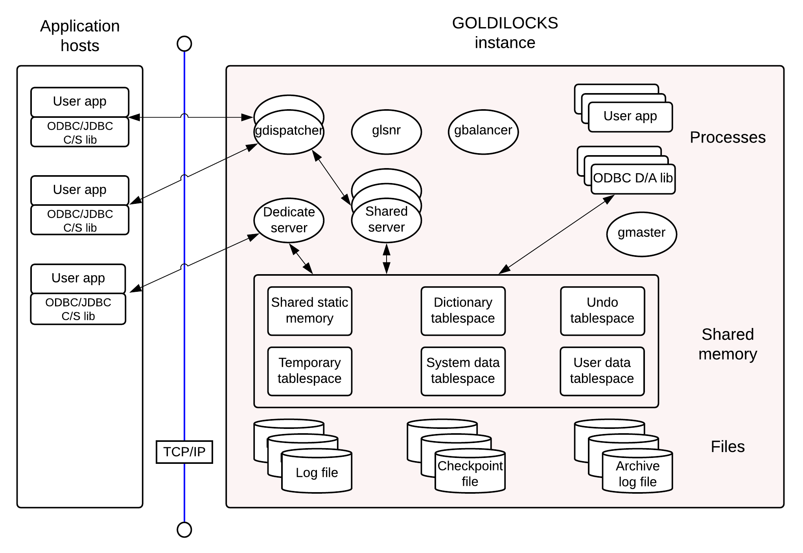
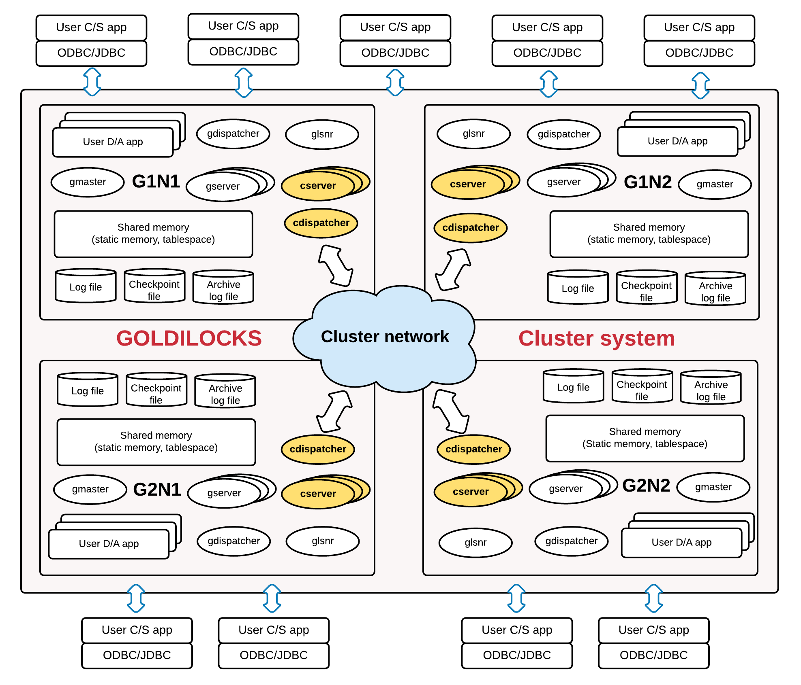

<a id="ac337c4214a7cde6"></a>

# 1. 시작하기

> 원본: [GOLDILOCKS 21c.1 User Manual (ko)](https://manual.sunjesoft.co.kr/goldilocks/21c_1/manual/ko/ac337c4214a7cde6)  
> 태그: `21c.1_35_tag`

[전체 목차](../README.md) · [2. 튜토리얼 →](2-튜토리얼.md)

<a id="4e8a3356b5c4ce94"></a>
## 서문

본 문서는 GOLDILOCKS를 구성, 관리, 사용하기 위해 필요한 운영자를 위하여 제작된 가이드이다. 이 문서의 목적은 GOLDILOCKS를 설치하고 관리할 때 알아두어야 할 기본적인 개념을 전달하는 것이다. 또한 GOLDILOCKS 시스템을 사용할 때 주의하여야 할 기본적인 관리 포인트들을 알려준다.

- 본 문서에서 제시되는 설명은 절대적이지 않으며 설치되는 환경 및 사용 방법에 따라 변경될 수 있다.
- 본 문서는 GOLDILOCKS 21c.1 버전을 기준으로 작성되었다.
- 본 문서는 RedHat 계열 Linux 플랫폼을 기준으로 작성되었다.

<a id="f0478bac34a4d434"></a>
### 대상

본 문서의 대상은 다음과 같다.

- GOLDILOCKS database에서 프로그램을 개발하면서 기본적인 관리 방법에 관한 지식이 필요한 자
- GOLDILOCKS database의 운용자 및 성능 관리자
- GOLDILOCKS cluster system의 운용자 및 성능 관리자

<a id="4d84fbd1f0789fb8"></a>
## 개요

본 장에서는 GOLDILOCKS를 처음 접하는 사용자들을 위해서 기본적인 GOLDILOCKS의 구조 및 특징에 대해 설명한다. GOLDILOCKS는 standalone 또는 cluster system architecture 중 하나를 선택하여 사용할 수 있는데, 각각의 architecture 및 사용법에 대한 차이점을 이해할 수 있도록 기술하였다.

<a id="65b133627634a932"></a>
### GOLDILOCKS Database Management System

GOLDILOCKS는 사용자의 데이터를 모두 in-memory에 있는 테이블에 저장하고, 이에 대한 검색 및 갱신 연산을 효과적으로 수행하는 in-memory relational DBMS이다.

GOLDILOCKS database 시스템은 다음과 같이 구성된다.

- 사용자가 install한 GOLDILOCKS 소프트웨어 바이너리들
- In-memory 상에 한 개 이상의 shared memory들로 구현된 tablespace의 집합인 database
- Database의 영속성을 지원하기 위한 각종 파일들
    - 각 shared memory 당 한 개씩 shared memory와 동일한 크기로 생성되는 data file들
    - 장애가 발생했을 때 database의 회복을 지원하는 redo log file들
    - Database 설정에 사용되는 각종 configuration을 위한 파일들
    - 그 외 database 운영 중에 발생되는 event 등의 내용이 기록되는 trace log 파일들
- In-memory 상의 database를 관리하는 gmaster 프로세스와 그 내부의 여러 system thread들

<a id="ac79d706f734e8fe"></a>
### GOLDILOCKS Architecture

GOLDILOCKS database는 특정 응용 프로그램에서 발생한 오류가 전체 database 시스템으로 확산되지 않도록 하기 위해 multi-thread 구조가 아닌 shared memory 기반의 multi-process 구조로 되어 있다. GOLDILOCKS database의 전체적인 구조는 [그림-1]과 같다. Shared memory 상에 데이터들이 적재되며 관리 데몬인 gmaster 프로세스는 boot-up, log flush, aging 등 전반적인 데이터베이스 관리 작업을 한다. 또한 디스크 파일에 redo log file 및 data file들을 저장하여 데이터들의 영속성을 보장한다. GOLDILOCKS database를 사용하는 응용 프로그램은 다음 두 가지 접근 모델 중 하나를 사용한다.

<a id="c795935ca6bb162d"></a>


- Direct access (D/A) model
    - 사용자 응용 프로그램이 GOLDILOCKS database와 동일한 장비에서 운영될 때 사용될 수 있다.
    - 사용자 응용 프로그램은 D/A 용 GOLDILOCKS ODBC/ JDBC 라이브러리를 link하여 사용해야 한다. 
    - D/A용 GOLDILOCKS ODBC/ JDBC 라이브러리는 내부에 질의 처리 및 저장관리 모듈을 포함하고 있어 해당 데이터베이스를 구성하는 shared memory를 직접 attach하여 사용자의 요청을 처리한다.
    - 응용 프로그램 프로세스와 database 처리모듈 간에 통신 부하를 제거할 수 있어 소수의 low-latency를 필요로 하는 업무 구현에 적합하다.
- Client/ Server (C/S) model
    - 사용자 응용 프로그램이 GOLDILOCKS database와 동일한 장비 또는 다른 장비에서 운영될 때 사용된다.
    - 사용자 응용 프로그램은 C/S용 GOLDILOCKS ODBC/ JDBC 라이브러리를 link하여 사용해야 한다.
    - C/S용 GOLDILOCKS 개발 라이브러리는 connect string에 명시된 데이터베이스를 서비스하는 server(gserver)와의 TCP 통신을 통해 사용자의 요청을 처리한다.
    - 단일 응용 프로그램의 응답 속도는 D/A 모델에 비해 떨어지지만 응용 프로그램 위치에 의존적이지 않고 응용 프로그램에 장애가 발생하더라도 비교적 안정적으로 운영할 수 있다.
    - C/S model은 dedicated 모드와 shared 모드라는 두 가지 모드가 있다. Dedicated 모드는 하나의 client에 대해 하나의 server (gserver) process가 실행되는 구조이고 shared 모드는 dispatcher (gdispatcher)와 shared-server (gserver)가 항상 실행되어 있어 다수의 client에 대응하는 방식이다.
    - Dedicated 모드는 data 양이 많은 업무에 적합하며 shared 모드는 client 수가 많고 data 양이 많지 않은 업무에 적합하다.
    - Dedicated, shared 모드 설정은 [odbc.ini 파일](../part-05-developer-manual/31-odbc.md#a8dbbc9962ac8d3d), [Listener Configuration](../part-06-utility-manual/38-glsnr.md#af8986634af3619d)을 참고한다.

> D/A 모델에서는 응용 프로그램이 직접 database에 접근하여 조작하기 때문에 초기 개발단계에서 발생하는 많은 문제들로 인해 database instance가 불안정해 질 수 있으므로, 초기 개발단계에서는 C/S 모델로 개발한 후에 마무리 단계에서 D/A 모델로 전환하는 것이 전체적으로 효율적일 수 있다.

<a id="f1adf39331512441"></a>
### GOLDILOCKS Cluster System Architecture

GOLDILOCKS는 단독 (standalone) database로 구성하여 사용할 수 있을 뿐만아니라 다수의 database를 클러스터 (cluster)라는 하나의 관리 단위로 묶어서 사용할 수도 있다. Cluster system으로 구성하여 사용할 경우, 사용자가 원하는 sharding 정책에 따라 테이블 data를 다수의 노드에 분배하여 저장할 수 있기 때문에 서비스 가용성이 높아지고 병렬 처리에 따른 많은 장점을 누릴 수 있다.

GOLDILOCKS cluster system은 cluster wide하게 수행되는 트랜잭션의 ACID를 보장하여 cluster system 에 소속된 어떤 노드에 접속하여 트랜잭션을 수행하더라도 standalone 서버에서 수행하는 트랜잭션과 같은 데이터 신뢰성을 제공할 수 있다.

GOLDILOCKS cluster system에 포함되는 각각의 database는 multi-process 구조 및 데이터 적재 방식 등에 있어서 대부분 standalone database와 동일한 architecture를 가진다. 다만 cluster 내의 member 노드 간 효율적인 통신을 위한 프로세스 (cdispatcher)와 각 cluster member 노드 내에서 데이터의 저장 및 관리를 위한 cluster server (cserver) 프로세스가 추가되었고, 공유 메모리에는 cluster system의 트랜잭션 관리를 위한 테이블스페이스 및 관리 영역들이 추가되었다.

<a id="b6cea2c6b08f9e2a"></a>


<a id="51dcd715b5aafda1"></a>
## GOLDILOCKS Cluster의 특징

<a id="f3a3e9ea147c16c3"></a>
### Cluster 특장점

GOLDILOCKS cluster는 기존 standalone 시스템이 갖는 트랜잭션 성능의 한계 및 저장 공간의 한계를 극복할 수 있는 shared nothing 구조의 cluster system이다.

- 고성능 (High throughput)
    - GOLDILOCKS cluster는 제한없이 group을 추가할 수 있으며 group 추가에 따른 선형적 성능 향상이 가능하다.
    - 기존 메모리 기반 standalone 시스템이 갖는 저장 공간의 한계를 극복할 수 있다.
- 고가용성 (High availability)
    - Group이 다수의 member로 구성되었을 때 group 내에서 적어도 한 개의 member가 운용되고 있다면 가용성에는 영향을 미치지 않는다.
    - Group 내의 모든 member가 가용상태가 아닌 경우에도 그 group을 제외한 나머지 group은 정상적인 서비스를 제공한다.
- 온라인 확장 및 온라인 복구
    - 서비스가 진행 중인 상태에서도 group이나 member를 추가할 수 있는데 이는 진행 중인 서비스에 영향을 미치지 않는다.
    - 장애로 인해 서비스가 중단된 member도 온라인 상태에서 cluster에 참여할 수 있다.
- 완벽한 트랜잭션 제공
    - 트랜잭션이 준수해야 하는 다음 속성을 완벽하게 제공한다.
        - 원자성 (Atomicity)
        - 일관성 (Consistency)
        - 독립성 (Isolation)
        - 지속성 (Durability)
- 완벽한 MVCC (multi-version concurrency control) 제공
    - GOLDILOCKS cluster는 standalone과 마찬가지로 global statement level consistency를 제공한다.
    - 특정 시점에 시작한 SQL이 어떠한 노드에 접근하든지 다수 개의 버전 중 원하는 시점의 버전에 접근할 수 있다.
- 표준 SQL 및 표준 DBC 제공
    - SQL 92에 준하는 SQL을 제공한다.
    - JDBC/ ODBC등 각종 표준 DBC를 제공한다.
- 응용 프로그램 호환성
    - 기존 standalone에서 개발된 응용 프로그램 소스나 SQL을 수정하지 않고 그대로 GOLDILOCKS cluster에 사용할 수 있다.

<a id="ec83373abc1dee4e"></a>
### Constraint of Cluster

GOLDILOCKS cluster는 다음 제약 조건을 제외하고 모든 SQL 구문을 standalone과 동일하게 사용할 수 있다.

> Sharded table에 대한 PRIMARY KEY, UNIQUE 제약 조건, UNIQUE INDEX는 sharding key를 포함해야 한다

다음은 UNIQUE( name ) 제약 조건이 sharding key인 id column을 포함하지 않아 실패한 예이다.

```
gSQL> 
CREATE TABLE t1 
(
    id   INTEGER PRIMARY KEY,
    name VARCHAR(128),
    UNIQUE (name)
)
SHARDING BY HASH(id);

ERR-HYC00(16380): UNIQUE or PRIMARY KEY must include all sharding key columns for cluster system
```

다음과 같이 UNIQUE( id, name )나 UNIQUE( name, id )와 같은 sharding key를 포함하여 제약 조건을 생성해야 한다.

```
gSQL> 
CREATE TABLE t1 
(
    id   INTEGER PRIMARY KEY,
    name VARCHAR(128),
    UNIQUE( id, name ) 
) 
SHARDING BY HASH (id);

Table created.
```

> Non-deterministic 구문들은 cluster member 간 동일한 row를 식별하기 위해 global secondary index를 가지고 있어야 한다.

다음은 global secondary index를 생략하고 강제로 table을 생성한 경우에 발생하는 에러의 예이다.

```
gSQL> CREATE TABLE t1 ( c1 INTEGER ) WITHOUT GLOBAL SECONDARY INDEX;

Table created.

gSQL> INSERT INTO t1 VALUES (1), (2), (3), (4), (5);

5 rows created.

gSQL> COMMIT;

Commit complete.
```

다음은 세 건을 삭제하는 예제 구문으로써 cluster member들이 동일한 row들을 삭제한다고 보장할 수 없다.

```
gSQL> DELETE FROM t1 FETCH 3;

ERR-42000(16423): does not support non-deterministic DML in the cluster system : global secondary index expected
```

다음은 RANDOM(1, 100)을 사용하여 cluster member들이 동일한 row를 동일한 값으로 변경한다고 보장할 수 없음을 보여주는 예이다.

```
gSQL> UPDATE t1 SET c1 = RANDOM(1, 100);

ERR-42000(16423): does not support non-deterministic DML in the cluster system : global secondary index expected
```

다음은 updatable cursor를 이용해 현재 위치의 row를 변경하는 예로써 cluster member 간에 동일한 row를 식별하기 위해서는 global secondary index가 필요하다.

```
gSQL> \var v1 INTEGER
gSQL> DECLARE cur1 CURSOR FOR SELECT c1 FROM t1 FOR UPDATE;

Cursor declared.

gSQL> OPEN cur1;

Cursor is open.

gSQL> FETCH cur1 INTO :v1;

V1
--
 1

1 row fetched.

gSQL> UPDATE t1 SET c1 = 1 WHERE CURRENT OF cur1;

ERR-42000(16423): does not support non-deterministic DML in the cluster system : global secondary index expected
```

> 지연 가능한 제약 조건을 지원하지 않는다.

```
gSQL> ALTER TABLE t1 ADD CONSTRAINT t1_uk UNIQUE(id) DEFERRABLE;

ERR-HYC00(16388): does not support deferrable constraints in the cluster system : 
ALTER TABLE t1 ADD CONSTRAINT t1_uk UNIQUE(id) DEFERRABLE
                                    *
ERROR at line 1:
```

> 서로 다른 server에서 동일한 sequence를 사용할 경우 동일한 순서대로 사용될지 여부를 보장하지 않는다.

- g1n1 서버에서 수행된다.

```
gSQL> SELECT seq1.NEXTVAL FROM dual;

NEXTVAL
-------
      1

1 row selected.

gSQL> SELECT seq1.NEXTVAL FROM dual;

NEXTVAL
-------
      2

1 row selected.
```

- g2n1 서버에서 수행된다.

```
gSQL> SELECT seq1.NEXTVAL FROM dual;

NEXTVAL
-------
     21

1 row selected.
```

- 다시 g1n1 서버에서 수행된다.

```
gSQL> SELECT seq1.NEXTVAL FROM dual;

NEXTVAL
-------
      3

1 row selected.
```

---

[전체 목차](../README.md) · [2. 튜토리얼 →](2-튜토리얼.md)

<sub>Copyright © 2010 SUNJESOFT Inc. All rights reserved.</sub>
