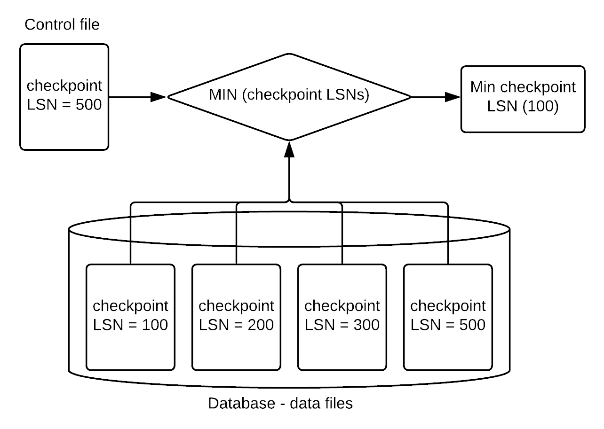

<a id="a69f3d5a1f7b3914"></a>

# 7. GOLDILOCKS 데이터베이스의 백업과 복구

> 원본: [GOLDILOCKS 21c.1 User Manual (ko)](https://manual.sunjesoft.co.kr/goldilocks/21c_1/manual/ko/a69f3d5a1f7b3914)  
> 태그: `21c.1_35_tag`

[← 6. GOLDILOCKS 데이터베이스의 구조 및 저장 구조](6-goldilocks-데이터베이스의-구조-및-저장-구조.md) · [전체 목차](../README.md) · [8. GOLDILOCKS 데이터베이스 이중화 →](8-goldilocks-데이터베이스-이중화.md)

본 장에서는 GOLDILOCKS 데이터베이스의 백업과 복구에 대해 설명한다. 또한 백업과 복구를 위한 데이터베이스 ARCHIVELOG 모드에 대해 설명한다.

<a id="b91c176428c6dee8"></a>
## ARCHIVELOG 모드

GOLDILOCKS 데이터베이스는 circular 로그 그룹을 이용하여 로깅을 수행한다. 최소 네 개의 로그 그룹으로 구성되는데 하나의 로그 그룹에 할당된 로그 파일이 소진되면 다음 로그 그룹을 이용하는 방식으로 로깅을 수행한다. 생성된 로그 그룹을 모두 소진하였을 경우 처음 로그 그룹을 재사용하는데 이 때 새로운 로그 파일을 생성하지 않고 이전에 기록된 로그 파일을 재사용한다.

NOARCHIVELOG 모드에서 로그 그룹이 재사용되면 이전에 기록된 로그는 잃어버린다. 따라서 NOARCHIVELOG 모드로 운영하는 경우, 운영자가 로깅이 완료된 로그 그룹을 관리하지 않으면 완료된 트랜잭션의 로그가 시간이 지나면 사라진다.

ARCHIVELOG 모드의 경우 로그 그룹의 로그 파일에 기록이 완료되어 다음 로그 그룹을 사용할 때 시스템이 로그 파일을 백업 (archive)한 후 재사용하기 때문에 기록이 완료된 로그는 임의로 지우지 않는 한 영구적으로 보존된다.

<a id="6346bcafb2c82b16"></a>
### ARCHIVELOG 모드

백업을 이용한 복구를 위해서는 백업 시점 이후의 모든 로그 파일들이 필요한데 백업을 언제 사용할지 모르기 때문에 로그 파일을 재사용하기 전에 반드시 archive 해야 한다. 따라서 백업은 ARCHIVELOG 모드에서만 지원된다.

ARCHIVELOG 모드로 운용하는 경우, busy한 시스템에서 archiving으로 인한 끊김 현상이 발생할 수 있고 archive 로그 파일을 저장하기 위한 공간도 추가로 필요하다.

<a id="f2b49e4d5e85859b"></a>
### NOARCHIVELOG 모드

NOARCHIVELOG 모드로 운용하는 경우, 재사용 이전의 로그 파일이 존재하는지 확인할 수 없기 때문에 백업을 지원하지 않는다.

하지만 시스템이 로그 파일을 archiving하지 않기 때문에 대량의 로그가 꾸준히 기록되는 상황에서 체크포인트 할 때 로그 archiving으로 인한 끊김 현상이 없고 archive 로그 파일들을 위한 저장 공간도 필요없다는 장점이 있다.

NOARCHIVELOG 모드는 데이터베이스를 생성할 때 'ARCHIVELOG_MODE' 프로퍼티 값에 따라 설정된다. 'ARCHIVELOG_MODE'가 0이면 NOARCHIVELOG 모드로 1이면 ARCHIVELOG 모드로 데이터베이스가 생성된다. 이 프로퍼티는 데이터베이스를 생성할 때만 유효하고 운영 중에는 참조되지 않는다.

데이터베이스 운영 중에 ARCHIVELOG 모드를 변경하려면 GOLDILOCKS 데이터베이스의 시작 단계 중 mount 단계에서 다음 구문을 수행한다.

```
gSQL> ALTER DATABASE ARCHIVELOG;       
 
Database altered.
 
gSQL> ALTER DATABASE NOARCHIVELOG;
 
Database altered.
```

데이터베이스에 설정된 ARCHIVELOG 모드를 확인하려면 성능 view V$ARCHIVELOG의 ARCHIVELOG_MODE를 확인한다.

```
gSQL> SELECT ARCHIVELOG_MODE FROM V$ARCHIVELOG;

ARCHIVELOG_MODE
---------------
NOARCHIVELOG   

1 row selected.
```

<a id="69ec97bcde48267d"></a>
## 백업과 복구

<a id="cf6bc97175bb4c2c"></a>
### 백업

<a id="8db5fc9b6ba51283"></a>
#### 백업/ 복구 목적

데이터베이스는 다양한 장애와 데이터 손실이 발생했을 경우 데이터를 보호하고 복구할 수 있다. 장애의 원인은 다양하고 특히 데이터베이스가 물리적으로 손상되거나 재해로 망가졌을 경우에 대비하여 복사본을 만들어 두어야 하는데 이를 백업이라고 한다.

여러가지 장애로 인해 데이터베이스 서비스가 불가능할 때 현재 데이터베이스나 백업을 이용하여 서비스가 가능한 상태로 만들 수 있는데 이를 복구라고 한다. 이 중 현재 데이터베이스를 이용하여 복구하는 것을 재시작 복구 (restart recovery)라고 하고, 백업을 이용하여 복구하는 것을 미디어 복구 (media recovery)라고 한다. GOLDILOCKS는 미디어 복구를 자동 또는 수동으로 수행하여 백업 데이터 파일을 복원한 후에 재시작 복구로 미디어 복구와 재시작을 수행한다.

<a id="c5f3743350fab570"></a>
#### 백업

데이터베이스 백업은 다음과 같이 물리적 백업과 논리적 백업으로 구분할 수 있다. 일반적으로 백업은 온라인 상태에서 데이터 파일에 대한 복사본을 만드는 것을 의미하며 본 절에서는 온라인 상태의 물리적 백업에 대해 설명한다.

<a id="38e1541109150447"></a>
<table class="table column_count_4"><caption>데이터베이스 백업 유형</caption><thead><tr><th class="to_center"><div>백업 유형</div></th><th class="to_center"><div>백업 형태</div></th><th class="to_center"><div>데이터베이스 상태</div></th><th class="to_center"><div>특징</div></th></tr></thead><tbody><tr><td class="to_middle" rowspan="2"><div>물리적 백업</div></td><td class="to_middle"><div>콜드 백업</div></td><td class="to_middle"><div>오프라인</div></td><td class="to_middle"><div>데이터 파일의 복사본을 생성한다.
백업 수행을 위해 서비스를 중단한다.</div></td></tr><tr><td class="to_middle"><div>핫 백업</div></td><td class="to_middle"><div>온라인</div></td><td class="to_middle"><div>데이터 파일의 복사본을 생성한다.
서비스를 운영하면서 백업을 수행할 수 있다.
ARCHIVELOG mode에서만 가능하다.</div></td></tr><tr><td class="to_middle"><div>논리적 백업</div></td><td class="to_middle"><div>익스포트 백업</div></td><td class="to_middle"><div>온라인</div></td><td class="to_middle"><div>테이블 단위로 백업/ 복구를 수행한다.
H/W, OS 구분 없이 export 할 수 있다.</div></td></tr></tbody></table>

GOLDILOCKS가 서비스를 위해 사용하고 장애로 인해 손상되었을 때 복구해야 할 파일들은 데이터 파일들과 제어 파일이다. 제어 파일은 데이터베이스를 생성할 때 만들어지는 파일이며 데이터베이스 운용을 위해 필요한 정보들이 저장된다. 데이터 파일들은 실제 데이터가 저장되는 파일들로써 데이터베이스를 생성할 때 기본적으로 생성되는 시스템 테이블스페이스들의 데이터 파일과 사용자가 만든 테이블스페이스의 데이터 파일들이다. 이런 제어 파일이나 데이터 파일들 중 일부가 손상되면 백업된 파일들을 이용하여 복구한다.

즉, 복구를 위해 백업해야 하는 파일들은 제어 파일과 데이터 파일들이고 이를 위해 GOLDILOCKS는 제어 파일 백업, 데이터베이스 백업, 테이블스페이스 백업을 지원한다.

백업하는 방식에 따라 전체 백업 (full backup)과 증분 백업 (incremental backup)으로 나뉜다. 전체 백업은 백업 시점의 데이터 파일 복사본을 생성하는 것이고, 증분 백업은 이전 백업 이후에 변경된 부분만 백업하는 방식이다. 전체 백업의 경우 데이터 파일 복사본을 생성하기 때문에 백업할 때마다 데이터 파일과 동일한 크기의 복사본이 만들어지고 이로 인해 백업할 때마다 데이터베이스나 테이블스페이스 크기만큼의 저장 공간이 소모된다.

이에 반해 증분 백업은 이전 백업 이후에 변경된 부분만 백업하기 때문에 상대적으로 백업 크기가 작다는 장점이 있다.

<a id="cf165abf8a7710c5"></a>
<table><caption>전체 백업과 증분 백업</caption><thead><tr><th align="center">구분</th><th align="center">전체 백업</th><th align="center">증분 백업</th></tr></thead><tbody><tr><td align="left" valign="middle">백업 대상</td><td colspan="2" align="left" valign="middle"><ul><li>데이터베이스: 데이터베이스가 사용 중인 전체 데이터 파일</li><li>테이블스페이스: 데이터베이스의 특정 테이블스페이스의 데이터 파일</li></ul></td></tr><tr><td align="left" valign="middle">특징</td><td align="left" valign="middle"><ul><li>데이터베이스나 테이블스페이스가 사용 중인 데이터 파일 전체를 백업한다.</li><li>데이터 파일 한 개당 백업 파일 한 개가 생성된다.</li><li>장애가 발생한 후에 필요한 데이터 파일을 적절한 백업을 통해 복원한 후에 복구한다.</li></ul></td><td align="left" valign="middle"><ul><li>데이터베이스나 테이블스페이스가 사용 중인 데이터 파일에서 이전에 백업된 후에 변경된 부분을 백업한다.</li><li>백업 결과 변경된 부분이 기록된 한 개의 증분 백업 파일을 생성한다.</li><li>장애가 발생한 후에 여러 개의 증분 백업을 이용한 복원을 통해 복구한다.</li></ul></td></tr></tbody></table>

<a id="238eacad0e5af422"></a>
#### 전체 백업

전체 백업을 이용하여 제어 파일과 데이터 파일 백업을 위한 데이터베이스 백업, 테이블스페이스 백업을 수행한다.

<a id="58168ea413e9eda5"></a>
##### 제어 파일 백업

다음과 같이 제어 파일을 백업한다. 제어 파일을 백업하려면 (절대 경로를 포함한) 백업 제어 파일 이름을 기술한다. 백업 제어 파일 이름만 기술하는 경우 LOG_DIR 프로퍼티에 설정된 경로에 백업 파일이 생성된다.

```
gSQL> ALTER DATABASE BACKUP CONTROLFILE TO '/goldilocks_data/backup/backup.ctl';

Database altered.
```

<a id="97685e19f3368562"></a>
##### 데이터베이스 백업

데이터베이스가 사용하는 모든 데이터 파일들을 백업하는 기능이다. 데이터 파일을 백업하려면 데이터 파일 복사본을 만드는 도중에 해당 파일에 쓰지 못하도록 해야 한다. 만약 복사하는 중에 파일에 쓰여지면 데이터 파일의 일관성이 깨어지고 더 나아가 한 페이지 내에서 일관성이 깨지는 상황이 발생할 수 있다. 이를 방지하기 위해 먼저 다음과 같이 데이터베이스를 백업할 수 있는 상태로 설정한다.

```
gSQL> ALTER DATABASE BEGIN BACKUP;

Database altered.
```

데이터베이스를 백업할 수 있는 상태에서 운영체제가 지원하는 파일 복사 기능으로 데이터 파일들의 복사본을 생성한 후에 다음과 같이 데이터베이스 백업이 완료되어 쓰기 가능한 상태로 설정한다.

```
gSQL> ALTER DATABASE END BACKUP;

Database altered.
```

<a id="a15f51850a6ee64d"></a>
##### 테이블스페이스 백업

하나의 특정 테이블스페이스가 사용하는 데이터 파일들을 백업할 수 있는 기능이다. 데이터베이스 백업과 동일한 이유로 다음과 같이 백업할 테이블스페이스 이름 (tablespace_name)을 사용하여 백업할 수 있는 상태로 설정한다.

```
gSQL> ALTER TABLESPACE TEST_TBS BEGIN BACKUP;

Tablespace altered.
```

테이블스페이스를 백업할 수 있는 상태에서 운영체제가 지원하는 파일 복사 기능으로 테이블스페이스가 소유한 데이터 파일들의 복사본을 생성한 후에 다음과 같이 테이블스페이스 백업을 완료한다.

```
gSQL> ALTER TABLESPACE TEST_TBS END BACKUP;

Tablespace altered.
```

<a id="13cfb585dfc720cd"></a>
#### 증분 백업

전체 백업과 동일하게 데이터베이스 단위와 테이블스페이스 단위의 증분 백업을 지원하는데 제어 파일 백업을 위한 별도의 증분 백업 기능은 없으며 데이터베이스를 증분 백업할 때 제어 파일도 함께 백업한다.

GOLDILOCKS는 증분 백업을 위해 0부터 4까지의 증분 레벨을 지원한다. 처음으로 증분 백업을 수행하는 경우 반드시 레벨 0으로 백업을 수행하여 데이터 파일 전체를 백업한다. 그리고 이후 증분 백업을 수행할 때 레벨을 1이상으로 설정하여 이전 백업 이후 변경된 부분만 백업한다.

증분 백업할 레벨이 주어지면 백업 직전에 같거나 작은 레벨로 백업한 시점을 찾아서 그 이후에 변경된 부분을 백업한다.

예를 들어, 다음 그림에서 level 0 백업을 수행한 후 level 2로 백업하면 (1) level 0으로 백업한 후에 변경분만 백업하고 level 2 백업 (2)은 level 2 백업 (1) 이후에 변경된 부분만 백업한다. 마찬가지로 level 2 백업 (3), (4), (5), (6)은 이전에 level 2로 백업한 후에 변경된 부분만 백업하고 마지막으로 수행된 level 1 백업은 level 0 백업 후에 변경된 부분을 모두 백업한다.

<a id="55816815a5d39bf2"></a>


<a id="0ffe67b7281df499"></a>
##### 데이터베이스 증분 백업

다음과 같이 데이터베이스 전체 데이터 파일을 대상으로 증분백업을 수행한다. 먼저 레벨 0으로 전체 데이터베이스의 데이터 파일을 백업한다.

```
gSQL> ALTER DATABASE BACKUP INCREMENTAL LEVEL 0;

Database altered.
```

그리고 레벨 1로 레벨 0 이후에 변경된 부분만 백업한다.

```
gSQL> ALTER DATABASE BACKUP INCREMENTAL LEVEL 1;

Database altered.
```

<a id="174b3256066fb919"></a>
##### 테이블스페이스 증분 백업

데이터베이스 증분 백업과 동일하게 먼저 레벨 0으로 테이블스페이스의 전체 데이터 파일을 백업한다.

```
gSQL> ALTER TABLESPACE TEST_TBS BACKUP INCREMENTAL LEVEL 0;

Tablespace altered.
```

그리고 레벨 1로 레벨 0 이후에 변경된 부분만 백업한다.

```
gSQL> ALTER TABLESPACE TEST_TBS BACKUP INCREMENTAL LEVEL 1;

Tablespace altered.
```

<a id="573d10702fba9da6"></a>
##### 체인지 트래킹

디스크 테이블스페이스에 대한 증분 백업을 수행하려면 데이터 파일 전체를 스캔하여 이전 백업 후에 변경된 페이지가 있는지 검사해야 한다. 따라서 데이터 파일은 크지만 실제로 변경된 부분은 적은 경우에도 전체 데이터파일을 스캔함으로써 증분 백업을 수행하는 시간이 지연되는 문제가 있다.

체인지 트래킹은 증분 백업이 수행된 후 변경된 페이지들만 저장하여 다음 증분 백업 시 데이터 파일 전체를 스캔하지 않고 변경된 페이지들만 찾아서 백업을 수행함으로써 백업 수행 시간을 단축시키는 기능이다.

단, 데이터 파일 대부분의 페이지가 변경된 경우라면 결국 데이터 파일 대부분을 백업해야 하기 때문에 체인지 트래킹의 효율이 떨어진다. 체인지 트래킹은 데이터베이스가 ARCHIVELOG 모드인 경우에만 사용할 수 있고 NOARCHIVELOG 모드에서는 사용할 수 없다.

다음은 데이터베이스의 체인지 트래킹 사용 여부를 enable/ disable 하는 구문이다.

```
gSQL> ALTER DATABASE ENABLE CHANGE TRACKING;

Database altered.

gSQL> ALTER DATABASE DISABLE CHANGE TRACKING;

Database altered.
```

체인지 트래킹이 enable 되면 체인지 트래킹 파일과 공유 메모리를 생성한다. 체인지 트래킹 파일과 공유 메모리의 구조는 동일하고 [CHANGE_TRACKING_EXTENT_SIZE](10-server-property.md#60668b034f85e125) 프로퍼티에 설정된 개수만큼의 페이지 묶음에 대한 변경 플래그를 저장하는 블록들로 구성된다.

체인지 트래킹이 enable 된 후 처음으로 증분 백업이 수행될 때 변경 플래그들이 초기화된다. 그리고 페이지가 변경될 때 해당 페이지의 플래그에 표시되어 다음에 수행되는 증분 백업에서는 체인지 트래킹 파일의 변경 플래그에 표시된 페이지 묶음들만 검사하여 변경된 페이지에 대해서만 백업을 수행한다.

체인지 트래킹이 enable 되면 기본적으로 [CHANGE_TRACKING_FILE](10-server-property.md#2f915b69e41d9b2c) 프로퍼티에 설정된 위치에 파일이 생성된다. enable 할 때 체인지 트래킹을 위한 파일 이름이나 저장 위치까지 설정하면 설정된 위치에 파일이 생성되고, 저장 위치가 설정되지 않은 경우에는 BACKUP_DIR 프로퍼티에 설정된 위치에 체인지 트래킹 파일이 생성된다.

```
gSQL> ALTER DATABASE ENABLE CHANGE TRACKING USING FILE '/tmp/change_tracking.ctf';

Database altered.
```

체인지 트래킹 파일의 크기는 10 M이고 디스크 데이터파일의 개수가 증가하여 체인지 트래킹 파일이 가득찰 경우 10 M 씩 증가한다.

<a id="6f3cb9e0c07a7f78"></a>
### 복구

데이터베이스는 장애가 발생하거나 데이터가 훼손되었을 때, 즉, 데이터의 일관성 (consistency)이 깨진 경우에 복구를 수행하여 데이터베이스의 데이터 일관성을 보장한다.   
데이터베이스 장애 유형은 다음과 같다.

**데이터베이스 장애 유형**

<a id="5c96ad31306a4817"></a>
| 장애 유형 | 원인 및 증상 | 해결책 |
| --- | --- | --- |
| Transaction Failure | 논리적인 오류 (bad input, overflow, data not found)로 인해 transaction 수행에 실패했다. Deadlock 상태이다. | Transaction abort |
| System Crash | DBMS나 OS 비정상 종료 (정전)로 인해 휘발성 저장 장치가 훼손되었다. | Restart recovery |
| Media Failure | 비휘발성 저장 장치가 훼손되었다. | Restore, restart recovery |

Transaction failure의 경우, 수행 중인 transaction을 abort하여 수행되었던 데이터베이스 갱신을 모두 rollback하고 획득한 lock item을 모두 release하여 해결한다.

System crash의 경우, 데이터베이스 process들이 종료되어 비휘발성 저장 장치에 반영되지 못한 채 휘발성 저장 장치에만 남아있던 내용들이 모두 사라진 상태이다. 따라서 데이터베이스를 startup하면서 비정상 종료 직전에 일관성있던 데이터베이스의 상태로 복구하는데 이를 재시작 복구 (restart recovery)라고 한다. 재시작 복구는 장애 직전에 데이터베이스가 사용했던 제어 파일, 데이터 파일과 로그 파일 (redo log)을 이용하여 복구를 수행한다.

비휘발성 저장 장치까지 모두 훼손된 경우에는 복구를 수행할 제어 파일, 데이터 파일과 로그 파일까지 훼손되어 장애 직전의 데이터베이스의 파일을 이용해서 복구를 수행할 수 없는 상태가 된다. 이 경우, 이전에 받아 놓은 백업과 로그 파일 (archive log)을 이용하여 데이터베이스 파일을 복원한 후 복구를 수행한다.

GOLDILOCKS는 완전 복구와 불완전 복구를 지원한다. 완전 복구는 로그 파일들을 이용하여 데이터 파일을 최신의 일관성있는 상태로 복구한다. 완전 복구의 대상은 데이터베이스, 테이블스페이스, 데이터 파일이며 테이블스페이스, 데이터 파일의 경우 데이터베이스 서비스 중에도 offline된 테이블스페이스를 복구할 수 있다. 완전 복구는 데이터베이스를 재시작할 때 수행되는 자동 복구와 GOLDILOCKS가 지원하는 복구 구문을 이용한 수동 복구로 나뉜다.

불완전 복구는 데이터베이스에 대해서만 가능하며 특정 시점까지의 일관성 있는 상태로 복구한다. 불완전 복구는 수동으로만 수행되며 특정 시점까지 일괄적으로 불완전 복구하거나 복구 가능한 로그 파일을 사용자가 선택하여 해당 파일까지 복구하는 사용자 선택 불완전 복구를 수행한다.

완전 복구와 불완전 복구 모두 필요한 경우, redo log와 archive log 파일들을 이용한다.

**데이터베이스 복구의 분류**

<a id="ec1d59593f92813c"></a>
<table><thead><tr><th align="center">복구 분류</th><th align="center">복구 대상</th><th align="center">구분</th></tr></thead><tbody><tr><td valign="middle">완전 복구</td><td valign="middle">데이터베이스, 테이블스페이스, 데이터 파일</td><td valign="middle"><ul><li>자동복구 (재시작시 복구)</li><li>수동복구 (데이터베이스/테이블스페이스/데이터파일 복구를 수동으로 수행)</li></ul></td></tr><tr><td valign="middle">불완전 복구</td><td valign="middle">데이터베이스</td><td valign="middle"><ul><li>수동복구만 수행<br><ul><li>일괄 불완전 복구</li><li>사용자 선택 불완전 복구</li></ul></li></ul></td></tr></tbody></table>

<a id="3496265e0b57bbe1"></a>
#### 자동 복구

자동 복구는 데이터베이스를 정상 또는 비정상 종료 후에 재시작할 때 수행되며 대부분 종료 직전에 사용 중이던 제어 파일, 데이터 파일, 로그 파일을 이용하여 수행한다. 특히 최신 데이터베이스 파일이 손상된 경우, 백업된 데이터베이스 파일을 복원하고 archive log 파일을 이용하여 수행한다.

복구는 analysis, redo, undo의 세 단계로 수행된다.

<a id="6b3775e53d08174a"></a>
##### Analysis 단계

분석 단계에서 하는 일은 두 가지이다. 먼저 재시작 복구를 수행할 첫 번째 로그를 찾는다. 이를 위해 가장 최근에 수행된 checkpoint 로그를 참조하는데 가장 최근에 수행된 checkpoint 로그는 제어 파일에 기록된 로그 정보에서 구한다. 그 다음에 시스템의 transaction table을 초기화한다. Checkpoint 로그에 기록된 checkpoint 시 수행 중이던 transaction들의 정보를 이용하여 시스템의 transaction table을 초기화한다.

<a id="5515c6aa28414d3a"></a>
##### Restart Redo 단계

분석 단계에서 구한 재시작 복구를 위한 첫 번째 로그부터 redo log file에 기록된 마지막 로그까지 모두 리두 복구한다. 이 과정에서 transaction이 완료되거나 새로 시작되면 transaction table이 갱신된다.

<a id="8b443db1bd1a369b"></a>
##### Restart Undo 단계

Redo 복구가 끝난 후 완료되지 않고 transaction table에 남아 있는 transaction들을 모두 undo 하여 transaction rollback을 수행한다.

<a id="9d4d6eb8163783d6"></a>
#### 백업을 이용한 복구

제어 파일, 데이터 파일, 로그 파일이 훼손되거나 존재하지 않는 경우, 백업된 파일을 이용하여 복원한 후 복구를 수행해야 한다. 백업된 제어 파일이나 데이터 파일을 이용하여 복구를 수행하는 경우, 복구를 시작할 로그를 찾는 방법이 복잡하다.

<a id="bda259773de36300"></a>
##### 백업을 이용한 복구를 위한 분석

백업을 이용한 복구 분석 단계에서는 자동 복구와 동일하게 복구를 수행할 첫 번째 로그를 찾고 transaction table을 초기화한다. 복구를 시작할 첫 번째 로그를 찾는 방법은 모든 데이터 파일의 파일 헤더에 기록된 checkpoint LSN 중에 가장 오래된 LSN을 구한 후 제어 파일에 기록된 checkpoint LSN과 비교하여 최소값을 선택하는 것이다.

데이터 파일 헤더에 기록된 checkpoint LSN은 해당 데이터 파일이 checkpoint된 LSN을 저장하기 때문에 백업된 데이터 파일을 이용할 경우 가장 오래된 checkpoint LSN을 선택한 후 제어 파일의 checkpoint LSN과 비교하여 최소값을 선택하면 복구를 위한 최소 checkpoint LSN이 결정된다.

<a id="09dab491cb22d1b4"></a>


<a id="0f5f8f142116beb2"></a>
##### Archive Log File을 이용한 복구

Archive log file을 이용한 복구는 복구를 위해 구한 최소 checkpoint LSN이 archive log file에 존재할 경우, redo log file 뿐만 아니라 archive log file까지 이용하여 복구를 수행한다. 백업을 이용한 복구 대상은 데이터베이스, 테이블스페이스, 데이터 파일 단위이다. 데이터베이스 복구는 mount 단계에서만 수행되고 테이블스페이스와 데이터 파일 단위 복구는 mount와 open 단계에서 모두 수행할 수 있다.

- 백업된 데이터 파일 복원 (restore)

데이터 파일 복원은 전체 백업과 증분 백업을 통해 수행할 수 있는데 전체 백업을 이용한 데이터 파일 복원은 OS가 지원하는 파일 복사 명령어를 이용하여 사용자가 직접 수행하며 증분 백업을 이용한 복원은 GOLDILOCKS가 지원하는 구문을 이용하여 수행한다. Open 단계에서 데이터 파일 복원을 수행하려면 해당 tablespace가 offline 상태여야 한다.

증분 백업을 이용한 데이터 파일 복원은 다음과 같이 수행된다.

```
gSQL> ALTER DATABASE RESTORE;
 
Database altered.
 
gSQL> ALTER DATABASE RESTORE TABLESPACE TEST_TBS;
 
Database altered.
```

- 데이터 파일 복원 후 수동 복구

데이터 파일을 복원한 후 복구를 위한 구문을 이용하여 다음과 같이 복구한다.

```
gSQL> ALTER DATABASE RECOVER;
 
Database altered.
 
gSQL> ALTER DATABASE RECOVER TABLESPACE TEST_TBS;
 
Database altered.
```

<a id="3afe7ebf8a9ce75e"></a>
#### 불완전 복구

데이터베이스 운용 중에 발생하는 사용자 실수, 제어 파일 훼손, redo log file 및 archive log file의 훼손으로 인해 재시작 복구가 불가능할 뿐만 아니라 복구를 수행하더라도 데이터베이스의 일관성을 복구할 수 없는 경우에 특정 시점까지만 복구하는 불완전 복구 (incomplete recovery)도 지원한다.   
불완전 복구가 필요한 경우는 다음과 같다.

<a id="b4ef78382eace034"></a>
##### 제어 파일 훼손

제어 파일은 다중화되어 관리되므로 다중화된 파일이 모두 훼손되지만 않으면 훼손되지 않은 파일을 이용하여 복구할 수 있다. 그러나 모두 훼손된 경우에는 백업된 제어 파일을 이용하여 복구를 수행해야 하며 이 경우 제어 파일의 로그 정보가 변경될 수 있기 때문에 완전 복구를 수행할 수 없다. 따라서 복구가 가능한 시점까지 복구한다.

<a id="edf4622b861e7be0"></a>
##### 백업된 제어 파일 복원

제어 파일이 훼손된 경우 다중화로 관리 중인 다른 제어 파일을 복사하여 제어 파일을 최신 상태로 유지할 수 있지만 다중화된 제어 파일이 모두 훼손된 경우에는 백업된 제어 파일을 복원하여 복구를 수행한다. 백업된 제어 파일을 이용하여 복구하는 경우, 백업 이후에 변경된 로그 정보는 복구할 수 없다.

<a id="2f53c43f00202424"></a>
##### Redo Log File 훼손

GOLDILOCKS의 redo log file은 로그 그룹에서 여러 개의 로그 멤버로 관리되어 로그 파일의 훼손에 대비하지만, 특정 로그 그룹의 로그 멤버 전체가 훼손되면 redo log file을 이용하여 복구를 수행할 수 없어 훼손되지 않은 로그 파일까지 불완전 복구를 수행해야 한다.

<a id="44f098d4bec851b8"></a>
##### Archive Log File 훼손

복구할 때 archive log file이 훼손된 경우에도 redo log file이 훼손된 경우와 동일하게 훼손되지 않은 로그 파일까지 불완전 복구를 수행해야 한다.

<a id="0e9e382056677eb9"></a>
##### 사용자 실수

중요한 테이블을 실수로 삭제하거나 테이블에 잘못된 데이터를 삽입/ 삭제/ 갱신하여 commit 한 경우에는 실수가 발생하기 이전으로 복구해야 한다.

<a id="61e466a6d8ebb993"></a>
##### GOLDILOCKS 데이터베이스의 불완전 복구

GOLDILOCKS 데이터베이스는 두 가지 불완전 복구를 지원한다. 하나는 운영자가 지정한 특정 시점까지 복구를 수행하는 것이고 다른 하나는 지정된 시스템과 운영자 사이에서 interactive하게 로그 파일 단위로 복구를 수행하는 것이다.

그리고 특정 시점까지의 불완전 복구는 특정 로그의 LSN, 특정 시간, 특정 SCN을 이용하여 복구가 필요한 특정 시점을 지정할 수 있다.

불완전 복구는 데이터베이스를 대상으로 mount 단계에서만 수행할 수 있다. 특정 테이블스페이스 단위의 불완전 복구는 데이터베이스의 일관성에 문제를 유발하므로 지원하지 않는다.

- 특정 LSN까지 불완전 복구

불완전 복구를 완료할 로그를 찾아 해당 로그의 LSN까지만 복구한다. 다음은 로그 LSN 1000까지만 불완전 복구하는 예이다.

```
gSQL> ALTER DATABASE RECOVER UNTIL CHANGE 1000;

Database altered;

gSQL> ALTER DATABASE RECOVER UNTIL CHANGE LSN 1000;

Database altered;
```

- 특정 SCN까지 불완전 복구

불완전 복구를 완료할 SCN을 찾아서 해당 로그의 SCN까지만 복구한다. 다음은 SCN 300까지만 불완전 복구하는 예이다.

```
gSQL> ALTER DATABASE RECOVER UNTIL CHANGE SCN 300;

Database altered;
```

> SCN이 순서대로 로그에 쓰여지지 않기 때문에 SCN 300까지 수행했을 때 그 이상 복구될 수도 있다.  
> 다음은 SCN이 역전된 경우에 복구하는 예이다.  
>   
> 로그: --- LSN 90 (SCN 3) -- LSN 91 (SCN 5) -- LSN 92 (SCN 4)  
>   
> gSQL> ALTER DATABASE RECOVER UNTIL CHANGE SCN 3;  
> → LSN 90까지 복구된다.  
>   
> gSQL> ALTER DATABASE RECOVER UNTIL CHANGE SCN 4;  
> → LSN 92까지 복구된다. (SCN 4가 있는 LSN 92까지 복구한다.)  
>   
> gSQL> ALTER DATABASE RECOVER UNTIL CHANGE SCN 5;  
> → LSN 92까지 복구된다. (SCN 5까지 복구할 때 임의의 SCN 4와 SCN 5가 모두 복구된다.)

- 특정 time까지 불완전 복구

불완전 복구를 완료할 시간을 찾아서 특정 시간까지만 복구를 수행한다. 다음은 '2017-05-18 16:10:10.00000'까지 불완전 복구를 수행하는 예이다.

```
gSQL> ALTER DATABASE RECOVER UNTIL TIME '2017-05-18 16:10:10.000000';

Database altered;
```

- Interactive 불완전 복구

로그 파일이 훼손된 경우 훼손되기 직전 로그 파일까지만 복구한다. 이를 위해 GOLDILOCKS는 운영자에게 필요한 로그 파일을 제안하고 운영자는 GOLDILOCKS가 제안한 로그 파일을 이용하거나 새로운 로그 파일을 이용하여 불완전 복구를 수행한다.

다음은 GOLDILOCKS의 interactive 불완전 복구를 수행하는 예이다. 먼저 불완전 복구를 위한 BEGIN을 수행하면 GOLDILOCKS가 복구를 위해 필요한 로그 파일을 제안한다. 운영자는 GOLDILOCKS가 제안한 로그 파일을 그대로 사용하여 복구를 수행할 수도 있고 복구를 수행할 로그 파일을 직접 기술할 수도 있다.

```
gSQL> ALTER DATABASE BEGIN INCOMPLETE RECOVERY;

ERR-01000(14104): Warning: suggestion '/goldilocks/archive_log/archive_0.log'
ERR-01000(14103): Warning: media recovery needs a logfile including log (Lsn 139992)
Database altered.

gSQL> ALTER DATABASE RECOVER AUTOMATICALLY;

ERR-01000(14104): Warning: suggestion '/goldilocks/archive_log/archive_1.log'
ERR-01000(14103): Warning: media recovery needs a logfile including log (Lsn 144143)
Database altered.

gSQL> ALTER DATABASE END INCOMPLETE RECOVERY;

Database altered.
```

<a id="bca10afca2abbd6a"></a>
##### 불완전 복구 후 데이터베이스 재시작

불완전 복구를 완료한 후에는 정상적인 방법으로 데이터베이스를 재시작할 수 없다. 불완전 복구된 GOLDILOCKS 데이터베이스는 현재 redo log file과 관련이 없기 때문이다. 즉, 데이터베이스는 이전 시점이고 현재 redo log file은 그 이후에 발생한 로그의 기록이기 때문에 재시작하려면 redo log file을 리셋해야 한다. 따라서 불완전 복구 후에 GOLDILOCKS 데이터베이스를 재시작하려면 RESETLOGS 옵션을 사용한다.

```
gSQL> ALTER SYSTEM OPEN DATABASE;

ERR-HY000(14083): must use RESETLOGS option for database open

gSQL> ALTER SYSTEM OPEN DATABASE RESETLOGS;

System altered.
```

<a id="34d8a476cc31836f"></a>
##### 불완전 복구 시 주의사항

불완전 복구는 데이터베이스를 특정 시점까지만 복구하여 일관성을 가진 데이터베이스를 생성하는데 원하는 특정 시점을 한 번에 찾기는 쉽지 않다. 그리고 불완전 복구를 수행한 이후에는 redo log file이 모두 리셋되기 때문에 불완전 복구를 수행하기 전에 데이터베이스의 제어 파일, 데이터 파일, redo log file들을 모두 오프라인 백업한 후, 불완전 복구를 여러 번 수행하여 정확한 시점을 찾아야 한다.

Archive redo log file은 불완전 복구를 진행하는 동안에는 필요하지만 불완전 복구에 성공하면 새로운 데이터베이스가 되므로 이전 데이터베이스가 만든 archive redo log는 삭제한다.

<a id="3bce2575729fe5aa"></a>
#### 복구 예

<a id="dd4e9f11f840c27e"></a>
##### 제어 파일 훼손

GOLDILOCKS 데이터베이스의 제어 파일은 데이터베이스의 물리적 구조와 데이터의 일관성에 대한 중요한 정보를 저장하고 있으므로 훼손되거나 실수로 삭제되는 등의 문제가 발생하면 데이터베이스를 운영할 수 없다.

이에 대비하여 GOLDILOCKS 데이터베이스는 최소 두 개에서 최대 여덟 개까지 제어 파일을 다중화하여 사용하기 때문에 유효한 제어 파일이 하나만 있으면 나머지 제어 파일을 복원한 후 데이터베이스를 재시작할 수 있다.

<a id="b5d1b5d812c3a474"></a>
###### **다중화된 유효한 제어 파일이 존재하는 경우**

다중화된 제어파일 '/goldilocks_data/wal/control_1.ctl'이 훼손된 경우 다음과 같이 재시작에 실패한다.

```
gSQL> \STARTUP

ERR-HY000(14097): control file is corrupted - '/goldilocks_data/wal/control_1.ctl'
```

유효한 제어 파일 '/goldilocks_data/wal/control_0.ctl'을 '/goldilocks_data/wal/control_1.ctl'로 복사한 후 재시작에 실패했던 공유 메모리를 제거하고 재시작한다.

```
$ cp /goldilocks_data/wal/control_0.ctl /goldilocks_data/wal/control_1.ctl

gSQL> \SHUTDOWN

Shutdown success

gSQL> \STARTUP

Startup success
```

<a id="08bddeb78aea19a3"></a>
###### **다중화된 모든 제어 파일이 훼손된 경우**

다중화된 모든 제어 파일이 훼손된 경우 백업된 제어 파일을 이용하여 데이터베이스를 불완전 복구한 후에 재시작 할 수 있다. 백업된 제어 파일을 이용하여 제어 파일을 복구할 때 불완전 복구를 수행하는 이유는 제어 파일을 백업한 후에 데이터베이스의 물리적 구조가 변경될 수 있기 때문이다. 불완전 복구를 수행하더라도 archive log file과 redo log file이 모두 존재하기 때문에 GOLDILOCKS interactive 불완전 복구를 이용하여 운영자가 'CURRENT' 상태의 redo log file까지 수동으로 복구하여 완전 복구를 수행할 수 있다.

백업된 제어 파일은 OS의 복사 기능을 이용하여 다중화된 제어 파일로 모두 복사하거나 GOLDILOCKS 데이터베이스가 지원하는 제어 파일 복원 기능을 사용하여 다음과 같이 복원할 수도 있다. 제어 파일 복원은 GOLDILOCKS 데이터베이스 다단계 시작 중 NOMOUNT 단계에서만 수행할 수 있다.

```
gSQL> \STARTUP NOMOUNT

Startup success

gSQL> ALTER DATABASE RESTORE CONTROLFILE FROM '/goldilocks_data/backup/backup.ctl';

Database altered.
```

백업 제어 파일을 복원한 후 MOUNT 단계에서 다음과 같이 불완전 복구를 수행한다.

```
gSQL> ALTER SYSTEM MOUNT DATABASE;

System altered.

gSQL> ALTER DATABASE BEGIN INCOMPLETE RECOVERY;

ERR-01000(14104): Warning: suggestion '/goldilocks/archive_log/archive_0.log'
ERR-01000(14103): Warning: media recovery needs a logfile including log (Lsn 137499)
Database altered.

gSQL> ALTER DATABASE RECOVER AUTOMATICALLY;

ERR-01000(14104): Warning: suggestion '/goldilocks/archive_log/archive_1.log'
ERR-01000(14103): Warning: media recovery needs a logfile including log (Lsn 137667)
Database altered.

gSQL> ALTER DATABASE RECOVER '/goldilocks/wal/redo_1_0.log';

ERR-01000(14104): Warning: suggestion '/goldilocks/archive_log/archive_2.log'
ERR-01000(14103): Warning: media recovery needs a logfile including log (Lsn 137672)
Database altered.

gSQL> ALTER DATABASE END INCOMPLETE RECOVERY;

Database altered.

gSQL> ALTER SYSTEM OPEN DATABASE RESETLOGS;

System altered.
```

<a id="a9b147054de67512"></a>
##### 데이터 파일 훼손

데이터 파일이 훼손되었거나 삭제되었을 경우 백업된 데이터 파일을 이용하여 완전 복구를 수행한다. 전체 백업의 경우 백업 파일을 복사하여 복원하고, 증분 백업의 경우 GOLDILOCKS의 복원 기능을 이용하여 복원한다. 데이터 파일 복원과 복구는 데이터베이스 단위로 복원, 복구할 수도 있고 해당 데이터 파일의 테이블스페이스 단위로 복원, 복구할 수도 있다. 테이블스페이스 단위의 복원과 복구는 MOUNT, OPEN 단계에서 수행할 수 있는데 OPEN 단계에서 복원, 복구하기 위해서는 테이블스페이스가 반드시 OFFLINE 상태여야 한다.

- MOUNT 단계에서 전체 백업을 이용하여 훼손된 데이터 파일 복구

백업된 데이터 파일 (/goldilocks/backup/test.dbf)를 /goldilocks/db/test.dbf로 복사한 후 완전 복구를 수행한다.

```
$ cp /goldilocks/backup/test.dbf /goldilocks/db/test.dbf

gSQL> \STARTUP MOUNT

System altered.

gSQL> ALTER DATABASE RECOVER;

Database altered.

gSQL> ALTER SYSTEM OPEN DATABASE;

System altered.
```

- OPEN 단계에서 전체 백업을 이용하여 훼손된 데이터 파일 복구

```
gSQL> SELECT IS_ONLINE FROM V$TABLESPACE WHERE TBS_NAME = 'TEST_TBS';

IS_ONLINE
---------
FALSE     

1 row selected.

$ cp /goldilocks/backup/test.dbf /goldilocks/db/test.dbf

gSQL> ALTER DATABASE RECOVER TABLESPACE TEST_TBS;

Database altered.

gSQL> ALTER TABLESPACE TEST_TBS ONLINE;

Tablespace altered.
```

- MOUNT 단계에서 증분 백업을 이용하여 훼손된 데이터 파일 복구

```
gSQL> \STARTUP MOUNT

System altered.

gSQL> ALTER DATABASE RESTORE;

Database altered.

gSQL> ALTER SYSTEM OPEN DATABASE;

System altered.
```

- OPEN 단계에서 증분 백업을 이용하여 훼손된 데이터 파일 복구

```
gSQL> SELECT IS_ONLINE FROM V$TABLESPACE WHERE TBS_NAME = 'TEST_TBS';

IS_ONLINE
---------
FALSE  

1 row selected.

gSQL> ALTER DATABASE RESTORE TABLESPACE TEST_TBS;

Database altered.

gSQL> ALTER TABLESPACE TEST_TBS ONLINE;

Tablespace altered.
```

<a id="4bd86ff698e41206"></a>
##### 사용자 실수로 테이블 삭제 및 잘못된 삽입/ 삭제/ 갱신이 수행되었을 경우

TEST라는 테이블을 사용하던 중에 실수로 테이블을 삭제하였을 경우, GOLDILOCKS 데이터베이스는 테이블, 인덱스에 대한 DDL rollback 기능을 제공한다. 즉, 다음과 같이 테이블을 삭제하더라도 COMMIT 하지 않고 ROLLBACK하여 테이블 삭제를 취소할 수 있다.

```
gSQL> DROP TABLE TEST;

Table dropped.

gSQL> ROLLBACK;

Rollback complete.

gSQL> \DESC TEST

COLUMN_NAME TYPE          IS_NULLABLE
----------- ------------- -----------
I1          NUMBER(10,0)  TRUE       
I2          CHARACTER(10) TRUE

gSQL> DROP TABLE TEST;

Table dropped.

gSQL> COMMIT;

Commit complete.

gSQL> \DESC TEST

ERR-42000(16040): table or view does not exist : 
SELECT *   FROM TEST  WHERE 1 = 0 
                *
ERROR at line 1:
```

만약 테이블을 삭제한 후 COMMIT을 하였으면 ROLLBACK 할 수 없기 때문에 백업을 이용한 GOLDILOCKS 데이터베이스의 특정 시점까지의 불완전 복구 기능을 이용하여 테이블 삭제 이전까지만 복구하여 데이터베이스를 재시작한다.

불완전 복구를 위해 복구하려는 테이블은 삭제되기 이전 시점의 백업 파일을 이용하는데, 앞에서 설명하였듯이 여러 번의 과정을 거쳐 정확한 테이블 삭제 시점을 찾아야 하고 이 때 gdump 툴을 이용하여 로그 파일을 덤프해서 로그를 분석한다.

테이블이 삭제된 직후의 LSN이 1000이라고 가정할 경우, 다음과 같이 불완전 복구를 수행한다.

```
gSQL> \STARTUP MOUNT

System altered.

gSQL> ALTER DATABASE RECOVER UNTIL CHANGE 1000;

Database altered.

gSQL> ALTER SYSTEM OPEN DATABASE RESETLOGS;

System altered

gSQL> \DESC TEST

COLUMN_NAME TYPE          IS_NULLABLE
----------- ------------- -----------
I1          NUMBER(10,0)  TRUE       
I2          CHARACTER(10) TRUE
```

<a id="aeb78999c3e0a7f3"></a>
##### 로그 파일 훼손 (archive, redo log file)

- 복구 시 archive log file 훼손

데이터 파일이 훼손되어 백업 데이터 파일을 이용하여 복구를 수행하는 도중에 특정 archive log file이 훼손되어 복구를 끝까지 수행할 수 없다고 가정한다.

예를 들어, archive log file 'archive_0.log', 'archive_1.log', 'archive_2.log', 'archive_3.log'가 존재할 때 'archive_3.log'이 훼손되어 복구를 수행할 수 없는 경우에는 'archive_2.log' 까지만 불완전 복구를 수행한 후에 데이터베이스를 재시작한다.

```
gSQL> \STARTUP MOUNT

System altered

gSQL> ALTER DATABASE BEGIN INCOMPLETE RECOVERY;

ERR-01000(14104): Warning: suggestion '/goldilocks/archive_log/archive_0.log'
ERR-01000(14103): Warning: media recovery needs a logfile including log (Lsn 139992)
Database altered.

gSQL> ALTER DATABASE RECOVER AUTOMATICALLY;

ERR-01000(14104): Warning: suggestion '/goldilocks/archive_log/archive_3.log'
ERR-01000(14103): Warning: media recovery needs a logfile including log (Lsn 194143)
Database altered.

gSQL> ALTER DATABASE END INCOMPLETE RECOVERY;

Database altered.

gSQL> ALTER SYSTEM OPEN DATABASE RESETLOGS;

System altered
```

- Redo log file 훼손

데이터베이스 서비스 중 장애가 발생하여 로그가 flush되던 CURRENT 로그 그룹이 훼손되었을 경우를 가정한다.

예를 들어, 다음과 같은 로그 그룹의 상태에서 비정상 종료가 발생할 경우, 로그 그룹 3, 0이 아직 아카이빙이 되지 않은 상태이기 때문에 수동 복구를 수행하고 불완전 복구를 완료한다.

**Log group 상태**

<a id="42073e0bd49686be"></a>
| 로그 그룹 | 로그 그룹 상태 | 로그 파일 시퀀스 번호 | Prev Last Lsn |
| --- | --- | --- | --- |
| 로그 그룹 0 | ACTIVE | 8 | 80000 |
| 로그 그룹 1 | CURRENT | 9 | 90000 |
| 로그 그룹 2 | INACTIVE | 6 | 60000 |
| 로그 그룹 3 | ACTIVE | 7 | 70000 |

```
gSQL> \STARTUP MOUNT

System altered

gSQL> ALTER DATABASE BEGIN INCOMPLETE RECOVERY;

ERR-01000(14104): Warning: suggestion '/goldilocks/archive_log/archive_0.log'
ERR-01000(14103): Warning: media recovery needs a logfile including log (Lsn 1000)
Database altered.

gSQL> ALTER DATABASE RECOVER AUTOMATICALLY;

ERR-01000(14104): Warning: suggestion '/goldilocks/archive_log/archive_7.log'
ERR-01000(14103): Warning: media recovery needs a logfile including log (Lsn 70001)
Database altered.

gSQL> ALTER DATABASE RECOVER '/goldilocks/wal/redo_3_0.log';

ERR-01000(14104): Warning: suggestion '/goldilocks/archive_log/archive_8.log'
ERR-01000(14103): Warning: media recovery needs a logfile including log (Lsn 80001)
Database altered.

gSQL> ALTER DATABASE RECOVER '/goldilocks/wal/redo_0_0.log';

ERR-01000(14104): Warning: suggestion '/goldilocks/archive_log/archive_9.log'
ERR-01000(14103): Warning: media recovery needs a logfile including log (Lsn 90001)
Database altered.

gSQL> ALTER DATABASE END INCOMPLETE RECOVERY;

Database altered.

gSQL> ALTER SYSTEM OPEN DATABASE RESETLOGS;

System altered
```

<a id="042623360d4fcf30"></a>
##### 데이터 파일이 로그보다 최신인 경우

GOLDILOCKS 데이터베이스에서 생성된 모든 테이블스페이스들의 데이터 파일들은 페이지로 구성되고, 각 페이지는 해당 페이지를 마지막으로 갱신한 트랜잭션이 기록한 로그의 LSN을 페이지 LSN으로 설정한다. 따라서 데이터 파일의 모든 페이지 LSN은 로그 그룹의 redo log file에 기록된 최신 로그의 LSN보다 작거나 같은 값을 가진다.

만약 데이터베이스를 재시작할 때 데이터 파일의 특정 페이지 LSN이 로그 그룹의 최신 로그 LSN보다 큰 값을 가지면 데이터베이스의 일관성이 깨어져 정상적인 서비스가 불가능하다. GOLDILOCKS 데이터베이스는 재시작할 때 데이터 파일과 로그를 체크하여 이런 비정상적인 상황이 발생하지 않도록 한다.

데이터 파일 중 최신 로그의 LSN 보다 큰 페이지 LSN 값을 가진 페이지가 존재하는 경우 다음과 같이 데이터베이스 재시작에 실패한다.

```
gSQL> \STARTUP

ERR-HY000(14114): exist inconsistent datafiles; need to restore more older backup datafiles or more recent redo logfiles
```

이런 문제를 해결하기 위해서는 최신 로그 LSN보다 작은 페이지 LSN들로 구성된 백업 데이터 파일을 복원하거나 데이터 파일보다 큰 LSN의 로그가 기록된 로그 파일을 복원한 후 재시작해야 하며 복원할 대상 데이터 파일을 확인하기 위해서는 trace 파일을 확인해야 한다.

예를 들어 재시작에 실패했을 때 trace 파일에 다음과 같은 메시지가 출력되었다면 '/data/db/system_dic.dbf' 데이터 파일에 페이지 LSN이 '126787'인 페이지가 존재하고 이는 로그 파일의 최신 로그 LSN인 '126652'보다 큰 값이다. 따라서 재시작하기 위해서는 이전에 백업한 데이터 파일을 복원하거나 LSN이 '126787' 보다 크거나 같은 로그가 기록된 로그 파일을 복원하여 재시작해야 한다. 또한, 여러 개의 데이터 파일의 페이지가 로그 파일의 LSN보다 큰 LSN값을 가질 경우, 그 중 최대값보다 큰 로그 파일을 복원해야만 재시작과 서비스를 수행할 수 있다.

```
[2016-01-15 12:41:14.045679 THREAD(10581,139799401453312)] [INFORMATION]

[STARTUP_SM] the max page lsn '126787' of datafile '/data/db/system_dict.dbf' is more recent than the latest redo log lsn '126652'.

[2016-01-15 12:41:14.045705 THREAD(10581,139799401453312)] [INFORMATION]
[STARTUP_SM] the max page lsn '126830' of datafile '/data/db/system_undo.dbf' is more recent than the latest redo log lsn '126652'.

[2016-01-15 12:41:14.045729 THREAD(10581,139799401453312)] [INFORMATION]
[STARTUP_SM] the max page lsn '126829' of datafile '/data/db/test_log.dbf' is more recent than the latest redo log lsn '126652'.
```

<a id="857267e61bee7fbb"></a>
#### 클러스터 환경에서 In Doubt 트랜잭션 복구

클러스터 환경의 트랜잭션은 두 개 이상의 cluster group에서 수행되는 global 트랜잭션, 하나의 cluster group에서 수행되는 domain 트랜잭션, 하나의 cluster member에서 수행되는 local 트랜잭션으로 구분된다.

Local 트랜잭션의 경우 local member의 로그만 이용하여 복구를 수행한다. Domain 트랜잭션의 경우 local member의 로그를 이용하여 복구하는데 트랜잭션 수행이 완료되지 않은 상태에서 비정상 종료된 경우에는 rollback하고 필요할 경우 rebalance를 통해 group 내의 member와 동기화한다.

Global 트랜잭션의 경우 2 phase commit protocol을 이용하여 commit을 수행한다. GOLDILOCKS의 global transaction에 대한 2 phase commit은 다음과 같이 수행된다.

- PREPARE phase
    - Driver member에서 PREPARE message를 모든 member들에 송신하고 응답 메시지를 기다린다.
    - 모든 member들로부터 PREPARE의 응답 메시지를 받으면 COMMIT phase로 넘어가고 그렇지 않고 하나의 member라도 실패하거나 응답이 없으면 rollback 한다.
- COMMIT phase
    - Driver member에서 모든 member들에게 COMMIT message를 송신하고 응답 메시지를 기다린다.
    - 실패하는 member가 있어도 commit이 수행된다.

COMMIT phase에서 commit log를 기록하지 못하고 비정상 종료된 member는 재시작될 때 'PREPARE' 상태의 global 트랜잭션이 commit 되었는지 rollback 되었는지 알 수 없기 때문에 다른 member들로부터 상태를 구해야 한다.

이를 위해 GOLDILOCKS는 commit된 global transaction 정보를 MEM_TRANS_TBS에 트랜잭션 레코드 형태로 기록하고 해당 레코드에 새로운 레코드가 기록될 때 필요에 따라 이전 레코드를 commit.log에 기록한다. 이후 비정상 종료된 member는 log를 이용하여 재시작 복구 또는 수동 복구를 수행하고 'PREPARE' 상태인 in doubt 트랜잭션이 남아 있으면 서비스 중인 member들로부터 해당 트랜잭션의 COMMIT/ ROLLBACK 정보를 얻어 복구한다.

---

[← 6. GOLDILOCKS 데이터베이스의 구조 및 저장 구조](6-goldilocks-데이터베이스의-구조-및-저장-구조.md) · [전체 목차](../README.md) · [8. GOLDILOCKS 데이터베이스 이중화 →](8-goldilocks-데이터베이스-이중화.md)

<sub>Copyright © 2010 SUNJESOFT Inc. All rights reserved.</sub>
