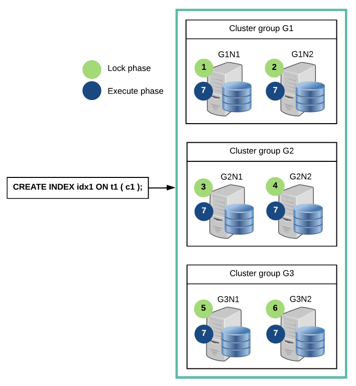
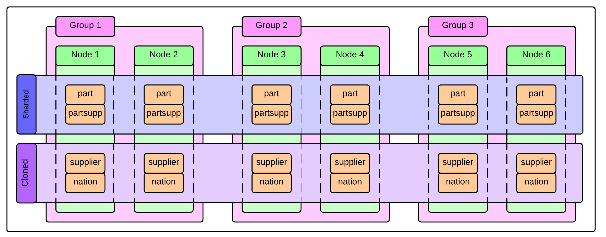
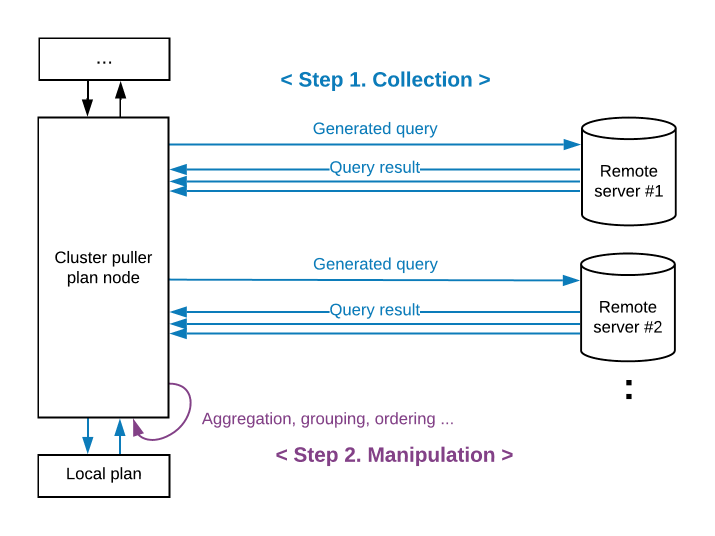
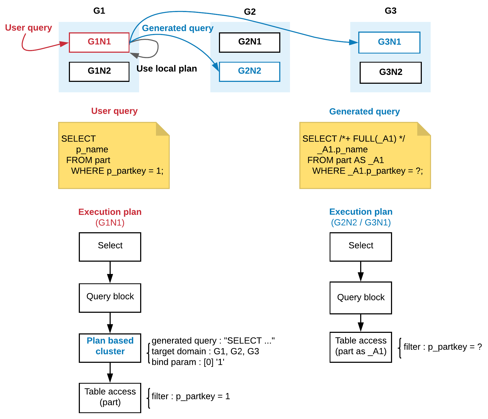
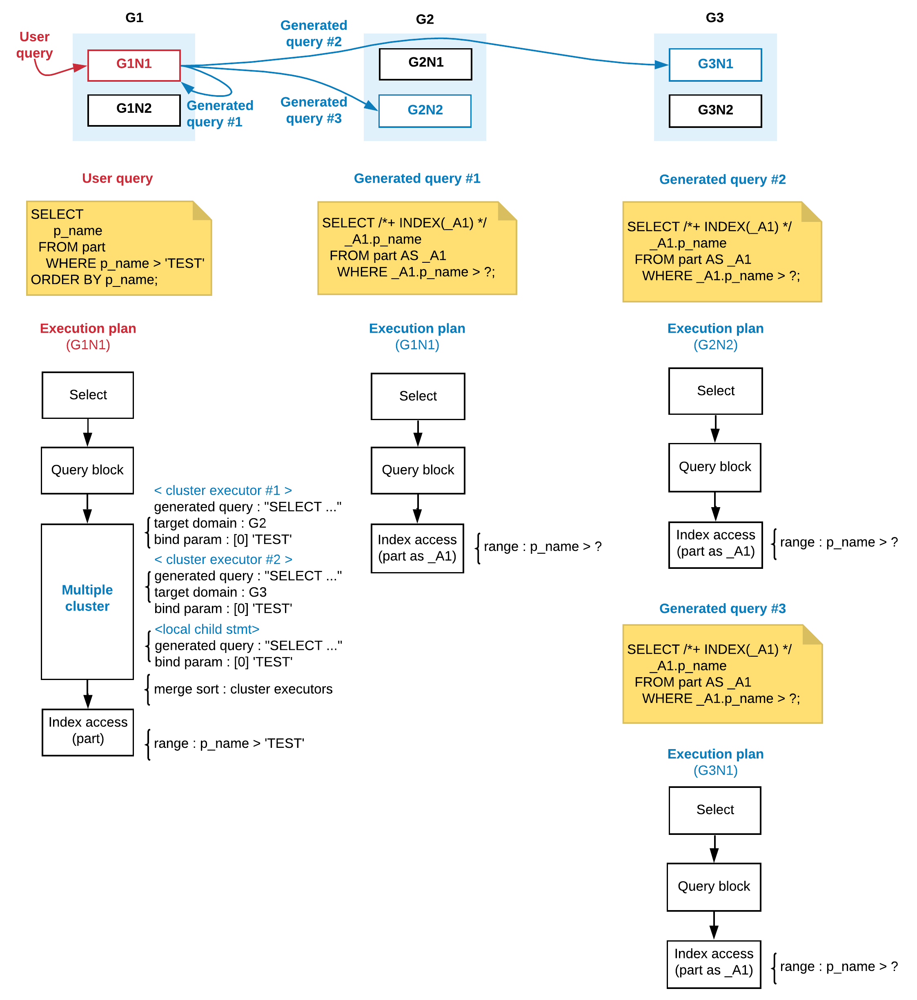
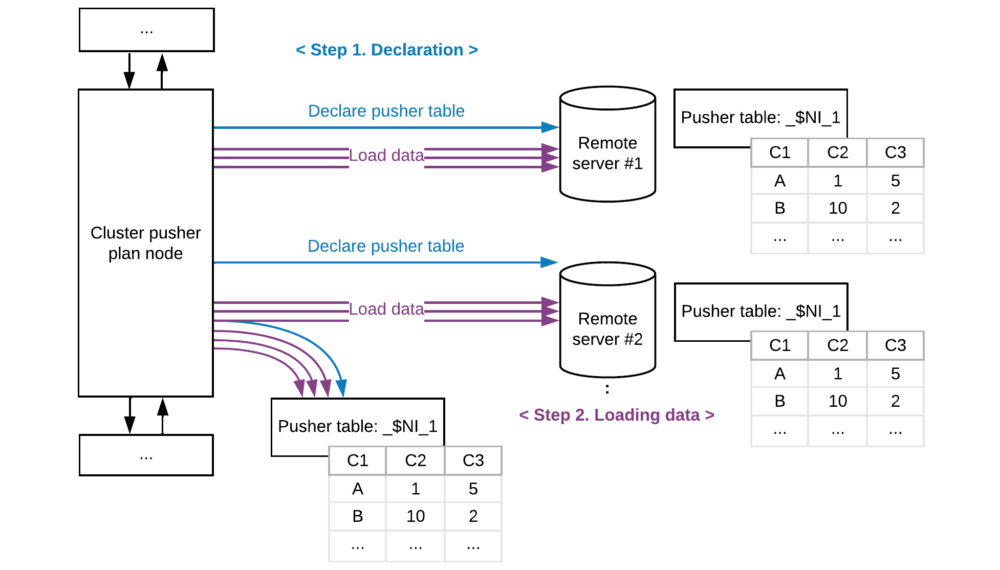
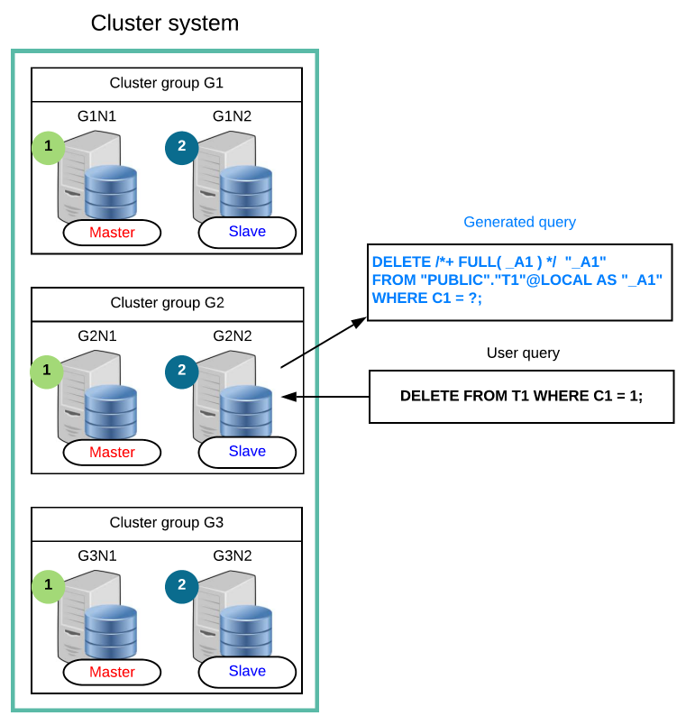
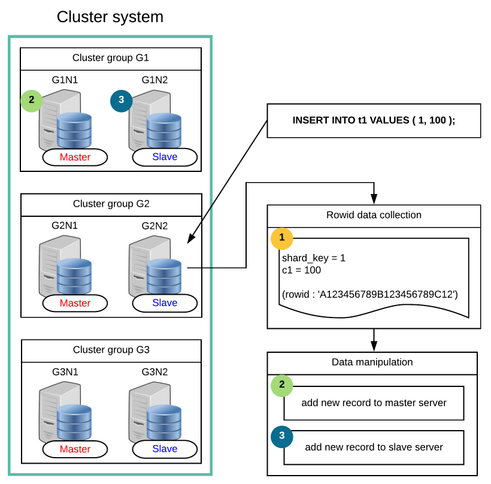
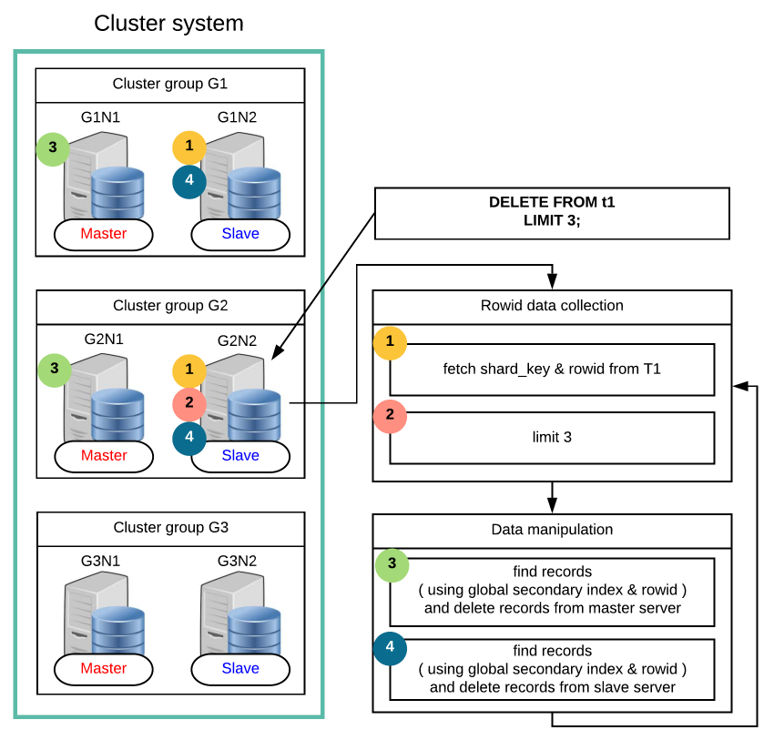

<a id="ee9cabe16c39ce49"></a>

# 12. SQL Languages

> 원본: [GOLDILOCKS 21c.1 User Manual (ko)](https://manual.sunjesoft.co.kr/goldilocks/21c_1/manual/ko/ee9cabe16c39ce49)  
> 태그: `21c.1_35_tag`

[← 11. SQL Elements](11-sql-elements.md) · [전체 목차](../README.md) · [13. SQL Objects →](13-sql-objects.md)

Structured Query Language (SQL)는 다음과 같이 구분할 수 있다.

- Data Definition Language: 데이터 정의 언어
- Data Manipulation Language: 데이터 조작 언어
- Data Query Language: 데이터 질의 언어
- Control Language: 제어 언어

<a id="09b18f6c1bee4087"></a>
## Data Definition Language

<a id="72d533bbc7bd859f"></a>
### DDL 관련 구문

관련 내용은 다음을 참조한다.

- Non-schema object DDL
    - [데이터베이스 관련 구문](13-sql-objects.md#ab7bfca82df52d3d)
    - [Profile 관련 구문](13-sql-objects.md#fa0ae76c64992f06)
    - [Audit Policy 관련 구문](13-sql-objects.md#72d63aae4b092475)
    - [Authorization 관련 구문](13-sql-objects.md#b41753876e1df836)
    - [Schema 관련 구문](13-sql-objects.md#59d0e3c089e4c5b6)
    - [Tablespace 관련 구문](13-sql-objects.md#7f26749ffe7f7634)

- SQL schema object DDL
    - [테이블 관련 구문](13-sql-objects.md#75bbd121e62c8ae9)
    - [Index 관련 구문](13-sql-objects.md#9ad172e59077f0e7)
    - [View 관련 구문](13-sql-objects.md#a2a4f1f7c1f06b91)
    - [Sequence 관련 구문](13-sql-objects.md#aa26928272b7b1b1)
    - [Synonym 관련 구문](13-sql-objects.md#027e748c3fb4679c)

- Cluster object DDL
    - [Cluster System 관련 구문](14-cluster-objects.md#d6df1bbe1840dbd5)
    - [Cluster Group 관련 구문](14-cluster-objects.md#8a8690ca00965c32)
    - [Cluster Member 관련 구문](14-cluster-objects.md#241106f1471d50ab)
    - [Cluster Location 관련 구문](14-cluster-objects.md#05eed0db347c1970)
    - [Global Secondary Index 관련 구문](14-cluster-objects.md#186a8e2ba34509f1)

<a id="7d420941bfdca5ed"></a>
### DDL 개념

Data Definition Language (DDL)는 SQL 객체를 생성 (CREATE), 제거 (DROP), 변경 (ALTER)하는 SQL 언어이다.

데이터베이스를 구성하는 SQL 객체는 다음 표와 같으며 각 객체에 대한 자세한 설명은 참조 링크 항목을 참조한다.

<a id="802a6ef85edacc63"></a>
<table class="table column_count_4"><caption>SQL 객체의 종류</caption><thead><tr><th class="to_center"><div>구분</div></th><th class="to_center"><div>객체</div></th><th class="to_center"><div>객체 설명</div></th><th class="to_center"><div>참조</div></th></tr></thead><tbody><tr><td class="to_left to_middle" rowspan="6"><div>Non-schema
객체</div></td><td class="to_middle"><div>Profile</div></td><td class="to_middle"><div>Password 관리 정책을 정의한 객체</div></td><td class="to_middle"><div><a class="reference text" href="13-sql-objects.md#50415db6a8cf6a88">Profile</a></div></td></tr><tr><td class="to_middle"><div>Audit policy</div></td><td class="to_middle"><div>SQL 감사 정책을 정의한 객체</div></td><td class="to_middle"><div><a class="reference text" href="13-sql-objects.md#255eeb68afb7d788">Audit Policy</a></div></td></tr><tr><td class="to_middle"><div>User</div></td><td class="to_middle"><div>권한의 집합으로 이루어진 사용자 객체</div></td><td class="to_middle"><div><a class="reference text" href="13-sql-objects.md#0ba06aa447cb8865">Authorization</a></div></td></tr><tr><td class="to_middle"><div>Schema</div></td><td class="to_middle"><div>테이블 등 SQL schema 객체를 포함하는 논리적 위치</div></td><td class="to_middle"><div><a class="reference text" href="13-sql-objects.md#99730eaeb0e04606">Schema</a></div></td></tr><tr><td class="to_middle"><div>Tablespace</div></td><td class="to_middle"><div>테이블, 인덱스 등의 객체를 저장하는 물리적 저장소</div></td><td class="to_middle"><div><a class="reference text" href="13-sql-objects.md#f2fcc7683e060eff">Tablespace</a></div></td></tr><tr><td class="to_middle"><div>Public synonym</div></td><td class="to_middle"><div>공용 synonym</div></td><td class="to_middle"><div><a class="reference text" href="13-sql-objects.md#5c55a5359d5694a8">Public Synonym</a></div></td></tr><tr><td class="to_left to_middle" rowspan="7"><div>SQL schema 
객체</div></td><td class="to_middle"><div>Table</div></td><td class="to_middle"><div>데이터가 저장되는 물리적 릴레이션</div></td><td class="to_middle"><div><a class="reference text" href="13-sql-objects.md#387cae8c8bffb3d1">Table</a></div></td></tr><tr><td class="to_middle"><div>View</div></td><td class="to_middle"><div>질의로 구성된 논리적 릴레이션</div></td><td class="to_middle"><div><a class="reference text" href="13-sql-objects.md#5d81bc05e1bcd799">View</a></div></td></tr><tr><td class="to_middle"><div>Index</div></td><td class="to_middle"><div>질의 성능을 향상시키기 위한 색인 객체</div></td><td class="to_middle"><div><a class="reference text" href="13-sql-objects.md#0d619a3378ad7eea">Index</a></div></td></tr><tr><td class="to_middle"><div>Sequence</div></td><td class="to_middle"><div>순차 번호를 생성하는 객체</div></td><td class="to_middle"><div><a class="reference text" href="13-sql-objects.md#38b4439f0d0a52c4">Sequence</a></div></td></tr><tr><td class="to_middle"><div>Synonym</div></td><td class="to_middle"><div>객체에 대한 대체명을 선언한 객체</div></td><td class="to_middle"><div><a class="reference text" href="13-sql-objects.md#455a00d0d24e429a">Synonym</a></div></td></tr><tr><td class="to_middle"><div>Stored procedure</div></td><td class="to_middle"><div>사용자 정의 procedure 객체</div></td><td class="to_middle"><div><a class="reference text" href="13-sql-objects.md#d225dbf30e8beab6">Stored Procedure</a></div></td></tr><tr><td class="to_middle"><div>Stored function</div></td><td class="to_middle"><div>사용자 정의 function 객체</div></td><td class="to_middle"><div><a class="reference text" href="13-sql-objects.md#2381fe9a8979142d">Stored Function</a></div></td></tr><tr><td class="to_left to_middle" rowspan="5"><div>Cluster 
객체</div></td><td class="to_middle"><div>Cluster group</div></td><td class="to_middle"><div>Cluster member의 집합</div></td><td class="to_middle"><div><a class="reference text" href="14-cluster-objects.md#41ddda995297aeff">Cluster Group</a></div></td></tr><tr><td class="to_middle"><div>Cluster member</div></td><td class="to_middle"><div>Cluster system을 구성하는 data server</div></td><td class="to_middle"><div><a class="reference text" href="14-cluster-objects.md#085262f4c8cbe058">Cluster Member</a></div></td></tr><tr><td class="to_middle"><div>Cluster location</div></td><td class="to_middle"><div>Cluster member의 위치 정보 객체</div></td><td class="to_middle"><div><a class="reference text" href="14-cluster-objects.md#4f74a83b98384bc5">Cluster Location</a></div></td></tr><tr><td class="to_middle"><div>Shard</div></td><td class="to_middle"><div>Cluster table을 수평으로 분할한 row들의 집합</div></td><td class="to_middle"><div><a class="reference text" href="14-cluster-objects.md#37c9553381994760">Cluster Table과 Shard</a></div></td></tr><tr><td class="to_middle"><div>Global secondary
index</div></td><td class="to_middle"><div>Cluster의 row 식별자를 위한 색인</div></td><td class="to_middle"><div><a class="reference text" href="14-cluster-objects.md#9fe4f1f3b8251f74">Global Secondary Index</a></div></td></tr></tbody></table>

<a id="bdca10173c3f5cd6"></a>
### DDL과 트랜잭션

GOLDILOCKS에서는 데이터를 추가 (INSERT), 삭제 (DELETE), 갱신 (UPDATE)하는 DML 뿐 아니라, 객체를 생성 (CREATE), 제거 (DROP), 변경 (ALTER)하는 DDL 역시 트랜잭션에 포함된다. 많은 DBMS에서 DDL을 실행할 때 암묵적으로 COMMIT을 수행하는 반면에 GOLDILOCKS에서는 DDL도 트랜잭션에 포함시켜 트랜잭션의 원자성 (atomicity)과 일관성 (consistency)을 보장한다.

이러한 기능은 데이터베이스 migration 작업이나 tool 설치와 같은 배치성 DDL을 원자적으로 수행해야 하는 경우나, 사용자가 실수로 DROP TABLE, TRUNCATE TABLE과 같은 구문을 실행하는 바람에 rollback을 통해 이를 복구해야 하는 경우에 유용하다.

DDL 구문의 속성이 auto-commit인 경우, 구문을 수행할 때 자동으로 commit을 수행하며 auto-commit 이 아닌 경우에는 구문을 수행한 후에도 트랜잭션을 rollback 할 수 있다. DDL의 auto-commit 여부는 [V$SQL_COMMAND](../part-02-administration-manual/9-database-information.md#29b34730a2ca4610) view를 사용하여 다음과 같이 조회할 수 있다.

```
gSQL> 
SELECT command, auto_commit 
  FROM V$SQL_COMMAND 
 WHERE is_ddl = 'YES';


COMMAND                                                   AUTO_COMMIT
--------------------------------------------------------- -----------
ALTER AUDIT POLICY                                        YES
ALTER CLUSTER GROUP .. ADD CLUSTER MEMBER                 YES
ALTER CLUSTER GROUP .. OFFLINE CLUSTER MEMBER             YES
ALTER DATABASE DROP INACTIVE CLUSTER MEMBERS              YES
ALTER DATABASE OFFLINE INACTIVE CLUSTER MEMBERS           YES
ALTER DATABASE RESET LOCAL CLUSTER MEMBER                 YES
ALTER DATABASE ADD LOGFILE GROUP                          YES
ALTER DATABASE ADD LOGFILE MEMBER                         YES
ALTER DATABASE DROP LOGFILE GROUP                         YES
ALTER DATABASE DROP LOGFILE MEMBER                        YES
ALTER DATABASE RENAME LOGFILE                             YES
ALTER DATABASE ARCHIVELOG                                 YES
ALTER DATABASE NOARCHIVELOG                               YES
ALTER DATABASE DATAFILE AUTOEXTEND ..                     YES
ALTER DATABASE CLEAR PASSWORD HISTORY                     NO
ALTER FUNCTION                                            NO
ALTER INDEX AGING                                         NO
ALTER INDEX .. STORAGE                                    NO
ALTER INDEX .. RENAME                                     NO
ALTER INDEX .. REBUILD                                    YES
ALTER PACKAGE                                             YES
ALTER PROCEDURE                                           NO
ALTER PROFILE                                             YES
ALTER SEQUENCE                                            YES
ALTER SEQUENCE .. SYNCHRONIZE                             YES
ALTER SYSTEM SWITCH LOGFILE                               YES
ALTER TABLE .. ADD COLUMN                                 NO
ALTER TABLE .. SET UNUSED COLUMN                          NO
ALTER TABLE .. ALTER COLUMN .. SET DEFAULT                NO
ALTER TABLE .. ALTER COLUMN .. DROP DEFAULT               NO
ALTER TABLE .. ALTER COLUMN .. SET NOT NULL               NO
ALTER TABLE .. ALTER COLUMN .. DROP NOT NULL              NO
ALTER TABLE .. ALTER COLUMN .. SET DATA TYPE              YES
ALTER TABLE .. ALTER COLUMN .. AS IDENTITY                YES
ALTER TABLE .. ALTER COLUMN .. DROP IDENTITY              YES
ALTER TABLE .. RENAME COLUMN                              NO
ALTER TABLE .. STORAGE                                    NO
ALTER TABLE .. ADD CONSTRAINT                             NO
ALTER TABLE .. ALTER CONSTRAINT                           NO
ALTER TABLE .. DROP CONSTRAINT                            NO
ALTER TABLE .. RENAME CONSTRAINT                          NO
ALTER TABLE .. RENAME TO ..                               NO
ALTER TABLE .. REBALANCE ..                               YES
ALTER TABLE .. MOVE SHARD .. TO CLUSTER GROUP ..          YES
ALTER TABLE .. SPLIT SHARD .. INTO .. AT CLUSTER GROUP .. YES
ALTER TABLE .. MERGE SHARDS .. INTO ..                    YES
ALTER TABLE .. RENAME SHARD .. TO ..                      NO
ALTER TABLE .. ADD SUPPLEMENTAL LOG                       NO
ALTER TABLE .. ADD GLOBAL SECONDARY INDEX                 NO
ALTER TABLE .. ALTER GLOBAL SECONDARY INDEX               NO
ALTER TABLE .. ALTER GLOBAL SECONDARY INDEX AGING         NO
ALTER TABLE .. DROP GLOBAL SECONDARY INDEX                NO
ALTER TABLE .. REBUILD GLOBAL SECONDARY INDEX             YES
ALTER TABLE .. DROP SUPPLEMENTAL LOG                      NO
ALTER TABLE .. READ ONLY                                  YES
ALTER TABLE .. READ WRITE                                 YES
ALTER TABLE .. SYNCHRONIZE IDENTITY COLUMN                YES
ALTER TABLESPACE .. ADD                                   YES
ALTER TABLESPACE .. DROP                                  YES
ALTER TABLESPACE .. ONLINE                                YES
ALTER TABLESPACE .. OFFLINE                               YES
ALTER TABLESPACE .. RENAME TO                             YES
ALTER TABLESPACE .. RENAME { DATAFILE | MEMORY }          YES
ALTER USER                                                YES
ALTER USER .. IDENTIFIED BY                               YES
ALTER VIEW                                                NO
ANALYZE SYSTEM COMPUTE STATISTICS                         NO
ANALYZE SYSTEM DELETE STATISTICS                          NO
ANALYZE TABLE .. [COMPUTE|ESTIMATE] STATISTICS            YES
ANALYZE TABLE .. DELETE STATISTICS                        NO
AUDIT POLICY                                              YES
COMMENT ON .. IS                                          NO
CREATE AUDIT POLICY                                       YES
CREATE CLUSTER GROUP                                      YES
CREATE FUNCTION                                           NO
CREATE INDEX                                              NO
CREATE PACKAGE                                            YES
CREATE PACKAGE BODY                                       YES
CREATE PROCEDURE                                          NO
CREATE PROFILE                                            YES
CREATE SCHEMA                                             YES
CREATE SEQUENCE                                           YES
CREATE SYNONYM                                            NO
CREATE TABLE                                              NO
CREATE TABLE ... AS SELECT                                NO
CREATE TABLESPACE                                         YES
CREATE USER                                               YES
CREATE VIEW                                               NO
DROP AUDIT POLICY                                         YES
DROP CLUSTER GROUP                                        YES
DROP FUNCTION                                             NO
DROP INDEX                                                NO
DROP PACKAGE                                              YES
DROP PROCEDURE                                            NO
DROP PROFILE                                              YES
DROP SCHEMA                                               YES
DROP SEQUENCE                                             YES
DROP SYNONYM                                              NO
DROP TABLE                                                NO
DROP TABLESPACE                                           YES
DROP USER                                                 YES
DROP VIEW                                                 NO
GRANT .. ON DATABASE                                      NO
GRANT .. ON TABLESPACE                                    NO
GRANT .. ON SCHEMA                                        NO
GRANT .. ON TABLE                                         NO
GRANT USAGE ON ..                                         NO
GRANT .. ON PROCEDURE                                     NO
GRANT .. ON PACKAGE                                       NO
NOAUDIT POLICY                                            YES
REVOKE .. ON DATABASE                                     NO
REVOKE .. ON TABLESPACE                                   NO
REVOKE .. ON SCHEMA                                       NO
REVOKE .. ON TABLE                                        NO
REVOKE USAGE ON ..                                        NO
REVOKE .. ON PROCEDURE                                    NO
REVOKE .. ON PACKAGE                                      NO
TRUNCATE TABLE                                            NO
PURGE CONSTRAINT                                          NO
PURGE INDEX                                               NO
PURGE TABLE                                               NO
PURGE TABLESPACE                                          YES
PURGE RECYCLEBIN                                          YES
PURGE DBA_RECYCLEBIN                                      YES
FLASHBACK TABLE                                           YES

125 rows selected.
```

다음은 테이블 관련 DDL 구문이 트랜잭션에 포함되어 commit 또는 rollback 되는 경우와 다른 트랜잭션에 미치는 영향에 대해 설명하는 예들이다. 다음 예들을 통해 DDL을 포함한 트랜잭션도 트랜잭션의 원자성 (atomicity)을 보장하며 DDL을 포함한 트랜잭션이 commit 되기 전이거나 rollback 될 경우 다른 트랜잭션들이 영향을 받지 않는 트랜잭션의 읽기 일관성 (consistency)을 보장한다는 것을 확인할 수 있다.

<a id="f9804852e8e97f2d"></a>
#### 객체 생성과 트랜잭션

- 테이블 생성 트랜잭션이 commit/ rollback 되기 전

다음 예와 같이 테이블을 생성한 후에 트랜잭션을 commit 하지 않은 경우, DDL을 수행한 트랜잭션 내에서는 테이블의 데이터를 조작할 수 있지만 다른 트랜잭션에서는 테이블을 생성한 트랜잭션이 commit 될 때까지 해당 테이블을 조회할 수 없다. 즉, INSERT 구문과 마찬가지로 CREATE TABLE 구문도 트랜잭션이 commit 되기 전까지 다른 트랜잭션에서 조회할 수 없다.

    - 트랜잭션 A: t1 테이블을 생성한 후 트랜잭션을 commit 하지 않는다.

```
gSQL> CREATE TABLE t1 ( id INTEGER, name VARCHAR(128) );
Table created.

gSQL> INSERT INTO t1 VALUES ( 1, 'leekmo' );
1 row created.

gSQL> SELECT * FROM t1;

ID NAME  
-- ------
 1 leekmo

1 row selected.
```

위와 같이 트랜잭션 A에서 t1 테이블을 생성하고 commit 하지 않은 경우, 아래와 같이 다른 세션에서 수행하는 트랜잭션 B 에서는 t1 테이블을 조회할 수 없으며 아직 commit 되지 않은 t1 테이블과 동일한 이름의 테이블을 생성할 수 없다.

    - 트랜잭션 B: 트랜잭션 A가 commit 되기 전까지 t1 테이블을 조회할 수 없다.

```
gSQL> SELECT * FROM t1;

ERR-42000(16040): table or view does not exist : 
SELECT * FROM t1
              *
ERROR at line 1:
```

    - 트랜잭션 A가 rollback 되기 전까지 t1 테이블을 생성할 수 없다.

```
gSQL> CREATE TABLE t1 ( emp_no INTEGER );

ERR-HYT00(14026): resource busy or timeout expired
```

- 테이블 생성 트랜잭션이 commit 된 후

트랜잭션 A가 commit 될 경우, 다음과 같이 트랜잭션 B는 t1 테이블을 조회할 수 있고 테이블 생성 구문은 t1 테이블이 존재하고 있음을 알리는 유효성 에러를 반환한다.

    - 트랜잭션 B: 트랜잭션 A가 commit 된 후에 다음과 같이 테이블을 조회할 수 있다.

```
gSQL> SELECT * FROM t1;

ID NAME  
-- ------
 1 leekmo

1 row selected.
```

    - 트랜잭션 A가 commit 된 후에 다음과 같이 유효성 에러를 반환한다.

```
gSQL> CREATE TABLE t1 ( emp_no INTEGER );

ERR-42000(16005): name 'PUBLIC.T1' is already used by an existing object : 
CREATE TABLE t1 ( emp_no INTEGER )
             *
ERROR at line 1:
```

- 테이블 생성 트랜잭션이 rollback 된 후

트랜잭션 A가 rollback 될 경우, t1 테이블의 생성 역시 rollback 되며 다음과 같이 트랜잭션 B가 t1 테이블을 생성할 수 있다.

    - 트랜잭션 B: 트랜잭션 A가 rollback 되어 t1 테이블 생성 이전과 동일한 상태가 된다.

```
gSQL> SELECT * FROM t1;

ERR-42000(16040): table or view does not exist : 
SELECT * FROM t1
              *
ERROR at line 1:
```

    - 트랜잭션 A가 rollback 되어 t1 테이블을 생성할 수 있다.

```
gSQL> CREATE TABLE t1 ( emp_no INTEGER );

Table created.
```

<a id="0dd1e0d37aba1226"></a>
#### 객체 제거와 트랜잭션

- 테이블 제거 트랜잭션이 commit/ rollback 되기 전

테이블을 제거하고 트랜잭션을 commit 하지 않은 경우, DROP TABLE 구문을 수행한 트랜잭션이 commit 되기 전까지 다른 트랜잭션에서는 제거된 테이블을 조회할 수 있다. 즉, DELETE 구문과 마찬가지로 DROP TABLE 구문도 트랜잭션이 commit 되기 전까지, 다른 트랜잭션에서는 테이블이 제거되기 이전 상태를 조회하게 된다.

다음은 트랜잭션 A가 t1 테이블을 제거하고 새로운 테이블 t1을 생성한 후 트랜잭션을 commit 하지 않은 상태이다.

    - 트랜잭션 A: DROP 하기 전 t1 테이블에 두 개의 column을 가진 row 하나가 있다.

```
gSQL> SELECT * FROM t1;

ID NAME  
-- ------
 1 leekmo

1 row selected.
```

    - 기존 테이블 t1을 제거한다.

```
gSQL> DROP TABLE t1;

Table dropped.
```

    - 새로운 테이블 t1을 생성한다.

```
gSQL> CREATE TABLE t1 ( addr VARCHAR(128) );    

Table created.
```

    - 새로운 테이블 t1에 새로운 row를 생성한다.

```
gSQL> INSERT INTO t1 VALUES ( 'Seoul, Korea' );

1 row created.

gSQL> SELECT * FROM t1;

ADDR        
------------
Seoul, Korea

1 row selected.
```

트랜잭션 A가 commit 되지 않은 상태에서, 다음과 같이 트랜잭션 B가 조회를 수행하면 트랜잭션 A가 실행되기 이전의 상태 정보가 조회된다. 즉, DELETE 구문과 마찬가지로 DROP TABLE 구문도 트랜잭션이 commit 되기 전까지는 다른 트랜잭션에 영향을 미치지 않는다.

    - 트랜잭션 B: 트랜잭션 B는 트랜잭션 A가 수행되기 이전의 테이블을 조회한다.

```
gSQL> SELECT * FROM t1;

ID NAME  
-- ------
 1 leekmo

1 row selected.
```

- 테이블 제거 트랜잭션이 commit 된 후

트랜잭션 A가 commit 될 경우, 다음과 같이 트랜잭션 B가 새로 생성된 t1 테이블을 조회한다.

    - Transaction B: 트랜잭션 A가 commit 된 후에 새로 생성된 테이블 t1을 조회한다.

```
gSQL> SELECT * FROM t1;

ADDR        
------------
Seoul, Korea

1 row selected.
```

- 테이블 제거 트랜잭션이 rollback 된 후

트랜잭션 A가 rollback 될 경우, 다음과 같이 트랜잭션 B는 트랜잭션 A가 수행되기 이전의 테이블 t1을 조회한다. 즉, 트랜잭션 A가 rollback 될 경우 트랜잭션 B가 조회하는 데이터는 rollback 된 트랜잭션의 영향을 받지 않는다.

    - 트랜잭션 B: 트랜잭션 A가 rollback 된 경우, 트랜잭션 B는 트랜잭션 A를 수행하기 이전의 상태 정보를 조회한다.

```
gSQL> SELECT * FROM t1;

ID NAME  
-- ------
 1 leekmo

1 row selected.
```

<a id="cf346c6cf31061ff"></a>
#### 객체 변경과 트랜잭션

테이블 생성, 제거와 마찬가지로 테이블의 구조를 변경하는 ALTER TABLE 구문 역시 트랜잭션의 원자성(atomicity)과 일관성(consistency)을 보장한다. 다음과 같이 테이블에 column을 추가한 트랜잭션이 commit 되기 전까지 다른 트랜잭션은 기존의 테이블을 조회하게 된다. 즉, UPDATE 구문과 마찬가지로 ALTER TABLE 구문도 트랜잭션이 commit 되기 전까지 다른 트랜잭션이 조회를 수행하면 DDL 수행 전의 정보가 조회된다.

- Transaction A: 새로운 UPDATE_TIME column을 추가한다.

```
gSQL> ALTER TABLE t1 ADD COLUMN ( update_time TIMESTAMP DEFAULT CURRENT_TIMESTAMP );

Table altered.
```

- 추가된 column을 포함하는 t1 테이블이 조회된다.

```
gSQL> select * from t1;

ID NAME   UPDATE_TIME               
-- ------ --------------------------
 1 leekmo 2014-07-10 12:50:33.540495

1 row selected.
```

다음과 같이 트랜잭션 A를 commit 하기 전에 트랜잭션 B를 수행하면 column이 추가되기 이전의 테이블이 조회된다.

- Transaction B: 트랜잭션 A가 commit 되지 않았으므로 추가된 column UPDATE_TIME은 조회되지 않는다.

```
gSQL> SELECT * FROM t1;

ID NAME  
-- ------
 1 leekmo

1 row selected.
```

<a id="b7641219fac3df75"></a>
## Data Manipulation Language

<a id="1d434668467df727"></a>
### DML 관련 구문

관련 내용은 다음을 참조한다.

- INSERT 관련 구문
    - [INSERT INTO](20-sql-references-h-z.md#d530198bacb7e3e9)
    - [INSERT INTO name RETURNING](20-sql-references-h-z.md#b7be21943ea082ab)
    - [INSERT INTO name RETURNING .. INTO](20-sql-references-h-z.md#4973f950df1e0e03)

- UPDATE 관련 구문
    - [UPDATE](20-sql-references-h-z.md#5720cc6e23838773)
    - [UPDATE name RETURNING](20-sql-references-h-z.md#cba95fe5c27e5189)
    - [UPDATE name RETURNING .. INTO](20-sql-references-h-z.md#84fd92fa50ad05cd)
    - [UPDATE name WHERE CURRENT OF cursor_name](20-sql-references-h-z.md#f3134c5ebd33a248)

- DELETE 관련 구문
    - [DELETE FROM](19-sql-references-c-g.md#e74baad76dc01616)
    - [DELETE FROM name RETURNING](19-sql-references-c-g.md#fdf991741942b8a1)
    - [DELETE FROM name RETURNING .. INTO](19-sql-references-c-g.md#0f38e9dfac27052e)
    - [DELETE FROM name WHERE CURRENT OF cursor_name](19-sql-references-c-g.md#3c267e8e7d7ca8c9)

- SELECT 관련 구문: [SELECT .. INTO](20-sql-references-h-z.md#ed9c6643117a0356)

- Dynamic SQL 관련 구문
    - [EXECUTE IMMEDIATE 'sql_string'](19-sql-references-c-g.md#f6203088a925d605)
    - [PREPARE statement_name](20-sql-references-h-z.md#15a93f4582b0cd5f)
    - [EXECUTE statement_name](19-sql-references-c-g.md#308a84b7c4dcf6c7)

<a id="8a2d9f8aef1d5c9f"></a>
### DML 개념

Data Manipulation Language (DML)는 추가 (INSERT), 삭제 (DELETE), 갱신 (UPDATE)과 같이 테이블 데이터를 조작하거나 질의하는 SQL 언어이다.

질의에 대해서는 [Data Query Language](#6a2dde5744a149d6) 장에서 다루며, 본 장에서는 데이터를 변경하는 DML 구문만 다룬다.

DDL 구문이 SQL 객체의 구조를 변경하는 언어인 반면에 DML은 객체의 내용을 조작하는 언어이다. 예를 들어 ALTER TABLE 구문은 테이블의 구조를 변경하는 반면에 INSERT 구문은 테이블에 하나 이상의 row 를 추가하는 구문이다.

테이블에 데이터 추가, 삭제, 갱신 등을 수행하는 데이터 조작 구문은 크게 다음과 같이 구분할 수 있다.

<a id="6e49e511630b1c82"></a>
<table class="table column_count_3"><caption>데이터 조작 구문</caption><thead><tr><th class="to_center"><div>구분</div></th><th class="to_center"><div>구문 유형</div></th><th class="to_center"><div>설명</div></th></tr></thead><tbody><tr><td class="to_left to_middle" rowspan="4"><div>추가</div></td><td class="to_left to_middle"><div>INSERT .. VALUES</div></td><td class="to_left to_middle"><div>하나의 row를 테이블에 추가한다.</div></td></tr><tr><td class="to_left to_middle"><div>INSERT .. SELECT</div></td><td class="to_left to_middle"><div>검색 결과를 테이블에 추가한다.</div></td></tr><tr><td class="to_left to_middle"><div>INSERT .. RETURN .. INTO</div></td><td class="to_left to_middle"><div>추가한 row의 값을 변수로 설정한다.</div></td></tr><tr><td class="to_left to_middle"><div>INSERT .. RETURN</div></td><td class="to_left to_middle"><div>질의 결과로 추가한 row들을 검색한다.</div></td></tr><tr><td class="to_left to_middle" rowspan="4"><div>삭제</div></td><td class="to_left to_middle"><div>DELETE .. WHERE</div></td><td class="to_left to_middle"><div>조건에 부합하는 row들을 삭제한다.</div></td></tr><tr><td class="to_left to_middle"><div>DELETE .. WHERE CURRENT OF</div></td><td class="to_left to_middle"><div>커서 위치에 있는 row를 삭제한다.</div></td></tr><tr><td class="to_left to_middle"><div>DELETE .. RETURN .. INTO</div></td><td class="to_left to_middle"><div>삭제한 row의 값을 변수로 설정한다.</div></td></tr><tr><td class="to_left to_middle"><div>DELETE .. RETURN</div></td><td class="to_left to_middle"><div>질의 결과로 삭제한 row들을 검색한다.</div></td></tr><tr><td class="to_left to_middle" rowspan="4"><div>갱신</div></td><td class="to_left to_middle"><div>UPDATE .. WHERE</div></td><td class="to_left to_middle"><div>조건에 부합하는 row들을 갱신한다.</div></td></tr><tr><td class="to_left to_middle"><div>UPDATE .. WHERE CURRENT OF</div></td><td class="to_left to_middle"><div>커서의 위치에 있는 row를 갱신한다.</div></td></tr><tr><td class="to_left to_middle"><div>UPDATE .. RETURN .. INTO</div></td><td class="to_left to_middle"><div>갱신한 row의 값을 변수로 설정한다.</div></td></tr><tr><td class="to_left to_middle"><div>UPDATE .. RETURN</div></td><td class="to_left to_middle"><div>질의 결과로 갱신한 row들을 검색한다.</div></td></tr></tbody></table>

<a id="e9c7ff4ea497b02b"></a>
### 데이터 추가

테이블에 데이터를 추가할 때 row 단위로 데이터를 추가한다. INSERT 구문을 통해 하나 이상의 row를 추가할 수 있으며, 일부 column의 데이터를 생략하더라도 row의 모든 column에 데이터가 완성된 형태로 테이블에 row를 추가한다.

다음 예제 테이블을 참조한다.

```
CREATE TABLE t1
(
    id   NUMBER(10,0),
    name VARCHAR(128),
    addr VARCHAR(1024) DEFAULT 'n/a'
);
```

가장 기본적인 row 추가 방법은 다음과 같다.

```
INSERT INTO t1 VALUES ( 1, 'leekmo', 'Seoul, Korea' );
```

VALUES 절에 나열된 값들은 테이블을 생성할 때 나열한 column 순서와 동일하게 입력된다. 그러나 위와 같은 구문에 column이 추가되거나 제거될 경우 예기치 않은 오류가 발생할 수 있어 다음 구문과 같이 column 이름을 명시하는 것이 바람직하다.

```
INSERT INTO t1 (id, name, addr) VALUES ( 1, 'leekmo', 'Seoul, Korea' );
INSERT INTO t1 (name, addr, id) VALUES ( 'leekmo', 'Seoul, Korea', 1 );
```

위의 두 INSERT 구문은 column의 순서만 다르게 나열했을 뿐, 동일한 데이터를 가진 row를 추가한 구문이다.

테이블의 모든 column을 나열하지 않을 경우, 지정하지 않은 column에는 column의 기본값을 설정하여 row를 완성한다. 다음과 같이 구문 내에서 사용되지 않은 addr column에는 테이블을 생성할 때 정의한 기본값인 'n/a'가 저장된다.

```
INSERT INTO t1 ( id, name ) VALUES ( 1, 'leekmo' );
INSERT INTO t1 ( id, name ) SELECT id, name FROM emp;
```

Column의 기본값을 명시적으로 사용하고자 할 경우, 다음과 같이 DEFAULT를 명시할 수 있다.

```
INSERT INTO t1 ( id, name, addr ) VALUES ( 1, 'leekmo', DEFAULT );
```

모든 column에 기본값을 사용하고자 할 경우, 다음과 같이 두 가지 형태의 구문을 사용할 수 있다.

```
INSERT INTO t1 ( id, name, addr ) VALUES ( DEFAULT, DEFAULT, DEFAULT );
INSERT INTO t1 DEFAULT VALUES;
```

다음과 같이 하나의 INSERT 구문을 이용해 다수의 row를 추가할 수 있다. 아래 구문은 하나의 INSERT 구문으로 세 개의 새 row들을 추가하는 예이다.

```
INSERT INTO t1 (id, name, addr) VALUES
  ( 1, 'leekmo', 'Seoul, Korea' ),
  ( 2, 'mkkim', 'Seoul, Korea' ),
  ( 3, 'xcom', 'Inchon, Korea' );
```

다음과 같이 SELECT 질의 결과를 이용해 다수의 row들을 추가할 수 있다. 아래 예는 입사한 지 3년 이상인 직원들을 구하여 테이블 t1에 추가하는 구문이다.

```
INSERT INTO t1 ( id, name, addr )
SELECT id, name, addr 
  FROM emp 
 WHERE DATEDIFF( YEAR, SYSDATE, join_date ) >= 3;
```

<a id="71b05866b94f5f92"></a>
### 데이터 삭제

데이터를 추가할 때와 마찬가지로 데이터를 삭제할 때도 row 단위로 테이블에서 제거한다. Row를 삭제할 때는 WHERE 조건을 이용하거나 row의 id (ROWID)를 이용할 수 있다.

다음은 WHERE 조건을 만족하는 row들을 삭제하는 예이다.

```
DELETE FROM t1 WHERE id = 1;
```

다음은 ROWID 값을 이용해 해당 row를 삭제하는 예이다.

```
gSQL> SELECT rowid FROM t1 WHERE id = 1;

                  ROWID
-----------------------
AAAAAAAAFNHAACAAAAAiAAA

1 row selected.

gSQL> DELETE FROM t1 WHERE ROWID = 'AAAAAAAAFNHAACAAAAAiAAA';

1 row deleted.
```

다음과 같이 WHERE 절이 없는 DELETE 구문은 테이블의 전체 row들을 삭제한다. WHERE 절이 없는 DELETE 구문은 전체 row를 제거한다는 점에서 TRUNCATE TABLE 구문과 기능이 동일하지만 TRUNCATE TABLE 구문을 사용할 것을 권장한다.

```
DELETE FROM t1;
TRUNCATE TABLE t1;
```

<a id="3cc32e83abcfd425"></a>
### 데이터 갱신

UPDATE 구문을 이용해 데이터를 갱신한다. 하나 이상의 row 들을 갱신할 수 있으며 하나 또는 다수의 column들을 갱신할 수 있다. UPDATE 구문에 기술되지 않은 다른 column들은 영향을 받지 않는다.

다음은 조건에 부합하는 row들의 한 column을 갱신하는 예이다.

```
UPDATE t1 SET page_view = page_view + 1 WHERE id = 1;
```

다음은 다수의 column을 갱신하는 UPDATE 구문으로써 두 구문의 의미는 동일하다.

```
UPDATE t1 SET page_view = page_view + 1, status = 'F' WHERE id = 1;
UPDATE t1 SET (page_view, status) = (page_view + 1, 'F') WHERE id = 1;
```

Column 값을 기본값으로 설정하려면 다음과 같이 DEFAULT를 사용한다.

```
UPDATE t1 SET addr = DEFAULT WHERE id = 1;
```

<a id="abfbb0bfbe93dc45"></a>
### 커서를 이용한 데이터 조작

커서는 질의를 수행하고 질의 결과를 조작하는 세션 객체이다. 커서를 이용하여 질의 결과 집합을 갱신 하거나 삭제할 수 있다.

다음은 updatable cursor를 선언하고 이를 이용하여 현재 cursor 위치의 row를 갱신하거나 삭제하는 예이다.

```
gSQL> DECLARE cur1 CURSOR FOR SELECT id, data FROM t1 FOR UPDATE;

Cursor declared.

gSQL> OPEN cur1;

Cursor is open.

gSQL> \var v_id INTEGER
gSQL> \var v_data VARCHAR(128)
gSQL> FETCH cur1 INTO :v_id, :v_data;

V_ID V_DATA
---- ------
   1 data_1

1 row fetched.

gSQL> FETCH cur1 INTO :v_id, :v_data;

V_ID V_DATA
---- ------
   2 data_2

1 row fetched.

gSQL> DELETE FROM t1 WHERE CURRENT OF cur1;

1 row deleted.

gSQL> FETCH cur1 INTO :v_id, :v_data;

V_ID V_DATA
---- ------
   3 data_3

1 row fetched.

gSQL> UPDATE t1 SET id = id + :v_id WHERE CURRENT OF cur1;

1 row updated.

gSQL> COMMIT;

Commit complete.

gSQL> SELECT * FROM t1 ORDER BY 1;

ID DATA  
-- ------
 1 data_1
 6 data_3

2 rows selected.
```

위의 예와 같이 [DECLARE cursor_name](19-sql-references-c-g.md#f41bd2e5b923c676) 구문을 이용하여 FOR UPDATE 커서를 선언하고 [OPEN cursor_name](20-sql-references-h-z.md#6047f0ea5db92a56) 구문을 이용하여 해당 커서를 연다. [FETCH cursor_name](19-sql-references-c-g.md#1662729a681bc4cc) 구문을 이용해 커서를 원하는 위치로 이동시키고 [DELETE FROM name WHERE CURRENT OF cursor_name](19-sql-references-c-g.md#3c267e8e7d7ca8c9) 구문을 이용하여 해당 위치의 row를 삭제하거나 [UPDATE name WHERE CURRENT OF cursor_name](20-sql-references-h-z.md#f3134c5ebd33a248) 구문을 이용하여 row를 갱신할 수 있다.

FOR UPDATE 커서는 [CLOSE cursor_name](19-sql-references-c-g.md#b7cf28b5122d5efa) 구문을 이용하여 닫거나 commit을 수행할 때 트랜잭션 종료와 함께 닫힌다.

<a id="980731da29ace7c2"></a>
### DML Query

데이터를 갱신하는 DML 구문을 수행할 때 RETURNING 절을 이용하여 갱신된 데이터를 조회할 수 있다. DML에 대한 RETURNING 절은 SELECT와 마찬가지로 data 조회를 가능하게 하므로 DML 구문과 SELECT 구문 두 가지 모두 수행할 것을 하나의 DML query로 대체할 수 있다.

다음은 [INSERT INTO name RETURNING](20-sql-references-h-z.md#b7be21943ea082ab) 구문을 이용하여 데이터를 추가하고 해당 결과를 조회하는 예이다. 다음 예와 같이 SYSDATE 함수를 통해 입력된 join_date 값을 하나의 구문으로 조회할 수 있다.

```
gSQL> INSERT INTO t1 ( id, join_date )  VALUES ( 1, SYSDATE ) RETURNING id, join_date;

ID JOIN_DATE 
-- ----------
 1 2014-07-18

1 row created.
```

다음은 [DELETE FROM name RETURNING](19-sql-references-c-g.md#fdf991741942b8a1) 구문을 이용하여 데이터를 삭제하고 삭제된 row를 조회하는 예이다. RETURNING 절에 연산을 사용하여 데이터를 가공할 수 있다.

```
gSQL> DELETE FROM t1 RETURNING ( id || ': ' || join_date ) AS id_and_join_date;

ID_AND_JOIN_DATE
----------------
1: 2014-07-18   

1 row deleted.
```

다음은 [UPDATE name RETURNING](20-sql-references-h-z.md#cba95fe5c27e5189) 구문을 이용하여 갱신된 row 값을 기준으로 조회하는 예이다. OLD 절을 이용할 경우 변경되기 이전의 값을 조회할 수 있다.

- Row를 갱신하고 갱신된 값을 조회한다.

```
gSQL> UPDATE t1 SET page_view = page_view + 1 WHERE id = 1 RETURNING page_view;

PAGE_VIEW
---------
      102

1 row updated.
```

- Row를 갱신하고 갱신되기 전 값을 조회한다.

```
gSQL> UPDATE t1 SET page_view = page_view + 1 WHERE id = 1 RETURNING OLD page_view;

PAGE_VIEW
---------
      102

1 row updated.
```

DML에 사용하는 RETURNING 절은 SELECT query와 마찬가지로 다수의 질의 결과를 조회할 수 있는 반면에 row 하나에 대해서만 DML을 수행할 경우에는 RETURNING INTO 절을 이용하여 호스트 변수 값을 얻어올 수 있다. 이 경우, [SELECT .. INTO](20-sql-references-h-z.md#ed9c6643117a0356) 구문과 마찬가지로 갱신된 row의 개수가 한 건 이하여야 한다.

다음은 각 DML의 RETURNING .. INTO 절을 이용하여 호스트 변수 값을 설정하는 예이다.

- Host 변수를 선언한다.

```
gSQL> \var v_id        INTEGER
gSQL> \var v_page_view BIGINT
gSQL> \var v_date      DATE
```

- Row를 추가한 후 host 변수에 값을 얻어온다.

```
gSQL> INSERT INTO t1 ( id, join_date ) VALUES ( 1, SYSDATE ) RETURNING join_date INTO :v_date;

V_DATE                    
--------------------------
2014-07-18 16:57:11.000000

1 row created.
```

- Row를 갱신한 후 host 변수에 값을 얻어온다.

```
gSQL> UPDATE t1 SET page_view = page_view + 1 WHERE id = 1 RETURN page_view INTO :v_page_view;

V_PAGE_VIEW
-----------
        101

1 row updated.
```

- Row를 삭제한 후 host 변수에 값을 얻어온다.

```
gSQL> DELETE FROM t1 WHERE id = 1 RETURN id, page_view INTO :v_id, :v_page_view;

V_ID V_PAGE_VIEW
---- -----------
   1         101

1 row deleted.
```

DML query와 관련된 자세한 내용은 다음 구문들을 참조한다.

- [INSERT INTO name RETURNING](20-sql-references-h-z.md#b7be21943ea082ab)
- [INSERT INTO name RETURNING .. INTO](20-sql-references-h-z.md#4973f950df1e0e03)
- [DELETE FROM name RETURNING](19-sql-references-c-g.md#fdf991741942b8a1)
- [DELETE FROM name RETURNING .. INTO](19-sql-references-c-g.md#0f38e9dfac27052e)
- [UPDATE name RETURNING](20-sql-references-h-z.md#cba95fe5c27e5189)
- [UPDATE name RETURNING .. INTO](20-sql-references-h-z.md#84fd92fa50ad05cd)

<a id="6a2dde5744a149d6"></a>
## Data Query Language

<a id="29823e4e67eff844"></a>
### Query 관련 구문

관련 내용은 다음을 참조한다.

- SELECT query 관련 구문
    - [SELECT](20-sql-references-h-z.md#8aabf2491a1309d5)
    - [SELECT .. FOR UPDATE](20-sql-references-h-z.md#efdca3ec1b8b28d9)

- DML query 관련 구문
    - [INSERT INTO name RETURNING](20-sql-references-h-z.md#b7be21943ea082ab)
    - [UPDATE name RETURNING](20-sql-references-h-z.md#cba95fe5c27e5189)
    - [DELETE FROM name RETURNING](19-sql-references-c-g.md#fdf991741942b8a1)

- Cursor 관련 구문
    - [DECLARE cursor_name](19-sql-references-c-g.md#f41bd2e5b923c676) 
    - [OPEN cursor_name](20-sql-references-h-z.md#6047f0ea5db92a56)
    - [FETCH cursor_name](19-sql-references-c-g.md#1662729a681bc4cc)
    - [CLOSE cursor_name](19-sql-references-c-g.md#b7cf28b5122d5efa)
    - [DELETE FROM name WHERE CURRENT OF cursor_name](19-sql-references-c-g.md#3c267e8e7d7ca8c9)
    - [UPDATE name WHERE CURRENT OF cursor_name](20-sql-references-h-z.md#f3134c5ebd33a248)

<a id="59c4a236e23f7279"></a>
### Query 개념

Query는 하나 이상의 table 또는 view의 데이터를 검색하는 일련의 연산이다. Query를 이용하여 저장되어 있는 데이터 중 원하는 조건을 만족하는 데이터만 원하는 형태로 가공하여 가져올 수 있다.

Query는 ';'으로 구분되는 모든 SQL 구문 중에 최상위에 있는 SELECT 구문이다. 최상위 SELECT 구문은 그 안에 다시 SELECT 구문을 포함할 수 있는데 이 때 최상위 SELECT 구문에 포함된 하위 SELECT 구문들을 subquery라고 한다.

GOLDILOCKS에서 query는 크게 SELECT query와 DML query, cursor로 나뉜다. SELECT query는 SELECT 구문을 사용하여 결과를 반환하는 query이며, DML query는 INSERT, DELETE, UPDATE 구문에 RETURNING 구문을 사용하여 결과를 반환하는 query이다. Cursor는 한 번 질의한 결과 집합을 임시로 저장하고 저장된 결과 집합에서 임의의 row에 접근하여 원하는 결과를 가져오는 query이다. SELECT query와 DML query는 한 번의 질의로 결과를 얻을 수 있다. 하지만 cursor는 DECLARE cursor로 명시된 SELECT 구문을 OPEN cursor에서 수행하고 그 결과 집합을 CLOSE cursor를 호출할 때까지 유지하여 FETCH cursor로 결과 집합의 임의 row에 접근해가며 반복적으로 원하는 결과를 얻는다.

본 장에서는 SELECT query와 DML query, cursor에 대해 설명한다.

<a id="7eff77dad22d8ba1"></a>
### 기본 Query

가장 기본적인 query의 형태는 SELECT &lt;select list&gt; FROM &lt;table expression&gt;이다. SELECT 키워드와 FROM 키워드 사이에 존재하는 &lt;select list&gt;에는 &lt;table expression&gt;에 기술한 table 또는 view에 대해 반환되는 결과 row들에 포함될 하나 이상의 column 또는 expression들을 명시한다.

```
SELECT n_name
     , INITCAP( n_name )  
  FROM nation
 WHERE n_regionkey = 1;           


N_NAME                    INITCAP( N_NAME )        
------------------------- -------------------------
ARGENTINA                 Argentina                
BRAZIL                    Brazil                   
CANADA                    Canada                   
PERU                      Peru                     
UNITED STATES             United States            

5 rows selected.
```

&lt;table expression&gt;에는 하나 이상의 table 또는 view들을 기술할 수 있는데, 이 때 두 table 또는 view에 동일한 column이 존재할 수 있다. 이 경우, &lt;select list&gt;에 해당 column을 기술하려면 해당 table 또는 view의 이름을 함께 기술하여야 한다. Table이나 column을 기술할 때 schema 이름과 table 이름 등을 명확하게 기술해주는 것이 좋다.

- 잘못된 예

```
SELECT n_name
  FROM nation   AS n
     , v_nation AS v
 WHERE n.n_nationkey = v.n_nationkey
   AND v.n_regionkey = 1;


ERR-42000(16142): column ambiguously defined : 
SELECT n_name
       *
ERROR at line 1:
```

- 올바른 예

```
SELECT n.n_name
  FROM nation   AS n
     , v_nation AS v
 WHERE n.n_nationkey = v.n_nationkey
   AND v.n_regionkey = 1;

N_NAME                   
-------------------------
ARGENTINA                
BRAZIL                   
CANADA                   
PERU                     
UNITED STATES            

5 rows selected.
```

&lt;select list&gt;는 alias name을 지원하다. 이는 콤마 (,) 리스트로 구분된 각 column들 중에 출력할 column 이름을 갱신한다. Alias name은 &lt;order by clause&gt;에서만 사용할 수 있고 그 외의 구문에서는 사용할 수 없다.

```
SELECT p_type
     , p_retailprice * 0.9 AS discount_price
  FROM part
 ORDER BY discount_price
 FETCH 5;

    2     3     4     5 
P_TYPE                 DISCOUNT_PRICE
---------------------- --------------
PROMO BURNISHED COPPER          810.9
ECONOMY BRUSHED NICKEL          810.9
LARGE BRUSHED BRASS             811.8
LARGE BRUSHED NICKEL            811.8
PROMO ANODIZED STEEL            811.8

5 rows selected.
```

SELECT 키워드와 FROM 키워드 사이에는 &lt;select list&gt; 이외에 &lt;hint clause&gt;와 &lt;set quantifier&gt;가 올 수 있다. [SQL Hint](15-sql-tuning.md#4f5c15cbade7cb38)는 query 실행 계획을 사용자가 직접 제어하는 구문이다. &lt;set quantifier&gt;는 결과로 반환되는 row들간에 중복되는 데이터를 제거하는 구문으로써 자세한 내용은 [query specification](20-sql-references-h-z.md#d11489270e1f4003) 절을 참조한다.

- hint 사용 예

```
SELECT 
       /*+ INDEX( part ) */
       p_type
     , p_retailprice
  FROM part
 WHERE p_partkey = 100;

P_TYPE               P_RETAILPRICE
-------------------- -------------
ECONOMY ANODIZED TIN        1000.1

1 row selected.
```

- &lt;set quantifier&gt; 사용 예

```
SELECT DISTINCT
       o_orderpriority
  FROM orders;

O_ORDERPRIORITY
---------------
5-LOW          
2-HIGH         
3-MEDIUM       
1-URGENT       
4-NOT SPECIFIED

5 rows selected.
```

<a id="7f634100b5dde84d"></a>
### SET 연산자

SET 연산자는 둘 이상의 query들의 결과 집합을 하나의 결과 집합으로 결합한다. SET 연산자에는 UNION, EXCEPT, INTERSECT 등이 있으며 EXCEPT와 동일하게 동작하는 MINUS 연산자를 제공한다. 각각의 SET 연산자에는 ALL이나 DISTINCT와 같은 추가 옵션이 있는데 생략할 경우 DISTINCT로 간주한다.

SET 연산자를 이용하여 둘 이상의 query들을 기술하는 경우 기본적으로 왼쪽에 기술한 query부터 오른쪽에 기술한 query 순으로 순차적으로 처리하며 괄호를 사용하여 처리 순서를 명확하게 지정한 경우 해당 query부터 처리한다.

```
SELECT n_name
  FROM nation
 WHERE n_nationkey < 10
INTERSECT
( SELECT n_name
    FROM nation
   WHERE n_regionkey = 1
  UNION ALL
  SELECT n_name
    FROM nation
   WHERE n_regionkey = 2 );

N_NAME                   
-------------------------
BRAZIL                   
ARGENTINA                
INDONESIA                
INDIA                    
CANADA                   

5 rows selected.
```

SET 연산자에 기술된 각 query들은 모두 동일한 개수의 target을 가져야 하며, 각 query와 동일한 위치에 있는 target은 같은 그룹에 속하는 data type을 가져야 한다.

SET 연산자에는 최종 결과 집합을 정렬하기 위한 &lt;order by clause&gt;이 있고 SET 연산자에 속한 각각의 query들에는 query를 자체적으로 정렬하기 위한 &lt;order by clause&gt;가 있을 수 있다.

SET 연산자에 대한 자세한 내용은 [set operator](20-sql-references-h-z.md#b95fde204164127e) 절을 참조한다.

<a id="ebefe35fc793d759"></a>
### Common Table Expression (CTE)

&lt;with clause&gt;을 통해 구성된 임시 결과 집합을 Common Table Expression (CTE)이라고 한다. 구문에 정의된 CTE는 수행 범위 내에서 참조할 수 있다. &lt;with clause&gt;에서 하나 이상의 CTE를 구성하고, 각 CTE는 자신을 포함한 CTE들을 참조하여 구성할 수 있다. 임시 결과 집합을 구성하기 위해 질의 수행을 반복하는 것을 recursive subquery factoring이라고 한다.

CTE는 recursive CTE와 non-recursive CTE로 구분된다.

CTE 내에서 현재 정의하고 있는 CTE를 참조 (self-reference CTE)하는 경우, 이를 recursive CTE라고 한다. Recursive CTE가 아닌 경우를 non-recursive CTE라고 한다.

```
* recursive CTE
WITH RECURSIVE_CTE ( c1 ) AS
     (
          SELECT 1 
            FROM dual
          UNION ALL
          SELECT c1 + 1 
            FROM RECURSIVE_CTE    ❶ Self reference
           WHERE c1 < 10
     )
SELECT c1 FROM RECURSIVE_CTE;
```

```
* non-recursive CTE
WITH NON_RECURSIVE_CTE ( c1 ) AS 
     (
          SELECT i1
            FROM t1
          UNION ALL
          SELECT i1
            FROM t2 
     )
SELECT c1 FROM NON_RECURSIVE_CTE;
```

<a id="73bd5eddebcda6ad"></a>
#### Recursive CTE

Recursive CTE는 항상 UNION ALL을 이용한 두 query block의 집합으로 이루어져 있다. Self-reference CTE를 포함한 query block을 recursive member query이라고 하고 나머지 query block을 anchor member query라고 한다.

```
WITH CTE_RECURSIVE( c1, c2 ) AS
    (  
         SELECT i1, i2                           ❶ Anchor member query
           FROM t1
          WHERE i2 IS NULL
         UNION ALL
         SELECT i1, i2                           ❷ Recursive member query
           FROM CTE_RECURSIVE, t1
          WHERE CTE_RECURSIVE.c1 = t1.i2
    )
SELECT c1, c2 FROM CTE_RECURSIVE;
```

Recursive CTE는 anchor member query로부터 얻은 레코드들을 임시 결과 집합으로 구성하고 recursive member query에서 CTE 참조를 통해 해당 레코드들을 얻는다. 또한 recursive CTE는 recursive member query로부터 얻은 결과도 임시 결과 집합으로 구성하여 다시 recursive member query에 대한 수행을 시도한다. 더 이상 임시 결과 집합을 구성할 수 없을 때까지 이 과정을 반복한다.

&lt;search clause&gt;를 사용하여 현재 단계에서 구성된 임시 결과 집합의 레코드 구성 순서를 지정할 수 있다. &lt;search clause&gt;는 DEPTH FIRST BY 방식과 BREADTH FIRST BY 방식을 지원한다. &lt;search clause&gt;는 recursive CTE에서만 기술할 수 있다.

자세한 내용은 [&lt;search clause&gt;](20-sql-references-h-z.md#b8a0b7bcce8c3e05)를 참조한다.

```
gSQL> SELECT * FROM t1;
I1  I2 
--- ---
A   ---
AA    A
AB    A
AC    A
AAX  AA
ABX  AB
ACX  AC
7 rows selected.

* SEARCH BREADTH FIRST BY
gSQL> WITH w1( w_i1, w_i2 ) AS
    ( 
         SELECT i1, i2
           FROM t1
          WHERE i1 = 'A'
         UNION ALL
         SELECT i1, i2
           FROM w1, t1
          WHERE w_i1 = i2
    ) SEARCH BREADTH FIRST BY w_i1, w_i2 SET w_seq
SELECT w_i1, w_i2, w_seq
 FROM w1;
W_I1 W_I2 W_SEQ
---- ---- -----
A    ---      1
AA   A        2
AB   A        3
AC   A        4
AAX  AA       5
ABX  AB       6
ACX  AC       7
7 rows selected.

* SEARCH DEPTH FIRST BY
gSQL> WITH w1( w_i1, w_i2 ) AS
    ( 
         SELECT i1, i2
           FROM t1
          WHERE i1 = 'A'
         UNION ALL
         SELECT i1, i2
           FROM w1, t1
          WHERE w_i1 = i2
    ) SEARCH DEPTH FIRST BY w_i1, w_i2 SET w_seq
SELECT w_i1, w_i2, w_seq
 FROM w1;
W_I1 W_I2 W_SEQ
---- ---- -----
A    ---      1
AA   A        2
AAX  AA       3
AB   A        4
ABX  AB       5
AC   A        6
ACX  AC       7
7 rows selected.
```

이전 단계에서 이미 구성했던 결과를 다시 현재의 임시 결과 집합으로 구성할 경우 recursive CTE는 무한 반복 수행된다. 이 경우 시스템은 cycle이 발생했다고 판단하여 cycle detected error를 발생시킨다.

&lt;cycle clause&gt;를 통해 cycle이 발생하는지 여부를 판단하기 위한 비교 대상을 선정하고, cycle 발생 여부도 확인할 수 있다. &lt;cycle clause&gt;를 사용하면 cycle이 발생했을 때 cycle detected에 대한 error를 발생시키지 않는다.

&lt;cycle clause&gt;을 명시하지 않은 경우 CTE를 정의할 때 사용된 모든 column들을 cycle 발생 여부 판단 대상으로 선정한다.

```
gSQL> SELECT * FROM t1;
I1  I2 
--- ---
A   ---
AA  A  
AB  A  
AC  A  
AA  AA 
AAX AA 
ABX AB 
ACX AC 
8 rows selected.
```

- Cycle이 발생하고 cycle clause를 기술하지 않은 경우

```
gSQL> WITH w1( w_i1, w_i2 ) AS
     (           SELECT i1, i2
            FROM t1
           WHERE i1 = 'A'
          UNION ALL
          SELECT i1, i2
            FROM w1, t1
           WHERE w_i1 = i2
     )
SELECT w_i1, w_i2
  FROM w1;
ERR-42000(16511): cycle detected while executing recursive WITH query
```

- Cycle이 발생하고 cycle clause를 기술한 경우

```
gSQL> WITH w1( w_i1, w_i2 ) AS
     ( 
          SELECT i1, i2
            FROM t1
           WHERE i1 = 'A'
          UNION ALL
          SELECT i1, i2
            FROM w1, t1
           WHERE w_i1 = i2
     ) CYCLE w_i1, w_i2 SET c_cycle TO 'T' DEFAULT 'F'
SELECT w_i1, w_i2, c_cycle
  FROM w1;
W_I1 W_I2 C_CYCLE
---- ---- -------
A    ---  F      
AC   A    F      
AB   A    F      
AA   A    F      
ACX  AC   F      
ABX  AB   F      
AAX  AA   F      
AA   AA   F      
AAX  AA   F      
AA   AA   T      
10 rows selected.
```

<a id="f67470548e95467d"></a>
### 조인

조인은 &lt;from clause&gt;에 기술한 둘 이상의 table 또는 view에 대하여 각 row들을 결합하는 질의다. 조인 조건이 없는 조인 연산은 두 table 또는 view의 왼쪽 결과에 있는 모든 row들과 오른쪽 결과의 모든 row들을 각각 row 하나로 결합한 row들을 결과로써 반환한다.

&lt;from clause&gt;에 둘 이상의 table 또는 view를 기술하여 조인할 때, 두 table 또는 view에 같은 이름의 column이 있다면 &lt;select list&gt;와 &lt;where clause&gt; 등의 구문들에 table 이름 등을 사용하여 column을 명확하게 구분해야 한다. 그렇지 않은 경우 validation error가 발생한다.

조인은 조인 조건이 있는 경우와 없는 경우로 나뉠 수 있다. 조인 조건이란 조인에 참여하는 서로 다른 두 table 또는 view의 column들을 비교하는 조건을 말한다. 조인 조건이 없으면 두 table 또는 view에 있는 각각의 row들을 row 하나로 결합한 결과가 반환되며, 조인 조건이 존재하는 경우 두 table 또는 view에 있는 각각의 row들 중 조인 조건을 만족하는 것들만 row 하나로 결합한 결과가 반환된다.

동등비교 (=)를 이용한 조인 조건이 있는 경우 equi-join이라 말한다. 조인 조건 중 equi-join에 해당하는 조건들은 optimizer에서 join을 위한 최적화를 하는데 중요한 요소이다.

조인 연산 중에 &lt;from clause&gt;에 동일한 table만 존재하는 경우 self-join이라 말하며, &lt;select list&gt; 등에 column을 기술하기 위하여 각 table에 alias 이름을 기술하고 column에 table의 alias를 이용한다.

<a id="2fdd87f26db71c18"></a>
#### CROSS JOIN

CROSS JOIN은 조인 조건이 존재하지 않는 조인 연산으로써 cartesian product라고도 한다. CROSS JOIN은 table 또는 view의 row들을 각각 다른 table 또는 view의 row들과 결합한 결과를 반환한다.

```
SELECT a.r_name
     , b.r_name
  FROM region AS a
     , region AS b
 FETCH 5;


R_NAME                    R_NAME                   
------------------------- -------------------------
AFRICA                    AFRICA                   
AFRICA                    AMERICA                  
AFRICA                    ASIA                     
AFRICA                    EUROPE                   
AFRICA                    MIDDLE EAST              

5 rows selected.
```

<a id="1905af98e8bdeaff"></a>
#### INNER JOIN

INNER JOIN은 둘 이상의 table 또는 view에 대해 조인 조건을 만족하는 row들을 반환하는 조인 연산이다. INNER JOIN은 &lt;from clause&gt;에 명시적으로 inner join을 명시한 경우와 &lt;from clause&gt;에 콤마 (,) 리스트로 table 또는 view를 나열하고 &lt;where clause&gt;에서 이 table 또는 view에 대한 조인 조건을 기술한 경우 모두를 말한다. &lt;from clause&gt;에 inner join을 명시한 경우 &lt;where clause&gt;에도 조인 조건이 있다면 이 둘을 구분하지 않고 하나의 조인조건으로 묶어서 처리한다.

- INNER JOIN 구문을 사용한 예

```
SELECT n_name
  FROM region INNER JOIN nation ON r_regionkey = n_regionkey
 WHERE r_name = 'AFRICA';

N_NAME                   
-------------------------
ALGERIA                  
ETHIOPIA                 
KENYA                    
MOROCCO                  
MOZAMBIQUE               

5 rows selected.
```

- 콤마 (,) 리스트로 나열한 예

```
SELECT n_name
  FROM region
     , nation
 WHERE r_regionkey = n_regionkey
   AND r_name = 'AFRICA';

N_NAME                   
-------------------------
ALGERIA                  
ETHIOPIA                 
KENYA                    
MOROCCO                  
MOZAMBIQUE               

5 rows selected.
```

<a id="0624cf6d3c1cf6e0"></a>
#### OUTER JOIN

OUTER JOIN이란 둘 이상의 table 또는 view에 대해 조인 조건을 만족하는 row들을 반환하고 추가적으로 OUTER JOIN의 방향에 따라 한쪽 또는 양쪽의 table 또는 view에 대하여 조인 조건을 만족하지 않는 row들을 반환하는 조인 연산이다.

OUTER JOIN에는 LEFT OUTER JOIN과 RIGHT OUTER JOIN, FULL OUTER JOIN이 있다. 세 OUTER JOIN 모두 조인 조건을 만족하는 row를 반환한다. 다만, LEFT OUTER JOIN은 조인 조건을 만족하지 않는 왼쪽 row에 대하여 오른쪽 row 부분을 모두 NULL로 채워 결과로 반환하고 RIGHT OUTER JOIN은 조인 조건을 만족하지 않는 오른쪽 row에 대하여 왼쪽 row 부분을 모두 NULL로 채워 결과로 반환한다. FULL OUTER JOIN의 경우 LEFT OUTER JOIN과 RIGHT OUTER JOIN에서 추가적으로 반환하는 결과들 모두를 결과로 반환한다.

```
SELECT r_name
     , n_name
  FROM region LEFT OUTER JOIN nation 
       ON r_regionkey = n_regionkey AND r_name = 'AFRICA'; 

R_NAME                    N_NAME                   
------------------------- -------------------------
AFRICA                    ALGERIA                  
AFRICA                    ETHIOPIA                 
AFRICA                    KENYA                    
AFRICA                    MOROCCO                  
AFRICA                    MOZAMBIQUE               
AMERICA                   null                     
ASIA                      null                     
EUROPE                    null                     
MIDDLE EAST               null                     

9 rows selected.
```

GOLDILOCKS에서는 Oracle과의 호환성을 위해 SQL 표준에서는 지원하지 않지만 Oracle에서 지원하는 outer join operator (+)를 지원한다. Outer join operator (+)는 &lt;from clause&gt;에 table들을 콤마 (,) 리스트로 나열하고 &lt;where clause&gt;에 조인 조건들의 outer node가 될 column에 (+)를 추가한다.

Outer join operator (+)를 사용하는 경우 column에 추가하는 (+)는 다음 예제에서처럼 반드시 column의 오른쪽에 기술하여야 한다.

```
select * from t1, t2 where t1.i1 = t2.i1(+);
```

Outer join operator (+)를 사용하기 위한 구문 규칙은 다음과 같다.

- &lt;join outer operator&gt;는 &lt;where clause&gt; 이외의 구문에 기술할 수 없다.
- &lt;join outer operator&gt;는 &lt;joined table&gt; 대상인 &lt;table reference&gt;의 &lt;column reference&gt;에 대해서만 사용할 수 있다.
- &lt;join outer operator&gt;를 포함한 &lt;value expression&gt;과 OR logical operator를 사용한 다른 조건과 결합될 수 없다.
- &lt;join outer operator&gt;를 포함한 &lt;column reference&gt;를 IN function의 인자로 사용할 수 없다.
- 하나의 &lt;table reference&gt;는 다수의 outer join의 null-generated table로 사용될 수 없다. (Outer join의 제약 조건)
- 두 테이블 이상의 outer join이 실행되는 경우 left outer join 순서로 나열하여 제일 왼쪽부터 outer join을 수행한다.
- 두 테이블 이상의 outer join이 실행되고 한 테이블에 다수의 테이블이 outer join으로 묶이는 경우, optimizer가 계산한 순서대로 outer join을 실행한다.

다음과 같은 경우에는 outer join operator (+)를 기술하더라도 무시된다.

- &lt;join outer operator&gt;는 두 테이블간의 join condition으로 사용할 수 있는 &lt;value expression&gt;에 대해서 사용할 수 있으며, join condition으로 사용할 수 없을 경우 무시되며 이 때 error나 warning은 출력하지 않는다.
- Outer query에 대한 &lt;column reference&gt;에 기술된 &lt;join outer operator&gt;는 무시되고 error나 warning은 출력하지 않는다.
- &lt;join outer operator&gt;를 이용하여 두 &lt;table reference&gt;를 outer join하는 경우, null-generated table들에 속한 모든 &lt;column reference&gt;에 &lt;join outer operator&gt;를 기술해야 한다. 그렇지 않은 경우 두 &lt;table reference&gt;의 join은 inner join으로 간주하여 처리되며, 그에 대한 error나 warning은 출력하지 않는다.

GOLDILOCKS와 Oracle의 outer join operator (+)에는 다음과 같은 차이가 있다.

- Quantified comparison (in, = any, = all = row 등)
    - GOLDILOCKS: 해당 연산을 validation error로 처리한다.
    - Oracle: 해당 연산을 and/ or로 풀어낸 다음 validation 체크를 수행한다.
- And 절 하위에 or 절이 오는 경우
    - GOLDILOCKS: 하위 or 절에 나타나는 column들도 validation에 적용한다.
    - Oracle: 하위 or 절에 나타나는 column들은 validation에서 무시한다.
- 조건절에 부질의 (subquery)가 포함되는 경우
    - GOLDILOCKS: Outer join으로 풀리면서 해당 조건은 join condition으로 처리된다.
    - Oracle: Outer join으로 풀리지만 해당 조건은 where filter로 처리된다.

> GOLDILOCKS의 outer join operator (+)는 Oracle과의 호환성을 위해 지원하는 기능이며 &lt;from clause&gt;에 OUTER JOIN을 기술하는 방법을 사용할 것을 권장한다. (참고로 Oracle에서도 &lt;from clause&gt;에 OUTER JOIN을 기술하는 방법을 사용할 것을 권장하고 있다.)

<a id="5b80d49ffff59700"></a>
#### NATURAL JOIN

NATURAL JOIN이란 둘 이상의 table 또는 view의 이름이 같은 column들에 대해 동등비교 (=) 조건을 조인 조건으로 사용하는 조인 연산이다. 동일한 이름의 column들에 대한 조인조건을 내부적으로 만들어 사용한다는 것을 제외하고는 INNER JOIN과 동일하다.

```
SELECT r_name
  FROM region a NATURAL JOIN region b;

R_NAME                   
-------------------------
AFRICA                   
AMERICA                  
ASIA                     
EUROPE                   
MIDDLE EAST              

5 rows selected.
```

<a id="da6fd28da9a2275d"></a>
#### SEMI JOIN

SEMI JOIN이란 오른쪽 row들 중에 조인 조건을 만족하는 row들의 왼쪽 row를 결과로 반환하는 조인 연산이다. SEMI JOIN은 왼쪽 row와 오른쪽 row를 결합한 row를 결과로 반환하는 다른 조인 연산과 달리 왼쪽 row만 결과로 반환한다.

- Semi join이 사용되는 예

```
SELECT r_name
  FROM region
 WHERE r_regionkey IN ( SELECT n_regionkey
                          FROM nation
                         WHERE n_nationkey < 5 );

R_NAME                   
-------------------------
AFRICA                   
AMERICA                  
MIDDLE EAST              

3 rows selected.
```

<a id="131c75582adc80fc"></a>
#### ANTI-SEMI JOIN

ANTI-SEMI JOIN이란 오른쪽 row 들 중에 조인 조건을 만족하지 않는 row들의 왼쪽 row를 결과로 반환하는 조인 연산이다. ANTI-SEMI JOIN은 SEMI JOIN과 마찬가지로 왼쪽 row만 결과로 반환한다.

- Anti-semi join 이 사용되는 예

```
SELECT r_name
  FROM region
 WHERE r_regionkey NOT IN ( SELECT n_regionkey
                              FROM nation
                             WHERE n_nationkey < 5 );

R_NAME                   
-------------------------
ASIA                     
EUROPE                   

2 rows selected.
```

조인 연산에 대한 자세한 내용은 [joined table](20-sql-references-h-z.md#4ad7220b3e6d120f) 절을 참조한다.

<a id="be70d248ca053a9c"></a>
### 계층 질의 (Hierarchical Query)

계층 질의 (hierarchical query)는 계층 모델 데이터를 처리할 수 있는 질의이다. 계층 모델 데이터는 연결 조건을 가지고 계층 관계 (hierarchical relationship)를 이루고 있다.

Recursive CTE를 이용하여 계층 질의를 표현할 수 있다. 자세한 내용은 [recursive CTE](#73bd5eddebcda6ad)을 참조한다.

계층 질의를 구성하기 위한 다른 방법은 &lt;hierarchical query clause&gt;를 사용하는 것이다.

&lt;hierarchical query clause&gt;는 주어진 시작 조건(&lt;start with clause&gt;)과 하위 연결 조건(&lt;connect by clause&gt;)을 이용하여 계층 구조를 만들고 depth-first 방식으로 결과 레코드를 구성한다. &lt;hierarchical query clause&gt;는 &lt;connect by clause&gt;를 반드시 포함해야 한다.

```
SELECT *
  FROM r_region
 WHERE r_population > 10000000
 START WITH r_name = 'EARTH'             ❶ 시작 조건
CONNECT BY r_domain = PRIOR r_name       ❷ 연결 조건
```

&lt;connect by&gt;에 기술된 expression 중에 PRIOR 연산자의 인자로 사용된 모든 expression들은 현재 계층에 대한 결과로 구성된다. 결과로 구성되는 expression들만 cycle 발생 여부를 확인하기 위한 대상으로 사용된다. 이렇게 구성된 결과들은 [&lt;hierarchy expression&gt;](20-sql-references-h-z.md#2bf5302b069389ff)을 통해 참조할 수 있다.

계층 질의에서 cycle이 발생하는지 여부는 현재 구성 중인 결과를 기준으로 상위 계층을 반복적으로 탐색하며 동일한 결과가 존재하는지 여부를 통해 확인한다. 현재 결과를 기준으로 cycle이 발생되었다고 판단되면 현재 결과 레코드의 상위 레코드에 cycle이 발생한 레코드를 포함하고 있다고 정보를 설정한다.

Cycle 발생 정보를 가지고 있는 레코드를 탐색하면 시스템은 cycle이 발생했다고 판단하여 cycle detected error를 발생시킨다. &lt;connect by&gt; 구문에 NOCYCLE을 기술하면 cycle detected error를 발생시키지 않고, &lt;hierarchical expression&gt; 중 하나인 CONNECT_BY_ISCYCLE을 통해 cycle 발생 여부도 알 수 있다.

```
gSQL> 
SELECT * FROM t1;

I1 I2  
-- ----
A  null
AA A   
AB A   
AC A   
AA AA  
AB AA  

6 rows selected.

gSQL> 
SELECT i1, i2, CONNECT_BY_ISCYCLE 
  FROM t1
START WITH i1 = 'A'
CONNECT BY NOCYCLE i2 = prior i1;

I1 I2   CONNECT_BY_ISCYCLE
-- ---- ------------------
A  null                  0
AA A                     1
AB AA                    0
AB A                     0
AC A                     0

5 rows selected.
```

동일한 상위 (parent) 레코드를 가지는 형제 (sibling) 레코드들은 &lt;order sibling by clause&gt;를 통해 정렬된다. &lt;order sibling by clause&gt;는 각 계층별 결과 레코드를 구성할 때 적용된다.   
반면에 이와 비슷한 형태의 &lt;order by clause&gt;는 query block으로부터 얻는 전체 레코드를 정렬한다.   
따라서 &lt;order sibling by clause&gt;와 &lt;order by clause&gt;는 서로에게 영향을 주지 않으며, 이들 간에는 사용 제약도 존재하지 않는다.

```
gSQL> 
SELECT * FROM t1;

I1  I2
--- ----
A   null
AA  A   
AB  A   
fAA AA  
eAA AA  
bAA AA  
dAB AB  
cAB AB  
aAB AB  

9 rows selected.
```

- 다음은 같은 parent 레코드를 가지는 sibling 레코드들 간의 fetch 순서를 지정하는 예이다.

```
gSQL> 
SELECT LEVEL, i1, i2
  FROM t1
START WITH i1 = 'A' 
CONNECT BY i2 = PRIOR i1
ORDER SIBLINGS BY i1;

LEVEL I1  I2
----- --- ----
    1 A   null
    2 AA  A   
    3 bAA AA  
    3 eAA AA  
    3 fAA AA  
    2 AB  A   
    3 aAB AB  
    3 cAB AB  
    3 dAB AB  

9 rows selected.
```

- 다음은 계층 구조로 검색된 전체 결과에 대해 ORDER BY 절을 이용하여 LEVEL 순으로 정렬하는 예이다.

```
gSQL> 
SELECT LEVEL, i1, i2
  FROM t1
START WITH i1 = 'A'
CONNECT BY i2 = PRIOR i1
ORDER SIBLINGS BY i1
ORDER BY LEVEL;

LEVEL I1  I2  
----- --- ----
    1 A   null
    2 AA  A   
    2 AB  A   
    3 bAA AA  
    3 eAA AA  
    3 fAA AA  
    3 aAB AB  
    3 cAB AB  
    3 dAB AB  

9 rows selected.
```

<a id="271f463c71b030c9"></a>
#### 계층 질의 구문 평가 순서

&lt;hierarchical query clause&gt;는 &lt;start with connect by clause&gt;와 &lt;order siblings by clause&gt;으로 구성된다.

&lt;hierarchical query clause&gt; 내의 구문은 다음과 같은 순서로 수행된다.

&lt;start with connect by clause&gt;를 통해 각 계층에서 얻은 결과들을 &lt;order siblings by clause&gt;를 통해 정렬한다. 최상위 계층에 대해 &lt;start with clause&gt;를 평가하고 &lt;order siblings by clause&gt;를 적용한다. 이후 구성되는 하위 계층에 대해서는 &lt;connect by clause&gt;와 &lt;order siblings by clause&gt;를 사용하여 결과를 구성한다.

<a id="ec0a96bdc64a89d6"></a>


Query block 내의 &lt;hierarchical query clause&gt;는 다음과 같은 순서로 수행된다.

&lt;hierarchical query clause&gt;는 &lt;from clause&gt; 이후 &lt;where clause&gt;와 &lt;group by clause&gt; 사이에 기술한다. &lt;hierarchical query clause&gt;에 대한 기술 순서와 다르게 &lt;from clause&gt; 이후 &lt;where clause&gt; 이전에 &lt;hierarchical query clause&gt;를 평가한다.

&lt;where clause&gt;에 기술된 조건들은 &lt;hierarchical query clause&gt; 평가하는데 영향을 주지 않는다.

다음은 &lt;from clause&gt;과 &lt;where clause&gt; 구성에 따른 &lt;hierarchical query clause&gt;의 평가 순서를 나타낸 것이다.

- From 절에 단일 테이블만 존재하는 경우

```
SELECT *
 FROM r_region
WHERE r_population > 10000000             ❸ WHERE 절의 조건
START WITH r_name = 'EARTH'               ❶ START WITH
CONNECT BY r_domain = PRIOR r_name        ❷ CONNECT BY
```

- From 절에 여러 개의 테이블들로 구성되어 join 조건이 존재하는 경우

    - Join 조건을 FROM 절의 ON 절에 기술한 경우

```
SELECT *
  FROM r_region INNER JOIN s_region 
       ON r_id = s_id                    ❶ ON 절의 join 조건
 WHERE r_population > 10000000           ❹ WHERE 절의 조건
START WITH r_name = 'EARTH'              ❷ START WITH
CONNECT BY r_domain = PRIOR r_name       ❸ CONNECT BY
```

    - Join 조건을 WHERE 절에 기술한 경우

```
SELECT *
  FROM r_region, s_region
 WHERE r_population > 10000000            ❸ WHERE 절의 조건
   AND r_id = s_id                        ❸ WHERE 절의 join 조건
START WITH r_name = 'EARTH'               ❶ START WITH
CONNECT BY r_domain = PRIOR r_name        ❷ CONNECT BY
```

    - Join 조건을 FROM의 ON 절과 WHERE 절에 모두 기술한 경우

```
SELECT *
  FROM r_region INNER JOIN s_region
       ON r_name = s_name                   ❶ ON 절의 join 조건
 WHERE r_population > 10000000              ❹ WHERE 절의 조건
   AND r_id = s_id                          ❹ WHERE 절의 join 조건
START WITH r_name = 'EARTH'                 ❷ START WITH
CONNECT BY r_domain = PRIOR r_name          ❸ CONNECT BY
```

&lt;hierarchical query clause&gt;를 포함한 query block에서 &lt;group by clause&gt;를 사용할 경우 &lt;hierarchical expression&gt;을 이용하여 결과 집합 그룹을 구성할 수 있다.

```
SELECT COUNT(*)
  FROM r_region
 START WITH r_name = 'EARTH'
CONNECT BY r_domain = PRIOR r_name
 GROUP BY PROIR r_domain
```

<a id="b1aed2089d72ef5d"></a>
### 결과 집합 그룹 (group by)

하나 이상의 column을 기준으로 동일한 column들을 갖는 row들을 하나의 그룹으로 하여 연산을 처리하기 위해서는 &lt;group by clause&gt;를 사용한다. &lt;group by clause&gt;는 그룹을 구분하기 위해 column들을 콤마 (,)로 나열하며, GOLDILOCKS는 이를 기준으로 그룹에 대한 연산을 수행한다.

```
SELECT 
       o_orderpriority
     , MIN( o_totalprice ) AS min_price
     , MAX( o_totalprice ) AS max_price
  FROM orders
 GROUP BY
       o_orderpriority;

O_ORDERPRIORITY MIN_PRICE MAX_PRICE
--------------- --------- ---------
5-LOW              857.71 530604.44
2-HIGH              896.8 522720.61
3-MEDIUM           875.52 508668.52
1-URGENT            866.9 544089.09
4-NOT SPECIFIED    884.82 555285.16

5 rows selected.
```

&lt;group by clause&gt;를 기술한 경우 &lt;select list&gt;에는 &lt;group by clause&gt;에 기술한 column들과 집계 함수만 올 수 있다.

&lt;group by clause&gt;에 column이 아닌 상수를 기술하거나 괄호만 기술할 경우, 각 row에 동일한 값을 갖는 가상의 column이 있는 empty grouping set로 간주하고 해당 column을 기준으로 그룹화가 진행된다. 이는 &lt;group by clause&gt; 없이 &lt;having clause&gt;만 기술하는 경우에도 적용된다.

&lt;having clause&gt;를 사용하여 &lt;group by clause&gt;에 의해 그룹이 구분된 결과들 중에서 특정 row들만 가져오기 위한 조건을 기술할 수 있다. &lt;having clause&gt;는 그룹 각각에 대한 조건을 기술하는데 집계 연산을 이용한 조건 등을 기술할 수 있다.

```
SELECT 
       o_orderpriority
     , MIN( o_totalprice ) AS min_price
     , MAX( o_totalprice ) AS max_price
  FROM orders
 GROUP BY
       o_orderpriority
 HAVING
       MIN( o_totalprice ) < 870;

O_ORDERPRIORITY MIN_PRICE MAX_PRICE
--------------- --------- ---------
5-LOW              857.71 530604.44
1-URGENT            866.9 544089.09

2 rows selected.
```

그룹에 대한 자세한 내용은 [group by clause](20-sql-references-h-z.md#3dede7e6df3cf282) 절을 참조한다.

<a id="0d2227618f7bc0da"></a>
### 결과 집합 정렬 (order by)

검색된 결과 집합을 원하는 column들을 기준으로 정렬하고 싶은 경우에 &lt;order by clause&gt;를 사용한다. &lt;order by clause&gt;는 LONG type을 제외한 모든 column을 기준으로 정렬할 수 있다.

&lt;order by clause&gt;에 양의 정수값을 기술하는 경우 &lt;select list&gt;에 존재하는 target들 중 정수값에 해당하는 위치의 column을 의미한다. &lt;order by clause&gt;에 기술할 수 있는 양의 정수값의 범위는 1부터 &lt;select list&gt;에 존재하는 target의 개수까지이다.

```
SELECT 
       o_orderpriority
     , MIN( o_totalprice ) AS min_price
     , MAX( o_totalprice ) AS max_price
  FROM orders
 GROUP BY
       o_orderpriority
 ORDER BY 1;

O_ORDERPRIORITY MIN_PRICE MAX_PRICE
--------------- --------- ---------
1-URGENT            866.9 544089.09
2-HIGH              896.8 522720.61
3-MEDIUM           875.52 508668.52
4-NOT SPECIFIED    884.82 555285.16
5-LOW              857.71 530604.44

5 rows selected.
```

&lt;order by clause&gt;에 기술한 column의 data type이 numeric data인 경우에는 숫자 비교에 의해 정렬되고 character data인 경우에는 문자 비교에 의해 정렬된다.

&lt;order by clause&gt;의 각 column들은 정렬 방향인 ASC와 DESC 옵션을 사용하여 기술할 수 있으며, 생략할 경우에는 ASC가 기술된 것으로 간주한다.

정렬에 대한 자세한 내용은 [order by clause](20-sql-references-h-z.md#9345bbb259eba69b) 절을 참조한다.

<a id="44cb461f8ac14828"></a>
### 부질의 (Subquery)

부질의는 여러 단계로 구성된 검색 요청을 수행한다. 여러 단계로 구성된 검색 요청이란 현재 query 결과가 하위 query 결과에 따라 결정되는 것을 말한다. 예를 들어 특정 그룹에 속한 사람들의 평균 나이보다 나이가 많은 사람들을 검색하려면 먼저 특정 그룹에 속한 사람들의 평균 나이를 구하는 query를 수행하고, 이를 이용하여 평균 나이보다 많은 사람들을 검색하는 query를 수행하는 식이다.

```
SELECT e_name
  FROM emp
 WHERE e_age > ( SELECT AVG(e_age)
                   FROM emp
                  WHERE e_dept = 'RND' );
```

부질의는 &lt;from clause&gt;와 &lt;where clause&gt;에 사용될 수 있으며, &lt;from clause&gt;에 사용되는 부질의를 inline view라 하고, &lt;where clause&gt;에 사용되는 부질의를 nested subquery라 한다.

Nested subquery를 사용하는 경우 nested subquery의 table 또는 view의 column 이름과 nested subquery를 포함하는 query의 table 또는 view의 column 이름이 같을 수 있다. 이 때 nested subquery의 &lt;select list&gt;에 column 이름만 기술한 경우 nested subquery에 존재하는 table 또는 view의 column를 참조한다. 만약 nested subquery의 &lt;select list&gt;에 nested subquery의 table 또는 view에 존재하지 않는 column 이름이 사용된 경우 nested subquery를 포함하고 있는 query table 또는 view에 있는 해당 column 이름을 참조한다.

```
SELECT r_name
  FROM region
 WHERE EXISTS ( SELECT * 
                  FROM nation
                 WHERE n_nationkey < 5             /* nation.n_nationkey */
                   AND n_regionkey = r_regionkey ) /* nation.n_regionkey = region.r_regionkey */
;
```

Optimizer는 &lt;where clause&gt;에 존재하는 부질의인 nested subquery를 nested subquery가 포함된 query에 unnest하고 SEMI JOIN 또는 ANTI-SEMI JOIN 으로 처리할 수 있다. 이는 nested subquery를 최적화하는 것으로 IN, NOT IN, EXISTS, NOT EXISTS, quantify operator 등에 부질의가 존재하는 경우 optimizer가 unnest에 대한 cost를 계산하여 판단한다. 만약 사용자가 해당 nested subquery를 강제로 unnest하고 싶다면 nested subquery의 &lt;hint clause&gt;를 사용할 수 있다.

자세한 내용은 nested subquery의 unnest에 대한 [SQL Hint](15-sql-tuning.md#4f5c15cbade7cb38) 절을 참조한다.

```
SELECT r_name
  FROM region
 WHERE r_regionkey IN ( SELECT /*+ UNNEST */
                               n_regionkey
                          FROM nation
                         WHERE n_nationkey < 5 );
```

부질의에 대한 자세한 내용은 [subquery](20-sql-references-h-z.md#c216d31004d94e5b) 절을 참조한다.

<a id="823a33a7da267789"></a>
## Control Language

<a id="032286252c73f6f2"></a>
### Control Language 관련 구문

관련 내용은 다음을 참조한다.

- Transaction control 관련 구문
    - [COMMIT](19-sql-references-c-g.md#4ba013db6a784eae)
    - [ROLLBACK](20-sql-references-h-z.md#380bfae0e9193b31)
    - [LOCK TABLE](20-sql-references-h-z.md#af492ba29ca9218f)
    - [SAVEPOINT savepoint_specifier](20-sql-references-h-z.md#e0fec21d41f8ac77)
    - [RELEASE SAVEPOINT savepoint_specifier](20-sql-references-h-z.md#86c39d69f75a588b)

- Session control 관련 구문
    - [ALTER SESSION SET property_name](18-sql-references-a-b.md#a0d698a8bdefa8ba)
    - [SET SESSION AUTHORIZATION user_identifier](20-sql-references-h-z.md#d27da5571e3e8138)
    - [SET SESSION CHARACTERISTICS AS transaction_mode](20-sql-references-h-z.md#3b601c3100326887)
    - [SET TIME ZONE](20-sql-references-h-z.md#6c023c749b055021)
    - [SET TRANSACTION transaction_mode](20-sql-references-h-z.md#0546b91b434a8ea1)

- System control 관련 구문
    - [ALTER SYSTEM CHECKPOINT](18-sql-references-a-b.md#4c7e15d7de148473)
    - [ALTER SYSTEM {MOUNT | OPEN} DATABASE](18-sql-references-a-b.md#c9672eb1d1318175)
    - [ALTER SYSTEM [KILL | DISCONNECT] SESSION](18-sql-references-a-b.md#afb0ef77e1e6af85)
    - [ALTER SYSTEM SET property_name](18-sql-references-a-b.md#af037c637cf5ed8e)
    - [ALTER SYSTEM RESET property_name](18-sql-references-a-b.md#9be42615a3dca0b0)
    - [ALTER SYSTEM SWITCH LOGFILE](18-sql-references-a-b.md#7c8ca8d8eb08351e)

<a id="857c88a3cec9f5d5"></a>
### Transaction Control

트랜잭션 제어 구문은 DML 구문과 DDL 구문으로 인한 갱신 사항을 트랜잭션 내에서 관리하기 위한 구문이다. 트랜잭션 제어 구문 중에 COMMIT은 갱신 사항을 영속적으로 보존하고 ROLLBACK은 갱신 사항을 철회한다.

트랜잭션 제어 구문은 크게 다음과 같이 분류할 수 있다.

**트랜잭션 제어 구문**

<a id="d57f04701f5e9333"></a>
| 구문 | 설명 | 참조 |
| --- | --- | --- |
| COMMIT | 트랜잭션 정상 종료 | [COMMIT](19-sql-references-c-g.md#4ba013db6a784eae) |
| ROLLBACK | 트랜잭션 철회 | [ROLLBACK](20-sql-references-h-z.md#380bfae0e9193b31) |
| SAVEPOINT | 저장점 생성 | [SAVEPOINT savepoint_specifier](20-sql-references-h-z.md#e0fec21d41f8ac77) |
| RELEASE SAVEPOINT | 저장점 제거 | [RELEASE SAVEPOINT savepoint_specifier](20-sql-references-h-z.md#86c39d69f75a588b) |
| LOCK TABLE | Table-level lock 설정 | [LOCK TABLE](20-sql-references-h-z.md#af492ba29ca9218f) |
| SET TRANSACTION | 트랜잭션 속성 제어  (읽기/ 쓰기, isolation level) | [SET TRANSACTION transaction_mode](20-sql-references-h-z.md#0546b91b434a8ea1) |
| SET CONSTRAINTS | 지연가능한 제약 조건의 검사시점 제어 | [SET CONSTRAINTS](20-sql-references-h-z.md#2e96c033f710d10f) |

트랜잭션은 데이터를 갱신하는 DML이나 SQL 객체를 변경하는 DDL 구문을 최초로 실행할 때 자동으로 생성된다. 단, SELECT나 제어 구문을 실행할 때는 트랜잭션이 생성되지 않는다.

트랜잭션 철회 (ROLLBACK)는 전체 철회 (total rollback)와 부분 철회 (partial rollback)로 구분되며 부분 철회에는 명시적 방법과 암시적 방법이 있다. 전체 철회는 ROLLBACK 구문으로 실행하는데 트랜잭션 내에서 수행한 DML, DDL의 모든 변경 내용을 이전 상태로 복구한다.

사용자는 다음 예와 같이 savepoint를 사용한 ROLLBACK 구문을 이용하여 명시적으로 부분 철회를 실행한다. 다음 예에서는 저장점 sp1과 sp2를 선언하고 이를 이용하여 명시적으로 부분 철회하고 있다.

```
gSQL> CREATE TABLE t1 ( id INTEGER, name VARCHAR(128) );

Table created.

gSQL> COMMIT;

Commit complete.

gSQL> INSERT INTO t1 VALUES ( 1, 'leekmo' );

1 row created.

gSQL> SAVEPOINT sp1;

Savepoint created.

gSQL> INSERT INTO t1 VALUES ( 2, 'mkkim' );

1 row created.

gSQL> SAVEPOINT sp2;

Savepoint created.

gSQL> INSERT INTO t1 VALUES ( 3, 'xcom' );

1 row created.

gSQL> ROLLBACK TO SAVEPOINT sp2;

Rollback complete.

gSQL> SELECT * FROM t1;

ID NAME  
-- ------
 1 leekmo
 2 mkkim 

2 rows selected.

gSQL> ROLLBACK TO SAVEPOINT sp1;

Rollback complete.

gSQL> SELECT * FROM t1;

ID NAME  
-- ------
 1 leekmo

1 row selected.

gSQL> ROLLBACK WORK;

Rollback complete.

gSQL> SELECT * FROM t1;

no rows selected.
```

구문을 실행할 때 에러가 발생하면 해당 구문의 갱신 사항만을 철회하며 이를 암시적 부분 rollback이라고 한다. 다음은 암시적 부분 rollback의 예로써, unique 제약 조건을 위반한 경우 해당 INSERT 구문만 철회되고 트랜잭션의 이전 갱신 사항은 그대로 유지된다.

```
gSQL> ALTER TABLE t1 ADD CONSTRAINT t1_uk UNIQUE(id);

Table altered.

gSQL> COMMIT;

Commit complete.

gSQL> INSERT INTO t1 VALUES ( 4, 'egonspace' );

1 row created.

gSQL> INSERT INTO t1 VALUES ( 1, 'jhkim' );  

ERR-40002(16057): unique constraint (PUBLIC.T1_UK) violated

gSQL> SELECT * FROM t1;

ID NAME     
-- ---------
 1 leekmo   
 2 mkkim    
 3 xcom     
 4 egonspace

4 rows selected.
```

<a id="b79a183ab15d303f"></a>
### Session Control

세션은 데이터베이스에 접속한 사용자의 상태 정보를 관리하는 논리적 객체이다. 세션 제어 구문은 세션의 속성을 변경한다.

세션 제어 구문은 크게 다음과 같이 분류할 수 있다.

**세션 제어 구문**

<a id="df08fbef9faf2003"></a>
| 구문 | 설명 | 참조 |
| --- | --- | --- |
| SET SESSION CHARACTERISTICS | 세션 내의 트랜잭션 속성을 제어한다. | [SET SESSION CHARACTERISTICS AS transaction_mode](20-sql-references-h-z.md#3b601c3100326887) |
| SET TIME ZONE | 세션 time zone을 변경한다. | [SET TIME ZONE](20-sql-references-h-z.md#6c023c749b055021) |
| SET SESSION AUTHORIZATION | 세션 사용자를 변경한다. | [SET SESSION AUTHORIZATION user_identifier](20-sql-references-h-z.md#d27da5571e3e8138) |
| SET SCHEMA | 세션 schema를 변경한다. | [SET SCHEMA schema_name](20-sql-references-h-z.md#b3cf2a9e0bb98f09) |
| ALTER SESSION SET | 세션 프로퍼티 값을 변경한다. | [ALTER SESSION SET property_name](18-sql-references-a-b.md#a0d698a8bdefa8ba) |

트랜잭션 제어 구문인 SET TRANSACTION 구문과 세션 제어 구문인 SET SESSION CHARACTERISTICS 모두 트랜잭션의 속성을 제어하는 구문이지만 다음과 같은 차이가 있다. SET TRANSACTION 구문은 다음에 수행할 하나의 트랜잭션에만 적용되는 반면, SET SESSION CHARACTERISTICS 구문은 해당 세션에서 이후 발생하는 모든 트랜잭션에 적용된다.

다음은 SET TIME ZONE 구문을 사용하여 time zone을 변경한 후에 현재 날짜/ 시간을 얻어오는 CURRENT_TIMESTAMP 함수를 사용한 결과이다.

```
gSQL> SELECT CURRENT_TIMESTAMP FROM DUAL;

CURRENT_TIMESTAMP                
---------------------------------
2014-07-21 11:42:49.828276 +09:00

1 row selected.

gSQL> SET TIME ZONE '+00:00';

Session set.

gSQL> SELECT CURRENT_TIMESTAMP FROM DUAL;

CURRENT_TIMESTAMP                
---------------------------------
2014-07-21 02:43:03.437940 +00:00

1 row selected.
```

<a id="28d793a784e1598a"></a>
### System Control

시스템 제어 구문은 데이터베이스 시스템을 관리하는 구문으로써 다음과 같이 구분할 수 있다.

**시스템 제어 구문**

<a id="019ed1c445220da1"></a>
| 구문 | 설명 | 참조 |
| --- | --- | --- |
| ALTER SYSTEM {OPEN\|MOUNT} DATABASE | 데이터베이스를 구동한다. | [ALTER SYSTEM {MOUNT \| OPEN} DATABASE](18-sql-references-a-b.md#c9672eb1d1318175) |
| ALTER SYSTEM CHECKPOINT | 체크포인트를 수행한다. | [ALTER SYSTEM CHECKPOINT](18-sql-references-a-b.md#4c7e15d7de148473) |
| ALTER SYSTEM KILL SESSION | 특정 세션을 강제로 종료한다. | [ALTER SYSTEM [KILL \| DISCONNECT] SESSION](18-sql-references-a-b.md#afb0ef77e1e6af85) |
| ALTER SYSTEM SWITCH LOGFILE | 로그 파일을 전환한다. | [ALTER SYSTEM SWITCH LOGFILE](18-sql-references-a-b.md#7c8ca8d8eb08351e) |
| ALTER SYSTEM SET | 시스템 프로퍼티를 설정한다. | [ALTER SYSTEM SET property_name](18-sql-references-a-b.md#af037c637cf5ed8e) |
| ALTER SYSTEM RESET | 시스템 프로퍼티를 제거한다. | [ALTER SYSTEM RESET property_name](18-sql-references-a-b.md#9be42615a3dca0b0) |

다음은 데이터베이스에 연결되어 있는 세션들을 조회하고 이 중 특정 세션을 강제로 종료하는 예이다.

```
gSQL> SELECT USER_NAME, SESSION_ID, SERIAL_NO, SESSION_STATUS, PROGRAM_NAME FROM V$SESSION WHERE USER_NAME = 'TEST';

USER_NAME SESSION_ID SERIAL_NO SESSION_STATUS PROGRAM_NAME
--------- ---------- --------- -------------- ------------
TEST              62        49 CONNECTED      gsql        
TEST              65       109 CONNECTED      gsqlnet     
TEST              66       130 CONNECTED      gsql        

3 rows selected.

gSQL> ALTER SYSTEM DISCONNECT SESSION 65, 109;

System altered.
```

<a id="6bf614715e96bf41"></a>
## Cluster의 SQL 처리

본 장에서는 cluster 환경에서의 다양한 SQL 구문의 처리 과정에 대해 설명한다.

<a id="4a767afd56c90dc3"></a>
### Cluster의 DDL 처리

<a id="53e62076f2ea35a3"></a>
#### Cluster의 DDL 처리 과정

GOLDILOCKS cluster에는 별도의 meta server가 없으며 사용자는 cluster system을 구성하는 모든 cluster member에서 DDL을 수행할 수 있다.

Cluster 환경에서 DDL은 아래 그림과 같은 절차에 따라 실행된다.

<a id="ecca345d138b799c"></a>


DDL은 lock phase와 execution phase로 나뉘어 처리된다. Lock phase는 DDL 수행에 필요한 lock을 획득하는 단계로써 모든 cluster member들에 대해 순차적으로 DDL을 수행한다. Execute phase에서는 모든 cluster member에 대해 동시에 DDL을 처리한다.

모든 cluster member에서 성공적으로 DDL을 수행한 경우 DDL이 완료되며, 특정 cluster member에서 실패할 경우 모든 cluster member의 DDL 작업이 취소된다. Cluster member에서 장애가 발생할 경우 DDL 을 수행할 수 없다. 이러한 과정을 통해 모든 cluster member들이 객체들에 대한 meta 정보를 동일하게 동기화한다.

<a id="a850c60ca7371e97"></a>
#### DDL 동시 수행

Cluster system의 구성을 변경하는 cluster 객체에 대한 DDL과 SQL 객체에 대한 DDL은 동시에 수행할 수 없다. Cluster 객체에 대한 DDL과 SQL 객체에 대한 DDL의 동시 수행 가능 여부는 다음과 같다.

**DDL 동시 수행 가능 여부**

<a id="991075417c13b5b1"></a>
| 구분 | Cluster 객체 DDL | SQL 객체 DDL |
| --- | --- | --- |
| Cluster 객체 DDL | X | X |
| SQL 객체 DDL | X | O |

위의 표에서와 같이 다음과 같은 DDL은 동시에 수행할 수 없다.

- Cluster 객체 DDL과 Cluster 객체 DDL
    - (X) CREATE CLUSTER GROUP g2 CLUSTER MEMBER g2n1 HOST '192.168.0.21' PORT 10210;
    - (X) ALTER CLUSTER GROUP g1 ADD CLUSTER MEMBER g1n2 HOST '192.168.0.12' PORT 10120;
- Cluster 객체 DDL과 SQL 객체 DDL
    - (X) CREATE CLUSTER GROUP g2 CLUSTER MEMBER g2n1 HOST '192.168.0.21' PORT 10210;
    - (X) CREATE TABLE t1 ( c1 INTEGER );
- SQL 객체 DDL과 SQL 객체 DDL
    - (O) CREATE TABLE t1 ( c1 INTEGER );
    - (O) CREATE TABLE t2 ( a1 INTEGER );

<a id="19b6006955781088"></a>
### Cluster의 SELECT 처리

Cluster에서는 기본적으로 standalone과 동일하게 질의를 처리하지만 데이터가 local server 뿐만 아니라 remote server에도 존재할 경우 remote server로 질의 처리를 요청하고 그 결과를 취합한다는 차이가 있다.

Cluster 환경에는 sharded table과 cloned table ([Cluster Table과 Shard](14-cluster-objects.md#37c9553381994760) 참조) 이 있는데 각각의 테이블 데이터는 local server와 remote server에 저장된다. Sharded table의 데이터는 group에 분할 저장되는데 이 때 동일한 group의 member들에는 데이터가 복제되어 저장된다. Cloned table에는 모든 group과 member에 데이터가 복제되어 저장된다.

다음 그림은 3 x 2로 구성된 GOLDILOCKS의 cluster와 해당 cluster에 저장된 table들이다.

<a id="841fbefc67c8c15b"></a>


다음은 위 그림의 table들을 생성하는 DDL 구문이다.

```
CREATE TABLE part

(
    p_partkey     INTEGER
  , p_name        VARCHAR(55)
  , p_brand       CHAR(10)
  , p_type        VARCHAR(25)
  , p_size        INTEGER
  , p_retailprice NUMERIC(12,2)
  , CONSTRAINT part_pk PRIMARY KEY( p_partkey ) INDEX part_pk_index
) 
    SHARDING BY HASH(p_partkey) 
    SHARD COUNT 3;

CREATE TABLE partsupp
(
    ps_partkey    INTEGER
  , ps_suppkey    INTEGER
  , ps_availqty   INTEGER
  , ps_supplycost NUMERIC(12,2)
  , CONSTRAINT partsupp_pk PRIMARY KEY( ps_partkey, ps_suppkey ) INDEX partsupp_pk_index
) 
   SHARDING BY HASH(ps_partkey) 
   SHARD COUNT 3;

CREATE TABLE supplier
(
    s_suppkey     INTEGER
  , s_name        CHAR(25)
  , s_nationkey   INTEGER
  , s_phone       CHAR(15)
  , CONSTRAINT supplier_pk PRIMARY KEY( s_suppkey ) INDEX supplier_pk_index
)  CLONED;


CREATE TABLE nation
(
    n_nationkey   INTEGER
  , n_name        CHAR(25)
)  CLONED;
```

위 그림에서 part table과 partsupp table은 sharded table로써 각 group별로 데이터가 분할되어 저장되어 있다. Supplier table과 nation table은 cloned table로써 모든 node에 데이터가 복제되어 저장되어 있다.

GOLDILOCKS는 cluster 환경에서 table 형태와 검색할 데이터의 위치에 따라 질의를 다르게 처리한다. Cluster는 데이터를 취합하는 방법과 가져온 데이터를 조작하는 방법에 따라 구분지어 질의를 처리한다.

<a id="f3c9900e9c7ee71f"></a>
#### Cluster 질의 처리 기법

Cluster 질의를 처리하기 위해서는 local server와 remote server 모두에서 데이터를 수집해야 한다. 데이터를 수집하기 위해 SQL 형태의 구문을 생성하여 local server와 remote server에 전달하고 질의 수행 결과를 받아 취합한다.

취합된 데이터의 구문 유형에 따라 데이터 조작이 수행된다. 예를 들어 group by 구문을 위한 cluster 질의의 경우 데이터를 수집한 후에 grouping을 수행하는 방식으로 처리된다.

데이터 수집과 조작은 cluster puller라고 불리는 plan node에서 담당한다.

<a id="31b3b10b4e170041"></a>
##### Cluster Puller

Cluster puller node는 데이터 수집 (collection)과 데이터 조작 (manipulation)을 수행한다.

- 데이터 수집 (collection)은 다수의 server로부터 데이터를 취합하는 과정이다.
- 데이터 조작 (manipulation)은 취합된 데이터를 기반으로 새로운 데이터를 도출하는 과정이다.

다음 그림은 cluster puller를 수행하는 프로세스이다.

<a id="11995f8b3706aa8a"></a>


Cluster puller는 local server로부터 데이터를 얻는 방식과 remote server로부터 데이터를 가져올 때 전달한 remote server를 구분할지 여부에 따라 구분된다.

Cluster puller는 다음과 같이 세 가지 plan node로 구분된다.

**Cluster puller plan node**

<a id="e664bc300f72ca2f"></a>
| Cluster puller plan node | Local 데이터 수집 방법 | Remote 데이터 수집 방법 |
| --- | --- | --- |
| Plan based cluster | Local에 구성된 plan 수행 | Generated query 수행 (Remote server 구분 없이 결과 수집) |
| Single cluster | Generated query 수행 | Generated query 수행 (Remote server 구분 없이 결과 수집) |
| Multiple cluster | Generated query 수행 | Generated query 수행 (Remote server 별로 구분하여 결과 수집) |

Generated query는 사용자가 제공한 query를 수행하는 과정에서 데이터의 수집이나 갱신을 위해 구성된 query이다. 자세한 내용은 [Generated Query](#c432f9c02cc631e5)를 참조한다.

다음 절에서 각 cluster puller node에서 지원하는 기능별 데이터 수집 방법과 데이터 조작 방법에 대해 설명한다.

<a id="d677cb7bbd7b0a08"></a>
##### 데이터 수집 방법

- By pass: 전달 받은 순서대로 수행 결과를 취합한다.
- Merge sort: 주어진 정렬 순서에 따라 수행 결과를 순차적으로 취합한다.

<a id="f17d9c559ca17794"></a>
##### 취합된 데이터 조작 방법

- No manipulation: 데이터 조작을 수행하지 않는다.
- Aggregation: 취합된 데이터에 대한 aggregation을 수행한다.
- Grouping: 취합된 데이터에 대한 grouping을 수행한다.
- Ordering: 취합된 데이터에 대한 ordering을 수행한다.
- Intersect key group: 전달 받은 server를 기준으로 취합된 데이터를 구분하고, 각 server 데이터를 주어진 key로 grouping 한 후 group 단위로 intersect을 수행한다.
- Distinct key group: 전달 받은 server를 기준으로 취합된 데이터를 구분하고, 각 server 데이터를 주어진 key로 grouping 한 후 group 단위로 distinct를 수행한다.

<a id="725b509910361d7b"></a>
##### Cluster Puller 기능

Cluster puller node는 local server 또는 remote server로부터 데이터를 수집한다. 수집 대상이 되는 server들을 결정한 후에 generated query를 전달하여 데이터를 얻어온다.

다음은 where 조건 없이 single table을 조회하는 예이다.

```
gSQL> \EXPLAIN PLAN SELECT c1 FROM t_shard_1;

C1
--
 1
 2
 3

3 rows selected.

>>>  start print plan

< Execution Plan >
===========================================================================
|  IDX  |  NODE DESCRIPTION                          |               ROWS |
---------------------------------------------------------------------------
|    0  |  SELECT STATEMENT                          |                  3 |
|    1  |    QUERY BLOCK ("$QB_IDX_2")               |                  3 |
|    2  |      PLAN BASED CLUSTER                    | LOCAL/REMOTE     3 |
|    3  |        INDEX ACCESS ("T_SHARD_1", "IDX")   | (         1)     1 |
===========================================================================

     1  -  TARGET : T_SHARD_1.C1
     2  -  SQL : SELECT /*+ INDEX( _A1, "PUBLIC"."IDX" ) */ "_A1"."C1" FROM "PUBLIC"."T_SHARD_1"@LOCAL AS "_A1"
           TARGET DOMAIN : G1(G1N1,G1N2) 1 rows, G2(G2N1,G2N2) 1 rows, G3(G3N1,G3N2) 1 rows
     3  -  RANGE SHARD ( # 3 ) 
           READ INDEX COLUMN : T_SHARD_1.C1

<<<  end print plan
```

질의 수행 결과 cluster puller로 plan based cluster가 사용되었다. 위에 출력된 수행 정보에서 plan based cluster는 &lt;Execution Plan&gt;의 idx가 2인 plan에 해당한다.

Cluster puller의 ROWS 필드에 출력되는 정보는 다음과 같다.

- LOCAL ONLY n: Local server로부터 얻어 온 데이터 개수
- REMOTE ONLY n: Remote server로부터 얻어 온 데이터 개수
- LOCAL/REMOTE n: Local server와 remote server로부터 얻어 온 데이터 개수의 합계

PLAN BASED CLUSTER에 대한 상세 정보는 다음과 같다.

- SQL: Generated query
- TARGET DOMAIN: Generated query를 보낼 대상 group과 member 및 해당 group으로부터 받은 데이터 개수

<a id="c89e84603b7504e0"></a>
##### Cluster Puller에서 수행 대상 Server 선정

다음 정보들을 분석하여 generated query를 수행하기 위한 대상을 결정한다.

- 테이블 복제본 (replica) 배치 정책
- [Cluster Domain](#37ec4946145563f7)
- [Cluster Puller의 Target Domain 줄이기](#4e059b564d5d53b3)

Generated query 안에 포함된 각 테이블들을 대상으로 위에 나열한 정보들을 분석하고 이들에 공통적으로 포함된 server를 찾아 generated query 수행 대상 server로 결정한다. Cluster puller node에서는 이들을 target domain으로 분류하였다.

다음은 [Generated Query](#c432f9c02cc631e5)를 설명하기 위해 정의된 테이블들의 복제본 (replica) 배치 정책을 요약한 것이다.

```
t_shard_1 (shard table)  : at cluster group G1, G2, G3
t_shard_2 (shard table)  : at cluster group G1, G3
t_clone_1 (cloned table) : at cluster group G1, G2, G3 (cluster wide)
t_clone_2 (cloned table) : at cluster group G2, G3
```

다음은 테이블 복제본 (replica) 배치 정책에 따라 수행 대상 server를 선정하는 예이다.

- 수행 대상 server: G1, G3 내 모든 server

```
gSQL> SELECT c1 FROM t_shard_2;
```

- 수행 대상 server: G1, G2, G3 내 모든 server

```
gSQL> SELECT c1 FROM t_clone_1;
```

- 수행 대상 server: G1, G3 내 모든 server (공통으로 포함된 cluster group)

```
gSQL> SELECT c1 FROM t_shard_2, t_clone_1;
```

다음은 기술된 cluster domain에 따라 수행 대상 server를 선택하는 예이다.

- 수행 대상 server: G1, G2, G3 내 모든 server

```
gSQL> SELECT c1 FROM t_shard_1@GLOBAL;
```

- 수행 대상 server: 사용자 query를 요청 받은 server

```
gSQL> SELECT c1 FROM t_shard_1@LOCAL;
```

- 수행 대상 server: G2 내 모든 server

```
gSQL> SELECT c1 FROM t_shard_1@G2;
```

- 수행 대상 server: G3N1 server

```
gSQL> SELECT c1 FROM t_shard_1@G3N1;
```

- 수행 대상 server: 대상 server 없음

```
gSQL> SELECT c1 FROM t_shard_1@G4;
```

다음은 sharding key 검색 조건에 따라 수행 대상 server를 선택하는 예이다.

- 수행 대상 server: G1, G2, G3 내 모든 server

```
gSQL> SELECT c1 FROM t_shard_1;
```

- 수행 대상 server: G1, G2, G3 내 모든 server

```
gSQL> SELECT c1 FROM t_shard_1 WHERE c1 = 1;
```

- 수행 대상 server: G3 내 모든 server

```
gSQL> SELECT c1 FROM t_shard_1 WHERE shard_key = 500;
```

- 수행 대상 server: 대상 server 없음

```
gSQL> SELECT c1 FROM t_shard_1 WHERE shard_key = 100 AND shard_key = 500;
```

데이터를 탐색하기 위해 generated query를 수행할 때는 테이블 복제본 (replica) 배치 정책과 cluster domain, sharding key 검색 조건을 통해 공통된 server 들을 찾는다. 동일한 cluster group에 있는 다수의 server가 수행 대상이 되는 경우에는 수행할 때의 네트워크 상태 등을 고려하여 cluster group 당 접근 가능한 하나의 server에 대해서만 generated query를 수행한다.

다음은 수행 대상 server를 선택하는 예이다.

- 테이블 복제본 (replica) 배치 정책 : G1, G2, G3 내의 모든 server

- Cluster domain
- t_shard_1 : G2 내의 모든 server
- t_clone_1 : G1, G2, G3 내의 모든 server
- join : G1, G2, G3 내의 모든 server

- Sharding key 검색 조건: G2 내의 모든 server

- Generated query 수행 대상 server: G2 내의 한 개 server

```
gSQL> \EXPLAIN PLAN ONLY SELECT * FROM t_shard_1@G2, t_clone_1 WHERE t_shard_1.shard_key = 300;

>>>  start print plan

< Execution Plan >
===================================================================
|  IDX  |  NODE DESCRIPTION                      |           ROWS |
-------------------------------------------------------------------
|    0  |  SELECT STATEMENT                      |              0 |
|    1  |    QUERY BLOCK ("$QB_IDX_2")           |              0 |
|    2  |      PLAN BASED CLUSTER                |              0 |
|    3  |        NESTED JOIN (INNER JOIN)        |              0 |
|    4  |          TABLE ACCESS ("T_SHARD_1")    |              0 |
|    5  |          TABLE ACCESS ("T_CLONE_1")    |              0 |
===================================================================

     1  -  TARGET : T_SHARD_1.SHARD_KEY, T_SHARD_1.C1, T_CLONE_1.C1
     2  -  SQL : SELECT /*+ KEEP_JOINED_TABLE USE_NL_IN( _A1 ) FULL( _A2 ) FULL( _A1 ) */ "_A2"."SHARD_KEY", "_A2"."C1", "_A1"."C1" FROM ( "PUBLIC"."T_SHARD_1"@LOCAL AS "_A2" INNER JOIN "PUBLIC"."T_CLONE_1"@LOCAL AS "_A1" ON true ) ALIAS "_A3" WHERE "_A2"."SHARD_KEY" = :_V0
           TARGET DOMAIN : G2(G2N1,G2N2) 0 rows
     3  -  JOINED COLUMN : T_SHARD_1.SHARD_KEY, T_SHARD_1.C1, T_CLONE_1.C1
     4  -  RANGE SHARD ( # 3 ) 
           READ COLUMN : T_SHARD_1.SHARD_KEY, T_SHARD_1.C1
             PHYSICAL FILTER : T_SHARD_1.SHARD_KEY = 300
     5  -  CLONED 
           READ COLUMN : T_CLONE_1.C1

<<<  end print plan
```

<a id="7085f82fd8f8f442"></a>
##### Cluster Puller 활용

데이터 조작 방법에 따라 cluster puller node를 선택한다. 데이터 조작이 필요없는 경우에는 plan based cluster나 single cluster를 사용할 수 있고, 결과에 대한 ordering이 필요한 경우에는 multiple cluster를 사용한다. 데이터 수집 방법은 데이터 조작 방법에 따라 결정된다.

**Cluster puller node 지원 기능**

<a id="65b46d01a8c7bda4"></a>
| 구분 | 데이터 수집 방법 | 데이터 조작 방법 |
| --- | --- | --- |
| Plan based cluster | By pass | No manipulation |
| Single cluster | By pass | No manipulation Aggregation Grouping |
| Multiple cluster | Merge sort | Ordering Grouping Intersect key group Distinct key group |

<a id="79a2e7900c56357b"></a>
#### Cluster Puller Plan Node

Cluster puller plan node는 local server와 remote server로부터 데이터를 가져오는 방법에 따라 분류된다. 데이터 수집에 따른 cluster puller plan node의 분류는 [Cluster puller plan nodes](#e664bc300f72ca2f)를 참조한다.

<a id="b5579394f7bf16c6"></a>
##### Plan Based Cluster

데이터 수집 단계에서 전달받은 순서대로 수행 결과를 취합한다.

- Local 데이터 수집: Local에 구성된 plan 수행
- Remote 데이터 수집: Generated query 수행

취합된 데이터에 filter를 적용하는 것 이외에 다른 조작은 하지 않는다. (No manipulation)

다음은 plan based cluster를 수행하는 예이다.

<a id="299cf3c594e03fd6"></a>


<a id="50b6951106626632"></a>
##### Single Cluster

데이터 수집 단계에서 전달 받은 순서대로 수행 결과를 취합한다.

- Local 데이터 수집: Generated query 수행
- Remote 데이터 수집: Generated query 수행

Single cluster는 다음과 같은 데이터 조작 방법을 지원한다.

- No manipulation
- Aggregation
- Grouping

다음은 single cluster를 수행하는 예이다.

<a id="b3a34d2eb467b957"></a>


<a id="d5797c1d68800bfc"></a>
##### Multiple Cluster

Multiple cluster는 각 group마다 서로 다른 cluster executor를 사용하여 generated query를 수행한다. 데이터 수집 단계에서 모든 cluster executor로 받은 데이터를 merge sort하여 취합한다.

- Local 데이터 수집: Generated query 수행
- Remote 데이터 수집: Generated query 수행

Multiple cluster는 다음과 같은 데이터 조작 방법을 지원한다.

- Ordering
- Grouping
- Intersect key group
- Distinct key group

다음은 multiple cluster를 수행하는 예이다.

<a id="833b1ae0eb4a4ac2"></a>


<a id="37ec4946145563f7"></a>
#### Cluster Domain

Cluster domain은 cluster 환경에서 제한된 server들로부터만 데이터를 취합한다. 예를 들어 salary를 구간별로 나누어 구성한 sharded table에서 특정 구간의 직원들을 검색하려면 이에 해당하는 cluster group을 cluster domain으로 설정하여 다음과 같이 query 할 수 있다.

- Salary 구간별로 sharded table을 구성한다.

```
gSQL> CREATE TABLE t1( name VARCHAR(128), salary INTEGER )
    SHARDING BY RANGE( salary )
        SHARD s1 VALUES LESS THAN ( 200 )       AT CLUSTER GROUP G1,
        SHARD s2 VALUES LESS THAN ( 400 )       AT CLUSTER GROUP G2,
        SHARD s3 VALUES LESS THAN ( MAXVALUE )  AT CLUSTER GROUP G3;

Table created.

gSQL> INSERT INTO t1 VALUES ( 'A', 500 );

1 row created.

gSQL> INSERT INTO t1 VALUES ( 'B', 100 );

1 row created.

gSQL> INSERT INTO t1 VALUES ( 'C', 300 );

1 row created.
```

- 특정 salary 구간의 직원을 검색한다.

```
gSQL> SELECT name, salary FROM t1@G2;

NAME SALARY
---- ------
C       300

1 row selected.
```

Cluster domain은 [from clause](20-sql-references-h-z.md#729cf1fc9db6e8a3)에 기술된 table이나 view를 대상으로 [&lt;cluster domain&gt;](20-sql-references-h-z.md#81e900b7a49fc153)을 참고하여 정의하는데 이 때 다음 중 하나를 선택할 수 있다.

- 사용자 질의를 수행하는 cluster member
- Offline table을 대상으로 사용자 질의를 수행하는 cluster member
- 모든 cluster group
- 하나의 cluster group
- 하나의 cluster member

Cluster member가 cluster domain으로 선택된 경우 해당 server에 접근하여 데이터를 취합한다. 만약 해당 server가 대상 테이블에 대한 data 분배를 가지지 않는 경우 검색 결과는 존재하지 않는다.

사용자가 접속한 server에서 offline 상태의 table 데이터를 조회하기 위해 @LOCAL_OFFLINE cluster domain을 지원한다. 만약 해당 table이 online 상태인 경우 에러가 발생한다.

Cluster group이 cluster domain으로 선택된 경우 해당 group 내에서 대상 테이블에 대한 data 분배를 가지며 통신이 가능한 하나의 server에 접근하여 데이터를 취합한다. 만약 접근 가능한 server가 없는 경우 검색 결과는 존재하지 않는다.

모든 cluster group이 cluster domain으로 선택된 경우, 각 cluster group의 데이터를 수집하고 취합한 결과를 사용자에게 전달한다.

Cluster domain은 데이터 갱신 대상을 정하기 위한 용도로 사용할 수 없다. 즉, &lt;cluster domain&gt;을 DML 대상 table에 적용할 수 없다.

DML 대상 table에 대한 cluster domain은 다음과 같이 syntax error를 발생시킨다.

```
gSQL> INSERT INTO t1@LOCAL VALUES ( 1 );

ERR-42000(16062): syntax error : 
INSERT INTO t1@LOCAL VALUES ( 1 )
              *
ERROR at line 1:


gSQL> UPDATE t1@GLOBAL SET c1 = 1;

ERR-42000(16062): syntax error : 
UPDATE t1@GLOBAL SET c1 = 1
         *
ERROR at line 1:


gSQL> DELETE FROM t1@G1;

ERR-42000(16062): syntax error : 
DELETE FROM t1@G1
              *
ERROR at line 1:
```

SELECT FOR UPDATE의 대상 table에 대한 cluster domain은 다음과 같이 syntax error를 발생시킨다.

- 데이터 취합 대상에 대한 cluster domain

```
gSQL> SELECT c1 FROM t1@LOCAL;

I1
--
 1

1 row selected.
```

- 데이터 갱신 대상에 대한 cluster domain

```
gSQL> SELECT c1 FROM t1@LOCAL FOR UPDATE;

ERR-42000(16062): syntax error : 
SELECT c1 FROM t1@LOCAL FOR UPDATE
                 *
ERROR at line 1:
```

<a id="4e059b564d5d53b3"></a>
##### Cluster Puller의 Target Domain 줄이기

Generated query를 보내 처리할 target domain을 줄이는 방법들은 다음과 같다.

- [Cluster Domain](#37ec4946145563f7): Domain을 명시하여 target domain을 줄인다.
- Shard key filter: Sharding key 조건을 부여하여 target domain을 줄인다.
- Rowinfo domain filter: Table 관련 pseudo column 조건을 부여하여 target domain을 줄인다.

Shard key filter와 rowinfo domain filter를 합쳐서 domain filter라고 지칭한다.

다음은 table에 조회 대상 domain을 명시하여 single table을 조회하는 예이다.

```
gSQL> \EXPLAIN PLAN SELECT c1 FROM t_shard_1@G2;

C1
--
 2

1 row selected.

>>>  start print plan

< Execution Plan >
==========================================================================
|  IDX  |  NODE DESCRIPTION                          |              ROWS |
--------------------------------------------------------------------------
|    0  |  SELECT STATEMENT                          |                 1 |
|    1  |    QUERY BLOCK ("$QB_IDX_2")               |                 1 |
|    2  |      PLAN BASED CLUSTER                    | REMOTE ONLY     1 |
|    3  |        INDEX ACCESS ("T_SHARD_1", "IDX")   | (         0)    0 |
==========================================================================

     1  -  TARGET : T_SHARD_1.C1
     2  -  SQL : SELECT /*+ INDEX( _A1, "PUBLIC"."IDX" ) */ "_A1"."C1" FROM "PUBLIC"."T_SHARD_1"@LOCAL AS "_A1"
           TARGET DOMAIN : G2(G2N1,G2N2) 1 rows
     3  -  RANGE SHARD ( # 3 ) 
           READ INDEX COLUMN : T_SHARD_1.C1

<<<  end print plan
```

조회 대상 domain을 명시한 경우, TARGET DOMAIN이 G2로 줄어든 것을 확인할 수 있다. Domain에 대한 자세한 설명은 [Cluster Domain](#37ec4946145563f7)을 참조한다.

다음은 where 절에 shard key 조건을 추가하여 TARGET DOMAIN을 제한하는 예이다.

```
gSQL> \EXPLAIN PLAN SELECT c1 FROM t_shard_1 WHERE shard_key = 555;

C1
--
 3

1 row selected.

>>>  start print plan

< Execution Plan >
=========================================================================
|  IDX  |  NODE DESCRIPTION                       |                ROWS |
-------------------------------------------------------------------------
|    0  |  SELECT STATEMENT                       |                   1 |
|    1  |    QUERY BLOCK ("$QB_IDX_2")            |                   1 |
|    2  |      PLAN BASED CLUSTER                 | REMOTE ONLY       1 |
|    3  |        TABLE ACCESS ("T_SHARD_1")       |                   0 |
=========================================================================

     1  -  TARGET : T_SHARD_1.C1
     2  -  SQL : SELECT /*+ FULL( _A1 ) */ "_A1"."C1" FROM "PUBLIC"."T_SHARD_1"@LOCAL AS "_A1" WHERE "_A1"."SHARD_KEY" = :_V0
           TARGET DOMAIN : G3(G3N1,G3N2) 1 rows
     3  -  RANGE SHARD ( # 3 ) 
           READ COLUMN : T_SHARD_1.SHARD_KEY, T_SHARD_1.C1
             PHYSICAL FILTER : T_SHARD_1.SHARD_KEY = 555

<<<  end print plan
```

위와 같이 상수값을 가지는 shard key 조건이 추가되면 TARGET DOMAIN이 줄어든 것을 확인할 수 있다.

Shard key 조건을 통해 탐색 대상 group을 제한할 수 있다. 상수값을 가지는 shard key 조건은 plan을 구축하는 과정에서 탐색 대상 group을 결정할 수 있다. 상수값이 아닌 shard key 조건은 해당 질의를 수행하는 시점에 탐색 대상 group을 결정한다.   
즉, 상수값이 아닌 shard key 조건을 추가한 경우 TARGET DOMAIN을 줄이지 않는다. 대신 수행 시점에 domain을 결정하기 위한 정보인 SHARD KEY FILTER 조건이 구성된다.

다음은 where 절에 상수값이 아닌 shard key 조건을 추가하여 TARGET DOMAIN을 제한하는 예이다.

```
gSQL> VAR V1 INTEGER
gSQL> EXEC :V1 := 555
gSQL> \EXPLAIN PLAN SELECT c1 FROM t_shard_1 WHERE shard_key = :V1;

C1
--
 3

1 row selected.

>>>  start print plan

< Execution Plan >
=======================================================================
|  IDX  |  NODE DESCRIPTION                     |                ROWS |
-----------------------------------------------------------------------
|    0  |  SELECT STATEMENT                     |                   1 |
|    1  |    QUERY BLOCK ("$QB_IDX_2")          |                   1 |
|    2  |      PLAN BASED CLUSTER               | REMOTE ONLY       1 |
|    3  |        TABLE ACCESS ("T_SHARD_1")     |                   0 |
=======================================================================

     1  -  TARGET : T_SHARD_1.C1
     2  -  SQL : SELECT /*+ FULL( _A1 ) */ "_A1"."C1" FROM "PUBLIC"."T_SHARD_1"@LOCAL AS "_A1" WHERE "_A1"."SHARD_KEY" = :_V0
           TARGET DOMAIN : G1(G1N1,G1N2) 0 rows, G2(G2N1,G2N2) 0 rows, G3(G3N1,G3N2) 1 rows
             SHARD KEY FILTER : ( T_SHARD_1.SHARD_KEY = :V1 )
     3  -  RANGE SHARD ( # 3 ) 
           READ COLUMN : T_SHARD_1.SHARD_KEY, T_SHARD_1.C1
             PHYSICAL FILTER : T_SHARD_1.SHARD_KEY = :V1

<<<  end print plan
```

TARGET DOMAIN을 줄이는 방법으로 table과 관련된 [Pseudo Columns](11-sql-elements.md#aa386769228b0c52) 조건을 부여하는 방법도 있다. Pseudo column에 대한 equal (=) 조건을 사용하는 경우에만 domain filter로 사용할 수 있다.

**Domain filter로 사용할 수 있는 pseudo column**

<a id="8fbb8c8c67e591ad"></a>
| Pseudo column | Domain filter 사용 가능 여부 |
| --- | --- |
| CURRVAL | 불가 |
| NEXTVAL | 불가 |
| ROWNUM | 불가 |
| ROWID | 가능 |
| CLUSTER_GROUP_ID | 가능 |
| CLUSTER_MEMBER_ID | 가능 |
| CLUSTER_GROUP_NAME | 가능 |
| CLUSTER_NAME_ID | 가능 |
| CLUSTER_SHARD_ID | 가능 |

다음은 pseudo column 조건을 추가하여 TARGET DOMAIN을 제한하는 예이다.

```
gSQL> \EXPLAIN PLAN SELECT c1 FROM t_shard_1 WHERE cluster_group_name = 'G3';

C1
--
 3

1 row selected.

>>>  start print plan

< Execution Plan >
============================================================================
|  IDX  |  NODE DESCRIPTION                          |                ROWS |
----------------------------------------------------------------------------
|    0  |  SELECT STATEMENT                          |                   1 |
|    1  |    QUERY BLOCK ("$QB_IDX_2")               |                   1 |
|    2  |      PLAN BASED CLUSTER                    | REMOTE ONLY       1 |
|    3  |        INDEX ACCESS ("T_SHARD_1", "IDX")   | (         0)      0 |
============================================================================

     1  -  TARGET : T_SHARD_1.C1
     2  -  SQL : SELECT /*+ INDEX( _A1, "PUBLIC"."IDX" ) */ "_A1"."C1" FROM "PUBLIC"."T_SHARD_1"@LOCAL AS "_A1" WHERE "_A1"."CLUSTER_GROUP_NAME" = :_V0
           TARGET DOMAIN : G3(G3N1,G3N2) 1 rows
     3  -  RANGE SHARD ( # 3 ) 
           READ INDEX COLUMN : T_SHARD_1.C1
             LOGICAL KEY FILTER : T_SHARD_1.CLUSTER_GROUP_NAME = 'G3'

<<<  end print plan
```

상수값을 이용한 pseudo column 조건은 TARGET DOMAIN을 줄여준다.

다음은 상수값이 아닌 pseudo column 조건을 사용하는 예이다.

```
gSQL> VAR V1 VARCHAR( 10 )
gSQL> EXEC :V1 := 'G3N1'
gSQL> \EXPLAIN PLAN SELECT c1 FROM t_shard_1 WHERE cluster_member_name = :V1;

C1
--
 3

1 row selected.

>>>  start print plan

< Execution Plan >
===========================================================================
|  IDX  |  NODE DESCRIPTION                          |               ROWS |
---------------------------------------------------------------------------
|    0  |  SELECT STATEMENT                          |                  1 |
|    1  |    QUERY BLOCK ("$QB_IDX_2")               |                  1 |
|    2  |      PLAN BASED CLUSTER                    | REMOTE ONLY      1 |
|    3  |        INDEX ACCESS ("T_SHARD_1", "IDX")   | (       0)       0 |
===========================================================================

     1  -  TARGET : T_SHARD_1.C1
     2  -  SQL : SELECT /*+ INDEX( _A1, "PUBLIC"."IDX" ) */ "_A1"."C1" FROM "PUBLIC"."T_SHARD_1"@LOCAL AS "_A1" WHERE "_A1"."CLUSTER_MEMBER_NAME" = :_V0
           TARGET DOMAIN : G1(G1N1,G1N2) 0 rows, G2(G2N1,G2N2) 0 rows, G3(G3N1,G3N2) 1 rows
             ROWINFO DOMAIN FILTER : T_SHARD_1.CLUSTER_MEMBER_NAME = :V1
     3  -  RANGE SHARD ( # 3 ) 
           READ INDEX COLUMN : T_SHARD_1.C1
             LOGICAL KEY FILTER : T_SHARD_1.CLUSTER_MEMBER_NAME = :V1

<<<  end print plan
```

상수값이 아닌 pseudo column 조건을 추가한 경우 TARGET DOMAIN을 줄이지 않는다. 대신 수행 시점에서 domain을 결정하기 위한 정보인 ROWINFO DOMAIN FILTER 조건이 구성된다.

<a id="c432f9c02cc631e5"></a>
#### Generated Query

Generated query는 사용자가 제공한 query를 처리할 때 다른 server의 데이터를 참조하거나 갱신하기 위해 생성된다.

```
SELECT c1 FROM t1;
```

위와 같은 사용자 query가 주어진 경우, 사용자 query를 받은 server는 관련된 모든 cluster group 으로부터 t1에 대한 데이터를 취합하기 위해 다음과 유사한 generated query를 생성한다.

```
SELECT c1 FROM t1@LOCAL;
```

다음은 generated query를 설명하기 위해 구성한 예제 테이블이다.

```
CREATE TABLE t_shard_1( shard_key INTEGER, c1 INTEGER )
    SHARDING BY RANGE( shard_key )
        SHARD s1 VALUES LESS THAN ( 200 )       AT CLUSTER GROUP G1,
        SHARD s2 VALUES LESS THAN ( 400 )       AT CLUSTER GROUP G2,
        SHARD s3 VALUES LESS THAN ( MAXVALUE )  AT CLUSTER GROUP G3;

CREATE TABLE t_shard_2( shard_key INTEGER, c1 INTEGER )
    SHARDING BY RANGE( shard_key )
        SHARD s1 VALUES LESS THAN ( 300 )       AT CLUSTER GROUP G1,
        SHARD s2 VALUES LESS THAN ( MAXVALUE )  AT CLUSTER GROUP G3;


CREATE TABLE t_clone_1( c1 INTEGER ) CLONED AT CLUSTER WIDE;


CREATE TABLE t_clone_2( c1 INTEGER ) CLONED AT CLUSTER GROUP G2, G3;
```

Generated query는 cluster puller plan node를 바탕으로 재구성된 query이다.

[Cluster Puller 활용](#7085f82fd8f8f442)에 따라 각 cluster puller plan node는 [데이터 수집 방법](#d677cb7bbd7b0a08)에 대한 generated query를 구성한다.

<a id="1ff7f8d4cf5bb994"></a>
##### No Manipulation을 위한 Generated Query

취합된 데이터에 대한 조작을 수행하지 않는 경우, cluster puller plan node로 plan based cluster나 single cluster를 사용한다.

데이터 조작을 수행하지 않는 cluster puller plan node에 대한 explain plan 결과에 generated query는 구성되어 출력되지만, manipulation에 대한 정보는 출력되지 않는다.

다음은 plan based cluster를 이용한 no manipulation의 예이다.

```
gSQL> \EXPLAIN PLAN SELECT c1 FROM t_shard_1;

C1
--
 1
 3
 2

3 rows selected.

>>>  start print plan

< Execution Plan >
============================================================================
|  IDX  |  NODE DESCRIPTION                             |             ROWS |
----------------------------------------------------------------------------
|    0  |  SELECT STATEMENT                             |                3 |
|    1  |    QUERY BLOCK ("$QB_IDX_2")                  |                3 |
|    2  |      PLAN BASED CLUSTER                       | LOCAL/REMOTE   3 |
|    3  |        TABLE ACCESS ("T_SHARD_1")             |                1 |
============================================================================

     1  -  TARGET : T_SHARD_1.C1
     2  -  SQL : SELECT /*+ FULL( _A1 ) */ "_A1"."C1" FROM "PUBLIC"."T_SHARD_1"@LOCAL AS "_A1"
           TARGET DOMAIN : G1(G1N1,G1N2) 1 rows, G2(G2N1,G2N2) 1 rows, G3(G3N1,G3N2) 1 rows
     3  -  RANGE SHARD ( # 3 ) 
           READ COLUMN : T_SHARD_1.C1

<<<  end print plan
```

다음은 single cluster를 이용한 no manipulation에 대한 예이다.

```
gSQL> \EXPLAIN PLAN SELECT t_shard_1.c1 FROM t_shard_1, t_shard_2 WHERE t_shard_1.shard_key = t_shard_2.c1;

C1
--
 1
 2

2 rows selected.

>>>  start print plan

< Execution Plan >
============================================================================
| IDX | NODE DESCRIPTION                                  |           ROWS |
----------------------------------------------------------------------------
|   0 | SELECT STATEMENT                                  |              2 |
|   1 |   QUERY BLOCK ("$QB_IDX_2")                       |              2 |
|   2 |     SINGLE CLUSTER                                | LOCAL/REMOTE 2 |
|   3 |       CLUSTER PUSHER ("_$NI_6")                   |              3 |
|   4 |         PLAN BASED CLUSTER                        | LOCAL/REMOTE 3 |
|   5 |           TABLE ACCESS ("T_SHARD_2")              |              2 |
|   6 |       SELECT STATEMENT                            |              0 |
|   7 |         QUERY BLOCK ("$QB_IDX_2")                 |              0 |
|   8 |           NESTED JOIN (INNER JOIN)                |              0 |
|   9 |             TABLE ACCESS ("T_SHARD_1" AS _A2)     |              1 |
|  10 |             PUSHER TABLE ACCESS ("_$NI_6" AS _A1) |              0 |
============================================================================

     1  -  TARGET : T_SHARD_1.C1
     2  -  SQL : SELECT /*+ KEEP_JOINED_TABLE USE_NL_IN( _A1 ) FULL( _A2 ) FULL( _A1 ) */ "_A2"."C1" FROM ( "PUBLIC"."T_SHARD_1"@LOCAL AS "_A2" INNER JOIN "SESSION_SCHEMA"."_$NI_6"@LOCAL AS "_A1" ON "_A2"."SHARD_KEY" = "_A1"."C1") ALIAS "_A3"
           TARGET DOMAIN : G1(G1N1,G1N2) 1 rows, G2(G2N1,G2N2) 1 rows, G3(G3N1,G3N2) 0 rows
     3  -  SQL : DECLARE INSTANT TABLE "SESSION_SCHEMA"."_$NI_6" ( "C1" NUMBER(10, 0) ) 
           COLUMN : T_SHARD_2.C1 AS C1           
           SHARDED : T_SHARD_2.C1
           TARGET DOMAIN : G1(G1N1,G1N2) 1 rows, G2(G2N1,G2N2) 2 rows, G3(G3N1,G3N2) 0 rows
     4  -  SQL : SELECT /*+ FULL( _A1 ) */ "_A1"."C1" FROM "PUBLIC"."T_SHARD_2"@LOCAL AS "_A1"
           TARGET DOMAIN : G1(G1N1,G1N2) 1 rows, G3(G3N1,G3N2) 2 rows
     5  -  RANGE SHARD ( # 4 ) 
           READ COLUMN : T_SHARD_2.C1
     7  -  TARGET : _A2.C1
     8  -  JOINED COLUMN : _A2.SHARD_KEY, _A1.C1, _A2.C1
             ON FILTER : _A2.SHARD_KEY = _A1.C1
     9  -  RANGE SHARD ( # 3 ) 
           READ COLUMN : _A2.SHARD_KEY, _A2.C1
    10  -  READ COLUMN : _A1.C1

<<<  end print plan
```

<a id="4c22922713287cc2"></a>
##### Aggregation을 위한 Generated Query

Aggregation을 위한 generated query는 각 group별로 aggregation을 수행하도록 지원한다. Generated query를 통해 수집된 데이터를 한 번 더 집계하여 최종 결과를 구성한다.

**Aggregation 데이터 조작 방법**

<a id="484083c5c0b75341"></a>
| 사용자 질의 내 aggregation | Generated query에 포함된  연산 형태 | 취합 결과에 대한 연산 |
| --- | --- | --- |
| COUNT() | COUNT() | SUM( COUNT() ) |
| SUM() | SUM() | SUM( SUM() ) |
| AVG() | COUNT(), SUM() | SUM( SUM() ) / SUM( COUNT() ) |
| MIN() | MIN() | MIN( MIN() ) |
| MAX() | MAX() | MAX( MAX() ) |

사용자 query의 COUNT 연산을 처리하기 위해 generated query는 COUNT 연산을 포함한 질의를 구성한다. Generated query를 통해 수집된 데이터를 취합하여 각 group별 COUNT 결과를 누적한다. 모든 group에 대한 COUNT 결과 누적값이 사용자 COUNT 연산의 결과가 된다.

다음은 single cluster를 이용한 aggregation의 예이다.

```
gSQL> \EXPLAIN PLAN SELECT COUNT( c1 ) FROM t_shard_1;

COUNT( C1 )
-----------
          3

1 row selected.

>>>  start print plan

< Execution Plan >
==========================================================================
|  IDX  |  NODE DESCRIPTION                            |            ROWS |
--------------------------------------------------------------------------
|    0  |  SELECT STATEMENT                            |               1 |
|    1  |    QUERY BLOCK ("$QB_IDX_2")                 |               1 |
|    2  |      SINGLE CLUSTER                          | LOCAL/REMOTE  1 |
|    3  |        SELECT STATEMENT                      |               1 |
|    4  |          QUERY BLOCK ("$QB_IDX_2")           |               1 |
|    5  |            TABLE ACCESS ("T_SHARD_1" AS _A1) |               1 |
==========================================================================

     1  -  TARGET : COUNT( T_SHARD_1.C1 )
     2  -  SQL : SELECT /*+ FULL( _A1 ) */ COUNT( "_A1"."C1" ) FROM "PUBLIC"."T_SHARD_1"@LOCAL AS "_A1"
           TARGET DOMAIN : G1(G1N1,G1N2) 1 rows, G2(G2N1,G2N2) 1 rows, G3(G3N1,G3N2) 1 rows
           RE-AGGREGATION
             AGGREGATION : SUM( COUNT( T_SHARD_1.C1 ) )
     4  -  TARGET : COUNT( _A1.C1 )
     5  -  RANGE SHARD ( # 3 ) 
           READ COLUMN : _A1.C1
           AGGREGATION : COUNT( _A1.C1 )

<<<  end print plan
```

COUNT( DISTINCT c1 )과 같이 aggregation 연산에 DISTINCT를 명시한 경우 aggregation을 포함한 generated query는 구성할 수 없고, cluster puller plan node에서는 aggregation 관련 데이터 조작을 지원하지 않는다.

다음은 COUNT( DISTINCT ) 연산의 예이다.

```
gSQL> \EXPLAIN PLAN SELECT COUNT( DISTINCT c1 ) FROM t_shard_1;

COUNT( DISTINCT C1 )
--------------------
                   3

1 row selected.

>>>  start print plan

< Execution Plan >
============================================================================
|  IDX  |  NODE DESCRIPTION                              |            ROWS |
----------------------------------------------------------------------------
|    0  |  SELECT STATEMENT                              |               1 |
|    1  |    QUERY BLOCK ("$QB_IDX_2")                   |               1 |
|    2  |      AGGREGATION BY HASH                       |               1 |
|    3  |        PLAN BASED CLUSTER                      | LOCAL/REMOTE  3 |
|    4  |          TABLE ACCESS ("T_SHARD_1")            |               1 |
============================================================================

     1  -  TARGET : COUNT( DISTINCT T_SHARD_1.C1 )
     2  -  DISTINCT AGGREGATION : COUNT( DISTINCT T_SHARD_1.C1 )
     3  -  SQL : SELECT /*+ FULL( _A1 ) */ "_A1"."C1" FROM "PUBLIC"."T_SHARD_1"@LOCAL AS "_A1"
           TARGET DOMAIN : G1(G1N1,G1N2) 1 rows, G2(G2N1,G2N2) 1 rows, G3(G3N1,G3N2) 1 rows
     4  -  RANGE SHARD ( # 3 ) 
           READ COLUMN : T_SHARD_1.C1

<<<  end print plan
```

DISTINCT를 포함한 aggregation이 사용된 경우 cluster puller의 generated query는 aggregation을 포함하지 않는다. Cluster puller에 의해 수집된 데이터는 별도의 plan node를 통해 집계 연산을 수행한다.

<a id="c8dec7640d7a51cd"></a>
##### Grouping을 위한 Generated Query

Grouping을 위한 generated query는 각 group별로 grouping을 수행한다. Generated query를 통해 수집된 데이터를 다시 한 번 grouping 한다.

Cluster puller plan node에서 grouping이 완료된 후에 HAVING 조건을 적용한다.

다음은 cluster puller plan node에서 grouping을 처리하는 예이다.

```
gSQL> \EXPLAIN PLAN SELECT COUNT( c1 ) FROM t_shard_1 AS A GROUP BY c1 HAVING MIN( shard_key ) > 1;

COUNT( C1 )
-----------
          1
          1
          1

3 rows selected.

>>>  start print plan

< Execution Plan >
============================================================================
|  IDX  |  NODE DESCRIPTION                              |            ROWS |
----------------------------------------------------------------------------
|    0  |  SELECT STATEMENT                              |               3 |
|    1  |    QUERY BLOCK ("$QB_IDX_2")                   |               3 |
|    2  |      SINGLE CLUSTER                            | LOCAL/REMOTE  3 |
|    3  |        SELECT STATEMENT                        |               1 |
|    4  |          QUERY BLOCK ("$QB_IDX_2")             |               1 |
|    5  |            GROUP HASH INSTANT                  |               1 |
|    6  |              TABLE ACCESS ("T_SHARD_1" AS _A1) |               1 |
============================================================================

     1  -  TARGET : COUNT( A.C1 )
     2  -  SQL : SELECT /*+ USE_GROUP_HASH(100) FULL( _A1 ) */ "_A1"."C1", MIN( "_A1"."SHARD_KEY" ), COUNT( "_A1"."C1" ) FROM "PUBLIC"."T_SHARD_1"@LOCAL AS "_A1" GROUP BY "_A1"."C1"
           TARGET DOMAIN : G1(G1N1,G1N2) 1 rows, G2(G2N1,G2N2) 1 rows, G3(G3N1,G3N2) 1 rows
           RE-GROUPING
             GROUP KEY : A.C1
             AGGREGATION : MIN( MIN( A.SHARD_KEY ) ), SUM( COUNT( A.C1 ) )
             PHYSICAL FILTER : MIN( A.SHARD_KEY ) > 1
     4  -  TARGET : _A1.C1, MIN( _A1.SHARD_KEY ), COUNT( _A1.C1 )
     5  -  GROUP KEY : _A1.C1
           RECORD COLUMN : MIN( _A1.SHARD_KEY ), COUNT( _A1.C1 )
           READ KEY COLUMN : _A1.C1
           READ RECORD COLUMN : MIN( _A1.SHARD_KEY ), COUNT( _A1.C1 )
     6  -  RANGE SHARD ( # 3 ) 
           READ COLUMN : _A1.SHARD_KEY, _A1.C1

<<<  end print plan
```

Group 별로 grouping한 [데이터 수집 방법](#d677cb7bbd7b0a08)에 따라 cluster puller plan node가 결정된다. By pass 방식으로 데이터 수집이 이루어지는 경우 single cluster를 이용한다. Merge sort 방식으로 데이터 수집이 이루어지는 경우 multiple cluster를 이용한다.

Grouping을 위한 cluster puller plan node 하위 node의 preserved order를 이용하는 경우 merge sort 방식으로 데이터를 수집한다.

다음은 single cluster를 이용한 grouping의 예이다.

```
gSQL> \EXPLAIN PLAN SELECT c1 FROM t_shard_1 AS A GROUP BY c1;

C1
--
 1
 2
 3

3 rows selected.

>>>  start print plan

< Execution Plan >
==========================================================================
| IDX | NODE DESCRIPTION                               |            ROWS |
--------------------------------------------------------------------------
|   0 | SELECT STATEMENT                               |               3 |
|   1 |  QUERY BLOCK ("$QB_IDX_2")                     |               3 |
|   2 |   SINGLE CLUSTER                               | LOCAL/REMOTE  3 |
|   3 |    SELECT STATEMENT                            |               1 |
|   4 |     QUERY BLOCK ("$QB_IDX_2")                  |               1 |
|   5 |      GROUP                                     |               1 |
|   6 |       INDEX ACCESS ("T_SHARD_1" AS _A1, "IDX") | (      1)     1 |
==========================================================================

     1  -  TARGET : A.C1
     2  -  SQL : SELECT /*+ INDEX( _A1, "PUBLIC"."IDX" ) */ "_A1"."C1" FROM "PUBLIC"."T_SHARD_1"@LOCAL AS "_A1" GROUP BY "_A1"."C1"
           TARGET DOMAIN : G1(G1N1,G1N2) 1 rows, G2(G2N1,G2N2) 1 rows, G3(G3N1,G3N2) 1 rows
           RE-GROUPING
             GROUP KEY : A.C1
     4  -  TARGET : _A1.C1
     5  -  GROUP KEY : _A1.C1
     6  -  RANGE SHARD ( # 3 ) 
           READ INDEX COLUMN : _A1.C1

<<<  end print plan
```

Single cluster를 이용한 grouping은 모든 데이터가 수집된 후 grouping 결과를 얻을 수 있다.

다음은 multiple cluster를 이용한 grouping의 예이다.

```
gSQL> \EXPLAIN PLAN SELECT /*+ MERGE_GROUP */ c1 FROM t_shard_1 AS A GROUP BY c1;

C1
--
 1
 2
 3

3 rows selected.

>>>  start print plan

< Execution Plan >
==========================================================================
| IDX | NODE DESCRIPTION                               |            ROWS |
--------------------------------------------------------------------------
|   0 | SELECT STATEMENT                               |               3 |
|   1 |  QUERY BLOCK ("$QB_IDX_2")                     |               3 |
|   2 |   MULTIPLE CLUSTER                             | LOCAL/REMOTE  3 |
|   3 |    SELECT STATEMENT                            |               1 |
|   4 |     QUERY BLOCK ("$QB_IDX_2")                  |               1 |
|   5 |      GROUP                                     |               1 |
|   6 |       INDEX ACCESS ("T_SHARD_1" AS _A1, "IDX") | (      1)     1 |
==========================================================================

     1  -  TARGET : A.C1
     2  -  SQL : SELECT /*+ INDEX( _A1, "PUBLIC"."IDX" ) */ "_A1"."C1" FROM "PUBLIC"."T_SHARD_1"@LOCAL AS "_A1" GROUP BY "_A1"."C1" ORDER BY "_A1"."C1" ASC NULLS LAST
           TARGET DOMAIN : G1(G1N1,G1N2) 1 rows, G2(G2N1,G2N2) 1 rows, G3(G3N1,G3N2) 1 rows
           MERGE GROUPING
             SORT KEY : A.C1
             GROUP KEY : A.C1
     4  -  TARGET : _A1.C1
     5  -  GROUP KEY : _A1.C1
     6  -  RANGE SHARD ( # 3 ) 
           READ INDEX COLUMN : _A1.C1

<<<  end print plan
```

Multiple cluster를 이용한 grouping은 grouping key 단위로 데이터 수집이 완료되면 grouping 결과를 얻을 수 있다.

단, grouping 조건으로 모든 sharding key들이 사용된 경우 no manipulation을 이용한 cluster puller가 구성된다. 해당 cluster puller는 grouping을 포함한 generated query를 구성하며 수집된 데이터에 대한 조작 없이 상위 plan으로 결과를 전달한다.

다음은 사용자 query에 GROUP BY 구문이 포함되어 있지만 no manipulation으로 grouping을 처리하는 예이다.

```
gSQL> \EXPLAIN PLAN SELECT shard_key FROM t_shard_1 AS A GROUP BY shard_key;

SHARD_KEY
---------
      111
      555
      333

3 rows selected.

>>>  start print plan

< Execution Plan >
=========================================================================
|  IDX  |  NODE DESCRIPTION                         |              ROWS |
-------------------------------------------------------------------------
|    0  |  SELECT STATEMENT                         |                 3 |
|    1  |    QUERY BLOCK ("$QB_IDX_2")              |                 3 |
|    2  |      PLAN BASED CLUSTER                   | LOCAL/REMOTE    3 |
|    3  |        GROUP HASH INSTANT                 |                 1 |
|    4  |          TABLE ACCESS ("T_SHARD_1" AS A)  |                 1 |
=========================================================================

     1  -  TARGET : A.SHARD_KEY
     2  -  SQL : SELECT /*+ USE_GROUP_HASH(10) FULL( _A1 ) */ "_A1"."SHARD_KEY" FROM "PUBLIC"."T_SHARD_1"@LOCAL AS "_A1" GROUP BY "_A1"."SHARD_KEY"
           TARGET DOMAIN : G1(G1N1,G1N2) 1 rows, G2(G2N1,G2N2) 1 rows, G3(G3N1,G3N2) 1 rows
     3  -  GROUP KEY : A.SHARD_KEY
           READ KEY COLUMN : A.SHARD_KEY
     4  -  RANGE SHARD ( # 3 ) 
           READ COLUMN : A.SHARD_KEY

<<<  end print plan
```

<a id="98b5b1763496d020"></a>
##### Ordering을 위한 Generated Query

Ordering을 위한 generated query는 각 group별로 ordering을 수행한다. Generated query를 통해 수집된 데이터를 다시 ordering하여 결과를 구성한다.

Ordering을 위한 데이터 수집은 merge sort 방식으로 지원한다. Merge sort 방식은 multiple cluster를 사용한다.

다음은 multiple cluster에서 preserved order를 이용하여 ordering을 처리하는 예이다.

```
gSQL> \EXPLAIN PLAN SELECT c1 FROM t_shard_1 ORDER BY c1;

C1
--
 1
 2
 3

3 rows selected.

>>>  start print plan

< Execution Plan >
============================================================================
| IDX | NODE DESCRIPTION                                  |           ROWS |
----------------------------------------------------------------------------
|   0 |SELECT STATEMENT                                   |              3 |
|   1 |  QUERY BLOCK ("$QB_IDX_2")                        |              3 |
|   2 |    MULTIPLE CLUSTER                               | LOCAL/REMOTE 3 |
|   3 |      SELECT STATEMENT                             |              1 |
|   4 |        QUERY BLOCK ("$QB_IDX_2")                  |              1 |
|   5 |          INDEX ACCESS ("T_SHARD_1" AS _A1, "IDX") | (      1)    1 |
============================================================================

     1  -  TARGET : T_SHARD_1.C1
     2  -  SQL : SELECT /*+ INDEX( _A1, "PUBLIC"."IDX" ) */ "_A1"."C1" FROM "PUBLIC"."T_SHARD_1"@LOCAL AS "_A1" ORDER BY "_A1"."C1" ASC NULLS LAST
           TARGET DOMAIN : G1(G1N1,G1N2) 1 rows, G2(G2N1,G2N2) 1 rows, G3(G3N1,G3N2) 1 rows
           MERGE SORTING
             SORT KEY : T_SHARD_1.C1
     4  -  TARGET : _A1.C1
     5  -  RANGE SHARD ( # 3 ) 
           READ INDEX COLUMN : _A1.C1

<<<  end print plan
```

다음은 multiple cluster에서 preserved order가 없는 경우 ordering을 처리하는 예이다.

```
gSQL> \EXPLAIN PLAN SELECT /*+ FULL( t_shard_1 ) */ c1 FROM t_shard_1 ORDER BY c1;

C1
--
 1
 2
 3

3 rows selected.

>>>  start print plan

< Execution Plan >
============================================================================
|  IDX  |  NODE DESCRIPTION                              |            ROWS |
----------------------------------------------------------------------------
|    0  |  SELECT STATEMENT                              |               3 |
|    1  |    QUERY BLOCK ("$QB_IDX_2")                   |               3 |
|    2  |      MULTIPLE CLUSTER                          | LOCAL/REMOTE  3 |
|    3  |        SELECT STATEMENT                        |               1 |
|    4  |          QUERY BLOCK ("$QB_IDX_2")             |               1 |
|    5  |            SORT INSTANT                        |               1 |
|    6  |              TABLE ACCESS ("T_SHARD_1" AS _A1) |               1 |
============================================================================

     1  -  TARGET : T_SHARD_1.C1
     2  -  SQL : SELECT /*+ USE_ORDER_SORT FULL( _A1 ) */ "_A1"."C1" FROM "PUBLIC"."T_SHARD_1"@LOCAL AS "_A1" ORDER BY "_A1"."C1" ASC NULLS LAST
           TARGET DOMAIN : G1(G1N1,G1N2) 1 rows, G2(G2N1,G2N2) 1 rows, G3(G3N1,G3N2) 1 rows
           MERGE SORTING
             SORT KEY : T_SHARD_1.C1
     4  -  TARGET : _A1.C1
     5  -  SORT KEY : "_A1.C1 ASC NULLS LAST"
           READ KEY COLUMN : _A1.C1
     6  -  RANGE SHARD ( # 3 ) 
           READ COLUMN : _A1.C1

<<<  end print plan
```

<a id="fdaa2d34bc812c74"></a>
##### Intersect Key Group을 위한 Generated Query

Intersect key group 평가는 모든 group으로부터 동일한 데이터를 전달 받았는지 여부를 판단한다.

이는 수집한 모든 데이터에 적용되는 것은 아니다. Key group으로 정해진 값들이 동일하고, nil expression으로 정해진 값들이 모두 null 값인 경우에 한하여 intersect를 적용한다.

nil expression 값이 null이 아닌 경우 intersect key group 평가 없이 결과로 구성한다.

nil expression 값이 null인 경우 모든 group으로부터 동일한 레코드를 전달 받은 경우에 한하여 intersect key group 결과로 구성한다.

Intersect key group을 위한 generated query는 key group 순으로 ordering 한다. Generated query를 통해 수집된 데이터는 key group 순으로 다시 정렬한다. 정렬된 데이터는 nil expression 값에 따라 intersect key group을 적용한다.

다음은 multiple cluster에서 intersect key group을 처리하는 예이다.

```
gSQL> \EXPLAIN PLAN
      SELECT /*+ REMOTE_JOIN( t_clone_1 ) */ t_clone_1.c1, t_shard_1.c1
        FROM t_clone_1
             LEFT OUTER JOIN
             t_shard_1
             ON t_clone_1.c1 = t_shard_1.c1;

C1   C1
-- ----
 1    1
 3    3
 5 null

3 rows selected.

>>>  start print plan

< Execution Plan >
===========================================================================
| IDX | NODE DESCRIPTION                                |            ROWS |
---------------------------------------------------------------------------
|   0 | SELECT STATEMENT                                |               3 |
|   1 |  QUERY BLOCK ("$QB_IDX_2")                      |               3 |
|   2 |   MULTIPLE CLUSTER                              | LOCAL/REMOTE  3 |
|   3 |    SELECT STATEMENT                             |               3 |
|   4 |     QUERY BLOCK ("$QB_IDX_2")                   |               3 |
|   5 |      SORT INSTANT                               |               3 |
|   6 |       NESTED JOIN (LEFT OUTER JOIN)             |               3 |
|   7 |        TABLE ACCESS ("T_CLONE_1" AS _A2)        |               3 |
|   8 |        INDEX ACCESS ("T_SHARD_1" AS _A1, "IDX") | (    1)       1 |
===========================================================================

     1  -  TARGET : T_CLONE_1.C1, T_SHARD_1.C1
     2  -  SQL : SELECT /*+ KEEP_JOINED_TABLE USE_NL_IN( _A1 ) FULL( _A2 ) INDEX( _A1, "PUBLIC"."IDX" ) */ "_A2"."C1", "_A1"."C1" FROM ( "PUBLIC"."T_CLONE_1"@"G1N1"|"G1N2"|"G2N1"|"G2N2"|"G3N1"|"G3N2" AS "_A2" LEFT OUTER JOIN "PUBLIC"."T_SHARD_1"@"G1N1"|"G1N2"|"G2N1"|"G2N2"|"G3N1"|"G3N2" AS "_A1" ON "_A1"."C1" = "_A2"."C1") ALIAS "_A3" ORDER BY "_A2"."C1" ASC NULLS LAST
           TARGET DOMAIN : G1(G1N1,G1N2) 3 rows, G2(G2N1,G2N2) 3 rows, G3(G3N1,G3N2) 3 rows
           INTERSECT KEY GROUP
             KEY GROUP : T_CLONE_1.C1
             Nil Expression : T_SHARD_1.C1
     4  -  TARGET : _A2.C1, _A1.C1
     5  -  SORT KEY : "_A2.C1 ASC NULLS LAST"
           RECORD COLUMN : _A1.C1
           READ KEY COLUMN : _A2.C1
           READ RECORD COLUMN : _A1.C1
     6  -  JOINED COLUMN : _A2.C1, _A1.C1
     7  -  CLONED 
           READ COLUMN : _A2.C1
     8  -  RANGE SHARD ( # 3 ) 
           READ INDEX COLUMN : _A1.C1
             MIN RANGE : _A1.C1 = {_A2.C1}
             MAX RANGE : _A1.C1 = {_A2.C1}

<<<  end print plan
```

<a id="8394553927d5564c"></a>
##### Distinct Key Group을 위한 Generated Query

Distinct key group 평가는 둘 이상의 group으로부터 동일한 데이터를 전달 받았는지 여부를 판단한다.

Key group으로 정해진 값들이 동일하고, 서로 다른 group으로부터 데이터를 받은 경우에 distinct를 적용한다. 동일한 group의 데이터들에는 distinct를 적용하지 않는다.

Distinct key group을 위한 generated query는 key group 순으로 ordering 한다. Generated query를 통해 수집된 데이터는 key group 순으로 다시 정렬한다. 정렬된 데이터는 전달 받은 group에 따라 distinct key group을 적용한다.

다음은 multiple cluster에서 distinct key group을 처리하는 예이다.

```
gSQL> \EXPLAIN PLAN
      SELECT t_clone_1.c1
        FROM t_clone_1
       WHERE t_clone_1.c1 IN ( SELECT /*+ REMOTE_UNNEST */ t_shard_1.c1 FROM t_shard_1 );

C1
--
 1
 3

2 rows selected.

>>>  start print plan

< Execution Plan >
============================================================================
| IDX |  NODE DESCRIPTION                                |            ROWS |
----------------------------------------------------------------------------
|   0 | SELECT STATEMENT                                 |               2 |
|   1 |  QUERY BLOCK ("$QB_IDX_2")                       |               2 |
|   2 |   MULTIPLE CLUSTER                               | LOCAL/REMOTE  2 |
|   3 |    SELECT STATEMENT                              |               1 |
|   4 |     QUERY BLOCK ("$QB_IDX_2")                    |               1 |
|   5 |      SORT INSTANT                                |               1 |
|   6 |       HASH JOIN (SEMI)                           |               1 |
|   7 |        TABLE ACCESS ("T_CLONE_1" AS _A2)         |               3 |
|   8 |        HASH JOIN INSTANT (UNIQUE)                |               1 |
|   9 |         INDEX ACCESS ("T_SHARD_1" AS _A1, "IDX") | (     1)      1 |
============================================================================

     1  -  TARGET : T_CLONE_1.C1
     2  -  SQL : SELECT /*+ KEEP_JOINED_TABLE USE_HASH_IN( _A1, 100 ) FULL( _A2 ) INDEX( _A1, "PUBLIC"."IDX" ) */ "_A2"."C1" FROM ( "PUBLIC"."T_CLONE_1"@"G1N1"|"G1N2"|"G2N1"|"G2N2"|"G3N1"|"G3N2" AS "_A2" SEMI JOIN "PUBLIC"."T_SHARD_1"@"G1N1"|"G1N2"|"G2N1"|"G2N2"|"G3N1"|"G3N2" AS "_A1" ON "_A1"."C1" = "_A2"."C1") ALIAS "_A3" ORDER BY "_A2"."C1" ASC NULLS LAST
           TARGET DOMAIN : G1(G1N1,G1N2) 1 rows, G2(G2N1,G2N2) 0 rows, G3(G3N1,G3N2) 1 rows
           DISTINCT KEY GROUP
             KEY GROUP : T_CLONE_1.C1
     4  -  TARGET : _A2.C1
     5  -  SORT KEY : "_A2.C1 ASC NULLS LAST"
           READ KEY COLUMN : _A2.C1
     6  -  JOINED COLUMN : _A2.C1
     7  -  CLONED 
           READ COLUMN : _A2.C1
     8  -  HASH KEY : _A1.C1
           READ KEY COLUMN : _A1.C1
             HASH FILTER : _A1.C1 = _A2.C1
           FETCH ONE ROW
     9  -  RANGE SHARD ( # 3 ) 
           READ INDEX COLUMN : _A1.C1

<<<  end print plan
```

<a id="6b8c8bc83795494f"></a>
#### Generated Query 구성 제약 사항

다음과 같은 경우에는 generated query 구성에 제약을 받는다.

- [Offset & Limit](#4ba3d7835a7203b7)
- [Non-deterministic expression 사용](#0879f15473de0f16)
- [부질의 (subquery)를 unnest 할 수 없는 경우](#2cdf628b6dfa1e4f)

<a id="4ba3d7835a7203b7"></a>
##### Offset & Limit

> [offset limit clause](20-sql-references-h-z.md#d71e29f430201f4a) 정보는 generated query에 포함되지 않는다.

- Generated query는 offset 정보를 포함하지 않는다.

```
gSQL> \EXPLAIN PLAN ONLY SELECT c1 FROM t_shard_1 OFFSET 1;

>>>  start print plan

< Execution Plan >
========================================================================
|  IDX  |  NODE DESCRIPTION                              |        ROWS |
------------------------------------------------------------------------
|    0  |  SELECT STATEMENT                              |           0 |
|    1  |    QUERY BLOCK ("$QB_IDX_2")                   |           0 |
|    2  |      PLAN BASED CLUSTER                        |           0 |
|    3  |        INDEX ACCESS ("T_SHARD_1", "IDX")       |           0 |
========================================================================

     1  -  TARGET : T_SHARD_1.C1
     2  -  SQL : SELECT /*+ INDEX( _A1, "PUBLIC"."IDX" ) */ "_A1"."C1" FROM "PUBLIC"."T_SHARD_1"@LOCAL AS "_A1"
           TARGET DOMAIN : G1(G1N1,G1N2) 0 rows, G2(G2N1,G2N2) 0 rows, G3(G3N1,G3N2) 0 rows
     3  -  RANGE SHARD ( # 3 ) 
           READ INDEX COLUMN : T_SHARD_1.C1

<<<  end print plan
```

- Generated query는 limit 정보를 포함하지 않는다.

```
gSQL> \EXPLAIN PLAN ONLY SELECT c1 FROM t_shard_1 LIMIT 1;

>>>  start print plan

< Execution Plan >
========================================================================
|  IDX  |  NODE DESCRIPTION                              |        ROWS |
------------------------------------------------------------------------
|    0  |  SELECT STATEMENT                              |           0 |
|    1  |    QUERY BLOCK ("$QB_IDX_2")                   |           0 |
|    2  |      PLAN BASED CLUSTER                        |           0 |
|    3  |        INDEX ACCESS ("T_SHARD_1", "IDX")       |           0 |
========================================================================

     1  -  TARGET : T_SHARD_1.C1
     2  -  SQL : SELECT /*+ INDEX( _A1, "PUBLIC"."IDX" ) */ "_A1"."C1" FROM "PUBLIC"."T_SHARD_1"@LOCAL AS "_A1"
           TARGET DOMAIN : G1(G1N1,G1N2) 0 rows, G2(G2N1,G2N2) 0 rows, G3(G3N1,G3N2) 0 rows
     3  -  RANGE SHARD ( # 3 ) 
           READ INDEX COLUMN : T_SHARD_1.C1

<<<  end print plan
```

<a id="0879f15473de0f16"></a>
##### Non-deterministic expression 사용

> Non-deterministic expression을 사용할 때 non-deterministic expression을 상수화할 수 없다면 generated query에 포함되지 않는다

- Generated query는 sequence 관련 expression을 포함하지 않는다.

```
gSQL> \EXPLAIN PLAN ONLY SELECT seq.nextval FROM t_shard_1;

>>>  start print plan

< Execution Plan >
=======================================================================
|  IDX  |  NODE DESCRIPTION                            |         ROWS |
-----------------------------------------------------------------------
|    0  |  SELECT STATEMENT                            |            0 |
|    1  |    QUERY BLOCK ("$QB_IDX_2")                 |            0 |
|    2  |      PLAN BASED CLUSTER                      |            0 |
|    3  |        INDEX ACCESS ("T_SHARD_1", "IDX")     |            0 |
=======================================================================

     1  -  TARGET : NEXTVAL(SEQ)
     2  -  SQL : SELECT /*+ INDEX( _A1, "PUBLIC"."IDX" ) */ NULL FROM "PUBLIC"."T_SHARD_1"@LOCAL AS "_A1"
           TARGET DOMAIN : G1(G1N1,G1N2) 0 rows, G2(G2N1,G2N2) 0 rows, G3(G3N1,G3N2) 0 rows
     3  -  RANGE SHARD ( # 3 ) 
           READ INDEX COLUMN : NOTHING

<<<  end print plan
```

- 상수화 가능한 non-deterministic expression은 하위 cluster puller node에 의해 상수화된다.
- Generated query는 non-deterministic expression을 bind parameter 형태로 포함한다.

```
gSQL> \EXPLAIN PLAN ONLY SELECT c1 FROM t_shard_1 WHERE shard_key = random( 1, 100 );

>>>  start print plan

< Execution Plan >
========================================================================
|  IDX  |  NODE DESCRIPTION                       |               ROWS |
------------------------------------------------------------------------
|    0  |  SELECT STATEMENT                       |                  0 |
|    1  |    QUERY BLOCK ("$QB_IDX_2")            |                  0 |
|    2  |      PLAN BASED CLUSTER                 |                  0 |
|    3  |        TABLE ACCESS ("T_SHARD_1")       |                  0 |
========================================================================

     1  -  TARGET : T_SHARD_1.C1
     2  -  SQL : SELECT /*+ FULL( _A1 ) */ "_A1"."C1" FROM "PUBLIC"."T_SHARD_1"@LOCAL AS "_A1" WHERE "_A1"."SHARD_KEY" = :_V0
           TARGET DOMAIN : G1(G1N1,G1N2) 0 rows, G2(G2N1,G2N2) 0 rows, G3(G3N1,G3N2) 0 rows
     3  -  RANGE SHARD ( # 3 ) 
           READ COLUMN : T_SHARD_1.SHARD_KEY, T_SHARD_1.C1
             PHYSICAL FILTER : T_SHARD_1.SHARD_KEY = RANDOM(1,100)

<<<  end print plan
```

- 상수화할 수 없는 non-deterministic expression은 generated query에 포함되지 않는다. 
- Cluster puller node에서 데이터를 수집한 후에 non-deterministic expression을 처리한다.

```
gSQL> \EXPLAIN PLAN ONLY SELECT c1 FROM t_shard_1 WHERE shard_key = random( c1, 100 );

>>>  start print plan

< Execution Plan >
======================================================================
|  IDX  |  NODE DESCRIPTION                     |               ROWS |
----------------------------------------------------------------------
|    0  |  SELECT STATEMENT                     |                  0 |
|    1  |    QUERY BLOCK ("$QB_IDX_2")          |                  0 |
|    2  |      PLAN BASED CLUSTER               |                  0 |
|    3  |        TABLE ACCESS ("T_SHARD_1")     |                  0 |
======================================================================

     1  -  TARGET : T_SHARD_1.C1
     2  -  SQL : SELECT /*+ FULL( _A1 ) */ "_A1"."SHARD_KEY", "_A1"."C1" FROM "PUBLIC"."T_SHARD_1"@LOCAL AS "_A1"
           TARGET DOMAIN : G1(G1N1,G1N2) 0 rows, G2(G2N1,G2N2) 0 rows, G3(G3N1,G3N2) 0 rows
             POST FILTER : T_SHARD_1.SHARD_KEY = RANDOM(T_SHARD_1.C1,100)
     3  -  RANGE SHARD ( # 3 ) 
           READ COLUMN : T_SHARD_1.SHARD_KEY, T_SHARD_1.C1

<<<  end print plan
```

<a id="2cdf628b6dfa1e4f"></a>
##### 부질의 (subquery)를 unnest 할 수 없는 경우

> 상수화할 수 있는 부질의는 bind parameter 형태로 generated query 내에 포함된다.  
> 상수화할 수 없는 부질의는 generated query 내에 포함될 수 없다.

부질의 unnest에 대한 자세한 내용은 [부질의(Subquery)](#44cb461f8ac14828)를 참조한다.

- Generated query는 unnest되지 않은 부질의를 포함할 수 없다.
- 부질의는 cluster puller node 또는 상위 노드에서 처리된다.

```
gSQL> \EXPLAIN PLAN
      SELECT shard_key
        FROM t_shard_1
       WHERE t_shard_1.c1 IN ( SELECT /*+ NO_QUERY_TRANSFORMATION */ t_clone_1.c1 FROM t_clone_1 );

SHARD_KEY
---------
      111
      555

2 rows selected.

>>>  start print plan

< Execution Plan >
========================================================================
|  IDX  |  NODE DESCRIPTION                      |                ROWS |
------------------------------------------------------------------------
|    0  |  SELECT STATEMENT                      |                   2 |
|    1  |    QUERY BLOCK ("$QB_IDX_2")           |                   2 |
|    2  |      PLAN BASED CLUSTER                | LOCAL/REMOTE      2 |
|    3  |        TABLE ACCESS ("T_SHARD_1")      |                   1 |
|    4  |  SUB QUERY LIST                        |                     |
|    5  |    INLINE_VIEW ("$V5") (MATERIALIZED)  |                   2 |
|    6  |      QUERY BLOCK ("$QB_IDX_6")         |                   3 |
|    7  |        TABLE ACCESS ("T_CLONE_1")      |                   3 |
========================================================================

     1  -  TARGET : T_SHARD_1.SHARD_KEY
     2  -  SQL : SELECT /*+ FULL( _A1 ) */ "_A1"."SHARD_KEY", "_A1"."C1" FROM "PUBLIC"."T_SHARD_1"@LOCAL AS "_A1"
           TARGET DOMAIN : G1(G1N1,G1N2) 1 rows, G2(G2N1,G2N2) 1 rows, G3(G3N1,G3N2) 1 rows
             POST FILTER : ( T_SHARD_1.C1 ) IN ( $V5.C1 )
     3  -  RANGE SHARD ( # 3 ) 
           READ COLUMN : T_SHARD_1.SHARD_KEY, T_SHARD_1.C1
     5  -  COLUMN : T_CLONE_1.C1 AS C1
     6  -  TARGET : T_CLONE_1.C1
     7  -  CLONED 
           READ COLUMN : T_CLONE_1.C1

<<<  end print plan
```

- Generated query에 상수화 불가한 부질의를 포함할 수 없다.

```
gSQL> \EXPLAIN PLAN
      SELECT shard_key
        FROM t_shard_1
       WHERE shard_key = ( SELECT c1 FROM dual );

no rows selected.

>>>  start print plan

< Execution Plan >
===========================================================================
|  IDX  |  NODE DESCRIPTION                          |               ROWS |
---------------------------------------------------------------------------
|    0  |  SELECT STATEMENT                          |                  0 |
|    1  |    QUERY BLOCK ("$QB_IDX_2")               |                  0 |
|    2  |      PLAN BASED CLUSTER                    | LOCAL/REMOTE     0 |
|    3  |        TABLE ACCESS ("T_SHARD_1")          |                  1 |
|    4  |      SUB QUERY LIST                        |                    |
|    5  |        INLINE_VIEW ("$V5")                 |                  3 |
|    6  |          QUERY BLOCK ("$QB_IDX_6")         |                  3 |
|    7  |            FAST DUAL ACCESS ("DUAL")       |                  3 |
===========================================================================

     1  -  TARGET : T_SHARD_1.SHARD_KEY
     2  -  SQL : SELECT /*+ FULL( _A1 ) */ "_A1"."SHARD_KEY", "_A1"."C1" FROM "PUBLIC"."T_SHARD_1"@LOCAL AS "_A1"
           TARGET DOMAIN : G1(G1N1,G1N2) 1 rows, G2(G2N1,G2N2) 1 rows, G3(G3N1,G3N2) 1 rows
             POST FILTER : T_SHARD_1.SHARD_KEY = $V5.C1
     3  -  RANGE SHARD ( # 3 ) 
           READ COLUMN : T_SHARD_1.SHARD_KEY, T_SHARD_1.C1
     5  -  COLUMN : {T_SHARD_1.C1} AS C1
     6  -  TARGET : {T_SHARD_1.C1}
     7  -  READ COLUMN : NOTHING

<<<  end print plan
```

- Generated query는 상수화된 부질의를 bind parameter 형태로 포함한다.

```
gSQL> \EXPLAIN PLAN
SELECT shard_key
  FROM t_shard_1
 WHERE shard_key = ( SELECT 111 FROM dual );

SHARD_KEY
---------
      111

1 row selected.

>>>  start print plan

< Execution Plan >
=======================================================================
|  IDX  |  NODE DESCRIPTION                      |               ROWS |
-----------------------------------------------------------------------
|    0  |  SELECT STATEMENT                      |                  1 |
|    1  |    QUERY BLOCK ("$QB_IDX_2")           |                  1 |
|    2  |      PLAN BASED CLUSTER                | LOCAL ONLY       1 |
|    3  |        TABLE ACCESS ("T_SHARD_1")      |                  1 |
|    4  |  SUB QUERY LIST                        |                    |
|    5  |    INLINE_VIEW ("$V5")                 |                  1 |
|    6  |      QUERY BLOCK ("$QB_IDX_6")         |                  1 |
|    7  |        FAST DUAL ACCESS ("DUAL")       |                  1 |
=======================================================================

     1  -  TARGET : T_SHARD_1.SHARD_KEY
     2  -  SQL : SELECT /*+ FULL( _A1 ) */ "_A1"."SHARD_KEY" FROM "PUBLIC"."T_SHARD_1"@LOCAL AS "_A1" WHERE "_A1"."SHARD_KEY" = :_V0
           TARGET DOMAIN : G1(G1N1,G1N2) 1 rows, G2(G2N1,G2N2) 0 rows, G3(G3N1,G3N2) 0 rows
             SHARD KEY FILTER : ( T_SHARD_1.SHARD_KEY = $V5.$C0 )
     3  -  RANGE SHARD ( # 3 ) 
           READ COLUMN : T_SHARD_1.SHARD_KEY
             PHYSICAL FILTER : T_SHARD_1.SHARD_KEY = $V5.$C0
     5  -  COLUMN : 111 AS $C0
     6  -  TARGET : 111
     7  -  READ COLUMN : NOTHING

<<<  end print plan
```

<a id="98d13950957349dd"></a>
#### Cluster Pusher

Cluster pusher node는 cluster puller node의 효율적 질의 수행을 위해 가상의 table을 생성하고 관리한다.

<a id="660bf8f9e54d5ba2"></a>


Cluster puller node는 데이터를 수집하는 역할을 한다. Cluster pusher node는 데이터를 새로운 table 형태로 분배하는 역할을 한다.

Cluster pusher node는 pusher table을 선언 (declaration)하고 데이터를 적재 (loading data) 한다.

- Pusher table 선언 (declaration): Local server와 remote server들에 instant table을 생성한다.
- 데이터 적재 (loading data): Cluster pusher node 하위로부터 가져온 데이터를 pusher table에 적재한다.

<a id="889b951049bb6819"></a>


다음은 cluster pusher를 사용하는 예이다.

```
gSQL> \EXPLAIN PLAN ONLY
      SELECT A.c1
        FROM t_shard_1 AS A, t_shard_1 AS B
       WHERE A.shard_key = B.c1;

>>>  start print plan

< Execution Plan >
==========================================================================
|  IDX  |  NODE DESCRIPTION                                  |      ROWS |
--------------------------------------------------------------------------
|    0  |  SELECT STATEMENT                                  |         0 |
|    1  |    QUERY BLOCK ("$QB_IDX_2")                       |         0 |
|    2  |      SINGLE CLUSTER                                |         0 |
|    3  |        CLUSTER PUSHER ("_$NI_7")                   |         0 |
|    4  |          PLAN BASED CLUSTER                        |         0 |
|    5  |            INDEX ACCESS ("T_SHARD_1" AS B, "IDX")  |         0 |
|    6  |        HASH JOIN (INNER JOIN)                      |         0 |
|    7  |          TABLE ACCESS ("T_SHARD_1" AS A)           |         0 |
|    8  |          HASH JOIN INSTANT                         |         0 |
|    9  |            PUSHER TABLE ACCESS ("_$NI_7")          |         0 |
==========================================================================

     1  -  TARGET : A.C1
     2  -  SQL : SELECT /*+ KEEP_JOINED_TABLE USE_HASH_IN( _A1, 100 ) FULL( _A2 ) FULL( _A1 ) */ "_A2"."C1" FROM ( "PUBLIC"."T_SHARD_1"@LOCAL AS "_A2" INNER JOIN "SESSION_SCHEMA"."_$NI_7"@LOCAL AS "_A1" ON "_A1"."C1" = "_A2"."SHARD_KEY") ALIAS "_A3"
           TARGET DOMAIN : G1(G1N1,G1N2) 0 rows, G2(G2N1,G2N2) 0 rows, G3(G3N1,G3N2) 0 rows
     3  -  SQL : DECLARE INSTANT TABLE "SESSION_SCHEMA"."_$NI_7" ( "C1" NUMBER(10, 0) ) 
           COLUMN : B.C1 AS C1           
           SHARDED : B.C1
           TARGET DOMAIN : G1(G1N1,G1N2) 0 rows, G2(G2N1,G2N2) 0 rows, G3(G3N1,G3N2) 0 rows
     4  -  SQL : SELECT /*+ INDEX( _A1, "PUBLIC"."IDX" ) */ "_A1"."C1" FROM "PUBLIC"."T_SHARD_1"@LOCAL AS "_A1"
           TARGET DOMAIN : G1(G1N1,G1N2) 0 rows, G2(G2N1,G2N2) 0 rows, G3(G3N1,G3N2) 0 rows
     5  -  RANGE SHARD ( # 3 ) 
           READ INDEX COLUMN : B.C1
     6  -  JOINED COLUMN : A.C1
     7  -  RANGE SHARD ( # 3 ) 
           READ COLUMN : A.SHARD_KEY, A.C1
     8  -  HASH KEY : _$NI_7.C1
           READ KEY COLUMN : _$NI_7.C1
             HASH FILTER : _$NI_7.C1 = A.SHARD_KEY

<<<  end print plan
```

위에 출력된 수행 정보에서 &lt;Execution Plan&gt;의 idx가 3인 plan이 cluster pusher에 해당한다.

Cluster pusher의 NODE DESCRIPTION에는 pusher table의 이름이 출력된다.

CLUSTER PUSHER에 대한 상세 정보는 다음과 같다.

- SQL: Pusher table 선언 질의
- COLUMN: Pusher table의 각 column별 원본 expression
- SHARDED: Pusher table 데이터의 분배 기준으로 사용된 pusher table의 column들
- TARGET DOMAIN: Pusher table을 구성할 대상 group과 member 및 해당 group으로 전달한 데이터 개수

<a id="18610d4bb36ff140"></a>
##### Pusher Table

Pusher table은 cluster puller를 효율적으로 사용하기 위해 질의처리기가 구성한 사용자 질의 단위 instant table 이다. Driver server에 수집된 데이터를 relation 형태로 구축하기 위해 사용한다.

구성된 pusher table은 일반 table과 마찬가지로 generated query에서 참조할 수 있다.

다음은 pusher table을 사용하지 않는 join 질의를 수행하는 예이다.

```
gSQL> \EXPLAIN PLAN
      SELECT /*+ LOCAL_JOIN( t_shard_1 ) */ t_shard_1.c1
        FROM t_shard_1, t_shard_2
       WHERE t_shard_1.shard_key = t_shard_2.shard_key;

C1
--
 1
 3
 2

3 rows selected.

>>>  start print plan

< Execution Plan >
========================================================================
|  IDX  |  NODE DESCRIPTION                       |               ROWS |
------------------------------------------------------------------------
|    0  |  SELECT STATEMENT                       |                  3 |
|    1  |    QUERY BLOCK ("$QB_IDX_2")            |                  3 |
|    2  |      HASH JOIN (INNER JOIN)             |                  3 |
|    3  |        PLAN BASED CLUSTER               | LOCAL/REMOTE     3 |
|    4  |          TABLE ACCESS ("T_SHARD_1")     |                  1 |
|    5  |        HASH JOIN INSTANT                |                  3 |
|    6  |          PLAN BASED CLUSTER             | LOCAL/REMOTE     3 |
|    7  |            TABLE ACCESS ("T_SHARD_2")   |                  1 |
========================================================================

     1  -  TARGET : T_SHARD_1.C1
     2  -  JOINED COLUMN : T_SHARD_1.C1
     3  -  SQL : SELECT /*+ FULL( _A1 ) */ "_A1"."SHARD_KEY", "_A1"."C1" FROM "PUBLIC"."T_SHARD_1"@LOCAL AS "_A1"
           TARGET DOMAIN : G1(G1N1,G1N2) 1 rows, G2(G2N1,G2N2) 1 rows, G3(G3N1,G3N2) 1 rows
     4  -  RANGE SHARD ( # 3 ) 
           READ COLUMN : T_SHARD_1.SHARD_KEY, T_SHARD_1.C1
     5  -  HASH KEY : T_SHARD_2.SHARD_KEY
           READ KEY COLUMN : T_SHARD_2.SHARD_KEY
             HASH FILTER : T_SHARD_2.SHARD_KEY = T_SHARD_1.SHARD_KEY
     6  -  SQL : SELECT /*+ FULL( _A1 ) */ "_A1"."SHARD_KEY" FROM "PUBLIC"."T_SHARD_2"@LOCAL AS "_A1"
           TARGET DOMAIN : G1(G1N1,G1N2) 1 rows, G3(G3N1,G3N2) 2 rows
     7  -  RANGE SHARD ( # 4 ) 
           READ COLUMN : T_SHARD_2.SHARD_KEY

<<<  end print plan
```

위와 같이 join을 수행할 때 두 개의 cluster puller plan을 사용한 것을 확인할 수 있다. 이는 서로 다른 sharding 정책을 가진 두 테이블에 대한 join을 하나의 generated query로 처리할 수 없기 때문이다.

다음은 pusher table을 이용하여 join 질의를 수행하는 예이다.

```
gSQL> \EXPLAIN PLAN
SELECT /*+ REMOTE_JOIN( t_shard_1 ) */ t_shard_1.c1
  FROM t_shard_1, t_shard_2
 WHERE t_shard_1.shard_key = t_shard_2.shard_key;

C1
--
 1
 2
 3

3 rows selected.

>>>  start print plan

< Execution Plan >
=========================================================================
| IDX | NODE DESCRIPTION                              |            ROWS |
-------------------------------------------------------------------------
|   0 | SELECT STATEMENT                              |               3 |
|   1 |  QUERY BLOCK ("$QB_IDX_2")                    |               3 |
|   2 |   SINGLE CLUSTER                              | LOCAL/REMOTE  3 |
|   3 |    CLUSTER PUSHER ("_$NI_7")                  |               3 |
|   4 |     PLAN BASED CLUSTER                        | LOCAL/REMOTE  3 |
|   5 |      TABLE ACCESS ("T_SHARD_2")               |               1 |
|   6 |    SELECT STATEMENT                           |               1 |
|   7 |     QUERY BLOCK ("$QB_IDX_2")                 |               1 |
|   8 |      HASH JOIN (INNER JOIN)                   |               1 |
|   9 |       TABLE ACCESS ("T_SHARD_1" AS _A2)       |               1 |
|  10 |       HASH JOIN INSTANT                       |               1 |
|  11 |        PUSHER TABLE ACCESS ("_$NI_7" AS _A1)  |               1 |
=========================================================================

     1  -  TARGET : T_SHARD_1.C1
     2  -  SQL : SELECT /*+ KEEP_JOINED_TABLE USE_HASH_IN( _A1, 10 ) FULL( _A2 ) FULL( _A1 ) */ "_A2"."C1" FROM ( "PUBLIC"."T_SHARD_1"@LOCAL AS "_A2" INNER JOIN "SESSION_SCHEMA"."_$NI_7"@LOCAL AS "_A1" ON "_A1"."SHARD_KEY" = "_A2"."SHARD_KEY") ALIAS "_A3"
           TARGET DOMAIN : G1(G1N1,G1N2) 1 rows, G2(G2N1,G2N2) 1 rows, G3(G3N1,G3N2) 1 rows
     3  -  SQL : DECLARE INSTANT TABLE "SESSION_SCHEMA"."_$NI_7" ( "SHARD_KEY" NUMBER(10, 0) ) 
           COLUMN : T_SHARD_2.SHARD_KEY AS SHARD_KEY           
           SHARDED : T_SHARD_2.SHARD_KEY
           TARGET DOMAIN : G1(G1N1,G1N2) 1 rows, G2(G2N1,G2N2) 1 rows, G3(G3N1,G3N2) 1 rows
     4  -  SQL : SELECT /*+ FULL( _A1 ) */ "_A1"."SHARD_KEY" FROM "PUBLIC"."T_SHARD_2"@LOCAL AS "_A1"
           TARGET DOMAIN : G1(G1N1,G1N2) 1 rows, G3(G3N1,G3N2) 2 rows
     5  -  RANGE SHARD ( # 4 ) 
           READ COLUMN : T_SHARD_2.SHARD_KEY
     7  -  TARGET : _A2.C1
     8  -  JOINED COLUMN : _A2.C1
     9  -  RANGE SHARD ( # 3 ) 
           READ COLUMN : _A2.SHARD_KEY, _A2.C1
    10  -  HASH KEY : _A1.SHARD_KEY
           READ KEY COLUMN : _A1.SHARD_KEY
             HASH FILTER : _A1.SHARD_KEY = _A2.SHARD_KEY
    11  -  READ COLUMN : _A1.SHARD_KEY

<<<  end print plan
```

위의 수행 결과에 구성된 cluster puller의 generated query는 join을 포함하고 있다.

SINGLE CLUSTER 하위에 구성된 CLUSTER PUSHER는 DECLARE 구문으로 통해 pusher table "_$NI_7"을 정의한다.

CLUSTER PUSHER에서 t_shard_2 테이블로부터 수집한 데이터들을 t_shard_1의 sharding 정책을 이용하여 local server와 remote server의 pusher table에 분산한다. t_shard_1과 pusher table이 동일한 sharding 정책을 사용하기 때문에 이 두 테이블에 대한 join을 하나의 generated query로 표현하여 처리할 수 있다.

Pusher table은 다음과 같은 특성을 가진다.

- Cluster pusher plan node에서 pusher table을 선언하고 데이터를 적재한다.
- SESSION_SCHEMA에 포함된 table로 구성된다.
- index를 구성할 수 없다.
- 하나의 사용자 질의에 다수의 pusher table이 구성될 수 있다.
- 사용자 질의 간의 pusher table은 공유되지 않는다.
- 사용자 질의 수행 주기와 pusher table 관리 주기가 동일하다.
- 각 server에 구성된 pusher table은 복제된 데이터를 가지거나 분배된 데이터를 가진다.

<a id="4e39bee4741eca83"></a>
##### 복제된 데이터로 구성된 Pusher Table

Cluster puller의 수행에 따라 pusher table의 데이터 구성이 달라진다.

다음과 같은 outer join을 처리하기 위해 구성된 pusher table은 t_shard_2에 대한 모든 데이터를 모든 server가 동일하게 가지고서 outer join을 포함한 generated query를 처리한다.

```
gSQL> \EXPLAIN PLAN ONLY
      SELECT A.c1
        FROM t_shard_1 AS A LEFT OUTER JOIN t_shard_2 AS B ON A.c1 = B.c1;

>>>  start print plan

< Execution Plan >
==========================================================================
|  IDX  |  NODE DESCRIPTION                                  |      ROWS |
--------------------------------------------------------------------------
|    0  |  SELECT STATEMENT                                  |         0 |
|    1  |    QUERY BLOCK ("$QB_IDX_2")                       |         0 |
|    2  |      SINGLE CLUSTER                                |         0 |
|    3  |        CLUSTER PUSHER ("_$NI_5")                   |         0 |
|    4  |          PLAN BASED CLUSTER                        |         0 |
|    5  |            TABLE ACCESS ("T_SHARD_2" AS B)         |         0 |
|    6  |        HASH JOIN (INVERTED LEFT OUTER JOIN)        |         0 |
|    7  |          PUSHER TABLE ACCESS ("_$NI_5")            |         0 |
|    8  |          HASH JOIN INSTANT                         |         0 |
|    9  |            INDEX ACCESS ("T_SHARD_1" AS A, "IDX")  |         0 |
==========================================================================

     1  -  TARGET : A.C1
     2  -  SQL : SELECT /*+ KEEP_JOINED_TABLE USE_HASH_IN( _A1, 100 ) FULL( _A2 ) INDEX( _A1, "PUBLIC"."IDX" ) */ "_A1"."C1" FROM ( "PUBLIC"."T_SHARD_1"@"G1N1"|"G1N2"|"G2N1"|"G2N2"|"G3N1"|"G3N2" AS "_A1" LEFT OUTER JOIN "SESSION_SCHEMA"."_$NI_5"@LOCAL AS "_A2" ON "_A1"."C1" = "_A2"."C1") ALIAS "_A3"
           TARGET DOMAIN : G1(G1N1,G1N2) 0 rows, G2(G2N1,G2N2) 0 rows, G3(G3N1,G3N2) 0 rows
     3  -  SQL : DECLARE INSTANT TABLE "SESSION_SCHEMA"."_$NI_5" ( "C1" NUMBER(10, 0) ) 
           COLUMN : B.C1 AS C1
           CLONED
           TARGET DOMAIN : G1(G1N1,G1N2) 0 rows, G2(G2N1,G2N2) 0 rows, G3(G3N1,G3N2) 0 rows
     4  -  SQL : SELECT /*+ FULL( _A1 ) */ "_A1"."C1" FROM "PUBLIC"."T_SHARD_2"@LOCAL AS "_A1"
           TARGET DOMAIN : G1(G1N1,G1N2) 0 rows, G3(G3N1,G3N2) 0 rows
     5  -  RANGE SHARD ( # 4 ) 
           READ COLUMN : B.C1
     6  -  JOINED COLUMN : A.C1
     8  -  HASH KEY : A.C1
           READ KEY COLUMN : A.C1
             HASH FILTER : A.C1 = _$NI_5.C1
     9  -  RANGE SHARD ( # 3 ) 
           READ INDEX COLUMN : A.C1

<<<  end print plan
```

복제된 데이터로 구성된 pusher table은 위의 상세 결과와 같이 CLONED라고 출력된다.

<a id="f36919c69f54e05a"></a>
##### 분배된 데이터로 구성된 Pusher Table

다음은 t_shard_1의 sharding key를 join 조건으로 사용하여 outer join을 처리하는 예이다.

```
gSQL> \EXPLAIN PLAN ONLY
      SELECT A.c1
        FROM t_shard_1 AS A LEFT OUTER JOIN t_shard_2 AS B ON A.shard_key = B.c1;

>>>  start print plan

< Execution Plan >
=======================================================================
|  IDX  |  NODE DESCRIPTION                           |          ROWS |
-----------------------------------------------------------------------
|    0  |  SELECT STATEMENT                           |             0 |
|    1  |    QUERY BLOCK ("$QB_IDX_2")                |             0 |
|    2  |      SINGLE CLUSTER                         |             0 |
|    3  |        CLUSTER PUSHER ("_$NI_7")            |             0 |
|    4  |          PLAN BASED CLUSTER                 |             0 |
|    5  |            TABLE ACCESS ("T_SHARD_2" AS B)  |             0 |
|    6  |        HASH JOIN (LEFT OUTER JOIN)          |             0 |
|    7  |          TABLE ACCESS ("T_SHARD_1" AS A)    |             0 |
|    8  |          HASH JOIN INSTANT                  |             0 |
|    9  |            PUSHER TABLE ACCESS ("_$NI_7")   |             0 |
=======================================================================

     1  -  TARGET : A.C1
     2  -  SQL : SELECT /*+ KEEP_JOINED_TABLE USE_HASH_IN( _A1, 10 ) FULL( _A2 ) FULL( _A1 ) */ "_A2"."C1" FROM ( "PUBLIC"."T_SHARD_1"@"G1N1"|"G1N2"|"G2N1"|"G2N2"|"G3N1"|"G3N2" AS "_A2" LEFT OUTER JOIN "SESSION_SCHEMA"."_$NI_7"@LOCAL AS "_A1" ON "_A1"."C1" = "_A2"."SHARD_KEY") ALIAS "_A3"
           TARGET DOMAIN : G1(G1N1,G1N2) 0 rows, G2(G2N1,G2N2) 0 rows, G3(G3N1,G3N2) 0 rows
     3  -  SQL : DECLARE INSTANT TABLE "SESSION_SCHEMA"."_$NI_7" ( "C1" NUMBER(10, 0) ) 
           COLUMN : B.C1 AS C1           
           SHARDED : B.C1
           TARGET DOMAIN : G1(G1N1,G1N2) 0 rows, G2(G2N1,G2N2) 0 rows, G3(G3N1,G3N2) 0 rows
     4  -  SQL : SELECT /*+ FULL( _A1 ) */ "_A1"."C1" FROM "PUBLIC"."T_SHARD_2"@LOCAL AS "_A1"
           TARGET DOMAIN : G1(G1N1,G1N2) 0 rows, G3(G3N1,G3N2) 0 rows
     5  -  RANGE SHARD ( # 4 ) 
           READ COLUMN : B.C1
     6  -  JOINED COLUMN : A.C1
     7  -  RANGE SHARD ( # 3 ) 
           READ COLUMN : A.SHARD_KEY, A.C1
     8  -  HASH KEY : _$NI_7.C1
           READ KEY COLUMN : _$NI_7.C1
             HASH FILTER : _$NI_7.C1 = A.SHARD_KEY

<<<  end print plan
```

Pusher table은 t_shard_2에 대한 데이터를 group별로 나누어 가진다. t_shard_1의 sharding key에 구성된 sharding 정책을 따라 t_shard_2의 C1 column을 기준으로 데이터가 분배된다.

분배된 데이터로 구성된 pusher table은 위의 상세 결과와 같이 SHARDED라고 출력된다.

<a id="ba94328b195948ca"></a>
#### SELECT 구문별 Cluster 질의 처리

위에서는 cluster의 SELECT를 처리하기 위해 [Cluster Puller](#31b3b10b4e170041)와 [Cluster Pusher](#98d13950957349dd) plan node에 대해 설명했다. 이제부터는 이들을 이용한 SELECT의 구문별 cluster 질의 처리에 대해 설명한다.

<a id="b57b48acf4fef8ad"></a>
##### FROM 구문 (Single Table)

Single table에서의 질의 처리는 sharded table에서의 처리와 cloned table에서의 처리로 나누어진다. Sharded table에서 처리할 경우 n개의 group에 나뉘어 저장되므로 기본적으로 local server와 remote server 모두에 질의를 요청하고 이를 하나로 취합하여 결과 집합을 만든다. Remote server로 질의를 요청하고 결과를 받기 위해 GOLDILOCKS는 plan based cluster 또는 single cluster plan node를 사용한다. 이들 cluster puller는 local server와 remote server로 동시에 질의를 보내고 이에 대한 결과를 병렬로 수집하여 결과 집합을 만든다.

다음은 sharded table인 part table에서 질의를 처리하는 예이다.

```
gSQL> \EXPLAIN PLAN
      SELECT p_name, p_brand, p_type, cluster_group_id
        FROM part;

P_NAME P_BRAND    P_TYPE CLUSTER_GROUP_ID
------ ---------- ------ ----------------
Part#3 Brand#2    STEEL                 1
Part#2 Brand#1    NICKEL                2
Part#5 Brand#3    STEEL                 2
Part#1 Brand#1    COPPER                3
Part#4 Brand#3    NICKEL                3

5 rows selected.

>>>  start print plan

< Execution Plan >
===============================================================
|  IDX  |  NODE DESCRIPTION              |               ROWS |
---------------------------------------------------------------
|    0  |  SELECT STATEMENT              |                  5 |
|    1  |    QUERY BLOCK ("$QB_IDX_2")   |                  5 |
|    2  |      PLAN BASED CLUSTER        | LOCAL/REMOTE     5 |
|    3  |        TABLE ACCESS ("PART")   |                  1 |
===============================================================

     1  -  TARGET : PART.P_NAME, PART.P_BRAND, PART.P_TYPE, PART.CLUSTER_GROUP_ID
     2  -  SQL : SELECT /*+ FULL( _A1 ) */ "_A1"."CLUSTER_GROUP_ID", "_A1"."P_NAME", "_A1"."P_BRAND", "_A1"."P_TYPE" FROM "PUBLIC"."PART"@LOCAL AS "_A1"
           TARGET DOMAIN : G1(G1N1,G1N2) 1 rows, G2(G2N1,G2N2) 2 rows, G3(G3N1,G3N2) 2 rows
     3  -  HASH SHARD ( # 3 ) 
           READ COLUMN : PART.P_NAME, PART.P_BRAND, PART.P_TYPE

<<<  end print plan
```

Cloned strategy를 AT CLUSTER WIDE 정책으로 cloned table을 생성한 경우 모든 node에 복제본을 가지고 있기 때문에 대부분의 local server에서 cloned table에 대한 질의를 처리할 수 있다. 다만, 새로운 group이나 member가 추가되는 경우에는 해당 group이나 member에 cloned table에 대한 데이터가 없기 때문에 remote server로부터 데이터를 가져와야 하며, 이 때 cluster puller를 구성한다. Cloned strategy에 대한 자세한 설명은 [Cloned Strategy](../part-01-getting-started/3-cluster-튜토리얼.md#fd33474cadcdc219)를 참조한다.

다음은 cloned table인 supplier table에서 질의를 처리하는 예이다.

```
gSQL> \EXPLAIN PLAN
      SELECT s_name, s_nationkey
        FROM supplier;

S_NAME                    S_NATIONKEY    
------------------------- ---------------
Supplier#1                FRANCE         
Supplier#2                KOREA          
Supplier#3                GERMANY        
Supplier#4                UNITED STATES  
Supplier#5                CANADA         

5 rows selected.

>>>  start print plan

< Execution Plan >
======================================================================
|  IDX  |  NODE DESCRIPTION                        |            ROWS |
----------------------------------------------------------------------
|    0  |  SELECT STATEMENT                        |               5 |
|    1  |    QUERY BLOCK ("$QB_IDX_2")             |               5 |
|    2  |      TABLE ACCESS ("SUPPLIER")           |               5 |
======================================================================

     1  -  TARGET : SUPPLIER.S_NAME, SUPPLIER.S_NATIONKEY
     2  -  CLONED 
           READ COLUMN : SUPPLIER.S_NAME, SUPPLIER.S_NATIONKEY

<<<  end print plan
```

위와 같이 supplier table에 대한 모든 데이터를 local server에서 가져올 수 있기 때문에 cluster puller를 구성하지 않는다.

다음은 domain을 이용하여 cloned table인 supplier table에서 질의를 처리하는 예이다.

```
gSQL> \EXPLAIN PLAN
      SELECT s_name, s_nationkey
        FROM supplier@G2;

S_NAME                    S_NATIONKEY    
------------------------- ---------------
Supplier#1                FRANCE         
Supplier#2                KOREA          
Supplier#3                GERMANY        
Supplier#4                UNITED STATES  
Supplier#5                CANADA         

5 rows selected.

>>>  start print plan

< Execution Plan >
=======================================================================
|  IDX  |  NODE DESCRIPTION                      |               ROWS |
-----------------------------------------------------------------------
|    0  |  SELECT STATEMENT                      |                  5 |
|    1  |    QUERY BLOCK ("$QB_IDX_2")           |                  5 |
|    2  |      PLAN BASED CLUSTER                | REMOTE ONLY      5 |
|    3  |        TABLE ACCESS ("SUPPLIER")       |                  0 |
=======================================================================

     1  -  TARGET : SUPPLIER.S_NAME, SUPPLIER.S_NATIONKEY
     2  -  SQL : SELECT /*+ FULL( _A1 ) */ "_A1"."S_NAME", "_A1"."S_NATIONKEY" FROM "PUBLIC"."SUPPLIER"@LOCAL AS "_A1"
           TARGET DOMAIN : G2(G2N1,G2N2) 5 rows
     3  -  CLONED 
           READ COLUMN : SUPPLIER.S_NAME, SUPPLIER.S_NATIONKEY

<<<  end print plan
```

위와 같이 supplier table에 대한 데이터를 remote server로부터 가져오기 위해 cluster puller를 구성한다.

<a id="afe69e96c82b472b"></a>
##### FROM 구문 (Join)

Cluster puller plan node를 위한 데이터 수집은 다음 두 가지 형태 중 하나로 수행된다.

- 하나의 group에서 데이터 수집: Cloned table로만 이루어진 질의 또는 cluster domain이 하나의 group으로 한정된 경우
- 다수의 group에서 데이터 수집: Sharded table을 포함한 질의

Cluster puller plan node를 이용한 join도 위의 두 가지 형태로 수행된다.

하나의 group에서 데이터 수집을 통해 join을 수행할 경우, 두 cloned table 간의 join은 하나의 group에서 데이터 수집을 통해 cluster puller를 구성한다.   
만일 두 cloned table 간에 공통된 cluster domain이 존재하지 않는 경우에는 다음 두 가지 방법 중 하나를 사용하여 수행할 수 있다.

첫 번째 방법은 join 대상 table 각각에 대해 cluster puller를 구성하여 join을 수행하는 것이다.

```
gSQL> \EXPLAIN PLAN
      SELECT s_suppkey, n_name
        FROM supplier@g2, nation@g3
       WHERE s_nationkey = n_nationkey;

S_SUPPKEY N_NAME                   
--------- -------------------------
        1 FRANCE                   
        2 INDIA                    
        3 GERMANY                  
        4 CANADA                   
        5 UNITED STATES            

5 rows selected.

>>>  start print plan

< Execution Plan >
=========================================================================
|  IDX  |  NODE DESCRIPTION                        |               ROWS |
-------------------------------------------------------------------------
|    0  |  SELECT STATEMENT                        |                  5 |
|    1  |    QUERY BLOCK ("$QB_IDX_2")             |                  5 |
|    2  |      HASH JOIN (INNER JOIN)              |                  5 |
|    3  |        PLAN BASED CLUSTER                | REMOTE ONLY      5 |
|    4  |          TABLE ACCESS ("SUPPLIER")       |                  0 |
|    5  |        HASH JOIN INSTANT                 |                  5 |
|    6  |          PLAN BASED CLUSTER              | REMOTE ONLY     30 |
|    7  |            TABLE ACCESS ("NATION")       |                  0 |
=========================================================================

     1  -  TARGET : SUPPLIER.S_SUPPKEY, NATION.N_NAME
     2  -  JOINED COLUMN : SUPPLIER.S_SUPPKEY, NATION.N_NAME
     3  -  SQL : SELECT /*+ FULL( _A1 ) */ "_A1"."S_SUPPKEY", "_A1"."S_NATIONKEY" FROM "PUBLIC"."SUPPLIER"@LOCAL AS "_A1"
           TARGET DOMAIN : G2(G2N1,G2N2) 5 rows
     4  -  CLONED 
           READ COLUMN : SUPPLIER.S_SUPPKEY, SUPPLIER.S_NATIONKEY
     5  -  HASH KEY : NATION.N_NATIONKEY
           RECORD COLUMN : NATION.N_NAME
           READ KEY COLUMN : NATION.N_NATIONKEY, NATION.N_NAME
             HASH FILTER : NATION.N_NATIONKEY = SUPPLIER.S_NATIONKEY
     6  -  SQL : SELECT /*+ FULL( _A1 ) */ "_A1"."N_NATIONKEY", "_A1"."N_NAME" FROM "PUBLIC"."NATION"@LOCAL AS "_A1"
           TARGET DOMAIN : G3(G3N1,G3N2) 30 rows
     7  -  CLONED 
           READ COLUMN : NATION.N_NATIONKEY, NATION.N_NAME

<<<  end print plan
```

그러나 위와 같이 수행할 경우, 두 table에 대한 데이터를 모두 가져와야 한다는 부담이 있다.

두 번째 방법은 한 table에 대한 pusher table을 구성하고, pusher table을 포함한 join 질의를 수행하는 것이다. 이 경우 다음과 같이 하나의 group에서 데이터 수집을 수행한다.

```
gSQL> \EXPLAIN PLAN
      SELECT /*+ REMOTE_JOIN( supplier ) */ s_suppkey, n_name
        FROM supplier@g2, nation@g3
       WHERE s_nationkey = n_nationkey;

S_SUPPKEY N_NAME                   
--------- -------------------------
        4 CANADA                   
        1 FRANCE                   
        3 GERMANY                  
        2 INDIA                    
        5 UNITED STATES            

5 rows selected.

>>>  start print plan

< Execution Plan >
===========================================================================
|  IDX  |  NODE DESCRIPTION                           |              ROWS |
---------------------------------------------------------------------------
|    0  |  SELECT STATEMENT                           |                 5 |
|    1  |    QUERY BLOCK ("$QB_IDX_2")                |                 5 |
|    2  |      SINGLE CLUSTER                         | REMOTE ONLY     5 |
|    3  |        CLUSTER PUSHER ("_$NI_7")            |                 5 |
|    4  |          PLAN BASED CLUSTER                 | REMOTE ONLY     5 |
|    5  |            TABLE ACCESS ("SUPPLIER")        |                 0 |
|    6  |        HASH JOIN (INNER JOIN)               |                 0 |
|    7  |          TABLE ACCESS ("NATION")            |                 0 |
|    8  |          HASH JOIN INSTANT                  |                 0 |
|    9  |            PUSHER TABLE ACCESS ("_$NI_7")   |                 0 |
===========================================================================

     1  -  TARGET : _$NI_7.S_SUPPKEY, NATION.N_NAME
     2  -  SQL : SELECT /*+ KEEP_JOINED_TABLE USE_HASH_IN( _A1, 5 ) FULL( _A2 ) FULL( _A1 ) */ "_A1"."S_SUPPKEY", "_A2"."N_NAME" FROM ( "PUBLIC"."NATION"@LOCAL AS "_A2" INNER JOIN "SESSION_SCHEMA"."_$NI_7"@LOCAL AS "_A1" ON "_A1"."S_NATIONKEY" = "_A2"."N_NATIONKEY") ALIAS "_A3"
           TARGET DOMAIN : G3(G3N1,G3N2) 5 rows
     3  -  SQL : DECLARE INSTANT TABLE "SESSION_SCHEMA"."_$NI_7" ( "S_NATIONKEY" NUMBER(10, 0), "S_SUPPKEY" NUMBER(10, 0) ) 
           COLUMN : SUPPLIER.S_NATIONKEY AS S_NATIONKEY, SUPPLIER.S_SUPPKEY AS S_SUPPKEY
           CLONED
           TARGET DOMAIN : G3(G3N1,G3N2) 5 rows
     4  -  SQL : SELECT /*+ FULL( _A1 ) */ "_A1"."S_SUPPKEY", "_A1"."S_NATIONKEY" FROM "PUBLIC"."SUPPLIER"@LOCAL AS "_A1"
           TARGET DOMAIN : G2(G2N1,G2N2) 5 rows
     5  -  CLONED 
           READ COLUMN : SUPPLIER.S_SUPPKEY, SUPPLIER.S_NATIONKEY
     6  -  JOINED COLUMN : _$NI_7.S_SUPPKEY, NATION.N_NAME
     7  -  CLONED 
           READ COLUMN : NATION.N_NATIONKEY, NATION.N_NAME
     8  -  HASH KEY : _$NI_7.S_NATIONKEY
           RECORD COLUMN : _$NI_7.S_SUPPKEY
           READ KEY COLUMN : _$NI_7.S_NATIONKEY, _$NI_7.S_SUPPKEY
             HASH FILTER : _$NI_7.S_NATIONKEY = NATION.N_NATIONKEY

<<<  end print plan
```

다수의 group에서 데이터 수집을 통해 join을 수행할 경우, sharded table은 여러 group으로 데이터가 분산되어 있어 관련 질의를 처리할 때 다수의 group에서 데이터를 수집해야 한다.

Sharded table을 포함하는 join은 다음과 같이 분류된다.

- Case 1: Joining sharded table and cloned table
    - Sharded table의 데이터가 분배된 모든 group에 cloned table의 데이터가 분배된 경우
- Case 2: Joining sharded table and cloned table
    - Sharded table의 데이터가 분배된 group 중 하나라도 cloned table의 데이터가 분배되지 않은 경우
- Case 3: Joining sharded table and sharded table
    - 두 sharded table의 sharding key간 equi-join 조건이 있는 경우
- Case 4: Joining sharded table and sharded table
    - 한 sharded table의 sharding key를 이용한 equi-join 조건이 있는 경우
- Case 5: Joining sharded table and sharded table
    - Sharding key를 이용한 equi-join 조건이 없는 경우

Case 1의 경우 sharded table의 데이터가 분배된 group 모두에 cloned table의 데이터가 존재한다면 다음과 같이 각 group에서의 join 수행 결과를 취합하면 전체의 join 결과가 된다.

```
gSQL> \EXPLAIN PLAN
      SELECT ps_partkey, s_name
        FROM partsupp, supplier
       WHERE ps_suppkey = s_suppkey;

PS_PARTKEY S_NAME                   
---------- -------------------------
         3 Supplier#1               
         3 Supplier#4               
         2 Supplier#2               
         2 Supplier#5               
         5 Supplier#1               
         5 Supplier#4               
         1 Supplier#2               
         1 Supplier#3               
         4 Supplier#3               
         4 Supplier#5               

10 rows selected.

>>>  start print plan

< Execution Plan >
===========================================================================
|IDX| NODE DESCRIPTION                                  |            ROWS |
---------------------------------------------------------------------------
| 0 | SELECT STATEMENT                                  |              10 |
| 1 |  QUERY BLOCK ("$QB_IDX_2")                        |              10 |
| 2 |   PLAN BASED CLUSTER                              | LOCAL/REMOTE 10 |
| 3 |    HASH JOIN (INNER JOIN)                         |               2 |
| 4 |     INDEX ACCESS ("PARTSUPP", "PARTSUPP_PK_INDEX")| (    2)       2 |
| 5 |     HASH JOIN INSTANT                             |               2 |
| 6 |      TABLE ACCESS ("SUPPLIER")                    |               5 |
===========================================================================

     1  -  TARGET : PARTSUPP.PS_PARTKEY, SUPPLIER.S_NAME
     2  -  SQL : SELECT /*+ KEEP_JOINED_TABLE USE_HASH_IN( _A1, 5 ) INDEX( _A2, "PUBLIC"."PARTSUPP_PK_INDEX" ) FULL( _A1 ) */ "_A2"."PS_PARTKEY", "_A1"."S_NAME" FROM ( "PUBLIC"."PARTSUPP"@LOCAL AS "_A2" INNER JOIN "PUBLIC"."SUPPLIER"@LOCAL AS "_A1" ON "_A1"."S_SUPPKEY" = "_A2"."PS_SUPPKEY") ALIAS "_A3"
           TARGET DOMAIN : G1(G1N1,G1N2) 2 rows, G2(G2N1,G2N2) 4 rows, G3(G3N1,G3N2) 4 rows
     3  -  JOINED COLUMN : PARTSUPP.PS_PARTKEY, SUPPLIER.S_NAME
     4  -  HASH SHARD ( # 3 ) 
           READ INDEX COLUMN : PARTSUPP.PS_PARTKEY, PARTSUPP.PS_SUPPKEY
     5  -  HASH KEY : SUPPLIER.S_SUPPKEY
           RECORD COLUMN : SUPPLIER.S_NAME
           READ KEY COLUMN : SUPPLIER.S_SUPPKEY, SUPPLIER.S_NAME
             HASH FILTER : SUPPLIER.S_SUPPKEY = PARTSUPP.PS_SUPPKEY
           FETCH ONE ROW
     6  -  CLONED 
           READ COLUMN : SUPPLIER.S_SUPPKEY, SUPPLIER.S_NAME

<<<  end print plan
```

Case 2의 경우 join을 포함하는 generated query를 구성할 수 없다. 이 경우 다음과 같이 join 대상 table 각각에 대해 cluster puller를 구성하여 join을 수행한다.

```
gSQL> \EXPLAIN PLAN
      SELECT ps_partkey, s_name
        FROM partsupp, supplier@G2|G3
       WHERE ps_suppkey = s_suppkey;

PS_PARTKEY S_NAME                   
---------- -------------------------
         3 Supplier#1               
         3 Supplier#4               
         1 Supplier#2               
         1 Supplier#3               
         4 Supplier#3               
         4 Supplier#5               
         2 Supplier#2               
         2 Supplier#5               
         5 Supplier#1               
         5 Supplier#4               

10 rows selected.

>>>  start print plan

< Execution Plan >
===========================================================================
|IDX| NODE DESCRIPTION                                  |            ROWS |
---------------------------------------------------------------------------
| 0 |SELECT STATEMENT                                   |              10 |
| 1 | QUERY BLOCK ("$QB_IDX_2")                         |              10 |
| 2 |  HASH JOIN (INNER JOIN)                           |              10 |
| 3 |   PLAN BASED CLUSTER                              | LOCAL/REMOTE 10 |
| 4 |    INDEX ACCESS ("PARTSUPP", "PARTSUPP_PK_INDEX") |(    2)        2 |
| 5 |   HASH JOIN INSTANT                               |              10 |
| 6 |    PLAN BASED CLUSTER                             | REMOTE ONLY   5 |
| 7 |     TABLE ACCESS ("SUPPLIER")                     |               0 |
===========================================================================

     1  -  TARGET : PARTSUPP.PS_PARTKEY, SUPPLIER.S_NAME
     2  -  JOINED COLUMN : PARTSUPP.PS_PARTKEY, SUPPLIER.S_NAME
     3  -  SQL : SELECT /*+ INDEX( _A1, "PUBLIC"."PARTSUPP_PK_INDEX" ) */ "_A1"."PS_PARTKEY", "_A1"."PS_SUPPKEY" FROM "PUBLIC"."PARTSUPP"@LOCAL AS "_A1"
           TARGET DOMAIN : G1(G1N1,G1N2) 2 rows, G2(G2N1,G2N2) 4 rows, G3(G3N1,G3N2) 4 rows
     4  -  HASH SHARD ( # 3 ) 
           READ INDEX COLUMN : PARTSUPP.PS_PARTKEY, PARTSUPP.PS_SUPPKEY
     5  -  HASH KEY : SUPPLIER.S_SUPPKEY
           RECORD COLUMN : SUPPLIER.S_NAME
           READ KEY COLUMN : SUPPLIER.S_SUPPKEY, SUPPLIER.S_NAME
             HASH FILTER : SUPPLIER.S_SUPPKEY = PARTSUPP.PS_SUPPKEY
     6  -  SQL : SELECT /*+ FULL( _A1 ) */ "_A1"."S_SUPPKEY", "_A1"."S_NAME" FROM "PUBLIC"."SUPPLIER"@LOCAL AS "_A1"
           TARGET DOMAIN : G2(G2N1,G2N2) 5 rows, G3(G3N1,G3N2) 0 rows
     7  -  CLONED 
           READ COLUMN : SUPPLIER.S_SUPPKEY, SUPPLIER.S_NAME

<<<  end print plan
```

Case 3의 경우 두 table의 sharding 정책이 동일하다면 각 group에서의 join 수행 결과를 취합하면 전체의 join 결과가 된다. 만일 두 table의 sharding 정책이 서로 다를 경우 case 4와 동일한 상황이 된다.

두 table의 sharding 정책이 동일한 경우 case 3은 다음과 같이 수행된다.

```
gSQL> \EXPLAIN PLAN
      SELECT p_name, ps_suppkey
        FROM part, partsupp
       WHERE p_partkey = ps_partkey;

P_NAME PS_SUPPKEY
------ ----------
Part#3          4
Part#3          1
Part#2          5
Part#2          2
Part#5          4
Part#5          1
Part#1          3
Part#1          2
Part#4          5
Part#4          3

10 rows selected.

>>>  start print plan

< Execution Plan >
===========================================================================
|IDX| NODE DESCRIPTION                                  |            ROWS |
---------------------------------------------------------------------------
| 0 |SELECT STATEMENT                                   |              10 |
| 1 | QUERY BLOCK ("$QB_IDX_2")                         |              10 |
| 2 |  PLAN BASED CLUSTER                               | LOCAL/REMOTE 10 |
| 3 |   HASH JOIN (INNER JOIN)                          |               2 |
| 4 |    TABLE ACCESS ("PART")                          |               1 |
| 5 |    HASH JOIN INSTANT                              |               2 |
| 6 |     INDEX ACCESS ("PARTSUPP", "PARTSUPP_PK_INDEX")| (      2)     2 |
===========================================================================

     1  -  TARGET : PART.P_NAME, PARTSUPP.PS_SUPPKEY
     2  -  SQL : SELECT /*+ KEEP_JOINED_TABLE USE_HASH_IN( _A1, 10 ) FULL( _A2 ) INDEX( _A1, "PUBLIC"."PARTSUPP_PK_INDEX" ) */ "_A2"."P_NAME", "_A1"."PS_SUPPKEY" FROM ( "PUBLIC"."PART"@LOCAL AS "_A2" INNER JOIN "PUBLIC"."PARTSUPP"@LOCAL AS "_A1" ON "_A1"."PS_PARTKEY" = "_A2"."P_PARTKEY") ALIAS "_A3"
           TARGET DOMAIN : G1(G1N1,G1N2) 2 rows, G2(G2N1,G2N2) 4 rows, G3(G3N1,G3N2) 4 rows
     3  -  JOINED COLUMN : PART.P_NAME, PARTSUPP.PS_SUPPKEY
     4  -  HASH SHARD ( # 3 ) 
           READ COLUMN : PART.P_PARTKEY, PART.P_NAME
     5  -  HASH KEY : PARTSUPP.PS_PARTKEY
           RECORD COLUMN : PARTSUPP.PS_SUPPKEY
           READ KEY COLUMN : PARTSUPP.PS_PARTKEY, PARTSUPP.PS_SUPPKEY
             HASH FILTER : PARTSUPP.PS_PARTKEY = PART.P_PARTKEY
     6  -  HASH SHARD ( # 3 ) 
           READ INDEX COLUMN : PARTSUPP.PS_PARTKEY, PARTSUPP.PS_SUPPKEY

<<<  end print plan
```

Case 4의 경우, 두 sharded table에 대해 join을 포함한 generated query는 구성할 수 없다. Equi-join 조건에 sharding key를 사용한 table의 상대 table에 대한 pusher table을 생성하여 case 1의 경우와 같이 처리할 수 있다.

두 sharded table에 대해 case 4는 다음과 같이 수행된다.

```
gSQL> \EXPLAIN PLAN
      SELECT /*+ REMOTE_JOIN( part ) */ p_name, ps_suppkey
        FROM part, partsupp
       WHERE p_partkey = ps_suppkey;

P_NAME PS_SUPPKEY
------ ----------
Part#3          3
Part#3          3
Part#1          1
Part#1          1
Part#4          4
Part#4          4
Part#2          2
Part#2          2
Part#5          5
Part#5          5

10 rows selected.

>>>  start print plan

< Execution Plan >
===========================================================================
|IDX| NODE DESCRIPTION                                  |            ROWS |
---------------------------------------------------------------------------
|  0|SELECT STATEMENT                                   |              10 |
|  1| QUERY BLOCK ("$QB_IDX_2")                         |              10 |
|  2|  SINGLE CLUSTER                                   | LOCAL/REMOTE 10 |
|  3|   CLUSTER PUSHER ("_$NI_7")                       |              10 |
|  4|    PLAN BASED CLUSTER                             | LOCAL/REMOTE 10 |
|  5|     INDEX ACCESS ("PARTSUPP", "PARTSUPP_PK_INDEX")| (     2)      2 |
|  6|   SELECT STATEMENT                                |               2 |
|  7|    QUERY BLOCK ("$QB_IDX_2")                      |               2 |
|  8|     HASH JOIN (INNER JOIN)                        |               2 |
|  9|      TABLE ACCESS ("PART" AS _A2)                 |               1 |
| 10|      HASH JOIN INSTANT                            |               2 |
| 11|       PUSHER TABLE ACCESS ("_$NI_7" AS _A1)       |               2 |
===========================================================================

     1  -  TARGET : PART.P_NAME, _$NI_7.PS_SUPPKEY
     2  -  SQL : SELECT /*+ KEEP_JOINED_TABLE USE_HASH_IN( _A1, 10 ) FULL( _A2 ) FULL( _A1 ) */ "_A2"."P_NAME", "_A1"."PS_SUPPKEY" FROM ( "PUBLIC"."PART"@LOCAL AS "_A2" INNER JOIN "SESSION_SCHEMA"."_$NI_7"@LOCAL AS "_A1" ON "_A1"."PS_SUPPKEY" = "_A2"."P_PARTKEY") ALIAS "_A3"
           TARGET DOMAIN : G1(G1N1,G1N2) 2 rows, G2(G2N1,G2N2) 4 rows, G3(G3N1,G3N2) 4 rows
     3  -  SQL : DECLARE INSTANT TABLE "SESSION_SCHEMA"."_$NI_7" ( "PS_SUPPKEY" NUMBER(10, 0) ) 
           COLUMN : PARTSUPP.PS_SUPPKEY AS PS_SUPPKEY           
           SHARDED : PARTSUPP.PS_SUPPKEY
           TARGET DOMAIN : G1(G1N1,G1N2) 2 rows, G2(G2N1,G2N2) 4 rows, G3(G3N1,G3N2) 4 rows
     4  -  SQL : SELECT /*+ INDEX( _A1, "PUBLIC"."PARTSUPP_PK_INDEX" ) */ "_A1"."PS_SUPPKEY" FROM "PUBLIC"."PARTSUPP"@LOCAL AS "_A1"
           TARGET DOMAIN : G1(G1N1,G1N2) 2 rows, G2(G2N1,G2N2) 4 rows, G3(G3N1,G3N2) 4 rows
     5  -  HASH SHARD ( # 3 ) 
           READ INDEX COLUMN : PARTSUPP.PS_SUPPKEY
     7  -  TARGET : _A2.P_NAME, _A1.PS_SUPPKEY
     8  -  JOINED COLUMN : _A2.P_NAME, _A1.PS_SUPPKEY
     9  -  HASH SHARD ( # 3 ) 
           READ COLUMN : _A2.P_PARTKEY, _A2.P_NAME
    10  -  HASH KEY : _A1.PS_SUPPKEY
           READ KEY COLUMN : _A1.PS_SUPPKEY
             HASH FILTER : _A1.PS_SUPPKEY = _A2.P_PARTKEY
    11  -  READ COLUMN : _A1.PS_SUPPKEY

<<<  end print plan
```

Case 5의 경우, 두 sharded table에 대한 sharding 정책을 이용할 수 없다. 이 경우 다음과 같이 join 대상 table 하나를 cloned table 형태의 pusher table로 구성하여 join을 수행할 수 있다.

```
gSQL> \EXPLAIN PLAN
      SELECT SUM( A.p_size )
        FROM part A, part B
       WHERE A.p_type = B.p_type;

SUM( A.P_SIZE )
---------------
            109

1 row selected.

>>>  start print plan

< Execution Plan >
===========================================================================
|IDX|  NODE DESCRIPTION                                  |           ROWS |
---------------------------------------------------------------------------
|  0|SELECT STATEMENT                                    |              1 |
|  1|  QUERY BLOCK ("$QB_IDX_2")                         |              1 |
|  2|    SINGLE CLUSTER                                  | LOCAL/REMOTE 1 |
|  3|      CLUSTER PUSHER ("_$NI_6")                     |              5 |
|  4|        PLAN BASED CLUSTER                          | LOCAL/REMOTE 5 |
|  5|          TABLE ACCESS ("PART" AS B)                |              1 |
|  6|      SELECT STATEMENT                              |              1 |
|  7|        QUERY BLOCK ("$QB_IDX_2")                   |              1 |
|  8|          AGGREGATION BY HASH                       |              1 |
|  9|            HASH JOIN (INNER JOIN)                  |              2 |
| 10|              PUSHER TABLE ACCESS ("_$NI_6" AS _A2) |              5 |
| 11|              HASH JOIN INSTANT                     |              2 |
| 12|                TABLE ACCESS ("PART" AS _A1)        |              1 |
===========================================================================

     1  -  TARGET : SUM( A.P_SIZE )
     2  -  SQL : SELECT /*+ KEEP_JOINED_TABLE USE_HASH_IN( _A1, 10 ) FULL( _A2 ) FULL( _A1 ) */ SUM( "_A1"."P_SIZE" ) FROM ( "SESSION_SCHEMA"."_$NI_6"@LOCAL AS "_A2" INNER JOIN "PUBLIC"."PART"@LOCAL AS "_A1" ON "_A1"."P_TYPE" = "_A2"."P_TYPE") ALIAS "_A3"
           TARGET DOMAIN : G1(G1N1,G1N2) 1 rows, G2(G2N1,G2N2) 1 rows, G3(G3N1,G3N2) 1 rows
           RE-AGGREGATION
             AGGREGATION : SUM( SUM( A.P_SIZE ) )
     3  -  SQL : DECLARE INSTANT TABLE "SESSION_SCHEMA"."_$NI_6" ( "P_TYPE" VARCHAR(25 OCTETS) ) 
           COLUMN : B.P_TYPE AS P_TYPE
           CLONED
           TARGET DOMAIN : G1(G1N1,G1N2) 5 rows, G2(G2N1,G2N2) 5 rows, G3(G3N1,G3N2) 5 rows
     4  -  SQL : SELECT /*+ FULL( _A1 ) */ "_A1"."P_TYPE" FROM "PUBLIC"."PART"@LOCAL AS "_A1"
           TARGET DOMAIN : G1(G1N1,G1N2) 1 rows, G2(G2N1,G2N2) 2 rows, G3(G3N1,G3N2) 2 rows
     5  -  HASH SHARD ( # 3 ) 
           READ COLUMN : B.P_TYPE
     7  -  TARGET : SUM( _A1.P_SIZE )
     8  -  AGGREGATION : SUM( _A1.P_SIZE )
     9  -  JOINED COLUMN : _A1.P_SIZE
    10  -  READ COLUMN : _A2.P_TYPE
    11  -  HASH KEY : _A1.P_TYPE
           RECORD COLUMN : _A1.P_SIZE
           READ KEY COLUMN : _A1.P_TYPE, _A1.P_SIZE
             HASH FILTER : _A1.P_TYPE = _A2.P_TYPE
    12  -  HASH SHARD ( # 3 ) 
           READ COLUMN : _A1.P_TYPE, _A1.P_SIZE

<<<  end print plan
```

<a id="5b6c977460627375"></a>
##### FROM 구문 (Outer Join)

Outer join에서의 질의 처리는 [FROM 구문 (Join)](#afe69e96c82b472b)과 동일하게 하나의 group에서 데이터 수집하는 방법과 다수의 group에서 데이터 수집하는 방법으로 나누어진다.

한 group에서의 데이터 수집을 통한 outer join은 cloned table로만 이루어진 질의 또는 cluster domain이 하나의 group으로 한정된 경우에 적용된다.   
다음과 같이 outer join을 포함한 generated query를 하나의 group에서 수행하여 join 결과를 구성한다.

```
gSQL> \EXPLAIN PLAN
      SELECT s_suppkey, n_name
        FROM supplier@g2
             LEFT OUTER JOIN
             nation@g2
             ON s_nationkey = n_nationkey;

S_SUPPKEY N_NAME                   
--------- -------------------------
        4 CANADA                   
        1 FRANCE                   
        3 GERMANY                  
        2 INDIA                    
        5 UNITED STATES            

5 rows selected.

>>>  start print plan

< Execution Plan >
========================================================================
|  IDX  |  NODE DESCRIPTION                           |           ROWS |
------------------------------------------------------------------------
|    0  |  SELECT STATEMENT                           |              5 |
|    1  |    QUERY BLOCK ("$QB_IDX_2")                |              5 |
|    2  |      SINGLE CLUSTER                         | REMOTE ONLY  5 |
|    3  |        HASH JOIN (INVERTED LEFT OUTER JOIN) |              0 |
|    4  |          TABLE ACCESS ("NATION")            |              0 |
|    5  |          HASH JOIN INSTANT                  |              0 |
|    6  |            TABLE ACCESS ("SUPPLIER")        |              0 |
========================================================================

     1  -  TARGET : SUPPLIER.S_SUPPKEY, NATION.N_NAME
     2  -  SQL : SELECT /*+ KEEP_JOINED_TABLE USE_HASH_IN( _A1, 5 ) FULL( _A2 ) FULL( _A1 ) */ "_A1"."S_SUPPKEY", "_A2"."N_NAME" FROM ( "PUBLIC"."SUPPLIER"@"G2N1"|"G2N2" AS "_A1" LEFT OUTER JOIN "PUBLIC"."NATION"@"G2N1"|"G2N2" AS "_A2" ON "_A1"."S_NATIONKEY" = "_A2"."N_NATIONKEY") ALIAS "_A3"
           TARGET DOMAIN : G2(G2N1,G2N2) 5 rows
     3  -  JOINED COLUMN : SUPPLIER.S_SUPPKEY, NATION.N_NAME
     4  -  CLONED 
           READ COLUMN : NATION.N_NATIONKEY, NATION.N_NAME
     5  -  HASH KEY : SUPPLIER.S_NATIONKEY
           RECORD COLUMN : SUPPLIER.S_SUPPKEY
           READ KEY COLUMN : SUPPLIER.S_NATIONKEY, SUPPLIER.S_SUPPKEY
             HASH FILTER : SUPPLIER.S_NATIONKEY = NATION.N_NATIONKEY
     6  -  CLONED 
           READ COLUMN : SUPPLIER.S_SUPPKEY, SUPPLIER.S_NATIONKEY

<<<  end print plan
```

다수 group에서의 데이터 수집을 통한 outer join은 다음 세 가지 경우에 수행할 수 있다.

- Case 1: Joining sharded table and cloned table
    - Sharded table의 데이터가 분배된 모든 group에 cloned table의 데이터가 분배된 경우
- Case 2: Joining sharded table and sharded table 
    - 두 sharded table의 sharding key 간에 equi-join 조건이 있는 경우
- Case 3: Sharded table을 하나 이상 포함하고 sharding key 간에 equi-join 조건이 없는 경우

Case 1의 경우 outer join을 포함한 generated query를 구성한다.   
다음과 같이 각 group에서 outer join을 처리한 결과를 취합하면 전체 join 결과가 된다.

```
gSQL> \EXPLAIN PLAN
      SELECT p_name, ps_suppkey
        FROM part
             LEFT OUTER JOIN
             partsupp
             ON p_partkey = ps_partkey;

P_NAME PS_SUPPKEY
------ ----------
Part#3          4
Part#3          1
Part#1          3
Part#1          2
Part#4          5
Part#4          3
Part#2          5
Part#2          2
Part#5          4
Part#5          1

10 rows selected.

>>>  start print plan

< Execution Plan >
=========================================================================
|IDX| NODE DESCRIPTION                                |            ROWS |
-------------------------------------------------------------------------
| 0 | SELECT STATEMENT                                |              10 |
| 1 |  QUERY BLOCK ("$QB_IDX_2")                      |              10 |
| 2 |   SINGLE CLUSTER                                | LOCAL/REMOTE 10 |
| 3 |    SELECT STATEMENT                             |               2 |
| 4 |     QUERY BLOCK ("$QB_IDX_2")                   |               2 |
| 5 |      HASH JOIN (LEFT OUTER JOIN)                |               2 |
| 6 |       TABLE ACCESS ("PART" AS _A2)              |               1 |
| 7 |       HASH JOIN INSTANT                         |               2 |
| 8 |        INDEX ACCESS ("PARTSUPP" AS _A1, ... )   | (     2)      2 |
=========================================================================

     1  -  TARGET : PART.P_NAME, PARTSUPP.PS_SUPPKEY
     2  -  SQL : SELECT /*+ KEEP_JOINED_TABLE USE_HASH_IN( _A1, 10 ) FULL( _A2 ) INDEX( _A1, "PUBLIC"."PARTSUPP_PK_INDEX" ) */ "_A2"."P_NAME", "_A1"."PS_SUPPKEY" FROM ( "PUBLIC"."PART"@"G1N1"|"G1N2"|"G2N1"|"G2N2"|"G3N1"|"G3N2" AS "_A2" LEFT OUTER JOIN "PUBLIC"."PARTSUPP"@"G1N1"|"G1N2"|"G2N1"|"G2N2"|"G3N1"|"G3N2" AS "_A1" ON "_A1"."PS_PARTKEY" = "_A2"."P_PARTKEY") ALIAS "_A3"
           TARGET DOMAIN : G1(G1N1,G1N2) 2 rows, G2(G2N1,G2N2) 4 rows, G3(G3N1,G3N2) 4 rows
     4  -  TARGET : _A2.P_NAME, _A1.PS_SUPPKEY
     5  -  JOINED COLUMN : _A2.P_NAME, _A1.PS_SUPPKEY
     6  -  HASH SHARD ( # 3 ) 
           READ COLUMN : _A2.P_PARTKEY, _A2.P_NAME
     7  -  HASH KEY : _A1.PS_PARTKEY
           RECORD COLUMN : _A1.PS_SUPPKEY
           READ KEY COLUMN : _A1.PS_PARTKEY, _A1.PS_SUPPKEY
             HASH FILTER : _A1.PS_PARTKEY = _A2.P_PARTKEY
     8  -  HASH SHARD ( # 3 ) 
           READ INDEX COLUMN : _A1.PS_PARTKEY, _A1.PS_SUPPKEY

<<<  end print plan
```

Case 2의 경우 case 1과 마찬가지로 outer join을 포함한 generated query를 구성한다.  
다음과 같이 각 group에서 outer join을 처리한 결과를 취합하면 전체 join 결과가 된다.

```
gSQL> \EXPLAIN PLAN
      SELECT p_name, ps_suppkey
        FROM part
             LEFT OUTER JOIN
             partsupp
             ON p_partkey = ps_partkey;

P_NAME PS_SUPPKEY
------ ----------
Part#3          4
Part#3          1
Part#1          3
Part#1          2
Part#4          5
Part#4          3
Part#2          5
Part#2          2
Part#5          4
Part#5          1

10 rows selected.

>>>  start print plan

< Execution Plan >
=========================================================================
|IDX| NODE DESCRIPTION                                |            ROWS |
-------------------------------------------------------------------------
| 0 | SELECT STATEMENT                                |              10 |
| 1 |  QUERY BLOCK ("$QB_IDX_2")                      |              10 |
| 2 |   SINGLE CLUSTER                                | LOCAL/REMOTE 10 |
| 3 |    SELECT STATEMENT                             |               2 |
| 4 |     QUERY BLOCK ("$QB_IDX_2")                   |               2 |
| 5 |      HASH JOIN (LEFT OUTER JOIN)                |               2 |
| 6 |       TABLE ACCESS ("PART" AS _A2)              |               1 |
| 7 |       HASH JOIN INSTANT                         |               2 |
| 8 |        INDEX ACCESS ("PARTSUPP" AS _A1, ... )   | (     2)      2 |
=========================================================================

     1  -  TARGET : PART.P_NAME, PARTSUPP.PS_SUPPKEY
     2  -  SQL : SELECT /*+ KEEP_JOINED_TABLE USE_HASH_IN( _A1, 10 ) FULL( _A2 ) INDEX( _A1, "PUBLIC"."PARTSUPP_PK_INDEX" ) */ "_A2"."P_NAME", "_A1"."PS_SUPPKEY" FROM ( "PUBLIC"."PART"@"G1N1"|"G1N2"|"G2N1"|"G2N2"|"G3N1"|"G3N2" AS "_A2" LEFT OUTER JOIN "PUBLIC"."PARTSUPP"@"G1N1"|"G1N2"|"G2N1"|"G2N2"|"G3N1"|"G3N2" AS "_A1" ON "_A1"."PS_PARTKEY" = "_A2"."P_PARTKEY") ALIAS "_A3"
           TARGET DOMAIN : G1(G1N1,G1N2) 2 rows, G2(G2N1,G2N2) 4 rows, G3(G3N1,G3N2) 4 rows
     4  -  TARGET : _A2.P_NAME, _A1.PS_SUPPKEY
     5  -  JOINED COLUMN : _A2.P_NAME, _A1.PS_SUPPKEY
     6  -  HASH SHARD ( # 3 ) 
           READ COLUMN : _A2.P_PARTKEY, _A2.P_NAME
     7  -  HASH KEY : _A1.PS_PARTKEY
           RECORD COLUMN : _A1.PS_SUPPKEY
           READ KEY COLUMN : _A1.PS_PARTKEY, _A1.PS_SUPPKEY
             HASH FILTER : _A1.PS_PARTKEY = _A2.P_PARTKEY
     8  -  HASH SHARD ( # 3 ) 
           READ INDEX COLUMN : _A1.PS_PARTKEY, _A1.PS_SUPPKEY

<<<  end print plan
```

Case 3의 경우 case 1과 마찬가지로 각 group에서 outer join을 포함한 generated query 수행 결과를 취합하면 중복된 anti join 결과를 얻을 수 있다. 중복된 anti join 결과를 제거하기 위해 intersect key group 방식의 데이터 조작을 사용한다. Intersect key group에 대한 자세한 내용은 [Intersect Key Group을 위한 Generated Query](#fdaa2d34bc812c74)를 참조한다.

다음은 outer join을 위한 intersect key group을 처리하는 예이다.

```
gSQL> \EXPLAIN PLAN
      SELECT /*+ REMOTE_JOIN( supplier ) */ ps_partkey, s_name
        FROM supplier
             LEFT OUTER JOIN
             partsupp
             ON ps_suppkey = s_suppkey;

PS_PARTKEY S_NAME                   
---------- -------------------------
         3 Supplier#1               
         5 Supplier#1               
         2 Supplier#2               
         1 Supplier#2               
         1 Supplier#3               
         4 Supplier#3               
         3 Supplier#4               
         5 Supplier#4               
         2 Supplier#5               
         4 Supplier#5               

10 rows selected.

>>>  start print plan

< Execution Plan >
===========================================================================
|IDX| NODE DESCRIPTION                                  |            ROWS |
---------------------------------------------------------------------------
| 0 |SELECT STATEMENT                                   |              10 |
| 1 |  QUERY BLOCK ("$QB_IDX_2")                        |              10 |
| 2 |    MULTIPLE CLUSTER                               | LOCAL/REMOTE 10 |
| 3 |      SELECT STATEMENT                             |               5 |
| 4 |        QUERY BLOCK ("$QB_IDX_2")                  |               5 |
| 5 |          SORT INSTANT                             |               5 |
| 6 |            HASH JOIN (INVERTED LEFT OUTER JOIN)   |               5 |
| 7 |              INDEX ACCESS ("PARTSUPP" AS _A2, ... | (     2)      2 |
| 8 |              HASH JOIN INSTANT                    |               5 |
| 9 |                TABLE ACCESS ("SUPPLIER" AS _A1)   |               5 |
===========================================================================

     1  -  TARGET : PARTSUPP.PS_PARTKEY, SUPPLIER.S_NAME
     2  -  SQL : SELECT /*+ KEEP_JOINED_TABLE USE_HASH_IN( _A1, 5 ) INDEX( _A2, "PUBLIC"."PARTSUPP_PK_INDEX" ) FULL( _A1 ) */ "_A1"."S_SUPPKEY", "_A2"."PS_SUPPKEY", "_A2"."PS_PARTKEY", "_A1"."S_NAME" FROM ( "PUBLIC"."SUPPLIER"@"G1N1"|"G1N2"|"G2N1"|"G2N2"|"G3N1"|"G3N2" AS "_A1" LEFT OUTER JOIN "PUBLIC"."PARTSUPP"@"G1N1"|"G1N2"|"G2N1"|"G2N2"|"G3N1"|"G3N2" AS "_A2" ON "_A1"."S_SUPPKEY" = "_A2"."PS_SUPPKEY") ALIAS "_A3" ORDER BY "_A1"."S_SUPPKEY" ASC NULLS LAST
           TARGET DOMAIN : G1(G1N1,G1N2) 5 rows, G2(G2N1,G2N2) 5 rows, G3(G3N1,G3N2) 6 rows
           INTERSECT KEY GROUP
             KEY GROUP : SUPPLIER.S_SUPPKEY
             Nil Expression : PARTSUPP.PS_SUPPKEY
     4  -  TARGET : _A1.S_SUPPKEY, _A2.PS_SUPPKEY, _A2.PS_PARTKEY, _A1.S_NAME
     5  -  SORT KEY : "_A1.S_SUPPKEY ASC NULLS LAST"
           RECORD COLUMN : _A2.PS_SUPPKEY, _A2.PS_PARTKEY, _A1.S_NAME
           READ KEY COLUMN : _A1.S_SUPPKEY
           READ RECORD COLUMN : _A2.PS_SUPPKEY, _A2.PS_PARTKEY, _A1.S_NAME
     6  -  JOINED COLUMN : _A1.S_SUPPKEY, _A2.PS_SUPPKEY, _A2.PS_PARTKEY, _A1.S_NAME
     7  -  HASH SHARD ( # 3 ) 
           READ INDEX COLUMN : _A2.PS_PARTKEY, _A2.PS_SUPPKEY
     8  -  HASH KEY : _A1.S_SUPPKEY
           RECORD COLUMN : _A1.S_NAME
           READ KEY COLUMN : _A1.S_SUPPKEY, _A1.S_NAME
             HASH FILTER : _A1.S_SUPPKEY = _A2.PS_SUPPKEY
     9  -  CLONED 
           READ COLUMN : _A1.S_SUPPKEY, _A1.S_NAME

<<<  end print plan
```

위와 같이 generated query는 equi-join 조건에 포함된 column들에 대한 ordering을 포함한다. Ordering 순으로 각 group으로부터 수집한 데이터를 취합하고, nil expression값이 null인 경우에 한하여 intersect key group을 적용한다.

<a id="a8c7df83a6fdc31d"></a>
##### FROM 구문 (부질의를 포함한 Join)

부질의 (subquery)를 포함한 join은 부질의를 조인 조건으로 사용하였는지 여부에 따라 구분된다. 부질의를 조인 조건으로 사용하지 않는 join의 cluster를 처리할 때는 cluster puller를 통해 데이터를 수집하고 조작한 후에 부질의와 관련된 filter를 적용한다. 부질의를 조인 조건으로 사용한 join은 조인 연산에 따라 구분하여 처리한다.

다음은 조인 조건으로 사용되지 않은 부질의를 처리하는 예이다.

```
gSQL> \EXPLAIN PLAN
      SELECT p_name, ps_suppkey
        FROM part, partsupp
       WHERE p_partkey = ps_partkey
             AND ps_suppkey IN ( SELECT /*+ NO_UNNEST */ s_suppkey FROM supplier );

P_NAME PS_SUPPKEY
------ ----------
Part#3          4
Part#3          1
Part#2          5
Part#2          2
Part#5          4
Part#5          1
Part#1          3
Part#1          2
Part#4          5
Part#4          3

10 rows selected.

>>>  start print plan

< Execution Plan >
========================================================================
|  IDX  |  NODE DESCRIPTION                         |             ROWS |
------------------------------------------------------------------------
|    0  |  SELECT STATEMENT                         |               10 |
|    1  |    QUERY BLOCK ("$QB_IDX_2")              |               10 |
|    2  |      PLAN BASED CLUSTER                   | LOCAL/REMOTE  10 |
|    3  |        HASH JOIN (INNER JOIN)             |                2 |
|    4  |          TABLE ACCESS ("PART")            |                1 |
|    5  |          HASH JOIN INSTANT                |                2 |
|    6  |            INDEX ACCESS ("PARTSUPP", ...) | (      2)      2 |
|    7  |  SUB QUERY LIST                           |                  |
|    8  |    INLINE_VIEW ("$V8") (MATERIALIZED)     |               10 |
|    9  |      QUERY BLOCK ("$QB_IDX_8")            |                5 |
|   10  |        INDEX ACCESS ("SUPPLIER", ...)     | (      5)      5 |
========================================================================

     1  -  TARGET : PART.P_NAME, PARTSUPP.PS_SUPPKEY
     2  -  SQL : SELECT /*+ KEEP_JOINED_TABLE USE_HASH_IN( _A1, 10 ) FULL( _A2 ) INDEX( _A1, "PUBLIC"."PARTSUPP_PK_INDEX" ) */ "_A1"."PS_SUPPKEY", "_A2"."P_NAME" FROM ( "PUBLIC"."PART"@LOCAL AS "_A2" INNER JOIN "PUBLIC"."PARTSUPP"@LOCAL AS "_A1" ON "_A1"."PS_PARTKEY" = "_A2"."P_PARTKEY") ALIAS "_A3"
           TARGET DOMAIN : G1(G1N1,G1N2) 2 rows, G2(G2N1,G2N2) 4 rows, G3(G3N1,G3N2) 4 rows
             POST FILTER : ( PARTSUPP.PS_SUPPKEY ) IN ( $V8.S_SUPPKEY )
     3  -  JOINED COLUMN : PARTSUPP.PS_SUPPKEY, PART.P_NAME
     4  -  HASH SHARD ( # 3 ) 
           READ COLUMN : PART.P_PARTKEY, PART.P_NAME
     5  -  HASH KEY : PARTSUPP.PS_PARTKEY
           RECORD COLUMN : PARTSUPP.PS_SUPPKEY
           READ KEY COLUMN : PARTSUPP.PS_PARTKEY, PARTSUPP.PS_SUPPKEY
             HASH FILTER : PARTSUPP.PS_PARTKEY = PART.P_PARTKEY
     6  -  HASH SHARD ( # 3 ) 
           READ INDEX COLUMN : PARTSUPP.PS_PARTKEY, PARTSUPP.PS_SUPPKEY
     8  -  COLUMN : SUPPLIER.S_SUPPKEY AS S_SUPPKEY
     9  -  TARGET : SUPPLIER.S_SUPPKEY
    10  -  CLONED 
           READ INDEX COLUMN : SUPPLIER.S_SUPPKEY

<<<  end print plan
```

부질의를 조인 조건으로 사용하는 join은 부질의가 포함된 연산자에 따라 다음과 같이 구분된다.

**부질의 (subquery)를 포함하는 join**

<a id="028b53137fa81244"></a>
| Join 연산 | 부질의를 포함한 연산자 |
| --- | --- |
| INNER JOIN | [&lt; Group Comparison Conditions &gt;](11-sql-elements.md#4dbc198c0460ef1b)를 제외한 모든 연산자 |
| OUTER JOIN | [&lt; Group Comparison Conditions &gt;](11-sql-elements.md#4dbc198c0460ef1b)를 제외한 모든 연산자 |
| SEMI JOIN | EXISTS, IN, ANY quantifier를 가지는 [&lt; Group Comparison Conditions &gt;](11-sql-elements.md#4dbc198c0460ef1b) |
| ANTI-SEMI JOIN | NOT EXISTS, NOT IN, ALL quantifier를 가지는 [&lt; Group Comparison Conditions &gt;](11-sql-elements.md#4dbc198c0460ef1b) |

조인 연산에 대한 자세한 설명은 [Join](15-sql-tuning.md#2a3ed8c35993c3ba)을 참조한다.

Inner join에서 부질의가 포함된 조인조건 또는 filter가 사용된 경우, 다음과 같이 데이터를 수집한 후에 부질의와 관련한 filter를 적용한다.

```
gSQL> \EXPLAIN PLAN
      SELECT ps_partkey, s_name
        FROM supplier
             INNER JOIN
             partsupp
             ON ps_suppkey = s_suppkey
                AND ps_suppkey = ( SELECT s_suppkey FROM DUAL );

PS_PARTKEY S_NAME                   
---------- -------------------------
         3 Supplier#1               
         3 Supplier#4               
         1 Supplier#2               
         1 Supplier#3               
         4 Supplier#3               
         4 Supplier#5               
         2 Supplier#2               
         2 Supplier#5               
         5 Supplier#1               
         5 Supplier#4               

10 rows selected.

>>>  start print plan

< Execution Plan >
=======================================================================
|  IDX  |  NODE DESCRIPTION                        |             ROWS |
-----------------------------------------------------------------------
|    0  |  SELECT STATEMENT                        |               10 |
|    1  |    QUERY BLOCK ("$QB_IDX_2")             |               10 |
|    2  |      PLAN BASED CLUSTER                  | LOCAL/REMOTE  10 |
|    3  |        HASH JOIN (INNER JOIN)            |                2 |
|    4  |          INDEX ACCESS ("PARTSUPP", ...)  | (      2)      2 |
|    5  |          HASH JOIN INSTANT               |                2 |
|    6  |            TABLE ACCESS ("SUPPLIER")     |                5 |
|    7  |      SUB QUERY LIST                      |                  |
|    8  |        INLINE_VIEW ("$V8")               |               10 |
|    9  |          QUERY BLOCK ("$QB_IDX_8")       |               10 |
|   10  |            FAST DUAL ACCESS ("DUAL")     |               10 |
=======================================================================

     1  -  TARGET : PARTSUPP.PS_PARTKEY, SUPPLIER.S_NAME
     2  -  SQL : SELECT /*+ KEEP_JOINED_TABLE USE_HASH_IN( _A1, 5 ) INDEX( _A2, "PUBLIC"."PARTSUPP_PK_INDEX" ) FULL( _A1 ) */ "_A2"."PS_SUPPKEY", "_A1"."S_SUPPKEY", "_A2"."PS_PARTKEY", "_A1"."S_NAME" FROM ( "PUBLIC"."PARTSUPP"@LOCAL AS "_A2" INNER JOIN "PUBLIC"."SUPPLIER"@LOCAL AS "_A1" ON "_A1"."S_SUPPKEY" = "_A2"."PS_SUPPKEY") ALIAS "_A3"
           TARGET DOMAIN : G1(G1N1,G1N2) 2 rows, G2(G2N1,G2N2) 4 rows, G3(G3N1,G3N2) 4 rows
             POST FILTER : PARTSUPP.PS_SUPPKEY = $V8.S_SUPPKEY
     3  -  JOINED COLUMN : PARTSUPP.PS_SUPPKEY, SUPPLIER.S_SUPPKEY, PARTSUPP.PS_PARTKEY, SUPPLIER.S_NAME
     4  -  HASH SHARD ( # 3 ) 
           READ INDEX COLUMN : PARTSUPP.PS_PARTKEY, PARTSUPP.PS_SUPPKEY
     5  -  HASH KEY : SUPPLIER.S_SUPPKEY
           RECORD COLUMN : SUPPLIER.S_NAME
           READ KEY COLUMN : SUPPLIER.S_SUPPKEY, SUPPLIER.S_NAME
             HASH FILTER : SUPPLIER.S_SUPPKEY = PARTSUPP.PS_SUPPKEY
           FETCH ONE ROW
     6  -  CLONED 
           READ COLUMN : SUPPLIER.S_SUPPKEY, SUPPLIER.S_NAME
     8  -  COLUMN : {SUPPLIER.S_SUPPKEY} AS S_SUPPKEY
     9  -  TARGET : {SUPPLIER.S_SUPPKEY}
    10  -  READ COLUMN : NOTHING

<<<  end print plan
```

Outer join에 부질의를 포함한 조인 조건이 있는 경우, outer join을 포함한 generated query를 구성할 수 없다.  
이 경우, 다음과 같이 join 대상 table 각각에 대해 cluster puller를 구성하여 join을 수행한다.

```
gSQL> \EXPLAIN PLAN
      SELECT ps_partkey, s_name
        FROM supplier
             LEFT OUTER JOIN
             partsupp
             ON ps_suppkey = ( SELECT s_suppkey FROM DUAL );

PS_PARTKEY S_NAME                   
---------- -------------------------
         3 Supplier#1               
         5 Supplier#1               
         2 Supplier#2               
         1 Supplier#2               
         1 Supplier#3               
         4 Supplier#3               
         3 Supplier#4               
         5 Supplier#4               
         4 Supplier#5               
         2 Supplier#5               

10 rows selected.

>>>  start print plan

< Execution Plan >
========================================================================
|  IDX  |  NODE DESCRIPTION                        |              ROWS |
------------------------------------------------------------------------
|    0  |  SELECT STATEMENT                        |                10 |
|    1  |    QUERY BLOCK ("$QB_IDX_2")             |                10 |
|    2  |      NESTED JOIN (LEFT OUTER JOIN)       |                10 |
|    3  |        TABLE ACCESS ("SUPPLIER")         |                 5 |
|    4  |        PLAN BASED CLUSTER                | LOCAL/REMOTE   50 |
|    5  |          INDEX ACCESS ("PARTSUPP", ...)  | (        10)   10 |
|    6  |      SUB QUERY LIST                      |                   |
|    7  |        INLINE_VIEW ("$V7")               |                50 |
|    8  |          QUERY BLOCK ("$QB_IDX_8")       |                50 |
|    9  |            FAST DUAL ACCESS ("DUAL")     |                50 |
========================================================================

     1  -  TARGET : PARTSUPP.PS_PARTKEY, SUPPLIER.S_NAME
     2  -  JOINED COLUMN : PARTSUPP.PS_SUPPKEY, SUPPLIER.S_SUPPKEY, PARTSUPP.PS_PARTKEY, SUPPLIER.S_NAME
             POST ON FILTER : PARTSUPP.PS_SUPPKEY = $V7.S_SUPPKEY
     3  -  CLONED 
           READ COLUMN : SUPPLIER.S_SUPPKEY, SUPPLIER.S_NAME
     4  -  SQL : SELECT /*+ INDEX( _A1, "PUBLIC"."PARTSUPP_PK_INDEX" ) */ "_A1"."PS_PARTKEY", "_A1"."PS_SUPPKEY" FROM "PUBLIC"."PARTSUPP"@LOCAL AS "_A1"
           TARGET DOMAIN : G1(G1N1,G1N2) 10 rows, G2(G2N1,G2N2) 20 rows, G3(G3N1,G3N2) 20 rows
     5  -  HASH SHARD ( # 3 ) 
           READ INDEX COLUMN : PARTSUPP.PS_PARTKEY, PARTSUPP.PS_SUPPKEY
     7  -  COLUMN : {SUPPLIER.S_SUPPKEY} AS S_SUPPKEY
     8  -  TARGET : {SUPPLIER.S_SUPPKEY}
     9  -  READ COLUMN : NOTHING

<<<  end print plan
```

Outer join에서 부질의를 포함한 filter는 generated query에 포함되지 않는다. Outer join에 대한 cluster puller는 데이터를 수집하고 조작한 후에 generated query에 포함되지 않은 filter들을 수행한다.

다음은 outer join에서 부질의를 포함한 filter를 처리하는 예이다.

```
gSQL> \EXPLAIN PLAN
      SELECT p_name, ps_suppkey
        FROM partsupp
             LEFT OUTER JOIN
             part
             ON p_partkey = ps_partkey
       WHERE ps_supplycost > ( SELECT p_retailprice FROM supplier WHERE s_suppkey = ps_suppkey );

P_NAME PS_SUPPKEY
------ ----------
Part#3          4
Part#1          2
Part#5          1

3 rows selected.

>>>  start print plan

< Execution Plan >
===========================================================================
|  IDX  |  NODE DESCRIPTION                             |            ROWS |
---------------------------------------------------------------------------
|    0  |  SELECT STATEMENT                             |               3 |
|    1  |    QUERY BLOCK ("$QB_IDX_2")                  |               3 |
|    2  |      SINGLE CLUSTER                           | LOCAL/REMOTE  3 |
|    3  |        SELECT STATEMENT                       |               2 |
|    4  |          QUERY BLOCK ("$QB_IDX_2")            |               2 |
|    5  |            HASH JOIN (LEFT OUTER JOIN)        |               2 |
|    6  |              TABLE ACCESS ("PARTSUPP" AS _A2) |               2 |
|    7  |              HASH JOIN INSTANT                |               2 |
|    8  |                TABLE ACCESS ("PART" AS _A1)   |               1 |
|    9  |      SUB QUERY LIST                           |                 |
|   10  |        INLINE_VIEW ("$V8")                    |              10 |
|   11  |          QUERY BLOCK ("$QB_IDX_8")            |              10 |
|   12  |            INDEX ACCESS ("SUPPLIER", ...)     | (     10)    10 |
===========================================================================

     1  -  TARGET : PART.P_NAME, PARTSUPP.PS_SUPPKEY
     2  -  SQL : SELECT /*+ KEEP_JOINED_TABLE USE_HASH_IN( _A1, 500 ) FULL( _A2 ) FULL( _A1 ) */ "_A2"."PS_SUPPLYCOST", "_A2"."PS_SUPPKEY", "_A1"."P_RETAILPRICE", "_A1"."P_NAME" FROM ( "PUBLIC"."PARTSUPP"@"G1N1"|"G1N2"|"G2N1"|"G2N2"|"G3N1"|"G3N2" AS "_A2" LEFT OUTER JOIN "PUBLIC"."PART"@"G1N1"|"G1N2"|"G2N1"|"G2N2"|"G3N1"|"G3N2" AS "_A1" ON "_A1"."P_PARTKEY" = "_A2"."PS_PARTKEY") ALIAS "_A3"
           TARGET DOMAIN : G1(G1N1,G1N2) 2 rows, G2(G2N1,G2N2) 4 rows, G3(G3N1,G3N2) 4 rows
             POST FILTER : PARTSUPP.PS_SUPPLYCOST > $V8.P_RETAILPRICE
     4  -  TARGET : _A2.PS_SUPPLYCOST, _A2.PS_SUPPKEY, _A1.P_RETAILPRICE, _A1.P_NAME
     5  -  JOINED COLUMN : _A2.PS_SUPPLYCOST, _A2.PS_SUPPKEY, _A1.P_RETAILPRICE, _A1.P_NAME
     6  -  HASH SHARD ( # 3 ) 
           READ COLUMN : _A2.PS_PARTKEY, _A2.PS_SUPPKEY, _A2.PS_SUPPLYCOST
     7  -  HASH KEY : _A1.P_PARTKEY
           RECORD COLUMN : _A1.P_RETAILPRICE, _A1.P_NAME
           READ KEY COLUMN : _A1.P_PARTKEY, _A1.P_RETAILPRICE, _A1.P_NAME
             HASH FILTER : _A1.P_PARTKEY = _A2.PS_PARTKEY
           FETCH ONE ROW
     8  -  HASH SHARD ( # 3 ) 
           READ COLUMN : _A1.P_PARTKEY, _A1.P_NAME, _A1.P_RETAILPRICE
    10  -  COLUMN : {PART.P_RETAILPRICE} AS P_RETAILPRICE
    11  -  TARGET : {PART.P_RETAILPRICE}
    12  -  CLONED 
           READ INDEX COLUMN : SUPPLIER.S_SUPPKEY
             MIN RANGE : SUPPLIER.S_SUPPKEY = {PARTSUPP.PS_SUPPKEY}
             MAX RANGE : SUPPLIER.S_SUPPKEY = {PARTSUPP.PS_SUPPKEY}
           FETCH ONE ROW

<<<  end print plan
```

Where 구문에 기술된 부질의를 &lt;subquery unnest&gt;하여 semi join으로 변경한 경우, semi join을 처리하기 위한 generated query는 semi join 구문을 포함한다. 다수의 group으로부터 generated query를 수행한 결과를 취합하면 중복된 semi join 결과를 얻을 수 있다. 그리고 distinct key group 방식으로 데이터를 조작하여 중복된 semi join 결과를 제거한다. Distinct key group에 대한 자세한 설명은 [Distinct Key Group을 위한 Generated Query](#8394553927d5564c)를 참조한다.

다음은 semi join을 위한 distinct key group을 처리하는 예이다.

```
gSQL> \EXPLAIN PLAN
      SELECT s_name
        FROM supplier
       WHERE s_suppkey IN ( SELECT /*+ REMOTE_UNNEST */ ps_suppkey FROM partsupp );

S_NAME                   
-------------------------
Supplier#1               
Supplier#2               
Supplier#3               
Supplier#4               
Supplier#5               

5 rows selected.

>>>  start print plan

< Execution Plan >
===========================================================================
|IDX|  NODE DESCRIPTION                                  |           ROWS |
---------------------------------------------------------------------------
| 0 |SELECT STATEMENT                                    |              5 |
| 1 |  QUERY BLOCK ("$QB_IDX_2")                         |              5 |
| 2 |    MULTIPLE CLUSTER                                | LOCAL/REMOTE 5 |
| 3 |      SELECT STATEMENT                              |              2 |
| 4 |        QUERY BLOCK ("$QB_IDX_2")                   |              2 |
| 5 |          SORT INSTANT                              |              2 |
| 6 |            HASH JOIN (INVERTED SEMI)               |              2 |
| 7 |              INDEX ACCESS ("PARTSUPP" AS _A2, ...) | (    2)      2 |
| 8 |              HASH JOIN INSTANT                     |              2 |
| 9 |                TABLE ACCESS ("SUPPLIER" AS _A1)    |              5 |
===========================================================================

     1  -  TARGET : SUPPLIER.S_NAME
     2  -  SQL : SELECT /*+ KEEP_JOINED_TABLE USE_HASH_IN( _A1, 5 ) INDEX( _A2, "PUBLIC"."PARTSUPP_PK_INDEX" ) FULL( _A1 ) */ "_A1"."S_SUPPKEY", "_A1"."S_NAME" FROM ( "PUBLIC"."SUPPLIER"@"G1N1"|"G1N2"|"G2N1"|"G2N2"|"G3N1"|"G3N2" AS "_A1" SEMI JOIN "PUBLIC"."PARTSUPP"@"G1N1"|"G1N2"|"G2N1"|"G2N2"|"G3N1"|"G3N2" AS "_A2" ON "_A1"."S_SUPPKEY" = "_A2"."PS_SUPPKEY") ALIAS "_A3" ORDER BY "_A1"."S_SUPPKEY" ASC NULLS LAST
           TARGET DOMAIN : G1(G1N1,G1N2) 2 rows, G2(G2N1,G2N2) 4 rows, G3(G3N1,G3N2) 3 rows
           DISTINCT KEY GROUP
             KEY GROUP : SUPPLIER.S_SUPPKEY
     4  -  TARGET : _A1.S_SUPPKEY, _A1.S_NAME
     5  -  SORT KEY : "_A1.S_SUPPKEY ASC NULLS LAST"
           RECORD COLUMN : _A1.S_NAME
           READ KEY COLUMN : _A1.S_SUPPKEY
           READ RECORD COLUMN : _A1.S_NAME
     6  -  JOINED COLUMN : _A1.S_SUPPKEY, _A1.S_NAME
     7  -  HASH SHARD ( # 3 ) 
           READ INDEX COLUMN : _A2.PS_SUPPKEY
     8  -  HASH KEY : _A1.S_SUPPKEY
           RECORD COLUMN : _A1.S_NAME
           READ KEY COLUMN : _A1.S_SUPPKEY, _A1.S_NAME
             HASH FILTER : _A1.S_SUPPKEY = _A2.PS_SUPPKEY
     9  -  CLONED 
           READ COLUMN : _A1.S_SUPPKEY, _A1.S_NAME

<<<  end print plan
```

Where 구문에 기술된 부질의를 &lt;subquery unnest&gt;하여 anti-semi join으로 변경한 경우, anti-semi join을 처리하기 위한 generated query는 anti-semi join 구문을 포함한다. 다수의 group으로부터 generated query를 수행한 결과를 취합하면 중복된 anti-semi join 결과를 얻을 수 있다. 그리고 intersect key group 방식으로 데이터를 조작하여 중복된 anti-semi join 결과를 제거한다. Intersect key group에 대한 자세한 설명은 [Intersect Key Group을 위한 Generated Query](#fdaa2d34bc812c74)를 참조한다.

다음은 anti-semi join을 위한 intersect key group을 처리하는 예이다.

```
gSQL> \EXPLAIN PLAN
      SELECT s_name
        FROM supplier
       WHERE s_suppkey NOT IN ( SELECT /*+ REMOTE_UNNEST */ ps_suppkey FROM partsupp WHERE ps_supplycost > 900 );

S_NAME                   
-------------------------
Supplier#3               
Supplier#5               

2 rows selected.

>>>  start print plan

< Execution Plan >
==========================================================================
|IDX|  NODE DESCRIPTION                                 |           ROWS |
--------------------------------------------------------------------------
| 0 |  SELECT STATEMENT                                 |              2 |
| 1 |    QUERY BLOCK ("$QB_IDX_2")                      |              2 |
| 2 |      MULTIPLE CLUSTER                             | LOCAL/REMOTE 2 |
| 3 |        SELECT STATEMENT                           |              4 |
| 4 |          QUERY BLOCK ("$QB_IDX_2")                |              4 |
| 5 |            SORT INSTANT                           |              4 |
| 6 |              HASH JOIN (ANTI SEMI)                |              4 |
| 7 |                TABLE ACCESS ("SUPPLIER" AS _A2)   |              5 |
| 8 |                HASH JOIN INSTANT (UNIQUE)         |              4 |
| 9 |                  TABLE ACCESS ("PARTSUPP" AS _A1) |              1 |
==========================================================================

     1  -  TARGET : SUPPLIER.S_NAME
     2  -  SQL : SELECT /*+ KEEP_JOINED_TABLE USE_HASH_IN( _A1, 10 ) FULL( _A2 ) FULL( _A1 ) */ "_A2"."S_SUPPKEY", "_A2"."S_NAME" FROM ( "PUBLIC"."SUPPLIER"@"G1N1"|"G1N2"|"G2N1"|"G2N2"|"G3N1"|"G3N2" AS "_A2" ANTI SEMI JOIN "PUBLIC"."PARTSUPP"@"G1N1"|"G1N2"|"G2N1"|"G2N2"|"G3N1"|"G3N2" AS "_A1" ON "_A1"."PS_SUPPKEY" = "_A2"."S_SUPPKEY" AND "_A1"."PS_SUPPLYCOST" > :_V0) ALIAS "_A3" ORDER BY "_A2"."S_SUPPKEY" ASC NULLS LAST
           TARGET DOMAIN : G1(G1N1,G1N2) 4 rows, G2(G2N1,G2N2) 4 rows, G3(G3N1,G3N2) 4 rows
           INTERSECT KEY GROUP
             KEY GROUP : SUPPLIER.S_SUPPKEY
     4  -  TARGET : _A2.S_SUPPKEY, _A2.S_NAME
     5  -  SORT KEY : "_A2.S_SUPPKEY ASC NULLS LAST"
           RECORD COLUMN : _A2.S_NAME
           READ KEY COLUMN : _A2.S_SUPPKEY
           READ RECORD COLUMN : _A2.S_NAME
     6  -  JOINED COLUMN : _A2.S_SUPPKEY, _A2.S_NAME
     7  -  CLONED 
           READ COLUMN : _A2.S_SUPPKEY, _A2.S_NAME
     8  -  HASH KEY : _A1.PS_SUPPKEY
           READ KEY COLUMN : _A1.PS_SUPPKEY
             HASH FILTER : _A1.PS_SUPPKEY = _A2.S_SUPPKEY
           FETCH ONE ROW
     9  -  HASH SHARD ( # 3 ) 
           READ COLUMN : _A1.PS_SUPPKEY, _A1.PS_SUPPLYCOST
             PHYSICAL FILTER : _A1.PS_SUPPLYCOST > :_V0

<<<  end print plan
```

<a id="47636f25b1b800f5"></a>
##### WHERE 구문

Plan node에서 구성되는 filter는 다음과 같이 세 가지로 구분된다.

- Constant filter: Plan node 단위로 상수화되어 처리하는 filter
- Post filter: 부질의 (subquery)를 포함하거나 non-deterministic 한 expression으로 구성된 filter
- Filter: Constant filter나 post filter로 분류되지 않은 나머지 filter

Generated query는 cluster puller 및 하위 노드가 가진 filter를 질의로 구성한다. Constant filter는 상수화하여 bind parameter 형태로 질의를 구성하고, filter는 변경 없이 질의로 구성한다. 단, post filter에 대해서는 generated query를 구성하지 않는다.

다음은 constant filter를 포함하는 generated query의 예이다.

```
gSQL> \VAR v1 INTEGER
gSQL> \EXEC :v1 := 1
gSQL> \EXPLAIN PLAN
      SELECT p_name, p_brand, p_type, cluster_group_id
        FROM part
       WHERE :v1 = 1;
       
P_NAME P_BRAND    P_TYPE CLUSTER_GROUP_ID
------ ---------- ------ ----------------
Part#3 Brand#2    STEEL                 1
Part#2 Brand#1    NICKEL                2
Part#5 Brand#3    STEEL                 2
Part#1 Brand#1    COPPER                3
Part#4 Brand#3    NICKEL                3

5 rows selected.

>>>  start print plan

< Execution Plan >
=====================================================================
|  IDX  |  NODE DESCRIPTION                    |               ROWS |
---------------------------------------------------------------------
|    0  |  SELECT STATEMENT                    |                  5 |
|    1  |    QUERY BLOCK ("$QB_IDX_2")         |                  5 |
|    2  |      PLAN BASED CLUSTER              | LOCAL/REMOTE     5 |
|    3  |        TABLE ACCESS ("PART")         |                  1 |
=====================================================================

     1  -  TARGET : PART.P_NAME, PART.P_BRAND, PART.P_TYPE, PART.CLUSTER_GROUP_ID
     2  -  SQL : SELECT /*+ FULL( _A1 ) */ "_A1"."CLUSTER_GROUP_ID", "_A1"."P_NAME", "_A1"."P_BRAND", "_A1"."P_TYPE" FROM "PUBLIC"."PART"@LOCAL AS "_A1" WHERE :_V0
           TARGET DOMAIN : G1(G1N1,G1N2) 1 rows, G2(G2N1,G2N2) 2 rows, G3(G3N1,G3N2) 2 rows
             CONSTANT FILTER : :V1 = 1
     3  -  HASH SHARD ( # 3 ) 
           READ COLUMN : PART.P_NAME, PART.P_BRAND, PART.P_TYPE
             CONSTANT FILTER : :V1 = 1

<<<  end print plan
```

다음은 cluster puller 하위의 filter를 포함하는 generated query의 예이다.

```
gSQL> \EXPLAIN PLAN
      SELECT p_name, p_brand, p_type, cluster_group_id
        FROM part
       WHERE p_partkey = 1;

P_NAME P_BRAND    P_TYPE CLUSTER_GROUP_ID
------ ---------- ------ ----------------
Part#1 Brand#1    COPPER                3

1 row selected.

>>>  start print plan

< Execution Plan >
===========================================================================
|  IDX  |  NODE DESCRIPTION                              |           ROWS |
---------------------------------------------------------------------------
|    0  |  SELECT STATEMENT                              |              1 |
|    1  |    QUERY BLOCK ("$QB_IDX_2")                   |              1 |
|    2  |      PLAN BASED CLUSTER                        | REMOTE ONLY  1 |
|    3  |        INDEX ACCESS ("PART", "PART_PK_INDEX")  | (     0)     0 |
===========================================================================

     1  -  TARGET : PART.P_NAME, PART.P_BRAND, PART.P_TYPE, PART.CLUSTER_GROUP_ID
     2  -  SQL : SELECT /*+ INDEX( _A1, "PUBLIC"."PART_PK_INDEX" ) */ "_A1"."CLUSTER_GROUP_ID", "_A1"."P_NAME", "_A1"."P_BRAND", "_A1"."P_TYPE" FROM "PUBLIC"."PART"@LOCAL AS "_A1" WHERE "_A1"."P_PARTKEY" = :_V0
           TARGET DOMAIN : G3(G3N1,G3N2) 1 rows
     3  -  HASH SHARD ( # 3 ) 
           READ INDEX COLUMN : PART.P_PARTKEY
           READ TABLE COLUMN : PART.P_NAME, PART.P_BRAND, PART.P_TYPE
             MIN RANGE : PART.P_PARTKEY = 1
             MAX RANGE : PART.P_PARTKEY = 1
           FETCH ONE ROW

<<<  end print plan
```

다음은 cluster puller가 post filter를 가지고 있는 경우의 generated query의 예이다.

```
gSQL> \EXPLAIN PLAN
      SELECT p_name, p_brand, p_type, cluster_group_id
        FROM part
       WHERE p_name = 'Part#5' AND p_partkey IN ( SELECT /*+ NO_UNNEST */ p_partkey FROM DUAL );

P_NAME P_BRAND    P_TYPE CLUSTER_GROUP_ID
------ ---------- ------ ----------------
Part#5 Brand#3    STEEL                 2

1 row selected.

>>>  start print plan

< Execution Plan >
====================================================================
|  IDX  |  NODE DESCRIPTION                     |             ROWS |
--------------------------------------------------------------------
|    0  |  SELECT STATEMENT                     |                1 |
|    1  |    QUERY BLOCK ("$QB_IDX_2")          |                1 |
|    2  |      PLAN BASED CLUSTER               | LOCAL/REMOTE   1 |
|    3  |        TABLE ACCESS ("PART")          |                0 |
|    4  |      SUB QUERY LIST                   |                  |
|    5  |        INLINE_VIEW ("$V5")            |                1 |
|    6  |          QUERY BLOCK ("$QB_IDX_6")    |                1 |
|    7  |            FAST DUAL ACCESS ("DUAL")  |                1 |
====================================================================

     1  -  TARGET : PART.P_NAME, PART.P_BRAND, PART.P_TYPE, PART.CLUSTER_GROUP_ID
     2  -  SQL : SELECT /*+ FULL( _A1 ) */ "_A1"."CLUSTER_GROUP_ID", "_A1"."P_PARTKEY", "_A1"."P_NAME", "_A1"."P_BRAND", "_A1"."P_TYPE" FROM "PUBLIC"."PART"@LOCAL AS "_A1" WHERE "_A1"."P_NAME" = :_V0
           TARGET DOMAIN : G1(G1N1,G1N2) 0 rows, G2(G2N1,G2N2) 1 rows, G3(G3N1,G3N2) 0 rows
             POST FILTER : ( PART.P_PARTKEY ) IN ( $V5.P_PARTKEY )
     3  -  HASH SHARD ( # 3 ) 
           READ COLUMN : PART.P_PARTKEY, PART.P_NAME, PART.P_BRAND, PART.P_TYPE
             PHYSICAL FILTER : PART.P_NAME = 'Part#5'
     5  -  COLUMN : {PART.P_PARTKEY} AS P_PARTKEY
     6  -  TARGET : {PART.P_PARTKEY}
     7  -  READ COLUMN : NOTHING

<<<  end print plan
```

<a id="2e8396dd05877c2b"></a>
##### ROWNUM 사용

Generated query는 non-deterministic한 구문을 포함할 수 없기 때문에 rownum을 포함할 수 없다. Rownum이 사용된 경우 COUNT plan node을 구성한다. 결국 cluster puller는 COUNT plan 상위에 구성될 수 없다.

다음은 rownum이 사용된 경우의 generated query의 예이다.

```
gSQL> \EXPLAIN PLAN
      SELECT rownum, p_name, p_brand, p_type, cluster_group_id
        FROM part;

ROWNUM P_NAME P_BRAND    P_TYPE CLUSTER_GROUP_ID
------ ------ ---------- ------ ----------------
     1 Part#3 Brand#2    STEEL                 1
     2 Part#1 Brand#1    COPPER                3
     3 Part#4 Brand#3    NICKEL                3
     4 Part#2 Brand#1    NICKEL                2
     5 Part#5 Brand#3    STEEL                 2

5 rows selected.

>>>  start print plan

< Execution Plan >
=================================================================
|  IDX  |  NODE DESCRIPTION                |               ROWS |
-----------------------------------------------------------------
|    0  |  SELECT STATEMENT                |                  5 |
|    1  |    QUERY BLOCK ("$QB_IDX_2")     |                  5 |
|    2  |      COUNT                       |                  5 |
|    3  |        PLAN BASED CLUSTER        | LOCAL/REMOTE     5 |
|    4  |          TABLE ACCESS ("PART")   |                  1 |
=================================================================

     1  -  TARGET : ROWNUM, PART.P_NAME, PART.P_BRAND, PART.P_TYPE, PART.CLUSTER_GROUP_ID
     3  -  SQL : SELECT /*+ FULL( _A1 ) */ "_A1"."CLUSTER_GROUP_ID", "_A1"."P_NAME", "_A1"."P_BRAND", "_A1"."P_TYPE" FROM "PUBLIC"."PART"@LOCAL AS "_A1"
           TARGET DOMAIN : G1(G1N1,G1N2) 1 rows, G2(G2N1,G2N2) 2 rows, G3(G3N1,G3N2) 2 rows
     4  -  HASH SHARD ( # 3 ) 
           READ COLUMN : PART.P_NAME, PART.P_BRAND, PART.P_TYPE

<<<  end print plan
```

다음은 rownum filter가 사용된 경우의 generated query의 예이다.

```
gSQL> \EXPLAIN PLAN
      SELECT p_name, p_brand, p_type, cluster_group_id
        FROM part
       WHERE rownum < 3;

P_NAME P_BRAND    P_TYPE CLUSTER_GROUP_ID
------ ---------- ------ ----------------
Part#3 Brand#2    STEEL                 1
Part#1 Brand#1    COPPER                3

2 rows selected.

>>>  start print plan

< Execution Plan >
==================================================================
|  IDX  |  NODE DESCRIPTION                |                ROWS |
------------------------------------------------------------------
|    0  |  SELECT STATEMENT                |                   2 |
|    1  |    QUERY BLOCK ("$QB_IDX_2")     |                   2 |
|    2  |      COUNT                       |                   2 |
|    3  |        PLAN BASED CLUSTER        | LOCAL/REMOTE      3 |
|    4  |          TABLE ACCESS ("PART")   |                   1 |
==================================================================

     1  -  TARGET : PART.P_NAME, PART.P_BRAND, PART.P_TYPE, PART.CLUSTER_GROUP_ID
     2  -  STOP KEY FILTER : ROWNUM < 3
     3  -  SQL : SELECT /*+ FULL( _A1 ) */ "_A1"."CLUSTER_GROUP_ID", "_A1"."P_NAME", "_A1"."P_BRAND", "_A1"."P_TYPE" FROM "PUBLIC"."PART"@LOCAL AS "_A1"
           TARGET DOMAIN : G1(G1N1,G1N2) 1 rows, G2(G2N1,G2N2) 0 rows, G3(G3N1,G3N2) 2 rows
     4  -  HASH SHARD ( # 3 ) 
           READ COLUMN : PART.P_NAME, PART.P_BRAND, PART.P_TYPE

<<<  end print plan
```

<a id="ae16cfe839f776a5"></a>
##### GROUP BY 구문

Group by 구문에 대한 질의 처리는 하위 plan node를 통해 사용할 수 있는 sharding 정책과 grouping 구성에 따라 grouping 수행 방법이 달라진다.

**하위 노드의 sharding 정책에 따른 grouping 수행 방법**

<a id="ccd1a161eb8e2b19"></a>
| 하위 노드 sharding 정책과  grouping 구성 | 데이터 수집 방법 | 데이터 조작 방법 | having절 처리 |
| --- | --- | --- | --- |
| 하위 노드의 sharding key가 모두 grouping key에 포함된 경우 | group by 구문을 포함한 generated query를 모든 group에서 수행한다. | no manipulation | generated query에 having절 내용을 포함한다. |
| 하위 노드가 cloned인 경우 | group by 구문을 포함한 generated query를 한 group에서만 수행한다. | no manipulation | generated query에 having절 내용을 포함한다. |
| 하위 노드의 sharding 정책을 이용하지 못하는 경우 | group by 구문이 포함되지 않은 generated query를 모든 group에서 수행한다. | grouping | 데이터 조작 후에 having 절을 적용한다. |

> 하위 노드가 cloned인 경우를 제외하고, having절에 non-deterministic 정보가 포함되어 있는 경우에는 grouping을 포함한 generated query를 구성할 수 없다. 결국 cluster puller plan node는 group by 하위에 구성된다.

다음은 하위 노드의 sharding key가 모두 grouping key에 포함된 경우에 grouping 하는 예이다.

```
gSQL> \EXPLAIN PLAN
      SELECT p_partkey
        FROM part
       GROUP BY p_partkey
      HAVING SUM( p_size ) > 0;

P_PARTKEY
---------
        3
        1
        4
        2
        5

5 rows selected.

>>>  start print plan

< Execution Plan >
=====================================================================
|  IDX  |  NODE DESCRIPTION                   |                ROWS |
---------------------------------------------------------------------
|    0  |  SELECT STATEMENT                   |                   5 |
|    1  |    QUERY BLOCK ("$QB_IDX_2")        |                   5 |
|    2  |      PLAN BASED CLUSTER             | LOCAL/REMOTE      5 |
|    3  |        GROUP HASH INSTANT           |                   1 |
|    4  |          TABLE ACCESS ("PART")      |                   1 |
=====================================================================

     1  -  TARGET : PART.P_PARTKEY
     2  -  SQL : SELECT /*+ USE_GROUP_HASH(500) FULL( _A1 ) */ "_A1"."P_PARTKEY" FROM "PUBLIC"."PART"@LOCAL AS "_A1" GROUP BY "_A1"."P_PARTKEY" HAVING SUM( "_A1"."P_SIZE" ) > :_V0
           TARGET DOMAIN : G1(G1N1,G1N2) 1 rows, G2(G2N1,G2N2) 2 rows, G3(G3N1,G3N2) 2 rows
     3  -  GROUP KEY : PART.P_PARTKEY
           RECORD COLUMN : SUM( PART.P_SIZE )
           READ KEY COLUMN : PART.P_PARTKEY
           READ RECORD COLUMN : SUM( PART.P_SIZE )
             PHYSICAL FILTER : SUM( PART.P_SIZE ) > 0
     4  -  HASH SHARD ( # 3 ) 
           READ COLUMN : PART.P_PARTKEY, PART.P_SIZE

<<<  end print plan
```

다음은 하위 노드가 cloned인 경우에 grouping 하는 예이다.

```
gSQL> \EXPLAIN PLAN
      SELECT s_nationkey
        FROM supplier
       GROUP BY s_nationkey
      HAVING COUNT( DISTINCT s_name ) > 0;

S_NATIONKEY    
---------------
CANADA         
UNITED STATES  
GERMANY        
KOREA          
FRANCE         

5 rows selected.

>>>  start print plan

< Execution Plan >
=========================================================================
|  IDX  |  NODE DESCRIPTION                          |             ROWS |
-------------------------------------------------------------------------
|    0  |  SELECT STATEMENT                          |                5 |
|    1  |    QUERY BLOCK ("$QB_IDX_2")               |                5 |
|    2  |      GROUP HASH INSTANT                    |                5 |
|    3  |        TABLE ACCESS ("SUPPLIER")           |                5 |
=========================================================================

     1  -  TARGET : SUPPLIER.S_NATIONKEY
     2  -  GROUP KEY : SUPPLIER.S_NATIONKEY
           RECORD COLUMN : COUNT( DISTINCT SUPPLIER.S_NAME )
           READ KEY COLUMN : SUPPLIER.S_NATIONKEY
           READ RECORD COLUMN : COUNT( DISTINCT SUPPLIER.S_NAME )
             PHYSICAL FILTER : COUNT( DISTINCT SUPPLIER.S_NAME ) > 0
     3  -  CLONED 
           READ COLUMN : SUPPLIER.S_NAME, SUPPLIER.S_NATIONKEY

<<<  end print plan
```

위의 결과를 보면 cloned table에 대해 grouping 할 때 local server (한 개 group)에만 접근하였다. 다음은 remote server에 대한 데이터 접근이 필요한 경우에 cloned table을 grouping 하는 예이다.

```
gSQL> \EXPLAIN PLAN
      SELECT s_nationkey
        FROM supplier@g2
       GROUP BY s_nationkey
      HAVING COUNT( DISTINCT s_name ) > 0;

S_NATIONKEY    
---------------
CANADA         
UNITED STATES  
GERMANY        
KOREA          
FRANCE         

5 rows selected.

>>>  start print plan

< Execution Plan >
=========================================================================
|  IDX  |  NODE DESCRIPTION                      |                 ROWS |
-------------------------------------------------------------------------
|    0  |  SELECT STATEMENT                      |                    5 |
|    1  |    QUERY BLOCK ("$QB_IDX_2")           |                    5 |
|    2  |      PLAN BASED CLUSTER                | REMOTE ONLY        5 |
|    3  |        GROUP HASH INSTANT              |                    0 |
|    4  |          TABLE ACCESS ("SUPPLIER")     |                    0 |
=========================================================================

     1  -  TARGET : SUPPLIER.S_NATIONKEY
     2  -  SQL : SELECT /*+ USE_GROUP_HASH(10) FULL( _A1 ) */ "_A1"."S_NATIONKEY" FROM "PUBLIC"."SUPPLIER"@LOCAL AS "_A1" GROUP BY "_A1"."S_NATIONKEY" HAVING COUNT( DISTINCT "_A1"."S_NAME" ) > :_V0
           TARGET DOMAIN : G2(G2N1,G2N2) 5 rows, G3(G3N1,G3N2) 0 rows
     3  -  GROUP KEY : SUPPLIER.S_NATIONKEY
           RECORD COLUMN : COUNT( DISTINCT SUPPLIER.S_NAME )
           READ KEY COLUMN : SUPPLIER.S_NATIONKEY
           READ RECORD COLUMN : COUNT( DISTINCT SUPPLIER.S_NAME )
             PHYSICAL FILTER : COUNT( DISTINCT SUPPLIER.S_NAME ) > 0
     4  -  CLONED 
           READ COLUMN : SUPPLIER.S_NAME, SUPPLIER.S_NATIONKEY

<<<  end print plan
```

Grouping을 처리하기 위해 하위 노드의 sharding 정책을 이용할 수 없는 경우, generated query를 통해 각 group별로 grouping 한다. 데이터를 수집한 후에 다시 grouping 하여 grouping 결과를 만든다. 이 때 구성되는 generated query는 having 절을 포함하지 않는다. having 절은 grouping 결과를 만든 이후에 평가된다.

다음은 하위 노드의 sharding 정책을 이용할 수 없는 grouping의 예이다.

```
gSQL> \EXPLAIN PLAN
      SELECT p_type
        FROM part
       GROUP BY p_type
      HAVING SUM( p_size ) > 0;

P_TYPE
------
STEEL 
NICKEL
COPPER

3 rows selected.

>>>  start print plan

< Execution Plan >
===========================================================================
|  IDX  |  NODE DESCRIPTION                           |              ROWS |
---------------------------------------------------------------------------
|    0  |  SELECT STATEMENT                           |                 3 |
|    1  |    QUERY BLOCK ("$QB_IDX_2")                |                 3 |
|    2  |      SINGLE CLUSTER                         | LOCAL/REMOTE    3 |
|    3  |        SELECT STATEMENT                     |                 1 |
|    4  |          QUERY BLOCK ("$QB_IDX_2")          |                 1 |
|    5  |            GROUP HASH INSTANT               |                 1 |
|    6  |              TABLE ACCESS ("PART" AS _A1)   |                 1 |
===========================================================================

     1  -  TARGET : PART.P_TYPE
     2  -  SQL : SELECT /*+ USE_GROUP_HASH(10) FULL( _A1 ) */ "_A1"."P_TYPE", SUM( "_A1"."P_SIZE" ) FROM "PUBLIC"."PART"@LOCAL AS "_A1" GROUP BY "_A1"."P_TYPE"
           TARGET DOMAIN : G1(G1N1,G1N2) 1 rows, G2(G2N1,G2N2) 2 rows, G3(G3N1,G3N2) 2 rows
           RE-GROUPING
             GROUP KEY : PART.P_TYPE
             AGGREGATION : SUM( SUM( PART.P_SIZE ) )
             PHYSICAL FILTER : SUM( PART.P_SIZE ) > 0
     4  -  TARGET : _A1.P_TYPE, SUM( _A1.P_SIZE )
     5  -  GROUP KEY : _A1.P_TYPE
           RECORD COLUMN : SUM( _A1.P_SIZE )
           READ KEY COLUMN : _A1.P_TYPE
           READ RECORD COLUMN : SUM( _A1.P_SIZE )
     6  -  HASH SHARD ( # 3 ) 
           READ COLUMN : _A1.P_TYPE, _A1.P_SIZE

<<<  end print plan
```

위의 결과를 보면 single cluster를 이용하여 데이터를 수집한 후에 grouping 하였다.

하위 노드의 sharding 정책을 이용할 수 없는 경우, generated query에 grouping key에 대한 ordering을이용하여 처리할 수도 있다. 각 group으로부터 generated query를 처리하여 수집한 데이터는 merge sorting을 통해 grouping key별로 정렬된다. 그리고 정렬된 데이터를 기반으로 다시 grouping이 이루어지는데 이를 merge-grouping이라고 부른다.

다음은 merge-grouping을 이용하여 grouping 하는 예이다.

```
gSQL> \EXPLAIN PLAN
      SELECT /*+ MERGE_GROUP */ p_brand
        FROM part
       GROUP BY p_brand
      HAVING SUM( p_size ) > 0;

P_BRAND   
----------
Brand#1   
Brand#2   
Brand#3   

3 rows selected.

>>>  start print plan

< Execution Plan >
============================================================================
| IDX | NODE DESCRIPTION                                  |           ROWS |
----------------------------------------------------------------------------
|   0 | SELECT STATEMENT                                  |              3 |
|   1 |  QUERY BLOCK ("$QB_IDX_2")                        |              3 |
|   2 |   MULTIPLE CLUSTER                                | LOCAL/REMOTE 3 |
|   3 |    SELECT STATEMENT                               |              1 |
|   4 |     QUERY BLOCK ("$QB_IDX_2")                     |              1 |
|   5 |      GROUP                                        |              1 |
|   6 |       INDEX ACCESS ("PART" AS _A1, "IDX_P_BRAND") | (    1)      1 |
============================================================================

     1  -  TARGET : PART.P_BRAND
     2  -  SQL : SELECT /*+ INDEX( _A1, "PUBLIC"."IDX_P_BRAND" ) */ "_A1"."P_BRAND", SUM( "_A1"."P_SIZE" ) FROM "PUBLIC"."PART"@LOCAL AS "_A1" GROUP BY "_A1"."P_BRAND" ORDER BY "_A1"."P_BRAND" ASC NULLS LAST
           TARGET DOMAIN : G1(G1N1,G1N2) 1 rows, G2(G2N1,G2N2) 2 rows, G3(G3N1,G3N2) 2 rows
           MERGE GROUPING
             SORT KEY : PART.P_BRAND
             GROUP KEY : PART.P_BRAND
             AGGREGATION : SUM( SUM( PART.P_SIZE ) )
             LOGICAL FILTER : SUM( PART.P_SIZE ) > 0
     4  -  TARGET : _A1.P_BRAND, SUM( _A1.P_SIZE )
     5  -  GROUP KEY : _A1.P_BRAND
           RECORD COLUMN : SUM( _A1.P_SIZE )
     6  -  HASH SHARD ( # 3 ) 
           READ INDEX COLUMN : _A1.P_BRAND
           READ TABLE COLUMN : _A1.P_SIZE

<<<  end print plan
```

<a id="7b5cc41b20d6efd7"></a>
##### ORDER BY 구문

Cluster puller는 order by 구문에 대한 데이터를 조작하기 위해 merge sorting을 사용한다. Ordering을 포함하는 generated query를 구성하여 각 group 별로 데이터를 수집한다. 수집된 데이터를 ordering key 순으로 정렬하면서 merge 한다. Order by 노드는 filter를 가질 수 없기 때문에 merge sorting 결과를 변경없이 상위 노드로 전달한다.

Merge sorting을 수행하기 위해서 multiple cluster을 사용한다.

다음은 sharded table에 대한 order by 구문을 merge sorting으로 처리하는 예이다.

```
gSQL> \EXPLAIN PLAN
      SELECT p_type
        FROM part
       ORDER BY p_size;

P_TYPE
------
NICKEL
COPPER
NICKEL
STEEL 
STEEL 

5 rows selected.

>>>  start print plan

< Execution Plan >
==========================================================================
|  IDX  |  NODE DESCRIPTION                           |             ROWS |
--------------------------------------------------------------------------
|    0  |  SELECT STATEMENT                           |                5 |
|    1  |    QUERY BLOCK ("$QB_IDX_2")                |                5 |
|    2  |      MULTIPLE CLUSTER                       | LOCAL/REMOTE   5 |
|    3  |        SELECT STATEMENT                     |                1 |
|    4  |          QUERY BLOCK ("$QB_IDX_2")          |                1 |
|    5  |            SORT INSTANT                     |                1 |
|    6  |              TABLE ACCESS ("PART" AS _A1)   |                1 |
==========================================================================

     1  -  TARGET : PART.P_TYPE
     2  -  SQL : SELECT /*+ USE_ORDER_SORT FULL( _A1 ) */ "_A1"."P_SIZE", "_A1"."P_TYPE" FROM "PUBLIC"."PART"@LOCAL AS "_A1" ORDER BY "_A1"."P_SIZE" ASC NULLS LAST
           TARGET DOMAIN : G1(G1N1,G1N2) 1 rows, G2(G2N1,G2N2) 2 rows, G3(G3N1,G3N2) 2 rows
           MERGE SORTING
             SORT KEY : PART.P_SIZE
     4  -  TARGET : _A1.P_SIZE, _A1.P_TYPE
     5  -  SORT KEY : "_A1.P_SIZE ASC NULLS LAST"
           RECORD COLUMN : _A1.P_TYPE
           READ KEY COLUMN : _A1.P_SIZE
           READ RECORD COLUMN : _A1.P_TYPE
     6  -  HASH SHARD ( # 3 ) 
           READ COLUMN : _A1.P_TYPE, _A1.P_SIZE

<<<  end print plan
```

Ordering key에 non-deterministic 정보가 포함된 경우, generated query는 ordering 정보를 포함할 수 없다. 이 경우 cluster puller plan node는 order by node의 하위에 구성된다.

다음은 non-deterministic 정보가 포함된 ordering의 예이다.

```
gSQL> \EXPLAIN PLAN
      SELECT p_type
        FROM part
       ORDER BY p_size, RANDOM( 1, 1 );

P_TYPE
------
NICKEL
COPPER
NICKEL
STEEL 
STEEL 

5 rows selected.

>>>  start print plan

< Execution Plan >
======================================================================
|  IDX  |  NODE DESCRIPTION                    |                ROWS |
----------------------------------------------------------------------
|    0  |  SELECT STATEMENT                    |                   5 |
|    1  |    QUERY BLOCK ("$QB_IDX_2")         |                   5 |
|    2  |      SORT INSTANT                    |                   5 |
|    3  |        PLAN BASED CLUSTER            | LOCAL/REMOTE      5 |
|    4  |          TABLE ACCESS ("PART")       |                   1 |
======================================================================

     1  -  TARGET : PART.P_TYPE
     2  -  SORT KEY : "PART.P_SIZE ASC NULLS LAST", "RANDOM(1,1) ASC NULLS LAST"
           RECORD COLUMN : PART.P_TYPE
           READ RECORD COLUMN : PART.P_TYPE
     3  -  SQL : SELECT /*+ FULL( _A1 ) */ "_A1"."P_TYPE", "_A1"."P_SIZE" FROM "PUBLIC"."PART"@LOCAL AS "_A1"
           TARGET DOMAIN : G1(G1N1,G1N2) 1 rows, G2(G2N1,G2N2) 2 rows, G3(G3N1,G3N2) 2 rows
     4  -  HASH SHARD ( # 3 ) 
           READ COLUMN : PART.P_TYPE, PART.P_SIZE

<<<  end print plan
```

다음과 같은 경우에 order by 구문과 group by 구문을 하나의 cluster puller로 처리할 수 있다.

- 모든 ordering key가 grouping key에 포함되어 있는 경우
- grouping 하위 노드가 cloned인 경우
- grouping 하위 노드의 모든 sharding key가 grouping key로 사용된 경우

다음은 모든 ordering key가 grouping key에 포함되어 있는 경우의 예이다.

```
gSQL> \EXPLAIN PLAN
      SELECT p_partkey, COUNT( p_type )
        FROM part
       GROUP BY p_partkey
       ORDER BY p_partkey;


P_PARTKEY COUNT( P_TYPE )
--------- ---------------
        1               1
        2               1
        3               1
        4               1
        5               1

5 rows selected.

>>>  start print plan

< Execution Plan >
==========================================================================
|  IDX  |  NODE DESCRIPTION                           |             ROWS |
--------------------------------------------------------------------------
|    0  |  SELECT STATEMENT                           |                5 |
|    1  |    QUERY BLOCK ("$QB_IDX_2")                |                5 |
|    2  |      MULTIPLE CLUSTER                       | LOCAL/REMOTE   5 |
|    3  |        SELECT STATEMENT                     |                1 |
|    4  |          QUERY BLOCK ("$QB_IDX_2")          |                1 |
|    5  |            SORT INSTANT                     |                1 |
|    6  |              GROUP HASH INSTANT             |                1 |
|    7  |                TABLE ACCESS ("PART" AS _A1) |                1 |
==========================================================================

     1  -  TARGET : PART.P_PARTKEY, COUNT( PART.P_TYPE )
     2  -  SQL : SELECT /*+ USE_ORDER_SORT USE_GROUP_HASH(500) FULL( _A1 ) */ "_A1"."P_PARTKEY", COUNT( "_A1"."P_TYPE" ) FROM "PUBLIC"."PART"@LOCAL AS "_A1" GROUP BY "_A1"."P_PARTKEY" ORDER BY "_A1"."P_PARTKEY" ASC NULLS LAST
           TARGET DOMAIN : G1(G1N1,G1N2) 1 rows, G2(G2N1,G2N2) 2 rows, G3(G3N1,G3N2) 2 rows
           MERGE SORTING
             SORT KEY : PART.P_PARTKEY
     4  -  TARGET : _A1.P_PARTKEY, COUNT( _A1.P_TYPE )
     5  -  SORT KEY : "_A1.P_PARTKEY ASC NULLS LAST"
           RECORD COLUMN : COUNT( _A1.P_TYPE )
           READ KEY COLUMN : _A1.P_PARTKEY
           READ RECORD COLUMN : COUNT( _A1.P_TYPE )
     6  -  GROUP KEY : _A1.P_PARTKEY
           RECORD COLUMN : COUNT( _A1.P_TYPE )
           READ KEY COLUMN : _A1.P_PARTKEY
           READ RECORD COLUMN : COUNT( _A1.P_TYPE )
     7  -  HASH SHARD ( # 3 ) 
           READ COLUMN : _A1.P_PARTKEY, _A1.P_TYPE

<<<  end print plan
```

다음은 grouping 하위 노드가 cloned인 경우 ordering과 grouping을 하나의 cluster puller로 수행하는 예이다.

```
gSQL> \EXPLAIN PLAN
      SELECT s_nationkey, COUNT( s_suppkey )
        FROM supplier@G2|G3
       GROUP BY s_nationkey
       ORDER BY COUNT( s_suppkey );

S_NATIONKEY     COUNT( S_SUPPKEY )
--------------- ------------------
CANADA                           1
UNITED STATES                    1
GERMANY                          1
KOREA                            1
FRANCE                           1

5 rows selected.

>>>  start print plan

< Execution Plan >
======================================================================
|  IDX  |  NODE DESCRIPTION                      |              ROWS |
----------------------------------------------------------------------
|    0  |  SELECT STATEMENT                      |                 5 |
|    1  |    QUERY BLOCK ("$QB_IDX_2")           |                 5 |
|    2  |      PLAN BASED CLUSTER                | REMOTE ONLY     5 |
|    3  |        SORT INSTANT                    |                 0 |
|    4  |          GROUP HASH INSTANT            |                 0 |
|    5  |            TABLE ACCESS ("SUPPLIER")   |                 0 |
======================================================================

     1  -  TARGET : SUPPLIER.S_NATIONKEY, COUNT( SUPPLIER.S_SUPPKEY )
     2  -  SQL : SELECT /*+ USE_ORDER_SORT USE_GROUP_HASH(10) FULL( _A1 ) */ COUNT( "_A1"."S_SUPPKEY" ), "_A1"."S_NATIONKEY" FROM "PUBLIC"."SUPPLIER"@LOCAL AS "_A1" GROUP BY "_A1"."S_NATIONKEY" ORDER BY COUNT( "_A1"."S_SUPPKEY" ) ASC NULLS LAST
           TARGET DOMAIN : G2(G2N1,G2N2) 5 rows, G3(G3N1,G3N2) 0 rows
     3  -  SORT KEY : "COUNT( SUPPLIER.S_SUPPKEY ) ASC NULLS LAST"
           RECORD COLUMN : SUPPLIER.S_NATIONKEY
           READ KEY COLUMN : COUNT( SUPPLIER.S_SUPPKEY )
           READ RECORD COLUMN : SUPPLIER.S_NATIONKEY
     4  -  GROUP KEY : SUPPLIER.S_NATIONKEY
           RECORD COLUMN : COUNT( SUPPLIER.S_SUPPKEY )
           READ KEY COLUMN : SUPPLIER.S_NATIONKEY
           READ RECORD COLUMN : COUNT( SUPPLIER.S_SUPPKEY )
     5  -  CLONED 
           READ COLUMN : SUPPLIER.S_SUPPKEY, SUPPLIER.S_NATIONKEY

<<<  end print plan
```

다음은 grouping 하위 노드의 모든 sharding key가 grouping key로 사용된 경우, ordering과 grouping을 하나의 cluster puller로 수행하는 예이다.

```
gSQL> \EXPLAIN PLAN
      SELECT p_partkey, COUNT( p_type )
        FROM part
       GROUP BY p_partkey
       ORDER BY COUNT( p_type );

P_PARTKEY COUNT( P_TYPE )
--------- ---------------
        3               1
        2               1
        5               1
        1               1
        4               1

5 rows selected.

>>>  start print plan

< Execution Plan >
===========================================================================
|  IDX  |  NODE DESCRIPTION                             |            ROWS |
---------------------------------------------------------------------------
|    0  |  SELECT STATEMENT                             |               5 |
|    1  |    QUERY BLOCK ("$QB_IDX_2")                  |               5 |
|    2  |      MULTIPLE CLUSTER                         | LOCAL/REMOTE  5 |
|    3  |        SELECT STATEMENT                       |               1 |
|    4  |          QUERY BLOCK ("$QB_IDX_2")            |               1 |
|    5  |            SORT INSTANT                       |               1 |
|    6  |              GROUP HASH INSTANT               |               1 |
|    7  |                TABLE ACCESS ("PART" AS _A1)   |               1 |
===========================================================================

     1  -  TARGET : PART.P_PARTKEY, COUNT( PART.P_TYPE )
     2  -  SQL : SELECT /*+ USE_ORDER_SORT USE_GROUP_HASH(500) FULL( _A1 ) */ COUNT( "_A1"."P_TYPE" ), "_A1"."P_PARTKEY" FROM "PUBLIC"."PART"@LOCAL AS "_A1" GROUP BY "_A1"."P_PARTKEY" ORDER BY COUNT( "_A1"."P_TYPE" ) ASC NULLS LAST
           TARGET DOMAIN : G1(G1N1,G1N2) 1 rows, G2(G2N1,G2N2) 2 rows, G3(G3N1,G3N2) 2 rows
           MERGE SORTING
             SORT KEY : COUNT( PART.P_TYPE )
     4  -  TARGET : COUNT( _A1.P_TYPE ), _A1.P_PARTKEY
     5  -  SORT KEY : "COUNT( _A1.P_TYPE ) ASC NULLS LAST"
           RECORD COLUMN : _A1.P_PARTKEY
           READ KEY COLUMN : COUNT( _A1.P_TYPE )
           READ RECORD COLUMN : _A1.P_PARTKEY
     6  -  GROUP KEY : _A1.P_PARTKEY
           RECORD COLUMN : COUNT( _A1.P_TYPE )
           READ KEY COLUMN : _A1.P_PARTKEY
           READ RECORD COLUMN : COUNT( _A1.P_TYPE )
     7  -  HASH SHARD ( # 3 ) 
           READ COLUMN : _A1.P_PARTKEY, _A1.P_TYPE

<<<  end print plan
```

<a id="9e31853a421ed17c"></a>
##### DISTINCT 구문

Distinct 구문을 수행하기 위한 cluster puller의 generated query는 distinct 구문을 포함한다. Sharded table에 대해 distinct를 수행하면 데이터를 수집한 후에 grouping을 통해 결과를 만든다. Cloned table에 대한 distinct 수행은 수집된 데이터를 변경하지 않고 결과로 만든다.

다음은 sharded table에 대한 distinct 구문을 처리하는 예이다.

```
gSQL> \EXPLAIN PLAN
      SELECT DISTINCT p_name
        FROM part;

P_NAME
------
Part#2
Part#4
Part#3
Part#1
Part#5

5 rows selected.

>>>  start print plan

< Execution Plan >
===========================================================================
|  IDX  |  NODE DESCRIPTION                           |              ROWS |
---------------------------------------------------------------------------
|    0  |  SELECT STATEMENT                           |                 5 |
|    1  |    QUERY BLOCK ("$QB_IDX_2")                |                 5 |
|    2  |      SINGLE CLUSTER                         | LOCAL/REMOTE    5 |
|    3  |        SELECT STATEMENT                     |                 1 |
|    4  |          QUERY BLOCK ("$QB_IDX_2")          |                 1 |
|    5  |            GROUP HASH INSTANT               |                 1 |
|    6  |              TABLE ACCESS ("PART" AS _A1)   |                 1 |
===========================================================================

     1  -  TARGET : PART.P_NAME
     2  -  SQL : SELECT /*+ USE_DISTINCT_HASH(10) FULL( _A1 ) */ DISTINCT "_A1"."P_NAME" FROM "PUBLIC"."PART"@LOCAL AS "_A1"
           TARGET DOMAIN : G1(G1N1,G1N2) 1 rows, G2(G2N1,G2N2) 2 rows, G3(G3N1,G3N2) 2 rows
           RE-GROUPING
             GROUP KEY : PART.P_NAME
     4  -  TARGET : _A1.P_NAME
     5  -  GROUP KEY : _A1.P_NAME
           READ KEY COLUMN : _A1.P_NAME
     6  -  HASH SHARD ( # 3 ) 
           READ COLUMN : _A1.P_NAME

<<<  end print plan
```

다음은 remote server의 cloned table에 대한 distinct 구문을 처리하는 예이다.

```
gSQL> \EXPLAIN PLAN
      SELECT DISTINCT s_name, s_nationkey
        FROM supplier@G2;

S_NAME                    S_NATIONKEY    
------------------------- ---------------
Supplier#1                FRANCE         
Supplier#5                CANADA         
Supplier#4                UNITED STATES  
Supplier#3                GERMANY        
Supplier#2                KOREA          

5 rows selected.

>>>  start print plan

< Execution Plan >
=====================================================================
|  IDX  |  NODE DESCRIPTION                     |              ROWS |
---------------------------------------------------------------------
|    0  |  SELECT STATEMENT                     |                 5 |
|    1  |    QUERY BLOCK ("$QB_IDX_2")          |                 5 |
|    2  |      PLAN BASED CLUSTER               | REMOTE ONLY     5 |
|    3  |        GROUP HASH INSTANT             |                 0 |
|    4  |          TABLE ACCESS ("SUPPLIER")    |                 0 |
=====================================================================

     1  -  TARGET : SUPPLIER.S_NAME, SUPPLIER.S_NATIONKEY
     2  -  SQL : SELECT /*+ USE_DISTINCT_HASH(100) FULL( _A1 ) */ DISTINCT "_A1"."S_NAME", "_A1"."S_NATIONKEY" FROM "PUBLIC"."SUPPLIER"@LOCAL AS "_A1"
           TARGET DOMAIN : G2(G2N1,G2N2) 5 rows
     3  -  GROUP KEY : SUPPLIER.S_NAME, SUPPLIER.S_NATIONKEY
           READ KEY COLUMN : SUPPLIER.S_NAME, SUPPLIER.S_NATIONKEY
     4  -  CLONED 
           READ COLUMN : SUPPLIER.S_NAME, SUPPLIER.S_NATIONKEY

<<<  end print plan
```

<a id="73c72cda8649f6c4"></a>
##### Single Row 구문

Cluster에서 single row 질의 처리는 cloned table인지 sharded table인지에 따라 구분된다. Cloned table에 대한 single row 질의를 처리하기 위한 generated query는 모든 aggregation function을 포함한다. 하나의 group에서만 generated query 수행한 데이터를 수집하여 결과로 만든다.

다음은 remote server의 cloned table에 대한 single row 구문의 예이다.

```
gSQL> \EXPLAIN PLAN
      SELECT COUNT( DISTINCT s_name ), SUM( s_suppkey )
        FROM supplier@G2;

COUNT( DISTINCT S_NAME ) SUM( S_SUPPKEY )
------------------------ ----------------
                       5               15

1 row selected.

>>>  start print plan

< Execution Plan >
======================================================================
|  IDX  |  NODE DESCRIPTION                     |               ROWS |
----------------------------------------------------------------------
|    0  |  SELECT STATEMENT                     |                  1 |
|    1  |    QUERY BLOCK ("$QB_IDX_2")          |                  1 |
|    2  |      PLAN BASED CLUSTER               | REMOTE ONLY      1 |
|    3  |        AGGREGATION BY HASH            |                  0 |
|    4  |          TABLE ACCESS ("SUPPLIER")    |                  0 |
======================================================================

     1  -  TARGET : COUNT( DISTINCT SUPPLIER.S_NAME ), SUM( SUPPLIER.S_SUPPKEY )
     2  -  SQL : SELECT /*+ FULL( _A1 ) */ COUNT( DISTINCT "_A1"."S_NAME" ), SUM( "_A1"."S_SUPPKEY" ) FROM "PUBLIC"."SUPPLIER"@LOCAL AS "_A1"
           TARGET DOMAIN : G2(G2N1,G2N2) 1 rows
     3  -  AGGREGATION : SUM( SUPPLIER.S_SUPPKEY )
           DISTINCT AGGREGATION : COUNT( DISTINCT SUPPLIER.S_NAME )
     4  -  CLONED 
           READ COLUMN : SUPPLIER.S_SUPPKEY, SUPPLIER.S_NAME

<<<  end print plan
```

Sharded table에 대한 single row 질의 처리는 aggregation function의 distinct 포함 여부에 따라 구분된다.

Distinct을 포함한 aggregation function이 하나 이상 존재하는 경우

- Cluster puller plan node는 single row 처리를 위한 plan의 하위에 구성된다.
- Generated query는 aggregation function 포함하지 않는다.

다음은 distinct를 포함하는 aggregation이 있는 sharded table에 대한 single row를 처리하는 예이다.

```
gSQL> \EXPLAIN PLAN
      SELECT COUNT( DISTINCT p_name ), SUM( p_size )
        FROM part;

COUNT( DISTINCT P_NAME ) SUM( P_SIZE )
------------------------ -------------
                       5            58

1 row selected.

>>>  start print plan

< Execution Plan >
===================================================================
|  IDX  |  NODE DESCRIPTION                  |               ROWS |
-------------------------------------------------------------------
|    0  |  SELECT STATEMENT                  |                  1 |
|    1  |    QUERY BLOCK ("$QB_IDX_2")       |                  1 |
|    2  |      AGGREGATION BY HASH           |                  1 |
|    3  |        PLAN BASED CLUSTER          | LOCAL/REMOTE     5 |
|    4  |          TABLE ACCESS ("PART")     |                  1 |
===================================================================

     1  -  TARGET : COUNT( DISTINCT PART.P_NAME ), SUM( PART.P_SIZE )
     2  -  AGGREGATION : SUM( PART.P_SIZE )
           DISTINCT AGGREGATION : COUNT( DISTINCT PART.P_NAME )
     3  -  SQL : SELECT /*+ FULL( _A1 ) */ "_A1"."P_NAME", "_A1"."P_SIZE" FROM "PUBLIC"."PART"@LOCAL AS "_A1"
           TARGET DOMAIN : G1(G1N1,G1N2) 1 rows, G2(G2N1,G2N2) 2 rows, G3(G3N1,G3N2) 2 rows
     4  -  HASH SHARD ( # 3 ) 
           READ COLUMN : PART.P_NAME, PART.P_SIZE

<<<  end print plan
```

모든 aggregation function이 distinct를 포함하지 않은 경우

- Single row를 처리하기 위한 plan이 구성되지 않는다.
- Generated query는 aggregation function을 포함한다.
- 데이터를 수집한 후에 aggregation을 수행하여 결과를 구성한다.

다음은 distinct를 포함한 aggregation이 없는 sharded table에 대한 single row 처리의 예이다.

```
gSQL> \EXPLAIN PLAN
      SELECT COUNT( p_name ), SUM( p_size )
        FROM part;

COUNT( P_NAME ) SUM( P_SIZE )
--------------- -------------
              5            58

1 row selected.

>>>  start print plan

< Execution Plan >
==========================================================================
|  IDX  |  NODE DESCRIPTION                         |               ROWS |
--------------------------------------------------------------------------
|    0  |  SELECT STATEMENT                         |                  1 |
|    1  |    QUERY BLOCK ("$QB_IDX_2")              |                  1 |
|    2  |      SINGLE CLUSTER                       | LOCAL/REMOTE     1 |
|    3  |        SELECT STATEMENT                   |                  1 |
|    4  |          QUERY BLOCK ("$QB_IDX_2")        |                  1 |
|    5  |            TABLE ACCESS ("PART" AS _A1)   |                  1 |
==========================================================================

     1  -  TARGET : COUNT( PART.P_NAME ), SUM( PART.P_SIZE )
     2  -  SQL : SELECT /*+ FULL( _A1 ) */ COUNT( "_A1"."P_NAME" ), SUM( "_A1"."P_SIZE" ) FROM "PUBLIC"."PART"@LOCAL AS "_A1"
           TARGET DOMAIN : G1(G1N1,G1N2) 1 rows, G2(G2N1,G2N2) 1 rows, G3(G3N1,G3N2) 1 rows
           RE-AGGREGATION
             AGGREGATION : SUM( COUNT( PART.P_NAME ) ), SUM( SUM( PART.P_SIZE ) )
     4  -  TARGET : COUNT( _A1.P_NAME ), SUM( _A1.P_SIZE )
     5  -  HASH SHARD ( # 3 ) 
           READ COLUMN : _A1.P_NAME, _A1.P_SIZE
           AGGREGATION : COUNT( _A1.P_NAME ), SUM( _A1.P_SIZE )

<<<  end print plan
```

<a id="9055216ff521a76c"></a>
### Cluster의 DML 처리

GOLDILOCKS에서는 사용자가 cluster system을 구성하는 모든 cluster member에서 DML을 수행할 수 있다.

Cluster 환경에서 데이터를 조작하면 동일한 data 복제본 (replica)을 가지는 cluster member들의 데이터도 동일하게 조작된다.

다음은 데이터 조작을 설명하기 위해 구성된 예제 테이블이다.

```
CREATE TABLE t1( shard_key INTEGER, c1 INTEGER )
    SHARDING BY RANGE( shard_key )
        SHARD s1 VALUES LESS THAN ( 200 )       AT CLUSTER GROUP G1,
        SHARD s2 VALUES LESS THAN ( 400 )       AT CLUSTER GROUP G2,
        SHARD s3 VALUES LESS THAN ( MAXVALUE )  AT CLUSTER GROUP G3;
```

Cluster 환경에서 DML은 아래 그림과 같은 절차로 수행된다.

<a id="cac4de63da42ff4e"></a>


Cluster에서 DML을 처리하기 위해 각 group의 master server와 slave server를 정의한다.

<a id="906b0d407bfdde3a"></a>
#### 각 Cluster Group의 Master Server 선정

Cluster 환경에서 데이터를 조작할 때 각 cluster group에서 접근 가능한 cluster member 중에 가장 먼저 포함된 cluster member를 선택한다.

<a id="52d24e7d77190ed9"></a>
#### 각 Cluster Group의 Slave Server 선정

Cluster 환경에서 데이터를 조작할 때 각 cluster group에서 접근 가능한 cluster member 중에 master server를 제외한 나머지 cluster member들을 선택한다.

각 table의 master/ slave 정보는 user_tab_place view를 이용해 확인할 수 있다. 다음 예에서 IS_UPDATE_MASTER가 TRUE인 member가 각 cluster group의 master server 이다.

```
gSQL> 
SELECT group_name, member_name, member_position, is_update_master
  FROM user_tab_place
 WHERE table_name = 'T1';

GROUP_NAME MEMBER_NAME MEMBER_POSITION IS_UPDATE_MASTER
---------- ----------- --------------- ----------------
G1         G1N1                      0 TRUE            
G1         G1N2                      1 FALSE           
G2         G2N1                      2 TRUE            
G2         G2N2                      3 FALSE           
G3         G3N1                      4 TRUE            
G3         G3N2                      5 FALSE
```

<a id="b427e6a36c86fcf9"></a>
#### DML 수행

DML은 master server 반영 단계와 slave server 반영 단계로 나뉘어 차례대로 수행된다.

- Master server 반영 단계
    - 각 cluster group의 master server들의 데이터를 조작한다.
- Slave server 반영 단계
    - 각 cluster group의 master server에 적용된 것과 동일하게 slave server들을 조작한다.

GOLDILOCKS에서는 각 cluster group 별로 master server와 slave server 간의 동기화를 유지하면서 데이터를 조작하기 위해 다음 두 가지 방법을 지원한다.

- [Query 기반 DML](#3671f11982c0fc0d)
- [Global Rowid 기반 DML](#8a4b8671b70fe005)

<a id="3671f11982c0fc0d"></a>
#### Query 기반 DML

Query 기반 DML은 사용자로부터 query를 받은 server가 내부적으로 생성한 generated query를 사용하여 각 server의 레코드들을 조작하는 방법이다. 각 server에서 generated query를 이용하여 DML을 수행한 결과가 동일함을 보장할 수 있는 경우에 한하여 지원된다.

자세한 내용은 [Generated Query](#c432f9c02cc631e5)를 참조한다.

조작된 레코드의 결과 반환 여부에 따라 master server와 slave server에 대한 generated query는 서로 다를 수 있다.

Generated query를 이용한 데이터 조작은 아래 그림과 같은 절차로 수행된다.

<a id="42985a18d28f01b5"></a>


위의 그림과 같이 조건절에 조작 대상 cluster group을 선택하기 위한 조건이 없는 경우, 모든 cluster group이 generated query를 이용한 데이터 조작의 대상이 된다.

Generated query 이용한 데이터 조작은 다음과 같은 절차로 수행된다.

1. 각 master server에서 generated query 수행
2. 각 slave server에서 generated query 수행

조건절에 의해 특정 cluster group만 데이터 조작 대상으로 정해지는 경우에는 아래 그림과 같은 절차로 수행된다.

<a id="beba8f65d8ef84d9"></a>


위의 그림과 같이 shard_key = 1 이라는 검색 조건을 사용하여 조작 대상을 특정한 경우, sharding 정책에 의해 shard_key가 1에 해당하는 레코드가 cluster group G1에 있는 것을 알 수 있다. 따라서 G1 cluster group의 레코드만 삭제한다.

특정 cluster group의 데이터만 조작하는 경우에도 전체를 조작하는 절차와 동일하게 master에 반영한 후에 slave들에 수행한다.

Query 기반 DML 수행은 DML cluster라고 불리는 plan node에서 담당한다. 자세한 내용은 [DML Cluster](#32316a60eb0851ef)를 참조한다.

다음과 같은 경우에 한해 generated query를 이용한 데이터 조작이 지원된다.

- 한 cluster group의 각 cluster member에서 generated query를 수행한 결과가 서로 동일함을 보장할 수 있는 generated query를 생성할 수 있는 경우
    - [Generated Query 구성 제약 사항](#6b8c8bc83795494f)을 참조한다.
- Generated query를 구성할 때 데이터 참조 대상 server와 데이터 조작 대상 server를 동일한 하나의 server로만 한정할 수 있는 경우
    - 이는 generated query를 수행하는 server에서 질의를 처리하는 도중에 다른 server에 접근할 필요가 없다는 것을 의미한다.

Generated query 이용한 데이터 조작을 지원하는 사용자 query 유형은 다음과 같다.

- [SELECT .. FOR UPDATE](20-sql-references-h-z.md#efdca3ec1b8b28d9)
- [SELECT .. INTO .. FOR UPDATE](20-sql-references-h-z.md#6f072ed237d05501)
- [DELETE FROM](19-sql-references-c-g.md#e74baad76dc01616)
- [DELETE FROM name RETURNING](19-sql-references-c-g.md#fdf991741942b8a1)
- [DELETE FROM name RETURNING .. INTO](19-sql-references-c-g.md#0f38e9dfac27052e)
- [UPDATE](20-sql-references-h-z.md#5720cc6e23838773)
- [UPDATE name RETURNING](20-sql-references-h-z.md#cba95fe5c27e5189)
- [UPDATE name RETURNING .. INTO](20-sql-references-h-z.md#84fd92fa50ad05cd)

Generated query를 이용한 데이터 조작은 [Global Secondary Index](14-cluster-objects.md#9fe4f1f3b8251f74)가 구성되어 있지 않아도 수행할 수 있다.

<a id="32316a60eb0851ef"></a>
##### DML Cluster

DML cluster는 generated query를 이용하여 각 server의 데이터를 조작하고, 필요한 경우 데이터를 수집한다.

다음은 sharded table에 대한 DELETE RETURN 구문을 query 기반 DML로 처리하는 예이다.

```
gSQL> \EXPLAIN PLAN DELETE FROM part WHERE p_partkey = 5 RETURN p_name;

P_NAME
------
Part#3

1 row deleted.

>>>  start print plan

< Execution Plan >
==========================================================================
|  IDX  |  NODE DESCRIPTION                             |           ROWS |
--------------------------------------------------------------------------
|    0  |  DELETE STATEMENT ("PART")                    |              1 |
|    1  |    QUERY BLOCK ("$QB_IDX_2")                  |              0 |
|    2  |      DML CLUSTER                              | REMOTE ONLY  1 |
|    3  |        INDEX ACCESS ("PART", "PART_PK_INDEX") | (    0)      0 |
==========================================================================

     1  -  TARGET : PART.P_NAME
     2  -  FETCH
           Fetch SQL : DELETE /*+ INDEX( _A1, "PUBLIC"."PART_PK_INDEX" ) */  "_A1" FROM "PUBLIC"."PART"@LOCAL AS "_A1" WHERE "_A1"."P_PARTKEY" = :_V0 RETURN "_A1"."$PHYSICAL_ROWID", "_A1"."P_PARTKEY", "_A1"."P_NAME", "_A1"."P_BRAND"
           Non-Fetch SQL : DELETE /*+ INDEX( _A1, "PUBLIC"."PART_PK_INDEX" ) */  "_A1" FROM "PUBLIC"."PART"@LOCAL AS "_A1" WHERE "_A1"."P_PARTKEY" = :_V0
           TARGET DOMAIN : G2(G2N1,G2N2) 1 rows
     3  -  HASH SHARD ( # 3 ) 
           READ INDEX COLUMN : PART.P_PARTKEY
           READ TABLE COLUMN : PART.P_NAME, PART.P_BRAND
             MIN RANGE : PART.P_PARTKEY = 5
             MAX RANGE : PART.P_PARTKEY = 5
           FETCH ONE ROW

<<<  end print plan
```

질의 수행 결과를 보면 DELETE 구문을 수행하기 위해 DML cluster가 사용되었다. 위에 출력된 수행 정보에서 DML cluster는 &lt;Execution Plan&gt;의 idx가 2인 plan에 해당한다.

DML cluster에 대한 상세 정보는 다음과 같다.

- DML cluster 사용 유형: FETCH, WITHOUT FETCH, SHARD KEY UPDATE
- Fetch SQL: DML 수행과 데이터 수집을 위한 generated query
- Non-fetch SQL: DML 수행만을 위한 generated query
- TARGET DOMAIN: Generated query를 보낼 대상 group과 member 및 해당 group으로부터 받은 데이터 개수
- Shard key update 정보: 하나의 UPDATE 구문을 UPDATE, SELECT, DELETE로 나눈 generated query

DML cluster 사용 유형은 사용자 질의에 따라 구분된다.

- WITHOUT FETCH: 수행 결과 데이터를 얻지 않는 DML (DELETE, UPDATE)
- FETCH: 수행 결과 데이터를 얻기 위한 DML (SELECT FOR UPDATE, DELETE RETURN, UPDATE RETURN)
- SHARD KEY UPDATE: Sharding key를 갱신하는 UPDATE (UPDATE, UPDATE RETURN)

<a id="2d513738ba19d05c"></a>
###### **DML Cluster (WITHOUT FETCH)**

DML cluster 사용 유형이 WITHOUT FETCH인 경우, DML cluster의 상세 정보는 다음과 같이 non-fetch SQL과 TARGET DOMAIN으로 구성된다.

```
gSQL> \EXPLAIN PLAN DELETE FROM supplier;

5 rows deleted.

>>>  start print plan

< Execution Plan >
=====================================================================
|  IDX  |  NODE DESCRIPTION                        |           ROWS |
---------------------------------------------------------------------
|    0  |  DELETE STATEMENT ("SUPPLIER")           |              5 |
|    1  |    QUERY BLOCK ("$QB_IDX_2")             |              0 |
|    2  |      DML CLUSTER                         |              5 |
|    3  |        INDEX ACCESS ("SUPPLIER", ...)    | (     5)     5 |
=====================================================================

     1  -  TARGET : NOTHING
     2  -  WITHOUT FETCH
           Non-Fetch SQL : DELETE /*+ INDEX( _A1, "PUBLIC"."SUPPLIER_PK_INDEX" ) */  "_A1" FROM "PUBLIC"."SUPPLIER"@LOCAL AS "_A1"
           TARGET DOMAIN : G1(G1N1,G1N2) 5 rows, G2(G2N1,G2N2) 5 rows, G3(G3N1,G3N2) 5 rows
     3  -  CLONED 
           READ INDEX COLUMN : SUPPLIER.S_SUPPKEY

<<<  end print plan
```

다음과 같이 sharded 테이블 데이터 조작이 특정 group에만 영향을 주는 경우 non-fetch SQL이 수행되는 group이 제한적이다.

```
gSQL> \EXPLAIN PLAN DELETE FROM part WHERE p_partkey = 5;

1 row deleted.

>>>  start print plan

< Execution Plan >
=======================================================================
|  IDX  |  NODE DESCRIPTION                             |        ROWS |
-----------------------------------------------------------------------
|    0  |  DELETE STATEMENT ("PART")                    |           1 |
|    1  |    QUERY BLOCK ("$QB_IDX_2")                  |           0 |
|    2  |      DML CLUSTER                              |           1 |
|    3  |        INDEX ACCESS ("PART", "PART_PK_INDEX") | (    0)   0 |
=======================================================================

     1  -  TARGET : NOTHING
     2  -  WITHOUT FETCH
           Non-Fetch SQL : DELETE /*+ INDEX( _A1, "PUBLIC"."PART_PK_INDEX" ) */  "_A1" FROM "PUBLIC"."PART"@LOCAL AS "_A1" WHERE "_A1"."P_PARTKEY" = :_V0
           TARGET DOMAIN : G2(G2N1,G2N2) 1 rows
     3  -  HASH SHARD ( # 3 ) 
           READ INDEX COLUMN : PART.P_PARTKEY
           READ TABLE COLUMN : PART.P_BRAND
             MIN RANGE : PART.P_PARTKEY = 5
             MAX RANGE : PART.P_PARTKEY = 5
           FETCH ONE ROW

<<<  end print plan
```

WITHOUT FETCH로 구성된 DML cluster의 non-fetch SQL은 cloned 테이블과 sharded 테이블에 대한 구분 없이 모든 master server와 slave server에서 동일하게 수행한다.

<a id="e68c54b514a2cf04"></a>
###### **DML Cluster (FETCH)**

DML cluster 사용 유형이 FETCH인 경우, DML cluster의 상세 정보는 다음과 같이 fetch SQL, non-fetch SQL, TARGET DOMAIN으로 구성된다.

```
gSQL> \EXPLAIN PLAN SELECT p_name FROM part FOR UPDATE;

P_NAME
------
Part#1
Part#4
Part#3
Part#2
Part#5

5 rows selected.

>>>  start print plan

< Execution Plan >
=================================================================
|  IDX  |  NODE DESCRIPTION                |               ROWS |
-----------------------------------------------------------------
|    0  |  SELECT FOR UPDATE STATEMENT     |                  5 |
|    1  |    QUERY BLOCK ("$QB_IDX_2")     |                  0 |
|    2  |      DML CLUSTER                 | REMOTE ONLY      5 |
|    3  |        TABLE ACCESS ("PART")     |                  2 |
=================================================================

     1  -  TARGET : PART.P_NAME
     2  -  FETCH
           Fetch SQL : SELECT /*+ FULL( _A1 ) */ "_A1"."$PHYSICAL_ROWID", "_A1"."P_NAME" FROM "PUBLIC"."PART"@LOCAL AS "_A1" FOR UPDATE OF "_A1"."P_PARTKEY"
           Non-Fetch SQL : SELECT /*+ FULL( _A1 ) */  NULL FROM "PUBLIC"."PART"@LOCAL AS "_A1" FOR UPDATE OF "_A1"."P_PARTKEY" WITHOUT FETCH
           TARGET DOMAIN : G1(G1N1,G1N2) 2 rows, G2(G2N1,G2N2) 1 rows, G3(G3N1,G3N2) 2 rows
     3  -  HASH SHARD ( # 3 ) 
           READ COLUMN : PART.P_NAME

<<<  end print plan
```

위의 결과에서 non-fetch SQL은 SELECT FOR UPDATE 구문으로 구성되어 있다. 이렇게 구성된 non-fetch SQL은 local server와 remote server에서 수행되지만 SELECT FOR UPDATE 구문을 통한 데이터 수집은 하지 않는다.

Cloned 테이블에 대한 query 기반 DML의 fetch SQL은 전체 group 중 하나의 member에서 수행된다. 만약 local server가 cloned 테이블에 대한 복제를 가지고 있는 경우 fetch SQL은 local server에서 수행된다. Local server에 cloned 테이블에 대한 복제가 없는 경우 전체 master server 중 임의의 한 server에서 fetch SQL을 수행한다. Fetch SQL을 수행하는 server를 제외한 cloned 테이블의 복제를 가진 server들은 모두 non-fetch SQL을 수행한다.

Sharded 테이블에 대한 query 기반 DML의 fetch SQL은 각 group의 master server들에서 수행된다. Slave server들은 모두 non-fetch SQL을 수행한다.

다음과 같이 sharded 테이블 데이터 조작이 특정 group에만 영향을 주는 경우 fetch SQL과 non-fetch SQL이 수행되는 group이 제한적이다.

```
gSQL> \EXPLAIN PLAN SELECT p_name FROM part WHERE p_partkey = 5 FOR UPDATE;

P_NAME
------
Part#3

1 row selected.

>>>  start print plan

< Execution Plan >
==========================================================================
|  IDX  |  NODE DESCRIPTION                             |           ROWS |
--------------------------------------------------------------------------
|    0  |  SELECT FOR UPDATE STATEMENT                  |              1 |
|    1  |    QUERY BLOCK ("$QB_IDX_2")                  |              0 |
|    2  |      DML CLUSTER                              | REMOTE ONLY  1 |
|    3  |        INDEX ACCESS ("PART", "PART_PK_INDEX") | (    0)      0 |
==========================================================================

     1  -  TARGET : PART.P_NAME
     2  -  FETCH
           Fetch SQL : SELECT /*+ INDEX( _A1, "PUBLIC"."PART_PK_INDEX" ) */ "_A1"."$PHYSICAL_ROWID", "_A1"."P_NAME" FROM "PUBLIC"."PART"@LOCAL AS "_A1" WHERE "_A1"."P_PARTKEY" = :_V0 FOR UPDATE OF "_A1"."P_PARTKEY"
           Non-Fetch SQL : SELECT /*+ INDEX( _A1, "PUBLIC"."PART_PK_INDEX" ) */  NULL FROM "PUBLIC"."PART"@LOCAL AS "_A1" WHERE "_A1"."P_PARTKEY" = :_V0 FOR UPDATE OF "_A1"."P_PARTKEY" WITHOUT FETCH
           TARGET DOMAIN : G2(G2N1,G2N2) 1 rows
     3  -  HASH SHARD ( # 3 ) 
           READ INDEX COLUMN : PART.P_PARTKEY
           READ TABLE COLUMN : PART.P_NAME
             MIN RANGE : PART.P_PARTKEY = 5
             MAX RANGE : PART.P_PARTKEY = 5
           FETCH ONE ROW

<<<  end print plan
```

<a id="3c94d34b02b3d21d"></a>
###### **DML Cluster (SHARD KEY UPDATE)**

Sharding key column에 대한 UPDATE는 데이터 조작 전 후 레코드가 속한 shard가 변경되는지 여부에 따라 다음과 같이 두 가지로 나누어진다.

- In-place update: 데이터 조작 전 후 레코드가 속한 shard가 동일하다.
- Out-place update: 데이터 조작 전 후 레코드가 속한 shard가 다르다.

In-place update는 레코드를 이동시키지 않고 값을 변경한다. In-place update를 통해 변경된 레코드의 rowid 정보는 변경되지 않는다.

Out-place update는 기존 레코드를 삭제한 후에 새로운 레코드를 삽입한다. Out-place update를 통해 변경된 레코드에는 새로운 rowid 정보가 설정된다.

SHARD KEY UPDATE는 in-place update와 out-place update를 구분하여 generated query를 구성한다.

In-place update를 위한 generated query는 UPDATE 구문으로 구성된다. Generated query는 변경 이전 값이 속한 shard와 이후 값이 속한 shard이 같음을 보장하는 filter를 가진다.

Out-place update를 위한 generated query는 SELECT 구문과 DELETE 구문으로 나뉘어 구성된다. 각 generated query는 변경 이전 값이 속한 shard와 이후 값이 속한 shard가 다름을 보장하는 filter를 가진다. SELECT 구문으로 구성된 generated query를 통해 변경 전 데이터들을 수집하여 새로운 레코드를 구성한다. 새로운 레코드들은 &lt;global rowid 기반 DML&gt;를 이용하여 insert 된다. DELETE 구문을 통해 이전 레코드들을 모두 삭제한다.

DML cluster 사용 유형이 SHARD KEY UPDATE 인 경우, DML cluster의 상세 정보는 다음과 같이 in-place update를 위한 UPDATE SQL과 out-place update를 위한 SELECT SQL & DELETE SQL로 구성된다.

```
gSQL> \EXPLAIN PLAN UPDATE part SET p_partkey = p_partkey + 10;

5 rows updated.

>>>  start print plan

< Execution Plan >
==========================================================================
|  IDX  |  NODE DESCRIPTION                            |            ROWS |
--------------------------------------------------------------------------
|    0  |  UPDATE STATEMENT ("PART")                   |               5 |
|    1  |    QUERY BLOCK ("$QB_IDX_2")                 |               0 |
|    2  |      DML CLUSTER                             |               5 |
|    3  |        UPDATE STATEMENT ("PART")             |               0 |
|    4  |          QUERY BLOCK ("$QB_IDX_2")           |               0 |
|    5  |            DML CLUSTER                       |               0 |
|    6  |              TABLE ACCESS ("PART" AS _A1)    |               0 |
|    7  |          QUERY BLOCK ("$QB_IDX_6")           |               0 |
|    8  |            INDEX ACCESS ("PART" AS _A1, ...) |               0 |
|    9  |        SELECT STATEMENT                      |               5 |
|   10  |          QUERY BLOCK ("$QB_IDX_2")           |               5 |
|   11  |            PLAN BASED CLUSTER                | LOCAL/REMOTE  5 |
|   12  |              TABLE ACCESS ("PART" AS _A1)    |               2 |
|   13  |        DELETE STATEMENT ("PART")             |               5 |
|   14  |          QUERY BLOCK ("$QB_IDX_2")           |               0 |
|   15  |            DML CLUSTER                       |               5 |
|   16  |              TABLE ACCESS ("PART" AS _A1)    |               2 |
|   17  |    QUERY BLOCK ("$QB_IDX_6")                 |               0 |
|   18  |      TABLE ACCESS ("PART")                   |               0 |
==========================================================================

     1  -  TARGET : NOTHING
     2  -  SHARD KEY UPDATE
           UPDATE SQL : UPDATE /*+ FULL( _A1 ) */ "PUBLIC"."PART"@"G1N1"|"G1N2"|"G2N1"|"G2N2"|"G3N1"|"G3N2" AS "_A1" SET ( "_A1"."P_PARTKEY" ) = ( CAST( "_A1"."P_PARTKEY" + :_V0 AS NUMBER(10, 0) ) ) FROM "PUBLIC"."PART"@"G1N1"|"G1N2"|"G2N1"|"G2N2"|"G3N1"|"G3N2" AS "_A1" WHERE SHARD_ID("PUBLIC"."PART", "_A1"."P_PARTKEY") = SHARD_ID("PUBLIC"."PART", CAST( "_A1"."P_PARTKEY" + :_V0 AS NUMBER(10, 0) ))
           SELECT SQL : SELECT /*+ FULL( _A1 ) */ "_A1"."$PHYSICAL_ROWID", "_A1"."P_PARTKEY", "_A1"."P_NAME", "_A1"."P_BRAND", "_A1"."P_TYPE", "_A1"."P_SIZE", "_A1"."P_RETAILPRICE" FROM "PUBLIC"."PART"@"G1N1"|"G1N2"|"G2N1"|"G2N2"|"G3N1"|"G3N2" AS "_A1" WHERE SHARD_ID("PUBLIC"."PART", "_A1"."P_PARTKEY") <> SHARD_ID("PUBLIC"."PART", CAST( "_A1"."P_PARTKEY" + :_V0 AS NUMBER(10, 0) ))
           DELETE SQL : DELETE /*+ FULL( _A1 ) */  "_A1" FROM "PUBLIC"."PART"@"G1N1"|"G1N2"|"G2N1"|"G2N2"|"G3N1"|"G3N2" AS "_A1" WHERE SHARD_ID("PUBLIC"."PART", "_A1"."P_PARTKEY") <> SHARD_ID("PUBLIC"."PART", CAST( "_A1"."P_PARTKEY" + :_V0 AS NUMBER(10, 0) ))
     4  -  TARGET : NOTHING
     5  -  WITHOUT FETCH
           Non-Fetch SQL : UPDATE /*+ FULL( _A1 ) */ "PUBLIC"."PART"@LOCAL AS "_A1" SET ( "_A1"."P_PARTKEY" ) = ( CAST( "_A1"."P_PARTKEY" + :_V0 AS NUMBER(10, 0) ) ) FROM "PUBLIC"."PART"@LOCAL AS "_A1" WHERE SHARD_ID("PUBLIC"."PART","_A1"."P_PARTKEY") = SHARD_ID("PUBLIC"."PART",CAST( "_A1"."P_PARTKEY" + :_V1 AS NUMBER(10, 0) ))
           TARGET DOMAIN : G1(G1N1,G1N2) 0 rows, G2(G2N1,G2N2) 0 rows, G3(G3N1,G3N2) 0 rows
     6  -  HASH SHARD ( # 3 ) 
           READ COLUMN : _A1.P_PARTKEY
             LOGICAL FILTER : SHARD_ID( "PUBLIC"."PART",_A1.P_PARTKEY) = SHARD_ID( "PUBLIC"."PART",CAST( _A1.P_PARTKEY + :_V0 AS NUMBER(10, 0) ))
     7  -  TARGET : NOTHING
     8  -  HASH SHARD ( # 3 ) 
           READ INDEX COLUMN : _A1.P_PARTKEY
    10  -  TARGET : _A1.$PHYSICAL_ROWID, _A1.P_PARTKEY, _A1.P_NAME, _A1.P_BRAND, _A1.P_TYPE, _A1.P_SIZE, _A1.P_RETAILPRICE
    11  -  SQL : SELECT /*+ FULL( _A1 ) */ "_A1"."$PHYSICAL_ROWID", "_A1"."P_PARTKEY", "_A1"."P_NAME", "_A1"."P_BRAND", "_A1"."P_TYPE", "_A1"."P_SIZE", "_A1"."P_RETAILPRICE" FROM "PUBLIC"."PART"@LOCAL AS "_A1" WHERE SHARD_ID("PUBLIC"."PART","_A1"."P_PARTKEY") <> SHARD_ID("PUBLIC"."PART",CAST( "_A1"."P_PARTKEY" + :_V0 AS NUMBER(10, 0) ))
           TARGET DOMAIN : G1(G1N1,G1N2) 2 rows, G2(G2N1,G2N2) 1 rows, G3(G3N1,G3N2) 2 rows
    12  -  HASH SHARD ( # 3 ) 
           READ COLUMN : _A1.P_PARTKEY, _A1.P_NAME, _A1.P_BRAND, _A1.P_TYPE, _A1.P_SIZE, _A1.P_RETAILPRICE
             LOGICAL FILTER : SHARD_ID( "PUBLIC"."PART",_A1.P_PARTKEY) <> SHARD_ID( "PUBLIC"."PART",CAST( _A1.P_PARTKEY + :_V0 AS NUMBER(10, 0) ))
    14  -  TARGET : NOTHING
    15  -  WITHOUT FETCH
           Non-Fetch SQL : DELETE /*+ FULL( _A1 ) */  "_A1" FROM "PUBLIC"."PART"@LOCAL AS "_A1" WHERE SHARD_ID("PUBLIC"."PART","_A1"."P_PARTKEY") <> SHARD_ID("PUBLIC"."PART",CAST( "_A1"."P_PARTKEY" + :_V0 AS NUMBER(10, 0) ))
           TARGET DOMAIN : G1(G1N1,G1N2) 2 rows, G2(G2N1,G2N2) 1 rows, G3(G3N1,G3N2) 2 rows
    16  -  HASH SHARD ( # 3 ) 
           READ COLUMN : _A1.P_PARTKEY, _A1.P_BRAND
             LOGICAL FILTER : SHARD_ID( "PUBLIC"."PART",_A1.P_PARTKEY) <> SHARD_ID( "PUBLIC"."PART",CAST( _A1.P_PARTKEY + :_V0 AS NUMBER(10, 0) ))
    17  -  TARGET : NOTHING
    18  -  HASH SHARD ( # 3 ) 
           READ COLUMN : PART.P_PARTKEY, PART.P_NAME, PART.P_BRAND, PART.P_TYPE, PART.P_SIZE, PART.P_RETAILPRICE

<<<  end print plan
```

<a id="1f1b27e28e6f6c73"></a>
###### **DML Cluster에서의 조인 연산**

부질의 (subquery)를 포함하는 구문은 [부질의 (subquery)를 포함하는 join](#028b53137fa81244)과 마찬가지로 질의처리기에 의해 조인 연산으로 변경될 수 있다. DML 구문에 대한 부질의도 조인 연산으로 변경될 수 있다. DML cluster plan node은 조인을 포함하는 generated query 구성을 지원한다.

다음은 부질의를 포함하는 DELETE를 수행하는 예이다.

```
gSQL> \EXPLAIN PLAN
      DELETE FROM part WHERE p_partkey IN ( SELECT ps_partkey FROM partsupp );

3 rows deleted.

>>>  start print plan

< Execution Plan >
=======================================================================
|  IDX  |  NODE DESCRIPTION                         |            ROWS |
-----------------------------------------------------------------------
|    0  |  DELETE STATEMENT ("PART")                |               3 |
|    1  |    QUERY BLOCK ("$QB_IDX_2")              |               0 |
|    2  |      DML CLUSTER                          |               3 |
|    3  |        HASH JOIN (SEMI)                   |               1 |
|    4  |          TABLE ACCESS ("PART")            |               2 |
|    5  |          HASH JOIN INSTANT (UNIQUE)       |               1 |
|    6  |            INDEX ACCESS ("PARTSUPP", ...) | (     2)      2 |
=======================================================================

     1  -  TARGET : NOTHING
     2  -  WITHOUT FETCH
           Non-Fetch SQL : DELETE /*+ KEEP_JOINED_TABLE USE_HASH_IN( _A2, 10 ) FULL( _A1 ) INDEX( _A2, "PUBLIC"."PARTSUPP_PK_INDEX" ) */  "_A1" FROM ( "PUBLIC"."PART"@"G1N1"|"G1N2"|"G2N1"|"G2N2"|"G3N1"|"G3N2" AS "_A1" SEMI JOIN "PUBLIC"."PARTSUPP"@"G1N1"|"G1N2"|"G2N1"|"G2N2"|"G3N1"|"G3N2" AS "_A2" ON "_A2"."PS_PARTKEY" = "_A1"."P_PARTKEY") ALIAS "_A3"
           TARGET DOMAIN : G1(G1N1,G1N2) 1 rows, G2(G2N1,G2N2) 1 rows, G3(G3N1,G3N2) 1 rows
     3  -  JOINED COLUMN : PART.$PHYSICAL_ROWID, PART.P_PARTKEY, PART.P_BRAND
     4  -  HASH SHARD ( # 3 ) 
           READ COLUMN : PART.P_PARTKEY, PART.P_BRAND
     5  -  HASH KEY : PARTSUPP.PS_PARTKEY
           READ KEY COLUMN : PARTSUPP.PS_PARTKEY
             HASH FILTER : PARTSUPP.PS_PARTKEY = PART.P_PARTKEY
           FETCH ONE ROW
     6  -  HASH SHARD ( # 3 ) 
           READ INDEX COLUMN : PARTSUPP.PS_PARTKEY

<<<  end print plan
```

단, DML cluster plan node는 취합된 데이터에 대한 조작을 지원하지 않는다. Generated query를 통한 데이터 수집 후 데이터 조작이 필요한 조인 연산은 DML cluster를 구성할 수 없다.

다음은 부질의를 포함한 DML을 조인 연산으로 변경하지만 DML cluster는 구성하지 못하는 예이다.

```
gSQL> \EXPLAIN PLAN
      DELETE FROM supplier WHERE s_suppkey IN ( SELECT ps_partkey FROM partsupp );

5 rows deleted.

>>>  start print plan

< Execution Plan >
===========================================================================
|IDX|  NODE DESCRIPTION                                  |           ROWS |
---------------------------------------------------------------------------
| 0 |  DELETE STATEMENT ("SUPPLIER")                     |              5 |
| 1 |    QUERY BLOCK ("$QB_IDX_2")                       |              5 |
| 2 |      SINGLE CLUSTER                                | LOCAL/REMOTE 5 |
| 3 |        SELECT STATEMENT                            |              1 |
| 4 |          QUERY BLOCK ("$QB_IDX_2")                 |              1 |
| 5 |            NESTED JOIN (SEMI)                      |              1 |
| 6 |              INDEX ACCESS ("SUPPLIER" AS _A2, ...) | (     5)     5 |
| 7 |              INDEX ACCESS ("PARTSUPP" AS _A1, ...) | (     1)     1 |
===========================================================================

     1  -  TARGET : NOTHING
     2  -  SQL : SELECT /*+ KEEP_JOINED_TABLE USE_NL_IN( _A1 ) INDEX( _A2, "PUBLIC"."SUPPLIER_PK_INDEX" ) INDEX( _A1, "PUBLIC"."PARTSUPP_PK_INDEX" ) */ "_A2"."$PHYSICAL_ROWID", "_A2"."S_SUPPKEY" FROM ( "PUBLIC"."SUPPLIER"@"G1N1"|"G1N2"|"G2N1"|"G2N2"|"G3N1"|"G3N2" AS "_A2" SEMI JOIN "PUBLIC"."PARTSUPP"@"G1N1"|"G1N2"|"G2N1"|"G2N2"|"G3N1"|"G3N2" AS "_A1" ON "_A1"."PS_PARTKEY" = "_A2"."S_SUPPKEY") ALIAS "_A3"
           TARGET DOMAIN : G1(G1N1,G1N2) 1 rows, G2(G2N1,G2N2) 2 rows, G3(G3N1,G3N2) 2 rows
     4  -  TARGET : _A2.$PHYSICAL_ROWID, _A2.S_SUPPKEY
     5  -  JOINED COLUMN : _A2.$PHYSICAL_ROWID, _A2.S_SUPPKEY
     6  -  CLONED 
           READ INDEX COLUMN : _A2.S_SUPPKEY
     7  -  HASH SHARD ( # 3 ) 
           READ INDEX COLUMN : _A1.PS_PARTKEY
             MIN RANGE : _A1.PS_PARTKEY = {_A2.S_SUPPKEY}
             MAX RANGE : _A1.PS_PARTKEY = {_A2.S_SUPPKEY}

<<<  end print plan
```

<a id="8a4b8671b70fe005"></a>
#### Global Rowid 기반 DML

Global rowid 기반 DML은 rowid를 사용하여 서로 다른 cluster member에 저장된 동일한 레코드들을 조작하는 방법이다. 이 방법은 새로운 레코드를 추가하거나 [Query 기반 DML](#3671f11982c0fc0d)이 불가능할 때 사용한다.

Cluster 환경에서 제공하는 rowid는 레코드에 부여된 논리적 식별 정보로써 레코드들 간의 동일성 여부를 판단하는 기준이 된다. 하나의 레코드가 서로 다른 여러 cluster member에 저장되는 경우, 모두 같은 rowid 값을 가진다. Rowid 정보는 레코드를 생성할 때 부여되는데 sharding key column에 대한 값을 갱신할 경우 새로운 값을 부여받기도 한다.

Rowid에 대한 자세한 내용은 [ROWID Pseudo Column](11-sql-elements.md#284833cba3487446)를 참조한다.

Rowid 정보를 이용한 데이터 조작은 rowid 정보 수집 단계와 데이터 조작 단계로 나뉘어 처리된다. 둘 이상의 레코드를 조작할 때는 레코드 별로 rowid 정보 수집 단계와 데이터 조작 단계를 반복 수행한다.

- Rowid 정보 수집 단계
    - 추가 또는 조작 대상인 레코드들의 rowid 정보를 수집한다.
- 데이터 조작 단계
    - 수집된 rowid에 해당하는 cluster group의 레코드를 조작한다.
    - Master server의 레코드를 조작한 후 slave server 레코드를 순차적으로 조작한다.

Rowid 정보를 이용한 데이터 조작은 [Global Secondary Index](14-cluster-objects.md#9fe4f1f3b8251f74) 사용 여부에 따라 다음 두 가지 방법을 지원한다.

- [Global Secondary Index를 사용하지 않는 global rowid 기반 DML](#c3a83694bc429c60)
- [Global Secondary Index를 사용한 global rowid 기반 DML](#1dd5b2f573b62cf2)

<a id="c3a83694bc429c60"></a>
##### Global Secondary Index를 사용하지 않는 global rowid 기반 DML

Global secondary index를 사용하지 않는 global rowid 기반 DML은 master server와 slave server의 변경 대상 레코드가 동일 레코드인지 판단할 필요가 없을 때 사용한다. INSERT와 같이 기존 레코드에 대한 참조 없이 새로운 레코드를 구성하는 경우가 이에 해당한다.

Global secondary index를 사용하지 않는 rowid를 이용한 데이터 조작은 아래 그림과 같은 절차로 수행된다.

<a id="b84a0aa0857a54cf"></a>


레코드를 추가하는 경우에는 새로운 레코드들에 rowid를 부여하고 각 레코드들을 master server의 적합한 위치에 저장한다. 모든 레코드를 master server에 반영한 후에 slave server에 반영한다.

위의 그림과 같이 shard_key = 1 이라는 값을 사용하여 sharding key column을 구성한 경우, sharding 정책에 의해 shard_key가 1에 해당하는 레코드가 cluster group G1에 위치할 것을 알 수 있다. 따라서 G1 cluster group에만 레코드를 추가한다.

다음은 [Global secondary index를 사용하지 않는 global rowid 기반 DML](#b84a0aa0857a54cf)의 사용자 질의를 수행한 결과이다. 수행 결과, global rowid 기반 DML을 위해 출력되는 정보는 없다.

```
gSQL> \EXPLAIN PLAN INSERT INTO t1 VALUES ( 1, 100 );

1 row created.

>>>  start print plan

< Execution Plan >
====================================================================
|  IDX  |  NODE DESCRIPTION                     |             ROWS |
--------------------------------------------------------------------
|    0  |  INSERT VALUES STATEMENT ("T1")       |                1 |
|    1  |    QUERY BLOCK ("$QB_IDX_2")          |                0 |
|    2  |      TABLE ACCESS ("T1")              |                0 |
====================================================================

     1  -  TARGET : NOTHING
     2  -  RANGE SHARD ( # 3 ) 
           READ COLUMN : T1.SHARD_KEY, T1.C1

<<<  end print plan
```

Global secondary index를 사용하지 않는 global rowid 기반 DML은 다음과 같은 query 유형을 지원한다.

- [INSERT INTO](20-sql-references-h-z.md#d530198bacb7e3e9)
- [INSERT INTO name RETURNING](20-sql-references-h-z.md#b7be21943ea082ab)
- [INSERT INTO name RETURNING .. INTO](20-sql-references-h-z.md#4973f950df1e0e03)

<a id="1dd5b2f573b62cf2"></a>
##### Global Secondary Index를 사용한 global rowid 기반 DML

Master server와 slave server에 포함된 복제된 레코드는 동일한 global rowid 값을 가진다.

기존 레코드를 조작하려면 global rowid 정보를 이용하여 master server와 slave server에서 동일한 데이터가 똑같이 조작되도록 보장해야 한다. Global secondary index는 global rowid를 통해 복제된 레코드에 대한 정보를 얻기 위해 사용된다.

Global secondary index를 사용하는 rowid를 이용한 데이터 조작은 아래 그림과 같은 절차로 수행된다.

<a id="cca74bf1599e1660"></a>


Rowid 정보 수집 단계에서는 사용자 query를 받은 server가 데이터 조작 대상 레코드에 대한 rowid와 column 값을 수집한다.

데이터 조작 단계에서는 rowid 정보 수집 단계에서 선정된 레코드가 속한 cluster group을 대상으로 master server와 slave server의 데이터를 순차적으로 조작한다.

데이터 조작 단계에서 rowid 정보를 수집했던 server는 master server와 slave server에게 rowid 정보를 전달하여 데이터 조작을 요청하고, 요청을 받은 server들은 전달받은 rowid 정보와 global secondary index를 이용하여 각 server에 저장된 레코드를 찾아 데이터를 조작한다.

Rowid 정보 수집 단계와 데이터 조작 단계는 조작 대상 레코드를 더 이상 찾을 수 없을 때까지 반복된다.

다음은 [Global secondary index를 사용하는 rowid를 이용한 데이터 조작](#cca74bf1599e1660)의 사용자 질의를 수행한 결과이다. 수행 결과, global rowid 기반 DML을 위해 출력되는 정보는 없다.

```
gSQL> \EXPLAIN PLAN DELETE FROM t1 LIMIT 3;

3 rows deleted.

>>>  start print plan

< Execution Plan >
===============================================================
|  IDX  |  NODE DESCRIPTION                |             ROWS |
---------------------------------------------------------------
|    0  |  DELETE STATEMENT ("T1")         |                3 |
|    1  |    QUERY BLOCK ("$QB_IDX_2")     |                3 |
|    2  |      PLAN BASED CLUSTER          | LOCAL/REMOTE   3 |
|    3  |        TABLE ACCESS ("T1")       |                2 |
===============================================================

     1  -  TARGET : NOTHING
     2  -  SQL : SELECT /*+ FULL( _A1 ) */ "_A1"."$PHYSICAL_ROWID" FROM "PUBLIC"."T1"@LOCAL AS "_A1"
           TARGET DOMAIN : G1(G1N1,G1N2) 2 rows, G2(G2N1,G2N2) 1 rows, G3(G3N1,G3N2) 0 rows
     3  -  RANGE SHARD ( # 3 ) 
           READ COLUMN : NOTHING

<<<  end print plan
```

다음은 global secondary index를 사용한 global rowid 기반 DML을 지원하는 query 유형이다.

- [SELECT .. FOR UPDATE](20-sql-references-h-z.md#efdca3ec1b8b28d9)
- [SELECT .. INTO .. FOR UPDATE](20-sql-references-h-z.md#6f072ed237d05501)
- [DELETE FROM](19-sql-references-c-g.md#e74baad76dc01616)
- [DELETE FROM name RETURNING](19-sql-references-c-g.md#fdf991741942b8a1)
- [DELETE FROM name RETURNING .. INTO](19-sql-references-c-g.md#0f38e9dfac27052e)
- [DELETE FROM name WHERE CURRENT OF cursor_name](19-sql-references-c-g.md#3c267e8e7d7ca8c9)
- [UPDATE](20-sql-references-h-z.md#5720cc6e23838773)
- [UPDATE name RETURNING](20-sql-references-h-z.md#cba95fe5c27e5189)
- [UPDATE name RETURNING .. INTO](20-sql-references-h-z.md#84fd92fa50ad05cd)
- [UPDATE name WHERE CURRENT OF cursor_name](20-sql-references-h-z.md#f3134c5ebd33a248)

---

[← 11. SQL Elements](11-sql-elements.md) · [전체 목차](../README.md) · [13. SQL Objects →](13-sql-objects.md)

<sub>Copyright © 2010 SUNJESOFT Inc. All rights reserved.</sub>
