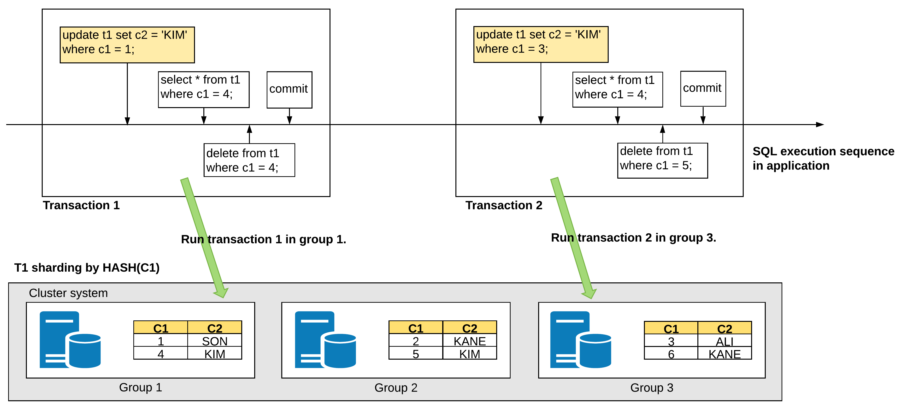
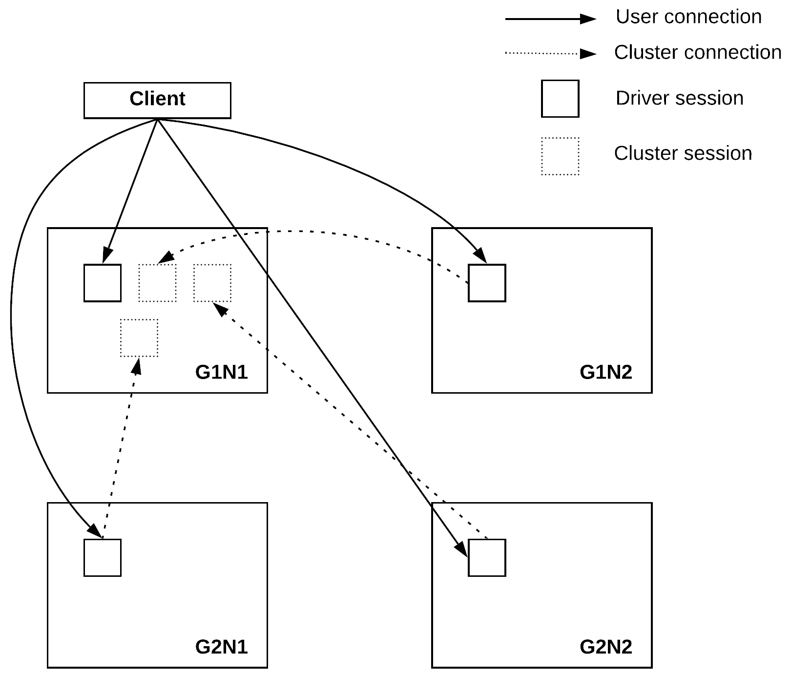

<a id="b911b0caa43ccb29"></a>

# 30. Database Connection

> 원본: [GOLDILOCKS 21c.1 User Manual (ko)](https://manual.sunjesoft.co.kr/goldilocks/21c_1/manual/ko/b911b0caa43ccb29)  
> 태그: `21c.1_35_tag`

[← 29. PSM SQL References](../part-04-psm-manual/29-psm-sql-references.md) · [전체 목차](../README.md) · [31. ODBC →](31-odbc.md)

<a id="d50aad4d2268ce46"></a>
## 특징

<a id="db437b421b72f79d"></a>


Global connection 기능은 데이터 지역성 (locality)을 고려한 트랜잭션의 성능 최적화 방안이다.  
일반적인 connection은 한 멤버와 연결하는 반면 global connection은 모든 멤버와 연결한다. Global connection을 사용하는 응용 프로그램은 질의가 접근해야 하는 데이터가 가장 많은 멤버에 질의를 수행 시킴으로써 처리 성능을 높인다.  
Global connection은 hash, range, list sharding 방식 모두에 사용할 수 있으며 이 때 응용 프로그램을 변경할 필요는 없다.

Online scale-out이 수행될 때, 사용자가 새로운 노드를 추가로 고려할 필요없이 응용 프로그램이 새 노드에 자동으로 접속해 해당 노드를 운영할 수 있다.

<a id="ef61ce4e366488a0"></a>


SQL을 수행할 때 선택한 노드에 장애가 발생하면 같은 그룹의 다른 노드를 통해 SQL을 수행하며, 선택된 그룹의 모든 노드에 장애가 발생하면 다른 그룹을 통해 SQL을 수행한다.  
장애가 발생한 노드를 복구하면 online 상태에서 해당 노드에 자동으로 다시 접속한다. 뿐만 아니라, 사용자가 다음 구문을 사용하여 응용 프로그램으로 하여금 다시 접속을 수행하게 할 수도 있다.

```
ALTER SYSTEM RECONNECT GLOBAL CONNECTION
```

<a id="dd3278a13dac285a"></a>
## 실행 멤버 선정

실행 멤버는 트랜잭션 단위로 선택된다. 트랜잭션이 없는 상태에서 DML 질의가 최초로 수행될 때 sharding key에 따라 그룹이 선택되고, 그룹 내 실행 멤버는 LOCALITY_MEMBER_POLICY 프로퍼티에 따라 결정된다. 이후 COMMIT이나 ROLLBACK 하기 전까지 수행되는 모든 질의는 선택된 멤버에서 수행된다. 만약 최초 질의가 sharding key에 따른 적합한 그룹을 선택하지 못할 경우에는 LOCALITY_GROUP_POLICY 프로퍼티에 따라 그룹이 결정된다.

<a id="83e822df1beef2bd"></a>


위 그림의 transaction1은 UPDATE 질의가 sharding key에 따라 group1에서 수행되었기 때문에 이후 COMMIT 사이의 모든 질의들이 group1에서 실행된다. Transaction2의 경우에는 UPDATE  질의가 group3에서 수행되었고 이후 질의들이 group3에 수행되기 적합하지 않다 하더라도 COMMIT 되기 전까지 모든 질의들이 group3에서 실행된다.

트랜잭션이 없는 상태에서 읽기 전용 질의 (SELECT)는 다른 질의와 마찬가지로 sharding key에 따라 실행 멤버를 선택하지만 이후 수행되는 질의가 반드시 이전에 선택된 멤버에서 수행되는 것은 아니다.   
즉, 트랜잭션에 포함된 모든 질의는 하나의 멤버에서만 수행되고, 트랜잭션과 무관한 질의는 질의 단위로 멤버를 선정한다.

<a id="27ae85028c8b3787"></a>
## Global Session

<a id="ebf2c5ffba4fbe77"></a>


응용 프로그램과 직접 연결된 session을 driver session이라고 하며, driver session에서 다른 멤버로의 session을 cluster session이라고 한다. Global connection은 모든 멤버에 driver session을 만들고 필요에 따라 다른 멤버로 cluster session들을 만든다. Global connection 특성상 한 멤버에 다수의 cluster session이 만들어질 수 있다.

<a id="5b3b8b144a2de55c"></a>


Global session은 global connection에서 만든 cluster session들이 하나의 session을 공유함으로써 자원 효율성을 높이기 위한 기능이다. Global connection이 global session을 사용하지 않는 경우에는 그룹과 멤버가 증가함에따라 cluster session이 증가하는 반면에 global session을 사용하는 경우에는 그룹과 멤버가 증가하더라도 cluster session이 증가하지 않는다.

Global session 기능은 global connection에서만 사용할 수 있고 일반 connection에서는 사용할 수 없다.

<a id="e5c7cf49cf85a694"></a>
## 제약 사항

Global connection을 사용할 때는 SQL 구문에 session dependency를 가지는 객체 (session dependent object)나 구문 (session dependent clause) 또는 함수 (session dependent function)를 사용할 수 없다.

또한 다수의 클러스터 노드에 접근하는 SQL들이 하나의 트랜잭션 안에 존재할 경우, 트랜잭션 내의 SQL들은 첫 번째 SQL의 sharding key가 선택한 클러스터 노드를 공통적으로 사용한다.

Global connection에서의 질의는 prepare execute로 수행하는 경우에만 데이터 지역성을 고려하여 수행되며 direct execute로 수행하는 경우에는 임의의 노드에서 수행된다.

<a id="f2cded107154417b"></a>
### Session Dependent Object

SQL 구문에서 session dependent object를 사용하는 경우에는 global connection을 지원하지 않는다.

- Global temporary table

<a id="9a88149046499a08"></a>
### Session Dependent Clause

SQL 구문에서 session dependent clause를 사용하는 경우에는 global connection을 지원하지 않는다.

- @domain 관련 구문 전체

<a id="bcd314887d45ad0f"></a>
### Session Dependent Function과 Pseudo Column

SQL 구문에서 session dependent 정보를 사용하는 경우에는 global connection을 지원하지 않는다.

- CURRVAL(sequence), sequence.CURRVAL
- UUID()
- VERSION()
- SESSION_ID()
- SESSION_SERIAL()
- USER_ID()
- LAST_IDENTITY_VALUE()
- STATEMENT_VIEW_SCN()
- STATEMENT_VIEW_SCN_GCN()
- STATEMENT_VIEW_SCN_DCN()
- STATEMENT_VIEW_SCN_LCN()
- LOCAL_GROUP_ID()
- LOCAL_MEMBER_ID()
- LOCAL_GROUP_NAME()
- LOCAL_MEMBER_NAME()
- CLUSTER_GROUP_ID
- CLUSTER_GROUP_NAME
- CLUSTER_MEMBER_ID
- CLUSTER_MEMBER_NAME
- CLUSTER_SHARD_ID

<a id="724f06aaac866205"></a>
### Global Session 기능을 사용하는 경우

SQL 구문에서 Data Definition Language (DDL)은 지원하지 않는다.

<a id="0394aed6b822799f"></a>
## 설정

자세한 내용은 다음을 참조한다.

- [ODBC에서의 Global Connection 설정](31-odbc.md#b1443971f8b3fd95)
- [JDBC에서의 Global Connection 설정](32-jdbc.md#c8b5c52e0e7db014)

---

[← 29. PSM SQL References](../part-04-psm-manual/29-psm-sql-references.md) · [전체 목차](../README.md) · [31. ODBC →](31-odbc.md)

<sub>Copyright © 2010 SUNJESOFT Inc. All rights reserved.</sub>
