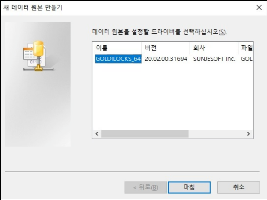
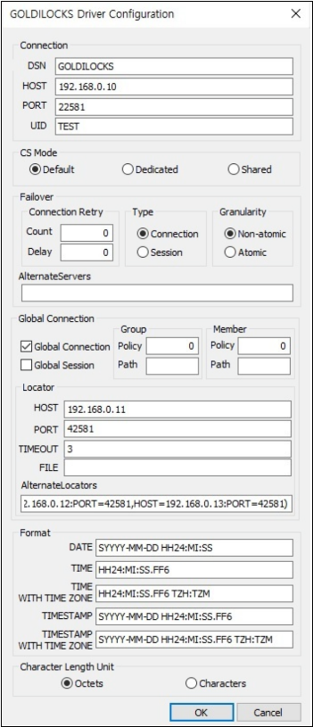
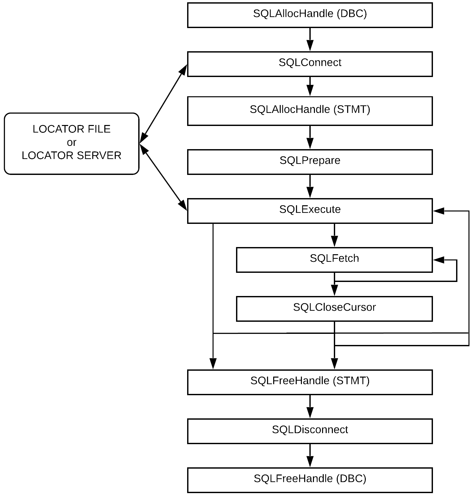
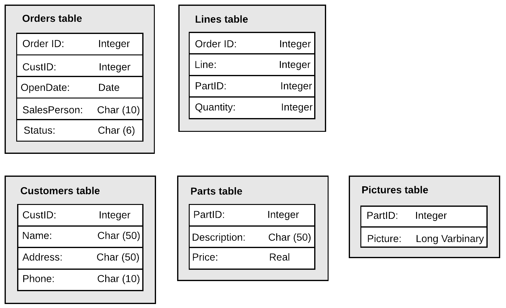
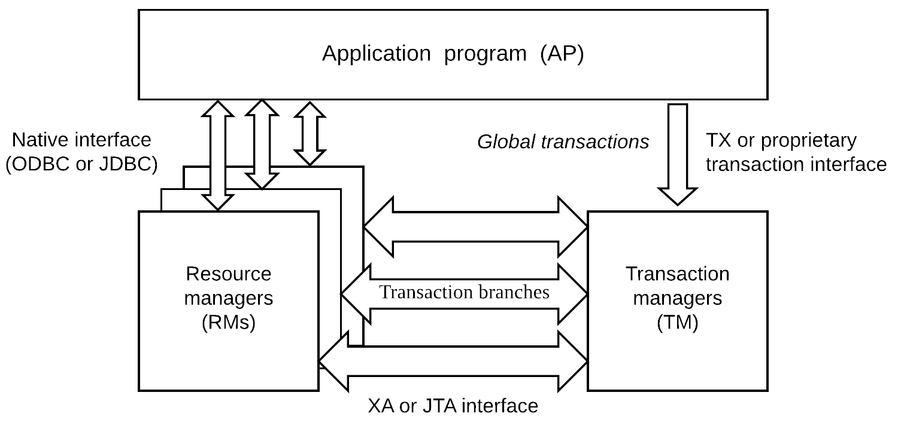

<a id="05e84e8d4211467a"></a>

# 31. ODBC

> 원본: [GOLDILOCKS 21c.1 User Manual (ko)](https://manual.sunjesoft.co.kr/goldilocks/21c_1/manual/ko/05e84e8d4211467a)  
> 태그: `21c.1_35_tag`

[← 30. Database Connection](30-database-connection.md) · [전체 목차](../README.md) · [32. JDBC →](32-jdbc.md)

<a id="ccb9e3875c31d205"></a>
## GOLDILOCKS ODBC Driver 개요

<a id="95f38c35214a1aca"></a>
### GOLDILOCKS ODBC Driver 개념

Open Database Connectivity (ODBC)는 데이터베이스 Application Programming Interface (API)에 대한 스펙이다. Microsoft ODBC 3.0 버전은 International Standards Organization/ International Electromechanical Commission (ISO/ IEC)과 X/ open의 콜 레벨 인터페이스 (CLI) 권장 스펙을 기반으로 한다. ODBC는 C 라이브러리 함수를 사용하여 SQL 문을 지원한다. 응용 프로그램에서 이 함수를 호출하여 ODBC 기능을 구현한다.

ODBC 아키텍처에는 다음과 같은 기능을 수행하는 네 가지 구성 요소가 있다.

<a id="407352c54714e000"></a>
| 구성요소 | 기능 |
| --- | --- |
| 응용 프로그램 | ODBC 데이터 원본과 통신하는 ODBC 함수를 호출하고, SQL 문을 전송하여 결과 집합을 처리한다. |
| 드라이버 관리자 | 응용 프로그램과 응용 프로그램에서 사용하는 모든 ODBC 드라이버 사이의 통신을 관리한다. |
| 드라이버 | 응용 프로그램으로부터의 모든 ODBC 호출을 처리하고, 데이터 원본에 연결하여 응용 프로그램에서 데이터 원본으로 SQL 문을 전달한 후 응용 프로그램에 결과를 반환한다. 필요한 경우 드라이버가 응용 프로그램에서 전달된 ODBC SQL을 데이터 원본에서 사용하는 기본 SQL로 변환한다. |
| 데이터 원본 | 드라이버가 DBMS의 데이터에 접근하는데 필요한 모든 정보를 포함한다. |

ODBC 응용 프로그램을 사용하여 다음과 같은 작업을 수행할 수 있다.

- 데이터 원본과 연결
- 데이터 원본에 SQL 문 전송
- 데이터 원본에서 SQL 문의 결과 처리
- 오류 및 메시지 처리
- 데이터 원본에 대한 연결 종료

<a id="ed2d662ce675803d"></a>
### ODBC 구성요소 개요

<a id="d1b48b4023f274f0"></a>
#### 드라이버 관리자를 포함하는 GOLDILOCKS ODBC Driver

다음은 드라이버 관리자가 시스템에 포함된 소프트웨어 아키텍처이다. 이 경우, 응용 프로그램은 드라이버 관리자 라이브러리로 링크해야 한다.

<a id="bb3b10d5c430b8a2"></a>


<a id="8550533fdd69f0e3"></a>
#### 드라이버 관리자를 포함하지 않는 GOLDILOCKS ODBC Driver

다음은 응용 프로그램이 드라이버 관리자를 포함하지 않고, GOLDILOCKS ODBC driver를 사용하는 아키텍처이다. 이 경우, 응용 프로그램은 GOLDILOCKS ODBC driver 라이브러리로 링크해야 한다.

<a id="a6cd414ed05074d3"></a>


<a id="7a9c4397723c678e"></a>
### GOLDILOCKS ODBC Driver 사용

<a id="e1f94caaae57f210"></a>
#### 헤더 파일

GOLDILOCKS ODBC driver를 실행하려면 $GOLDILOCKS_HOME/include에 설치된 goldilocks.h 파일을 포함해야 한다. 이 파일은 GOLDILOCKS ODBC driver의 상수와 유형을 정의하고, GOLDILOCKS ODBC driver 함수의 프로토 타입을 제공한다.

<a id="fcd644f799ea053b"></a>
#### 라이브러리

드라이버 관리자를 사용하지 않는 응용 프로그램은 GOLDILOCKS ODBC driver 라이브러리의 정적 또는 공유 버전에 링크해야 한다.

<a id="e8763109fe0c1cd0"></a>
##### UNIX

**GOLDILOCKS UNIX ODBC driver 라이브러리**

<a id="5d8bd69c9f8d9631"></a>
| 파일 이름 | 설명 |
| --- | --- |
| libgoldilocks.a | DA와 CS가 포함된 라이브러리의 정적 버전 |
| libgoldilocksa.a | DA 전용 라이브러리의 정적 버전 |
| libgoldilocksas.so | DA 전용 라이브러리의 공유 버전 |
| libgoldilocksc.a | CS 전용 라이브러리의 정적 버전 |
| libgoldilockscs-ul32.so | SQLLEN을 4바이트로 인식하는 64 비트 CS 전용 라이브러리의 공유 버전 |
| libgoldilockscs-ul64.so | SQLLEN을 8바이트로 인식하는 64 비트 CS 전용 라이브러리의 공유 버전 |
| libgoldilockscs.so | 32 비트 CS 전용 라이브러리의 공유 버전 |
| libgoldilockss.so | DA와 CS가 포함된 라이브러리의 공유 버전 |

<a id="937caaa09b0af82e"></a>
##### Windows

GOLDILOCKS Windows ODBC driver 라이브러리는 CS 라이브러리만 제공한다.

**GOLDILOCKS Windows ODBC driver 라이브러리**

<a id="39c74dbcb82a6168"></a>
| 파일 이름 | 설명 |
| --- | --- |
| goldilockscs-ul64.dll | SQLLEN을 8바이트로 인식하는 64 비트 CS 전용 라이브러리의 공유 버전 |
| goldilockscs.dll | 32 비트 CS 전용 라이브러리의 공유 버전 |
| goldilockssetup32.dll | 32 비트 ODBC driver manager를 위한 설정 라이브러리 |
| goldilockssetup64.dll | 64 비트 ODBC driver manager를 위한 설정 라이브러리 |

<a id="e877d5722faabf1c"></a>
## 데이터 원본 구성

<a id="46de439ecbb649da"></a>
### UNIX에서 DSN 구성

<a id="a5ad27b43c03a573"></a>
#### odbcinst.ini 파일

odbcinst.ini 파일은 설치된 ODBC 드라이버에 대한 설정 파일이다.

- unixODBC

```
% odbcinst -j
unixODBC 2.3.4
DRIVERS............: /etc/odbcinst.ini
SYSTEM DATA SOURCES: /etc/odbc.ini
FILE DATA SOURCES..: /etc/ODBCDataSources
USER DATA SOURCES..: /home/goldilocks/.odbc.ini
SQLULEN Size.......: 8
SQLLEN Size........: 8
SQLSETPOSIROW Size.: 8
```

- iODBC

```
% iodbc-config --odbcinstini
/etc/odbcinst.ini
```

<a id="29cb7d81a4e474c6"></a>
##### ODBC 드라이버 스펙

odncinst.ini 파일의 ODBC 드라이버 스펙 섹션은 드라이버의 속성값과 목록을 기술한다. 설치된 각 드라이버에는 드라이버 이름 아래 등록 정보 섹션이 있다.

```
[driver_name]
Description = driver_description
Driver = driver_library_path
Setup = setup_library_path
FileUsage = file_usage
```

드라이버 스펙 섹션의 키워드는 다음 표와 같다.

**드라이버 스펙**

<a id="cecb58f66657289b"></a>
| 키워드 | 설명 |
| --- | --- |
| Description | 드라이버를 설명하는 문자열 |
| Driver | 드라이버 라이브러리 경로 |
| Setup | 설치 라이브러리 경로 |
| FileUsage | 파일 기반 드라이버가 DSN에서 파일을 직접 처리하는 방법을 표시하는 문자 |

다음은 GOLDILOCKS ODBC 드라이버 스펙에 대한 정보를 보여주는 예이다.

```
[GOLDILOCKS ODBC Driver]
Description= GOLDILOCKS ODBC Driver
Driver = /home/goldilocks/home/lib/libgoldilockscs-ul64.so
Setup = /home/goldilocks/home/lib/libgoldilockscs-ul64.so
FileUsage = 0
```

<a id="a8dbbc9962ac8d3d"></a>
#### odbc.ini 파일

odbc.ini 파일은 응용 프로그램이 연결하는 DSN에 대한 설정 파일이며, 사용자 DSN과 시스템 DSN이 있다. 일반적으로 사용자 DSN 파일은 ~/.odbc.ini 파일이고 시스템 DSN 파일은 /etc/odbc.ini 파일이다.

- unixODBC

```
% odbcinst -j
unixODBC 2.3.4
DRIVERS............: /etc/odbcinst.ini
SYSTEM DATA SOURCES: /etc/odbc.ini
FILE DATA SOURCES..: /etc/ODBCDataSources
USER DATA SOURCES..: /home/goldilocks/.odbc.ini
SQLULEN Size.......: 8
SQLLEN Size........: 8
SQLSETPOSIROW Size.: 8
```

- iODBC

```
% iodbc-config --odbcini
/etc/odbc.ini
```

<a id="966daee79e73f6aa"></a>
##### 데이터 원본 스펙

odbc.ini 파일의 데이터 원본 스펙 섹션은 DSN을 설명한다.

```
[data_source_name]
Driver = driver_name
PROTOCOL = {DA | TCP | IPC}
CS_MODE = {default | dedicated | shared}
HOST = host_address
PORT = port_no
PREFER_IPV6 = {0 | 1}
CHARSET = {SQL_ASCII | UTF8 | UHC | GB18030}
TCP_NODELAY = {0 | 1}
ALTERNATE_SERVERS = (HOST=ADDRESS1:PORT=PORT1,HOST=ADDRESS2:PORT=PORT2)
CONNECTION_RETRY_COUNT = retry_count
CONNECTION_RETRY_DELAY = retry_delay
FAILOVER_TYPE = {CONNECTION | SESSION}
FAILOVER_GRANULARITY = {0 | 1 | 2}
FAILOVER_ROUTING_POLICY = {0 | 1}
DATE_FORMAT = date_format_string
TIME_FORMAT = time_format_string
TIME_WITH_TIME_ZONE_FORMAT = timetz_format_string
TIMESTAMP_FORMAT = timestamp_format_string
TIMESTAMP_WITH_TIME_ZONE_FORMAT = timestamptz_format_string
CHAR_LENGTH_UNITS = {BYTE | OCTETS | CHAR | CHARACTERS}
ENABLE_SQLDESCRIBEPARAM = {0 | 1}
ENABLE_SQLBINDPARAMETER_CONSISTENCY_CHECK = {0 | 1}
USE_TARGETTYPE = {0 | 1 | 2} 
LOCATOR_DSN = locator_dsn_name
LOCATOR_SERVICE = locator_service_name
LOCALITY_AWARE_TRANSACTION = {0 | 1}
LOCALITY_GROUP_POLICY = {0 | 1 | 2}
LOCALITY_GROUP_PATH = group_name1, group_name2, group_name3
LOCALITY_MEMBER_POLICY = {0 | 1 | 2 | 3 | 4}
LOCALITY_MEMBER_PATH = member_name1,member_name2, member_name3
DB_HOME = database_home_path
PACKET_COMPRESSION_THRESHOLD = packet_compression_threshold
USE_GLOBAL_SESSION = {0 | 1}
CONNECTION_TIMEOUT = connection_timeout
LOGIN_TIMEOUT = login_timeout
TRACE = {0 | 1}
TRACEFILE = file_path_name
TRACE_POLICY={DEFAULT | ERROR}
INCLUDE_SYNONYMS = {0 | 1}
DOT_NET_FOR_ODBC = {0 | 1}

[locator_dsn_name]
FILE = location_file_name
HOST = IP address(v4)
PORT = locator_port
CONNECTION_TIMEOUT = second 
ALTERNATE_LOCATORS = (HOST=ADDRESS1:PORT=PORT1,HOST=ADDRESS2:PORT=PORT2)
```

데이터 원본 스펙 섹션의 키워드는 다음 표와 같다.

**데이터 원본 스펙 섹션의 키워드**

<a id="2df41668cfd6cad9"></a>
<table><thead><tr><th align="center">키워드</th><th align="center">설명</th></tr></thead><tbody><tr><td align="left" valign="middle">data_source_name</td><td align="left" valign="middle">데이터 원본 섹션에 지정된 데이터 원본이다.</td></tr><tr><td align="left" valign="middle">Driver</td><td align="left" valign="middle">odbcinst.ini에 설치된 드라이버 이름이다.</td></tr><tr><td align="left" valign="middle">PROTOCOL</td><td align="left" valign="middle">서버와 연결 방식이다.<br><ul><li>DA: 별도의 통신 없이 직접 접근한다.</li><li>TCP: TCP 소켓을 통해 통신한다.</li><li>IPC: 공유 메모리를 통해 통신하며 서버와 같은 장비에서만 가능하다. 처음 접속할 때 IPC 정보를 전달하기 위해 TCP 연결을 사용하므로 HOST와 PORT를 설정해 주어야 한다. Dedicated 모드로만 접속할 수 있다.</li></ul></td></tr><tr><td align="left" valign="middle">CS_MODE</td><td align="left" valign="middle">Dedicated 모드로 접속할지 shared 모드로 접속할지를 설정한다.<br>이 설정을 사용하지 않으면 listener의 configuration (DEFAULT_CS_MODE)에 따라서 모드가 결정된다.</td></tr><tr><td align="left" valign="middle">HOST</td><td align="left" valign="middle">호스트 IP 주소 또는 이름이다.</td></tr><tr><td align="left" valign="middle">PORT</td><td align="left" valign="middle">연결 포트 번호이다.</td></tr><tr><td>PREFER_IPV6</td><td>HOST parameter가 호스트 이름일 경우 IP 주소 중에 IPv6를 우선시한다.</td></tr><tr><td align="left" valign="middle">TCP_NODELAY</td><td align="left" valign="middle">socket TCP_NODELAY 옵션이다.</td></tr><tr><td align="left" valign="middle">UID</td><td align="left" valign="middle">사용자 ID 이다.</td></tr><tr><td align="left" valign="middle">PWD</td><td align="left" valign="middle">사용자 password 이다.</td></tr><tr><td align="left" valign="middle">CHARSET</td><td align="left" valign="middle">Client character set 이다.</td></tr><tr><td align="left" valign="middle">ALTERNATE_SERVERS</td><td align="left" valign="middle">Failover가 발생할 경우, 연결을 시도하는 서버 리스트이며 각 서버는 콤마 (,) 로 구분한다.<br>Failover 기능을 사용하지 않을 경우, ALTERNATE_SERVERS를 공백으로 설정한다.</td></tr><tr><td align="left" valign="middle">CONNECTION_RETRY_COUNT</td><td align="left" valign="middle">연결에 실패할 경우, 서버 접속을 시도하는 횟수이다.</td></tr><tr><td align="left" valign="middle">CONNECTION_RETRY_DELAY</td><td align="left" valign="middle">연결에 실패할 경우, 서버 접속을 시도하는 간격이다. (단위: 초)</td></tr><tr><td align="left" valign="middle">FAILOVER_TYPE</td><td align="left" valign="middle"><ul><li>CONNECTION: 연결에 실패할 경우, ALTERNATE_SERVERS로 연결한다.</li><li>SESSION: 연결에 실패하거나 statement 동작 중 연결이 끊어졌을 경우, ALTERNATE_SERVERS로 연결한 후에 statement를 복원한다. 연결이 끊어질 때 진행 중인 트랜잭션이 없었을 경우, failover 후에 진행 중인 statement를 수행한다.</li></ul></td></tr><tr><td align="left" valign="middle">FAILOVER_GRANULARITY</td><td align="left" valign="middle"><ul><li>0: Failover 진행 중에 에러가 발생해도 failover를 계속 진행한다.</li><li>1: Failover 진행 중에 SQLExeceute(), SQLExecDirect()를 제외한 에러가 발생할 경우 failover에 실패한다.</li><li>2: Failover 진행 중에 에러가 발생할 경우 failover에 실패한다.</li></ul></td></tr><tr><td align="left" valign="middle">FAILOVER_ROUTING_POLICY</td><td align="left" valign="middle"><ul><li>0: ALTERNATE_SERVERS의 마지막 서버에서 장애가 발생하면 primary 서버부터 다시 failover를 진행한다.</li><li>1: ALTERNATE_SERVERS의 마지막 서버에서 장애가 발생하면 failover를 종료한다.</li></ul></td></tr><tr><td align="left" valign="middle">DATE_FORMAT</td><td align="left" valign="middle">DATE 타입 형식 문자열이다.</td></tr><tr><td align="left" valign="middle">TIME_FORMAT</td><td align="left" valign="middle">TIME 타입 형식 문자열이다.</td></tr><tr><td align="left" valign="middle">TIME_WITH_TIME_ZONE_FORMAT</td><td align="left" valign="middle">TIME WITH TIME ZONE 타입 형식 문자열이다.</td></tr><tr><td align="left" valign="middle">TIMESTAMP_FORMAT</td><td align="left" valign="middle">TIMESTAMP 타입 형식 문자열이다.</td></tr><tr><td align="left" valign="middle">TIMESTAMP_WITH_TIME_ZONE_FORMAT</td><td align="left" valign="middle">TIMESTAMP WITH TIME ZONE 타입 형식 문자열이다.</td></tr><tr><td align="left" valign="middle">CHAR_LENGTH_UNITS</td><td align="left" valign="middle">SQLBindParameter()에서 ParameterType이 SQL_CHAR, SQL_VARCHAR일 경우, ColumnSize의 단위이다.<br><ul><li>BYTE, OCTETS: 바이트 단위이다.</li><li>CHAR, CHARACTERS: 문자 단위이다.</li></ul></td></tr><tr><td align="left" valign="middle">ENABLE_SQLDESCRIBEPARAM</td><td align="left" valign="middle">SQLDescribeParam() 동작 여부를 결정한다.<br><ul><li>0: SQLDescribeParam()를 지원하지 않는다.</li><li>1: 모든 parameter에 대해 SQL_VARCHAR를 반환한다.</li></ul></td></tr><tr><td align="left" valign="middle">ENABLE_SQLBINDPARAMETER_CONSISTENCY_CHECK</td><td align="left" valign="middle">SQLBindParameter()의 ColumnSize와 DecimalDigits를 검사할지 여부를 결정한다.<br><ul><li>0: ColumnSize와 DecimalDigits를 검사하지 않는다.</li><li>1: ColumnSize와 DecimalDigits를 검사한다.</li></ul></td></tr><tr><td align="left" valign="middle">USE_TARGETTYPE</td><td align="left" valign="middle">통신으로 column 타입을 수신할 때 함께 수신할 타입 정보를 설정한다.<br><ul><li>0: Column 타입만 수신한다.</li><li>1: Column 타입과 column 이름을 수신한다.</li><li>2: Column 타입과 column의 모든 정보을 수신한다.</li></ul></td></tr><tr><td align="left" valign="middle">LOCATOR_DSN</td><td align="left" valign="middle">Location 정보를 지정하는 Data Source Name (DSN)이다.</td></tr><tr><td align="left" valign="middle">LOCATOR_SERVICE</td><td align="left" valign="middle">Service hint, glocator로부터 접속 정보를 얻는다.</td></tr><tr><td valign="middle">LOCALITY_AWARE_TRANSACTION</td><td valign="middle">GLOBAL CONNECTION 사용 여부이다.<br><ul><li>0: GLOBAL CONNECTION을 사용하지 않는다.</li><li>1: GLOBAL CONNECTION을 사용한다.</li></ul></td></tr><tr><td valign="middle">LOCALITY_GROUP_POLICY</td><td valign="middle">GLOBAL CONNECTION을 사용할 때 선택할 수 있는 그룹이 없거나 둘 이상의 그룹을 선택할 수 있을 경우, 그룹 선택 방법을 설정한다.<br><ul><li>0: 임의로 선택한다.</li><li>1: LOCALITY_GROUP_PATH 설정에 존재하는 그룹을 순서대로 선택한다. LOCALITY_GROUP_PATH에 있는 모든 그룹을 사용할 수 없는 경우에는 임의의 그룹을 선택한다.</li><li>2: 순서대로 선택한다. 매번 드라이버에 연결된 그룹 순서대로 선택한다.</li></ul></td></tr><tr><td valign="middle">LOCALITY_GROUP_PATH</td><td valign="middle">GLOBAL CONNECTION을 사용할 때 선택할 수 있는 그룹이 한 개가 아니었을 때 선택한 그룹의 목록을 지정한다. 각 그룹은 콤마 (,)로 구분한다.<br>예: G1,G2,G3</td></tr><tr><td valign="middle">LOCALITY_MEMBER_POLICY</td><td valign="middle">GLOBAL CONNECTION을 사용할 때 선택된 그룹 내의 멤버를 선택하는 방법을 결정한다.<br><ul><li>0: DML : MASTER / SELECT : MASTER</li><li>1: DML : ANY / SELECT : ANY</li><li>2: DML : MASTER / SELECT : ANY</li><li>3: DML : MASTER / SELECT : SLAVE</li><li>4: LOCALITY_MEMBER_PATH 설정에 존재하는 멤버를 순서대로 선택한다. LOCALITY_MEMBER_PATH에 존재하는 모든 멤버들을 사용할 수 없는 경우에는 선택된 그룹의 MASTER를 선택한다.</li></ul></td></tr><tr><td valign="middle">LOCALITY_MEMBER_PATH</td><td valign="middle">GLOBAL CONNECTION을 사용할 때 선택된 그룹에서 사용할 멤버들의 목록을 지정한다. 각 멤버는 콤마 (,)로 구분한다.<br>예: G1N1,G2N1,G3N1,G1N2,G2N2,G3N2</td></tr><tr><td valign="middle">DB_HOME</td><td valign="middle">데이터베이스의 홈 디렉토리를 설정한다. 기본값은 $GOLDILOCKS_HOME 환경 변수를 사용한다.</td></tr><tr><td valign="middle">PACKET_COMPRESSION_THRESHOLD</td><td valign="middle">서버로 보낼 통신 데이터의 크기가 PACKET_COMPRESSION_THRESHOLD 보다 클 경우 통신 데이터를 압축한다. 설정값의 범위는 32 ~ 2113929216 이다.</td></tr><tr><td valign="middle">USE_GLOBAL_SESSION</td><td valign="middle">GLOBAL SESSION 사용 여부이다.<br><ul><li>0: GLOBAL SESSION을 사용하지 않는다.</li><li>1: GLOBAL SESSION을 사용한다.</li></ul></td></tr><tr><td>CONNECTION_TIMEOUT</td><td>요청 후 응답이 올 때까지 대기하는 시간 (초) 이다.</td></tr><tr><td>LOGIN_TIMEOUT</td><td>로그인 요청이 완료될 때까지 대기하는 시간 (초)이다.</td></tr><tr><td valign="middle">TRACE</td><td valign="middle">ODBC API에서 trace를 사용할지 여부이다.<br><ul><li>0: Trace를 사용하지 않는다.</li><li>1: Trace를 사용한다.</li></ul></td></tr><tr><td valign="middle">TRACEFILE</td><td valign="middle">Trace 파일 이름이다. 상대 경로로 입력하면 프로그램이 실행되는 현재 디렉토리가 기준이 된다. 기본값은 'odbc_trace.log' 이다.</td></tr><tr><td valign="middle">INCLUDE_SYNONYMS</td><td valign="middle">SQLGetColumns()에 synonym 객체를 포함할지 여부이다.<br><ul><li>0: Synonym 객체를 포함하지 않는다.</li><li>1: Synonym 객체를 포함한다.</li></ul></td></tr><tr><td valign="middle">DOT_NET_FOR_ODBC</td><td valign="middle">ODBC를 .NET Framework 용도로 사용할지 여부이다.<br><ul><li>0: 용도를 변경하지 않는다.</li><li>1: SQLGetDescField()와 SQLColAttribute()에서 SQL_DESC_BASE_COLUMN_NAME, SQL_DESC_NAME 속성을 SQL_DESC_LABEL로 대체한다.</li></ul></td></tr></tbody></table>

**Location**

<a id="745788224db257dd"></a>
| 키워드 | 설명 |
| --- | --- |
| FILE | Location file name |
| HOST | glocator ip address |
| PORT | glocator port number |
| CONNECTION_TIMEOUT | Connection timeout with glocator (second) |
| ALTERNATE_LOCATORS | glocator로부터 응답을 받지 못한 경우, ALTERNATE_LOCATORS를 이용하여 접속 정보를 얻는다. |


> 
> - LOCATOR_DSN에 FILE과 HOST, PORT 속성이 모두 설정된 경우, FILE 속성을 우선적으로 적용한다. FILE에 대한 자세한 내용은 [Location File](../part-06-utility-manual/48-gloctl.md#b90af0416b437fa1) 을 참조한다.
> 
> 
> 
> - LOCATOR_SERVICE 속성은 LOCATOR_SERVICE에 속한 서버에 접속할 수 있게 한다. 접속한 서버 이외의 서버는 ALTERNATE_SERVERS가 된다.   
>   FAILOVER_TYPE이 설정되지 않았다면 FAILOVER_TYPE은 session이 된다.  
>   FAILOVER_GRANULARITY이 설정되지 않았다면 FAILOVER_GRANULARITY은 1이 된다.  
>   자세한 내용은 [glocator](../part-06-utility-manual/46-glocator.md#b8476a5e4f93eb40)와 [gloctl](../part-06-utility-manual/48-gloctl.md#ddf86e4664e92e55)를 참조한다.
> 

다음은 GOLDILOCKS DSN을 구성하는 예이다.

```
[GOLDILOCKS]
Driver = GOLDILOCKS ODBC Driver
PROTOCOL = TCP
CS_MODE = SHARED
HOST = 192.168.0.10
PORT = 22581
CHARSET = UTF8
TCP_NODELAY = 1
ALTERNATE_SERVERS = (HOST=192.168.0.11:PORT=22581,HOST=192.168.0.12:PORT=22581)
CONNECTION_RETRY_COUNT = 3
CONNECTION_RETRY_DELAY = 1
FAILOVER_TYPE = SESSION
FAILOVER_GRANULARITY = 0
FAILOVER_ROUTING_POLICY = 0
DATE_FORMAT = YYYY-MM-DD
TIME_FORMAT = HH24:MI:SS.FF6
TIME_WITH_TIME_ZONE_FORMAT = HH24:MI:SS.FF6 TZH:TZM
TIMESTAMP_FORMAT = YYYY-MM-DD HH24:MI:SS.FF6
TIMESTAMP_WITH_TIME_ZONE_FORMAT = YYYY-MM-DD HH24:MI:SS.FF6 TZH:TZM
CHAR_LENGTH_UNITS = CHARACTERS
ENABLE_SQLDESCRIBEPARAM = 1
ENABLE_SQLBINDPARAMETER_CONSISTENCY_CHECK = 1

USE_TARGETTYPE = 0
INCLUDE_SYNONYMS = 0

PACKET_COMPRESSION_THRESHOLD = 2113929216

LOCALITY_AWARE_TRANSACTION = 0
LOCALITY_GROUP_POLICY = 0
LOCALITY_GROUP_PATH = G1,G2,G3
LOCALITY_MEMBER_POLICY = 0
LOCALITY_MEMBER_PATH = G1N1,G2N1,G3N1,G1N2,G2N2,G3N2

USE_GLOBAL_SESSION = 0

CONNECTION_TIMEOUT = 0
LOGIN_TIMEOUT = 0

LOCATOR_DSN = LOCATOR
LOCATOR_SERVICE = S1

TRACE = 1
TRACEFILE = /home/test/log/mytrace.log

DOT_NET_FOR_ODBC = 0

[LOCATOR]
FILE = /home/test/.location.ini
HOST = 127.0.0.1
PORT = 42581
ALTERNATE_LOCATORS=(HOST=127.0.0.1:PORT=42582,HOST=127.0.0.1:PORT=42583)
```

<a id="2757055e936b72ae"></a>
### Windows에서 DSN 구성

Windows에서는 ODBC 데이터 원본 관리자를 통해 DSN을 추가하거나 설정할 수 있다.

<a id="0c9223f1ba15e8ac"></a>


<a id="6c8e83c2a73fbe2e"></a>


각 항목에 대한 설명은 다음과 같다.

**DSN 구성 키워드**

<a id="c6138c0d7e50d7bb"></a>
<table><thead><tr><th align="center">키워드</th><th align="center">설명</th></tr></thead><tbody><tr><td valign="middle">DSN</td><td valign="middle">데이터 원본 이름이다.</td></tr><tr><td valign="middle">HOST</td><td valign="middle">호스트 IP 주소 또는 이름이다.</td></tr><tr><td valign="middle">PORT</td><td valign="middle">연결 포트 번호이다.</td></tr><tr><td valign="middle">UID</td><td align="left" valign="middle">사용자 ID 이다.</td></tr><tr><td valign="middle">CS_MODE</td><td align="left" valign="middle">Dedicated 모드로 접속할지 shared 모드로 접속할지를 설정한다.<br>설정하지 않을 경우, listener의 configuration (DEFAULT_CS_MODE)에 따라 default 모드가 결정된다.</td></tr><tr><td valign="middle">ALTERNATE_SERVERS</td><td align="left" valign="middle">Failover가 발생할 경우, 연결을 시도하는 서버 목록으로써 각 서버는 콤마 (,)로 구분한다.<br>Failover 기능을 사용하지 않을 경우, ALTERNATE_SERVERS를 공백으로 설정한다.</td></tr><tr><td valign="middle">CONNECTION_RETRY_COUNT</td><td valign="middle">연결에 실패할 경우, 서버에 접속을 시도하는 횟수이다.</td></tr><tr><td valign="middle">CONNECTION_RETRY_DELAY</td><td valign="middle">연결에 실패할 경우, 서버에 접속을 시도하는 간격이다. (단위: 초)</td></tr><tr><td valign="middle">FAILOVER_TYPE</td><td valign="middle"><ul><li>CONNECTION: 연결에 실패할 경우, ALTERNATE_SERVERS로 연결한다.</li><li>SESSION: 연결에 실패하거나 statement 동작 중 연결이 끊어졌을 경우, ALTERNATE_SERVERS로 연결한 후에 statement를 복원한다. 연결이 끊어질 때 진행 중인 트랜잭션이 없었을 경우, failover 후에 진행 중인 statement를 수행한다.</li></ul></td></tr><tr><td valign="middle">FAILOVER_GRANULARITY</td><td valign="middle"><ul><li>Non-atomic: Failover 진행 중에 에러가 발생해도 failover를 계속 진행한다.</li><li>Atomic: Failover 진행 중에 에러가 발생할 경우 failover에 실패한다.</li></ul></td></tr><tr><td valign="middle">DATE_FORMAT</td><td align="left" valign="middle">DATE 타입 형식 문자열이다.</td></tr><tr><td valign="middle">TIME_FORMAT</td><td align="left" valign="middle">TIME 타입 형식 문자열이다.</td></tr><tr><td valign="middle">TIME_WITH_TIME_ZONE_FORMAT</td><td valign="middle">TIME WITH TIME ZONE 타입 형식 문자열이다.</td></tr><tr><td valign="middle">TIMESTAMP_FORMAT</td><td valign="middle">TIMESTAMP 타입 형식 문자열이다.</td></tr><tr><td valign="middle">TIMESTAMP_WITH_TIME_ZONE_FORMAT</td><td valign="middle">TIMESTAMP WITH TIME ZONE 타입 형식 문자열이다.</td></tr><tr><td valign="middle">CHAR_LENGTH_UNITS</td><td valign="middle">SQLBindParameter()에서 ParameterType이 SQL_CHAR, SQL_VARCHAR일 경우 ColumnSize의 단위이다.<br><ul><li>BYTE, OCTETS: 바이트 단위</li><li>CHAR, CHARACTERS: 문자 단위</li></ul></td></tr><tr><td valign="middle">LOCALITY_AWARE_TRANSACTION</td><td valign="middle">GLOBAL CONNECTION 사용 여부이다.<br><ul><li>0: GLOBAL CONNECTION을 사용하지 않는다.</li><li>1: GLOBAL CONNECTION을 사용한다.</li></ul></td></tr><tr><td valign="middle">USE_GLOBAL_SESSION</td><td valign="middle">GLOBAL SESSION 사용 여부이다.<br><ul><li>0: GLOBAL SESSION을 사용하지 않는다.</li><li>1: GLOBAL SESSION을 사용한다.</li></ul></td></tr><tr><td valign="middle">LOCALITY_GROUP_POLICY</td><td valign="middle">GLOBAL CONNECTION을 사용할 때 선택할 수 있는 그룹이 없거나 둘 이상의 그룹을 선택할 수 있을 경우에 어떻게 그룹을 선택할지 설정한다.<br><ul><li>0: 임의로 선택한다.</li><li>1: LOCALITY_GROUP_PATH 설정에 존재하는 그룹을 순서대로 선택한다. LOCALITY_GROUP_PATH에 있는 모든 그룹을 사용할 수 없는 경우에는 임의의 그룹을 선택한다.</li><li>2: 순서대로 선택한다. 매번 드라이버에 연결된 그룹 순서대로 선택한다.</li></ul></td></tr><tr><td valign="middle">LOCALITY_GROUP_PATH</td><td valign="middle">GLOBAL CONNECTION을 사용할 때 선택할 수 있는 그룹이 한 개가 아니었을 때 선택한 그룹의 목록을 지정한다. 각 그룹은 콤마 (,)로 구분한다.<br>예: G1,G2,G3</td></tr><tr><td valign="middle">LOCALITY_MEMBER_POLICY</td><td valign="middle">GLOBAL CONNECTION을 사용할 때 선택된 그룹 내의 멤버를 선택하는 방법을 결정한다.<br><ul><li>0: DML : MASTER / SELECT : MASTER</li><li>1: DML : ANY / SELECT : ANY</li><li>2: DML : MASTER / SELECT : ANY</li><li>3: DML : MASTER / SELECT : SLAVE</li><li>4: LOCALITY_MEMBER_PATH 설정에 존재하는 멤버를 순서대로 선택한다. LOCALITY_MEMBER_PATH에 존재하는 모든 멤버들을 사용할 수 없는 경우에는 선택된 그룹의 MASTER를 선택한다.</li></ul></td></tr><tr><td valign="middle">LOCALITY_MEMBER_PATH</td><td valign="middle">GLOBAL CONNECTION을 사용할 때 선택된 그룹에서 사용할 멤버들의 목록을 지정한다. 각 멤버는 콤마 (,)로 구분한다.<br>예: G1N1,G2N1,G3N1,G1N2,G2N2,G3N2</td></tr><tr><td valign="middle">LOCATOR_HOST</td><td valign="middle">glocator ip address</td></tr><tr><td valign="middle">LOCATOR_PORT</td><td valign="middle">glocator port number</td></tr><tr><td valign="middle">LOCATOR_CONNECTION_TIMEOUT</td><td valign="middle">Connection timeout with glocator (second)</td></tr><tr><td valign="middle">ALTERNATE_LOCATORS</td><td valign="middle">glocator로부터 응답을 받지 못한 경우, ALTERNATE_LOCATORS를 사용하여 접속 정보를 얻는다.</td></tr><tr><td valign="middle">TRACE</td><td valign="middle">ODBC API에서 trace를 사용할지 여부이다.<br><ul><li>0: Trace를 사용하지 않는다.</li><li>1: Trace를 사용한다.</li></ul></td></tr><tr><td valign="middle">TRACEFILE</td><td valign="middle">Trace 파일 이름이다. 상대 경로로 입력하면 프로그램이 실행되는 현재 디렉토리가 기준이 된다. 기본값은 'odbc_trace.log' 이다</td></tr><tr><td valign="middle">DOT_NET_FOR_ODBC</td><td valign="middle">ODBC를 .NET Framework 용도로 사용할지 여부이다.<br><ul><li>0: 용도를 변경하지 않는다.</li><li>1: SQLGetDescField()와 SQLColAttribute()에서 SQL_DESC_BASE_COLUMN_NAME, SQL_DESC_NAME 속성을 SQL_DESC_LABEL로 대체한다.</li></ul></td></tr></tbody></table>

<a id="b1443971f8b3fd95"></a>
## GLOBAL CONNECTION

클러스터 환경에서 응용 프로그램이 질의 처리에 적합한 노드를 선택해 수행할 수 있는 GLOBAL CONNECTION 기능을 지원한다.

<a id="425ea2a35161e43a"></a>
### 설정

PROTOCOL이 TCP인 경우에만 GLOBAL CONNECTION을 사용할 수 있는데, 이 경우 LOCALITY_AWARE_TRANSACTION 속성값과 함께 LOCATOR 파일이나 LOCATOR 서버를 설정해야 한다. Global session 기능을 사용하려면 USE_GLOBAL_SESSION 속성값을 1로 설정해야 한다.

- DSN을 사용할 때의 .odbc.ini

```
[GOLDILOCKS]
PROTOCOL = TCP
HOST = 192.168.0.1
PORT = 22581
UID = TEST
PWD = test
LOCALITY_AWARE_TRANSACTION = 1
LOCATOR_DSN = LOCATOR

[LOCATOR]
FILE = /home/goldilocks/.location.ini
```

- 연결 문자열을 사용할 때

```
SQLDriverConnect( dbc,
                  NULL,
                  (SQLCHAR*)"PROTOCOL=TCP;HOST=192.168.0.1;PORT=22581;UID=TEST;PWD=test;LOCALITY_AWARE_TRANSACTION=1;LOCATOR_HOST=192.168.0.2;LOCATOR_PORT=42581",
                  SQL_NTS,
                  NULL,
                  0,
                  NULL,
                  SQL_DRIVER_NOPROMPT );
```

<a id="b9dcc10c345fc712"></a>
### GLOBAL CONNECTION 처리 과정

<a id="d3cb9a1bdcece468"></a>


1. SQLAllocHandle (DBC)
+  
   Connection handle을 할당한다.

2. SQLConnect  
   사용자로부터 서버 정보를 입력 받은 서버로 연결하여 클러스터 시스템의 정보를 획득한 후, LOCATOR 파일 또는 LOCATOR 서버를 통해 클러스터 시스템 정보를 구축하며, 클러스터 시스템의 모든 노드에 접속한다.

3. SQLAllocHandle( STMT )  
   연결된 모든 노드에 각각 statement를 할당한다.

4. SQLPrepare  
   연결된 모든 노드에서 SQL을 실행할 준비를 한다.

5. SQLExecute  
   클러스터 시스템 정보가 구축되어 있지 않으면 응용 프로그램이 LOCATOR 파일이나 LOCATOR 서버를 통해 클러스터 시스템 정보를 구축하며, 클러스터 시스템의 모든 노드에 접속한다.  
   클러스터에 노드를 추가하여 새로운 노드에 접속한 경우, 다른 노드의 모든 statement들을 해당 노드에 동일하게 생성한 후에 SQL을 실행할 준비까지 한다.

Sharding key 정보가 이미 구축되어 있으면 응용 프로그램이 sharding key 정보를 이용하여 적합한 노드를 선택해 질의를 수행한다.  
Sharding key 정보가 구축되어 있지 않으면 응용 프로그램이 임의의 서버로부터 해당 SQL의 sharding key 정보를 구축한 후, 적합한 노드를 선택하여 질의를 수행한다.

선택된 노드에 장애가 발생하면 해당 노드를 제외하고 적합한 노드를 다시 선택하여 질의를 수행한다.

SQLExecute 후에 sharding 정보가 변경되면 구축된 sharding key 정보를 삭제한다.  
SQLExecute 후에 클러스터 노드가 추가/삭제되는 등 클러스터 시스템 정보가 변경되면 구축된 클러스터 시스템 정보를 삭제한다.

6. SQLFetch  
   SQL이 수행된 노드로부터 데이터를 가지고 온다.

7. SQLCloseCursor  
   SQL이 수행된 노드에서 커서를 닫는다.

8. SQLFreeHandle( STMT )  
   연결된 모든 노드에서 statement를 해제한다.

9. SQLDisconnect  
   모든 노드와의 접속을 해제한다.

10. SQLFreeHandle( DBC )  
   Connection handle을 해제한다.

<a id="d6ddc66746a7747d"></a>
### GLOBAL CONNECTION 예외 처리

GLOBAL CONNECTION을 사용할 때 운영 중 선택된 노드에 장애가 발생하면 트랜잭션 발생 및 SELECT 진행 여부에 따라 다음과 같이 동작한다.

- 트랜잭션이 없는 경우

트랜잭션이 아직 없는 상태에서 선택된 노드에 장애가 발생하면 ODBC 내부에서 다른 노드를 선택하여 해당 질의를 수행한다. 선택된 노드에 장애가 발생했지만 다른 노드에서 정상적으로 수행했으므로 사용자에게 에러를 전달하지 않는다.

- 트랜잭션이 있거나 SELECT 진행 중일 경우

트랜잭션이 발생하였거나 SQLFetch()가 진행 중일 때 선택된 노드에 장애가 발생하면 ODBC는 현재 작업을 더 이상 진행할 수 없어 19068(Retry the transactional operations) 에러를 전달한다. 19068 에러가 발생하면 사용자는 해당 트랜잭션이나 SELECT를 다시 수행해야 한다.

```
if( !SQL_SUCCEEDED(SQLPrepare( sStmt,
                               (SQLCHAR*)"INSERT INTO T1 VALUES ( ? )",
                               SQL_NTS )) )
{
    goto stmt_error;
}

trans_retry:

if( !SQL_SUCCEEDED(SQLExecute( sStmt )) )
{
    SQLGetDiagRec( SQL_HANDLE_STMT,
                   sStmt,
                   1,
                   sSQLState,
                   &sNativeError,
                   sMessageText,
                   sizeof(sMessageText),
                   &sTextLength );

    if( sNativeError == 19068 )
    {
        goto trans_retry;
    }
        
    goto stmt_error;
}
```

```
if( !SQL_SUCCEEDED(SQLPrepare( sStmt,
                               (SQLCHAR*)"SELECT * FROM T1 WHERE C1 = ?",
                               SQL_NTS )) )
{
    goto stmt_error;
}

trans_begin:

sReturn = SQLExecute( sStmt );

if( sRetrun == SQL_ERROR )
{
    SQLGetDiagRec( SQL_HANDLE_STMT,
                   sStmt,
                   1,
                   sSQLState,
                   &sNativeError,
                   sMessageText,
                   sizeof(sMessageText),
                   &sTextLength );

    if( sNativeError == 19068 )
    {
        goto trans_retry;
    }
        
    goto stmt_error;
}

while( 1 )
{
    sReturn = SQLFetch( sStmt );

    if( sReturn == SQL_NO_DATA )
    {
        SQLCloseCursor( sStmt );
        break;
    }
    else if( sReturn == SQL_ERROR )
    {
        SQLGetDiagRec( SQL_HANDLE_STMT,
                       sStmt,
                       1,
                       sSQLState,
                       &sNativeError,
                       sMessageText,
                       sizeof(sMessageText),
                       &sTextLength );

        if( sNativeError == 19068 )
        {
            goto trans_retry;
        }
        
        goto stmt_error;
    }

    ...
}
```

- 트랜잭션을 COMMIT 하거나 ROLLBACK 할 때

트랜잭션을 COMMIT 할 때 선택된 노드에 장애가 발생하면 ODBC는 선택된 노드에 장애가 발생하기 전에 트랜잭션이 COMMIT 되었는지 여부를 다른 노드를 통해 확인한다. 만약 선택된 노드에 장애가 발생하였지만 트랜잭션이 정상적으로 COMMIT 되었을 경우에는 에러를 전달하지 않는다. 또한 트랜잭션이 COMMIT 되지 않은 상태에서 선택된 노드에 장애가 발생하면 19068(Retry the transactional operations) 에러를 전달한다. 19068 에러가 발생하면 사용자는 해당 트랜잭션을 다시 수행해야 한다.

트랜잭션을 ROLLBACK 할 때 선택된 노드에 장애가 발생하면 ODBC가 에러를 전달하지 않는다. 노드 장애로 인해 해당 트랜잭션이 이미 ROLLBACK 되었기 때문이다.

```
if( !SQL_SUCCEEDED(SQLSetConnectAttr( sDbc,
                                      SQL_AUTOCOMMIT,
                                      (SQLPOINTER)SQL_AUTOCOMMIT_OFF,
                                      0 ) ))
{
    goto dbc_error;
}

if( !SQL_SUCCEEDED(SQLPrepare( sStmt,
                               (SQLCHAR*)"INSERT INTO T1 VALUES ( ? )",
                               SQL_NTS )) )
{
    goto stmt_error;
}

trans_retry:

if( !SQL_SUCCEEDED(SQLExecute( sStmt )) )
{
    SQLGetDiagRec( SQL_HANDLE_STMT,
                   sStmt,
                   1,
                   sSQLState,
                   &sNativeError,
                   sMessageText,
                   sizeof(sMessageText),
                   &sTextLength );

    if( sNativeError == 19068 )
    {
        goto trans_retry;
    }
        
    goto stmt_error;
}

if( !SQL_SUCCEEDED(SQLEndTran( SQL_HANDLE_DBC,
                               sDbc,
                               SQL_COMMIT)) )
{
    SQLGetDiagRec( SQL_HANDLE_DBC,
                   sDbc,
                   1,
                   sSQLState,
                   &sNativeError,
                   sMessageText,
                   sizeof(sMessageText),
                   &sTextLength );

    if( sNativeError == 19068 )
    {
        goto trans_retry;
    }
        
    goto stmt_error;
}
```

<a id="d199dbb531b1355c"></a>
### GLOBAL CONNECTION 제약 사항

- 질의에 적합한 노드를 선택하려면 SQLPrepare()와 SQLExecute()를 사용해야 한다.

GLOBAL CONNECTION을 사용하여 질의에 적합한 노드를 찾으려면 SQLPrepare()와 SQLExecute()를 사용해야 한다. SQLExecDirect()에는 질의에 적합한 노드를 찾기 위한 정보가 없기 때문에 LOCALITY_GROUP_POLICY와 LOCALITY_MEMBER_POLICY 속성에 따라 노드를 선택한다.

- 트랜잭션을 COMMIT 하거나 ROLLBACK 하려면 SQLEndTran()를 사용해야 한다.

GLOBAL CONNECTION을 사용할 때 SQL 구문으로 COMMIT이나 ROLLBACK을 수행하면 트랜잭션 상태 변화를 감지할 수 없다. 트랜잭션을 COMMIT 하거나 ROLLBACK 하려면 반드시 SQLEndTran()을 사용해야 한다.

- Global session 기능은 SQL 구문 중에 Data Definition Language (DDL)를 지원하지 않는다.

<a id="c523cb489a8c87a6"></a>
## 카탈로그 함수

모든 데이터베이스들은 데이터를 어떻게 저장하는지에 대한 구조체를 가지고 있다. 예를 들어 간단한 sales order 데이터베이스는 다음 그림과 같은 구조체를 가질 것이고 이 때, ID column들은 데이블들을 연결하는데 사용된다.

<a id="a6161d74678aed07"></a>


이 구조체는 데이터베이스 카탈로그라고 불리는 시스템 테이블들의 set 내에 권한 등과 같은 다른 정보와 함께 저장되어 있다. 이것은 데이터 딕셔너리라고도 불린다.

응용 프로그램은 카탈로그 함수들을 호출하여 이 구조체를 발견할 수 있다. 카탈로그 함수들은 결과 집합 안에 정보를 반환하고 일반적으로 카탈로그 안에 테이블에 대한 SELECT 명령문들을 통해 구현된다.

<a id="5278e9563dc3cf7c"></a>
### 카탈로그 데이터 사용

응용 프로그램은 다양한 방법으로 카탈로그 데이터를 사용하는데 다음은 몇 가지 공통된 사용법이다.

<a id="5cd9e885a617e3ac"></a>
#### SQL 명령문들을 실행 시점에 구성

주문 입력 응용 프로그램 같은 수직 응용 프로그램은 하드 코딩된 SQL 명령문들을 가지고 있다. 응용 프로그램에서 사용된 테이블들과 column들은 사전에 고정되어 있고 응용 프로그램은 이런 테이블들에 접근한다. 예를 들어 주문 입력 응용 프로그램은 시스템에 새로운 주문들을 추가하기 위해 매개 변수화 된 하나의 명령문을 가지고 있다.

ODBC를 사용하여 데이터를 회수하는 스프레드시트 프로그램 같은 일반적인 응용 프로그램은 때에 따라 사용자로부터의 입력을 기반으로 실행 시점에 SQL 명령문들을 구성한다. 이러한 응용 프로그램은 사용자에게 테이블들과 column들을 사용하기 위한 형식을 요구할 수 있다. 이 때, 사용자가 선택한 테이블들이나 column들의 목록을 응용 프로그램에서 보여주면 사용자가 보다 쉽게 사용할 수 있다. 이런 목록들을 구축하기 위해 응용 프로그램은 SQLTables와 SQLColumns 카탈로그 함수들을 호출할 것이다.

<a id="c316813798f8c818"></a>
#### 개발 중 SQL 명령문 구성

일반적으로 응용 프로그램 개발 환경들은 프로그램을 개발하는 동안 개발자가 데이터베이스 쿼리를 생성하는 것을 허용한다. 그 후, 쿼리들은 응용 프로그램에 하드코딩되어 내장된다.

또한 이러한 환경에서는 SQLTables와 SQLColumns를 사용하여 개발자가 선택한 것들의 목록을 만들 수 있다. 이런 환경들은 SQLPrimaryKeys와 SQLForeignKeys를 사용하여 자동적으로 선택된 테이블들간의 관계를 알아내고 보여준다. 그리고 SQLStatistics를 사용하여 인덱스 필드들을 알아내고 강조하여 개발자가 쿼리를 효과적으로 생성할 수 있게 한다.

<a id="1860f9bcee3f20fd"></a>
#### 커서 구성

스크롤 커서를 제공하는 응용 프로그램, 드라이버, 미들웨어는 SQLSpecialColumns를 사용하여 row를 유일하게 식별하는 column(s)을 알아낸다. 프로그램은 회수된 각 row에 대한 이런 column들의 값들을 포함하는 keyset을 구축할 수 있다. 응용 프로그램은 이러한 값들을 사용하여 row를 향해 뒤로 스크롤하여 row에 대한 가장 최근의 데이터를 회수한다.

<a id="ef69cc49dbbe8251"></a>
### ODBC 카탈로그 함수

ODBC는 다음과 같은 카탈로그 함수들을 포함한다.

<a id="6a39e6d4e9bbdfac"></a>
| 함수 | 설명 |
| --- | --- |
| SQLTables | 데이터 소스에 있는 카탈로그, 스키마, 테이블 또는 테이블 형식들의 목록을 반환한다. |
| SQLColumns | 한 개 이상의 테이블들의 column들 목록을 반환한다. |
| SQLStatistics | 한 개 테이블에 대한 통계 목록을 반환한다. 또한 그 테이블에 연결된 인덱스들의 목록도 반환한다. |
| SQLSpecialColumns | 한 개 테이블에서 유일하게 row를 식별하는 column들의 목록을 반환한다. 또한 그 테이블 내 column들의 목록을 반환하는데 그것들은 자동으로 갱신된다. |
| SQLPrimaryKeys | 한 개 테이블의 primary key를 구성하는 column들의 목록을 반환한다. |
| SQLForeignKeys | 한 개 테이블 내의 foreign key들의 목록 또는 그 테이블을 참조하는 다른 테이블 내의 foreign key들의 목록을 반환한다. |
| SQLTablePrivileges | 한 개 이상의 테이블들과 관련된 권한들의 목록을 반환한다. |
| SQLColumnPrivileges | 한 개 테이블에 하나 이상의 column들과 관련된 권한들의 목록을 반환한다. |
| SQLProcedures | 드라이버에서 지원하지 않는다. |
| SQLProcedureColumns | 드라이버에서 지원하지 않는다. |
| SQLGetTypeInfo | 데이터 소스에서 지원하는 SQL 데이터 형식들의 목록을 반환한다. 이러한 데이터 형식들은 일반적으로 CREATE TABLE과 ALTER TABLE 명령문들에 사용된다. |

<a id="52453826dccf2639"></a>
#### 카탈로그 함수의 데이터 반환

각 카탈로그 함수는 결과 집합처럼 데이터를 반환한다. 이 결과 집합은 다른 어떤 결과 집합과도 다르지 않다. 이것은 보통 드라이버에 하드코딩되어 있거나, 데이터 소스의 procedure 안에 저장된 매개 변수화 된 SELECT 명령문처럼 미리 정의되어 있는 것에 의해 생성된다.

각 카탈로그 함수에 대한 결과 집합은 이 사용 설명서 내의 해당 함수에 대한 참조 문단에 기술되어 있다. 결과 집합은 리스팅된 column들 외에도 추가적으로 드라이버에서 명시한 column들을 마지막으로 선택된 column 이후에 포함할 수 있다. 이러한 column들은 드라이버 사용 설명서에 설명되어 있다.

응용 프로그램은 결과 집합의 마지막을 기준으로 드라이버에서 명시한 column을 바인딩한다. 그들은 드라이버에서 명시한 column의 수를 요구되는 column 이후에 발생할 column의 수보다 작은 마지막 column의 수처럼 계산한다. 이것은 새로운 column을 미래의 ODBC 버전이나 드라이버에 추가할 때 응용 프로그램을 변경해야 하는 수고를 덜어준다. 이 스키마를 작동시키려면 오래된 드라이버에 명시된 column들의 앞에 새로운 드라이버에 명시된 column들을 추가하여 column의 숫자가 결과 집합의 마지막을 기준으로 변경되는 것을 방지해야 한다.

그것들이 특수 문자들을 포함하더라도 결과 집합 내에 반환되는 식별자들은 인용하지 않는다.   
예를 들어 (드라이버에서 명시하고 SQLGetInfo를 통해 반환되는) 식별자 인용문자가 double quote (")인 Accounts Payable 테이블이 Customer Name이라는 이름의 column을 포함할 경우, 이 column에 대해 SQLColumns가 반환하는 row에서 TABLE_NAME column의 값은 Accounts Payable이지 "Accounts Payable"이 아니며 COLUMN_NAME column의 값은 Customer Name 이지 "Customer Name" 이 아니다.   
응용 프로그램은 Accounts Payable 테이블에서 고객들의 이름을 회수하기 위해 다음과 같이 인용할 것이다.

```
SELECT "Customer Name" FROM "Accounts Payable"
```

카탈로그 함수는 사용자 이름과 암호를 기반으로 연결된 SQL-like 승인 모델을 기반으로 하고 권한을 가진 사용자에게만 데이터를 반환한다. 이 모델에 맞지 않는 각 파일들의 암호 보호는 드라이버에서 정의한다.

카탈로그 함수들이 반환하는 결과 집합은 대부분 갱신할 수 없고 응용 프로그램이 이 결과 집합들 내의 데이터를 갱신한다고 해도 데이터베이스의 구조체를 변경할 수 있는 것은 아니다.

<a id="051e04ae8a843f16"></a>
#### 카탈로그 함수의 인자

<a id="76aafd92b2680cf5"></a>
##### 패턴값 인자

SQLTables의 TableName 인자처럼, 카탈로그 함수들의 몇몇 인자들은 검색 패턴을 받아들인다. SQL_ATTR_METADATA_ID 명령문 속성이 SQL_FALSE로 설정되어 있을 경우, 이 인자들이 검색 패턴을 받아들인다. 이것들은 이 속성이 SQL_TRUE로 설정되어 있을 경우, 검색 패턴을 받아들이지 않는 식별자 인자들이다.

검색 패턴 문자들은 다음과 같은 특징을 갖는다.

- 언더스코어 (_)는 어떠한 하나의 문자를 대표한다.
- 퍼센트 사인 (%)은 0 개 이상의 어떠한 문자를 대표한다.
- 이스케이프 문자는 드라이버에서 명시되고 퍼센트 사인, 언더스코어, 이스케이프 문자를 있는 그대로 포함하기 위해 사용된다. 이스케이프 문자가 특수 문자가 아닌 것 앞에 있을 경우, 이스케이프 문자는 특별한 의미를 가지지 않지만 특수 문자 앞에 있을 경우의 이스케이프 문자는 특수 문자이다. 예를 들어 "\a" 는 "\" 와 "a" 처럼 두 개의 문자로 취급되지만 "\%" 는 특별하지 않은 하나의 "%" 로 취급될 뿐이다.

이스케이프 문자는 SQLGetInfo에서 SQL_SEARCH_PATTERN_ESCAPE 옵션을 사용하여 회수된다. 검색 패턴을 받아들이는 인자에 문자를 있는 그대로 받아들이게 하려면 언더스코어, 퍼센트 사인 또는 이스케이프 문자보다 앞에 있어야 한다.

다음 표는 검색 패턴을 사용하는 예이다.

<a id="3abb99605ffcaffa"></a>
| 검색 패턴 | 설명 |
| --- | --- |
| %A% | A를 포함하는 모든 식별자이다. |
| ABC_ | ABC로 시작하는 모든 네 개의 문자이다. |
| ABC\_ | 이스케이프 문자를 백슬러쉬 (\)로 가정하고 식별자는 ABC_ 이다. |
| \\% | 이스케이프 문자를 백슬러쉬 (\)로 가정하고 식별자는 백슬러쉬 (\)로 시작한다. |

> 검색 패턴을 받아들이는 인자들에 이스케이프 검색 패턴 문자들을 사용할 때는 각별히 유의해야 한다. 이것은 일반적으로 식별자로 사용되는 언더스코어 (_)에 대해 특히나 TRUE이다.   
> 응용 프로그램에서 하나의 카탈로그 함수에서 회수한 값을 그대로 다른 카탈로그 함수의 검색 패턴 인자에 넘기는 실수가 많이 일어난다.  
> 예를 들어, 응용 프로그램이 SQLTables에 대한 결과 집합에서 이름이 MY_TABLE인 테이블을 회수하여 MY_TABLE에 있는 column들의 목록을 회수하기 위해 SQLColumns에 넘겼을 경우, 응용 프로그램이 MY_TABLE에 대한 column들을 얻는 것이 아니라 MY_TABLE, MY1TABLE, MY2TABLE과 같이 검색 패턴 MY_TABLE에 매칭되는 모든 테이블에 대한 column을 얻게 된다.

> ODBC 2.x 드라이버는 SQLTables의 CatalogName 인자에 검색 패턴을 지원하지 않는다. ODBC 3.x 드라이버는 SQL_ATTR_ODBC_VERSION 환경 속성을 SQL_OV_ODBC3로 설정한 경우, 이 인자에 검색 패턴을 받아들인다. 이 속성을 SQL_OV_ODBC2로 설정하면 검색 패턴을 받아들이지 않는다.

검색 패턴 인자에 NULL 포인터를 넘기더라도 그 인자에 검색을 강요하지 않는다. NULL 포인터와 검색 패턴 % (아무 문자)는 같은 의미이다. 그러나 길이가 0 인 검색 패턴은 빈 문자열 ("")과 매칭된다.

<a id="59aaa2521242959d"></a>
## ODBC API References

<a id="642526690118ca4c"></a>
### SQLAllocConnect

<a id="f2794f8616205b42"></a>
#### 적합성

도입된 버전: ODBC 1.0

<a id="412a7bb6ab8c755a"></a>
#### 개요

SQLAllocConnect 함수는 ODBC 3.x에서 SQLAllocHandle 함수로 대체되었다.   
자세한 내용은 [SQLAllocHandle](#e1f45502d3393cf6) 함수를 참조한다.

<a id="88a1a41322fc1980"></a>
#### 구문

```
SQLRETURN SQLAllocConnect(
    SQLHENV   EnvironmentHandle,
    SQLHDBC * ConnectionHandlePtr);
```

<a id="39f0e7cb2d7fcafc"></a>
#### 인자

- **EnvironmentHandle:** [입력] 환경 핸들이다.
- **ConnectionHandlePtr:** [출력] 새로 할당 받을 연결 핸들의 포인터이다.

<a id="639b1d22fb06448e"></a>
### SQLAllocEnv

<a id="f4eb94f2a5e4abd8"></a>
#### 적합성

도입된 버전: ODBC 1.0

<a id="e6a58bb991d9e329"></a>
#### 개요

SQLAllocEnv 함수는 ODBC 3.x에서 SQLAllocHandle 함수로 대체되었다.   
자세한 내용은 [SQLAllocHandle](#e1f45502d3393cf6) 함수를 참조한다.

<a id="abf2856a91507768"></a>
#### 구문

```
SQLRETURN SQLAllocEnv(
    SQLHENV * EnvironmentHandlePtr);
```

<a id="b5da717c15315031"></a>
#### 인자

- **EnvironmentHandlePtr:** [출력] 새로 할당받을 환경 핸들의 포인터이다.

<a id="e1f45502d3393cf6"></a>
### SQLAllocHandle

<a id="e9dcdda5a6b16cde"></a>
#### 적합성

도입된 버전: ODBC 3.0   
표준 준수: ISO 92

<a id="2a10b39950994985"></a>
#### 개요

SQLAllocHandle은 환경, 연결, 또는 명령문 핸들을 할당한다.

<a id="ab5031784c0153ac"></a>
#### 구문

```
SQLRETURN SQLAllocHandle(
    SQLSMALLINT   HandleType,
    SQLHANDLE     InputHandle,
    SQLHANDLE *   OutputHandlePtr);
```

<a id="c7651a98f406b61c"></a>
#### 인자

- **HandleType:** [입력] SQLAllocHandle이 할당할 핸들의 유형으로 SQL_HANDLE_DBC, SQL_HANDLE_ENV, SQL_HANDLE_STMT 중 하나여야 한다.
- **InputHandle:** [입력] HandleType이 SQL_HANDLE_ENV이면 SQL_NULL_HANDLE 이다.   
  HandleType이 SQL_HANDLE_DBC이면 환경 핸들이어야 한다.  
  SQL_HANDLE_STMT 이면 연결 핸들이어야 한다.
- **OutputHandlePtr:** [출력] 새로 할당받을 핸들의 포인터이다.

<a id="71aec24792930ace"></a>
#### 반환

SQL_SUCCESS, SQL_SUCCESS_WITH_INFO, SQL_INVALID_HANDLE, SQL_ERROR

<a id="88522d2ef0fbe4f5"></a>
#### 진단

<a id="23f9a37f474e2f6b"></a>
| SQLSTATE | Error | 설명 |
| --- | --- | --- |
| 08003 | Connection not open | 연결이 되어 있지 않은 상태에서 HandleType 인자가 SQL_HANDLE_STMT, SQL_HANDLE_DESC 이다. |
| HY000 | General error | 특정 SQLSTATE가 없는 에러이다. |
| HY001 | Memory allocation error | 메모리 할당 에러이다. |
| HY009 | Invalid use of null pointer | OutputHandlePtr 인자가 null 포인터이다. |
| HY010 | Function sequence error | HandleType 인자가 SQL_HANDLE_DBC 이며, SQL_ODBC_VERSION 속성을 설정하는 SQLSetEnvAttr을 호출하지 않았다. |
| HY014 | Limit on the number of handles exceeded | 할당 핸들 개수를 제한한다. |
| HY092 | Invalid attribute/option identifier | HandleType 인자가 SQL_HANDLE_ENV, SQL_HANDLE_DBC, SQL_HANDLE_STMT, SQL_HANDLE_DESC이 아니다. |
| IM001 | Driver does not support this function | HandleType 인자가 SQL_HANDLE_DESC 이다. |

<a id="365ad50646d22982"></a>
#### 설명

SQLAllocHandle은 환경, 연결, 명령문, 설명자를 위한 핸들을 할당하는데 사용된다. *OutputHandlePtr을 사용하여 SQLAllocHandle을 사용하는 경우 드라이버가 해당 핸들에 정보를 덮어쓴다. 드라이버 관리자는 *OutputHandlePtr에 포함된 핸들이 이미 사용되었는지 여부를 확인할 수 없고, 핸들이 덮어쓴 이전 정보도 알 수 없다.

<a id="80280d9f78f33f91"></a>
##### 환경 핸들 할당

환경 핸들은 연결 핸들이 유효한지, 활성화되어 있는지와 같은 전역 정보를 제공한다.

환경 핸들을 요청하려면 응용 프로그램은 HandleType이 SQL_HANDLE_ENV, InputHandle이 SQL_NULL_HANDLE인 SQLAllocHandle을 호출한다. 드라이버는 환경 정보를 위한 메모리를 할당하고, 다시 *OutputHandle 인자로 할당된 핸들을 전달한다. 응용 프로그램은 환경 핸들 인자를 필요로 하는 호출에 *OutputHandle 값을 전달한다.

환경 핸들을 할당한 후, 응용 프로그램은 SQLSetEnvAttr을 호출하여 SQL_ATTR_ODBC_VERSION 속성을 설정해야 한다. 만약 연결 핸들을 할당하기 위해 SQLAllocHandle을 호출할 때 이 속성이 설정되지 않은 경우, SQLSTATE HY010 (Function sequence error)가 반환된다.

<a id="9489584352aa399d"></a>
##### 연결 핸들 할당

연결 핸들은 유효한 명령문인지, 접속되어 있는 설명자 핸들인지 여부 및 트랜잭션이 현재 열려 있는지와 같은 정보를 제공한다.

연결 핸들을 요청하기 위해 응용 프로그램은 HandleType이 SQL_HANDLE_DBC인 SQLAllocHandle을 호출한다. InputHandle 인자는 SQLAllocHandle을 호출해 반환된 환경 핸들로 설정한다. 드라이버는 연결 정보를 위한 메모리를 할당하고, 다시 *OutputHandle 인자로 할당된 핸들을 전달한다. 응용 프로그램은 연결 핸들 인자를 필요로 하는 호출에 *OutputHandle 값을 전달한다.

연결 핸들을 할당하는 SQLAllocHandle을 호출하기 전에 SQL_ATTR_ODBC_VERSION 환경 속성이 설정되어 있지 않은 경우, SQLSTATE HY010 (Function sequence error)가 반환된다.

<a id="efc5e41deccdce0a"></a>
##### 명령문 핸들 할당

명령문 핸들은 에러 메시지, 커서 이름 및 SQL 문 처리 상태와 같은 정보를 제공한다.

명령문 핸들을 요구하기 위해, 응용 프로그램은 데이터 소스에 연결한 다음, SQL 문을 전송하기 전에 SQLAllocHandle을 호출한다. 이 호출에서 HandleType은 SQL_HANDLE_STMT로 설정해야 하고, InputHandle은 SQLAllocHandle을 호출해 반환된 연결 핸들로 설정한다. 드라이버는 명령문 정보를 위한 메모리를 할당하고, 다시 *OutputHandle 인자로 할당된 핸들을 전달한다. 응용 프로그램은 명령문 핸들 인자를 필요로 하는 호출에 *OutputHandle 값을 전달한다.

명령문 핸들이 할당되면, 드라이버가 자동으로 네 개의 설명자 집합을 할당하고, 이 설명자 핸들들을 SQL_ATTR_APP_ROW_DESC, SQL_ATTR_APP_PARAM_DESC, SQL_ATTR_IMP_ROW_DESC 및 SQL_ATTR_IMP_PARAM_DESC 명령문 속성에 할당한다. 이를 암묵적 설명자 할당이라고 한다.

<a id="4664178bc8a10eb8"></a>
### SQLAllocStmt

<a id="fe75f74701fe57c3"></a>
#### 적합성

도입된 버전: ODBC 1.0

<a id="d7ddce14757b64f4"></a>
#### 개요

SQLAllocStmt 함수는 ODBC 3.x에서 SQLAllocHandle 함수로 대체되었다.   
자세한 내용은 [SQLAllocHandle](#e1f45502d3393cf6) 함수를 참조한다.

<a id="1fcbdab10082a664"></a>
#### 구문

```
SQLRETURN SQLAllocStmt(
    SQLHDBC    ConnectionHandle,
    SQLHSTMT * StatementHandlePtr);
```

<a id="d633da679471780a"></a>
#### 인자

- **ConnectionHandle:** [입력] 연결 핸들이다.
- **StatementHandlePtr:** [출력] 새로 할당받을 명령문 핸들의 포인터이다.

<a id="8ea2c7dfc599f510"></a>
### SQLBindCol

<a id="9296f859be380adf"></a>
#### 적합성

도입된 버전: ODBC 1.0   
표준 준수: ISO 92

<a id="3e4fcdb3f69e3ab4"></a>
#### 개요

SQLBindCol은 응용 프로그램의 데이터 버퍼를 결과 집합의 column들에 바인딩한다.

<a id="be14203f8b22dfae"></a>
#### 구문

```
SQLRETURN SQLBindCol(
    SQLHSTMT       StatementHandle,
    SQLUSMALLINT   ColumnNumber,
    SQLSMALLINT    TargetType,
    SQLPOINTER     TargetValuePtr,
    SQLLEN         BufferLength,
    SQLLEN *       StrLen_or_Ind);
```

<a id="e7433bbf505b3fa7"></a>
#### 인자

- **StatementHandle:** [입력] 명령문 핸들이다.
- **ColumnNumber:** [입력] 바인드 할 결과 집합의 column 번호. Column은 1부터 시작하는 오름차순으로 번호가 매겨져 있다.
- **TargetType:** [입력] *TargetValuePtr 버퍼의 C 데이터 형식의 식별자. SQLFetch, SQLFetchScroll 및 SQLSetPos를 사용하여 데이터를 검색할 때, 드라이버는 이 타입으로 데이터를 변환한다.  
  TargetType 인자가 interval 데이터 타입일 경우, 기본값은 interval leading precision (2), interval seconds precision (6) 이며, ARD의 SQL_DESC_DATETIME_INTERVAL_PRECISION 및 SQL_DESC_PRECISION 필드 각각에 설정된다. TargetType 인자가 SQL_C_NUMERIC일 경우, 기본값은 precision (38), scale (0)이며, ARD의 SQL_DESC_PRECISION 및 SQL_DESC_SCALE 필드 각각에 설정된다. 만약 기본 precision 및 scale이 적절하지 않은 경우, 응용 프로그램은 SQLSetDescField 또는 SQLSetDescRec를 호출하여 해당 설명자 필드를 명시적으로 설정해야 한다.
- **TargetValuePtr:** [지연된 입력/출력] Column에 바인딩 할 데이터 버퍼 포인터. SQLFetch 및 SQLFetchScroll은 이 버퍼에 데이터를 반환한다.  
  TargetValuePtr이 null 포인터일 경우, 드라이버는 column에 대한 데이터 버퍼 바인딩을 해제한다. 응용 프로그램은 SQL_UNBIND 옵션으로 SQLFreeStmt를 호출하여 모든 column의 바인딩을 해제할 수 있다. 응용 프로그램은 TargetValuePtr 인자를 null 포인터로 하여, SQLBindCol을 호출해 column에 대한 데이터 버퍼 바인딩을 해제할 수 있지만 StrLen_or_IndPtr 인자가 유효한 값이면 column에 대한 길이/ 지시자 버퍼는 여전히 바인딩 되어 있다.
- **BufferLength:** [입력] *TargetValuePtr 버퍼의 바이트 단위 길이  
  드라이버는 문자나 이진 데이터와 같은 가변 길이 데이터를 반환할 때, *TargetValuePtr 버퍼의 끝을 넘어 쓰지 않도록 하기 위해 BufferLength를 사용한다. *TargetValuePtr에 문자 데이터를 반환할 때 드라이버는 null 종료 문자도 계산하는 것에 주의해야 한다. 따라서 *TargetValuePtr은 null 종료 문자를 위한 공간을 포함해야 하며, 그렇지 않으면 드라이버가 데이터를 자를 수 있다.  
  드라이버는 정수 또는 날짜 구조체와 같은 고정 길이 데이터를 반환할 때, 버퍼가 데이터를 저장하기에 충분히 큰 것으로 가정해 BufferLength를 무시한다. 그러므로 응용 프로그램은 고정 길이 데이터에 충분히 큰 버퍼를 할당하는 것이 중요하며, 그렇지 않으면 드라이버는 버퍼의 끝을 넘어 쓸 수 있다.
- **StrLen_or_IndPtr:** [지연된 입력/ 출력] Column에 바인딩 할 길이/ 지시자 버퍼에 대한 포인터. SQLFetch 및 SQLFetchScroll은 이 버퍼에 값을 반환한다.  
  SQLFetch 및 SQLFetchScroll은 길이/ 지시자 버퍼에 반환 가능한 데이터의 길이, SQL_NO_TOTAL, SQL_NULL_DATA를 반환한다.  
  지시자 버퍼와 길이 버퍼가 별도의 버퍼일 경우, 길이 버퍼는 모든 값을 반환할 수 있는 반면, 지시자 버퍼는 오직 SQL_NULL_DATA만 반환할 수 있다.  
  StrLen_or_IndPtr이 null 포인터인 경우, 길이/ 지시자 값은 사용되지 않으며, null 데이터를 가져올 때 에러가 발생한다.

<a id="297809d709200fb4"></a>
#### 반환

SQL_SUCCESS, SQL_SUCCESS_WITH_INFO, SQL_INVALID_HANDLE, SQL_ERROR

<a id="cee3f7dc10b4c1ee"></a>
#### 진단

<a id="d2529f45c8452df0"></a>
| SQLSTATE | Error | 설명 |
| --- | --- | --- |
| 07006 | Restricted data type attribute violation | ColumnNumber 인자가 0이고 TargetType 인자가 SQL_C_BOOKMARK 또는 SQL_C_VARBOOKMARK가 아니다. |
| HY000 | General error | 특정 SQLSTATE가 없는 에러이다. |
| HY001 | Memory allocation error | 메모리 할당 에러이다. |
| HY003 | Invalid application buffer type | TargetType 인자값이 유효한 데이터 타입이 아니다. |
| HY010 | Function sequence error | SQLExecute, SQLExecDirect를 호출한 후에 SQL_NEED_DATA가 반환되었으며, 모든 data-at-execution 변수를 보내기 전에 이 함수를 호출했다. |
| HY090 | Invalid string or buffer length | BufferLength 인자값이 0보다 작다. |
| HYC00 | Optional feature not implemented | 드라이버가 해당 column의 SQL 데이터 타입과 TargetType 인자값 및 변환을 지원하지 않는다. ColumnNumber 인자값이 0이고, 드라이버는 책갈피를 지원하지 않는다. |

<a id="520f44ca7ea8c977"></a>
#### 설명

SQLBindCol은 응용 프로그램의 데이터 버퍼 및 길이/ 지시자 버퍼에 결과 집합의 column을 바인딩 하는데 사용된다. 응용 프로그램에서 데이터를 가져오기 위해 SQLFetch와 SQLFetchScroll을 호출하면, 드라이버는 지정된 버퍼에 바인딩 된 column 데이터를 반환한다.  
응용 프로그램은 column을 바인딩하지 않고, SQLGetData를 호출하여 데이터를 검색할 수 있다.

<a id="e2761e97b9eb1fc1"></a>
##### Column 바인딩

응응 프로그램은 column을 바인딩하기 위해 SQLBindCol을 호출하여, column 번호, 타입, 주소 및 데이터 버퍼의 길이와 길이/ 지시자 버퍼의 주소를 전달한다.

응용 프로그램에서 SQLBindCol 할 때 버퍼를 바인딩하지만, 드라이버는 SQLFetch와 SQLFetchScroll을 호출할 때 접근하므로, 이들 버퍼는 지연되어 사용된다. 따라서 응용 프로그램은 SQLBindCol에서 설정한 포인터들이 데이터를 반환할 때까지 유효하도록 해야 한다. 만약 응용 프로그램이 버퍼 해제처럼 이 포인터를 유효하지 않게 한 후에 호출한다면, 결과가 올바르지 않다.

바인딩은 새로운 바인딩으로 대체되거나, column 바인딩을 해제하거나, 명령문이 해제될 때까지 유지된다.

<a id="419e606e043aa39d"></a>
##### Column 바인딩 해제

한 개 column의 바인딩만 해제하려면, 응용 프로그램에서 해제할 column의 번호를 ColumnNumber로 설정하고, TargetValue를 null 포인터로 설정하여 SQLBindCol을 호출하면 된다. 만약 ColumnNumber가 바인딩 해제된 column 번호일 경우, SQLBindCol은 계속 SQL_SUCCESS를 반환한다.

모든 column의 바인딩을 해제하려면, 응용 프로그램이 option인 SQL_UNBIND를 설정하여 SQLFreeStmt를 호출하면 된다. 또한 ARD의 SQL_DESC_COUNT 필드를 0으로 설정하여 모든 column의 바인딩을 해제할 수도 있다.

<a id="e273f99ebfe331b1"></a>
##### Column 재 바인딩

응용 프로그램은 바인딩을 변경하기 위해 다음 두 연산 중 하나를 수행할 수 있다.

- SQLBindCol을 호출하여 이미 바인딩 된 column에 대해 새로운 바인딩을 명시한다.
- SQLBindCol을 호출하여 명시된 버퍼 주소에 offset을 추가한다. 자세한 정보는 다음 문단인 [바인딩 Offset](#71da418030db70a1)을 참조한다.

<a id="71da418030db70a1"></a>
##### 바인딩 Offset

바인딩 offset은 (TargetValuePtr 및 StrLen_or_IndPtr에 명시된) 데이터 및 길이/ 지시자 버퍼가 역참조 되기 전, 주소에 추가되는 값이다.

바인딩 Offset을 이용하는 것은 기본적으로 SQLBindCol을 호출하여 column을 다시 바인딩하는 것과 같은 효과가 있다. 차이점이 있다면 새로 SQLBindCol을 호출할 경우, 데이터 및 길이/ 지시자 버퍼의 새로운 주소를 명시하는 반면에 바인딩 offset은 주소를 갱신하지 않고 주소에 offset만 추가한다는 것이다. 응용 프로그램은 원하면 언제든 새로운 offset을 명시할 수 있고, 이 offset은 항상 기본 바인딩 주소에 추가된다. 특별히 offset을 0으로 설정하거나 명령문 속성을 NULL 포인터로 설정하면 드라이버는 기본 바인딩 주소를 사용한다.

기본 바인딩 주소와 offset의 합은 반드시 유효한 주소여야 하지만, 추가될 offset 주소가 반드시 유효할 필요는 없다.

<a id="5bbb24806c0cb243"></a>
##### 바인딩 배열

Row 집합 크기 (SQL_ATTR_ROW_ARRAY_SIZE 명령문 속성의 값)가 1 보다 크면 응용 프로그램은 한 개의 버퍼 대신 버퍼 배열을 바인딩한다.

응용 프로그램은 다음과 같은 두 가지 방법을 사용하여 배열을 바인딩 할 수 있다.

- 각 column에 배열을 바인딩한다. 이는 각 데이터 구조체 (배열)가 하나의 column에 대한 데이터를 포함하기 때문에 [열방향 바인딩](#38e62d0460931528)처럼 참조한다.
- Row 데이터 전체를 포함할 수 있는 구조체를 정의하고 이 구조체들의 배열을 바인딩한다. 이것은 각 데이터 구조체가 row 하나에 대한 데이터를 포함하기 때문에 [행방향 바인딩](#e7a318c87fb8a440)처럼 참조한다.

각 버퍼 배열은 적어도 row 집합 크기 만큼의 원소들을 가지고 있어야 한다.

<a id="38e62d0460931528"></a>
##### Column 방향 바인딩

Column 방향 바인딩에서 응용 프로그램은 독립된 데이터 및 길이/지시자 배열을 각 column에 바인드한다.

Column 방향 바인딩을 사용하기 위해 응용 프로그램은 우선 SQL_ATTR_ROW_BIND_TYPE 명령문 속성을 SQL_BIND_BY_COLUMN으로 설정한다 (기본값). 바인딩 될 각 column에 대해 응용 프로그램은 다음 과정들을 수행한다.

1. 데이터 버퍼 배열을 할당한다.
2. 길이/ 지시자 버퍼들의 배열을 할당한다.

> Column 방향 바인딩이 사용될 때 응용 프로그램이 설명자들에 직접 기록할 경우, 독립된 배열들은 길이와 지시자 데이터에 사용될 수 있다.

3. 다음 인자들과 함께 SQLBindCol을 호출한다.

- TargetType은 데이터 버퍼 배열에 있는 각 인자의 형식이다.
- TargetValuePtr은 데이터 버퍼 배열의 주소이다.
- BufferLength는 데이터 버퍼 배열에 있는 각 원소의 크기이다. BufferLength 인자는 데이터가 고정 길이 데이터인 경우 무시된다.
- StrLen_or_IndPtr은 길이/ 지시자 배열의 주소이다.

<a id="e7a318c87fb8a440"></a>
##### Row 방향 바인딩

Row 방향 바인딩에서 응용 프로그램은 바인딩 될 각 column에 대한 데이터 및 길이/ 지시자 버퍼를 포함하는 구조체를 정의한다.

Row 방향 바인딩을 사용하기 위해 응용 프로그램은 다음 과정들을 수행한다.

1. (데이터 및 길이/ 지시자 버퍼 모두를 포함하는) 데이터의 한 개 row를 포함할 수 있는 구조체를 정의하고 이 구조체들의 배열을 할당한다.

> Row 방향 바인딩이 사용될 때 응용 프로그램이 설명자들에 직접 기록할 경우, 독립된 필드들은 길이와 지시자 데이터에 사용될 수 있다.

2. SQL_ATTR_ROW_BIND_TYPE 명령문 속성은 데이터의 한 개 row를 포함하는 구조체의 크기나 바인딩 될 결과 column들에 대한 버퍼의 인스턴스 크기를 설정한다. 해당 길이들은 반드시 바인딩 된 모든 column의 공간과 구조체 또는 버퍼의 패딩을 포함해야 하며 바인딩 된 column의 주소가 명시된 길이만큼 증가 했을 때 다음 행의 같은 column의 시작 위치를 가리킬 것을 보장해야 한다. ANSI C에서는 sizeof 연산자를 사용하여 이를 보장한다.

3. 바인딩 될 각 column에 대해 다음 인자들과 함께 SQLBindCol 을 호출한다.

- TargetType은 column에 바인딩 될 데이터 버퍼 멤버의 형식이다.
- TargetValuePtr은 첫 번째 배열 인자에 있는 데이터 버퍼 멤버의 주소이다.
- BufferLength는 데이터 버퍼 멤버의 크기이다.
- StrLen_or_IndPtr은 바인딩 될 길이/ 지시자 멤버의 주소이다.

<a id="52f5cacf945b5664"></a>
##### 버퍼 주소

버퍼 주소는 데이터 또는 길이/ 지시자 버퍼의 실제 주소이다. 드라이버는 (데이터를 회수할 때처럼) 버퍼에 기록하기 전에 버퍼 주소를 계산한다. 이것은 다음 공식을 사용하여 계산하는데 이 공식은 TargetValuePtr 및 StrLen_or_IndPtr 인자들에 명시된 주소, 바인딩 offset, row 번호를 사용한다.

```
Bound Address + Binding Offset + ((Row Number -1) x Element Size )
```

공식들의 변수들은 다음과 같이 정의한다.

<a id="0ef5b6808fdd05ff"></a>
| 변수 | 설명 |
| --- | --- |
| Bound address | 데이터 버퍼들의 주소는 SQLBindCol의 TargetValuePtr 인자에 명시되어 있다. 길이/ 지시자 버퍼 주소는 SQLBindCol의 StrLen_of_IndPtr 인자에 명시되어 있다.  바인딩 주소가 0이면 계산된 주소가 0이 아니어도 데이터 값은 반환되지 않는다. |
| Binding offset | Row 방향 바인딩이 사용될 경우, SQL_ATTR_ROW_BIND_OFFSET_PTR 명령문 속성과 함께 명시된 주소에 값이 저장된다. Column 방향 바인딩이 사용되었거나 SQL_ATTR_ROW_BIND_OFFSET_PTR 명령문 속성이 NULL 포인터일 경우, 바인딩 offset은 0이다. |
| Row number | 1-based인 row 집합의 row 번호이다. 단일 row를 회수할 경우의 row 번호는 기본적으로 1이다. |
| Element size | 바인딩 배열 안의 원소 크기이다.  Column 방향 바인딩이 사용될 경우, 길이/ 지시자 버퍼에 대해 sizeof (SQLLEN)이다. 데이터 버퍼들에 대해 가변 길이 데이터 형식일 경우 element size는 SQLBindCol의 BufferLength 인자값이고, 고정 길이 데이터 형식일 경우 element size는 데이터 형식의 크기이다.  Row 방향 바인딩이 사용될 경우, 데이터 및 길이/ 지시자 버퍼 모두 SQL_ATTR_ROW_BIND_TYPE 명령문 속성값이다. |

<a id="8a5bf5e7d563a354"></a>
##### 설명자들과 SQLBindCol

본 절에서는 SQLBindCol이 어떻게 설명자들과 소통하는지 설명한다.

> 하나의 명령문에 대해 SQLBindCol을 호출하면 다른 명령문에 영향을 줄 수 있다. 이는 명령문과 관련된 ARD가 명시적으로 할당되어 있고, 다른 명령문들과 관련되어 있을 때 발생한다. SQLBindCol은 설명자를 수정하기 때문에, 설명자에 대한 수정은 설명자와 관련된 모든 명령문들에 적용된다. 의도한 동작이 아니라면 응용 프로그램이 SQLBindCol을 호출하기 전에 다른 명령문들로부터 이 설명자와의 관련성을 해제해야 한다.

<a id="a992a80035156865"></a>
###### **인자 맵핑**

개념상, SQLBindCol은 다음 순서대로 수행된다.

1. SQLGetStmtAttr을 호출하여 ARD 핸들을 획득한다.

2. SQLGetDescField를 호출하여 SQL_DESC_COUNT 필드의 설명자를 얻고, ColumnNumber 인자의 값이 SQL_DESC_COUNT의 값을 초과하면 SQLSetDescField를 호출하여 SQL_DESC_COUNT 값을 ColumnNumber 값으로 증가시킨다.

3. SQLSetDescField를 여러 번 호출하여 ARD의 다음 필드들의 값을 설정한다.

- SQL_DESC_TYPE과 SQL_DESC_CONCISE_TYPE을 TargetType 값으로 설정한다.
    - TargetType이 datetime 또는 interval 서브 형식의 함축된 식별자들 중 하나인 경우를 제외한 SQL_DESC_TYPE을 각각 SQL_DATETIME 또는 SQL_INTERVAL로 설정한다. SQL_DESC_CONCISE_TYPE은 함축된 식별자로 설정하며, SQL_DESC_DATETIME_INTERVAL_CODE는 해당 datetime 또는 interval 서브 코드로 설정한다.
- 하나 이상의 SQL_DESC_LENGTH, SQL_DESC_PRECISION, SQL_DESC_SCALE 및 SQL_DESC_DATETIME_INTERVAL_PRECISION을 TargetType에 대해 적절하게 설정한다.
- SQL_DESC_OCTET_LENGTH 필드는 BufferLength 값으로 설정한다.
- SQL_DESC_DATA_PTR 필드는 TargetValue 값으로 설정한다.
- SQL_DESC_INDICATOR_PTR 필드 또한 StrLen_or_Ind 값으로 설정한다.
- SQL_DESC_OCTET_LENGTH_PTR 필드는 StrLen_or_Ind 값으로 설정한다.

StrLen_or_Ind 인자가 참조하는 변수는 지시자와 길이 정보에 사용된다. 회수할 때 column의 값이 NULL 인 경우, SQL_NULL_DATA를 저장한다. 그렇지 않으면 해당 변수의 데이터 길이를 저장한다.   
NULL 포인터를 입력하면 회수할 때의 column 값이 NULL인 경우 SQL_NULL_DATA를 반환할 방법이 없기 때문에 회수 연산에 실패한다.

SQLBindCol이 실패하면 ARD 내에 설정하려 했던 설명자 필드들의 내용은 정의되지 않고, ARD의 SQL_DESC_COUNT 필드는 변경되지 않는다.

<a id="959321b1ec2e5a81"></a>
###### **COUNT 필드의 암묵적 초기화**

SQLBindCol은 ColumnNumber가 SQL_DESC_COUNT 값을 증가시키는 경우에만 SQL_DESC_COUNT를 ColumnNumber 값으로 설정한다. TargetValuePtr 값이 NULL 포인터이고 ColumnNumber 값이 (가장 높은 바인딩 column을 바인딩 해제 했을 때) SQL_DESC_COUNT와 같다면, SQL_DESC_COUNT는 남아 있는 바인딩 column 중에 가장 높은 번호로 설정된다.

<a id="422a23fec01e417a"></a>
###### **SQL_DEFAULT에 대한 주의 사항**

응용 프로그램은 column 데이터를 성공적으로 검색하기 위해 응용 프로그램 버퍼에서 데이터의 길이와 시작 지점을 올바르게 설정해야 한다. 응용 프로그램이 TargetType을 명시적으로 정의하면 응용 프로그램의 오류는 쉽게 발견된다.

하지만 응용 프로그램이 TargetType에 SQL_DEFAULT를 정의할 때 SQLBindCol은 메타 데이터를 갱신하거나 다른 column에 대해 코드를 적용함으로써, 응용 프로그램에서 목표로 하는 데이터 형식과 다른 데이터 형식의 column에 적용될 수 있다. 이러한 경우 응용 프로그램이 회수된 column 데이터의 시작 또는 길이를 항상 결정할 수 있는 것은 아니다. 이것은 보고되지 않은 데이터 오류 또는 메모리 침범을 유발할 수 있다.

<a id="6256847ce59fa785"></a>
### SQLBindParameter

<a id="960522143e3e3db2"></a>
#### 적합성

도입된 버전: ODBC 2.0   
표준 준수: ODBC

<a id="6efc252a74ac5215"></a>
#### 개요

SQLBindParameter는 SQL 문의 매개 변수 마커에 버퍼를 바인딩한다.

<a id="2527581fdd136293"></a>
#### 구문

```
SQLRETURN SQLBindParameter(
    SQLHSTMT        StatementHandle,
    SQLUSMALLINT    ParameterNumber,
    SQLSMALLINT     InputOutputType,
    SQLSMALLINT     ValueType,
    SQLSMALLINT     ParameterType,
    SQLULEN         ColumnSize,
    SQLSMALLINT     DecimalDigits,
    SQLPOINTER      ParameterValuePtr,
    SQLLEN          BufferLength,
    SQLLEN *        StrLen_or_IndPtr);
```

<a id="446a913bb5848522"></a>
#### 인자

- **StatementHandle:** [입력] 명령문 핸들이다.
- **ParameterNumber:** [입력] 1부터 순차적으로 증가하는 매개 변수 번호이다.
- **InputOutputType:** [입력] 매개 변수의 타입이다.
- **ValueType:** [입력] 매개 변수의 C 데이터 타입이다.
- **ParameterType:** [입력] 매개 변수의 SQL 데이터 타입이다.
- **ColumnSize:** [입력] 해당 매개 변수 마커의 column 또는 표현식의 크기이다.
- **DecimalDigits:** [입력] 해당 매개 변수 마커의 column 또는 표현식의 소수점 자리 수이다.
- **ParameterValuePtr:** [지연된 입력] 매개 변수의 데이터 버퍼 포인터이다.
- **BufferLength:** [입력/출력] ParameterValuePtr 버퍼의 바이트 길이이다.
- **StrLen_or_IndPtr:** [지연된 입력] 매개 변수의 길이/ 지시자에 대한 포인터이다.

<a id="1481aad89be9a56b"></a>
#### 반환

SQL_SUCCESS, SQL_SUCCESS_WITH_INFO, SQL_ERROR, SQL_INVALID_HANDLE

<a id="abdcfdca6811ea30"></a>
#### 진단

<a id="57d43bef0742431e"></a>
| SQLSTATE | Error | 설명 |
| --- | --- | --- |
| 07006 | Restricted data type attribute violation | ValueType 인자 데이터 타입을 ParameterType 인자 데이터 타입으로 변환할 수 없다. |
| 07009 | Invalid descriptor index | ParameterNumber 인자값이 1보다 작다. |
| HY000 | General error | 특정 SQLSTATE가 없는 에러이다. |
| HY001 | Memory allocation error | 메모리 할당 에러이다. |
| HY003 | Invalid application buffer type | ValueType 인자값이 유효한 C 데이터 타입이 아니다. |
| HY004 | Invalid SQL data type | ParameterType 인자값이 유효한 SQL 데이터 타입이 아니다. |
| HY009 | Invalid argument value | ParameterValuePtr 인자 및 StrLen_or_IndPtr 인자가 null 포인터이며, InputOutputType 인자가 SQL_PARAM_OUTPUT이 아니다.  InputOutputType 인자가 SQL_PARAM_OUTPUT 이며, ParameterValuePtr 인자가 null 포인터, C 타입이 문자나 이진이며, BufferLength가 0보다 크다. |
| HY010 | Function sequence error | SQLExecute, SQLExecDirect를 호출한 후에 SQL_NEED_DATA가 반환되었으며, 모든 data-at-execution 변수를 보내기 전에 이 함수를 호출했다. |
| HY021 | Inconsistent descriptor information | 무결성 검사를 할 때 설명자 정보에 일관성이 없다. |
| HY090 | Invalid string or buffer length | BufferLength 값이 0보다 작다. |
| HY104 | Invalid precision or scale value | ColumnSize 및 DecimalDigits에 지정된 값이 ParameterType 인자의 SQL 데이터 지원 범위를 벗어났다. |
| HY105 | Invalid parameter type | InputOutType 인자값이 유효하지 않다. |
| HYC00 | Optional feature not implemented | 드라이버가 ValueType 인자값과 ParameterType 인자값의 변환을 지원하지 않는다.  ParameterType 인자값은 유효하지만 드라이버가 지원하지 않는다. |

<a id="b95778053e61af86"></a>
#### 설명

응용 프로그램은 SQL 문의 각 매개 변수 마커를 바인딩하기 위해 SQLBindParameter를 호출한다. 응용 프로그램에서 SQLBindParameter를 다시 호출하거나, SQL_RESET_PARAMS 옵션으로 SQLFreeStmt를 호출하거나, SQLSetDescField를 호출하여 APD의 SQL_DESC_COUNT 헤더 필드를 0으로 설정할 때까지 바인딩은 유효하다.

<a id="1db87d87f8c3fd71"></a>
##### ParameterNumber 인자

SQLBindParameter를 호출할 때 ParameterNumber가 SQL_DESC_COUNT의 값보다 큰 경우, SQL_DESC_COUNT 값을 ParameterNumber로 증가시키기 위해 SQLSetDescField를 호출한다.

<a id="9f8fd44bfee426b8"></a>
##### InputOutputType 인자

InputOutputType 인자는 매개 변수의 타입을 지정한다. 이 인자는 IPD의 SQL_DESC_PARAMETER_TYPE 필드를 설정한다.

InputOutputType 인자는 다음 값들 중 하나이다.

- SQL_PARAM_INPUT: Procedure나 SELECT INTO 구문이 아닌 SQL 문에 매개 변수를 표시한다. 예를 들어 INSERT INTO Employee VALUES (?, ?, ?) 의 매개 변수는 입력 매개 변수이다.
    - 명령문이 실행되면 드라이버가 매개 변수 데이터를 전송하며, 이 때 *ParameterValuePtr 버퍼는 유효한 입력값을 포함하거나, *StrLen_or_IndPtr 버퍼가 SQL_NULL_DATA, SQL_DATA_AT_EXEC, SQL_LEN_DATA_AT_EXEC 매크로의 결과를 포함해야 한다.
- SQL_PARAM_INPUT_OUTPUT: Procedure의 입력/ 출력 매개 변수를 표시한다.
    - 명령문이 실행되면 드라이버는 매개 변수 데이터를 전송하며, 이 때 *ParameterValuePtr 버퍼가 유효한 입력값을 포함하거나, *StrLen_or_IndPtr 버퍼가 SQL_NULL_DATA, SQL_DATA_AT_EXEC, SQL_LEN_DATA_AT_EXEC 매크로의 결과를 포함해야 한다. 
    - 명령문이 수행된 후 드라이버는 응용 프로그램의 매개 변수에 데이터를 반환한다. 만약 입력/ 출력 매개 변수에 값을 반환할 수 없다면, 드라이버는 *StrLen_or_IndPtr 버퍼에 SQL_NULL_DATA를 설정한다.
- SQL_PARAM_OUTPUT: 매개 변수는 procedure의 반환값이나 procedure, SELECT INTO 구문의 출력 매개 변수를 표시한다. 예를 들어 SELECT ID INTO ? FROM Employee WHERE NAME = 'Paul'는 ID를 반환하는 출력 매개 변수이다.
    - 명령문이 수행된 후 응용 프로그램의 ParameterValuePtr과 StrLen_or_IndPtr 인자가 null 포인터가 아니라면 드라이버가 매개 변수에 데이터를 반환하고, 그렇지 않으면 출력 결과를 폐기한다. 
    - 만약 출력 매개 변수에 값을 반환할 수 없다면, 드라이버가 *StrLen_or_IndPtr 버퍼에 SQL_NULL_DATA를 설정한다.

<a id="69f46e98c19526fc"></a>
##### ValueType 인자

ValueType 인자는 매개 변수의 C 데이터 타입을 지정한다. 이 인자는 APD의 SQL_DESC_TYPE, SQL_DESC_CONCISE_TYPE, SQL_DESC_DATETIME_INTERVAL_CODE 필드값을 설정한다.

ValueType 인자가 interval 데이터 타입 중 하나인 경우,

- APD의 ParameterNumber 레코드의 SQL_DESC_TYPE 필드는 SQL_INTERVAL로 설정된다.
- SQL_DESC_CONCISE_TYPE 필드는 concise interval 데이터 타입으로 설정된다.
- SQL_DESC_DATETIME_INTERVAL_CODE 필드는 특정 interval 데이터의 서브 코드로 설정된다.
- interval leading precision의 기본값은 (2), interval seconds precision의 기본값은 (6)으로 APD의 SQL_DESC_DATETIME_INTERVAL_PRECISION과 SQL_DESC_PRECISION 필드 각각에 설정된다.
- 만약 기본 precision과 scale이 적절하지 않은 경우, 응용 프로그램은 SQLSetDescField나 SQLSetDescRec를 호출하여 해당 설명자 필드를 명시적으로 설정해야 한다.

ValueType 인자가 datetime 데이터 타입 중 하나인 경우,

- APD의 ParameterNumber 레코드의 SQL_DESC_TYPE 필드는 SQL_DATETIME으로 설정된다.
- SQL_DESC_CONCISE_TYPE 필드는 concise date C 데이터 타입으로 설정된다.
- SQL_DESC_DATETIME_INTERVAL_CODE 필드는 특정 datetime 데이터의 서브 코드로 설정된다.

ValueType 인자가 SQL_C_NUMERIC 일 경우,

- precision의 기본값은 (38), scale의 기본값은 (0)이며, APD의 SQL_DESC_PRECISION과 SQL_DESC_SCALE 필드 각각에 설정된다. 
- 만약 기본 precision 및 scale이 적절하지 않은 경우, 응용 프로그램은 SQLSetDescField나SQLSetDescRec를 호출하여 해당 설명자 필드를 명시적으로 설정해야 한다.

<a id="9e79bfa1f6a76830"></a>
##### ParameterType 인자

ParameterType 인자는 매개 변수의 SQL 데이터 타입을 지정한다. 이 인자는 IPD의 SQL_DESC_TYPE, SQL_DESC_CONCISE_TYPE, SQL_DESC_DATETIME_INTERVAL_CODE 필드값을 설정한다.

ParameterType인자가 datetime 데이터 타입 중 하나인 경우,

- IPD의 SQL_DESC_TYPE 필드는 SQL_DATETIME으로 설정된다. 
- SQL_DESC_CONCISE_TYPE 필드는 concise datetime SQL 데이터 타입으로 설정된다.
- SQL_DESC_DATETIME_INTERVAL_CODE 필드는 해당 datetime의 서브 코드가 설정된다.

ParameterType인자가 interval 데이터 타입 중 하나인 경우,

- IPD의 SQL_DESC_TYPE 필드는 SQL_INTERVAL로 설정된다.
- SQL_DESC_CONCISE_TYPE 필드는 concise SQL interval 데이터 타입으로 설정된다.
- SQL_DESC_DATETIME_INTERVAL_CODE 필드는 해당 interval의 서브 코드로 설정된다. 
- IPD의 SQL_DESC_DATETIME_INTERVAL_PRECISION 필드에는 interval leading precision이, SQL_DESC_PRECISION 필드에는 interval second precision이 설정된다. 
- SQL_DESC_DATETIME_INTERVAL_PRECISION 및 SQL_DESC_PRECISION의 기본값이 적절하지 않은 경우, 응용 프로그램이 SQLSetDescField를 호출하여 이들을 설정한다.

ParameterType 인자가 SQL_NUMERIC 일 경우,

- precision의 기본값은 (38), scale의 기본값은 (0)이고 IPD의 SQL_DESC_PRECISION과 SQL_DESC_SCALE 필드 각각에 설정된다. 
- 만약 기본 precision과 scale이 적절하지 않은 경우, 응용 프로그램은 SQLSetDescField나 SQLSetDescRec를 호출하여 해당 설명자 필드를 명시적으로 설정해야 한다.

<a id="66a1496abee9593e"></a>
##### ColumnSize 인자

ColumnSize 인자는 해당 매개 변수 마커의 column 또는 표현식의 크기이다. 이 인자는 ParameterType 인자의 SQL 데이터 타입에 따라 IPD의 다른 필드를 설정한다.

- ParameterType이 SQL_CHAR, SQL_VARCHAR, SQL_LONGVARCHAR, SQL_BINARY, SQL_VARBINARY, SQL_LONGVARBINARY, concise SQL datetime 또는 interval 데이터 타입일 경우, IPD의 SQL_DESC_LENGTH 필드에 ColumnSize의 값을 설정한다.
- ParameterType이 SQL_DECIMAL, SQL_NUMERIC, SQL_FLOAT, SQL_REAL, SQL_DOUBLE일 경우, IPD의 SQL_DESC_PRECISION 필드에 ColumnSize의 값을 설정한다.
- 그 외 데이터 타입일 경우, ColumnSize 인자는 무시된다.

<a id="61734cb7f0f6a042"></a>
##### DecimalDigits 인자

- ParameterType이 SQL_TYPE_TIME, SQL_TYPE_TIMESTAMP, SQL_INTERVAL_SECOND, SQL_INTERVAL_DAY_TO_SECOND, SQL_INTERVAL_HOUR_TO_SECOND, SQL_INTERVAL_MINUTE_TO_SECOND 일 경우, IPD의 SQL_DESC_PRECISION 필드에 DecimalDigits 값을 설정한다.
- ParameterType이 SQL_NUMERIC, SQL_DECIMAL 이면 IPD의 SQL_DESC_SCALE 필드에 DecimalDigits의 값을 설정한다.
- 그 외 데이터 타입일 경우, DecimalDigits 인자는 무시된다.

<a id="f0352aa5115c5c10"></a>
##### ParameterValuePtr 인자

ParameterValuePtr 인자는 SQLExecute, SQLExecDirect를 호출할 때 매개 변수에 대한 실제 데이터를 가리킨다. 데이터는 반드시 ValueType으로 지정된 형식이어야 한다. 이 인자는 APD의 SQL_DESC_DATA_PTR 필드를 설정한다.

*StrLen_or_IndPtr이 SQL_LEN_DATA_AT_EXEC(length) 매크로의 결과거나 SQL_DATA_AT_EXEC일 경우, ParameterValuePtr은 매개 변수와 관련된 응용 프로그램이 정의한 포인터 값이며, 이는 SQLParamData를 수행할 때 응용 프로그램에 반환된다. 예를 들어, ParameterValuePtr은 매개 변수 번호, 데이터 포인터, 응용 프로그램이 입력 매개 변수를 바인딩하는데 사용하는 구조체에 대한 포인터 등 0이 아닌 토큰일 수 있다.

InputOutputType 인자가 SQL_PARAM_INPUT_OUTPUT 또는 SQL_PARAM_OUTPUT인 경우, ParameterValuePtr은 출력값이 저장되는 버퍼 포인터이어야 한다.

SQL_ATTR_PARAMSET_SIZE 명령문 속성값이 1보다 큰 경우, ParameterValuePtr은 배열을 가리킨다. 단일 SQL 문은 전체 배열의 입력 또는 입력/ 출력 매개 변수 입력값을 처리하고, 입력/ 출력 또는 출력 매개 변수 출력값의 배열을 반환한다.

<a id="89db961026eb548e"></a>
##### BufferLength 인자

문자 및 이진 C 데이터에 대해, SQL_ATTR_PARAMSET_SIZE 명령문 속성값이 1일 경우, *ParameterValuePtr 버퍼의 길이를 지정하며, SQL_ATTR_PARAMSET_SIZE 명령문 속성값이 1보다 클 경우, *ParameterValuePtr 배열 요소의 길이를 지정한다.

입력할 때와 출력할 때 모두, BufferLength는 *ParameterValuePtr 배열에서 위치를 결정하는데 사용된다. 이 인자는 APD의 SQL_DESC_OCTET_LENGTH 필드를 설정한다.

입력/ 출력 또는 출력 매개 변수의 경우, 출력을 자를지 여부를 결정하는데 BufferLength가 사용된다.

- 문자 C 데이터의 경우, 반환할 수 있는 데이터의 바이트 길이가 BufferLength보다 크거나 같으면, *ParameterValuePtr의 데이터는 BufferLength - 1 바이트로 잘리고, null로 종료된다.
- 이진 C 데이터의 경우, 반환할 수 있는 데이터의 바이트 길이가 BufferLength보다 크거나 같으면, *ParameterValuePtr의 데이터는 BufferLength 바이트로 잘린다.
- 그 외 C 데이터 타입의 경우, BufferLength 인자는 무시된다.

<a id="ccfd3d6a069d63f7"></a>
##### StrLen_or_IndPtr 인자

StrLen_or_IndPtr 인자는 SQLExecute나 SQLExecDirect를 호출할 때 다음 중 하나를 포함한다. (StrLen_or_IndPtr은 APD의 SQL_DESC_OCTET_LENGTH_PTR과 SQL_DESC_INDICATOR_PTR를 설정한다.)

- *ParameterValuePtr에 저장된 매개 변수의 길이이다. 문자나 이진 C 데이터 외에는 모두 무시된다.
- SQL_NTS: 매개 변수 값은 null로 종료되는 문자열이다.
- SQL_NULL_DATA: 매개 변수 값은 NULL 이다.
- SQL_LEN_DATA_AT_EXEC(length) 매크로의 결과: 매개 변수 데이터는 SQLPutData를 수행할 때 전송된다.
    - 만약 ParameterType 인자가 SQL_LONGVARBINARY, SQL_LONGVARCHAR 또는 긴 데이터 타입이고, SQLGetInfo의 SQL_NEED_LONG_DATA_LEN 정보가 **Y**를 반환할 경우, length는 매개 변수에 의해 전송되는 데이터 바이트 수가 된다.
    - SQLGetInfo의 SQL_NEED_LONG_DATA_LEN 정보가 **N**일 경우, length는 음수가 아닌 값이어야 하고, 이는 무시된다. 
    - 예를 들어, SQLPutData를 여러 번 호출해 10,000 바이트의 SQL_LONGVARCAHR 매개 변수 데이터를 전송하려고 할 경우 *StrLen_or_IndPtr은 SQL_LEN_DATA_AT_EXEC(10000)으로 설정하면 된다.
- SQL_DATA_AT_EXEC: 매개 변수 데이터는 SQLPutData를 수행할 때 전송된다.

StrLen_or_IndPtr이 null 포인터인 경우, 드라이버는 모든 입력 매개 변수 값이 null이 아니고, 문자 및 이진 데이터가 null로 종료된다고 간주한다. InputOutputType이 SQL_PARAM_OUTPUT이고, ParameterValuePtr과 StrLen_or_IndPtr이 모두 null 포인터인 경우, 드라이버는 출력값을 폐기한다.

InputOutputType 인자가 SQL_PARAM_INPUT_OUTPUT, SQL_PARAM_OUTPUT일 경우, StrLen_or_IndPtr은 SQL_NULL_DATA, *ParameterValuePtr에 (문자 데이터의 null 종료 바이트를 제외한) 반환 가능한 바이트 수, SQL_NO_TOTAL (반환될 바이트 수를 판단할 수 없는 경우)를 가리킨다.

SQL_ATTR_PARAMSET_SIZE 명령문 속성값이 1보다 큰 경우, StrLen_or_IndPtr은 SQLLEN 값의 배열을 가리킨다.

<a id="235a11ced0ef5d44"></a>
##### 매개 변수 값 전달

응용 프로그램은 *ParameterValuePtr 버퍼나 복수의 SQLPutData를 호출하여 매개 변수 값을 전달할 수 있다. SQLPutData를 통해 전달된 매개 변수들은 data-at-execution 매개 변수라고 알려져 있다. 이것들은 일반적으로 SQL_LONGVARBINARY와 SQL_LONGVARCHAR 매개 변수들의 데이터를 보내는데 사용되고 다른 매개 변수들과 섞어서 사용할 수도 있다.

매개 변수의 값들을 전달하려면 응용 프로그램이 다음 과정을 수행해야 한다.

1. 매개 변수들의 값 (ParameterValuePtr 인자)과 길이/ 지시자 (StrLen_or_IndPtr 인자)의 버퍼들을 바인드하기 위해 각각의 매개 변수에 SQLBindParameter를 호출한다. data-at-execution 매개 변수들의 경우, ParameterValuePtr은 매개 변수 번호나 데이터 포인터와 같은 응용 프로그램에서 정의된 포인터 값이다. 이 값은 추후에 반환될 것이고 매개 변수를 식별하는데 사용될 수 있다.

2. 입력 및 입력/ 출력 매개 변수들 값을 *ParameterValuePtr과 *StrLen_or_IndPtr 버퍼들에 설정한다.

- 일반 매개 변수들의 경우, 응용 프로그램은 *ParameterValuePtr 버퍼에 매개 변수 값을 입력하고 *StrLen_or_IndPtr 버퍼에 그 값의 길이를 입력한다. 
- data-at-execution 매개 변수들의 경우, 응용 프로그램이 *StrLen_or_IndPtr 버퍼에 SQL_LEN_DATA_AT_EXEC(length) 매크로 (ODBC 2.0 드라이버를 호출할 때)의 결과를 입력한다.

3. SQLExecute나 SQLExecDirect를 호출하여 SQL 명령문을 실행한다.

- data-at-execution 매개 변수가 없을 경우, 프로세스가 완료된다.
- data-at-execution 매개 변수가 있을 경우, 함수가 SQL_NEED_DATA를 반환한다.

4. SQLParamData를 호출하여 처리할 첫 번째 data-at-execution 매개 변수를 위해 SQLBindParameter의 ParameterValuePtr 인자에 명시된 응용 프로그램 정의값을 회수한다. SQLParamData는 SQL_NEED_DATA를 반환한다.

> Data-at-execution 매개 변수들은 data-at-execution column들과 유사하지만 SQLParamData에서 반환되는 값이 다르다.   
>   
> Data-at-execution 매개 변수들은 명령문이 SQLExecDirect 또는 SQLExecute와 함께 실행될 때 SQLPutData를 통해 보내질 SQL 명령문의 매개 변수들이다. 그것들은 SQLBindParameter에 바인딩된다.   
>   
> SQLParamData에서 반환된 값은 SQLBindParameter의 ParameterValuePtr 인자에 전달된 포인터 값이다. data-at-execution column들은 row가 SQLBulkOperations로 갱신 또는 추가되거나 SQLSetPos를 통해 갱신될 때 보내질 row 집합의 column들이다. 그것들은 SQLBindCol에 바인딩된다. SQLParamData에서 반환된 값은 처리될 *TargetValuePtr (SQLBindCol을 호출하여 설정한) 버퍼 안의 row 주소이다.

5. 한 번 이상 SQLPutData를 호출하여 매개 변수의 데이터를 전송한다. 데이터 값이 SQLPutData의 *ParameterValuePtr 버퍼에 명시된 것보다 클 경우, 한 번 이상 호출해야 한다. 문자, 이진 또는 데이터 소스 명시 데이터 형식으로 된 문자 C 데이터 또는 이진 C 데이터를 전송할 때만 같은 매개 변수에 대해 SQLPutData를 여러 번 호출할 수 있다.

6. SQLParamData를 다시 호출하여 매개 변수를 위한 모든 데이터가 전송됐다는 신호를 보낸다.

- 하나 이상의 data-at-execution 매개 변수들이 있을 경우, SQLParamData가 SQL_NEED_DATA를 반환하고 다음 data-at-execution 매개 변수를 위한 응용 프로그램 정의값을 처리한다. 응용 프로그램은 4번과 5번 과정을 반복한다.
- Data-at-execution 매개 변수가 없을 경우, 프로세스가 완료된다. 명령문이 성공적으로 실행된 경우, SQLParamData는 SQL_SUCCESS나 SQL_SUCCESS_WITH_INFO를 반환한다. 실행에 실패할 경우, SQL_ERROR를 반환한다. 이 시점에서 SQLParamData는 모든 SQLSTATE에 의해 반환될 수 있고 명령문을 실행하는데 사용되는 SQLExecDirect나 SQLExecute 함수에 의해서도 반환될 수 있다.
- 입력/ 출력 또는 출력 매개 변수들의 출력값들은 응용 프로그램이 명령문에 의해 생성된 모든 결과 집합들을 회수한 후에 *ParameterValuePtr과 *StrLen_or_IndPtr 버퍼들에서 사용할 수 있다.

SQLExecute나 SQLExecDirect를 호출하여 명령문을 SQL_NEED_DATA 상태로 만든다. 이 시점에서 응용 프로그램은 SQLCancel, SQLGetDiagField, SQLGetDiagRec, SQLGetFunctions, SQLParamData 또는 SQLPutData만 명령문 또는 명령문과 관련된 연결 핸들과 함께 호출할 수 있다.

만약 위와 다른 함수를 명령문 또는 명령문과 관련된 연결 핸들에 대해 호출할 경우, 함수가 SQLSTATE HY010(Function sequence error)를 반환한다. SQLParamData 또는 SQLPutData가 오류를 발생시키거나 SQLParamData가 SQL_SUCCESS 또는 SQL_SUCCESS_WITH_INFO를 반환하거나, 명령문이 취소되었을 경우, 명령문은 SQL_NEED_DATA 상태에서 벗어난다.

드라이버가 아직 data-at-execution 매개 변수들을 위한 데이터를 필요로 하는 동안 응용 프로그램이 SQLCancel을 호출할 경우, 드라이버는 명령문 실행을 취소한다. 이 때, 응용 프로그램은 SQLExecute나 SQLExecDirect를 다시 호출할 수 있다.

<a id="6745c540c0118cb6"></a>
##### 매개 변수 배열 사용

응용 프로그램은 다음과 같은 두 가지 방법을 사용하여 매개 변수 마커들과 함께 명령문을 준비하고 매개 변수 배열 안에 전달한다.

- 드라이버가 배열 처리 능력에 의존하여 처리한다. 이 경우, 매개 변수와 함께하는 모든 명령문이 하나의 단위로 간주된다. 배열 처리 능력을 지원하는 데이터 소스의 예로는 Oracle이 있다.
- 드라이버가 SQL 명령문의 배치를 생성하는 방법도 있다. SQL 명령문 하나당 매개 변수 배열 안의 매개 변수 집합 한 개를 매칭한 배치를 실행한다. 매개 변수 배열은 UPDATE WHERE CURRENT OF 명령문에는 사용할 수 없다.

매개 변수 배열이 처리되었을 때 각각의 결과 집합/ row 개수들을 매개 변수 집합당 하나씩 사용하거나 통째로 하나를 사용할 수도 있다. SQLGetInfo에서 SQL_PARAM_ARRAY_ROW_COUNTS 옵션은 row 개수를 각각의 매개 변수 집합 (SQL_PARC_BATCH)에 사용할 수 있는지 또는 단 한 개의 row 개수만 사용할 수 있는지 (SQL_PARC_NO_BATCH) 여부를 나타낸다.

SQLGetInfo에서 SQL_PARAM_ARRAY_SELECTS 옵션은 결과 집합을 각각의 매개 변수 집합 (SQL_PAS_BATCH)에 사용할 수 있는지 또는 단 하나의 결과 집합 (SQL_PAS_NO_BATCH)에만 사용할 수 있는지 여부를 나타낸다. 드라이버가 result set-generating 명령문이 매개 변수 배열과 함께 실행되는 것을 허용하지 않을 경우, SQL_PARAM_ARRAY_SELECTS는 SQL_PAS_NO_SELECT를 반환한다.  
자세한 정보는 [SQLGetInfo](#4e1ebd2ba41b3b9f)를 참조한다.

매개 변수 배열을 지원하기 위해 SQL_ATTR_PARAMSET_SIZE 명령문 속성은 매개 변수당 값의 개수를 명시한다. 필드가 1보다 클 경우, APD의 SQL_DESC_DATA_PTR, SQL_DESC_INDICATOR_PTR과SQL_DESC_OCTET_LENGTH_PTR 필드들은 배열을 가리켜야 한다. 각 배열의 원소수는 SQL_ATTR_PARAMSET_SIZE의 값과 같다.

APD의 SQL_DESC_ROWS_PROCESSED 필드는 오류를 포함한 처리된 매개 변수 집합의 개수를 포함하는 버퍼를 가리킨다. 처리된 각 매개 변수 집합처럼 드라이버는 새로운 값을 버퍼에 저장한다. NULL 포인터의 경우 어떤 수도 반환하지 않는다.   
매개 변수 배열이 사용됐을 때, 함수 설정으로 SQL_ERROR가 반환되더라도 APD의 SQL_DESC_ROWS_PROCESSED_PTR 필드가 가리키는 값은 생성된다. SQL_NEED_DATA가 반환되면 APD의 SQL_DESC_ROWS_PROCESSED_PTR 필드가 가리키는 값은 처리될 매개 변수들의 값으로 설정된다.

<a id="6aa6a5d5687f244e"></a>
##### Column 방향 매개 변수 바인딩

Column 방향 바인딩에서 응용 프로그램은 분리된 매개 변수 및 길이/ 지시자 배열들을 각각의 매개 변수에 바인딩 한다.

Column 방향 바인딩을 사용하기 위해 응용 프로그램은 제일 먼저 SQL_ATTR_PARAM_BIND_TYPE 명령문 속성을 SQL_PARAM_BIND_BY_COLUMN으로 설정한다. (이것이 기본값이다.) 각 column을 바인딩하기 위해 응용 프로그램이 다음 과정을 수행한다.

1. 매개 변수 버퍼 배열을 할당한다.

2. 길이/ 지시자 버퍼 배열을 할당한다.

> Column 방향 바인딩이 사용될 때 응용 프로그램이 설명자들에 직접 기록할 경우, 독립된 배열은 길이와 지시자 데이터에 사용될 수 있다.

3. 다음 인자와 함께 SQLBindParameter를 호출한다.

- ValueType은 매개 변수 버퍼 배열 안에 있는 단일 원소의 C 형식이다.
- ParameterType은 매개 변수의 SQL 형식이다.
- ParameterValuePtr은 매개 변수 버퍼 배열의 주소이다.
- BufferLength는 매개 변수 버퍼 배열 안에 있는 단일 원소의 크기이다. BufferLength 인자는 데이터가 고정길이 데이터 타입일 때는 무시된다.

<a id="6bc7a98804ad4513"></a>
##### Row 방향 매개 변수 바인딩

Row 방향 바인딩에서 응용 프로그램은 바인딩 될 각 매개 변수에 대해 매개 변수와 길이/ 지시자 버퍼를 포함하는 구조체를 정의한다.

Row 방향 바인딩을 사용하기 위해 응용 프로그램이 다음 절차를 수행해야 한다.

1. (매개 변수와 길이/ 지시자 버퍼들을 포함하는) 한 개의 매개 변수 집합을 유지하는 구조체를 정의하고 이 구조체들의 배열을 할당한다.

> Row 방향 바인딩이 사용될 때 응용 프로그램이 설명자에 직접 기록할 경우, 별도의 필드들은 길이와 지시자 데이터로 사용될 수 있다.

2. SQL_ATTR_PARAM_BIND_TYPE 명령문 속성은 단일 매개 변수 집합을 포함하는 구조체의 크기 또는 바인딩 될 매개 변수 버퍼의 인스턴스 크기를 설정한다. 해당 길이는 바인딩된 매개 변수의 모든 공간을 포함해야 한다. 또한 이 길이는 바인딩 매개 변수와 구조체의 패딩을 위한 공간을 모두 포함하거나 바인딩된 매개 변수 주소가 명시된 길이만큼 증가할 때 결과가 반드시 다음 매개 변수의 시작을 가리키도록 버퍼링해야 한다. ANSI C에서는 sizeof 연산자를 사용하여 이를 보장한다.

3. 바인딩 될 각 매개 변수에 다음 인자들과 함께 SQLBindParameter를 호출한다.

- ValueType은 column에 바인딩 될 매개 변수 버퍼 멤버의 형식이다.
- ParameterType은 매개 변수 SQL 형식이다.
- ParameterValuePtr은 첫 번째 배열 원소에 있는 매개 변수 버퍼 멤버의 주소이다.
- BufferLength는 매개 변수 버퍼 멤버의 크기이다.
- StrLen_or_IndPtr은 바인딩 될 길이/ 지시자 멤버의 주소이다.

<a id="08513b816f6b2002"></a>
##### 오류 정보

드라이버가 배치와 같은 매개 변수 배열을 실행하지 않을 경우, (SQL_PARAM_ARRAY_ROW_COUNTS 옵션은 SQL_PARC_NO_BATCH와 같다.) 오류 상황은 한 개의 명령문이 실행된 것처럼 다뤄진다.

배치를 실행하는 경우 응용 프로그램은 SQL 명령문의 매개 변수 또는 매개 변수 배열의 매개 변수가 SQLExecDirect 또는 SQLExecute가 오류를 반환하는 원인인지 여부를 파악하기 위해 IPD의 SQL_DESC_ARRAY_STATUS_PTR 헤더 필드를 사용할 수 있다. 이 필드는 매개 변수 값의 각 row에 대한 상태 정보를 포함하고 있다. 이 필드가 오류가 발생된 것을 나타내고 있다면 진단 데이터 구조체 안에 있는 필드들은 실패한 row와 매개 변수를 나타낸다. 배열 안에 있는 column들의 개수는 APD 안에 있는 SQL_DESC_ARRAY_SIZE 헤더 필드에 의해 정의될 것이고 이는 SQL_ATTR_PARAMSET_SIZE 명령문 속성에 의해 설정될 수 있다.

> APD에 있는 SQL_DESC_ARRAY_STATUS_PTR 헤더 필드는 매개 변수들을 무시하는데 사용된다. 매개 변수 무시에 대한 자세한 내용은 [매개변수 집합 무시](#11f9d014ee9f120d)를 참조한다.

SQLExecute 또는 SQLExecDirect가 SQL_ERROR를 반환할 때 IPD 안의 SQL_DESC_ARRAY_STATUS_PTR 필드가 가리키는 배열 안에 있는 원소들은 SQL_PARAM_ERROR, SQL_PARAM_SUCCESS, SQL_PARAM_SUCCESS_WITH_INFO, SQL_PARAM_UNUSED 또는 SQL_PARAM_DIAG_UNAVAILABLE을 포함한다.

배열 안에 있는 각 원소들을 위해 진단 데이터 구조체는 하나 이상의 상태 레코드를 포함한다. 구조체의 SQL_DIAG_ROW_NUMBER 필드는 오류를 야기한 매개 변수 값의 row 번호를 나타낸다. 만약 오류를 야기한 매개 변수 row 안에 있는 특정한 매개 변수를 알아낼 수 있다면 매개 변수 번호는 SQL_DIAG_COLUNM_NUMBER 필드에 들어갈 것이다.

SQLExecute나 SQLExecDirect가 이전 매개 변수 실행을 강제로 취소하여 오류가 발생하고 매개 변수가 사용되지 않은 경우 SQL_PARAM_UNUSED가 설정된다. 예를 들어 50 개의 매개 변수가 있고 SQLExecute 또는 SQLExecDirect 취소를 야기하는 40 번째 매개 변수 집합을 실행하는 동안 오류가 발생한 경우, 41에서 50까지의 매개 변수에 대한 상태 배열에 SQL_PARAM_UNUSED가 설정된다.

SQL_PARAM_DIAG_UNAVAILABLE은 드라이버가 매개 변수 배열을 단일한 것으로 취급할 경우 입력된다.   
따라서 각각의 매개 변수 수준 오류 정보를 생성하지는 않는다.

한 개의 매개 변수 집합을 처리할 때 일부 오류들은 배열 안에서 추후에 매개 변수 집합 처리를 정지시킨다. 다른 오류들은 추후의 매개 변수들 처리에 영향을 미치지 않는다. 처리를 정지시키는 오류들은 드라이버에서 정의된다. 처리가 정지되지 않을 경우, 배열 안의 모든 매개 변수들은 처리되고 SQL_SUCCESS_WITH_INFO가 오류의 결과처럼 반환되며, SQL_ATTR_PARAMS_PROCESSED_PTR에 의해 정의된 버퍼는 오류를 포함하여 처리된 전체 매개 변수 집합의 개수로 설정된다.

> 매개 변수 배열 처리에서 오류가 발생할 때 ODBC2.x에서와 ODBC 3.x에서의 ODBC의 행동들은 각각 다르다.   
>   
> ODBC 2.x에서 함수는 SQL_ERROR를 반환하고 처리를 중단한다. SQLParamOptions의 pirow 인자가 가리키는 버퍼는 오류 row의 개수를 포함한다.   
>   
> ODBC 3.x에서 함수는 SQL_SUCCESS_WITH_INFO를 반환하는데 처리는 중단될 수도 있고 지속될 수도 있다. 지속될 경우, SQL_ATTR_PARAMS_PROCESSED_PTR에 명시된 버퍼는 오류를 포함하여 처리된 모든 매개 변수의 값으로 설정된다. 이런 변경은 기존의 응용 프로그램에 문제가 발생하게 할 수 있다.

SQLExecute나 SQLExecDirect가 매개 변수 배열 안에 있는 모든 매개 변수 집합들의 처리가 완료되기 전에 SQL_ERROR나 SQL_NEED_DATA 등을 반환할 때 상태 배열은 이미 처리된 매개 변수들의 상태들을 포함한다. IPD 안에 있는 SQL_DESC_ROWS_PROCESSED_PTR 필드가 가리키는 위치는 매개 변수 배열 안에서 SQL_ERROR 또는 SQL_NEED_DATA 오류 코드를 야기하는 row 번호를 포함한다. 매개 변수들의 배열이 SELECT 명령문에 보내질 때 상태 배열 값을 사용할 수 있는지 여부는 드라이버에서 정의된다. 이는 명령문이 이미 실행되었거나 결과 집합 등을 회수한 후에 사용할 수 있다.

<a id="11f9d014ee9f120d"></a>
##### 매개 변수 집합 무시

APD의 SQL_DESC_ARRAY_STATUS_PTR 필드는 SQL 명령문 안에서 무시해야 할 바인딩 매개 변수 집합을 나타내는데 사용된다. 수행 중에 드라이버가 직접 하나 이상의 매개 변수 집합들을 무시하기 위해 응용 프로그램이 다음 절차를 수행하여야 한다.

1. SQLSetDescField를 호출하여 APD의 SQL_DESC_ARRAY_STATUS_PTR 헤더 필드가 상태정보를 포함하는 SQLUSMALLINT 값들의 배열을 가리키도록 한다. 또한 이 필드는 SQLSetStmtAttr에서 Attribute 인자의 SQL_ATTR_PARAM_OPERATION_PTR을 통해 설정할 수 있는데 이는 응용 프로그램인 설명자 핸들을 얻지 않고 필드를 설정할 수 있도록 허용한다.

2. APD의 SQL_DESC_ARRAY_STATUS_PTR이 정의한 배열의 각 원소를 다음 두 값 중 하나로 설정한다.

- SQL_PARAM_IGNORE: 해당 row를 명령문 실행에서 제외한다.
- SQL_PARAM_PROCEED: 해당 row를 명령문 실행에 포함한다.

3. SQLExecDirect나 SQLExecute를 호출하여 준비된 (prepared) 명령문을 실행한다. APD의 SQL_DESC_ARRAY_STATUS_PTR이 정의한 배열에 다음 규칙들을 적용한다.

- 기본적으로 포인터는 NULL로 설정한다.
- 포인터가 NULL이면 모든 원소는 SQL_ROW_PROCEED로 설정되었을 때처럼 모든 매개 변수 집합이 사용된다.
- 원소를 SQL_PARAM_PROCEED로 설정한다고 해서 연산이 반드시 특정한 매개 변수 집합을 사용하는 것은 아니다.
- SQL_PARAM_PROCEED는 헤더 파일에 0으로 정의되어 있다.

응용 프로그램은 APD의 SQL_DESC_ARRAY_STATUS_PTR 필드가 IRD의 SQL_DESC_ARRAY_STATUS_PTR 필드와 동일한 배열을 참조하도록 설정할 수 있다. 이는 매개 변수들을 row 데이터에 바인딩 할 때 매우 유용하다. 매개 변수들은 row 데이터의 상태에 따라 무시될 수 있다.

SQL_PARAM_IGNORE와 더불어 다음의 상태 코드들은 SQL 명령문에서 매개 변수 설정을 무시하도록 한다.

- SQL_ROW_DELETED
- SQL_ROW_UPDATED
- SQL_ROW_ERROR

SQL_PARAM_PROCEED와 더불어 다음의 상태 코드들은 SQL 명령문에서 매개 변수 설정이 처리되도록 한다.

- SQL_ROW_SUCCESS
- SQL_ROW_SUCCESS_WITH_INFO
- SQL_ROW_ADDED

<a id="0b86abb684298375"></a>
##### 매개 변수 재 바인딩

응용 프로그램은 많은 매개 변수를 포함할 수 있지만 몇몇의 매개 변수만 사용하는 SQLExecDirect나SQLExecute를 호출하려는 버퍼 영역 구성을 가지고 있는 경우, 매개 변수의 재 바인딩이 특히 유용하다. 버퍼 영역의 남은 공간은 offset을 통해 기존 바인딩을 수정하여 다음 매개 변수 설정하는데 사용될 수 있다.

APD에 있는 SQL_DESC_BIND_OFFSET_PTR 헤더 필드는 바인딩 offset을 가리킨다. 필드가 NULL이 아니면 드라이버는 포인터를 역참조하고, SQL_DESC_DATA_PTR, SQL_INDICATOR_PTR의 값이 없고 SQL_DESC_OCTET_LENGTH_PTR 필드가 NULL 포인터일 경우, 실행 시간에 설명자 레코드들 안의 필드들에 역참조 값을 추가한다.

offset은 재 바인딩 후에 유효하다. SQL_DESC_BIND_OFFSET_PTR 필드는 offset 그 자체라기보다는 offset에 대한 포인터이기 때문에 응용 프로그램은 설명자 필드를 변경하기 위해 SQLSetDescField나 SQLSetDescRec를 호출하지 않고 직접 offset을 변경할 수 있다. 기본적으로 포인터는 NULL이다.

ARD의 SQL_DESC_BIND_OFFSET_PTR 필드는 SQLSetDescField를 호출하거나 SQLSetStmtAttr의 Attribute 인자에 SQL_ATTR_PARAM_BIND_OFFSET_PTR을 통해 설정할 수도 있다. offset 바인딩은 언제나 SQL_DESC_DATA_PTR, SQL_DESC_INDICATOR_PTR과 SQL_DESC_OCTET_LENGTH_PTR 필드에 직접 값을 추가한다. offset이 다른 값으로 변경될 경우, 각 설명자 필드에 새로운 값이 계속해서 직접 추가된다. 새로운 offset은 이전의 offset에 합하여 추가되지 않는다.

<a id="7a57279c3aa556c4"></a>
##### 설명자

매개 변수가 어떻게 바인딩 되는지는 APD와 IPD의 필드들이 결정한다. SQLBindParameter 안의 인자들은 설명자 필드들을 설정하는데 사용된다. 응용 프로그램은 설명자 핸들을 얻지 않고도 SQLBindParameter를 호출할 수 있기 때문에 SQLBindParameter를 사용하는 편이 더 효과적이지만, SQLSetDescField 함수를 사용하여 필드들을 설정할 수도 있다.

> 하나의 명령문에 대해 SQLBindParameter를 호출하면 다른 명령문에 영향을 줄 수 있다. 이는 명령문과 관련된 ARD가 명시적으로 할당되어 있고, 이것이 다른 명령문들과 관련되어 있을 때 발생한다. SQLBindParameter는 APD의 필드들을 수정하기 때문에, 필드들에 대한 수정은 이 설명자와 관련된 모든 명령문들에 적용된다. 의도한 동작이 아니라면 응용 프로그램이 SQLBindParameter를 호출하기 전에 다른 명령문들로부터 이 설명자와의 관련성을 해제해야 한다.

개념상 SQLBindParameter는 다음 절차를 수행해야 한다.

1. SQLGetStmtAttr을 호출하여 APD 핸들을 획득한다.

2. SQLGetDescField를 호출하여 APD의 SQL_DESC_COUNT 필드를 얻고, ColumnNumber 값이 SQL_DESC_COUNT 값을 초과하면 SQLSetDescField를 호출하여 SQL_DESC_COUNT 값을 ColumnNumber로 증가시킨다.

3. SQLSetDescField를 여러 번 호출하여 APD의 다음 필드들 값을 설정한다.

- SQL_DESC_TYPE과 SQL_DESC_CONCISE_TYPE을 ValueType 값으로 설정한다.
    - ValueType이 datetime이나 interval 서브형식의 함축된 식별자들 중 하나일 경우, 이를 제외시킨다. SQL_DESC_TYPE을 SQL_DATETIME이나 SQL_INTERVAL로 각각 설정하고 SQL_DESC_CONCISE_TYPE은 함축된 식별자로, SQL_DESC_DATETIME_INTERVAL_CODE는 datetime이나 interval 서브코드에 대응하여 설정한다.
- SQL_DESC_OCTET_LENGTH 필드는 BufferLength 값으로 설정한다.
- SQL_DESC_DATA_PTR 필드는 ParameterValue 값으로 설정한다.
- SQL_DESC_OCTET_LENGTH_PTR 필드는 StrLen_or_Ind 값으로 설정한다.
- SQL_DESC_INDICATOR_PTR 필드도 StrLen_or_Ind 값으로 설정한다.
- StrLen_or_Ind는 매개 변수 값의 지시자 정보와 길이 둘 다 명시한다.

4. SQLGetStmtAttr을 호출하여 IPD 핸들을 얻는다.

5. SQLGetDescField를 호출하여 IPD의 SQL_DESC_COUNT 필드를 얻고 ColumnNumber 값이 SQL_DESC_COUNT 값을 초과할 경우, SQLSetDescField를 호출하여 SQL_DESC_COUNT 값을 ColumnNumber 값까지 증가시킨다.

6. SQLSetDescField를 여러 번 호출하여 IPD의 다음 필드들 값을 설정한다.

- SQL_DESC_TYPE과 SQL_DESC_CONCISE_TYPE을 ParameterType 값으로 설정한다.
    - ParameterType이 datetime이나 interval 서브형식의 함축된 식별자들 중 하나일 경우, 이를 제외시킨다. SQL_DESC_TYPE을 SQL_DATETIME이나 SQL_INTERVAL로 각각 설정하고 SQL_DESC_CONCISE_TYPE은 함축된 식별자로, SQL_DESC_DATETIME_INTERVAL_CODE는 datetime 또는 interval 서브코드에 대응하여 설정한다.
- 하나 이상의 SQL_DESC_LENGTH, SQL_DESC_PRECISION과 SQL_DESC_DATETIME_INTERVAL_PRECISION을 ParameterType에 대해 적절하게 설정한다.
- SQL_DESC_SCALE을 DecimalDigits 값으로 설정한다.

SQLBindParameter를 호출하는 데 실패할 경우, APD 안에 설정하려던 설명자 필드들의 내용은 정의되지 않고 APD의 SQL_DESC_COUNT 필드는 변경되지 않는다. 또한, IPD 안의 적절한 레코드의 SQL_DESC_LENGTH, SQL_DESC_PRECISION, SQL_DESC_SCALE과 SQL_DESC_TYPE 필드들은 정의되지 않고 IPD의 SQL_DESC_COUNT 필드도 변경되지 않는다.

<a id="caf781deb6ff1731"></a>
### SQLBrowseConnect

지원되지 않는다.

<a id="6c3bbadba4aa5bcf"></a>
#### 적합성

도입된 버전: ODBC 1.0   
표준 준수: ODBC

<a id="ecd5ea95fbb3f42c"></a>
#### 개요

SQLBrowseConnect는 데이터 소스에 연결하는데 필요한 속성과 속성값을 발견하고, 반복적 나열 방법을 지원한다.

<a id="1eeaf76f65a489f4"></a>
#### 구문

```
SQLRETURN SQLBrowseConnect(
    SQLHDBC         ConnectionHandle,
    SQLCHAR *       InConnectionString,
    SQLSMALLINT     StringLength1,
    SQLCHAR *       OutConnectionString,
    SQLSMALLINT     BufferLength,
    SQLSMALLINT *   StringLength2Ptr);
```

<a id="295cb4e591e7c3b2"></a>
### SQLBulkOperations

지원되지 않는다.

<a id="e4f988340e295a65"></a>
#### 적합성

도입된 버전: ODBC 3.0   
표준 준수: ODBC

<a id="ca19799134268858"></a>
#### 개요

SQLBulkOperations는 대량 삽입 및 북마크를 통한 갱신, 삭제, 가져오기 같은 대량 북마크 연산을 수행한다.

<a id="c6783cd7c9a02676"></a>
#### 구문

```
SQLRETURN SQLBulkOperations(
    SQLHSTMT       StatementHandle,
    SQLUSMALLINT   Operation);
```

<a id="9856e1bf678b298e"></a>
### SQLCancel

지원되지 않는다.

<a id="c66923419196e526"></a>
#### 적합성

도입된 버전: ODBC 1.0   
표준 준수: ISO 92

<a id="aa70679c5d8b621e"></a>
#### 개요

SQLCancel은 처리 중인 명령문을 취소한다.  
처리 중인 연결 또는 명령문을 취소하려면 [SQLCancelHandle](#c94aea1117e679e6) 함수를 사용한다.

<a id="267f5b489fa74f06"></a>
#### 구문

```
SQLRETURN SQLCancel(
    SQLHSTMT     StatementHandle);
```

<a id="c94aea1117e679e6"></a>
### SQLCancelHandle

지원되지 않는다.

<a id="2582568e0ef73257"></a>
#### 적합성

도입된 버전: ODBC 3.8   
표준 준수: 없음

<a id="a8cdfce0cd208d65"></a>
#### 개요

SQLCancelHandle은 연결이나 명령문의 처리를 취소한다.

<a id="ac227d69a4dd2ac2"></a>
#### 구문

```
SQLRETURN SQLCancelHandle(
    SQLSMALLINT  HandleType,
    SQLHANDLE    Handle);
```

<a id="2789afdcd2c3dbaf"></a>
### SQLCloseCursor

<a id="9f6aa9f290d4feb5"></a>
#### 적합성

도입된 버전: ODBC 3.0   
표준 준수: ISO 92

<a id="55d05487c1c40f89"></a>
#### 개요

SQLCloseCursor는 명령문에서 열린 커서를 닫고, 남아 있는 결과들을 폐기한다.

<a id="8097dd92a9d344d9"></a>
#### 구문

```
SQLRETURN SQLCloseCursor(
    SQLHSTMT     StatementHandle);
```

<a id="930455663d52fb06"></a>
#### 인자

- **StatementHandle:** [입력] 명령문 핸들이다.

<a id="1e77a4ff4e3d7a38"></a>
#### 반환

SQL_SUCCESS, SQL_SUCCESS_WITH_INFO, SQL_ERROR, SQL_INVALID_HANDLE

<a id="3fe1eaadadd3a11b"></a>
#### 진단

<a id="c47e3955c06790f2"></a>
| SQLSTATE | Error | 설명 |
| --- | --- | --- |
| 24000 | Invalid cursor state | 명령문에 열린 커서가 없다. |
| HY000 | General error | 특정 SQLSTATE가 없는 에러이다. |
| HY001 | Memory allocation error | 메모리 할당 에러이다. |
| HY010 | Function sequence error | SQLExecute, SQLExecDirect를 호출한 후에 SQL_NEED_DATA가 반환되었으며, 모든 data-at-execution 변수를 보내기 전에 이 함수를 호출했다. |

<a id="63ab65d05ff97fdd"></a>
#### 설명

SQLCloseCursor는 열린 커서가 없을 경우 SQLSTATE 24000 (Invalid cursor state)를 반환한다. SQLCloseCursor 호출은 SQL_CLOSE 옵션으로 SQLFreeStmt를 호출하는 것과 같지만, 열린 커서가 없을 경우 SQLCloseCursor는 SQLSTATE 24000 (Invalid cursor state)을 반환하는 반면에 SQL_CLOSE 옵션으로 SQLFreeStmt를 호출하면 응용 프로그램에 아무런 영향을 미치지 않는다.

<a id="7ab611c700438b3d"></a>
### SQLColAttribute

<a id="76d0a88e51bee7d9"></a>
#### 적합성

도입된 버전: ODBC 3.0   
표준 준수: ISO 92

<a id="135d49d84269c8be"></a>
#### 개요

SQLColAttribute는 결과 집합 column에 대한 설명자 정보를 반환한다. 설명자 정보는 문자열이나 정수값으로 반환된다.

<a id="3b8d4fae385cc136"></a>
#### 구문

```
SQLRETURN SQLColAttribute (
    SQLHSTMT        StatementHandle,
    SQLUSMALLINT    ColumnNumber,
    SQLUSMALLINT    FieldIdentifier,
    SQLPOINTER      CharacterAttributePtr,
    SQLSMALLINT     BufferLength,
    SQLSMALLINT *   StringLengthPtr,
    SQLLEN *        NumericAttributePtr);
```

<a id="9a5a10a010c4041b"></a>
#### 인자

- **StatementHandle:** [입력] 명령문 핸들이다.
- **ColumnNumber:** [입력] IRD에서 필드값을 검색해야 할 레코드 번호이다. 이는 1에서 시작하며 순차적으로 증가하는 결과 데이터의 column 번호와 대응한다. Column은 임의의 순서로 기술될 수 있다.  
  ColumnNumber에 0번 column을 지정할 수 있지만, SQL_DESC_TYPE과 SQL_DESC_OCTET_LENGTH를 제외한 나머지 경우에는 정의되지 않은 값을 반환한다.
- **FieldIdentifier:** [입력] 설명자 핸들이다. 이는 IRD에서 조회할 필드를 정의한다. (예: SQL_COLUMN_TABLE_NAME)
- **CharacterAttributePtr:** [출력] IRD의 ColumnNumber row의 FieldIdentifier 필드값이 문자열인 경우, 필드값을 반환하는 버퍼 포인터이며, 필드값이 문자열이 아닌 경우 사용되지 않는다.  
  CharacterAttributePtr이 NULL인 경우, StringLengthPtr은 반환 가능한 전체 바이트 수 (null 종료 문자 제외)를 반환한다.
- **BufferLength:** [입력] FieldIdentifier가 ODBC에 정의된 필드이고, CharacterAttributePtr이 문자열 또는 이진 버퍼를 가리킬 경우, 이는 *CharacterAttributePtr의 길이이다. FieldIdentifier가 ODBC에 정의된 필드이고, *CharacterAttributePtr이 정수일 경우, 이 인자는 무시된다.
- **StringLengthPtr:** [출력] *CharacterAttributePtr에서 반환 가능한 총 바이트 수 (문자 데이터에 대한 null 종료 바이트 제외)를 반환하는 포인터이다.  
  문자 데이터의 경우, 반환할 수 있는 바이트의 수가 BufferLength보다 크거나 같은 경우, *CharacterAttributePtr의 설명 정보는 BufferLength - 1 길이로 잘리고, 드라이버에 의해 null 종료된다.  
  다른 데이터 타입의 경우, BufferLength 값은 무시된다.
- **NumericAttributePtr:** [출력] IRD의 ColumnNumber row의 FieldIdentifier 필드값이 SQL_DESC_COLUMN_LENGTH 같은 숫자인 경우, 필드의 값을 반환하는 버퍼 포인터이며, 필드값이 숫자가 아닌 경우에는 사용되지 않는다.

<a id="5603ac9fbdfe66ae"></a>
#### 반환

SQL_SUCCESS, SQL_SUCCESS_WITH_INFO, SQL_STILL_EXECUTING, SQL_ERROR, SQL_INVALID_HANDLE

<a id="f2ec454dfcbdbd15"></a>
#### 진단

<a id="5110820bc3131831"></a>
| SQLSTATE | Error | 설명 |
| --- | --- | --- |
| 01004 | String data, right truncated | *CharacterAttributePtr 버퍼가 전체 문자열을 반환할만큼 충분히 크지 않아 문자열이 잘렸으며 잘리지 않는 문자열의 길이는 *StringLengthPtr에 반환된다. (함수는 SQL_SUCCESS_WITH_INFO를 반환한다.) |
| 07005 | Prepared statement not a cursor-specification | 명령문은 결과 집합을 반환하지 않았고, FieldIdentifier는 SQL_DESC_COUNT가 아니다. 설명할 column이 없다. |
| 07009 | Invalid descriptor index | ColumnNumber 인자값이 결과 집합의 column 수보다 크다. |
| HY000 | General error | 특정 SQLSTATE가 없는 에러이다. |
| HY001 | Memory allocation error | 메모리 할당 에러이다. |
| HY010 | Function sequence error | 이 함수가 SQLPrepre, SQLExecDirect, 카탈로그 함수 이전에 호출되었다. SQLExecute, SQLExecDirect를 호출한 후에 SQL_NEED_DATA가 반환되었으며, 모든 data-at-execution 변수를 보내기 전에 이 함수를 호출했다. |
| HY090 | Invalid string or buffer length | *CharacterAttributePtr이 문자열이며, BufferLength가 0보다 작지만 SQL_NTS가 아니다. |
| HY091 | Invalid descriptor field identifier | FieldIdentifier 인자의 값이 정의된 값이 아니다. |

<a id="e82d8cc1e2b727e4"></a>
#### 설명

SQLColAttribute는 *NumericAttributePtr이나 *CharacterAttributePtr에 정보를 반환한다. 정수 정보는 SQLLEN 값으로 *NumericAttributePtr에 반환된다. 다른 모든 형식은 *CharacterAttributePtr에 반환된다. *NumericAttributePtr에 정보가 반환될 때, 드라이버는 CharacterAttributePtr, BufferLength, StringLengthPtr을 무시한다. *CharacterAttributePtr에 정보가 반환될 때, 드라이버는 NumericAttributePtr을 무시한다.

SQLColAttribute는 IRD의 설명 필드에서 값을 반환한다. SQLColAttribute로 반환된 FieldIdentifier 값은 적절한 IRD 핸들로 SQLGetDescField를 호출하여 얻을 수 있다.

다음 표는 SQLColAttribute로 반환되는 설명자 유형이다. NumericAttributePtr 타입은 SQLLEN* 이다.

<a id="54b100e8ed0550f9"></a>
<table><thead><tr><th align="center">FieldIdentifier</th><th align="center">정보 반환</th><th align="center">설명</th></tr></thead><tbody><tr><td align="left" valign="middle">SQL_DESC_AUTO_UNIQUE_VALUE (ODBC 1.0)</td><td align="left" valign="middle">NumericAttributePtr</td><td align="left" valign="middle"><ul><li>SQL_TRUE: 자동 증가 column이다.</li><li>SQL_FALSE: 자동 증가 column이 아니거나 숫자형 타입이 아니다.</li></ul></td></tr><tr><td align="left" valign="middle">SQL_DESC_BASE_COLUMN_NAME (ODBC 3.0)</td><td align="left" valign="middle">CharacterAttributePtr</td><td align="left" valign="middle">결과 집합 column에 대한 기본 column 이름이다. 기본 column 이름이 존재하지 않을 경우 (표현식 column의 경우), 이 변수는 빈 문자열을 포함한다.<br><br>이 정보는 IRD의 읽기 전용 필드인 SQL_DESC_BASE_COLUMN_NAME 레코드 필드에서 반환된다.</td></tr><tr><td align="left" valign="middle">SQL_DESC_BASE_TABLE_NAME (ODBC 3.0)</td><td align="left" valign="middle">CharacterAttributePtr</td><td align="left" valign="middle">Column이 포함된 기본 테이블의 이름이다. 기본 테이블 이름을 정의할 수 없거나 해당되지 않을 경우, 이 변수는 빈 문자열을 포함한다.<br><br>이 정보는 IRD의 읽기 전용 필드인 SQL_DESC_BASE_TABLE_NAME 레코드 필드에서 반환된다.</td></tr><tr><td align="left" valign="middle">SQL_DESC_CASE_SENSITIVE (ODBC 1.0)</td><td align="left" valign="middle">NumericAttributePtr</td><td align="left" valign="middle"><ul><li>SQL_TRUE: Column이 정렬과 비교를 위해 대소문자를 구분한다.</li><li>SQL_FALSE: Column이 정렬과 비교를 위해 대소문자를 구분하지 않거나, 문자가 아니다.</li></ul></td></tr><tr><td align="left" valign="middle">SQL_DESC_CATALOG_NAME (ODBC 2.0)</td><td align="left" valign="middle">CharacterAttributePtr</td><td align="left" valign="middle">Column이 포함된 테이블의 카탈로그이다.</td></tr><tr><td align="left" valign="middle">SQL_DESC_CONCISE_TYPE (ODBC 1.0)</td><td align="left" valign="middle">NumericAttributePtr</td><td align="left" valign="middle">Concise 데이터 타입이다.<br>Datetime이나 interval 데이터의 경우, SQL_TYPE_TIME, SQL_INTERVAL_YEAR 같은 concise 데이터를 반환한다.<br><br>이 정보는 IRD의 SQL_DESC_CONCISE_TYPE 레코드 필드에서 반환된다.</td></tr><tr><td align="left" valign="middle">SQL_DESC_COUNT (ODBC 1.0)</td><td align="left" valign="middle">NumericAttributePtr</td><td align="left" valign="middle">결과 집합에서 사용할 수 있는 column의 개수이다. 결과 집합에 column이 없는 경우 0을 반환한다. ColumnNumber 인자는 무시된다.<br><br>이 정보는 IRD의 SQL_DESC_COUNT 헤더 필드에서 반환된다.</td></tr><tr><td align="left" valign="middle">SQL_DESC_DISPLAY_SIZE (ODBC 1.0)</td><td align="left" valign="middle">NumericAttributePtr</td><td align="left" valign="middle">Column을 표시하는데 필요한 최대 문자 개수이다.</td></tr><tr><td align="left" valign="middle">SQL_DESC_FIXED_PREC_SCALE (ODBC 1.0)</td><td align="left" valign="middle">NumericAttributePtr</td><td align="left" valign="middle"><ul><li>SQL_TRUE: Column이 고정 precision이고 0이 아닌 scale을 갖는다.</li><li>SQL_FALSE: Column이 고정 precision이 아니고 0이 아닌 scale을 갖는다.</li></ul></td></tr><tr><td align="left" valign="middle">SQL_DESC_LABEL (ODBC 2.0)</td><td align="left" valign="middle">CharacterAttributePtr</td><td align="left" valign="middle">Column 레이블 또는 제목이다. 예를 들어, EmpName이라는 column 이름이 employee name 또는 별칭으로 표시될 수 있다.<br>레이블이 없는 경우, column 이름이 반환된다.<br>Column에 레이블과 이름이 지정되어 있지 않는 경우, 빈 문자열이 반환된다.</td></tr><tr><td align="left" valign="middle">SQL_DESC_LENGTH (ODBC 3.0)</td><td align="left" valign="middle">NumericAttributePtr</td><td align="left" valign="middle">문자열이나 이진 데이터 타입의 최대 또는 실제 길이 값이다. 고정 길이 데이터 타입은 최대 문자 길이이고, 가변 길이 데이터 타입은 실제 문자 길이이다. 이 값은 항상 문자열 끝의 null 종료 바이트를 제외한다.<br><br>이 정보는 IRD의 SQL_DESC_LENGTH 레코드 필드에서 반환된다.</td></tr><tr><td align="left" valign="middle">SQL_DESC_LITERAL_PREFIX (ODBC 3.0)</td><td align="left" valign="middle">CharacterAttributePtr</td><td align="left" valign="middle">이 VARCHAR(128) 레코드 필드는 드라이버가 데이터 타입의 접두사를 인식하는 문자(열)을 포함한다. 접두사가 적용되지 않는 데이터 타입은 빈 문자열을 포함한다.</td></tr><tr><td align="left" valign="middle">SQL_DESC_LITERAL_SUFFIX (ODBC 3.0)</td><td align="left" valign="middle">CharacterAttributePtr</td><td align="left" valign="middle">이 VARCHAR(128) 레코드 필드는 드라이버가 데이터 타입의 접미사를 인식하는 문자(열)을 포함한다. 접미사가 적용되지 않는 데이터 타입은 빈 문자열을 포함한다.</td></tr><tr><td align="left" valign="middle">SQL_DESC_LOCAL_TYPE_NAME (ODBC 3.0)</td><td align="left" valign="middle">CharacterAttributePtr</td><td align="left" valign="middle">이 VARCHAR(128) 레코드 필드는 데이터 타입의 일반 이름과 다를 수 있는 데이터 유형의 지역화 (모국어) 이름을 포함한다. 지역화 된 이름이 없는 경우, 빈 문자열이 반환된다. 이 필드는 표시만을 목적으로 한다. 문자열의 character set은 로케일에 따라 다르며, 기본값은 일반적으로 서버의 character set이다.</td></tr><tr><td align="left" valign="middle">SQL_DESC_NAME (ODBC 3.0)</td><td align="left" valign="middle">CharacterAttributePtr</td><td align="left" valign="middle">Column 별칭이 적용될 경우, column의 별칭이다. Column 별칭이 적용되지 않는 경우, column 이름이 반환된다. 두 경우 모두 SQL_DESC_UNNAMED는 SQL_NAMED로 설정된다. 만약 column 이름이나 별칭이 없는 경우 빈 문자열이 반환되고, SQL_DESC_UNNAMED는 SQL_UNNAMED가 설정된다.<br><br>이 정보는 IRD의 SQL_DESC_NAME 레코드 필드에서 반환된다.</td></tr><tr><td align="left" valign="middle">SQL_DESC_NULLABLE (ODBC 3.0)</td><td align="left" valign="middle">NumericAttributePtr</td><td align="left" valign="middle"><ul><li>SQL_NULLABLE: Column이 NULL 값을 가질 수 있다.</li><li>SQL_NO_NULLS: Column이 NULL 값을 가질 수 없다.</li><li>SQL_NULLABLE_UNKNOWN: Column이 NULL 값을 허용하는지 여부를 알 수 없다.</li></ul><br>이 정보는 IRD의 SQL_DESC_NULLABLE 레코드 필드에서 반환된다.</td></tr><tr><td align="left" valign="middle">SQL_DESC_NUM_PREC_RADIX (ODBC 3.0)</td><td align="left" valign="middle">NumericAttributePtr</td><td align="left" valign="middle">SQL_DESC_TYPE 필드 데이터 타입이 approximate numeric 데이터 타입이면 SQL_DESC_PRECISION 필드가 비트의 수를 포함하고 있기 때문에 이 필드는 2를 포함한다. SQL_DESC_TYPE 필드 데이터 타입이 exact numeric 데이터 타입이면 SQL_DESC_PRECISION 필드가 10진수 자리의 수를 포함하고 있기 때문에 이 필드는 10을 포함한다. 이 필드는 숫자가 아닌 모든 데이터 타입에 대해 0으로 설정된다.</td></tr><tr><td align="left" valign="middle">SQL_DESC_OCTET_LENGTH (ODBC 3.0)</td><td align="left" valign="middle">NumericAttributePtr</td><td align="left" valign="middle">문자열이나 이진 데이터 타입의 바이트 길이이다. 고정 길이 문자나 이진 타입의 경우, 실제 바이트 길이이다. 가변 길이 문자나 이진 데이터 타입의 경우, 바이트 단위의 최대 길이이다. 이 값은 null 종료를 포함하지 않는다.<br><br>이 정보는 IRD의 SQL_DESC_OCTET_LENGTH 레코드 필드에서 반환된다.</td></tr><tr><td align="left" valign="middle">SQL_DESC_PRECISION (ODBC 3.0)</td><td align="left" valign="middle">NumericAttributePtr</td><td align="left" valign="middle">숫자 데이터 타입에 적용할 수 있는 precision이다. SQL_TYPE_TIME, SQL_TYPE_TIMESTAMP와 시간 간격을 나타내는 모든 interval 데이터 타입의 경우, 이 값은 적용 가능한 fractional seconds precision이다.<br><br>이 값은 IRD의 SQL_DESC_PRECISION 레코드 필드에서 반환된다.</td></tr><tr><td align="left" valign="middle">SQL_DESC_SCALE (ODBC 3.0)</td><td align="left" valign="middle">NumericAttributePtr</td><td align="left" valign="middle">숫자 데이터 타입에 적용할 수 있는 scale이다. DECIMAL과 NUMERIC 데이터 타입의 경우, 정의된 scale이며, 다른 모든 데이터 타입에는 정의하지 않는다.<br><br>이 값은 IRD의 SQL_DESC_SCALE 레코드 필드에서 반환된다.</td></tr><tr><td align="left" valign="middle">SQL_DESC_SCHEMA_NAME (ODBC 2.0)</td><td align="left" valign="middle">CharacterAttributePtr</td><td align="left" valign="middle">Column을 포함하는 테이블의 스키마이다.</td></tr><tr><td align="left" valign="middle">SQL_DESC_SEARCHABLE (ODBC 1.0)</td><td align="left" valign="middle">NumericAttributePtr</td><td align="left" valign="middle"><ul><li>SQL_PRED_NONE: Column을 WHERE 절에 사용할 수 없다. (ODBC 2.x의 SQL_UNSEARCHABLE과 동일하다.)</li><li>SQL_PRED_CHAR: Column을 WHERE 절에 사용할 수 있지만 오직 LIKE만 사용할 수 있다. (ODBC 2.x의 SQL_LIKE_ONLY와 동일하다.)</li><li>SQL_PRED_BASIC: LIKE를 제외한 모든 비교 연산자를 WHERE 절에 사용할 수 있다. (ODBC 2.x의 SQL_EXCEPT_LIKE와 동일하다.)</li><li>SQL_PRED_SEARCHABLE: Column은 비교 연산자와 함께 WHERE 절에 사용할 수 있다.</li></ul></td></tr><tr><td align="left" valign="middle">SQL_DESC_TABLE_NAME (ODBC 2.0)</td><td align="left" valign="middle">CharacterAttributePtr</td><td align="left" valign="middle">Column을 포함하는 테이블의 이름이다.<br>테이블 이름을 확인할 수 없는 경우, 빈 문자열을 반환한다.</td></tr><tr><td align="left" valign="middle">SQL_DESC_TYPE (ODBC 3.0)</td><td align="left" valign="middle">NumericAttributePtr</td><td align="left" valign="middle">SQL 데이터 타입을 지정하는 숫자값이다.<br>Datetime과 interval 데이터 타입의 경우, SQL_DATETIME 또는 SQL_INTERVAL과 같은 verbose 데이터 타입을 반환한다.<br><br>이 정보는 IRD의 SQL_DESC_TYPE 레코드 필드에서 반환된다.</td></tr><tr><td align="left" valign="middle">SQL_DESC_TYPE_NAME (ODBC 1.0)</td><td align="left" valign="middle">CharacterAttributePtr</td><td align="left" valign="middle">데이터 소스에 종속적인 데이터 타입 이름이다. (예: "CHARACTER", "CHARACTER VARYING", "CHARACTER LONG VARYING")</td></tr><tr><td align="left" valign="middle">SQL_DESC_UNNAMED (ODBC 3.0)</td><td align="left" valign="middle">NumericAttributePtr</td><td align="left" valign="middle">SQL_NAMED 또는 SQL_UNNAMED 이다. IRD의 SQL_DESC_NAME 필드에 column 별칭 또는 column 이름이 포함된 경우, SQL_NAMED가 반환되며 , column 이름이나 별칭이 없으면 SQL_UNNAME가 반환된다.<br><br>이 정보는 IRD의 SQL_DESC_UNNAMED 레코드 필드에서 반환된다.</td></tr><tr><td align="left" valign="middle">SQL_DESC_UNSIGNED (ODBC 1.0)</td><td align="left" valign="middle">NumericAttributePtr</td><td align="left" valign="middle"><ul><li>SQL_TRUE: Column이 unsigned나 숫자가 아니다.</li><li>SQL_FALSE: Column이 signed이다.</li></ul></td></tr><tr><td align="left" valign="middle">SQL_DESC_UPDATABLE (ODBC 1.0)</td><td align="left" valign="middle">NumericAttributePtr</td><td align="left" valign="middle">Column은 SQL_ATTR_READONLY, SQL_ATTR_WRITE, SQL_ATTR_READWRITE_UNKNOWN 값을 가질 수 있다.</td></tr></tbody></table>

<a id="80de37e7c19f8c7e"></a>
### SQLColAttributes

<a id="babee0702e453c02"></a>
#### 적합성

도입된 버전: ODBC 1.0   
표준 준수: 없음

<a id="338e6708d4de8cda"></a>
#### 개요

ODBC 2.0의 SQLColAttributes 함수는 ODBC 3.x에서 SQLColAttribute 함수로 대체되었다.   
자세한 내용은 [SQLColAttribute](#7ab611c700438b3d) 함수를 참조한다.

<a id="41271ce5886e292b"></a>
### SQLColumnPrivileges

<a id="08650ea29898560d"></a>
#### 적합성

도입된 버전: ODBC 1.0  
표준 준수: ODBC

<a id="fd4e42f8189e1f7e"></a>
#### 개요

SQLColumnPrivileges는 지정된 테이블에 대한 column과 관련 권한의 목록을 결과 집합으로 반환한다.

<a id="eaf0b724f267aa27"></a>
#### 구문

```
SQLRETURN SQLColumnPrivileges(
    SQLHSTMT      StatementHandle,
    SQLCHAR *     CatalogName,
    SQLSMALLINT   NameLength1,
    SQLCHAR *     SchemaName,
    SQLSMALLINT   NameLength2,
    SQLCHAR *     TableName,
    SQLSMALLINT   NameLength3,
    SQLCHAR *     ColumnName,
    SQLSMALLINT   NameLength4);
```

<a id="8e9ca95bf40a8338"></a>
#### 인자

- **StatementHandle:** [입력] 명령문 핸들이다.
- **CatalogName:** [입력] 카탈로그 이름이다. CatalogName은 문자열 검색 패턴을 포함할 수 없다.  
  SQL_ATTR_METADATA_ID 명령문 속성이 SQL_TRUE로 설정되어 있는 경우, CatalogName은 대소문자를 구분하지 않는 식별자로 취급된다. SQL_FALSE일 경우, CatalogName은 대소문자를 구분하며, 문자 그대로 처리되는 일반 인자이다.
- **NameLength1:** [입력] *CatalogName의 길이이다.
- **SchemaName:** [입력] 스키마 이름이다. SchemaName은 문자열 검색 패턴을 포함할 수 없다.  
  SQL_ATTR_METADATA_ID 명령문 속성이 SQL_TRUE로 설정되어 있는 경우, SchemaName은 대소문자를 구분하지 않는 식별자로 취급된다. SQL_FALSE일 경우, SchemaName은 대소문자를 구분하며, 문자 그대로 처리되는 일반 인자이다.
- **NameLength2:** [입력] *SchemaName의 길이이다.
- **TableName:** [입력] 테이블 이름이다. 이 인자는 null 포인터가 될 수 없다. TableName은 문자열 검색 패턴을 포함할 수 없다.  
  SQL_ATTR_METADATA_ID 명령문 속성이 SQL_TRUE로 설정되어 있는 경우, TableName은 대소문자를 구분하지 않는 식별자로 취급된다. SQL_FALSE일 경우, TableName은 대소문자를 구분하며, 문자 그대로 처리되는 일반 인자이다.
- **NameLength3:** [입력] *TableName의 길이이다.
- **ColumnName:** [입력] Column 이름에 대한 문자열 검색 패턴이다.  
  SQL_ATTR_METADATA_ID 명령문 속성이 SQL_TRUE로 설정되어 있는 경우, ColumnName은 대소문자를 구분하지 않는 식별자로 취급된다. SQL_FALSE일 경우, ColumnName은 대소문자를 구분하며, 문자 그대로 처리되는 패턴 값이다.
- **NameLength4:** [입력] *ColumnName의 길이이다.

<a id="241af527fcf696e2"></a>
#### 반환

SQL_SUCCESS, SQL_SUCCESS_WITH_INFO, SQL_STILL_EXECUTING, SQL_ERROR, SQL_INVALID_HANDLE

<a id="c1d7588be6e3cf65"></a>
#### 진단

<a id="5ddd3d5af3fca8a0"></a>
| SQLSTATE | Error | 설명 |
| --- | --- | --- |
| 08S01 | Communication link failure | 함수 처리가 완료되기 전에 드라이버와 데이터 소스간 연결에 실패했다. |
| 24000 | Invalid cursor state | SQLFetch, SQLFetchScroll을 호출해 열린 커서가 있다. |
| HY000 | General error | 특정 SQLSTATE가 없는 에러이다. |
| HY001 | Memory allocation error | 메모리 할당 에러이다. |
| HY009 | Invalid use of null pointer | TableName 인자가 null 포인터이다.  SQL_ATTR_METADATA_ID 명령문 속성값이 SQL_TRUE이며, SchemaName 또는 ColumnName이 null 포인터이다. |
| HY010 | Function sequence error | SQLExecute, SQLExecDirect를 호출한 후에 SQL_NEED_DATA가 반환되었으며, 모든 data-at-execution 변수를 보내기 전에 이 함수를 호출했다. |
| HY090 | Invalid string or buffer length | 이름 길이 인자 중 하나의 값이 0보다 작지만 SQL_NTS가 아니다. |
| HYT00 | Timeout expired | 데이터 소스로부터 결과 집합을 받기 전에 쿼리 제한시간이 만료되었다. 이 제한 시간은 SQLSetStmtAttr의 SQL_ATTR_QUERY_TIMEOUT을 통해 설정할 수 있다. |

<a id="a9a36411e52d2772"></a>
#### 설명

SQLColumnPrivileges는 TABLE_CAT, TABLE_SCHEM, TABLE_NAME, COLUMN_NAME, PRIVILEGE로 정렬된 표준 결과 집합을 반환한다.

결과 집합의 column은 다음 표와 같다.

<a id="dd54f95860aec738"></a>
| Column 이름 | Column 번호 | 데이터 타입 | 설명 |
| --- | --- | --- | --- |
| TABLE_CAT (ODBC 1.0) | 1 | VARCHAR | 카탈로그 식별자이다. |
| TABLE_SCHEM (ODBC 1.0) | 2 | VARCHAR | 스키마 식별자이다. |
| TABLE_NAME (ODBC 1.0) | 3 | VARCHAR not NULL | 테이블 식별자이다. |
| COLUMN_NAME (ODBC 1.0) | 4 | VARCHAR not NULL | Column 이름이다. Column 이름이 없을 경우, 빈 문자열을 반환한다. |
| GRANTOR (ODBC 1.0) | 5 | VARCHAR | 권한을 부여한 사용자의 이름이다. |
| GRANTEE (ODBC 1.0) | 6 | VARCHAR not NULL | 권한이 부여된 사용자의 이름이다. |
| PRIVILEGE (ODBC 1.0) | 7 | VARCHAR not NULL | Column 권한 식별자로써 다음 중 하나가 될 수 있다.  * SELECT: 권한을 부여 받은 사용자는 column의 데이터를 검색할 수 있다. * INSERT: 권한을 부여 받은 사용자는 관련 테이블의 column에 데이터를 추가할 수 있다. * UPDATE: 권한을 부여 받은 사용자는 column 데이터를 갱신할 수 있다. * REFERENCES: 권한을 부여 받은 사용자는 제약 조건 (예: unique, referential, table check 제약 조건)에서 column을 참조할 수 있다. |
| IS_GRANTABLE (ODBC 1.0) | 8 | VARCHAR | 권한을 부여 받은 사용자가 다른 사용자에게 권한을 부여할 수 있는지 여부로써 "YES" 또는 "NO" 이다. |

<a id="abd07469434aef22"></a>
### SQLColumns

<a id="b41e73d8663d6688"></a>
#### 적합성

도입된 버전: ODBC 1.0   
표준 준수: Open Group

<a id="4d60305eb415779a"></a>
#### 개요

SQLColumns는 지정된 테이블의 column 이름 목록을 결과 집합으로 반환한다.

<a id="5efc95aaa9b03ef6"></a>
#### 구문

```
SQLRETURN SQLColumns(
    SQLHSTMT       StatementHandle,
    SQLCHAR *      CatalogName,
    SQLSMALLINT    NameLength1,
    SQLCHAR *      SchemaName,
    SQLSMALLINT    NameLength2,
    SQLCHAR *      TableName,
    SQLSMALLINT    NameLength3,
    SQLCHAR *      ColumnName,
    SQLSMALLINT    NameLength4);
```

<a id="ac57ed9f52b76cca"></a>
#### 인자

- **StatementHandle:** [입력] 명령문 핸들이다.
- **CatalogName:** [입력] 카탈로그 이름이다. CatalogName은 문자열 검색 패턴을 포함할 수 없다.  
  SQL_ATTR_METADATA_ID 명령문 속성이 SQL_TRUE로 설정되어 있는 경우, CatalogName은 대소문자를 구분하지 않는 식별자로 취급된다. SQL_FALSE일 경우, CatalogName은 대소문자를 구분하며, 문자 그대로 처리되는 일반 인자이다.
- **NameLength1:** [입력] *CatalogName의 길이이다.
- **SchemaName:** [입력] 스키마 이름에 대한 문자열 검색 패턴이다.  
  SQL_ATTR_METADATA_ID 명령문 속성이 SQL_TRUE로 설정되어 있는 경우, SchemaName은 대소문자를 구분하지 않는 식별자로 취급된다. SQL_FALSE일 경우, SchemaName은 대소문자를 구분하며, 문자 그대로 처리되는 일반 인자이다.
- **NameLength2:** [입력] *SchemaName의 길이이다.
- **TableName:** [입력] 테이블 이름에 대한 문자열 검색 패턴이다.  
  SQL_ATTR_METADATA_ID 명령문 속성이 SQL_TRUE로 설정되어 있는 경우, TableName은 대소문자를 구분하지 않는 식별자로 취급된다. SQL_FALSE일 경우, TableName은 대소문자를 구분하며, 문자 그대로 처리되는 일반 인자이다.
- **NameLength3:** [입력] *TableName의 길이이다.
- **ColumnName:** [입력] Column 이름에 대한 문자열 검색 패턴이다.  
  SQL_ATTR_METADATA_ID 명령문 속성이 SQL_TRUE로 설정되어 있는 경우, ColumnName은 대소문자를 구분하지 않는 식별자로 취급된다. SQL_FALSE일 경우, ColumnName은 대소문자를 구분하며, 문자 그대로 처리되는 패턴값이다.
- **NameLength4:** [입력] *ColumnName의 길이이다.

<a id="3903f79aa478f94a"></a>
#### 반환

SQL_SUCCESS, SQL_SUCCESS_WITH_INFO, SQL_STILL_EXECUTING, SQL_ERROR, SQL_INVALID_HANDLE

<a id="c57afbade51a33c7"></a>
#### 진단

<a id="53c7c61e431b5509"></a>
| SQLSTATE | Error | 설명 |
| --- | --- | --- |
| 08S01 | Communication link failure | 함수 처리가 완료되기 전에 드라이버와 데이터 소스간 연결에 실패했다. |
| 24000 | Invalid cursor state | SQLFetch, SQLFetchScroll을 호출해 열린 커서가 있다. |
| HY000 | General error | 특정 SQLSTATE가 없는 에러이다. |
| HY001 | Memory allocation error | 메모리 할당 에러이다. |
| HY009 | Invalid use of null pointer | TableName 인자가 null 포인터이다. SQL_ATTR_METADATA_ID 명령문 속성값이 SQL_TRUE이며, SchemaName 또는 ColumnName이 null 포인터이다. |
| HY010 | Function sequence error | SQLExecute, SQLExecDirect를 호출한 후에 SQL_NEED_DATA가 반환되었으며, 모든 data-at-execution 변수를 보내기 전에 이 함수를 호출했다. |
| HY090 | Invalid string or buffer length | 이름 길이 인자 중 하나의 값이 0보다 작지만 SQL_NTS가 아니다. |
| HYT00 | Timeout expired | 데이터 소스로부터 결과 집합을 받기 전에 쿼리 제한시간이 만료되었다. 이 제한 시간은 SQLSetStmtAttr의 SQL_ATTR_QUERY_TIMEOUT을 통해 설정할 수 있다. |

<a id="e035b02b5aea6f4e"></a>
#### 설명

이 함수는 일반적으로 데이터 소스의 카탈로그에서 테이블 또는 테이블의 column들에 대한 정보를 검색하는 명령문을 실행하기 전에 사용된다. SQLColumns는 SQLTables가 반환한 모든 데이터 유형을 검색하는데 사용된다. 반면에 SQLColAttribute와 SQLDescribeCol은 결과 집합의 column을 설명하고, SQLNumResultCols는 결과 집합의 column 개수를 반환한다.

SQLColumns는 TABLE_CAT, TABLE_SCHEM, TABLE_NAME, ORDINAL_POSITION로 정렬된 표준 결과 집합을 반환한다.

다음 표는 결과 집합의 column이다.

<a id="afd2ee918132165f"></a>
<table><thead><tr><th align="center" valign="middle">Column 이름</th><th align="center" valign="middle">Column 번호</th><th align="center" valign="middle">데이터<br>타입</th><th align="center" valign="middle">설명</th></tr></thead><tbody><tr><td align="left" valign="middle">TABLE_CAT (ODBC 1.0)</td><td align="left" valign="middle">1</td><td align="left" valign="middle">VARCHAR</td><td align="left" valign="middle">카탈로그 이름이다.</td></tr><tr><td align="left" valign="middle">TABLE_SCHEM (ODBC 1.0)</td><td align="left" valign="middle">2</td><td align="left" valign="middle">VARCHAR</td><td align="left" valign="middle">스키마 이름이다.</td></tr><tr><td align="left" valign="middle">TABLE_NAME (ODBC 1.0)</td><td align="left" valign="middle">3</td><td align="left" valign="middle">VARCHAR not NULL</td><td align="left" valign="middle">테이블 이름이다.</td></tr><tr><td align="left" valign="middle">COLUMN_NAME (ODBC 1.0)</td><td align="left" valign="middle">4</td><td align="left" valign="middle">VARCHAR not NULL</td><td align="left" valign="middle">Column 이름이다. Column 이름이 없을 경우, 빈 문자열을 반환한다.</td></tr><tr><td align="left" valign="middle">DATA_TYPE (ODBC 1.0)</td><td align="left" valign="middle">5</td><td align="left" valign="middle">SMALLINT not NULL</td><td align="left" valign="middle">SQL 데이터 타입이다. Datetime이나 interval 데이터 타입의 경우, 이 column은 SQL_TYPE_DATE, SQL_INTERVAL_YEAR_TO_MONTH 같은 concise 데이터 타입을 반환한다.</td></tr><tr><td align="left" valign="middle">TYPE_NAME (ODBC 1.0)</td><td align="left" valign="middle">6</td><td align="left" valign="middle">VARCHAR not NULL</td><td align="left" valign="middle">데이터 소스에 종속된 데이터 타입의 이름이다. (예: "CHARACTER", "CHARACTER VARYING", "CHARACTER LONG VARYING")</td></tr><tr><td align="left" valign="middle">COLUMN_SIZE (ODBC 1.0)</td><td align="left" valign="middle">7</td><td align="left" valign="middle">INTEGER</td><td align="left" valign="middle">DATA_TYPE이 SQL_CHAR 또는 SQL_VARCHAR인 경우, 이 column은 column의 최대 길이 문자수를 포함한다. Datetime 데이터 column의 경우, 값을 문자로 변환할 때 필요한 문자의 개수이다. 숫자 데이터 타입의 경우, NUM_PREC_RADIX column에 따른 총 자릿수 또는 column에 허용되는 비트 수이다. Interval 데이터 타입의 경우, interval leading precision에 의해 표현될 때 필요한 문자의 개수이다.</td></tr><tr><td align="left" valign="middle">BUFFER_LENGTH (ODBC 1.0)</td><td align="left" valign="middle">8</td><td align="left" valign="middle">INTEGER</td><td align="left" valign="middle">SQL_C_DEFAULT가 지정된 경우, SQLGetData, SQLFetch, SQLFetchScroll로 전송되는 데이터의 바이트 길이이다.</td></tr><tr><td align="left" valign="middle">DECIMAL_DIGITS (ODBC 1.0)</td><td align="left" valign="middle">9</td><td align="left" valign="middle">SMALLINT</td><td align="left" valign="middle">양수의 경우 소숫점 오른쪽의 유효 자릿수이다. 음수의 경우 소숫점 왼쪽의 유효 자릿수이다. SQL_TYPE_TIME이나 SQL_TYPE_TIMESTAMP의 경우, 이 column은 fractional seconds의 자릿수이다. Second를 포함하는 interval 데이터 타입의 경우, column은 소숫점 오른쪽에 있는 숫자의 개수 (fractional seconds)이다. DECIMAL_DIGITS를 적용할 수 없는 데이터 타입은 NULL을 반환한다.</td></tr><tr><td align="left" valign="middle">NUM_PREC_RADIX (ODBC 1.0)</td><td align="left" valign="middle">10</td><td align="left" valign="middle">SMALLINT</td><td align="left" valign="middle">숫자형 데이터 타입의 경우, 2나 10이다.<br>2인 경우, COLUMN_SIZE와 DECIMAL_DIGITS는 column이 허용하는 비트 수이다. 10인 경우, COLUMN_SIZE와 DECIMAL_DIGITS는 column이 허용하는 자릿수이다.<br><br>NUM_PREC_RADIX를 적용할 수 없는 데이터 타입은 NULL을 반환한다.</td></tr><tr><td align="left" valign="middle">NULLABLE (ODBC 1.0)</td><td align="left" valign="middle">11</td><td align="left" valign="middle">SMALLINT not NULL</td><td align="left" valign="middle"><ul><li>SQL_NO_NULLS: Column이 NULL 값을 가질 수 없다.</li><li>SQL_NULLABLE: Column이 NULL 값을 가질 수 있다.</li><li>SQL_NULLABLE_UNKNOWN: Column이 NULL 값을 허용하는지 여부를 알 수 없다.</li></ul></td></tr><tr><td align="left" valign="middle">REMARKS (ODBC 1.0)</td><td align="left" valign="middle">12</td><td align="left" valign="middle">VARCHAR</td><td align="left" valign="middle">Column에 대한 설명이다.</td></tr><tr><td align="left" valign="middle">COLUMN_DEF (ODBC 3.0)</td><td align="left" valign="middle">13</td><td align="left" valign="middle">VARCHAR</td><td align="left" valign="middle">Column의 기본값이다. 이 값이 quote로 묶여 있을 경우, 이 column은 문자열로 해석해야 한다.</td></tr><tr><td align="left" valign="middle">SQL_DATA_TYPE (ODBC 3.0)</td><td align="left" valign="middle">14</td><td align="left" valign="middle">SMALLINT not NULL</td><td align="left" valign="middle">IRD의 SQL_DESC_TYPE 레코드 필드의 SQL 데이터 타입이다. 이 column은 datetime과 interval 데이터 타입을 제외하고는 DATA_TYPE과 같다. Datetime 또는 interval 데이터 타입의 경우, 이 column이 SQL_DATE, SQL_INTERVAL과 같은 nonconcise 데이터 타입을 반환하며, SQL_DATETIME_SUB column으로 특정 데이터 타입을 결정할 수 있다.</td></tr><tr><td align="left" valign="middle">SQL_DATETIME_SUB (ODBC 3.0)</td><td align="left" valign="middle">15</td><td align="left" valign="middle">SMALLINT</td><td align="left" valign="middle">Datetime과 interval 데이터 타입의 하위 타입 코드이다. 다른 타입의 경우, NULL을 반환한다.</td></tr><tr><td align="left" valign="middle">CHAR_OCTET_LENGTH (ODBC 3.0)</td><td align="left" valign="middle">16</td><td align="left" valign="middle">INTEGER</td><td align="left" valign="middle">문자 또는 이진 데이터 타입 column의 바이트 단위 최대 길이이다. 다른 타입의 경우, NULL을 반환한다.</td></tr><tr><td align="left" valign="middle">ORDINAL_POSITION (ODBC 3.0)</td><td align="left" valign="middle">17</td><td align="left" valign="middle">INTEGER not NULL</td><td align="left" valign="middle">테이블에서 column의 위치이다.</td></tr><tr><td align="left" valign="middle">IS_NULLABLE (ODBC 3.0)</td><td align="left" valign="middle">18</td><td align="left" valign="middle">VARCHAR</td><td align="left" valign="middle"><ul><li>"NO": Column이 NULL을 포함할 수 없다.</li><li>"YES": Column이 NULL을 포함할 수 있다.</li><li>NULL 허용 여부를 알 수 없는 경우, 길이가 0인 문자열을 반환한다.</li></ul></td></tr></tbody></table>

<a id="a6c2935912c9f23c"></a>
### SQLConnect

<a id="e9520d15854a3c22"></a>
#### 적합성

도입된 버전: ODBC 1.0   
표준 준수: ISO 92

<a id="16c5ec671a88dd46"></a>
#### 개요

SQLConnect는 드라이버와 데이터 소스에 대한 연결을 설정한다. 연결 핸들은 상태, 트랜잭션 상태, 에러 정보를 포함하는 연결에 관한 모든 정보를 참고한다.

<a id="a28c7d6fde24d010"></a>
#### 구문

```
SQLRETURN SQLConnect(
    SQLHDBC        ConnectionHandle,
    SQLCHAR *      ServerName,
    SQLSMALLINT    NameLength1,
    SQLCHAR *      UserName,
    SQLSMALLINT    NameLength2,
    SQLCHAR *      Authentication,
    SQLSMALLINT    NameLength3);
```

<a id="841548af4b4b3c49"></a>
#### 인자

- **ConnectionHandle:** [입력] 연결 핸들이다.
- **ServerName:** [입력] 데이터 소스 이름이다.
- **NameLength1:** [입력] *ServerName의 길이이다.
- **UserName:** [입력] 사용자 식별자이다.
- **NameLength2:** [입력] *UserName의 길이이다.
- **Authentication:** [입력] 인증 문자열 (일반적으로 암호)이다.
- **NameLength3:** [입력] *Authentication의 길이이다.

<a id="8f8480db4c7bd6d3"></a>
#### 반환

SQL_SUCCESS, SQL_SUCCESS_WITH_INFO, SQL_ERROR, SQL_INVALID_HANDLE, SQL_STILL_EXECUTING

<a id="ffad8a70bcd6eb76"></a>
#### 진단

<a id="e66dd5bd63745b9c"></a>
| SQLSTATE | Error | 설명 |
| --- | --- | --- |
| 08001 | Client unable to establish connection | 드라이버는 데이터 소스와의 연결을 설정할 수 없다. |
| 08002 | Connection name in use | 지정된 ConnectionHandle이 이미 데이터 소스와 연결되어 있다. |
| 08004 | Server rejected the connection | 설정값 한계 상황에서 데이터 소스가 연결 설정을 거부했다. |
| 08S01 | Communication link failure | 함수 처리가 완료되기 전에 드라이버와 데이터 소스간 연결에 실패했다. |
| 28000 | Invalid authorization specification | UserName이나 Authentication 인자값이 올바르지 않다. |
| HY000 | General error | 특정 SQLSTATE가 없는 에러이다. |
| HY001 | Memory allocation error | 메모리 할당 에러이다. |
| HY090 | Invalid string or buffer length | NameLength1, NameLength2 또는 NameLength3의 값이 0보다 작지만 SQL_NTS가 아니다. |
| HYT00 | Timeout expired | 데이터 소스에 연결하기 전에 로그인 제한시간이 만료되었다. 이 제한 시간은 SQLSetConnectAttr의 SQL_ATTR_LOGIN_TIMEOUT을 통해 설정할 수 있다. |

<a id="3d7c39806702b16d"></a>
#### 설명

드라이버는 사용자 DSN 정보를 $ODBCINI 환경 변수에 설정된 파일, $HOME/.odbc.ini, /home/.odbc.ini 파일 순서로 검색한다. 만약 사용자 DSN에 입력된 DSN이 없을 경우, 시스템 DSN인 $ODBCSYSINI/odbc.ini, /etc/odbc.ini 파일 순서로 DSN 정보를 검색한다.

<a id="88342ad4ae1b8bf6"></a>
### SQLCopyDesc

지원되지 않는다.

<a id="42c7c24f2de25615"></a>
#### 적합성

도입된 버전: ODBC 3.0   
표준 준수: ISO 92

<a id="fcf882975a8dc0f4"></a>
#### 개요

SQLCopyDesc는 설명자 정보를 하나의 설명자 핸들에서 다른 설명자 핸들로 복사한다.

<a id="113198c9e9a63c97"></a>
#### 구문

```
SQLRETURN SQLCopyDesc(
    SQLHDESC     SourceDescHandle,
    SQLHDESC     TargetDescHandle);
```

<a id="d229872366d7e269"></a>
### SQLDescribeCol

<a id="428577f4453200ea"></a>
#### 적합성

도입된 버전: ODBC 1.0   
표준 준수: ISO 92

<a id="804fb11b5d7484e2"></a>
#### 개요

SQLDescribeCol은 결과 집합 column에서 하나의 column 이름, 타입, column 크기, 소수 자릿수, null 허용 정보를 반환한다. 이 정보는 IRD의 필드들에서 사용할 수 있다.

<a id="2ccb927f22f5488d"></a>
#### 구문

```
SQLRETURN SQLDescribeCol(
    SQLHSTMT       StatementHandle,
    SQLUSMALLINT   ColumnNumber,
    SQLCHAR *      ColumnName,
    SQLSMALLINT    BufferLength,
    SQLSMALLINT *  NameLengthPtr,
    SQLSMALLINT *  DataTypePtr,
    SQLULEN *      ColumnSizePtr,
    SQLSMALLINT *  DecimalDigitsPtr,
    SQLSMALLINT *  NullablePtr);
```

<a id="67b3886850c887f1"></a>
#### 인자

- **StatementHandle:** [입력] 명령문 핸들이다.
- **ColumnNumber:** [입력] 1부터 순차적으로 증가하는 결과 집합의 column 번호이다.
- **ColumnName:** [출력] Column 이름을 반환하는, null로 종료되는 버퍼에 대한 포인터이다. 이 값은 IRD의 SQL_DESC_NAME 필드에서 읽을 수 있다. Column 이름이 없거나 column 이름을 확인할 수 없는 경우, 드라이버는 빈 문자열을 반환한다.  
  ColumnName이 null인 경우, NameLengthPtr은 반환 가능한 전체 바이트 수 (null 종료 문자 제외)를 반환한다.
- **BufferLength:** [입력] *ColumnName의 길이이다.
- **NameLengthPtr:** [출력] *ColumnName에 반환 가능한 전체 바이트 수 (null 종료 문자 제외)를 반환하는 버퍼의 포인터이다. 반환 가능한 길이가 BufferLength보다 크거나 같다면, *ColumnName은 BufferLength에서 null 종료 문자를 뺀 만큼의 길이로 잘린다.
- **DataTypePtr:** [출력] Column의 SQL 타입을 반환할 버퍼의 포인터이다. 이 값은 IRD의 SQL_DESC_CONCISE_TYPE 필드에서 읽을 수 있다.
- **ColumnSizePtr:** [출력] 데이터 소스의 column 크기를 반환하는 버퍼의 포인터이다.
- **DecimalDigitsPtr:** [출력] 데이터 소스의 소수 자릿수를 반환하는 버퍼의 포인터이다.
- **NullablePtr:** [출력] Column이 null 값을 허용하는지 여부를 반환하는 버퍼의 포인터이다. 이 값은 IRD의 SQL_DESC_NULLABLE 필드에서 읽을 수 있다. 이는 다음 값 중의 하나이다.  
  • SQL_NO_NULLS: Column이 NULL 값을 허용하지 않는다.  
  • SQL_NULLABLE: Column이 NULL 값을 허용한다.  
  • SQL_NULLABLE_UNKNOWN: Column이 NULL 값을 허용하는지 여부를 드라이버가 결정할 수 없다.

<a id="790c02b0c35dee27"></a>
#### 반환

SQL_SUCCESS, SQL_SUCCESS_WITH_INFO, SQL_STILL_EXECUTING, SQL_ERROR, SQL_INVALID_HANDLE

<a id="313e10b4594fd624"></a>
#### 진단

<a id="3439b767dca2e19a"></a>
| SQLSTATE | Error | 설명 |
| --- | --- | --- |
| 01004 | String data, right truncated | *ColumnName이 전체 column 이름을 반환하는데 충분한 크기가 아니라서 column 이름이 잘렸다. 잘리지 않는 column의 길이는 *NameLengthPtr에 반환된다. (함수는 SQL_SUCCESS_WITH_INFO를 반환한다.) |
| 07005 | Prepared statement not a cursor-specification | 명령문은 결과 집합을 반환하지 않으므로 설명할 column이 없다. |
| 07009 | Invalid descriptor index | ColumnNumber 인자의 값이 결과 집합의 column 수보다 크다. |
| 08S01 | Communication link failure | 함수 처리가 완료되기 전에 드라이버와 데이터 소스 간의 연결에 실패했다. |
| HY000 | General error | 특정 SQLSTATE가 없는 에러이다. |
| HY001 | Memory allocation failure | 메모리 할당 에러이다. |
| HY010 | Function sequence error | SQLExecute, SQLExecDirect를 호출한 후에 SQL_NEED_DATA가 반환되었으며, 모든 data-at-execution 변수를 보내기 전에 이 함수를 호출했다. |
| HY090 | Invalid string or buffer length | BufferLength 인자값이 0보다 작다. |

<a id="dff95a24e56ca407"></a>
#### 설명

일반적으로 응용 프로그램은 SQLPrepare를 호출한 후에 관련된 SQLExecute 호출 전후로 SQLDescibeCol을 호출한다. 또한 응용 프로그램은 SQLExecDirect를 호출한 후에 SQLDescribeCol을 호출할 수 있다.

<a id="d1a7cf1d71dfee2d"></a>
### SQLDescribeParam

<a id="6a6e39550c1c6ad0"></a>
#### 적합성

도입된 버전: ODBC 1.0   
표준 준수: ODBC

<a id="c0fbd13a036b14be"></a>
#### 개요

SQLDescribeParam은 준비된 SQL 문과 관련된 매개 변수 마커의 설명을 반환한다. 이 정보는 IPD의 필드들에서 사용할 수 있다.

<a id="bc61fa6751a17b80"></a>
#### 구문

```
SQLRETURN SQLDescribeParam(
    SQLHSTMT        StatementHandle,
    SQLUSMALLINT    ParameterNumber,
    SQLSMALLINT *   DataTypePtr,
    SQLULEN *       ParameterSizePtr,
    SQLSMALLINT *   DecimalDigitsPtr,
    SQLSMALLINT *   NullablePtr);
```

<a id="27f400684e5dba83"></a>
#### 인자

- **StatementHandle:** [입력] 명령문 핸들이다.
- **ParameterNumber:** [입력] 1부터 시작해 순차적으로 증가하는 매개 변수 마커 번호이다.
- **DataTypePtr:** [출력] 매개 변수의 SQL 타입을 반환하는 버퍼의 포인터이다. 이 값은 IPD의 SQL_DESC_CONCISE_TYPE 레코드 필드에서 읽을 수 있다.
- **ParameterSizePtr:** [출력] 해당 매개 변수 마커에 해당하는 column 또는 표현식의 크기를 반환하는 버퍼의 포인터이다.
- **DecimalDigitsPtr:** [출력] 해당 매개 변수 마커에 해당하는 column 또는 표현식의 소수 자릿수를 반환하는 버퍼의 포인터이다.
- **NullablePtr:** [출력] 매개 변수가 NULL을 허용하는지 여부를 나타내는 버퍼의 포인터이다. 이 값은 IPD의 SQL_DESC_NULLABLE 필드에서 읽을 수 있다. 이는 다음 값 중의 하나이다.  
  • SQL_NO_NULLS: 매개 변수가 NULL 값을 허용하지 않는다.  
  • SQL_NULLABLE: 매개 변수가 NULL 값을 허용한다.  
  • SQL_NULLABLE_UNKNOWN: 매개 변수가 NULL 값을 허용하는지 여부를 드라이버가 결정할 수 없다.

<a id="4f1dea21e76b707e"></a>
#### 반환

SQL_SUCCESS, SQL_SUCCESS_WITH_INFO, SQL_STILL_EXECUTING, SQL_ERROR, SQL_INVALID_HANDLE

<a id="f4d25cff5da876bb"></a>
#### 진단

<a id="941a641c7f249541"></a>
| SQLSTATE | Error | 설명 |
| --- | --- | --- |
| 07009 | Invalid descriptor index | ParameterNumber 인자의 값이 1보다 작다. ParameterNumber 인자의 값이 관련된 SQL 문의 매개 변수 개수보다 크다. |
| 08S01 | Communication link failure | 함수 처리가 완료되기 전에 드라이버와 데이터 소스 간의 연결에 실패했다. |
| HY000 | General error | 특정 SQLSTATE가 없는 에러이다. |
| HY001 | Memory allocation error | 메모리 할당 에러이다. |
| HY010 | Function sequence error | SQLPrepare나 SQLExecDirect보다 이 함수가 먼저 호출되었다.  SQLExecute, SQLExecDirect를 호출한 후에 SQL_NEED_DATA가 반환되었으며, 모든 data-at-execution 변수를 보내기 전에 이 함수를 호출했다. |

<a id="9bb4533c867ee2c3"></a>
#### 설명

드라이버는 준비된 SQL 문으로는 정확한 매개 변수의 정보를 줄 수 없어, 무조건 *DataTypePtr에 SQL_VARCHAR, *ParameterSizePtr에 4000, *DecimalDigitsPtr에 0, *NullablePtr에 SQL_NULLABLE을 반환한다.

<a id="7d80d083ad731fb8"></a>
### SQLDisconnect

<a id="b9afec4d4bf8bb6d"></a>
#### 적합성

도입된 버전: ODBC 1.0   
표준 준수: ISO 92

<a id="b4c8729d1154cf91"></a>
#### 개요

SQLDisconnect는 특정 연결 핸들과 관련된 연결을 닫는다.

<a id="c75294de8233297a"></a>
#### 구문

```
SQLRETURN SQLDisconnect(
    SQLHDBC     ConnectionHandle);
```

<a id="162653643f9ec61d"></a>
#### 인자

- **ConnectionHandle:** [입력] 연결 핸들이다.

<a id="fa79c6fb0518aeba"></a>
#### 반환

SQL_SUCCESS, SQL_SUCCESS_WITH_INFO, SQL_ERROR, SQL_INVALID_HANDLE, SQL_STILL_EXECUTING

<a id="02f3f81a91baeebd"></a>
#### 진단

<a id="e57894e702076276"></a>
| SQLSTATE | Error | 설명 |
| --- | --- | --- |
| 08003 | Connection not open | ConnectionHandle 인자의 연결이 열려 있지 않다. |
| 25000 | Invalid transaction state | ConnectionHandle 인자의 연결에 트랜잭션이 진행 중이다. 트랜잭션은 활성화 상태로 유지된다. |
| HY000 | General error | 특정 SQLSTATE가 없는 에러이다. |
| HY001 | Memory allocation error | 메모리 할당 에러이다. |

<a id="6cb067d32555e32d"></a>
#### 설명

응용 프로그램이 완료되지 않는 트랜잭션이 있는 연결 핸들로 SQLDisconnect를 호출하는 경우, 드라이버가 SQLSTATE 25000 (Invalid transaction state)을 반환하며, 트랜잭션은 변경되지 않고, 연결은 열려 있다. 완료되지 않은 트랜잭션이란 SQLEndTran으로 commit 또는 rollback 되지 않은 트랜잭션이다.

응용 프로그램이 모든 명령문을 해제하기 전에 SQLDisconnect를 호출하면, 드라이버가 데이터 소스에서 연결을 해제한 후에 모든 명령문을 삭제하고 연결 핸들에 명시적으로 할당된 설명자를 삭제한다.

<a id="105d661dfed1838c"></a>
### SQLDriverConnect

<a id="e79266cb3c3c70f4"></a>
#### 적합성

도입된 버전: ODBC 1.0   
표준 준수: ODBC

<a id="d2fd300f723a98d9"></a>
#### 개요

SQLDriverConnect는 SQLConnect를 대체할 수 있고 SQLConnect의 세 개 인자보다 더 많은 연결 정보를 필요로 하는 데이터 소스를 지원한다.

SQLDriverConnect는 데이터 소스의 이름, 하나 이상의 사용자, 하나 이상의 암호 및 데이터 소스가 요구하는 다른 정보를 포함하는 연결 문자열을 이용해 연결을 설정한다.

연결이 설정되면, SQLDriverConnect는 완성된 연결 문자열을 반환한다. 응용 프로그램은 다음 연결을 요청할 때 이 문자열을 사용할 수 있다.

<a id="759a9f27651b1ecd"></a>
#### 구문

```
SQLRETURN SQLDriverConnect(
    SQLHDBC         ConnectionHandle,
    SQLHWND         WindowHandle,
    SQLCHAR *       InConnectionString,
    SQLSMALLINT     StringLength1,
    SQLCHAR *       OutConnectionString,
    SQLSMALLINT     BufferLength,
    SQLSMALLINT *   StringLength2Ptr,
    SQLUSMALLINT    DriverCompletion);
```

<a id="69c01fc2cb16ba87"></a>
#### 인자

- **ConnectionHandle:** [입력] 연결 핸들이다.
- **WindowHandle:** [입력] 윈도우 핸들이다. 응용 프로그램은 상위 윈도우의 핸들을 전달하거나 null 포인터를 전달하며, null 포인터의 경우, SQLDriverConnect가 대화 상자를 표시하지 않는다.
- **InConnectionString:** [입력] 전체 연결 문자열, 부분 연결 문자열 또는 빈 문자열이다.
- **StringLength1:** [입력] *InConnectionString의 길이이다.
- **OutConnectionString:** [출력] 완성된 연결 문자열의 버퍼 포인터이다. 대상 데이터 소스에 성공적으로 연결하면, 이 버퍼가 완성된 연결 문자열을 포함한다. 응용 프로그램은 적어도 1,024 문자 버퍼를 할당해야 한다.  
  OutConnectionString이 NULL인 경우, StringLength2Ptr에는 반환 가능한 총 문자수 (null 종료 문자 제외)를 반환한다.
- **BufferLength:** [입력] *OutConnectionString의 길이이다.
- **StringLength2Ptr:** [출력] *OutConnectionString에 반환 가능한 전체 문자 수 (null 종료 문자 제외)를 반환하는 버퍼의 포인터이다. 반환 가능한 길이가 BufferLength보다 크거나 같다면, *OutConnectionString은 BufferLength에서 null 종료 문자를 뺀 만큼의 길이로 잘린다.
- **DriverCompletion:** [입력] 드라이버가 더 많은 정보를 요청해야 하는지 여부를 나타내는 플래그로써 SQL_DRIVER_PROMPT, SQL_DRIVER_COMPLETE, SQL_DRIVER_COMPLETE_REQUIRED, 또는 SQL_DRIVER_NOPROMPT이다.

<a id="6f0d4f348fe76d3a"></a>
#### 반환

SQL_SUCCESS, SQL_SUCCESS_WITH_INFO, SQL_NO_DATA, SQL_ERROR, SQL_INVALID_HANDLE, SQL_STILL_EXECUTING

<a id="ac76ce08da7ca1cd"></a>
#### 진단

<a id="79f370448ecd0724"></a>
| SQLSTATE | Error | 설명 |
| --- | --- | --- |
| 01004 | String data, right truncated | *OutConnectionString 버퍼가 전체 연결 문자열을 반환하는데 충분한 크기가 아니라서 연결 문자열이 잘렸다. 잘리지 않은 연결 문자열의 길이는 *StringLength2Ptr에 반환된다. (함수는 SQL_SUCCESS_WITH_INFO를 반환한다.) |
| 08001 | Client unable to establish connection | 드라이버는 데이터 소스와 연결을 설정할 수 없다. |
| 08002 | Connection name in use | 지정된 ConnectionHandle이 이미 데이터 소스와 연결되어 있다. |
| 08004 | Server rejected the connection | 설정값 한계 상황에서, 데이터 소스는 연결 설정을 거부했다. |
| 08S01 | Communication link failure | 함수 처리가 완료되기 전에 드라이버와 데이터 소스 간의 연결에 실패했다. |
| 28000 | Invalid authorization specification | 연결 문자열의 사용자 식별자 및 인증 문자열이 올바르지 않다. |
| HY000 | General error | 특정 SQLSTATE가 없는 에러이다. |
| HY001 | Memory allocation error | 메모리 할당 에러이다. |
| HY090 | Invalid string or buffer length | StringLength1 인자값이 0보다 작지만 SQL_NTS가 아니다. BufferLength 인자값이 0보다 작다. |
| HY110 | Invalid driver completion | DriverCompletion 인자값이 SQL_DRIVER_PROMPT, SQL_DRIVER_COMPLETE, SQL_DRIVER_COMPLETE_REQUIRED, SQL_DRIVER_NOPROMPT가 아니다. |
| HYC00 | Optional feature not implemented | 드라이버가 응용 프로그램이 요구하는 ODBC 동작을 지원하지 않는다. |
| HYT00 | Timeout expired | 데이터 소스에 연결하기 전에 로그인 제한시간이 만료되었다. 이 제한 시간은 SQLSetConnectAttr의 SQL_ATTR_LOGIN_TIMEOUT을 통해 설정할 수 있다. |

<a id="552f678fa4d350cb"></a>
#### 설명

연결 문자열의 구문은 다음과 같다.

```
connection-string ::= empty-string[;] | attribute[;] | attribute; connection-string

empty-string ::=attribute ::= attribute-keyword=attribute-value | DRIVER=[{]attribute-value[}]

attribute-keyword ::= DSN | PROTOCOL | CS_MODE | HOST | PORT | TCP_NODELAY | UID | PWD | ALTERNATE_SERVERS | FAILOVER_TYPE | FAILOVER_GRANULARITY | DATE_FORMAT | TIME_FORMAT | TIME_WITH_TIME_ZONE_FORMAT | TIMESTAMP_FORMAT | TIMESTAMP_WITH_TIME_ZONE_FORMAT | CHAR_LENGTH_UNITS | CONN_NAME

attribute-value ::= character-string
```

character-string은 0개 이상의 문자이다. attribute-keyword는 대소문자를 구분하지 않지만 attribute-value는 대소문자를 구분한다. DSN 키워드의 값은 공백만으로 구성되지 않는다.

attribute-keyword는 다음 표와 같다.

<a id="dd94a9a47db68e90"></a>
<table><thead><tr><th align="center">키워드</th><th align="center">설명</th></tr></thead><tbody><tr><td align="left" valign="middle">DSN</td><td align="left" valign="middle">데이터 소스 이름이다.</td></tr><tr><td align="left" valign="middle">PROTOCOL</td><td align="left" valign="middle">연결 방식 (DA/ TCP) 이다.</td></tr><tr><td align="left" valign="middle">CS_MODE</td><td align="left" valign="middle">Dedicated 모드로 접속할지 shared 모드로 접속할지를 설정한다.<br>이 설정을 사용하지 않을 경우, listener의 configuration (DEFAULT_CS_MODE)에 따라서 모드가 결정된다.</td></tr><tr><td align="left" valign="middle">HOST</td><td align="left" valign="middle">호스트의 IP 주소이다.</td></tr><tr><td align="left" valign="middle">PORT</td><td align="left" valign="middle">연결 포트 번호이다.</td></tr><tr><td valign="middle">TCP_NODELAY</td><td valign="middle">socket TCP_NODELAY 옵션이다.</td></tr><tr><td align="left" valign="middle">UID</td><td align="left" valign="middle">사용자 ID 이다.</td></tr><tr><td valign="middle">PWD</td><td align="left" valign="middle">사용자 ID에 대한 암호이다. 사용자 ID의 암호가 없을 경우 빈 문자열 (PWD=;)이다.</td></tr><tr><td valign="middle">ALTERNATE_SERVERS</td><td valign="middle">Failover가 발생할 경우, 연결을 시도하는 서버 리스트로써 각 서버는 콤마 (,)로 구분한다.<br>Failover 기능을 사용하지 않을 경우, ALTERNATE_SERVERS를 설정하지 않는다.</td></tr><tr><td valign="middle">FAILOVER_TYPE</td><td valign="middle"><ul><li>CONNECTION: 연결에 실패할 경우, ALTERNATE_SERVERS로 연결한다.</li><li>SESSION: 연결에 실패하거나 statement 동작 중에 연결이 끊어졌을 경우, ALTERNATE_SERVERS로 연결한 후에 statement를 복원한다. 연결이 끊어질 때 진행 중인 트랜잭션이 없었을 경우, failover 후에 진행 중인 statement를 수행한다.</li></ul></td></tr><tr><td valign="middle">FAILOVER_GRANULARITY</td><td valign="middle"><ul><li>0: Failover 진행 중에 에러가 발생해도 failover를 계속 진행한다.</li><li>1: Failover 진행 중에 SQLExeceute(), SQLExecDirect()를 제외한 에러가 발생할 경우 failover에 실패한다.</li><li>2: Failover 진행 중에 에러가 발생할 경우 failover에 실패한다.</li></ul></td></tr><tr><td valign="middle">DATE_FORMAT</td><td valign="middle">DATE 타입 형식 문자열이다.</td></tr><tr><td valign="middle">TIME_FORMAT</td><td valign="middle">TIME 타입 형식 문자열이다.</td></tr><tr><td valign="middle">TIME_WITH_TIME_ZONE_FORMAT</td><td valign="middle">TIME WITH TIME ZONE 타입 형식 문자열이다.</td></tr><tr><td valign="middle">TIMESTAMP_FORMAT</td><td valign="middle">TIMESTAMP 타입 형식 문자열이다.</td></tr><tr><td valign="middle">TIMESTAMP_WITH_TIME_ZONE_FORMAT</td><td valign="middle">TIMESTAMP WITH TIME ZONE 타입 형식 문자열이다.</td></tr><tr><td valign="middle">CHAR_LENGTH_UNITS</td><td valign="middle">SQLBindParameter() 에서 ParameterType이 SQL_CHAR, SQL_VARCHAR 일 경우 ColumnSize 의 단위이다.<br><ul><li>BYTE, OCTETS: 바이트 단위</li><li>CHAR, CHARACTERS: 문자 단위</li></ul></td></tr><tr><td valign="middle">CONN_NAME</td><td valign="middle">XA에서 사용되는 connection name이다. 여기에 지정된 이름은 embedded SQL 프로그램에서만 유효하며, 그 외에는 무시된다.</td></tr></tbody></table>

<a id="a9a474d2c9d0a470"></a>
### SQLEndTran

<a id="4e2c7a183f764b25"></a>
#### 적합성

도입된 버전: ODBC 3.0   
표준 준수: ISO 92

<a id="306d43a942a16177"></a>
#### 개요

SQLEndTran은 연결과 관련된 모든 명령문의 활성 작업에 대해 commit 또는 rollback 작업을 요청한다.

<a id="c0999c1704445617"></a>
#### 구문

```
SQLRETURN SQLEndTran(
    SQLSMALLINT   HandleType,
    SQLHANDLE     Handle,
    SQLSMALLINT   CompletionType);
```

<a id="77e9289305241afc"></a>
#### 인자

- **HandleType:** [입력] 핸들 식별자이다. 환경 핸들일 경우, SQL_HANDLE_ENV 이어야 하고, 연결 핸들일 경우, SQL_HANDLE_DBC 이어야 한다.
- **Handle:** [입력] 트랜잭션 범위를 나타내는 HandleType의 핸들이다.
- **CompletionType:** [입력] SQL_COMMIT 또는 SQL_ROLLBACK 이다.

<a id="20abfd64d3a4e2c1"></a>
#### 반환

SQL_SUCCESS, SQL_SUCCESS_WITH_INFO, SQL_ERROR, SQL_INVALID_HANDLE, SQL_STILL_EXECUTING

<a id="0fe580c901de5a60"></a>
#### 진단

<a id="55f679edd8cf3d38"></a>
| SQLSTATE | Error | 설명 |
| --- | --- | --- |
| 08003 | Connection not open | HandleType이 SQL_HANDLE_DBC이고, handle은 연결 상태가 아니다. |
| HY000 | General error | 특정 SQLSTATE가 없는 에러이다. |
| HY001 | Memory allocation error | 메모리 할당 에러이다. |
| HY010 | Function sequence error | SQLExecute, SQLExecDirect를 호출한 후에 SQL_NEED_DATA가 반환되었으며, 모든 data-at-execution 변수를 보내기 전에 이 함수를 호출했다. |
| HY012 | Invalid transaction operation code | CompletionType 인자값이 SQL_COMMIT나 SQL_ROLLBACK가 아니다. |
| HY092 | Invalid attribute/option identifier | HandleType 인자값이 SQL_HANDLE_ENV나 SQL_HANDLE_DBC가 아니다. |

<a id="abfd53e41ead6f66"></a>
#### 설명

CompletionType이 SQL_COMMIT일 경우, SQLEndTran은 연결과 관련된 모든 명령문에 대한 활성 작업에 commit을 요청한다. CompletionType이 SQL_ROLLBACK일 경우, SQLEndTran은 연결과 관련된 모든 명령문에 대한 활성 작업에 rollback을 요청한다. 활성화된 트랜잭션이 없을 경우, SQLEndTran은 데이터 소스에 영향을 미치지 않고, SQL_SUCCESS를 반환한다.

드라이버가 수동 commit 모드 (SQLSetConnectAttr을 호출하여 SQL_ATTR_AUTOCOMMIT 속성을 SQL_AUTOCOMMIT_OFF로 설정)일 경우, SQL 명령문이 현재 데이터 소스에 대해 실행되면 새 트랜잭션이 암시적으로 시작된다.

SQLEndTran은 commit 할 때 연결과 관련된 열린 커서에 영향을 미치지 않는다. 커서는 SQLEndTran을 호출하기 전에 가리키는 row에 남아 있다.

SQLEndTran은 rollback 할 때 모든 명령문에서 열려 있는 모든 커서를 닫는다. SQLEndTran은 명령문을 준비 상태로 두며, 응용 프로그램은 SQLPrepare를 호출하지 않고, SQLExecute를 호출할 수 있다.

활성화된 트랜잭션이 없을 경우, SQLEndTran은 SQL_SUCCESS를 반환한다.

드라이버가 자동 commit 모드일 경우, SQLEndTran은 CompletionType에 관계없이 항상 SQL_SUCCESS를 반환한다.

<a id="b126b1ae81976522"></a>
### SQLError

<a id="60a14e3ef3531007"></a>
#### 적합성

도입된 버전: ODBC 1.0   
표준 준수: 없음

<a id="87cd16c8c70d6698"></a>
#### 개요

SQLError는 에러나 상태 정보를 반환한다.

<a id="f9cb052d6f46f7e2"></a>
### SQLExecDirect

<a id="2af0d45a20d7df7b"></a>
#### 적합성

도입된 버전: ODBC 1.0   
표준 준수: ISO 92

<a id="90756412c8ee9cda"></a>
#### 개요

SQLExecDirect는 명령문에 매개 변수가 있을 경우, 매개 변수 마커의 현재 값을 사용하여 명령문을 수행한다. SQLExecDirect는 한 번만 실행되는 명령문을 위한 가장 빠른 방법이다.

<a id="bb01e7aa4d8f590b"></a>
#### 구문

```
SQLRETURN SQLExecDirect(
    SQLHSTMT     StatementHandle,
    SQLCHAR *    StatementText,
    SQLINTEGER   TextLength);
```

<a id="1f4e33baf29968d1"></a>
#### 인자

- **StatementHandle:** [입력] 명령문 핸들이다.
- **StatementText:** [입력] 실행된 SQL 명령문이다.
- **TextLength:** [입력] *StatementText의 길이이다.

<a id="ae18bf7351a90a0d"></a>
#### 반환

SQL_SUCCESS, SQL_SUCCESS_WITH_INFO, SQL_NEED_DATA, SQL_STILL_EXECUTING, SQL_ERROR, SQL_NO_DATA, SQL_INVALID_HANDLE, SQL_PARAM_DATA_AVAILABLE

<a id="4b07663c3254f656"></a>
#### 진단

<a id="b88c3bf1000750e3"></a>
| SQLSTATE | Error | 설명 |
| --- | --- | --- |
| 01004 | String data, right truncated | 입력/ 출력 또는 출력 매개 변수에 반환된 문자열이나 이진 데이터가 잘렸다. 문자열이 잘린 경우, 오른쪽이 잘렸다. (함수는 SQL_SUCCESS_WITH_INFO를 반환한다.) |
| 01S02 | Option value changed | 지정된 명령문 속성값이 작업을 실행하기에 적합하지 않아 일시적으로 비슷한 값으로 대체되었다. (SQLGetStmtAttr을 호출하여 일시적으로 변경된 값을 확인할 수 있다.) 이 대체 값은 커서가 닫힐 때까지 유효하며, 커서가 닫힐 때 이전 값으로 변경된다.   변경할 수 있는 명령문 속성은 다음과 같다. SQL_ATTR_CONCURRENCY, SQL_ATTR_CURSOR_TYPE, SQL_ ATTR_KEYSET_SIZE, SQL_ATTR_MAX_LENGTH, SQL_ATTR_MAX_ROWS, SQL_ ATTR_QUERY_TIMEOUT, SQL_ATTR_SIMULATE_CURSOR (함수는 SQL_SUCCESS_WITH_INFO를 반환한다.) |
| 07006 | Restricted data type attribute violation | SQLBindParameter의 ValueType 인자에 의해 식별된 데이터 값을 SQLBindParameter의 ParameterType 인자에 의해 식별되는 데이터 형식으로 변환할 수 없다.  SQL_PARAM_INPUT_OUTPUT이나 SQL_PARAM_OUTPUT 매개 변수에 반환된 데이터 값을 SQLBindParameter의 ValueType 인자로 식별된 데이터 형식으로 변환할 수 없다.  (하나 이상의 row가 성공적으로 반환될 경우, 함수는 SQL_SUCCESS_WITH_INFO를 반환한다.) |
| 07007 | Restricted parameter value violation | 매개 변수 타입이 SQL_PARAM_INPUT_OUTPUT이고, SQLBindParameter의 *StrLen_or_IndPtr이 SQL_NULL_DATA, SQL_DEFAULT_PARAM, SQL_LEN_DATA_AT_EXEC(len), 또는 SQL_DATA_AT_EXEC가 아니다. |
| 08S01 | Communication link failure | 함수 처리가 완료되기 전에 드라이버와 데이터 소스 간의 연결에 실패했다. |
| 22001 | String data, right truncation | 문자열이나 이진 데이터가 잘렸다. |
| 22002 | Indicator variable required but not supplied | SQLBindParameter의 StrLen_or_IndPtr이 null 포인터인 출력 매개 변수에 NULL 데이터가 바인딩 되었다. |
| 24000 | Invalid cursor state | SQLFetch, SQLFetchScroll을 통해 StatementHandle에 커서를 위치시켰다.  커서는 열려있지만 StatementHandle에 위치하고 있지 않다.  *StatementText는 positioned update 또는 delete 명령문이고, 커서는 결과 집합의 시작 전이나 끝 이후에 위치하고 있다. |
| HY000 | General error | 특정 SQLSTATE가 없는 에러이다. |
| HY001 | Memory allocation error | 메모리 할당 에러이다. |
| HY009 | Invalid use of null pointer | *StatementText가 null 포인터이다. |
| HY010 | Function sequence error | SQLExecute, SQLExecDirect를 호출한 후에 SQL_NEED_DATA가 반환되었으며, 모든 data-at-execution 변수를 보내기 전에 이 함수를 호출했다. |
| HY090 | Invalid string or buffer length | TextLength 인자값이 0보다 작지만 SQL_NTS가 아니다.  SQLBindParameter로 설정한 매개 변수 값이 null 포인터이고, 매개 변수 길이는 0, SQL_NULL_DATA, SQL_DATA_AT_EXEC, SQL_DEFAULT_PARAM, SQL_LEN_DATA_AT_EXEC_OFFSET 이하의 값이 아니다.  SQLBindParameter로 설정한 매개 변수 값이 null 포인터가 아니고, C 데이터 타입이 SQL_C_BINARY 또는 SQL_C_CHAR이며, 매개 변수 길이는 0보다 작지만 SQL_NTS, SQL_NULL_DATA, SQL_DATA_AT_EXEC, SQL_DEFAULT_PARAM, SQL_LEN_DATA_AT_EXEC_OFFSET 이하의 값이 아니다. |
| HYT00 | Timeout expired | 데이터 소스로부터 결과 집합을 받기 전에 쿼리 제한시간이 만료되었다. 이 제한 시간은 SQLSetStmtAttr의 SQL_ATTR_QUERY_TIMEOUT을 통해 설정할 수 있다. |

<a id="d3edd28587d82d24"></a>
#### 설명

응용 프로그램은 SQLExecDirect를 호출하여 SQL 명령문을 데이터 소스로 보낸다.

응용 프로그램은 SQL 명령문에 한 개 이상의 매개 변수 표시 문자를 포함할 수 있다. 매개 변수 마커를 포함하려면, 응용 프로그램이 SQL 명령문의 적절한 위치에 물음표 (?)를 포함해야 한다.

SQL 명령문이 SELECT 문이고, 응용 프로그램이 SQLSetCursorName으로 커서를 연결하는 경우, 드라이버는 지정된 커서를 사용한다. 응용 프로그램이 명령문과 커서를 연결하지 않은 경우, 드라이버는 커서 이름을 생성한다.

데이터 소스가 수동 commit 모드이고 트랜잭션이 아직 시작되지 않은 경우, 드라이버는 SQL 명령문을 전송하기 전에 트랜잭션을 시작한다.

SQLExecDirect가 data-at-execution 매개 변수를 발견하면 SQL_NEED_DATA를 반환한다. 응용 프로그램은 SQLParamData와 SQLPutData를 사용하여 데이터를 전송한다.

SQLExecDirect가 검색 조건이 있는 갱신, 삽입, 삭제 명령문을 수행했으나 데이터 소스에 갱신된 row가 없을 경우, SQLExecDirect 호출은 SQL_NO_DATA를 반환한다.

SQL_ATTR_PARAMSET_SIZE 명령문 속성값이 1보다 크고, SQL 명령문에 최소 하나의 매개 변수 표시 문자가 포함된 경우, SQLExecDirect는 SQLBindParameter의 ParameterValuePtr 인자가 가리키는 배열에서 매개 변수 집합에 대해 SQL 명령문을 한 번씩 수행한다.

<a id="a8f3ce227a3c3782"></a>
### SQLExecute

<a id="442d1472333f9d95"></a>
#### 적합성

도입된 버전: ODBC 1.0   
표준 준수: ISO 92

<a id="81fd1e88fef6a4e6"></a>
#### 개요

SQLExecute는 명령문에 매개 변수가 있을 경우, 매개 변수 마커의 현재 값을 사용하여 준비된 명령문을 수행한다.

<a id="ffee11aea11797ca"></a>
#### 구문

```
SQLRETURN SQLExecute(
    SQLHSTMT     StatementHandle);
```

<a id="d01ec4ae412f79d8"></a>
#### 인자

- **StatementHandle:** [입력] 명령문 핸들이다.

<a id="21b873184307bb51"></a>
#### 반환

SQL_SUCCESS, SQL_SUCCESS_WITH_INFO, SQL_NEED_DATA, SQL_STILL_EXECUTING, SQL_ERROR, SQL_NO_DATA, SQL_INVALID_HANDLE, SQL_PARAM_DATA_AVAILABLE

<a id="5b62bf6c21cd422d"></a>
#### 진단

<a id="8445c20d8726ed08"></a>
| SQLSTATE | Error | 설명 |
| --- | --- | --- |
| 01004 | String data, right truncated | 입력/ 출력 또는 출력 매개 변수에 반환된 문자열, 이진 데이터가 잘렸다. 문자열이 잘린 경우, 오른쪽이 잘렸다. (함수는 SQL_SUCCESS_WITH_INFO를 반환한다.) |
| 01S02 | Option value changed | 지정된 명령문 속성값이 작업을 실행하기에 적합하지 않아 일시적으로 비슷한 값으로 대체되었다. (SQLGetStmtAttr을 호출하여 일시적으로 변경된 값을 확인할 수 있다.) 이 대체값은 커서가 닫힐 때까지 유효하며, 커서가 닫힐 때 이전 값으로 변경된다.   변경될 수 있는 명령문 속성은 다음과 같다. SQL_ATTR_CONCURRENCY, SQL_ATTR_CURSOR_TYPE, SQL_ATTR_KEYSET_SIZE, SQL_ATTR_MAX_LENGTH, SQL_ATTR_MAX_ROWS, SQL_ATTR_QUERY_TIMEOUT, SQL_ATTR_SIMULATE_CURSOR (함수는 SQL_SUCCESS_WITH_INFO를 반환한다.) |
| 07006 | Restricted data type attribute violation | SQLBindParameter의 ValueType 인자에 의해 식별된 데이터 값을 SQLBindParameter의 ParameterType 인자에 의해 식별되는 데이터 형식으로 변환할 수 없다.  SQL_PARAM_INPUT_OUTPUT 또는 SQL_PARAM_OUTPUT 매개 변수에 반환된 데이터 값을 SQLBindParameter의 ValueType 인자로 식별된 데이터 형식으로 변환할 수 없다. (하나 이상의 row가 성공적으로 반환될 경우, 함수는 SQL_SUCCESS_WITH_INFO를 반환한다.) |
| 07007 | Restricted parameter value violation | 매개 변수 타입이 SQL_PARAM_INPUT_OUTPUT이고, SQLBindParameter의 *StrLen_or_IndPtr이 SQL_NULL_DATA, SQL_DEFAULT_PARAM, SQL_LEN_DATA_AT_EXEC(len), 또는 SQL_DATA_AT_EXEC가 아니다. |
| 08S01 | Communication link failure | 함수 처리가 완료되기 전에 드라이버와 데이터 소스 간의 연결에 실패했다. |
| 22001 | String data, right truncation | 문자열이나 이진 데이터가 잘렸다. |
| 22002 | Indicator variable required but not supplied | SQLBindParameter의 StrLen_or_IndPtr이 null 포인터인 출력 매개 변수에 NULL 데이터가 바인딩 되었다. |
| 24000 | Invalid cursor state | SQLFetch, SQLFetchScroll을 통해 StatementHandle에 커서를 위치시켰다.  커서는 열려있지만 StatementHandle에 위치하고 있지 않다.  *StatementText는 positioned update 또는 delete 명령문이고, 커서는 결과 집합의 시작 전이나 끝 이후에 위치하고 있다. |
| HY000 | General error | 특정 SQLSTATE가 없는 에러이다. |
| HY001 | Memory allocation error | 메모리 할당 에러이다. |
| HY010 | Function sequence error | SQLExecute, SQLExecDirect를 호출한 후에 SQL_NEED_DATA가 반환되었으며, 모든 data-at-execution 변수를 보내기 전에 이 함수를 호출했다.  StatementHandle이 준비되지 않았다. |
| HY090 | Invalid string or buffer length | TextLength 인자값이 0보다 작지만 SQL_NTS가 아니다.  SQLBindParameter로 설정한 매개 변수 값이 null 포인터이고, 매개 변수 길이는 0, SQL_NULL_DATA, SQL_DATA_AT_EXEC, SQL_DEFAULT_PARAM, SQL_LEN_DATA_AT_EXEC_OFFSET 이하의 값이 아니다.  SQLBindParameter로 설정한 매개 변수 값이 null 포인터가 아니고, C 데이터 타입이 SQL_C_BINARY 또는 SQL_C_CHAR이며, 매개 변수 길이는 0보다 작지만 SQL_NTS, SQL_NULL_DATA, SQL_DATA_AT_EXEC, SQL_DEFAULT_PARAM, SQL_LEN_DATA_AT_EXEC_OFFSET 이하의 값이 아니다. |
| HYT00 | Timeout expired | 데이터 소스로부터 결과 집합을 받기 전에 쿼리 제한시간이 만료되었다. 이 제한시간은 SQLSetStmtAttr의 SQL_ATTR_QUERY_TIMEOUT을 통해 설정할 수 있다. |

<a id="3dff2c129aec4257"></a>
#### 설명

SQLExecute는 SQLPrepare에 의해 준비된 명령문을 실행한다. 응용 프로그램은 SQLExecute 호출 결과를 버린 후, 새 매개 변수 값을 사용하여 SQLExecute를 다시 호출할 수 있다.

SELECT 명령문을 한 번 이상 실행하려면, 응용 프로그램이 SELECT 명령문을 다시 실행하기 전에 반드시 SQLCloseCursor를 호출해야 한다.

데이터 소스가 수동 commit 모드이고 트랜잭션이 아직 시작되지 않은 경우, 드라이버는 SQL 명령문을 전송하기 전에 트랜잭션을 시작한다.

SQLExecute가 data-at-execution 매개 변수를 발견하면 SQL_NEED_DATA를 반환한다. 응용 프로그램은 SQLParamData와 SQLPutData를 사용하여 데이터를 전송한다.

SQLExecute가 검색 조건이 있는 갱신, 삽입, 삭제 명령문을 수행했으나, 데이터 소스에 갱신된 row가 없을 경우, SQLExecute 호출은 SQL_NO_DATA를 반환한다.

SQL_ATTR_PARAMSET_SIZE 명령문 속성값이 1보다 크고, SQL 명령문에 최소 하나의 매개 변수 표시 문자가 포함된 경우, SQLExecute는 SQLBindParameter의 ParameterValuePtr 인자가 가리키는 배열에서 매개 변수 집합에 대해 SQL 명령문을 한 번씩 수행한다.

<a id="22f544bcfdbe04f9"></a>
### SQLExtendedFetch

<a id="01c1fc5d2eef0ee0"></a>
#### 적합성

도입된 버전: ODBC 1.0   
표준 준수: 없음

<a id="8f99c4ed82da49d6"></a>
#### 개요

SQLExtendedFetch는 결과 집합으로부터 지정된 데이터 집합을 가져와서 바인딩된 모든 column에 반환한다.

<a id="570ba98587dfc052"></a>
#### 구문

```
SQLRETURN SQLExtendedFetch(
    SQLHSTMT         StatementHandle,
    SQLUSMALLINT     FetchOrientation,
    SQLLEN           FetchOffset,
    SQLULEN *        RowCountPtr,
    SQLUSMALLINT *   RowStatusArray);
```

<a id="fba2ebcaa5de16c4"></a>
### SQLFetch

<a id="0e2fae1ebbacc0ec"></a>
#### 적합성

도입된 버전: ODBC 1.0   
표준 준수: ISO 92

<a id="fe3d2401322cd5fe"></a>
#### 개요

SQLFetch는 결과 집합에서 다음 row 집합을 가져와서 바인딩 된 모든 column에 반환한다.

<a id="5683dfb4cbcb98bf"></a>
#### 구문

```
SQLRETURN SQLFetch(
    SQLHSTMT     StatementHandle);
```

<a id="f3432668e930d951"></a>
#### 인자

- **StatementHandle:** [입력] 명령문 핸들이다.

<a id="4dd4df7cba88173c"></a>
#### 반환

SQL_SUCCESS, SQL_SUCCESS_WITH_INFO, SQL_NO_DATA, SQL_STILL_EXECUTING, SQL_ERROR, SQL_INVALID_HANDLE

<a id="37f827c79f0e1c92"></a>
#### 진단

<a id="07dbc7ae2f945fbc"></a>
| SQLSTATE | Error | 설명 |
| --- | --- | --- |
| 01004 | String data, right truncated | Column에 대해 반환된 문자열이나 이진 데이터가 잘렸다. 문자열이 잘린 경우, 오른쪽이 잘렸다. |
| 01S07 | Fractional truncation | Column에 대해 반환된 데이터가 잘렸다. 숫자 데이터 타입이 잘린 경우, 소수 부분이 잘렸다. 기간 구성 요소를 포함하는 time, timestamp, interval 데이터 타입이 잘린 경우, 시간의 소수 부분이 잘렸다. (함수는 SQL_SUCCESS_WITH_INFO를 반환한다.) |
| 07006 | Restricted data type attribute violation | 결과 집합에 있는 column 데이터 값을 SQLBindCol의 TargetType이 지정한 데이터 타입으로 변환할 수 없다. |
| 08S01 | Communication link failure | 함수 처리가 완료되기 전에 드라이버와 데이터 소스 간의 연결에 실패했다. |
| 22002 | Indicator variable required but not supplied | SQLBindCol의 StrLen_or_IndPtr (또는 SQLSetDescField, SQLSetDescRec로 설정된 SQL_DESC_INDICATOR_PTR)이 null 포인터인 column에 NULL 데이터를 가져왔다. |
| 22003 | Numeric value out of range | 하나 이상의 column에서 반환된 숫자값의 (소수가 아닌) 정수 부분이 잘렸다. |
| 22007 | Invalid datetime format | 결과 집합의 문자열이 유효한 date, time, timestamp 형식이 아니다. |
| 22012 | Division by zero | 0으로 나눈 산술식의 결과값이 반환되었다. |
| 22015 | Interval field overflow | Exact numeric 또는 interval SQL 데이터 타입을 interval C 타입으로 지정할 경우, 선행 필드의 유효 숫자가 손실되었다.   SQL 타입의 값을 interval C 타입으로 표현할 수 없다. |
| 22018 | Invalid character value for cast specification | C 버퍼의 character set으로 표현할 수 없는 문자를 결과 집합의 문자 column이 포함하였다.  C 타입은 exact 또는 approximate numeric, datetime, interval 데이터 타입이고 SQL 타입은 문자 데이터 형식일 때, C 타입에 바인딩 되는 column의 값이 유효한 문자가 아니다. |
| 24000 | Invalid cursor state | StatementHandle이 실행된 상태이지만, StatementHandle과 관련된 결과 집합이 없다. |
| HY000 | General error | 특정 SQLSTATE가 없는 에러이다. |
| HY001 | Memory allocation error | 메모리 할당 에러이다. |
| HY010 | Function sequence error | 지정된 StatementHandle이 실행 상태가 아니다. 이 함수는 SQLExecDirect, SQLExecute, 카탈로그 함수를 호출하지 않고 호출되었다.  SQLExecute, SQLExecDirect를 호출한 후에 SQL_NEED_DATA가 반환 되었으며, 모든 data-at-execution 변수를 보내기 전에 이 함수를 호출했다. |
| HYT00 | Timeout expired | 데이터 소스로부터 결과 집합을 받기 전에 쿼리 제한 시간이 만료되었다. 이 제한 시간은 SQLSetStmtAttr의 SQL_ATTR_QUERY_TIMEOUT을 통해 설정할 수 있다. |

<a id="b950ce3fd89f5ad2"></a>
#### 설명

SQLFetch는 결과 집합에서 다음 데이터 집합을 반환한다. SQLFetch는 결과 집합이 생성되고 커서를 닫기 전까지, 결과 집합이 존재하는 동안만 호출할 수 있다. Column이 바인딩 되어 있을 경우, column에 데이터를 반환한다. 응용 프로그램이 row 상태 배열에 대한 포인터 또는 가져온 row의 개수를 반환하는 버퍼를 지정할 경우, SQLFetch는 이 정보도 반환한다. SQLFetch와 SQLFetchScroll은 섞어서 호출할 수 있다.

<a id="8e1105b134c92762"></a>
##### 커서의 위치

결과 집합이 생성되면, 커서는 결과 집합의 시작 전에 위치한다. SQLFetch는 다음 row 집합을 가져온다. 이는 FetchOrientation이 SQL_FETCH_NEXT로 설정된 SQLFetchScroll을 호출하는 것과 같다.

SQL_ATTR_ROW_ARRAY_SIZE 명령문 속성은 row 집합의 row 개수를 지정한다. SQLFetch로 가져오는 row 집합이 결과 집합의 끝과 겹치면, SQLFetch는 부분 row 집합을 반환한다. 이는 S를 가져오는 row 집합의 시작 row, R을 row 집합의 크기, L을 결과 집합의 마지막 row라고 할 때, S + R - 1이 L보다 큰 경우이며, row 집합의 처음 L - S + 1 개의 row만 유효하다. 나머지 row는 모두 비어 있고, SQL_ROW_NOROW 상태가 된다.

SQLFetch를 반환한 후의 현재 row는 row 집합의 첫 번째 row이다.

다음 표의 규칙은 이 세션의 두 번째 표에 있는 조건에 따라 SQLFetch를 호출한 후의 커서의 위치를 설명한다.

<a id="09c44b8d227ebc80"></a>
| 상태 | 새 row 집합의 첫 번째 row |
| --- | --- |
| Before start | 1 |
| CurrRowsetStart <= LastResultRow – RowsetSize<small>[1]</small> | CurrRowsetStart + RowsetSize<small>[2]</small> |
| CurrRowsetStart > LastResultRow - RowsetSize<small>[1]</small> | After end |
| After end | After end |

<small>[1]</small> Fetch 하는 도중에 row 집합 크기가 변경되는 경우, row 집합의 크기는 이 fetch 이전에 사용된 row 집합의 크기이다.  
<small>[2]</small> Fetch 하는 도중에 row 집합 크기가 변경되는 경우, row 집합의 크기는 새로운 fetch에 사용된 row 집합의 크기이다.

<a id="43c3ccccaaafd658"></a>
| 표기법 | 의미 |
| --- | --- |
| Before start | 블록 커서는 결과 집합의 시작 전에 위치한다. 새로운 row 집합의 첫 번째 row가 결과 집합의 시작 전에 위치할 경우, SQLFetch는 SQL_NO_DATA를 반환한다. |
| After end | 블록 커서는 결과 집합의 끝 이후에 위치한다. 새로운 row 집합의 첫 번째 row가 결과 집합의 끝 이후에 위치할 경우, SQLFetch는 SQL_NO_DATA를 반환한다. |
| CurrRowsetStart | 현재 row 집합의 첫 번째 row 번호이다. |
| LastResultRow | 결과 집합의 마지막 row 번호이다. |
| RowsetSize | Row 집합의 크기이다. |

다음은 결과 집합에 100 개의 row가 있고, row 집합의 크기가 5인 예이다. 다음 표는 SQLFetch가 다른 시작 위치에 대해 반환한 row 집합과 반환 코드를 보여준다.

<a id="ec20fe90d2991973"></a>
| 현재 row 집합 | 반환 코드 | 새로운 row 집합 | Fetch된 row 개수 |
| --- | --- | --- | --- |
| Before start | SQL_SUCCESS | 1 to 5 | 5 |
| 1 to 5 | SQL_SUCCESS | 6 to 10 | 5 |
| 52 to 56 | SQL_SUCCESS | 57 to 61 | 5 |
| 91 to 95 | SQL_SUCCESS | 96 to 100 | 5 |
| 93 to 97 | SQL_SUCCESS | 98 to 100 Row 상태 배열의 4, 5 row는 SQL_ROW_NOROW로 설정된다. | 3 |
| 96 to 100 | SQL_NO_DATA | 없음 | 0 |
| 99 to 100 | SQL_NO_DATA | 없음 | 0 |
| After end | SQL_NO_DATA | 없음 | 0 |

<a id="b1fa26111e95238c"></a>
##### 바인딩 column에서 데이터 반환

SQLFetch가 각 row를 반환하는 것처럼, column에 바인딩 된 버퍼 안의 각 바인딩 column에 데이터를 입력한다. 바인딩 된 column이 없으면 SQLFetch는 아무 데이터도 반환하지 않고 커서를 앞으로 이동시키지도 않는다. 데이터는 SQLGetData를 통해 계속 회수될 수 있다. 커서가 다중 row 커서 (SQL_ATTR_ROW_ARRAY_SIZE 가 1 보다 클 때)일 경우, SQLGetData는 SQLGetInfo의 InfoType을 SQL_FETDATA_EXTENSIONS로 설정했을 때와 SQL_GD_BLOCK이 반환됐을 때 호출할 수 있다.   
자세한 내용은 [SQLGetData](#616eba61242a51fd)를 참조한다.

SQLFetch는 row 속의 각 바인딩 column에 대해 다음을 수행한다.

1. 데이터가 NULL인 경우 길이/ 지시자 버퍼를 SQL_NULL_DATA로 설정하고 다음 column으로 진행한다. 데이터가 NULL일 때 길이/ 지시자 버퍼를 바인딩하지 않을 경우, SQLFetch는 row와 다음으로 이행할 row에 대해 SQLSTATE 22002 (indicator variable required but not supplied)를 반환한다. 길이/ 지시자의 주소 결정에 대한 자세한 내용은 SQLBindCol의 [버퍼 주소](#52f5cacf945b5664)를 참조한다. Column의 데이터가 NULL이 아닐 경우, SQLFetch는 2번 과정을 수행한다.

2. SQL_ATTR_MAX_LENGTH 명령문 속성을 0이 아닌 값으로 설정하고 column이 문자 또는 바이너리 데이터를 포함할 경우, 데이터는 SQL_ATTR_MAX_LENGTH 바이트 길이로 잘린다.

> SQL_ATTR_MAX_LENGTH 명령문 속성은 네트워크 트래픽 절감을 목적으로 한다. 이것은 일반적으로 데이터 소스에서 구현되며 데이터가 네트워크에서 반환되기 전에 데이터를 자른다. 드라이버와 데이터 소스들이 이것을 지원하도록 요구하지 않으므로 데이터가 특정 크기로 잘리도록 보장하려면 응용 프로그램이 SQLBindCol의 cbValueMax 인자에 그 크기를 명시하고 버퍼를 생성해야 한다.

3. 데이터를 SQLBindCol의 TargetType에 명시된 형식으로 변환한다.

4. 데이터가 문자나 바이너리 같은 가변 길이 데이터 형식으로 변환된 경우, SQLFetch는 데이터의 길이가 데이터 버퍼의 길이를 초과하는지 확인한다. (NULL 종료문자를 포함하는) 문자 데이터의 길이가 데이터 버퍼의 길이를 초과할 경우, SQLFetch가 데이터를 NULL 종료문자 길이보다 작은 데이터버퍼 길이로 자른다. 이 때 데이터는 NULL로 종료한다. 바이너리 데이터의 길이가 데이터 버퍼길이를 초과할 경우, SQLFetch는 그것을 데이터버퍼 길이로 자른다. 데이터 버퍼의 길이는 SQLBindCol의 BufferLength에 명시된다. SQLFetch는 고정길이 데이터 형식으로 변환되는 데이터는 절대 자르지 않는데 데이터 버퍼의 길이는 항상 데이터 형식의 길이와 같기 때문이다.

5. 데이터 버퍼에 변환된 (가능하다면 절삭된) 데이터를 입력한다. 데이터 버퍼의 주소 결정에 대한 자세한 내용은 SQLBindCol의 [버퍼 주소](#52f5cacf945b5664)를 참조한다.

6. 길이/ 지시자 버퍼에 데이터의 길이를 입력한다. 같은 버퍼에 지시자 포인터와 길이 포인터가 모두 설정될 경우, (SQLBindCol을 호출하여) 버퍼에 유효한 데이터의 길이가 기록되고, NULL 데이터의 경우 버퍼에 SQL_NULL_DATA가 기록된다. 길이/ 지시자 버퍼가 바인딩 되지 않았을 경우, SQLFetch는 길이를 반환하지 않는다.

- 문자 또는 바이너리 데이터의 경우 버퍼 크기가 매우 작기 때문에 이것은 데이터를 변환한 후 자르기 전의 데이터 길이이다. 매우 긴 데이터일 경우, 드라이버가 변환 후 데이터 길이를 결정할 수 없을 때, 길이를 SQL_NO_TOTAL로 설정한다. 데이터가 SQL_ATTR_MAX_LENGTH 명령문 속성에 의해 잘린 경우, 실제 길이 대신 길이/ 지시자 버퍼에 이 속성값을 입력하는데 이 속성이 변환 전 서버에서 데이터를 자르도록 설계되어 있기 때문이다. 따라서 드라이버가 실제 길이를 계산할 수 있는 방법이 없다.
- 다른 모든 데이터 형식들의 경우, 이것은 변환 후 데이터의 길이이다.

7. 데이터가 변환되는 동안 유효 숫자의 손실없이 잘렸다면 (예를 들어 실수 1.234가 잘려서 1로 변환된 경우) SQLFetch는 SQLSTATE 01S07 (fractional truncation)과 SQL_SUCCESS_WITH_INFO를 반환한다. 데이터 버퍼의 길이가 너무 작아서 데이터가 잘릴 경우, (예를 들어 문자열 "abcdef"가 4 바이트의 버퍼에 들어 가는 경우) SQLFetch는 SQLSTATE 01004 (data truncated)와 SQL_SUCCESS_WITH_INFO를 반환한다. 데이터가 SQL_ATTR_MAX_LENGTH 명령문 속성에 의해 잘린 경우, SQLFetch는 SQL_SUCCESS를 반환하고 SQLSTATE 01S07 (fractional truncation)이나 SQLSTATE 01004 (data truncated)를 반환하지 않는다. 데이터가 변환되는 동안 유효숫자가 잘린 경우, (예를 들어 100,000를 넘는 SQL_INTEGER 값이 SQL_C_TINYINT로 변환되는 경우) SQLFetch는 SQLSTATE 22003 (numeric value out of range)와 (row 집합 크기가 1일 경우) SQL_ERROR 또는 (row 집합 크기가 1보다 큰 경우) SQL_SUCCESS_WITH_INFO를 반환한다.

만약 SQLFetch, SQLFetchScroll의 SQL_SUCCESS 또는 SQL_SUCCESS_WITH_INFO를 반환하지 않을 경우, 바인딩 데이터 버퍼와 길이/ 지시자 버퍼의 내용은 정의되지 않는다.

<a id="2ab2bbd20d7117bb"></a>
##### Row 상태 배열

Row 상태 배열은 row 집합 각각의 상태를 반환하는데 사용된다. 이 배열의 주소는 SQL_ATTR_ROW_STATUS_PTR 명령문 속성으로 지정된다. 이 배열은 SQL_ATTR_ROW_ARRAY_SIZE 명령문 속성에 의해 지정된 수만큼 응용 프로그램에서 요소를 할당해야 한다. 이 값은 SQLFetch, SQLFetchScroll, SQLBulkOperations 또는 SQLSetPos에 의해 설정된다. SQL_ATTR_ROW_STATUS_PTR 명령문 속성의 값이 null 포인터인 경우, 이 함수는 row의 상태를 반환하지 않는다.

SQLFetch, SQLFetchScroll에서 SQL_SUCCESS 또는 SQL_SUCCESS_WITH_INFO를 반환하지 않을 경우, row 상태 버퍼의 내용은 정의되지 않는다.

다음 값이 row 상태 배열에 반환된다.

<a id="10c5238bed28a933"></a>
| Row 상태 배열 값 | 설명 |
| --- | --- |
| SQL_ROW_SUCCESS | Row를 성공적으로 가져왔으며 결과 집합에서 마지막으로 가지고 온 후 갱신되지 않았다. |
| SQL_ROW_SUCCESS_WITH_INFO | Row를 성공적으로 가져왔으며 결과 집합에서 마지막으로 가지고 온 후 갱신되지 않았다. 그러나 row에 관해 경고가 반환되었다. |
| SQL_ROW_ERROR | Row를 가지고 오는 동안 에러가 발생하였다. |
| SQL_ROW_UPDATED | Row를 성공적으로 가져왔으며 결과 집합에서 마지막으로 가지고 온 후에 갱신되었다. Row를 다시 가지고 오거나 SQLSetPos에 의해 다시 수행된 경우, 상태는 새로운 row의 상태로 갱신된다. |
| SQL_ROW_DELETED | 결과 집합에서 row를 마지막으로 갖고 온 후에 삭제되었다. |
| SQL_ROW_NOROW | Row 집합이 결과 집합의 끝과 겹쳤고 row가 없음을 반환한다. |

<a id="fe5abfae1e21dea7"></a>
##### Row 반입 버퍼

Row 반입 버퍼는 가져온 row의 개수를 반환하는데 사용된다. 데이터를 가져올 때 에러가 발생하여 데이터가 없는 row도 포함한다. 즉, row 상태 배열에서 SQL_ROW_NOROW 값이 아닌 row의 개수이다. 이 버퍼의 주소는 SQL_ATTR_ROWS_FETCHED_PTR 명령문 속성으로 지정한다. 응용 프로그램이 이 버퍼를 할당하며, SQLFetch, SQLFetchScroll이 이 버퍼를 설정한다. SQL_ATTR_ROWS_FETCHED_PTR 명령문 속성값이 null 포인터인 경우, 이 함수는 가져온 row 개수를 반환하지 않는다. 결과 집합의 현재 row 개수를 확인하기 위해 응용 프로그램이 SQL_ATTR_ROW_NUMBER 속성으로 SQLGetStmtAttr을 호출할 수 있다.

SQLFetch, SQLFetchScroll에서 SQL_SUCCESS나 SQL_SUCCESS_WITH_INFO를 반환하지 않을 경우, row 반입 버퍼의 내용은 정의되지 않는다. SQL_NO_DATA를 반환할 경우, row 반입 버퍼의 값은 0으로 설정된다.

<a id="22ee3b9e8c2cc097"></a>
##### 에러 처리

에러와 경고는 개별 row 또는 함수 전체에 적용할 수 있다.

- **함수 전체에 대한 에러와 경고:** 

SQLSTATE HYT00 (Timeout expired)나 SQLSTATE 24000 (Invalid cursor state)처럼 전체 함수에 적용되는 에러의 경우, SLQFetch가 SQL_ERROR와 해당 SQLSTATE를 반환한다. Row 버퍼의 내용은 정의되지 않고, 커서의 위치는 변경되지 않는다.

전체 함수에 적용되는 경고의 경우, SQLFetch가 SQL_SUCCESS_WITH_INFO와 해당 SQLSTATE를 반환한다. 전체 함수에 적용되는 경고는 개별 row에 적용되는 상태를 기록하기 전에 반환된다.

- **개별 row에 대한 에러와 경고:** 

SQLSTATE 22012 (Division by zero)와 같은 에러나 SQLSTATE 01004 (Data truncated)와 같은 경고는 개별 row에 적용된다.

SQLFetch는 다음을 수행한다.

- 에러에 대한 SQL_ROW_ERROR 또는 경고에 대한 SQL_ROW_SUCCESS_WITH_INFO를 row 상태 배열의 해당 요소에 설정한다.
- 에러 또는 경고에 대한 SQLSTATE가 포함된 레코드를 하나 이상 추가한다.
- 상태 레코드에 row와 column 번호 필드를 설정한다. SQLFetch가 row 또는 column의 번호를 확인할 수 없는 경우, 번호를 각각 SQL_ROW_NUMBER_UNKNOWN 또는 SQL_COLUMN_NUMBER_UNKNOWN으로 설정한다. 상태 레코드가 특정 column에 적용되지 않을 경우, SQLFetch는 column 번호를 SQL_NO_COLUMN_NUMBER로 설정한다.

SQLFetch는 row 집합의 모든 row (상태가 SQL_ROW_NOROW인 row는 포함하지 않음)에 에러가 발생했을 경우 SQL_ERROR를 반환하며, 일부 row에 에러가 발생했을 경우 SQL_SUCCESS_WITH_INFO를 반환한다. Row 집합의 크기가 1인 경우, row에 에러가 발생하면 SQLFetch는 SQL_ERROR을 반환한다.

<a id="b383892ba92340e2"></a>
##### 설명자와 SQLFetch

SQLFetch는 다음 설명자 필드를 사용한다.

<a id="0a443b47c72a25b8"></a>
| 설명자 필드 | 설명자 | 필드의 위치 | 설정 |
| --- | --- | --- | --- |
| SQL_DESC_ARRAY_SIZE | ARD | 헤더 | SQL_ATTR_ROW_ARRAY_SIZE 명령문 속성 |
| SQL_DESC_ARRAY_STATUS_PTR | IRD | 헤더 | SQL_ATTR_ROW_STATUS_PTR 명령문 속성 |
| SQL_DESC_BIND_OFFSET_PTR | ARD | 헤더 | SQL_ATTR_ROW_BIND_OFFSET_PTR 명령문 속성 |
| SQL_DESC_BIND_TYPE | ARD | 헤더 | SQL_ATTR_ROW_BIND_TYPE 명령문 속성 |
| SQL_DESC_COUNT | ARD | 헤더 | SQLBindCol의 ColumnNumber 인자 |
| SQL_DESC_DATA_PTR | ARD | 레코드 | SQLBindCol의 TargetValuePtr 인자 |
| SQL_DESC_INDICATOR_PTR | ARD | 레코드 | SQLBindCol의 StrLen_or_IndPtr 인자 |
| SQL_DESC_OCTET_LENGTH | ARD | 레코드 | SQLBindCol의 BufferLength 인자 |
| SQL_DESC_OCTET_LENGTH_PTR | ARD | 레코드 | SQLBindCol의 StrLen_or_IndPtr 인자 |
| SQL_DESC_ROWS_PROCESSED_PTR | IRD | 레코드 | SQL_ATTR_ROWS_FETCHED_PTR 명령문 속성 |
| SQL_DESC_TYPE | ARD | 레코드 | SQLBindCol의 TargetType 인자 |

모든 설명자 필드는 SQLSetDescField를 통해 설정할 수 있다.

- **길이와 지시자 버퍼의 분리:** 

응용 프로그램은 길이와 지시자 값을 저장하는데 단일 버퍼 또는 두 개의 버퍼를 바인딩 할 수 있다. 응용 프로그램이 SQLBindCOl을 호출할 경우, StrLen_or_IndPtr 인자로 전달된 동일한 주소에, ARD의 SQL_DESC_OCTET_LENGTH_PTR과 SQL_DESC_INDICATOR_PTR 필드를 설정한다. 응용 프로그램은 SQLSetDescField 또는 SQLSetDescRec를 호출하여 두 필드의 주소를 다르게 설정할 수 있다.

SQLFetch는 응용 프로그램이 별도의 길이와 지시자 버퍼를 지정했는지 판단한다. 데이터가 NULL이 아닌 경우, SQLFetch는 지시자 버퍼를 0으로 설정하고, 길이 버퍼에 길이를 반환한다. 데이터가 NULL인 경우, SQLFetch는 지시자 버퍼를 SQL_NULL_DATA로 설정하고, 길이 버퍼는 수정하지 않는다

<a id="48524c053c5469b1"></a>
### SQLFetchScroll

<a id="325b2a082fc49c2b"></a>
#### 적합성

도입된 버전: ODBC 3.0   
표준 준수: ISO 92

<a id="f95f37b563bb3959"></a>
#### 개요

SQLFetchScroll은 결과 집합에서 지정된 데이터 집합을 가져와서 바인딩 된 모든 column에 반환한다.

<a id="f36a87232cc8f5f6"></a>
#### 구문

```
SQLRETURN SQLFetchScroll(
    SQLHSTMT      StatementHandle,
    SQLSMALLINT   FetchOrientation,
    SQLLEN        FetchOffset);
```

<a id="52701734c5b947c6"></a>
#### 인자

- **StatementHandle:** [입력] 명령문 핸들이다.
- **FetchOrientation:** [입력] Fetch 타입: SQL_FETCH_NEXT, SQL_FETCH_PRIOR, SQL_FETCH_FIRST, SQL_FETCH_LAST, SQL_FETCH_ABSOLUTE, SQL_FETCH_RELATIVE, SQL_FETCH_BOOKMARK
- **FetchOffset:** [입력] 가져올 row의 개수이다. 이 인자의 해석은 FetchOrientation의 인자값에 따라 달라진다.

<a id="8f71e5c12ee7c0cf"></a>
#### 반환

SQL_SUCCESS, SQL_SUCCESS_WITH_INFO, SQL_NO_DATA, SQL_STILL_EXECUTING, SQL_ERROR, SQL_INVALID_HANDLE

<a id="a73f0e94b9f39c71"></a>
#### 진단

<a id="125fbb541ee824a2"></a>
| SQLSTATE | Error | 설명 |
| --- | --- | --- |
| 01004 | String data, right truncated | Column에 대해 반환된 문자열이나 이진 데이터가 잘렸다. 문자열이 잘린 경우, 오른쪽이 잘렸다. |
| 01S07 | Fractional truncation | Column에 대해 반환된 데이터가 잘렸다. 숫자 데이터 타입이 잘린 경우, 소수 부분이 잘렸다. 기간 구성 요소를 포함하는 time, timestamp, interval 데이터 타입이 잘린 경우, 시간의 소수 부분이 잘렸다. (함수는 SQL_SUCCESS_WITH_INFO를 반환한다.) |
| 07006 | Restricted data type attribute violation | 결과 집합에 있는 column 데이터 값을 SQLBindCol의 TargetType이 지정한 데이터 타입으로 변환할 수 없다. |
| 08S01 | Communication link failure | 함수 처리가 완료되기 전에 드라이버와 데이터 소스 간의 연결에 실패했다. |
| 22002 | Indicator variable required but not supplied | SQLBindCol의 StrLen_or_IndPtr (또는 SQLSetDescField, SQLSetDescRec로 설정된 SQL_DESC_INDICATOR_PTR)이 null 포인터인 column에 NULL 데이터를 가져왔다. |
| 22003 | Numeric value out of range | 하나 이상의 column에서 반환한 숫자의 (소수가 아닌) 정수 부분이 잘렸다. |
| 22007 | Invalid datetime format | 결과 집합의 문자열이 유효한 date, time, timestamp 형식이 아니다. |
| 22012 | Division by zero | 0으로 나눈 산술식의 결과값이 반환되었다. |
| 22015 | Interval field overflow | Exact numeric 또는 interval SQL 데이터 타입을 interval C 타입에 지정할 때, 선행 필드의 유효 숫자가 손실되었다.   SQL 타입의 값을 interval C 타입에 표현할 수 없다. |
| 22018 | Invalid character value for cast specification | C 버퍼의 character set으로 표현할 수 없는 문자가 결과 집합의 문자 column에 포함되었다.  C 타입은 exact 또는 approximate numeric, datetime, interval 데이터 타입이고, SQL 타입은 문자 데이터 형식일 때, C 타입에 바인딩 되는 column의 값이 유효한 문자가 아니다. |
| 24000 | Invalid cursor state | StatementHandle이 실행된 상태이지만, StatementHandle과 관련된 결과 집합이 없다. |
| HY000 | General error | 특정 SQLSTATE가 없는 에러이다. |
| HY001 | Memory allocation error | 메모리 할당 에러이다. |
| HY010 | Function sequence error | 지정된 StatementHandle이 실행 상태가 아니다. 이 함수는 SQLExecDirect, SQLExecute, 카탈로그 함수를 호출하지 않고 호출되었다.  SQLExecute, SQLExecDirect를 호출한 후에 SQL_NEED_DATA가 반환되었으며, 모든 data-at-execution 변수를 보내기 전에 이 함수를 호출했다. |
| HY106 | Fetch type out of range | FetchOrientation 인자에 지정된 값이 유효하지 않다.  SQL_ATTR_CURSOR_TYPE 명령문 속성값이 SQL_CURSOR_FORWARD_ONLY이며, FetchOrientation 인자값이 SQL_FETCH_NEXT가 아니다.  SQL_ATTR_CURSOR_SCROLLABLE 명령문 속성값이 SQL_NONSCROLLABLE이며, FetchOrientation 인자값이 SQL_FETCH_NEXT가 아니다. |
| HYT00 | Timeout expired | 데이터 소스로부터 결과 집합을 받기 전에 쿼리 제한 시간이 만료되었다. 이 제한 시간은 SQLSetStmtAttr의 SQL_ATTR_QUERY_TIMEOUT을 통해 설정할 수 있다. |

<a id="740051c250014e2f"></a>
#### 설명

SQLFetchScroll은 결과 집합에서 특정 row 집합을 반환한다. Row 집합은 절대 또는 상대 위치, 또는 북마크 위치로 지정할 수 있다. SQLFetchScroll은 결과 집합이 생성되고 커서를 닫기 전까지, 결과 집합이 존재하는 동안만 호출할 수 있다. Column이 바인딩 되어 있을 경우, column에 데이터를 반환한다. 응용 프로그램이 row 상태 배열에 대한 포인터 또는 가져온 row의 수를 반환하는 버퍼를 지정할 경우, SQLFetchScroll은 이 정보도 반환한다. SQLFetch와 SQLFetchScroll은 섞어서 호출할 수 있다.

<a id="807870a6449d2c57"></a>
##### 커서의 위치

결과 집합이 생성되면, 커서는 결과 집합의 시작 전에 위치한다. SQLFetchScroll은 다음 표와 같이 FetchOrientation과 FetchOffset 인자에 따라 블록 커서를 위치시킨다. 새로운 row 집합의 시작을 결정하는 규칙은 다음과 같다.

<a id="7f3c89d6b5d0ad19"></a>
| FetchOrientation | 의미 |
| --- | --- |
| SQL_FETCH_NEXT | 다음 row 집합을 반환하며 SQLFetch 호출과 동일하다. SQLFetchScroll은 FetchOffset 값을 무시한다. |
| SQL_FETCH_PRIOR | 이전 row 집합을 반환한다. SQLFetchScroll은 FetchOffset 값을 무시한다. |
| SQL_FETCH_RELATIVE | 현재 row 집합의 시작 부분에 FetchOffset의 row 집합을 반환한다. |
| SQL_FETCH_ABSOLUTE | FetchOffset에서 시작하는 row 집합을 반환한다. |
| SQL_FETCH_FIRST | 결과 집합의 첫 번째 row 집합을 반환한다. SQLFetchScroll은 FetchOffset 값을 무시한다. |
| SQL_FETCH_LAST | 결과 집합의 마지막 전체 row 집합을 반환한다. SQLFetchScroll은 FetchOffset 값을 무시한다. |
| SQL_FETCH_BOOKMARK | SQL_ATTR_FETCH_BOOKMARK_PTR 명령문 속성이 지정한 북마크에서 FetchOffset의 row 집합을 반환한다. |

SQL_ATTR_ROW_ARRAY_SIZE 명령문 속성은 row 집합의 row 개수를 지정한다. SQLFetchScroll로 가져오는 row 집합이 결과 집합의 끝과 겹치면, SQLFetchScroll은 부분 row 집합을 반환한다. 이는 S를 가져오는 row 집합의 시작 row, R을 row 집합의 크기, L을 결과 집합의 마지막 row라고 할 때, S + R - 1이 L보다 큰 경우이며, row 집합의 처음 L - S + 1 개의 row만 유효하다. 나머지 row는 모두 비어 있고, SQL_ROW_NOROW 상태가 된다.

SQLFetchScroll을 반환한 후의 현재 row는 row 집합의 첫 번째 row이다.

<a id="8cdc9bf16c4b7310"></a>
##### 커서 위치 규칙

다음 섹션에서는 FetchOrientation 각각에 대한 정확한 규칙을 설명한다. 이러한 규칙은 다음과 같은 표기법을 사용한다.

<a id="37dac9e2c5954643"></a>
| 표기법 | 의미 |
| --- | --- |
| Before start | 블록 커서는 결과 집합의 시작 전에 위치한다.새로운 row 집합의 첫 번째 row가 결과 집합의 시작 전이면, SQLFetchScroll은 SQL_NO_DATA를 반환한다 |
| After end | 블록 커서는 결과 집합의 끝 이후에 위치한다. 새로운 row 집합의 첫 번째 row가 결과 집합의 끝 이후이면, SQLFetchScroll은 SQL_NO_DATA를 반환한다. |
| CurrRowsetStart | 현재 row 집합의 첫 번째 row 번호이다. |
| LastResultRow | 결과 집합의 마지막 row 번호이다. |
| RowsetSize | Row 집합의 크기이다. |
| FetchOffset | FetchOffset 인자의 값이다. |
| BookmarkRow | SQL_ATTR_FETCH_BOOKMARK_PTR 명령문 속성이 지정한 북마크에 해당하는 row이다. |

- **SQL_FETCH_NEXT:** 

다음과 같은 규칙이 적용된다.

<a id="6660cf983bf28c08"></a>
| 상태 | 새로운 row 집합의 첫 번째 row |
| --- | --- |
| Before start | 1 |
| CurrRowsetStart + RowsetSize<small>[1]</small> <= LastResultRow | CurrRowsetStart + RowsetSize<small>[1]</small> |
| CurrRowsetStart + RowsetSize<small>[1]</small> > LastResultRow | After end |
| After end | After end |

<small>[1]</small> Fetch 하는 도중에 row 집합 크기가 변경되는 경우, row 집합의 크기는 이 fetch 이전에 사용된 row 집합의 크기이다.

- **SQL_FETCH_PRIOR:** 

다음과 같은 규칙이 적용된다.

<a id="0da852a0439c2a26"></a>
| 상태 | 새로운 row 집합의 첫 번째 row |
| --- | --- |
| Before start | Before start |
| CurrRowsetStart = 1 | Before start |
| 1 < CurrRowsetStart <= RowsetSize<small>[1]</small> | 1 |
| CurrRowsetStart > RowsetSize<small>[1]</small> | CurrRowsetStart – RowsetSize<small>[1]</small> |
| After end AND LastResultRow < RowsetSize<small>[1]</small> | 1 |
| After end AND LastResultRow >= RowsetSize<small>[1]</small> | LastResultRow – RowsetSize + 1<small>[1]</small> |

<small>[1]</small> Fetch 하는 중에 row 집합 크기가 변경되는 경우, row 집합의 크기는 새로운 fetch에 사용된 row 집합의 크기이다.

- **SQL_FETCH_RELATIVE:** 

다음과 같은 규칙이 적용된다.

<a id="da320fbff30ea96c"></a>
| 상태 | 새로운 row 집합의 첫 번째 row |
| --- | --- |
| (Before start AND FetchOffset > 0) OR (After end AND FetchOffset < 0) | __ <small>[1]</small> |
| BeforeStart AND FetchOffset <= 0 | Before start |
| CurrRowsetStart = 1 AND FetchOffset < 0 | Before start |
| CurrRowsetStart > 1 AND CurrRowsetStart + FetchOffset &lt; 1 AND \| FetchOffset \| &gt; RowsetSize<small>[2]</small> | Before start |
| CurrRowsetStart > 1 AND CurrRowsetStart + FetchOffset < 1 AND \| FetchOffset \| <= RowsetSize<small>[2]</small> | 1 |
| 1 <= CurrRowsetStart + FetchOffset <= LastResultRow | CurrRowsetStart + FetchOffset |
| CurrRowsetStart + FetchOffset > LastResultRow | After end |
| After end AND FetchOffset >= 0 | After end |

<small>[1]</small> SQLFetchScroll은 FetchOrientation을 SQL_FETCH_ABSOLUTE로 설정하여 호출한 경우와 동일한 row 집합을 반환한다.  
<small>[2]</small> Fetch 하는 중에 row 집합 크기가 변경되는 경우, row 집합의 크기는 새로운 fetch에 사용된 row 집합의 크기이다.

- **SQL_FETCH_ABSOLUTE:** 

다음과 같은 규칙이 적용된다.

<a id="5c48400ad66f2fe2"></a>
| 상태 | 새로운 row 집합의 첫 번째 row |
| --- | --- |
| FetchOffset < 0 AND \| FetchOffset \| <= LastResultRow | LastResultRow + FetchOffset + 1 |
| FetchOffset &lt; 0 AND \| FetchOffset \| &gt; LastResultRow AND \| FetchOffset \| > RowsetSize<small>[1]</small> | Before start |
| FetchOffset &lt; 0 AND \| FetchOffset \| &gt; LastResultRow AND \| FetchOffset \| <= RowsetSize<small>[1]</small> | 1 |
| FetchOffset = 0 | Before start |
| 1 <= FetchOffset <= LastResultRow | FetchOffset |
| FetchOffset > LastResultRow | After end |

<small>[1]</small> Fetch 하는 중에 row 집합 크기가 변경되는 경우, row 집합의 크기는 새로운 fetch에 사용된 row 집합의 크기이다.

- **SQL_FETCH_FIRST:** 

다음과 같은 규칙이 적용된다.

<a id="ba575277ec6b47cb"></a>
| 상태 | 새로운 row 집합의 첫 번째 row |
| --- | --- |
| Any | 1 |

- **SQL_FETCH_LAST:** 

다음과 같은 규칙이 적용된다.

<a id="43a5153423187513"></a>
| 상태 | 새로운 row 집합의 첫 번째 row |
| --- | --- |
| RowsetSize<small>[1]</small><= LastResultRow | LastResultRow – RowsetSize + 1<small>[1]</small> |
| RowsetSize<small>[1]</small>> LastResultRow | 1 |

<small>[1]</small> Fetch 하는 중에 row 집합 크기가 변경되는 경우, row 집합의 크기는 새로운 fetch에 사용된 row 집합의 크기이다.

- **SQL_FETCH_BOOKMARK:** 

다음과 같은 규칙이 적용된다.

<a id="c3b349c786bb4d5d"></a>
| 상태 | 새로운 row 집합의 첫 번째 row |
| --- | --- |
| BookmarkRow + FetchOffset < 1 | Before start |
| 1 <= BookmarkRow + FetchOffset <= LastResultRow | BookmarkRow + FetchOffset |
| BookmarkRow + FetchOffset > LastResultRow | After end |

<a id="248f0ce924e68fa0"></a>
##### 버퍼 주소

SQLFetchScroll은 데이터의 주소와 길이/ 지시자 버퍼의 주소를 SQLFetch와 동일하게 결정한다. 자세한 내용은 SQLBindCol의 [버퍼 주소](#52f5cacf945b5664)를 참조한다.

<a id="3008831dc476bdf1"></a>
##### Row 상태 배열

SQLFetchScroll은 row 상태 배열을 SQLFetch와 동일하게 설정한다. 자세한 내용은 SQLFetch의 [Row 상태 배열](#2ab2bbd20d7117bb)을 참조한다.

<a id="bb734ad09a8a3702"></a>
##### Row 반입 버퍼

SQLFetchScroll은 가져온 row의 개수를 SQLFetch와 동일하게 반환한다. 자세한 내용은 SQLFetch의 [Row 반입 버퍼](#fe5abfae1e21dea7)를 참조한다.

<a id="2c94d36ce5c79702"></a>
##### 에러 처리

SQLFetchScroll은 에러와 경고를 SQLFetch와 동일하게 반환한다. 자세한 내용은 SQLFetch의 [에러 처리](#22ee3b9e8c2cc097)를 참조한다.

<a id="9277776e18955d63"></a>
### SQLForeignKeys

<a id="d428fc7a9422f4c8"></a>
#### 적합성

도입된 버전: ODBC 1.0   
표준 준수: ODBC

<a id="f7c521a67f364160"></a>
#### 개요

SQLForeignKeys는 다음을 반환한다.

- 지정된 테이블 (다른 테이블의 기본 키를 참조하도록 지정된 테이블의 column)의 외래 키 목록
- 지정된 테이블의 기본 키를 참조하는 다른 테이블의 외래 키 목록

드라이버는 각 목록을 결과 집합으로 반환한다.

<a id="e78c31abb4e2fb4b"></a>
#### 구문

```
SQLRETURN SQLForeignKeys(
    SQLHSTMT       StatementHandle,
    SQLCHAR *      PKCatalogName,
    SQLSMALLINT    NameLength1,
    SQLCHAR *      PKSchemaName,
    SQLSMALLINT    NameLength2,
    SQLCHAR *      PKTableName,
    SQLSMALLINT    NameLength3,
    SQLCHAR *      FKCatalogName,
    SQLSMALLINT    NameLength4,
    SQLCHAR *      FKSchemaName,
    SQLSMALLINT    NameLength5,
    SQLCHAR *      FKTableName,
    SQLSMALLINT    NameLength6);
```

<a id="b3dfde22e5d61cb5"></a>
#### 인자

- **StatementHandle:** [입력] 명령문 핸들이다.
- **PKCatalogName:** [입력] 기본 키 테이블 카탈로그 이름이다. PKCatalogName은 문자열 검색 패턴을 포함할 수 없다.  
  SQL_ATTR_METADATA_ID 명령문 속성이 SQL_TRUE로 설정되어 있는 경우, PKCatalogName은 대소문자를 구분하지 않는 식별자로 취급된다. SQL_FALSE일 경우, PKCatalogName은 대소문자를 구분하며 문자 그대로 처리되는 일반 인자이다.
- **NameLength1:** [입력] *PKCatalogName의 길이이다.
- **PKSchemaName:** [입력] 기본 키 테이블 스키마 이름이다. PKSchemaName은 문자열 검색 패턴을 포함할 수 없다.  
  SQL_ATTR_METADATA_ID 명령문 속성이 SQL_TRUE로 설정되어 있는 경우, PKSchemaName은 대소문자를 구분하지 않는 식별자로 취급된다. SQL_FALSE일 경우, PKSchemaName은 대소문자를 구분하며 문자 그대로 처리되는 일반 인자이다.
- **NameLength2:** [입력] *PKSchemaName의 길이이다.
- **PKTableName:** [입력] 기본 키 테이블 이름이다. PKTableName은 문자열 검색 패턴을 포함할 수 없다.  
  SQL_ATTR_METADATA_ID 명령문 속성이 SQL_TRUE로 설정되어 있는 경우, PKTableName은 대소문자를 구분하지 않는 식별자로 취급된다. SQL_FALSE일 경우, PKTableName은 대소문자를 구분하며 문자 그대로 처리되는 일반 인자이다.
- **NameLength3:** [입력] *PKTableName의 길이이다.
- **FKCatalogName:** [입력] 외래 키 테이블 카탈로그 이름이다. FKCatalogName은 문자열 검색 패턴을 포함할 수 없다.  
  SQL_ATTR_METADATA_ID 명령문 속성이 SQL_TRUE로 설정되어 있는 경우, FKCatalogName은 대소문자를 구분하지 않는 식별자로 취급된다. SQL_FALSE일 경우, FKCatalogName은 대소문자를 구분하며 문자 그대로 처리되는 일반 인자이다.
- **NameLength4:** [입력] *FKCatalogName의 길이이다.
- **FKSchemaName:** [입력] 외래 키 테이블 스키마 이름이다. FKSchemaName은 문자열 검색 패턴을 포함할 수 없다.  
  SQL_ATTR_METADATA_ID 명령문 속성이 SQL_TRUE로 설정되어 있는 경우, FKSchemaName은 대소문자를 구분하지 않는 식별자로 취급된다. SQL_FALSE일 경우, FKSchemaName은 대소문자를 구분하며 문자 그대로 처리되는 일반 인자이다.
- **NameLength5:** [입력] *FKSchemaName의 길이이다.
- **FKTableName:** [입력] 외래 키 테이블 이름이다. FKTableName은 문자열 검색 패턴을 포함할 수 없다.  
  SQL_ATTR_METADATA_ID 명령문 속성이 SQL_TRUE로 설정되어 있는 경우, FKTableName은 대소문자를 구분하지 않는 식별자로 취급된다. SQL_FALSE일 경우, FKTableName은 대소문자를 구분하며 문자 그대로 처리되는 일반 인자이다.
- **NameLength6:** [입력] *FKTableName의 길이이다.

<a id="2f553b4c9d7e2dc4"></a>
#### 반환

SQL_SUCCESS, SQL_SUCCESS_WITH_INFO, SQL_STILL_EXECUTING, SQL_ERROR, SQL_INVALID_HANDLE

<a id="10b39e24fddaa408"></a>
#### 진단

<a id="f0c7f033a4704a17"></a>
| SQLSTATE | Error | 설명 |
| --- | --- | --- |
| 08S01 | Communication link failure | 함수 처리가 완료되기 전에 드라이버와 데이터 소스 간의 연결에 실패했다. |
| 24000 | Invalid cursor state | SQLFetch, SQLFetchScroll을 호출해 열린 커서가 있다. |
| HY000 | General error | 특정 SQLSTATE가 없는 에러이다. |
| HY001 | Memory allocation error | 메모리 할당 에러이다. |
| HY009 | Invalid use of null pointer | PKTableName과 FKTableName 인자가 null 포인터이다.  SQL_ATTR_METADATA_ID 명령문 속성값이 SQL_TRUE이며, PKSchemaName, FKSchemaName, PKTableame 또는 FKTableame 인자가 null 포인터이다. |
| HY010 | Function sequence error | SQLExecute, SQLExecDirect를 호출한 후에 SQL_NEED_DATA가 반환되었으며, 모든 data-at-execution 변수를 보내기 전에 이 함수를 호출했다. |
| HY090 | Invalid string or buffer length | 이름 길이 인자 중 하나의 값이 0보다 작지만 SQL_NTS가 아니다. |
| HYT00 | Timeout expired | 데이터 소스로부터 결과 집합을 받기 전에 쿼리 제한시간이 만료되었다. 이 제한 시간은 SQLSetStmtAttr의 SQL_ATTR_QUERY_TIMEOUT을 통해 설정할 수 있다. |

<a id="ff21ca3f7ade2118"></a>
#### 설명

*PKTableName이 테이블 이름을 포함하는 경우, SQLForeignKeys는 지정된 테이블의 기본 키와 이를 참조하는 모든 외래 키가 포함된 결과 집합을 반환한다. 다른 테이블의 외래 키 목록은 지정된 테이블의 unique 제약 조건을 가리키는 외래 키를 포함하지 않는다.

*FKTableName이 테이블 이름을 포함하는 경우, SQLForeignKeys는 다른 테이블의 기본 키를 가리키는 지정된 테이블의 외래 키가 포함된 결과 집합과, 그들이 참조하는 다른 테이블의 기본 키를 반환한다.

*PKTableName과 *FKTableName 모두 테이블 이름을 포함하는 경우, SQLForeignKeys는 *PKTableName에 지정된 테이블의 기본 키를 참조하는 *FKTableName에 지정된 테이블의 외래 키를 반환한다. 이 키는 하나여야 한다.

SQLForeignKeys는 표준 결과 집합을 반환한다. 기본 키와 관련된 외래 키를 요청하는 경우, 결과 집합은 FKTABLE_CAT, FKTABLE_SCHEM, FKTABLE_NAME, KEY_SEQ로 정렬된다. 외래 키와 관련된 기본 키를 요청하는 경우, PKTABLE_CAT, PKTABLE_SCHEM, PKTABLE_NAME, KEY_SEQ.로 정렬된다.

다음 표는 결과 집합의 column이다.

<a id="fb15ad55a1a361ed"></a>
| Column 이름 | Column 번호 | 데이터 타입 | 설명 |
| --- | --- | --- | --- |
| PKTABLE_CAT (ODBC 1.0) | 1 | VARCHAR | 기본 키 테이블의 카탈로그 이름이다. |
| PKTABLE_SCHEM (ODBC 1.0) | 2 | VARCHAR | 기본 키 테이블의 스키마 이름이다. |
| PKTABLE_NAME (ODBC 1.0) | 3 | VARCHAR not NULL | 기본 키 테이블의 이름이다. |
| PKCOLUMN_NAME (ODBC 1.0) | 4 | VARCHAR not NULL | 기본 키 column 이름이다. 이름이 없는 column에 대해서는 빈 문자열을 반환한다. |
| FKTABLE_CAT (ODBC 1.0) | 5 | VARCHAR | 외래 키 테이블의 카탈로그 이름이다. |
| FKTABLE_SCHEM (ODBC 1.0) | 6 | VARCHAR | 외래 키 테이블의 스키마 이름이다. |
| FKTABLE_NAME (ODBC 1.0) | 7 | VARCHAR not NULL | 외래 키 테이블의 이름이다. |
| FKCOLUMN_NAME (ODBC 1.0) | 8 | VARCHAR not NULL | 외래 키 column 이름이다. 이름이 없는 column에 대해서는 빈 문자열을 반환한다. |
| KEY_SEQ (ODBC 1.0) | 9 | SMALLINT not NULL | 1부터 시작하는 키의 column 순차 번호이다. |
| UPDATE_RULE (ODBC 1.0) | 10 | SMALLINT | SQL 연산이 UPDATE일 때, 외래 키에 적용하는 동작이다. (참조된 테이블은 기본 키가 있는 테이블, 참조 테이블은 외래 키가 있는 테이블이다.)  * SQL_CASCADE: 참조되는 테이블의 기본 키가 변경되면, 참조 테이블의 외래 키도 변경된다.  * SQL_NO_ACTION: 참조되는 테이블의 기본 키를 업데이트 할 때 참조하는 테이블의 row가 참조된 테이블에 대응하지 않는 경우가 발생하면 업데이트가 거부된다. 참조하는 테이블의 외래 키 업데이트가 참조 테이블의 기본 키 값으로 존재하지 않을 경우, 업데이트가 거부된다.  * SQL_SET_NULL: 참조 테이블에서 하나 이상 row의 기본 키 중 하나 이상의 구성 요소를 변경하여 업데이트 할 경우, 기본 키의 변경된 구성 요소에 대응하는 참조 테이블에서 외래 키의 구성 요소로 참조하는 테이블과 일치하는 모든 row를 NULL로 설정한다.  * SQL_SET_DEFAULT: 참조 테이블에서 하나 이상 row의 기본 키 중 하나 이상의 구성 요소를 변경하여 업데이트 할 경우, 기본 키의 변경된 구성 요소에 대응하는 참조 테이블에서 외래 키의 구성 요소로 참조하는 테이블의 일치하는 모든 row를 기본값으로 설정한다. |
| DELETE_RULE (ODBC 1.0) | 11 | SMALLINT | SQL 연산이 DELETE일 때, 외래 키에 적용하는 동작이다. (참조된 테이블은 기본 키가 있는 테이블, 참조 테이블은 외래 키가 있는 테이블이다.)  * SQL_CASCADE: 참조되는 테이블의 기본 키가 삭제되면, 참조 테이블의 외래 키도 삭제된다.  * SQL_NO_ACTION: 참조되는 테이블의 기본 키를 삭제할 때 참조하는 테이블의 row가 참조된 테이블에 대응하지 않으면 업데이트가 거부된다.  * SQL_SET_NULL: 참조되는 테이블에서 하나 이상의 row가 삭제되면 참조 테이블 외부 키의 각 구성 요소가 참조하는 테이블의 일치하는 모든 row를 NULL로 설정한다.  * SQL_SET_DEFAULT: 참조되는 테이블에서 하나 이상의 row가 삭제되면 참조 테이블 외부 키의 각 구성 요소가 참조하는 테이블의 일치하는 모든 row를 기본값으로 설정한다. |
| FK_NAME (ODBC 2.0) | 12 | VARCHAR | 외래 키 이름이다. |
| PK_NAME (ODBC 2.0) | 13 | VARCHAR | 기본 키 이름이다. |
| DEFERRABILITY (ODBC 3.0) | 14 | SMALLINT | SQL_INITIALLY_DEFERRED, SQL_INITIALLY_IMMEDIATE, SQL_NOT_DEFERRABLE |

<a id="ac9334739ef30711"></a>
### SQLFreeConnect

<a id="5452ab13c482bb11"></a>
#### 적합성

도입된 버전: ODBC 1.0   
표준 준수: 없음

<a id="50f59188ba563af7"></a>
#### 개요

SQLFreeConnect 함수는 ODBC 3.x에서 SQLFreeHandle 함수로 대체되었다.   
자세한 내용은 [SQLFreeHandle](#b8f66602a7103757) 함수를 참조한다.

<a id="ab046fe13c809d44"></a>
### SQLFreeEnv

<a id="a9f18a7fa543de60"></a>
#### 적합성

도입된 버전: ODBC 1.0   
표준 준수: 없음

<a id="719fe8e0f733127e"></a>
#### 개요

SQLFreeEnv 함수는 ODBC 3.x에서 SQLFreeHandle 함수로 대체되었다.   
자세한 내용은 [SQLFreeHandle](#b8f66602a7103757) 함수를 참조한다.

<a id="b8f66602a7103757"></a>
### SQLFreeHandle

<a id="6114f1ddccbcaccc"></a>
#### 적합성

도입된 버전: ODBC 3.0   
표준 준수: ISO 92

<a id="fb084df6bab41d8b"></a>
#### 개요

SQLFreeHandle은 지정된 환경, 연결, 명령문, 설명자 핸들과 관련된 자원을 해제한다.

<a id="348eb5b762e9c31b"></a>
#### 구문

```
SQLRETURN SQLFreeHandle(
    SQLSMALLINT   HandleType,
    SQLHANDLE     Handle);
```

<a id="6153c9f32164903c"></a>
#### 인자

- **HandleType:** [입력] SQLFreeHandle로 해제될 핸들 타입이다. SQL_HANDLE_DBC, SQL_HANDLE_DESC, SQL_HANDLE_ENV, SQL_HANDLE_STMT 중 하나여야 한다.  
  HandleType이 이 값들 중 하나가 아닐 경우, SQLFreeHandle은 SQL_INVALID_HANDLE을 반환한다.
- **Handle:** [입력] 해제될 핸들이다.

<a id="bd88834fc4385342"></a>
#### 반환

SQL_SUCCESS, SQL_ERROR, SQL_INVALID_HANDLE  
SQLFreeHandle이 SQL_ERROR를 반환할 경우, 핸들은 여전히 유효하다.

<a id="2f293a6774aa73cc"></a>
#### 진단

<a id="d7db8b72c9b44d4a"></a>
| SQLSTATE | Error | 설명 |
| --- | --- | --- |
| HY000 | General error | 특정 SQLSTATE가 없는 에러이다. |
| HY001 | Memory allocation error | 메모리 할당 에러이다. |
| HY010 | Function sequence error | HandleType 인자가 SQL_HANDLE_ENV이고, 적어도 하나의 연결이 할당되거나 접속 상태에 있었다. HandleType 인자가 SQL_HANDLE_ENV인 SQLFreeHandle을 호출하기 전에, SQLDisconnect와 HandleType 인자가 SQL_HANDLE_DBC인 SQLFreeHandle을 호출해야 한다.  HandleType 인자가 SQL_HANDLE_DBC이고, 함수가 SQLDisconnect를 호출하기 전에 호출되었다.  HandleType 인자가 SQL_HANDLE_STMT이고, SQLExecute, SQLExecDirect 호출한 후에 SQL_NEED_DATA가 반환되었으며, 모든 data-at-execution 변수를 보내기 전에 이 함수를 호출했다. |

<a id="cadf61382fa4b615"></a>
#### 설명

SQLFreeHandle은 환경, 연결, 명령문, 설명자 핸들을 해제하는데 사용된다.   
핸들이 해제된 후, 응용 프로그램은 해제된 핸들을 사용해서는 안된다.

<a id="971e7c6ff678ae98"></a>
##### 환경 핸들 해제

HandleType이 SQL_HANDLE_ENV인 SQLFreeHandle을 호출하기 전에, 응용 프로그램이 환경으로부터 할당된 모든 연결에 대해, HandleType이 SQL_HANDLE_DBC인 SQLFreeHandle을 호출해야 한다. 그렇지 않으면, SQLFreeHandle은 SQL_ERROR를 반환하고 환경과 활성화된 연결은 유효하게 남아 있다.

<a id="43f45ee579f8d593"></a>
##### 연결 핸들 해제

HandleType이 SQL_HANDLE_DBC인 SQLFreeHandle을 호출하기 전에, 핸들에 연결이 있는 경우, 응용 프로그램이 SQLDisconnect를 호출해야 한다. 그렇지 않으면, SQLFreeHandle은 SQL_ERROR를 반환하고 연결은 유효하게 남아 있다.

<a id="818f35682494b04c"></a>
##### 명령문 핸들 해제

HandleType이 SQL_HANDLE_STMT인 SQLFreeHandle는 HandleType이 SQL_HANDLE_STMT인 SQLAllocHandle을 호출하여 할당된 모든 자원을 해제한다. 응용 프로그램이 결과가 남아 있는 명령문으로 SQLFreeHandle을 호출하면 남아 있는 결과는 삭제된다. 응용 프로그램이 명령문 핸들을 해제할 때, 드라이버는 명령문과 관련된 네 개의 자동 할당 설명자도 해제한다.

SQLDisconnect는 연결에 대해 열려있는 모든 명령문과 설명자를 자동으로 삭제한다.

<a id="f81e5028f35253ca"></a>
### SQLFreeStmt

<a id="df80ece0b62983b1"></a>
#### 적합성

도입된 버전: ODBC 1.0   
표준 준수: ISO 92

<a id="1c6cfa32db79a0dd"></a>
#### 개요

SQLFreeStmt는 지정된 명령문과 관련된 처리를 중단하고, 열린 커서를 닫고, 남아 있는 결과를 버리거나 선택적으로 명령문 핸들과 관련된 모든 자원을 해제한다.

<a id="38074b9e03641fc5"></a>
#### 구문

```
SQLRETURN SQLFreeStmt(
    SQLHSTMT       StatementHandle,
    SQLUSMALLINT   Option);
```

<a id="5403983ec343c631"></a>
#### 인자

- **StatementHandle:** [입력] 명령문 핸들이다.
- **Option:** [입력] 다음 옵션 중 하나이다.  
  • SQL_ CLOSE: StatementHandle과 관련된 커서를 닫고, 남아 있는 결과를 삭제한다. 응용 프로그램은 같거나 다른 매개 변수 값으로 다시 SELECT 문을 실행하여 커서를 나중에 다시 열 수 있다. 커서가 열려 있지 않은 경우, 이 옵션은 응용 프로그램에 영향을 미치지 않는다. SQLCloseCursor 역시 커서를 닫는다.  
  • SQL_DROP: 이 옵션을 더 이상 사용하지 않는다.  
  • SQL_UNBIND: 지정된 StatementHandle에 대해 SQLBindCol으로 바인딩 된 모든 column 버퍼를 해제하고, ARD의 SQL_DESC_COUNT 필드를 0으로 설정한다.  
  • SQL_RESET_PARAMS: 지정된 StatementHandle에 대해 SQLBindParameter로 설정한 모든 매개 변수 버퍼를 해제하고, APD의 SQL_DESC_COUNT 필드를 0으로 설정한다.

<a id="c93e48e4f8e01332"></a>
#### 반환

SQL_SUCCESS, SQL_SUCCESS_WITH_INFO, SQL_ERROR, SQL_INVALID_HANDLE

<a id="08864d0972b9ccc6"></a>
#### 진단

<a id="f83bd0af104ba918"></a>
| SQLSTATE | Error | 설명 |
| --- | --- | --- |
| HY000 | General error | 특정 SQLSTATE가 없는 에러이다. |
| HY001 | Memory allocation error | 메모리 할당 에러이다. |
| HY010 | Function sequence error | SQLExecute, SQLExecDirect를 호출한 후에 SQL_NEED_DATA가 반환되었으며, 모든 data-at-execution 변수를 보내기 전에 이 함수를 호출했다. |
| HY092 | Option type out of range | Option 인자의 값이 SQL_CLOSE, SQL_DROP, SQL_UNBIND, SQL_RESET_PARAMS가 아니다. |

<a id="178da5d32ab4e2d4"></a>
#### 설명

SQL_CLOSE 옵션으로 SQLFreeStmt를 호출하는 것은 SQLCloseCursor를 호출하는 것과 같다. 하지만 열린 커서가 없을 때 SQL_CLOSE 옵션으로 SQLFreeStmt를 호출하면 응용 프로그램에 아무런 영향을 미치지 않는 반면에 SQLCloseCursor는 SQLSTATE 24000 (Invalid cursor state)을 반환한다.

<a id="4d25b16f27ecb447"></a>
### SQLGetConnectAttr

<a id="29407f7b0e6c825b"></a>
#### 적합성

도입된 버전: ODBC 3.0   
표준 준수: ISO 92

<a id="df9bfb402cd604b6"></a>
#### 개요

SQLGetConnectAttr은 연결 속성의 현재 설정을 반환한다.

<a id="ee63d0d1494ad7de"></a>
#### 구문

```
SQLRETURN SQLGetConnectAttr(
    SQLHDBC        ConnectionHandle,
    SQLINTEGER     Attribute,
    SQLPOINTER     ValuePtr,
    SQLINTEGER     BufferLength,
    SQLINTEGER *   StringLengthPtr);
```

<a id="5bc5b87f5e76b060"></a>
#### 인자

- **ConnectionHandle:** [입력] 연결 핸들이다.
- **Attribute:** [입력] 검색할 속성이다.
- **ValuePtr:** [출력] Attribute로 지정된 속성의 현재 설정 값을 반환할 메모리의 포인터이다.  
  ValuePtr이 null일 경우, StringLengthPtr은 반환 가능한 전체 바이트 수 (null 종료 문자 제외)를 반환한다.
- **BufferLength:** [입력] Attribute가 ODBC에 정의된 필드이고, ValuePtr이 문자열 또는 이진 버퍼를 가리킬 경우, 이 인자는 *ValuePtr의 길이여야 한다. Attribute가 ODBC에 정의된 필드이고, *ValuePtr이 정수일 경우, 이 인자는 무시된다.
- **StringLengthPtr:** [출력] *ValuePtr에서 반환 가능한 총 바이트 수 (문자 데이터에 대한 null 종료 바이트 제외)를 반환하는 포인터이다.  
  문자 데이터의 경우, 반환할 수 있는 바이트의 수가 BufferLength 보다 크거나 같은 경우, *ValuePtr은 BufferLength에서 1을 뺀 만큼의 길이로 잘리고, 드라이버가 null 종료한다.

<a id="0f913ba9b698425e"></a>
#### 반환

SQL_SUCCESS, SQL_SUCCESS_WITH_INFO, SQL_NO_DATA, SQL_ERROR, SQL_INVALID_HANDLE

<a id="4f6903efbdf8659c"></a>
#### 진단

<a id="cc348dbb91d48c93"></a>
| SQLSTATE | Error | 설명 |
| --- | --- | --- |
| 01004 | String data, right truncated | BufferLength에서 null 종료 문자 크기만큼 잘린 데이터가 *ValuePtr에 반환되었다. 잘리지 않는 문자열의 길이는 *StringLengthPtr에 반환된다. (함수는 SQL_SUCCESS_WITH_INFO를 반환한다.) |
| 08003 | Connection not open | 연결 상태에서 요구할 수 있는 attribute 값이 지정되었다. |
| 08S01 | Communication link failure | 함수 처리가 완료되기 전에 드라이버와 데이터 소스 간의 연결에 실패했다. |
| HY000 | General error | 특정 SQLSTATE가 없는 에러이다. |
| HY001 | Memory allocation error | 메모리 할당 에러이다. |
| HY090 | Invalid string or buffer length | *ValuePtr이 문자열이고 BufferLength가 0보다 작지만 SQL_NTS가 아니다. |
| HY092 | Invalid attribute/option identifier | Attribute 인자의 값이 유효하지 않다. |
| HYC00 | Optional feature not implemented | Attribute 인자값이 유효하지만 드라이버가 지원하지 않는다. |

<a id="bd874fd246a6ae6d"></a>
#### 설명

Attribute가 문자열을 반환하는 속성을 지정하는 경우, ValuePtr에는 문자열 버퍼에 대한 포인터가 있어야 한다. null 종료 문자를 포함하여 반환되는 문자열의 최대 길이는 BufferLength 바이트이다.

<a id="3a1065144690c82e"></a>
| Attribute | ValuePtr 내용 |
| --- | --- |
| SQL_ATTR_ACCESS_MODE (ODBC 1.0) | SQLUINTEGER 값이다. SQL_MODE_READ_ONLY는 갱신을 요구하지 않는 연결을 나타내는 지시자로 사용된다. 이 모드는 드라이버 또는 데이터 소스에 대한 적절한 잠금 계획, 트랜잭션 관리, 최적화에 사용될 수 있다. 기본값은 SQL_MODE_READ_WRITE이다. |
| SQL_ATTR_AUTOCOMMIT (ODBC 1.0) | 자동 commit 또는 수동 commit 사용 여부를 지정하는 SQLUINTEGER 값이다.  * SQL_AUTOCOMMIT_ON: 이 값이 기본값이다. 드라이버는 자동 commit 모드를 사용한다. 각 명령문 수행 후에 바로 commit 된다. 수동 commit 모드에서 자동 commit 모드로 변경하기 위해 SQL_ATTR_AUTOCOMMIT를 SQL_AUTOCOMMIT_ON으로 설정할 경우, 연결에 대해 열린 트랜잭션은 commit 된다.  * SQL_AUTOCOMMIT_OFF: 드라이버는 수동 commit 모드를 사용하고, 응용 프로그램은 명시적으로 SQLEndTrans으로 commit 하거나 rollback 해야 한다. |
| SQL_ATTR_CHARACTER_SET | 드라이버의 character set 문자열이다. |
| SQL_ATTR_DATABASE_CHARACTER_SET | 데이터 소스의 character set 문자열이다. |
| SQL_ATTR_DATE_FORMAT | 드라이버의 DATE 형식 문자열이다. |
| SQL_ATTR_LOGIN_TIMEOUT (ODBC 1.0) | SQLUINTEGER 값으로 로그인 요청을 기다리는 시간 (초)이다. ValuePtr이 0일 경우, 타임 아웃은 사용되지 않으며 연결 시도는 무기한 대기한다. |
| SQL_ATTR_METADATA_ID (ODBC 3.0) | 카탈로그 함수의 문자열 인자를 결정하는 SQLUINTEGER 값이다.  SQL_TRUE이면 카탈로그 함수의 문자열 인자는 식별자로 취급되며, 대소문자를 구분하지 않는다. 구분 기호로 구분되지 않는 문자열의 경우, 드라이버는 모든 앞뒤 공백을 제거하고, 문자열은 대문자로 구성된다. 구분 기호로 구분된 문자열의 경우, 앞뒤 공백을 제거하고, 구분 문자 사이는 문자 그대로 유지한다. 이런 인자 중 하나가 null 포인터로 설정되어 있는 경우, 함수는 SQL_ERROR와 SQLSTATE HY009 (Invalid use of null pointer)를 반환한다.  SQL_FALSE이면 카탈로그 함수의 문자열 인자는 식별자로 취급되지 않는다. 문자열 인자에 따라 문자열 검색 패턴을 포함할 수도 있고 포함하지 않을 수도 있다.  기본값은 SQL_FALSE이다.  SQL_ATTR_METADATA_ID는 명령문 level에서도 설정할 수 있다. |
| SQL_ATTR_TIMESTAMP_FORMAT | 드라이버의 TIMESTAMP 형식 문자열이다. |
| SQL_ATTR_TIMESTAMP_WITH_TIMEZONE_FORMAT | 드라이버의 TIMESTAMP WITHI TIME ZONE 형식 문자열이다. |
| SQL_ATTR_TIMEZONE | 드라이버의 시간대 문자열이다. |
| SQL_ATTR_TIME_FORMAT | 드라이버의 TIME 형식 문자열이다. |
| SQL_ATTR_TIME_WITH_TIMEZONE_FORMAT | 드라이버의 TIME WITH TIME ZONE 형식 문자열이다. |
| SQL_ATTR_TXN_ISOLATION (ODBC 1.0) | 현재 연결에 대한 isolation level을 설정한 32 비트 마스크이다. |

<a id="b9a84d97b22d0970"></a>
### SQLGetConnectOption

<a id="71a7755789f2d823"></a>
#### 적합성

도입된 버전: ODBC 1.0   
표준 준수: 없음

<a id="08ac8e522798499b"></a>
#### 개요

SQLGetConnectOption 함수는 ODBC 3.x에서 SQLGetConnectAttr 함수로 대체되었다.  
자세한 내용은 [SQLGetConnectAttr](#4d25b16f27ecb447) 함수를 참조한다.

<a id="107f52e6fd64f24f"></a>
### SQLGetCursorName

<a id="28142a7fc7dff8e9"></a>
#### 적합성

도입된 버전: ODBC 1.0   
표준 준수: ISO 92

<a id="a974f51b661b7111"></a>
#### 개요

SQLGetCursorName은 지정된 명령문과 관련된 커서 이름을 반환한다.

<a id="85453593d7d31d19"></a>
#### 구문

```
SQLRETURN SQLGetCursorName(
    SQLHSTMT        StatementHandle,
    SQLCHAR *       CursorName,
    SQLSMALLINT     BufferLength,
    SQLSMALLINT *   NameLengthPtr);
```

<a id="98affc779df87c9e"></a>
#### 인자

- **StatementHandle:** [입력] 명령문 핸들이다.
- **CursorName:** [출력] 커서 이름을 반환할 버퍼 포인터이다.  
  CursorName이 NULL일 경우, NameLengthPtr은 반환 가능한 바이트 길이 (null 종료 문자 제외)를 반환한다.
- **BufferLength:** [입력] *CursorName의 길이이다.
- **NameLengthPtr:** [출력] *CursorName에 반환 가능한 총 바이트 길이 (null 종료 문자 제외)를 위한 메모리 포인터이다. 반환할 수 있는 바이트 수가 크거나 같은 경우, *sCursorName은 BufferLength에서 1을 뺀 만큼의 길이로 잘린다.

<a id="8c2e6735f442d952"></a>
#### 반환

SQL_SUCCESS, SQL_SUCCESS_WITH_INFO, SQL_ERROR, SQL_INVALID_HANDLE

<a id="ed037b52daa7812d"></a>
#### 진단

<a id="99dc97085cc9b472"></a>
| SQLSTATE | Error | 설명 |
| --- | --- | --- |
| 01004 | String data, right truncated | *CursorName 버퍼가 전체 커서 이름을 반환하기에 충분히 크지 않아서 커서 이름이 잘렸다. 잘리지 않는 커서 이름의 길이는 *NameLengthPtr에 반환된다. (함수는 SQL_SUCCESS_WITH_INFO를 반환한다.) |
| HY000 | General error | 특정 SQLSTATE가 없는 에러이다. |
| HY001 | Memory allocation error | 메모리 할당 에러이다. |
| HY010 | Function sequence error | SQLExecute, SQLExecDirect를 호출한 후에 SQL_NEED_DATA가 반환되었으며, 모든 data-at-execution 변수를 보내기 전에 이 함수를 호출했다. |
| HY090 | Invalid string or buffer length | BufferLength 인자의 값이 0보다 작다. |

<a id="72c803960a96438e"></a>
#### 설명

커서 이름은 positioned update와 positioned delete 구문 (예: UPDATE table-name ...WHERE CURRENT OF cursor-name)에서만 사용된다. 응용 프로그램에서 SQLSetCursorName으로 커서 이름을 설정하지 않은 경우, 드라이버는 SQL_CUR로 시작하는 커서 이름을 생성한다.

SQLGetCursorName은 명령문이 할당되거나 준비 상태에 있을 경우, 커서 이름을 재설정 할 수 있다.

명시적 또는 암시적으로 설정된 커서 이름은 관련된 명령문이 HandleType이 SQL_HANDLE_STMT인 SQLFreeHandle을 호출해 삭제될 때까지 유효하다.

<a id="616eba61242a51fd"></a>
### SQLGetData

<a id="843935e1f4048e9d"></a>
#### 적합성

도입된 버전: ODBC 1.0   
표준 준수: ISO 92

<a id="b0f129bc3aceeb5a"></a>
#### 개요

SQLGetData는 결과 집합에서 하나의 column 데이터를 검색하며 가변 길이 데이터를 검색하기 위해 여러 번 호출될 수 있다.

<a id="f496e239d35fe37b"></a>
#### 구문

```
SQLRETURN SQLGetData(
    SQLHSTMT       StatementHandle,
    SQLUSMALLINT   Col_or_Param_Num,
    SQLSMALLINT    TargetType,
    SQLPOINTER     TargetValuePtr,
    SQLLEN         BufferLength,
    SQLLEN *       StrLen_or_IndPtr);
```

<a id="fbd0f22f0a286901"></a>
#### 인자

- **StatementHandle:** [입력] 명령문 핸들이다.
- **Col_or_Param_Num:** [입력] 반환되는 데이터에서 column 데이터를 검색하기 위한 column의 번호이다. 결과 집합 column은 1부터 시작해 증가하는 순서로 번호가 매겨진다.
- **TargetType:** [입력] *TargetValuePtr 버퍼의 C 데이터 타입 식별자이다.  
  TargetType이 SQL_ARD_TYPE 일 경우, 드라이버는 ARD의 SQL_DESC_CONCISE_TYPE 필드에 지정된 타입 식별자를 사용한다.
- **TargetValuePtr:** [출력] 데이터가 반환 되는 버퍼의 포인터이다.  
  TargetValuePtr은 NULL이 될 수 없다.
- **BufferLength:** [입력] *TargetValuePtr 버퍼의 바이트 길이이다.  
  드라이버는 문자나 이진 데이터와 같은 가변 길이 데이터를 반환할 때, *TargetValuePtr 버퍼의 끝을 넘어 쓰지 않도록 하기 위해 BufferLength를 사용한다. *TargetValuePtr에 문자 데이터를 반환할 때 드라이버가 null 종료 문자도 계산하는 것에 주의해야 한다. 따라서 *TargetValuePtr은 null 종료 문자를 위한 공간을 포함해야 하며, 그렇지 않으면 드라이버는 데이터를 자를 수 있다.  
  드라이버는 정수 또는 날짜 구조체와 같은 고정 길이 데이터를 반환할 때, 버퍼가 데이터를 저장하기에 충분히 큰 것으로 가정해 BufferLength를 무시한다. 그러므로 응용 프로그램은 고정 길이 데이터에 충분히 큰 버퍼를 할당하는 것이 중요하며, 그렇지 않으면 드라이버는 버퍼의 끝을 넘어 쓸 수 있다.  
  SQLGetData는 BufferLength가 0보다 작을 경우, SQLSTATE HY090 (Invalid string or buffer length)을 반환한다.
- **StrLen_or_IndPtr:** [출력] 길이 또는 지시자 값을 반환하는 버퍼 포인터이다. 이 인자가 null 포인터일 경우, 길이/ 지시자 값은 반환되지 않으며, NULL 데이터를 가져올 때 에러가 발생한다.  
  SQLGetData는 길이/ 지시자 버퍼에 반환 가능한 데이터의 길이와 SQL_NO_TOTAL, SQL_NULL_DATA를 반환할 수 있다.

<a id="cfbd720a77392476"></a>
#### 반환

SQL_SUCCESS, SQL_SUCCESS_WITH_INFO, SQL_NO_DATA, SQL_STILL_EXECUTING, SQL_ERROR, SQL_INVALID_HANDLE

<a id="bfcda26e8e434800"></a>
#### 진단

<a id="fd9507cfeed54a93"></a>
| SQLSTATE | Error | 설명 |
| --- | --- | --- |
| 01004 | String data, right truncated | Col_or_Param_Num으로 지정된 column에 대한 모든 데이터는 단일 함수 호출로 검색할 수 없다. SQL_NO_TOTAL이나 SQLGetData를 호출하기 전에 지정된 column에 남아 있는 데이터의 길이를 *StrLen_or_IndPtr에 반환한다. (함수는 SQL_SUCCESS_WITH_INFO를 반환한다.) |
| 01S07 | Fractional truncation | 하나 이상의 column에 대해 반환되는 데이터가 잘렸다. 숫자 데이터 타입이 잘린 경우, 소수 부분이 잘렸다. 기간 구성 요소를 포함하는 time, timestamp, interval 데이터 타입이 잘린 경우, 시간의 소수 부분이 잘렸다. (함수는 SQL_SUCCESS_WITH_INFO를 반환한다.) |
| 07006 | Restricted data type attribute violation | 결과 집합에 있는 column 데이터의 값을 TargetType 인자가 지정한 C 데이터 타입으로 변환할 수 없다. |
| 07009 | Invalid descriptor index | Col_or_Param_Num 인자값이 결과 집합의 column의 개수보다 크다. |
| 08S01 | Communication link failure | 함수 처리가 완료되기 전에 드라이버와 데이터 소스 간의 연결에 실패했다. |
| 22002 | Indicator variable required but not supplied | StrLen_or_IndPtr이 null 포인터이며, 반환된 데이터가 NULL 이다. |
| 22003 | Numeric value out of range | 하나 이상의 column에서 반환된 숫자값의 (소수가 아닌) 정수 부분이 잘렸다. |
| 22007 | Invalid datetime format | 결과 집합의 문자열이 유효한 date, time, timestamp 형식이 아니다. |
| 22012 | Division by zero | 0으로 나눈 산술식의 결과값이 반환되었다. |
| 22015 | Interval field overflow | Exact numeric 또는 interval SQL 데이터 타입에서 interval C 타입으로 지정했을 때, 선행 필드의 유효 숫자가 손실되었다.   SQL 타입의 값을 interval C 타입에 표현할 수 없다. |
| 22018 | Invalid character value for cast specification | C 버퍼의 character set으로 표현할 수 없는 문자가 결과 집합의 문자 column에 포함되었다.  C 타입은 exact 또는 approximate numeric, datetime, interval 데이터 타입이고, SQL 타입이 문자 데이터 형식일 때, C 타입에 바인딩 되는 column의 값이 유효한 문자가 아니다. |
| 24000 | Invalid cursor state | SQLFetch 또는 SQLFetchScroll을 호출하지 않고, 함수를 호출하였다.  StatementHandle이 실행된 상태이지만, StatementHandle과 관련된 결과 집합이 없다.  SQLFetch 또는 SQLFetchScroll을 호출하여 커서가 열렸지만, 커서가 결과 집합의 시작 전, 또는 끝 이후를 가리키고 있다. |
| HY000 | General error | 특정 SQLSTATE가 없는 에러이다. |
| HY001 | Memory allocation error | 메모리 할당 에러이다. |
| HY003 | Program type out of range | TargetType 인자값이 유효하지 않다. |
| HY009 | Invalid use of null pointer | TargetValuePtr 인자가 null 포인터이다. |
| HY010 | Function sequence error | 지정된 StatementHandle이 실행된 상태가 아니다. 이 함수는 SQLExecDirect, SQLExecute, 카탈로그 함수를 호출하지 않고 호출되었다.  SQLExecute, SQLExecDirect를 호출한 후에 SQL_NEED_DATA가 반환되었으며, 모든 data-at-execution 변수를 보내기 전에 이 함수를 호출했다. |
| HY090 | Invalid string or buffer length | BufferLength 인자값이 0보다 작다. |

<a id="78052ae19dbe15cc"></a>
#### 설명

SQLGetData는 지정된 column의 데이터를 반환하며, SQLFetch 또는 SQLFetchScroll의 결과 집합에서 하나 이상의 row를 가져온 후에만 호출할 수 있다. 응용 프로그램 제한으로 인해 SQLGetData를 한 번만 호출하여 반환하기에 가변 길이 데이터가 너무 큰 경우, SQLGetData가 부분 검색을 수행할 수 있다.

<a id="f9c2a313b0d0ff26"></a>
##### SQLGetData 사용

TargetType 인자가 interval 데이터 타입일 경우, 기본값 interval leading precision (2), interval seconds precision (6) 이 ARD의 SQL_DESC_DATETIME_INTERVAL_PRECISION 및 SQL_DESC_PRECISION 필드 각각에 설정된다. TargetType 인자가 SQL_C_NUMERIC 일 경우, 기본값 precision (38), scale (0)이 ARD의 SQL_DESC_PRECISION 및 SQL_DESC_SCALE 필드 각각에 설정된다. 만약 기본 precision 및 scale이 적절하지 않은 경우, 응용 프로그램은 SQLSetDescField나 SQLSetDescRec를 호출하여 해당 설명자 필드를 명시적으로 설정해야 한다.

<a id="6c2e1d244c08e745"></a>
##### 가변 길이 데이터의 부분 검색

SQLGetData는 SQL 데이터 타입이 SQL_CHAR, SQL_VARCHAR, SQL_LONGVARCHAR, SQL_WCHAR, SQL_WVARCHAR, SQL_WLONGVARCHAR, SQL_BINARY, SQL_VARBINARY, SQL_LONGVARBINARY인 가변 길이 데이터를 부분 검색할 수 있다.

Column의 데이터를 부분적으로 검색하기 위해 응용 프로그램은 같은 column에 대해 SQLGetData를 연속적으로 여러 번 호출한다. 각 호출에서 SQLGetData는 데이터의 다음 부분을 반환한다. 응용 프로그램은 문자 데이터의 중간 부분 null 종료 문자 제거에 주의하면서 부분을 재조립해야 한다. 반환될 데이터가 더 있을 경우, SQLGetData는 SQL_SUCCESS_WITH_INFO와 SQLSTATE 01004 (data truncated)를 반환하며, 데이터의 마지막 부분을 반환할 경우, SQL_SUCCESS를 반환한다.

SQLGetData는 고정 길이 데이터의 부분을 반환하는데 사용할 수 없다. 고정 길이 데이터를 포함하는 column에 대해 SQLGetData를 한 번 이상 호출한 경우, 처음 호출 이후로는 SQL_NO_DATA를 반환한다.

<a id="d4b6d896e51c420e"></a>
##### SQLGetData로 데이터 검색

지정된 column에 대한 데이터를 반환하기 위해, SQLGetData는 다음 절차를 수행한다.

1. Column에 모든 데이터가 반환되었을 경우, SQL_NO_DATA가 반환된다.

2. 데이터가 NULL이면 *StrLen_or_IndPtr을 SQL_NULL_DATA로 설정한다. 데이터가 NULL이고 *StrLen_or_IndPtr이 null 포인터이면, SQLGetData는 SQLSTATE 22002 (indicator variable required but not supplied)를 반환한다.  
   Column의 데이터가 NULL이 아니면, SQLGetData는 3번 절차를 진행한다.

3. SQL_ATTR_MAX_LENGTH 명령문 속성이 0이 아닌 값으로 설정되거나, column이 문자 또는 이진 데이터를 포함하고 SQLGetData가 column에 대해 이전에 호출된 적이 없으면 데이터는 SQL_ATTR_MAX_LENGTH 바이트 길이로 잘린다.

> SQL_ATTR_MAX_LENGTH 명령문 속성은 네트워크 트래픽 절감을 목적으로 한다. 이것은 일반적으로 데이터 소스에 의해 구현되며 데이터가 네트워크에서 반환되기 전에 데이터를 자른다. 드라이버와 데이터 소스들이 이것을 지원하도록 요구하지 않으므로 데이터가 특정 크기로 잘리도록 보장하려면 응용 프로그램이 그 크기의 버퍼를 할당하고 BufferLength 인자의 크기를 지정해야 한다.

4. TargetType에 지정된 타입으로 데이터를 변환한다. 데이터 타입에 맞는 기본 정밀도와 스케일 값이 데이터에 주어진다. TargetType이 SQL_ARD_TYPE이라면, ARD의 SQL_DESC_CONCISE_TYPE 필드에 있는 데이터 타입이 사용되고, 데이터는 SQL_DESC_CONCISE_TYPE 필드의 데이터 타입에 따라, ARD의 SQL_DESC_DATETIME_INTERVAL_PRECISION, SQL_DESC_PRECISION 그리고 SQL_DESC_SCALE 필드의 정밀도와 스케일을 제공한다. 모든 기본 정밀도 또는 스케일이 적절하지 않다면, 응용 프로그램은 SQLSetDescField 또는 SQLSetDescRec를 호출하여 적절한 설명자 필드를 명시적으로 설정해야 한다.

5. 데이터가 문자나 바이너리 같은 가변 길이 데이터 타입으로 전환되면, SQLGetData는 데이터의 길이가 BufferLength를 초과하였는지 검사한다. (null 종료 문자 포함) 문자 데이터의 길이가 BufferLength를 초과하면, SQLGetData는 null 종료 문자를 제외한 BufferLength 만큼 데이터를 자른다. 바이너리 데이터의 길이가 데이터 버퍼의 길이를 초과하면 SQLGetData는 BufferLength 바이트 길이로 자른다.  
   제공되는 데이터 버퍼에 null 종료 문자를 저장하지 못한다면, SQLGetData는 SQL_SUCCESS_WITH_INFO와 SQLSTATE 01004를 반환한다.  
   SQLGetData는 고정 길이 데이터 타입으로 변환되는 데이터를 자르지 않는다. 이 경우, *TargetValuePtr의 길이는 항상 데이터 타입의 사이즈로 간주된다.

6. *TargetValuePtr에 변환된 데이터를 저장한다. SQLGetData는 out of line인 데이터를 반환할 수 없음에 유의한다.

7. *StrLen_or_IndPtr에 데이터의 길이를 저장한다. StrLen_or_IndPtr이 null 포인터일 경우, SQLGetData는 길이를 반환하지 않는다.
** 문자 또는 바이너리 데이터의 경우, 이것은 변환된 후 BufferLength로 잘리기 전의 데이터 길이이다. 매우 긴 데이터일 경우, 드라이버가 변환된 후의 데이터 길이를 확인할 수 없다면 SQL_SUCCESS_WITH_INFO를 반환하고 길이를 SQL_NO_TOTAL로 설정한다. (SQLGetData의 마지막 호출은 반드시 데이터의 길이를 0 또는 SQL_NO_TOTAL이 아닌 길이값을 반환해야 한다.) 데이터가 SQL_ATTR_MAX_LENGTH 명령문 속성에 의해 잘린 경우, 이 속성값은 *StrLen_or_IndPtr에 저장된다. 이것은 이 속성이 변환되기 전에 서버에서 데이터를 전달하도록 설계되었기 때문이고 드라이버는 실제 길이가 무엇인지 알아낼 수 없다. 이것은 동일한 column에 대해 SQLGetData를 연속적으로 여러 번 호출할 때 현재 호출의 시작에서 이용할 수 있는 데이터 길이이다. 즉, 길이는 각각의 후속 호출로 인해 감소한다.
** 다른 모든 데이터 타입의 경우 이것은 변환 이후의 데이터 길이이다. 즉, 데이터가 변환되는 타입의 크기이다.

8. 데이터 변환 중에 기본값이 손실되지 않고 데이터가 잘리거나 (예: 실수 1.234가 변환될 때 정수 1로 잘림) BufferLenth가 작아서 잘리는 경우 (예: "abcdef"가 4 바이트 길이 버퍼에 저장됨), SQLGetData는 SQLSTATE 01004 (data truncated)와 SQL_SUCCESS_WITH_INFO를 반환한다. SQL_ATTR_MAX_LENGTH 명령문 속성 때문에 기본값이 손실되지 않고 데이터가 잘리면, SQLGetData는 SQL_SUCCESS를 반환하고 SQLSTATE 01004 (data truncated)를 반환하지 않는다.

SQLGetData가 SQL_SUCCESS나 SQL_SUCCESS_WITH_INFO를 반환하지 않는 경우, (SQLGetData가 바인딩된 column에 대해 호출된 경우) 바인딩 된 데이터 버퍼의 내용과 길이/ 지시자 버퍼는 정의되지 않는다.

SQLGetData를 연속적으로 호출하면 요청된 마지막 column부터 데이터를 검색한다. 이전 offset은 유효하지 않게 된다.

예를 들어서, 다음과 같은 순서로 수행될 때,

```
SQLGetData(icol=n), SQLGetData(icol=m), SQLGetData(icol=n)
```

두 번째 호출 SQLGetData(icol=n)은 n column부터 데이터 검색을 시작한다. 데이터의 모든 offset은 이전 SQLGetData 호출 때문에 더 이상 유효하지 않다.

<a id="ae6f042878604c8a"></a>
##### SQLGetData와 설명자

SQLGetData는 어떤 설명자 필드와도 직접 상호 작용하지 않는다.

TargetType이 SQL_ARD_TYPE인 경우, ARD의 SQL_DESC_CONCISE_TYPE 필드의 데이터 타입을 사용한다. TargetType이 SQL_ARD_TYPE 또는 SQL_C_DEFAULT인 경우, SQL_DESC_CONCISE_TYPE 필드의 데이터 타입에 따라 ARD의 SQL_DESC_DATETIME_INTERVAL_PRECISION, SQL_DESC_PRECISION 및 SQL_DESC_SCALE 필드의 precision과 scale이 주어진다.

<a id="0f6624b64c41939f"></a>
### SQLGetDescField

<a id="b2c8c247729b3818"></a>
#### 적합성

도입된 버전: ODBC 3.0   
표준 준수: ISO 92

<a id="744ee031c8ff6b27"></a>
#### 개요

SQLGetDescField는 설명자 레코드의 단일 필드의 현재 설정 또는 값을 반환한다.

<a id="22378609d894bfda"></a>
#### 구문

```
SQLRETURN SQLGetDescField(
    SQLHDESC        DescriptorHandle,
    SQLSMALLINT     RecNumber,
    SQLSMALLINT     FieldIdentifier,
    SQLPOINTER      ValuePtr,
    SQLINTEGER      BufferLength,
    SQLINTEGER *    StringLengthPtr);
```

<a id="5ef018e3fff99f5e"></a>
#### 인자

- **DescriptorHandle:** [입력] 설명자 핸들이다.
- **RecNumber:** [입력] 응용 프로그램이 찾고자 하는 정보의 설명자 레코드이다. FieldIdentifier 인자가 헤더 필드일 경우, RecNumber는 무시된다. RecNumber가 SQL_DESC_COUNT 보다 작거나 같고, row에 column이나 매개 변수에 대한 데이터가 포함되지 않은 경우, SQLGetDescField는 필드의 기본값을 반환한다.
- **FieldIdentifier :** [입력] 값이 반환되는 설명자 필드이다.
- **ValuePtr :** [출력] 설명자 정보를 반환하는 버퍼의 포인터이다. 데이터 타입은 FieldIdentifier 값에 의존적이다.  
  ValuePtr이 정수 타입일 경우, 응용 프로그램은 0으로 초기화 된 SQLULEN 버퍼를 사용해야 한다.  
  ValuePtr이 null일 경우, StringLengthPtr은 반환 가능한 전체 바이트 수 (null 종료 문자 제외)를 반환한다.
- **BufferLength :** [입력] FieldIdentifier가 ODBC에 정의된 필드이고, ValuePtr이 문자열 또는 이진 버퍼를 가리킬 경우, 이 인자는 *ValuePtr의 길이여야 한다. FieldIdentifier가 ODBC에 정의된 필드이고, *ValuePtr이 정수일 경우, 이 인자는 무시된다.
- **StringLengthPtr:** [출력] *ValuePtr에서 반환 가능한 총 바이트 수 (문자 데이터에 대한 null 종료 바이트 제외)를 반환하는 포인터이다.

<a id="03a8c87dcd04aa8c"></a>
#### 반환

SQL_SUCCESS, SQL_SUCCESS_WITH_INFO, SQL_ERROR, SQL_NO_DATA, SQL_INVALID_HANDLE

RecNumber가 현재 설명자 레코드의 수보다 큰 경우, SQL_NO_DATA가 반환된다.  
DescriptorHandle이 IRD 핸들이고 명령문이 준비 또는 실행 상태에 있지만 관련된 커서가 없을 경우, SQL_NO_DATA를 반환한다.

<a id="90440d57e3c97365"></a>
#### 진단

<a id="951a244d627d8fa4"></a>
| SQLSTATE | Error | 설명 |
| --- | --- | --- |
| 01000 | General warning | 드라이버별 정보 메시지이다. (함수는 SQL_SUCCESS_WITH_INFO를 반환한다.) |
| 01004 | String data, right truncated | *ValuePtr의 버퍼 길이가 설명자 필드값의 길이보다 작아서 잘렸다. 남아 있는 설명자 필드의 길이는 *StringLengthPtr에 반환된다. (함수는 SQL_SUCCESS_WITH_INFO를 반환한다.) |
| 07009 | Invalid descriptor index | RecNumber 인자가 0으로 설정되었고, SQL_ATTR_USE_BOOKMARKS 상태 속성이 SQL_UB_OFF로 설정되었으며 DescriptorHandle 인자가 IRD 핸들이었다. FieldIdentifier 인자가 레코드 필드이었고, RecNumber 인자가 0이었으며, DescriptorHandle 인자가 IPD 핸들이었다. RecNumber 인자가 0보다 작았다. |
| 08S01 | Communication link failure | 함수 처리가 완료되기 전에 드라이버와 데이터 소스 간의 연결에 실패했다. |
| HY000 | General error | 특정 SQLSTATE가 없는 에러이다. |
| HY001 | Memory allocation error | 메모리 할당 에러이다. |
| HY007 | Associated statement is not prepared | DescriptorHandle이 IRD 핸들과 관련되어 있으며 관련된 상태 핸들이 준비나 실행 단계에 있지 않다. |
| HY010 | Function sequence error | 호출된 상태에서 여전히 수행 중인 비동기적 수행 함수에 대한 StatementHandle과 관련된 DescriptorHandle이다.  SQLExecute, SQLExecDirect, SQLBulkOperations, SQLSetPos가 호출되었고, SQL_NEED_DATA를 반환하는 StatementHandle과 관련된 DescriptorHandle이다.  DescriptorHandle과 관련된 연결 핸들에 대해 비동기적으로 수행하는 함수가 호출되었고, SQLGetDescField가 호출되었을 때도 이 비동기 수행 함수가 여전히 실행되고 있었다. |
| HY013 | Memory management error | 인자로 사용된 버퍼의 크기 값이 0보다 작거나 메모리에 접근할 수 없다. |
| HY021 | Inconsistent descriptor information | SQL_DESC_TYPE과 SQL_DESC_DATETIME_INTERVAL_CODE 필드가 ODBC SQL 타입, 특정 드라이버의 (IPD를 위한) SQL 타입 또는 (APD 또는 ARD를 위한) ODBC C 타입에 유효한 형식이 아니다. |
| HY090 | Invalid string or buffer length | *ValuePtr이 문자열이고, BufferLength가 0보다 작다. |
| HY091 | Invalid descriptor field Identifier | FieldIdentifier가 ODBC에서 정의된 필드가 아니고 구현 정의된 값이 아니다. FieldIdentifier가 DescriptorHandle에 대해 정의되지 않았다. |
| HY117 | Connection is suspended due to unknown transaction state. Only disconnect and read-only functions are allowed. | 유예 상태에 대한 자세한 내용은 [SQLEndTran](#a9a474d2c9d0a470) 함수를 참조한다. |
| HYT01 | Connection timeout expired | 데이터 소스가 요청에 응답하기 전에 연결이 만료되었다. 이 제한 시간은 SQLSetStmtAttr의 SQL_ATTR_CONNECTION_TIMEOUT을 통해 설정할 수 있다. |
| IM001 | Driver does not support this function | DescriptorHandle과 관련된 드라이버가 함수를 지원하지 않는다. |

<a id="a6900f19d7e38eae"></a>
#### 설명

응용 프로그램이 설명자 레코드의 단일 필드값을 반환하기 위해 SQLGetDescField를 호출할 수 있다. SQLGetDescField 호출은 헤더 필드와 레코드 필드, 북마크 필드를 포함한 모든 설명자 타입의 모든 필드설정을 반환할 수 있다. 응용 프로그램은 SQLGetDescField를 반복 호출하여 동일하거나 다른 설명자에서 임의의 순서로 다수의 필드 설정을 가져올 수 있다. SQLGetDescField는 드라이버 정의 설명자 필드를 반환하기 위해 호출될 수 있다.

성능상의 이유로 응용 프로그램은 명령문을 실행하기 전에 IRD를 위해 SQLGetDescField를 호출하면 안된다.

이름, 데이터 타입, column 또는 매개 변수 데이터 크기에 대한 다수의 필드 설정은 한 번의 SQLGetDescRec 호출로 검색할 수 있다. SQLGetStmtAttr은 명령문 속성인 설명자 헤더 안의 단일 필드 설정을 반환하기 위해 호출될 수 있다. SQLColAttribute와 SQLDescribeCol, SQLDescribeParam은 레코드 또는 북마크 필드들을 반환한다.

응용 프로그램이 특정한 설명자 타입에 대해 정의되지 않은 필드값을 검색하기 위해 SQLGetDescField를 호출하였을 때, 함수는 SQL_SUCCESS를 반환하지만 반환되는 필드의 값은 정의하지 않는다. 예를 들어, APD/ ARD의 SQL_DESC_NAME이나 SQL_DESC_NULLABLE 필드에 대해 SQLGetDescField를 호출하면 SQL_SUCCESS를 반환하지만 필드값은 정의하지 않는다.

응용 프로그램이 특정 설명자 타입에 대해 정의되어 있지만 기본값이나 어떠한 설정도 되어 있지 않은 필드값을 검색하기 위해 SQLGetDescField를 호출한 경우, 함수는 SQL_SUCCESS를 반환하지만 반환되는 필드값은 정의되지 않는다.

<a id="98b5a6456f1fd72f"></a>
##### 헤더 필드

각 설명자는 다음 필드들로 구성된다.

- **SQL_DESC_ALLOC_TYPE[All]:** 읽기 전용 SQLSMALLINT인 이 헤더 필드는 서술자가 드라이버에 의해 자동으로 할당됐는지 아니면 응용 프로그램에 의해 명백하게 할당되었는지 여부를 명시한다. 응용 프로그램은 이 필드를 얻을 수는 있지만 수정할 수는 없다. 드라이버가 설명자를 자동으로 할당했을 때 필드는 SQL_DESC_ALLOC_AUTO로 설정된다.
- **SQL_DESC_ARRAY_SIZE[Application descriptors]:** ARD에 있고 SQLULEN인 이 헤더 필드는 row 집합의 row 개수를 명시한다. 이것은 SQLFetch, SQLFetchScroll, SQLBulkOperations 또는 SQLSetPos를 호출하여 생기는 연산들이 반환하는 row들의 개수이다.  
  APD에 있고 SQLULEN인 이 헤더 필드는 각 매개 변수 값의 개수를 명시한다.  
  이 필드의 기본값은 1이다. SQL_DESC_ARRAY_SIZE가 1보다 크면 APD 또는 ARD의 SQL_DESC_DATA_PTR, SQL_DESC_INDICATOR_PTR 및 SQL_DESC_OCTET_LENGTH_PTR은 배열을 가리킨다. 각 배열의 상수는 이 필드의 값과 같다.  
  ARD에 있는 이 필드는 SQL_ATTR_ROW_ARRAY_SIZE 속성과 함께 SQLSetStmtAttr을 호출하여 설정할 수 있다. APD의 필드 역시 SQL_ATTR_PARAMSET_SIZE 속성과 함께 SQLSetStmtAttr을 호출하여 설정할 수 있다.
- **SQL_DESC_ARRAY_STATUS_PTR[All]:** 각 설명자 형식에 대한 SQLUSMALLINT* 인 헤더 필드는 SQLUSMALLINT 값의 배열을 가리킨다. 이 배열에는 row 상태 배열 (IRD), 매개 변수 상태 배열 (IPD), row 연산 배열 (ARD), 매개 변수 연산 배열(APD)이 있다.  
  IRD에 있는 이 헤더 필드는 SQLBulkOperations, SQLFetch, SQLFetchScroll, 또는 SQLSetPos를 호출한 후의 상태값을 포함하는 row 상태 배열을 가리킨다. 응용 프로그램은 SQLUSMALLINT 배열을 할당하고 이 필드가 배열을 가리키게 해야 한다. 이 필드는 기본적으로 NULL 포인터이다. 드라이버는 SQL_DESC_ARRAY_STATUS_PTR 필드를 NULL 포인터로 설정하지 않는 한 배열을 생성할 것이다.

> 응용 프로그램이 IRD의 SQL_DESC_ARRAY_STATUS_PTR 필드가 가리키는 row 상태 배열의 요소들을 설정할 경우, 드라이버의 행동은 정의되지 않는다.

SQLBulkOperations, SQLFetch, SQLFetchScroll 또는 SQLSetPos를 호출하면 배열이 초기화되어 생성된다. 이 호출이 SQL_SUCCESS나 SQL_SUCCESS_WITH_INFO를 반환하지 않을 경우, 이 필드가 가리키는 배열의 내용은 정의되지 않는다. 배열의 요소들은 다음 값들을 포함할 수 있다.

- SQL_ROW_SUCCESS: Row가 성공적으로 회수되었고, 마지막으로 회수된 이후로 아무 변화가 없었다.
- SQL_ROW_SUCCESS_WITH_INFO: Row가 성공적으로 회수되었고, 마지막으로 회수된 이후로 아무 변화가 없었다. 하지만 row에 대해 경고가 반환되었다.
- SQL_ROW_ERROR: Row를 회수하는 동안 오류가 발생했다.
- SQL_ROW_UPDATED: Row가 성공적으로 회수되었고, 마지막으로 회수된 이후로 갱신되었다. Row가 다시 회수되었을 경우, 상태는 SQL_ROW_SUCCESS이다.
- SQL_ROW_DELETED: 마지막으로 회수된 이후로 row가 삭제되었다.
- SQL_ROW_ADDED: SQLBulkOperations가 row를 입력했다. 다시 row가 회수되었을 경우, 상태는 SQL_ROW_SUCCESS이다.
- SQL_ROW_NOROW: Row 집합이 결과 집합의 마지막과 겹쳐진다. 그리고 row 상태 배열의 요소에 대응하여 반환된 row가 없다.

IRD의 이 필드는 SQL_ATTR_ROW_STATUS_PTR 속성과 함께 SQLSetStmtAttr을 호출하여 설정할 수 있다.

IRD의 SQL_DESC_ARRAY_STATUS_PTR 필드는 SQL_SUCCESS 또는 SQL_SUCCESS_WITH_INFO가 반환된 이후에만 유효하다. 반환 코드가 이것들 중 하나가 아닐 경우, SQL_DESC_ROWS_PROCESSED_PTR이 가리키는 것은 정의되지 않는다.

IPD에 있는 이 헤더 필드는 SQLExecute나 SQLExecDirect를 호출한 후에 매개 변수 각각의 상태 정보를 포함하는 매개 변수 상태 배열을 가리킨다. 만약 SQLExecute나 SQLExecDirect를 호출하고 SQL_SUCCESS나 SQL_SUCCESS_WITH_INFO를 반환하지 않을 경우, 이 필드가 가리키는 배열의 내용은 정의되지 않는다. 응용 프로그램은 SQLUSMALLINT 배열을 할당하고 이 필드가 배열을 가리키게 해야 한다. 드라이버는 SQL_DESC_ARRAY_STATUS_PTR 필드를 NULL 포인터로 설정하지 않는 한, 배열을 생성할 것이다.

배열의 요소는 다음 값들을 포함한다.

- SQL_PARAM_SUCCESS: 이 매개 변수 집합에 대한 SQL 명령문이 성공적으로 실행되었다.
- SQL_PARAM_SUCCESS_WITH_INFO: 이 매개 변수 집합에 대한 SQL 명령문이 성공적으로 실행되었지만, 진단 데이터 구조체에 가용한 경고 정보가 있다.
- SQL_PARAM_ERROR: 이 매개 변수 집합을 처리하는 도중에 오류가 발생했다. 추가적인 오류 정보는 진단 데이터 구조체에 있다.
- SQL_PARAM_UNUSED: 이전의 몇몇 매개 변수를 처리하던 도중에 오류가 발생하였거나 APD의 SQL_DESC_ARRAY_STATUS_PTR 필드가 명시한 배열의 매개 변수 집합에 SQL_PARAM_IGNORE가 설정되었기 때문에 사용되지 않았다.
- SQL_PARAM_DIAG_UNAVAILABLE: 진단 정보를 사용할 수 없다. 예를 들어, 드라이버는 매개 변수의 배열을 단일한 것으로 취급하여 오류 정보의 level을 생성하지 않는다.

IPD에 있는 이 필드는 SQL_ATTR_PARAM_STATUS_PTR 속성과 함께 SQLSetStmtAttr을 호출하여 설정할 수 있다.

ARD에서 해당 필드는 SQLSetPos 연산에서 해당 row를 무시할지 여부를 설정하기 위해 응용 프로그램으로부터 설정된 값들에 대한 row 연산 배열을 가리킨다. 배열의 요소들은 다음 값들을 포함할 수 있다.

- SQL_ROW_PROCEED: Row는 SQLSetPos를 이용한 벌크 연산에 포함된다. (이 설정은 연산이 해당 row 에서 발생한다고 보장하지 않는다. Row가 IRD row 상태 배열의 SQL_ROW_ERROR 상태를 가지고 있을 경우, 드라이버는 row에 대한 연산을 이행할 수 없다.)
- SQL_ROW_IGNORE: Row는 SQLSetPos를 이용한 벌크 연산에서 제외된다.

배열의 요소가 설정되어 있지 않은 경우 모든 row는 벌크 연산에 포함된다. ARD의 SQL_DESC_ARRAY_STATUS_PTR 필드 안의 값이 NULL 포인터이면 모든 row가 벌크 연산에 포함된다. 포인터가 유효한 배열을 가리키고 있고 배열의 모든 요소가 SQL_ROW_PROCEED인 것으로 해석된다. 배열의 모든 요소를 SQL_ROW_IGNORE로 설정할 경우, 무시된 row에 대한 row 상태 배열 안의 값은 변경되지 않는다.

ARD 안에 있는 이 필드 역시 SQLSetStmtAttr을 SQL_ATTR_ROW_OPERATION_PTR 속성과 함께 호출하여 설정할 수 있다.

APD에 있는 이 헤더필드는 SQLExecute나 SQLExecDirect가 호출될 때 이 매개 변수 집합을 무시할지 여부를 나타내기 위해 응용 프로그램이 설정할 수 있는 값의 매개 변수 연산 배열을 가리킨다. 배열에 있는 요소들은 다음 값들을 포함할 수 있다.

- SQL_PARAM_PROCEED: 매개 변수 집합은 SQLExecute나 SQLExecDirect 호출에 포함된다.
- SQL_PARAM_IGNORE: 매개 변수 집합은 SQLExecute나 SQLExecDirect 호출에 포함되지 않는다.

배열 요소가 설정되지 않은 경우, 배열의 모든 매개 변수 집합들은 SQLExecute나 SQLExecDirect를 호출하기 위해 사용된다. APD의 SQL_DESC_ARRAY_STATUS_PTR 필드값이 NULL 포인터일 경우, 모든 매개 변수 집합이 사용된다. 포인터가 유효한 배열이거나 모든 요소가 SQL_PARAM_PROCEED인 배열을 가리키는 것과 동일하게 해석된다.

APD에 있는 이 필드 역시 SQL_ATTR_PARAM_OPERATION_PTR 속성과 함께 SQLSetStmtAttr을 호출하여 설정할 수 있다.

- **SQL_DESC_BIND_OFFSET_PTR[Application descriptors]:** SQLLEN* 인 이 헤더 필드는 바인딩의 offset을 가리킨다. 이것은 기본적으로 NULL 포인터로 설정된다. 이 필드가 NULL 포인터가 아닐 경우, 드라이버는 포인터와 회수 시점 설명자 레코드 ( SQL_DESC_DATA_PTR_, SQL_DESC_INDICATOR_PTR 및 SQL_DESC_OCTET_LENGTH_PTR)의 NULL 아닌 값을 가지는 지연된 필드 각각의 값을 역참조하고 바인딩될 때 새로운 포인터의 값을 사용한다.  
  바인딩 offset은 항상 SQL_DESC_DATA_PTR, SQL_DESC_INDICATOR_PTR 및 SQL_DESC_OCTET_LENGTH_PTR 필드들에 직접적으로 추가된다. 만약 offset이 다른 값으로 갱신되었다면 새로운 값은 각 설명자 필드값으로 직접적으로 계속 추가된다. 새로운 offset은 필드의 이전 offset 값에 추가되는 것이 아니다.  
  이 필드는 지연된 필드이다. 이 필드는 설정되는 시점에 사용되지 않고 데이터 버퍼들의 주소를 확인해야 할 때 드라이버에 의해 나중에 사용된다.  
  ARD 안의 이 필드 또한 SQL_ATTR_ROW_BIND_OFFSET_PTR 속성과 함께 SQLSetStmtAttr을 호출하여 설정할 수 있다. ARD에 있는 이 필드는 SQL_ATTR_PARAM_BIND_OFFSET_PTR 속성과 SQLSetStmtAttr을 호출하여 설정할 수 있다.  
  자세한 내용은 [SQLFetchScroll](#48524c053c5469b1)이나 [SQLBindParameter](#6256847ce59fa785)를 참조한다.

- **SQL_DESC_BIND_TYPE[Application descriptors]:** SQLUINTEGER인 이 헤더 필드는 바인딩의 방향을 설정하는데 사용된다.  
  ARD에 있는 이 필드는 SQLFetchScroll 또는 SQLFetch가 관련된 명령문 핸들에 호출되었을 때의 바인딩 방향을 명시한다.  
  Column들에 대한 column 방향 바인딩을 선택하려면 이 필드를 SQL_BIND_BY_COLUMN (기본값) 으로 설정한다.  
  ARD에 있는 이 필드 역시 SQL_ATTR_ROW_BIND_TYPE 속성과 함께 SQLSetStmtAttr을 호출하여 설정할 수 있다.  
  이 필드는 동적 매개 변수에 사용될 바인딩 방향을 명시한다.  
  매개 변수에 대한 column 방향 바인딩을 선택하려면 이 필드를 SQL_BIND_BY_COLUMN (기본값)으로 설정한다.  
  이 필드 역시 SQL_ATTR_PARAM_BIND_TYPE 속성을 사용한 SQLSetStmtAttr을 호출하여 설정할 수 있다.

- **SQL_DESC_COUNT[All]:** SQLSMALLINT인 이 헤더 필드는 데이터를 포함하는 최상위 레코드의 1-based 인덱스를 명시한다. 드라이버가 설명자에 데이터 구조체를 설정할 때 중요한 레코드의 수가 얼마나 되는지 보여주려면 반드시 SQL_DESC_COUNT를 설정해야 한다. 응용 프로그램이 데이터 구조체의 인스턴스를 할당할 때 레코드를 위해 얼마나 많은 공간을 예약해야 할지 명시할 필요는 없다. 응용 프로그램이 레코드들의 내용물들을 명시하는 것처럼, 드라이버는 설명자 핸들이 충분한 크기의 데이터 구조체를 나타내도록 보장하기 위해 필요하여 요청된 작업을 수행한다.  
  SQL_DESC_COUNT가 바인딩 된 모든 데이터 column 또는 모든 매개 변수의 개수가 아닌 최상위 레코드의 개수이다. 최상위 column 또는 매개 변수의 바인딩이 해제될 경우, SQL_DESC_COUNT는 다음 최상위 column 또는 매개 변수의 수로 바뀐다. 최상위 column 또는 매개 변수 보다 작은 수의 column 또는 매개 변수의 바인드가 해제될 경우, (TargetValuePtr 인자를 NULL 포인터로 설정하고 SQLBindCol을 호출하거나 ParameterValuePtr 인자를 NULL 포인터로 설정하여 SQLBindParameter를 호출하는 경우) SQL_DESC_COUNT는 변경되지 않는다. 추가되는 column 또는 매개 변수가 데이터를 포함하는 최상위 레코드보다 큰 수로 바인딩될 경우, 드라이버가 자동으로 SQL_DESC_COUNT 필드의 값을 증가시킨다. SQL_UNBIND 옵션으로 SQLFreeStmt를 호출하여 모든 column들에 대한 바인딩이 해제될 경우, ARD와 IRD 안에 있는 SQL_DESC_COUNT 필드는 0으로 설정된다. SQL_RESET_PARAMS 옵션으로 SQLFreeStmt가 호출되면, APD와 IPD에 있는 SQL_DESC_COUNT 필드들은 0으로 설정된다.  
  SQL_DESC_COUNT 값은 응용 프로그램에서 SQLSetDescField를 호출하여 명시적으로 설정할 수 있다. SQL_DESC_COUNT 값이 명시적으로 감소할 경우, SQL_DESC_COUNT의 새로운 값보다 큰 값을 가지는 모든 레코드들이 효과적으로 삭제된다. ARD의 SQL_DESC_COUNT 필드값이 명시적으로 0으로 설정되면, 바인딩 된 북마크 column을 제외한 모든 버퍼가 해제된다. ARD의 이 필드의 레코드 수는 바인딩 된 북마크 column을 포함하지 않는다. 북마크 column의 바인딩을 해제하는 유일한 방법은 SQL_DESC_DATA_PTR 필드를 NULL 포인터로 설정하는 것이다.

- **SQL_DESC_ROWS_PROCESSED_PTR[Implementation descriptors]:** IRD의 SQLULEN*인 이 헤더 필드는 SQLFetch나 SQLFetchScroll이 호출된 후에 회수된 row들의 개수, SQLBulkOperations나 SQLSetPos를 호출하여 이행된 벌크 연산의 영향을 받은 row들의 개수와 오류 row들의 개수를 포함하는 버퍼를 가리킨다.  
  IPD의 SQLUINTEGER*인 이 헤더 필드는 처리된 매개 변수 집합과 오류 개수를 포함하는 버퍼를 가리킨다. NULL 포인터일 경우, 개수를 반환하지 않는다.  
  SQL_DESC_ROWS_PROCESSED_PTR은 SQLFetch나 SQLFetchScroll(IRD)을 호출한 후 또는 SQLExecute, SQLExecDirect나 SQLParamData(IPD)를 호출하여 SQL_SUCCESS나 SQL_SUCCESS_WITH_INFO를 반환받은 후에만 유효하다. 만약 위의 함수들이 SQL_SUCCESS나 SQL_SUCCESS_WITH_INFO를 반환하지 않을 경우, 버퍼의 내용은 정의되지 않으며 SQL_NO_DATA를 반환할 때까지 버퍼의 값은 0으로 설정된다.  
  ARD에 있는 이 필드 또한 SQL_ATTR_ROWS_FETCHED_PTR 속성과 함께 SQLSetStmtAttr을 호출하여 설정할 수 있다. APD의 경우 SQL_ATTR_PARAMS_PROCESSED_PTR 속성과 함께 호출하여 설정할 수 있다.   
  이 필드가 가리키는 버퍼는 응용 프로그램에 의해 할당된 것이다. 이는 드라이버가 설정한 지연된 출력 버퍼이다. 기본적으로 NULL 포인터가 설정된다.

<a id="8c9e3dc60104f879"></a>
##### 레코드 필드

각 설명자는 설명자의 형식에 의존하여 column 데이터 또는 동적 매개 변수 중 하나를 정의한 필드들로 구성된 하나 이상의 레코드를 포함한다. 각 레코드는 단일 column 또는 매개 변수의 완전한 명세이다.

- **SQL_DESC_AUTO_UNIQUE_VALUE[IRDs]:** 읽기전용 SQLINTEGER인 이 레코드 필드는 column이 자동 증가 column이면 SQL_TRUE를, 그렇지 않으면 SQL_FALSE 값을 가진다. 자동 증가 column인 경우 반드시 읽기전용일 필요는 없다.
- **SQL_DESC_BASE_COLUMN_NAME[IRDs]:** 읽기전용 SQLCHAR*인 이 레코드 필드는 결과 집합 column의 기본 column 이름을 포함한다. 기본 column 이름이 존재하지 않을 경우, 이 필드는 빈 문자열을 포함한다.
- **SQL_DESC_TABLE_NAME[IRDs]:** 읽기전용 SQLCHAR*인 이 레코드 필드는 결과 집합 column의 기본 테이블 이름을 포함한다. 기본 테이블 이름이 정의될 수 없거나 사용될 수 없다면, 이 필드는 빈 문자열을 포함한다.
- **SQL_DESC_CASE_SENSITIVE[Implementation descriptors]:** 읽기전용 SQLINTEGER인 이 레코드 필드는 column 또는 매개 변수를 정렬하고 비교할 때 대소문자를 구분할 경우 SQL_TRUE를, 대소문자를 구분하지 않거나 문자가 아닌 column인 경우에는 SQL_FALSE를 포함한다.
- **SQL_DESC_CATALOG_NAME[IRDs]:** 읽기전용 SQLCHAR*인 이 레코드 필드는 column이 포함된 기본 테이블의 카탈로그를 포함한다. Column이 표현식이거나 view의 일부일 경우, 반환값은 드라이버에 따라 다르다. 데이터 소스가 카탈로그를 지원하지 않거나 카탈로그를 확인할 수 없을 경우, 이 필드는 빈 문자열을 포함한다.
- **SQL_DESC_CONCISE_TYPE[All]:** SQLSMALLINT인 이 헤더 필드는 datetime과 interval 데이터 형식을 포함하는 모든 데이터 형식에 대해 간결한 데이터 형식을 지정한다.  
  SQL_DESC_CONCISE_TYPE, SQL_DESC_TYPE과 SQL_DESC_DATETIME_INTERVAL_CODE 필드의 값은 상호 의존적이다. 필드들 중에 하나의 time이 설정되면 다른 것들도 설정되어야 한다. SQL_DESC_CONCISE_TYPE은 SQLBindCol, SQLBindParameter 또는 SQLSetDescField를 호출하여 설정할 수 있다. SQL_DESC_TYPE은 SQLSetDescField나 SQLSetDescRec를 호출하여 설정할 수 있다.  
  SQL_DESC_CONCISE_TYPE을 interval 또는 datetime 데이터 형식을 제외한 간결한 데이터 형식으로 설정할 경우, SQL_DESC_TYPE 필드는 같은 값으로 설정되고 SQL_DESC_DATETIME_INTERVAL_CODE 필드는 0으로 설정된다.  
  SQL_DESC_CONCISE_TYPE을 간결한 datetime 또는 interval 데이터 형식으로 설정한 경우, SQL_DESC_TYPE 필드는 상세한 형식 (SQL_DATETIME 또는 SQL_INTERVAL)으로 설정하고, SQL_DESC_DATETIME_INTERVAL_CODE 필드는 적절한 서브코드로 설정한다.
- **SQL_DESC_DATA_PTR [Application descriptors 및 IPD] :** 이 SQLPOINTER 레코드 필드는 매개변수 값 (APD의 경우) 또는 column 값 (ARD의 경우)을 저장할 변수의 주소를 가리킨다. 이 필드는 deferred field로써, 값을 설정하는 시점이 아니라 나중에 driver가 실제 데이터를 가져올 때 사용된다.   
  ARD의 SQL_DESC_DATA_PTR 필드에 지정된 column은 SQLBindCol을 호출할 때 TargetValuePtr 인수가 null pointer이거나, SQLSetDescField 또는 SQLSetDescRec를 호출하여 ARD의 SQL_DESC_DATA_PTR 필드를 null pointer로 설정할 경우 unbound 된다. 그러나 다른 필드들은 SQL_DESC_DATA_PTR 필드가 null pointer로 설정되더라도 영향을 받지 않는다.   
  SQLFetch 또는 SQLFetchScroll을 호출하여 이 필드가 가리키는 버퍼가 채워질 때 SQL_SUCCESS나 SQL_SUCCESS_WITH_INFO가 반환되지 않으면 버퍼의 내용은 undefined 상태이다.   
  APD, ARD 또는 IPD의 SQL_DESC_DATA_PTR 필드가 설정될 때마다 driver는 SQL_DESC_TYPE 필드에 유효한 ODBC C 데이터 타입이나 driver-specific 데이터 타입이 설정되었는지, 그리고 데이터 타입과 관련된 다른 필드들이 일관성을 유지하는지 (consistency) 확인한다. 특히 IPD의 SQL_DESC_DATA_PTR 필드는 오직 consistency 검사를 수행하기 위한 목적으로만 사용된다. 즉, 애플리케이션이 IPD의 SQL_DESC_DATA_PTR 필드를 설정한 후, 나중에 이 필드에 대해 SQLGetDescField를 호출한다고 하더라도, 반드시 이전에 설정한 값이 반환되는 것은 아니다.
- **SQL_DESC_DATETIME_INTERVAL_CODE[All]:** SQLSMALLINT인 이 레코드 필드는 SQL_DESC_TYPE 필드가 SQL_DATETIME 또는 SQL_INTERVAL일 때 datetime 또는 interval 데이터 형식을 명시하기 위한 서브코드를 포함하고 있다. 이것은 SQL과 C 모두 마찬가지이다. 코드는 datetime 형식들의 "TYPE" 또는 "C_TYPE", interval 형식들의 "INTERVAL" 또는 "C_INTERVAL"을 대체한 "CODE"를 포함하는 데이터 형식 이름을 포함한다.  
  응용 프로그램 설명자의 SQL_DESC_TYPE과 SQL_DESC_CONCISE_TYPE을 SQL_C_DEFAULT로 설정하고 설명자가 명령문 핸들과 관련되어 있지 않을 경우, SQL_DESC_DATETIME_INTERVAL_CODE의 내용은 정의되지 않는다.

이 필드는 다음 테이블에 나열된 datetime 데이터 형식들을 설정할 수 있다.

<a id="a75c2f34ab6b5aa3"></a>
| Datetime type | DATETIME_INTERVAL_CODE |
| --- | --- |
| SQL_TYPE_DATE SQL_C_TYPE_DATE | SQL_CODE_DATE |
| SQL_TYPE_TIME SQL_C_TYPE_TIME | SQL_CODE_TIME |
| SQL_TYPE_TIME_WITH_TIMEZONE/ SQL_C_TYPE_TIME_WITH_TIMEZONE | SQL_CODE_TIME_WITH_TIMEZONE |
| SQL_TYPE_TIMESTAMP SQL_C_TYPE_TIMESTAMP | SQL_CODE_TIMESTAMP |
| SQL_TYPE_TIMESTAMP_WITH_TIMEZONE/ SQL_C_TYPE_TIMESTAMP_WITH_TIMEZONE | SQL_CODE_TIMESTAMP_WITH_TIMEZONE |

이 필드는 다음 테이블에 나열된 interval 데이터 형식들을 설정할 수 있다.

<a id="224bf6b9ada82691"></a>
| Interval type | DATETIME_INTERVAL_CODE |
| --- | --- |
| SQL_INTERVAL_DAY SQL_C_INTERVAL_DAY | SQL_CODE_DAY |
| SQL_INTERVAL_DAY_TO_HOUR SQL_C_INTERVAL_DAY_TO_HOUR | SQL_CODE_DAY_TO_HOUR |
| SQL_INTERVAL_DAY_TO_MINUTE SQL_C_INTERVAL_DAY_TO_MINUTE | SQL_CODE_DAY_TO_MINUTE |
| SQL_INTERVAL_DAY_TO_SECOND SQL_C_INTERVAL_DAY_TO_SECOND | SQL_CODE_DAY_TO_SECOND |
| SQL_INTERVAL_HOUR SQL_C_INTERVAL_HOUR | SQL_CODE_HOUR |
| SQL_INTERVAL_HOUR_TO_MINUTE SQL_C_INTERVAL_HOUR_TO_MINUTE | SQL_CODE_HOUR_TO_MINUTE |
| SQL_INTERVAL_HOUR_TO_SECOND SQL_C_INTERVAL_HOUR_TO_SECOND | SQL_CODE_HOUR_TO_SECOND |
| SQL_INTERVAL_MINUTE SQL_C_INTERVAL_MINUTE | SQL_CODE_MINUTE |
| SQL_INTERVAL_MINUTE_TO_SECOND SQL_C_INTERVAL_MINUTE_TO_SECOND | SQL_CODE_MONUTE_TO_SECOND |
| SQL_INTERVAL_MONTH SQL_C_INTERVAL_MONTH | SQL_CODE_MONTH |
| SQL_INTERVAL_SECOND SQL_C_INTERVAL_SECOND | SQL_CODE_SECOND |
| SQL_INTERVAL_YEAR SQL_C_INTERVAL_YEAR | SQL_CODE_YEAR |
| SQL_INTERVAL_YEAR_TO_MONTH SQL_C_INTERVAL_YEAR_TO_MONTH | SQL_CODE_YEAR_TO_MONTH |

- **SQL_DESC_DATETIME_INTERVAL_PRECISION[All]:** SQLINTEGER인 이 레코드 필드는 SQL_DESC_TYPE 필드가 SQL_INTERVAL일 경우, interval leading precision을 포함한다. SQL_DESC_DATETIME_INTERVAL_CODE 필드를 interval 데이터 형식으로 설정할 때, 이 필드는 기본 interval leading precision을 설정한다.
- **SQL_DESC_DISPLAY_SIZE[IRDs]:** 읽기전용 SQLLEN인 이 레코드 필드는 column으로부터 데이터를 보여주기 위해 필요한 최대 문자의 개수를 포함한다.
- **SQL_DESC_FIXED_PREC_SCALE[Implementation descriptors]:** 읽기전용 SQLSMALLINT인 이 레코드 필드는 column이 exact numeric column이고 0이 아닌 scale 과 고정된 precision을 가지고 있을 경우 SQL_TRUE를, 그렇지 않다면 SQL_FALSE를 설정한다.
- **SQL_DESC_INDICATOR_PTR[Application descriptors]:** ARD에 있고 SQLLEN*인 이 레코드 필드는 지시자 변수를 나타낸다. 이 변수는 column 값이 NULL일 경우 SQL_NULL_DATE를 포함한다. APD의 경우, 동적 인자들을 NULL로 명시하기 위해 표시자 변수를 SQL_NULL_DATA로 설정한다. 그렇지 않으면 변수는 0이다.  
  ARD의 SQL_DESC_INDICATOR_PTR 필드가 NULL 포인터일 경우, 드라이버는 column의 NULL 여부에 대해 반환되는 정보를 막는다. Column이 NULL이고 SQL_DESC_INDICATOR_PTR이 NULL 포인터일 경우, 드라이버가 SQLFetch 또는 SQLFetchScroll을 호출한 후에 버퍼를 생성하려고 할 때 SQLSTATE 22002 (indicator variable required but not supplied)가 반환된다. SQLFetch 또는 SQLFetchScroll 호출이 SQL_SUCCESS나 SQL_SUCCESS_WITH_INFO를 반환하지 않을 경우, 버퍼의 내용은 정의되지 않는다.  
  SQL_DESC_INDICATOR_PTR 필드는 SQL_DESC_OCTET_LENGTH_PTR이 나타내는 필드를 설정할지 여부를 결정한다. Column의 데이터 값이 NULL일 경우 드라이버는 지시자 변수를 SQL_NULL_DATA로 설정한다. 이 때 SQL_DESC_OCTET_LENGTH_PTR이 나타내는 필드는 설정하지 않는다. 데이터를 회수하는 동안 NULL 값을 받지 않을 경우, SQL_DESC_INDICATOR_PTR이 나타내는 버퍼를 0으로 설정하고 SQL_DESC_OCTET_LENGTH_PTR이 나타내는 버퍼는 데이터의 길이를 설정한다.   
  APD의 SQL_DESC_INDICATOR_PTR 필드가 NULL 포인터일 경우, 응용 프로그램은 인자들을 NULL로 명시하기 위해 이 설명자 레코드를 사용할 수 없다.  
  이 필드는 지연된 필드이다. 이 필드는 설정될 때는 사용되지 않지만 드라이버가 NULL 가능성 (ARD) 을 나타내거나 NULL 가능성 (APD)을 결정할 때 사용된다.
- **SQL_DESC_LABEL[IRDs]:** 읽기전용 SQLCHAR*인 이 레코드 필드는 column의 라벨이나 표지를 포함한다. Column이 라벨을 가지지 않을 경우, 이 변수는 column의 이름을 포함한다. Column이 명명되지 않거나 라벨을 사용할 수 없을 경우, 이 변수는 빈 문자열을 포함한다.
- **SQL_DESC_LENGTH[All]:** SQLULEN인 이 레코드 필드는 문자열이나 바이트 단위인 이진 데이터의 최대 길이 또는 실제 길이이다. 이것은 고정 길이 데이터 형식의 최대 길이이거나 가변 길이 데이터 형식의 실제 길이이다. 이 값은 항상 문자열의 끝에 있는 NULL 종료 문자를 제외한다. 형식이 SQL_TYPE_DATE, SQL_TYPE_TIME, SQL_TYPE_TIMESTAMP 또는 SQL interval 데이터 형식인 값의 경우, 이 필드는 datetime 또는 interval 값이 문자열로 재표현 될 때의 문자들의 길이를 가진다.  
  이 필드의 값은 ODBC 2.x에 정의된 "length"의 값과는 다른 것이다. 
- **SQL_DESC_LITERAL_PREFIX[IRDs]:** 읽기 전용 SQLCHAR*인 이 레코드 필드는 문자 또는 드라이버가 이 데이터 형식의 문자를 접두사로 인식하는 문자들을 포함한다. 이 변수는 문자 접두사를 변환할 수 없는 데이터 형식에 대한 빈 문자열을 포함한다.
- **SQL_DESC_LITERAL_SUFFIX[IRDs] :** 읽기 전용 SQLCHAR*인 이 레코드 필드는 문자 또는 드라이버가 접미사로 인식하는 문자들을 포함한다. 이 변수는 문자 접미사를 적용할 수 없는 데이터 형식에 대한 빈 문자열을 포함한다.
- **SQL_DESC_LOCAL_TYPE_NAME[Implementation descriptors]:** 읽기전용 SQLCHAR*인 이 레코드 필드는 데이터 형식에 지역화된 이름을 포함하는데 이는 데이터 형식의 정규 이름과 다를 수 있다. 지역화된 이름이 없을 경우, 빈 문자열이 반환된다. 이 필드는 보여주기만을 목적으로 하는 필드이다.
- **SQL_DESC_NAME[Implementation descriptor]:** SQLCHAR*인 이 레코드 필드는 row 설명자 내에서 필드의 별칭을 포함한다. Column의 별칭이 적용되지 않을 경우, column 이름이 반환된다. 경우에 따라 드라이버가 SQL_DESC_NAME 필드를 설정할 때 SQL_DESC_UNNAMED 필드를 SQL_NAMED로 설정한다. Column의 이름 또는 column의 별칭이 없을 경우, 드라이버가 SQL_DESC_NAME 필드의 빈 문자열을 반환하고 SQL_DESC_UNNAMED 필드를 SQL_UNNAMED로 설정한다.  
  응용 프로그램은 IPD의 SQL_DESC_NAME 필드를 매개 변수 이름이나 별칭으로 설정하여 stored procedure 매개 변수를 이름으로 명시할 수 있게 한다. IRD의 SQL_DESC_NAME 필드는 읽기전용 필드이다. 응용 프로그램이 이 필드를 설정하려 할 경우, SQLSTATE HY091 (invalid descriptor field identifier)를 반환한다.  
  IPD의 경우 드라이버가 명명된 매개 변수를 지원하지 않는다면 이 필드는 정의되지 않는다. 드라이버가 명명된 매개 변수를 지원하고 이것이 매개 변수를 설명할 수 있다면 매개 변수 이름은 이 필드에 반환된다. 
- **SQL_DESC_NULLABLE[Implementation descriptors]:** IRD의 경우, 읽기전용 SQLSMALLINT인 이 레코드 필드의 column이 NULL 값을 가질 수 있으면 SQL_NULLABLE이고 NULL 값을 가질 수 없으면 SQL_NO_NULLS이며 column이 NULL 값을 허용하는 지 여부를 알 수 없다면 SQL_NULLABLE_UNKNOWN이다. 이 필드는 결과 집합의 column을 위해 특별히 존재한다.   
  IPD의 경우, 이 필드는 동적 매개 변수가 항상 NULL 가능하고 응용 프로그램에 의해 설정될 수 없기 때문에 항상 SQL_NULLABLE로 설정한다.
- **SQL_DESC_NUM_PREC_RADIX[All]:** SQLINTEGER인 이 필드는 SQL_DESC_TYPE 필드가 approximate numeric 데이터 형식일 때 2 값을 가진다. 왜냐하면 SQL_DESC_PRECISION 필드가 비트 수를 포함하기 때문이다. 이 필드는 SQL_DESC_TYPE 필드가 exact numeric 데이터 형식을 가지는 경우 SQL_DESC_PRECISION 필드가 소수점 자리의 수를 포함하기 때문에 10 값을 가진다. 이 필드는 숫자가 아닌 데이터 형식에는 0을 설정한다.
- **SQL_DESC_OCTET_LENGTH[All]:** SQLLEN인 이 레코드 필드는 문자열이나 이진 데이터 형식의 바이트 단위 길이를 포함한다. 고정 길이의 문자 또는 이진 형식들의 경우 바이트 단위의 실제 길이이다. 가변 길이의 문자 또는 이진 데이터 형식들의 경우 바이트 단위의 최대 길이다. 이 값은 구현 설명자들에 대해 NULL 종료 문자를 위한 공백을 포함하지 않고 응용 프로그램 설명자들에 대해서는 NULL 종료 문자를 위한 공백을 포함한다. 응용 프로그램 데이터의 경우 이 필드는 버퍼의 크기를 포함한다. APD들의 경우 이 필드는 출력 또는 입력/ 출력 매개 변수들에 대해서만 정의된다.
- **SQL_DESC_OCTET_LENGTH_PTR[Application descriptors]:** SQLLEN*인 이 레코드 필드는 동적 인자 (매개 변수 설명자) 또는 바인딩된 column 값 (row 설명자)의 바이트 단위 전체 길이를 포함하는 변수를 가리킨다.  
  APD의 경우 이 값은 문자열 및 이진을 제외한 모든 인자들에 대해 무시된다. 이 필드가 SQL_NTS일 경우, 동적 인자는 NULL로 종료되어야 한다. 실행시점에 데이터 매개 변수가 될 바인딩 된 매개 변수라는 것을 나타내기 위해 응용 프로그램은 실행할 때 SQL_DATA_AT_EXEC 또는 SQL_LEN_DATA_AT_EXEC 매크로의 결과를 포함할 변수를 APD의 레코드에 있는 이 필드에 설정한다. 이런 필드가 하나 이상일 경우, SQL_DESC_DATA_PTR은 응용 프로그램이 요구하는 매개 변수를 결정하는데 도움이 되는 식별값으로 설정될 수 있다.  
  ARD의 OCTET_LENGTH_PTR 필드가 NULL 포인터일 경우, 드라이버는 column의 길이 정보를 반환하지 않는다. APD의 SQL_DESC_OCTET_LENGTH_PTR이 NULL 포인터일 경우, 드라이버는 문자열과 이진 값들이 NULL로 종료되었다고 간주한다. (이진값들은 NULL로 종료되지 않아야 하지만 데이터 끊김을 피하기 위해 길이를 부여해야 한다.)  
  이 필드가 가리키는 버퍼를 채울 SQLFetch 또는 SQLFetchScroll이 SQL_SUCCESS나 SQL_SUCCESS_WITH_INFO를 반환하지 않을 경우, 버퍼의 내용은 정의되지 않는다. 이 필드는 지연된 필드다. 이 필드는 당장 사용되지는 않지만 추후 드라이버가 데이터의 octet 길이를 표시하거나 결정할 때 사용된다.
- **SQL_DESC_PARAMETER_TYPE[IPDs]:** SQLSMALLINT인 이 레코드 필드는 입력 매개 변수에 대해 SQL_PARAM_INPUT으로, 입력/ 출력 매개 변수에 대해 SQL_PARAM_INPUT_OUTPUT으로, 출력 매개 변수에 대해 SQL_PARAM_OUTPUT으로, 스트림 된 입력/ 출력 매개 변수에 대해 SQL_PARAM_INPUT_OUTPUT_STREAM으로, 스트림 된 출력 매개 변수에 대해 SQL_PARAM_OUTPUT_STREAM으로 설정된다. 이것은 기본적으로 SQL_PARAM_INPUT으로 설정된다.
- **SQL_DESC_PRECISION[All]:** SQLSMALLINT인 이 레코드 필드는 exact numeric 형식에 대해 유효 정수 개수를 포함하고 approximate numeic일 경우, mantissa (이진 정밀도)의 비트 수를 포함한다. 또는 SQL_TYPE_TIME, SQL_TYPE_TIMESTAMP, SQL_INTERVAL_SECOND 데이터 형식의 fractional 초 부분의 유효 정수의 개수를 포함한다. 이 필드는 다른 모든 데이터 형식에는 정의되지 않는다.  
  이 필드의 값은 ODBC 2.x 에 정의된 "precision" 값과는 다르다. 
- **SQL_DESC_ROWVER[Implementation descriptors]:** SQLSMALLINT인 이 레코드 필드는 row가 갱신 (예를 들어 SQL server의 "timestamp") 되었을 때 DBMS에 의해 column이 자동으로 수정되는지 여부를 나타낸다. 이 레코드 필드의 값은 column이 row 버저닝 column이면 SQL_TRUE로, 그렇지 않다면 SQL_FALSE로 설정된다. 이 column 속성은 column의 자동 갱신 여부를 결정하기 위해 SQL_ROWVER의 IdentifierType 인자로 SQLSpecialColumns를 호출하는 것과 유사하다.
- **SQL_DESC_SCALE[All]:** SQLSMALLINT인 이 레코드 필드는 decimal과 numeric 데이터 형식의 정의된 소수점 자릿수를 포함한다. 이 필드는 다른 모든 데이터 형식들에는 정의되지 않는다.  
  이 필드의 값은 ODBC 2.x에 정의된 "scale" 값과 다르다.
- **SQL_DESC_SCHEMA_NAME[IRDs]:** 읽기전용 SQLCHAR*인 이 레코드 필드는 column을 포함하는 기본 테이블의 스키마 이름을 포함한다. 반환값은 column이 표현식이거나 view의 일부일 경우, 드라이버에 따라 다르다. 데이터 소스가 스키마를 지원하지 않거나 스키마 이름을 확인할 수 없을 경우, 이 변수는 빈 문자열을 포함한다.
- **SQL_DESC_SEARCHABLE[IRDs]:** 읽기 전용 SQLSMALLINT인 이 레코드 필드는 다음 값들 중 하나를 설정한다.  
  • Column이 WHERE 절에 사용될 수 없는 경우, SQL_PRED_NONE이다. (이것은 ODBC 2.X의 SQL_UNSEARCHABLE과 같다.)  
  • Column이 WHERE 절에서 오직 LIKE 조건에만 함께 사용될 수 있는 경우에는 SQL_PRED_CHAR이다.  
  • Column이 WHERE 절에서 LIKE를 제외한 모든 비교 연산자들과 함께 사용될 수 있는 경우에는, SQL_PRED_BASIC이다. (이것은 ODBC 2.x의 SQL_EXCEPT_LIKE 값과 같다.)  
  • Column이 WHERE 절의 어떤 비교 연산자들과도 사용될 수 있는 경우에는, SQL_PRED_SEARCHABLE이다.

- **SQL_DESC_TABLE_NAME[IRDs]:** 읽기전용 SQLCHAR*인 이 레코드 필드는 이 column을 포함하는 기본 테이블의 이름을 포함한다. Column이 표현식이거나 view의 일부일 경우, 반환값은 드라이버에 따라 다르다.
- **SQL_DESC_TYPE[All]:** SQLSMALLINT인 이 레코드 필드는 datetime과 interval 데이터 형식들을 제외한 모든 데이터 형식들에 대해 축약된 SQL 또는 C 데이터 형식을 포함한다. 이 필드는 datetime과 interval 데이터 형식들에 대해 SQL_DATETIME이나 SQL_INTERVAL을 명시한다.   
  이 필드가 SQL_DATETIME이나 SQL_INTERVAL을 포함할 때마다, SQL_DESC_DATETIME_INTERVAL_CODE 필드는 반드시 함축 형식의 적절한 서버코드를 포함해야 한다. Datetime 데이터 형식들에 대해 SQL_DESC_TYPE은 SQL_DATETIME을 포함하고 SQL_DESC_DATETIME_INTERVAL_CODE 필드는 datetime 데이터 형식을 명시한 서브코드를 포함한다. Interval 데이터 형식들에 대해 SQL_DESC_TYPE은 SQL_INTERVAL을 포함하고 SQL_DESC_DATETIME_INTERVAL_CODE 필드는 interval 데이터 형식을 명시하는 서브코드를 포함한다.  
  SQL_DESC_TYPE과 SQL_DESC_CONCISE_TYPE 필드의 값은 상호 의존적이다. 필드 중 하나를 설정하면 다른 필드도 설정해야 한다. SQL_DESC_TYPE은 SQLSetDescField나 SQLSetDescRec를 호출하여 설정할 수 있다. SQL_DESC_CONCISE_TYPE은 SQLBindCol, SQLBindParameter 또는 SQLSetDescField를 호출하여 설정할 수 있다.  
  SQL_DESC_TYPE이 interval 또는 datetime 데이터 형식이 아닌 함축된 데이터 형식으로 설정된 경우, SQL_DESC_CONCISE_TYPE 필드는 같은 값으로 설정하고 SQL_DESC_DATETIME_INTERVAL_CODE 필드는 0으로 설정한다.  
  SQL_DESC_TYPE이 datetime 또는 interval 데이터 형식의 긴 데이터 형식 (SQL_DATETIME 또는 SQL_INTERVAL)으로 설정되고 SQL_DESC_DATETIME_INTERVAL_CODE 필드를 적절한 서브코드로 설정한다면 SQL_DESC_CONCISE_TYPE 필드는 함축된 데이터 형식에 대응하는 값으로 설정된다. SQL_DESC_TYPE을 함축된 datetime 또는 interval 형식들 중 하나로 설정하면 SQLSTATE HY021 (Inconsistent descriptor information)을 반환한다.  
  SQLBindCol, SQLBindParameter 또는 SQLSetDescField를 호출하여 SQL_DESC_TYPE 필드를 설정할 때 다음 필드들은 다음 표의 기본값들로 설정한다. 같은 레코드의 남은 필드값들은 정의되지 않는다.

<a id="1a67c30c41aaeea4"></a>
| SQL_DESC_TYPE 값 | 다른 필드들은 암묵적으로 설정 |
| --- | --- |
| SQL_CHAR, SQL_VARCHAR, SQL_C_CHAR, SQL_C_VARCHAR | SQL_DESC_LENGTH는 1로 설정된다. SQL_DESC_PRECISION은 0으로 설정된다. |
| SQL_DATETIME | SQL_DESC_DATETIME_INTERVAL_CODE가 SQL_CODE_DATE 또는 SQL_CODE_TIME으로 설정될 때 SQL_DESC_PRECISION은 0으로 설정된다. SQL_DESC_TIMESTAMP로 설정될 때는 SQL_DESC_PRECISION이 6으로 설정된다. |
| SQL_DECIMAL, SQL_NUMERIC, SQL_C_NUMERIC | SQL_DESC_SCALE은 0으로 설정된다. SQL_DESC_PRECISION은 각 데이터 형식의 구현 정의된 정밀도를 설정한다. |
| SQL_FLOAT, SQL_C_FLOAT | SQL_DESC_PRECISION은 SQL_FLOAT에 구현 정의된 기본 정밀도로 설정된다. |
| SQL_INTERVAL | SQL_DESC_DATETIME_INTERVAL_CODE를 interval 데이터 형식으로 설정할 때 SQL_DESC_DATETIME_INTERVAL_PRECISION은 2 (기본 interval leading precision)로 설정된다. Interval이 초 부분을 가지고 있을 때 SQL_DESC_PRECISION은 6 (기본 interval seconds precision)으로 설정된다. |

응용 프로그램이 SQLSetDescRec가 아닌 SQLSetDescField를 호출하여 설명자 필드를 설정할 때 응용 프로그램은 반드시 데이터 형식을 가장 먼저 정의해야 한다. 이 때 이전 테이블에 표시된 다른 필드들은 암묵적으로 설정된다. 어떤 값도 암묵적으로 설정할 수 없다면 응용 프로그램은 명백한 설정을 위해 SQLSetDescField나 SQLSetDescRec를 호출할 수 있다.

- **SQL_DESC_TYPE_NAME[Implementation descriptors]:** 읽기전용 SQLCHAR*인 이 레코드 필드는 데이터 소스에 의존적인 형식 이름 ("CHAR", "VARCHAR" 등)을 포함한다. 데이터 형식 이름이 unknown이면 변수는 빈 문자열을 포함한다.
- **SQL_DESC_UNNAMED[Implementation descriptors]:** SQL_DESC_NAME 필드를 설정하면, row 설명자에 존재하며 SQLSMALLINT인 이 레코드 필드는 드라이버에 의해 SQL_NAME이나 SQL_UNNAMED 중 하나로 설정된다. SQL_DESC_NAME 필드가 column의 별칭을 포함하거나 column의 별칭이 적용되지 않을 경우 드라이버가 SQL_DESC_UNNAMED 필드를 SQL_NAMED로 설정한다. 응용 프로그램이 IPD의 SQL_DESC_NAME 필드를 매개 변수 이름 또는 별칭으로 설정하면 드라이버는 IPD의 SQL_DESC_UNNAMED 필드를 SQL_NAMED로 설정한다. Column의 이름이나 별칭이 없을 경우, 드라이버는 SQL_DESC_UNNAMED 필드를 SQL_UNNAMED로 설정한다.   
  응용 프로그램 IPD의 SQL_DESC_UNNAMED 필드를 SQL_UNNAMED로 설정할 수 있다. 응용 프로그램이 IPD의 SQL_DESC_UNANMED 필드를 SQL_NAMED로 설정하려고 시도하면 드라이버는 SQLSTATE HY091 (invalid descriptor field identifier)를 반환한다. IRD의 SQL_DESC_UNNAMED 필드는 읽기전용이다. 응용 프로그램이 설정하려고 시도하면 SQLSTATE HY091 (Invalid descriptor field idenfitier)이 반환된다.
- **SQL_DESC_UNSIGNED[Implemetation descriptors]:** 읽기전용 SQLSMALLINT인 이 레코드 필드는 column 형식이 unsigned거나 non-numeric일 경우 SQL_TRUE로 설정되고, column 형식이 signed일 경우, SQL_FALSE로 설정된다.
- **SQL_DESC_UPDATABLE[IRDs]:** 읽기전용 SQLSMALLINT인 이 레코드 필드는 다음 값들 중 하나로 설정된다.  
  • 결과 집합 column이 읽기전용이면 SQL_ATTR_READ_ONLY이다.  
  • 결과 집합 column에 읽고 쓸 수 있으면 SQL_ATTR_WRITE이다.  
  • 결과 집합 column에 대한 갱신가능 여부를 알 수 없으면 SQL_ATTR_READWRITE_UNKNOWN이다.  
  SQL_DESC_UPDATABLE 결과 집합 안에 있는 (기본 테이블에 있는 column이 아닌) column의 갱신가능성을 설명한다. 이 결과 집합 column들이 기반으로 하고 있는 기본 테이블 안에 있는 column의 갱신가능성은 이 필드 안에 있는 값과 다를 수 있다. Column의 갱신여부는 데이터 형식, 사용자 권한 그리고 결과 집합 자체의 정의를 기반으로 한다. Column의 갱신여부가 불확실할 경우, SQL_ATTR_READWITE_UNKNOWN이 반환되어야 한다.
- **SQL_DESC_CHAR_LENGTH_UNITS[Implemetation descriptors]:** SQLSMALLINT인 이 레코드 필드는 SQL 형식이 SQL_CHAR, SQL_VARCHAR나 SQL_LONGVARCHAR인 column의 길이 단위를 나타낸다.  
  • SQL_CLU_CHARACTERS: 길이 단위가 CHARACTER이다. 예를 들어 "문자열"이라는 데이터는 인코딩 방식이 UHC (Unified Hangul Code)일 경우 그 길이가 3이다.  
  • SQL_CLU_OCTETS: 길이 단위가 OCTETS이다. 예를 들어 "문자열"이라는 데이터는 인코딩 방식이 UHC일 경우, 그 길이가 6이다.  
  • SQL_CLU_NONE: 길이 단위가 정의되어 있지 않다. 위에 열거된 SQL 형식을 제외한 SQL 형식일 경우 반환되는 값이다.

<a id="b659bde12b18bf42"></a>
### SQLGetDescRec

<a id="c5eb3b9fc44c7c6f"></a>
#### 적합성

도입된 버전: ODBC 3.0   
표준 준수: ISO 92

<a id="27ab3bec4f964575"></a>
#### 개요

SQLGetDescRec는 설명자 레코드의 다수 필드에 대한 현재 설정 또는 값을 반환한다. 반환된 필드는 이름, 데이터 타입, column의 크기 또는 인자 데이터에 대해 설명한다.

<a id="d1089eececdb73cd"></a>
#### 구문

```
SQLRETURN SQLGetDescRec(
    SQLHDESC        DescriptorHandle,
    SQLSMALLINT     RecNumber,
    SQLCHAR *       Name,
    SQLSMALLINT     BufferLength,
    SQLSMALLINT *   StringLengthPtr,
    SQLSMALLINT *   TypePtr,
    SQLSMALLINT *   SubTypePtr,
    SQLLEN *        LengthPtr,
    SQLSMALLINT *   PrecisionPtr,
    SQLSMALLINT *   ScalePtr,
    SQLSMALLINT *   NullablePtr);
```

<a id="932bf05941842d58"></a>
#### 인자

- **DescriptorHandle:** [입력] 설명자 핸들이다.
- **RecNumber:** [입력] 응용 프로그램이 찾고자 하는 정보의 설명자 레코드이다. 설명자 레코드는 레코드 숫자 0을 북마크 레코드로 하여 1부터 번호가 정해진다. RecNumber가 SQL_DESC_COUNT보다 작거나 같지만, row에 column이나 매개 변수에 대한 데이터가 포함되지 않은 경우, SQLGetDescField는 필드의 기본값을 반환한다.
- **Name:** [출력] 설명자 레코드를 위한 SQL_DESC_NAME을 반환하는 버퍼의 포인터이다. Name이 NULL이면 StringLengthPtr은 name의 버퍼 길이 (null 종료 문자를 포함한 길이)를 반환한다.
- **BufferLength:** [입력] Name 버퍼 길이이다.
- **StringLengthPtr:** [출력] *Name 버퍼에서 null 종료 문자를 제외하고 반환 가능한 문자의 개수를 반환할 포인터이다. 문자의 개수가 BufferLength보다 크거나 같으면 *Name의 데이터는 BufferLength에서 null 종료 문자 길이만큼 뺀 길이로 잘리고 null로 종료된다.
- **TypePtr:** [출력] 설명자 레코드를 위한 SQL_DESC_TYPE 필드의 값을 반환할 버퍼의 포인터이다.
- **SubTypePtr:** [출력] SQL_DATETIME 또는 SQL_INTERAVL 타입을 갖는 레코드를 위한 SQL_DESC_DATETIME_INTERVAL_CODE 필드의 값을 반환할 버퍼의 포인터이다.
- **LengthPtr:** [출력] 설명자 레코드를 위한 SQL_DESC_OCTET_LENGTH 필드의 값을 반환할 버퍼의 포인터이다.
- **PrecisionPtr:** [출력] 설명자 레코드를 위한 SQL_DESC_PRECISION 필드의 값을 반환할 포인터이다.
- **ScalePtr:** [출력] 설명자 레코드를 위한 SQL_DESC_SCALE 필드의 값을 반환할 포인터이다.
- **NullablePtr :** [출력] 설명자 레코드를 위한 SQL_DESC_NULLABLE 필드의 값을 반환할 포인터이다.

<a id="9899e342239da54a"></a>
#### 반환

SQL_SUCCESS, SQL_SUCCESS_WITH_INFO, SQL_ERROR, SQL_NO_DATA, SQL_INVALID_HANDLE

RecNumber가 현재 설명자 레코드의 수보다 큰 경우, SQL_NO_DATA가 반환된다.   
DescriptorHandle이 IRD 핸들이고 명령문이 준비 또는 실행 상태에 있지만 관련된 커서가 없을 경우, SQL_NO_DATA를 반환한다.

<a id="1ed56ccc9d9c8ded"></a>
#### 진단

<a id="670f4f30081dc524"></a>
| SQLSTATE | Error | 설명 |
| --- | --- | --- |
| 01000 | General warning | 드라이버별 정보 메시지이다. (함수는 SQL_SUCCESS_WITH_INFO를 반환한다.) |
| 01004 | String data, right truncated | *ValuePtr의 버퍼 길이가 설명자 필드값의 길이보다 작아서 잘렸다. 남아 있는 설명자 필드의 길이는 *StringLengthPtr에 반환된다. (함수는 SQL_SUCCESS_WITH_INFO를 반환한다.) |
| 07009 | Invalid descriptor index | fieldIdentifier 인자가 레코드 필드이고, RecNumber 인자값이 0으로 설정되었으며 DescriptorHandle 인자가 IPD 핸들이었다. RecNumber 인자가 0으로 설정되고, SQL_ATTR_USE_BOOKMARKS 상태 속성이 SQL_UB_OFF로 설정되었으며, DescriptorHandle 인자가 IRD 핸들이었다. RecNumber 인자가 0보다 작았다. |
| 08S01 | Communication link failure | 함수 처리가 완료되기 전에 드라이버와 데이터 소스 간의 연결에 실패했다. |
| HY000 | General error | 특정 SQLSTATE가 없는 에러이다. |
| HY001 | Memory allocation error | 메모리 할당 에러이다. |
| HY007 | Associated statement is not prepared | DescriptorHandle이 IRD 핸들과 연관되어 있고 관련된 명령문 핸들이 준비나 실행 단계에 있지 않다. |
| HY010 | Function sequence error | DescriptorHandle과 관련된 StatementHandle이 함수를 비동기적으로 수행하고, 호출되었을 때도 여전히 이 함수가 실행되고 있었다. SQLExecute, SQLExecDirect를 호출한 후에 SQL_NEED_DATA가 반환되었으며, 모든 data-at-execution 변수를 보내기 전에 이 함수를 호출했다. DescriptorHandle과 관련된 연결 핸들에 대한 함수가 호출되었는데, SQLGetDescRec이 호출되었을 때 이 함수가 아직 수행 중이었다. |
| HY013 | Memory management error | 인자로 사용된 버퍼의 크기 값이 0보다 작거나 메모리에 접근할 수 없다. |
| HY117 | Connection is suspended due to unknown transaction state. Only disconnect and read-only functions are allowed. | 유예 상태에 대한 자세한 내용은 [SQLEndTran](#a9a474d2c9d0a470) 함수를 참조한다. |
| HYT01 | Connection timeout expired | 데이터 소스가 요청에 응답하기 전에 연결이 만료되었다. 이 제한 시간은 SQLSetStmtAttr의 SQL_ATTR_CONNECTION_TIMEOUT을 통해 설정할 수 있다. |
| IM001 | Driver does not support this function | DescriptorHandle과 관련된 드라이버가 함수를 지원하지 않는다. |

<a id="03821790707f5328"></a>
#### 설명

응용 프로그램은 단일 column 또는 매개 변수에 대해 다음과 같은 설명자 필드의 값을 검색하기 위해 SQLGetDescRec를 호출할 수 있다.

- SQL_DESC_NAME
- SQL_DESC_TYPE
- SQL_DESC_DATETIME_INTERVAL_CODE
- SQL_DESC_OCTET_LENGTH
- SQL_DESC_PRECISION
- SQL_DESC_SCALE
- SQL_DESC_NULLABLE

SQLGetDescRec는 헤더 필드의 값을 검색하지 않는다.

응용 프로그램은 null 포인터 필드에 대응하는 인자를 설정하여 필드의 설정에 대한 반환을 막을 수 있다.

응용 프로그램이 SQLGetDescRec를 호출하여 특정 설명자 타입에 대해 정의되지 않은 필드값을 검색하였을 때, 함수는 SQL_SUCCESS를 반환하지만 필드를 위한 반환값은 정의하지 않는다. 예를 들어, APD 또는 ARD의 SQL_DESC_NAME이나 SQL_DESC_NULLABLE 필드에 대해 SQLGetDescRec를 호출할 경우, SQL_SUCCESS가 반환되지만 필드값은 정의되지 않는다.

응용 프로그램이 특정 설명자 타입으로 정의되었지만 기본값으로 설정되지 않은 필드의 값을 검색하기 위해 SQLGetDescRec를 호출하였을 때, 함수는 SQL_SUCCESS를 반환하지만 필드값은 정의하지 않는다. 자세한 내용은 SQLSetDescField의 [설명자 필드의 초기화](#b641bd1496214bda)를 참조한다.

SQLGetDescField를 호출하면 필드값들을 각각 별도로 검색할 수 있다. 설명자 헤더 또는 레코드 안의 필드에 대한 자세한 내용은 [SQLSetDescField](#ea7ba5de8bc9df28)를 참조한다.

<a id="21b802009744264b"></a>
### SQLGetDiagField

<a id="a780b04d9d1ce06d"></a>
#### 적합성

도입된 버전: ODBC 3.0   
표준 준수: ISO 92

<a id="bc3edcb20fbd80a9"></a>
#### 개요

SQLGetDiagField는 에러, 경고, 상태 정보를 포함하는 진단 데이터 구조에서 레코드 필드의 현재 값을 반환한다.

<a id="e116dbbed6062e30"></a>
#### 구문

```
SQLRETURN SQLGetDiagField(
    SQLSMALLINT     HandleType,
    SQLHANDLE       Handle,
    SQLSMALLINT     RecNumber,
    SQLSMALLINT     DiagIdentifier,
    SQLPOINTER      DiagInfoPtr,
    SQLSMALLINT     BufferLength,
    SQLSMALLINT *   StringLengthPtr);
```

<a id="0c5d724e37eb71c4"></a>
#### 인자

- **HandleType :** [입력] 진단이 필요한 핸들 타입에 대한 식별자이다. 식별자는 다음 중 하나이어야 한다.  
  • SQL_HANDLE_DBC   
  • SQL_HANDLE_DESC   
  • SQL_HANDLE_ENV   
  • SQL_HANDLE_STMT 
- **Handle :** [입력] HandleType이 가리키는 타입의 진단 데이터 구조를 위한 핸들이다. HandleType이 SQL_HANDLE_ENV이면, handle은 공유 또는 비공유 환경 핸들일 수 있다.
- **RecNumber :** [입력] 응용 프로그램이 찾는 정보의 상태 레코드를 나타낸다. 상태 레코드 번호는 1부터 시작한다. DiagIdentifier 인자가 진단 헤더의 필드를 가리키면, RecNumber는 무시된다. 그렇지 않으면 RecNumber는 0보다 커야한다. 
- **DiagIdentifier :** [입력] 값이 반환되는 진단 필드를 가리킨다. 자세한 내용은 설명 섹션의 [DiagIdentifier 인자](#b8f28936e4af8691)를 참조한다.
- **DiagInfoPtr :** [출력] 진단 정보가 반환되는 버퍼의 포인터이다. 데이터 타입은 DiagIdentifier의 값에 좌우된다. 일부 드라이버는 버퍼의 32 비트 또는 16 비트 의 하위 비트만 기록하고 상위 비트는 그대로 남겨두기 때문에 DiagInfoPtr이 정수 타입일 경우, 응용 프로그램은 SQLULEN의 버퍼를 사용해야하고 함수를 호출하기 전에 값을 0으로 초기화해야한다. DiagInfoPtr이 NULL이면, StringLengthPtr은 DiagInfoPtr이 가리키는 버퍼에서 null 종료 문자를 제외한 바이트의 총 숫자를 반환한다.
- **BufferLength :** [입력] DiagIdentifier가 ODBC 정의된 진단이고 DiagInfoPtr이 문자열이나 바이너리 버퍼를 가리키면, 이 인자는 *DiagInfoPtr의 길이여야 한다. DiagIdentifier가 ODBC 정의된 진단 필드이고 *DiagInfoPtr이 숫자일 경우, BufferLength는 무시된다. (SQLGetDiagFieldW를 호출할 때) *DiagInfoPtr의 값이 unicode 문자열이면 BufferLength 인자는 반드시 짝수이어야 한다. DiagIdentifier가 드라이버가 정의한 필드일 경우, 응용 프로그램이 BufferLength 인자를 설정하여 드라이버 관리자의 필드 특성을 가리킨다. BufferLength는 다음과 같은 값을 가질 수 있다.  
  • DiagInfoPtr이 문자열 포인터일 경우, BufferLength는 문자열의 길이 또는 SQL_NTS이다.  
  • DiagInfoPtr이 바이너리 버퍼의 포인터일 경우, 응용 프로그램은 SQL_LENG_BINARY_ATTR (length) 매크로의 결과를 BufferLength에 저장한다. 음수는 BufferLength에 저장된다.  
  • DiagInfoPtr이 문자열이나 바이너리 버퍼의 포인터가 아닐 경우, BufferLength는 SQL_IS_POINTER 값을 가져야 한다.  
  • *DiagInfoPtr이 고정 길이 데이터 타입일 경우, BufferLength는 SQL_IS_INTEGER, SQL_IS_UINTEGER, SQL_IS_SMALLINT, 또는 SQL_IS_USMALLINT 중에 적절한 하나이다.
- **StringLengthPtr:** [출력] 문자 데이터에 대해 *DiagInfoPtr에 반환되는 null 종료문자를 제외한 바이트의 총 길이를 반환할 버퍼의 포인터이다. 반환에 사용되는 바이트의 길이가 BufferLength 보다 크거나 같으면, *DiagInfoPtr 안의 텍스트는 BufferLength에서 null 종료 문자를 뺀 만큼 잘린다.

<a id="0ce0452d0cfdb8fb"></a>
#### 반환

SQL_SUCCESS, SQL_SUCCESS_WITH_INFO, SQL_ERROR, SQL_INVALID_HANDLE, SQL_NO_DATA

<a id="4b0068ef296c27f0"></a>
#### 진단

SQLGetDiagField는 진단 레코드를 게시하지 않는다. 다음과 같은 반환값의 결과를 사용한다.

- SQL_SUCCESS: 함수가 성공적으로 진단 정보를 반환했다.
- SQL_SUCCESS_WITH_INFO: *DiagInfoPtr이 요청된 진단 필드의 반환값을 저장하기에 작아서 잘렸다. 잘렸는지 여부를 확인하려면 응용 프로그램이 BufferLength를 *StringLengthPtr에 기록된 실제 바이트 길이와 비교해야 한다.
- SQL_INVALID_HANDLE: Handle이 HandleType이 가리키는 타입에 대해 유효하지 않다.
- SQL_ERROR: 다음 중 하나가 발생했다.
    - DiagIdentifier 인자가 유효한 값이 아니다.
    - DiagIdentifier 인자가 SQL_DIAG_CURSOR_ROW_COUNT, SQL_DIAG_DYNAMIC_FUNCTION, SQL_DIAG_DYNAMIC_FUNCTION_CODE, SQL_DIAG_ROW_COUNT 중 하나였고, handle이 명령문 핸들이 아니었다.
    - DiagIdentifier가 진단 레코드의 필드를 가리킬 때 RecNumber 인자가 음수 또는 0이다. RecNumber는 헤더 필드에 대해서는 무시된다.
    - 요청된 값이 문자열이고 BufferLength가 0보다 작다.
    - 비동기 알림을 사용할 경우, handle의 비동기 수행이 완료되지 않았다.
- SQL_NO_DATA: RecNumber가 handle에 대해 지정된 진단 레코드의 수보다 크다. Handle에 대한 진단 레코드가 없는 경우, 모든 양수의 RecNumber에 대해 함수가 SQL_NO_DATA를 반환한다.

<a id="92373d245de1dfd8"></a>
#### 설명

응용 프로그램은 일반적으로 다음 세 가지 중 하나를 목적으로 SQLGetDiagField를 호출한다.

- 함수가 SQL_ERROR나 SQL_SUCCESS_WITH_INFO를 반환하였을 때 구체적인 에러나 경고 정보를 얻으려는 경우 (SQLBrowseConnect가 SQL_NEED_DATA를 반환한다.)
- SQLExecute, SQLExecDirect, SQLBulkOperations, SQLSetPos를 사용한 INSERT, DELETE 또는 UPDATE 명령을 수행할 때 데이터 소스에서 row의 개수를 얻으려는 경우, 또는 드라이버가 제공할 수 있을 때 현재 열린 커서에 존재하는 row의 개수를 얻으려는 경우
- 어떤 함수가 SQLExecDirect나 SQLExecute를 호출하여 수행하는지에 대한 정보를 얻으려는 경우

이 함수가 호출될 때마다 모든 ODBC 함수가 0 이상의 진단 레코드를 게시할 수 있다. 따라서 응용 프로그램은 모든 함수를 호출한 후에 SQLGetDiagField를 호출할 수 있다. 한 번에 저장할 수 있는 진단 레코드의 개수에는 제한이 없다. SQLGetDiagField는 가장 최근에 handle 인자에 지정된 진단 데이터 구조와 관련된 진단 정보를 검색한다. 응용 프로그램이 SQLGetDiagField나 SQLGetDiagRec 대신 다른 ODBC 함수를 호출하면 같은 핸들이 이전에 호출하여 얻은 진단 정보를 잃을 수 있다.

SQLGetDiagField가 SQL_SUCCESS를 반환하고 있는 한, 응용 프로그램은 RecNumber를 증가시키면서 진단 레코드를 읽을 수 있다. 상태 레코드의 수는 SQL_DIAG_NUMBER 헤더 필드에 표시된다. SQLGetDiagField 호출은 헤더와 레코드 필드에 영향을 미치지 않는다. 진단 함수 이외의 함수를 도중에 호출하지 않는 한, 응용 프로그램은 같은 핸들을 이용하여 SQLGetDiagField를 재호출하여 레코드의 필드를 검색할 수 있다.

응용 프로그램은 언제든 모든 진단 필드를 반환하기 위해 SQLGetDiagField를 호출할 수 있는데 SQL_DIAG_CURSOR_ROW_COUNT나 SQL_DIAG_ROW_COUNT의 경우, handle이 명령문 핸들이 아닌 경우 SQL_ERROR를 반환하기 때문에 제외된다. 만약 진단 필드가 하나라도 정의되지 않을 경우, SQLGetDiagField 호출은 SQL_SUCCESS와 설정되지 않은 값을 반환한다.

비동기적으로 실행되는 함수 이외의 API 호출은 HY010 (fuction sequence error)를 만든다. 그러나 에러 레코드는 비동기 수행이 완료되기 전에 검색될 수 없다.

<a id="1606b05041e182cf"></a>
##### HandleType 인자

각각의 핸들 타입은 관련된 진단 정보를 가지며 HandleType 인자는 handle의 타입을 가리킨다.

일부 헤더와 레코드 필드는 환경, 연결, 명령문, 설명자 핸들에 대해 반환되지 않는다. 아래 헤더 필드와 레코드 필드 표에서 필드에 적절하지 못한 핸들에 대해 설명한다.

HandleType이 SQL_HANDLE_ENV일 경우, handle은 공유 또는 비공유 환경 핸들일 수 있다.   
드라이버의 특정 헤더 진단 필드는 환경 핸들과 관련이 없다.   
설명자 핸들에 대해 정의된 진단 헤더는 SQL_DIAG_NUMBER와 SQL_DIAG_RETURNCODE 뿐이다.

<a id="b8f28936e4af8691"></a>
##### DiagIdentifier 인자

이 인자는 진단 데이터 구조에 필요한 필드의 식별자이다. RecNumber가 1과 같거나 크면, 필드에 있는 데이터는 함수에서 반환되는 진단 정보이다. RecNumber가 0이면, 필드는 진단 데이터 구조의 헤더에 있고 구체적인 정보가 아닌 진단 정보를 반환하는 함수 호출과 관련된 데이터를 포함한다.

드라이버는 진단 데이터 구조에서 드라이버별 헤더와 레코드 필드를 정의할 수 있다.

ODBC 2.x 드라이버를 이용하는 ODBC 3.x 응용 프로그램은 DiagIdentifier 인자가 SQL_DIAG_CLASS_ORIGIN, SQL_DIAG_CLASS_SUBCLASS_ORIGIN, SQL_DIAG_CONNECTION_NAME, SQL_DIAG_MESSAGE_TEXT, SQL_DIAG_NATIVE, SQL_DIAG_NUMBER, SQL_DIAG_RETURNCODE, SQL_DIAG_SERVER_NAME, SQL_DIAG_SQLSTATE일 때 SQLGetDiagField를 호출할 수 있고 다른 진단 필드에 대해서는 SQL_ERROR를 반환한다.

<a id="dad0acedd6fd2d85"></a>
##### 헤더 필드

<a id="07da2dc6cb83cc51"></a>
| DiagIdentifier | 반환 타입 | 반환 |
| --- | --- | --- |
| SQL_DIAG_CURSOR_ROW_COUNT | SQLLEN | 이 필드는 커서에 있는 row 개수를 포함한다. 이것의 의미는 SQLGetInfo 정보 타입에 좌우된다. 정보 타입에는 SQL_DYNAMIC_CURSOR_ATTRIBUTES2, SQL_FORWARD_ONLY_CURSOR_ATTRIBUTES2, SQL_KEYSET_CURSOR_ATTRIBUTES2, SQL_STATIC_CURSOR_ATTRIBUTES2가 있고, 각 커서 타입 (SQL_CA2_CRC_EXACT과 SQL_CA2_CRC_APPROXIMATE 비트에 있다)에 사용할 수 있는 row의 개수를 나타낸다.  이 필드의 내용은 명령문 핸들, SQLExecute, SQLExecDirect, 또는 SQLMoreResults가 호출된 이후에만 정의된다. DiagIdentifier가 SQL_DIAG_CURSOR_ROW_COUNT 이외의 명령문 핸들이면 SQLGetDiagField는 SQL_ERROR를 반환한다. |
| SQL_DIAG_DYNAMIC_FUNCTION | SQLCHAR * | 기본적인 함수를 실행하는 SQL 명령문을 설명하는 문자열이다. 이 필드 내용은 SQLExecute, SQLExecDirect, 또는 SQLMoreResults를 호출한 후에 정의된다. DiagIdentifier가 SQL_DIAG_DYNAMIC_FUNCTION 이외의 명령문 핸들일 때 SQLGetDiagField를 호출하면 SQL_ERROR가 반환된다. |
| SQL_DIAG_DYNAMIC_FUNCTION_CODE | SQLINTEGER | 기본적인 함수를 실행하는 SQL 명령문을 설명하는 숫자 코드이다. 이 필드 내용은 SQLExecute, SQLExecDirect 또는 SQLMoreResults를 호출한 후에 정의된다. DiagIdentifier가 SQL_DIAG_DYNAMIC_FUNCTION_CODE 이외의 명령문 핸들일 때 SQLGetDiagField를 호출하면 SQL_ERROR가 반환된다. |
| SQL_DIAG_NUMBER | SQLINTEGER | 지정된 핸들의 사용 가능한 상태 레코드의 숫자이다. |
| SQL_DIAG_RETURNCODE | SQLRETURN | 함수에서 반환되는 코드이다. 드라이버는 SQL_DIAG_RETURNCODE를 구현할 필요없고 드라이버 관리자가 이를 구현한다.   어떠한 함수도 handle을 호출하지 않았을 경우, SQL_DIAG_RETURNCODE에 대해 SQL_SUCCESS가 반환된다. |
| SQL_DIAG_ROW_COUNT | SQLLEN | SQLExecute, SQLExecDirect, SQLBulkOperations 또는 SQLSetPos에 의해 수행된 INSERT, DELETE, UPDATE가 영향을 미친 row의 개수이다. Cursor specification이 수행된 이후 드라이버에 의해 정의된다. 이 필드의 내용은 오직 명령문 핸들을 위해 정의된다.  DiagIdentifier가 SQL_DIAG_ROW_COUNT 이외의 명령문 핸들일 때 SQLGetDiagField를 호출하면 SQL_ERROR가 반환된다. 또한 이 필드의 데이터는 SQLRowCount의 RowCountPtr에도 반환된다. 이 필드의 데이터 중 SQLRowCount에 반환되는 row 개수는 명령문이 다시 준비 또는 할당 상태로 설정될 때까지 동일하게 유지되다가 비진단 함수가 호출된 후에 재설정된다. |

<a id="9cb3189846bf84fb"></a>
##### 레코드 필드

<a id="305ae0984836f930"></a>
| DiagIdentifier | 반환 타입 | 반환 |
| --- | --- | --- |
| SQL_DIAG_CLASS_ORIGIN | SQLCHAR * | 이 레코드에 있는 SQLSTATE 값의 클래스 부분을 정의하는 문서를 나타내는 문자열이다. 이 값은 오픈 그룹과 ISO 호출 레벨 인터페이스가 정의한 모든 SQLSTATE에 대해 ISO 9075이다. 지정된 (SQLSTATE 클래스가 IM을 갖는 모든) ODBC SQLSTATEs에 대하여 이 값은 ODBC 3.0이다. |
| SQL_DIAG_COLUMN_NUMBER | SQLINTEGER | SQL_DIAG_ROW_NUMBER가 row 집합 또는 매개 변수 집합에서 유효한 row 번호일 경우, 이 필드는 결과 집합의 column 번호 또는 매개 변수 집합의 매개 변수 번호를 나타내는 값이다. 결과 집합 column 번호는 항상 1부터 시작한다. 이 상태 레코드가 북마크 column과 관련이 있을 경우, 이 필드는 0이 될 수 있다. 매개 변수 번호는 1부터 시작한다.  상태 레코드가 column 번호 및 매개 변수 번호와 관련이 없을 경우, 그 값은 SQL_NO_COLUMN_NUMBER이다. 만약 드라이버가 레코드와 관련된 column 번호나 매개 변수 번호를 결정할 수 없다면 이 필드값은 SQL_COLUMN_NUMBER_UNKNOWN이다.  이 필드의 내용은 명령문 핸들에 대해서만 정의된다. |
| SQL_DIAG_CONNECTION_NAME | SQLCHAR * | 진단 레코드와 관련된 연결의 이름을 나타내는 문자열이다. 이 필드는 드라이버 정의이다. 진단 데이터 구조와 관련된 환경 핸들과 서버 사이에 어떤 관련도 없는 진단을 위해 이 필드는 길이가 0인 문자열이 된다. |
| SQL_DIAG_MESSAGE_TEXT | SQLCHAR * | 에러 또는 경고에 대한 정보 메시지이다. |
| SQL_DIAG_NATIVE | SQLINTEGER | 드라이버/ 데이터 소스의 구체적인 원시 에러 코드이다. 원시 에러 코드가 없으면 드라이버는 0을 반환한다. |
| SQL_DIAG_ROW_NUMBER | SQLLEN | 이 필드에는 상태 레코드와 관련된 row 집합의 row 번호 또는 매개 변수 집합의 매개 변수 번호가 포함된다. Row 번호와 매개 변수 번호는 1부터 시작한다. 상태 레코드가 row 번호 또는 매개 변수 번호와 관련이 없으면 이 필드값은 SQL_NO_ROW_NUMBER이다. 드라이버가 이 레코드와 관련된 row 번호 또는 매개 변수 번호를 결정할 수 없다면 이 필드값은 SQL_ROW_NUMBER_UNKNOWN이다.  이 필드의 내용은 명령문 핸들에 대해서만 정의된다. |
| SQL_DIAG_SERVER_NAME | SQLCHAR * | 진단 레코드와 관련된 서버 이름을 나타내는 문자열이다. SQL_DATA_SOURCE_NAME 옵션으로 SQLGetInfo를 호출하여 반환된 값과 동일하다. 진단 데이터 구조와 관련된 환경 핸들과 서버 사이에 어떤 관련도 없는 진단을 위해서 이 필드는 길이가 0인 문자열이 된다. |
| SQL_DIAG_SQLSTATE | SQLCHAR * | 다섯 문자의 SQLSTATE 진단 코드이다. |
| SQL_DIAG_SUBCLASS_ORIGIN | SQLCHAR * | SQLSTATE 코드의 하위 클래스 부분을 정의하는 식별인 SQL_DIAG_CLASS_ORIGIN과 동일한 포맷인 유효한 값의 문자열이다.   ODBC 3.0에서 ODBC 특정 SQLSTATE 코드는 다음과 같다. 01S00, 01S01, 01S02, 01S06, 01S07, 07S01, 08S01, 21S01, 21S02, 25S01, 25S02, 25S03, 42S01, 42S02, 42S11, 42S12, 42S21, 42S22, HY095, HY097, HY098, HY099, HY100, HY101, HY105, HY107, HY109, HY110, HY111, HYT00, HYT01, IM001, IM002, IM003, IM004, IM005, IM006, IM007, IM008, IM010, IM011, IM012 |

<a id="09069eeb57b335f8"></a>
##### 동적 함수 필드의 값

<a id="45394327d8c683cd"></a>
| SQL statement executed | Value of SQL_DIAG_DYNAMIC_FUNCTION | Value of SQL_DIAG_DYNAMIC_FUNCTION_CODE |
| --- | --- | --- |
| alter-domain-statement | "ALTER DOMAIN" | SQL_DIAG_ALTER_DOMAIN |
| alter-table-statement | "ALTER TABLE" | SQL_DIAG_ALTER_TABLE |
| assertion-definition | "CREATE ASSERTION" | SQL_DIAG_CREATE_ASSERTION |
| character-set-definition | "CREATE CHARACTER SET" | SQL_DIAG_CREATE_CHARACTER_SET |
| collation-definition | "CREATE COLLATION" | SQL_DIAG_CREATE_COLLATION |
| create-index-statement | "CREATE INDEX" | SQL_DIAG_CREATE_INDEX |
| create-table-statement | "CREATE TABLE" | SQL_DIAG_CREATE_TABLE |
| create-view-statement | "CREATE VIEW" | SQL_DIAG_CREATE_VIEW |
| cursor-specification | "SELECT CURSOR" | SQL_DIAG_SELECT_CURSOR |
| delete-statement-positioned | "DYNAMIC DELETE CURSOR" | SQL_DIAG_DYNAMIC_DELETE_CURSOR |
| delete-statement-searched | "DELETE WHERE" | SQL_DIAG_DELETE_WHERE |
| domain-definition | "CREATE DOMAIN" | SQL_DIAG_CREATE_DOMAIN |
| drop-assertion-statement | "DROP ASSERTION" | SQL_DIAG_DROP_ASSERTION |
| drop-character-set-stmt | "DROP CHARACTER SET" | SQL_DIAG_DROP_CHARACTER_SET |
| drop-collation-statement | "DROP COLLATION" | SQL_DIAG_DROP_COLLATION |
| drop-domain-statement | "DROP DOMAIN" | SQL_DIAG_DROP_DOMAIN |
| drop-index-statement | "DROP INDEX" | SQL_DIAG_DROP_INDEX |
| drop-schema-statement | "DROP SCHEMA" | SQL_DIAG_DROP_SCHEMA |
| drop-table-statement | "DROP TABLE" | SQL_DIAG_DROP_TABLE |
| drop-translation-statement | "DROP TRANSLATION" | SQL_DIAG_DROP_TRANSLATION |
| drop-view-statement | "DROP VIEW" | SQL_DIAG_DROP_VIEW |
| grant-statement | "GRANT" | SQL_DIAG_GRANT |
| insert-statement | "INSERT" | SQL_DIAG_INSERT |
| ODBC-procedure-extension | "CALL" | SQL_DIAG_CALL |
| revoke-statement | "REVOKE" | SQL_DIAG_REVOKE |
| schema-definition | "CREATE SCHEMA" | SQL_DIAG_CREATE_SCHEMA |
| translation-definition | "CREATE TRANSLATION" | SQL_DIAG_CREATE_TRANSLATION |
| update-statement-positioned | "DYNAMIC UPDATE CURSOR" | SQL_DIAG_DYNAMIC_UPDATE_CURSOR |
| update-statement-searched | "UPDATE WHERE" | SQL_DIAG_UPDATE_WHERE |
| Unknown | empty string | SQL_DIAG_UNKNOWN_STATEMENT |

<a id="0b956f728e7d5fb6"></a>
##### 상태 레코드의 순차

상태 레코드는 row 번호와 진단 종류에 따라 순차적으로 위치한다. 드라이버 관리자는 생성되는 상태 레코드를 반환하는 마지막 순서를 결정한다.

드라이버 관리자와 드라이버가 진단 레코드를 게시하면 드라이버 관리자는 진단 레코드의 순서를 결정해야 한다.

둘 이상의 상태 레코드가 있을 경우, 레코드의 순서는 row 번호에 의해 가장 먼저 결정된다. Row가 진단 레코드의 순서를 결정할 때 다음과 같은 규칙이 적용된다.

- SQL_NO_ROW_NUMBER가 -1로 정의되기 때문에 어떤 row에도 대응되지 않는 레코드는 특정 row에 대응되는 레코드의 앞에 위치한다.
- SQL_ROW_NUMBER_UNKNOWN가 -2로 정의되기 때문에 row 번호를 알 수 없는 레코드는 다른 모든 레코드의 앞에 위치한다.
- 특정 row와 관련된 모든 레코드는 SQL_DIAG_ROW_NUMBER 필드의 값으로 분류된다. 첫 번째 row의 모든 에러와 경고가 나열된 후 순차적으로 다음 row의 모든 에러와 경고가 나열된다.

> ODBC 2.x 드라이버에서 SQLSTATE 01S01을 반환 또는 ODBC 3.x 드라이버에서 SQLExtendedFetch를 호출하거나 SQLExtendedFetch에 위치한 커서에 SQLSetPos를 호출하였을 때 SQLSTATE 01S01을 반환할 경우, ODBC 3.x 드라이버 관리자는 진단 queue에 상태 레코드를 요청하지 않는다.

각 row 내에서, 또는 row와 대응하지 않거나 row 번호를 알 수 없는 모든 레코드에 대해서, 또는 SQL_NO_ROW_NUMBER와 같은 row 번호를 갖는 모든 레코드에 대해서, 처음 나열되는 레코드는 정렬 규칙의 집합을 사용하여 결정된다. 첫 레코드 이후, row에 영향을 미치는 다른 레코드의 순서는 정의되지 않는다. 응용 프로그램은 첫 레코드 이후, 에러가 경고 앞에 있다고 가정할 수 없다. 응용 프로그램은 실패한 함수 호출에 대한 최대한의 정보를 얻기 위해 완전한 진단 데이터 구조를 검사해야 한다.

Row 내의 첫 번째 레코드를 결정하는 데는 다음과 같은 규칙이 사용된다. 가장 높은 등급의 레코드가 첫 번째 레코드이다. 레코드의 소스 (드라이버 관리자, 드라이버, 게이트웨이 등)는 레코드 순위 결정에 영향을 미치지 않는다.

- 에러를 기술하는 errors 상태 레코드는 제일 높은 등급이다. 에러를 정렬하는 데는 다음 규칙이 적용된다.
    - 트랜잭션 실패 또는 발생가능한 트랜잭션 실패를 가리키는 레코드는 다른 레코드들보다 등급이 높다.
    - 동일한 에러 상태를 기술하는 둘 이상의 레코드의 경우, 오픈 그룹 CLI 사양 (클래스 03~HZ)에 정의된 SQLSTATE는 ODBC와 드라이버 정의된 SQLSTATE 보다 등급이 높다. 
- 데이터 값이 없는 (클래스 02) 드라이버가 정의한 Implementation-defined No Data Values 상태 레코드는 두 번째 등급이다.
- 경고 (클래스 01)를 기술하는 warnings 상태 레코드는 제일 낮은 등급이다. 동일한 에러 상태를 기술하는 둘 이상의 레코드에서 오픈 그룹 CLI 사양에 정의된 SQLSTATE는 ODBC와 드라이버 정의된 SQLSTATE 보다 등급이 높다.

<a id="ac1040007b6462b6"></a>
### SQLGetDiagRec

<a id="c7fd302ca7f3d03b"></a>
#### 적합성

도입된 버전: ODBC 3.0   
표준 준수: ISO 92

<a id="e22555d221c0342a"></a>
#### 개요

SQLGetDiagRec는 에러, 경고, 상태 정보가 포함되는 (지정된 핸들과 관련된) 진단 데이터 소스의 레코드 필드의 현재 값을 반환한다.

<a id="e87f424abacd5d60"></a>
#### 구문

```
SQLRETURN SQLGetDiagRec(
    SQLSMALLINT     HandleType,
    SQLHANDLE       Handle,
    SQLSMALLINT     RecNumber,
    SQLCHAR *       SQLState,  
    SQLINTEGER *    NativeErrorPtr,  
    SQLCHAR *       MessageText,  
    SQLSMALLINT     BufferLength,  
    SQLSMALLINT *   TextLengthPtr);
```

<a id="2e494358e4b1d8e7"></a>
#### 인자

- **HandleType :** [입력] 진단이 요구되는 핸들의 타입 식별자이다. 식별자는 다음 중 하나이어야 한다.  
  • SQL_HANDLE_DBC   
  • SQL_HANDLE_DESC   
  • SQL_HANDLE_ENV   
  • SQL_HANDLE_STMT 
- **Handle :** [입력] HandleType이 가리키는 타입의 진단 데이터 구조를 위한 핸들이다. HandleType이 SQL_HANDLE_ENV이면 handle은 공유 또는 비공유 환경 핸들일 수 있다.
- **RecNumber :** [입력] 응용 프로그램이 찾는 정보에서 나온 상태 레코드를 나타낸다. 상태 레코드 번호는 1부터 시작한다.
- **SQLState:** [출력] 진단 레코드 RecNumber에 대해 다섯 문자의 SQLSTATE 코드를 반환하는 버퍼 포인터이다. 처음 두 문자는 클래스, 다음 세 문자는 하위 클래스를 나타낸다. 이 정보는 SQL_DIAG_SQLSTATE 진단 필드에 들어있다.
- **NativeErrorPtr :** [출력] 데이터 소스에 구체적인 원시 에러 코드를 반환하는 버퍼 포인터이다. 이 정보는 SQL_DIAG_NATIVE 진단 필드에 들어있다.
- **MessageText:** [출력] 진단 메시지 텍스트 문자열이 반환되는 버퍼의 포인터이다. 이 정보는 SQL_DIAG_MESSAGE_TEXT 진단 필드에 들어있다.  
  MessageText가 NULL이면, TextLegnthPtr은 MessageText가 가리키는 버퍼에 반환될 수 있는 문자(null 종료 문자 제외)의 총 개수를 반환한다.
- **BufferLength :** [입력] *MessageText 버퍼 안의 문자 길이이다. 진단 메시지 텍스트의 최대 길이는 없다.
- **TextLegnthPtr :** [출력] *MessageText에 반환할 수 있는 문자 (null 종료 문자 제외)의 총 개수를 반환하는 버퍼의 포인터이다. 반환되는 문자의 수가 BufferLength보다 클 경우, *MessageText의 진단 메시지 텍스트는 BufferLength에서 null 종료 문자를 뺀 만큼 잘린다.

<a id="7c566783c196e72b"></a>
#### 반환

SQL_SUCCESS, SQL_SUCCESS_WITH_INFO, SQL_ERROR, SQL_INVALID_HANDLE

<a id="4841c9bd7fa3178c"></a>
#### 진단

SQLGetDiagRec는 진단 레코드를 게시하지 않는다. 다음과 같은 반환값 결과를 사용한다.

- SQL_SUCCESS: 함수가 성공적으로 진단 정보를 반환했다.
- SQL_SUCCESS_WITH_INFO: *MessageText 버퍼가 요청된 진단 메시지를 담기에 작아서 진단 레코드가 생성되지 않았다. 잘렸는지 여부를 확인하려면 응용 프로그램이 BufferLength를 *StringLengthPtr에 기록된 실제 바이트 길이와 비교해야 한다.
- SQL_INVALID_HANDLE: Handle이 HandleType이 가리키는 타입에 대해 유효하지 않다.
- SQL_ERROR: 다음 중 하나가 발생했다.
    - RecNumber 인자가 음수 또는 0이었다.
    - BufferLength가 0보다 작았다.
    - 비동기 알림을 사용할 경우, 핸들의 비동기 수행이 완료되지 않았다.
- SQL_NO_DATA: RecNumber가 handle을 위해 지정된 진단 레코드의 수보다 크다. Handle을 위한 진단 레코드가 없는 경우, 모든 양수의 RecNumber에 대해 함수가 SQL_NO_DATA를 반환한다.

<a id="3c9f691f42d2dfff"></a>
#### 설명

응용 프로그램은 일반적으로 ODBC 함수가 SQL_ERROR나 SQL_SUCCESS_WITH_INFO를 반환했을 때 SQLGetDiagRec를 호출한다. 그러나 모든 ODBC 함수가 0 이상의 진단 레코드를 게시할 수 있기 때문에 응용 프로그램은 함수를 호출한 이후에 SQLGetDiagRec를 호출할 수 있다. 응용 프로그램은 진단 데이터 구조안의 레코드 일부 또는 모두를 반환하기 위해 SQLGetDiagRec를 여러 번 호출할 수 있다. ODBC는 한 번에 저장할 수 있는 진단 레코드의 수를 제한하지 않는다.

SQLGetDiagRec는 진단 데이터 구조의 헤더 필드를 반환하는데 사용할 수 없다. (RecNumber 인자는 반드시 0보다 커야 한다.) 응용 프로그램은 이에 대해 SQLGetDiagRec를 대신하여 SQLGetDiagField를 호출해야 한다.

SQLGetDiagRec는 handle 인자에 지정된 핸들과 가장 최신의 연관 진단 정보만 검색한다. 응용 프로그램이 다른 ODBC 함수를 호출할 경우, 같은 핸들에서 (SQLGetDiagRec, SQLGetDiagField, SQLError를 제외한) 이전 호출의 진단 정보는 손실된다.

응용 프로그램은 SQLGetDiagRec가 SQL_SUCCESS를 반환하는 동안 RecNumber를 증가시키면서 진단 레코드를 반복하여 검색할 수 있다. SQLGetDiagRec 호출은 헤더와 레코드 필드에 영향을 미치지 않는다. 응용 프로그램은 SQLGetDiagRec, SQLGetDiagField, SQLError 함수를 제외한 다른 함수의 호출에 중간 개입이 없다면, 레코드에서 필드를 검색하기 위해 나중에라도 SQLGetDiagRec를 다시 호출할 수 있다. 응용 프로그램은 SQL_DIAG_NUMBER 필드의 값을 검색하기 위해 SQLGetDiagField를 호출할 수 있고 SQLGetDiagRec를 여러 번 호출하여 사용 가능한 진단 레코드의 전체 개수를 검색할 수도 있다.

<a id="24657ca008c8b706"></a>
##### HandleType 인자

각각의 핸들 타입은 관련된 진단 정보를 가지며 HandleType 인자는 handle 타입을 가리킨다.

일부 헤더와 레코드 필드는 환경, 연결, 명령문, 설명자 핸들에 대해 반환되지 않는다.   
[SQLGetDiagField](#21b802009744264b)의 헤더 필드와 레코드 필드 표에서 필드에 적절하지 못한 핸들에 대해 설명한다.

HandleType이 공유 환경 핸들을 나타내는 SQL_HANDLE_SENV이면 SQLGetDiagRec 호출은 SQL_INVALID_HANLDE을 반환한다. HandleType이 SQL_HANDLE_ENV이면 handle은 공유나 비공유 환경 핸들이 될 수 있다.

<a id="e6a914e5ef9fb015"></a>
### SQLGetEnvAttr

<a id="b4195afc920c6e42"></a>
#### 적합성

도입된 버전: ODBC 3.0   
표준 준수: ISO 92

<a id="d28995dca0d9c9b2"></a>
#### 개요

SQLGetEnvAttr은 환경 속성의 현재 설정을 반환한다.

<a id="8f1ef6641a19c2c2"></a>
#### 구문

```
SQLRETURN SQLGetEnvAttr(
    SQLHENV        EnvironmentHandle,
    SQLINTEGER     Attribute,
    SQLPOINTER     ValuePtr,
    SQLINTEGER     BufferLength,
    SQLINTEGER *   StringLengthPtr);
```

<a id="2b1bdfebcc5e4916"></a>
#### 인자

- **EnvironmentHandle :** [입력] 환경 핸들이다.
- ** Attribute :** [입력] 검색할 속성이다.
- **ValuePtr :** [출력] Attribute에 지정된 속성의 현재값을 반환할 버퍼 포인터이다. ValuePtr이 NULL이면 StringLengthPtr은 ValuePtr이 가리키는 버퍼에 반환될 수 있는 (null 종료 문자를 제외한) 바이트의 합계를 반환한다.
- ** BufferLength :** [입력] ValuePtr이 문자열을 가리키면, 인자는 *ValuePtr의 길이여야 한다. ValuePtr이 정수일 경우, BufferLength는 무시된다. *ValuePtr이 (SQLGetEnvAttrW를 호출할 때) 유니코드 문자열이면, BufferLength 인자는 짝수여야 한다. 속성값이 문자열이 아닐 경우, BufferLength는 사용되지 않는다.
- ** StringLengthPtr :** [출력] *ValuePtr에 반환되는 (null 종료 문자를 제외한) 바이트의 합계가 반환되는 버퍼의 포인터이다. ValuePtr이 null 포인터이면 길이는 반환되지 않는다. 속성값이 문자열이고, 반환할 수 있는 바이트의 수가 BufferLength와 같거나 크다면 *ValuePtr은 BufferLength에서 null 종료 문자만큼 뺀 길이로 잘리고 드라이버에 의해 null로 종료된다.

<a id="42b0dd7c4d710109"></a>
#### 반환

SQL_SUCCESS, SQL_SUCCESS_WITH_INFO, SQL_NO_DATA, SQL_ERROR, SQL_INVALID_HANDLE

<a id="9f3479ec7b264c1a"></a>
#### 진단

<a id="71e4ccb64b2434ac"></a>
| SQLSTATE | Error | 설명 |
| --- | --- | --- |
| 01000 | General warning | 드라이버별 정보 메시지이다. (함수는 SQL_SUCCESS_WITH_INFO를 반환한다.) |
| 01004 | String data, right truncated | *ValuePtr로 반환되는 데이터가 *BufferLength에서 null 종료 문자를 뺀 만큼의 길이로 잘렸다. 남아 있는 문자열 값의 길이는 *StringLengthPtr에 반환된다. (함수는 SQL_SUCCESS_WITH_INFO를 반환한다.) |
| HY000 | General error | 특정 SQLSTATE가 없는 에러이다. |
| HY001 | Memory allocation error | 메모리 할당 에러이다. |
| HY010 | Function sequence error | SQL_ATTR_ODBC_VERSION이 아직 SQLSetEnvAttr을 통해 설정되지 않았다. SQLAllocHandleStd를 사용한다면 명시적으로 SQL_ATTR_ODBC_VERSION을 설정할 필요가 없다. |
| HY013 | Memory management error | 인자로 사용된 버퍼의 크기 값이 0보다 작거나 메모리에 접근할 수 없다. |
| HY092 | Invalid attribute/option identifier | Attribute 인자에 지정된 값이 드라이버가 지원하는 ODBC 버전에서 유효하지 않다. |
| HY117 | Connection is suspended due to unknown transaction state. Only disconnect and read-only functions are allowed. | 유예 상태에 대한 자세한 내용은 [SQLEndTran](#a9a474d2c9d0a470) 함수를 참조한다. |
| HYC00 | Optional feature not implemented | Attribute 인자에 지정된 값이 드라이버가 지원하는 ODBC 버전의 환경 속성에는 유효하지만, 드라이버가 지원하지 않는다. |
| IM001 | Driver does not support this function | DescriptorHandle과 관련된 드라이버가 함수를 지원하지 않는다. |

<a id="82471abf0d851826"></a>
#### 설명

드라이버의 고유한 환경 속성은 없다. Attribute가 문자열을 반환하는 속성을 지정할 경우, ValuePtr은 문자열이 반환되는 버퍼의 포인터여야 한다. Null 종료 문자를 포함한 문자열의 최대 길이는 BufferLength 바이트이다.

SQLGetEnvAttr은 환경 핸들이 할당되고 해제되는 도중의 어느 시점에서든 호출될 수 있다. 응용 프로그램이 성공적으로 할당한 모든 환경 속성은 SQL_HANDLE_ENV의 Handletype과 함께 EnvrionmentHandle에 SQLFreeHandle이 호출될 때까지 환경을 위해 유지된다. 환경 핸들은 하나만 사용하는 것이 바람직하다.

> SQL_ATTR_OUTPUT_NTS 환경 속성은 표준을 준수하는 응용 프로그램에서 지원된다. SQLGetEnvAttr가 호출되면, ODBC 3.x 드라이버 관리자는 이 속성에 대해 항상 SQL_TRUE를 반환한다. SQL_ATTR_OUTPUT_NTS는 오직 SQLSetEnvAttr 호출에 의해서만 SQL_TRUE로 설정할 수 있다.

다음 표는 SQLGetEnvAttr을 통해 조회할 수 있는 속성 목록이다.

<a id="27b7a247688c5e0b"></a>
| Attribute | ValuePtr 내용 |
| --- | --- |
| SQL_ATTR_CONNECTION_POOLING (ODBC 3.8) | 드라이버에서 지원하지 않는다. |
| SQL_ATTR_CP_MATCH (ODBC 3.0) | 드라이버에서 지원하지 않는다. |
| SQL_ATTR_ODBC_VERSION (ODBC 3.0) | 특정 기능이 ODBC 2.x으로 동작할지 또는 ODBC 3.x 으로 동작할지를 나타내는 32 비트  정수이다. 다음 값들이 속성을 설정하는데 사용된다.  SQL_OV_ODBC3_80 = 드라이버 관리자와 드라이버가 다음과 같이 ODBC 3.8로 동작한다. * 드라이버는 DATE, TIME, TIMESTAMP에 대해 ODBC 3.x 코드값을 기대하고 반환한다. * 드라이버는 SQLError, SQLGetDiagField 또는 SQLGetDiagRec가 호출될 때 ODBC 3.x SQLSTATE 코드들을 반환한다. * SQLTables의 CatalogName 인자가 패턴검색을 허용한다.  SQL_OV_ODBC3 = 드라이버 관리자와 드라이버가 다음과 같이 ODBC 3.x로 동작한다. * 드라이버는 DATE, TIME, TIMESTAMP에 대해 ODBC 3.x 코드값을 기대하고 반환한다. * 드라이버는 SQLError, SQLGetDiagField 또는 SQLGetDiagRec가 호출될 때 ODBC 3.x SQLSTATE 코드들을 반환한다. * SQLTables의 CatalogName 인자가 패턴검색을 허용한다. * 드라이버 관리자가 C 데이터 형식 확장성을 지원하지 않는다.  SQL_OV_ODBC2 = 드라이버 관리자와 드라이버는 ODBC 2.x로 동작한다. 이것은 ODBC 2.x 응용 프로그램이 ODBC 3.x 드라이버에서 동작할 때 유용하다. * 드라이버는 DATE, TIME, TIMESTAMP에 대해 ODBC 2.x 코드값을 기대하고 반환한다. * 드라이버는 SQLError, SQLGetDiagField 또는 SQLGetDiagRec가 호출될 때 ODBC 2.x SQLSTATE 코드들을 반환한다. * SQLTables의 CatalogName 인자가 패턴검색을 허용하지 않는다. * 드라이버 관리자가 C 데이터 형식 확장성을 지원하지 않는다.  응용 프로그램은 SQLHENV 인자를 가지거나 SQLSTATE HY010 (function sequence error)를 반환하는 함수를 호출하기 전에 이 환경 속성 값을 설정해야 한다. 이런 환경적 플래그를 위한 추가 동작이 있는지 여부는 드라이버가 명시해야 한다 |
| SQL_ATTR_OUTPUT_NTS (ODBC 3.0) | 드라이버에서 지원하지 않는다. |

<a id="b244f63c98de8f79"></a>
### SQLGetFunctions

<a id="ae47ffcdbcce3817"></a>
#### 적합성

도입된 버전: ODBC 1.0   
표준 준수: ISO 92

<a id="1fb43802eb15e15b"></a>
#### 개요

SQLGetFunctions는 드라이버가 지정한 ODBC 함수를 지원하는지에 대한 정보를 반환한다. 이 함수는 드라이버 관리자 또는 드라이버에서 구현된다. 드라이버가 SQLGetFunctions를 구현할 경우, 드라이버 관리자는 드라이버 안의 함수를 호출할 것이다.

<a id="c39c845eca7bbc18"></a>
#### 구문

```
SQLRETURN SQLGetFunctions(
    SQLHDBC           ConnectionHandle,
    SQLUSMALLINT      FunctionId,
    SQLUSMALLINT *    SupportedPtr);
```

<a id="01e8ba691919ca2a"></a>
#### 인자

- **ConnectionHandle :** [입력] 연결 핸들이다.
- **FunctionId :** [입력] SQL_API_ODBC3_ALL_FUNCTIONS 또는 SQL_API_ALL_FUNCTIONS와 관련 있는 ODBC 함수를 식별하는 #define 값이다. ODBC 3.x와 이전 버전 함수에서 지원되는지 결정하기 위해 ODBC 3.x 응용 프로그램에서 SQL_API_ODBC3_ALL_FUNCTIONS를 사용한다. SQL_API_ALL_FUNCTIONS는 ODBC 2.x와 이전 버전 함수에서 지원되는지 여부를 결정하기 위해 ODBC 2.x에서 사용된다.  
  ODBC 함수를 식별하는 #define 값의 목록은 설명 섹션의 테이블을 참조한다.
- **SupportedPtr :** [출력] FunctionId가 단일 ODBC 함수를 식별하면, SupportedPtr은 단일 SQLUSMALLINT 값을 가리키며 드라이버가 지정된 함수를 지원하면 SQL_TRUE, 지원하지 않으면 SQL_FALSE가 된다.   
  FunctionId가 SQL_API_ODBC3_ALL_FUNCTIONS이면 SupprtedPtr은 SQL_API_ODBC3_ALL_FUNCTIONS_SIZE와 같은 개수의 요소를 갖는 SQLSMALLINT 배열을 가리킨다. 이 배열은 ODBC 3.x 또는 이전 함수에서 지원되는지 여부를 확인하기 위해 사용할 수 있는 4000 bit 비트맵으로써 드라이버 관리자에 의해 처리된다. SQL_FUNC_EXISTS 매크로는 함수가 지원되는지 여부를 확인하기 위해 호출된다. ODBC 3.x 응용 프로그램은 ODBC 3.x 또는 ODBC 2.x에 대비하여 SQL_API_ODBC3_ALL_FUNCTIONS를 사용하여 SQLGetFunctions를 호출할 수 있다.  
  FunctionId가 SQL_API_ALL_FUNCTIONS이면 SupportedPtr은 100 개의 요소를 갖는 배열을 가리킨다. 이 배열은 각 ODBC 함수를 식별하는 FunctionId가 사용하는 #define 값으로 인덱싱되고, 일부 요소는 사용되지 않고 예약되어 있다. ODBC 2.x 또는 이전 함수가 드라이버에 의해 지원되는 것이 식별되면 요소는 SQL_TRUE가 된다. 드라이버가 지원하지 않는 ODBC 함수이거나 ODBC 함수가 아닌 경우, 요소는 SQL_FALSE가 된다.  
  *SupportedPtr에 반환되는 배열은 0 기반 인덱싱을 사용한다.

<a id="568ce793c461d010"></a>
#### 반환

SQL_SUCCESS, SQL_SUCCESS_WITH_INFO, SQL_ERROR, SQL_INVALID_HANDLE

<a id="18f97da7f5cf0eef"></a>
#### 진단

<a id="a7f7dc126dfba165"></a>
| SQLSTATE | Error | 설명 |
| --- | --- | --- |
| 01000 | General warning | 드라이버별 정보 메시지이다. (함수는 SQL_SUCCESS_WITH_INFO를 반환한다.) |
| 08S01 | Communication link failure | 함수 처리가 완료되기 전에 드라이버와 데이터 소스 간의 연결에 실패했다. |
| HY000 | General error | 특정 SQLSTATE가 없는 에러이다. |
| HY001 | Memory allocation error | 메모리 할당 에러이다. |
| HY010 | Function sequence error | SQLConnect, SQLBrowseConnect, SQLDriverConnect 이전에 SQLGetFunctions가 호출되었다.  ConnectionHandle을 위해 SQLBrowseConnect이 호출되었고 SQL_NEED_DATA가 반환되었다.  SQLBrowseConnect이 SQL_SUCCESS_WITH_INFO 또는 SQL_SUCCESS를 반환하기 전에 SQLGetfunction이 호출되었다.   ConnectionHandle을 위해 SQLExecute, SQLExecDirect, SQLMoreResults가 호출되었고 SQL_PARAM_DATA_AVAILABLE이 반환되었다. 데이터가 모든 이어지는 매개 변수를 검색하기 전에 이 함수가 호출되었다. |
| HY013 | Memory management error | 인자로 사용된 버퍼의 크기 값이 0보다 작거나 메모리에 접근할 수 없다. |
| HY095 | Function type out of range | FunctionId 값이 유효하지 않다. |
| HY117 | Connection is suspended due to unknown transaction state. Only disconnect and read-only functions are allowed. | 유예 상태에 대한 자세한 내용은 [SQLEndTran](#a9a474d2c9d0a470) 함수를 참조한다. |
| HYT01 | Connection timeout expired | 데이터 소스가 요청에 응답하기 전에 연결이 만료되었다. 연결 타임아웃 주기는 SQLSetConnectAttr을 통해 SQL_ATTR_CONNECTION_TIMEOUT으로 설정할 수 있다. |
| IM001 | Driver does not support this function | DescriptorHandle과 관련된 드라이버가 함수를 지원하지 않는다. |

<a id="88d8eee803dfced1"></a>
#### 설명

SQLGetFunctions는 지원되는 SQLGetFunctions, SQLDataSources, SQLDrivers들을 반환한다. 이는 이러한 함수가 드라이버 관리자에서 구현되어 있기 때문이다. 드라이버 관리자는 유니코드 함수가 존재할 경우,유니코드 함수에 대응하는 ANSI 함수를 매핑하고, ANSI 함수가 존재할 경우, ANSI 함수에 대응하는 유니코드 함수를 매핑한다.

다음은 ISO 92 표준 준수 레벨을 따르는 함수에 대해 FunctionId에 유효한 값의 목록이다.

- SQL_API_SQLALLOCHANDLE
- SQL_API_SQLBINDCOL
- SQL_API_SQLCANCEL
- SQL_API_SQLCLOSECURSOR
- SQL_API_SQLCOLATTRIBUTE
- SQL_API_SQLCONNECT
- SQL_API_SQLCOPYDESC
- SQL_API_SQLDATASOURCES
- SQL_API_SQLDESCRIBECOL
- SQL_API_SQLDISCONNECT
- SQL_API_SQLDRIVERS
- SQL_API_SQLENDTRAN
- SQL_API_SQLEXECDIRECT
- SQL_API_SQLEXECUTE
- SQL_API_SQLFETCH
- SQL_API_SQLFETCHSCROLL
- SQL_API_SQLFREEHANDLE
- SQL_API_SQLFREESTMT
- SQL_API_SQLGETCONNECTATTR
- SQL_API_SQLGETCURSORNAME
- SQL_API_SQLGETDATA
- SQL_API_SQLGETDESCFIELD
- SQL_API_SQLGETDESCREC
- SQL_API_SQLGETDIAGFIELD
- SQL_API_SQLGETDIAGREC
- SQL_API_SQLGETENVATTR
- SQL_API_SQLGETFUNCTIONS
- SQL_API_SQLGETINFO
- SQL_API_SQLGETSTMTATTR
- SQL_API_SQLGETTYPEINFO
- SQL_API_SQLNUMRESULTCOLS
- SQL_API_SQLPARAMDATA
- SQL_API_SQLPREPARE
- SQL_API_SQLPUTDATA
- SQL_API_SQLROWCOUNT
- SQL_API_SQLSETCONNECTATTR
- SQL_API_SQLSETCURSORNAME
- SQL_API_SQLSETDESCFIELD
- SQL_API_SQLSETDESCREC
- SQL_API_SQLSETENVATTR
- SQL_API_SQLSETSTMTATTR

다음은 오픈 그룹 표준 준수 레벨을 따르는 함수에 대해 FunctionId에 유효한 값의 목록이다.

- SQL_API_SQLCOLUMNS
- SQL_API_SQLSPECIALCOLUMNS
- SQL_API_SQLSTATISTICS
- SQL_API_SQLTABLES

다음은 ODBC 표준 준수 레벨을 따르는 함수에 대한 FunctionId에 유효한 값의 목록이다.

- SQL_API_SQLBINDPARAMETER
- SQL_API_SQLBROWSECONNECT
- SQL_API_SQLBULKOPERATIONS <small>[1]</small>
- SQL_API_SQLCOLUMNPRIVILEGES
- SQL_API_SQLDESCRIBEPARAM
- SQL_API_SQLDRIVERCONNECT
- SQL_API_SQLFOREIGNKEYS
- SQL_API_SQLMORERESULTS
- SQL_API_SQLNATIVESQL
- SQL_API_SQLNUMPARAMS
- SQL_API_SQLPRIMARYKEYS
- SQL_API_SQLPROCEDURECOLUMNS
- SQL_API_SQLPROCEDURES
- SQL_API_SQLSETPOS
- SQL_API_SQLTABLEPRIVILEGES

<small>[1]</small> ODBC 2.x 드라이버로 작업할 때, SQLBulkOperations는 ODBC 2.x 드라이버가 SQLSetPos를 지원하고, 정보 타입 SQL_POS_OPERATIONS가 설정된 SQL_POS_ADD 비트를 반환할 때만 지원되고 반환된다.

ODBC 3.8 이후에 도입된 함수에 대한 FunctionId에 유효한 값은 SQL_API_SQLCANCELHANDLE <small>[2]</small>이다.

<small>[2]</small> 드라이버가 SQLCancel과SQLCancelHandle을 모두 지원해야 SQLCancelHandle이 반환된다. SQLCancel은 지원되지만 SQLCancelHandle은 지원되지 않을 경우, 응용 프로그램은 SQLCancel에 매핑되기 때문에 여전히 명령문 핸들에 대해 SQLCancelHandle을 호출할 수 있다.

<a id="2dc8967c687bccd4"></a>
##### SQL_FUNC_EXISTS 매크로

FunctionId 인자를 사용하여 SQLGetFunctions가 SQL_API_ODBC3_ALL_FUNCTIONS로 호출된 후에 ODBC 3.x 또는 이전 함수의 지원 여부를 확인하기 위해 SQL_FUNC_EXISTS(SupportedPtr, FunctionID) 매크로가 사용된다. 응용 프로그램은 SQLGetFuncions에서 전달된 SupportedPtr을 SupportedPtr 인자로 설정하고, FunctionID 인자를 함수에 대한 #define 값으로 설정하여 SQL_FUNC_EXIST를 사용한다. SQL_FUNC_EXIST는 함수가 지원되면 SQL_TRUE, 그렇지 않다면 SQL_FALSE를 반환한다.

> ODBC 2.x 드라이버로 작업할 때, ODBC 3.x 드라이버 관리자는 SQLAllocHandle과 SQLFreeHandle에 대해 SQL_TRUE를 반환한다. 왜냐하면 SQLAllocHandle은 SQLAllocEnv, SQLAllocConnect 또는 SQLAllocStmt에 매핑되고, SQLFreeHandle은 SQLFreeEnv, SQLFreeConnect 또는 SQLFreeStmt에 매핑되기 때문이다. 그러나 SQLFreeHandle에 대해 SQL_TRUE를 반환하더라도 SQL_HANDLE_DESC를 HandleType으로 사용하는 SQLFreeHandle은 지원하지 않는다. 이런 경우의 ODBC 2.x 함수에 매핑되는 함수가 없기 때문이다.

<a id="23b307e84ca4b1b8"></a>
### SQLGetGroupCount

<a id="15127226b2701e63"></a>
#### 적합성

표준 준수: 없음

<a id="d384b98e30f48e2b"></a>
#### 개요

SQLGetGroupCount는 클러스터 그룹의 개수를 반환한다.

<a id="583cfe822eb22bbb"></a>
#### 구문

```
SQLRETURN SQLGetGroupCount( 
    SQLHDBC      ConnectionHandle,
    SQLINTEGER * GroupCountPtr );
```

<a id="60b6a1c3ba912bd0"></a>
#### 인자

- **ConnectionHandle :** [입력] 연결 핸들이다.
- ** GroupCountPtr :** [출력] 클러스터 그룹의 개수이다.

<a id="60789ed4dd334e2f"></a>
#### 반환

SQL_SUCCESS, SQL_NO_DATA, SQL_ERROR, SQL_INVALID_HANDLE

<a id="38532b957cd33219"></a>
#### 진단

<a id="a286374bb109b0e7"></a>
| SQLSTATE | Error | 설명 |
| --- | --- | --- |
| 08003 | Connection not open | ConnectionHandle이 연결된 상태가 아니다. |
| 08S01 | Communication link failure | 함수 처리가 완료되기 전에 드라이버와 데이터 소스간 연결에 실패했다. |
| HY010 | Function sequence error | 이 함수는 SQL_ATTR_LOCALITY_AWARE_TRANSACTION 연결 속성이 설정된 상태에서 호출되어야 한다. |

<a id="cb623f745d460e6b"></a>
#### 설명

SQLGetGroupCount는 SQL_ATTR_LOCALITY_AWARE_TRANSACTION 연결 속성이 설정된 상태에서만 호출할 수 있다.

<a id="97443e87285052a1"></a>
### SQLGetGroupIDs

<a id="1b6e8b461292bdb5"></a>
#### 적합성

표준 준수: 없음

<a id="f540dad344e6715c"></a>
#### 개요

SQLGetGroupIDs는 클러스터 그룹들의 ID를 반환한다.

<a id="56bef878cb37c9e6"></a>
#### 구문

```
SQLRETURN SQLGetGroupIDs(
    SQLHDBC      ConnectionHandle,
    SQLINTEGER * GroupIDArray );
```

<a id="58823023f9eeb87c"></a>
#### 인자

- **ConnectionHandle :** [입력] 연결 핸들이다.
- ** GroupIDArray :** [출력] 클러스터 그룹 ID의 배열이다.

<a id="5d4df0ecce38fd9e"></a>
#### 반환

SQL_SUCCESS, SQL_NO_DATA, SQL_ERROR, SQL_INVALID_HANDLE

<a id="62d64f10e3de4954"></a>
#### 진단

<a id="e44f7120b9d74e60"></a>
| SQLSTATE | Error | 설명 |
| --- | --- | --- |
| 08003 | Connection not open | ConnectionHandle이 연결된 상태가 아니다. |
| 08S01 | Communication link failure | 함수 처리가 완료되기 전에 드라이버와 데이터 소스간 연결에 실패했다. |
| HY010 | Function sequence error | 이 함수는 SQL_ATTR_LOCALITY_AWARE_TRANSACTION 연결 속성이 설정이 된 상태에서 호출되어야 한다. |

<a id="3e25e3b04bef7398"></a>
#### 설명

SQLGetGroupIDs는 SQL_ATTR_LOCALITY_AWARE_TRANSACTION 연결 속성이 설정된 상태에서만 호출할 수 있다.  
GroupIDArray의 element 개수는 SQLGetGroupCount에서 반환되는 클러스터 그룹의 개수와 동일해야 한다.

<a id="08198ba9d779e2dd"></a>
### SQLGetGroupName

<a id="930e29896101bd27"></a>
#### 적합성

표준 준수: 없음

<a id="7811104c0e4fc54d"></a>
#### 개요

SQLGetGroupName는 GroupID에 해당하는 클러스터 그룹의 이름을 반환한다.

<a id="112120ece880382e"></a>
#### 구문

```
SQLRETURN SQLGetGroupName(
    SQLHDBC       ConnectionHandle,
    SQLINTEGER    GroupID,
    SQLCHAR     * GroupName,
    SQLSMALLINT   BufferLength,
    SQLSMALLINT * NameLengthPtr );
```

<a id="c345446afbe0bd9c"></a>
#### 인자

- **ConnectionHandle:** [입력] 연결 핸들이다. 
- **GroupID:** [입력] 클러스터 그룹 ID이다. 
- **GroupName:** [출력] null로 종료되는 클러스터 그룹의 이름을 반환하는 버퍼 포인터이다. 
- **BufferLength:** [입력] *GroupName의 길이이다. 
- **NameLengthPtr:** [출력] *GroupName에 반환할 수 있는 전체 바이트 수 (null 종료 문자 제외)를 반환하는 버퍼의 포인터이다. 반환 가능한 길이가 BufferLength 보다 크거나 같으면 *GroupName이 BufferLength에서 null 종료 문자를 뺀 만큼의 길이로 잘린다.

<a id="6fe329b1af7bd7f6"></a>
#### 반환

SQL_SUCCESS, SQL_SUCCESS_WITH_INFO, SQL_NO_DATA, SQL_ERROR, SQL_INVALID_HANDLE

<a id="a9f109995494e097"></a>
#### 진단

<a id="cec7001cc37e4908"></a>
| SQLSTATE | Error | 설명 |
| --- | --- | --- |
| 01004 | String data, right truncated | *GroupName의 크기가 클러스터 그룹 이름을 반환하는데 충분하지 않아 클러스터 그룹 이름이 잘렸다. 잘리지 않은 클러스터 이름의 길이는 *NameLengthPtr에 반환된다. (함수는 SQL_SUCCESS_WITH_INFO를 반환한다.) |
| 08003 | Connection not open | ConnectionHandle이 연결된 상태가 아니다. |
| 08S01 | Communication link failure | 함수 처리가 완료되기 전에 드라이버와 데이터 소스간 연결에 실패했다. |
| HY010 | Function sequence error | 이 함수는 SQL_ATTR_LOCALITY_AWARE_TRANSACTION 연결 속성이 설정된 상태에서 호출되어야 한다. |

<a id="2c2db46211b30287"></a>
#### 설명

SQLGetGroupIDs는 SQL_ATTR_LOCALITY_AWARE_TRANSACTION 연결 속성이 설정된 상태에서만 호출할 수 있다.

<a id="4e1ebd2ba41b3b9f"></a>
### SQLGetInfo

<a id="56614eacab2ef192"></a>
#### 적합성

도입된 버전: ODBC 1.0   
표준 준수: ISO 92

<a id="19f76723dfb9d15b"></a>
#### 개요

SQLGetInfo는 드라이버 및 데이터 소스와 관련된 연결에 대한 일반적인 정보를 반환한다.

<a id="993521cd0829b20d"></a>
#### 구문

```
SQLRETURN SQLGetInfo(
    SQLHDBC         ConnectionHandle,
    SQLUSMALLINT    InfoType,
    SQLPOINTER      InfoValuePtr,
    SQLSMALLINT     BufferLength,
    SQLSMALLINT *   StringLengthPtr);
```

<a id="5f86136258d8226a"></a>
#### 인자

- **ConnectionHandle :** [입력] 연결 핸들이다.
- **InfoType :** [입력] 정보 타입이다.
- **InfoValuePtr :** [출력] 정보가 반환되는 버퍼의 포인터이다. 요청된 InfoType에 따라 null 종료 문자열, SQLUSMALLINT 값, SQLUINTEGER 비트 마스크, SQLUINTEGER 플래그, SQLUINTEGER 바이너리 값, 또는 SQLULEN 값 중 하나가 반환된다.  
  InfoType 인자가 SQL_DRIVER_HDESC 또는 SQL_DRIVER_HSTMT이면 InfoValuePtr 인자는 입력과 출력이다.  
  InfoValuePtr이 NULL이면, StringLengthPtr은 InfoValuePtr이 가리키는 버퍼에 반환될 수 있는 (null 종료 문자를 제외한) 총 바이트 수를 반환한다.
- **BufferLength :** [입력] *InfoValuePtr 버퍼의 길이이다. *InfoValuePtr이 문자열이 아니거나 InfoValuePtr이 null 포인터일 경우, BufferLength 인자는 무시된다. 드라이버는 InfoType에 따라 *InfoValuePtr의 크기를 SQLUSMALLINT 또는 SQLUINTEGER로 간주한다. (SQLGetInfoW를 호출할 경우) InfoValuePtr이 유니코드 문자열이면 BufferLength는 짝수여야 한다: 그렇지 않을 경우, SQLSTATE HY090이 반환된다.
- **StringLengthPtr :** [출력] *InfoValuePtr에 반환될 수 있는 (문자 데이터에 대한 null 종료 문자를 제외한) 바이트의 총 수를 반환할 버퍼의 포인터이다.  
  문자 데이터의 경우, 반환될 수 있는 바이트의 수가 BufferLength와 같거나 클 경우, *InfoValuePtr 안의 정보는 (null 종료 문자를 제외한) BufferLength 바이트 길이로 잘리고 드라이버에 의해 null로 종료된다.  
  다른 타입의 데이터인 경우, BufferLength는 무시되고 드라이버는 InfoType에 따라 *InfoValuePtr의 크기를 SQLUSMALLINT 또는 SQLUINTEGER로 간주한다.

<a id="e988a51d07396c7d"></a>
#### 반환

SQL_SUCCESS, SQL_SUCCESS_WITH_INFO, SQL_ERROR, 또는 SQL_INVALID_HANDLE

<a id="42f58fe03e9e62b8"></a>
#### 진단

<a id="d4fc85ab4f0a150f"></a>
| SQLSTATE | Error | 설명 |
| --- | --- | --- |
| 01000 | General warning | 드라이버별 정보 메시지이다. (함수는 SQL_SUCCESS_WITH_INFO를 반환한다.) |
| 01004 | String data, right truncated | *InfoValuePtr의 버퍼의 길이가 요청된 정보가 모두 반환될 만큼 충분하지 않아 잘렸다. 잘리지 않은 정보의 길이는 *StringLengthPtr에 반환된다. (함수는 SQL_SUCCESS_WITH_INFO를 반환한다.) |
| 08003 | Connection not open | InfoType에 요청된 정보의 타입에 대한 연결이 열려있어야 한다. ODBC에 예약된 정보 타입인 SQL_ODBC_VER은 열려있는 연결없이 반환할 수 있다. |
| 08S01 | Communication link failure | 함수 처리가 완료되기 전에 드라이버와 데이터 소스 간의 연결에 실패했다. |
| HY000 | General error | 특정 SQLSTATE가 없는 에러이다. |
| HY001 | Memory allocation error | 메모리 할당 에러이다. |
| HY010 | Function sequence error | StatementHandle을 위해 SQLExecute, SQLExecDirect, 또는 SQLMoreResults가 호출되었고 SQL_PARAM_DATA_AVAILABLE이 반환되었다. 데이터가 모든 이어지는 매개 변수를 검색하기 전에 이 함수가 호출되었다. |
| HY013 | Memory management error | 인자로 사용된 버퍼의 크기 값이 0보다 작거나 메모리에 접근할 수 없다. |
| HY024 | Invalid attribute value | infoType 인자가 SQL_DRIVER_HSTMT이었고, InfoValuePtr이 가리키는 값이 유효하지 않은 명령문 핸들이었다.  InfoType 인자가 SQL_DRIVER_HDESC이었고, InfoValuePtr이 가리키는 값이 유효하지 않은 설명자 핸들이었다. |
| HY090 | Invalid string or buffer length | BufferLength 인자에 대한 값이 0 보다 작다.  BufferLength 인자에 대한 값이 홀수이고, *InfoValuePtr은 유니코드 데이터 타입이었다. |
| HY096 | Information type out of range | InfoType 인자에 지정된 값이 드라이버에 지원되는 ODBC 버전에 유효하지 않다. |
| HY117 | Connection is suspended due to unknown transaction state. Only disconnect and read-only functions are allowed. | 유예 상태에 대한 자세한 내용은 [SQLEndTran](#a9a474d2c9d0a470) 함수를 참조한다. |
| HYC00 | Optional field not implemented | InfoType 인자에 지정된 값이 드라이버가 지원하지 않는 드라이버 특정 값이었다. |
| HYT01 | Connection timeout expired | 데이터 소스가 요청에 응답하기 전에 연결이 만료되었다. 이 제한 시간은 SQLSetStmtAttr의 SQL_ATTR_CONNECTION_TIMEOUT을 통해 설정할 수 있다. |
| IM001 | Driver does not support this function | DescriptorHandle과 관련된 드라이버가 함수를 지원하지 않는다. |

<a id="1a5997941f1cb2f8"></a>
#### 설명

현재 정의된 정보 타입은 다음 섹션들에서 설명한다. 정보 타입의 범위는 ODBC가 예약한다. 드라이버 개발자는 고유한 드라이버별 사용에 대한 값을 오픈 그룹에 예약해야 한다. SQLGetInfo는 유니코드 변환 또는 드라이버가 정의한 InfoTypes에 대한 thunking을 수행하지 않는다. *InfoValuePtr에 반환되는 정보 형식은 요청된 InfoTypes에 따라 결정된다.

SQLGetInfo는 다음 다섯 가지 형식 중 하나의 정보로 반환된다.

- null 종료 문자열
- SQLUSMALLINT 값
- SQLUINTEGER 비트 마스크
- SQLUINTEGER 값
- SQLUINTEGER 바이너리 값

응용 프로그램은 *InfoValuePtr에 반환되는 값에 따라 캐스팅해야 한다.

드라이버는 아래 테이블에 정의된 각 정보 타입에 대한 값을 반환해야 한다. 정보 타입이 드라이버나 데이터 소스에 적용되지 않을 경우, 드라이버는 다음 테이블에 기록된 값 중 하나를 반환해야 한다.

- **Character string ("Y" or "N"):** "N" 
- **Character string (not "Y" or "N"):** Empty string 
- **SQLUSMALLINT:** 0 
- **SQLUINTEGER 비트 마스크 또는 SQLUINTEGER 바이너리 값:** 0L

예를 들어서, 데이터 소스가 절차를 지원하지 않을 경우, SQLGetInfo는 절차와 관련된 InfoType 값에 대해 다음 테이블에 기록된 값을 반환한다.

- **SQL_PROCEDURES:** "N" 
- **SQL_ACCESSIBLE_PROCEDURES:** "N" 
- **SQL_MAX_PROCEDURE_NAME_LEN:** 0 
- **SQL_PROCEDURE_TERM:** Empty string

ODBC에서 사용하기 위해 예약된 정보 타입의 범위에 있지만 드라이버가 지원하는 ODBC의 버전이 정의되지 않은 InfoType의 값에 대해 SQLGetInfo는 SQLSTATE HY096을 반환한다. 드라이버는 ODBC 버전을 확인하기 위해 응용 프로그램의 SQL_DRIVER_ODBC_VER 정보 타입으로 SQLGetInfo를 호출하면서 컴파일한다. 드라이버별 사용을 위해 예약된 정보 타입의 범위에는 있지만 드라이버가 지원하지 않는 InfoType의 값에 대해 SQLGetInfo는 SQLSTATE HYC00을 반환한다.

드라이버 관리자 버전을 반환하는 InfoType이 SQL_ODBC_VER인 것을 제외한 모든 SQLGetInfo 호출의 연결은 열려 있어야 한다.

<a id="80ff0e384390fd36"></a>
##### 드라이버 정보

InfoType 인자의 다음 값들은 활성화 상태인 명령문, 데이터 소스 이름, 인터페이스 표준 준수 레벨 등과 같은 ODBC 정보를 반환한다.

- SQL_ACTIVE_ENVIRONMENTS
- SQL_ASYNC_DBC_FUNCTIONS
- SQL_ASYNC_MODE
- SQL_ASYNC_NOTIFICATION
- SQL_BATCH_ROW_COUNT
- SQL_BATCH_SUPPORT
- SQL_DATA_SOURCE_NAME
- SQL_DRIVER_AWARE_POOLING_SUPPORTED
- SQL_DRIVER_HDBC
- SQL_DRIVER_HDESC
- SQL_DRIVER_HENV
- SQL_DRIVER_HLIB
- SQL_DRIVER_HSTMT
- SQL_DRIVER_NAME
- SQL_DRIVER_ODBC_VER
- SQL_DRIVER_VER
- SQL_DYNAMIC_CURSOR_ATTRIBUTES1
- SQL_DYNAMIC_CURSOR_ATTRIBUTES2
- SQL_FORWARD_ONLY_CURSOR_ATTRIBUTES1
- SQL_FORWARD_ONLY_CURSOR_ATTRIBUTES2
- SQL_FILE_USAGE
- SQL_GETDATA_EXTENSIONS
- SQL_INFO_SCHEMA_VIEWS
- SQL_KEYSET_CURSOR_ATTRIBUTES1
- SQL_KEYSET_CURSOR_ATTRIBUTES2
- SQL_MAX_ASYNC_CONCURRENT_STATEMENTS
- SQL_MAX_CONCURRENT_ACTIVITIES
- SQL_MAX_DRIVER_CONNECTIONS
- SQL_ODBC_INTERFACE_CONFORMANCE
- SQL_ODBC_STANDARD_CLI_CONFORMANCE
- SQL_ODBC_VER
- SQL_PARAM_ARRAY_ROW_COUNTS
- SQL_PARAM_ARRAY_SELECTS
- SQL_ROW_UPDATES
- SQL_SEARCH_PATTERN_ESCAPE
- SQL_SERVER_NAME
- SQL_STATIC_CURSOR_ATTRIBUTES1
- SQL_STATIC_CURSOR_ATTRIBUTES2

> SQLGetInfo를 수행할 때, 드라이버는 정보를 전송하거나 서버로부터 요청되는 횟수를 최소화하여 성능을 향상시킬 수 있다.

<a id="cc55473cffa0dfd9"></a>
##### DBMS 제품 정보

다음과 같은 InfoType 인자값은 DBMS 이름이나 정보와 같은 DBMS 제품 정보를 반환한다.

- SQL_DATABASE_NAME
- SQL_DBMS_NAME
- SQL_DBMS_VER

<a id="98e6d7db5860eb88"></a>
##### 데이터 소스 정보

다음과 같은 InfoType 인자값은 커서 특성이나 트랜잭션 기능과 같은 데이터 소스에 대한 정보를 반환한다.

- SQL_ACCESSIBLE_PROCEDURES
- SQL_ACCESSIBLE_TABLES
- SQL_BOOKMARK_PERSISTENCE
- SQL_CATALOG_TERM
- SQL_COLLATION_SEQ
- SQL_CONCAT_NULL_BEHAVIOR
- SQL_CURSOR_COMMIT_BEHAVIOR
- SQL_CURSOR_ROLLBACK_BEHAVIOR
- SQL_CURSOR_SENSITIVITY
- SQL_DATA_SOURCE_READ_ONLY
- SQL_DEFAULT_TXN_ISOLATION
- SQL_DESCRIBE_PARAMETER
- SQL_MULT_RESULT_SETS
- SQL_MULTIPLE_ACTIVE_TXN
- SQL_NEED_LONG_DATA_LEN
- SQL_NULL_COLLATION
- SQL_PROCEDURE_TERM
- SQL_SCHEMA_TERM
- SQL_SCROLL_OPTIONS
- SQL_TABLE_TERM
- SQL_TXN_CAPABLE
- SQL_TXN_ISOLATION_OPTION
- SQL_USER_NAME

<a id="4fcb93e89a4ea112"></a>
##### 지원되는 SQL

다음과 같은 InfoType 인자값은 데이터 소스가 지원하는 SQL 명령문에 대한 정보를 반환한다.

- SQL_AGGREGATE_FUNCTIONS
- SQL_ALTER_DOMAIN
- SQL_ALTER_SCHEMA
- SQL_ALTER_TABLE
- SQL_ANSI_SQL_DATETIME_LITERALS
- SQL_CATALOG_LOCATION
- SQL_CATALOG_NAME
- SQL_CATALOG_NAME_SEPARATOR
- SQL_CATALOG_USAGE
- SQL_COLUMN_ALIAS
- SQL_CORRELATION_NAME
- SQL_CREATE_ASSERTION
- SQL_CREATE_CHARACTER_SET
- SQL_CREATE_COLLATION
- SQL_CREATE_DOMAIN
- SQL_CREATE_SCHEMA
- SQL_CREATE_TABLE
- SQL_CREATE_TRANSLATION
- SQL_DDL_INDEX
- SQL_DROP_ASSERTION
- SQL_DROP_CHARACTER_SET
- SQL_DROP_COLLATION
- SQL_DROP_DOMAIN
- SQL_DROP_SCHEMA
- SQL_DROP_TABLE
- SQL_DROP_TRANSLATION
- SQL_DROP_VIEW
- SQL_EXPRESSIONS_IN_ORDERBY
- SQL_GROUP_BY
- SQL_IDENTIFIER_CASE
- SQL_IDENTIFIER_QUOTE_CHAR
- SQL_INDEX_KEYWORDS
- SQL_INSERT_STATEMENT
- SQL_INTEGRITY
- SQL_KEYWORDS
- SQL_LIKE_ESCAPE_CLAUSE
- SQL_NON_NULLABLE_COLUMNS
- SQL_SQL_CONFORMANCE
- SQL_OJ_CAPABILITIES
- SQL_ORDER_BY_COLUMNS_IN_SELECT
- SQL_OUTER_JOINS
- SQL_PROCEDURES
- SQL_QUOTED_IDENTIFIER_CASE
- SQL_SCHEMA_USAGE
- SQL_SPECIAL_CHARACTERS
- SQL_SUBQUERIES
- SQL_UNION

<a id="f0973e8a043ea57f"></a>
##### SQL 제한

다음 InfoType 인자값은 같은 식별자의 최대 길이와 선택 목록의 최대 column 개수와 같은 SQL 명령의 식별자나 절에 적용되는 제한을 반환한다. 드라이버 또는 데이터 소스가 제한을 부여할 수 있다.

- SQL_MAX_BINARY_LITERAL_LEN
- SQL_MAX_CATALOG_NAME_LEN
- SQL_MAX_CHAR_LITERAL_LEN
- SQL_MAX_COLUMN_NAME_LEN
- SQL_MAX_COLUMNS_IN_GROUP_BY
- SQL_MAX_COLUMNS_IN_INDEX
- SQL_MAX_COLUMNS_IN_ORDER_BY
- SQL_MAX_COLUMNS_IN_SELECT
- SQL_MAX_COLUMNS_IN_TABLE
- SQL_MAX_CURSOR_NAME_LEN
- SQL_MAX_IDENTIFIER_LEN
- SQL_MAX_INDEX_SIZE
- SQL_MAX_PROCEDURE_NAME_LEN
- SQL_MAX_ROW_SIZE
- SQL_MAX_ROW_SIZE_INCLUDES_LONG
- SQL_MAX_SCHEMA_NAME_LEN
- SQL_MAX_STATEMENT_LEN
- SQL_MAX_TABLE_NAME_LEN
- SQL_MAX_TABLES_IN_SELECT
- SQL_MAX_USER_NAME_LEN

<a id="eda9cbb86779fc07"></a>
##### 스칼라 함수 정보

다음 InfoType 인자는 데이터 소스와 드라이버가 지원하는 스칼라 함수에 대한 정보를 반환한다.

- SQL_CONVERT_FUNCTIONS
- SQL_NUMERIC_FUNCTIONS
- SQL_STRING_FUNCTIONS
- SQL_SYSTEM_FUNCTIONS
- SQL_TIMEDATE_ADD_INTERVALS
- SQL_TIMEDATE_DIFF_INTERVALS
- SQL_TIMEDATE_FUNCTIONS

<a id="e7a417e441e17dee"></a>
##### 전환 정보

다음 InfoType 인자값은 CONVERT 스칼라 함수를 사용하여 데이터 소스를 지정된 SQL 데이터 타입으로 변환할 수 있는 SQL 데이터 타입의 목록을 반환한다.

- SQL_CONVERT_BIGINT
- SQL_CONVERT_BINARY
- SQL_CONVERT_BIT
- SQL_CONVERT_CHAR
- SQL_CONVERT_DATE
- SQL_CONVERT_DECIMAL
- SQL_CONVERT_DOUBLE
- SQL_CONVERT_FLOAT
- SQL_CONVERT_INTEGER
- SQL_CONVERT_INTERVAL_YEAR_MONTH
- SQL_CONVERT_INTERVAL_DAY_TIME
- SQL_CONVERT_LONGVARBINARY
- SQL_CONVERT_LONGVARCHAR
- SQL_CONVERT_NUMERIC
- SQL_CONVERT_REAL
- SQL_CONVERT_SMALLINT
- SQL_CONVERT_TIME
- SQL_CONVERT_TIMESTAMP
- SQL_CONVERT_TINYINT
- SQL_CONVERT_VARBINARY
- SQL_CONVERT_VARCHAR

<a id="d2bf3a134a9d3c56"></a>
##### ODBC 3.x에 추가된 정보 타입

다음과 같은 InfoType 인자값이 ODBC 3.x에 추가되었다.

- SQL_ACTIVE_ENVIRONMENTS
- SQL_AGGREGATE_FUNCTIONS
- SQL_ALTER_DOMAIN
- SQL_ALTER_SCHEMA
- SQL_ANSI_SQL_DATETIME_LITERALS
- SQL_ASYNC_DBC_FUNCTIONS
- SQL_ASYNC_MODE
- SQL_ASYNC_NOTIFICATION
- SQL_BATCH_ROW_COUNT
- SQL_BATCH_SUPPORT
- SQL_CATALOG_NAME
- SQL_COLLATION_SEQ
- SQL_CONVERT_INTERVAL_YEAR_MONTH
- SQL_CONVERT_INTERVAL_DAY_TIME
- SQL_CREATE_ASSERTION
- SQL_CREATE_CHARACTER_SET
- SQL_CREATE_COLLATION
- SQL_CREATE_DOMAIN
- SQL_CREATE_SCHEMA
- SQL_CREATE_TABLE
- SQL_CREATE_TRANSLATION
- SQL_CURSOR_SENSITIVITY
- SQL_DDL_INDEX
- SQL_DESCRIBE_PARAMETER
- SQL_DM_VER
- SQL_DRIVER_AWARE_POOLING_SUPPORTED
- SQL_DRIVER_HDESC
- SQL_DROP_ASSERTION
- SQL_DROP_CHARACTER_SET
- SQL_DROP_COLLATION
- SQL_DROP_DOMAIN
- SQL_DROP_SCHEMA
- SQL_DROP_TABLE
- SQL_DROP_TRANSLATION
- SQL_DROP_VIEW
- SQL_DYNAMIC_CURSOR_ATTRIBUTES1
- SQL_DYNAMIC_CURSOR_ATTRIBUTES2
- SQL_FORWARD_ONLY_CURSOR_ATTRIBUTES1
- SQL_FORWARD_ONLY_CURSOR_ATTRIBUTES2
- SQL_INFO_SCHEMA_VIEWS
- SQL_INSERT_STATEMENT
- SQL_KEYSET_CURSOR_ATTRIBUTES1
- SQL_KEYSET_CURSOR_ATTRIBUTES2
- SQL_MAX_ASYNC_CONCURRENT_STATEMENTS
- SQL_MAX_IDENTIFIER_LEN
- SQL_PARAM_ARRAY_ROW_COUNTS
- SQL_PARAM_ARRAY_SELECTS
- SQL_STATIC_CURSOR_ATTRIBUTES1
- SQL_STATIC_CURSOR_ATTRIBUTES2
- SQL_XOPEN_CLI_YEAR

<a id="8534372e1e6627b5"></a>
##### ODBC 3.x에서 개명된 정보 타입

다음과 같은 InfoType 인자값의 이름이 ODBC 3.x에서 바뀌었다.

- SQL_ACTIVE_CONNECTIONS: SQL_MAX_DRIVER_CONNECTIONS
- SQL_ACTIVE_STATEMENTS: SQL_MAX_CONCURRENT_ACTIVITIES
- SQL_MAX_OWNER_NAME_LEN: SQL_MAX_SCHEMA_NAME_LEN
- SQL_MAX_QUALIFIER_NAME_LEN: SQL_MAX_CATALOG_NAME_LEN
- SQL_ODBC_SQL_OPT_IEF: SQL_INTEGRITY
- SQL_OWNER_TERM: SQL_SCHEMA_TERM
- SQL_OWNER_USAGE: SQL_SCHEMA_USAGE
- SQL_QUALIFIER_LOCATION: SQL_CATALOG_LOCATION
- SQL_QUALIFIER_NAME_SEPARATOR: SQL_CATALOG_NAME_SEPARATOR
- SQL_QUALIFIER_TERM: SQL_CATALOG_TERM
- SQL_QUALIFIER_USAGE: SQL_CATALOG_USAGE

<a id="43f43d3af3e05286"></a>
##### ODBC 3.x에 쓰이지 않는 정보 타입

다음 InfoType 인자값은 ODBC 3.x 드라이버에서는 쓰이지 않지만 ODBC 2.x 응용 프로그램과의 호환을 위해 계속 지원하는 정보 타입이다.

- SQL_FETCH_DIRECTION
- SQL_LOCK_TYPES
- SQL_ODBC_API_CONFORMANCE
- SQL_ODBC_SQL_CONFORMANCE
- SQL_POS_OPERATIONS
- SQL_POSITIONED_STATEMENTS
- SQL_SCROLL_CONCURRENCY
- SQL_STATIC_SENSITIVITY

<a id="6a1892643d74f1b8"></a>
### SQLGetStmtAttr

<a id="04e1baaae543b5aa"></a>
#### 적합성

도입된 버전: ODBC 3.0   
표준 준수: ISO 92

<a id="382dffd49fcda174"></a>
#### 개요

SQLGetStmtAttr은 명령문 속성의 현재 설정을 반환한다.

<a id="9f51564bd51797df"></a>
#### 구문

```
SQLRETURN SQLGetStmtAttr(
    SQLHSTMT        StatementHandle,
    SQLINTEGER      Attribute,
    SQLPOINTER      ValuePtr,
    SQLINTEGER      BufferLength,
    SQLINTEGER *    StringLengthPtr);
```

<a id="d1aaf4ff968ad1a3"></a>
#### 인자

- **StatementHandle :** [입력] 명령문 핸들이다.
- **Attribute :** [입력] 검색할 속성이다.
- **ValuePtr :** [출력] Attribute에 지정된 속성값이 반활될 버퍼의 포인터이다. ValuePtr이 NULL이면, StringLengthPtr은 ValuePtr이 가리키는 버퍼에 반환될 수 있는 (문자 데이터에 대한 null 종료 문자를 제외한) 총 바이트 수를 반환한다.
- **BufferLength :** [입력] Attribute가 ODBC에 정의된 속성이고 ValuePtr이 문자열이나 바이너리 버퍼를 가리키면, 이 인자는 *ValuePtr의 길이여야 한다. Attribute가 ODBC에 정의된 속성이고 *ValuePtr이 정수일 경우, BufferLength는 무시된다. (SQLGetStmtAttrW를 호출할 때) *ValuePtr이 유니코드 문자열일 경우, BufferLength 인자는 반드시 짝수여야 한다.  
  Attribute가 드라이버 정의 속성일 경우, 응용 프로그램은 BufferLength 인자를 설정하여 드라이버 관리자에 속성의 특성을 나타낸다. BufferLength는 다음 값을 갖는다.  
  • *ValuePtr이 문자열 포인터일 경우, BufferLength는 문자열의 길이 또는 SQL_NTS이다.  
  • *ValuePtr이 바이너리 버퍼의 포인터일 경우, 응용 프로그램은 SQL_LEN_BINARY_ATTR (length) 매크로 결과를 BufferLength에 저장한다. 이것은 BufferLength에 음수를 저장한다.  
  • *ValuePtr이 문자열이나 바이너리 문자열이 아닌 다른 값의 포인터일 경우, BufferLength는 SQL_IS_POINTER 값을 갖는다.  
  • *ValuePtr이 고정 길이 데이터 타입일 경우, BufferLength는 SQL_IS_INTEGER나 SQL_IS_UINTEGER를 갖는다.
- **StringLengthPtr :** [출력] *ValuePtr에 반환될 수 있는 (null 종료 문자를 제외한) 총 바이트 수를 반환할 버퍼의 포인터이다. ValuePtr이 null 포인터일 경우, 길이는 반환되지 않는다. 속성값이 문자열인 경우, 반환 가능한 바이트의 수가 BufferLength 보다 크거나 같다면 *ValuePtr 안의 데이터는 BufferLength에서 null 종료 문자를 뺀 만큼의 길이로 잘리고 드라이버에 의해 null 종료된다.

<a id="14d82144e3a43220"></a>
#### 반환

SQL_SUCCESS, SQL_SUCCESS_WITH_INFO, SQL_ERROR, 또는 SQL_INVALID_HANDLE

<a id="0c8fab9c42d8cb51"></a>
#### 진단

<a id="ec51a1e1fce84229"></a>
| SQLSTATE | Error | 설명 |
| --- | --- | --- |
| 01000 | General warning | 드라이버별 정보 메시지이다. (함수는 SQL_SUCCESS_WITH_INFO를 반환한다.) |
| 01004 | String data, right truncated | *ValuePtr에 반환되는 데이터가 BufferLength에서 null 종료 문자를 뺀 만큼의 길이로 잘렸다. 잘리지 않은 문자열의 값은 *StringLengthPtr에 반환된다. (함수는 SQL_SUCCESS_WITH_INFO를 반환한다.) |
| 24000 | Invalid cursor state | Attribute 인자가 SQL_ATTR_ROW_NUMBER이었고 커서가 열리지 않았거나 커서가 결과 집합의 시작 전이나 결과 집합의 끝 이후에 위치하였다. |
| HY000 | General error | 특정 SQLSTATE가 없는 에러이다. |
| HY001 | Memory allocation error | 메모리 할당 에러이다. |
| HY010 | Function sequence error | StatementHandle과 관련된 연결 핸들에 대하여 비동기적으로 수행되는 함수를 호출했는데, SQLGetStmtAttr이 호출 되었을 때 여전히 이 비동기 수행 함수가 실행되고 있었다.  StatementHandle에 대해 비동기적으로 수행되는 함수를 호출했고 이 함수가 호출 되었을 때 여전히 이 비동기 수행 함수가 실행되고 있었다.  StatementHandle에 대해 SQLExecute, SQLExecDirect, SQLBulkOperation 또는 SQLSetPos가 호출되었고 SQL_NEED_DATA가 반환되었다. 모든 data-at-execution 매개 변수 또는 column 데이터가 전송되기 전에 이 함수가 호출되었다. |
| HY013 | Memory management error | 인자로 사용된 버퍼의 크기 값이 0보다 작거나 메모리에 접근할 수 없다. |
| HY090 | Invalid string or buffer length | *ValuePtr이 문자열이고 BufferLength가 0보다 작았지만 SQL_NTS와 같지 않았다. |
| HY092 | Invalid attribute/option identifier | Attribute 인자의 지정된 값이 드라이버가 지원하는 ODBC 버전에 유효하지 않다. |
| HY109 | Invalid cursor position | Attribute 인자가 SQL_ATTR_ROW_NUMBER이었고 row가 지워졌거나 검색되지 않았다. |
| HY117 | Connection is suspended due to unknown transaction state. Only disconnect and read-only functions are allowed. | 유예 상태에 대한 자세한 내용은 [SQLEndTran](#a9a474d2c9d0a470) 함수를 참조한다. |
| HYC00 | Optional field not implemented | Attribute 인자에 지정된 값이 드라이버가 지원하는 ODBC 버전의 유효한 ODBC 명령문 속성이지만 드라이버가 지원하지 않는다. |
| HYT01 | Connection timeout expired | 데이터 소스가 요청에 응답하기 전에 연결이 만료되었다. 이 제한 시간은 SQLSetStmtAttr의 SQL_ATTR_CONNECTION_TIMEOUT을 통해 설정할 수 있다. |
| IM001 | Driver does not support this function | DescriptorHandle과 관련된 드라이버가 함수를 지원하지 않는다. |

<a id="ca6a8c0bb2fb8a37"></a>
#### 설명

SQLGetStmtAttr는 attribute에 지정된 명령문 속성값을 *ValuePtr에 반환한다. 반환되는 값은 SQLULEN 값 또는 null 종료 문자열이 될 수 있다. 이 값이 SQLULEN이면 일부 드라이버가 버퍼의 하위 32 비트 또는 16 비트를 기록하고 상위 비트는 그대로 유지하기 때문에 응용 프로그램이 SQLULEN의 버퍼를 사용하고 함수가 호출되기 전에 0으로 초기화 시켜야한다. 또한 BufferLength와 StringLengthPtr은 사용되지 않는다. 이 값이 null 종료 문자열일 경우, 응용 프로그램은 BufferLength 인자의 최대 문자열 길이를 지정하고, 드라이버는 문자열의 길이를 *StringLengthPtr 버퍼에 반환한다.

ODBC 2.x 드라이버로 작업하는 응용 프로그램이 SQLGetStmtAttr을 호출하려면 SQLGetStmtAttr을 드라이버 관리자의 SQLGetStmtOption에 매핑해야 한다.

다음 명령문 속성은 읽기 전용이기 때문에 SQLGetStmtAttr로 검색할 수 있지만, SQLSetStmtAttr로 설정할 수는 없다.

- SQL_ATTR_IMP_PARAM_DESC 
- SQL_ATTR_IMP_ROW_DESC 
- SQL_ATTR_ROW_NUMBER

<a id="90862c1d427f8553"></a>
##### 명령문 속성

현재 정의된 속성들과 그것들이 도입된 ODBC 버전은 다음 표와 같다.

<a id="3422404c602ccdef"></a>
<table><thead><tr><th align="center">속성</th><th align="center">ValuePtr 내용</th></tr></thead><tbody><tr><td align="left" valign="middle">SQL_ATTR_APP_PARAM_DESC<br>(ODBC 3.0)</td><td align="left" valign="middle">명령문 핸들에 대한 SQLExecute와 SQLExecDirect에 차후 호출하기 위한 APD 핸들이다. 이 속성의 초기값은 명령문이 초기 할당됐을 때 내재적으로 할당된 설명자이다. 이 속성을 SQL_NULL_DESC나 핸들이 본래 할당한 설명자로 설정할 경우 이전에 명령문과 관련되어 명시적으로 할당된 APD 핸들은 분리되고 명령문 핸들은 내재적으로 할당된 APD 핸들로 돌아간다.<br><br>이 속성은 다른 명령문에 내재적으로 할당된 설명자 또는 같은 명령문에 내재된 다른 설명자 핸들로 설정될 수 없다. 내재적으로 할당된 설명자 핸들들은 한 명령문 혹은 설명자 핸들과 관련지어질 수 없다.</td></tr><tr><td align="left" valign="middle">SQL_ATTR_APP_ROW_DESC<br>(ODBC 3.0)</td><td align="left" valign="middle">명령문 핸들의 다음 fetch들을 위한 ARD 핸들이다. 이 속성의 초기값은 명령문이 초기 할당되었을 때 내재적으로 할당된 설명자이다. 이 속성을 SQL_NULL_DESC나 핸들이 본래 할당한 설명자로 설정할 경우 이전에 명령문과 관련되어 명시적으로 할당된 ARD 핸들은 분리되고 명령문 핸들은 내재적으로 할당된 ARD 핸들로 돌아간다.<br><br>이 속성은 다른 명령문에 내재적으로 할당된 설명자 또는 같은 명령문에 내재된 다른 설명자 핸들로 설정될 수 없다. 내재적으로 할당된 설명자 핸들들은 한 명령문 혹은 설명자 핸들과 관련지어질 수 없다.</td></tr><tr><td align="left" valign="middle">SQL_ATTR_ASYNC_ENABLE<br>(ODBC 1.0)</td><td align="left" valign="middle">드라이버에서 지원하지 않는다.</td></tr><tr><td align="left" valign="middle">SQL_ATTR_ASYNC_STMT_EVENT<br>(ODBC 3.8)</td><td align="left" valign="middle">드라이버에서 지원하지 않는다.</td></tr><tr><td align="left" valign="middle">SQL_ATTR_ASYNC_STMT_PCALLBACK<br>(ODBC3.8)</td><td align="left" valign="middle">드라이버에서 지원하지 않는다.</td></tr><tr><td align="left" valign="middle">SQL_ATTR_ASYNC_STMT_PCONTEXT<br>(ODBC 3.8)</td><td align="left" valign="middle">드라이버에서 지원하지 않는다.</td></tr><tr><td valign="middle">SQL_ATTR_ATOMIC_EXECUTION</td><td valign="middle">SQLUSMALLINT: Atomic insert의 동작 여부이다.<br><ul><li>SQL_ATOMIC_EXECUTION_OFF</li><li>SQL_ATOMIC_EXECUTION_ON</li></ul></td></tr><tr><td align="left" valign="middle">SQL_ATTR_CONCURRENCY<br>(ODBC 2.0)</td><td align="left" valign="middle"><ul><li>SQLULEN: 커서의 동시성을 명시한 값이다.</li></ul><br><ul><li>SQL_CONCUR_READ_ONLY: 커서가 읽기 전용이고, 갱신을 허용하지 않는다.</li></ul><br><ul><li>SQL_CONCUR_LOCK: 커서가 row의 갱신을 완료하는데 필요한 최소한의 level locking을 사용한다.</li></ul><br><ul><li>SQL_CONCUR_ROWVER: 커서가 SQLBase ROWID나 Sybase TIMESTAMP와 같이 row의 버전을 제어, 비교하는 동시성을 사용한다.</li></ul><br><ul><li>SQL_CONCUR_VALUES: 커서가 값을 제어하고 비교하는 동시성을 사용한다.</li></ul><br>SQL_ATTR_CONCURRENCY의 기본값은 SQL_CONCUR_READ_ONLY이다.<br><br>SQL_ATTR_CURSOR_TYPE attribute가 SQL_ATTR_CONCURRENCY에서 지원하지 않는 값으로 갱신될 경우, SQL_ATTR_CONCURRENCY의 값은 실행 시점에 갱신되고 SQLExecDirect나 SQLPrepare가 호출될 때 경고가 이슈화된다.<br><br>드라이버가 SELECT FOR UPDATE 명령문을 지원하고 이런 명령문이 실행되는 동안 SQL_ATTR_CONCURRENCY가 SQL_CONCUR_READ_ONLY로 변경될 경우, 오류를 반환한다. SQL_ATTR_CONCURRENCY 값이 드라이버가 지원하는 SQL_ATTR_CURSOR_TYPE 값이나 지원하지 않는 값으로 갱신될 경우, SQL_ATTR_CURSOR_TYPE 값은 실행되는 시점에 갱신되고 SQLExecDirect나 SQLPrepare가 실행될 때 SQLSTATE 01S02 (option value changed)가 이슈화된다.<br><br>명시된 동시성을 데이터 소스에서 지원하지 않을 경우, 드라이버는 다른 동시성으로 대체하고 SQLSTATE 01S02 (option value changed)를 반환한다. 드라이버는 SQL_CONCUR_VALUES를 SQL_CONCUR_ROWVER로 혹은 반대로 대체한다. 또한 SQL_CONCUR_LOCK은 SQL_CONCUR_ROWVER, SQL_CONCUR_VALUES 순으로 대체한다. 대체된 값의 유효성은 실행 시점 전까지는 확인되지 않는다.</td></tr><tr><td valign="middle">SQL_ATTR_CURSOR_HOLDABLE</td><td valign="middle">이 속성은 트랜잭션 (transaction)이 종료될 때 커서 (cursor)를 유지 (hold) 할지 여부를 지정하는 SQLULEN 타입의 값이다.<br><br><ul><li>SQL_NONHOLDABLE: 트랜잭션이 종료되면 커서는 사라지고 더 이상 사용할 수 없다. 즉, 커서의 유지 기간이 현재 트랜잭션에만 한정된다.</li></ul><br><ul><li>SQL_HOLDABLE: 트랜잭션이 종료된 후에도 커서는 계속 유지 (hold) 되며, 이후에도 계속 사용할 수 있다. 커서의 유지 기간이 트랜잭션의 경계를 넘어 확장된다.</li></ul><br>기본값 (default)은 SQL_HOLDABLE이다. 이 속성을 설정하면 이후 실행되는 SQLExecDirect 또는 SQLExecute 호출에 영향을 미친다.</td></tr><tr><td align="left" valign="middle">SQL_ATTR_CURSOR_SCROLLABLE<br>(ODBC 3.0)</td><td align="left" valign="middle">이 속성은 애플리케이션에서 필요한 cursor 지원 수준을 지정하는 SQLULEN 타입의 값이다. 이 속성을 설정하면 이후의 SQLExecDirect와 SQLExecute 호출에 영향을 미친다.<br><br><ul><li>SQL_NONSCROLLABLE: 이 값이 기본값 (default)이다. 이 값은 statement handle에서 스크롤 가능한 커서 (scrollable cursor)가 필요하지 않음을 나타낸다. 이 handle에서 애플리케이션이 SQLFetchScroll을 호출하면, FetchOrientation으로 지정할 수 있는 유효한 값은 오직 SQL_FETCH_NEXT 뿐이다.</li></ul><br><ul><li>SQL_SCROLLABLE: 이 값은 statement handle에서 스크롤 가능한 커서 (scrollable cursor)가 필요함을 나타낸다. SQLFetchScroll을 호출할 때, 애플리케이션은 FetchOrientation의 모든 유효한 값을 지정할 수 있으며, 순차적인 방식 (sequential mode)이 아닌 다른 방식으로 커서 위치를 이동할 수 있다.</li></ul></td></tr><tr><td align="left" valign="middle">SQL_ATTR_CURSOR_SENSITIVITY<br>(ODBC 3.0)</td><td align="left" valign="middle">이 속성은 statement handle의 커서가 다른 커서에 의해 변경된 결과 집합 (result set)의 변화를 반영할지 (visible) 여부를 지정하는 SQLULEN 타입의 값이다. 이 속성을 설정하면 이후의 SQLExecDirect와 SQLExecute 호출에 영향을 미친다. 애플리케이션은 이 속성의 값을 읽어 초기 상태 또는 최근에 설정된 상태를 확인할 수 있다.<br><br><ul><li>SQL_UNSPECIFIED: 이 값이 기본값 (default) 이다. 커서 유형이나 다른 커서에 의해 변경된 결과 집합 (result set)의 변화를 반영할지 여부가 명시되지 않은 상태이다. 이 statement handle의 cursor는 다른 cursor의 변경 사항을 전혀 반영하지 않을 수도 있고, 일부 또는 전체를 반영할 수도 있다.</li></ul><br><ul><li>SQL_INSENSITIVE: 이 값은 statement handle의 모든 커서가 다른 커서에 의해 변경된 결과 집합 (result set)의 변화를 반영하지 않은 상태의 데이터를 표시함을 나타낸다. Insensitive 커서는 읽기 전용 (read-only)이다. 이는 읽기 전용 동시성 (read-only concurrency)을 가지는 static 커서에 해당한다.</li></ul><br><ul><li>SQL_SENSITIVE: 이 값은 statement handle의 모든 커서가 다른 커서에 의해 변경된 결과 집합 (result set)의 변화를 반영한 상태의 데이터를 표시함을 나타낸다.</li></ul></td></tr><tr><td align="left" valign="middle">SQL_ATTR_CURSOR_TYPE<br>(ODBC 2.0)</td><td align="left" valign="middle">SQL_ATTR_CURSOR_TYPE (ODBC 2.0)<br><br>이 속성은 cursor의 유형을 지정하는 SQLULEN 값이다:<br><br><ul><li>SQL_CURSOR_FORWARD_ONLY: 커서는 오직 앞으로만 (forward-only) 이동할 수 있다.</li></ul><br><ul><li>SQL_CURSOR_STATIC: 결과 집합 (result set)의 데이터가 정적 (static) 이다.</li></ul><br><ul><li>SQL_CURSOR_KEYSET_DRIVEN: 드라이버가 SQL_ATTR_KEYSET_SIZE statement 속성으로 지정된 행 수만큼의 키를 저장하고 사용한다.</li></ul><br><ul><li>SQL_CURSOR_DYNAMIC: 드라이버가 현재 rowset에 포함된 행들의 키만 저장하고 사용한다.</li></ul><br>기본값 (default)은 SQL_CURSOR_FORWARD_ONLY이다. SQL statement가 이미 prepared 된 이후에는 이 값을 설정할 수 없다.<br><br>지정된 cursor type을 데이터 소스가 지원하지 않는 경우, 드라이버는 다른 cursor type으로 대체한 후 SQLSTATE 01S02 (Option value changed)를 반환한다. 만약 mixed 또는 dynamic 커서를 지원하지 않는 경우, 드라이버는 우선 keyset-driven cursor로 대체를 시도하고, 이 또한 지원되지 않으면 static cursor로 대체한다. 또한, keyset-driven cursor가 지원되지 않는 경우에도 static cursor로 대체된다.</td></tr><tr><td align="left" valign="middle">SQL_ATTR_ENABLE_AUTO_IPD<br>(ODBC 3.0)</td><td align="left" valign="middle">드라이버에서 지원하지 않는다.</td></tr><tr><td valign="middle">SQL_ATTR_EXPLAIN_PLAN_OPTION</td><td valign="middle">SQLUSMALLINT: Plan 정보 생성 여부이다.<br><ul><li>SQL_EXPLAIN_PLAN_OFF: Plan 정보를 생성하지 않는다.</li><li>SQL_EXPLAIN_PLAN_ON: SQL 구문을 수행하고, plan 정보를 생성한다.</li><li>SQL_EXPLAIN_PLAN_ONLY: SQL 구문을 수행하지 않고, plan 정보를 생성한다.</li></ul></td></tr><tr><td valign="middle">SQL_ATTR_EXPLAIN_PLAN_TEXT</td><td valign="middle">생성된 plan 문자열 (읽기 전용)이다.</td></tr><tr><td align="left" valign="middle">SQL_ATTR_FETCH_BOOKMARK_PTR<br>(ODBC 3.0)</td><td align="left" valign="middle">드라이버에서 지원하지 않는다.</td></tr><tr><td valign="middle">SQL_ATTR_FETCH_FAILOVER</td><td valign="middle">SQLUSMALLINT: fetch failover 사용 여부이다.<br><ul><li>SQL_FETCH_FAILOVER_OFF: fetch failover를 사용하지 않는다.</li><li>SQL_FETCH_FAILOVER_ON: fetch failover를 사용한다.</li></ul></td></tr><tr><td align="left" valign="middle">SQL_ATTR_IMP_PARAM_DESC<br>(ODBC 3.0)</td><td align="left" valign="middle">IPD의 핸들이다. 이 속성값은 명령문이 초기에 할당되었을 때 할당된 설명자이다. 응용 프로그램은 이 속성을 설정할 수 없다.<br><br>이 속성은 SQLGetStmtAttr을 호출하여 조회할 수 있지만 SQLSetStmtAttr을 통해 설정할 수는 없다.</td></tr><tr><td align="left" valign="middle">SQL_ATTR_IMP_ROW_DESC<br>(ODBC 3.0)</td><td align="left" valign="middle">IRD의 핸들이다. 이 속성값은 명령문이 초기에 할당되었을 때 할당된 설명자이다. 응용 프로그램은 이 속성을 설정할 수 없다.<br><br>이 속성은 SQLGetStmtAttr을 호출하여 조회할 수 있지만 SQLSetStmtAttr을 통해 설정할 수는 없다.</td></tr><tr><td align="left" valign="middle">SQL_ATTR_KEYSET_SIZE<br>(ODBC 2.0)</td><td align="left" valign="middle">드라이버에서 지원하지 않는다.</td></tr><tr><td align="left" valign="middle">SQL_ATTR_MAX_LENGTH<br>(ODBC 1.0)</td><td align="left" valign="middle">드라이버에서 지원하지 않는다.</td></tr><tr><td align="left" valign="middle">SQL_ATTR_MAX_ROWS<br>(ODBC 1.0)</td><td align="left" valign="middle"><ul><li>SQLULEN: SELECT 명령문에서 반환되는 row들의 최대 개수에 대응하는 값이다. *ValuePtr이 0과 같으면 드라이버가 모든 row들을 반환한다.</li></ul><br>이 속성은 네트워크 트래픽을 감소시키는 것을 목적으로 한다. 개념적으로 이것은 결과 집합이 만들어질 때 적용되고 첫 번째 ValuePtr row들의 결과 집합을 제한한다. 결과 집합 row들의 개수가 ValuePtr보다 클 경우, 결과 집합은 줄어든다.<br><br>SQL_ATTR_MAX_ROWS는 명령문의 모든 결과 집합들에 적용되고 카탈로그 함수들에 의해 반환되는 것들을 포함한다.<br>SQL_ATTR_MAX_ROWS는 커서 row 개수 값의 최대치를 설정한다.<br><br>SQL_ATTR_MAX_ROWS가 제대로 구현될 것을 보장할 수 없는 경우, (결과 집합 크기 제한이 데이터 소스에서 구현될 수 없는 경우) 드라이버는 SQLFetch나 SQLFetchScroll에 대해 SQL_ATTR_MAX_ROWS 동작을 모방해서는 안된다.<br><br>SELECT 명령문들 (카탈로그 함수들과 같은) 이외의 명령문들에 SQL_ATTR_MAX_ROWS를 적용할지 여부는 드라이버에서 정의한다.<br><br>이 속성값은 열려 있는 커서에 설정할 수 있다. 하지만 즉각적인 효과는 나타나지 않는다. 이 경우, 드라이버는 SQLSTATE 01S02 (option value changed)를 반환하고 속성을 원래 값으로 설정한다.</td></tr><tr><td align="left" valign="middle">SQL_ATTR_METADATA_ID<br>(ODBC 3.0)</td><td align="left" valign="middle"><ul><li>SQLULEN: 카탈로그 함수들의 문자열 인자들을 어떻게 취급할지에 대한 값이다.</li></ul><br>SQL_TRUE일 경우, 카탈로그 함수들의 문자열 인자들을 식별자처럼 취급한다. 이 경우 대소문자를 구분하지 않는다. 범위가 정해져 있지 않은 문자열들에 대해 드라이버는 후 공백을 제거하고 문자열을 대문자로 변환한다. 범위가 정해진 문자열들에 대해 드라이버는 선 공백과 후 공백을 제거하고 구분자들 사이의 문자 그대로를 취한다. 이 인자들 중 하나가 NULL 포인터로 설정될 경우, 함수는 SQL_ERROR와 SQLSTATE HY009 (invalid use of null pointer)를 반환한다.<br><br>SQL_FALSE일 경우, 카탈로그 함수들의 문자열 인자들을 식별자처럼 취급하지 않는다. 이 경우 대소문자를 구분한다. 인수에 따라 인자들이 문자열 검색 패턴을 포함할 수도 있고 포함하지 않을 수도 있다.<br><br>기본값은 SQL_FALSE이다.<br><br>SQLTables의 TableType 인자가 취하는 값들의 목록은 이 속성에 영향을 받지 않는다.<br><br>SQL_ATTR_METADATA_ID는 연결 level에서도 설정할 수 있다. (이것과 SQL_ATTR_ASYNC_ENABLE은 고유하며 명령문 속성들인 동시에 연결 속성이기도 하다. )<br><br>자세한 내용은<a href="#051e04ae8a843f16">카탈로그 함수의 인자</a>를 참조한다.</td></tr><tr><td align="left" valign="middle">SQL_ATTR_NOSCAN<br>(ODBC 1.0)</td><td align="left" valign="middle">드라이버에서 지원하지 않는다.</td></tr><tr><td align="left" valign="middle">SQL_ATTR_PARAM_BIND_OFFSET_PTR<br>(ODBC 3.0)</td><td align="left" valign="middle"><ul><li>SQLULEN*: 동적 매개 변수들의 바인딩을 바꾸는 포인터를 추가할 offset을 표시하는 값이다. 이 필드가 NULL이 아닐 경우, 드라이버는 포인터를 역참조하고 추가적으로 설명자 레코드 (SQL_DESC_DATA_PTR, SQL_DESC_INDICATOR_PTR, SQL_DESC_OCTET_LENGTH_PTR) 안의 지연된 필드들의 각 값을 역참조하며 바인딩 될 때 새로운 포인터 값들을 사용한다. 이것은 기본적으로 NULL로 설정된다.</li></ul><br>바인드 offset은 항상 SQL_DESC_DATA_PTR, SQL_DESC_INDICATOR_PTR, SQL_DESC_OCTET_LENGTH_PTR 필드들에 직접적으로 추가된다. 만약 offset이 다른 값으로 바뀌었다면 새로운 값 역시 설명자 필드값에 직접적으로 추가된다. 새로운 offset은 필드값의 이전 offset에 추가되지 않는다.<br><br>이 명령문 속성을 설정하여 APD 헤더 안의 SQL_DESC_BIND_TYPE 필드를 설정한다.</td></tr><tr><td align="left" valign="middle">SQL_ATTR_PARAM_BIND_TYPE<br>(ODBC 3.0)</td><td align="left" valign="middle"><ul><li>SQLULEN: 동적 매개 변수에 사용될 바인딩 방향을 표시한다.</li></ul><br>이 필드는 column 방향 바인딩을 선택한 SQL_PARAM_BIND_BY_COLUMN으로 설정되어 있다. (기본값)<br><br>Row 방향 바인딩을 선택하려면 이 필드를 구조체의 길이 또는 동적 매개 변수 집합에 바인딩 될 버퍼의 인스턴스로 설정해야 한다. 이 길이는 바인딩 매개 변수와 구조체의 패딩 모두를 위한 공간을 포함하거나 바인딩 매개 변수 주소가 지정된 길이로 증가할 때의 결과가 반드시 다음 매개 변수의 시작을 가리키도록 버퍼링 해야한다. ANSI C의 sizeof 연산자를 사용하면 이 행동이 보장된다.<br><br>이 명령문 속성을 설정하여 APD 헤더 안의 SQL_DESC_BIND_TYPE 필드를 설정한다.</td></tr><tr><td align="left" valign="middle">SQL_ATTR_PARAM_OPERATION_PTR<br>(ODBC 3.0)</td><td align="left" valign="middle"><ul><li>SQLUSMALLINT*: SQL 명령문을 실행하는 동안 매개 변수를 무시하는데 사용되는 SQLUSMALLINT 값들의 배열을 가리키는 값이다. 각각의 값은 (매개 변수를 실행시키기 위해) SQL_PARAM_PROCEED 또는 (매개 변수를 무시하기 위해) SQL_PARAM_IGNORE다.</li></ul><br>APD 안의 SQL_DESC_ARRAY_STATUS_PTR이 가리키는 배열의 상태값을 설정하여 처리 중에 매개 변수 집합을 무시할 수 있다. 이 상태값이 SQL_PARAM_PROCEED이거나 배열 요소가 설정되지 않았을 경우에 매개 변수 집합이 처리된다.<br><br>이 명령문 속성은 NULL 포인터로 설정될 수 있다. 이 경우, 드라이버는 매개 변수 상태값을 반환하지 않는다. 이 속성은 언제든 설정할 수 있지만 새로운 값은 다음 SQLExecDirect나 SQLExecute가 호출될 때까지 사용되지 않는다.<br><br>바인딩 된 매개 변수가 없는 경우, 이 속성은 무시된다.<br><br>이 명령문 속성을 설정하여 APD 헤더 안의 SQL_DESC_ARRAY_STATUS_PTR 필드를 설정한다.</td></tr><tr><td align="left" valign="middle">SQL_ATTR_PARAM_STATUS_PTR<br>(ODBC 3.0)</td><td align="left" valign="middle"><ul><li>SQLUSMALLINT*: SQLExecute나 SQLExecDirect를 호출한 후에 매개 변수 값 각각의 row 들의 상태 정보값들을 포함하는 SQLUSMALLINT 배열 값을 가리키는 값이다. 이 필드는 PARAMSET_SIZE가 1보다 클 때만 요구된다. 상태값은 다른 값들을 포함할 수 있다.</li></ul><br><ul><li>SQL_PARAM_SUCCESS: SQL 명령문이 이 매개 변수 집합에 대해 성공적으로 실행되었다.</li></ul><br><ul><li>SQL_PARAM_SUCCESS_WITH_INFO: SQL 명령문이 이 매개 변수 집합에 대해 성공적으로 실행되었지만 진단 데이터 구조체에 경고 정보가 있다.</li></ul><br><ul><li>SQL_PARAM_ERROR: 매개 변수 집합을 처리하는데 오류가 발생했다. 추가 오류 정보는 진단 데이터 구조체에 있다.</li></ul><br><ul><li>SQL_PARAM_UNUSED: 일부 이전 매개 변수 집합에 대한 처리가 중단되거나, SQL_ATTR_PARAM_OPERATION_PTR이 명시한 배열의 매개 변수 집합이 SQL_PARAM_IGNORE로 설정됨에 따라 매개 변수 집합이 사용되지 않았다.</li></ul><br><ul><li>SQL_PARAM_DIAG_UNAVAILABLE: 오류 정보 레벨을 생성하지 않기 때문에 드라이버가 매개 변수 배열을 하나의 단위로 취급한다.</li></ul><br>이 명령문 속성은 NULL 포인터로 설정될 수 있고, 이 경우 드라이버는 매개 변수의 상태값들을 반환하지 않는다. 이 속성은 언제든 설정할 수 있다. 그러나 새로운 값은 다음 SQLExecDirect나 SQLExecute가 호출될 때까지 사용되지 않는다. 이 속성을 설정하면 드라이버에 매개 변수를 출력하는 행동에 영향을 미칠 수 있음을 알린다.<br><br>이 명령문 속성을 설정하여 IPD 헤더의 SQL_DESC_ARRAY_STATUS_PTR 필드를 설정한다.</td></tr><tr><td align="left" valign="middle">SQL_ATTR_PARAMS_PROCESSED PTR<br>(ODBC 3.0)</td><td align="left" valign="middle"><ul><li>SQLULEN* : 처리된 매개 변수 집합의 개수를 반환하는 버퍼를 가리키는 레코드 필드로써 오류 집합을 포함한다. NULL 포인터일 경우 개수를 반환하지 않는다.</li></ul><br>이 명령문 속성을 설정하여 IPD 헤더의 SQL_DESC_ROWS_PROCESSED_PTR 필드를 설정한다.<br><br>이 속성에 표시된 버퍼를 채울 SQLExecDirect 또는 SQLExecute가 SQL_SUCCESS나 SQL_SUCCESS_WITH_INFO를 반환하지 않을 경우, 버퍼의 내용은 정의되지 않는다.</td></tr><tr><td align="left" valign="middle">SQL_ATTR_PARAMSET_SIZE<br>(ODBC 3.0)</td><td align="left" valign="middle"><ul><li>SQLULEN: 각 매개 변수 값의 개수를 명시한 값이다. SQL_ATTR_PARAMSET_SIZE가 1 보다 크다면 APD의 SQL_DESC_DATA_PTR, SQL_DESC_INDICATOR_PTR, SQL_DESC_OCTET_LENGTH_PTR은 배열을 가리킨다. 각각의 배열 상수는 필드의 값과 같다.</li></ul><br>바인딩 된 매개 변수가 없을 경우, 이 속성은 무시된다.<br><br>이 명령문 속성을 설정하여 APD 헤더의 SQL_DESC_ARRAY_SIZE 필드를 설정한다.</td></tr><tr><td valign="middle">SQL_ATTR_PREFETCH_ROWS</td><td valign="middle">이 속성은 한 번의 fetch 작업으로 드라이버가 미리 가져오는 (prefetch) 행의 개수를 지정하는 SQLULEN 타입의 값이다.<br><br>기본값 (default)은 1000이다. 이 값을 증가시키면 네트워크 왕복 (network round-trip) 횟수가 줄어들어 성능이 향상될 수 있지만, 메모리 사용량은 증가할 수 있다. 반대로 이 값을 줄이면 메모리 사용량은 줄어들지만 네트워크 왕복 횟수가 증가할 수 있다.<br><br>이 속성은 SQLExecute 또는 SQLExecDirect 이후에도 설정할 수 있으며, 이후 SQLFetch나 SQLFetchScroll을 호출할 때 설정된 값만큼 행을 미리 가져온다 (prefetch). 이미 fetch가 진행된 statement handle이라도, 다음 fetch 작업부터는 새로운 설정값이 적용된다.</td></tr><tr><td align="left" valign="middle">SQL_ATTR_QUERY_TIMEOUT<br>(ODBC 1.0)</td><td align="left" valign="middle"><ul><li>SQLULEN: SQL 명령문을 실행하고 응용 프로그램으로 반환되기 전에 기다리는 초단위의 값이다. ValuePtr이 0 (기본값)일 경우, 타입아웃은 없다.</li></ul><br>명시된 타임아웃 값이 데이터 소스의 최대값을 초과하거나 최소값보다 작을 경우, SQLSetStmtAttr은 값을 대체하고 SQLSTATE 01S02 (option value changed)를 반환한다.<br><br>SELECT 명령문이 응용 프로그램에서 타임아웃되더라도 명령문을 재사용할 때 SQLCloseCursor를 호출할 필요가 없다.<br><br>이 명령문 속성의 쿼리 타임아웃을 설정하는 것은 동기방식과 비동기방식 모두에 유효하다.</td></tr><tr><td align="left" valign="middle">SQL_ATTR_RETRIEVE_DATA<br>(ODBC 2.0)</td><td align="left" valign="middle">드라이버에서 지원하지 않는다.</td></tr><tr><td align="left" valign="middle">SQL_ATTR_ROW_ARRAY_SIZE<br>(ODBC 3.0)</td><td align="left" valign="middle"><ul><li>SQLULEN: SQLFetch나 SQLFetchScroll을 각각 호출하고 반환되는 row들의 개수를 명시한 값이다. 이것은 SQLBulkOperations에서 벌크 북마크 연산에 쓰이는 북마크 배열의 row 개수이기도 하다. 기본값은 1이다.</li></ul><br>명시한 row 집합의 크기가 데이터 소스에서 지원하는 row 집합 크기의 최대값을 초과할 경우, 드라이버는 값을 대체하고 SQLSTATE 01S02 (option value changed)를 반환한다.<br><br>이 명령문 속성을 설정하여 ARD 헤더의 SQL_DESC_ARRAY_SIZE 필드를 설정한다.</td></tr><tr><td align="left" valign="middle">SQL_ATTR_ROW_BIND_OFFSET_PTR<br>(ODBC 3.0)</td><td align="left" valign="middle"><ul><li>SQLULEN: Column 데이터의 바인딩 변경을 표시하기 위해 추가된 offset을 가리키는 값이다. 이 필드가 NULL이 아닐 경우, 드라이버는 포인터를 역참조하여 설명자 레코드 (SQL_DESC_DATA_PTR, SQL_DESC_INDICATOR_PTR, SQL_DESC_OCTET_LENGTH_PTR)에 거치한 필드들 각각에 역참조 값을 추가하고 바인딩 될 때 새로운 포인터 값을 사용한다. 기본적으로 NULL값으로 설정한다.</li></ul><br>이 명령문 속성을 설정하여 ARD 헤더의 SQL_DESC_BIND_OFFSET_PTR 필드를 설정한다.</td></tr><tr><td align="left" valign="middle">SQL_ATTR_ROW_BIND_TYPE<br>(ODBC 1.0)</td><td align="left" valign="middle"><ul><li>SQLULEN: SQLFetch 또는 SQLFetchScroll을 관련된 명령문에서 호출할 때 바인딩 방향을 설정하는 값이다. SQL_BIND_BY_COLUMN 값을 설정하면 column 방향 바인딩이 선택된다. 구조체나 결과 column들이 바인딩 될 버퍼의 인스턴스에 대한 길이를 설정하면 row 방향 바인딩이 선택된다.</li></ul><br>길이가 명시되면 바인딩 된 모든 column들과 바인딩 column의 주소가 특정 길이만큼 증가했을 때 구조체나 버퍼 패딩을 위한 공간을 포함해야 한다. ANSI C의 구조체 또는 공용체에 sizeof 연산자를 사용할 때 이 행동이 보장된다.<br><br>Column 방향 바인딩은 SQLFetch와 SQLFetchScroll의 기본 바인딩 방향이다.<br><br>이 명령문 속성을 설정하여 ARD 헤더의 SQL_DESC_BIND_TYPE 필드를 설정한다.</td></tr><tr><td align="left" valign="middle">SQL_ATTR_ROW_NUMBER<br>(ODBC 2.0)</td><td align="left" valign="middle"><ul><li>SQLULEN: 전체 결과 집합에서 현재 row의 순서이다. 현재 row의 개수를 결정할 수 없거나 현재 row가 존재하지 않을 경우, 드라이버는 0을 반환한다.</li></ul><br>이 속성은 SQLGetStmtAttr을 호출하여 조회할 수 있다. SQLSetStmtAttr을 호출하여 설정할 수는 없다.</td></tr><tr><td align="left" valign="middle">SQL_ATTR_ROW_OPERATION_PTR<br>(ODBC 3.0)</td><td align="left" valign="middle">드라이버에서 지원하지 않는다.</td></tr><tr><td align="left" valign="middle">SQL_ATTR_ROW_STATUS_PTR<br>(ODBC 3.0)</td><td align="left" valign="middle"><ul><li>SQLUSMALLINT*: SQLFetch나 SQLFetchScroll을 호출한 뒤 row 상태값들을 포함하는 SQLUSMALLINT 배열값을 가리키는 값이다. 배열은 row 집합에 포함된 row들의 개수만큼의 요소들을 가지고 있다.</li></ul><br>이 명령문 속성은 NULL 포인터로 설정될 수 있고 이러한 경우 드라이버는 row 상태값들을 반환하지 않는다. 이 속성은 언제든 설정할 수 있지만 다음 SQLBulkOperations, SQLFetch, SQLFetchScroll 또는 SQLSetPos를 호출할 때까지 새로운 값이 사용되지 않는다.<br><br>이 명령문 속성을 설정하여 IRD 헤더의 SQL_DESC_ARRAY_STATUS_PTR 필드를 설정한다.<br><br>이 속성은 ODBC 2.x 드라이버에서 SQLExtendedFetch의 rgbRowStatus 배열에 매핑된다.</td></tr><tr><td align="left" valign="middle">SQL_ATTR_ROWS_FETCHED_PTR<br>(ODBC 3.0)</td><td align="left" valign="middle"><ul><li>SQLULEN*: SQLFetch나 SQLFetchScroll을 호출한 뒤에 회수된 row들의 개수를 반환하는 버퍼를 가리킨다. Operation 인자에 SQL_REFRESH 설정하여 SQLSetPos를 호출하거나 SQLBulkOperations를 통한 벌크 연산들의 실행에 따라 row의 개수가 결정된다. 이 row의 개수는 오류 row들을 포함한다.</li></ul><br>이 명령문 속성을 설정하여 IRD 헤더의 SQL_DESC_ROWS_PROCESSED_PTR 필드를 설정한다.<br><br>이 속성이 가리키는 버퍼를 채우는 SQLFetch나 SQLFetchScroll을 호출했을 때 SQL_SUCCESS나 SQL_SUCCESS_WITH_INFO를 반환하지 않을 경우, 버퍼의 내용들은 정의되지 않는다.</td></tr><tr><td align="left" valign="middle">SQL_ATTR_SIMULATE_CURSOR<br>(ODBC 2.0)</td><td align="left" valign="middle">드라이버에서 지원하지 않는다.</td></tr><tr><td align="left" valign="middle">SQL_ATTR_USE_BOOKMARKS<br>(ODBC 2.0)</td><td align="left" valign="middle">드라이버에서 지원하지 않는다.</td></tr><tr><td valign="middle">SQL_ROWSET_SIZE (ODBC 2.0)</td><td valign="middle">이 속성은 SQLExtendedFetch 호출 한 번으로 반환되는 행의 개수, 즉 rowset의 크기를 지정하는 32비트 정수 (integer) 타입의 값이다.<br><br>기본값 (default)은 1이다. 이 값을 1보다 크게 설정하면 한 번의 SQLExtendedFetch 호출로 여러 개의 행을 한꺼번에 가져올 수 있어 애플리케이션에서 대량의 데이터를 효율적으로 처리할 수 있다.<br><br>이 속성은 커서 (cursor)가 열린 (open) 상태에서도 설정할 수 있다.<br><br>이 속성은 SQLExtendedFetch 함수에만 적용되며, SQLFetch나 SQLFetchScroll 함수의 rowset 크기를 지정하려면 SQL_ATTR_ROW_ARRAY_SIZE 속성을 사용해야 한다.</td></tr></tbody></table>

<a id="378e5066a1e2aa3a"></a>
### SQLGetStmtOption

<a id="5c1822c56d57a093"></a>
#### 적합성

도입된 버전: ODBC 1.0   
표준 준수: 없음

<a id="495af99e87662f5e"></a>
#### 개요

SQLGetStmtOption 함수는 ODBC 3.x에서 SQLGetStmtAttr 함수로 대체되었다.   
자세한 내용은 [SQLGetStmtAttr](#6a1892643d74f1b8)을 참조한다.

<a id="ed4b8f8174460aeb"></a>
### SQLGetSuitableGroupID

<a id="f55081627f6a2e5c"></a>
#### 적합성

표준 준수: 없음

<a id="1dc54fc1a2b4fd0a"></a>
#### 개요

SQLGetSuitableGroupID는 준비된 명령문이 클러스터 시스템에서 최적으로 수행할 수 있는 클러스터 그룹의 ID를 반환한다.

<a id="c2912ad2917fea1d"></a>
#### 구문

```
SQLRETURN SQLGetSuitableGroupID( 
    SQLHSTMT     StatementHandle,
    SQLINTEGER * GroupIDPtr );
```

<a id="3f444733486976f7"></a>
#### 인자

- **ConnectionHandle :** [입력] 연결 핸들이다.
- ** GroupIDPtr :** [출력] 클러스터 그룹의 ID이다.

<a id="dfb6d51d876922c8"></a>
#### 반환

SQL_SUCCESS, SQL_ERROR, SQL_INVALID_HANDLE

<a id="57505206064c6fcd"></a>
#### 진단

<a id="64007a30ad72b608"></a>
| SQLSTATE | Error | 설명 |
| --- | --- | --- |
| 08S01 | Communication link failure | 함수 처리가 완료되기 전에 드라이버와 데이터 소스간 연결에 실패했다. |
| HY010 | Function sequence error | 이 함수가 SQLPrepare 이전에 호출되었다.  이 함수는 SQL_ATTR_LOCALITY_AWARE_TRANSACTION 연결 속성이 설정된 상태에서 호출되어야 한다. |

<a id="312a41ac06f3bb65"></a>
#### 설명

SQLGetSuitableGroupID는 SQL_ATTR_LOCALITY_AWARE_TRANSACTION 연결 속성이 설정되어 있고 명령문이 준비된 상태에서만 호출할 수 있다.  
SQLGetSuitableGroupID는 명령문에 매개 변수가 있을 경우, 매개 변수 마커의 현재값을 사용하여 준비된 명령문이 클러스터 시스템에서 최적으로 수행할 수 있는 클러스터 그룹의 ID를 반환한다. 만약 최적으로 수행할 수 있는 클러스터 그룹을 결정할 수 없을 경우 SQL_INVALID_GROUP_ID(-1) 를 반환한다.

<a id="3c85b592da97e379"></a>
### SQLGetTypeInfo

<a id="2c9914c1eeb35efc"></a>
#### 적합성

도입된 버전: ODBC 1.0   
표준 준수: ISO 92

<a id="4ef9897399e0a1a0"></a>
#### 개요

SQLGetTypeInfo는 데이터 소스가 지원하는 데이터 타입에 대한 정보를 반환한다. 드라이버는 SQL 결과 집합의 형태로 정보를 반환한다. 데이터 타입은 데이터 정의 언어 (DDL) 명령문에 사용하기 위한 것이다.

<a id="861b9b71b2f76c0e"></a>
#### 구문

```
SQLRETURN SQLGetTypeInfo(
    SQLHSTMT      StatementHandle,
    SQLSMALLINT   DataType);
```

<a id="1bdadced70fa1bf3"></a>
#### 인자

- **StatementHandle :** [입력] 결과 집합에 대한 명령문 핸들이다.
- **DataType :** [입력] SQL 데이터 타입이다. 데이터 타입이나 지정된 드라이버 SQL 데이터 타입이다. SQL_ALL_TYPES는 모든 데이터 타입에 대한 정보가 반환되도록 지정한다.

<a id="3d431ae4150ac6c3"></a>
#### 반환

SQL_SUCCESS, SQL_SUCCESS_WITH_INFO, SQL_STILL_EXECUTING, SQL_ERROR, SQL_INVALID_HANDLE

<a id="f19d1647e2908a15"></a>
#### 진단

<a id="b36d32c33425bcda"></a>
| SQLSTATE | Error | 설명 |
| --- | --- | --- |
| 01000 | General warning | 드라이버별 정보 메시지이다. (함수는 SQL_SUCCESS_WITH_INFO를 반환한다.) |
| 01S02 | Option value changed | 구현 작업 조건 때문에 지정된 명령문 속성이 유효하지 않아서 비슷한 값이 일시적으로 대체되었다. 대체값은 커서가 닫힐 때까지 StatementHandle에 유효하다.  변경될 수 있는 명령문 속성은 다음과 같다. SQL_ATTR_CONCURRENCY, SQL_ATTR_CURSOR_TYPE, SQL_ATTR_KEYSET_SIZE, SQL_ATTR_MAX_LENGTH, SQL_ATTR_MAX_ROWS, SQL_ATTR_QUERY_TIMEOUT, SQL_ATTR_SIMULATE_CURSOR. (함수는 SQL_SUCCESS_WITH_INFO를 반환한다.) |
| 08S01 | Communication link failure | 함수 처리가 완료되기 전에 드라이버와 데이터 소스간 연결에 실패했다. |
| 24000 | Invalid cursor state | StatementHandle에 커서가 열려 있고, SQLFetch 또는 SQLFetchScroll이 호출되었다.  SQLFetch나 SQLFetchScroll이 SQL_NO_DATA를 반환하면 드라이버가 이 에러를 반환하고 SQLFetch나 SQLFetchScroll이 SQL_NO_DATA를 반환하지 않으면 드라이버 관리자가 이 에러를 반환한다.  StatementHandle에 결과 집합이 열려있지만 SQLFetch나 SQLFetchScroll이 호출되지 않았다. |
| 40001 | Serailization failure | 다른 트랜잭션의 자원 데드락 때문에 트랜잭션이 rollback 되었다. |
| 40003 | Statement completion unknown | 이 함수가 실행되는 도중에 관련된 연결이 실패하였고 트랜잭션의 상태를 확인할 수 없다. |
| HY000 | General error | 특정 SQLSTATE가 없는 에러이다. |
| HY001 | Memory allocation error | 메모리 할당 에러이다. |
| HY004 | Invalid SQL data type | DataType 인자에 지적된 값이 드라이버 지원하는 ODBC SQL 데이터 타입 식별자가 아니고 드라이버별 데이터 타입 식별자도 아니다. |
| HY008 | Operation canceled | StatementHandle에 대한 비동기 처리가 가능하고 이 함수가 호출된 후 완료되기 전에 SQLCancel 또는 SQLCancelHandle 함수가 StatementHandle에 호출되었다. 그리고 이 함수가 StatementHandle에 다시 호출되었다.  이 함수가 호출된 후 완료되기 전에 multi thread 응용 프로그램이 다른 thread로부터 StatementHandle에 SQLCancel 또는 SQLCancelHandle을 호출했다. |
| HY010 | Function sequence error | StatementHandle과 관련된 연결 핸들에 대해 비동기적으로 수행되는 함수를 호출했고 SQLGetStmtAttr이 호출되었을 때 여전히 이 비동기 수행 함수가 실행되고 있었다.  StatementHandle에 대해 비동기적으로 수행되는 함수를 호출했고 이 함수가 호출되었을 때 여전히 이 비동기 수행 함수가 실행되고 있었다.  StatementHandle에 대해 SQLExecute, SQLExecDirect, SQLBulkOperation 또는 SQLSetPos가 호출되었고 SQL_NEED_DATA가 반환되었다. 모든 data-at-execution 매개 변수 또는 column을 위한 데이터가 전송되기 전에 이 함수가 호출되었다. |
| HY013 | Memory management error | 인자로 사용된 버퍼의 크기 값이 0보다 작거나 메모리에 접근할 수 없다. |
| HY117 | Connection is suspended due to unknown transaction state. Only disconnect and read-only functions are allowed. | 유예 상태에 대한 자세한 내용은 [SQLEndTran](#a9a474d2c9d0a470) 함수를 참조한다. |
| HYC00 | Optional field not implemented | 드라이버나 데이터 소스가 SQL_ATTR_CONCURRENCY와 SQL_ATTR_CURSOR_TYPE 명령문 속성의 현재 설정에 대한 조합을 지원하지 않는다.  SQL_ATTR_USE_BOOKMARKS 명령문 속성이 SQL_UB_VARIABLE에 설정되지 않았고 SQL_ATTR_CURSOR_TYPE 명령문 속성이 드라이버가 지원하지 않는 북마크를 위한 커서 타입으로 설정되었다. |
| HYT00 | Timeout expired | 데이터 소스가 결과 집합을 반환하기 전에 쿼리 타임 아웃 기간이 만료되었다. 이 제한 시간은 SQLSetStmtAttr의 SQL_ATTR_QUERY_TIMEOUT을 통해 설정할 수 있다. |
| HYT01 | Connection timeout expired | 데이터 소스가 요청에 응답하기 전에 연결이 만료되었다. 이 제한 시간은 SQLSetStmtAttr의 SQL_ATTR_CONNECTION_TIMEOUT을 통해 설정할 수 있다. |
| IM001 | Driver does not support this function | DescriptorHandle과 관련된 드라이버가 함수를 지원하지 않는다. |
| IM017 | Polling is disabled in asynchronous notification mode | 알림 모델을 사용할 때마다 폴링을 사용할 수 없다. |
| Im018 | SQLCompleteAsync has not been called to complete the previous asynchronous operation on this handle. | 핸들에 대한 이전 함수 호출이 SQL_STILL_EXECUTING을 반환하고 알림 모드가 활성화되면, 핸들에 대한 후 처리와 작업 완료를 위해 반드시 SQLCompleteAsync를 호출해야 한다. |

<a id="3e9482d4f699e6bf"></a>
#### 설명

SQLGetTypeInfo는 표준 결과 집합과 같은 결과를 반환하는데, 이는 DATA_TYPE, ODBC SQL 데이터 타입에 대응하는 데이터 타입과 밀접하게 매핑되도록 정렬되어 있다. 데이터 소스가 정의한 데이터 타입은 사용자 정의 데이터 타입보다 우선한다. 따라서 정렬 순서는 반드시 일치하지 않지만, DATA_TYPE을 첫 번째로 하고 이어서 TYPE_NAME 순서의 오름차순으로 일반화될 수 있다.

예를 들어, 데이터 소스가 INTEGER와 COUNTER 데이터 타입을 정의했고 COUNTER는 자동 증가하며, 사용자 정의 데이터 타입 WHOLENUM이 정의되었을 경우, INTEGER, WHOLENUM 그리고 COUNTER 순서로 반환될 것이다. 이 결과는 WHOLENUM이 ODBC SQL 데이터 타입 SQL_INTEGER와 밀접하게 매핑되기 때문이다. 반면에, 데이터 소스가 지원하더라도 자동 증가 데이터 타입은 ODBC SQL 데이터 타입과 밀접하게 매핑되지 않는다.

DataType 인자가 드라이버가 지원하는 ODBC 버전에서 유효하더라도 드라이버가 지원하지 않을 경우, 빈 결과 집합이 반환된다.

다음 column은 ODBC 3.x에서 이름이 변경되었다. 응용 프로그램은 column 번호로 바인딩하기 때문에 column 이름 변경은 이전 버전과의 호환성에 영향을 미치지 않는다.

<a id="7a3fc7967d6ee862"></a>
<table><tbody><tr><th align="center">ODBC 2.0 column</th><th align="center">ODBC 3.x column</th></tr><tr><td align="left">PRECISION</td><td align="left">COLUMN_SIZE</td></tr><tr><td align="left">MONEY</td><td align="left">FIXED_PREC_SCALE</td></tr><tr><td align="left">AUTO_INCREMENT</td><td align="left">AUTO_UNIQUE_VALUE</td></tr></tbody></table>

다음 column은 ODBC 3.x 에서 SQLGetTypeInfo가 반환하는 결과 집합에 추가되었다.

- SQL_DATA_TYPE 
- INTERVAL_PRECISION 
- SQL_DATETIME_SUB 
- NUM_PREC_RADIX

다음 표에는 결과 집합의 column들이 나열되어 있다. Column 19 (INTERVAL_PRECISION) 이후에 추가된 row는 드라이버가 정의할 수 있다. 응용 프로그램은 명시적으로 서수 위치를 지정하기보다는 결과 집합의 끝에서부터 카운트 다운하여 특정 드라이버 column에 접근해야 한다.

> SQLGetTypeInfo는 모든 데이터 타입에 대해 반환되지 않을 수 있다. 예를 들어, 드라이버가 사용자 정의 데이터 타입을 반환하지 않을 수 있다. 응용 프로그램은 SQLGetTypeInfo의 반환 여부에 관계없이 유효한 데이터 타입을 사용할 수 있다. SQLGetTypeInfo가 반환하는 데이터 타입은 데이터 소스가 지원하는 것들이다. 그것들은 데이터 정의 언어 (DDL) 명령문에 사용하기 위한 것이다. 드라이버는 SQLGetTypeInfo에서 반환되는 타입보다 결과 집합 데이터에서 사용하는 데이터 타입을 반환할 수 있다. 카탈로그 함수를 위한 결과 집합을 생성할 때 드라이버는 데이터 소스에서 지원하지 않는 데이터 타입을 사용할 수도 있다.

<a id="1819519983ee6a71"></a>
| Column name | Column number | Data type | Comments |
| --- | --- | --- | --- |
| TYPE_NAME (ODBC 2.0) | 1 | Varchar not NULL | 데이터 소스 종속 데이터 타입 이름이다. CHAR(), VARCHAR(), MONEY, LONG VARBINARY 또는 CHAR ( ) FOR BIT DATA와 같은 것들이 있다. 응용 프로그램은 CREATE TABLE과 ALTER TABLE 명령문에서 반드시 이 이름을 사용해야 한다. |
| DATA_TYPE (ODBC 2.0) | 2 | Smallint not NULL | SQL 데이터 타입이다. 이것은 ODBC SQL 데이터 타입이나 특정 드라이버 SQL 데이터 타입이 될 수 있다. 이 column은 DATETIME 또는 INTERVAL 데이터 타입에 대해 (SQL_TYPE_TIME 또는 SQL_INTERVAL_YEAR_TO_MOUNT 같은) 간결한 데이터 타입을 반환한다. |
| COLUMN_SIZE (ODBC 2.0) | 3 | Integer | 서버가 지원하는 데이터 유형의 최대 column 크기이다. 숫자형 데이터 타입은 최대 precision, 문자열 데이터 타입은 문자들의 길이, DATETIME 데이터 타입은 표현되는 문자 길이, INTERVAL 데이터 타입은 INTERVAL 그대로의 문자 표현에 대한 문자 길이, column 사이즈를 적용할 수 없는 데이터 타입에 대해 NULL을 반환한다. |
| LITERAL_PREFIX (ODBC 2.0) | 4 | Varchar | 문자나 문자열이 접두사로 사용된다. 예를 들어 단일 인용 부호 (')는 문자 데이터 타입이나 0x 또는 바이너리 데이터 타입을 위한 것이다. 접두사로 사용할 수 없는 데이터 타입에 대해서는 NULL이 반환된다. |
| LITERAL_SUFFIX (ODBC 2.0) | 5 | Varchar | 문자나 문자열이 종료 문자로 사용된다. 예를 들어서 단일 부호 (')는 문자 데이터 타입을 위한 것이다. 접미사로 사용할 수 없는 데이터 타입에 대해서는 NULL이 반환된다. |
| CREATE_PARAMS (ODBC 2.0) | 6 | Varchar | TYPE_NAME에 반환되는 이름을 사용하는 경우, 응용 프로그램이 괄호 안에 지정하는 (콤마로 구분된) 각 매개 변수에 대응하는 키워드 목록이다.   목록의 키워드는 length, precision, 또는 scale이다. 이것들은 문법이 키워드를 사용하는 순서대로 나타난다. 예를 들어서, NUMBER에 대한 CREATE_PARAMS는 "precision,scale"이고 VARCHAR에 대한 CRATE_PARAMS는 "length"이다.  만약 데이터 타입 정의를 위한 매개 변수가 없을 경우, NULL이 반환된다 (예: INTERGER). 드라이버는 CREATE_PARAMS 텍스트를 사용하는 국가/ 지역의 언어로 제공한다. |
| NULLABLE (ODBC 2.0) | 7 | Smallint not NULL | 데이터 타입이 NULL 값을 받아들이는지 여부이다. SQL_NO_NULLS일 경우, 데이터 타입이 NULL 값을 받아들이지 못한다. SQL_NULLABLE일 경우, 데이터 타입이 NULL 값을 받아들인다.  SQL_NULLABLE_UNKNOWN일 경우, column이 NULL 값을 받아들이는지 여부를 알 수 없다. |
| CASE_SENSITIVE (ODBC 2.0) | 8 | Smallint not NULL | 문자 데이터 타입이 정렬과 비교를 수행할 때 대소문자를 구분하는지 여부이다. 데이터 타입이 문자 데이터 타입이고 대소문자를 구분하면 SQL_TRUE이다. 문자 데이터 타입이 아니거나 대소문자를 구분하지 않으면 SQL_FALSE이다. |
| SEARCHABLE (ODBC 2.0) | 9 | Smallint not NULL | WHERE 절 안에서 데이터 타입이 어떻게 사용되는지를 나타낸다. WHERE 절 안에서 column이 사용될 수 없으면 SQL_PRED_NONE이다. (ODBC 2.x에서 SQL_UNSEARCHABLE 값과 동일하다.) WHERE 절 안에서 column이 사용될 수 있지만 오직 LIKE 조건과 함께인 경우에만 사용될 경우, SQL_PRED_CHAR이다. (ODBC 2.x에서 SQL_LIKE_ONLY 값과 동일하다.) WHERE 절 안에서 LIKE 조건을 제외한 모든 비교 연산자와 함께 column이 사용될 수 있을 경우, SQL_PRED_BASIC이다. (ODBC 2.x에서 SQL_ALL_EXCEPT_LIKE 값과 동일하다.) WHERE 절 안에서 모든 연산자와 column이 함께 사용될 수 있을 경우, SQL_SEARCHABLE이다. |
| UNSIGNED_ATTRIBUTE (ODBC 2.0) | 10 | Smallint | 데이터 타입에 부호가 있는지 여부이다. 데이터 타입에 부호가 없으면 SQL_TRUE이다. 데이터 타입에 부호가 있으면 SQL_FALSE이다. 데이터 타입에 속성을 사용할 수 없거나 데이터 타입이 숫자가 아니면 NULL이 반환된다. |
| FIXED_PREC_SCALE (ODBC 2.0) | 11 | Smallint not NULL | 데이터 타입이 (데이터 소스 별) 고정 precision과 scale을 미리 정의하여 가지는지 여부이다. 미리 정의된 고정 precision과 scale을 가질 경우, SQL_TRUE이다. 미리 정의된 고정 precision과 scale을 가지지 않을 경우, SQL_FALSE이다. |
| AUTO_UNIQUE_VALUE (ODBC 2.0) | 12 | Smallint | 데이터 타입이 자동으로 증가하는지 여부이다. 데이터 타입이 자동 증가하면 SQL_TRUE이다. 데이터 타입이 자동 증가하지 않으면 SQL_FALSE이다. 속성이 데이터 타입에 사용될 수 없거나 데이터 타입이 숫자가 아니면 NULL이 반환된다. 응용 프로그램은 이 속성을 갖는 column에 값을 입력할 수 있지만, 전형적으로 column의 값을 갱신할 수 없다. 자동 증가 column에 삽입이 발생하면, column에 고유한 값이 입력된다. 증가는 정의되지 않고 데이터 소스에 따라 다르다. 응용 프로그램은 자동 증가 column이 어느 특정 지점에서 시작하거나 특정 값에 의해 증가할 것을 기대하지 말아야 한다. |
| LOCAL_TYPE_NAME (ODBC 2.0) | 13 | Varchar | 데이터 소스에 종속된 데이터 타입 이름의 지역화된 버전이다. 데이터 소스가 지역화된 이름을 지원하지 않으면 NULL이 반환된다. 이 이름은 대화 상자처럼 표시하는데 쓰인다. |
| MINIMUM_SCALE (ODBC 2.0) | 14 | Smallint | 데이터 소스에서 데이터 타입의 최소 scale이다. 데이터 타입이 고정 scale이면, MINIMUM_SCALE과 MAXIMUM_SCALE column은 이 값을 갖는다. 예를 들어, SQL_TYPE_TIMESTAMP column은 소수 초에 대한 고정 scale을 갖는다. Scale이 사용될 수 없으면 NULL이 반환된다. |
| MAXIMUM_SCALE (ODBC 2.0) | 15 | Smallint | 데이터 소스에서 데이터 타입의 최대 scale이다. Scale을 사용할 수 없을 경우, NULL이 반환된다. 최대 scale은 데이터 소스에 따로 정의되지 않았지만 최대 precision과 동일하게 정의된 경우, 이 column은 COLUMN_SIZE column과 동일한 값을 갖는다. |
| SQL_DATA_TYPE (ODBC 3.0) | 16 | Smallint NOT NULL | 설명자의 SQL_DESC_TYPE 필드에 나타나는 SQL 데이터 타입의 값이다. 이 column은 INTERVAL과 DATETIME 데이터 타입을 제외한 DATA_TYPE column과 동일하다. INTERVAL과 DATETIME 데이터 타입에 대해 결과 집합에서 SQL_DATE_TYPE 필드는 SQL_INTERVAL 또는 SQL_DATETIME을 반환하고, SQL_DATETIME_SUB 필드는 INTERVAL 또는 DATETIME 데이터 타입을 위한 하위 코드를 반환한다. |
| SQL_DATETIME_SUB (ODBC 3.0) | 17 | Smallint | 한 개의 SQL_DATE_TYPE 값이 SQL_DATETIME이나 SQL_INTERVAL인 경우, 이 column은 DATETIME/ INTERVAL 하위 코드를 갖는다. 다른 데이터 타입에 대하여 이 필드는 NULL이다.  INTERVAL 또는 DATETIME 데이터 타입에 대해 결과 집합의 SQL_DATE_TYPE은 SQL_INTERVAL이나 SQL_DATETIME을 반환하고 SQL_DATETIME_SUB 필드는 INTERVAL이나 DATETIME 데이터 타입에 대해 하위 코드를 반환한다. |
| NUM_PREC_RADIX (ODBC 3.0) | 18 | Integer | 데이터 타입이 근사 숫자 타입이면, 이 column은 COLUMN_SIZE가 비트의 수를 지정하는 것을 나타내기 위한 값 2를 갖는다. 정확한 숫자 타입에 대해, 이 column은 COLUMN_SIZE가 십진수를 지정하는 것을 나타내기 위한 값 10을 갖는다. 그렇지 않다면 이 column은 NULL이다. |
| INTERVAL_PRECISION (ODBC 3.0) | 19 | Smallint | INTERVAL 데이터 타입에 대해 이 column은 INTERVAL leading precision의 값을 갖는다. 그렇지 않다면 NULL이다. |

속성 정보는 데이터 타입 또는 결과 집합에서 특정 column에 적용할 수 있다. SQLGetTypeInfo는 데이터 타입과 관련된 속성에 대한 정보를 반환한다. SQLColAttribute는 결과 집합에서 column과 관련된 속성에 대한 정보를 반환한다.

<a id="4f1963876c6afe43"></a>
### SQLMoreResults

<a id="0a64b8d574fda805"></a>
#### 적합성

도입된 버전: ODBC 1.0   
표준 준수: ODBC

<a id="f12cefcadc9a5c72"></a>
#### 개요

SQLMoreResults는 SELECT, UPDATE, INSERT 또는 DELETE를 포함한 명령문에서 더 많은 결과를 사용할 수 있는지 확인하고, 가능할 경우 그 결과에 대한 처리를 초기화한다.

<a id="8e00ccdcfa9759d2"></a>
#### 구문

```
SQLRETURN SQLMoreResults(
    SQLHSTMT     StatementHandle);
```

<a id="b2f575b54d309b8d"></a>
#### 인자

- **StatementHandle :** [입력] 명령문 핸들이다.

<a id="744d439e94b05b96"></a>
#### 반환

SQL_SUCCESS, SQL_SUCCESS_WITH_INFO, SQL_STILL_EXECUTING, SQL_NO_DATA, SQL_ERROR, SQL_INVALID_HANDLE, 또는 SQL_PARAM_DATA_AVAILABLE

<a id="478bd86682a7e858"></a>
#### 진단

<a id="ca80f054544df95e"></a>
| SQLSTATE | Error | 설명 |
| --- | --- | --- |
| 01000 | General warning | 드라이버별 정보 메시지이다. (함수는 SQL_SUCCESS_WITH_INFO를 반환한다.) |
| 01S02 | Option value changed | 일괄 처리되고 있는 동안 명령문 속성의 값이 갱신되었다. (함수는 SQL_SUCCESS_WITH_INFO 반환한다.) |
| 08S01 | Communication link failure | 함수 처리가 완료되기 전에 드라이버와 데이터 소스 간의 연결에 실패했다. |
| 40001 | Serailization failure | 다른 트랜잭션의 자원 데드락 때문에 트랜잭션이 rollback 되었다. |
| 40003 | Statement completion unknown | 이 함수가 실행되는 동안 관련된 연결이 실패하였고 트랜잭션의 상태를 확인할 수 없다. |
| HY000 | General error | 특정 SQLSTATE가 없는 에러이다. |
| HY001 | Memory allocation error | 메모리 할당 에러이다. |
| HY008 | Operation canceled | StatementHandle에 대한 비동기 처리가 가능하고 이 함수가 호출된 후 완료되기 전에 SQLCancel 또는 SQLCancelHandle 함수가 StatementHandle에 호출되었다. 그리고 이 함수가 StatementHandle에 다시 호출되었다.  이 함수가 호출된 후 완료되기 전에 multi thread 응용 프로그램의 다른 thread로부터 StatementHandle에 SQLCancel 또는 SQLCancelHandle이 호출되었다. |
| HY010 | Function sequence error | StatementHandle과 관련된 연결 핸들에 대해 비동기적으로 수행하는 함수를 호출했는데, SQLMoreResultsr가 호출되었을 때 여전히 이 비동기 수행 함수가 실행되고 있었다.  StatementHandle에 대해 비동기적으로 수행하는 함수를 호출했고 이 함수가 호출되었을 때 여전히 이 비동기 수행 함수를 실행되고 있었다.  StatementHandle에 대해 SQLExecute, SQLExecDirect, SQLBulkOperation 또는 SQLSetPos가 호출되었고 SQL_NEED_DATA가 반환되었다. 모든 data-at-execution 매개 변수 또는 column을 위한 데이터가 전송되기 전에 이 함수가 호출되었다. |
| HY013 | Memory management error | 인자로 사용된 버퍼의 크기 값이 0보다 작거나 메모리에 접근할 수 없다. |
| HY117 | Connection is suspended due to unknown transaction state. Only disconnect and read-only functions are allowed. | 유예 상태에 대한 자세한 내용은 [SQLEndTran](#a9a474d2c9d0a470)을 참조한다. |
| HYT01 | Connection timeout expired | 데이터 소스가 요청에 응답하기 전에 연결이 만료되었다. 이 제한 시간은 SQLSetStmtAttr의 SQL_ATTR_CONNECTION_TIMEOUT을 통해 설정할 수 있다. |
| IM001 | Driver does not support this function | DescriptorHandle과 관련된 드라이버가 함수를 지원하지 않는다. |
| IM017 | Polling is disabled in asynchronous notification mode | 알림 모델을 사용할 때마다 폴링을 사용할 수 없다. |
| Im018 | SQLCompleteAsync has not been called to complete the previous asynchronous operation on this handle. | 핸들에 대한 이전 함수 호출이 SQL_STILL_EXECUTING을 반환하고 알림 모드가 활성화되면 후 처리와 작업 완료를 위해 핸들에 대해 반드시 SQLCompleteAsync를 호출해야 한다. |

<a id="6aa5f88fa20d2467"></a>
#### 설명

SELECT 문은 결과 집합을 반환한다. UPDATE, INSERT, DELETE 문은 영향받는 row의 개수를 반환한다.

이런 명령문 중 하나가 일괄 처리되거나 매개 변수의 배열이 전달되었거나 처리중인 상태일 경우, 다수의 결과 집합이나 row의 개수가 반환될 수 있다.

일괄 처리가 수행된 후 응용 프로그램은 첫 번째 결과 집합에 위치한다. 응용 프로그램은 처음 또는 후속 결과 집합에 대해 단일 결과 집합이 있었던 것처럼 SQLBindCol, SQLBulkOperations, SQLFetch, SQLGetData, SQLFetchScroll, SQLSetPos와 모든 메타 데이터 함수를 호출할 수 있다. 첫 번째 결과 집합에서 SQLMoreResults가 수행될 때 응용 프로그램은 다음 결과 집합으로 이동하기 위해 SQLMoreResults를 호출한다. 만약 다른 결과 집합이나 개수를 사용할 수 있으면 SQLMoreResults는 SQL_SUCCESS를 반환하고 결과 집합을 초기화하거나 추가 작업을 집계한다. 카운트 row 생성 명령문이 결과 집합 생성 명령문 사이에 나타나면 row 생성 명령문은 SQLMoreResults 호출로 넘어갈 수 있다. 응용 프로그램은 UPDATE, INSERT, 또는 DELETE 명령문에 대해 SQLMoreResult를 호출한 후에 SQLRowCount를 호출할 수 있다.

열람되지 않은 row의 현재 결과 집합이 있을 경우, SQLMoreResults는 그 결과 집합을 버리고 다음 결과 집합을 만들거나 집계한다. 모든 결과 집합이 처리 되었을 경우, SQLMoreResults는 SQL_NO_DATA를 반환한다. 일부 드라이버의 경우, 출력 매개 변수와 반환값은 모든 결과 집합과 row 집계가 처리되기 전까지 사용할 수 없다. 이러한 드라이버의 경우, 출력 매개 변수와 반환값은 SQLMoreResults가 SQL_NO_DATA를 반환한 후에 사용할 수 있다.

이전 결과 집합에 대해 만들어진 모든 바인딩은 여전히 유효한 상태로 유지된다. Column 구조가 이 결과 집합과 다를 경우, SQLFetch나 SQLFetchScroll을 호출했을 때 에러나 잘림이 발생할 수 있다. 이것을 방지하려면 응용 프로그램이 SQLBindCol을 호출하여 명시적으로 적절하게 다시 바인드해야 한다. 응용 프로그램은 모든 column 버퍼의 바인딩을 해제하기 위해 SQL_UNBIND 옵션과 함께 SQLFreeStmt을 호출할 수 있다.

커서 타입, 커서 동시성, 키 집합 크기, 최대 길이와 같은 명령문 속성의 값은 응용 프로그램이 SQLMoreResults를 호출하여 일괄 처리하는 동안 갱신될 수 있다. 이 경우, SQLMoreResults는 SQL_SUCCESS_WITH_INFO와 SQLSTATE 01S02 (option value has changed)를 반환한다.

SQL_CLOSE option을 사용하여 SQLCloseCursor나 SQLFreeStmt를 호출하면 모든 결과 집합과 배치 실행 결과와 같은 사용가능한 row 개수를 폐기한다. 명령문 핸들은 할당된 상태 또는 준비 (prepared)된 상태 중 하나를 반환한다. 배치가 실행되고 명령문 핸들이 실행되었을 때 비동기 수행 함수를 취소하기 위해 SQLCancel을 호출하고 성공적으로 끝난 경우, 배치로 인해 생성된 모든 결과 집합의 비동기적 상태 결과들과 row 개수를 폐기한다. 이 명령문은 준비 또는 할당 상태를 반환한다.

명령문의 일괄처리 또는 절차가 SELECT, UPDATE, INSERT, DELETE 문과 다른 SQL 명령문을 섞어서 사용할 경우, 이러한 다른 명령문은 SQLMoreReuslt에 영향을 미치지 않는다.

명령문의 일괄처리에서 검색되던 갱신, 추가 또는 삭제 명령문이 데이터 소스의 어떤 row에도 영향을 미치지 않을 경우, SQLMoreResults는 SQL_SUCCESS를 반환한다. 이것은 SQLExecDirect, SQLExecute, 또는 SQLParamData가 이런 경우에 SQL_NO_DATA를 반환하는 것과 다르다. SQLMoreResults가 어떤 row에도 영향을 미치지 않는 상태에서 응용 프로그램이 row 개수를 검색하기 위해 SQLRowCount를 호출할 경우, SQLRowCount는 SQL_NO_DATA를 반환한다.

<a id="89800d16189f3e41"></a>
##### Row 개수의 가용성

일괄 처리에 연속된 여러 개의 row 집계 생성 명령문이 포함될 경우, 이러한 row 집계는 하나의 row 개수로 rollup 처리 된다. 예를 들어, 일괄 처리가 다섯 개의 INSERT 명령문을 가질 경우, 특정 데이터 소스는 다섯 개의 개별 row 개수를 반환할 수 있다. 일부 다른 데이터 소스는 다섯 개의 개별 row 개수의 합계를 표현하는 오직 하나의 row 개수를 반환한다.

일괄 처리에 결과 집합을 생성하고 row 집계를 생성하는 명령문의 조합이 포함될 경우, row 개수는 전혀 사용할 수 없게 될 수 있다.

Row 개수의 가용성에 따른 드라이버 동작은 SQLGetInfo를 호출하여 사용할 SQL_BATCH_ROW_COUNT 정보 타입에 나열된다. 예를 들어, 일괄 처리가 두 개의 INSERT 문과 다른 SELECT 문이 뒤에 따르는 SELECT 문을 포함할 경우 다음과 같이 동작할 수 있다.

- 두 개의 INSERT 문에 대응되는 row 개수는 전혀 사용할 수 없다. SQLMoreResults의 첫 번째 호출은 두 번째 SELECT 문의 결과 집합에 위치한다.
- 두 개의 INSERT 문에 대응하는 row 개수는 개별적으로 사용할 수 있다. (SQLGetInfo는 SQL_BATCH_ROW_COUNT 정보 타입에 대해 SQL_BRC_ROLLED_UP 비트를 반환하지 않는다.) 첫 번째 SQLMoreResults 호출은 첫 번째 INSERT 문의 row 개수에 위치하고, 두 번째 호출은 두 번째 INSERT 문의 row 개수에 위치한다. 세 번째 호출은 두 번째 SELECT 문의 결과 집합에 위치한다.
- 두 INSERT 문에 대응하는 row 개수는 사용 가능한 단일 row 개수로 rollup 된다. (SQLGetInfo 호출은 SQL_BATCH_ROW_COUNT 정보 타입에 대해 SQL_BRC_ROLLED_UP 비트를 반환한다.) 첫 번째 SQLMoreResults는 row 개수에 겹쳐져 위치하고, 두 번째 SQLMoreResults는 두 번째 SELECT 문의 결과 집합에 위치한다.

특정 드라이버는 명시적 일괄처리에만 사용 가능한 row 개수를 생성한다.

<a id="f9377f068bd182ef"></a>
### SQLNativeSql

지원하지 않는다.

<a id="59aa6a420f7f8804"></a>
#### 적합성

도입된 버전: ODBC 1.0   
표준 준수: ODBC

<a id="bde8f72a9cf8fb7e"></a>
#### 개요

SQLNativeSql은 드라이버가 수정한 SQL 문자열을 반환한다. SQLNativeSql은 SQL 명령문을 실행하지 않는다.

<a id="c16ea16cbcbd91ef"></a>
#### 구문

```
SQLRETURN SQLNativeSql(
    SQLHDBC        ConnectionHandle,
    SQLCHAR *      InStatementText,
    SQLINTEGER     TextLength1,
    SQLCHAR *      OutStatementText,
    SQLINTEGER     BufferLength,
    SQLINTEGER *   TextLength2Ptr);
```

<a id="c19951d1ece9db7e"></a>
### SQLNumParams

<a id="c5d6e8d97d6798aa"></a>
#### 적합성

도입된 버전: ODBC 1.0   
표준 준수: ISO 92

<a id="3296241c533ae0d9"></a>
#### 개요

SQLNumParams는 SQL 명령문에서 매개 변수의 개수를 반환한다.

<a id="61d15cb02753a704"></a>
#### 구문

```
SQLRETURN SQLNumParams(
    SQLHSTMT        StatementHandle,
    SQLSMALLINT *   ParameterCountPtr);
```

<a id="ba231fb673d45dce"></a>
#### 인자

- **StatementHandle :** [입력] 명령문 핸들이다.
- **ParameterCountPtr :**  [출력] 명령문의 매개 변수 개수가 반환될 버퍼의 포인터이다.

<a id="57d6a3339edeed93"></a>
#### 반환

SQL_SUCCESS, SQL_SUCCESS_WITH_INFO, SQL_STILL_EXECUTING, SQL_ERROR, SQL_INVALID_HANDLE

<a id="6b5d3eaadbad5d5f"></a>
#### 진단

<a id="e62afd24884aec23"></a>
| SQLSTATE | Error | 설명 |
| --- | --- | --- |
| 01000 | General warning | 드라이버별 정보 메시지이다. (함수는 SQL_SUCCESS_WITH_INFO를 반환한다.) |
| 08S01 | Communication link failure | 함수 처리가 완료되기 전에 드라이버와 데이터 소스 간의 연결에 실패했다. |
| HY000 | General error | 특정 SQLSTATE가 없는 에러이다. |
| HY001 | Memory allocation error | 메모리 할당 에러이다. |
| HY008 | Operation canceled | StatementHandle에 대한 비동기 처리가 가능하고 이 함수가 호출된 후 실행이 완료되기 전에 SQLCancel 또는 SQLCancelHandle 함수가 StatementHandle에서 호출되었다. 이 함수가 StatementHandle에서 다시 호출된다.  Multi thread 응용 프로그램에서 이 함수가 호출된 후 완료되기 전에 다른 thread로부터 StatementHandle에 SQLCancel 또는 SQLCancelHandle이 호출되었다. |
| HY010 | Function sequence error | 이 함수가 StatementHandle에서 SQLPrepare나 SQLExecDirect를 호출하기 전에 호출되었다.  StatementHandle과 관련된 연결 핸들에 대해 비동기적으로 수행하는 함수를 호출했고 SQLNumParams가 호출되었을 때 여전히 이 비동기 수행 함수가 실행되고 있었다.  StatementHandle에서 비동기적으로 수행하는 함수를 호출했고 이 함수가 호출되었을 때 여전히 이 비동기 수행 함수가 실행되고 있었다.  StatementHandle에서 SQLExecute, SQLExecDirect, SQLBulkOperation 또는 SQLSetPos가 호출되었고 SQL_NEED_DATA가 반환되었다. 모든 data-at-execution 매개 변수 또는 column을 위한 데이터가 전송되기 전에 이 함수가 호출되었다. |
| HY013 | Memory management error | 내부 메모리에 접근할 수 없거나 사용할 수 있는 메모리 용량이 부족하다. |
| HY117 | Connection is suspended due to unknown transaction state. Only disconnect and read-only functions are allowed. | 유예 상태에 대한 자세한 내용은 [SQLEndTran](#a9a474d2c9d0a470) 함수를 참조한다. |
| HYT01 | Connection timeout expired | 데이터 소스가 요청에 응답하기 전에 연결이 만료되었다. 이 제한 시간은 SQLSetStmtAttr의 SQL_ATTR_CONNECTION_TIMEOUT을 통해 설정할 수 있다. |
| IM001 | Driver does not support this function | StatementHandle과 관련된 드라이버가 함수를 지원하지 않는다. |
| IM017 | Polling is disabled in asynchronous notification mode | 알림 모델을 사용할 때마다 폴링을 사용할 수 없다. |
| IM018 | SQLCompleteAsync has not been called to complete the previous asynchronous operation on this handle. | 핸들에 대해 이전 함수 호출이 SQL_STILL_EXECUTING을 반환하고 알림 모드가 활성화되면 핸들에 대한 후처리와 작업 완료를 위해 반드시 SQLCompleteAsync를 호출해야 한다. |

<a id="96d0bbe1194ec3d3"></a>
#### 설명

SQLNumParams는 SQLPrepare가 호출된 후에만 호출할 수 있다.

StatementHandle과 관련된 명령문이 매개 변수를 갖고 있지 않을 경우, SQLNumParams는 *ParameterCountPtr을 0으로 설정한다.

SQLNumParams가 반환하는 매개 변수의 개수는 IPD의 SQL_DESC_COUNT 필드와 동일한 값이다.

<a id="852736aea8d69549"></a>
### SQLNumResultCols

<a id="6731e6d0db15cead"></a>
#### 적합성

도입된 버전: ODBC 1.0   
표준 준수: ISO 92

<a id="0f71b38fa36b074c"></a>
#### 개요

SQLNumResultCols 결과 집합에서 column의 개수를 반환한다.

<a id="4b338dcf6c6721c0"></a>
#### 구문

```
SQLRETURN SQLNumResultCols(
    SQLHSTMT        StatementHandle,
    SQLSMALLINT *   ColumnCountPtr);
```

<a id="511334b00d625b2f"></a>
#### 인자

- **StatementHandle :** [입력] 명령문 핸들이다.
- **ColumnCountPtr :** [출력] 결과 집합에서 column의 개수가 반환될 버퍼의 포인터이다. 이 개수는 북마크 column을 포함하지 않는다.

<a id="4e76af7b80b58858"></a>
#### 반환

SQL_SUCCESS, SQL_SUCCESS_WITH_INFO, SQL_STILL_EXECUTING, SQL_ERROR, SQL_INVALID_HANDLE

<a id="b0c8f3d971250f28"></a>
#### 진단

<a id="5e8731b0ec295972"></a>
| SQLSTATE | Error | 설명 |
| --- | --- | --- |
| 01000 | General warning | 드라이버별 정보 메시지이다. (함수는 SQL_SUCCESS_WITH_INFO를 반환한다.) |
| 08S01 | Communication link failure | 함수 처리가 완료되기 전에 드라이버와 데이터 소스 간의 연결에 실패했다. |
| HY000 | General error | 특정 SQLSTATE가 없는 에러이다. |
| HY001 | Memory allocation error | 메모리 할당 에러이다. |
| HY008 | Operation canceled | StatementHandle에 대한 비동기 처리가 가능하고 이 함수가 호출된 후 실행이 완료되기 전에 SQLCancel 또는 SQLCancelHandle 함수가 StatementHandle에서 호출되었다. 이 함수가 StatementHandle에서 다시 호출된다.  Multi thread 응용 프로그램에서 이 함수가 호출된 후 완료되기 전에 다른 thread로부터 StatementHandle에 SQLCancel이나 SQLCancelHandle이 호출 되었다. |
| HY010 | Function sequence error | StatementHandle에서 SQLPrepare 또는 SQLExecDirect를 호출하기 전에 이 함수가 호출되었다.  StatementHandle과 관련된 연결 핸들에 대해 비동기적으로 수행하는 함수를 호출했고 SQLNumResultsCols가 호출 되었을 때 여전히 이 비동기 수행 함수가 실행 중이었다.  StatementHandle에서 비동기적으로 수행하는 함수를 호출했고 이 함수가 호출되었을 때 여전히 이 비동기 수행 함수가 실행중이었다.  StatementHandle에서 SQLExecute, SQLExecDirect, SQLBulkOperation 또는 SQLSetPos가 호출되었고 SQL_NEED_DATA가 반환되었다. 모든 data-at-execution 매개 변수 또는 column을 위한 데이터가 전송되기 전에 이 함수가 호출되었다. |
| HY013 | Memory management error | 내부 메모리에 접근할 수 없거나 사용할 수 있는 메모리 용량이 부족하다. |
| HY117 | Connection is suspended due to unknown transaction state. Only disconnect and read-only functions are allowed. | 유예 상태에 대한 자세한 내용은 [SQLEndTran](#a9a474d2c9d0a470)을 참조한다. |
| HYT01 | Connection timeout expired | 데이터 소스가 요청에 응답하기 전에 연결이 만료되었다. 이 제한 시간은 SQLSetStmtAttr의 SQL_ATTR_CONNECTION_TIMEOUT을 통해 설정할 수 있다. |
| IM001 | Driver does not support this function | StatementHandle과 관련된 드라이버가 함수를 지원하지 않는다. |
| IM017 | Polling is disabled in asynchronous notification mode | 알림 모델을 사용할 때마다 폴링을 사용할 수 없다. |
| IM018 | SQLCompleteAsync has not been called to complete the previous asynchronous operation on this handle. | 핸들에 대해 이전 함수 호출이 SQL_STILL_EXECUTING을 반환하고 알림 모드가 활성화되면, 핸들에 대한 후처리와 작업 완료를 위해 반드시 SQLCompleteAsync를 호출해야 한다. |

<a id="a059defa0a1f3316"></a>
#### 설명

SQLNumResultCols는 명령문이 준비, 실행, 위치 상태인 경우에만 성공적으로 호출된다.

StatementHandle과 관련된 명령문이 column을 반환하지 않을 경우, SQLNumResultCols는 *ColumnCountPtr을 0으로 설정한다.

SQLNumResultCols가 반환하는 column의 개수는 IRD의 SQL_DESC_COUNT 필드와 같은 값이다.

<a id="85e9704de2cab335"></a>
### SQLParamData

<a id="e934d4d89f584982"></a>
#### 적합성

도입된 버전: ODBC 1.0   
표준 준수: ISO 92

<a id="fdc954d319a72a52"></a>
#### 개요

SQLParamData는 명령문이 수행될 때 매개 변수를 제공하기 위해 SQLPutData와 함께 사용된다.

<a id="26ca5744571bf5fd"></a>
#### 구문

```
SQLRETURN SQLParamData(
    SQLHSTMT       StatementHandle,
    SQLPOINTER *   ValuePtrPtr);
```

<a id="737c2baeafb3505b"></a>
#### 반환

SQL_SUCCESS, SQL_SUCCESS_WITH_INFO, SQL_NEED_DATA, SQL_NO_DATA, SQL_STILL_EXECUTING, SQL_ERROR, SQL_INVALID_HANDLE, SQL_PARAM_DATA_AVAILABLE

<a id="58318205ee56f8c0"></a>
#### 진단

<a id="eb78fd225aa9bed7"></a>
| SQLSTATE | Error | 설명 |
| --- | --- | --- |
| 01000 | General warning | 드라이버별 정보 메시지이다. (함수는 SQL_SUCCESS_WITH_INFO를 반환한다.) |
| 08S01 | Communication link failure | 함수 처리가 완료되기 전에 드라이버와 데이터 소스 간의 연결에 실패했다. |
| HY000 | General error | 특정 SQLSTATE가 없는 에러이다. |
| HY001 | Memory allocation error | 메모리 할당 에러이다. |
| HY010 | Function sequence error | 이전 함수가 SQL_NEED_DATA를 반환하는 SQLExecDirect, SQLExecute가 아니다.  이전 함수가 SQLParamData 이다. |
| HY013 | Memory management error | 내부 메모리에 접근할 수 없거나 사용할 수 있는 메모리 용량이 부족하다. |
| HYT01 | Connection timeout expired | 데이터 소스가 요청에 응답하기 전에 연결이 만료되었다. 이 제한 시간은 SQLSetStmtAttr의 SQL_ATTR_CONNECTION_TIMEOUT을 통해 설정할 수 있다. |

매개 변수에 대한 데이터를 전송하기 위해 SQLParamData를 호출할 경우, SQLExecute, SQLExecDirect의 SQLSTATE가 반환될 수 있다.

<a id="1a8ed2ab60812c62"></a>
#### 설명

응용 프로그램이 data-at-execution을 필요로 하는 SQLExecute나 SQLExecDirect를 호출할 때, 드라이버는 SQL_NEED_DATA를 반환한다. 응용 프로그램은 전송되는 데이터를 결정하기 위해 SQLParamData를 호출한다. 드라이버가 매개 변수 데이터를 필요로 하는 경우, 응용 프로그램이 입력한 *ValuePtr 값이 반환된다. 응용 프로그램은 드라이버가 요청하는 매개 변수 데이터를 확인하기 위해 이 값을 사용할 수 있다.

응용 프로그램은 data-at-execution 매개 변수를 보내기 위해, SQLPutData를 필요한만큼 호출한다. 매개 변수의 모든 데이터를 전송한 후, 응용 프로그램이 다시 SQLParamData를 호출한다. SQLParamData가 다시 SQL_NEED_DATA를 반환하는 경우, 응용 프로그램은 다시 SQLPutData를 호출하여 다른 매개 변수 데이터를 전송해야 한다. 만약 모든 매개 변수 데이터가 전송되었을 경우, SQLParamData는 SQL_SUCCESS나 SQL_SUCCESS_WITH_INFO를 반환하며, *ValuePtr의 값은 정의되지 않고 SQL 문은 실행될 수 있다.

<a id="4f3637524c06fbc5"></a>
### SQLParamOptions

<a id="609d238aa6cf417f"></a>
#### 적합성

도입된 버전: ODBC 1.0   
표준 준수: 없음

<a id="55c4000a95013e42"></a>
#### 개요

ODBC 2.0의 함수 SQLParamOptions는 ODBC 3.x에서 [SQLSetStmtAttr](#9b313235ff7dba21)로 대체되었다.

<a id="7c40bfe1cc4bd5e9"></a>
### SQLPrepare

<a id="60fdae40ad635fcd"></a>
#### 적합성

도입된 버전: ODBC 1.0   
표준 준수: ISO 92

<a id="91b5052a3aec9b26"></a>
#### 개요

SQLPrepare는 실행할 SQL 문자열을 준비한다.

<a id="b06363c42ae4b163"></a>
#### 구문

```
SQLRETURN SQLPrepare(
    SQLHSTMT      StatementHandle,
    SQLCHAR *     StatementText,
    SQLINTEGER    TextLength);
```

<a id="61d01a10d28abf4f"></a>
#### 인자

- **StatementHandle :** [입력] 명령문 핸들이다.
- **StatementText :** [입력] SQL 텍스트 문자열이다.
- **TextLength :** [입력] 문자 *StatementText의 길이이다.

<a id="a959dd486c75c7a5"></a>
#### 반환

SQL_SUCCESS, SQL_SUCCESS_WITH_INFO, SQL_STILL_EXECUTING, SQL_ERROR, SQL_INVALID_HANDLE

<a id="9f118e1db0f634d4"></a>
#### 진단

<a id="ca6685e1001ddfa5"></a>
| SQLSTATE | Error | 설명 |
| --- | --- | --- |
| 01000 | General warning | 드라이버별 정보 메시지이다. (함수는 SQL_SUCCESS_WITH_INFO를 반환한다.) |
| 01S02 | Option value changed | 지정된 명령문 속성값이 작업을 실행하기에 적합하지 않아서 일시적으로 비슷한 값으로 대체되었다. (일시적으로 변경된 값이 무엇인지 확인하기 위해 SQLGetStmtAttr을 호출할 수 있다.) 이 대체값은 커서가 닫힐 때까지 유효하며, 커서가 닫힐 때 이전 값으로 변경된다.   변경될 수 있는 명령문 속성은 다음과 같다. SQL_ ATTR_CONCURRENCY, SQL_ ATTR_CURSOR_TYPE, SQL_ATTR_KEYSET_SIZE, SQL_ATTR_MAX_LENGTH, SQL_ATTR_MAX_ROWS, SQL_ ATTR_QUERY_TIMEOUT, SQL_ATTR_SIMULATE_CURSOR (함수는 SQL_SUCCESS_WITH_INFO를 반환한다.) |
| 21S01 | Insert value list does not match column list | *StatementText에 INSERT 문이 존재하며, 삽입되는 값의 개수가 파생된 테이블과 일치하지 않는다. |
| 21S02 | Degree of derived table does not match column list | *StatementText에 CREATE VIEW 문이 존재하며, 지정된 이름의 개수가 질의 명세에 의해 정의된 파생된 테이블과 일치하지 않는다. |
| 22018 | Invalid charcter value for cast specification | *StatementText에 문자열이나 매개 변수를 포함하는 SQL 명령문이 존재하며, 값이 관련된 테이블 column의 데이터 타입과 호환되지 않는다. |
| 22019 | Invalid escape character | StatementText 인자가 WHERE 절의 ESCAPE와 같은 LIKE 술어를 포함하며, ESCAPE의 제어 문자 길이가 1이 아니다. |
| 22025 | Invalid escape sequence | StatementText 인자가 WHERE 절에 LIKEpattern value ESCAPEescape character를 포함하고 패턴값 제어 문자가 %나 -가 아니다. |
| 24000 | Invalid cursor state | StatementHandle에 커서가 열려있고 SQLFetch 또는 SQLFetchScroll 함수가 호출되었다. |
| 34000 | Invalid cursor name | *StatementText가 위치지정 DELETE 또는 위치지정 UPDATE를 포함하고, 준비된 명령문이 참조하는 커서가 열려있지 않다. |
| 3D000 | Invalid catalog name | StatementText에 지정된 카탈로그 이름이 유효하지 않았다. |
| 3F000 | Invalid schema name | StatementText에 지정된 스키마 이름이 유효하지 않았다. |
| 42000 | Syntax error or access violation | *StatementText가 구문 오류 또는 준비될 수 없는 SQL 명령문을 포함한다. *StatementText가 요구되는 권한을 갖지 않은 사용자를 명령문에 포함한다. |
| 42S01 | Base table or view already exists | *StatementText가 CREATE TABLE 또는 CREATE VIEW 문을 포함하고, 테이블 또는 view의 지정된 이름이 이미 존재한다. |
| 42S02 | Base table or view not found | *StatementText가 DROP TABLE 또는 DROP VIEW 문을 포함하고, 지정된 테이블 또는 view의 이름이 존재하지 않는다.  *StatementText가 ALTER TABLE 문을 포함하고, 지정된 테이블 이름이 존재하지 않는다.  *StatementText가 CREATE VIEW 문을 포함하고, 질의 명세에 정의된 테이블 또는 view의 이름이 존재하지 않는다.  *StatementText가 CREATE INDEX 문을 포함하고, 지정된 테이블 이름이 존재하지 않는다.  *StatementText가 GRANT 또는 REVOKE 문을 포함하고, 지정된 테이블 또는 view의 이름이 존재하지 않는다.  *StatementText가 SELECT 문을 포함하고, 지정된 테이블 또는 view의 이름이 존재하지 않는다.  *StatementText가 DELETE, INSERT 또는 UPDATE 문을 포함하고, 지정된 테이블 이름이 존재하지 않는다.  *StatementText가 CREATE TABLE 문을 포함하고, 제약 조건이 지정된 테이블 (다른 테이블 참조)이 존재하지 않는다. |
| 42S11 | Index already exists | *StatementText에 CREATE INDEX 문이 존재하고, 지정된 INDEX 이름이 이미 존재한다. |
| 42S12 | Index not found | *StatementText에 DROP INDEX 문이 존재하고, 지정된 INDEX 이름이 존재하지 않는다. |
| 42S21 | Column already exist | *StatementText에 ALTER TABLE 문이 존재하고, ADD 절에 지정된 column이 유일하지 않거나 기본 테이블에 있는 기존 column을 식별한다. |
| 42S22 | Column not found | *StatementText에 CREATE INDEX 문이 존재하고, 하나 이상의 column 이름이 지정된 column 목록에 존재하지 않는다.  *StatementText에 GRANT 또는 REVOKE 문이 존재하고, 지정된 column 이름이 존재하지 않는다.  *StatementText에 SELECT, DELETE 또는 UPDATE 문이 존재하고, 지정된 column 이름이 존재하지 않는다.  *StatementText에 CREATE TABLE 문이 존재하고, 제한 조건에 지정된 column이 존재하지 않는다. |
| HY000 | General error | 특정 SQLSTATE가 없는 에러이다. |
| HY001 | Memory allocation error | 메모리 할당 에러이다. |
| HY008 | Operation canceled | StatementHandle에 대한 비동기 처리가 가능하고 이 함수가 호출되고 실행이 완료되기 전에 SQLCancel 또는 SQLCancelHandle 함수가 StatementHandle에서 호출되었다. (이 함수가 StatementHandle에서 다시 호출된다.)  Multi thread 응용 프로그램에서 이 함수가 호출된 후 완료되기 전에 다른 thread로부터 StatementHandle에 SQLCancel 또는 SQLCancelHandle이 호출되었다. |
| HY009 | Invalid use of null pointer | StatementText가 NULL 포인터였다. |
| HY010 | Function sequence error | 이 함수가 StatementHandle에서 SQLPrepare 또는 SQLExecDirect를 호출하기 전에 호출되었다.  StatementHandle과 관련된 연결 핸들을 위해 비동기적으로 수행하는 함수를 호출했고 SQLPrepare가 호출되었을 때 여전히 이 비동기 수행 함수가 실행되고 있었다.  StatementHandle에서 비동기적으로 수행하는 함수를 호출했고 이 함수가 호출되었을 때 여전히 이 비동기 수행 함수가 실행되고 있었다.  StatementHandle에서 SQLExecute, SQLExecDirect, SQLBulkOperation 또는 SQLSetPos가 호출되었고 SQL_NEED_DATA가 반환되었다. 모든 data-at-execution 매개 변수 또는 column을 위한 데이터가 전송되기 전에 이 함수가 호출되었다. |
| HY013 | Memory management error | 내부 메모리에 접근할 수 없거나 사용할 수 있는 메모리 용량이 부족하다. |
| HY090 | Invalid string or buffer length | TextLength가 0 보다 작거나 같거나, 또는 SQL_NTS와 같지 않다. |
| HY117 | Connection is suspended due to unknown transaction state. Only disconnect and read-only functions are allowed. | 유예 상태에 대한 자세한 내용은 [SQLEndTran](#a9a474d2c9d0a470) 함수를 참조한다. |
| HYC00 | Optional feature not implemented | 정의된 커서의 타입에 동시성 설정이 유효하지 않다. SQL_ATTR_USE_BOOKMARKS 명령문 속성이 SQL_UB_VARIABLE로 설정되었고, SQL_ATTR_CURSOR_TYPE 명령문 속성이 드라이버가 지원하지 않는 북마크에 대한 커서 타입으로 설정되었다. |
| HYT00 | Timeout expired | 데이터 소스로부터 결과 집합을 받기 전에 쿼리 제한시간이 만료되었다. 이 제한 시간은 SQLSetStmtAttr의 SQL_ATTR_QUERY_TIMEOUT을 통해 설정할 수 있다. |
| HYT01 | Connection timeout expired | 데이터 소스가 요청에 응답하기 전에 연결이 만료되었다. 이 제한 시간은 SQLSetStmtAttr의 SQL_ATTR_CONNECTION_TIMEOUT을 통해 설정할 수 있다. |
| IM001 | Driver does not support this function | StatementHandle과 관련된 드라이버가 함수를 지원하지 않는다. |
| IM017 | Polling is disabled in asynchronous notification mode | 알림 모델을 사용할 때마다 폴링을 사용할 수 없다. |
| IM018 | SQLCompleteAsync has not been called to complete the previous asynchronous operation on this handle. | 핸들에 대해 이전 함수 호출이 SQL_STILL_EXECUTING을 반환하고 알림 모드가 활성화되면, 핸들에 대한 후 처리와 작업 완료를 위해 반드시 SQLCompleteAsync를 호출해야 한다. |

<a id="1eba788d677ab9ea"></a>
#### 설명

응용 프로그램은 준비작업을 위해 SQLPrepare를 호출하여 SQL 명령문을 데이터 소스에 보낸다. 응용 프로그램은 SQL 명령문에 하나 이상의 매개 변수 표시 문자를 포함할 수 있다. 매개 변수 표시 문자를 포함하기 위해 응용 프로그램은 SQL 문자열의 적절한 위치에 물음표 (?)를 기술한다.

> 응용 프로그램이 준비작업을 위해 SQLPrepare와 COMMIT 또는 ROLLBACK 문을 전달할 때 SQLExecute를 사용할 경우, DBMS 제품 간에 상호 운용할 수 없다.

드라이버는 데이터 소스가 사용하는 SQL 형식을 사용하기 위해 명령문을 수정할 수 있고, 준비작업을 위해 데이터 소스에 전달할 수도 있다. 특히, 드라이버는 특정 함수를 위한 SQL 구문을 정의하기 위해 사용되는 확장 비트열을 수정한다. 드라이버의 명령문 핸들은 embedded SQL 코드의 명령문 식별자와 비슷하다. 데이터 소스가 명령문 식별자를 지원할 경우, 드라이버는 명령문 식별자와 매개 변수 값을 데이터 소스에 전송할 수 있다.

명령문이 준비된 후에, 응용 프로그램은 이후에 호출되는 함수에서 명령문을 참조하기 위해 명령문 핸들을 사용한다. 응용 프로그램이 SQL_DROP 옵션으로 SQLFreeStmt를 호출하여 명령문을 해제하거나 명령문 핸들이 SQLPrepare, SQLExecDirect 또는 카탈로그 함수 (SQLColumns, SQLTables 등) 중 하나를 사용할 때까지 SQLExecute을 호출하여 명령문 핸들과 관련되어 준비된 명령문을 다시 실행할 수 있다. 일단 응용 프로그램이 명령문을 준비하면 결과 집합의 형식에 대한 정보를 요청할 수 있다. 일부 구현 작업의 경우, SQLPrepare한 후에 SQLDescribeCol이나 SQLDescribeParam을 호출하는 것은 SQLExecute나 SQLExecDirec 이후에 호출하는 것만큼 효율적이지 않을 수 있다.

드라이버는 응용 프로그램이 SQLPrepare를 호출할 때 구문 에러 또는 접근 위반을 반환할 수 없다. 드라이버는 구문 에러와 접근 위반을 모두 처리할 수도 있고, 구문 에러만 처리하거나, 구문 에러와 접근 위반 모두 처리하지 못할 수도 있다. 따라서 응용 프로그램은 후속 관련 함수 (SQLNumResultCols, SQLDescribeCol, SQLColAttribute, 그리고 SQLExecute 같은 후속 함수들)를 호출할 때 이러한 조건을 처리할 수 있어야 한다.

드라이버와 데이터 소스의 기능에 따라 (데이터 타입과 같은) 매개 변수 정보는 명령문이 (모든 매개 변수가 바인딩 되었다면) 준비되거나 (모든 매개 변수가 바인딩 되지 않았다면) 실행될 때 검사할 수 있다. 응용 프로그램은 동일 명령문에 대한 새 SQL 문을 준비하기 전에 이전 SQL 문에 적용된 모든 매개 변수의 바인딩을 해제해야 한다. 이것은 이전 매개 변수 정보가 새로운 명령문에 적용되는 오류를 방지하기 위함이다.

> 명시적으로 SQLEndTran을 호출하거나 자동 commit 모드로 작동하여 트랜잭션을 commit할 경우, 데이터 소스가 연결과 관련된 모든 명령문에 대한 접근 플랜을 삭제할 수 있다. 자세한 내용은 [SQLGetInfo](#4e1ebd2ba41b3b9f) 의 정보 타입 SQL_CURSOR_COMMIT_BEHAVIOR와 SQL_CURSOR_ROLLBACK_BEHAVIOR를 참조한다.

<a id="b6c2c47d9d3d7a1f"></a>
### SQLPrimaryKeys

<a id="510ea341773c14a3"></a>
#### 적합성

도입된 버전: ODBC 1.0   
표준 준수: ODBC

<a id="ec14b928b9d3c49f"></a>
#### 개요

SQLPrimaryKeys는 테이블의 기본 키로 구성된 column의 이름을 반환한다. 드라이버는 결과 집합으로 정보를 반환한다. 이 함수는 단일 호출을 통해 여러 테이블로부터 기본 키를 반환하는 것을 지원하지 않는다.

<a id="67d5972076f3e6ea"></a>
#### 구문

```
SQLRETURN SQLPrimaryKeys(
    SQLHSTMT       StatementHandle,
    SQLCHAR *      CatalogName,
    SQLSMALLINT    NameLength1,
    SQLCHAR *      SchemaName,
    SQLSMALLINT    NameLength2,
    SQLCHAR *      TableName,
    SQLSMALLINT    NameLength3);
```

<a id="85f1633e3e9f8177"></a>
#### 인자

- **StatementHandle :** [입력] 명령문 핸들이다.
- **CatalogName :** [입력] 카탈로그 이름이다. 드라이버가 일부 테이블에 대한 카탈로그만 지원할 경우, 빈 문자열 ("")은 카탈로그가 없는 테이블을 나타낸다. CatalogName은 문자열 검색 패턴을 포함할 수 없다.  
  SQL_ATTR_METADATA_ID를 SQL_TRUE로 설정할 경우, CatalogName은 식별자로 취급되고, 대소문자를 구분하지 않는다. 만약 SQL_FALSE로 설정할 경우, CatalogName은 통상의 인수 문자열로 취급되며, 대소문자를 구분한다.
- **NameLength1 :** [입력] *CatalogName의 문자들 길이이다.
- **SchemaName :** [입력] 스키마 이름이다. 드라이버가 일부 테이블에 대한 스키마만 지원할 경우, 빈 문자열 ("")은 스키마가 없는 테이블을 나타낸다. SchemaName은 문자열 검색 패턴을 포함할 수 없다.  
  SQL_ATTR_METADATA_ID를 SQL_TRUE로 설정할 경우, SchemaName은 식별자로 취급되고, 대소문자를 구분하지 않는다. 만약 SQL_FALSE로 설정할 경우, SchemaName은 패턴값 문자열로 취급되며, 대소문자를 구분하지 않는다.
- **NameLength2 :** [입력] *SchemaName의 문자들 길이이다.
- **TableName :** [입력] 테이블 이름이다. 이 인자는 null 포인터가 될 수 없다. TableName은 문자열 검색 패턴을 포함할 수 없다.   
  SQL_ATTR_METADATA_ID 명령문 속성이 SQL_TRUE로 설정될 경우, TableName은 식별자로 간주되고 대소문자를 구분하지 않는다. 만약 SQL_FALSE로 설정될 경우, TableName은 일반 문자열로 취급되며, 대소문자를 구분하지 않는다.
- **NameLength3 :** [입력] *TableName의 문자들 길이이다.

<a id="5940050bad46330a"></a>
#### 반환

SQL_SUCCESS, SQL_SUCCESS_WITH_INFO, SQL_STILL_EXECUTING, SQL_ERROR, SQL_INVALID_HANDLE

<a id="92f3823b69f5d3b2"></a>
#### 진단

<a id="2942648968e5f64c"></a>
| SQLSTATE | Error | 설명 |
| --- | --- | --- |
| 01000 | General warning | 드라이버별 정보 메시지이다. (함수는 SQL_SUCCESS_WITH_INFO를 반환한다.) |
| 08S01 | Communication link failure | 함수 처리가 완료되기 전에 드라이버와 데이터 소스 간의 연결에 실패했다. |
| 24000 | Invalid cursor state | SQLFetch, SQLFetchScroll을 호출하였고 커서가 열려있다. SQLFetch, SQLFetchScroll을 호출하지 않았는데 커서가 열려있다. |
| 40001 | Serialization failure | 다른 트랜잭션의 자원 데드락 때문에 트랜잭션이 rollback 되었다. |
| 40003 | Statement completion unknown | 이 함수를 실행하는 도중에 관련된 연결에 실패하였고 트랜잭션의 상태를 확인할 수 없다. |
| HY000 | General error | 특정 SQLSTATE가 없는 에러이다. |
| HY001 | Memory allocation error | 메모리 할당 에러이다. |
| HY008 | Operation canceled | StatementHandle에 대한 비동기 처리가 가능하고 이 함수가 호출된 후 완료되기 전에 SQLCancel이나 SQLCancelHandle 함수가 StatementHandle에 호출되었다. 그리고 이 함수가 StatementHandle에 다시 호출되었다.  이 함수가 호출된 후 완료되기 전에 multi thread 응용 프로그램에서 다른 thread로부터 StatementHandle에 SQLCancel이나 SQLCancelHandle이 호출되었다. |
| HY009 | Invalid use of null pointer | TableName 인자가 null 포인터였다.  SQL_ATTR_METADATA_ID 명령문 속성이 SQL_TRUE로 설정되었고, CatalogName 인자가 null 포인터였다. SQL_CATALOG_NAME 정보타입을 포함하는 SQLGetInfo는 카탈로그 이름이 지원되다는 사실을 반환한다.  The SQL_ATTR_METADATA_ID 명령문 속성이 SQL_TRUE로 설정되었고, SchemaName 인자가 null 포인터였다. |
| HY010 | Function sequence error | StatementHandle과 관련된 연결 핸들에 대해 비동기적으로 수행되는 함수를 호출하였고 SQLPrimaryKeys가 호출 되었을 때 여전히 이 비동기 수행 함수가 실행되고 있었다.  StatementHandle에 대해 SQLExecute, SQLExecDirect, 또는 SQLMoreResults가 호출되었고 SQL_PARAM_DATA_AVAILABLE이 반환되었다. 모든 연결된 매개 변수에 대한 데이터를 검사하기 전에 이 함수가 호출되었다.  StatementHandle에 대해 비동기적으로 수행되는 함수를 호출했고 이 함수가 호출되었을 때 여전히 이 비동기 수행 함수가 실행되고 있었다.  StatementHandle에 대해 SQLExecute, SQLExecDirect, SQLBulkOperation 또는 SQLSetPos가 호출되었고 SQL_NEED_DATA가 반환되었다. 모든 data-at-execution 매개 변수 또는 column에 대한 데이터가 전송되기 전에 이 함수가 호출되었다. |
| HY013 | Memory management error | 내부 메모리에 접근할 수 없거나 사용할 수 있는 메모리 용량이 부족하다. |
| HY090 | Invalid string or buffer length | 이름 길이 인자 중 하나의 값이 0보다 작지만 SQL_NTS가 아니고 이름 인자가 null 포인터가 아니었다.  이름 길이 인자 중 하나의 값이 이름과 대응하는 최대 길의 값을 초과하였다. |
| HY117 | Connection is suspended due to unknown transaction state. Only disconnect and read-only functions are allowed. | 유예 상태에 대한 자세한 내용은 [SQLEndTran](#a9a474d2c9d0a470) 함수를 참조한다. |
| HYC00 | Optional feature not implemented | 카탈로그가 지정되었지만, 드라이버 또는 데이터 소스가 카탈로그를 지원하지 않는다.  스키마가 지정되었지만, 드라이버 또는 데이터 소스는 스키마를 지원하지 않는다.  드라이버나 데이터 소스가 SQL_ATTR_CONCURRENCY와 SQL_ATTR_CURSOR_TYPE 명령문 속성의 현재 설정 조합을 지원하지 않는다.  SQL_ATTR_USE_BOOKMARKS 명령문 속성이 SQL_UB_VARIABLE로 설정되었고, SQL_ATTR_CURSOR_TYPE 명령문 속성이 드라이버가 지원하지 않는 북마크에 대한 커서 타입으로 설정되었다. |
| HYT00 | Timeout expired | 데이터 소스로부터 결과 집합을 받기 전에 쿼리 제한시간이 만료되었다. 이 제한 시간은 SQLSetStmtAttr의 SQL_ATTR_QUERY_TIMEOUT을 통해 설정할 수 있다. |
| HYT01 | Connection timeout expired | 데이터 소스가 요청에 응답하기 전에 연결이 만료되었다. 이 제한 시간은 SQLSetStmtAttr의 SQL_ATTR_CONNECTION_TIMEOUT을 통해 설정할 수 있다. |
| IM001 | Driver does not support this function | StatementHandle과 관련된 드라이버가 함수를 지원하지 않는다. |
| IM017 | Polling is disabled in asynchronous notification mode | 알림 모델을 사용할 때마다 폴링을 사용할 수 없다. |
| IM018 | SQLCompleteAsync has not been called to complete the previous asynchronous operation on this handle. | 핸들에 대한 이전 함수 호출이 SQL_STILL_EXECUTING을 반환하고 알림 모드가 활성화되면, 후 처리와 작업 완료를 위해 핸들에 대해 반드시 SQLCompleteAsync를 호출해야 한다. |

<a id="f9417136ade7f3b2"></a>
#### 설명

SQLPrimaryKeys는 결과를 TABLE_CAT, TABLE_SCHEM, TABLE_NAME, 그리고 KEY_SEQ로 정렬된 표준 결과 집합으로 반환한다. 이 정보를 사용하는 방법은 [카탈로그 데이터 사용](#5278e9563dc3cf7c) 을 참조한다.

다음 column은 ODBC 3.x에서 이름이 변경되었다. 응용 프로그램은 column 번호로 바인딩하기 때문에 column 이름 변경은 이전 버전과의 호환성에 영향을 미치지 않는다.

<a id="9a2fda21d6b54461"></a>
| ODBC 2.0 column | ODBC 3.x column |
| --- | --- |
| TABLE_QUALIFIER | TABLE_CAT |
| TABLE_OWNER | TABLE_SCHEM |

TABLE_CAT, TABLE_SCHEM, TABLE_NAME과 COLUMN_NAME column의 실제 길이를 확인하기 위해, SQL_MAX_CATALOG_NAME_LEN, SQL_MAX_SCHEMA_NAME_LEN, SQL_MAX_TABLE_NAME_LEN, SQL_MAX_COLUMN_NAME_LEN 옵션과 함께 SQLGetInfo를 호출한다.

> ODBC 카탈로그 함수의 일반적인 사용, 인자 그리고 반환되는 데이터에 대한 자세한 내용은 [카탈로그 함수](#c523cb489a8c87a6)를 참조한다.

다음 표는 결과 집합의 column 목록이다. Column 6 이후에 추가되는 column은 드라이버가 정의할 수 있다. 응용 프로그램은 명시적으로 위치를 지정하는 대신, 결과 집합의 끝에서부터 카운트다운하여 관련 column에 접근해야 한다. 자세한 내용은 [카탈로그 함수의 데이터 반환](#52453826dccf2639)을 참조한다.

<a id="0746d848c093adfc"></a>
| Column name | Column number | 데이터 타입 | 설명 |
| --- | --- | --- | --- |
| TABLE_CAT (ODBC 1.0) | 1 | Varchar | 기본 키 테이블 카탈로그 이름이다. 데이터 소스에 사용할 수 없을 경우, NULL이다. (드라이버가 다른 DBMS에서 데이터를 검색할 때와 같이) 드라이버가 일부 테이블의 카탈로그만 지원할 경우, 카탈로그를 포함하지 않는 테이블은 빈 문자열 ("")을 반환한다. |
| TABLE_SCHEM (ODBC 1.0) | 2 | Varchar | 기본 키 테이블 스키마 이름이다. 데이터 소스에 사용할 수 없을 경우, NULL이다. (드라이버가 다른 DBMS에서 데이터를 검색할 때와 같이) 드라이버가 일부 테이블의 스키마만 지원할 경우, 스키마를 포함하지 않는 테이블은 빈 문자열 ("")을 반환한다. |
| TABLE_NAME (ODBC 1.0) | 3 | Varchar not NULL | 기본 키 테이블 이름이다. |
| COLUMN_NAME (ODBC 1.0) | 4 | Varchar not NULL | 기본 키 column 이름이다. 드라이버는 이름이 없는 column에 대해 빈 문자열을 반환한다. |
| KEY_SEQ (ODBC 1.0) | 5 | Smallint not NULL | 키의 column 순차 번호이다 (1부터 시작한다.). |
| PK_NAME (ODBC 2.0) | 6 | Varchar | 기본 키 이름이다. 데이터 소스에 적용할 수 없을 경우, NULL이다. |

<a id="fdaa40443897c668"></a>
### SQLProcedureColumns

<a id="5fd32253c27687f7"></a>
#### 적합성

도입된 버전: ODBC 1.0   
표준 준수: ODBC

<a id="1a850593575f3737"></a>
#### 개요

SQLProcedureColumns는 입출력 매개 변수의 목록 뿐만 아니라 지정된 절차의 결과 집합을 구성하는 column을 반환한다. 드라이버는 지정된 명령문에 대한 결과 집합으로 정보를 반환한다.

<a id="771aafc48971bfad"></a>
#### 구문

```
SQLRETURN SQLProcedureColumns(
    SQLHSTMT      StatementHandle,
    SQLCHAR *     CatalogName,
    SQLSMALLINT   NameLength1,
    SQLCHAR *     SchemaName,
    SQLSMALLINT   NameLength2,
    SQLCHAR *     ProcName,
    SQLSMALLINT   NameLength3,
    SQLCHAR *     ColumnName,
    SQLSMALLINT   NameLength4);
```

<a id="dbed66e16cd7b6a1"></a>
#### 인자

- **StatementHandle :** [입력] 명령문 핸들이다.
- **CatalogName:** [입력] Procedure 카탈로그의 이름이다. 드라이버가 카탈로그를 지원하지 않을 경우 빈 문자열 ("")을 반환하며 그 procedure들은 카탈로그를 포함하지 않는다. CatalogName에는 문자열 검색 패턴을 포함할 수 없다. SQL_ATTR_METADATA_ID를 SQL_TRUE로 설정할 경우, CatalogName은 식별자로 취급되고 대소문자를 구분하지 않는다. 만약 SQL_FALSE로 설정할 경우, CatalogName은 통상의 문자열 인자로 취급되고 대소문자를 구분한다. 자세한 내용은 카탈로그 함수의 인자를 참조한다.
- **NameLength1:** [입력] *CatalogName 문자열의 길이이다.
- **SchemaName:** [입력] Procedure 스키마 이름. 스키마 이름에 대한 문자열 검색 패턴이다. 드라이버가 스키마를 지원하지 않을 경우 빈 문자열 ("")을 반환하며 그 procedure들은 스키마를 포함하지 않는다. SchemaName에는 문자열 검색 패턴이 없다. SQL_ATTR_METADATA_ID를 SQL_TRUE로 설정할 경우, SchemaName은 식별자로 취급되고, 대소문자를 구분하지 않는다. 만약 SQL_FALSE로 설정할 경우, SchemaName은 패턴값 문자열 인자로 취급되며 대소문자를 구분한다.
- **NameLength2:** [입력] *SchemaName 문자열의 길이이다.
- **ProcName:** [입력] Procedure 이름이다. 이 인자는 NULL 포인터를 사용할 수 없다. ProcName은 문자열 검색 패턴을 포함할 수 없다. SQL_ATTR_METADATA_ID를 SQL_TRUE로 설정할 경우, ProcName은 식별자로 취급되고 대소문자를 구분하지 않는다. 만약 SQL_FALSE로 설정할 경우, ProcName은 패턴값 문자열 인자로 취급되고 대소문자를 구분한다.
- **NameLength3:** [입력] *ProcName 문자열의 길이이다.
- **ColumnName:** [입력] Column 이름이다. 이 인자는 NULL 포인터를 사용할 수 없다. ColumnName은 문자열 검색 패턴을 포함할 수 없다. SQL_ATTR_METADATA_ID를 SQL_TRUE로 설정할 경우, ColumnName은 식별자로 취급되고 대소문자를 구분하지 않는다. 만약 SQL_FALSE로 설정할 경우, ColumnName은 패턴값 문자열 인자로 취급되고 대소문자를 구분한다.
- **NameLength4:** [입력] *ColumnName 문자열의 길이이다.

<a id="0bec20047b3d3a76"></a>
#### 반환

SQL_SUCCESS, SQL_SUCCESS_WITH_INFO, SQL_STILL_EXECUTING, SQL_ERROR, SQL_INVALID_HANDLE

<a id="b33e1a5621161c16"></a>
#### 진단

<a id="f926512b16a8f9a1"></a>
| SQLSTATE | Error | 설명 |
| --- | --- | --- |
| 01000 | General warning | 드라이버별 정보 메시지이다. (함수는 SQL_SUCCESS_WITH_INFO를 반환한다.) |
| 08S01 | Communication link failure | 함수 처리가 완료되기 전에 드라이버와 데이터 소스 간의 연결에 실패했다. |
| 24000 | Invalid cursor state | StatementHandle에 커서가 열려 있고, SQLFetch 또는 SQLFetchScroll이 호출되었다.  SQLFetch나 SQLFetchScroll이 SQL_NO_DATA를 반환하면 드라이버가 이 에러를 반환하고 SQLFetch나 SQLFetchScroll이 SQL_NO_DATA를 반환하지 않으면 드라이버 관리자가 이 에러를 반환한다.  StatementHandle에 결과 집합이 열려있지만 SQLFetch나 SQLFetchScroll이 호출되지 않았다. |
| 40001 | Serailization failure | 다른 트랜잭션의 자원 데드락 때문에 트랜잭션이 rollback 되었다. |
| 40003 | Statement completion unknown | 이 함수를 실행하는 중에 관련된 연결이 실패하였고 트랜잭션의 상태를 확인할 수 없다. |
| HY000 | General error | 특정 SQLSTATE가 없는 에러이다. |
| HY001 | Memory allocation error | 메모리 할당 에러이다. |
| HY009 | Invalid use of null pointer | TableName 인자가 null 포인터였다.  SQL_ATTR_METADATA_ID 명령문 속성이 SQL_TRUE로 설정되었고, CatalogName 인자가 null 포인터였다. SQL_CATALOG_NAME 정보타입을 포함하는 SQLGetInfo는 카탈로그 이름이 지원된다는 사실을 반환한다.  The SQL_ATTR_METADATA_ID 명령문 속성이 SQL_TRUE로 설정되었고, SchemaName, ProcName 또는 ColumnName 인자가 null 포인터였다. |
| HY010 | Function sequence error | StatementHandle과 관련된 연결 핸들에 대해 비동기적으로 수행하는 함수를 호출했고 SQLProcedureColumns가 호출되었을 때 여전히 이 비동기 수행 함수가 실행되고 있었다.  StatementHandle에 대해 SQLExecute, SQLExecDirect, 또는 SQLMoreResults가 호출되었고 SQL_PARAM_DATA_AVAILABLE이 반환되었다. 모든 연결된 매개 변수에 대한 데이터를 검사하기 전에 이 함수가 호출되었다.  StatementHandle에 대해 SQLExecute, SQLExecDirect, SQLBulkOperation 또는 SQLSetPos가 호출되었고 SQL_NEED_DATA가 반환되었다. 모든 data-at-execution 매개 변수 또는 column에 대한 데이터가 전송되기 전에 이 함수가 호출되었다.  StatementHandle에 대해 비동기적으로 수행하는 함수를 호출했고 이 함수가 호출되었을 때 여전히 이 비동기 수행 함수가 실행되고 있었다. |
| HY090 | Invalid string or buffer length | 이름 길이 인자들이 0보다 작지만 SQL_NTS와 같지 않다.  이름 길이 인자 중 하나의 값이 이름과 대응하는 최대 길의 값을 초과하였다. |
| HY117 | Connection is suspended due to unknown transaction state. Only disconnect and read-only functions are allowed. | 유예 상태에 대한 자세한 내용은 [SQLEndTran](#a9a474d2c9d0a470) 함수를 참조한다. |
| HYC00 | Optional feature not implemented | 카탈로그가 지정되었지만, 드라이버 또는 데이터 소스가 카탈로그를 지원하지 않는다.  스키마가 지정되었지만, 드라이버 또는 데이터 소스가 스키마를 지원하지 않는다.  드라이버나 데이터 소스가 SQL_ATTR_CONCURRENCY와 SQL_ATTR_CURSOR_TYPE 명령문 속성의 현재 설정 조합을 지원하지 않는다.  SQL_ATTR_USE_BOOKMARKS 명령문 속성이 SQL_UB_VARIABLE로 설정되었고, SQL_ATTR_CURSOR_TYPE 명령문 속성이 드라이버가 지원하지 않는 북마크에 대한 커서 타입으로 설정되었다. |
| HYT00 | Timeout expired | 데이터 소스로부터 결과 집합을 받기 전에 쿼리 제한시간이 만료되었다. 이 제한 시간은 SQLSetStmtAttr의 SQL_ATTR_QUERY_TIMEOUT을 통해 설정할 수 있다. |
| HYT01 | Connection timeout expired | 데이터 소스가 요청에 응답하기 전에 연결이 만료되었다. 이 제한 시간은 SQLSetStmtAttr의 SQL_ATTR_CONNECTION_TIMEOUT을 통해 설정할 수 있다. |
| IM001 | Driver does not support this function | StatementHandle과 관련된 드라이버가 함수를 지원하지 않는다. |
| IM017 | Polling is disabled in asynchronous notification mode | 알림 모델을 사용할 때마다 폴링을 사용할 수 없다. |
| IM018 | SQLCompleteAsync has not been called to complete the previous asynchronous operation on this handle. | 핸들에 대해 이전 함수 호출이 SQL_STILL_EXECUTING을 반환하고 알림 모드가 활성화되면, 후 처리와 작업 완료를 위해 핸들에 대해 반드시 SQLCompleteAsync를 호출해야 한다. |

<a id="1aa4f331250dee55"></a>
#### 설명

SQLProcedureColumns는 입출력 매개 변수의 목록 뿐만 아니라 지정된 절차의 결과 집합을 구성하는 column을 반환한다. 드라이버는 지정된 명령문에 대한 결과 집합으로 정보를 반환한다.

SQLProcedureColumns는 PROCEDURE_CAT, PROCEDURE_SCHEM, PROCEDURE_NAME, COLUMN TYPE의 순서로 정렬된 표준 결과 집합으로 결과를 반환한다. Column 이름은 각 매개 변수 이름 (호출 순서)과 procedure가 반환한 결과 집합의 각 column 이름의 순서로 반환된다.

PROCEDURE_CAT, PROCEDURE_SCHEM ,PROCEDURE_NAME, COLUMN_NAME column의 실제 길이를 확인하기 위해 응용 프로그램에서 SQLGetInfo 함수를 SQL_MAX_CATALOG_NAME_LEN, SQL_MAX_SCHEMA_NAME, SQL_MAX_PROCEDURE_NAME_LEN 옵션과 함께 호출할 수 있다.

다음 column은 ODBC 3.x에서 이름이 변경되었다. 응용 프로그램은 column 번호로 바인딩하기 때문에 column 이름 변경은 이전 버전과의 호환성에 영향을 미치지 않는다.

<a id="8e89d8a85fed1a85"></a>
| ODBC 2.0 column | ODBC 3.x column |
| --- | --- |
| PROCEDURE_QUALIFIER | PROCEDURE_CAT |
| PROCEDURE_OWNER | PROCEDURE_SCHEM |
| PRECISION | COLUMN_SIZE |
| LENGTH | BUFFER_LENGTH |
| SCALE | DECIMAL_DIGITS |
| RADIX | NUM_PREC_RADIX |

다음 column은 ODBC 3.x에서 SQLProcedureColumns가 반환하는 결과 집합에 추가되었다.

- COLUMN_DEF
- DATETIME_CODE
- CHAR_OCTET_LENGTH
- ORDINAL_POSITION
- IS_NULLABLE

다음 표에는 결과 집합의 column들이 나열되어 있다. Column 19 (IS_NULLABLE) 이후에 추가된 row는 드라이버가 정의할 수 있다. 응용 프로그램은 명시적으로 서수 위치를 지정하기보다는 결과 집합의 끝에서부터 카운트 다운하여 특정 드라이버 column에 접근해야 한다.

<a id="1048bf786bda4c3d"></a>
<table><thead><tr><th align="center" valign="middle">Column<br>name</th><th align="center" valign="middle">Column<br>number</th><th align="center" valign="middle">Data<br>type</th><th align="center" valign="middle">Comments</th></tr></thead><tbody><tr><td align="left" valign="middle">PROCEDURE_CAT (ODBC 2.0)</td><td align="left" valign="middle">1</td><td align="left" valign="middle">Varchar</td><td align="left" valign="middle">Procedure 카탈로그 이름이다. 데이터 소스에 사용할 수 없을 경우 NULL이다. (드라이버가 다른 DBMS에서 데이터를 검색할 때와 같이) 드라이버가 일부 테이블의 카탈로그만 지원할 경우, 카탈로그를 포함하지 않는 테이블은 빈 문자열 ("")을 반환한다.</td></tr><tr><td align="left" valign="middle">PROCEDURE_SCHEM (ODBC 2.0)</td><td align="left" valign="middle">2</td><td align="left" valign="middle">Varchar</td><td align="left" valign="middle">Procedure 스키마 이름이다. 데이터 소스에 사용할 수 없을 경우 NULL이다. (드라이버가 다른 DBMS에서 데이터를 검색할 때와 같이) 드라이버가 일부 테이블의 스키마만 지원할 경우, 스키마를 포함하지 않는 테이블은 빈 문자열 ("")을 반환한다.</td></tr><tr><td align="left" valign="middle">PROCEDURE_NAME (ODBC 2.0)</td><td align="left" valign="middle">3</td><td align="left" valign="middle">Varchar not NULL</td><td align="left" valign="middle">Procedure 이름이다. Procedure 이름이 없는 경우 빈 문자열을 반환한다.</td></tr><tr><td align="left" valign="middle">COLUMN_NAME (ODBC 2.0)</td><td align="left" valign="middle">4</td><td align="left" valign="middle">Varchar not NULL</td><td align="left" valign="middle">Procedure column 이름이다. 이름이 없는 procedure의 경우 드라이버가 빈 문자열을 반환한다.</td></tr><tr><td align="left" valign="middle">COLUMN_TYPE (ODBC 2.0)</td><td align="left" valign="middle">5</td><td align="left" valign="middle">Smallint not NULL</td><td align="left" valign="middle">Procedure 유형을 정의한다.<br><ul><li>SQL_PARAM_TYPE_UNKNOWN: Procedure column의 타입을 알 수 없다. (ODBC 1.0)</li><li>SQL_PARAM_INPUT: Procedure column이 input 매개 변수이다. (ODBC 1.0)</li><li>SQL_PARAM_INPUT_OUTPUT: Procedure column이 input/ output 매개 변수이다. (ODBC 1.0)</li><li>SQL_PARAM_OUTPUT: Procedure column이 output 매개 변수이다. (ODBC 2.0)</li><li>SQL_RETURN_VALUES: Procedure column이 procedure의 반환값이다. (ODBC 2.0)</li><li>SQL_RESULT_COL: Procedure column은 결과 집합 column이다. (ODBC 1.0)</li></ul></td></tr><tr><td align="left" valign="middle">DATA_TYPE (ODBC 1.0)</td><td align="left" valign="middle">6</td><td align="left" valign="middle">Smallint not NULL</td><td align="left" valign="middle">SQL 데이터 타입이다. Datetime 및 interval 데이터 타입의 경우, 이 column은 SQL_TYPE_DATE, SQL_INTERVAL_YEAR_TO_MONTH와 같은 concise 데이터 타입을 반환한다.</td></tr><tr><td align="left" valign="middle">TYPE_NAME (ODBC 2.0)</td><td align="left" valign="middle">7</td><td align="left" valign="middle">Varchar not NULL</td><td align="left" valign="middle">데이터 소스 종속 데이터 타입 이름이다. CHAR(), VARCHAR(), MONEY, LONG VARBINARY 또는 CHAR ( ) FOR BIT DATA와 같은 것들이 있다. 응용 프로그램은 CREATE TABLE과 ALTER TABLE 명령문에서 반드시 이 이름을 사용해야 한다.</td></tr><tr><td align="left" valign="middle">COLUMN_SIZE (ODBC 2.0)</td><td align="left" valign="middle">8</td><td align="left" valign="middle">Integer</td><td align="left" valign="middle">데이터 타입에 대해 서버가 지원하는 column의 최대 크기이다. 숫자형 데이터 타입은 최대 precision, 문자열 데이터 타입은 문자들의 길이, DATETIME 데이터 타입은 표현되는 문자 길이, INTERVAL 데이터 타입은 INTERVAL 그대로의 문자 표현에 대한 문자 길이, column 사이즈를 적용할 수 없는 데이터 타입은 NULL이 반환된다.</td></tr><tr><td align="left" valign="middle">BUFFER_LENGTH<br>(ODBC 1.0)</td><td align="left" valign="middle">9</td><td align="left" valign="middle">Integer</td><td align="left" valign="middle">SQL_C_DEFAULT가 명시되었을 때, SQLGetData나 SQLFetch 연산에서 전송되는 바이트의 길이다. Numeric 데이터의 크기는 데이터 소스에 저장된 데이터의 크기와 다를 수 있다. 문자열이나 바이너리 데이터의 경우, 이 값은 COLUMN_SIZE column과 같다.</td></tr><tr><td align="left" valign="middle">DECIMAL_DIGITS<br>(ODBC 1.0)</td><td align="left" valign="middle">10</td><td align="left" valign="middle">Smallint</td><td align="left" valign="middle">데이터 소스에서 column의 소수점 자릿수이다. 데이터 형식의 소수점 자릿수를 적용할 수 없을 경우, NULL을 반환한다.</td></tr><tr><td align="left" valign="middle">NUM_PREC_RADIX (ODBC 2.0)</td><td align="left" valign="middle">11</td><td align="left" valign="middle">Smallint</td><td align="left" valign="middle">숫자형 데이터 타입의 경우, 2 또는 10이다.<br>2인 경우, COLUMN_SIZE와 DECIMAL_DIGITS는 column에 허용된 비트수이다.<br>10인 경우, COLUMN_SIZE와 DECIMAL_DIGITS는 column에 허용된 자릿수이다.<br><br>NUM_PREC_RADIX를 적용할 수 없는 데이터 타입은 NULL을 반환한다.</td></tr><tr><td align="left" valign="middle">NULLABLE (ODBC 2.0)</td><td align="left" valign="middle">12</td><td align="left" valign="middle">Smallint not NULL</td><td align="left" valign="middle">데이터 타입이 NULL 값을 허용하는지 여부이다.<br>SQL_NULLABLE일 경우, 데이터 타입이 NULL 값을 허용한다.<br>SQL_NO_NULLS일 경우, 데이터 타입이 NULL 값을 허용하지 않는다.<br>SQL_NULLABLE_UNKNOWN일 경우, column이 NULL 값을 허용하는지 여부를 알 수 없다.</td></tr><tr><td align="left" valign="middle">REMAKRS (ODBC 2.0)</td><td align="left" valign="middle">13</td><td align="left" valign="middle">Varchar</td><td align="left" valign="middle">Procedure column에 대한 설명이다.</td></tr><tr><td align="left" valign="middle">COLUMN_DEF (ODBC 3.0)</td><td align="left" valign="middle">14</td><td align="left" valign="middle">Varchar</td><td align="left" valign="middle">Column의 기본값이다. 이 값이 quote로 묶여 있을 경우, 이 column은 문자열로 해석되어야 한다.</td></tr><tr><td align="left" valign="middle">SQL_DATA_TYPE (ODBC 3.0)</td><td align="left" valign="middle">15</td><td align="left" valign="middle">Smallint not NULL</td><td align="left" valign="middle">설명자의 SQL_DESC_TYPE 필드에 나타나는 SQL 데이터 타입의 값이다. 이 column은 INTERVAL과 DATETIME 데이터 타입을 제외한 DATA_TYPE column과 동일하다. 결과 집합의 SQL_DATE_TYPE 필드는 INTERVAL과 DATETIME 데이터 타입에 대해 SQL_INTERVAL이나 SQL_DATETIME을 반환하고, SQL_DATETIME_SUB 필드는 INTERVAL이나 DATETIME 데이터 타입에 대한 하위 코드를 반환한다.</td></tr><tr><td align="left" valign="middle">SQL_DATETIME_SUB (ODBC 3.0)</td><td align="left" valign="middle">16</td><td align="left" valign="middle">Smallint</td><td align="left" valign="middle">Datetime과 interval 데이터 타입의 하위 타입 코드이다. 다른 타입의 경우, NULL을 반환한다.</td></tr><tr><td align="left" valign="middle">CHAR_OCTET_LENGTH (ODBC 3.0)</td><td align="left" valign="middle">17</td><td align="left" valign="middle">Integer</td><td align="left" valign="middle">문자 또는 이진 데이터 타입 column의 바이트 단위 최대 길이다. 다른 타입의 경우, NULL을 반환한다.</td></tr><tr><td align="left" valign="middle">ORDINAL_POSITION (ODBC 3.0</td><td align="left" valign="middle">18</td><td align="left" valign="middle">Integer not NULL</td><td align="left" valign="middle">테이블에서 column의 위치이다.</td></tr><tr><td align="left" valign="middle">IS_NULLABLE (ODBC 3.0)</td><td align="left" valign="middle">19</td><td align="left" valign="middle">Varchar</td><td align="left" valign="middle"><ul><li>"YES": Column이 NULL을 포함할 수 있다.</li><li>"NO": Column이 NULL을 포함할 수 없다.</li><li>NULL 허용 여부를 알 수 없는 경우, 길이가 0인 문자열을 반환한다.</li></ul></td></tr></tbody></table>

<a id="88d404d471dfbba4"></a>
### SQLProcedures

<a id="b248d4e25b5a1515"></a>
#### 적합성

도입된 버전: ODBC 1.0   
표준 준수: ODBC

<a id="e3bdf63cfb0083bb"></a>
#### 개요

SQLProcedures는 지정된 데이터 소스에 저장된 procedure 이름의 목록을 반환한다. Procedure는 실행 가능한 객체나 입력/ 출력 매개 변수를 이용하여 호출할 수 있는 기명의 개체를 설명하는데 사용되는 일반적인 용어이다.

<a id="9cbdeebab29d139a"></a>
#### 구문

```
SQLRETURN SQLProcedures(
    SQLHSTMT       StatementHandle,
    SQLCHAR *      CatalogName,
    SQLSMALLINT    NameLength1,
    SQLCHAR *      SchemaName,
    SQLSMALLINT    NameLength2,
    SQLCHAR *      ProcName,
    SQLSMALLINT    NameLength3); 
```

<a id="1e5df8b7be2bde7c"></a>
#### 인자

- **StatementHandle :** [입력] 명령문 핸들이다.
- **CatalogName:** [입력] Procedure 카탈로그 이름이다. 드라이버가 카탈로그를 지원하지 않을 경우 빈 문자열 ("")을 반환하며 그 procedure들은 카탈로그를 가지지 않는다. 카탈로그 이름은 문자열 검색 패턴을 포함할 수 없다. SQL_ATTR_METADATA_ID를 SQL_TRUE로 설정할 경우, CatalogName은 식별자로 취급되고 대소문자를 구분하지 않는다. 만약 SQL_FALSE로 설정할 경우, CatalogName은 통상의 문자열 인자로 취급되고 대소문자를 구분한다. 자세한 내용은 [카탈로그 함수의 인자](#051e04ae8a843f16)를 참조한다.
- **NameLength1:** [입력] *CatalogName 문자열의 길이이다.
- **SchemaName:** [입력] Procedure 스키마 이름이다. 스키마 이름에 대한 문자열 검색 패턴이다. 드라이버가 스키마를 지원하지 않을 경우 빈 문자열 ("")을 반환하며 그 procedure들은 스키마를 가지지 않는다. SchemaName은 문자열 검색 패턴을 포함할 수 없다. SQL_ATTR_METADATA_ID를 SQL_TRUE로 설정할 경우, SchemaName은 식별자로 취급되고 대소문자를 구분하지 않는다. 만약 SQL_FALSE로 설정할 경우, SchemaName은 패턴값 문자열 인자로 취급되며 대소문자를 구분한다.
- **NameLength2:** [입력] *SchemaName 문자열의 길이이다.
- **ProcName:** [입력] Procedure 이름이다. 이 인자는 NULL 포인터가 될 수 없다. ProcName은 문자열 검색 패턴을 포함할 수 없다. SQL_ATTR_METADATA_ID를 SQL_TRUE로 설정할 경우, ProcName은 식별자로 취급되고 대소문자를 구분하지 않는다. 만약 SQL_FALSE로 설정할 경우, ProcName은 패턴값 문자열 인자로 취급되며 대소문자를 구분한다.
- **NameLength3:** [입력] *ProcName 문자열의 길이이다.

<a id="dcfe4fd065f2aca4"></a>
#### 반환

SQL_SUCCESS, SQL_SUCCESS_WITH_INFO, SQL_STILL_EXECUTING, SQL_ERROR, SQL_INVALID_HANDLE

<a id="17ac9c4731606804"></a>
#### 진단

<a id="50eca42bfbd1f283"></a>
| SQLSTATE | Error | 설명 |
| --- | --- | --- |
| 01000 | General warning | 드라이버별 정보 메시지이다. (함수는 SQL_SUCCESS_WITH_INFO를 반환한다.) |
| 08S01 | Communication link failure | 함수 처리가 완료되기 전에 드라이버와 데이터 소스 간의 연결에 실패했다. |
| 24000 | Invalid cursor state | StatementHandle에 커서가 열려있고 SQLFetch나 SQLFetchScroll이 호출되었다.  SQLFetch나 SQLFetchScroll이 SQL_NO_DATA를 반환하면 드라이버가 이 에러를 반환하고 SQLFetch나 SQLFetchScroll이 SQL_NO_DATA를 반환하지 않으면 드라이버 관리자가 이 에러를 반환한다.  StatementHandle에 결과 집합이 열려있지만 SQLFetch나 SQLFetchScroll이 호출되지 않았다. |
| 40001 | Serailization failure | 다른 트랜잭션의 자원 데드락 때문에 트랜잭션이 rollback 되었다. |
| 40003 | Statement completion unknown | 관련된 연결이 이 함수를 실행하는 중에 실패하였고 트랜잭션의 상태를 확인할 수 없다. |
| HY000 | General error | 특정 SQLSTATE가 없는 에러이다. |
| HY001 | Memory allocation error | 메모리 할당 에러이다. |
| HY009 | Invalid use of null pointer | TableName 인자가 null 포인터였다.  SQL_ATTR_METADATA_ID 명령문 속성이 SQL_TRUE로 설정되었고, CatalogName 인자가 null 포인터였다. SQL_CATALOG_NAME 정보타입을 포함하는 SQLGetInfo는 카탈로그 이름이 지원된다는 사실을 반환한다.  SQL_ATTR_METADATA_ID 명령문 속성이 SQL_TRUE로 설정되었고, SchemaName, ProcName 또는 ColumnName 인자가 null 포인터였다. |
| HY010 | Function sequence error | StatementHandle과 관련된 연결 핸들에 대해 비동기적으로 수행되는 함수를 호출하였고 SQLProcedureColumns가 호출 되었을 때 여전히 이 비동기 수행 함수가 실행되고 있었다.  StatementHandle에 대해 SQLExecute, SQLExecDirect, 또는 SQLMoreResults가 호출되었고 SQL_PARAM_DATA_AVAILABLE이 반환되었다. 모든 연결된 매개 변수에 대한 데이터를 검사하기 전에 이 함수가 호출되었다.  StatementHandle에 대해 비동기적으로 수행되는 함수를 호출하였고 이 함수가 호출되었을 때 여전히 이 비동기 수행 함수가 실행되고 있었다.   StatementHandle에 대해 SQLExecute, SQLExecDirect, SQLBulkOperation 또는 SQLSetPos가 호출되었고 SQL_NEED_DATA가 반환되었다. 모든 data-at-execution 매개 변수 또는 column에 대한 데이터가 전송되기 전에 이 함수가 호출되었다. |
| HY013 | Memory management error | 내부 메모리에 접근할 수 없거나 사용할 수 있는 메모리 용량이 부족하다. |
| HY090 | Invalid string or buffer length | 이름 길이 인자들이 0보다 작지만 SQL_NTS와 같지 않다.  이름 길이 인자 중 하나의 값이 이름과 대응하는 최대 길이 값을 초과하였다. |
| HY117 | Connection is suspended due to unknown transaction state. Only disconnect and read-only functions are allowed. | 유예 상태에 대한 자세한 내용은 [SQLEndTran](#a9a474d2c9d0a470) 함수를 참조한다. |
| HYC00 | Optional feature not implemented | 카탈로그가 지정되었지만, 드라이버 또는 데이터 소스가 카탈로그를 지원하지 않는다.  스키마가 지정되었지만, 드라이버 또는 데이터 소스가 스키마를 지원하지 않는다.  드라이버나 데이터 소스가 SQL_ATTR_CONCURRENCY와 SQL_ATTR_CURSOR_TYPE 명령문 속성의 현재 설정 조합을 지원하지 않는다.  SQL_ATTR_USE_BOOKMARKS 명령문 속성이 SQL_UB_VARIABLE로 설정되었고, SQL_ATTR_CURSOR_TYPE 명령문 속성이 드라이버가 지원하지 않는 북마크에 대한 커서 타입으로 설정되었다. |
| HYT00 | Timeout expired | 데이터 소스로부터 결과 집합을 받기 전에 쿼리 제한시간이 만료되었다. 이 제한 시간은 SQLSetStmtAttr의 SQL_ATTR_QUERY_TIMEOUT을 통해 설정할 수 있다. |
| HYT01 | Connection timeout expired | 데이터 소스가 요청에 응답하기 전에 연결이 만료되었다. 이 제한 시간은 SQLSetStmtAttr의 SQL_ATTR_CONNECTION_TIMEOUT을 통해 설정할 수 있다. |
| IM001 | Driver does not support this function | StatementHandle과 관련된 드라이버가 함수를 지원하지 않는다. |
| IM017 | Polling is disabled in asynchronous notification mode | 알림 모델을 사용할 때마다 폴링을 사용할 수 없다. |
| IM018 | SQLCompleteAsync has not been called to complete the previous asynchronous operation on this handle. | 핸들에 대해 이전 함수 호출이 SQL_STILL_EXECUTING을 반환하고 알림 모드가 활성화되면, 후 처리와 작업 완료를 위해 핸들에 대해 반드시 SQLCompleteAsync를 호출해야 한다. |

<a id="30a17afbb53dd771"></a>
#### 설명

SQLProcedure는 요청된 범위의 모든 procedure를 나열한다. 사용자는 procedure 실행 권한을 가질 수도 있고 가지지 않을 수도 있다. 접근 권한을 확인하려면 SQLGetInfo의 SQL_ACCESSIBLE_PROCEDURES를 참조한다. 사용자가 실행할 수 없는 procedure를 선택한 경우, 응용 프로그램이 이를 제어할 수 있어야 한다. SQLProcedures는 표준 결과 집합을 반환하며, PROCEDURE_CAT, PROCEDURE_SCHEMA, PROCEDURE_NAME 순서로 정렬된다.

다음 column은 ODBC 3.x에서 이름이 변경되었다. 응용 프로그램은 column 번호로 바인딩하기 때문에 column 이름 변경은 이전 버전과의 호환성에 영향을 미치지 않는다.

<a id="7b107233ee32550d"></a>
| ODBC 2.0 column | ODBC 3.x column |
| --- | --- |
| PROCEDURE_QUALIFIER | PROCEDURE_CAT |
| PROCEDURE_OWNER | PROCEDURE_SCHEM |

PROCEDURE_CAT, PROCEDURE_SCHEM, PROCEDURE_NAME column의 실제 길이를 확인하기 위해, 응용 프로그램에서 SQLGetInfo를 SQL_MAX_CATALOG_NAME_LEN, SQL_MAX_SCHEMA_NAME, SQL_MAX_PROCEDURE_NAME_LEN 옵션과 함께 호출할 수 있다.

다음 표에는 결과 집합의 column들이 나열되어 있다. Column 8 (PROCEDURE_TYPE) 이후에 추가된 row는 드라이버가 정의할 수 있다. 응용 프로그램은 명시적으로 서수 위치를 지정하기보다는 결과 집합의 끝에서부터 카운트 다운하여 특정 드라이버 column에 접근해야 한다.

<a id="02f08f4c695adfae"></a>
<table><thead><tr><th align="center" valign="middle">Column<br>name</th><th align="center" valign="middle">Column<br>number</th><th align="center" valign="middle">Data type</th><th align="center" valign="middle">Comments</th></tr></thead><tbody><tr><td align="left" valign="middle">PROCEDURE_CAT (ODBC 2.0)</td><td align="left" valign="middle">1</td><td align="left" valign="middle">Varchar</td><td align="left" valign="middle">Procedure 카탈로그 이름이다. 데이터 소스에 사용할 수 없을 경우, NULL이다. (드라이버가 다른 DBMS에서 데이터를 검색할 때와 같이) 드라이버가 일부 테이블의 카탈로그만 지원할 경우, 카탈로그를 포함하지 않는 테이블은 빈 문자열 ("")을 반환한다.</td></tr><tr><td align="left" valign="middle">PROCEDURE_SCHEM (ODBC 2.0)</td><td align="left" valign="middle">2</td><td align="left" valign="middle">Varchar</td><td align="left" valign="middle">Procedure 스키마 식별자이다. 데이터 소스에 사용할 수 없을 경우, NULL이다. (드라이버가 다른 DBMS에서 데이터를 검색할 때와 같이) 드라이버가 일부 테이블의 스키마만 지원할 경우, 스키마를 포함하지 않는 테이블은 빈 문자열 ("")을 반환한다.</td></tr><tr><td align="left" valign="middle">PROCEDURE_NAME (ODBC 2.0)</td><td align="left" valign="middle">3</td><td align="left" valign="middle">Varchar not null</td><td align="left" valign="middle">Procedure 식별자이다.</td></tr><tr><td valign="middle">NUM_INPUT_PARAMS (ODBC 2.0)</td><td valign="middle">4</td><td valign="middle">N/A</td><td valign="middle"><ul><li>reserved</li></ul>응용 프로그램은 이러한 결과 column에 반환된 데이터에 의존하지 말아야 한다.</td></tr><tr><td valign="middle">NUM_OUTPUT_PARAMS (ODBC 2.0)</td><td valign="middle">5</td><td valign="middle">N/A</td><td valign="middle"><ul><li>reserved</li></ul>응용 프로그램은 이러한 결과 column에 반환된 데이터에 의존하지 말아야 한다.</td></tr><tr><td valign="middle">NUM_RESULT_SETS (ODBC 2.0)</td><td valign="middle">6</td><td valign="middle">N/A</td><td valign="middle"><ul><li>reserved</li></ul>응용 프로그램은 이러한 결과 column에 반환된 데이터에 의존하지 말아야 한다.</td></tr><tr><td align="left" valign="middle">REMARK (ODBC 2.0)</td><td align="left" valign="middle">7</td><td align="left" valign="middle">Varchar</td><td align="left" valign="middle">Procedure에 대한 설명이다.</td></tr><tr><td align="left" valign="middle">PROCEDURE_TYPE (ODBC 2.0)</td><td align="left" valign="middle">8</td><td align="left" valign="middle">Smallint</td><td align="left" valign="middle">Procedure 유형을 정의한다.<br><ul><li>SQL_PT_UNKNOWN: Procedure가 값을 반환하는지 여부를 알 수 없다.</li><li>SQL_PT_PROCEDURE: 반환된 객체가 procedure이다. 즉 반환값이 존재하지 않는다.</li><li>SQL_PT_FUNCTION: 반환된 객체가 FUNCTION이다. 즉 반환값이 존재한다.</li></ul></td></tr></tbody></table>

<a id="02a0aa6035b4e540"></a>
### SQLPutData

<a id="4f11a09b71660bb5"></a>
#### 적합성

도입된 버전: ODBC 1.0   
표준 준수: ISO 92

<a id="a2835e851862864b"></a>
#### 개요

SQLPutData는 명령문이 실행될 때 응용 프로그램이 드라이버에 매개 변수를 전송하거나 column에 데이터를 전송할 수 있도록 한다. 이 함수는 문자, 바이너리 또는 데이터 소스별 데이터 타입 (예를 들어, SQL_LONGVARBINARY 또는 SQL_LONGVARCHAR 타입의 매개 변수)이 있는 column으로 일부 문자나 바이너리 데이터 값을 전송하기 위해 사용될 수 있다. 기본 드라이버가 유니코드를 지원하지 않더라도 SQLPutData는 유니코드 C 데이터 타입에 바인딩을 지원한다.

<a id="1c57074f6f7fea36"></a>
#### 구문

```
SQLRETURN SQLPutData(
    SQLHSTMT     StatementHandle,
    SQLPOINTER   DataPtr,
    SQLLEN       StrLen_or_Ind); 
```

<a id="a26ff643a4d89c41"></a>
#### 인자

- **StatementHandle :** [입력] 명령문 핸들이다.
- **DataPtr :** [입력] 매개 변수나 column에 대한 실제 데이터가 들어있는 버퍼의 포인터이다. 데이터는 SQLBindParameter의 ValueType 인자 (매개 변수 데이터) 또는 SQLBindCol의 TargetType 인자에 지정되는 C 데이터 타입이어야 한다 (column 데이터).
- **StrLen_or_Ind :** [입력] *DataPtr의 길이이다. SQLPutData 호출로 전송되는 데이터의 양을 지정한다. 데이터의 양은 주어진 매개 변수나 column에 대한 호출에 따라 다를 수 있다. StrLen_or_Ind가 다음 조건 중 하나를 만족하지 않으면 무시된다.  
  • StrLen_or_Ind가 SQL_NTS, SQL_NULL_DATA, 또는 SQL_DEFAULT_PARAM이다.   
  • SQLBindParameter 또는 SQLBindCol에 지정된 C 데이터 타입이 SQL_C_CHAR 또는 SQL_C_BINARY이다.  
  • C 데이터 타입이 SQL_C_DEFAULT이고, 지정된 SQL 데이터 타입에 대한 기본 C 데이터 타입이 SQL_C_CHAR 또는 SQL_C_BINARY이다.  
  C 데이터의 모든 다른 타입에 대해, StrLen_or_Ind가 SQL_NULL_DATA 또는 SQL_DEFAULT_PARAM이 아니라면, 드라이버는 *DataPtr의 크기가 ValueType 또는 TargetType에 지정된 C 데이터 타입의 크기라고 측정하여 전체 데이터 값을 전송한다.

<a id="7cfd04d05035adbe"></a>
#### 반환

SQL_SUCCESS, SQL_SUCCESS_WITH_INFO, SQL_STILL_EXECUTING, SQL_ERROR, SQL_INVALID_HANDLE

<a id="7c7f0f9bd4de7f09"></a>
#### 진단

<a id="717a558048099450"></a>
| SQLSTATE | Error | 설명 |
| --- | --- | --- |
| 01000 | General warning | 드라이버별 정보 메시지이다. (함수는 SQL_SUCCESS_WITH_INFO를 반환한다.) |
| 01004 | String data, right truncated | 입력/ 출력 또는 출력 매개 변수에 반환된 문자열이나 이진 데이터가 잘렸다. 문자열이 잘린 경우, 오른쪽이 잘렸다. (함수는 SQL_SUCCESS_WITH_INFO를 반환한다.) |
| 07006 | Restricted data type attribute violation | 바인드 된 매개 변수에 대해 SQLBindParameter의 ValueType 인자로 식별된 데이터 값을 SQLBindParameter의 ParameterType 인자가 식별하는 데이터 형식으로 변환할 수 없다. |
| 07S01 | Invalid use of default parameter | SQLBindParameter에 설정된 매개 변수 값이 SQL_DEFAULT_PARAM이고 대응되는 매개 변수가 기본값을 갖지 않았다. |
| 08S01 | Communication link failure | 함수 처리가 완료되기 전에 드라이버와 데이터 소스 간의 연결에 실패했다. |
| 22001 | String data, right truncation | 문자열이나 이진 데이터가 잘렸다.  SQLGetInfo에서 SQL_NEED_LONG_DATA_LEN 정보 타입이 "Y" 이고, StrLen_or_IndPtr 인자로 SQLBindParameter에 지정된 것보다 더 많은 데이터가 긴 매개 변수에 대해 전송되었다.  SQLGetInfo에서 SQL_NEED_LONG_DATA_LEN 정보 타입이 "Y" 이고, SQLBulkOperation으로 추가 또는 갱신되거나 SQLSetPos로 갱신된 데이터 row에 대응하는 버퍼 길이에 지정된 것보다 더 많은 데이터가 긴 column에 대해 전송되었다. |
| 22003 | Numeric value out of range | 테이블 column과 관련되어 할당할 때, 바인딩된 숫자 매개 변수 또는 열에 보낸 데이터가 수치 값에 대해 잘림을 유발하였다. 입/출력 매개 변수 또는 출력 매개 변수를 위해 반환되는 숫자 값이 잘렸다. |
| 22007 | Invalid datetime format | DATE, TIME 또는 TIMESTAMP 구조에 바인딩 된 매개 변수 또는 column에 대해 전송된 데이터가 각 타입에 유효하지 않다.  입력/ 출력 또는 출력 매개 변수가 DATE, TIME 또는 TIMESTAMP C 구조에 바인딩되었고, 매개 변수에 반환되는 값이 각 타입에 대해 유효하지 않다. (함수는 SQL_SUCCESS_WITH_INFO를 반환한다.) |
| 22008 | Datetime field overflow | 바인딩 된 DATE, TIME 또는 TIMESTAMP C 구조에 대한 DATETIME 표현이 유효하지 않다. |
| 22012 | Division by zero | 입력/ 출력 또는 출력 매개 변수에 대한 계산식을 0으로 나눴다. |
| 22015 | Interval field overflow | 정확한 숫자, INTERVAL column 또는 매개 변수에 대해 INTERVAL SQL 데이터 타입에 전송된 데이터로 인해 유효 숫자가 손실되었다.  하나 이상의 INTERVAL column 또는 매개 변수에 전송된 데이터가 숫자 데이터 형식으로 변환되었으나 숫자 데이터 형식으로 표현될 수 없다.  Column 또는 매개 변수 데이터에 대해 전송된 데이터가 INTERVAL SQL 타입에 할당되었지만 데이터가 INTERVAL SQL 타입에서 C 타입값으로 표현될 수 없다.  정확한 숫자 또는 INTERVAL C column 또는 매개 변수로 전송된 데이터가 유효 숫자를 잃었다.  Column 또는 매개 변수 데이터에 대해 전송된 데이터가 INTERVAL C 구조에 할당되었지만 데이터를 INTERVAL 데이터 구조로 표현할 수 없다. |
| 22018 | Invalid character value for cast specification | 결과 집합의 문자 column에 C 버퍼의 character set으로 표현할 수 없는 문자를 포함한다.  C 타입은 정확한 numeric, 근사값 numeric, datetime, interval 데이터 타입이고, SQL 타입이 문자 데이터 형식일 때, C 타입에 바인딩 되는 column의 값이 유효한 문자가 아니다. |
| HY000 | General error | 특정 SQLSTATE가 없는 에러이다. |
| HY001 | Memory allocation error | 메모리 할당 에러이다. |
| HY008 | Operation canceled | StatementHandle에 대한 비동기 처리가 가능하고 이 함수가 호출된 후 완료되기 전에 SQLCancel 또는 SQLCancelHandle 함수가 StatementHandle에 호출되었다. 그리고 이 함수가 StatementHandle에 다시 호출되었다.  이 함수가 호출된 후 완료되기 전에 multi thread 응용 프로그램이 다른 thread로부터 StatementHandle에 SQLCancel 또는 SQLCancelHandle을 호출했다. |
| HY009 | Invalid use of null pointer | DataPtr 인자가 null 포인터였고, StrLen_or_Ind 인자가 SQL_DEFAULT_PARAM 또는 SQL_NULL_DATA가 아니었다. |
| HY010 | Function sequence error | 이전의 함수 호출이 SQLPutData 또는 SQLParamData를 위한 것이 아니었다.  StatementHandle과 관련된 연결 핸들에 대해 비동기적으로 수행하는 함수를 호출했고 SQLPrimaryKeys가 호출되었을 때 여전히 이 비동기 수행 함수가 실행되고 있었다.  StatementHandle에 대해 비동기적으로 수행하는 함수를 호출했고 이 함수가 호출되었을 때 여전히 이 비동기 수행 함수가 실행되고 있었다.  StatementHandle에 대해 SQLExecute, SQLExecDirect, SQLBulkOperation 또는 SQLSetPos가 호출되었고 SQL_NEED_DATA가 반환되었다. 모든 data-at-execution 매개 변수 또는 column을 위한 데이터가 전송되기 전에 이 함수가 호출되었다. |
| HY013 | Memory management error | 내부 메모리에 접근할 수 없거나 사용할 수 있는 메모리 용량이 부족하다 |
| HY019 | Non-character and non-binary data sent in pieces | 매개 변수 또는 column에 대해 SQLPutData이 한 번 이상 호출되었고, 문자, 바이너리 또는 데이터 소스별 데이터 타입이 있는 column에 문자 C 데이터를 전송하거나 바이너리 C 데이터를 전송하는데 사용되지 않았다. |
| HY020 | Attempt to concatenate a null value | SQL_NEED_DATA가 반환되고 난 후에 SQLPutData가 한 번 이상 호출되었고 이런 호출 중 한 번은 StrLen_or_Ind 인자에 SQL_NULL_DATA 또는 SQL_DEFAULT_PARAM이 포함되었다. |
| HY090 | Invalid string or buffer length | DataPtr 인자가 null 포인터가 아니고, StrLen_or_Ind가 0보다 작거나 SQL_NTS 또는 SQL_NULL_DATA와 동일하지 않다. |
| HY117 | Connection is suspended due to unknown transaction state. Only disconnect and read-only functions are allowed. | 유예 상태에 대한 자세한 내용은 [SQLEndTran](#a9a474d2c9d0a470) 함수를 참조한다. |
| HYT01 | Connection timeout expired | 데이터 소스가 요청에 응답하기 전에 연결이 만료되었다. 이 제한 시간은 SQLSetStmtAttr의 SQL_ATTR_CONNECTION_TIMEOUT을 통해 설정할 수 있다. |
| IM001 | Driver does not support this function | StatementHandle과 관련된 드라이버가 함수를 지원하지 않는다. |
| IM017 | Polling is disabled in asynchronous notification mode | 알림 모델을 사용할 때마다 폴링을 사용할 수 없다. |
| IM018 | SQLCompleteAsync has not been called to complete the previous asynchronous operation on this handle. | 핸들에 대한 이전 함수 호출이 SQL_STILL_EXECUTING을 반환하고 알림 모드가 활성화되면, 후 처리와 작업 완료를 위해 핸들에 대해 반드시 SQLCompleteAsync를 호출해야 한다. |

<a id="ebc644d179413f11"></a>
#### 설명

SQLPutData는 data-at-execution 데이터를 제공하기 위해 두 가지 용도로 호출될 수 있다. 하나는 SQLExecute나 SQLExecDirect 호출의 매개 변수 데이터로 사용하기 위함이고, 다른 하나는 SQLBulkOperations를 호출하여 row를 갱신하거나 추가할 때 또는 SQLSetPos를 호출하여 row를 갱신할 때 column 데이터로 사용하기 위함이다.

어떤 데이터를 전송할지 결정하기 위해 응용 프로그램이 SQLParamData를 호출하면 드라이버는 응용 프로그램이 어떤 매개 변수 데이터를 전송할지 또는 column 데이터를 어디에서 찾을지 판별하기 위한 표시를 반환한다. 또한, 이 함수는 응용 프로그램이 SQLPutData를 호출해야 한다는 표시인 SQL_NEED_DATA를 반환한다. 응용 프로그램은 SQLPutData의 DataPtr 인자에 매개 변수 또는 column에 대한 실제 데이터가 들어있는 버퍼의 포인터를 전달한다.

드라이버가 SQLPutData에 대해 SQL_SUCCESS를 반환할 때, 응용 프로그램은 SQLParamData을 다시 호출한다. 데이터를 더 전송해야 할 경우, SQLParamData는 SQL_NEED_DATA를 반환하고 응용 프로그램은 SQLPutData를 다시 호출한다. 모든 data-at-execution 데이터가 전송되면 SQL_SUCCESS를 반환한다. 그러면 응용 프로그램은 SQLParamData을 다시 호출한다. 드라이버가 SQL_NEED_DATA와 *ValuePtrPtr에 다른 표시를 반환하였다면, 이것은 다른 매개 변수 또는 column에 대한 데이터를 요청하고 SQLPutData를 다시 호출한다. 드라이버가 SQL_SUCCESS를 반환하면, 모든 data-at-execution 데이터가 전송되고 SQL 명령문을 실행할 수 있거나 SQLBulkOperations 또는 SQLSetPos를 처리할 수 있다.

> 응용 프로그램이 문자, 바이너리 또는 데이터 소스별 데이터 타입에 문자 C 데이터나 바이너리 C 데이터를 전송할 때만 SQLPutData를 사용할 수 있다. 만약 SQLPutData가 다른 조건에서 한 번 이상 호출되면, SQL_ERROR와 SQLSTATE HY019가 반환된다 (non-character and non-binary data sent in pieces).

<a id="71df16bd9d6eaf18"></a>
### SQLRowCount

<a id="304c05ec1a732745"></a>
#### 적합성

도입된 버전: ODBC 1.0   
표준 준수: ISO 92

<a id="508b5f3ebe534487"></a>
#### 개요

SQLRowCount는 UPDATE, INSERT, 또는 DELETE 명령문에 영향을 받는 row의 개수를 반환한다. (SQLBulkOperations에서 SQL_ADD, SQL_UPDATE_BY_BOOKMARK, SQL_DELETE_BY_BOOKMARK 작업 또는 SQLSetPos에서 SQL_UPDATE, SQL_DELETE 작업)

<a id="33f9ebba9cc57ed3"></a>
#### 구문

```
SQLRETURN SQLRowCount(
    SQLHSTMT   StatementHandle,
    SQLLEN *   RowCountPtr);
```

<a id="9c58e0e794e5a312"></a>
#### 인자

- **StatementHandle :** [입력] 명령문 핸들이다.
- **RowCountPtr :** [출력] Row 개수가 반환될 버퍼의 포인터이다. UPDATE, INSERT, DELETE 명령문, SQLBulkOperations의 SQL_ADD, SQL_UPDATE_BY_BOOKMARK, SQL_DELETE_BY_BOOKMARK 작업, SQLSetPos의 SQL_UPDATE 또는 SQL_DELETE 작업에 대해 *RowCountPtr에 반환되는 값은 요청이 영향을 미친 row의 개수이거나 영향받은 row를 사용할 수 없을 경우 -1이다.  
  SQLExecute, SQLExecDirect, SQLBulkOperations, SQLSetPos 또는 SQLMoreResults가 호출될 때, 진단 데이터 구조의 SQL_DIAG_ROW_COUNT 필드가 row 개수로 설정되고, row 개수는 구현에 의존하는 방식으로 caching된다. SQLRowCount는 caching되는 row 개수를 반환한다. Caching되는 row 개수의 값은 명령문 핸들이 준비 또는 할당 상태로 재설정되거나, 명령문이 재실행되거나 또는 SQLCloseCursor이 호출될 때까지 유효하다. SQL_DIAG_ROW_COUNT 필드가 설정된 후 이 함수가 호출될 경우, 함수 호출에 의해 SQL_DIAG_ROW_COUNT 필드가 0으로 설정되기 때문에 SQLRowCount가 반환하는 값은 SQL_DIAG_ROW_COUNT 필드에 있는 값과 다를 수 있다.   
  다른 명령문과 함수의 경우, 드라이버가 *RowCountPtr에 반환되는 값을 정의할 수 있다. 예를 들어, 일부 데이터 소스는 row가 fetch되기 전에 SELECT 명령문이 반환하는 row 개수를 반환할 수 있다.

<a id="7dcef7c6829065bb"></a>
#### 반환

SQL_SUCCESS, SQL_SUCCESS_WITH_INFO, SQL_ERROR, 또는 SQL_INVALID_HANDLE

<a id="55b25b925ccf2b7f"></a>
#### 진단

<a id="70e93a82120a0b22"></a>
| SQLSTATE | Error | 설명 |
| --- | --- | --- |
| 01000 | General warning | 드라이버별 정보 메시지이다. (함수는 SQL_SUCCESS_WITH_INFO를 반환한다.) |
| HY000 | General error | 특정 SQLSTATE가 없는 에러이다. |
| HY001 | Memory allocation error | 메모리 할당 에러이다. |
| HY010 | Function sequence error | StatementHandle과 관련된 연결 핸들에 대해 비동기적으로 수행하는 함수를 호출했고 SQLRowCount가 호출되었을 때 여전히 이 비동기 수행 함수가 실행되고 있었다.  StatementHandle에 대해 SQLExecute, SQLExecDirect 또는 SQLMoreResults가 호출되었고 SQL_PARAM_DATA_AVAILABLE이 반환되었다. 모든 연결된 매개 변수에 대한 데이터를 검사하기 전에 이 함수가 호출되었다.  StatementHandle에 대해 SQLExecute, SQLExecDirect, SQLBulkOperations 또는 SQLSetPos를 호출하기 전에 이 함수가 먼저 호출되었다.  StatementHandle에 대해 비동기적으로 수행하는 함수를 호출했고 이 함수가 호출되었을 때 여전히 이 비동기 수행 함수가 실행되고 있었다.   StatementHandle에 대해 SQLExecute, SQLExecDirect, SQLBulkOperation 또는 SQLSetPos가 호출되었고 SQL_NEED_DATA가 반환되었다. 모든 data-at-execution 매개 변수 또는 column에 대한 데이터가 전송되기 전에 이 함수가 호출되었다. |
| HY013 | Memory management error | 내부 메모리에 접근할 수 없거나 사용할 수 있는 메모리 용량이 부족하다. |
| HY117 | Connection is suspended due to unknown transaction state. Only disconnect and read-only functions are allowed. | 유예 상태에 대한 자세한 내용은 [SQLEndTran](#a9a474d2c9d0a470) 함수를 참조한다. |
| HYT00 | Timeout expired | 데이터 소스로부터 결과 집합을 받기 전에 쿼리 제한시간이 만료되었다. 이 제한 시간은 SQLSetStmtAttr의 SQL_ATTR_QUERY_TIMEOUT을 통해 설정할 수 있다. |
| HYT01 | Connection timeout expired | 데이터 소스가 요청에 응답하기 전에 연결이 만료되었다. 이 제한 시간은 SQLSetStmtAttr의 SQL_ATTR_CONNECTION_TIMEOUT을 통해 설정할 수 있다. |
| IM001 | Driver does not support this function | StatementHandle과 관련된 드라이버가 함수를 지원하지 않는다. |

<a id="6df50ddc2e49d512"></a>
#### 설명

명령문 핸들에 대해 실행되는 마지막 SQL 명령문이 UPDATE, INSERT, DELETE가 아니었거나, 또는 이전에 SQLBulkOperations를 호출할 때 operation 인자가 SQL_ADD, SQL_UPDATE_BY_BOOKMARK, SQL_DELETE_BY_BOOKMARK가 아니거나, 이전에 SQLSetPos를 호출할 때 operation 인자가 SQL_UPDATE 또는 SQL_DELETE가 아닐 경우, *RowCountPtr의 값은 드라이버에서 정의한 값이다.

<a id="7f245b8c490c610f"></a>
### SQLSetConnectAttr

<a id="9d6604287dce6444"></a>
#### 적합성

도입된 버전: ODBC 3.0   
표준 준수: ISO 92

<a id="92e73a3007cc68d3"></a>
#### 개요

SQLSetConnectAttr은 연결을 제어하는 속성을 설정한다.

<a id="ab2b4b091dda96ce"></a>
#### 구문

```
SQLRETURN SQLSetConnectAttr(
    SQLHDBC       ConnectionHandle,
    SQLINTEGER    Attribute,
    SQLPOINTER    ValuePtr,
    SQLINTEGER    StringLength);
```

<a id="ff3b325a106113dc"></a>
#### 인자

- **ConnectionHandle :** [입력] 연결 핸들이다.
- **Attribute :** [입력] 설정을 위한 속성이다.
- **ValuePtr :** [입력] Attribute와 관련된 값의 포인터이다. Attribute 값에 따라 ValuePtr은 unsigned 정수값이 되거나 null 종료 문자열을 가리킬 수 있다. Attribute 인자의 정수 타입은 고정 길이가 아닐 수 있다. 자세한 내용은 설명 섹션을 참조한다.
- **StringLength :** [입력] Attribute가 ODBC 정의 속성이고 ValuePtr이 문자열이나 바이너리 버퍼를 가리키면, 이 인자는 *ValuePtr의 길이여야 한다. 문자열 데이터에 대해 이 인자는 문자열의 바이트 수를 포함해야 한다.  
  Attribute가 ODBC 정의 속성이고 ValuePtr이 정수일 경우, StringLength는 무시된다.  
  Attribute가 드라이버 정의 속성일 경우, 응용 프로그램은 StringLength 인자를 설정하여 속성의 특성을 드라이버 관리자에 나타낸다. StringLength는 다음과 같은 값을 가질 수 있다:  
  • ValuePtr이 문자열 포인터일 경우, StringLength는 문자열의 길이 또는 SQL_NTS이다.  
  • ValuePtr이 바이너리 버퍼 포인터일 경우, 응용 프로그램은 음수인 SQL_LEN_BINARY_ATTR (length) 매크로의 결과를 StringLength에 저장한다.  
  • ValuePtr이 문자열 포인터나 바이너리 버퍼 포인터가 아닐 경우, StringLength가 SQL_IS_POINTER를 가져야 한다.  
  • ValuePtr이 고정 길이 값을 포함할 경우, StringLength는 SQL_IS_INTEGER 또는 SQL_IS_UINTEGER이다.

<a id="7a9429b8cae9c1c9"></a>
#### 반환

SQL_SUCCESS, SQL_SUCCESS_WITH_INFO, SQL_ERROR, SQL_INVALID_HANDLE, SQL_STILL_EXECUTING

<a id="d1fdf422ea9e7dce"></a>
#### 진단

<a id="c276d0280d86416a"></a>
| SQLSTATE | Error | 설명 |
| --- | --- | --- |
| 01000 | General warning | 드라이버별 정보 메시지이다. (함수는 SQL_SUCCESS_WITH_INFO를 반환한다.) |
| 01S02 | Option value changed | ValuePtr에 지정된 값을 드라이버가 지원하지 않고 유사값으로 대체했다. (함수는 SQL_SUCCESS_WITH_INFO를 반환한다.) |
| 08002 | Connection name in use | Attribute 인자가 SQL_ATTR_ODBC_CURSORS이고, 드라이버가 데이터 소스에 이미 연결되었다. |
| 08003 | Connection not open | Attribute 값이 열린 연결을 요청하도록 지정되었지만, ConnectionHandle이 연결 상태가 아니다. |
| 08S01 | Communication link failure | 함수 처리가 완료되기 전에 드라이버와 데이터 소스 간의 연결에 실패했다. |
| 24000 | Invalid cursor state | Attribute 인자가 SQL_ATTR_CURRENT_CATALOG 였고, 결과 집합이 지연되었다. |
| 25000 | Illegal operation while in a local transaction | 연결 속성 SQL_ATTR_ENLIST_IN_DTC를 설정하여 분산 트랜잭션 연결을 시도하는 동안 로컬 트랜잭션이 연결되었다.  연결이 이미 분산 트랜잭션에 등록되어 있다.  분산 트랜잭션에 연결이 시도되었고, SQL_ATTR_AUTOCOMMIT를 SQL_AUTOCOMMIT_OFF로 설정하여 로컬 트랜잭션을 시작하였다. |
| 3D000 | Invalid catalog name | Attribute 인자가 SQL_ATTR_CURRENT_CATALOG이고 지정된 카탈로그 이름이 유효하지 않다. |
| HY000 | General error | 특정 SQLSTATE가 없는 에러이다. |
| HY001 | Memory allocation error | 메모리 할당 에러이다. |
| HY008 | Operation canceled | ConnectionHandle에 대해 비동기 처리가 활성화 되었다. SQLSetConnectAttr 함수가 호출되고 수행이 종료되기 전에 SQLCancelHandle 함수가 ConnectonHandle에 호출되었고, SQLSetConnectAttr 함수가 ConnectionHandle에 다시 호출되었다.  SQLSetConnectAttr 함수가 호출되고 수행이 종료되기 전에, 다중 thread 응용 프로그램의 다른 thread로 부터 ConnectionHandle에 SQLCancelHandel을 호출하였다. |
| HY009 | Invalid use of null pointer | Attribute 인자가 문자열 값을 요구하는 연결 속성을 식별하고 ValuePtr 인자가 null 포인터이다. |
| HY010 | Function sequence error | ConnectionHandle과 관련된 StatementHandle에 대해 비동기적으로 수행하는 함수가 호출되었고 수행하는 중에 SQLSetConnectAttr가 호출되었다.  ConnectionHandle에 대해 비동기적으로 수행하는 함수를 호출했고 이 함수가 호출되었을 때 이 비동기 수행 함수가 여전히 실행되고 있었다.   ConnectionHandle과 관련된 명령문 핸들 중 하나에 대해 SQLExecute, SQLExecDirec, 또는 SQLMoreResults가 호출이 되었고 SQL_PARAM_DATA_AVAILABLE을 반환하였다. 스트림 된 모든 매개 변수들에 대한 데이터가 회수되기 전에 이 함수가 호출되었다.  SQLExecute, SQLExecDirect, SQLBulkOperations, 또는 SQLSetPos 함수가 ConnectionHandle과 관련된 StatementHandle에 대해 호출되었고, SQL_NEED_DATA를 반환하였다. 이 함수는 모든 data-at-execution 매개 변수 또는 column을 전송하기 전에 호출되었다.  SQLBrowseConnect가 ConnectionHandle에 대해 호출되었고 SQL_NEED_DATA를 반환하였다. SQLBrowseConnect가 SQL_SUCCESS_WITH_INFO 또는 SQL_SUCCESS를 반환하기 전에 이 함수가 호출되었다. |
| HY011 | Attribute cannot be set now | Attribute 인자가 SQL_ATTR_TXN_ISOLATION이고, 트랜잭션이 열려있다. |
| HY013 | Memory management error | 내부 메모리에 접근할 수 없거나 사용할 수 있는 메모리 용량이 부족하다. |
| HY024 | Invalid attribute value | 지정된 Attribute 값이 주어지고, 유효하지 않은 값이 ValuePtr에 지정되었다. Attribute 인자가 SQL_ATTR_TRACEFILE 또는 SQL_ATTR_TRANSLATE_LIB이고, ValuePtr이 빈 문자열이다. |
| HY090 | Invalid string or buffer length | ValuePtr이 문자열이고 StringLength 인자가 0보다 작지만 SQL_NTS는 아니다. |
| HY114 | Driver does not support connection-level asynchronous function execution | 비동기 연결을 지원하지 않는 드라이버에서 응용 프로그램이 SQL_ATTR_ASYNC_DBC_FUNCTIONS_ENABLE로 비동기 실행 기능을 활성화시키려 했다. |
| HY117 | Connection is suspended due to unknown transaction state. Only disconnect and read-only functions are allowed. | 유예 상태에 대한 자세한 내용은 [SQLEndTran](#a9a474d2c9d0a470) 함수를 참조한다. |
| HY121 | Cursor Library and Driver-Aware Pooling cannot be enabled at the same time | 드라이버에서 지원하지 않는다. |
| HYC00 | Optional feature not implemented | Attribute 인자에 대해 지정된 값이 드라이버가 지원하는 버전에서 유효한 ODBC 연결 또는 명령문 속성이지만 드라이버가 이를 지원하지 않는다. |
| HYT01 | Connection timeout expired | 데이터 소스가 요청에 응답하기 전에 연결이 만료되었다. 이 제한 시간은 SQLSetStmtAttr의 SQL_ATTR_CONNECTION_TIMEOUT을 통해 설정할 수 있다. |
| IM001 | Driver does not support this function | ConnectionHandle과 관련된 드라이버가 함수를 지원하지 않는다. |
| IM009 | Unable to load translation DLL | 드라이버가 연결을 위해 지정된 트랜잭션 DLL을 로드할 수 없다. 이 에러는 Attribute가 SQL_ATTR_TRANSLATE_LIB일 때만 반환될 수 있다. |
| IM017 | Polling is disabled in asynchronous notification mode | 알림 모델을 사용할 때마다 폴링을 사용할 수 없다. |
| IM018 | SQLCompleteAsync has not been called to complete the previous asynchronous operation on this handle. | 핸들에 대한 이전 함수 호출이 SQL_STILL_EXECUTING을 반환하고 알림 모드가 활성화되면, 후 처리와 작업 완료를 위해 핸들에 대해 반드시 SQLCompleteAsync를 호출해야 한다. |
| S1118 | Driver does not support asynchronous notification | SQL_ATTR_ASYNC_DBC_EVENT가 설정되었지만, 드라이버가 비동기 알림을 지원하지 않는다. |

<a id="64cc739acd2cba62"></a>
#### 설명

응용 프로그램은 연결이 할당되고 해제되는 동안 SQLSetConnectAttr을 언제든 호출할 수 있다. 응용 프로그램이 연결을 위해 성공적으로 설정한 모든 연결과 명령문 속성은 SQLFreeHandle이 호출될 때까지 유지된다. 만약 응용 프로그램이 데이터 소스를 연결하기 전에 SQLSetConnectAttr을 호출하면, 응용 프로그램이 데이터 소스에 연결될 때, SQLSetConnectAttr가 드라이버에서 실패하더라도 그 속성은 유지된다. 만약 응용 프로그램이 드라이버 별 속성을 설정하면, 응용 프로그램이 다른 드라이버에 연결되더라도 속성은 유지된다.

> SQLSetConnectAttr을 호출하여 연결 레벨에서 명령문 속성을 설정하는 기능은 ODBC 3.x에서 사용되지 않는다. ODBC 3.x의 응용 프로그램은 연결 레벨에서 명령문 속성을 설정하면 안된다. ODBC 3.x는 SQL_ATTR_METADATA_ID와 SQL_ATTR_ASYNC_ENABLE 속성을 제외한 명령문 속성을 연결 레벨에서 설정할 수 없다. 이 두 속성은 모두 연결 속성과 명령문 속성이며 연결 레벨 또는 명령문 레벨에서 설정될 수 있다. 만약 연결 레벨에서 ODBC 2.x 명령문 옵션을 설정하는 ODBC 2.x 응용 프로그램으로 작업을 해야하는 경우, ODBC 3.x 드라이버가 이 기능을 지원해야 한다.

일부 연결 속성은 연결되기 전에만 설정할 수 있고 일부 속성은 연결된 후에만 설정될 수 있다. 다음 테이블은 이러한 연결 속성을 나타낸다.

<a id="a5ef0f5e14a1f426"></a>
| Attribute | Set before or after connection? |
| --- | --- |
| SQL_ATTR_ACCESS_MODE | Either<small>[1]</small> |
| SQL_ATTR_ASYNC_DBC_EVENT | Either |
| SQL_ATTR_ASYNC_DBC_FUNCTIONS_ENABLE | Either<small>[4]</small> |
| SQL_ATTR_ASYNC_DBC_PCALLBACK | Either |
| SQL_ATTR_ASYNC_DBC_PCONTEXT | Either |
| SQL_ATTR_ASYNC_ENABLE | Either<small>[2]</small> |
| SQL_ATTR_AUTO_IPD | Either |
| SQL_ATTR_AUTOCOMMIT | Either<small>[5]</small> |
| SQL_ATTR_CONNECTION_DEAD | After |
| SQL_ATTR_CONNECTION_TIMEOUT | Either |
| SQL_ATTR_CURRENT_CATALOG | Either<small>[1]</small> |
| SQL_ATTR_DBC_INFO_TOKEN | After |
| SQL_ATTR_ENLIST_IN_DTC | After |
| SQL_ATTR_LOGIN_TIMEOUT | Before |
| SQL_ATTR_METADATA_ID | Either |
| SQL_ATTR_OLDPWD | Before |
| SQL_ATTR_ODBC_CURSORS | Before |
| SQL_ATTR_PACKET_SIZE | Before |
| SQL_ATTR_QUIET_MODE | Either |
| SQL_ATTR_TRACE | Either |
| SQL_ATTR_TRACEFILE | Either |
| SQL_ATTR_TRANSLATE_LIB | After |
| SQL_ATTR_TRANSLATE_OPTION | After |
| SQL_ATTR_TXN_ISOLATION | Either<small>[3]</small> |

<small>[1]</small> SQL_ATTR_ACCESS_MODE와 SQL_ATTR_CURRENT_CATALOG는 드라이버에 따라 연결 전후에 설정될 수 있다. 그러나 여러 드라이버를 사용하는 응용 프로그램의 경우, 일부 드라이버가 연결된 후에 변경하는 것을 지원하지 않으므로 연결하기 전에 설정해야 한다.

<small>[2]</small> SQL_ATTR_ASYNC_ENABLE은 명령문이 활성화되기 전에 설정해야 한다.

<small>[3]</small> SQL_ATTR_TXN_ISOLATION은 연결에 열린 트랜잭션이 없을 때만 설정할 수 있다. 일부 연결 속성은 데이터 소스가 *ValuePtr에 지정된 값을 지원하지 않을 경우 유사한 값으로 대체하여 지원한다. 이 경우, 드라이버는 SQL_SUCCESS_WITH_INFO와 SQLSTATE 01S02 (option value changed)를 반환한다. 예를 들어 attribute가 SQL_ATTR_PACKET_SIZE이고 *ValuePtr이 최대 패킷 크기를 초과하면 드라이버는 최대 크기를 대체한다. 대체한 값을 확인하기 위해 응용 프로그램은 SQLGetConnectAttr을 호출한다.

<small>[4]</small> 연결이 열리기 전에 SQL_ATTR_ASYNC_DBC_FUNCTIONS_ENABLE이 설정되면, 드라이버 관리자는 SQLBrowseConnect, SQLConnect, 또는 SQLDriverConnect가 호출되는 동안 드라이버가 로드될 때 드라이버의 속성을 설정한다. SQLBrowseConnect, SQLConnect, 또는 SQLDriverConnect가 호출되기 전에 드라이버 관리자는 어떤 드라이버가 연결되는지, 이 드라이버가 비동기 연결 작업을 지원하는지 여부를 알 수 없다. 따라서 드라이버 관리자는 SQL_SUCCESS를 반환한다. 그러나 드라이버가 비동기 연결 작업을 지원하지 않는 경우, SQLBrowseConnect, SQLConnect, 또는 SQLDriverConnect 호출에 실패한다.

<small>[5]</small> SQL_ATTR_AUTOCOMMIT이 FALSE로 설정된 경우, API가 SQL_ERROR를 반환하면 트랜잭션 일관성을 보장하기 위해 응용 프로그램이 SQLEndTran (SQL_ROLLBACK)을 호출해야 한다.

*ValuePtr 버퍼의 정보 형식은 지정된 attribute에 따라 다르다. SQLSetConnectAttr은 속성 정보를 null 종료 문자 또는 정수값의 형태로 받는다. SQLSetConnectAttr의 ValuePtr 인자가 가리키는 문자열은 StringLength 바이트 길이를 갖는다.

길이가 속성에 의해 정의된 경우, ODBC 2.x 또는 그 이전에 도입된 모든 속성의 경우와 같이 StringLength 인자는 무시된다.

<a id="85f8ba29fceda051"></a>
| Attribute | ValuePtr contents |
| --- | --- |
| SQL_ATTR_ACCESS_MODE (ODBC 1.0) | SQLUINTEGER 값이다. SQL_MODE_READ_WRITE가 기본값이다. SQL_MODE_READ_ONLY는 업데이트 할 SQL 명령문을 지원하기 위해 연결을 요청하지 않는다는 것을 나타내며 드라이버나 데이터 소스에 사용된다. 이 모드는 드라이버나 데이터 소스에 대한 적절한 잠금 전략, 트랜잭션 관리 또는 다른 영역을 최적화하기 위해 사용될 수 있다. 드라이버는 데이터 소스로 전송되는 이러한 내용을 방지할 필요가 없다. 읽기 전용 연결에 읽기 전용이 아닌 SQL 명령문을 처리하도록 요청되는 경우 드라이버와 데이터 소스는 구현 정의로 작동한다. |
| SQL_ATTR_ASYNC_DBC_EVENT (ODBC 3.8) | 드라이버에서 지원하지 않는다. |
| SQL_ATTR_ASYNC_DBC_FUNCTIONS_ENABLE (ODBC 3.8) | 드라이버에서 지원하지 않는다. |
| SQL_ATTR_ASYNC_DBC_PCALLBACK (ODBC 3.8) | 드라이버에서 지원하지 않는다. |
| SQL_ATTR_ASYNC_DBC_PCONTEXT (ODBC 3.8) | 드라이버에서 지원하지 않는다. |
| SQL_ATTR_ASYNC_ENABLE (ODBC 3.0) | 드라이버에서 지원하지 않는다. |
| SQL_ATTR_AUTO_IPD (ODBC 3.0) | 드라이버에서 지원하지 않는다. |
| SQL_ATTR_AUTOCOMMIT (ODBC 1.0) | 자동 commit 또는 매뉴얼 commit 모드 사용을 지정하는 SQLUINTEGER 값이다.  * SQL_AUTOCOMMIT_OFF: 드라이버는 매뉴얼 commit 모드를 사용하고, 응용 프로그램은 SQLEndTran으로 트랜잭션을 명시적으로 commit 하거나 rollback 해야 한다. * SQL_AUTOCOMMIT_ON: 드라이버는 자동 commit 모드를 사용한다. 각 명령문은 실행 즉시 commit된다. 연결에 대해 열린 모든 트랜잭션은 SQL_ATTR_AUTOCOMMIT이 SQL_AUTOCOMMIT_ON으로 설정될 때 commit된다.  일부 데이터 소스는 연결에 명령문이 commit되는 시점에 접근 플랜을 삭제하고 커서를 닫는다. 자동 commit 모드는 각 non-query 명령문이 실행된 후 또는 커서가 질의에 대해 닫혀있을 때 이런 현상을 발생시킬 수 있다. 자세한 내용은 [SQLGetInfo](#4e1ebd2ba41b3b9f)의 SQL_CURSOR_COMMIT_BEHAVIOR와 SQL_CURSOR_ROLLBACK_BEHAVIOR 정보 타입을 참조한다.  일괄 처리가 자동 commit 모드에서 실행될 때, 두 가지가 가능하다. 전체 일괄 처리가 자동 처리 가능 단위로 처리되거나 일괄 처리에서 각 명령문이 자동 처리 가능 단위로 처리된다. 특정 데이터 소스는 이러한 두 행위를 지원하면서 하나를 선택하도록할 것이다. 일괄 자동 commit 될지, 일괄 처리 내의 각 개별 명령문이 자동 처리될지 여부는 드라이버가 정의한다. |
| SQL_ATTR_CONNECTION_DEAD(ODBC 3.5) | 드라이버에서 지원하지 않는다. |
| SQL_ATTR_CONNECTION_TIMEOUT (ODBC 3.0) | 드라이버에서 지원하지 않는다. |
| SQL_ATTR_CURRENT_CATALOG (ODBC 2.0) | 드라이버에서 지원하지 않는다. |
| SQL_ATTR_DBC_INFO_TOKEN (ODBC 3.8 | 드라이버에서 지원하지 않는다. |
| SQL_ATTR_ENLIST_IN_DTC (ODBC 3.0) | 드라이버에서 지원하지 않는다. |
| SQL_ATTR_LOGIN_TIMEOUT (ODBC 1.0) | 응용 프로그램으로 돌아가기 전에 로그인 요청이 완료될 때까지 기다린 시간 (초)에 대응하는 SQLUINTERGER 값이다. 기본값은 드라이버에 따라 다르다. ValuePtr이 0이면, 시간 제한은 비활성화되고 연결 시도는 무한정 대기한다.  지정된 로그인 요청 제한 시간이 최대 로그인 제한 시간을 초과할 경우, 드라이버는 값을 대체하고 SQLSTATE 01S02 (option value changed)를 반환한다. |
| SQL_ATTR_METADATA_ID (ODBC 3.0) | 카탈로그 함수의 문자열 인자를 처리하는 방법을 결정하는 SQLUINTEGER 값이다. 기본값은 SQL_FALSE이다.  SQL_TRUE면 카탈로그 함수의 문자열 인자는 식별자로 간주되고 대소문자를 구분하지 않는다. 분리되지 않은 문자열의 경우, 드라이버는 모든 후행 공백을 제거하고 문자열을 대문자로 바꾼다. 구분된 문자열의 경우, 드라이버는 선행 또는 후행 공백을 제거하고 분리 문자 사이의 문자 그대로를 갖는다. 이러한 인자들 중 하나가 null 포인터이면, 함수는 SQL_ERROR와 SQLSTATE HY009 (invalid use of null pointer)를 반환한다.  SQL_FALSE면 카탈로그 함수의 문자열 인자는 식별자로 간주하지 않고, 대소문자를 구분한다. 인자에 따라 문자열 패턴으로 처리될 수 있고 처리되지 않을 수도 있다.  값목록을 갖는 SQLTables의 TableType 인자는 이 속성에 의해 영향받지 않는다.  SQL_ATTR_METADATA_ID는 명령문 단계에서 설정될 수 있다. (이것은 명령문 속성의 유일한 연결 속성이다.)  자세한 내용은 [카탈로그 함수의 인자](#051e04ae8a843f16)를 참조한다. |
| SQL_ATTR_OLDPWD | 이전 암호 문자열에 대한 SQLPOINTER 이다. 이 값은 쓰기 전용이고, 서버에 연결하기 전에 설정되어야 한다. |
| SQL_ATTR_ODBC_CURSORS (ODBC 2.0) | 드라이버에서 지원하지 않는다. |
| SQL_ATTR_PACKET_SIZE (ODBC 2.0) | 드라이버에서 지원하지 않는다. |
| SQL_ATTR_QUIET_MODE (ODBC 2.0) | 드라이버에서 지원하지 않는다. |
| SQL_ATTR_TRACE (ODBC 1.0) | 드라이버에서 지원하지 않는다. |
| SQL_ATTR_TRACEFILE (ODBC 1.0) | 드라이버에서 지원하지 않는다. |
| SQL_ATTR_TRANSLATE_LIB (ODBC 1.0) | 드라이버에서 지원하지 않는다. |
| SQL_ATTR_TRANSLATE_OPTION (ODBC 1.0) | 드라이버에서 지원하지 않는다. |
| SQL_ATTR_TXN_ISOLATION (ODBC 1.0) | 현재 연결에 대한 트랜잰셕 고립 레벨을 설정하는 32-bit 비트마스크이다. 응용 프로그램은 연결에서 열린 모든 트랜잭션을 commit 하거나 rollback 하기 위해 SQLSetConnectAttr을 호출하기 전에 이 옵션을 사용하여 SQLEndTran을 호출해야 한다.  ValuePtr에 유효한 값은 InfoType이 SQL_TXN_ISOLATION_OPTIONS인 SQLGetInfo를 호출하여 결정할 수 있다.  트랜잭션 고립 레벨에 대한 자세한 내용은 [SQLGetInfo](#4e1ebd2ba41b3b9f)의 SQL_DEFAULT_TXN_ISOLATION 정보 타입을 참조한다. |

<small>[1] </small>이러한 함수는 설명자가 응용 프로그램 설명자가 아닌 구현 설명자인 경우에만 비동기적으로 호출될 수 있다.

<a id="ba044dc67e7601c4"></a>
### SQLSetConnectOption

<a id="95ba0665504ab2b7"></a>
#### 적합성

도입된 버전: ODBC 1.0   
표준 준수: 없음

<a id="5648731a5eaee6e9"></a>
#### 개요

ODBC 2.0의 SQLSetConnectOption 함수는 ODBC 3.x에서 SQLSetConnectAttr로 대체되었다.   
자세한 내용은 [SQLSetConnectAttr](#7f245b8c490c610f)을 참조한다.

<a id="3c7a1ad6ad9457dc"></a>
### SQLSetCursorName

<a id="e1476c54685b1983"></a>
#### 적합성

도입된 버전: ODBC 1.0   
표준 준수: ISO 92

<a id="06a331f3c8f3d798"></a>
#### 개요

SQLSetCursorName은 활성화된 명령문에 커서 이름을 연결한다. 응용 프로그램이 SQLSetCursorName을 호출하지 않으면 드라이버는 SQL 명령문 처리에 필요한 커서 이름을 생성한다.

<a id="45e9dada0f307e2c"></a>
#### 구문

```
SQLRETURN SQLSetCursorName(
    SQLHSTMT      StatementHandle,
    SQLCHAR *     CursorName,
    SQLSMALLINT   NameLength);
```

<a id="bad80da27094f394"></a>
#### 인자

- **StatementHandle:** [입력] 명령문 핸들이다.
- **CursorName:** [입력] 커서 이름이다. 효율적 처리를 위해 커서 이름은 선행 공간이나 후행 공간을 포함하지 않아야 하고 만일 커서 이름이 제한된 식별자를 포함할 경우, 구분자는 커서 이름의 첫 번째 문자에 위치해야 한다.
- **NameLength:** [입력] *CursorName 문자열의 길이이다.

<a id="1f7cb5b8b6b34dad"></a>
#### 반환

SQL_SUCCESS, SQL_SUCCESS_WITH_INFO, SQL_ERROR, SQL_INVALID_HANDLE

<a id="aa0c6aefe95de957"></a>
#### 진단

<a id="4c5f5c90cb2f5e55"></a>
| SQLSTATE | Error | 설명 |
| --- | --- | --- |
| 01000 | General warning | 드라이버별 정보 메시지이다. (함수는 SQL_SUCCESS_WITH_INFO를 반환한다.) |
| 01004 | String data, right truncated | 커서 이름 길이가 최대값을 초과했고 최대 허용 개수만큼의 문자열만 사용되었다. |
| 24000 | Invalid cursor state | StatementHandle에 해당하는 명령문이 이미 실행중이거나 위치 지정 커서로 사용 중이다. |
| 34000 | Invalid cursor name | *CursorName에 명시된 커서 이름이 드라이버의 최대치를 초과했거나 SQLCUR 또는 SQL_CUR 로 시작했기 때문에 유효하지 않다. |
| 3C000 | Duplicate cursor name | *CursorName에 명시된 이름이 이미 존재한다. |
| HY000 | General error | 특정 SQLSTATE가 없는 에러이다. |
| HY001 | Memory allocation error | 메모리 할당 에러이다. |
| HY009 | Invalid use of null pointer | CursorName 인자가 NULL 포인터 이다. |
| HY010 | Function sequence error | StatementHandle과 관련된 연결 핸들에 대해 비동기 수행 함수가 호출되었고 SQLSetCursorName 함수가 호출됐을 때 이 비동기 수행 함수가 여전히 실행 중이었다.  SQLSetCursorName 함수가 호출되었고 StatementHandle에 대해 비동기 실행 함수가 호출되었다.  StatementHandle에 대해 SQLExecute, SQLExeDirect, SQLBulkOperations 또는 SQLSetPos 함수가 호출되었고 SQL_NEED_DATA가 반환되었다. 모든 data-at-execution 매개 변수 또는 column 데이터가 전송되기 전에 이 함수가 호출되었다. |
| HY013 | Memory management error | 내부 메모리에 접근할 수 없거나 사용할 수 있는 메모리 용량이 부족하다. |
| HY090 | Invalid string or buffer length | NameLength 인자가 0보다 작다. (SQL_NTS는 아니다.) |
| HY117 | Connection is suspended due to unknown tracsaction state. Only disconnect and read-only functions are allowed. | 유예 상태에 대한 자세한 내용은 [SQLEndTran](#a9a474d2c9d0a470) 함수를 참조한다. |
| HYT01 | Connection timeout expired | 데이터 소스가 요청에 응답하기 전에 연결 타임아웃 주기가 만료되었다. 연결 타임아웃 주기는 SQLSetConnectAttr의 SQL_ATTR_CONNECTION_TIMEOUT을 통해 설정할 수 있다. |
| IM001 | Driver does not support this function | 드라이버에서 해당 함수를 지원하지 않는다. |

<a id="b155bc79eea9aec5"></a>
#### 설명

커서 이름은 위치 지정 갱신 명령문이나 위치 지정 삭제 명령문들에서만 사용된다. (예: UPDATE table-name ... WHERE CURRENT OF cursor-name). 응용 프로그램이 쿼리 명령문을 실행할 때 SQLSetCursorName을 호출하여 커서 이름을 정의하지 않을 경우, 드라이버는 18 문자의 길이를 초과하지 않고 SQL_CUR로 시작하는 이름을 생성한다.

모든 커서 이름은 연결 안에서 반드시 고유해야 한다. 커서 이름의 최대 길이는 드라이버에서 정의한다. 최대 상호 운용성을 위해 응용 프로그램은 커서 이름을 18문자 미만으로 제한하는 것이 좋다. ODBC 3.x 에서 커서 이름이 double quote (") 식별자로 둘러싸여 있을 경우, 대소문자를 구별하는 것으로 간주하고 이것은 SQL 구문이 허용하지 않는 문자 또는 공백이나 예약어처럼 특별하게 취급되는 문자를 포함할 수 있다. 커서 이름의 대소문자를 반드시 구분해야 할 경우, double quote (") 식별자로 둘러싸야 한다.

커서 이름은 SQLFreeHandle을 사용하여 관련된 명령문을 삭제할 때까지 유지된다. 커서가 할당되거나 준비 (prepared) 상태에 있는 명령문의 커서 이름을 다시 부여하기위해 SQLSetCursorName을 호출할 수 있다.

<a id="ea7ba5de8bc9df28"></a>
### SQLSetDescField

<a id="6b9b90326f737f9a"></a>
#### 적합성

도입된 버전: ODBC 3.0   
표준 준수: ISO 92

<a id="274964252d3af092"></a>
#### 개요

SQLSetDescField는 설명자 레코드의 한 개 필드값을 설정한다.

<a id="493dfd228b0fc1f0"></a>
#### 구문

```
SQLRETURN SQLSetDescField(
    SQLHDESC      DescriptorHandle,
    SQLSMALLINT   RecNumber,
    SQLSMALLINT   FieldIdentifier,
    SQLPOINTER    ValuePtr,
    SQLINTEGER    BufferLength);
```

<a id="2adb68d6bd6cfa7f"></a>
#### 인자

- **DescriptorHandle:** [입력] 설명자 핸들이다.
- **RecNumber:** [입력] 응용 프로그램에서 설정하고자 하는 필드를 포함하는 설명자 레코드를 가르킨다. 설명자 레코드는 0부터 시작하고 레코드 숫자 0은 북마크 레코드이다. RecNumber 인자는 헤더의 필드에 대해 무시된다.
- **FieldIdentifier:** [입력] 설정될 설명자의 필드를 가르킨다.
- **ValuePtr:** [입력] 설명자 정보 또는 정수값을 포함하는 버퍼를 나타낸다. 데이터 형식은 FieldIdentifier 값에 따라 다르다. ValuePtr이 정수값일 경우, FieldIdentifier 인자값에 따라 8바이트 (SQLLEN), 4바이트 (SQLINTEGER), 2바이트 (SQLSMALLINT)로 간주된다.
- **BufferLength:** [입력] FieldIdentifier가 ODBC 정의 필드이고 ValuePtr이 문자열이나 이진 버퍼를 가르킬 경우, 이 인자는 반드시 *ValuePTr의 길이가 되어야 한다. 문자열 데이터에 대해 이 인자가 문자열의 바이트 수를 포함해야 한다.  
  FieldIdentifier가 ODBC 정의 필드이고 ValuePtr이 정수일 경우, BufferLength는 무시된다.  
  FieldIdentifier가 드라이버 정의 필드인 경우 응용 프로그램은 BufferLength 인자를 설정하여 드라이버 관리자에 필드의 특성을 나타낸다. BufferLength는 다음과 같은 값을 가질 수 있다.  
  • ValuePtr이 문자열 포인터일 경우, BufferLength는 문자열의 길이이거나 SQL_NTS이다.  
  • ValuePtr이 이진 버퍼 포인터일 경우, 응용 프로그램은 BufferLengfth에 SQL_LEN_BINARY_ATTR(length) 매크로의 결과를 저장한다. 이 BufferLength는 음수값을 저장한다.  
  • ValuePtr이 고정길이 값을 포함할 경우, BufferLength는 SQL_IS_INTEGER, SQL_IS_UINTEGER, SQL_IS_SMALLINT 또는 SQL_IS_USMALLINT 중 하나이다.

<a id="4f27be796f3cc1d1"></a>
#### 반환

SQL_SUCCESS, SQL_SUCCESS_WITH_INFO, SQL_ERROR, SQL_INVALID_HANDLE

<a id="a208c81a0a05a145"></a>
#### 진단

<a id="2aadb44341608661"></a>
| SQLSTATE | Error | 설명 |
| --- | --- | --- |
| 01000 | Genaral warning | 드라이버별 정보 메시지이다. (함수는 SQL_SUCCSS_WITH_INFO를 반환한다.) |
| 01S02 | Option value changed | 드라이버가 (ValuePtr 값이 정수일 때) *ValuePtr에 명시된 값을 지원하지 않거나 ValuPtr의 값 또는 *ValuPtr이 작업 구현 조건상 유효하지 않아 드라이버가 유사한 값으로 대체했다. (함수는 SQL_SUCCESS_WITH_INFO를 반환한다.) |
| 07009 | Invalid descriptor index | FieldIdentifier 인자가 레코드 필드이고 RecNumber 인자가 0일 때 DescriptorHandle 인자가 IPD 핸들을 참조했다.  RecNumber 인자는 0보다 작고, DescriptorHandle 인자가 ARD 또는 APD를 참조했다.  RecNumber 인자가 매개 변수의 최대값 또는 데이터 소스가 지원하는 column보다 크고 DescriptorHandle 인자가 APD 또는 ARD를 참조했다.  FieldIdentifier 인자가 SQL_DESC_COUNT 이고 *ValuePtr 인자가 0보다 작다.  RecNumber 인자가 0 과 같고 DescriptorHandle 인자가 내재적으로 할당된 APD를 참조했다. (이 오류는 명백하게 할당된 응용 프로그램 설명자가 APD 또는 ARD 인지 실행되기 전에는 알 수 없기 때문에 명백하게 할당된 응용 프로그램 설명자에 대해서는 발생하지 않는다.) |
| 08S01 | Communication link failure | 함수 처리가 완료되기 전에 드라이버와 데이터 소스 간의 연결에 실패했다. |
| 22001 | String data, right truncated | FieldIdentifier 인자가 SQL_DESC_NAME 이고 BufferLength 인자는 SQL_MAX_IDENTIFIER_LEN 보다 큰 값이다. |
| HY000 | General error | 특정 SQLSTATE가 없는 에러이다. |
| HY001 | Memory allocation error | 메모리 할당 에러이다. |
| HY010 | Function sequence error | StatementHandle과 관련된 DescriptorHandle에 대해 비동기 수행 함수가 호출되었고 SQLSetDescField 함수가 호출되었을 때 이 비동기 수행 함수가 여전히 실행되고 있었다.  DescriptorHandle과 관련된 StatementHandle에 대해 SQLExecute, SQLExecDirect, SQLBulkOperations 또는 SQLSetPos가 호출되었고 SQL_NEED_DATA가 반환되었다. Data-at-execution 매개 변수 또는 column의 모든 데이터를 보내기 전에 이 함수가 호출되었다.  DescriptorHandle과 관련된 연결 핸들에 대해 비동기 수행 함수가 호출되었다. 이 비동기 수행 함수는 SQLSetDescField가 호출됐을 때 여전히 실행중이었다.  DescriptorHandle과 관련된 명령문 핸들 중 하나에 대해 SQLExecute, SQLExecDirect 또는 SQLMoreResults로 호출되었고 SQL_PARAM_DATA_AVAILABLE이 반환되었다. 스트림 된 모든 매개 변수들에 대한 데이터가 회수되기 전에 이 함수가 호출되었다. |
| HY013 | Memory management error | 내부 메모리에 접근할 수 없거나 사용할 수 있는 메모리 용량이 부족하다. |
| HY016 | Cannot modify an implementation row descriptor | DescriptorHandle 인자가 IRD와 관련되어 있고 FieldIdentifier 인자가 SQL_DESC_ARRAY_STATUS_PTR 또는 SQL_DESC_ROWS_PROCESSED_PTR이 아니다. |
| HY021 | Inconsistent descriptor information | SQL_DESC_TYPE과 SQL_DESC_DATETIME_INTERVAL_CODE 필드들은 ODBC SQL, 드라이버별 SQL 형식 또는 ODBC C에 유효한 형식이 아니다.  무결성 검사시에 확인된 설명자 정보에 일관성이 없다. |
| HY090 | Invalid string or buffer length | *ValuePtr이 문자열이고 BufferLength가 0보다 작다. (SQL_NTS가 아니다. )  드라이버를 ODBC 2.x 드라이버, 설명자를 ARD, ColumnNumber 인자를 0으로 설정했을 때 BufferLength에 명시된 값이 4가 아니다. |
| HY091 | Invalid descriptor field identifier | FieldIdentifier 인자에 명시된 값이 ODBC 정의 필드 또는 구현 정의 값이 아니다.  FieldIdentifier 인자는 DescriptorHandle 인자에 대해 유효하지 않다.  FieldIdentifier 인자는 ODBC 정의 필드이고 읽기 전용이다. |
| HY092 | Invalid attribute/option identifier | *ValuePtr 값이 FieldIdentifier 인자에 대해 유효하지 않다.  FieldIdentifier 인자가 SQL_DESC_UNNAMED이었고 ValuePtr이 SQL_NAMED였다. |
| HY105 | Invalid parameter type | SQL_DESC_PARAMETER_TYPE 필드에 명시된 값이 유효하지 않다. (자세한 내용은 SQLBindParameter의 [InputOutputType 인자](#9f8fd44bfee426b8)를 참조한다.) |
| HY117 | Connection is suspended due to unknown transaction state. Only disconnect and read-only functions are allowed. | 유예 상태에 대한 자세한 내용은 [SQLEndTran](#a9a474d2c9d0a470) 함수를 참조한다. |
| HYT01 | Connection timeout expired | 데이터 요청에 응답하기 전에 연결 타임아웃 주기가 만료되었다. 연결 타임아웃 주기는 SQLSetConnectAttr의 SQL_ATTR_CONNECTION_TIMEOUT을 통해 설정할 수 있다. |
| IM001 | Driver does not support this function | 드라이버에서 해당 함수를 지원하지 않는다. |

<a id="0e8d55631d0ca5ae"></a>
#### 설명

응용 프로그램은 SQLSetDescField를 한 번 호출할 때마다 하나의 설명자 필드를 설정할 수 있다. 한 번의 호출로 한 개 설명자의 한 개 필드를 설정할 수 있다. 설정 가능한 필드일 경우, 이 함수를 호출하여 설명자 유형의 필드를 설정할 수 있다.

> SQLSetDescField 호출에 실패하면 RecNumber 인자로 식별되는 설명자 레코드의 내용물은 정의되지 않는다.

한 번의 함수 호출로 여러 설명자 필드들을 설정하기 위해 다른 함수들을 호출할 수 있다. SQLSetDescRec 함수는 데이터 형식과 바이딩된 column이나 매개 변수 버퍼에 영향을 주는 다양한 필드들을 설정할 수 있다. (SQL_DESC_TYPE, SQL_DESC_DATETIME_INTERVAL_CODE, SQL_DESC_OCTET_LENGTH, SQL_DESC_PRECISION, SQL_DESC_SCALE, SQL_DESC_DATA_PTR, SQL_DESC_OCTET_LENGTH_PTR, SQL_DESC_INDICATOR_PTR )

SQLBindCol 또는 SQLBindParameter는 column과 매개 변수의 완전한 설정을 위해 사용될 수 있다. 이 함수들은 한 번의 함수 호출로 설명자 필드들의 그룹을 설정할 수 있다.

바인딩 버퍼들을 변경하기 위해 바인딩 포인터들에 옵셋을 추가하여 SQLSetDescField를 호출할 수 있다. (SQL_DESC_DATA_PTR, SQL_DESC_INDICATOR_PTR, SQL_DESC_OCTET_LENGTH_PTR) 이것은 SQL_DESC_DATA_TYPE이 다른 필드들을 변경하지 않고 SQL_DESC_DATA_PTR을 변경하듯이 응용 프로그램이 SQLBindCol이나 SQLBindParameter를 호출하지 않고 바인딩 버퍼들을 변경하도록 할 수 있다.

응용 프로그램이 SQLSetDescField를 호출하여 SQL_DESC_COUNT나 SQL_DESC_DATA_PTR, SQL_DESC_OCTET_LENGTH_PTR 또는 SQL_DESC_INDICAITOR_PTR과 같은 지연된 필드들이 아닌 다른 필드들을 설정할 경우, 레코드 바인딩은 해제된다.

적절한 FieldIdentifier와 함께 SQLSetDescField를 호출하여 설명자 헤더 필드를 설정할 수 있다. 많은 헤더 필드들이 명령문 속성이기도 하므로 SQLSetStmtAttr을 호출하여 설정할 수도 있다. 이것은 응용 프로그램이 설명자 핸들을 얻지 않고도 설명자 필드를 우선적으로 설정할 수 있도록 한다. SQLSetDescField를 호출하여 헤더 필드를 설정할 경우, RecNumber 인자는 무시된다.

0인 RecNumber는 북마크 필드를 설정하는데 사용된다.

> 명령문 속성 SQL_ATTR_USE_BOOKMARKS는 북마크 필드들을 설정하기 위해 SQLSetDescField를 호출하기 전에 설정해야 한다. 반드시 해야 하는 것은 아니지만 권장 사항이다.

<a id="cde78e987dec091d"></a>
##### 설명자 필드들의 설정 순서

SQLSetDescField를 호출하여 설명자 필드들을 설정할 때 응용 프로그램은 다음 명시된 순서를 따라야 한다.

1. 응용 프로그램은 SQL_DESC_TYPE, SQL_DESC_CONCISE_TYPE 또는 SQL_DESC_DATETIME_INTERVAL_CODE 필드를 우선적으로 설정해야 한다.

2. 이 필드들 중 하나가 설정된 후에 응용 프로그램은 데이터 형식의 속성을 설정할 수 있고 드라이버는 데이터 형식 설정 필드들을 데이터 형식에 대해 적절한 기본값으로 설정할 수 있다. 형식 속성 필드의 자동 디폴트화는 응용 프로그램이 데이터형식을 지정한 후 설명자가 언제나 사용할 준비가 되어 있음을 보장한다. 응용 프로그램이 명시적으로 데이터 형식 속성을 설정하면 기본 속성은 덮어 쓰여진다.

3. 1단계의 필드 중 하나와 데이터 형식 속성이 설정된 후에 응용 프로그램은 SQL_DESC_DATA_PTR을 설정할 수 있다. 이는 즉각 설명자 필드들에 대한 일관성을 검사한다. 만약 응용 프로그램이 데이터 형식이나 속성들을 변경한 후, SQL_DESC_DATA_PTR 필드를 설정하면 드라이버는 SQL_DESC_DATA_PTR을 NULL 포인터로 설정하고 레코드의 바인딩을 해제한다. 이것은 설명자 레코드를 사용할 수 있게 되기 전에 응용 프로그램이 순차적으로 적절한 절차를 완료하도록 강제한다.

<a id="b641bd1496214bda"></a>
##### 설명자 필드의 초기화

설명자가 할당되었을 때 설명자 필드들은 기본값으로 초기화, 기본값 없는 초기화 또는 설명자 형식에 정의되지 않은 값으로 초기화될 수 있다. 다음 표는 설명자 형식별로 각 필드의 초기화를 기술한다. D는 기본값을 가지는 초기화 필드를 나타낸다. ND는 기본값 없는 초기화 필드를 나타낸다. 숫자의 경우 필드의 기본값이다. 표에서는 필드의 읽기/ 쓰기 또는 읽기전용 여부 또한 기술하고 있다.

IRD의 필드들은 명령문이 준비되거나 (prepared) 실행되고 IRD가 생성된 후에 기본값을 가질 수 있고, 명령문 핸들이나 설명자가 할당되었을 때 가질 수 있는 것이 아니다. IRD가 생성될 때까지 IRD 필드에 대한 모든 접근 시도는 오류를 반환한다.

일부 설명자 필드들은 모든 설명자 형식 (ARD, IRD, APD, IPD)에 대해서가 아니라 하나 이상의 설명자 형식에 대해 정의된다. 필드가 설명자의 형식에 대해 정의되어 있지 않을 경우 이는 해당 설명자를 사용하는 함수에서 필요로 하지 않는다.

SQLGetDescField가 접근 가능한 필드들을 반드시 SQLSetDescField로 설정할 수 있는 것은 아니다. SQLSetDescField로 설정할 수 있는 필드들은 다음 표와 같다.

해더 필드들의 초기화는 다음 표에 표기되어 있다.

<a id="41b8c088d0d8376b"></a>
| 헤더 필드 이름 | 형식 | R/W | 기본값 |
| --- | --- | --- | --- |
| SQL_DESC_ALLOC_TYPE | SQLSMALLINT | ARD:R APD:R  IRD:R IPD: R | ARD: SQL_DESC_ALLOC_AUTO for implicit or SQL_DESC_ALLOC_USER for explicit APD: SQL_DESC_ALLOC_AUTO for implicit or SQL_DESC_ALLOC_USER for explicit IRD: SQL_DESC_ALLOC_AUTO IPD: SQL_DESC_ALLOC_AUTO |
| SQL_DESC_ARRAY_SIZE | SQLULEN | ARD:R/W APD:R/W IRD:Unused IPD:Unused | ARD: <small>[1]</small> APD: <small>[1]</small> IRD: Unused IPD: Unused |
| SQL_DESC_ARRAY_STATUS_PTR | SQLUSMALLINT* | ARD:R/W APD:R/W IRD:R/W IPD:R/W | ARD: Null ptr APD: Null ptr IRD: Null ptr IPD: Null ptr |
| SQL_DESC_BIND_OFFSET_PTR | SQLLEN* | ARD:R/W APD:R/W IRD:Unused IPD:Unused | ARD: Null ptr APD: Null ptr IRD: Unused IPD: Unused |
| SQL_DESC_BIND_TYPE | SQLINTEGER | ARD:R/W APD:R/W IRD:Unused IPD:Unused | ARD: SQL_BIND_BY_COLUMN APD: SQL_BIND_BY_COLUMN IRD: Unused IPD: Unused |
| SQL_DESC_COUNT | SQLSMALLINT | ARD:R/W APD:R/W  IRD:R IPD:R/W | ARD: 0 APD: 0 IRD: D IPD: 0 |
| SQL_DESC_ROWS_PROCESSED_PTR | SQLULEN* | ARD:Unused APD:Unused IRD:R/W IPD:R/W | ARD: Unused APD: Unused IRD: Null ptr IPD: Null ptr |

<small>[1]</small> 필드들은 드라이버가 IPD를 자동으로 생성했을 때만 정의된다. 그렇지 않을 경우 그것들은 정의되지 않는다. 응용 프로그램이 이 필드들을 설정하려 시도하면 SQLSTATE HY091 (invalid descriptor field idenfitier)가 반환된다.

레코드 필드들의 초기화는 다음 표에 기술되어 있다.

<a id="b9e0a31a6f64354b"></a>
| 레코드 필드 이름 | 형식 | R/W | 기본값 |
| --- | --- | --- | --- |
| SQL_DESC_AUTO_UNIQUE_VALUE | SQLINTEGER | ARD:Unused APD:Unused IRD:R IPD:Unused | ARD:Unused APD:Unused IRD:D IPD:Unused |
| SQL_DESC_BASE_COLUMN_NAME | SQLCHAR * | ARD:Unused APD:Unused IRD:R IPD:Unused | ARD:Unused APD:Unused IRD:D IPD:Unused |
| SQL_DESC_BASE_TABLE_NAME | SQLCHAR * | ARD:Unused APD:Unused IRD:R IPD:Unused | ARD:Unused APD:Unused IRD:D IPD:Unused |
| SQL_DESC_CASE_SENSITIVE | SQLINTEGER | ARD:Unused APD:Unused IRD:R IPD:R | ARD:Unused APD: Unused IRD: D IPD: D<small>[1]</small> |
| SQL_DESC_CATALOG_NAME | SQLCHAR * | ARD:Unused APD:Unused IRD:R IPD:Unused | ARD:Unused APD: Unused IRD: D IPD: Unused |
| SQL_DESC_CHAR_LENGTH_UNITS | SQLSMALLINT | ARD:Unused APD:Unused IRD:Unused IPD:W | ARD: Unused APD: Unused IRD: ND IPD: Unused |
| SQL_DESC_CONCISE_TYPE | SQLSMALLINT | ARD:R/W APD:R/W IRD:R IPD:R/W | ARD: SQL_C_ DEFAULT APD: SQL_C_ DEFAULT IRD: D IPD: ND |
| SQL_DESC_DATA_PTR | SQLPOINTER | ARD:R/W APD:R/W IRD:Unused IPD:Unused | ARD:Null ptr APD:Null ptr IRD: Unused IPD: Unused<small>[2]</small> |
| SQL_DESC_DATETIME_INTERVAL_CODE | SQLSMALLINT | ARD:R/W APD:R/W IRD:R IPD:R/W | ARD: ND APD: ND IRD: D IPD: ND |
| SQL_DESC_DATETIME_INTERVAL_PRECISION | SQLINTEGER | ARD:R/W APD:R/W IRD:R IPD:R/W | ARD: ND APD: ND IRD: D IPD: ND |
| SQL_DESC_DISPLAY_SIZE | SQLLEN | ARD:Unused APD:Unused IRD:R IPD:Unused | ARD: Unused APD: Unused IRD: D IPD: Unused |
| SQL_DESC_FIXED_PREC_SCALE | SQLSMALLINT | ARD:Unused APD:Unused IRD:R IPD:R | ARD: Unused  APD: Unused IRD: D IPD: D<small>[1]</small> |
| SQL_DESC_INDICATOR_PTR | SQLLEN * | ARD:R/W APD:R/W IRD:Unused IPD:Unused | ARD: Null ptr  APD: Null ptr IRD: Unused  IPD: Unused |
| SQL_DESC_LABEL | SQLCHAR * | ARD:Unused APD:Unused IRD:R IPD:Unused | ARD: Unused  APD: Unused IRD: D IPD: Unused |
| SQL_DESC_LENGTH | SQLULEN | ARD: R/W APD: R/W IRD: R IPD: R/W | ARD: ND APD: ND IRD: D IPD: ND |
| SQL_DESC_LITERAL_PREFIX | SQLCHAR * | ARD:R/W APD:R/W IRD:R IPD:R/W | ARD: Unused  APD: Unused IRD: D IPD: Unused |
| SQL_DESC_LITERAL_SUFFIX | SQLCHAR * | ARD:Unused APD:Unused IRD:R IPD:Unused | ARD: Unused  APD: Unused IRD: D IPD: Unused |
| SQL_DESC_LOCAL_TYPE_NAME | SQLCHAR * | ARD:Unused APD:Unused IRD:R IPD:R | ARD: Unused  APD: Unused IRD: D IPD: D<small>[1]</small> |
| SQL_DESC_NAME | SQLCHAR * | ARD:Unused APD:Unused IRD:R IPD:R/W | ARD: Unused  APD: Unused IRD: D IPD: D<small>[1]</small> |
| SQL_DESC_NULLABLE | SQLSMALLINT | ARD:Unused APD:Unused IRD:R IPD:R | ARD: ND APD: ND IRD: D IPD: ND |
| SQL_DESC_NUM_PREC_RADIX | SQLINTEGER | ARD:R/W APD:R/W IRD:R IPD:R/W | ARD: ND APD: ND IRD: D IPD: ND |
| SQL_DESC_OCTET_LENGTH | SQLLEN | ARD:R/W APD:R/W IRD:R IPD:R/W | ARD: ND APD: ND IRD: D IPD: ND |
| SQL_DESC_OCTET_LENGTH_PTR | SQLLEN * | ARD:R/W APD:R/W IRD:Unused IPD:Unused | ARD: Null ptr  APD: Null ptr IRD: Unused IPD: Unused |
| SQL_DESC_PARAMETER_TYPE | SQLSMALLINT | ARD:Unused APD:Unused IRD:Unused IPD: R/W | ARD: Unused APD: Unused IRD: Unused IPD: D =SQL_PARAM_INPUT |
| SQL_DESC_PRECISION | SQLSMALLINT | ARD:R/W APD:R/W IRD:R IPD: R/W | ARD: ND APD: ND IRD: D IPD: ND |
| SQL_DESC_ROWVER | SQLSMALLINT | ARD:Unused APD:Unused IRD:R IPD:R | ARD: Unused APD: Unused IRD: ND IPD: ND |
| SQL_DESC_SCALE | SQLSMALLINT | ARD:R/W APD:R/W IRD:R IPD:R/W | ARD: ND APD: ND IRD: D IPD: ND |
| SQL_DESC_SCHEMA_NAME | SQLCHAR * | ARD:Unused APD:Unused IRD:R IPD:Unused | ARD: Unused APD: Unused IRD: D IPD: Unused |
| SQL_DESC_SEARCHABLE | SQLSMALLINT | ARD:Unused APD:Unused IRD:R IPD:Unused | ARD: Unused APD: Unused IRD: D IPD: Unused |
| SQL_DESC_TABLE_NAME | SQLCHAR * | ARD:Unused APD:Unused IRD:R IPD:Unused | ARD: Unused APD: Unused IRD: D IPD: Unused |
| SQL_DESC_TYPE | SQLSMALLINT | ARD:R/W APD:R/W IRD:R IPD:R/W | ARD: SQL_C_DEFAULT APD: SQL_C_DEFAULT IRD: D IPD: ND |
| SQL_DESC_TYPE_NAME | SQLCHAR * | ARD:Unused APD:Unused IRD:R IPD:R | ARD: Unused APD: Unused IRD: D IPD: D<small>[1]</small> |
| SQL_DESC_UNNAMED | SQLSMALLINT | ARD:Unused APD:Unused IRD:R IPD:R/W | ARD: ND APD: ND IRD: D IPD: ND |
| SQL_DESC_UNSIGNED | SQLSMALLINT | ARD:Unused APD:Unused IRD:R IPD:R | ARD: Unused APD: Unused IRD: D IPD: D<small>[1]</small> |
| SQL_DESC_UPDATABLE | SQLSMALLINT | ARD:Unused APD:Unused IRD:R IPD:Unused | ARD: Unused APD: Unused IRD: D IPD: Unused |

<small>[1]</small> 필드들은 드라이버가 IPD를 자동으로 생성했을 때만 정의된다. 그렇지 않을 경우 그것들은 정의되지 않는다. 응용 프로그램이 이 필드들을 설정하려 시도하면 SQLSTATE HY091 (invalid descriptor field idenfitier)가 반환된다.

<small>[2]</small> IPD의 SQL_DESC_DATA_PTR 필드는 강제로 일관성을 체크한다. 추후에 SQLGetDescField 또는 SQLGetDescRec를 호출할 때 드라이버가 SQL_DESC_DATA_PTR로 설정한 값을 반환할 필요가 없다.

<a id="3c4797e021e8b599"></a>
##### FieldIdentifier 인자

FieldIdentifier 인자는 설정될 설명자 필드를 나타낸다. 설명자는 설명자 헤더의 다음 헤더 필드 부분에 기술된 헤더 필드들로 구성되어 있고, 설명자 레코드들은 다음 헤더 필드에 설명된 레코드 필드들로 구성되어 있다.

<a id="5c7d8db60bcc7835"></a>
##### 헤더 필드

각 설명자는 다음 필드들로 구성된다.

- **SQL_DESC_ALLOC_TYPE[All] (읽기 전용):** 읽기 전용 SQLSMALLINT인 이 헤더 필드는 서술자가 드라이버에 의해 자동으로 할당되는지 또는 응용 프로그램에 의해 명시적으로 할당되는지 여부를 명시한다. 응용 프로그램은 이 필드를 얻을 수는 있지만 수정할 수는 없다. 드라이버가 설명자를 자동으로 할당했을 때 필드는 드라이버에 의해 SQL_DESC_ALLOC_AUTO로 설정된다.
- **SQL_DESC_ARRAY_SIZE[Application descriptors]:** ARD에 있고 SQLULEN인 이 헤더 필드는 row 집합의 row 개수를 명시한다. 이것은 SQLFetch, SQLFetchScroll을 호출하여 반환되거나 SQLBulkOperations, SQLSetPos를 호출하여 작동되는 row들의 개수이다.  
  APD에 있고 SQLULEN인 이 헤더 필드는 각 매개 변수 값의 개수를 명시한다.  
  이 필드의 기본값은 1이다. SQL_DESC_ARRAY_SIZE가 1보다 클 경우 APD 또는 ARD의 SQL_DESC_DATA_PTR, SQL_DESC_INDICATOR_PTR과 SQL_DESC_OCTET_LENGTH_PTR은 배열을 가리킨다. 각 배열의 상수는 이 필드의 값과 같다.  
  ARD에 있는 이 필드는 SQL_ATTR_ROW_ARRAY_SIZE 속성으로 SQLSetStmtAttr을 호출하여 설정할 수 있다. APD의 필드 역시 SQL_ATTR_PARAMSET_SIZE 속성으로 SQLSetStmtAttr을 호출하여 설정할 수 있다.
- **SQL_DESC_ARRAY_STATUS_PTR[All]:** 각 설명자 형식에 대해 SQLUSMALLINT*인 헤더 필드는 SQLUSMALLINT 값의 배열을 가리킨다. 이 배열들의 이름은 row 상태 배열 (IRD), 매개 변수 상태 배열 (IPD), row 연산 배열 (ARD), 매개 변수 연산 배열 (APD)이다.  
  IRD에 있는 이 헤더 필드는 SQLBulkOperations, SQLFetch, SQLFetchScroll 또는 SQLSetPos를 호출한 후의 상태값을 포함하는 row 상태 배열을 가리킨다. 응용 프로그램은 SQLUSMALLINT 배열을 할당하고 이 필드가 배열을 가리키게 해야한다. 이 필드는 기본적으로 NULL 포인터이다. 드라이버는 SQL_DESC_ARRAY_STATUS_PTR 필드를 NULL 포인터로 설정하지 않는 한 배열을 생성한다.

> 응용 프로그램이 IRD의 SQL_DESC_ARRAY_STATUS_PTR 필드가 가리키는 row 상태 배열의 요소들을 설정할 경우, 드라이버의 행동은 정의되지 않는다.

배열은 처음에 SQLBulkOperations, SQLFetch, SQLFetchScroll 또는 SQLSetPos를 호출하여 채워진다. 이 호출이 SQL_SUCCESS 또는 SQL_SUCCESS_WITH_INFO를 반환하지 않을 경우, 이 필드가 가리키는 배열의 내용은 정의되지 않는다. 배열의 요소들은 다음 값들을 포함할 수 있다.

- SQL_ROW_SUCCESS: Row가 성공적으로 회수되었고 마지막으로 회수된 이후로 아무 변화가 없었다.
- SQL_ROW_SUCCESS_WITH_INFO: Row가 성공적으로 회수되었고 마지막 회수된 이후로 아무 변화가 없었다. 하지만 row에 대한 경고가 반환되었다.
- SQL_ROW_ERROR: Row를 회수하는 동안 오류가 발생했다.
- SQL_ROW_UPDATED: Row가 성공적으로 회수되었고 마지막으로 회수된 이후로 갱신되었다. Row가 다시 회수되었을 경우, 상태는 SQL_ROW_SUCCESS이다.
- SQL_ROW_DELETED: 마지막으로 회수된 이후로 row가 삭제되었다.
- SQL_ROW_ADDED: SQLBulkOperations가 row를 삽입했다. 다시 row가 회수되었을 경우, 상태는 SQL_ROW_SUCCESS이다.
- SQL_ROW_NOROW: Row 집합이 결과 집합의 마지막과 겹쳐진다. 그리고 row 상태 배열의 요소에 대응하여 반환된 row가 없다.

IRD의 이 필드는 SQLSetStmtAttr을 SQL_ATTR_ROW_STATUS_PTR 속성으로 호출하여 설정할 수 있다.

IRD의 SQL_DESC_ARRAY_STATUS_PTR 필드는 SQL_SUCCESS 또는 SQL_SUCCESS_WITH_INFO가 반환된 이후에만 유효하다. 반환 코드가 이들 중 하나가 아닐 경우, SQL_DESC_ROWS_PROCESSED_PTR이 가리키는 것은 정의되지 않는다.

IPD에 있는 이 헤더 필드는 SQLExecute나 SQLExecDirect를 호출한 후 매개 변수 각각의 상태 정보를 포함하는 매개 변수 상태 배열을 가리킨다. 만약 SQLExecute나 SQLExecDirect를 호출한 후 SQL_SUCCESS나 SQL_SUCCESS_WITH_INFO를 반환하지 않을 경우, 이 필드가 가리키는 배열의 내용은 정의되지 않는다. 응용 프로그램은 SQLUSMALLINT 배열을 할당하고 이 필드가 배열을 가리키게 해야 한다. 드라이버는 SQL_DESC_ARRAY_STATUS_PTR 필드를 NULL 포인터로 설정하지 않는 한, 배열을 생성한다. 배열의 요소는 다음 값들을 포함한다.

- SQL_PARAM_SUCCESS: 이 매개 변수 집합에 대해 SQL 명령문이 성공적으로 실행되었다.
- SQL_PARAM_SUCCESS_WITH_INFO: 이 매개 변수 집합에 대해 SQL 명령문이 성공적으로 실행되었지만, 진단 데이터 구조체에 가용한 경고 정보가 있다.
- SQL_PARAM_ERROR: 이 매개 변수 집합을 처리하는데 오류가 발생했다. 추가적인 오류 정보는 진단 데이터 구조체에 있다.
- SQL_PARAM_UNUSED: 이전의 몇몇 매개 변수를 처리하던 중 오류가 발생하였거나 APD의 SQL_DESC_ARRAY_STATUS_PTR 필드가 명시한 배열의 매개 변수 집합에 SQL_PARAM_IGNORE가 설정되었기 때문에 사용되지 않았다.
- SQL_PARAM_DIAG_UNAVAILABLE: 진단 정보를 사용할 수 없다. 한 예로 드라이버는 매개 변수의 배열을 단일한 것으로 취급하여 오류 정보의 level을 생성하지 않는다.

IPD에 있는 이 필드는 SQLSetStmtAttr을 SQL_ATTR_PARAM_STATUS_PTR 속성으로 호출하여 설정할 수 있다.

ARD에 있는 이 필드는 해당 row를 SQLSetPos 연산에서 무시할지 여부를 설정하기 위해 응용 프로그램이 설정한 값들에 대한 row 연산 배열을 가리킨다. 배열의 요소들은 다음 값들을 포함할 수 있다.

- SQL_ROW_PROCEED: Row가 SQLSetPos를 이용한 벌크 연산에 포함된다. (이 설정은 연산이 해당 row 에서 발생한다고 보장하지는 않는다. Row가 IRD row 상태 배열의 SQL_ROW_ERROR 상태를 가질 경우, 드라이버는 row에 대한 연산을 수행할 수 없다.)
- SQL_ROW_IGNORE: Row는 SQLSetPos를 이용한 벌크 연산에서 제외된다.

배열 요소가 설정되지 않은 경우 모든 row가 벌크 연산에 포함된다. ARD의 SQL_DESC_ARRAY_STATUS_PTR 필드 안의 값이 NULL 포인터이면 모든 row는 벌크 연산에 포함된다. 포인터가 유효한 배열을 가리키고 있고 배열의 모든 요소가 SQL_ROW_PROCEED인 것과 같이 해석된다. 배열의 모든 요소를 SQL_ROW_IGNORE로 설정할 경우, 무시된 row에 대한 row 상태 배열 안의 값은 갱신되지 않는다.

ARD 안에 있는 이 필드 역시 SQLSetStmtAttr을 SQL_ATTR_ROW_OPERATION_PTR 속성으로 호출하여 설정할 수 있다.

APD에 있는 이 헤더 필드는 SQLExecute나 SQLExecDirect가 호출될 때 이 매개 변수 집합을 무시할지 여부를 나타내기 위해 응용 프로그램이 설정할 수 있는 값의 매개 변수 연산배열을 가리킨다. 배열에 있는 요소들은 다음 값들을 포함할 수 있다.

- SQL_PARAM_PROCEED: 매개 변수 집합은 SQLExecute 또는 SQLExecDirect 호출에 포함된다.
- SQL_PARAM_IGNORE: 매개 변수 집합은 SQLExecute 또는 SQLExecDirect 호출에 포함되지 않는다.

배열 요소가 설정되지 않은 경우, 배열의 모든 매개 변수 집합들은 SQLExecute 또는 SQLExecDirect를 호출하는데 사용된다. APD의 SQL_DESC_ARRAY_STATUS_PTR 필드값이 NULL 포인터일 경우, 모든 매개 변수 집합이 사용된다. 포인터가 유효한 배열이고 모든 요소가 SQL_PARAM_PROCEED인 배열을 가리키는 것처럼 해석된다.

APD에 있는 이 필드 역시 SQL_ATTR_PARAM_OPERATION_PTR 속성으로 SQLSetStmtAttr을 호출하여 설정할 수 있다.

- **SQL_DESC_BIND_OFFSET_PTR[Application descriptors]:** SQLLEN*인 이 헤더 필드는 바인딩의 offset을 가리킨다. 이것은 기본적으로 NULL 포인터로 설정된다. 이 필드가 NULL 포인터가 아닐 경우 드라이버는 fetching 할 때 포인터를 역참조하고 역참조된 값을 설명자 레코드 (SQL_DESC_DATA_PTR_, SQL_DESC_INDICATOR_PTR 및 SQL_DESC_OCTET_LENGTH_PTR)의 NULL이 아닌 값을 갖는 지연된 필드에 추가하고 바인딩 할 때 새 포인터 값을 사용한다.  
  바인딩 offset은 항상 SQL_DESC_DATA_PTR, SQL_DESC_INDICATOR_PTR과 SQL_DESC_OCTET_LENGTH_PTR 필드들에 직접 추가된다. 만약 offset이 다른 값으로 변경되었을 경우, 새로운 값이 각 설명자 필드값으로 직접적으로 계속 추가된다. 새로운 offset이 필드의 이전 offset 값에 추가되는 것이 아니다.  
  이 필드는 지연된 필드이다. 이 필드 설정되는 시점에 사용되지 않고 추후에 데이터 버퍼들의 주소를 확인할 필요가 있을 때 드라이버에 의해 사용된다.  
  ARD 안의 이 필드 역시 SQL_ATTR_ROW_BIND_OFFSET_PTR 속성으로 SQLsetStmtAttr을 호출하여 설정할 수 있다. ARD에 있는 이 필드는 SQL_ATTR_PARAM_BIND_OFFSET_PTR 속성으로 SQLSetStmtAttr을 호출하여 설정할 수 있다.  
  자세한 내용은 [SQLFetchScroll](#48524c053c5469b1) 또는 [SQLBindParameter](#6256847ce59fa785)를 참조한다.

- **SQL_DESC_BIND_TYPE[Application descriptors]:** SQLUINTEGER인 이 헤더 필드는 바인딩의 방향을 설정하는 데 사용된다.  
  ARD에 있는 이 필드는 SQLFetchScroll 또는 SQLFetch가 관련된 명령문 핸들에 호출되었을 때의 바인딩 방향을 명시한다.  
  Column들에 대한 column 방향 바인딩을 선택하려면 이 필드를 SQL_BIND_BY_COLUMN (기본값)으로 설정해야 한다.  
  ARD에 있는 이 필드 역시 SQL_ATTR_ROW_BIND_TYPE 속성으로 SQLSetStmtAttr을 호출하여 설정할 수 있다.  
  이 필드는 동적 매개 변수에 사용될 바인딩 방향을 명시한다.  
  매개 변수에 대한 column 방향 바인딩을 선택하려면 이 필드를 SQL_BIND_BY_COLUMN (기본값)으로 설정해야 한다.  
  이 필드 역시 SQL_ATTR_PARAM_BIND_TYPE 속성으로 SQLSetStmtAttr을 호출하여 설정할 수 있다.

- **SQL_DESC_COUNT[All]:** SQLSMALLINT인 이 헤더 필드는 데이터를 포함하는 최상위 레코드의 1-based 인덱스를 명시한다. 드라이버가 설명자에 데이터 구조체를 설정할 때 중요한 레코드의 수가 얼마나 되는지 보여주기 위해서 반드시 SQL_DESC_COUNT를 설정해야 한다. 응용 프로그램이 데이터 구조체의 인스턴스를 할당할 때 레코드를 위해 얼마나 큰 공간을 예약해야할지 명시할 필요는 없다. 응용 프로그램이 레코드들의 내용을 명시하는 것처럼 드라이버는 설명자 핸들이 충분한 크기의 데이터 구조체를 나타내도록 보장하기 위해 필요한 요청 작업을 수행한다.  
  SQL_DESC_COUNT가 바인딩 된 모든 데이터 column 또는 모든 매개 변수의 개수가 아닌 최상위 레코드의 개수이다. 최상위 column 또는 매개 변수의 바인딩이 해제될 경우, SQL_DESC_COUNT는 다음 최상위 column 또는 매개 변수의 개수로 바뀐다. 최상위 column이나 매개 변수 보다 작은 수의 column이나 매개 변수의 바인드가 해제될 경우 (TargetValuePtr 인자를 NULL 포인터로 설정하고 SQLBindCol을 호출하거나 ParameterValuePtr 인자를 NULL 포인터로 설정하여 SQLBindParameter를 호출할 경우) SQL_DESC_COUNT는 변경되지 않는다. 추가되는 column이나 매개 변수가 데이터를 포함하는 최상위 레코드보다 큰 수로 바인딩될 경우, 드라이버는 자동으로 SQL_DESC_COUNT 필드의 값을 증가시킨다. SQL_UNBIND 옵션으로 SQLFreeStmt를 호출하여 모든 column들에 대한 바인딩을 해제할 경우, ARD와 IRD 안에 있는 SQL_DESC_COUNT 필드는 0으로 설정된다. SQL_RESET_PARAMS 옵션으로 SQLFreeStmt를 호출할 경우, APD와 IPD에 있는 SQL_DESC_COUNT 필드들은 0으로 설정된다.  
  SQL_DESC_COUNT 값은 응용 프로그램에서 SQLSetDescField를 호출하여 명시적으로 설정할 수 있다. SQL_DESC_COUNT 값이 명확하게 감소할 경우, 새 SQL_DESC_COUNT 값보다 큰 값을 가지는 모든 레코드들이 효과적으로 삭제된다. ARD의 SQL_DESC_COUNT 필드값이 명시적으로 0으로 설정될 경우, 바인딩 된 북마크 column을 제외한 모든 버퍼가 해제된다. ARD의 이 필드의 레코드 개수는 바인딩된 북마크 column을 포함하지 않는다. 북마크 column의 바인딩을 해제하는 유일한 방법은 SQL_DESC_DATA_PTR 필드를 NULL 포인터로 설정하는 것이다.

- **SQL_DESC_ROWS_PROCESSED_PTR[Implementation descriptors]:** IRD의 SQLULEN*인 이 헤더 필드는 SQLFetch나 SQLFetchScroll을 호출한 후에 회수된 row들의 개수, 또는 SQLBulkOperations나 SQLSetPos를 호출하여 수행한 벌크 연산의 영향을 받은 row들의 개수 및 오류 row들의 개수를 포함하는 버퍼를 가리킨다.  
  IPD의 SQLUINTEGER*인 이 헤더 필드는 처리된 매개 변수 집합과 오류 개수를 포함하는 버퍼를 가리킨다. NULL 포인터일 경우, 개수를 반환하지 않는다.  
  SQL_DESC_ROWS_PROCESSED_PTR은 (IRD 필드에 대해) SQLFetch나 SQLFetchScroll을 호출하거나 (IPD 필드에 대해) SQLExecute, SQLExecDirect 또는 SQLParamData를 호출하여 SQL_SUCCESS 또는 SQL_SUCCESS_WITH_INFO 를 반환받은 후에만 유효하다. 만약 앞의 함수들이 SQL_SUCCESS 또는 SQL_SUCCESS_WITH_INFO를 반환하지 않을 경우, 버퍼의 내용은 정의되지 않으며 SQL_NO_DATA를 반환할 때까지 버퍼의 값은 0으로 설정된다.  
  ARD에 있는 이 필드 역시 SQLSetStmtAttr을 SQL_ATTR_ROWS_FETCHED_PTR 속성으로 호출하여 설정할 수 있다. APD의 경우에도 SQLSetStmtAttr을 SQL_ATTR_PARAMS_PROCESSED_PTR 속성으로 호출하여 설정할 수 있다.   
  이 필드가 가리키는 버퍼는 응용 프로그램에 의해 할당된 것이다. 이는 드라이버가 설정한 지연된 출력 버퍼이다. 기본적으로 NULL 포인터가 설정된다.

<a id="3f8b44bd16dc7448"></a>
##### 레코드 필드

각 설명자는 설명자의 형식에 따라 column 데이터 또는 동적 매개 변수 중 하나를 정의한 필드들로 구성된 레코드를 하나 이상 포함한다. 각 레코드는 단일 column 또는 매개 변수의 완전한 명세이다.

- **SQL_DESC_AUTO_UNIQUE_VALUE[IRDs] (읽기 전용):** 읽기 전용 SQLINTEGER인 이 레코드 필드는 column이 자동 증가 column일 경우 SQL_TRUE 값을 가지고 그렇지 않을 경우 SQL_FALSE 값을 가진다. 이 필드는 읽기 전용이지만 자동 증가 column인 경우 반드시 읽기 전용일 필요는 없다.
- **SQL_DESC_BASE_COLUMN_NAME[IRDs] (읽기 전용):** 읽기 전용 SQLCHAR*인 이 레코드 필드는 결과 집합 column의 기본 column 이름을 포함한다. 기본 column 이름이 존재하지 않을 경우, 이 필드는 빈 문자열을 포함한다.
- **SQL_DESC_TABLE_NAME[IRDs] (읽기 전용):** 읽기 전용 SQLCHAR*인 이 레코드 필드는 결과 집합 column의 기본 테이블 이름을 포함한다. 기본 테이블 이름을 정의할 수 없거나 사용할 수 없을 경우, 이 필드는 빈 문자열을 포함한다.
- **SQL_DESC_CASE_SENSITIVE[Implementation descriptors] (읽기 전용):** 읽기 전용 SQLINTEGER인 이 레코드 필드는 column 또는 매개 변수를 정렬하거나 비교할 때 대소문자를 구분할 경우 SQL_TRUE를, 대소문자를 구분하지 않거나 문자가 아닌 column의 경우에는 SQL_FALSE를 포함한다.
- **SQL_DESC_CATALOG_NAME[IRDs] (읽기 전용):** 읽기 전용 SQLCHAR*인 이 레코드 필드는 column을 포함하는 기본 테이블의 카탈로그를 포함한다. Column이 표현식이거나 view의 일부분일 경우 반환값은 드라이버 따라 다르다. 데이터 소스가 카탈로그를 지원하지 않거나 카탈로그를 확인할 수 없을 경우, 이 필드는 빈 문자열을 포함한다.
- **SQL_DESC_CONCISE_TYPE[All]:** SQLSMALLINT인 이 헤더 필드는 datetime과 interval 데이터 형식을 포함하는 모든 데이터 형식에 대해 간결한 데이터 형식을 지정한다.  
  SQL_DESC_CONCISE_TYPE, SQL_DESC_TYPE과 SQL_DESC_DATETIME_INTERVAL_CODE 필드의 값은 상호 의존적이다. 필드들 중의 하나에 time이 설정되면 다른 필드들에도 설정해야 한다. SQL_DESC_CONCISE_TYPE은 SQLBindCol, SQLBindParameter 또는 SQLSetDescField를 호출하여 설정할 수 있다. SQL_DESC_TYPE은 SQLSetDescField 또는 SQLSetDescRec를 호출하여 설정할 수 있다.  
  SQL_DESC_CONCISE_TYPE을 interval 또는 datetime 데이터 형식 이외의 간결한 데이터 형식으로 설정할 경우, SQL_DESC_TYPE 필드는 같은 값으로 설정되고 SQL_DESC_DATETIME_INTERVAL_CODE 필드는 0으로 설정된다.  
  SQL_DESC_CONCISE_TYPE을 간결한 datetime 또는 interval 데이터 형식으로 설정할 경우, SQL_DESC_TYPE 필드는 상세한 형식 (SQL_DATETIME 또는 SQL_INTERVAL)으로 설정되고 SQL_DESC_DATETIME_INTERVAL_CODE 필드는 적절한 서브코드로 설정된다.
- **SQL_DESC_DATA_PTR [Application descriptors 및 IPD] :** 이 SQLPOINTER 레코드 필드는 매개변수 값 (APD의 경우) 또는 column 값 (ARD의 경우)을 저장할 변수의 주소를 가리킨다. 이 필드는 deferred field로써, 값을 설정하는 시점이 아니라 나중에 driver가 실제 데이터를 가져올 때 사용된다.   
  ARD의 SQL_DESC_DATA_PTR 필드에 지정된 column은 SQLBindCol을 호출할 때 TargetValuePtr 인수가 null pointer이거나, SQLSetDescField 또는 SQLSetDescRec를 호출하여 ARD의 SQL_DESC_DATA_PTR 필드를 null pointer로 설정할 경우 unbound 된다. 그러나 다른 필드들은 SQL_DESC_DATA_PTR 필드가 null pointer로 설정되더라도 영향을 받지 않는다.   
  SQLFetch 또는 SQLFetchScroll을 호출하여 이 필드가 가리키는 버퍼가 채워질 때 SQL_SUCCESS나 SQL_SUCCESS_WITH_INFO가 반환되지 않으면 버퍼의 내용은 undefined 상태이다.   
  APD, ARD 또는 IPD의 SQL_DESC_DATA_PTR 필드가 설정될 때마다 driver는 SQL_DESC_TYPE 필드에 유효한 ODBC C 데이터 타입이나 driver-specific 데이터 타입이 설정되었는지, 그리고 데이터 타입과 관련된 다른 필드들이 일관성을 유지하는지 (consistency) 확인한다. 특히 IPD의 SQL_DESC_DATA_PTR 필드는 오직 consistency 검사를 수행하기 위한 목적으로만 사용된다. 즉, 애플리케이션이 IPD의 SQL_DESC_DATA_PTR 필드를 설정한 후, 나중에 이 필드에 대해 SQLGetDescField를 호출한다고 하더라도, 반드시 이전에 설정한 값이 반환되는 것은 아니다.
- **SQL_DESC_DATETIME_INTERVAL_CODE[All]:** SQLSMALLINT인 이 레코드 필드는 SQL_DESC_TYPE 필드가 SQL_DATETIME 또는 SQL_INTERVAL일 때 datetime이나 interval 데이터 형식을 명시하기 위한 서브코드를 포함하고 있다. 이것은 SQL과 C 모두 마찬가지이다. 코드는 datetime 형식의 TYPE이나 C_TYPE, interval 형식의 INTERVAL이나 C_INTERVAL을 대체한 CODE를 포함하는 데이터 형식 이름을 포함한다.  
  응용 프로그램 설명자의 SQL_DESC_TYPE과 SQL_DESC_CONCISE_TYPE을 SQL_C_DEFAULT로 설정하고 설명자가 명령문 핸들과 관련되어 있지 않을 경우, SQL_DESC_DATETIME_INTERVAL_CODE의 내용은 정의되지 않는다.

이 필드는 다음 표에 나열된 datetime 데이터 형식들을 설정할 수 있다.

<a id="fb658dbca63f34ca"></a>
| Datetime types | DATETIME_INTERVAL_CODE |
| --- | --- |
| SQL_TYPE_DATE/ SQL_C_TYPE_DATE | SQL_CODE_DATE |
| SQL_TYPE_TIME/ SQL_C_TYPE_TIME | SQL_CODE_TIME |
| SQL_TYPE_TIME_WITH_TIMEZONE/ SQL_C_TYPE_TIME_WITH_TIMEZONE | SQL_CODE_TIME_WITH_TIMEZONE |
| SQL_TYPE_TIMESTAMP/ SQL_C_TYPE_TIMESTAMP | SQL_CODE_TIMESTAMP |
| SQL_TYPE_TIMESTAMP_WITH_TIMEZONE/ SQL_C_TYPE_TIMESTAMP_WITH_TIMEZONE | SQL_CODE_TIMESTAMP_WITH_TIMEZONE |

이 필드는 다음 표에 나열된 interval 데이터 형식들을 설정할 수 있다.

<a id="89b026845b270c41"></a>
| Interval type | DATETIME_INTERVAL_CODE |
| --- | --- |
| SQL_INTERVAL_DAY/ SQL_C_INTERVAL_DAY | SQL_CODE_DAY |
| SQL_INTERVAL_DAY_TO_HOUR/  SQL_C_INTERVAL_DAY_TO_HOUR | SQL_CODE_DAY_TO_HOUR |
| SQL_INTERVAL_DAY_TO_MINUTE/  SQL_C_INTERVAL_DAY_TO_MINUTE | SQL_CODE_DAY_TO_MINUTE |
| SQL_INTERVAL_DAY_TO_SECOND/  SQL_C_INTERVAL_DAY_TO_SECOND | SQL_CODE_DAY_TO_SECOND |
| SQL_INTERVAL_HOUR/  SQL_C_INTERVAL_HOUR | SQL_CODE_HOUR |
| SQL_INTERVAL_HOUR_TO_MINUTE/  SQL_C_INTERVAL_HOUR_TO_MINUTE | SQL_CODE_HOUR_TO_MINUTE |
| SQL_INTERVAL_HOUR_TO_SECOND/  SQL_C_INTERVAL_HOUR_TO_SECOND | SQL_CODE_HOUR_TO_SECOND |
| SQL_INTERVAL_MINUTE/  SQL_C_INTERVAL_MINUTE | SQL_CODE_MINUTE |
| SQL_INTERVAL_MINUTE_TO_SECOND/  SQL_C_INTERVAL_MINUTE_TO_SECOND | SQL_CODE_MONUTE_TO_SECOND |
| SQL_INTERVAL_MONTH/  SQL_C_INTERVAL_MONTH | SQL_CODE_MONTH |
| SQL_INTERVAL_SECOND/ SQL_C_INTERVAL_SECOND | SQL_CODE_SECOND |
| SQL_INTERVAL_YEAR/  SQL_C_INTERVAL_YEAR | SQL_CODE_YEAR |
| SQL_INTERVAL_YEAR_TO_MONTH/  SQL_C_INTERVAL_YEAR_TO_MONTH | SQL_CODE_YEAR_TO_MONTH |

- **SQL_DESC_DATETIME_INTERVAL_PRECISION[All]:** SQLINTEGER인 이 레코드 필드는 SQL_DESC_TYPE 필드가 SQL_INTERVAL일 경우, interval leading precision을 포함한다. SQL_DESC_DATETIME_INTERVAL_CODE 필드를 interval 데이터 형식으로 설정할 경우, 이 필드는 기본 interval leading precision을 설정한다.
- **SQL_DESC_DISPLAY_SIZE[IRDs] (읽기 전용):** 읽기 전용 SQLLEN인 이 레코드 필드는 column의 데이터를 보여주기 위해 필요한 최대 문자의 개수를 포함한다.
- **SQL_DESC_FIXED_PREC_SCALE[Implementation descriptors] (읽기 전용):** 읽기 전용 SQLSMALLINT인 이 레코드 필드는 column이 exact numeric column이고 0이 아닌 scale과 고정된 precision을 가지고 있을 경우 SQL_TRUE로, 그렇지 않을 경우 SQL_FALSE로 설정된다.
- **SQL_DESC_INDICATOR_PTR[Application descriptors]:** ARD에 있고 SQLLEN*인 이 레코드 필드는 지시자 변수를 나타낸다. 이 변수는 column 값이 NULL일 경우, SQL_NULL_DATE를 포함한다. APD의 경우, 표시자 변수는 동적 인자들을 NULL로 명시하기 위해 SQL_NULL_DATA로 설정된다. 그렇지 않으면 변수는 0이다.  
  ARD의 SQL_DESC_INDICATOR_PTR 필드가 NULL 포인터일 경우, 드라이버가 column의 NULL 여부를 반환하는 것을 방지한다. Column이 NULL이고 SQL_DESC_INDICATOR_PTR이 NULL 포인터일 경우, 드라이버가 SQLFetch나 SQLFetchScroll을 호출한 후에 버퍼를 생성하려고 하면 SQLSTATE 22002 (indicator variable required but not supplied)가 반환된다. SQLFetch나 SQLFetchScroll 호출이 SQL_SUCCESS나 SQL_SUCCESS_WITH_INFO를 반환하지 않을 경우 버퍼의 내용은 정의되지 않는다.  
  SQL_DESC_INDICATOR_PTR 필드는 SQL_DESC_OCTET_LENGTH_PTR이 가리키는 필드를 설정할지 여부를 결정한다. Column의 데이터 값이 NULL일 경우, 드라이버는 지시자 변수를 SQL_NULL_DATA 로 설정한다. 필드는 SQL_DESC_OCTET_LENGTH_PTR이 나타내는 필드를 이 시점에 설정하지 않는다. 데이터를 회수하는 동안 NULL 값을 받지 않을 경우, 버퍼는 SQL_DESC_INDICATOR_PTR이 가리키는 버퍼를 0으로 설정하고 SQL_DESC_OCTET_LENGTH_PTR이 가리키는 버퍼는 데이터 길이로 설정된다.  
  APD의 SQL_DESC_INDICATOR_PTR 필드가 NULL 포인터일 경우, 응용 프로그램은 인자들을 NULL로 명시하기 위해 이 설명자 레코드를 사용할 수 없다.  
  이 필드는 지연된 필드다. 이 필드는 설정될 때는 사용되지 않지만 (ARD일 경우) 드라이버가 NULL 가능성을 나타내거나 (APD일 경우) NULL 가능성을 결정할 때 사용된다.
- **SQL_DESC_LABEL[IRDs] (읽기 전용):** 읽기전용 SQLCHAR*인 이 레코드 필드는 column의 라벨이나 표지를 포함한다. Column이 라벨을 가지지 않을 경우, 이 변수는 column 이름을 포함한다. Column 이름이 없거나 라벨을 사용할 수 없을 경우, 이 변수는 빈 문자열을 포함한다.
- **SQL_DESC_LENGTH[All]:** SQLULEN인 이 레코드 필드는 문자열의 최대 길이나 실제 길이 또는 바이트 단위 이진 데이터이다. 이것은 고정된 길이 데이터 형식의 최대 길이이거나 가변 길이 데이터 형식의 실제 길이이다. 이 값은 항상 문자열의 끝에 있는 NULL 종료 문자를 제외한다. SQL_TYPE_DATE, SQL_TYPE_TIME, SQL_TYPE_TIMESTAMP 또는 SQL interval 데이터 형식인 값의 경우, 이 필드는 datetime 또는 interval 값이 문자열로 재표현 될 때의 문자 길이를 가진다.  
  이 필드의 값은 ODBC 2.x에 정의된 length의 값과 다를 수 있다.
- **SQL_DESC_LITERAL_PREFIX[IRDs] (읽기 전용):** 읽기 전용 SQLCHAR*인 이 레코드 필드는 문자 또는 드라이버가 접두사로 인식하는 문자들을 포함한다. 이 변수는 문자 접두사를 적용할 수 없는 데이터 형식에 대한 빈 문자열을 포함한다.
- **SQL_DESC_LITERAL_SUFFIX[IRDs] (읽기 전용) :** 읽기 전용 SQLCHAR*인 이 레코드 필드는 문자 또는 드라이버가 접미사로 인식하는 문자들을 포함한다. 이 변수는 문자 접미사를 적용할 수 없는 데이터 형식에 대한 빈 문자열을 포함한다.
- **SQL_DESC_LOCAL_TYPE_NAME[Implementation descriptors] (읽기 전용):** 읽기 전용 SQLCHAR*인 이 레코드 필드는 데이터 형식에 대해 지역화된 이름을 포함하는데 이는 데이터 형식의 정규 이름과 다를 수 있다. 지역화된 이름이 없을 경우 빈 문자열이 반환된다. 이 필드는 보여주기만을 목적으로 하는 필드이다.
- **SQL_DESC_NAME[Implementation descriptor]:** SQLCHAR*인 이 레코드 필드는 row 설명자 내에서 필드의 별칭을 포함한다. Column의 별칭이 적용되지 않을 경우, column 이름이 반환된다. 두 경우 모두 SQL_DESC_NAME 필드를 설정할 때 드라이버가 SQL_DESC_UNNAMED 필드를 SQL_NAMED로 설정한다. Column 이름이나 column의 별칭이 없을 경우, 드라이버는 SQL_DESC_NAME 필드의 빈 문자열을 반환하고 SQL_DESC_UNNAMED 필드를 SQL_UNNAMED로 설정한다.  
  응용 프로그램은 IPD의 SQL_DESC_NAME 필드를 매개 변수 이름 또는 별칭으로 설정하여 저장된 procedure 매개 변수를 이름별로 지정할 수 있다. IRD의 SQL_DESC_NAME 필드는 읽기 전용 필드이다. 응용 프로그램이 이 필드를 설정하려 할 경우, SQLSTATE HY091 (invalid descriptor field identifier)이 반환된다.  
  IPD의 경우, 드라이버가 기명의 매개 변수를 지원하지 않으면 이 필드는 정의되지 않는다. 드라이버가 기명의 매개 변수를 지원하고 이것이 매개 변수를 설명할 수 있다면 매개 변수 이름은 이 필드에 반환된다. 
- **SQL_DESC_NULLABLE[Implementation descriptors] (읽기 전용):** IRD의 경우, 읽기 전용 SQLSMALLINT인 이 레코드 필드는 column이 NULL 값을 가질 수 있는 경우에 SQL_NULLABLE이고 NULL 값을 가질 수 없을 경우, SQL_NO_NULLS이며 column이 NULL 값을 허용하는 여부를 알 수 없을 경우, SQL_NULLABLE_UNKNOWN이다. 이 필드는 특히 결과 집합의 column에 대해 존재한다.   
  IPD의 경우, 이 필드는 동적 매개 변수가 항상 NULL 가능하고 응용 프로그램에 의해 설정될 수 없기 때문에 항상 SQL_NULLABLE로 설정된다.
- **SQL_DESC_NUM_PREC_RADIX[All]:** SQL_DESC_TYPE 필드가 approximate numeric 데이터 형식일 때 SQLINTEGER인 이 필드값은 2이다. 이는 SQL_DESC_PRECISION 필드가 비트 수를 포함하기 때문이다. SQL_DESC_TYPE 필드가 exact numeric 데이터 형식을 가지는 경우 SQL_DESC_PRECISION 필드가 소수점 자리의 수를 포함하므로 이 필드값은 10이다. 이 필드는 숫자가 아닌 데이터 형식에는 0을 설정한다.
- **SQL_DESC_OCTET_LENGTH[All]:** SQLLEN인 이 레코드 필드는 문자열이나 이진 데이터 형식의 바이트 단위 길이를 포함한다. 고정 길이의 문자나 이진 형식들의 경우 바이트 단위의 실제 길이이다. 가변 길이 문자나 이진 데이터 형식들의 경우 바이트 단위의 최대 길이다. 이 값은 구현 설명자들에 대해 NULL 종료 문자를 위한 공백을 포함하지 않고 응용 프로그램 설명자들에 대해서는 NULL 종료 문자를 위한 공백을 포함한다. 응용 프로그램 데이터의 경우 이 필드에 버퍼 크기가 포함된다. APD들의 경우 이 필드는 출력 또는 입력/ 출력 매개 변수들에 대해서만 정의된다.
- **SQL_DESC_OCTET_LENGTH_PTR[Application descriptors]:** SQLLEN*인 이 레코드 필드는 (매개 변수 설명자의 경우) 동적 인자 또는 (row 설명자의 경우) 바인딩된 column 값의 바이트 단위 전체 길이를 포함할 변수를 가리킨다.  
  APD의 경우 이 값은 문자열과 바이너리를 제외한 모든 인자들에 대해 무시된다. 이 필드가 SQL_NTS일 경우, 동적 인자는 NULL로 종료되어야 한다. Data-at-execution 매개 변수가 될 바인딩 된 매개 변수라는 것을 나타내기 위해 응용 프로그램은 실행할 때 SQL_DATA_AT_EXEC 또는 SQL_LEN_DATA_AT_EXEC 매크로의 결과를 포함할 변수를 APD의 레코드에 있는 이 필드에 설정한다. 이러한 필드가 하나 이상일 경우, SQL_DESC_DATA_PTR을 매개 변수를 식별하는 값으로 설정하여 응용 프로그램이 어떤 매개 변수가 요청되는지 판별하는데 도움을 줄 수 있다.  
  ARD의 OCTET_LENGTH_PTR 필드가 NULL 포인터일 경우, 드라이버는 column의 길이 정보를 반환하지 않는다. APD의 SQL_DESC_OCTET_LENGTH_PTR이 NULL 포인터일 경우, 드라이버는 문자열과 이진값들이 NULL로 종료되었다고 간주한다. (이진값들은 NULL로 종료되지 않아야 하지만 데이터 끊김을 피하려면 길이가 부여되어야 한다.)  
  이 필드가 가리키는 버퍼를 채울 SQLFetch나 SQLFetchScroll이 SQL_SUCCESS나 SQL_SUCCESS_WITH_INFO를 반환하지 않을 경우, 버퍼의 내용은 정의되지 않는다. 이 필드는 지연된 필드이다. 이 필드는 즉시 사용되지 않고 추후 드라이버가 데이터의 octet 길이를 표시하거나 결정할 때 사용된다.
- **SQL_DESC_PARAMETER_TYPE[IPDs]:** SQLSMALLINT인 이 레코드 필드는 입력 매개 변수에 대해 SQL_PARAM_INPUT으로, 입력/ 출력 매개 변수에 대해 SQL_PARAM_INPUT_OUTPUT으로, 출력 매개 변수에 대해 SQL_PARAM_OUTPUT으로, 스트림 된 입력/ 출력 매개 변수에 대해 SQL_PARAM_INPUT_OUTPUT_STREAM으로, 스트림 된 출력 매개 변수에 대해 SQL_PARAM_OUTPUT_STREAM으로 설정된다. 이것은 기본적으로 SQL_PARAM_INPUT으로 설정된다.
- **SQL_DESC_PRECISION[All]:** SQLSMALLINT인 이 레코드 필드는 exact numeric 형식에 대해 유효 정수 개수를 포함하고 approximate numeic에 대해 mantissa (이진 정밀도)의 비트 수를 포함한다. 또는 SQL_TYPE_TIME, SQL_TYPE_TIMESTAMP, SQL_INTERVAL_SECOND 데이터 형식에 대해 fractional 초 부분의 자릿수를 포함한다. 이 필드는 다른 모든 데이터 형식에 대해서는 정의되지 않는다.  
  이 필드의 값은 ODBC 2.x에 정의된 precision 값과는 다를 수 있다. 
- **SQL_DESC_ROWVER[Implementation descriptors] (읽기 전용):** SQLSMALLINT인 이 레코드 필드는 row가 갱신되었을 때 (예: SQL server의 timestamp) DBMS가 column을 자동으로 갱신하는지 여부를 나타낸다. 이 레코드 필드의 값은 column이 row 버저닝 column일 경우 SQL_TRUE로, 그렇지 않을 경우 SQL_FALSE로 설정된다. 이 column 속성은 column의 자동 갱신 여부를 결정하기 위해 SQL_ROWVER의 IdentifierType으로 SQLSpecialColumn를 호출하는 것과 유사하다.
- **SQL_DESC_SCALE[All]:** SQLSMALLINT인 이 레코드 필드는 decimal과 numeric 데이터 형식에 대해 정의된 소수점 자릿수를 포함한다. 이 필드는 다른 모든 데이터 형식들에 대해 정의되지 않는다.  
  이 필드의 값은 ODBC 2.x 정의된 scale 값과 다를 수 있다.
- **SQL_DESC_SCHEMA_NAME[IRDs] (읽기 전용):** 읽기전용 SQLCHAR*인 이 레코드 필드는 column을 포함하는 기본 테이블의 스키마 이름을 포함한다. 반환값은 column이 표현식이거나 view의 일부일 경우 드라이버에 따라 다르다. 데이터 소스가 스키마를 지원하지 않거나 스키마 이름을 확인할 수 없을 경우, 이 변수는 빈 문자열을 포함한다.
- **SQL_DESC_SEARCHABLE[IRDs] (읽기 전용):** 읽기 전용 SQLSMALLINT인 이 레코드 필드는 다음 값들 중 하나를 설정한다.  
  • Column이 WHERE 절에 사용될 수 없을 경우, SQL_PRED_NONE으로 설정된다. (이것은 ODBC 2.X의 SQL_UNSEARCHABLE과 같다.)  
  • Column이 WHERE 절에서 오직 LIKE 조건과 함께만 사용될 수 있는 경우, SQL_PRED_CHAR로 설정된다.  
  • Column이 WHERE 절에서 LIKE를 제외한 모든 비교 연산자들과 함께 사용될 수 있는 경우, SQL_PRED_BASIC으로 설정된다. (이것은 ODBC 2.x 의 SQL_EXCEPT_LIKE 값과 같다.)  
  • Column이 WHERE 절의 모든 비교 연산자들과 함께 사용될 수 있는 경우, SQL_PRED_SEARCHABLE로 설정된다.
- **SQL_DESC_TABLE_NAME[IRDs] (읽기 전용):** 읽기 전용 SQLCHAR*인 이 레코드 필드는 이 column을 포함하는 기본 테이블의 이름을 포함한다. Column이 표현식이거나 view의 일부일 경우 반환값은 드라이버에 따라 다르다.
- **SQL_DESC_TYPE[All]:** SQLSMALLINT인 이 레코드 필드는 datetime과 interval 데이터 형식들을 제외한 모든 데이터 형식들에 대해 축약된 SQL 또는 C 데이터 형식을 포함한다. Datetime과 interval 데이터 형식들에 대해 이 필드는 SQL_DATETIME 또는 SQL_INTERVAL을 명시한다.   
  이 필드가 SQL_DATETIME 또는 SQL_INTERVAL을 포함할 때마다, SQL_DESC_DATETIME_INTERVAL_CODE 필드는 반드시 함축 형식의 적절한 서브 코드를 포함해야 한다. Datetime 데이터 형식들에 대해 SQL_DESC_TYPE는 SQL_DATETIME을 포함하고 SQL_DESC_DATETIME_INTERVAL_CODE 필드는 datetime 데이터 형식을 명시하는 서브 코드를 포함한다. Interval 데이터 형식들에 대해 SQL_DESC_TYPE은 SQL_INTERVAL을 포함하고 SQL_DESC_DATETIME_INTERVAL_CODE 필드는 interval 데이터 형식을 명시하는 서브 코드를 포함한다.  
  SQL_DESC_TYPE과 SQL_DESC_CONCISE_TYPE 필드의 값은 상호 의존적이다. 필드 중 하나가 설정될 때마다 다른 필드도 설정되어야 한다. SQL_DESC_TYPE은 SQLSetDescField 또는 SQLSetDescRec를 호출하여 설정할 수 있다. SQL_DESC_CONCISE_TYPE은 SQLBindCol, SQLBindParameter 또는 SQLSetDescField를 호출하여 설정할 수 있다.  
  SQL_DESC_TYPE이 interval 또는 datetime 데이터 형식이 아닌 함축된 데이터 형식으로 설정될 경우 SQL_DESC_CONCISE_TYPE 필드는 같은 값으로 설정되고 SQL_DESC_DATETIME_INTERVAL_CODE 필드는 0으로 설정된다.  
  SQL_DESC_TYPE이 datetime이나 interval 데이터 형식의 긴 데이터 형식 (SQL_DATETIME 또는 SQL_INTERVAL)으로 설정되고 SQL_DESC_DATETIME_INTERVAL_CODE 필드가 적절한 서브 코드로 설정될 경우, SQL_DESC_CONCISE_TYPE 필드는 함축된 데이터 형식에 대응되는 값으로 설정된다. SQL_DESC_TYPE을 함축된 datetime 또는 interval 형식들 중 하나로 설정하려 하면 SQLSTATE HY021 (inconsistent descriptor information)가 반환된다.  
  SQLBindCol, SQLBindParameter 또는 SQLSetDescField를 호출하여 SQL_DESC_TYPE 필드를 설정할 경우 다음 필드들은 아래 표에 기술된 것과 같이 기본값들로 설정된다. 같은 레코드의 남은 필드값들은 정의되지 않는다.

<a id="c2c7ade2d7d5526e"></a>
| SQL_DESC_TYPE 값 | 암묵적으로 설정된 다른 필드 |
| --- | --- |
| SQL_CHAR, SQL_VARCHAR, SQL_C_CHAR, SQL_C_VARCHAR | SQL_DESC_LENGTH는 1로 설정된다. SQL_DESC_PRECISION은 0으로 설정된다. |
| SQL_DATETIME | SQL_DESC_DATETIME_INTERVAL_CODE가 SQL_CODE_DATE 또는 SQL_CODE_TIME으로 설정될 때 SQL_DESC_PRECISION은 0으로 설정된다. SQL_DESC_TIMESTAMP으로 설정될 때는 SQL_DESC_PRECISION이 6으로 설정된다. |
| SQL_DECIMAL, SQL_NUMERIC, SQL_C_NUMERIC | SQL_DESC_SCALE이 0으로 설정된다. SQL_DESC_PRECISION은 각 데이터 형식에 대해 구현 정의된 정밀도로 설정된다. |
| SQL_FLOAT, SQL_C_FLOAT | SQL_DESC_PRECISION은 SQL_FLOAT에 대해 구현 정의된 기본 정밀도로 설정된다. |
| SQL_INTERVAL | SQL_DESC_DATETIME_INTERVAL_CODE가 interval 데이터 형식으로 설정될 때 SQL_DESC_DATETIME_INTERVAL_PRECISION은 2 (기본 interval leading precision)로 설정된다. Interval이 초 부분을 가지고 있을 때 SQL_DESC_PRECISION은 6 (기본 interval seconds precision)으로 설정된다. |

응용 프로그램이 SQLSetDescRec가 아닌 SQLSetDescField를 호출하여 설명자의 필드를 설정하면 응용 프로그램은 반드시 데이터 형식을 제일 먼저 정의해야 한다. 이 경우, 위의 표에서 설명한 다른 필드들은 암묵적으로 설정된다. 어떤 값도 암묵적으로 설정하도록 허용되지 않을 경우, 응용 프로그램은 허용되지 않은 값을 명백하게 설정하기 위해 SQLSetDescField나 SQLSetDescRec를 호출할 수 있다.

- **SQL_DESC_TYPE_NAME[Implementation descriptors] (읽기 전용):** 읽기 전용 SQLCHAR*인 이 레코드 필드는 데이터 소스에 의존적인 형식 이름 (CHAR, VARCHAR 등)을 포함한다. 데이터 형식 이름이 unknown일 경우, 변수는 빈 문자열을 포함한다.
- **SQL_DESC_UNNAMED[Implementation descriptors]:** SQL_DESC_NAME 필드를 설정할 경우, row 설명자에 있는 SQLSMALLINT인 이 레코드 필드는 드라이버에 의해 SQL_NAME 또는 SQL_UNNAMED 중 하나로 설정된다. SQL_DESC_NAME 필드가 column의 별칭을 포함하거나 column의 별칭이 적용되지 않을 경우, 드라이버는 SQL_DESC_UNNAMED 필드를 SQL_NAMED로 설정한다. 응용 프로그램이 IPD의 SQL_DESC_NAME 필드를 매개 변수 이름이나 별칭으로 설정할 경우, 드라이버는 IPD의 SQL_DESC_UNNAMED 필드를 SQL_NAMED로 설정한다. Column의 이름이나 별칭이 없을 경우, 드라이버는 SQL_DESC_UNNAMED 필드를 SQL_UNNAMED로 설정한다.   
  응용 프로그램은 IPD의 SQL_DESC_UNNAMED 필드를 SQL_UNNAMED로 설정할 수 있다. 드라이버는 응용 프로그램이 IPD의 SQL_DESC_UNANMED 필드를 SQL_NAMED로 설정하려고 시도하면 SQLSTATE HY091 (invalid descriptor field identifier)를 반환한다. 응용 프로그램이 읽기 전용인 IRD의 SQL_DESC_UNNAMED 필드를 설정하려고 시도하면 SQLSTATE HY091 (Invalid descriptor field idenfitier)가 반환된다.
- **SQL_DESC_UNSIGNED[Implemetation descriptors] (읽기 전용):** 읽기 전용 SQLSMALLINT인 이 레코드 필드는 column의 형식이 unsigned 또는 non-numeric일 경우 SQL_TRUE로, column의 형식이 signed일 경우, SQL_FALSE로 설정된다.
- **SQL_DESC_UPDATABLE[IRDs] (읽기 전용):** 읽기 전용 SQLSMALLINT인 이 레코드 필드는 다음 값들 중 하나로 설정된다.  
  • 결과 집합 column이 읽기 전용일 경우, SQL_ATTR_READ_ONLY로 설정된다.  
  • 결과 집합 column이 읽고 쓰기일 경우, SQL_ATTR_WRITE로 설정된다.  
  • 결과 집합 column의 갱신 여부를 알 수 없을 경우, SQL_ATTR_READWRITE_UNKNOWN으로 설정된다.  
  SQL_DESC_UPDATABLE은 (기본 테이블에 있는 column이 아닌) 결과 집합 안에 있는 column의 갱신 여부를 설명한다. 이 결과 집합 column들이 기반으로 하고 있는 기본 테이블 안에 있는 column의 갱신 가능 여부는 이 필드 안에 있는 값과 다를 수 있다. Column의 갱신 여부는 데이터 형식, 사용자 권한 그리고 결과 집합 자체의 정의를 기반으로 한다. Column의 갱신 여부가 불확실할 경우, SQL_ATTR_READWITE_UNKNOWN이 반환되어야 한다.
- **SQL_DESC_CHAR_LENGTH_UNITS[Implemetation descriptors] (읽기 전용):** SQLSMALLINT인 이 레코드 필드는 SQL 형식이 SQL_CHAR, SQL_VARCHAR 또는 SQL_LONGVARCHAR인 column의 길이 단위를 나타낸다.  
  • SQL_CLU_CHARACTERS: 길이 단위가 CHARACTER이다. 예를 들어 인코딩 방식이 UHC (Unified Hangul Code)인 "문자열" 이라는 데이터의 길이는 3이다.  
  • SQL_CLU_OCTETS: 길이 단위가 OCTETS이다. 예를 들어 인코딩 방식이 UHC인 "문자열" 이라는 데이터의 길이는 6이다.  
  • SQL_CLU_NONE: 길이 단위가 정의되어 있지 않다. 위에 열거된 SQL 형식을 제외한 SQL 형식일 경우 반환되는 값이다.

<a id="70e32b988e141c18"></a>
##### 일관성 검사

동시성 검사는 응용 프로그램이 ARD, APD 또는 IPD의 SQL_DESC_DATA_PTR 필드에 값을 넘길 때마다 드라이버에서 자동으로 수행된다. 일부 필드가 다른 필드들과 일치하지 않을 경우, SQLSetDescField는 SQLSTATE HY021 (inconsistent descriptor information)을 반환한다.   
자세한 내용은  [SQLSetDescRec](#ab29e27155481e28)의 [일관성 검사](#7f2f507e2d14f1b5)를 참조한다.

<a id="ab29e27155481e28"></a>
### SQLSetDescRec

<a id="c14aa90d249fab4a"></a>
#### 적합성

도입된 버전: ODBC 3.0   
표준 준수: ISO 92

<a id="c2fd43a148ee30bf"></a>
#### 개요

SQLSetDescRec 함수는 데이터 형식이나 column 또는 매개 변수 데이터에 바인딩된 버퍼에 영향을 주는 다중 설명자 필드들을 설정한다.

<a id="81780954eedb8ea1"></a>
#### 구문

```
SQLRETURN SQLSetDescRec(
    SQLHDESC      DescriptorHandle,
    SQLSMALLINT   RecNumber,
    SQLSMALLINT   Type,
    SQLSMALLINT   SubType,
    SQLLEN        Length,
    SQLSMALLINT   Precision,
    SQLSMALLINT   Scale,
    SQLPOINTER    DataPtr,
    SQLLEN *      StringLengthPtr,
    SQLLEN *      IndicatorPtr);
```

<a id="f6bacc13102f2b21"></a>
#### 인자

- **DescriptorHandle:** [입력] 설명자 핸들이다. IRD 핸들은 설정할 수 없다. 
- **RecNumber:** [입력] 설정될 필드들을 포함하는 설명자 레코드를 가리킨다. 설명자 레코드들은 0번부터 시작하며, 0번 레코드는 북마크 레코드가 된다. 이 인자는 반드시 0과 같거나 커야 한다. RecNumber가 SQL_DESC_COUNT보다 클 경우, SQL_DESC_COUNT가 RecNumber 값으로 바뀐다.
- **Type:** [입력] 설명자 레코드의 SQL_DESC_TYPE 필드를 설정하는 값이다.
- **SubType:** [입력] SQL_DATETIME이나 SQL_INTERVAL인 레코드 타입에 대해 SQL_DESC_DATETIME_INTERVAL_CODE 필드를 설정할 값이다.
- **Length:** [입력] 설명자 레코드의 SQL_DESC_OCTET_LENGTH 필드를 설정하는 값이다.
- **Precision:** [입력] 설명자 레코드의 SQL_DESC_PRECISION 필드를 설정하는 값이다.
- **Scale:** [입력] 설명자 레코드의 SQL_DESC_SCALE 필드를 설정하는 값이다.
- **DataPtr:** [지연된 입력 또는 출력] 설명자 레코드의 SQL_DESC_DATA_PTR 필드를 설정하는 값이다. DataPtr은 NULL 포인터로 설정될 수 있다.  
  DataPtr 인자는 SQL_DESC_DATA_PTR 필드를 NULL 포인터로 설정하기 위해 NULL 포인터가 될 수 있다. DescriptorHandle 인자의 핸들이 ARD와 관련되어 있을 경우, 이것은 column 바인드를 해제한다.
- **StringLengthPtr:** [지연된 입력 또는 출력] 설명자 레코드의 SQL_DESC_OCTET_LENGTH_PTR 필드를 설정하는 값이다. SQL_DESC_OCTET_LENGTH_PTR 필드를 NULL 포인터로 설정하기 위해 StringLengthPtr은 NULL 포인터로 설정될 수 있다.
- **IndicatorPtr:** [지연된 입력 또는 출력] 설명자 레코드의 SQL_DESC_INDICATOR_PTR 필드를 설정하는 값이다. SQL_DESC_INDICATOR_PTR을 NULL 포인터로 설정하기 위해서 IndicatorPtr은 NULL 포인터로 설정될 수 있다.

<a id="1a4e1d36622a6942"></a>
#### 반환

SQL_SUCCESS, SQL_SUCCESS_WITH_INFO, SQL_ERROR, SQL_INVALID_HANDLE

<a id="e949c90307be2d43"></a>
#### 진단

<a id="c04932413f3a84b4"></a>
| SQLSTATE | Error | 설명 |
| --- | --- | --- |
| 01000 | General warning | 드라이버별 정보 메시지이다. (함수는 SQL_SUCCESS_WITH_INFO를 반환한다.) |
| 07009 | Invalid descriptor index | RecNumber 인자가 0으로 설정되었고 DescriptorHandle은 IPD 핸들을 가리킨다.  RecNumber 인자가 데이터 소스가 지원하는 column이나 매개 변수의 최대 개수보다 크고 DescriptorHandle 인자는 APD, IPD 또는 ARD이다.   RecNumber 인자가 0이고 DescriptorHandle 인자는 내재적으로 할당된 APD를 가리킨다. (이 오류는 명백하게 할당된 응용 프로그램 설명자에 대해서는 발생하지 않는다. 왜냐하면 명백하게 할당된 응용 프로그램 설명자가 APD 또는 ARD인지 여부를 실행시점이 되기 전에는 알 수 없기 때문이다.) |
| 08S01 | Communication link failure | 함수 처리가 완료되기 전에 드라이버와 데이터 소스 간의 연결에 실패했다. |
| HY000 | General error | 특정 SQLSTATE가 없는 에러이며 *MessageText 버퍼의 SQLGetDiagRec가 반환한 오류 메시지는 오류와 원인을 기술한다. |
| HY001 | Memory allocation error | 드라이버가 함수의 실행이나 완료에 필요한 메모리를 할당할 수 없다. |
| HY010 | Function sequence error | DescriptorHandle과 관련된 StatementHandle에 대해 비동기 수행 함수가 실행되었고, SQLSetDescRec가 실행되었을 때 비동기 수행 함수가 여전히 실행되고 있었다. |
| HY013 | Memory management error | 메모리 부족 상태로 인해 메모리 객체에 접근할 수 없어 함수가 실행되지 못했다. |
| HY016 | Cannot modify an implementation row descriptor | DescriptorHandle 인자는 IRD와 관련되어 있다. |
| HY021 | Inconsistent descriptor information | Type 필드 또는 설명자의 SQL_DESC_TYPE 필드와 관련된 다른 필드가 유효하지 않거나 일치하지 않는다. |
| HY090 | Invalid string or buffer length | 드라이버가 ODBC 2.x 드라이버이고 설명자는 ARD, ColumnNumber 인자는 0으로 설정되었으며 BufferLength 인자에 명시된 값이 4가 아니다. |
| HY117 | Connection is suspended due to unknown transaction state. Only disconnect and read-only functions are allowed | 유예 상태에 대한 자세한 내용은 [SQLEndTran](#a9a474d2c9d0a470)을 참조한다. |
| HYT01 | Connection timeout expired | 데이터 요청에 응답하기 전에 연결 타임아웃 주기가 만료되었다. 연결 타임아웃 주기는 SQLSetConnectAttr의 SQL_ATTR_CONNECTION_TIMEOUT을 통해 설정할 수 있다. |
| IM001 | Driver does not support this function | 드라이버에서 해당 함수를 지원하지 않는다. |

<a id="f5b7e16a4f2939b9"></a>
#### 설명

응용 프로그램은 SQLSetDescRec를 호출하여 단일 column 또는 매개 변수에 대한 다음 필드들을 설정할 수 있다.

- SQL_DESC_TYPE
- (SQL_DATETIME 또는 SQL_INTERVAL 타입 레코드일 경우) SQL_DESC_DATETIME_INTERVAL_CODE 
- SQL_DESC_OCTET_LENGTH
- SQL_DESC_PRECISION
- SQL_DESC_SCALE
- SQL_DESC_DATA_PTR
- SQL_DESC_OCTET_LENGTH_PTR
- SQL_DESC_INDICATOR_PTR

> SQLSetDescRec 호출에 실패할 경우, RecNumber 인자가 식별한 설명자 레코드의 내용은 정의되지 않는다.

SQLSetDescRec는 column이나 매개 변수를 바인드 할 때 SQLBindCol나 SQLBindParameter을 호출하지 않고 SQLSetDescField도 여러 번 호출하지 않은 상태로 바인딩에 영향을 주는 여러 필드들을 변경할 수 있도록 한다. SQLSetDescRec는 현재 명령문과 관련없는 설명자 필드들을 설정할 수 있다. SQLBindParameter는 SQLSetDescRec보다 많은 필드들을 설정할 수 있고 한 번의 호출로 APD와 IPD의 필드들을 설정할 수 있으며 설명자 핸들을 요구하지 않는다.

> 북마크 필드를 설정하려면 0인 RecNumber 인자로 SQLSetDescRec를 호출하기 전에 명령문 속성 SQL_ATTR_USE_BOOKMARKS를 설정해야 한다. 반드시 해야 하는 것은 아니지만 권장 사항이다.

<a id="7f2f507e2d14f1b5"></a>
##### 일관성 검사

일관성 검사는 응용 프로그램이 APD, ARD 또는 IPD의 SQL_DESC_DATA_PTR 필드를 설정할 때마다 드라이버에 의해 자동으로 수행된다. 다른 필드들과 일치하지 않는 필드가 있을 경우, SQLSetDescRec는 SQLSTATE HY021 (inconsistent descriptor information)를 반환한다.

응용 프로그램이 APD, ARD 또는 IPD의 SQL_DESC_DATA_PTR 필드를 설정할 때마다 드라이버는 SQL_DESC_TYPE의 필드값을 확인하고 그 값이 SQL_DESC_TYPE 필드에 대해 유효하거나 일치하는지 여부를 확인한다. 이 검사는 SQLBindParameter 또는 SQLBindCol이 호출되거나 SQLSetDescRec가 APD, ARD 또는 IPD에 대해 호출될 때마다 수행된다. 이 일관성 검사는 다음 설명자 필드들을 포함한다.

- SQL_DESC_TYPE 필드는 유효한 ODBC C, SQL type 또는 드라이버별 SQL type 중 하나이어야 한다. SQL_DESC_CONCISE_TYPE 필드는 유효한 ODBC C, SQL Type 또는 드라이버별 SQL type 중 하나이어야 하고 간결한 datetime과 interval 형식들을 포함한다.
- SQL_DESC_TYPE 레코드 필드가 SQL_DATETIME 또는 SQL_INTERVAL일 경우, SQL_DESC_DATETIME_INTERVAL_CODE 필드는 반드시 유효한 datetime 또는 interval 코드들 중 하나이어야 한다. ([SQLSetDescField](#ea7ba5de8bc9df28)의 SQL_DESC_DATETIME_INTERVAL_CODE 필드의 설명을 참조한다.)
- SQL_DESC_TYPE 필드가 NUMERIC 형식을 가리킬 경우, SQL_DESC_PRECISION과 SQL_DESC_SCALE 필드가 유효한 값이 될 수 있는지 여부를 확인한다.
- SQL_DESC_CONCISE_TYPE 필드가 time 또는 timestamp 데이터 형식이고 second 요소 또는 time 요소를 취하는 interval 데이터 형식일 경우, SQL_DESC_PRECISION 필드가 유효한 second precision가 될 수 있는지 여부를 확인한다.
- SQL_DESC_CONCISE_TYPE이 interval 데이터 형식일 경우, SQL_DESC_DATETIME_INTERVAL_PRECISION 필드가 유효한 interval 선행 precision 값이 될 수 있는지 여부를 확인한다.

일반적으로 IPD의 SQL_DESC_DATA_PTR 필드는 설정하지 않는다. 응용 프로그램은 IPD 필드들에 대해 강제로 일관성 검사를 할 수 있다. IRD에서는 일관성 검사를 수행할 수 없다. IPD의 SQL_DESC_DATA_PTR 필드값은 실제로 저장되지 않고 SQLGetDescField 또는 SQLGetDescRec를 통해 검색할 수 없다. 일관성 검사를 강제로 수행하도록 설정된다.

<a id="7682e51133ae62da"></a>
### SQLSetEnvAttr

<a id="1d8d6fe6d1b0a2de"></a>
#### 적합성

도입된 버전: ODBC 3.0   
표준 준수: ISO 92

<a id="3e3da91c4403908b"></a>
#### 개요

SQLSetEnvAttr은 환경 관리 속성을 설정한다.

<a id="83965933c9e4db3b"></a>
#### 구문

```
SQLRETURN SQLSetEnvAttr(
    SQLHENV      EnvironmentHandle,
    SQLINTEGER   Attribute,
    SQLPOINTER   ValuePtr,
    SQLINTEGER   StringLength);
```

<a id="bd49c69a595378dd"></a>
#### 인자

- **EnvironmentHandle:** [입력] 환경 핸들이다.
- **Attribute:** [입력] [설명](#012c596df9a470eb) 부분에 나열되어 있다.
- **ValuePtr:** [입력] Attribute에 연동될 값에 대한 포인터이다. Attribute 값에 따라 ValuePtr은 32 비트 정수값이 될 수도 있고 NULL 종료 문자를 가리킬 수도 있다.
- **StringLength:** [입력] ValuePtr이 문자열이나 이진 버퍼를 가리킬 경우, 이 인자는 *ValuePtr의 길이여야 한다. 문자열 데이터의 경우, 이 인자는 문자열의 바이트 수를 포함해야 한다.  
  ValuePtr이 정수일 경우, StringLength는 무시된다.

<a id="a34f494babad3779"></a>
#### 반환

SQL_SUCCESS, SQL_SUCCESS_WITH_INFO, SQL_ERROR, SQL_INVALID_HANDLE

<a id="1ee127b66f5dd82c"></a>
#### 진단

<a id="c73299d3c6fb4ed5"></a>
| SQLSTATE | Error | 설명 |
| --- | --- | --- |
| 01000 | General warning | 드라이버별 정보 메시지이다. (함수는 SQL_SUCCESS_WITH_INFO를 반환한다.) |
| 01S02 | Option value changed | 드라이버가 ValuePtr에 명시된 값을 지원하지 않고 유사한 값으로 대체한다. (함수는 SQL_SUCCESS_WITH_INFO를 반환한다.) |
| HY000 | General error | 특정 SQLSTATE가 없는 에러이며 *MessageText 버퍼의 SQLGetDiagRec가 반환한 오류 메시지는 오류와 원인을 기술한다. |
| HY001 | Memory allocation error | 드라이버가 함수의 실행이나 완료에 필요한 메모리를 할당할 수 없다. |
| HY009 | Invalid use of null pointer | 속성 인자가 문자열 값이 요구되는 환경 속성을 식별하고 ValuePtr 인자가 NULL 포인터이다. |
| HY010 | Function sequence error | 연결 핸들이 EnvironmentHandle에 할당되었다.  SQL_ATTR_ODBC_VERSION이 SQLSetEnvAttr에 설정되지 않고 attribute가 SQL_ATTR_ODBC_VERSION과 다르다. SQLAllocHandleStd를 사용하면 명시적으로 SQL_ATTR_ODBC_VERSION을 기술할 필요가 없다. |
| HY013 | Memory management error | 메모리 부족 상태로 인해 메모리 객체에 접근할 수 없어 함수가 실행되지 못했다. |
| HY024 | Invalid attribute value | 명시된 attribute 값을 감안할 때 ValuePtr의 값이 유효하지 않다. |
| HY090 | Invalid string or buffer length | StringLength 인자가 0보다 작다. (SQL_NTS는 아니다.) |
| HY092 | Invalid attribute/option identifier | 입력된 attribute가 드라이버에서 지원하는 ODBC의 버전에서 유효하지 않다. |
| HY117 | Connection is suspended due to unknown trasaction state. Only disconnect and read-only functions ard allowed | 유예상태에 대한 자세한 내용은 [SQLEndTran](#a9a474d2c9d0a470)을 참조한다. |
| HYC00 | Optional feature not implemented | 명시된 attribute 인자값이 드라이버에서 지원하는 ODBC 버전의 ODBC 환경 속성에서 유효하지만 드라이버에서 지원하지 않는다.  Attribute 인자가 SQL_ATTR_OUTPUT_NTS이고 ValuePtr은 SQL_FALSE이다. |

<a id="012c596df9a470eb"></a>
#### 설명

응용 프로그램은 환경 핸들에 할당된 연결 핸들이 없을 때만 SQLSetEnvAttr을 호출할 수 있다. 응용 프로그램이 설정한 환경 속성들은 환경 핸들에 SQLFreeHandle이 호출될 때까지 유지된다. 환경 핸들은 하나만 할당하여 사용할 것을 권장한다.

ValuePtr을 통해 설정된 정보의 포맷은 명시된 attribute에 따라 다르다. SQLSetEnvAttr은 속성 정보를 서로 다른 두 가지 포맷 (NULL 종료 문자열 또는 32 비트 정수 값) 중 하나의 포맷으로 받아들인다. 각각의 포맷은 속성의 설명 부분에 기술되어 있다.

드라이버별 환경 속성은 존재하지 않는다.

연결 속성은 SQLSetEnvAttr을 호출하여 설정할 수 없다. 설정을 시도할 경우 SQLSTATE HY092 (invalid attribute/option identifier)가 반환된다.

<a id="362ee52cb9215e9b"></a>
| Attribute | ValuPtr 내용 |
| --- | --- |
| SQL_ATTR_CONNECTION_POOLING (ODBC 3.8) | 드라이버에서 지원하지 않는다. |
| SQL_ATTR_CP_MATCH (ODBC 3.0) | 드라이버에서 지원하지 않는다. |
| SQL_ATTR_ODBC_VERSION (ODBC 3.0) | 특정 기능이 ODBC 2.x로 작동하는지 아니면 ODBC 3.x로 작동하는지를 가리키는 32 비트  정수이다.   다음 값들이 속성을 설정하는데 사용된다. * SQL_OV_ODBC3_80: 드라이버 관리자와 드라이버가 다음과 같은 ODBC 3.8 행동을 보인다. ** 드라이버는 DATE, TIME, TIMESTAMP에 대해 ODBC 3.x 코드값을 예상하고 반환한다. ** 드라이버는 SQLError, SQLGetDiagField나 SQLGetDiagRec가 호출될 때 ODBC 3.x SQLSTATE 코드들을 반환한다. ** SQLTables의 CatalogName 인자가 패턴 검색을 허용한다.  * SQL_OV_ODBC3: 드라이버 관리자와 드라이버가 다음과 같은 ODBC 3.x 행동을 보인다. ** 드라이버는 DATE, TIME, TIMESTAMP에 대해 ODBC 3.x 코드값을 예상하고 반환한다. ** 드라이버는 SQLError, SQLGetDiagField 또는 SQLGetDiagRec가 호출될 때 ODBC 3.x SQLSTATE 코드들을 반환한다. ** SQLTables의 CatalogName 인자가 패턴 검색을 허용한다. ** 드라이버 관리자가 C 데이터 형식 확장성을 지원하지 않는다.  * SQL_OV_ODBC2: 드라이버 관리자와 드라이버는 ODBC 2.x 행동을 보인다. 이것은 ODBC 2.x 응용 프로그램이 ODBC 3.x 드라이버에서 작동할 때 매우 유용한다. ** 드라이버는 DATE, TIME, TIMESTAMP에 대해 ODBC 2.x 코드값을 예상하고 반환한다. ** 드라이버는 SQLError, SQLGetDiagField 또는 SQLGetDiagRec가 호출될 때 ODBC 2.x SQLSTATE 코드들을 반환한다. ** SQLTables의 CatalogName 인자가 패턴 검색을 허용하지 않는다. ** 드라이버 관리자가 C 데이터 형식 확장성을 지원하지 않는다.  응용 프로그램은 SQLHENV 인자를 가진 함수를 호출하기 전에 이 환경 속성 값을 설정해야 한다. 그렇지 않을 경우 SQLSTATE HY010 (function sequence error)가 반환된다. 이런 환경 플래그에 대한 추가 행동이 있는지 여부는 드라이버별로 다르다. |
| SQL_ATTR_OUTPUT_NTS (ODBC 3.0) | 드라이버에서 지원하지 않는다. |

<a id="c87504b7a52c8fa8"></a>
### SQLSetParam

<a id="1b7a0bcf10892e42"></a>
#### 적합성

도입된 버전: ODBC 1.0   
표준 준수: 없음

<a id="c8518ba16e774764"></a>
#### 개요

ODBC 1.0의 함수 SQLSetParam은 ODBC 2.0에서 [SQLBindParameter](#6256847ce59fa785)로 대체되었다.

<a id="263ae6183cde7059"></a>
### SQLSetPos

<a id="85223de8421a1ec9"></a>
#### 적합성

도입된 버전: ODBC 1.0   
표준 준수: ODBC

<a id="55bd1557d2c8ec82"></a>
#### 개요

SQLSetPos는 row 집합에서 커서의 위치를 설정하고 응용 프로그램이 row 집합의 데이터를 갱신하거나 결과 집합 안의 데이터를 갱신 또는 삭제하도록 허용한다.

<a id="53a39a139769fcc8"></a>
#### 구문

```
SQLRETURN SQLSetPos(
    SQLHSTMT        StatementHandle,
    SQLSETPOSIROW   RowNumber,
    SQLUSMALLINT    Operation,
    SQLUSMALLINT    LockType);
```

<a id="c310f46d8407d4d7"></a>
#### 인자

- **StatementHandle:** [입력] 명령문 핸들이다.
- **RowNumber:** [입력] Operation 인자로 명시된 연산을 수행할 row 집합에서의 row 위치이다. RowNumber가 0일 경우, row 집합 안의 모든 row에 연산이 적용된다.  
  자세한 내용은 [설명](#3a072767c08e249d)을 참조한다.
- **Operation:** [입력] 수행할 연산은 SQL_POSITION, SQL_REFRESH, SQL_UPDATE, SQL_DELETE이다.  
  Operation 인자의 SQL_ADD 값은 ODBC 3.x에서 더 이상 사용되지 않는다. ODBC 2.x 드라이버는 하위 버전과의 호환성을 위해 SQL_ADD를 지원해야 한다. 이 기능은 SQL_ADD 연산을 사용하여 SQLBulkOperaions를 호출하는 것으로 바뀌었다. ODBC 2.x 드라이버로 ODBC 3.x 응용 프로그램을 수행할 때, 드라이버 관리자는 SQL_ADD 연산을 사용한 SQLBulkOperations 호출을 SQL_ADD 연산을 사용한 SQLSetPos 호출에 매핑한다.   
  자세한 내용은 [설명](#3a072767c08e249d)을 참조한다.
- **LockType:** [입력] Operation 인자에 명시된 연산을 이행한 후에 row를 잠그는 방법을 명시한다.  
  SQL_LOCK_NO_CHANGE, SQL_LOCK_EXCLUSIVE, SQL_LOCK_UNLOCK  
  자세한 내용은 [설명](#3a072767c08e249d)을 참조한다.

<a id="ba9e5c7ff09a3df0"></a>
#### 반환

SQL_SUCCESS, SQL_SUCCESS_WITH_INFO, SQL_NEED_DATA, SQL_STILL_EXECUTING, SQL_ERROR, SQL_INVALID_HANDLE

<a id="d73b798d739e7d72"></a>
#### 진단

<a id="dbae71fe194755d4"></a>
| SQLSTATE | Error | 설명 |
| --- | --- | --- |
| 01000 | General warning | 드라이버별 정보 메시지이다. (함수는 SQL_SUCCSS_WITH_INFO를 반환한다.) |
| 01001 | Cursor operation conflict | Operation 인자가 SQL_DELETE 또는 SQL_UPDATE이다. 하나 이상의 row가 삭제 또는 갱신되거나 어떤 row도 삭제되거나 갱신되지 않았다.  Operation 인자가 SQL_DELETE 또는 SQL_UPDATE이고 최적 병행때문에 연산이 실패하였다. (함수는 SQL_SUCCESS_WITH_INFO를 반환한다.) |
| 01004 | String data, right truncation | Operation 인자가 SQL_REFRESH이고, 데이터 형식이 SQL_C_CHAR 또는 SQL_C_BINARY 형식인 column에 대해 반환되는 문자열이나 이진 데이터의 공백이 아닌 문자 또는 null이 아닌 이진 데이터가 잘렸다 |
| 01S01 | Error in row | RowNumber 인자가 0이고, operation 인자에 명시된 연산을 수행하던 중에 하나 이상의 row에서 오류가 발생하였다.  (다중 연산에서 전체가 아닌 하나 이상의 row들에 오류가 발생하면 SQL_SUCCESS_WITH_INFO가 반환되지만 단일 row 연산에서 오류가 발생할 경우 SQL_ERROR가 반환된다.)  (드라이버가 ODBC 2.x이고 커서 라이브러리가 사용되지 않으면 SQLExtendedFetch 이후에 SQLSetPos를 호출할 때만 이 SQLSTATE가 반환된다.) |
| 01S07 | Fractional truncation | Operation 인자가 SQL_REFRESH이고, 응용 프로그램 버퍼의 데이터 형식이 SQL_C_CHAR나 SQL_C_BINARY가 아니며 하나 이상의 column들에 대해 응용 프로그램 버퍼에 반환된 데이터가 잘렸다. Numeric 데이터 형식들의 경우 숫자의 소수점 부분이 잘렸다. Time, timestamp 그리고 time 부분을 포함하는 interval 데이터 형식들의 경우 time의 fractional 부분이 잘렸다. |
| 07006 | Restricted data type attribute violation | 결과 집합의 column의 데이터 값이 SQLBindCol을 호출할 때 TargetType에 명시한 데이터 형식으로 변환될 수 없다. |
| 07009 | Invalid descriptor index | Operation 인자가 SQL_REFRESH 또는 SQL_UPDATE이고 결과 집합의 column의 개수보다 많은 column의 값이 바인딩 되었다. |
| 21S02 | Degree of derived table does not match column list | Operation 인자가 SQL_UPDATE이고 모든 column의 바인딩이 해제되거나 읽기 전용이거나 바인딩 된 길이/ 지시자 버퍼 값이 SQL_COLUMN_IGNORE이기 때문에 갱신 가능한 column이 없었다. |
| 22001 | String data, right truncation | Operation 인자는 SQL_UPDATE이고, 문자 또는 바이너리 값을 column에 할당하는 바람에 (문자에 대해) 공백이 아닌 문자, (바이너리에 대해) null이 아닌 문자 또는 바이트가 잘렸다. |
| 22003 | Numeric value out of range | Operation 인자가 SQL_UPDATE이고, 결과 집합의 column에 numeirc 값을 할당하는 바람에 모든 숫자가 잘렸다.  Operation 인자가 SQL_REFRESH이고, 하나 이상의 바인딩 column에 대한 numeric 값을 반환하는 바람에 유효숫자가 유실되었다. |
| 22007 | Invalid datetime format | Operation 인자가 SQL_UPDATE이고 결과 집합의 column에 date 또는 timestamp 값을 할당하는 바람에 연, 월 또는 일 필드가 범위를 벗어나게 되었다.  Operation 인자가 SQL_REFRESH이고 하나 이상의 바인딩된 column에 대해 date 또는 timestamp 값을 반환하는 바람에 연, 월 또는 일 필드가 범위를 벗어나게 되었다. |
| 22008 | Date/time field overflow | Operation 인자가 SQL_UPDATE이고, 결과 집합의 column으로 보내지는 데이터에 대해 datetime 연산을 실행하는 바람에 결과의 datetime 필드 (연, 월, 일, 시, 분, 초 필드)를 허용 범위에서 벗어나게 하거나 그레고리력의 규칙에 따라 무효가 되게 한다.  Operation 인자가 SQL_REFRESH이고 결과 집합에서 검색되는 데이터에 대해 datetime 연산을 실행하는 바람에 결과의 datetime 필드 (연, 월, 일, 시, 분, 초 필드)가 허용 범위에서 벗어나거나 그레고리력의 규칙에 따라 무효가 되게 한다. |
| 22015 | Interval Field overflow | Operation 인자가 SQL_UPDATE이고, exact numeric 또는 interval C 값을 interval SQL 데이터 형식으로 할당하는 바람에 유효 숫자가 유실되었다.  Operation 인자가 SQL_UPDATE이고, interval SQL 형식에 할당하는 바람에 the interval SQL type에 C type으로 표현되는 값이 없었다.  Operaion 인자가 SQL_REFRESH이고, exact numeric이나 interval SQL type을 interval C 형식에 할당하는 바람에 선행 필드의 유효숫자가 유실되었다.  Operation 인자가 SQL_REFRESH이고, interval C type에 할당하는 바람에 interval C type에 SQL type으로 표현되는 값이 없었다. |
| 22018 | Invalid character value for cast specification | Operation 인자가 SQL_REFRESH이고, C 형식은 exact 또는 approximate numeric, datetime 또는 interval 데이터 형식이다. Column의 SQL 형식이 문자 데이터 형식이다. 그리고 column의 값이 바인딩된 C 형식에 대해 유효한 문자가 아니다.  Operation 인자가 SQL_UPDATE이고, SQL 형식은 exact 또는 approximate numeric, datetime 또는 interval 데이터 형식이다. C column의 형식은 SQL_C_CHAR이고, column의 값이 바인딩된 SQL 형식에 대해 유효한 문자가 아니다. |
| 23000 | Intergrity constraint violation | Operation 인자가 SQL_DELETE 또는 SQL_UPDATE이고 integrity 제약사항을 위반했다. |
| 24000 | Invalid cursor state | StatementHandle이 실행된 상태이지만 결과는 StatementHandle과 관련이 없다.  커서가 StatementHandle에 열려있지만 SQLFetch 또는 SQLFetchScroll이 호출되지 않았다.  StatementHandle에 커서가 열려 있고 SQLFetch 또는 SQLFetchScroll이 호출되었다. 하지만 커서가 결과 집합의 시작 지점 이전이나 끝 지점 이후에 위치해 있다.  Operation 인자가 SQL_DELETE, SQL_REFRESH 또는 SQL_UPDATE이다. |
| 40001 | Serialization failure | 다른 트랜잭션과의 리소스 데드락이 발생하여 트랜잭션이 rollback 되었다. |
| 40003 | Statement completion unknown | 함수 실행 중 연결에 실패하였고 트랜잭션의 상태를 확인할 수 없다. |
| 42000 | Syntax error or access violation | 드라이버가 operation 인자에서 요청된 연산을 수행하는데 필요한만큼 row를 잠글 수 없었다.  드라이버는 LockType 인자에서 요청한대로 row를 잠글 수 없었다. |
| 44000 | WITH CHECK OPTION violation | Operation 인자가 SQL_UPDATE이고, 업데이트에 영향받는 하나 이상의 row들이 view 테이블에 존재하지 않도록 하기 위해 WITH_CHECK OPTION으로 생성한 view 테이블이나 view 테이블에서 파생된 테이블이 갱신되었다. |
| HY000 | General error | 특정 SQLSTATE가 없는 에러이며 *MessageText 버퍼의 SQLGetDiagRec가 반환한 오류 메시지는 오류와 원인을 기술한다. |
| HY001 | Memory allocation error | 드라이버가 함수의 실행이나 완료에 필요한 메모리 할당할 수 없다. |
| HY008 | Operation canceled | StatementHandle에 대한 비동기 처리가 가능하다. 이 함수가 호출되고 실행이 완료되기 전에 SQLCancel이나 SQLCancelHandle이 StatementHandle에 호출되었고 이 함수가 StatementHandle에 다시 호출되었다.  함수가 실행되고 실행이 완료되기 전에 SQLCancel이나 SQLCancelHandle이 multi thread 응용 프로그램의 다른 thread에서 StatementHandle에 호출되었다. |
| HY010 | Function sequence error | SQLSetPos가 실행되었을 때 StatementHandle에 비동기 수행 함수가 호출되었으며, SQLSetPos 함수가 호출되었을 때 해당 비동기 수행 함수가 여전히 실행되고 있었다.  StatementHandle에 SQLExecute, SQLExecDirect 또는 SQLMoreResults가 호출되었고, SQL_PARAM_DATA_AVAILABLE이 반환되었으며, 스트림된 모든 매개 변수들에 대한 데이터가 회수되기 전에 해당 함수가 호출되었다.   비동기 수행 함수가 StatementHandle에 대해 호출되었으며 이 함수가 호출되었을 때 해당 비동기 수행 함수가 여전히 실행되고 있었다.  StatementHandle에 SQLExecute, SQLExecDirect 또는 SQLMoreResults가 실행되어 SQL_NEED_DATA가 반환되었고, 모든 데이터가 전송되기 전에 함수가 실행되었다.  드라이버가 ODBC 2.x 이고 SQLFetch가 호출된 후에 StatementHandle에 대해 SQLSetPos가 호출되었다. |
| HY011 | Attribute cannot be set now | 드라이버 버전이 ODBC 2.x이고 SQL_ATTR_ROW_STATUS_PTR 명령문 속성이 설정된 상태에서 SQLFetch, SQLFetchScroll 또는 SQLExtendedFetch가 호출되기 전에 SQLSetPos가 호출되었다. |
| HY013 | Memory management error | 메모리 부족 상태로 인해 메모리 객체에 접근할 수 없어 함수가 실행되지 못했다. |
| HY090 | Invalid string or buffer length | Operation 인자가 SQL_UPDATE이다. |
| HY092 | Invalid attribute identifier | Operation 인자에 명시된 값이 유효하지 않다.  LockType 인자에 명시된 값이 유효하지 않다.  Operation 인자가 SQL_UPDATE 또는 SQL_DELETE 이고 SQL_ATTR_CONCURRENCY 명령문 속성은 SQL_ATTR_CONCUR_READ_ONLY 이다. |
| HY107 | Row value out of range | RowNumber 인자에 명시된 값이 row 집합 안의 row의 개수보다 크다. |
| HY109 | Invalid cursor position | StatementHandle과 관련된 커서가 forward-only로 설정되어 row를 row 집합 안에 위치시킬 수 없었다. SQLSetStmtAttr의 SQL_ATTR_CURSOR_TYPE 속성에 대한 설명을 참조한다.  Operation 인자가 SQL_UPDATE, SQL_DELETE 또는 SQL_REFRESH이고 RowNumber 인자로 식별된 row가 삭제되거나 회수되었다.  RowNumber 인자가 0이고 operation 인자는 SQL_POSITION 이다.  SQLSetPos는 SQLBulkOperaions가 호출된 후 SQLFetchScroll 또는 SQLFetch가 호출되기 전에 호출되었다. |
| HY117 | Connection is suspended due to unknown transaction state. Only disconnect and read-only functions are allowed. | 유예 상태에 대한 자세한 내용은 [SQLEndTran](#a9a474d2c9d0a470)을 참조한다. |
| HYC00 | Optional feature not implemented | 드라이버 또는 데이터 소스가 operation 인자 또는 LockType 인자에서 요청한 연산을 지원하지 않는다. |
| HYT00 | Timeout expired | 데이터 소스가 결과 집합을 반환하기 전에 쿼리 타임 아웃 기간이 만료되었다. 이 제한 시간은 SQLSetStmtAttr의 SQL_ATTR_QUERY_TIMEOUT을 통해 설정할 수 있다. |
| HYT01 | Connection timeout expired | 데이터 소스가 요청에 응답하기 전에 연결이 만료되었다. 이 제한 시간은 SQLSetStmtAttr의 SQL_ATTR_CONNECTION_TIMEOUT을 통해 설정할 수 있다. |
| IM001 | Driver does not support this function | StatementHandle과 관련된 드라이버가 함수를 지원하지 않는다. |
| IM017 | Polling is disabled in asynchronous notification mode | 알림 모델을 사용할 때마다 폴링을 사용할 수 없다. |
| IM018 | SQLCompleteAsync has not been called to complete the previous asynchronous operation on this handle. | 핸들에 대한 이전 함수 호출이 SQL_STILL_EXECUTING을 반환하고 알림 모드가 활성화되면, 후 처리와 작업 완료를 위해 핸들에 대해 반드시 SQLCompleteAsync를 호출해야 한다. |

<a id="3a072767c08e249d"></a>
#### 설명

<a id="c07f05a8d3dc681c"></a>
##### RowNumber 인자

RowNumber 인자는 operation 인자에 명시된 연산 이행에 영향을 받는 row 집합 안의 row 개수를 명시한다. RowNumber가 0일 경우, row 집합 안의 모든 row에 적용된다. RowNumber는 반드시 0부터 row 집합 안의 row 개수까지여야 한다.

C 언어의 배열은 0부터 시작하지만 RowNumber 인자는 1부터 시작한다. 예를 들어, row 집합의 다섯 번째 row를 갱신할 때 응용 프로그램은 배열 인덱스 4의 row 집합 버퍼를 수정하지만 RowNumber는 5로 명시한다.

모든 연산은 RowNumber가 명시하는 row에 커서를 위치 시킨다. 다음 연산은 커서 위치를 요구한다.

- Positioned 갱신 또는 삭제 명령문들
- SQLGetData 호출
- SQL_DELETE, SQL_REFRESH, SQL_UPDATE 옵션으로 SQLSetPos 호출

<a id="5d24c7b15c8e0bb4"></a>
##### Operation 인자

Operation 인자는 다음 연산들을 지원한다. 데이터 소스에서 지원되는 옵션들을 확인하기 위해 응용 프로그램은 커서 형식에 따라 SQL_DYNAMIC_CURSOR_ATTRIBUTES1, SQL_FORWARD_ONLY_CURSOR_ATTRIBUTES1, SQL_KEYSET_CURSOR_ATTRIBUTES1 또는 SQL_STATIC_CURSOR_ATTRIBUTES1 정보 형식으로 SQLGetInfo를 호출한다.

<a id="1be9f73b89d734c5"></a>
| Operation 인자 | 연산 |
| --- | --- |
| SQL_POSITION | 드라이버는 RowNumber에 명시된 row에 커서를 위치시킨다. SQL_ATTR_ROW_OPERATION_PTR 명령문 속성이 가리키는 row 상태 배열의 내용은 SQL_POSITION에 의해 무시된다. |
| SQL_REFRESH | 드라이버에서 지원하지 않는다. |
| SQL_UPDATE | 드라이버에서 지원하지 않는다. |
| SQL_DELETE | 드라이버에서 지원하지 않는다. |

<a id="852db850895e0719"></a>
##### LockType 인자

LockType 인자는 응용 프로그램이 동시성을 제어할 수 있는 방법을 제공한다. 대부분의 경우 동시성 레벨과 트랜잭션을 제공하는 데이터 소스는 LockType 인자의 SQL_BLOCK_NO_CHANGE 값만 지원한다.

LockType 인자는 SQLSetPos가 실행된 후에 row의 잠금 상태를 명시한다. 드라이버가 요청된 연산을 수행하거나 LockType 인자를 만족시키기 위해 row를 잠그지 못할 경우, SQL_ERROR나 SQLSTATE 42000 (syntax error or access violation)을 반환한다.

LockType 인자가 단일 명령문에 대해서만 명시되더라도 같은 권한으로 연결된 모든 명령문에 적용된다. 연결된 단일 명령문이 획득한 잠금은 같은 연결선상의 다른 명령문에 의해 해제될 수 있다.

SQLSetPos에 의해 잠긴 row는 응용 프로그램이 LockType이 SQL_LOCK_UNLOCK으로 설정된 row에 대해 SQLSetPos를 호출할 때까지 또는 응용 프로그램이 SQL_CLOSE 옵션으로 SQLFreeStmt를 호출하거나 명령문에 대해 SQLFreeHandle을 호출할 때까지 유지된다. 트랜잭션을 지원하는 드라이버의 경우, 응용 프로그램에서 SQLSetPos로 잠긴 row는 (SQLGetInfo에서 반환되는 SQL_CURSOR_COMMIT_BEHAVIOR나 SQL_CURSOR_ROLLBACK_BEHAVIOR 정보 형식이 가리키는 것처럼 트랜잭션이 commit 되거나 rollback 될 때 커서가 닫힐 경우) 응용 프로그램이 SQLEndTran을 호출하여 연결되어 있는 트랜잭션을 commit 하거나 rollback 할 때 해제된다.

LockType 인자는 다음과 같은 잠금 형식들을 지원한다. 응용 프로그램은 SQL_DYNAMIC_CURSOR_ATTRIBUTES1, SQL_FORWARD_ONLY_CURSOR_ATTRIBUTES1, SQL_KEYSET_CURSOR_ATTRIBUTES1 또는 SQL_STATIC_CURSOR_ATTRIBUTES1 정보 형식으로 SQLGetInfo를 호출하여 데이터 소스에서 지원되는 잠금을 확인한다.

<a id="b766bb69d1519dd9"></a>
| LockType 인자 | 잠금 형식 |
| --- | --- |
| SQL_LOCK_NO_CHANGE | 드라이버나 데이터 소스는 SQLSetPos가 호출되기 전과 같은 row의 잠금 또는 잠금해제를 보장한다. 이 LockType 값은 현재 동시성과 트랜잭션 격리 수준에서 요청되는 어떤 수준의 잠금이든지 사용할 수 있도록 명시적인 row 수준의 잠금을 허용하지 않는다. |
| SQL_LOCK_EXCLUSIVE | 드라이버나 데이터 소스는 배타적으로 row를 잠근다. 다른 연결이나 응용 프로그램의 명령문은 해당 row에 대한 잠금을 획득하기 위해 사용될 수 없다. |
| SQL_LOCK_UNLOCK | 드라이버나 데이터 소스가 잠금을 해제한다. |

SQLSetPos에서 갱신 및 삭제 연산을 할 때 응용 프로그램은 다음과 같은 LockType 인자를 사용한다.

- Row가 회수된 후에 갱신되지 않도록 하기 위해 응용 프로그램은 operation 집합을 사용하여 SQLSetPos를 SQL_REFRESH로 호출하고, LockType 집합을 SQL_LOCK_EXCLUSIVE로 호출한다.
- 응용 프로그램이 LockType을 SQL_LOCK_NO_CHANGE로 설정하면 드라이버는 응용 프로그램이 SQL_ATTR_CONCURRENCY 명령문 속성에 대해 SQL_CONCUR_LOCK을 명시했을 때만 갱신 또는 삭제 연산에 성공하도록 보장한다.
- 응용 프로그램이 SQL_ATTR_CONCURRENCY 명령문 속성에 대해 SQL_CONCUR_ROWVER 또는 SQL_CONCUR_VALUES를 명시하면 드라이버는 응용 프로그램이 row를 회수한 후 이 row가 갱신될 경우 row의 버전 또는 값을 비교하여 연산을 거부한다.
- 응용 프로그램이 SQL_ATTR_CONCURRENCY 명령문 속성에 대해 SQL_CONCUR_READ_ONLY를 명시하면 드라이버는 모든 갱신과 삭제 연산을 거부한다.

SQL_ATTR_CONCURRENCY 명령문 속성에 대한 자세한 내용은 [SQLSetStmtAttr](#9b313235ff7dba21)을 참조한다.

<a id="e3fc5749b14e2c54"></a>
##### 상태 및 연산 배열

다음 상태 및 연산 배열은 SQLSetPos가 호출될 때 사용된다.

- Row 상태 배열은 row 집합 안에 있는 각각의 row 데이터의 상태값을 포함한다. 드라이버는 SQLFetch, SQLFetchScroll, SQLBulkOperations 또는 SQLSetPos를 호출한 후에 이 배열 안에 있는 상태값을 설정한다. 이 배열은 SQL_ATTR_ROW_STATUS_PTR 명령문 속성에 의해 지정된다.
- Row 연산 배열은 벌크 연산에 대한 SQLSetPos 호출이 무시되었는지 또는 이행되었는지 여부를 나타내는 row 집합 안에 있는 각 row 값을 포함한다. 배열 속의 각 요소는 SQL_ROW_PROCEED 또는 SQL_ROW_IGNORE 중 하나를 설정한다. 이 배열은 SQL_ATTR_ROW_OPERATION_PTR 명령문 속성에 의해 지정된다.

상태 및 연산 배열에 있는 요소의 개수는 반드시 (SQL_ATTR_ROW_ARRAY_SIZE 명령문 속성에 정의된 것과 같이) row 집합 안의 row 개수와 같아야 한다.

Row 상태 배열에 대한 자세한 내용은 [SQLFetch](#fba2ebcaa5de16c4)를 참조하고 row 연산 배열에 대한 자세한 내용은 [벌크 연산에서의 행 무시](#f3cf26a8abd9ef36)를 참조한다.

<a id="4486b3ad8c70abfb"></a>
##### SQLSetPos 사용

응용 프로그램은 SQLSetPos를 사용하기 전에 다음과 같은 절차를 수행해야 한다.

1. 응용 프로그램이 operation 집합을 사용하여 SQLSetPos를 SQL_UPDATE로 호출할 경우, column의 데이터 형식을 명시하고 column 데이터와 길이에 대한 버퍼를 바인딩하기 위해 각 열에 대해 SQLBindCol (또는 SQLSetDescRec)를 호출한다.
2. 응용 프로그램이 operation 집합을 사용하여 SQLSetPos를 SQL_DELETE 또는 SQL_UPDATE로 호출할 경우, SQLColAttribute를 호출하여 삭제하거나 갱신할 column이 갱신될 수 있도록 한다.
3. SQLExecDirect, SQLExecute 또는 카탈로그 함수를 호출하여 결과 집합을 만든다.
4. SQLFetch 또는 SQLFetchScroll을 호출하여 데이터를 회수한다.

<a id="03c0be6c76b97282"></a>
##### SQLSetPos를 사용한 데이터 삭제

SQLSetPos를 사용하여 데이터를 삭제하기 위해 응용 프로그램은 RowNumber 집합을 사용하여 삭제할 row 번호로 SQLSetPos를 호출하고 operation 집합을 SQL_DELETE로 호출한다.

데이터가 삭제된 후, 드라이버는 해당 row에 대한 구현 row 상태 배열 값을 SQL_ROW_DELETED (또는 SQL_ROW_ERROR)로 변경한다.

<a id="8e296be74f6c7c9f"></a>
##### SQLSetPos를 사용한 데이터 갱신

응용 프로그램은 바인딩 된 버퍼 또는 한 번 이상의 SQLPutData 호출을 통해 데이터를 column에 전달할 수 있다. SQLPutData를 통해 데이터를 전달 받은 column이 바로 data-at-execution column이다. 보통은 SQL_LONGVARBINARY와 SQL_LONGVARCHAR column에 데이터를 전송하기 위해 사용되고 다른 column들과 함께 섞일 수도 있다.

- **응용 프로그램에서 SQLSetPos를 사용한 데이터 갱신:** 

1. 데이터와 SQLBindCol로 바인딩 된 길이/ 지시자 버퍼에 값을 배치한다.

- 일반 column들의 경우 응용 프로그램은 새로운 column의 값을 *TargetValuPtr 버퍼에 배치하고 값의 길이는 *StrLen_or_IndPtr 버퍼에 배치한다. Row가 갱신되면 안될 경우, 응용 프로그램은 row 연산 배열에서 해당 row의 요소에 SQL_ROW_IGNORE를 배치한다.
- Data-at-execution column들의 경우, 응용 프로그램은 응용 프로그램에서 정의한 column 번호 같은 값을 *TargetValuePtr에 배치한다. 이 값은 나중에 column을 식별하는데 사용될 수 있다.  
  응용 프로그램은 *StrLen_or IndPtr 버퍼에 SQL_LEN_DATA_AT_EXEC (length) 매크로의 결과를 배치한다. Column의 SQL 데이터 형식이 SQL_LONGVARBINARY, SQL_LONGVAR_CHAR 또는 소스 정의 긴 데이터 형식이고 드라이버가 SQLGetInfo의 SQL_NEED_LONG_DATA 정보 형식에 Y를 반환할 경우, length는 매개 변수로 전송할 데이터의 바이트 수이다. 그렇지 않을 경우, 반드시 음수가 아니어야 하며 무시되어야 한다.

2. Row 데이터를 갱신하기 위해 operation 인자 집합으로 SQLSetPos를 SQL_UPDATE로 호출한다.

- Data-at-execution column들이 없으면 처리는 완료된다.
- Data-at-execution column들이 있으면 이 함수가 SQL_NEED_DATA를 반환하고 3단계로 넘어간다.

3. 처리할 첫 data-at-execution column의 *TargetValuePtr 버퍼의 주소를 검색하기 위해 SQLParamData를 호출한다. SQLParamData는 SQL_NEED_DATA를 반환한다. 응용 프로그램은 *TargetValuPtr 버퍼에서 응용 프로그램에서 정의한 값을 검색하도록 한다.


> 
> - Data-at-execution 매개 변수는 data-at-execution column과 비슷하지만 SQLParamData가 반환하는 값이 각각 다르다.
> 
> 
> 
> - SQL 명령문에서의 data-at-execution 매개 변수는 명령문이 SQLExecDirec 또는 SQLExecute으로 실행되었을 때 SQLPutData로 전송된다. 그것들은 SQLBindParameter로 바인딩되거나 SQLSetDescRec로 설명자들을 설정하여 바인딩된다. SQLParamData가 반환하는 값은 32 비트 값으로 ParameterValuePtr 인자의 SQLBindParameter로 전송된다.
> 
> 
> 
> - Data-at-execution column들은 SQLSetPos로 row를 갱신할 때 SQLPutData로 데이터를 전송할 row 집합의 column이다. 그것들은 SQLBindCol로 바인딩된다. SQLParamData가 반환하는 값은 처리 중인 TargetValuePtr 버퍼에 있는 row의 주소이다.
> 

4. Column에 대한 데이터를 전송하기 위해 SQLPutData를 한 번 이상 호출한다. SQLPutData에 명시된 *TargetValuePtr 버퍼에서 모든 데이터 값들을 반환할 수 없으면 여러 번 호출해야 한다. C 언어의 문자 데이터를 column에 문자, 이진 또는 데이터 소스 데이터 형식으로 전송하거나 C 언어의 이진 데이터를 column에 문자, 이진 또는 데이터 소스 정의 데이터 형식으로 보내는 경우에만 동일한 column에 대해 여러 번 SQLPutData를 호출할 수 있다.

5. SQLParamData를 다시 호출하여 모든 데이터가 column으로 전송되었음을 알린다.

- Data-at-execution column들이 더 있을 경우, SQLParamData는 SQL_NEED_DATA와 다음에 처리될 data-at-execution column의 TargetValuePtr 버퍼의 주소를 반환한다. 응용 프로그램은 4단계와 5단계를 반복한다.
- Data-at-execution column들이 없을 경우, 처리는 완료된다. 명령문이 성공적으로 실행되었다면, SQLParamData는 SQL_SUCCESS 또는 SQL_SUCCESS_WITH_INFO를 반환한다. 실행에 실패했을 경우, 이것은 SQL_ERROR를 반환한다. 이 때, SQLParamData는 SQLSetPos가 반환할 수 있는 SQLSTATE를 반환한다.

데이터가 갱신되었을 경우, 드라이버는 해당 row의 구현 row 상태 배열 값을 SQL_ROW_UPDATED로 변경한다.

연산이 취소되거나 SQLParamData 또는 SQLPutData에서 오류가 발생할 경우, SQLSetPos가 SQL_NEED_DATA를 반환한 후 모든 data-at-execution column이 전송되기 전에, 응용 프로그램은 명령문이나 명령문과 관련된 연결에 대해 SQLCancel, SQLGetDiagField, SQLGetDiagRec, SQLGetFunctions, SQLParamData 또는 SQLPutData만 호출할 수 있다. 이 때 다른 함수를 호출할 경우, 함수는 SQL_ERROR와 SQLSATATE HY010 (function sequence error)를 반환한다.

드라이버가 여전히 data-at-execution column들에 대한 데이터를 필요로 하는 동안 응용 프로그램이 SQLCancel을 호출하면 드라이버는 연산을 취소한다. 이 때, 응용 프로그램은 SQLSetPos를 다시 호출할 수 있다. 취소는 커서의 상태나 현재 커서 위치에는 영향을 미치지 않는다.

커서와 관련된 쿼리 명세의 SELECT-list가 동일한 column에 대해 하나 이상의 참조를 포함할 때 오류가 생성되는지, 드라이버가 중복된 참조를 무시하고 요청된 연산을 이행할지는 드라이버에서 정의된다.

<a id="ea27b8d94874a8e5"></a>
##### 벌크 연산 실행

RowNumber 인자가 0이면 드라이버는 operation 인자에 명시된 연산을 SQL_ATTR_ROW_OPERATION_PTR 명령문 속성이 설정한 row 연산 배열의 필드에 SQL_ROW_PROCEED 값을 가지는 row 집합의 모든 row에 대해 수행한다.   
이 값은 SQL_DELETE, SQL_REFRESH 또는 SQL_UPDATE의 operation 인자에 대한 RowNumber 인자에 대해 유효하지만 operation 인자가 SQL_POSITION일 때는 유효하지 않다. Operation 인자가 SQL_POSITION 이고 RowNumber 인자가 0인 SQLSetPos는 SQLSTATE HY109 (Invalid curosr position)를 반환한다.

SQLSTATE HYT00 (timeout expired)와 같이 모든 row 집합에 오류가 있을 경우, 드라이버는 SQL_ERROR 와 적절한 SQLSTATE를 반환한다. Row 집합 버퍼의 내용은 정의되지 않고 커서 위치는 변경되지 않는다.

단일 row에 오류가 있을 경우, 드라이버는 다음과 같이 작동한다.

- SQL_ATTR_ROW_STATUS_PTR 명령문 속성이 지정한 row 상태 배열에 있는 row의 요소를 SQL_ROW_ERROR로 설정한다.
- 오류 queue의 오류에 하나 이상의 SQLSTATE를 추가하고 진단 데이터 구조체의 SQL_DIAG_ROW_NUMBER 필드를 설정한다.

오류 또는 경고가 처리된 후에 드라이버가 row 집합에 남아 있는 row 연산을 완료하면SQL_SUCCESS_WITH_INFO를 반환한다. 따라서 오류를 반환한 row들에 대해 오류 queue는 0 개 이상의 SQLSTATE를 포함한다. 드라이버는 오류 또는 경고가 처리된 후에 연산을 중단하고 SQL_ERROR를 반환 한다.

드라이버가 SQLSTATE 01004 (data truncated)와 같은 경고를 반환하면 특정한 row에 적용되는 오류 정보를 반환하기 전에 전체 row 집합 또는 row 집합의 알 수 없는 row들에 적용되는 경고를 반환한다. 이런 row들에 대한 오류 정보와 함께 특정 row에 대한 경고를 반환한다.

RowNumber가 0이고 operation이 SQL_UPDATE, SQL_REFRESH 또는 SQL_DELETE일 경우, SQL_ATTR_ROWS_FETCHED_PTR 명령문 속성에 의해 SQLSetPos가 운영하는 row의 개수가 설정된다.

RowNumber가 0이고 연산이 SQL_DELETE, SQL_REFRESH 또는 SQL_UPDATE일 경우, 연산 후의 현재 row는 연산 전의 현재 row와 같다.

<a id="f3cf26a8abd9ef36"></a>
##### 벌크 연산에서의 row 무시

Row 연산 배열은 SQLSetPos를 사용하여 벌크 연산을 하는 동안 현재 row 집합 안에서 무시해야 할 row를 나타내기 위해 사용된다. 벌크 연산을 하는 동안 드라이버가 하나 이상의 row들을 무시하도록 하려면 응용 프로그램이 다음 절차를 수행해야 한다.

1. SQLSetStmtAttr을 호출하여 SQL_ATTR_ROW_OPERATION_PTR 명령문 속성이 SQLUSMALLINT 배열을 설정한다. 이 필드는 SQLSetDescField를 호출하여 ARD의 SQL_DESC_ARRAY_STATUS_PTR 헤더 필드를 설정하는 방식으로 설정할 수도 있는데, 이 경우에 응용 프로그램이 설명자 핸들을 획득해야 한다.

2. Row 연산 배열의 각 요소를 다음 두 값 중 하나로 설정한다.

- SQL_ROW_IGNORE로 설정할 경우, 벌크 연산에서 row가 제외됨을 나타낸다.
- SQL_ROW_PROCEED로 설정할 경우, 벌크 연산에 row가 포함됨을 나타낸다.

3. SQLSetPos를 호출하여 벌크 연산을 수행한다.

이 때, 다음과 같은 규칙이 row 연산 배열에 적용된다.

- SQL_ROW_IGNORE와 SQL_ROW_PROCEED는 SQL_DELETE나 SQL_UPDATE operation으로 SQLSetPos를 사용하는 벌크 연산에만 영향을 준다. 그것들은 SQL_REFRESH나 SQL_POSITION operation으로 SQLSetPos를 호출하는 데는 영향을 미치지 않는다.
- 포인터는 기본적으로 NULL로 설정한다.
- 포인터가 NULL이면 모든 요소들이 SQL_ROW_PROCEED로 설정된 것처럼 모든 row가 갱신된다.
- 요소를 SQL_ROW_PROCEED로 설정해도 특정한 row에 대해 연산이 발생한다고 보장할 수는 없다. 예를 들어, row 집합의 특정 row가 SQL_ROW_ERROR 상태를 가지고 있을 경우, 드라이버는 응용 프로그램이 SQL_ROW_PROCEED를 명시했는지 여부에 관계없이 row를 갱신할 수 없다. 응용 프로그램은 연산이 성공했는지 확인하기 위해 항상 row 상태 배열을 확인해야 한다.
- SQL_ROW_PROCEED은 헤더 파일에 0으로 정의되어 있다. 응용 프로그램은 모든 row를 처리하기 위해 row 연산 배열을 0으로 초기화할 수 있다.
- Row 연산 배열의 n 번째 요소를 SQL_ROW_IGNORE로 설정하고 SQLSetPos를 호출하여 벌크 갱신이나 삭제 연산을 수행할 경우, row 집합의 n 번째 row는 SQLSetPos를 호출한 후에 갱신되지 않고 남아 있게 된다.
- 응용 프로그램은 자동으로 읽기 전용 column을 SQL_ROW_IGNORE로 설정해야 한다.

<a id="a4e0c90cf8e4ea77"></a>
##### 벌크 연산에서 column 무시

하나 이상의 읽기 전용 column들에 갱신을 시도하여 생기는 불필요한 처리 진단을 방지하기 위해 응용 프로그램은 바인딩된 길이/ 지시자 버퍼의 값을 SQL_COLUMN_IGNORE로 설정할 수 있다.   
자세한 내용은 [SQLBindCol](#8ea2c7dfc599f510)을 참조한다.

<a id="067af98509bd21f8"></a>
### SQLSetScrollOptions

<a id="66ee85aa66752a00"></a>
#### 적합성

도입된 버전: ODBC 1.0   
표준 준수: 없음

<a id="01cdc21520e3f027"></a>
#### 개요

ODBC 2.0의 SQLSetScrollOptions 함수는 ODBC 3.x에서 SQLGetInfo와 SQLSetStmtAttr을 호출하는 것으로 대체되었다.

> 드라이버 관리자가 SQLSetScrollOptions를 지원하지 않는 ODBC 3.x 드라이버로 작동하는 응용 프로그램에 대해 SQLSetScrollOptions를 매핑할 때 드라이버 관리자는 SQL_ROW_SET_SIZE 명령문 옵션을 SQL_ATTR_ROW_ARRAY_SIZE 명령문 속성이 아닌 SQLSetScrollOptins의 RowsetSize 인자로 설정한다. 결과적으로 SQLSetScrollOptions는 SQLFetch나 SQLFetchScroll을 호출하여 여러 개의 row를 fetch 할 때는 응용 프로그램에서 사용할 수 없으며, SQLExtendedFetch를 호출하여 여러 개의 row들을 fetch 할 때만 사용할 수 있다.

<a id="9b313235ff7dba21"></a>
### SQLSetStmtAttr

<a id="f1eea98e1e7d07dd"></a>
#### 적합성

도입된 버전: ODBC 3.0   
표준 준수: ISO 92

<a id="a252a41478f5f83f"></a>
#### 개요

SQLSetStmtAttr은 명령문과 관련된 속성을 설정한다.

<a id="b990342e11b59d25"></a>
#### 구문

```
SQLRETURN SQLSetStmtAttr(
    SQLHSTMT      StatementHandle,
    SQLINTEGER    Attribute,
    SQLPOINTER    ValuePtr,
    SQLINTEGER    StringLength);
```

<a id="99fceb7255be32fa"></a>
#### 인자

- **StatementHandle:** [입력] 명령 핸들이다.
- **Attribute:** [입력] 설정할 옵션이다. [설명](#72670250603e863a) 부분을 참조한다.
- **ValuePtr:** [입력] 속성과 관련된 값이다. 속성값에 따라 ValutPtr은 다음 중 하나가 될 수 있다.  
  • ODBC 설명자 핸들  
  • SQLUINTEGER 값  
  • SQLULEN 값  
  • 다음 중 하나의 포인터  
  ° Null 종료 문자열  
  ° 바이너리 버퍼  
  ° SQLLEN, SQLULEN, SQLUSMALLINT 값 혹은 값의 배열  
  ° 드라이버 정의 값  
  Attribute 인자가 특정 드라이버 값일 경우, ValuePtr 정수가 입력된다.
- **StringLength:** [입력] Attribute가 ODBC 정의 속성이고 ValuePtr이 문자열이나 바이너리 버퍼를 가리킬 경우, 이 인자는 *ValuePtr의 길이이다. Attribute가 ODBC 정의 속성이고 ValuePtr이 정수일 경우, 이 인자는 무시된다. StringLength는 다음과 같은 값을 가질 수 있다.  
  Attribute가 드라이버 정의 속성일 경우, 응용 프로그램이 StringLength 인자를 설정하여 드라이버 관리자에 속성의 특성값을 표시한다.  
  • ValuePtr이 문자열 포인터일 경우, Stringlength는 문자열의 길이이거나 SQL_NTS이다.  
  • ValuePtr이 이진 버퍼이면, 응용 프로그램은 StringLength에 SQL_LEN_BINARY_ATTR(length) 매크로의 결과를 저장한다. StringLength에 음수값을 저장한다.  
  • ValuePtr이 문자열이나 이진 버퍼가 아닌 다른 값의 포인터일 경우, StringLength는 SQL_IS_POINTER 값을 가져야 한다.  
  • ValuePtr이 고정된 길이값을 포함할 경우, StringLength는 SQL_IS_INTEGER 또는 SQL_IS_UINTEGER이다.

<a id="ae101840df82649a"></a>
#### 반환

SQL_SUCCESS, SQL_SUCCESS_WITH_INFO, SQL_ERROR, SQL_INVALID_HANDLE

<a id="9c3484a2f0061220"></a>
#### 진단

<a id="c7d6c1f4f140a079"></a>
| SQLSTATE | Error | 설명 |
| --- | --- | --- |
| 01000 | General warning | 드라이버별 정보 메시지이다. (함수는 SQL_SUCCESS_WITH_INFO를 반환한다.) |
| 01S02 | Option value changed | 드라이버가 ValuePtr에 명시된 값을 지원하지 않거나 실행 조건때문에 ValuePtr에 명시된 값이 무효화되어 드라이버가 유사한 값을 대체한 경우이다. (SQLGetStmtAttr을 호출하여 임시로 대체된 값을 알아낼 수 있다.) 대체값은 커서가 종료될 때까지 StatementHandle에 대해 유효하고 그 시점에 명령문 속성은 이전값으로 되돌아간다. 명령문 속성은 다음 값으로 변경될 수 있다.  SQL_ATTR_CONCURRENCY, SQL_ATTR_CURSOR_TYPE, SQL_ATTR_KEYSET_SIZE, SQL_ATTR_MAX_LENGTH, SQL_ATTR_MAX_ROWS, SQL_ATTR_QUERY_TIMEOUT, SQL_ATTR_ROW_ARRAY_SIZE, SQL_ATTR_SIMULATE_CURSOR (함수는 SQL_SUCCESS_WITH_INFO를 반환한다.) |
| 08S01 | Communication link failure | 함수 처리가 완료되기 전에 드라이버와 데이터 소스 간의 연결에 실패했다. |
| 24000 | Invalid cursor state | Attribute가 SQL_ATTR_CONCURRENCY, SQL_ATTR_CURSOR_TYPE, SQL_ATTR_SIMULATE_CURSOR 또는 SQL_ATTR_USE_BOOKMARKS이며 커서가 열려 있다. |
| HY000 | General error | 특정 SQLSTATE가 없는 에러이며 *MessageText 버퍼의 SQLGetDiagRec가 반환한 오류 메시지는 오류와 원인을 기술한다. |
| HY001 | Memory allocation error | 드라이버가 함수의 실행이나 완료에 필요한 메모리를 할당할 수 없다. |
| HY009 | Invalid use of null pointer | Attribute 인자가 식별한 명령문 속성은 문자열 속성을 요구하고, ValuePtr 인자는 NULL 포인터이다. |
| HY010 | Function sequence error | StatementHandle과 관련된 연결 핸들에 대해 비동기 수행 함수가 호출되었으며, SQLSetStmtAttr 함수가 호출되었을 때 해당 비동기 수행 함수가 여전히 실행되고 있었다.  StatementHandle에 대해 SQLExecute, SQLExecDirect 또는 SQLMoreResults가 실행되어 SQL_PARAM_DATA_AVAILABLE이 반환되었다. 이 함수는 스트림된 모든 매개 변수들에 대한 데이터가 회수되기 전에 호출되었다.  비동기 수행 함수가 StatementHandle에 대해 호출되었으며 이 함수가 호출될 때 여전히 실행되고 있었다.  StatementHandle에 대해 SQLExecute, SQLExecDirect , SQLBulkOperations 또는 SQLSetPos가 실행되어 SQL_NEED_DATA가 반환되었다. 모든 data-at-execution 매개 변수나 column에 대한 데이터가 전송되기 전에 이 함수가 실행되었다. |
| HY011 | Attribute cannot be set now | Attribute가 SQL_ATTR_CONCURRENCY, SQL_ATTR_CURSOR_TYPE, SQL_ATTR_SIMULATE_SURSOR 이거나 SQL_ATTR_USE_BOOKMARKS이고 명령문이 준비된 (prepared) 상태이다. |
| HY013 | Memory management error | 메모리 부족 상태로 인해 메모리 객체에 접근할 수 없어 함수가 실행되지 못했다. |
| HY017 | Invalid use of an automatically allocated descriptor handle | Attribute 인자가 SQL_ATTR_IMP_ROW_DESC이거나 SQL_ATTR_IMP_PARAM_DESC이다.  Attribute 인자가 SQL_ATTR_APP_ROW_DESC 또는 SQL_ATTR_APP_PARAM_DESC이고 ValuePtr 값은 원래 ARD 또는 APD에 할당된 핸들이 아닌 암시적으로 할당된 설명자 핸들이다. |
| HY024 | Invalid attribute value | 명시된 attribute 값을 고려할 때, ValuePtr에 명시된 값이 유효하지 않다. (드라이버 관리자는 SQL_ATTR_ACCESS_MODE 또는 SQL_ATTR_ASYNC_ENABLE과 같이 별개의 집합을 허용하는 명령문 속성과 연결에만 이 SQLSTATE를 반환한다. 다른 연결과 명령문 속성의 경우, 드라이버는 ValuePtr에 명시된 값을 검증해야 한다.)  Attribute 인자가 SQL_ATTR_APP_ROW_DESC 또는 SQL_ATTR_APP_PARAM_DESC이고 ValuePtr은 명시적으로 할당된 설명자 핸들이고 SatetementHandle 인자와 같은 연결선상에 있지 않다. |
| HY090 | Invalid string or buffer length | *ValuePtr이 문자열이고 StringLength 인자가 0보다 작다. (SQL_NTS는 아니다.) |
| HY092 | Invalid attribute/option identifier | Attribute 인자에 명시된 값이 드라이버가 지원하는 ODBC 버전에 대해 유효하지 않다.  Attribute 인자에 명시된 값이 읽기 전용 속성이다. |
| HY117 | Connection is suspended due to unknown tracsaction state. Only disconnect and read-only functions are allowed | 유예 상태에 대한 자세한 내용은 [SQLEndTran](#a9a474d2c9d0a470)을 참조한다. |
| HYC00 | Optional feature not implemented | Attribute 인자에 명시된 값이 드라이버가 지원하는 ODBC 버전에는 유효한 속성이지만 드라이버에서 지원하지 않는다.  Attribute 인자가 SQL_ATTR_ASYNC_ENABLE이고 SQL_ASYNC_MODE의 InforType로 SQLGetInfo를 호출했을 때 SQL_AM_CONNECTION가 반환된다.  Attribute 인자가 SQL_ATTR_ENABLE_AUTO_IPD이고 연결 속성 SQL_ATTR_AUTO_IPD의 값이 SQL_FALSE이다. |
| HYT01 | Connection timeout expired | 데이터 소스가 요청에 응답하기 전에 연결 타임아웃 주기가 만료되었다. 연결 타임아웃 주기는 SQL_ATTR_CONNECTION_TIMEOUT의 SQLSetConnectAttr을 통해 설정할 수 있다. |
| IM001 | Driver does not support this function | 드라이버에서 해당 함수를 지원하지 않는다. |
| S1118 | Driver does not support asynchronous notification | SQLSetStmtAttr을 호출하여 SQL_ATTR_ASYNC_STMT_EVENT를 설정할 때, 드라이버에서 비동기 알림을 지원하지 않는다. |

<a id="72670250603e863a"></a>
#### 설명

명령문 속성은 또 다른 SQLSetStmtAttr의 호출에 의해 갱신되거나 SQLFreeHandle에 의해 삭제되기 전까지 유효하다. SQL_CLOSE, SQL_UNBIND 또는 SQL_RESET_PARAMS 옵션으로 SQLFreeStmt를 호출하는 것은 명령문 속성을 초기화하지 않는다.

일부 명령문 속성의 경우 ValuePtr에 명시된 값을 드라이버에서 지원하지 않으면 이를 유사한 값으로 대체한다. 이 경우, 드라이버는 SQL_SUCCESS_WITH_INFO와 SQLSTATE 01S02 (option value changed)를 반환한다. 예를 들어 attribute가 SQL_ATTR_CONCURRENCY이고 ValuePtr이 SQL_CONCUR_ROWVER일때 데이터 소스가 이것을 지원하지 않을 경우, 드라이버는 SQL_CONCUR_VALUES로 대체하고 SQL_SUCCESS_WITH_INFO를 반환한다. 대체된 값을 알아내기 위해 응용 프로그램이 SQLGetStmtAttr을 호출한다.

ValuePtr로 설정된 정보 집합 형식은 명시된 attribute에 따라 다르다. SQLSetStmtAttr은 문자열 또는 정수값 중 하나의 속성 정보 형식을 허용한다. 각 형식에 대한 자세한 내용은 속성의 설명 부분에 기술되어 있다. 이 포맷은 SQLGetStmtAttr의 각 속성에 대해 반환되는 정보에 적용된다. SQLSetStmtAttr의 ValuePtr 인자가 나타내는 문자열의 길이는 StringLength이다.


> 
> - SQLSetConnectAttr을 호출하여 연결 레벨에서 명령문 속성을 설정하는 것은 ODBC 3.x 에서는 사용하지 않는 기능이다. ODBC 3.x의 응용 프로그램은 절대로 연결 레벨에서 명령문 속성을 설정하면 안된다. ODBC 3.x 명령문 속성은 SQL_ATTR_METADATA_ID를 제외하고 연결 레벨에서 설정할 수 없고 SQL_ATTR_ASYNC_ENABLE 속성은 연결 속성과 명령문 속성 양쪽에 다 해당되며, 연결 레벨 또는 명령문 레벨에서 설정할 수 있는 속성이다.
> 
> 
> 
> - ODBC 3.x 드라이버가 ODBC 2.x 응용 프로그램과 함께 동작해야 할 경우, ODBC 3.x 드라이버의 연결 레벨에서 드라이버 버전을 ODBC 2.x 로 설정하는 옵션 기능이 필요하다.
> 

<a id="ca5778019892847b"></a>
##### 설명자 필드를 설정하는 명령문 속성

많은 명령문 속성이 설명자의 헤더 필드와 대응한다. 이런 속성들을 설정하는 것은 설명자의 필드들을 설정하는 것과 결과가 같다. 필드들을 설정할 때 SQLSetDescField 대신 SQLSetStmtAttr을 호출하면 함수 호출에 대한 설명자 핸들을 획득할 필요가 없어 더 효과적이다.

> 단일 명령문에 대해 SQLSetStmtAttr을 호출해도 다른 명령문에 영향을 미칠 수 있다. 이것은 명령문에 APD나 ARD가 명시적으로 할당되고 이것이 다른 명령문과 관련있을 때 발생한다. SQLSetStmtAttr이 APD나 ARD를 변경하기 때문에 변경 사항은 이 설명자와 관련된 모든 명령문에 적용된다. 만약 이것이 의도한 동작이 아닐 경우, 응용 프로그램이 SQLSetStmtAttr을 다시 호출하기 전에 (SQLSetStmtAttr을 호출하여 SQL_ATTR_APP_ROW_DESC 또는 SQL_ATTR_APP_PARAM_DESC 필드를 다른 설명자 핸들에 설정하여) 다른 명령문들과 이 설명자를 분리시켜야 한다.

설명자 필드가 대응되는 명령문 속성을 설정한 결과처럼 설정될 때, 필드는 StatementHandle 인자로 식별되는 현재 명령문에 적용할 수 있는 설명자들에 한해 적용되며 속성 설정은 향후 관련된 어떤 명령문 설명자에도 영향을 미치지 않는다. 명령문 핸들과 관련 있는 설명자 필드가 SQLSetDescField로 설정될 경우, 대응하는 명령문 속성도 설정된다. 만약 명시적으로 할당된 설명자가 명령문과 분리되면, 헤더 필드에 대응하는 명령문의 속성은 암시적으로 할당된 설명자의 필드값으로 되돌아간다.

명령문이 할당될 때, 네 개의 설명자 핸들이 자동으로 할당되며 명령문과 연관지어진다. 명시적으로 할당된 설명자 핸들은 SQL_HANDLE_DESC의 HandleType으로 SQLAllocHandle을 호출하여 할당하고 SQLSetStmtAttr 호출하여 명령문과 연관지을 수 있다.

설명자 헤더 필드에 대응하는 명령문 속성들은 다음과 같다.

<a id="8e7d03210aebc355"></a>
| 명령문 속성 | 헤더 필드 | 설명 |
| --- | --- | --- |
| SQL_ATTR_PARAM_BIND_OFFSET_PTR | SQL_DESC_BIND_OFFSET_PTR | APD |
| SQL_ATTR_PARAM_BIND_TYPE | SQL_DESC_BIND_TYPE | APD |
| SQL_ATTR_PARAM_OPERATION_PTR | SQL_DESC_ARRAY_STATUS_PTR | APD |
| SQL_ATTR_PARAM_STATUS_PTR | SQL_DESC_ARRAY_STATUS_PTR | IPD |
| SQL_ATTR_PARAMS_PROCESSED_PTR | SQL_DESC_ROWS_PROCESSED_PTR | IPD |
| SQL_ATTR_PARAMSET_SIZE | SQL_DESC_ARRAY_SIZE | APD |
| SQL_ATTR_ROW_ARRAY_SIZE | SQL_DESC_ARRAY_SIZE | ARD |
| SQL_ATTR_ROW_BIND_OFFSET_PTR | SQL_DESC_BIND_OFFSET_PTR | ARD |
| SQL_ATTR_ROW_BIND_TYPE | SQL_DESC_BIND_TYPE | ARD |
| SQL_ATTR_ROW_OPERATION_PTR | SQL_DESC_ARRAY_STATUS_PTR | ARD |
| SQL_ATTR_ROW_STATUS_PTR | SQL_DESC_ARRAY_STATUS_PTR | IRD |
| SQL_ATTR_ROWS_FETCHED_PTR | SQL_DESC_ROWS_PROCESSED_PTR | IRD |

<a id="a2fe004e341c1e72"></a>
##### 명령문 속성

현재 정의된 속성들과 그것들이 도입된 ODBC 버전은 다음 표와 같다.

<a id="b1c088748c02d633"></a>
<table><thead><tr><th align="center">속성</th><th align="center">ValuePtr 내용</th></tr></thead><tbody><tr><td align="left" valign="middle">SQL_ATTR_APP_PARAM_DESC<br>(ODBC 3.0)</td><td align="left" valign="middle">드라이버에서 지원하지 않는다.</td></tr><tr><td align="left" valign="middle">SQL_ATTR_APP_ROW_DESC<br>(ODBC 3.0)</td><td align="left" valign="middle">드라이버에서 지원하지 않는다.</td></tr><tr><td align="left" valign="middle">SQL_ATTR_ASYNC_ENABLE<br>(ODBC 1.0)</td><td align="left" valign="middle">드라이버에서 지원하지 않는다.</td></tr><tr><td align="left" valign="middle">SQL_ATTR_ASYNC_STMT_EVENT<br>(ODBC 3.8)</td><td align="left" valign="middle">드라이버에서 지원하지 않는다.</td></tr><tr><td align="left" valign="middle">SQL_ATTR_ASYNC_STMT_PCALLBACK<br>(ODBC3.8)</td><td align="left" valign="middle">드라이버에서 지원하지 않는다.</td></tr><tr><td align="left" valign="middle">SQL_ATTR_ASYNC_STMT_PCONTEXT<br>(ODBC 3.8)</td><td align="left" valign="middle">드라이버에서 지원하지 않는다.</td></tr><tr><td align="left" valign="middle">SQL_ATTR_ATOMIC_EXECUTION</td><td align="left" valign="middle">SQLUSMALLINT: Atomic insert의 동작 여부이다.<br><ul><li>SQL_ATOMIC_EXECUTION_OFF</li><li>SQL_ATOMIC_EXECUTION_ON</li></ul></td></tr><tr><td align="left" valign="middle">SQL_ATTR_CONCURRENCY<br>(ODBC 2.0)</td><td align="left" valign="middle">SQL_ATTR_CONCURRENCY의 기본값은 SQL_CONCUR_READ_ONLY이다.<br><br><ul><li>SQLULEN: 커서의 동시성을 명시한 값이다.<br><ul><li>SQL_CONCUR_READ_ONLY: 커서가 읽기 전용이고, 갱신을 허용하지 않는다.</li><li>SQL_CONCUR_LOCK: 커서가 row의 갱신을 완료할 수 있는 최저 level의 locking을 사용한다.</li><li>SQL_CONCUR_ROWVER: 커서가 SQLBase ROWID 또는 Sybase TIMESTAMP와 같이 row의 버전을 제어, 비교하는 동시성을 사용한다.</li><li>SQL_CONCUR_VALUES: 커서가 값을 제어하고 비교하는 동시성을 사용한다.</li></ul></li></ul><br>SQL_ATTR_CURSOR_TYPE attribute가 SQL_ATTR_CONCURRENCY에서 지원하지 않는 값으로 갱신될 경우, SQL_ATTR_CONCURRENCY의 값은 실행 시점에 갱신되며, SQLExecDirect 또는 SQLPrepare가 호출될 때 경고가 발생한다.<br><br>드라이버가 SELECT FOR UPDATE 명령문을 지원하고 이런 명령문이 실행되는 동안 SQL_ATTR_CONCURRENCY가 SQL_CONCUR_READ_ONLY로 변경될 경우, 오류를 반환한다. SQL_ATTR_CONCURRENCY 값이 드라이버가 지원하는 SQL_ATTR_CURSOR_TYPE 값이나 지원하지 않는 값으로 갱신될 경우, SQL_ATTR_CURSOR_TYPE 값은 실행되는 시점에 갱신되고 SQLExecDirect 또는 SQLPrepare가 실행될 때 SQLSTATE 01S02 (option value changed)가 발생한다.<br><br>명시된 동시성을 데이터 소스에서 지원하지 않을 경우, 드라이버는 다른 동시성으로 대체하고 SQLSTATE 01S02 (option value changed)를 반환한다. 드라이버는 SQL_CONCUR_VALUES를 SQL_CONCUR_ROWVER로 대체하거나 반대로 대체한다. 또한 SQL_CONCUR_LOCK은 SQL_CONCUR_ROWVER, SQL_CONCUR_VALUES 순으로 대체한다. 대체된 값의 유효성은 실행 시점 전에는 확인되지 않는다.</td></tr><tr><td valign="middle">SQL_ATTR_CURSOR_HOLDABLE</td><td valign="middle">이 속성은 트랜잭션 (transaction)이 종료될 때 커서 (cursor)를 유지 (hold) 할지 여부를 지정하는 SQLULEN 타입의 값이다.<br><br><ul><li>SQL_NONHOLDABLE: 트랜잭션이 종료되면 커서는 사라지고 더 이상 사용할 수 없다. 즉, 커서의 유지 기간이 현재 트랜잭션에만 한정된다.</li></ul><br><ul><li>SQL_HOLDABLE: 트랜잭션이 종료된 후에도 커서는 계속 유지 (hold) 되며, 이후에도 계속 사용할 수 있다. 커서의 유지 기간이 트랜잭션의 경계를 넘어 확장된다.</li></ul><br>기본값 (default)은 SQL_HOLDABLE이다. 이 속성을 설정하면 이후 실행되는 SQLExecDirect 또는 SQLExecute 호출에 영향을 미친다.</td></tr><tr><td align="left" valign="middle">SQL_ATTR_CURSOR_SCROLLABLE<br>(ODBC 3.0)</td><td align="left" valign="middle">이 속성은 애플리케이션에서 필요한 cursor 지원 수준을 지정하는 SQLULEN 타입의 값이다. 이 속성을 설정하면 이후의 SQLExecDirect와 SQLExecute 호출에 영향을 미친다.<br><br><ul><li>SQL_NONSCROLLABLE: 이 값이 기본값 (default)이다. 이 값은 statement handle에서 스크롤 가능한 커서 (scrollable cursor)가 필요하지 않음을 나타낸다. 이 handle에서 애플리케이션이 SQLFetchScroll을 호출하면, FetchOrientation으로 지정할 수 있는 유효한 값은 오직 SQL_FETCH_NEXT 뿐이다.</li></ul><br><ul><li>SQL_SCROLLABLE: 이 값은 statement handle에서 스크롤 가능한 커서 (scrollable cursor)가 필요함을 나타낸다. SQLFetchScroll을 호출할 때, 애플리케이션은 FetchOrientation의 모든 유효한 값을 지정할 수 있으며, 순차적인 방식 (sequential mode)이 아닌 다른 방식으로 커서 위치를 이동할 수 있다.</li></ul></td></tr><tr><td align="left" valign="middle">SQL_ATTR_CURSOR_SENSITIVITY<br>(ODBC 3.0)</td><td align="left" valign="middle">이 속성은 statement handle의 커서가 다른 커서에 의해 변경된 결과 집합 (result set)의 변화를 반영할지 (visible) 여부를 지정하는 SQLULEN 타입의 값이다. 이 속성을 설정하면 이후의 SQLExecDirect와 SQLExecute 호출에 영향을 미친다. 애플리케이션은 이 속성의 값을 읽어 초기 상태 또는 최근에 설정된 상태를 확인할 수 있다.<br><br><ul><li>SQL_UNSPECIFIED: 이 값이 기본값 (default) 이다. 커서 유형이나 다른 커서에 의해 변경된 결과 집합 (result set)의 변화를 반영할지 여부가 명시되지 않은 상태이다. 이 statement handle의 cursor는 다른 cursor의 변경 사항을 전혀 반영하지 않을 수도 있고, 일부 또는 전체를 반영할 수도 있다.</li></ul><br><ul><li>SQL_INSENSITIVE: 이 값은 statement handle의 모든 커서가 다른 커서에 의해 변경된 결과 집합 (result set)의 변화를 반영하지 않은 상태의 데이터를 표시함을 나타낸다. Insensitive 커서는 읽기 전용 (read-only)이다. 이는 읽기 전용 동시성 (read-only concurrency)을 가지는 static 커서에 해당한다.</li></ul><br><ul><li>SQL_SENSITIVE: 이 값은 statement handle의 모든 커서가 다른 커서에 의해 변경된 결과 집합 (result set)의 변화를 반영한 상태의 데이터를 표시함을 나타낸다.</li></ul></td></tr><tr><td align="left" valign="middle">SQL_ATTR_CURSOR_TYPE<br>(ODBC 2.0)</td><td align="left" valign="middle">SQL_ATTR_CURSOR_TYPE (ODBC 2.0)<br><br>이 속성은 cursor의 유형을 지정하는 SQLULEN 값이다:<br><br><ul><li>SQL_CURSOR_FORWARD_ONLY: 커서는 오직 앞으로만 (forward-only) 이동할 수 있다.</li></ul><br><ul><li>SQL_CURSOR_STATIC: 결과 집합 (result set)의 데이터가 정적 (static) 이다.</li></ul><br><ul><li>SQL_CURSOR_KEYSET_DRIVEN: 드라이버가 SQL_ATTR_KEYSET_SIZE statement 속성으로 지정된 행 수만큼의 키를 저장하고 사용한다.</li></ul><br><ul><li>SQL_CURSOR_DYNAMIC: 드라이버가 현재 rowset에 포함된 행들의 키만 저장하고 사용한다.</li></ul><br>기본값 (default)은 SQL_CURSOR_FORWARD_ONLY이다. SQL statement가 이미 prepared 된 이후에는 이 값을 설정할 수 없다.<br><br>지정된 cursor type을 데이터 소스가 지원하지 않는 경우, 드라이버는 다른 cursor type으로 대체한 후 SQLSTATE 01S02 (Option value changed)를 반환한다. 만약 mixed 또는 dynamic 커서를 지원하지 않는 경우, 드라이버는 우선 keyset-driven cursor로 대체를 시도하고, 이 또한 지원되지 않으면 static cursor로 대체한다. 또한, keyset-driven cursor가 지원되지 않는 경우에도 static cursor로 대체된다.</td></tr><tr><td align="left" valign="middle">SQL_ATTR_ENABLE_AUTO_IPD<br>(ODBC 3.0)</td><td align="left" valign="middle">드라이버에서 지원하지 않는다.</td></tr><tr><td align="left" valign="middle">SQL_ATTR_EXPLAIN_PLAN_OPTION</td><td align="left" valign="middle">SQLUSMALLINT: Plan 정보 생성 여부이다.<br><ul><li>SQL_EXPLAIN_PLAN_OFF: Plan 정보를 생성하지 않는다.</li><li>SQL_EXPLAIN_PLAN_ON: SQL 구문을 수행하고, plan 정보를 생성한다.</li><li>SQL_EXPLAIN_PLAN_ONLY: SQL 구문을 수행하지 않고, plan 정보를 생성한다.</li></ul></td></tr><tr><td align="left" valign="middle">SQL_ATTR_EXPLAIN_PLAN_TEXT</td><td align="left" valign="middle">생성된 plan 문자열 (읽기 전용)이다.</td></tr><tr><td align="left" valign="middle">SQL_ATTR_FETCH_BOOKMARK_PTR<br>(ODBC 3.0)</td><td align="left" valign="middle">드라이버에서 지원하지 않는다.</td></tr><tr><td valign="middle">SQL_ATTR_FETCH_FAILOVER</td><td valign="middle">SQLUSMALLINT: fetch failover 사용 여부이다.<br><ul><li>SQL_FETCH_FAILOVER_OFF: fetch failover를 사용하지 않는다.</li><li>SQL_FETCH_FAILOVER_ON: fetch failover를 사용한다.</li></ul></td></tr><tr><td align="left" valign="middle">SQL_ATTR_IMP_PARAM_DESC<br>(ODBC 3.0)</td><td align="left" valign="middle">드라이버에서 지원하지 않는다.</td></tr><tr><td align="left" valign="middle">SQL_ATTR_IMP_ROW_DESC<br>(ODBC 3.0)</td><td align="left" valign="middle">드라이버에서 지원하지 않는다.</td></tr><tr><td align="left" valign="middle">SQL_ATTR_KEYSET_SIZE<br>(ODBC 2.0)</td><td align="left" valign="middle">드라이버에서 지원하지 않는다.</td></tr><tr><td align="left" valign="middle">SQL_ATTR_MAX_LENGTH<br>(ODBC 1.0)</td><td align="left" valign="middle">드라이버에서 지원하지 않는다.</td></tr><tr><td align="left" valign="middle">SQL_ATTR_MAX_ROWS<br>(ODBC 1.0)</td><td align="left" valign="middle"><ul><li>SQLULEN: SELECT 명령문에서 반환되는 row들의 최대 개수에 해당하는 값이다. *ValuePtr이 0과 같을 경우, 드라이버는 모든 row들을 반환한다.</li></ul><br>이 속성은 네트워크 트래픽을 감소시키는 것을 목적으로 한다. 개념적으로 이것은 결과 집합이 만들어질 때 적용되고 첫 번째 ValuePtr row들의 결과 집합을 제한한다. 결과 집합의 row들의 개수가 ValuePtr보다 클 경우, 결과 집합이 감소한다.<br><br>SQL_ATTR_MAX_ROWS는 카탈로그 함수가 반환하는 명령문들을 포함하여 명령문의 모든 결과 집합들에 적용된다. SQL_ATTR_MAX_ROWS는 커서 row 개수 값의 최대치를 설정한다.<br><br>SQL_ATTR_MAX_ROWS가 제대로 구현될 지 여부를 보장할 수 없는 경우 (결과 집합 크기 제한이 데이터 소스에서 구현될 수 없는 경우) 드라이버는 SQLFetch 또는 SQLFetchScroll에 대해 SQL_ATTR_MAX_ROWS 동작을 모방해서는 안된다.<br><br>(카탈로그 함수들과 같은) SELECT 명령문들 이외의 명령문들에 SQL_ATTR_MAX_ROWS를 적용할지 여부는 드라이버에서 정의한다.<br><br>이 속성의 값은 열려 있는 커서에 설정할 수 있다. 그러나 효과가 바로 나타나지는 않는다. 이 경우, 드라이버는 SQLSTATE 01S02 (option value changed)를 반환하고 속성을 원래 값으로 되돌린다.</td></tr><tr><td align="left" valign="middle">SQL_ATTR_METADATA_ID<br>(ODBC 3.0)</td><td align="left" valign="middle"><ul><li>SQLULEN: 카탈로그 함수들의 문자열 인자들을 어떻게 취급할지에 대한 값이다.</li></ul><br>SQL_TRUE일 경우, 카탈로그 함수들은 문자열 인자들을 식별자처럼 취급한다. 이 경우 대소문자를 구분하지 않는다. 범위가 정해져 있지 않은 문자열들의 경우 드라이버가 후 공백을 제거하고 문자열을 대문자로 변환한다. 범위가 정해진 문자열들의 경우 드라이버는 앞 뒤 공백을 제거하고 구분자들 사이의 문자 그대로를 취한다. 이 인자들 중 하나가 NULL 포인터로 설정될 경우, 함수는 SQL_ERROR와 SQLSTATE HY009 (invalid use of null pointer)를 반환한다.<br><br>SQL_FALSE일 경우, 카탈로그 함수들의 문자열 인자들을 식별자처럼 취급하지 않는다. 이 경우 대소문자를 구분한다. 인수에 따라 인자들이 문자열 검색 패턴을 포함할 수도 있고 그렇지 않을 수도 있다.<br><br>기본값은 SQL_FALSE이다.<br><br>값 목록을 취하는 SQLTables의 TableType 인자는 이 속성에 영향을 받지 않는다.<br><br>SQL_ATTR_METADATA_ID 역시 연결 level에서 설정될 수 있다. (이것과 SQL_ATTR_ASYNC_ENABLE은 고유하며 명령문 속성들이면서 연결 속성들이기도 하다.)<br><br>자세한 내용은<a href="#051e04ae8a843f16">카탈로그 함수의 인자</a>를 참조한다.</td></tr><tr><td align="left" valign="middle">SQL_ATTR_NOSCAN<br>(ODBC 1.0)</td><td align="left" valign="middle">드라이버에서 지원하지 않는다.</td></tr><tr><td align="left" valign="middle">SQL_ATTR_PARAM_BIND_OFFSET_PTR<br>(ODBC 3.0)</td><td align="left" valign="middle"><ul><li>SQLULEN*: 동적 매개 변수들의 바인딩을 변경하기 위해 포인터에 추가된 offset을 가리키는 값이다. 이 필드가 NULL이 아닐 경우, 드라이버는 포인터를 역참조하고 설명자 레코드 (SQL_DESC_DATA_PTR, SQL_DESC_INDICATOR_PTR, SQL_DESC_OCTET_LENGTH_PTR) 안의 지연된 각 필드들에 역참조된 값을 추가하며 새로운 포인터 값들은 바인딩 할 때 사용한다. 이것은 기본적으로 NULL로 설정된다.</li></ul><br>바인드 offset은 항상 SQL_DESC_DATA_PTR, SQL_DESC_INDICATOR_PTR, SQL_DESC_OCTET_LENGTH_PTR 필드들에 직접 추가된다. 만약 offset이 다른 값으로 바뀔 경우, 새로운 값이 설명자 필드값에 직접 추가된다. 새로운 offset은 필드값과 이전의 offset 값을 더한 값에 추가되지 않는다.<br><br>이 명령문 속성을 설정하여 APD 헤더 안의 SQL_DESC_BIND_TYPE 필드를 설정한다.</td></tr><tr><td align="left" valign="middle">SQL_ATTR_PARAM_BIND_TYPE<br>(ODBC 3.0)</td><td align="left" valign="middle"><ul><li>SQLULEN: 동적 매개 변수에 사용될 바인딩 방향을 표시한다.</li></ul><br>이 필드는 column 방향 바인딩 용 SQL_PARAM_BIND_BY_COLUMN으로 설정되어 있다. (기본값)<br><br>Row 방향 바인딩을 선택하려면 이 필드는 구조체의 길이 또는 동적 매개 변수 집합에 바인딩될 버퍼의 인스턴스로 설정해야 한다. 이 길이가 바인딩 매개 변수와 구조체의 패딩 모두를 위한 공간을 포함하거나 바인딩 매개 변수 주소가 지정된 길이로 증가할 때 결과가 반드시 다음 매개 변수의 시작을 가리키도록 버퍼링 해야한다. ANSI C의 sizeof 연산자를 사용하여 이 동작을 보장할 수 있다.<br><br>이 명령문 속성을 설정하여 APD 헤더 안의 SQL_DESC_BIND_TYPE 필드를 설정한다.</td></tr><tr><td align="left" valign="middle">SQL_ATTR_PARAM_OPERATION_PTR<br>(ODBC 3.0)</td><td align="left" valign="middle"><ul><li>SQLUSMALLINT*: SQL 명령문이 실행되는 동안 매개 변수를 무시하는데 사용되는 SQLUSMALLINT 값들의 배열을 가리키는 값이다. 각각의 값은 (매개 변수를 실행시키려면) SQL_PARAM_PROCEED 또는 (매개 변수를 무시하려면) SQL_PARAM_IGNORE이다.</li></ul><br>매개 변수 집합은 APD 안의 SQL_DESC_ARRAY_STATUS_PTR이 가리키는 배열의 상태값을 설정하면 처리 중에 무시할 수 있다. 매개 변수 집합은 이 상태값이 SQL_PARAM_PROCEED로 설정되거나 배열 요소가 설정되지 않았을 경우에 처리된다.<br><br>이 명령문 속성은 NULL 포인터로 설정될 수 있다. 이 경우, 드라이버는 매개 변수 상태값을 반환하지 않는다. 이 속성은 어느 때든 설정될 수 있지만 새로운 값은 다음 SQLExecDirect나 SQLExecute가 호출될 때까지 사용되지 않는다.<br><br>이 속성은 바인딩된 매개 변수가 없는 경우 무시된다.<br><br>이 명령문 속성을 설정하여 APD 헤더 안의 SQL_DESC_ARRAY_STATUS_PTR 필드를 설정한다.</td></tr><tr><td align="left" valign="middle">SQL_ATTR_PARAM_STATUS_PTR<br>(ODBC 3.0)</td><td align="left" valign="middle"><ul><li>SQLUSMALLINT*: SQLExecute나 SQLExecDirect를 호출한 후에 매개 변수의 각 row 들에 대한 상태 정보값들을 포함하는 SQLUSMALLINT 값의 배열을 가리키는 값이다. 이 필드는 PARAMSET_SIZE가 1보다 클 때만 요구된다. 상태값은 다음 값들을 포함할 수 있다.<br><ul><li>SQL_PARAM_SUCCESS: SQL 명령문이 이 매개 변수 집합에 대해 성공적으로 실행됐다.</li><li>SQL_PARAM_SUCCESS_WITH_INFO: SQL 명령문이 이 매개 변수 집합에 대해 성공적으로 실행됐지만 진단 데이터 구조체에 경고 정보가 있다.</li><li>SQL_PARAM_ERROR: 매개 변수 집합을 처리하는데 오류가 발생했다. 추가 오류 정보는 진단 데이터 구조체에 있다.</li><li>SQL_PARAM_UNUSED: 일부 이전 매개 변수 집합에 의해 처리가 중단되는 오류가 발생하였거나 SQL_ATTR_PARAM_OPERATION_PTR이 명시한 배열의 매개 변수 집합이 SQL_PARAM_IGNORE로 설정됨에 따라 매개 변수 집합이 사용되지 않았다.</li><li>SQL_PARAM_DIAG_UNAVAILABLE: 오류 정보 레벨을 생성하지 않기 때문에 드라이버가 매개 변수 배열을 획일적인 단위로 취급한다.</li></ul></li></ul><br>이 명령문 속성은 NULL 포인터로 설정될 수 있고, 이 경우, 드라이버는 매개 변수의 상태값들을 반환하지 않는다. 이 속성은 언제든 설정할 수 있다. 하지만 새로운 값은 다음 SQLExecDirect나 SQLExecute가 호출될 때까지 사용되지 않는다. 이 속성을 설정하면 드라이버가 매개 변수를 출력하는 행동에 영향을 미칠 수 있다.<br><br>이 명령문 속성을 설정하여 IPD 헤더의 SQL_DESC_ARRAY_STATUS_PTR 필드를 설정한다.</td></tr><tr><td align="left" valign="middle">SQL_ATTR_PARAMS_PROCESSED PTR<br>(ODBC 3.0)</td><td align="left" valign="middle"><ul><li>SQLULEN*: 처리된 매개 변수 집합의 개수를 반환하는 버퍼를 가리키는 레코드 필드로써 오류 집합을 포함한다. NULL 포인터는 반환하지 않는다.</li></ul><br>이 명령문 속성을 설정하여 IPD 헤더의 SQL_DESC_ROWS_PROCESSED_PTR 필드를 설정한다.<br><br>이 속성에 표시된 버퍼를 채울 SQLExecDirect 또는 SQLExecute가 SQL_SUCCESS나 SQL_SUCCESS_WITH_INFO를 반환하지 않을 경우, 버퍼의 내용은 정의되지 않는다.</td></tr><tr><td align="left" valign="middle">SQL_ATTR_PARAMSET_SIZE<br>(ODBC 3.0)</td><td align="left" valign="middle"><ul><li>SQLULEN: 각 매개 변수 값의 개수를 명시한 값이다. SQL_ATTR_PARAMSET_SIZE가 1 보다 클 경우, APD의 SQL_DESC_DATA_PTR, SQL_DESC_INDICATOR_PTR, SQL_DESC_OCTET_LENGTH_PTR은 배열을 가리킨다. 각 배열 상수는 필드의 값과 같다.</li></ul><br>바인딩 된 매개 변수가 없을 경우, 이 속성은 무시된다.<br><br>이 명령문 속성을 설정하여 APD 헤더의 SQL_DESC_ARRAY_SIZE 필드를 설정한다.</td></tr><tr><td valign="middle">SQL_ATTR_PREFETCH_ROWS</td><td valign="middle">이 속성은 한 번의 fetch 작업으로 드라이버가 미리 가져오는 (prefetch) 행의 개수를 지정하는 SQLULEN 타입의 값이다.<br><br>기본값 (default)은 1000이다. 이 값을 증가시키면 네트워크 왕복 (network round-trip) 횟수가 줄어들어 성능이 향상될 수 있지만, 메모리 사용량은 증가할 수 있다. 반대로 이 값을 줄이면 메모리 사용량은 줄어들지만 네트워크 왕복 횟수가 증가할 수 있다.<br><br>이 속성은 SQLExecute 또는 SQLExecDirect 이후에도 설정할 수 있으며, 이후 SQLFetch나 SQLFetchScroll을 호출할 때 설정된 값만큼 행을 미리 가져온다 (prefetch). 이미 fetch가 진행된 statement handle이라도, 다음 fetch 작업부터는 새로운 설정값이 적용된다.</td></tr><tr><td align="left" valign="middle">SQL_ATTR_QUERY_TIMEOUT<br>(ODBC 1.0)</td><td align="left" valign="middle"><ul><li>SQLULEN: SQL 명령문을 실행하고 응용 프로그램으로 반환되기 전에 대기하는 초단위의 값이다. ValuePtr이 0(기본값)일 경우, 타입아웃은 발생하지 않는다.</li></ul><br>명시된 타임아웃 값이 데이터 소스의 최대값을 초과하거나 최소값보다 작을 경우, SQLSetStmtAttr이 값을 대체하고 SQLSTATE 01S02 (option value changed)를 반환한다.<br><br>SELECT 명령문이 타임아웃되더라도 응용 프로그램에서 명령문을 재사용하기 위해 SQLCloseCursor를 호출할 필요가 없다.<br><br>이 명령문 속성의 쿼리 타임아웃을 설정하는 것은 동기 방식과 비동기 방식 모두에 유효하다.</td></tr><tr><td align="left" valign="middle">SQL_ATTR_RETRIEVE_DATA<br>(ODBC 2.0)</td><td align="left" valign="middle">드라이버에서 지원하지 않는다.</td></tr><tr><td align="left" valign="middle">SQL_ATTR_ROW_ARRAY_SIZE<br>(ODBC 3.0)</td><td align="left" valign="middle"><ul><li>SQLULEN: SQLFetch나 SQLFetchScroll을 각각 호출하여 반환되는 row들의 개수를 명시한 값이다. 이것은 SQLBulkOperations에서 벌크 북마크 연산에 쓰이는 북마크 배열의 row의 개수이기도 하다. 기본값은 1이다.</li></ul><br>명시한 row 집합의 크기가 데이터 소스에서 지원하는 row 집합 크기의 최대값을 초과할 경우, 드라이버는 값을 대체하고 SQLSTATE 01S02 (option value changed)를 반환한다.<br><br>이 명령문 속성을 설정하여 ARD 헤더의 SQL_DESC_ARRAY_SIZE 필드를 설정한다.</td></tr><tr><td align="left" valign="middle">SQL_ATTR_ROW_BIND_OFFSET_PTR<br>(ODBC 3.0)</td><td align="left" valign="middle"><ul><li>SQLULEN: 열 데이터의 바인딩 변경을 표시하기 위해 추가된 offset을 가리키는 값이다. 이 필드가 NULL이 아닐 경우, 드라이버는 포인터를 역참조하여 설명자 레코드(SQL_DESC_DATA_PTR, SQL_DESC_INDICATOR_PTR, SQL_DESC_OCTET_LENGTH_PTR) 에 거치한 필드들 각각에 역참조 값을 추가하고 바인딩될 때 새로운 포인터 값을 사용한다. 기본적으로 NULL 값을 설정한다.</li></ul><br>이 명령문 속성을 설정하는 것은 ARD 헤더의 SQL_DESC_BIND_OFFSET_PTR 필드를 설정하는 것이다.</td></tr><tr><td align="left" valign="middle">SQL_ATTR_ROW_BIND_TYPE<br>(ODBC 1.0)</td><td align="left" valign="middle"><ul><li>SQLULEN: SQLFetch나 SQLFetchScroll을 관련된 명령문에서 호출할 때 바인딩 방향을 설정하는 값이다. SQL_BIND_BY_COLUMN 값을 설정하면 column 방향 바인딩이 선택된다. 결과 column들이 바인딩 될 구조나 버퍼의 인스턴스 길이에 대한 값을 설정하면 row 방향 바인딩이 선택된다.</li></ul><br>길이가 명시되면 바인딩 된 column의 주소가 일정 길이만큼 증가했을 때 결과가 동일한 column의 시작을 가리키도록 모든 바인딩 된 column과 구조체 또는 버퍼의 패딩을 위한 공간을 포함하여야 한다. ANSI C의 구조체나 공용체에 sizeof 연산자를 사용하여 이 동작을 보장할 수 있다.<br><br>Column 방향 바인딩은 SQLFetch와 SQLFetchScroll의 기본 바인딩 방향이다.<br><br>이 명령문 속성을 설정하여 ARD 헤더의 SQL_DESC_BIND_TYPE 필드를 설정한다.</td></tr><tr><td align="left" valign="middle">SQL_ATTR_ROW_NUMBER<br>(ODBC 2.0)</td><td align="left" valign="middle">드라이버에서 지원하지 않는다.</td></tr><tr><td align="left" valign="middle">SQL_ATTR_ROW_OPERATION_PTR<br>(ODBC 3.0)</td><td align="left" valign="middle">드라이버에서 지원하지 않는다.</td></tr><tr><td align="left" valign="middle">SQL_ATTR_ROW_STATUS_PTR<br>(ODBC 3.0)</td><td align="left" valign="middle"><ul><li>SQLUSMALLINT*: SQLFetch나 SQLFetchScroll을 호출한 뒤 row 상태값들을 포함하는 SQLUSMALLINT 배열값을 가리키는 값이다. 배열은 row 집합에 포함된 row 개수만큼의 요소들을 가지고 있다.</li></ul><br>이 명령문 속성은 NULL 포인터로 설정될 수 있는데 이 경우 드라이버는 row 상태값들을 반환하지 않는다. 이 속성은 언제든 설정할 수 있지만 다음 SQLBulkOperations, SQLFetch, SQLFetchScroll 또는 SQLSetPos를 호출할 때까지 새로운 값은 사용되지 않는다.<br><br>이 명령문 속성을 설정하여 IRD 헤더의 SQL_DESC_ARRAY_STATUS_PTR을 설정할 수 있다.<br><br>이 속성은 ODBC 2.x 드라이버에서 SQLExtendedFetch의 rgbRowStatus 배열에 매핑된다.</td></tr><tr><td valign="middle">SQL_ATTR_ROWS_FETCHED_PTR<br>(ODBC 3.0)</td><td valign="middle"><ul><li>SQLULEN*: SQLFetch나 SQLFetchScroll을 호출한 뒤에 회수된 row들의 개수를 반환하는 버퍼를 가리킨다. SQL_REFRESH의 operation 인수로 SQLSetPos를 호출하여 수행한 벌크 연산의 영향을 받는 row의 개수이거나 SQLBulkOperations로 수행한 벌크 연산의 영향을 받는 row의 개수이다. 이 row의 개수는 오류 row들을 포함한다.</li></ul><br>이 명령문 속성을 설정하여 IRD 헤더의 SQL_DESC_ROWS_PROCESSED_PTR 필드를 설정할 수 있다.<br><br>이 속성이 가리키는 버퍼를 채우는 SQLFetch나 SQLFetchScroll을 호출했을 때 SQL_SUCCESS나 SQL_SUCCESS_WITH_INFO를 반환하지 않을 경우, 버퍼의 내용들은 정의되지 않는다.</td></tr><tr><td valign="middle">SQL_ATTR_SIMULATE_CURSOR<br>(ODBC 2.0)</td><td valign="middle">드라이버에서 지원하지 않는다.</td></tr><tr><td valign="middle">SQL_ATTR_USE_BOOKMARKS<br>(ODBC 2.0)</td><td valign="middle">드라이버에서 지원하지 않는다.</td></tr><tr><td valign="middle">SQL_ROWSET_SIZE (ODBC 2.0)</td><td>이 속성은 SQLExtendedFetch 호출 한 번으로 반환되는 행의 개수, 즉 rowset의 크기를 지정하는 32비트 정수 (integer) 타입의 값이다.<br><br>기본값 (default)은 1이다. 이 값을 1보다 크게 설정하면 한 번의 SQLExtendedFetch 호출로 여러 개의 행을 한꺼번에 가져올 수 있어 애플리케이션에서 대량의 데이터를 효율적으로 처리할 수 있다.<br><br>이 속성은 커서 (cursor)가 열린 (open) 상태에서도 설정할 수 있다.<br><br>이 속성은 SQLExtendedFetch 함수에만 적용되며, SQLFetch나 SQLFetchScroll 함수의 rowset 크기를 지정하려면 SQL_ATTR_ROW_ARRAY_SIZE 속성을 사용해야 한다.</td></tr></tbody></table>

<a id="697f6673a7916487"></a>
### SQLSetStmtOption

<a id="08749bedfc881741"></a>
#### 적합성

도입된 버전: ODBC 1.0   
표준 준수: 없음

<a id="0a3473f2ae75912e"></a>
#### 개요

ODBC 2.0의 SQLSetStmtOption 함수는 ODBC 3.x에서 SQLSetStmtAttr로 대체되었다.  
자세한 설명은 [SQLSetStmtAttr](#9b313235ff7dba21)을 참조한다.

<a id="aaec5cbf2cb1e0b4"></a>
### SQLSpecialColumns

<a id="24fba5d64242558c"></a>
#### 적합성

도입된 버전: ODBC 1.0   
표준 준수: Open group

<a id="09c9646b5a7d192b"></a>
#### 개요

SQLSpecialColumns 함수는 지정된 테이블 내의 column에 대해 다음과 같은 정보를 검색한다.

- 테이블의 row를 유일하게 식별하는 최적의 column 집합
- Row 값이 갱신될 때 트랜잭션이 자동으로 갱신하는 column들

<a id="e57a0ce71b974222"></a>
#### 구문

```
SQLRETURN SQLSpecialColumns(
    SQLHSTMT      StatementHandle,
    SQLSMALLINT   IdentifierType,
    SQLCHAR *     CatalogName,
    SQLSMALLINT   NameLength1,
    SQLCHAR *     SchemaName,
    SQLSMALLINT   NameLength2,
    SQLCHAR *     TableName,
    SQLSMALLINT   NameLength3,
    SQLSMALLINT   Scope,
    SQLSMALLINT   Nullable);
```

<a id="227ed4d6e16f1300"></a>
#### 인자

- **StatementHandle:** [입력] 명령문 핸들이다.
- **IdentifierType:** [입력] 반환되는 column의 타입이다. 반드시 다음 값 중의 하나이어야 한다.  
  • SQL_BEST_ROWID: Column(s)에서 값을 검색하여 지정된 테이블의 모든 행을 고유하게 식별하는 최적의 열 또는 열 집합을 반환한다. Column은 특별한 목적에 맞게 설계된 pseudo column (ORACLE의 ROWID 또는 INGRES의 TID), 일반 column 또는 테이블의 고유 인덱스 column이 될 수 있다.  
  • SQL_ROWVER: Row 값이 (SQLBase ROWID나 Sybase TIMESTAMP와 같은) 트랜잭션에 의해 갱신될 때 데이터 소스에 의해 자동으로 갱신되는 지정된 테이블의 column을 반환한다.
- **CatalogName:** [입력] 테이블 카탈로그이다. 드라이버가 카탈로그를 지원하지 않을 경우 빈 문자열 ("")을 반환하며 그 테이블들은 카탈로그를 가지지 않는다. 카탈로그 이름은 문자열 검색 패턴을 포함할 수 없다.  
  SQL_ATTR_METADATA_ID를 SQL_TRUE로 설정할 경우, CatalogName은 식별자로 취급되고, 대소문자를 구분하지 않는다. 만약 SQL_FALSE로 설정할 경우, CatalogName은 통상의 문자열 인자로 취급되며, 대소문자를 구분한다. 자세한 내용은 [카탈로그 함수의 인자](#051e04ae8a843f16)를 참조한다.
- **NameLength1:** [입력] *CatalogName 문자열의 길이이다.
- **SchemaName:** [입력] 테이블 스키마의 이름이다. 스키마 이름에 대한 문자열 검색 패턴이다. 드라이버가 스키마를 지원하지 않을 경우 빈 문자열 ("")을 반환하며 그 테이블들은 스키마를 갖지 않는다. SchemaName은 문자열 검색 패턴을 포함할 수 없다.  
  SQL_ATTR_METADATA_ID를 SQL_TRUE로 설정할 경우, SchemaName은 식별자로 취급되고, 대소문자를 구분하지 않는다. 만약 SQL_FALSE로 설정할 경우, SchemaName은 일반 문자열 인자로 취급되며, 대소문자를 구분한다.
- **NameLength2:** [입력] *SchemaName 문자열의 길이이다.
- **TableName:** [입력] 테이블 이름이다. 이 인자는 NULL 포인터가 될 수 없다. 테이블 이름은 문자열 검색 패턴을 포함할 수 없다.  
  SQL_ATTR_METADATA_ID를 SQL_TRUE로 설정할 경우, TableName은 식별자로 취급되고, 대소문자를 구분하지 않는다. 만약 SQL_FALSE로 설정할 경우, TableName은 일반 문자열 인자로 취급되며, 대소문자를 구분한다.
- **NameLength3:** [입력] *TableName 문자열의 길이이다.
- **Scope:** [입력] 최소한으로 요구되는 rowid의 범위이다. 반환되는 ROWID는 더 큰 범위일 수 있다. 다음 값 중 하나이어야 한다.  
  • SQL_SCOPE_CURROW: Rowid는 해당 row에 위치하는 동안만 유효하다. 다른 트랜잭션에 의해 갱신되거나 삭제되는 경우, 사용하던 Rowid는 조회되지 않는다.  
  • SQL_SCOPE_TRANSACTION: Rowid는 현재 트랜잭션이 유지되는 동안 유효하다.  
  • SQL_SCOPE_SESSION: Rowid는 (트랜잭션의 경계를 넘어) 세션이 유지되는 동안 유효하다. 
- **Nullable:** [입력] 특정 column이 NULL 값을 가질 수 있는지 여부를 확인한다. 다음 중 하나이어야 한다.  
  • SQL_NO_NULLS: 특정 column이 NULL 값을 가질 수 없다. 일부 드라이버들은 SQL_NO_NULLS를 지원하지 않으며 이 드라이버들은 SQL_NO_NULLS가 명시될 경우에 빈 결과 집합을 반환한다. 응용 프로그램은 이런 경우에 대비해 꼭 필요한 경우에만 SQL_NO_NULLS를 요청해야 한다.  
  • SQL_NULLABLE: 특정 column이 NULL 값을 가질 수 있다.

<a id="915f150c9200226c"></a>
#### 반환

SQL_SUCCESS, SQL_SUCCESS_WITH_INFO, SQL_STILL_EXECUTING, SQL_ERROR, SQL_INVALID_HANDLE

<a id="d9a623d112ece94f"></a>
#### 진단

<a id="71f72df487b5ece8"></a>
| SQLSTATE | Error | 설명 |
| --- | --- | --- |
| 01000 | General warning | 드라이버별 정보 메시지이다. (함수는 SQL_SUCCESS_WITH_INFO를 반환한다.) |
| 08S01 | Communication link failure | 함수 처리가 완료되기 전에 드라이버와 데이터 소스 간의 연결에 실패했다. |
| 24000 | Invalid cursor state | StatementHandle에 커서가 열려있고, SQLFetch 또는 SQLFetchScroll이 호출되었다.  SQLFetch나 SQLFetchScroll이 SQL_NO_DATA를 반환하면 드라이버가 이 에러를 반환하고 SQLFetch나 SQLFetchScroll이 SQL_NO_DATA를 반환하지 않으면 드라이버 관리자가 이 에러를 반환한다.  StatementHandle에 커서가 열려있지만 SQLFetch나 SQLFetchScroll이 호출되지 않았다. |
| 40001 | Serialization failure | 다른 트랜잭션의 자원 데드락 때문에 트랜잭션이 rollback 되었다. |
| 40003 | Statement completion unknown | 함수가 실행되는 동안 관련된 연결이 실패하여, 트랜잭션의 상태를 알 수 없다. |
| HY000 | General error | 특정 SQLSTATE가 없는 에러이며 *MessageText 버퍼의 SQLGetDiagRec가 반환한 오류 메시지는 오류와 원인을 기술한다 |
| HY001 | Memory allocation error | 드라이버가 함수의 실행이나 완료에 필요한 메모리를 할당할 수 없다. |
| HY008 | Operation canceled | StatementHandle에 비동기 처리를 사용할 수 있었다. 이 함수가 호출되었고 완료되기 전에 StatementHandle로 SQLCancel이나 SQLCancelHandle이 호출되었다. 그 후 해당 함수가 StatementHandle로 다시 호출되었다.  이 함수가 호출된 후 완료되기 전에 multi thread 응용 프로그램이 다른 thread로부터 StatementHandle에 SQLCancel 또는 SQLCancelHandle을 호출했다. |
| HY009 | Invalid use of null pointer | TableName 인자가 NULL 포인터이다.  SQL_ATTR_METADATA_ID 구문 속성이 SQL_TRUE로 설정되고, CatalogName 인자가 null 포인터이며, SQL_CATALOG_NAME InfoType은 카탈로그 이름이 지원됨을 반환한다.  SQL_ATTR_METADATA_ID가 SQL_TRUE로 설정되었고, SchemaName 인자가 null 포인터이다. |
| HY010 | Function sequence error | StatementHandle과 관련된 연결핸들에 대해 SQL 비동기 수행 함수가 호출되었으며, SQLSpecialColumns가 호출되었을 때 이 함수가 여전히 실행되고 있었다.  StatementHandle에 대해 SQLExecute, SQLExecDirect 또는 SQLMoreResults가 실행되었고, SQL_PARAM_DATA_AVAILABLE을 반환했다. 스트림된 모든 매개 변수들에 대한 데이터가 회수되기 전에 해당 함수가 호출되었다.   StatementHandle에 대해 비동기 수행 함수가 호출되었으며 이 함수가 호출되었을 때 해당 비동기 수행 함수가 여전히 실행되고 있었다.  StatementHandle에 대해 SQLExecute, SQLExecDirect , SQLBulkOperations 혹은 SQLSetPos가 호출되었고 SQL_NEED_DATA이 반환되었고, 모든 data-at-execution 매개 변수와 column에 대한 데이터가 보내지기 전에 이 함수가 실행되었다. |
| HY013 | Memory management error | 메모리 부족 상태로 인해 메모리 객체에 접근할 수 없어 함수가 실행되지 못했다. |
| HY090 | Invalid string or buffer length | 길이 인자중 하나의 값이 0보다 작다. (SQL_NTS를 의미하지는 않는다.)  이름 길이 인자 중 하나의 값이 최대 길이를 초과한다. |
| HY097 | Column type out of range | 유효하지 않은 IdentifierType이 명시되었다. |
| HY098 | Scope type out of range | 유효하지 않은 범위값이 명시되었다. |
| HY099 | Nullable type out of range | 유효하지 않은 nullable 값이 명시되었다. |
| HY117 | Connection is suspended due to unknown transaction state. Only disconnect and read-only functions are allowed. | 유예상태에 대한 자세한 내용은 [SQLEndTran](#a9a474d2c9d0a470)을 참조한다. |
| HYC00 | Optional feature not implemented | 명시된 카탈로그를 드라이버나 데이터 소스에서 지원하지 않는다.   명시된 스키마를 드라이버나 데이터 소스에서 지원하지 않는다.  명시된 문자열 검색 패턴을 카탈로그 이름, 테이블 스키마, 테이블 이름, 데이터 소스 전체 또는 하나 이상에서 지원하지 않는다.  SQL_ATTR_CONCURRENCY와 SQL_ATTR_CURSOR_TYPE의 현상태 조합을 드라이버나 데이터 소스에서 지원하지 않는다.   SQL_ATTR_USE_BOOKMARKS가 SQL_UB_VARIABLE로 설정되어 있고, SQL_ATTR_CURSOR_TYPE이 드라이버에서 북마크를 지원하지 않는 커서 타입으로 설정된다. |
| HYT00 | Timeout expired | 데이터 소스에서 요청한 결과 집합을 반환하기 전에 쿼리 타임아웃 주기가 만료되었다. 타임아웃 주기는 SQL_ATTR_CONNECTION_TIMEOUT의 SQLSetStmtAttr을 통해 설정할 수 있다. |
| HYT01 | Connection timeout expired | 데이터 소스가 요청에 응답하기 전에 연결 타임아웃 주기가 만료되었다. 타임 아웃 주기는 SQL_ATTR_CONNECTION_TIMEOUT의 SQLSetConnectAttr을 통해 설정할 수 있다. |
| IM001 | Driver does not support this function | 드라이버에서 해당 함수를 지원하지 않는다. |
| IM017 | Polling is disabled in asynchronous notification mode | 알림 모델을 사용할 때마다 폴링을 사용할 수 없다. |
| IM018 | SQLCompleteAsync had not been called to complete the previous asynchronous on this handle. | 핸들에 대한 이전 함수 호출이 SQL_STILL_EXECUTING을 반환하고 알림 모드가 활성화되면, 후 처리와 작업 완료를 위해 핸들에 대해 SQLCompleteAsync를 호출해야 한다. |

<a id="326fe16efa241bb9"></a>
#### 설명

IdentifierType 인자가 SQL_BEST_ROWID인 경우, SQLSpecialColumns는 column 또는 테이블 각각의 row를 고유하게 구분할 수 있는 column을 반환한다. 이 column들은 select-list나 WHERE 절에 사용할 수 있다. SQLColumns는 테이블 column의 다양한 정보를 반환하지만, 트랜잭션이 row 값을 갱신할 때 자동으로 갱신되는 column이나 각 row를 고유하게 식별하는 column을 반환할 필요는 없다. 예를 들어, SQLColumns는 Oracle pseudo column인 ROWID는 반환하지 않는다. 이것이 SQLSpecialColumns가 특별한 column들의 정보 반환에 사용되는 이유이다. 자세한 내용은 [카탈로그 데이터의 사용](#5278e9563dc3cf7c)을 참조한다.

> ODBC 카탈로그 함수의 일반적인 사용법, 인자, 반환 데이터에 대해 자세한 내용은 [카탈로그 함수](#c523cb489a8c87a6)를 참조한다.

테이블의 각 row를 고유하게 식별하는 column이 없을 경우, SQLSpecialColumns는 어떤 column도 반환하지 않는다. 이후 명령문에 대해 SQLFetch나 SQLFetchScroll을 호출하면 SQL_NO_DATA가 반환된다.

IdentifierType, scope, nullable 인자에 명시한 특성을 데이터 소스에서 지원하지 않을 경우, SQLSpecialColumn은 빈 결과 집합을 반환한다.

SQL_ATTR_METADATA_ID 속성이 SQL_TRUE로 설정될 경우, CatalogName, SchemaName, TableName 인자는 식별자로 취급되어 NULL 포인터를 사용할 수 없게 된다. (자세한 내용은 [카탈로그 함수의 인자](#051e04ae8a843f16) 를 참조한다.)

SQLSpecialColumns 함수는 SCOPE로 정렬된 표준 결과 집합 결과를 반환한다.

다음 column은 ODBC 3.x에서 이름이 변경되었다. 응용 프로그램은 column의 번호로 바인드하기 때문에 column 이름 변경은 이전 버전과의 호환성에 영향을 미치지 않는다

<a id="51496ab25c32956e"></a>
| ODBC 2.0 column | ODBC 3.x column |
| --- | --- |
| PRECISION | COLUMN_SIZE |
| LENGTH | BUFFER_LENGTH |
| SCALE | DECIMAL_DIGITS |

COLUMN_NAME column의 실제 길이를 확인하기 위해 응용 프로그램에서 SQLGetInfo 함수를 SQL_MAX_COLUMN_NAME_LEN 옵션과 함께 호출할 수 있다.

다음 표는 결과 집합의 column을 나열한 것이다. Column 8 (PSEUDO_COLUMN) 이후 추가되는 column은 드라이버가 정의할 수 있다. 응용 프로그램은 드라이버에서 정의한 column에 접근하기 위해 명시적인 위치를 지정하는 대신 결과 집합의 뒤에서부터 순차적으로 카운트다운 해야한다. 자세한 내용은 [카탈로그 함수의 데이터 반환](#52453826dccf2639)을 참조한다.

<a id="6d5e14aab21bd7c7"></a>
| Column 이름 | Column 번호 | 데이터 형식 | 설명 |
| --- | --- | --- | --- |
| SCOPE (ODBC 1.0) | 1 | Smallint | ROWID의 실제 범위이다. SQL_SCOPE_CURROW, SQL_SCOPE_TRANSACTION 또는 SQL_SCOPE_SESSION 값 중 하나를 포함한다. IdentifierType이 SQL_ROWVER이면 NULL을 반환한다. 각 값에 대한 자세한 내용은 [구문](#e57a0ce71b974222)의 scope에 대한 설명을 참조한다. |
| COLUMN_NAME (ODBC 1.0) | 2 | Varchar not NULL | Column 이름이다. Column 이름이 없을 경우, 드라이버는 빈 문자열을 반환한다. |
| DATA_TYPE (ODBC 1.0) | 3 | Smallint not NULL | SQL 데이터 형식이다. 이것은 ODBC SQL 데이터 형식이거나 드라이버에서 명시한 SQL 데이터 형식일 수 있다. 모든 ODBC SQL 데이터 형식들이 유효하다. 드라이버에서 명시한 SQL 데이터 형식들에 대한 자세한 내용은 드라이버의 문서를 참조한다. |
| TYPE_NAME (ODBC 1.0) | 4 | Varchar not NULL | 데이터 소스에 의존적인 데이터 형식의 이름이다. 예를 들어 CHAR, VARCHAR, MONEY, LONG VARBINARY, CHAR() FOR BIT DATA 등과 같은 것들이 있다. |
| COLUMN_SIZE (ODBC 1.0) | 5 | Integer | 데이터 소스의 column 길이이다. |
| BUFFER_LENGTH (ODBC 1.0) | 6 | Integer | SQL_C_DEFAULT가 명시될 경우, SQLGetData나 SQLFetch 연산에서 전송되는 바이트 단위의 데이터 길이이다. Numeric 데이터의 크기는 데이터 소스에 저장된 데이터의 크기와 다를 수 있다. 이 값은 문자열이나 바이너리 데이터의 경우 COLUMN_SIZE column과 같은 값이다. |
| DECIMAL_DIGITS (ODBC 1.0) | 7 | Smallint | 데이터 소스에서 column의 소수점 자릿수다. 데이터 형식의 소수점 자릿수를 적용할 수 없다면 NULL을 반환한다. |
| PSEUDO_COLUMN (ODBC 2.0) | 8 | Smallint | Column이 Oracle ROWID처럼 pseudo-column인지 여부를 표시한다. * SQL_PC_UNKNOWN * SQL_PC_NOT_PSEUDO * SQL_PC_PSEUDO  상호 운용성을 극대화하기 위해 pseudo-column은 SQLFetInfo에서 반환되는 식별자 quote를 인용할 수 없다. |

응용 프로그램은 SQL_BEST_ROWID 값을 검색한 후에 이 값들을 이용하여 정의된 범위 안에서 row를 다시 선택할 수 있다. SELECT 구문은 no rows와 one row 중 하나의 반환을 보장한다.

응용 프로그램이 ROWID나 column을 기반으로 row를 다시 조회했을 때 row를 찾을 수 없을 경우, 그 row가 삭제되었거나 ROWID column이 갱신되었다고 간주할 수 있다. ROWID가 바뀌지 않았다 하더라도 해당 row의 다른 column이 수정되었을 것이다.

Column 형식 SQL_BEST_ROWID에 대해 반환되는 column들은 응용 프로그램이 row의 집합 중 가장 최근 데이터를 검색한 결과 집합 내에서 앞과 뒤로 움직여야 할 경우 매우 유용한다. ROWID의 column(s)은 해당 row가 위치하는 동안 변경되지 않는다.

ROWID의 column들은 커서가 row에 위치해 있지 않을 때도 유효하게 남아 있는다. 응용 프로그램은 결과 집합의 SCOPE column을 점검하여 이를 확인할 수 있다.

<a id="682ce1fb31cad5f4"></a>
### SQLStatistics

<a id="f53b3a040e255c4f"></a>
#### 적합성

도입된 버전: ODBC 1.0   
표준 준수: ISO 92

<a id="81935608130bc868"></a>
#### 개요

SQLStatistics 함수는 한 개의 테이블과 테이블에 관련된 인덱스에 대한 통계 목록을 검색한다. 드라이버는 결과 집합으로 결과를 반환한다.

<a id="70032ebe60fd0282"></a>
#### 구문

```
SQLRETURN SQLStatistics(
    SQLHSTMT        StatementHandle,
    SQLCHAR *       CatalogName,
    SQLSMALLINT     NameLength1,
    SQLCHAR *       SchemaName,
    SQLSMALLINT     NameLength2,
    SQLCHAR *       TableName,
    SQLSMALLINT     NameLength3,
    SQLUSMALLINT    Unique,
    SQLUSMALLINT    Reserved);
```

<a id="99ec8ab1e8125a7f"></a>
#### 인자

- **StatementHandle:** [입력] 명령문 핸들이다.
- **CatalogName:** [입력] 카탈로그 이름이다. 드라이버가 카탈로그를 지원하지 않을 경우 빈 문자열 ("")을 반환하며 그 테이블들은 카탈로그를 가지지 않는다. 카탈로그 이름은 문자열 검색 패턴을 포함할 수 없다.  
  SQL_ATTR_METADATA_ID를 SQL_TRUE로 설정할 경우, CatalogName은 식별자로 취급되고, 대소문자를 구분하지 않는다. 만약 SQL_FALSE로 설정할 경우, CatalogName은 통상의 문자열 인자로 취급되며, 대소문자를 구분한다. 자세한 내용은 [카탈로그 함수의 인자](#051e04ae8a843f16)를 참조한다.
- **NameLength1:** [입력] *CatalogName 문자열의 길이이다.
- **SchemaName:** [입력] 스키마 이름이다. 드라이버가 스키마를 지원하지 않을 경우 빈 문자열("") 을 반환하며 그 테이블들은 스키마를 가지지 않는다.   
  SQL_ATTR_METADATA_ID를 SQL_TRUE로 설정할 경우, SchemaName은 식별자로 취급되고, 대소문자를 구분하지 않는다. SQL_FALSE로 설정할 경우, SchemaName은 일반 인수로써 문자 그대로 취급되며, 대소문자를 구분한다.
- **NameLength2:** [입력] *SchemaName 문자열의 길이이다.
- **TableName:** [입력] 테이블 이름이다. 이 인자는 NULL 포인터가 될 수 없다. TableName은 문자열 검색 패턴을 포함하지 않는다.  
  SQL_ATTR_METADATA_ID를 SQL_TRUE로 설정할 경우, SchemaName은 식별자로 취급되고, 대소문자를 구분하지 않는다. 만약 SQL_FALSE로 설정할 경우, SchemaName은 패턴값 문자열 인자로 취급되며, 대소문자를 구분한다.
- **NameLength3:** [입력] *TableName 문자열의 길이이다.
- **Unique:** [입력] 인덱스의 형식이다. SQL_INDEX_UNIQUE 또는 SQL_INDEX_ALL이다.
- **Reserved:** [입력] 결과 집합의 CARDINALITY와 PAGES column의 중요성을 표시한다. 다음 옵션들은 CARDINALITY와 PAGES column의 결과에만 영향을 준다. CARDINALITY와 PAGES가 반환되지 않더라도 인덱스 정보는 반환된다.  
  • SQL_ENSURE: 드라이버가 무조건 통계를 검색하도록 요청한다. (오픈 그룹 표준을 준수하지만 ODBC 확장을 지원하지 않는 드라이버는 SQL_ENSURE를 지원할 수 없다.)  
  • SQL_QUICK: 서버에서 쉽게 사용할 수 있는 경우에만 드라이버가 CARDINALITY와 PAGES를 무조건 검색하도록 요청한다. 이 경우, 드라이버는 검색된 값이 반드시 최신값임을 보장하지 않는다. (오픈 그룹에 등록된 응용 프로그램은 항상 ODBC 3.x를 준수하는 드라이버로부터 SQL_QUICK 동작을 얻는다.)

<a id="dba7e3c139038965"></a>
#### 반환

SQL_SUCCESS, SQL_SUCCESS_WITH_INFO, SQL_STILL_EXECUTING, SQL_ERROR, SQL_INVALID_HANDLE

<a id="17272457971f9a19"></a>
#### 진단

<a id="ee8d1a0a0c81ad65"></a>
| SQLSTATE | Error | 설명 |
| --- | --- | --- |
| 01000 | Genera warning | 드라이버별 정보 메시지이다. (함수는 SQL_SUCCESS_WITH_INFO를 반환한다.) |
| 08S01 | Communication link failure | 함수 처리가 완료되기 전에 드라이버와 데이터 소스 간의 연결에 실패했다. |
| 24000 | Invalid cursor state | StatementHandle에 커서가 열려있고, SQLFetch 또는 SQLFetchScroll이 호출되었다.  SQLFetch나 SQLFetchScroll이 SQL_NO_DATA를 반환하면 드라이버가 이 에러를 반환하고 SQLFetch나 SQLFetchScroll이 SQL_NO_DATA를 반환하지 않으면 드라이버 관리자가 이 에러를 반환한다.  StatementHandle에 커서가 열려있지만 SQLFetch나 SQLFetchScroll이 호출되지 않았다. |
| 40001 | Serialization failure | 다른 트랜잭션의 자원 데드락 때문에 트랜잭션이 rollback 되었다. |
| 40003 | Statement completion unknown | 이 함수를 실행하는 중에 관련된 연결이 실패하였고 트랜잭션의 상태를 확인할 수 없다. |
| HY000 | General error | 특정 SQLSTATE가 없는 에러이며 *MessageText 버퍼의 SQLGetDiagRec가 반환한 오류 메시지는 오류와 원인을 기술한다. |
| HY001 | Memory allocation error | 드라이버가 함수의 실행이나 완료에 필요한 메모리를 할당할 수 없다. |
| HY008 | Operation canceled | StatementHandle에 대한 비동기 처리가 가능하고 이 함수가 호출된 후 완료되기 전에 SQLCancel 또는 SQLCancelHandle 함수가 StatementHandle에 호출되었다. 그리고 이 함수가 StatementHandle에 다시 호출되었다.  이 함수가 호출된 후 완료되기 전에 multi thread 응용 프로그램이 다른 thread로부터 StatementHandle에 SQLCancel 또는 SQLCancelHandle을 호출했다. |
| HY009 | Invalid use of null pointer | TableName 인자가 NULL 포인터이다.  SQL_ATTR_METADATA_ID 구문 속성이 SQL_TRUE로 설정되고, CatalogName 인자가 null 포인터이며, SQL_CATALOG_NAME InfoType은 카탈로그 이름이 지원됨을 반환한다.  SQL_ATTR_METADATA_ID가 SQL_TRUE로 설정되고, SchemaName 인자가 null 포인터이다. |
| HY010 | Function sequence error | StatementHandle과 관련된 연결 핸들에 대해 비동기 수행 함수가 호출되었으며, SQLStatistics가 호출되었을 때 이 함수가 여전히 실행되고 있었다.  StatementHandle에 대해 SQLExecute, SQLExecDirect, 또는 SQLMoreResults가 호출되었고 SQL_PARAM_DATA_AVAILABLE가 반환되었다. 스트림 된 모든 매개 변수들에 대한 데이터가 회수되기 전에 이 함수가 호출되었다.   StatementHandle에 대해 비동기적으로 수행되는 함수를 호출했고 이 함수가 호출되었을 때 여전히 이 비동기 수행 함수가 실행되고 있었다.  StatementHandle에 대해 SQLExecute, SQLExecDirect, SQLBulkOperations 혹은 SQLSetPos가 호출되었고 SQL_NEED_DATA가 반환되었다. 모든 data-at-execution 매개 변수 또는 column 데이터가 전송되기 전에 이 함수가 호출되었다. |
| HY013 | Memory management error | 메모리 부족 상태로 인해 메모리 객체에 접근할 수 없어 함수가 실행되지 못했다. |
| HY090 | Invalid string or buffer length | 길이 인자 중 하나의 값이 0보다 작다. (SQL_NTS는 아니다.)  이름 길이 인자 중 하나의 값이 최대 길이를 초과했다. |
| HY100 | Uniqueness option type out of range | 유효하지 않은 고유값이 지정되었다. |
| HY101 | Accuracy option type out of range | 유효하지 않은 예약어 값이 지정되었다. |
| HY117 | Connection is suspended due to unknown transaction state. Only disconnect and read-only functions are allowed. | 유예 상태에 대한 자세한 내용은 [SQLEndTran](#a9a474d2c9d0a470)을 참조한다. |
| HYC00 | Optional feature not implemented | 명시된 카탈로그를 드라이버나 데이터 소스가 지원하지 않는다.   명시된 스키마를 드라이버나 데이터 소스가 지원하지 않는다.  명시된 문자열 검색 패턴을 카탈로그 이름, 테이블 스키마, 테이블 이름, 데이터 소스 전체 또는 하나 이상에서 지원하지 않는다.  SQL_ATTR_CONCURRENCY와 SQL_ATTR_CURSOR_TYPE의 현재 상태 조합을 드라이버나 데이터 소스에서 지원하지 않는다.   SQL_ATTR_USE_BOOKMARKS가 SQL_UB_VARIABLE로 설정되어 있고, SQL_ATTR_CURSOR_TYPE이 드라이버에서 북마크를 지원하지 않는 커서 타입으로 설정된다. |
| HYT00 | Timeout expired | 데이터 소스가 요청된 결과 집합 데이터를 반환하기 전에 쿼리 타임아웃 주기가 만료되었다. 타임아웃 주기는 SQL_ATTR_CONNECTION_TIMEOUT의 SQLSetStmtAttr을 통해 설정할 수 있다. |
| HYT01 | Connection timeout expired | 데이터 소스가 요청에 응답하기 전에 연결 타임아웃 주기가 만료되었다. 연결 타임아웃 주기는 SQL_ATTR_CONNECTION_TIMEOUT의 SQLSetConnectAttr을 통해 설정할 수 있다. |
| IM001 | Driber does not support this function | 드라이버에서 해당 함수를 지원하지 않는다. |
| IM017 | Polling is disabled in asynchronous notification mode | 알림 모델을 사용할 때마다 폴링을 사용할 수 없다. |
| IM018 | SQLCompleteAsync has not been called to complete the previous asynchronous operation on this handle. | 핸들에 대한 이전 함수 호출이 SQL_STILL_EXECUTING을 반환하고 알림 모드가 활성화되면, 후 처리와 작업 완료를 위해 핸들에 대해 반드시 SQLCompleteAsync를 호출해야 한다. |

<a id="50d142a4aab65ad1"></a>
#### 설명

SQLStatistics는 단일 테이블 정보를 NON_UNIQUE, TYPE, INDEX_QUALIFIER, INDEX_NAME, ORDINAL_POSITION의 순서로 표준 결과 집합으로 반환한다. 결과 집합은 각각의 인덱스에 대한 정보와 테이블 통계정보 (결과 집합의 CARDINALITY와 PAGES row)를 결합한다. 이 정보가 어떻게 쓰이는 지에 대한 자세한 내용은 [카탈로그 데이터 사용](#5278e9563dc3cf7c)을 참조한다.

응용 프로그램에서는 TABLE_CAT, TABLE_SCHEM, TABLE_NAME, COLUMN_NAME row의 실제 길이를 결정하기 위해 SQLGetInfo를 SQL_MAX_CATALOG_NAME_LEN, SQL_MAX_SCHEMA_NAME_LEN, SQL_MAX_TABLE_NAME_LEN, SQL_MAX_COLUMN_NAME_LEN과 함께 호출한다.

> ODBC 카탈로그 함수의 일반적인 사용법, 인자, 반환 데이터에 대해 자세한 내용은 [카탈로그 함수](#c523cb489a8c87a6)를 참조한다.

다음 column은 ODBC 3.x에서 이름이 변경되었다. 응용 프로그램은 column의 번호로 바인드하기 때문에 column 이름 변경은 이전 버전과의 호환성에 영향을 미치지 않는다.

<a id="2cc9667976c437a6"></a>
| ODBC 2.0 column | ODBC 3.x column |
| --- | --- |
| TABLE_QUALIFIER | TABLE_CAT |
| TABLE_OWNER | TABLE_SCHEM |
| SEQ_IN_INDEX | ORDINAL_POSITION |
| COLLATION | ASC_OR_DESC |

다음 표는 결과 집합의 column을 나열한 것이다. Column 13 (FILTER_CONDITION) 이후에 추가되는 column은 드라이버가 정의할 수 있다. 응용 프로그램은 드라이버에서 정의한 column에 접근하기 위해 명시적인 위치를 지정하는 대신 결과 집합의 뒤에서부터 순차적으로 카운트다운 해야한다. 자세한 내용은 [카탈로그 함수의 데이터 반환](#52453826dccf2639)을 참조한다.

<a id="35e1ef2f957722fc"></a>
| Row 이름 | Row 번호 | 데이터 타입 | 설명 |
| --- | --- | --- | --- |
| TABLE_CAT (ODBC 1.0) | 1 | Varchar | 카탈로그 이름이다. 데이터 소스를 변환할 수 없으면 NULL이다. 드라이버가 카탈로그를 지원하지 않을 경우 빈 문자열 ("")을 반환하며 그 테이블들은 카탈로그를 가지지 않는다. |
| TABLE_SCHEM (ODBC 1.0) | 2 | Varchar | 스키마 이름이다. 데이터 소스에 적용할 수 없다면 NULL이다. 드라이버가 스키마를 지원하지 않을 경우 빈 문자열 ("")을 반환하며 그 테이블들은 스키마를 가지지 않는다. |
| TABLE_NAME (ODBC 1.0) | 3 | Varchar not NULL | 통계 또는 인덱스가 적용되는 테이블의 이름이다. |
| NON_UNIQUE (ODBC 1.0) | 4 | Smallint | 인덱스가 값의 중복을 허용하지 여부를 가리킨다. * SQL_TRUE: 인덱스 값들이 nonunique일 수 있다. * SQL_FALSE: 인덱스 값들이 반드시 unique여야 한다. TYPE이 SQL_TABLE_STAT일 경우, NULL이 반환된다. |
| INDEX_QUALIFIER (ODBC 1.0) | 5 | Varchar | DROP INDEX를 수행하고 인덱스 이름을 규정하는 식별자이다.  인덱스 규정이 지원되지 않는 데이터 소스이거나 TYPE이 SQL_TABLE_STAT인 경우 NULL이 반환된다. 만약 이 row 에서 NULL이 아닌 값이 반환될 경우, 이 값은 DROP INDEX에서 식별된 인덱스를 정의하는데 사용된다. 그렇지 않으면 반드시 TABLE_SCHEM을 사용하여 인덱스 이름을 규정하여야 한다. |
| INDEX_NAME (ODBC 1.0) | 6 | Varchar | 인덱스 이름이다. TYPE이 SQL_TABLE_STAT일 경우, NULL을 반환한다. |
| TYPE (ODBC 1.0) | 7 | Smallint not NULL | 반환되는 정보의 유형이다.  * SQL_TABLE_STAT: (CARDINALITY 또는 PAGES row의) 테이블 통계를 가리킨다.  * SQL_INDEX_BTREE: B-tree 인덱스를 가리킨다. * SQL_INDEX_CLUSTERED: 클러스터 인덱스를 가리킨다. * SQL_INDEX_CONTENT: 인덱스의 내용을 가리킨다. * SQL_INDEX_HASHED: 해쉬 인덱스를 가리킨다. * SQL_INDEX_OTHER: 다른 유형의 인덱스를 가리킨다. |
| ORDINAL_POSITION (ODBC 1.0) | 8 | Smallint | 인덱스의 row 순번이다. (1부터 시작한다.) TYPE이 SQL_TABLE_STAT일 경우, NULL을 반환한다. |
| COLUMN_NAME (ODBC 1.0) | 9 | Varchar | Column의 이름이다. Row가 SALARY + BENEFITS와 같은 표현식으로 되어 있다면, 표현식을 반환한다. 만약 표현식을 알 수 없다면, 빈 문자열을 반환한다. TYPE이 SQL_TABLE_STAT일 경우, NULL을 반환한다. |
| ASC_OR_DESC (ODBC 1.0) | 10 | Char(1) | Column 정렬 순서이다. A는 오름차순 (ascending)을, D는 내림차순 (descending)을 가리킨다. 데이터 소스에서 row 정렬 순서를 지원하지 않거나 TYPE이 SQL_TABLE_STAT일 경우, NULL을 반환한다. |
| CARDINALITY (ODBC 1.0) | 11 | Integer | 테이블이나 인덱스의 cardinality 이다. TYPE이 SQL_TABLE_STAT일 경우에는 테이블 row의 개수이다. TYPE이 SQL_TABLE_STAT가 아닐 경우에는 인덱스의 유니크 값의 개수이다. 데이터 소스로부터 값을 사용할 수 없을 경우, NULL을 반환한다. |
| PAGES (ODBC 1.0) | 12 | Integer | 인덱스나 테이블에 저장한 페이지의 개수이다. TYPE이 SQL_TABLE_STAT일 경우에는 테이블의 페이지 개수이다. TYPE이 SQL_TABLE_STAT이 아닐 경우에는 인덱스의 페이지 개수이다. 데이터 소스 값을 사용할 수 없거나 변환할 수 없을 경우, NULL이 반환된다. |
| FILTER_CONDITION (ODBC 2.0) | 13 | Varchar | 인덱스가 SALARY > 30000과 같이 필터링된 인덱스일 경우에는 필터 조건이다. 만약 필터 상태를 확인할 수 없는 경우에는 빈 문자열이다. 인덱스가 아닐 경우에는 필터링된 인덱스인지 여부를 결정할 수 없거나 TYPE이 SQL_TABLE_STAT이다. |

결과 집합의 row가 테이블에 대응하는 경우, 드라이버는 TYPE을 SQL_TABLE_STAT로, NON_UNIQUE, INDEX_QUALIFIER, INDEX_NAME, ORDINAL_POSITION, COLUMN, ASC_OR_DESC를 NULL로 설정한다. 만약 데이터 소스에서 CARDINALITY나 PAGES를 사용할 수 없다면, 드라이버는 그것들을 NULL로 설정한다.

<a id="7719808bd46902a0"></a>
### SQLTablePrivileges

<a id="966777e45063c9f5"></a>
#### 적합성

도입된 버전: ODBC 1.0   
표준 준수: ODBC

<a id="b8369895696f2d0a"></a>
#### 개요

SQLTablePrivileges는 테이블의 목록 및 각 테이블과 관련된 권한들을 반환한다. 드라이버는 명시된 구문에 결과 집합 형식의 정보를 반환한다.

<a id="5c19ddd25bc39302"></a>
#### 구문

```
SQLRETURN SQLTablePrivileges(
    SQLHSTMT      StatementHandle,
    SQLCHAR *     CatalogName,
    SQLSMALLINT   NameLength1,
    SQLCHAR *     SchemaName,
    SQLSMALLINT   NameLength2,
    SQLCHAR *     TableName,
    SQLSMALLINT   NameLength3);
```

<a id="fdc624c77a317519"></a>
#### 인자

- **StatementHandle:** [입력] 검색 결과에 대한 명령어 핸들이다.
- **CatalogName:** [입력] 테이블 카탈로그이다. 드라이버가 카탈로그를 지원하지 않을 경우 빈 문자열 ("")을 반환하며 그 테이블들은 카탈로그를 가지지 않는다. 카탈로그 이름은 문자열 검색 패턴을 포함할 수 없다.  
  SQL_ATTR_METADATA_ID를 SQL_TRUE로 설정할 경우, CatalogName은 식별자로 취급되고, 대소문자를 구분하지 않는다. 만약 SQL_FALSE로 설정할 경우, CatalogName은 통상의 인수 문자열로 취급되며, 대소문자를 구분한다. 자세한 내용은 [카탈로그 함수의 인자](#051e04ae8a843f16)를 참조한다.
- **NameLength1:** [입력] *CatalogName의 문자열 길이이다.
- **SchemaName:** [입력] 스키마 이름에 대한 문자열 검색 패턴이다. 드라이버가 스키마를 지원하지 않을 경우 빈 문자열 ("")을 반환하며 그 테이블들은 스키마를 가지지 않는다.   
  SQL_ATTR_METADATA_ID를 SQL_TRUE로 설정할 경우, SchemaName은 식별자로 취급되고, 대소문자를 구분하지 않는다. 만약 SQL_FALSE로 설정할 경우, SchemaName은 패턴값 문자열 인자로 취급되며, 대소문자를 구분한다.
- **NameLength2:** [입력] *SchemaName의 문자열 길이이다.
- **TableName:** [입력] 테이블 이름 문자열 검색 패턴이다.  
  SQL_ATTR_METADATA_ID를 SQL_TRUE로 설정할 경우, TableName은 식별자로 취급되고, 대소문자를 구분하지 않는다. 만약 SQL_FALSE로 설정될 경우, TableName은 패턴값 문자열 인자로 취급되며, 대소문자를 구분한다.
- **NameLength3:** [입력] *TableName 문자열의 길이이다.

<a id="5db08a6b616069e7"></a>
#### 반환

SQL_SUCCESS, SQL_SUCCESS_WITH_INFO, SQL_STILL_EXECUTING, SQL_ERROR, SQL_INVALID_HANDLE

<a id="5a2b4e752da5bd42"></a>
#### 진단

<a id="d9818bf72603a6a5"></a>
| SQLSTATE | Error | 설명 |
| --- | --- | --- |
| 01000 | General warning | 드라이버별 정보 메시지이다. (함수는 SQL_SUCCESS_WITH_INFO를 반환한다.) |
| 08S01 | Communication link failure | 함수 처리가 완료되기 전에 드라이버와 데이터 소스 간의 연결에 실패했다. |
| 24000 | Invalid curosr state | 커서가 StatementHandle에 열려 있고 SQLFetch나 SQLFetchScroll이 호출되었다.  SQLFetch나 SQLFetchScroll이 SQL_NO_DATA를 반환하면 드라이버가 이 에러를 반환하고 SQLFetch나 SQLFetchScroll이 SQL_NO_DATA를 반환하지 않으면 드라이버 관리자가 이 에러를 반환한다.  StatementHandle에 커서가 열려있지만 SQLFetch나 SQLFetchScroll이 호출되지 않았다. |
| 40001 | Serialization failure | 다른 트랜잭션의 자원 데드락 때문에 트랜잭션이 rollback 되었다. |
| 40003 | Statement completion unknown | 함수가 실행되는 동안 관련된 연결이 실패하여, 트랜잭션의 상태를 알 수 없다. |
| HY000 | General error | 특정 SQLSTATE가 없는 에러이며 *MessageText 버퍼의 SQLGetDiagRec가 반환한 오류 메시지는 오류와 원인을 기술한다. |
| HY001 | Memory allocation error | 드라이버가 함수의 실행이나 완료에 필요한 메모리를 할당할 수 없다. |
| HY008 | Operation canceled | StatementHandle에 비동기 처리를 사용할 수 있었다. 이 함수가 호출되었고 완료되기 전에 StatementHandle로 SQLCancel이나 SQLCancelHandle이 호출되었다. 그 후 해당 함수가 StatementHandle로 다시 호출되었다.  이 함수가 호출된 후 완료되기 전에 multi thread 응용 프로그램이 다른 thread로부터 StatementHandle에 SQLCancel 또는 SQLCancelHandle을 호출했다. |
| HY009 | Invalid use of null pointer | SQL_ATTR_METADATA_ID 구문 속성이 SQL_TRUE로 설정되었고, CatalogName 인자가 null 포인터이며, SQL_CATALOG_NAME InfoType은 카탈로그 이름의 지원됨을 반환한다.  SQL_ATTR_METADATA_ID가 SQL_TRUE로 설정되었고, SchemaName 또는 TableName 인자가 null 포인터이다. |
| HY010 | Function sequence error | StatementHandle과 관련된 연결핸들에 대해 SQL 비동기 수행 함수가 호출되었으며, SQLTablePrevileges가 호출되었을 때 이 함수가 여전히 실행되고 있었다.  StatementHandle에 대해 SQLExecute, SQLExecDirect 또는 SQLMoreResults가 호출되었고, SQL_PARAM_DATA_AVAILABLE을 반환했다. 스트림된 모든 매개 변수들에 대한 데이터가 회수되기 전에 해당 함수가 호출되었다.  StatementHandle에 대해 비동기 수행 함수가 호출되었으며 이 함수가 호출되었을 때 해당 비동기 수행 함수가 여전히 실행되고 있었다.  StatementHandle에 대해 SQLExecute, SQLExecDirect , SQLBulkOperations 혹은 SQLSetPos가 호출되었고 SQL_NEED_DATA이 반환되었고, 모든 data-at-execution 매개 변수와 column에 대한 데이터가 보내지기 전에 SQLTablePrivileges 함수가 실행되었다. |
| HY013 | Memory management error | 메모리 부족 상태로 인해 메모리 객체에 접근할 수 없어 함수가 실행되지 못했다. |
| HY090 | Invalid string or buffer length | 길이 인자 중 하나의 값이 0보다 작다. (SQL_NTS는 아니다.)  이름 길이 인자 중 하나의 값이 최대 길이를 초과한다. |
| HY117 | Connection is suspended due to unknown transaction state. Only disconnect and read-only functions are allowed. | 유예 상태에 대한 자세한 내용은 [SQLEndTran](#a9a474d2c9d0a470)을 참조한다. |
| HYC00 | Optional feature not implemented | 명시된 카탈로그를 드라이버나 데이터 소스에서 지원하지 않는다.   명시된 스키마를 드라이버나 데이터 소스에서 지원하지 않는다.  명시된 문자열 검색 패턴을 카탈로그 이름, 테이블 스키마, 테이블 이름, 데이터 소스 전체 또는 하나 이상에서 지원하지 않는다.  SQL_ATTR_CONCURRENCY와 SQL_ATTR_CURSOR_TYPE의 현상태 조합을 드라이버나 데이터 소스에서 지원하지 않는다.   SQL_ATTR_USE_BOOKMARKS가 SQL_UB_VARIABLE로 설정되어 있고, SQL_ATTR_CURSOR_TYPE이 드라이버에서 북마크를 지원하지 않는 커서 타입으로 설정된다. |
| HYT00 | Timeout expired | 데이터 소스에서 요청한 결과 집합을 반환하기 전에 쿼리 타임아웃 주기가 만료되었다. 타임 아웃 주기는 SQL_ATTR_CONNECTION_TIMEOUT의 SQLSetStmtAttr을 통해 설정할 수 있다. |
| HYT01 | Connection timeout expired | 데이터 요청에 응답하기 전에 연결 타임아웃 주기가 만료되었다. 연결 타임아웃 주기는 SQL_ATTR_CONNECTION_TIMEOUT의 SQLSetConnectAttr을 통해 설정할 수 있다. |
| IM001 | Driver does not support this function | 드라이버에서 해당 함수를 지원하지 않는다. |
| IM017 | Polling is disabled in asynchronous notification mode | 알림 모델을 사용할 때마다 폴링을 사용할 수 없다. |
| IM018 | SQLCompleteAsync has not been called to complete the previous asynchronous operation on this handle. | 핸들에 대한 이전 함수 호출이 SQL_STILL_EXECUTING을 반환하고 알림 모드가 활성화되면, 후 처리와 작업 완료를 위해 핸들에 대해 SQLCompleteAsync를 호출해야 한다. |

<a id="7f39b269ed2bf391"></a>
#### 설명

SchemaName과 TableName 인자는 검색 패턴을 허용한다.   
유효한 검색 패턴에 대한 자세한 내용은 [패턴값 인자](#76aafd92b2680cf5)를 참조한다.

SQLTablePrivileges는 결과를 TABLE_CAT, TABLE_SCHEM, TABLE_NAME, PRIVILEGE, GRANTEE의 순서로 표준 결과 집합으로 반환한다.

응용 프로그램에서 TABLE_CAT, TABLE_SCHEM, TABLE_NAME column의 실제 길이를 확인하기 위해SQLGetInfo 함수를 SQL_MAX_CATALOG_NAME_LEN, SQL_MAX_SCHEMA_NAME_LEN, SQL_MAX_TABLE_NANE_LEN과 함께 호출한다.

> ODBC 카탈로그 함수의 일반적인 사용법, 인자, 반환 데이터에 대해 자세한 내용은 [카탈로그 함수](#c523cb489a8c87a6)를 참조한다.

다음 column은 ODBC 3.x에서 이름이 변경되었다. 응용 프로그램은 column의 번호로 바인드하기 때문에 column 이름 변경은 이전 버전과의 호환성에 영향을 미치지 않는다.

<a id="b9bd64853191817e"></a>
| ODBC 2.0 column | ODBC 3.x column |
| --- | --- |
| TABLE_QUALIFIER | TABLE_CAT |
| TABLE_OWNER | TABLE_SCHEM |

다음 표는 결과 집합의 column을 나열한 것이다. Column 7 (IS_GRANTABLE) 이후에 추가되는 column은 드라이버가 정의할 수 있다. 응용 프로그램은 드라이버에서 정의한 column에 접근하기 위해 명시적인 위치를 지정하는 대신 결과 집합의 뒤에서부터 순차적으로 카운트다운 해야한다. 자세한 내용은 [카탈로그 함수의 데이터 반환](#52453826dccf2639)을 참조한다.

<a id="5a89f988af2ce06f"></a>
| Column 이름 | Column 번호 | 데이터 타입 | 설명 |
| --- | --- | --- | --- |
| TABLE_CAT (ODBC 1.0) | 1 | Varchar | 카탈로그 이름이다. 데이터 소스에 적용할 수 없다면 NULL이다. 드라이버가 카탈로그를 지원하지 않을 경우 빈 문자열 ("")을 반환하며 그 테이블들은 카탈로그를 가지지 않는다. |
| TABLE_SCHE (ODBC 1.0) | 2 | Varchar | 스키마 이름이다. 데이터 소스에 적용할 수 없다면 NULL이다. 드라이버가 스키마를 지원하지 않을 경우 빈 문자열 ("")을 반환하며 그 테이블들은 스키마를 가지지 않는다. |
| TABLE_NAME (ODBC 1.0) | 3 | Varchar not NULL | 테이블 이름이다. |
| GRANTOR (ODBC 1.0) | 4 | Varchar | 권한을 부여한 사용자의 이름이다. 데이터 소스에 적용할 수 없다면 NULL이다.  GRANTEE column의 값이 개체의 소유자인 모든 row의 경우 GRANTOR column은 _SYSTEM이다. |
| GRANTEE (ODBC 1.0) | 5 | Varchar not NULL | 권한이 부여된 사용자들의 이름이다. |
| PRIVILEGE (ODBC 1.0) | 6 | Varchar not NULL | 테이블 권한이다. 다음 중 하나이거나 데이터 소스에서 명시한 권한이다.  * SELECT: Grantee가 하나 이상의 테이블 column을 조회할 수 있다. * INSERT: Grantee가 하나 이상의 column에 대한 데이터를 가지고 있는 새 row를 테이블에 추가할 수 있다. * UPDATE: Grantee가 하나 이상의 테이블 column을 갱신할 수 있다. * DELETE: Grantee가 테이블의 데이터 row를 삭제할 수 있다.  * REFERENCES: Grantee가 제약 조건 안에서 하나 이상의 테이블 column을 참조할 수 있다. (예: unique, referential, 테이블 제약 조건 확인)  테이블 권한을 부여받은 grantee에게 허용된 활동 범위는 데이터 소스에 따라 다르다. 예를 들어 UPDATE 권한은 grantee가 하나의 데이터 소스 안에서 테이블의 모든 column을 갱신하고 grantor가 다른 데이터 소스에 대한 갱신 권한을 가진 column만 갱신할 수 있도록 한다. |
| IS_GRANTABLE (ODBC 1.0) | 7 | Varchar | GRANTEE가 다른 사용자에서 권한을 부여할 수 있는지 여부를 나타내며 YES 또는 NO이다. 만약 데이터 소스에 적용할 수 없거나 알수 없는 경우에는 NULL이다.  권한은 부여가능한 것과 부여불가능한 것 중 하나이며 양쪽 다 해당될 수는 없다. SQLColumnPrivileges가 반환하는 결과 집합은 IS_GRANTABLE을 제외한 모든 column에 같은 값을 갖는 두 개의 row를 포함할 수 없다. |

<a id="a7f3e70032096411"></a>
### SQLTables

<a id="490bae60e89f3add"></a>
#### 적합성

도입된 버전: ODBC 1.0  
표준 준수: Open group

<a id="01ec9589bb994e37"></a>
#### 개요

SQLTables는 지정된 데이터 소스에 저장된 테이블의 목록, 카탈로그 또는 스키마 이름, 테이블 타입을 반환한다. 드라이버는 결과 집합으로 정보를 반환한다.

<a id="27ceb6ede7e87d1c"></a>
#### 구문

```
SQLRETURN SQLTables(
    SQLHSTMT       StatementHandle,
    SQLCHAR *      CatalogName,
    SQLSMALLINT    NameLength1,
    SQLCHAR *      SchemaName,
    SQLSMALLINT    NameLength2,
    SQLCHAR *      TableName,
    SQLSMALLINT    NameLength3,
    SQLCHAR *      TableType,
    SQLSMALLINT    NameLength4);
```

<a id="8b47e11bf024ab48"></a>
#### 인자

- **StatementHandle :** [입력] 검색 결과에 대한 명령문 핸들이다.
- **CatalogName :** [입력] 카탈로그 이름이다. SQL_ODBC_VERSION 환경 속성이 SQL_OV_ODBC3이면, CatalogName 인자는 검색 패턴을 허용한다. 드라이버가 일부 테이블의 카탈로그만 지원하면, 예를 들어서 드라이버가 다른 DBMS로부터 데이터를 검색하는 경우, 빈 문자열 ("")은 카탈로그를 갖지 않는 테이블들을 나타낸다.  
  SQL_ATTR_METADATA_ID 명령문 속성이 SQL_TRUE로 설정된 경우, CatalogName은 식별자로 취급되고 대소문자를 구분하지 않는다. SQL_FALSE로 설정된 경우, CatalogName은 패턴값 인자이다. 즉 그것은 문자 그대로 처리되고, 대소문자를 구분한다. 자세한 내용은 [카탈로그 함수의 인자](#051e04ae8a843f16)를 참조한다.
- **NameLength1 :** [입력] *CatalogName의 문자 길이이다.
- **SchemaName :** [입력] 스키마 이름에 대한 문자열 검색 패턴이다. CatalogName과 같이 빈 문자열 ("")은 스키마를 갖지 않는 테이블을 나타낸다. 또한 CatalogName과 같은 SQL_ATTR_METADATA_ID 명령문 속성에 따라 인자의 처리가 달라진다.
- **NameLength2 :** [입력] *SchemaName의 문자 길이이다.
- **TableName :** [입력] 테이블 이름에 대한 문자열 검색 패턴이다. 또한 CatalogName과 같은 SQL_ATTR_METADATA_ID 명령문 속성에 따라 인자의 처리가 달라진다.
- **NameLength3 :** [입력] *TableName의 문자 길이이다.
- **TableType :** [입력] 매치되는 테이블 타입의 목록이다.  
  SQL_ATTR_METADATA_ID 명령문 속성은 TableType 인자에 영향을 미치지 않는다. TableType은 SQL_ATTR_METADATA_ID의 설정과 상관없이 값 리스트 인자이다.
- **NameLength4 :** [입력] *TableType의 문자 길이이다.

<a id="761c9f5e3ccdf60d"></a>
#### 반환

SQL_SUCCESS, SQL_SUCCESS_WITH_INFO, SQL_STILL_EXECUTING, SQL_ERROR, SQL_INVALID_HANDLE

<a id="ecf1e0da3e403f8a"></a>
#### 진단

<a id="e89692ba4f92d570"></a>
| SQLSTATE | Error | 설명 |
| --- | --- | --- |
| 01000 | General waring | 드라이버별 정보 메시지이다. (함수는 SQL_SUCCESS_WITH_INFO를 반환한다.) |
| 08S01 | Communication link failure | 함수 처리가 완료되기 전에 드라이버와 데이터 소스 간의 연결에 실패했다. |
| 24000 | Invalid cursor state | StatementHandle에 커서가 열려있고, SQLFetch 또는 SQLFetchScroll이 호출되었다.  SQLFetch나 SQLFetchScroll이 SQL_NO_DATA를 반환하면 드라이버가 이 에러를 반환하고 SQLFetch나 SQLFetchScroll이 SQL_NO_DATA를 반환하지 않으면 드라이버 관리자가 이 에러를 반환한다.  StatementHandle에 커서가 열려있지만 SQLFetch나 SQLFetchScroll이 호출되지 않았다. |
| 40001 | Serialization failure | 다른 트랜잭션의 자원 데드락 때문에 트랜잭션이 rollback 되었다. |
| 40003 | Statement completion unknown | 이 함수를 실행하는 중에 관련된 연결이 실패하였고 트랜잭션의 상태를 확인할 수 없다. |
| HY000 | General error | 특정 SQLSTATE가 없는 에러이며 *MessageText 버퍼의 SQLGetDiagRec가 반환한 오류 메시지는 오류와 원인을 기술한다. |
| HY001 | Memory allocation error | 드라이버가 함수의 실행이나 완료에 필요한 메모리를 할당할 수 없다. |
| HY008 | Operation canceled | StatementHandle에 대한 비동기 처리가 가능하고 이 함수가 호출된 후 완료되기 전에 SQLCancel 또는 SQLCancelHandle 함수가 StatementHandle에 호출되었다. 그리고 이 함수가 StatementHandle에 다시 호출되었다.  이 함수가 호출된 후 완료되기 전에 multi thread 응용 프로그램이 다른 thread로부터 StatementHandle에 SQLCancel 또는 SQLCancelHandle을 호출했다. |
| HY009 | Invalid use of null pointer | SQL_ATTR_METADATA_ID 구문 속성이 SQL_TRUE로 설정되고, CatalogName 인자가 null 포인터이며, SQL_CATALOG_NAME InfoType은 카탈로그 이름이 지원됨을 반환한다.  SQL_ATTR_METADATA_ID가 SQL_TRUE로 설정되고, SchemaName 또는 TableName 인자가 null 포인터이다. |
| HY010 | Function sequence error | StatementHandle과 관련된 연결 핸들에 대해 비동기 수행 함수가 호출되었으며, SQLTables가 호출되었을 때 이 함수가 여전히 실행되고 있었다.  StatementHandle에 대해 SQLExecute, SQLExecDirect, 또는 SQLMoreResults가 호출되었고 SQL_PARAM_DATA_AVAILABLE가 반환되었다. 스트림 된 모든 매개 변수들에 대한 데이터가 회수되기 전에 이 함수가 호출되었다.  StatementHandle에 대해 비동기적으로 수행되는 함수를 호출했고 SQLTables 함수가 호출되었을 때 여전히 이 비동기 수행 함수가 실행되고 있었다.  StatementHandle에 대해 SQLExecute, SQLExecDirect, SQLBulkOperations 혹은 SQLSetPos가 호출되었고 SQL_NEED_DATA가 반환되었다. 모든 data-at-execution 매개 변수 또는 column에 대한 데이터가 전송되기 전에 이 함수가 호출되었다. |
| HY013 | Memory management error | 메모리 부족 상태로 인해 메모리 객체에 접근할 수 없어 함수가 실행되지 못했다. |
| HY090 | Invalid string or buffer length | 길이 인자 중 하나의 값이 0보다 작다. (SQL_NTS는 아니다.)  이름 길이 인자 중 하나의 값이 최대 길이를 초과했다. |
| HY117 | Connection is suspended due to unknown transaction state. Only disconnect and read-only functions are allowed | 유예 상태에 대한 자세한 내용은 [SQLEndTran](#a9a474d2c9d0a470)을 참조한다. |
| HYC00 | Optional feature not implemented | 명시된 카탈로그를 드라이버나 데이터 소스가 지원하지 않는다.   명시된 스키마를 드라이버나 데이터 소스가 지원하지 않는다.  명시된 문자열 검색 패턴을 카탈로그 이름, 테이블 스키마, 테이블 이름, 데이터 소스 전체 또는 하나 이상에서 지원하지 않는다.  SQL_ATTR_CONCURRENCY와 SQL_ATTR_CURSOR_TYPE의 현재 상태 조합을 드라이버나 데이터 소스에서 지원하지 않는다.   SQL_ATTR_USE_BOOKMARKS가 SQL_UB_VARIABLE로 설정되어 있고, SQL_ATTR_CURSOR_TYPE이 드라이버에서 북마크를 지원하지 않는 커서 타입으로 설정된다. |
| HYT00 | Timeout expired | 데이터 소스가 요청된 결과 집합 데이터를 반환하기 전에 쿼리 타임아웃 주기가 만료되었다. 타임아웃 주기는 SQL_ATTR_CONNECTION_TIMEOUT의 SQLSetStmtAttr을 통해 설정할 수 있다. |
| HYT01 | Connection timeout expired | 데이터 소스가 요청에 응답하기 전에 연결 타임아웃 주기가 만료되었다. 연결 타임아웃 주기는 SQL_ATTR_CONNECTION_TIMEOUT의 SQLSetConnectAttr을 통해 설정할 수 있다. |
| IM001 | Driver does not support this function | 드라이버에서 해당 함수를 지원하지 않는다. |
| IM017 | Polling is disabled in asynchronous notification mode | 알림 모델을 사용할 때마다 폴링을 사용할 수 없다. |
| IM018 | SQLCompleteASync has not been called to complete the previous asynchronous operation on this handle. | 핸들에 대한 이전 함수 호출이 SQL_STILL_EXECUTING을 반환하고 알림 모드가 활성화되면, 후 처리와 작업 완료를 위해 핸들에 대해 반드시 SQLCompleteAsync를 호출해야 한다. |

<a id="07eb56803427284f"></a>
#### 설명

SQLTables는 요청된 범위 내의 모든 테이블을 나열한다. 사용자는 이 테이블들에 대한 SELECT 권한을 가지고 있을 수도 있고 가지고 있지 않을 수도 있다. 응용 프로그램은 다음과 같이 접근성을 확인한다.

- SQLGetInfo를 호출하여 SQL_ACCESSIBLE_TABLES 정보 유형을 확인한다.
- SQLTablePrivileges를 호출하여 각 테이블에 대한 권한을 확인한다.

그렇지 않으면, 응용 프로그램은 사용자가 SELECT 권한 없이 select를 수행하는 상황에 대처할 수 있어야 한다.

SchemaName과 TableName 인자는 검색 패턴을 사용할 수 있으며, SQL_ODBC_VERSION이 SQL_OV_ODBC3일 경우, CatalogName 인자도 검색 패턴을 사용할 수 있다.   
유효한 검색 패턴에 대한 자세한 내용은 [패턴값 인자](#76aafd92b2680cf5)를 참조한다.

> ODBC 카탈로그 함수의 일반적인 사용법, 인자, 반환 데이터에 대해 자세한 내용은 [카탈로그 함수](#c523cb489a8c87a6)를 참조한다.

카탈로그, 스키마, 테이블 형식들의 나열을 지원하기 위해, SQLTables의 CatalogName, SchemaName, TableName, TableType 인자들에 대해 다음과 같은 특별한 의미가 정의되어 있다.

- CatalogName이 SQL_ALL_CATALOGS이고 SchemaName과 TableName이 빈 문자열일 경우, 결과 집합은 데이터 소스의 유효한 카탈로그를 포함한다. (TABLE_CAT column을 제외한 모든 column은 NULL을 포함한다.)
- SchemaName이 SQL_ALL_SCHEMAS이고 CatalogName과 TableName이 빈 문자열일 경우, 결과 집합은 데이터 소스의 유효한 스키마를 포함한다. (TABLE_SCHEM을 제외한 모든 column은 NULL을 포함한다.)
- TableType이 SQL_ALL_TABLE_TYPES이고 CatalogName, SchemaName, TableName이 빈 문자열일 경우, 결과 집합은 데이터 소스의 유효한 테이블 유형을 포함한다. (TABLE_TYPE column을 제외한 모든 column은 NULL을 포함한다.)

TableType이 빈 문자열이 아닐 경우, 관련된 유형에 대한 콤마로 구분된 값의 목록을 포함해야 하며, 각각의 값은 'TABLE', 'VIEW'와 같은 형태로 single quote로 둘러 싸거나 TABLE, VIEW처럼 quote가 없어도 된다. 응용 프로그램은 항상 대문자로 테이블 형식을 명시해야 한다. 드라이버는 데이터 소스에서 요청한 형태로 TableType을 변환한다. 데이터 소스가 명시된 테이블 유형을 지원하지 않을 경우, SQLTables는 해당 형식에 대한 데이터 결과를 반환하지 않는다.

SQLTables는 결과를 TABLE_TYPE, TABLE_CAT, TABLE_SCHE, TABLE_NAME의 순서로 표준 결과 집합으로 반환한다. 이 정보가 어떻게 사용되는지에 대한 자세한 내용은 [카탈로그 데이터 사용](#5278e9563dc3cf7c)을 참조한다.

응용 프로그램에서 TABLE_CAT, TABLE_SCHEM, TABLE_NAME column의 실제 길이를 결정하기 위해SQLGetInfo를 SQL_MAX_CATALOG_NAME_LEN, SQL_MAX_SCHEMA_NAME_LEN, SQL_MAX_TABLE_NAME_LEN과 함께 호출한다.

다음 column은 ODBC 3.x에서 이름이 변경되었다. 응용 프로그램은 column 번호로 바인딩하기 때문에 column 이름 변경은 이전 버전과의 호환성에 영향을 미치지 않는다.

<a id="7f9a243de0de2b8a"></a>
| ODBC 2.0 column | ODBC 3.x column |
| --- | --- |
| TABLE_QUALIFIER | TABLE_CAT |
| TABLE_OWNER | TABLE_SCHEM |

다음 표는 결과 집합의 column을 나열한 것이다. Column 5 (REMARKS) 이후 추가되는 column은 드라이버가 정의할 수 있다. 응용 프로그램은 드라이버에서 정의한 column에 접근하기 위해 명시적인 위치를 지정하는 대신 결과 집합의 뒤에서부터 순차적으로 카운트다운 해야한다.   
자세한 내용은 [카탈로그 함수의 데이터 반환](#52453826dccf2639)을 참조한다.

<a id="9775a08e0255a01c"></a>
| Column 이름 | Column 번호 | 데이터 타입 | 설명 |
| --- | --- | --- | --- |
| TABLE_CAT (ODBC 1.0) | 1 | Varchar | 카탈로그 이름이다. 데이터 소스에 적용할 수 없을 경우, NULL이다. 드라이버가 카탈로그를 지원하지 않을 경우 빈 문자열 ("")을 반환하며 그 테이블들은 카탈로그를 갖지 않는다. |
| TABLE_SCHEM (ODBC 1.0) | 2 | Varchar | 스키마 이름이다. 데이터 소스에 적용할 수 없을 경우, NULL이다. 드라이버가 스키마를 지원하지 않을 경우 빈 문자열 ("")을 반환하며 그 테이블들은 스키마를 갖지 않는다. |
| TABLE_NAME (ODBC 1.0) | 3 | Varchar | 테이블 이름이다. |
| TABLE_TYPE (ODBC 1.0) | 4 | Varchar | 테이블 형식 이름이다. "TABLE", "VIEW", "SYSTEM TABLE", "GLOBAL TEMPORARY", "LOCAL TEMPORARY", "ALIAS", "SYNONYM" 또는 데이터 소스에서 명시한 이름 중 하나이다. "ALIAS"와 "SYNONYM"의 의미는 드라이버별로 다르다. |
| REMARKS (ODBC 1.0) | 5 | Varchar | 테이블에 대한 설명이다. |

<a id="ca976446e757e09b"></a>
### SQLTransact

<a id="92b02a8594b534a1"></a>
#### 적합성

도입된 버전: ODBC 1.0   
표준 준수: 없음

<a id="219cbb038ff5cbf5"></a>
#### 개요

ODBC 2.x의 SQLTransact 함수는 ODBC 3.x에서 SQLEndTran 함수로 대체되었다.    
자세한 내용은 [SQLEndTran](#a9a474d2c9d0a470) 함수를 참조한다.

<a id="c3ae54e9c7f0247d"></a>
## XA API References

<a id="d3e761e3a8ae5ed0"></a>
### 개요

X/Open XA는 X/Open이 제정한 분산 트랜잭션을 처리하기 위한 표준이다. 보통 멀티 트랜잭션 관리자와 로컬 리소스 관리자 사이의 인터베이스를 규정하고 있다. XA에서는 리소스 관리자가 트랜잭션을 처리하기 위해 필요한 사항을 규정하고 있다.

GOLDILOCKS XA는 X/Open CAE 문서 Distributed Transaction Processing: The XA Specification ([http://www.opengroup.org/public/catalog/c193.htm](https://www2.opengroup.org/ogsys/catalog/c193))을 기반으로 구현되었다.

X/Open Distributed Transaction Processing(DTP) 모델은 다른 컴퓨터의 기종이 다른 데이터베이스 사이의 트랜잭션 관리를 정의하고 있다.

<a id="b140f1a15a03c321"></a>


- Appication Program (AP): 트랜잭션으로 구성된 작업을 정의한다.
- Resouce Managers (RM): 분산 트랜잭션이 접근하는 공유 자원을 관리한다. GOLDILOCKS와 같은 데이터베이스 관리 시스템을 의미한다.
- Transaction Manager (TM): 분산 트랜잭션의 아이디 (XID) 할당하고, 분산 트랜잭션의 진행을 관리하며 분산 트랜잭션의 종료와 회복에 대한 책임을 가진다.

AP는 precompiler나 ODBC를 사용하여 개발한 프로그램일 수 있다. AP는 직접 XA 인터페이스를 사용하지 않고, RM의 네이티브 인터베이스 (native interface)를 사용하거나 TM에서 제공하고 있는 TX 인터페이스를 사용하여 트랜잭션을 제어한다.

<a id="2acefd0840d166ee"></a>
### XA 인터페이스

XA 인터페이스는 RM과 TM간의 인터페이스 규정이다. GOLDILOCKS는 XA 인터페이스를 위한 별도의 라이브러리를 제공하지 않고, GOLDILOCKS에서 제공하는 ODBC 라이브러리 안에 포함되어 있다.

<a id="ac7314a04f323295"></a>
#### switch_t 구조체

XA 인페이스들에 대한 진입점 (entry point)과 RM에 대한 정보를 가지고 있는 구조체이다.  
GOLDILOCKS에서 제공하는 xa_switch_t는 goldilocks_xa_switch이다.

<a id="89ccc30e7b823d91"></a>
| 변수 이름 | 설명 |
| --- | --- |
| char name[RMNAMESZ] | RM의 이름이다. |
| long flags | RM에서 제공하는 옵션이다. * MIGRATE 옵션은 지원하지 않는다. (TMNOMIGRATE로 설정된다.) |
| long version | RM 버전이다. |
| int (*xa_open_entry)(char *, int, long); | xa_open 함수 포인터이다. |
| int (*xa_close_entry)(char *, int, long); | xa_close 함수 포인터이다. |
| int (*xa_start_entry)(XID *, int, long); | xa_start 함수 포인터이다. |
| int (*xa_end_entry)(XID *, int, long); | xa_end 함수 포인터이다. |
| int (*xa_rollback_entry)(XID *, int, long); | xa_rollback 함수 포인터이다. |
| int (*xa_prepare_entry)(XID *, int, long); | xa_prepare 함수 포인터이다. |
| int (*xa_commit_entry)(XID *, int, long); | xa_commit 함수 포인터이다. |
| xint (*xa_recover_entry)(XID *, long, int, long); | xa_recover 함수 포인터이다. |
| int (*xa_forget_entry)(XID *, int, long); | xa_forget 함수 포인터이다. |
| int (*xa_complete_entry)(int *, int *, int, long); | xa_complete 함수 포인터이다. * GOLDILOCKS에서는 제공하지 않는다. |

<a id="eb28795b16a8b382"></a>
#### XA 관련 ODBC 함수

표준 ODBC 외에 XA 인터페이스를 사용하기 위해서 추가된 함수를 설명한다.

<a id="10b702690a703545"></a>
##### SQLGetXaSwitch

ODBC 함수에서 제공하는 xa_switch_t를 얻는다.

```
xa_switch_t * SQLGetXaSwitch( void );
```

- **반환:** 

ODBC에서 제공하는 sw_switch_t 구조체의 포인터를 반환한다. NULL을 반환할 수는 없다.

<a id="79e1541d99651a3b"></a>
##### SQLGetXaConnectionHandle

현재 XA 세션과 관련된 연결 핸들 (connection handle)을 얻는다.

```
SQLHANDLE SQLGetXaConnectionHandle( void );
```

- **반환:** 

해당 thread에 연결된 XA 세션이 있을 경우, 이와 관련된 연결 핸들을 반환하고, 그렇지 않으면 NULL을 반환한다.

<a id="4132e90fa39ff695"></a>
#### XA 함수

xa_switch_t 구조체의 XA 관련 함수들에 대한 자세한 내용을 기술한다.

<a id="f17e928849395391"></a>
##### xa_open

RM에 접속한다.

> xa_open을 호출한 thread에서 이미 접속되어 있을 경우, 이를 무시한다.

```
int xa_open(
    char * xa_info,
    int    rmid,
    long   flags );
```

- **인자:** 

- **xa_info :** [입력] 접속 정보를 포함하는 문자열이며, 최대 길이는 256 바이트이다. 자세한 내용은 [SQLDriverConnect](#105d661dfed1838c)의 InConnectionString을 참조한다.
- **rmid :** [입력] 접속할 RM의 고유한 아이디이다. 해당 인자는 무시된다.
- **flags:** [입력] 접속 플래그이다. TMNOFLAGS로 설정되어야 한다.

- **진단:** 

<a id="e3973e6862eb2801"></a>
| 반환값 | 설명 |
| --- | --- |
| XA_OK | 연산이 정상적으로 수행되었다. |
| XAER_RMFAIL | RM을 사용할 수 없는 상태일 때 발생한다. |
| XAER_RMERR | 리소스 부족등으로 인해 RM에서 트랜잭션 브랜치에 연산을 수행할 수 없다. |
| XAER_INVAL | 비정상적인 인자를 전달한 경우에 발생한다. |

<a id="0a58a1e97960cd65"></a>
##### xa_close

RM의 연결을 종료하고, 연결 핸들을 해제한다.

```
int xa_close(
    char * xa_info,
    int    rmid,
    long   flags );
```

- **인자:** 

- **xa_info :** [입력] 접속 정보를 포함하는 문자열이며 해당 인자는 무시된다.
- **rmid :** [입력] 접속할 RM의 고유한 아이디이다. 해당 인자는 무시된다.
- **flags:** [입력] 종료 플래그이다. 해당 인자는 무시된다.

- **진단:** 

<a id="b03cf45188384fa8"></a>
| 반환값 | 설명 |
| --- | --- |
| XA_OK | 연산이 정상적으로 수행되었다. |
| XAER_RMFAIL | RM을 사용할 수 없는 상태일 때 발생한다. |
| XAER_RMERR | 리소스 부족 등으로 인해 RM에서 트랜잭션 브랜치에 연산을 수행할 수 없다. |
| XAER_INVAL | 비정상적인 인자를 전달한 경우에 발생한다. |

<a id="c6cabd22bb3a5ca0"></a>
##### xa_start

새로운 트랜잭션 브랜치를 생성하거나 기존 트랜잭션 브랜치를 시작한다.

```
int xa_start(
    XID *  xid,
    int    rmid,
    long   flags );
```

- **인자:** 

- **xid:** [입력] 시작할 트랜잭션 ID이다.
- **rmid:** [입력] 접속할 RM의 고유한 ID이다. 해당 인자는 무시된다.
- **flags:** [입력] 시작 플래그이다.

flags는 다음 값들을 사용할 수 있다.

- TMASYNC: 비동기 모드로 트랜잭션 브랜치를 시작한다. (지원하지 않는다)
- TMNOFLAGS: FLAG를 사용하지 않는다는 것을 의미하며, 어떠한 플래그도 사용하지 않을 경우, 해당 플래그를 지정해야 한다.
- TMNOWAIT: 지정한 트랜잭션 브랜치를 이미 다른 세션에서 사용하고 있는 중이라면 기다리지 않고 XA_RETRY 에러를 반환하도록 한다.
- TMRESUME: 이전에 작업을 중단한 트랜잭션 브랜치를 계속 진행한다. TMJOIN과 같이 사용할 수 없다.
- TMJOIN: 기존 트랜잭션 브랜치에 연결한다. TMRESUME과 함께 사용할 수 없다.

- **진단:** 

<a id="593e58cd1387ea42"></a>
| 반환값 | 설명 |
| --- | --- |
| XA_OK | 연산이 정상적으로 수행되었다. |
| XAER_RMFAIL | 사용 중이던 세션이 비정상적으로 종료된 경우에 발생한다. |
| XAER_RMERR | 리소스 부족 등으로 인해 RM에서 트랜잭션 브랜치에 연산을 수행할 수 없다. |
| XAER_PROTO | XA 프로토콜에 맞지 않는 순서로 실행된 경우에 발생한다. |
| XAER_INVAL | 비정상적인 인자를 전달한 경우에 발생한다. |
| XAER_DUPID | 동일한 XID를 갖는 트랜잭션 브랜치가 이미 존재한다. |
| XAER_NOTA | XID로 지정된 트랜잭션 브랜치가 존재하지 않는다. TMRESUME이나 TMJOIN을 사용한 경우에 발생할 수 있다. |
| XA_RETRY | 지정한 트랜잭션 브랜치를 이미 다른 세션에서 사용 중인 경우에 발생한다. TMNOWAIT를 사용한 경우에 발생할 수 있다. |
| XAER_OUTSIDE | 로컬 트랜잭션이 이미 해당 세션에서 진행되고 있다. |
| XA_RBROLLBACK | 트랜잭션 브랜치가 rollback-only로 설정되어 있다. |

<a id="ea47fdb21c479ec4"></a>
##### xa_end

트랜잭션 브랜치의 작업을 종료한다.

```
int xa_end(
    XID *  xid,
    int    rmid,
    long   flags );
```

- **인자:** 

- **xid :** [입력] 작업을 종료할 트랜잭션 ID이다.
- **rmid :** [입력] 접속할 RM의 고유한 ID이다. 해당 인자는 무시된다.
- **flags:** [입력] 작업 종료 플래그이다.

flags는 다음 값들을 사용할 수 있다.

- TMFAIL: 작업이 실패했음을 가리킨다. TMSUSPEND나 TMSUCCESS와 함께 사용할 수 없으며 트랜잭션 브랜치의 상태를 rollback-only로 변경한다.
- TMMIGRATE: 다른 브랜치와 연계하여 다시 시작한다. (지원하지 않는다.)
- TMSUCCESS: 작업이 성공적으로 종료되었음을 가리킨다. TMSUSPEND나 TMFAIL과 함께 사용할 수 없다.
- TMSUSPEND: 트랜잭션 브랜치를 잠시 멈추고 종료한다.

- **진단:** 

<a id="c115c5bff53750c1"></a>
| 반환값 | 설명 |
| --- | --- |
| XA_OK | 연산이 정상적으로 수행되었다. |
| XAER_RMFAIL | 사용 중이던 세션이 비정상적으로 종료된 경우에 발생한다. |
| XAER_RMERR | 리소스 부족 등으로 인해 RM에서 트랜잭션 브랜치에 연산을 수행할 수 없다. |
| XA_NOMIGRATE | MIGRATE 플래그를 지원하지 않는다. |
| XAER_PROTO | XA 프로토콜에 맞지 않는 순서로 실행된 경우에 발생한다. |
| XAER_INVAL | 비정상적인 인자를 전달한 경우에 발생한다. |
| XAER_NOTA | XID로 지정된 트랜잭션 브랜치가 존재하지 않는다. |

<a id="90f2e66338d458b5"></a>
##### xa_prepare

XID에 해당하는 트랜잭션을 commit할 준비를 한다. Two-phase Commit Protocol (2PC)의 첫 번째 단계이다.

```
int xa_prepare(
    XID *  xid,
    int    rmid,
    long   flags );
```

- **인자:** 

- **xid :** [입력] Prepare할 트랜잭션 ID이다.
- **rmid :** [입력] 접속할 RM의 고유한 ID이다. 해당 인자는 무시된다.
- **flags:** [입력] Prepare 플래그이다. TMNOFLAGS가 설정되어야 한다.

- **진단:** 

<a id="bba58f02a222189e"></a>
| 반환값 | 설명 |
| --- | --- |
| XA_OK | 연산이 정상적으로 수행되었다. |
| XAER_RMFAIL | 사용 중이던 세션이 비정상적으로 종료된 경우에 발생한다. |
| XAER_RMERR | 리소스 부족 등으로 인해 RM에서 트랜잭션 브랜치에 연산을 수행할 수 없다. |
| XA_PROTO | XA 프로토콜에 맞지 않는 순서로 실행된 경우에 발생한다. |
| XA_RDONLY | 트랜잭션 브랜치가 read-only 트랜잭션이다. |
| XAER_NOTA | XID로 지정된 트랜잭션 브랜치가 존재하지 않는다. |
| XA_RBROLLBACK | 트랜잭션 브랜치가 rollback-only로 설정되어 있다. |

<a id="bf73aec1d6b3c838"></a>
##### xa_commit

XID에 해당하는 트랜잭션을 commit 한다. Two-phase Commit Protocol (2PC)의 두 번째 단계이다.

```
int xa_commit(
    XID *  xid,
    int    rmid,
    long   flags );
```

- **인자:** 

- **xid :** [입력] Commit할 트랜잭션 ID이다.
- **rmid :** [입력] 접속할 RM의 고유한 ID이다. 해당 인자는 무시된다.
- **flags:** [입력] Commit 플래그이다.

flags는 다음 값들을 사용할 수 있다.

- TMNOFLAGS: FLAG를 사용하지 않는다는 것을 의미하며, 어떠한 플래그도 사용하지 않을 경우, 해당 플래그를 지정해야 한다.
- TMONEPHASE: One Phase Commit (1PC)를 수행한다.

- **진단:** 

<a id="5654caa2c30b8cbd"></a>
| 반환값 | 설명 |
| --- | --- |
| XA_OK | 연산이 정상적으로 수행되었다. |
| XAER_RMFAIL | 사용 중이던 세션이 비정상적으로 종료된 경우에 발생한다. |
| XAER_RMERR | 리소스 부족 등으로 인해 RM에서 트랜잭션 브랜치에 연산을 수행할 수 없다. |
| XA_PROTO | XA 프로토콜에 맞지 않는 순서로 실행된 경우에 발생한다. |
| XA_RDONLY | 트랜잭션 브랜치가 read-only 트랜잭션이다. |
| XAER_NOTA | XID로 지정된 트랜잭션 브랜치가 존재하지 않는다. |
| XA_RBROLLBACK | 트랜잭션 브랜치가 rollback-only로 설정되어 있다. |

<a id="48e38a535605c39f"></a>
##### xa_rollback

XID에 해당하는 트랜잭션을 rollback 한다.

```
int xa_rollback(
    XID *  xid,
    int    rmid,
    long   flags );
```

- **인자:** 

- **xid :** [입력] Rollback 할 트랜잭션 ID이다.
- **rmid :** [입력] 접속할 RM의 고유한 ID이다. 해당 인자는 무시된다.
- **flags:** [입력] Rollback 플래그이다. TMNOFLAGS가 설정되어야 한다.

- **진단:** 

<a id="d1077cd02e6543f0"></a>
| 반환값 | 설명 |
| --- | --- |
| XA_OK | 연산이 정상적으로 수행되었다. |
| XAER_RMFAIL | 사용 중이던 세션이 비정상적으로 종료된 경우에 발생한다. |
| XAER_RMERR | 리소스 부족 등으로 인해 RM에서 트랜잭션 브랜치에 연산을 수행할 수 없다. |
| XA_HEURRB | 트랜잭션 브랜치가 이미 heuristic rollback 되었다 |
| XA_HEURCOM | 트랜잭션 브랜치가 이미 heuristic commit 되었다 |
| XAER_NOTA | XID로 지정된 트랜잭션 브랜치가 존재하지 않는다. |

<a id="cd82d0359f75ff78"></a>
##### xa_recover

Heuristic commit이나 heuristic rollback 한 트랜잭션들의 목록을 얻는다.

```
int xa_recover(
    XID *  xids,
    long   count,
    int    rmid,
    long   flags );
```

- **인자:** 

- **xids :** [출력] Heuristic commit이나 heuristic rollback 한 트랜잭션들의 목록이다.
- **count:** [입력] xids의 배열 크기를 의미한다.
- **rmid :** [입력] 접속할 RM의 고유한 ID이다. 해당 인자는 무시된다.
- **flags:** [입력] recover 플래그이다.

flags는 다음 값들을 사용할 수 있다.

- TMSTARTSCAN: 스캔을 시작하거나 처음부터 다시 시작한다.
- TMENDSCAN: 스캔을 종료한다.
- TMNOFLAGS: TMSTARTSCAN 이후에 사용할 경우 다음 목록을 얻는다. 만약 처음부터 TMNOFLAGS를 사용할 경우, XA_PROTO 에러가 발생한다.

- **진단:** 

<a id="5f08e415c2688f3b"></a>
| 반환값 | 설명 |
| --- | --- |
| >= 0 | 반환되는 XID들의 개수이다. (xids에서 유효한 배열의 크기이다.) |
| XAER_RMFAIL | 사용 중이던 세션이 비정상적으로 종료된 경우에 발생한다. |
| XAER_RMERR | 리소스 부족 등으로 인해 RM에서 트랜잭션 브랜치에 연산을 수행할 수 없다. |
| XA_PROTO | XA 프로토콜에 맞지 않는 순서로 실행된 경우에 발생한다. |

<a id="291b20c603490291"></a>
##### xa_forget

Heuristic commit이나 heuristic rollback 한 트랜잭션들의 정보를 삭제한다.

```
int xa_forget(
    XID *  xid,
    int    rmid,
    long   flags );
```

- **인자:** 

- **xid :** [입력] 삭제할 트랜잭션 ID이다.
- **rmid :** [입력] 접속할 RM의 고유한 ID이다. 해당 인자는 무시된다.
- **flags:** [입력] 삭제 플래그이다. TMNOFLAGS가 설정되어야 한다.

- **진단:** 

<a id="353f0dd3dcd5f9ff"></a>
| 반환값 | 설명 |
| --- | --- |
| XA_OK | 연산이 정상적으로 수행되었다. |
| XAER_RMFAIL | 사용 중이던 세션이 비정상적으로 종료된 경우에 발생한다. |
| XAER_RMERR | 리소스 부족 등으로 인해 RM에서 트랜잭션 브랜치에 연산을 수행할 수 없다. |
| XAER_PROTO | XA 프로토콜에 맞지 않는 순서로 실행된 경우에 발생한다. |
| XAER_INVAL | 비정상적인 인자를 전달한 경우에 발생한다. |
| XAER_NOTA | XID로 지정된 트랜잭션 브랜치가 존재하지 않는다. |

<a id="c3641a657b896d0a"></a>
### 사용 예

다음은 GOLDILOCKS에 접속하여 레코드 추가/ 검색/ 갱신/ 삭제 후에 Two-phase Commit 하는 간단한 예이다. 다음 예제와 관련된 완전한 코드는 $GOLDILOCKS_HOME/sample/ODBC/SAMPLE_XA.c에 있다.

1\. SQLGetXaSwitch()  
&nbsp;&nbsp;&nbsp;&nbsp;XA 인터베이스를 사용하기 위한 xa_switch_t 구조체를 얻는다.

2\. SQLAllocHandle()  
&nbsp;&nbsp;&nbsp;&nbsp;ODBC 환경 핸들을 얻는다.

3\. xa_open()  
&nbsp;&nbsp;&nbsp;&nbsp;주어진 connection string으로 서버에 접속한다.   
&nbsp;&nbsp;&nbsp;&nbsp;이미 서버와 연결되어 있다면 기존 연결을 사용하고, 그렇지 않다면 새로운 연결을 시도한다.

4\. SQLGetXaConnectionHandle()  
&nbsp;&nbsp;&nbsp;&nbsp;해당 thread와 관련된 XA 연결 핸들을 얻는다.

5\. xa_start()  
&nbsp;&nbsp;&nbsp;&nbsp;트랜잭션 브랜치를 시작한다.

6\. 표준 ODBC 함수를 이용한 트랜잭션 작업을 수행한다.

7\. xa_end()  
&nbsp;&nbsp;&nbsp;&nbsp;트랜잭션 작업을 종료한다.

8\. xa_prepare()  
&nbsp;&nbsp;&nbsp;&nbsp;2PC의 첫 번째 단계로써 트랜잭션을 commit 하기 위해 준비한다.

9\. xa_commit()  
&nbsp;&nbsp;&nbsp;&nbsp;2PC의 두 번째 단계로써 트랜잭션을 commit 한다.

10\. xa_close()  
&nbsp;&nbsp;&nbsp;&nbsp;연결을 종료하고, 연결 핸들을 해제한다.  
&nbsp;&nbsp;&nbsp;&nbsp;ODBC 표준 함수인 SQLDisconnect()와 SQLFreeHandle()을 사용해도 무방하다.

11\. SQLFreeHandle()  
&nbsp;&nbsp;&nbsp;&nbsp;ODBC 환경 핸들을 해제한다.

```
int main( int aArgc, char** aArgv )
{
    SQLHENV       sEnv    = NULL;
    SQLHDBC       sDbc    = NULL;
    SQLINTEGER    sState  = 0;
    xa_switch_t * sXaSwitch;
    XID           sXid;

    sXaSwitch = SQLGetXaSwitch();
```

- GOLDILOCKS ODBC에 포함된 SQLAllocEnv()를 호출할 경우

```
GOLDILOCKS_SQL_TRY( SQLAllocHandle( SQL_HANDLE_ENV,
                                   NULL,
                                   &sEnv ) );
    sState = 1;
```

- SQLSetEnvAttr이 환경을 관리하는 속성을 설정한다.

```
GOLDILOCKS_SQL_TRY( SQLSetEnvAttr( sEnv,
                                  SQL_ATTR_ODBC_VERSION,
                                  (SQLPOINTER)SQL_OV_ODBC3,
                                  0 ) );
    if( (sXaSwitch->xa_open_entry)( 
                "DSN=GOLDILOCKS;UID=test;PWD=test", 
                0, 
                TMNOFLAGS ) != XA_OK )
    {
        GOLDILOCKS_SQL_THROW( GOLDILOCKS_FINISH_LABEL );
    }
    sState = 2;

    sDbc = SQLGetXaConnectionHandle();

    sXid.formatID = 0;
    sXid.gtrid_length = 2;
    sXid.bqual_length = 1;
    memcpy( sXid.data, 
            "100", 
            sXid.gtrid_length + sXid.bqual_length );
    
    if( (sXaSwitch->xa_start_entry)( &sXid, 0, TMNOFLAGS ) != XA_OK )
    {
        GOLDILOCKS_SQL_THROW( GOLDILOCKS_FINISH_LABEL );
    }
```

- 함수를 추가하는 SQL_SUCCESS가 성공적으로 수행된 경우

```
GOLDILOCKS_SQL_TRY( testInsert( sDbc ) );
```

- 함수를 선택하는 SQL_SUCCESS가 성공적으로 수행된 경우

```
GOLDILOCKS_SQL_TRY( testSelect( sDbc ) );
```

- 함수를 갱신하는 SQL_SUCCESS가 성공적으로 수행된 경우

```
GOLDILOCKS_SQL_TRY( testUpdate( sDbc ) );
```

- 함수를 삭제하는 SQL_SUCCESS가 성공적으로 수행된 경우

```
GOLDILOCKS_SQL_TRY( testDelete( sDbc ) );
    
    if( (sXaSwitch->xa_end_entry)( &sXid, 0, TMSUCCESS ) != XA_OK )
    {
        GOLDILOCKS_SQL_THROW( GOLDILOCKS_FINISH_LABEL );
    }
    
    if( (sXaSwitch->xa_prepare_entry)( &sXid, 0, TMNOFLAGS ) != XA_OK )
    {
        GOLDILOCKS_SQL_THROW( GOLDILOCKS_FINISH_LABEL );
    }
    
    if( (sXaSwitch->xa_commit_entry)( &sXid, 0, TMNOFLAGS ) != XA_OK )
    {
        GOLDILOCKS_SQL_THROW( GOLDILOCKS_FINISH_LABEL );
    }
    
    sState = 1;
    if( (sXaSwitch->xa_close_entry)( "", 0, TMNOFLAGS ) != XA_OK )
    {
        GOLDILOCKS_SQL_THROW( GOLDILOCKS_FINISH_LABEL );
    }
    sDbc = NULL;
```

- SQLFreeHandleEnv이 환경과 관련된 자원을 해제한다.

```
sState = 0;
    GOLDILOCKS_SQL_TRY( SQLFreeHandle( SQL_HANDLE_ENV,
                                  sEnv ) );

    sEnv = NULL;

    return EXIT_SUCCESS;

    GOLDILOCKS_FINISH;

    if( sDbc != NULL)
    {
        PrintDiagnosticRecord( SQL_HANDLE_DBC, sDbc );
    }
    if( sEnv != NULL)
    {
        PrintDiagnosticRecord( SQL_HANDLE_ENV, sEnv );
    }

    switch( sState )
    {
```

- 예제 2: SQLDisconnect가 특정 연결 핸들과 관련된 연결을 닫는다.

```
(void)(sXaSwitch->xa_close_entry)( "", 0, TMNOFLAGS );
```

- 예제 1: SQLFreeHandleEnv가 환경과 관련된 자원을 해제한다.

```
(void)SQLFreeHandle( SQL_HANDLE_ENV, sEnv );
            sEnv = NULL;
        default:
            break;
    }

    return EXIT_FAILURE;
}
```

---

[← 30. Database Connection](30-database-connection.md) · [전체 목차](../README.md) · [32. JDBC →](32-jdbc.md)

<sub>Copyright © 2010 SUNJESOFT Inc. All rights reserved.</sub>
