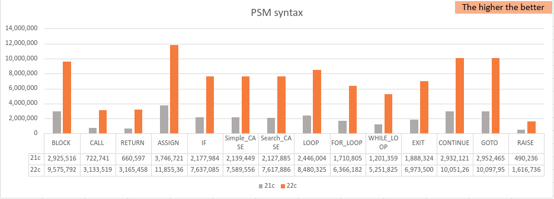

<a id="50d00ba7cc33614b"></a>

# 4. What's New

> Source: [GOLDILOCKS 22c.1 User Manual (en)](https://manual.sunjesoft.co.kr/goldilocks/22c_1/manual/en/50d00ba7cc33614b)  
> Tag: `22c.1_10_tag`

[← 3. Cluster Tutorial](3-cluster-tutorial.md) · [Table of contents](../README.md) · [5. Basic Management of GOLDILOCKS Database →](../part-02-administration-manual/5-basic-management-of-goldilocks-database.md)

<a id="9763092a35306c3b"></a>
## Feature Matrix

This chapter briefly describes the features added to each major version.

<a id="5561d5e84a6c47eb"></a>
### Architecture

<a id="13a17bc15d40c447"></a>
#### System Architecture

The following is a feature matrix for system architecture.

**Feature matrix for system architecture**

<a id="042a95200101d2c1"></a>
| Feature | 2.x | 3.x | 20c.1 | 21c.1 | 22c.1 |
| --- | --- | --- | --- | --- | --- |
| Shared Nothing Cluster | X | O | O | O | O |
| DA (Direct Attach) | O | O | O | O | O |
| JDBC DA (Direct Attach) | X | O | O | O | O |
| C/S (Client/Server) Dedicated | O | O | O | O | O |
| C/S (Client/Server) Shared | O | O | O | O | O |
| multi-process applications | O | O | O | O | O |
| multi-threaded applications | O | O | O | O | O |
| Linux platform | O | O | O | O | O |
| HP platform | O | O | O | O | O |
| AIX platform | O | O | O | O | O |
| Windows Client Platform | O | O | O | O | O |
| CDC(Change Data Capture) replication | O | O | O | O | O |
| CDC replication with log mirror | O | O | O | O | O |
| multi-level start up | O | O | O | O | O |
| parallel database loading | O | O | O | O | O |
| parallel index build | O | O | O | O | O |
| SQL plan cache | O | O | O | O | O |
| IPC | X | X | X | O | O |

<a id="73bce8eb560d2feb"></a>
#### Storage Internal

The following is a feature matrix for storage internal.

**Feature matrix for storage internal**

<a id="7af63df8d5a04863"></a>
| Feature | 2.x | 3.x | 20c.1 | 21c.1 | 22c.1 |
| --- | --- | --- | --- | --- | --- |
| memory dictionary tablespace | O | O | O | O | O |
| memory data tablespace | O | O | O | O | O |
| memory undo tablespace | O | O | O | O | O |
| memory temporary tablespace | O | O | O | O | O |
| memory bitmap data segment | O | O | O | O | O |
| memory bitmap undo segment | O | O | O | O | O |
| memory bitmap instant segment | O | O | O | O | O |
| memory heap table | O | O | O | O | O |
| memory instant table | O | O | O | O | O |
| memory B-tree index | O | O | O | O | O |
| memory instant B-tree | O | O | O | O | O |
| memory instant hash | O | O | O | O | O |
| global secondary index | X | O | O | O | O |
| disk data tablespace | X | X | O | O | O |
| disk bitmap data segment | X | X | O | O | O |
| disk B-tree index | X | X | O | O | O |
| disk global secondary index | X | X | O | O | O |

<a id="262238d281ddce4f"></a>
#### Transaction Control

The following is a feature matrix for transaction control.

**Feature matrix for transaction control**

<a id="e0d86bc4bea58550"></a>
| Feature | 2.x | 3.x | 20c.1 | 21c.1 | 22c.1 |
| --- | --- | --- | --- | --- | --- |
| CDS(Concurrency Data Store) database mode | O | O | O | O | O |
| TDS(Transactional Data Store) database mode | O | O | O | O | O |
| read-only database | O | O | O | O | O |
| read/write database | O | O | O | O | O |
| flat transaction | O | O | O | O | O |
| distributed transaction | O | O | O | O | O |
| read-only transaction | O | O | O | O | O |
| read/write transaction | O | O | O | O | O |
| READ COMMITTED isolation level | O | O | O | O | O |
| SERIALIZABLE isolation level with SELECT FOR UPDATE | O | O | O | O | O |
| MVCC(Multi Version Concurrency Control) | O | O | O | O | O |
| multi-version read consistency | O | O | O | O | O |
| multi-statement consistent read | O | O | O | O | O |
| implicit lock for DML | O | O | O | O | O |
| writer don't blocks readers | O | O | O | O | O |
| row-level locking | O | O | O | O | O |
| deadlock detection | O | O | O | O | O |
| deadlock resolution | O | O | O | O | O |
| lock granularity | O | O | O | O | O |
| read lock | O | O | O | O | O |
| write lock | O | O | O | O | O |
| intention lock | O | O | O | O | O |
| WAL(Write Ahead Logging) | O | O | O | O | O |
| repeat history | O | O | O | O | O |
| restart recovery | O | O | O | O | O |
| circular logging | O | O | O | O | O |
| buffered logging | O | O | O | O | O |
| logging group | O | O | O | O | O |
| supplemental logging | O | O | O | O | O |
| mirrored logging | O | O | O | O | O |
| synchronous commit | O | O | O | O | O |
| asynchronous commit | O | O | O | O | O |
| grouped commit | O | O | O | O | O |
| total rollback | O | O | O | O | O |
| implicit statement rollback | O | O | O | O | O |
| savepoint management | O | O | O | O | O |

<a id="23333729824fe36e"></a>
#### Backup & Recovery

The following is a feature matrix for backup & recovery.

**Feature matrix for backup & recovery**

<a id="eb704abb7b6d1968"></a>
| Feature | 2.x | 3.x | 20c.1 | 21c.1 | 22c.1 |
| --- | --- | --- | --- | --- | --- |
| off-line backup | O | O | O | O | O |
| on-line backup | O | O | O | O | O |
| full backup | O | O | O | O | O |
| incremental backup | O | O | O | O | O |
| complete recovery | O | O | O | O | O |
| incomplete recovery | O | O | O | O | O |
| auto instance recovery | O | O | O | O | O |
| tablespace recovery | O | O | O | O | O |
| file recovery | O | O | O | O | O |
| change tracking | X | X | O | O | O |

<a id="294257ab922a5964"></a>
#### Database Information

<a id="bf01721a23c1bb69"></a>
##### DICTIONARY_SCHEMA Schema

The following is a feature matrix for DICTIONARY_SCHEMA schema.

<a id="fbfe6f9523ad2115"></a>
<table class="table column_count_7"><caption>Feature matrix for DICTIONARY_SCHEMA schema </caption><thead><tr><th class="to_center"><div>Family</div></th><th class="to_center"><div>Feature</div></th><th class="to_center"><div>2.x</div></th><th class="to_center"><div>3.x</div></th><th class="to_center"><div>20c.1</div></th><th class="to_center"><div>21c.1</div></th><th class="to_center"><div>22c.1</div></th></tr></thead><tbody><tr><td class="to_middle" rowspan="56"><div>Views of ALL_family</div></td><td><div>ALL_ALL_TABLES</div></td><td class="to_center"><div>O</div></td><td class="to_center"><div>O</div></td><td class="to_center"><div>O</div></td><td class="to_center"><div>O</div></td><td class="to_center"><div>O</div></td></tr><tr><td><div>ALL_ARGUMENTS</div></td><td class="to_center"><div>X</div></td><td class="to_center"><div>O</div></td><td class="to_center"><div>O</div></td><td class="to_center"><div>O</div></td><td class="to_center"><div>O</div></td></tr><tr><td><div>ALL_CATALOG</div></td><td class="to_center"><div>O</div></td><td class="to_center"><div>O</div></td><td class="to_center"><div>O</div></td><td class="to_center"><div>O</div></td><td class="to_center"><div>O</div></td></tr><tr><td><div>ALL_CLUSTER_TABLES</div></td><td class="to_center"><div>X</div></td><td class="to_center"><div>O</div></td><td class="to_center"><div>O</div></td><td class="to_center"><div>O</div></td><td class="to_center"><div>O</div></td></tr><tr><td><div>ALL_COL_COMMENTS</div></td><td class="to_center"><div>O</div></td><td class="to_center"><div>O</div></td><td class="to_center"><div>O</div></td><td class="to_center"><div>O</div></td><td class="to_center"><div>O</div></td></tr><tr><td><div>ALL_COL_PLACE</div></td><td class="to_center"><div>X</div></td><td class="to_center"><div>X</div></td><td class="to_center"><div>X</div></td><td class="to_center"><div>X</div></td><td class="to_center"><div>X</div></td></tr><tr><td><div>ALL_COL_PRIVS</div></td><td class="to_center"><div>O</div></td><td class="to_center"><div>O</div></td><td class="to_center"><div>O</div></td><td class="to_center"><div>O</div></td><td class="to_center"><div>O</div></td></tr><tr><td><div>ALL_COL_PRIVS_MADE</div></td><td class="to_center"><div>O</div></td><td class="to_center"><div>O</div></td><td class="to_center"><div>O</div></td><td class="to_center"><div>O</div></td><td class="to_center"><div>O</div></td></tr><tr><td><div>ALL_COL_PRIVS_RECD</div></td><td class="to_center"><div>O</div></td><td class="to_center"><div>O</div></td><td class="to_center"><div>O</div></td><td class="to_center"><div>O</div></td><td class="to_center"><div>O</div></td></tr><tr><td><div>ALL_CONSTRAINTS</div></td><td class="to_center"><div>O</div></td><td class="to_center"><div>O</div></td><td class="to_center"><div>O</div></td><td class="to_center"><div>O</div></td><td class="to_center"><div>O</div></td></tr><tr><td><div>ALL_CONS_COLUMNS</div></td><td class="to_center"><div>O</div></td><td class="to_center"><div>O</div></td><td class="to_center"><div>O</div></td><td class="to_center"><div>O</div></td><td class="to_center"><div>O</div></td></tr><tr><td><div>ALL_DB_PRIVS</div></td><td class="to_center"><div>O</div></td><td class="to_center"><div>O</div></td><td class="to_center"><div>O</div></td><td class="to_center"><div>O</div></td><td class="to_center"><div>O</div></td></tr><tr><td><div>ALL_DB_PRIVS_MADE</div></td><td class="to_center"><div>O</div></td><td class="to_center"><div>O</div></td><td class="to_center"><div>O</div></td><td class="to_center"><div>O</div></td><td class="to_center"><div>O</div></td></tr><tr><td><div>ALL_DB_PRIVS_RECD</div></td><td class="to_center"><div>O</div></td><td class="to_center"><div>O</div></td><td class="to_center"><div>O</div></td><td class="to_center"><div>O</div></td><td class="to_center"><div>O</div></td></tr><tr><td><div>ALL_DEPENDENCIES</div></td><td class="to_center"><div>X</div></td><td class="to_center"><div>O</div></td><td class="to_center"><div>O</div></td><td class="to_center"><div>O</div></td><td class="to_center"><div>O</div></td></tr><tr><td><div>ALL_GLOBAL_SECONDARY_INDEXES</div></td><td class="to_center"><div>X</div></td><td class="to_center"><div>O</div></td><td class="to_center"><div>O</div></td><td class="to_center"><div>O</div></td><td class="to_center"><div>O</div></td></tr><tr><td><div>ALL_GSI_PLACE</div></td><td class="to_center"><div>X</div></td><td class="to_center"><div>O</div></td><td class="to_center"><div>O</div></td><td class="to_center"><div>O</div></td><td class="to_center"><div>O</div></td></tr><tr><td><div>ALL_INDEXES</div></td><td class="to_center"><div>O</div></td><td class="to_center"><div>O</div></td><td class="to_center"><div>O</div></td><td class="to_center"><div>O</div></td><td class="to_center"><div>O</div></td></tr><tr><td><div>ALL_IND_COLUMNS</div></td><td class="to_center"><div>O</div></td><td class="to_center"><div>O</div></td><td class="to_center"><div>O</div></td><td class="to_center"><div>O</div></td><td class="to_center"><div>O</div></td></tr><tr><td><div>ALL_IND_PLACE</div></td><td class="to_center"><div>X</div></td><td class="to_center"><div>O</div></td><td class="to_center"><div>O</div></td><td class="to_center"><div>O</div></td><td class="to_center"><div>O</div></td></tr><tr><td><div>ALL_NONSCHEMA_COMMENTS</div></td><td class="to_center"><div>O</div></td><td class="to_center"><div>O</div></td><td class="to_center"><div>O</div></td><td class="to_center"><div>O</div></td><td class="to_center"><div>O</div></td></tr><tr><td><div>ALL_OBJECTS</div></td><td class="to_center"><div>O</div></td><td class="to_center"><div>O</div></td><td class="to_center"><div>O</div></td><td class="to_center"><div>O</div></td><td class="to_center"><div>O</div></td></tr><tr><td><div>ALL_PACKAGE_PRIVS</div></td><td class="to_center"><div>X</div></td><td class="to_center"><div>X</div></td><td class="to_center"><div>O</div></td><td class="to_center"><div>O</div></td><td class="to_center"><div>O</div></td></tr><tr><td><div>ALL_PACKAGE_PRIV_MADE</div></td><td class="to_center"><div>X</div></td><td class="to_center"><div>X</div></td><td class="to_center"><div>O</div></td><td class="to_center"><div>O</div></td><td class="to_center"><div>O</div></td></tr><tr><td><div>ALL_PACKAGE_PRIV_RECD</div></td><td class="to_center"><div>X</div></td><td class="to_center"><div>X</div></td><td class="to_center"><div>O</div></td><td class="to_center"><div>O</div></td><td class="to_center"><div>O</div></td></tr><tr><td><div>ALL_PROCEDURES</div></td><td class="to_center"><div>X</div></td><td class="to_center"><div>O</div></td><td class="to_center"><div>O</div></td><td class="to_center"><div>O</div></td><td class="to_center"><div>O</div></td></tr><tr><td><div>ALL_PROC_PRIVS</div></td><td class="to_center"><div>X</div></td><td class="to_center"><div>O</div></td><td class="to_center"><div>O</div></td><td class="to_center"><div>O</div></td><td class="to_center"><div>O</div></td></tr><tr><td><div>ALL_PROC_PRIV_MADE</div></td><td class="to_center"><div>X</div></td><td class="to_center"><div>O</div></td><td class="to_center"><div>O</div></td><td class="to_center"><div>O</div></td><td class="to_center"><div>O</div></td></tr><tr><td><div>ALL_PROC_PRIV_RECD</div></td><td class="to_center"><div>X</div></td><td class="to_center"><div>O</div></td><td class="to_center"><div>O</div></td><td class="to_center"><div>O</div></td><td class="to_center"><div>O</div></td></tr><tr><td><div>ALL_SCHEMAS</div></td><td class="to_center"><div>O</div></td><td class="to_center"><div>O</div></td><td class="to_center"><div>O</div></td><td class="to_center"><div>O</div></td><td class="to_center"><div>O</div></td></tr><tr><td><div>ALL_SCHEMA_PATH</div></td><td class="to_center"><div>O</div></td><td class="to_center"><div>O</div></td><td class="to_center"><div>O</div></td><td class="to_center"><div>O</div></td><td class="to_center"><div>O</div></td></tr><tr><td><div>ALL_SCHEMA_PRIVS</div></td><td class="to_center"><div>O</div></td><td class="to_center"><div>O</div></td><td class="to_center"><div>O</div></td><td class="to_center"><div>O</div></td><td class="to_center"><div>O</div></td></tr><tr><td><div>ALL_SCHEMA_PRIVS_MADE</div></td><td class="to_center"><div>O</div></td><td class="to_center"><div>O</div></td><td class="to_center"><div>O</div></td><td class="to_center"><div>O</div></td><td class="to_center"><div>O</div></td></tr><tr><td><div>ALL_SCHEMA_PRIVS_RECD</div></td><td class="to_center"><div>O</div></td><td class="to_center"><div>O</div></td><td class="to_center"><div>O</div></td><td class="to_center"><div>O</div></td><td class="to_center"><div>O</div></td></tr><tr><td><div>ALL_SEQUENCES</div></td><td class="to_center"><div>O</div></td><td class="to_center"><div>O</div></td><td class="to_center"><div>O</div></td><td class="to_center"><div>O</div></td><td class="to_center"><div>O</div></td></tr><tr><td><div>ALL_SEQ_PRIVS</div></td><td class="to_center"><div>O</div></td><td class="to_center"><div>O</div></td><td class="to_center"><div>O</div></td><td class="to_center"><div>O</div></td><td class="to_center"><div>O</div></td></tr><tr><td><div>ALL_SEQ_PRIVS_MADE</div></td><td class="to_center"><div>O</div></td><td class="to_center"><div>O</div></td><td class="to_center"><div>O</div></td><td class="to_center"><div>O</div></td><td class="to_center"><div>O</div></td></tr><tr><td><div>ALL_SEQ_PRIVS_RECD</div></td><td class="to_center"><div>O</div></td><td class="to_center"><div>O</div></td><td class="to_center"><div>O</div></td><td class="to_center"><div>O</div></td><td class="to_center"><div>O</div></td></tr><tr><td><div>ALL_SHARD_KEY_COLUMNS</div></td><td class="to_center"><div>X</div></td><td class="to_center"><div>O</div></td><td class="to_center"><div>O</div></td><td class="to_center"><div>O</div></td><td class="to_center"><div>O</div></td></tr><tr><td><div>ALL_SOURCE</div></td><td class="to_center"><div>X</div></td><td class="to_center"><div>O</div></td><td class="to_center"><div>O</div></td><td class="to_center"><div>O</div></td><td class="to_center"><div>O</div></td></tr><tr><td><div>ALL_SYNONYMS</div></td><td class="to_center"><div>O</div></td><td class="to_center"><div>O</div></td><td class="to_center"><div>O</div></td><td class="to_center"><div>O</div></td><td class="to_center"><div>O</div></td></tr><tr><td><div>ALL_TABLES</div></td><td class="to_center"><div>O</div></td><td class="to_center"><div>O</div></td><td class="to_center"><div>O</div></td><td class="to_center"><div>O</div></td><td class="to_center"><div>O</div></td></tr><tr><td><div>ALL_TAB_COLS</div></td><td class="to_center"><div>O</div></td><td class="to_center"><div>O</div></td><td class="to_center"><div>O</div></td><td class="to_center"><div>O</div></td><td class="to_center"><div>O</div></td></tr><tr><td><div>ALL_TAB_COLUMNS</div></td><td class="to_center"><div>O</div></td><td class="to_center"><div>O</div></td><td class="to_center"><div>O</div></td><td class="to_center"><div>O</div></td><td class="to_center"><div>O</div></td></tr><tr><td><div>ALL_TAB_COMMENTS</div></td><td class="to_center"><div>O</div></td><td class="to_center"><div>O</div></td><td class="to_center"><div>O</div></td><td class="to_center"><div>O</div></td><td class="to_center"><div>O</div></td></tr><tr><td><div>ALL_TAB_IDENTITY_COLS</div></td><td class="to_center"><div>O</div></td><td class="to_center"><div>O</div></td><td class="to_center"><div>O</div></td><td class="to_center"><div>O</div></td><td class="to_center"><div>O</div></td></tr><tr><td><div>ALL_TAB_PLACE</div></td><td class="to_center"><div>X</div></td><td class="to_center"><div>O</div></td><td class="to_center"><div>O</div></td><td class="to_center"><div>O</div></td><td class="to_center"><div>O</div></td></tr><tr><td><div>ALL_TAB_SHARDS</div></td><td class="to_center"><div>X</div></td><td class="to_center"><div>O</div></td><td class="to_center"><div>O</div></td><td class="to_center"><div>O</div></td><td class="to_center"><div>O</div></td></tr><tr><td><div>ALL_TAB_PRIVS</div></td><td class="to_center"><div>O</div></td><td class="to_center"><div>O</div></td><td class="to_center"><div>O</div></td><td class="to_center"><div>O</div></td><td class="to_center"><div>O</div></td></tr><tr><td><div>ALL_TAB_PRIVS_MADE</div></td><td class="to_center"><div>O</div></td><td class="to_center"><div>O</div></td><td class="to_center"><div>O</div></td><td class="to_center"><div>O</div></td><td class="to_center"><div>O</div></td></tr><tr><td><div>ALL_TAB_PRIVS_RECD</div></td><td class="to_center"><div>O</div></td><td class="to_center"><div>O</div></td><td class="to_center"><div>O</div></td><td class="to_center"><div>O</div></td><td class="to_center"><div>O</div></td></tr><tr><td><div>ALL_TBS_PRIVS</div></td><td class="to_center"><div>O</div></td><td class="to_center"><div>O</div></td><td class="to_center"><div>O</div></td><td class="to_center"><div>O</div></td><td class="to_center"><div>O</div></td></tr><tr><td><div>ALL_TBS_PRIVS_MADE</div></td><td class="to_center"><div>O</div></td><td class="to_center"><div>O</div></td><td class="to_center"><div>O</div></td><td class="to_center"><div>O</div></td><td class="to_center"><div>O</div></td></tr><tr><td><div>ALL_TBS_PRIVS_RECD</div></td><td class="to_center"><div>O</div></td><td class="to_center"><div>O</div></td><td class="to_center"><div>O</div></td><td class="to_center"><div>O</div></td><td class="to_center"><div>O</div></td></tr><tr><td><div>ALL_USERS</div></td><td class="to_center"><div>O</div></td><td class="to_center"><div>O</div></td><td class="to_center"><div>O</div></td><td class="to_center"><div>O</div></td><td class="to_center"><div>O</div></td></tr><tr><td><div>ALL_VIEWS</div></td><td class="to_center"><div>O</div></td><td class="to_center"><div>O</div></td><td class="to_center"><div>O</div></td><td class="to_center"><div>O</div></td><td class="to_center"><div>O</div></td></tr><tr><td class="to_left to_middle" rowspan="48"><div>Views of DBA_family</div></td><td><div>DBA_ALL_TABLES</div></td><td class="to_center"><div>O</div></td><td class="to_center"><div>O</div></td><td class="to_center"><div>O</div></td><td class="to_center"><div>O</div></td><td class="to_center"><div>O</div></td></tr><tr><td><div>DBA_ARGUMENTS</div></td><td class="to_center"><div>X</div></td><td class="to_center"><div>O</div></td><td class="to_center"><div>O</div></td><td class="to_center"><div>O</div></td><td class="to_center"><div>O</div></td></tr><tr><td><div>DBA_CATALOG</div></td><td class="to_center"><div>O</div></td><td class="to_center"><div>O</div></td><td class="to_center"><div>O</div></td><td class="to_center"><div>O</div></td><td class="to_center"><div>O</div></td></tr><tr><td><div>DBA_CLUSTER</div></td><td class="to_center"><div>X</div></td><td class="to_center"><div>O</div></td><td class="to_center"><div>O</div></td><td class="to_center"><div>O</div></td><td class="to_center"><div>O</div></td></tr><tr><td><div>DBA_CLUSTER_COMMENTS</div></td><td class="to_center"><div>X</div></td><td class="to_center"><div>O</div></td><td class="to_center"><div>O</div></td><td class="to_center"><div>O</div></td><td class="to_center"><div>O</div></td></tr><tr><td><div>DBA_CLUSTER_TABLES</div></td><td class="to_center"><div>X</div></td><td class="to_center"><div>O</div></td><td class="to_center"><div>O</div></td><td class="to_center"><div>O</div></td><td class="to_center"><div>O</div></td></tr><tr><td><div>DBA_COL_COMMENTS</div></td><td class="to_center"><div>O</div></td><td class="to_center"><div>O</div></td><td class="to_center"><div>O</div></td><td class="to_center"><div>O</div></td><td class="to_center"><div>O</div></td></tr><tr><td><div>DBA_COL_PLACE</div></td><td class="to_center"><div>X</div></td><td class="to_center"><div>X</div></td><td class="to_center"><div>X</div></td><td class="to_center"><div>X</div></td><td class="to_center"><div>X</div></td></tr><tr><td><div>DBA_COL_PRIVS</div></td><td class="to_center"><div>O</div></td><td class="to_center"><div>O</div></td><td class="to_center"><div>O</div></td><td class="to_center"><div>O</div></td><td class="to_center"><div>O</div></td></tr><tr><td><div>DBA_CONSTRAINTS</div></td><td class="to_center"><div>O</div></td><td class="to_center"><div>O</div></td><td class="to_center"><div>O</div></td><td class="to_center"><div>O</div></td><td class="to_center"><div>O</div></td></tr><tr><td><div>DBA_CONS_COLUMNS</div></td><td class="to_center"><div>O</div></td><td class="to_center"><div>O</div></td><td class="to_center"><div>O</div></td><td class="to_center"><div>O</div></td><td class="to_center"><div>O</div></td></tr><tr><td><div>DBA_DB_PRIVS</div></td><td class="to_center"><div>O</div></td><td class="to_center"><div>O</div></td><td class="to_center"><div>O</div></td><td class="to_center"><div>O</div></td><td class="to_center"><div>O</div></td></tr><tr><td><div>DBA_DEPENDENCIES</div></td><td class="to_center"><div>X</div></td><td class="to_center"><div>O</div></td><td class="to_center"><div>O</div></td><td class="to_center"><div>O</div></td><td class="to_center"><div>O</div></td></tr><tr><td><div>DBA_EXTENTS</div></td><td class="to_center"><div>O</div></td><td class="to_center"><div>O</div></td><td class="to_center"><div>O</div></td><td class="to_center"><div>O</div></td><td class="to_center"><div>O</div></td></tr><tr><td><div>DBA_GLOBAL_SECONDARY_INDEXES</div></td><td class="to_center"><div>X</div></td><td class="to_center"><div>O</div></td><td class="to_center"><div>O</div></td><td class="to_center"><div>O</div></td><td class="to_center"><div>O</div></td></tr><tr><td><div>DBA_GSI_PLACE</div></td><td class="to_center"><div>X</div></td><td class="to_center"><div>O</div></td><td class="to_center"><div>O</div></td><td class="to_center"><div>O</div></td><td class="to_center"><div>O</div></td></tr><tr><td><div>DBA_INDEXES</div></td><td class="to_center"><div>O</div></td><td class="to_center"><div>O</div></td><td class="to_center"><div>O</div></td><td class="to_center"><div>O</div></td><td class="to_center"><div>O</div></td></tr><tr><td><div>DBA_IND_COLUMNS</div></td><td class="to_center"><div>O</div></td><td class="to_center"><div>O</div></td><td class="to_center"><div>O</div></td><td class="to_center"><div>O</div></td><td class="to_center"><div>O</div></td></tr><tr><td><div>DBA_IND_PLACE</div></td><td class="to_center"><div>X</div></td><td class="to_center"><div>O</div></td><td class="to_center"><div>O</div></td><td class="to_center"><div>O</div></td><td class="to_center"><div>O</div></td></tr><tr><td><div>DBA_NONSCHEMA_COMMENTS</div></td><td class="to_center"><div>O</div></td><td class="to_center"><div>O</div></td><td class="to_center"><div>O</div></td><td class="to_center"><div>O</div></td><td class="to_center"><div>O</div></td></tr><tr><td><div>DBA_OBJECTS</div></td><td class="to_center"><div>O</div></td><td class="to_center"><div>O</div></td><td class="to_center"><div>O</div></td><td class="to_center"><div>O</div></td><td class="to_center"><div>O</div></td></tr><tr><td><div>DBA_PACKAGE_PRIVS</div></td><td class="to_center"><div>X</div></td><td class="to_center"><div>X</div></td><td class="to_center"><div>O</div></td><td class="to_center"><div>O</div></td><td class="to_center"><div>O</div></td></tr><tr><td><div>DBA_PROCEDURES</div></td><td class="to_center"><div>X</div></td><td class="to_center"><div>O</div></td><td class="to_center"><div>O</div></td><td class="to_center"><div>O</div></td><td class="to_center"><div>O</div></td></tr><tr><td><div>DBA_PROC_PRIVS</div></td><td class="to_center"><div>X</div></td><td class="to_center"><div>O</div></td><td class="to_center"><div>O</div></td><td class="to_center"><div>O</div></td><td class="to_center"><div>O</div></td></tr><tr><td class="to_left"><div>DBA_PROFILES</div></td><td class="to_center"><div>O</div></td><td class="to_center"><div>O</div></td><td class="to_center"><div>O</div></td><td class="to_center"><div>O</div></td><td class="to_center"><div>O</div></td></tr><tr><td><div>DBA_RECYCLEBIN</div></td><td class="to_center"><div>X</div></td><td class="to_center"><div>X</div></td><td class="to_center"><div>O</div></td><td class="to_center"><div>O</div></td><td class="to_center"><div>O</div></td></tr><tr><td><div>DBA_SCHEMAS</div></td><td class="to_center"><div>O</div></td><td class="to_center"><div>O</div></td><td class="to_center"><div>O</div></td><td class="to_center"><div>O</div></td><td class="to_center"><div>O</div></td></tr><tr><td><div>DBA_SCHEMA_PATH</div></td><td class="to_center"><div>O</div></td><td class="to_center"><div>O</div></td><td class="to_center"><div>O</div></td><td class="to_center"><div>O</div></td><td class="to_center"><div>O</div></td></tr><tr><td><div>DBA_SCHEMA_PRIVS</div></td><td class="to_center"><div>O</div></td><td class="to_center"><div>O</div></td><td class="to_center"><div>O</div></td><td class="to_center"><div>O</div></td><td class="to_center"><div>O</div></td></tr><tr><td><div>DBA_SEQUENCES</div></td><td class="to_center"><div>O</div></td><td class="to_center"><div>O</div></td><td class="to_center"><div>O</div></td><td class="to_center"><div>O</div></td><td class="to_center"><div>O</div></td></tr><tr><td><div>DBA_SEQ_PRIVS</div></td><td class="to_center"><div>O</div></td><td class="to_center"><div>O</div></td><td class="to_center"><div>O</div></td><td class="to_center"><div>O</div></td><td class="to_center"><div>O</div></td></tr><tr><td><div>DBA_SHARD_KEY_COLUMNS</div></td><td class="to_center"><div>X</div></td><td class="to_center"><div>O</div></td><td class="to_center"><div>O</div></td><td class="to_center"><div>O</div></td><td class="to_center"><div>O</div></td></tr><tr><td><div>DBA_SOURCE</div></td><td class="to_center"><div>X</div></td><td class="to_center"><div>O</div></td><td class="to_center"><div>O</div></td><td class="to_center"><div>O</div></td><td class="to_center"><div>O</div></td></tr><tr><td><div>DBA_STAT_SYSTEM</div></td><td class="to_center"><div>X</div></td><td class="to_center"><div>O</div></td><td class="to_center"><div>O</div></td><td class="to_center"><div>O</div></td><td class="to_center"><div>O</div></td></tr><tr><td><div>DBA_SYNONYMS</div></td><td class="to_center"><div>O</div></td><td class="to_center"><div>O</div></td><td class="to_center"><div>O</div></td><td class="to_center"><div>O</div></td><td class="to_center"><div>O</div></td></tr><tr><td><div>DBA_SYS_PRIVS</div></td><td class="to_center"><div>O</div></td><td class="to_center"><div>O</div></td><td class="to_center"><div>O</div></td><td class="to_center"><div>O</div></td><td class="to_center"><div>O</div></td></tr><tr><td><div>DBA_TABLES</div></td><td class="to_center"><div>O</div></td><td class="to_center"><div>O</div></td><td class="to_center"><div>O</div></td><td class="to_center"><div>O</div></td><td class="to_center"><div>O</div></td></tr><tr><td><div>DBA_TABLESPACES</div></td><td class="to_center"><div>O</div></td><td class="to_center"><div>O</div></td><td class="to_center"><div>O</div></td><td class="to_center"><div>O</div></td><td class="to_center"><div>O</div></td></tr><tr><td><div>DBA_TAB_COLS</div></td><td class="to_center"><div>O</div></td><td class="to_center"><div>O</div></td><td class="to_center"><div>O</div></td><td class="to_center"><div>O</div></td><td class="to_center"><div>O</div></td></tr><tr><td><div>DBA_TAB_COLUMNS</div></td><td class="to_center"><div>O</div></td><td class="to_center"><div>O</div></td><td class="to_center"><div>O</div></td><td class="to_center"><div>O</div></td><td class="to_center"><div>O</div></td></tr><tr><td><div>DBA_TAB_COMMENTS</div></td><td class="to_center"><div>O</div></td><td class="to_center"><div>O</div></td><td class="to_center"><div>O</div></td><td class="to_center"><div>O</div></td><td class="to_center"><div>O</div></td></tr><tr><td><div>DBA_TAB_IDENTITY_COLS</div></td><td class="to_center"><div>O</div></td><td class="to_center"><div>O</div></td><td class="to_center"><div>O</div></td><td class="to_center"><div>O</div></td><td class="to_center"><div>O</div></td></tr><tr><td><div>DBA_TAB_PLACE</div></td><td class="to_center"><div>X</div></td><td class="to_center"><div>O</div></td><td class="to_center"><div>O</div></td><td class="to_center"><div>O</div></td><td class="to_center"><div>O</div></td></tr><tr><td><div>DBA_TAB_PRIVS</div></td><td class="to_center"><div>O</div></td><td class="to_center"><div>O</div></td><td class="to_center"><div>O</div></td><td class="to_center"><div>O</div></td><td class="to_center"><div>O</div></td></tr><tr><td><div>DBA_TAB_SHARDS</div></td><td class="to_center"><div>X</div></td><td class="to_center"><div>O</div></td><td class="to_center"><div>O</div></td><td class="to_center"><div>O</div></td><td class="to_center"><div>O</div></td></tr><tr><td><div>DBA_TBS_PRIVS</div></td><td class="to_center"><div>O</div></td><td class="to_center"><div>O</div></td><td class="to_center"><div>O</div></td><td class="to_center"><div>O</div></td><td class="to_center"><div>O</div></td></tr><tr><td><div>DBA_USERS</div></td><td class="to_center"><div>O</div></td><td class="to_center"><div>O</div></td><td class="to_center"><div>O</div></td><td class="to_center"><div>O</div></td><td class="to_center"><div>O</div></td></tr><tr><td><div>DBA_VIEWS</div></td><td class="to_center"><div>O</div></td><td class="to_center"><div>O</div></td><td class="to_center"><div>O</div></td><td class="to_center"><div>O</div></td><td class="to_center"><div>O</div></td></tr><tr><td class="to_middle" rowspan="53"><div>Views of USER_family</div></td><td><div>USER_ALL_TABLES</div></td><td class="to_center"><div>O</div></td><td class="to_center"><div>O</div></td><td class="to_center"><div>O</div></td><td class="to_center"><div>O</div></td><td class="to_center"><div>O</div></td></tr><tr><td><div>USER_ARGUMENTS</div></td><td class="to_center"><div>X</div></td><td class="to_center"><div>O</div></td><td class="to_center"><div>O</div></td><td class="to_center"><div>O</div></td><td class="to_center"><div>O</div></td></tr><tr><td><div>USER_CATALOG</div></td><td class="to_center"><div>O</div></td><td class="to_center"><div>O</div></td><td class="to_center"><div>O</div></td><td class="to_center"><div>O</div></td><td class="to_center"><div>O</div></td></tr><tr><td><div>USER_CLUSTER_TABLES</div></td><td class="to_center"><div>X</div></td><td class="to_center"><div>O</div></td><td class="to_center"><div>O</div></td><td class="to_center"><div>O</div></td><td class="to_center"><div>O</div></td></tr><tr><td><div>USER_COL_COMMENTS</div></td><td class="to_center"><div>O</div></td><td class="to_center"><div>O</div></td><td class="to_center"><div>O</div></td><td class="to_center"><div>O</div></td><td class="to_center"><div>O</div></td></tr><tr><td><div>USER_COL_PLACE</div></td><td class="to_center"><div>X</div></td><td class="to_center"><div>X</div></td><td class="to_center"><div>X</div></td><td class="to_center"><div>X</div></td><td class="to_center"><div>X</div></td></tr><tr><td><div>USER_COL_PRIVS</div></td><td class="to_center"><div>O</div></td><td class="to_center"><div>O</div></td><td class="to_center"><div>O</div></td><td class="to_center"><div>O</div></td><td class="to_center"><div>O</div></td></tr><tr><td><div>USER_COL_PRIVS_MADE</div></td><td class="to_center"><div>O</div></td><td class="to_center"><div>O</div></td><td class="to_center"><div>O</div></td><td class="to_center"><div>O</div></td><td class="to_center"><div>O</div></td></tr><tr><td><div>USER_COL_PRIVS_RECD</div></td><td class="to_center"><div>O</div></td><td class="to_center"><div>O</div></td><td class="to_center"><div>O</div></td><td class="to_center"><div>O</div></td><td class="to_center"><div>O</div></td></tr><tr><td><div>USER_CONSTRAINTS</div></td><td class="to_center"><div>O</div></td><td class="to_center"><div>O</div></td><td class="to_center"><div>O</div></td><td class="to_center"><div>O</div></td><td class="to_center"><div>O</div></td></tr><tr><td><div>USER_CONS_COLUMNS</div></td><td class="to_center"><div>O</div></td><td class="to_center"><div>O</div></td><td class="to_center"><div>O</div></td><td class="to_center"><div>O</div></td><td class="to_center"><div>O</div></td></tr><tr><td><div>USER_DEPENDENCIES</div></td><td class="to_center"><div>X</div></td><td class="to_center"><div>O</div></td><td class="to_center"><div>O</div></td><td class="to_center"><div>O</div></td><td class="to_center"><div>O</div></td></tr><tr><td><div>USER_EXTENTS</div></td><td class="to_center"><div>O</div></td><td class="to_center"><div>O</div></td><td class="to_center"><div>O</div></td><td class="to_center"><div>O</div></td><td class="to_center"><div>O</div></td></tr><tr><td><div>USER_GLOBAL_SECONDARY_INDEXES</div></td><td class="to_center"><div>X</div></td><td class="to_center"><div>O</div></td><td class="to_center"><div>O</div></td><td class="to_center"><div>O</div></td><td class="to_center"><div>O</div></td></tr><tr><td><div>USER_GSI_PLACE</div></td><td class="to_center"><div>X</div></td><td class="to_center"><div>O</div></td><td class="to_center"><div>O</div></td><td class="to_center"><div>O</div></td><td class="to_center"><div>O</div></td></tr><tr><td><div>USER_INDEXES</div></td><td class="to_center"><div>O</div></td><td class="to_center"><div>O</div></td><td class="to_center"><div>O</div></td><td class="to_center"><div>O</div></td><td class="to_center"><div>O</div></td></tr><tr><td><div>USER_IND_COLUMNS</div></td><td class="to_center"><div>O</div></td><td class="to_center"><div>O</div></td><td class="to_center"><div>O</div></td><td class="to_center"><div>O</div></td><td class="to_center"><div>O</div></td></tr><tr><td><div>USER_IND_PLACE</div></td><td class="to_center"><div>X</div></td><td class="to_center"><div>O</div></td><td class="to_center"><div>O</div></td><td class="to_center"><div>O</div></td><td class="to_center"><div>O</div></td></tr><tr><td><div>USER_OBJECTS</div></td><td class="to_center"><div>O</div></td><td class="to_center"><div>O</div></td><td class="to_center"><div>O</div></td><td class="to_center"><div>O</div></td><td class="to_center"><div>O</div></td></tr><tr><td><div>USER_PACKAGE_PRIVS</div></td><td class="to_center"><div>X</div></td><td class="to_center"><div>X</div></td><td class="to_center"><div>O</div></td><td class="to_center"><div>O</div></td><td class="to_center"><div>O</div></td></tr><tr><td><div>USER_PACKAGE_PRIVS_MADE</div></td><td class="to_center"><div>X</div></td><td class="to_center"><div>X</div></td><td class="to_center"><div>O</div></td><td class="to_center"><div>O</div></td><td class="to_center"><div>O</div></td></tr><tr><td><div>USER_PACKAGE_PRIVS_RECD</div></td><td class="to_center"><div>X</div></td><td class="to_center"><div>X</div></td><td class="to_center"><div>O</div></td><td class="to_center"><div>O</div></td><td class="to_center"><div>O</div></td></tr><tr><td><div>USER_PROCEDURES</div></td><td class="to_center"><div>X</div></td><td class="to_center"><div>O</div></td><td class="to_center"><div>O</div></td><td class="to_center"><div>O</div></td><td class="to_center"><div>O</div></td></tr><tr><td><div>USER_PROC_PRIVS</div></td><td class="to_center"><div>X</div></td><td class="to_center"><div>O</div></td><td class="to_center"><div>O</div></td><td class="to_center"><div>O</div></td><td class="to_center"><div>O</div></td></tr><tr><td><div>USER_PROC_PRIVS_MADE</div></td><td class="to_center"><div>X</div></td><td class="to_center"><div>O</div></td><td class="to_center"><div>O</div></td><td class="to_center"><div>O</div></td><td class="to_center"><div>O</div></td></tr><tr><td><div>USER_PROC_PRIVS_RECD</div></td><td class="to_center"><div>X</div></td><td class="to_center"><div>O</div></td><td class="to_center"><div>O</div></td><td class="to_center"><div>O</div></td><td class="to_center"><div>O</div></td></tr><tr><td><div>USER_RECYCLEBIN</div></td><td class="to_center"><div>X</div></td><td class="to_center"><div>X</div></td><td class="to_center"><div>O</div></td><td class="to_center"><div>O</div></td><td class="to_center"><div>O</div></td></tr><tr><td><div>USER_SCHEMAS</div></td><td class="to_center"><div>O</div></td><td class="to_center"><div>O</div></td><td class="to_center"><div>O</div></td><td class="to_center"><div>O</div></td><td class="to_center"><div>O</div></td></tr><tr><td><div>USER_SCHEMA_PATH</div></td><td class="to_center"><div>O</div></td><td class="to_center"><div>O</div></td><td class="to_center"><div>O</div></td><td class="to_center"><div>O</div></td><td class="to_center"><div>O</div></td></tr><tr><td><div>USER_SCHEMA_PRIVS</div></td><td class="to_center"><div>O</div></td><td class="to_center"><div>O</div></td><td class="to_center"><div>O</div></td><td class="to_center"><div>O</div></td><td class="to_center"><div>O</div></td></tr><tr><td><div>USER_SCHEMA_PRIVS_MADE</div></td><td class="to_center"><div>O</div></td><td class="to_center"><div>O</div></td><td class="to_center"><div>O</div></td><td class="to_center"><div>O</div></td><td class="to_center"><div>O</div></td></tr><tr><td><div>USER_SCHEMA_PRIVS_RECD</div></td><td class="to_center"><div>O</div></td><td class="to_center"><div>O</div></td><td class="to_center"><div>O</div></td><td class="to_center"><div>O</div></td><td class="to_center"><div>O</div></td></tr><tr><td><div>USER_SEQUENCES</div></td><td class="to_center"><div>O</div></td><td class="to_center"><div>O</div></td><td class="to_center"><div>O</div></td><td class="to_center"><div>O</div></td><td class="to_center"><div>O</div></td></tr><tr><td><div>USER_SEQ_PRIVS</div></td><td class="to_center"><div>O</div></td><td class="to_center"><div>O</div></td><td class="to_center"><div>O</div></td><td class="to_center"><div>O</div></td><td class="to_center"><div>O</div></td></tr><tr><td><div>USER_SEQ_PRIVS_MADE</div></td><td class="to_center"><div>O</div></td><td class="to_center"><div>O</div></td><td class="to_center"><div>O</div></td><td class="to_center"><div>O</div></td><td class="to_center"><div>O</div></td></tr><tr><td><div>USER_SEQ_PRIVS_RECD</div></td><td class="to_center"><div>O</div></td><td class="to_center"><div>O</div></td><td class="to_center"><div>O</div></td><td class="to_center"><div>O</div></td><td class="to_center"><div>O</div></td></tr><tr><td><div>USER_SHARD_KEY_COLUMNS</div></td><td class="to_center"><div>X</div></td><td class="to_center"><div>O</div></td><td class="to_center"><div>O</div></td><td class="to_center"><div>O</div></td><td class="to_center"><div>O</div></td></tr><tr><td><div>USER_SOURCE</div></td><td class="to_center"><div>X</div></td><td class="to_center"><div>O</div></td><td class="to_center"><div>O</div></td><td class="to_center"><div>O</div></td><td class="to_center"><div>O</div></td></tr><tr><td><div>USER_SYNONYMS</div></td><td class="to_center"><div>O</div></td><td class="to_center"><div>O</div></td><td class="to_center"><div>O</div></td><td class="to_center"><div>O</div></td><td class="to_center"><div>O</div></td></tr><tr><td><div>USER_SYS_PRIVS</div></td><td class="to_center"><div>O</div></td><td class="to_center"><div>O</div></td><td class="to_center"><div>O</div></td><td class="to_center"><div>O</div></td><td class="to_center"><div>O</div></td></tr><tr><td><div>USER_TABLES</div></td><td class="to_center"><div>O</div></td><td class="to_center"><div>O</div></td><td class="to_center"><div>O</div></td><td class="to_center"><div>O</div></td><td class="to_center"><div>O</div></td></tr><tr><td><div>USER_TABLESPACES</div></td><td class="to_center"><div>O</div></td><td class="to_center"><div>O</div></td><td class="to_center"><div>O</div></td><td class="to_center"><div>O</div></td><td class="to_center"><div>O</div></td></tr><tr><td><div>USER_TAB_COLS</div></td><td class="to_center"><div>O</div></td><td class="to_center"><div>O</div></td><td class="to_center"><div>O</div></td><td class="to_center"><div>O</div></td><td class="to_center"><div>O</div></td></tr><tr><td><div>USER_TAB_COLUMNS</div></td><td class="to_center"><div>O</div></td><td class="to_center"><div>O</div></td><td class="to_center"><div>O</div></td><td class="to_center"><div>O</div></td><td class="to_center"><div>O</div></td></tr><tr><td><div>USER_TAB_COMMENTS</div></td><td class="to_center"><div>O</div></td><td class="to_center"><div>O</div></td><td class="to_center"><div>O</div></td><td class="to_center"><div>O</div></td><td class="to_center"><div>O</div></td></tr><tr><td><div>USER_TAB_IDENTITY_COLS</div></td><td class="to_center"><div>O</div></td><td class="to_center"><div>O</div></td><td class="to_center"><div>O</div></td><td class="to_center"><div>O</div></td><td class="to_center"><div>O</div></td></tr><tr><td><div>USER_TAB_PLACE</div></td><td class="to_center"><div>X</div></td><td class="to_center"><div>O</div></td><td class="to_center"><div>O</div></td><td class="to_center"><div>O</div></td><td class="to_center"><div>O</div></td></tr><tr><td><div>USER_TAB_PRIVS</div></td><td class="to_center"><div>O</div></td><td class="to_center"><div>O</div></td><td class="to_center"><div>O</div></td><td class="to_center"><div>O</div></td><td class="to_center"><div>O</div></td></tr><tr><td><div>USER_TAB_PRIVS_MADE</div></td><td class="to_center"><div>O</div></td><td class="to_center"><div>O</div></td><td class="to_center"><div>O</div></td><td class="to_center"><div>O</div></td><td class="to_center"><div>O</div></td></tr><tr><td><div>USER_TAB_PRIVS_RECD</div></td><td class="to_center"><div>O</div></td><td class="to_center"><div>O</div></td><td class="to_center"><div>O</div></td><td class="to_center"><div>O</div></td><td class="to_center"><div>O</div></td></tr><tr><td><div>USER_TAB_SHARDS</div></td><td class="to_center"><div>X</div></td><td class="to_center"><div>O</div></td><td class="to_center"><div>O</div></td><td class="to_center"><div>O</div></td><td class="to_center"><div>O</div></td></tr><tr><td><div>USER_USERS</div></td><td class="to_center"><div>O</div></td><td class="to_center"><div>O</div></td><td class="to_center"><div>O</div></td><td class="to_center"><div>O</div></td><td class="to_center"><div>O</div></td></tr><tr><td><div>USER_VIEWS</div></td><td class="to_center"><div>O</div></td><td class="to_center"><div>O</div></td><td class="to_center"><div>O</div></td><td class="to_center"><div>O</div></td><td class="to_center"><div>O</div></td></tr><tr><td class="to_middle" rowspan="15"><div>Other views</div></td><td><div>AUDIT_POLICIES</div></td><td class="to_center"><div>X</div></td><td class="to_center"><div>O</div></td><td class="to_center"><div>O</div></td><td class="to_center"><div>O</div></td><td class="to_center"><div>O</div></td></tr><tr><td><div>AUDIT_POLICY_ENABLED</div></td><td class="to_center"><div>X</div></td><td class="to_center"><div>O</div></td><td class="to_center"><div>O</div></td><td class="to_center"><div>O</div></td><td class="to_center"><div>O</div></td></tr><tr><td><div>AUDIT_POLICY_OPTIONS</div></td><td class="to_center"><div>X</div></td><td class="to_center"><div>O</div></td><td class="to_center"><div>O</div></td><td class="to_center"><div>O</div></td><td class="to_center"><div>O</div></td></tr><tr><td><div>AUDIT_TRAIL</div></td><td class="to_center"><div>X</div></td><td class="to_center"><div>O</div></td><td class="to_center"><div>O</div></td><td class="to_center"><div>O</div></td><td class="to_center"><div>O</div></td></tr><tr><td><div>DATABASE_PROPERTIES</div></td><td class="to_center"><div>O</div></td><td class="to_center"><div>O</div></td><td class="to_center"><div>O</div></td><td class="to_center"><div>O</div></td><td class="to_center"><div>O</div></td></tr><tr><td><div>DBC_TABLE_TYPE_INFO</div></td><td class="to_center"><div>O</div></td><td class="to_center"><div>O</div></td><td class="to_center"><div>O</div></td><td class="to_center"><div>O</div></td><td class="to_center"><div>O</div></td></tr><tr><td><div>DICTIONARY</div></td><td class="to_center"><div>O</div></td><td class="to_center"><div>O</div></td><td class="to_center"><div>O</div></td><td class="to_center"><div>O</div></td><td class="to_center"><div>O</div></td></tr><tr><td><div>DICT_COLUMNS</div></td><td class="to_center"><div>O</div></td><td class="to_center"><div>O</div></td><td class="to_center"><div>O</div></td><td class="to_center"><div>O</div></td><td class="to_center"><div>O</div></td></tr><tr><td><div>DUAL</div></td><td class="to_center"><div>O</div></td><td class="to_center"><div>O</div></td><td class="to_center"><div>O</div></td><td class="to_center"><div>O</div></td><td class="to_center"><div>O</div></td></tr><tr><td><div>IMPLEMENTATION_INFO</div></td><td class="to_center"><div>O</div></td><td class="to_center"><div>O</div></td><td class="to_center"><div>O</div></td><td class="to_center"><div>O</div></td><td class="to_center"><div>O</div></td></tr><tr><td><div>IMPLEMENTATION_INFO_BASE</div></td><td class="to_center"><div>O</div></td><td class="to_center"><div>O</div></td><td class="to_center"><div>O</div></td><td class="to_center"><div>O</div></td><td class="to_center"><div>O</div></td></tr><tr><td><div>JDBC_CLIENT_PROPS</div></td><td class="to_center"><div>O</div></td><td class="to_center"><div>O</div></td><td class="to_center"><div>O</div></td><td class="to_center"><div>O</div></td><td class="to_center"><div>O</div></td></tr><tr><td><div>PRODUCT</div></td><td class="to_center"><div>O</div></td><td class="to_center"><div>O</div></td><td class="to_center"><div>O</div></td><td class="to_center"><div>O</div></td><td class="to_center"><div>O</div></td></tr><tr><td><div>SESSION_PRIVS</div></td><td class="to_center"><div>O</div></td><td class="to_center"><div>O</div></td><td class="to_center"><div>O</div></td><td class="to_center"><div>O</div></td><td class="to_center"><div>O</div></td></tr><tr><td><div>SUPPLEMENTAL_LOG_TABLE_INFO</div></td><td class="to_center"><div>O</div></td><td class="to_center"><div>O</div></td><td class="to_center"><div>O</div></td><td class="to_center"><div>O</div></td><td class="to_center"><div>O</div></td></tr><tr><td class="to_middle" rowspan="7"><div>Aliased synonym</div></td><td><div>COLS</div></td><td class="to_center"><div>O</div></td><td class="to_center"><div>O</div></td><td class="to_center"><div>O</div></td><td class="to_center"><div>O</div></td><td class="to_center"><div>O</div></td></tr><tr><td><div>DICT</div></td><td class="to_center"><div>O</div></td><td class="to_center"><div>O</div></td><td class="to_center"><div>O</div></td><td class="to_center"><div>O</div></td><td class="to_center"><div>O</div></td></tr><tr><td><div>IND</div></td><td class="to_center"><div>O</div></td><td class="to_center"><div>O</div></td><td class="to_center"><div>O</div></td><td class="to_center"><div>O</div></td><td class="to_center"><div>O</div></td></tr><tr><td><div>OBJ</div></td><td class="to_center"><div>O</div></td><td class="to_center"><div>O</div></td><td class="to_center"><div>O</div></td><td class="to_center"><div>O</div></td><td class="to_center"><div>O</div></td></tr><tr><td><div>RECYCLEBIN</div></td><td class="to_center"><div>X</div></td><td class="to_center"><div>X</div></td><td class="to_center"><div>O</div></td><td class="to_center"><div>O</div></td><td class="to_center"><div>O</div></td></tr><tr><td><div>SEQ</div></td><td class="to_center"><div>O</div></td><td class="to_center"><div>O</div></td><td class="to_center"><div>O</div></td><td class="to_center"><div>O</div></td><td class="to_center"><div>O</div></td></tr><tr><td><div>TABS</div></td><td class="to_center"><div>O</div></td><td class="to_center"><div>O</div></td><td class="to_center"><div>O</div></td><td class="to_center"><div>O</div></td><td class="to_center"><div>O</div></td></tr></tbody></table>

<a id="f6d60b9ee0c52af0"></a>
##### INFORMATION_SCHEMA Schema

The following is a feature matrix for INFORMATION_SCHEMA schema.

**Feature matrix for INFORMATION_SCHEMA schema**

<a id="b83931ea914d9398"></a>
| Feature | 2.x | 3.x | 20c.1 | 21c.1 | 22c.1 |
| --- | --- | --- | --- | --- | --- |
| COLUMNS | O | O | O | O | O |
| COLUMN_PRIVILEGES | O | O | O | O | O |
| CONSTRAINT_COLUMN_USAGE | O | O | O | O | O |
| CONSTRAINT_TABLE_USAGE | O | O | O | O | O |
| INFORMATION_SCHEMA_CATALOG_NAME | O | O | O | O | O |
| KEY_COLUMN_USAGE | O | O | O | O | O |
| MODULES | X | X | O | O | O |
| MODULE_BODY | X | X | O | O | O |
| MODULE_BODY_MODULE_USAGE | X | X | O | O | O |
| MODULE_BODY_ROUTINE_USAGE | X | X | O | O | O |
| MODULE_BODY_SEQUENCE_USAGE | X | X | O | O | O |
| MODULEBODY_TABLE_USAGE | X | X | O | O | O |
| MODULE_MODULE_USAGE | X | X | O | O | O |
| MODULE_PRIVILEGES | X | X | O | O | O |
| MODULE_ROUTINE_USAGE | X | X | O | O | O |
| MODULE_SEQUENCE_USAGE | X | X | O | O | O |
| MODULE_TABLE_USAGE | X | X | O | O | O |
| PARAMETERS | X | O | O | O | O |
| REFERENTIAL_CONSTRAINTS | O | O | O | O | O |
| ROUTINES | X | O | O | O | O |
| ROUTINE_MODULE_USAGE | X | X | O | O | O |
| ROUTINE_PRIVILEGES | X | O | O | O | O |
| ROUTINE_ROUTINE_USAGE | X | O | O | O | O |
| ROUTINE_SEQUENCE_USAGE | X | O | O | O | O |
| ROUTINE_TABLE_USAGE | X | O | O | O | O |
| SCHEMATA | O | O | O | O | O |
| SEQUENCES | O | O | O | O | O |
| SQL_FEATURES | O | O | O | O | O |
| SQL_IMPLEMENTATION_INFO | O | O | O | O | O |
| SQL_PACKAGES | O | O | O | O | O |
| SQL_PARTS | O | O | O | O | O |
| SQL_SIZING | O | O | O | O | O |
| STATISTICS | O | O | O | O | O |
| TABLES | O | O | O | O | O |
| TABLE_CONSTRAINTS | O | O | O | O | O |
| TABLE_PRIVILEGES | O | O | O | O | O |
| USAGE_PRIVILEGES | O | O | O | O | O |
| VIEWS | O | O | O | O | O |
| VIEW_MODULE_USAGE | X | X | O | O | O |
| VIEW_ROUTINE_USAGE | X | O | O | O | O |
| VIEW_TABLE_USAGE | O | O | O | O | O |

<a id="e2eba1c842ed7063"></a>
##### PERFORMANCE_VIEW_SCHEMA Schema

The following is a feature matrix for PERFORMANCE_VIEW_SCHEMA schema.

**Feature matrix for PERFORMANCE_VIEW_SCHEMA schema**

<a id="bdcee3bfc11fd5ee"></a>
| Feature | 2.x | 3.x | 20c.1 | 21c.1 | 22c.1 |
| --- | --- | --- | --- | --- | --- |
| GV$____ | X | O | O | O | O |
| V$AGABLE_INFO | X | O | O | O | O |
| V$ARCHIVELOG | O | O | O | O | O |
| V$AUDITABLE_DB_PRIVILEGES | X | O | O | O | O |
| V$AUDITABLE_SYSTEM_ACTIONS | X | O | O | O | O |
| V$BACKUP | O | O | O | O | O |
| V$BALANCER | O | O | O | O | O |
| V$BCH | X | X | O | O | O |
| V$BUFFER_STAT | X | X | O | O | O |
| V$CLUSTER_DISPATCHER | X | O | O | O | O |
| V$CLUSTER_LOCATION | X | O | O | O | O |
| V$CLUSTER_MEMBER | X | O | O | O | O |
| V$COLUMNS | O | O | O | O | O |
| V$CONTROLFILE | O | O | O | O | O |
| V$DATAFILE | O | O | O | O | O |
| V$DB_CHANGE_TRACKING | X | X | O | O | O |
| V$DB_FILE | O | O | O | O | O |
| V$DB_PROPERTY | X | X | X | X | O |
| V$DISPATCHER | O | O | O | O | O |
| V$ERROR_CODE | O | O | O | O | O |
| V$GLOBAL_TRANSACTION | O | O | O | O | O |
| V$JOURNALING | X | O | O | O | O |
| V$INCREMENTAL_BACKUP | O | O | O | O | O |
| V$INSTANCE | O | O | O | O | O |
| V$KEYWORDS | O | O | O | O | O |
| V$LATCH | O | O | O | O | O |
| V$LICENSE | X | X | X | X | O |
| V$LOCK_WAIT | O | O | O | O | O |
| V$LOCKED_OBJECT | X | X | O | O | O |
| V$LOGFILE | O | O | O | O | O |
| V$OPEN_CURSOR | X | X | X | X | O |
| V$PLAN_HISTORY | X | X | X | O | O |
| V$PLAN_HISTORY_LATEST | X | X | X | O | O |
| V$PROCESS_MEM_STAT | O | O | O | O | O |
| V$PROCESS_SQL_STAT | O | O | O | O | O |
| V$PROCESS_STAT | O | O | O | O | O |
| V$PROPERTY | O | O | O | O | O |
| V$PROPERTY_ALIAS | X | X | X | X | O |
| V$PSM_RESERVED_WORDS | X | O | O | O | O |
| V$QUEUE | O | O | O | O | O |
| V$RESERVED_WORDS | O | O | O | O | O |
| V$SESSION | O | O | O | O | O |
| V$SESSION_AUDIT | X | O | O | O | O |
| V$SESSION_CONNECT_INFO | O | O | O | O | O |
| V$SESSION_EVENT | X | O | O | O | O |
| V$SESSION_MEM_STAT | O | O | O | O | O |
| V$SESSION_MEM_USAGE | X | X | X | O | O |
| V$SESSION_SQL_STAT | O | O | O | O | O |
| V$SESSION_STAT | O | O | O | O | O |
| V$SESSION_WAIT | X | O | O | O | O |
| V$SHARED_MODE | O | O | O | O | O |
| V$SHARED_SERVER | O | O | O | O | O |
| V$SHM_SEGMENT | O | O | O | O | O |
| V$SPROPERTY | O | O | O | O | O |
| V$SQLFN_METADATA | O | O | O | O | O |
| V$SQL_CACHE | O | O | O | O | O |
| V$SQL_COMMAND | X | O | O | O | O |
| V$SQL_HISTORY | X | O | O | O | O |
| V$STATEMENT | O | O | O | O | O |
| V$SYSTEM_EVENT | X | O | O | O | O |
| V$SYSTEM_MEM_STAT | O | O | O | O | O |
| V$SYSTEM_SQL_STAT | O | O | O | O | O |
| V$SYSTEM_STAT | O | O | O | O | O |
| V$TABLES | O | O | O | O | O |
| V$TABLESPACE | O | O | O | O | O |
| V$TABLESPACE_STAT | X | O | O | O | O |
| V$TRANSACTION | O | O | O | O | O |
| V$WAIT_EVENT_CLASS_NAME | X | O | O | O | O |
| V$WAIT_EVENT_NAME | X | O | O | O | O |
| V$XA_TRANSATION | X | O | O | O | O |

<a id="7e2294aa9623dd85"></a>
#### Server Property

The following is a feature matrix for server property.

**Feature matrix for server property**

<a id="185559607988e166"></a>
| Feature | 2.x | 3.x | 20c.1 | 21c.1 | 22c.1 |
| --- | --- | --- | --- | --- | --- |
| ADMIN_SESSION_POOL_INIT_SIZE | X | X | X | X | O |
| ADMIN_SESSION_POOL_NEXT_SIZE | X | X | X | X | O |
| AGING_INTERVAL | O | O | O | O | O |
| AGING_PLAN_INTERVAL | O | O | O | O | O |
| ARCHIVELOG_DIR | O | X | X | X | X |
| ARCHIVELOG_DIR_1 ~ DIR_10 | O | O | O | O | O |
| ARCHIVELOG_FILE | O | O | O | O | O |
| ARCHIVELOG_MODE | O | O | O | O | O |
| BACKUP_DIR_1 ~ DIR_10 | O | O | O | O | O |
| BLOCK_READ_COUNT | O | O | O | O | O |
| BROADCAST_INDEX_REBUILD_PROTOCOL | X | X | X | O | O |
| BROADCAST_REBALANCE_PROTOCOL | X | X | O | O | O |
| BUFFER_CACHE_SIZE | X | X | O | O | O |
| BUFFER_CHECKPOINT_LIST_COUNT | X | X | O | X | X |
| BUFFER_DIRTY_PAGE_LIMIT | X | X | X | X | O |
| BUFFER_FLUSH_THREADS | X | X | O | X | X |
| BUFFER_FLUSHING_INTERVAL | X | X | O | X | X |
| BUFFER_FREE_LIST_COUNT | X | X | O | O | O |
| BUFFER_HASH_BUCKETS | X | X | O | O | O |
| BUFFER_HOT_REGION_CRITERIA | X | X | O | O | O |
| BUFFER_HOT_REGION_PERCENT | X | X | O | O | O |
| BUFFER_LRU_LIST_COUNT | X | X | O | O | O |
| BUFFER_LRU_SCAN_PERCENT | X | X | X | X | O |
| BUFFER_MULTIPAGE_READ_COUNT | X | X | O | O | O |
| BUFFER_PREFETCH_PAGE_COUNT | X | X | X | O | O |
| BULK_IO_PAGE_COUNT | O | O | O | O | O |
| CDISPATCHER_HOT_POLICY_INTERVAL | X | O | O | O | O |
| CDISPATCHER_LOCKABLE_THREADS | X | X | X | X | O |
| CDISPATCHER_LOCKLESS_THREADS | X | X | O | O | O |
| CDISPATCHER_MAX_PACKET_BUFFER_SIZE | X | X | X | X | O |
| CDISPATCHER_SOCKET_BUFFER_SIZE | X | O | O | O | O |
| CHANGE_TRACKING | X | X | O | O | O |
| CHANGE_TRACKING_EXTENT_SIZE | X | X | O | O | O |
| CHANGE_TRACKING_FILE | X | X | O | O | O |
| CHAR_LENGTH_UNITS | O | O | O | O | O |
| CHARACTER_SET | O | O | O | O | O |
| CHECK_DEDICATE_CONNECTION_INTERVAL | X | O | O | O | O |
| CHECK_DEDICATE_SOCKET | X | X | X | X | X |
| CHECKPOINT_LIST_COUNT_PER_IO_GROUP | X | X | X | X | O |
| CLIENT_MAX_COUNT | O | O | O | O | O |
| CLIENT_NUMA_POLICY | X | O | O | O | O |
| CLOSE_PSM_CHILD_STMTS | X | O | O | O | O |
| CLUSTER_ASYNC_COMMIT | X | O | O | O | O |
| CLUSTER_ASYNC_REPLICATION | X | O | O | O | X |
| CLUSTER_CM_BUFFER_COUNT | X | O | O | O | X |
| CLUSTER_CM_BUFFER_SIZE | X | O | O | O | O |
| CLUSTER_CM_READ_BUFFER_SIZE | X | O | O | O | O |
| CLUSTER_COMMIT_SLAVE_CSERVERS | X | X | X | X | O |
| CLUSTER_COMMIT_STREAM_ISOLATION | X | O | O | O | O |
| CLUSTER_CONNECTION | X | O | O | O | O |
| CLUSTER_CONNECTION_TIMEOUT_SEC | X | O | O | O | O |
| CLUSTER_DATA_SYNC_SERVERS | X | O | O | O | O |
| CLUSTER_DEADLOCK_TIMEOUT | X | X | O | O | O |
| CLUSTER_DISPATCHER_IN_QUEUE_SIZE | X | O | O | O | O |
| CLUSTER_DISPATCHER_NUMA_STREAM_MAP | X | O | O | O | O |
| CLUSTER_DISPATCHER_OUT_QUEUE_SIZE | X | O | O | O | O |
| CLUSTER_GSERVER_RESPONSE_QUEUE_SIZE | X | X | X | X | O |
| CLUSTER_HEARTBEAT_INTERVAL | X | O | O | O | O |
| CLUSTER_HEARTBEAT_RETRY_COUNT | X | O | O | O | O |
| CLUSTER_IGNORE_INACTIVE_MEMBER | X | O | O | O | O |
| CLUSTER_KEEPALIVE_IDLE_TIME | X | X | X | X | O |
| CLUSTER_LOCKABLE_CSERVERS | X | X | X | X | O |
| CLUSTER_LOCKLESS_CSERVERS | X | X | X | X | O |
| CLUSTER_MAX_PACKET_SIZE | X | O | O | O | O |
| CLUSTER_MAX_PAYLOAD_SIZE | X | O | O | O | O |
| CLUSTER_PACKET_ALLOCATION_TIMEOUT | X | O | O | O | O |
| CLUSTER_SESSION_HASH_BUCKETS | X | X | O | O | O |
| CLUSTER_SPLIT_BRAIN_RESOLUTION_POLICY | X | O | O | O | O |
| CLUSTER_SPLIT_BRAIN_RETRY_COUNT | X | O | O | O | O |
| COMMITTER_HOT_POLICY_INTERVAL | X | O | O | O | O |
| CONTROL_FILE_0 ~ FILE_7 | O | O | O | O | O |
| CONTROL_FILE_COUNT | O | O | O | O | O |
| CONTROL_FILE_TEMP_NAME | O | O | O | O | O |
| COORDINATOR_COMMIT_WRITE_MODE | X | O | O | O | O |
| DA_CLIENT_NUMA_MODE | X | O | O | O | O |
| DATA_STORE_MODE | O | O | O | O | O |
| DATABASE_ACCESS_MODE | O | O | O | O | O |
| DATABASE_INSTANCE_NAME | X | O | O | O | O |
| DDL_AUTOCOMMIT | O | O | O | O | O |
| DDL_LOCK_TIMEOUT | O | O | O | O | O |
| DEADLOCK_PRIORITY | X | X | O | O | O |
| DEFAULT_GLOBAL_SECONDARY_INDEX_CREATION | X | O | O | O | O |
| DEFAULT_INDEX_LOGGING | O | O | X | X | X |
| DEFAULT_INDEX_PCTFREE | X | O | O | O | O |
| DEFAULT_INITRANS | O | O | O | O | O |
| DEFAULT_MAXTRANS | O | O | O | O | O |
| DEFAULT_PCTFREE | O | O | O | O | O |
| DEFAULT_PCTUSED | O | O | O | O | O |
| DEFAULT_REMOVAL_BACKUP_FILE | O | O | O | O | O |
| DEFAULT_REMOVAL_OBSOLETE_BACKUP_LIST | O | O | O | O | O |
| DEFAULT_SHARDING | X | O | O | O | O |
| DISABLE_DDL | X | X | X | O | O |
| DISABLE_DDL_CDC_GIVEUP | O | O | O | O | O |
| DISABLE_SERIAL_DDL | X | X | X | O | O |
| DISABLE_UPDATE_PK_CDC_GIVEUP | O | O | O | O | O |
| DISALLOWED_PROTOCOL_TARGETTYPE | X | O | O | O | O |
| DISALLOWED_PROTOCOL_TARGETTYPE_WITH_ALL | X | O | O | O | O |
| DISALLOWED_PROTOCOL_TARGETTYPE_WITH_NAME | X | O | O | O | O |
| DISPATCHERS | O | O | O | O | O |
| DISPATCHER_CM_BUFFER_SIZE | O | O | O | O | O |
| DISPATCHER_CM_UNIT_SIZE | O | O | O | O | O |
| DISPATCHER_CONNECTIONS | O | O | O | O | O |
| DISPATCHER_HOT_POLICY_INTERVAL | X | O | O | O | O |
| DISPATCHER_LOAD_BALANCING | X | O | O | O | O |
| DISPATCHER_NUMA_STREAM_MAP | X | O | O | O | O |
| DISPATCHER_QUEUE_SIZE | O | O | O | O | O |
| DISPATCHER_REQUEST_MINI_QUEUE_COUNT | X | O | O | O | O |
| DISPATCHER_RESPONSE_MINI_QUEUE_COUNT | X | O | O | O | O |
| EXECUTE_INST_HASH_TABLE_USING_AVAILABLE_MEMORY | X | X | X | O | O |
| FETCH_FAILOVER | X | O | O | O | O |
| FULL_TABLE_SCAN_CACHING_THRESHOLD | X | X | X | X | O |
| GLOBAL_CONNECTION_ALLOW_SESSION_DEPENDENCY | X | O | O | O | O |
| GLOBAL_JOURNAL_BUFFER_SIZE | X | O | O | O | O |
| GLOBAL_JOURNAL_BUFFER_TOTAL_MAX_SIZE | X | O | O | O | O |
| GLOBAL_PROPERTY_LOCK_TIMEOUT | X | O | O | O | O |
| GLOBAL_TRANSACTION_COMMIT_WRITE_MODE | X | O | O | O | O |
| GLOBAL_TRANSACTION_ISOLATION_SCOPE | X | O | O | O | O |
| GLOBAL_TRANSACTION_LOG_DIR | X | O | O | O | O |
| GLOBAL_TRANSACTION_LOG_FILE_SIZE | X | O | O | O | O |
| GMASTER_NUMA_NODE | X | O | O | O | O |
| GMON_AUTOSTART | X | O | O | O | O |
| HINT_ERROR | O | O | O | O | O |
| IDLE_TIMEOUT | O | O | O | O | O |
| IN_DOUBT_DECISION | O | O | O | O | O |
| IN_KEY_RANGE_ARRAY_COUNT | X | X | O | O | O |
| INCREMENTAL_BACKUP_SCAN_BUFFER_SIZE | X | X | O | O | O |
| INCREMENTAL_DATAFILE_HEADER_UPDATE_CRITERIA | X | X | X | X | O |
| INDEX_BUILD_PARALLEL_FACTOR | O | O | O | O | O |
| INDEX_MERGE_RUN_COUNT | O | O | O | O | O |
| INDEX_LOGGING_THROTTLING | X | X | X | O | O |
| INDEX_REBUILD_BLOCK_READ_COUNT | X | X | O | O | O |
| INDEX_SORT_RUN_SIZE | O | O | O | O | O |
| INDEX_TREE_MERGE_PARALLEL_FACTOR | X | O | O | O | O |
| INST_ALLOCATOR_COUNT | X | O | O | O | O |
| INST_HASH_TABLE_BUCKET_MAX_COUNT | X | X | X | O | O |
| INST_TABLE_BLOCK_SIZE | X | O | O | O | O |
| IPC_CHANNEL_COUNT | X | X | X | O | O |
| JOURNAL_TEMP_DIR | X | O | O | O | O |
| KEEPALIVE_IDLE_TIME | O | O | O | O | O |
| LOCAL_CLUSTER_MEMBER | X | O | O | O | O |
| LOCAL_CLUSTER_MEMBER_HOST | X | O | O | O | O |
| LOCAL_CLUSTER_MEMBER_PORT | X | O | O | O | O |
| LOCAL_JOURNAL_BUFFER_SIZE | X | O | O | O | O |
| LOCATION_FILE | X | O | O | O | O |
| LOCATOR_QUERY_TIMEOUT | X | O | O | O | O |
| LOCK_HASH_TABLE_SIZE | O | O | O | O | O |
| LOCKABLE_DISPATCHER_CM_BUFFER_COUNT | X | X | X | X | O |
| LOCKLESS_DISPATCHER_CM_BUFFER_COUNT | X | X | X | X | O |
| LOG_BLOCK_SIZE | O | O | O | O | O |
| LOG_BUFFER_SIZE | O | O | O | O | O |
| LOG_DIR | O | O | O | O | O |
| LOG_FILE_SIZE | O | O | O | O | O |
| LOG_GROUP_COUNT | O | O | O | O | O |
| LOG_MIRROR_MODE | O | O | O | O | O |
| LOG_MIRROR_SHARED_MEMORY_STATIC_SIZE | O | O | O | O | O |
| LOG_MIRROR_TIMEOUT | O | O | O | O | O |
| LOG_SYNC_INTERVAL | O | O | O | O | O |
| LOG_SYNC_INTERVAL_MSEC | X | O | O | O | O |
| MAX_GROUP_COUNT | X | O | O | O | O |
| MAX_JOURNAL_FILE_SIZE | X | O | O | O | O |
| MAX_NODE_COUNT | X | O | O | O | O |
| MAXIMUM_CONCURRENT_ACTIVITIES | O | O | O | O | O |
| MAXIMUM_FILE_CACHE_SIZE | X | X | X | O | O |
| MAXIMUM_FLANGE_COUNT | X | O | O | O | X |
| MAXIMUM_FLUSH_BUFFER_PAGE_COUNT | X | X | X | O | O |
| MAXIMUM_FLUSH_LOG_BLOCK_COUNT | O | O | O | O | O |
| MAXIMUM_FLUSH_PAGE_COUNT | O | O | O | O | O |
| MAXIMUM_INDEX_REBUILD_JOURNAL_REPLAY_COUNT | X | X | O | O | O |
| MAXIMUM_JOURNAL_REPLAY_COUNT | X | O | O | O | O |
| MAXIMUM_NAMED_CURSOR_COUNT | O | O | O | O | O |
| MAXIMUM_PACKAGE_INSTANCE_COUNT | X | X | X | O | O |
| MAXIMUM_SESSION_CM_BUFFER_SIZE | O | O | O | O | O |
| MEASURE_CLUSTER_LATENCY | X | O | O | O | O |
| MEDIA_RECOVERY_LOG_BUFFER_SIZE | O | X | X | X | X |
| MIN_SAMPLE_ROW_COUNT | X | O | O | O | O |
| MINIMUM_UNDO_PAGE_COUNT | O | O | O | O | O |
| NET_BUFFER_SIZE | O | O | O | O | O |
| NLS_DATE_FORMAT | O | O | O | O | O |
| NLS_TIME_FORMAT | O | O | O | O | O |
| NLS_TIME_WITH_TIME_ZONE_FORMAT | O | O | O | O | O |
| NLS_TIMESTAMP_FORMAT | O | O | O | O | O |
| NLS_TIMESTAMP_WITH_TIME_ZONE_FORMAT | O | O | O | O | O |
| NUMA | X | O | O | O | O |
| NUMA_MAP | X | O | O | O | O |
| OFFLINE_MEMBER_AFTER_FAILOVER | X | O | O | O | O |
| ONLINE_INDEX_REBUILD_JOURNAL_REPLAY_THRESHOLD | X | X | O | O | O |
| ONLINE_JOURNAL_REPLAY_THRESHOLD | X | O | O | O | O |
| OS_GROUP_ACCESS | X | O | O | O | O |
| PACKET_COMPRESSION_THRESHOLD | X | X | O | O | O |
| PAGE_CHECKSUM_TYPE | O | O | O | O | O |
| PARALLEL_IO_FACTOR | O | O | O | O | O |
| PARALLEL_IO_GROUP_1 ~ GROUP_16 | O | O | O | O | O |
| PARALLEL_LOAD_FACTOR | O | O | O | O | O |
| PENDING_LOG_BUFFER_COUNT | O | O | O | O | O |
| PLAN_CACHE | O | O | O | O | O |
| PLAN_CACHE_SIZE | O | O | O | O | O |
| PLAN_HISTORY | X | X | X | O | O |
| PLAN_HISTORY_SIZE | X | X | X | O | O |
| PRIVATE_STATIC_AREA_INIT_SIZE | X | X | O | O | O |
| PRIVATE_STATIC_AREA_NEXT_SIZE | X | X | O | O | O |
| PRIVATE_STATIC_AREA_SHRINK_THRESHOLD | X | X | O | O | O |
| PRIVATE_STATIC_AREA_SIZE | O | O | O | O | O |
| PROCESS_MAX_COUNT | O | O | O | O | O |
| QUERY_TIMEOUT | O | O | O | O | O |
| READABLE_ARCHIVELOG_DIR_COUNT | O | O | O | O | O |
| READABLE_BACKUP_DIR_COUNT | O | O | O | O | O |
| REBALANCE_BLOCK_READ_COUNT | X | O | O | O | O |
| REBALANCE_SHARD_DIVISOR | X | X | X | X | O |
| RECOMPILE_CHECK_MINIMUM_PAGE_COUNT | O | X | X | X | X |
| RECOMPILE_PAGE_PERCENT | O | X | X | X | X |
| RECOVERY_LOG_BUFFER_SIZE | X | O | O | O | O |
| RECYCLEBIN | X | X | O | O | O |
| REDO_LOG_COMPRESSION_THRESHOLD | X | O | O | O | O |
| REFINE_RELATION | O | O | O | O | O |
| SESSION_FATAL_BEHAVIOR | O | O | O | O | O |
| SESSION_MEMORY_INIT_SIZE | X | O | O | O | O |
| SESSION_MEMORY_SHRINK_THRESHOLD | X | O | O | O | O |
| SESSION_POOL_INIT_SIZE | X | X | X | X | O |
| SESSION_POOL_NEXT_SIZE | X | X | X | X | O |
| SHARED_MEMORY_ADDRESS | O | O | O | O | O |
| SHARED_MEMORY_STATIC_KEY | O | O | O | O | O |
| SHARED_MEMORY_STATIC_NAME | O | O | O | O | O |
| SHARED_MEMORY_STATIC_SIZE | O | O | O | O | O |
| SHARED_REQUEST_QUEUE_COUNT | O | O | O | O | O |
| SHARED_SERVERS | O | O | O | O | O |
| SHARED_SESSION | O | O | O | O | O |
| SNAPSHOT_STATEMENT_TIMEOUT | O | O | O | O | O |
| SQL_HISTORY_SIZE | X | O | O | O | O |
| SUPPLEMENTAL_LOG_DATA_PRIMARY_KEY | O | O | O | O | O |
| SYNC_DISPATCHER_CM_BUFFER_COUNT | X | X | X | X | O |
| SYSTEM_DISK_DATA_TABLESPACE_SIZE | X | X | O | O | O |
| SYSTEM_FILE_IO | O | O | O | O | O |
| SYSTEM_MEMORY_AUX_TABLESPACE_SIZE | X | O | O | O | O |
| SYSTEM_MEMORY_DATA_TABLESPACE_SIZE | O | O | O | O | O |
| SYSTEM_MEMORY_DICT_TABLESPACE_SIZE | O | O | O | O | O |
| SYSTEM_MEMORY_TEMP_TABLESPACE_SIZE | O | O | O | O | O |
| SYSTEM_MEMORY_UNDO_TABLESPACE_SIZE | O | O | O | O | O |
| SYSTEM_TABLESPACE_DIR | O | O | O | O | O |
| SYSTEM_UDS_DIR | X | O | O | O | O |
| TCP_NODELAY | X | O | O | O | O |
| TEMP_SEGMENT_CACHE_SIZE | X | O | O | O | O |
| TEMP_UNDO_ENABLED | X | O | O | O | O |
| TIMED_STATISTICS | X | O | O | O | O |
| TIMER_INTERVAL | O | X | X | O | O |
| TIMEZONE | O | O | O | O | O |
| TRACE_ALTER_SYSTEM | O | O | O | O | O |
| TRACE_DDL | O | O | O | O | O |
| TRACE_LOG_ID | O | O | O | O | O |
| TRACE_LOG_MSGBUG_SIZE | X | O | O | O | O |
| TRACE_LOG_TIME_DETAIL | O | O | O | O | O |
| TRACE_LOGGER | X | O | O | O | O |
| TRACE_LOGGER_REMOTE_HOST | X | O | O | O | O |
| TRACE_LOGGER_REMOTE_PORT | X | O | O | O | O |
| TRACE_LOGIN | O | O | O | O | O |
| TRACE_LONG_RUN_CURSOR | O | O | O | O | O |
| TRACE_LONG_RUN_SQL | O | O | O | O | O |
| TRACE_LONG_RUN_TIMER | X | X | O | O | O |
| TRACE_SYSTEM_DIR | X | X | X | X | O |
| TRACE_XA | O | O | O | O | O |
| TRANSACTION_ALLOCATION_TIMEOUT | X | O | O | O | O |
| TRANSACTION_COMMIT_WRITE_MODE | O | O | O | O | O |
| TRANSACTION_MAXIMUM_UNDO_PAGE_COUNT | O | O | O | O | O |
| TRANSACTION_TABLE_SIZE | O | O | O | O | O |
| TRANSACTION_TIMEOUT | X | O | O | O | O |
| UNDO_RELATION_ALLOCATION_TIMEOUT | X | O | O | O | O |
| UNDO_RELATION_COUNT | O | O | O | O | O |
| UNDO_SHRINK_THRESHOLD | O | O | O | O | O |
| USE_LARGE_PAGES | X | X | O | O | O |
| USER_DATA_TABLESPACE_MEDIA_TYPE | X | X | O | O | O |
| USER_DATA_TABLESPACE_SIZE | X | X | O | O | O |
| USER_DISK_DATA_TABLESPACE_NEXTSIZE | X | X | O | O | O |
| USER_TEMP_TABLESPACE_SIZE | O | O | O | O | O |
| XA_TRANSACTION_IDLE_TIMEOUT | X | X | O | O | O |

<a id="f33d406ddc1f95de"></a>
#### Property Alias

The following is a feature matrix for property alias.

**Feature matrix for property alias**

<a id="a8bf4869442709a4"></a>
| Feature | 2.x | 3.x | 20c.1 | 21c.1 | 22c.1 |
| --- | --- | --- | --- | --- | --- |
| CDISPATCHER_THREADS | X | O | O | O | O |
| CLUSTER_COMMIT_SLAVES | X | O | O | O | O |
| CLUSTER_SEREVER_RESPONSE_QUEUE_SIZE | X | O | O | O | O |
| CSERVER | X | O | O | O | O |
| INCREMENTAL_CHECKPOINT_CRITERIA | X | X | X | X | O |
| LOCKLESS_CSERVERS | X | X | O | O | O |
| MEMORY_MERGE_RUN_COUNT | O | O | O | O | O |
| MEMORY_SORT_RUN_SIZE | O | O | O | O | O |
| SYSTEM_LOGGER_DIR | O | O | O | O | O |

<a id="527dfdb323f5169a"></a>
### SQL

<a id="b72503038da199d5"></a>
#### SQL Element

<a id="430741dc65bc5c57"></a>
##### Data Type

The following is a feature matrix for data type.

<a id="fcaf311185ac32ae"></a>
<table class="table column_count_7"><caption>Feature matrix for data type</caption><thead><tr><th class="to_center"><div>Type</div></th><th class="to_center"><div>Feature</div></th><th class="to_center"><div>2.x</div></th><th class="to_center"><div>3.x</div></th><th class="to_center"><div>20c.1</div></th><th class="to_center"><div>21c.1</div></th><th class="to_center"><div>22c.1</div></th></tr></thead><tbody><tr><td class="to_middle" rowspan="3"><div>Character string type</div></td><td><div>CHAR</div></td><td class="to_center"><div>O</div></td><td class="to_center"><div>O</div></td><td class="to_center"><div>O</div></td><td class="to_center"><div>O</div></td><td class="to_center"><div>O</div></td></tr><tr><td><div>VARCHAR</div></td><td class="to_center"><div>O</div></td><td class="to_center"><div>O</div></td><td class="to_center"><div>O</div></td><td class="to_center"><div>O</div></td><td class="to_center"><div>O</div></td></tr><tr><td><div>LONG VARCHAR</div></td><td class="to_center"><div>O</div></td><td class="to_center"><div>O</div></td><td class="to_center"><div>O</div></td><td class="to_center"><div>O</div></td><td class="to_center"><div>O</div></td></tr><tr><td class="to_middle" rowspan="3"><div>Binary string type</div></td><td><div>BINARY</div></td><td class="to_center"><div>O</div></td><td class="to_center"><div>O</div></td><td class="to_center"><div>O</div></td><td class="to_center"><div>O</div></td><td class="to_center"><div>O</div></td></tr><tr><td><div>VARBINARY</div></td><td class="to_center"><div>O</div></td><td class="to_center"><div>O</div></td><td class="to_center"><div>O</div></td><td class="to_center"><div>O</div></td><td class="to_center"><div>O</div></td></tr><tr><td><div>LONG VARBINARY</div></td><td class="to_center"><div>O</div></td><td class="to_center"><div>O</div></td><td class="to_center"><div>O</div></td><td class="to_center"><div>O</div></td><td class="to_center"><div>O</div></td></tr><tr><td class="to_middle" rowspan="9"><div>Decimal number type</div></td><td><div>SMALLINT</div></td><td class="to_center"><div>O</div></td><td class="to_center"><div>O</div></td><td class="to_center"><div>O</div></td><td class="to_center"><div>O</div></td><td class="to_center"><div>O</div></td></tr><tr><td><div>INTEGER</div></td><td class="to_center"><div>O</div></td><td class="to_center"><div>O</div></td><td class="to_center"><div>O</div></td><td class="to_center"><div>O</div></td><td class="to_center"><div>O</div></td></tr><tr><td><div>BIGINT</div></td><td class="to_center"><div>O</div></td><td class="to_center"><div>O</div></td><td class="to_center"><div>O</div></td><td class="to_center"><div>O</div></td><td class="to_center"><div>O</div></td></tr><tr><td><div>NUMERIC</div></td><td class="to_center"><div>O</div></td><td class="to_center"><div>O</div></td><td class="to_center"><div>O</div></td><td class="to_center"><div>O</div></td><td class="to_center"><div>O</div></td></tr><tr><td><div>DECIMAL</div></td><td class="to_center"><div>X</div></td><td class="to_center"><div>O</div></td><td class="to_center"><div>O</div></td><td class="to_center"><div>O</div></td><td class="to_center"><div>O</div></td></tr><tr><td><div>NUMBER</div></td><td class="to_center"><div>O</div></td><td class="to_center"><div>O</div></td><td class="to_center"><div>O</div></td><td class="to_center"><div>O</div></td><td class="to_center"><div>O</div></td></tr><tr><td><div>REAL</div></td><td class="to_center"><div>O</div></td><td class="to_center"><div>O</div></td><td class="to_center"><div>O</div></td><td class="to_center"><div>O</div></td><td class="to_center"><div>O</div></td></tr><tr><td><div>DOUBLE PRECISION</div></td><td class="to_center"><div>O</div></td><td class="to_center"><div>O</div></td><td class="to_center"><div>O</div></td><td class="to_center"><div>O</div></td><td class="to_center"><div>O</div></td></tr><tr><td><div>FLOAT</div></td><td class="to_center"><div>O</div></td><td class="to_center"><div>O</div></td><td class="to_center"><div>O</div></td><td class="to_center"><div>O</div></td><td class="to_center"><div>O</div></td></tr><tr><td class="to_middle" rowspan="5"><div>Binary number type</div></td><td><div>NATIVE_SMALLINT</div></td><td class="to_center"><div>O</div></td><td class="to_center"><div>O</div></td><td class="to_center"><div>O</div></td><td class="to_center"><div>O</div></td><td class="to_center"><div>O</div></td></tr><tr><td><div>NATIVE_INTEGER</div></td><td class="to_center"><div>O</div></td><td class="to_center"><div>O</div></td><td class="to_center"><div>O</div></td><td class="to_center"><div>O</div></td><td class="to_center"><div>O</div></td></tr><tr><td><div>NATIVE_BIGINT</div></td><td class="to_center"><div>O</div></td><td class="to_center"><div>O</div></td><td class="to_center"><div>O</div></td><td class="to_center"><div>O</div></td><td class="to_center"><div>O</div></td></tr><tr><td><div>NATIVE_REAL</div></td><td class="to_center"><div>O</div></td><td class="to_center"><div>O</div></td><td class="to_center"><div>O</div></td><td class="to_center"><div>O</div></td><td class="to_center"><div>O</div></td></tr><tr><td><div>NATIVE_DOUBLE</div></td><td class="to_center"><div>O</div></td><td class="to_center"><div>O</div></td><td class="to_center"><div>O</div></td><td class="to_center"><div>O</div></td><td class="to_center"><div>O</div></td></tr><tr><td class="to_middle"><div>BOOLEAN type</div></td><td><div>BOOLEAN</div></td><td class="to_center"><div>O</div></td><td class="to_center"><div>O</div></td><td class="to_center"><div>O</div></td><td class="to_center"><div>O</div></td><td class="to_center"><div>O</div></td></tr><tr><td class="to_middle" rowspan="5"><div>Date/ time type</div></td><td><div>DATE</div></td><td class="to_center"><div>O</div></td><td class="to_center"><div>O</div></td><td class="to_center"><div>O</div></td><td class="to_center"><div>O</div></td><td class="to_center"><div>O</div></td></tr><tr><td><div>TIME</div></td><td class="to_center"><div>O</div></td><td class="to_center"><div>O</div></td><td class="to_center"><div>O</div></td><td class="to_center"><div>O</div></td><td class="to_center"><div>O</div></td></tr><tr><td><div>TIME WITH TIME ZONE</div></td><td class="to_center"><div>O</div></td><td class="to_center"><div>O</div></td><td class="to_center"><div>O</div></td><td class="to_center"><div>O</div></td><td class="to_center"><div>O</div></td></tr><tr><td><div>TIMESTAMP</div></td><td class="to_center"><div>O</div></td><td class="to_center"><div>O</div></td><td class="to_center"><div>O</div></td><td class="to_center"><div>O</div></td><td class="to_center"><div>O</div></td></tr><tr><td><div>TIMESTAMP WITH TIME ZONE</div></td><td class="to_center"><div>O</div></td><td class="to_center"><div>O</div></td><td class="to_center"><div>O</div></td><td class="to_center"><div>O</div></td><td class="to_center"><div>O</div></td></tr><tr><td class="to_middle" rowspan="13"><div>INTERVAL type</div></td><td><div>INTERVAL YEAR TO MONTH</div></td><td class="to_center"><div>O</div></td><td class="to_center"><div>O</div></td><td class="to_center"><div>O</div></td><td class="to_center"><div>O</div></td><td class="to_center"><div>O</div></td></tr><tr><td><div>INTERVAL YEAR</div></td><td class="to_center"><div>O</div></td><td class="to_center"><div>O</div></td><td class="to_center"><div>O</div></td><td class="to_center"><div>O</div></td><td class="to_center"><div>O</div></td></tr><tr><td><div>INTERVAL MONTH</div></td><td class="to_center"><div>O</div></td><td class="to_center"><div>O</div></td><td class="to_center"><div>O</div></td><td class="to_center"><div>O</div></td><td class="to_center"><div>O</div></td></tr><tr><td><div>INTERVAL DAY TO SECOND</div></td><td class="to_center"><div>O</div></td><td class="to_center"><div>O</div></td><td class="to_center"><div>O</div></td><td class="to_center"><div>O</div></td><td class="to_center"><div>O</div></td></tr><tr><td><div>INTERVAL DAY</div></td><td class="to_center"><div>O</div></td><td class="to_center"><div>O</div></td><td class="to_center"><div>O</div></td><td class="to_center"><div>O</div></td><td class="to_center"><div>O</div></td></tr><tr><td><div>INTERVAL HOUR</div></td><td class="to_center"><div>O</div></td><td class="to_center"><div>O</div></td><td class="to_center"><div>O</div></td><td class="to_center"><div>O</div></td><td class="to_center"><div>O</div></td></tr><tr><td><div>INTERVAL MINUTE</div></td><td class="to_center"><div>O</div></td><td class="to_center"><div>O</div></td><td class="to_center"><div>O</div></td><td class="to_center"><div>O</div></td><td class="to_center"><div>O</div></td></tr><tr><td><div>INTERVAL SECOND</div></td><td class="to_center"><div>O</div></td><td class="to_center"><div>O</div></td><td class="to_center"><div>O</div></td><td class="to_center"><div>O</div></td><td class="to_center"><div>O</div></td></tr><tr><td><div>INTERVAL DAY TO HOUR</div></td><td class="to_center"><div>O</div></td><td class="to_center"><div>O</div></td><td class="to_center"><div>O</div></td><td class="to_center"><div>O</div></td><td class="to_center"><div>O</div></td></tr><tr><td><div>INTERVAL DAY TO MINUTE</div></td><td class="to_center"><div>O</div></td><td class="to_center"><div>O</div></td><td class="to_center"><div>O</div></td><td class="to_center"><div>O</div></td><td class="to_center"><div>O</div></td></tr><tr><td><div>INTERVAL HOUR TO MINUTE</div></td><td class="to_center"><div>O</div></td><td class="to_center"><div>O</div></td><td class="to_center"><div>O</div></td><td class="to_center"><div>O</div></td><td class="to_center"><div>O</div></td></tr><tr><td><div>INTERVAL HOUR TO SECOND</div></td><td class="to_center"><div>O</div></td><td class="to_center"><div>O</div></td><td class="to_center"><div>O</div></td><td class="to_center"><div>O</div></td><td class="to_center"><div>O</div></td></tr><tr><td><div>INTERVAL MINUTE TO SECOND</div></td><td class="to_center"><div>O</div></td><td class="to_center"><div>O</div></td><td class="to_center"><div>O</div></td><td class="to_center"><div>O</div></td><td class="to_center"><div>O</div></td></tr><tr><td class="to_middle"><div>ROWID type</div></td><td><div>ROWID</div></td><td class="to_center"><div>O</div></td><td class="to_center"><div>O</div></td><td class="to_center"><div>O</div></td><td class="to_center"><div>O</div></td><td class="to_center"><div>O</div></td></tr></tbody></table>

<a id="76f931dc548a0da7"></a>
##### Function

The following is a feature matrix for function.

**Feature matrix for function**

<a id="c2af12f16605de8f"></a>
| Feature | 2.x | 3.x | 20c.1 | 21c.1 | 22c.1 |
| --- | --- | --- | --- | --- | --- |
| expr1 * expr2 | O | O | O | O | O |
| expr1 + expr2 | O | O | O | O | O |
| datetime + interval | O | O | O | O | O |
| ＋ expr | O | O | O | O | O |
| expr1 - expr2 | O | O | O | O | O |
| datetime - interval | O | O | O | O | O |
| - expr | O | O | O | O | O |
| expr1 / expr2 | O | O | O | O | O |
| str1 \|\| str2 | O | O | O | O | O |
| expr &lt;comp&gt; expr | O | O | O | O | O |
| expr &lt;comp&gt; ( subquery ) | O | O | O | O | O |
| ( subquery ) &lt;comp&gt; expr | O | O | O | O | O |
| ( subquery ) &lt;comp&gt; ( subquery ) | O | O | O | O | O |
| ( expr, ... ) &lt;comp&gt; ( expr, ... ) | O | O | O | O | O |
| ( expr, ... ) &lt;comp&gt; ( subquery ) | O | O | O | O | O |
| ( subquery ) &lt;comp&gt; ( expr, ... ) | O | O | O | O | O |
| expr &lt;comp&gt; {ALL\|ANY\|SOME} ( expr, ... ) | O | O | O | O | O |
| expr &lt;comp&gt; {ALL\|ANY\|SOME} ( subquery ) | O | O | O | O | O |
| ( subquery ) &lt;comp&gt; {ALL\|ANY\|SOME} ( expr, ... ) | O | O | O | O | O |
| ( subquery ) &lt;comp&gt; {ALL\|ANY\|SOME} ( subquery ) | O | O | O | O | O |
| ( expr, ... ) &lt;comp&gt; {ALL\|ANY\|SOME} ( expr_list, ... ) | O | O | O | O | O |
| ( expr, ... ) &lt;comp&gt; {ALL\|ANY\|SOME} ( subquery ) | O | O | O | O | O |
| ( subquery ) &lt;comp&gt; {ALL\|ANY\|SOME} ( expr_list, ... ) | O | O | O | O | O |
| ABS( num ) | O | O | O | O | O |
| ACOS( num ) | O | O | O | O | O |
| ADDDATE( date, interval ) | O | O | O | O | O |
| ADDDATE( expr, days ) | O | O | O | O | O |
| ADDTIME( expr1, expr2 ) | O | O | O | O | O |
| ADD_MONTHS( date, number ) | O | O | O | O | O |
| AND | O | O | O | O | O |
| ASCII( char ) | X | O | O | O | O |
| ASIN( num ) | O | O | O | O | O |
| ATAN( num ) | O | O | O | O | O |
| ATAN2( num1, num2 ) | O | O | O | O | O |
| AVG( num ) | O | O | O | O | O |
| AVG( expr ) OVER | X | X | X | X | O |
| expr1 [NOT] BETWEEN [ASYMMETRIC\|SYMMETRIC] expr2 AND expr3 | O | O | O | O | O |
| BITAND( num1, num2 ) | O | O | O | O | O |
| BITNOT( num ) | O | O | O | O | O |
| BITOR( num1, num2 ) | O | O | O | O | O |
| BITXOR( num1, num2 ) | O | O | O | O | O |
| BIT_LENGTH( str ) | O | O | O | O | O |
| BYTE_LENGTH( str ) | O | O | O | O | O |
| CASE .. WHEN .. THEN .. ELSE .. END | O | O | O | O | O |
| CASE2( condition, result, ... ) | O | O | O | O | O |
| CAST( expr AS datatype ) | O | O | O | O | O |
| CBRT( num ) | O | O | O | O | O |
| CEIL( num ) | O | O | O | O | O |
| CEILING( num ) | O | O | O | O | O |
| CHAR_LENGTH( str ) | O | O | O | O | O |
| CHARACTER_LENGTH( str ) | O | O | O | O | O |
| CHR( num ) | X | O | O | O | O |
| CLOCK_DATE() | O | O | O | O | O |
| CLOCK_LOCALTIME() | O | O | O | O | O |
| CLOCK_LOCALTIMESTAMP() | O | O | O | O | O |
| CLOCK_TIME() | O | O | O | O | O |
| CLOCK_TIMESTAMP() | O | O | O | O | O |
| COALESCE( expr1, ..., exprN ) | O | O | O | O | O |
| CONCAT( str1, str2 ) | O | O | O | O | O |
| CONCATENATE( str1, str2 ) | O | O | O | O | O |
| CONNECT_BY_ISCYCLE | X | X | X | O | O |
| CONNECT_BY_ISLEAF | X | X | X | O | O |
| CONNECT_BY_ROOT expr | X | X | X | O | O |
| CORR( expr1, expr2 ) OVER | X | X | X | X | O |
| COS( num ) | O | O | O | O | O |
| COT( num ) | O | O | O | O | O |
| COUNT( expr ) | O | O | O | O | O |
| COUNT( expr ) OVER | X | X | X | X | O |
| COUNT(*) | O | O | O | O | O |
| COUNT(*) OVER | X | X | X | X | O |
| COVAR_POP( expr1, expr2 ) OVER | X | X | X | X | O |
| COVAR_SAMP( expr1, expr2 ) OVER | X | X | X | X | O |
| CUME_DIST() OVER | X | X | X | X | O |
| CURRENT_CATALOG | O | O | O | O | O |
| CURRENT_DATE | O | O | O | O | O |
| CURRENT_SCHEMA | O | O | O | O | O |
| CURRENT_TIME | O | O | O | O | O |
| CURRENT_TIMESTAMP | O | O | O | O | O |
| CURRENT_USER | O | O | O | O | O |
| seq.CURRVAL | O | O | O | O | O |
| CURRVAL( seq ) | O | O | O | O | O |
| DATEADD( datepart, number, date ) | O | O | O | O | O |
| DATEDIFF( datepart, startdate, enddate ) | O | O | O | O | O |
| DATE_ADD( date, interval ) | O | O | O | O | O |
| DATE_PART( field, datetime ) | O | O | O | O | O |
| DECODE( expr, comparison, result, ... ) | O | O | O | O | O |
| DEGREES( radians ) | O | O | O | O | O |
| DENSE_RANK() OVER | X | X | X | X | O |
| DIGEST ( data, type ) | X | O | O | O | O |
| expr IS [NOT] DISTINCT FROM expr | X | X | X | X | O |
| ( expr, ... ) IS [NOT] DISTINCT FROM ( expr, ... ) | X | X | X | X | O |
| DUMP( expr ) | O | O | O | O | O |
| EXISTS( subquery ) | O | O | O | O | O |
| EXP( num ) | O | O | O | O | O |
| EXTRACT( field FROM datetime ) | O | O | O | O | O |
| FACTORIAL( num ) | O | O | O | O | O |
| FIRST : aggr_func KEEP ( DENSE_RANK FIRST ORDER BY expr, ... ) OVER | X | X | X | X | O |
| FIRST_VALUE( expr ) OVER | X | X | X | X | O |
| FLOOR( num ) | O | O | O | O | O |
| FROM_BASE64( str ) | X | O | O | O | O |
| FROM_TZ( timestamp, timezone ) | X | X | X | O | O |
| GREATEST( expr, ... ) | O | O | O | O | O |
| HASH32( expr [, expr] ... ) | X | X | X | O | O |
| HEX( str ) | X | O | O | O | O |
| expr1 [NOT] IN ( expr, ... ) | O | O | O | O | O |
| expr1 [NOT] IN ( subquery ) | O | O | O | O | O |
| subquery [NOT] IN ( &lt;expr_list&gt; ) | O | O | O | O | O |
| subquery [NOT] IN ( subquery ) | O | O | O | O | O |
| &lt;expr_list&gt; [NOT] IN ( &lt;expr_list&gt;, ... ) | O | O | O | O | O |
| &lt;expr_list&gt; [NOT] IN ( subquery ) | O | O | O | O | O |
| subquery [NOT] IN ( &lt;expr_list&gt;, ... ) | O | O | O | O | O |
| INITCAP( str ) | O | O | O | O | O |
| INSTR( str, substr, ... ) | O | O | O | O | O |
| IS NOT NULL | O | O | O | O | O |
| IS NULL | O | O | O | O | O |
| JSON_ARRAY( expr, ... ) | X | X | X | X | O |
| JSON_ARRAYAGG( expr ) | X | X | X | X | O |
| JSON_ARRAYAGG( expr ) OVER | X | X | X | X | O |
| JSON_OBJECT( name VALUE expr, ... ) | X | X | X | X | O |
| JSON_OBJECTAGG( name VALUE expr ) | X | X | X | X | O |
| JSON_OBJECTAGG( name VALUE expr ) OVER | X | X | X | X | O |
| LAG( expr [, offset [, default]] ) OVER | X | X | X | X | O |
| LAST : aggr_func KEEP ( DENSE_RANK LAST ORDER BY expr, ... ) OVER | X | X | X | X | O |
| LAST_DAY( date ) | O | O | O | O | O |
| LAST_IDENTITY_VALUE() | X | O | O | O | O |
| LAST_VALUE( expr ) OVER | X | X | X | X | O |
| LEAD( expr [, offset [, default]] ) OVER | X | X | X | X | O |
| LEAST( expr, ... ) | O | O | O | O | O |
| LENGTH( str ) | O | O | O | O | O |
| LENGTHB( str ) | O | O | O | O | O |
| LEVEL | X | X | X | O | O |
| string [NOT] LIKE pattern ESCAPE escape_char | O | O | O | O | O |
| LISTAGG( str [, delimiter] ) OVER | X | X | X | X | O |
| LN( num ) | O | O | O | O | O |
| LNNVL( expr ) | X | X | O | O | O |
| LOCALTIME | O | O | O | O | O |
| LOCALTIMESTAMP | O | O | O | O | O |
| LOCAL_GROUP_ID() | X | O | O | O | O |
| LOCAL_GROUP_NAME() | X | O | O | O | O |
| LOCAL_MEMBER_ID() | X | O | O | O | O |
| LOCAL_MEMBER_NAME() | X | O | O | O | O |
| LOG( num2 ) | O | O | O | O | O |
| LOG( num1, num2 ) | O | O | O | O | O |
| LOGON_USER() | O | O | O | O | O |
| LOWER( str ) | O | O | O | O | O |
| LPAD( str, length, fill ) | O | O | O | O | O |
| LTRIM( str, [ str ] ) | O | O | O | O | O |
| MAX( expr ) | O | O | O | O | O |
| MAX( expr ) OVER | X | X | X | X | O |
| MEDIAN( expr ) OVER | X | X | X | X | O |
| MIN( expr ) | O | O | O | O | O |
| MIN( expr ) OVER | X | X | X | X | O |
| MOD( num1, num2 ) | O | O | O | O | O |
| MONTHS_BETWEEN( date1, date2 ) | X | O | O | O | O |
| NEXT_DAY( date, day ) | X | O | O | O | O |
| seq.NEXTVAL | O | O | O | O | O |
| NEXTVAL( seq ) | O | O | O | O | O |
| NEXT VALUE FOR seq | O | O | O | O | O |
| NOT | O | O | O | O | O |
| NTH_VALUE( expr, n ) OVER | X | X | X | X | O |
| NTILE( expr ) OVER | X | X | X | X | O |
| NULLIF( expr1, expr2 ) | O | O | O | O | O |
| NUMTODSINTERVAL( num, interval_indicator ) | X | X | O | O | O |
| NUMTOYMINTERVAL( num, interval_indicator ) | X | X | O | O | O |
| NVL( expr1, expr2 ) | O | O | O | O | O |
| NVL2( expr1, expr2, expr3 ) | O | O | O | O | O |
| OCTET_LENGTH( str ) | O | O | O | O | O |
| OVERLAY( str1 PLACING str2 FROM start FOR length ) | O | O | O | O | O |
| OR | O | O | O | O | O |
| PERCENT_RANK() OVER | X | X | X | X | O |
| PERCENTILE_CONT( expr ) OVER | X | X | X | X | O |
| PERCENTILE_DISC( expr ) OVER | X | X | X | X | O |
| PHYSICAL_LENGTH( expr ) | X | X | O | O | O |
| PI() | O | O | O | O | O |
| POSITION( str1 IN str2 ) | O | O | O | O | O |
| POWER( num1, num2 ) | O | O | O | O | O |
| PRIOR expr | X | X | X | O | O |
| RADIANS( degrees ) | O | O | O | O | O |
| RANDOM( min, max ) | O | O | O | O | O |
| RANK() OVER | X | X | X | X | O |
| RATIO_TO_REPORT( expr ) OVER | X | X | X | X | O |
| REGR_AVGX( expr1, expr2 ) OVER | X | X | X | X | O |
| REGR_AVGY( expr1, expr2 ) OVER | X | X | X | X | O |
| REGR_COUNT( expr1, expr2 ) OVER | X | X | X | X | O |
| REGR_INTERCEPT( expr1, expr2 ) OVER | X | X | X | X | O |
| REGR_R2( expr1, expr2 ) OVER | X | X | X | X | O |
| REGR_SLOPE( expr1, expr2 ) OVER | X | X | X | X | O |
| REGR_SXX( expr1, expr2 ) OVER | X | X | X | X | O |
| REGR_SXY( expr1, expr2 ) OVER | X | X | X | X | O |
| REGR_SYY( expr1, expr2 ) OVER | X | X | X | X | O |
| REPEAT( str, num ) | O | O | O | O | O |
| REPLACE( str, from, to ) | O | O | O | O | O |
| REVERSE( str ) | X | O | O | O | O |
| ROUND( num ) | O | O | O | O | O |
| ROUND( date, fmt ) | O | O | O | O | O |
| ROW_NUMBER() OVER | X | X | X | X | O |
| ROWID_GRID_BLOCK_ID( rowid ) | X | O | O | O | O |
| ROWID_GRID_BLOCK_SEQ( rowid ) | X | O | O | O | O |
| ROWID_MEMBER_ID( rowid ) | X | O | O | O | O |
| ROWID_OBJECT_ID( rowid ) | O | O | O | O | O |
| ROWID_PAGE_ID( rowid ) | O | O | O | O | O |
| ROWID_ROW_NUMBER( rowid ) | O | O | O | O | O |
| ROWID_SHARD_ID( rowid ) | X | O | O | O | O |
| ROWID_TABLESPACE_ID( rowid ) | O | O | O | O | O |
| ROWNUM | X | O | O | O | O |
| RPAD( str, length, fill ) | O | O | O | O | O |
| RTRIM( str, [ str ] ) | O | O | O | O | O |
| SESSION_ID() | O | O | O | O | O |
| SESSION_SERIAL() | O | O | O | O | O |
| SESSION_USER | O | O | O | O | O |
| SESSIONTIMEZONE() | X | X | X | X | O |
| SHARD_GROUP_ID( table, expr ) | X | O | O | O | O |
| SHARD_GROUP_NAME( table_name, shard_key_value [, ...] ) | X | O | O | O | O |
| SHARD_ID( table, expr ) | X | O | O | O | O |
| SHARD_NAME( table_name, shard_key_value [, ...] ) | X | O | O | O | O |
| SHIFT_LEFT( num, cnt ) | O | O | O | O | O |
| SHIFT_RIGHT( num, cnt ) | O | O | O | O | O |
| SIGN( num ) | O | O | O | O | O |
| SIN( num ) | O | O | O | O | O |
| SPLIT_PART( str, delimiter, field ) | O | O | O | O | O |
| SQRT( num ) | O | O | O | O | O |
| STATEMENT_DATE() | O | O | O | O | O |
| STATEMENT_LOCALTIME() | O | O | O | O | O |
| STATEMENT_LOCALTIMESTAMP() | O | O | O | O | O |
| STATEMENT_TIME() | O | O | O | O | O |
| STATEMENT_TIMESTAMP() | O | O | O | O | O |
| STATEMENT_VIEW_SCN() | O | O | O | O | O |
| STATEMENT_VIEW_SCN_DCN() | X | O | O | O | O |
| STATEMENT_VIEW_SCN_GCN() | X | O | O | O | O |
| STATEMENT_VIEW_SCN_LCN() | X | O | O | O | O |
| STDDEV( [ ALL \| DISTINCT ] expr ) | X | O | O | O | O |
| STDDEV( expr ) OVER | X | X | X | X | O |
| STDDEV_POP( expr ) | X | O | O | O | O |
| STDDEV_POP( expr ) OVER | X | X | X | X | O |
| STDDEV_SAMP( expr ) | X | O | O | O | O |
| STDDEV_SAMP( expr ) OVER | X | X | X | X | O |
| STRING_AGG( str [, delimiter] ) OVER | X | X | X | X | O |
| SUBSTR( str FROM start FOR length ) | O | O | O | O | O |
| SUBSTR( str, start, length ) | O | O | O | O | O |
| SUBSTRB( str, start, length ) | O | O | O | O | O |
| SUBSTRING( str FROM start FOR length ) | O | O | O | O | O |
| SUBSTRING( str, start, length ) | O | O | O | O | O |
| SUM( expr ) | O | O | O | O | O |
| SUM( expr ) OVER | X | X | X | X | O |
| SYSDATE | O | O | O | O | O |
| SYS_CONNECT_BY_PATH( expr, 'string' ) | X | X | X | O | O |
| SYS_EXTRACT_UTC( datetime_with_timezone ) | X | O | O | O | O |
| SYSTIME | O | O | O | O | O |
| SYSTIMESTAMP | O | O | O | O | O |
| TAN( num ) | O | O | O | O | O |
| TO_CHAR( datetime, fmt ) | O | O | O | O | O |
| TO_CHAR( number, fmt ) | O | O | O | O | O |
| TO_BASE64( str ) | X | O | O | O | O |
| TO_DATE( str, fmt ) | O | O | O | O | O |
| TO_NATIVE_BIGINT( str, fmt ) | X | X | O | O | O |
| TO_NATIVE_DOUBLE( str, fmt ) | O | O | O | O | O |
| TO_NATIVE_INTEGER( str, fmt ) | X | X | O | O | O |
| TO_NATIVE_REAL( str, fmt ) | O | O | O | O | O |
| TO_NATIVE_SMALLINT( str, fmt ) | X | X | O | O | O |
| TO_NUMBER( num, fmt ) | O | O | O | O | O |
| TO_TIME( str, fmt ) | O | O | O | O | O |
| TO_TIME_TZ( str, fmt ) | O | O | O | O | O |
| TO_TIME_WITH_TIME_ZONE( str, fmt ) | O | O | O | O | O |
| TO_TIMESTAMP( str, fmt ) | O | O | O | O | O |
| TO_TIMESTAMP_TZ( str, fmt ) | O | O | O | O | O |
| TO_TIMESTAMP_WITH_TIME_ZONE( str, fmt ) | O | O | O | O | O |
| TRANSACTION_DATE() | O | O | O | O | O |
| TRANSACTION_LOCALTIME() | O | O | O | O | O |
| TRANSACTION_LOCALTIMESTAMP() | O | O | O | O | O |
| TRANSACTION_TIME() | O | O | O | O | O |
| TRANSACTION_TIMESTAMP() | O | O | O | O | O |
| TRANSLATE( str, from, to ) | O | O | O | O | O |
| TRIM( LEADING\|TRAILING\|BOTH trim_char FROM source ) | O | O | O | O | O |
| TRUNC( num, scale ) | O | O | O | O | O |
| TRUNC( date, fmt ) | O | O | O | O | O |
| UPPER( str ) | O | O | O | O | O |
| UNHEX( str ) | X | O | O | O | O |
| UNHEX_TO_CHARSTR( str ) | X | O | O | O | O |
| USER_ID() | O | O | O | O | O |
| UUID() | X | O | O | O | O |
| VAR_POP( expr ) | X | O | O | O | O |
| VAR_POP( expr ) OVER | X | X | X | X | O |
| VAR_SAMP( expr ) | X | O | O | O | O |
| VAR_SAMP( expr ) OVER | X | X | X | X | O |
| VARIANCE( [ ALL \| DISTINCT ] expr ) | X | O | O | O | O |
| VARIANCE( expr ) OVER | X | X | X | X | O |
| VERSION() | O | O | O | O | O |
| WIDTH_BUCKET( num, min, max, cnt ) | O | O | O | O | O |

<a id="1802c72e38639d14"></a>
#### Object

<a id="aca2b2dc80f57891"></a>
##### SQL Object

The following is a feature matrix for DDL which creates/ drops/ alters an SQL object.

<a id="37911ad4001084c8"></a>
<table class="table column_count_7"><caption>Feature matrix for SQL object DDL</caption><thead><tr><th class="to_center"><div>Object</div></th><th class="to_center"><div>Feature</div></th><th class="to_center"><div>2.x</div></th><th class="to_center"><div>3.x</div></th><th class="to_center"><div>20c.1</div></th><th class="to_center"><div>21c.1</div></th><th class="to_center"><div>22c.1</div></th></tr></thead><tbody><tr><td class="to_middle" rowspan="12"><div>Database 
object</div></td><td class="to_middle"><div>ALTER DATABASE ARCHIVELOG</div></td><td class="to_center to_middle"><div>O</div></td><td class="to_center to_middle"><div>O</div></td><td class="to_center to_middle"><div>O</div></td><td class="to_center to_middle"><div>O</div></td><td class="to_center to_middle"><div>O</div></td></tr><tr><td class="to_middle"><div>ALTER DATABASE ADD LOGFILE</div></td><td class="to_center to_middle"><div>O</div></td><td class="to_center to_middle"><div>O</div></td><td class="to_center to_middle"><div>O</div></td><td class="to_center to_middle"><div>O</div></td><td class="to_center to_middle"><div>O</div></td></tr><tr><td class="to_middle"><div>ALTER DATABASE DROP LOGFILE</div></td><td class="to_center to_middle"><div>O</div></td><td class="to_center to_middle"><div>O</div></td><td class="to_center to_middle"><div>O</div></td><td class="to_center to_middle"><div>O</div></td><td class="to_center to_middle"><div>O</div></td></tr><tr><td class="to_middle"><div>ALTER DATABASE RENAME GLOBAL TRANSACTION LOGFILE</div></td><td class="to_center to_middle"><div>X</div></td><td class="to_center to_middle"><div>X</div></td><td class="to_center to_middle"><div>X</div></td><td class="to_center to_middle"><div>X</div></td><td class="to_center to_middle"><div>O</div></td></tr><tr><td class="to_middle"><div>ALTER DATABASE RENAME LOGFILE</div></td><td class="to_center to_middle"><div>O</div></td><td class="to_center to_middle"><div>O</div></td><td class="to_center to_middle"><div>O</div></td><td class="to_center to_middle"><div>O</div></td><td class="to_center to_middle"><div>O</div></td></tr><tr><td class="to_middle"><div>ALTER DATABASE BEGIN/END BACKUP</div></td><td class="to_center to_middle"><div>O</div></td><td class="to_center to_middle"><div>O</div></td><td class="to_center to_middle"><div>O</div></td><td class="to_center to_middle"><div>O</div></td><td class="to_center to_middle"><div>O</div></td></tr><tr><td class="to_middle"><div>ALTER DATABASE RECOVER</div></td><td class="to_center to_middle"><div>O</div></td><td class="to_center to_middle"><div>O</div></td><td class="to_center to_middle"><div>O</div></td><td class="to_center to_middle"><div>O</div></td><td class="to_center to_middle"><div>O</div></td></tr><tr><td class="to_middle"><div>ALTER DATABASE RECOVER TABLESPACE</div></td><td class="to_center to_middle"><div>O</div></td><td class="to_center to_middle"><div>O</div></td><td class="to_center to_middle"><div>O</div></td><td class="to_center to_middle"><div>O</div></td><td class="to_center to_middle"><div>O</div></td></tr><tr><td class="to_middle"><div>ALTER DATABASE REGISTER</div></td><td class="to_center to_middle"><div>O</div></td><td class="to_center to_middle"><div>O</div></td><td class="to_center to_middle"><div>O</div></td><td class="to_center to_middle"><div>O</div></td><td class="to_center to_middle"><div>O</div></td></tr><tr><td class="to_middle"><div>ALTER DATABASE RESTORE</div></td><td class="to_center to_middle"><div>O</div></td><td class="to_center to_middle"><div>O</div></td><td class="to_center to_middle"><div>O</div></td><td class="to_center to_middle"><div>O</div></td><td class="to_center to_middle"><div>O</div></td></tr><tr><td class="to_middle"><div>ANALYZE SYSTEM</div></td><td class="to_center to_middle"><div>X</div></td><td class="to_center to_middle"><div>O</div></td><td class="to_center to_middle"><div>O</div></td><td class="to_center to_middle"><div>O</div></td><td class="to_center to_middle"><div>O</div></td></tr><tr><td class="to_middle"><div>COMMENT ON object IS ..</div></td><td class="to_center to_middle"><div>O</div></td><td class="to_center to_middle"><div>O</div></td><td class="to_center to_middle"><div>O</div></td><td class="to_center to_middle"><div>O</div></td><td class="to_center to_middle"><div>O</div></td></tr><tr><td class="to_middle" rowspan="3"><div>Profile 
object</div></td><td class="to_middle"><div>CREATE PROFILE</div></td><td class="to_center to_middle"><div>O</div></td><td class="to_center to_middle"><div>O</div></td><td class="to_center to_middle"><div>O</div></td><td class="to_center to_middle"><div>O</div></td><td class="to_center to_middle"><div>O</div></td></tr><tr><td class="to_middle"><div>DROP PROFILE</div></td><td class="to_center to_middle"><div>O</div></td><td class="to_center to_middle"><div>O</div></td><td class="to_center to_middle"><div>O</div></td><td class="to_center to_middle"><div>O</div></td><td class="to_center to_middle"><div>O</div></td></tr><tr><td class="to_middle"><div>ALTER PROFILE</div></td><td class="to_center to_middle"><div>O</div></td><td class="to_center to_middle"><div>O</div></td><td class="to_center to_middle"><div>O</div></td><td class="to_center to_middle"><div>O</div></td><td class="to_center to_middle"><div>O</div></td></tr><tr><td class="to_middle" rowspan="5"><div>Audit policy 
object</div></td><td class="to_middle"><div>CREATE AUDIT POLICY</div></td><td class="to_center to_middle"><div>X</div></td><td class="to_center to_middle"><div>O</div></td><td class="to_center to_middle"><div>O</div></td><td class="to_center to_middle"><div>O</div></td><td class="to_center to_middle"><div>O</div></td></tr><tr><td class="to_middle"><div>DROP AUDIT POLICY</div></td><td class="to_center to_middle"><div>X</div></td><td class="to_center to_middle"><div>O</div></td><td class="to_center to_middle"><div>O</div></td><td class="to_center to_middle"><div>O</div></td><td class="to_center to_middle"><div>O</div></td></tr><tr><td class="to_middle"><div>ALTER AUDIT POLICY</div></td><td class="to_center to_middle"><div>X</div></td><td class="to_center to_middle"><div>O</div></td><td class="to_center to_middle"><div>O</div></td><td class="to_center to_middle"><div>O</div></td><td class="to_center to_middle"><div>O</div></td></tr><tr><td class="to_middle"><div>AUDIT POLICY</div></td><td class="to_center to_middle"><div>X</div></td><td class="to_center to_middle"><div>O</div></td><td class="to_center to_middle"><div>O</div></td><td class="to_center to_middle"><div>O</div></td><td class="to_center to_middle"><div>O</div></td></tr><tr><td class="to_middle"><div>NOAUDIT POLICY</div></td><td class="to_center to_middle"><div>X</div></td><td class="to_center to_middle"><div>O</div></td><td class="to_center to_middle"><div>O</div></td><td class="to_center to_middle"><div>O</div></td><td class="to_center to_middle"><div>O</div></td></tr><tr><td class="to_middle" rowspan="5"><div>Authorization 
object</div></td><td class="to_middle"><div>CREATE USER</div></td><td class="to_center to_middle"><div>O</div></td><td class="to_center to_middle"><div>O</div></td><td class="to_center to_middle"><div>O</div></td><td class="to_center to_middle"><div>O</div></td><td class="to_center to_middle"><div>O</div></td></tr><tr><td class="to_middle"><div>DROP USER</div></td><td class="to_center to_middle"><div>O</div></td><td class="to_center to_middle"><div>O</div></td><td class="to_center to_middle"><div>O</div></td><td class="to_center to_middle"><div>O</div></td><td class="to_center to_middle"><div>O</div></td></tr><tr><td class="to_middle"><div>ALTER USER</div></td><td class="to_center to_middle"><div>O</div></td><td class="to_center to_middle"><div>O</div></td><td class="to_center to_middle"><div>O</div></td><td class="to_center to_middle"><div>O</div></td><td class="to_center to_middle"><div>O</div></td></tr><tr><td class="to_middle"><div>GRANT privileges TO</div></td><td class="to_center to_middle"><div>O</div></td><td class="to_center to_middle"><div>O</div></td><td class="to_center to_middle"><div>O</div></td><td class="to_center to_middle"><div>O</div></td><td class="to_center to_middle"><div>O</div></td></tr><tr><td class="to_middle"><div>REVOKE privileges FROM</div></td><td class="to_center to_middle"><div>O</div></td><td class="to_center to_middle"><div>O</div></td><td class="to_center to_middle"><div>O</div></td><td class="to_center to_middle"><div>O</div></td><td class="to_center to_middle"><div>O</div></td></tr><tr><td class="to_middle" rowspan="2"><div>Schema 
object</div></td><td class="to_middle"><div>CREATE SCHEMA</div></td><td class="to_center to_middle"><div>O</div></td><td class="to_center to_middle"><div>O</div></td><td class="to_center to_middle"><div>O</div></td><td class="to_center to_middle"><div>O</div></td><td class="to_center to_middle"><div>O</div></td></tr><tr><td class="to_middle"><div>DROP SCHEMA</div></td><td class="to_center to_middle"><div>O</div></td><td class="to_center to_middle"><div>O</div></td><td class="to_center to_middle"><div>O</div></td><td class="to_center to_middle"><div>O</div></td><td class="to_center to_middle"><div>O</div></td></tr><tr><td class="to_middle" rowspan="9"><div>Tablespace 
object</div></td><td class="to_middle"><div>CREATE MEMORY DATA TABLESPACE</div></td><td class="to_center to_middle"><div>O</div></td><td class="to_center to_middle"><div>O</div></td><td class="to_center to_middle"><div>O</div></td><td class="to_center to_middle"><div>O</div></td><td class="to_center to_middle"><div>O</div></td></tr><tr><td class="to_middle"><div>CREATE MEMORY TEMPORARY TABLESPACE</div></td><td class="to_center to_middle"><div>O</div></td><td class="to_center to_middle"><div>O</div></td><td class="to_center to_middle"><div>O</div></td><td class="to_center to_middle"><div>O</div></td><td class="to_center to_middle"><div>O</div></td></tr><tr><td class="to_middle"><div>DROP TABLESPACE</div></td><td class="to_center to_middle"><div>O</div></td><td class="to_center to_middle"><div>O</div></td><td class="to_center to_middle"><div>O</div></td><td class="to_center to_middle"><div>O</div></td><td class="to_center to_middle"><div>O</div></td></tr><tr><td class="to_middle"><div>ALTER TABLESPACE .. RENAME TO</div></td><td class="to_center to_middle"><div>O</div></td><td class="to_center to_middle"><div>O</div></td><td class="to_center to_middle"><div>O</div></td><td class="to_center to_middle"><div>O</div></td><td class="to_center to_middle"><div>O</div></td></tr><tr><td class="to_middle"><div>ALTER TABLESPACE .. BEGIN/END BACKUP</div></td><td class="to_center to_middle"><div>O</div></td><td class="to_center to_middle"><div>O</div></td><td class="to_center to_middle"><div>O</div></td><td class="to_center to_middle"><div>O</div></td><td class="to_center to_middle"><div>O</div></td></tr><tr><td class="to_middle"><div>ALTER TABLESPACE .. ADD [DATAFILE|MEMORY]</div></td><td class="to_center to_middle"><div>O</div></td><td class="to_center to_middle"><div>O</div></td><td class="to_center to_middle"><div>O</div></td><td class="to_center to_middle"><div>O</div></td><td class="to_center to_middle"><div>O</div></td></tr><tr><td class="to_middle"><div>ALTER TABLESPACE .. DROP [DATAFILE|MEMORY]</div></td><td class="to_center to_middle"><div>O</div></td><td class="to_center to_middle"><div>O</div></td><td class="to_center to_middle"><div>O</div></td><td class="to_center to_middle"><div>O</div></td><td class="to_center to_middle"><div>O</div></td></tr><tr><td class="to_middle"><div>ALTER TABLESPACE .. RENAME DATAFILE</div></td><td class="to_center to_middle"><div>O</div></td><td class="to_center to_middle"><div>O</div></td><td class="to_center to_middle"><div>O</div></td><td class="to_center to_middle"><div>O</div></td><td class="to_center to_middle"><div>O</div></td></tr><tr><td class="to_middle"><div>ALTER TABLESPACE .. { ONLINE | OFFLINE }</div></td><td class="to_center to_middle"><div>O</div></td><td class="to_center to_middle"><div>O</div></td><td class="to_center to_middle"><div>O</div></td><td class="to_center to_middle"><div>O</div></td><td class="to_center to_middle"><div>O</div></td></tr><tr><td class="to_middle" rowspan="24"><div>Table 
object</div></td><td class="to_middle"><div>CREATE TABLE</div></td><td class="to_center to_middle"><div>O</div></td><td class="to_center to_middle"><div>O</div></td><td class="to_center to_middle"><div>O</div></td><td class="to_center to_middle"><div>O</div></td><td class="to_center to_middle"><div>O</div></td></tr><tr><td class="to_middle"><div>CREATE TABLE AS SELECT</div></td><td class="to_center to_middle"><div>O</div></td><td class="to_center to_middle"><div>O</div></td><td class="to_center to_middle"><div>O</div></td><td class="to_center to_middle"><div>O</div></td><td class="to_center to_middle"><div>O</div></td></tr><tr><td class="to_middle"><div>CREATE GLOBAL TEMPORARY TABLE</div></td><td class="to_center to_middle"><div>X</div></td><td class="to_center to_middle"><div>O</div></td><td class="to_center to_middle"><div>O</div></td><td class="to_center to_middle"><div>O</div></td><td class="to_center to_middle"><div>O</div></td></tr><tr><td class="to_middle"><div>CREATE GLOBAL TEMPORARY TABLE AS SELECT</div></td><td class="to_center to_middle"><div>X</div></td><td class="to_center to_middle"><div>O</div></td><td class="to_center to_middle"><div>O</div></td><td class="to_center to_middle"><div>O</div></td><td class="to_center to_middle"><div>O</div></td></tr><tr><td class="to_middle"><div>CREATE IMMUTABLE TABLE</div></td><td class="to_center to_middle"><div>X</div></td><td class="to_center to_middle"><div>X</div></td><td class="to_center to_middle"><div>O</div></td><td class="to_center to_middle"><div>O</div></td><td class="to_center to_middle"><div>O</div></td></tr><tr><td class="to_middle"><div>CREATE IMMUTABLE TABLE AS SELECT</div></td><td class="to_center to_middle"><div>X</div></td><td class="to_center to_middle"><div>X</div></td><td class="to_center to_middle"><div>O</div></td><td class="to_center to_middle"><div>O</div></td><td class="to_center to_middle"><div>O</div></td></tr><tr><td class="to_middle"><div>DROP TABLE</div></td><td class="to_center to_middle"><div>O</div></td><td class="to_center to_middle"><div>O</div></td><td class="to_center to_middle"><div>O</div></td><td class="to_center to_middle"><div>O</div></td><td class="to_center to_middle"><div>O</div></td></tr><tr><td class="to_middle"><div>TRUNCATE TABLE</div></td><td class="to_center to_middle"><div>O</div></td><td class="to_center to_middle"><div>O</div></td><td class="to_center to_middle"><div>O</div></td><td class="to_center to_middle"><div>O</div></td><td class="to_center to_middle"><div>O</div></td></tr><tr><td class="to_middle"><div>ALTER TABLE .. STORAGE</div></td><td class="to_center to_middle"><div>O</div></td><td class="to_center to_middle"><div>O</div></td><td class="to_center to_middle"><div>O</div></td><td class="to_center to_middle"><div>O</div></td><td class="to_center to_middle"><div>O</div></td></tr><tr><td class="to_middle"><div>ALTER TABLE .. RENAME TO</div></td><td class="to_center to_middle"><div>O</div></td><td class="to_center to_middle"><div>O</div></td><td class="to_center to_middle"><div>O</div></td><td class="to_center to_middle"><div>O</div></td><td class="to_center to_middle"><div>O</div></td></tr><tr><td class="to_middle"><div>ALTER TABLE .. ADD COLUMN</div></td><td class="to_center to_middle"><div>O</div></td><td class="to_center to_middle"><div>O</div></td><td class="to_center to_middle"><div>O</div></td><td class="to_center to_middle"><div>O</div></td><td class="to_center to_middle"><div>O</div></td></tr><tr><td class="to_middle"><div>ALTER TABLE .. SET UNUSED COLUMN</div></td><td class="to_center to_middle"><div>O</div></td><td class="to_center to_middle"><div>O</div></td><td class="to_center to_middle"><div>O</div></td><td class="to_center to_middle"><div>O</div></td><td class="to_center to_middle"><div>O</div></td></tr><tr><td class="to_middle"><div>ALTER TABLE .. ALTER COLUMN</div></td><td class="to_center to_middle"><div>O</div></td><td class="to_center to_middle"><div>O</div></td><td class="to_center to_middle"><div>O</div></td><td class="to_center to_middle"><div>O</div></td><td class="to_center to_middle"><div>O</div></td></tr><tr><td class="to_middle"><div>ALTER TABLE .. RENAME COLUMN</div></td><td class="to_center to_middle"><div>O</div></td><td class="to_center to_middle"><div>O</div></td><td class="to_center to_middle"><div>O</div></td><td class="to_center to_middle"><div>O</div></td><td class="to_center to_middle"><div>O</div></td></tr><tr><td class="to_middle"><div>ALTER TABLE .. RENAME CONSTRAINT</div></td><td class="to_center to_middle"><div>X</div></td><td class="to_center to_middle"><div>O</div></td><td class="to_center to_middle"><div>O</div></td><td class="to_center to_middle"><div>O</div></td><td class="to_center to_middle"><div>O</div></td></tr><tr><td class="to_middle"><div>ALTER TABLE .. ADD CONSTRAINT</div></td><td class="to_center to_middle"><div>O</div></td><td class="to_center to_middle"><div>O</div></td><td class="to_center to_middle"><div>O</div></td><td class="to_center to_middle"><div>O</div></td><td class="to_center to_middle"><div>O</div></td></tr><tr><td class="to_middle"><div>ALTER TABLE .. DROP CONSTRAINT</div></td><td class="to_center to_middle"><div>O</div></td><td class="to_center to_middle"><div>O</div></td><td class="to_center to_middle"><div>O</div></td><td class="to_center to_middle"><div>O</div></td><td class="to_center to_middle"><div>O</div></td></tr><tr><td class="to_middle"><div>ALTER TABLE .. ALTER CONSTRAINT</div></td><td class="to_center to_middle"><div>O</div></td><td class="to_center to_middle"><div>O</div></td><td class="to_center to_middle"><div>O</div></td><td class="to_center to_middle"><div>O</div></td><td class="to_center to_middle"><div>O</div></td></tr><tr><td class="to_middle"><div>ALTER TABLE .. ADD SUPPLEMENTAL LOG</div></td><td class="to_center to_middle"><div>O</div></td><td class="to_center to_middle"><div>O</div></td><td class="to_center to_middle"><div>O</div></td><td class="to_center to_middle"><div>O</div></td><td class="to_center to_middle"><div>O</div></td></tr><tr><td class="to_middle"><div>ALTER TABLE .. DROP SUPPLEMENTAL LOG</div></td><td class="to_center to_middle"><div>O</div></td><td class="to_center to_middle"><div>O</div></td><td class="to_center to_middle"><div>O</div></td><td class="to_center to_middle"><div>O</div></td><td class="to_center to_middle"><div>O</div></td></tr><tr><td class="to_middle"><div>ALTER TABLE .. READ { ONLY | WRITE }</div></td><td class="to_center to_middle"><div>X</div></td><td class="to_center to_middle"><div>O</div></td><td class="to_center to_middle"><div>O</div></td><td class="to_center to_middle"><div>O</div></td><td class="to_center to_middle"><div>O</div></td></tr><tr><td class="to_middle"><div>ANALYZE TABLE</div></td><td class="to_center to_middle"><div>X</div></td><td class="to_center to_middle"><div>O</div></td><td class="to_center to_middle"><div>O</div></td><td class="to_center to_middle"><div>O</div></td><td class="to_center to_middle"><div>O</div></td></tr><tr><td class="to_middle"><div>FLASHBACK TABLE</div></td><td class="to_center to_middle"><div>X</div></td><td class="to_center to_middle"><div>X</div></td><td class="to_center to_middle"><div>O</div></td><td class="to_center to_middle"><div>O</div></td><td class="to_center to_middle"><div>O</div></td></tr><tr><td class="to_middle"><div>PURGE</div></td><td class="to_center to_middle"><div>X</div></td><td class="to_center to_middle"><div>X</div></td><td class="to_center to_middle"><div>O</div></td><td class="to_center to_middle"><div>O</div></td><td class="to_center to_middle"><div>O</div></td></tr><tr><td class="to_middle" rowspan="3"><div>View 
object</div></td><td class="to_middle"><div>CREATE VIEW</div></td><td class="to_center to_middle"><div>O</div></td><td class="to_center to_middle"><div>O</div></td><td class="to_center to_middle"><div>O</div></td><td class="to_center to_middle"><div>O</div></td><td class="to_center to_middle"><div>O</div></td></tr><tr><td class="to_middle"><div>DROP VIEW</div></td><td class="to_center to_middle"><div>O</div></td><td class="to_center to_middle"><div>O</div></td><td class="to_center to_middle"><div>O</div></td><td class="to_center to_middle"><div>O</div></td><td class="to_center to_middle"><div>O</div></td></tr><tr><td class="to_middle"><div>ALTER VIEW</div></td><td class="to_center to_middle"><div>O</div></td><td class="to_center to_middle"><div>O</div></td><td class="to_center to_middle"><div>O</div></td><td class="to_center to_middle"><div>O</div></td><td class="to_center to_middle"><div>O</div></td></tr><tr><td class="to_middle" rowspan="7"><div>Index 
object</div></td><td class="to_middle"><div>CREATE INDEX</div></td><td class="to_center to_middle"><div>O</div></td><td class="to_center to_middle"><div>O</div></td><td class="to_center to_middle"><div>O</div></td><td class="to_center to_middle"><div>O</div></td><td class="to_center to_middle"><div>O</div></td></tr><tr><td class="to_middle"><div>DROP INDEX</div></td><td class="to_center to_middle"><div>O</div></td><td class="to_center to_middle"><div>O</div></td><td class="to_center to_middle"><div>O</div></td><td class="to_center to_middle"><div>O</div></td><td class="to_center to_middle"><div>O</div></td></tr><tr><td class="to_middle"><div>ALTER INDEX .. AGING</div></td><td class="to_center to_middle"><div>X</div></td><td class="to_center to_middle"><div>O</div></td><td class="to_center to_middle"><div>O</div></td><td class="to_center to_middle"><div>O</div></td><td class="to_center to_middle"><div>O</div></td></tr><tr><td class="to_middle"><div>ALTER INDEX .. STORAGE</div></td><td class="to_center to_middle"><div>O</div></td><td class="to_center to_middle"><div>O</div></td><td class="to_center to_middle"><div>O</div></td><td class="to_center to_middle"><div>O</div></td><td class="to_center to_middle"><div>O</div></td></tr><tr><td class="to_middle"><div>ALTER INDEX .. RENAME</div></td><td class="to_center to_middle"><div>X</div></td><td class="to_center to_middle"><div>O</div></td><td class="to_center to_middle"><div>O</div></td><td class="to_center to_middle"><div>O</div></td><td class="to_center to_middle"><div>O</div></td></tr><tr><td class="to_middle"><div>ALTER INDEX .. REBUILD</div></td><td class="to_center to_middle"><div>X</div></td><td class="to_center to_middle"><div>X</div></td><td class="to_center to_middle"><div>O</div></td><td class="to_center to_middle"><div>O</div></td><td class="to_center to_middle"><div>O</div></td></tr><tr><td class="to_middle"><div>ALTER INDEX .. COALESCE</div></td><td class="to_center to_middle"><div>X</div></td><td class="to_center to_middle"><div>X</div></td><td class="to_center to_middle"><div>X</div></td><td class="to_center to_middle"><div>X</div></td><td class="to_center to_middle"><div>O</div></td></tr><tr><td class="to_middle" rowspan="3"><div>Sequence 
object</div></td><td class="to_middle"><div>CREATE SEQUENCE</div></td><td class="to_center to_middle"><div>O</div></td><td class="to_center to_middle"><div>O</div></td><td class="to_center to_middle"><div>O</div></td><td class="to_center to_middle"><div>O</div></td><td class="to_center to_middle"><div>O</div></td></tr><tr><td class="to_middle"><div>DROP SEQUENCE</div></td><td class="to_center to_middle"><div>O</div></td><td class="to_center to_middle"><div>O</div></td><td class="to_center to_middle"><div>O</div></td><td class="to_center to_middle"><div>O</div></td><td class="to_center to_middle"><div>O</div></td></tr><tr><td class="to_middle"><div>ALTER SEQUENCE</div></td><td class="to_center to_middle"><div>O</div></td><td class="to_center to_middle"><div>O</div></td><td class="to_center to_middle"><div>O</div></td><td class="to_center to_middle"><div>O</div></td><td class="to_center to_middle"><div>O</div></td></tr><tr><td class="to_middle" rowspan="4"><div>Synonym 
object</div></td><td class="to_middle"><div>CREATE SYNONYM</div></td><td class="to_center to_middle"><div>O</div></td><td class="to_center to_middle"><div>O</div></td><td class="to_center to_middle"><div>O</div></td><td class="to_center to_middle"><div>O</div></td><td class="to_center to_middle"><div>O</div></td></tr><tr><td class="to_middle"><div>DROP SYNONYM</div></td><td class="to_center to_middle"><div>O</div></td><td class="to_center to_middle"><div>O</div></td><td class="to_center to_middle"><div>O</div></td><td class="to_center to_middle"><div>O</div></td><td class="to_center to_middle"><div>O</div></td></tr><tr><td class="to_middle"><div>CREATE PUBLIC SYNONYM</div></td><td class="to_center to_middle"><div>O</div></td><td class="to_center to_middle"><div>O</div></td><td class="to_center to_middle"><div>O</div></td><td class="to_center to_middle"><div>O</div></td><td class="to_center to_middle"><div>O</div></td></tr><tr><td class="to_middle"><div>DROP PUBLIC SYNONYM</div></td><td class="to_center to_middle"><div>O</div></td><td class="to_center to_middle"><div>O</div></td><td class="to_center to_middle"><div>O</div></td><td class="to_center to_middle"><div>O</div></td><td class="to_center to_middle"><div>O</div></td></tr><tr><td class="to_middle" rowspan="3"><div>Stored procedure
object</div></td><td class="to_middle"><div>CREATE PROCEDURE</div></td><td class="to_center to_middle"><div>X</div></td><td class="to_center to_middle"><div>O</div></td><td class="to_center to_middle"><div>O</div></td><td class="to_center to_middle"><div>O</div></td><td class="to_center to_middle"><div>O</div></td></tr><tr><td class="to_middle"><div>DROP PROCEDURE</div></td><td class="to_center to_middle"><div>X</div></td><td class="to_center to_middle"><div>O</div></td><td class="to_center to_middle"><div>O</div></td><td class="to_center to_middle"><div>O</div></td><td class="to_center to_middle"><div>O</div></td></tr><tr><td class="to_middle"><div>ALTER PROCEDURE</div></td><td class="to_center to_middle"><div>X</div></td><td class="to_center to_middle"><div>O</div></td><td class="to_center to_middle"><div>O</div></td><td class="to_center to_middle"><div>O</div></td><td class="to_center to_middle"><div>O</div></td></tr><tr><td class="to_middle" rowspan="3"><div>Stored function 
object</div></td><td class="to_middle"><div>CREATE FUNCTION</div></td><td class="to_center to_middle"><div>X</div></td><td class="to_center to_middle"><div>O</div></td><td class="to_center to_middle"><div>O</div></td><td class="to_center to_middle"><div>O</div></td><td class="to_center to_middle"><div>O</div></td></tr><tr><td class="to_middle"><div>DROP FUNCTION</div></td><td class="to_center to_middle"><div>X</div></td><td class="to_center to_middle"><div>O</div></td><td class="to_center to_middle"><div>O</div></td><td class="to_center to_middle"><div>O</div></td><td class="to_center to_middle"><div>O</div></td></tr><tr><td class="to_middle"><div>ALTER FUNCTION</div></td><td class="to_center to_middle"><div>X</div></td><td class="to_center to_middle"><div>O</div></td><td class="to_center to_middle"><div>O</div></td><td class="to_center to_middle"><div>O</div></td><td class="to_center to_middle"><div>O</div></td></tr><tr><td class="to_middle" rowspan="4"><div>Package object</div></td><td class="to_middle"><div>CREATE PACKAGE</div></td><td class="to_center to_middle"><div>X</div></td><td class="to_center to_middle"><div>X</div></td><td class="to_center to_middle"><div>O</div></td><td class="to_center to_middle"><div>O</div></td><td class="to_center to_middle"><div>O</div></td></tr><tr><td class="to_middle"><div>CREATE PACKAGE BODY</div></td><td class="to_center to_middle"><div>X</div></td><td class="to_center to_middle"><div>X</div></td><td class="to_center to_middle"><div>O</div></td><td class="to_center to_middle"><div>O</div></td><td class="to_center to_middle"><div>O</div></td></tr><tr><td class="to_middle"><div>ALTER PACKAGE</div></td><td class="to_center to_middle"><div>X</div></td><td class="to_center to_middle"><div>X</div></td><td class="to_center to_middle"><div>O</div></td><td class="to_center to_middle"><div>O</div></td><td class="to_center to_middle"><div>O</div></td></tr><tr><td class="to_middle"><div>DROP PACKAGE</div></td><td class="to_center to_middle"><div>X</div></td><td class="to_center to_middle"><div>X</div></td><td class="to_center to_middle"><div>O</div></td><td class="to_center to_middle"><div>O</div></td><td class="to_center to_middle"><div>O</div></td></tr></tbody></table>

<a id="62bd846d00d90440"></a>
##### Cluster Object

The following is a feature matrix for DDL which creates/ drops/ alters a cluster object.

<a id="f02d17e412ace70e"></a>
<table class="table column_count_7"><caption>Feature matrix for cluster object DDL </caption><thead><tr><th class="to_center to_middle"><div>Object</div></th><th class="to_center to_middle"><div>Feature</div></th><th class="to_center to_middle"><div>2.x</div></th><th class="to_center to_middle"><div>3.x</div></th><th class="to_center to_middle"><div>20c.1</div></th><th class="to_middle"><div>21c.1</div></th><th class="to_center to_middle"><div>22c.1</div></th></tr></thead><tbody><tr><td class="to_middle" rowspan="4"><div>Cluster system 
object</div></td><td class="to_middle"><div>ALTER DATABASE REBALANCE</div></td><td class="to_center to_middle"><div>X</div></td><td class="to_center to_middle"><div>O</div></td><td class="to_center to_middle"><div>O</div></td><td class="to_center to_middle"><div>O</div></td><td class="to_center to_middle"><div>O</div></td></tr><tr><td class="to_middle"><div>ALTER DATABASE DROP INACTIVE CLUSTER MEMBERS</div></td><td class="to_center to_middle"><div>X</div></td><td class="to_center to_middle"><div>O</div></td><td class="to_center to_middle"><div>O</div></td><td class="to_center to_middle"><div>O</div></td><td class="to_center to_middle"><div>O</div></td></tr><tr><td><div>ALTER DATABASE DROP OFFLINE SEGMENTS</div></td><td class="to_center"><div>X</div></td><td class="to_center"><div>X</div></td><td class="to_center"><div>X</div></td><td class="to_center"><div>X</div></td><td class="to_center"><div>O</div></td></tr><tr><td><div>ALTER DATABASE SYNCHRONIZE</div></td><td class="to_center"><div>X</div></td><td class="to_center"><div>X</div></td><td class="to_center"><div>X</div></td><td class="to_center"><div>X</div></td><td class="to_center"><div>O</div></td></tr><tr><td class="to_middle" rowspan="2"><div>Cluster group 
object</div></td><td class="to_middle"><div>CREATE CLUSTER GROUP</div></td><td class="to_center to_middle"><div>X</div></td><td class="to_center to_middle"><div>O</div></td><td class="to_center to_middle"><div>O</div></td><td class="to_center to_middle"><div>O</div></td><td class="to_center to_middle"><div>O</div></td></tr><tr><td class="to_middle"><div>DROP CLUSTER GROUP</div></td><td class="to_center to_middle"><div>X</div></td><td class="to_center to_middle"><div>O</div></td><td class="to_center to_middle"><div>O</div></td><td class="to_center to_middle"><div>O</div></td><td class="to_center to_middle"><div>O</div></td></tr><tr><td class="to_middle" rowspan="5"><div>Cluster member 
object</div></td><td class="to_middle"><div>ALTER CLUSTER GROUP name ADD MEMBER</div></td><td class="to_center to_middle"><div>X</div></td><td class="to_center to_middle"><div>O</div></td><td class="to_center to_middle"><div>O</div></td><td class="to_center to_middle"><div>O</div></td><td class="to_center to_middle"><div>O</div></td></tr><tr><td class="to_middle"><div>ALTER CLUSTER GROUP name OFFLINE MEMBER</div></td><td class="to_center to_middle"><div>X</div></td><td class="to_center to_middle"><div>O</div></td><td class="to_center to_middle"><div>O</div></td><td class="to_center to_middle"><div>O</div></td><td class="to_center to_middle"><div>O</div></td></tr><tr><td class="to_middle"><div>ALTER DATABASE RESET LOCAL CLUSTER MEMBER</div></td><td class="to_center to_middle"><div>X</div></td><td class="to_center to_middle"><div>O</div></td><td class="to_center to_middle"><div>O</div></td><td class="to_center to_middle"><div>O</div></td><td class="to_center to_middle"><div>O</div></td></tr><tr><td class="to_middle"><div>ALTER SYSTEM IRRECOVERABLE CLUSTER MEMBER</div></td><td class="to_center to_middle"><div>X</div></td><td class="to_center to_middle"><div>O</div></td><td class="to_center to_middle"><div>O</div></td><td class="to_center to_middle"><div>O</div></td><td class="to_center to_middle"><div>O</div></td></tr><tr><td class="to_middle"><div>ALTER SYSTEM JOIN DATABASE</div></td><td class="to_center to_middle"><div>X</div></td><td class="to_center to_middle"><div>O</div></td><td class="to_center to_middle"><div>O</div></td><td class="to_center to_middle"><div>O</div></td><td class="to_center to_middle"><div>O</div></td></tr><tr><td class="to_middle" rowspan="3"><div>Cluster location 
object</div></td><td class="to_middle"><div>CREATE CLUSTER LOCATION</div></td><td class="to_center to_middle"><div>X</div></td><td class="to_center to_middle"><div>O</div></td><td class="to_center to_middle"><div>O</div></td><td class="to_center to_middle"><div>O</div></td><td class="to_center to_middle"><div>O</div></td></tr><tr><td class="to_middle"><div>DROP CLUSTER LOCATION</div></td><td class="to_center to_middle"><div>X</div></td><td class="to_center to_middle"><div>O</div></td><td class="to_center to_middle"><div>O</div></td><td class="to_center to_middle"><div>O</div></td><td class="to_center to_middle"><div>O</div></td></tr><tr><td class="to_middle"><div>ALTER CLUSTER LOCATION</div></td><td class="to_center to_middle"><div>X</div></td><td class="to_center to_middle"><div>O</div></td><td class="to_center to_middle"><div>O</div></td><td class="to_center to_middle"><div>O</div></td><td class="to_center to_middle"><div>O</div></td></tr><tr><td class="to_middle" rowspan="7"><div>Cluster table and shard object</div></td><td class="to_middle"><div>ALTER TABLE name REBALANCE</div></td><td class="to_center to_middle"><div>X</div></td><td class="to_center to_middle"><div>O</div></td><td class="to_center to_middle"><div>O</div></td><td class="to_center to_middle"><div>O</div></td><td class="to_center to_middle"><div>O</div></td></tr><tr><td><div>ALTER TABLE name DROP OFFLINE SEGMENTS</div></td><td class="to_center"><div>X</div></td><td class="to_center"><div>X</div></td><td class="to_center"><div>X</div></td><td class="to_center"><div>X</div></td><td class="to_center"><div>O</div></td></tr><tr><td><div>ALTER TABLE name SYNCHRONIZE</div></td><td class="to_center"><div>X</div></td><td class="to_center"><div>X</div></td><td class="to_center"><div>X</div></td><td class="to_center"><div>X</div></td><td class="to_center"><div>O</div></td></tr><tr><td><div>ALTER TABLE name MERGE SHARDS</div></td><td class="to_center"><div>X</div></td><td class="to_center"><div>X</div></td><td class="to_center"><div>O</div></td><td class="to_center"><div>O</div></td><td class="to_center"><div>O</div></td></tr><tr><td class="to_middle"><div>ALTER TABLE name MOVE SHARD</div></td><td class="to_center to_middle"><div>X</div></td><td class="to_center to_middle"><div>O</div></td><td class="to_center to_middle"><div>O</div></td><td class="to_center to_middle"><div>O</div></td><td class="to_center to_middle"><div>O</div></td></tr><tr><td class="to_middle"><div>ALTER TABLE name SPLIT SHARD</div></td><td class="to_center to_middle"><div>X</div></td><td class="to_center to_middle"><div>O</div></td><td class="to_center to_middle"><div>O</div></td><td class="to_center to_middle"><div>O</div></td><td class="to_center to_middle"><div>O</div></td></tr><tr><td class="to_middle"><div>ALTER TABLE name RENAME SHARD</div></td><td class="to_center to_middle"><div>X</div></td><td class="to_center to_middle"><div>O</div></td><td class="to_center to_middle"><div>O</div></td><td class="to_center to_middle"><div>O</div></td><td class="to_center to_middle"><div>O</div></td></tr><tr><td class="to_middle" rowspan="5"><div>Global secondary index object</div></td><td class="to_middle"><div>ALTER TABLE name ADD GLOBAL SECONDARY INDEX</div></td><td class="to_center to_middle"><div>X</div></td><td class="to_center to_middle"><div>O</div></td><td class="to_center to_middle"><div>O</div></td><td class="to_center to_middle"><div>O</div></td><td class="to_center to_middle"><div>O</div></td></tr><tr><td class="to_middle"><div>ALTER TABLE name DROP GLOBAL SECONDARY INDEX</div></td><td class="to_center to_middle"><div>X</div></td><td class="to_center to_middle"><div>O</div></td><td class="to_center to_middle"><div>O</div></td><td class="to_center to_middle"><div>O</div></td><td class="to_center to_middle"><div>O</div></td></tr><tr><td class="to_middle"><div>ALTER TABLE name ALTER GLOBAL SECONDARY INDEX</div></td><td class="to_center to_middle"><div>X</div></td><td class="to_center to_middle"><div>O</div></td><td class="to_center to_middle"><div>O</div></td><td class="to_center to_middle"><div>O</div></td><td class="to_center to_middle"><div>O</div></td></tr><tr><td class="to_middle"><div>ALTER TABLE name ALTER GLOBAL SECONDARY INDEX REBUILD</div></td><td class="to_center to_middle"><div>X</div></td><td class="to_center to_middle"><div>X</div></td><td class="to_center to_middle"><div>O</div></td><td class="to_center to_middle"><div>O</div></td><td class="to_center to_middle"><div>O</div></td></tr><tr><td class="to_middle"><div>ALTER TABLE name ALTER GLOBAL SECONDARY INDEX COALESCE</div></td><td class="to_center to_middle"><div>X</div></td><td class="to_center to_middle"><div>X</div></td><td class="to_center to_middle"><div>X</div></td><td class="to_center to_middle"><div>X</div></td><td class="to_center to_middle"><div>O</div></td></tr></tbody></table>

<a id="793a791be87d28fb"></a>
#### SQL Language

<a id="85f41501760aee76"></a>
##### DML

The following is a feature matrix for DML which manipulates data.

**Feature matrix for DML**

<a id="38a545065b0c9993"></a>
| Feature | 2.x | 3.x | 20c.1 | 21c.1 | 22c.1 |
| --- | --- | --- | --- | --- | --- |
| INSERT INTO .. | O | O | O | O | O |
| INSERT INTO .. RETURNING query | O | O | O | O | O |
| INSERT INTO .. RETURNING .. INTO .. | O | O | O | O | O |
| INSERT INTO .. UPDATE | X | X | X | O | O |
| INSERT INTO .. UPDATE .. RETURNING .. | X | X | X | O | O |
| INSERT INTO .. UPDATE .. RETURNING .. INTO .. | X | X | X | O | O |
| DELETE FROM .. | O | O | O | O | O |
| DELETE FROM .. RETURNING query | O | O | O | O | O |
| DELETE FROM .. RETURNING .. INTO .. | O | O | O | O | O |
| DELETE FROM .. WHERE CURRENT OF cursor | O | O | O | O | O |
| UPDATE .. | O | O | O | O | O |
| UPDATE .. RETURNING query | O | O | O | O | O |
| UPDATE .. RETURNING .. INTO .. | O | O | O | O | O |
| UPDATE .. WHERE CURRENT OF cursor | O | O | O | O | O |
| CALL proc_name | X | O | O | O | O |

<a id="b3a826b145a74d71"></a>
##### Query

The following is a feature matrix for SELECT statement which enquires data.

**Feature matrix for SELECT**

<a id="bedb3c0de173aa42"></a>
| Feature | 2.x | 3.x | 20c.1 | 21c.1 | 22c.1 |
| --- | --- | --- | --- | --- | --- |
| &lt;query expression&gt; | O | O | O | O | O |
| &lt;query specification&gt; | O | O | O | O | O |
| &lt;select list&gt; | O | O | O | O | O |
| &lt;from clause&gt; | O | O | O | O | O |
| &lt;joined table&gt; | O | O | O | O | O |
| &lt;where clause&gt; | O | O | O | O | O |
| &lt;group by clause&gt; | O | O | O | O | O |
| &lt;window clause&gt; | X | X | X | X | O |
| &lt;window partition clause&gt; | X | X | X | X | O |
| &lt;window order clause&gt; | X | X | X | X | O |
| &lt;window frame clause&gt; | X | X | X | X | O |
| &lt;window frame exclusion&gt; | X | X | X | X | O |
| &lt;order by clause&gt; | O | O | O | O | O |
| &lt;offset limit clause&gt; | O | O | O | O | O |
| &lt;set operator&gt; | O | O | O | O | O |
| &lt;subquery&gt; | O | O | O | O | O |
| &lt;hint clause&gt; | O | O | O | O | O |
| &lt;with clause&gt; | X | X | X | O | O |
| &lt;search clause&gt; | X | X | X | O | O |
| &lt;cycle clause&gt; | X | X | X | O | O |
| &lt;start with clause&gt; | X | X | X | O | O |
| &lt;connect by clause&gt; | X | X | X | O | O |
| &lt;order siblings by clause&gt; | X | X | X | O | O |

<a id="8528652ac76c0c32"></a>
##### Control Language

The following is a feature matrix for control statement.

<a id="35c96945cb49c35a"></a>
<table class="table column_count_7"><caption>Feature matrix for control statement</caption><thead><tr><th class="to_center to_middle"><div>Control statement</div></th><th class="to_center to_middle"><div>Feature</div></th><th class="to_center to_middle"><div>2.x</div></th><th class="to_center to_middle"><div>3.x</div></th><th class="to_center"><div>20c.1</div></th><th class="to_center"><div>21c.1</div></th><th class="to_middle"><div>22c.1</div></th></tr></thead><tbody><tr><td class="to_middle" rowspan="7"><div>Transaction</div></td><td><div>COMMIT</div></td><td class="to_center"><div>O</div></td><td class="to_center"><div>O</div></td><td class="to_center"><div>O</div></td><td class="to_center"><div>O</div></td><td class="to_center"><div>O</div></td></tr><tr><td><div>ROLLBACK</div></td><td class="to_center"><div>O</div></td><td class="to_center"><div>O</div></td><td class="to_center"><div>O</div></td><td class="to_center"><div>O</div></td><td class="to_center"><div>O</div></td></tr><tr><td><div>SAVEPOINT</div></td><td class="to_center"><div>O</div></td><td class="to_center"><div>O</div></td><td class="to_center"><div>O</div></td><td class="to_center"><div>O</div></td><td class="to_center"><div>O</div></td></tr><tr><td><div>RELEASE SAVEPOINT</div></td><td class="to_center"><div>O</div></td><td class="to_center"><div>O</div></td><td class="to_center"><div>O</div></td><td class="to_center"><div>O</div></td><td class="to_center"><div>O</div></td></tr><tr><td><div>LOCK TABLE</div></td><td class="to_center"><div>O</div></td><td class="to_center"><div>O</div></td><td class="to_center"><div>O</div></td><td class="to_center"><div>O</div></td><td class="to_center"><div>O</div></td></tr><tr><td><div>SET CONSTRAINTS</div></td><td class="to_center"><div>O</div></td><td class="to_center"><div>O</div></td><td class="to_center"><div>O</div></td><td class="to_center"><div>O</div></td><td class="to_center"><div>O</div></td></tr><tr><td><div>SET TRANSACTION</div></td><td class="to_center"><div>O</div></td><td class="to_center"><div>O</div></td><td class="to_center"><div>O</div></td><td class="to_center"><div>O</div></td><td class="to_center"><div>O</div></td></tr><tr><td class="to_middle" rowspan="5"><div>Session</div></td><td><div>SET SESSION CHARACTERISTICS AS</div></td><td class="to_center"><div>O</div></td><td class="to_center"><div>O</div></td><td class="to_center"><div>O</div></td><td class="to_center"><div>O</div></td><td class="to_center"><div>O</div></td></tr><tr><td><div>SET SESSION AUTHORIZATION</div></td><td class="to_center"><div>O</div></td><td class="to_center"><div>O</div></td><td class="to_center"><div>O</div></td><td class="to_center"><div>O</div></td><td class="to_center"><div>O</div></td></tr><tr><td><div>SET SCHEMA</div></td><td class="to_center"><div>X</div></td><td class="to_center"><div>X</div></td><td class="to_center"><div>X</div></td><td class="to_center"><div>O</div></td><td class="to_center"><div>O</div></td></tr><tr><td><div>SET TIME ZONE</div></td><td class="to_center"><div>O</div></td><td class="to_center"><div>O</div></td><td class="to_center"><div>O</div></td><td class="to_center"><div>O</div></td><td class="to_center"><div>O</div></td></tr><tr><td><div>ALTER SESSION SET property</div></td><td class="to_center"><div>O</div></td><td class="to_center"><div>O</div></td><td class="to_center"><div>O</div></td><td class="to_center"><div>O</div></td><td class="to_center"><div>O</div></td></tr><tr><td class="to_middle" rowspan="7"><div>System</div></td><td><div>ALTER SYSTEM {OPEN|MOUNT} DATABASE</div></td><td class="to_center"><div>O</div></td><td class="to_center"><div>O</div></td><td class="to_center"><div>O</div></td><td class="to_center"><div>O</div></td><td class="to_center"><div>O</div></td></tr><tr><td><div>ALTER SYSTEM CHECKPOINT</div></td><td class="to_center"><div>O</div></td><td class="to_center"><div>O</div></td><td class="to_center"><div>O</div></td><td class="to_center"><div>O</div></td><td class="to_center"><div>O</div></td></tr><tr><td><div>ALTER SYSTEM KILL SESSION</div></td><td class="to_center"><div>O</div></td><td class="to_center"><div>O</div></td><td class="to_center"><div>O</div></td><td class="to_center"><div>O</div></td><td class="to_center"><div>O</div></td></tr><tr><td class="to_middle"><div>ALTER SYSTEM RECONNECT GLOBAL CONNECTION</div></td><td class="to_center to_middle"><div>X</div></td><td class="to_center to_middle"><div>O</div></td><td class="to_center to_middle"><div>O</div></td><td class="to_center to_middle"><div>O</div></td><td class="to_center to_middle"><div>O</div></td></tr><tr><td><div>ALTER SYSTEM SWITCH LOGFILE</div></td><td class="to_center"><div>O</div></td><td class="to_center"><div>O</div></td><td class="to_center"><div>O</div></td><td class="to_center"><div>O</div></td><td class="to_center"><div>O</div></td></tr><tr><td><div>ALTER SYSTEM SET property</div></td><td class="to_center"><div>O</div></td><td class="to_center"><div>O</div></td><td class="to_center"><div>O</div></td><td class="to_center"><div>O</div></td><td class="to_center"><div>O</div></td></tr><tr><td><div>ALTER SYSTEM RESET property</div></td><td class="to_center"><div>O</div></td><td class="to_center"><div>O</div></td><td class="to_center"><div>O</div></td><td class="to_center"><div>O</div></td><td class="to_center"><div>O</div></td></tr></tbody></table>

<a id="1eaaf35dce07c40d"></a>
#### PSM Language

The following is a feature matrix for Persistent Stored Module (PSM) language element.

**Feature matrix for Persistent Stored Module (PSM) language element**

<a id="382364f39b241dbc"></a>
| Feature | 2.x | 3.x | 20c.1 | 21c.1 | 22c.1 |
| --- | --- | --- | --- | --- | --- |
| Assignment Statement | X | O | O | O | O |
| Basic LOOP Statement | X | O | O | O | O |
| Block (BEGIN .. END) | X | O | O | O | O |
| CASE Statement | X | O | O | O | O |
| CLOSE Statement | X | O | O | O | O |
| Collection Method Invocation | X | O | O | O | O |
| Collection Variable Declaration | X | O | O | O | O |
| CONTINUE Statement | X | O | O | O | O |
| Cursor FOR LOOP Statement | X | O | O | O | O |
| Cursor Variable Declaration | X | O | O | O | O |
| DELETE Statement Extension | X | O | O | O | O |
| EXCEPTION_INIT Pragma | X | O | O | O | O |
| Exception Declaration | X | O | O | O | O |
| Exception Handler | X | O | O | O | O |
| EXECUTE IMMEDIATE Statement | X | O | O | O | O |
| EXIT Statement | X | O | O | O | O |
| Explicit Cursor Declaration and Definition | X | O | O | O | O |
| FETCH Statement | X | O | O | O | O |
| FOR LOOP Statement | X | O | O | O | O |
| GOTO Statement | X | O | O | O | O |
| IF Statement | X | O | O | O | O |
| Implicit Cursor Attribute | X | O | O | O | O |
| INSERT Statement Extension | X | O | O | O | O |
| Named Cursor Attribute | X | O | O | O | O |
| NULL Statement | X | O | O | O | O |
| OPEN Statement | X | O | O | O | O |
| OPEN FOR Statement | X | O | O | O | O |
| Procedure Call | X | O | O | O | O |
| Procedure Declaration and Definition | X | O | O | O | O |
| RAISE Statement | X | O | O | O | O |
| Record Variable Declaration | X | O | O | O | O |
| RETURN Statement | X | O | O | O | O |
| RETURN TABLE Statement | X | X | X | X | O |
| RETURNING INTO clause | X | O | O | O | O |
| %ROWTYPE Attribute | X | O | O | O | O |
| Scalar Variable Declaration | X | O | O | O | O |
| SELECT INTO Statement | X | O | O | O | O |
| SQLCODE Function | X | O | O | O | O |
| SQLERRM Function | X | O | O | O | O |
| %TYPE Attribute | X | O | O | O | O |
| UPDATE Statement Extension | X | O | O | O | O |
| WHILE LOOP Statement | X | O | O | O | O |

The following is a feature matrix for the Built-In Package.

<a id="ac2a67d0153967e5"></a>
<table class="table column_count_7"><caption>Feature matrix for Built-in Package</caption><thead><tr><th class="to_center to_middle"><div>Package</div></th><th class="to_center to_middle"><div>Sub Routine</div></th><th class="to_center to_middle"><div>2.x</div></th><th class="to_center to_middle"><div>3.x</div></th><th class="to_center to_middle"><div>20c.1</div></th><th class="to_center to_middle"><div>21c.1</div></th><th class="to_center to_middle"><div>22c.1</div></th></tr></thead><tbody><tr><td class="to_middle"><div>DBMS_LOCK</div></td><td class="to_middle"><div>SLEEP()</div></td><td class="to_center to_middle"><div>X</div></td><td class="to_center to_middle"><div>X</div></td><td class="to_center to_middle"><div>O</div></td><td class="to_center to_middle"><div>O</div></td><td class="to_center to_middle"><div>O</div></td></tr><tr><td class="to_middle" rowspan="7"><div>DBMS_OUTPUT</div></td><td class="to_middle"><div>DISABLE()</div></td><td class="to_center to_middle"><div>X</div></td><td class="to_center to_middle"><div>X</div></td><td class="to_center to_middle"><div>X</div></td><td class="to_center to_middle"><div>O</div></td><td class="to_center to_middle"><div>O</div></td></tr><tr><td class="to_middle"><div>ENABLE()</div></td><td class="to_center to_middle"><div>X</div></td><td class="to_center to_middle"><div>X</div></td><td class="to_center to_middle"><div>X</div></td><td class="to_center to_middle"><div>O</div></td><td class="to_center to_middle"><div>O</div></td></tr><tr><td class="to_middle"><div>GET_LINE()</div></td><td class="to_center to_middle"><div>X</div></td><td class="to_center to_middle"><div>X</div></td><td class="to_center to_middle"><div>O</div></td><td class="to_center to_middle"><div>O</div></td><td class="to_center to_middle"><div>O</div></td></tr><tr><td><div>NEW_LINE()</div></td><td class="to_center to_middle"><div>X</div></td><td class="to_center to_middle"><div>X</div></td><td class="to_center to_middle"><div>X</div></td><td class="to_center to_middle"><div>O</div></td><td class="to_center to_middle"><div>O</div></td></tr><tr><td><div>PUT()</div></td><td class="to_center to_middle"><div>X</div></td><td class="to_center to_middle"><div>X</div></td><td class="to_center to_middle"><div>X</div></td><td class="to_center to_middle"><div>O</div></td><td class="to_center to_middle"><div>O</div></td></tr><tr><td><div>PUT_LINE()</div></td><td class="to_center to_middle"><div>X</div></td><td class="to_center to_middle"><div>O</div></td><td class="to_center to_middle"><div>O</div></td><td class="to_center to_middle"><div>O</div></td><td class="to_center to_middle"><div>O</div></td></tr><tr><td><div>SET_LOG()</div></td><td class="to_center to_middle"><div>X</div></td><td class="to_center to_middle"><div>X</div></td><td class="to_center to_middle"><div>X</div></td><td class="to_center to_middle"><div>O</div></td><td class="to_center to_middle"><div>O</div></td></tr><tr><td class="to_middle"><div>DBMS_SQL</div></td><td class="to_middle"><div>RETURN_RESULT()</div></td><td class="to_center to_middle"><div>X</div></td><td class="to_center to_middle"><div>X</div></td><td class="to_center to_middle"><div>X</div></td><td class="to_center to_middle"><div>X</div></td><td class="to_center to_middle"><div>O</div></td></tr><tr><td class="to_middle"><div>DBMS_STANDARD</div></td><td><div>RAISE_APPLICATION_ERROR()</div></td><td class="to_center to_middle"><div>X</div></td><td class="to_center to_middle"><div>O</div></td><td class="to_center to_middle"><div>O</div></td><td class="to_center to_middle"><div>O</div></td><td class="to_center to_middle"><div>O</div></td></tr></tbody></table>

<a id="9f186cc8c4a8d6a1"></a>
### API

<a id="632460eba03b6505"></a>
#### ODBC

The following is a feature matrix for the ODBC standard API.

**Feature matrix for the ODBC standard API**

<a id="c80d5229b3c4fcae"></a>
| Feature | 2.x | 3.x | 20c.1 | 21c.1 | 22c.1 |
| --- | --- | --- | --- | --- | --- |
| SQLAllocHandle() | O | O | O | O | O |
| SQLBindCol() | O | O | O | O | O |
| SQLBindParameter() | O | O | O | O | O |
| SQLCloseCursor() | O | O | O | O | O |
| SQLColAttribute() | O | O | O | O | O |
| SQLColumnPrivileges() | O | O | O | O | O |
| SQLColumns() | O | O | O | O | O |
| SQLConnect() | O | O | O | O | O |
| SQLDescribeCol() | O | O | O | O | O |
| SQLDescribeParam() | O | O | O | O | O |
| SQLDisconnect() | O | O | O | O | O |
| SQLDriverConnect() | O | O | O | O | O |
| SQLEndTran() | O | O | O | O | O |
| SQLExecDirect() | O | O | O | O | O |
| SQLExecute() | O | O | O | O | O |
| SQLExtendedFetch() | O | O | O | O | O |
| SQLFetch() | O | O | O | O | O |
| SQLFetchScroll() | O | O | O | O | O |
| SQLForeignKeys() | O | O | O | O | O |
| SQLFreeHandle() | O | O | O | O | O |
| SQLFreeStmt() | O | O | O | O | O |
| SQLGetConnectAttr() | O | O | O | O | O |
| SQLGetCursorName() | O | O | O | O | O |
| SQLGetData() | O | O | O | O | O |
| SQLGetDescField() | O | O | O | O | O |
| SQLGetDescRec() | O | O | O | O | O |
| SQLGetDiagField() | O | O | O | O | O |
| SQLGetDiagRec() | O | O | O | O | O |
| SQLGetEnvAttr() | O | O | O | O | O |
| SQLGetFunctions() | O | O | O | O | O |
| SQLGetInfo() | O | O | O | O | O |
| SQLGetStmtAttr() | O | O | O | O | O |
| SQLGetTypeInfo() | O | O | O | O | O |
| SQLMoreResults() | O | O | O | O | O |
| SQLNumParams() | O | O | O | O | O |
| SQLNumResultCols() | O | O | O | O | O |
| SQLParamData() | O | O | O | O | O |
| SQLPrepare() | O | O | O | O | O |
| SQLPrimaryKeys() | O | O | O | O | O |
| SQLProcedureColumns() | O | O | O | O | O |
| SQLProcedures() | O | O | O | O | O |
| SQLPutData() | O | O | O | O | O |
| SQLRowCount() | O | O | O | O | O |
| SQLSetConnectAttr() | O | O | O | O | O |
| SQLSetCursorName() | O | O | O | O | O |
| SQLSetDescField() | O | O | O | O | O |
| SQLSetDescRec() | O | O | O | O | O |
| SQLSetEnvAttr() | O | O | O | O | O |
| SQLSetPos() | O | O | O | O | O |
| SQLSetStmtAttr() | O | O | O | O | O |
| SQLSpecialColumns() | O | O | O | O | O |
| SQLStatistics() | O | O | O | O | O |
| SQLTablePrivileges() | O | O | O | O | O |
| SQLTables() | O | O | O | O | O |

The following is a feature matrix for API other than the ODBC standard API.

**Feature matrix for API other than the ODBC standard**

<a id="68adac584f03e376"></a>
| Feature | 2.x | 3.x | 20c.1 | 21c.1 | 22c.1 |
| --- | --- | --- | --- | --- | --- |
| xa_open | O | O | O | O | O |
| xa_close | O | O | O | O | O |
| xa_start | O | O | O | O | O |
| xa_end | O | O | O | O | O |
| xa_rollback | O | O | O | O | O |
| xa_prepare | O | O | O | O | O |
| xa_commit | O | O | O | O | O |
| xa_recover | O | O | O | O | O |
| xa_forget | O | O | O | O | O |
| SQLGetXaSwitch | O | O | O | O | O |
| SQLGetXaConnectionHandle | O | O | O | O | O |
| SQLGetGroupCount | X | O | O | O | O |
| SQLGetGroupIDs | X | O | O | O | O |
| SQLGetGroupName | X | O | O | O | O |
| SQLGetSuitableGroupID | X | O | O | O | O |

<a id="3b4b90c16cfef82b"></a>
#### JDBC

The following is a class feature matrix for JDBC.

**Class feature matrix for JDBC**

<a id="527f5791a568576f"></a>
| Feature | 2.x | 3.x | 20c.1 | 21c.1 | 22c.1 |
| --- | --- | --- | --- | --- | --- |
| CallableStatement | X | O | O | O | O |
| CommonDataSource | O | O | O | O | O |
| Connection | O | O | O | O | O |
| ConnectionPoolDataSource | O | O | O | O | O |
| DatabaseMetaData | O | O | O | O | O |
| DataSource | O | O | O | O | O |
| Driver | O | O | O | O | O |
| ParameterMetaData | O | O | O | O | O |
| PooledConnection | O | O | O | O | O |
| PreparedStatement | O | O | O | O | O |
| ResultSet | O | O | O | O | O |
| ResultSetMetaData | O | O | O | O | O |
| RowId | O | O | O | O | O |
| Savepoint | O | O | O | O | O |
| Statement | O | O | O | O | O |
| XAConnection | O | O | O | O | O |
| XADataSource | O | O | O | O | O |
| XAResource | O | O | O | O | O |
| GoldilocksInterval | O | O | O | O | O |
| GoldilocksTypes | O | O | O | O | O |

<a id="43fd32d5a51f006a"></a>
#### Embedded SQL

<a id="0cb1a0c368839f50"></a>
##### Precompiler Option

The following is a feature matrix for precompiler option.

**Feature matrix for precompiler option**

<a id="b6ea7c70c2d4b8f0"></a>
| Feature | 2.x | 3.x | 20c.1 | 21c.1 | 22c.1 |
| --- | --- | --- | --- | --- | --- |
| --help | O | O | O | O | O |
| --include-path | O | O | O | O | O |
| --no-prompt | O | O | O | O | O |
| --output | O | O | O | O | O |
| --unsafe-null | O | O | O | O | O |
| --version | O | O | O | O | O |
| --no-lineinfo | X | O | O | O | O |
| --char_map | X | O | O | O | O |
| --cumulative | X | X | O | O | O |
| --autocommit | X | X | X | O | O |
| --parse | X | X | O | O | O |

<a id="8d733ee48c7f4797"></a>
##### Embedded SQL-only Syntax

The following is a feature matrix of embedded SQL-only syntax.

**Feature matrix for embedded SQL-only syntax**

<a id="c5cfb1a38012bb05"></a>
| Feature | 2.x | 3.x | 20c.1 | 21c.1 | 22c.1 |
| --- | --- | --- | --- | --- | --- |
| EXEC SQL AT | O | O | O | O | O |
| EXEC SQL ATOMIC INSERT | O | O | O | O | O |
| EXEC SQL AUTOCOMMIT | O | O | O | O | O |
| EXEC SQL BEGIN DECLARE SECTION | O | O | O | O | O |
| EXEC SQL COMMIT RELEASE | O | O | O | O | O |
| EXEC SQL CONNECT | O | O | O | O | O |
| EXEC SQL CONTEXT ALLOCATE | O | O | O | O | O |
| EXEC SQL CONTEXT FREE | O | O | O | O | O |
| EXEC SQL CONTEXT USE | O | O | O | O | O |
| EXEC SQL DISCONNECT | O | O | O | O | O |
| EXEC SQL END DECLARE SECTION | O | O | O | O | O |
| EXEC SQL FOR | O | O | O | O | O |
| EXEC SQL GET GROUPID | X | O | O | O | O |
| EXEC SQL INCLUDE | O | O | O | O | O |
| EXEC SQL INCLUDE SQLCA | O | O | O | O | O |
| EXEC SQL OPTION | O | O | O | O | O |
| EXEC SQL ROLLBACK RELEASE | O | O | O | O | O |
| EXEC SQL WHENEVER | O | O | O | O | O |
| EXEC SQL BEGIN ARGUMENT SECTION | X | X | X | O | O |
| EXEC SQL END ARGUMENT SECTION | X | X | X | O | O |

<a id="cff0cf1aa109f349"></a>
##### Host Variable Data Type

The following is a feature matrix for embedded SQL data type which can be used for HOST variables.

**Feature matrix for host variable data type**

<a id="b28360000d2e485b"></a>
| Feature | 2.x | 3.x | 20c.1 | 21c.1 | 22c.1 |
| --- | --- | --- | --- | --- | --- |
| C native type | O | O | O | O | O |
| struct, union | O | O | O | O | O |
| typedef | O | O | O | O | O |
| VARCHAR | O | O | O | O | O |
| LONG VARCHAR | O | O | O | O | O |
| BINARY | O | O | O | O | O |
| LONG VARBINARY | O | O | O | O | O |
| BOOLEAN | O | O | O | O | O |
| NUMBER | O | O | O | O | O |
| DATE | O | O | O | O | O |
| TIME | O | O | O | O | O |
| TIME WITH TIMEZONE | O | O | O | O | O |
| TIMESTAMP | O | O | O | O | O |
| TIMESTAMP WITH TIMEZONE | O | O | O | O | O |
| INTERVAL YEAR | O | O | O | O | O |
| INTERVAL MONTH | O | O | O | O | O |
| INTERVAL DAY | O | O | O | O | O |
| INTERVAL HOUR | O | O | O | O | O |
| INTERVAL MINUTE | O | O | O | O | O |
| INTERVAL SECOND | O | O | O | O | O |
| INTERVAL YEAR TO MONTH | O | O | O | O | O |
| INTERVAL DAY TO HOUR | O | O | O | O | O |
| INTERVAL DAY TO MINUTE | O | O | O | O | O |
| INTERVAL DAY TO SECOND | O | O | O | O | O |
| INTERVAL HOUR TO MINUTE | O | O | O | O | O |
| INTERVAL HOUR TO SECOND | O | O | O | O | O |
| INTERVAL MINUTE TO SECOND | O | O | O | O | O |

<a id="2338285b526bad78"></a>
##### Dynamic SQL

The following is a feature matrix for dynamic SQL.

**Feature matrix for dynamic SQL**

<a id="c782f6fa8e300919"></a>
| Feature | 2.x | 3.x | 20c.1 | 21c.1 | 22c.1 |
| --- | --- | --- | --- | --- | --- |
| SELECT .. INTO | O | O | O | O | O |
| EXECUTE IMMEDIATE sql | O | O | O | O | O |
| PREPARE stmt | O | O | O | O | O |
| EXECUTE stmt | O | O | O | O | O |
| DECLARE cursor FOR sql | O | O | O | O | O |
| DECLARE cursor FOR stmt | O | O | O | O | O |
| OPEN cursor | O | O | O | O | O |
| OPEN cursor USING | O | O | O | O | O |
| FETCH cursor INTO | O | O | O | O | O |
| CLOSE cursor | O | O | O | O | O |
| DELETE .. WHERE CURRENT OF cursor | O | O | O | O | O |
| UPDATE .. WHERE CURRENT OF cursor | O | O | O | O | O |

<a id="1e3211cea06819b7"></a>
#### PyDBC

<a id="5cc4a4bb0fe8a39b"></a>
##### Module

The following is a method feature matrix for pygoldilocks provided by PyDBC.

**Feature matrix for pygoldilock method**

<a id="af7a3ae32ea22fa7"></a>
| Feature | 2.x | 3.x | 20c.1 | 21c.1 | 22c.1 |
| --- | --- | --- | --- | --- | --- |
| connect | X | O | O | O | O |
| Date | X | O | O | O | O |
| Time | X | O | O | O | O |
| Timestamp | X | O | O | O | O |
| DateFromTicks | X | O | O | O | O |
| TimeFromTicks | X | O | O | O | O |
| TimestampFromTicks | X | O | O | O | O |
| Binary | X | O | O | O | O |
| STRING | X | O | O | O | O |
| BINARY | X | O | O | O | O |
| NUMBER | X | O | O | O | O |
| DATETIME | X | O | O | O | O |
| ROWID | X | O | O | O | O |
| getDecimalSeparator | X | O | O | O | O |
| setDecimalSeparator | X | O | O | O | O |

The following is an attribute feature matrix for pygoldilocks module.

**Feature matrix for pygoldilock attribute**

<a id="87c0f7b80040d972"></a>
| Feature | 2.x | 3.x | 20c.1 | 21c.1 | 22c.1 |
| --- | --- | --- | --- | --- | --- |
| apilevel | X | O | O | O | O |
| threadsafety | X | O | O | O | O |
| paramstyle | X | O | O | O | O |
| version | X | O | O | O | O |
| lowercase | X | O | O | O | O |

<a id="5250aa667f602db3"></a>
##### Connection

The following is a method feature matrix for connection object.

**Feature matrix for connection method**

<a id="f65577fdfa84c418"></a>
| Feature | 2.x | 3.x | 20c.1 | 21c.1 | 22c.1 |
| --- | --- | --- | --- | --- | --- |
| cursor | X | O | O | O | O |
| commit | X | O | O | O | O |
| rollback | X | O | O | O | O |
| close | X | O | O | O | O |
| getinfo | X | O | O | O | O |
| execute | X | O | O | O | O |
| set_attr | X | O | O | O | O |

The following is an attribute feature matrix for connection object.

**Feature matrix for connection attribute**

<a id="e5b6a36c23633d32"></a>
| Feature | 2.x | 3.x | 20c.1 | 21c.1 | 22c.1 |
| --- | --- | --- | --- | --- | --- |
| autocommit | X | O | O | O | O |
| searchescape | X | O | O | O | O |
| timeout | X | O | O | O | O |

<a id="3ebb1ee80d07f56a"></a>
##### Cursor

The following is a method feature matrix for cursor object.

**Feature matrix for cursor method**

<a id="70910aa889cae3cb"></a>
| Feature | 2.x | 3.x | 20c.1 | 21c.1 | 22c.1 |
| --- | --- | --- | --- | --- | --- |
| excute | X | O | O | O | O |
| executemany | X | O | O | O | O |
| fetchone | X | O | O | O | O |
| fetchall | X | O | O | O | O |
| fetchmany | X | O | O | O | O |
| commit | X | O | O | O | O |
| rollback | X | O | O | O | O |
| skip | X | O | O | O | O |
| nextset | X | O | O | O | O |
| close | X | O | O | O | O |
| setinputsizes | X | O | O | O | O |
| setoutputsize | X | O | O | O | O |
| callproc | X | O | O | O | O |
| callfunc | X | O | O | O | O |
| tables | X | O | O | O | O |
| columns | X | O | O | O | O |
| statistics | X | O | O | O | O |
| rowIdColumns | X | O | O | O | O |
| rowVerColumns | X | O | O | O | O |
| primaryKeys | X | O | O | O | O |
| foreignKeys | X | O | O | O | O |
| procedures | X | O | O | O | O |
| getTypeInfo | X | O | O | O | O |

The following is an attribute feature matrix for cursor object.

**Feature matrix for cursor attribute**

<a id="081b1008447d7a67"></a>
| Feature | 2.x | 3.x | 20c.1 | 21c.1 | 22c.1 |
| --- | --- | --- | --- | --- | --- |
| Description | X | O | O | O | O |
| rowcount | X | O | O | O | O |
| arraysize | X | O | O | O | O |
| connection | X | O | O | O | O |
| fast_executemany | X | O | O | O | O |

<a id="0378a703f10787af"></a>
##### Row

The following is an attribute feature matrix for row object.

**Feature matrix for row attribute**

<a id="0e51e33e362798e6"></a>
| Feature | 2.x | 3.x | 20c.1 | 21c.1 | 22c.1 |
| --- | --- | --- | --- | --- | --- |
| cursor_description | X | O | O | O | O |

<a id="556d0b39b124a580"></a>
### Utility

<a id="00f536d2be35d2a4"></a>
#### gcreatedb

<a id="12dfaa85b471d10d"></a>
##### Command Usage

The following is a feature matrix for command usage of gcreatedb.

**Feature matrix for command usage of gcreatedb**

<a id="0cd1ce4eb099eace"></a>
| Feature | 2.x | 3.x | 20c.1 | 21c.1 | 22c.1 |
| --- | --- | --- | --- | --- | --- |
| --character_set | O | O | O | O | O |
| --char_length_units | O | O | O | O | O |
| --cluster | X | O | O | O | O |
| --db_comment | O | O | O | O | O |
| --help | O | O | O | O | O |
| --host | X | O | O | O | O |
| --member | X | O | O | O | O |
| --port | X | O | O | O | O |
| --silent | O | O | O | O | O |
| --timezone | O | O | O | O | O |

<a id="ecf2ef932b17e27b"></a>
#### glsnr

<a id="087cdfe2a3772885"></a>
##### Command Usage

The following is a feature matrix for command usage of glsnr.

**Feature matrix for command usage of glsnr**

<a id="67d09f30c07c9658"></a>
| Feature | 2.x | 3.x | 20c.1 | 21c.1 | 22c.1 |
| --- | --- | --- | --- | --- | --- |
| --help | O | O | O | O | O |
| --home | X | O | O | O | O |
| --silent | O | O | O | O | O |
| --start | O | O | O | O | O |
| --status | O | O | O | O | O |
| --stop | O | O | O | O | O |

<a id="c9350ddd02cbd4c4"></a>
##### Configuration File

The following is a feature matrix for configuration of glsnr.

**Feature matrix for configuration of glsnr**

<a id="acf647a0bc8ad343"></a>
| Feature | 2.x | 3.x | 20c.1 | 21c.1 | 22c.1 |
| --- | --- | --- | --- | --- | --- |
| BACKLOG | O | O | O | O | O |
| DEFAULT_CS_MODE | O | O | O | O | O |
| LISTENER_LOG_DIR | X | O | O | O | O |
| LISTEN_PORT | O | O | O | O | O |
| TCP_EXCLUDED | O | O | O | O | O |
| TCP_INVITED | O | O | O | O | O |
| TCP_HOST | O | O | O | O | O |
| TCP_VALIDNODE_CHECKING | O | O | O | O | O |
| TIMEOUT | O | O | O | O | O |
| USR_DIR | X | O | O | O | O |

<a id="555493d29bf8d1ff"></a>
#### gsql/ gsqlnet

<a id="5fb9fcb3e29a5138"></a>
##### Command Usage

The following is a feature matrix for command usage of gsql.

**Feature matrix for command usage of gsql**

<a id="246b56b463ac9081"></a>
| Feature | 2.x | 3.x | 20c.1 | 21c.1 | 22c.1 |
| --- | --- | --- | --- | --- | --- |
| username password | O | O | O | O | O |
| --as {SYSDBA\|ADMIN} | O | O | O | O | O |
| --conn-string | O | O | O | O | O |
| --dsn | O | O | O | O | O |
| --enable-color | O | O | O | O | O |
| --help | O | O | O | O | O |
| --import | O | O | O | O | O |
| --no-prompt | O | O | O | O | O |
| --prompt | O | O | O | O | O |
| --silent | O | O | O | O | O |
| --version | O | O | O | O | O |

<a id="c84ab8bbf8adb289"></a>
##### Interactive gsql Command

The following is a feature matrix for interactive gsql command which is used in gsql prompt state.

**Feature matrix for interactive gsql command**

<a id="761be96fc7f015a8"></a>
| Feature | 2.x | 3.x | 20c.1 | 21c.1 | 22c.1 |
| --- | --- | --- | --- | --- | --- |
| `\\` | O | O | O | O | O |
| `\connect userid password [as sysdba] ` | O | O | O | O | O |
| `\cshutdown` | X | O | O | O | O |
| `\cstartup` | X | O | O | O | O |
| `\ddl_cluster` | X | O | O | O | O |
| `\ddl_db` | O | O | O | O | O |
| `\ddl_tablespace` | O | O | O | O | O |
| `\ddl_profile` | O | O | O | O | O |
| `\ddl_audit_policy` | X | O | O | O | O |
| `\ddl_auth` | O | O | O | O | O |
| `\ddl_schema` | O | O | O | O | O |
| `\ddl_public_synonym` | O | O | O | O | O |
| `\ddl_table` | O | O | O | O | O |
| `\ddl_constraint` | O | O | O | O | O |
| `\ddl_index` | O | O | O | O | O |
| `\ddl_view` | O | O | O | O | O |
| `\ddl_sequence` | O | O | O | O | O |
| `\ddl_synonym` | O | O | O | O | O |
| `\ddl_procedure` | X | O | O | O | O |
| `\ddl_package` | X | O | O | O | O |
| `\desc ` | O | O | O | O | O |
| `\dynamic sql :var ` | O | O | O | O | O |
| `\exec ` | O | O | O | O | O |
| `\exec :var := :value` | O | O | O | O | O |
| `\exec sql ` | O | O | O | O | O |
| `\explain plan [on\|only] ` | O | O | O | O | O |
| `\help ` | O | O | O | O | O |
| `\history` | O | O | O | O | O |
| `\host {os_command}` | X | O | O | O | O |
| `\import` | O | O | O | O | O |
| `\idesc ` | O | O | O | O | O |
| `\{n} ` | O | O | O | O | O |
| `\prepare sql ` | O | O | O | O | O |
| `\print ` | O | O | O | O | O |
| `\quit` | O | O | O | O | O |
| `\set autocommit ` | O | O | O | O | O |
| `\set color ` | O | O | O | O | O |
| `\set colsize ` | O | O | O | O | O |
| `\set ddlsize` | O | O | O | O | O |
| `\set error ` | O | O | O | O | O |
| `\set history ` | O | O | O | O | O |
| `\set linesize ` | O | O | O | O | O |
| `\set numsize ` | O | O | O | O | O |
| `\set pagesize ` | O | O | O | O | O |
| `\set sqlprompt` | X | X | X | X | O |
| `\set timing ` | O | O | O | O | O |
| `\set vertical ` | O | O | O | O | O |
| `\shutdown {abort\|immediate\|transactional\|normal}` | O | O | O | O | O |
| `\startup {nomount\|mount\|open} ` | O | O | O | O | O |
| `\var ` | O | O | O | O | O |

<a id="4cac7576ca14fa5e"></a>
#### gloader/ gloadernet

<a id="e2dc68ca297aaf4b"></a>
##### Command Usage

The following is a feature matrix for command usage of gloader.

**Feature matrix for command usage of gloader**

<a id="6863c70b2640b1bb"></a>
| Feature | 2.x | 3.x | 20c.1 | 21c.1 | 22c.1 |
| --- | --- | --- | --- | --- | --- |
| username password | O | O | O | O | O |
| --array | O | O | O | O | O |
| --atomic | O | O | O | O | O |
| --bad | O | O | O | O | O |
| --buffered | O | O | O | O | O |
| --commit | O | O | O | O | O |
| --control | O | O | O | O | O |
| --data | O | O | O | O | O |
| --dsn | O | O | O | O | O |
| --errors | O | O | O | O | O |
| --export | O | O | O | O | O |
| --fieldterm | X | O | O | O | O |
| --filesize | O | O | O | O | O |
| --format | O | O | O | O | O |
| --help | O | O | O | O | O |
| --import | O | O | O | O | O |
| --lineterm | X | O | O | O | O |
| --log | O | O | O | O | O |
| --no-prompt | O | O | O | O | O |
| --parallel | O | O | O | O | O |
| --propagation | O | O | O | O | O |
| --qualifier | X | O | O | O | O |
| --silent | O | O | O | O | O |
| --AsTIMESTAMP | O | O | O | O | O |
| --where | X | O | O | O | O |
| --group-id | X | O | O | O | O |
| --directio-size | X | O | O | O | O |

<a id="81748493eda12d99"></a>
##### Control File Syntax

The following is a feature matrix for control file syntax of gloader.

**Feature matrix for control file syntax of gloader**

<a id="5b970c2ce59a349e"></a>
| Feature | 2.x | 3.x | 20c.1 | 21c.1 | 22c.1 |
| --- | --- | --- | --- | --- | --- |
| CHARACTERSET | O | O | O | O | O |
| FIELDS TERMINATED BY | O | O | O | O | O |
| OPTIONALLY ENCLOSED BY | O | O | O | O | O |
| TABLE table_name | O | O | O | O | O |
| TABLE schema_name.table_name | O | O | O | O | O |
| LTRIM | X | O | O | O | O |
| RTRIM | X | O | O | O | O |
| LINES TERMINATED BY | X | O | O | O | O |
| WHERE | X | O | O | O | O |

<a id="f59f8884b4b5b678"></a>
#### gdump

<a id="f93f56cf3f3d4184"></a>
##### Command Usage

The following is a feature matrix for command usage of gdump.

<a id="2677c574eaf614ce"></a>
<table class="table column_count_7"><caption>Feature matrix for command usage of gdump</caption><thead><tr><th class="to_center"><div>Item</div></th><th class="to_center"><div>Feature</div></th><th class="to_center"><div>2.x</div></th><th class="to_center"><div>3.x</div></th><th class="to_center"><div>20c.1</div></th><th class="to_center"><div>21c.1</div></th><th class="to_center"><div>22c.1</div></th></tr></thead><tbody><tr><td class="to_middle"><div>Common arguments</div></td><td><div>--silent</div></td><td class="to_center"><div>O</div></td><td class="to_center"><div>O</div></td><td class="to_center"><div>O</div></td><td class="to_center"><div>O</div></td><td class="to_center"><div>O</div></td></tr><tr><td class="to_middle" rowspan="8"><div>File type</div></td><td><div>BACKUP</div></td><td class="to_center"><div>O</div></td><td class="to_center"><div>O</div></td><td class="to_center"><div>O</div></td><td class="to_center"><div>O</div></td><td class="to_center"><div>O</div></td></tr><tr><td><div>COMMIT_LOG</div></td><td class="to_center"><div>X</div></td><td class="to_center"><div>O</div></td><td class="to_center"><div>O</div></td><td class="to_center"><div>O</div></td><td class="to_center"><div>O</div></td></tr><tr><td><div>CONTROL</div></td><td class="to_center"><div>O</div></td><td class="to_center"><div>O</div></td><td class="to_center"><div>O</div></td><td class="to_center"><div>O</div></td><td class="to_center"><div>O</div></td></tr><tr><td><div>DATA</div></td><td class="to_center"><div>O</div></td><td class="to_center"><div>O</div></td><td class="to_center"><div>O</div></td><td class="to_center"><div>O</div></td><td class="to_center"><div>O</div></td></tr><tr><td><div>LOG</div></td><td class="to_center"><div>O</div></td><td class="to_center"><div>O</div></td><td class="to_center"><div>O</div></td><td class="to_center"><div>O</div></td><td class="to_center"><div>O</div></td></tr><tr><td><div>LOG_BUFFER</div></td><td class="to_center"><div>X</div></td><td class="to_center"><div>O</div></td><td class="to_center"><div>O</div></td><td class="to_center"><div>O</div></td><td class="to_center"><div>O</div></td></tr><tr><td><div>PEND_BUFFER</div></td><td class="to_center"><div>X</div></td><td class="to_center"><div>O</div></td><td class="to_center"><div>O</div></td><td class="to_center"><div>O</div></td><td class="to_center"><div>O</div></td></tr><tr><td><div>PROPERTY</div></td><td class="to_center"><div>O</div></td><td class="to_center"><div>O</div></td><td class="to_center"><div>O</div></td><td class="to_center"><div>O</div></td><td class="to_center"><div>O</div></td></tr><tr><td class="to_middle" rowspan="4"><div>BACKUP file arguments</div></td><td><div>--body</div></td><td class="to_center"><div>O</div></td><td class="to_center"><div>O</div></td><td class="to_center"><div>O</div></td><td class="to_center"><div>O</div></td><td class="to_center"><div>O</div></td></tr><tr><td><div>--tbs</div></td><td class="to_center"><div>O</div></td><td class="to_center"><div>O</div></td><td class="to_center"><div>O</div></td><td class="to_center"><div>O</div></td><td class="to_center"><div>O</div></td></tr><tr><td><div>--number</div></td><td class="to_center"><div>O</div></td><td class="to_center"><div>O</div></td><td class="to_center"><div>O</div></td><td class="to_center"><div>O</div></td><td class="to_center"><div>O</div></td></tr><tr><td><div>--fetch</div></td><td class="to_center"><div>O</div></td><td class="to_center"><div>O</div></td><td class="to_center"><div>O</div></td><td class="to_center"><div>O</div></td><td class="to_center"><div>O</div></td></tr><tr><td class="to_middle"><div>CONTROL file arguments</div></td><td><div>--section</div></td><td class="to_center"><div>O</div></td><td class="to_center"><div>O</div></td><td class="to_center"><div>O</div></td><td class="to_center"><div>O</div></td><td class="to_center"><div>O</div></td></tr><tr><td class="to_middle" rowspan="3"><div>DATA file arguments</div></td><td><div>--header</div></td><td class="to_center"><div>O</div></td><td class="to_center"><div>O</div></td><td class="to_center"><div>O</div></td><td class="to_center"><div>O</div></td><td class="to_center"><div>O</div></td></tr><tr><td><div>--number</div></td><td class="to_center"><div>O</div></td><td class="to_center"><div>O</div></td><td class="to_center"><div>O</div></td><td class="to_center"><div>O</div></td><td class="to_center"><div>O</div></td></tr><tr><td><div>--fetch</div></td><td class="to_center"><div>O</div></td><td class="to_center"><div>O</div></td><td class="to_center"><div>O</div></td><td class="to_center"><div>O</div></td><td class="to_center"><div>O</div></td></tr><tr><td class="to_middle" rowspan="5"><div>LOG file arguments</div></td><td><div>--all</div></td><td class="to_center"><div>X</div></td><td class="to_center"><div>O</div></td><td class="to_center"><div>O</div></td><td class="to_center"><div>O</div></td><td class="to_center"><div>O</div></td></tr><tr><td><div>--fetch</div></td><td class="to_center"><div>O</div></td><td class="to_center"><div>O</div></td><td class="to_center"><div>O</div></td><td class="to_center"><div>O</div></td><td class="to_center"><div>O</div></td></tr><tr><td><div>--header</div></td><td class="to_center"><div>X</div></td><td class="to_center"><div>O</div></td><td class="to_center"><div>O</div></td><td class="to_center"><div>O</div></td><td class="to_center"><div>O</div></td></tr><tr><td><div>--number</div></td><td class="to_center"><div>O</div></td><td class="to_center"><div>O</div></td><td class="to_center"><div>O</div></td><td class="to_center"><div>O</div></td><td class="to_center"><div>O</div></td></tr><tr><td><div>--offset</div></td><td class="to_center"><div>O</div></td><td class="to_center"><div>O</div></td><td class="to_center"><div>O</div></td><td class="to_center"><div>O</div></td><td class="to_center"><div>O</div></td></tr></tbody></table>

<a id="8279f97e2e468ffc"></a>
#### tablediff

<a id="641a473e38e62914"></a>
##### Configuration File

The following is a feature matrix for configuration file of tablediff.

<a id="858e177872244317"></a>
<table class="table column_count_7"><caption>Feature matrix for configuration file of tablediff</caption><thead><tr><th class="to_center"><div>Item</div></th><th class="to_center"><div>Feature</div></th><th class="to_center"><div>2.x</div></th><th class="to_center"><div>3.x</div></th><th class="to_center"><div>20c.1</div></th><th class="to_center"><div>21c.1</div></th><th class="to_center"><div>22c.1</div></th></tr></thead><tbody><tr><td class="to_middle" rowspan="5"><div>Source table</div></td><td class="to_middle"><div>SOURCE_PASSWORD</div></td><td class="to_center to_middle"><div>O</div></td><td class="to_center to_middle"><div>O</div></td><td class="to_center to_middle"><div>O</div></td><td class="to_center to_middle"><div>O</div></td><td class="to_center to_middle"><div>O</div></td></tr><tr><td class="to_middle"><div>SOURCE_SCHEMA</div></td><td class="to_center to_middle"><div>O</div></td><td class="to_center to_middle"><div>O</div></td><td class="to_center to_middle"><div>O</div></td><td class="to_center to_middle"><div>O</div></td><td class="to_center to_middle"><div>O</div></td></tr><tr><td class="to_middle"><div>SOURCE_TABLE</div></td><td class="to_center to_middle"><div>O</div></td><td class="to_center to_middle"><div>O</div></td><td class="to_center to_middle"><div>O</div></td><td class="to_center to_middle"><div>O</div></td><td class="to_center to_middle"><div>O</div></td></tr><tr><td class="to_middle"><div>SOURCE_URL</div></td><td class="to_center to_middle"><div>O</div></td><td class="to_center to_middle"><div>O</div></td><td class="to_center to_middle"><div>O</div></td><td class="to_center to_middle"><div>O</div></td><td class="to_center to_middle"><div>O</div></td></tr><tr><td class="to_middle"><div>SOURCE_USER</div></td><td class="to_center to_middle"><div>O</div></td><td class="to_center to_middle"><div>O</div></td><td class="to_center to_middle"><div>O</div></td><td class="to_center to_middle"><div>O</div></td><td class="to_center to_middle"><div>O</div></td></tr><tr><td class="to_middle" rowspan="5"><div>Target table</div></td><td class="to_middle"><div>TARGET_PASSWORD</div></td><td class="to_center to_middle"><div>O</div></td><td class="to_center to_middle"><div>O</div></td><td class="to_center to_middle"><div>O</div></td><td class="to_center to_middle"><div>O</div></td><td class="to_center to_middle"><div>O</div></td></tr><tr><td class="to_middle"><div>TARGET_SCHEMA</div></td><td class="to_center to_middle"><div>O</div></td><td class="to_center to_middle"><div>O</div></td><td class="to_center to_middle"><div>O</div></td><td class="to_center to_middle"><div>O</div></td><td class="to_center to_middle"><div>O</div></td></tr><tr><td class="to_middle"><div>TARGET_TABLE</div></td><td class="to_center to_middle"><div>O</div></td><td class="to_center to_middle"><div>O</div></td><td class="to_center to_middle"><div>O</div></td><td class="to_center to_middle"><div>O</div></td><td class="to_center to_middle"><div>O</div></td></tr><tr><td class="to_middle"><div>TARGET_URL</div></td><td class="to_center to_middle"><div>O</div></td><td class="to_center to_middle"><div>O</div></td><td class="to_center to_middle"><div>O</div></td><td class="to_center to_middle"><div>O</div></td><td class="to_center to_middle"><div>O</div></td></tr><tr><td class="to_middle"><div>TARGET_USER</div></td><td class="to_center to_middle"><div>O</div></td><td class="to_center to_middle"><div>O</div></td><td class="to_center to_middle"><div>O</div></td><td class="to_center to_middle"><div>O</div></td><td class="to_center to_middle"><div>O</div></td></tr><tr><td class="to_middle" rowspan="4"><div>Sync operation</div></td><td class="to_middle"><div>TARGET_INSERT</div></td><td class="to_center to_middle"><div>O</div></td><td class="to_center to_middle"><div>O</div></td><td class="to_center to_middle"><div>O</div></td><td class="to_center to_middle"><div>O</div></td><td class="to_center to_middle"><div>O</div></td></tr><tr><td class="to_middle"><div>TARGET_UPDATE</div></td><td class="to_center to_middle"><div>O</div></td><td class="to_center to_middle"><div>O</div></td><td class="to_center to_middle"><div>O</div></td><td class="to_center to_middle"><div>O</div></td><td class="to_center to_middle"><div>O</div></td></tr><tr><td class="to_middle"><div>TARGET_DELETE</div></td><td class="to_center to_middle"><div>O</div></td><td class="to_center to_middle"><div>O</div></td><td class="to_center to_middle"><div>O</div></td><td class="to_center to_middle"><div>O</div></td><td class="to_center to_middle"><div>O</div></td></tr><tr><td class="to_middle"><div>SOURCE_INSERT</div></td><td class="to_center to_middle"><div>O</div></td><td class="to_center to_middle"><div>O</div></td><td class="to_center to_middle"><div>O</div></td><td class="to_center to_middle"><div>O</div></td><td class="to_center to_middle"><div>O</div></td></tr><tr><td class="to_middle" rowspan="13"><div>Operation options</div></td><td class="to_middle"><div>DIFF_BIN_FILE</div></td><td class="to_center to_middle"><div>O</div></td><td class="to_center to_middle"><div>O</div></td><td class="to_center to_middle"><div>O</div></td><td class="to_center to_middle"><div>O</div></td><td class="to_center to_middle"><div>O</div></td></tr><tr><td class="to_middle"><div>DIFF_OUT_FILE</div></td><td class="to_center to_middle"><div>O</div></td><td class="to_center to_middle"><div>O</div></td><td class="to_center to_middle"><div>O</div></td><td class="to_center to_middle"><div>O</div></td><td class="to_center to_middle"><div>O</div></td></tr><tr><td class="to_middle"><div>DISPLAY_CALL_STACK</div></td><td class="to_center to_middle"><div>O</div></td><td class="to_center to_middle"><div>O</div></td><td class="to_center to_middle"><div>O</div></td><td class="to_center to_middle"><div>O</div></td><td class="to_center to_middle"><div>O</div></td></tr><tr><td class="to_middle"><div>DISPLAY_ROW_UNIT</div></td><td class="to_center to_middle"><div>O</div></td><td class="to_center to_middle"><div>O</div></td><td class="to_center to_middle"><div>O</div></td><td class="to_center to_middle"><div>O</div></td><td class="to_center to_middle"><div>O</div></td></tr><tr><td class="to_middle"><div>EXCLUDE_COLUMNS</div></td><td class="to_center to_middle"><div>O</div></td><td class="to_center to_middle"><div>O</div></td><td class="to_center to_middle"><div>O</div></td><td class="to_center to_middle"><div>O</div></td><td class="to_center to_middle"><div>O</div></td></tr><tr><td class="to_middle"><div>LOGGING_ON_DIFF</div></td><td class="to_center to_middle"><div>O</div></td><td class="to_center to_middle"><div>O</div></td><td class="to_center to_middle"><div>O</div></td><td class="to_center to_middle"><div>O</div></td><td class="to_center to_middle"><div>O</div></td></tr><tr><td class="to_middle"><div>LOGGING_ON_SUCCESS</div></td><td class="to_center to_middle"><div>O</div></td><td class="to_center to_middle"><div>O</div></td><td class="to_center to_middle"><div>O</div></td><td class="to_center to_middle"><div>O</div></td><td class="to_center to_middle"><div>O</div></td></tr><tr><td class="to_middle"><div>JOB_QUEUE_SIZE</div></td><td class="to_center to_middle"><div>O</div></td><td class="to_center to_middle"><div>O</div></td><td class="to_center to_middle"><div>O</div></td><td class="to_center to_middle"><div>O</div></td><td class="to_center to_middle"><div>O</div></td></tr><tr><td class="to_middle"><div>JOB_THREAD</div></td><td class="to_center to_middle"><div>O</div></td><td class="to_center to_middle"><div>O</div></td><td class="to_center to_middle"><div>O</div></td><td class="to_center to_middle"><div>O</div></td><td class="to_center to_middle"><div>O</div></td></tr><tr><td class="to_middle"><div>JOB_UNIT_SIZE</div></td><td class="to_center to_middle"><div>O</div></td><td class="to_center to_middle"><div>O</div></td><td class="to_center to_middle"><div>O</div></td><td class="to_center to_middle"><div>O</div></td><td class="to_center to_middle"><div>O</div></td></tr><tr><td class="to_middle"><div>PARTITION_RANGE</div></td><td class="to_center to_middle"><div>O</div></td><td class="to_center to_middle"><div>O</div></td><td class="to_center to_middle"><div>O</div></td><td class="to_center to_middle"><div>O</div></td><td class="to_center to_middle"><div>O</div></td></tr><tr><td class="to_middle"><div>SYNC_OUT_FILE</div></td><td class="to_center to_middle"><div>O</div></td><td class="to_center to_middle"><div>O</div></td><td class="to_center to_middle"><div>O</div></td><td class="to_center to_middle"><div>O</div></td><td class="to_center to_middle"><div>O</div></td></tr><tr><td class="to_middle"><div>WHERE_CLAUSE</div></td><td class="to_center to_middle"><div>O</div></td><td class="to_center to_middle"><div>O</div></td><td class="to_center to_middle"><div>O</div></td><td class="to_center to_middle"><div>O</div></td><td class="to_center to_middle"><div>O</div></td></tr></tbody></table>

<a id="c664c0f86820ce72"></a>
#### gsyncher

<a id="f84d00e13537e19a"></a>
##### Command Usage

The following is a feature matrix for command usage of gsyncher.

**Feature matrix for command usage of gsyncher**

<a id="eb6fc5bfd8095f85"></a>
| Feature | 2.x | 3.x | 20c.1 | 21c.1 | 22c.1 |
| --- | --- | --- | --- | --- | --- |
| --log | O | O | O | O | O |
| --silent | O | O | O | O | O |
| --home | X | O | O | O | O |
| --copy-right | O | O | O | O | O |
| --backup-path | O | O | O | O | O |
| --help | O | O | O | O | O |

<a id="ba4b3d31638d36b0"></a>
#### gmon

<a id="b1a1b7d395e68880"></a>
##### Command Usage

The following is a feature matrix for command usage of gmon.

**Feature matrix for command usage of gmon**

<a id="d408872e0eb0266f"></a>
| Feature | 2.x | 3.x | 20c.1 | 21c.1 | 22c.1 |
| --- | --- | --- | --- | --- | --- |
| --start | X | O | O | O | O |
| --stop | X | O | O | O | O |
| --status | X | O | O | O | O |
| --home | X | O | O | O | O |
| --uds_dir | X | X | O | O | O |
| --silent | X | O | O | O | O |
| --no-copyright | X | O | O | O | O |
| --help | X | O | O | O | O |

<a id="79efe1364995f0f3"></a>
#### gtrclogger

<a id="0ecfa47a8d864d08"></a>
##### Command Usage

The following is a feature matrix for command usage of gtrclogger.

**Feature matrix for command usage of gtrclogger**

<a id="5da9fb535c466580"></a>
| Feature | 2.x | 3.x | 20c.1 | 21c.1 | 22c.1 |
| --- | --- | --- | --- | --- | --- |
| --dir | X | O | O | O | O |
| --help | X | O | O | O | O |
| --port | X | O | O | O | O |
| --start | X | O | O | O | O |
| --stop | X | O | O | O | O |

<a id="a65d6cd906668ad6"></a>
#### glocator

<a id="d4292879659c398a"></a>
##### Command Usage

The following is a feature matrix for command usage of glocator.

**Feature matrix for command usage of glocator**

<a id="a1be844104136e25"></a>
| Feature | 2.x | 3.x | 20c.1 | 21c.1 | 22c.1 |
| --- | --- | --- | --- | --- | --- |
| --create | X | O | O | O | O |
| --start | X | O | O | O | O |
| --stop | X | O | O | O | O |
| --conf | X | O | O | O | O |
| --status | X | O | O | O | O |
| --sync | X | O | O | O | O |
| --silent | X | O | O | O | O |
| --no-copyright | X | O | O | O | O |
| --help | X | O | O | O | O |

<a id="747e1587f9c2cf94"></a>
##### Configuration File

The following is a feature matrix for configuration file of glocator.

**Feature matrix for configuration file of glocator**

<a id="8e7215b5aff1072f"></a>
| Feature | 2.x | 3.x | 20c.1 | 21c.1 | 22c.1 |
| --- | --- | --- | --- | --- | --- |
| PORT | X | O | O | O | O |
| WORKER_COUNT | X | O | O | O | O |
| SESSION_QUEUE_SIZE | X | O | O | O | O |
| SESSION_ALLOCATOR_SIZE | X | O | O | O | O |
| PACKET_ALLOCATOR_SIZE | X | O | O | O | O |
| SYSTEM_LOGGER_DIR | X | O | O | O | O |
| SYSTEM_UDS_DIR | X | O | O | O | O |
| LOCATION_FILE_DIR | X | O | O | O | O |
| LOCATION_FILE_SIZE | X | O | O | O | O |
| LOCATION_FILE_MAX_SIZE | X | O | O | O | O |
| SESSION_TIMEOUT | X | O | O | O | O |
| FAILOVER_TIMEOUT | X | O | O | O | O |
| ALTERNATE_LOCATORS | X | O | O | O | O |
| SYNC_RETRY_COUNT | X | O | O | O | O |
| SYNC_RESPONSE_TIMEOUT | X | O | O | O | O |

<a id="5496fdecf9921bcd"></a>
#### gagent

<a id="3a1a15a6a78c64ad"></a>
##### Command Usage

The following is a feature matrix for command usage of gagent.

**Feature matrix for command usage of gagent**

<a id="e6a9d75c296cb955"></a>
| Feature | 2.x | 3.x | 20c.1 | 21c.1 | 22c.1 |
| --- | --- | --- | --- | --- | --- |
| --start | X | O | O | O | O |
| --stop | X | O | O | O | O |
| --conf | X | O | O | O | O |
| --status | X | O | O | O | O |
| --home | X | O | O | O | O |
| --silent | X | O | O | O | O |
| --no-copyright | X | O | O | O | O |
| --help | X | O | O | O | O |

<a id="065122a814a4a932"></a>
##### Configuration File

The following is a feature matrix for configuration file of gagent.

**Feature matrix for configuration file of gagent**

<a id="1500638cd4be9942"></a>
| Feature | 2.x | 3.x | 20c.1 | 21c.1 | 22c.1 |
| --- | --- | --- | --- | --- | --- |
| PORT | X | O | O | O | O |
| LOCATOR_HOST | X | O | O | O | O |
| LOCATOR_PORT | X | O | O | O | O |
| COMMAND_QUEUE_SIZE | X | O | O | O | O |
| COMMAND_ALLOCATOR_SIZE | X | O | O | O | O |
| PACKET_ALLOCATOR_SIZE | X | O | O | O | O |
| SYSTEM_LOGGER_DIR | X | O | O | O | O |
| SESSION_TIMEOUT | X | O | O | O | O |
| UPDATE_LOCATION_TIME | X | O | O | O | O |
| ALTERNATE_LOCATORS | X | O | O | O | O |

<a id="c95697784b1caf69"></a>
#### gloctl

<a id="35b5054047fab04f"></a>
##### Command Usage

The following is a feature matrix for command usage of gloctl.

**Feature matrix for command usage of gloctl**

<a id="0c4b280a3b207cd0"></a>
| Feature | 2.x | 3.x | 20c.1 | 21c.1 | 22c.1 |
| --- | --- | --- | --- | --- | --- |
| --dsn | X | X | X | X | X |
| --conf | X | O | O | O | O |
| --ip | X | O | O | O | O |
| --port | X | O | O | O | O |
| --import | X | O | O | O | O |
| --silent | X | O | O | O | O |
| --no-copyright | X | O | O | O | O |
| --help | X | O | O | O | O |

<a id="bde6b29e4beed49e"></a>
##### Configuration File

The following is a feature matrix for configuration file of gloctl.

**Feature matrix for configuration file of gloctl**

<a id="492dd667e39c02f6"></a>
| Feature | 2.x | 3.x | 20c.1 | 21c.1 | 22c.1 |
| --- | --- | --- | --- | --- | --- |
| PORT | X | O | O | O | O |
| LOCATOR_HOST | X | O | O | O | O |
| LOCATOR_PORT | X | O | O | O | O |

<a id="0ef33242978babaa"></a>
### Replication

<a id="0e80d6df1040a293"></a>
#### cyclone

<a id="8f2662af6b0cfbfb"></a>
##### Command Usage

The following is a feature matrix for command usage of cyclone.

**Feature matrix for command usage of cyclone**

<a id="ca9fb155e11f8650"></a>
| Feature | 2.x | 3.x | 20c.1 | 21c.1 | 22c.1 |
| --- | --- | --- | --- | --- | --- |
| --conf | O | O | O | O | O |
| --encrypt | X | O | O | O | O |
| --group | O | O | O | O | O |
| --help | O | O | O | O | O |
| --key | X | O | O | O | O |
| --master | O | O | O | O | O |
| --reset | O | O | O | O | O |
| --silent | O | O | O | O | O |
| --slave | O | O | O | O | O |
| --start | O | O | O | O | O |
| --status | O | O | O | O | O |
| --stop | O | O | O | O | O |
| --sync | O | O | O | O | O |
| --stand-alone | X | O | O | O | O |
| --recovery | X | O | O | O | O |
| --local | X | O | O | O | O |
| --info | X | O | O | O | O |

<a id="6ef86351eadf60be"></a>
##### Configuration File

The following is a feature matrix for configuration file of cyclone.

<a id="8e2ab5fcb0241bad"></a>
<table class="table column_count_7"><caption>Feature matrix for configuration file of cyclone</caption><thead><tr><th class="to_center"><div>Configuration</div></th><th class="to_center"><div>Feature</div></th><th class="to_center"><div>2.x</div></th><th class="to_center"><div>3.x</div></th><th class="to_center"><div>20c.1</div></th><th class="to_center"><div>21c.1</div></th><th class="to_center"><div>22c.1</div></th></tr></thead><tbody><tr><td class="to_middle" rowspan="12"><div>Common configuration</div></td><td><div>COMM_CHUNK_COUNT</div></td><td class="to_center"><div>O</div></td><td class="to_center"><div>O</div></td><td class="to_center"><div>O</div></td><td class="to_center"><div>O</div></td><td class="to_center"><div>O</div></td></tr><tr><td><div>DSN</div></td><td class="to_center"><div>O</div></td><td class="to_center"><div>O</div></td><td class="to_center"><div>O</div></td><td class="to_center"><div>O</div></td><td class="to_center"><div>O</div></td></tr><tr><td><div>USER_ENCRYPT_PW</div></td><td class="to_center"><div>X</div></td><td class="to_center"><div>O</div></td><td class="to_center"><div>O</div></td><td class="to_center"><div>O</div></td><td class="to_center"><div>O</div></td></tr><tr><td><div>GROUP_NAME</div></td><td class="to_center"><div>O</div></td><td class="to_center"><div>O</div></td><td class="to_center"><div>O</div></td><td class="to_center"><div>O</div></td><td class="to_center"><div>O</div></td></tr><tr><td><div>HOST_IP</div></td><td class="to_center"><div>O</div></td><td class="to_center"><div>O</div></td><td class="to_center"><div>O</div></td><td class="to_center"><div>O</div></td><td class="to_center"><div>O</div></td></tr><tr><td><div>HOST_EXTERNAL_IP</div></td><td class="to_center"><div>X</div></td><td class="to_center"><div>O</div></td><td class="to_center"><div>O</div></td><td class="to_center"><div>O</div></td><td class="to_center"><div>O</div></td></tr><tr><td><div>HOST_PORT</div></td><td class="to_center"><div>O</div></td><td class="to_center"><div>O</div></td><td class="to_center"><div>O</div></td><td class="to_center"><div>O</div></td><td class="to_center"><div>O</div></td></tr><tr><td><div>PORT</div></td><td class="to_center"><div>O</div></td><td class="to_center"><div>O</div></td><td class="to_center"><div>O</div></td><td class="to_center"><div>O</div></td><td class="to_center"><div>O</div></td></tr><tr><td><div>PROTOCOL</div></td><td class="to_center"><div>X</div></td><td class="to_center"><div>O</div></td><td class="to_center"><div>O</div></td><td class="to_center"><div>O</div></td><td class="to_center"><div>O</div></td></tr><tr><td class="to_left"><div>USER_ID</div></td><td class="to_center"><div>O</div></td><td class="to_center"><div>O</div></td><td class="to_center"><div>O</div></td><td class="to_center"><div>O</div></td><td class="to_center"><div>O</div></td></tr><tr><td><div>USER_PW</div></td><td class="to_center"><div>O</div></td><td class="to_center"><div>O</div></td><td class="to_center"><div>O</div></td><td class="to_center"><div>O</div></td><td class="to_center"><div>O</div></td></tr><tr><td><div>HEARTBEAT_TIMEOUT</div></td><td class="to_center"><div>X</div></td><td class="to_center"><div>X</div></td><td class="to_center"><div>O</div></td><td class="to_center"><div>O</div></td><td class="to_center"><div>O</div></td></tr><tr><td class="to_middle" rowspan="17"><div>MASTER configuration</div></td><td><div>CAPTURE_TABLE</div></td><td class="to_center"><div>O</div></td><td class="to_center"><div>O</div></td><td class="to_center"><div>O</div></td><td class="to_center"><div>O</div></td><td class="to_center"><div>O</div></td></tr><tr><td><div>LOG_PATH</div></td><td class="to_center"><div>O</div></td><td class="to_center"><div>O</div></td><td class="to_center"><div>O</div></td><td class="to_center"><div>O</div></td><td class="to_center"><div>O</div></td></tr><tr><td><div>READ_LOG_BLOCK_COUNT</div></td><td class="to_center"><div>O</div></td><td class="to_center"><div>O</div></td><td class="to_center"><div>O</div></td><td class="to_center"><div>O</div></td><td class="to_center"><div>O</div></td></tr><tr><td><div>TRANS_SORT_AREA_SIZE</div></td><td class="to_center"><div>O</div></td><td class="to_center"><div>O</div></td><td class="to_center"><div>O</div></td><td class="to_center"><div>O</div></td><td class="to_center"><div>O</div></td></tr><tr><td><div>TRANS_FILE_PATH</div></td><td class="to_center"><div>O</div></td><td class="to_center"><div>O</div></td><td class="to_center"><div>O</div></td><td class="to_center"><div>O</div></td><td class="to_center"><div>O</div></td></tr><tr><td><div>SYNCHER_COUNT</div></td><td class="to_center"><div>O</div></td><td class="to_center"><div>O</div></td><td class="to_center"><div>O</div></td><td class="to_center"><div>O</div></td><td class="to_center"><div>O</div></td></tr><tr><td><div>SYNC_ARRAY_SIZE</div></td><td class="to_center"><div>O</div></td><td class="to_center"><div>O</div></td><td class="to_center"><div>O</div></td><td class="to_center"><div>O</div></td><td class="to_center"><div>O</div></td></tr><tr><td><div>GIVEUP_INTERVAL</div></td><td class="to_center"><div>O</div></td><td class="to_center"><div>O</div></td><td class="to_center"><div>O</div></td><td class="to_center"><div>O</div></td><td class="to_center"><div>O</div></td></tr><tr><td><div>SKIP_COMMENT</div></td><td class="to_center"><div>X</div></td><td class="to_center"><div>X</div></td><td class="to_center"><div>O</div></td><td class="to_center"><div>O</div></td><td class="to_center"><div>O</div></td></tr><tr><td><div>SUPPLEMENTAL_LOG_FORCE_MODE</div></td><td class="to_center"><div>X</div></td><td class="to_center"><div>X</div></td><td class="to_center"><div>X</div></td><td class="to_center"><div>X</div></td><td class="to_center"><div>O</div></td></tr><tr><td><div>PACKET_COMPRESSION_MODE</div></td><td class="to_center"><div>X</div></td><td class="to_center"><div>X</div></td><td class="to_center"><div>X</div></td><td class="to_center"><div>O</div></td><td class="to_center"><div>O</div></td></tr><tr><td><div>SYNC_ORACLE_DRIVER</div></td><td><div>    X</div></td><td><div>    X</div></td><td><div>    X</div></td><td><div>    X</div></td><td><div>    O</div></td></tr><tr><td><div>SYNC_MYSQL_DRIVER</div></td><td><div>    X</div></td><td><div>    X</div></td><td><div>    X</div></td><td><div>    X</div></td><td><div>    O</div></td></tr><tr><td><div>SYNC_DB2_DRIVER</div></td><td><div>    X</div></td><td><div>    X</div></td><td><div>    X</div></td><td><div>    X</div></td><td><div>    O</div></td></tr><tr><td><div>SYNC_TIBERO_DRIVER</div></td><td><div>    X</div></td><td><div>    X</div></td><td><div>    X</div></td><td><div>    X</div></td><td><div>    O</div></td></tr><tr><td><div>LOG_CAPTURE_INTERVAL_1</div></td><td class="to_center"><div>X</div></td><td class="to_center"><div>O</div></td><td class="to_center"><div>O</div></td><td class="to_center"><div>O</div></td><td class="to_center"><div>O</div></td></tr><tr><td><div>LOG_CAPTURE_INTERVAL_2</div></td><td class="to_center"><div>X</div></td><td class="to_center"><div>O</div></td><td class="to_center"><div>O</div></td><td class="to_center"><div>O</div></td><td class="to_center"><div>O</div></td></tr><tr><td class="to_middle" rowspan="14"><div>SLAVE configuration</div></td><td><div>APPLIER_COUNT</div></td><td class="to_center"><div>O</div></td><td class="to_center"><div>O</div></td><td class="to_center"><div>O</div></td><td class="to_center"><div>O</div></td><td class="to_center"><div>O</div></td></tr><tr><td><div>APPLY_ARRAY_SIZE</div></td><td class="to_center"><div>O</div></td><td class="to_center"><div>X</div></td><td class="to_center"><div>X</div></td><td class="to_center"><div>X</div></td><td class="to_center"><div>X</div></td></tr><tr><td><div>APPLY_COMMIT_SIZE</div></td><td class="to_center"><div>O</div></td><td class="to_center"><div>O</div></td><td class="to_center"><div>O</div></td><td class="to_center"><div>O</div></td><td class="to_center"><div>O</div></td></tr><tr><td><div>APPLY_TABLE</div></td><td class="to_center"><div>O</div></td><td class="to_center"><div>O</div></td><td class="to_center"><div>O</div></td><td class="to_center"><div>O</div></td><td class="to_center"><div>O</div></td></tr><tr><td><div>MASTER_IP</div></td><td class="to_center"><div>O</div></td><td class="to_center"><div>O</div></td><td class="to_center"><div>O</div></td><td class="to_center"><div>O</div></td><td class="to_center"><div>O</div></td></tr><tr><td><div>PROPAGATE_MODE</div></td><td class="to_center"><div>O</div></td><td class="to_center"><div>O</div></td><td class="to_center"><div>O</div></td><td class="to_center"><div>O</div></td><td class="to_center"><div>O</div></td></tr><tr><td><div>CLUSTER</div></td><td class="to_center"><div>X</div></td><td class="to_center"><div>O</div></td><td class="to_center"><div>O</div></td><td class="to_center"><div>O</div></td><td class="to_center"><div>O</div></td></tr><tr><td><div>UPDATE_APPLY_MODE</div></td><td class="to_center"><div>X</div></td><td class="to_center"><div>X</div></td><td class="to_center"><div>O</div></td><td class="to_center"><div>O</div></td><td class="to_center"><div>O</div></td></tr><tr><td><div>ORACLE_DRIVER</div></td><td class="to_center"><div>X</div></td><td class="to_center"><div>O</div></td><td class="to_center"><div>O</div></td><td class="to_center"><div>O</div></td><td class="to_center"><div>O</div></td></tr><tr><td><div>DB2_DRIVER</div></td><td class="to_center"><div>X</div></td><td class="to_center"><div>X</div></td><td class="to_center"><div>X</div></td><td class="to_center"><div>O</div></td><td class="to_center"><div>O</div></td></tr><tr><td><div>DB2_DATABASE</div></td><td class="to_center"><div>X</div></td><td class="to_center"><div>X</div></td><td class="to_center"><div>X</div></td><td class="to_center"><div>O</div></td><td class="to_center"><div>O</div></td></tr><tr><td><div>MYSQL_DRIVER</div></td><td class="to_center"><div>X</div></td><td class="to_center"><div>X</div></td><td class="to_center"><div>X</div></td><td class="to_center"><div>O</div></td><td class="to_center"><div>O</div></td></tr><tr><td><div>MYSQL_DATABASE</div></td><td class="to_center"><div>X</div></td><td class="to_center"><div>X</div></td><td class="to_center"><div>X</div></td><td class="to_center"><div>O</div></td><td class="to_center"><div>O</div></td></tr><tr><td><div>TIBERO_DRIVER</div></td><td class="to_center"><div>X</div></td><td class="to_center"><div>X</div></td><td class="to_center"><div>X</div></td><td class="to_center"><div>O</div></td><td class="to_center"><div>O</div></td></tr></tbody></table>

<a id="371c867ae045f186"></a>
#### clustone

Clustone is deprecated.

<a id="49fce014b6beb9ba"></a>
#### logmirror

<a id="15a2b1db1c575809"></a>
##### Command Usage

The following is a feature matrix for command usage of logmirror.

**Feature matrix for command usage of logmirror**

<a id="275d09cca54e6434"></a>
| Feature | 2.x | 3.x | 20c.1 | 21c.1 | 22c.1 |
| --- | --- | --- | --- | --- | --- |
| --conf | O | O | O | O | O |
| --help | O | O | O | O | O |
| --infiniband | O | O | O | O | O |
| --master | O | O | O | O | O |
| --silent | O | O | O | O | O |
| --slave | O | O | O | O | O |
| --start | O | O | O | O | O |
| --stop | O | O | O | O | O |

<a id="7cfe3f0d2fc7d501"></a>
##### Configuration File

The following is a feature matrix for configuration file of logmirror.

<a id="fa36b1e56d19f331"></a>
<table class="table column_count_7"><caption>Feature matrix for configuration file of logmirror</caption><thead><tr><th class="to_center"><div>Configuration</div></th><th class="to_center"><div>Feature</div></th><th class="to_center"><div>2.x</div></th><th class="to_center"><div>3.x</div></th><th class="to_center"><div>20c.1</div></th><th class="to_center"><div>21c.1</div></th><th class="to_center"><div>22c.1</div></th></tr></thead><tbody><tr><td><div>Common configuration</div></td><td><div>PORT</div></td><td class="to_center"><div>O</div></td><td class="to_center"><div>O</div></td><td class="to_center"><div>O</div></td><td class="to_center"><div>O</div></td><td class="to_center"><div>O</div></td></tr><tr><td class="to_middle" rowspan="6"><div>MASTER configuration</div></td><td><div>DSN</div></td><td class="to_center"><div>O</div></td><td class="to_center"><div>O</div></td><td class="to_center"><div>O</div></td><td class="to_center"><div>O</div></td><td class="to_center"><div>O</div></td></tr><tr><td><div>HOST_IP</div></td><td class="to_center"><div>O</div></td><td class="to_center"><div>O</div></td><td class="to_center"><div>O</div></td><td class="to_center"><div>O</div></td><td class="to_center"><div>O</div></td></tr><tr><td><div>HOST_PORT</div></td><td class="to_center"><div>O</div></td><td class="to_center"><div>O</div></td><td class="to_center"><div>O</div></td><td class="to_center"><div>O</div></td><td class="to_center"><div>O</div></td></tr><tr><td><div>PROTOCOL</div></td><td class="to_center"><div>X</div></td><td class="to_center"><div>O</div></td><td class="to_center"><div>O</div></td><td class="to_center"><div>O</div></td><td class="to_center"><div>O</div></td></tr><tr><td><div>USER_ID</div></td><td class="to_center"><div>O</div></td><td class="to_center"><div>O</div></td><td class="to_center"><div>O</div></td><td class="to_center"><div>O</div></td><td class="to_center"><div>O</div></td></tr><tr><td><div>USER_PW</div></td><td class="to_center"><div>O</div></td><td class="to_center"><div>O</div></td><td class="to_center"><div>O</div></td><td class="to_center"><div>O</div></td><td class="to_center"><div>O</div></td></tr><tr><td class="to_middle" rowspan="2"><div>SLAVE configuration</div></td><td><div>LOG_PATH</div></td><td class="to_center"><div>O</div></td><td class="to_center"><div>O</div></td><td class="to_center"><div>O</div></td><td class="to_center"><div>O</div></td><td class="to_center"><div>O</div></td></tr><tr><td><div>MASTER_IP</div></td><td class="to_center"><div>O</div></td><td class="to_center"><div>O</div></td><td class="to_center"><div>O</div></td><td class="to_center"><div>O</div></td><td class="to_center"><div>O</div></td></tr></tbody></table>

<a id="a7360a4b730c6f28"></a>
#### cymon

<a id="0a0976c0c862e253"></a>
##### Command Usage

The following is a feature matrix for command usage of cymon.

**Feature matrix for command usage of cymon**

<a id="ac767de5b94d765b"></a>
| Feature | 2.x | 3.x | 20c.1 | 21c.1 | 22c.1 |
| --- | --- | --- | --- | --- | --- |
| --conf | O | O | O | O | O |
| --help | O | O | O | O | O |
| --cycle | O | O | O | O | O |
| --key | X | O | O | O | O |
| --start | O | O | O | O | O |
| --stop | O | O | O | O | O |
| --status | O | O | O | O | O |

<a id="f9488e34171b0dea"></a>
#### cyfile

<a id="e969dcc261ced913"></a>
##### Command Usage

The following is a feature matrix for command usage of cyfile.

**Feature matrix for command usage of cyfile**

<a id="f6fdda446693b74d"></a>
| Feature | 2.x | 3.x | 20c.1 | 21c.1 | 22c.1 |
| --- | --- | --- | --- | --- | --- |
| --conf | X | X | O | O | O |
| --help | X | X | O | O | O |
| --reset | X | X | O | O | O |
| --key | X | X | O | O | O |
| --silent | X | X | O | O | O |
| --info | X | X | O | O | O |
| --start | X | X | O | O | O |
| --stop | X | X | O | O | O |
| --group | X | X | O | O | O |
| --encrypt | X | X | O | O | O |
| --status | X | X | O | O | O |

<a id="89a02cb9beac1a9b"></a>
##### Configuration File

The following is a feature matrix for configuration file of cyfile.

**Feature matrix for configuration file of cyfile**

<a id="ed81528cc6b9e440"></a>
| Feature | 2.x | 3.x | 20c.1 | 21c.1 | 22c.1 |
| --- | --- | --- | --- | --- | --- |
| DSN | X | X | O | O | O |
| HOST_IP | X | X | O | O | O |
| HOST_PORT | X | X | O | O | O |
| PROTOCOL | X | X | O | O | O |
| USER_ID | X | X | O | O | O |
| USER_PW | X | X | O | O | O |
| GROUP_NAME | X | X | O | O | O |
| USER_ENCRYPT_PW | X | X | O | O | O |
| CAPTURE_TABLE | X | X | O | O | O |
| READ_LOG_BLOCK_COUNT | X | X | O | O | O |
| TRANS_SORT_AREA_SIZE | X | X | O | O | O |
| TRANS_FILE_PATH | X | X | O | O | O |
| LOG_CAPTURE_INTERVAL_1 | X | X | O | O | O |
| LOG_CAPTURE_INTERVAL_2 | X | X | O | O | O |
| DATA_FILE_PATH | X | X | O | O | O |
| DATA_FILE_PREFIX | X | X | O | O | O |
| DATA_FILE_SIZE | X | X | O | O | O |
| UPDATE_BEFORE_VALUE | X | X | O | O | O |

<a id="a239b4eebf8b3dc6"></a>
## What's New in GOLDILOCKS 22c.1

This chapter briefly describes the features added to GOLDILOCKS 22c.1.

<a id="515da81ae3ac05b7"></a>
### Architecture

<a id="fd22678c5ab532b5"></a>
#### System Architecture

It has not been changed.

<a id="3f3f9938387d7a90"></a>
#### Storage Internal

It has not been changed.

<a id="06226fff8821fbc9"></a>
#### Transaction Control

It has not been changed.

<a id="bb9e696de82ea920"></a>
#### Backup & Recovery

It has not been changed.

<a id="a9d49af1b9464d1e"></a>
#### Database Information

<a id="5e3ee3718083a483"></a>
##### DICTIONARY_SCHEMA

It has not been changed.

<a id="4315eb6d60c26a65"></a>
##### INFORMATION_SCHEMA

It has not been changed.

<a id="d12c388b6405541e"></a>
##### PERFORMANCE_VIEW_SCHEMA

[V$OPEN_CURSOR](../part-02-administration-manual/9-database-information.md#9b263a9b95471ca5) has been added.

[V$PROPERTY_ALIAS](../part-02-administration-manual/9-database-information.md#6b38901dc4eaec7c) has been added.

[V$DB_PROPERTY](../part-02-administration-manual/9-database-information.md#65585230f1401eab) has been added.

[V$LICENSE](../part-02-administration-manual/9-database-information.md#9a6fce93212c7758) has been added.

<a id="5fa9a65a6f3301fb"></a>
#### Server Property

[REBALANCE_SHARD_DIVISOR](../part-02-administration-manual/10-server-property.md#77a87ff8500720c7) has been added.

[SESSION_MEMORY_INIT_SIZE](../part-02-administration-manual/10-server-property.md#165fdd9a9cd74ee7) has been added.

[SESSION_POOL_NEXT_SIZE](../part-02-administration-manual/10-server-property.md#7fc79f957f092e41) has been added.

[ADMIN_SESSION_POOL_INIT_SIZE](../part-02-administration-manual/10-server-property.md#8e687895744d1fcb) has been added.

[ADMIN_SESSION_POOL_NEXT_SIZE](../part-02-administration-manual/10-server-property.md#16c0f2d716d38eeb) has been added.

The default value of [DEFAULT_INDEX_PCTFREE](../part-02-administration-manual/10-server-property.md#0e06170371295455) has been changed to 10.

The default value of [DEFAULT_MAXTRANS](../part-02-administration-manual/10-server-property.md#df5a4014da046301) has been changed to 32.

The name of the property INCREMENTAL_CHECKPOINT_CRITERIA which sets the criteria to perform the incremental checkpoint of system, has been changed to [BUFFER_DIRTY_PAGE_LIMIT](../part-02-administration-manual/10-server-property.md#9a788e0a29630941). Its default value also has been changed to 0.

[BUFFER_LRU_SCAN_PERCENT](../part-02-administration-manual/10-server-property.md#443c94cf1c0004d3) property has been added to improve the buffer management algorithm for the disk tablespace.

CLUSTER_CM_BUFFER_COUNT property, which specifies the number of communication buffers in a cluster environment, has been deprecated. Instead, [LOCKABLE_DISPATCHER_CM_BUFFER_COUNT](../part-02-administration-manual/10-server-property.md#2256e19131bf9561), [LOCKLESS_DISPATCHER_CM_BUFFER_COUNT](../part-02-administration-manual/10-server-property.md#b50214cebc9db33b), and [SYNC_DISPATCHER_CM_BUFFER_COUNT](../part-02-administration-manual/10-server-property.md#e921cc2ce82e9c05) properties that specify the number of communication buffers for lockable, lockless, and synchronization dispatchers have been added.

The threshold of the table size determines whether to cache the tables created in the disk tablespace to buffer cache when performing a full scan. [FULL_TABLE_SCAN_CACHING_THRESHOLD](../part-02-administration-manual/10-server-property.md#de72f2b557f6224c) property, which sets this threshold value, has been added.

[INST_HASH_TABLE_BUCKET_MAX_COUNT](../part-02-administration-manual/10-server-property.md#274309ed5a245725) property has been added to set the maximum expected bucket counts of the hash instant table.

The maximum number of SQL to be cached in the plan cache used to be controlled by two properties. MAXIMUM_FLANGE_COUNT property was deprecated, so only [PLAN_CACHE_SIZE](../part-02-administration-manual/10-server-property.md#0c154df2255d8b93) controls the maximum number of SQL.

[INDEX_LOGGING_THROTTLING](../part-02-administration-manual/10-server-property.md#14b0299642216617) property has been added to control the logging speed during index creation and rebuild operations.

<a id="4072f2de910e075a"></a>
### SQL

<a id="d330578fab809523"></a>
#### SQL Element

<a id="a900a410cc7d3931"></a>
##### Data Type

It has not been changed.

<a id="c860f0be1bbe58a1"></a>
##### Function

[DISTINCT Condition](../part-03-sql-manual/11-sql-elements.md#7790b87414ab1367) has been added.

[SESSIONTIMEZONE](../part-03-sql-manual/17-built-in-function-references.md#464fac99a9ce4f64) has been added.

[Window Function](../part-03-sql-manual/11-sql-elements.md#5e0cdfb173eec832) has been added.

<a id="bc2df0de5cbd9535"></a>
#### Object

<a id="193882321558a2d9"></a>
##### SQL Object

It has not been changed.

<a id="cccedea434c753ac"></a>
##### Cluster Object

[ALTER DATABASE DROP OFFLINE SEGMENTS](../part-03-sql-manual/18-sql-references-a-b.md#4843dcdf3a314fab) has been added.

[ALTER DATABASE SYNCHRONIZE](../part-03-sql-manual/18-sql-references-a-b.md#1a3ad945816d8ab5) has been added.

[ALTER TABLE name DROP OFFLINE SEGMENTS](../part-03-sql-manual/18-sql-references-a-b.md#e977059df27b57d9) has been added.

[ALTER TABLE name SYNCHRONIZE](../part-03-sql-manual/18-sql-references-a-b.md#f61b1e8a2974f1c1) has been added.

SHARD DIVISOR and PARALLEL options have been added to [ALTER DATABASE MOVE SHARD](../part-03-sql-manual/18-sql-references-a-b.md#e9af5730ce341394), [ALTER DATABASE REBALANCE](../part-03-sql-manual/18-sql-references-a-b.md#e579543f77dce467), [ALTER DATABASE REBALANCE EXCLUDE CLUSTER GROUP](../part-03-sql-manual/18-sql-references-a-b.md#b9b0f0cb03e6eaeb), [ALTER TABLE name MOVE SHARD](../part-03-sql-manual/18-sql-references-a-b.md#24408ce18bf26bb0), [ALTER TABLE name REBALANCE](../part-03-sql-manual/18-sql-references-a-b.md#a5e30678f94e116b), [ALTER TABLE name REBALANCE EXCLUDE CLUSTER GROUP cluster_group_list](../part-03-sql-manual/18-sql-references-a-b.md#f4474be3b3250401).

ALTER TABLE REBUILD GLOBAL SECONDARY INDEX statement has been changed to [ALTER TABLE name ALTER GLOBAL SECONDARY INDEX REBUILD](../part-03-sql-manual/18-sql-references-a-b.md#097d9ed451c3134c).

<a id="51ce4feb5de53300"></a>
#### SQL Language

<a id="3005ecad2078a10d"></a>
##### DML

It has not been changed.

<a id="1f29339ec99c8ef9"></a>
##### Query

<a id="a7744c2fb071ee11"></a>
###### **Lateral Inline View**

Lateral inline view has been added to [from clause](../part-03-sql-manual/20-sql-references-h-z.md#06d7af5c2e9e0d55).

<a id="557b37d1a8ca3ae6"></a>
###### **Table Function Derived Table**

Table function derived table has been added to [from clause](../part-03-sql-manual/20-sql-references-h-z.md#06d7af5c2e9e0d55).

<a id="cee6b77ebf6381c1"></a>
###### **WINDOW Clause**

WINDOW clause has been added, which defines the execution range of the window function.  
For more information, refer to [window clause](../part-03-sql-manual/20-sql-references-h-z.md#6de1c122457d94b3).

<a id="04246350f5787fe5"></a>
##### Control Language

It has not been changed.

<a id="1d13e41b1f9fd19f"></a>
#### PSM Language

<a id="a9cd9ff8cc8814cb"></a>
##### Table Function

TABLE ( table function column list ) statement has been added to [return clause](../part-04-psm-manual/29-psm-sql-references.md#5732928e42fe5dc2).  
The table function can be created by defining the table type when performing function DDL.  
For more information, refer to [CREATE FUNCTION](../part-04-psm-manual/29-psm-sql-references.md#40ab839511f9caec).

<a id="650c46ae16a72a85"></a>
##### RETURN TABLE Statement

[RETURN TABLE Statement](../part-04-psm-manual/28-psm-language-element-references.md#1d1a99ca47379655) has been added to the PSM statement.

<a id="bdb6e86ef4102e4b"></a>
##### Performance Improvement of PSM statement

The performance of PSM syntax has been improved as follows.

<a id="e473d03a9e647366"></a>


<a id="0a88fd31b722dfc1"></a>
### API

<a id="7f4b8f018c5bc049"></a>
#### ODBC

TRACE_POLICY has been added to [Data Source Configuration](../part-05-developer-manual/31-odbc.md#9eb127553a6b9343).

<a id="f80728063a06cf25"></a>
#### JDBC

It has been modified to prevent missing microsecond when outputting time type and timestamp type in string.

It supports the auto-generated key.

GoldilocksTypes.REF_CURSOR has been added.

GoldilocksPreparedStatement.setFixedCHAR(), a JDBC non standard function, has been added.

<a id="010ad35c2080dc9f"></a>
#### Embedded SQL

<a id="9800c938c77f6d23"></a>
##### Precompiler Option

The [--parse](../part-05-developer-manual/33-embedded-sql.md#4e9c7c5c7b7b9652) option has been added to gpec.

<a id="6f0950608205ae9a"></a>
##### Embedded SQL-only Statement

gpec supports [Declaring Function Argument](../part-05-developer-manual/33-embedded-sql.md#0b8bdac6a157523d).

<a id="2df9f66b290ae40c"></a>
#### PDO

It has not been changed.

<a id="49ced6d15e1edd4f"></a>
#### PyDBC

It has not been changed.

<a id="3b417d5d15c50d30"></a>
#### Ruby

It has not been changed.

<a id="9d96181903d0e838"></a>
#### Hibernate

It has not been changed.

<a id="cfd3ed66a6fa4b6d"></a>
### Utility

<a id="7806f0174b79ebef"></a>
#### gcreatedb

It has not been changed.

<a id="8176717f975c5e63"></a>
#### glsnr

It has not been changed.

<a id="4e101339d48b4600"></a>
#### gsql/gsqlnet

`\`set sqlprompt command has been added.

<a id="5dbbf171c8b79dc0"></a>
#### gloader/gloadernet

It has not been changed.

<a id="7487c0188e9d2656"></a>
#### gdump

It has not been changed.

<a id="37090d5f40fc6b7d"></a>
#### tablediff

It has not been changed.

<a id="632a76db37c8ef5d"></a>
#### gsyncher

It has not been changed.

<a id="7111d9ae66d61423"></a>
#### gmon

It has not been changed.

<a id="b2f153d45e08c8c7"></a>
#### gtrclogger

It has not been changed.

<a id="98a6aaaaed5cc2f9"></a>
#### glocator

It has not been changed.

<a id="8f3df6a774ede44f"></a>
#### gagent

It has not been changed.

<a id="95ab3fa2172ae344"></a>
#### gloctl

It has not been changed.

<a id="a69f2a1c3606693a"></a>
### Replication

<a id="a20fed9ca5a44001"></a>
#### cyclone

A data migration feature to external databases (Oracle, DB2, MySQL, Tibero) has been added.

<a id="e8de32b4e3fb3f5e"></a>
#### logmirror

It has not been changed.

<a id="5f5633f697016092"></a>
#### cymon

It has not been changed.

<a id="24317eb24087d14e"></a>
#### cyfile

It has not been changed.

<a id="7c68cf27dd33a261"></a>
## Patch Notes

<a id="224b78ff0c7191a2"></a>
### 22c.1.10 Patch Notes

<a id="851520a672bddb22"></a>
#### <kbd>ISSUE-7939</kbd> Full table scan may occur after adding a low-selectivity composite index

<a id="31eaa70af8b0f5ca"></a>
##### Description

An issue was identified where adding a low-selectivity composite index could cause a query that previously performed an index scan to perform a full table scan instead. This issue has been fixed.  
This behavior occurred only when all of the following conditions were satisfied:  
• The index previously used by the query is a composite index.  
• The query specifies '=' conditions for only a subset of the index key columns, rather than for all columns in the index.

<a id="0b7693f0a118b33b"></a>
##### Symptom

When a composite index contains both high-selectivity columns and low-selectivity columns, the optimizer may choose a full table scan instead of the existing index scan.

```
DROP TABLE t1;
COMMIT;

CREATE TABLE t1 ( c_good  INTEGER
                , c_bad_1 INTEGER
                , c_bad_2 INTEGER
                , c_bad_3 INTEGER
                , c_bad_4 INTEGER
                , c_bad_5 INTEGER );
                
CREATE INDEX idx1 ON t1( c_good
                       , c_bad_1
                       , c_bad_2
                       , c_bad_3
                       , c_bad_4 );
COMMIT;

BEGIN
   FOR i IN 1 .. 10000 LOOP
       INSERT INTO t1 VALUES ( i, 0, 0, 0, 0, 0 );
   END LOOP;
END;
/

COMMIT;

ANALYZE TABLE t1;
COMMIT;
```

In the example above, a composite index ( c_good, c_bad_1, c_bad_2, c_bad_3, c_bad_4) exists. The following query specifies filter conditions on only a subset of the index key columns ( c_good, c_bad_1, c_bad_2, c_bad_3 ), and therefore performs an index scan.

```
\explain plan
SELECT *
  FROM t1
 WHERE c_good  = 999
   AND c_bad_1 = 0    
   AND c_bad_2 = 0
   AND c_bad_3 = 0
;

C_GOOD C_BAD_1 C_BAD_2 C_BAD_3 C_BAD_4 C_BAD_5
------ ------- ------- ------- ------- -------
   999       0       0       0       0       0

1 row selected.

>>>  start print plan

< Execution Plan >
======================================================================
|  IDX  |  NODE DESCRIPTION                |                    ROWS |
----------------------------------------------------------------------
|    0  |  SELECT STATEMENT                |                       1 |
|    1  |    QUERY BLOCK ("$QB_IDX_2")     |                       1 |
|    2  |      INDEX ACCESS ("T1", "IDX1") | (         1)          1 |
======================================================================

     1  -  TARGET : T1.C_GOOD, T1.C_BAD_1, T1.C_BAD_2, T1.C_BAD_3, T1.C_BAD_4, T1.C_BAD_5
     2  -  READ INDEX COLUMN : T1.C_GOOD, T1.C_BAD_1, T1.C_BAD_2, T1.C_BAD_3, T1.C_BAD_4
           READ TABLE COLUMN : T1.C_BAD_5
             MIN RANGE : T1.C_GOOD = 999 AND T1.C_BAD_1 = 0 AND T1.C_BAD_2 = 0 AND T1.C_BAD_3 = 0
             MAX RANGE : T1.C_GOOD = 999 AND T1.C_BAD_1 = 0 AND T1.C_BAD_2 = 0 AND T1.C_BAD_3 = 0

<<<  end print plan
```

However, if another composite index consisting of low-selectivity columns is added as follows, the query that previously performed an index scan may instead perform a full scan.

```
--##########################################
--# Add a Low-Selectivity Composite Index 
--##########################################

CREATE INDEX idx2 ON t1( c_bad_2
                       , c_bad_3 );
COMMIT;

ANALYZE TABLE t1;
COMMIT;

\explain plan
SELECT *
  FROM t1
 WHERE c_good  = 999
   AND c_bad_1 = 0  
   AND c_bad_2 = 0
   AND c_bad_3 = 0
;

C_GOOD C_BAD_1 C_BAD_2 C_BAD_3 C_BAD_4 C_BAD_5
------ ------- ------- ------- ------- -------
   999       0       0       0       0       0

1 row selected.

>>>  start print plan

< Execution Plan >
======================================================================
|  IDX  |  NODE DESCRIPTION                |                    ROWS |
----------------------------------------------------------------------
|    0  |  SELECT STATEMENT                |                       1 |
|    1  |    QUERY BLOCK ("$QB_IDX_2")     |                       1 |
|    2  |      TABLE ACCESS ("T1")         |                       1 |
======================================================================

     1  -  TARGET : T1.C_GOOD, T1.C_BAD_1, T1.C_BAD_2, T1.C_BAD_3, T1.C_BAD_4, T1.C_BAD_5
     2  -  READ COLUMN : T1.C_GOOD, T1.C_BAD_1, T1.C_BAD_2, T1.C_BAD_3, T1.C_BAD_4, T1.C_BAD_5
             PHYSICAL FILTER : T1.C_GOOD = 999 AND T1.C_BAD_1 = 0 AND T1.C_BAD_2 = 0 AND T1.C_BAD_3 = 0

<<<  end print plan
```

<a id="e680ea45fd8d536a"></a>
##### Workaround

Use an INDEX hint to force the query to perform an index scan.

```
\explain plan
SELECT /*+ INDEX( t1, idx1) */
       *
  FROM t1
 WHERE c_good  = 999
   AND c_bad_1 = 0  
   AND c_bad_2 = 0
   AND c_bad_3 = 0
;

C_GOOD C_BAD_1 C_BAD_2 C_BAD_3 C_BAD_4 C_BAD_5
------ ------- ------- ------- ------- -------
   999       0       0       0       0       0

1 row selected.

>>>  start print plan

< Execution Plan >
======================================================================
|  IDX  |  NODE DESCRIPTION                |                    ROWS |
----------------------------------------------------------------------
|    0  |  SELECT STATEMENT                |                       1 |
|    1  |    QUERY BLOCK ("$QB_IDX_2")     |                       1 |
|    2  |      INDEX ACCESS ("T1", "IDX1") | (         1)          1 |
======================================================================
     1  -  TARGET : T1.C_GOOD, T1.C_BAD_1, T1.C_BAD_2, T1.C_BAD_3, T1.C_BAD_4, T1.C_BAD_5
     2  -  READ INDEX COLUMN : T1.C_GOOD, T1.C_BAD_1, T1.C_BAD_2, T1.C_BAD_3, T1.C_BAD_4
           READ TABLE COLUMN : T1.C_BAD_5
             MIN RANGE : T1.C_GOOD = 999 AND T1.C_BAD_1 = 0 AND T1.C_BAD_2 = 0 AND T1.C_BAD_3 = 0
             MAX RANGE : T1.C_GOOD = 999 AND T1.C_BAD_1 = 0 AND T1.C_BAD_2 = 0 AND T1.C_BAD_3 = 0

<<<  end print plan
```

<a id="ca0d1d0e73260bd1"></a>
### 22c.1.9 Patch Notes

<a id="633c7a7469ca7770"></a>
#### <kbd>ISSUE-7805</kbd> The issue where memory allocated during the handling of the ODBC LONG VARCHAR and LONG VARBINARY types was not properly released has been fixed.

<a id="69b3752855ed5da2"></a>
##### Description

A memory leak occurred for LONG VARCHAR and LONG VARBINARY columns during metadata reconstruction when the table schema was altered during a FETCH and another FETCH was performed on the same table.

<a id="945c122bf5a73b48"></a>
##### Symptom

In a client-server (CS) environment, when querying data through ODBC, altering the table schema via an ALTER statement during a FETCH operation triggers metadata reconstruction. If the table contains LONG VARCHAR or LONG VARBINARY columns, memory dynamically allocated for those column types was not released properly, resulting in a memory leak.

<a id="19492d4c6e09107a"></a>
##### Workaround

Before this issue was fixed, the safest approach was to avoid altering the table schema during a FETCH operation. If altering the schema was unavoidable, the affected SQLHSTMT handle had to be reallocated by calling SQLFreeHandle followed by SQLAllocHandle.

<a id="85335c9de16600a9"></a>
### 22c.1.8 Patch Notes

<a id="84956d35029a1a3f"></a>
#### <kbd>ISSUE-7782</kbd> A parse option has been added to gpec.

<a id="4d0f1fd89f602372"></a>
##### Description

The parse option has been added to gpec to control source parsing. The option can be set to none or partial, and if not specified, the default value is partial.

<a id="a54f715e19cf0a2d"></a>
##### Symptom

N/A

<a id="75bf4ef4f6be82c1"></a>
##### Workaround

The patch is required.

<a id="d68c3eaa0a07ad88"></a>
#### <kbd>ISSUE-7782</kbd> The code handling behavior of the gpec preprocessor has been modified.

<a id="8e898c7c3d6f3a88"></a>
##### Description

The gpec preprocessor has been updated to change how it handles code in branches that evaluate to false (#if, #elif, #else, #ifdef, #ifndef).  
Before this update, code in false branches was removed from the output. It now remains intact and is included in the output.

<a id="8853177f5ca94899"></a>
##### Symptom

In some cases, the gpec preprocessor was unable to recognize macros defined in certain header files. In such cases, gpec evaluated the relevant preprocessor conditions as false and deleted the associated code blocks. As a result, code that was valid in the actual compilation environment could be missing in the gpec output.  
In other words, discrepancies could arise between the gpec output and the actual build due to differences in preprocessor evaluation.

For example, when a gc file includes a header using the EXEC SQL INCLUDE statement, if that header references a macro defined in another header, gpec cannot interpret the macro and evaluates the condition as false.  
As a result, code that should not be removed may be deleted.

The following is an example of a header file not referenced by gpec:

```
#ifndef SYS_FLAG_H
#define SYS_FLAG_H
#define SYS_FEATURE_FLAG 1
#endif /* SYS_FLAG_H */
```

The following is an example of a header file successfully referenced by gpec:

```
#ifndef SYS_CONFIG_H
#define SYS_CONFIG_H

/* References a macro defined in another header */
#define ENABLE_FEATURE SYS_FEATURE_FLAG

#endif /* SYS_CONFIG_H */
```

The following is an example gc file:

```
EXEC SQL INCLUDE sys_config.h;
int main(void)
{
#if ENABLE_FEATURE
/* In the actual compilation environment, SYS_FEATURE_FLAG == 1,
so this code should be included. */
feature_func();
#endif
return 0;
}
```

Although sys_config.h refers to a macro defined in another header, gpec cannot interpret that macro. As a result, the ENABLE_FEATURE condition is evaluated as false, and code that is valid in the actual compilation environment may be removed from the gpec output.

<a id="f05736eff4dc36cf"></a>
##### Workaround

Preprocessor conditions and macros used in gc files should be defined within header files included using EXEC SQL INCLUDE.

<a id="ce528e9028dde2cc"></a>
#### <kbd>ISSUE-5401</kbd> During Cyclone recovery, errors other than conflicts are now displayed.

<a id="2b6356936c160ce8"></a>
##### Description

Previously, errors occurring in the recovery process were not logged in the trace log, so non-conflict errors could not be verified. This issue has now been resolved.

<a id="6502e56412d16373"></a>
##### Symptom

Previously, errors occurring in the recovery process were not logged in the trace log, so errors could not be verified.

```
[2025-01-24 10:55:17.793633 THREAD(2503,139847152563968)] 
[APPLIER #1(SID:65)] Error Occurred.

[2025-01-24 10:55:17.804159 THREAD(2503,139847100114688)] 
[HEARTBEAT(#0)] Finalize Done.
```

With this update, errors are now displayed during the recovery phase, and can be checked as follows.

```
[2025-01-24 10:55:17.793568 THREAD(2503,139847152563968)] 
[APPLIER #1(SID:65)-INSERT] ERR-42R01(16357) : must be accessible to at least one member of group 'G2'
  [TABLE_NAME : PUBLIC.TEST]
  [PRIMARY KEY INFO] 
    [NAME:C1, VALUE:101] 

[2025-01-24 10:55:17.793614 THREAD(2503,139847152563968)] 
[Table Information](LSN:232028) - Analyze
 - Master       : PUBLIC.TEST
 - Slave        : PUBLIC.TEST
 - Column Count : 2
 - Physical Id  : 100452

[2025-01-24 10:55:17.793633 THREAD(2503,139847152563968)] 
[APPLIER #1(SID:65)] Error Occurred.

[2025-01-24 10:55:17.793655 THREAD(2503,139847152563968)] 
ERR-HY000(46007): Internal error occurred (ztcdDoInsertNExecute(not unique constraint violated))

[2025-01-24 10:55:17.804159 THREAD(2503,139847100114688)] 
[HEARTBEAT(#0)] Finalize Done.
```

<a id="be53cd519d689ae2"></a>
##### Workaround

The patch is required.

<a id="55479ee898ee2e5d"></a>
#### <kbd>ISSUE-6503</kbd> A data migration feature has been added to Cyclone to support migration to external databases such as Oracle, DB2, MySQL, and Tibero.

<a id="0c6d1dc79444cfe7"></a>
##### Description

Previously, data synchronization was supported only when the slave was GOLDILOCKS; however, this feature extension allows data synchronization when the slave is Oracle, DB2, MySQL, or Tibero.

<a id="b6dde13174d09337"></a>
##### Symptom

In earlier versions, the SYNC feature did not operate when the slave target DB was not GOLDILOCKS.

<a id="a4d05a209fc44419"></a>
##### Workaround

The patch is required.

<a id="b00fa037980310ae"></a>
#### <kbd>ISSUE-7743</kbd> An issue that occurred while processing nested #if / #endif directives in the gpec preprocessor has been fixed.

<a id="5878fd196023773c"></a>
##### Description

When processing #if preprocessor directives, the gpec preprocessor removes (replaces with empty strings) all statements up to the corresponding #endif directive if the condition is evaluated as false.  
However, when #if / #endif directives were used in a nested structure, some statements within the inner preprocessor blocks were not removed correctly. This issue has been identified and fixed.  
This fix applies not only to #if directives but also to all conditional preprocessor directives, including #elif, #else, #ifdef, and #ifndef.

<a id="99c0a61136a29f25"></a>
##### Symptom

The following is a portion of a gc file that contains nested #if / #endif directives.

```
#if 0
    #if 0
        printf("error 1");
    #else
        printf("error 2");
    #endif
    printf("error 3");
#endif
```

The following is a portion of the generated c file produced by converting the above code using the gpec preprocessor:

```
printf("error 3");
```

Due to the nested #if 0 conditions, all three printf statements should have been removed. However, the converted c file incorrectly retained the printf("error 3"); statement.

<a id="0f650a364edbaba4"></a>
##### Workaround

Avoid using nested #if / #endif directives. Alternatively, statements should not be placed after an inner #endif directive, as shown below.

```
#if 0
    #if 0
        printf("error 1");
    #else
        printf("error 2");
    #endif                 // Statements below this directive are not processed correctly.
    printf("error 3");
#endif
```

<a id="86373a01c479fbc3"></a>
#### <kbd>ISSUE-7660</kbd> The gserver process did not terminate when an idle timeout occurred during IPC usage, and this issue has been fixed.

<a id="458eb2a2ed5cc395"></a>
##### Description

When an idle timeout occurred during IPC usage, gserver cleaned up the session but continued waiting for the client to exit, leaving the gserver process running. This issue has now been resolved.

<a id="0efea4c99b47f338"></a>
##### Symptom

A trace log indicated that the session was cleaned up due to an idle timeout during IPC usage.

```
[2025-12-01 17:52:02.791208 INSTANCE(GOLDILOCKS) THREAD(1554791,139737737000768)] [INFORMATION]
[DEDICATE_SERVER] ERR-HYT00(13038): Exceeded maximum idle time

[2025-12-01 17:52:02.836570 INSTANCE(GOLDILOCKS) THREAD(1554720,139906736981760)] [WARNING]
[CLEANUP] cleaning local session - env(12), session(13.8), local transaction(-1), program(gsqlnet), pid(1554791), thread(139737737000768)

[2025-12-01 17:52:02.836641 INSTANCE(GOLDILOCKS) THREAD(1554720,139906736981760)] [WARNING]
[CLEANUP] cleaning up 1 sessions
```

However, the gserver process remained alive and did not terminate.

```
% ps -ef | grep gserver | grep ipc
goldilocks    1554791    7156  0 17:52 pts/1    00:00:00 gserver --dedicated /tmp/unix-glsnr.11100.0 -x 2 --ipc
```

<a id="46edd5a1eb266c92"></a>
##### Workaround

Manually terminate the client process so that the gserver process exits as well.

<a id="b42dc791d4e6bb12"></a>
#### <kbd>ISSUE-7365</kbd> The monitoring information for Cyclone using Cymon has been updated with a new item.

<a id="62ad651b71ef8662"></a>
##### Description

The CYCLONE_MONITOR_INFO table's MASTER_STATE and SLAVE_STATE fields now include the SYNCING state, in addition to N/A, READY, and RUNNING. The SYNCING state is shown during data synchronization when the –sync option is used.

```
gSQL> \set vertical on
gSQL> select * from cyclone_monitor_info;
              GROUP_NAME # GROUP1
                    TIME # 2025-10-14 12:03:02
            MASTER_STATE # SYNCING
             SLAVE_STATE # SYNCING
             MASTER_PORT # 21102
                SLAVE_IP # 127.0.0.1
        REDO_LOG_FILESEQ # 0
       REDO_LOG_BLOCKSEQ # 101423
         CAPTURE_FILESEQ # 0
        CAPTURE_BLOCKSEQ # 0
           APPLY_FILESEQ # 0
          APPLY_BLOCKSEQ # 0
        CAPTURE_INTERVAL # 101423
   CAPTURE_INTERVAL_SIZE # 51928576
          TOTAL_TX_COUNT # 0
        CAPTURE_TX_COUNT # 0
      CAPTURE_COMMIT_LSN # 0
        APPLY_COMMIT_LSN # 0
```

<a id="1aa26fb55aa63f70"></a>
##### Symptom

N/A

<a id="cea7da0cf94dc25a"></a>
##### Workaround

The patch is required.

<a id="41f6f6409b578eb2"></a>
#### <kbd>ISSUE-7633</kbd> The SUPPLEMENTAL_LOG_FORCE_MODE environment variable has been added.

<a id="51c594c8fe2b35d5"></a>
##### Description

When CYCLONE is executed and supplemental logging is disabled on the target table for replication, setting SUPPLEMENTAL_LOG_FORCE_MODE to 1 (Enable) forcibly enables supplemental logging on the table, then starts the replication.

<a id="0a0ffa775974e2cf"></a>
##### Symptom

N/A

<a id="1e69c0dd41827c3e"></a>
##### Workaround

The patch is required.

<a id="e5127b5ed9303e3a"></a>
### 22c.1.7 Patch Notes

<a id="33164361a965fc12"></a>
#### <kbd>ISSUE-7412</kbd> An issue was fixed where a column in the instant hash table could not be read correctly when it spanned multiple pages.

<a id="74a06fc4b91d240f"></a>
##### Description

In some cases, when a column in the instant hash table spanned multiple pages, the column could not be read or filters were not applied correctly, and this issue has been fixed.

<a id="2a5891c13a0f7db9"></a>
##### Symptom

For example, when executing the following query, the values of name1 and name2 should always be the same, but rows with mismatched values such as (null, 5) were returned.

```
SELECT *
  FROM
(
SELECT RTRIM( name1 )
     , RTRIM( name2 )
  FROM ( SELECT CAST( level AS CHAR( 2000 ) ) AS name1
              , CAST( level AS CHAR( 2000 ) ) AS name2
           FROM dual
           CONNECT BY level <= 5
         UNION DISTINCT
         SELECT 'X' AS name1
              , 'X' AS name2
           FROM dual
       )
) ORDER BY 1;

RTRIM( NAME1 ) RTRIM( NAME2 )
-------------- --------------
1              1             
2              2             
3              3             
4              4             
X              X             
null           5             

6 rows selected.
```

<a id="f38cb36155270d41"></a>
##### Workaround

The patch is required.

<a id="24daaab23ef682e0"></a>
#### <kbd>ISSUE-7353</kbd> Fixed missing data issue when changing array size during ODBC fetch

<a id="725ffd237dd3ba22"></a>
##### Description

An issue was identified in the ODBC client-server environment where changing the array size dynamically during data fetch caused data retrieval to fail. This issue has been resolved.

<a id="e53742d02131032d"></a>
##### Symptom

When retrieving data using ODBC in a client-server (CS) environment, an issue occurred where data could not be fetched correctly if the array size was changed during the fetch operation. This problem commonly appeared when using the SQLExtendedFetch, SQLFetch, and SQLFetchScroll functions, and was particularly noticeable when the fetch started with a small array size (e.g., 1 row) and was later changed to a larger array size (e.g., 100 rows).

As a specific symptom, after changing the SQL_ROWSET_SIZE or SQL_ATTR_ROW_ARRAY_SIZE attribute, SQL_NO_DATA was returned prematurely, resulting in only a subset of the data being retrieved even though more data was actually available.

<a id="cb35a861f2ca537d"></a>
##### Workaround

Prior to applying the patch for this issue, the most reliable approach was to keep the array size fixed rather than changing it. If changing the array size was unavoidable, the recommended method was to close the current cursor using the SQLCloseCursor function and then re-execute the query so that the fetch would begin with the new array size. When stability was more important than performance, the array size could be set to 1 to fetch data one row at a time.

<a id="43a06d95645f8345"></a>
### 22c.1.6 Patch Notes

<a id="a830b609074c35bc"></a>
#### <kbd>ISSUE-7094</kbd> The handling of NUMA_MAP for CPU count restrictions in the license policy has been improved.

<a id="7971d09943bc78ae"></a>
##### Description

Previously, if the total number of CPUs in the system exceeded the number allowed by the license, a license error would occur regardless of how many CPUs were actually used. However, to accommodate the need to selectively use only a subset of CPUs, the license policy has been updated. Now, if the number of CPUs specified in the NUMA_MAP setting of the goldilocks.properties.conf file is within the licensed limit, the program can run without error.

<a id="9bc41fa70b491bc5"></a>
##### Symptom

When the total number of CPUs on the system exceeded the number specified in the license, the program determined it to be a license violation and returned an error. Even if the user limited the number of CPUs used through the NUMA_MAP setting, the program still validated the license based on the total CPU count of the system, resulting in execution failure.

<a id="9c729252f708358d"></a>
##### Workaround

The patch is required.

<a id="cd6a22f0b3e13088"></a>
#### <kbd>ISSUE-7045</kbd> The restriction on using JSON aggregation functions, including those with RETURNING LONG VARCHAR, with GROUP BY has been removed.

<a id="43556ff475a9868a"></a>
##### Description

The restriction on using JSON aggregation functions that include RETURNING LONG VARCHAR with GROUP BY has been removed.

<a id="8398843c1e96f13e"></a>
##### Symptom

An error occurred when using JSON aggregation functions including RETURNING LONG VARCHAR together with GROUP BY, as shown below.

```
CREATE TABLE t1 ( id INTEGER, data VARCHAR(1500) );
INSERT INTO t1 VALUES ( 1, 'A' );
INSERT INTO t1 VALUES ( 1, 'B' );
INSERT INTO t1 VALUES ( 2, 'A' );
INSERT INTO t1 VALUES ( 2, 'B' );
INSERT INTO t1 VALUES ( 2, 'C' );
INSERT INTO t1 VALUES ( 2, 'D' );
INSERT INTO t1 VALUES ( 3, RPAD( 'A', 1500, '_' ) );
INSERT INTO t1 VALUES ( 3, RPAD( 'B', 1500, '_' ) );
INSERT INTO t1 VALUES ( 3, RPAD( 'C', 1500, '_' ) );
COMMIT;

gSQL>
SELECT id
     , JSON_ARRAYAGG( data RETURNING LONG VARCHAR ) AS json_result
  FROM t1
 WHERE id <= 3
 GROUP BY id
;

ERR-42000(16246): illegal use of LONG VARCHAR data type : 
     , JSON_ARRAYAGG( data RETURNING LONG VARCHAR ) AS json_result
       *
ERROR at line 2:
```

After the modification, it can be used without restrictions as shown below.

```
gSQL>
SELECT id, JSON_OBJECTAGG( 'data' VALUE data RETURNING LONG VARCHAR ) AS json_string
  FROM t1
 WHERE id <= 3
 GROUP BY id
 ORDER BY id
;

ID
--
JSON_STRING                                                                                         
----------------------------------------------------------------------------------------------------
 1
{"data":"A","data":"B"}                                                                             
 2
{"data":"A","data":"B","data":"C"}                                                                  
 3
{"data":"A___
...
Ellipsis
...
_________","data":"B______
...
Ellipsis
...
_______","data":"C_____
...
Ellipsis
...
________"}                                                                     

3 rows selected.
```

<a id="7bb091d1621f1d97"></a>
##### Workaround

Change the FROM clause to an in-line view that includes an ORDER BY clause as shown below.

```
gSQL>
SELECT id, JSON_ARRAYAGG( data RETURNING LONG VARCHAR ) AS json_string
  FROM ( SELECT id, data
           FROM t1
          WHERE id <= 3
          ORDER BY id
       )
 GROUP BY id
;

ID
--
JSON_STRING                                                                                         
----------------------------------------------------------------------------------------------------
 1
["A","B"]                                                                                           
 2
["A","B","C"]                                                                                       
 3
["A____________________________________
...
...
Ellipsis
...
...
________"]                                                                                          

3 rows selected.
```

<a id="c2de18bf43c78b97"></a>
### 22c.1.5 Patch Notes

<a id="7653b353c61140cc"></a>
#### <kbd>ISSUE-6974</kbd> The JSON string constructor function has been added.

<a id="24015d87ba8cf580"></a>
##### Description

The [JSON String Constructor](../part-03-sql-manual/11-sql-elements.md#120c84b6ceea6934) function has been added.

<a id="c176947b843700ce"></a>
##### Symptom

N/A

<a id="77decec5a8af81b3"></a>
##### Workaround

The patch is required.

<a id="a0c0b011a2a52bf4"></a>
#### <kbd>ISSUE-6157</kbd> 4K disk sectors are supported.

<a id="19caaa10a88263cd"></a>
##### Description

The system supports the 4096-byte (4K advanced format) disk sector size adopted in recently released HDDs.

<a id="c241a2d28a6d053f"></a>
##### Symptom

DIRECT_IO was previously defined as 512 bytes, which prevented support for the 4096-byte (4K Advanced Format) disk sector size used in recently released HDDs. The definition has been updated to support 4K sector sizes.

<a id="a55c17a8ae79033f"></a>
##### Workaround

The patch is required.

<a id="9fa35278a4554baf"></a>
#### <kbd>ISSUE-6939</kbd> When using the offset limit clause during an IN KEY RANGE scan, incorrect results may occur.

<a id="1b1dcac40bcecbde"></a>
##### Description

If the IN KEY RANGE scan is used when executing a query that includes an OFFSET clause, incorrect results may occur. This issue has been fixed.

<a id="74b09fca64e788cd"></a>
##### Symptom

When performing an IN KEY RANGE scan on a query that includes OFFSET LIMIT clause, the OFFSET and LIMIT values may not be accumulated correctly, leading to more rows being skipped or returned than intended.

```
gSQL> CREATE TABLE t1 ( c1 INTEGER );

Table created.

gSQL> INSERT INTO t1 VALUES ( 1 ), ( 2 ), ( 3 ), ( 4 ), ( 5 );

5 rows created.

gSQL> CREATE INDEX IDX_t1 ON t1 ( c1 );

Index created.

gSQL> \EXPLAIN PLAN
SELECT /*+ FULL(t1) */ * FROM t1 WHERE c1 IN ( 2, 3, 5 ) OFFSET 2 LIMIT 10;
    
C1
--
 5

1 row selected.

>>>  start print plan

< Execution Plan >
==================================================================================================
|  IDX  |  NODE DESCRIPTION                                            |                    ROWS |
--------------------------------------------------------------------------------------------------
|    0  |  SELECT STATEMENT                                            |                       1 |
|    1  |    QUERY BLOCK ("$QB_IDX_2")                                 |                       1 |
|    2  |      TABLE ACCESS ("T1")                                     |                       1 |
==================================================================================================

     1  -  TARGET : T1.C1
     2  -  CLONED 
           READ COLUMN : T1.C1
             PHYSICAL FILTER : ( T1.C1 ) IN ( 2, 3, 5 )

<<<  end print plan


--# BUGBUG
gSQL> \EXPLAIN PLAN
SELECT /*+ IN_KEY_RANGE(t1) */ * FROM t1 WHERE c1 IN ( 2, 3, 5 ) OFFSET 2 LIMIT 10;
    
no rows selected.

>>>  start print plan

< Execution Plan >
==================================================================================================
|  IDX  |  NODE DESCRIPTION                                            |                    ROWS |
--------------------------------------------------------------------------------------------------
|    0  |  SELECT STATEMENT                                            |                       0 |
|    1  |    QUERY BLOCK ("$QB_IDX_2")                                 |                       0 |
|    2  |      INDEX ACCESS ("T1", "IDX_T1")                           | (         3)          0 |
==================================================================================================

     1  -  TARGET : T1.C1
     2  -  CLONED 
           READ INDEX COLUMN : T1.C1
           IN KEY RANGE
             MIN RANGE : T1.C1 = ?
             MAX RANGE : T1.C1 = ?

<<<  end print plan
```

<a id="8d5d821e1a38a017"></a>
##### Workaround

The patch is required.

<a id="8f6faeb8399ff738"></a>
#### <kbd>ISSUE-6845</kbd> A processing error occurs due to the failure to initialize the giveup information during partial rollback.

<a id="62abfdc6cb77b6c5"></a>
##### Description

There was an issue where the giveup-related variables were not initialized when a giveup occurred during partial rollback. To resolve this issue, the giveup is now handled as part of the partial rollback.

<a id="d4e90dc423e12457"></a>
##### Symptom

In situations where partial rollback should occur, the remaining giveup information causes unintended giveup.

<a id="f5ae2d0384a006cc"></a>
##### Workaround

The patch is required.

<a id="49ac5b60aae693a1"></a>
#### <kbd>ISSUE-6803</kbd> Access to invalid segment hint memory may occur.

<a id="df250096c1d2b54a"></a>
##### Description

If the number of replacements in the segment hint cache exceeds the signed integer range (2147483647), it may result in reading or writing outside the segment hint memory space. This can lead to segment faults and abnormal behavior, and the error has been fixed.

<a id="844ccf3929faffbe"></a>
##### Symptom

It is possible to read or write outside the allocated memory range, which can lead to segment faults and abnormal behavior.

<a id="c30e7cb1b5c719f9"></a>
##### Workaround

The patch is required.

<a id="314c027752c8d8b4"></a>
#### <kbd>ISSUE-6797</kbd> The session fatal in Gmaster is handled as a system fatal.

<a id="bcbf86baebb61e7a"></a>
##### Description

When a session fatal occurs in the Gmaster thread, a hang is triggered, preventing normal cleanup, so it is handled as a system fatal.

<a id="271ff84f684a703c"></a>
##### Symptom

When a session fatal occurs in the Gmaster thread, it causes a hang.

<a id="9b546d48a927bb92"></a>
##### Workaround

The patch is required.

<a id="121a6e48e5ef14da"></a>
#### <kbd>ISSUE-6687</kbd> When the redo log members are replicated, the cyclone is unable to read the next redo log after a redo log switch.

<a id="d94c7b89018a524d"></a>
##### Description

When the redo log members are replicated, the cyclone fails to handle it correctly after a log switch, and this error has been fixed.

<a id="7af9d27d4f2ea64a"></a>
##### Symptom

The cyclone continuously waits for the next file without replication being implemented.

<a id="d3e9611a8729c9f8"></a>
##### Workaround

Remove the redo log member and restart the cyclone.

<a id="873b9a0369d63c74"></a>
#### <kbd>ISSUE-6605</kbd> If the RETURNING clause is used in an UPSERT statement, it will result in an error."

<a id="cc603088df40cc29"></a>
##### Description

If the RETURNING clause is used in an UPSERT statement, an error will occur during the INSERT operation because there are no duplicate key values.

<a id="6063e27340d4fa16"></a>
##### Symptom

When using the RETURNING clause in an UPSERT statement, an error will occur if the order of the columns specified in the RETURNING clause differs from the order of the columns in the base table.

```
gSQL> CREATE TABLE t1( c1 INTEGER, c2 INTEGER, c3 INTEGER );

Table created.

gSQL> CREATE UNIQUE INDEX uni_idx_t1 ON t1 ( c1 );

Index created.

--# BUGBUG
--# result :   1   3
gSQL> INSERT INTO t1 VALUES ( 1, 2, 3 ) ON DUPLICATE KEY DO UPDATE c1 = c1 + 1 RETURN c1, c3;

C1 C3
-- --
 1  2

1 row created.

--# BUGBUG
--# result :   1   2   3
gSQL> SELECT * FROM t1;

C1 C2   C3
-- -- ----
 1  2 null

1 row selected.
```

<a id="c736e79fad943d61"></a>
##### Workaround

The patch is required.

<a id="deac0695548b70df"></a>
#### <kbd>ISSUE-6575</kbd> An error occurs when only the fields of a record type variable are specified in the INTO clause of a FETCH statement.

<a id="561beabb55362ae6"></a>
##### Description

An error occurs if fields of a record type variable are specified, even when the number of targets of the cursor in the FETCH statement matches the number of targets in the INTO clause.

<a id="f89f275247242556"></a>
##### Symptom

An error occurs even when the number of targets in the cursor's SELECT statement matches the number of targets in the FETCH INTO clause.

```
gSQL>
DECLARE
  TYPE rec1 IS RECORD( c1 INTEGER , c2 INTEGER );
  v_rec rec1;
  
  CURSOR cur1 IS SELECT 100 FROM dual;
BEGIN
  OPEN cur1;
  FETCH cur1 INTO v_rec.c2;
  CLOSE cur1;
END;
/

ERR-2F000(17032): PSM compilation error : 
(1) at (8:3): ERR-2F000(17040): fetch target count mismatch
```

It has now been modified to operate correctly.

```
gSQL>
DECLARE
  TYPE rec1 IS RECORD( c1 INTEGER , c2 INTEGER );
  v_rec rec1;
  
  CURSOR cur1 IS SELECT 100 FROM dual;
BEGIN
  OPEN cur1;
  FETCH cur1 INTO v_rec.c2;
  CLOSE cur1;
END;
/

Anonymous PL block executed.
```

<a id="dc8607d27b8aafc7"></a>
##### Workaround

Use a scalar type variable.

```
gSQL>
DECLARE
  TYPE rec1 IS RECORD( c1 INTEGER , c2 INTEGER );
  v_rec rec1;
  
  var1 INTEGER;
  
  CURSOR cur1 IS SELECT 100 FROM dual;
BEGIN
  OPEN cur1;
  FETCH cur1 INTO var1;
  v_rec.c2 := var1;
  CLOSE cur1;
END;
/

Anonymous PL block executed.
```

<a id="555e7b5c4a6812b4"></a>
#### <kbd>ISSUE-6557</kbd> When using an outer join, if functions such as DECODE, stored functions, or CONCAT that include columns from the right table are in the WHERE clause, it can lead to incorrect results.

<a id="18eb578857dafe64"></a>
##### Description

When functions such as DECODE, stored functions, or CONCAT that include columns from the right table exist in the WHERE clause, the following outer join operation elimination should not be applied; however, it was actually applied, resulting in an error.

- The left outer join was transformed into an inner join.
- The full outer join was transformed into a left outer join.

<a id="feb18f2bd9b6cde6"></a>
##### Symptom

In cases where outer join operation elimination occurs as follows, the inclusion of DECODE, stored functions, etc., in the WHERE clause can lead to incorrect results.

Before the modification, the following incorrect results were output.

```
CREATE TABLE t1 ( c1 INTEGER, c2 INTEGER );
INSERT INTO t1 VALUES(1,1);
INSERT INTO t1 VALUES(2,2);
CREATE TABLE t2 ( c1 INTEGER, c2 INTEGER );
INSERT INTO t2 VALUES(1,1);
COMMIT;


gSQL> \EXPLAIN PLAN 
SELECT t1.c1, t2.c1
  FROM t1 LEFT OUTER JOIN t2
    ON t1.c1 = t2.c1
 WHERE DECODE( t2.c2, NULL, 'A', 'B' ) = 'A'
; 

no rows selected.

>>>  start print plan

< Execution Plan >
========================================================================
|  IDX  |  NODE DESCRIPTION                                            |
------------------------------------------------------------------------
|    0  |  SELECT STATEMENT                                            |
|    1  |    QUERY BLOCK ("$QB_IDX_2")                                 |
|    2  |      HASH JOIN (INNER JOIN)                                  |
|    3  |        TABLE ACCESS ("T1")                                   |
|    4  |        HASH JOIN INSTANT                                     |
|    5  |          TABLE ACCESS ("T2")                                 |
========================================================================

     1  -  TARGET : T1.C1, T2.C1
     2  -  JOINED COLUMN : T1.C1, T2.C1
     3  -  READ COLUMN : T1.C1
     4  -  HASH KEY : T2.C1
           READ KEY COLUMN : T2.C1
             HASH FILTER : T2.C1 = T1.C1
     5  -  READ COLUMN : T2.C1, T2.C2
             LOGICAL FILTER : DECODE(T2.C2,NULL,'A','B') = 'A'

<<<  end print plan
```

After the modification, the correct plan and results are as follows.

```
\EXPLAIN PLAN 
SELECT t1.c1, t2.c1
  FROM t1 LEFT OUTER JOIN t2
    ON t1.c1 = t2.c1
 WHERE DECODE( t2.c2, NULL, 'A', 'B' ) = 'A'
;

C1   C1
-- ----
 2 null

1 row selected.

>>>  start print plan

< Execution Plan >
========================================================================
|  IDX  |  NODE DESCRIPTION                                            |
------------------------------------------------------------------------
|    0  |  SELECT STATEMENT                                            |
|    1  |    QUERY BLOCK ("$QB_IDX_2")                                 |
|    2  |      HASH JOIN (LEFT OUTER JOIN)                             |
|    3  |        TABLE ACCESS ("T1")                                   |
|    4  |        HASH JOIN INSTANT                                     |
|    5  |          TABLE ACCESS ("T2")                                 |
========================================================================

     1  -  TARGET : T1.C1, T2.C1
     2  -  JOINED COLUMN : T2.C2, T1.C1, T2.C1
             WHERE FILTER : DECODE(T2.C2,NULL,'A','B') = 'A'
     3  -  READ COLUMN : T1.C1
     4  -  HASH KEY : T2.C1
           RECORD COLUMN : T2.C2
           READ KEY COLUMN : T2.C1, T2.C2
             HASH FILTER : T2.C1 = T1.C1
     5  -  READ COLUMN : T2.C1, T2.C2

<<<  end print plan
```

<a id="8875e57c594181f5"></a>
##### Workaround

Use the NO_QUERY_TRANSFORMATION hint as follows.

```
\EXPLAIN PLAN 
SELECT /*+ NO_QUERY_TRANSFORMATION */
       t1.c1, t2.c1
  FROM t1 LEFT OUTER JOIN t2
    ON t1.c1 = t2.c1
 WHERE DECODE( t2.c2, NULL, 'A', 'B' ) = 'A'
;

C1   C1
-- ----
 2 null

1 row selected.

>>>  start print plan

< Execution Plan >
========================================================================
|  IDX  |  NODE DESCRIPTION                                            |
------------------------------------------------------------------------
|    0  |  SELECT STATEMENT                                            |
|    1  |    QUERY BLOCK ("$QB_IDX_2")                                 |
|    2  |      HASH JOIN (LEFT OUTER JOIN)                             |
|    3  |        TABLE ACCESS ("T1")                                   |
|    4  |        HASH JOIN INSTANT                                     |
|    5  |          TABLE ACCESS ("T2")                                 |
========================================================================

     1  -  TARGET : T1.C1, T2.C1
     2  -  JOINED COLUMN : T2.C2, T1.C1, T2.C1
             WHERE FILTER : DECODE(T2.C2,NULL,'A','B') = 'A'
     3  -  READ COLUMN : T1.C1
     4  -  HASH KEY : T2.C1
           RECORD COLUMN : T2.C2
           READ KEY COLUMN : T2.C1, T2.C2
             HASH FILTER : T2.C1 = T1.C1
     5  -  READ COLUMN : T2.C1, T2.C2

<<<  end print plan
```

<a id="b9dd32bc85f17eeb"></a>
#### <kbd>ISSUE-6537</kbd> When performing a cast operation between string types, such as CAST('ABCDE' AS CHAR(3)), an error occurs if the source value exceeds the dest precision.

<a id="1d0a001c26004d3e"></a>
##### Description

When performing a cast operation between string types, such as CAST('ABCDE' AS CHAR(3)), an error occurs if the source value exceeds the dest precision.

In this case, the cast operation is performed by truncating the source value to match the precision of the target string type.

<a id="cb440f775c1790aa"></a>
##### Symptom

Before the modification, the following error occurred.

```
DROP TABLE t1;
CREATE TABLE t1 ( c1 CHAR( 5 ) );
INSERT INTO t1 VALUES ( 'ABCDE' );
COMMIT;

gSQL> SELECT CAST( c1 AS CHAR(3) ) FROM t1;
ERR-22001(12002): byte length of data greater than column length :
SELECT CAST( c1 AS CHAR(3) ) FROM t1
       *
ERROR at line 1:
```

After the modification, the cast operation is performed by truncating the source value to match the precision of the target string type.

```
gSQL> SELECT CAST( c1 AS CHAR(3) ) FROM t1;
CAST( C1 AS CHAR(3) )
---------------------
ABC                  
1 row selected.
```

<a id="d36b96698b5fd6a5"></a>
##### Workaround

Specify the precision of the target string type to accommodate the source value.

<a id="bea38479b5752fb2"></a>
#### <kbd>ISSUE-6536</kbd> The DML jitter issue caused by bulk logging has been eliminated.

<a id="e8b2baa847b8bb42"></a>
##### Description

The issue of DML jitter caused by bulk logging during online index rebuilds has been eliminated.

<a id="bcaa028c0cbeacbe"></a>
##### Symptom

Bulk logging can slow down the log flusher, which in turn can increase the duration for which online index rebuilds hold locks, potentially causing delays in DML operations.

[INDEX_LOGGING_THROTTLING](../part-02-administration-manual/10-server-property.md#14b0299642216617) property has been newly added. It prevents bulk logging from occurring in a short period during index rebuilds.

<a id="27d4c054c40bcf56"></a>
##### Workaround

The patch is required.

<a id="9c902be5d90f5b31"></a>
#### <kbd>ISSUE-6543</kbd> If multiple members simultaneously raise the startup phase to global open, the server may terminate abnormally.

<a id="bd25b301819ee74c"></a>
##### Description

The issue of the server's abnormal termination when multiple members simultaneously raise the startup phase to global open has been resolved.

<a id="4e7ad99827cd2ba6"></a>
##### Symptom

When multiple members simultaneously raise the startup phase to global open, the server may hang or terminate abnormally.

<a id="b5c927cc3001bc28"></a>
##### Workaround

Only one member must raise the startup phase to global open at a time.

<a id="3ff93465c4cd7574"></a>
#### <kbd>ISSUE-6511</kbd> The SQLSTATE for errors caused by disconnection between cluster members has been changed.

<a id="b59116c08397615b"></a>
##### Description

The SQLSTATE for errors caused by disconnection between cluster members has been changed.

<a id="c59fc00f90151325"></a>
##### Symptom

The SQLSTATE for DML errors caused by disconnection between cluster members has been changed.

<a id="966369f03e1b7692"></a>
| Error code | Existing  SQLSTATE | Changed  SQLSTATE | Message |
| --- | --- | --- | --- |
| 16357 | 42000 | 42R01 | must be accessible to at least one member of group '%s' |
| 16358 | 42000 | 42R01 | accessible member does not exist |

The SQLSTATE for DDL errors caused by disconnection between cluster members has been changed.

<a id="30653ae24bcad105"></a>
| Error code | Existing  SQLSTATE | Changed  SQLSTATE | Message |
| --- | --- | --- | --- |
| 16360 | 42000 | 42R02 | cloned table "%s"."%s" must be accessible to at least one member |
| 16361 | 42000 | 42R02 | sharded table "%s"."%s" must be accessible to at least one member of group '%s' |
| 16412 | 42000 | 42R02 | all of shards in a table '%s' must be online. |
| 16482 | 42000 | 42R02 | database is not accessible; '%s' has detached from the cluster |
| 16545 | 42000 | 42R02 | cloned table "%s"."%s" must have at least one online replica |
| 16546 | 42000 | 42R02 | sharded table "%s"."%s" must have at least one online replica of group '%s' |

<a id="3a67cc0565f71a2a"></a>
##### Workaround

The patch is required.

<a id="b20763dc5fc4fd4a"></a>
### 22c.1.4 Patch Notes

<a id="3d6dfea73343c3dc"></a>
#### <kbd>ISSUE-5544</kbd> If a transaction fails due to a disconnection with the master during replication in a cluster environment using Cyclone, the rollback logic may hang.

<a id="d32c1b2dc141dd8e"></a>
##### Description

1. This issue occurs only in a cluster replication environment. If a previously processed transaction needs to be rolled back because the slave failed to process the transaction due to the master being terminated during replication with Cyclone, it can cause Cyclone to hang.

2. To address this, the rollback logic on the slave has been removed and replaced with a method to store all data before executing the transaction. This modification resolves the hanging issue.

<a id="5c5522ca934b9980"></a>
##### Symptom

In some cases, the slave trace log may continuously record the messages as follows, and the system may hang as a result.

```
[RECEIVER(#2)] [INFO]WAIT_WRITE_RESTART_INFO_FOR_SKIP(AnalyzeState = 1)SCN(705:10166:18)
```

<a id="017153d71a0f7715"></a>
##### Workaround

The patch is required.

<a id="c767ad2dd484ce1a"></a>
#### <kbd>ISSUE-6381</kbd> The conversion rule from the numeric type to the character type is different from other DBMS.

<a id="093fa7105a42f153"></a>
##### Description

1. If converting the numeric type to the varchar type, it is converted to an exponential type or to a real number type according to the varchar precision. In this case, it is converted by rounding off so that it can be expressed appropriately for the space used as much as possible.  
   Therefore, the precision of the valid number representation for the original number decreases.

2. The result of the numeric type → CHAR type conversion and the numeric type → VARCHAR type conversion are different.
    1. NUMBER / NUMERIC
        1. Conversion to CHAR: It is converted only to a real number type. (If it can not be expressed within the precision, then an error occurs.) 
        2. Conversion to VARCHAR: It is converted to an exponential type or to a real number type according to precision by rounding off.
    2. NATIVE_REAL / NATIVE_DOUBLE
        1. CHAR: It is converted to an exponential type so that all of the valid numbers are expressed. (If it is truncated, then an error occurs.) 
        2. VARCHAR: It is converted to an exponential type according to precision by rounding off.

Troubleshooting

- If all valid numbers of the numeric type can be expressed, then modify it as follows. 
    - NUMBER/ NUMERIC: Convert it to an exponential type or to a real number type according to the precision of the character type.
    - NATIVE_REAL/ NATIVE_DOUBLE: Convert it to an exponential type.
- The result of the numeric type → CHAR type conversion and the numeric type → VARCHAR type conversion are same.

<a id="844e92ee559fe2c6"></a>
##### Symptom

It is converted by rounding off so that it can be expressed appropriately for the space used as much as possible, so the precision of the valid number representation for the original number decreases.

```
gSQL> create table t1 ( c1 varchar(2) );
Table created.

gSQL> insert into t1 values ( 2.4 );
1 row created.

gSQL> insert into t1 values ( 2.5 ) ;
1 row created.

gSQL> commit;
Commit complete.

gSQL> select * from t1;
C1
--
2 
3
2 rows selected.
```

<a id="f94ca42634fbb664"></a>
##### Workaround

Specify the appropriate character type precision to express all valid numbers for the original number.

```
gSQL> create table t1 ( c1 varchar(10) );
Table created.

gSQL> insert into t1 values ( 2.4 );
1 row created.

gSQL> insert into t1 values ( 2.5 ) ;
1 row created.

gSQL> commit;
Commit complete.

gSQL> select * from t1;
C1 
---
2.4
2.5
2 rows selected.
```

<a id="73be00949b09c962"></a>
#### <kbd>ISSUE-6255</kbd> [CDC] PWD was exposed in the connection string recorded in the trace log, so it is replaced with '*' when it is recorded.

<a id="dd9b93857f966f21"></a>
##### Description

PWD was exposed in the connection string recorded in the trace log of cyclone, cymon and cyfile, and this error has been fixed by replacing it with '*' when it is recorded.

<a id="61e4dac4b58d9ca2"></a>
##### Symptom

PWD was exposed in the connection string of cyclone, cymon and cyfile when it was recorded in the trace log.

```
connection string [PROTOCOL=DA;DSN=goldilocks_jinsil;PORT=11100;UID=test;PWD=test]
```

<a id="f57669647bf1f131"></a>
##### Workaround

The patch is required.

<a id="330c410f140d51a7"></a>
#### <kbd>ISSUE-6030</kbd> An error occurred in cyclone when rebalancing members in the Cluster environments, and this error has been fixed.

<a id="0fd1f419e9e58b64"></a>
##### Description

When rebalancing cluster members while cyclone was in operation in a cluster environment, cyclone could not process it, and this error has been fixed.

<a id="483257f63065ad58"></a>
##### Symptom

The followings were recorded in cyclone operated in the cluster member where rebalancing was executed, and no further operation was executed.

```
[2023-12-08 16:33:58.782398 THREAD(3292,140620625983232)] 
Ready to Rebalance-Tx commit. (Waiting for slave response)
```

<a id="a9124ebc2042113c"></a>
##### Workaround

The patch is required.

<a id="848c6194c35c7df0"></a>
#### <kbd>ISSUE-6116</kbd> The performance of long procedure's direct execution has been improved.

<a id="70254cda812557e1"></a>
##### Description

The direct execution performance of the procedure which consists of massive PL stmt and expression has been improved.

<a id="bfc19c3723014ace"></a>
##### Symptom

proc1 is the procedure which consists of 2000 BEGIN .. END blocks, 12000 PL stmt, and 230,000 expressions in the following example.

If proc1() was called as follows, it used to take 150 ms or more.

```
gSQL> call proc1(200,439);  

Procedure Call complete.  

Elapsed time: 157.09300 ms
```

The performance has been improved as follows by widely improving the plan size of procedure execution and the optimization process.

```
gSQL> call proc1(200,439);  

Procedure Call complete.  

Elapsed time: 12.35000 ms
```

<a id="da0368ebd35fd6a6"></a>
##### Workaround

Call the procedure with a prepare-execution.

```
--# prepare
gSQL> \prepare sql call proc1(200,439);

SQL prepared.

--# 1st execution
--# data optimize - execute
gSQL> \exec

Procedure Call complete.

Elapsed time: 158.82600 ms 


--# 2nd execution
--# execute
gSQL> \exec

Procedure Call complete.

Elapsed time: 2.79600 ms
```

<a id="081591d7647d17f5"></a>
#### <kbd>ISSUE-6231</kbd> An error occurs when entering GLOBAL OPEN with an invalid IP.

<a id="2f17b1f70985e1e5"></a>
##### Description

It failed when trying to go up to GLOBAL OPEN with an invalid remote IP, and this error has been fixed.

<a id="69807105dd1269a1"></a>
##### Symptom

When trying to go up to GLOBAL OPEN with an invalid remote IP, it should have gone up to GLOBAL OPEN excluding the failed node, but it fails as follows.

```
gSQL> alter system open global database;

ERR-HY000(11047): MEMBER(G1N2): invalid network address : invalid address()
```

<a id="36c21a0ba479cde3"></a>
##### Workaround

Alter the IP of the failed node to the valid IP by using ALTER CLUSTER LOCATION statement.

```
gSQL> alter cluster location g1n2 host '127.0.0.1' port 12150;

altered.
```

<a id="191ae42807c899a8"></a>
#### <kbd>ISSUE-6358</kbd> Cache coherency error in weak memory ordering device

<a id="482aec144acf8718"></a>
##### Description

The server was abnormally terminated due to a discrepancy between the sequence of memory access and the program order, and this error has been fixed.

<a id="4d6ab87a476d6cda"></a>
##### Symptom

The server may experience abnormal behavior or termination because outdated data in the CPU cache is used instead of the most recent data.

<a id="b58a12371982ead7"></a>
##### Workaround

The patch is required.

<a id="e64eed7566057eac"></a>
### 22c.1.3 Patch Notes

<a id="250e35abaa1eed42"></a>
#### <kbd>ISSUE-5799</kbd> An error did not occur even though the default expression was not valid when performing CREATE TABLE/ ALTER TABLE.

<a id="71a417b09069fa59"></a>
##### Description

If defining the default clause when performing CREATE TABLE/ ALTER TABLE, it checks whether the default expression is valid.

<a id="7e18b25fddb892cd"></a>
##### Symptom

An error did not occur even though the default expression was not valid.

```
CREATE TABLE t1 ( c1 INTEGER DEFAULT 1 / 0 );

Table created.
```

It has been fixed now, so the error occurs as follows.

```
CREATE TABLE t1 ( c1 INTEGER DEFAULT 1 / 0 );

ERR-22012(12122): divisor is equal to zero
```

<a id="2adb515898752b2c"></a>
##### Workaround

The patch is required.

<a id="dc2034cb2929ea1b"></a>
#### <kbd>ISSUE-5828</kbd> The join query including ROWNUM should not be sent to the remote node, but sometimes it is sent.

<a id="e6dc996c643e5ddc"></a>
##### Description

The join query including ROWNUM should not be sent to the remote node. If each node stores data in a different order then the result may be wrong even though it is a clone table.

<a id="0c7a139beffcd924"></a>
##### Symptom

```
\explain plan
SELECT COUNT(*)
  FROM ( SELECT c1
           FROM t_clone
          WHERE ROWNUM <= 1000
       ) X
     , t_shard Y
 WHERE X.c1 = Y.c1
; 

COUNT(*)
--------
    1005

1 row selected.

>>>  start print plan

< Execution Plan >
============================================================================
|IDX| NODE DESCRIPTION                                                     |
----------------------------------------------------------------------------
|  0|  SELECT STATEMENT                                                    |
|  1|    QUERY BLOCK ("$QB_IDX_2")                                         |
|  2|      SINGLE CLUSTER                                                  |
|  3|        CLUSTER PUSHER ("_$NI_6")                                     |
|  4|          INLINE_VIEW ("X")                                           |
|  5|            QUERY BLOCK ("$QB_IDX_6")                                 |
|  6|              COUNT                                                   |
|  7|                TABLE ACCESS ("T_CLONE")                              |
|  8|        AGGREGATION BY HASH                                           |
|  9|          NESTED JOIN (INNER JOIN)                                    |
| 10|            PUSHER TABLE ACCESS ("_$NI_6")                            |
| 11|            INDEX ACCESS ("T_SHARD" AS Y, "T_SHARD_PRIMARY_KEY_INDEX")|
============================================================================

     1  -  TARGET : COUNT(*)
     2  -  SQL : SELECT /*+ KEEP_JOINED_TABLE USE_HASH_IN( _A1, 7801 ) NO_MERGE( _A2 ) INDEX( _A1, "PUBLIC"."T_SHARD_PRIMARY_KEY_INDEX" ) */ COUNT(*) FROM ( ( SELECT /*+ FULL( _A3 ) */ "_A3"."C1" FROM "PUBLIC"."T_CLONE"@LOCAL AS "_A3" WHERE ROWNUM <= :_V0 ) AS "_A2"("C1") INNER JOIN "PUBLIC"."T_SHARD"@LOCAL AS "_A1" ON "_A1"."C1" = "_A2"."C1") ALIAS "_A4"
           TARGET DOMAIN : G1(G1N1) 1 rows, G2(G2N1) 1 rows, G3(G3N1) 1 rows
           RE-AGGREGATION
             AGGREGATION : SUM( COUNT(*) )
     4  -  TARGET : COUNT(*)
     5  -  AGGREGATION : COUNT(*)
     6  -  JOINED COLUMN : NOTHING
     7  -  COLUMN : _A3.C1 AS C1
     8  -  TARGET : _A3.C1
     9  -  STOP KEY FILTER : ROWNUM <= :_V0
    10  -  CLONED 
           READ COLUMN : _A3.C1
    11  -  HASH KEY : _A1.C1
           READ KEY COLUMN : _A1.C1
             HASH FILTER : _A1.C1 = _A2.C1
           FETCH ONE ROW
    12  -  HASH SHARD ( # 3 ) 
           READ INDEX COLUMN : _A1.C1

<<<  end print plan
```

The join query including ROWNUM should not be sent to the remote node, but ROWNUM filter is sent to the remote query node in the query above.

<a id="5588e707f5978bb0"></a>
##### Workaround

Use */*+ LOCAL_JOIN(Y) */* hint.

<a id="08f491d2234c3106"></a>
#### <kbd>ISSUE-5810</kbd> [CYCLONE] If a record does not exists in the table containing a long varchar column, then it fails to SYNC.

<a id="6bbc7205401954ca"></a>
##### Description

The error occurs because the null check for a long varchar column is incorrectly performed while checking the existence of a record in the table of the master during SYNC. It determines that there is a record even though a record does not exist. Then, it tries to INSERT the null data to the slave, and it outputs the error message "cannot insert NULL into" and it fails to SYNC.

<a id="fc96ef2ff25d33f1"></a>
##### Symptom

If a record does not exist in the table containing a long varchar column while transferring the data of the master to the slave by using SYNC feature during the replication using CYCLONE, then "cannot insert NULL into" error occurs, and it fails to SYNC.

<a id="2abde923c4291a16"></a>
##### Workaround

The patch is required.

<a id="76be95426c63e368"></a>
#### <kbd>ISSUE-5665</kbd> If the join including three or more tables is performed by using the instant nested loop join method, then the result may be wrong.

<a id="996161613b2de7e8"></a>
##### Description

If the join including three or more tables is performed by using the instant nested loop join method, then the result may be wrong.

<a id="dbb980a259ec605d"></a>
##### Symptom

```
--# result : 27
\EXPLAIN PLAN
SELECT COUNT(t2.col1)
  FROM t2, t3, t4, t1
 WHERE t2.col1 + t1.col1 = t4.col1
   AND t3.col1 + t1.col1 = t4.col1;

COUNT(T2.COL1)
--------------
             0

1 row selected.

>>>  start print plan

< Execution Plan >
========================================================================
|  IDX  |  NODE DESCRIPTION                                            |
------------------------------------------------------------------------
|    0  |  SELECT STATEMENT                                            |
|    1  |    QUERY BLOCK ("$QB_IDX_2")                                 |
|    2  |      AGGREGATION BY HASH                                     |
|    3  |        NESTED JOIN (INNER JOIN)                              |
|    4  |          TABLE ACCESS ("T1")                                 |
|    5  |          SORT JOIN INSTANT                                   |
|    6  |            NESTED JOIN (INNER JOIN)                          |
|    7  |              NESTED JOIN (INNER JOIN)                        |
|    8  |                INDEX ACCESS ("T2", "T2_COL1")                |
|    9  |                INDEX ACCESS ("T3", "T3_COL1")                |
|   10  |              INDEX ACCESS ("T4", "T4_COL1")                  |
========================================================================

     1  -  TARGET : COUNT( T2.COL1 )
     2  -  AGGREGATION : COUNT( T2.COL1 )
     3  -  JOINED COLUMN : T2.COL1
     4  -  READ COLUMN : T1.COL1
     5  -  SORT KEY : "T4.COL1 ASC NULLS LAST"
           RECORD COLUMN : T2.COL1
           READ KEY COLUMN : T4.COL1
           READ RECORD COLUMN : T2.COL1
             MIN RANGE : T4.COL1 = T2.COL1 + {T1.COL1} AND T4.COL1 = T3.COL1 + {T1.COL1}
             MAX RANGE : T4.COL1 = T2.COL1 + {T1.COL1} AND T4.COL1 = T3.COL1 + {T1.COL1}
     6  -  JOINED COLUMN : T4.COL1, T2.COL1, T3.COL1
     7  -  JOINED COLUMN : T2.COL1, T3.COL1
     8  -  READ INDEX COLUMN : T2.COL1
     9  -  READ INDEX COLUMN : T3.COL1
    10  -  READ INDEX COLUMN : T4.COL1

<<<  end print plan
```

The result from the query above should be '27', but actually '0' is output.

The WHERE clause condition 'T4.COL1 = T2.COL1 + T1.COL1 AND T4.COL1 = T3.COL1 + T1.COL1' can not be used as an index range condition, but actually it is used.

However, if the query is modified, then the correct result is output as follows.

```
\EXPLAIN PLAN
SELECT COUNT(t2.col1)
  FROM t2, t3, t4, t1
 WHERE t2.col1 + t1.col1 = t4.col1
   AND t3.col1 + t1.col1 = t4.col1;

COUNT(T2.COL1)
--------------
            27

1 row selected.

>>>  start print plan

< Execution Plan >
========================================================================
|  IDX  |  NODE DESCRIPTION                                            |
------------------------------------------------------------------------
|    0  |  SELECT STATEMENT                                            |
|    1  |    QUERY BLOCK ("$QB_IDX_2")                                 |
|    2  |      AGGREGATION BY HASH                                     |
|    3  |        NESTED JOIN (INNER JOIN)                              |
|    4  |          NESTED JOIN (INNER JOIN)                            |
|    5  |            NESTED JOIN (INNER JOIN)                          |
|    6  |              INDEX ACCESS ("T2", "T2_COL1")                  |
|    7  |              INDEX ACCESS ("T3", "T3_COL1")                  |
|    8  |            INDEX ACCESS ("T4", "T4_COL1")                    |
|    9  |          FLAT JOIN INSTANT                                   | 
|   10  |            TABLE ACCESS ("T1")                               |
========================================================================

     1  -  TARGET : COUNT( T2.COL1 )
     2  -  AGGREGATION : COUNT( T2.COL1 )
     3  -  JOINED COLUMN : T3.COL1, T1.COL1, T4.COL1, T2.COL1
             ON FILTER : ( T3.COL1 + T1.COL1 ) = T4.COL1 AND ( T2.COL1 + T1.COL1 ) = T4.COL1
     4  -  JOINED COLUMN : T3.COL1, T4.COL1, T2.COL1
     5  -  JOINED COLUMN : T3.COL1, T2.COL1
     6  -  READ INDEX COLUMN : T2.COL1
     7  -  READ INDEX COLUMN : T3.COL1
     8  -  READ INDEX COLUMN : T4.COL1
     9  -  RECORD COLUMN : T1.COL1
           READ COLUMN : T1.COL1
    10  -  READ COLUMN : T1.COL1

<<<  end print plan
```

<a id="56abe69338f317ab"></a>
##### Workaround

Use a hint other than USE_INL(t1). For example, use USE_NL(t1), USE_HASH(t1) or USE_MERGE(t1).

<a id="5794a98151a9d340"></a>
#### <kbd>ISSUE-5710</kbd> If a view exists inside a view and group by exists in the innermost view, then the complex view merging occurs in succession, causing an error.

<a id="dfc7f4006ff95474"></a>
##### Description

If a view exists inside a view and group by exists in the innermost view, then the complex view merging occurs in succession, causing an error. In this case, the error occurs in an aggregation expression of SELECT list.

Even though the conditions above are satisfied, if an aggregation does not exist in SELECT list, then an error does not occur.

<a id="4dabc33ff27c9e43"></a>
##### Symptom

```
\EXPLAIN PLAN
SELECT sum(case_sum )
  FROM (
         SELECT 
                v1.col1, v1.col2, ( case when v1.sum > 0 then 2
                                    else 1
                                    end
                                  )as case_sum
          FROM ( SELECT col1, col2, sum(col3) as sum
                   FROM t1
                  WHERE col3 > 0  
                  GROUP BY col1, col2 
               ) v1
       ) v2
      , t2
 WHERE v2.col1 = t2.col1;

ERR-42000(12119): comparison is not applicable: ROWID and NUMBER :
```

If v1 is merged first, and then v2 is merged, then it can not find v1.sum in 'case when then' statement.

<a id="42b95f0c148142cd"></a>
##### Workaround

If either one of two views fails to merge, then an error does not occur. Therefore, use /*+ NO_MERGE( v1) */ hint or /*+ NO_MERGE(v2)*/ hint.

<a id="183f01fdead885ef"></a>
#### <kbd>ISSUE-5667</kbd> When a subquery refers to the outer query, if the subquery refers to both a materialized view and an ordinary table, then the server is abnormally terminated.

<a id="c5c0686fffec3201"></a>
##### Description

If all of the following conditions are satisfied, then the server is abnormally terminated.

1. When tables are listed in &lt;from clause&gt;, the materialized view specified by &lt;with clause&gt; is listed ahead, followed by the ordinary table.
2. A subquery exists and the subquery refers to both a materialized view and an ordinary table.

<a id="7a67f86fd9c5e747"></a>
##### Symptom

```
DROP TABLE IF EXISTS r;
DROP TABLE IF EXISTS s;
DROP TABLE IF EXISTS t;

CREATE TABLE r ( c1 INTEGER, c2 INTEGER );
INSERT INTO r VALUES(1,1);

CREATE TABLE s ( c1 INTEGER, c2 INTEGER, c3 INTEGER );
INSERT INTO s VALUES(1,1,1);

CREATE TABLE t ( c1 INTEGER, c2 INTEGER );
INSERT INTO t VALUES(1,1);
COMMIT;

--# result : 1 row
\EXPLAIN PLAN
WITH w AS ( SELECT /*+ MATERIALIZE */
                    c1
               FROM r
              WHERE c1 > 0 )
SELECT *
  FROM w, s
 WHERE s.c1 IN ( SELECT t.c1
                   FROM t
                  WHERE s.c1 = t.c1
                    AND w.c1 = t.c2
               ) ;
```

In the query above, w and s are listed in an order of w,s in FROM clause, and the subquery refers to both s.c1 and w.c1. In this case, the server is abnormally terminated.

<a id="eb1e07844a866778"></a>
##### Workaround

List the materialized view last in FROM clause.

<a id="8609e71511dc6ead"></a>
#### <kbd>ISSUE-5634</kbd> V$LICENSE has been added.

<a id="5f43d8b39d401a28"></a>
##### Description

The view has been added to view the license information of the currently running server.

<a id="ed6fcd0e0ec32239"></a>
##### Symptom

N/A

<a id="dc77d6b49baeb451"></a>
##### Workaround

The patch is required.

<a id="959dba20d8115c06"></a>
#### <kbd>ISSUE-5442</kbd> [CYCLONE] If replicating the column with a unique attribute, then the transaction may fail.

<a id="f30210937d9fd949"></a>
##### Description

If a column has a unique attribute in the table to replicate, then it is normally processed in an source database, but unique violation or NO_ROWS error may occur in a remote database. Therefore, to solve this problem, the feature to control concurrency of the column has been added when replicating the column with the unique attribute.

<a id="1a78d8fb76ee25a2"></a>
##### Symptom

```
[APPLIER #1(SID:100)-INSERT] ERR-23000(16057) : unique constraint (PUBLIC.TEST1) violated

[APPLIER #2(SID:101)-UPDATE] Conflict.

[APPLIER #3(SID:102)-DELETE] Conflict.
```

If a column has a unique attribute in the replicating table, then logs are frequently recorded on the trace log of the slave as given above.

<a id="6ef4b1fe86a647f7"></a>
##### Workaround

The patch is required.

<a id="a20ed7b2a4fbd7e5"></a>
#### <kbd>ISSUE-5568</kbd> [CYCLONE] If replicating recovery spans two redo log files, then the starting point of the recovery is incorrectly set.

<a id="141d0e7c9cf65f94"></a>
##### Description

When restarting after terminating the replication, cyclone finds the starting point of the recovery by using the information applied to the existing applier, then restarts the replication.

When recovering, it finds the optimal starting point by comparing the information between multiple appliers. If the redo log file information between appliers is different, then it discards the information of the old redo log file, and determines the starting point of the recovery by using only the new redo log file information, and this error has been fixed.

<a id="1a07485f3609e382"></a>
##### Symptom

When restarting after terminating the replication, a transaction may not be replicated.

<a id="b5c72bd8e4da222a"></a>
##### Workaround

The patch is required.

<a id="ab2f7dd2fa321945"></a>
#### <kbd>ISSUE-5511</kbd> [CYCLONE] The internal transaction ID is set incorrectly in the distributor.

<a id="e49388378cfe02fd"></a>
##### Description

It is guaranteed that the transaction IDs are not duplicated among simultaneously performed transactions in an original database. However, the completed transaction ID can be reused later.

When transferring the transaction to the slave after extracting the original transaction for the replication, the execution time of the transaction ID may be different from the original due to the parallel apply. In this case, the slave changes the separate transaction ID into the internally distinguishable ID to prevent identity duplication by reusing the transaction ID.

This internal transaction ID is allocated by the distributor, but it uses the original value instead of the internal value while analyzing specific logs, so the problem occurs, which a single transaction has two transaction IDs.

Two transaction ID values used as a delimiter value of concurrency control in distributor are allocated to a single transaction, so self dead-lock may occur in a specific situation.

<a id="1d6fbd0e0caf69c6"></a>
##### Symptom

```
CREATE TABLE T1 ( C1 INTEGER PRIMARY KEY, C2 LONG VARCHAR );

INSERT INTO T1 VALUES( 1, 'AAA' );
DELETE FROM T1 WHERE C1=1;
INSERT INTO T1 VALUES( 1,'AAAAAAA .......' );  ❶ INSERT the data over 8K
COMMIT;
```

As above, if performing the query processing the same key value and INSERT which inserts the record over 8K in a single transaction, then the dead-lock occurs.

<a id="c046834bf828d8f7"></a>
##### Workaround

The patch is required.

<a id="c4912a6333ad010a"></a>
#### <kbd>ISSUE-5499</kbd> If the argument of the window function is a scalar subquery expression, then the value is not evaluated.

<a id="8924073e83f8b6c3"></a>
##### Description

If the scalar subquery expression which can become a constant is used as the argument of the window function in the cluster environment, then the expression is not evaluated when executing the query, so the result is NULL.

<a id="c079d17273880150"></a>
##### Symptom

```
--# BUGBUG
--# result : 1
SELECT SUM( ( SELECT 1 FROM dual ) ) OVER() AS C_NAME
  FROM dual@G2;

C_NAME
------
  null
```

In the cluster environment, all expressions which can become constants are evaluated on the driver node and the result value is transferred to the generated query.

When using the subquery expression as an argument of the window function, then it did not determine whether to configure the constant, so it did not become a constant. If it is required to transfer the result value of the subquery expression through the generated query, then a result error occurs.

If the query is performed only on the local node in the standalone or the cluster environment, then the expression in the window function is evaluated even when it is not become a constant, so an error does not occur.

<a id="3c7f52f2b29fb16c"></a>
##### Workaround

The patch is required.

<a id="d065f9a6214ee771"></a>
#### <kbd>ISSUE-5505</kbd> If the access method for leftmost table in the join is the unique index access, and only part of key columns in the group by belong to the unique index, then the result may be wrong.

<a id="5508102931e59ba7"></a>
##### Description

If the access method for leftmost table in the join is the unique index access, and only part of key columns in the group by belong to the unique index, then the result may be wrong.

<a id="96025944e7a2cbd3"></a>
##### Symptom

```
DROP TABLE IF EXISTS r;
DROP TABLE IF EXISTS s;
DROP TABLE IF EXISTS t;

CREATE TABLE r( c1 INTEGER, c2 INTEGER, c3 INTEGER, c4 INTEGER, c5 INTEGER );

INSERT INTO r VALUES(1, 1, 1, 1, 1);
INSERT INTO r VALUES(1, 2, 1, 1, 1);
INSERT INTO r VALUES(1, 2, 1, 1, 1);
INSERT INTO r VALUES(2, 1, 2, 1, 1);
INSERT INTO r VALUES(2, 1, 2, 2, 1);
INSERT INTO r VALUES(3, 1, 2, 2, 1);
INSERT INTO r VALUES(3, 2, 3, 2, 1);
INSERT INTO r VALUES(4, 1, 3, 3, 1);
INSERT INTO r VALUES(5, 1, 3, 3, 1);
INSERT INTO r VALUES(1, 3, 2, 1, 1);
INSERT INTO r VALUES(1, 1, 1, 1, 1);

COMMIT;

CREATE TABLE s( c1 INTEGER PRIMARY KEY, c2 INTEGER, c3 INTEGER, c4 INTEGER, c5 INTEGER );

INSERT INTO s VALUES(1, 1, 1, 1, 1);
INSERT INTO s VALUES(2, 3, 1, 1, 1);
INSERT INTO s VALUES(3, 3, 1, 1, 1);
INSERT INTO s VALUES(4, 2, 2, 1, 1);
INSERT INTO s VALUES(5, 2, 2, 2, 1);
INSERT INTO s VALUES(6, 1, 2, 2, 1);
INSERT INTO s VALUES(7, 1, 3, 2, 1);
INSERT INTO s VALUES(8, 3, 3, 3, 1);
INSERT INTO s VALUES(9, 3, 3, 3, 1);

COMMIT;


CREATE TABLE t( c1 INTEGER, c2 INTEGER, c3 INTEGER, c4 INTEGER, c5 INTEGER );

INSERT INTO t VALUES(1, 1, 1, 1, 1);
INSERT INTO t VALUES(1, 3, 3, 1, 1);
INSERT INTO t VALUES(1, 3, 3, 1, 1);
INSERT INTO t VALUES(1, 2, 2, 1, 1);
INSERT INTO t VALUES(1, 2, 2, 1, 1);
INSERT INTO t VALUES(2, 3, 1, 1, 1);
INSERT INTO t VALUES(3, 3, 1, 1, 1);
INSERT INTO t VALUES(4, 2, 2, 1, 1);
INSERT INTO t VALUES(5, 2, 2, 2, 1);

COMMIT;

--# result : 6 rows
\EXPLAIN PLAN
SELECT s.c1, s.c2, t.c3
  FROM s, r, t
 WHERE s.c1 > 0 AND s.c1 < 5
   AND s.c1 = r.c1
   AND r.c1 = t.c1
 GROUP BY s.c1, s.c2, t.c3;


C1 C2 C3
-- -- --
 1  1  2
 1  1  3
 1  1  1
 1  1  2
 1  1  3
 1  1  1
 1  1  2
...
18 rows selected

< Execution Plan >
========================================================================
|  IDX  |  NODE DESCRIPTION                                            |
------------------------------------------------------------------------
|    0  |  SELECT STATEMENT                                            |
|    1  |    QUERY BLOCK ("$QB_IDX_2")                                 |
|    2  |      GROUP                                                   |
|    3  |        HASH JOIN (INNER JOIN)                                |
|    4  |          MERGE JOIN (INNER JOIN)                             |
|    5  |            INDEX ACCESS ("S", "S_PRIMARY_KEY_INDEX")         |
|    6  |            INDEX ACCESS ("R", "R_IDX")                       |
|    7  |          HASH JOIN INSTANT                                   |
|    8  |            TABLE ACCESS ("T")                                |
========================================================================
```

The result from the query above should be 6 rows, but actually 18 rows are output. The leftmost table s uses 'S_PRIMARY_KEY_INDEX', so the join result is sorted for s.c1. In the plan above, group by performs the grouping by using the sorted result of the join. However, the sorted records are not sorted for all group key columns, so it may lead to the wrong result.

<a id="cb7d1b6e0401ef54"></a>
##### Workaround

Use */*+ USE_GROUP_HASH */* hint.

<a id="4f0017f884a44b47"></a>
#### <kbd>ISSUE-5500</kbd> GoldilocksPreparedStatement.setFixedCHAR(), a JDBC non standard function, has been added.

<a id="3e8edbac16219240"></a>
##### Description

GoldilocksPreparedStatement.setFixedCHAR(), a JDBC non standard function, has been added.

<a id="7399fd379f08f5ca"></a>
##### Symptom

If binding a CHAR column to the WHERE clause in a SELECT statement by using PreparedStatement.setSrting(), then the result is not found.

```
<code>create table x (c char(4));
insert into x (c) values ('a');  -- inserts 'a   '
</code>
```

```
<code>PreparedStatement stmt = 
  conn.prepareStatement("select * from x where c = ?");
stmt.setString(1, "a");    // This won't return any records
stmt.executeQuery();</code>
```

<a id="744af8af49f24e99"></a>
##### Workaround

Change the CHAR column to a VARCHAR column.

<a id="e280afece170df15"></a>
#### <kbd>ISSUE-5482</kbd> If the logs are insufficient during the incomplete recovery, then the recovery fails.

<a id="638659bfe96c2c6a"></a>
##### Description

The recovery fails during the incomplete recovery even though it could be completed, and this error has been fixed.

<a id="3c089320e18e393d"></a>
##### Symptom

If performing the incomplete recovery by using the backup redo logs because the redo log is lost, and the backup redo log is earlier than the archive log, then it can not find the log later than the archive log, so the error occurs.

```
gSQL> ALTER DATABASE RECOVER UNTIL TIME '2023-04-05 19:05:01.559752';

ERR-HY000(14068): logfile does not exist - '/goldilocks/goldilocks_data/archive_log/archive_4.log'
```

<a id="2b0d3ad5222060c8"></a>
##### Workaround

If the redo log later than the archive log does not exist, then perform an interactive incomplete recovery which performs the recovery by using undefected log only as follows.

```
gSQL> ALTER DATABASE BEGIN INCOMPLETE RECOVERY;

ERR-01000(14104): Warning: suggestion '/goldilocks/archive_log/archive_0.log'
ERR-01000(14103): Warning: media recovery needs a logfile including log (Lsn 139992)
Database altered.

gSQL> ALTER DATABASE RECOVER AUTOMATICALLY;

ERR-01000(14104): Warning: suggestion '/goldilocks/archive_log/archive_4.log'
ERR-01000(14103): Warning: media recovery needs a logfile including log (Lsn 144143)
Database altered.

gSQL> ALTER DATABASE END INCOMPLETE RECOVERY;

Database altered.
```

<a id="96e9224027f9fd45"></a>
#### <kbd>ISSUE-5445</kbd> Even if LOGFILE GROUP size is set sufficiently it fails to add LOGFILE GROUP when performing ADD LOGFILE GROUP.

<a id="9b7337b44a40a90e"></a>
##### Description

Even if LOGFILE GROUP size is set sufficiently it fails to add LOGFILE GROUP with a error message saying the logfile is smaller than the minimum size.  
It is because the minimum size of the logfile should be calculated based on the number of log buffers and pending log buffers which were revised during the startup, but actually it is calculated based on the property value when performing ADD LOGFILE GROUP.

<a id="8ae2d9627353df36"></a>
##### Symptom

If attempting to add a logfile group after starting up to mount phase with PROPERTY set as follows, then it fails.

```
LOG_BUFFER_SIZE=1G
PENDING_LOG_BUFFER_COUNT=32
```

```
gSQL> STARTUP MOUNT

Startup success

gSQL> ALTER DATABASE ADD LOGFILE GROUP 4 ('redo_4_0.log') SIZE 512M;

ERR-42000(16198): size of log file is smaller than minimum size of log file(1107296256 bytes).
```

<a id="670a0c0c77c496b6"></a>
##### Workaround

Create a logfile group by revising LOG_BUFFER_SIZE property and PENDING_LOG_BUFFER_COUNT property.

<a id="e3f149b10f23acca"></a>
#### <kbd>ISSUE-5424</kbd> If executing SELECT statement of an embedded SQL without INTO clause, then an error occurs even when the data exists, and this error has been fixed.

<a id="f4da67a4610ac5d6"></a>
##### Description

If repeatedly executing SELECT statement of an embedded SQL without INTO clause, then an error occurs, and this error has been fixed.

<a id="61b45c5afdf3d235"></a>
##### Symptom

```
EXEC SQL SELECT 1 FROM DUAL;

EXEC SQL SELECT 1 FROM DUAL;
```

If repeatedly executing the same SELECT statement as given above, then the following error occurs.

```
Invalid cursor state : A cursor was open on the StatementHandle.
```

<a id="5d029e003b039aa9"></a>
##### Workaround

Add INTO clause to the SELECT statement, then execute it.

<a id="618a9d7a73fe58a9"></a>
#### <kbd>ISSUE-5411</kbd> It throws NullPointerException when using getBinaryStream method of ResultSet class in JDBC, and this error has been fixed.

<a id="81d69323761df686"></a>
##### Description

It throws NullPoinerException when using getBinaryStream method of ResultSet class to get null data of long varbinary type, and this error has been fixed.

<a id="cf352431de0f9406"></a>
##### Symptom

C_BLOB of LONG VARBINARY type in table TEST_LOB has NULL data.

```
CREATE TABLE PUBLIC.TEST_LOB
(
   ID NUMBER( 10, 0 ),
   C_BLOB LONG VARBINARY
);

INSERT INTO TEST_LOB VALUES(1,UNHEX(HEX('XXXXXXXX')));
INSERT INTO TEST_LOB VALUES(2,null);
COMMIT;
```

The following is a code which uses getBinaryStream method to get the data of LONG VARBINARY type.

```
Statement stmt = con.createStatement();
ResultSet rs = stmt.executeQuery("SELECT ID, C_BLOB FROM TEST_LOB");

while (rs.next()) {
    try{
        InputStream is = rs.getBinaryStream("c_blob");
        byte[] bytes = new byte[0];
        bytes = new byte[is.available()];
        is.read(bytes);
    } catch( Exception e){
        System.out.println(e);
    }
}
```

When executing the code above, it throws java.lang.NullPointerException.

<a id="490046b492705a9a"></a>
##### Workaround

The patch is required.

<a id="1c38c13840e650fc"></a>
#### <kbd>ISSUE-5398</kbd> The data is lost when gloader uploads the data in the text mode, and this error has been fixed.

<a id="bdab77757e4f4c41"></a>
##### Description

gloader uses the field delimiter and the line delimiter which start with the same character when uploading the data in the text mode. If the data includes the first character of these delimiter, then the data is truncated and uploaded in an invalid form, and this error has been fixed.

<a id="6b2d9e6825bc5512"></a>
##### Symptom

The following is an example of a data file.

```
data 1^^^Cc__Cc^data 2^Rr__Rr
```

The following is an example of a control file.

```
TABLE TEST
FIELD TERMINATED BY '^Cc__Cc^'
LINE TERMINATED BY '^Rr__Rr\n'
```

If uploading the data by using the control file and the data file above, then the data is truncated.

```
gloader test test -i --control test.ctl --data test.dat --array 1 --no-copyright
COMPLETED IN IMPORTING TABLE: PUBLIC.TEST, TOTAL 3 RECORDS, SUCCEEDED 3 RECORDS

gSQL> SELECT * FROM TEST;
C1      C2           
------- -------------
data 1^ null         
^       null         
null    data 2^Rr__Rr
```

<a id="05171ed6af6d81fb"></a>
##### Workaround

Use the the field delimiter and the line delimiter which start with the different character each other.

<a id="835852f9c1840f98"></a>
#### <kbd>ISSUE-5407</kbd> Cluster peer which is waiting for the lock to be release can not recognize that driver node is killed.

<a id="40158c30c6520a34"></a>
##### Description

If the driver member is abnormally terminated while waiting for the lock to be released on the remote, then the remotely created session remains alive.

<a id="d0b7f66833e4d704"></a>
##### Symptom

The following is an example of an environment that the cluster group G1 has G1N1, G1N2 as members, and the table T1 is created.

The record of table T1 is updated on G1N1.

```
gSQL> UPDATE T1 SET A = A + 1 WHERE A = 1;

1 row updated.
```

If the same record is updated on G1N2, then it will wait.

```
gSQL> UPDATE T1 SET A = 10 WHERE A = 1;
```

When checking the session on G1N1, then it is seen that the cluster session is waiting for the update sent from G1N2.

```
gSQL> SELECT SESSION_STATUS FROM V$SESSION@G1N1
       WHERE PROGRAM_NAME = 'cluster peer';

SESSION_STATUS
--------------
CONNECTED
```

Even when gsql waiting for the update sent from G1N2 is killed, the session still remains alive on G1N1 as follows.

```
gSQL> SELECT SESSION_STATUS FROM V$SESSION@G1N1
       WHERE PROGRAM_NAME = 'cluster peer';

SESSION_STATUS
--------------
CONNECTED
```

<a id="9eb4c7953a8dc3b1"></a>
##### Workaround

The patch is required.

<a id="02189ed940bd45ea"></a>
### 22c.1.2 Patch Notes

<a id="3d5053115fde8955"></a>
#### <kbd>ISSUE-5174</kbd> gpec supports declaring function arguments.

<a id="dbbb1735402aea96"></a>
##### Description

gpec supports declaring function arguments. For more information, refer to [Declaring Function Argument](../part-05-developer-manual/33-embedded-sql.md#0b8bdac6a157523d).

<a id="8fee4b8e33825c0f"></a>
##### Symptom

N/A

<a id="95c8766e1a56f5f9"></a>
##### Workaround

The patch is required.

<a id="b6564b02693a15f7"></a>
#### <kbd>ISSUE-5353</kbd> When connecting and disconnecting by using the window ODBC, then the number of program handles increase and this error has been fixed.

<a id="5cb265aafdf7fe6e"></a>
##### Description

When repeatedly connecting and disconnecting by using the window ODBC, then the number of entire program handles increase and this error has been fixed.

<a id="0b8f5c7aef642555"></a>
##### Symptom

When repeatedly connecting and disconnecting by using the window ODBC, then the number of entire program handles increase.

<a id="c55db5dbe03a0ea6"></a>
##### Workaround

The patch is required.

<a id="f99f95534f031ecd"></a>
#### <kbd>ISSUE-5344</kbd> When performing view projection pruning it deletes the column used in the upper block.

<a id="4a7e11e8a4154933"></a>
##### Description

If the following conditions are satisfied, the server may be abnormally terminated due to improperly performed view projection pruning.

- *group by* or *order by* exists within a view.
- expr to be deleted from the view's select list is an argument of another function expression.

<a id="99ef2e667e033efe"></a>
##### Symptom

The following is a sample query which can cause an error.

```
SELECT sum_col1
  FROM ( SELECT sum(col1) as sum_col1
              , DECODE( sum(col1), NULL, 0 ) as decode_sum_col1
           FROM t1
          GROUP BY col2 
       ) v1;
```

decode_sum_col1 is not used in the upper block in v1, so it is pruned. Moreover, sum(col1) which is an argument of DECODE is also pruned. However, sum(col1) is already specified in select list and it is used in the view's upper block, so it should not be deleted.

<a id="769ebb8ad61a736a"></a>
##### Workaround

The patch is required.

<a id="62a5117b433120ce"></a>
#### <kbd>ISSUE-5336</kbd> When using SUBQUERY in SELECT INTO statement of gpec, then it is not processed as a SELECT INTO statement.

<a id="57f3c0f3e6ae406a"></a>
##### Description

If gpec parses the SQL which has SUBQUERY after a SELECT INTO statement, then it is not processed as a SELECT INTO statement.

<a id="fddbe4a7442db924"></a>
##### Symptom

The following is an example of using SUBQUERY after using the host variable array in a SELECT INTO statement.

```
EXEC SQL BEGIN DECLARE SECTION;
int no[10];
int count[10];
EXEC SQL END DECLARE SECTION;

EXEC SQL SELECT empno, B.COUNT 
    INTO :no, :count,
    FROM emp, (SELECT count(*) as COUNT FROM emp);
```

When performing the example above, then the following error occurs.

```
SQLCODE :-16289
SQLSTATE: 42000
ERROR MSG : into clause can have only one row
```

<a id="d50e4ef279c208eb"></a>
##### Workaround

Fetch the cursor instead of using the host variable array in a SELECT INTO statement.

<a id="d2fa14e17d676929"></a>
#### <kbd>ISSUE-5277</kbd> A hang occurs because buffers cannot be reused after deleting a disk tablespace.

<a id="2ee400fb8c2b4cbd"></a>
##### Description

If the disk tablespace is deleted, then the ager thread moves the buffer cache which cached the the deleted tablesapace to the free list. In this case, it only displays that the dirty pages should be discarded. However, if the checkpoint does not occur, then the discarded pages can not be reused, so the hang occurs in the session looking for the free buffer, and this error has been fixed.

<a id="c7c21b9ad72cb8fe"></a>
##### Symptom

If the buffers which cached pages of the deleted disk tablespace become the dirty page, then the session accessing the disk tablespace can not get the free buffer, so the hang occurs.

<a id="8cf9debe5d53512a"></a>
##### Workaround

Clear the dirty pages of the deleted disk tablespace by performing the checkpoint.

<a id="817a0ec91a3b8f1a"></a>
#### <kbd>ISSUE-4945</kbd> Use SQLTables to check the existence of the table while creating a table to operate CYCLONE, CYMON.

<a id="4021113b6220d957"></a>
##### Description

It has been modified to create the table after checking the existence of the table required to operate CYCLONE, CYMON by using SQLTables.

<a id="c13085336a58b339"></a>
##### Symptom

N/A

<a id="ed4e1aa84cfb7497"></a>
##### Workaround

Validate the table existence when preparing, then use the result to determine whether the table exist.

<a id="320785c97acc7365"></a>
#### <kbd>ISSUE-5218</kbd> Using async commit leads to an excessive use of transaction by a single session.

<a id="870ce1c4d4b2037e"></a>
##### Description

Async commit in the cluster environment can use a new transaction while the transaction is not terminated, so a single session may use two ore more transactions.

<a id="46415ba57940b2ca"></a>
##### Symptom

An excessive use of transactions may cause the lack of transactions.

<a id="d6a1b8aee88ae69f"></a>
##### Workaround

The patch is required.

<a id="59f1f02cb1340cd2"></a>
#### <kbd>ISSUE-5029</kbd> Even when the master rejoins with reset all option while operating Cyclone in the cluster environment, but the existing replication information is not initialized.

<a id="d7653c4fc9bc4915"></a>
##### Description

When restarting the previously operated master with reset all option while Cyclone is operating in the cluster environment, then it should not use the existing replication information, and the replication should be resumed from the current time.

<a id="b653b2dc2fd35899"></a>
##### Symptom

Even when restarting the master with reset all option, the recovery process uses the existing replication operating information.

<a id="42700d419268c5c6"></a>
##### Workaround

The patch is required.

<a id="7e77042945200224"></a>
### 22c.1.1 Patch Notes

<a id="4030b82f992f88d2"></a>
#### <kbd>ISSUE-5132</kbd> It supports DML execution for the single domain table without the global secondary index in the cluster environment.

<a id="9b6578649eb72fd4"></a>
##### Description

If the global secondary index is not configured when executing DML for the single domain table in cluster environment, then it may fail. DML query requires the global secondary index to guarantee the data consistency between servers. Therefore, if the data is stored in a single server, and it is not required to guarantee the data consistency between server, then it supports DML without the global secondary index.

It is recommended to configure the global secondary index to manage a single table in multiple servers in cluster environment.

<a id="36d87b6e03f08d47"></a>
##### Symptom

```
--# G4 group has G4N1 only.
CREATE TABLE r ( c1 INTEGER )
   CLONED
   AT CLUSTER GROUP g4
   WITHOUT GLOBAL SECONDARY INDEX;

--# result: success
INSERT INTO r VALUES (1), (2), (3);

--# Improvement
--# result: success
DELETE FROM r WHERE c1 = 2;

ERR-42000(16519): global secondary index expected in cluster DML
```

<a id="41ce3d2bc28fefab"></a>
##### Workaround

The patch is required.

<a id="db7bbe4b06ec730b"></a>
#### <kbd>ISSUE-5193</kbd> When executing a query including index backward scan in cluster environment, then the result is wrong.

<a id="e5ac35aa76980e06"></a>
##### Description

When executing the user query in cluster environment, if it is required to access the remote server and the user query includes index backward scan by ORDER BY statement or by a hint, then the query result may be in an order of index forward scan.

<a id="00b9a792bc8fe3da"></a>
##### Symptom

If it is required to access the remote server when executing the user query in cluster environment, then the generated query is configured and transferred to the remote server. However, the remote server performs the index forward scan because the access path hint information is wrong when configuring the generated query including the index backward scan.

```
CREATE TABLE t1 
(
    c1 INTEGER
)
    SHARDING BY RANGE ( c1 )
    SHARD s1 VALUES LESS THAN ( 10 )       AT CLUSTER GROUP g1,
    SHARD s2 VALUES LESS THAN ( MAXVALUE ) AT CLUSTER GROUP g2;

INSERT INTO t1 VALUES ( 12 );
INSERT INTO t1 VALUES ( 11 );
INSERT INTO t1 VALUES ( NULL );

CREATE INDEX t1_idx1 ON t1( c1 ASC NULLS LAST );


--# BUGBUG
--# result: 3 rows
--#         null
--#           12
--#           11
\EXPLAIN PLAN
SELECT c1 FROM t1@g2 ORDER BY c1 DESC NULLS FIRST;

  C1
----
  11
  12
null

3 rows selected.
```

<a id="4af9c1ee0f4b00d9"></a>
##### Workaround

The patch is required.

<a id="9adf001f6f42e0a0"></a>
#### <kbd>ISSUE-5109</kbd> Cyclone malfunctions after shard rebalancing and split brain, and this error has been fixed.

<a id="d2905929a8cce5e8"></a>
##### Description

When recovering after shard rebalancing and split brain, Cyclone is terminated with "internal error occurred (Not Need Rebalance)" error.

<a id="adf4871da56f4b0f"></a>
##### Symptom

Even when cyclone determines rebalancing is not required, but it is rebalanced in a specific situation. This may happen in shard rebalancing and split brain situation.

<a id="ccc593eb359772f2"></a>
##### Workaround

Restart Cyclone with --reset.

<a id="08112a7e73fa3df8"></a>
#### <kbd>ISSUE-5162</kbd> Even when SQL_ATTR_CONNECTION_TIMEOUT is set in ODBC, it may wait longer than the settings, and this error has been fixed.

<a id="f4d393df2304dea1"></a>
##### Description

Even when SQL_ATTR_CONNECTION_TIMEOUT is set in ODBC to detect the network disconnection, it may wait longer than the given timeout setting, and this error has been fixed.

<a id="02d5dcd1f1f781dc"></a>
##### Symptom

Even when SQL_ATTR_CONNECTION_TIMEOUT is set in ODBC, it can not detect the network disconnection in a specific situation, so it keeps waiting for the server's response in ODBC.

<a id="d6a4fd3df2dca4b0"></a>
##### Workaround

Add the following attributes to odbc.ini, so that it can quickly detect the network disconnection.

- KEEPALIVE_IDLE_TIME
- KEEPALIVE_INTERVAL
- KEEPALIVE_COUNT

Or, alter the following kernel attributes, so that it can quickly detect the network disconnection.

- net.ipv4.tcp_keepalive_intvl
- net.ipv4.tcp_keepalive_probes
- net.ipv4.tcp_keepalive_time
- net.ipv4.tcp_retries2

<a id="334f2c589d6cb9fe"></a>
#### <kbd>ISSUE-5160</kbd> When LONGVARCHAR, LONGVARBINARY parameters exist in ODBC global connection environment, the client's memory increases, and this error has been fixed.

<a id="cb8186959e7775e3"></a>
##### Description

When repeatedly performing the statement including LONGVARCHAR, LONGVARBINARY parameters in ODBC global connection environment, the client's memory increases, and this error has been fixed.

<a id="7cb635c9595ace3a"></a>
##### Symptom

When repeatedly performing the SQL including LONGVARCHAR, LONGVARBINARY parameters with the same statement in ODBC global connection environment, the client's memory increased.

<a id="dba801f7f9bd0c37"></a>
##### Workaround

The patch is required.

<a id="e710d61c083122e8"></a>
#### <kbd>ISSUE-5156</kbd> SQLSTATEs of some errors have been changed.

<a id="4853520c5a3fe210"></a>
##### Description

SQLSTATEs of some errors have been changed.

<a id="c68a580113096643"></a>
##### Symptom

SQLSTATEs of some errors have been changed as follows.

<a id="5dda772a198eaf9c"></a>
| Error number | Old SQLSTATE | Modified SQLSTATE | Message |
| --- | --- | --- | --- |
| 13034 | RD000 | 08S01 | Service is not available |
| 16351 | 08000 | HY000 | failed to connect to the cluster member '%s' |
| 16523 | HY000 | 08S01 | the database system is shutting down |
| 25001 | HY000 | 08001 | Server is not running |

<a id="f4c3e3121999bcc2"></a>
##### Workaround

The patch is required.

<a id="d43105e1a5a91d1b"></a>
#### <kbd>ISSUE-5147</kbd> Even when it was set as PROTOCOL=TCP in the configuration of CYMON, it was connected by using DA, and this error has been fixed.

<a id="52c86f0c8f36252b"></a>
##### Description

Even when it was set as PROTOCOL=TCP in the configuration of CYMON, it was connected by using DA. However, this error has been fixed, so it is connected by using TCP now.

<a id="745f9fb7e849f5de"></a>
##### Symptom

If it is set as PROTOCOL=TCP in the configuration of CYMON, it should be connected by using TCP, but, in reality, it is connected by using DA.

<a id="37fb06780d6db65a"></a>
##### Workaround

The patch is required.

<a id="10cb759d2ad3c33b"></a>
#### <kbd>ISSUE-5004</kbd> A deadlock occurs on the slave's pre-process phase during the replication with CYCLONE in the cluster environment.

<a id="db814034b6df33fc"></a>
##### Description

A deadlock intermittently occurs during the replication with CYCLONE in the cluster environment.

<a id="992d923ae7128ff0"></a>
##### Symptom

The replication is not proceeding and it seems to be stop. It is because a deadlock occurs during the pre-process for the replication in the cluster environment. The replication is not proceeding any more even when monitoring with CYMON.

<a id="d7339d21eb58d6cd"></a>
##### Workaround

Reset the master and the slave of CYCLONE.

<a id="791de15290e7d8f3"></a>
#### <kbd>ISSUE-4985</kbd> The progressing information in slave has been added to the CYCLONE's monitoring information.

<a id="ce1b12b3e4458974"></a>
##### Description

The information being processed in slave (Apply_FileSeq, Apply_BlockSeq, Apply_Commit_Lsn) has been added to the CYCLONE's monitoring information.

<a id="dd5c848971531bad"></a>
##### Symptom

N/A

<a id="229069ac737db760"></a>
##### Workaround

The patch is required.

<a id="2c07eae844199dd2"></a>
#### <kbd>ISSUE-4882</kbd> It is modified to report the detatiled error message when an error occurs while processing CYCLONE SYNC.

<a id="aee50c9fb557ff74"></a>
##### Overview

It is modified to record the detailed error message together with *ERROR OCCURRED* on the trace log when an error occurs while processing CYCLONE SYNC.

<a id="8bd877493091c838"></a>
##### Symptom

N/A

<a id="97494badac2cba9b"></a>
##### Workaround

The patch is required.

---

[← 3. Cluster Tutorial](3-cluster-tutorial.md) · [Table of contents](../README.md) · [5. Basic Management of GOLDILOCKS Database →](../part-02-administration-manual/5-basic-management-of-goldilocks-database.md)

<sub>Copyright © 2010 SUNJESOFT Inc. All rights reserved.</sub>
