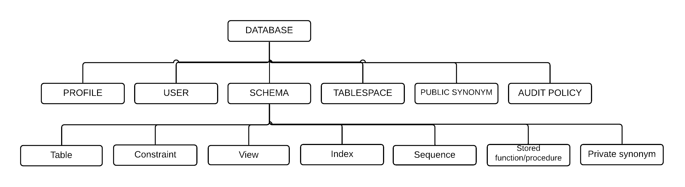
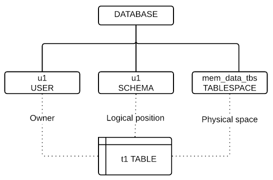
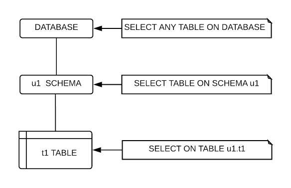
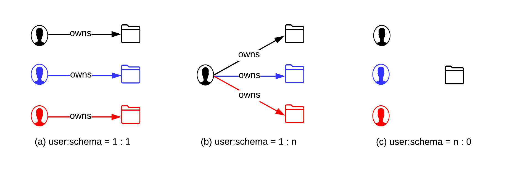
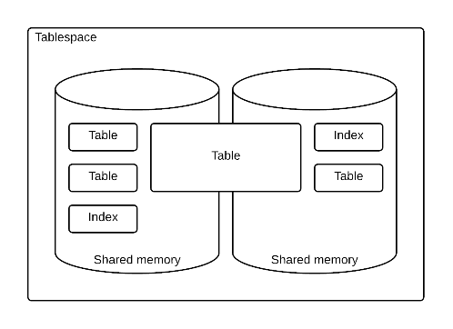
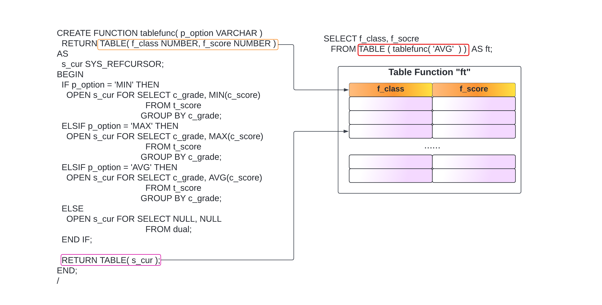

<a id="23cdbd174c498523"></a>

# 13. SQL Objects

> Source: [GOLDILOCKS 22c.1 User Manual (en)](https://manual.sunjesoft.co.kr/goldilocks/22c_1/manual/en/23cdbd174c498523)  
> Tag: `22c.1_10_tag`

[← 12. SQL Languages](12-sql-languages.md) · [Table of contents](../README.md) · [14. Cluster Objects →](14-cluster-objects.md)

This chapter describes the concepts and features of the following objects which configure the database.

- Authorization: User and privilege
- Schema
- Tablespace
- Table
- Index
- Sequence
- View
- Synonym
- Stored procedure
- Stored function

<a id="bae03fcd6f61c3a1"></a>
## Database

<a id="90de9e4c859f31da"></a>
### Database-related Statements

For more information, refer to the followings.

- Starting up the database: [ALTER SYSTEM {MOUNT | OPEN} DATABASE](18-sql-references-a-b.md#6b3352cd0d97f557)

- Backup and recovery
    - [ALTER DATABASE BACKUP](18-sql-references-a-b.md#faa4e5b84af9cb0d)
    - [ALTER DATABASE DELETE BACKUP](18-sql-references-a-b.md#b3ec6bbe505bc870)
    - [ALTER DATABASE RECOVER](18-sql-references-a-b.md#7dbbc5d33c3b669a)
    - [ALTER DATABASE REGISTER](18-sql-references-a-b.md#c6e488a3be2d58a3)
    - [ALTER DATABASE RESTORE](18-sql-references-a-b.md#2d87c705a3b3cf1a)

- Creating, dropping, altering log files
    - [ALTER SYSTEM CHECKPOINT](18-sql-references-a-b.md#7ca34d4cf3fdf9da)
    - [ALTER SYSTEM SWITCH LOGFILE](18-sql-references-a-b.md#5e8b29238f8f7d5b)
    - [ALTER DATABASE ARCHIVELOG](18-sql-references-a-b.md#a3cd3b2dd87aae2e)
    - [ALTER DATABASE ADD LOGFILE](18-sql-references-a-b.md#8fbe0a0d36dcf0d5)
    - [ALTER DATABASE DROP LOGFILE](18-sql-references-a-b.md#7e99283f967c2331)
    - [ALTER DATABASE RENAME LOGFILE](18-sql-references-a-b.md#bb4f8ef445094a6a)

- Comments on objects: [COMMENT ON name IS](19-sql-references-c-g.md#a50c9be23f474f41)

- System statistics information: [ANALYZE SYSTEM](18-sql-references-a-b.md#b8b2ee11408f96e4)

The information which is related to the database objects can be retrieved through the following views.

<a id="29f824eac304e203"></a>
<table class="table column_count_3"><caption>Database object related information</caption><thead><tr><th class="to_center"><div>Schema</div></th><th class="to_center"><div>View name</div></th><th class="to_center"><div>Description</div></th></tr></thead><tbody><tr><td class="to_middle"><div>DICTIONARY_SCHEMA</div></td><td class="to_middle"><div><a class="reference" href="../part-02-administration-manual/9-database-information.md#2ef7214dc7ea7a48">ALL_NONSCHEMA_COMMENT</a></div></td><td class="to_middle"><div>Comment information of user accessible non-schema objects</div></td></tr><tr><td class="to_middle" rowspan="6"><div>INFORMATION_SCHEMA</div></td><td class="to_middle"><div><a class="reference" href="../part-02-administration-manual/9-database-information.md#f48e861c743a5493">INFORMATION_SCHEMA_CATALOG_NAME</a></div></td><td class="to_middle"><div>Database name information</div></td></tr><tr><td class="to_middle"><div><a class="reference" href="../part-02-administration-manual/9-database-information.md#488404d71e73aadd">SQL_FEATURES</a></div></td><td class="to_middle"><div>The SQL standard compatibility information of GOLDILOCKS</div></td></tr><tr><td class="to_middle"><div><a class="reference" href="../part-02-administration-manual/9-database-information.md#67f0df2e641bb425">SQL_IMPLEMENTATION_INFO</a></div></td><td class="to_middle"><div>The SQL standard compatibility information of GOLDILOCKS</div></td></tr><tr><td class="to_middle"><div><a class="reference" href="../part-02-administration-manual/9-database-information.md#9601a3f8d0a1398d">SQL_PACKAGES</a></div></td><td class="to_middle"><div>The SQL standard compatibility information of GOLDILOCKS</div></td></tr><tr><td class="to_middle"><div><a class="reference" href="../part-02-administration-manual/9-database-information.md#8693a5797f6babe7">SQL_PARTS</a></div></td><td class="to_middle"><div>The SQL standard compatibility information of GOLDILOCKS</div></td></tr><tr><td class="to_middle"><div><a class="reference" href="../part-02-administration-manual/9-database-information.md#305dd1e5c2661008">SQL_SIZING</a></div></td><td class="to_middle"><div>The SQL standard compatibility information of GOLDILOCKS</div></td></tr></tbody></table>

<a id="48b804ecb6f74fda"></a>
### Database Configuration Objects

<a id="6e91c0185243fc85"></a>
#### SQL Objects that Configure the Database

A database consists of multiple SQL objects.

SQL objects in database are classified as SQL schema objects and non-schema objects, depending on whether they are included in the SCHEMA.

<a id="69b4dde234872899"></a>


SQL schema objects are included in the SCHEMA, and they are as follows.

- TABLE: It is an object which stores the physical data, and it consists of columns and rows.
- VIEW: It is a logical object which provides a relation name for the query, and it is similar to a table.
- INDEX: It is an object to improve the query performance.
- SEQUENCE: It is an object to generate numbers.
- CONSTRAINT: It is an object to retain the integrity of tables.
- SYNONYM: It is an alias of TABLE, VIEW, SEQUENCE, and other synonym.
- STORED PROCEDURE: It is a persistent stored module in a procedure form.
- STORED FUNCTION: It is a persistent stored module in a function form.

SQL schema object can be used together with a schema name, or it can be used omitting a schema name. If schema name is omitted, the name is interpreted by the user's schema path.

The following is an example of when objects are created by specifying the schema name.

```
gSQL> CREATE TABLE my_schema.lineitem ( id INTEGER );
gSQL> CREATE INDEX my_schema.my_index ON my_schema.lineitem ( id );
```

Non-schema object is not included in the schema, and they are as follows.

- PROFILE: It is a password management policy.
- AUDIT POLICY: It is an audit policy.
- USER: It is a user.
- SCHEMA: It is the logical locations of the SQL schema objects.
- TABLESPACE: It is the physical spaces of the SQL schema objects.
- PUBLIC SYNONYM: It is an alias of TABLE, VIEW, SEQUENCE, and other synonym which does not have schema name

The SQL standard explicitly defines concepts and syntax for the SCHEMA objects. However, the concepts of USER and DATABASE are described only, and their syntaxes are not defined in SQL. The SQL standard does not deal with the TABLESPACE object. Namely, the SQL standard does not explicitly define the non-schema objects.

GOLDILOCKS defines USER, SCHEMA, TABLESPACE as separate descendant of a database. However, other DBMS vendors define the concepts of non-schema objects as follows.

- GOLDILOCKS
    - User and schema are separate objects.
    - User either does not have a schema, or has multiple schemas.
    - The relationship between user and schema is User : Schema = 1 : N.
- Oracle
    - User and schema are defined as similar concepts.
    - The relationship between user and schema is User : Schema = 1 : 1.
- DB2
    - User is not a descendant of DATABASE.
    - The relationship between user and schema is User : Schema = 1 : N.
- Postgres
    - User is not a descendant of DATABASE.
    - The relationship between user and schema is User : Schema = 1 : N. 
- MySQL
    - User and schema are defined as similar concepts.
    - User is a descendant of DATABASE(SCHEMA).

<a id="2f2357fa0bcca917"></a>
#### Name Space of Objects

An object in the database has an identifiable name.  
An SQL schema object has a unique name within a schema.  
For example, the same lineitem table objects can be created in different schemas as follows.

```
gSQL> CREATE TABLE my_schema.lineitem ( id INTEGER );
gSQL> CREATE TABLE your_schema.lineitem ( name VARCHAR(128) );
```

SQL schema objects have the following name spaces in a single schema as follows.

- TABLE, VIEW, SEQUENCE, PRIVATE SYNONYM, STORED PROCEDURE, STORED FUNCTION
- INDEX
- CONSTRAINT

Table and view can not be created under the same name, but table and index can be created under the same name, as follows.

• Table and view can not be created under the same name.

```
gSQL> CREATE TABLE my_relation ( id INTEGER );
gSQL> CREATE VIEW my_relation ( name ) AS SELECT name FROM tmp_relation;
```

• Table and index can be created under the same name.

```
gSQL> CREATE TABLE my_object ( id INTEGER );
gSQL> CREATE INDEX my_object ON my_table ( name );
```

A non-schema object has an identifiable name within a database. Non-schema objects have the name spaces as follows.

- PROFILE
- AUDIT POLICY
- USER
- SCHEMA
- TABLESPACE

Namely, USERs can not be created under the same name, but USER and SCHEMA can be created under the same name.

• my_name USER object and my_name SCHEMA object are created.

```
gSQL> CREATE USER my_name IDENTIFIED BY my_name WITH SCHEMA my_name;
```

<a id="b0382bc7cedbb909"></a>
### Built-in Objects

When creating database, GOLDILOCKS automatically creates objects such as user, schema, tablespace which are necessary for system operation.

<a id="11f20db3a7628f22"></a>
#### Built-in User

When creating database, the following accounts are automatically created. The built-in accounts can not be removed except TEST user.

- _SYSTEM account
    - It is an account used by the internal system. When creating database, it is the owner of the built- in objects. When user creates an object, it becomes the grantor who grants the privilege to the object owner.
- SYS account
    - It is a user to manage the database.
- TEST account
    - It is a user for testing, and this object can be removed.
- ADMIN account
    - It is a role to manage the database. 
- SYSDBA account
    - It is a role to start up/shut down the database.
- PUBLIC account
    - It is an account for all users. It is used to control the privileges for all users.

<a id="5ba5b007103addf8"></a>
#### Built-in Schema

When creating database, the following schemas are automatically created. All built-in schemas can not be removed.

- DEFINITION_SCHEMA
    - It consists of the physical tables which store all objects information of the database.
- FIXED_TABLE_SCHEMA
    - It consists of the fixed tables which display the data structure information of system in a table form.
- DICTIONARY_SCHEMA
    - It consists of the user perspective views for querying object information of the database.
- INFORMATION_SCHEMA
    - It consists of the views defined in the SQL standard for querying the object information of the database.
- PERFORMANCE_VIEW_SCHEMA
    - It consists of the user perspective views for querying the state of the system. 
- SESSION_SCHEMA
    - It is the schema to manage objects in session unit, and the user can not use it. 
- PUBLIC
    - It is the schema in which all users can create objects, and it differs from the PUBLIC account, which means all users.

<a id="850fcd1d68f942f9"></a>
#### Built-in Tablespace

When creating database, the following tablespaces are created automatically. All the built-in tablespaces can not be removed.

- DICTIONARY_TBS
    - It stores the dictionary tables to manage the SQL objects information.
- MEM_UNDO_TBS
    - It stores undo segments and transactions information.
- MEM_DATA_TBS
    - It is the first created data tablespace.
    - The user created tables are stored in data tablespace.
- MEM_TEMP_TBS
    - It is the first created temporary tablespace.
    - The temporary objects such as sort and hash which are created during query processing are stored in the temporary tablespace.
- DISK_DATA_TBS
    - It is the first created disk data tablespace.
    - The data tablespace stores objects such as a user-created table.
- MEM_AUX_TBS
    - It is a system auxiliary tablespace and it stores records which is automatically created such as an audit record.
- MEM_TRANS_TBS
    - It is valid in the cluster system, and manages the global transaction information.
    - It is not created in the standalone system.

<a id="38ea6a99c2d07126"></a>
#### Built-in Profile

When creating database, the "DEFAULT" profile is automatically created. Password parameter information of the "DEFAULT" profile is as follows.

**Configuration of DEFAULT profile**

<a id="4975d34a66336818"></a>
| Parameter | Value |
| --- | --- |
| FAILED_LOGIN_ATTEMPTS | 10 |
| PASSWORD_LOCK_TIME | 1 |
| PASSWORD_LIFE_TIME | 180 |
| PASSWORD_GRACE_TIME | 7 |
| PASSWORD_REUSE_MAX | UNLIMITED |
| PASSWORD_REUSE_TIME | UNLIMITED |
| PASSWORD_VERIFY_FUNCTION | NULL |

The followings are characteristics of the default values of "DEFAULT" profile.

- Account lockout
    - An account is locked for one day (PASSWORD_LOCK_TIME) after consecutive 10 (FAILED_LOGIN_ATTEMPTS) times of failed login attempts.
- Password expiration
    - After 180 days (PASSWORD_LIFE_TIME) has elapsed, the password expires after seven days of grace period (PASSWORD_GRACE_TIME).
- Password reusable
    - The old password can be reused. 
- Password complexity verification
    - The password complexity is not verified.

<a id="0bc624c971c6317f"></a>
## Profile

<a id="bbcb50fb30b5d95a"></a>
### Profile-related Statements

For more information, refer to the followings.

- Creating a profile: [CREATE PROFILE](19-sql-references-c-g.md#c43cb7b774ec2c47).
- Dropping a profile: [DROP PROFILE](19-sql-references-c-g.md#a24384fe710da05a).
- Altering a profile: [ALTER PROFILE](18-sql-references-a-b.md#a8a6652b83db7218).
- Assigning a profile to the user: [CREATE USER](19-sql-references-c-g.md#fc0b133394d316ed), [ALTER USER](18-sql-references-a-b.md#87d9fdd4c9a9e146)
- Clearing a password history: [ALTER DATABASE CLEAR PASSWORD HISTORY](18-sql-references-a-b.md#bc979bf4af8b1c5c).

<a id="a93f04d91e2f25ea"></a>
<table class="table column_count_3"><caption>Profile object related information</caption><thead><tr><th class="to_center"><div>Schema</div></th><th class="to_center"><div>View</div></th><th class="to_center"><div>Description</div></th></tr></thead><tbody><tr><td class="to_middle" rowspan="2"><div>DICTIONARY_SCHEMA</div></td><td class="to_middle"><div><a class="reference" href="../part-02-administration-manual/9-database-information.md#acacc03940f1aec3">DBA_PROFILES</a></div></td><td class="to_middle"><div>All profile information</div></td></tr><tr><td class="to_middle"><div><a class="reference" href="../part-02-administration-manual/9-database-information.md#4a81883c92f13198">DBA_USERS</a></div></td><td class="to_middle"><div>User profile information</div></td></tr></tbody></table>

<a id="a4dc9b4268b6435e"></a>
### Concepts of Profile

GOLDILOCKS performs user authentication for database security. The password management policy is required because the user authentication password is vulnerable to theft, forgery and misuse.

Profile includes information such as this password management policy. DBA or security managers assign the profile to a user, and apply the password management policy which is appropriate to the corresponding user.

<a id="4c8c1b025a33ceb5"></a>
#### Creating, Altering, Allocating Profile

A profile is created by using CREATE PROFILE statement.

```
CREATE PROFILE profile1 LIMIT 
       FAILED_LOGIN_ATTEMPTS     10  
       PASSWORD_LOCK_TIME        1 
       PASSWORD_LIFE_TIME        180 
       PASSWORD_GRACE_TIME       7
       PASSWORD_REUSE_MAX        UNLIMITED
       PASSWORD_REUSE_TIME       UNLIMITED
       PASSWORD_VERIFY_FUNCTION  NULL;
```

A profile is allocated by using CREATE USER, ALTER USER statements.

```
CREATE USER u1 IDENTIFIED BY u1 PROFILE profile1;
ALTER USER u2 PROFILE profile1;
```

The profile parameters are updated by using ALTER PROFILE statement.

```
ALTER PROFILE profile1 LIMIT 
      PASSWORD_REUSE_MAX        3
      PASSWORD_REUSE_TIME       30;
```

If a profile is not allocated to a user, the user is not restricted on creating and using the password.  
If the created profile or a DEFAULT profile is allocated to a user, the user complies with the profile's password policies when creating and using the password.

<a id="f13eaf257fb35675"></a>
#### Setting Password of DEFAULT Profile

When the default profile is assigned to a user, the password is managed as follows.

**DEFAULT profile of password**

<a id="5cac3529dac5f4be"></a>
| Parameter | Default  setting | Description |
| --- | --- | --- |
| FAILED_LOGIN_ATTEMPS | 10 | The allowed number of consecutive login failure The account is locked after consecutive 10 times login attempt failures. |
| PASSWORD_LOCK_TIME | 1 | The account lockout duration If the consecutive login failures exceed the allowable value, the account is locked for one day. |
| PASSWORD_LIFE_TIME | 180 | The password life time The password is expired after 180 days. |
| PASSWORD_GRACE_TIME | 7 | The duration to change the password when the the password is expired. The password should be changed within seven days after first login since the password is expired. If a user does not change the password within the period, the user can not log in using the password. |
| PASSWORD_REUSE_MAX | UNLIMITED | The number of times of which passwords are not reusable. PASSWORD_REUSE_MAX should be set together with PASSWORD_REUSE_TIME. If both of the two values are UNLIMITED, the password can always be reused. |
| PASSWORD_REUSE_TIME | UNLIMITED | The duration which the password can not be reused. |

<a id="2ee41b20ad02a197"></a>
#### Account Lockout

If the number of consecutive login attempt failures exceeds the number of times specified in FAILED_LOGIN_ATTEMPTS, the account is locked during the period specified in PASSWORD_LOCK_TIME.

```
CREATE PROFILE profile1 LIMIT 
       FAILED_LOGIN_ATTEMPTS     10  
       PASSWORD_LOCK_TIME        1;

ALTER USER u1 PROFILE profile1;
```

When a user u1's login attempts consecutively fail more than 10 times, the account is locked for one day. And after one day the account is automatically unlocked.

If the PASSWORD_LOCK_TIME value is not specified, it is regarded as the value which is specified in PASSWORD_LIFE_TIME of DEFAULT profile.

If the PASSWORD_LOCK_TIME value is UNLIMITED the locked accounts are not automatically released. Therefore, the following statement should be executed to unlock the account.

```
ALTER USER u1 ACCOUNT UNLOCK;
```

If login is successful, the number of failed login attempt is initialized to zero.

A security manager can explicitly lock the user accounts. In this case, the user accounts can not be automatically released so the security manager should unlock the user accounts.

```
ALTER USER u1 ACCOUNT LOCK;
ALTER USER u1 ACCOUNT UNLOCK;
```

<a id="afc287ee10b34870"></a>
#### Password Lifetime

PASSWORD_LIFE_TIME specifies the life time the password. After the life time, the password is expired.  
A user, DBA or security manager should change the password after a password is expired.

```
CREATE PROFILE profile1 LIMIT 
       PASSWORD_LIFE_TIME        180
       PASSWORD_GRACE_TIME       7;

ALTER USER u1 PROFILE profile1;
```

The grace period starts since when the user u1 has tried to log in for the first time after 180 days.

During seven days of the grace period, the user is reminded to enter a new password whenever accessing the account, until he changes the password.  
If seven days of the grace period passed and the password is not changed, the user can not login until entering a new password.

A password can be expired by using CREATE USER or ALTER USER statements.

```
ALTER USER u1 PASSWORD EXPIRE;
```

When the password is expired, the error (ERR-28000(16312) the password has expired) occurs whenever logging in as follows, then a new password should be entered.

```
% gsql u1 u1

ERR-28000(16312): the password has expired

Changing password for u1
New password: 
Retype new password: 
Connected to GOLDILOCKS Database.

gSQL>
```

<a id="329e4f8cb22b298e"></a>
#### Reusing Password

The password can be reused after it is changed as many times as the specified value in PASSWORD_REUSE_MAX. Also, it should be after the specified time in PASSWORD_REUSE_TIME.

```
CREATE PROFILE profile1 LIMIT 
       PASSWORD_REUSE_MAX        2
       PASSWORD_REUSE_TIME       1;

ALTER USER u1 PROFILE profile1;
```

The user u1 can reuse the current password after the password has been changed for two times, and 10 days elapsed.

```
ALTER USER u1 IDENTIFIED BY u1 REPLACE u1;
ALTER USER u1 IDENTIFIED BY u1 REPLACE u1
*
ERROR at line 1:
ORA-28007: the password cannot be reused

ALTER USER u1 IDENTIFIED BY u2 REPLACE u1;

User altered.

ALTER USER u1 IDENTIFIED BY u3 REPLACE u2;

User altered.
```

• 10 days elapsed.

```
ALTER USER u1 IDENTIFIED BY u1 REPLACE u3;

User altered.
```

The both conditions should be satisfied to reuse the old password. If only one of the value in PASSWORD_REUSE_MAX and PASSWORD_REUSE_TIME is UNLIMITED, the password can not be reused.  
If both of values are UNLIMITED, the password can always be reused.

**Password reuse**

<a id="04dad16fd53db9d1"></a>
| PASSWORD_REUSE_MAX | PASSWORD_REUSE_TIME | Password reusability |
| --- | --- | --- |
| Integer value | Integer value | If both of the conditions are satisfied, it can be reused. |
| Integer value | UNLIMITED | It can not be reused. |
| UNLIMITED | Integer value | It can not be reused. |
| UNLIMITED | UNLIMITED | It can always be reused. |

<a id="221249559adbfd2d"></a>
#### Password Complexity Verification

Password complexity verification checks if the password is complex enough to protect against breaking into the system.  
GOLDILOCKS supports the method of password complexity verification as follows.

**Password complexity verification**

<a id="523bbe32e0a1173f"></a>
<table><thead><tr><th align="center">Method</th><th align="center">Description</th></tr></thead><tbody><tr><td valign="middle">KISA_VERIFY_FUNCTION</td><td valign="middle"><ul><li>8 or more characters</li><li>1 or more letters</li><li>1 or more numbers</li><li>1 or more special characters</li></ul></td></tr><tr><td valign="middle">ORA12C_VERIFY_FUNCTION</td><td valign="middle"><ul><li>8 or more characters</li><li>1 or more letters</li><li>1 or more numbers</li><li>Database name should not be included.</li><li>Username or the reversed username should not be included.</li><li><em>goldilocks</em>&nbsp;should not be included.</li><li><em>oracle</em>&nbsp;should not be included.</li><li>The following simple password can not be used.<br><ul><li>welcome1, database1, account1, user1234, password1, oracle123, computer1, abcdefg1, change_on_intall</li></ul></li><li>The new password should be different at least 3 characters from the old password.</li></ul></td></tr><tr><td valign="middle">ORA12C_STRONG_VERIFY_FUNCTION</td><td valign="middle"><ul><li>9 or more characters</li><li>2 or more uppercases</li><li>2 or more lowercases</li><li>2 or more numbers</li><li>2 or more special characters</li><li>The new password should be different at least 4 characters from the old password.</li></ul></td></tr><tr><td valign="middle">VERIFY_FUNCTION_11G</td><td valign="middle"><ul><li>8 or more characters</li><li>1 or more letters</li><li>1 or more numbers</li><li>Username should not be included.</li><li>The new password should be different at least 3 characters from the old password.</li></ul></td></tr><tr><td valign="middle">VERIFY_FUNCTION</td><td valign="middle"><ul><li>It should not be same as the username.</li><li>4 or more characters</li><li>1 or more letters</li><li>1 or more numbers</li><li>1 or more special characters</li><li>The following simple password can not be used.<br><ul><li>welcome, database, account, user, password, oracle, computer, abcd</li></ul></li><li>The new password should be different at least 3 characters from the old password.</li></ul></td></tr></tbody></table>

For more information about profile and user setting, refer to [CREATE PROFILE](19-sql-references-c-g.md#c43cb7b774ec2c47), [CREATE USER](19-sql-references-c-g.md#fc0b133394d316ed).

<a id="4bcae1c27e895d0f"></a>
## Audit Policy

<a id="0907f349d7527bb0"></a>
### Audit Policy-related Statement

For more information, refer to the followings.

- Creating audit policy: [CREATE AUDIT POLICY](19-sql-references-c-g.md#c95b6811be94d2e0)
- Dropping audit policy: [DROP AUDIT POLICY](19-sql-references-c-g.md#2da3770d12de6ceb)
- Altering audit policy: [ALTER AUDIT POLICY](18-sql-references-a-b.md#89bba1b8a2f2809a)
- Activating audit policy: [AUDIT POLICY](18-sql-references-a-b.md#8015eb753e31e65c)
- Deactivating audit policy: [NOAUDIT POLICY](20-sql-references-h-z.md#f45973bfabd47cb0)
- Dropping audit trail: [ALTER DATABASE CLEAR AUDIT TRAIL](18-sql-references-a-b.md#d4120dc662bce568)

<a id="56f82eb007a8a5a7"></a>
<table class="table column_count_3"><caption>Audit policy object information</caption><thead><tr><th class="to_center"><div>Schema</div></th><th class="to_center"><div>View</div></th><th class="to_center"><div>Description</div></th></tr></thead><tbody><tr><td class="to_middle" rowspan="3"><div>DICTIONARY_SCHEMA</div></td><td class="to_middle"><div><a class="reference" href="../part-02-administration-manual/9-database-information.md#19c870a8e5ca2150">AUDIT_POLICIES</a></div></td><td class="to_middle"><div>Information about all audit policies</div></td></tr><tr><td class="to_middle"><div><a class="reference" href="../part-02-administration-manual/9-database-information.md#f21689304f8cd82e">AUDIT_POLICY_OPTIONS</a></div></td><td class="to_middle"><div>Information about audit policy option</div></td></tr><tr><td class="to_middle"><div><a class="reference" href="../part-02-administration-manual/9-database-information.md#a319eb60b822016b">AUDIT_POLICY_ENABLED</a></div></td><td class="to_middle"><div>Information about activating audit policy</div></td></tr></tbody></table>

<a id="a21359808c2f53a3"></a>
### Examples

AUDIT SYSTEM ON DATABASE privilege is required to perform the followings.

<a id="7a8b031d6e97cdbd"></a>
#### Creating Audit Policy

Perform [CREATE AUDIT POLICY](19-sql-references-c-g.md#c95b6811be94d2e0) statement to create an audit policy object.

The following is an example of creating an audit_t1_dml object to audit the DML for a u1.t1 table.

```
CREATE AUDIT POLICY audit_t1_dml
       ACTIONS INSERT ON u1.t1
             , DELETE ON u1.t1
             , UPDATE ON u1.t1
;

Audit policy created.
```

Enquire the information about audit policy options by using [AUDIT_POLICY_OPTIONS](../part-02-administration-manual/9-database-information.md#f21689304f8cd82e) view.

```
SELECT policy_name
     , audit_option
     , object_schema
     , object_name
  FROM audit_policy_options
 WHERE policy_name = 'AUDIT_T1_DML'
 ORDER BY audit_option
;

POLICY_NAME  AUDIT_OPTION OBJECT_SCHEMA OBJECT_NAME
------------ ------------ ------------- -----------
AUDIT_T1_DML DELETE       U1            T1         
AUDIT_T1_DML INSERT       U1            T1         
AUDIT_T1_DML UPDATE       U1            T1         

3 rows selected.
```

<a id="2a4ed9bc3869074e"></a>
#### Activating Audit Policy

Use [AUDIT POLICY](18-sql-references-a-b.md#8015eb753e31e65c) statement to activate the audit policy.

The following is an example of activating an audit policy to leave an audit record when a user except for u1, sys succeeded to perform DML for u1.t1 table.

```
AUDIT POLICY audit_t1_dml
      EXCEPT u1, sys
      WHENEVER SUCCESSFUL
;
```

The activated audit policy is applied to the newly created session, but it does not affect the existing sessions.

View the information about activated audit policy by using [AUDIT_POLICY_ENABLED](../part-02-administration-manual/9-database-information.md#a319eb60b822016b).

```
SELECT policy_name
     , enabled_opt
     , user_name
     , when_success
     , when_failure
  FROM audit_policy_enabled
 WHERE policy_name = 'AUDIT_T1_DML'
 ORDER BY user_name
;

POLICY_NAME	         ENABLED_OPT           USER_NAME  WHEN_SUCCESS WHEN_FAILURE
-------------------- --------------------- ---------- ------------ ---------
AUDIT_T1_DML	     EXCEPT	               SYS        YES          NO
AUDIT_T1_DML	     EXCEPT	               U1         YES          NO

2 rows selected.
```

After the audit policy is activated, the corresponding actions create audit records.

The following is an example of when u2 user successfully performs SQL statements.

```
SELECT COUNT(*) FROM u1.t1;
INSERT INTO u1.t1 VALUES ( 1 );
UPDATE u1.t1 SET id = id + 1 WHERE id = 1;
DELETE u1.t1 WHERE id = 2;
COMMIT;
```

In the example above, INSERT, UPDATE, DELETE are target actions of an audit, so it creates  audit records, but SELECT and COMMIT are not a target action of an audit, so it does not create audit records.

<a id="2c01de20c2d69953"></a>
#### Viewing Audit Trail

SELECT ON DICTIONARY_SCHEMA.AUDIT_TRAIL privilege for AUDIT_TRAIL view is required to view audit records.

The following is an example of viewing an audit trail created by an audit_t1_dml audit policy.

```
SELECT policy_name
     , logon_username
     , action_name
     , object_schema
     , object_name
     , sql_text
  FROM audit_trail
 WHERE policy_name = 'AUDIT_T1_DML'
;

POLICY_NAME  LOGON_USERNAME ACTION_NAME OBJECT_SCHEMA OBJECT_NAME SQL_TEXT                                 
------------ -------------- ----------- ------------- ----------- -----------------------------------------
AUDIT_T1_DML U2             INSERT      U1            T1          INSERT INTO u1.t1 VALUES ( 1 )           
AUDIT_T1_DML U2             UPDATE      U1            T1          UPDATE u1.t1 SET c1 = c1 + 1 WHERE c1 = 1
AUDIT_T1_DML U2             DELETE      U1            T1          DELETE u1.t1 WHERE c1 = 2                

3 rows selected.
```

<a id="bf1c0665edf292fd"></a>
#### Dropping Audit Trail

When an audit policy is activated, the size of an audit trail keeps increasing.  
Execute the following statement to drop the audit trail.

```
ALTER DATABASE CLEAR AUDIT TRAIL;
```

Store it in the user table and drop it as follows to store the audit trail.

- Creating a user table

```
CREATE TABLE my_audit_trail
AS SELECT *
     FROM audit_trail
     WITH NO DATA;
```

- Storing it in a user table, then dropping it.

```
INSERT INTO my_audit_trail SELECT * FROM audit_trail;
ALTER DATABASE CLEAR AUDIT TRAIL;
```

Create and manage the view as follows to view both the stored audit trail and the current audit_trail.

```
CREATE VIEW unified_audit_trail
AS 
SELECT * FROM my_audit_trail
 UNION ALL
SELECT * FROM dictionary_schema.audit_trail
;
```

<a id="eeb95bf6d4437f0d"></a>
#### Deactivating Audit Policy

Deactivate the audit policy by using the following statement.

```
NOAUDIT POLICY audit_t1_dml;
```

Deactivating audit policy affects the newly created session, but it does not affect the activated information about existing sessions.

<a id="fb178ccf8772bdca"></a>
#### Dropping Audit Policy

Execute the following statement to drop the audit policy object.

```
DROP AUDIT POLICY audit_t1_dml;
```

The audit policy object should be deactivated to be dropped, and dropping the object does not affect the existing sessions.

<a id="aeda354c9a8df48d"></a>
### Concepts of Audit Policy

<a id="0ee1a992cca25e34"></a>
#### Audit Trail

<a id="45bc20ffd22e2288"></a>
##### Viewing Audit Trail

Audit record can be viewed by using DICTIONARY_SCHEMA.AUDIT_TRAIL view.

SELECT privilege is required to view AUDIT_TRAIL view.

```
GRANT SELECT ON DICTIONARY_SCHEMA.AUDIT_TRAIL TO user_name;
```

AUDIT_TRAIL view has the following information.

<a id="8a58bc4db2864728"></a>
<table class="table column_count_3"><caption>Column information</caption><thead><tr><th class="to_center"><div>Information</div></th><th class="to_center"><div>Column name</div></th><th class="to_center"><div>Description</div></th></tr></thead><tbody><tr><td class="to_middle" rowspan="6"><div>Session 
information</div></td><td class="to_left to_middle"><div>MEMBER_NAME</div></td><td class="to_left to_middle"><div>Cluster member name</div></td></tr><tr><td class="to_left to_middle"><div>SESSION_ID</div></td><td class="to_left to_middle"><div>Session identifier</div></td></tr><tr><td class="to_left to_middle"><div>SESSION_SERIAL</div></td><td class="to_left to_middle"><div>Session serial number</div></td></tr><tr><td class="to_middle"><div>LOGON_USERNAME</div></td><td class="to_middle"><div>Logon user name of the user whose actions were audited</div></td></tr><tr><td class="to_middle"><div>CURRENT_USERNAME</div></td><td class="to_middle"><div>Effective user for the statement execution</div></td></tr><tr><td class="to_middle"><div>SERVER_PROCESS</div></td><td class="to_middle"><div>Server process identifer for the session</div></td></tr><tr><td class="to_middle" rowspan="6"><div>Peer client 
information</div></td><td class="to_middle"><div>CLIENT_PROGRAM_NAME</div></td><td class="to_middle"><div>Client program used for session</div></td></tr><tr><td class="to_middle"><div>CLIENT_USERNAME</div></td><td class="to_middle"><div>Client operating system user name for the session</div></td></tr><tr><td class="to_middle"><div>CLIENT_PROCESS</div></td><td class="to_middle"><div>Client process identifer for the session</div></td></tr><tr><td class="to_middle"><div>CLIENT_HOST</div></td><td class="to_middle"><div>Client host ip address for the session</div></td></tr><tr><td class="to_middle"><div>CLIENT_PORT</div></td><td class="to_middle"><div>Client port number for the session</div></td></tr><tr><td class="to_middle"><div>CLIENT_TERMINAL</div></td><td class="to_middle"><div>Client terminal name for the session</div></td></tr><tr><td class="to_middle" rowspan="10"><div>SQL 
information</div></td><td class="to_middle"><div>TRANSACTION_ID</div></td><td class="to_middle"><div>Transaction identifier</div></td></tr><tr><td class="to_middle"><div>SCN</div></td><td class="to_middle"><div>System change number (SCN) string of the query at the time of the event</div></td></tr><tr><td class="to_middle"><div>GCN</div></td><td class="to_middle"><div>Global change number (GCN) of the query at the time of the event</div></td></tr><tr><td class="to_middle"><div>DCN</div></td><td class="to_middle"><div>Domain change number (DCN) of the query at the time of the event</div></td></tr><tr><td class="to_middle"><div>LCN</div></td><td class="to_middle"><div>Local change number (LCN) of the query at the time of the event</div></td></tr><tr><td class="to_middle"><div>STMT_NO</div></td><td class="to_middle"><div>Numeric number for each statement run in a session</div></td></tr><tr><td class="to_middle"><div>SQL_TEXT</div></td><td class="to_middle"><div>SQL associated with the event</div></td></tr><tr><td class="to_middle"><div>SQL_BINDS</div></td><td class="to_middle"><div>List of bind variables, if any, associated with SQL_TEXT</div></td></tr><tr><td class="to_middle"><div>RETURN_CODE</div></td><td class="to_middle"><div>Error code generated by the action, zero if the action succeeded</div></td></tr><tr><td class="to_middle"><div>ERROR_MESSAGE</div></td><td class="to_middle"><div>Error message generated by the action, null if the action succeeded</div></td></tr><tr><td class="to_middle" rowspan="8"><div>Event 
information</div></td><td class="to_middle"><div>ENTRY_ID</div></td><td class="to_middle"><div>Audit trail entry identifier in the session</div></td></tr><tr><td class="to_middle"><div>EVENT_TIMESTAMP</div></td><td class="to_middle"><div>Timestamp of the creation of the audit trail entry in local time zone</div></td></tr><tr><td class="to_middle"><div>POLICY_NAME</div></td><td class="to_middle"><div>Audit policy name that caused the current audit record</div></td></tr><tr><td class="to_middle"><div>PRIVILEGE_USED</div></td><td class="to_middle"><div>Database privilege used to execute the action</div></td></tr><tr><td class="to_middle"><div>ACTION_NAME</div></td><td class="to_middle"><div>Action name executed by the user</div></td></tr><tr><td class="to_middle"><div>OBJECT_TYPE</div></td><td class="to_middle"><div>Object type of object affected by the action</div></td></tr><tr><td class="to_middle"><div>OBJECT_SCHEMA</div></td><td class="to_middle"><div>Schema name of object affected by the action</div></td></tr><tr><td class="to_middle"><div>OBJECT_NAME</div></td><td class="to_middle"><div>Object name of object affected by the action</div></td></tr></tbody></table>

<a id="902f7ae1d5e8cc6a"></a>
##### Storing Audit Trail

AUDIT_TRAIL view consists of the following tables.

- AUDIT_TRAIL_SESSION
    - It records a record per a session.
    - Session information
    - Peer client information
- AUDIT_TRAIL_SQL
    - It records a record per SQL.
    - SQL information
- AUDIT_TRAIL_EVENT
    - It records a record per an audit option.
    - Audit event information

Audit records configuring an audit trail is divided into multiple tables then stored.  
The schema of the tables is DEFINITION_SCHEMA, and it is stored in MEM_AUX_TBS tablespace.

- DEFINITION_SCHEMA
    - It is a schema storing dictionary tables.
- MEM_AUX_TBS
    - System auxiliary tablespace 
    - It is a tablespace to store a record which automatically created by the database.
    - It is managed by a separate tablespace not to affect the service management by an automatically created record.

<a id="8097a2b9b7056b48"></a>
##### Creating Audit Record

If an audit policy is activated, it creates an audit record when the corresponding action occurs.    
It creates one or more audit records when multiple corresponding actions occur.

- If similar audit options are listed as follows, it creates a single audit record.

    - Defining an audit policy

```
CREATE AUDIT POLICY p1
       PRIVILEGES INSERT ANY TABLE
       ACTIONS INSERT;

AUDIT POLICY p1;
```

    - Performing an audit action

```
INSERT INTO other_user.t1 VALUES ( 1 );
```

- If different audit options are listed as follows, it creates two audit records.

    - Defining an audit policy

```
CREATE AUDIT POLICY p1
       ACTIONS SELECT ON u1.t1
             , SELECT ON u1.t2;

AUDIT POLICY p1;
```

    - Performing an audit action

```
SELECT COUNT(*) FROM u1.t1 A, u1.t2 B WHERE A.id = B.id;
```

- If multiple audit policies are activated in the identical action as follows, it creates two audit records.

    - Defining an audit policy

```
CREATE AUDIT POLICY p1
       PRIVILEGES INSERT ANY TABLE;
AUDIT POLICY p1;

CREATE AUDIT POLICY p2
       ACTIONS INSERT;
AUDIT POLICY p2;
```

    - Performing an audit action

```
INSERT INTO other.t1 VALUES (1);
```

<a id="6e249b2a92df8448"></a>
##### Dropping Audit Trail (purge)

Execute the following statement to drop the audit trail.

```
ALTER DATABASE CLEAR AUDIT TRAIL;
```

Create a user table and store old audit record in it as follows.

```
CREATE TABLE my_audit_trail AS SELECT * FROM audit_trail WITH NO DATA;
```

Then, regularly store it by using INSERT .. SELECT statement before dropping the audit trail.

```
INSERT INTO my_audit_trail SELECT * FROM audit_trail;

ALTER DATABASE CLEAR AUDIT TRAIL;
```

Execute DELETE statement by using EVENT_TIMESTAMP column to store the audit record of the specified period.

```
INSERT INTO my_audit_trail SELECT * FROM audit_trail;

DELETE FROM my_audit_trail WHERE event_timestamp < ADD_MONTHS( sysdate, -3 );

ALTER DATABASE CLEAR AUDIT TRAIL;
```

View the old audit record and the current audit record together by creating a view as follows.

```
CREATE VIEW audit_trail_view
AS SELECT * FROM dictionary_schema.audit_trail
   UNION ALL
   SELECT * FROM my_audit_trail; 

SELECT * FROM audit_trail_view;
```

<a id="bc01def239edaebe"></a>
#### Configuring Audit Policy

Audit policy may include the following options.

- Privilege auditing
    - It audits SQL performance by using the database privilege.
- Object action auditing
    - It audits SQL performance for the specific object. 
- System action auditing
    - It audits SQL performance for all objects.

Multiple audit options can be managed by creating multiple audit policies, but it is recommended to manage multiple audit options by creating a small number of audit policies.

The activated audit policy information is constructed as a session information at logon time, so the less the number of audit policies, the less the load becomes.  
Moreover, if multiple audit policies are activated, then it determines whether to create an audit record for an SQL statement, so a load creating multiple audit records may occur.

Audit policy information constructed in a session at logon time is not affected by dropping, altering, activating or deactivating an audit policy.    
Altering an audit policy is applied only to a newly logon session.

<a id="79cbedf71cd3538e"></a>
##### Privilege Auditing

Privilege auditing is set to audit when SQL statement is successfully performed by using the database privilege.   
It does not create an audit record which is based on the privilege auditing about sys user (the database owner).

The database privilege which can be listed for the privilege auditing can be viewed through [V$AUDITABLE_DB_PRIVILEGES](../part-02-administration-manual/9-database-information.md#a0b81cc34bbc71b2) view.

```
SELECT privilege_name FROM v$auditable_db_privileges;

PRIVILEGE_NAME       
---------------------
ADMINISTRATION       
ALTER DATABASE       
ALTER SYSTEM         
ACCESS CONTROL       
CREATE USER          
ALTER USER           
DROP USER            
CREATE TABLESPACE    
ALTER TABLESPACE     
DROP TABLESPACE      
USAGE TABLESPACE     
CREATE SCHEMA        
DROP SCHEMA          
ANALYZE ANY          
CREATE ANY TABLE     
ALTER ANY TABLE      
DROP ANY TABLE       
SELECT ANY TABLE     
INSERT ANY TABLE     
DELETE ANY TABLE     
UPDATE ANY TABLE     
LOCK ANY TABLE       
CREATE ANY VIEW      
DROP ANY VIEW        
CREATE ANY SEQUENCE  
ALTER ANY SEQUENCE   
DROP ANY SEQUENCE    
USAGE ANY SEQUENCE   
CREATE ANY INDEX     
ALTER ANY INDEX      
DROP ANY INDEX       
CREATE ANY SYNONYM   
DROP ANY SYNONYM     
CREATE PUBLIC SYNONYM
DROP PUBLIC SYNONYM  
CREATE PROFILE       
ALTER PROFILE        
DROP PROFILE         
CREATE ANY PROCEDURE 
ALTER ANY PROCEDURE  
DROP ANY PROCEDURE   
EXECUTE ANY PROCEDURE
AUDIT SYSTEM         
PURGE DBA_RECYCLEBIN 

44 rows selected.
```

The following is an example of when a user u1 who has SELECT ANY TABLE privilege activates an audit policy for the privilege auditing.

```
CREATE AUDIT POLICY p1
       PRIVILEGES SELECT ANY TABLE;

AUDIT POLICY p1;
```

Whether the audit record is created when a user u1 performs the following two statements is as follows.

- SELECT * FROM u1.t1
    - It does not use SELECT ANY TABLE privilege because it is an owner of the object. 
    - An audit record does not exist.
- SELECT * FROM other.t1
    - It succeeds with SELECT ANY TABLE privilege even though it does not have SELECT ON other.t1 privilege.
    - It creates an audit record.

Use AUDIT_POLICY_OPTIONS view to view the privilege auditing information as follows.

```
SELECT audit_option 
     , audit_option_type
     , object_schema
     , object_name
  FROM audit_policy_options
 WHERE policy_name = 'P1'
;

AUDIT_OPTION	     AUDIT_OPTION_TYPE    OBJECT_SCHEMA     OBJECT_NAME
-------------------- -------------------- ----------------- ------------
SELECT ANY TABLE     DATABASE PRIVILEGE   null              null
```

<a id="2285de980e07d558"></a>
##### Auditing Object Action

It audits SQL which is performed for a specific object.  
Actions to be audited per each object type are as follows.

**Audit action per object type**

<a id="46f126f1274f3ee9"></a>
| Object type | Actions |
| --- | --- |
| Table | ALTER, COMMENT, DELETE, GRANT, INDEX, INSERT, LOCK, RENAME, SELECT, UPDATE |
| View | ALTER, COMMENT, GRANT, SELECT |
| Sequence | ALTER, COMMENT, GRANT, SELECT |
| Stored function/ procedure | ALTER, COMMENT, EXECUTE, GRANT |

Create the audit policy as follows to audit DML for table u1.t1.

```
CREATE AUDIT POLICY audit_t1_dml
       ACTIONS INSERT ON u1.t1
             , DELETE ON u1.t1
             , UPDATE ON u1.t1
;
```

Execute AUDIT_POLICY_OPTIONS view as follows to view the information about object action auditing.

```
SELECT audit_option
     , audit_option_type
     , object_schema
     , object_name
  FROM audit_policy_options
 WHERE policy_name = 'AUDIT_T1_DML'
 ORDER BY audit_option
;

AUDIT_OPTION AUDIT_OPTION_TYPE OBJECT_SCHEMA OBJECT_NAME
------------ ----------------- ------------- -----------
DELETE       OBJECT ACTION     U1            T1         
INSERT       OBJECT ACTION     U1            T1         
UPDATE       OBJECT ACTION     U1            T1         

3 rows selected.
```

ALL option such as ALL ON schema.object means all audit actions which can be defined for the corresponding object.

The following is an example of using ALL option together with other options.

```
CREATE AUDIT POLICY p1
       ACTIONS ALL ON u1.seq1
             , ALTER ON u1.seq1
;

Audit policy created.

SELECT audit_option 
     , audit_option_type
     , object_schema
     , object_name
  FROM audit_policy_options
 WHERE policy_name = 'P1'
 ORDER BY audit_option
;

AUDIT_OPTION AUDIT_OPTION_TYPE OBJECT_SCHEMA OBJECT_NAME
------------ ----------------- ------------- -----------
ALL          OBJECT ACTION     U1            SEQ1       
ALTER        OBJECT ACTION     U1            SEQ1       

2 rows selected.
```

When dropping ALL option as follows, not every audit options are dropped, but only ALL option is dropped.

```
ALTER AUDIT POLICY p1
      DROP ACTIONS ALL ON u1.seq1;

Audit Policy altered.


SELECT audit_option 
     , audit_option_type
     , object_schema
     , object_name
  FROM audit_policy_options
 WHERE policy_name = 'P1'
 ORDER BY audit_option;


AUDIT_OPTION AUDIT_OPTION_TYPE OBJECT_SCHEMA OBJECT_NAME
------------ ----------------- ------------- -----------
ALTER        OBJECT ACTION     U1            SEQ1       

1 row selected.
```

Auditing success or failure of EXECUTE a stored function or a stored procedure is determined based only on whether it is executable at the time of the execution.

- WHENEVER NOT SUCCESSFUL creates an audit record when it can not performs a stored function/ procedure.
- WHENEVER SUCCESSFUL creates an audit record even when an error occurs while performing an SQL statement in a stored function/ procedure.
- If an auditing the failure of an SQL statement in a stored function/ procedure, then that SQL statement should be included in an auditing target.

The following is an example of executing SELECT statement including a stored function.

```
SELECT others.func1( t1.c1 )
  FROM t1;
```

It corresponds to WHENEVER NOT SUCCESSFUL when it fails to call others.func1() due to an error such as a lack of privilege. It corresponds to WHENEVER SUCCESSFUL even though an error occurs while executing an SQL statement in a stored function when it succeeds to call others.func1().

<a id="9ea9ca27890513fc"></a>
##### Auditing System Action

It audits an SQL statement regardless of a specific object.  
A valid system action enquires V$AUDITABLE_SYSTEM_ACTIONS.

```
SELECT action_name FROM v$auditable_system_actions;

ACTION_NAME            
-----------------------
ALL                    
DDL                    
SELECT                 
INSERT                 
UPDATE                 
DELETE                 
EXECUTE                
CREATE TABLE           
DROP TABLE             
ALTER TABLE            
LOCK TABLE             
TRUNCATE TABLE         
ANALYZE TABLE          
RENAME                 
CREATE INDEX           
DROP INDEX             
ALTER INDEX            
CREATE SEQUENCE        
DROP SEQUENCE          
ALTER SEQUENCE         
GRANT                  
REVOKE                 
CREATE SYNONYM         
DROP SYNONYM           
CREATE VIEW            
DROP VIEW              
ALTER VIEW             
CREATE PROCEDURE       
DROP PROCEDURE         
ALTER PROCEDURE        
CREATE FUNCTION        
DROP FUNCTION          
ALTER FUNCTION         
COMMENT                
ALTER DATABASE         
CREATE PROFILE         
DROP PROFILE           
ALTER PROFILE          
CREATE TABLESPACE      
DROP TABLESPACE        
ALTER TABLESPACE       
CREATE USER            
DROP USER              
ALTER USER             
CHANGE PASSWORD        
CREATE SCHEMA          
DROP SCHEMA            
CREATE AUDIT POLICY    
DROP AUDIT POLICY      
ALTER AUDIT POLICY     
AUDIT                  
NOAUDIT                
ALTER SYSTEM           
ALTER SESSION          
ANALYZE SYSTEM         
COMMIT                 
ROLLBACK               
SAVEPOINT              
LOGON                  
LOGOFF                 
SET SESSION            
SET TRANSACTION        
SET CONSTRAINTS        
CREATE CLUSTER GROUP   
DROP CLUSTER GROUP     
ALTER CLUSTER GROUP    
CREATE CLUSTER LOCATION
DROP CLUSTER LOCATION  
ALTER CLUSTER LOCATION 
PURGE CONSTRAINT       
PURGE INDEX            
PURGE TABLE            
PURGE TABLESPACE       
PURGE RECYCLEBIN       
PURGE DBA_RECYCLEBIN   
FLASHBACK TABLE        

76 rows selected.
```

A system action name corresponding to each SQL statement is viewed by executing V$SQL_COMMAND view.

```
SELECT command, audit_action FROM v$sql_command;

COMMAND                                                   AUDIT_ACTION           
--------------------------------------------------------- -----------------------
ALTER AUDIT POLICY                                        ALTER AUDIT POLICY     
ALTER CLUSTER GROUP .. ADD CLUSTER MEMBER                 ALTER CLUSTER GROUP    
ALTER CLUSTER GROUP .. OFFLINE CLUSTER MEMBER             ALTER CLUSTER GROUP    
ALTER DATABASE DROP INACTIVE CLUSTER MEMBERS              ALTER DATABASE         
ALTER DATABASE OFFLINE INACTIVE CLUSTER MEMBERS           ALTER DATABASE    

... Ellipsis ...

DROP CLUSTER LOCATION                                     DROP CLUSTER LOCATION  
PROCEDUAL LANGUAGE BLOCK                                  null                   
PURGE CONSTRAINT                                          PURGE CONSTRAINT       
PURGE INDEX                                               PURGE INDEX            
PURGE TABLE                                               PURGE TABLE            
PURGE TABLESPACE                                          PURGE TABLESPACE       
PURGE RECYCLEBIN                                          PURGE RECYCLEBIN       
PURGE DBA_RECYCLEBIN                                      PURGE DBA_RECYCLEBIN   
FLASHBACK TABLE                                           FLASHBACK TABLE        

185 rows selected.
```

The following is an example of creating an audit policy including a system action, and enquiring an audit option.

```
CREATE AUDIT POLICY p1
       ACTIONS SELECT
             , DROP TABLE
             , DROP USER
;

Audit Policy created.


SELECT audit_option 
     , audit_option_type
     , object_schema
     , object_name
  FROM audit_policy_options
 WHERE policy_name = 'P1'
 ORDER BY audit_option
;

AUDIT_OPTION AUDIT_OPTION_TYPE OBJECT_SCHEMA OBJECT_NAME
------------ ----------------- ------------- -----------
DROP TABLE   SYSTEM ACTION     null          null       
DROP USER    SYSTEM ACTION     null          null       
SELECT       SYSTEM ACTION     null          null       

3 rows selected.
```

<a id="e7e7d9c677ef8162"></a>
##### Useful Audit Policy

The following is an example of defining a useful audit policy.

- Auditing a logon failure

```
CREATE AUDIT POLICY AUDIT_LOGON_FAILURES
       ACTIONS LOGON
;

AUDIT POLICY AUDIT_LOGON_FAILURES
      WHENEVER NOT SUCCESSFUL
;
```

- Auditing a Data Definition Language (DDL) performance

```
CREATE AUDIT POLICY AUDIT_DDL
       ACTIONS DDL
;

AUDIT POLICY AUDIT_DDL
      WHENEVER SUCCESSFUL
;
```

- Auditing a parameter alteration

```
CREATE AUDIT POLICY AUDIT_DATABASE_PARAMETER
       ACTIONS ALTER DATABASE
             , ALTER SYSTEM
;

AUDIT POLICY AUDIT_DATABASE_PARAMETER
      WHENEVER SUCCESSFUL
;
```

- Auditing an account alteration

```
CREATE AUDIT POLICY AUDIT_ACCOUNT_MGMT
       ACTIONS CREATE USER
             , DROP USER
             , ALTER USER
             , CHANGE PASSWORD
             , GRANT
             , REVOKE
;

AUDIT POLICY AUDIT_ACCOUNT_MGMT
;
```

- Auditing the recommendations of Center for Internet Security (CIS)

```
CREATE AUDIT POLICY AUDIT_CIS_RECOMMENDATIONS
       PRIVILEGES ALTER SYSTEM
                , ALTER DATABASE 
          ACTIONS CREATE USER
                , DROP USER
                , ALTER USER
                , CHANGE PASSWORD  
                , GRANT
                , REVOKE
                , CREATE PROFILE
                , ALTER PROFILE
                , DROP PROFILE 
                , CREATE SYNONYM
                , DROP SYNONYM 
                , CREATE PROCEDURE
                , DROP PROCEDURE
                , ALTER PROCEDURE
;

AUDIT POLICY AUDIT_CIS_RECOMMENDATIONS
      WHENEVER SUCCESSFUL
;
```

<a id="8313f5420567fe52"></a>
#### Operationg Audit Policy

<a id="eac6b81cb974f891"></a>
##### Activating Audit Poilcy

An audit policy object does not start auditing until it is activated.

An audit policy object should be activated by using AUDIT POLICY statement as follows to perform auditing.

```
CREATE AUDIT POLICY audit_t1_dml
       ACTIONS INSERT ON u1.t1
             , DELETE ON u1.t1
             , UPDATE ON u1.t1
;

Audit policy created.  

AUDIT POLICY audit_t1_dml;

Audit succeeded.
```

When activating an audit policy, it audits new sessions only, but it does not affect the existing sessions.

When activating an audit policy by using AUDIT POLICY statement, it can specifies a user which will audit using BY clause or EXCEPT clause, or it may audit success/ failure of an audit action by using WHENEVER clause.

- BY | EXCEPT
    - BY user_list: It specifies a user to audit. 
    - EXCEPT user_list: It audits all users except for specified users.
    - When it is omitted, it audits all users.
- WHENEVER
    - WHENEVER SUCCESSFUL: It creates an audit record when an audit action succeeds.
    - WHENEVER NOT SUCCESSFUL: It creates an audit record when an audit action fails.
    - When it is omitted, it creates an audit record regardless of a success/ failure of an audit action.

The information about activated audit policy can be viewed by executing AUDIT_POLICY_ENABLED view.

```
SELECT policy_name
     , enabled_opt
     , user_name
     , when_success
     , when_failure
  FROM audit_policy_enabled
 WHERE policy_name = 'AUDIT_T1_DML'
;

POLICY_NAME  ENABLED_OPT USER_NAME  WHEN_SUCCESS WHEN_FAILURE
------------ ----------- ---------- ------------ ------------
AUDIT_T1_DML BY          ALL USERS  YES          YES
```

If the auditing target user is omitted as the example above, it outputs ALL USERS meaning all users.

Note the followings when using BY clause and EXCEPT clause.

- BY clause and EXCEPT clause can not be used together for the same audit policy.

```
AUDIT POLICY audit_t1_dml BY u1;

Audit succeeded.

AUDIT POLICY audit_t1_dml EXCEPT u2;

ERR-42000(16475): audit policy already applied with the BY clause
```

- If multiple AUDIT POLICY BY clauses are used in the same audit policy, it is activated for the user sets. In other words, the following examples have the same meaning.

    - Example 1

```
AUDIT POLICY audit_t1_dml BY u1;

Audit succeeded.

AUDIT POLICY audit_t1_dml BY u2;

Audit succeeded.

SELECT policy_name
     , enabled_opt
     , user_name
     , when_success
     , when_failure
  FROM audit_policy_enabled
 WHERE policy_name = 'AUDIT_T1_DML'
;

POLICY_NAME  ENABLED_OPT USER_NAME WHEN_SUCCESS WHEN_FAILURE
------------ ----------- --------- ------------ ------------
AUDIT_T1_DML BY          U1        YES          YES         
AUDIT_T1_DML BY          U2        YES          YES         

2 rows selected.
```

    - Example 2

```
AUDIT POLICY audit_t1_dml BY u1, u2;

Audit succeeded.

SELECT policy_name
     , enabled_opt
     , user_name
     , when_success
     , when_failure
  FROM audit_policy_enabled
 WHERE policy_name = 'AUDIT_T1_DML'
;

POLICY_NAME  ENABLED_OPT USER_NAME WHEN_SUCCESS WHEN_FAILURE
------------ ----------- --------- ------------ ------------
AUDIT_T1_DML BY          U1        YES          YES         
AUDIT_T1_DML BY          U2        YES          YES         

2 rows selected.
```

- If multiple AUDIT POLICY EXCEPT clauses are used in the same audit policy, only the last AUDIT POLICY statement is valid. In other words, the following examples have different meanings.

    - Example 1

```
AUDIT POLICY audit_t1_dml EXCEPT u1;

Audit succeeded.

AUDIT POLICY audit_t1_dml EXCEPT u2;

Audit succeeded.

SELECT policy_name
     , enabled_opt
     , user_name
     , when_success
     , when_failure
  FROM audit_policy_enabled
 WHERE policy_name = 'AUDIT_T1_DML'
;

POLICY_NAME  ENABLED_OPT USER_NAME WHEN_SUCCESS WHEN_FAILURE
------------ ----------- --------- ------------ ------------
AUDIT_T1_DML EXCEPT      U2        YES          YES         

1 row selected.
```

    - Example 2

```
AUDIT POLICY audit_t1_dml EXCEPT u1, u2;

Audit succeeded.

SELECT policy_name
     , enabled_opt
     , user_name
     , when_success
     , when_failure
  FROM audit_policy_enabled
 WHERE policy_name = 'AUDIT_T1_DML'
;

POLICY_NAME  ENABLED_OPT USER_NAME WHEN_SUCCESS WHEN_FAILURE
------------ ----------- --------- ------------ ------------
AUDIT_T1_DML EXCEPT      U1        YES          YES         
AUDIT_T1_DML EXCEPT      U2        YES          YES         

2 rows selected.
```

- WHENEVER clause which is used together with BY clause is accumulated. In other words, the following examples have the same meaning.

    - Example 1

```
AUDIT POLICY audit_t1_dml BY u1 WHENEVER SUCCESSFUL;

Audit succeeded.

SELECT policy_name
     , enabled_opt
     , user_name
     , when_success
     , when_failure
  FROM audit_policy_enabled
 WHERE policy_name = 'AUDIT_T1_DML'
;

POLICY_NAME  ENABLED_OPT USER_NAME WHEN_SUCCESS WHEN_FAILURE
------------ ----------- --------- ------------ ------------
AUDIT_T1_DML BY          U1        YES          NO          

1 row selected.

AUDIT POLICY audit_t1_dml BY u1 WHENEVER NOT SUCCESSFUL;

Audit succeeded.

SELECT policy_name
     , enabled_opt
     , user_name
     , when_success
     , when_failure
  FROM audit_policy_enabled
 WHERE policy_name = 'AUDIT_T1_DML'
;

POLICY_NAME  ENABLED_OPT USER_NAME WHEN_SUCCESS WHEN_FAILURE
------------ ----------- --------- ------------ ------------
AUDIT_T1_DML BY          U1        YES          YES         

1 row selected.
```

    - Example 2

```
AUDIT POLICY audit_t1_dml BY u1;

Audit succeeded.

SELECT policy_name
     , enabled_opt
     , user_name
     , when_success
     , when_failure
  FROM audit_policy_enabled
 WHERE policy_name = 'AUDIT_T1_DML'
;

POLICY_NAME  ENABLED_OPT USER_NAME WHEN_SUCCESS WHEN_FAILURE
------------ ----------- --------- ------------ ------------
AUDIT_T1_DML BY          U1        YES          YES         

1 row selected.
```

- If WHENEVER clause is used together with EXCEPT clause, then only the last part of it is valid. In other words, the following examples have different meanings.

    - Example 1

```
AUDIT POLICY audit_t1_dml EXCEPT u1 WHENEVER SUCCESSFUL;

Audit succeeded.

AUDIT POLICY audit_t1_dml EXCEPT u1 WHENEVER NOT SUCCESSFUL;

Audit succeeded.

SELECT policy_name
     , enabled_opt
     , user_name
     , when_success
     , when_failure
  FROM audit_policy_enabled
 WHERE policy_name = 'AUDIT_T1_DML'
;

POLICY_NAME  ENABLED_OPT USER_NAME WHEN_SUCCESS WHEN_FAILURE
------------ ----------- --------- ------------ ------------
AUDIT_T1_DML EXCEPT      U1        NO           YES         

1 row selected.
```

    - Example 2

```
AUDIT POLICY audit_t1_dml EXCEPT u1;

Audit succeeded.

SELECT policy_name
     , enabled_opt
     , user_name
     , when_success
     , when_failure
  FROM audit_policy_enabled
 WHERE policy_name = 'AUDIT_T1_DML'
;

POLICY_NAME  ENABLED_OPT USER_NAME WHEN_SUCCESS WHEN_FAILURE
------------ ----------- --------- ------------ ------------
AUDIT_T1_DML EXCEPT      U1        YES          YES         

1 row selected.
```

<a id="17f1244c5cb480a5"></a>
##### Deactivating Audit Policy

NOAUDIT POLICY statement should be executed to deactivate an audit policy.   
NOAUDIT POLICY statement is applied only to a new session, and it does not affect to the existing session.

If all information is set to be deactivated by using the query below, then an audit policy is completely deactivated.

```
SELECT policy_name
     , enabled_opt
     , user_name
     , when_success
     , when_failure
  FROM audit_policy_enabled
 WHERE policy_name = 'AUDIT_T1_DML'
;

no rows selected.
```

NOAUDIT POLICY statement deletes each activated information which is created according to the specified AUDIT POLICY method.

The following is an example of deactivating only the auditing for u1 user of audit_t1_dml.

```
SELECT policy_name
     , enabled_opt
     , user_name
     , when_success
     , when_failure
  FROM audit_policy_enabled
 WHERE policy_name = 'AUDIT_T1_DML'
;

POLICY_NAME  ENABLED_OPT USER_NAME WHEN_SUCCESS WHEN_FAILURE
------------ ----------- --------- ------------ ------------
AUDIT_T1_DML BY          U1        YES          YES         
AUDIT_T1_DML BY          SYS       YES          YES         

2 rows selected.

NOAUDIT POLICY audit_t1_dml BY u1;

Noaudit succeeded.

SELECT policy_name
     , enabled_opt
     , user_name
     , when_success
     , when_failure
  FROM audit_policy_enabled
 WHERE policy_name = 'AUDIT_T1_DML'
;

POLICY_NAME  ENABLED_OPT USER_NAME WHEN_SUCCESS WHEN_FAILURE
------------ ----------- --------- ------------ ------------
AUDIT_T1_DML BY          SYS       YES          YES         

1 row selected.
```

If AUDIT POLICY name BY clause is used it should be deactivated by using  NOAUDIT POLICY name BY statement. If AUDIT POLICY name EXCEPT clause is used  it should be deactivated by using NOAUDIT POLICY name statement without BY clause.

NOAUDIT POLICY statement should be used according to the usage as follows to deactivate each option of AUDIT POLICY statement.

**Activating/ deactivating audit policy**

<a id="ebe764d9d6820c98"></a>
| Type | AUDIT POLICY statement | NOAUDIT POLICY statement |
| --- | --- | --- |
| All users | AUDIT POLICY p1 | NOAUDIT POLICY p1 |
| Using BY | AUDIT POLICY p1 BY u1 | NOAUDIT POLICY p1 BY u1 |
| Using EXCEPT | AUDIT POLICY p1 EXCEPT u1 | NOAUDIT POLICY p1 |

If all users are activated as follows, NOAUDIT POLICY BY clause does not affect anything.

```
AUDIT POLICY audit_t1_dml;

Audit succeeded.

SELECT policy_name
     , enabled_opt
     , user_name
     , when_success
     , when_failure
  FROM audit_policy_enabled
 WHERE policy_name = 'AUDIT_T1_DML'
;

POLICY_NAME  ENABLED_OPT USER_NAME WHEN_SUCCESS WHEN_FAILURE
------------ ----------- --------- ------------ ------------
AUDIT_T1_DML BY          ALL USERS YES          YES         

1 row selected.

NOAUDIT POLICY audit_t1_dml BY u1;

Noaudit succeeded.

SELECT policy_name
     , enabled_opt
     , user_name
     , when_success
     , when_failure
  FROM audit_policy_enabled
 WHERE policy_name = 'AUDIT_T1_DML'
;

POLICY_NAME  ENABLED_OPT USER_NAME WHEN_SUCCESS WHEN_FAILURE
------------ ----------- --------- ------------ ------------
AUDIT_T1_DML BY          ALL USERS YES          YES         

1 row selected.
```

If one or more users are separately activated, NOAUDIT POLICY statement should be used according to the AUDIT POLICY configuration.

- When it is activated by using BY clause

    - The following is an example of activating by using BY clause.

```
AUDIT POLICY p1 WHENEVER NOT SUCCESSFUL;
AUDIT POLICY p1 BY u1;
AUDIT POLICY p1 BY u2;
```

    - The information about activating is viewed as follows.

```
SELECT policy_name
     , enabled_opt
     , user_name
     , when_success
     , when_failure
  FROM audit_policy_enabled
 WHERE policy_name = 'P1';

POLICY_NAME ENABLED_OPT USER_NAME WHEN_SUCCESS WHEN_FAILURE
----------- ----------- --------- ------------ ------------
P1          BY          ALL USERS NO           YES         
P1          BY          U1        YES          YES         
P1          BY          U2        YES          YES         

3 rows selected.
```

    - The following is the information about activating when NOAUDIT statement is performed.

```
NOAUDIT POLICY p1;

Noaudit succeeded.

SELECT policy_name
     , enabled_opt
     , user_name
     , when_success
     , when_failure
  FROM audit_policy_enabled
 WHERE policy_name = 'P1';

POLICY_NAME ENABLED_OPT USER_NAME WHEN_SUCCESS WHEN_FAILURE
----------- ----------- --------- ------------ ------------
P1          BY          U1        YES          YES         
P1          BY          U2        YES          YES         

2 rows selected.
```

In the example above, the auditing for ALL USERS is deactivated, but the auditing for user u1 and u2 are still activated.

If NOAUDIT POLICY statement is used again by using BY option as follows, then it completely deactivate the audit policy p1.

```
NOAUDIT POLICY p1 BY u1, u2;

Noaudit succeeded.

SELECT policy_name
     , enabled_opt
     , user_name
     , when_success
     , when_failure
  FROM audit_policy_enabled
 WHERE policy_name = 'P1';

no rows selected.
```

- When it is activated by using EXCEPT

    - The following is an example of activating by using the audit policy.

```
AUDIT POLICY p1 EXCEPT u1, sys;
```

    - The information about activating is viewed as follows.

```
SELECT policy_name
     , enabled_opt
     , user_name
     , when_success
     , when_failure
  FROM audit_policy_enabled
 WHERE policy_name = 'P1';

POLICY_NAME ENABLED_OPT USER_NAME WHEN_SUCCESS WHEN_FAILURE
----------- ----------- --------- ------------ ------------
P1          EXCEPT      U1        YES          YES         
P1          EXCEPT      SYS       YES          YES         

2 rows selected.
```

    - Unlike AUDIT POLICY statement, NOAUDIT POLICY statement does not have an EXCEPT option, and it executes the statement without an option as follows.

```
NOAUDIT POLICY p1;

Noaudit succeeded.

SELECT policy_name
     , enabled_opt
     , user_name
     , when_success
     , when_failure
  FROM audit_policy_enabled
 WHERE policy_name = 'P1';

no rows selected.
```

In other words, if an audit policy is activated by using an EXCEPT option, then a separate user can not be re activated by using NOAUDIT POLICY statement.

<a id="45af044d1866a050"></a>
## Authorization

<a id="0c3ee440f8690db4"></a>
### Authorization-related Statements

For more information, refer to the followings.

- Creating a user: [CREATE USER](19-sql-references-c-g.md#fc0b133394d316ed)
- Dropping a user: [DROP USER](19-sql-references-c-g.md#a83b7c58d0833890)
- Altering a user: [ALTER USER](18-sql-references-a-b.md#87d9fdd4c9a9e146)

- Granting privileges: [GRANT privileges TO](19-sql-references-c-g.md#a3b2fb7019dc030b)
- Revoking privileges: [REVOKE privileges FROM](20-sql-references-h-z.md#5bffb4cc7dc3b479)

Information related to a user object and the authorization can be retrieved through the following views.

<a id="2eda59ed8d6246fe"></a>
<table class="table column_count_3"><caption>Authorization objects related information</caption><thead><tr><th class="to_center"><div>Schema</div></th><th class="to_center"><div>View</div></th><th class="to_center"><div>Description</div></th></tr></thead><tbody><tr><td class="to_middle" rowspan="38"><div>DICTIONARY_SCHEMA</div></td><td class="to_middle"><div><a class="reference" href="../part-02-administration-manual/9-database-information.md#3d4d5b9e5d68536b">ALL_COL_PRIVS</a></div></td><td class="to_middle"><div>Privileges for the user-accessible column</div></td></tr><tr><td class="to_middle"><div><a class="reference" href="../part-02-administration-manual/9-database-information.md#b38e234cfbee6a80">ALL_COL_PRIVS_MADE</a></div></td><td class="to_middle"><div>Privileges for the column whose user is the grantor</div></td></tr><tr><td class="to_middle"><div><a class="reference" href="../part-02-administration-manual/9-database-information.md#9e1b606cfc119b2a">ALL_COL_PRIVS_RECD</a></div></td><td class="to_middle"><div>Privileges for the column whose user is the grantee</div></td></tr><tr><td class="to_middle"><div><a class="reference" href="../part-02-administration-manual/9-database-information.md#4f4545437d435e5d">ALL_DB_PRIVS</a></div></td><td class="to_middle"><div>DB privileges which is related to a user</div></td></tr><tr><td class="to_middle"><div><a class="reference" href="../part-02-administration-manual/9-database-information.md#88aeba0642cc2e2f">ALL_DB_PRIVS_MADE</a></div></td><td class="to_middle"><div>Privileges for the DB whose user is the grantor</div></td></tr><tr><td class="to_middle"><div><a class="reference" href="../part-02-administration-manual/9-database-information.md#9dbe5936c19b66ac">ALL_DB_PRIVS_RECD</a></div></td><td class="to_middle"><div>Privileges for the DB whose user is the grantee</div></td></tr><tr><td class="to_middle"><div><a class="reference" href="../part-02-administration-manual/9-database-information.md#f305b17a9da6244e">ALL_PROC_PRIVS</a></div></td><td class="to_middle"><div>Stored procedure/function privileges which is related to a user</div></td></tr><tr><td class="to_middle"><div><a class="reference" href="../part-02-administration-manual/9-database-information.md#a88c39e3f8e9b202">ALL_PROC_PRIVS_MADE</a></div></td><td class="to_middle"><div>Privileges for the stored procedure/function whose user is the grantor</div></td></tr><tr><td class="to_middle"><div><a class="reference" href="../part-02-administration-manual/9-database-information.md#777e35e9585ca6c0">ALL_PROC_PRIVS_RECD</a></div></td><td class="to_middle"><div>Privileges for the stored procedure/function whose user is the grantee</div></td></tr><tr><td class="to_middle"><div><a class="reference" href="../part-02-administration-manual/9-database-information.md#7dfdc31ad16631a2">ALL_SCHEMA_PRIVS</a></div></td><td class="to_middle"><div>Privileges for the user-accessible schema</div></td></tr><tr><td class="to_middle"><div><a class="reference" href="../part-02-administration-manual/9-database-information.md#3c0433340596d70e">ALL_SCHEMA_PRIVS_MADE</a></div></td><td class="to_middle"><div>Privileges for the schema whose user is the grantor</div></td></tr><tr><td class="to_middle"><div><a class="reference" href="../part-02-administration-manual/9-database-information.md#f79b97044adb6e22">ALL_SCHEMA_PRIVS_RECD</a></div></td><td class="to_middle"><div>Privileges for the schema whose user is the grantee</div></td></tr><tr><td class="to_middle"><div><a class="reference" href="../part-02-administration-manual/9-database-information.md#a14a1174bda7889c">ALL_SEQ_PRIVS</a></div></td><td class="to_middle"><div>Privileges for the user-accessible sequence</div></td></tr><tr><td class="to_middle"><div><a class="reference" href="../part-02-administration-manual/9-database-information.md#b93fb3203c15effd">ALL_SEQ_PRIVS_MADE</a></div></td><td class="to_middle"><div>Privileges for the sequence whose user is the grantor</div></td></tr><tr><td class="to_middle"><div><a class="reference" href="../part-02-administration-manual/9-database-information.md#755f0e6b68fa220f">ALL_SEQ_PRIVS_RECD</a></div></td><td class="to_middle"><div>Privileges for the sequence whose user is the grantee</div></td></tr><tr><td class="to_middle"><div><a class="reference" href="../part-02-administration-manual/9-database-information.md#5cd44bf55a14cfa7">ALL_TAB_PRIVS</a></div></td><td class="to_middle"><div>Privileges for the user-accessible table</div></td></tr><tr><td class="to_middle"><div><a class="reference" href="../part-02-administration-manual/9-database-information.md#d0730513885b7f3b">ALL_TAB_PRIVS_MADE</a></div></td><td class="to_middle"><div>Privileges for the table whose user is the grantor</div></td></tr><tr><td class="to_middle"><div><a class="reference" href="../part-02-administration-manual/9-database-information.md#502da6a35b708977">ALL_TAB_PRIVS_RECD</a></div></td><td class="to_middle"><div>Privileges for the table whose user is the grantee</div></td></tr><tr><td class="to_middle"><div><a class="reference" href="../part-02-administration-manual/9-database-information.md#2051a6aead24a2d3">ALL_TBS_PRIVS</a></div></td><td class="to_middle"><div>Privileges for the user-accessible tablespace</div></td></tr><tr><td class="to_middle"><div><a class="reference" href="../part-02-administration-manual/9-database-information.md#66d4dd67696c866a">ALL_TBS_PRIVS_MADE</a></div></td><td class="to_middle"><div>Privileges for the tablespace whose user is the grantor</div></td></tr><tr><td class="to_middle"><div><a class="reference" href="../part-02-administration-manual/9-database-information.md#848956e01273912c">ALL_TBS_PRIVS_RECD</a></div></td><td class="to_middle"><div>Privileges for the tablespace whose user is the grantee</div></td></tr><tr><td class="to_middle"><div><a class="reference" href="../part-02-administration-manual/9-database-information.md#b77a1d1382eaaca1">ALL_USERS</a></div></td><td class="to_middle"><div>Information about the user-accessible user</div></td></tr><tr><td class="to_middle"><div><a class="reference" href="../part-02-administration-manual/9-database-information.md#b11bf359f4c02759">USER_COL_PRIVS</a></div></td><td class="to_middle"><div>Privilege information about the user owned column</div></td></tr><tr><td class="to_middle"><div><a class="reference" href="../part-02-administration-manual/9-database-information.md#9fa9497214b1f48a">USER_COL_PRIVS_MADE</a></div></td><td class="to_middle"><div>Information of granting privileges about the user owned column</div></td></tr><tr><td class="to_middle"><div><a class="reference" href="../part-02-administration-manual/9-database-information.md#b25ad58c537dae08">USER_COL_PRIVS_RECD</a></div></td><td class="to_middle"><div>Information of acquiring privilege about the user owned column</div></td></tr><tr><td class="to_middle"><div><a class="reference" href="../part-02-administration-manual/9-database-information.md#19cd9be379541181">USER_PROC_PRIVS</a></div></td><td class="to_middle"><div>Privilege information about the user owned stored procedure/function</div></td></tr><tr><td class="to_middle"><div><a class="reference" href="../part-02-administration-manual/9-database-information.md#bf9883b1f509220d">USER_PROC_PRIVS_MADE</a></div></td><td class="to_middle"><div>Information of granting privileges about the user owned stored procedure/function</div></td></tr><tr><td class="to_middle"><div><a class="reference" href="../part-02-administration-manual/9-database-information.md#500cec8a704a0383">USER_PROC_PRIVS_RECD</a></div></td><td class="to_middle"><div>Information of acquiring privilege about the user owned stored procedure/function</div></td></tr><tr><td class="to_middle"><div><a class="reference" href="../part-02-administration-manual/9-database-information.md#42e569ffc08eaa7e">USER_SCHEMA_PRIVS</a></div></td><td class="to_middle"><div>Privilege information about the user owned schema</div></td></tr><tr><td class="to_middle"><div><a class="reference" href="../part-02-administration-manual/9-database-information.md#9189cdd215a3f6c9">USER_SCHEMA_PRIVS_MADE</a></div></td><td class="to_middle"><div>Information of granting privileges about the user owned schema</div></td></tr><tr><td class="to_middle"><div><a class="reference" href="../part-02-administration-manual/9-database-information.md#b9a938c458b2086c">USER_SCHEMA_PRIVS_RECD</a></div></td><td class="to_middle"><div>Information of acquiring privilege about the user owned schema</div></td></tr><tr><td class="to_middle"><div><a class="reference" href="../part-02-administration-manual/9-database-information.md#05a47278a7aa4854">USER_SEQ_PRIVS</a></div></td><td class="to_middle"><div>Privilege information about the user owned sequence</div></td></tr><tr><td class="to_middle"><div><a class="reference" href="../part-02-administration-manual/9-database-information.md#bcb51f0f18a223bc">USER_SEQ_PRIVS_MADE</a></div></td><td class="to_middle"><div>Information of granting privileges about the user owned sequence</div></td></tr><tr><td class="to_middle"><div><a class="reference" href="../part-02-administration-manual/9-database-information.md#eecc8b3c5684b9e5">USER_SEQ_PRIVS_RECD</a></div></td><td class="to_middle"><div>Information of acquiring privilege about t the user owned sequence</div></td></tr><tr><td class="to_middle"><div><a class="reference" href="../part-02-administration-manual/9-database-information.md#a526df8a4548ccb9">USER_TAB_PRIVS</a></div></td><td class="to_middle"><div>Privileges information about the user owned table</div></td></tr><tr><td class="to_middle"><div><a class="reference" href="../part-02-administration-manual/9-database-information.md#f75594eacee1c89a">USER_TAB_PRIVS_MADE</a></div></td><td class="to_middle"><div>Information of granting privileges about the user owned table</div></td></tr><tr><td class="to_middle"><div><a class="reference" href="../part-02-administration-manual/9-database-information.md#8872650cc9a65964">USER_TAB_PRIVS_RECD</a></div></td><td class="to_middle"><div>Information of acquiring privilege about the user owned table</div></td></tr><tr><td class="to_middle"><div><a class="reference" href="../part-02-administration-manual/9-database-information.md#1b5ac7b711072e71">USER_USERS</a></div></td><td class="to_middle"><div>Information about the current user</div></td></tr><tr><td class="to_middle" rowspan="4"><div>INFORMATION_SCHEMA</div></td><td class="to_middle"><div><a class="reference" href="../part-02-administration-manual/9-database-information.md#3513f10a82eaacfc">COLUMN_PRIVILEGES</a></div></td><td class="to_middle"><div>Privilege information of user-accessible column</div></td></tr><tr><td class="to_middle"><div><a class="reference" href="../part-02-administration-manual/9-database-information.md#5d500865f3435e72">ROUTINE_PRIVILEGES</a></div></td><td class="to_middle"><div>Privilege information of user-accessible stored procedure/function</div></td></tr><tr><td><div><a class="reference" href="../part-02-administration-manual/9-database-information.md#1297d86cbd2a60f7">TABLE_PRIVILEGES</a></div></td><td><div>Privilege information of user-accessible table</div></td></tr><tr><td class="to_middle"><div><a class="reference" href="../part-02-administration-manual/9-database-information.md#7b66867d8b957bd0">USAGE_PRIVILEGES</a></div></td><td class="to_middle"><div>Privilege information of user-accessible sequence</div></td></tr></tbody></table>

<a id="f397baa3fbe1c3e9"></a>
### Concepts of User

A user object consists of the user's execution privilege set. The user should have the appropriate privilege to execute the SQL statements for the corresponding object.

For example, the user which is created by using [CREATE USER](19-sql-references-c-g.md#fc0b133394d316ed) statement is an object without any privileges. The user can not access the database nor does it execute any SQL statement. For access, the user should have CREATE SESSION ON DATABASE privilege which allows creating sessions in database object. The appropriate privilege should be granted after executing CREATE USER statement as follows.

```
CREATE USER u1 IDENTIFIED BY u1_password;
GRANT CREATE SESSION ON DATABASE TO u1;
COMMIT;
```

For more information about granting privilege after creating user object, refer to [Examples](19-sql-references-c-g.md#07eb4c04a22cbb7f) in [CREATE USER](19-sql-references-c-g.md#fc0b133394d316ed) and [GRANT privileges TO](19-sql-references-c-g.md#a3b2fb7019dc030b).

<a id="6d3bd74fb226017a"></a>
### Creating Objects and Privileges

<a id="5df28d29cb390ffc"></a>
#### Creating SQL Schema Object

When creating an SQL schema object such as a table, the user should have the privileges for the superordinate non-schema object to which the table belongs in order to execute CREATE TABLE statements.

The following is an example of CREATE TABLE statements.

```
CREATE TABLE t1 ( id BIGINT, name VARCHAR(128) );
```

When it is interpreted as follows,

```
CREATE TABLE u1.t1 ( id BIGINT, name VARCHAR(128) ) TABLESPACE mem_data_tbs;
```

In the figure below, the owner of the table t1 is the account u1 who is the owner of the schema u1. The schema u1 is the logical location which includes the table, and the table space mem_data_tbs is the physical storage which stores the table.

<a id="4f6d6a4b73a4b587"></a>


In this case, the user u1 who performed the statement needs the following privileges for the schema and tablespace to which the table t1 will belong.

One of the following privileges is required to create the table which will be stored on its logical location (schema u1).

- Privilege to create the table on the schema u1 
    - CREATE TABLE ON SCHEMA ON u1
- Privilege to create any table on the database
    - CREATE ANY TABLE ON DATABASE
    - A table can be created when having privileges for the database which is superordinate object of the schama u1 even without the schema privilege.

One of the following privileges is required to create a table in tablespace mem_data_tbs which is the physical storage space of tables.

- Privilege to create an object on the tablespace mem_data_tbs
    - CREATE OBJECT ON TABLESPACE mem_data_tbs
- Privilege to use all tablespaces in the database 
    - USAGE TABLESPACE ON DATABASE
    - A table can be created when having privileges for the database which is the superordinate object of mem_data_tbs tablespace even without the tablespace privilege.

The owner of the table object is determined as follows.

- The owner of the schema to which the table belongs 
- If the owner of the schema to which the table belongs is PUBLIC, then it is the user who executed the statement.

The owner of the table object has the following privileges to change the table structure and manipulate data in the table.

- SELECT ON TABLE
    - The privilege to execute SELECT statement on the table
- INSERT ON TABLE
    - The privilege to execute INSERT statement on the table
- UPDATE ON TABLE
    - The privilege to execute UPDATE statement on the table
- DELETE ON TABLE
    - The privilege to execute DELETE statement on the table
- LOCK ON TABLE
    - The privilege to execute LOCK statement on the table
- INDEX ON TABLE
    - The privilege to execute CREATE/DROP/ALTER INDEX statement on the table
- ALTER ON TABLE
    - The privilege to execute ALTER TABLE statement on the table

The grantor of the given privilege  is  the _SYSTEM account which is used internally, and the grantee is the table owner. Therefore, any user including SYS account is not allowed to remove or change the owner privilege using [REVOKE privileges FROM](20-sql-references-h-z.md#5bffb4cc7dc3b479). The table owner's privileges are also removed when the table is removed.

<a id="173d1dd3363aea2e"></a>
#### Creating Non-schema Object

As like creating the SQL schema object such as a table, the appropriate privileges for the database (a superordinate object) are required to create the non-schema objects such as user, schema, tablespace.

A user who executes the following statements should have the following privileges for the database object (a superordinate object) per each statement.

- CREATE USER statement
    - CREATE USER ON DATABASE
    - The privilege to execute CREATE USER statement on the database
- CREATE TABLESPACE statement
    - CREATE TABLESPACE ON DATABASE
    - The privilege to execute CREATE TABLESPACE statement on the database
- CREATE SCHEMA statement
    - CREATE SCHEMA ON DATABASE
    - The privilege to execute CREATE SCHEMA statement on the database
- CREATE PUBLIC SYNONYM statement
    - The privilege to execute CREATE PUBLIC SYNONYM statement on the database

Unlike creating the SQL schema object, the user who performed CREATE statement is not the owner of non-schema object. Each object has the following characteristics.

- User object
    - There is not an owner. 
    - DROP USER ON DATABASE privilege is required to drop a user object.
- Tablespace object
    - There is not an owner. 
    - DROP TABLESPACE ON DATABASE privilege is required to drop a tablespace object.
- Schema object
    - It is an owner which is specified in the CREATE SCHEMA statement. 
    - The schema object owner can drop it.
- Public synonym object 
    - There is not an owner. 
    - DROP PUBLIC SYNONYM ON DATABASE privilege is required to drop a public synonym object.

<a id="a293cccd7a55ac3f"></a>
### Privileges

<a id="040a8fa24616bf13"></a>
#### Granting Privileges

To INSERT, DELETE, UPDATE, or SELECT data when the user is not the owner of SQL schema object such as table, then the user should be granted the appropriate privileges by using [GRANT privileges TO](19-sql-references-c-g.md#a3b2fb7019dc030b) statement.

For example, a user who is not the owner of the table requires one of the following privileges to execute SELECT statement. As the figure below, the user can query the u1.t1 table if the user has SELECT privileges on the superordinate object u1 schema or the database even when the user does not have SELECT privilege on table t1.

- The test user executes the following.

```
SELECT id, name FROM u1.t1 WHERE id < 100;
```

<a id="d95c7aa27847b741"></a>


- SELECT ON TABLE u1.t1
    - SELECT privilege for the table u1.t1
- SELECT ON SCHEMA u1
    - SELECT privilege for the schema u1 which is the superordinate object
    - SELECT privilege for all tables of the schema u1 
- SELECT ANY TABLE ON DATABASE
    - SELECT privilege for the database which is the second superordinate object
    - SELECT privilege for all tables of the database

The user who executed the GRANT statement should be one of the followings to grant the SELECT ON TABLE u1.t1 privileges to another user.

- Owner of the object u1.t1
    - The object owner has the privilege of SELECT ON TABLE u1.t1 WITH GRANT OPTION granted by the _SYSTEM account. 
- User with SELECT ON TABLE u1.t1 WITH GRANT OPTION 
    - WITH GRANT OPTION enables the grantee to grant the granted privileges to another user.
- User with the privilege of ACCESS CONTROL ON DATABASE 
    - The user can control all privileges on all objects.

The following is an example that the object owner grants privileges to another user.

- The owner of the table u1.t1 executes GRANT statement.

```
GRANT SELECT ON TABLE u1.t1 TO test;
```

For more information about the privilege types, refer to [GRANT privileges TO](19-sql-references-c-g.md#a3b2fb7019dc030b).  
For more information about privileges executing each SQL statements, refer to the Invocation and Access Rule of each statement in [SQL References](18-sql-references-a-b.md#7607d7d7354775f5) part.

<a id="5ec06becdac0610b"></a>
#### Revoking Privileges

The granted privileges are revoked from a user by using [REVOKE privileges FROM](20-sql-references-h-z.md#5bffb4cc7dc3b479). The privileges of the object's owner can not be revoked until the object is removed.

For example, a user who can execute REVOKE statement to revoke the SELECT privilege from the test user is as follows. The user can not revoke privileges which were not granted by the user even when the user is the owner of the table.

```
REVOKE SELECT ON TABLE u1.t1 FROM test;
```

- User who grants privileges 
    - The user grants the privilege of SELECT ON TABLE u1.t1 to the test1 user.
- User who has the privilege of ACCESS CONTROL ON DATABASE 
    - The user can control all privileges on all objects.

When the test user is granted the same privileges from multiple users as follows, the test user can execute SELECT statement until all the privileges are revoked.

- The object owner u1 grants the privilege to the test user.

```
GRANT SELECT ON TABLE u1.t1 TO test;
```

- The object owner u1 grants the privilege of WITH GRANT OPTION to the user u2.

```
GRANT SELECT ON TABLE u1.t1 TO u2 WITH GRANT OPTION;
```

- The user u2 executes it.
- The u2 user with the privilege of WITH GRANT OPTION grants the privilege to the test user.

```
GRANT SELECT ON TABLE u1.t1 TO test;
```

In the example above, the test user has two SELECT ON TABLE u1.t1 privileges which were granted by user u1 and user u2. The privilege information consists of {grantor, grantee, object privileges}.

<a id="a44972b644ab76ec"></a>
#### PUBLIC Account

PUBLIC account is a special account which means every user.

For example, if the SELECT privilege is granted to PUBLIC account as follows, every user can execute SELECT statements on the table, u1.t1.

```
GRANT SELECT ON TABLE u1.t1 TO PUBLIC;
```

Even a user without SELECT privilege can execute SELECT statements on the table u1.t1 using the SELECT privilege on PUBLIC account.

When a privilege is granted to PUBLIC account, it is granted not to the existing users but to PUBLIC account itself. Even the newly created user can also execute SELECT statements.

Likewise, the user can execute SELECT statements if the user has the SELECT privilege on the table u1.t1 because revoking a privilege from PUBLIC account does not mean revoking the privilege from every user.

- The privilege is granted to the test user.

```
GRANT SELECT ON TABLE u1.t1 TO test;
```

- The privilege is granted to PUBLIC account.

```
GRANT SELECT ON TALBE u1.t1 TO PUBLIC;
```

- The privilege is revoked from PUBLIC account, and the test user still has the privilege on SELECT ON TABLE u1.t1.

```
REVOKE SELECT ON TABLE u1.t1 FROM PUBLIC;
```

<a id="d700ea2cc966e83c"></a>
#### Column Privilege

By granting privileges only on specific columns of a table, it is possible to control the execution of DML or SELECT statements of other user.

The following is an example table.

```
CREATE TABLE u1.t1 
(
   id     BIGINT,
   name   VARCHAR(128),
   addr   VARCHAR(1024),
   salary NUMBER(20,0)
);
```

If SELECT privilege on the table u1.t1 excluding the salary column information is granted to another user, [GRANT privileges TO](19-sql-references-c-g.md#a3b2fb7019dc030b) statement is executed by listing the columns to be grantees of the privilege as follows. The test user who is the grantees of the privilege can not query the salary column.

- The privilege on SELECT columns is granted to the test user.

```
GRANT SELECT( id, name, addr ) ON TABLE u1.t1 TO test;
```

If the privilege on a table is granted as follows, the privilege on every column in the table is automatically granted. If both table privilege and column privilege are granted, the privilege information for a column is duplicated and the information is not dually managed.

- SELECT privilege is granted to the test user.

```
GRANT SELECT ON TABLE u1.t1 TO test;
```

- Privileges on every column in the table u1.t1 are automatically granted.

```
GRANT SELECT(id) ON TABLE u1.t1 TO test;
GRANT SELECT(name) ON TABLE u1.t1 TO test;
GRANT SELECT(addr) ON TABLE u1.t1 TO test;
GRANT SELECT(salary) ON TABLE u1.t1 TO test;
```

The privilege on a column is revoked by using [REVOKE privileges FROM](20-sql-references-h-z.md#5bffb4cc7dc3b479) as follows.

- The privilege on SELECT columns is revoked from the test user.

```
REVOKE SELECT( id, name, addr ) ON TABLE u1.t1 FROM test;
```

If the privilege on a table is revoked as follows, the privilege on every column in the table is automatically revoked. Even if the column privileges and table privileges are separately granted, the columns privileges are revoked when the table privileges are revoked.

- SELECT privilege is revoked from the test user.
- Privileges on every column in the table u1.t1 are revoked.

```
REVOKE SELECT ON TABLE u1.t1 FROM test;
```

When revoking only the column privilege and the table privilege still exists as follows, then the following statements can be executed by using the table privilege. Therefore, to grant the privilege only on a specific column, the table privilege should be revoked, and then each column privilege should be granted.

- SELECT table privilege is granted to the test user.

```
GRANT SELECT ON TABLE u1.t1 TO test;
```

- The SELECT(salary) column privilege is revoked from the test user.
- The test user can query the salary column in the table u1.t1 because the test user has the SELECT privilege on the table.

```
REVOKE SELECT(salary) ON TABLE u1.t1 FROM test;
```

For more information about the privileges on a table and columns, refer to [GRANT privileges TO](19-sql-references-c-g.md#a3b2fb7019dc030b).

<a id="e664abbca285ded7"></a>
## Schema

<a id="8d9e7c08256301a2"></a>
### Schema-related Statements

For more information about creating and dropping a schema, refer to the followings.

- Creating a schema: [CREATE SCHEMA](19-sql-references-c-g.md#199290abe8122a40).
- Dropping a schema: [DROP SCHEMA](19-sql-references-c-g.md#d8c15ad3ed3fae6d).

Information which is related to a schema object can be retrieved through the following views.

<a id="ba1ca9a2de4c8294"></a>
<table class="table column_count_3"><caption>Schema object-related information</caption><thead><tr><th class="to_center"><div>Schema</div></th><th class="to_center"><div>View</div></th><th class="to_center"><div>Description</div></th></tr></thead><tbody><tr><td class="to_middle" rowspan="4"><div>DICTIONARY_SCHEMA</div></td><td class="to_middle"><div><a class="reference" href="../part-02-administration-manual/9-database-information.md#92e220a4701e88da">ALL_SCHEMAS</a></div></td><td class="to_middle"><div>User accessible schema information</div></td></tr><tr><td class="to_middle"><div><a class="reference" href="../part-02-administration-manual/9-database-information.md#4a54a4178690af49">ALL_SCHEMA_PATH</a></div></td><td class="to_middle"><div>User accessible schema path</div></td></tr><tr><td class="to_middle"><div><a class="reference" href="../part-02-administration-manual/9-database-information.md#5610dfcb544783d8">USER_SCHEMAS</a></div></td><td class="to_middle"><div>User owned schema information</div></td></tr><tr><td class="to_middle"><div><a class="reference" href="../part-02-administration-manual/9-database-information.md#853d53bf3852ec25">USER_SCHEMA_PATH</a></div></td><td class="to_middle"><div>User's schema path information</div></td></tr><tr><td class="to_middle"><div>INFORMATION_SCHEMA</div></td><td class="to_middle"><div><a class="reference" href="../part-02-administration-manual/9-database-information.md#173534c19b31da0e">SCHEMATA</a></div></td><td class="to_middle"><div>User accessible schema information</div></td></tr></tbody></table>

<a id="9c9e3218be616fa0"></a>
### Concepts of Schema

The database consists of one or more schemas. The schema consists of objects such as tables, indexes, views, and sequences, which processes data. SQL schema object is an object which belongs to the schema.

Schema is similar to the directory in OS. The relationship between schema and tables is similar to the relationship between the directories and files in OS.   
Schema is the logical position of the SQL schema object and it is criteria of distinguishing the name. Every SQL schema object should have a unique name and the naming space in the schema is as follows.

- Table, view, sequence, private synonym, stored procedure, stored function
- Index
- Constraint

The same name tables can be defined in the different schema. The different tables with same name are accessible and executed by specifying together with the schema name.

```
gSQL> SELECT u1.t1.id, u1.t1.name, u2.t1.addr
        FROM u1.t1, u2.t1
       WHERE u1.t1.id = u2.t1.id;
```

The name of SQL schema object is specified together with the schema name or without it. If the schema name is omitted, it is determined by the user's schema path. For more information about the schema path, refer to [Schema Path](#025309f995bd075b) clause.

- When the schema name is specified

```
gSQL> SELECT u1.t1.id, u1.t1.name FROM u1.t1;
```

- When the schema name is omitted

```
gSQL> SELECT t1.id, t1.name FROM t1;
```

<a id="b6f53fc320e89452"></a>
### User and Schema

In GOLDILOCKS, relationship between the user and the schema is 1:N. A user does not own a schema, or the user can have multiple schemas.

The SQL standard does not explicitly define the relationship of the non-schema objects such as user, schema, database. Each DBMS defines the relationship of the non-schema objects in different ways, and they are as follows.

- Oracle
    - The relationship between the user and the schema is 1:1.
- DB2
    - The relationship between the user and the schema is 1:N. 
- Postgres
    - The relationship between the user and the schema is 1:N. 
- MySQL
    - The relationship between the database and the schema is 1:1.
    - User is a subordinate object of the schema (database).

When establishing the database, GOLDILOCKS configures various relationships between the users and schemas in accordance with the characteristics of the client system as follows.

<a id="103b0f8d74a77c4d"></a>


To configure the database in which each user has its own schema as shown in the figure (a), create the users and schemas as follows.

- Create a user and the schema u1 together so that the user owns the schema.

```
gSQL> CREATE USER u1 IDENTIFIED BY u1_password WITH SCHEMA;
```

- WITH SCHEMA statement is optional and a schema whose name is as same as the user is created.

```
gSQL> CREATE USER u2 IDENTIFIED BY u2_password;
gSQL> CREATE USER u3 IDENTIFIED BY u3_password;
```

To configure the database in which a single user has multiple schemas as shown in the figure (b), create the users and schemas as follows.

- Create the user u1 only without creating a schema.

```
gSQL> CREATE USER u1 IDENTIFIED BY u1_password WITHOUT SCHEMA;
```

- Create multiple schemas and specify the owner of each schema as a user u1.

```
gSQL> CREATE SCHEMA s1 AUTHORIZATION u1;
gSQL> CREATE SCHEMA s2 AUTHORIZATION u1;
gSQL> CREATE SCHEMA s3 AUTHORIZATION u1;
```

To configure the database in which multiple users share a single schema without creating a schema as shown in the figure (c), create users as follows.  
All users share [PUBLIC Schema](#bfe83055cd4b2e36) in the following examples.

- Create users only without creating a schema.

```
gSQL> CREATE USER u1 IDENTIFIED BY u1_password WITHOUT SCHEMA;
gSQL> CREATE USER u2 IDENTIFIED BY u2_password WITHOUT SCHEMA;
gSQL> CREATE USER u3 IDENTIFIED BY u3_password WITHOUT SCHEMA;
```

For more information about creating user and schema, refer to [CREATE USER](19-sql-references-c-g.md#fc0b133394d316ed), [CREATE SCHEMA](19-sql-references-c-g.md#199290abe8122a40).

<a id="025309f995bd075b"></a>
### Schema Path

Schema path is a path to find the schema name when the SQL schema object name such as a table is used without the schema name. Schema path is similar to the PATH environment variable of Unix system. It is similar in searching for a command in the PATH in the specified order when executing commands on Unix system.

When a user has multiple schemas, then creates or queries the table without a schema name as follows, the schema path determines in which schema the table will be created.

- A table t1 is created in the schema s1.

```
gSQL> CREATE TABLE s1.t1 ( id INTEGER );
```

- A table t1 is created in the schema s2.

```
gSQL> CREATE TABLE s2.t1 ( name VARCHAR(128) );
```

- In which schema the table t1 will be created?

```
gSQL> CREATE TABLE t1 ( address VARCHAR(1024) );
```

- Which schema's table t1 is retrieved?

```
gSQL> SELECT * FROM t1;
```

The figure below illustrates an example of a schema path for user u1. The schema path of user u1 is designated in an order of {s1, s2, s3}. Schema s1 has a table t1, schema s2 has a table t2, and the schema s3 has tables t1 and t3.

<a id="1b97d90486530455"></a>


In the SELECT statement without the schema name, the schema name is construed by the schema path as follows.

- It is construed as table s1.t1 by the schema path.

```
gSQL> SELECT * FROM t1;
gSQL> SELECT * FROM s1.t1;
```

- It is construed as table s2.t2 by the schema path.

```
gSQL> SELECT * FROM t2;
gSQL> SELECT * FROM s2.t2;
```

- It is construed as table s3.t3 by the schema path.

```
gSQL> SELECT * FROM t3;
gSQL> SELECT * FROM s3.t3;
```

When omitting the schema name to retrieve the table s3.t1 as the example above, the table s3.t1 is determined by schema path, so the schema name should be specified as follows.

- It retrieves the table s1.t1 by the schema path.

```
gSQL> SELECT * FROM t1;
```

- The schema s3 should be specified to retrieve the table s3.t1.

```
gSQL> SELECT * FROM s3.t1;
```

The following CREATE TABLE statement in which the schema name is omitted creates a table in the first schema s1 of the schema path.

- An error occurs because the identical table s1.t1 exists.

```
gSQL> CREATE TABLE t1 ( id INTEGER );
gSQL> CREATE TABLE s1.t1 ( id INTEGER );
```

- The table s2.t2 exists, but the table s1.t2 is created in different schemas.

```
gSQL> CREATE TABLE t2 ( name VARCHAR(128) );
gSQL> CREATE TABLE s1.t2 ( name VARCHAR(128) );
```

- The table s3.t3 exists, but the table s1.t3 is created in different schemas.

```
gSQL> CREATE TABLE t3 ( name VARCHAR(128) );
gSQL> CREATE TABLE s1.t3 ( name VARCHAR(128) );
```

If the current user omits the schema name when creating an object, the schema name to be used can be retrieved by using [CURRENT_SCHEMA](17-built-in-function-references.md#9fd74f8eacd46a81) which is the SQL standard function.

```
gSQL> SELECT current_schema FROM dual;

CURRENT_SCHEMA
--------------
S1            

1 row selected.
```

The schema path information of the current user can be retrieved by using ALL SCHEMA PATH view in DICTIONARY SCHEMA schema.

```
gSQL> SELECT * FROM all_schema_path;

AUTH_NAME SCHEMA_NAME             SEARCH_ORDER
--------- ----------------------- ------------
U1        S1                                 1
U1        S2                                 2
U1        S3                                 3
U1        PUBLIC                             4
PUBLIC    DICTIONARY_SCHEMA                  5
PUBLIC    INFORMATION_SCHEMA                 6
PUBLIC    DEFINITION_SCHEMA                  7
PUBLIC    PERFORMANCE_VIEW_SCHEMA            8
PUBLIC    FIXED_TABLE_SCHEMA                 9

9 rows selected.
```

In the example above, the schema path of the user u1 is in an order of {s1, s2, s3, public}, and the schema path of PUBLIC account is in an order of {DICTIONARY_SCHEMA, INFORMATION_SCHEMA, DEFINITION_SCHEMA, PERFORMANCE_VIEW_SCHEMA, FIXED_TABLE_SCHEMA}.   
If omitting the schema name and retrieving a table t1, then it searches for the schema path for the current user u1. If the schema path does not exist in it, then it searches for the schema path of PUBLIC account.

Schema path of a specific user can be altered by using [ALTER USER](18-sql-references-a-b.md#87d9fdd4c9a9e146) statement as follows. The schema path of PUBLIC account can be altered by using ALTER USER PUBLIC SCHEMA PATH statement.   
CURRENT PATH clause is used to additionally alter other schemas together with the user's current schema.

- The schema path of user u1 is altered.

```
gSQL> ALTER USER u1 SCHEMA PATH ( s3, s2, s1 );

User altered.
```

- The schema path of PUBLIC account is altered.

```
gSQL> ALTER USER PUBLIC SCHEMA PATH ( s1, s2, s3 );

User altered.
```

- The schema path which includes the current schema path is altered by using CURRENT PATH.

```
gSQL> ALTER USER u1 SCHEMA PATH ( s4, CURRENT PATH );

User altered.
```

The schema path is automatically determined when a user is created by using [CREATE USER](19-sql-references-c-g.md#fc0b133394d316ed) statement. And if the user schema is created by using [CREATE SCHEMA](19-sql-references-c-g.md#199290abe8122a40) statement later, then it is not automatically included in the user's schema path, so, if necessary, it should be included in the schema path by using [ALTER USER](18-sql-references-a-b.md#87d9fdd4c9a9e146). For more information, refer to each statement.

<a id="bfe83055cd4b2e36"></a>
### PUBLIC Schema

PUBLIC schema is a shared schema in which any user can create objects. As shown in the example below, if the user who does not have the schema creates the table whose schema name is not specified, then the table's schema is PUBLIC.

- A user u1 who does not have the schema is created.

```
gSQL> CREATE USER u1 IDENTIFIED BY u1_password WITHOUT SCHEMA;
gSQL> GRANT CREATE SESSION TO u1;
gSQL> GRANT CREATE OBJECT ON TABLESPACE mem_data_tbs TO u1;
```

- The user u1 creates a table.

```
% gsql u1 u1_password
gSQL> CREATE TABLE t1 ( id INTEGER );
```

- The statements above have the same meaning as the following.

```
gSQL> CREATE TABLE public.t1 ( id INTEGER );
```

In the example above, the table t1's schema which is created by user u1, is PUBLIC. PUBLIC schema is a built-in schema which is automatically created when creating the database.   
It is granted the privilege of the same meaning as the following statement so that any user can create an object in the schema.

```
gSQL> GRANT CREATE TABLE, CREATE VIEW, CREATE INDEX, CREATE SEQUENCE, ADD CONSTRAINT
         ON SCHEMA PUBLIC
         TO PUBLIC;
```

PUBLIC schema, shared schema, is different from PUBLIC account which means all users. In the statement above, the privilege of creating objects in the PUBLIC schema (ON SCHEMA PUBLIC) is granted to PUBLIC account (TO PUBLIC) which means all users.   
Any user can create or manage tables, but an appropriate privilege is required for retrieving the table created in PUBLIC schema by another user.

The followings are examples of GRANT statements using PUBLIC account and PUBLIC schema.

- SELECT privilege on table u1.t1 is granted to PUBLIC account.
- Any user can retrieve the table u1.t1.

```
gSQL> GRANT SELECT ON TABLE u1.t1 TO PUBLIC;
```

- SELECT privilege on all tables in PUBLIC schema is granted to user u1.
- The user u1 can retrieve all tables in PUBLIC schema.

```
gSQL> GRANT SELECT TABLE ON SCHEMA PUBLIC TO u1;
```

<a id="b7e1a010fdc89a06"></a>
### Examples of Using User and Schema

For example, if a single administrator and multiple developers use a single schema, the schema can be controlled by using the following SQL statement.

The following examples describe how to create a mgr_usr user who manages our_schema schema, and a number of users such as app_user1, app_user2, app_user3 who develops applications using our_schema.

A mgr_user user and a our_schema schema are created as follows.

- mgr_user and our_schema are created.
- mgr_user owns our_schema.

```
gSQL> CREATE USER mgr_user IDENTIFIED BY mgr_user WITH SCHEMA our_schema;

User created.
```

- An appropriate privilege is granted to mgr_user.

```
gSQL> GRANT ALL PRIVILEGES ON DATABASE TO mgr_user;

Grant succeeded.

gSQL> COMMIT;

Commit complete.
```

Multiple app_user users are created as follows.  
The app_user users are allowed to execute only SELECT and DML statements on our_schema.

- Multiple app_user users who do not own the schema are created as follows.

```
gSQL> CREATE USER app_user1 IDENTIFIED BY app_user1 WITHOUT SCHEMA;

User created.

gSQL> CREATE USER app_user2 IDENTIFIED BY app_user2 WITHOUT SCHEMA;

User created.

gSQL> CREATE USER app_user3 IDENTIFIED BY app_user3 WITHOUT SCHEMA;

User created.

gSQL> COMMIT;

Commit complete.
```

- The access privileges are granted to multiple app_user users.

```
gSQL> GRANT CREATE SESSION ON DATABASE TO app_user1, app_user2, app_user3;

Grant succeeded.

gSQL> COMMIT;

Commit complete.
```

- Only read/write privileges on our_schema are granted to multiple app_user users.

```
gSQL> GRANT SELECT TABLE, INSERT TABLE, UPDATE TABLE, DELETE TABLE ON SCHEMA our_schema TO app_user1, app_user2, app_user3;

Grant succeeded.

gSQL> COMMIT;

Commit complete.
```

- SCHEMA_PATH of multiple app_user users is specified as our_schema.

```
gSQL> ALTER USER app_user1 SCHEMA PATH ( our_schema );

User altered.

gSQL>  ALTER USER app_user2 SCHEMA PATH ( our_schema );

User altered.

gSQL> ALTER USER app_user3 SCHEMA PATH ( our_schema );

User altered.

gSQL> COMMIT;

Commit complete.
```

Through the operations above, mgr_user has DDL privileges of creating/ dropping/ altering an object in our_schema, but multiple app_user can only read/write operations on the tables in our_schema.

mgr_user can perform management tasks such as creating a table as follows.

```
gSQL> \connect mgr_user mgr_user
gSQL> CREATE TABLE t1 ( c1 INTEGER );

Table created.

gSQL> INSERT INTO t1 VALUES ( 1 );

1 row created.

gSQL> INSERT INTO t1 VALUES (2), (3);

2 rows created.

gSQL> COMMIT;

Commit complete.
```

Multiple app_user can read/write operation for the table in our_schema without specifying the schema name, but they are not allowed to create or drop an object as follows.

```
gSQL> \connect app_user1 app_user1
gSQL> SELECT * FROM t1;

C1
--
 1
 2
 3

3 rows selected.

gSQL> INSERT INTO t1 VALUES (4);

1 row created.

gSQL> COMMIT;

Commit complete.

gSQL> DROP TABLE t1;

ERR-42000(16208): insufficient privileges
```

<a id="31db328a3e995565"></a>
## Tablespace

<a id="b23f620ab0fa283f"></a>
### Tablespace-related Statements

For more information, refer to the followings.

- Creating tablespace
    - [CREATE TABLESPACE](19-sql-references-c-g.md#a1ba15f7377629fc)
    - [CREATE MEMORY DATA TABLESPACE](19-sql-references-c-g.md#8b06ed04bf048cdb)
    - [CREATE MEMORY TEMPORARY TABLESPACE](19-sql-references-c-g.md#f6ba2c8cb6d02cc3)
    - [CREATE DISK DATA TABLESPACE](19-sql-references-c-g.md#30dcc088e6dad23c)

- Dropping tablespace: [DROP TABLESPACE](19-sql-references-c-g.md#1965cc96a31c2629)

- Altering tablespace
    - [ALTER TABLESPACE](18-sql-references-a-b.md#6cf7c5c15a54e23b)
    - [ALTER TABLESPACE name RENAME TO](18-sql-references-a-b.md#83465a5c90f524c0)
    - [ALTER TABLESPACE name BACKUP](18-sql-references-a-b.md#b51a2e358f1aab39)
    - [ALTER TABLESPACE name [ONLINE|OFFLINE]](18-sql-references-a-b.md#b4b6f0b3fef691f7)

- Adding, dropping, altering the datafile which configures the tablespace
    - [ALTER TABLESPACE name ADD [DATAFILE|MEMORY]](18-sql-references-a-b.md#90be705daa33560d)
    - [ALTER TABLESPACE name DROP [DATAFILE|MEMORY]](18-sql-references-a-b.md#6dea6ac32515e384)
    - [ALTER TABLESPACE name RENAME DATAFILE](18-sql-references-a-b.md#19b8973fac754279)
    - [ALTER DATABASE DATAFILE AUTOEXTEND](18-sql-references-a-b.md#e97038b632bbca5d)

Information which is related to a tablespace object can be retrieved through the following views.

**Tablespace object related information**

<a id="f9b0e26bfa03cd52"></a>
| Schema | View | Description |
| --- | --- | --- |
| DICTIONARY_SCHEMA | [USER_TABLESPACES](../part-02-administration-manual/9-database-information.md#cc1952b80fe375fa) | Information of user accessible tablespaces |

<a id="589d05da183a8fc0"></a>
### Concepts of Tablespace

A tablespace is a logical concept and it consists of one or more physical shared memory. It is a space to store data, such as tables, indexes.  
Physical objects such as tables, indexes which are stored in a tablespace can be spanned multiple shared memories as shown below.  
A tablespace can be extended by adding the shared memory.

<a id="9ebb58425b650deb"></a>


Tablespaces are classified into three types depending on the stored data type as follows.

- DATA TABLESPACE
    - It is tablespace to store and manage permanent data such as tables, logging indexes.
- TEMPORARY TABLESPACE
    - It is tablespace to store and manage volatile data such as the indexes without logging, the hash which is generated during query execution and the sort.
- UNDO TABLESPACE
    - It is tablespace to store and manage the data change information for rollback the transaction.

Tables, indexes (LOGGING) stored in DATA tablespace create redo logs to permanently manage data. However, indexes without logging stored in TEMPORARY tablespace do not create redo logs. The index without logging does not log the changes. When restarting the system, it is rebuilt based on the table data, and the index facility is retained.

A tablespace is a physical storage in which SQL schema objects are stored. A particular tablespace can be specified when creating a table and index. A table, the index which is related to the table, and the indexes which is created for the constraint condition of the table can be stored in different tablespaces.   
For more information about specifying the tablespace when creating an object, refer to the followings.

- [CREATE TABLE](19-sql-references-c-g.md#78614830d4f324f4)
- [CREATE INDEX](19-sql-references-c-g.md#53859b9d7a9204b3)
- [ALTER TABLE name ADD CONSTRAINT](18-sql-references-a-b.md#99b313d2f115e05d)

If a tablespace is not specified when creating an object such as a table or index, the default tablespace is used.   
For more information about the user's default tablespace, refer to the followings.

- [CREATE USER](19-sql-references-c-g.md#fc0b133394d316ed)
- [ALTER USER](18-sql-references-a-b.md#87d9fdd4c9a9e146)

For more information about tablespace, refer to [Managing Tablespace](../part-02-administration-manual/6-structure-and-storage-structure-of-goldilocks-database.md#20ddbe15fcfba68e).

<a id="0506efef1a284188"></a>
## Table

<a id="30e99fb90f9ad801"></a>
### Table-related Statements

Statements for creating, dropping, altering a table are as follows.

- Creating table
    - [CREATE TABLE](19-sql-references-c-g.md#78614830d4f324f4)
    - [CREATE TABLE AS SELECT](19-sql-references-c-g.md#63f12b91eac84911)
    - [CREATE GLOBAL TEMPORARY TABLE](19-sql-references-c-g.md#2f5d78af48515118)
    - [CREATE IMMUTABLE TABLE](19-sql-references-c-g.md#9acece63be9429df)

- Dropping table
    - [DROP TABLE](19-sql-references-c-g.md#284df478ad457c09)
    - [TRUNCATE TABLE](20-sql-references-h-z.md#bac5ff9b381b9f3f)

- Altering table
    - [ALTER TABLE](18-sql-references-a-b.md#f8bc09bd16a5f882)
    - [ALTER TABLE name RENAME TO](18-sql-references-a-b.md#9092b191a9ac1fe1)
    - [ALTER TABLE name STORAGE](18-sql-references-a-b.md#bd49eec844ad31c4)

- Adding, dropping, altering a column of the table
    - [ALTER TABLE name ADD COLUMN](18-sql-references-a-b.md#1fc036e556b2dcca)
    - [ALTER TABLE name SET UNUSED COLUMN](18-sql-references-a-b.md#b3fca70332ba568f)
    - [ALTER TABLE name ALTER COLUMN](18-sql-references-a-b.md#b76fcd186b8adc6a)
    - [ALTER TABLE name RENAME COLUMN](18-sql-references-a-b.md#44cac424f8bdaffc)

- Adding, dropping, altering a constraint of the table
    - [ALTER TABLE name ADD CONSTRAINT](18-sql-references-a-b.md#99b313d2f115e05d)
    - [ALTER TABLE name DROP CONSTRAINT](18-sql-references-a-b.md#ca26f161088e0f53)
    - [ALTER TABLE name ALTER CONSTRAINT](18-sql-references-a-b.md#89bcd8390d888058)

- Adding, dropping additional log of the table
    - [ALTER TABLE name ADD SUPPLEMENTAL LOG](18-sql-references-a-b.md#8f9675dae7fbdd5b)
    - [ALTER TABLE name DROP SUPPLEMENTAL LOG](18-sql-references-a-b.md#087039302614ddc6)

- Table statistics information: [ANALYZE TABLE](18-sql-references-a-b.md#91123fc2969654b9).

- Managing recycle bin of the table
    - [FLASHBACK TABLE](19-sql-references-c-g.md#8fc7ee924a4de764)
    - [PURGE](20-sql-references-h-z.md#311613c914eb7a92)

Information which is related to a table object can be retrieved through the following views.

<a id="401fd02a1e1d873c"></a>
<table class="table column_count_3"><caption>Table object related information</caption><thead><tr><th class="to_center"><div>Schema</div></th><th class="to_center"><div>View</div></th><th class="to_center"><div>Description</div></th></tr></thead><tbody><tr><td class="to_middle" rowspan="19"><div>DICTIONARY_SCHEMA</div></td><td class="to_middle"><div><a class="reference" href="../part-02-administration-manual/9-database-information.md#fa172bfe0b739f0a">ALL_ALL_TABLES</a></div></td><td class="to_middle"><div>Information about user accessible tables</div></td></tr><tr><td class="to_middle"><div><a class="reference" href="../part-02-administration-manual/9-database-information.md#ec9d741ede48fc12">ALL_COL_COMMENTS</a></div></td><td class="to_middle"><div>Information about comments of user accessible column</div></td></tr><tr><td class="to_middle"><div><a class="reference" href="../part-02-administration-manual/9-database-information.md#2826ab105a4aeabd">ALL_CONSTRAINTS</a></div></td><td class="to_middle"><div>Information about user accessible constraints</div></td></tr><tr><td class="to_middle"><div><a class="reference" href="../part-02-administration-manual/9-database-information.md#e222eb63c18b72be">ALL_CONS_COLUMNS</a></div></td><td class="to_middle"><div>Column information about user accessible constraints</div></td></tr><tr><td class="to_middle"><div><a class="reference" href="../part-02-administration-manual/9-database-information.md#bedf19a877d482bb">ALL_TABLES</a></div></td><td class="to_middle"><div>Information about user accessible tables</div></td></tr><tr><td class="to_middle"><div><a class="reference" href="../part-02-administration-manual/9-database-information.md#d96c8e722e9c5b55">ALL_TAB_COLS</a></div></td><td class="to_middle"><div>Information about user accessible columns</div></td></tr><tr><td class="to_middle"><div><a class="reference" href="../part-02-administration-manual/9-database-information.md#eeae0a821d5eb30b">ALL_TAB_COLUMNS</a></div></td><td class="to_middle"><div>Information about user accessible columns</div></td></tr><tr><td class="to_middle"><div><a class="reference" href="../part-02-administration-manual/9-database-information.md#675a2ce61b15ba74">ALL_TAB_COMMENTS</a></div></td><td class="to_middle"><div>Information about comments of user accessible tables</div></td></tr><tr><td class="to_middle"><div><a class="reference" href="../part-02-administration-manual/9-database-information.md#6ab51f64b75e0761">ALL_TAB_IDENTITY_COLS</a></div></td><td class="to_middle"><div>Identity column information about user accessible tables</div></td></tr><tr><td class="to_middle"><div><a class="reference" href="../part-02-administration-manual/9-database-information.md#1438fd7fa7bc3061">USER_ALL_TABLES</a></div></td><td class="to_middle"><div>Information about user owned tables</div></td></tr><tr><td class="to_middle"><div><a class="reference" href="../part-02-administration-manual/9-database-information.md#06a2915a6f4251f5">USER_COL_COMMENTS</a></div></td><td class="to_middle"><div>Information about comments of user owned columns</div></td></tr><tr><td class="to_middle"><div><a class="reference" href="../part-02-administration-manual/9-database-information.md#49a3cdf0558f4f22">USER_CONSTRAINTS</a></div></td><td class="to_middle"><div>Information about user owned constraints</div></td></tr><tr><td class="to_middle"><div><a class="reference" href="../part-02-administration-manual/9-database-information.md#1acf36057e8255a2">USER_CONS_COLUMNS</a></div></td><td class="to_middle"><div>Column information about user owned constraints</div></td></tr><tr><td><div><a class="reference text" href="../part-02-administration-manual/9-database-information.md#f297b21f35a65701">USER_RECYCLEBIN</a></div></td><td><div>Information about user owned recycle bin object</div></td></tr><tr><td class="to_middle"><div><a class="reference" href="../part-02-administration-manual/9-database-information.md#c8ea3eff0e79a43f">USER_TABLES</a></div></td><td class="to_middle"><div>Information about user owned tables</div></td></tr><tr><td class="to_middle"><div><a class="reference" href="../part-02-administration-manual/9-database-information.md#b173312f6dda49b5">USER_TAB_COLS</a></div></td><td class="to_middle"><div>Information about user owned columns</div></td></tr><tr><td class="to_middle"><div><a class="reference" href="../part-02-administration-manual/9-database-information.md#d251e708aecf7293">USER_TAB_COLUMNS</a></div></td><td class="to_middle"><div>Information about user owned columns</div></td></tr><tr><td class="to_middle"><div><a class="reference" href="../part-02-administration-manual/9-database-information.md#1d20b67d42725db2">USER_TAB_COMMENTS</a></div></td><td class="to_middle"><div>Information about comments of user owned tables</div></td></tr><tr><td class="to_middle"><div><a class="reference" href="../part-02-administration-manual/9-database-information.md#a5d76c720ade3719">USER_TAB_IDENTITY_COLS</a></div></td><td class="to_middle"><div>Identity column information about user owned tables</div></td></tr><tr><td class="to_middle" rowspan="6"><div>INFORMATION_SCHEMA</div></td><td class="to_middle"><div><a class="reference" href="../part-02-administration-manual/9-database-information.md#862158c05fd113c1">COLUMNS</a></div></td><td class="to_middle"><div>Information about user accessible columns</div></td></tr><tr><td class="to_middle"><div><a class="reference" href="../part-02-administration-manual/9-database-information.md#6d09d6d00df7e2a4">CONSTRAINT_COLUMN_USAGE</a></div></td><td class="to_middle"><div>Column information about user accessible constraints</div></td></tr><tr><td class="to_middle"><div><a class="reference" href="../part-02-administration-manual/9-database-information.md#8e59d5218afb4e36">CONSTRAINT_TABLE_USAGE</a></div></td><td class="to_middle"><div>Table information about user accessible constraints</div></td></tr><tr><td class="to_middle"><div><a class="reference" href="../part-02-administration-manual/9-database-information.md#49ea1b984e8b0096">KEY_COLUMN_USAGE</a></div></td><td class="to_middle"><div>Column information about user accessible key constraints</div></td></tr><tr><td class="to_middle"><div><a class="reference" href="../part-02-administration-manual/9-database-information.md#f020a030ee0fda34">TABLES</a></div></td><td class="to_middle"><div>Information about user accessible tables</div></td></tr><tr><td class="to_middle"><div><a class="reference" href="../part-02-administration-manual/9-database-information.md#bd2c1cb9cf9012d3">TABLE_CONSTRAINTS</a></div></td><td class="to_middle"><div>Information about user accessible constraints</div></td></tr></tbody></table>

<a id="7a64ee2eb6fc39b4"></a>
### Concepts of Table

Table is an underlying object which configures the database. In the SQL standard, the table is called as a base table, and the view is called as a viewed table.

The table consists of columns and rows. The table consists of multiple rows, the number and order of columns in each row is same.   
The table consists of one or more columns, and each column has a name but a row does not have a name. The order of the row is not always as same as the order in which data is added.   
The value is the data in intersection of a column and a row. Column is the set of value which have the same data type.

Each column of a table has a unique name to be distinguished from other columns in the table. It has a data type which corresponds to the characteristics of the value. For more information about data type, refer to [Data Type](11-sql-elements.md#545971a2288a7b29) section.   
The constraints can be added to the table for data integrity. For more information about constraint, refer to [CREATE TABLE](19-sql-references-c-g.md#78614830d4f324f4), [ALTER TABLE name ADD CONSTRAINT](18-sql-references-a-b.md#99b313d2f115e05d).   
The table index can be created to improve performance of queries. For more information about index, refer to [Index](#e123f77e4b0843c2) section.

The following is an example of creating a lineitem table using [CREATE TABLE](19-sql-references-c-g.md#78614830d4f324f4) statement.

```
CREATE TABLE lineitem
(
    l_orderkey      INTEGER    NOT NULL
  , l_partkey       INTEGER    NOT NULL
  , l_suppkey       INTEGER    NOT NULL
  , l_linenumber    INTEGER    NOT NULL
  , l_quantity      NUMERIC(12,2)
  , l_extendedprice NUMERIC(12,2)
  , l_discount      NUMERIC(12,2)
  , l_tax           NUMERIC(12,2)
  , l_returnflag    CHAR(1)    NOT NULL  DEFAULT 'F'
  , l_linestatus    CHAR(1)
  , l_shipdate      DATE
  , l_commitdate    DATE
  , l_receiptdate   DATE
  , PRIMARY KEY (l_orderkey, l_linenumber) INDEX lineitem_pk_idx TABLESPACE mem_temp_tbs
) TABLESPACE mem_data_tbs;
```

In the example above, multiple columns and constraints are defined in the lineitem table. When using constraints to define columns, NOT NULL constraints are defined for the columns l_orderkey, l_partkey, l_suppkey, l_linenumber.   
PPRIMARY KEY constraint is defined by combining columns of l_orderkey, l_linenumber.   
In-line constraint is described together with the column definitions. Out-line constraint is described separately from the column definitions.

Using DEFAULT clause in the column l_returnflag, the value 'F' is declared as a default value for the column. The index which is created when creating PRIMARY KEY constraints is named separately as lineitem_pk_idx. The tablespace in which the index will be stored is named as mem_temp_tbs. The table is physically stored in the tablespace mem_data_tbs.

The following is an example of adding a constraint to a table using [ALTER TABLE name ADD CONSTRAINT](18-sql-references-a-b.md#99b313d2f115e05d) statement.

```
ALTER TABLE lineitem 
      ADD CONSTRAINT lineitem_unique_all_key 
      UNIQUE( l_orderkey ASC, l_partkey DESC, l_suppkey DESC, l_linenumber ASC);
```

In the example above, UNIQUE constraint is added to the lineitem table, and the column sort order ASC/DESC is specified for the automatically created index of constraints.

The following is an example of adding columns to the table using [ALTER TABLE name ADD COLUMN](18-sql-references-a-b.md#1fc036e556b2dcca) statement.

```
ALTER TABLE lineitem ADD COLUMN 
(
    l_shipinstruct  CHAR(25)
  , l_shipmode      CHAR(10)
  , l_comment       VARCHAR(44)
);
```

In the example above, multiple columns are added to a table. The in-line constraints or default values can be specified when adding columns.

The following is an example of creating an index in the table using [CREATE INDEX](19-sql-references-c-g.md#53859b9d7a9204b3) statement.

```
CREATE INDEX lineitem_idx_shipdate ON lineitem( l_shipdate ASC NULLS LAST );
```

The example above describes the index which is created for the column l_shipdate which is often used as the query conditions. The column sort order is ascending (ASC), and if NULL value exists, it is specified to be located at the end.

For more information about DML statements of inserting/deleting/updating data to a table, refer to [Data Manipulation Language](12-sql-languages.md#4d76098f8bb537f0) clause.  
For more information about SELECT statements of querying data in a table, refer to [Data Query Language](12-sql-languages.md#ab3c8acb565b9dad) clause, [SELECT](20-sql-references-h-z.md#a7590d034ddcacce) statement.

<a id="09895995ea2a6c26"></a>
### Global Temporary Table

Global temporary table is a kind of temporary table and the table definition is shared by all users, but the data is separated per section.

The table definition is created when executing CREATE GLOBAL TEMPORARY TABLE, but the physical segment is created in a state which is dependent on a session when executing INSERT to that table for the first time. The segments which are allocated to all global temporary tables created in the session are released when the session is terminated. An option defined at the time of creating a global temporary table determines whether to truncate the data left after committing or rolling back.

It supports all DDL and DML provided by a table except for cluster-related statements. A DDL statement returns an error to the global temporary table which is used by the current session. However, TRUNCATE TABLE statement for a global temporary table is applied only to the current session, so it does not return an error even when it is used by another session.

A global temporary table can be defined only in a temporary tablespace, so it does not record a redo log for restart recovery. However, it records the undo log for MVCC and rollback, and the space on which the undo log is recorded can be selected to system undo tablespace or  system temp tablespace by using [TEMP_UNDO_ENABLED](../part-02-administration-manual/10-server-property.md#7850f98b797a05af).

If TEMP_UNDO_ENABLED is 1, it records undo logs in a temp undo relation of the session separately from the undo relation of the transaction. If the transaction performs only DML for a global temporary table, then it does not record the transaction record nor the commit log, so it improves the DML performance.

When releasing the segment used in the session, it is returned to the corresponding tablespace, and it is allocated again from the tablespace when allocating again. The process allocating and returning segments in a tablespace costs a lot to keep concurrency with other sessions and to allocate and release segments. Therefore, the segment which was released after used in a session can be reused without returning it by using [TEMP_SEGMENT_CACHE_SIZE](../part-02-administration-manual/10-server-property.md#37a8f6e6c1929b93).

In other words, if TEMP_SEGMENT_CACHE_SIZE is set to 0 (default value), then it immediately returns the segement which is released after used to the tablespace. If TEMP_SEGMENT_CACHE_SIZE is set to the value bigger than 1 (maximum 4294967295), then it reuses as many segments as set in a session when returning the segment.

When a global temporary table is not used in a session any more, then cleanup segments in a segment cache at once by using [ALTER SESSION CLEANUP GLOBAL TEMPORARY SEGMENT POOL;](18-sql-references-a-b.md#0a239d59ed2cf3e9).

The following is an example of creating a global temporary table by using [CREATE GLOBAL TEMPORARY TABLE](19-sql-references-c-g.md#2f5d78af48515118).

```
CREATE  GLOBAL TEMPORARY TABLE SESSION_TABLE1(
        COL1    CHAR(10)
       ,COL2    VARCHAR2(20)
       ,COL3    NUMBER(10)
)   ON  COMMIT  DELETE ROWS;
```

The information about the created global temporary table can be viewed in DICTIONARY tables or views in the same way as viewing the information of an ordinary table.

<a id="bb0900d45b1e1926"></a>
### Table Function Derived Table

The table function derived table is a logical table which consists of the result sets returned by performing the table function. The table function is a function which is defined as the return table type. The definition of the table function derived table follows the table column list definition defined in the table function's return statement. Unlike other general tables, the table function derived table can not have an index nor a constraint. The row of the table function derived table is the result set to which the table function is returned. The table function derived table is useful when retrieving the desired data from the desired table by configuring the sub sets of a specific table.   
For more information about the table function, refer to [Stored Function](#6704a795b24bc7bb).

<a id="d155d9792b3f64e7"></a>


<a id="e680c8dbfcaa0faf"></a>
### Table in Cluster

For more information about a table in the cluster environment, refer to [Cluster Table and Shard](14-cluster-objects.md#fc09584b2becfda9).

<a id="91590ca59638b362"></a>
### Managing Recycle Bin of Table

<a id="e1ff5d3ad1aace9e"></a>
#### Syntax

- Restoring an object stored in the recyclebin.
    - [FLASHBACK TABLE](19-sql-references-c-g.md#8fc7ee924a4de764)
- Dropping an object stored in the recyclebin.
    - [PURGE](20-sql-references-h-z.md#311613c914eb7a92)

The information about the recycle bin can be retrieved through the following views.

<a id="d2f1a8b941a41fc8"></a>
<table class="table column_count_3"><caption>Information about the recyclebin</caption><thead><tr><th class="to_center"><div>Schema</div></th><th class="to_center"><div>View</div></th><th class="to_center"><div>Description</div></th></tr></thead><tbody><tr><td class="to_middle" rowspan="3"><div>DICTIONARY_SCHEMA</div></td><td><div><a class="reference text" href="../part-02-administration-manual/9-database-information.md#a9df4ab7d086ae40">DBA_RECYCLEBIN</a></div></td><td><div>Information about all recyclebins in the database</div></td></tr><tr><td><div><a class="reference text" href="../part-02-administration-manual/9-database-information.md#f297b21f35a65701">USER_RECYCLEBIN</a></div></td><td><div>Information about the recycle bin which is owned by itself</div></td></tr><tr><td><div><a class="reference" href="../part-02-administration-manual/9-database-information.md#88fb6d4686319b4f">RECYCLEBIN</a></div></td><td><div>Alias of USER_RECYCLEBIN</div></td></tr></tbody></table>

<a id="088022697d0b3e4b"></a>
#### Description

It stores the dropped object in the recycle bin instead of completely dropping it. Constraints and indexes related to the table are also stored in the recyclebin.

The concept of the recycle bin is also called as *flashback drop* feature, and objects stored in the recycle bin can be dropped or be restored by using PURGE or FLASHBACK TABLE statement.

If a table is dropped and stored in the recyclebin, then all names of objects related to the table are altered and stored. The altered name is in a form of BIN$unique_name, and the database creates and gives the unique values. unique_name is created in a value of 32 characters.

When restoring tables stored in the recycle bin, constraints and indexes related to the table are restored in its original of when before they were dropped. However, if a name of when before the object was dropped already exists, then the object is restored in the name of when it is stored in the recycle bin.

[RECYCLEBIN](../part-02-administration-manual/10-server-property.md#1e0110dea71091ce) property should be activated to use the recycle bin feature. The property can be altered with ALTER SESSION and ALTER SYSTEM, and ALTER SYSTEM has DEFERRED property. The default value is FALSE.

```
gSQL> ALTER SESSION SET RECYCLEBIN = ON;

Session altered.

gSQL> ALTER SYSTEM SET RECYCLEBIN = ON DEFERRED;

System altered.
```

<a id="5057ae886ac868ea"></a>
#### Feature

- The object stored in the recycle bin is not physically dropped. Therefore the tablespace used by the corresponding object is not released. 
- Each user has its own recycle bin and a user can view its own recycle bin. 
- If there are multiple tables with the same name, then the oldest object is dropped when dropping an object stored in the recycle bin. 
- If there are multiple tables with the same name, then the newest object is restored when restoring an object stored in the recycle bin. 
- DICTIONARY VIEW can retrieve objects stored in the recycle bin, but INFORMATION VIEW can not retrieve objects stored in the recycle bin.
- PURGE DBA_RECYCLEBIN ON DATABASE privilege is required to drop all recycle bins in the database.
- PURGE and FLASHBACK TABLE statements can be audited with AUDIT SYSTEM ACTION.
- If a tablespace is dropped, then the recycle bins included in the tablespace are also dropped. 
- If a schema is dropped, then the recycle bins included in the schema are also dropped. 
- If a user is dropped, then the user's recycle bin is also dropped.

> Only some DML and DDL are allowed for the object stored in the recycle bin, and statements except for the statements below cause an error.  
>   
> • SELECT  
> • SELECT .. FOR UPDATE  
> • LOCK TABLE  
> • COMMENT ON TABLE name IS  
> • COMMENT ON COLUMN name IS  
> • COMMENT ON INDEX name IS  
> • COMMENT ON CONSTRAINT name IS  
> • GRANT privileges TO  
> • REVOKE privileges FROM  
> • CREATE TABLE AS SELECT  
> • CREATE GLOBAL TEMPORARY TABLE AS SELECT  
> • CREATE AUDIT POLICY  
> • ALTER AUDIT POLICY  
> • CREATE VIEW  
> • CREATE SYNONYM  
> • CREATE FUNCTION  
> • CREATE PROCEDURE  
> • ALTER FUNCTION  
> • ALTER PROCEDURE  
> • ALTER DATABASE MOVE SHARD  
> • ALTER DATABASE REBALANCE  
> • ALTER DATABASE REBALANCE EXCLUDE CLUSTER GROUP  
> • ALTER TABLE name REBALANCE  
> • ALTER TABLE name REBALANCE EXCLUDE CLUSTER GROUP  
> • ALTER TABLE name MOVE SHARD  
> • ALTER TABLE name SPLIT SHARD  
> • ALTER TABLE name MERGE SHARD  
> • ALTER TABLE name SYNCHRONIZE IDENTITY COLUMN

<a id="7474c205b335d821"></a>
#### Example

RECYCLEBIN  property should be activated to use the recycle bin feature.

```
gSQL> ALTER SESSION SET RECYCLEBIN = ON;

Session altered.

gSQL> CREATE TABLE t1 ( id INTEGER PRIMARY KEY, name VARCHAR(32) );

Table created.

gSQL> DROP TABLE t1;

Table dropped.

gSQL> CREATE TABLE t1 ( id INTEGER PRIMARY KEY, name VARCHAR(32) );

Table created.

gSQL> DROP TABLE t1;

Table dropped.

gSQL> COMMIT;

Commit complete.

gSQL> SELECT OBJECT_NAME, ORIGINAL_NAME, OBJECT_TYPE, DROPPED_TIME FROM USER_RECYCLEBIN;

OBJECT_NAME                          ORIGINAL_NAME        OBJECT_TYPE DROPPED_TIME              
------------------------------------ -------------------- ----------- --------------------------
BIN$8981D28E172C11EAA7C5D51B86D72AB6 T1                   TABLE       2019-12-05 15:57:44.120000
BIN$8981D2C0172C11EAA7C5D51B86D72AB6 T1_PRIMARY_KEY       CONSTRAINT  2019-12-05 15:57:44.120000
BIN$8981D2AC172C11EAA7C5D51B86D72AB6 T1_PRIMARY_KEY_INDEX INDEX       2019-12-05 15:57:44.120000
BIN$8F1E9614172C11EAA7C5D51B86D72AB6 T1                   TABLE       2019-12-05 15:57:53.540000
BIN$8F1E9650172C11EAA7C5D51B86D72AB6 T1_PRIMARY_KEY       CONSTRAINT  2019-12-05 15:57:53.540000
BIN$8F1E963C172C11EAA7C5D51B86D72AB6 T1_PRIMARY_KEY_INDEX INDEX       2019-12-05 15:57:53.540000

6 rows selected.

gSQL> PURGE TABLE t1;

Table purged.

gSQL> SELECT OBJECT_NAME, ORIGINAL_NAME, OBJECT_TYPE, DROPPED_TIME FROM USER_RECYCLEBIN;

OBJECT_NAME                          ORIGINAL_NAME        OBJECT_TYPE DROPPED_TIME              
------------------------------------ -------------------- ----------- --------------------------
BIN$8F1E9614172C11EAA7C5D51B86D72AB6 T1                   TABLE       2019-12-05 15:57:53.540000
BIN$8F1E9650172C11EAA7C5D51B86D72AB6 T1_PRIMARY_KEY       CONSTRAINT  2019-12-05 15:57:53.540000
BIN$8F1E963C172C11EAA7C5D51B86D72AB6 T1_PRIMARY_KEY_INDEX INDEX       2019-12-05 15:57:53.540000

3 rows selected.

gSQL> FLASHBACK TABLE t1 TO BEFORE DROP;

Flashback complete.

gSQL> DESC T1

COLUMN_NAME TYPE         IS_NULLABLE
----------- ------------ -----------
ID          NUMBER(10,0) FALSE      
NAME        VARCHAR(32)  TRUE       

INDEX_NAME           TABLESPACE_NAME INDEX_TYPE IS_UNIQUE COLUMNS
-------------------- --------------- ---------- --------- -------
T1_PRIMARY_KEY_INDEX MEM_TEMP_TBS    BTREE      TRUE      ID     

CONSTRAINT_NAME CONSTRAINT_TYPE ASSOCIATED_INDEX     COLUMNS
--------------- --------------- -------------------- -------
T1_PRIMARY_KEY  PRIMARY KEY     T1_PRIMARY_KEY_INDEX ID  


gSQL> SELECT OBJECT_NAME, ORIGINAL_NAME, OBJECT_TYPE, DROPPED_TIME FROM USER_RECYCLEBIN;

no rows selected.
```

<a id="e123f77e4b0843c2"></a>
## Index

<a id="e734b3d73b5c1a54"></a>
### Index-related Statements

Statements for creating, dropping, altering an index are as follows.  

• Creating an index: Refer to [CREATE INDEX](19-sql-references-c-g.md#53859b9d7a9204b3).  
• Dropping an index: Refer to [DROP INDEX](19-sql-references-c-g.md#51379123809e6034).  
• Updating an index: Refer to [ALTER INDEX](18-sql-references-a-b.md#ab23ef4582abb990).

Information which is related to an index object can be retrieved through the following views.

<a id="9d82a817746a1e72"></a>
<table class="table column_count_3"><caption>Index object related information</caption><thead><tr><th class="to_center"><div>Schema</div></th><th class="to_center"><div>View</div></th><th class="to_center"><div>Description</div></th></tr></thead><tbody><tr><td class="to_middle" rowspan="4"><div>DICTIONARY_SCHEMA</div></td><td><div><a class="reference" href="../part-02-administration-manual/9-database-information.md#fc7a4d13da011291">ALL_INDEXES</a></div></td><td><div>Information about user accessible indexes</div></td></tr><tr><td><div><a class="reference" href="../part-02-administration-manual/9-database-information.md#204902c3172a050b">ALL_IND_COLUMNS</a></div></td><td><div>Column information about user accessible index</div></td></tr><tr><td><div><a class="reference" href="../part-02-administration-manual/9-database-information.md#7647f6502f2a1110">USER_INDEXES</a></div></td><td><div>Information about user owned indexes</div></td></tr><tr><td><div><a class="reference" href="../part-02-administration-manual/9-database-information.md#f3a38f32b1b180c7">USER_IND_COLUMNS</a></div></td><td><div>Column information about user owned index</div></td></tr></tbody></table>

<a id="de49157233cf4c6c"></a>
### Concepts of Index

Index is a table related object, and it is used to improve data access performance when retrieving the table. Each index consists of key values using the data in one or more columns of the table. It is an object which is separate from a table.   
Database automatically builds the key data of the index when creating the index, and the index key data is automatically managed when adding/deleting/ updating the table data.

The following is an example of a query.

```
SELECT data FROM t1 WHERE id = 12345;
```

If an index does not exist, the results which satisfy the condition are found by checking all rows in the table. If the table consists of multiple rows while the number of results to satisfy the condition is relatively small, the query above has a very inefficient response time.  
When creating an index in id column by using the [CREATE INDEX](19-sql-references-c-g.md#53859b9d7a9204b3) statement as follows, the optimizer evaluates the costs between the full scan and index scan of a table, and selects the index scan to improve query performance.

```
CREATE INDEX t1_idx_id ON t1(id);
```

When creating an index, two or more columns can be used as an index key, and the index which consists of two or more keys is called as a composite index. The composite index is sorted by the first key, or sorted by the second key if the first key value is same. It is sorted as many as the number of the keys in this way.

When creating indexes, the column sort order can be specified in ascending (ASC) or descending (DESC). The sort order of NULL value can be specified as NULLS FIRST or NULLS LAST. Refer to the following example.

```
gSQL> CREATE TABLE t1 ( value INTEGER );

Table created.

gSQL> INSERT INTO t1 VALUES (1), (NULL), (3), (2), (NULL);

5 rows created.

gSQL> CREATE INDEX idx1 ON t1 ( value ASC NULLS LAST );

Index created.

gSQL> CREATE INDEX idx2 ON t1 ( value DESC NULLS FIRST );

Index created.

gSQL> SELECT /*+ INDEX(t1, idx1) */ * FROM t1;

VALUE
-----
    1
    2
    3
 null
 null

5 rows selected.

gSQL> SELECT /*+ INDEX(t1, idx2) */ * FROM t1;

VALUE
-----
 null
 null
    3
    2
    1

5 rows selected.
```

In the example above, the index idx1 is specified in the ascending order (ASC), which is NULLS LAST, and the index idx2 is specified in the descending order (DESC), which is NULLS FIRST.   
It uses the different index hints when retrieving the table with the same query, so all rows are retrieved by using each index.  Results using the index idx1 is sorted in ascending order, and NULL value is located at the end. However, the results using the index idx2 is sorted in descending order and NULL value is located in the first.

<a id="77a735fdf2f3290d"></a>
### Concepts of UNIQUE

Index can be created as UNIQUE index or non-unique index. If the key values is not UNIQUE when creating UNIQUE index, then an error occurs.  
NULL value is allowed as a key value in UNIQUE index and UNIQUE constraint.  
If NULL value is included, the truth table for UNIQUE is as follows. In other words, if the key is one, then it can have multiple null values.

**Truth table for UNIQUE in two values**

<a id="1ca0964416bdc3d9"></a>
| Value1 | Value2 | UNIQUE |
| --- | --- | --- |
| 1 | 1 | false |
| 1 | 2 | true |
| 1 | null | true |
| null | null | true |

The UNIQUE index or UNIQUE constraint consisting of two or more keys can have null as the whole value or partial value. If NULL is included in the composite key, the truth table for UNIQUE is as follows.

**Truth table for UNIQUE in composite key**

<a id="1194f27043c2fb93"></a>
| Row1 | Row2 | UNIQUE |
| --- | --- | --- |
| (1, 1) | (1, 1) | false |
| (1, 1) | (1, 2) | true |
| (1, null) | (1, null) | false |
| (1, null) | (2, null) | true |
| (null, null) | (null, null) | true |

Note that the definition of the UNIQUE has been changed in the SQL standard as follows.


> 
> - UNIQUE definition until SQL1999  
>   If there are no two rows in T such that the value of each column in one row is non-null and **is equal to** the value of the corresponding column in the other row according to Subclause 8.2, ‘‘&lt;comparison predicate&gt;’’, then the result of the &lt;unique predicate&gt; is true; otherwise, the result of the &lt;unique predicate&gt; is false.
> 
> 
> 
> - UNIQUE definition after SQL2003  
>   If there are no two rows in T such that the value of each column in one row is non-null and **is not distinct from** the value of the corresponding column in the other row, then the result of the &lt;unique predicate&gt; is True; otherwise, the result of the &lt;unique predicate&gt; is False.
> 

GOLDILOCKS follows the SQL2011 standard which is the standard after SQL2003, and the SQL standard UNIQUE is defined by whether or not UNIQUE of composite key exists as shown in the following table.

**Truth table for UNIQUE of the SQL standard composite key**

<a id="df98f96c20bf900b"></a>
| Row1 | Row2 | Until SQL1999 | After SQL2003 |
| --- | --- | --- | --- |
| (1, 1) | (1, 1) | false | false |
| (1, 1) | (1, 2) | true | true |
| (1, null) | (1, null) | true | false |
| (1, null) | (2, null) | true | true |
| (null, null) | (null, null) | true | true |

Each DBMS vendor follows the SQL standard for UNIQUE definition as follows.  

• DBMS which follows the UNIQUE definition after SQL2003: Oracle, SQL server  
• DBMS which follows the UNIQUE definition until SQL1999: Postgres, MySQL

<a id="7eb6660a3ff5ef8b"></a>
## View

<a id="f3f3e7e97973b51a"></a>
### View-related Statements

Statements for creating, dropping, altering a view are as follows.  

• Creating a view: Refer to [CREATE VIEW](19-sql-references-c-g.md#a2f02e1f6c141675).  
• Dropping a view: Refer to [DROP VIEW](19-sql-references-c-g.md#a23b59a7aab44d65).  
• Altering a view: Refer to [ALTER VIEW](18-sql-references-a-b.md#9805e5a119bc15e2).

Information which is related to a view object can be retrieved through the following views.

<a id="eb8e84117de037e4"></a>
<table class="table column_count_3"><caption>View object related information</caption><thead><tr><th class="to_center"><div>Schema</div></th><th class="to_center"><div>View</div></th><th class="to_center"><div>Description</div></th></tr></thead><tbody><tr><td class="to_middle" rowspan="4"><div>DICTIONARY_SCHEMA</div></td><td class="to_middle"><div><a class="reference" href="../part-02-administration-manual/9-database-information.md#cbf6ac6de8a5a898">ALL_VIEWS</a></div></td><td class="to_middle"><div>Information about user accessible views</div></td></tr><tr><td class="to_middle"><div><a class="reference" href="../part-02-administration-manual/9-database-information.md#4756b7463d7564a8">ALL_DEPENDENCIES</a></div></td><td class="to_middle"><div>Information about objects related to user accessible views</div></td></tr><tr><td class="to_middle"><div><a class="reference" href="../part-02-administration-manual/9-database-information.md#e012a67b85430c2d">USER_VIEWS</a></div></td><td class="to_middle"><div>Information about user owned views</div></td></tr><tr><td class="to_middle"><div><a class="reference" href="../part-02-administration-manual/9-database-information.md#cfd3e93bcaee4b08">USER_DEPENDENCIES</a></div></td><td class="to_middle"><div>Information about objects related to user owned views</div></td></tr><tr><td class="to_middle" rowspan="3"><div>INFORMATION_SCHEMA</div></td><td class="to_middle"><div><a class="reference" href="../part-02-administration-manual/9-database-information.md#5a15cafa65c593ba">VIEWS</a></div></td><td class="to_middle"><div>Information about user accessible views</div></td></tr><tr><td class="to_middle"><div><a class="reference" href="../part-02-administration-manual/9-database-information.md#0b26f99e1e845ded">VIEW_TABLE_USAGE</a></div></td><td class="to_middle"><div>Information about the table used when creating a view</div></td></tr><tr><td class="to_middle"><div><a class="reference" href="../part-02-administration-manual/9-database-information.md#f5f734cce74edca7">VIEW_ROUTINE_USAGE</a></div></td><td class="to_middle"><div>Information about the stored function used when creating a view</div></td></tr></tbody></table>

<a id="99cdcdb9f8319b89"></a>
### Concepts of View

While a table is a physical relation of storing data, a view is a logical relation consisting of queries. In the SQL standard, it is called as the viewed table. Queries about view can be used as same as the table.

A view has the following advantages.

- Data access can be restricted to allow querying only part of the information in the table.
- The complex and frequent queries can be written in a single view to decrease query's complexity.
- Data can be presented in a perspective different from the table perspective by changing the column names or data of the view.
- Creating applications of views is not affected by the changes in table structures.

The view which is created by a [CREATE VIEW](19-sql-references-c-g.md#a2f02e1f6c141675) statement is replaced with in-line view when executing queries as follows.

• Creating a view

```
CREATE VIEW v1 ( v_id, v_sum )
AS
SELECT l_partkey, SUM( l_quantity )
  FROM lineitem
 GROUP BY l_partkey;
```

• Querying the view

```
SELECT v_id, v_sum
  FROM v1
 WHERE v_sum > 1000;
```

• Translating the view

```
SELECT v_id, v_sum
  FROM ( SELECT l_partkey, SUM( l_quantity )
           FROM lineitem
          GROUP BY l_partkey
       ) v1 ( v_id, v_sum )
 WHERE v_sum > 1000;
```

In the following example, the asterisk (*) is used in SELECT statement when creating a view v1, and the asterisk means all columns.   
In this case, as follows, all the columns including the added column can be retrieved by executing query of view v1 even after a new column addr is added to the table t1 of which the view is approaching.

```
gSQL> CREATE TABLE t1 ( id INTEGER, name VARCHAR(128) );

Table created.

gSQL> INSERT INTO t1 VALUES ( 1, 'leekmo' );

1 row created.
```

• Creating a view by using an asterisk (*)

```
gSQL> CREATE VIEW v1 AS SELECT * FROM t1;

View created.
```

• Querying the view

```
gSQL> SELECT * FROM v1;

ID NAME  
-- ------
 1 leekmo

1 row selected.
```

• Adding a column to the table which is referenced by the view

```
gSQL> ALTER TABLE t1 ADD COLUMN addr VARCHAR(1024) DEFAULT 'N/A';

Table altered.
```

• Querying the view after adding the column

```
gSQL> SELECT * FROM v1;

ID NAME   ADDR
-- ------ ----
 1 leekmo N/A 

1 row selected.
```

However, creating a view using the asterisk (*) is not recommended because it can cause changes in the application when changing the table structure.

<a id="efdf0f05e46e8203"></a>
## Sequence

<a id="6fa96e8ff3e247c4"></a>
### Sequence-related Statements

Statements for creating, dropping, altering, using a sequence are as follows.  

• Creating a sequence: Refer to [CREATE SEQUENCE](19-sql-references-c-g.md#44fa024a872ffb7f).  
• Dropping a sequence: Refer to [DROP SEQUENCE](19-sql-references-c-g.md#2e7b7e343b440241).  
• Altering a sequence: Refer to [ALTER SEQUENCE](18-sql-references-a-b.md#c0903b8f621ab3dc).  
• Using a sequence: Refer to  [NEXTVAL](17-built-in-function-references.md#09a5871960e3dd2e), [CURRVAL](17-built-in-function-references.md#c8e656ddd5bf7118).

Information which is related to a sequence object can be retrieved through the following views.

<a id="f08a8ae89b245ddf"></a>
<table class="table column_count_3"><caption>Sequence object related information</caption><thead><tr><th class="to_center"><div>Schema</div></th><th class="to_center"><div>Vew</div></th><th class="to_center"><div>Description</div></th></tr></thead><tbody><tr><td class="to_middle" rowspan="2"><div>DICTIONARY_SCHEMA</div></td><td><div><a class="reference" href="../part-02-administration-manual/9-database-information.md#1e065ebb0e38aa3c">ALL_SEQUENCES</a></div></td><td><div>Information about user accessible sequences</div></td></tr><tr><td><div><a class="reference" href="../part-02-administration-manual/9-database-information.md#161db83b8d0a0a6c">USER_SEQUENCES</a></div></td><td><div>Information about user owned sequences</div></td></tr><tr><td><div>INFORMATION_SCHEMA</div></td><td><div><a class="reference" href="../part-02-administration-manual/9-database-information.md#51d84c1c169adb6e">SEQUENCES</a></div></td><td><div>Information about user accessible sequences</div></td></tr></tbody></table>

<a id="62a94e774ebc5cda"></a>
### Concepts of Sequence

Sequence is an object which automatically creates a sequential number, and it is called as sequence generator in the SQL standard. Sequence is a useful object to automatically manage the unique key or primary key. A sequence can be spanned multiple tables.

The following is an example of using a single sequence object to automatically generate the id column value, and using it across multiple tables.

```
gSQL> CREATE SEQUENCE seq;

Sequence created.

gSQL> INSERT INTO t1 (id, name) VALUES ( seq.NEXTVAL, 'leekmo' );

1 row created.

gSQL> INSERT INTO t2 (id, addr) VALUES ( seq.CURRVAL, 'Seoul, Korea' );

1 row created.

gSQL> SELECT * FROM t1;

ID NAME  
-- ------
 1 leekmo

1 row selected.

gSQL> SELECT * FROM t2;

ID ADDR        
-- ------------
 1 Seoul, Korea

1 row selected.
```

In the example above, the next number of the id column in table t1 is automatically created by using the seq.NEXTVAL function. The same value is used for id column in table t2 by using the seq.CURRVAL function.   
When creating the sequence, the starting value, incremental value, minimum value, maximum value, cycle or no cycle and cached value of the automatically generated number can be specified.   
For more information, refer to [CREATE SEQUENCE](19-sql-references-c-g.md#44fa024a872ffb7f) statement.

An identity column is similar to a sequence, and it automatically generates numbers in a table. It can be used as follows.

```
gSQL> CREATE TABLE t1 ( id INTEGER GENERATED ALWAYS AS IDENTITY, name VARCHAR(128) );

Table created.

gSQL> INSERT INTO t1 (name) VALUES ( 'leekmo' );

1 row created.

gSQL> INSERT INTO t1 (name) VALUES ( 'mkkim' );

1 row created.

gSQL> INSERT INTO t1 (name) VALUES ( 'xcom73' );

1 row created.

gSQL> SELECT * FROM t1;

ID NAME  
-- ------
 1 leekmo
 2 mkkim 
 3 xcom73

3 rows selected.
```

In the example above, the id column is created as an identity column when creating table t1. The identity column automatically generated id column values, and the values are inserted when executing INSERT statement.   
For more information, refer to [&lt;identity column specification&gt;](19-sql-references-c-g.md#fb96174ad1890170) clause of [CREATE TABLE](19-sql-references-c-g.md#78614830d4f324f4) statement.

The sequence and the identity column are functionally similar because they create the sequential numbers. However, they are different in the following aspects.

- Sequence is an SQL schema object but identity column is a column of the table.
- Sequence can be spanned multiple tables but identity column can be used only in one table.

After creating a sequence, the sequence values can be used by using [NEXTVAL](17-built-in-function-references.md#09a5871960e3dd2e) or [CURRVAL](17-built-in-function-references.md#c8e656ddd5bf7118) function. The sequence value is created independently from the transaction, and it is not affected by COMMIT or ROLLBACK of the transaction.

```
gSQL> INSERT INTO t1(id) VALUES( seq.NEXTVAL );

1 row created.

gSQL> SELECT id FROM t1;

ID
--
 1

1 row selected.

gSQL> ROLLBACK;

Rollback complete.

gSQL> INSERT INTO t1(id) VALUES( seq.NEXTVAL );

1 row created.

gSQL> SELECT id FROM t1;

ID
--
 2

1 row selected.
```

In the example above, seq.NEXTVAL function generates a value of 1 in the first INSERT statement.  
Then, the seq.NEXTVAL value 2 is generated after the transaction ROLLBACK by increasing the value since the next value, independently from the transaction.

The sequence value can be used only in the following statements.

- The select list value of the top-level SELECT statement
    - SELECT seq.NEXTVAL FROM dual;
- The select list value of INSERT .. SELECT statement
    - INSERT INTO t1(id) SELECT seq.NEXTVAL FROM daul;
- Input value of INSERT .. VALUES statement
    - INSERT INTO t1(id) VALUES ( seq.NEXTVAL );
- SET value of UPDATE statement
    - UPDATE t1 SET id = seq.NEXTVAL;

The sequence value can be used only in the location as specified above. It can not be used in subquery, aggregation function argument, or clauses such as WHERE, DISTINCT, GROUP BY, HAVING, ORDER BY.

<a id="59013f5ed6365d86"></a>
### Cluster Sequence

When using GOLDILOCKS by configuring the cluster system, the global sequence object is internally used. The global sequence object sets the pool of sequence values to be commonly used over all cluster system, and allocates it as much as the cache size when each member node calls NEXTVAL. In other words, if values of 20 sequences are alloceted to a specific node, then the value allocated to other nodes starts from the next value. A member node loads sequence values allocated by the global sequence object in its local cache, then returns them as a result of NEXTVAL call until all of them are run out.

The global sequence object has the following features and constraints comparing to the sequence for the standalone database.

- The sign can not be modified by using the INCREMENT BY option in the ALTER SEQUENCE statement. (The size can be modified.)
- When using the CYCLE option, a duplicated value can be returned to member nodes due to the size of the entire sequence pool. Therefore, if the CYCLE option is required, then the sequence pool should be set big enough considering INCREMENT BY, CACHE SIZE, and the number of cluster member nodes.
- Even when there is not an error, the sequence values returned by a specific member node may not be sequential. However, a sequential sequence value is obtained when only a single member node calls NEXTVAL.
- If it is NOCACHE, then the CACHE SIZE is 1, so the additional sequence values are not loaded on a local cache. In this case, the global sequence object allocates a single sequence whenever calling NEXTVAL, then it increases the networking cost and may cause the poor performance.
- It is generally operated as AUTO COMMIT when creating, altering and deleting the sequence. 
- When modifying the size of CACHE and INCREMENT by using the ALTER statement, then all sequence values loaded on local caches of all nodes are reset. In other words, the new sequence set should be allocated again by the global sequence object when calling NEXTVAL later.

<a id="64ec2603cc9dd03d"></a>
## Synonym

<a id="e1bd1ab69e341490"></a>
### Synonym-related Statements

Statements for creating and dropping a synonym are as follows.  

• Creating a synonym: Refer to [CREATE SYNONYM](19-sql-references-c-g.md#97efec450ec439c3).  
• Dropping a synonym: Refer to [DROP SYNONYM](19-sql-references-c-g.md#c8854fd42be89a21).

Information which is related to a synonym object can be retrieved through the following views.

<a id="e8f7098c145fb5a1"></a>
<table class="table column_count_3"><caption>Synonym object related information</caption><thead><tr><th class="to_center"><div>Schema</div></th><th class="to_center"><div>View</div></th><th class="to_center"><div>Description</div></th></tr></thead><tbody><tr><td class="to_middle" rowspan="2"><div>DICTIONARY_SCHEMA</div></td><td><div><a class="reference" href="../part-02-administration-manual/9-database-information.md#a3cb5f1dc2555b23">ALL_SYNONYMS</a></div></td><td><div>All synonym information</div></td></tr><tr><td><div><a class="reference" href="../part-02-administration-manual/9-database-information.md#80bcb28d89c77d97">USER_SYNONYMS</a></div></td><td><div>Information about user owned synonym</div></td></tr></tbody></table>

<a id="48ebde3083a50f56"></a>
### Concepts of Synonym

Synonym is an alias for the following objects.

- Table
- View
- Sequence
- Stored procedure
- Stored function
- Other synonyms

Synonyms can be used as aliases in SELECT, INSERT, UPDATE, DELETE, LOCK TABLE, GRANT, REVOKE, COMMENT statements.

Using synonym is very convenient. It is because only the synonym should be redefined without modifying the application even when the schema of underlying objects is changed.  
The database security can be improved by hiding the object's real name and its owner. Moreover, the database usability is enhanced by changing the long object name to a short name.

Synonyms are classified as private synonym and public synonym. Private synonym is a schema object and public synonym is a non-schema object.

The following examples of creating and using the private synonym and the public synonym indicated by the table below describe the concepts of them.

```
gSQL> \CONNECT u1 u1
gSQL> CREATE TABLE u1.t1 (col1 INTEGER );
gSQL> INSERT INTO u1.t1 VALUES(1);
gSQL> COMMIT;
```

<a id="b3e74d80e5918b01"></a>
#### Private Synonym

Private synonym is a schema object. If a synonym is created without the schema name, the default schema name of the user performing the statement is used.

```
gSQL> \CONNECT u2 u2 
gSQL> CREATE SYNONYM u2.syn1 FOR u1.t1;

Synonym created.

gSQL> SELECT * FROM u2.syn1;

ERR-42000(16254): lacks privilege (SELECT ON TABLE "U1"."T1")
```

Synonym is only an alias. Therefore, if a user does not have the appropriate privileges on the underlying object u1.t1, then the user can not use it even when the user created the synonym.

```
gSQL> \CONNECT u1 u1
gSQL> GRANT SELECT ON TABLE u2.syn1 TO u2;
gSQL> \CONNECT u2 u2 
gSQL> SELECT * FROM u2.syn1;
COL1
----
   1

1 row selected.

gSQL> SELECT * FROM u1.t1;
COL1
----
   1

1 row selected.

gSQL> DROP SYNONYM u2.syn1;

Synonym dropped.
```

In the example above, the SELECT privilege of u2.syn1 is granted to u2. This is as same as the SELECT privilege of u1.t1 is granted to u2. Therefore, be cautious when granting privileges to synonyms.

<a id="65bc778386ef3cef"></a>
#### Public Synonym

Public synonym is a non schema object. It is not allowed to specify the schema name when it is created or droppped.

```
gSQL> \CONNECT u2 u2
gSQL> CREATE PUBLIC SYNONYM pubSyn1 FOR u1.t1;
Synonym created.
gSQL> SELECT * FROM pubSyn1;
ERR-42000(16254): lacks privilege (SELECT ON TABLE "U1"."T1")
```

Public synonym does not have an owner, and it is accessible for all users. However, a user without an appropriate privilege on the underlying objects can not access the underlying objects.

```
gSQL> \CONNECT u1 u1
gSQL> GRANT SELECT ON TABLE pubSyn1 TO u2;
gSQL> \CONNECT u2 u2 
gSQL> SELECT * FROM pubSyn1;
COL1
----
   1

1 row selected.

gSQL> SELECT * FROM u1.t1;
COL1
----
   1

1 row selected.

gSQL> DROP SYNONYM pubSyn1;

Synonym dropped.
```

<a id="cdbd95ef6b3a527d"></a>
## Stored Procedure

<a id="1592dda7c4751f7d"></a>
### Stored Procedure-related Statements

Statements for creating, dropping and altering a stored procedure are as follows.  

• Creating a stored procedure: Refer to [CREATE PROCEDURE](../part-04-psm-manual/29-psm-sql-references.md#acd5825880480a80).  
• Dropping a stored procedure: Refer to [DROP PROCEDURE](../part-04-psm-manual/29-psm-sql-references.md#e555d2b555faabee).  
• Altering a stored procedure: Refer to [ALTER PROCEDURE](../part-04-psm-manual/29-psm-sql-references.md#93ff8d3e64fbbae1).

Information which is related to a stored procedure can be retrieved through the following views.

<a id="1f924672e607f556"></a>
<table class="table column_count_3"><caption>Stored procedure object related information</caption><thead><tr><th class="to_center"><div>Schema</div></th><th class="to_center"><div>View</div></th><th class="to_center"><div>Description</div></th></tr></thead><tbody><tr><td class="to_middle" rowspan="8"><div>DICTIONARY_SCHEMA</div></td><td class="to_middle"><div><a class="reference" href="../part-02-administration-manual/9-database-information.md#d2c6ff7f27bd6f9a">ALL_ARGUMENTS</a></div></td><td class="to_middle"><div>Argument information of user accessible procedure and function</div></td></tr><tr><td class="to_middle"><div><a class="reference" href="../part-02-administration-manual/9-database-information.md#4756b7463d7564a8">ALL_DEPENDENCIES</a></div></td><td class="to_middle"><div>Information of an object related to user accessible procedure and function</div></td></tr><tr><td class="to_middle"><div><a class="reference" href="../part-02-administration-manual/9-database-information.md#9414a849ae5452f3">ALL_PROCEDURES</a></div></td><td class="to_middle"><div>Object information of user accessible procedure and function</div></td></tr><tr><td class="to_middle"><div><a class="reference" href="../part-02-administration-manual/9-database-information.md#c13aeb08c66010e6">ALL_SOURCE</a></div></td><td class="to_middle"><div>Source text information of user accessible procedure and function</div></td></tr><tr><td class="to_middle"><div><a class="reference" href="../part-02-administration-manual/9-database-information.md#4f969b3f2fca8509">USER_ARGUMENTS</a></div></td><td class="to_middle"><div>Argument information of user owned procedure and function</div></td></tr><tr><td class="to_middle"><div><a class="reference" href="../part-02-administration-manual/9-database-information.md#cfd3e93bcaee4b08">USER_DEPENDENCIES</a></div></td><td class="to_middle"><div>Information of an object related to user owned procedure and function</div></td></tr><tr><td class="to_middle"><div><a class="reference" href="../part-02-administration-manual/9-database-information.md#d4176987d553dd9c">USER_PROCEDURES</a></div></td><td class="to_middle"><div>Object information of user owned procedure and function</div></td></tr><tr><td class="to_middle"><div><a class="reference" href="../part-02-administration-manual/9-database-information.md#e53a45a11f69a70e">USER_SOURCE</a></div></td><td class="to_middle"><div>Source text information of user accessible procedure and function</div></td></tr><tr><td class="to_middle" rowspan="5"><div>INFORMATION_SCHEMA</div></td><td class="to_middle"><div><a class="reference" href="../part-02-administration-manual/9-database-information.md#99f0ac33886a3993">PARAMETERS</a></div></td><td class="to_middle"><div>Argument information of user accessible procedure and function</div></td></tr><tr><td class="to_middle"><div><a class="reference" href="../part-02-administration-manual/9-database-information.md#2ede67988561424a">ROUTINES</a></div></td><td class="to_middle"><div>Object information of user accessible procedure and function</div></td></tr><tr><td class="to_middle"><div><a class="reference" href="../part-02-administration-manual/9-database-information.md#7b4d79fe875a531b">ROUTINE_ROUTINE_USAGE</a></div></td><td class="to_middle"><div>Information of procedure and function which is referenced by user accessible procedure and function</div></td></tr><tr><td class="to_middle"><div><a class="reference" href="../part-02-administration-manual/9-database-information.md#66f5a0e0bf39b757">ROUTINE_SEQUENCE_USAGE</a></div></td><td class="to_middle"><div>Information of sequence which is referenced by user accessible procedure and function</div></td></tr><tr><td class="to_middle"><div><a class="reference" href="../part-02-administration-manual/9-database-information.md#1fdd736d83082ae4">ROUTINE_TABLE_USAGE</a></div></td><td class="to_middle"><div>Information of table and view which is referenced by user accessible procedure and function</div></td></tr></tbody></table>

<a id="19e66471e3c45f46"></a>
### Concepts of Stored Procedure

A stored procedure is a kind of a persistent stored module in procedure form and it is defined and managed in schema unit as like other schema-level database objects. The return value is not defined because it is in procedure form. It is used by directly calling it in CALL statement, another stored procedure, or stored function.

For more information about a stored procedure, refer to [Schema-level Procedure](../part-04-psm-manual/25-using-psm-subprograms.md#e0d4b0f8be5ffa81).

A store procedure is used as follows.

```
CREATE OR REPLACE PROCEDURE PROC1( A1 INTEGER, A2 INTEGER )
IS  
  V1 INTEGER;
BEGIN
  SELECT COUNT(*)
    INTO V1
    FROM T1
    WHERE T1.I1 >= A1 AND T1.I1 <= A2; 
  DBMS_OUTPUT.PUT_LINE( 'V1 = ' || V1 );
END;
/

BEGIN
  PROC1( 2, 4 ); -- call schema-level procedure
END;
/

V1 = 3

Anonymous PL block executed.
```

<a id="6704a795b24bc7bb"></a>
## Stored Function

<a id="7c032e06b38f9f72"></a>
### Stored Function-related Statements

Statements for creating, dropping and altering a stored function are as follows.  

• Creating a stored function: Refer to [CREATE FUNCTION](../part-04-psm-manual/29-psm-sql-references.md#40ab839511f9caec).  
• Dropping a stored function: Refer to [DROP FUNCTION](../part-04-psm-manual/29-psm-sql-references.md#3f3a2b64579299ef) .  
• Altering a stored function: Refer to [ALTER FUNCTION](../part-04-psm-manual/29-psm-sql-references.md#14b653d0765ad6d0).

Information which is related to a stored function can be retrieved through the following views.

<a id="cc8c940eb1eb4dc6"></a>
<table class="table column_count_3"><caption>Stored function object related information</caption><thead><tr><th class="to_center"><div>Schema</div></th><th class="to_center"><div>View</div></th><th class="to_center"><div>Description</div></th></tr></thead><tbody><tr><td class="to_middle" rowspan="8"><div>DICTIONARY_SCHEMA</div></td><td class="to_middle"><div><a class="reference" href="../part-02-administration-manual/9-database-information.md#d2c6ff7f27bd6f9a">ALL_ARGUMENTS</a></div></td><td class="to_middle"><div>Argument information of user accessible procedure and function</div></td></tr><tr><td class="to_middle"><div><a class="reference" href="../part-02-administration-manual/9-database-information.md#4756b7463d7564a8">ALL_DEPENDENCIES</a></div></td><td class="to_middle"><div>Information of an object related to user accessible procedure and function</div></td></tr><tr><td class="to_middle"><div><a class="reference" href="../part-02-administration-manual/9-database-information.md#9414a849ae5452f3">ALL_PROCEDURES</a></div></td><td class="to_middle"><div>Object information of user accessible procedure and function</div></td></tr><tr><td class="to_middle"><div><a class="reference" href="../part-02-administration-manual/9-database-information.md#c13aeb08c66010e6">ALL_SOURCE</a></div></td><td class="to_middle"><div>Source text information of user accessible procedure and function</div></td></tr><tr><td class="to_middle"><div><a class="reference" href="../part-02-administration-manual/9-database-information.md#4f969b3f2fca8509">USER_ARGUMENTS</a></div></td><td class="to_middle"><div>Argument information of user owned procedure and function</div></td></tr><tr><td class="to_middle"><div><a class="reference" href="../part-02-administration-manual/9-database-information.md#cfd3e93bcaee4b08">USER_DEPENDENCIES</a></div></td><td class="to_middle"><div>Information of an object related to user owned procedure and function</div></td></tr><tr><td class="to_middle"><div><a class="reference" href="../part-02-administration-manual/9-database-information.md#d4176987d553dd9c">USER_PROCEDURES</a></div></td><td class="to_middle"><div>Object information of user owned procedure and function</div></td></tr><tr><td class="to_middle"><div><a class="reference" href="../part-02-administration-manual/9-database-information.md#e53a45a11f69a70e">USER_SOURCE</a></div></td><td class="to_middle"><div>Source text information of user accessible procedure and function</div></td></tr><tr><td class="to_middle" rowspan="5"><div>INFORMATION_SCHEMA</div></td><td class="to_middle"><div><a class="reference" href="../part-02-administration-manual/9-database-information.md#99f0ac33886a3993">PARAMETERS</a></div></td><td class="to_middle"><div>Argument information of user accessible procedure and function</div></td></tr><tr><td class="to_middle"><div><a class="reference" href="../part-02-administration-manual/9-database-information.md#2ede67988561424a">ROUTINES</a></div></td><td class="to_middle"><div>Object information of user accessible procedure and function</div></td></tr><tr><td class="to_middle"><div><a class="reference" href="../part-02-administration-manual/9-database-information.md#7b4d79fe875a531b">ROUTINE_ROUTINE_USAGE</a></div></td><td class="to_middle"><div>Information of procedure and function which is referenced by user accessible procedure and function</div></td></tr><tr><td class="to_middle"><div><a class="reference" href="../part-02-administration-manual/9-database-information.md#66f5a0e0bf39b757">ROUTINE_SEQUENCE_USAGE</a></div></td><td class="to_middle"><div>Information of sequence which is referenced by user accessible procedure and function</div></td></tr><tr><td class="to_middle"><div><a class="reference" href="../part-02-administration-manual/9-database-information.md#1fdd736d83082ae4">ROUTINE_TABLE_USAGE</a></div></td><td class="to_middle"><div>Information of table and view which is referenced by user accessible procedure and function</div></td></tr></tbody></table>

<a id="6ff84382fcf85617"></a>
### Concepts of Stored Function

A stored function is a kind of a persistent stored module in function form and it is defined and managed in schema unit as like other schema-level database objects. The stored function is classified as follows according to the definition of RETURN clause.

- The function which defined the datatype of the return value returned from the function like as RETURN &lt;datatype&gt;
- The function which defined the table type of the returning result set like as RETURN TABLE ( &lt;column_list&gt; )
    - This is a table function.

For more information about a stored function, refer to [schema-level function](../part-04-psm-manual/25-using-psm-subprograms.md#33070c105a683fb0).

<a id="f70d815fb6701cbe"></a>
#### RETURN &lt;datatype&gt; Function

It defines the datatype of an expression returned by performing the function in RETURN clause. The function should define the result value to return. Such functions can be directly executed through CALL statement. Or, it is used as an expression within the stored procedure or the stored function, or used as an expression in SQL statement.

```
gSQL> CREATE OR REPLACE FUNCTION FUNC1( A1 INTEGER, A2 INTEGER )
RETURN INTEGER
IS
  V1 INTEGER;
BEGIN
  SELECT COUNT(*)
    INTO V1
    FROM T1
    WHERE T1.I1 >= A1 AND T1.I1 <= A2;
  RETURN V1;
END; 
/

Function created.

gSQL> SELECT FUNC1( 2, 4 ) FROM DUAL;

FUNC1( 2, 4 )
-------------
            3

1 row selected.
```

<a id="98cc65dd31e043a0"></a>
#### Table Function

RETURN clause defines the table column list of the result set returned by executing the function, and it is called as a table function. The table function defines the result set to return by using the select statement or the cursor variable. The table function can be used as a table function derived table in FROM clause of SELECT statement.

The table function returns the defined select statement or the result set of performing the cursor variable's cursor query to the superordinate SELECT statement. The returned result set configures the table function derived table in SELECT statement. Also, it can refer to columns of the table listed before the table function derived table in FROM clause as a table function's argument.

```
gSQL> CREATE TABLE t_score( c_grade INTEGER, c_score INTEGER );

Table created.

gSQL> INSERT INTO t_score VALUES ( 1 , 98 ) , ( 1 , 97 ) , ( 1 , 99 ),
                                 ( 2 , 95 ) , ( 2 , 98 ) , ( 2 , 92 ),
                                 ( 3 , 98 ) , ( 3 , 96 ) , ( 3 , 94 );

9 rows created.

gSQL> COMMIT;

Commit complete.
```

- Returning the execution result of the cursor variable

```
gSQL> 
CREATE OR REPLACE FUNCTION tf_cv( p_grade INTEGER ) 
  RETURN TABLE( rf_grade INTEGER, rf_score INTEGER ) AS
  cv SYS_REFCURSOR;
BEGIN
  OPEN cv FOR SELECT * FROM t_score WHERE c_grade = p_grade;
  
  RETURN TABLE( cv );
END;
/

Function created.

gSQL> SELECT rf_grade, rf_score FROM TABLE( tf_cv( 2 ) );

RF_GRADE RF_SCORE
-------- --------
       2       95
       2       98
       2       92

3 rows selected.
```

- Returning the execution result of the SELECT statement

```
gSQL> 
CREATE OR REPLACE FUNCTION tf_select( p_grade INTEGER ) 
  RETURN TABLE( rf_grade INTEGER, rf_score INTEGER ) AS
BEGIN
  RETURN TABLE ( SELECT * FROM t_score WHERE c_grade = p_grade );
END;
/

Function created.

gSQL> SELECT rf_grade, rf_score FROM TABLE( tf_select( 2 ) );

RF_GRADE RF_SCORE
-------- --------
       2       95
       2       98
       2       92

3 rows selected.
```

<a id="6aea7a8e9032f458"></a>
## Package

<a id="1d03e5097035efe7"></a>
### Package-related Statement

Statements for creating, dropping and altering a package are as follows.

- Creating package: Refer to [CREATE PACKAGE](../part-04-psm-manual/29-psm-sql-references.md#24f22bbbebed2d3b)
- Creating package body: Refer to [CREATE PACKAGE BODY](../part-04-psm-manual/29-psm-sql-references.md#57d0eac936305ba6)
- Altering package: Refer to [ALTER PACKAGE](../part-04-psm-manual/29-psm-sql-references.md#d8b3f433e46b0333)
- Dropping package: Refer to [DROP PACKAGE](../part-04-psm-manual/29-psm-sql-references.md#8644d4a6d3387eef)

The information related to the package object can be retrieved through the following views.

<a id="c2996c162b0cef7b"></a>
<table class="table column_count_3"><caption>Stored function object-related information.</caption><thead><tr><th class="to_center"><div>Schema</div></th><th class="to_center"><div>View</div></th><th class="to_center"><div>Description</div></th></tr></thead><tbody><tr><td class="to_middle" rowspan="10"><div>DICTIONARY_SCHEMA</div></td><td class="to_middle"><div><a class="reference text" href="../part-02-administration-manual/9-database-information.md#47e9b779d037b2d0">ALL_OBJECTS</a></div></td><td class="to_middle"><div>It is the information about the object which is accessible by a user.</div></td></tr><tr><td class="to_middle"><div><a class="reference text" href="../part-02-administration-manual/9-database-information.md#74280e86e4d2c586">ALL_PACKAGE_PRIVS</a></div></td><td class="to_middle"><div>It is the information about the privilege related to the user package.</div></td></tr><tr><td class="to_middle"><div><a class="reference text" href="../part-02-administration-manual/9-database-information.md#626365fb987d0080">ALL_PACKAGE_PRIVS_MADE</a></div></td><td class="to_middle"><div>It is the information about the privilege which a user granted to allow access to the package.</div></td></tr><tr><td class="to_middle"><div><a class="reference text" href="../part-02-administration-manual/9-database-information.md#3fc3b35dc9c968c6">ALL_PACKAGE_PRIVS_RECD</a></div></td><td class="to_middle"><div>It is the information about the privilege which was granted to a user allow access to the package.</div></td></tr><tr><td class="to_middle"><div><a class="reference text" href="../part-02-administration-manual/9-database-information.md#c13aeb08c66010e6">ALL_SOURCE</a></div></td><td class="to_middle"><div>It is the information about the source text of procedure, function, package which are accessible by a user.</div></td></tr><tr><td class="to_middle"><div><a class="reference text" href="../part-02-administration-manual/9-database-information.md#f204b0b065e9afd8">USER_OBJECTS</a></div></td><td class="to_middle"><div>It is the information about the user-owned object.</div></td></tr><tr><td class="to_middle"><div><a class="reference text" href="../part-02-administration-manual/9-database-information.md#473be5a21f5824eb">USER_PACKAGE_PRIVS</a></div></td><td class="to_middle"><div>It is the information about the privilege related to the user-owned package.</div></td></tr><tr><td class="to_middle"><div><a class="reference text" href="../part-02-administration-manual/9-database-information.md#cca69e792bcc5384">USER_PACKAGE_PRIVS_MADE</a></div></td><td class="to_middle"><div>It is the information about the privilege which granted to allow access to user-owned package.</div></td></tr><tr><td class="to_middle"><div><a class="reference text" href="../part-02-administration-manual/9-database-information.md#56cffc703ae94bea">USER_PACKAGE_PRIVS_RECD</a></div></td><td class="to_middle"><div>It is the information about the privilege which was granted to allow access to user-owned package.</div></td></tr><tr><td class="to_middle"><div><a class="reference text" href="../part-02-administration-manual/9-database-information.md#e53a45a11f69a70e">USER_SOURCE</a></div></td><td class="to_middle"><div>It is the information about the source text of procedure, function, package which are owned by a user.</div></td></tr><tr><td class="to_middle" rowspan="13"><div>INFORMATION_SCHEMA</div></td><td class="to_middle"><div><a class="reference text" href="../part-02-administration-manual/9-database-information.md#d08a4f2e2cafe21c">MODULES</a></div></td><td class="to_middle"><div>It is the information about SQL-server module (package) accessible by a user.</div></td></tr><tr><td class="to_middle"><div><a class="reference text" href="../part-02-administration-manual/9-database-information.md#e7c70d52f16d78b1">MODULE_BODY</a></div></td><td class="to_middle"><div>It is the information about package body accessible by a user.</div></td></tr><tr><td class="to_middle"><div><a class="reference text" href="../part-02-administration-manual/9-database-information.md#883bccb6f8be8f3b">MODULE_BODY_MODULE_USAGE</a></div></td><td class="to_middle"><div>It is the information about another package which is being used by the package body accessible by a user.</div></td></tr><tr><td class="to_middle"><div><a class="reference text" href="../part-02-administration-manual/9-database-information.md#99db489aa34445fc">MODULE_BODY_ROUTINE_USAGE</a></div></td><td class="to_middle"><div>It is the information about the procedure or the function which is being used by the package body accessible by a user.</div></td></tr><tr><td class="to_middle"><div><a class="reference text" href="../part-02-administration-manual/9-database-information.md#d417a02fa7b99dd2">MODULE_BODY_SEQUENCE_USAGE</a></div></td><td class="to_middle"><div>It is the information about the sequence which is being used by the package body accessible by a user.</div></td></tr><tr><td class="to_middle"><div><a class="reference text" href="../part-02-administration-manual/9-database-information.md#1f5d75ce654ebbc8">MODULE_BODY_TABLE_USAGE</a></div></td><td class="to_middle"><div>It is the information about the table which is being used by the package body accessible by a user.</div></td></tr><tr><td class="to_middle"><div><a class="reference text" href="../part-02-administration-manual/9-database-information.md#dab1607e0125db59">MODULE_MODULE_USAGE</a></div></td><td class="to_middle"><div>It is the information about another package which is being used by the package accessible by a user.</div></td></tr><tr><td class="to_middle"><div><a class="reference text" href="../part-02-administration-manual/9-database-information.md#c166a2d6a380465f">MODULE_PRIVILEGES</a></div></td><td class="to_middle"><div>It is the information about privilege related the package accessible by a user.</div></td></tr><tr><td class="to_middle"><div><a class="reference text" href="../part-02-administration-manual/9-database-information.md#b27933ead88ef462">MODULE_ROUTINE_USAGE</a></div></td><td class="to_middle"><div>It is the information about the procedure or the function which is being used by the package accessible by a user.</div></td></tr><tr><td class="to_middle"><div><a class="reference text" href="../part-02-administration-manual/9-database-information.md#2e3506dd75687d9a">MODULE_SEQUENCE_USAGE</a></div></td><td class="to_middle"><div>It is the information about the sequence which is being used by the package accessible by a user.</div></td></tr><tr><td class="to_middle"><div><a class="reference text" href="../part-02-administration-manual/9-database-information.md#72378676024bd0e6">MODULE_TABLE_USAGE</a></div></td><td class="to_middle"><div>It is the information about the table which is being used by the package accessible by a user.</div></td></tr><tr><td class="to_middle"><div><a class="reference text" href="../part-02-administration-manual/9-database-information.md#238c8531721434a8">ROUTINE_MODULE_USAGE</a></div></td><td class="to_middle"><div>It is the information about the package being used by the procedure or by the function, which is accessible by a user.</div></td></tr><tr><td class="to_middle"><div><a class="reference text" href="../part-02-administration-manual/9-database-information.md#118bba2fac25f3a0">VIEW_MODULE_USAGE</a></div></td><td class="to_middle"><div>It is the information about the package which is being used by the view accessible by a user.</div></td></tr></tbody></table>

<a id="2966f5e2efdb5cee"></a>
### Concepts of Package

A package is a schema object which binds PSM type, a variable, a subprogram, a cursor, and an exception which are logically related. The package is stored in the database through compiling so that another program (another package, a procedure, an external program) to refer, share and execute the package items.

For more information about the package, refer to [PSM Packages](../part-04-psm-manual/27-psm-packages.md#081c484622729756).

The following is an example of creating the package.

```
CREATE TABLE emp( empno NUMBER, sal NUMBER, comm NUMBER );
Table created.

INSERT INTO emp VALUES( 3548, 6000, 1000 );
1 row created.

INSERT INTO emp VALUES( 9369, 5000, NULL );
1 row created.

INSERT INTO emp VALUES( 7294, 4000, 500 );
1 row created.

COMMIT;
Commit complete.


CREATE OR REPLACE PACKAGE emp_mgmt
IS
  PROCEDURE adjust_sal(v_flag VARCHAR, v_empno NUMBER, v_pct NUMBER);
  FUNCTION get_annual_sal(v_empno NUMBER) RETURN NUMBER;
END;
/

Package created.


CREATE OR REPLACE PACKAGE BODY emp_mgmt
IS
  PROCEDURE adjust_sal(v_flag VARCHAR, v_empno NUMBER, v_pct NUMBER) IS
  BEGIN
    IF v_flag = 'INCREASE' THEN
      UPDATE emp SET sal = sal + (sal * (v_pct / 100)) WHERE empno = v_empno;
    ELSE
      UPDATE emp SET sal = sal - (sal * (v_pct / 100)) WHERE empno = v_empno;
    END IF;
  END;
  FUNCTION get_annual_sal (v_empno NUMBER) RETURN NUMBER
  IS
    v_sal NUMBER;
  BEGIN
    SELECT (sal + NVL(comm,0)) * 12 INTO v_sal FROM emp WHERE empno = v_empno;
    RETURN v_sal;
  END;
END;
/

Package created.
```

The following is an example of using the package.

```
call emp_mgmt.adjust_sal('INCREASE',7369, 10);

Procedure Call complete.


SELECT emp_mgmt.get_annual_sal(7294) FROM DUAL;
EMP_MGMT.GET_ANNUAL_SAL(7294)
-----------------------------
                        54000
1 row selected.
```

---

[← 12. SQL Languages](12-sql-languages.md) · [Table of contents](../README.md) · [14. Cluster Objects →](14-cluster-objects.md)

<sub>Copyright © 2010 SUNJESOFT Inc. All rights reserved.</sub>
