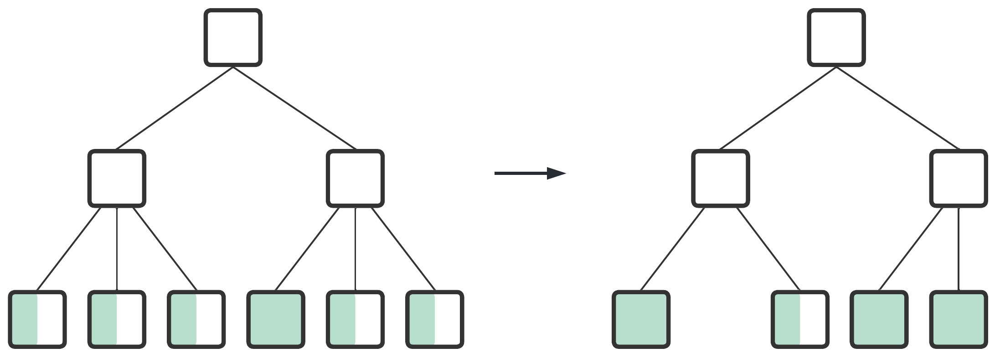

<a id="7607d7d7354775f5"></a>

# 18. SQL References (A~B)

> Source: [GOLDILOCKS 22c.1 User Manual (en)](https://manual.sunjesoft.co.kr/goldilocks/22c_1/manual/en/7607d7d7354775f5)  
> Tag: `22c.1_10_tag`

[← 17. Built-in Function References](17-built-in-function-references.md) · [Table of contents](../README.md) · [19. SQL References (C~G) →](19-sql-references-c-g.md)

<a id="89bba1b8a2f2809a"></a>
## ALTER AUDIT POLICY

<a id="e5b2b8b9da0ce544"></a>
### Function

It adds an auditing target to an audit policy object, or drops an auditing target from an audit policy object.

<a id="ac8bd8295cc76eba"></a>
### Syntax

```
<alter audit policy statement> ::= 
    ALTER AUDIT POLICY policy_name
    { <add_audit_option> | <drop_audit_option> }
    ;

<add_audit_option> ::=
    ADD { <privilege_audit_clause> |  <action_audit_clause> | <privilege_audit_clause> <action_audit_clause> }

<drop_audit_option> ::=
    DROP { <privilege_audit_clause> |  <action_audit_clause> | <privilege_audit_clause> <action_audit_clause> }


<privilege_audit_clause> ::=
    PRIVILEGES <database_privilege> [, ...]

<action_audit_clause> ::=
    ACTIONS { <object_action_audit> | <system_action_audit> } [, ...]

<object_action_audit> ::=
      ALL ON [schema_name.]object_name
    | <object_action> ON [schema_name.]object_name

<system_action_audit> ::=
      ALL
    | <system_action>
```

<a id="2b7754c83504719f"></a>
### Invocation and Access Rules

AUDIT SYSTEM ON DATABASE privilege is required to perform &lt;alter audit policy statement&gt;.

<a id="cbcd9596a498d625"></a>
### Syntax Rules and Parameters

<a id="63c79020ecfe3a3f"></a>
#### policy_name

It is the name of an audit policy object to be altered.

<a id="e839cf51d8f4db5e"></a>
#### &lt;add_audit_option&gt;

It adds an auditing target to an audit policy.

<a id="fd92cfe6a5ad28e7"></a>
#### &lt;drop_audit_option&gt;

It drops an auditing target from an audit policy.

<a id="8af3dc040bd4c064"></a>
#### &lt;privilege_audit_clause&gt;

For more information, refer to [CREATE AUDIT POLICY](19-sql-references-c-g.md#c95b6811be94d2e0).

<a id="e1ecd47467dd004c"></a>
#### &lt;action_audit_clause&gt;

For more information, refer to [CREATE AUDIT POLICY](19-sql-references-c-g.md#c95b6811be94d2e0).

<a id="a2629dc9083438eb"></a>
### Description

It can alter an audit policy which is already activated, and it does not effect the existing session but it effects only the newly created session.

> When dropping ALL option as follows, not all actions are dropped, but only the corresponding ALL option is dropped.

```
CREATE AUDIT POLICY p1
       ACTIONS ALL ON u1.t1,
               SELECT ON u1.t1;

ALTER AUDIT POLICY p1 DROP
      ACTIONS ALL ON u1.t1;
```

<a id="e46d444ae9303ac3"></a>
### Examples

The following is an example of adding a new audit option to an audit policy.

```
ALTER AUDIT POLICY policy_dml
      ADD ACTIONS SELECT ON u1.t1;
```

The following is an example of dropping an audit option from an audit policy.

```
ALTER AUDIT POLICY policy_dml
      DROP ACTIONS SELECT ON u1.t1;
```

<a id="cfffc37f5f57b495"></a>
### Compatibility

The SQL standard does not have the audit policy.

<a id="d99d85b26403548c"></a>
### For More Information

Refer to the followings.

- Managing audit policy object
    - [CREATE AUDIT POLICY](19-sql-references-c-g.md#c95b6811be94d2e0)
    - [DROP AUDIT POLICY](19-sql-references-c-g.md#2da3770d12de6ceb)
    - [ALTER AUDIT POLICY](#89bba1b8a2f2809a)

- Activating/ deactivating audit policy 
    - [AUDIT POLICY](#8015eb753e31e65c)
    - [NOAUDIT POLICY](20-sql-references-h-z.md#f45973bfabd47cb0)

- Enquiring audit trail: [AUDIT_TRAIL](../part-02-administration-manual/9-database-information.md#55a6aed1582db32b)

- Dropping audit trail: [ALTER DATABASE CLEAR AUDIT TRAIL](#d4120dc662bce568)

<a id="7aeb1944a8c55e03"></a>
## ALTER CLUSTER GROUP name ADD MEMBER

<a id="af96f28a66473ca7"></a>
### Function

It adds a cluster member to a cluster group.

<a id="1fc93717501c34d1"></a>
### Syntax

```
<alter cluster group add member statement> ::=
    ALTER CLUSTER GROUP group_name ADD
        <cluster member definition> [, ...]
    ;

<cluster member definition> ::=
    CLUSTER MEMBER member_name <connection attribute> [<member position>]

<connection attribute> ::=
    HOST 'address' PORT port_no

<member position> ::=
    POSITION DEFAULT
  | POSITION MAX
  | POSITION number
```

<a id="2d305552c793352d"></a>
### Invocation and Access Rules

It can be performed in a cluster system.

ADMINISTRATION ON DATABASE privilege is required to perform &lt;alter cluster group add member statement&gt;.

<a id="e25a547c6f0bc624"></a>
### Syntax Rules and Parameters

<a id="12582778cb3f307b"></a>
#### group_name

It is the cluster group name.

<a id="b25f41b0557c36ff"></a>
#### &lt;cluster member definition&gt;

It defines a cluster member to be included in a cluster group.  
A cluster group may include maximum 32 cluster members.

<a id="1603d08389f9e759"></a>
#### member_name

It is the name of a cluster member.  
The cluster member name should be as same as the member name which was defined when the database of that cluster member was created.  
There should not be the same cluster group, nor the same cluster member.  
The length of the name should be shorter than 128 bytes.

The start-up phase for the cluster member should be GLOBAL OPEN.

<a id="81978b43d06245e0"></a>
#### &lt;connection attribute&gt;

It defines the connection information for the communication between the cluster members.  
&lt;connection attribute&gt; should be as same as the HOST and PORT which were defined when the database of that cluster member was created.  
The combination of HOST and PORT should be unique in the cluster system.

- HOST 'address' uses the host name or IPv4 address. If the host name is used, then it uses the first IPv4 address of the system.
- PORT port_no should be in the range between 1024 ~ 49151.

<a id="ed482c1746b2bb19"></a>
#### &lt;member position&gt;

It assigns the position number of the cluster member.

- POSITION DEFAULT
    - The system automatically assigns the position number.
- POSITION MAX
    - It assigns the new member position number even when an empty position number exists.
    - It assigns the value bigger than the biggest member position.
- POSITION number
    - It assigns the position number corresponding to the number
    - The position number should be unique in the cluster system.
    - The position number should be an empty position number, and it should be same or smaller than the biggest position number.
- If it is omitted, the default value is POSITION DEFAULT.

The member_position information of the cluster member can be retrieved through DBA_CLUSTER view.

```
SELECT member_name, member_id, member_position FROM dba_cluster;
```

If the following position numbers are being used,

- G1N1: 0
- G1N2: 1
- G2N2: 3
- G3N2: 5

The following values are assigned according to each option.

- POSITION DEFAULT
    - It assigns 2 which is an empty value.
- POSITION MAX
    - It assigns 6 which is a value of a new position number.
- POSITION 3
    - It is duplicated, so it is an error.
- POSITION 4
    - It assigns 4 which is a position number.

<a id="8b98a572d4ecc82c"></a>
### Description

&lt;alter cluster group add member statement&gt; statement does not rebalance shards in the tables.  
The following statement should be performed to rebalance shards on the added cluster member.

- [ALTER DATABASE REBALANCE](#e579543f77dce467)
- [ALTER TABLE name REBALANCE](#a5e30678f94e116b)

<a id="6dcb530687ed4d0d"></a>
### Examples

The following is an example of adding two cluster members to a cluster group.

```
gSQL>
ALTER CLUSTER GROUP g1 ADD
    CLUSTER MEMBER g1n3 HOST '192.168.0.13' PORT 10130,
    CLUSTER MEMBER g1n4 HOST '192.168.0.14' PORT 10140
;

Cluster Group altered.
```

The following is an example of designating the empty member position as a cluster member position.

```
ALTER CLUSTER GROUP g2 ADD
    CLUSTER MEMBER g2n1 HOST '192.168.0.21' PORT 10210 POSITION 4
;
```

<a id="102ac24fdc4eb46e"></a>
### Compatibility

The SQL standard does not define the concepts of the cluster.

<a id="53c4cb173e96aa8d"></a>
### For More Information

Refer to the followings.

- [CREATE CLUSTER GROUP](19-sql-references-c-g.md#57c6f6ae1e01e560)
- [DROP CLUSTER GROUP](19-sql-references-c-g.md#05c49f429ff9e7a5)
- [ALTER DATABASE REBALANCE](#e579543f77dce467)
- [ALTER TABLE name REBALANCE](#a5e30678f94e116b)

<a id="a9c296754fea8365"></a>
## ALTER CLUSTER GROUP name OFFLINE MEMBER

<a id="481953d5f5e21271"></a>
### Function

It sets a cluster member of the cluster group to offline.

<a id="46abb283875ba794"></a>
### Syntax

```
<alter cluster group offline member statement> ::=
    ALTER CLUSTER GROUP group_name OFFLINE CLUSTER MEMBER member_name
    ;
```

<a id="0eb597eaebc8fc9b"></a>
### Invocation and Access Rules

It can be performed in a cluster system.

ADMINISTRATION ON DATABASE privilege is required to perform &lt;alter cluster group offline member statement&gt;.

<a id="de134cc5af419980"></a>
### Syntax Rules and Parameters

<a id="0d4e6d18b2db1650"></a>
#### group_name

It is the cluster group name.

<a id="4d91a496695d0b43"></a>
#### member_name

It is the name of a cluster member.  
The cluster member should be included in the cluster group of group_name.  
The cluster member should be inactive.

<a id="452a67895b258e67"></a>
### Description

It sets the inactive cluster member to offline.

&lt;alter cluster group offline member statement&gt; statement does not rebalance shards in the tables.

<a id="10f64fb3c6741ba8"></a>
### Examples

If trying to set the cluster member which is not inactive to offline, then the following error occurs.

```
gSQL>

ALTER CLUSTER GROUP g1 OFFLINE CLUSTER MEMBER g1n2;

ERR-42000(16417): active member 'G1N2' cannot be offlined
```

The following is an example of setting a specific cluster member to offline.

```
gSQL>

ALTER CLUSTER GROUP g1 OFFLINE
    CLUSTER MEMBER g1n3
;
Cluster Group altered.
```

<a id="b819769c3557ddd1"></a>
### Compatibility

The SQL standard does not define the concepts of the cluster.

<a id="9e40f42128e514cb"></a>
### For More Information

Refer to the followings.

- [CREATE CLUSTER GROUP](19-sql-references-c-g.md#57c6f6ae1e01e560)
- [DROP CLUSTER GROUP](19-sql-references-c-g.md#05c49f429ff9e7a5)
- [ALTER DATABASE REBALANCE](#e579543f77dce467)
- [ALTER TABLE name REBALANCE](#a5e30678f94e116b)

<a id="8898b9d2fa2187e2"></a>
## ALTER CLUSTER LOCATION

<a id="be23ae731b3f9008"></a>
### Function

It alters a cluster location information.

<a id="ec198f769b7b6315"></a>
### Syntax

```
<alter cluster location statement> ::=
    ALTER CLUSTER LOCATION member_name 
    <cluster connection attribute>
    ;

<cluster connection attribute> ::
       HOST 'address' PORT port_no
```

<a id="5e6b6c7241faa4d5"></a>
### Invocation and Access Rules

It can be performed in a cluster system.

ADMINISTRATION ON DATABASE privilege is required to perform &lt;alter cluster location statement&gt;.

<a id="c28f488a66dba755"></a>
### Syntax Rules and Parameters

<a id="db5573c08d572bab"></a>
#### member_name

It is the name of a cluster member.  
The same cluster member name should exist in the registered cluster location information.  
The length of the name should be shorter than 128 bytes.

<a id="e4133aa825ebd4a0"></a>
#### &lt;cluster connection attribute&gt;

It defines the connection information for the communication between the cluster members.  
The combination of HOST and PORT should be unique in the cluster system.

- HOST 'address' uses the host name or IPv4 address. If the host name is used, then it uses the first IPv4 address of the system.
- PORT port_no should be in the range between 1024 ~ 49151.

<a id="f185cb44ace71066"></a>
### Description

If the connection information of the cluster location is altered, the cluster member does not need to be dropped or recreated, but the connection information can be altered by using [ALTER CLUSTER LOCATION](#8898b9d2fa2187e2).

<a id="cd909db56def2ce5"></a>
### Examples

```
gSQL> 
ALTER CLUSTER LOCATION g1n2
    HOST '192.168.0.12' PORT 10120
;

Location altered.
```

<a id="925d79af7fe25b8c"></a>
### Compatibility

The SQL standard does not define the concepts of the cluster.

<a id="2b03004aa429c108"></a>
### For More Information

Refer to the followings.

- [CREATE CLUSTER LOCATION](19-sql-references-c-g.md#f90d35ca160e7aaf)
- [DROP CLUSTER LOCATION](19-sql-references-c-g.md#5ee74e721fcc4b5b)

<a id="8fbe0a0d36dcf0d5"></a>
## ALTER DATABASE ADD LOGFILE

<a id="44aaaacf7de87f9a"></a>
### Function

It adds log file groups or log file members to the database.

<a id="68827d2040c94dcd"></a>
### Syntax

```
<alter database add logfile statement> ::=
      <add logfile member statement> 
    | <add logfile group statement>
    ;

<add logfile member statement> ::=
    ALTER DATABASE ADD LOGFILE MEMBER <add logfile clause> [, ...] TO 
        <group clause>

<add logfile group statement> ::=
    ALTER DATABASE ADD LOGFILE <group clause> ( 'logfile_name' [, ...] ) 
        <size clause> [ REUSE ]

<group clause> ::=
    GROUP integer

<add logfile clause> ::=
    'logfile_name' [ REUSE ]

<size clause> ::=
    integer [ M | G ]
```

<a id="45b5dce181808b9e"></a>
### Invocation and Access Rules

ALTER DATABASE ON DATABASE privilege is required to perform &lt;alter database add logfile statement&gt;.

<a id="176c46e92cbab052"></a>
### Syntax Rules and Parameters

<a id="e755d4f269e298ef"></a>
#### &lt;alter database add logfile statement&gt;

The database should be in MOUNT phase.

<a id="763c02b08d1d359b"></a>
#### &lt;add logfile member statement&gt;

The log member is added to an existing log file group.

- &lt;add logfile clause&gt; 
    - 'logfile_name' is the file name of logfile member to be added to the log file group.
    - If the file does not exist, a new file is created.
    - The length of the logfile_name should be shorter than 1024 bytes.
- &lt;group clause&gt; 
    - It specifies the identifier of the logfile group to be added to the database.
    - Integer should be an identifier of the existing logfile group. 
    - If an identifier for the integer does not exist, an error occurs.

<a id="b2d30d4ef1b2da35"></a>
#### &lt;add logfile group statement&gt;

It adds a new log file group.

- It is added as the next group of the CURRENT log file group.
- &lt;group clause&gt; 
    - It specifies the identifier of the logfile group to be added to the database.
    - Integer should be an identifier of the unexisting logfile group.
    - If an identifier for the integer exists, an error occurs.
- &lt;size clause&gt; 
    - The file size can be specified minimum of 20 MB to maximum of 120 GB.
    - The file size should be bigger than the sum of redo log buffer size and pending log buffer size.
- When logfile_name already exists, and the REUSE option is used, if the file size is as same as another group member, then the existing log file is reused.

<a id="9c780b05d48df7c4"></a>
### Description

It is recommended to back up the control file just in case for the file damage because the newly added log file groups and log members are stored in the control file.

<a id="0f2cf120f987d645"></a>
### Examples

The following is an example of adding two log file members to an existing log file group 3.

```
ALTER DATABASE ADD LOGFILE MEMBER 'logfile1.log', 'logfile2.log' TO GROUP 3;
```

The following is an example of adding a new log file group 4 to database. The size of log file group 4 is 100 M, and the log file name is 'logfile1.log'.

```
ALTER DATABASE ADD LOGFILE GROUP 4 ( 'logfile1.log' ) SIZE 100M;
```

> When adding a log group, a single log file should be used, and multiple log files can be added to an existing group as a member.

<a id="9309e8e8d22f14c3"></a>
### Compatibility

The SQL standard does not define ALTER DATABASE statement.

<a id="377b8eb7b3307fc0"></a>
### For More Information

Refer to the followings.

- [ALTER DATABASE ADD LOGFILE](#8fbe0a0d36dcf0d5)
- [ALTER DATABASE DROP LOGFILE](#7e99283f967c2331)
- [ALTER DATABASE RENAME LOGFILE](#bb4f8ef445094a6a)

<a id="a3cd3b2dd87aae2e"></a>
## ALTER DATABASE ARCHIVELOG

<a id="08d8125cfe65eb76"></a>
### Function

It alters an archive setting of the online log file in the database.

<a id="dad11dc00e651e7c"></a>
### Syntax

```
<alter database archivelog statement> ::=
    ALTER DATABASE { ARCHIVELOG | NOARCHIVELOG }
    ;
```

<a id="724b0847f210e635"></a>
### Invocation and Access Rules

ALTER DATABASE ON DATABASE privilege is required to perform &lt;alter database archivelog statement&gt;.

<a id="da9ca787adc0cbfc"></a>
### Syntax Rules and Parameters

<a id="eb9b07d70b5a069b"></a>
#### &lt;alter database archivelog statement&gt;

- The database should be in MOUNT phase.
- ARCHIVELOG
    - It archives the online log file.
- NOARCHIVELOG
    - It does not archive the online log file.

<a id="33031c09f6a06798"></a>
### Description

For the database backup and the media recovery using the backup, the system should be operated in ARCHIVELOG mode.

<a id="1a9f04ede521c3bb"></a>
### Example

The following is an example of how to set up a database to archive mode.

```
ALTER DATABASE ARCHIVELOG;
```

<a id="ca77943eae90e27e"></a>
### Compatibility

The SQL standard does not define ALTER DATABASE statement.

<a id="fc213b41e38c6ff3"></a>
### For More Information

Refer to the followings.

- [ALTER DATABASE BACKUP](#faa4e5b84af9cb0d)
- [ALTER TABLESPACE name BACKUP](#b51a2e358f1aab39)

<a id="faa4e5b84af9cb0d"></a>
## ALTER DATABASE BACKUP

<a id="0d07d413d842e49a"></a>
### Function

The backup state is set to ACTIVE or INACTIVE to perform a full backup of the database. Then, the incremental database backup and control file backup are performed.

<a id="89de895af1df62fb"></a>
### Syntax

```
<alter database backup statement> ::=
      <database begin backup statement>
    | <database end backup statement>
    | <database incremental backup statement>
    | <database controlfile backup statement>
    ;

<database begin backup statement> ::=
    ALTER DATABASE BEGIN BACKUP [ AT <domain name> ]
    ;

<database end backup statement> ::=
    ALTER DATABASE END BACKUP [ AT <domain name> ]
    ;

<database incremental backup statement> ::=
    ALTER DATABASE BACKUP INCREMENTAL
        <incremental backup option> [ AT <domain name> ]    ;

<incremental backup option> ::=
      LEVEL integer [ CUMULATIVE | DIFFERENTIAL ]

<database controlfile backup statement> ::=
    ALTER DATABASE BACKUP CONTROLFILE TO 'target_name'
        [ AT <domain name> ]    ;
```

<a id="08d7732005d803cc"></a>
### Invocation and Access Rules

ALTER DATABASE ON DATABASE privilege is required to perform &lt;alter database backup statement&gt;.

<a id="5fa0bc58df69a424"></a>
### Syntax Rules and Parameters

<a id="ed028e87a4fd9058"></a>
#### &lt;database begin backup clause&gt;

The database is set to the state which the full backup is available.

- All tablespaces in ONLINE state, which are created and used in the database, are set to the state of which the full backup is available. 
- The database should be OPEN state and operated in ARCHIVELOG mode.
- After starting BEGIN BACKUP, the following operations which require writing to the data file can not be performed.
    - SHUTDOWN NORMAL
    - OFFLINE / DROP TABLESPACE
    - ADD / DROP DATAFILE
- It may require media recovery on restart when a full backup is ACTIVE state and the instance is abnormally terminated.

<a id="e6fad320bca8d649"></a>
#### &lt;database end backup clause&gt;

The database is set to the state which the full backup is not available.

- All tablespaces in ONLINE state, which are created and used in the database, are set to the state which the full backup is not available. 
- The database should be in OPEN phase and operated in ARCHIVELOG mode.

<a id="7379a21948b83867"></a>
#### &lt;database incremental backup statement&gt;

- An incremental backup is performed for the database.
- The database should be in OPEN phase and operated in ARCHIVELOG mode.

<a id="fa6defa8d094139b"></a>
#### &lt;incremental backup option&gt;

- 'integer' can be specified from 0 to 4. 
- LEVEL 0 can not specify CUMULATIVE or DIFFERENTIAL.
- CUMULATIVE | DIFFERENTIAL
    - CUMULATIVE
        - If 'integer' is n, it backs up all pages which are altered after the most recent backups of LEVEL 0 ~ LEVEL n-1. 
    - DIFFERENTIAL
        - If 'integer' is n, it backs up all pages which are altered after the most recent backups of LEVEL 0 ~ LEVEL n. 
    - If it is omitted, DIFFERENTIAL is specified by default.

<a id="e4dadcd6ecd0608e"></a>
#### &lt;database controlfile backup statement&gt;

- The control file is backed up. 
    - The length of 'target_name' should be shorter than 1024 bytes.
    - If 'target_name' already exists, the operation fails.
- The database should be in OPEN phase and operated in ARCHIVELOG mode.

> The maximum length of the 'target_name' managed by GOLDILOCKS is 1024 bytes. However, the maximum lengths of the file name varies depending on the OS, so the actual length of 'target_name' which is available to be created can be shorter than 1024 bytes.

<a id="f3c33e1cebc7b097"></a>
#### &lt;domain name&gt;

It is a name of a member or a group for which the statement is performed.  
If it is omitted, it is performed for all groups.

<a id="ad6cf7d9012cc20f"></a>
### Description

It backs up data files and control files in the database. A full backup of the database begins with BEGIN BACKUP, and copies the datafiles using OS file copy, then ends with END BACKUP. The incremental backup file is created in the path set by the BACKUP_DIR 1 property using a single statement.

<a id="56c7956492131974"></a>
### Examples

The following is an example of setting the entire backup state to ACTIVE.

```
ALTER SYSTEM BEGIN BACkUP;
```

The following is an example of setting the entire backup state to INACTIVE.

```
ALTER SYSTEM END BACkUP;
```

The following is an example to create the incremental backup of LEVEL 1 by using DIFFERENTIAL.

```
ALTER DATABASE BACKUP INCREMENTAL LEVEL 1 DIFFERENTIAL;
```

The following is an example to create the 'controlfile.bak' backup file for the control file. If the absolute path is not included, a backup file is created in the path set by the LOG_DIR property.

```
ALTER DATABASE BACKUP CONTROLFILE TO 'controlfile.bak';
```

<a id="6b3679287d0d69cd"></a>
### Compatibility

The SQL standard does not define ALTER DATABASE statement.

<a id="4c69d01cd7a11a19"></a>
### For More Information

Refer to the followings.

- [ALTER TABLESPACE name BACKUP](#b51a2e358f1aab39)
- [ALTER DATABASE RECOVER](#7dbbc5d33c3b669a)

<a id="d4120dc662bce568"></a>
## ALTER DATABASE CLEAR AUDIT TRAIL

<a id="370c42050b889b0f"></a>
### Function

It purges audit records which are accumulated when applying an audit policy.

<a id="0640158f4d60c769"></a>
### Syntax

```
<clear audit trail statement> ::= 
    ALTER DATABASE CLEAR AUDIT TRAIL
;
```

<a id="b2d8b8ab101332b3"></a>
### Invocation and Access Rules

AUDIT SYSTEM ON DATABASE privilege is required to perform &lt;clear audit trail statement&gt;.

<a id="3e00b6b75e0f040b"></a>
### Description

If an audit policy is activated, an audit trails is getting longer as time goes by.  
Tables configuring an audit trail are stored in MEM_AUX_TBS tablespace, and a user should be cautious not to let the audit trail keep increasing.

<a id="985ebb7badc5da5e"></a>
### Storing Audit Trail

A user should purge an audit trail after storing it according to the following procedure to store an audit trail when it is necessary.

- When performing it for the first time

```
CREATE TABLE backup_audit_trail AS SELECT * FROM AUDIT_TRAIL;
COMMIT;
```

- When repeatedly performing it

```
INSERT INTO backup_audit_trail SELECT * FROM AUDIT_TRAIL;
COMMIT;
```

- When purging an audit trail

```
ALTER DATABASE CLEAR AUDIT TRAIL;
```

<a id="ac2db3e7e13d5906"></a>
### Examples

Purge an audit trail by using the following statement.

```
ALTER DATABASE CLEAR AUDIT TRAIL;
```

<a id="b3e444728e17d2b2"></a>
### Compatibility

The SQL standard does not have the audit policy.

<a id="1b78b84e32117658"></a>
### For More Information

Refer to the followings.

- Managing audit policy object
    - [CREATE AUDIT POLICY](19-sql-references-c-g.md#c95b6811be94d2e0)
    - [DROP AUDIT POLICY](19-sql-references-c-g.md#2da3770d12de6ceb)
    - [ALTER AUDIT POLICY](#89bba1b8a2f2809a)

- Activating/ deactivating audit policy 
    - [AUDIT POLICY](#8015eb753e31e65c)
    - [NOAUDIT POLICY](20-sql-references-h-z.md#f45973bfabd47cb0)

- Enquiring audit trail: [AUDIT_TRAIL](../part-02-administration-manual/9-database-information.md#55a6aed1582db32b)

- Dropping audit trail: [ALTER DATABASE CLEAR AUDIT TRAIL](#d4120dc662bce568)

<a id="bc979bf4af8b1c5c"></a>
## ALTER DATABASE CLEAR PASSWORD HISTORY

<a id="d0bc17ea05aaa5b5"></a>
### Function

It deletes the user's password change history which is accumulated due by applying the profile.

<a id="38cb1305427cca8e"></a>
### Syntax

```
<clear password history statement> ::= 
    ALTER DATABASE CLEAR PASSWORD HISTORY
    ;
```

<a id="d3b844b7aed1cdc4"></a>
### Invocation and Access Rules

ALTER DATABASE ON DATABASE privilege is required to perform &lt;clear password history statement&gt;.

<a id="cbf1fb059f1f6dd1"></a>
### Description

When a profile is applied to a user, the user's password change history is accumulated according to the PASSWORD_REUSE_MAX and PASSWORD_REUSE_TIME policies.

**Managing the change history**

<a id="b54a25dd25fb7b49"></a>
| PASSWORD_REUSE_MAX | PASSWORD_REUSE_TIME | Managing the change history |
| --- | --- | --- |
| value | value | It manages only the change history within the value range, and the change history out of the value range is automatically deleted. |
| value | UNLIMITED | It accumulates all change history and it does not delete any change history because all change history should be checked. |
| UNLIMITED | value | It accumulates all change history and it does not delete any change history because all change history should be checked. |
| UNLIMITED | UNLIMITED | It does not manage the change history because the change history is not checked. |

&lt;Clear password history statement&gt; deletes the accumulated user's password change history.

<a id="1b2a553241403fdc"></a>
### Examples

The following is an example of executing &lt;clear password history statement&gt; statement.

```
gSQL> ALTER DATABASE CLEAR PASSWORD HISTORY;

Database altered.

gSQL> COMMIT;

Commit complete.
```

<a id="088cddd0e8520212"></a>
### Compatibility

The SQL standard does not define ALTER DATABASE statement.

<a id="85b51c7d5433da06"></a>
### For More Information

Refer to the followings.

- [CREATE PROFILE](19-sql-references-c-g.md#c43cb7b774ec2c47)
- [CREATE USER](19-sql-references-c-g.md#fc0b133394d316ed)

<a id="e97038b632bbca5d"></a>
## ALTER DATABASE DATAFILE AUTOEXTEND

<a id="a1398669b2eb3ccd"></a>
### Function

It alters the property to automatically extend disk tablespace data file. If the property is ON, then the size to be extended and the maximum size of the data file also can be altered.

<a id="1605630442520881"></a>
### Syntax

```
<alter database datafile autoextend statement> ::= 
    ALTER DATABASE DATAFILE datafile_name <autoextend clause>
        [ AT <domain name> ]
    ;

<autoextend clause>
    AUTOEXTEND { ON [ <next size clause> ] [ <max size clause> ] | OFF }

<next size clause>
    NEXT <size clause>

<max size clause>
    MAXSIZE { <size clause> | UNLIMITED }
```

<a id="e7012f35cc64514f"></a>
### Invocation and Access Rules

ALTER DATABASE ON DATABASE privilege is required to perform &lt;alter database datafile autoextend statement&gt;.

The datafile automatic expand property can alter the property of disk tablespace only.

<a id="2d895488ed5022ab"></a>
#### datafile_name

It specifies the name of the data file to be altered.

<a id="46785e01874d2fcf"></a>
#### &lt;autoextend clause&gt;

It sets the automatic expand property to ON or OFF. If it is set to ON, then it can specify the automatic expanded size and the maximum size of the data file.

<a id="0fcb65b445699676"></a>
#### &lt;next size clause&gt;

It specifies the size to be extended when the data file in use does not have available space.

<a id="50d71be3dbf00b43"></a>
#### &lt;max size clause&gt;

It specifies the maximum expanded size of the data file.

<a id="faa3e336c0ac4931"></a>
### Description

Refer to the syntax rules of each statement.

<a id="6f8a068fd9ab1f66"></a>
### Examples

The following is an example of altering the automatic expand property of the datafile, the automatic expanded size, and datafile size.

```
gSQL> ALTER DATABASE DATAFILE 'DISK_TBS.dbf' AUTOEXTEND OFF;

Database altered.

gSQL> ALTER DATABASE DATAFILE 'DISK_TBS.dbf' AUTOEXTEND ON;

Database altered.

gSQL> ALTER DATABASE DATAFILE 'DISK_TBS.dbf' AUTOEXTEND ON NEXT 20M;

Database altered.

gSQL> ALTER DATABASE DATAFILE 'DISK_TBS.dbf' AUTOEXTEND ON MAXSIZE 1G;

Database altered.

gSQL> ALTER DATABASE DATAFILE 'DISK_TBS.dbf' AUTOEXTEND ON 20M MAXSIZE 1G;

Database altered.
```

<a id="8027a72bfc3b599f"></a>
### Compatibility

The SQL standard does not define the concepts of the datafile.

<a id="9d71b124eea228c8"></a>
### For More Information

Refer to [CREATE DISK DATA TABLESPACE](19-sql-references-c-g.md#30dcc088e6dad23c).

<a id="b3ec6bbe505bc870"></a>
## ALTER DATABASE DELETE BACKUP

<a id="9ce61f0fcb2ff7b6"></a>
### Function

It deletes the backup file and the backup information of incremental backup. It can delete all incremental backup of the database or no longer usable obsolete backup.

<a id="7da7a24893cf4122"></a>
### Syntax

```
<alter database delete backup statement> ::=
    ALTER DATABASE DELETE <delete backup list option> 
        BACKUP LIST [ <including backup file option> ]
    ;

<delete backup list option> ::=
      OBSOLETE
    | ALL

<including backup file option> ::=
    INCLUDING BACKUP FILES
```

<a id="6769221267f98f72"></a>
### Invocation and Access Rules

ALTER DATABASE ON DATABASE privilege is required to perform &lt;alter database delete backup statement&gt;.

<a id="adbf82bf13bb323a"></a>
### Syntax Rules and Parameters

<a id="2616a017a12874a7"></a>
#### &lt;alter database delete backup statement&gt;

The database should be in MOUNT or OPEN phase.

<a id="cb9510b73890fa18"></a>
#### &lt;delete backup list option&gt;

It selects the backups to be deleted among the existing incremental backups.

- OBSOLETE: It selects backups of database or tablespaces to be deleted, which was backed up before the most recent database LEVEL 0 backup. 
- ALL: It selects all incremental backups to be deleted.

<a id="9ce9bdb29f751d24"></a>
#### &lt;including backup file option&gt;

- If it is omitted, it deletes only the backup information from the control file.
- It also deletes not only backup information but also the backup files.

<a id="7dde86fc48250ec3"></a>
### Description

Deletion of the OBSOLETE incremental backup deletes the incremental backup of which is before the most recent LEVEL 0 database backup. When non-LEVEL 0 incremental backup is performed, it is not deleted even if it includes the previously performed incremental backup. It is because it can be used when performing the incomplete recovery by using the incremental backups.

> Be cautious of deleting the backup file together when an incremental backup is deleted. It can not be recovered even by using the control file which has incremental backup information.

<a id="e43ffa1564f232e0"></a>
### Example

The following is an example to delete the backup information and backup files of all existing incremental backups.

```
ALTER DATABASE DELETE ALL BACKUP LIST INCLUING BACKUP FILES;
```

<a id="ef31068136560e7e"></a>
### Compatibility

The SQL standard does not define ALTER DATABASE statement.

<a id="d9eee23e634f3160"></a>
### For More Information

Refer to the followings.

- [ALTER TABLESPACE name BACKUP](#b51a2e358f1aab39)
- [ALTER DATABASE RECOVER](#7dbbc5d33c3b669a)

<a id="1f2538cb978d9370"></a>
## ALTER DATABASE DROP INACTIVE CLUSTER MEMBERS

<a id="e2def544aad4ed07"></a>
### Function

It drops the entire inactive cluster member.

<a id="7fd4b537308a4006"></a>
### Syntax

```
<alter database drop inactive members statement> ::=
    ALTER DATABASE DROP [ FORCE | NO FORCE ] INACTIVE CLUSTER MEMBERS
    ;
```

<a id="f1610ca15a64482d"></a>
### Invocation and Access Rules

It can be performed in a cluster system.

ADMINISTRATION ON DATABASE privilege is required to perform &lt;alter database drop inactive cluster members statement&gt;.

<a id="bfece81e869fd177"></a>
### Syntax Rules and Parameters

<a id="70253a34214451e2"></a>
#### [ FORCE | NO FORCE ]

- FORCE
    - It drops an inactive cluster member even when there is a possibility of data loss.
- NO FORCE
    - It can not drop an inactive cluster member if there is a possibility of data loss.
- The default value is NO FORCE.

<a id="68410d1a48df1108"></a>
### Description

It drops the entire inactive cluster member.

The inactive state of a cluster member means that it is not connected to the cluster system, and it occurs in the following cases.

- An error occurs on a cluster member in an operating cluster system.
- Trying to start-up the cluster system without driving the cluster member.

However, if the table shard is lost while dropping the cluster member, then an inactive cluster member can not be dropped.

Also, if there is a possibility of data loss when dropping the cluster member, then an inactive cluster member can not be dropped. The data is not lost when it is guaranteed that the data in replica of the table or the shard which belongs the inactive cluster member to be dropped is not latest comparing to that in the members of that cluster group. Therefore, an inactive cluster member can be dropped when at least one online member exists in the same cluster group in case for the sharded table, and in the entire cluster in case for the cloned table.

However, if an online cluster member does not exist in the cluster group and the service is not available due to an inactive cluster member, then the inactive cluster member can be dropped by using FORCE option despite of the possibility of the data loss.

It is recommended to use &lt;alter database drop inactive members statement&gt; when an inactive cluster member can not be included in the cluster system any more.

<a id="8f1065d3ca3ea546"></a>
### Examples

The following is an example of executing &lt;alter database drop inactive members statement&gt;.

```
gSQL> ALTER DATABASE DROP INACTIVE CLUSTER MEMBERS;

Database altered.
```

<a id="0552b545517a1896"></a>
### Compatibility

The SQL standard does not define the concepts of the cluster.

<a id="d772b9cf1ce69ef0"></a>
### For More Information

Refer to [ALTER SYSTEM JOIN DATABASE](#7a98f890a10933e4).

<a id="7e99283f967c2331"></a>
## ALTER DATABASE DROP LOGFILE

<a id="d0b4e86e1c8668d0"></a>
### Function

It drops a log file group or a member which exists in the database.

<a id="b00b0c1d5c3c78f9"></a>
### Syntax

```
<alter database drop logfile statement> ::=
      <drop logfile group statement>
    | <drop logfile member statement>
    ;

<drop logfile group statement> ::=
    ALTER DATABASE DROP LOGFILE <group clause>

<group clause> ::=
    GROUP integer

<drop logfile member statement> ::=
    ALTER DATABASE DROP LOGFILE MEMBER <logfile_list>

<logfile_list> ::=
      'logfile_name'
    | <logfile_list> , 'logfile_name'
```

<a id="d449b85abc7a7a02"></a>
### Invocation and Access Rules

ALTER DATABASE ON DATABASE privilege is required to perform &lt;alter database drop logfile statement&gt;.

<a id="dc0835fa6a2ea287"></a>
### Syntax Rules and Parameters

<a id="55ef569f0e682d41"></a>
#### &lt;alter database drop logfile statement&gt;

The database should be in MOUNT phase.  
An error occurs when the log file to be deleted is in CURRENT or ACTIVE stage.  
At least four log file groups should be remained after dropping.

<a id="2ade33d876e730be"></a>
#### &lt;drop logfile group statement&gt;

It drops the existing log file group.

- &lt;group clause&gt; 
    - It specifies the log file group to be dropped.
    - An integer should be an identifier of the existing log file.
    - An error occurs if the integer does not exist.

<a id="c6f9ecbce9c0b42c"></a>
#### &lt;drop logfile member statement&gt;

It drops the existing log file members.

- &lt;logfile_list&gt;
    - It is the list of the log file members to be dropped.
    - 'logfile_name' should be an existing name. 
    - An error occurs if 'logfile_name' does not exist.

<a id="0906ba968fb6e983"></a>
### Description

For more information, refer to the rules for each syntax.

<a id="7c2647b1c8d5f525"></a>
### Examples

The following is an example of dropping the existing log file GROUP 3.

```
ALTER DATABASE DROP LOGFILE GROUP 3;
```

The following is an example of dropping logfile1.log and logfile2.log from the existing logfile GROUP 3.

```
ALTER DATABASE DROP LOGFILE MEMBER 'logfile1.log', 'logfile2.log';
```

<a id="cd85a5cdc2cf46e6"></a>
### Compatibility

The SQL standard does not define ALTER DATABASE statement.

<a id="0ac24dd7e957f02f"></a>
### For More Information

Refer to the respective syntax rules, and the followings.

- [ALTER DATABASE ADD LOGFILE](#8fbe0a0d36dcf0d5)
- [ALTER DATABASE RENAME LOGFILE](#bb4f8ef445094a6a)

<a id="4843dcdf3a314fab"></a>
## ALTER DATABASE DROP OFFLINE SEGMENTS

<a id="3eeb68799e613a7b"></a>
### Function

It drops segments of offline shards for all tables.

<a id="695bb65d11a222a6"></a>
### Syntax

```
<alter database drop offline segments statement> ::=
    ALTER DATABASE DROP OFFLINE SEGMENTS 
    ;
```

<a id="bd60d8c9716fb9ad"></a>
### Invocation and Access Rules

It can be performed in the cluster system.

ALTER DATABASE ON DATABASE privilege is required to perform &lt;alter database drop offline segments statement&gt;.

<a id="f0d2849521c39ad4"></a>
### Description

It drops segments of offline shards for all tables and it can be performed even when an inactive cluster member exists.

The inactive state of the cluster member means that it is not connected to the cluster system, and it occurs in the following situations.

- When that cluster member fails in the operating cluster system
- When it tries to start-up the cluster system without running that cluster member

&lt;alter database drop offline segments statement&gt; performs [&lt;alter table drop offline segments statement&gt;](#e977059df27b57d9) per each table, and it is equivalent to the sum of following queries.

```
ALTER TABLE t1 DROP OFFLINE SEGMENTS;
COMMIT;
ALTER TABLE t2 DROP OFFLINE SEGMENTS;
COMMIT;
ALTER TABLE t3 DROP OFFLINE SEGMENTS;
COMMIT;

...

ALTER TABLE tn DROP OFFLINE SEGMENTS;
COMMIT;
```

&lt;alter database drop offline segments statement&gt; is not terminated even when an error occurs in a specific table, but proceeds in the next table, and succeeds with the following warning.

```
gSQL> ALTER DATABASE DROP OFFLINE SEGMENTS;

ERR-42000(16553): of the total '5' tables, '1' tables failed to drop offline segments
Database altered.
```

The error message above means that one of the five tables failed.

If &lt;alter database drop offline segments statement&gt; is performed again after taking an appropriate action for the error, then it is operated only for the failed table.

For more information about the error, refer to the system trace log (system.trc) of the member which executed the statement.

<a id="ae37a7943a7cb68d"></a>
### Example

The following is an example of performing &lt;alter database drop offline segments statement&gt; statement.

```
gSQL> ALTER DATABASE DROP OFFLINE SEGMENTS;

Database altered.
```

<a id="f0eb0953fd2e342f"></a>
### Compatibility

The SQL standard does not define the concepts of the cluster.

<a id="2a75c604f2bab814"></a>
### For More Information

Refer to [ALTER TABLE name DROP OFFLINE SEGMENTS](#e977059df27b57d9).

<a id="e9af5730ce341394"></a>
## ALTER DATABASE MOVE SHARD

<a id="442aafd728ae0da5"></a>
### Function

It rebalances shard of all tables in a specific cluster group to another cluster group.

<a id="660a28579ba9d3cb"></a>
### Syntax

```
<alter database move shard statement> ::=
    ALTER DATABASE MOVE SHARD FROM CLUSTER GROUP src_cluster_group
        TO CLUSTER GROUP dest_cluster_group 
       [ ONLINE | OFFLINE ] 
       [ <shard divisor> ] 
       [ <parallel clause> ]
    ;

<shard divisor> ::= 
    SHARD DIVISOR integer

<parallel clause> ::=
    NOPARALLEL
  | PARALLEL [ integer ]
```

<a id="284c7466b47c3e65"></a>
### Invocation and Access Rules

It can be performed in a cluster system.

ALTER DATABASE ON DATABASE privilege is required to perform &lt;alter database move shard statement&gt;.

<a id="eafb423d74004a22"></a>
### Syntax Rules and Parameters

<a id="bb447b80bcdf5e05"></a>
#### src_cluster_group

It is a cluster group to which the table shard is moved.

<a id="1b910cbd50d9762e"></a>
#### dest_cluster_group

It is a target cluster group to which the table shard is moved.

<a id="a13a48114b492f60"></a>
#### [ ONLINE | OFFLINE ]

It determines whether to allow DML when rebalancing table shard.

- ONLINE 
    - It allows INSERT, UPDATE, and DELETE. 
- OFFLINE 
    - It does not allow INSERT, UPDATE, DELETE.
- When it is omitted, the default value is ONLINE.

<a id="a6d3e4a0755a14c4"></a>
#### &lt;shard divisor&gt;

It specifies the number of shard's partitions.

- It divides the shard as many as the number of partitions, then rebalances them in the remote server.
- The minimum value of an integer is 0 and the maximum value is 1000.
- If it is omitted, then it follows REBALANCE_SHARD_DIVISOR property.
- If the integer is smaller than the parallel integer, then it is revised to the same value as the parallel integer.

<a id="ec722b20cba74ed9"></a>
#### &lt;parallel clause&gt;

It specifies the number of threads to use when rebalancing the table.

- NOPARALLEL
    - It does not rebalance tables in parallel.
- PARALLEL [integer] 
    - It rebalances tables in parallel.
    - The minimum value of an integer is 0 and the maximum value is 64.
    - If the integer is omitted, then it is 0.
    - If the integer is 0, then the system determines the optimal value.

<a id="6b6cd228248168b7"></a>
### Description

When adding a cluster member and a cluster group using the following statements, the table shard is not rebalanced.

- [CREATE CLUSTER GROUP](19-sql-references-c-g.md#57c6f6ae1e01e560)
- [ALTER CLUSTER GROUP name ADD MEMBER](#7aeb1944a8c55e03)

Perform &lt;alter database rebalance statement&gt; to rebalance the shard of the entire table which was not rebalanced when adding a cluster group and a cluster member.

&lt;alter database move shard statement&gt; is performed as the following concepts for tables which did not rebalance the shard.

```
ALTER TABLE t1 MOVE SHARD FROM CLUSTER GROUP src_group TO CLUSTER GROUP dest_group;
COMMIT;
ALTER TABLE t2 MOVE SHARD FROM CLUSTER GROUP src_group TO CLUSTER GROUP dest_group;
COMMIT;
ALTER TABLE t3 MOVE SHARD FROM CLUSTER GROUP src_group TO CLUSTER GROUP dest_group;
COMMIT;
...
...
ALTER TABLE t_n MOVE SHARD FROM CLUSTER GROUP src_group TO CLUSTER GROUP dest_group;
COMMIT;
```

It is performed as above for all tables except for a CLONED table and a CLUSTER WIDE table. The &lt;alter database move shard statement&gt; is proceeded even when the rebalancing the shard of a specific table fails. It does not rollback the table which succeeded in rebalancing the shard.

Therefore, when performing &lt;alter database move shard statement&gt; again after appropriately processed an error, then it rebalances only the shard for the table requiring the rebalancing. In this case, the table which succeeded in rebalancing the shard is not included in a target of the rebalancing.

<a id="560bbfdc6539469a"></a>
### Examples

The following is an example of performing &lt;alter database move shard statement&gt;.

```
gSQL> ALTER DATABASE MOVE SHARD FROM CLUSTER GROUP G1 TO CLUSTER GROUP G2;

Database altered.
```

<a id="d1e851b46cf5af6d"></a>
### Compatibility

The SQL standard does not define the concepts of the cluster.

<a id="6ed659a1f32933f9"></a>
### For More Information

Refer to the followings.

- [ALTER TABLE name MOVE SHARD](#24408ce18bf26bb0)
- [CREATE CLUSTER GROUP](19-sql-references-c-g.md#57c6f6ae1e01e560)
- [ALTER CLUSTER GROUP name ADD MEMBER](#7aeb1944a8c55e03)

<a id="f46dfb4e641677b0"></a>
## ALTER DATABASE OFFLINE INACTIVE CLUSTER MEMBERS

<a id="aae8d26b27adf390"></a>
### Function

It sets the entire inactive cluster member to offline. In other words, it sets the shard map for the cluster member to offline.

<a id="1b8c0f59d5596e7e"></a>
### Syntax

```
<alter database offline inactive cluster members statement> ::=
    ALTER DATABASE OFFLINE INACTIVE CLUSTER MEMBERS
    ;
```

<a id="8061dff0d9437290"></a>
### Invocation and Access Rules

It can be performed in a cluster system.

ADMINISTRATION ON DATABASE privilege is required to perform &lt;alter database offline inactive cluster members statement&gt;.

<a id="8bb44b0c5617ef34"></a>
### Syntax Rules and Parameters

It sets the entire inactive cluster member to offline.  
The inactive state of a cluster member means that it is not connected to the cluster system, and it occurs in the following cases.

- An error occurs on a cluster member in an operating cluster system.
- Trying to start-up the cluster system without driving the cluster member.

<a id="4d49bf51cf57f21b"></a>
### Description

It is recommended to use &lt;alter database offline inactive members statement&gt; when an inactive cluster member can not be included in the cluster system any more.

If an inactive cluster member can participate in a cluster system, then perform [ALTER SYSTEM JOIN DATABASE](#7a98f890a10933e4) to include it in a cluster system.

The cluster member which is set to offline can be shifted to online again by using the following statements after the join.

- [ALTER DATABASE REBALANCE](#e579543f77dce467)
- [ALTER TABLE name REBALANCE](#a5e30678f94e116b)

<a id="68ac001a51f0b5e0"></a>
### Examples

```
gSQL> ALTER DATABASE OFFLINE INACTIVE CLUSTER MEMBERS;
```

<a id="ce1bd747cea0aec8"></a>
### Compatibility

The SQL standard does not define the concepts of the cluster.

<a id="c2ab87c41947d7bd"></a>
### For More Information

Refer to the followings.

- [ALTER SYSTEM JOIN DATABASE](#7a98f890a10933e4)
- [ALTER DATABASE REBALANCE](#e579543f77dce467)
- [ALTER TABLE name REBALANCE](#a5e30678f94e116b)

<a id="e579543f77dce467"></a>
## ALTER DATABASE REBALANCE

<a id="713b54708f435934"></a>
### Function

It rebalances shard of all tables.

<a id="7d35b1390c780683"></a>
### Syntax

```
<alter database rebalance statement> ::=
    ALTER DATABASE REBALANCE
       [ ONLINE | OFFLINE ] 
       [ <shard divisor> ] 
       [ <parallel clause> ]
    ;

<shard divisor> ::= 
    SHARD DIVISOR integer

<parallel clause> ::=
    NOPARALLEL
  | PARALLEL [ integer ]
```

<a id="f1ae31c4f306bbcb"></a>
### Invocation and Access Rules

It can be performed in a cluster system.

ALTER DATABASE ON DATABASE privilege is required to perform &lt;alter database rebalance statement&gt;.

<a id="200517c411e65022"></a>
### Syntax Rules and Parameters

<a id="4b3154a1a2e5b93a"></a>
#### [ ONLINE | OFFLINE ]

It determines whether to allow DML when rebalancing table shard.

- ONLINE 
    - It allows INSERT, UPDATE, and DELETE. 
- OFFLINE 
    - It does not allow INSERT, UPDATE, DELETE.
- When it is omitted, the default value is ONLINE.

<a id="4fe2096a7e1c4d96"></a>
#### &lt;shard divisor&gt;

It specifies the number of shard's partitions.

- It divides the shard as many as the number of partitions, then rebalances them in the remote server.
- The minimum value of an integer is 0 and the maximum value is 1000.
- If it is omitted, then it follows REBALANCE_SHARD_DIVISOR property.
- If the integer is smaller than the parallel integer, then it is revised to the same value as the parallel integer.

<a id="0789860e37005ae2"></a>
#### &lt;parallel clause&gt;

It specifies the number of threads to use when rebalancing the table.

- NOPARALLEL
    - It does not rebalance tables in parallel.
- PARALLEL [integer] 
    - It rebalances tables in parallel.
    - The minimum value of an integer is 0 and the maximum value is 64.
    - If the integer is omitted, then it is 0.
    - If the integer is 0, then the system determines the optimal value.

<a id="7069253826a61701"></a>
### Description

When adding a cluster member and a cluster group using the following statements, the table shard is not rebalanced.

- [CREATE CLUSTER GROUP](19-sql-references-c-g.md#57c6f6ae1e01e560)
- [ALTER CLUSTER GROUP name ADD MEMBER](#7aeb1944a8c55e03)

Perform &lt;alter database rebalance statement&gt; to rebalance the shard of the entire table which was not rebalanced when adding a cluster group and a cluster member.

&lt;alter database rebalance statement&gt; is performed as the following concepts for tables which did not rebalance the shard.

```
ALTER TABLE t1 REBALANCE;
COMMIT;
ALTER TABLE t2 REBALANCE;
COMMIT;
ALTER TABLE t3 REBALANCE;
COMMIT;
...
...
ALTER TABLE t_n REBALANCE;
COMMIT;
```

The &lt;alter database rebalance statement&gt; is proceeded even when the rebalancing the shard of a specific table fails. It does not rollback the table which succeeded in rebalancing the shard.

Therefore, when performing &lt;alter database rebalance statement&gt; again after appropriately processed an error, then it rebalances only the shard for the table requiring the rebalancing. In this case, the table which succeeded in rebalancing the shard is not included in a target of the rebalancing.

<a id="8952cb1c3e254087"></a>
### Examples

The following is an example of performing &lt;alter database rebalance statement&gt;.

```
gSQL> ALTER DATABASE REBALANCE;

Database altered.
```

<a id="2e60926c91970a24"></a>
### Compatibility

The SQL standard does not define the concepts of the cluster.

<a id="4d15657a4d99f5c6"></a>
### For More Information

Refer to [ALTER TABLE name REBALANCE](#a5e30678f94e116b).

<a id="b9b0f0cb03e6eaeb"></a>
## ALTER DATABASE REBALANCE EXCLUDE CLUSTER GROUP

<a id="167eb06531a85963"></a>
### Function

It rebalances shard of all tables excluding shards of a specific cluster group.

<a id="90398c157e9b47be"></a>
### Syntax

```
<alter database rebalance exclude cluster group statement> ::=
    ALTER DATABASE REBALANCE EXCLUDE CLUSTER GROUP cluster_group_name        
       [ ONLINE | OFFLINE ]        
       [ <shard divisor> ]        
       [ <parallel clause> ]
    ;

<shard divisor> ::= 
    SHARD DIVISOR integer

<parallel clause> ::=
    NOPARALLEL
  | PARALLEL [ integer ]
```

<a id="a411843a39620a88"></a>
### Invocation and Access Rules

It can be performed in a cluster system.

ALTER DATABASE ON DATABASE privilege is required to perform &lt;alter database rebalance exclude cluster group statement&gt;.

<a id="edb1c8159d346d4c"></a>
### Syntax Rules and Parameters

<a id="1347b0f118c964b2"></a>
#### cluster_group_name

It is a name of the cluster group excluding a shard of the table.  
If the specified cluster group is the only cluster group, then the statement can not be performed.

<a id="95e4209dcd293710"></a>
#### [ ONLINE | OFFLINE ]

It determines whether to allow DML when rebalancing table shard.

- ONLINE 
    - It allows INSERT, UPDATE, and DELETE. 
- OFFLINE 
    - It does not allow INSERT, UPDATE, DELETE.
- When it is omitted, the default value is ONLINE.

<a id="a517b0e20a98d649"></a>
#### &lt;shard divisor&gt;

It specifies the number of shard's partitions.

- It divides the shard as many as the number of partitions, then rebalances them in the remote server.
- The minimum value of an integer is 0 and the maximum value is 1000.
- If it is omitted, then it follows REBALANCE_SHARD_DIVISOR property.
- If the integer is smaller than the parallel integer, then it is revised to the same value as the parallel integer.

<a id="d3226ea4512465e3"></a>
#### &lt;parallel clause&gt;

It specifies the number of threads to use when rebalancing the table.

- NOPARALLEL
    - It does not rebalance tables in parallel.
- PARALLEL [integer] 
    - It rebalances tables in parallel.
    - The minimum value of an integer is 0 and the maximum value is 64.
    - If the integer is omitted, then it is 0.
    - If the integer is 0, then the system determines the optimal value.

<a id="deab3127f0cab408"></a>
### Description

To drop a cluster group by using [DROP CLUSTER GROUP](19-sql-references-c-g.md#05c49f429ff9e7a5), there should not be a shard in the cluster group.

Perform &lt;alter database rebalance exclude cluster group statement&gt; to exclude a shard from the cluster group. &lt;alter database rebalance exclude cluster group statement&gt; is performed as the following concepts for tables which include a shard in the cluster group.

```
ALTER TABLE t1 REBALANCE EXCLUDE CLUSTER GROUP g3;
COMMIT;
ALTER TABLE t2 REBALANCE EXCLUDE CLUSTER GROUP g3;
COMMIT;
ALTER TABLE t3 REBALANCE EXCLUDE CLUSTER GROUP g3;
COMMIT;
...
...
ALTER TABLE t_n REBALANCE EXCLUDE CLUSTER GROUP g3;
COMMIT;
```

If  the &lt;alter database rebalance exclude cluster group statement&gt; fails due to the lack of storage space, it does not rollback the table which succeed in excluding a shard.

Therefore, when performing &lt;alter database rebalance exclude cluster group statement&gt; again after appropriately processed an error, then it excludes and rebalances only the shard for the table requiring the rebalancing. In this case, the table which succeeded in excluding the shard is not included in a target of the rebalancing.

<a id="c075007dcada6125"></a>
### Examples

The following is an example of performing &lt;alter database rebalance exclude cluster group statement&gt;.

```
gSQL> ALTER DATABASE REBALANCE EXCLUDE CLUSTER GROUP g3;

Database altered.
```

<a id="c04e2bdcc2a3cd15"></a>
### Compatibility

The SQL standard does not define the concepts of the cluster.

<a id="4da072a669a5798b"></a>
### For More Information

Refer to the followings.

- [DROP CLUSTER GROUP](19-sql-references-c-g.md#05c49f429ff9e7a5)
- [ALTER TABLE name REBALANCE EXCLUDE CLUSTER GROUP cluster_group_list](#f4474be3b3250401)

<a id="7dbbc5d33c3b669a"></a>
## ALTER DATABASE RECOVER

<a id="1a5d3940ca8e7e67"></a>
### Function

It recovers the entire data file or part of the data files in the database by using the online and archive log files.

<a id="17767ff3daa9a0ee"></a>
### Syntax

```
<alter database recover statement> ::=
      <complete database recover statement>
    | <datafile recover statement>
    | <complete tablespace recover statement>
    | <incomplete database recover statement>
    ;

<complete database recover statement> ::=
    ALTER DATABASE RECOVER

<datafile recover statement> ::=
    ALTER DATABASE RECOVER DATAFILE <datafile recovery clause>

<datafile recovery clause> ::=
    <datafile recovery object> [, ...]

<datafile recovery object> ::=
    'datafile_name' [<recovery using backup option>] [recovery corruption option>]

<recovery using backup option> ::=
    USING BACKUP 'backup_datafile_name'

<recovery corruption option> ::=
    CORRUPTION

<complete tablespace recover statement> ::=
    ALTER DATABASE RECOVER TABLESPACE tablespace_name

<incomplete database recover statement> ::=
      <batch incomplete recovery statement>
    | <interactive incomplete recovery statement>
    ;

<batch incomplete recovery statement> ::=
    ALTER DATABASE RECOVER <until clause> [<using backup controlfile option>]
    
<until clause> ::=
      UNTIL CHANGE integer

<using backup controlfile option> ::=
    USING BACKUP CONTROLFILE

<interactive incomplete recovery statement> ::=
    ALTER DATABASE <incomplete recovery option> [<using backup controlfile option>]

<incomplete recovery option> ::=
      BEGIN INCOMPLETE RECOVERY
    | END INCOMPLETE RECOVERY
    | RECOVER 'logfile name'
    | RECOVER AUTOMATICALLY
    | RECOVER SUGGESTION
    ;
```

<a id="7629664d704d32d2"></a>
### Invocation and Access Rules

ALTER DATABASE ON DATABASE privilege is required to perform &lt;alter database recover statement&gt;.

<a id="ae02135d01101180"></a>
### Syntax Rules and Parameters

<a id="a4e59d2d3b7d2933"></a>
#### &lt;complete database recover statement&gt;

The data files of the database are recovered up to date by using the online and archive log files.

- The recovery is performed for all tablespaces in the ONLINE state.
- The database should be in MOUNT phase and in ARCHIVELOG mode. 
- If the required archived log file does not exist, it fails.

<a id="4983ba69f3217fc6"></a>
#### &lt;datafile recover statement&gt;

It recovers the backuped datafile, the datafile of the tablespace which requires the recovery by using the archive logfile due to an error during the backup, or the datafile of the tablespace which was set to offline by an immediate option, to the latest status.

- Datafile can be recovered on MOUNT phase or OPEN phase.
- The datafile of the tablespace which is in OFFLINE state can be recovered on OPEN phase, and datafile which is either in ONLINE/OFFLINE state can be recovered in MOUNT phase.
- If the required archive logfile does not exist, then the recovery fails.
- &lt;datafile recovery clause&gt;
    - It specifies one or more datafile object list which is a target of the recovery.
- &lt;datafile recovery object&gt;
    - It sets the name of datafile which is a target of the recovery, and the recovery option.
- &lt;recovery using backup option&gt;
    - It sets the name of backup datafile of the datafile which is a target of the recovery.
- &lt;recovery corruption option&gt;
    - It determines whether to recover only the pages corrupted from the datafile which is a target of the recovery.

<a id="1f1787c2e91dcd59"></a>
#### &lt;complete tablespace recover statement&gt;

The data files of the tablespace is recovered up to date.

- Tablespace recovery should be performed when the database is in MOUNT or OPEN phase. 
- The recovery in the OPEN phase can only be performed when the tablespaces is in the OFFLINE stage, and the recovery in MOUNT phase can be performed when the tablespace is either in ONLINE/ OFFLINE stage. 
- If the required archive log file does not exist, it fails.
- The following is the case which requires the tablespace recovery operation.
    - The tablespace became OFFLINE by IMMEDIATE. 
    - The backed up data file is used.
    - A failure occurred during the entire backup.

<a id="f506e66c55990949"></a>
#### &lt;incomplete database recover statement&gt;

<a id="922efdf3c6c2e28c"></a>
##### &lt;batch incomplete database recover statement&gt;

The datafiles in the database are recovered in a batch up to a specific point of time by using the online and archive logfile.

- The recovery is performed for all tablespaces in the ONLINE stage.
- The database should be in MOUNT phase and in ARCHIVELOG mode.
- It fails if using the data file containing data which is after the time of the incomplete recovery.
- The database should be OPEN by using RESETLOGS after completion of incomplete recovery.
- &lt;until clause&gt; 
    - A specific point of time for incomplete recovery
    - UNTIL CHANGE: The point of time is specified for incomplete recovery in log units
- &lt;using backup controlfile&gt; 
    - Deprecated

<a id="8d8454a8d76acf72"></a>
##### &lt;interactive incomplete database recover statement&gt;

The data files in the database are interactively recovered with a user up to a specific point of time by using online and archive log file.

- The recovery is performed for all tablespaces in the ONLINE stage.
- The database should be in MOUNT phase and in ARCHIVELOG mode.
- It fails if using the data file containing data which is after the time of the incomplete recovery.
- The database should be OPEN by using RESETLOGS after completion of incomplete recovery.
- &lt;incomplete recovery option&gt;
    - It is an option to perform an interactive incomplete recovery in log units.
    - BEGIN INCOMPLETE RECOVERY: It starts an incomplete recovery. 
    - END INCOMPLETE RECOVERY: It ends an incomplete recovery. 
    - RECOVER 'logfile name': A user directly specifies the log file performing the recovery. 
    - RECOVER AUTOMATICALLY: All recoverable archive log files are recovered. 
    - RECOVER SUGGESTION: It recovers archive log files which are required for the recovery and recommended by the system.
- &lt;using backup controlfile&gt;
    - Deprecated.

<a id="fd19873420fd635c"></a>
### Description

Incomplete recovery of the database is not easy to find a recovery completion point at a time. Therefore, the desired recovery point is found by performing it several times.  
However, it becomes a new database if the database is started up with RESETLOGS option after an incomplete recovery. Therefore, the incomplete recovery should be performed several times after creating a copy of the archived log files and online redo log files.

<a id="3ecb163dbf555f87"></a>
### Examples

The following is an example of a complete recovery for entire database.

```
ALTER DATABASE RECOVER;
```

The following is an example of a datafile recovery.

```
ALTER DATABASE RECOVER DATAFILE 'test.dbf';
```

The following is an example of a tablespace recovery.

```
ALTER DATABASE RECOVER TABLESPACE test_tbs;
```

The following is an example of incomplete recovery for the entire database until LSN is 11123.

```
ALTER DATABASE RECOVER UNTIL CHANGE 11123;
```

The following is an example of interactive incomplete recovery until the recoverable archive log files.

```
ALTER DATABASE BEGIN INCOMPLETE RECOVERY;
ALTER DATABASE RECOVER AUTOMATICALLY;
ALTER DATABASE END INCOMPLETE RECOVERY;
```

<a id="f9053a57063c9f95"></a>
### Compatibility

The SQL standard does not define ALTER DATABASE statement.

<a id="3a30485f543ddbe7"></a>
### For More Information

Refer to the followings.

- [ALTER DATABASE BACKUP](#faa4e5b84af9cb0d)
- [ALTER TABLESPACE name BACKUP](#b51a2e358f1aab39)
- [ALTER SYSTEM {MOUNT | OPEN} DATABASE](#6b3352cd0d97f557)

<a id="c6e488a3be2d58a3"></a>
## ALTER DATABASE REGISTER

<a id="6ac916fca5948d1c"></a>
### Function

It registers unrecoverable segments in the database.

<a id="26cc10296690bda7"></a>
### Syntax

```
<alter database register statement> ::=
    ALTER DATABASE REGISTER IRRECOVERALBE SEGMENT 
        <segment physical identifier list>
    ;

<segment physical identifier list> ::=
      integer
    | <segment physical identifier list> , integer
```

<a id="5af71195dcb5a613"></a>
### Invocation and Access Rules

ALTER DATABASE ON DATABASE privilege is required to perform &lt;alter database register statement&gt;.

<a id="21a515a0d01d4b95"></a>
### Syntax Rules and Parameters

<a id="d2a772b9fa45255b"></a>
#### &lt;alter database register statement&gt;

It registers the unrecoverable segments in the database. The statement can be used on the assumption that the segment is not used any more, when the database is not recoverable and the backup does not exist.

- The database should be in MOUNT phase. 
- The registered segment identifier list is initialized at restart.
- If a server restart is successful, the registered segment becomes 'UNUSABLE' state, and that segments should be deleted.

<a id="6253c412f3b15635"></a>
#### &lt;segment physical identifier list&gt;

The list of unrecoverable segment identifier  
• Integer: 8 bytes integer segment identifier

<a id="2601369c5e84f315"></a>
### Description

When a server restarts after abnormal termination, the database performs the recovery process. During this process, it executes pages again by using the REDO log to recover pages which was not reflected in the disk in the previous service stage.

If an unexpected failure occurs during execution of the REDO operation, that statement can be used to ignore the failure and to execute the recovery.

<a id="2c49abd12b4eb8ca"></a>
### Example

The following is an example of giving up the recovery of the segment whose identifier is 4028679323648.

```
ALTER DATABASE REGISTER IRRECOVERABLE SEGMENT 4028679323648;
```

<a id="7342e6ab8524f737"></a>
### Compatibility

The SQL standard does not define ALTER DATABASE statement.

<a id="5d6426ad96c4abda"></a>
### For More Information

Refer to the followings.

- [ALTER TABLESPACE name BACKUP](#b51a2e358f1aab39)
- [ALTER DATABASE RECOVER](#7dbbc5d33c3b669a)

<a id="988cd271d047d871"></a>
## ALTER DATABASE RENAME GLOBAL TRANSACTION LOGFILE

<a id="aebbd4b95aba59bb"></a>
### Function

It renames the global transaction logfile in the database.

<a id="3cbd8069ea5164d0"></a>
### Syntax

```
<alter database rename global transaction logfile statement> ::=
    ALTER DATABASE RENAME GLOBAL TRANSACTION LOGFILE <source_clause>
       TO <target_clause>
    ;

<source_clause> ::= <logfile_list>

<target_clause> ::= <logfile_list>

<logfile_list> ::=
      'logfile_name'
    | <logfile_list>, 'logfile_name'
```

<a id="160355b171e5fbfc"></a>
### Invocation and Access Rules

ALTER DATABASE ON DATABASE privilege is required for performing &lt;alter database rename global transaction logfile statement&gt;.

<a id="6a10c21c58e95885"></a>
### Syntax Rules and Parameters

<a id="dcb64e9d971b8688"></a>
#### &lt;alter database rename global transaction logfile statement&gt;

- The database should be in MOUNT phase.
- source_clause
    - The list of the global transaction log file to be modified in the database.
- target_clause
    - The list of the global transaction log file to be modified in the database.
    - An error occurs if the file does not exist.
    - The length of the name including the path should be shorter than 1024 bytes.

<a id="8f992458ecfc5d90"></a>
### Description

For more information, refer to the rules for each syntax.

<a id="c312c79ec8f2165e"></a>
### Example

The following is an example of modifying the global transaction logfile.

```
ALTER DATABASE RENAME GLOBAL TRANSACTION LOGFILE
 'org_commit_0.log', 'org_commit_1.log' TO 'new_commit_0.log', 'new_commit_1.log';
```

<a id="17bce1852b66d8d1"></a>
### Compatibility

The SQL standard does not define ALTER DATABASE statement.

<a id="6e593234878e47da"></a>
### For More Information

Refer to [ALTER DATABASE RENAME LOGFILE](#bb4f8ef445094a6a).

<a id="bb4f8ef445094a6a"></a>
## ALTER DATABASE RENAME LOGFILE

<a id="bbf2f6b317fccfe0"></a>
### Function

It renames the logfile in the database.

<a id="9d9257d03ee99ae8"></a>
### Syntax

```
<alter database rename logfile statement> ::=
    ALTER DATABASE RENAME LOGFILE <logfile_list> TO <logfile_list>
    ;

<logfile_list> ::=
      'logfile_name'
    | <logfile_list> , 'logfile_name'
```

<a id="81bf8b060c0c480c"></a>
### Invocation and Access Rules

ALTER DATABASE ON DATABASE privilege is required for performing &lt;alter database rename logfile statement&gt;.

<a id="7b376dcde80cdc96"></a>
### Syntax Rules and Parameters

<a id="02ec89bd73c4032e"></a>
#### &lt;alter database rename logfile statement&gt;

- The database should be in MOUNT phase. 
- FROM &lt;logfile_list&gt;
    - The name list of the logfiles to modify in the database.
- TO &lt;logfile_list&gt;
    - The name list of the logfiles to be modified in the database.
    - &lt;logfile_list&gt; should be an existing file.
    - An error occurs if the file does not exist.

<a id="68456ad7612176e3"></a>
### Description

For more information, refer to the rules for each syntax.

<a id="e3565ca55e595662"></a>
### Example

The following is an example of modifying the existing 'logfile.log' logfile to 'newlogfile.log'.

```
ALTER DATABASE RENAME LOGFILE 'logfile.log' TO 'newlogfile.log';
```

<a id="879981deafe0f4e4"></a>
### Compatibility

The SQL standard does not define ALTER DATABASE statement.

<a id="1a51a23deffdd140"></a>
### For More Information

Refer to the followings.

- [ALTER DATABASE ADD LOGFILE](#8fbe0a0d36dcf0d5)
- [ALTER DATABASE DROP LOGFILE](#7e99283f967c2331)

<a id="9d3ecfe5ef494e70"></a>
## ALTER DATABASE RESET LOCAL CLUSTER MEMBER

<a id="f5cf1d8eaaa73a4e"></a>
### Function

It resets the local cluster member except for the tablespace object to the time of creating the database.

<a id="2cdc0c33558325d7"></a>
### Syntax

```
<alter database reset local cluster member statement> ::=
    ALTER DATABASE RESET LOCAL CLUSTER MEMBER
    ;
```

<a id="5a14a438e1227271"></a>
### Invocation and Access Rules

It can be performed in a cluster system.

The start-up phase should be LOCAL OPEN.

ADMINISTRATION ON DATABASE privilege is required to perform &lt;alter database reset local cluster member statement&gt;.

<a id="6b0445c9f4258f52"></a>
### Description

It resets the local cluster member except for the tablespace object to the time of creating the database. It drops all objects created by a user except for the tablespace object.

&lt;alter database reset local cluster member statement&gt; statement resets an inactive cluster member, and makes the new cluster member to participate in a cluster system.  
An inactive cluster member which is disconnected from the cluster system is processed as follows.

- If it can join in a cluster system again, then use JOIN statement to make it join. 
    - [ALTER SYSTEM JOIN DATABASE](#7a98f890a10933e4)
- If it can not join in a cluster system again, then use DROP statement to exclude it. 
    - [ALTER DATABASE DROP INACTIVE CLUSTER MEMBERS](#1f2538cb978d9370)

In this case, the device corresponding to the cluster member which is excluded from a cluster system can be used again by using the following two methods.

- Method 1: Recreate the database of the local cluster member. 
- Method 2: Reset the local cluster member by using &lt;alter database reset local cluster member statement&gt;.

The method 2 reduces the cost of recreating the tablespace comparing to the method 1.

<a id="e4e437a3861921f1"></a>
### Examples

The following is an example of a reset by using &lt;alter database reset local cluster member statement&gt; after driving the local cluster member, which is excluded from the cluster system, up to LOCAL OPEN phase.

```
gSQL> \startup nomount

Startup success


gSQL> ALTER SYSTEM MOUNT DATABASE;

System altered.


gSQL> ALTER SYSTEM OPEN LOCAL DATABASE;

System altered.

gSQL> ALTER DATABASE RESET LOCAL CLUSTER MEMBER;

Database altered.
```

<a id="6ae17eb8978c41d4"></a>
### Compatibility

The SQL standard does not define the concepts of the cluster.

<a id="6f290d5c8c08d7ba"></a>
### For More Information

Refer to the followings.

- [ALTER SYSTEM JOIN DATABASE](#7a98f890a10933e4)
- [ALTER DATABASE DROP INACTIVE CLUSTER MEMBERS](#1f2538cb978d9370)

<a id="2d87c705a3b3cf1a"></a>
## ALTER DATABASE RESTORE

<a id="79964f39910a27ca"></a>
### Function

It restores the data files in the database or tablespace by using the incremental backup.

<a id="ec7b0c6f615c6d41"></a>
### Syntax

```
<alter database restore statement> ::=
      <database restore statement>
    | <tablespace restore statement>
    | <controlfile restore statement>
    ;

<database restore statement> ::=
    ALTER DATABASE RESTORE [ <until clause> ]

<until clause> ::=
    UNTIL CHANGE integer

<tablespace restore statement> ::=
    ALTER DATABASE RESTORE TABLESPACE tablespace_name

<controlfile restore statement> ::=
    ALTER DATABASE RESTORE CONTROLFILE FROM 'file_name'
```

<a id="6f7ab879ac2ae75c"></a>
### Invocation and Access Rules

ALTER DATABASE ON DATABASE privilege is required to perform &lt;alter database restore statement&gt;.

<a id="afc9c4921606062e"></a>
### Syntax Rules and Parameters

<a id="80036ce5f90042b2"></a>
#### &lt;database restore statement&gt;

It restores the data files in the database by using the incremental backup.   
The database should be in MOUNT phase.

<a id="85d4eff29c1e9981"></a>
#### &lt;tablespace restore statement&gt;

It restores the data files in the tablespace by using the incremental backup.

- The database should be in MOUNT or OPEN phase.
- The recovery in OPEN state can be performed only for the tablespaces in OFFLINE state. The recovery in MOUNT phase can be performed for the tablespace is either in ONLINE state or OFFLINE state.

<a id="60a232d3fb5a1c99"></a>
#### &lt;controlfile restore statement&gt;

The control file is recovered using 'file_name'.

- The database should be in NOMOUNT phase.
- The absolute path is recommended for 'file_name' but if relative path is described, then &lt;GOLDILOCKS_HOME&gt;/wal/'file_name' is used.

<a id="884a7209aed28b66"></a>
### Description

The data recovery using full backup uses OS copy command to directly copy the backup file to the data file path. The data recovery using incremental backup restores only the deleted data files or old data files.

<a id="1e1577d033f49deb"></a>
### Examples

The following is an example of recovering the database by using the incremental backup.

```
ALTER DATABASE RESTORE;
```

The following is an example of recovering the tablespace by using the incremental backup.

```
ALTER DATABASE RESTORE TABLESPACE test_tbs;
```

The following is an example of recovering the database by using only the incremental backup whose LSN is smaller than 11123.

```
ALTER DATABASE RESTORE UNTIL CHANGE 11123;
```

The following is an example of recovering the control file by using controlfile.bak.

```
ALTER DATABASE RESTORE CONTROLFILE FROM 'controlfile.bak'
```

<a id="73643afdd89ccadb"></a>
### Compatibility

The SQL standard does not define ALTER DATABASE statement.

<a id="bc5f48ebcfd647f1"></a>
### For More Information

Refer to the followings.

- [ALTER DATABASE BACKUP](#faa4e5b84af9cb0d)
- [ALTER TABLESPACE name BACKUP](#b51a2e358f1aab39)
- [ALTER DATABASE RECOVER](#7dbbc5d33c3b669a)

<a id="1a3ad945816d8ab5"></a>
## ALTER DATABASE SYNCHRONIZE

<a id="d2a94910eab922af"></a>
### Function

It remotely synchronizes shards and sequences in all tables.

<a id="3588d06edeee3b53"></a>
### Syntax

```
<alter database synchronize statement> ::=
    ALTER DATABASE SYNCHRONIZE 
       [ <synchronize target> ] 
       [ ONLINE | OFFLINE ] 
       [ <shard divisor> ] 
       [ <parallel clause> ]
    ;

<synchronize target> ::= 
    TABLE
  | SEQUENCE
  | TABLE AND SEQUENCE
  | SEQUENCE AND TABLE

<shard divisor> ::= 
    SHARD DIVISOR integer

<parallel clause> ::=
    NOPARALLEL
  | PARALLEL [ integer ]
```

<a id="8a0bee549dc886ad"></a>
### Invocation and Access Rules

It can be performed in the cluster system.

ALTER DATABASE ON DATABASE privilege is required to perform &lt;alter database synchronize statement&gt;.

<a id="dc6d8cb4dbc6d91e"></a>
### Syntax Rules and Parameters

<a id="c849542ecdfc66af"></a>
#### &lt;synchronize target&gt;

It specifies the synchronization target object.

- TABLE
    - It synchronizes the table object.
- SEQUENCE
    - It synchronizes the sequence object.
- TABLE AND SEQUENCE or SEQUENCE AND TABLE
    - It synchronizes the table and the sequence object.
- If it is omitted, the default value is TABLE AND SEQUENCE.

<a id="f52bce2ae20bda5d"></a>
#### [ ONLINE | OFFLINE ]

It determines whether to allow DML when performing the synchronization.

- ONLINE 
    - It allows INSERT, UPDATE, DELETE. 
- OFFLINE 
    - It does not allow INSERT, UPDATE, DELETE.
- If it is omitted, the default value is ONLINE.

<a id="a7a9dc59fc19ab39"></a>
#### &lt;shard divisor&gt;

It specifies the number of shard's partitions.

- It divides the shard as many as the number of partitions, then synchronizes it with the remote server.
- The minimum value of an integer is 0 and the maximum value is 1000.
- If it is omitted, then it follows REBALANCE_SHARD_DIVISOR property.
- If the integer is smaller than the parallel integer, then it is revised to the same value as the parallel integer.

If &lt;synchronize target&gt; specifies only SEQUENCE, then it is ignored.

<a id="dad893cf13e3b1e2"></a>
#### &lt;parallel clause&gt;

It specifies the number of threads to use when synchronizing the table.

- NOPARALLEL
    - It does not synchronize tables in parallel.
- PARALLEL [integer] 
    - It synchronize tables in parallel.
    - The minimum value of an integer is 0 and the maximum value is 64.
    - If the integer is omitted, then it is 0. 
    - If the integer is 0, then the system determines the optimal value.

If &lt;synchronize target&gt; specifies only SEQUENCE, then it is ignored.

<a id="fc37e7b9afeba1c0"></a>
### Description

It synchronizes all existing offline shards and sequences, then switches them to online. Unlike [ALTER DATABASE REBALANCE](#e579543f77dce467), it can be performed even when an inactive cluster member exists.

The inactive state of the cluster member means that it is not connected to the cluster system, and it occurs in the following situations.

- When that cluster member fails in the operating cluster system
- When it tries to start-up the cluster system without running that cluster member

&lt;alter database synchronize statement&gt; performs [&lt;alter table synchronize statement&gt;](#f61b1e8a2974f1c1) per each table, and it is equivalent to the sum of following queries.

```
ALTER TABLE t1 SYNCHRONIZE;
COMMIT;
ALTER TABLE t2 SYNCHRONIZE;
COMMIT;
ALTER TABLE t3 SYNCHRONIZE;
COMMIT;

...

ALTER TABLE tn SYNCHRONIZE;
COMMIT;
```

&lt;alter database synchronize statement&gt; is not terminated even when an error occurs while synchronizing a specific table, but proceeds to synchronize the next table, and succeeds with the following warning.

```
gSQL> ALTER DATABASE SYNCHRONIZE;

ERR-42000(16555): of the total '5' tables, '1' tables failed to synchronize
Database altered.
```

The error message above means that one of the five tables failed.

If &lt;alter database synchronize statement&gt; is performed again after taking an appropriate action for the error, then it is operated only for the failed table.

For more information about the error, refer to the system trace log (system.trc) of the member which executed the statement.

<a id="067a2d4c0efe062e"></a>
### Example

The following is an example of performing &lt;alter database synchronize statement&gt; statement.

```
gSQL> ALTER DATABASE SYNCHRONIZE;

Database altered.
```

<a id="c0461f1fc3d8ac25"></a>
### Compatibility

The SQL standard does not define the concepts of the cluster.

<a id="5797d41898f98651"></a>
### For More Information

Refer to the followings.

- [ALTER DATABASE REBALANCE](#e579543f77dce467)
- [ALTER TABLE name REBALANCE](#a5e30678f94e116b)

<a id="ab23ef4582abb990"></a>
## ALTER INDEX

<a id="21203ba6eec9bc5b"></a>
### Function

It alters the index definition.

<a id="2060b66b4933064c"></a>
### Syntax

```
<alter index statement> ::=
      <alter index physical attribute statement>
    | <rename index statement>
    | <aging index statement>
    | <rebuild index statement>
    | <index coalesce statement>
    ;
```

<a id="508601a293b1d51b"></a>
### Invocation and Access Rules

One of the following privileges is required to perform &lt;alter index statement&gt;.

- The owner of that index 
- The owner of the table to which the index belongs
- CONTROL TABLE ON TABLE for the table to which the index belongs
- (ALTER INDEX or CONTROL SCHEMA) ON SCHEMA for the schema to which the index belongs
- ALTER ANY INDEX ON DATABASE

<a id="70df142b18065112"></a>
### Syntax Rules and Parameters

<a id="57b17c53551d7b28"></a>
#### &lt;alter index physical attribute statement&gt;

It alters physical attributes of the index.  
For more information, refer to [ALTER INDEX name STORAGE](#dbdce971b3170810).

<a id="1bc59a1e8c1163f4"></a>
#### &lt;rename index statement&gt;

It alters the index name.  
For more information, refer to [ALTER INDEX name RENAME TO](#c396107402896252).

<a id="c6f83e4233321370"></a>
#### &lt;aging index statement&gt;

It deletes the empty page of the index.  
For more information, refer to [ALTER INDEX name AGING](#0084b344cb09be3d).

<a id="37bc544ac922623e"></a>
#### &lt;rebuild index statement&gt;

It rebuilds the index.  
For more information, refer to [ALTER INDEX name REBUILD](#ec1e4d8c0e134681).

<a id="2a325b858044f90c"></a>
#### &lt;index coalesce statement&gt;

It drops the index fragmentation.  
For more information, refer to [ALTER INDEX name COALESCE](#0542f90069c21986).

<a id="f021971f068e2435"></a>
### Description

Refer to the descriptions of each detailed statement.

<a id="420734f235b74657"></a>
### Examples

Refer to the examples of each detailed statement.

<a id="abcfa78b00d5a263"></a>
### Compatibility

The SQL standard does not define the concepts of the index.

<a id="0084b344cb09be3d"></a>
## ALTER INDEX name AGING

<a id="2f1d6df571f63245"></a>
### Function

It deletes an empty page of the index. It can be performed concurrently with DML.

<a id="a5be009f2847dd27"></a>
### Syntax

```
<aging index statement> ::=
    ALTER INDEX index_name AGING
    ;
```

<a id="a896461bb7d27d69"></a>
### Invocation and Access Rules

One of the following privileges is required to perform &lt;aging index statement&gt;.

- The owner of that index 
- The owner of the table to which the index belongs
- CONTROL TABLE ON TABLE for the table to which the index belongs.
- (ALTER INDEX or CONTROL SCHEMA) ON SCHEMA for the schema to which the index belongs
- ALTER ANY INDEX ON DATABASE

<a id="4d3c38d1a1ee6188"></a>
### Syntax Rules and Parameters

<a id="da3e5f1e5d367511"></a>
#### index_name

It is the name of the target index.

<a id="6c6d1a4c7662ac36"></a>
### Description

This syntax returns pages whose all keys are deleted among index pages to a segment. Aging is processed in two steps which are logical deletion and physical deletion. A logical deletion is disconnection of index page, and it is performed when SCN of when deleting the last key of a page is smaller than the agable SCN of the system. Then the physical deletion is performed when the SCN of the logical deletion is smaller then the agable SCN of the system.

> If the agable SCN of the system does not increase, then the empty page may not be deleted even though the index AGING statement succeeded.

<a id="85103be0c131dfe9"></a>
### Examples

The following is an example of aging the index.

```
gSQL> select index_name, empty_blocks from user_indexes where index_name = 'T1X';

INDEX_NAME EMPTY_BLOCKS
---------- ------------
T1X                   2

1 row selected.

gSQL> alter index t1x aging;

Index altered.

gSQL> select index_name, empty_blocks from user_indexes where index_name = 'T1X';

INDEX_NAME EMPTY_BLOCKS
---------- ------------
T1X                   0

1 row selected.
```

<a id="e0936e86d4f35439"></a>
### Compatibility

The SQL standard does not define the concepts of the index.

<a id="fd68379665bcc933"></a>
### For More Information

Refer to the followings.

- [CREATE INDEX](19-sql-references-c-g.md#53859b9d7a9204b3)
- [ALTER INDEX](#ab23ef4582abb990)
- [DROP INDEX](19-sql-references-c-g.md#51379123809e6034)

<a id="0542f90069c21986"></a>
## ALTER INDEX name COALESCE

<a id="44dee001aa61c6f4"></a>
### Function

It coalesces adjacent leaf pages of the index so that it decreases the index space in use. It can be performed concurrently with DML.

<a id="a8f58a5f5d286945"></a>
### Syntax

```
<index coalesce statement> ::=
    ALTER INDEX index_name COALESCE
    ;
```

<a id="5baad80fa916ec6c"></a>
### Invocation and Access Rules

The user should satisfy the following conditions to perform &lt;index coalesce statement&gt;.

- The owner of that index
- The owner of the table to which the index belongs
- CONTROL TABLE ON TABLE for the table to which the index belongs.
- (ALTER INDEX or CONTROL SCHEMA) ON SCHEMA for the schema to which the index belongs
- ALTER ANY INDEX ON DATABASE

At least one of the following privileges for a tablespace in which the index is to be created is required.

- CREATE OBJECT ON TABLESPACE for that tablespace
- USAGE TABLESPACE ON DATABASE

<a id="7bb2db0028a5f90a"></a>
### Syntax Rules and Parameters

<a id="0e254499c3386e9a"></a>
#### index_name

It is the name of the target index.   
The schema name can be specified, and the user's default schema name is used when it is omitted.

<a id="fac3e1abbad30663"></a>
### Description

<a id="eb18c214a160bd2f"></a>


- It sequentially scans leaf pages and coalesces them when it is allowed to do so, then returns the deleted pages to the segment.
- It can solve the fragmentation problem of leaf pages which occurred due to UPDATE/ DELETE.
- It drops keys related to invalid shards and frees the constraints about the shard sequence.
- It is operated only when the adjacent leaf pages are allowed to coalesce, so if the fragmentation level is low, then it may not be effective.
- If the fragmentation level of the index is high, then the processing time may take longer than INDEX REBUILD.

**Comparing to INDEX REBUILD**

<a id="d202ec85475e6fe2"></a>
|  | INDEX REBUILD | INDEX COALESCE |
| --- | --- | --- |
| Altering index attributes | Possible | Impossible |
| Moving tablespace | Possible | Impossible |
| Locking table | Required | Not required |
| Additional space for execution | Required | Not required |
| Decreasing tree height | Possible | Impossible |

<a id="23de544fa34c6e82"></a>
### Examples

```
gsql> ALTER INDEX T1X COALESCE;

Index altered.
```

<a id="79e0a6c80a505959"></a>
### Compatibility

The SQL standard does not define the concepts of the index.

<a id="6e700d911f7aaef6"></a>
### For More Information

Refer to the followings.

- [ALTER INDEX](#ab23ef4582abb990)
- [ALTER INDEX name REBUILD](#ec1e4d8c0e134681)

<a id="ec1e4d8c0e134681"></a>
## ALTER INDEX name REBUILD

<a id="5e54385881b177ef"></a>
### Function

It rebuilds an index.

<a id="aecd435dfb2f33ef"></a>
### Syntax

```
<rebuild index statement> ::=
    ALTER INDEX index_name REBUILD
        [ ONLINE | OFFLINE ]
        [ <index attributes> [...] ]
        [ TABLESPACE tablespace_name ]
    ;

<index attributes> ::=
      <physical attribute clause>
    | STORAGE ( <segment attr clause> [...] )
    | <parallel clause> 

<physical attribute clause> ::=
      PCTFREE integer
    | INITRANS integer
    | MAXTRANS integer

<segment attr clause> ::=
      INITIAL <size_clause>
    | NEXT <size_clause>
    | MINSIZE <size_clause>
    | MAXSIZE <size_clause>

<size clause> ::=
      integer [ K | M | G | T ]

<parallel clause> ::=
      NOPARALLEL
    | PARALLEL [ integer ]
```

<a id="6c8ee03abc18374a"></a>
### Invocation and Access Rules

The user should satisfy the following conditions to perform &lt;rebuild index statement&gt;.

- The owner of that index 
- The owner of the table to which the index belongs
- CONTROL TABLE ON TABLE for the table to which the index belongs.
- (ALTER INDEX or CONTROL SCHEMA) ON SCHEMA for the schema to which the index belongs
- ALTER ANY INDEX ON DATABASE

At least one of the following privileges for a tablespace in which the index is to be created is required.

- CREATE OBJECT ON TABLESPACE for that tablespace
- USAGE TABLESPACE ON DATABASE

<a id="59dc5351425b1feb"></a>
### Syntax Rules and Parameters

<a id="1af07d53298edaa3"></a>
#### index_name

It is the name of the target index.  
The schema name can be specified, and the user's default schema name is used when it is omitted.

<a id="97131dc222bd8696"></a>
#### [ ONLINE | OFFLINE ]

It determines whether to allow DML on the table when rebuilding the index.

- ONLINE
    - It allows INSERT, UPDATE, and DELETE.
- OFFLINE
    - It does not allow INSERT, UPDATE, DELETE.
- When it is omitted, the default value is ONLINE.

<a id="72f704ed3da231bf"></a>
#### &lt;physical attribute clause&gt;

It defines the physical attribute information of an index.

- PCTFREE integer 
    - Definition
        - It is the reserved space for adjusting the page split frequency caused by the key inserted in the page.
    - It can use the value from 0 to 99.
    - If it is omitted, the default value is the value set in the existing index.

- INITRANS integer 
    - Definition 
        - It specifies the initial number of transactions which can simultaneously access the page. 
        - If the number of users who access the index is small, INITRANS is set to low, and if the number of users who simultaneously access the index is big, INITRANS is set to high. 
        - If necessary, it is automatically increased to the specified MAXTRANS. 
    - It can use the value from 1 to 32.
    - If it is omitted, the default value is the value set in the existing index.

- MAXTRANS integer 
    - Definition 
        - It specifies the maximum number of transactions which can simultaneously access the page. 
    - It can use the value from 1 to 32.
    - If it is omitted, the default value is the value set in the existing index.

<a id="56c6cda83a3ec2d5"></a>
#### &lt;segment attr clause&gt;

It specifies the information for the index storage space.

- INITIAL integer
    - Definition
        - It specifies the size of physical storage space which is initially allocated when creating the index.
        - This size is aligned to the EXTENT size of the TABLESPACE to which the table belongs. (e.g. If the EXT size is 8192 bytes, 'INITIAL 100' is actually operated as 8192 bytes.)
        - The size (aligned to the EXTENT size of TABLESPACE) should be equal to or bigger than MINEXTENTS, or it should be equal to or less than MAXEXTENTS.
    - The minimum value is 1, and the maximum value depends on the system environment.
    - If it is omitted, the default value is the value set in the existing index.

- NEXT integer
    - Definition
        - It specifies the physical space size to be allocated when adding the space to the index.
        - This size is aligned to the EXTENT size of the TABLESPACE to which the table belongs. (e.g. If the EXT size is 8192 bytes, 'NEXT 100' is actually operated as 8192 bytes.)
        - NEXT operates as follows, depending on the remaining space size of the index available currently. (Obtained by subtracting the amount of currently used space from the MAXEXTENTS size)  
      - If the remaining space size is 0, then it can not extend the space.  
      - If the remaining space size is bigger than 0, but smaller than NEXT, then it allocates the  
      space as big as the remaining space.  
      - If the remaining space size is bigger than NEXT, then it allocates the space as big as the NEXT.
    - The minimum value is 1 and the maximum value depends on the system environment.
    - If it is omitted, the default value is the value set in the existing index.

- MINSIZE integer
    - Definition
        - It is the minimum space size of the index.
        - The value should smaller than or equal to MAXSIZE.
    - This size is aligned to the EXTENT size of the TABLESPACE to which the index belongs.
    - The minimum value is 1 and the maximum value depends on the system environment.
    - If it is smaller than the size of two EXTENT, it is specified to the size of two EXTENT.
    - If it is omitted, the default value is the value set in the existing index.

- MAXSIZE integer
    - Definition
        - It is the maximum space size of the index.
        - The value should be equal to or bigger than MINSIZE.
    - This size is aligned to the EXTENT size of the TABLESPACE to which the index belongs.
    - The minimum value is 1 and the maximum value depends on the system environment.
    - If it is omitted, the default value is the value set in the existing index.

<a id="d2bd9b2336e1f566"></a>
#### &lt;size clause&gt;

It specifies the file size in bytes. (If the unit is omitted, the default value is bytes.)

- K: Kilobytes 
- M: Megabytes 
- G: Gigabytes 
- T: Terabytes

<a id="82ef1785e4299e42"></a>
#### NOPARALLEL | PARALLEL [ integer ]

It specifies the number of threads to be used when rebuilding an index.

- NOPARALLEL 
    - It does not rebuild an index in parallel.
- PARALLEL [integer] 
    - It rebuilds an index in parallel.
    - If an integer is omitted or set as 0, then it follows INDEX_BUILD_PARALLEL_FACTOR property. 
    - The minimum value of an integer is 0 and the maximum value is 64. 
    - If the integer or the property value is 0, then the system determines the optimal value.
- If it is omitted, the default value is NOPARALLEL.

<a id="ceb8f1e91d15d309"></a>
#### TABLESPACE tablespace_name

It specifies the name of the tablespace in which the index is to be rebuilt.

- When it specifies tablespace_name
    - if tablespace_name is data tablespace, then it is rebuilt as a LOGGING index.
    - if tablespace_name is temporary tablespace or nologging tablespace, then it is rebuilt as a NOLOGGING index.
- When TABLESPACE clause is omitted, then it is set to the tablespace of the existing index.

<a id="cf8dd64bd3f045d9"></a>
### Description

- Dropping the index fragmentation
    - The fragmentation may occur on the index page, when DML is frequently performed in the index. If the tree becomes too big comparing to the valid data, then the index volume becomes larger and the performance is degraded. In this case, rebuilding the index can solve the index fragmentation issue so that the index volume is reduced and the index performance is recovered.
- Altering the tablespace in the index
    - The tablespace in the previously created index can be altered.
    - However, LOGGING should be set properly according to whether the tablespace is TEMPORARY or not.
- Altering LOGGING setting in the index 
    - The data tablespace should be set in TABLESPACE option to switch to the LOGGING index.
    - The temporary tablespace or the nologging tablespace should be set in TABLESPACE option to switch to the NOLOGGING index.
- Dropping keys related to invalid shards
    - When shards are changed, the keys related to the previous shards may remain in the index. If they are not dropped but stacked, then *shard sequence exceed* error may occur. This error occurs when shards are frequently changed, and the solution is rebuilding the index.

<a id="131e9f56f936f4d1"></a>
### Examples

The following is an example of altering the index logging setting and the tablespace.

```
gsql> SELECT INDEX_NAME, TABLESPACE_NAME FROM INDEXES AS IDX, TABLESPACES AS TBS WHERE IDX.TABLESPACE_ID = TBS.TABLESPACE_ID AND IDX.INDEX_NAME = 'T1X';

INDEX_NAME TABLESPACE_NAME
---------- ---------------
T1X        MEM_TEMP_TBS   

1 row selected.

gsql> ALTER INDEX T1X REBUILD TABLESPACE MEM_DATA_TBS;

SELECT INDEX_NAME, TABLESPACE_NAME FROM INDEXES AS IDX, TABLESPACES AS TBS WHERE IDX.TABLESPACE_ID = TBS.TABLESPACE_ID AND IDX.INDEX_NAME = 'T1X';

INDEX_NAME TABLESPACE_NAME
---------- ---------------
T1X        MEM_DATA_TBS   

1 row selected.
```

<a id="89d1ce236d73acc3"></a>
### Compatibility

The SQL standard does not cover the concepts of the index.

<a id="7e938cc5bac0373e"></a>
### For More Information

Refer to the followings.

- [CREATE INDEX](19-sql-references-c-g.md#53859b9d7a9204b3)
- [ALTER INDEX](#ab23ef4582abb990)
- [DROP INDEX](19-sql-references-c-g.md#51379123809e6034)

<a id="c396107402896252"></a>
## ALTER INDEX name RENAME TO

<a id="f8fec341f62867ed"></a>
### Function

It alters the index name.

<a id="3d0cbba6b81ca1f1"></a>
### Syntax

```
<rename index statement> ::=
    ALTER INDEX index_name
        RENAME TO new_index_name
    ;
```

<a id="5ed2297f944d5793"></a>
### Invocation and Access Rules

One of the following privileges is required to perform &lt;rename index statement&gt;.

- The owner of that index 
- The owner of the table to which the index belongs
- CONTROL TABLE ON TABLE for the table to which the index belongs.
- (ALTER INDEX or CONTROL SCHEMA) ON SCHEMA for the schema to which the index belongs
- ALTER ANY INDEX ON DATABASE

<a id="e09a3bf0ec5f11a7"></a>
### Syntax Rules and Parameters

<a id="2fd52bf73b484674"></a>
#### index_name

It is the name of the target index.  
The schema name can not be described and it has the same schema name as same as that of the existing index.

<a id="6726033158e6ee68"></a>
#### new_index_name

It is the name of the new index, and it should be a unique index name within the schema.

<a id="cf9875f72b3c6634"></a>
### Description

Refer to the syntax rules of each statement.

<a id="0f8c9e7882bc9ec0"></a>
### Examples

The following is an example of altering the index name.

```
gSQL> ALTER INDEX t1_idx1 RENAME TO idx_t1_id;

Index altered.
```

<a id="c4f6e0b3221af75a"></a>
### Compatibility

The SQL standard does not define the concepts of the index.

<a id="6ddac30cda306125"></a>
### For More Information

Refer to the followings.

- [CREATE INDEX](19-sql-references-c-g.md#53859b9d7a9204b3)
- [ALTER INDEX](#ab23ef4582abb990)
- [DROP INDEX](19-sql-references-c-g.md#51379123809e6034)

<a id="dbdce971b3170810"></a>
## ALTER INDEX name STORAGE

<a id="b3020d422dff376d"></a>
### Function

It alters the physical attributes of the index.

<a id="647264854df515aa"></a>
### Syntax

```
<alter index physical attribute statement> ::=
    ALTER INDEX index_name
    | <physical attribute clause>
    | [ STORAGE ( <segment attr clause> [...] ) ]
    ;

<physical attribute clause> ::=
      PCTFREE integer
    | INITRANS integer
    | MAXTRANS integer

<segment attr clause> ::=
      INITIAL <size_clause>
    | NEXT <size_clause>
    | MINSIZE <size_clause>
    | MAXSIZE <size_clause>

<size clause> ::=
      integer [ K | M | G | T ]
```

<a id="a764c40ab37f03dc"></a>
### Invocation and Access Rules

One of the following privileges is required to perform &lt;alter index physical attribute statement&gt;.

- The owner of that index 
- The owner of the table to which the index belongs
- CONTROL TABLE ON TABLE for the table to which the index belongs.
- (ALTER INDEX or CONTROL SCHEMA) ON SCHEMA for the schema to which the index belongs
- ALTER ANY INDEX ON DATABASE

<a id="35401907e5dee3bf"></a>
### Syntax Rules and Parameters

<a id="9448861ea10d00c6"></a>
#### index_name

It is the target index name.

<a id="1af1a53d2c970eaf"></a>
#### &lt;physical attribute clause&gt;

It defines the physical attribute information of the index.

- PCTFREE integer 
    - Definition 
        - The reserved space to adjust the frequency of page splits caused by inserting the key in the page.
        - It is applied only when the index bottom-up build.
    - It can use of the value from 0 to 99.
    - If it is omitted, the value set in DEFAULT_INDEX_PCTFREE property is used by default.

- INITRANS integer 
    - Definition 
        - The initial number of transactions simultaneously accessing the page.
        - If the number of users accessing the index is small, then INITRANS is set low. If the number of users simultaneously accessing the index is big, then INITRANS is set high.
        - If necessary, it is automatically increased to the specified MAXTRANS.
    - It can use the value from 1 to 32.
    - If it is omitted, the default value is 4.

- MAXTRANS integer 
    - Definition 
        - It specifies the maximum number of transactions simultaneously accessing the page.
    - It can use the value from 1 to 32. 
    - If it is omitted, the default value is 8.

<a id="817755f9a1fc3409"></a>
#### &lt;segment attr clause&gt;

It specifies the information for the index storage space.

- INITIAL integer
    - Definition
        - It specifies the size of physical storage space which is initially allocated when creating the index.
        - This size is aligned to the EXTENT size of the TABLESPACE to which the table belongs. (e.g. If the EXT size is 8192 bytes, 'INITIAL 100' is actually operated as 8192 bytes.)
        - The size (aligned to the EXTENT size of TABLESPACE) should be equal to or bigger than MINEXTENTS, or it should be equal to or less than MAXEXTENTS.
        - It is applied only when the index bottom-up build.
    - The minimum value is 1, and the maximum value depends on the system environment.

- NEXT integer
    - Definition
        - It specifies the physical space size to be allocated when adding the space to the index.
        - This size is aligned to the EXTENT size of the TABLESPACE to which the table belongs. (e.g. If the EXT size is 8192 bytes, 'NEXT 100' is actually operated as 8192 bytes.)
        - NEXT operates as follows depending on the remaining space size of the currently available index. (Obtained by subtracting the amount of currently used space from the MAXEXTENTS size)  
      - If the remaining space size is 0, then it can not extend the space.  
      - If the remaining space size is bigger than 0, but smaller than NEXT, then it allocates the  
      space as big as the remaining space.  
      - If the remaining space size is bigger than NEXT, then it allocates the space as big as the NEXT.
    - The minimum value is 1 and the maximum value depends on the system environment.

- MINSIZE integer
    - Definition
        - It is the minimum space size of the index.
        - The value should smaller than or equal to MAXSIZE.
    - This size is aligned to the EXTENT size of the TABLESPACE to which the index belongs.
    - The minimum value is 1 and the maximum value depends on the system environment.
    - If it is smaller than the size of two EXTENT, it is specified to the size of two EXTENT.

- MAXSIZE integer
    - Definition
        - It is the maximum space size of the index.
        - The value should be equal to or bigger than MINSIZE.
    - This size is aligned to the EXTENT size of the TABLESPACE to which the index belongs.
    - The minimum value is 1 and the maximum value depends on the system environment.
    - If it is smaller than the size of two EXTENT, it is specified to the size of two EXTENT.
    - If it is omitted, the default value is 32 terabytes (35,184,372,088,832).
    - Even though the value is set to over 32 terabytes, it is adjusted and set to 32 terabytes.
    - If the newly allocated space is smaller than the already allocated space, then an error occurs.

<a id="51d71c2ee87df41f"></a>
#### &lt;size clause&gt;

It specifies the file size in byte. (If it is omitted, the default unit is bytes.)

- K: Kilobytes 
- M: Megabytes 
- G: Gigabytes 
- T: Terabytes

<a id="1b9c79ee7c1650e6"></a>
### Description

Refer to the syntax rules of each statement.

<a id="33ebdc0a0c4acd7c"></a>
### Examples

The following is an example of altering the physical attributes of the index.

```
gSQL> ALTER INDEX idx_t1_id PCTFREE 10 INITRANS 4 MAXTRANS 8;

Index altered.
```

<a id="f751497fb7860382"></a>
### Compatibility

The SQL standard does not define the concepts of the index.

<a id="355af4c5bb21e18c"></a>
### For More Information

Refer to the followings.

- [CREATE INDEX](19-sql-references-c-g.md#53859b9d7a9204b3)
- [ALTER INDEX](#ab23ef4582abb990)
- [DROP INDEX](19-sql-references-c-g.md#51379123809e6034)

<a id="a8a6652b83db7218"></a>
## ALTER PROFILE

<a id="dbb61055cea22d69"></a>
### Function

It alters the password management method.

<a id="d290cd088125ec40"></a>
### Syntax

```
<alter profile statement> ::= 
    ALTER PROFILE profile_name LIMIT 
    { <password_parameters>, ...}
    ; 

<password parameters> ::= 
      FAILED_LOGIN_ATTEMPTS { integer | UNLIMITED | DEFAULT }
    | PASSWORD_LOCK_TIME  { password_parameter_number_interval | UNLIMITED | DEFAULT }
    | PASSWORD_LIFE_TIME  { password_parameter_number_interval | UNLIMITED | DEFAULT }
    | PASSWORD_GRACE_TIME { password_parameter_number_interval | UNLIMITED | DEFAULT }
    | PASSWORD_REUSE_MAX  { integer | UNLIMITED | DEFAULT }
    | PASSWORD_REUSE_TIME { password_parameter_number_interval | UNLIMITED | DEFAULT }
    | PASSWORD_VERIFY_FUNCTION { <verify_policy> | NULL | DEFAULT }

<verify_policy> ::= 
      KISA_VERIFY_FUNCTION
    | ORA12C_VERIFY_FUNCTION
    | ORA12C_STRONG_VERIFY_FUNCTION
    | VERIFY_FUNCTION_11G 
    | VERIFY_FUNCTION

<password_parameter_number_interval> ::=
   integer 
 | integer / integer
```

<a id="ba0ab240d385e5aa"></a>
### Invocation and Access Rules

ALTER PROFILE ON DATABASE privilege is required to perform &lt;alter profile statement&gt;.

<a id="0733e1ef5efe5275"></a>
### Syntax Rules and Parameters

<a id="a69b6c6b0b750376"></a>
#### profile_name

It is a profile name to be altered.

<a id="ccd762cd6516f49e"></a>
#### FAILED_LOGIN_ATTEMPTS

It sets the number of consecutive login attempts allowed to fail.  
For more information, refer to [CREATE PROFILE](19-sql-references-c-g.md#c43cb7b774ec2c47).

<a id="f7c79c55be7ff4ea"></a>
#### PASSWORD_LOCK_TIME

It sets an account lockout duration (day) after the consecutive login failures.  
For more information, refer to [CREATE PROFILE](19-sql-references-c-g.md#c43cb7b774ec2c47).

<a id="09d27e9c2b8b3761"></a>
#### PASSWORD_LIFE_TIME

It sets the password lifetime (day).  
For more information, refer to [CREATE PROFILE](19-sql-references-c-g.md#c43cb7b774ec2c47).

<a id="b87e59272af23676"></a>
#### PASSWORD_GRACE_TIME

It sets a password expiration grace period when log in after PASSWORD_LIFE_TIME.  
For more information, refer to [CREATE PROFILE](19-sql-references-c-g.md#c43cb7b774ec2c47).

<a id="355254b26c8acb7f"></a>
#### PASSWORD_REUSE_MAX

It specifies the number of the recent passwords which can not be reused when a user wants to reuse the old password.  
For more information, refer to [CREATE PROFILE](19-sql-references-c-g.md#c43cb7b774ec2c47).

<a id="8ba97b35914b5103"></a>
#### PASSWORD_REUSE_TIME

It specifies the duration which the password can not be reused when a user wants to reuse the old password.  
For more information, refer to [CREATE PROFILE](19-sql-references-c-g.md#c43cb7b774ec2c47).

<a id="d3bfee48dc0fea68"></a>
#### PASSWORD_VERIFY_FUNCTION

It sets the password complexity verification method.  
For more information, refer to [CREATE PROFILE](19-sql-references-c-g.md#c43cb7b774ec2c47).

<a id="a69918a3a0dc1f89"></a>
### Examples

The following is an example of changing the profile to control the account lockout.

```
gSQL> ALTER PROFILE prof1 LIMIT
        FAILED_LOGIN_ATTEMPTS 3
        PASSWORD_LOCK_TIME 3;

Profile altered.

gSQL> COMMIT;

Commit complete.
```

The following is an example of changing the profile to control the password lifetime.

```
gSQL> ALTER PROFILE prof1 LIMIT
        PASSWORD_LIFE_TIME 90 
        PASSWORD_GRACE_TIME 7;

Profile altered.

gSQL> COMMIT;

Commit complete.
```

The following is an example of changing the profile to control the password reusability.

```
gSQL> ALTER PROFILE prof1 LIMIT
        PASSWORD_REUSE_MAX  DEFAULT
        PASSWORD_REUSE_TIME DEFAULT;

Profile altered.

gSQL> COMMIT;

Commit complete.
```

The following is an example of changing the profile to control the password complexity verification.

```
gSQL> ALTER PROFILE prof1 LIMIT
        PASSWORD_VERIFY_FUNCTION KISA_VERIFY_FUNCTION;

Profile altered.

gSQL> COMMIT;

Commit complete.
```

<a id="e2df89a77d4eea82"></a>
### Compatibility

The SQL standard does not define the concepts of the profile.

<a id="c87729eb2f3ad43b"></a>
### For More Information

Refer to [DROP PROFILE](19-sql-references-c-g.md#a24384fe710da05a).

<a id="c0903b8f621ab3dc"></a>
## ALTER SEQUENCE

<a id="3e3c21e9b861ca7e"></a>
### Function

It alters the sequence.

<a id="c81b09a846b7b83e"></a>
### Syntax

```
<alter sequence generator statement> ::=
    ALTER SEQUENCE sequence_name <alter sequence generator options>
    ;

<alter sequence generator options> ::=
    <alter sequence generator option> [, ...]

<alter sequence generator option> ::=
      <alter sequence generator restart option>
    | <basic sequence generator option>

<alter sequence generator restart option> ::=
    RESTART [ WITH integer ]

<basic sequence generator option> ::=
      <sequence generator increment by option>
    | <sequence generator maxvalue option>
    | <sequence generator minvalue option>
    | <sequence generator cycle option>
    | <sequence generator cache option>


<sequence generator increment by option> ::=
    INCREMENT BY integer

<sequence generator maxvalue option> ::=
      MAXVALUE integer
    | (NO MAXVALUE | NOMAXVALUE)

<sequence generator minvalue option> ::=
      MINVALUE integer
    | (NO MINVALUE | NOMINVALUE)

<sequence generator cycle option> ::=
      CYCLE 
    | (NO CYCLE | NOCYCLE)

<sequence generator cache option> ::=
      CACHE integer
    | (NO CACHE | NOCACHE)
```

<a id="0d1d1b9c7e8189b5"></a>
### Invocation and Access Rules

One of the following privileges is required to perform &lt;alter sequence generator statement&gt;.

- The owner of that sequence 
- (ALTER SEQUENCE or CONTROL SCHEMA) ON SCHEMA for the schema to which the sequence belongs
- ALTER ANY SEQUENCE ON DATABASE

<a id="af4f2f143a35773e"></a>
### Syntax Rules and Parameters

<a id="76e8855ed91f4854"></a>
#### sequence_name

It is the sequence name to be altered.  
It can define schema to which the sequence belongs such as schema_name.sequence_name and if schema_name is omitted, the default schema name of the user performing the statement is used.

<a id="15b7903f4f2b231c"></a>
#### &lt;alter sequence generator restart option&gt;

It sets NEXT VALUE of the sequence.  
However, it does not change the value of START WITH which is defined in [CREATE SEQUENCE](19-sql-references-c-g.md#44fa024a872ffb7f) statement.

- RESTART 
    - If the value is not specified, the value of START WITH defined in &lt;sequence generator definition&gt; is set as the next value of the sequence.
- RESTART WITH integer 
    - It sets an integer value as the next value of the sequence.
    - The integer value should be between MINVALUE and MAXVALUE.

If &lt;alter sequence generator restart option&gt; clause is not specified, it changes the sequence attributes based on the current sequence value.

<a id="3a06419c5208c4e9"></a>
#### &lt;sequence generator increment by option&gt;

It changes the interval of the sequence number.  
The constraints and characteristics are as follows.

- A positive or negative value can be used, but 0 can not be used.
- The absolute value of the interval should be smaller than the difference between MINVALUE and MAXVALUE.
- If it is a positive value, it an ascending sequence. If it is a negative value, it is a descending sequence.

<a id="e723b7df2fad9766"></a>
#### &lt;sequence generator maxvalue option&gt;

It changes the maximum value which the sequence can generate.  
However, the MAXVALUE should not be smaller than the current sequence value.

- MAXVALUE integer 
    - The maximum value is in the range between the minimum (-9,223,372,036,854,775,808) and the maximum (+9,223,372,036,854,775,807) of 64 bit integer.
    - It should be equal to or bigger than the value of START WITH, and bigger than the value of MINVALUE.
- NO MAXVALUE | NOMAXVALUE 
    - It changes the maximum value as follows.
        - If it is an ascending sequence, it is the maximum value (+9,223,372,036,854,775,807) of the 64 bit integer.
        - If it is a descending sequence, the value is -1.
        - NO MAXVALUE (SQL standard) and NOMAXVALUE are the reserved words with the same meaning, and either of them can be used.

<a id="ecaf0cc6014b8bdf"></a>
#### &lt;sequence generator minvalue option&gt;

It changes the minimum value which the sequence can generate.  
However, the MINVALUE should not be bigger than the current sequence value.

- MINVALUE integer 
    - The minimum value is in the range between the minimum (-9,223,372,036,854,775,808) and the maximum (+9,223,372,036,854,775,807) of 64bit integer.
    - It should be equal to or smaller than the value of START WITH, and smaller than the value of MAXVALUE.
- NO MINVALUE | NOMINVALUE 
    - It changes the minimum value as follows.
        - If it is an ascending sequence, the value is 1.
        - If it is a descending sequence, it is the minimum value (−9,223,372,036,854,775,808) of the 64bit integer.
    - NO MINVALUE (SQL standard) and NOMINVALUE are the reserved words with the same meaning, and either of them can be used.

<a id="8a1463543bb17cdd"></a>
#### &lt;sequence generator cycle option&gt;

It changes whether to continue generating a value when the sequence value becomes the maximum or minimum value.

- CYCLE 
    - If an ascending sequence becomes the maximum value, it generates the value again from the minimum value.
    - If a descending sequence becomes the minimum value, it generates the value again from the maximum value.
- NO CYCLE | NOCYCLE 
    - It can not generate the value sequence when it becomes the maximum value or the minimum value.
    - NO CYCLE (SQL standard) and NOCYCLE are the reserved words with the same meaning, and either of them can be used.

<a id="770ce3b34c82dbbe"></a>
#### &lt;sequence generator cache option&gt;

For quick access of a sequence, it defines the number of sequence values to be pre-loaded on the memory.  
When restarting the database, the sequence value loaded on the memory is lost, and it starts from the value after loading.

- CACHE integer 
    - The CACHE value should be equal to or bigger than 2.
    - If CYCLE exists, the CACHE value should not be bigger than the length of CYCLE.
        - The length of CYCLE: CEIL(MAXVALUE - MINVALUE) / ABS(INCREMENT) 
- NO CACHE | NOCACHE 
    - It does not pre-load the sequence value in memory.

<a id="58924076da20a552"></a>
### Description

It can not change START WITH which is one of the sequence attributes defined in [CREATE SEQUENCE](19-sql-references-c-g.md#44fa024a872ffb7f) statement. To change START WITH attribute, it should be re-created by performing [CREATE SEQUENCE](19-sql-references-c-g.md#44fa024a872ffb7f) statement after performing [DROP SEQUENCE](19-sql-references-c-g.md#2e7b7e343b440241) statement.

<a id="d9ee7a53e351de55"></a>
### Examples

The following is an example of restating the sequence value by using RESTART option, then assigning a new ID.

```
gSQL> SELECT id, name FROM t1 ORDER BY 1;

 ID NAME  
--- ------
 10 leekmo
 42 mkkim 
 51 jhkim 
172 ehpark

4 rows selected.


gSQL> ALTER SEQUENCE seq1 RESTART;

Sequence altered.


gSQL> UPDATE t1 SET id = seq1.NEXTVAL;

4 rows updated.


gSQL> SELECT id, name FROM t1 ORDER BY 1;

ID NAME  
-- ------
 1 leekmo
 2 mkkim 
 3 jhkim 
 4 ehpark

4 rows selected.
```

<a id="c26f80382d22988c"></a>
### Compatibility

The SQL standard does not define CACHE/ NO CACHE statement.

**SQL standard compatibility**

<a id="e6850ba2fe77a83d"></a>
| Feature ID | Description | Compatibility |
| --- | --- | --- |
| T176 | Sequence generator support | O |
| T177 | Sequence generator support: simple restart option | O |

<a id="dfd49a069b2fc148"></a>
### For More Information

Refer to the followings.

- [CREATE SEQUENCE](19-sql-references-c-g.md#44fa024a872ffb7f)
- [DROP SEQUENCE](19-sql-references-c-g.md#2e7b7e343b440241)

<a id="0a239d59ed2cf3e9"></a>
## ALTER SESSION CLEANUP GLOBAL TEMPORARY SEGMENT POOL;

<a id="1d53d166725a0d18"></a>
### Function

It returns all segments which were caught to be reused in a session to tablespaces.

<a id="0896e846931398a6"></a>
### Syntax

```
<alter session cleanup global temporary segment pool statement> ::=
    ALTER SESSION CLEANUP GLOBAL TEMPORARY SEGMENT POOL
    ;
```

<a id="5ec4097fd9557f7e"></a>
### Description

It cleans up only the segments of a segment cache in the performed session.

<a id="38b7429156465fa8"></a>
### Examples

The following is an example of cleaning up the segment cache of the session.

```
gSQL> ALTER SESSION CLEANUP GLOBAL TEMPORARY SEGMENT POOL;

Session altered.
```

<a id="51678816f2730142"></a>
### Compatibility

The SQL standard does not define the concepts of the segment cache of a global temporary table and a global temporary index.

<a id="4971e4879651c6bf"></a>
### For More Information

Refer to [Global Temporary Table](13-sql-objects.md#09895995ea2a6c26).

<a id="92680bbe05326073"></a>
## ALTER SESSION SET property_name

<a id="aed75b2db21cd91b"></a>
### Function

It sets the property value of the session.

<a id="b19bcfe58991588e"></a>
### Syntax

```
<alter session set statement> ::=
    ALTER SESSION SET <property name> { = <property value> | TO DEFAULT }
    ;
```

<a id="49bcc888e0d37080"></a>
### Syntax Rules and Parameters

<a id="23fd653a02775a88"></a>
#### &lt;property name&gt;

It is the property name to be set.  
For more information, refer to [Server Property](../part-02-administration-manual/10-server-property.md#97198d2eb5a65df9) in an administration manual.

<a id="22a09cd88cbac540"></a>
#### &lt;property value&gt;

It is the property value to be set.

<a id="ee8c2c57094d9ea8"></a>
#### TO DEFAULT

It sets the session property value as a system property value.

<a id="9ec43ca7ad4d9016"></a>
### Description

For more information about property, refer to [Server Property](../part-02-administration-manual/10-server-property.md#97198d2eb5a65df9) in an administration manual.

<a id="7a6ce4dc3b0d9dbd"></a>
### Examples

The following is an example of an error when setting ERROR HINT property so the hint clause includes an error.

```
gSQL> ALTER SESSION SET HINT_ERROR = ON;

Session altered.

gSQL> SELECT /*+ INDEX( t1, invalid_index ) */ name FROM t1 WHERE id = 1;

ERR-42000(16058): not applicable hint : 
SELECT /*+ INDEX( t1, invalid_index ) */ name FROM t1 WHERE id = 1
           *
ERROR at line 1:
```

The following is an example of setting the session property value as the system property value.

```
gSQL> ALTER SESSION SET HINT_ERROR TO DEFAULT;

Session altered.
```

<a id="c258ce2950069d8a"></a>
### Compatibility

The SQL standard does not define the concepts of the session property.

<a id="0ada5578d508a421"></a>
### For More Information

Refer to [ALTER SESSION SET property_name](#92680bbe05326073).

<a id="7ca34d4cf3fdf9da"></a>
## ALTER SYSTEM CHECKPOINT

<a id="95e472d21c72ead8"></a>
### Function

It performs CHECKPOINT.

<a id="5963382f3c40b815"></a>
### Syntax

```
<alter system checkpoint statement> ::=
    ALTER SYSTEM CHECKPOINT
    [ AT <domain name> ]
    ;
```

<a id="14f28850ef4f5725"></a>
### Invocation and Access Rules

ALTER SYSTEM ON DATABASE privilege is required to perform &lt;alter system checkpoint statement&gt;.

<a id="30b29780e2d11336"></a>
### Syntax Rules and Parameters

<a id="fa23df4f0c72fa51"></a>
#### &lt;alter system checkpoint statement&gt;

CHECKPOINT is an operation to ensure that all altered data by the committed transactions are written to disk.

- The database should be in OPEN phase. 
- The database should be in TDS mode.
- When a full backup is in progress, the altered pages are not recorded in the data file, but only the REDO logs and control files are written to the disk. If the server is abnormally terminated in this situation, a media recovery should be performed.

<a id="33856c80cdc43860"></a>
#### &lt;domain name&gt;

It is a name of a member or a group for which the statement is performed.  
If it is omitted, it is performed for all groups.

<a id="ad6ae8a05cce5241"></a>
### Description

The checkpoint operation records all changes by the committed transactions to disk, so it enables a rapid recovery at system error.

<a id="d37dc1394a43aaa6"></a>
### Example

The following is an example of performing CHECKPOINT.

```
ALTER SYSTEM CHECKPOINT;
```

<a id="b10d9aa6a079cc34"></a>
### Compatibility

The SQL standard does not define the concepts of CHECKPOINT.

<a id="f267b14487ed47c8"></a>
## ALTER SYSTEM CLEANUP BUFFER_CACHE

<a id="978e55dc46e549c0"></a>
### Function

It clears all buffer pages which can be free from the buffer cache.

<a id="9210985d4f4f936a"></a>
### Syntax

```
<alter system cleanup buffer_cache statement> ::=
    ALTER SYSTEM CLEANUP BUFFER_CACHE
    [ AT <domain name> ]
    ;
```

<a id="0308847b7c173205"></a>
### Invocation and Access Rules

ALTER SYSTEM ON DATABASE privilege is required to perform &lt;alter system cleanup buffer_cache statement&gt;.

<a id="b43eee337b3d46da"></a>
### Syntax Rules and Parameters

<a id="e316cb55e9a3794c"></a>
#### &lt;alter system cleanup buffer_cache statement&gt;

Syntax rules and parameters do not exist for &lt;alter system cleanup buffer_cache statement&gt;.

<a id="0922e2280010b474"></a>
#### &lt;domain name&gt;

It is a name of a member or a group for which the statement is performed.  
If it is omitted, it is performed for all groups.

<a id="017400fd77e21dc0"></a>
### Description

It flushes and frees all free buffer pages cached in the buffer.

> It should be used to clear the buffer cache before the performance measuring.  
> If it is used on the operating server, then it could have fatal effect for the performance.

<a id="73f5f81e45c60b1a"></a>
### Example

The following is an example of performing CLEANUP BUFFER_CACHE.

```
ALTER SYSTEM CLEANUP BUFFER_CACHE;
```

<a id="cd8c1ef0b70318ab"></a>
### Compatibility

The SQL standard does not define the concepts of CLEANUP BUFFER_CACHE.

<a id="95d12815f6ba33f0"></a>
## ALTER SYSTEM CLEANUP PLAN

<a id="593977737b405e87"></a>
### Function

It cleans up all SQL plans.

<a id="aa86680fe12d3158"></a>
### Syntax

```
<alter system cleanup plan statement> ::=
    ALTER SYSTEM CLEANUP PLAN
    [ AT <domain name> ]
    ;
```

<a id="5b2c692a46fe408e"></a>
### Invocation and Access Rules

ALTER SYSTEM ON DATABASE privilege is required to perform &lt;alter system cleanup plan statement&gt;.

<a id="70da2be7364e3bae"></a>
### Syntax Rules and Parameters

<a id="ddcf85d6043ed058"></a>
#### &lt;alter system cleanup plan statement&gt;

There is not any syntax rules or parameters for &lt;alter system cleanup plan statement&gt;.

<a id="af3b00b8f47af544"></a>
#### &lt;domain name&gt;

It is a name of a member or a group for which the statement is performed.  
If it is omitted, it is performed for all groups.

<a id="4f1c41ec22752aac"></a>
### Description

It cleans up all of the cached SQL plan. However, the plan whose V$SQL CACHE.REF COUNT is bigger than 0 (the plan referenced by the prepared statement) is excluded from cleanup.

<a id="6c9c0f295ee064f5"></a>
### Examples

The following is an example of executing CLEANUP PLAN.

```
ALTER SYSTEM CLEANUP PLAN;
```

<a id="7697e21c76788a9b"></a>
### Compatibility

The SQL standard does not define the concepts of CLEANUP PLAN.

<a id="609f4de443c7a16c"></a>
## ALTER SYSTEM IRRECOVERABLE CLUSTER MEMBER

<a id="b0eec4426fe3f78d"></a>
### Function

It specifies an irrecoverable cluster member.

<a id="59c6e41f880f1297"></a>
### Syntax

```
<alter system irrecoverable cluster member statement> ::=
    ALTER SYSTEM IRRECOVERABLE CLUSTER MEMBER <domain name>
    ;
```

<a id="63787c4cbc455d75"></a>
### Invocation and Access Rules

ALTER SYSTEM ON DATABASE privilege is required to perform &lt;alter system irrecoverable cluster member statement&gt;.

<a id="3434e042473d88e1"></a>
### Syntax Rules and Parameters

<a id="2a17c02e650f371c"></a>
#### &lt;alter system irrecoverable cluster member statement&gt;

There is not any syntax rules or parameters for &lt;alter system irrecoverable cluster member statement&gt;.

<a id="c79630f60634efa5"></a>
#### &lt;domain name&gt;

It is a name of an irrecoverable member.   
It is not allowed to specify all members in a group as an irrecoverable member.

<a id="655f11722eda6282"></a>
### Description

It is used to restart the system excluding the corresponding member if the cluster failed to restart due to an irrecoverable member. The corresponding member should be dropped by using [ALTER DATABASE DROP INACTIVE CLUSTER MEMBERS](#1f2538cb978d9370) after the system succeeded to restart.

<a id="a908048f037ef579"></a>
### Examples

The following is an example of executing IRRECOVERABLE CLUSTER MEMBER.

```
gSQL> ALTER SYSTEM IRRECOVERABLE CLUSTER MEMBER g1n1;
```

<a id="7468cb767a271033"></a>
### Compatibility

The SQL standard does not define the concepts of IRRECOVERABLE CLUSTER MEMBER.

<a id="7a98f890a10933e4"></a>
## ALTER SYSTEM JOIN DATABASE

<a id="933861f2404d825d"></a>
### Function

It includes a specific inactive cluster member in a cluster system again.

<a id="b7f6597ab6ac93f0"></a>
### Syntax

```
<alter system join database statement> ::=
    ALTER SYSTEM JOIN DATABASE 
    ;
```

<a id="8cd5ccfba33691c0"></a>
### Invocation and Access Rules

It can be performed in a cluster system.

ADMINISTRATION ON DATABASE privilege is required to perform &lt;alter system join database statement&gt;.

<a id="49744ab9d643447b"></a>
### Description

The inactive state of a cluster member means that it is not connected to the cluster system, and it occurs in the following cases.

- An error occurs on a cluster member in an operating cluster system.
- Trying to start-up the cluster system without driving the cluster member included in the cluster system.

If a specific cluster member is inactive, then the member can be included in a cluster system again according to the following procedure.

- Start-up the unstarted cluster member to the local open phase.

```
$ gsql sys gliese --as sysdba --dsn=G3N2
gSQL> \startup
```

- Include it in a cluster system by using &lt;alter system join database statement&gt;.

```
$ gsql sys gliese --as sysdba --dsn=G3N2
gSQL> ALTER SYSTEM JOIN DATABASE;
```

Use &lt;alter system join database statement&gt; to make an inactive cluster member which is started up to the local open phase to participate in the cluster system without shutting it down.

To make the inactive cluster member to participate in the cluster system again, the database state of the cluster system and that of the inactive cluster member should be same.

The inactive cluster member can not participate in the cluster system again after the transaction altering the database in the cluster system completed.

To operate the cluster system normally the inactive cluster members should be dropped according to the following procedure when multiple inactive cluster members exist.

1. JOIN inactive cluster members which can participate in the cluster system.

```
gSQL> ALTER SYSTEM JOIN DATABASE;
```

2. DROP inactive cluster members which can not participate in the cluster system.

```
gSQL> ALTER DATABASE DROP INACTIVE CLUSTER MEMBERS;
```

All inactive cluster members which can participate in the cluster system should be included in the cluster system before dropping because all inactive cluster members are dropped from the cluster system when performing &lt;alter database drop inactive cluster member statement&gt;.

<a id="a1f2c27880dc74a7"></a>
### Examples

```
gSQL> ALTER SYSTEM JOIN DATABASE;
```

<a id="a39ae0984b49d9ee"></a>
### Compatibility

The SQL standard does not define the concepts of the cluster.

<a id="dc0685a74886be19"></a>
### For More Information

Refer to [ALTER DATABASE DROP INACTIVE CLUSTER MEMBERS](#1f2538cb978d9370).

<a id="cc44dbf387497630"></a>
## ALTER SYSTEM [KILL | DISCONNECT] SESSION

<a id="0af5febde6706660"></a>
### Function

It terminates a session.

<a id="71d1df0954643a01"></a>
### Syntax

```
<alter system end session statement> ::=
      ALTER SYSTEM DISCONNECT SESSION [<member_position>,] <session_id>,
           <serial#> [<disconnect_option>] [AT <domain name>]
    |  ALTER SYSTEM KILL SESSION [<member_position>,]
           <session_id>, <serial#> [AT <domain name>]
    ;
<disconnect_option> ::=
      POST_TRANSACTION
    | IMMEDIATE
```

<a id="7e7b8a28adb7a0e6"></a>
### Invocation and Access Rules

ALTER SYSTEM ON DATABASE privilege is required to perform &lt;alter system end session statement&gt;.

<a id="12c0d31d78303edb"></a>
### Syntax Rules and Parameters

<a id="b6725ce5075e0161"></a>
#### &lt;member_position&gt;

It is a member position of a session which is a disconnect/kill target in a cluster environment.

<a id="e93d52839125db45"></a>
#### &lt;session_id&gt;

It is the session ID.

<a id="bdae18d088c45110"></a>
#### &lt;serial#&gt;

It is the SERIAL NUMBER of the session.

<a id="2c082a94f1e59df1"></a>
#### &lt;disconnect_option&gt;

- POST_TRANSACTION: The session is terminated after completion of the transaction.
- IMMEDIATE: The session is immediately terminated without waiting for the completion of the transaction.

If &lt;disconnect_option&gt; is not used, then it is operated in IMMEDIATE.

<a id="25804cbdfc01b872"></a>
#### &lt;domain name&gt;

It is a name of a member or a group for which the statement is performed.  
If it is omitted, it is performed for all groups.

<a id="988958899ae0d576"></a>
### Description

DISCONNECT SESSION can specify the options such as POST TRANSACTION and IMMEDIATE.   
POST TRANSACTION terminates the session after the currently running transaction is completed. IMMEDIATE terminates the session after immediately cleaning up the currently running transaction.

KILL SESSION terminates the abnormal session which remains on the system without its process.

<a id="c1520d1747760024"></a>
### Example

```
gSQL> SELECT USER_NAME, SESSION_ID, SERIAL_NO, SESSION_STATUS, PROGRAM_NAME FROM V$SESSION WHERE USER_NAME = 'TEST';

USER_NAME SESSION_ID SERIAL_NO SESSION_STATUS PROGRAM_NAME
--------- ---------- --------- -------------- ------------
TEST              62        49 CONNECTED      gsql        
TEST              65       109 CONNECTED      gsqlnet     
TEST              66       130 CONNECTED      gsql        

3 rows selected.

gSQL> ALTER SYSTEM DISCONNECT SESSION 65, 109;

System altered.
```

<a id="64d8ecf0bb033dc7"></a>
### Compatibility

The SQL standard does not define it.

<a id="6b3352cd0d97f557"></a>
## ALTER SYSTEM {MOUNT | OPEN} DATABASE

<a id="baa012055da52258"></a>
### Function

It mounts the database on system, or alters the database to the state which is available for the service.

<a id="afa6c1055bf4ca10"></a>
### Syntax

```
<alter system database statement> ::=
    ALTER SYSTEM <alter system database clause>
    ;

<alter system database clause> ::= 
      MOUNT DATABASE
    | OPEN [ <database_scope> ] DATABASE [ <open_database_option> ]

<open_database_option> ::=
      NORESETLOGS
    | RESETLOGS

<database_scope> ::=
	  LOCAL
    | GLOBAL
```

<a id="d9c4c281cfb15eb9"></a>
### Invocation and Access Rules

ADMINISTRATION ON DATABASE privilege is required to perform &lt;alter system database statement&gt;.

<a id="627a48f7901f0df3"></a>
### Syntax Rules and Parameters

<a id="58ac8ddb22759ed7"></a>
#### &lt;alter system database clause&gt;

- MOUNT DATATABASE
    - It mounts the database on the system.
- OPEN DATABASE
    - It changes the database to the state which is available for the service.

<a id="e7f76521ffc9bd45"></a>
#### &lt;open database option&gt;

- RESETLOGS / NORESETLOGS
    - It determines whether to keep the online redo logs after recovering the database.
    - NORESETLOGS maintains the existing redo log, but RESETLOGS initializes it.
    - RESETLOGS should be specified when the database is incompletely recovered.
    - If it is omitted, NORESETLOGS is specified by default.

<a id="bc781eabc12eb3eb"></a>
#### &lt;database_scope&gt;

- LOCAL
    - It starts up the LOCAL server to the OPEN phase.
- GLOBAL
    - It starts up the GLOBAL server, the entire server, to the OPEN phase.
- If it is omitted in a cluster environment, it starts up the GLOBAL server.

<a id="355f0690b76e0579"></a>
### Examples

The following is an example of initializing the online redo logs.

```
ALTER SYSTEM OPEN DATABASE RESETLOGS;
```

<a id="3bcb8ebfd668da18"></a>
### Compatibility

The SQL standard does not define the concepts of MOUNT or OPEN in the database.

<a id="865288a3f25df4de"></a>
### For More Information

Refer to [ALTER DATABASE RECOVER](#7dbbc5d33c3b669a).

<a id="83343d2a54268fc7"></a>
## ALTER SYSTEM RECONNECT GLOBAL CONNECTION

<a id="6f1c676f5b714279"></a>
### Function

It determines whether to reconnect to the session which is connected in GLOBAL CONNECTION form.

<a id="e3580c50693414c7"></a>
### Syntax

```
<alter system reconnect global connection statement> ::=
    ALTER SYSTEM RECONNECT GLOBAL CONNECTION
    ;
```

<a id="0d53fa7a6c8d3d5a"></a>
### Invocation and Access Rules

ALTER SYSTEM ON DATABASE privilege is required to perform &lt;alter system reconnect global connection statement&gt;.

<a id="f43f3c7b01c80fe6"></a>
### Description

Whether the GLOBAL CONNECTION client reconnects is determined by comparing SCN of a system object acquired from a server at the first connection and SCN of current server system object. This statement leads the client to reconnect by increasing SCN of the system object.

The client does not necessarily reconnect immediately after this statement is performed. The client reconnects by comparing SCN when the client executes a command in a server, and it does not try to reconnect if connections to all members from a client are valid.

<a id="4a4d746d2c36d000"></a>
### Examples

The following is an example of executing the statement.

```
gSQL> ALTER SYSTEM RECONNECT GLOBAL CONNECTION;

System altered.
```

<a id="20cf640e6cc3f34e"></a>
### Compatibility

The SQL standard does not define the concepts of GLOBAL CONNECTION.

<a id="7cc5bfe3ca49cd27"></a>
## ALTER SYSTEM RESET property_name

<a id="ccd8257cd1037146"></a>
### Function

It removes a property value from the property file.

<a id="2d17ac880822bcb5"></a>
### Syntax

```
<alter system reset statement> ::=
    ALTER SYSTEM { RESET | UNSET } <property name>
        [ SCOPE = { FILE | SPFILE } ]
        [ AT <domain name>]
    ;
```

<a id="38075ed7439ef7a1"></a>
### Invocation and Access Rules

ALTER SYSTEM ON DATABASE privilege is required to perform &lt;alter system reset statement&gt;.

<a id="e2b8c96423be67cf"></a>
### Syntax Rules and Parameters

<a id="3dce6b76ec0f8af1"></a>
#### { RESET | UNSET }

RESET and UNSET are the reserved words with the same meaning, so either of them can be used.

<a id="8714b185d69ff4dc"></a>
#### &lt;property name&gt;

It is the property name to be removed.  
For more information, refer to [Server Property](../part-02-administration-manual/10-server-property.md#97198d2eb5a65df9) in an administration manual.

<a id="aed18ec10a357d3d"></a>
#### [ SCOPE = { FILE | SPFILE } ]

It removes the property from a property file, so only SCOPE=FILE/SPFILE can be used.

- SCOPE = FILE 
    - FILE and SPFILE are the reserved words with the same meaning, so either of them can be used. 
    - A property is removed from FILE, and is not applied to the current state.
    - When restarting the database, the changes are applied.

If SCOPE clause is not specified, the default value is SCOPE = FILE.

<a id="92f3da1f6c5768de"></a>
#### &lt;domain name&gt;

It is a name of a member or a group for which the statement is performed.  
If it is omitted, it is performed for all groups.

<a id="b31fba46bf41691e"></a>
### Description

If a property is altered by using SCOPE=FILE/SPFILE, the updated property value is stored in the property file, and it is applied when restarting the database.

When executing RESET, the updated property value is removed from the property file and the default value is used when restarting the database.

<a id="3acac4881d4c0337"></a>
### Examples

The following is an example of altering the property by using SCOPE=FILE.

```
gSQL> ALTER SYSTEM SET PROCESS_MAX_COUNT=128 SCOPE=FILE;

System altered.
```

The following is an example of removing the property altered above.

```
gSQL> ALTER SYSTEM RESET PROCESS_MAX_COUNT SCOPE=FILE;

System altered.

gSQL> ALTER SYSTEM RESET PROCESS_MAX_COUNT SCOPE=SPFILE;

System altered.

gSQL> ALTER SYSTEM RESET PROCESS_MAX_COUNT;

System altered.

gSQL> ALTER SYSTEM UNSET PROCESS_MAX_COUNT;

System altered.
```

<a id="308a0ef164e8afc9"></a>
### Compatibility

The SQL standard does not define the concepts of the system property.

<a id="fe84d29556010725"></a>
### For More Information

Refer to [ALTER SYSTEM SET property_name](#77b4edc18193b02e).

<a id="77b4edc18193b02e"></a>
## ALTER SYSTEM SET property_name

<a id="225bf156b9fda2b9"></a>
### Function

It sets the system property value.

<a id="c3c23cc34d1ddd63"></a>
### Syntax

```
<alter system set statement> ::=
    ALTER SYSTEM SET <property name> { = <property value> | TO DEFAULT }
        [ DEFERRED ]
        [ SCOPE = [ MEMORY | { FILE | SPFILE } | BOTH ] ]
    [AT <domain name>]
    ;
```

<a id="e5b0717add48f367"></a>
### Invocation and Access Rules

ALTER SYSTEM ON DATABASE privilege is required to perform &lt;alter system set statement&gt;.

<a id="86b1a3fe69d3f105"></a>
### Syntax Rules and Parameters

<a id="7c6909d455872e3f"></a>
#### &lt;property name&gt;

It is the property name to be set.  
For more information, refer to [Server Property](../part-02-administration-manual/10-server-property.md#97198d2eb5a65df9) in an administration manual.

<a id="be71247140293641"></a>
#### &lt;property value&gt;

It is the property value to be set.

<a id="2f3af3def7dc7f44"></a>
#### TO DEFAULT

It sets the system property value as the initial value of system driving.

<a id="b364eea790ad5ef4"></a>
#### [ DEFERRED ]

It defines the point of time to apply the altered property.

- DEFERRED 
    - It does not effect the current SESSION, but it is applied to the newly generated SESSION.
    - It can be applied when ISSYS_MODIFIABL property value is IMMEDIATE/DEFERRED. It should be explicitly specified. 
    - It is not applicable when the SYS_MODIFIABLE property value is FALSE.

If SYS_MODIFIABLE property value is IMMEDIATE, and DEFERRED is not explicitly specified, then it is immediately applied to all sessions.

<a id="42336e82a4ea6064"></a>
#### [ SCOPE = [ MEMORY | { FILE | SPFILE } | BOTH ] ]

It specifies the range which is affected by the property changes of the system.

- SCOPE = MEMORY 
    - The changes are applied only to the current state, and the value is lost when restarting the database.
- SCOPE = FILE 
    - FILE and SPFILE are the reserved words with the same meaning, so either of them can be used. 
    - The changes are stored in FILE, and not applied to the current state.
    - The changes are applied when restarting the database.
- SCOPE = BOTH 
    - The changes are stored in FILE, and applied to the current state.

If SCOPE clause is omitted, the default value is SCOPE = MEMORY.  
If SYS_MODIFIABLE property value is FALSE, it should be specified as SCOPE=FILE/SPFILE.

<a id="6eac4d1068a5350f"></a>
#### &lt;domain name&gt;

It is a name of a member or a group for which the statement is performed.  
If it is omitted, it is performed for all groups.

<a id="5071e68ee740bf13"></a>
### Description

For more information, refer to [Server Property](../part-02-administration-manual/10-server-property.md#97198d2eb5a65df9) in an administration manual.

<a id="2753212b7b64565d"></a>
### Examples

The following is an example of changing the property whose SYS_MODIFIABLE property is DEFERRED.

```
gSQL> ALTER SYSTEM SET HINT_ERROR = ON;

ERR-22000(13019): Invalid property modify mode.(HINT_ERROR)

gSQL> ALTER SYSTEM SET HINT_ERROR = ON DEFERRED;

System altered.
```

The following is an example of changing the property whose SYS_MODIFIABLE property is FALSE.

```
gSQL> ALTER SYSTEM SET PROCESS_MAX_COUNT=128;

ERR-22000(13018): Specified property cannot be modified with this SCOPE option.(PROCESS_MAX_COUNT)

gSQL> ALTER SYSTEM SET PROCESS_MAX_COUNT=128 SCOPE=FILE;

System altered.
```

The following is an example of changing the altered property to the default value of when the session was connected.

```
gSQL> ALTER SYSTEM SET TRANSACTION_COMMIT_WRITE_MODE=0;

System altered.

gSQL> ALTER SYSTEM SET TRANSACTION_COMMIT_WRITE_MODE TO DEFAULT;

System altered.

gSQL> ALTER SYSTEM SET TRANSACTION_COMMIT_WRITE_MODE TO DEFAULT DEFERRED;

System altered.
```

<a id="2ce408fb591f1bea"></a>
### Compatibility

The SQL standard does not define the concepts of the system property.

<a id="e56e196a862c27b4"></a>
### For More Information

Refer to [ALTER SYSTEM RESET property_name](#7cc5bfe3ca49cd27).

<a id="5e8b29238f8f7d5b"></a>
## ALTER SYSTEM SWITCH LOGFILE

<a id="e3c6b098a34a158d"></a>
### Function

It alters the log files in CURRENT state to ACTIVE state in database.

<a id="3d4b2a7c129ba745"></a>
### Syntax

```
<alter system switch logfile statement> ::=
    ALTER SYSTEM SWITCH LOGFILE
    [ AT <domain name> ]
    ;
```

<a id="050efc65e8318128"></a>
### Invocation and Access Rules

ALTER SYSTEM ON DATABASE privilege is required to perform &lt;alter system switch logfile statement&gt;.

<a id="703cb15e6fc0ff62"></a>
### Syntax Rules and Parameters

<a id="d5df1cb6a3e15c85"></a>
#### &lt;alter system switch logfile statement&gt;

The database should be in MOUNT or OPEN phase.

<a id="777f435338fdd2dc"></a>
#### &lt;domain name&gt;

It is a name of a member or a group for which the statement is performed.  
If it is omitted, it is performed for all groups.

<a id="cba2ce379fcec504"></a>
### Description

Basically, if the log file in CURRENT state is filled, the log switch automatically occurs. That statement is used to forcibly execute log switch in special circumstances.

<a id="a431351b2106bc63"></a>
### Example

```
ALTER SYSTEM SWITCH LOGFILE;
```

<a id="99e7482c273a4bba"></a>
### Compatibility

The SQL standard does not define the concepts of the LOGFILE.

<a id="8cbd7cf525bbba70"></a>
### For More Information

Refer to [ALTER SYSTEM {MOUNT | OPEN} DATABASE](#6b3352cd0d97f557).

<a id="f8bc09bd16a5f882"></a>
## ALTER TABLE

<a id="036523b15118611b"></a>
### Function

It alters the table definition.

<a id="cae9c61f5d4d6a78"></a>
### Syntax

```
<alter table statement> ::=
      <alter table physical attribute statement>
    | <rename table statement>
    | <add column definition>
    | <drop column definition>
    | <alter column definition>
    | <rename column statement>
    | <add table constraint definition>
    | <drop table constraint definition>
    | <alter table constraint definition>
    | <alter table drop offline segments statement>
    | <rename table constraint statement>
    | <add table supplemental log statement>
    | <drop table supplemental log statement>
    | <rebalance statement>
    | <move shard statement>
    | <merge shards statement>
    | <split shard statement>
    | <alter table synchronize statement>
    | <rename shard statement>
    | <read { only | write } statement>
    ;
```

<a id="e2d70dbd998d639e"></a>
### Invocation and Access Rules

One of the following privileges is required to perform &lt;alter table statement&gt;.

- (ALTER or CONTROL TABLE) ON TABLE for the table
- (ALTER TABLE or CONTROL SCHEMA) ON SCHEMA for the schema to which the table belongs
- ALTER ANY TABLE ON DATABASE

<a id="7f45506dc9ee5e5f"></a>
### Syntax Rules and Parameters

<a id="654aa782cad31bd5"></a>
#### &lt;alter table physical attribute statement&gt;

It alters physical attributes of a table.  
For more information, refer to [ALTER TABLE name STORAGE](#bd49eec844ad31c4).

<a id="1bb91a8bf373063f"></a>
#### &lt;rename table statement&gt;

It renames the table.  
For more information, refer to [ALTER TABLE name RENAME TO](#9092b191a9ac1fe1).

<a id="7007dfe65aad21c8"></a>
#### &lt;add column definition&gt;

It adds columns to the table.  
For more information, refer to [ALTER TABLE name ADD COLUMN](#1fc036e556b2dcca).

<a id="aff962ddcadaf4c2"></a>
#### &lt;drop column definition&gt;

It drops a column from the table.  
For more information, refer to [ALTER TABLE name SET UNUSED COLUMN](#b3fca70332ba568f).

<a id="dcaee85497afebe1"></a>
#### &lt;alter column definition&gt;

It alters the column definition in the table.  
For more information, refer to [ALTER TABLE name ALTER COLUMN](#b76fcd186b8adc6a).

<a id="3b159434df8a5abf"></a>
#### &lt;rename column statement&gt;

It renames the column in the table.  
For more information, refer to [ALTER TABLE name RENAME COLUMN](#44cac424f8bdaffc).

<a id="04559181f9283147"></a>
#### &lt;add table constraint definition&gt;

It adds constraints to the table.  
For more information, refer to [ALTER TABLE name ADD CONSTRAINT](#99b313d2f115e05d).

<a id="e572553d6a6837ad"></a>
#### &lt;drop table constraint definition&gt;

It drops the constraints of the table.  
For more information, refer to [ALTER TABLE name DROP CONSTRAINT](#ca26f161088e0f53).

<a id="d9280374418777f4"></a>
#### &lt;alter table constraint definition&gt;

It alters the constraints of the table.  
For more information, refer to [ALTER TABLE name ALTER CONSTRAINT](#89bcd8390d888058).

<a id="8be55beca2fbe9f7"></a>
#### &lt;alter table drop offline segments statement&gt;

It drops offline shards in the table.   
For more information, refer to [ALTER TABLE name DROP OFFLINE SEGMENTS](#e977059df27b57d9).

<a id="05fb0e0b9f7da60e"></a>
#### &lt;rename table constraint statement&gt;

It renames the constraints of the table.  
For more information, refer to [ALTER TABLE name RENAME CONSTRAINT](#63ceaf39bd49b7f9).

<a id="5c30cce8827cd3b7"></a>
#### &lt;add table supplemental log statement&gt;

It sets to add information to the redo log when the data is altered in the table.  
For more information, refer to  [ALTER TABLE name ADD SUPPLEMENTAL LOG](#8f9675dae7fbdd5b).

<a id="df20e4497ea28d8d"></a>
#### &lt;drop table supplemental log statement&gt;

It sets not to add information to the redo log when the data is altered in the table.   
For more information, refer to [ALTER TABLE name DROP SUPPLEMENTAL LOG](#087039302614ddc6).

<a id="222bac8d0cd39838"></a>
#### &lt;rebalance statement&gt;

It restores consistency by rebalancing the shard of the table or by synchronizing the broken shard in a cluster environment.   
For more information, refer to [ALTER TABLE name REBALANCE](#a5e30678f94e116b).

<a id="105c872c979a252e"></a>
#### &lt;alter table synchronize statement&gt;

It restores consistency by synchronizing the existing offline shards in cluster environment.  
For more information, refer to [ALTER TABLE name SYNCHRONIZE](#f61b1e8a2974f1c1).

<a id="fed25e74c1cdb3fd"></a>
#### &lt;move shard statement&gt;

It rebalances a specific shard of a table on a specific cluster group in a cluster environment.  
For more information, refer to [ALTER TABLE name MOVE SHARD](#24408ce18bf26bb0) .

<a id="7b8f1955515ea3ac"></a>
#### &lt;merge shards statement&gt;

It merges specific shards in a table in a cluster environment, then rebalances them.  
For more information, refer to  [ALTER TABLE name MERGE SHARDS](#dbde67c125c57d87).

<a id="86a236d0f85b3261"></a>
#### &lt;split shard statement&gt;

It rebalances a specific shard of a table on a specific cluster group by splitting the shard in a cluster environment.  
For more information, refer to [ALTER TABLE name SPLIT SHARD](#b6011457e8f5c123).

<a id="5064a0b23ae94679"></a>
#### &lt;rename shard statement&gt;

It renames a specific shard of a table in cluster environment.   
For more information, refer to [ALTER TABLE name RENAME SHARD](#2b7cf80ec21239ed).

<a id="a00b87157cd6b2cf"></a>
#### &lt;read { only | write } statement&gt;

It sets READ ( only | write } to a table.  
For more information, refer to [ALTER TABLE name READ { ONLY | WRITE }](#a3070f4855894a1b).

<a id="e4110ac71e7b7eb6"></a>
### Description

For more information, refer to the description of each detailed statement.

<a id="fc3de5ee64d74527"></a>
### Example

Refer to the examples of each detailed statement.

<a id="6f6f313a1df31ed6"></a>
### Compatibility

The SQL standard does not define the following statements.

- &lt;alter table physical attribute statement&gt; 
- &lt;rename table statement&gt; 
- &lt;rename column statement&gt; 
- &lt;rename table constraint statement&gt;
- &lt;add table supplemental log statement&gt; 
- &lt;drop table supplemental log statement&gt;
- &lt;rebalance statement&gt;
- &lt;move shard statement&gt;
- &lt;split shard statement&gt;
- &lt;rename shard statement&gt;
- &lt;read { only | write } statement&gt;

<a id="1fc036e556b2dcca"></a>
## ALTER TABLE name ADD COLUMN

<a id="e74a5993451704f9"></a>
### Function

It adds a column to the table.

<a id="1ac9f77e7a4deda4"></a>
### Syntax

```
<add column definition> ::=
      ALTER TABLE table_name ADD [ COLUMN ] <column definition>
    | ALTER TABLE table_name ADD [ COLUMN ] ( <column definition> [, ...] )
    ;
```

<a id="93e72b116958a5c0"></a>
### Invocation and Access Rules

The user should satisfy the following conditions to perform &lt;add column definition&gt;.

- At least one of the following privileges is required to alter the table.
    - (ALTER or CONTROL TABLE) ON TABLE for that table
    - (ALTER TABLE or CONTROL SCHEMA) ON SCHEMA for the schema to which the table belongs
    - ALTER ANY TABLE ON DATABASE

- If the constraints are specified with the added columns, the conditions should be satisfied to generate the constraints as follows.
    - One of the following privileges is required for the schema in which constraints are to be generated. 
        - (ADD CONSTRAINT or CONTROL SCHEMA) ON SCHEMA for the schema
        - ALTER ANY TABLE ON DATABASE 
    - If the key constraint is to be generated, one of the following privileges is required for the tablespace in which an index is to be created. 
        - CREATE OBJECT ON TABLESPACE for the tablespace
        - USAGE TABLESPACE ON DATABASE

- The table owner has the following privileges for the added columns.
    - Privileges on all added columns 
        - SELECT(columns) ON TABLE WITH GRANT OPTION 
        - INSERT(columns) ON TABLE WITH GRANT OPTION 
        - UPDATE(columns) ON TABLE WITH GRANT OPTION 
        - REFERENCES(columns) ON TABLE WITH GRANT OPTION 
    - Privilege on the constraint generated together
        - The owner of that constraint 
        - The index owner generated together with the constraint

<a id="77e51ae1a6ea503f"></a>
### Syntax Rules and Parameters

<a id="0a7a45efaf74ad90"></a>
#### table_name

It is the table name to be altered.  
It can define the schema to which the table belongs, such as schema_name.table_name. If schema_name is omitted, the default schema name of the user performing the statement is used.

<a id="1f8f7233ea0e8d58"></a>
#### ADD [ COLUMN ]

The reserved word COLUMN can be omitted.

<a id="5b4e941c059e5744"></a>
#### &lt;column definition&gt;

It defines the column to be added. For more information, refer to [&lt;column definition&gt;](19-sql-references-c-g.md#087a4b931832cd1c) clause of [CREATE TABLE](19-sql-references-c-g.md#78614830d4f324f4) statement.  
There should not be columns with the same name in a table.

If DEFAULT clause is specified when defining the column, the default value of all rows are stored in the added column.  
If &lt;identity column specification&gt; clause is specified when defining the column, each automatically generated value of all rows is stored in the added column.  
If NOT NULL constraint is specified when defining the column, the table should be empty or it should be specified together with DEFAULT or &lt;identity column specification&gt; clause.

<a id="b98e73352064b472"></a>
#### ( &lt;column definition&gt; [, ...] )

It adds multiple columns.  
It lists multiple &lt;column definition&gt; inside the parentheses.

<a id="b182092e42126f77"></a>
### Description

The added column is positioned at the end of the existing columns.  
When specifying DEFAULT or &lt;identity column specification&gt; clause, the processing time is increased in proportion to the number of the rows in the table.

<a id="e2d0941953c8cb4e"></a>
### Examples

The following is an example of adding a column.

```
gSQL> ALTER TABLE region ADD COLUMN r_new_comment VARCHAR(152);

Table altered.
```

The following is an example of adding multiple columns.

```
gSQL> ALTER TABLE partsupp ADD COLUMN ( 
   ps_retailprice NUMERIC(12,2), 
   ps_acctbal NUMERIC(12,2), ps_mktsegment  CHAR(10) );

Table altered.
```

The following is an example of adding the identity column and the column including DEFAULT clause.

```
gSQL> ALTER TABLE region ADD COLUMN ( 
    r_regionkey INTEGER GENERATED BY DEFAULT AS IDENTITY PRIMARY KEY,
    r_comment   VARCHAR(152) DEFAULT 'N/A' );

Table altered.

gSQL> SELECT r_regionkey, r_name, r_comment FROM region;

R_REGIONKEY R_NAME                    R_COMMENT
----------- ------------------------- ---------
          1 AFRICA                    N/A      
          2 AMERICA                   N/A      
          3 ASIA                      N/A      
          4 EUROPE                    N/A      
          5 MIDDLE EAST               N/A      

5 rows selected.
```

The following is an example of adding the column including the deferrable constraint.

```
gSQL> ALTER TABLE t1 ADD COLUMN ( id INTEGER CONSTRAINT t1_uk UNIQUE DEFERRABLE );

Table altered.

gSQL> COMMIT;

Commit complete.
```

<a id="bca2c94f59854521"></a>
### Compatibility

The SQL standard does not define of adding multiple column definitions.

<a id="162add04e44a4eda"></a>
### For More Information

Refer to the followings.

- [ALTER TABLE](#f8bc09bd16a5f882)
- [ALTER TABLE name SET UNUSED COLUMN](#b3fca70332ba568f)
- [ALTER TABLE name ALTER COLUMN](#b76fcd186b8adc6a)
- [ALTER TABLE name RENAME COLUMN](#44cac424f8bdaffc)

<a id="99b313d2f115e05d"></a>
## ALTER TABLE name ADD CONSTRAINT

<a id="e3fbf35d2cada29c"></a>
### Function

It adds a table constraint.

<a id="745801f07b1e5215"></a>
### Syntax

```
<add table constraint definition> ::=
    ALTER TABLE table_name 
        ADD <table constraint definition>
    ;
```

<a id="c3bd90c37f6028de"></a>
### Invocation and Access Rules

The user should satisfy the following conditions to perform &lt;add table constraint definition&gt; clause.

- One of the following privileges is required on the table to create the constraint.
    - (ALTER or CONTROL TABLE) ON TABLE for that table
    - (ALTER TABLE or CONTROL SCHEMA) ON SCHEMA for the schema to which the table belongs
    - ALTER ANY TABLE ON DATABASE

- One of the following privileges is required on the schema to create the constraint.
    - (ADD CONSTRAINT or CONTROL SCHEMA) ON SCHEMA for the schema
    - ALTER ANY TABLE ON DATABASE

- One of the following privileges is required for the tablespace in which the index is to be created to create the key constraint
    - CREATE OBJECT ON TABLESPACE for the tablespace
    - USAGE TABLESPACE ON DATABASE

- The owner of the created constraint is determined as follows.
    - The owner of the schema to which the constraint belongs. 
    - If the schema to which the constraint belongs is PUBLIC, then it is the user who executed the statement.

> Constraints of PRIMARY KEY, UNIQUE in a cluster system should include all sharding keys.

<a id="effe8b1d4a4f3b50"></a>
### Syntax Rules and Parameters

<a id="a3db26d5f9ff10a8"></a>
#### table_name

It is the table name to be altered.  
It can define the schema to which the table belongs, such as schema_name.table_name. If schema_name is omitted, the default schema name of the user performing the statement is used.

<a id="43d8ebd7f54637fd"></a>
#### &lt;table constraint definition&gt;

It defines the constraint to be added.  
NOT NULL constraint can not be added by using ALTER TABLE .. ADD CONSTRAINT statement, and it can be defined by using [ALTER TABLE name ALTER COLUMN](#b76fcd186b8adc6a) statement as follows.

```
ALTER TABLE t1 ALTER COLUMN c1 SET NOT NULL;
```

For more information, refer to [&lt;table constraint definition&gt;](19-sql-references-c-g.md#d4f2c613d75b58b7) clause of [CREATE TABLE](19-sql-references-c-g.md#78614830d4f324f4) statement.

<a id="75ac4fb4cb5d4cbe"></a>
### Description

When adding the key constraints such as primary key, unique key, the index is automatically created for them.

<a id="017801b29a4fb9df"></a>
### Examples

The following is an example of adding the primary key constraint to the table.

```
gSQL> ALTER TABLE t1 ADD PRIMARY KEY ( id );

Table altered.
```

The following is an example of specifying the constraint name when adding a primary key constraint to the table.

```
gSQL> ALTER TABLE t1 ADD CONSTRAINT t1_pk PRIMARY KEY ( id );

Table altered.
```

The following is an example of adding a DEFERRABLE constraint.

```
gSQL> ALTER TABLE t1 ADD CONSTRAINT t1_uk UNIQUE ( id ) DEFERRABLE INITIALLY DEFERRED;

Table altered.

gSQL> COMMIT;

Commit complete.
```

<a id="2c5cf043dc78c3b2"></a>
### Compatibility

**SQL standard compatibility**

<a id="4a822c6a4d4f0c2b"></a>
| Feature ID | Description | Compatibility |
| --- | --- | --- |
| F381 | Extended schema manipulation | O |

<a id="ff118d3df42d0e2a"></a>
### For More Information

Refer to the followings.

- [CREATE TABLE](19-sql-references-c-g.md#78614830d4f324f4)
- [CREATE INDEX](19-sql-references-c-g.md#53859b9d7a9204b3)
- [ALTER TABLE](#f8bc09bd16a5f882)
- [ALTER TABLE name DROP CONSTRAINT](#ca26f161088e0f53)

<a id="df41543d1fc55bb7"></a>
## ALTER TABLE name ADD GLOBAL SECONDARY INDEX

<a id="a8d938fde1ae2e36"></a>
### Function

It creates a global secondary index in a table.

<a id="e7fbc10c35bb2e7c"></a>
### Syntax

```
<alter table add global secondary index definition> ::=
    ALTER TABLE table_name 
        ADD GLOBAL SECONDARY INDEX
        [ <index attributes> [...] ] [ TABLESPACE tablespace_name ]
    ;

<index attributes> ::=
      <physical attribute clause>
    | STORAGE ( <segment attr clause> [...] )
    | <parallel clause> 

<physical attribute clause> ::=
      PCTFREE integer
    | INITRANS integer
    | MAXTRANS integer

<segment attr clause> ::=
      INITIAL <size_clause>
    | NEXT <size_clause>
    | MINSIZE <size_clause>
    | MAXSIZE <size_clause>

<size clause> ::=
      integer [ K | M | G | T ]

<parallel clause> ::=
      NOPARALLEL
    | PARALLEL [ integer ]
```

<a id="9e3e5221fe7eaa31"></a>
### Invocation and Access Rules

&lt;alter table add global secondary index definition&gt; can be defined in a cluster system, and a user should satisfy the following conditions.

- At least one of the following privileges for a table in which the index is to be created is required.
    - (ALTER or CONTROL TABLE) ON TABLE for that table
    - (ALTER TABLE or CONTROL SCHEMA) ON SCHEMA for the schema to which the table belongs.
    - ALTER ANY TABLE ON DATABASE

- At least one of the following privileges for a tablespace in which the index is to be created is required.
    - CREATE OBJECT ON TABLESPACE for that tablespace
    - USAGE TABLESPACE ON DATABASE

<a id="01d909f72306280b"></a>
### Syntax Rules and Parameters

<a id="8e597846b8015e53"></a>
#### table_name

It is the name of a table in which the index is to be created.  
It can define a schema to which the table belongs such as schema_name.table_name.  
If schema_name is omitted, the default schema name of the user performing the statement is used.

<a id="dfbca77f99054943"></a>
#### &lt;physical attribute clause&gt;

It defines the physical attribute information of the index.

- PCTFREE integer
    - Definition
        - The reserved space to adjust the frequency of page splits caused by key insertion within the page
        - This is applied only during the index bottom-up build.
    - The value can range from 0 to 99.
    - If omitted, the value set in the DEFAULT_INDEX_PCTFREE property will be used by default.

- INITRANS integer
    - Definition
        - The initial number of transactions that can simultaneously access the page
        - If the number of users accessing the index is small, INITRANS is set to a low value. If the number of users simultaneously accessing the index is large, INITRANS is set to a high value.
        - If necessary, INITRANS will be automatically increased up to the specified MAXTRANS.
    - The value can range from 1 to 32.
    - If omitted, the default value will be 4.

- MAXTRANS integer
    - Definition
        - The maximum number of transactions that can simultaneously access the page
    - The value can range from 1 to 32.
    - If omitted, the default value will be 8.

<a id="14a817578906508d"></a>
#### &lt;segment attr clause&gt;

It specifies the information about the storage space where the index will be stored.

- INITIAL integer
    - Definition
        - It specifies the size of the physical storage space initially allocated when creating the index.
        - This size is aligned with the EXTENT size of the TABLESPACE to which the table belongs. (e.g. If the EXT size is 8192 bytes, 'INITIAL 100' is actually treated as 8192 bytes.)
        - The size (aligned with the EXTENT size of the TABLESPACE) must be greater than or equal to MINEXTENTS, or less than or equal to MAXEXTENTS.
    - The minimum value is 1, and the maximum value depends on the system environment.
    - If omitted, the default value will be one EXTENT size of the TABLESPACE to which the index belongs.

- NEXT integer
    - Definition
        - It specifies the size of the physical storage space to be allocated when adding space to the index.
        - This size is aligned with the EXTENT size of the TABLESPACE to which the table belongs. (e.g. If the EXT size is 8192 bytes, 'NEXT 100' is actually treated as 8192 bytes.)
        - The allocation of space for NEXT works as follows, depending on the remaining available space in the index (calculated by subtracting the amount of space currently used from the MAXEXTENTS size).  
      - If the remaining space size is 0, space cannot be extended.  
      - If the remaining space size is greater than 0 but smaller than NEXT, the space will be allocated as large as the remaining space.  
      - If the remaining space size is greater than NEXT, the space will be allocated as large as the NEXT size.
    - The minimum value is 1, and the maximum value depends on the system environment.
    - If omitted, the default value will be one EXTENT size of the TABLESPACE to which the index belongs.

- MINSIZE integer
    - Definition
        - It specifies the minimum space size for the index.
        - The value must be less than or equal to MAXSIZE.
    - This size is aligned with the EXTENT size of the TABLESPACE to which the index belongs.
    - The minimum value is 1, and the maximum value depends on the system environment.
    - If it is smaller than the size of two EXTENT, it will be set to the size of two EXTENT.
    - If omitted, the default value will be the size of two EXTENT.

- MAXSIZE integer
    - Definition
        - It specifies the maximum space size for the index.
        - The value must be greater than or equal to MINSIZE.
    - This size is aligned with the EXTENT size of the TABLESPACE to which the index belongs.
    - The minimum value is 1 and the maximum value depends on the system environment.
    - If omitted, the default value will be the EXTENT size * 2147483647 (The maximum positive integer of INT32).

<a id="4b4512f4d6065e8e"></a>
#### &lt;size clause&gt;

It specifies the file size in byte. (If it is omitted, the default unit is bytes.)

- K: Kilobytes 
- M: Megabytes 
- G: Gigabytes 
- T: Terabytes

<a id="4f785a204e3f72dd"></a>
#### NOPARALLEL | PARALLEL [ integer ]

It specifies the number of threads to be used when building an index.

- NOPARALLEL 
    - It does not build an index in parallel.
- PARALLEL [integer] 
    - It builds an index in parallel.
    - If an integer is omitted or set as 0, then it follows the property (INDEX_BUILD_PARALLEL_FACTOR). 
    - The minimum value of an integer is 0 and the maximum value is 16. 
    - If the property value is 0, then the system determines the optimal value.
- If it is omitted, the default value is PARALLEL.

<a id="9154e5e334589f1f"></a>
#### TABLESPACE tablespace_name

It specifies the name of the tablespace in which the index is to be stored.

- If it specifies tablespace_name
    - tablespace_name should be a data tablespace to switch to the LOGGING index. 
    - tablespace_name should be a temporary tablespace or a nologging tablespace to switch to the NOLOGGING index

- If it omits TABLESPACE clause, then it follows the settings of the existing index.

<a id="eb7d527755788f14"></a>
### Description

A non-deterministic query requires the global secondary index. LOGGING index and NOLOGGING index have the following trade-offs.

- LOGGING index
    - Advantage: It does not separately build an index because the index is automatically restored by using the log when starting up the system.
    - Disadvantage: A disk I/O occur because the changes on the index is recorded on the log when altering the row.
- NOLOGGING index
    - Advantage: A disk I/O does not occur for the changes on the index when altering the row.
    - Disadvantage: It automatically rebuilds the index when starting up the system because the log information of the index does not exist.

<a id="934dccce35340fb6"></a>
### Examples

The following is an example of adding a global secondary index to the table T1.

```
gSQL> ALTER TABLE T1 ADD GLOBAL SECONDARY INDEX;

Table altered.

gSQL> COMMIT;

Commit complete.
```

The following is an example of creating a global secondary index as a logging index on the tablespace USER_DATA_TBS of table T1.

```
gSQL> ALTER TABLE T1 ADD GLOBAL SECONDARY INDEX LOGGING TABLESPACE USER_DATA_TBS;

Table altered.

gSQL> COMMIT;

Commit complete.
```

The following is an example of creating a global secondary index as a nologging index on the tablespace USER_TEMP_TBS of table T1.

```
gSQL> ALTER TABLE T1 ADD GLOBAL SECONDARY INDEX NOLOGGING TABLESPACE USER_TEMP_TBS;

Table altered.

gSQL> COMMIT;

Commit complete.
```

<a id="d2f6e3fe1bcb0442"></a>
### Compatibility

The SQL standard does not define the concepts of the global secondary index.

<a id="1676628694ed115b"></a>
### For More Information

Refer to the followings.

- [ALTER TABLE name DROP GLOBAL SECONDARY INDEX](#ad40f305fca523f9)
- [ALTER TABLE name ALTER GLOBAL SECONDARY INDEX](#b06a5fa817400a3b)
- [CREATE TABLE](19-sql-references-c-g.md#78614830d4f324f4)

<a id="8f9675dae7fbdd5b"></a>
## ALTER TABLE name ADD SUPPLEMENTAL LOG

<a id="a00f833171ee848b"></a>
### Function

If the primary key exists in the table when table data is altered, it sets to add the primary key value to redo log.

<a id="bb024171d5e76e00"></a>
### Syntax

```
<add table supplemental log statement> ::=
    ALTER TABLE table_name 
        ADD SUPPLEMENTAL LOG DATA ( PRIMARY KEY ) COLUMNS
    ;
```

<a id="4b9e55a9af434aa7"></a>
### Invocation and Access Rules

One of the following privileges is required to perform &lt;add table supplemental log statement&gt;.

- (ALTER or CONTROL TABLE) ON TABLE for that table
- (ALTER TABLE or CONTROL SCHEMA) ON SCHEMA for the schema to which the table belongs
- ALTER ANY TABLE ON DATABASE

<a id="0be33c8135f577ef"></a>
### Syntax Rules and Parameters

<a id="03f26135f1107a90"></a>
#### table_name

It is the table name to be altered.  
It can define the schema to which the table belongs, such as schema_name.table_name. If schema_name is omitted, the default schema name of the user performing the statement is used.

Even when the primary key does not exist in the table, the statement can be executed.

<a id="131979a9009e782b"></a>
### Description

It additionally records SUPPLEMENTAL LOG when executing UPDATE/DELETE on the corresponding TABLE. The recorded SUPPLEMENTAL LOG is used to analyze logs or tools such as CDC.

To record SUPPLEMENTAL LOG of every TABLE, set the property as *SUPPLEMENTAL_LOG_DATA_PRIMARY_KEY = YES*.

<a id="3cd9325a0164d8f3"></a>
### Example

The following is an example of setting to additionally add a primary key value to the redo log when changing the data in the table.

```
gSQL> ALTER TABLE t1 ADD SUPPLEMENTAL LOG DATA ( PRIMARY KEY ) COLUMNS;

Table altered.
```

<a id="aa9298332a804024"></a>
### Compatibility

The SQL standard does not cover &lt;add table supplemental log statement&gt;.

<a id="207e41ec8b31732c"></a>
### For More Information

Refer to [ALTER TABLE name DROP SUPPLEMENTAL LOG](#087039302614ddc6).

<a id="b76fcd186b8adc6a"></a>
## ALTER TABLE name ALTER COLUMN

<a id="f86efb08f5606a58"></a>
### Function

It alters the column definition.

<a id="100accd959ffdcf6"></a>
### Syntax

```
<alter column definition> ::=
    ALTER TABLE table_name 
        ALTER [ COLUMN ] column_name <alter column action>

<alter column action> ::=

      <set column default clause>
    | <drop column default clause>
    | <set column not null clause>
    | <drop column not null clause>
    | <alter column data type clause>
    | <alter identity column specification>
    | <drop identity property clause>    
    ;

<set column default clause> ::=
    SET DEFAULT <default option>

<drop column default clause> ::=
    DROP DEFAULT

<set column not null clause> ::=
    SET [ CONSTRAINT constraint_name ] NOT NULL [ <constraint characteristics> ]


<constraint characteristics> ::=
      [ NOT ] DEFERRABLE [ <constraint check time> ]
    | <constraint check time> [ [ NOT ] DEFERRABLE ]

<constraint check time> ::=
      INITIALLY DEFERRED 
    | INITIALLY IMMEDIATE

<drop column not null clause> ::=
    DROP NOT NULL

<alter column data type clause> ::=
    SET DATA TYPE <data type> 

<alter identity column specification> ::=
     <set identity column generation clause> [ <alter identity column option> ... ]
   | <alter identity column option> ...

<set identity column generation clause> ::=
   SET GENERATED { ALWAYS | BY DEFAULT }

<alter identity column option> ::=
     <alter sequence generator restart option>
   | [ SET ] <basic sequence generator option>

<alter sequence generator restart option> ::=
    RESTART [ WITH integer ]

<basic sequence generator option> ::=
      <sequence generator increment by option>
    | <sequence generator maxvalue option>
    | <sequence generator minvalue option>
    | <sequence generator cycle option>
    | <sequence generator cache option>

<drop identity property clause> ::=
    DROP IDENTITY
```

<a id="dbd2f52b25fd9db4"></a>
### Invocation and Access Rules

One of the following privileges is required to performing &lt;alter column definition&gt;.

- (ALTER or CONTROL TABLE) ON TABLE for that table
- (ALTER TABLE or CONTROL SCHEMA) ON SCHEMA for the schema to which the table belongs
- ALTER ANY TABLE ON DATABASE

<a id="2229a98bbcd90431"></a>
### Syntax Rules and Parameters

<a id="55b13dc370873a6c"></a>
#### table_name

It is the table name to be altered.  
It can define the schema to which the table belongs, such as schema_name.table_name. If schema_name is omitted, the default schema name of the user performing the statement is used.

<a id="bfe556af69182dfe"></a>
#### ALTER [ COLUMN ]

The reserved word COLUMN can be omitted.

<a id="c7b18638f9934647"></a>
#### column_name

It is the column name to be altered.

<a id="2bea7d099dbc5224"></a>
#### &lt;set column default clause&gt;

It sets the default value of the column.  
It should not be an identity column.

The default value set when using the DEFAULT clause is used in INSERT statement later.

The data type of DEFAULT expression should be compatible with the data type of the column.  
If the data type is not compatible or the expression is not valid, an error occurs.

For more information, refer to [&lt;default clause&gt;](19-sql-references-c-g.md#bcaa46402ed50f10) of [CREATE TABLE](19-sql-references-c-g.md#78614830d4f324f4) statement.

<a id="1354e6f17062fbfd"></a>
#### &lt;drop column default clause&gt;

It drops the default value of the column.  
It should not be an identity column.  
If the default value is dropped, NULL is set when using DEFAULT clause in INSERT statement.

<a id="b8fa529d454dde70"></a>
#### &lt;set column not null clause&gt;

- SET [CONSTRAINT constraint_name] NOT NULL [ &lt;constraint characteristics&gt; ]
    - It sets NOT NULL constraint on the column.
    - NULL is not allowed as the column value.
    - NULL should not exist in the column.

- If [CONSTRAINT constraint_name] is omitted, the constraint name is automatically given. 
- If &lt;constraint characteristics&gt; is omitted, it has NOT DEFERRABLE INITIALLY IMMEDIATE property. 
- The Identity column can not have DEFERRABLE property.

For more information about the DEFERRABLE constraint, refer to [SET CONSTRAINTS](20-sql-references-h-z.md#fb01c5504ccb45bb).

<a id="2539b54629e4d437"></a>
#### &lt;drop column not null clause&gt;

- DROP NOT NULL
    - It drops NOT NULL constraint from the column.

<a id="0cac05892dce9642"></a>
#### &lt;alter column data type clause&gt;

- SET DATA TYPE &lt;data type&gt;
    - It changes the data type of the column.

> SET DATA TYPE is a DDL statement which is automatically committed.

The type conversion can be executed among the same family, and it should satisfy the following conditions.

**Conversion of character string type**

<a id="9b170d5ebae2dee2"></a>
| from \ to | CHAR(n) | VARHCAR(n) | LONG VARCHAR |
| --- | --- | --- | --- |
| CHAR(m) | X | X | X |
| VARCHAR(m) | X | n >= m | X |
| LONG VARCHAR | X | X | O |

The conversion of char length unit should satisfy the following condition.

**Conversion of character length unit**

<a id="2b8fc6410eabe81d"></a>
| from \ to | OCTETS | CHARACTERS |
| --- | --- | --- |
| OCTETS | O | O |
| CHARACTERS | X | O |

**Conversion of binary string type**

<a id="7d6354392f310980"></a>
| from \ to | BINARY(n) | VARBINARY(n) | LONG VARBINARY |
| --- | --- | --- | --- |
| BINARY(m) | X | X | X |
| VARBINARY(m) | X | n >= m | X |
| LONG VARBINARY | X | X | O |

**Conversion of numeric type**

<a id="02103a9477df0ff8"></a>
| from \ to | SMALLINT | INTEGER | BIGINT | NUMERIC | NUMERIC(q) | NUMERIC(q,t) | NUMBER(q) | NUMBER(q,t) | REAL | DOUBLE PRECISION | FLOAT | FLOAT(q) | NUMBER |
| --- | --- | --- | --- | --- | --- | --- | --- | --- | --- | --- | --- | --- | --- |
| SMALLINT | O | O | O | O | q >= 5 | q >= 5  t >= 0  (q-t) >= 5 | q >= 5 | q >= 5  t >= 0  (q-t) >= 5 | O | O | O | ddc(q) >= 5 | O |
| INTEGER | X | O | O | O | q >= 10 | q >= 10  t >= 0  (q-t) >= 10 | q >= 10 | q >= 10  t >= 0  (q-t) >= 10 | X | O | O | ddc(q) >= 10 | O |
| BIGINT | X | X | O | O | q >= 19 | q >= 19  t >= 0  (q-t) >= 19 | q >= 19 | q >= 19  t >= 0  (q-t) >= 19 | X | X | O | ddc(q) >= 19 | O |
| NUMERIC | X | X | X | O | q == 38 | q == 38  t == 0 | q == 38 | q == 38  t == 0 | X | X | O | ddc(q) == 38 | O |
| NUMERIC(p) | 5 >= p | 10 >= p | 19 >= p | O | q >= p | q >= p  t >= 0  (q-t) >= p | q >= p | q >= p  t >= 0  (q-t) >= p | 8 >= p | 16 >= p | O | ddc(q) >= p | O |
| NUMERIC(p,s) | 5 >= p  0 >= s  5 >= (p-s) | 10 >= p  0 >= s  10 >= (p-s) | 19 >= p  0 >= s 19 >= (p-s) | 38 >= p  0 >= s  38 >= (p-s) | q >= p  0 >= s  q >= (p-s) | q >= p  t >= s  (q-t) >= (p-s) | q >= p  0 >= s  q >= (p-s) | q >= p  t >= s  (q-t) >= (p-s) | 8 >= p | 16 >= p | O | ddc(q) >= p | O |
| NUMBER(p) | 5 >= p | 10 >= p | 19 >= p | O | q >= p | q >= p  t >= 0  (q-t) >= p | q >= p | q >= p  t >= 0 (q-t) >= p | 8 >= p | 16 >= p | O | ddc(q) >= p | O |
| NUMBER(p,s) | 5 >= p  0 >= s  5 >= (p-s) | 10 >= p 0 >= s 10 >= (p-s) | 19 >= p  0 >= s  19 >= (p-s) | 38 >= p  0 >= s 3 8 >= (p-s) | q >= p  0 >= s  q >= (p-s) | q >= p  t >= s  (q-t) >= (p-s) | q >= p  0 >= s  q >= (p-s) | q >= p  t >= s (q-t) >= (p-s) | 8 >= p | 16 >= p | O | ddc(q) >= p | O |
| REAL | X | X | X | X | X | X | X | X | O | O | O | ddc(q) >= 8 | O |
| DOUBLE PRECISION | X | X | X | X | X | X | X | X | X | O | O | ddc(q) >= 16 | O |
| FLOAT | X | X | X | X | X | X | X | X | X | X | O | ddc(q) == 38 | O |
| FLOAT(p) | X | X | X | X | X | X | X | X | 8 >= ddc(p) | 16 >= ddc(p) | O | ddc(q) >= ddc(p) | O |
| NUMBER | X | X | X | X | X | X | X | X | X | - | O | ddc(q) == 38 | O |

Decimal digit count (ddc) value for the FLOAT (p) is as follows.

**Decimal digit count (ddc) value**

<a id="0108230d8117b3bf"></a>
| FLOAT(p) | ddc(p) |
| --- | --- |
| 1 ~ 3 | 1 |
| 4 ~ 6 | 2 |
| 7 ~ 9 | 3 |
| 10 ~ 13 | 4 |
| 14 ~ 16 | 5 |
| 17 ~ 19 | 6 |
| 20 ~ 23 | 7 |
| 24 ~ 26 | 8 |
| 27 ~ 29 | 9 |
| 30 ~ 33 | 10 |
| 34 ~ 36 | 11 |
| 37 ~ 39 | 12 |
| 40 ~ 43 | 13 |
| 44 ~ 46 | 14 |
| 47 ~ 49 | 15 |
| 50 ~ 53 | 16 |
| 54 ~ 56 | 17 |
| 57 ~ 59 | 18 |
| 60 ~ 63 | 19 |
| 64 ~ 66 | 20 |
| 67 ~ 69 | 21 |
| 70 ~ 73 | 22 |
| 74 ~ 76 | 23 |
| 77 ~ 79 | 24 |
| 80 ~ 83 | 25 |
| 84 ~ 86 | 26 |
| 87 ~ 89 | 27 |
| 90 ~ 93 | 28 |
| 94 ~ 96 | 29 |
| 97 ~ 99 | 30 |
| 100 ~ 103 | 31 |
| 104 ~ 106 | 32 |
| 107 ~ 109 | 33 |
| 110 ~ 113 | 34 |
| 114 ~ 116 | 35 |
| 117 ~ 119 | 36 |
| 120 ~ 123 | 37 |
| 124 ~ 126 | 38 |

All numeric types are managed in the same structure, and each numeric type is as same as the following NUMBER (p, s) expression.

**NUMBER expressions of the numeric types**

<a id="78307e43c95c85ca"></a>
| Numeric type | NUMBER(p,s) expression |
| --- | --- |
| SMALLINT | NUMBER(5,0) |
| INTEGER | NUMBER(10,0) |
| BIGINT | NUMBER(19,0) |
| NUMERIC | NUMBER(38,0) |
| NUMERIC(p) | NUMBER(p,0) |
| NUMERIC(p,s) | NUMBER(p,s) |
| NUMBER(p) | NUMBER(p,0) |
| NUMBER(p,s) | NUMBER(p,s) |
| REAL | NUMBER(8,N/A) <= FLOAT(24) |
| DOUBLE PRECISION | NUMBER(16,N/A) <= FLOAT(53) |
| FLOAT | NUMBER(38,N/A) <= FLOAT(126) |
| FLOAT(p) | NUMBER( ddc(p), N/A ) |
| NUMBER | NUMBER(38, N/A ) |

Native numeric type is as same with as C language numeric type, and it can not be converted to another type.

**Conversion of native numeric type**

<a id="6d9c83ce2bec6073"></a>
| from \ to | NATIVE_SMALLINT | NATIVE_INTEGER | NATIVE_BIGINT | NATIVE_REAL | NATIVE_DOUBLE |
| --- | --- | --- | --- | --- | --- |
| NATIVE_SMALLINT | O | X | X | X | X |
| NATIVE_INTEGER | X | O | X | X | X |
| NATIVE_BIGINT | X | X | O | X | X |
| NATIVE_REAL | X | X | X | O | X |
| NATIVE_DOUBLE | X | X | X | X | O |

**Conversion of boolean type**

<a id="9c183a72fc4ad757"></a>
| from \ to | BOOLEAN |
| --- | --- |
| BOOLEAN | O |

**Conversion of date/time type (TZ: WITH TIME ZONE)**

<a id="3d7c4d4e28d54e54"></a>
| from \ to | DATE | TIME | TIME(g) | TIME TZ | TIME(g) TZ | TIMESTAMP | TIMESTAMP(g) | TIMESTAMP TZ | TIMESTAMP(g) TZ |
| --- | --- | --- | --- | --- | --- | --- | --- | --- | --- |
| DATE | O | X | X | X | X | X | X | X | X |
| TIME | X | O | g >= 6 | X | X | X | X | X | X |
| TIME(f) | X | 6 >= f | g >= f | X | X | X | X | X | X |
| TIME TZ | X | X | X | O | g >= 6 | X | X | X | X |
| TIME(f) TZ | X | X | X | 6 >= f | g >= f | X | X | X | X |
| TIMESTAMP | X | X | X | X | X | O | g >= 6 | X | X |
| TIMESTAMP(f) | X | X | X | X | X | 6 >= f | g >= f | X | X |
| TIMESTAMP TZ | X | X | X | X | X | X | X | O | g >= 6 |
| TIMESTAMP(f) TZ | X | X | X | X | X | X | X | 6 >= f | g >= f |

**Type conversion of INTERVAL YEAR TO MONTH family (If p,q are omitted, then it is 2.)**

<a id="c8527a4af9be7229"></a>
| from \ to | YEAR(q) | MONTH(q) | YEAR(q) TO MONTH |
| --- | --- | --- | --- |
| YEAR(p) | q >= p | X | X |
| MONTH(p) | X | q >= p | X |
| YEAR(p) TO MONTH | X | X | q >= p |

**Type conversion of INTERVAL DAY TO TIME family (If p,q are omitted, then it is 2.) (If f,g are omitted, then it is 6.)**

<a id="e50f1d09cb82ec6f"></a>
| from \ to | DAY(q) | HOUR(q) | MINUTE(q) | SECOND(q,g) | DAY(q) TO HOUR | DAY(q) TO MINUTE | DAY(q) TO SECOND(g) | HOUR(q) TO MINUTE | HOUR(q) TO SECOND(g) | MINUTE(q) TO SECOND(g) |
| --- | --- | --- | --- | --- | --- | --- | --- | --- | --- | --- |
| DAY(p) | q >= p | X | X | X | X | X | X | X | X | X |
| HOUR(p) | X | q >= p | X | X | X | X | X | X | X | X |
| MINUTE(p) | X | X | q >= p | X | X | X | X | X | X | X |
| SECOND(p,f) | X | X | X | q >= p  g >= f | X | X | X | X | X | X |
| DAY(p) TO HOUR | X | X | X | X | q >= p | X | X | X | X | X |
| DAY(p) TO MINUTE | X | X | X | X | X | q >= p | X | X | X | X |
| DAY(p) TO SECOND(f) | X | X | X | X | X | X | q >= p g >= f | X | X | X |
| HOUR(p) TO MINUTE | X | X | X | X | X | X | X | q >= p | X | X |
| HOUR(p) TO SECOND(f) | X | X | X | X | X | X | X | X | q >= p  g >= f | X |
| MINUTE(p) TO SECOND(f) | X | X | X | X | X | X | X | X | X | q >= p  g >= f |

**Conversion of ROWID type**

<a id="33c9d4cd33cc359f"></a>
| from \ to | ROWID |
| --- | --- |
| ROWID | O |

<a id="ef62333ad2038731"></a>
#### &lt;alter identity column specification&gt;

It alters the identity property of the column.  
The column should be an identity column.

- SET GENERATED [ ALWAYS | BY DEFAULT ]
    - It changes the method of generating the identity column.
    - For more information, refer to [&lt;identity column specification&gt;](19-sql-references-c-g.md#fb96174ad1890170) of [CREATE TABLE](19-sql-references-c-g.md#78614830d4f324f4) statement. 
- &lt;alter sequence generator restart option&gt; 
    - It changes NEXT VALUE of the identity column.
    - For more information, refer to [&lt;alter sequence generator restart option&gt;](#15b7903f4f2b231c) clause of [ALTER SEQUENCE](#c0903b8f621ab3dc) statement. 
- &lt;basic sequence generator option&gt; 
    - It changes the property of the identity column. 
    - In SQL standard, it is defined to be described in the form of SET &lt;basic sequence generator option&gt;, but it can be omitted. 
    - For more information, refer to [ALTER SEQUENCE](#c0903b8f621ab3dc) statement.

<a id="320ccbb6e54395fa"></a>
#### &lt;drop identity property clause&gt;

It drops the identity property of the column.  
The column should be the identity column.

<a id="4697e9effab6dd49"></a>
### Description

SET NOT NULL clause requires the time for checking null in proportion to the number of table rows.

The following columns do not allow NULL values. In other words, even if DROP NOT NULL clause is performed, NULL is not allowed in the following cases.

- A column which includes NOT NULL constraint
- A column which is included in primary key constraint
- An identity column

The change of the default value using SET DEFAULT clause and the change of the identity property using &lt;alter identity column specification&gt; clause, is applied to INSERT or UPDATE statement which is performed later.

<a id="1342091500358f90"></a>
### Examples

The following is an example of setting DEFAULT property to the column.

```
gSQL> ALTER TABLE region ALTER COLUMN r_comment SET DEFAULT 'N/A';

Table altered.
```

The following is an example of dropping DEFAULT property from the column.

```
gSQL> ALTER TABLE region ALTER COLUMN r_comment DROP DEFAULT;

Table altered.
```

The following is an example of setting NOT NULL constraint to the column.

```
gSQL> ALTER TABLE region ALTER COLUMN r_regionkey SET NOT NULL;

Table altered.
```

The following is an example of dropping the NOT NULL constraint from the column.

```
gSQL> ALTER TABLE region ALTER COLUMN r_regionkey DROP NOT NULL;

Table altered.
```

The following is an example of extending the data type size of the column.

```
gSQL> ALTER TABLE region ALTER COLUMN r_comment SET DATA TYPE VARCHAR(512);

Table altered.
```

The following is an example of restarting the next value of the identity column.

```
gSQL> ALTER TABLE region ALTER COLUMN r_regionkey RESTART;

Table altered.
```

The following is an example of dropping the identity property from the column.

```
gSQL> ALTER TABLE region ALTER COLUMN r_regionkey DROP IDENTITY;

Table altered.
```

<a id="64dd48b2586c868d"></a>
### Compatibility

**The SQL satndards compatibility**

<a id="faa08a2d45e4bbaf"></a>
| Feature ID | Description | Compatibility |
| --- | --- | --- |
| F381 | Extended schema manipulation | X |
| F382 | Alter column data type | O |
| F383 | Set column not null clause | O |
| F384 | Drop identity property value | O |
| F385 | Drop column generation expression clause | X |
| F386 | Set identity column generation clause | O |
| S043 | Enhanced reference types | X |
| T174 | Identity columns | O |
| T178 | Identity columns: simple restart option | O |

<a id="a7927db7a040eb10"></a>
### For More Information

Refer to the followings.

- [ALTER TABLE](#f8bc09bd16a5f882)
- [ALTER TABLE name ADD COLUMN](#1fc036e556b2dcca)
- [ALTER TABLE name SET UNUSED COLUMN](#b3fca70332ba568f)
- [ALTER TABLE name RENAME COLUMN](#44cac424f8bdaffc)

<a id="89bcd8390d888058"></a>
## ALTER TABLE name ALTER CONSTRAINT

<a id="b75fdbbd0ff5574e"></a>
### Function

It alters the characteristics of the table constraint.

<a id="044caeb3730378e4"></a>
### Syntax

```
<alter table constraint definition> ::=
    ALTER TABLE table_name 
        ALTER <constraint object> <constraint characteristics>
    ;

<constraint object> ::=
      CONSTRAINT constraint_name
    | PRIMARY KEY 
    | UNIQUE ( column_name [, ...] ) 

<constraint characteristics> ::=
      [ NOT ] DEFERRABLE [ <constraint check time> ] 
    | <constraint check time> [ [ NOT ] DEFERRABLE ] 

<constraint check time> ::=
      INITIALLY DEFERRED 
    | INITIALLY IMMEDIATE
```

<a id="307b53f067e33302"></a>
### Invocation and Access Rules

One of the following privileges is required to perform &lt;alter table constraint definition&gt;.

- (ALTER or CONTROL TABLE) ON TABLE for that table
- (ALTER TABLE or CONTROL SCHEMA) ON SCHEMA for the schema to which the table belongs
- ALTER ANY TABLE ON DATABASE

> Cluster does not support the deferrable constraints.

<a id="1cd8246505f552e0"></a>
### Syntax Rules and Parameters

<a id="c84a09145c1ed023"></a>
#### table_name

It is the table name to be altered.  
It can define the schema to which the table belongs, such as schema_name.table_name. If schema_name is omitted, the default schema name of the user performing the statement is used.

<a id="838bdb3daf2d50a5"></a>
#### &lt;constraint object&gt;

The constraint to be altered is specified as follows.

- CONSTRAINT constraint_name
    - The constraint name to be altered.
- PRIMARY KEY 
    - PRIMARY KEY constraint of the table
- UNIQUE( column [,...] ) 
    - UNIQUE constraint which satisfies the column list.

<a id="fe8db672386fb9ff"></a>
#### DEFERRABLE | NOT DEFERRABLE

It alters whether the constraint state is deferrable.

- DEFERRABLE
    - The constraint is altered to be deferrable. 
- NOT DEFERRABLE 
    - The constraint is altered not to be deferrable.

For more information about the deferrable constraints, refer to [SET CONSTRAINTS](20-sql-references-h-z.md#fb01c5504ccb45bb).

<a id="8f621f047c59265a"></a>
#### INITIALLY IMMEDIATE | INITIALLY DEFERRED

It alters an initial value of the check point for the constraint.

- INITIALLY IMMEDIATE 
    - It checks the constraints at the time of DML.
- INITIALLY DEFERRED 
    - It checks the constraints at the time of COMMIT.

The constraints defined as NOT DEFERRABLE can not be altered to INITIALLY DEFERRED.

<a id="5d12efb2eabab8bb"></a>
### Description

For more information about the deferrable constraints, refer to [SET CONSTRAINTS](20-sql-references-h-z.md#fb01c5504ccb45bb).

<a id="d238e8c807f41eb6"></a>
### Example

The following is an example that the constraint t1_uk is set as deferrable and its checking time is set as DEFERRED.

```
gSQL> ALTER TABLE t1 ALTER CONSTRAINT t1_uk DEFERRABLE INITIALLY DEFERRED;

Table altered.

gSQL> COMMIT;

Commit complete.
```

<a id="aa9f7c5dfa69f4e1"></a>
### Compatibility

The SQL standard does not define the following clauses.

- ALTER PRIMARY KEY clause
- ALTER UNIQUE(column [,...]) clause

**SQL standard compatibility**

<a id="5a45c549a61127de"></a>
| Feature ID | Description | Compatibility |
| --- | --- | --- |
| F492 | Optional table constraint enforcement | X |

<a id="b06a5fa817400a3b"></a>
## ALTER TABLE name ALTER GLOBAL SECONDARY INDEX

<a id="d99bf5d67ad0061a"></a>
### Function

It alters the physical attributes of the global secondary index in the table.

<a id="4189b98219b0a030"></a>
### Syntax

```
<alter table alter global secondary index storage statement> ::=
    ALTER TABLE table_name ALTER GLOBAL SECONDARY INDEX
      <physical attribute clause>
    | [ STORAGE ( <segment attr clause> [...] ) ]
    ;

<physical attribute clause> ::=
      PCTFREE integer
    | INITRANS integer
    | MAXTRANS integer

<segment attr clause> ::=
      INITIAL <size_clause>
    | NEXT <size_clause>
    | MINSIZE <size_clause>
    | MAXSIZE <size_clause>

<size clause> ::=
      integer [ K | M | G | T ]
```

<a id="450a0e167d16fbe9"></a>
### Invocation and Access Rules

One of the following privileges is required to perform &lt;alter table alter global secondary index storage statement&gt;.

- (ALTER or CONTROL TABLE) ON TABLE for that table
- (ALTER TABLE or CONTROL SCHEMA) ON SCHEMA for the schema to which the table belongs
- ALTER ANY TABLE ON DATABASE

<a id="59859f28db238dcd"></a>
### Syntax Rules and Parameters

<a id="e3725b5793b4dbb7"></a>
#### table_name

It is the name of a table in which the index is to be created.  
It can define a schema to which the table belongs such as schema_name.table_name.  
If schema_name is omitted, the default schema name of the user performing the statement is used.

<a id="3fca91a7a5f568eb"></a>
#### &lt;physical attribute clause&gt;

It defines the physical attribute information of the index.

- PCTFREE integer
    - Definition
        - The reserved space to adjust the frequency of page splits caused by key insertion within the page
    - The value can range from 0 to 99.
    - If omitted, the existing index settings will be used.

- INITRANS integer
    - Definition
        - The initial number of transactions that can simultaneously access the page
        - If the number of users accessing the index is small, INITRANS is set to a low value. If the number of users simultaneously accessing the index is large, INITRANS is set to a high value.
        - If necessary, INITRANS is automatically increased up to the specified MAXTRANS.
    - The value can range from 1 to 32.
    - If omitted, the existing index settings will be used.

- MAXTRANS integer
    - Definition
        - The maximum number of transactions that can simultaneously access the page
    - The value can range from 1 to 32.
    - If omitted, the existing index settings will be used.

<a id="a573978d2592bfee"></a>
#### &lt;segment attr clause&gt;

It specifies the information for the index storage space.

- INITIAL integer
    - Definition
        - It specifies the size of the physical storage space initially allocated when creating the index.
        - This size is aligned with the EXTENT size of the TABLESPACE to which the table belongs. (e.g. If the EXT size is 8192 bytes, 'INITIAL 100' is actually treated as 8192 bytes.)
        - The size (aligned with the EXTENT size of the TABLESPACE) must be greater than or equal to MINEXTENTS, or less than or equal to MAXEXTENTS.
    - The minimum value is 1, and the maximum value depends on the system environment.
    - If omitted, the default value will be the one set in the existing index.

- NEXT integer
    - Definition
        - It specifies the size of the physical storage space to be allocated when adding space to the index.
        - This size is aligned with the EXTENT size of the TABLESPACE to which the table belongs. (e.g. If the EXT size is 8192 bytes, 'NEXT 100' is actually treated as 8192 bytes.)
        - The allocation of space for NEXT works as follows, depending on the remaining available space in the index (calculated by subtracting the amount of space currently used from the MAXEXTENTS size).  
      - If the remaining space size is 0, space cannot be extended.  
      - If the remaining space size is greater than 0 but smaller than NEXT, the space will be allocated as large as the remaining space.  
      - If the remaining space size is greater than NEXT, the space will be allocated as large as the NEXT size.
    - The minimum value is 1, and the maximum value depends on the system environment.
    - If omitted, the default value will be the one set in the existing index.

- MINSIZE integer
    - Definition
        - It specifies the minimum space size for the index.
        - The value must be less than or equal to MAXSIZE.
    - This size is aligned with the EXTENT size of the TABLESPACE to which the index belongs.
    - The minimum value is 1, and the maximum value depends on the system environment.
    - If it is smaller than the size of two EXTENT, it will be set to the size of two EXTENT.
    - If omitted, the default value will be the one set in the existing index.

- MAXSIZE integer
    - Definition
        - It specifies the maximum space size for the index.
        - The value must be greater than or equal to MINSIZE.
    - This size is aligned with the EXTENT size of the TABLESPACE to which the index belongs.
    - The minimum value is 1, and the maximum value depends on the system environment.
    - If omitted, the default value will be the one set in the existing index.

<a id="69aae5f962438087"></a>
#### &lt;size clause&gt;

It specifies the file size in byte. (If it is omitted, the default unit is bytes.)

- K: Kilobytes 
- M: Megabytes 
- G: Gigabytes 
- T: Terabytes

<a id="e90c0c41e9e8689f"></a>
### Description

A global secondary index is required to enquire a non-deterministic query.

<a id="a0b7d17124307f07"></a>
### Examples

It alters the maximum available size to be used by a global secondary index in the table T1 to 100 MBytes.

```
gSQL> ALTER TABLE T1 ALTER GLOBAL SECONDARY INDEX STORAGE( MAXSIZE 100M );

Table altered.

gSQL> COMMIT;

Commit complete.
```

It alters the INITRANS value and the MAXTRANS value to 2 and 4 each which are to be used by a global secondary index in the table T1

```
gSQL> ALTER TABLE T1 ALTER GLOBAL SECONDARY INDEX INITRANS 2 MAXTRANS 4;

Table altered.

gSQL> COMMIT;

Commit complete.
```

<a id="c637e353732fb74a"></a>
### Compatibility

The SQL standard does not define the concepts of the global secondary index.

<a id="3726349ef4c7edb6"></a>
### For More Information

Refer to the followings.

- [ALTER TABLE name ADD GLOBAL SECONDARY INDEX](#df41543d1fc55bb7)
- [ALTER TABLE name DROP GLOBAL SECONDARY INDEX](#ad40f305fca523f9)

<a id="6dc04c648c6d5acf"></a>
## ALTER TABLE name ALTER GLOBAL SECONDARY INDEX COALESCE

<a id="314a15f92c139931"></a>
### Function

It drops the fragmentation of the global secondary index.

<a id="b70f971f89c200f2"></a>
### Syntax

```
<global secondary index coalesce statement> ::=
    ALTER TABLE table_name ALTER GLOBAL SECONDARY INDEX COALESCE
    ;
```

<a id="238baec627d75e44"></a>
### Invocation and Access Rules

The user should satisfy the following conditions to perform <global secondary index coalesce.

- At least one of the following privileges for a table in which the index is to be rebuilt is required.
    - (ALTER or CONTROL TABLE) ON TABLE for that table
    - (ALTER TABLE or CONTROL SCHEMA) ON SCHEMA for the schema to which the table belongs.
    - ALTER ANY TABLE ON DATABASE

- At least one of the following privileges for a tablespace in which the index is to be created is required.
    - CREATE OBJECT ON TABLESPACE for that tablespace
    - USAGE TABLESPACE ON DATABASE

<a id="fd71d6b94382c051"></a>
### Syntax Rules and Parameters

<a id="eb2d032cf33af549"></a>
#### table_name

It is the name of the target table.  
It can define the schema to which the table belongs, such as schema_name.table_name. If schema_name is omitted, the default schema name of the user performing the statement is used.

<a id="400c468588473b80"></a>
### Description

- It sequentially scans leaf pages and coalesces them when it is allowed to do so, then returns the deleted pages to the segment.
- It can solve the fragmentation problem of leaf pages which occurred due to UPDATE/ DELETE.
- It is operated only when the adjacent leaf pages are allowed to coalesce, so if the fragmentation level is low, then it may not be effective.
- If the fragmentation level of the index is high, then the processing time may take longer than INDEX REBUILD.

**Comparing to INDEX REBUILD**

<a id="76fd2a80b762f285"></a>
|  | INDEX REBUILD | INDEX COALESCE |
| --- | --- | --- |
| Altering index attributes | Possible | Impossible |
| Moving tablespace | Possible | Impossible |
| Locking table | Required | Not required |
| Additional space for execution | Required | Not required |
| Decreasing tree height | Possible | Impossible |

<a id="55e94cbc1f6852ad"></a>
### Examples

It drops the fragmentation of the global secondary index in table T1.

```
gSQL> ALTER TABLE T1 ALTER GLOBAL SECONDARY INDEX COALESCE;

Table altered.
```

<a id="3bc11cf775186817"></a>
### Compatibility

The SQL standard does not define the concepts of the global secondary index.

<a id="ab0e22045072cd92"></a>
### For More Information

Refer to [ALTER TABLE name ALTER GLOBAL SECONDARY INDEX REBUILD](#097d9ed451c3134c).

<a id="097d9ed451c3134c"></a>
## ALTER TABLE name ALTER GLOBAL SECONDARY INDEX REBUILD

<a id="a60dd7c6959f4d59"></a>
### Function

It rebuilds a global secondary index

<a id="01a5dd2b7a37b762"></a>
### Syntax

```
<global secondary index rebuild statement> ::=
    ALTER TABLE table_name ALTER GLOBAL SECONDARY INDEX REBUILD
        [ ONLINE | OFFLINE ]
        [ <index attributes> [...] ]
        [ TABLESPACE tablespace_name ]
    ;

<index attributes> ::=
      <physical attribute clause>
    | STORAGE ( <segment attr clause> [...] )
    | <parallel clause> 

<physical attribute clause> ::=
      PCTFREE integer
    | INITRANS integer
    | MAXTRANS integer

<segment attr clause> ::=
      INITIAL <size_clause>
    | NEXT <size_clause>
    | MINSIZE <size_clause>
    | MAXSIZE <size_clause>

<size clause> ::=
      integer [ K | M | G | T ]

<parallel clause> ::=
      NOPARALLEL
    | PARALLEL [ integer ]
```

<a id="b573164c89b8b397"></a>
### Invocation and Access Rules

The user should satisfy the following conditions to perform &lt;global secondary index rebuild statement&gt;.

- One of the following privileges is required for the table on which the index is to be rebuilt.
    - (ALTER or CONTROL TABLE) ON TABLE for the table
    - (ALTER TABLE or CONTROL SCHEMA) ON SCHEMA for the schema to which the table belongs
    - ALTER ANY TABLE ON DATABASE

- One of the following privileges is required for the tablespace on which the index is to be rebuilt.
    - CREATE OBJECT ON TABLESPACE for the tablespace
    - USAGE TABLESPACE ON DATABASE

<a id="f6cf030805297c9d"></a>
### Syntax Rules and Parameters

<a id="c33a3fb279a274ca"></a>
#### table_name

It is the table name on which the index is to be rebuilt.   
It can define the schema to which the table belongs, such as schema_name.table_name. If schema_name is omitted, the default schema name of the user performing the statement is used.

<a id="4d1595d3699fd30d"></a>
#### [ ONLINE | OFFLINE ]

It determines whether to allow DML on the table when rebuilding the index.

- ONLINE
    - It allows INSERT, UPDATE, and DELETE.
- OFFLINE
    - It does not allow INSERT, UPDATE, DELETE.
- When it is omitted, the default value is ONLINE.

<a id="ac60f3a2f900aae7"></a>
#### &lt;physical attribute clause&gt;

It defines the physical attribute information of an index.

- PCTFREE integer
    - Definition
        - The reserved space to adjust the frequency of page splits caused by key insertion within the page
    - It can use the value from 0 to 99.
    - If omitted, the default value will be the one set in the existing index.

- INITRANS integer
    - Definition
        - The initial number of transactions that can simultaneously access the page
        - If the number of users accessing the index is small, INITRANS is set to a low value. If the number of users simultaneously accessing the index is large, INITRANS is set to a high value.
        - If necessary, INITRANS will be automatically increased up to the specified MAXTRANS.
    - The value can range from 1 to 32.
    - If omitted, the default value will be the one set in the existing index.

- MAXTRANS integer
    - Definition
        - The maximum number of transactions that can simultaneously access the page
    - The value can range from 1 to 32.
    - If omitted, the default value will be the one set in the existing index.

<a id="b21acbb668f6fe50"></a>
#### &lt;segment attr clause&gt;

It specifies the information for the index storage space.

- INITIAL integer
    - Definition
        - It specifies the size of the physical storage space initially allocated when creating the index.
        - This size is aligned with the EXTENT size of the TABLESPACE to which the table belongs. (e.g. If the EXT size is 8192 bytes, 'INITIAL 100' is actually treated as 8192 bytes.)
        - The size (aligned with the EXTENT size of the TABLESPACE) must be greater than or equal to MINEXTENTS, or less than or equal to MAXEXTENTS.
    - The minimum value is 1, and the maximum value depends on the system environment.
    - If omitted, the default value will be the one set in the existing index.

- NEXT integer
    - Definition
        - It specifies the size of the physical storage space to be allocated when adding space to the index.
        - This size is aligned with the EXTENT size of the TABLESPACE to which the table belongs. (e.g. If the EXT size is 8192 bytes, 'NEXT 100' is actually treated as 8192 bytes.)
        - The allocation of space for NEXT works as follows, depending on the remaining available space in the index (calculated by subtracting the amount of space currently used from the MAXEXTENTS size).  
      - If the remaining space size is 0, space cannot be extended.  
      - If the remaining space size is greater than 0 but smaller than NEXT, the space will be allocated as large as the remaining space.  
      - If the remaining space size is greater than NEXT, the space will be allocated as large as the NEXT size.
    - The minimum value is 1, and the maximum value depends on the system environment.
    - If omitted, the default value will be the one set in the existing index.

- MINSIZE integer
    - Definition
        - It specifies the minimum space size for the index.
        - The value must be less than or equal to MAXSIZE.
    - This size is aligned with the EXTENT size of the TABLESPACE to which the index belongs.
    - The minimum value is 1, and the maximum value depends on the system environment.
    - If it is smaller than the size of two EXTENT, it will be set to the size of two EXTENT.
    - If omitted, the default value will be the one set in the existing index.

- MAXSIZE integer
    - Definition
        - It specifies the maximum space size for the index.
        - The value must be greater than or equal to MINSIZE.
    - This size is aligned with the EXTENT size of the TABLESPACE to which the index belongs.
    - The minimum value is 1, and the maximum value depends on the system environment.
    - If omitted, the default value will be the one set in the existing index.

<a id="f0dde15b92ac27c7"></a>
#### &lt;size clause&gt;

It specifies the file size in bytes. (If the unit is omitted, the default value is bytes.)

- K: Kilobytes 
- M: Megabytes 
- G: Gigabytes 
- T: Terabytes

<a id="4889c9fc0c6e5d82"></a>
#### NOPARALLEL | PARALLEL [ integer ]

It specifies the number of threads to be used when rebuilding an index.

- NOPARALLEL 
    - It does not rebuild an index in parallel.
- PARALLEL [integer] 
    - It rebuilds an index in parallel.
    - If an integer is omitted or set as 0, then it follows INDEX_BUILD_PARALLEL_FACTOR property. 
    - The minimum value of an integer is 0 and the maximum value is 64. 
    - If the integer or the property value is 0, then the system determines the optimal value.
- If it is omitted, the default value is NOPARALLEL.

<a id="59c0c21350745a90"></a>
#### TABLESPACE tablespace_name

It specifies the name of the tablespace in which the index is to be rebuilt.

- When it specifies tablespace_name
    - if tablespace_name is data tablespace, then it is rebuilt as a LOGGING index.
    - if tablespace_name is temporary tablespace or nologging tablespace, then it is rebuilt as a NOLOGGING index.
- When TABLESPACE clause is omitted, then it is set to the tablespace of the existing index.

<a id="8f0aacdd5970ab95"></a>
### Description

- Dropping the index fragmentation
    - The fragmentation may occur on the index page, when update DML is frequently performed in the index. If the tree becomes too big comparing to the valid data, then the index volume becomes larger and the performance is degraded. In this case, rebuilding the index can solve the index fragmentation issue so that the index volume is reduced and the index performance is recovered.
- Altering the tablespace in the index
    - The tablespace in the previously created index can be altered.
    - However, LOGGING should be set properly according to whether the tablespace is TEMPORARY or not.
- Altering LOGGING setting in the index 
    - The LOGGING setting in the previously created index can be altered by using TABLESPACE option.
    - The data tablespace should be set in TABLESPACE option to switch to the LOGGING index.
    - The temporary tablespace or the nologging tablespace should be set in TABLESPACE option to switch to the NOLOGGING index.

<a id="b626e3e42acda8af"></a>
### Examples

Rebuild the global secondary index in the table T1.

```
gSQL> ALTER TABLE T1 ALTER GLOBAL SECONDARY INDEX REBUILD;
```

Alter the tablespace and logging settings of the global secondary index in the table T1.

```
gSQL> ALTER TABLE T1 ALTER GLOBAL SECONDARY INDEX REBUILD TABLESPACE MEM_DATA_TBS;

gSQL> ALTER TABLE T1 ALTER GLOBAL SECONDARY INDEX REBUILD TABLESPACE MEM_TEMP_TBS;
```

<a id="bccb9c05aee6845a"></a>
### Compatibility

The SQL standard does not cover the concepts of the global secondary index.

<a id="24462400dcca347b"></a>
### For More Information

Refer to the followings.

- [ALTER TABLE name ADD GLOBAL SECONDARY INDEX](#df41543d1fc55bb7)
- [ALTER TABLE name DROP GLOBAL SECONDARY INDEX](#ad40f305fca523f9)
- [ALTER INDEX name REBUILD](#ec1e4d8c0e134681)

<a id="ca26f161088e0f53"></a>
## ALTER TABLE name DROP CONSTRAINT

<a id="942b87c03c3d16a6"></a>
### Function

It drops a table constraint.

<a id="fa3bbed324a4a61e"></a>
### Syntax

```
<drop table constraint definition> ::=
    ALTER TABLE table_name 
        DROP <constraint object>
        [ <drop behavior> ]
    ;

<constraint object> ::=
      CONSTRAINT constraint_name
    | PRIMARY KEY 
    | UNIQUE ( column_name [, ...] ) 

<drop behavior> ::=
      RESTRICT
    | CASCADE
    | CASCADE CONSTRAINTS
```

<a id="f52f878a81297b70"></a>
### Invocation and Access Rules

One of the following privileges is required to perform &lt;drop table constraint definition&gt;.

- The owner of that constraint
- (ALTER or CONTROL TABLE) ON TABLE for that table
- (ALTER TABLE or CONTROL SCHEMA) ON SCHEMA for the schema to which the table belongs
- ALTER ANY TABLE ON DATABASE

<a id="425e30d2291d7ac0"></a>
### Syntax Rules and Parameters

<a id="8e0d9eac3d27e73b"></a>
#### table_name

It is the table name to be altered.  
It can define the schema to which the table belongs, such as schema_name.table_name. If schema_name is omitted, the default schema name of the user performing the statement is used.

<a id="1de4559c22a68130"></a>
#### CONSTRAINT constraint_name

It is the constraint name to be dropped.

<a id="3e0ef7a4759c8305"></a>
#### PRIMARY KEY

It is the primary key constraint for the table.

<a id="ed68b1cec4382dce"></a>
#### UNIQUE( column_name [, ...] )

It is the unique constraint for the columns.

<a id="ae1748790e5ca51e"></a>
#### &lt;drop behavior&gt;

When it is omitted, the default value is RESTRICT.  
Currently, RESTRICT/CASCADE is operated in the same way.

<a id="a2e09956fd348d9e"></a>
### Description

[&lt;drop column not null clause&gt;](#2539b54629e4d437) of [ALTER TABLE name ALTER COLUMN](#b76fcd186b8adc6a) is used to drop NOT NULL constraint without using the constraint name.

<a id="75eae1c1ab5ada9b"></a>
### Examples

The following is an example of dropping a primary key constraint from the table.

```
gSQL> ALTER TABLE t1 DROP PRIMARY KEY;

Table altered.
```

The following is an example of dropping the table constraint by specifying the constraint name.

```
gSQL> ALTER TABLE t1 DROP CONSTRAINT t1_pk;

Table altered.
```

<a id="e13f9f29e1f0aa53"></a>
### Compatibility

The SQL standard does not define the following clauses.

- DROP PRIMARY KEY 
- DROP UNIQUE ( column_name [, ...] ) 
- CASCADE CONSTRAINTS

**SQL standard compatibility**

<a id="e5d58b5c0cb1610f"></a>
| Feature ID | Description | Compatibility |
| --- | --- | --- |
| F381 | Extended schema manipulation | O |

<a id="f8e6783817915bc7"></a>
### For More Information

Refer to the followings.

- [ALTER TABLE](#f8bc09bd16a5f882)
- [ALTER TABLE name ADD CONSTRAINT](#99b313d2f115e05d)
- [DROP INDEX](19-sql-references-c-g.md#51379123809e6034)

<a id="ad40f305fca523f9"></a>
## ALTER TABLE name DROP GLOBAL SECONDARY INDEX

<a id="226b9e949f7059da"></a>
### Function

It drops a global secondary index from the table.

<a id="c80476485b884daa"></a>
### Syntax

```
<alter table drop global secondary index definition> ::=
    ALTER TABLE table_name 
        DROP GLOBAL SECONDARY INDEX
    ;
```

<a id="1741aa8631231e66"></a>
### Invocation and Access Rules

&lt;alter table drop global secondary index definition&gt; statement can be defined in a cluster system, and the user should satisfy the following conditions.

- The following privilege for the table from which the index is to be dropped is required 
    - (ALTER or CONTROL TABLE) ON TABLE for that table
    - (ALTER TABLE or CONTROL SCHEMA) ON SCHEMA for the schema to which the table belongs
    - ALTER ANY TABLE ON DATABASE

<a id="c3fe92706473cbda"></a>
### Syntax Rules and Parameters

<a id="56abd4457e0a9b0c"></a>
#### table_name

It is the name of a table from which the index is to be dropped.

<a id="e7d3a908852e1713"></a>
### Description

A global secondary index is required to enquire a non-deterministic query.

<a id="d92e8ac764cd16d9"></a>
### Examples

It drops a global secondary index from the table T1.

```
gSQL> ALTER TABLE T1 DROP GLOBAL SECONDARY INDEX;

Table altered.

gSQL> COMMIT;

Commit complete.
```

<a id="7c4157ccdc1aed76"></a>
### Compatibility

The SQL standard does not define the concepts of the global secondary index.

<a id="52ea5e7a3870fa31"></a>
### For More Information

Refer to the followings.

- [ALTER TABLE name ADD GLOBAL SECONDARY INDEX](#df41543d1fc55bb7)
- [ALTER TABLE name ALTER GLOBAL SECONDARY INDEX](#b06a5fa817400a3b)

<a id="e977059df27b57d9"></a>
## ALTER TABLE name DROP OFFLINE SEGMENTS

<a id="07bdf82505e1bd31"></a>
### Function

It drops segments of offline shards.

<a id="9aa3b85b6e24d75c"></a>
### Syntax

```
<alter table drop offline segments statement> ::=
    ALTER TABLE table_name 
        DROP OFFLINE SEGMENTS    
;
```

<a id="19ddbe23fa44b361"></a>
### Invocation and Access Rules

It can be performed in the cluster system.

One of the following privileges is required to perform &lt;alter table drop offline segments statement&gt;.

- (ALTER or CONTROL TABLE) ON TABLE for the table
- (ALTER TABLE or CONTROL SCHEMA) ON SCHEMA for the schema to which the table belongs
- ALTER ANY TABLE ON DATABASE

<a id="a91b9b520e854862"></a>
### Syntax Rules and Parameters

<a id="f758b14d67d7c04e"></a>
#### table_name

It is the table name.  
It can define the schema to which the table belongs, such as schema_name.table_name. If schema_name is omitted, the default schema name of the user performing the statement is used.

<a id="a77435969eee30b8"></a>
### Description

It drops segments of offline shards.

&lt;alter table drop offline segments statement&gt; can be performed even when an inactive cluster member exists.

If it can not satisfy the following conditions, then it fails.

- At least one member of the cluster system should have the online replica of the cloned table to drop the segments of the cloned table. 
- At least one member per group should have the online replica of the sharded table to drop the segments of the sharded table.

For example, if all replicas in cluster group G3 of the sharded table t1 are offline, then the following error occurs.

```
gSQL> ALTER TABLE t1 DROP OFFLINE SEGMENTS;

ERR-42000(16361): sharded table "PUBLIC"."T1" must be accessible to at least one member of group 'G3'
```

Use [&lt;alter database drop offline segments statement&gt;](#4843dcdf3a314fab) to perform it for all tables.

<a id="efea4af81ede7cc4"></a>
### Example

The following is an example of performing &lt;alter table drop offline segments statement&gt; for the table T1.

```
gSQL> ALTER TABLE t1 DROP OFFLINE SEGMENTS;

Table altered.
```

<a id="8b7a64d414f33d9f"></a>
### Compatibility

The SQL standard does not define the concepts of the cluster.

<a id="6ebfa95c09ec164c"></a>
### For More Information

Refer to [ALTER DATABASE DROP OFFLINE SEGMENTS](#4843dcdf3a314fab).

<a id="087039302614ddc6"></a>
## ALTER TABLE name DROP SUPPLEMENTAL LOG

<a id="7f86876648d5388e"></a>
### Function

It sets not to leave the primary key information on the redo log when changing the data in the table.

<a id="2aecf001969f17be"></a>
### Syntax

```
<add table supplemental log statement> ::=
    ALTER TABLE table_name 
        DROP SUPPLEMENTAL LOG DATA ( PRIMARY KEY ) COLUMNS
    ;
```

<a id="5758ac4f46dd5d0a"></a>
### Invocation and Access Rules

One of the following privileges is required to perform &lt;drop table supplemental log statement&gt;.

- (ALTER or CONTROL TABLE) ON TABLE for that table
- (ALTER TABLE or CONTROL SCHEMA) ON SCHEMA for the schema to which the table belongs
- ALTER ANY TABLE ON DATABASE

<a id="fce211f6a9c3d90c"></a>
### Syntax Rules and Parameters

<a id="da44debdbd615246"></a>
#### table_name

It is the table name to be altered.  
It can define the schema to which the table belongs, such as schema_name.table_name. If schema_name is omitted, the default schema name of the user performing the statement is used.  
It should have been set by using [ALTER TABLE name ADD SUPPLEMENTAL LOG](#8f9675dae7fbdd5b) statement.

<a id="af066cb2190a9eed"></a>
### Description

For more information, refer to the rules for each syntax.

<a id="29ad37df78096cac"></a>
### Example

The following is an example of setting not to leave the primary key information on the redo log when changing the data in the table.

```
gSQL> ALTER TABLE t1 DROP SUPPLEMENTAL LOG DATA ( PRIMARY KEY ) COLUMNS;

Table altered.
```

<a id="15431b70ec1e43c3"></a>
### Compatibility

The SQL standard does not cover &lt;drop table supplemental log statement&gt;.

<a id="dbde67c125c57d87"></a>
## ALTER TABLE name MERGE SHARDS

<a id="3e27165c8a9c47a2"></a>
### Function

It merges specific shards in a table in a cluster environment, and rebalances them.

<a id="72d7c0be81594bd8"></a>
### Syntax

```
<alter table merge shards statement> ::=
    ALTER TABLE table_name MERGE SHARDS <source shard list> 
       INTO dest_shard_name [ <dest shard placement> ]
    ;

<source shard list> ::= 
    source_shard_name [, ...]
  | start_shard_name TO end_shard_name

<dest shard placement> ::=
    AT CLUSTER GROUP dest_group_name
```

<a id="bfe6fcf3aef6612f"></a>
### Invocation and Access Rules

It can be performed in the cluster system.

One of the following privileges is required to perform &lt;alter table merge shards statement&gt;.

- (ALTER or CONTROL TABLE) ON TABLE for that table
- (ALTER TABLE or CONTROL SCHEMA) ON SCHEMA for the schema to which the table belongs
- ALTER ANY TABLE ON DATABASE

<a id="640703026e09b1b8"></a>
### Syntax Rules and Parameters

<a id="5e3d03983117ad8b"></a>
#### table_name

It is the name of a table.  
It can define a schema to which the table belongs such as schema_name.table_name. If schema_name is omitted, the default schema name of the user performing the statement is used.  
The statement can be performed only when the table is a cluster-specific, and a list shard or a range shard.

<a id="92d86b61e1654a3f"></a>
#### &lt;source shard list&gt;

It is the list of original shards to be merged.  
The shard specified by a list should exist in the table.

<a id="94a33c7feb5b8299"></a>
#### source_shard_name

It is the name of an original shard to be merged.  
If the shard does not exist in the table, then the statement can not be performed.

<a id="b46efcde9740ad7e"></a>
#### start_shard_name

It is the name of the first shard in the range of merging.   
It is used only in a range shard.

<a id="4cb93a7b01636fc3"></a>
#### end_shard_name

It is the name of the last shard in the range of merging.   
It is used only in a range shard.

<a id="c6d47e601e735c15"></a>
#### dest_shard_name

It is the name of a target shard.

<a id="bc3738a80da77263"></a>
#### &lt;dest shard placement&gt;

It is the name of a cluster group in which the target shard is to be placed.  
If the corresponding clause is omitted, *dest_shard_name* should be included in &lt;source shard list&gt;.

<a id="e54f6c5727f02463"></a>
### Description

It merges specific shards in a specific table, then places them in an arbitrary cluster group.

- It can not be performed in a standalone database.
- It can not be performed in a hash sharded table nor in a cloned table.
- It can not be performed in a table created as cluster wide.
- DML can not be performed for source shards while merging is in progress. 
- If it is a range shard, the beginning and ending original shards to be merged can be defined.
- Original shards to be merged can be listed in a range shard or a list shard.  
  In this case, shards listed in a range shard should be the neighboring shard.

The following is an error which occurred when merging shards which are not neighboring in a range sharded table in a way of listing.

```
CREATE TABLE t1( i1 INTEGER ) 
    SHARDING BY RANGE (i1)
    SHARD shard1 VALUES LESS THAN ( 200 )      AT CLUSTER GROUP G1,
    SHARD shard2 VALUES LESS THAN ( 400 )      AT CLUSTER GROUP G2,
    SHARD shard3 VALUES LESS THAN ( MAXVALUE ) AT CLUSTER GROUP G3
;

Table created.

ALTER TABLE t1 MERGE SHARDS shard1, shard3 INTO shard4 AT CLUSTER GROUP G2;

ERR-42000(16488): shards being merged are not adjacent : 
ALTER TABLE t1 MERGE SHARDS shard1, shard3 INTO shard4 AT CLUSTER GROUP G2
                                    *
ERROR at line 1:
```

<a id="e0a017a91632299c"></a>
### Examples

The following is an example of merging shards in a way of listing.

```
gSQL> ALTER TABLE t1 MERGE SHARDS shard1, shard2, shard3 INTO shard4 AT CLUSTER GROUP G2;

Table altered
```

The following is an example of merging shards in a way of ranging.

```
gSQL> ALTER TABLE t1 MERGE SHARDS shard1 TO shard3 INTO shard4 AT CLUSTER GROUP G2;

Table altered
```

<a id="480a0daf539b4b0a"></a>
### Compatibility

The SQL standard does not define the concepts of the cluster.

<a id="6f3dee695056e85c"></a>
### For More Information

Refer to the followings.

- [ALTER TABLE name MOVE SHARD](#24408ce18bf26bb0)
- [ALTER TABLE name SPLIT SHARD](#b6011457e8f5c123)

<a id="24408ce18bf26bb0"></a>
## ALTER TABLE name MOVE SHARD

<a id="676d5ce02397cd3d"></a>
### Function

It rebalances a specific shard of a table, or the entire shard in a specific cluster group to a specific cluster group.

<a id="0a8d4767d668d5b7"></a>
### Syntax

```
<alter table move shard statement> ::=
    ALTER TABLE table_name MOVE SHARD
        { shard_name_list | FROM CLUSTER GROUP src_cluster_group }
        TO CLUSTER GROUP dest_cluster_group 
       [ ONLINE | OFFLINE ] 
       [ <shard divisor> ] 
       [ <parallel clause> ]
    ;

<shard divisor> ::= 
    SHARD DIVISOR integer

<parallel clause> ::=
    NOPARALLEL
  | PARALLEL [ integer ]
```

<a id="76805764bb5ea78e"></a>
### Invocation and Access Rules

It can be performed in a cluster system.

One of the following privileges is required to perform &lt;alter table move shard statement&gt;.

- (ALTER or CONTROL TABLE) ON TABLE for that table
- (ALTER TABLE or CONTROL SCHEMA) ON SCHEMA for the schema to which the table belongs
- ALTER ANY TABLE ON DATABASE

<a id="d6f2a33badf17e04"></a>
### Syntax Rules and Parameters

<a id="36d2c9188b31763d"></a>
#### table_name

It is the table name.  
It can define a schema to which the table belongs such as schema_name.table_name.  
If schema_name is omitted, the default schema name of the user performing the statement is used.  
The statement can be performed only when that table is a cluster group specific table.

<a id="477d82e56e29777d"></a>
#### shard_name_list

It is the shard name list to be rebalanced.  
If the shard does not exist in that table, then the statement can not be performed.

<a id="8ab5059cc9dd165e"></a>
#### src_cluster_group

It is the name of a specific cluster group to be rebalanced.

<a id="222b873e8ba49ebe"></a>
#### dest_cluster_group

It is the name of a target cluster group on which the shard of the table is to be rebalanced.  
If the shard of the table already exists in the specified cluster group, the statement cannot be performed.

<a id="e5378dd0d2771955"></a>
#### [ ONLINE | OFFLINE ]

It determines whether to allow DML when rebalancing table shard.

- ONLINE 
    - It allows INSERT, UPDATE, and DELETE. 
- OFFLINE 
    - It does not allow INSERT, UPDATE, DELETE.
- When it is omitted, the default value is ONLINE.

<a id="bb483d108b98ee15"></a>
#### &lt;shard divisor&gt;

It specifies the number of shard's partitions.

- It divides the shard as many as the number of partitions, then rebalances them in the remote server.
- The minimum value of an integer is 0 and the maximum value is 1000.
- If it is omitted, then it follows REBALANCE_SHARD_DIVISOR property.
- If the integer is smaller than the parallel integer, then it is revised to the same value as the parallel integer.

<a id="69f16621bf2b7672"></a>
#### &lt;parallel clause&gt;

It specifies the number of threads to use when rebalancing the table.

- NOPARALLEL
    - It does not rebalance tables in parallel.
- PARALLEL [integer] 
    - It rebalances tables in parallel.
    - The minimum value of an integer is 0 and the maximum value is 64.
    - If the integer is omitted, then it is 0.
    - If the integer is 0, then the system determines the optimal value.

<a id="1655d1975aba0187"></a>
### Description

It rebalances a specific shard of the table from a specific cluster group to another cluster group.

To drop a specific cluster group, rebalance the shard of the table then perform the [DROP CLUSTER GROUP](19-sql-references-c-g.md#05c49f429ff9e7a5) statement.

To move shards of all tables from a specific cluster group to another cluster group, then perform the ALTER DATABASE MOVE SHARD FROM CLUSTER GROUP TO CLUSTER GROUP statement.

If it is a CLONED table or a CLUSTER WIDE table, then an error occurs and it fails.

<a id="5632ad865e48391d"></a>
### Examples

The following is an example of executing the &lt;alter table move shard statement&gt; statement.

```
gSQL> ALTER TABLE t1 MOVE SHARD shard1, shard2 TO CLUSTER GROUP g3;

Table altered.

gSQL> ALTER TABLE t1 MOVE SHARD FROM CLUSTER GROUP g1 TO CLUSTER GROUP g3;

Table altered.
```

The following is an example of which a CLONED table and a CLUSTER WIDE table fails to move shard.

```
gSQL> CREATE TABLE T1 ( C1 INTEGER ) SHARDING BY RANGE (C1)
         AT CLUSTER WIDE
         SHARD s1 VALUES LESS THAN (10),                                      
         SHARD s2 VALUES LESS THAN (MAXVALUE);

Table created.

gSQL> ALTER TABLE T1 MOVE SHARD s1 TO CLUSTER GROUP g2;

ERR-42000(16440): cannot execute on cluster wide sharded tables

gSQL> CREATE TABLE T2 ( C1 INTEGER ) CLONED AT CLUSTER GROUP g1, g2;

Table created.

gSQL> ALTER TABLE T2 MOVE SHARD FROM CLUSTER GROUP g1 TO CLUSTER GROUP g3;

ERR-42000(16437): cannot execute on cloned tables
```

<a id="931cbf0bbda71912"></a>
### Compatibility

The SQL standard does not define the concepts of the cluster.

<a id="799fbdba26c9037e"></a>
### For More Information

Refer to [ALTER DATABASE MOVE SHARD](#e9af5730ce341394).

<a id="a3070f4855894a1b"></a>
## ALTER TABLE name READ { ONLY | WRITE }

<a id="b3fd5dc58233e6c1"></a>
### Function

It sets READ { ONLY | WRITE } in a table.

<a id="c2eb5904104c663b"></a>
### Syntax

```
<alter table read { only | write } statement> :==
     ALTER TABLE table_name
         READ { ONLY | WRITE }
     ;
```

<a id="7af03244e80daadf"></a>
### Invocation and Access Rules

One of the following privileges is required to perform &lt;alter table read { only | write } statement&gt;.

- (ALTER or CONTROL TABLE) ON TABLE for that table
- (ALTER TABLE or CONTROL SCHEMA) ON SCHEMA for the schema to which the table belongs
- ALTER ANY TABLE ON DATABASE

<a id="c4996c5e4b9b481d"></a>
### Syntax Rules and Parameters

<a id="bc00648c2dd4bcc2"></a>
#### table_name

It is the table name.  
It can define a schema to which the table belongs such as schema_name.table_name.  
If schema_name is omitted, the default schema name of the user performing the statement is used.

<a id="914ab669d3ab0da1"></a>
### Description

It sets table property to READ { ONLY | WRITE }.

If it is set to READ ONLY, neither SELECT .. FOR UPDATE statement, nor DML/ DDL statement which updates table data can be used. However, DDL statement which does not update the table data is allowed.

> Disallowed SQL statements when it is set to READ ONLY  
> • INSERT, UPDATE, DELETE  
> • TRUNCATE  
> • SELECT .. FOR UPDATE  
> • ALTER TABLE RENAME/DROP COLUMN  
> • ALTER TABLE SET COLUMN UNUSED  
>   
> Allowed SQL statements when it is set to READ ONLY  
> • SELECT  
> • CREATE/ALTER/DROP INDEX  
> • ALTER TABLE ADD/ALTER COLUMN  
> • ALTER TABLE ADD/ALTER/RENAME/DROP CONSTRAINT  
> • ALTER TABLE for physical property changes  
> • ALTER TABLE DROP UNUSED COLUMNS  
> • ALTER TABLE RENAME TO  
> • DROP TABLE  
> • ALTER TABLE ADD/DROP SUPPLEMENTAL LOG  
> • LOCK TABLE

<a id="8e3fb2e342b5720f"></a>
### Examples

The following is an example of executing &lt;alter table read { only | write } statement&gt;.

```
gSQL> ALTER TABLE t1 READ ONLY;

Table altered.

gSQL> ALTER TABLE t1 READ WRITE;

Table altered.
```

<a id="cb197e6f21ae81d7"></a>
### Compatibility

The SQL standard does not define &lt;alter table read { only | write } statement&gt;.

<a id="bbe33b4259113387"></a>
### For More Information

Refer to [ALTER TABLE](#f8bc09bd16a5f882).

<a id="a5e30678f94e116b"></a>
## ALTER TABLE name REBALANCE

<a id="f59d679678d3212f"></a>
### Function

It rebalances the shard in a table.

<a id="cf48af6b6eb063d4"></a>
### Syntax

```
<alter table rebalance statement> ::=
    ALTER TABLE table_name REBALANCE 
       [ ONLINE | OFFLINE ] 
       [ <shard divisor> ] 
       [ <parallel clause> ]
    ;

<shard divisor> ::= 
    SHARD DIVISOR integer

<parallel clause> ::=
    NOPARALLEL
  | PARALLEL [ integer ]
```

<a id="44e882b7123aca2a"></a>
### Invocation and Access Rules

It can be performed in a cluster system.

One of the following privileges is required to perform &lt;alter table rebalance statement&gt;.

- (ALTER or CONTROL TABLE) ON TABLE for that table
- (ALTER TABLE or CONTROL SCHEMA) ON SCHEMA for the schema to which the table belongs
- ALTER ANY TABLE ON DATABASE

<a id="26a789ab9b94076e"></a>
### Syntax Rules and Parameters

<a id="3e346dbd12a558da"></a>
#### table_name

It is the table name.  
It can define the schema to which the table belongs, such as schema_name.table_name. If schema_name is omitted, the default schema name of the user performing the statement is used.

<a id="47d10a43b6a2acff"></a>
#### [ ONLINE | OFFLINE ]

It determines whether to allow DML when rebalancing table shard.

- ONLINE 
    - It allows INSERT, UPDATE, and DELETE. 
- OFFLINE 
    - It does not allow INSERT, UPDATE, DELETE.
- When it is omitted, the default value is ONLINE.

<a id="b461792a7a951d86"></a>
#### &lt;shard divisor&gt;

It specifies the number of shard's partitions.

- It divides the shard as many as the number of partitions, then rebalances them in the remote server.
- The minimum value of an integer is 0 and the maximum value is 1000.
- If it is omitted, then it follows REBALANCE_SHARD_DIVISOR property.
- If the integer is smaller than the parallel integer, then it is revised to the same value as the parallel integer.

<a id="af3a32ff03929f67"></a>
#### &lt;parallel clause&gt;

It specifies the number of threads to use when rebalancing the table.

- NOPARALLEL
    - It does not rebalance tables in parallel.
- PARALLEL [integer] 
    - It rebalances tables in parallel.
    - The minimum value of an integer is 0 and the maximum value is 64.
    - If the integer is omitted, then it is 0.
    - If the integer is 0, then the system determines the optimal value.

<a id="565b8bc1a6755aab"></a>
### Description

It does not rebalance shards in a table when adding a cluster member or a cluster group by using the following statements.

- [CREATE CLUSTER GROUP](19-sql-references-c-g.md#57c6f6ae1e01e560)
- [ALTER CLUSTER GROUP name ADD MEMBER](#7aeb1944a8c55e03)

To rebalance the shards of a table in the added cluster group and the cluster member, perform the &lt;alter table rebalance statement&gt; statement. The operation succeeds without a separate rebalancing if the shard of the table is already rebalanced.

To rebalance shards in all tables, perform the [ALTER DATABASE REBALANCE](#e579543f77dce467) statement.

<a id="667f3fdfc3c4219c"></a>
### Examples

The following is an example of executing the &lt;alter table rebalance statement&gt; statement.

```
gSQL> ALTER TABLE t1 REBALANCE;

Table altered.
```

<a id="3fde5009d30e960e"></a>
### Compatibility

The SQL standard does not define the concepts of the cluster.

<a id="f4474be3b3250401"></a>
## ALTER TABLE name REBALANCE EXCLUDE CLUSTER GROUP cluster_group_list

<a id="e2cbf6931097e00a"></a>
### Function

It rebalances the shard of the table not to include a shard in a specific cluster group.

<a id="1338b80070c4e13b"></a>
### Syntax

```
<alter table rebalance exclude cluster group statement> ::=
    ALTER TABLE table_name REBALANCE 
        EXCLUDE CLUSTER GROUP cluster_group_list 
       [ ONLINE | OFFLINE ] 
       [ <shard divisor> ] 
       [ <parallel clause> ]
    ;

<shard divisor> ::= 
    SHARD DIVISOR integer

<parallel clause> ::=
    NOPARALLEL
  | PARALLEL [ integer ]
```

<a id="c008417992983f46"></a>
### Invocation and Access Rules

It can be performed in a cluster system.

One of the following privileges is required to perform &lt;alter table rebalance exclude cluster group statement&gt;.

- (ALTER or CONTROL TABLE) ON TABLE for that table
- (ALTER TABLE or CONTROL SCHEMA) ON SCHEMA for the schema to which the table belongs
- ALTER ANY TABLE ON DATABASE

<a id="d9fdc7f3bb04dc35"></a>
### Syntax Rules and Parameters

<a id="e8ee3e41f8666d78"></a>
#### table_name

It is the table name.  
It can define a schema to which the table belongs such as schema_name.table_name.  
If schema_name is omitted, the default schema name of the user performing the statement is used.  
The statement can be performed only when that table is a cluster-wide table.

<a id="3284d1184027bff5"></a>
#### cluster_group_list

It is a list of the cluster group which does not include a shard of a table.  
If the cluster group to be excluded from the rebalancing is the entire group, the statement can not be performed.

<a id="9c5a056b9195505e"></a>
#### [ ONLINE | OFFLINE ]

It determines whether to allow DML when rebalancing table shard.

- ONLINE 
    - It allows INSERT, UPDATE, and DELETE. 
- OFFLINE 
    - It does not allow INSERT, UPDATE, DELETE.
- When it is omitted, the default value is ONLINE.

<a id="132348dec86e2d24"></a>
#### &lt;shard divisor&gt;

It specifies the number of shard's partitions.

- It divides the shard as many as the number of partitions, then rebalances them in the remote server.
- The minimum value of an integer is 0 and the maximum value is 1000.
- If it is omitted, then it follows REBALANCE_SHARD_DIVISOR property.
- If the integer is smaller than the parallel integer, then it is revised to the same value as the parallel integer.

<a id="aac0f70de07678b1"></a>
#### &lt;parallel clause&gt;

It specifies the number of threads to use when rebalancing the table.

- NOPARALLEL
    - It does not rebalance tables in parallel.
- PARALLEL [integer] 
    - It rebalances tables in parallel.
    - The minimum value of an integer is 0 and the maximum value is 64.
    - If the integer is omitted, then it is 0.
    - If the integer is 0, then the system determines the optimal value.

<a id="52438c6c1fec8e15"></a>
### Description

It excludes a specific cluster group and rebalances the shard of the table.  
If the shard of the table does not exist in that cluster group, the operation succeeds without a separate rebalancing.   
It rebalances the shard based on the cluster group in which the shard of the table is located.

To drop a specific cluster group, rebalance the shard of the table and perform  [DROP CLUSTER GROUP](19-sql-references-c-g.md#05c49f429ff9e7a5) statement.  
To rebalance the shard excluding a cluster group from all tables, perform the  [ALTER DATABASE REBALANCE EXCLUDE CLUSTER GROUP](#b9b0f0cb03e6eaeb) statement.

<a id="fd80ead71cbe1900"></a>
### Examples

The following is an example of executing the &lt;alter table rebalance exclude cluster group statement&gt; statement.

```
gSQL> ALTER TABLE t1 REBALANCE EXCLUDE CLUSTER GROUP g3;

Table altered.
```

<a id="642f5539505b9620"></a>
### Compatibility

The SQL standard does not define the concepts of the cluster.

<a id="44cac424f8bdaffc"></a>
## ALTER TABLE name RENAME COLUMN

<a id="22a794ccd3774a77"></a>
### Function

It renames the table column.

<a id="6ba4a855747f5147"></a>
### Syntax

```
<rename column statement> ::=
    ALTER TABLE table_name 
        RENAME COLUMN old_column_name TO new_column_name
    ;
```

<a id="cecb92eb00d172e0"></a>
### Invocation and Access Rules

One of the following privileges is required to perform &lt;rename column statement&gt;.

- (ALTER or CONTROL TABLE) ON TABLE for that table
- (ALTER TABLE or CONTROL SCHEMA) ON SCHEMA for the schema to which the table belongs
- ALTER ANY TABLE ON DATABASE

<a id="ba14f4b5855c41ce"></a>
### Syntax Rules and Parameters

<a id="53dd891b904f62fa"></a>
#### table_name

It is the table name to be altered.  
It can define the schema to which the table belongs, such as schema_name.table_name. If schema_name is omitted, the default schema name of the user performing the statement is used.

<a id="fd51e679d04ce376"></a>
#### old_column_name

It is the old column name to be altered.

<a id="62f5f75da6d7ae91"></a>
#### new_column_name

It is the new column name to be altered.  
The same column name should not exist in a table.

<a id="71c9113b11ab0242"></a>
### Description

Even when the column name is altered it does not require the object change such as index, constraint which is generated based on the previous column.

<a id="a4967be7f5484fd7"></a>
### Example

The following is an example of exchanging the names of two columns, col_1 and col_2.

```
gSQL> ALTER TABLE t1 RENAME COLUMN col_1 TO col_temp;

Table altered.

gSQL> ALTER TABLE t1 RENAME COLUMN col_2 TO col_1;

Table altered.

gSQL> ALTER TABLE t1 RENAME COLUMN col_temp TO col_2;

Table altered.

gSQL> COMMIT;

Commit complete.
```

<a id="6d5a5181120af5a8"></a>
### Compatibility

The SQL standard does not define &lt;rename column statement&gt;.

<a id="6a42e93dc5385607"></a>
### For More Information

Refer to the followings.

- [ALTER TABLE](#f8bc09bd16a5f882)
- [ALTER TABLE name ADD COLUMN](#1fc036e556b2dcca)
- [ALTER TABLE name SET UNUSED COLUMN](#b3fca70332ba568f)
- [ALTER TABLE name ALTER COLUMN](#b76fcd186b8adc6a)

<a id="63ceaf39bd49b7f9"></a>
## ALTER TABLE name RENAME CONSTRAINT

<a id="f2a85c56c585e929"></a>
### Function

It renames the table constraints.

<a id="38004680bdd914a8"></a>
### Syntax

```
<rename table constraint statement> ::=
    ALTER TABLE table_name 
        RENAME <constraint object> TO new_constraint_name
    ;

<constraint object> ::=
      CONSTRAINT constraint_name
    | PRIMARY KEY 
    | UNIQUE ( column_name [, ...] )
```

<a id="1c1478a3157b91f1"></a>
### Invocation and Access Rules

One of the following privileges is required to perform &lt;rename table constraint statement&gt;.

- (ALTER or CONTROL TABLE) ON TABLE for that table
- (ALTER TABLE or CONTROL SCHEMA) ON SCHEMA for the schema to which the table belongs
- ALTER ANY TABLE ON DATABASE

<a id="b6378ca831ea06e3"></a>
### Syntax Rules and Parameters

<a id="57847ac5dc92c9d5"></a>
#### table_name

It is the table name to be altered.  
It can define the schema to which the table belongs, such as schema_name.table_name. If schema_name is omitted, the default schema name of the user performing the statement is used.

<a id="bc7f477922893c7b"></a>
#### &lt;constraint object&gt;

The existing name of the constraint to be altered is specified as follows.

- CONSTRAINT constraint_name
    - The constraint name to be altered
- PRIMARY KEY
    - PRIMARY KEY constraint of the table
- UNIQUE( column [,...] )
    - UNIQUE constraint which satisfies the column list

<a id="44a0006885e26fdf"></a>
#### new_column_name

It is the new name of a constraint to be altered.

<a id="feb11d8e9037c20a"></a>
### Description

The index name which was automatically created with a key constraint such as primary key, unique key is not altered. Use [ALTER INDEX name RENAME TO](#c396107402896252) statement to rename the index.

<a id="1f6e6d768342b817"></a>
### Examples

The following is an example of renaming the primary key constraint of the table.

```
gSQL> ALTER TABLE t1 RENAME PRIMARY KEY TO pk_t1;

Table altered.
```

The following is an example of renaming the table constraint by specifying the constraint name.

```
gSQL> ALTER TABLE t1 RENAME CONSTRAINT pk_t1 TO t1_pk;

Table altered.
```

<a id="431e1e8997850812"></a>
### Compatibility

The SQL standard does not define the &lt;rename table constraint statement&gt; statement.

<a id="de4496429b6d458c"></a>
### For More Information

Refer to the followings.

- [ALTER TABLE](#f8bc09bd16a5f882)
- [ALTER TABLE name ADD CONSTRAINT](#99b313d2f115e05d)
- [ALTER TABLE name DROP CONSTRAINT](#ca26f161088e0f53)
- [ALTER TABLE name ALTER CONSTRAINT](#89bcd8390d888058)

<a id="2b7cf80ec21239ed"></a>
## ALTER TABLE name RENAME SHARD

<a id="a3d11030f9c451cf"></a>
### Function

It renames a specific shard of a table in cluster environment.

<a id="381d8ee2241a5544"></a>
### Syntax

```
<alter table rename shard statement> ::=
    ALTER TABLE table_name 
        RENAME SHARD shard_name TO new_shard_name
    ;
```

<a id="766920eecc6c17b1"></a>
### Invocation and Access Rules

It can be performed in a cluster system.

One of the following privileges is required to perform &lt;alter table rename shard statement&gt;.

- (ALTER or CONTROL TABLE) ON TABLE for that table
- (ALTER TABLE or CONTROL SCHEMA) ON SCHEMA for the schema to which the table belongs
- ALTER ANY TABLE ON DATABASE

<a id="8f59ec591c3d4ea1"></a>
### Syntax Rules and Parameters

<a id="6e5b97fbd9937aba"></a>
#### table_name

It is the table name to be altered.  
It can define a schema to which the table belongs such as schema_name.table_name.  
If schema_name is omitted, the default schema name of the user performing the statement is used.

<a id="40dd537aec338322"></a>
#### shard_name

It is the existing name of a shard to be altered.  
If the shard does not exist in that table, then the statement can not be performed.

<a id="b81191f1a3962309"></a>
#### new_shard_name

It is the new name of a shard to be altered.   
The same shard name should not exist in the table.

<a id="ecffd27410bfcca4"></a>
### Description

It alters the name of a specific shard of a hash, a range, or a list table. This statement can not be performed for a cloned table.

<a id="19850055c9d84fba"></a>
### Examples

The following is an example of executing &lt;alter table rename shard statement&gt; statement.

```
gSQL> ALTER TABLE t_range RENAME SHARD r_01 TO r_new_01;

Table altered.

gSQL> ALTER TABLE t_list RENAME SHARD l_01 TO l_new_01;

Table altered.

gSQL> ALTER TABLE t_hash RENAME SHARD shard_000000 TO h_new_00;

Table altered.

gSQL> COMMIT;

Commit complete.
```

<a id="cc80643cbe81572e"></a>
### Compatibility

The SQL standard does not define the concepts of the cluster.

<a id="76cd9dd7dc6c02d5"></a>
### For More Information

Refer to the followings.

- [ALTER TABLE](#f8bc09bd16a5f882)
- [ALTER TABLE name MOVE SHARD](#24408ce18bf26bb0)
- [ALTER TABLE name SPLIT SHARD](#b6011457e8f5c123)
- [ALTER TABLE name REBALANCE](#a5e30678f94e116b)

<a id="9092b191a9ac1fe1"></a>
## ALTER TABLE name RENAME TO

<a id="7f57c6d8ce0841b4"></a>
### Function

It renames the table.

<a id="f2e20da519686939"></a>
### Syntax

```
<rename table statement> ::=
    ALTER TABLE table_name 
        RENAME TO new_table_name
    ;
```

<a id="bc781207f0cdb3f2"></a>
### Invocation and Access Rules

One of the following privileges is required to perform &lt;rename table statement&gt;.

- (ALTER or CONTROL TABLE) ON TABLE for that table
- (ALTER TABLE or CONTROL SCHEMA) ON SCHEMA for the schema to which the table belongs
- ALTER ANY TABLE ON DATABASE

<a id="233aca4dd7bfb74d"></a>
### Syntax Rules and Parameters

<a id="a6a43781b5d378ed"></a>
#### table_name

It is the existing name of the table.  
It can define the schema to which the table belongs, such as schema_name.table_name. If schema_name is omitted, the default schema name of the user performing the statement is used.

<a id="5f02cc772a7d564b"></a>
#### new_table_name

It is a new name of the table.  
The same table name should not exist in the schema.

<a id="b0f0993d750d2df5"></a>
### Description

Even when the table is renamed, the object referring to the table such as index, constraint does not need to be renamed.

<a id="973ff2730a8058f6"></a>
### Example

The following is an example of exchanging the name of the two tables t1, t2.

```
gSQL> ALTER TABLE t1 RENAME TO t_temp;

Table altered.

gSQL> ALTER TABLE t2 RENAME TO t1;

Table altered.

gSQL> ALTER TABLE t_temp RENAME TO t2;

Table altered.

gSQL> COMMIT;

Commit complete.
```

<a id="9b75914f72364c38"></a>
### Compatibility

The SQL standard does not define &lt;rename table statement&gt;.

<a id="e5ab7b46ce9e4835"></a>
### For More Information

Refer to [ALTER TABLE](#f8bc09bd16a5f882).

<a id="b3fca70332ba568f"></a>
## ALTER TABLE name SET UNUSED COLUMN

<a id="3b2cf5c4d8c638b9"></a>
### Function

It drops a table column.

<a id="1a7808b95b9f14e4"></a>
### Syntax

```
<drop column definition> ::=
    ALTER TABLE table_name <drop column clause>
    ;

<drop column clause> ::=
      SET UNUSED [ COLUMN ] <column_name_list> [ <drop behavior> ]

<column name list> ::=
      column_name
    | ( column_name [, ...] )

<drop behavior> ::=
      RESTRICT
    | CASCADE
    | CASCADE CONSTRAINTS
```

<a id="6f7996c9e0fe70de"></a>
### Invocation and Access Rules

One of the following privileges is required to perform &lt;drop column definition&gt;.

- (ALTER or CONTROL TABLE) ON TABLE for that table
- (ALTER TABLE or CONTROL SCHEMA) ON SCHEMA for the schema to which the table belongs
- ALTER ANY TABLE ON DATABASE

<a id="8bd2fddb0b63fe3b"></a>
### Syntax Rules and Parameters

<a id="2c822e38f7c0c228"></a>
#### table_name

It is the table name to be altered.  
It can define the schema to which the table belongs, such as schema_name.table_name. If schema_name is omitted, the default schema name of the user performing the statement is used.

<a id="4dab27932dd93847"></a>
#### SET UNUSED [ COLUMN ]

It sets the column not to be used.

<a id="d62115f2deebbff6"></a>
#### column_name_list

One or more column names to be dropped.

- e.g. ALTER TABLE t1 SET UNUSED COLUMN c1 
- e.g. ALTER TABLE t1 SET UNUSED COLUMN (c1, c2)

<a id="bc26766dc83fd0ae"></a>
#### column_name

It is the column name to be dropped.  
It also drops the constraints and indexes which use the column.

<a id="8f9b7373d3732fa3"></a>
#### drop behavior

When it is omitted, the default value is RESTRICT.  
Currently, RESTRICT/CASCADE is operated in the same way.

<a id="b246746434a5214d"></a>
### Description

SET UNUSED COLUMN does not delete the data physically, so it ensures consistent performance regardless of the number of the rows.

<a id="753c0d4b2e3afd6b"></a>
### Example

The following is an example of setting the column not to be used.

```
gSQL> ALTER TABLE t1 SET UNUSED COLUMN ( addr );

Table altered.
```

<a id="30c27b2c9a373739"></a>
### Compatibility

The SQL standard does not define the following clauses.

- SET UNUSED
- CASCADE CONSTRAINTS
- Listing multiple columns

**SQL standard compatibility**

<a id="a5c83d71585275ff"></a>
| Feature ID | Description | Compatibility |
| --- | --- | --- |
| F033 | ALTER TABLE statement: DROP COLUMN clause | X |

<a id="2dcf6566d7a7fed5"></a>
### For More Information

Refer to the followings.

- [ALTER TABLE](#f8bc09bd16a5f882)
- [ALTER TABLE name ADD COLUMN](#1fc036e556b2dcca)
- [ALTER TABLE name ALTER COLUMN](#b76fcd186b8adc6a)
- [ALTER TABLE name RENAME COLUMN](#44cac424f8bdaffc)

<a id="b6011457e8f5c123"></a>
## ALTER TABLE name SPLIT SHARD

<a id="99d8d4c8423989ea"></a>
### Function

It rebalances a specific shard of a table by splitting it in a cluster environment.

<a id="de03e5fb1378e8e4"></a>
### Syntax

```
<alter table split shard statement> ::=
    ALTER TABLE table_name SPLIT SHARD source_shard_name
        INTO ( <split shard placement> [, ...] )
    ;

<split shard placement> ::=
    <split shard bound def> AT CLUSTER GROUP dest_group_name

<split shard bound def> ::=
    <split list shard def>
  | <split range shard def>

<split list shard def> :=
    SHARD dest_shard_name VALUES IN ( <split list value clause> )

<split list value clause> :=
    <split list value> [, ...]

<split list value> :=
    constant
  | NULL

<split range shard def> :=
    SHARD dest_shard_name VALUES LESS THAN ( <split range value clause> )

<split range value clause> :=
    <split range value> [, ...]

<split range value> :=
    constant
```

<a id="7fea94285b9b2404"></a>
### Invocation and Access Rules

It can be performed in a cluster system.

One of the following privileges is required to perform &lt;alter table split shard statement&gt;.

- (ALTER or CONTROL TABLE) ON TABLE for that table
- (ALTER TABLE or CONTROL SCHEMA) ON SCHEMA for the schema to which the table belongs
- ALTER ANY TABLE ON DATABASE

<a id="5972f3758b73c1fe"></a>
### Syntax Rules and Parameters

<a id="ffb8e70c8631bd51"></a>
#### table_name

It is the table name.  
It can define a schema to which the table belongs such as schema_name.table_name.  
If schema_name is omitted, the default schema name of the user performing the statement is used.  
The statement can be performed only when that table is a cluster group specific table, and when the shard is a list shard or a range shard.

<a id="9623174bfab7ecef"></a>
#### source_shard_name

It is the name of an original shard to be split.   
If the shard does not exist in that table, the statement can not be performed.

<a id="db853494eb9acca9"></a>
#### &lt;split shard placement&gt;

It defines the target shard to which the original shard is rebalanced by splitting.

<a id="16ae6db06e70db7f"></a>
#### &lt;split shard bound def&gt;

It defines the bound of a target shard to be split.

It can be defined as one of two following bound defs.

- &lt;split list shard def&gt;
- &lt;split range shard def&gt;

<a id="c5cda2488ec3e77c"></a>
##### &lt;split list shard def&gt;

It defines a split shard bound for a list shard.

- dest_shard_name
    - It is the name of a target shard.

- &lt;split list value clause&gt;
    - &lt;split list value&gt; should be an integer.
    - &lt;split list value&gt; can not be NULL.
    - &lt;split list value&gt; can not be DEFAULT.
    - S1 : ( 1, 11, 21, 31, NULL ) SPLIT SHARD S1 INTO ( &lt;split list value clause&gt; .. )
        - (O) SHARD S11 VALUES IN ( 1 )
        - (O) SHARD S11 VALUES IN ( 1, NULL ) 
        - (O) SHARD S11 VALUES IN ( 1, 11, 21, 31 ) 
        - (X) SHARD S11 VALUES IN ( 2 ) 
        - (X) SHARD S11 VALUES IN ( DEFAULT ) 
        - (X) SHARD S11 VALUES IN ( 1, 11, 21, 31, NULL )

<a id="2ea8c41d67d8a9e4"></a>
##### &lt;split range shard def&gt;

It defines a split shard bound for a range shard.

- &lt;split range value clause&gt;
    - &lt;split list value&gt; should be an integer.
    - &lt;split list value&gt; can not be NULL.
    - &lt;split list value&gt; can not be MAXVALUE.
    - S1 : ( 100, 100 ), S2 : ( 50, 50 ) SPLIT SHARD S1 INTO ( &lt;split range value clause&gt; .. )
        - (O) SHARD S11 VALUES IN ( 50, 100 )
        - (O) SHARD S11 VALUES IN ( 100, 50 )
        - (O) SHARD S11 VALUES IN ( 60, 60 )
        - (X) SHARD S11 VALUES IN ( 50, NULL )
        - (X) SHARD S11 VALUES IN ( 50, 50 )
        - (X) SHARD S11 VALUES IN ( 100, 100 )
        - (X) SHARD S11 VALUES IN ( 100, 110 )
        - (X) SHARD S11 VALUES IN ( MAXVALUE, 100 )

<a id="7aaa8c5a7ad1b1ba"></a>
#### dest_group_name

It is the name of a cluster group in which the split shard is to be rebalanced.

<a id="7079581c0785818c"></a>
### Description

It splits a specific shard of a specific table and rebalances it to a random cluster group.  
This is used to distribute records and loads by splitting the shards when records corresponding to a specific shard is too much or when a specific group member is overloaded.

<a id="33a2b11b73f78838"></a>
### Examples

The following is an example of executing the &lt;alter table split shard statement&gt; statement.

```
gSQL> ALTER TABLE t1 SPLIT SHARD shard1 INTO ( SHARD shard11 VALUES IN ( 11 ) AT CLUSTER GROUP G2 );

Table altered.

gSQL> ALTER TABLE t1 SPLIT SHARD shard1 INTO ( SHARD shard11 VALUES LESS THAN ( 11 ) AT CLUSTER GROUP G2 );


Table altered.
```

<a id="a9cdacc95814ada4"></a>
### Compatibility

The SQL standard does not define the concepts of the cluster.

<a id="5790f178eef01222"></a>
### For More Information

Refer to the followings.

- [ALTER TABLE name REBALANCE](#a5e30678f94e116b)
- [ALTER TABLE name REBALANCE EXCLUDE CLUSTER GROUP cluster_group_list](#f4474be3b3250401)
- [ALTER TABLE name MOVE SHARD](#24408ce18bf26bb0)
- [ALTER TABLE name MERGE SHARDS](#dbde67c125c57d87)

<a id="bd49eec844ad31c4"></a>
## ALTER TABLE name STORAGE

<a id="af11c77e8dd04019"></a>
### Function

It alters physical attributes of a table.

<a id="5a634621cfb3c128"></a>
### Syntax

```
<alter table physical attribute statement> ::=
    ALTER TABLE table_name 
      [ <physical attribute clause> ]
    | [ STORAGE ( <segment attr clause> [...] ) ]
    ;

<physical attribute clause> ::=
      PCTFREE integer
    | PCTUSED integer
    | INITRANS integer
    | MAXTRANS integer

<segment attr clause> ::=
    NEXT <size_clause>
    | MINSIZE <size_clause>
    | MAXSIZE <size_clause>

<size clause> ::=
      integer [ K | M | G | T ]
```

<a id="eaac166e631cd65a"></a>
### Invocation and Access Rules

One of the following privileges is required to perform &lt;alter table physical attribute statement&gt;.

- (ALTER or CONTROL TABLE) ON TABLE for that table
- (ALTER TABLE or CONTROL SCHEMA) ON SCHEMA for the schema to which the table belongs
- ALTER ANY TABLE ON DATABASE

<a id="de7ed6f95f22c120"></a>
### Syntax Rules and Parameters

<a id="933da31687d2e549"></a>
#### table_name

It is the table name to be altered.  
It can define the schema to which the table belongs, such as schema_name.table_name. If schema_name is omitted, the default schema name of the user performing the statement is used.

<a id="761ae249dabe6543"></a>
#### &lt;physical attribute clause&gt;

It alters the physical attribute of a page which configures the table.  
It is not applied to the already allocated page, but is applied to the newly allocated page.  
For more information, refer to [&lt;table physical attribute clause&gt;](19-sql-references-c-g.md#c6940b6ea8b1ff7b) of [CREATE TABLE](19-sql-references-c-g.md#78614830d4f324f4).

<a id="58d6cf7abce84714"></a>
#### &lt;segment attr clause&gt;

It alters the physical attribute of the extent configuring the segment. It is not applied to the already allocated extent but is applied to the newly allocated extent.

- MAXSIZE integer 
    - It alters the space size of the segment which can be allocated.
    - If the newly allocated space is smaller than the already allocated space, then an error occurs.

<a id="8defdb31b69ca65e"></a>
### Description

For more information, refer to the rules for each syntax.

<a id="248ab7e58f021da9"></a>
### Example

The following is an example of changing the physical attribute of the table.

```
gSQL> ALTER TABLE t1 PCTFREE 10 PCTUSED 40 STORAGE ( NEXT 10M  MAXSIZE  100M );

Table altered.
```

<a id="d31e71d4ee5187ff"></a>
### Compatibility

The SQL standard does not define the physical attribute of a table.

<a id="e19580b2acb78ad1"></a>
### For More Information

Refer to [ALTER TABLE](#f8bc09bd16a5f882).

<a id="f61b1e8a2974f1c1"></a>
## ALTER TABLE name SYNCHRONIZE

<a id="3493960145587a3f"></a>
### Function

It remotely synchronizes shards of the existing table.

<a id="717f1a2f0e243079"></a>
### Syntax

```
<alter table synchronize statement> ::=
    ALTER TABLE table_name SYNCHRONIZE 
       [ ONLINE | OFFLINE ] 
       [ <shard divisor> ] 
       [ <parallel clause> ]
    ;

<shard divisor> ::= 
    SHARD DIVISOR integer

<parallel clause> ::=
    NOPARALLEL
  | PARALLEL [ integer ]
```

<a id="3b58486285b26e20"></a>
### Invocation and Access Rules

It can be performed in the cluster system.

One of the following privileges is required to perform &lt;alter table synchronize statement&gt;.

- (ALTER or CONTROL TABLE) ON TABLE for the table
- (ALTER TABLE or CONTROL SCHEMA) ON SCHEMA for the schema to which the table belongs
- ALTER ANY TABLE ON DATABASE

<a id="180cb95dd65bc144"></a>
### Syntax Rules and Parameters

<a id="e92748475376e3d6"></a>
#### table_name

It is the table name.   
It can define the schema to which the table belongs, such as schema_name.table_name. If schema_name is omitted, the default schema name of the user performing the statement is used.

<a id="0332d1af07cafb9e"></a>
#### [ ONLINE | OFFLINE ]

It determines whether to allow DML when synchronizing the table shard.

- ONLINE 
    - It allows INSERT, UPDATE, DELETE.
- OFFLINE 
    - It does not allow INSERT, UPDATE, DELETE.
- If it is omitted, the default value is ONLINE.

<a id="2f16b4cf7851f61b"></a>
#### &lt;shard divisor&gt;

It specifies the number of shard's partitions.

- It divides the shard as many as the number of partitions, then synchronizes it with the remote server.
- The minimum value of an integer is 0 and the maximum value is 1000.
- If it is omitted, then it follows REBALANCE_SHARD_DIVISOR property.
- If the integer is smaller than the parallel integer, then it is revised to the same value as the parallel integer.

<a id="02814dcc878d1402"></a>
#### &lt;parallel clause&gt;

It specifies the number of threads to use when synchronizing the table.

- NOPARALLEL
    - It does not synchronize tables in parallel.
- PARALLEL [integer] 
    - It synchronize tables in parallel.
    - The minimum value of an integer is 0 and the maximum value is 64.
    - If the integer is omitted, then it is 0.
    - If the integer is 0, then the system determines the optimal value.

<a id="3e84bcf1810211a0"></a>
### Description

The table synchronization synchronizes the existing offline shards to restore consistency. Unlike [&lt;alter table rebalance statement&gt;](#a5e30678f94e116b), it can be performed even when an inactive cluster member exists.

If it can not satisfy the following conditions, then it fails.

- At least one member of the cluster system should have the online replica of the cloned table to synchronize shards of the cloned table.
- At least one member per group should have the online replica of the sharded table to synchronize shards of the sharded table.

For example, if all replicas in cluster group G3 of the sharded table t1 are offline, then the following error occurs.

```
gSQL> ALTER TABLE t1 SYNCHRONIZE;

ERR-42000(16546): sharded table "PUBLIC"."T1" must have at least one online replica of group 'G3'
```

Perform [&lt;alter database synchronize statement&gt;](#1a3ad945816d8ab5) to synchronize shards in all tables.

<a id="a3bee48d51363867"></a>
### Example

The following is an example of performing &lt;alter table synchronize statement&gt; for the table T1.

```
gSQL> ALTER TABLE t1 SYNCHRONIZE;

Table altered.
```

<a id="732740d02d7f5111"></a>
### Compatibility

The SQL standard does not define the concepts of the cluster.

<a id="4f88b06e74085526"></a>
### For More Information

Refer to the followings.

- [ALTER TABLE](#f8bc09bd16a5f882)
- [ALTER TABLE name REBALANCE](#a5e30678f94e116b)
- [ALTER DATABASE SYNCHRONIZE](#1a3ad945816d8ab5)

<a id="6cf7c5c15a54e23b"></a>
## ALTER TABLESPACE

<a id="672cd819d58be8cc"></a>
### Function

It alters the tablespace definition.

<a id="e319aebe4fa71247"></a>
### Syntax

```
<alter tablespace statement> ::=
      <rename tablespace statement>
    | <backup tablespace statement>
    | <on/offline tablespace statement>
    | <add file statement>
    | <drop file statement>
    | <rename datafile statement>
    ;
```

<a id="728a682273adbcaa"></a>
### Invocation and Access Rules

ALTER TABLESPACE privilege is required to perform &lt;alter tablespace statement&gt;.

<a id="83ec73f06f201cb7"></a>
### Syntax Rules and Parameters

<a id="20dc8669fb7e1c3d"></a>
#### &lt;rename tablespace statement&gt;

It renames the tablespace.  
For more information, refer to [ALTER TABLESPACE name RENAME TO](#83465a5c90f524c0) statement.

<a id="d402a55c7c740322"></a>
#### &lt;backup tablespace statement&gt;

It backs up the tablespace.  
For more information, refer to [ALTER TABLESPACE name BACKUP](#b51a2e358f1aab39) statement.

<a id="c10605c181c29c11"></a>
#### &lt;on-offline tablespace statement&gt;

It changes all files in the tablespace to the online state or offline state.  
For more information, refer to [ALTER TABLESPACE name [ONLINE|OFFLINE]](#b4b6f0b3fef691f7) statement.

<a id="83102b0b8d65f4ab"></a>
#### &lt;add file statement&gt;

It adds a file to the tablespace.  
For more information, refer to [ALTER TABLESPACE name ADD [DATAFILE|MEMORY]](#90be705daa33560d) statement.

<a id="4edc3c2698aec584"></a>
#### &lt;drop file statement&gt;

It drops a file from the tablespace.  
For more information, refer to [ALTER TABLESPACE name DROP [DATAFILE|MEMORY]](#6dea6ac32515e384) statement.

<a id="a1d433def32e7264"></a>
#### &lt;rename datafile statement&gt;

It renames the datafile in the data tablespace.   
For more information, refer to [ALTER TABLESPACE name RENAME DATAFILE](#19b8973fac754279) statement.

<a id="1964878fb095088c"></a>
### Description

Unlike other Data Definition Language (DDL), ALTER TABLESPACE statement is not allowed to ROLLBACK, and its transaction is automatically committed after executing the statement.

<a id="481c8c26937bc250"></a>
### Example

Refer to the examples of each detailed statement.

<a id="cebbb0c2137cf9c6"></a>
### Compatibility

The SQL standard does not define the concepts of the tablespace.

<a id="8f5906dbdf964fc3"></a>
### For More Information

Refer to the followings.

- [CREATE TABLESPACE](19-sql-references-c-g.md#a1ba15f7377629fc)
- [DROP TABLESPACE](19-sql-references-c-g.md#1965cc96a31c2629)

<a id="90be705daa33560d"></a>
## ALTER TABLESPACE name ADD [DATAFILE|MEMORY]

<a id="bcdaa3ed7b15889d"></a>
### Function

It extends the space of the tablespace.

<a id="4020dd6533fb206a"></a>
### Syntax

```
<add space statement> ::=
    ALTER TABLESPACE tablespace_name ADD <space specification>
        [AT <domain name>]
    ;

<space specification> ::=
      MEMORY <memory clause> [, ...]
    | DATAFILE <add datafile clause> [, ...]

<size clause> ::=
    integer [ K | M | G | T ]

<memory clause> 
     'memory_name' { SIZE <size clause> }

<add datafile clause> ::=
     'filename' 
        { SIZE <size clause> | REUSE | SIZE <size clause> REUSE }
        [ <autoextend clause> ]

<autoextend clause>
    AUTOEXTEND { ON [ <next size clause> ] [ <max size clause> ] | OFF }

<next size clause>
    NEXT <size clause>

<max size clause>
    MAXSIZE { <size clause> | UNLIMITED }
```

<a id="aff55c6f815698b1"></a>
### Invocation and Access Rules

ALTER TABLESPACE ON DATABASE privilege is required to perform &lt;add space statement&gt;.

<a id="3bbfc2801f08070d"></a>
### Syntax Rules and Parameters

<a id="8ba33268ddda7461"></a>
#### tablespace_name

It is the tablespace name to be altered.

<a id="cbbb9748b0ec25b3"></a>
#### &lt;file specification&gt;

The following syntax should be used according to the tablespace type.

- Memory data tablespace
    - DATAFILE &lt;add datafile clause&gt;
- Memory temporary tablespace
    - MEMORY &lt;memory clause&gt;

<a id="2bf44f97f5fd4512"></a>
#### &lt;add datafile clause&gt;

It defines the memory datafile to be added.

- 'filename' 
    - It is the file name to store and manage the data.
    - It is the space to store the checkpoint image for the memory data. 
    - The filename can be either the new file or existing file. 
    - The length of filename should be shorter than 1024 bytes.

- SIZE &lt;size clause&gt; 
    - For the new file, the initial size is specified by using SIZE clause.
    - An error occurs if the file exists.
    - The file size can be specified from 1M to 30G.

- REUSE 
    - If the file exists, it uses REUSE clause.
    - If the file does not exist, a new file is created. 
    - The size of newly created file 
        - For the data tablespace, it is determined by MEMORY_DATA_TABLESPACE_SIZE property.
        - For the temporary table space, it is determined by MEMORY_TEMP_TABLESPACE_SIZE property.

- SIZE &lt;size clause&gt; REUSE 
    - If both of SIZE clause and REUSE clause are specified, it is operated as follows based on the presence of the filename.
        - For the new filename, the initial file size is specified by using SIZE clause.
        - For the existing filename, it is adjusted to the SIZE clause value by using the existing file.

<a id="70f27756ff7e4ba8"></a>
#### &lt;memory clause&gt;

- &lt;size clause&gt;
    - It defines the memory to be added.

For more information, refer to  [&lt;memory clause&gt;](19-sql-references-c-g.md#b7a34593808eb870) of [CREATE MEMORY TEMPORARY TABLESPACE](19-sql-references-c-g.md#f6ba2c8cb6d02cc3) statement.

<a id="402b93867203970a"></a>
#### &lt;autoextend clause&gt;

It sets the automatic extending property when adding the data file of the disk tablespace. Set the automatic extending property to *ON* or *OFF*. If it is set to *ON*, then it can define the size of the automatic extending and the maximum size of the data file.

<a id="cf76232dc7be1ad2"></a>
#### &lt;next size clause&gt;

It defines the space size to be extended when there is not any space available in the current data file in use.

<a id="7bee2044a282290a"></a>
#### &lt;max size clause&gt;

It defines the maximum size of the data file which can be extended.

<a id="f6ba33ff602a8bbf"></a>
#### &lt;domain name&gt;

It is a name of a member or a group for which the statement is performed.  
If it is omitted, it is performed for all groups.

<a id="34abce803f1bbc49"></a>
### Description

For more information, refer to the rules for each syntax.

<a id="26693578716c9337"></a>
### Example

The following is an example of adding datafile to the tablespace.

```
gSQL> ALTER TABLESPACE space1 ADD DATAFILE 'test_file_a2.dbf' SIZE 10M REUSE;

Tablespace altered.
```

<a id="5788274dcf1fe9ff"></a>
### Compatibility

The SQL standard does not define the concepts of the tablespace.

<a id="d08ebc6fda3a517b"></a>
### For More Information

Refer to the followings.

- [CREATE MEMORY DATA TABLESPACE](19-sql-references-c-g.md#8b06ed04bf048cdb)
- [CREATE MEMORY TEMPORARY TABLESPACE](19-sql-references-c-g.md#f6ba2c8cb6d02cc3)
- [ALTER TABLESPACE](#6cf7c5c15a54e23b)

<a id="b51a2e358f1aab39"></a>
## ALTER TABLESPACE name BACKUP

<a id="32ef5c383ba72a3d"></a>
### Function

It switches the tablespace to backup enabled state and backup disabled state to perform backup.

<a id="76720759da751c4e"></a>
### Syntax

```
<backup tablespace statement> ::=
      <tablespace begin backup statement>
    | <tablespace end backup statement>
    | <tablespace incremental backup statement>    
    ;

<tablespace begin backup statement> ::=
    ALTER TABLESPACE tablespace_name BEGIN BACKUP [AT <domain_name>]
    ;

<tablespace end backup statement> ::=
    ALTER TABLESPACE tablespace_name END BACKUP [AT <domain_name>]
    ;

<tablesapce incremental backup statement> ::=
    ALTER TABLESPACE tablespace_name
        BACKUP INCREMENTAL <incremental backup option> [AT <domain_name>]    ;

<incremental backup option> ::=
      LEVEL integer [ CUMULATIVE | DIFFERENTIAL ]
```

<a id="6f333fb22e52326f"></a>
### Invocation and Access Rules

ALTER TABLESPACE ON DATABASE privilege is required to perform &lt;backup space statement&gt;.

<a id="62107a4adff4ddd2"></a>
### Syntax Rules and Parameters

<a id="2cdb3d36d8f4ac48"></a>
#### &lt;tablespace begin backup statement&gt;

It sets the tablespace to the backup enabled state.

- The tablespace being used is set to the backup enabled state.
- The backup state of the tablespace such as OFFLINE/ temporary can not be switched.

<a id="fcfdd9154ab1b7ee"></a>
#### tablespace_name

It is the tablespace name whose backup state is to be switched.

<a id="31ceb1d22663efe2"></a>
#### &lt;tablespace end backup statement&gt;

It sets the tablespace to the backup disabled state.

<a id="510c7fabc03a4152"></a>
#### &lt;tablesapce incremental backup statement&gt;

It performs the incremental backup of the tablespace.  
The database is in OPEN phase and it should be operated in ARCHIVELOG mode.

<a id="30bb5661d301613a"></a>
#### &lt;incremental backup option&gt;

- An 'Integer' can be specified from 0 to 4. 
- 'LEVEL 0' can not specify CUMULATIVE or DIFFERENTIAL.
- CUMULATIVE | DIFFERENTIAL
    - CUMULATIVE
        - If 'integer' is n, it backs up all pages which are altered after the most recent backups of LEVEL 0 ~ LEVEL n-1. 
    - DIFFERENTIAL
        - If 'integer' is n, it backs up all pages which are altered after the most recent backups of LEVEL 0 ~ LEVEL n.
    - If it is omitted, DIFFERENTIAL is specified by default.

<a id="ad910eaccf7870d0"></a>
#### &lt;domain name&gt;

It is a name of a member or a group for which the statement is performed.  
If it is omitted, it is performed for all groups.

<a id="fc11ac018f6715cd"></a>
### Description

It backs up the datafiles which are created in the tablespace. A full backup of the tablespace begins with BEGIN BACKUP, and copies the datafiles by OS file copy and ends with END BACKUP. The incremental backup file is created in the path set by BACKUP_DIR 1 property using a single statement.

<a id="62921ffcd986ed22"></a>
### Examples

The following is an example of setting the full backup state to 'ACTIVE' for the tablespace DICTIONARY_TBS.

```
ALTER TABLESPACE DICTIONARY_TBS BEGIN BACKUP;
```

The following is an example of setting the full backup state to 'INACTIVE' for the tablespace DICTIONARY_TBS.

```
ALTER TABLESPACE DICTIONARY_TBS END BACKUP;
```

The following is an example of generating the LEVEL 0 incremental backup of the tablespace DICTIONARY_TBS.

```
ALTER TABLESPACE DICTIONARY_TBS BACKUP INCREMENTAL LEVEL 0;
```

<a id="fbe02acb5224f27c"></a>
### Compatibility

The SQL standard does not define the concepts of the tablespace.

<a id="04b19c95eab7d4d0"></a>
### For More Information

Refer to the followings.

- [ALTER TABLESPACE](#6cf7c5c15a54e23b)
- [ALTER TABLESPACE name [ONLINE|OFFLINE]](#b4b6f0b3fef691f7)

<a id="6dea6ac32515e384"></a>
## ALTER TABLESPACE name DROP [DATAFILE|MEMORY]

<a id="9e2ec0307f1d6ed6"></a>
### Function

It reduces the space of the tablespace.

<a id="898f3713755548f1"></a>
### Syntax

```
<drop space statement> ::=
    ALTER TABLESPACE tablespace_name DROP <file specification>
    [ AT <domain name> ]
    ;

<file specification> ::=
      DATAFILE 'filename' 
    | MEMORY 'memory_name'
```

<a id="5d8078867ffa300d"></a>
### Invocation and Access Rules

ALTER TABLESPACE ON DATABASE privilege is required to perform &lt;drop space statement&gt;.

<a id="24b40db09d9bfafb"></a>
### Syntax Rules and Parameters

<a id="1ff70b99ee21068b"></a>
#### tablespace_name

It is the tablespace name to be altered.

<a id="e44caa81c4250d8b"></a>
#### &lt;file specification&gt;

The following syntax should be used according to the tablespace type.

- Memory data tablespace
    - DATAFILE 'filename' 
- Memory temporary tablespace
    - MEMORY 'memory_name'

> The file of OFFLINE tablespace can not be dropped.   
> The first file of the tablespace can not be dropped.   
> The data file which has been used once can not be dropped.

<a id="3a6ae1c9080cc9f8"></a>
#### &lt;domain name&gt;

It is a name of a member or a group for which the statement is performed.  
If it is omitted, it is performed for all groups.

<a id="fc010dc3caf19bd2"></a>
### Description

For more information, refer to the rules for each syntax.

<a id="cbbb6951ace2ea66"></a>
### Example

The following is an example of dropping the file from the tablespace.

```
gSQL> ALTER TABLESPACE space1 DROP DATAFILE 'test_file_f2.dbf';

Tablespace altered.
```

<a id="f0e8613bdbb391c6"></a>
### Compatibility

The SQL standard does not define the concepts of the tablespace.

<a id="613d7ae6e5a61e83"></a>
### For More Information

Refer to the followings.

- [ALTER TABLESPACE](#6cf7c5c15a54e23b)
- [ALTER TABLESPACE name ADD [DATAFILE|MEMORY]](#90be705daa33560d)
- [ALTER TABLESPACE name RENAME DATAFILE](#19b8973fac754279)

<a id="b4b6f0b3fef691f7"></a>
## ALTER TABLESPACE name [ONLINE|OFFLINE]

<a id="463c71160a7b9702"></a>
### Function

It alters the tablespace status.

<a id="eb9f9fe7de665100"></a>
### Syntax

```
<on/off tablespace statement> ::=
    ALTER TABLESPACE tablespace_name { ONLINE | OFFLINE [ NORMAL | IMMEIDATE ] }
    [ AT <domain name> ]
    ;
```

<a id="0ec2eb24ffd492f4"></a>
### Invocation and Access Rules

ALTER TABLESPACE ON DATABASE privilege is required to perform &lt;on/off tablespace statement&gt;.

<a id="89a984967ea43c83"></a>
### Syntax Rules and Parameters

<a id="56da0966d22bb637"></a>
#### ONLINE

It alters the tablespace status in OFFLINE state to ONLINE state.

<a id="05de734e603bcef7"></a>
#### OFFLINE NORMAL

It alters the tablespace status in ONLINE state to OFFLINE state.

The media recovery is not required in ONLINE state because the tablespace which was altered to OFFLINE state is in consistent state.

> OFFLINE NORMAL is not allowed in MOUNT phase.  
> (However, if the previous instance is terminated by `\`SHUTDOWN NORMAL, OFFLINE NORMAL is allowed.)

<a id="05d948c34ca5d122"></a>
#### OFFLINE IMMEDIATE

It alters the tablespace status in ONLINE state to OFFLINE state.

The media recovery is required in ONLINE state because the tablespace which was altered to OFFLINE state is in inconsistent state.

> The SYSTEM tablespace can not be altered to OFFLINE state.   
> OFFLINE IMMEDIATE requires the media recovery, so it can be performed only in ARCHIVELOG mode.

<a id="64889c4147c32343"></a>
#### &lt;domain name&gt;

It is a name of a member or a group for which the statement is performed.  
If it is omitted, it is performed for all groups.

<a id="60e202ca56d0ab8e"></a>
### Description

For more information, refer to the rules for each syntax.

<a id="295bab3f16ddf912"></a>
### Examples

The following is an example of setting the tablespace to OFFLINE.

```
gSQL> ALTER TABLESPACE space1 OFFLINE;

Tablespace altered.
```

The following is an example of that OFFLINE NORMAL for the tablespace fails in MOUNT phase.

```
gSQL> ALTER TABLESPACE space1 OFFLINE;

ERR-42000(16290): OFFLINE NORMAL is only allowed if the database is in OPEN phase : 
ALTER TABLESPACE space1 OFFLINE
                 *
ERROR at line 1:

gSQL> ALTER TABLESPACE space1 OFFLINE NORMAL;

ERR-42000(16290): OFFLINE NORMAL is only allowed if the database is in OPEN phase : 
ALTER TABLESPACE space1 OFFLINE NORMAL
                 *
ERROR at line 1:
```

<a id="553ce7b96570ac86"></a>
### Compatibility

The SQL standard does not define the concepts of the tablespace.

<a id="4a5148df6b0c48ed"></a>
### For More Information

Refer to the followings.

- [ALTER TABLESPACE](#6cf7c5c15a54e23b)
- [ALTER TABLESPACE name BACKUP](#b51a2e358f1aab39)

<a id="19b8973fac754279"></a>
## ALTER TABLESPACE name RENAME DATAFILE

<a id="dd85a470240b8268"></a>
### Function

It renames the datafiles that configure the tablespace.

<a id="c6ec2d4d4aacd47e"></a>
### Syntax

```
<rename datafile statement> ::=
    ALTER TABLESPACE tablespace_name RENAME DATAFILE <filename_list> TO <filename_list>
    ;

    <filename_list> ::= 
        'filename' [, ...]
```

<a id="de91a45b1d8c3d1e"></a>
### Invocation and Access Rules

ALTER TABLESPACE ON DATABASE privilege is required to perform &lt;rename datafile statement&gt;.

> ONLINE tablespace file can not be altered when it is in TDS mode and the database is in OPEN phase. (Except for the temporary memory tablespace.)   
> The file should exist even after the alteration.

<a id="792a9dcf8a8eed23"></a>
### Syntax Rules and Parameters

<a id="d52f63afc4e2a847"></a>
#### tablespace_name

It is the tablespace name to be altered.

<a id="720715ba8f4156db"></a>
#### 'filename'

The memory temporary tablespace is 'memory_name' and the other kinds of tablespace is 'filename'.

<a id="e51dddd63ef89574"></a>
#### &lt;domain name&gt;

It is a name of a member or a group for which the statement is performed.  
If it is omitted, it is performed for all groups.

<a id="441cbae6f921abc6"></a>
### Description

The tablespace status determines whether the operation can be performed.

- OFFLINE: It can be performed in MOUNT or OPEN phase.
- ONLINE: It can be performed only in MOUNT phase.

<a id="6ae7d38934118225"></a>
### Example

The following is an example of renaming 'test.dbf' to 'test1.dbf'.

```
gSQL> ALTER TABLESPACE TEST_TBS RENAME DATAFILE 'test.dbf' TO 'test1.dbf';

Tablespace altered.
```

<a id="9eeaab33a97b1b2c"></a>
### Compatibility

The SQL standard does not define the concepts of the tablespace.

<a id="d9345cbed68ef16d"></a>
### For More Information

Refer to the followings.

- [ALTER TABLESPACE](#6cf7c5c15a54e23b)
- [ALTER TABLESPACE name ADD [DATAFILE|MEMORY]](#90be705daa33560d)
- [ALTER TABLESPACE name DROP [DATAFILE|MEMORY]](#6dea6ac32515e384)

<a id="83465a5c90f524c0"></a>
## ALTER TABLESPACE name RENAME TO

<a id="3c5623834bceecbe"></a>
### Function

It renames the tablespace.

<a id="8605411502173edd"></a>
### Syntax

```
<rename tablespace statement> ::=
    ALTER TABLESPACE tablespace_name RENAME TO <new_tablespace_name>
    ;
```

<a id="24f94ee3033b52f4"></a>
### Invocation and Access Rules

ALTER TABLESPACE ON DATABASE privilege required to perform &lt;rename space statement&gt;.

<a id="c64827452ba27970"></a>
### Syntax Rules and Parameters

<a id="a659d9bd3195bb9c"></a>
#### tablespace_name

It is a name of the old tablespace.

- The built-in tablespace can not be renamed.
- The OFFLINE tablespace can not be renamed.

<a id="7af3d593e461834d"></a>
#### new_tablespace_name

It is a name of the new tablespace.

<a id="b4f75ebd17b47ec4"></a>
### Description

Even when the tablespace is renamed, the table or index which was already created in the existing tablespace does not need to be renamed.

<a id="c5b16ba01c719a5f"></a>
### Example

The following is an example of renaming the tablespace.

```
gSQL> ALTER TABLESPACE space1 RENAME TO space2;

Tablespace altered.
```

<a id="62fa9aedd1b3eed6"></a>
### Compatibility

The SQL standard does not define the concepts of the tablespace.

<a id="f37a73cf8cdcccc3"></a>
### For More Information

Refer to [ALTER TABLESPACE](#6cf7c5c15a54e23b).

<a id="87d9fdd4c9a9e146"></a>
## ALTER USER

<a id="ed557e47b0052fd1"></a>
### Function

It alters the user definition of the database.

<a id="f399fce57491579b"></a>
### Syntax

```
<alter user statement> ::=
      ALTER USER user_identifier <alter user action>
    | ALTER USER PUBLIC <alter schema path>
    ;

<alter user action> ::=
      <alter password>
    | <alter profile>
    | <password expire>
    | <account lock>
    | <alter default tablespace>
    | <alter temporary tablespace>
    | <alter schema path>

<alter password> ::=
    IDENTIFIED BY new_password [ REPLACE old_password ]

<alter profile> ::=
    PROFILE { profile_name | DEFAULT | NULL }

<password expire> ::=
    PASSWORD EXPIRE

<account lock> ::=
    ACCOUNT { LOCK | UNLOCK }

<alter default tablespace> ::=
    DEFAULT TABLESPACE tablespace_name

<alter temporary tablespace> ::=
    TEMPORARY TABLESPACE tablespace_name

<alter schema path> ::=
    SCHEMA PATH ( { schema_name | CURRENT PATH } [, ...] )
```

<a id="890dac3c8b50a67e"></a>
### Invocation and Access Rules

ALTER USER ON DATABASE privilege is required to perform &lt;alter user statement&gt;.  
However, &lt;alter password&gt; can be performed without any privilege, when the user and user_identifier are identical.

<a id="5028b35e5d9a85c7"></a>
### Syntax Rules and Parameters

<a id="d41d8d1d7aca4b8a"></a>
#### user_identifier

It is the username to be altered.

<a id="9509a4a138db7b8c"></a>
#### &lt;alter password&gt;

It alters the user's password.

- IDENTIFIED BY new_password 
    - The new password is encrypted and stored. 
    - The length of the password should be shorter than 128 byte. 
    - The password is case sensitive.

- REPLACE old_password 
    - It can be omitted when ALTER USER ON DATABASE privilege is given.
    - It can not be omitted when ALTER USER ON DATABASE privilege is not given.
        - The user and the user_identifier should be identical.

<a id="bc1f9dc8bb49c401"></a>
#### &lt;alter profile&gt;

It alters the profile for the password management policy.

- PROFILE profile_name
    - It allocates profile_name which is created by a user.
- PROFILE DEFAULT
    - It allocates "DEFAULT" which is the default profile.
- PROFILE NULL
    - It does not allocate the profile.

<a id="885ecce37d49eeca"></a>
#### &lt;password expire&gt;

It expires the user's password.

<a id="28db975116193887"></a>
#### &lt;account lock&gt;

- ACCOUNT LOCK
    - It locks the user account. 
- ACCOUNT UNLOCK
    - It unlocks the user account.

<a id="09ae42d72b58f389"></a>
#### &lt;alter default tablespace&gt;

It alters the user's default tablespace.  
The tablespace_name should be a data tablespace.

<a id="cf9ba5bdb858476d"></a>
#### &lt;alter temporary tablespace&gt;

It alters the user's temporary tablespace.  
The tablespace_name should be a temporary tablespace.

<a id="662e8d58fd9bce3b"></a>
#### &lt;alter index tablespace&gt;

It alters an index tablespace of the user.

- It specifies INDEX TABLESPACE tablespace_name.
    - If the data tablespace is specified, then it becomes a LOGGING index.
    - If the temporary tablespace is specified, then it becomes a NOLOGGING index.
- INDEX TABLESPACE NULL
    - It does not specify an index tablespace.

<a id="b11b9449b468deaf"></a>
#### &lt;alter schema path&gt;

It alters the user's schema access path.  
If the schema is not specified in user's SQL statement, the schema access path is determined in the schema order for the naming resolution of the object.

If the schema name is as same as another schema which is previously listed, it is not applied.

The following is an example of objects existing in a schema when performing *ALTER USER u1 SCHEMA PATH ( u1, s2, public );*  statement.

<a id="d089e3fba8c4ccf8"></a>
| Schema name | u1 | s2 | public |
| --- | --- | --- | --- |
| - | t1 | - | t1 |
| - | - | t2 | - |
| - | - | - | t3 |

The object name whose schema name is not specified when the user u1 executes the schema is interpreted by the SCHEMA PATH as follows.

- CREATE statement 
    - CREATE TABLE t1 ( c1 INTEGER ); 
        - Error: CREATE TABLE u1.t1 ( c1 INTEGER ); 
    - CREATE TABLE t2 ( c1 INTEGER ); 
        - Execution: CREATE TABLE u1.t2 ( c1 INTEGER );

- SELECT statement
    - SELECT * FROM t1; 
        - Execution: SELECT * FROM u1.t1; 
    - SELECT * FROM t2; 
        - Execution: SELECT * FROM s2.t2; 
    - SELECT * FROM t3; 
        - Execution: SELECT * FROM public.t3;

<a id="70591eca8e8f9a8f"></a>
#### CURRENT PATH

It is the current user's schema path.

A new schema path can be added using CURRENT PATH maintaining the existing schema path as follows.

- The u1's current schema path 
    - (u1, public) 
- The statement execution
    - ALTER USER u1 SCHEMA PATH ( s1, CURRENT PATH, s2 ); 
- The u1's schema path is altered as follows.
    - (s1, u1, public, s2)

<a id="7b18d39a131eb45c"></a>
#### ALTER USER PUBLIC &lt;alter schema path&gt;

It alters the schema path of PUBLIC account.  
The schema path of PUBLIC account is included in every user's schema path.

The initial schema path which is allocated to PUBLIC account is as follows.

- DICTIONARY_SCHEMA
- INFORMATION_SCHEMA
- DEFINITION_SCHEMA
- PERFORMANCE_VIEW_SCHEMA
- FIXED_TABLE_SCHEMA

<a id="6fe153af16c134e4"></a>
### Description

For more information, refer to the rules for each syntax.

<a id="b538ce55a8627c48"></a>
### Examples

The following is an example of altering the user's password.

```
gSQL> ALTER USER u1 IDENTIFIED BY new_password;

User altered.
```

The following is an example of allocating the profile to the user.

```
gSQL> ALTER USER u1 PROFILE prof1;

User altered.

gSQL> COMMIT;

Commit complete.
```

The following is an example of dropping the user's profile.

```
gSQL> ALTER USER u1 PROFILE NULL;

User altered.

gSQL> COMMIT;

Commit complete.
```

The following is an example of expiring the user's password.

```
gSQL> ALTER USER u1 PASSWORD EXPIRE;

User altered.

gSQL> COMMIT;

Commit complete.
```

The following is an example of unlocking the user's account.

```
gSQL> ALTER USER u1 ACCOUNT UNLOCK;

User altered.

gSQL> COMMIT;

Commit complete.
```

The following is an example of altering the user's DEFAULT TABLESPACE.

```
gSQL> ALTER USER u1 DEFAULT TABLESPACE mem_data_tbs;

User altered.
```

The following is an example of altering the user's TEMPORARY TABLESPACE.

```
gSQL> ALTER USER u1 TEMPORARY TABLESPACE mem_temp_tbs;

User altered.
```

The following is an example of altering the user's INDEX TABLESPACE.

```
gSQL> ALTER USER u1 INDEX TABLESPACE mem_temp_tbs;

User altered.
```

The following is an example of altering the user's schema path.

```
gSQL> ALTER USER u1 SCHEMA PATH ( s1, CURRENT PATH );

User altered.
```

<a id="6eaa032a364dde8e"></a>
### Compatibility

SQL standard covers the concepts of a user, but it does not define the SQL statements associated with creating, altering, dropping a user.

<a id="c8e0582cffcbfbc0"></a>
### For More Information

Refer to the followings.

- [CREATE USER](19-sql-references-c-g.md#fc0b133394d316ed)
- [DROP USER](19-sql-references-c-g.md#a83b7c58d0833890)

<a id="9805e5a119bc15e2"></a>
## ALTER VIEW

<a id="0f9b57462111df67"></a>
### Function

It alters the view definition.

<a id="ecad2aad96c126d0"></a>
### Syntax

```
<alter view statement> ::=
    ALTER VIEW view_name <alter view action>
    ;

<alter view action> ::=
    COMPILE
```

<a id="397afb044e8f6dd4"></a>
### Invocation and Access Rules

One of the following privileges is required to perform &lt;alter view statement&gt;.

- (ALTER or CONTROL TABLE) ON TABLE for the view
- (ALTER TABLE or CONTROL SCHEMA) ON SCHEMA for the schema to which the view belongs
- ALTER ANY TABLE ON DATABASE

<a id="80312aecf5bb5adb"></a>
### Syntax Rules and Parameters

<a id="de4d188058facf18"></a>
#### view_name

It is the view name to be altered.  
It can define the schema to which the view belongs, such as schema_name.view_name. If schema_name is omitted, the default schema name of the user performing the statement is used.

<a id="8537cb7d570d9127"></a>
#### COMPILE

It compiles the view again.  
COMMENT which is given to the view column is initialized.

<a id="3df2367e4266a661"></a>
### Description

When the table or the view which is referenced by the view is altered or dropped, then it affects that view.

This information can be retrieved from INFORMATION_SCHEMA.VIEWS.

- IS_COMPILED column
    - TRUE: The view was successfully created. 
    - FALSE: The view was created with FORCE option when an error exists.

- IS_AFFECTED column
    - TRUE: The table and the view which was referenced by the view was altered.
    - FALSE: After creation and compilation of a view, the table and the view which was referenced by the view was not altered.

<a id="522ee376553bb6a6"></a>
### Example

The following is an example of compiling the view which is affected by the table change referenced by that view.

```
gSQL> SELECT TABLE_NAME, IS_AFFECTED 
        FROM INFORMATION_SCHEMA.VIEWS 
       WHERE TABLE_SCHEMA = 'PUBLIC'
         AND TABLE_NAME = 'V1';

TABLE_NAME IS_AFFECTED
---------- -----------
V1         TRUE       

1 row selected.


gSQL> ALTER VIEW v1 COMPILE;

View altered.

COMMIT;

Commit complete.

gSQL> SELECT TABLE_NAME, IS_AFFECTED 
        FROM INFORMATION_SCHEMA.VIEWS 
       WHERE TABLE_SCHEMA = 'PUBLIC'
         AND TABLE_NAME = 'V1';

TABLE_NAME IS_AFFECTED
---------- -----------
V1         FALSE      

1 row selected.
```

<a id="44403df4a7df1808"></a>
### Compatibility

The SQL standard does not define &lt;alter view statement&gt;.

<a id="0c8c1bdc159de824"></a>
### For More Information

Refer to the followings.

- [CREATE VIEW](19-sql-references-c-g.md#a2f02e1f6c141675)
- [DROP VIEW](19-sql-references-c-g.md#a23b59a7aab44d65)

<a id="b8b2ee11408f96e4"></a>
## ANALYZE SYSTEM

<a id="44efe171f1a75367"></a>
### Function

It controls the statistics information of the system.

<a id="99a8e61ae3ca8c57"></a>
### Syntax

```
<analyze system statement> ::=
    ANALYZE SYSTEM [ <analyze action> ]
    ;

<analyze action> ::=
      COMPUTE STATISTICS
    | DELETE STATISTICS
```

<a id="c84e4dd833884fbd"></a>
### Invocation and Access Rules

ANALYZE ANY ON DATABASE privilege is required to perform &lt;analyze system statement&gt;.

<a id="bb187aa7cc677560"></a>
### Syntax Rules and Parameters

<a id="362eca9db1b20a6f"></a>
#### &lt;analyze action&gt;

When it is omitted, the default value is COMPUTE STATISTICS.

<a id="5b250cb018341c5c"></a>
#### COMPUTE STATISTICS

It builds the following statistics information related to the system.

- CPU_OPS (Operations Per Second) 
    - It is the number of operations of which the CPU can process per second.

- NETWORK_IOPS (I/O operations Per Second) 
    - It is valid for the cluster. 
    - It is the number of the network I/O which can be processed per second.

- BUFFER_MISS_PERCENT
    - It is the probability of the disk buffer miss

<a id="ae8bb68d5aa7a32a"></a>
#### DELETE STATISTICS

It deletes the statistics information of the system.

<a id="7158b1da89ce690c"></a>
### Description

The built statistics information of the system is used to calculate the cost of optimization for the query process.

<a id="bff5c5efb03073ff"></a>
### Examples

The following is an example of building the statistics information of the system by using the &lt;analyze system statement&gt; statement.

```
gSQL> ANALYZE SYSTEM COMPUTE STATISTICS;

analyzed.
```

The following is an example of retrieving the built statistics information of the system.

```
gSQL> 
SELECT * FROM DBA_STAT_SYSTEM;

 CPU_OPS NETWORK_IOPS NETWORK_BUFSIZE BUFFER_MISS_PERCENT LAST_ANALYZED             
-------- ------------ --------------- ------------------- ---------------------------
53000412         2914           65536                  99  2017-03-30 16:49:42.200000

1 row selected.
```

<a id="074c5056fe2ecd34"></a>
### Compatibility

The SQL standard does not define the concepts of the statistics information.

<a id="841b5c4869dd8108"></a>
### For More Information

Refer to [ANALYZE TABLE](#91123fc2969654b9).

<a id="91123fc2969654b9"></a>
## ANALYZE TABLE

<a id="6916bde52fe6177a"></a>
### Function

It controls the statistics information of the table.

<a id="bcabe457ea365d05"></a>
### Syntax

```
<analyze table statement> ::=
    ANALYZE TABLE table_name
    [ <parallel clause> ]
    [ <analyze action> ]
    ;

<parallel clause> ::=
      NOPARALLEL
    | PARALLEL [thread_count]

<analyze action> ::=
      COMPUTE STATISTICS [ <for_clause> ]
    | ESTIMATE STATISTICS <sample_clause> [ <for_clause> ]
    | DELETE STATISTICS

<sample_clause>
      SAMPLE row_count ROWS
    | SAMPLE percentage PERCENT

<for_clause>
      FOR ALL COLUMNS
    | FOR ALL INDEXED COLUMNS
    | FOR COLUMNS column_name [, ...]
    | FOR ALL INDEXES
    | FOR INDEXES index_name [, ...]
```

<a id="d335b380f728a618"></a>
### Invocation and Access Rules

ANALYZE ANY ON DATABASE privilege is required to perform &lt;analyze table statement&gt;.

<a id="0974bd9b78524c17"></a>
### Syntax Rules and Parameters

<a id="fac61e2257dbf386"></a>
#### table_name

It is the table name.  
It can define the schema to which the table belongs, such as schema_name.table_name. If schema_name is omitted, the default schema name of the user performing the statement is used.

<a id="0841a6d538de6e6f"></a>
#### &lt;parallel clause&gt;

It specifies the number of threads to be used in a analyzing process.  
If it is not specified, the default value is PARALLEL.

- NOPARALLEL
    - It does not analyze in parallel.

- PARALLEL [thread_count]
    - It analyzes in parallel.
    - The minimum value of the thread_count is 0, and the maximum value is 64.
    - If the thread_count value is 0 or it is omitted, then it is determined by the number of CPUs in the system.

<a id="05a56c3fe8844e7c"></a>
#### &lt;analyze action&gt;

When it is omitted, the default value is COMPUTE STATISTICS.

<a id="81a9413a13f7fc4c"></a>
#### COMPUTE STATISTICS

It builds the following statistics information related to the table through the all inspection.

- The table statistics information
    - Row count
    - The number of pages
- The statistics information of each column
    - The number of different values
    - The number of NULL values 
    - The average length of the value 
    - The minimum value
    - The maximum value 
- The statistics information of an index 
    - The number of different keys
    - The number of pages
    - The number of leaf pages
    - The tree level
    - The clustering factor of the index

The statistics information which is built according to the data type of the column is as follows.

**Statistics information built according to the data type**

<a id="92df3d17da6fdf12"></a>
| Data type | NUM_DISTINCT | NUM_NULLS | AVG_LENGTH | MIN/MAX |
| --- | --- | --- | --- | --- |
| BOOLEAN | O | O | O | X |
| NATIVE_SMALLINT | O | O | O | O |
| NATIVE_INTEGER | O | O | O | O |
| NATIVE_BIGINT | O | O | O | O |
| NATIVE_REAL | O | O | O | O |
| NATIVE_DOUBLE | O | O | O | O |
| NUMBER | O | O | O | O |
| NUMERIC | O | O | O | O |
| FLOAT | O | O | O | O |
| CHAR(n) | O | O | O | It is built when it is 64 bytes or smaller. |
| VARCHAR(n) | O | O | O | It is built when it is 64 bytes or smaller. |
| LONG VARCHAR | X | X | X | X |
| BINARY | O | O | O | X |
| VARBINARY | O | O | O | X |
| LONG VARBINARY | X | X | X | X |
| DATE | O | O | O | O |
| TIME | O | O | O | O |
| TIMESTAMP | O | O | O | O |
| INTERVAL | O | O | O | O |
| ROWID | O | O | O | X |

<a id="a51b81d0707bd213"></a>
#### ESTIMATE STATISTICS &lt;sample_clause&gt;

It builds the statistics information of the column and the index by using as many samples as the specified &lt;sample_clause&gt;.

- SAMPLE row_count ROWS 
    - It uses as many samples as the specified number of rows.
    - row_count is a positive integer bigger than 0. 
- SAMPLE percentage PERCENT 
    - It uses as many samples as the specified ratio.
    - The percentage is a positive integer in the range between 1 and 99.

If the number of the sampling rows is smaller than the value of [MIN_SAMPLE_ROW_COUNT](../part-02-administration-manual/10-server-property.md#0ad29f72f6579a87) property, then it follows the property value.

<a id="2a8e93e75264694d"></a>
#### &lt;for_clause&gt;

If it is omitted, it builds the statistics information of all possible columns and indexes.

<a id="6035c979f179a33d"></a>
#### FOR ALL COLUMNS

It builds the statistics information of all possible columns.  
It does not build the statistics information of an index.

<a id="c79f276e9978b6f4"></a>
#### FOR ALL INDEXED COLUMNS

It builds the statistics information of all columns included in an index.  
It does not build the statistics information of other columns.  
It does not build the statistics information of an index.

<a id="9cac458985c3cf30"></a>
#### FOR COLUMNS column_name [, ...]

It builds the statistics information of the listed columns.  
It does not build the statistics information of unlisted columns.  
It does not build the statistics information of an index.

<a id="a1ddca8bd355e071"></a>
#### FOR ALL INDEXES

It builds the statistics information of all indexes.  
It does not build the statistics information of columns.

<a id="7107bf01366a81a4"></a>
#### FOR INDEXES index_name [, ...]

It builds the statistics information of the listed indexes.  
It does not build the statistics information of unlisted indexes.  
It does not build the statistics information of a column.

<a id="907d9ad84bdde7da"></a>
#### DELETE STATISTICS

It deletes the statistics information of the table.

<a id="a5fdac528bc20fb0"></a>
### Description

The statistics information of the table affects the query optimization, so it is very important information.

The time to build the statistics information is increased in proportion to the data volumes in a table. Therefore, when the data volume is big, then it is recommended to build the statistics information by using the sampling or to build only the statistics of major information which affects the query.

- The following is an example of building the statistics information by using the sampling.

```
ANALYZE TABLE lineitem ESTIMATE STATISTICS SAMPLE 10 PERCENT;
```

- The following is an example of building the statistics information only of major columns and the index.

```
ANALYZE TABLE lineitem COMPUTE STATISTICS FOR ALL INDEXED COLUMNS;
ANALYZE TABLE lineitem COMPUTE STATISTICS FOR ALL INDEXES;
```

<a id="96a9ff889ab8f378"></a>
### Examples

The following is an example of building the statistics information through the all inspection.

```
gSQL> ANALYZE TABLE orders;

Table analyzed.
```

The following is an example of retrieving the built statistics information of the table.

```
gSQL>
SELECT 
       TABLE_NAME
     , NUM_ROWS
  FROM
       DICTIONARY_SCHEMA.USER_TABLES
 WHERE
       TABLE_SCHEMA = 'PUBLIC'
   AND TABLE_NAME   = 'ORDERS'
;

TABLE_NAME NUM_ROWS
---------- --------
ORDERS      1500000

1 row selected.


gSQL>
SELECT 
       TABLE_NAME
     , COLUMN_NAME
     , NUM_DISTINCT
     , NUM_NULLS
     , LOW_VALUE
     , HIGH_VALUE
  FROM
       DICTIONARY_SCHEMA.USER_TAB_COLUMNS
 WHERE
       TABLE_SCHEMA = 'PUBLIC'
   AND TABLE_NAME   = 'ORDERS'
;

TABLE_NAME COLUMN_NAME     NUM_DISTINCT NUM_NULLS LOW_VALUE           HIGH_VALUE         
---------- --------------- ------------ --------- ------------------- -------------------
ORDERS     O_ORDERKEY           1500000         0 1                   6000000            
ORDERS     O_CUSTKEY              99996         0 1                   149999             
ORDERS     O_ORDERSTATUS              3         0 F                   P                  
ORDERS     O_TOTALPRICE         1464556         0 857.71              555285.16          
ORDERS     O_ORDERDATE             2406         0 1992-01-01 00:00:00 1998-08-02 00:00:00
ORDERS     O_ORDERPRIORITY            5         0 1-URGENT            5-LOW              
ORDERS     O_CLERK                 1000         0 Clerk#000000001     Clerk#000001000    
ORDERS     O_SHIPPRIORITY             1         0 0                   0                  
ORDERS     O_COMMENT            1482071         0 null                null               

9 rows selected.

gSQL>
SELECT 
       TABLE_NAME
     , INDEX_NAME
     , DISTINCT_KEYS
  FROM
       DICTIONARY_SCHEMA.USER_INDEXES
 WHERE
       TABLE_SCHEMA = 'PUBLIC'
   AND TABLE_NAME   = 'ORDERS'
;

TABLE_NAME INDEX_NAME        DISTINCT_KEYS
---------- ----------------- -------------
ORDERS     ORDERS_PK_INDEX         1500000
ORDERS     ORDERS_CUSTKEY_FK         99996

2 rows selected.
```

<a id="29c52aa168c7615d"></a>
### Compatibility

The SQL standard does not define the concepts of the statistics information.

<a id="e4e89b62194f183d"></a>
### For More Information

Refer to [ANALYZE SYSTEM](#b8b2ee11408f96e4).

<a id="8015eb753e31e65c"></a>
## AUDIT POLICY

<a id="bede9f13a207e36a"></a>
### Function

It activates the audit policy.

<a id="1e70677255f9e238"></a>
### Syntax

```
<audit policy statement> ::= 
    AUDIT POLICY policy_name
    [ <specified_user_option> ]
    [ <specified_success_option> ]
    ;

<specified_user_option> ::=
      BY user_name [, ...]
    | EXCEPT user_name [, ...]

<specified_success_option> ::=
      WHENEVER SUCCESSFUL
    | WHENEVER NOT SUCCESSFUL
```

<a id="d8900e15ba7e0dfb"></a>
### Invocation and Access Rules

AUDIT SYSTEM ON DATABASE privilege is required to perform &lt;audit policy statement&gt;.

<a id="a7a486f41b7f7512"></a>
### Syntax Rules and Parameters

<a id="b49fdbcc4ac98d8b"></a>
#### policy_name

It is the name of the audit policy object to be activated.  
The activated audit policy does not effect on the existing session, and it effects only on the newly created session.

<a id="f665caa1eaf2746e"></a>
#### &lt;specified_user_option&gt;

It specifies the user to be audited.  
If omitted, all users are audited.

BY clause and EXCEPT clause can not be used together for the same audit policy.

- BY user_list: If the user to be audited is specified, then use BY clause.
- EXCEPT user_list: If other users excluding a specific user is to be audited, use EXCEPT clause.

<a id="c2f7c340b19f74ad"></a>
#### &lt;specified_success_option&gt;

- WHENEVER SUCCESSFUL
    - If an action succeeds, then the audit record is created.
- WHENEVER NOT SUCCESSFUL
    - If an action fails, then the audit record is created.
- If omitted, both when an action succeeds and fails, the audit record is created.

<a id="69e50a58733214b6"></a>
### Description

Activating the audit policy does not affect the existing session, but it starts to audit the newly created session.

<a id="149974a761ada089"></a>
#### Retrieving Audit Record

The audit record is created when it corresponds to the audit policy, and it can be retrieved through DICTIONARY_SCHEMA.AUDIT_TRAIL view as follows.

```
SELECT logon_user
     , event_timestamp
     , action_name
     , object_name 
     , sql_text
  FROM audit_trail
 WHERE policy_name = 'P1'
;
```

SELECT privilege should be given to an ordinary user to retrieve AUDIT_TRAIL.

```
GRANT SELECT ON DICTIONARY_SCHEMA.AUDTI_TRAIL TO user_name;
```

<a id="bf9417c7a74101c1"></a>
#### Retrieving Audit Policy Information

The information about the audit policy object can be retrieved through DICTIONARY_SCHEMA.AUDIT_POLICY_OPTIONS view.

```
SELECT policy_name
     , audit_option
     , object_schema
     , object_name
  FROM audit_policy_options
;
```

The information about whether the audit policy object is activated can be retrieved through DICTIONARY_SCHEMA.AUDIT_POLICY_ENABLED view.

```
SELECT policy_name
     , enabled_opt
     , user_name
     , when_success
     , when_failure
  FROM audit_policy_enabled
;
```

<a id="c41d752871de2ecf"></a>
#### Cautions When Using BY and EXCEPT Clauses

Activate the users group if multiple AUDIT POLICY BY clauses are used for the same audit policy.  
In other words, the following two examples have the same meaning.

- Example 1: It activates the p1 audit policy for u1 and u2.

```
AUDIT POLICY p1 BY u1;
AUDIT POLICY p1 BY u2;
```

- Example 2: It activates the p1 audit policy for u1 and u2.

```
AUDIT POLICY p1 BY u1, u2;
```

If multiple AUDIT POLICY EXCEPT clauses are used for the same audit policy, only the last AUDIT POLICY clause is valid.  
In other words, the following two examples have different meanings.

- Example 1: Only the last clause is valid, and activates the p1 audit policy excluding u2.

```
AUDIT POLICY p1 EXCEPT u1;
AUDIT POLICY p1 EXCEPT u2;
```

- Example 2: It activates the p1 audit policy excluding u1 and u2.

```
AUDIT POLICY p1 EXCEPT u1, u2;
```

BY and EXCEPT can not be used together for the same policy.

- If the audit policy is activated with BY clause, then only BY clause can be used afterwards.

```
AUDIT POLICY p1 BY u1;
```

    - Error

```
AUDIT POLICY p1 EXCEPT u2;
```

- If the audit policy is activated with EXCEPT clause, then only EXCEPT clause can be used afterwards.

```
AUDIT POLICY p1 EXCEPT u1;
```

    - Error: It corresponds to *by all users*.

```
AUDIT POLICY p1;
```

If a user wants to convert the audit policy activated with BY to EXCEPT or to convert the audit policy activated with EXCEPT to BY, the activated audit policy should be deactivated first, then it can be converted.

Deactivate the audit policy with NOAUDIT POLICY statement as follows.

- AUDIT POLICY p1 BY u1, u2;
    - NOAUDIT POLICY p1 BY u1, u2;
- AUDIT POLICY p1;
    - NOAUDIT POLICY p1;
- AUDIT POLICY p1 EXCEPT u1, u2;
    - NOAUDIT POLICY p1;
    - NOAUDIT POLICY statement does not have an EXCEPT option.

WHENEVER clause which is used together with BY clause is accumulated.

The following two examples have the same meaning.

- Example 1: It creates the audit record regardless of success/ failure.

```
AUDIT POLICY p1 BY u1 WHENEVER SUCCESSFUL;
AUDIT POLICY p1 BY u1 WHENEVER NOT SUCCESSFUL;
```

- Example 2: It creates the audit record regardless of success/ failure.

```
AUDIT POLICY p1 BY u1;
```

If WHENEVER clauses are used together with EXCEPT clause, only the last WHENEVER clause is valid.

The following two examples have different meanings.

- Example 1: It creates the audit record when it fails.

```
AUDIT POLICY p1 EXCEPT u1 WHENEVER SUCCESSFUL;
AUDIT POLICY p1 EXCEPT u1 WHENEVER NOT SUCCESSFUL;
```

- Example 2: It creates the audit record regardless of success/ failure.

```
AUDIT POLICY p1 EXCEPT u1;
```

<a id="b781b4f8f1b21515"></a>
### Examples

The following is an example of activating the audit policy for all users.

```
AUDIT POLICY table_pol;
```

The information about activation can be viewed through the following query.

```
SELECT policy_name
     , enabled_opt
     , user_name
  FROM audit_policy_enabled
 WHERE policy_name = 'TABLE_POL';

POLICY_NAME  ENABLED_OPT  USER_NAME
-----------  -----------  ---------
TABLE_POL    BY           ALL USERS
```

The following is an example of activating the audit policy by defining specific users.

```
AUDIT POLICY dml_pol BY u1, u2;
```

The following is an example of activating the audit policy by excluding a specific user.

```
AUDIT POLICY read_seq_pol EXCEPT sys;
```

The following is an example of auditing the failure of SQL statement by a specific user.

```
AUDIT POLICY delete_pol BY u1 WHENEVER NOT SUCCESSFUL;
```

<a id="4c983f59807ffddc"></a>
### Compatibility

The SQL standard does not have the audit policy.

<a id="350ed5c72b944932"></a>
### For More Information

Refer to the followings.

- Managing audit policy object
    - [CREATE AUDIT POLICY](19-sql-references-c-g.md#c95b6811be94d2e0)
    - [DROP AUDIT POLICY](19-sql-references-c-g.md#2da3770d12de6ceb)
    - [ALTER AUDIT POLICY](#89bba1b8a2f2809a)

- Activating/ deactivating audit policy
    - [AUDIT POLICY](#8015eb753e31e65c)
    - [NOAUDIT POLICY](20-sql-references-h-z.md#f45973bfabd47cb0)

- Viewing audit trail: [AUDIT_TRAIL](../part-02-administration-manual/9-database-information.md#55a6aed1582db32b)

- Clearing audit trail: [ALTER DATABASE CLEAR AUDIT TRAIL](#d4120dc662bce568)

---

[← 17. Built-in Function References](17-built-in-function-references.md) · [Table of contents](../README.md) · [19. SQL References (C~G) →](19-sql-references-c-g.md)

<sub>Copyright © 2010 SUNJESOFT Inc. All rights reserved.</sub>
