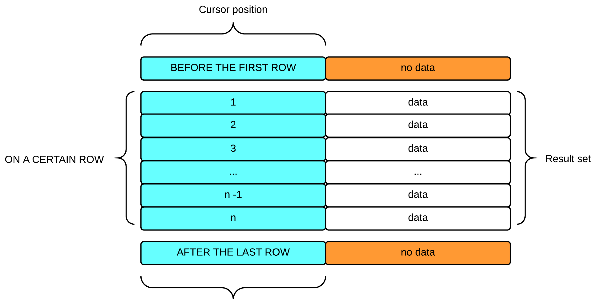

<a id="e058d1ca26668d04"></a>

# 19. SQL References (C~G)

> Source: [GOLDILOCKS 22c.1 User Manual (en)](https://manual.sunjesoft.co.kr/goldilocks/22c_1/manual/en/e058d1ca26668d04)  
> Tag: `22c.1_10_tag`

[← 18. SQL References (A~B)](18-sql-references-a-b.md) · [Table of contents](../README.md) · [20. SQL References (H~Z) →](20-sql-references-h-z.md)

<a id="e85469aa112b48af"></a>
## CLOSE cursor_name

<a id="8eaf952ba12a4844"></a>
### Function

It closes a cursor.

<a id="cbc7170ed500ed7c"></a>
### Syntax

```
<close statement> ::=
    CLOSE cursor_name
    ;
```

<a id="769d9953d4bbcb74"></a>
### Syntax Rules and Parameters

<a id="d5ee27ff013b4136"></a>
#### cursor_name

The cursor should be open.  
The cursor should be declared with [DECLARE cursor_name](#0871779c00d431a8) statement in the session.

<a id="552e4c6b01a72edb"></a>
### Description

The cursor is an object which exists in the session and it does not affect the cursor in a different session.

<a id="951c6f55a86b6687"></a>
### Example

The following is an example of DECLARE, OPEN, FETCH, and CLOSE the cursor by using gsql (interactive SQL tool).

```
gSQL> DECLARE cur1 CURSOR FOR SELECT id, data FROM t1;

Cursor declared.

gSQL> OPEN cur1;

Cursor is open.

gSQL> \var v_id   INTEGER
gSQL> \var v_data VARCHAR(128)

gSQL> FETCH cur1 INTO :v_id, :v_data;

V_ID V_DATA
---- ------
   1 data_1

1 row fetched.


gSQL> FETCH cur1 INTO :v_id, :v_data;

V_ID V_DATA
---- ------
   2 data_2

1 row fetched.

gSQL> FETCH cur1 INTO :v_id, :v_data;

no rows fetched.

gSQL> CLOSE cur1;

Cursor closed.
```

<a id="0627ae42e19a8d46"></a>
### Compatibility

**SQL standard compatibility**

<a id="0e3ff2a7e1317a7a"></a>
| Feature ID | Description | Compatibility |
| --- | --- | --- |
| B031 | Basic dynamic SQL | O |

<a id="5006f25649ca2ec9"></a>
### For More Information

Refer to the followings.

- [DECLARE cursor_name](#0871779c00d431a8)
- [OPEN cursor_name](20-sql-references-h-z.md#a52c4df668fbd9cb)
- [FETCH cursor_name](#c65c0d3544ea9773)

<a id="a50c9be23f474f41"></a>
## COMMENT ON name IS

<a id="d0bb870fdf7d949b"></a>
### Function

It stores the comments about the object in the dictionary.

<a id="aadf0aaaa4dd2510"></a>
### Syntax

```
<comment statement> ::=
    COMMENT ON <comment object> IS 'comment string'
    ;

<comment object> ::=
      CLUSTER GROUP group_name
    | CLUSTER MEMBER member_name
    | DATABASE
    | PROFILE profile_name
    | AUTHORIZATION user_name
    | TABLESPACE tablespace_name
    | SCHEMA schema_name
    | TABLE [schema_name].table_name
    | COLUMN [schema_name].table_name.column_name
    | INDEX [schema_name].index_name
    | SEQUENCE [schema_name].sequence_name
    | CONSTRAINT [schema_name].constraint_name
    | PROCEDURE [schema_name].procedure_name
```

<a id="30f11ce62a867928"></a>
### Invocation and Access Rules

The altering privileges on each object are required to perform &lt;comment statement&gt; as follows.

- CLUSTER GROUP
    - ALTER SYSTEM ON DATABASE
- CLUSTER MEMBER
    - ALTER SYSTEM ON DATABASE
- DATABASE 
    - ALTER DATABASE ON DATABASE 
- PROFILE
    - ALTER PROFILE ON DATABASE
- AUDIT POLICY
    - AUDIT SYSTEM ON DATABASE
- AUTHORIZATION (user) 
    - ALTER USER ON DATABASE 
- AUTHORIZATION (role) 
    - ALTER ROLE ON DATABASE 
- TABLESPACE 
    - ALTER TABLESPACE ON DATABASE 
- SCHEMA: One of the following privileges is required. 
    - The owner of the schema 
    - CONTROL SCHEMA ON SCHEMA for the schema
    - ALTER SCHEMA ON DATABASE
- TABLE: One of the following privileges is required. 
    - The owner of the table 
    - CONTROL TABLE ON TABLE for the table
    - CONTROL SCHEMA ON SCHEMA for the schema to which the table belongs
    - ALTER ANY TABLE ON DATABASE 
- COLUMN: One of the following privileges is required. 
    - The owner of the table to which the column belongs 
    - CONTROL TABLE ON TABLE for the table to which the column belongs 
    - CONTROL SCHEMA ON SCHEMA for the schema of the table to which the column belongs
    - ALTER ANY TABLE ON DATABASE 
- INDEX: One of the following privileges is required. 
    - The owner of the index
    - CONTROL SCHEMA ON SCHEMA for the schema to which the index belongs
    - ALTER ANY INDEX ON DATABASE 
- SEQUENCE 
    - The owner of the sequence 
    - CONTROL SCHEMA ON SCHEMA for the schema to which the sequence belongs
    - ALTER ANY SEQUENCE ON DATABASE 
- CONSTRAINT 
    - The owner of that constraint 
    - CONTROL SCHEMA ON SCHEMA for the schema to which the constraint belongs 
    - ALTER ANY TABLE ON DATABASE
- PROCEDURE
    - The owner of the stored procedure/function
    - CONTROL SCHEMA ON SCHEMA for the schema to which the stored procedure/function belongs
    - ALTER ANY PROCEDURE ON DATABASE

<a id="133c727efe9cd8bb"></a>
### Syntax Rules and Parameters

<a id="7cb36618943e8190"></a>
#### &lt;comment object&gt;

It is an object in which the comments are to be stored. The comments for the following database objects are stored.

- Cluster object
    - CLUSTER GROUP
    - CLUSTER MEMBER 
- Non-schema object 
    - DATABASE 
    - PROFILE
    - AUDIT POLICY
    - AUTHORIZATION (User or role) 
    - TABLESPACE 
    - SCHEMA 
- Schema object 
    - TABLE or VIEW 
    - COLUMN 
    - INDEX 
    - SEQUENCE 
    - CONSTRAINT
    - PROCEDURE or FUNCTION

If schema_name for the schema object is not specified, the schema name is determined by [Schema Path](13-sql-objects.md#025309f995bd075b) of the user performing the statement.

```
COMMENT ON TABLE test_table IS 'test comment'; 
→ COMMENT ON TABLE user_default_schema.test_table IS 'test comment';
```

<a id="95ef0a3263862423"></a>
#### 'comment string'

It describes the comments to be stored.  
Use the empty string ('') to delete the comments as follows.

```
COMMENT ON TABLE test_table IS '';
```

The length of the comment string can not exceed 1024 bytes.

<a id="1fb11763363fa086"></a>
### Description

The information can be retrieved from the COMMENTS column of the following dictionary view per each object type.

- Cluster objects
    - CLUSTER GROUP & CLUSTER MEMBER
        - DICTIONARY_SCHEMA.DBA_CLUSTER_COMMENTS view
- Non-schema objects
    - DATABASE
        - DICTIONARY_SCHEMA.ALL_NONSCHEMA_COMMENTS view
        - DICTIONARY_SCHEMA.DBA_NONSCHEMA_COMMENTS view
    - PROFILE
        - DICTIONARY_SCHEMA.DBA_NONSCHEMA_COMMENTS view
    - AUDIT POLICY
        - DICTIONARY_SCHEMA.AUDIT_POLICIES view
    - USER
        - DICTIONARY_SCHEMA.ALL_NONSCHEMA_COMMENTS view
        - DICTIONARY_SCHEMA.DBA_NONSCHEMA_COMMENTS view
    - TABLESPACE
        - DICTIONARY_SCHEMA.ALL_NONSCHEMA_COMMENTS view
        - DICTIONARY_SCHEMA.DBA_NONSCHEMA_COMMENTS view
    - SCHEMA
        - DICTIONARY_SCHEMA.ALL_NONSCHEMA_COMMENTS view
        - DICTIONARY_SCHEMA.DBA_NONSCHEMA_COMMENTS view
- SQL schema objects
    - TABLE
        - DICTIONARY_SCHEMA.USER_TAB_COMMENTS view
        - DICTIONARY_SCHEMA.ALL_TAB_COMMENTS view
        - DICTIONARY_SCHEMA.DBA_TAB_COMMENTS view
    - VIEW
        - DICTIONARY_SCHEMA.USER_TAB_COMMENTS view
        - DICTIONARY_SCHEMA.ALL_TAB_COMMENTS view
        - DICTIONARY_SCHEMA.DBA_TAB_COMMENTS view
    - COLUMN
        - DICTIONARY_SCHEMA.USER_COL_COMMENTS view
        - DICTIONARY_SCHEMA.ALL_COL_COMMENTS view
        - DICTIONARY_SCHEMA.DBA_COL_COMMENTS view
    - INDEX
        - DICTIONARY_SCHEMA.USER_INDEXES view
        - DICTIONARY_SCHEMA.ALL_INDEXES view
        - DICTIONARY_SCHEMA.DBA_INDEXES view
    - SEQUENCE
        - DICTIONARY_SCHEMA.USER_SEQUENCES view
        - DICTIONARY_SCHEMA.ALL_SEQUENCES view
        - DICTIONARY_SCHEMA.DBA_SEQUENCES view
    - CONSTRAINT
        - DICTIONARY_SCHEMA.USER_CONSTRAINTS view
        - DICTIONARY_SCHEMA.ALL_CONSTRAINTS view
        - DICTIONARY_SCHEMA.DBA_CONSTRAINTS view
    - PROCEDURE & FUNCTION
        - DICTIONARY_SCHEMA.USER_PROCEDURES view
        - DICTIONARY_SCHEMA.ALL_PROCEDURES view
        - DICTIONARY_SCHEMA.DBA_PROCEDURES view

For more information about the detailed description of each view, refer to [DICTIONARY_SCHEMA](../part-02-administration-manual/9-database-information.md#fd116a7f066a7767).

<a id="4de34400c2050ba1"></a>
### Examples

The following is an example of creating the comment on the table.

```
gSQL> COMMENT ON TABLE t1 IS 'test comment on table t1';

Comment created.
```

The following is an example of creating the comment on the column.

```
gSQL> COMMENT ON COLUMN t1.id IS 'test comment on column t1.id';

Comment created.
```

The following is an example of creating the comment on the schema.

```
gSQL> COMMENT ON SCHEMA s1 IS 'test comment on schema s1';

Comment created.
```

<a id="0a45f8fb61be774d"></a>
### Compatibility

&lt;comment statement&gt; does not exist in SQL standard.

<a id="4f7ae244eb8d32e6"></a>
## COMMIT

<a id="3bd486de24eb9a6b"></a>
### Function

It terminates the current transaction and makes all changes permanent.

<a id="ec5b8158a6f55dda"></a>
### Syntax

```
<commit statement> ::=
    COMMIT [ WORK ] 
       [ [ <commit comment clause> ] [ <commit write clause> ] |
         [ <commit force clause> ] [ <commit comment clause> ] ]
    ;

<commit comment clause> ::=
      COMMENT 'comment_string'

<commit write clause> ::=
      WRITE [ WAIT | NOWAIT ]

<commit force clause> ::=
    FORCE 'xid_string'
```

<a id="3979ee23d0f83576"></a>
### Syntax Rules and Parameters

<a id="2023557fd1cfd0ed"></a>
#### WORK

It is the reserved word which does not affect the operation.

<a id="e6cd1b5f1a3d847f"></a>
#### &lt;commit comment clause&gt;

- COMMENT 'comment_string'
    - It specifies the comment to the transaction when committing the transaction.

<a id="0891d753c5f3c8c9"></a>
#### &lt;commit write clause&gt;

It determines whether to wait until the redo logs generated by the commit operation are written on the redo log file.

- WAIT
    - It waits until the redo logs generated by the commit operation are written to the redo log file, and then the operation is terminated. 
- NOWAIT
    - The operation is terminated when the redo logs generated by the commit operation are written to the redo log buffer.
- If it is not specified, it follows the property.

<a id="29004b41464944e1"></a>
#### &lt;commit force clause&gt;

It is used to manually commit a distributed transaction.

- FORCE 'xid_string'
    - It commits the distributed transaction 'xid_string'.
    - 'xid_string' consists of *'format_id.transaction_id.branch_id'*.

<a id="35417c73a24437a8"></a>
### Description

COMMIT statement completes the following statements which were executed in a transaction.

- Data Manipulation Language (DML) statement
    - It is the statement which changes data, such as INSERT, UPDATE, DELETE. 
- Data Definition Language (DDL) statement
    - It is the statement which changes the structure and definition of the objects, such as CREATE, DROP, ALTER, TRUNCATE, GRANT, REVOKE.

Exceptionally, the following DDL statements which manage the OS resources or change the DATA TYPE are automatically committed.

- [CREATE TABLESPACE](#a1ba15f7377629fc)
- [DROP TABLESPACE](#1965cc96a31c2629)
- [ALTER TABLESPACE](18-sql-references-a-b.md#6cf7c5c15a54e23b)
- ALTER TABLE .. ALTER COLUMN .. SET DATA TYPE: [&lt;alter column data type clause&gt;](18-sql-references-a-b.md#0cac05892dce9642)

When performing COMMIT, the cursor opened by WITHOUT HOLD option is automatically closed. For more information about cursors, refer to the following cursor related statements.

- [DECLARE cursor_name](#0871779c00d431a8)
- [OPEN cursor_name](20-sql-references-h-z.md#a52c4df668fbd9cb)

If the transaction violates the DEFERRED constraint, the COMMIT statement fails and the transaction is rolled back. For more information about DEFERRED constraint, refer to [SET CONSTRAINTS](20-sql-references-h-z.md#fb01c5504ccb45bb).

<a id="7bb0ce5a52dc0db1"></a>
### Example

The following is an example of performing COMMIT after executing INSERT statement.

```
gSQL> INSERT INTO t1 VALUES ( 1, 'anonymous' );

1 row created.

gSQL> COMMIT WORK COMMENT 'INSERT T1';

Commit complete.
```

<a id="d0eedd561e33c303"></a>
### Compatibility

**SQL standard compatibility**

<a id="185e3949d35abc24"></a>
| Feature ID | Description | Compatibility |
| --- | --- | --- |
| T261 | Chained transactions | X |

<a id="450875064c86e137"></a>
### For More Information

Refer to the followings.

- [ROLLBACK](20-sql-references-h-z.md#126809f09298a063)
- [SAVEPOINT savepoint_specifier](20-sql-references-h-z.md#cfed0ae47f211495)

<a id="c95b6811be94d2e0"></a>
## CREATE AUDIT POLICY

<a id="478538f07995f7bd"></a>
### Function

It creates an audit policy object.  
AUDIT POLICY should be performed to activate the created audit policy object.

<a id="065d840770d5b824"></a>
### Syntax

```
<audit policy definition> ::= 
    CREATE AUDIT POLICY policy_name
    { <privilege_audit_clause> |  <action_audit_clause> | <privilege_audit_clause> <action_audit_clause> }
    ; 

<privilege_audit_clause> ::=
    PRIVILEGES <database_privilege> [, ...]

<action_audit_clause> ::=
    ACTIONS { <object_action_audit> | <system_action_audit> } [, ...]

<object_action_audit> ::=
      ALL ON [schema_name.]object_name
    | <object_action> ON [schema_name.]object_name

<system_action_audit> ::=
      ALL
    | DDL
    | <system_action>
```

<a id="2046c0f7ebe7eea4"></a>
### Invocation and Access Rules

AUDIT SYSTEM ON DATABASE privilege is required to perform &lt;audit policy definition&gt;.

<a id="16db76620e6a5680"></a>
### Syntax Rules and Parameters

<a id="c3d520c66f12d319"></a>
#### policy_name

It is the name of the audit policy to be created.

<a id="2a4536babf555b96"></a>
#### &lt;privilege_audit_clause&gt;

The privilege audit is auditing when the SQL statement is successfully performed by using the database privilege.  
It can audit a specific user performing SQL statement by using the database privilege, and it does not record the privilege audit for SYS user who is the owner of the database.

The following is an example of granting SELECT ANY TABLE privilege to user u1 and activating the audit policy.

```
CREATE AUDIT POLICY p1 
       PRIVILEGES SELECT ANY TABLE;

AUDIT POLICY p1;
```

If the user u1 performs the following SQL statement, the privilege audit differently operates.

- SELECT * FROM u1.t1;
    - It does not create the audit record by performing SQL statement with the privilege as an owner of table u1.t1.
- SELECT * FROM u2.t1;
    - It creates the audit record by performing SQL statement with SELECT ANY TABLE privilege.

&lt;database_privilege&gt; which can be described in the privilege audit can be viewed with the following query.

```
SELECT PRIVILEGE_NAME FROM V$AUDITABLE_DB_PRIVILEGES;
```

<a id="28e52d5f27e6ee19"></a>
#### &lt;action_audit_clause&gt;

It audits an action for a specific object and an action for the entire database.

<a id="8bd04fb4397fa470"></a>
#### &lt;object_action_audit&gt;

<a id="fb5c7bbe64705adb"></a>
##### ALL ON object_name

It means all actions which can list objects corresponding to object_name.

The following table describes audit actions of which each object type can audit.

**Audit action per object type**

<a id="f19517f2f264e7e4"></a>
| Object type | Action |
| --- | --- |
| Table | ALTER, COMMENT, DELETE, GRANT, INDEX, INSERT, LOCK, RENAME, SELECT, UPDATE |
| View | ALTER, COMMENT, GRANT, SELECT |
| Sequence | ALTER, COMMENT, GRANT, SELECT |
| Stored Function/Procedure | ALTER, COMMENT, EXECUTE, GRANT |

<a id="becc9dbc83c0be2f"></a>
##### &lt;object_action&gt; ON object_name

Each separate action per a specific object should be listed by specifying ON clause as follows.

```
CREATE AUDIT POLICY p1
       ACTIONS INSERT ON u1.t1
             , DELETE ON u1.t1
             , UPDATE ON u1.t1
;
```

<a id="e3cb0615821ab0b6"></a>
##### Caution of EXECUTE action

Auditing the success or the failure of stored function or stored procedure is determined only based on whether it is executable at the time of execution.

- WHENEVER NOT SUCCESSFUL creates the audit record when neither the stored function nor procedure is executable.
- WHENEVER SUCCESSFUL creates the audit record even though an error occurs while executing SQL statement within the stored function or the procedure 
- If an auditing for the failure of SQL statement within the stored function or the procedure is required, then the audit target should include the corresponding SQL statement.

<a id="28e081a56ed0ff66"></a>
#### &lt;system_action_audit&gt;

It audits the system action which occurs in the database regardless of a specific object.

- &lt;system_action&gt;

The valid system action can be retrieved by using the following query.

```
SELECT ACTION_NAME FROM V$AUDITABLE_SYSTEM_ACTIONS;
```

- ALL

It means all system actions.

- DDL

It means all Data Definition Language (DDL).

<a id="701b1d752d3da3da"></a>
### Description

An audit policy object is an object which defines auditing targets.    
Perform AUDIT POLICY statement to activate an audit policy.

Though it is possible to define and activate multiple audit policies, but it is recommended to maintain certain number of audit policies.    
It is also recommended to bind multiple small pieces of policies into a small number of groups.

The information about an option of the created audit policy object can be retrieved through AUDIT_POLICY_OPTIONS view as follows.

```
SELECT audit_option
     , audit_option_type
     , object_schema
     , object_name
  FROM audit_policy_options
 WHERE policy_name = 'P1'
;

AUDIT_OPTION AUDIT_OPTION_TYPE OBJECT_SCHEMA  OBJECT_NAME
------------ ----------------- -------------- ------------
DELETE	     OBJECT ACTION     U1	      T1
INSERT	     OBJECT ACTION     U1	      T1
UPDATE	     OBJECT ACTION     U1	      T1
```

<a id="4e9ae79641abbdae"></a>
#### Creating Audit Record

If an action corresponding to multiple audit policies occurs, then one or more audit records are created.

If similar audit options are listed as follows, then one audit record is created.

- Defining an audit policy

```
CREATE AUDIT POLICY p1
       PRIVILEGES SELECT ANY TABLE
       ACTIONS SELECT;

AUDIT POLICY p1;
```

- Performing an audit action

```
SELECT * FROM other_user.t1;
```

If two different audit options are listed as follows, then two audit records are created.

- Defining an audit policy

```
CREATE AUDIT POLICY p1
       ACTIONS SELECT ON u1.t1
             , SELECT ON u2.t2;

AUDIT POLICY p1;
```

- Performing an audit action

```
SELECT COUNT(*) FROM u1.t1 A, u2.t2 B WHERE A.id = B.id;
```

If multiple audit policies are activated for the same action as follows, then two audit records are created.

- Defining an audit policy

```
CREATE AUDIT POLICY p1
       PRIVILEGES SELECT ANY TABLE;
AUDIT POLICY p1;

CREATE AUDIT POLICY p2
       ACTIONS SELECT;
AUDIT POLICY p2;
```

- Performing an audit action

```
SELECT * FROM other.t1;
```

<a id="41bf483706145e3b"></a>
### Examples

The following is an example of defining an audit policy which audits an privilege.

```
CREATE AUDIT POLICY policy_table
       PRIVILEGES CREATE ANY TABLE
                , DROP ANY TABLE
;
```

The following is an example of defining an audit policy which audits an action for an object.

```
CREATE AUDIT POLICY policy_dml
       ACTIONS INSERT ON u1.t1
             , DELETE ON u1.t1
             , UPDATE ON u1.t1
             , ALL    ON u1.t2
;
```

The following is an example of defining an audit policy which audits the system action.

```
CREATE AUDIT POLICY policy_drop
       ACTIONS DROP TABLE, TRUNCATE TABLE
;
```

The following is an example of defining an audit policy which combines all examples above.

```
CREATE AUDIT POLICY policy_group
       PRIVILEGES CREATE ANY TABLE
                , DROP ANY TABLE
       ACTIONS INSERT ON u1.t1
             , DELETE ON u1.t1
             , UPDATE ON u1.t1
             , ALL    ON u1.t2
             , DROP TABLE
             , TRUNCATE TABLE
;
```

<a id="e2b587149e11c959"></a>
### Compatibility

The audit policy does not exist in SQL standard.

<a id="a186dea5e0e49f1f"></a>
### For More Information

Refer to the followings.

- Managing audit policy object
    - [CREATE AUDIT POLICY](#c95b6811be94d2e0)
    - [DROP AUDIT POLICY](#2da3770d12de6ceb)
    - [ALTER AUDIT POLICY](18-sql-references-a-b.md#89bba1b8a2f2809a)

- Activating/ deactivating audit policy
    - [AUDIT POLICY](18-sql-references-a-b.md#8015eb753e31e65c)
    - [NOAUDIT POLICY](20-sql-references-h-z.md#f45973bfabd47cb0)

- Retrieving audit trail: [AUDIT_TRAIL](../part-02-administration-manual/9-database-information.md#55a6aed1582db32b)

- Clearing audit trail: [ALTER DATABASE CLEAR AUDIT TRAIL](18-sql-references-a-b.md#d4120dc662bce568)

<a id="57c6f6ae1e01e560"></a>
## CREATE CLUSTER GROUP

<a id="c06b7faeaef630d0"></a>
### Function

It creates a cluster group which is to participate in a cluster system.

<a id="81d5fb4a3053f2ba"></a>
### Syntax

```
<cluster group definition> ::=
    CREATE CLUSTER GROUP group_name 
        <cluster member definition> [, ...]
    ;

<cluster member definition> ::=
    CLUSTER MEMBER member_name <connection attribute> [<member position>]

<connection attribute> ::=
    HOST 'address' PORT port_no

<member position> ::=
    POSITION DEFAULT
  | POSITION MAX
  | POSITION number
```

<a id="b16f2da0667d9137"></a>
### Invocation and Access Rules

It can be performed in a cluster system.  

ADMINISTRATION ON DATABASE privilege is required to perform &lt;cluster group definition&gt;.

<a id="72eda45af3835647"></a>
### Syntax Rules and Parameters

<a id="1ed8a1f5fa9190d2"></a>
#### group_name

It is the name of a cluster group.  
An identical cluster group name or a cluster member name should not exist.  
The name length should be shorter than 128 bytes.

<a id="4cf0432adf681e41"></a>
#### &lt;cluster member definition&gt;

It defines a cluster member to be included in a cluster group.  
A cluster group can include maximum 32 cluster members.  
A cluster group which is created first in a cluster system can define only one cluster member, and should include itself as a cluster member.

<a id="d0b9143026efba62"></a>
#### member_name

It is the name of a cluster member.  
The name of a cluster member should be same as the name of the member which was defined when creating the database of that member.  
An identical cluster group name or a cluster member name should not exist.  
The name length should be shorter than 128 bytes.

The start-up phase of the cluster member should be the GLOBAL OPEN phase.

<a id="126326754282e370"></a>
#### &lt;connection attribute&gt;

It defines the connection information for the communication between the cluster members.  
&lt;connection attribute&gt; should be as same as the HOST and PORT which were defined when the database of that cluster member was created.  
The combination of HOST and PORT should be unique in the cluster system.

- HOST 'address' uses the host name or IPv4 address. If the host name is used, then it uses the first IPv4 address of the system.
- PORT port_no should be in the range between 1024 ~ 49151.

<a id="f5a509e7d3a9760d"></a>
#### &lt;member position&gt;

It assigns the position number of the cluster member.

- POSITION DEFAULT
    - The system automatically assigns the position number.
- POSITION MAX
    - It assigns the new member position number even when an empty position number exists.
    - It assigns the value bigger than the biggest member position.
- POSITION number
    - It assigns the position number corresponding to the number
    - The position number should be unique in the cluster system.
    - The position number should be an empty position number, and it should be same or smaller than the biggest position number.
- If it is omitted, the default value is POSITION DEFAULT.

The member_position information of the cluster member can be retrieved through DBA_CLUSTER view.

```
SELECT member_name, member_id, member_position FROM dba_cluster;
```

If the following position numbers are being used,

- G1N1: 0
- G1N2: 1
- G2N2: 3
- G3N2: 5

The following values are assigned according to each option.

- POSITION DEFAULT
    - It assigns 2 which is an empty value.
- POSITION MAX
    - It assigns 6 which is a value of a new position number.
- POSITION 3
    - It is duplicated, so it is an error.
- POSITION 4
    - It assigns 4 which is a position number.

<a id="95774a815e586692"></a>
### Description

&lt;cluster group definition&gt; statement does not rebalance the shard of tables.

Perform the following statements to rebalance the shard to an added cluster group.

- [ALTER DATABASE REBALANCE](18-sql-references-a-b.md#e579543f77dce467)
- [ALTER TABLE name REBALANCE](18-sql-references-a-b.md#a5e30678f94e116b)

<a id="363e95781e6cddfa"></a>
### Examples

The following is an example of creating a cluster group which consists of two cluster members.

```
gSQL> 
CREATE CLUSTER GROUP g1
    CLUSTER MEMBER g1n1 HOST '192.168.0.11' PORT 10110
;

Cluster Group created.

gSQL>
ALTER CLUSTER GROUP g1
    ADD CLUSTER MEMBER g1n2 HOST '192.168.0.12' PORT 10120
;

Cluster Group altered.

gSQL> 
CREATE CLUSTER GROUP g2
    CLUSTER MEMBER g2n1 HOST '192.168.0.21' PORT 10210,
    CLUSTER MEMBER g2n2 HOST '192.168.0.22' PORT 10220
;

Cluster Group created.
```

<a id="7f03da6d281d3a67"></a>
### Compatibility

The SQL standard does not define the concepts of the cluster.

<a id="e042754564e3026f"></a>
### For More Information

Refer to the followings.

- [DROP CLUSTER GROUP](#05c49f429ff9e7a5)
- [ALTER CLUSTER GROUP name ADD MEMBER](18-sql-references-a-b.md#7aeb1944a8c55e03)

<a id="f90d35ca160e7aaf"></a>
## CREATE CLUSTER LOCATION

<a id="3108438244186bde"></a>
### Function

It creates the connection information of a cluster member.

<a id="7c163e89a44b78e8"></a>
### Syntax

```
<cluster location definition> ::=
    CREATE CLUSTER LOCATION member_name 
    <cluster connection attribute>
    ;

<cluster connection attribute> ::
       HOST 'address' PORT port_no
```

<a id="5a373cc571ee8837"></a>
### Invocation and Access Rules

It can be performed in a cluster system.

ADMINISTRATION ON DATABASE privilege is required to perform &lt;cluster location definition&gt;.

<a id="6a44c42ec9eda501"></a>
### Syntax Rules and Parameters

<a id="56ad4c5302a04c71"></a>
#### member_name

It is the name of a cluster member.  
The same cluster member name should not exist in the registered cluster location information.  
The length of the name should be shorter than 128 bytes.

<a id="83cc7d47e1d025b2"></a>
#### &lt;cluster connection attribute&gt;

It defines the connection information for the communication between the cluster members.  
The combination of HOST and PORT should be unique in the cluster system.

- HOST 'address' uses the host name or IPv4 address. If the host name is used, then it uses the first IPv4 address of the system.
- PORT port_no should be in the range between 1024 ~ 49151.

<a id="95d47736637ba322"></a>
### Description

Generally, the information of the cluster location is automatically created by using the connection information provided when creating the cluster group or adding the cluster member. The created information is deleted together when deleting the cluster member and the cluster group.

If the information of the cluster location is modified, then the connection information can be modified by using [ALTER CLUSTER LOCATION](18-sql-references-a-b.md#8898b9d2fa2187e2) without deleting or recreating the cluster member.

<a id="2f1e016a3bf44b95"></a>
### Examples

```
gSQL> 
CREATE CLUSTER LOCATION g1n2
    HOST '192.168.0.12' PORT 10120,
;

Created
```

<a id="67744a974a6b861d"></a>
### Compatibility

The SQL standard does not define the concepts of the cluster.

<a id="5eab15a38df7a5e2"></a>
### For More Information

Refer to [DROP CLUSTER LOCATION](#5ee74e721fcc4b5b) .

<a id="30dcc088e6dad23c"></a>
## CREATE DISK DATA TABLESPACE

<a id="45b6bc6d860dbd3c"></a>
### Function

It defines the disk data tablespace.

<a id="d530c7972534194b"></a>
### Syntax

```
<disk data tablespace statement> ::=
    CREATE DISK [ DATA ] TABLESPACE tablespace_name
        DATAFILE <disk datafile clause> [, ...]
        [ <data tablespace management clause> [, ...] ]

<disk datafile clause> ::=
     'filename' 
        [ SIZE <size clause> | REUSE | SIZE <size clause> REUSE ]
        [ <autoextend clause> ]
        [ AT <domain_name> ]

<autoextend clause>
    AUTOEXTEND { ON [ <next size clause> ] [ <max size clause> ] | OFF }

<next size clause>
    NEXT <size clause>

<max size clause>
    MAXSIZE { <size clause> | UNLIMITED }

<size clause> ::=
    integer [ K | M | G | T ]

<data tablespace management clause> ::=
      { ONLINE | OFFLINE }
    | EXTSIZE <size clause>
```

<a id="e90f948cd55c91cc"></a>
### Invocation and Access Rules

CREATE TABLESPACE ON DATABASE privilege is required to perform &lt;disk data tablespace definition&gt;.

The user who performed the statement has CREATE OBJECT ON TABLESPACE privilege for the created tablespace.

The following privileges are required to create an object on the created tablespace.

- CREATE OBJECT ON TABLESPACE for the tablespace
- USAGE TABLESPACE ON DATABASE

<a id="72a749f2d06d15aa"></a>
### Syntax Rules and Parameters

<a id="5013822bc48e5505"></a>
#### tablespace_name

It is the name of the tablespace to be created.  
The length of the tablespace name should be shorter than 128 bytes.

<a id="6b07aac959bb13e7"></a>
#### &lt;disk datafile clause&gt;

- 'filename' 
    - It is the name of the file which stores and manages the data.
    - It is the space to store tables and index pages which were created in the disk tablespace.
    - filename is either a new file or an existing file. 
    - filename length should be shorter than 1024 bytes.

- SIZE &lt;size clause&gt; 
    - If it is a new file, then it specifies the initial size by using SIZE clause. 
    - If a file exists, then an error occurs. 
    - The file size can be in the range between 1 M ~ maximum 30 G.

- REUSE 
    - If it is an existing file, then it uses REUSE clause. 
    - If a file does not exist, then it creates a new file.
    - The size of the newly created files is determined by USER_DATA_TABLESPACE_SIZE property.

- SIZE &lt;size clause&gt; REUSE 
    - If both SIZE clause and REUSE clause are specified, then it is operated according to the existence of filename as follows. 
        - If it is a new filename, then it specifies the initial file size by using SIZE clause. 
        - If it is an existing filename, then it adjust the size to the value in SIZE clause.

<a id="bba00a3eabf67099"></a>
#### &lt;autoextend clause&gt;

It sets the automatic expand property to ON or OFF. If it is set to ON, then it can specify the automatic expanded size and the maximum size of the data file.

<a id="602c016d47d18995"></a>
#### &lt;next size clause&gt;

It specifies the size to be extended when the data file in use does not have available space.

<a id="be7c98c40d1a290c"></a>
#### &lt;max size clause&gt;

It specifies the maximum expanded size of the data file.

<a id="95e29d460359edb8"></a>
#### &lt;size clause&gt;

It specifies the file size in byte. (If it is omitted, the default unit is bytes.)

- K: Kilobytes 
- M: Megabytes 
- G: Gigabytes 
- T: Terabytes

<a id="caf6abaa824ebd6c"></a>
#### &lt;domain_name&gt;

It is the name of member or the group to performs the statement.  
If it is omitted, then it is performed for all groups.

<a id="6188abc98c43b61c"></a>
#### ONLINE | OFFLINE

It determines whether to ONLINE/ OFFLINE the tablespace.

- If it is set to ONLINE, then the tablespace is available as soon as it is created.
- If it is set to OFFLINE, it is not available until it is explicitly switched to ONLINE.

<a id="76fc3094fbf42929"></a>
#### EXTSIZE &lt;size clause&gt;

It specifies the extent size of the tablespace.

- The extent size is specified in byte, and one of the six (64 K, 128 K, 256 K, 512 K, 1 M, 2 M) is selected.
- If the extent size is specified between 64 K ~ 128 K, then it is set to 128 K, and if it is specified bigger than 2 M, then it is set to 2 M.

<a id="0d57e3ac5321eb08"></a>
### Description

The data tablespace is an object which provides a physical storage to store SQL schema objects such as a table, and index (LOGGING).

<a id="af00518c7b0f8455"></a>
### Examples

The following is an example of creating the disk data tablespace.

```
gSQL> CREATE DISK TABLESPACE space1 DATAFILE 'test_file_1.dbf' SIZE 10M REUSE;

Tablespace created.
```

The following is an example of creating the tablespace which consists of multiple data files.

```
gSQL> CREATE DISK TABLESPACE space1 
             DATAFILE 'test_file_3_1.dbf' SIZE 10M REUSE,
                      'test_file_3_2.dbf' SIZE 10M REUSE;

Tablespace created.
```

<a id="71f4dee1b0343614"></a>
### Compatibility

The SQL standard does not define the concepts of the tablespace.

<a id="b0124ed0d5da1948"></a>
### For More Information

Refer to the followings.

- [DROP TABLESPACE](#1965cc96a31c2629)
- [ALTER TABLESPACE](18-sql-references-a-b.md#6cf7c5c15a54e23b)
- [ALTER DATABASE DATAFILE AUTOEXTEND](18-sql-references-a-b.md#e97038b632bbca5d)

<a id="2f5d78af48515118"></a>
## CREATE GLOBAL TEMPORARY TABLE

<a id="3555117f39884099"></a>
### Function

It creates a new global temporary table.

<a id="508c4423b6a57147"></a>
### Syntax

```
<global temporary table definition> ::=
    CREATE GLOBAL TEMPORARY TABLE table_name
        ( <table element> [, ...] )
        [ <table commit action clause> ]
        [ TABLESPACE tablespace_name ]
    ;

<global temporary table definition: AS query expression> ::=
    CREATE GLOBAL TEMPORARY TABLE table_name 
        [ TABLESPACE tablespace_name ]
        AS <query expression> [ WITH [ NO ] DATA ]
    ;

<table commit action clause> ::=
    ON COMMIT { PRESERVE | DELETE } ROWS
```

> The definition of &lt;table element&gt; is as same as that of &lt;table_definition&gt;.  
> For more information, refer to [CREATE TABLE](#78614830d4f324f4).

<a id="7c7a1cb570dd966f"></a>
### Invocation and Access Rules

A user should satisfy the following conditions to perform &lt;global temporary table definition&gt; statement.

- Table creation privilege
    - Refer to the access privilege in [CREATE TABLE](#78614830d4f324f4).
- SELECT access privilege 
    - Refer to the access privilege in [SELECT](20-sql-references-h-z.md#a7590d034ddcacce).

<a id="35ef32fdb7f7bf39"></a>
### Syntax Rules and Parameters

<a id="9c2ffe71fcd3f423"></a>
#### table_name

It is the table name to be created.  
For more information, refer to [table_name](#703d1d0e58661689).

<a id="4682d3c64807298b"></a>
#### other syntax

For more information about other syntaxes, refer to the syntax in [CREATE TABLE](#78614830d4f324f4) and in [CREATE TABLE AS SELECT](#63f12b91eac84911) statement.

<a id="dbf59092c9b52239"></a>
### Description

GLOBAL TEMPORARY TABLE is used to store the data which is maintained while a transaction or a session is performed.   
It is used for the purpose as same as that of the variable of which a developer temporarily stores the mid-data of the operation when developing an application.

The global temporary table has the following features.

- The definition of the global temporary table can be viewed in every session. 
- The physical segment is not allocated when defining the global temporary table, but the segment subordinated to that session is allocated when it is inserted for the first time.
- The data of the global temporary table can be viewed in a session or a transaction which was inserted.
- The tablespace to store the data of the global temporary table is determined as follows.

<a id="4a1098af29b56771"></a>
| Whether to specify tablespace | The tablespace in which the table is created |
| --- | --- |
| It specifies the tablespace. | It is created in the specified tablespace. |
| It does not specify the tablespace. | It is created in the default temporary tablespace of the current session user. |

- The index for the global temporary table is subordinate to the same session of the corresponding table, and the time duration is as same as that of the table. 
- It can define the view for the global temporary table.
- It can not specify &lt;table sharding strategy&gt; statement which describe the cluster-related features of the table for the global temporary table, nor &lt;table global secondary index clause&gt; statement. 
- It can not specify &lt;table attribute clause&gt; which describes the physical attributes of the table for the global temporary table, nor &lt;index attribute clause&gt; which describes the physical attributes of the index. 
- &lt;index attribute clause&gt; which describes the physical attributes of the index can not be specified for the index which is created based on the global temporary table. 
- If a transaction is terminated by &lt;table commit action clause&gt;, it can determine how to process the remaining data.

<a id="4ab3b90d5de65dad"></a>
| Table commit action | Description |
| --- | --- |
| ON COMMIT PRESERVE ROWS | It maintains the data remained in a table even after COMMIT or ROLLBACK. |
| ON COMMIT DELETE ROWS (default) | It deletes all data remained in a table at the time of COMMIT or ROLLBACK (TRUNCATE). |

- It supports most of DDLs for an ordinary table. (Including ALTER and TRUNCATE)
    - It does not support CLUSTER-related statement (SHARD and global secondary index-related statement).
    - DDL for the global temporary table which is currently used in its own session or in another session causes an error.
    - DDL is available after removing all segments which is used as TRUNCATE TABLE or COMMIT in all sessions in use.
- It supports all DMLs and select statements for an ordinary table. 
- All alteration for the global temporary table (DML) do not leave the redo log.
- All alteration for the global temporary table (DML) leaves the undo log, the location of the undo log is determined according to TEMP_UNDO_ENABLED property.

<a id="9511a6f678a87d4c"></a>
| TEMP_UNDO_ENABLED value | Description |
| --- | --- |
| TRUE | The undo log is recorded in the default temporary tablespace of the database system. |
| FALSE | The undo log is recorded in the undo tablespace of the database system. |

- TRUNCATE command for the global temporary table truncates only the segment of the corresponding session.
- If the session is terminated, all segments are TRUNCATEd and then returned.

<a id="97933b59190104cd"></a>
### Examples

The following is an example of performing CREATE GLOBAL TEMPORARY TABLE statement.

```
gSQL> CREATE  GLOBAL TEMPORARY TABLE SESSION_TABLE1(
        COL1    CHAR(10)
       ,COL2    VARCHAR2(20)
       ,COL3    NUMBER(10)
)   ON  COMMIT  DELETE ROWS;

Table created.
```

The following is an example of performing CREATE GLOBAL TEMPORARY TABLE ... AS SELECT statement.

```
gSQL> CREATE  GLOBAL TEMPORARY TABLE SESSION_TABLE2
    ON  COMMIT  PRESERVE ROWS
    AS  SELECT  *
          FROM  EMPLOYEES;

Table created.
```

<a id="5bb1d13fc5403c97"></a>
### Compatibility

CREATE GLOBAL TEMPORARY TABLE and CREATE GLOBAL TEMPORARY TABLE AS SELECT statements follow the definition of SQL standard &lt;table definition&gt;. However, the following is an extension of SQL standard.

- SQL standard requires parentheses outside SELECT clause, but it is optional in GOLDILOCKS.
- SQL standard requires WITH [NO] DATA clause, but it is optional in GOLDILOCKS.
- The concepts of tablespace in GOLDILOCKS is an extended concept, and it is not supported in SQL standard.

**SQL standard compatibility**

<a id="9909ab7261ed0e0a"></a>
| Feature ID | Description | Compatibility |
| --- | --- | --- |
| T171 | LIKE clause in table definition | X |
| T172 | AS subquery clause in table definition | O |
| F531 | Temporary tables | X |
| S051 | Create table of type | X |
| S043 | Enhanced reference types | X |
| S081 | Subtables | X |
| T173 | Extended LIKE clause in table definition | X |
| T180 | System-versioned tables | X |
| F692 | Extended collation support | X |
| T174 | Identity columns | O |
| T175 | Generated columns | X |
| S071 | SQL paths in function and type name resolution | X |
| F321 | User authorization | O |
| T322 | Extended roles | X |
| F762 | CURRENT_CATALOG | O |
| F763 | CURRENT_SCHEMA | O |

<a id="3f5f616ab157981a"></a>
### For More Information

Refer to the followings.

- [CREATE TABLE](#78614830d4f324f4)
- [CREATE TABLE AS SELECT](#63f12b91eac84911)

<a id="9acece63be9429df"></a>
## CREATE IMMUTABLE TABLE

<a id="58d4b3db53caf2d4"></a>
### Function

It creates a new immutable table.

<a id="7a904d2b58379d69"></a>
### Syntax

```
<immutable table definition> ::=
    CREATE IMMUTABLE TABLE table_name
        ( <table element> [, ...] )
        [ <table sharding strategy> ]
        [ <table attribute clause> [...] ]
        [ TABLESPACE tablespace_name ]
        [ <table global secondary index clause> ]
    ;

<immutable table definition: AS query expression> ::=
    CREATE IMMUTABLE TABLE table_name
        [ ( column_name [, ...] ) ]
        [ <table sharding strategy> ]
        [ <table attribute clause> [, ...] ]
        [ TABLESPACE tablespace_name ]
        [ <table global secondary index clause> ]
        AS <query expression> [ WITH [ NO ] DATA ]
    ;
```

> The definition for &lt;table element&gt;, &lt;table sharding strategy&gt;, &lt;table attribute clause&gt; and &lt;table global secondary index clause&gt; are as same as those in &lt;table_definition&gt;. For more information, refer to [CREATE TABLE](#78614830d4f324f4).

<a id="8d549a6b9bda0897"></a>
### Invocation and Access Rules

The user should satisfy the following conditions to perform &lt;immutable table definition&gt;.

- The privilege to create the table 
    - Refer to the access rules for [CREATE TABLE](#78614830d4f324f4) statement.
- The privilege for SELECT to access 
    - Refer to the access rules for [SELECT](20-sql-references-h-z.md#a7590d034ddcacce) statement.

<a id="5dc4cd677b44a622"></a>
### Syntax Rules and Parameters

<a id="70672c6fc91627dc"></a>
#### table_name

It is the table name to be created and it should be unique in the schema.  
It can define the schema to which the table belongs, such as schema_name.table_name. If schema_name is omitted, the default schema name of the user performing the statement is used.  
The length of the table name should be shorter than 128 bytes.

<a id="fbee016753da9ac4"></a>
#### Other Syntax

For other syntaxes, refer to the syntaxes for [CREATE TABLE](#78614830d4f324f4) and [CREATE TABLE AS SELECT](#63f12b91eac84911).

<a id="b4fae2373050a10d"></a>
### Description

An immutable table is used when it is required to prevent the record stored in the table from being altered or deleted and to prevent the table from being dropped.

> An immutable table can be dropped when a user, a schema, a tablespace and a cluster group are dropped.

> The following SQL statements are not allowed for an immutable table.
> 
> - UPDATE
> - DELETE
> - ALTER TABLE RENAME/DROP COLUMN
> - ALTER TABLE SET UNUSED COLUMN
> - ALTER TABLE DROP UNUSED COLUMNS
> - ALTER TABLE RENAME TO
> - TRUNCATE TABLE
> - DROP TABLE
> 
>   
> The following SQL statements are allowed for an immutable table.
> 
> - INSERT
> - SELECT
> - SELECT .. FOR UPDATE
> - CREATE/ALTER/DROP INDEX
> - ALTER TABLE ADD/ALTER COLUMN
> - ALTER TABLE ADD/ALTER/RENAME/DROP CONSTRAINT
> - ALTER TABLE for physical property changes
> - ALTER TABLE ADD/DROP SUPPLEMENTAL LOG
> - LOCK TABLE
> - ALTER TABLE .. ADD/ALTER/DROP GLOBAL SECONDARY INDEX
> - ALTER DATABASE MOVE SHARD
> - ALTER TABLE .. MOVE SHARD
> - ALTER TABLE .. SPLIT SHARD
> - ALTER TABLE .. MERGE SHARD
> - DROP TABLESPACE
> - DROP SCHEMA
> - DROP USER
> - DROP CLUSTER GROUP
> 

<a id="7e5e12bc4270be1b"></a>
### Examples

The following is an example of executing CREATE IMMUTABLE TABLE statement.

```
gSQL> CREATE IMMUTABLE TABLE t1
(
    id INTEGER PRIMARY KEY,
    name VARCHAR(128),
    addr VARCHAR(128)
);

Table created.
```

The following is an example of executing CREATE IMMUTABLE TABLE ... AS SELECT statement.

```
gSQL> CREATE IMMUTABLE TABLE T2
       AS SELECT *
             FROM T1;

Table created.
```

<a id="8254a1ae34cbe931"></a>
### Compatibility

The SQL standard does not cover CREATE IMMUTABLE TABLE and CREATE IMMUTABLE TABLE AS SELECT statements.

<a id="fa917b3cb19fe27c"></a>
### For More Information

Refer to the followings.

- [CREATE TABLE](#78614830d4f324f4)
- [CREATE TABLE AS SELECT](#63f12b91eac84911)

<a id="53859b9d7a9204b3"></a>
## CREATE INDEX

<a id="d11ac8b948b20ed5"></a>
### Function

It creates an index.

<a id="9ecc15b8b5aeef54"></a>
### Syntax

```
<index definition> ::=
    CREATE [ UNIQUE ] INDEX index_name
        ON table_name ( <index column element> [, ...] )
        [ <index attributes> [...] ]
        [ TABLESPACE tablespace_name ]
    ;

<index column element> ::=
    column_name [ ASC | DESC ] [ NULLS FIRST | NULLS LAST ]

<index attributes> ::=
      <physical attribute clause>
    | STORAGE ( <segment attr clause> [...] )
    | <parallel clause> 

<physical attribute clause> ::=
      PCTFREE integer
    | INITRANS integer
    | MAXTRANS integer

<segment attr clause> ::=
      INITIAL <size_clause>
    | NEXT <size_clause>
    | MINSIZE <size_clause>
    | MAXSIZE <size_clause>

<size clause> ::=
      integer [ K | M | G | T ]

<parallel clause> ::=
      NOPARALLEL
    | PARALLEL [ integer ]
```

<a id="733a28e4a4f19e8c"></a>
### Invocation and Access Rules

The user should satisfy the following conditions to perform &lt;index definition&gt;.

- One of the following privileges is required to create an index on the table.
    - (INDEX or CONTROL TABLE ON) TABLE for that table
    - CONTROL SCHEMA ON SCHEMA for the schema to which the table belongs
    - CREATE ANY INDEX ON DATABASE

- One of the following privileges is required for the schema on which the index is to be created.
    - (CREATE INDEX or CONTROL SCHEMA) ON SCHEMA for the schema
    - CREATE ANY INDEX ON DATABASE

- One of the following privileges is required for the tablespace on which the index is to be created.
    - CREATE OBJECT ON TABLESPACE for that tablespace
    - USAGE TABLESPACE ON DATABASE

- The owner of the index is determined as follows.
    - The owner of the schema to which the index belongs. 
    - If the schema to which the index belongs is PUBLIC, then it is the user who executed the statement.

> Unique indexes in a cluster system should include all sharding keys.

<a id="ecba901524e939a5"></a>
### Syntax Rules and Parameters

<a id="9cdf9d9b1529e4a0"></a>
#### UNIQUE

It does not allow duplicate values for the columns of the index.

<a id="4bb0ad350b23299a"></a>
#### index_name

It is the index name to be created and it should be a unique name within the schema.  
If the schema name is omitted, the index is created in the schema to which the referring table belongs.  
The length of the index name should be shorter than 128 bytes.

<a id="ef7826b5db77be47"></a>
#### table_name

It is the table name which creates the index.  
The schema to which a table belongs, such as schema_name.table_name, can be defined. If schema_name is omitted, the default schema name of the user performing the statement is used.

<a id="e196737cd0977ed2"></a>
#### column_name

It is the column name to be used as an index key.  
One or more columns should be defined, and maximum 32 columns can be used as an index key.

The following constraints can occur depending on the implementation.

- If the column data type included in an index is LONG CHARACTER VARYING, LONG BINARY VARYING, an index can not be created.
- An index is created only when the sum of the column precisions is less than 1200 bytes.

<a id="42feccd388f26a80"></a>
#### ASC | DESC

It specifies the sort order of a column.

- ASC: It is sorted in ascending order.
- DESC: It is sorted in descending order.
- If not specified, the default value is ASC.

<a id="0bf08e0b28b8a7ae"></a>
#### NULLS FIRST | NULLS LAST

It specifies the sort order of the NULL value.

- NULLS FIRST: It precedes the non-NULL values.
- NULLS LAST: It is behind the non-NULL values.
- If not specified, the default value is NULLS LAST.

<a id="7f41ad0fa5033244"></a>
#### &lt;physical attribute clause&gt;

It defines the physical attribute of the index.

- PCTFREE integer 
    - Definition 
        - It is the reserved space for adjusting the page split frequency caused by the key inserted in the page.
        - It applies only to the index bottom-up build.
    - It can use the value from 0 to 99.
    - If it is omitted, the default value is the value set in DEFAULT_INDEX_PCTFREE property.

- INITRANS integer 
    - Definition 
        - It specifies the initial number of transactions which can simultaneously access the page. 
        - If the number of users who access the index is small, INITRANS is set to low, and if the number of users who simultaneously access the index is big, INITRANS is set to high. 
        - If necessary, it is automatically increased to the specified MAXTRANS. 
    - It can use the value from 1 to 32.
    - If it is omitted, the default value is 4.

- MAXTRANS integer 
    - Definition 
        - It specifies the maximum number of transactions which can simultaneously access the page. 
    - It can use the value from 1 to 32.
    - If it is omitted, the default value is 8.

<a id="01958ed80b80b364"></a>
#### &lt;segment attr clause&gt;

It specifies the information for the index storage space.

- INITIAL integer
    - Definition
        - It specifies the size of physical storage space which is initially allocated when creating the index.
        - This size is aligned to the EXTENT size of the TABLESPACE to which the table belongs. (e.g. If the EXT size is 8192 bytes, 'INITIAL 100' is actually operated as 8192 bytes.)
        - The size (aligned to the EXTENT size of TABLESPACE) should be equal to or bigger than MINEXTENTS, or it should be equal to or less than MAXEXTENTS.
    - The minimum value is 1, and the maximum value depends on the system environment.
    - If it is omitted, the default value is one EXTENT size of TABLESPACE to which the table belongs.

- NEXT integer
    - Definition
        - It specifies the physical space size to be allocated when adding the space to the index.
        - This size is aligned to the EXTENT size of the TABLESPACE to which the table belongs. (e.g. If the EXT size is 8192 bytes, 'NEXT 100' is actually operated as 8192 bytes.)
        - NEXT operates as follows, depending on the remaining space size of the index available currently. (Obtained by subtracting the amount of currently used space from the MAXEXTENTS size)  
      - If the remaining space size is 0, then it can not extend the space.  
      - If the remaining space size is bigger than 0, but smaller than NEXT, then it allocates the  
      space as big as the remaining space.  
      - If the remaining space size is bigger than NEXT, then it allocates the space as big as the NEXT.
    - The minimum value is 1 and the maximum value depends on the system environment.
    - If it is omitted, the default value is one EXTENT size of TABLESPACE to which the index belongs.

- MINSIZE integer
    - Definition
        - It is the minimum space size of the index.
        - The value should be equal to or smaller than MAXSIZE.
    - This size is aligned to the EXTENT size of the TABLESPACE to which the index belongs.
    - The minimum value is 1 and the maximum value depends on the system environment.
    - If it is smaller than the size of two EXTENT, it is specified to the size of two EXTENT.
    - If it is omitted, the default value is the size of two EXTENT.

- MAXSIZE integer
    - Definition
        - It is the maximum space size of the index.
        - The value should be equal to or bigger than MINSIZE.
    - This size is aligned to the EXTENT size of the TABLESPACE to which the index belongs.
    - The minimum value is 1 and the maximum value depends on the system environment.
    - If it is omitted, the default value is 32 terabytes (35,184,372,088,832).
    - Even though the value is set to over 32 terabytes, it is adjusted and set to 32 terabytes.

<a id="9b578dc27513d67b"></a>
#### &lt;size clause&gt;

It specifies the file size in bytes. (If the unit is omitted, the default value is bytes.)

- K: Kilobytes 
- M: Megabytes 
- G: Gigabytes 
- T: Terabytes

<a id="ce1d930ab76a648d"></a>
#### NOPARALLEL | PARALLEL [ integer ]

It specifies the number of threads to be used when building an index.

- NOPARALLEL 
    - It does not build an index in parallel.
- PARALLEL [integer] 
    - It builds an index in parallel.
    - If an integer is omitted or set as 0, then it follows INDEX_BUILD_PARALLEL_FACTOR property. 
    - The minimum value of an integer is 0 and the maximum value is 16. 
    - If the property value is 0, then the system determines the optimal value.
- If it is omitted, the default value is PARALLEL.

<a id="e4de97ac8ceda7cb"></a>
#### TABLESPACE tablespace_name

It specifies the name of the tablespace in which the index is to be stored.

- When it specifies tablespace_name
    - if tablespace_name is data tablespace, then a LOGGING index is created.
    - if tablespace_name is temporary tablespace or nologging tablespace, then a NOLOGGING index is created.

- When it omits TABLESPACE clause
    - If INDEX TABLESPACE tablespace_name of USER is specified
        - The defined tablespace is used.
    - If INDEX TABLESPACE of USER is NULL
        - The index of the DISK table uses the user's default data tablespace.
        - The index of the MEMORY table uses the user's default temporary tablespace.

<a id="babce29fd91002ff"></a>
### Description

LOGGING index and NOLOGGING index have the following trade-offs.

- LOGGING index
    - Advantage: It does not separately build an index because the index is automatically restored by using the log when starting up the system.
    - Disadvantage: A disk I/O occurs because the changes on the index are recorded on the log when altering the row.
- NOLOGGING index
    - Advantage: A disk I/O does not occur for the changes on the index when altering the row.
    - Disadvantage: It automatically rebuilds the index when starting up the system because the log information of the index does not exist.

<a id="2d1cb6cbb1dedefe"></a>
### Examples

The following is an example of creating the unique index.

```
gSQL> CREATE UNIQUE INDEX idx_t1_id ON t1( id );

Index created.
```

The following is an example of creating an index for multiple columns.

```
gSQL> CREATE INDEX idx_t1_id_name ON t1( id, name );

Index created.
```

The following is an example of specifying the sort order of the index column.

```
gSQL> CREATE INDEX idx_t1_dept_id ON t1( dept_id DESC );

Index created.
```

The following is an example of specifying the sort order of NULL value of the index column.

```
gSQL> CREATE INDEX idx_t1_name ON t1( name NULLS FIRST );

Index created.
```

The following is an example of setting information about the space in which index is stored.

```
gSQL> CREATE INDEX idx_t1_id ON t1( id )
             STORAGE ( INITIAL 10M NEXT 1M MINSIZE 10M MAXSIZE 100M );

Index created.
```

The following is an example of creating the redo logging for the index.

```
gSQL> CREATE INDEX idx_t1_id ON t1( id );

Index created.
```

The following is an example of creating the index with parallel option.

```
gSQL> CREATE INDEX idx_t1_name ON t1( name ) PARALLEL;

Index created.
```

The following is an example of specifying the tablespace when creating an index.

```
gSQL> CREATE INDEX idx_t1_name ON t1( name ) TABLESPACE mem_temp_tbs;

Index created.
```

<a id="97fa2083b6ccac6e"></a>
### Compatibility

The SQL standard does not cover the concepts of the index.

<a id="ef40f3eaf306fb38"></a>
### For more information

Refer to [DROP INDEX](#51379123809e6034).

<a id="8b06ed04bf048cdb"></a>
## CREATE MEMORY DATA TABLESPACE

<a id="e2bc39ca15296978"></a>
### Function

It defines a memory data tablespace.

<a id="4ab4a0968a6e8328"></a>
### Syntax

```
<memory data tablespace statement> ::=
    CREATE [ MEMORY ] [ DATA ] TABLESPACE tablespace_name
        DATAFILE <memory datafile clause> [, ...]
        [ <data tablespace management clause> [, ...] ]

<memory datafile clause> ::=
     'filename' 
        [ SIZE <size clause> | REUSE | SIZE <size clause> REUSE ]
        [ AT <domain_name> ]
<size clause> ::=
    integer [ K | M | G | T ]

<data tablespace management clause> ::=
      { ONLINE | OFFLINE }
    | EXTSIZE <size clause>
```

<a id="e304d7eaeaba6ffc"></a>
### Invocation and Access Rules

CREATE TABLESPACE ON DATABASE privilege is required to perform &lt;memory data tablespace definition&gt;.

The user who performed the statement has CREATE OBJECT ON TABLESPACE privilege on the created tablespace.

One of the following privileges is required to create the objects on the created tablespace.

- CREATE OBJECT ON TABLESPACE for that tablespace
- USAGE TABLESPACE ON DATABASE

<a id="d20943a475341d32"></a>
### Syntax Rules and Parameters

<a id="5f1fedfa6f7e1b14"></a>
#### [ MEMORY ] [ DATA ]

It is a memory tablespace to store the permanent objects such as tables, indexes, etc.  
The reserved words, MEMORY and DATA, can be omitted.

<a id="64d52159a4a378ec"></a>
#### tablespace_name

It is the tablespace name to be created.  
The length of the tablespace name should be shorter than 128 bytes.

<a id="47a78650c430b1c7"></a>
#### &lt;memory datafile clause&gt;

- 'filename' 
    - It is the file name to store and manage the data.
    - It is the space to store the checkpoint image for the memory data. 
    - filename can be either a new file or an already existing file.
    - The length of the filename should be shorter than 1024 bytes.

- SIZE &lt;size clause&gt; 
    - The initial size is assigned for a new file by using the SIZE clause.
    - An error occurs if the file already exists.
    - The file size can be specified between minimum 1M and maximum 30G.

- REUSE 
    - If the file already exists, REUSE clause is used. 
    - If the file does not exist, a new file is created. 
    - The newly created file size is 
        - determined by USER_DATA_TABLESPACE_SIZE property in case of the data tablespace.
        - determined by USER_TEMP_TABLESPACE_SIZE property in case of the temporary tablespace.

- SIZE &lt;size clause&gt; REUSE 
    - If both SIZE clause and REUSE clause are specified, it is operated as follows according to the presence of the filename.
        - For the new filename, the initial file size is assigned by using the SIZE clause.
        - For the existing filename, the size is adjusted to the value of SIZE clause by using the existing file.

<a id="82cbf9a8236d0397"></a>
#### &lt;size clause&gt;

It specifies the file size in bytes. (If it is omitted, the default unit is bytes.)

- K: Kilobytes 
- M: Megabytes 
- G: Gigabytes 
- T: Terabytes

<a id="34858fabcca1b78b"></a>
#### &lt;domain name&gt;

It is a name of a member or a group for which the statement is performed.  
If it is omitted, it is performed for all groups.

<a id="e68a71a708796d28"></a>
#### ONLINE | OFFLINE

It sets ONLINE or OFFLINE of the tablespace.

- ONLINE is the state which a tablespace can be used as soon as it is created.
- OFFLINE is the state which a tablespace is unable to be used, it can be used after switching to ONLINE state.

<a id="931a58e50272e38f"></a>
#### EXTSIZE &lt;size clause&gt;

It specifies extent size of the tablespace.

- The extent size is specified in bytes, and one of the six (64 K, 128 K, 256 K, 512 K, 1 M, 2 M) is selected.
- If the extent size is defined as a value between 64 K ~ 128 K, 128 K is set. If the extent size is defined as 2 M or bigger, 2 M is set.

<a id="22932e70ba2971fe"></a>
### Description

The data tablespace is an object which provides the physical space to store the SQL schema object such as a table, an index (LOGGING).

<a id="48386019e6597801"></a>
### Examples

The following is an example of creating a memory data tablespace.

```
gSQL> CREATE TABLESPACE space1 DATAFILE 'test_file_1.dbf' SIZE 10M REUSE;

Tablespace created.
```

The following is an example of creating a tablespace which consists of multiple data files.

```
gSQL> CREATE TABLESPACE space1 
             DATAFILE 'test_file_3_1.dbf' SIZE 10M REUSE,
                      'test_file_3_2.dbf' SIZE 10M REUSE;

Tablespace created.
```

<a id="0ea925e2fa3bf7be"></a>
### Compatibility

The SQL standard does not cover the concepts of the tablespace.

<a id="651b8d903e9142ec"></a>
### For More Information

Refer to the followings.

- [DROP TABLESPACE](#1965cc96a31c2629)
- [ALTER TABLESPACE](18-sql-references-a-b.md#6cf7c5c15a54e23b)

<a id="f6ba2c8cb6d02cc3"></a>
## CREATE MEMORY TEMPORARY TABLESPACE

<a id="bfce3a922e7ca9c9"></a>
### Function

It defines a memory temporary tablespace.

<a id="94c64f196d027c09"></a>
### Syntax

```
<memory temporary tablespace statement> ::=
    CREATE [ MEMORY ] TEMPORARY TABLESPACE tablespace_name
        MEMORY <memory clause> [, ...]
        <temporary tablespace management clause>

<memory clause> 
     'memory_name' { SIZE <size clause> } [ AT <domain_name> ]

<temporary tablespace management clause> ::=
    EXTSIZE <size clause>
```

<a id="cc89af8c86b63454"></a>
### Invocation and Access Rules

CREATE TABLESPACE ON DATABASE privilege is required to perform &lt;memory temporary tablespace definition&gt;.

The user who performed the statement has CREATE OBJECT ON TABLESPACE privilege on the created tablespace.

One of the following privileges is required to create the objects on the created tablespace.

- CREATE OBJECT ON TABLESPACE for the tablespace.
- USAGE TABLESPACE ON DATABASE

<a id="89f79d0b92dd25bd"></a>
### Syntax Rules and Parameters

<a id="ccc0fc00ad837c78"></a>
#### [ MEMORY ] TEMPORARY

It is a memory temporary tablespace to store the no logging indexes or the temporary objects such as intermediate results which are generated during the query processing.  
The reserved word, MEMORY, can be omitted.

<a id="36bd0d3f47703010"></a>
#### tablespace_name

It is the tablespace name to be created.  
The length of the tablespace name should be shorter than 128 bytes.

<a id="b7a34593808eb870"></a>
#### &lt;memory clause&gt;

- 'memory_name' 
    - It is a memory name to store the temporary data.
    - memory_name should be guaranteed to be unique within the tablespace.
    - The length of the memory_name should be shorter than 1024 bytes.
- SIZE &lt;size clause&gt; 
    - It specifies the initial size.
    - It can be specified between minimum 1M and maximum 30G.

<a id="9a262b20360ca470"></a>
#### &lt;size clause&gt;

It specifies the size of shared memory space in bytes.(If it is omitted, the default unit is bytes.)  
The image is not managed as a file in case of the temporary memory data.

- K: Kilobytes 
- M: Megabytes 
- G: Gigabytes 
- T: Terabytes

<a id="b8d3fdff525355f0"></a>
#### &lt;domain name&gt;

It is a name of a member or a group for which the statement is performed.  
If it is omitted, it is performed for all groups.

<a id="a9d7e0ac4440fa6b"></a>
#### EXTSIZE &lt;size clause&gt;

It specifies extent size of the tablespace.

- The extent size is specified in bytes, and one of the six (64 K, 128 K, 256 K, 512 K, 1 M, 2 M) is selected.
- If the extent size is defined as a value between 64 K ~ 128 K, 128 K is set. If the extent size is defined as 2 M or bigger, 2 M is set.

<a id="0f9b9d56e9c73731"></a>
### Description

The temporary tablespace is an object which provides the physical space to store the SQL schema object such as an index (NOLOGGING), and to store the intermediate results for sorting, hashing during the query processing.

<a id="f5315c593a08d21a"></a>
### Examples

The following is an example of creating a temporary tablespace.

```
gSQL> CREATE TEMPORARY TABLESPACE temp_space1 MEMORY 'test_memory_1' SIZE 10M;

Tablespace created.
```

The following is an example of creating a temporary tablespace which includes multiple memory spaces.

```
gSQL> CREATE TEMPORARY TABLESPACE temp_space1 
             MEMORY 'test_memory_3_1' SIZE 10M,
                    'test_memory_3_2' SIZE 10M;

Tablespace created.
```

<a id="d1cc06284c4e8317"></a>
### Compatibility

The SQL standard does not cover the concepts of the tablespace.

<a id="702b0df612f7d8a8"></a>
### For More Information

Refer to the followings.

- [DROP TABLESPACE](#1965cc96a31c2629)
- [ALTER TABLESPACE](18-sql-references-a-b.md#6cf7c5c15a54e23b)

<a id="c43cb7b774ec2c47"></a>
## CREATE PROFILE

<a id="a5db09de305ca4a1"></a>
### Function

It is the statement which creates the profile, and it sets the password management method.   
When a profile is allocated to a user, the user's password is managed in the way defined in the profile.

<a id="ff65ad3d9007d9a6"></a>
### Syntax

```
<profile definition> ::=

    CREATE PROFILE profile_name LIMIT 
    { <password_parameters>, ...}
    ; 

<password parameters> ::= 
      FAILED_LOGIN_ATTEMPTS { integer | UNLIMITED | DEFAULT }
    | PASSWORD_LOCK_TIME  { password_parameter_number_interval | UNLIMITED | DEFAULT }
    | PASSWORD_LIFE_TIME  { password_parameter_number_interval | UNLIMITED | DEFAULT }
    | PASSWORD_GRACE_TIME { password_parameter_number_interval | UNLIMITED | DEFAULT }
    | PASSWORD_REUSE_MAX  { integer | UNLIMITED | DEFAULT }
    | PASSWORD_REUSE_TIME { password_parameter_number_interval | UNLIMITED | DEFAULT }
    | PASSWORD_VERIFY_FUNCTION { <verify_policy> | NULL | DEFAULT }

<verify_policy> ::= 
      KISA_VERIFY_FUNCTION
    | ORA12C_VERIFY_FUNCTION
    | ORA12C_STRONG_VERIFY_FUNCTION
    | VERIFY_FUNCTION_11G 
    | VERIFY_FUNCTION

<password_parameter_number_interval> ::=
   integer 
 | integer / integer
```

<a id="3c385e206c8f19ab"></a>
### Invocation and Access Rules

CREATE PROFILE ON DATABASE privilege is required to perform &lt;profile definition&gt;.

<a id="e6d72c140f686b8e"></a>
### Syntax Rules and Parameters

<a id="5e0f3c2f93e2e7e1"></a>
#### profile_name

It specifies the profile name to be created.

<a id="28ff57318cad3503"></a>
#### password_parameters

It sets the parameters for password management.

- The following parameters are to be set. 
    - FAILED_LOGIN_ATTEMPTS
    - PASSWORD_LOCK_TIME
    - PASSWORD_LIFE_TIME
    - PASSWORD_GRACE_TIME
    - PASSWORD_REUSE_MAX
    - PASSWORD_REUSE_TIME
    - PASSWORD_VERIFY_FUNCTION

The omitted parameters follow the "DEFAULT" profile policy.

<a id="ca578ceeb5532a40"></a>
#### FAILED_LOGIN_ATTEMPTS

It sets the number of consecutive login attempts allowed to fail.  
If the failed attempts exceed the specified number, the account is locked.

- FAILED_LOGIN_ATTEMPTS integer
    - The value range should be a positive integer bigger than 0.
- FAILED_LOGIN_ATTEMPTS UNLIMITED
    - Account lockout which is due to a login failure does not occur.
- FAILED_LOGIN_ATTEMPTS DEFAULT
    - It follows the "DEFAULT" profile policy.

<a id="22fd97139e500816"></a>
#### PASSWORD_LOCK_TIME

It sets the period (days) which the account is locked after consecutive login failure.

- PASSWORD_LOCK_TIME constant_expression
    - It is the lock duration (day).
    - The default unit is a day.
    - Hours(n/24), minutes (n/1440), seconds (n/86400) can be specified for testing.
    - The value range is from one second (1/86400) to 100,000 days.
- PASSWORD_LOCK_TIME UNLIMITED
    - If an account lockout occurs, the lock is not release until performing ALTER USER user_name ACCOUNT UNLOCK statement.
- PASSWORD_LOCK_TIME DEFAULT
    - It follows the "DEFAULT" profile policy.

<a id="6c0398c1fc9ea98b"></a>
#### PASSWORD_LIFE_TIME

It sets the life time of the password (day).

- PASSWORD_LIFE_TIME constant_expression 
    - It is the life time of the password (day).
    - The default unit is a day.
    - Hours(n/24), minutes (n/1440), seconds (n/86400) can be specified for testing.
    - The value range is from one second (1/86400) to 100,000 days.
- PASSWORD_LIFE_TIME UNLIMITED 
    - The password does not have the expiration date.
- PASSWORD_LIFE_TIME DEFAULT
    - It follows the "DEFAULT" profile policy.

<a id="7ae7561114da398d"></a>
#### PASSWORD_GRACE_TIME

It sets the grace period of password expiration when logging in after PASSWORD_LIFE_TIME.

- PASSWORD_GRACE_TIME constant_expression 
    - The grace period for password expiration (day)
    - The default unit is a day.
    - Hours (n/24), minutes (n/1440), seconds (n/86400) can be specified for testing.
    - The value range is from one second (1/86400) to 100,000 days.
- PASSWORD_GRACE_TIME UNLIMITED 
    - It continues to defer the password expiration. 
- PASSWORD_GRACE_TIME DEFAULT 
    - It follows the "DEFAULT" profile policy.

PASSWORD_GRACE_TIME starts at first login trial after the password life time. If the password is not altered during the grace period, the password expires.

<a id="24cca93a24d1679a"></a>
#### PASSWORD_REUSE_MAX

It sets the number of the recent passwords which can not be reused when the user wants to reuse the old password.

PASSWORD_REUSE_MAX should be used together with PASSWORD_REUSE_TIME.

- PASSWORD_REUSE_MAX integer
    - The value range should be a positive integer bigger than 0.
- PASSWORD_REUSE_MAX UNLIMITED
    - If PASSWORD_REUSE_TIME is UNLIMITED, all old passwords can be reused.
    - If PASSWORD_REUSE_TIME is not UNLIMITED, any old password can not be reused.
- PASSWORD_REUSE_MAX DEFAULT
    - It follows the "DEFAULT" profile policy.

<a id="4b16741974c480c2"></a>
#### PASSWORD_REUSE_TIME

It sets the duration which the password can not be reused when the user wants to reuse the old password.

PASSWORD_REUSE_TIME should be used together with PASSWORD_REUSE_MAX.

- PASSWORD_REUSE_TIME constant_expression 
    - It is the duration which the password can not be reused. (day)
    - The default unit is a day.
    - Hours(n/24), minutes (n/1440), seconds (n/86400) can be specified for testing.
    - The value range is from one second (1/86400) to 100,000 days.
- PASSWORD_REUSE_TIME UNLIMITED
    - If PASSWORD_REUSE_MAX is UNLIMITED, all old passwords can be reused.
    - If PASSWORD_REUSE_MAX is not UNLIMITED, any old password can not be reused.
- PASSWORD_REUSE_TIME DEFAULT
    - It follows the "DEFAULT" profile policy.

<a id="fce1b4c02407a9f8"></a>
#### PASSWORD_VERIFY_FUNCTION

It sets the password complexity verification methods.

- PASSWORD_VERIFY_FUNCTION null
    - The password complexity verification is not performed.
- PASSWORD_VERIFY_FUNCTION DEFAULT
    - It follows the "DEFAULT" profile policy.
- PASSWORD_VERIFY_FUNCTION &lt;verify policy&gt;
    - The password complexity verification methods can be specified as follows.
        - KISA_VERIFY_FUNCTION
        - ORA12C_VERIFY_FUNCTION
        - ORA12C_STRONG_VERIFY_FUNCTION
        - VERIFY_FUNCTION_11G 
        - VERIFY_FUNCTION

<a id="a8a07415eb5b8539"></a>
##### KISA_VERIFY_FUNCTION

It is the password verification method of KISA (Korea Internet & Security Agency).

- 8 or more letters
- One or more characters
- One or more numbers
- One or more special characters

<a id="5b6fd622f580c9f8"></a>
##### ORA12C_VERIFY_FUNCTION

It is the password verification method of Oracle, ORA12C_VERIFY_FUNCTION.

- 8 or more letters
- 1 or more characters
- 1 or more numbers
- The database name should not be included. 
- The username or the reversed username should not be included. 
- *goldilocks* should not be included. 
- *oracle* should not be included. 
- The following simple passwords are not allowed. 
    - welcome1, database1, account1, user1234, password1, oracle123, computer1, abcdefg1, change_on_intall 
- At least 3 characters of the new password should be different from the old password.

<a id="845652fb3515d63d"></a>
##### ORA12C_STRONG_VERIFY_FUNCTION

It is the password verification method of Oracle, ORA12C_STRONG_VERIFY_FUNCTION.

- 9 or more letters
- 2 or more uppercases 
- 2 or more lowercases
- 2 or more numbers
- 2 or more special characters
- At least 4 characters of the new password should be different from the old password.

<a id="49c64532cf1c962e"></a>
##### VERIFY_FUNCTION_11G

It is the password verification method of Oracle, VERIFY_FUNCTION_11G.

- 8 or more letters
- 1 or more characters 
- 1 or more numbers 
- The username should not be included. 
- At least 3 characters of the new password should be different from the old password.

<a id="fe9994bfaeb5b4e2"></a>
##### VERIFY_FUNCTION

It is the password verification method of Oracle, VERIFY_FUNCTION.

- It should not be as same as the username.
- 4 or more letters 
- 1 or more characters
- 1 or more numbers 
- 1 or more special characters 
- The following simple passwords are not allowed. 
    - welcome, database, account, user, password, oracle, computer, abcd
- At least 3 characters of the new password should be different from the old password.

<a id="af9a7d1df6aef706"></a>
### Description

<a id="0317151d143a470e"></a>
#### Account Lockout

The followings are the parameters affecting the account lockout.

- FAILED_LOGIN_ATTEMPTS
- PASSWORD_LOCK_TIME

For example, when a user and a profile are created as follows.

```
CREATE PROFILE prof LIMIT
    FAILED_LOGIN_ATTEMPTS 4
    PASSWORD_LOCK_TIME 30;

ALTER USER u1 PROFILE prof;
```

If the user u1 fails to log in more than four times, the account is locked for 30 days. Then the account lockout is released after 30 days.

If PASSWORD_LOCK_TIME is UNLIMITED, the account lockout should be explicitly released by using ALTER USER statement.

```
ALTER USER user1 ACCOUNT UNLOCK;
```

<a id="e7ea3dc79d565396"></a>
#### Password Expiration

The followings are the parameters affecting the password expiration.

- PASSWORD_LIFE_TIME
- PASSWORD_GRACE_TIME

The password is expired in the following order.

1. The password is set.
** The time of the password expiration is set to the time elapsed as much as PASSWORD_LIFE_TIME since when a password is altered.
** The password expiration status is OPEN, and it allows a normal login.

2. When a user logs in after the password expiration 
** The login succeeds but the password expiration status becomes EXPIRED (GRACE) and the following warnings occur.
*** ERR-28000(16310): The password will expire in n days
*** ERR-28000(16311): The password will expire soon
*** The SQL standard does not cover the concepts of password expiration.
*** 28000 is the authentication warning or SQL standard status code of an error. 16310, 16311 are the GOLDILOCKS error code.
** The time of the password expiration is reset to the time elapsed as much as PASSWORD_GRACE_TIME since when a user logged in.

3. When a user logs in after the grace time
** The password expiration status becomes EXPIRED, the user can not log in, and the following error occurs.
*** ERR-28000(16312): The password has expired
*** The SQL standard does not cover the concepts of password expiration.
*** 28000 is the authentication warning or SQL standard status code of an error. 16312 is the GOLDILOCKS error code.
*** GOLDILOCKS internal error code of 16312 should be used to control password reentering using program.

**Password expiration status transition**

<a id="6905cacb123f7c90"></a>
| Step | Point of time | login | Status |
| --- | --- | --- | --- |
| 1 | The password is changed. | Success | OPEN |
| 2 | PASSWORD_LIFE_TIME is elapsed. | Success with warning | EXPIRED(GRACE) |
| 3 | PASSWORD_GRACE_TIME is elapsed. | Error | EXPIRED |

The following is another example.

```
CREATE PROFILE prof LIMIT
   PASSWORD_LIFE_TIME 90
   PASSWORD_GRACE_TIME 3;

ALTER USER u1 PROFILE prof;
```

The example above describes that the user u1 succeeds in login after 90 days of password expiration. However, the user receives a warning that the password expires in three days.

If the password is not changed within three days, the password expires.  
Once the password expires, it reminds that the new password should be entered when logging in, and the account access is denied.

<a id="e2174f8eb12ed0ad"></a>
#### Password Reusability

The followings are the parameters affecting the password reusability.

- PASSWORD_REUSE_MAX
- PASSWORD_REUSE_TIME

The password reusability of the two parameters above is determined according to the following table.

**Conditions for the password reusability**

<a id="cd23ddbbaf4ec055"></a>
| PASSWORD_REUSE_MAX | PASSWORD_REUSE_TIME | Reusable condition |
| --- | --- | --- |
| value | value | It can be reused when both conditions of PASSWORD_REUSE_TIME and PASSWORD_REUSE_MAX are satisfied. |
| value | UNLIMITED | It can not be reused. |
| UNLIMITED | value | It can not be reused. |
| UNLIMITED | UNLIMITED | It can always be reused. |

If a profile is created as follows,

```
CREATE PROFILE prof LIMIT
   PASSWORD_REUSE_MAX 5
   PASSWORD_REUSE_TIME 3;
```

the password can not be reused if it is the five recent passwords or the password changed within three days.

The following is an example of the user u1's password change history. If the current password is P # _000007 and the current date is 2015-08-08, the reusability of existing passwords is as follows.

**Examples of password reusability**

<a id="0c6c2cf034bd45b9"></a>
| Password | Password_date | Password reusability |
| --- | --- | --- |
| P#_000001 | 2015-08-01 | It can be reused. |
| P#_000002 | 2015-08-02 | It can be reused. |
| P#_000003 | 2015-08-03 | It violates REUSE_MAX. |
| P#_000004 | 2015-08-04 | It violates REUSE_MAX. |
| P#_000005 | 2015-08-05 | It violates REUSE_MAX, REUSE_TIME. |
| P#_000006 | 2015-08-06 | It violates REUSE_MAX, REUSE_TIME. |
| P#_000007 | 2015-08-07 | It violates REUSE_MAX, REUSE_TIME. |

The password change history accumulated for checking the password reusability can be deleted by using the following statement.

```
ALTER DATABASE CLEAR PASSWORD HISTORY;
```

<a id="8c2de0198852c5a6"></a>
#### DEFAULT profile

When creating the database, the following "DEFAULT" profile is automatically created. The password parameters of the "DEFAULT" profile are as follows.

**Configuration of DEFAULT profile**

<a id="09d25d0366476ad4"></a>
| Parameter | Value |
| --- | --- |
| FAILED_LOGIN_ATTEMPTS | 10 |
| PASSWORD_LOCK_TIME | 1 |
| PASSWORD_LIFE_TIME | 180 |
| PASSWORD_GRACE_TIME | 7 |
| PASSWORD_REUSE_MAX | UNLIMITED |
| PASSWORD_REUSE_TIME | UNLIMITED |
| PASSWORD_VERIFY_FUNCTION | NULL |

The default values of "DEFAULT" profile have the following characteristics.

- Account lockout
    - The account is locked for one day (PASSWORD_LOCK_TIME) after ten consecutive login failure (FAILED_LOGIN_ATTEMPTS).
- Password expiration
    - The password expires after the grace period of seven days (PASSWORD_GRACE_TIME) after 180 days (PASSWORD_LIFE_TIME) are exceeded. 
- Password reusability
    - The old password can be reused. 
- Password complexity verification
    - It is not performed.

DEFAULT profile can not be dropped but it can be altered as follows.

```
ALTER PROFILE DEFAULT LIMIT ...
```

<a id="8881e3038369601d"></a>
### Examples

The following is an example of creating the profile to control the account lockout. The account is locked for three days after three consecutive login failures.

```
gSQL> CREATE PROFILE prof1 LIMIT
        FAILED_LOGIN_ATTEMPTS 3
        PASSWORD_LOCK_TIME 3;

Profile created.

gSQL> COMMIT;

Commit complete.
```

The following is an example of creating the profile to control the password expiration. The life time of the password is 90 days, and the grace time of the password is seven days.

```
gSQL> CREATE PROFILE prof1 LIMIT
        PASSWORD_LIFE_TIME 90 
        PASSWORD_GRACE_TIME 7;

Profile created.

gSQL> COMMIT;

Commit complete.
```

The following is an example of creating the profile to control whether the password is reusable. The following example does not verify the old password when changing the password.

```
gSQL> CREATE PROFILE prof1 LIMIT
        PASSWORD_REUSE_MAX  DEFAULT
        PASSWORD_REUSE_TIME DEFAULT;

Profile created.

gSQL> COMMIT;

Commit complete.
```

The following is an example of creating the profile to control the password complexity check.

```
gSQL> CREATE PROFILE prof1 LIMIT
        PASSWORD_VERIFY_FUNCTION KISA_VERIFY_FUNCTION;

Profile created.

gSQL> COMMIT;

Commit complete.
```

The following is an example of creating the profile by setting all parameter.

```
gSQL> CREATE PROFILE prof1 LIMIT
        FAILED_LOGIN_ATTEMPTS 3
        PASSWORD_LOCK_TIME 3
        PASSWORD_LIFE_TIME 90 
        PASSWORD_GRACE_TIME 7
        PASSWORD_REUSE_MAX  DEFAULT
        PASSWORD_REUSE_TIME DEFAULT
        PASSWORD_VERIFY_FUNCTION KISA_VERIFY_FUNCTION;

Profile created.

gSQL> COMMIT;

Commit complete.
```

<a id="b31ff6aaeadceb59"></a>
### Compatibility

The SQL standard does not cover the concepts of the profile.

<a id="2ae24933999da10f"></a>
### For More Information

Refer to the followings.

- [DROP PROFILE](#a24384fe710da05a)
- [ALTER PROFILE](18-sql-references-a-b.md#a8a6652b83db7218)
- [CREATE USER](#fc0b133394d316ed)
- [ALTER USER](18-sql-references-a-b.md#87d9fdd4c9a9e146)
- [ALTER DATABASE CLEAR PASSWORD HISTORY](18-sql-references-a-b.md#bc979bf4af8b1c5c)

<a id="199290abe8122a40"></a>
## CREATE SCHEMA

<a id="6fd3c67dc3f5a5c7"></a>
### Function

It defines the schema.

<a id="8cb6d3639522ce25"></a>
### Syntax

```
<schema definition> ::=
    CREATE SCHEMA <schema name clause>
        [ <schema element> [...] ]
    ;

<schema name clause> ::=
      schema_name
    | AUTHORIZATION user_identifier
    | schema_name AUTHORIZATION user_identifier

<schema element> ::=
      <table definition>
    | <view definition>
    | <index definition>
    | <sequence generator definition>
    | <grant privilege statement>
    | <comment statement>
```

<a id="1d363a913b5d0f9a"></a>
### Invocation and Access Rules

The user should satisfy the following conditions to perform &lt;schema definition&gt;.

- CREATE SCHEMA ON DATABASE privilege is required to create the schema.

- If &lt;schema element&gt; exists, the privilege to perform each &lt;schema element&gt; is required.  
  For more information about the access privilege, refer to *invocation and access rules* in the following statements.
    - [CREATE TABLE](#78614830d4f324f4)
    - [CREATE VIEW](#a2f02e1f6c141675)
    - [CREATE INDEX](#53859b9d7a9204b3)
    - [CREATE SEQUENCE](#44fa024a872ffb7f)
    - [GRANT privileges TO](#a3b2fb7019dc030b)
    - [COMMENT ON name IS](#a50c9be23f474f41)

- The user who is user_identifier has the following privileges for the created schema.
    - The owner of the created schema, which is schema_name
    - The owner of the object which is created by &lt;schema element&gt; clause

- An appropriate privilege for the schema is required to create an object because a separate privilege on the created schema is not granted.  
  For more information about schema privilege types, refer to [&lt;schema privilege&gt;](#b9dbcdad073560ef) of GRANT privileges TO statement.  
  For more information about usage example, refer to [Examples](#07eb4c04a22cbb7f) of CREATE USER statement.

<a id="db76ea94b11680ed"></a>
### Syntax Rules and Parameters

<a id="80fe33f02c88dde7"></a>
#### schema_name

It is the schema name to be created.  
An identical schema name should not exist in the database.  
The length of the schema name should be shorter than 128 bytes.

<a id="9ccbd89f30592625"></a>
#### AUTHORIZATION user_identifier

If the schema name is omitted, a schema with the same name as the user_identifier is created.  
If the AUTHORIZATION is not specified, the user_identifier of the user performing the statement is used.

<a id="04f94839d8280516"></a>
#### schema_name AUTHORIZATION user_identifier

It specifies the schema name and schema owner to be created.  
The owner can not be a role or PUBLIC.

<a id="ce7efe51fba7e032"></a>
#### &lt;schema element&gt;

It defines the objects to be created in the schema along with the schema creation.  
The schema_element is executed in the listed order, and they are separated by a white space without a comma (,).   
The object can not be defined in a schema which has different name from the schema to be created.

- The &lt;grant privilege statement&gt; can be specified only for the following privileges.
    - &lt;schema privilege&gt;
    - &lt;table privilege&gt;
    - &lt;sequence privilege&gt;

- The &lt;comment statement&gt; can be specified only for the following objects.
    - SCHEMA schema_name
    - TABLE [schema_name].table_name
    - COLUMN [schema_name].table_name.column_name
    - INDEX [schema_name].index_name
    - SEQUENCE [schema_name].sequence_name
    - CONSTRAINT [schema_name].constraint_name

<a id="0fa398ec5a1a01b2"></a>
### Description

A schema is an object which logically classifies SQL schema objects such as table, view, index, sequence and constraint.

In GOLDILOCKS, the relationship between the user and the schema is 1 : N. In other words, the schema owned by a user may not exist, or the user may own multiple schemas.

The SQL standard does not explicitly define the relationship of the non-schema objects such as user, schema, database, but each DBMS defines the relationship between the non-schema objects as a different concept. Refer to the following note.

> The relationship between user and schema in other DBMS   
> 
> 
> - Oracle
>     - User : schema = 1 : 1 
> 
> 
> 
> - DB2 
>     - User : schema = 1 : N 
> 
> 
> 
> - Postgres 
>     - User : schema = 1 : N 
> 
> 
> 
> - MySQL 
>     - Database : schema = 1 : 1 
>     - User is a subordinate object of a database (schema).
> 

<a id="75367fa84f47eaa8"></a>
### Examples

The following is an example of creating a schema.

```
gSQL> CREATE SCHEMA s1;

Schema created.
```

The following is an example of creating a schema and assigning the schema owner.

```
gSQL> CREATE SCHEMA s1 AUTHORIZATION test;

Schema created.
```

The following is an example of creating a schema together with the objects which belong to the schema.

```
gSQL> CREATE SCHEMA s1 
             CREATE TABLE t1 ( id INTEGER, name VARCHAR(128) )
             CREATE INDEX idx_t1_id ON t1 ( id )
             COMMENT ON TABLE t1 IS 'comment on s1.t1'
;

Schema created.
```

<a id="4206e64a641accc0"></a>
### Compatibility

**SQL standard compatibility**

<a id="b44ded9eec07fa4e"></a>
| Feature ID | Description | Compatibility |
| --- | --- | --- |
| S071 | SQL paths in function and type name resolution | X |
| F461 | Named character sets | X |
| F171 | Multiple schemas per user | O |
| T332 | Extended roles | X |

<a id="84c79eb4ada03bdf"></a>
### For More Information

Refer to the followings.

- [DROP SCHEMA](#d8c15ad3ed3fae6d)
- [CREATE USER](#fc0b133394d316ed)
- [CREATE TABLE](#78614830d4f324f4)
- [CREATE VIEW](#a2f02e1f6c141675)
- [CREATE INDEX](#53859b9d7a9204b3)
- [CREATE SEQUENCE](#44fa024a872ffb7f)
- [GRANT privileges TO](#a3b2fb7019dc030b)
- [COMMENT ON name IS](#a50c9be23f474f41)

<a id="44fa024a872ffb7f"></a>
## CREATE SEQUENCE

<a id="d5d2ef9fc9eff0f8"></a>
### Function

It creates a sequence.

<a id="d026fcccba3504b5"></a>
### Syntax

```
<sequence generator definition> ::=
    CREATE SEQUENCE [schema_name.] sequence_name 
        [ <sequence generator option> [, ...] ]
    ;

<sequence generator option> ::=
      <sequence generator start with option> 
    | <basic sequence generator option>

<sequence generator start with option> ::=
    START WITH integer

<basic sequence generator option> ::=
      <sequence generator increment by option>
    | <sequence generator maxvalue option>
    | <sequence generator minvalue option>
    | <sequence generator cycle option>
    | <sequence generator cache option>

<sequence generator increment by option> ::=
    INCREMENT BY integer

<sequence generator maxvalue option> ::=
      MAXVALUE integer
    | (NO MAXVALUE | NOMAXVALUE)

<sequence generator minvalue option> ::=
      MINVALUE integer
    | (NO MINVALUE | NOMINVALUE)

<sequence generator cycle option> ::=
      CYCLE 
    | (NO CYCLE | NOCYCLE)

<sequence generator cache option> ::=
      CACHE integer
    | (NO CACHE | NOCACHE)
```

<a id="196630251c34d3f5"></a>
### Invocation and Access Rules

The user should have one of the following privileges to perform &lt;sequence generator definition&gt; statement.  
• (CREATE SEQUENCE or CONTROL SCHEMA) ON SCHEMA for the schema to which the sequence   
&nbsp;&nbsp;&nbsp;belongs  
• CREATE ANY SEQUENCE ON DATABASE

The sequence owner is determined as follows.  
• The owner of the schema to which the sequence belongs  
• If the schema to which the sequence belongs is PUBLIC, then it is the user who executed the statement.

The sequence owner has USAGE ON SEQUENCE WITH GRANT OPTION privilege.

One of the following privileges is required to use the created sequence.  
• USAGE ON SEQUENCE for the sequence  
• (USAGE SEQUENCE or CONTROL SCHEMA) ON SCHEMA for the schema to which the sequence   
&nbsp;&nbsp;&nbsp;belongs  
• USAGE ANY SEQUENCE ON DATABASE

<a id="1e4926e191f4e4ac"></a>
### Syntax Rules and Parameters

<a id="0512ef80d93d61c8"></a>
#### sequence_name

It is the sequence name to be created, and it should be a unique name within the schema.  
The schema to which the sequence belongs, such as schema_name.sequence_name, can be defined. If schema_name is omitted, the default schema name of the user performing the statement is used.  
The length of the sequence name should be shorter than 128 bytes.

<a id="501e594eb743cca2"></a>
#### &lt;sequence generator option&gt;

If any of &lt;sequence generator option&gt; is not used, the following two statements have the same meaning.

- CREATE SEQUENCE test_seq; 
- CREATE SEQUENCE test_seq START WITH 1 INCREMENT BY 1 NO MINVALUE NO MAXVALUE NO CYCLE CACHE 20;

<a id="9a87e164cce6e10a"></a>
#### &lt;sequence generator start with option&gt;

It defines the first sequence number to be generated.  
Depending on the ascending or the descending order, it has the following features.

- Ascending sequence (INCREMENT BY a positive number)
    - It is used when starting the sequence with bigger sequence value than the minimum value.
    - If START WITH clause is omitted, the default value is the minimum value (MINVALUE value).
- Descending sequence (INCREMENT BY a negative number)
    - It is used when starting the sequence with smaller sequence value than the maximum value.
    - If START WITH clause is omitted, the default value is the maximum value (MAXVALUE value).

<a id="36016422e2982978"></a>
#### &lt;sequence generator increment by option&gt;

It defines the interval of sequence numbers.  
The constraints and features are as follows.

- A positive number or a negative number is allowed, but 0 is not allowed.
- The absolute value of the interval should be smaller than the difference between MINVALUE and MAXVALUE.
- The ascending sequence is generated if it is a positive number, and the descending sequence is generated if it is a negative number.
- If INCREMENT BY clause is omitted, the default is a positive number 1.

<a id="1b36bd7017a95e51"></a>
#### &lt;sequence generator maxvalue option&gt;

It defines the maximum value of which the sequence can generate.

- MAXVALUE integer 
    - The maximum value range is between the minimum (-9,223,372,036,854,775,808) and the maximum (+9,223,372,036,854,775,807) of the 64 bit integer.
    - It should be equal to or bigger than START WITH value, and bigger than MINVALUE value.
- NO MAXVALUE | NOMAXVALUE 
    - The maximum value is defined as follows.
        - If it is an ascending sequence, it is the maximum value (+9,223,372,036,854,775,807) of the 64 bit integer. 
        - If it is a descending sequence, it is -1.
    - NO MAXVALUE(SQL standard) and NOMAXVALUE are the reserved words with the same meaning, so either of them can be used. 
- If MAXVALUE and NO MAXVALUE are not specified, the default value is NO MAXVALUE.

<a id="80bb6e7d2175e3fc"></a>
#### &lt;sequence generator minvalue option&gt;

It defines the minimum value of which the sequence can generate.

- MINVALUE integer 
    - The minimum value range is between the minimum (-9,223,372,036,854,775,808) and the maximum (+9,223,372,036,854,775,807) of the 64 bit integer. 
    - It should be equal to or smaller than START WITH value, and smaller than MAXVALUE. 
- NO MINVALUE | NOMINVALUE 
    - The minimum value is defined as follows.
        - If it is an ascending sequence, it is 1. 
        - If it is a descending sequence, it is the minimum value (-9,223,372,036,854,775,808) of the 64 bit integer. 
    - NO MINVALUE(SQL standard) and NOMINVALUE are the reserved words with the same meaning, so either of them can be used.
- If MINVALUE and NO MINVALUE are not specified, the default value is NO MINVALUE.

<a id="6edc2a6209de56ce"></a>
#### &lt;sequence generator cycle option&gt;

It specifies whether to continue generating a value when the sequence value becomes the maximum value or the minimum value.

- CYCLE 
    - When the ascending sequence becomes the maximum value, it generates the value again from the minimum value. 
    - When the descending sequence becomes the minimum value, it generates the value again from the maximum value. 
- NO CYCLE | NOCYCLE 
    - When the sequence value becomes the maximum value or the minimum value, it does not generate a sequence value. 
    - NO CYCLE(SQL standard) and NOCYCLE are the reserved words with the same meaning, so either of them can be used.
- If CYCLE and NO CYCLE are not specified, the default value is NO CYCLE.

<a id="6c1c6803ef5e76e0"></a>
#### &lt;sequence generator cache option&gt;

For quick access of a sequence, it defines the number of the sequence values to be preloaded in memory.  
When restarting database, the sequence values loaded in memory are lost, and it starts from the value since being loaded.

- CACHE integer 
    - CACHE value should be equal to or bigger than 2. 
    - CACHE value should not be bigger than CYCLE length, if CYCLE exists.
        - CYCLE length: CEIL(MAXVALUE - MINVALUE) / ABS(INCREMENT) 
- NO CACHE | NOCACHE 
    - The sequence values are not preloaded in memory.
- If CACHE and NO CACHE are not specified, the default value is CACHE 20.

<a id="c203dacf716ec46d"></a>
### Description

The sequence values of the created sequence objects are used by using [NEXTVAL](17-built-in-function-references.md#09a5871960e3dd2e) and [CURRVAL](17-built-in-function-references.md#c8e656ddd5bf7118) functions.

The sequence value does not have a transaction property. The sequence value maintains the most recent value, even when an error occurs in the SQL statement in which the sequence function is used or when explicit ROLLBACK is performed.

CURRVAL function returns NEXTVAL value from the most recent call by a session.   
Therefore, using this feature, the sequence value obtained by NEXTVAL can still be usable in the other SQL statements. However, when the session does not call NEXTVAL, using CURRVAL function generates an error.

<a id="4baef2abbaf3d6fc"></a>
### Examples

The object seq1 without the defined sequence options is an ascending sequence of the same meanings as the object seq2 in the following example.

```
gSQL> CREATE SEQUENCE seq1;

Sequence created.


gSQL> CREATE SEQUENCE seq2 START WITH 1 INCREMENT BY 1 NO MINVALUE NO MAXVALUE NO CYCLE CACHE 20;

Sequence created.
```

The following is an example of a sequence which generates an odd value.

```
gSQL> CREATE SEQUENCE seq1 START WITH 1 INCREMENT BY 2;

Sequence created.
```

The following is an example of generating sequence which repeatedly generates an even number starting from 0 to 1000.

```
gSQL> CREATE SEQUENCE seq1 START WITH 0 MINVALUE 0 MAXVALUE 1000 INCREMENT BY 2 CYCLE;

Sequence created.
```

The following is an example of generating a descending sequence starting from -1.

```
gSQL> CREATE SEQUENCE seq1 INCREMENT BY -1;

Sequence created.
```

<a id="cb997a348ac3d747"></a>
### Compatibility

The SQL standard does not define &lt;sequence generator cache option&gt; clause.

**SQL standard compatibility**

<a id="cb785834c4a56f16"></a>
| Feature ID | Description | Compatibility |
| --- | --- | --- |
| T176 | Sequence generator support | O |

<a id="bf10034ffd9babba"></a>
### For More Information

Refer to the followings.

- [DROP SEQUENCE](#2e7b7e343b440241)
- [ALTER SEQUENCE](18-sql-references-a-b.md#c0903b8f621ab3dc)
- [NEXTVAL](17-built-in-function-references.md#09a5871960e3dd2e)
- [CURRVAL](17-built-in-function-references.md#c8e656ddd5bf7118)

<a id="97efec450ec439c3"></a>
## CREATE SYNONYM

<a id="f48df31209364730"></a>
### Function

It creates a synonym. A synonym is an alternative name for a table, view, sequence, or another synonym, and it can be used in the following statements.

- DML: SELECT, INSERT, UPDATE, DELETE, LOCK TABLE, CALL
- DDL: GRANT, REVOKE, COMMENT

<a id="26ccaea9be9281ff"></a>
### Syntax

```
<table definition> ::=    
    CREATE [OR REPLACE] [PUBLIC] SYNONYM [schema_name.]synonym_name 
    FOR [schema_name.]object_name
    ;
```

<a id="bbc068a0f5463ed1"></a>
### Invocation and Access Rules

The user should satisfy the following conditions to perform &lt;synonym definition&gt; statement.

- CREATE PUBLIC SYNONYM ON DATABASE privilege is required to create public synonym by explicitly specifying PUBLIC.

- The owner of public synonym is PUBLIC. The user who created the synonym does not have any privilege.

- One of the following privileges is required to create the private synonym.
    - (CREATE SYNONYM or CONTROL SCHEMA) ON SCHEMA for that schema
    - CREATE ANY SYNONYM ON DATABASE

- The private synonym owner is determined as follows.
    - The owner of the schema to which the private synonym belongs
    - If the schema to which the private synonym belongs is PUBLIC, then it is the user who executed the statement.

- If the user does not have privilege on the base object, the user is not allowed to execute the statement using its synonym even when the user created the synonym.

- Be cautious when allowing the privilege on the synonym because it means allowing privilege on the base object to which the synonym indicates.

<a id="4afc01e6824680d3"></a>
### Syntax Rules and Parameters

<a id="fc1eb338711665f2"></a>
#### [ OR REPLACE ]

It replaces the existing synonym if the synonym already exists.

<a id="aa55c2f1d17425ed"></a>
#### [ PUBLIC ]

It is specified when creating public synonym.  
If it is omitted, private synonym is created.

<a id="52c9390027f552ea"></a>
#### synonym_name

It is the synonym name to be created, and it should be a unique name within the schema.  
The schema to which the synonym belongs, such as schema_name.synonym_name, can be defined. If schema_name is omitted, default schema name of the user performing the statement is used.  
The length of the synonym name should be shorter than 128 bytes.  
Public synonym is a non-schema object. Therefore, a schema name can not be specified when creating public synonym by explicitly specifying PUBLIC.

<a id="a50b0231d7186739"></a>
#### object_name

The schema to which the object belongs, such as schema_name.object_name, can be defined. If schema_name is omitted, default schema name of the user performing the statement is used.

The object types which can specify the object_name are as follows.

- Table
- View
- Sequence
- Another synonym

Existence of the target object, cycle check and privilege check are performed when executing the statement using the synonym.

<a id="c88af6f4c5b02fd5"></a>
### Description

A synonym is an alternative name for a table, view, sequence, or another synonym.

If synonym is created, the applications do not need to be modified even when the base object is changed instead only the synonyms should be redefined. Therefore, it is convenient.   
Also, the database security is improved by hiding the objects' real names and their schemas, and the usability is enhanced by changing the object's long name to a shorter name.

The synonym is literally an alternative name so creating the synonym does not mean that the synonym can be used to access the object. The proper privilege is required to access the object.

When executing the statement using the synonym, the object access procedure is as follows.

1. Find a table of the corresponding name.
2. If the table does not exist, find the private synonym of the corresponding name.
3. If the private synonym does not exist, find the public synonym of the corresponding name.

```
gSQL> CREATE PUBLIC SYNONYM syn1 FOR u1.t1;

Synonym created.

gSQL> CREATE PUBLIC SYNONYM syn2 FOR syn1;

Synonym created.

gSQL> SELECT * FROM syn2;
```

The example above is the object access procedure in SELECT statement.

1. It searched for the table syn2, but it does not exist. 
2. It searched for the private synonym syn2, but it does not exist. 
3. It searched for the public synonym syn2, and it exists. 
    1. It searched for the table syn1, but it does not exist. 
    2. It searched for the private synonym syn1, but it does not exist. 
    3. It searched for the public synonym syn2, and it exists. 
        1. It searched for the table u1.t1, and it exists.

<a id="88d2a0a2e5df010d"></a>
### Examples

The following is an example of creating a private synonym.

```
gSQL> CREATE SYNONYM MyEmp FOR branch.Employee;

Synonym created.


gSQL> SELECT * FROM MyEmp;
```

The following is an example of creating a public synonym.

```
gSQL> CREATE PUBLIC SYNONYM MainEmp FOR main.Employee;

Synonym created.


gSQL> SELECT * FROM MainEmp;
```

<a id="50db71019a580a09"></a>
### Compatibility

The SQL standard does not define the CREATE SYNONYM statement.

<a id="592b07aa0a4858c3"></a>
### For More Information

Refer to [DROP SYNONYM](#c8854fd42be89a21).

<a id="78614830d4f324f4"></a>
## CREATE TABLE

<a id="394fbc5e2f5c5d9f"></a>
### Function

It defines a table.

<a id="5ed68c2067e9a5de"></a>
### Syntax

```
<table definition> ::=
    CREATE TABLE table_name
        ( <table element> [, ...] )
        [ <table sharding strategy> ]
        [ <table attribute clause> [...] ]
        [ TABLESPACE tablespace_name ]
        [ <table global secondary index clause> ]
    ;

<table element> ::=
      <column definition>
    | <table constraint definition>

<column definition> ::=
    column_name <data type> 
        [ <default clause> | <identity column specification> ]
        [ <column constraint definition> ]

<data type> ::=
      <character string type>
    | <binary string type>
    | <numeric type>
    | <boolean type>
    | <datetime type>
    | <interval type>

<character string type> ::=
      CHARACTER [ ( integer [ <character length units> ] ) ]
    | CHAR [ ( integer [ <character length units> ] ) ]
    | CHARACTER VARYING ( integer [ <character length units> ] )
    | CHAR VARYING ( integer [ <character length units> ] )
    | VARCHAR ( integer [ <character length units> ] )
    | CHARACTER LONG VARYING
    | LONG VARCHAR
  
<character length units> ::=
      CHARACTERS
    | CHAR
    | OCTETS
    | BYTE

<binary string type> ::=
      BINARY [ ( length ) ]
    | BINARY VARYING ( length )
    | VARBINARY ( length )
    | LONG BINARY VARYING
    | LONG VARBINARY

<numeric type> ::=
      <exact numeric type>
    | <approximate numeric type>
    | <native numeric type>

<exact numeric type> ::=
      NUMERIC [ ( precision [, scale ] ) ]
    | SMALLINT
    | INTEGER
    | INT
    | BIGINT

<approximate numeric type> ::=
    | FLOAT [ ( precision ) ]
    | REAL
    | DOUBLE PRECISION

<native numeric type> ::=
      NATIVE_SMALLINT
    | NATIVE_INTEGER
    | NATIVE_BIGINT
    | NATIVE_REAL
    | NATIVE_DOUBLE

<boolean type> ::=
    BOOLEAN

<datetime type> ::=
      DATE
    | TIME [ ( time_precision ) ] [ WITH TIME ZONE | WITHOUT TIME ZONE ]
    | TIMESTAMP [ ( timestamp_precision ) ] [ WITH TIME ZONE | WITHOUT TIME ZONE ]

<interval type> ::=
    INTERVAL <interval qualifier>

<interval qualifier> ::=
      <non-second primary datetime field> [ ( interval_leading_field_precision ) ]
          TO { <non-second primary datetime field> | SECOND [ ( interval_fractional_seconds_precision ) ] }
    | <non-second primary datetime field> [ ( interval_leading_field_precision ) ]
    | SECOND [ ( interval_leading_field_precision [, interval_fractional_seconds_precision ] ) ]

<non-second primary datetime field> ::=
      YEAR
    | MONTH
    | DAY
    | HOUR
    | MINUTE

<default clause> ::=
    DEFAULT <default option>

<default option> ::=
      constant
    | NULL
    | expression

<identity column specification> ::=
    GENERATED { ALWAYS | BY DEFAULT } AS IDENTITY 
    [ ( <common sequence generator option> [, ...] ) ]

<common sequence generator option> ::=
      START WITH integer_constant
    | <basic sequence generator option>

<basic sequence generator option> ::=
      INCREMENT BY integer_constant 
    | { MAXVALUE integer_constant | NO MAXVALUE }
    | { MINVALUE integer_constant | NO MINVALUE }
    | { CYCLE | NO CYCLE }
    | { CACHE integer_constant | NO CACHE }

<column constraint definition> ::=
    [ CONSTRAINT constraint_name ] <column constraint> [ <constraint characteristics> ]

<column constraint> ::=
      NOT NULL
    | { UNIQUE | PRIMARY KEY } [ <index name clause> [ <index attributes> ] [ TABLESPACE index_tablespace_name ] ]

<index name clause> ::=
    INDEX index_name

<index attributes> ::=
      <index physical attribute clause>
    | STORAGE ( <segment attr clause> [...] )


<table constraint definition> ::=
    [ CONSTRAINT constraint_name ] <table constraint> [ <constraint characteristics> ]

<table constraint> ::=
      <unique constraint definition> [ <index name clause> [ <index attributes> ] [ TABLESPACE index_tablespace_name ] ]

<unique constraint definition> ::=
    { UNIQUE | PRIMARY KEY } ( <key column element> [, ...] )

<key column element> ::=
    column_name [ ASC | DESC ] [ NULLS FIRST | NULLS LAST ]


<table sharding strategy> ::=
      <cloned strategy>
    | <hash sharding strategy>
    | <range sharding strategy>
    | <list sharding strategy>

<cloned strategy> ::=
    CLONED [ <clone placement> ]

<clone placement> ::=
      AT CLUSTER WIDE
    | AT CLUSTER GROUP group_list

<hash sharding strategy> ::=
    SHARDING BY [HASH] ( column_list )
    [ <hash shard count> ]
    [ <hash shard placement> ]

<hash shard count> ::=
    SHARD COUNT integer

<hash shard placement> ::=
      AT CLUSTER WIDE
    | AT CLUSTER GROUP group_list

<range sharding strategy> ::=
    SHARDING BY RANGE ( column_list )
    { <cluster-wide range shard placement> | <group-specific range shard placement> }

<cluster-wide range shard placement> ::=
    AT CLUSTER WIDE
    <range shard definition> [, ...]

<group-specific range shard placement> ::=
    <group-specific range shard definition> [, ...]

<group-specific range shard definition> ::=
    <range shard definition> AT CLUSTER GROUP group_name

<range shard definition> ::=
    SHARD range_name VALUES LESS THAN ( <range value clause> )

<range value clause> ::=
    <range value> [, ...]

<range value> ::=
      constant
    | MAXVALUE

<list sharding strategy> ::=
    SHARDING BY LIST ( column_name )
    { <cluster-wide list shard placement> | <group-specific list shard placement> }

<cluster-wide list shard placement> ::=
    AT CLUSTER WIDE
    <list shard definition> [, ...]

<group-specific list shard placement> ::=
    <group-specific list shard definition> [, ...]

<group-specific list shard definition> ::=
    <list shard definition> AT CLUSTER GROUP group_name

<list shard definition> ::=
      SHARD shard_name VALUES IN ( <list value clause> )

<list value clause> ::=
    <list value> [, ...]

<list value> ::=
      constant
    | NULL
    | DEFAULT


<table attribute clause> ::=
      [ <table physical attribute clause> ]
    | [ STORAGE ( <segment attr clause> [...] ) ]

<table physical attribute clause> ::=
      PCTFREE integer
    | PCTUSED integer
    | INITRANS integer
    | MAXTRANS integer

<index physical attribute clause> ::=
      PCTFREE integer
    | INITRANS integer
    | MAXTRANS integer

<segment attr clause> ::=
      INITIAL <size_clause>
    | NEXT <size_clause>
    | MINSIZE <size_clause>
    | MAXSIZE <size_clause>

<size clause> ::=
      integer [ K | M | G | T ]


<constraint characteristics> ::=
      [ NOT ] DEFERRABLE [ <constraint check time> ]
    | <constraint check time> [ [ NOT ] DEFERRABLE ]

<constraint check time> ::=
      INITIALLY DEFERRED 
    | INITIALLY IMMEDIATE

<table global secondary index clause> ::=
      WITH GLOBAL SECONDARY INDEX [ <index attributes> [...] ] [ TABLESPACE tablespace_name ]
    |  WITHOUT GLOBAL SECONDARY INDEX
```

<a id="1fe288a38540567e"></a>
### Invocation and Access Rules

The differences between the stand-alone database and the cluster database are as follows.

- Stand-alone
    - It can not define &lt;table sharding strategy&gt;.
    - It can not define &lt;table global secondary index clause&gt;.
- Cluster
    - Constraints of PRIMARY KEY, UNIQUE should include all sharding keys.
    - It can not define the deferrable constraints.

The user should satisfy the following conditions to perform &lt;table definition&gt; statement.

- One of the following privileges is required for the schema in which a table is to be created.
    - (CREATE TABLE or CONTROL SCHEMA) ON SCHEMA for that schema
    - CREATE ANY TABLE ON DATABASE

- One of the following privileges is required for the tablespace in which a table is to be created.
    - CREATE OBJECT ON TABLESPACE for that tablespace
    - USAGE TABLESPACE ON DATABASE

- One of the following privileges is required for the schema in which the constraints are to be created when the constraints exists which were created together.
    - (ADD CONSTRAINT or CONTROL SCHEMA) ON SCHEMA for that schema
    - ALTER ANY TABLE ON DATABASE

- One of the following privileges is required for the tablespace in which the index is to be created when the key constraint is created together.
    - CREATE OBJECT ON TABLESPACE for that tablespace
    - USAGE TABLESPACE ON DATABASE

- The owner of the table is determined as follows.
    - The owner of the schema to which the table belongs
    - If the schema to which the table belongs is PUBLIC, then it is the user who executed the statement.

- The table owner has the following privileges for the created table.
    - The privilege for the table 
        - SELECT ON TABLE WITH GRANT OPTION 
        - INSERT ON TABLE WITH GRANT OPTION 
        - UPDATE ON TABLE WITH GRANT OPTION 
        - DELETE ON TABLE WITH GRANT OPTION 
        - TRIGGER ON TABLE WITH GRANT OPTION 
        - REFERENCES ON TABLE WITH GRANT OPTION 
        - LOCK ON TABLE WITH GRANT OPTION 
        - INDEX ON TABLE WITH GRANT OPTION 
        - ALTER ON TABLE WITH GRANT OPTION 
    - The privilege for all columns in the table. 
        - SELECT(columns) ON TABLE WITH GRANT OPTION 
        - INSERT(columns) ON TABLE WITH GRANT OPTION 
        - UPDATE(columns) ON TABLE WITH GRANT OPTION 
        - REFERENCES(columns) ON TABLE WITH GRANT OPTION 
    - The privilege for the constraint which was generated together
        - The owner of that constraint
        - The owner of the index which was generated together with the constraint

&lt;table sharding strategy&gt; statement can be used in a cluster system.

<a id="096caac5fc1fd311"></a>
### Syntax Rules and Parameters

<a id="703d1d0e58661689"></a>
#### table_name

It is the table name to be created and it should be a unique name within the schema.  
The schema to which the table belongs, such as schema_name.table_name, can be defined. If schema_name is omitted, the default schema name of the user performing the statement is used.  
The length of the table name should be shorter than 128 bytes.

<a id="087a4b931832cd1c"></a>
#### &lt;column definition&gt;

It defines the columns which configure the table.  
The table should include one or more column definitions.   
It can specify the column data type, default value, automatically generated value, and constraints.

<a id="26c7f8d661709d58"></a>
#### column_name

It is name of the column which configures a table and each column should have a unique name within the table.  
The length of the column name should be shorter than 128 bytes.

<a id="f56cc2915f1edd07"></a>
#### &lt;data type&gt;

- &lt;character string type&gt; 
- &lt;binary string type&gt; 
- &lt;numeric type&gt; 
- &lt;exact numeric type&gt; 
- &lt;approximate numeric type&gt; 
- &lt;boolean type&gt; 
- &lt;datetime type&gt; 
- &lt;interval type&gt; 
- &lt;interval qualifier&gt; 
- &lt;non-second primary datetime field&gt;

It defines the data type of the column.  
When defining the column including automatically generated values(&lt;identity column specification&gt;), its data type should be one of SMALLINT, INTEGER or BIGINT.  
For more information about data types, refer to [Data Type](11-sql-elements.md#545971a2288a7b29).

<a id="e2cca8202916398e"></a>
#### &lt;character length units&gt;

It specifies the length unit of a single character for the character type.

- CHARACTERS/ CHAR assigns the maximum bytes of a single character as the length of a single character. Therefore, the length of multi-bytes single character such as Hangul is 1.
- OCTETS/ BYTE assigns one byte for the length of a single character. Therefore, the length of multi-bytes single character such as Hangul is multi-bytes.
- If it is omitted, it follows CHAR_LENGTH UNITS property which is used when creating the database.

The SQL standard defines CHARACTERS as a default value.

> The default value of the char length unit in other DBMS are as follows.
> 
> - Oracle, DB2: OCTETS
> - MS-SQL, MySQL, PostgreSQL: CHARACTERS
> 

<a id="483bcc9aa093cd17"></a>
#### [ &lt;default clause&gt; | &lt;identity column specification&gt; ]

It specifies the default value of a column.  
&lt;default clause&gt; and &lt;identity column specification&gt; can not be used together.  
When both of them are omitted, the default value is NULL.

<a id="bcaa46402ed50f10"></a>
#### &lt;default clause&gt;

The DEFAULT clause defines the default value to be used when DEFAULT is specified in INSERT, UPDATE statements or the corresponding column name is omitted.

- When DEFAULT clause is used 
    - e.g. CREATE TABLE t1 ( id INTEGER, name VARCHAR(32) DEFAULT 'anonymous' ); 
    - When the column is omitted 
        - INSERT INTO t1(id) VALUES ( 1 ); 
        - INSERT INTO t1(id) SELECT id FROM other_table; 
    - When the DEFAULT is specified 
        - INSERT INTO t1 DEFAULT VALUES; 
        - INSERT INTO t1 VALUES ( 2, DEFAULT ); 
        - UPDATE t1 SET name = DEFAULT;

The data type of DEFAULT expression should be compatible with the data type of the column.  
If the data type is not compatible or the expression is not valid, an error occurs.

```
--# result: error
CREATE TABLE t1 ( c1 INTEGER DEFAULT 1 / 0 );

ERR-22012(12122): divisor is equal to zero


--# result: success
CREATE TABLE t1 ( c1 INTEGER DEFAULT 1 / 1 );

Table created.
```

DEFAULT expression can use any built-in functions but it can not use the followings.

- Logical operators (AND, OR, NOT), comparison operators (=,>, ...)
- Stored function
- Column name
- Subquery expression

<a id="fb96174ad1890170"></a>
#### &lt;identity column specification&gt;

It defines a column which has automatically generated values.

The table can have only one identity column.  
The identity column becomes *not nullable* column even though NOT NULL constraint is not specified.

&lt;identity column specification&gt; clause can not be specified together with DEFAULT clause.  
&lt;identity column specification&gt; clause, like as DEFAULT clause, specifies DEFAULT in INSERT, UPDATE statements or it defines the default value to be used when the column name is omitted.

The generation method is defined as follows.

- GENERATED BY DEFAULT AS IDENTITY   
  A user defined value is applied if defined, but the value is automatically generated, like as DEFAULT clause, when the default value should be used.
    - CREATE TABLE t1 ( id INTEGER GENERATED BY DEFAULT AS IDENTITY, name VARCHAR(32) );
    - (O) INSERT INTO t1 VALUES ( 12345, 'GOLDILOCKS');
        - It inserts the user defined value (12345).
    - (O) INSERT INTO t1(name) VALUES ( 'GOLDILOCKS');
        - It inserts the automatically generated value in an id column.
    - (O) INSERT INTO t1(id, name) SELECT other_id, other_name FROM other_table;
        - It inserts the user defined value.
    - (O) INSERT INTO t1(name) SELECT other_name FROM other_table;
        - It inserts the automatically generated value in an id column.
    - (O) UPDATE t1 SET id = 10000 WHERE id = 12345;
        - It inserts the user defined value
    - (O) UPDATE t1 SET id = DEFAULT WHERE id = 12345;
        - It inserts the automatically generated value in an id column.

- GENERATED ALWAYS AS IDENTITY   
  A user can not define the value and the default value should be generated like as DEFAULT clause.
    - CREATE TABLE t1 ( id INTEGER GENERATED ALWAYS AS IDENTITY, name VARCHAR(32) ); 
    - (X) INSERT INTO t1 VALUES ( 12345, 'GOLDILOCKS'); 
        - Error, a user can not define the value.
    - (O) INSERT INTO t1(name) VALUES ( 'GOLDILOCKS' ); 
        - It inserts the automatically generated value in an id column.
    - (X) INSERT INTO t1(id, name) SELECT other_id, other_name FROM other_table;
        - Error, a user can not define the value.
    - (O) INSERT INTO t1(name) SELECT other_name FROM other_table;
        - It inserts the automatically generated value in an id column.
    - (X) UPDATE t1 SET id = 10000 WHERE id = 12345;
        - Error, a user can not define the value.
    - (O) UPDATE t1 SET id = DEFAULT WHERE id = 12345;
        - It inserts the automatically generated value in an id column.

For more information about &lt;common sequence generator option&gt; and &lt;basic sequence generator option&gt;, which are options to create an identity column, refer to [CREATE SEQUENCE](#44fa024a872ffb7f).

<a id="b16c413acb5355f9"></a>
#### &lt;column constraint definition&gt;

It defines the following constraints for a column.

- NOT NULL constraints
- UNIQUE constraints
- PRIMARY KEY constraints

<a id="8ad52ac22c12b2b7"></a>
#### constraint_name

It is the constraint name and it can be omitted.

If the constraint_name is omitted, it is automatically set as follows.  
If the automatically generated name is duplicated, the constraint_name should be explicitly specified.

- NOT NULL constraints
    - "table_name" + "_" + "NOT_NULL" + "_" + "column_name" 
- UNIQUE constraints
    - "table_name" + "_" + "UNIQUE" + "_" + "column_name" 
- PRIMARY KEY constraints
    - "table_name" + "_" + "PRIMARY_KEY"

The length of the constraint name should be shorter than 128 bytes.

<a id="004bcc54a812256f"></a>
#### NOT NULL Constraint

NULL is not allowed for the column value.

<a id="257f3a8b8aec21e4"></a>
#### UNIQUE Constraint

The identical value is not allowed for the column value, but NULL is allowed.

<a id="f2233da11bb88825"></a>
#### PRIMARY KEY Constraint

NULL or the identical value is not allowed as the column value. A single PRIMARY KEY constraint can be defined on a single table.

<a id="f2b1371bf63ab7c9"></a>
#### &lt;index name clause&gt;

It defines the index name to be created when defining UNIQUE constraint and PRIMARY KEY constraint.

- INDEX index_name 
    - It defines the index name for the constraint.
    - It can not be used together with a schema name and it is created in the same schema where the constraint is created.

When defining UNIQUE constraint and PRIMARY KEY constraint, if INDEX clause is omitted, an index which satisfies the constraints is automatically created.  
"constraint_name" + "INDEX" is added to the name of index which is automatically generated.

- &lt;index attributes&gt; 
    - It specifies the physical attributes of the index to be created.
    - For more information, refer to [CREATE INDEX](#53859b9d7a9204b3).
- TABLESPACE index_tablespace_name 
    - It specifies the tablespace where the index is to be created.
    - For more information, refer to [CREATE INDEX](#53859b9d7a9204b3).

<a id="d4f2c613d75b58b7"></a>
#### &lt;table constraint definition&gt;

&lt;unique constraint definition&gt;

- When defining a table, the constraints can be classified in two ways depending on the location in the statement.
    - When defining a column, column constraints can be specified by using &lt;column constraint definition&gt;.
    - On the other hand, the table constraint definition clause, &lt;table constraint definition&gt;, can be specified separately from the column definition and the constraints on one or more columns can be specified.

The table constraint definition has the following syntactic difference compared to the column constraint definition.

- NOT NULL constraint 
    - It can not be specified by using the table constraint definition.
- It should explicitly specify the column unlike the column constraint definition. 
    - UNIQUE constraint &lt;unique constraint definition&gt; 
        - UNIQUE ( column_name [, ...] ) 
    - PRIMARY KEY CONSTRAINT &lt;unique constraint definition&gt; 
        - PRIMARY KEY ( column_name [, ...] )

<a id="548dd68559d8f349"></a>
#### key column element

It specifies the column to be a target of the key.

- column name 
    - It is name of the column which creates the key. 
- ASC | DESC 
    - ASC: It is sorted in an ascending order. 
    - DESC: It is sorted in a descending order. 
    - If not specified, the default value is ASC. 
- NULLS FIRST | NULLS LAST 
    - NULLS FIRST: It is located before non-NULL values. 
    - NULLS LAST: It is located after non-NULL values. 
    - If not specified, the default value is NULLS LAST.

<a id="333bd97273af6871"></a>
#### &lt;table sharding strategy&gt;

It defines the sharding strategy of a table.  
It can be defined as one of the four following strategies.

- &lt;cloned strategy&gt; 
- &lt;hash sharding strategy&gt; 
- &lt;range sharding strategy&gt; 
- &lt;list sharding strategy&gt;

If it is omitted, it is determined by [DEFAULT_SHARDING](../part-02-administration-manual/10-server-property.md#02a4c03462986f52) property value.

- If DEFAULT_SHARDING value is 0
    - &lt;cloned strategy&gt;
- If DEFAULT_SHARDING value is 1 
    - &lt;hash sharding strategy&gt;

<a id="aa132aa2992c66fe"></a>
#### &lt;cloned strategy&gt;

It clones all data in a table.

<a id="fcd88aae671bea71"></a>
#### &lt;clone placement&gt;

It defines the placement strategy of a clone.

- AT CLUSTER WIDE 
    - It places clones in all cluster members of all cluster groups in a cluster system.
    - A clone can be relocated by using [ALTER TABLE name REBALANCE](18-sql-references-a-b.md#a5e30678f94e116b) statement when adding a cluster group and a cluster member.
- AT CLUSTER GROUP group_list 
    - It places clones in all cluster members of a specified cluster groups.
    - A clone can be relocated by using [ALTER TABLE name REBALANCE](18-sql-references-a-b.md#a5e30678f94e116b) statement when adding a cluster member in a specified cluster group.
    - Adding a cluster group does not affect the relocation of the clone.
- When it is omitted, the default value is AT CLUSTER WIDE.

<a id="38b25c58f7e31a94"></a>
#### &lt;hash sharding strategy&gt;

It shards the table data according to the hash value of the sharding key.

<a id="8af8674053b7a3cf"></a>
#### SHARDING BY [HASH] ( column_list )

It defines a sharding key for a hash sharding.

- It can list maximum 32 columns. 
- It can not use a duplicate column. 
- It can not use a LONG VARCHAR type column or a LONG VARBINARY type column.

<a id="ddbe3b384c6cd76b"></a>
#### &lt;hash shard count&gt;

It defines the number of the hash shards to be sharded.  
The number of shards can be defined from 1 to 512.  
If it is omitted, the default value is 24.

<a id="70f7bcbe467a05ab"></a>
#### &lt;hash shard placement&gt;

It defines the placement strategy of a hash shard.

- AT CLUSTER WIDE 
    - It places shards in all cluster members of all cluster groups in a cluster system.
    - A shard can be relocated by using [ALTER TABLE name REBALANCE](18-sql-references-a-b.md#a5e30678f94e116b) statement when adding a cluster group and a cluster member.
- AT CLUSTER GROUP group_list 
    - It places hash shards in all cluster members of a specified cluster groups.
    - The number of group_list should be equal to or smaller than the value of &lt;hash shard count&gt;.
    - Unlike a range shard and a list shard, the cluster group on which the specific hash shard is to be located can not be specified, but the system automatically determines a cluster group on which the shard is to be located.
    - A shard can be relocated by using [ALTER TABLE name REBALANCE](18-sql-references-a-b.md#a5e30678f94e116b) statement when adding a cluster member in a specified cluster group.
    - Adding a cluster group does not affect the relocation of the hash shard.
- When it is omitted, the default value is AT CLUSTER WIDE.

<a id="d73bebf49ebbcad5"></a>
#### &lt;range sharding strategy&gt;

It shards the table data according to the range value of the sharding key.

<a id="34ce4c45b36c2b34"></a>
#### SHARDING BY RANGE ( column_list )

It defines a sharding key for the range sharding.

- It can list maximum 32 columns. 
- It can not use a duplicate column. 
- It can not use a LONG VARCHAR type column or a LONG VARBINARY type column.

<a id="1e3fe56295dfe921"></a>
#### &lt;cluster-wide range shard placement&gt;

It automatically places range shards in all cluster groups of a cluster system.  
AT CLUSTER WIDE statement is described before describing &lt;range shard definition&gt;.  
Shards can be relocated by using [ALTER TABLE name REBALANCE](18-sql-references-a-b.md#a5e30678f94e116b) statement when adding a cluster group and a cluster member.

- Create a range sharded table.
- Place six shards in the existing cluster groups (g1, g2, g3).

```
CREATE TABLE t1 
(
   id   INTEGER,
   name VARCHAR(32)
)
SHARDING BY RANGE (id)
    AT CLUSTER WIDE
    SHARD s1 VALUES LESS THAN ( 200000 ),
    SHARD s2 VALUES LESS THAN ( 400000 ),
    SHARD s3 VALUES LESS THAN ( 500000 ),
    SHARD s4 VALUES LESS THAN ( 600000 ),
    SHARD s5 VALUES LESS THAN ( 800000 ),
    SHARD s6 VALUES LESS THAN ( MAXVALUE )
;
```

- Add a cluster group.

```
CREATE CLUSTER GROUP g4 
       CLUSTER MEMBER g4n1 HOST '192.168.0.41' PORT 10401
;
```

- Relocate the range shard.
- Place six shards in the cluster groups (g1, g2, g3, g4) including the added g4.

```
ALTER TABLE t1 REBALANCE;
```

<a id="c38f64a7fe543128"></a>
#### &lt;group-specific range shard placement&gt;

It places range shards in a specified cluster group.  
It describes AT CLUSTER GROUP group_name statement which places that shard together with &lt;range shard definition&gt;.  
Shards can be automatically relocated by using [ALTER TABLE name REBALANCE](18-sql-references-a-b.md#a5e30678f94e116b) statement when adding a cluster member to a specified cluster group.  
Adding a cluster group does not affect the relocation of the range shard.

- Create a range sharded table.
- Place each range shard in a specified cluster group.

```
CREATE TABLE t1 
(
   id   INTEGER,
   name VARCHAR(32)
)
SHARDING BY RANGE (id)
    SHARD s1 VALUES LESS THAN ( 200000 )   AT CLUSTER GROUP g1,
    SHARD s2 VALUES LESS THAN ( 400000 )   AT CLUSTER GROUP g2,
    SHARD s3 VALUES LESS THAN ( 500000 )   AT CLUSTER GROUP g3,
    SHARD s4 VALUES LESS THAN ( 600000 )   AT CLUSTER GROUP g2,
    SHARD s5 VALUES LESS THAN ( 800000 )   AT CLUSTER GROUP g3,
    SHARD s6 VALUES LESS THAN ( MAXVALUE ) AT CLUSTER GROUP g1
;
```

- Add a cluster group.

```
CREATE CLUSTER GROUP g4 
       CLUSTER MEMBER g4n1 HOST '192.168.0.41' PORT 10401
;
```

- Relocate a range shard.
- The shard is not placed in a newly created cluster group g4.

```
ALTER TABLE t1 REBALANCE;
```

<a id="29ec926e98675da9"></a>
#### &lt;range shard definition&gt;

SHARD range_name should be unique in a table.

It can define maximum 512 of &lt;range shard definition&gt;.

The listed &lt;range shard definition&gt; is sorted in an order of &lt;range value clause&gt;, and it should use each different &lt;range value clause&gt;.

The &lt;range shard definition&gt; whose all values are define as MAXVALUE is a MAX shard.  
MAX shard should exist, and it should be a single one.

- It should include a MAX shard.

```
gSQL>
CREATE TABLE t1 
(
   id INTEGER,
   name VARCHAR(32)
)
SHARDING BY RANGE (id)
   AT CLUSTER WIDE
   SHARD s1 VALUES LESS THAN ( 100000 ),
   SHARD s2 VALUES LESS THAN ( 200000 ),
   SHARD s3 VALUES LESS THAN ( MAXVALUE )
;

Table created.
```

- If it does not include a MAX shard, then an error occurs.

```
gSQL>
CREATE TABLE t1 
(
   id INTEGER,
   name VARCHAR(32)
)
SHARDING BY RANGE (id)
   AT CLUSTER WIDE
   SHARD s1 VALUES LESS THAN ( 100000 ),
   SHARD s2 VALUES LESS THAN ( 200000 ),
   SHARD s3 VALUES LESS THAN ( 300000 )
;

ERR-42000(16377): MAX shard not defined : 
   SHARD s3 VALUES LESS THAN ( 300000 )
   *
ERROR at line 10:
```

<a id="20358ff7e16a1abb"></a>
#### &lt;range value clause&gt;

&lt;range value&gt; should be a constant or a MAXVALUE (a maximum value).  

NULL can not be used as &lt;range value&gt;.

- (O) SHARD s1 VALUES LESS THAN ( 1 ) 
- (O) SHARD s2 VALUES LESS THAN ( 1 + 1 ) 
- (O) SHARD s3 VALUES LESS THAN ( MAXVALUE ) 
- (X) SHARD s4 VALUES LESS THAN ( SYSDATE ) 
- (X) SHARD s5 VALUES LESS THAN ( NULL )

MAXVALUE is always bigger than any other value, and it includes null.

If there are multiple sharding keys, only a MAXVALUE can be specified after the MAXVALUE.

- (O) SHARD s1 VALUES LESS THAN ( 100, MAXVALUE ) 
- (X) SHARD s2 VALUES LESS THAN ( MAXVALUE, 100 ) 
- (O) SHARD s3 VALUES LESS THAN ( MAXVALUE, MAXVALUE )

If a sharding key is defined by using multiple columns, a MAX shard which is listed with MAXVALUE for its all values as like the SHARD s3 below should exist.

```
CREATE TABLE t1 
(
   id INTEGER,
   name VARCHAR(32)
)
SHARDING BY RANGE (id, name)
   AT CLUSTER WIDE
   SHARD s1 VALUES LESS THAN ( 100000, MAXVALUE ),
   SHARD s2 VALUES LESS THAN ( 200000, 20000 ),
   SHARD s3 VALUES LESS THAN ( MAXVALUE, MAXVALUE )
;
```

<a id="b960b968300dc954"></a>
#### &lt;list sharding strategy&gt;

It shards the table data according to the listed value of the sharding key.

<a id="a4e4935309ca34b7"></a>
#### SHARDING BY LIST ( column_name )

It defines a sharding key for a list sharding.

- It can use only one column. 
- It can not use a LONG VARCHAR type column or a LONG VARBINARY type column.

<a id="4f3212270ebd0ffd"></a>
#### &lt;cluster-wide list shard placement&gt;

It automatically places list shards in all cluster groups of a cluster system.  
AT CLUSTER WIDE statement is described before describing &lt;range shard definition&gt;.  
Shards can be relocated by using [ALTER TABLE name REBALANCE](18-sql-references-a-b.md#a5e30678f94e116b) statement when adding a cluster group and a cluster member.

- Create a list sharded table.
- Place five shards in the existing cluster groups (g1, g2, g3).

```
CREATE TABLE city 
(
   id   INTEGER,
   name VARCHAR(32)
)
SHARDING BY LIST (name)
    AT CLUSTER WIDE
    SHARD s1 VALUES IN ( 'SEOUL' ),
    SHARD s2 VALUES IN ( 'PUSAN', 'ULSAN', 'DAEGU' ),
    SHARD s3 VALUES IN ( 'DAEJEON', 'GWANGJU' ),
    SHARD s4 VALUES IN ( 'ANSAN', 'GOYANG' ),
    SHARD s5 VALUES IN ( DEFAULT )
;
```

- Add a cluster group.

```
CREATE CLUSTER GROUP g4 
       CLUSTER MEMBER g4n1 HOST '192.168.0.41' PORT 10401
;
```

- Relocate a list shard.
- Place five shards in the cluster groups (g1, g2, g3, g4) including the added g4.

```
ALTER TABLE t1 REBALANCE;
```

<a id="fc0d0896cb53c198"></a>
#### &lt;group-specific list shard placement&gt;

It places list shards in a specified cluster group.  
It describes AT CLUSTER GROUP group_name statement which places that shard together with &lt;list shard definition&gt;.  
Shards can be automatically relocated by using [ALTER TABLE name REBALANCE](18-sql-references-a-b.md#a5e30678f94e116b) statement when adding a cluster member to a specified cluster group.  
Adding a cluster group does not affect the relocation of the list shard.

- Create a list sharded table.
- Place each list shard in a specified cluster group.

```
CREATE TABLE city 
(
   id   INTEGER,
   name VARCHAR(32)
)
SHARDING BY LIST (name)
    SHARD s1 VALUES IN ( 'SEOUL' )                   AT CLUSTER GROUP g1,
    SHARD s2 VALUES IN ( 'PUSAN', 'ULSAN', 'DAEGU' ) AT CLUSTER GROUP g2,
    SHARD s3 VALUES IN ( 'DAEJEON', 'GWANGJU' )      AT CLUSTER GROUP g3,
    SHARD s4 VALUES IN ( 'ANSAN', 'GOYANG' )         AT CLUSTER GROUP g2,
    SHARD s5 VALUES IN ( DEFAULT )                   AT CLUSTER GROUP g1
;
```

- Add a cluster group.

```
CREATE CLUSTER GROUP g4 
       CLUSTER MEMBER g4n1 HOST '192.168.0.41' PORT 10401
;
```

- Relocate a list shard.
- The shard is not placed in a newly added cluster group g4.

```
ALTER TABLE t1 REBALANCE;
```

<a id="4d4e22820329aad7"></a>
#### &lt;list shard definition&gt;

LIST list_name should be unique in a table.

It can define maximum 512 of &lt;list shard definition&gt;.  
All &lt;list value&gt; of the listed &lt;list shard definition&gt; should be different each other.

DFFAULT are other values which is not the listed &lt;list value&gt;.  
DFFAULT can not be defined together with another value.  
A shard including DEFAULT is a DEFAULT shard.

MAX shard should exist, and it should be a single one.

- It should include a DEFAULT shard.

```
gSQL>
CREATE TABLE t1 
(
   category INTEGER,
   name     VARCHAR(32)
)
SHARDING BY LIST (category)
   AT CLUSTER WIDE
   SHARD s1 VALUES IN ( 1, 3, 5, 7 ),
   SHARD s2 VALUES IN ( 2, 4, 6, 8 ),
   SHARD s3 VALUES IN ( DEFAULT )
;

Table created.
```

- If it does not include a DEFAULT shard, then an error occurs.

```
gSQL>

CREATE TABLE t1 
(
   category INTEGER,
   name     VARCHAR(32)
)
SHARDING BY LIST (category)
   AT CLUSTER WIDE
   SHARD s1 VALUES IN ( 1, 3, 5, 7 ),
   SHARD s2 VALUES IN ( 2, 4, 6, 8 ),
   SHARD s3 VALUES IN ( 9, 10 )
;

ERR-42000(16385): DEFAULT shard not defined : 
   SHARD s3 VALUES IN ( 9, 10 )
   *
ERROR at line 10:
```

<a id="251fa15e63478741"></a>
#### &lt;list value clause&gt;

&lt;list value&gt; should be a constant.  
NULL or DEFAULT can be used as &lt;list value&gt;.

- (O) SHARD s1 VALUES IN ( 1, 1 + 1, 3, 4 ) 
- (O) SHARD s2 VALUES IN ( 5, 6, 7, NULL ) 
- (O) SHARD s3 VALUES IN ( DEFAULT ) 
- (X) SHARD s4 VALUES IN ( DEFAULT, 8, 9, 10 ) 
- (X) SHARD s5 VALUES IN ( current_timestamp, systimestamp ) 
- (X) SHARD s6 VALUES IN ( c1, c2 )

<a id="c6940b6ea8b1ff7b"></a>
#### &lt;table physical attribute clause&gt;

It defines the physical attribute information of the table.

- PCTFREE integer 
    - Definition 
        - The reserved space in case the row size is increased when altering or updating a row in a page.
        - The initial input is input in other space except for this reserved space.
        - If PCTFREE is not enough ROW MIGRATION occurs when altering or updating the data.
    - It can use of the value from 0 to 99.
    - If it is omitted, the default value is 10.

- PCTUSED integer 
    - Definition 
        - It is the minimum percentage which can be used for the row data and overhead before adding a new row to a page. 
        - It can be input only on this page when the value got smaller than PCTUSED due to alteration or deletion of the existing data. 
    - It can use of the value from 0 to 99.
    - If it is omitted, the default value is 40.

- INITRANS integer 
    - Definition 
        - It specifies the initial number of transactions which can simultaneously access the page. 
        - If the number of users who access the index is small, INITRANS is set to low, and if the number of users who simultaneously access the index is big, INITRANS is set to high. 
        - If necessary, it is automatically increased to the specified MAXTRANS. 
    - It can use the value from 1 to 32.
    - If it is omitted, the default value is 4.

- MAXTRANS integer 
    - Definition 
        - It specifies the maximum number of transactions which can simultaneously access the page. 
    - It can use the value from 1 to 32.
    - If it is omitted, the default value is 8.

<a id="c1c1c7631be4e851"></a>
#### &lt;index physical attribute clause&gt;

It defines the physical attributes of the index.

- PCTFREE integer 
    - Definition
        - It is a reserved space for adjusting the frequency of page splits caused by the key insertion in the page.
        - It is applied only to the index bottom-up build.
    - It can use the value from 0 to 99. 
    - If it is omitted, the value set in DEFAULT_INDEX_PCTFREE property is used.
- INITRANS integer 
    - It is as same as INITRANS in &lt;table physical attribute clause&gt;. 
- MAXTRANS integer 
    - It is as same as MAXTRANS in &lt;table physical attribute clause&gt;.

<a id="063e9fb7b104b15f"></a>
#### &lt;segment attr clause&gt;

It describes the information about the space in which the table is stored.

- INITIAL integer 
    - Definition 
        - It specifies the size of physical storage space which is initially allocated when creating the table.
        - The size is aligned to the EXTENT size of TABLESPACE to which the table belongs. (e.g. If the EXT size is 8192 bytes, 'INITIAL 100' actually operates as 8192 bytes.)
        - The size (aligned to the size of TABLESPACE EXTENT) should be equal to or bigger than the size of MINEXTENTS, and it should be equal to or smaller than the size of the MAXEXTENTS.
    - The minimum value is 1, and the maximum value depends on the system environment. 
    - If it is omitted, the default value is a single EXTENT size of TABLESPACE where the table belongs.

- NEXT integer 
    - Definition 
        - It specifies the physical space size to be allocated when adding the space to the table.
        - The size is aligned to EXTENT size of TABLESPACE to which the table belongs. (e.g. If the EXT size is 8192 bytes, 'INITIAL 100' actually operates as 8192 bytes.)
        - NEXT is operated as follows according to the size of the remaining space of the currently available table. (The size of subtracting the currently used space from the size of MAXEXTENTS.)  
      - If the remaining space size is 0, then it can not extend the space.  
      - If the remaining space size is bigger than 0, but smaller than NEXT, then it allocates the  
      space as big as the remaining space.  
      - If the remaining space size is bigger than NEXT, then it allocates the space as big as the NEXT.
    - The minimum value is 1, and the maximum value depends on the system environment. 
    - If it is omitted, the default value is a single EXTENT size of TABLESPACE to which the table belongs.

- MINSIZE integer 
    - Definition 
        - It is the minimum space size which the table should maintain. 
        - It should be equal to or smaller than the value of MAXSIZE.
    - It is aligned to the EXTENT size of TABLESPACE to which the table belongs.
    - The minimum value is 1, and the maximum value depends on the system environment. 
    - If it is smaller than the size of two EXTENT, the size of two EXTENT is allocated.
    - If it is omitted, the default value is the size of two EXTENT.

- MAXSIZE integer 
    - Definition 
        - It is the maximum space size which can be allocated to a table.
        - It should be equal to or bigger than the value of MINSIZE.
    - This size is aligned to the EXTENT size of TABLESPACE to which the table belongs.
    - The minimum value is 1, and the maximum value depends on the system environment. 
    - If it is omitted, the default value is 32 terabytes (35,184,372,088,832).
    - Even though the value is set to over 32 terabytes, it is adjusted and set to 32 terabytes.

<a id="0e3ca299b020bb3c"></a>
#### &lt;size clause&gt;

It specifies the file size in bytes. (If it is omitted, the default unit is bytes.)

- K: Kilobytes 
- M: Megabytes 
- G: Gigabytes 
- T: Terabytes

<a id="40b25365c05c9e07"></a>
#### TABLESPACE tablespace_name

It specifies the tablespace name in which a table is to be stored.  
If TABLESPACE clause is omitted, the default tablespace_name of the user performing the statement is used.

<a id="99f00cd2db655171"></a>
#### TABLESPACE index_tablespace_name

It specifies the tablespace name in which an index is to be stored.  
If TABLESPACE clause is omitted, then it uses the index tablespace of the user.   
If the index tablespace of the user is NULL, then the DISK table uses the user's data tablespace and the MEMORY table uses the user's default temporary tablespace.

<a id="b77b22a5cb1ade3c"></a>
#### &lt;constraint characteristics&gt;

It defines characteristics of the constraint.  
When defining constraints, the following characteristics can be set.

- DEFERRABLE | NOT DEFERRABLE
- &lt;constraint check time&gt;

If &lt;constraint characteristics&gt; is omitted, it is set to NOT DEFERRABLE INITIALLY IMMEDIATE.

<a id="cfe6a7156ac875e0"></a>
#### DEFERRABLE | NOT DEFERRABLE

It sets whether the constraints checking is deferrable so that the constraints can be checked when executing COMMIT without checking when executing DML statements.

The checking time of the deferrable constraint is controlled by [SET CONSTRAINTS](20-sql-references-h-z.md#fb01c5504ccb45bb).

- NOT DEFERRABLE
    - The checking point is not deferrable, and the constraints are checked when executing INSERT/DELETE/UPDATE statements. 
- DEFERRABLE
    - The checking point can be controlled by [SET CONSTRAINTS](20-sql-references-h-z.md#fb01c5504ccb45bb) statement.
    - SET CONSTRAINTS constraint_name IMMEDIATE
        - The constraint is checked when executing DML statement. 
    - SET CONSTRAINTS constraint_name DEFERRED
        - The constraint is checked when executing COMMIT statement. 
- If not specified, the default value is determined in accordance with the &lt;constraint check time&gt;.
    - If INITIALLY IMMEDIATE is specified, the constraint check time is NOT DEFERRABLE.
    - If INITIALLY DEFERRED is specified, the constraint check time is DEFERRABLE.
    - If &lt;constraint check time&gt; is not specified, the constraint check time is NOT DEFERRABLE.

<a id="6b54490bf3c06be1"></a>
#### &lt;constraint check time&gt;

If the constraints are DEFERRABLE, it sets an initial value for the checking time.

- INITIALLY IMMEDIATE
    - The constraint is checked when executing the DML statements. 
- INITIALLY DEFERRED
    - The constraint is checked when executing the COMMIT statements. 
    - It can not be used together with NOT DEFERRABLE.
- If not specified, the default value is INITIALLY IMMEDIATE.

For more information about the deferrable constraints, refer to [SET CONSTRAINTS](20-sql-references-h-z.md#fb01c5504ccb45bb).

<a id="ae426dcd8b12135a"></a>
#### &lt;table global secondary index clause&gt;

It defines a global secondary index of the table.

- WITH GLOBAL SECONDARY INDEX [ &lt;index attributes&gt; [...] ] [ TABLESPACE tablespace_name ]
    - It creates a global secondary index when creating a table in a cluster system environment. 
    - &lt;index attribute&gt;
        - It sets an index attribute of a global secondary index.
    - TABLESPACE tablespace_name
        - It specifies a tablespace to create a global secondary index.
- WITHOUT GLOBAL SECONDARY INDEX
    - It does not create a global secondary index when creating a table in a cluster system environment.

<a id="d172ea22a1b6981f"></a>
### Description

<a id="4f5ac705c7810c02"></a>
#### Constraint Characteristics

GOLDILOCKS automatically creates an index to check the uniqueness when generating key constraints.

The following columns do not allow NULL value.

- A column including NOT NULL constraint
- A column which is included in primary key constraints
- An identity column

<a id="6bc196a9952e5b7b"></a>
#### Cluster Table

A table manages data using one of the following sharding strategies in a cluster environment.

- Cloned table
    - It duplicates all table data and places them in a cluster system.
- Hash sharded table
    - It divides the table data into several shards based on the hash value of a sharding key, then places them in the cluster system.
- Range sharded table
    - It divides the table data into several shards based on the range value of a sharding key, then places them in the cluster system.
- List sharded table
    - It divides the table data into several shards based on the list value of a sharding key, then places them in the cluster system.

The sharding strategy is determined considering the followings when creating a table. Tables operated in a cluster system are specified as a code table and a fact table based on its features.

- Code table 
    - It is a table such as a product list or a provider list whose data is relatively small and is not often altered
    - This table is referenced often together with a fact table. 
- Fact table 
    - It is a table such as a transaction history or a call history whose data is relatively big and is often altered. 
    - Its data is big so required to be sharded.

&lt;cloned strategy&gt; is appropriate for a code table, and an appropriate &lt;table sharding strategy&gt; should be determined according to the table access pattern in case of a fact table.

<a id="3e8b83a3b8fa1ee4"></a>
### Examples

The following is an example of generating an ordinary table.

```
gSQL> CREATE TABLE region
(
    r_regionkey   INTEGER
  , r_name        CHAR(25)
  , r_comment     VARCHAR(152)
);

Table created.
```

The following is an example of specifying the constraints on the columns when creating a table.

```
gSQL> CREATE TABLE supplier
(
    s_suppkey     INTEGER PRIMARY KEY
  , s_name        CHAR(25) NOT NULL
  , s_address     VARCHAR(40)
  , s_nationkey   INTEGER
  , s_phone       CHAR(15)
  , s_acctbal     NUMERIC(12,2)
  , s_comment     VARCHAR(101)
);

Table created.
```

The following is an example of specifying the constraint which includes multiple columns when creating a table.

```
gSQL> CREATE TABLE partsupp
(
    ps_partkey    INTEGER
  , ps_suppkey    INTEGER
  , ps_availqty   INTEGER
  , ps_supplycost NUMERIC(12,2)    
  , ps_comment    VARCHAR(199)
  , CONSTRAINT ps_unique_key UNIQUE(ps_partkey, ps_suppkey)
);

Table created.
```

The following is an example of specifying whether constraints are deferrable when creating a table.

```
gSQL> CREATE TABLE t1 
( 
    id     NUMBER        PRIMARY KEY 
                         NOT DEFERRABLE INITIALLY IMMEDIATE
  , name   VARCHAR(128)  CONSTRAINT t1_nn NOT NULL 
                         DEFERRABLE INITIALLY IMMEDIATE
  , addr   VARCHAR(1024) 
  , CONSTRAINT t1_uk UNIQUE ( id, name ) 
                     DEFERRABLE INITIALLY DEFERRED
);

Table created.

gSQL> COMMIT;

Commit complete.
```

The following is an example of specifying a column including automatically generated values and the default value when creating a table.

```
CREATE TABLE customer
(
    c_custkey     INTEGER   GENERATED BY DEFAULT AS IDENTITY
  , c_name        VARCHAR(25)
  , c_address     VARCHAR(40) DEFAULT 'N/A'
  , c_nationkey   INTEGER
  , c_phone       CHAR(15)
  , c_acctbal     NUMERIC(12,2)
  , c_mktsegment  CHAR(10)
  , c_comment     VARCHAR(117)
);

Table created.
```

The following is an example of specifying the tablespace which is to be stored when creating a table.

```
gSQL> CREATE TABLE lineitem
(
    l_orderkey      INTEGER
  , l_partkey       INTEGER
  , l_suppkey       INTEGER
  , l_linenumber    INTEGER
  , l_quantity      NUMERIC(12,2)
  , l_extendedprice NUMERIC(12,2)
  , l_discount      NUMERIC(12,2)
  , l_tax           NUMERIC(12,2)
  , l_returnflag    CHAR(1)
  , l_linestatus    CHAR(1)
  , l_shipdate      DATE
  , l_commitdate    DATE
  , l_receiptdate   DATE
  , l_shipinstruct  CHAR(25)
  , l_shipmode      CHAR(10)
  , l_comment       VARCHAR(44)
  , PRIMARY KEY (l_orderkey, l_linenumber) INDEX lineitem_pk_idx TABLESPACE mem_temp_tbs
) TABLESPACE mem_data_tbs;

Table created.
```

The following is an example of defining a cluster-wide cloned table. The table data is copied and placed all over the cluster system.

```
gSQL>
CREATE TABLE region
(
    r_regionkey   INTEGER
  , r_name        CHAR(25)
  , r_comment     VARCHAR(152)
)
CLONED
AT CLUSTER WIDE
;

Table created.
```

The following is an example of defining a group-specific cloned table. The table data is copied and placed in a cluster group g1 and g2 specified by a user.

```
gSQL> 
CREATE TABLE region
(
    r_regionkey   INTEGER
  , r_name        CHAR(25)
  , r_comment     VARCHAR(152)
)
CLONED
AT CLUSTER GROUP g1, g2
;

Table created.
```

The following is an example of defining a cluster-wide hash sharded table. The table data is divided into 24 shards based on the hash value of a ps_partkey column, and each shard is automatically placed all over the cluster system.

```
gSQL>
CREATE TABLE partsupp
(
    ps_partkey    INTEGER
  , ps_suppkey    INTEGER
  , ps_availqty   INTEGER
  , ps_supplycost NUMERIC(12,2)    
  , ps_comment    VARCHAR(199)
)
SHARDING BY HASH ( ps_partkey )
SHARD COUNT 24
AT CLUSTER WIDE
;

Table created.
```

The following is an example of defining a group-specific hash sharded table. The table data is divided into 24 shards based on the hash value of a ps_partkey column, and each shard is automatically placed in the specified cluster groups g2 and g3.

```
gSQL>
CREATE TABLE partsupp
(
    ps_partkey    INTEGER
  , ps_suppkey    INTEGER
  , ps_availqty   INTEGER
  , ps_supplycost NUMERIC(12,2)    
  , ps_comment    VARCHAR(199)
)
SHARDING BY HASH ( ps_partkey )
SHARD COUNT 24
AT CLUSTER GROUP g2, g3
;

Table created.
```

The following is an example of defining a cluster-wide range sharded table. The table data is divided into 24 shards based on the range value of D_ID column, and each shard is automatically placed all over the cluster system.

```
gSQL>
CREATE TABLE DISTRICT (
    D_ID        INTEGER, 
    D_W_ID      INTEGER, 
    D_NAME      VARCHAR(10), 
    D_STREET_1  VARCHAR(20), 
    D_STREET_2  VARCHAR(20), 
    D_CITY      VARCHAR(20), 
    D_STATE     CHAR(2), 
    D_ZIP       CHAR(9), 
    D_TAX       NUMERIC(4,4), 
    D_YTD       NUMERIC(15,2), 
    D_NEXT_O_ID INTEGER,

    PRIMARY KEY (D_W_ID, D_ID) INDEX DISTRICT_PK_IDX
) 
    SHARDING BY RANGE (D_ID)
    AT CLUSTER WIDE
    SHARD s1 VALUES LESS THAN ( 100 ),
    SHARD s2 VALUES LESS THAN ( 200 ),
    SHARD s3 VALUES LESS THAN ( 300 ),
    SHARD s4 VALUES LESS THAN ( 400 ),
    SHARD s5 VALUES LESS THAN ( 500 ),
    SHARD s6 VALUES LESS THAN ( 600 ),
    SHARD s7 VALUES LESS THAN ( 700 ),
    SHARD s8 VALUES LESS THAN ( MAXVALUE );
;

Table created.
```

The following is an example of defining a group-specific range sharded table. The table data is divided into three range values based on the range value of a NO_D_ID column, and a shard s1 is placed in a cluster group g1, a shard s2 is placed in a cluster group g2, a shard s3 is placed in a cluster group g3.

```
gSQL>
CREATE TABLE NEW_ORDER
(
    NO_O_ID INTEGER,
    NO_D_ID INTEGER,
    NO_W_ID INTEGER,

    PRIMARY KEY(NO_W_ID, NO_D_ID, NO_O_ID) INDEX NEW_ORDER_PK_IDX
) 
    SHARDING BY RANGE (NO_D_ID)
    SHARD s1 VALUES LESS THAN ( 5 )        AT CLUSTER GROUP g1,
    SHARD s2 VALUES LESS THAN ( 8 )        AT CLUSTER GROUP g2,
    SHARD s3 VALUES LESS THAN ( MAXVALUE ) AT CLUSTER GROUP g3
;

Table created.
```

The following is an example of defining a cluster-wide list sharded table. A list shard is divided into five based on a city column, and each shard is automatically placed all over the cluster system.

```
gSQL>
CREATE TABLE t1 
(
    id   INTEGER
  , name VARCHAR(32)
  , city VARCHAR(128) 
) 
   SHARDING BY LIST (city)
      AT CLUSTER WIDE
      SHARD s1 VALUES IN ( 'seoul' ),
      SHARD s2 VALUES IN ( 'busan', 'ulsan' ),
      SHARD s3 VALUES IN ( 'suwon', 'ansan', 'osan' ),
      SHARD s4 VALUES IN ( 'goyang', 'paju', 'guri' ),
      SHARD s5 VALUES IN ( DEFAULT )            
;

Table created.
```

The following is an example of defining a group-specific list sharded table. A list shard is divided into five based on a city column, and each shard is placed in a specified cluster group.

```
gSQL>
CREATE TABLE t1 
(
    id   INTEGER
  , name VARCHAR(32)
  , city VARCHAR(128) 
) 
   SHARDING BY LIST (city)
      SHARD s1 VALUES IN ( 'seoul' )                  AT CLUSTER GROUP g1,
      SHARD s2 VALUES IN ( 'busan', 'ulsan' )         AT CLUSTER GROUP g2,
      SHARD s3 VALUES IN ( 'suwon', 'ansan', 'osan' ) AT CLUSTER GROUP g1,
      SHARD s4 VALUES IN ( 'goyang', 'paju', 'guri' ) AT CLUSTER GROUP g2,
      SHARD s5 VALUES IN ( DEFAULT )                  AT CLUSTER GROUP g3
;

Table created.
```

A table T1 is created without a global secondary index.

```
gSQL> CREATE TABLE T1 ( I1 INTEGER, I1 CHAR(32) )  WITHOUT GLOBAL SECONDARY INDEX;

Table created.
```

A global secondary index is created after creating a table T1.

```
gSQL> CREATE TABLE T1 ( I1 INTEGER, I1 CHAR(32) )  WITH GLOBAL SECONDARY INDEX;

Table created.
```

A global secondary index of table T1 is created in a tablespace USER_DATA_TBS as a logging index after creating a table T1.

```
gSQL> CREATE TABLE T1 ( I1 INTEGER, I1 CHAR(32) ) 
      WITH GLOBAL SECONDARY INDEX
      TABLESPACE USER_DATA_TBS;

Table created.
```

A global secondary index of table T1 is created in a tablespace USER_TEMP_TBS as a nologging  index after creating a table T1.

```
gSQL> CREATE TABLE T1 ( I1 INTEGER, I1 CHAR(32) ) 
      WITH GLOBAL SECONDARY INDEX
      TABLESPACE USER_TEMP_TBS;

Table created.
```

<a id="1a82da49a3d67340"></a>
### Compatibility

The SQL standard does not define the following clauses.

- The physical concepts of TABLESPACE clause and &lt;physical attribute clause&gt; clause. 
- The SQL standard does not allow an operation in DEFAULT clause.

**SQL standard compatibility**

<a id="9ce40e1d587d7e07"></a>
| Feature ID | Description | Compatibility |
| --- | --- | --- |
| T171 | LIKE clause in table definition | X |
| F531 | Temporary tables | X |
| S051 | Create table of type | X |
| S043 | Enhanced reference types | X |
| S081 | Subtables | X |
| T173 | Extended LIKE clause in table definition | X |
| T180 | System-versioned tables | X |
| F692 | Extended collation support | X |
| T174 | Identity columns | O |
| T175 | Generated columns | X |
| S071 | SQL paths in function and type name resolution | X |
| F321 | User authorization | O |
| T322 | Extended roles | X |
| F762 | CURRENT_CATALOG | O |
| F763 | CURRENT_SCHEMA | O |

<a id="b1885214d1eac50d"></a>
### For More Information

Refer to the followings.

- [DROP TABLE](#284df478ad457c09)
- [ALTER TABLE](18-sql-references-a-b.md#f8bc09bd16a5f882)
- [CREATE TABLESPACE](#a1ba15f7377629fc)
- [CREATE SCHEMA](#199290abe8122a40)
- [CREATE INDEX](#53859b9d7a9204b3)
- [CREATE SEQUENCE](#44fa024a872ffb7f)
- [SET CONSTRAINTS](20-sql-references-h-z.md#fb01c5504ccb45bb)
- [ALTER TABLE name ADD GLOBAL SECONDARY INDEX](18-sql-references-a-b.md#df41543d1fc55bb7)

<a id="63f12b91eac84911"></a>
## CREATE TABLE AS SELECT

<a id="08e4bedd00da81d5"></a>
### Function

It creates a new table from the query result.

<a id="176eb2a85ae3ce90"></a>
### Syntax

```
<table definition: AS query expression> ::=
    CREATE TABLE table_name 
        [ ( column_name [, ...] ) ]
        [ <table sharding strategy> ]
        [ <table attribute clause> [, ...] ]
        [ TABLESPACE tablespace_name ]
        [ <table global secondary index clause> ]
        AS <query expression> [ WITH [ NO ] DATA ]
    ;

<table sharding strategy> ::=
      <cloned strategy>
    | <hash sharding strategy>
    | <range sharding strategy>
    | <list sharding strategy>

<cloned strategy> ::=
    CLONED [ <clone placement> ]

<clone placement> ::=
      AT CLUSTER WIDE
    | AT CLUSTER GROUP group_list

<hash sharding strategy> ::=
    SHARDING BY [HASH] ( column_list )
    [ <hash shard count> ]
    [ <hash shard placement> ]

<hash shard count> ::=
    SHARD COUNT integer

<hash shard placement> ::=
      AT CLUSTER WIDE
    | AT CLUSTER GROUP group_list

<range sharding strategy> ::=
    SHARDING BY RANGE ( column_list )
    { <cluster-wide range shard placement> | <group-specific range shard placement> }

<cluster-wide range shard placement> ::=
    AT CLUSTER WIDE
    <range shard definition> [, ...]

<group-specific range shard placement> ::=
    <group-specific range shard definition> [, ...]

<group-specific range shard definition> ::=
    <range shard definition> AT CLUSTER GROUP group_name

<range shard definition> ::=
    SHARD range_name VALUES LESS THAN ( <range value clause> )

<range value clause> ::=
    <range value> [, ...]

<range value> ::=
      constant
    | MAXVALUE

<list sharding strategy> ::=
    SHARDING BY LIST ( column_name )
    { <cluster-wide list shard placement> | <group-specific list shard placement> }

<cluster-wide list shard placement> ::=
    AT CLUSTER WIDE
    <list shard definition> [, ...]

<group-specific list shard placement> ::=
    <group-specific list shard definition> [, ...]

<group-specific list shard definition> ::=
    <list shard definition> AT CLUSTER GROUP group_name

<list shard definition> ::=
      SHARD shard_name VALUES IN ( <list value clause> )

<list value clause> ::=
    <list value> [, ...]

<list value> ::=
      constant
    | NULL
    | DEFAULT


<table attribute clause> ::=
      [ <table physical attribute clause> ]
    | [ STORAGE ( <segment attr clause> [...] ) ]

<table physical attribute clause> ::=
      PCTFREE integer
    | PCTUSED integer
    | INITRANS integer
    | MAXTRANS integer

<index physical attribute clause> ::=
      PCTFREE integer
    | INITRANS integer
    | MAXTRANS integer

<segment attr clause> ::=
      INITIAL <size_clause>
    | NEXT <size_clause>
    | MINSIZE <size_clause>
    | MAXSIZE <size_clause>

<size clause> ::=
      integer [ K | M | G | T ]

<table global secondary index clause> ::=
      WITH GLOBAL SECONDARY INDEX [ <index attributes> [...] ] [ TABLESPACE tablespace_name ]
    |  WITHOUT GLOBAL SECONDARY INDEX
```

<a id="8980f2affe46ae04"></a>
### Invocation and Access Rules

A user should satisfy the following conditions to perform &lt;table definition:AS query expression&gt;statement.

- Table creation privilege
    - Refer to the access privilege in [CREATE TABLE](#78614830d4f324f4).
- SELECT access privilege 
    - Refer to the access privilege in [SELECT](20-sql-references-h-z.md#a7590d034ddcacce).

<a id="832353ed15b07e6e"></a>
### Syntax Rules and Parameters

<a id="6bf8287d41440890"></a>
#### table_name

It is the table name to be created.  
For more information, refer to [table_name](#703d1d0e58661689).

<a id="83d3c84071c03816"></a>
#### column_name_list

These are the names of the columns that configure the table, and it should be unique names within the table.  
The number of columns should be as same as the number of result columns in SELECT clause.  
If not specified, the column names of SELECT clause in &lt;query expression&gt; are used.

However, if an expression (such as a function, operation, or subquery) is used instead of a column in SELECT clause, the alias or column name should be specified.

The length of the column name should be shorter than 128 bytes.

<a id="0bd0018d0a070dcf"></a>
#### WITH [NO] DATA

If WITH DATA is specified, the result of SELECT clause is inserted to the table to be created.  
If WITH NO DATA is specified, the result of SELECT clause is not inserted to the table to be created.   
If not specified, it is operated as same as when WITH DATA is specified.

<a id="5a3e8ef58c181bc7"></a>
#### Other Syntax

For more information about other syntaxes, refer to the syntax in [CREATE TABLE](#78614830d4f324f4) statement.

<a id="21fa51e2e8e88f0c"></a>
### Description

When executing CREATE TABLE AS SELECT, if a column including a  NOT NULL constraint is specified in SELECT list, the NOT NULL constraint is also created in the new table.  
However, if the NOT NULL constraint is deferrable, then NOT NULL constraint is not created in the new table.

On the other hand, the NOT NULL constraint is not created in the new table if NOT NULL constraint was not explicitly created but there is NOT NULL property such as primary key column or identity column.

<a id="7668054775e8002d"></a>
### Examples

The following is an example of executing CREATE TABLE AS SELECT statement.

```
gSQL> CREATE TABLE recent_orders 
                AS SELECT order_id, order_item, order_date
                   FROM orders 
                   WHERE order_date >= '2015-03-03'
Table created.
```

The following is an example of specifying the column name.

```
gSQL> CREATE TABLE recent_orders ( order_id, order_item, order_date )
                AS SELECT order_id, order_item, order_date
                   FROM orders 
                   WHERE order_date >= '2015-03-03'
Table created.
```

The following is an example of a function in SELECT list.

```
gSQL> CREATE TABLE recent_orders ( order_date, order_count )
                AS SELECT order_date, COUNT(*) 
                   FROM orders 
                   WHERE order_date >= '2015-03-03'
                   GROUP BY order_date;
Table created.
```

The following is an example of the statement including WITH DATA.

```
gSQL>CREATE TABLE orders 
( 
    order_id   NUMBER        
  , order_item VARCHAR(128)  
  , order_date DATE
);
gSQL> COMMIT;
gSQL> INSERT INTO orders VALUES ( 1, 'Pen', '2010-01-01' );
gSQL> INSERT INTO orders VALUES ( 2, 'Book', '2015-03-03' );
gSQL> COMMIT;
gSQL> CREATE TABLE recent_orders
                AS SELECT order_id, order_item, order_date 
                   FROM orders 
                   WHERE order_date >= '2015-03-03'
      WITH DATA;
Table created.
gSQL> SELECT COUNT(*) FROM recent_orders;

COUNT(*)
--------
       1

1 row selected.
```

The following is an example of the statement including WITH NO DATA.

```
gSQL>CREATE TABLE orders 
( 
    order_id   NUMBER        
  , order_item VARCHAR(128)  
  , order_date DATE
);
gSQL> COMMIT;
gSQL> INSERT INTO orders VALUES ( 1, 'Pen', '2010-01-01' );
gSQL> INSERT INTO orders VALUES ( 2, 'Book', '2015-03-03' );
gSQL> COMMIT;
gSQL> CREATE TABLE recent_orders
                AS SELECT order_id, order_item, order_date 
                   FROM orders 
                   WHERE order_date >= '2015-03-03'
      WITH NO DATA;
Table created.
gSQL> SELECT COUNT(*) FROM recent_orders;

COUNT(*)
--------
       0

1 row selected.
```

<a id="1940367d5652feb6"></a>
### Compatibility

CREATE TABLE AS SELECT statement follows SQL standard. However, the following is an extension of SQL standard.

- SQL standard requires parentheses outside SELECT clause, but it is optional in GOLDILOCKS. 
- SQL standard requires WITH [NO] DATA clause, but it is optional in GOLDILOCKS. 
- The concepts of tablespace in GOLDILOCKS is an extended concept, and it is not supported in SQL standard.

**SQL standard compatibility**

<a id="4bfb77dcc78ff6f4"></a>
| Feature ID | Description | Compatibility |
| --- | --- | --- |
| T172 | AS subquery clause in table definition | O |

<a id="ced0b2e6ef5b8de8"></a>
### For More Information

Refer to the followings.

- [CREATE TABLE](#78614830d4f324f4)
- [SELECT](20-sql-references-h-z.md#a7590d034ddcacce)

<a id="a1ba15f7377629fc"></a>
## CREATE TABLESPACE

<a id="77ff1afb9fd137fc"></a>
### Function

It creates a tablespace.

<a id="d38f9a53931206c7"></a>
### Syntax

```
<create tablespace statement> ::=
      <memory data tablespace statement>
    | <memory temporary tablespace statement>
    ;
```

<a id="d301cca38c4afadb"></a>
### Invocation and Access Rules

CREATE TABLESPACE ON DATABASE privilege is required to perform &lt;create tablespace statement&gt;.

The user who performed the statement has CREATE OBJECT ON TABLESPACE privilege on the created tablespace.

One of the following privileges is required to create the objects on the created tablespace.

- CREATE OBJECT ON TABLESPACE for that tablespace
- USAGE TABLESPACE ON DATABASE

<a id="2ddb2e3ef263d502"></a>
### Syntax Rules and Parameters

<a id="d5ca504550b856fd"></a>
#### &lt;memory data tablespace statement&gt;

- [ MEMORY ] TEMPORARY

It is a memory temporary tablespace to store the no logging indexes or the temporary objects such as intermediate results which are generated during the query processing.  
The reserved word MEMORY can be omitted.

<a id="d51415174289390e"></a>
#### &lt;memory data tablespace clause&gt;

It defines a memory data tablespace.  
For more information, refer to [CREATE MEMORY DATA TABLESPACE](#8b06ed04bf048cdb).

<a id="325de560499bc192"></a>
#### &lt;memory temporary tablespace definition&gt;

It defines a memory temporary tablespace.  
For more information, refer to [CREATE MEMORY TEMPORARY TABLESPACE](#f6ba2c8cb6d02cc3).

<a id="d8a6c568d88a28b3"></a>
### Description

For more information, refer to the description of each detailed statement.

<a id="8003acf0a69bd82b"></a>
### Example

For more information, refer to usage example of each detailed statement.

<a id="24d30218731c2c4a"></a>
### Compatibility

The SQL standard does not cover the concepts of the tablespace.

<a id="5f1c6ff483562ac4"></a>
### For More Information

Refer to the followings.

- [DROP TABLESPACE](#1965cc96a31c2629)
- [ALTER TABLESPACE](18-sql-references-a-b.md#6cf7c5c15a54e23b)

<a id="fc0b133394d316ed"></a>
## CREATE USER

<a id="129233def7904d10"></a>
### Function

It defines a database user.

<a id="ca43592b7b4a274d"></a>
### Syntax

```
<user definition> ::=
    CREATE USER user_identifier IDENTIFIED BY password
    [ PROFILE { profile_name | DEFAULT | NULL } ]
    [ PASSWORD EXPIRE ]
    [ ACCOUNT { LOCK | UNLOCK } ]
    [ DEFAULT TABLESPACE tablespace_name ]
    [ TEMPORARY TABLESPACE tablespace_name ]
    [ INDEX TABLESPACE { tablespace_name | NULL } ]
    [ <schema clause> ]
    ;

<schema clause> ::=
      WITH SCHEMA [schema_name]
    | WITHOUT SCHEMA
```

<a id="ddd11bf34327b9e3"></a>
### Invocation and Access Rules

CREATE USER ON DATABASE privilege is required to perform &lt;user definition&gt;.

The created user, user_identifier, has the privilege, which is the owner the schema created by using &lt;schema clause&gt;.

> A separate privilege is not granted to the created user_identifier.   
> The appropriate privileges should be granted to user_identifier to access and perform SQL statements.

<a id="cad4e33795cbce2e"></a>
### Syntax Rules and Parameters

<a id="58466b61dcb0fed0"></a>
#### user_identifier

It is the username to be created.  
The identical username (user identifier) or role (role name) should not exist.  
The length of user_identifier should be shorter than 128 bytes.

<a id="358aaa594799051f"></a>
#### password

It is the user's password to be created. It is encrypted and stored.  
The length of password should be shorter than 128 bytes.  
The password is case sensitive.  
The password should start with an alphabetic character, and it can include alphabetic characters, numbers, underscore (_), and $.   
The other special characters should be enclosed in double quotes (").

<a id="26716678b2df2384"></a>
#### PROFILE { profile_name | DEFAULT | NULL }

The profile for password management policy is assigned.

- PROFILE profile_name
    - It allocates the profile_name which is created by a user. 
- PROFILE DEFAULT
    - It allocates the default profile "DEFAULT". 
- PROFILE NULL
    - It does not allocate the profile.

If PROFILE clause is omitted, it is as same as PROFILE NULL, and the profile is not applied.  
For more information about the password management policy, refer to [CREATE PROFILE](#c43cb7b774ec2c47).

<a id="5bf4ced2b27ccbd1"></a>
#### PASSWORD EXPIRE

It expires the user's password.  
It is used when a user attempts to change the password by force before login.

<a id="24ede4d3bad14d36"></a>
#### ACCOUNT { LOCK | UNLOCK }

- ACCOUNT LOCK
    - It locks the user account. 
- ACCOUNT UNLOCK
    - It unlocks the user account.

<a id="b7506de2f37e83c2"></a>
#### DEFAULT TABLESPACE tablespace_name

It specifies the default TABLESPACE to store objects such as the table created by the user, the indexes (with NOLOGGING option).  
If DEFAULT TABLESPACE clause is omitted, default data tablespace (MEM_DATA_TBS) is specified, which was defined when creating DATABASE.

<a id="eba92de16343fbbc"></a>
#### TEMPORARY TABLESPACE tablespace_name

It specifies the TABLESPACE which stores the temporary tables created by a user, indexes (NO LOGGING), and the intermediate results generated by the query processing.  
If TEMPORARY TABLESPACE clause is omitted, default temporary tablespace (MEM_TEMP_TBS) is specified, which was defined when creating DATABASE.

<a id="61b35ea75084eeec"></a>
#### INDEX TABLESPACE { tablespace_name | NULL }

It specifies the default TABLESPACE which stores the index objects created by a user.

- Specifying INDEX TABLESPACE tablespace_name
    - If it specifies the data tablespace, then it becomes the LOGGING index.
    - If it specifies the temporary tablespace, then it becomes the NOLOGGING index.

- INDEX TABLESPACE NULL
    - It does not specify the index tablespace.

If INDEX TABLESPACE clause is omitted, then it is INDEX TABLESPACE NULL.

<a id="116f2e668bd55145"></a>
#### &lt;schema clause&gt;

It creates a schema which a user uses by default.  
The schema name should be unique in the database.

- WITH SCHEMA [schema_name] 
    - If schema_name is not assigned, the schema is created whose name is as same as user_identifier.
    - SCHEMA PATH of the user is set as follows.
        - schema_name, PUBLIC 
- WITHOUT SCHEMA 
    - It does not create the schema which is to be owned by a user.
    - SCHEMA PATH of the user is set as PUBLIC.

If &lt;schema clause&gt; is not specified, the default value is WITH SCHEMA and the schema is created whose name is as same as user_identifier.  
The schema to be owned by the user can be additionally created by using [CREATE SCHEMA](#199290abe8122a40) statement.

<a id="1ff71df4a122337e"></a>
### Description

A user is an authorization object which consists of a set of privileges.

When &lt;user definition&gt; statement is executed for the first time, a user without any privilege is created, and the appropriate privileges should be granted as follows.

In GOLDILOCKS, the relationship between user and schema is 1 : N.  
In other words, a user does not own any schema, or a user can own multiple schemas.

The SQL standard does not explicitly define the relationship of the non-schema objects such as a user, a schema, or a database. Each DBMS defines the relationship of non-schema objects in different concept as follows.

> The relationship between user and schema in other DBMS.  
> 
> 
> - Oracle
>     - User : schema = 1 : 1.
> 
> 
> 
> - DB2 
>     - It is as same as the OS user.
>     - The separate SQL statements which creates or deletes a user do not exist.
> 
> 
> 
> - Postgres 
>     - User : schema = 1 : N. 
> 
> 
> 
> - MySQL 
>     - Database : schema = 1 : 1.
>     - User is a subordinate object of database (schema).
> 

<a id="07eb4c04a22cbb7f"></a>
### Examples

At least the following privileges should be granted to create a user, and for the created user to create the objects, manipulate data.

The following is an example of creating a user and granting privileges.

• Create a user.

```
gSQL> CREATE USER u1 IDENTIFIED BY u1_password
             DEFAULT   TABLESPACE mem_data_tbs
             TEMPORARY TABLESPACE mem_temp_tbs
             INDEX TABLESPACE NULL;

User created.

gSQL> COMMIT;

Commit complete.
```

• Grant database privileges.

```
gSQL> GRANT CREATE SESSION ON DATABASE TO u1;

Grant succeeded.

COMMIT;

Commit complete.
```

• Grant schema privileges.

```
GRANT CREATE TABLE, CREATE VIEW, CREATE INDEX, CREATE SEQUENCE, ADD CONSTRAINT 
      ON SCHEMA u1 TO u1;

Grant succeeded.

COMMIT;

Commit complete.
```

• Grant tablespace privileges.

```
GRANT CREATE OBJECT ON TABLESPACE mem_data_tbs TO u1;

Grant succeeded.

GRANT CREATE OBJECT ON TABLESPACE mem_temp_tbs TO u1;

Grant succeeded.

COMMIT;

Commit complete.
```

The following is an example of creating objects by the user.

• It needs CREATE SESSION ON DATABASE.

```
gSQL> \connect u1 u1_password
```

• It needs CREATE TABLE ON SCHEMA u1.   
• It needs CREATE OBJECT ON TABLESPACE mem_data_tbs.

```
gSQL> CREATE TABLE u1.t1 ( c1 INTEGER, c2 INTEGER ) TABLESPACE mem_data_tbs;

Table created.

gSQL> COMMIT;
```

• It needs CREATE INDEX ON SCHEMA u1.   
• It needs CREATE OBJECT ON TABLESPACE mem_temp_tbs.

```
gSQL> CREATE INDEX u1.idx ON t1 (c2) TABLESPACE mem_temp_tbs;

Index created.

gSQL> COMMIT;
```

• It needs ADD CONSTRAINT ON SCHEMA u1.

```
gSQL> ALTER TABLE t1 ADD CONSTRAINT u1.t1_pk PRIMARY KEY (c1) ;

Table altered.

gSQL> COMMIT;
```

• It needs CREATE SEQUENCE ON SCHEMA u1.

```
gSQL> CREATE SEQUENCE u1.seq;

Sequence created.

gSQL> COMMIT;

gSQL> INSERT INTO u1.t1 VALUES ( u1.seq.NEXTVAL, u1.seq.NEXTVAL );

1 row created

gSQL> COMMIT;
```

<a id="e2fb6c081b587770"></a>
### Compatibility

The SQL standard covers the concepts of the user, but it does not define the SQL statements associated with the creation and deletion of user.

<a id="88526a9140ada908"></a>
### For More Information

Refer to the followings.

- [DROP USER](#a83b7c58d0833890)
- [ALTER USER](18-sql-references-a-b.md#87d9fdd4c9a9e146)
- [CREATE SCHEMA](#199290abe8122a40)

<a id="a2f02e1f6c141675"></a>
## CREATE VIEW

<a id="3a43139d361f342f"></a>
### Function

It defines a view.

<a id="a7085cffe1542e77"></a>
### Syntax

```
<view definition> ::=
    CREATE [ OR REPLACE ] [ FORCE | NO FORCE ] 
        VIEW view_name [ ( column_name [, ...] ) ]
        AS <query expression>
    ;
```

<a id="d74fe075c139e9d8"></a>
### Invocation and Access Rules

The user should satisfy the following conditions to perform &lt;view definition&gt; statement.

- One of the following privileges is required to create a view.
    - (CREATE VIEW or CONTROL SCHEMA) ON SCHEMA for the schema to which the view belongs
    - CREATE ANY VIEW ON DATABASE

- When using OR REPLACE clause, if a view already exists, then one of the following privileges is required to remove the existing view.
    - The owner of that view
    - CONTROL TABLE ON TABLE for that view.
    - (DROP VIEW or CONTROL SCHEMA) ON SCHEMA for the schema to which the view belongs
    - DROP ANY VIEW ON DATABASE

- One of the following privileges is required for all tables used in &lt;Query expression&gt;.
    - SELECT(columns) ON TABLE for all columns used in the statement among table columns
    - (SELECT or CONTROL TABLE) ON TABLE for the table
    - (SELECT TABLE or CONTROL SCHEMA) ON SCHEMA for the schema to which the table belongs
    - SELECT ANY TABLE ON DATABASE

- The owner of the created view is determined as follows.
    - The owner of the schema to which the view belongs. 
    - If the schema to which the view belongs is PUBLIC, then it is the user who executed the statement.

- The owner of the view has the following privileges for the created view.
    - SELECT ON TABLE WITH GRANT OPTION 
    - INSERT ON TABLE WITH GRANT OPTION 
    - UPDATE ON TABLE WITH GRANT OPTION 
    - DELETE ON TABLE WITH GRANT OPTION 
    - TRIGGER ON TABLE 
    - LOCK ON TABLE WITH GRANT OPTION 
    - ALTER ON TABLE WITH GRANT OPTION

<a id="48be13e6a908bd7e"></a>
### Syntax Rules and Parameters

<a id="ab096949b373afda"></a>
#### [ OR REPLACE ]

It replaces the existing view when a view already exists.

<a id="5048ca1fb9723b9f"></a>
#### [ FORCE | NO FORCE ]

- FORCE 
    - A view is created regardless of the validity of &lt;query expression&gt;.
- NO FORCE 
    - A view is created when &lt;Query expression&gt; is valid.
- The default value is NO FORCE.

<a id="b79bff132569e0fc"></a>
#### view_name

It is the view name to be created, and it should be a unique name within the schema.  
The schema to which the view belongs, such as schema_name.view_name, can be defined. If schema_name is omitted, the default schema name of the user performing the statement is used.  
The length of the view name must be shorter than 128 bytes.

<a id="7ce047c502d0fe51"></a>
#### [ ( column_name [, ...] ) ]

It defines a column name which will configure the view.  
Each column name should be unique within the view.

The number of columns should be as same as the number of result columns in SELECT clause.

If the list of column names is omitted, the column names of SELECT clause in &lt;query expression&gt; are used.

<a id="17c091a80a087dbb"></a>
##### AS &lt;query expression&gt;

It is the [SELECT](20-sql-references-h-z.md#a7590d034ddcacce) query which will create a view.

&lt;query expression&gt; can not include the following variables.

- Host parameter 
- SQL parameter 
- Dynamic parameter 
- Embedded variable 
- SEQUENCE object

<a id="e0ac2f71a9abeab3"></a>
### Description

A view is the object which gave a name to the query, and it is used in the similar way of a table.

When executing a query including the view, that view is interpreted as the query included in the view definition. If the table referenced by the view is altered, as the following example, the asterisk (*) included in the view definition is automatically interpreted based on the altered table information.

```
gSQL> CREATE VIEW v1 AS SELECT * FROM t1;
gSQL> COMMIT;
gSQL> SELECT * FROM v1;

ID NAME     
-- ---------
 1 leekmo   
 2 mkkim    
 3 egonspace

3 rows selected.

gSQL> ALTER TABLE t1 ADD COLUMN ( dept_id  INTEGER,  addr  VARCHAR(1024) );
gSQL> COMMIT;

gSQL> select * from v1;

ID NAME      DEPT_ID ADDR
-- --------- ------- ----
 1 leekmo       null null
 2 mkkim        null null
 3 egonspace    null null

3 rows selected.
```

The view is affected if the view is created on the query including errors by using FORCE option, the tables referred by the view, or views are altered or deleted.

This information can be retrieved from INFORMATION_SCHEMA.VIEWS information.

- IS_COMPILED column
    - TRUE: The view is normally created. 
    - FALSE: The view is created having an error by using FORCE option.
- IS_AFFECTED column
    - TRUE : The referenced tables by a view or view is altered.
    - FALSE: After a view is created and compiled, the referenced tables or views are not altered.

The maximum number of creating views and the maximum number of columns to be created within a view is not limited. Therefore, they can be created as many as the storage space is available.

<a id="7a4d4c97593de228"></a>
### Examples

The following is an example of creating a view.

```
gSQL> CREATE VIEW v1 AS SELECT * FROM t1 WHERE dept_id = 101;

View created.
```

The following is an example of defining the column names when defining a view.

```
gSQL> CREATE VIEW v1 ( v_id, v_name )
          AS SELECT id, name FROM t1 WHERE dept_id = 101;

View created.
```

The following is an example of removing the existing view and creating a new view by using REPLACE option.

```
gSQL> CREATE OR REPLACE VIEW v1(id, name) 
             AS SELECT id, name FROM t1;

View created.
```

The following is an example of forcing to create a view by using FORCE option even when the referenced object by the view does not exist.

```
gSQL> CREATE FORCE VIEW v1 
          AS SELECT * FROM t1 WHERE dept_id = 101;

ERR-01000(16243): Warning: View created with compilation errors
ERR-42000(16040): table or view does not exist : 
    AS SELECT * FROM t1 WHERE dept_id = 101
                     *
ERROR at line 2:

View created.
```

<a id="9bbffd91fee32df4"></a>
### Compatibility

The SQL standard does not define the following clauses.

- [ OR REPLACE ] clause 
- [ FORCE | NO FORCE ] clause

**SQL standard compatibility**

<a id="ab5e80755f6d908b"></a>
| Feature ID | Description | Compatibility |
| --- | --- | --- |
| T131 | Recursive query | O |
| F751 | View CHECK enhancements | X |
| S043 | Enhanced reference types | X |
| T111 | Updatable joins, unions, and columns | X |
| F852 | Top-level &lt;order by clause&gt; in views | O |
| F864 | Top-level &lt;result offset clause&gt; in views | O |
| F859 | Top-level &lt;fetch first clause&gt; in views | O |
| S081 | Subtables | X |

<a id="f5aa7ae3d69b7c15"></a>
### For More Information

Refer to the followings.

- [DROP VIEW](#a23b59a7aab44d65)
- [ALTER VIEW](18-sql-references-a-b.md#9805e5a119bc15e2)
- [SELECT](20-sql-references-h-z.md#a7590d034ddcacce)

<a id="0871779c00d431a8"></a>
## DECLARE cursor_name

<a id="0341c4c426db2545"></a>
### Function

It declares a cursor.

<a id="cb6f92aec3a50354"></a>
### Syntax

```
<declare cursor> ::=
    DECLARE cursor_name <cursor properties> { FOR | IS } <cursor specification>
    ;

<cursor properties> ::=
      [ <cursor sensitivity> ] [ <cursor scrollability>] ] CURSOR [ <cursor holdability> ] 
    | [ <odbc cursor type] CURSOR [ <cursor holdability> ] 

<cursor sensitivity> ::=
      INSENSITIVE
    | SENSITIVE
    | ASENSITIVE

<cursor scrollability> ::=
      NO SCROLL
    | SCROLL

<cursor holdability> ::=
      WITH HOLD
    | WITHOUT HOLD

<odbc cursor type> ::=
      STATIC
    | KEYSET

<cursor specification> ::=
      statement_name
    | <cursor query>  [ <updatability clause> ]

<cursor query> ::=
      <select statement>
    | <insert returning query statement>
    | <update returning query statement>
    | <delete returning query statement>

<updatability clause> ::=
      FOR READ ONLY 
    | FOR UPDATE [ OF <column name list> ] [ <lock wait mode> ]

<lock wait mode> ::=
    | WAIT
    | WAIT second
    | NOWAIT
```

<a id="e483164dad05958e"></a>
### Invocation and Access Rules

The dynamic cursor which uses statement_name can be used in an embedded SQL.

An appropriate access privilege is required depending on &lt;cursor query&gt; types.  
For more information about the access privileges, refer to the followings.

- The access privilege of a [SELECT](20-sql-references-h-z.md#a7590d034ddcacce) statement
- The access privilege of a [SELECT .. FOR UPDATE](20-sql-references-h-z.md#31d3c3781474d469) statement
- The access privilege of a [INSERT INTO name RETURNING](20-sql-references-h-z.md#c3df5773149aaa64) statement
- The access privilege of a [UPDATE name RETURNING](20-sql-references-h-z.md#00732f31c4861bc0) statement
- The access privilege of a [DELETE FROM name RETURNING](#158f475a8288c432) statement

<a id="e2373e3ab575ea4c"></a>
### Syntax Rules and Parameters

<a id="61bac6f63c123ee3"></a>
#### cursor_name

It is the cursor name to be declared.  
It should be a unique name within the session.  
The length of cursor name should be shorter than 128 bytes.

<a id="23e425d435cfffa4"></a>
#### { FOR | IS }

Either FOR or IS is used as a syntax keyword in SQL standard.

<a id="91983a93f95d3c50"></a>
#### &lt;cursor properties&gt;

It defines the cursor properties.

- If &lt;cursor sensitivity&gt; is not specified, the default value is INSENSITIVE. 
- If &lt;cursor scrollability&gt; is not specified, the default value is NO SCROLL. 
- If &lt;cursor holdability&gt; is not specified, the default value is determined by &lt;cursor updatability&gt;.

<a id="e614d90a77551f6a"></a>
#### updatable query

To use a cursor property such as SENSITIVE or FOR UPDATE, a query of the cursor should identify changes in rows of the base table, or it should be the updatable query which can acquire a lock on the row.

The updatable query should satisfy all of the following conditions.

- DISTINCT should not exist at the top level query.
    - (X) SELECT DISTINCT * FROM t1;
- GROUP BY, HAVING, aggregation function should not exist at the top level query.
    - (X) SELECT MAX(c1) FROM t1;
- It should not be a returning query. 
    - (X) DELETE FROM t1 RETURNING c1;
- Set operator should not exist. 
    - (X) SELECT * FROM t1 UNION ALL SELECT * FROM t2;
- At least one updatable column is required on the listed tables in FROM clause.
    - The columns of the tables, which are included in join operations and are not used in the cross join, are not the updatable columns.
        - FULL OUTER JOIN is not cross join.
        - NATURAL JOIN is not cross join.
        - If INNER JOIN uses USING phrase, it is not cross join.
    - The columns of the following tables are not the updatable columns.
        - Dictionary table, fixed table, performance view
    - The columns of the view are not updatable tables.

<a id="13f1104d40c3b46e"></a>
#### &lt;cursor sensitivity&gt;

It determines whether the following data changes that affect the query results can be queried when operating the cursor.

- INSENSITIVE 
    - It can not detect the data updated during the cursor operation. 
- SENSITIVE 
    - &lt;cursor query&gt; should be an updatable query. 
    - It detects the updated and deleted data in the transaction as same as that of the cursor. 
    - It detects the data updated and deleted through COMMIT of other transactions. 
- ASENSITIVE 
    - INSENSITIVE or SENSITIVE is determined depending on the type of &lt;cursor query&gt;.
        - For the updatable query, it is SENSITIVE. 
        - For no updatable query, it is INSENSITIVE.
- If it is not specified, the default value is INSENSITIVE.

<a id="3d77671658ca4a54"></a>
#### &lt;cursor scrollability&gt;

It specifies whether the result set of the cursor can be fetched sequentially or non-sequentially.

- NO SCROLL 
    - Only sequential FETCH (FETCH NEXT) is possible. 
- SCROLL 
    - Non-sequential FETCH is possible.
- If not specified, the default value is NO SCROLL.

<a id="3528709d9ab6a227"></a>
#### &lt;cursor holdability&gt;

It determines whether the cursor is maintained after the cursor is OPEN and the transaction is committed.

- WITH HOLD 
    - The cursor is maintained after the transaction is committed.
    - It can not be used together with FOR UPDATE statement.
    - It can not be used together with [INSERT INTO name RETURNING](20-sql-references-h-z.md#c3df5773149aaa64) statement. 
    - It can not be used together with [UPDATE name RETURNING](20-sql-references-h-z.md#00732f31c4861bc0) statement. 
    - It can not be used together with [DELETE FROM name RETURNING](#158f475a8288c432) statement.
    - It can not be used in the query including the global temporary table whose table commit action is ON COMMIT DELETE ROWS.

- WITHOUT HOLD 
    - When the transaction is committed or rolled back, the cursor is closed.

- Rollback and cursor
    - It closes a cursor included in a transaction when rolling back the transaction.
    - It closes a cursor created since the savepoint when rolling back up to the savepoint.

- If not specified, the default value of &lt;cursor holdability&gt; is determined by &lt;cursor updatability&gt;.
    - If it is FOR READ ONLY or &lt;cursor updatability&gt; is not specified, the default value is WITH HOLD. 
    - If it is used together with FOR UPDATE statement, the default value is WITHOUT HOLD.

<a id="f5f73b706aca1e81"></a>
#### &lt;odbc cursor type&gt;

It is the cursor type in the ODBC standard, and it has the SCROLL property.

- STATIC CURSOR 
    - It is as same as INSENSITIVE SCROLL in SQL standard.
    - Non-sequential FETCH is possible. 
    - It is the static scroll cursor in the ODBC standard. 
- KEYSET CURSOR 
    - It is as same as ASENSITIVE SCROLL in SQL standard.
    - It is the keyset-driven scroll cursor in the ODBC standard.
    - The property of sensitivity is determined according to the following characteristics.

**Sensitivity according to FOR [UPDATE / READ ONLY] statement and the query type**

<a id="02bae0e1ffb8e7db"></a>
| Updatability | Query type | Sensitivity |
| --- | --- | --- |
| FOR UPDATE | Updatable query | SENSITIVE |
| FOR UPDATE | Non-updatable query | Query error |
| FOR READ ONLY | Any query | INSENSITIVE |
| N/A | Updatable query | SENSITIVE |
| N/A | Non-updatable query | INSENSITIVE |

<a id="b9689364360531f8"></a>
#### &lt;cursor specification&gt;

It defines a query which is a target of the cursor.  
If statement_name is used, a dynamic cursor whose query has not been defined is declared.  
If &lt;cursor query&gt; is used, a standing cursor whose query is defined is declared.

<a id="7842979a53865348"></a>
#### statement_name

It is a statement_name to be referenced by the cursor, and it can be used in an embedded SQL.

statement_name should exist before performing &lt;declare cursor&gt; statement, and the SQL statement referenced by statement_name should be the query prepared by [PREPARE statement_name](20-sql-references-h-z.md#ebad970669af3537) statement.

If it is not a query, an error occurs when executing [OPEN cursor_name](20-sql-references-h-z.md#a52c4df668fbd9cb) statement.

<a id="12298e9988886f5a"></a>
#### &lt;cursor query&gt;

For more information about available query types in the cursor, refer to the followings.

- [SELECT](20-sql-references-h-z.md#a7590d034ddcacce)
- [SELECT .. FOR UPDATE](20-sql-references-h-z.md#31d3c3781474d469)
- [INSERT INTO name RETURNING](20-sql-references-h-z.md#c3df5773149aaa64)
- [UPDATE name RETURNING](20-sql-references-h-z.md#00732f31c4861bc0)
- [DELETE FROM name RETURNING](#158f475a8288c432)

<a id="ab4c84790240c973"></a>
#### &lt;updatability clause&gt;

It specifies whether to change rows by using the cursor.

- FOR READ ONLY 
    - It declares a read-only cursor.
- FOR UPDATE 
    - It declares a writable cursor. 
    - When opening the cursor, the x lock for the corresponding rows is acquired to prevent the change by other transactions until the transaction is completed. 
    - It can not be used together with WITH HOLD statement. 
    - &lt;cursor query&gt; should be an updatable query.
- If not specified, the default value is FOR READ ONLY.

<a id="ae7a8d54f0d0ae4e"></a>
#### FOR UPDATE OF …

It lists the columns associated with the lock obtaining when OPENing the cursor.

- If it is the columns listed in FOR UPDATE OF statement
    - It should be an updatable column of the table listed in FROM clause of &lt;select statement&gt;.
    - It acquires the lock for the table of listed columns. 
- If only FOR UPDATE statement is used
    - It is the same meaning as listing all updatable columns of the table in FROM clause of &lt;select statement&gt;.
    - It acquires the lock for the table of all columns.

<a id="d9cc762ff2a06cc3"></a>
#### &lt;lock wait mode&gt;

It is used together with FOR UPDATE clause, and it specifies the lock acquisition method.

- WAIT 
    - It acquires the lock for all rows of the query result when OPENing the cursor.
    - It waits until acquiring the lock. 
- WAIT second 
    - It acquires the lock for all rows of the query result when OPENing the cursor.
    - An error occurs if the lock is not acquired within the specified time. 
    - The wait time is in seconds, and it can use the value between 0 and 1000000000.
- NOWAIT 
    - It acquires the lock for all rows of the query result when OPENing the cursor.
    - An error occurs if the lock is not immediately acquired.
- If not specified, the default value is WAIT.

<a id="e385cc864aa25b0b"></a>
### Description

When controlling the query property, using DECLARE CURSOR, OPEN, FETCH, CLOSE statements have the performance burden compared to using the cursor with the ODBC or JDBC statements. It is because using DECLARE CURSOR, OPEN, FETCH, CLOSE statements control the cursor of the server.

Before executing the query, the cursor property can be controlled by ODBC statement and JDBC statement. The SQL cursor property control method by DECLARE CURSOR statement, and cursor property control method by the ODBC standard and the JDBC standard are as follows.

<a id="afd3f4eabbe64b44"></a>
<table class="table column_count_4"><caption>Controlling the cursor property of ODBC/ JDBC</caption><thead><tr><th class="to_center to_middle"><div>Property</div></th><th class="to_center to_middle"><div>GOLDILOCKS 
cursor property</div></th><th class="to_center to_middle"><div>ODBC standard cursor property</div></th><th class="to_center to_middle"><div>JDBC standard cursor property</div></th></tr></thead><tbody><tr><td class="to_left to_middle" rowspan="3"><div>Sensitivity</div></td><td class="to_left to_middle"><div>INSENSITIVE</div></td><td class="to_left to_middle"><div>SQLSetStmtAttr(stmt, SQL_ATTR_CURSOR_SENSITIVITY, SQL_INSENSITIVE, len)</div></td><td class="to_left to_middle"><div>It can not be set.</div></td></tr><tr><td class="to_left to_middle"><div>SENSITIVE</div></td><td class="to_left to_middle"><div>SQLSetStmtAttr(stmt, SQL_ATTR_CURSOR_SENSITIVITY, SQL_SENSITIVE, len)</div></td><td class="to_left to_middle"><div>It can not be set.</div></td></tr><tr><td class="to_left to_middle"><div>ASENSITIVE</div></td><td class="to_left to_middle"><div>SQLSetStmtAttr(stmt, SQL_ATTR_CURSOR_SENSITIVITY, SQL_UNSPECIFIED, len)</div></td><td class="to_left to_middle"><div>It can not be set.</div></td></tr><tr><td class="to_left to_middle" rowspan="2"><div>Scrollability</div></td><td class="to_left to_middle"><div>NO SCROLL</div></td><td class="to_left to_middle"><div>SQLSetStmtAttr(stmt, SQL_ATTR_CURSOR_SCROLLABLE, SQL_NONSCROLLABLE, len)</div></td><td class="to_left to_middle"><div>It can not be set.</div></td></tr><tr><td class="to_left to_middle"><div>SCROLL</div></td><td class="to_left to_middle"><div>SQLSetStmtAttr(stmt, SQL_ATTR_CURSOR_SCROLLABLE, SQL_SCROLLABLE, len)</div></td><td class="to_left to_middle"><div>It can not be set.</div></td></tr><tr><td class="to_left to_middle" rowspan="2"><div>Holdability</div></td><td class="to_left to_middle"><div>WITHOUT HOLD</div></td><td class="to_left to_middle"><div>It can not be set.</div></td><td class="to_left to_middle"><div>java.sql.Connection::prepareStatement( query, type, conc, ResultSet.CLOSE_CURSORS_AT_COMMIT )</div></td></tr><tr><td class="to_left to_middle"><div>WITH HOLD</div></td><td class="to_left to_middle"><div>It can not be set.</div></td><td class="to_left to_middle"><div>java.sql.Connection::prepareStatement( query, type, conc, ResultSet.HOLD_CURSORS_OVER_COMMIT )</div></td></tr></tbody></table>

SQL cursor declaration corresponding to ODBC cursor type is as follows.

**SQL cursor declaration corresponding to ODBC cursor type**

<a id="caabb39144151087"></a>
| ODBC cursor type | SQL cursor declaration |
| --- | --- |
| SQLSetStmtAttr(stmt, SQL_ATTR_CURSOR_TYPE, SQL_CURSOR_FORWARD_ONLY, len) | NO SCROLL CURSOR |
| SQLSetStmtAttr(stmt, SQL_ATTR_CURSOR_TYPE, SQL_CURSOR_STATIC, len) | STATIC CURSOR |
| SQLSetStmtAttr(stmt, SQL_ATTR_CURSOR_TYPE, SQL_CURSOR_KEYSET_DRIVEN, len) | KEYSET CURSOR |

SQL cursor declaration corresponding to JDBC cursor type is as follows.

**SQL cursor declaration corresponding to JDBC cursor type**

<a id="15a58653028bce3e"></a>
| JDBC cursor type | SQL cursor declaration |
| --- | --- |
| java.sql.Connection::prepareStatement( query, ResultSet.TYPE_FORWARD_ONLY, conc, hold ) | INSENSITIVE NO SCROLL CURSOR |
| java.sql.Connection::prepareStatement( query, ResultSet.TYPE_SCROLL_INSENSITIVE, conc, hold ) | INSENSITIVE SCROLL CURSOR |
| java.sql.Connection::prepareStatement( query, ResultSet.TYPE_SCROLL_SENSITIVE, conc, hold ) | KEYSET CURSOR |

<a id="93e907444f0afb81"></a>
### Examples

The following is an example of declaring the cursor by using interactive SQL (gsql), and using it.

```
gSQL> DECLARE cur1 CURSOR FOR SELECT id, data FROM t1;

Cursor declared.

gSQL> OPEN cur1;

Cursor is open.

gSQL> \var v_id   INTEGER
gSQL> \var v_data VARCHAR(128)

gSQL> FETCH cur1 INTO :v_id, :v_data;

V_ID V_DATA
---- ------
   1 data_1

1 row fetched.

gSQL> FETCH cur1 INTO :v_id, :v_data;

V_ID V_DATA
---- ------
   2 data_2

1 row fetched.

gSQL> FETCH cur1 INTO :v_id, :v_data;

V_ID V_DATA
---- ------
   3 data_3

1 row fetched.

gSQL> FETCH cur1 INTO :v_id, :v_data;

V_ID V_DATA
---- ------
   4 data_4

1 row fetched.

gSQL> FETCH cur1 INTO :v_id, :v_data;

V_ID V_DATA
---- ------
   5 data_5

1 row fetched.

gSQL> FETCH cur1 INTO :v_id, :v_data;

no rows fetched.

gSQL> CLOSE cur1;

Cursor closed.
```

The following is an example of declaring KEYSET cursor, sequentially searching, then completing the transaction of UPDATE, DELETE statements, and searching for it in the reverse direction.

```
gSQL> DECLARE cur_keyset KEYSET CURSOR FOR SELECT id, data FROM t1;

Cursor declared.

gSQL> OPEN cur_keyset;

Cursor is open.

gSQL> \var v_id   INTEGER
gSQL> \var v_data VARCHAR(128)

gSQL> FETCH NEXT cur_keyset INTO :v_id, :v_data;

V_ID V_DATA
---- ------
   1 data_1

1 row fetched.


gSQL> FETCH NEXT cur_keyset INTO :v_id, :v_data;

V_ID V_DATA
---- ------
   2 data_2

1 row fetched.

gSQL> FETCH NEXT cur_keyset INTO :v_id, :v_data;

V_ID V_DATA
---- ------
   3 data_3

1 row fetched.

gSQL> FETCH NEXT cur_keyset INTO :v_id, :v_data;

V_ID V_DATA
---- ------
   4 data_4

1 row fetched.

gSQL> FETCH NEXT cur_keyset INTO :v_id, :v_data;

V_ID V_DATA
---- ------
   5 data_5

1 row fetched.

gSQL> FETCH NEXT cur_keyset INTO :v_id, :v_data;

no rows fetched.

gSQL> UPDATE t1 SET data = 'new data_2' WHERE id = 2;

1 row updated.

gSQL> COMMIT;

Commit complete.

gSQL> DELETE FROM t1 WHERE id = 4;

1 row deleted.

gSQL> COMMIT;

Commit complete.

gSQL> FETCH PRIOR cur_keyset INTO :v_id, :v_data;

V_ID V_DATA
---- ------
   5 data_5

1 row fetched.


gSQL> FETCH PRIOR cur_keyset INTO :v_id, :v_data;

no rows fetched.


gSQL> FETCH PRIOR cur_keyset INTO :v_id, :v_data;

V_ID V_DATA
---- ------
   3 data_3

1 row fetched.

gSQL> FETCH PRIOR cur_keyset INTO :v_id, :v_data;

V_ID V_DATA    
---- ----------
   2 new data_2

1 row fetched.

gSQL> FETCH PRIOR cur_keyset INTO :v_id, :v_data;

V_ID V_DATA
---- ------
   1 data_1

1 row fetched.

gSQL> CLOSE cur_keyset;

Cursor closed.
```

The following is an example of declaring SCROLL cursor, and using the cursor through the fetch orientation.

```
gSQL> DECLARE cur_scroll SCROLL CURSOR FOR SELECT id, data FROM t1;

Cursor declared.

gSQL> OPEN cur_scroll;

Cursor is open.

gSQL> \var v_id   INTEGER
gSQL> \var v_data VARCHAR(128)

gSQL> FETCH LAST cur_scroll INTO :v_id, :v_data;
V_ID V_DATA
---- ------
   5 data_5

1 row fetched.


gSQL> FETCH PRIOR cur_scroll INTO :v_id, :v_data;

V_ID V_DATA
---- ------
   4 data_4

1 row fetched.


gSQL> FETCH FIRST cur_scroll INTO :v_id, :v_data;

V_ID V_DATA
---- ------
   1 data_1

1 row fetched.


gSQL> FETCH ABSOLUTE 3 cur_scroll INTO :v_id, :v_data;

V_ID V_DATA
---- ------
   3 data_3

1 row fetched.


gSQL> FETCH RELATIVE -1 cur_scroll INTO :v_id, :v_data;

V_ID V_DATA
---- ------
   2 data_2

1 row fetched.


gSQL> FETCH ABSOLUTE 3 cur_scroll INTO :v_id, :v_data;

V_ID V_DATA
---- ------
   3 data_3

1 row fetched.

gSQL> CLOSE cur_scroll;

Cursor closed.
```

<a id="cd61c9048e3338fd"></a>
### Compatibility

&lt;declare cursor&gt; statement has the following differences compared to the SQL standard.

- In SQL standard, the default value of &lt;cursor sensitivity&gt; is ASENSITIVE, but in GOLDILOCKS, the default value is INSENSITIVE.
- The SQL standard does not cover the following &lt;odbc cursor type&gt;.
    - STATIC CURSOR 
    - KEYSET CURSOR 
- In SQL standard, the default value of &lt;cursor holdability&gt; is WITHOUT HOLD, but in GOLDILOCKS, the default value depends on &lt;cursor updatability&gt;.
- SQL standard can use only &lt;select statement&gt; as &lt;cursor query&gt;, but GOLDILOCKS can use the returning query as follows.
    - [INSERT INTO name RETURNING](20-sql-references-h-z.md#c3df5773149aaa64)
    - [UPDATE name RETURNING](20-sql-references-h-z.md#00732f31c4861bc0)
    - [DELETE FROM name RETURNING](#158f475a8288c432)
- In SQL standard, the default value of &lt;cursor updatability&gt; is determined by &lt;select statement&gt;, but in GOLDILOCKS the default value is FOR READ ONLY.
- In SQL standard, &lt;lock wait mode&gt; statement does not exist.

**SQL standard compatibility**

<a id="390a631ed0b90c7a"></a>
| Feature ID | Description | Compatibility |
| --- | --- | --- |
| F831 | Full cursor update | O |
| T231 | Sensitive cursors | O |
| F791 | Insensitive cursors | O |
| F431 | Read-only scrollable cursors | O |
| T471 | Result sets return value | X |
| T551 | Optional key words for default syntax | O |
| T111 | Updatable joins, unions, and columns | X |
| B031 | Basic dynamic SQL | O |

<a id="2213fb9b0056d9da"></a>
### For More Information

Refer to the followings.

- [OPEN cursor_name](20-sql-references-h-z.md#a52c4df668fbd9cb)
- [FETCH cursor_name](#c65c0d3544ea9773)
- [CLOSE cursor_name](#e85469aa112b48af)
- [PREPARE statement_name](20-sql-references-h-z.md#ebad970669af3537)
- [SELECT](20-sql-references-h-z.md#a7590d034ddcacce)
- [SELECT .. FOR UPDATE](20-sql-references-h-z.md#31d3c3781474d469)
- [INSERT INTO name RETURNING](20-sql-references-h-z.md#c3df5773149aaa64)
- [UPDATE name RETURNING](20-sql-references-h-z.md#00732f31c4861bc0)
- [DELETE FROM name RETURNING](#158f475a8288c432)

<a id="1e9fbeb78d1f6560"></a>
## DELETE FROM

<a id="9e724ab443bae2b4"></a>
### Function

It deletes rows in a table.

<a id="4f4e463f72d54039"></a>
### Syntax

```
<delete statement: searched> ::=
    DELETE [ FROM ] table_name [ [ AS ] alias_name ]
        [ WHERE <search condition> ]
        [ <result offset clause> ]
        [ <fetch limit clause> ]
    ;

<result offset clause> ::=
    OFFSET skip_count [ ROW | ROWS ]

<fetch limit clause> ::=
      <fetch first clause>
    | <limit clause>

<fetch first clause> ::=
    FETCH [ FIRST | NEXT ] [ row_count ] [ ROW ONLY | ROWS ONLY ]

<limit clause>
    LIMIT { fetch_row_count | offset_row_count, fetch_row_count | ALL }
```

<a id="3f74587f478086b9"></a>
### Invocation and Access Rules

One of the following privileges is required to perform &lt;delete statement: searched&gt;.

- (DELETE or CONTROL TABLE) ON TABLE for the table
- (DELETE TABLE or CONTROL SCHEMA) ON SCHEMA for the schema to which the table belongs
- DELETE ANY TABLE ON DATABASE

<a id="338d7e084acc635d"></a>
### Syntax Rules and Parameters

<a id="70dfde29f278d182"></a>
#### table_name

It is the name of a target table whose rows are to be deleted.  
It defines the schema to which the table belongs such as schema_name.table_name.   
If schema_name is omitted, the default schema name of the user performing the statement is used.

<a id="0a6a29b8a038078d"></a>
#### [ AS alias_name ]

It is the alias of table_name.

<a id="a403d44b43bd4a8b"></a>
#### WHERE &lt;search condition&gt;

It deletes the rows which satisfy WHERE condition.  
If WHERE condition is omitted, it deletes all rows.  
For more information about WHERE condition, refer to [where clause](20-sql-references-h-z.md#147cb5252ddb220b) of [SELECT](20-sql-references-h-z.md#a7590d034ddcacce) statement.

<a id="a13b1ef2743b7567"></a>
#### &lt;result offset clause&gt;

It specifies the number of rows to be skipped among the query result.  
For more information, refer to [offset limit clause](20-sql-references-h-z.md#c771472d1efdac51) of [SELECT](20-sql-references-h-z.md#a7590d034ddcacce) statement.

<a id="9ee49f714c20d7e1"></a>
#### &lt;fetch limit clause&gt;

The following two ways are used to specify the number of rows to be fetched.

- &lt;fetch first clause&gt;
    - It specifies the number of rows to be fetched. 
    - For more information, refer to [&lt;fetch first clause&gt;](20-sql-references-h-z.md#dc432d2d897b6d58) of [SELECT](20-sql-references-h-z.md#a7590d034ddcacce) statement.
- &lt;limit clause&gt;
    - It specifies the number of rows to be fetched, or it simultaneously specifies both the number of rows to be skipped and the number of rows to be fetched.
    - For more information, refer to [&lt;limit clause&gt;](20-sql-references-h-z.md#b3c17702abf14f9a) of [SELECT](20-sql-references-h-z.md#a7590d034ddcacce) statement.

<a id="cf593592ff4ef439"></a>
### Description

<a id="b86339e087c8f778"></a>
#### Differences among DELETE-related Statements

- [DELETE FROM](#1e9fbeb78d1f6560)
    - It deletes multiple rows which satisfy conditions. 
    - e.g. DELETE FROM t1 WHERE c1 = 0; 
- [DELETE FROM name WHERE CURRENT OF cursor_name](#b7c6953ae9100bd3)
    - It deletes the row which the current cursor indicates.
    - e.g. DELETE FROM t1 WHERE CURRENT OF cursor; 
- [DELETE FROM name RETURNING](#158f475a8288c432)
    - It deletes multiple rows which satisfy the conditions, and the deleted rows can be retrieved in the same way as [SELECT](20-sql-references-h-z.md#a7590d034ddcacce) statement (API such as SQLFetch ()).
    - e.g. DELETE FROM t1 WHERE c1 = 0 RETURNING c2; 
- [DELETE FROM name RETURNING .. INTO](#d25c79c37d14d79b)
    - It deletes row equal to or less than one, and if one row is deleted, the value is obtained into the host variable of RETURNING INTO clause.
    - e.g. DELETE FROM t1 WHERE c1 = 0 RETURNING c2 INTO :v1;

<a id="47d0f800e7ce323d"></a>
### Examples

The following is an example of DELETE statement.

```
gSQL> DELETE FROM t1 WHERE id > 3;

2 rows deleted.
```

The following is an example of skipping some rows (two rows) and deleting some rows (two rows) among the rows which satisfy the conditions by using &lt;result offset clause&gt; and &lt;fetch first clause&gt; clauses.

```
gSQL> DELETE FROM t1 OFFSET 2 FETCH 2;

2 rows deleted.


gSQL> SELECT * FROM t1 ORDER BY 1;

ID DATA  
-- ------
 1 data_1
 2 data_2
 5 data_5

3 rows selected.
```

<a id="86b3e48dab3bd480"></a>
### Compatibility

The SQL standard does not define the following clauses of DELETE statement.

- &lt;result offset clause&gt; 
- &lt;fetch limit clause&gt;

**SQL standard compatibility**

<a id="495bc90e1f20f525"></a>
| Feature ID | Description | Compatibility |
| --- | --- | --- |
| F781 | Self-referencing operations | X |
| T111 | Updatable joins, unions, and columns | X |

<a id="796a34fc357ba600"></a>
### For More Information

Refer to the followings.

- [DELETE FROM name WHERE CURRENT OF cursor_name](#b7c6953ae9100bd3)
- [DELETE FROM name RETURNING](#158f475a8288c432)
- [DELETE FROM name RETURNING .. INTO](#d25c79c37d14d79b)
- [SELECT](20-sql-references-h-z.md#a7590d034ddcacce)

<a id="158f475a8288c432"></a>
## DELETE FROM name RETURNING

<a id="09735bda26699419"></a>
### Function

It deletes rows of the table, and retrieves the deleted rows.

<a id="24f76b27159d616b"></a>
### Syntax

```
<delete returning query statement> ::=
    DELETE [ FROM ] table_name [ [ AS ] alias_name ]
        [ WHERE <search condition> ]
        [ <result offset clause> ]
        [ <fetch limit clause> ]
        <returning clause>
    ;

<result offset clause> ::=
    OFFSET skip_count [ ROW | ROWS ]

<fetch limit clause> ::=
      <fetch first clause>
    | <limit clause>

<fetch first clause> ::=
    FETCH [ FIRST | NEXT ] [ row_count ] [ ROW ONLY | ROWS ONLY ]

<limit clause>
    LIMIT { fetch_row_count | offset_row_count, fetch_row_count | ALL }

<returning clause> ::=
    { RETURN | RETURNING } { * | { <value expression> [ [AS] alias_name] } [, ...] }
```

<a id="d3678b44ee610fd3"></a>
### Invocation and Access Rules

The user should satisfy the following conditions to perform &lt;delete returning query statement&gt;.

- One of the following privileges is required to perform DELETE statement.
    - (DELETE or CONTROL TABLE) ON TABLE for the table
    - (DELETE TABLE or CONTROL SCHEMA) ON SCHEMA for the schema to which the table belongs
    - DELETE ANY TABLE ON DATABASE

- One of the following privileges is required for all the columns used in RETURNING clause.
    - SELECT(columns) ON TABLE for all columns used in RETURNING clause. 
    - (SELECT or CONTROL TABLE) ON TABLE for the table
    - (SELECT TABLE or CONTROL SCHEMA) ON SCHEMA for the schema to which the table belongs
    - SELECT ANY TABLE ON DATABASE

<a id="aa3423cc6a6203d6"></a>
### Syntax Rules and Parameters

<a id="c9d70d227f409d45"></a>
#### table_name

It is the name of a target table whose rows are to be deleted.

<a id="cd9a2941b2869c61"></a>
#### [ AS alias_name ]

It is the alias of table_name.

<a id="6f80daffed736f51"></a>
#### WHERE &lt;search condition&gt;

It deletes the rows which satisfy WHERE condition.  
For more information, refer to [DELETE FROM](#1e9fbeb78d1f6560) statement.

<a id="f254a7e8fb98b997"></a>
#### &lt;result offset clause&gt;

It specifies the number of rows to be skipped among the query result.  
For more information, refer to [DELETE FROM](#1e9fbeb78d1f6560) statement.

<a id="caf7bd7a3f15781e"></a>
#### &lt;fetch first clause&gt;

It specifies the number of rows to be fetched.  
For more information, refer to [DELETE FROM](#1e9fbeb78d1f6560) statement.

<a id="b860cb52ef56291b"></a>
#### &lt;limit clause&gt;

It specifies the number of rows to be fetched, or it simultaneously specifies both the number of rows to be skipped and the number of rows to be fetched.  
For more information, refer to [DELETE FROM](#1e9fbeb78d1f6560) statement.

<a id="8369f426195355b8"></a>
#### &lt;returning clause&gt;

It sets the deleted rows as a result set, and it specifies the columns to be searched from the set.

- RETURNING clause returns the rows deleted by DELETE statement as a result set.
- &lt;value expression&gt; 
    - It is as same as &lt;select list&gt; of SELECT statement, but it can not use aggregation.
- [[AS] alias_name] 
    - It can give the name to the value expression by using AS clause.

The keywords RETURNING and RETURN have the same meaning.

<a id="749a35499708ceca"></a>
### Description

For more information, refer to [Differences among DELETE-related Statements](#b86339e087c8f778).

<a id="9f5c5eeaf6f9bf3a"></a>
### Examples

The following is an example of deleting rows which satisfy the condition, and searching for the deleted rows.

```
gSQL> DELETE FROM t1 WHERE id > 3 RETURNING *;

ID DATA  
-- ------
 4 data_4
 5 data_5

2 rows deleted.
```

The following is an example of querying information of the deleted rows by using operation in RETURNING clause.

```
gSQL> DELETE FROM t1 
             WHERE id > 3 
             RETURNING 'ID: ' || id || ', DATA: ' || data AS id_data;

ID_DATA            
-------------------
ID: 4, DATA: data_4
ID: 5, DATA: data_5

2 rows deleted.
```

<a id="3e006240f95bf71e"></a>
### Compatibility

The SQL standard does not cover &lt;delete returning query statement&gt;.

<a id="1e6e697dc661225a"></a>
### For More Information

Refer to the followings.

- [DELETE FROM](#1e9fbeb78d1f6560)
- [DELETE FROM name WHERE CURRENT OF cursor_name](#b7c6953ae9100bd3)
- [DELETE FROM name RETURNING .. INTO](#d25c79c37d14d79b)
- [SELECT](20-sql-references-h-z.md#a7590d034ddcacce)

<a id="d25c79c37d14d79b"></a>
## DELETE FROM name RETURNING .. INTO

<a id="77d35a6522932076"></a>
### Function

It deletes a single row from the table, and the value of the deleted row is obtained into the host variable.

<a id="43550add0f073cd5"></a>
### Syntax

```
<delete returning query statement> ::=
    DELETE [ FROM ] table_name [ [ AS ] alias_name ]
        [ WHERE <search condition> ]
        [ <result offset clause> ]
        [ <fetch limit clause> ]
        <returning into clause>
    ;

<result offset clause> ::=
    OFFSET skip_count [ ROW | ROWS ]


<fetch limit clause> ::=
      <fetch first clause>
    | <limit clause>


<fetch first clause> ::=
    FETCH [ FIRST | NEXT ] [ row_count ] [ ROW ONLY | ROWS ONLY ]


<limit clause>
    LIMIT { fetch_row_count | offset_row_count, fetch_row_count | ALL }


<returning into clause> ::=
    { RETURN | RETURNING } { * | { <value expression> [ [AS] alias_name] } [, ...] } INTO variable_name [, ...]
```

<a id="5c12697332be73c0"></a>
### Invocation and Access Rules

The user should satisfy the following conditions to perform &lt;delete returning into statement&gt;.

- One of the following privileges is required to perform DELETE statement.
    - (DELETE or CONTROL TABLE) ON TABLE for the table
    - (DELETE TABLE or CONTROL SCHEMA) ON SCHEMA for the schema to which the table belongs
    - DELETE ANY TABLE ON DATABASE

- One of the following privileges is required for all columns used in RETURNING clause.
    - SELECT(columns) ON TABLE for all columns used in RETURNING clause
    - (SELECT or CONTROL TABLE) ON TABLE for the table
    - (SELECT TABLE or CONTROL SCHEMA) ON SCHEMA for the schema to which the table belongs
    - SELECT ANY TABLE ON DATABASE

<a id="72249fb782e3ca8f"></a>
### Syntax Rules and Parameters

<a id="ba4b5380c9938027"></a>
#### table_name

It is the name of a target table whose rows are to be deleted.

<a id="0276b8e7684eb77e"></a>
#### [ AS alias_name ]

It is the alias of table_name.

<a id="d42d136fa3a1a445"></a>
#### WHERE &lt;search condition&gt;

It deletes the rows which satisfy WHERE condition.  
For more information, refer to [DELETE FROM](#1e9fbeb78d1f6560) statement.

<a id="e80290ae4ab3b118"></a>
#### &lt;result offset clause&gt;

It specifies the number of rows to be skipped among the query result.  
For more information, refer to [DELETE FROM](#1e9fbeb78d1f6560) statement.

<a id="2e9c6df5688bad1a"></a>
#### &lt;fetch first clause&gt;

It specifies the number of rows to be fetched.  
For more information, refer to [DELETE FROM](#1e9fbeb78d1f6560) statement.

<a id="3389d231609c802d"></a>
#### &lt;limit clause&gt;

It specifies the number of rows to be fetched, or it simultaneously specifies both the number of rows to be skipped and the number of rows to be fetched.  
For more information, refer to [DELETE FROM](#1e9fbeb78d1f6560) statement.

<a id="f065c0760c646db5"></a>
#### &lt;returning into clause&gt;

- RETURNING .. AS ..
    - For more information, refer to &lt;returning clause&gt; of [DELETE FROM name RETURNING](#158f475a8288c432) statement.
- INTO variable_name [, ...]
    - The number of variables specified in INTO clause should be equal to the number of the expressions specified in RETURNING clause.

<a id="87a0bcc9ed23b972"></a>
### Description

The number of rows to be deleted should be equal to or less than one.  
If two or more rows are deleted, then an error occurs.

For more information, refer to [Differences among DELETE-related Statements](#b86339e087c8f778).

<a id="f635c7422ac1d771"></a>
### Example

The following is an example of deleting rows and obtaining the value of deleted rows into the host variable in an interactive SQL (gsql).

```
gSQL> \var v_id    INTEGER
gSQL> \var v_data  VARCHAR(128)

gSQL> DELETE FROM t1 WHERE id = 3 RETURNING id, data INTO :v_id, :v_data;

V_ID V_DATA
---- ------
   3 data_3

1 row deleted.
```

<a id="9c28e9340db524ab"></a>
### Compatibility

The SQL standard does not cover &lt;delete returning into statement&gt;.

<a id="f4ee21fc55c6fde4"></a>
### For More Information

Refer to the followings.

- [DELETE FROM](#1e9fbeb78d1f6560)
- [DELETE FROM name WHERE CURRENT OF cursor_name](#b7c6953ae9100bd3)
- [DELETE FROM name RETURNING](#158f475a8288c432)
- [SELECT](20-sql-references-h-z.md#a7590d034ddcacce)

<a id="b7c6953ae9100bd3"></a>
## DELETE FROM name WHERE CURRENT OF cursor_name

<a id="d3075773d9ca59c6"></a>
### Function

It deletes a single row which the cursor indicates.

<a id="e9c61ae3c9abdda5"></a>
### Syntax

```
<delete statement: positioned> ::=
    DELETE [ FROM ] table_name [ [ AS ] alias_name ]
        WHERE CURRENT OF cursor_name
    ;
```

<a id="b3a26f981db177ab"></a>
### Invocation and Access Rules

The privilege to perform [DELETE FROM](#1e9fbeb78d1f6560) statement is required to perform &lt;delete statement: positioned&gt;.

<a id="9c5e73173e282652"></a>
### Syntax Rules and Parameters

<a id="10f75fbf2bc8151c"></a>
#### table_name

It is the name of a target table whose rows are to be deleted.

<a id="5a473e19bc51c139"></a>
#### [ AS alias_name ]

It is the alias of table_name.

<a id="30a021b32fd8958a"></a>
#### cursor_name

The cursor corresponding to cursor_name should satisfy the following conditions.

- The cursor should be OPEN. (Refer to [OPEN cursor_name](20-sql-references-h-z.md#a52c4df668fbd9cb).) 
- Fetched rows by using the cursor should exist. (Refer to [FETCH cursor_name](#c65c0d3544ea9773).) 
- The query used for the cursor should identify table_name. (Refer to [DECLARE cursor_name](#0871779c00d431a8).) 
- The cursor should be updatable for table_name. (Refer to [DECLARE cursor_name](#0871779c00d431a8).)

<a id="c910836d9e1908c1"></a>
### Description

For more information, refer to [Differences among DELETE-related Statements](#b86339e087c8f778).

<a id="cee0a787c433831d"></a>
### Example

The following is an example of declaring the FOR UPDATE cursor, and deleting rows by using the cursor in interactive SQL (gsql).

```
gSQL> DECLARE cur1 CURSOR FOR SELECT id, data FROM t1 FOR UPDATE;

Cursor declared.


gSQL> OPEN cur1;

Cursor is open.


gSQL> \var v_id   INTEGER
gSQL> \var v_data VARCHAR(128)

gSQL> FETCH cur1 INTO :v_id, :v_data;

V_ID V_DATA
---- ------
   1 data_1

1 row fetched.

gSQL> FETCH cur1 INTO :v_id, :v_data;

V_ID V_DATA
---- ------
   2 data_2

1 row fetched.

gSQL> DELETE FROM t1 WHERE CURRENT OF cur1;

1 row deleted.

gSQL> FETCH cur1 INTO :v_id, :v_data;

V_ID V_DATA
---- ------
   3 data_3

1 row fetched.

gSQL> FETCH cur1 INTO :v_id, :v_data;

V_ID V_DATA
---- ------
   4 data_4

1 row fetched.

gSQL> DELETE FROM t1 WHERE CURRENT OF cur1;

1 row deleted.

gSQL> FETCH cur1 INTO :v_id, :v_data;

V_ID V_DATA
---- ------
   5 data_5

1 row fetched.

gSQL> FETCH cur1 INTO :v_id, :v_data;

no rows fetched.

gSQL> CLOSE cur1;

Cursor closed.

gSQL> SELECT id, data FROM t1 ORDER BY 1;

ID DATA  
-- ------
 1 data_1
 3 data_3
 5 data_5

3 rows selected.
```

<a id="f4b1705bd788cf0a"></a>
### Compatibility

**SQL standard compatibility**

<a id="ce53a5f7ac504925"></a>
| Feature ID | Description | Compatibility |
| --- | --- | --- |
| S111 | ONLY in query expressions | X |
| B031 | Basic dynamic SQL | O |

<a id="e7a690fc12d4f379"></a>
### For More Information

Refer to the followings.

- [DECLARE cursor_name](#0871779c00d431a8)
- [OPEN cursor_name](20-sql-references-h-z.md#a52c4df668fbd9cb)
- [FETCH cursor_name](#c65c0d3544ea9773)
- [DELETE FROM](#1e9fbeb78d1f6560)
- [DELETE FROM name RETURNING](#158f475a8288c432)
- [DELETE FROM name RETURNING .. INTO](#d25c79c37d14d79b)

<a id="2da3770d12de6ceb"></a>
## DROP AUDIT POLICY

<a id="b8ef3d6f5cf98b93"></a>
### Function

It drops an audit policy.

<a id="81dee6183a42169e"></a>
### Syntax

```
<drop audit policy statement> ::= 
    DROP AUDIT POLICY [ IF EXISTS ] policy_name
;
```

<a id="d1e5147f8bdc4d01"></a>
### Invocation and Access Rules

AUDIT SYSTEM ON DATABASE privilege is required to perform &lt;drop audit policy statement&gt;.

<a id="fbb319c2c42c1877"></a>
### Syntax Rules and Parameters

<a id="cb2a52379412f269"></a>
#### IF EXISTS

An error does not occur even when a policy_name does not exist.

<a id="79f197cb6d58ae0e"></a>
#### policy_name

It is the name of an audit policy object to be dropped.

<a id="4eff47641a814071"></a>
### Description

The audit policy object which is already activated can not be dropped. In this case, the audit policy should be deactivated by using NOAUDIT POLICY statement.

<a id="aa0aef9ffe5a164d"></a>
### Examples

The following is an example of dropping an audit policy.

```
DROP AUDIT POLICY policy_table;
```

<a id="263033dd7f79f9c5"></a>
### Compatibility

In the SQL standard, an audit policy does not exist.

<a id="b7240ccb472a14d4"></a>
### For More Information

Refer to the followings.

- Managing audit policy object
    - [CREATE AUDIT POLICY](#c95b6811be94d2e0)
    - [DROP AUDIT POLICY](#2da3770d12de6ceb)
    - [ALTER AUDIT POLICY](18-sql-references-a-b.md#89bba1b8a2f2809a)

- Activating/ deactivating audit policy
    - [AUDIT POLICY](18-sql-references-a-b.md#8015eb753e31e65c)
    - [NOAUDIT POLICY](20-sql-references-h-z.md#f45973bfabd47cb0)

- Retrieving audit trail: [AUDIT_TRAIL](../part-02-administration-manual/9-database-information.md#55a6aed1582db32b)

- Clearing audit trail: [ALTER DATABASE CLEAR AUDIT TRAIL](18-sql-references-a-b.md#d4120dc662bce568)

<a id="05c49f429ff9e7a5"></a>
## DROP CLUSTER GROUP

<a id="02597880a5094e04"></a>
### Function

It drops a cluster group from a cluster system.

<a id="f8e9b6e55a788c95"></a>
### Syntax

```
<drop cluster group statement> ::=
    DROP CLUSTER GROUP [IF EXISTS] group_name
    ;
```

<a id="1bff4f1f45a4dce4"></a>
### Invocation and Access Rules

It can be performed in a cluster system.  
ADMINISTRATION ON DATABASE privilege is required to perform &lt;drop cluster group statement&gt;.

<a id="34e80742e0bfbcc9"></a>
### Syntax Rules and Parameters

<a id="c60c0e60e0625bb6"></a>
#### [IF EXISTS]

An error does not occur even when a cluster group does not exist.

<a id="640a42dab9c3400e"></a>
#### group_name

It is the name of a cluster group.  
A cluster group without any shard can be dropped.

<a id="fe143e1a5995110a"></a>
### Description

A cluster group can be dropped only when dropping the cluster group does not cause the data loss.

> All members in the target cluster group should be inactive.   
> Otherwise, the following error occurs.

```
gSQL> DROP CLUSTER GROUP g3;

ERR-42000(16582): there are active cluster members in the target cluster group 'G3'
```

<a id="aae2e0138957ea76"></a>
### Examples

The following is an example of dropping a cluster group.

```
gSQL> DROP CLUSTER GROUP g3;

Cluster Group dropped.
```

<a id="fc110149395796b9"></a>
### Compatibility

The SQL standard does not define the concepts of the cluster.

<a id="3b4f9ebbe9f855b7"></a>
### For More Information

Refer to [CREATE CLUSTER GROUP](#57c6f6ae1e01e560).

<a id="5ee74e721fcc4b5b"></a>
## DROP CLUSTER LOCATION

<a id="b4758ea5637309c4"></a>
### Function

It drops the access information of a cluster member.

<a id="2a03018ace156473"></a>
### Syntax

```
<drop cluster location statement> ::=
    DROP CLUSTER LOCATION member_name 
    ;
```

<a id="5c1b15b21c31a585"></a>
### Invocation and Access Rules

It can be performed in a cluster system.  
ADMINISTRATION ON DATABASE privilege is required to perform &lt;drop cluster location statement&gt;.

<a id="6b6e14876aca60a2"></a>
### Syntax Rules and Parameters

<a id="4f2ff503c97cfa5a"></a>
#### member_name

It is the name of a cluster member.  
The same cluster member name should exist in a registered cluster location information.  
The length of the name should be shorter than 128 bytes.

<a id="8e23d9ae05ce7f3d"></a>
### Description

Generally, the information of the cluster location is automatically created by using the connection information provided when creating the cluster group or adding the cluster member. The created information is deleted together when deleting the cluster member and the cluster group.

If the access information of the cluster location is modified, then the connection information can be modified by using [ALTER CLUSTER LOCATION](18-sql-references-a-b.md#8898b9d2fa2187e2) without deleting or recreating the cluster member.

<a id="2426e43c00fb821e"></a>
### Example

```
gSQL> 
DROP CLUSTER LOCATION g1n2
;

Created
```

<a id="0a7753b86da824ca"></a>
### Compatibility

The SQL standard does not define the concepts of the cluster.

<a id="25861e450980ba9e"></a>
### For More Information

Refer to the followings.

- [CREATE CLUSTER LOCATION](#f90d35ca160e7aaf)
- [ALTER CLUSTER LOCATION](18-sql-references-a-b.md#8898b9d2fa2187e2)

<a id="51379123809e6034"></a>
## DROP INDEX

<a id="18b2a3457fd2a589"></a>
### Function

It drops an index.

<a id="a6b7562d209eb469"></a>
### Syntax

```
<drop index statement> ::=
    DROP INDEX [ IF EXISTS ] index_name
    ;
```

<a id="bb0360751447075a"></a>
### Invocation and Access Rules

One of the following privileges is required to perform &lt;drop index statement&gt;.

- The owner of that index 
- The owner of the table to which the index belongs
- CONTROL TABLE ON TABLE for the table to which the index belongs
- (DROP INDEX or CONTROL SCHEMA) ON SCHEMA for the schema to which the index belongs
- DROP ANY INDEX ON DATABASE

<a id="ac98a60ab5bb6538"></a>
### Syntax Rules and Parameters

<a id="f92024b0d8274754"></a>
#### IF EXISTS

Even when the index does not exist, an error does not occur.

<a id="f4e7f70d1c29f62e"></a>
#### index_name

It is the index name to be dropped.  
It can define schema to which the index belongs such as schema_name.index_name and if schema_name is omitted, the default schema name of the user performing the statement is used.

The indexes created for UNIQUE constraint, PRIMARY KEY constraint can not be dropped.  
To drop the indexes created for the constraints above, the constraints should be removed through [ALTER TABLE name DROP CONSTRAINT](18-sql-references-a-b.md#ca26f161088e0f53) statement.

<a id="de23572cce89ae7f"></a>
### Description

Data Definition Language (DDL) statement such as DROP INDEX can be rolled back if it is before when the transaction is committed.

<a id="4cb804ba32039c1b"></a>
### Examples

The following is an example of dropping an index.

```
gSQL> DROP INDEX idx_t1_id;

Index dropped.
```

The following is an example of preventing an error even when the index does not exist by using IF EXISTS statement.

```
gSQL> DROP INDEX IF EXISTS not_exist_index;

Index dropped.
```

<a id="088a620981986ed7"></a>
### Compatibility

The SQL standard does not cover the concepts of the index.

<a id="39cbe5650be9c724"></a>
### For More Information

Refer to the followings.

- [CREATE INDEX](#53859b9d7a9204b3)
- [DROP TABLE](#284df478ad457c09)
- [ALTER TABLE name DROP CONSTRAINT](18-sql-references-a-b.md#ca26f161088e0f53)

<a id="a24384fe710da05a"></a>
## DROP PROFILE

<a id="919c6fa231d84394"></a>
### Function

It drops a profile.

<a id="8198c7b2902c1012"></a>
### Syntax

```
<drop profile statement> ::= 
    DROP PROFILE [ IF EXISTS ] profile_name [ CASCADE ] ;
```

<a id="b5728f094bf09cb8"></a>
### Invocation and Access Rules

DROP PROFILE ON DATABASE privilege is required to perform &lt;drop profile statement&gt;.

<a id="0ada574ad541b946"></a>
### Syntax Rules and Parameters

<a id="2a06f5f4fb254088"></a>
#### IF EXISTS

Even when the profile does not exist, an error does not occur.

<a id="771523baf2b2fed2"></a>
#### profile_name

It specifies the profile name to be dropped.  
It can not drop the DEFAULT profile.

<a id="66c8194c2915f2df"></a>
#### CASCADE

If the profile has already been assigned to users, CASCADE clause should be explicitly specified to drop the profile.  
The profile which is assigned to users and to be dropped is changed to DEFAULT profile.

<a id="ea8484d19590d011"></a>
### Example

The following is an example of dropping a profile by using CASCADE statement.

```
gSQL> DROP PROFILE prof CASCADE;

Profile dropped.

gSQL> COMMIT;

Commit complete.
```

<a id="abdefa16008aebcc"></a>
### Compatibility

The SQL standard does not cover the concepts of the profile.

<a id="15e4b70531255445"></a>
### For More Information

Refer to the followings.

- [CREATE PROFILE](#c43cb7b774ec2c47)
- [ALTER PROFILE](18-sql-references-a-b.md#a8a6652b83db7218)

<a id="d8c15ad3ed3fae6d"></a>
## DROP SCHEMA

<a id="04b7a4c1adcec80b"></a>
### Function

It drops a schema.

<a id="68f6eb051053ddb3"></a>
### Syntax

```
<drop schema statement> ::=
    DROP SCHEMA [ IF EXISTS ] schema_name
        [ <drop behavior> ]
    ;

<drop behavior> ::=
      RESTRICT
    | CASCADE
```

<a id="6ee4d4025c18dede"></a>
### Invocation and Access Rules

One of the following privileges is required to perform &lt;drop schema statement&gt;.

- The owner of that schema
- CONTROL SCHEMA ON SCHEMA for the schema
- DROP SCHEMA ON DATABASE

<a id="7e941c829b308758"></a>
### Syntax Rules and Parameters

<a id="923554c5eca08a46"></a>
#### IF EXISTS

Even when the schema does not exist, an error does not occur.

<a id="cc49b79a59e82f06"></a>
#### schema_name

It is the schema name to be dropped.  
However, it can not drop the built-in schema such as "DICTIONARY_SCHEMA", "INFORMATION_SCHEMA" and "PUBLIC" which are automatically created when creating the database.

<a id="2873bb2e588488f3"></a>
#### &lt;drop behavior&gt;

- When it is RESTRICT 
    - Objects should not exist within the schema.
- When it is CASCADE 
    - It drops all objects in the schema together.
- When it is omitted, the default value is RESTRICT.

<a id="14d86b31e85bf7ce"></a>
### Description

Data Definition Language (DDL) statement such as DROP SCHEMA can be rolled back if it is before when the transaction is committed. In this case, recycle bin objects which are included in the schema to be dropped are also dropped.

<a id="a89d687163ae8824"></a>
### Examples

The following is an example of dropping a schema and all objects which exist within the schema.

```
gSQL> DROP SCHEMA s1 CASCADE;

Schema dropped.
```

The following is an example of preventing an error even when the schema does not exist by using IF EXISTS statement.

```
gSQL> DROP SCHEMA IF EXISTS not_exist_schema;

Schema dropped.
```

<a id="3621668db42105df"></a>
### Compatibility

The SQL standard does not define IF EXISTS clause.

**SQL standard compatibility**

<a id="8b2c3dd42751b25e"></a>
| Feature ID | Description | Compatibility |
| --- | --- | --- |
| F032 | CASCADE drop behavior | O |
| F381 | Extended schema manipulation | O |

<a id="6f42a5eca2d52ccb"></a>
### For More Information

Refer to [CREATE SCHEMA](#199290abe8122a40).

<a id="2e7b7e343b440241"></a>
## DROP SEQUENCE

<a id="7a454e68102c13d0"></a>
### Function

It drops a sequence.

<a id="41184103234af5e6"></a>
### Syntax

```
<drop sequence generator statement> ::=
    DROP SEQUENCE [ IF EXISTS ] [schema_name.] sequence_name 
    ;
```

<a id="7bcc02993cb40075"></a>
### Invocation and Access Rules

One of the following privileges is required to perform &lt;drop sequence generator statement&gt;.

- The owner of that sequence
- (DROP SEQUENCE or CONTROL SCHEMA) ON SCHEMA for the schema to which the sequence belongs
- DROP ANY SEQUENCE ON DATABASE

<a id="9497781622345c00"></a>
### Syntax Rules and Parameters

<a id="c27d981fd64ce208"></a>
#### IF EXISTS

Even when the sequence does not exist, an error does not occur.

<a id="8a4c4f13ae584087"></a>
#### sequence_name

It is the sequence name to be dropped.  
It can define schema to which the sequence belongs such as schema_name.sequence_name and if schema_name is omitted, the default schema name of the user performing the statement is used.

<a id="319aaf8c347315e2"></a>
### Description

Data Definition Language (DDL) statement such as DROP SEQUENCE can be rolled back if it is before when the transaction is committed.

<a id="e7c601032d242151"></a>
### Examples

The following is an example of dropping a sequence.

```
gSQL> DROP SEQUENCE seq1;

Sequence dropped.
```

The following is an example of preventing an error even when the sequence does not exist by using IF EXISTS statement.

```
gSQL> DROP SEQUENCE invalid_sequence;

ERR-42000(16044): sequence does not exist : 
DROP SEQUENCE invalid_sequence
              *
ERROR at line 1:


gSQL> DROP SEQUENCE IF EXISTS invalid_sequence;

Sequence dropped.
```

<a id="df7ad75e2e43d0ed"></a>
### Compatibility

The SQL standard does not define IF EXISTS clause.

**SQL standard compatibility**

<a id="ea5c7645e9bcfa58"></a>
| Feature ID | Description | Compatibility |
| --- | --- | --- |
| T176 | Sequence generator support | O |

<a id="24666694b6bbf57d"></a>
### For More Information

Refer to the followings.

- [CREATE SEQUENCE](#44fa024a872ffb7f)
- [ALTER SEQUENCE](18-sql-references-a-b.md#c0903b8f621ab3dc)

<a id="c8854fd42be89a21"></a>
## DROP SYNONYM

<a id="6d414dd141be8cc4"></a>
### Function

It drops a synonym.

<a id="6a1f75326837a400"></a>
### Syntax

```
<drop synonym statement> ::=
    DROP [ PUBLIC ] SYNONYM [ IF EXISTS ] [schema_name.]synonym_name
    ;
```

<a id="48a5fbe995969f8f"></a>
### Invocation and Access Rules

DROP PUBLIC SYNONYM ON DATABASE privilege is required to drop a public synonym by specifying PUBLIC.

One of the following privileges is required to drop a private synonym.

- The owner of that synonym
- (DROP SYNONYM or CONTROL SCHEMA) ON SCHEMA for the schema to which the synonym belongs
- DROP ANY SYNONYM ON DATABASE

<a id="937748d5672a84d6"></a>
### Syntax Rules and Parameters

<a id="7431e57484a1cbb9"></a>
#### [ PUBLIC ]

It is specified when dropping the public synonym.  
If this clause is omitted, the private synonym is dropped.

<a id="ffb819d85cc1cac5"></a>
#### IF EXISTS

Even when the synonym does not exist, an error does not occur.

<a id="cd2db63be5bc873e"></a>
#### synonym_name

It is the synonym name to be dropped.  
It can define schema to which the synonym belongs such as schema_name.synonym_name and if schema_name is omitted, the default schema name of the user performing the statement is used.  
If PUBLIC is explicitly specified, the schema name can not be specified.

<a id="41c4da6a8d494e2b"></a>
### Description

Data Definition Language (DDL) statement such as DROP SYNONYM can be rolled back if it is before when the transaction is committed.

<a id="b0e6cd17e24fc89e"></a>
### Examples

The following is an example of dropping a private synonym.

```
gSQL> DROP SYNONYM MyEmp;

Synonym dropped.
```

The following is an example of dropping a public synonym.

```
gSQL> DROP PUBLIC SYNONYM MainEmp;

Synonym dropped.
```

<a id="07c953cf3e95b59b"></a>
### Compatibility

The SQL standard does not define DROP SYNONYM statement.

<a id="0316e37b9527754c"></a>
### For More Information

Refer to [CREATE SYNONYM](#97efec450ec439c3).

<a id="284df478ad457c09"></a>
## DROP TABLE

<a id="23ca1ea54845d3c6"></a>
### Function

It drops a table.

> If the recycle bin feature is activated, the table is not completely dropped but it is stored in the recycle bin.

<a id="f24d715eec34f9f6"></a>
### Syntax

```
<drop table statement> ::=
    DROP TABLE [ IF EXISTS ] table_name
    [ <drop behavior> ]
    [ PURGE ]
    ;

<drop behavior> ::=
      RESTRICT
    | CASCADE
    | CASCADE CONSTRAINTS
```

<a id="35b4f1662aabfeb5"></a>
### Invocation and Access Rules

One of the following privileges is required to perform &lt;drop table statement&gt;.

- The owner of that table 
- CONTROL TABLE ON TABLE for that table
- (DROP TABLE or CONTROL SCHEMA) ON SCHEMA for the schema to which the table belongs
- DROP ANY TABLE ON DATABASE

<a id="818909f5ccc2db84"></a>
### Syntax Rules and Parameters

<a id="bdf622a683dd0ef0"></a>
#### IF EXISTS

Even when the table does not exist, an error does not occur.

<a id="b890abc6fca4eeb0"></a>
#### table_name

It is the table name to be dropped.  
It can define schema to which the table belongs such as schema_name.table_name and if schema_name is omitted, the default schema name of the user performing the statement is used.

The following tables which are automatically created during creating the database, can not be dropped.

- The tables in "DEFINITION_SCHEMA" schema
- The tables in "FIXED_TABLE_SCHEMA" schema

It also drops constraints and indexes created in the table.

<a id="29d5b4686fee042f"></a>
#### drop behavior

Currently, both RESTRICT and CASCADE are operated same.  
When it is omitted, the default value is RESTRICT.

<a id="91f43b71e6c8b982"></a>
#### purge

It immediately drops a table instead of storing it in the recyclebin even when the recyclebin feature is activated.

<a id="3950146e729f3ea5"></a>
### Description

Data Definition Language (DDL) statement such as DROP TABLE can be rolled back if it is before when the transaction is committed.

<a id="733416dfb249dd06"></a>
### Examples

The following is an example of dropping an ordinary table.

```
gSQL> DROP TABLE region;

Table dropped.
```

The following is an example of preventing an error even when the table does not exist by using IF EXISTS statement.

```
gSQL> DROP TABLE IF EXISTS invalid_table;

Table dropped.
```

The following is an example of rolling back the dropped table.

```
gSQL> SELECT r_regionkey, r_name FROM region;

R_REGIONKEY R_NAME                   
----------- -------------------------
          0 AFRICA                   
          1 AMERICA                  
          2 ASIA                     
          3 EUROPE                   
          4 MIDDLE EAST              

5 rows selected.


gSQL> DROP TABLE region;

Table dropped.


gSQL> SELECT r_regionkey, r_name FROM region;

ERR-42000(16040): table or view does not exist : 
SELECT r_regionkey, r_name FROM region
                                *
ERROR at line 1:


gSQL> ROLLBACK;

Rollback complete.


gSQL> SELECT r_regionkey, r_name FROM region;

R_REGIONKEY R_NAME                   
----------- -------------------------
          0 AFRICA                   
          1 AMERICA                  
          2 ASIA                     
          3 EUROPE                   
          4 MIDDLE EAST              

5 rows selected.
```

<a id="74371e85329e5fe9"></a>
### Compatibility

The SQL standard does not define the following clauses.

- IF EXISTS 
- CASCADE CONSTRAINTS

**SQL standard compatibility**

<a id="cc9f94fb1a0a4981"></a>
| Feature ID | Description | Compatibility |
| --- | --- | --- |
| F032 | CASCADE drop behavior | O |

<a id="8d0a35fdf8990fc7"></a>
### For More Information

Refer to [CREATE TABLE](#78614830d4f324f4).

<a id="1965cc96a31c2629"></a>
## DROP TABLESPACE

<a id="d97ea42ae4d1ff74"></a>
### Function

It drops a tablespace.

<a id="e24ca0564a874733"></a>
### Syntax

```
<drop tablespace statement> ::=
    DROP TABLESPACE [ IF EXISTS ] tablespace_name
        [ INCLUDING CONTENTS ]
        [ { AND | KEEP } DATAFILES ]
        [ <drop behavior> ]
    ;

<drop behavior> ::=
      RESTRICT
    | CASCADE
    | CASCADE CONSTRAINTS
```

<a id="13af21ef07258ab1"></a>
### Invocation and Access Rules

DROP TABLESPACE ON DATABASE privilege is required to perform &lt;drop tablespace definition&gt;.

<a id="fe9e2cfdbf4a2ea4"></a>
### Syntax Rules and Parameters

<a id="5243c4dd63acceb2"></a>
#### IF EXISTS

Even when the tablespace does not exist, an error does not occur.

<a id="c779804ec468edff"></a>
#### tablespace_name

It is the tablespace name to be dropped.  

The following system tablespaces which are automatically created during creating the database, can not be dropped.

- DICTIONARY_TBS: system tablespace for dictionary management
- MEM_UNDO_TBS: system tablespace for default undo tablespace
- MEM_DATA_TBS: system tablespace for default user data tablespace
- MEM_TEMP_TBS: system tablespace for default temporary tablespace

> If tablespace_name was used as a default tablespace of a user, the space for the objects can not be allocated after dropping the tablespace.  
> After dropping the tablespace, the default tablespace should be changed by using [ALTER USER](18-sql-references-a-b.md#87d9fdd4c9a9e146) statement.

<a id="d29e2c52d05c2c3b"></a>
#### INCLUDING CONTENTS

It drops objects (table, index, key constraint) which belong to the tablespace. If the index or key constraint which refers to the table which belongs to the tablespace exists outside of the tablespace, then it is also dropped.

If INCLUDING CONTENTS clause is not used, then any object which belongs to the tablespace should not exist.

<a id="e25f1b64786bd57f"></a>
#### [ { AND | KEEP } DATAFILES ]

It specifies whether to drop the datafiles which configure the tablespace together.  
The datafiles are not in the memory temporary tablespace, so the clause is ignored.

- AND DATAFILES 
    - It drops the datafiles together. 
- KEEP DATAFILES 
    - It does not drop the datafiles, but keeps them.
- If it is not specified, the default value is KEEP DATAFILES.

<a id="46280825d8325b8f"></a>
#### drop behavior

Currently, both RESTRICT and CASCADE are operated same.  
When it is omitted, the default value is RESTRICT.

<a id="cac2c1c725c7a19a"></a>
### Description

Unlike other Data Definition Language (DDL), DROP TABLESPACE statement can not be rolled back and the executed transaction is automatically committed. In this case, recycle bin objects which are included in the tablespace to be dropped are also dropped.

<a id="954b1c05f58e42fb"></a>
### Examples

The following is an example of dropping a tablespace together with all objects in the tablespace and datafiles which configure the tablespace.

```
gSQL> DROP TABLESPACE space1 INCLUDING CONTENTS AND DATAFILES CASCADE CONSTRAINTS;

Tablespace dropped.
```

The following is an example of preventing an error even when the tablespace does not exist by using IF EXISTS statement.

```
gSQL> DROP TABLESPACE IF EXISTS not_exist_tablespace;

Tablespace dropped.
```

<a id="9fc5e6e12ff5f32c"></a>
### Compatibility

The SQL standard does not cover the concepts of the tablespace.

<a id="19020afae9c595e2"></a>
### For More Information

Refer to the followings.

- [CREATE MEMORY DATA TABLESPACE](#8b06ed04bf048cdb)
- [CREATE MEMORY TEMPORARY TABLESPACE](#f6ba2c8cb6d02cc3)
- [ALTER TABLESPACE](18-sql-references-a-b.md#6cf7c5c15a54e23b)

<a id="a83b7c58d0833890"></a>
## DROP USER

<a id="68ed52df2e6f4ddc"></a>
### Function

It drops a database user.

<a id="5d481104d16ce4a4"></a>
### Syntax

```
<drop user statement> ::=
    DROP USER [ IF EXISTS ] user_identifier [ <drop behavior> ]
    ;

<drop behavior> ::=
      RESTRICT
    | CASCADE
```

<a id="ebaaa29f2f3cdfab"></a>
### Invocation and Access Rules

DROP USER ON DATABASE privilege is required to perform &lt;drop user statement&gt;.

> The schema owned by user_identifier should not exist.  
> For more information about dropping the schema, refer to [DROP SCHEMA](#d8c15ad3ed3fae6d).

<a id="497c8489a89f327f"></a>
### Syntax Rules and Parameters

<a id="65e57455e9202323"></a>
#### IF EXISTS

Even when the user does not exist, an error does not occur.

<a id="a5c23a9e27e968e6"></a>
#### user_identifier

It is the database username to be dropped.  
However, the user which is automatically created during creating the database such as "SYS", can not be dropped.

It does not drop the object which is created by user_identifier but is not an owner as follows.

- Role 
- Tablespace

<a id="03ab630b6e501eb5"></a>
#### &lt;drop behavior&gt;

- RESTRICT 
    - There should not be the following user owned SQL schema objects.
        - Table, view 
        - Index 
        - Sequence 
        - Table constraint 
- CASCADE 
    - It drops all the following user owned SQL schema objects.
        - Table, view 
        - Index 
        - Sequence 
        - Table constraint 
- When it is omitted, the default value is RESTRICT.

> The relationship between user and schema in other DBMS   
> 
> 
> - Oracle
>     - User : schema = 1 : 1.
>     - When CASCADE, the schema is also dropped. 
> 
> 
> 
> - DB2 
>     - It is as same as the OS user.
>     - The separate SQL statements which create or delete a user do not exist.
> 
> 
> 
> - Postgres 
>     - User : schema = 1 : N. 
>     - It does not support CASCADE option, and a user can be dropped after dropping all the objects owned by the user and all the privileges granted to other users. 
> 
> 
> 
> - MySQL 
>     - Database : schema = 1 : 1.
>     - User is a subordinate object of database(schema), and it does not support CASCADE option.
> 

<a id="ea0f28d44667360f"></a>
### Description

In GOLDILOCKS, relationship between the user and the schema is 1 : N. A user does not own a schema, or the user can have multiple schemas.

To drop a user, all schema owned by the user should be dropped. In this case, recycle bin objects of the user to be dropped are also dropped.

<a id="bf9b7261ac4824f8"></a>
### Examples

The following is an example of dropping all schema owned by the user and then dropping the user.

```
gSQL> DROP SCHEMA u1 CASCADE;

Schema dropped.

gSQL> DROP USER u1 CASCADE;

User dropped.
```

The following is an example of preventing an error even when the user does not exist by using IF EXISTS statement.

```
gSQL> DROP USER IF EXISTS not_exist_user;

User dropped.
```

<a id="31566ee91d51c8bb"></a>
### Compatibility

The SQL standard covers the concepts of the user, but it does not define the SQL statements related to creating or dropping a user.

<a id="cd94b3e312ce956a"></a>
### For More Information

Refer to the followings.

- [CREATE USER](#fc0b133394d316ed)
- [ALTER USER](18-sql-references-a-b.md#87d9fdd4c9a9e146)
- [DROP SCHEMA](#d8c15ad3ed3fae6d)

<a id="a23b59a7aab44d65"></a>
## DROP VIEW

<a id="086ee77fdc010cd2"></a>
### Function

It drops a view.

<a id="aadb2297020addb7"></a>
### Syntax

```
<drop view statement> ::=
    DROP VIEW [ IF EXISTS ] view_name
    ;
```

<a id="0755500a8b4d415d"></a>
### Invocation and Access Rules

One of the following privileges is required to perform &lt;drop view statement&gt;.

- The owner of that view 
- CONTROL TABLE ON TABLE for that view
- (DROP VIEW or CONTROL SCHEMA) ON SCHEMA for the schema to which the view belongs
- DROP ANY VIEW ON DATABASE

<a id="d55c942ada2dd836"></a>
### Syntax Rules and Parameters

<a id="e0129a9b92e62087"></a>
#### IF EXISTS

Even when the view does not exist, an error does not occur.

<a id="ed9551b2e3530471"></a>
#### view_name

It is the view name to be dropped.  
The schema to which the table belongs, such as schema_name.view_name, can be defined. If schema_name is omitted, the default schema name of the user performing the statement is used.

<a id="11b663eee617206b"></a>
### Description

Data Definition Language (DDL) statement such as DROP VIEW can be rolled back if it is before when the transaction is committed.

<a id="2203c22025b9672e"></a>
### Examples

The following is an example of dropping a view.

```
gSQL> DROP VIEW v1;

View dropped.
```

The following is an example of preventing an error even when the view does not exist by using IF EXISTS statement.

```
gSQL> DROP VIEW IF EXISTS not_exist_view;

View dropped.
```

<a id="80758531c2ab1fcc"></a>
### Compatibility

The SQL standard does not define IF EXISTS clause.

**SQL standard compatibility**

<a id="667492b57a3114c9"></a>
| Feature ID | Description | Compatibility |
| --- | --- | --- |
| F032 | CASCADE drop behavior | X |

<a id="fbb106f9fcd0d28c"></a>
### For More Information

Refer to the followings.

- [CREATE VIEW](#a2f02e1f6c141675)
- [ALTER VIEW](18-sql-references-a-b.md#9805e5a119bc15e2)

<a id="6acafb05704df134"></a>
## EXECUTE IMMEDIATE 'sql_string'

<a id="a2321a8b18d17c19"></a>
### Function

It executes a dynamic SQL statement which was not defined when writing a program.

<a id="bf6cb7c29061db46"></a>
### Syntax

```
<execute immediate statement> ::=
    EXECUTE IMMEDIATE <SQL statement variable>
    ;

<SQL statement variable> ::=
      variable_name
    | 'sql statement'
    | "sql statement"
    | sql statement
```

<a id="d56559caaf564252"></a>
### Invocation and Access Rules

It can be used in an embedded SQL.  
An appropriate privilege according to the type of a dynamic SQL statement is required.

<a id="70f3eb351e34432a"></a>
### Syntax Rules and Parameters

<a id="8e7421dc3a023609"></a>
#### &lt;SQL statement variable&gt;

The dynamic SQL statement referenced by &lt;SQL statement variable&gt; can not use a host variable (:var) or parameter marker (?).

The following four types of &lt;SQL statement variable&gt; can be used.

- variable_name: It is a variable in which an SQL statement is stored. 
- 'sql statement': It is an SQL statement which is enclosed with a single quote ('). 
- "sql statement": It is an SQL statement which is enclosed with double quotes ("). 
- sql statement: It is an SQL statement without quote.

The single quote (') is used twice as follows to represent string data within a single-quoted string.

```
{
    ...
    EXEC SQL EXECUTE IMMEDIATE 'INSERT INTO t1 VALUES ( ''literal data'' )'; 
    ...
}
```

If the SQL statement is a query including a query result, it is successfully executed, but the result can not be obtained.

<a id="75a1a3e7603351ca"></a>
#### variable_name

The type corresponding to the variable_name should be a character string.  
The dynamic SQL statement defined in the variable_name should be valid.

<a id="62fbca97539c4fe2"></a>
#### sql statement

The dynamic SQL statement defined in the sql statement should be valid.

<a id="113de60027e8e920"></a>
### Description

EXECUTE IMMEDIATE 'sql_string' statement can be used as the non-query SQL without a host variable in dynamic embedded SQL application. It is appropriate to execute DDL, DML as one-off because it does not require separate preparation procedure.

For more information, refer to  [Embedded Dynamic SQL](../part-05-developer-manual/33-embedded-sql.md#67a684cfa2b6c7c3).

<a id="d43a89e3d4a392e1"></a>
### Example

The following is an example of using EXECUTE IMMEDIATE 'sql_string' in the embedded SQL source code.

```
{
    ...
    sprintf(sSqlStmt, "INSERT INTO EMP_RND\n"
            "SELECT *\n"
            "FROM   EMP\n"
            "WHERE  JOB = 'RND'\n" );
    EXEC SQL EXECUTE IMMEDIATE :sSqlStmt;
    if(sqlca.sqlcode != 0)
    {
        goto fail_exit;
    }
    ...
}
```

The full source code in which EXECUTE IMMEDIATE 'sql_string' was used can be viewed in [Dynamic Embedded SQL Example Program](../part-05-developer-manual/33-embedded-sql.md#62371ca1ab441e3c).

<a id="2212283a2b12a9f7"></a>
### Compatibility

**SQL standard compatibility**

<a id="7cb625a763ecce48"></a>
| Feature ID | Description | Compatibility |
| --- | --- | --- |
| B031 | Basic Dynamic SQL | O |

<a id="d705ffcec10f0c8f"></a>
### For More Information

Refer to the followings.

- [PREPARE statement_name](20-sql-references-h-z.md#ebad970669af3537)
- [EXECUTE statement_name](#58c76f0b2865a6bb)
- [Embedded Dynamic SQL](../part-05-developer-manual/33-embedded-sql.md#67a684cfa2b6c7c3)

<a id="58c76f0b2865a6bb"></a>
## EXECUTE statement_name

<a id="7951434fc54a5f70"></a>
### Function

It executes the prepared statement.

<a id="c4bdb62302eb096e"></a>
### Syntax

```
<execute statement> ::=
    EXECUTE statement_name [ <parameter using clause> ] [ <result into clause> ]
    ;

<parameter using clause> ::=
      <using parameter arguments>

<using parameter arguments> ::=
    USING variable_name [, ...]

<result into clause> ::=
      <into result arguments>

<into result arguments> ::=
    INTO variable_name [, ...]
```

<a id="07e39ef4c33d5718"></a>
### Invocation and Access Rules

It can be used in an embedded SQL.  
An appropriate privilege according to the type of a dynamic SQL statement is required.

<a id="1b91d394ebd13cef"></a>
### Syntax Rules and Parameters

<a id="4d861110f1db74d4"></a>
#### statement_name

It is the name of a prepared statement.  
Statement_name should be prepared by using [PREPARE statement_name](20-sql-references-h-z.md#ebad970669af3537).

If the dynamic SQL statement referenced by statement_name contains a dynamic parameter, &lt;parameter using clause&gt; should explicitly be specified.

```
{
    ...
    EXEC SQL PREPARE stmt1 FROM 'DELETE FROM t1 WHERE c1 > ?';
    EXEC SQL EXECUTE stmt1 USING :sValue;
    ...
}
```

```
{

    ...
    EXEC SQL PREPARE stmt1 FROM 'SELECT COUNT(*) INTO :v1 FROM t1';
    EXEC SQL EXECUTE stmt1 USING :sValue;
    ...
}
```

If the dynamic SQL statement referenced by statement_name is a query or a stored function including the result, &lt;result into clause&gt; should explicitly be specified.

```
{
    ...
    EXEC SQL PREPARE stmt1 FROM 'SELECT COUNT(*) FROM t1';
    EXEC SQL EXECUTE stmt1 INTO :sValue;
    ...
}
```

If there are multiple queries they are normally executed, but only the first query can get the result.  
To get multiple results, the following statements related to the cursor should be used.

- [DECLARE cursor_name](#0871779c00d431a8)
- [OPEN cursor_name](20-sql-references-h-z.md#a52c4df668fbd9cb)
- [FETCH cursor_name](#c65c0d3544ea9773)
- [CLOSE cursor_name](#e85469aa112b48af)

If there is not any query result, it is completed as NO DATA.

<a id="0bec86de0aa66f11"></a>
#### [ &lt;parameter using clause&gt; ] [ &lt;result into clause&gt; ]

&lt;parameter using clause&gt; and &lt;result into clause&gt; can be specified in any order, but they should not be repeated.

<a id="496c1ebf6711326e"></a>
#### &lt;parameter using clause&gt;

If any parameter exists in a dynamic SQL statement referenced by statement_name, the parameter information is specified with &lt;using parameter arguments&gt; clause.

<a id="34dbe9300e25d475"></a>
#### &lt;using parameter arguments&gt;

If &lt;using parameter arguments&gt; statement is used, the number of variable_name should be equal to the number of the parameter included in the dynamic SQL statement referenced by statement_name.

The listed variable_name corresponds to the dynamic parameter in an order of its description.

```
{

    ...
    EXEC SQL PREPARE stmt1 FROM 'DELETE FROM t1 WHERE c1 IN ( ?, ?, ? )';
    EXEC SQL EXECUTE stmt1 USING :sValue1, :sValue2, :sValue3;
    ... 
}
```

<a id="b21504267894cd4b"></a>
#### &lt;result into clause&gt;

If the dynamic SQL statement referenced by statement_name is a query, the information about the result columns is specified with &lt;into result arguments&gt; clause.

If the result is null and INDICATOR is not specified, [DATA EXCEPTION, NULL VALUE, NO INDICATOR PARAMETER] error occurs.

<a id="a28f399fb695f330"></a>
#### &lt;into result arguments&gt;

If &lt;into result arguments&gt; clause is used, the number of variable_name should be equal to the number of the result column in the dynamic SQL statement referenced by statement_name.

The listed variable_name corresponds to the dynamic parameter in an order of its description.

```
{

    ...
    EXEC SQL PREPARE stmt1 FROM 'SELECT MIN(salary), MAX(salary), AVG(salary) FROM employee';
    EXEC SQL EXECUTE stmt1 INTO :sMinValue, :sMaxValue, :sAvgValue;
    ... 
}
```

<a id="a7ba0245820b1ed6"></a>
### Description

Statement_name is an identifier which informs the precompiler the statement in an embedded SQL source code.  
A separate type or declaration is not required because statement_name is not a host variable. EXECUTE statement_name should be written after PREPARE statement_name.

For more information, refer to [Embedded Dynamic SQL](../part-05-developer-manual/33-embedded-sql.md#67a684cfa2b6c7c3).

<a id="ba86a44a18922859"></a>
### Example

The following is an example of using EXECUTE statement_name in an embedded SQL source code.

```
{
    ...
    sprintf( sUpdateSql, "UPDATE EMP SET sal = sal * :v1 WHERE JOB = 'SALES'");
    EXEC SQL PREPARE UPDATE_STMT FROM :sUpdateSql;
    if(sqlca.sqlcode != 0)
    {
        goto fail_exit;
    }

    sRatio = 1.1;
    EXEC SQL EXECUTE UPDATE_STMT USING :sRatio;
    if(sqlca.sqlcode != 0)
    {
        goto fail_exit;
    }
    ...
}
```

The full source code in which EXECUTE statement_name was used can be viewed in [Dynamic Embedded SQL Example Program](../part-05-developer-manual/33-embedded-sql.md#62371ca1ab441e3c).

<a id="c67476324b23ba94"></a>
### Compatibility

**SQL standard compatibility**

<a id="e6deb79bd3459482"></a>
| Feature ID | Description | Compatibility |
| --- | --- | --- |
| B031 | Basic Dynamic SQL | O |
| B032 | Extended dynamic SQL | X |

<a id="a3e23d865a5de17c"></a>
### For More Information

Refer to the followings.

- [PREPARE statement_name](20-sql-references-h-z.md#ebad970669af3537)
- [DECLARE cursor_name](#0871779c00d431a8)
- [OPEN cursor_name](20-sql-references-h-z.md#a52c4df668fbd9cb)
- [FETCH cursor_name](#c65c0d3544ea9773)
- [CLOSE cursor_name](#e85469aa112b48af)
- [Embedded Dynamic SQL](../part-05-developer-manual/33-embedded-sql.md#67a684cfa2b6c7c3)

<a id="c65c0d3544ea9773"></a>
## FETCH cursor_name

<a id="55a43f7833d62ddc"></a>
### Function

It locates the cursor on a specific row of result set, and obtains the value of that row to a host variable.

<a id="229773f556be1ac9"></a>
### Syntax

```
<fetch statement> ::=
    FETCH [ <fetch orientation> ] [ FROM ] cursor_name 
        <result into clause>
    ;

<fetch orientation> ::=
      NEXT
    | PRIOR
    | FIRST
    | LAST
    | CURRENT
    | ABSOLUTE position
    | RELATIVE position

<result into clause> ::=
      <into result arguments>

<into result arguments> ::=
    INTO variable_name [, ...]
```

<a id="218915c639ffff31"></a>
### Syntax Rules and Parameters

<a id="3198ff68d15c98b9"></a>
#### [ FROM ] cursor_name

It should be an open cursor in a session.  
FROM can be omitted.

<a id="fa4167929c1a33a8"></a>
#### &lt;fetch orientation&gt;

To use &lt;fetch orientation&gt; other than FETCH NEXT, a scrollable cursor should be used.  
If &lt;fetch orientation&gt; is omitted, the default value is NEXT.

The open cursor has the cursor position information for the result set as follows.

<a id="35407e5f7c8341f5"></a>


**The position of cursor**

<a id="9f2c9c5b3e4bfbfc"></a>
| Cursor position | Description |
| --- | --- |
| BEFORE THE FIRST ROW | The cursor is positioned before the first row of the result set. It is also the cursor position when opening it. |
| ON A CERTAIN ROW | The cursor is positioned on a certain row of the result set through FETCH. |
| AFTER THE LAST ROW | The cursor is positioned after the last row of the result set. |

Each &lt;fetch orientation&gt; operates based on the cursor position as follows.

- NEXT: It searches for the row next to the current position. 
- PRIOR: It searches for the row prior to the current position. 
- FIRST: It searches for the first row of the result set.
- LAST: It searches for the last row of the result set.
- CURRENT: It searches for the row in the current position.
- ABSOLUTE position 
    - It searches for the row corresponding to the position from the result set. 
    - If the position value is negative, it searches for the row at previous position from AFTER THE LAST ROW.
- RELATIVE position 
    - It searches for the row apart as much as position from the current position.

<a id="c440c4fb37f58e95"></a>
#### &lt;result into clause&gt;

The variable information to obtain the result column is specified by using &lt;into result arguments&gt;.

If the result is null and INDICATOR is not specified, [DATA EXCEPTION, NULL VALUE, NO INDICATOR PARAMETER] error occurs.

<a id="9ea76debcbed9c6e"></a>
#### &lt;into result arguments&gt;

The number of variables in INTO clause should be as same as the number of columns in the result set of the cursor.

<a id="d2d15a513ae7b1a6"></a>
### Description

If the cursor is BEFORE THE FIRST ROW or AFTER THE LAST ROW after performing FETCH, it is positioned at the same position regardless of the entered position in &lt;fetch orientation&gt;.

<a id="f628e8021eae88ce"></a>
### Example

The following is an example of declaring SCROLL cursor by using the interactive SQL (gsql), then operating the various &lt;fetch orientation&gt;.

```
gSQL> DECLARE cur_scroll SCROLL CURSOR FOR SELECT id, data FROM t1;

Cursor declared.

gSQL> OPEN cur_scroll;

Cursor is open.

gSQL> \var v_id   INTEGER
gSQL> \var v_data VARCHAR(128)

gSQL> FETCH NEXT cur_scroll INTO :v_id, :v_data;

V_ID V_DATA
---- ------
   1 data_1

1 row fetched.

gSQL> FETCH NEXT cur_scroll INTO :v_id, :v_data;

V_ID V_DATA
---- ------
   2 data_2

1 row fetched.

gSQL> FETCH PRIOR cur_scroll INTO :v_id, :v_data;

V_ID V_DATA
---- ------
   1 data_1

1 row fetched.

gSQL> FETCH PRIOR cur_scroll INTO :v_id, :v_data;

no rows fetched.

gSQL> FETCH FIRST cur_scroll INTO :v_id, :v_data;

V_ID V_DATA
---- ------
   1 data_1

1 row fetched.

gSQL> FETCH FIRST cur_scroll INTO :v_id, :v_data;

V_ID V_DATA
---- ------
   1 data_1

1 row fetched.

gSQL> FETCH LAST cur_scroll INTO :v_id, :v_data;

V_ID V_DATA
---- ------
   5 data_5

1 row fetched.

gSQL> FETCH LAST cur_scroll INTO :v_id, :v_data;

V_ID V_DATA
---- ------
   5 data_5

1 row fetched.

gSQL> FETCH FIRST cur_scroll INTO :v_id, :v_data;

V_ID V_DATA
---- ------
   1 data_1

1 row fetched.

gSQL> FETCH CURRENT cur_scroll INTO :v_id, :v_data;

V_ID V_DATA
---- ------
   1 data_1

1 row fetched.

gSQL> FETCH LAST cur_scroll INTO :v_id, :v_data;

V_ID V_DATA
---- ------
   5 data_5

1 row fetched.

gSQL> FETCH CURRENT cur_scroll INTO :v_id, :v_data;

V_ID V_DATA
---- ------
   5 data_5

1 row fetched.

gSQL> FETCH ABSOLUTE 3 cur_scroll INTO :v_id, :v_data;

V_ID V_DATA
---- ------
   3 data_3

1 row fetched.

gSQL> FETCH CURRENT cur_scroll INTO :v_id, :v_data;

V_ID V_DATA
---- ------
   3 data_3

1 row fetched.

gSQL> FETCH ABSOLUTE 1 cur_scroll INTO :v_id, :v_data;

V_ID V_DATA
---- ------
   1 data_1

1 row fetched.

gSQL> FETCH ABSOLUTE -1 cur_scroll INTO :v_id, :v_data;

V_ID V_DATA
---- ------
   5 data_5

1 row fetched.

gSQL> FETCH ABSOLUTE 6 cur_scroll INTO :v_id, :v_data;

no rows fetched.

gSQL> FETCH ABSOLUTE -6 cur_scroll INTO :v_id, :v_data;

no rows fetched.

gSQL> FETCH ABSOLUTE 3 cur_scroll INTO :v_id, :v_data;

V_ID V_DATA
---- ------
   3 data_3

1 row fetched.

gSQL> FETCH ABSOLUTE -3 cur_scroll INTO :v_id, :v_data;

V_ID V_DATA
---- ------
   3 data_3

1 row fetched.

gSQL> FETCH RELATIVE 1 cur_scroll INTO :v_id, :v_data;

V_ID V_DATA
---- ------
   4 data_4

1 row fetched.

gSQL> FETCH RELATIVE -1 cur_scroll INTO :v_id, :v_data;

V_ID V_DATA
---- ------
   3 data_3

1 row fetched.

gSQL> FETCH RELATIVE 5 cur_scroll INTO :v_id, :v_data;

no rows fetched.

gSQL> FETCH RELATIVE -5 cur_scroll INTO :v_id, :v_data;

V_ID V_DATA
---- ------
   1 data_1

1 row fetched.

gSQL> CLOSE cur_scroll;

Cursor closed.
```

<a id="3ccc02501df299cc"></a>
### Compatibility

The SQL standard does not define CURRENT among &lt;fetch orientation&gt;.

**SQL standard compatibility**

<a id="d624d9de6eeec415"></a>
| Feature ID | Description | Compatibility |
| --- | --- | --- |
| F431 | Read-only scrollable cursors | O |
| B031 | Basic dynamic SQL | O |

<a id="57e1e86cd550f359"></a>
### For More Information

Refer to the followings.

- [DECLARE cursor_name](#0871779c00d431a8)
- [OPEN cursor_name](20-sql-references-h-z.md#a52c4df668fbd9cb)
- [CLOSE cursor_name](#e85469aa112b48af)

<a id="8fc7ee924a4de764"></a>
## FLASHBACK TABLE

<a id="9b076c5cd15b6b58"></a>
### Function

It restores the table object which is stored in the recycle bin.

<a id="1a67ae03afadafe5"></a>
### Syntax

```
<flashback table statement> ::=
    FLASHBACK TABLE table_name
    TO BEFORE DROP [ RENAME TO new_table_name ]
    ;
```

<a id="5373c321e8911b33"></a>
### Invocation and Access Rules

One of the following privileges is required to perform &lt;flashback table statement&gt;.

- The owner of that table
- CONTROL TABLE ON TABLE for that table
- (DROP TABLE or CONTROL SCHEMA) ON SCHEMA for the schema to which the table belongs
- DROP ANY TABLE ON DATABASE

<a id="22a5549e945bdcf6"></a>
### Syntax Rules and Parameters

<a id="6aba519337279de9"></a>
#### table_name

It is the name of the object stored or of the dropped table in the recycle bin.  
It can define the schema to which the table belongs in the dropped table name, such as schema_name.table_name. If schema_name is omitted, the default schema name of the user performing the statement is used.

<a id="084eb72e9243eb23"></a>
#### new_table_name

It is a new name of the table to be restored.  
The duplicate table name should not exist within a single schema.

<a id="55098d21eeb824d8"></a>
### Description

It restores the table object which is stored in the recycle bin by using the object name or the dropped table name stored in the recycle bin. If the name which is as same as that of the dropped table exists, then the newest table object is restored.

If the name which is as same as that of the table object to be restored exists, then an error occurs, but it can be restored with the new name by using RENAME TO clause. The constraints and the indexes of the restored tables are restored in its name of when before they were dropped. However, if their names of when before the constraints and the indexes were dropped already exist, then the object is restored in the name of when it is stored in the recycle bin.

Unlike other Data Definition Language (DDL), FLASHBACK TABLE statement can not be rolled back and the executed transaction is automatically committed.

<a id="3e5b89b9f553c636"></a>
### Example

The following is an example of restoring a table with the name of the object stored in the recycle bin.

```
gSQL> SELECT SCHEMA_NAME, OBJECT_NAME, ORIGINAL_NAME, OBJECT_TYPE FROM USER_RECYCLEBIN;

SCHEMA_NAME OBJECT_NAME                          ORIGINAL_NAME OBJECT_TYPE
----------- ------------------------------------ ------------- -----------
PUBLIC      BIN$106A4F90165D11EA9C5C835D3E4BBBF7 T1            TABLE      

1 row selected.

gSQL> FLASHBACK TABLE "BIN$106A4F90165D11EA9C5C835D3E4BBBF7" TO BEFORE DROP;

Flashback complete.
```

The following is an example of restoring the table from the recycle bin in the name of when before it is dropped.

```
gSQL> SELECT SCHEMA_NAME, OBJECT_NAME, ORIGINAL_NAME, OBJECT_TYPE FROM USER_RECYCLEBIN;

SCHEMA_NAME OBJECT_NAME                          ORIGINAL_NAME OBJECT_TYPE
----------- ------------------------------------ ------------- -----------
PUBLIC      BIN$106A4F90165D11EA9C5C835D3E4BBBF7 T1            TABLE      

gSQL> FLASHBACK TABLE T1 TO BEFORE DROP;

Flashback complete.
```

<a id="52b5df573c839da6"></a>
### Compatibility

The SQL standard does not define &lt;flashback table statement&gt;.

<a id="e75b14ebdfa8b39d"></a>
### For More Information

Refer to the followings.

- [Managing Recycle Bin of Table](13-sql-objects.md#91590ca59638b362)
- [PURGE](20-sql-references-h-z.md#311613c914eb7a92)

<a id="a3b2fb7019dc030b"></a>
## GRANT privileges TO

<a id="0423b9a386d4712c"></a>
### Function

It grants privileges to a user.

<a id="4c7b7c46752208a4"></a>
### Syntax

```
<grant privilege statement> ::=
    GRANT <privilege> TO <grantee> [, ...]
        [ WITH GRANT OPTION ]
    ;

<grantee> ::=
      PUBLIC
    | user_identifier
    ;
    
<privilege> ::=
      <database privilege>
    | <tablespace privilege>
    | <schema privilege>
    | <table privilege>
    | <sequence privilege>
    | <procedure privilege>

<database privilege> ::=
      ALL [ PRIVILEGES ] [ON DATABASE]
    | <database action> [, ...] [ON DATABASE]

<database action> ::=
      ADMINISTRATION
    | ANALYZE ANY 
    | ALTER DATABASE
    | ALTER SYSTEM
    | AUDIT SYSTEM
    | ACCESS CONTROL
    | CREATE SESSION
    | CREATE PROFILE
    | ALTER PROFILE
    | DROP PROFILE 
    | CREATE USER
    | ALTER USER
    | DROP USER 
    | CREATE ROLE
    | ALTER ROLE
    | DROP ROLE
    | CREATE TABLESPACE
    | ALTER TABLESPACE
    | DROP TABLESPACE
    | USAGE TABLESPACE
    | CREATE SCHEMA
    | ALTER SCHEMA
    | DROP SCHEMA
    | CREATE PUBLIC SYNONYM
    | DROP PUBLIC SYNONYM
    | CREATE ANY TABLE
    | ALTER ANY TABLE
    | DROP ANY TABLE
    | SELECT ANY TABLE
    | INSERT ANY TABLE
    | DELETE ANY TABLE
    | UPDATE ANY TABLE
    | LOCK ANY TABLE
    | CREATE ANY VIEW
    | DROP ANY VIEW
    | CREATE ANY SEQUENCE
    | ALTER ANY SEQUENCE
    | DROP ANY SEQUENCE
    | USAGE ANY SEQUENCE
    | CREATE ANY INDEX
    | ALTER ANY INDEX
    | DROP ANY INDEX
    | CREATE ANY SYNONYM
    | DROP ANY SYNONYM
    | CREATE ANY PROCEDURE
    | ALTER ANY PROCEDURE
    | DROP ANY PROCEDURE
    | EXECUTE ANY PROCEDURE
    | CREATE ANY PACKAGE
    | ALTER ANY PACKAGE
    | DROP ANY PACKAGE
    | EXECUTE ANY PACKAGE
    | PURGE DBA_RECYCLEBIN

<tablespace privilege> ::=
      ALL [ PRIVILEGES ] ON TABLESPACE tablespace_name
    | <tablespace action> [, ...] ON TABLESPACE tablespace_name

<tablespace action> ::=
    CREATE OBJECT

<schema privilege> ::=
      ALL [ PRIVILEGES ] ON SCHEMA schema_name
    | <schema action> [, ...] [ON SCHEMA schema_name]

<schema action> ::=
      CONTROL SCHEMA
    | CREATE TABLE
    | ALTER TABLE 
    | DROP TABLE
    | SELECT TABLE
    | INSERT TABLE
    | DELETE TABLE
    | UPDATE TABLE
    | LOCK TABLE
    | CREATE VIEW
    | DROP VIEW
    | CREATE SEQUENCE
    | ALTER SEQUENCE
    | DROP SEQUENCE
    | USAGE SEQUENCE
    | CREATE INDEX
    | ALTER INDEX
    | DROP INDEX
    | ADD CONSTRAINT
    | CREATE SYNONYM
    | DROP SYNONYM
    | CREATE PROCEDURE
    | ALTER PROCEDURE
    | DROP PROCEDURE
    | EXECUTE PROCEDURE
    | CREATE PACKAGE
    | ALTER PACKAGE
    | DROP PACKAGE
    | EXECUTE PACKAGE

<table privilege> ::=
      ALL [ PRIVILEGES ] ON [TABLE] table_name
    | { <table action> | <column action> } [, ...] ON [TABLE] table_name

<table action> ::=
      CONTROL TABLE
    | SELECT
    | INSERT
    | UPDATE
    | DELETE
    | REFERENCES
    | LOCK
    | INDEX
    | ALTER

<column action> ::=
      SELECT ( column_name [, ...] )
    | INSERT ( column_name [, ...] )
    | UPDATE ( column_name [, ...] )
    | REFERENCES ( column_name [, ...] )

<sequence privilege> ::=
      ALL [ PRIVILEGES ] ON SEQUENCE sequence_name
    | <sequence action> ON SEQUENCE sequence_name

<sequence action> ::=
    USAGE

<procedure privilege> ::=
      ALL [ PRIVILEGES ] ON PROCEDURE procedure_name
    | <procedure action> ON PROCEDURE procedure_name

<procedure action> ::=
    EXECUTE

<package privilege> ::=
      ALL [ PRIVILEGES ] ON PACKAGE package_name
    | <package action> ON PACKAGE package_name

<package action> ::=
    EXECUTE
```

<a id="1f464262dca90397"></a>
### Syntax Rules and Parameters

<a id="00bdd221cd58c222"></a>
#### &lt;grantee&gt;

It is the user to be granted the privileges.

- user_identifier 
    - It grants the privilege to a user. 
- PUBLIC 
    - It is an authorization object which means all users.

<a id="051bee6558a2ac96"></a>
#### WITH GRANT OPTION

It allows the grantee to grant the privilege to other users.

When the same &lt;privilege&gt; is granted as follows, WITH GRANT OPTION is maintained.

- GRANT SELECT ON t1 TO u1 WITH GRANT OPTION; 
- GRANT SELECT ON t1 TO u1;

<a id="a47ee44b6e175973"></a>
#### &lt;privilege&gt;

It is a privilege which is to be granted to a grantee (the user to be granted the privilege).

The grantor (the user to perform the statement) should satisfy one of the following conditions.

- The grantor owns that &lt;privilege&gt; by using WITH GRANT OPTION. 
    - The grantor is the user who performs the statement.
- The grantor owns the ACCESS CONTROL ON DATABASE privilege.
    - The grantor is the object owner. 
        - &lt;database privilege&gt;: _SYSTEM account
        - &lt;tablespace privilege&gt;: _SYSTEM account 
        - &lt;schema privilege&gt;: _SYSTEM account
        - &lt;table privilege&gt;: The owner of the table 
        - &lt;sequence privilege&gt;: The owner of the sequence
        - &lt;procedure privilege&gt;: The owner of the procedure/function
        - &lt;package privilege&gt;: The owner of the package

<a id="f483175f9435868f"></a>
#### &lt;database privilege&gt;

It is the privilege for the database objects.  
[ON DATABASE] statement can be omitted.

The database action which can be defined with the database privilege is as follows.

- ALL [ PRIVILEGES ] [ON DATABASE] 
    - All privileges for the database which the grantor (the user who performs the statement) owns by using WITH GRANT OPTION.

**Database privilege**

<a id="9f5496199af7842b"></a>
| &lt;database action&gt; | Description |
| --- | --- |
| ADMINISTRATION | Privilege for starting or terminating the server |
| ALTER DATABASE | Privilege for executing ALTER DATABASE |
| ALTER SYSTEM | Privilege for executing ALTER SYSTEM |
| AUDIT SYSTEM | Privilege for controlling the audit policy |
| ACCESS CONTROL | Privilege for controlling all the privileges |
| CREATE SESSION | Privilege for connecting to the database |
| CREATE PROFILE | Privilege for creating profiles in the database |
| ALTER PROFILE | Privilege for altering any profile in the database |
| DROP PROFILE | Privilege for dropping any profile in the database |
| CREATE USER | Privilege for creating users in the database |
| ALTER USER | Privilege for altering any user in the database |
| DROP USER | Privilege for dropping any user in the database |
| CREATE ROLE | Privilege for creating roles in the database |
| ALTER ROLE | Privilege for altering any role in the database |
| DROP ROLE | Privilege for dropping any role in the database |
| CREATE TABLESPACE | Privilege for creating tablespaces in the database |
| ALTER TABLESPACE | Privilege for altering any tablespace in the database |
| DROP TABLESPACE | Privilege for dropping any tablespace in the database |
| USAGE TABLESPACE | Privilege for using any tablespace in the database |
| CREATE SCHEMA | Privilege for creating schemas in the database |
| ALTER SCHEMA | Privilege for altering any schema in the database |
| DROP SCHEMA | Privilege for dropping any schema in the database |
| CREATE PUBLIC SYNONYM | Privilege for creating public synonyms in the database |
| DROP PUBLIC SYNONYM | Privilege for dropping any public synonym in the database |
| CREATE ANY TABLE | Privilege for creating tables in any schema of the database |
| ALTER ANY TABLE | Privilege for altering any table in the database |
| DROP ANY TABLE | Privilege for dropping any table in the database |
| SELECT ANY TABLE | Privilege for querying rows of any table in the database |
| INSERT ANY TABLE | Privilege for creating rows of any table in the database |
| DELETE ANY TABLE | Privilege for deleting rows of any table in the database |
| UPDATE ANY TABLE | Privilege for updating rows of any table in the database |
| LOCK ANY TABLE | Privilege for locking any table in the database |
| CREATE ANY VIEW | Privilege for creating views in any schema of the database |
| DROP ANY VIEW | Privilege for dropping any view in the database |
| CREATE ANY SEQUENCE | Privilege for creating sequences in any schema of the database |
| ALTER ANY SEQUENCE | Privilege for altering any sequence of the database |
| DROP ANY SEQUENCE | Privilege for dropping any sequence of the database |
| USAGE ANY SEQUENCE | Privilege for using any sequence of the database |
| CREATE ANY INDEX | Privilege for creating indexes in any schema of the database |
| ALTER ANY INDEX | Privilege for altering any index in the database |
| DROP ANY INDEX | Privilege for dropping any index in the database |
| CREATE ANY SYNONYM | Privilege for creating synonyms in the database |
| DROP ANY SYNONYM | Privilege for dropping any synonym in the database |
| CREATE ANY PROCEDURE | Privilege for creating any procedure/function in any schema of the database |
| ALTER ANY PROCEDURE | Privilege for altering any procedure/function in the database |
| DROP ANY PROCEDURE | Privilege for dropping any procedure/function in the database |
| EXECUTE ANY PROCEDURE | Privilege for executing any procedure/function in the database |
| CREATE ANY PACKAGE | Privilege for creating any package in any schema of the database |
| ALTER ANY PACKAGE | Privilege for altering any package in the database |
| DROP ANY PACKAGE | Privilege for dropping any package in the database |
| EXECUTE ANY PACKAGE | Privilege for executing any package in the database |
| PURGE DBA_RECYCLEBIN | Privilege for dropping any package in the database |

<a id="6d972dcc0b79ed69"></a>
#### &lt;tablespace privilege&gt;

It is the privilege for the tablespace objects.

The tablespace action which can be defined with the tablespace privilege is as follows.

- ALL [ PRIVILEGES ] ON TABLESPACE tablespace_name 
    - All privileges for the tablespace which the grantor (the user who performs the statement) owns by using WITH GRANT OPTION.

**Tablespace privilege**

<a id="c86fd5350eb0e0c0"></a>
| &lt;tablespace action&gt; | Description |
| --- | --- |
| CREATE OBJECT | Privilege for creating objects in the tablespace |

<a id="b9dbcdad073560ef"></a>
#### &lt;schema privilege&gt;

It is the privilege for the schema objects.

- Whether to omit [ON SCHEMA schema_name]
    - If multiple &lt;grantee&gt; exist, [ON SCHEMA schema_name] statement can not be omitted. 
    - If ALL [PRIVILEGES] is used, [ON SCHEMA schema_name] statement can not be omitted. 
    - If [ON SCHEMA schema_name] statement is omitted, &lt;grantee&gt; can use only one user_identifier, and the privilege on the first schema in the schema search path of &lt;grantee&gt; is granted.

The schema action which can be defined with the schema privilege is as follows.

- ALL [ PRIVILEGES ] ON SCHEMA schema_name 
    - All privileges for the schema which the grantor (the user who performs the statement) owns by using WITH GRANT OPTION

**Schema privilege**

<a id="84c65b4f62679b53"></a>
| &lt;schema action&gt; | Description |
| --- | --- |
| CONTROL SCHEMA | All privileges for that schema |
| CREATE TABLE | Privilege for creating tables in the schema |
| ALTER TABLE | Privilege for altering any table in the schema |
| DROP TABLE | Privilege for dropping any table in the schema |
| SELECT TABLE | Privilege for querying rows of any table in the schema |
| INSERT TABLE | Privilege for creating rows of any table in the schema |
| DELETE TABLE | Privilege for deleting rows of any table in the schema |
| UPDATE TABLE | Privilege for updating rows of any table in the schema |
| LOCK TABLE | Privilege for locking any table of the schema |
| CREATE VIEW | Privilege for creating views in the schema |
| DROP VIEW | Privilege for dropping any view of the schema |
| CREATE SEQUENCE | Privilege for creating sequences in the schema |
| ALTER SEQUENCE | Privilege for altering any sequence of the schema |
| DROP SEQUENCE | Privilege for dropping any sequence of the schema |
| USAGE SEQUENCE | Privilege for using any sequence of the schema |
| CREATE INDEX | Privilege for creating indexes in the schema |
| ALTER INDEX | Privilege for altering any index in the schema |
| DROP INDEX | Privilege for dropping any index in the schema |
| ADD CONSTRAINT | Privilege for creating constraints in the schema |
| CREATE SYNONYM | Privilege for creating synonyms in the schema |
| DROP SYNONYM | Privilege for dropping any synonym of the schema |
| CREATE PROCEDURE | Privilege for creating any procedure/function in the schema |
| ALTER PROCEDURE | Privilege for altering any procedure/function in the schema |
| DROP PROCEDURE | Privilege for dropping any procedure/function in the schema |
| EXECUTE PROCEDURE | Privilege for executing any procedure/function in the schema |
| CREATE PACKAGE | Privilege for creating any package in the schema |
| ALTER PACKAGE | Privilege for altering any package in the schema |
| DROP PACKAGE | Privilege for dropping any package in the schema |
| EXECUTE PACKAGE | Privilege for executing any package in the schema |

<a id="5d7d67b64dda5a29"></a>
#### &lt;table privilege&gt;

It is the privilege for the table object or the view object.  
[TABLE] statement can be omitted.

The table action which can be defined with the table privilege is as follows.

- ALL [ PRIVILEGES ] ON [TABLE] table_name 
    - All privileges for the table which the grantor (the user who performs the statement) owns by using WITH GRANT OPTION

**Table privilege**

<a id="1ef3c849c9d3b339"></a>
| &lt;table action&gt; | Description |
| --- | --- |
| CONTROL TABLE | All privileges for that table |
| SELECT | Privilege for querying rows of the table |
| INSERT | Privilege for creating rows into the table |
| UPDATE | Privilege for updating rows in the table |
| DELETE | Privilege for deleting rows from the table |
| REFERENCES | Privilege for creating referential constraints which refers to the table |
| LOCK | Privilege for locking the table |
| INDEX | Privilege for creating indexes in the table |
| ALTER | Privilege for altering the table |

For SELECT, INSERT, UPDATE, REFERENCES, additional privileges are granted to all columns of the table.

The column action which can be defined with the table privilege is as follows. However, the column action is applicable only to the base table.

**Column privilege**

<a id="9419208a07c9361c"></a>
| &lt;column action&gt; | Description |
| --- | --- |
| SELECT (columns) | Privilege for querying that columns |
| INSERT (columns) | Privilege for creating rows including that columns |
| UPDATE (columns) | Privilege for updating that columns |
| REFERENCES (columns) | Privilege for creating referential constraints which refers to that columns |

<a id="656e8a24cee0bcf6"></a>
#### &lt;sequence privilege&gt;

It is the privilege for the sequence object.

The sequence action which can be defined with the sequence privilege is as follows.

- ALL [ PRIVILEGES ] ON SEQUENCE sequence_name 
    - All privileges for the sequence which the grantor (the user who performs the statement) owns by using WITH GRANT OPTION.

**Sequence privilege**

<a id="dd93c7af98d2a6c0"></a>
| &lt;sequence action&gt; | Description |
| --- | --- |
| USAGE | Privilege for using the sequence |

<a id="f75ee6ccdc40a249"></a>
#### &lt;procedure privilege&gt;

It is the privilege for the procedure/ function object.

The action which can be defined with the procedure privilege is as follows.

- ALL [ PRIVILEGES ] ON PROCEDURE procedure_name 
    - All privileges for the procedure/ function which the grantor (the user who performs the statement) owns by using WITH GRANT OPTION

**Procedure privilege**

<a id="5967b00820c2e288"></a>
| &lt;procedure action&gt; | Description |
| --- | --- |
| EXECUTE | Privilege for executing the procedure/function |

<a id="796cf85dac02af75"></a>
#### &lt;package privilege&gt;

It is the privilege for the package object.

The action which can be defined with the package privilege is as follows.

- ALL [ PRIVILEGES ] ON PACKAGE package_name
    - All privileges for the package which is given to the grantor (the user who performs the statement) by using WITH GRANT OPTION

**Package privilege**

<a id="cd63037f697d8020"></a>
| &lt;package action&gt; | Description |
| --- | --- |
| EXECUTE | Privilege for executing the package |

<a id="b239720b6e38cad9"></a>
### Description

Data Definition Language (DDL) such as GRANT privilege can be rolled back if it is before when the transaction is committed.

The owner who created SQL schema object, such as table, sequence, has certain privileges without being granted any separate privilege for the object.    
For more information, refer to the following CREATE statements.

- [CREATE TABLE](#78614830d4f324f4)
- [CREATE VIEW](#a2f02e1f6c141675)
- [CREATE SEQUENCE](#44fa024a872ffb7f)
- [ALTER TABLE name ADD COLUMN](18-sql-references-a-b.md#1fc036e556b2dcca) 
- [CREATE FUNCTION](../part-04-psm-manual/29-psm-sql-references.md#40ab839511f9caec)
- [CREATE PROCEDURE](../part-04-psm-manual/29-psm-sql-references.md#acd5825880480a80)
- [CREATE PACKAGE](../part-04-psm-manual/29-psm-sql-references.md#24f22bbbebed2d3b)

The owner who created non-schema object such as schema, tablespace, does not automatically have any privilege for the object. Therefore, the privilege should be separately granted.   
For more information, refer to the following CREATE statements.

- [CREATE SCHEMA](#199290abe8122a40)
- [CREATE TABLESPACE](#a1ba15f7377629fc)
- [CREATE USER](#fc0b133394d316ed)

<a id="afeed0424598a75f"></a>
### Examples

The following is an example of granting SELECT ON TABLE t1 privilege to the user u1.

```
gSQL> GRANT SELECT ON t1 TO u1;

Grant succeeded.
```

The following is an example of granting SELECT ON TABLE t1 privilege to the PUBLIC account (all users).

```
gSQL> GRANT SELECT ON t1 TO PUBLIC;

Grant succeeded.
```

The following is an example that the user u1 grants the privilege to the other user by using WITH GRANT OPTION.

```
gSQL> GRANT SELECT ON t1 TO u1 WITH GRANT OPTION;

Grant succeeded.
```

The following is the example that the user executing the statement grants all privileges on the TABLE t1 to user u1 by using WITH GRANT OPTION.

```
gSQL> GRANT ALL PRIVILEGES ON TABLE t1 TO u1;

Grant succeeded.
```

The following is an example of granting CREATE SESSION ON DATABASE privilege which is a privilege for connecting to the database.

```
gSQL> GRANT CREATE SESSION ON DATABASE TO u1;

Grant succeeded.
```

The following is an example of granting multiple privileges for creating objects such as the table, view, index, sequence, constraint in the SCHEMA s1 to the user u1.

```
gSQL> GRANT CREATE TABLE, CREATE VIEW, CREATE INDEX, CREATE SEQUENCE, ADD CONSTRAINT ON SCHEMA s1 TO u1;

Grant succeeded.
```

The following is an example of granting the privileges for creating objects in TABLESPACE mem_data_tbs to the user u1.

```
gSQL> GRANT CREATE OBJECT ON TABLESPACE mem_data_tbs TO u1;

Grant succeeded.
```

The following is an example of granting the privilege for querying some columns in the TABLE t1 to the user u1.

```
gSQL> GRANT SELECT( id, name ) ON TABLE t1 TO u1;

Grant succeeded.
```

The following is an example of granting the privilege to the user u1 for using NEXTVAL(), CURRVAL() functions in the SEQUENCE seq1.

```
gSQL> GRANT USAGE ON SEQUENCE seq1 TO u1;
Grant succeeded.
```

<a id="754f8e1dd22dce01"></a>
### Compatibility

The SQL standard does not define the following privileges.

- &lt;database privilege&gt; 
- &lt;tablespace privilege&gt; 
- &lt;schema privilege&gt;

**SQL standard compatibility**

<a id="bcad74ec6e336b85"></a>
| Feature ID | Description | Compatibility |
| --- | --- | --- |
| S023 | Basic structured types | X |
| S024 | Enhanced structured types | X |
| S081 | Subtables | X |
| T211 | Basic trigger capability | X |
| T281 | SELECT privilege with column granularity | O |
| T332 | Extended Roles | X |
| F731 | INSERT column privileges | O |

<a id="e17fc5bad1c5aff5"></a>
### For More Information

Refer to the followings.

- [REVOKE privileges FROM](20-sql-references-h-z.md#5bffb4cc7dc3b479)
- [CREATE USER](#fc0b133394d316ed)
- [DROP USER](#a83b7c58d0833890)
- [ALTER USER](18-sql-references-a-b.md#87d9fdd4c9a9e146)

---

[← 18. SQL References (A~B)](18-sql-references-a-b.md) · [Table of contents](../README.md) · [20. SQL References (H~Z) →](20-sql-references-h-z.md)

<sub>Copyright © 2010 SUNJESOFT Inc. All rights reserved.</sub>
