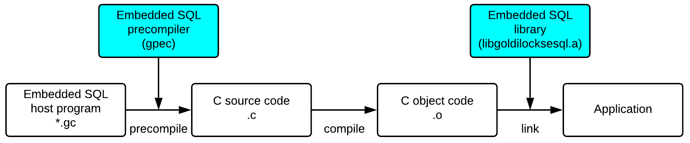
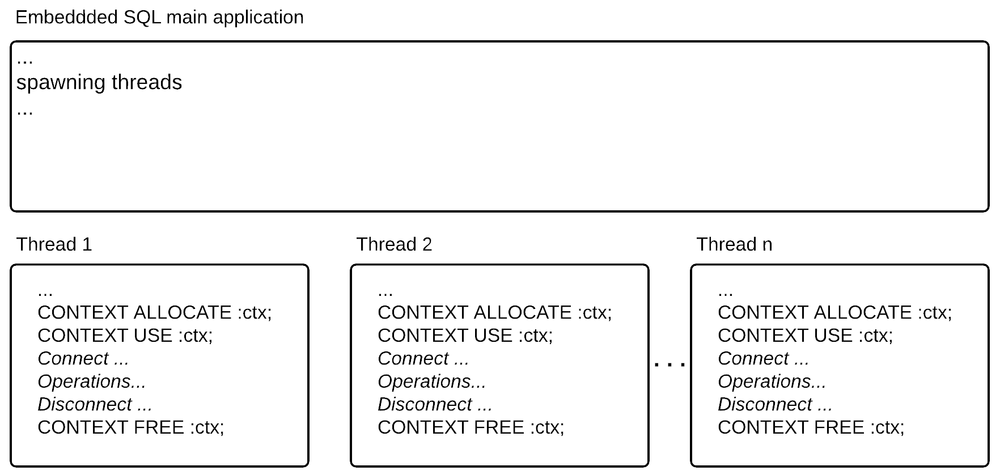
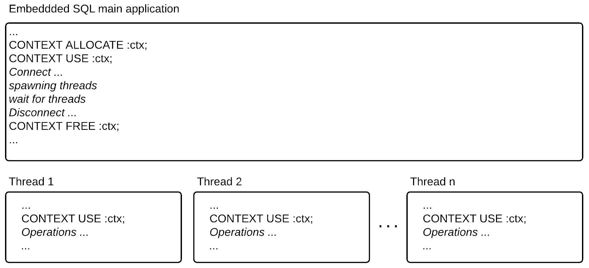

<a id="87c395c35e9dc7d4"></a>

# 33. Embedded SQL

> Source: [GOLDILOCKS 22c.1 User Manual (en)](https://manual.sunjesoft.co.kr/goldilocks/22c_1/manual/en/87c395c35e9dc7d4)  
> Tag: `22c.1_10_tag`

[← 32. JDBC](32-jdbc.md) · [Table of contents](../README.md) · [34. PDO →](34-pdo.md)

<a id="33f924d4172a6390"></a>
## Precompiler

<a id="ff75bd95038fc89a"></a>
### Overview

GOLDILOCKS precompiler is a programming development tool which enables a user to use embedded SQL in the high-level programming language. Currently, GOLDILOCKS supports the precompiler only for the language such as C/ C++, and it is called as gpec.

<a id="1ffc1d3346a3a321"></a>
#### Developing Embedded SQL Applications

As described in [Developing the embedded SQL applications](#13db47ec3b556e87), the user creates a C source program including embedded SQL, and converts it via gpec precompiler. Then, the pure C code is created of which the embedded SQL on the source code is converted to the contents calling the library of GOLDILOCKS. This C code uses C compiler of the system to perform compile as object code and link it with libgoldilocksesql.a which is an embedded SQL library provided by GOLDILOCKS, then completes the final application.

<a id="13db47ec3b556e87"></a>


<a id="118a330e27d0cc0d"></a>
#### Configuring Embedded SQL Application Development Tool

Embedded SQL application of GOLDILOCKS consists of the following elements.

**Elements of embedded SQL application development tool**

<a id="c6dec200527f41aa"></a>
| Directory or File | Description |
| --- | --- |
| `\bin\gpec` | GOLDILOCKS precompiler embedded SQL for C |
| `\include\goldilocksesql.h` | It is an embedded SQL library header file. Precompiler automatically inserts it, so the user does not have to do any extra work. |
| `\include\sqlca.h` | It is the SQLCA data structure related header file. |
| `\lib\libgoldilocksesql.a, \lib\libgoldilocksesqls.so` | It is the embedded SQL run-time library. |
| `\lib\libgoldilocks.a, \lib\libgoldilockss.so` | It is the GOLDILOCKS DA/ CS mixed mode library. |
| `\lib\libgoldilocksa.a, \lib\libgoldilocksas.so` | It is the GOLDILOCKS DA mode library. |
| `\lib\libgoldilocksc.a, \lib\libgoldilockscs.so` | It is the GOLDILOCKS CS mode library. |
| `\sample\EmbeddedSQL` | It is a sample program. |

<a id="2b93364de3dde00b"></a>
### Building Application

This chapter describes the process to build an embedded SQL source program of GOLDILOCKS and make the application.

<a id="0f8fa02a08111dde"></a>
#### Precompile

<a id="a1284bc129f669e1"></a>
##### Description

The user precompiles the C/ C ++ source code which was written by using embedded SQL, and generates the pure C/ C ++ source code. The core of this process is converting the user-created embedded SQL to the library call provided by GOLDILOCKS, and the C/ C++ source code is not modified except for embedded SQL.

<a id="22a73ac90feece49"></a>
##### Usage

The name of GOLDILOCKS precompiler is gpec, and it is located in $GOLDILOCKS_HOME/bin/.   
gpec is used as follows.

```
$ gpec [OPTION]... <input file>
```

&lt;input file&gt; is  input to gpec, and gpec generates the C/ C++ source code after precompile process. The extension of &lt;input file&gt; is *.gc, and it can be omitted. If &lt;input file&gt; does not have *.gc extension, the file name with the extension should be required.  
For more information about options given to gpec, refer to [Precompiler Options](#2a5cc9a24e22dd3a).

<a id="6128c6f5be17211c"></a>
##### Example

```
$ gpec sample1
 
FileName: sample1
Pre-compile sample1.gc -> sample1.c
```

<a id="31ee111c5eaa74fb"></a>
#### Compile

C/ C++ source code is generated after precompile process. The source code generates the object code by using the C/ C++ compiler provided in the platform. For more information about this process refer to the C/ C++ compiler manual which is provided by the user platform.

<a id="653b18622754805e"></a>
#### Link

The application is generated by linking the object codes generated through the process above, and GOLDILOCKS supports libgoldilocksesql.a for an embedded SQL. The library includes the GOLDILOCKS APIs which is converted from the embedded SQL by the precompiler, so it is prerequisite when making the embedded SQL application.

Additionally, the required library varies upon the various operation modes of GOLDILOCKS, and the required library is selected and linked according to the operation mode of the current application as follows.

**The library according to the operation mode**

<a id="e444da8776d8aaf5"></a>
| Operation mode | Static library | Shared object |
| --- | --- | --- |
| DA dedicated | libgoldilocksa.a | libgoldilocksas.so |
| CS dedicated | libgoldilocksc.a | libgoldilockscs.so |
| DA/ CS mixed | libgoldilocks.a | libgoldilockss.so |

Other link processes are as same as the process of generating the common C/ C++ application so refer to the linker manual provided by the user platform.

<a id="9cd91f7160dbc494"></a>
#### Example

*make* is used a lot to easily perform the precompile, compile, link process above. The following is an example of Makefile to create the sample program. Refer to the following example to make the Makefile which is suitable for the user environment.

```
GPEC = gpec
GPECFLAGS = 
#GPECFLAGS = --unsafe-null --no-prompt

CC = gcc
CFLAGS = -g -Wall 
INC = -I$(GOLDILOCKS_HOME)/include

LFLAGS = -L$(GOLDILOCKS_HOME)/lib 
LIB = -lgoldilocksesql -lgoldilocksc -lpthread -lm -lrt
 
BINS = overview sample1 sample2 sample3 sample4 sample5 dyn1 dyn2 number date_time thread1 fetch_struct_array
 
ifneq ($(MAKECMDGOALS), clean)
ifneq ($(MAKECMDGOALS), all)
TARGET = $(MAKECMDGOALS)
OBJECT = $(TARGET).o
C_SRC  = $(TARGET).c
endif
endif
```

- Implicit rules

```
.SUFFIXES: .gc .c .o

.gc.c:
    $(GPEC) $(GPECFLAGS) $^         ❶ Precompile

.c.o:
    $(CC) $(CFLAGS) -c $(INC) $^    ❷ Compile
```

- Build rules

```
NoTarget :
    @echo "Syntax : make {all | sample_name | clean}"
    @echo "sample_name is one of '$(BINS)'"
 
all :
    for target in $(BINS); do \
        $(MAKE) $$target;     \
    done
 
$(OBJECT) : $(C_SRC)
$(TARGET) : $(OBJECT)
    $(CC) -o $@ $^ $(LFLAGS) $(LIB)   ❸ Link
 
clean :
    rm -rf $(BINS) *.o *.c *~ core
```

<a id="5582e562da37c879"></a>
#### Sample

GOLDILOCKS provides a simple embedded SQL sample code to help to create an embedded SQL application. The sample code is in $GOLDILOCKS_HOME/sample/EmbeddedSQL directory, and sample.sql which is in the same directory should be executed first to execute the samples.

```
$ cd $GOLDILOCKS/sample/EmbeddedSQL
$ gsql test test -i sample.sql
$ make
Syntax : make {all | sample_name | clean}
sample_name is one of 'overview sample1 sample2 sample3 sample4 sample5 dyn1 dyn2 number date_time thread1 fetch_struct_array'
```

If *make all* is executed, all samples are built. Execute make &lt;sample_name&gt; to build a particular sample alone. For &lt;Sample_name&gt;, refer to the message above. If sample2 is built and executed, and the result is as follows.

```
$ make sample2
gpec  sample2.gc

FileName: sample2.gc
Pre-compile sample2.gc -> sample2.c
gcc -g -Wall -c -I/home/mycomman/work/product/Gliese/home/include sample2.c
gcc -o sample2 sample2.o -L/home/mycomman/work/product/Gliese/home/lib -lgoldilocksesql -lpthread -lm -lrt -lgoldilocksa
$ ./sample2 
Connect goldilocks ...
 EMPNO    ENAME                JOB      SALARY
====== ==================== ========== ========
  2854                 Park        RND      800
  2098                  Kim   SALESMAN     1600
  2175                 Choi   SALESMAN     1250
  2306                  Lee    SUPPORT     2975
  2122                  Lyu   SALESMAN     1250
  2999                  Ohn    SUPPORT     2850
  2012                Cheon    SUPPORT     2450
  2168                 Sohn        RND     3000
  2836                  Seo        CEO     5000
  2022                 Song   SALESMAN     1500
  2232                Jeong        RND     1100
  2676                 Kang        RND      950
  2714                  Cho        RND     3000
  2441                 Yoon        RND     1300
====== ==================== ========== ========
Record Count = 14
====== ==================== ========== ========

SUCCESS
############################
```

<a id="2a5cc9a24e22dd3a"></a>
### Precompiler Options

This chapter describes the options of gpec.

<a id="4028dcb9c4029f9d"></a>
#### --no-prompt, -n

<a id="198594dbefcea991"></a>
##### Description

It does not output the version information.

<a id="1c51c3b948ad3a84"></a>
##### Example

```
$ gpec --no-prompt sample2
FileName: sample2
Pre-compile sample2.gc -> sample2.c
$
```

<a id="f558db0659c588b2"></a>
#### --version, -v

<a id="f513e0d411e46cc3"></a>
##### Description

It outputs only the version information, then exits.

<a id="b65ffadc69b381e2"></a>
##### Example

```
$ gpec --version

$
```

<a id="7ea3b107ea424b0e"></a>
#### --help, -h

<a id="e47c6ab93a86e1c8"></a>
##### Description

It outputs the help message. It performs the same operation even when an option or &lt;input file&gt; does not exist in gpec.

<a id="003c1a4217f4d3e1"></a>
##### Example

```
$ gpec --help

gpec is the GOLDILOCKS embedded SQL precompiler for C programs.
 
Usage:
  gpec [OPTION]... <input file>
 
Options:
  --no-prompt    No Print version information
  --version      Print version information and exit
  --help         Print help message
  --output       Describe output filename
  --unsafe-null  Allow a NULL fetch without indicator variable
  --include-path Describe header file path
  --no-lineinfo  Exclude line information
  --char_map     Mapping of character arrays ( CHARZ | STRING )
  --cumulative   SQLERRD[2] records cumulative sum of rows processed for FETCH CURSOR.
  --autocommit   Set autocommit TRUE to all connection.
$
```

<a id="442646bb24060f81"></a>
#### --output, -o

<a id="c2c2fda6946869a9"></a>
##### Description

It specifies the name of precompile result file. If this option is not given, the file name as same as &lt;input file&gt; is created with the extension of .c.

<a id="a19dc0d0367ae976"></a>
##### Example

- When an output is not used.

```
$ gpec sample2.gc

FileName: sample2.gc
Pre-compile sample2.gc -> sample2.c
$ ls
sample2.c  sample2.gc
```

- When an output is used.

```
$ gpec --output outfile.cpp sample2.gc
FileName: sample2.gc
Pre-compile sample2.gc -> outfile.cpp
$ ls
outfile.cpp  sample2.gc
```

<a id="00aa9d0f865ed6ee"></a>
#### --unsafe-null

<a id="e8a60de44fbe0a94"></a>
##### Description

Even if it does not use the host indicator variable, It succeeds when NULL fetch occurs. It means that the operation is successful, but it does not mean that the NULL value can be fetched.

<a id="617c1bf1fce3b50e"></a>
##### Example

```
$ gpec --unsafe-null sample2
FileName: sample2
Option : --unsafe-null
Pre-compile sample2.gc -> sample2.c
$
```

<a id="917b6c4dda56d2ed"></a>
#### --include-path, -I

<a id="b3fdc1df981a816e"></a>
##### Description

It describes the path of the header file to refer when performing the precompile. Other header files are found by using EXEC SQL INCLUDE statement when performing the precompile. First, it searches in the directory where the current file is located. If it can not find any file, then it searches in the directories where the option is described in turn.

<a id="3fb07a3720d1fb1a"></a>
##### Example

The following is an example of when the header file is in include directory.

- When an error occurs.

```
$ gpec sample.gc 

FileName: sample.gc
Pre-compile sample.gc -> sample.c

ERR-42000(41000): syntax error 
Error at line 12, in file sample.gc
ERR-42000(41004): "decl.h": file not exist 

ERR-42000(41000): syntax error 
rsEmpRecord gRecord[] = {
^
Error at line 15, in file sample.gc
```

- When -I option is used.

```
$ gpec -Iinclude sample.gc 
FileName: sample.gc
Pre-compile sample.gc -> sample.c
$
```

<a id="ef48ee5a63dde29b"></a>
#### --no-lineinfo

<a id="7ff23d3abe53dd4b"></a>
##### Description

When gc file is converted to c file by default, GPEC adds #liine information to enable debugging with gc file. However, if this option is used, It does not add the line information through #line preprocessor when creating c file.

<a id="b0f79ea9e1c851d1"></a>
##### Example

```
$ gpec --no-lineinfo sample2
FileName: sample2
Pre-compile sample2.gc -> sample2.c
$
```

<a id="df6f69a56820a69c"></a>
#### --char_map, -c

<a id="df8485937ab1066f"></a>
##### Description

It sets to which type the char type data declared in a DECLARE SECTION is mapped. The default value is 'STRING', and it is null-terminated data type. 'CHARZ' is space padded and null-terminated data type.

<a id="36efc16514fb3cea"></a>
##### Example

```
$ gpec --char_map=STRING overview
FileName: overview
Pre-compile overview.gc -> overview.c

$ gpec --char_map=CHARZ overview
FileName: overview
Pre-compile overview.gc -> overview.c
```

<a id="ea92dec2b3625d87"></a>
#### --define, -D

<a id="41cdc34b576b9e96"></a>
##### Description

It is a define name used in gpec and it is set to 1.

<a id="8198c20f956ab440"></a>
##### Example

```
$ gpec --define=AAA preprocess
FileName: preprocess
Pre-compile preprocess.gc -> preprocess.c

$ gpec -D BBB preprocess
FileName: preprocess
Pre-compile preprocess.gc -> preprocess.c
ERR-42000(41028): 'BBB' macro is already defined at line 45, in file preprocess.gc
```

<a id="f5efc2f5170e0e30"></a>
#### --cumulative

<a id="3268d6a6e658e5d3"></a>
##### Description

It processes sqlerrd[2] in FETCH CURSOR statement as the accumulated total.

<a id="82ef312b00b71099"></a>
##### Example

```
$ gpec --cumulative sample.gc
FileName: sample Option : --cumulative
Pre-compile sample.gc -> sample.c
$
```

<a id="d23f57bf343b8230"></a>
#### --autocommit

<a id="0272a3ea4bc25f08"></a>
##### Description

It sets *auto commit* of all connections to TRUE.

<a id="2f2ff6772dde17f5"></a>
##### Example

```
$ gpec --autocommit sample.gc
FileName: sample Option : --autocommit
Pre-compile sample.gc -> sample.c
$
```

<a id="4e9c7c5c7b7b9652"></a>
#### --parse

<a id="a68a9cfe1a7db57a"></a>
##### Description

It specifies the parsing level applied to the input source. If omitted, the default is partial.

- none: Parses only the minimal structure required to execute gpec.
- partial: Parses to the level required by the preprocessing stage.

<a id="cf729f20f4d37432"></a>
##### Example

```
$ gpec --parse=none sample.gc
FileName: sample Option : --pasrse=none
Pre-compile sample.gc -> sample.c
$
```

<a id="64f644ef5c219c38"></a>
## Embedded SQL

<a id="c468f43f94fb0001"></a>
### Preprocessing

<a id="f33aeba1697b6a48"></a>
#### Overview

It performs the preprocessing before precompiling in gpec.

gpec supports the preprocess statements such as #if, #ifdef, #if defined, #ifndef #else, #elif, #endif, #define, #undef.

It can use a predefine by using a --define option of gpec. It is defined as 1 when it is predefined with a gpec option.  
e.g. gpec --define=_DEV_ Test.gc is as same as #define _DEV_  (1) in Test.gc file.

<a id="78dfc70fc26b551e"></a>
#### Applicable Range

The gpec SQL precompiler applies only to host variables declared within a DECLARE SECTION, and such variables can be used only in EXEC SQL statements. (Variables declared outside the DECLARE SECTION cannot be referenced from EXEC SQL statements.)  
Preprocessing is performed over the entire source when parse=partial, and is skipped when parse=none.  
Preprocessing of include files applies only to header files specified with EXEC SQL INCLUDE.  
Macros defined in external headers referenced from those headers are not recognized by gpec.

<a id="28dc506eb72a0ba4"></a>
##### parse = partial

If parse is set to partial, gpec analyzes the entire source and performs preprocessing.

Only EXEC SQL statements located in regions where the preprocessing condition evaluates to true are subject to SQL precompiling. Regions where the condition evaluates to false are ignored without transformation.

Preprocessing of include files applies only to header files added with EXEC SQL INCLUDE.

```
#define _DEV1_
EXEC SQL BEGIN DECLARE SECTION;
#define _DEV2_
char username[10]; 
char password[10];
#ifdef _DEV1_
VARCHAR conn_str[20];  ❶ 
#elif defined _DEV2_
VARCHAR conn_str[30];  ❷
#endif
EXEC SQL END DECLARE SECTION;
```

> 1 Since _DEV1_ can be evaluated during preprocessing regardless of the position of the DECLARE SECTION, the VARCHAR declaration is converted normally.  
> 2 _DEV1_ evaluates to true, so the condition takes effect during preprocessing and the VARCHAR declaration is not converted.

Consequently, when the source is generated as a C file using gpec, only the VARCHAR variable conn_str[20] is converted and included in the output.

```
#define _DEV1_
/* EXEC SQL BEGIN DECLARE SECTION; */
#define _DEV2_
char username[10]; 
char password[10];

#ifdef _DEV1_/* VARCHAR conn_str[20]; */
struct { int len; char arr[20]; } conn_str; ❶
#elif defined _DEV2_
VARCHAR conn_str[30];                       ❷
#endif
/* EXEC SQL END DECLARE SECTION; */
```

<a id="264c5d7652dde1f9"></a>
##### parse = none

If parse is set to none, gpec does not perform preprocessing. As a result, EXEC SQL statements are converted regardless of preprocessing conditions.

```
#define _DEV1_
EXEC SQL BEGIN DECLARE SECTION;
#define _DEV2_
char username[10]; 
char password[10];
#ifdef _DEV1_
VARCHAR conn_str[20]; ❶  
#elif defined _DEV2_
VARCHAR conn_str[30]; ❷
#endif
EXEC SQL END DECLARE SECTION;
```

> Since the conditions are not evaluated, both VARCHAR declarations at positions 1 and 2 become conversion targets. In this case, gpec treats the last declaration as the valid host variable.

Consequently, when the source is generated as a C file using gpec, both VARCHAR conn_str[20] and VARCHAR conn_str[30] are produced after conversion.

```
#define _DEV1_
/* EXEC SQL BEGIN DECLARE SECTION; */
#define _DEV2_
char username[10]; 
char password[10];

#ifdef _DEV1_/* VARCHAR conn_str[20]; */
struct { int len; char arr[20]; } conn_str; ❶
#elif defined _DEV2_
/* VARCHAR conn_str[30]; */
struct { int len; char arr[30]; } conn_str; ❷
#endif
/* EXEC SQL END DECLARE SECTION; */
```

<a id="c77a680dd88da56f"></a>
#### Types

When the parse option is set to partial, the following preprocessing types apply.

<a id="9db0f572d9e40895"></a>
##### #if

- Syntax

```
#if constant
```

or

```
#if defined identifier
```

or

```
#if !defined identifier
```

- Example

```
#if 0
int sVar1;
#endif

#if 3-2   ❶ An operation is available.
int sVar2;
#endif

#if defined _DEV_
int sVar3;
#endif

#if !defined (_DEV_)
int sVar4;
#endif
```

<a id="f740f9550a183039"></a>
##### #ifdef, #ifndef

- Syntax

```
#ifdef identifier
```

or

```
#ifndef identifier
```

- Example

```
#ifdef _DEV_
int sVar1;
#endif

#ifndef _DEV_
int sVar2;
#else
int sVar3;
#endif
```

<a id="118489bdc9c38630"></a>
##### #else, #elif, #endif

- Syntax

```
#else
```

or

```
#endif
```

or

```
#elif constant
```

or

```
#elif defined identifier
```

- Example

```
#if 1
int sVar1;
#else
int sVar2;
#endif

#if 0
int sVar3;
#elif 1
int sVar4;
#else
int sVar5;
#endif


#ifdef _DEV1_
int sVar6;

#elif defined _DEV2_
int sVar7;

#elif !defined _DEV3_
int sVar8;
#endif
```

<a id="3532f455225e0cdc"></a>
##### #define, #undef

- Syntax

```
#define identifier
```

or

```
#define identifier constant
```

or

```
#undef identifier
```

- Example

```
#define _DEV1_
EXEC SQL BEGIN DECLARE SECTION;
#define _DEV2_
char username[10]; 
char password[10];
#ifdef _DEV1_
VARCHAR conn_str[20]; ❶
#elif defined _DEV2_
VARCHAR conn_str[30]; ❷
#endif
#undef _DEV2_
#ifdef _DEV2_
VARCHAR sDept[10];  ❸
#endif
EXEC SQL END DECLARE SECTION;
```

> 1 Since _DEV1_ is defined, gpec treats it as a host variable.  
> 2 _DEV2_ is ignored by gpec because #ifdef _DEV1_ evaluates to true.  
> 3 _DEV2_ is ignored by gpec because it has been undefined.

> An annotation can be used in #define. However, if #define are written along multiple lines, then the annotation can not be correctly processed.

```
#define _DEF1_  1 \                           ❶ 
    + 1
#define _DEF2_   1 \ /* this is               ❷ 
  comment */  + 1
#define _DEF3_   1 \ /* this is comment */    ❸
    + 1
#define _DEF4_  1  /* this is comment */ + 1  ❹
```

> 1 _DEF1_ is evaluated as 1 + 1.  
> 2 _DEF2_ is evaluated as 1.  
> 3 _DEF3_ cannot be evaluated properly.  
> 4 _DEF_4_ is evaluated as 1 + 1.

<a id="a96f7c80e9b8cd7d"></a>
#### Constraints

<a id="68936b628e81a7b2"></a>
##### Macro Placement Restrictions

Macros cannot be used in the middle of a C declaration or within an EXEC SQL statement.

```
EXEC SQL BEGIN DECLARE SECTION;
char 
#ifdef _DEV_
username[10]; ❶ Invalid macro usage
#else
username[20]; ❷ Invalid macro usage
#endif
EXEC SQL END DECLARE SECTION;
EXEC SQL 
    SELECT USERNAME INTO :username
#ifdef _DEV_
    FROM EMP ❸ Invalid macro usage
#else
    FROM DEV_EMP ❹ Invalid macro usage
#endif
    WHERE EMPNO = 10;
```

<a id="c10b750915d5c390"></a>
##### DECLARE SECTION Restrictions

Even if a variable is declared inside a DECLARE SECTION, the declaration is not automatically expanded to EXEC SQL statements.

```
EXEC SQL BEGIN DECLARE SECTION;
#define C_EMP_NO   14
char username[10]; 
EXEC SQL END DECLARE SECTION;


EXEC SQL 
	SELECT USERNAME INTO :username
	FROM EMP

	WHERE EMPNO = C_EMP_NO; ❶ Invalid macro usage
```

<a id="cf0b4490a5ae1260"></a>
##### Preprocessing Condition Expression Restrictions

The condition expression of a preprocessing directive must be written on a single line.

Multi-line expressions using a line continuation (\) are not processed correctly.

```
#if  1 && \  ❶ It must always be written on a single line.
1
EXEC SQL INCLUDE "my.h";
#endif
```

<a id="453e3f9d21eed401"></a>
##### Macro Support Restrictions

The gpec preprocessor does not support function-style macros or macros that reference other macros within their definition.

```
#define SIZE_1 10
#define SIZE_2 SIZE_1    ❶ If a macro references another macro, it may not produce the expected value.
#define FUNC_1( a, b ) a + b
#if FUNC_1( SIZE_1, SIZE_2 )
```

<a id="68393111cd044f41"></a>
### Connection

<a id="e208575a4c3f3eb8"></a>
#### Connecting to Database

A process of connecting to the database server is required to perform the operation by connecting to the database in the embedded SQL program.  
The syntax for connecting to the database is expressed in GOLDILOCKS as follows.

```
EXEC SQL [ AT <db_name> ] CONNECT <user_name> IDENTIFIED BY <password> [ AT <db_name> ] [ USING <conn_string> ]

<db_name> := dbname | :hostvar
<user_name> := username | :hostvar
<password> := password | :hostvar
<conn_string> := connection_string | :hostvar
```

An example of the most basic way to connect to database is as follows.

```
EXEC SQL BEGIN DECLARE SECTION;
char username[10]; 
char password[10]; 
EXEC SQL END DECLARE SECTION;
strcpy( username, "test" );
strcpy( password, "test" );
...

EXEC SQL CONNECT :username IDENTIFIED BY :password;
```

GOLDILOCKS supports both D/A mode and C/S mode. The D/A mode is operated by attaching directly to the shared memory, and C/S mode is operated by connecting to the database by using TCP communication. When operated in D/A mode, it is not necessary to include a separate server information as described above because the direct access from the same host of the database is performed. When operated in C/S mode, Data Source Name (DSN) should be specified to access. For more information about DSN, refer to [Data Source Configuration](31-odbc.md#9eb127553a6b9343).

connection_string information should be given to use DSN. USING clause is used to use connection_string information. An example of the connection statement whose DSN is "GOLDILOCKS", and using USING clause is as follows.

```
EXEC SQL BEGIN DECLARE SECTION;
char username[10]; 
char password[10];
char conn_str[20];
EXEC SQL END DECLARE SECTION;
strcpy( username, "test" );
strcpy( password, "test" );
strcpy( conn_str, "DSN=GOLDILOCKS" );
...

EXEC SQL CONNECT :username IDENTIFIED BY :password USING :conn_str;
```

When developing an application, sometimes it is required to uniquely identify the respective connection. It is the case of which each connection is performed in the multi-thread program in D/A mode. Or it is the case of which several connections are performed in C/S mode. The name is given to each connection by using AT clause.

AT clause may be positioned in front of CONNECT statement or USING clause. The example of AT clause in CONNECT statement is as follows.

```
EXEC SQL BEGIN DECLARE SECTION;
char username[10]; 
char password[10];
char conn_str[20];
char conn_name[10];
EXEC SQL END DECLARE SECTION;
strcpy( username, "test" );
strcpy( password, "test" );
strcpy( conn_str, "DSN=GOLDILOCKS" );
strcpy( conn_name, "DBCONN1" );
...

EXEC SQL CONNECT :username IDENTIFIED BY :password AT :conn_name USING :conn_str;
```

<a id="301928331dde9f7e"></a>
#### Disconnecting Database

It disconnects the connection to the database in the application. Like as the CONNECT statement, the disconnection is performed for the default connection or it is performed by giving a connection name. The syntax for disconnecting all connections performed in the application is also provided.

<a id="bfa7aefeaf872e43"></a>
##### Single Disconnection

There are two ways of disconnecting a single connection, which are explicit and implicit method.  
The explicit method uses DISCONNECT statement as follows.

```
EXEC SQL [ AT <db_name> ] DISCONNECT;
```

The transaction is terminated via commit or rollback. The implicit disconnection is performed by adding RELEASE option after the transaction termination statement.

```
EXEC SQL [ AT <db_name> ] { COMMIT/ROLLBACK } [ WORK ] RELEASE;
```

<a id="ff872d098e6aa7df"></a>
##### All Disconnection

All connections of the current application are disconnected all together as follows.

```
EXEC SQL DISCONNECT ALL;
```

<a id="3ce5d7360222c322"></a>
### Transaction

Database application consists of transaction units. Therefore, an embedded SQL program should be able to manipulate the transaction. This chapter describes how to manipulate the transaction.

<a id="f75e3127ff82fcfc"></a>
#### Start and End of Transaction

A transaction starts in the SQL which is performed first after it is connected. The transaction is maintained until the end command explicitly occurs. There are two end commands, which are COMMIT and ROLLBACK.

<a id="71a18f0772c74017"></a>
##### COMMIT

The transaction commit command causes the following actions.

- All data changes after the current transaction started are permanently reflected in the database.
- The reflected changes are visibly applied to all transactions which started after the changes or to the sensitive cursor.
- All savepoints which are created in the current transaction are deleted. 
- All locks which are obtained in the current transaction are released.
- All cursors which are opened in the current transaction are closed. (The holdable cursor is excluded.)
- The transaction is terminated.

The commit command is used as follows.

```
EXEC SQL COMMIT [ WORK ];
```

<a id="d1a834577ad6150c"></a>
##### ROLLBACK

The rollback command types are as follows.

- Transaction full rollback
- Transaction partial rollback
- Statement-level rollback

The transaction rollback command causes the following actions.

- All data changes after the current transaction started are undone and it returns to the state of before the transaction starts.
- All savepoints which are created in the current transaction are deleted.
- All locks which are obtained in the current transaction are released.
- All cursors which are opened in the current transaction are closed. (The holdable cursor is excluded.)
- The transaction is terminated.

The rollback command is used as follows.

```
EXEC SQL ROLLBACK [ WORK ];
```

Transaction partial rollback uses the savepoint. The application developer explicitly specifies the savepoint, and the transaction partial rollback is implemented by undoing all operations up to the savepoint. The transaction partial rollback command causes the following actions.

- All changes after the rollback savepoint are undone. 
- All savepoints created after the rollback savepoint are deleted. 
- All locks obtained after the rollback savepoint are released.

Transaction partial rollback command is used as follows.

```
EXEC SQL ROLLBACK TO SAVEPOINT <savepoint_name>;
```

Statement-level rollback undoes only the statement which is currently executed. For example, as if rows are inserted to a table and the unique violation occurs so the current statement can not be performed, then only the currently executed statement should be undone so that the next operation may continue.

In this case, there is not a command to be explicitly specified by the user because GOLDILOCKS internally undoes the statement.

<a id="f1c7b37bfe7fce79"></a>
#### Auto Commit

If the embedded SQL of GOLDILOCKS generally performs the connection, transaction is operated in non auto-commit mode.

However, it may be required to adjust the auto-commit mode for the convenience of application development or for the logical environment of the application. The embedded SQL precompiler of GOLDILOCKS may turn on or off the auto-commit mode with the following syntax.

```
EXEC SQL [ AT <db_name> ] ATUTOCOMMIT { ON | OFF };
```

<a id="e216ae72ef7c366b"></a>
#### RELEASE Option

The currently used connection may be turned off by using the RELEASE option when ending the transaction (commit/ rollback).  
The option is allowed to be applied only for the transaction full commit rollback. It can not be used for the transaction partially rollback (ROLLBACK TO SAVEPOINT).

<a id="f6c7b23f937528de"></a>
### Host Variables and Datatypes

The embedded SQL application aims at manipulating the data and querying to obtain the desired results by interworking with the database server.

A method for the application data to be transferred to the database server, or vise versa, is required for this operation. The method to perform this role is defined as a host variable.

The application can use the host variables in the same way as C variables because the host variable is declared as a variable of C language. A host variable is treated as a part of the SQL statement and is responsible for the input/output of value between the database server and applications.

<a id="d1ed5861079ee9c2"></a>
#### Declaring Host Variable

Host variable should be declared in the embedded SQL directive as follows.

```
EXEC SQL BEGIN DECLARE SECTION;
```

- Declaring a host variable

```
EXEC SQL END DECLARE SECTION;
```

The section above is called as a declare section, and host variables can be declared within the declare section in the same way as C variables. The following is an example of declaring a part of host variables.

```
EXEC SQL BEGIN DECLARE SECTION;
    int     empno;
    char    ename[20];
    double  salary;
EXEC SQL END DECLARE SECTION;
```

<a id="0b8bdac6a157523d"></a>
#### Declaring Function Argument

When using the function argument as a host variable, it is required to provide the information about the function argument. This information should be declared within the next embedded SQL directive.

```
EXEC SQL BEGIN ARGUMENT SECTION;
```

- Declaring a host variable

```
EXEC SQL END ARGUMENT SECTION;
```

The section above is called as an argument section, and the host variable should be declared as same as the function argument's name and its type within the argument section.

```
void func( int empno, char ename[20], double salary )
{
EXEC SQL BEGIN ARGUMENT SECTION;
     int     empno;
     char    ename[20];
     double  salary;
EXEC SQL END ARGUMENT SECTION;
...
```

A pseudo type can not be used literally as a function argument, but it can be used by using the declare section and typedef keyword.

```
EXEC SQL BEGIN DECLARE SECTION;
typedef VARCHAR domainName[20];
EXEC SQL END DECLARE SECTION;

void func( int * no, domainName * name )
{
    EXEC SQL BEGIN ARGUMENT SECTION;
    int        no[20];
    domainName name[20];
    EXEC SQL END ARGUMENT SECTION;

    EXEC SQL INSERT INTO EMP VALUES ( :no, :name );
}
```

> If the host variable is declared as a pointer type, then the array length is unknown. Even when the function argument is a pointer type, then the array length of the host variable should be specified in the argument section.

<a id="6b442300681155fe"></a>
#### C Data Type for Host Variable

There are two types of C data used as the host variables, and which are a native type provided by the C language and a data type additionally provided by GOLDILOCKS. The following table describes the data types provided by the embedded SQL of GOLDILOCKS.

<a id="7c738b5159e9c271"></a>
##### C Native Datatype

C native datatype is the default data type provided by the C language, and its range and size are entirely dependent on the application development platform.

**C native datatype**

<a id="32f75b210e554c11"></a>
| C datatype | Description |
| --- | --- |
| char | It is a single character. |
| char[n] | It is a string with maximum length n. |
| short | It is a small integer (2 bytes). |
| int | It is an integer (4 bytes). |
| long | It is a large integer (4/8 bytes). |
| long long | It is a very large integer (8 bytes). |
| float | It is a single precision floating-point number. |
| double | It is a double precision floating-point number. |

- char

char type represents a single character.

- char[n]

char[n] represents a string with maximum length n.  
The following is an example.

```
EXEC SQL BEGIN DECLARE SECTION;
char strName[20];
EXEC SQL BEGIN DECLARE SECTION;
```

If it is declared as above, strName represents to the string data with the maximum length 20.  
If strName is used as an output of ESQL, then it is space padded.

> The maximum length of a char[] can not exceed 2001.

- short

It represents 2 bytes integer datatype.

- int

It represents 4 bytes integer datatype.

- long

Long type means a large integer, but the range of the actual value is determined in accordance with the platform. Long is 8 bytes integer in 64 bits Unix/Linux platform, but it is 4 bytes integer in 32 bits Unix/Linux platform.

- long long

It means very large integer, and it represents the 8 bytes integer.

- float

It is the float type of C language, and it represents the 4 bytes single-precision floating-point number.

- double

It is the double type of C language, and it represents the double-precision floating-point number.

<a id="c505db5e8c94b8c1"></a>
##### Pseudo Datatype

Pseudo type supports the various forms of GOLDILOCKS type, and it is the type provided by GOLDILOCKS embedded SQL precompiler for the convenience of development. Most of its contents are implemented by using the structure of C.

<a id="27a0b148ea2b450b"></a>
<table class="table column_count_2"><caption>GOLDILOCKS embedded SQL pseudo type</caption><thead><tr><th class="to_center"><div>Pseudo type</div></th><th class="to_center"><div>Description</div></th></tr></thead><tbody><tr><td class="to_middle"><div>VARCHAR[n]</div></td><td class="to_middle"><div>It is a variable-length string with the maximum length n.</div></td></tr><tr><td class="to_middle"><div>LONG VARCHAR</div></td><td class="to_middle"><div>It is a variable-length string with the maximum length 100M (104857600).</div></td></tr><tr><td class="to_middle"><div>BINARY[n]</div></td><td class="to_middle"><div>It is a binary data with the maximum length n.</div></td></tr><tr><td class="to_middle"><div>VARBINARY[n]</div></td><td class="to_middle"><div>It is a variable-length binary data with the maximum length n.</div></td></tr><tr><td class="to_middle"><div>LONG VARBINARY</div></td><td class="to_middle"><div>It is a variable-length binary data with the maximum length 100M (104857600).</div></td></tr><tr><td class="to_middle"><div>NUMBER</div></td><td class="to_middle"><div>It is an integer whose number of significant digits is 38.</div></td></tr><tr><td class="to_middle"><div>NUMBER(p)</div></td><td class="to_middle"><div>It is an integer whose number of significant digits is p.</div></td></tr><tr><td class="to_middle"><div>NUMBER(p, s)</div></td><td class="to_middle"><div>It is a real number whose number of significant digits is p and whose scale is s.</div></td></tr><tr><td class="to_middle"><div>BOOLEAN</div></td><td class="to_middle"><div>It is a boolean type.</div></td></tr><tr><td class="to_middle"><div>DATE</div></td><td class="to_middle"><div>It is a date type data.</div></td></tr><tr><td class="to_middle"><div>TIME</div></td><td class="to_middle"><div>It is a time type data.</div></td></tr><tr><td class="to_middle"><div>TIME WITH TIMEZONE</div></td><td class="to_middle"><div>It is a time type data with timezone.</div></td></tr><tr><td class="to_middle"><div>TIMESTAMP</div></td><td class="to_middle"><div>It is a datetime type data.</div></td></tr><tr><td class="to_middle"><div>TIMESTAMP WITH TIMEZONE</div></td><td class="to_middle"><div>It is a time type data with timezone.</div></td></tr><tr><td class="to_middle"><div>INTERVAL YEAR</div></td><td class="to_middle" rowspan="13"><div>It is an interval data type.</div></td></tr><tr><td class="to_middle"><div>INTERVAL MONTH</div></td></tr><tr><td class="to_middle"><div>INTERVAL DAY</div></td></tr><tr><td class="to_middle"><div>INTERVAL HOUR</div></td></tr><tr><td class="to_middle"><div>INTERVAL MINUTE</div></td></tr><tr><td class="to_middle"><div>INTERVAL SECOND</div></td></tr><tr><td class="to_middle"><div>INTERVAL YEAR TO MONTH</div></td></tr><tr><td class="to_middle"><div>INTERVAL DAY TO HOUR</div></td></tr><tr><td class="to_middle"><div>INTERVAL DAY TO MINUTE</div></td></tr><tr><td class="to_middle"><div>INTERVAL DAY TO SECOND</div></td></tr><tr><td class="to_middle"><div>INTERVAL HOUR TO MINUTE</div></td></tr><tr><td class="to_middle"><div>INTERVAL HOUR TO SECOND</div></td></tr><tr><td class="to_middle"><div>INTERVAL MINUTE TO SECOND</div></td></tr></tbody></table>

<a id="385e4b8c6e7df8ca"></a>
###### **VARCHAR**

VARCHAR type is the datatype in which the variable length string can be stored, and it consists of the following structure.

```
struct {
    int  len;
    char arr[n];
}
```

n refers to the maximum length of VARCHAR type.

```
EXEC SQL BEGIN DECLARE SECTION;
    VARCHAR varstr[100];
EXEC SQL END DECLARE SECTION;
```

For example, if it is declared as above, it is converted via precompile process as follows.

```
struct VARCHAR_varstr {
    int  len;
    char arr[100];
} varstr;
```

The application can use VARCHAR type as follows.

```
strcpy( varstr.arr, "abcde" );
varstr.len = strlen( varstr.arr );
 
EXEC SQL INSERT INTO TEST_T1 VALUES ( :varstr );
```

> The length of VARCHAR can not exceed 4000.

<a id="54953b7c847abef8"></a>
###### **LONG VARCHAR**

LONG VARCHAR type is the datatype in which a long variable-length strings can be stored, and it consists of the following structure.

```
typedef struct SQL_LONG_VARIABLE_LENGTH_STRUCT
{
    SQLBIGINT   len;
    SQLCHAR   * arr;
} SQL_LONG_VARIABLE_LENGTH_STRUCT;
```

LONG VARCHAR type can be declared as follows.

```
EXEC SQL BEGIN DECLARE SECTION;
    LONGVARCHAR long_text[1048576];
EXEC SQL END DECLARE SECTION;
```

LONG VARCHAR is different from VARCHAR. LONG VARCHAR can have the length up to 100M (104857600), so it does not pre-allocate the space for the string when declaring. After declaring LONG VARCHAR, the memory space should be allocated in long_text.arr before actual use, and the application should release the allocated memory space. An example of using LONG VARCHAR is as follows.

```
long_text.arr = malloc( 1048576 );
 
gets( long_text.arr );
long_text.len = strlen( long_text.arr );
 
EXEC SQL INSERT INTO TEST_T1 VALUES ( :long_text );
...
free( long_text.arr );
```

> LONG VARCHAR type can be declared by specifying the current length up to 100M (104857600).

<a id="a991c33789d061dc"></a>
###### **BINARY**

BINARY type is the datatype to literally handle the non-formal raw data, and it consists of the following structure. The example of declaring BINARY type is as follows.

```
EXEC SQL BEGIN DECLARE SECTION;
    VARCHAR binary[100];
EXEC SQL END DECLARE SECTION;
```

If it is declared as above, it is converted via precompile process as follows.

```
char binary[100];
```

Its form is as same as the character string storage form. char[n] is defined to store the string of database, but BINARY type is for storing the binary data. Therefore, the applications can use BINARY type in the same way as dealing with the character string data.

> The maximum length of BINARY can not exceed 2000.

<a id="57782b052f2b07cd"></a>
###### **VARBINARY**

VARBINARY type is the datatype in which the variable length binary data can be stored, and it consists of the following structure.

```
struct {
    int  len;
    char arr[n];
}
```

n refers to the maximum length of VARCHAR type.

```
EXEC SQL BEGIN DECLARE SECTION;
    VARCHAR varbin[100];
EXEC SQL END DECLARE SECTION;
```

For example, if it is declared as above, it is converted via precompile process as follows.

```
struct VARBINARY_varbin {
    int  len;
    char arr[100];
} varbin;
```

The forms of VARBINARY type and VARCHAR type are same. VARCHAR is for storing the string data, but VARBINARY is for storing the binary data. VARCHAR and VARBINARY are same in all other aspects except for the aspect above. Therefore, the application can use both VARCHAR and VARBINARY types as follows.

```
memcpy( varbin.arr, binary_data, 50 );
varbin.len = 50;
 
EXEC SQL INSERT INTO TEST_T1 VALUES ( :varbin );
```

> The length of VARBINARY can not exceed 4000.

<a id="4f718306f4f02bc6"></a>
###### **LONG VARBINARY**

LONG VARBINARY type is the datatype in which the long variable length binary data can be stored, and it consists of the following structure.

```
typedef struct SQL_LONG_VARIABLE_LENGTH_STRUCT
{
    SQLBIGINT   len;
    SQLCHAR   * arr;
} SQL_LONG_VARIABLE_LENGTH_STRUCT;
```

LONG VARBINARY type can be declared as follows.

```
EXEC SQL BEGIN DECLARE SECTION;
    LONGVARBINARY long_bin[1048576];
EXEC SQL END DECLARE SECTION;
```

The difference between LONG VARBINARY and VARBINARY is that the space is not pre-allocated to store binary data when declaring LONG VARBINARY type.(It is as same as the difference between LONG VARCHAR and VARCHAR). After declaring LONG VARBINARY, the memory space should be allocated in long_bin.arr before actual use, and the application should release the allocated memory space after use. An example of using LONG VARBINARY is as follows.

```
long_bin.arr = malloc( 1048576 );
 
memcpy( long_bin.arr, long_binary_data, 1048576);
long_bin.len = 1048576;
 
EXEC SQL INSERT INTO TEST_T1 VALUES ( :long_bin );
...
free( long_bin.arr );
```

> LONG VARBINARY type can be declared by specifying the current length up to 100M(104857600).

<a id="e9b470162bfeda07"></a>
###### **NUMBER**

NUMBER type is the datatype which provides an SQL_NUMERIC_STRUCT defined in ODBC to make it to be used in the application.

```
#define SQL_MAX_NUMERIC_LEN 16
typedef struct tagSQL_NUMERIC_STRUCT
{
    SQLCHAR precision;
    SQLSCHAR scale;
    SQLCHAR sign; /* 1=pos 0=neg */
    SQLCHAR val[SQL_MAX_NUMERIC_LEN];
} SQL_NUMERIC_STRUCT;
```

NUMBER type is configured to express the real number type data with precision and scale. When declaring NUMBER type, precision and scale can also be declared. Scale and precision can be omitted as follows in some cases.

**Scale and precision of number types**

<a id="76b7fcc40308b0bc"></a>
| Declaring NUMBER type | Description |
| --- | --- |
| NUMBER | It is as same as NUMBER(38, 0). |
| NUMBER(p) | It is as same as NUMBER(p, 0) |
| NUMBER(p, s) | It is a real number type data with precision p, scale s. |

```
EXEC SQL BEGIN DECLARE SECTION;
    NUMBER        number_default;
    NUMBER(20)    number_20;
    NUMBER(30,10) number_30_10;
EXEC SQL END DECLARE SECTION;
```

For example, if the variable is declared as above, number_default variable is as same as the declaration of NUMBER(38, 0), and number_20 variable is as same as the declaration of NUMBER(20, 0). NUMBER type uses SQL_NUMERIC_STRUCT which is a ODBC type. The following is a sample of using NUMBER type.

```
/*
 * number.gc
 *
 */
#include <stdio.h>
#include <stdlib.h>
#include <string.h>

EXEC SQL INCLUDE SQLCA;

#define  SUCCESS  0
#define  FAILURE  -1

#define  PRINT_SQL_ERROR(aMsg)                                      \
    {                                                               \
        printf("\n");                                               \
        printf(aMsg);                                               \
        printf("\nSQLCODE : %d\nSQLSTATE : %s\nERROR MSG : %s\n",   \
               sqlca.sqlcode,                                       \
               SQLSTATE,                                            \
               sqlca.sqlerrm.sqlerrmc );                            \
    }
 
int Connect(char *aHostInfo, char *aUserID, char *sPassword);
int CreateTable();
int DropTable();
 
unsigned long long ConvertMantisaToDecimal(SQLCHAR *aNumStrValue)
{
    unsigned long long sResult = 0;
    unsigned long long sLast=1;
    unsigned int sCurrent;
    unsigned int sLSD = 0;
    unsigned int sMSD = 0;
    int          i    = 1;

    for(i = 0; i < SQL_MAX_NUMERIC_LEN; i ++)
    {
        sCurrent = (unsigned char) aNumStrValue[i];
        sLSD = sCurrent % 16; //Obtain LSD
        sMSD = sCurrent / 16; //Obtain MSD
        sResult += sLast * sLSD;
        sLast = sLast * 16;
        sResult += sLast * sMSD;
        sLast = sLast * 16;
    }

    return sResult;
}
 
void PrintNumber(SQL_NUMERIC_STRUCT *aNumber)
{
    unsigned long long  sDigit;
    unsigned long long  sFraction;
    unsigned long long  sMantisa;
    unsigned long long  sFactor;
    int     i;

    sMantisa = ConvertMantisaToDecimal( aNumber->val );

    sFactor = 1;
    for( i = 0; i < aNumber->scale; i ++ )
    {
        sFactor *= 10;
    }

    sDigit = sMantisa / sFactor;
    sFraction = sMantisa % sFactor;
    if( sFraction != 0 )
    {
        printf("%llu.%-3llu", sDigit, sFraction);
    }
    else
    {
        printf("%llu", sDigit);
    }
}
 
int main(int     argc,
         char  **argv)
{
    EXEC SQL BEGIN DECLARE SECTION;
    NUMBER        sNumber;
    NUMBER(10,5)  sResultNumber1;
    NUMBER(10,5)  sResultNumber2;
    char          sCharNumber[20];
    int           sNo;
    int           sResultNo;
    EXEC SQL END DECLARE SECTION;
    int   i;
    int   sState = 0;

    printf("#### Number Datatype Test ####\n");
    printf("Connect GOLDILOCKS ...\n");
    if(Connect("DSN=GOLDILOCKS", "test", "test") != SUCCESS)
    {
        goto fail_exit;
    }

    printf("Create table ...\n");
    if(CreateTable() != SUCCESS)
    {
        goto fail_exit;
    }
    sState = 1;

    printf("Insert record ...\n");
    for(i = 0; i < 20; i ++)
    {
        sNo = i + 1;
        memset( &sNumber, 0x00, sizeof(SQL_NUMERIC_STRUCT) );
        sNumber.precision = 38;
        sNumber.scale = 3;
        sNumber.sign = 1;
        /*
         * 0x627d = 25213
         */
        sNumber.val[0] = 0x7d + i;
        sNumber.val[1] = 0x62;

        snprintf( sCharNumber, 20, "25.2%02d", 13 + i );
        EXEC SQL
            INSERT INTO TEST_T1(C1, C2, C3)
            VALUES(:sNo, :sNumber, :sCharNumber);
        if(sqlca.sqlcode != 0)
        {
            goto fail_exit;
        }
    }

    EXEC SQL COMMIT WORK;
    if(sqlca.sqlcode != 0)
    {
        goto fail_exit;
    }

    printf("Retrive record\n");
    EXEC SQL
        DECLARE CUR1 CURSOR FOR
        SELECT C1, C2, C3
        FROM   TEST_T1;

    EXEC SQL OPEN CUR1;
    if(sqlca.sqlcode != 0)
    {
        goto fail_exit;
    }

    printf(" NO   Number1  Number2\n");
    printf("==== ======== ========\n");

    memset( &sResultNumber1, 0x00, sizeof(SQL_NUMERIC_STRUCT) );
    memset( &sResultNumber2, 0x00, sizeof(SQL_NUMERIC_STRUCT) );
    while( 1 )
    {
        EXEC SQL
            FETCH FROM CUR1
            INTO :sResultNo, :sResultNumber1, :sResultNumber2;

        if(sqlca.sqlcode == SQL_NO_DATA)
        {
            /*
             * No more data
             */
            break;
        }

        if(sqlca.sqlcode != 0)
        {
            goto fail_exit;
        }

        printf("%3d   ", sResultNo);
        PrintNumber( &sResultNumber1 );
        printf("   ");
        PrintNumber( &sResultNumber2 );
        printf("\n");
    }

    printf("==== ======== ========\n");

    EXEC SQL CLOSE CUR1;
    if(sqlca.sqlcode != 0)
    {
        goto fail_exit;
    }

    EXEC SQL COMMIT WORK;
    if(sqlca.sqlcode != 0)
    {
        goto fail_exit;
    }

    sState = 0;
    printf("Drop table ...\n");
    if(DropTable() != SUCCESS)
    {
        goto fail_exit;
    }

    printf("Disconnect GOLDILOCKS ...\n");
    EXEC SQL COMMIT WORK RELEASE;

    printf("SUCCESS\n");
    printf("############################\n");

    return 0;

  fail_exit:
    PRINT_SQL_ERROR("[ERROR] SQL ERROR -");
    printf("FAILURE\n");
    printf("############################\n\n");

    switch(sState)
    {
        case 1:
            printf("Drop table ...\n");
            (void)DropTable();
        default:
            break;
    }

    EXEC SQL ROLLBACK WORK RELEASE;

    return 0;
}
 
int CreateTable()
{
    EXEC SQL DROP TABLE IF EXISTS TEST_T1;
    if(sqlca.sqlcode != 0)
    {
        goto fail_exit;
    }
```

- Create table

```
EXEC SQL CREATE TABLE TEST_T1 ( C1  INTEGER,
                                    C2  NUMERIC(38,4),
                                    C3  VARCHAR(20) );
    if(sqlca.sqlcode != 0)
    {
        goto fail_exit;
    }

    EXEC SQL COMMIT WORK;
    if(sqlca.sqlcode != 0)
    {
        goto fail_exit;
    }

    return SUCCESS;

  fail_exit:
    PRINT_SQL_ERROR("[ERROR] SQL ERROR -");

    EXEC SQL ROLLBACK WORK;

    return FAILURE;
}
```

- Drop table

```
int DropTable()
{
    EXEC SQL DROP TABLE TEST_T1;
    if(sqlca.sqlcode != 0)
    {
        goto fail_exit;
    }

    EXEC SQL COMMIT WORK;
    if(sqlca.sqlcode != 0)
    {
        goto fail_exit;
    }

    return SUCCESS;

  fail_exit:
    PRINT_SQL_ERROR("[ERROR] SQL ERROR -");
    EXEC SQL ROLLBACK WORK;

    return FAILURE;
}
 
int Connect(char *aHostInfo, char *aUserID, char *sPassword)
{
    EXEC SQL BEGIN DECLARE SECTION;
    VARCHAR  sUid[80];
    VARCHAR  sPwd[20];
    VARCHAR  sConnStr[1024];
    EXEC SQL END DECLARE SECTION;
```

- Log on GOLDILOCKS

```
strcpy((char *)sUid.arr, aUserID);
    sUid.len = (short)strlen((char *)sUid.arr);
    strcpy((char *)sPwd.arr, sPassword);
    sPwd.len = (short)strlen((char *)sPwd.arr);
    strcpy((char *)sConnStr.arr, aHostInfo);
    sConnStr.len = (short)strlen((char *)sConnStr.arr);
```

- DB connection

```
EXEC SQL CONNECT :sUid IDENTIFIED BY :sPwd USING :sConnStr;
    if(sqlca.sqlcode != 0)
    {
        goto fail_exit;
    }

    return SUCCESS;

  fail_exit:
    PRINT_SQL_ERROR("[ERROR] Connection Failure!");

    return FAILURE;
}
```

<a id="ac5048fc96a5240e"></a>
###### **BOOLEAN**

BOOLEAN type has the value of TRUE or FALSE. Actually, the variable is used as the variable of C language, so if the variable is 1, it refers to TRUE. If the variable is 0, it refers to FALSE.  
The following is an example of using a simple BOOLEAN type variable.

```
EXEC SQL BEGIN DECLARE SECTION;
    BOOLEAN boolean;
EXEC SQL END DECLARE SECTION;
 
EXEC SQL SELECT IsEnable INTO :boolean FROM STATUS WHERE ID = 100;
 
if( boolean != 0 )
{
    print( "Enable Status : TRUE\n" );
}
else
{
    print( "Enable Status : FALSE\n" );
}
```

<a id="bba725e52ed4a6cf"></a>
###### **DATE**

Date type can deal with dates and times. Date type has SQL_TIMESTAMP_STRUCT structure of ODBC.

```
typedef struct tagTIMESTAMP_STRUCT
{
        SQLSMALLINT    year;
        SQLUSMALLINT   month;
        SQLUSMALLINT   day;
        SQLUSMALLINT   hour;
        SQLUSMALLINT   minute;
        SQLUSMALLINT   second;
        SQLUINTEGER    fraction;
} TIMESTAMP_STRUCT;
typedef TIMESTAMP_STRUCT SQL_TIMESTAMP_STRUCT;
```

If the variable of DATE type is declared, the precompiler converts it to the structure above, and the meaning of each field as same as SQL_TIMESTAMP_STRUCT of ODBC.

<a id="a116148a261198a3"></a>
###### **TIME**

TIME type is the datatype which deals with time, and it has SQL_TIME_STRUCT structure of ODBC.

```
typedef struct tagTIME_STRUCT
{
        SQLUSMALLINT   hour;
        SQLUSMALLINT   minute;
        SQLUSMALLINT   second;
} TIME_STRUCT;
typedef TIME_STRUCT SQL_TIME_STRUCT;
```

If the variable of TIME type is declared, the precompiler converts it to the structure above, and the meaning of each field is as same as SQL_TIME_STRUCT of ODBC.

<a id="8073265973dc80c4"></a>
###### **TIME WITH TIMEZONE**

TIME WITH TIMEZONE type is the datatype which deals with the time with timezone, and it has the structure as follows.

```
typedef struct tagTIME_WITH_TIMEZONE_STRUCT
{
   SQLUSMALLINT hour;
   SQLUSMALLINT minute;
   SQLUSMALLINT second;
   SQLUINTEGER  fraction;
   SQLSMALLINT  timezone_hour;
   SQLSMALLINT  timezone_minute;
} TIME_WITH_TIMEZONE_STRUCT;
typedef TIME_WITH_TIMEZONE_STRUCT SQL_TIME_WITH_TIMEZONE_STRUCT;
```

If the variable of TIME WITH TIMEZONE type is declared, precompiler converts it to the structure above, and the meaning of each field is as follows.

**Fields of TIME WITH TIMEZONE**

<a id="4eca410b382f6d94"></a>
| Field name | Description |
| --- | --- |
| hour | hour |
| minute | minute |
| second | second |
| fraction | the seconds below the decimal point |
| timezone_hour | hour of timezone |
| timezone_minute | minute of timezone |

<a id="bb49bc6a176e77c8"></a>
###### **TIMESTAMP**

TIMESTAMP type is the datatype which deals with date ~ time, and it has SQL_TIMESTAMP_STRUCT structure of ODBC.

```
typedef struct tagTIMESTAMP_STRUCT
{
        SQLSMALLINT    year;
        SQLUSMALLINT   month;
        SQLUSMALLINT   day;
        SQLUSMALLINT   hour;
        SQLUSMALLINT   minute;
        SQLUSMALLINT   second;
        SQLUINTEGER    fraction;
} TIMESTAMP_STRUCT;
typedef TIMESTAMP_STRUCT SQL_TIMESTAMP_STRUCT;
```

If the variable of TIMESTAMP type is declared, precompiler converts it to the structure above, and the meaning of each field as same as SQL_TIMESTAMP_STRUCT structure of ODBC.

<a id="d8345d842197897f"></a>
###### **TIMESTAMP WITH TIMEZONE**

TIMESTAMP WITH TIMEZONE type is the datatype which deals with timestamp with timezone, and it has the following structure.

```
typedef struct tagTIMESTAMP_WITH_TIMEZONE_STRUCT
{
   SQLSMALLINT  year;
   SQLUSMALLINT month;
   SQLUSMALLINT day;
   SQLUSMALLINT hour;
   SQLUSMALLINT minute;
   SQLUSMALLINT second;
   SQLUINTEGER  fraction;
   SQLSMALLINT  timezone_hour;
   SQLSMALLINT  timezone_minute;
} TIMESTAMP_WITH_TIMEZONE_STRUCT;
typedef TIMESTAMP_WITH_TIMEZONE_STRUCT SQL_TIMESTAMP_WITH_TIMEZONE_STRUCT;
```

If the variable of TIMESTAMP WITH TIMEZONE type is declared, precompiler converts it to the structure above, and the meaning of each field is as follows.

**Fields of TIMESTAMP WITH TIMEZONE**

<a id="3b085d5ce375185f"></a>
| Field name | Description |
| --- | --- |
| year | year |
| month | month |
| day | day |
| hour | hour |
| minute | minute |
| second | second |
| fraction | the seconds below the decimal point |
| timezone_hour | hour of timezone |
| timezone_minute | minute of timezone |

The following is an example of dealing with DATE, TIME, TIMESTAMP, TIME WITH TIMEZONE, TIMESTAMP WITH TIMEZONE types.

```
/*
 * date_time.gc
 *
 */
#include <stdio.h>
#include <stdlib.h>
#include <string.h>
 
EXEC SQL INCLUDE SQLCA;
 
#define  SUCCESS  0
#define  FAILURE  -1
 
#define  PRINT_SQL_ERROR(aMsg)                                      \
    {                                                               \
        printf("\n");                                               \
        printf(aMsg);                                               \
        printf("\nSQLCODE : %d\nSQLSTATE : %s\nERROR MSG : %s\n",   \
               sqlca.sqlcode,                                       \
               SQLSTATE,                                            \
               sqlca.sqlerrm.sqlerrmc );                            \
    }
 
int Connect(char *aHostInfo, char *aUserID, char *sPassword);
int CreateTable();
int DropTable();
 
int main(int     argc,
         char  **argv)
{
    EXEC SQL BEGIN DECLARE SECTION;
    int                      sNo;
    int                      sResultNo;
    DATE                     sDate, sResultDate;
    TIME                     sTime, sResultTime;
    TIME WITH TIMEZONE       sTimeTz, sResultTimeTz;
    TIMESTAMP                sTimestamp, sResultTimestamp;
    TIMESTAMP WITH TIMEZONE  sTimestampTz, sResultTimestampTz;
    EXEC SQL END DECLARE SECTION;
    int  sState = 0;
 
    printf("#### Datatype Insert Test ####\n");
    printf("Connect GOLDILOCKS ...\n");
    if(Connect("DSN=GOLDILOCKS", "test", "test") != SUCCESS)
    {
        goto fail_exit;
    }

    sState = 1;
    printf("Create table ...\n");
    if(CreateTable() != SUCCESS)
    {
        goto fail_exit;
    }

    sState = 2;
    printf("Insert record ...\n");
 
    sNo = 1;
    /**
     * Date : 2014-7-14 21:29:30
     */
    sDate.year  = 2014;
    sDate.month = 7;
    sDate.day   = 14;
    sDate.hour  = 21;
    sDate.minute = 29;
    sDate.second = 30;
    sDate.fraction = 0;
 
    /**
     * Time : 17:46:35
     */
    sTime.hour   = 17;
    sTime.minute = 46;
    sTime.second = 35;
 
    /**
     * Time With Timezone : 17:46:35.6789(+9:00)
     */
    sTimeTz.hour             = 17;
    sTimeTz.minute           = 46;
    sTimeTz.second           = 35;
    sTimeTz.fraction         = 678900000;
    sTimeTz.timezone_hour    = 9;
    sTimeTz.timezone_minute  = 0;
 
    /**
     * Timestamp : 2014-02-13 17:46:28.123
     */
    sTimestamp.year     = 2014;
    sTimestamp.month    = 2;
    sTimestamp.day      = 13;
    sTimestamp.hour     = 17;
    sTimestamp.minute   = 46;
    sTimestamp.second   = 28;
    sTimestamp.fraction = 123000000;
 
    /**
     * Time With Timezone : 2014-05-18 17:46:35.001(+9:00)
     */
    sTimestampTz.year     = 2014;
    sTimestampTz.month    = 5;
    sTimestampTz.day      = 18;
    sTimestampTz.hour     = 17;
    sTimestampTz.minute   = 46;
    sTimestampTz.second   = 35;
    sTimestampTz.fraction = 1000000;
    sTimestampTz.timezone_hour    = 9;
    sTimestampTz.timezone_minute  = 0;
 
    /**
     * Insert record
     */
    EXEC SQL
        INSERT INTO TEST_T1(C1, C2, C3, C4, C5, C6)
        VALUES(:sNo, :sDate, :sTime, :sTimeTz, :sTimestamp, :sTimestampTz);
    if(sqlca.sqlcode != 0)
    {
        goto fail_exit;
    }
 
    EXEC SQL COMMIT WORK;
    if(sqlca.sqlcode != 0)
    {
        goto fail_exit;
    }
 
    printf("Retrive record\n");
    EXEC SQL
        SELECT C1, C2, C3, C4, C5, C6
        INTO   :sResultNo, :sResultDate, :sResultTime, :sResultTimeTz, :sResultTimestamp, :sResultTimestampTz
        FROM   TEST_T1
        WHERE  C1 = 1;
    if(sqlca.sqlcode != 0)
    {
        goto fail_exit;
    }
 
    printf("=================================================================\n");
    printf( "DATE                   : %04d-%02d-%02d %02d:%02d:%02d\n",
            sResultDate.year,
            sResultDate.month,
            sResultDate.day,
            sResultDate.hour,
            sResultDate.minute,
            sResultDate.second );
 
    printf( "TIME                   : %02d:%02d:%02d\n",
            sResultTime.hour,
            sResultTime.minute,
            sResultTime.second );
 
    printf( "TIME WITH TIMEZONE     : %02d:%02d:%02d.%09u(GMT %+02d:%02d)\n",
            sResultTimeTz.hour,
            sResultTimeTz.minute,
            sResultTimeTz.second,
            sResultTimeTz.fraction,
            sResultTimeTz.timezone_hour,
            sResultTimeTz.timezone_minute );
 
    printf( "TIMESTAMP              : %04d-%02d-%02d %02d:%02d:%02d.%09u\n",
            sResultTimestamp.year,
            sResultTimestamp.month,
            sResultTimestamp.day,
            sResultTimestamp.hour,
            sResultTimestamp.minute,
            sResultTimestamp.second,
            sResultTimestamp.fraction );
 
    printf( "TIMESTAMP WITH TIMEZONE: %04d-%02d-%02d %02d:%02d:%02d.%09u(GMT %+02d:%02d)\n",
            sResultTimestampTz.year,
            sResultTimestampTz.month,
            sResultTimestampTz.day,
            sResultTimestampTz.hour,
            sResultTimestampTz.minute,
            sResultTimestampTz.second,
            sResultTimestampTz.fraction,
            sResultTimestampTz.timezone_hour,
            sResultTimestampTz.timezone_minute );
 
    printf("=================================================================\n");
 
    sState = 0;
    printf("Drop table ...\n");
    if(DropTable() != SUCCESS)
    {
        goto fail_exit;
    }
 
    sState = 0;
    printf("Disconnect GOLDILOCKS ...\n");
    EXEC SQL COMMIT WORK RELEASE;
 
    printf("SUCCESS\n");
    printf("############################\n");
 
    return 0;
 
  fail_exit:
    printf("\n");
    PRINT_SQL_ERROR("[ERROR] SQL ERROR -");
 
    printf("FAILURE\n");
    printf("############################\n\n");
 
    switch(sState)
    {
        case 1:
            printf("Drop table ...\n");
            (void)DropTable();
        default:
            break;
    }
 
    EXEC SQL ROLLBACK WORK RELEASE;
 
    return 0;
}
 
int CreateTable()
{
    EXEC SQL DROP TABLE IF EXISTS TEST_T1;
    if(sqlca.sqlcode != 0)
    {
        goto fail_exit;
    }
```

- Create table

```
EXEC SQL CREATE TABLE TEST_T1 ( C1  INTEGER,
                                    C2  DATE,
                                    C3  TIME,
                                    C4  TIME WITH TIME ZONE,
                                    C5  TIMESTAMP,
                                    C6  TIMESTAMP WITH TIME ZONE );
    if(sqlca.sqlcode != 0)
    {
        goto fail_exit;
    }
 
    EXEC SQL COMMIT WORK;
    if(sqlca.sqlcode != 0)
    {
        goto fail_exit;
    }
 
    return SUCCESS;
 
  fail_exit:
    PRINT_SQL_ERROR("[ERROR] SQL ERROR -");
 
    EXEC SQL ROLLBACK WORK;
 
    return FAILURE;
}
```

- Drop table

```
int DropTable()
{
    EXEC SQL DROP TABLE TEST_T1;
    if(sqlca.sqlcode != 0)
    {
        goto fail_exit;
    }
 
    EXEC SQL COMMIT WORK;
    if(sqlca.sqlcode != 0)
    {
        goto fail_exit;
    }
 
    return SUCCESS;
 
  fail_exit:
    PRINT_SQL_ERROR("[ERROR] SQL ERROR -");
 
    EXEC SQL ROLLBACK WORK;
 
    return FAILURE;
}
 
int Connect(char *aHostInfo, char *aUserID, char *sPassword)
{
    EXEC SQL BEGIN DECLARE SECTION;
    VARCHAR  sUid[80];
    VARCHAR  sPwd[20];
    VARCHAR  sConnStr[1024];
    EXEC SQL END DECLARE SECTION;
```

- Log on GOLDILOCKS

```
strcpy((char *)sUid.arr, aUserID);
    sUid.len = (short)strlen((char *)sUid.arr);
    strcpy((char *)sPwd.arr, sPassword);
    sPwd.len = (short)strlen((char *)sPwd.arr);
    strcpy((char *)sConnStr.arr, aHostInfo);
    sConnStr.len = (short)strlen((char *)sConnStr.arr);
```

- DB connection

```
EXEC SQL CONNECT :sUid IDENTIFIED BY :sPwd USING :sConnStr;
    if(sqlca.sqlcode != 0)
    {
        goto fail_exit;
    }
 
    return SUCCESS;
 
  fail_exit:
    PRINT_SQL_ERROR("[ERROR] Connection Failure!");
 
    return FAILURE;
}
```

<a id="e1eb093c6f74695d"></a>
###### **INTERVAL Types**

INTERAVAL types are the datatypes which represent the time interval between two times. They are divided into year ~ month family type and day ~ second family type. They are subdivided by specific types of each family.  
The following table describes the detailed classification of INTERVAL type.

<a id="774482b77cc85bcb"></a>
<table class="table column_count_3"><caption>Classification of INTERVAL type</caption><thead><tr><th class="to_center"><div>Family</div></th><th class="to_center"><div>Detailed type</div></th><th class="to_center"><div>Description</div></th></tr></thead><tbody><tr><td class="to_left to_middle" rowspan="3"><div>YEAR TO MONTH</div></td><td class="to_left to_middle"><div>INTERVAL YEAR</div></td><td class="to_left to_middle"><div>It is an interval in terms of years.</div></td></tr><tr><td class="to_left to_middle"><div>INTERVAL MONTH</div></td><td class="to_left to_middle"><div>It is an interval in terms of months.</div></td></tr><tr><td class="to_left to_middle"><div>INTERVAL YEAR TO MONTH</div></td><td class="to_left to_middle"><div>It is an interval in terms of years to months.</div></td></tr><tr><td class="to_left to_middle" rowspan="10"><div>DAY TO SECOND</div></td><td class="to_left to_middle"><div>INTERVAL DAY</div></td><td class="to_left to_middle"><div>It is an interval in terms of days.</div></td></tr><tr><td class="to_left to_middle"><div>INTERVAL HOUR</div></td><td class="to_left to_middle"><div>It is an interval in terms of hours.</div></td></tr><tr><td class="to_left to_middle"><div>INTERVAL MINUTE</div></td><td class="to_left to_middle"><div>It is an interval in terms of minutes.</div></td></tr><tr><td class="to_left to_middle"><div>INTERVAL SECOND</div></td><td class="to_left to_middle"><div>It is an interval in terms of seconds.</div></td></tr><tr><td class="to_left to_middle"><div>INTERVAL DAY TO HOUR</div></td><td class="to_left to_middle"><div>It is an interval in terms of days to hours.</div></td></tr><tr><td class="to_left to_middle"><div>INTERVAL DAY TO MINUTE</div></td><td class="to_left to_middle"><div>It is an interval in terms of days to minutes.</div></td></tr><tr><td class="to_left to_middle"><div>INTERVAL DAY TO SECOND</div></td><td class="to_left to_middle"><div>It is an interval in terms of days to seconds.</div></td></tr><tr><td class="to_left to_middle"><div>INTERVAL HOUR TO MINUTE</div></td><td class="to_left to_middle"><div>It is an interval in terms of hours to minutes.</div></td></tr><tr><td class="to_left to_middle"><div>INTERVAL HOUR TO SECOND</div></td><td class="to_left to_middle"><div>It is an interval in terms of hours to seconds.</div></td></tr><tr><td class="to_left to_middle"><div>INTERVAL MINUTE TO SECOND</div></td><td class="to_left to_middle"><div>It is an interval in terms of minutes to seconds.</div></td></tr></tbody></table>

INTERVAL type has the structure of SQL_INTERVAL_STRUCT of ODBC as follows.

```
typedef enum
{
    SQL_IS_YEAR      = 1,
    SQL_IS_MONTH     = 2,
    SQL_IS_DAY      = 3,
    SQL_IS_HOUR      = 4,
    SQL_IS_MINUTE     = 5,
    SQL_IS_SECOND     = 6,
    SQL_IS_YEAR_TO_MONTH   = 7,
    SQL_IS_DAY_TO_HOUR    = 8,
    SQL_IS_DAY_TO_MINUTE   = 9,
    SQL_IS_DAY_TO_SECOND   = 10,
    SQL_IS_HOUR_TO_MINUTE   = 11,
    SQL_IS_HOUR_TO_SECOND   = 12,
    SQL_IS_MINUTE_TO_SECOND   = 13
} SQLINTERVAL;

typedef struct tagSQL_YEAR_MONTH
{
    SQLUINTEGER  year;
    SQLUINTEGER  month;
} SQL_YEAR_MONTH_STRUCT;

typedef struct tagSQL_DAY_SECOND
{
    SQLUINTEGER  day;
    SQLUINTEGER  hour;
    SQLUINTEGER  minute;
    SQLUINTEGER  second;
    SQLUINTEGER  fraction;
} SQL_DAY_SECOND_STRUCT;

typedef struct tagSQL_INTERVAL_STRUCT
{
    SQLINTERVAL  interval_type;
    SQLSMALLINT  interval_sign;
    union {
        SQL_YEAR_MONTH_STRUCT  year_month;
        SQL_DAY_SECOND_STRUCT  day_second;
   } intval;
} SQL_INTERVAL_STRUCT;
```

All INTERVAL types listed above have the same structure. For each INTERVAL type, a valid field is separately distinguished within the structure. INTERVAL type is distinguished by interval_type field within the structure, and a real INTERVAL value is represented to intval union in the structure. The field which is used in intval union is different by each type, and the following table describes the valid field depending on the type.

**The valid field depending on INTERVAL type**

<a id="2b72856213083c0f"></a>
| Type | ?.interval_type | ?.intval valid field |
| --- | --- | --- |
| INTERVAL YEAR | SQL_IS_YEAR | *.year_month.year |
| INTERVAL MONTH | SQL_IS_MONTH | *.year_month.month |
| INTERVAL YEAR TO MONTH | SQL_IS_YEAR_TO_MONTH | *.year_month.year *.year_month.month |
| INTERVAL DAY | SQL_IS_DAY | *.day_second.day |
| INTERVAL HOUR | SQL_IS_HOUR | *.day_second.hour |
| INTERVAL MINUTE | SQL_IS_MINUTE | *.day_second.minute |
| INTERVAL SECOND | SQL_IS_SECOND | *.day_second.second *.day_second.fraction |
| INTERVAL DAY TO HOUR | SQL_IS_DAY_TO_HOUR | *.day_second.day *.day_second.hour |
| INTERVAL DAY TO MINUTE | SQL_IS_DAY_TO_MINUTE | *.day_second.day *.day_second.hour *.day_second.minute |
| INTERVAL DAY TO SECOND | SQL_IS_DAY_TO_SECOND | *.day_second.day *.day_second.hour *.day_second.minute *.day_second.second *.day_second.fraction |
| INTERVAL HOUR TO MINUTE | SQL_IS_HOUR_TO_MINUTE | *.day_second.hour *.day_second.minute |
| INTERVAL HOUR TO SECOND | SQL_IS_HOUR_TO_SECOND | *.day_second.hour *.day_second.minute *.day_second.second *.day_second.fraction |
| INTERVAL MINUTE TO SECOND | SQL_IS_MINUTE_TO_SECOND | *.day_second.minute *.day_second.second *.day_second.fraction |

Fraction refers to the seconds below the decimal point. (The fraction field is valid only for INTERVAL type which includes SECOND.)

<a id="a1f2c5f4ca698da5"></a>
##### Special Type

The special data type provides the additional functionality and convenience for development of application rather than handling the data on its own. The following table describes the special types.

**Special types**

<a id="b466e3456cbbe509"></a>
| Type | Description |
| --- | --- |
| SQL_CONTEXT | It manages run-time context within the multi-connection structure. |
| Struct | It constitutes a set of column as a structure, and it is used when dealing with row. |
| Typedef | The previously defined type is redefined as another name. |

<a id="3eccc1963ab7a1ec"></a>
###### **SQL_CONTEXT**

SQL_CONTEXT is a special data type for managing the run-time context. Run-time context is used for the purpose of managing the connection and the individual data related to the connection on the run-time while the application is running.

SQL_CONTEXT variable is declared as follows.

```
EXEC SQL BEGIN DECLARE SECTION;
SQL_CONTEXT my_context;
EXEC SQL BEGIN DECLARE SECTION;
```

ALLOCATE clause is used after declaring SQL_CONTEXT variable as follows.

```
EXEC SQL CONTEXT ALLOCATE :my_context;
```

USE clause is used for SQL_CONTEXT variable.

```
EXEC SQL CONTEXT USE :my_context;
```

USE clause specifies the context to be used, and the following describes how to go back to the default context not the context declared by the application.

```
EXEC SQL CONTEXT USE DEFAULT;
```

The disused SQL_CONTEXT variable is released as follows.

```
EXEC SQL CONTEXT FREE :my_context;
```

The following is an example of using SQL_CONTEXT.

```
/*
 * thread1.gc
 *
 */
#include <stdio.h>
#include <stdlib.h>
#include <string.h>
#include <pthread.h>
 
EXEC SQL INCLUDE SQLCA;
 
#define  SUCCESS  0
#define  FAILURE  -1
 
#define  PRINT_SQL_ERROR(aMsg)                                      \
    {                                                               \
        printf("\n");                                               \
        printf(aMsg);                                               \
        printf("\nSQLCODE : %d\nSQLSTATE : %s\nERROR MSG : %s\n",   \
               sqlca.sqlcode,                                       \
               SQLSTATE,                                            \
               sqlca.sqlerrm.sqlerrmc );                            \
    }
 
int Connect(sql_context aCtx, char *aHostInfo, char *aUserID, char *sPassword);
int CreateEmpTempTable();
int DropEmpTempTable();
void *clientThread(void *args);
 
typedef struct thread_param
{
    int    mNo;
    char  *mJobName;
} thread_param;
 
#define  THREAD_COUNT    2

char gJobName[THREAD_COUNT][20]= {
    "RND",
    "SUPPORT"
};
 
int main(int argc, char **argv)
{
    EXEC SQL BEGIN DECLARE SECTION;
    int          sEmpNo;
    varchar      sEName[20 + 1];
    char         sJob[20];
    long         sSalary;
    EXEC SQL END DECLARE SECTION;
    int          sRecordCount = 0;
    pthread_t    thread_id[THREAD_COUNT];
    thread_param param[THREAD_COUNT];
    int          i;
 
    printf("Connect GOLDILOCKS ...\n");
    if(Connect(NULL, "DSN=GOLDILOCKS", "test", "test") != SUCCESS)
    {
        goto fail_exit;
    }
 
    if(CreateEmpTempTable() != SUCCESS)
    {
        goto fail_exit;
    }
```

- Create client thread

```
for( i = 0; i < THREAD_COUNT; i ++ )
    {
        param[i].mNo = i;
        param[i].mJobName = gJobName[i];
        if( pthread_create(&thread_id[i],
                           NULL,
                           clientThread,
                           &param[i]) != 0 )
        {
            printf( "Can't create thread %d!\n", i );
        }
        else
        {
            printf( "Create thread %d!\n", i );
        }
    }
 
    for( i = 0; i < THREAD_COUNT; i ++ )
    {
        if( pthread_join(thread_id[i],
                         NULL) != 0 )
        {
            printf( "Error when waiting for thread %d to terminate!\n", i );
        }
        else
        {
            printf( "Stopped thread %d!\n", i );
        }
    }
```

- Retrieve employee

```
EXEC SQL
        DECLARE EMP_CUR CURSOR FOR
        SELECT empno, ename, job, sal
        FROM   EMP_TEMP
        ORDER BY empno;
 
    EXEC SQL OPEN EMP_CUR;
    if(sqlca.sqlcode != 0)
    {
        PRINT_SQL_ERROR("[ERROR] SQL ERROR -");
        goto fail_exit;
    }
 
    printf(" EMPNO    ENAME                JOB      SALARY\n");
    printf("====== ==================== ========== ========\n");
    while( 1 )
    {
        EXEC SQL
            FETCH EMP_CUR
            INTO  :sEmpNo, :sEName, :sJob, :sSalary;
        if(sqlca.sqlcode == SQL_NO_DATA)
        {
            break;
        }
        else if(sqlca.sqlcode != 0)
        {
            PRINT_SQL_ERROR("[ERROR] SQL ERROR -");
            goto fail_exit;
        }
 
        sRecordCount ++;
 
        printf("%6d %20s %10s %8ld\n",
               sEmpNo, sEName.arr, sJob, sSalary);
    }
 
    printf("====== ==================== ========== ========\n");
    printf("Record Count = %d\n", sRecordCount);
    printf("====== ==================== ========== ========\n");
 
    EXEC SQL CLOSE EMP_CUR;
    if(sqlca.sqlcode != 0)
    {
        PRINT_SQL_ERROR("[ERROR] SQL ERROR -");
        goto fail_exit;
    }
 
    if(DropEmpTempTable() != SUCCESS)
    {
        goto fail_exit;
    }
 
    EXEC SQL COMMIT WORK RELEASE;
    if(sqlca.sqlcode != 0)
    {
        PRINT_SQL_ERROR("[ERROR] SQL ERROR -");
        goto fail_exit;
    }
 
    printf("SUCCESS\n");
    printf("############################\n");
 
    return 0;
 
  fail_exit:
 
    printf("FAILURE\n");
    printf("############################\n\n");
    EXEC SQL ROLLBACK WORK RELEASE;
 
    return 0;
}
 
int Connect(sql_context aCtx, char *aHostInfo, char *aUserID, char *sPassword)
{
    EXEC SQL BEGIN DECLARE SECTION;
    VARCHAR  sUid[80];
    VARCHAR  sPwd[20];
    VARCHAR  sConnStr[1024];
    EXEC SQL END DECLARE SECTION;
    struct sqlca sqlca;
```

- Log on GOLDILOCKS

```
strcpy((char *)sUid.arr, aUserID);
    sUid.len = (short)strlen((char *)sUid.arr);
    strcpy((char *)sPwd.arr, sPassword);
    sPwd.len = (short)strlen((char *)sPwd.arr);
    strcpy((char *)sConnStr.arr, aHostInfo);
    sConnStr.len = (short)strlen((char *)sConnStr.arr);
```

- DB connection

```
if( aCtx != NULL )
    {
        EXEC SQL CONTEXT USE :aCtx;
        EXEC SQL CONNECT :sUid IDENTIFIED BY :sPwd USING :sConnStr;
    }
    else
    {
        EXEC SQL CONTEXT USE DEFAULT;
        EXEC SQL CONNECT :sUid IDENTIFIED BY :sPwd USING :sConnStr;
    }

    if(sqlca.sqlcode != 0)
    {
        goto fail_exit;
    }
 
    return SUCCESS;
 
  fail_exit:
 
    PRINT_SQL_ERROR("[ERROR] Connection Failure!");
 
    return FAILURE;
}
 
int Disconnect(sql_context aCtx)
{
    struct sqlca sqlca;
```

- DB disconnection

```
if( aCtx != NULL )
    {
        EXEC SQL CONTEXT USE :aCtx;
        EXEC SQL DISCONNECT;
    }
    else
    {
        EXEC SQL CONTEXT USE DEFAULT;
        EXEC SQL DISCONNECT;
    }
    if(sqlca.sqlcode != 0)
    {
        goto fail_exit;
    }
 
    return SUCCESS;
 
  fail_exit:
 
    PRINT_SQL_ERROR("[ERROR] Connection Failure!");
 
    return FAILURE;
}
```

- Create table

```
int CreateEmpTempTable()
{
   EXEC SQL DROP TABLE IF EXISTS EMP_TEMP;
    if(sqlca.sqlcode != 0)
    {
        goto fail_exit;
    }
 
    EXEC SQL
        CREATE TABLE EMP_TEMP (
            EMPNO NUMBER(4) CONSTRAINT PK_EMP_TEMP PRIMARY KEY,
            ENAME VARCHAR2(10),
            JOB VARCHAR2(9),
            SAL NUMBER(7,2),
            DEPTNO NUMBER(2) );
    if(sqlca.sqlcode != 0)
    {
        goto fail_exit;
    }
 
    EXEC SQL COMMIT WORK;
    if(sqlca.sqlcode != 0)
    {
        goto fail_exit;
    }
    return SUCCESS;
 
  fail_exit:
 
    PRINT_SQL_ERROR("[ERROR] SQL ERROR -");
    EXEC SQL ROLLBACK WORK;
 
    return FAILURE;
}
```

- Drop table

```
int DropEmpTempTable()
{
    EXEC SQL DROP TABLE EMP_TEMP;
    if(sqlca.sqlcode != 0)
    {
        goto fail_exit;
    }
 
    EXEC SQL COMMIT WORK;
    if(sqlca.sqlcode != 0)
    {
        goto fail_exit;
    }
 
    return SUCCESS;
 
  fail_exit:
 
    PRINT_SQL_ERROR("[ERROR] SQL ERROR -");
    EXEC SQL ROLLBACK WORK;
 
    return FAILURE;
}
 
void *clientThread(void *args)
{
    EXEC SQL BEGIN DECLARE SECTION;
    SQL_CONTEXT   my_context;
    char          job_name[20 + 1];
    EXEC SQL END DECLARE SECTION;
    int           state = 0;
    thread_param *param = (thread_param *)args;
 
    EXEC SQL CONTEXT ALLOCATE :my_context;
    state = 1;
 
    EXEC SQL CONTEXT USE :my_context;
    if(Connect(my_context, "DSN=GOLDILOCKS", "test", "test") != SUCCESS)
    {
        goto fail_exit;
    }
    state = 2;
 
    strcpy( job_name, param->mJobName );
 
    EXEC SQL
        INSERT INTO EMP_TEMP
        SELECT *
        FROM   EMP
        WHERE  JOB = :job_name;
    if(sqlca.sqlcode != 0)
    {
        goto fail_exit;
    }
 
    EXEC SQL COMMIT WORK;
    if(sqlca.sqlcode != 0)
    {
        goto fail_exit;
    }
    state = 1;

    if(Disconnect(my_context) != SUCCESS)
    {
        goto fail_exit;
    }
    state = 0;

    EXEC SQL CONTEXT FREE :my_context;
    pthread_exit(0);

    return NULL;
 
  fail_exit:
 
    PRINT_SQL_ERROR("[ERROR] SQL ERROR -");
    switch(state)
    {
        case 2:
            (void)Disconnect(my_context);
        case 1:
            EXEC SQL CONTEXT FREE :my_context;
            break;
        default:
            break;
    }
 
    pthread_exit(0);

    return NULL;
}
```

<a id="9b9dd54a9889eafc"></a>
###### **SQL_CURSOR**

The cursor variable is available for the query in the embedded SQL program. The cursor variable is a handle for the cursor which should be defined and opened by using PL/SQL in GOLDILOCKS server.

Declare the cursor variable in the embedded SQL by using SQL_CURSOR type. The following is an example of declaring the cursor variable.

```
EXEC SQL BEGIN DECLARE SECTION;
sql_cursor   emp_cursor;
SQL_CURSOR   sal_cursor;
sql_cursor * cur_ptr;
EXEC SQL END DECLARE SECTION;
cur_ptr = &emp_cursor;
```

The cursor variable is available by declaring with sql_cursor or SQL_CURSOR. The cursor variable follows the C range rules like as other host variables. It is transferable as the function parameter. It can also define the cursor variable or the function which returns the pointer for the cursor variable. The following is an example of using the cursor variable as the function parameter and return.

```
SQL_CURSOR * alloc_cursor( sql_cursor * emp_cursor )
{
EXEC SQL BEGIN DECLARE SECTION;
    sql_cursor * ret_cursor;
EXEC SQL END DECLARE SECTION;
    ret_cursor = emp_cursor;

....

    return ret_cursor;
}
```

The cursor variable should be allocated before using it. Use [ALLOCATE](#18455e25137e970d) command after declaring the cursor variable to perform this operation. The following is an example of allocating ret_cursor which was used in alloc_cursor function in the example above.

```
EXEC SQL ALLOCATE :ret_cursor;
```

If the cursor variable is allocated, then the memory is allocated during the run-time, so it should be freed by using [FREE](#106ba4f537c4b845) command. The memory which was created when allocating the cursor variable is freed when CLOSE command is explicitly used or the connection is closed.

```
EXEC SQL FREE :ret_cursor;
```

The cursor variable should be opened in GOLDILOCKS database server. The embedded SQL command OPEN can not be used to opes the cursor variable. The cursor variable can be opened by calling the storing procedure or the function of PL/SQL opening the cursor, or by defining the anonymous block opening the cursor.

The following is an example of opening the cursor variable by calling the storing procedure of PL/SQL.

```
CREATE OR REPLACE PROCEDURE empProc( curs IN OUT SYS_REFCURSOR,
                                     dept IN INTEGER )
AS
BEGIN
   OPEN curs FOR SELECT ename FROM emp
                        WHERE deptno = dept ORDER BY ename;
END;
/
```

Define empProc storing procedure and call empProc storing procedure in the embedded SQL to open and FETCH the cursor variable as the example above.

The following is an example.

```
EXEC SQL BEGIN DECLARE SECTION;
SQL_CURSOR empCursor;
int  dept;
char ename[128];
EXEC SQL END DECLARE SECTION;

EXEC SQL ALLOCATE :empCursor;

EXEC SQL CALL empProc( :empCursor,  :dept );

while( 1 )
{
    EXEC SQL FETCH :empCursor INTO :ename;
    if( sqlca.sqlcode == 100 ) break;
    printf( "%s\n", ename );
}
```

The following is an example of defining the storing procedure and opening the cursor variable in the embedded SQL.

```
EXEC SQL BEGIN DECLARE SECTION;
SQL_CURSOR empCursor;
int  dept;
char ename[128];
EXEC SQL END DECLARE SECTION;

EXEC SQL ALLOCATE :empCursor;
EXEC SQL EXECUTE

    BEGIN
        OPEN :empCursor FOR SELECT ename FROM emp
                                   WHERE dept_no = :dept ORDER BY ename;
    END;
END-EXEC;

while( 1 )
{
    EXEC SQL FETCH :empCursor INTO :ename;
    if( sqlca.sqlcode == 100 ) break;
    printf( "%s\n", ename );
}
```

The following is an example of closing the cursor variable through CLOSE command.

```
EXEC SQL CLOSE :empCursor;
```

When closing the cursor variable, the cursor is closed but it does not return the memory. The memory for the cursor variable can be returned through FREE command.

> Allocating the cursor variable internally allocates the client's statement, so it is related to the context. Therefore, open the cursor after allocating the cursor variable, then FETCH, CLOSE and FREE are operable within the same context only. For example, if the cursor variable is allocated in the default context and used in another named context then an error occurs.

<a id="0cadcdffefd9fbfa"></a>
###### **Host Structure**

The C structure can be used as a host variable in an embedded SQL of GOLDILOCKS. A typical scalar variable represents a single column, but using the structure enables to simply express multiple column sets.

Host structure can only be used only in INTO clause of SELECT INTO or FETCH INTO statement and in VALUES clause of INSERT statement, but it can not be used in WHERE clause or UPDATE SET clause, because it has the same effect as when listing its member variables in sequence.

The structure is defined in the declare section to use the host structure, and it can be used as a host variable after declaring the structure variable. The structure is defined in the same way as defining the C struct, and it can also be used after defining the type via typedef.

The following is an example of using the host structure.

```
/*
 * sample4.gc
 *
 */
#include <stdio.h>
#include <stdlib.h>
#include <string.h>
 
EXEC SQL INCLUDE SQLCA;
 
#define  SUCCESS  0
#define  FAILURE  -1
#define  PRINT_SQL_ERROR(aMsg)                                      \
    {                                                               \
        printf("\n");                                               \
        printf(aMsg);                                               \
        printf("\nSQLCODE : %d\nSQLSTATE : %s\nERROR MSG : %s\n",   \
               sqlca.sqlcode,                                       \
               SQLSTATE,                                            \
               sqlca.sqlerrm.sqlerrmc );                            \
    }

EXEC SQL BEGIN DECLARE SECTION;
typedef struct rsRecord
{
    int          mEmpNo;
    varchar      mEName[20 + 1];
    char         mJob[20 + 1];
    long         mSalary;
} rsRecord;
EXEC SQL END DECLARE SECTION;
 
int Connect(char *aHostInfo, char *aUserID, char *sPassword);
 
int main(int argc, char **argv)
{
    EXEC SQL BEGIN DECLARE SECTION;
    rsRecord     sRecord;
    EXEC SQL END DECLARE SECTION;
    int  sRecordCount = 0;
 
    printf("Connect GOLDILOCKS ...\n");
    if(Connect("DSN=GOLDILOCKS", "test", "test") != SUCCESS)
    {
        goto fail_exit;
    }
```

- Retrieve employee

```
EXEC SQL
        DECLARE EMP_CUR CURSOR FOR
        SELECT empno, ename, job, sal
        FROM   EMP
        ORDER BY EMPNO;
 
    EXEC SQL OPEN EMP_CUR;
    if(sqlca.sqlcode != 0)
    {
        PRINT_SQL_ERROR("[ERROR] SQL ERROR -");
        goto fail_exit;
    }
 
    printf(" EMPNO    ENAME                JOB      SALARY\n");
    printf("====== ==================== ========== ========\n");
    while( 1 )
    {
        EXEC SQL
            FETCH EMP_CUR
            INTO  :sRecord;
        if(sqlca.sqlcode == SQL_NO_DATA)
        {
            break;
        }
        else if(sqlca.sqlcode != 0)
        {
            PRINT_SQL_ERROR("[ERROR] SQL ERROR -");
            goto fail_exit;
        }
 
        sRecordCount ++;
 
        printf("%6d %20s %10s %8ld\n",
               sRecord.mEmpNo, sRecord.mEName.arr, sRecord.mJob, sRecord.mSalary);
    }
 
    printf("====== ==================== ========== ========\n");
    printf("Record Count = %d\n", sRecordCount);
    printf("====== ==================== ========== ========\n");
 
    EXEC SQL CLOSE EMP_CUR;
    if(sqlca.sqlcode != 0)
    {
        PRINT_SQL_ERROR("[ERROR] SQL ERROR -");
        goto fail_exit;
    }
 
    EXEC SQL COMMIT WORK RELEASE;
    if(sqlca.sqlcode != 0)
    {
        PRINT_SQL_ERROR("[ERROR] SQL ERROR -");
        goto fail_exit;
    }
 
    printf("\n\nSUCCESS\n");
    printf("############################\n");
 
    return 0;
 
  fail_exit:
 
    printf("\n\nFAILURE\n");
    printf("############################\n\n");
 
    EXEC SQL ROLLBACK WORK RELEASE;
 
    return 0;
}
 
int Connect(char *aHostInfo, char *aUserID, char *sPassword)
{
    EXEC SQL BEGIN DECLARE SECTION;
    VARCHAR  sUid[80];
    VARCHAR  sPwd[20];
    VARCHAR  sConnStr[1024];
    EXEC SQL END DECLARE SECTION;
```

- Log on GOLDILOCKS

```
strcpy((char *)sUid.arr, aUserID);
    sUid.len = (short)strlen((char *)sUid.arr);
    strcpy((char *)sPwd.arr, sPassword);
    sPwd.len = (short)strlen((char *)sPwd.arr);
    strcpy((char *)sConnStr.arr, aHostInfo);
    sConnStr.len = (short)strlen((char *)sConnStr.arr);
```

- DB connection

```
EXEC SQL CONNECT :sUid IDENTIFIED BY :sPwd USING :sConnStr;
    if(sqlca.sqlcode != 0)
    {
        goto fail_exit;
    }
 
    return SUCCESS;
 
  fail_exit:
    PRINT_SQL_ERROR("[ERROR] Connection Failure!");
 
    return FAILURE;
}
```

When a user declares a structure for using the host variable, the restriction is as follows. The nested structure is not allowed. If another structure exists within the structure declaration as shown below, it can not be used as the host variable.

```
EXEC SQL BEGIN DECLARE SECTION;
typedef struct rsRecord
{
    struct person {
        int          mEmpNo;
        varchar      mEName[20 + 1];
    } person;
    char         mJob[20 + 1];
    long         mSalary;
} rsRecord;
EXEC SQL END DECLARE SECTION;
```

<a id="09362fcb07c65403"></a>
#### Indicator Variable

<a id="4e77e7899fb402cb"></a>
##### Scalar Indicator

Host variables can be used together with the indicator variables combined with it. An indicator variable determines whether the current value of the host variable is NULL. The indicator variable is declared in the same way as the host variable, and it is declared only as an integer type of C (short, int, long, long long). Indicator is used as follows.

```
:hostvar INDICATOR :hostind
:hostvar :hostind (INDICATOR keyword can be omitted.)
```

The value of indicator variable means the followings.

**Value of input indicator**

<a id="90d94d9cdc729860"></a>
| Value | Meaning |
| --- | --- |
| -1 | NULL |
| >= 0 | It inputs a host variable value. |

**Value of output indicator**

<a id="9c66daf2b4bd573b"></a>
| Value | Meaning |
| --- | --- |
| -1 | NULL |
| 0 | All values are stored in a host variable. |
| > 0 | It is the length of DB data when all values are not stored in a host variable due to an insufficient buffer size of host variable. |

The following is an example of using the indicator.

```
/*
 * sample5.gc
 *
 */
#include <stdio.h>
#include <stdlib.h>
#include <string.h>
 
EXEC SQL INCLUDE SQLCA;
 
#define  SUCCESS  0
#define  FAILURE  -1
#define  PRINT_SQL_ERROR(aMsg)                                      \
    {                                                               \
        printf("\n");                                               \
        printf(aMsg);                                               \
        printf("\nSQLCODE : %d\nSQLSTATE : %s\nERROR MSG : %s\n",   \
               sqlca.sqlcode,                                       \
               SQLSTATE,                                            \
               sqlca.sqlerrm.sqlerrmc );                            \
    }
 
int Connect(char *aHostInfo, char *aUserID, char *sPassword);
int CreateEmpTempTable();
int DropEmpTempTable();
 
int main(int argc, char **argv)
{
    EXEC SQL BEGIN DECLARE SECTION;
    int          sEmpNo;
    varchar      sEName[20 + 1];
    char         sJob[20];
    long         sSalary;
    int          sDeptNo;
    int          sDeptNoInd;
    EXEC SQL END DECLARE SECTION;
    int          sRecordCount = 0;
    int          state = 0;
 
    printf("Connect GOLDILOCKS ...\n");
    if(Connect("DSN=GOLDILOCKS", "test", "test") != SUCCESS)
    {
        goto fail_exit;
    }
 
    if(CreateEmpTempTable() != SUCCESS)
    {
        goto fail_exit;
    }
    state = 1;
```

- Update Dept NULL where deptno = 10

```
EXEC SQL
        UPDATE EMP_TEMP
        SET    DEPTNO = NULL
        WHERE  DEPTNO = 10;
    if(sqlca.sqlcode != 0)
    {
        PRINT_SQL_ERROR("[ERROR] SQL ERROR -");
        goto fail_exit;
    }
```

- Retrieve employee

```
EXEC SQL
        DECLARE EMP_CUR CURSOR FOR
        SELECT empno, ename, job, sal, deptno
        FROM   EMP_TEMP
        ORDER BY empno;
 
    EXEC SQL OPEN EMP_CUR;
    if(sqlca.sqlcode != 0)
    {
        PRINT_SQL_ERROR("[ERROR] SQL ERROR -");
        goto fail_exit;
    }
 
    printf(" EMPNO         ENAME           JOB      SALARY  DEPTNO\n");
    printf("====== ==================== ========== ======== ======\n");
    while( 1 )
    {
        EXEC SQL
            FETCH EMP_CUR
            INTO  :sEmpNo, :sEName, :sJob, :sSalary, :sDeptNo :sDeptNoInd;
        if(sqlca.sqlcode == SQL_NO_DATA)
        {
            break;
        }
        else if(sqlca.sqlcode != 0)
        {
            PRINT_SQL_ERROR("[ERROR] SQL ERROR -");
            goto fail_exit;
        }
 
        sRecordCount ++;
 
        if(sDeptNoInd == -1)
        {
            printf("%6d %20s %10s %8ld (null)\n",
                   sEmpNo, sEName.arr, sJob, sSalary);
        }
        else
        {
            printf("%6d %20s %10s %8ld %4d\n",
                   sEmpNo, sEName.arr, sJob, sSalary, sDeptNo);
        }
    }
 
    printf("====== ==================== ========== ======== ======\n");
    printf("Record Count = %d\n", sRecordCount);
    printf("====== ==================== ========== ======== ======\n");

    EXEC SQL CLOSE EMP_CUR;
    if(sqlca.sqlcode != 0)
    {
        PRINT_SQL_ERROR("[ERROR] SQL ERROR -");
        goto fail_exit;
    }
 
    state = 0;
    if(DropEmpTempTable() != SUCCESS)
    {
        goto fail_exit;
    }
 
    EXEC SQL COMMIT WORK RELEASE;
    if(sqlca.sqlcode != 0)
    {
        PRINT_SQL_ERROR("[ERROR] SQL ERROR -");
        goto fail_exit;
    }
 
    printf("\n\nSUCCESS\n");
    printf("############################\n");
 
    return 0;
 
  fail_exit:
 
    printf("\n\nFAILURE\n");
    printf("############################\n\n");
 
    switch( state )
    {
        case 1:
            (void)DropEmpTempTable();
            break;
        default:
            break;
    }
 
    EXEC SQL ROLLBACK WORK RELEASE;
 
    return 0;
}
 
int Connect(char *aHostInfo, char *aUserID, char *sPassword)
{
    EXEC SQL BEGIN DECLARE SECTION;
    VARCHAR  sUid[80];
    VARCHAR  sPwd[20];
    VARCHAR  sConnStr[1024];
    EXEC SQL END DECLARE SECTION;
```

- Log on GOLDILOCKS

```
strcpy((char *)sUid.arr, aUserID);
    sUid.len = (short)strlen((char *)sUid.arr);
    strcpy((char *)sPwd.arr, sPassword);
    sPwd.len = (short)strlen((char *)sPwd.arr);
    strcpy((char *)sConnStr.arr, aHostInfo);
    sConnStr.len = (short)strlen((char *)sConnStr.arr);
```

- DB connection

```
EXEC SQL CONNECT :sUid IDENTIFIED BY :sPwd USING :sConnStr;
    if(sqlca.sqlcode != 0)
    {
        goto fail_exit;
    }
 
    return SUCCESS;
 
  fail_exit:
 
    PRINT_SQL_ERROR("[ERROR] Connection Failure!");
 
    return FAILURE;
}
```

- Create table

```
int CreateEmpTempTable()
{
    EXEC SQL DROP TABLE IF EXISTS EMP_TEMP;
    if(sqlca.sqlcode != 0)
    {
        goto fail_exit;
    }
 
    EXEC SQL
        CREATE TABLE EMP_TEMP (
            EMPNO NUMBER(4) CONSTRAINT PK_EMP_TEMP PRIMARY KEY,
            ENAME VARCHAR2(10),
            JOB VARCHAR2(9),
            SAL NUMBER(7,2),
            DEPTNO NUMBER(2) );
    if(sqlca.sqlcode != 0)
    {
        goto fail_exit;
    }
 
    EXEC SQL
        INSERT INTO EMP_TEMP
        SELECT * FROM EMP;
    if(sqlca.sqlcode != 0)
    {
        goto fail_exit;
    }
 
    EXEC SQL COMMIT WORK;
    if(sqlca.sqlcode != 0)
    {
        goto fail_exit;
    }
 
    return SUCCESS;
 
  fail_exit:
 
    PRINT_SQL_ERROR("[ERROR] SQL ERROR -");
 
    EXEC SQL ROLLBACK WORK;
 
    return FAILURE;
}
```

- Drop table

```
int DropEmpTempTable()
{
    EXEC SQL DROP TABLE EMP_TEMP;
    if(sqlca.sqlcode != 0)
    {
        goto fail_exit;
    }
 
    EXEC SQL COMMIT WORK;
    if(sqlca.sqlcode != 0)
    {
        goto fail_exit;
    }
 
    return SUCCESS;
 
  fail_exit:
 
    PRINT_SQL_ERROR("[ERROR] SQL ERROR -");
    EXEC SQL ROLLBACK WORK;
 
    return FAILURE;
}
```

<a id="1c5ec057e299171e"></a>
##### Structure Indicator

If a host variable is a scalar variable, an Indicator variable is declared and combined with the host variable, then it is used. If the host variable is the structure, each variable configuring the structure can not be used with an indicator variable. In this case, the indicator should also be the structure.

When declaring an indicator structure, it should comply with the followings.

- The number of indicator members should be as same as the number of host variable structure members to be combined. 
- All members of the indicator structure should have the integer data type.

For example, if the following structure is declared, the member of indicator structure should be four because the number of the variables of the structure is four.

```
EXEC SQL BEGIN DECLARE SECTION;
typedef struct rsRecord
{
    int          mEmpNo;
    varchar      mEName[20 + 1];
    char         mJob[20 + 1];
    long         mSalary;
} rsRecord;
EXEC SQL END DECLARE SECTION;
```

Therefore, it should be declared as follows.

```
EXEC SQL BEGIN DECLARE SECTION;
typedef struct rsRecordInd
{
    int          mEmpNoInd;
    int          mENameInd;
    int          mJobInd;
    int          mSalaryInd;
} rsRecordInd;
EXEC SQL END DECLARE SECTION;
```

Each indicator structure member sequentially corresponds one-to-one to the host variable structure member which is combined to the indicator structure. When declaring as above, the combination relationship is as follows.

```
:rsRecordVar INDICATOR :rsRecordIndVar
```

<a id="0502b0c20bc3c593"></a>
| Host variable | Indicator to be combined |
| --- | --- |
| rsRecordVar.mEmpNo | rsRecordIndVar.mEmpNoInd |
| rsRecordVar.mEName | rsRecordIndVar.mENameInd |
| rsRecordVar.mJob | rsRecordIndVar.mJobInd |
| rsRecordVar.mSalary | rsRecordIndVar.mSalaryInd |

<a id="2794c3929b74f10e"></a>
### Embedded SQL

<a id="dc2f8f61283c633c"></a>
#### Host Variable

The host variable is used as the data input/output medium between the application and GOLDILOCKS. The input host variable transfers the data from the application to GOLDILOCKS, and the output host variable transfers the data from GOLDILOCKS to the application. The declarations of two variables are same and their roles are determined in the SQL statement in use.

The host variable which is located in INTO clause of SELECT or FETCH statement is the output host variable received the data from GOLDILOCKS. Other than that is the input host variable. The input host variable should be set before executing the SQL statement.

<a id="195cd43ff38b4a16"></a>
#### Host Indicator

The host variable literally uses the variable of C language, so a particular way to display NULL does not exist. The indicator variable can be used for that, and a single indicator is combined with a single host variable.

An indicator variable means the followings.

**Value of input indicator**

<a id="48e4ae533261172e"></a>
| Value | Meaning |
| --- | --- |
| -1 | NULL |
| >= 0 | It inputs a host variable value. |

**Value of output indicator**

<a id="19dffe37ae39181b"></a>
| Value | Meaning |
| --- | --- |
| -1 | NULL |
| 0 | All values are stored in a host variable. |
| > 0 | It is the length of DB data when all values are not stored in a host variable due to an insufficient buffer size of host variable. |

<a id="19768f8e800d0566"></a>
##### Insert NULL

NULL is inserted in a column as follows.

```
EXEC SQL INSERT INTO EMP ( EMPNO, DEPTNO ) VALUES ( :empno, NULL );
```

However, if hard coding above is used to create the application, the flexibility becomes very poor. The following is an example of using the indicator variable.

```
deptno_ind = -1;
EXEC SQL INSERT INTO EMP ( EMPNO, DEPTNO ) VALUES ( :empno, :deptno :deptno_ind );
```

If the value of deptno_ind which is the indicator variable is -1, it is recognized as NULL regardless of the value of deptno which is the host variable.

<a id="87f48a9913313de7"></a>
##### Fetch NULL

When GOLDILOCKS receives the data, the indicator variable can be used to determine whether to be NULL. The following is an example.

```
EXEC SQL DECLARE CUR_1 CURSOR FOR
    SELECT  EMPNO, DEPTNO
    FROM    EMP
    WHERE   EMPNO = :emp_number;

EXEC SQL OPEN CUR_1;
 
while( 1 )
{
    EXEC SQL FETCH CUR_1 INTO :empno, :deptno :deptno_ind;
    if( sqlca.sqlcode == SQL_NO_DATA )
    {
        break;
    }
 
    if( deptno_ind == -1 )
    {
        printf( "empno : %d, deptno : (null)\n", empno );
    }
    else
    {
        printf( "empno : %d, deptno : %d\n", empno, deptno );
    }
}
 
EXEC SQL CLOSE CUR_1;
```

If deptno_ind is -1 after performing FETCH, it determines that deptno is NULL.

<a id="caaa4c92e757c213"></a>
#### Basic SQL Statement

All SQL statements provided in GOLDILOCKS is available in an embedded SQL. For more information about SQL statements, refer to [SQL Manual](../part-03-sql-manual/README.md#5e64654b59699206). When using an SQL statement in an embedded SQL, the SQL statement is specified after EXEC SQL keyword. This chapter describes Data Definition Language (DDL) or Data Manipulation Language (DML), and the next chapter describes the statements repeatedly retrieving data as like a query.

SQLCA is checked to determine whether the SQL statement is successfully executed. For more information, refer to [Handling Runtime Errors](#32de17178611987e).

<a id="28f8cd4aed33055c"></a>
##### DDL Statement

DDL statement is an SQL statement which creates, drops or alters GOLDILOCKS objects such as table, view, index. When executing a DDL statement in an embedded SQL application, the SQL statement is specified after EXEC SQL keyword.

```
EXEC SQL DROP TABLE IF EXISTS EMP;

EXEC SQL
    CREATE TABLE EMP (
        EMPNO NUMBER(4) CONSTRAINT PK_EMP PRIMARY KEY,
        ENAME VARCHAR2(10),
        JOB VARCHAR2(9),
        SAL NUMBER(7,2),
        DEPTNO NUMBER(2) );
```

The host variable can not be used in DDL statement. Therefore, the following usage is wrong.

```
strcpy( table_name, "T1" );
EXEC SQL CREATE TABLE :table_name ( C1 INTEGER );
```

If DDL statement is to be used variably as above because the DDL statement is not defined while creating the application, the dynamic SQL statement can be used as follows.

```
strcpy( table_name, "T1" );
sprintf( sql_stmt, "CREATE TABLE %s ( C1 INTEGER )", table_name );
EXEC SQL EXECUTE IMMEDIATE :sql_stmt;
```

For more information, refer to [Embedded Dynamic SQL](#67a684cfa2b6c7c3).

<a id="959bdfdc763877f7"></a>
##### Select Into Statement

The query is used to retrieve the data from GOLDILOCKS. Generally, the number of retrieved rows are not known, so the cursor object is declared and the process of open, fetch, close may be performed to use the query statement. For more information, refer to [Cursors](#9bb4b7b05571ff93).

However, the number of retrieved rows are known in a special case. For example, when the primary key is known and the record with the same primary key is retrieved, then it can be predicted that the result either does not exist or has up to one record. The select into statement is used when the number of the result records is less than one as follows.

```
EXEC SQL
    SELECT ename, job, sal 
    INTO :emp_name, :job_title, :salary 
    FROM emp 
    WHERE empno = :emp_number;
```

> Several records can be retrieved by using select into statement when using host array. For more information about host array, refer to [Host Arrays](#0036e18992838ad9).

<a id="0d328acca817fdab"></a>
##### Insert Statement

The insert statement is used to insert rows into a table. The column value can be determined by using the host variable, and NULL can be inserted by using an indicator.

The following is an example of the insert statement.

```
EXEC SQL
    INSERT INTO EMP ( empno, ename, job, sal )
    VALUES ( :emp_number, :emp_name, :job_name :job_ind, :saraly );
EXEC SQL
    INSERT INTO DEPT ( deptno, dname, loc )
    VALUES ( 1, :dept_name, NULL );
```

> When using host structure, data can be inserted in structure units instead of individually using host variable.

```
EXEC SQL BEGIN DECLARE SECTION;
typedef struct rsRecord
{
    int          mEmpNo;
    varchar      mEName[20 + 1];
    char         mJob[20 + 1];
    long         mSalary;
} rsRecord;
 
rsRecord  sInsertRec;
EXEC SQL END DECLARE SECTION;
 
sInsertRec.mEmpNo = 3000;
strcpy( sInsertRec.mEName.arr, "John" );
sInsertRec.mEName.len = strlen( sInsertRec.mEName.arr );
strcpy( sInsertRec.mJob , "RND" );
sInsertRec.mSalary = 3500;
 
EXEC SQL INSERT INTO EMP ( empno, ename, job, sal ) VALUES ( :sInsertRec );
```

> Multiple rows can be inserted by using host array at once. For more information, refer to [Host Arrays](#0036e18992838ad9).

<a id="892e167133a49844"></a>
##### Update Statement

The update statement is used to update the column values of the specific rows in a table. The column value can be determined by using the host variable, and NULL can be inserted by using an indicator.  
The following is an example of the update statement.

```
EXEC SQL
    UPDATE emp 
    SET sal = :salary, deptno = :dept_number :deptno_ind
    WHERE empno = :emp_number;
```

> Multiple rows can be updated by using host array at once. For more information, refer to [Host Arrays](#0036e18992838ad9).

<a id="56fe7923d15dfa4d"></a>
##### Delete Statement

The delete statement removes the specific rows from a table.   
The following is an example of the delete statement.

```
EXEC SQL
    DELETE FROM emp 
    WHERE empno = :emp_number;
```

> Multiple rows can be deleted by using host array at once. For more information, refer to [Host Arrays](#0036e18992838ad9).

<a id="39d2a3168b437822"></a>
##### PSM Statement

PSM statement creates a procedure or a function within a server and uses it.  
For more information about PSM, refer to [PSM manual](../part-04-psm-manual/21-overview-of-psm.md#3fe2fc60e889cb5c).

Generally, it starts with EXEC SQL EXECUTE and ends with END-EXEC;. However, when creating a procedure or a function, EXEC SQL is used instead of EXEC SQL EXECUTE.

The following is an example of a statement creating and calling a procedure.

```
EXEC SQL
    CREATE OR REPLACE PROCEDURE PROC1( A1 INTEGER, A2 INTEGER )
      IS
        V1 INTEGER;
      BEGIN

        SELECT COUNT(*)
          INTO V1
          FROM T1
          WHERE T1.I1 >= A1 AND T1.I1 <= A2;

        DBMS_OUTPUT.PUT_LINE( 'V1 = ' || V1 );
      END;
END-EXEC;

EXEC SQL CALL PROC1( 2, 4 );
```

The following is an example of a statement creating and calling a function.

```
EXEC SQL BEGIN DECLARE SECTION;
    int         sV1 = 0;
EXEC SQL END DECLARE SECTION;

EXEC SQL
    CREATE OR REPLACE FUNCTION FUNC1( A1 INTEGER, A2 INTEGER )
      RETURN INTEGER
      IS
        V1 INTEGER;
      BEGIN

        SELECT COUNT(*)
          INTO V1
          FROM T1
          WHERE T1.I1 >= A1 AND T1.I1 <= A2;

        RETURN V1;
      END;
END-EXEC;

EXEC SQL CALL FUNC1( 2, 4 ) INTO :sV1;
```

The following is an example of an anonymous block statement.

```
EXEC SQL EXECUTE
    DECLARE
      V1 INTEGER := 0;
      FUNCTION FUNC1( A1 INTEGER )
        RETURN INTEGER
        IS
        BEGIN
          RETURN A1 * 10;
        END;
    BEGIN
      V1 := FUNC1( 10 );
      DBMS_OUTPUT.PUT_LINE( 'V1 = ' || V1 );
    END;
END-EXEC;
```

```
EXEC SQL EXECUTE
    DECLARE
      PROCEDURE PROC1( A1 INTEGER )
      IS
      BEGIN
        DBMS_OUTPUT.PUT_LINE( 'A1 = ' || A1 );
      END;
    BEGIN
      PROC1( 100 );
    END;
END-EXEC;
```

<a id="9bb4b7b05571ff93"></a>
#### Cursor

The application executes the query to retrieve data from GOLDILOCKS. Generally, the cursor is used because the number of rows retrieved are not known when executing the query. The cursor is an identifier which specifies the position of the current row in the query result set. The cursor can be manipulated via the following operations.

<a id="1e85437ce747c06c"></a>
##### Declare Cursor

It declares a cursor. The cursor name and its query should be specified. The declared cursor name is used for different cursor manipulation commands later.

The following is an example of the cursor declaration.

```
EXEC SQL
    DECLARE RECORD_CUR1 CURSOR FOR
    SELECT   empno, ename, dept
    FROM     SEMP
    ORDER BY empno;
```

The cursor name is an identifier recognized and used by the precompiler, and it has nothing to do with the variable of C program. The scope of the cursor is a file. Therefore, even when the cursor with the same name is defined in another file, it is considered as a separate cursor. In other words, all statements which perform the operations such as declare/ open/ fetch/ close of the cursor should exist on a single source file.

<a id="ca1d3254f587153d"></a>
##### Open Cursor

It opens a cursor.

```
EXEC SQL OPEN <cursor_name>;
Example)
EXEC SQL OPEN EMP_CURSOR;
```

If the cursor is opened, it is prepared to fetch the result set which the query of the declared cursor is executed. However, it does not actually fetch the result. [Fetch Cursor](#29d53d99f8efa9d2) should be performed to actually fetch the data.  
The host variable which is used when executing the query does not affect the result set until the current cursor is closed.

```
EXEC SQL DECLARE EMP_CURSOR CURSOR FOR
        SELECT    empno, ename, dept
        FROM      EMP
        WHERE     empno < :sNo
        ORDER BY  empno;
 
    sNo = 100;
    EXEC SQL OPEN EMP_CURSOR;
    if(sqlca.sqlcode != 0)
    {
        goto fail_exit;
    }
 
    while( 1 )
    {
        sNo = 10;
        EXEC SQL FETCH EMP_CURSOR INTO :emp_number, :emp_name, :dept_name;

        if(sqlca.sqlcode == SQL_NO_DATA)
        {
            break;
        }
        else if(sqlca.sqlcode != 0)
        {
            goto fail_exit;
        }
        ...
    }
```

In the example above, even if the cursor is opened with sNo = 100 and sNo is changed during the processing, it does not affect the result set until the cursor is closed.

<a id="29d53d99f8efa9d2"></a>
##### Fetch Cursor

It fetches the row at the cursor position.

```
EXEC SQL FETCH <cursor_name> INTO <host_variable_list>;
Example)
EXEC SQL FETCH EMP_CURSOR INTO :emp_number, :emp_name, :dept_name;
```

The cursor should be declared first for FETCH operation, and it should be open. If FETCH is performed for the first time, the cursor moves to the first row of the result set and specifies it as a current row. Then, it fetches the current row into the host variable of INTO clause and returns. After then, if FETCH is repeatedly performed, the cursor updates the current row to the next row, and then it repeatedly fetches the current row into the host variable of INTO clause and returns. If the result does not exist even after performing FETCH, SQL_NO_DATA code is returned in sqlca.sqlcode, and the application checks this code to determine whether this operation is terminated.

<a id="5c4b6fda9c2df608"></a>
##### Close Cursor

It closes a cursor.

```
EXEC SQL CLOSE <cursor_name>;
Example)
EXEC SQL CLOSE EMP_CURSOR;
```

The cursor should already be open to close it. The FETCH can not be performed in this cursor after closing the cursor. If the cursor is opened to use it again after it is close, then it becomes a new cursor. Therefore, the result set of the new cursor may be different from the result set of the previously closed cursor.

<a id="b905f233bf0d3ba1"></a>
#### Reusing Cursor

The cursor name which was already declared is repeatedly reusable. This paragraph describes the sequence to reuse the same cursor name.

<a id="1932272940b45cb4"></a>
##### Sequence of Cursor Statement

- DECLARE CURSOR  
  It can be performed after performing cursor CLOSE, COMMIT and ROLLBACK statements.
- OPEN   
  It can be performed when the cursor is completely fetched or after performing CLOSE statement.
- FETCH  
  It can be performed after performing cursor OPEN statement.
- CLOSE  
  It can be performed after performing cursor OPEN statement or FETCH statement.

<a id="005b3cd7e807b1bb"></a>
##### Cursor Statement and Host Variable

Cursor statement can be located in any place within a file. However, the usage of the cursor statement varies depending on whether the input host variable used in DECLARE statement is a global variable or a local variable.

- If the input host variable used in DECLARE statement is a local variable, then OPEN statement should be located in the function where DECLARE statement is located.
- If the input host variable used in DECLARE statement is a global variable, then OPEN statement can be located in the function which is different from where DECLARE statement is located.
- If the input host variable does not exist in DECLARE statement, then OPEN statement can be located in the function which is different from where DECLARE statement is located.

The reason is that the pointer of the host variable used in cursor declare statement is implicitly stored, and the pointer is used in cursor open statement, so if two statements are located in different functions and used host variables are local variables, then open statement refers to the invalid pointer. Therefore, it is recommended to locate both declare statement and open statement within the same function.

<a id="abbfcd82ac65304c"></a>
#### Example of Using Cursor

The following is an example of using DDL, DML and cursor.

```
/*
 * overview.gc
 *
 * Connect / Disconnect
 * DDL(Create/Drop table)
 * Basic DML(Insert, Delete, Update)
 * Standing Cursor
 */
EXEC SQL INCLUDE SQLCA;
 
#include <stdio.h>
#include <stdlib.h>
#include <string.h>
 
#define  SUCCESS  0
#define  FAILURE  -1
#define  PRINT_SQL_ERROR(aMsg)                                      \
    {                                                               \
        printf("\n");                                               \
        printf(aMsg);                                               \
        printf("\nSQLCODE : %d\nSQLSTATE : %s\nERROR MSG : %s\n",   \
               sqlca.sqlcode,                                       \
               SQLSTATE,                                            \
               sqlca.sqlerrm.sqlerrmc );                            \
    }
 
EXEC SQL BEGIN DECLARE SECTION;
typedef struct rsEmpRecord
{
    int      mEmpNo;
    char     mEName[20];
    char     mDept[10];
} rsEmpRecord;
 
rsEmpRecord gRecord[10] = {
    { 1, "Park", "RND" },
    { 2, "Kim", "CEO" },
    { 3, "Choi", "SALES" },
    { 4, "Lee", "CTO" },
    { 5, "Lyu", "RND" },
    { 6, "Ohn", "SUPPORT" },
    { 7, "Cheon", "RND" },
    { 8, "Sohn", "SALES" },
    { 9, "Smith", "WAIT" },
    { 10, "mycomman", "WAIT" }
};
EXEC SQL END DECLARE SECTION;
 
int CreateEmpTable();
int DropEmpTable();
int Connect(char *aHostInfo, char *aUserID, char *sPassword);
int Disconnect();
int PrintRecord();
 
int main(int argc, char **argv)
{
    EXEC SQL BEGIN DECLARE SECTION;
    int          sEmpNo;
    char         sDept[10 + 1];
    EXEC SQL END DECLARE SECTION;
    int  sState = 0;
 
    printf("Connect GOLDILOCKS ...\n");

    if(Connect("DSN=GOLDILOCKS", "test", "test") != SUCCESS)
    {
        goto fail_exit;
    }
    sState = 1;
 
    printf("Create SEMP table ...\n");
    if(CreateEmpTable() != SUCCESS)
    {
        goto fail_exit;
    }
    sState = 2;
 
    printf("Insert record ...\n");
    EXEC SQL
        INSERT INTO SEMP(empno, ename, dept)
        VALUES(:gRecord);
    if(sqlca.sqlcode != 0)
    {
        PRINT_SQL_ERROR("[ERROR] SQL ERROR -");
        goto fail_exit;
    }

    printf("====== ==================== ==========\n");
    printf("%d Record Inserted\n", sqlca.sqlerrd[2]);
    printf("====== ==================== ==========\n");
 
    EXEC SQL COMMIT WORK;
    if(sqlca.sqlcode != 0)
    {
        PRINT_SQL_ERROR("[ERROR] SQL ERROR -");
        goto fail_exit;
    }
 
    printf("Current record\n");
    PrintRecord();
 
    sEmpNo = 9;
    printf("Delete record WHERE empno == %d\n", sEmpNo);
    EXEC SQL
        DELETE FROM SEMP
        WHERE  empno = :sEmpNo;

    if(sqlca.sqlcode != 0)
    {
        PRINT_SQL_ERROR("[ERROR] SQL ERROR -");
        goto fail_exit;
    }
 
    printf("After Delete record\n");
    PrintRecord();
 
    EXEC SQL COMMIT WORK;
    if(sqlca.sqlcode != 0)
    {
        PRINT_SQL_ERROR("[ERROR] SQL ERROR -");
        goto fail_exit;
    }
 
    strcpy( sDept, "RND" );
    printf("Update record WHERE dept == 'WAIT'\n");
    EXEC SQL
        UPDATE SEMP
        SET    dept = :sDept
        WHERE  dept = 'WAIT';
    if(sqlca.sqlcode != 0)
    {
        PRINT_SQL_ERROR("[ERROR] SQL ERROR -");
        goto fail_exit;
    }
 
    printf("After Update record\n");
    PrintRecord();
 
    EXEC SQL COMMIT WORK;
    if(sqlca.sqlcode != 0)
    {
        PRINT_SQL_ERROR("[ERROR] SQL ERROR -");
        goto fail_exit;
    }
 
    sState = 1;
    printf("Drop SEMP table ...\n");
    if(DropEmpTable() != SUCCESS)
    {
        goto fail_exit;
    }
 
    sState = 0;
    printf("Disconnect GOLDILOCKS ...\n");
    if(Disconnect() != SUCCESS)
    {
        goto fail_exit;
    }
 
    printf("SUCCESS\n");
    printf("############################\n");
 
    return 0;
 
  fail_exit:
 
    printf("FAILURE\n");
    printf("############################\n\n");
 
    EXEC SQL ROLLBACK WORK;
    switch(sState)
    {
        case 2:
            printf("Drop SEMP table ...\n");
            (void)DropEmpTable();
        case 1:
            printf("Disconnect GOLDILOCKS ...\n");
            (void)Disconnect();
            break;
        default:
            break;
    }
 
    return 0;
}
```

- Create table

```
int CreateEmpTable()
{
    EXEC SQL DROP TABLE IF EXISTS SEMP;
    if(sqlca.sqlcode != 0)
    {
        goto fail_exit;
    }
 
    EXEC SQL CREATE TABLE SEMP ( empno        INTEGER,
                                 ename        VARCHAR(20),
                                 dept         VARCHAR(10),
                                 PRIMARY KEY (empno) );
    if(sqlca.sqlcode != 0)
    {
        goto fail_exit;
    }
 
    EXEC SQL COMMIT WORK;
    if(sqlca.sqlcode != 0)
    {
        goto fail_exit;
    }
 
    return SUCCESS;
 
  fail_exit:
 
    PRINT_SQL_ERROR("[ERROR] SQL ERROR -");
 
    EXEC SQL ROLLBACK WORK;
 
    return FAILURE;
}
```

- Drop table

```
int DropEmpTable()
{
    EXEC SQL DROP TABLE SEMP;
    if(sqlca.sqlcode != 0)
    {
        goto fail_exit;
    }
 
    EXEC SQL COMMIT WORK;
    if(sqlca.sqlcode != 0)
    {
        goto fail_exit;
    }
 
    return SUCCESS;
 
  fail_exit:
 
    PRINT_SQL_ERROR("[ERROR] SQL ERROR -");
 
    EXEC SQL ROLLBACK WORK;
 
    return FAILURE;
}
 
int Connect(char *aHostInfo, char *aUserID, char *sPassword)
{
    EXEC SQL BEGIN DECLARE SECTION;
    VARCHAR  sUid[80];
    VARCHAR  sPwd[20];
    VARCHAR  sConnStr[1024];
    EXEC SQL END DECLARE SECTION;
```

- Log on GOLDILOCKS

```
strcpy((char *)sUid.arr, aUserID);
    sUid.len = (short)strlen((char *)sUid.arr);
    strcpy((char *)sPwd.arr, sPassword);
    sPwd.len = (short)strlen((char *)sPwd.arr);
    strcpy((char *)sConnStr.arr, aHostInfo);
    sConnStr.len = (short)strlen((char *)sConnStr.arr);
```

- DB connection

```
EXEC SQL CONNECT :sUid IDENTIFIED BY :sPwd USING :sConnStr;
    if(sqlca.sqlcode != 0)
    {
        goto fail_exit;
    }
 
    return SUCCESS;
 
  fail_exit:
 
    PRINT_SQL_ERROR("[ERROR] Connection Failure!");
 
    return FAILURE;
}
 
int Disconnect()
{
    EXEC SQL DISCONNECT;
    if(sqlca.sqlcode != 0)
    {
        goto fail_exit;
    }
 
    return SUCCESS;
 
  fail_exit:
 
    PRINT_SQL_ERROR("[ERROR] [ERROR] Disconnect Failure!");
 
    return FAILURE;
}
 
int PrintRecord()
{
    EXEC SQL BEGIN DECLARE SECTION;
    rsEmpRecord sResultRecord;
    EXEC SQL END DECLARE SECTION;
    int   sRecordCount = 0;
 
    EXEC SQL
        DECLARE RECORD_CUR1 CURSOR FOR
        SELECT   empno, ename, dept
        FROM     SEMP
        ORDER BY empno;
 
    EXEC SQL OPEN RECORD_CUR1;
    if(sqlca.sqlcode != 0)
    {
        goto fail_exit;
    }
 
    printf(" EMPNO    ENAME               DEPT\n");
    printf("====== ==================== ==========\n");
    while( 1 )
    {
        EXEC SQL FETCH RECORD_CUR1 INTO :sResultRecord;
        if(sqlca.sqlcode == SQL_NO_DATA)
        {
            break;
        }
        else if(sqlca.sqlcode != 0)
        {
            goto fail_exit;
        }
 
        sRecordCount ++;
 
        printf("%6d %20s %10s\n",
               sResultRecord.mEmpNo,
               sResultRecord.mEName,
               sResultRecord.mDept);
    }
 
    printf("====== ==================== ==========\n");
    printf("Record Count = %d\n", sRecordCount);
    printf("====== ==================== ==========\n");
 
    EXEC SQL CLOSE RECORD_CUR1;
    if(sqlca.sqlcode != 0)
    {
        goto fail_exit;
    }
 
    return SUCCESS;
 
  fail_exit:
 
    PRINT_SQL_ERROR("[ERROR] SQL ERROR -");
 
    return FAILURE;
}
```

<a id="99da197dd596853b"></a>
#### Cursor Property

The previous chapter described only the most basic cursor. However, the cursor may have various properties, and it can perform various functions depending on the properties. An embedded SQL of GOLDILOCKS provides the cursor properties provided in ISO/IEC-9075-2 SQL Foundation and ODBC.  
For more information about the cursor definition syntax and the property, refer to [DECLARE cursor_name](../part-03-sql-manual/19-sql-references-c-g.md#0871779c00d431a8) .

<a id="d755464630e7deb8"></a>
##### Scrollable Cursor

SCROLL is the cursor property of ISO type, and it determines whether the cursor is scrollable. The scrollable cursor can receive the position option in the FETCH statement, and the row at the position according to this option is fetched. If scrolling is impossible, it can FETCH only the row in the result set sequentially.

When declaring the scroll cursor, SCROLL option is used. The following is an example of the declaration.

```
EXEC SQL DECLARE cur_scroll SCROLL CURSOR FOR SELECT c1, c2 FROM t1;
```

With NO SCROLL option, the cursor which is unable to scroll is declared. When the scroll option is not given, the default value is NO SCROLL.  
For the scrollable cursor, it is possible to specify the position information when fetching. This position information is called as fetch orientation, and it is as follows.

**Fetch orientation**

<a id="f025bef9d7b019e1"></a>
<table><thead><tr><th align="center">Fetch orientation</th><th align="center">Description</th></tr></thead><tbody><tr><td align="left" valign="middle">NEXT</td><td align="left" valign="middle">It fetches the next row of the current position.</td></tr><tr><td align="left" valign="middle">PRIOR</td><td align="left" valign="middle">It fetches the previous row of the current position.</td></tr><tr><td align="left" valign="middle">FIRST</td><td align="left" valign="middle">It fetches the first row in the result set.</td></tr><tr><td align="left" valign="middle">LAST</td><td align="left" valign="middle">It fetches the last row in the result set.</td></tr><tr><td align="left" valign="middle">CURRENT</td><td align="left" valign="middle">It fetches the row of the current position.</td></tr><tr><td align="left" valign="middle">ABSOLUTE &lt;position&gt;</td><td align="left" valign="middle"><ul><li>It fetches the row corresponding to<em>position</em>&nbsp;in the result set.</li><li>If the position value is a negative number, it fetches the row of the previous position from AFTER THE LAST ROW.</li></ul></td></tr><tr><td align="left" valign="middle">RELATIVE &lt;position&gt;</td><td align="left" valign="middle">It fetches the row which is away as much as<em>position</em>&nbsp;from the current position.</td></tr></tbody></table>

If fetch orientation is ABSOLUTE or RELATIVE, the value of &lt;position&gt; is additionally required. The value of &lt;position&gt; may be an integer literal or the host variable of the integer type. The following is an example of fetch orientation.

```
EXEC SQL FETCH NEXT;
EXEC SQL FETCH PRIOR;
EXEC SQL FETCH FIRST;
EXEC SQL FETCH LAST;
EXEC SQL FETCH CURRENT;
EXEC SQL FETCH ABSOLUTE 100;
EXEC SQL FETCH RELATIVE :position;
```

<a id="5cc02cfcf4852c6c"></a>
##### Sensitive Cursor

Sensitivity is the cursor property of ISO type, and it determines whether the changes can be displayed if the result set is changed during the cursor operation. Sensitivity has the following three options.

**Sensitivity**

<a id="28730bfa57f3a8f1"></a>
| Option | Description |
| --- | --- |
| SENSITIVE | The information which is deleted or updated in another transaction can be viewed |
| INSENSITIVE | The information which is deleted or updated after the cursor is opened can not be viewed. |
| ASENSITIVE | SENSITIVE/ INSENSITIVE is selected according to information of query. |

If sensitive option is not specified, the default value is INSENSITIVE, and the cursor with the sensitive option is declared as follows.

```
EXEC SQL DECLARE <cur_name> SENSITIVE CURSOR FOR SELECT c1, c2 FROM t1;
EXEC SQL DECLARE <cur_name> INSENSITIVE CURSOR FOR SELECT c1, c2 FROM t1;
EXEC SQL DECLARE <cur_name> ASENSITIVE CURSOR FOR SELECT c1, c2 FROM t1;
```

<a id="05b746a56b10102f"></a>
##### Holdable Cursor

Holdability is the cursor property of ISO type, and it determines whether the cursor is still held even after the transaction which opened the current cursor is committed. Holdability has the following two options.

**Holdability**

<a id="2039057e0c0075d9"></a>
<table><thead><tr><th align="center">Option</th><th align="center">Description</th></tr></thead><tbody><tr><td align="left" valign="middle">WITH HOLD</td><td align="left" valign="middle"><ul><li>The cursor is held even after the end of the transaction.</li><li>It can not be used with FOR UPDATE clause.</li><li>It can not be used with INSERT INTO ... RETURNING statement.</li><li>It can not be used with UPDATE ... RETURNING statement.</li><li>It can not be used with DELETE FROM ... RETURNING statement.</li><li>It can not be used in the query including the global temporary table whose table commit action is ON COMMIT DELETE ROWS.</li></ul></td></tr><tr><td align="left" valign="middle">WITHOUT HOLD</td><td align="left" valign="middle">The cursor is closed when COMMIT/ ROLLBACK the transaction.</td></tr><tr><td valign="middle">Rollback and cursor</td><td valign="middle"><ul><li>It closes a cursor which is included in a transaction when rolling back the transaction.</li><li>It closes a cursor which is created after the savepoint when rolling back the transaction to the savepoint.</li></ul></td></tr></tbody></table>

If holdable option is not specified, the default value is determined according to &lt;cursor updatability&gt;.

- If FOR READ ONLY or &lt;cursor updatability&gt; is not specified, it is WITH HOLD.
- If it is used with FOR UPDATE statement, it is WITHOUT HOLD.

The cursor using holdable option is declared as follows.

```
EXEC SQL DECLARE <cur_name> CURSOR WITH HOLD FOR SELECT c1, c2 FROM t1;
EXEC SQL DECLARE <cur_name> CURSOR WITHOUT HOLD FOR SELECT c1, c2 FROM t1 FOR UPDATE;
```

<a id="8b7a8b267b176d1e"></a>
##### Static Cursor

Static cursor is the cursor property of ODBC type, and it is as same as INSENSITIVE SCROLL cursor of ISO type.

```
EXEC SQL DECLARE cur_static STATIC CURSOR FOR SELECT c1, c2 FROM t1;
```

For more information about how to fetch the static cursor, refer to [Scrollable Cursor](#d755464630e7deb8).

<a id="f170df685214777a"></a>
##### Keyset Driven Cursor

Keyset driven cursor is the cursor property of ODBC type, it is as same as SENSITIVE SCROLL cursor of ISO type.

```
EXEC SQL DECLARE cur_static KEYSET CURSOR FOR SELECT c1, c2 FROM t1;
```

Keyset driven cursor also has the scroll feature, so for more information about how to fetch, refer to [Scrollable Cursor](#d755464630e7deb8).

<a id="fedc922ebeaf8d55"></a>
#### Positioned DML

Positioned DML refers that delete or update statement can be executed for the finally fetched row using CURRENT OF &lt;cursor_name&gt; clause. The cursor should be open and point to the row by performing the Fetch at least once to execute the positioned DML.

The following is an example of executing the positioned DML.

```
EXEC SQL DECLARE emp_cursor CURSOR FOR 
     SELECT ename, sal FROM emp WHERE job = 'SALES'
     FOR UPDATE; 
... 

EXEC SQL OPEN emp_cursor; 
EXEC SQL WHENEVER NOT FOUND GOTO ... 

while( 1 )
{
    EXEC SQL FETCH emp_cursor INTO :emp_name, :salary; 
    ... 
    EXEC SQL UPDATE emp SET sal = :new_salary 
         WHERE CURRENT OF emp_cursor; 
}
```

<a id="9ccb556f8e2f9b8e"></a>
### Options

This chapter describes the applicable options when an embedded SQL source code is precompiled.

<a id="c3a7214ff6bde494"></a>
#### Precompiled Header File

When developing the embedded SQL program, it is efficient that the information referenced in common by multiple source codes is stored in the separated header file and the header file is included in the source code. C language supports this feature by using #include statement. However, when the header file is included by using #include of C language the target file is not precompliled but it is interpreted by the compiler of C language, so the declare section within the file is not converted by the precompliler.

EXEC SQL INCLUDE statement is used to convert and insert this header file into the source code by the precompiler when creating the header file. The syntax is as follows.

```
EXEC SQL INCLUDE <filename>;
```

The statement above precompiles the given file and inserts it into the source code.

<a id="d71280714b39a178"></a>
#### Specifying Header File Path

Generally, it preferentially searches for the directory in which the current source code is stored when searching for the header file. However, header files are often separately stored in many cases or they exist in other paths for many reasons.

In this case, the directory searching for the header file is given separately as an option, and the syntax is as follows.

```
EXEC SQL OPTION( INCLUDE = <directory path> );
```

Several options can be listed and the directories are searched in the order given by the options when searching for the header file via EXEC SQL INCLUDE.

> This option can be given via command-line option of precompiler. For more information, refer to [--include-path, -I](#917b6c4dda56d2ed) of [Precompiler Options](#2a5cc9a24e22dd3a).

<a id="0036e18992838ad9"></a>
### Host Array

So far, only the scalar variables having only a single value as the host variable were described. This chapter describes how to use the array with the host variable.  

When using the host array, the program source code becomes simple, and the performance is improved, but It should be used carefully because there are restrictions.

<a id="aeb613b49bebde6e"></a>
#### Declaring Host Array

Declaration of the host array is as same as the declaration of the scalar variable. A variable is required only to be declared as an array itself. The following is an example of declaring the host array with its size 10.

```
EXEC SQL BEGIN DECLARE SECTION;
    int    empno[10];
    char   ename[10][20];
    double salary[10];
EXEC SQL END DECLARE SECTION;
```

The host array declaration has the following limitations.

- More than two-dimensional array is not allowed.
- Exceptionally, the string family (char, varchar) and binary family (binary, varbinary) can be used as the two-dimensional array because their array consists of an array subscript representing the array size and data size.
- An array of pointer is not allowed.

<a id="cb47922009306b30"></a>
#### Using Host Array

<a id="e266b5c4ed8a4418"></a>
##### Accessing Host Array

How to use the host array in the SQL statement is as same as to use the scalar host variable.  
The following is a simple example of the host array.

```
EXEC SQL BEGIN DECLARE SECTION;
int    emp_number[20]; 
char   emp_name[20][10]; 
int    dept_number[20]; 
EXEC SQL END DECLARE SECTION;
```

- Setting the values of emp_number, emp_name, dept_number

```
...
```

- Inserting the values of emp_number, emp_name, dept_number

```
EXEC SQL INSERT INTO emp (empno, ename, deptno) 
    VALUES (:emp_number, :emp_name, :dept_number);
```

The example above has the same feature as the following code.

```
EXEC SQL BEGIN DECLARE SECTION;
int    emp_number[20]; 
char   emp_name[20][10]; 
int    dept_number[20]; 
EXEC SQL END DECLARE SECTION;
```

- Setting the values of emp_number, emp_name, dept_number

```
...
```

- Inserting the values of emp_number, emp_name, dept_number

```
for( i = 0; i < 20; i ++ )
{
    EXEC SQL INSERT INTO emp (empno, ename, deptno) 
        VALUES (:emp_number[i], :emp_name[i], :dept_number[i]);
}
```

When using several host variable arrays, the operation is performed for the array with the smallest array size among the host arrays. In the example above, 20 rows are inserted because the size of every host variable is 20. However, 10 rows are inserted as a result in the example below, if the array size of dept_number is specified as 10.

```
EXEC SQL BEGIN DECLARE SECTION;
int    emp_number[20]; 
char   emp_name[20][10]; 
int    dept_number[10]; 
EXEC SQL END DECLARE SECTION;
```

- Setting the values of emp_number, emp_name, dept_number

```
...
```

- Inserting the values of emp_number, emp_name, dept_number

```
EXEC SQL INSERT INTO emp (empno, ename, deptno) 
    VALUES (:emp_number, :emp_name, :dept_number);
```

<a id="fc79c766c31ffe72"></a>
##### Using Host Indicator Array

If the host variable is an array, the indicator variable to be combined to it should also be an array. Also, the indicator variable and the host variable should have the same array size. The following is an example of adding the indicator variable to the example above.

```
EXEC SQL BEGIN DECLARE SECTION;
int    emp_number[20];
int    emp_number_ind[20]; 
char   emp_name[20][10];
int    emp_name_ind[20];
int    dept_number[20];
int      dept_number_ind[20];
EXEC SQL END DECLARE SECTION;
```

- Setting the values of emp_number, emp_name, dept_number
- Setting each indicator value of emp_number_ind, emp_name_ind, dept_number_ind

```
...
```

- Inserting the values of emp_number, emp_name, dept_number

```
EXEC SQL INSERT INTO emp (empno, ename, deptno) 
    VALUES (:emp_number :emp_number_ind,
            :emp_name :emp_name_ind,
            :dept_number :dept_number_ind);
```

<a id="fe115e5542dda0b7"></a>
##### Restrictions

- When using several host variables, it is not allowed to use a mixture of scalar variables and array variables.
- The host array can not be used in WHERE clause of the select statement. 
- The host array can not be used in CURRENT OF clause of the update, delete statements.

<a id="cb014ddade364eb3"></a>
#### Array in INTO Clause

In GOLDILOCKS, rows are fetched by using SELECT INTO statement or cursor. An embedded SQL uses INTO clause in common for both two methods. Multiple rows are fetched by using the host array in INTO clause.

<a id="91fdad67e7026e63"></a>
##### Array in SELECT INTO

If the number of rows to be fetched is explicitly known, it is implemented by using the host array in [Select Into Statement](#959bdfdc763877f7). Only the case of when row does not exist or a single row is fetched is described in [Select Into Statement](#959bdfdc763877f7). However, multiple rows can be fetched by using the host array in it.

The usage is as same as using scalar variables, but the Select Into statement with the array can be created just by declaring the host variable with the array.

```
EXEC SQL BEGIN DECLARE SECTION;
char   emp_name[50][20];
int    emp_number[50];
float  salary[50];
EXEC SQL END DECLARE SECTION;
 
EXEC SQL SELECT ENAME, EMPNO, SAL 
    INTO :emp_name, :emp_number, :salary 
    FROM EMP 
    WHERE SAL > 1000;
```

In the example above, SELECT INTO statement is used to fetch 50 rows by declaring the host variable with an array. This statement fetches only the first 50 rows which meet the query criteria because it is an independent execution unit.

> Even if more than 50 rows meet the query criteria, it can not fetch the rear rows starting from the 51th row by using the SELECT INTO statement. Cursor should be used when continuously fetching rows.

<a id="50ef087f0c087798"></a>
##### Array When Using Cursor

If the number of rows in the result set is unknown for the current query, the cursor should be used. For more information about how to use the cursor, refer to [Cursors](#9bb4b7b05571ff93). After declaring the cursor, multiple rows can be fetched at once by using the host variable of INTO clause as an array in FETCH statement.

```
EXEC SQL BEGIN DECLARE SECTION;
    int   emp_number[50];
    char  emp_name[50][20];
    char  dept_name[50][20];
EXEC SQL END DECLARE SECTION;
 
EXEC SQL DECLARE EMP_CURSOR CURSOR FOR
        SELECT    empno, ename, dept
        FROM      EMP
        WHERE     empno < :sNo
        ORDER BY  empno;
 
    sNo = 100;
    EXEC SQL OPEN EMP_CURSOR;
    if(sqlca.sqlcode != 0)
    {
        goto fail_exit;
    }
 
    while( 1 )
    {
        EXEC SQL FETCH EMP_CURSOR INTO :emp_number, :emp_name, :dept_name;

        if(sqlca.sqlcode == SQL_NO_DATA)
        {
            break;
        }
        else if(sqlca.sqlcode != 0)
        {
            goto fail_exit;
        }
        ...
    }
```

50 rows can be fetched at once by using the host array in FETCH statement.

<a id="e9d25652a73c7ebc"></a>
##### sqlca.sqlerrd[2]

The rows are fetched as many as the declared array size when using an array, but sometimes it can not fetch as many as the declared array size because there is not a row any more. For example, if the array size is declared as 50 and the number of rows in the result set are 30, then only 30 rows can be fetched. To solve this problem, an embedded SQL of GOLDILOCKS provides information about the number of rows processed by the current statement in sqlca.sqlerrd[2].  
The number of rows processed in INSERT, UPDATE, DELETE, SELECT INTO, FETCH statements are returned in sqlca.sqlerrd[2].

```
EXEC SQL BEGIN DECLARE SECTION;
    int   emp_number[50];
    char  emp_name[50][20];
    char  dept_name[50][20];
EXEC SQL END DECLARE SECTION;
 
EXEC SQL DECLARE EMP_CURSOR CURSOR FOR
        SELECT    empno, ename, dept
        FROM      EMP
        WHERE     empno < :sNo
        ORDER BY  empno;
 
    sNo = 100;
    EXEC SQL OPEN EMP_CURSOR;
    if(sqlca.sqlcode != 0)
    {
        goto fail_exit;
    }
 
    while( 1 )
    {
        EXEC SQL FETCH EMP_CURSOR INTO :emp_number, :emp_name, :dept_name;

        if(sqlca.sqlcode == SQL_NO_DATA)
        {
            break;
        }
        else if(sqlca.sqlcode != 0)
        {
            goto fail_exit;
        }
 
        for( i = 0; i < sqlca.sqlerrd[2]; i ++ )
        {
            printf( "%d %s %s\n", emp_number[i], emp_name[i], dept_name[i] );
        }
        ...
    }
```

For more information about sqlca, refer to [Handling Runtime Errors](#32de17178611987e).

<a id="ba217d79701295ca"></a>
#### Array in Insert Statement

If the host variable is declared as an array in INSERT statement, the array insert is implemented.

```
EXEC SQL BEGIN DECLARE SECTION;
int    emp_number[20]; 
char   emp_name[20][10]; 
int    dept_number[20]; 
EXEC SQL END DECLARE SECTION;
```

- Setting the values of emp_number, emp_name, dept_number

```
...
```

- Inserting the values of emp_number, emp_name, dept_number

```
EXEC SQL INSERT INTO emp (empno, ename, deptno) 
    VALUES (:emp_number, :emp_name, :dept_number);
```

The example above has the same feature as the following code.

```
EXEC SQL BEGIN DECLARE SECTION;
int    emp_number[20]; 
char   emp_name[20][10]; 
int    dept_number[20]; 
EXEC SQL END DECLARE SECTION;
```

- Setting the values of emp_number, emp_name, dept_number

```
...
```

- Inserting the values of emp_number, emp_name, dept_number

```
for( i = 0; i < 20; i ++ )
{
    EXEC SQL INSERT INTO emp (empno, ename, deptno) 
        VALUES (:emp_number[i], :emp_name[i], :dept_number[i]);
}
```


> 
> - When using the array insert, all host variables should be array variables or all of them should be scalar variables.
> - The number of inserted rows can be checked by using sqlca.sqlerrd[2].
> 

<a id="97f730ce55e132d3"></a>
#### Atomic Insert

Atomic insert is a special form of the array insert, and it has the following two characteristics.

- If any of the rows to be inserted is failed, the entire insert operation fails. 
- The performance is outstanding because the command is transferred only once from the application to GOLDILOCKS.

ATOMIC keyword is used for the atomic insert as follows.

```
EXEC SQL BEGIN DECLARE SECTION;
int    emp_number[20]; 
char   emp_name[20][10]; 
int    dept_number[20]; 
EXEC SQL END DECLARE SECTION;
```

• Setting the values of emp_number, emp_name, dept_number

```
...
```

• Inserting the values of emp_number, emp_name, dept_number

```
EXEC SQL ATOMIC INSERT INTO emp (empno, ename, deptno) 
    VALUES (:emp_number, :emp_name, :dept_number);
```

<a id="e2ec82cd6430f652"></a>
#### Array in Update Statement

The following is an example of using the array in update statement.

```
EXEC SQL BEGIN DECLARE SECTION;
char  job_title [10][20]; 
float commission[10]; 
EXEC SQL END DECLARE SECTION;
 
... 
 
EXEC SQL UPDATE emp SET comm = :commission 
    WHERE job = :job_title;
```

The example above has the same feature as the following code.

```
EXEC SQL BEGIN DECLARE SECTION;
char  job_title [10][20]; 
float commission[10]; 
EXEC SQL END DECLARE SECTION;
 
... 

for( i = 0; i < 10; i ++ )
{ 
    EXEC SQL UPDATE emp SET comm = :commission[i] 
        WHERE job = :job_title[i];
}
```


> 
> - When using the array update, all host variables should be array variables or all of them should be scalar variables.
> - The number of updated rows can be checked by using sqlca.sqlerrd[2].
> - Array can not be used in CURRENT OF clause of UPDATE statement.
> 

<a id="56112b0be0bdeb24"></a>
#### Array in Delete Statement

Array can be used in DELETE statement as follows.

```
EXEC SQL BEGIN DECLARE SECTION;
char job_title[10][20]; 
EXEC SQL BEGIN DECLARE SECTION;

... 
EXEC SQL DELETE FROM emp 
    WHERE job = :job_title;
```

The example above has the same feature as the following code.

```
EXEC SQL BEGIN DECLARE SECTION;
char job_title[10][20]; 
EXEC SQL BEGIN DECLARE SECTION;

...
for( i = 0; i < 10; i ++ )
{
    EXEC SQL DELETE FROM emp 
        WHERE job = :job_title[i];
}
```


> 
> - When using the array delete, all host variables should be array variables or all of them should be scalar variables.
> - The number of deleted rows can be checked by using sqlca.sqlerrd[2].
> - Array can not be used in CURRENT OF clause of DELETE statement.
> 

<a id="712310c89e0b24cf"></a>
#### Using FOR Clause

FOR clause is used to specify the array size when executing the SQL statement. FOR clause can be used in the following statements.

- SELECT INTO
- FETCH
- INSERT
- UPDATE
- DELETE

For clause can be used as follows.

```
EXEC SQL FOR :host_variable <sql_stmt>
EXEC SQL FOR <integer_constant> <sql_stmt>
```

The following is an example of using the for clause.

```
EXEC SQL BEGIN DECLARE SECTION;
int    emp_number[20]; 
char   emp_name[20][10]; 
int    dept_number[20]; 
int      record_cnt;
EXEC SQL END DECLARE SECTION;
```

• Setting the values of emp_number, emp_name, dept_number

```
...
```

• Inserting the values of emp_number, emp_name, dept_number

```
record_cnt = 10;
EXEC SQL FOR :record_cnt INSERT INTO emp (empno, ename, deptno) 
    VALUES (:emp_number, :emp_name, :dept_number);
```

In the example above, the actual number of inserted rows are 10 because the size of the host array is given as 20 but it is specified to perform as much as record_cnt by using the FOR clause.

> FOR clause can not be used with CURRENT OF clause in UPDATE/ DELETE statements.

<a id="362f3c872ee7a267"></a>
#### Structure Array

Using the general scalar variables as an array has the advantage of processing multiple rows at once, but it has a limit that a variable can represent only a single column.   
For more information about how to process multiple columns with a single host variable, refer to [Host Structure](#0cadcdffefd9fbfa). Multiple rows with multiple columns can be processed at once by declaring a host variable as a structure and using the structure as the array.

A structure array can be used in the following cases.

- Output host variable array: SELECT INTO, FETCH INTO statements
- Input host variable array: VALUES item of INSERT statement

<a id="82773401301c0844"></a>
##### Restrictions

A structure array can not be used in the following cases.

- It can not be used in WHERE clause or FROM clause. 
- It can not be used in SET clause of UPDATE statement.

<a id="a32aedb211026d4c"></a>
##### Declaring Structure Array

A structure is declared in an way of a common C language structure declaration. A structural variable can be directly declared, or it can be declared as a host variable after declaring type via typedef.

```
EXEC SQL BEGIN DECLARE SECTION;
typedef struct rsRecord
{
    int          mEmpNo;
    varchar      mEName[20 + 1];
    char         mJob[20 + 1];
    long         mSalary;
} rsRecord;
rsRecord     sRecord[10];
 
struct {
    int          mEmpNo;
    varchar      mEName[20 + 1];
    char         mJob[20 + 1];
    long         mSalary;
} sResultRecord[10]; 
EXEC SQL END DECLARE SECTION;
```

When declaring the structure for using the host variable, the nested structure can not be used. If another structure is inside the structure declaration as follows, it can not be used as a host variable.

```
EXEC SQL BEGIN DECLARE SECTION;
typedef struct rsRecord
{
    struct person {
        int          mEmpNo;
        varchar      mEName[20 + 1];
    } person;
    char         mJob[20 + 1];
    long         mSalary;
} rsRecord;
EXEC SQL END DECLARE SECTION;
```

<a id="091fd2e097cd29b4"></a>
##### Indicators of Structure Array

As described in [Structure Indicators](#1c5ec057e299171e), if a host variable is the structure, the Indicator variable should also be the structure. For the same reason, if the host variable is the structure array, the indicator variable should also be the corresponding structure array.

The declaration of the Indicator structure array should comply with the followings.

- It should have the number of members as many as the host variable structure to be combined by the indicator.
- All members of the Indicator structure should have a integer data type. 
- The size of the indicator structure array should be as same as that of the host variable structure array. If size of the Indicator structure array is smaller, the number of array executions should be limited by using FOR clause when executing SQL statement.

<a id="ccc6679051f6d304"></a>
##### Mixed Use of Structure and Scalar Variable

When the host structure is transferred to GOLDILOCKS, its structure members are sequentially listed. The following is an example of mixed use of the host structure and the scalar variable.

```
EXEC SQL BEGIN DECLARE SECTION;
    typedef struct rsEmp
    {
        int          mEmpNo;
        varchar      mEName[20 + 1];
    } rsEmp;

    rsEmp     sEmp[5];
    char      sJob[5][20 + 1];
    long      sSalary[5];
EXEC SQL END DECLARE SECTION;
 
EXEC SQL
    DECLARE EMP_CUR CURSOR FOR
    SELECT empno, ename, job, sal
    FROM   EMP
    ORDER BY EMPNO;
EXEC SQL OPEN EMP_CUR;
 
EXEC SQL
    FETCH EMP_CUR
    INTO  :sEmp, :sJob, :sSalary;
```

The structure rsEmp and the scalar variables sJob, sSalary are used together in FETCH statement. This statement is internally interpreted as four variables sEmp.mEmpNo, sEmp.mEName, sJob and sSalary. The host structure and the host scalar variable can be used together in this way.

The following is an example of mixed use of the host structure array, structure array indicator, structure and scalar variable.

```
/*
 * fetch_struct_array.gc
 *  : structure array fetch
 *  : structure indicators
 *  : mix structure, scalar variable
 *  : sqlca.sqlerrd[2]
 *
 */
#include <stdio.h>
#include <stdlib.h>
#include <string.h>
 
EXEC SQL INCLUDE SQLCA;
 
#define  SUCCESS  0
#define  FAILURE  -1
 
#define  PRINT_SQL_ERROR(aMsg)                                      \
    {                                                               \
        printf("\n");                                               \
        printf(aMsg);                                               \
        printf("\nSQLCODE : %d\nSQLSTATE : %s\nERROR MSG : %s\n",   \
               sqlca.sqlcode,                                       \
               SQLSTATE,                                            \
               sqlca.sqlerrm.sqlerrmc );                            \
    }

EXEC SQL BEGIN DECLARE SECTION;
typedef struct rsEmp
{
    int          mEmpNo;
    varchar      mEName[20 + 1];
} rsEmp;
EXEC SQL END DECLARE SECTION;
 
int Connect(char *aHostInfo, char *aUserID, char *sPassword);
 
int main(int argc, char **argv)
{
    EXEC SQL BEGIN DECLARE SECTION;
    rsEmp     sEmp[5];
    char      sJob[5][20 + 1];
    long      sSalary[5];
    EXEC SQL END DECLARE SECTION;
    int  sRecordCount = 0;
    int  i;
 
    printf("Connect GOLDILOCKS ...\n");
    if(Connect("DSN=GOLDILOCKS", "test", "test") != SUCCESS)
    {
        goto fail_exit;
    }
```

- Retrieve employee

```
EXEC SQL
        DECLARE EMP_CUR CURSOR FOR
        SELECT empno, ename, job, sal
        FROM   EMP
        ORDER BY EMPNO;
 
    EXEC SQL OPEN EMP_CUR;
    if(sqlca.sqlcode != 0)
    {
        PRINT_SQL_ERROR("[ERROR] SQL ERROR -");
        goto fail_exit;
    }
 
    printf(" EMPNO    ENAME                JOB      SALARY\n");
    printf("====== ==================== ========== ========\n");
 
    while( 1 )
    {
        EXEC SQL
            FETCH EMP_CUR
            INTO  :sEmp, :sJob, :sSalary;
        if(sqlca.sqlcode == SQL_NO_DATA)
        {
            break;
        }
        else if(sqlca.sqlcode != 0)
        {
            PRINT_SQL_ERROR("[ERROR] SQL ERROR -");
            goto fail_exit;
        }
 
        sRecordCount += sqlca.sqlerrd[2];
 
        for( i = 0; i < sqlca.sqlerrd[2]; i ++ )
        {
            printf("%6d %20s %10s %8ld\n",
                   sEmp[i].mEmpNo, sEmp[i].mEName.arr, sJob[i], sSalary[i]);
        }
    }
    printf("====== ==================== ========== ========\n");
    printf("Record Count = %d\n", sRecordCount);
    printf("====== ==================== ========== ========\n");
 
    EXEC SQL CLOSE EMP_CUR;
    if(sqlca.sqlcode != 0)
    {
        PRINT_SQL_ERROR("[ERROR] SQL ERROR -");
        goto fail_exit;
    }
 
    EXEC SQL COMMIT WORK RELEASE;
    if(sqlca.sqlcode != 0)
    {
        PRINT_SQL_ERROR("[ERROR] SQL ERROR -");
        goto fail_exit;
    }
 
    printf("\n\nSUCCESS\n");
    printf("############################\n");
 
    return 0;
 
  fail_exit:
 
    printf("\n\nFAILURE\n");
    printf("############################\n\n");
 
    EXEC SQL ROLLBACK WORK RELEASE;
 
    return 0;
}
 
int Connect(char *aHostInfo, char *aUserID, char *sPassword)
{
    EXEC SQL BEGIN DECLARE SECTION;
    VARCHAR  sUid[80];
    VARCHAR  sPwd[20];
    VARCHAR  sConnStr[1024];
    EXEC SQL END DECLARE SECTION;
```

- Log on GOLDILOCKS

```
strcpy((char *)sUid.arr, aUserID);
sUid.len = (short)strlen((char *)sUid.arr);
strcpy((char *)sPwd.arr, sPassword);
sPwd.len = (short)strlen((char *)sPwd.arr);
strcpy((char *)sConnStr.arr, aHostInfo);
sConnStr.len = (short)strlen((char *)sConnStr.arr);
```

- DB connection

```
EXEC SQL CONNECT :sUid IDENTIFIED BY :sPwd USING :sConnStr;
    if(sqlca.sqlcode != 0)
    {
        goto fail_exit;
    }
 
    return SUCCESS;
 
  fail_exit:
 
    PRINT_SQL_ERROR("[ERROR] Connection Failure!");
 
    return FAILURE;
}
```

<a id="32de17178611987e"></a>
### Handling Run-time Errors

<a id="c11f16a1a19aebc0"></a>
#### Overview

In case when the application can not get the expected result during execution, a preparation is required for this case when developing an embedded SQL application. This chapter explains how to detect the results returned after the SQL execution.

<a id="08c9e246ad86d9a3"></a>
#### Detecting Run-time Error

<a id="584018a15b0454d1"></a>
##### SQLCA

All types of errors which occur in an embedded SQL are reported in the area called as SQL Communication Area (SQLCA). Therefore, the application can identify the success of the current operation and the error type by checking the information of SQLCA.

SQLCA is a data structure which stores errors, warnings, SQL statement execution states. SQLCA will only have the results of the last SQL execution which the data structure is combined, but it does not have information about the history of executed SQL statement. If an embedded SQL statement is executed, the existing contents of SQLCA disappears. Therefore, it is necessary to immediately check SQLCA and to perform the exception handling after executing the SQL statement.

<a id="5cfda9b99a3ac29a"></a>
##### Using SQLCA

The following syntax is used to use SQLCA.

```
EXEC SQL INCLUDE SQLCA;
```

The syntax above is replaced with the following statement in the precompile process.

```
#include "sqlca.h"
```

This statement should be used before using the first embedded SQL statement, and it is typically recommended to be positioned at the top of the source code.

The embedded SQL application of GOLDILOCKS generally has a global sqlca. In a single thread program, sqlca can be used without any declaration. However, in multi thread program, sqlca is required to be declared separately because the simultaneous accesses to sqlca cause the concurrency problems. For more information, refer to [Multithread Applications](#868c2207a7d23a1f).

<a id="5d8d3cdd5a9a4b31"></a>
##### SQLCA Structure

The following describes the structure of sqlca.

```
struct sqlca
{
    char    sqlcaid[8];   ❶ It is initialized to the string SQLCA. 
    int     sqlabc;       ❷ It is the size of sqlca structure.   
 
    /*
     * ❸ It is the error code which occurred in the most recent statement execution. 
     * ❹ If it is 0, it is successful. If it is a positive number, it is a warning. If it is a negative number, it is an error.
     */
    int     sqlcode;
 
    /*
     * ❺ It stores the error message for sqlcode
     * ❻ .sqlerrml is the length of sqlerrmc.
     * ❼ .sqlerrmc stores the error message in a string form.
     */
    struct
    {
        unsigned short sqlerrml;
        char           sqlerrmc[SQLERRMC_LEN];
    } sqlerrm;
 
    char    sqlerrp[8];   /* unused                         */
    int     sqlerrd[6];
    /* 0: empty                                             */
    /* 1: empty                                             */
    /* 2: ❽ It is the number of rows processed after INSERT, UPDATE, DELETE.         */
    /* 3: empty                                             */
    /* 4: empty                                             */
    /* 5: empty                                             */
    char    sqlwarn[8];
    /* 0: ❾ If any warning occurs, it is 'W'.
     * 1: ❿ If the result string is truncated in SELECT, FETCH, it is 'W'.
     * 2: unused
     * 3: unused
     * 4: unused
     * 5: unused
     * 6: unused
     * 7: unused
     */
    char    sqlext[8];    /* unused                         */
    char    sqlstate[8];  /* SQLSTATE                       */
    unsigned short  *rowstatus;    /* fetched row status array*/
};
```

The next chapter describes the content of each component.

<a id="f64157c6bde1f566"></a>
###### **SQLCODE**

SQLCODE is defined as follows.

```
#define SQLCODE          (sqlca.sqlcode)
```

SQLCODE executes an embedded SQL statement and then returns the result code. SQLCODE was proposed early in ISO/IEC-9075, but it is deprecated in SQL-92. However, it is provided for the backward compatibility because it is being used in many applications. The result code is as follows.

**Execution result of SQLCODE**

<a id="0d684e0fa6d18c56"></a>
| SQLCODE | Result |
| --- | --- |
| 0 | Success |
| > 0 | Warning |
| SQL_NO_DATA | No result |
| < 0 | Error |

sqlcode is checked as follows. sqlca.sqlcode or SQLCODE can be used.

```
EXEC SQL
        DECLARE EMP_CUR CURSOR FOR
        SELECT empno, ename, job, sal
        FROM   EMP;
 
    EXEC SQL OPEN EMP_CUR;
    if(SQLCODE != 0)
    {
        goto fail_exit;
    }

    while( 1 )
    {
        EXEC SQL
            FETCH EMP_CUR
            INTO  :sEmpNo, :sEName, :sJob, :sSalary;
        if(sqlca.sqlcode == SQL_NO_DATA)
        {
            break;
        }
        else if(sqlca.sqlcode != 0)
        {
            goto fail_exit;
        }
 
        ...
    }
```

<a id="ecf5dae072a1d7b2"></a>
###### ** SQLSTATE**

SQLSTATE is defined as follows.

```
#define SQLSTATE         (sqlca.sqlstate)
```

SQLCODE was deprecated in ISO/IEC-9075, and SQLSTATE is proposed instead. SQLSTATE consists of five characters(number, English uppercase alphabet), and the first two digits are called as class, and the rear 3 digits are called as subclass. The result of SQLSTATE are as follows.

**Execution result of SQLSTATE**

<a id="956512132dc75454"></a>
| SQLSTATE | Result |
| --- | --- |
| 00000 | Success |
| 01xxx | Warning |
| 02000 | No result |
| All other states | Error |

The code is modified by checking SQLSTATE instead of SQLCODE in the example above as follows. sqlca.sqlstate or SQLSTATE can be used.

```
EXEC SQL
        DECLARE EMP_CUR CURSOR FOR
        SELECT empno, ename, job, sal
        FROM   EMP;
 
    EXEC SQL OPEN EMP_CUR;
    if(strcmp(SQLSTATE, "00000") != 0)
    {
        goto fail_exit;
    }

    while( 1 )
    {
        EXEC SQL
            FETCH EMP_CUR
            INTO  :sEmpNo, :sEName, :sJob, :sSalary;
        if(strcmp(sqlca.sqlstate, "02000") == 0)
        {
            break;
        }
        else if(strcmp(sqlca.sqlstate, "00000") != 0)
        {
            goto fail_exit;
        }
 
        ...
    }
```

<a id="0ea863747711c671"></a>
###### **Number of Processed Rows**

When executing update, delete statements or insert, select info, fetch statement using array, it informs a user the number of the processed rows. The information is stored in sqlca.sqlerrd[2]. The application refers to the field value and finds out the number of the processed rows. The following is an example of using sqlca.sqlerrd[2].

```
EXEC SQL BEGIN DECLARE SECTION;
    typedef struct rsEmp
    {
        int          mEmpNo;
        varchar      mEName[20 + 1];
    } rsEmp;
    rsEmp     sEmp[5];
    char      sJob[5][20 + 1];
    long      sSalary[5];
EXEC SQL END DECLARE SECTION;

    EXEC SQL
        DECLARE EMP_CUR CURSOR FOR
        SELECT empno, ename, job, sal
        FROM   EMP;
 
    EXEC SQL OPEN EMP_CUR;
    if(SQLCODE != 0)
    {
        goto fail_exit;
    }

    while( 1 )
    {
        EXEC SQL
            FETCH EMP_CUR
            INTO  :sEmpNo, :sEName, :sJob, :sSalary;
        if(sqlca.sqlcode == SQL_NO_DATA)
        {
            break;
        }
        else if(sqlca.sqlcode != 0)
        {
            goto fail_exit;
        }
 
        sRecordCount += sqlca.sqlerrd[2];
        ...
    }
```

sqlca.sqlerrd[2] value in fetch statement can be processed as the accumulated number of rows. For more information, refer to [--cumulative](#f5efc2f5170e0e30) of gpec(Precompiler) option.

<a id="a8042425cad434fd"></a>
###### **Status of Processed Rows**

sqlca.row status indicates the row status which is currently processed. When the row is updated or deleted by using the scroll sensitive cursor or Where CURRENT OF, then the row status can be updated. When using SQL statement with array, It has row status as many as the array size.

**Referring to the row status**

<a id="0cec57d332c897a9"></a>
| Number of rows | Row status |
| --- | --- |
| 1 | *sqlca.rowstatus |
| Array size n | sqlca.rowstats[0] sqlca.rowstats[1] sqlca.rowstats[2] ... sqlca.rowstats[n-1] |

**Value of row status**

<a id="de97d1feefd7050e"></a>
| Row status | Description |
| --- | --- |
| SQL_ROW_SUCCESS | The row status is normal. |
| SQL_ROW_DELETED | The row is deleted. |
| SQL_ROW_UPDATED | The row is updated. |
| SQL_ROW_NOROW | The row does not exist. |
| SQL_ROW_ADDED | The row is added. |
| SQL_ROW_ERROR | The row status is not normal. |

The following is an example of referring to the row status.

```
EXEC SQL BEGIN DECLARE SECTION;
    typedef struct rsEmp
    {
        int          mEmpNo;
        varchar      mEName[20 + 1];
    } rsEmp;
    rsEmp     sEmp[5];
    char      sJob[5][20 + 1];
    long      sSalary[5];
EXEC SQL END DECLARE SECTION;

    EXEC SQL
        DECLARE EMP_CUR CURSOR FOR
        SELECT empno, ename, job, sal
        FROM   EMP;
 
    EXEC SQL OPEN EMP_CUR;
    if(SQLCODE != 0)
    {
        goto fail_exit;
    }

    while( 1 )
    {
        EXEC SQL
            FETCH EMP_CUR
            INTO  :sEmpNo, :sEName, :sJob, :sSalary;
        if(sqlca.sqlcode == SQL_NO_DATA)
        {
            break;
        }
        else if(sqlca.sqlcode != 0)
        {
            goto fail_exit;
        }
 
        sRecordCount += sqlca.sqlerrd[2];
 
        for( i = 0; i < sqlca.sqlerrd[2]; i ++ )
        {
            if( sqlca.rowstatus[i] == SQL_ROW_SUCCESS )
            {
                printf("%6d %20s %10s %8ld\n",
                       sEmp[i].mEmpNo, sEmp[i].mEName.arr, sJob[i], sSalary[i]);
            }
        }
        
        ...
    }
```

<a id="9dab46c957eaec1d"></a>
###### **Error Message Text**

When an error or warning occurs as a result of the embedded SQL statement, the message can be transferred in a text form. The error message is stored in sqlca.sqlerrm, and sqlca.sqlerrm.sqlerrml is the length of the text. The actual message is stored in sqlca.sqlerrm.sqlerrmc. The error message text is useful to output information to a user when anomalies occur in the application. The following is an example of using an error message text.

```
EXEC SQL INSERT INTO EMP VALUES ( :sEmp );
if( SQLCODE != 0 )
{
    printf("\nSQLCODE : %d\nSQLSTATE : %s\nERROR MSG : %s\n",
           SQLCODE,
           SQLSTATE,
           sqlca.sqlerrm.sqlerrmc );
}
```

<a id="806a06b2b40da0a4"></a>
###### **Warning Flags**

When a waring occurs after executing the embedded SQL, sqlca.sqlwarn is used as the flag which marks the warning. It consists of eight char arrays, and the mark of 'W' is used when the warning occurs.

**Warning flags**

<a id="470fecbd8f7243cc"></a>
| Warning flag | Description |
| --- | --- |
| sqlca.sqlwarn[0] | If any warning occurs, it is 'W'. |
| sqlca.sqlwarn[1] | If the result string is truncated in select into, fetch, then it is 'W'. |
| sqlca.sqlwarn[2] | reserved |
| sqlca.sqlwarn[3] | reserved |
| sqlca.sqlwarn[4] | reserved |
| sqlca.sqlwarn[5] | reserved |
| sqlca.sqlwarn[6] | reserved |
| sqlca.sqlwarn[7] | reserved |

<a id="aa0b04302bff4b23"></a>
#### Handling Implicit Error

After executing the embedded SQL statement, a user should check SQLCA and take action into the execution result. However, when treating the same exception occurs after executing the embedded SQL statement, it can be automated by using WHENEVER indicator.

<a id="36a65976c9943db8"></a>
##### Using WHENEVER Statement

WHENEVER statement has the following syntax.

```
EXEC SQL WHENEVER conditions actions;
```

<a id="8c64106bf3b34e8c"></a>
##### WHENEVER Condition

Conditions of WHENEVER statement are as follows.

```
<conditions> ::=
      SQLERROR
    | SQLWARNING
    | NOT FOUND
    | SQLSTATE <sqlstate class value>[<sqlstate subclass value>]
    ;
 
<sqlstate_char> ::= [0-9A-Z];
<sqlstate class value> ::= <sqlstate_char><sqlstate_char>;
<sqlstate subclass value> ::= <sqlstate_char><sqlstate_char><sqlstate_char>;
```

**Conditions of WHENEVER statement**

<a id="637493847f6302d4"></a>
| Conditions | Descriptions |
| --- | --- |
| SQLERROR | An error occurs while an embedded SQL is executed. |
| SQLWARNING | A warning occurs while an embedded SQL is executed. |
| NOT FOUND | A result row does not exist. |
| SQLSTATE &lt;sqlstate&gt; | SQLSTATE &lt;sqlstate&gt; occurs while an embedded SQL is executed. |

<a id="be86c87f4c8ca48a"></a>
##### WHENEVER Action

When actions meet the conditions described above, it describes the action actually performed, and its syntax is as follows.

```
<actions> ::=
      CONTINUE
    | GOTO <label>
    | STOP
    | DO <c statements>
    ;
```

**Actions of WHENEVER statement**

<a id="c5e4c39e4c154d39"></a>
| Actions | Description |
| --- | --- |
| CONTINUE | An action is not performed. It ignores the given conditions. |
| GOTO &lt;label&gt; | It branches the program flow with &lt;label&gt;. |
| STOP | It terminates the program execution. |
| DO &lt;c statements&gt; | It executes &lt;c statements&gt;. |

<a id="7d466379343c6c26"></a>
##### Scope of WHENEVER Statement

WHENEVER statement describes actions for conditions, and only one action can be described for one condition. When using WHENEVER statement, the same action is used for all embedded SQL statements until the definition of another condition comes after the current condition.

Maximum four WHENEVER statements can be applied for a specific point because WHENEVER statements are separately managed by each condition. If a new WHENEVER statement is applied for the same condition, the existing action is canceled and a new action may be applied afterwards. The following is an example.

```
EXEC SQL WHENEVER SQLERROR STOP;
EXEC SQL INSERT INTO emp VALUES ( :emp_number, :emp_name, :salary ); ❶
...
EXEC SQL WHENEVER SQLERROR CONTINUE;
EXEC SQL UPDATE emp SET sal = sal * 1.1 WHERE sal < :sal_bound; ❷
...
EXEC SQL WHENEVER SQLERROR GOTO exit_label;
EXEC SQL WHENEVER NOT FOUND DO break;
EXEC SQL DECLARE EMP_CURSOR FOR
         SELECT empno, ename, sal
         FROM   emp;
 
EXEC SQL OPEN EMP_CURSOR; ❸
 
EXEC SQL WHENEVER SQLERROR GOTO close_label;
while( 1 )
{
    EXEC SQL FETCH EMP_CURSOR
             INTO   :emp_number, :emp_name, :salary; ❹
 
    printf( "emp number : %d, emp name : %s, salary : %lf\n",
            emp_number, emp_name, salary );
}

close_label:
EXEC SQL WHENEVER SQLERROR DO sql_error();
EXEC SQL CLOSE EMP_CURSOR; ❺
...
exit_label:
...
```

The application is stopped when an error occurs during executing 1 because the stop operation is specified for SQLERROR in line 1. SQLERROR action is changed to proceed without performing any action because CONTINUE is indicated for SQLERROR in line 4 . Therefore, it proceeds to the next even when an error occurs during executing 2. It branches to exit_label when an error occurs during executing 3 because SQLERROR action is set to branch to exit_label in line 7. It is specified to perform break for NOT FOUND in line 8, and SQLERROR action is reassigned as close_label in line 15. Therefore, two conditions are applied to 4. When an error occurs during FETCH, it branches to close_label, and if the FETCH result does not exist, then the break statement is executed. sql_error() function is called when an error occurs during executing 5 because SQLERROR action is specified to execute sql_error() in line 26.

<a id="f43a4d8d6450aaab"></a>
##### Notice for WHENEVER statement

WHENEVER statement should be used carefully after understanding the operation principle. The followings should be considered when using the WHENEVER statement.

- The position of WHENEVER statement on the source code: WHENEVER statement is an indicator which informs to automatically insert the exception handling code to precompiler, and it is not an logically executable code. WHENEVER should be at the beginning of the embedded SQL statements to be applied on the source code. CONTINUE action should be used to initialize not to affect the following embedded SQL.
- Using the break, continue keywords: If DO break, DO continue are used in an action clause, the loop scope should be checked and used. The following is an example.

```
EXEC SQL WHENEVER SQLERROR GOTO fail_exit;
EXEC SQL WHENEVER NOT FOUND DO break; ❶

EXEC SQL DECLARE EMP_CURSOR FOR
         SELECT empno, ename, sal
         FROM   emp;
 
EXEC SQL OPEN EMP_CURSOR; 
while( 1 )
{
    EXEC SQL FETCH EMP_CURSOR
             INTO   :emp_number, :emp_name, :salary;  ❷
    printf( "emp number : %d, emp name : %s, salary : %lf\n",
            emp_number, emp_name, salary );
}

EXEC SQL CLOSE EMP_CURSOR;
 
EXEC SQL
    SELECT MAX(sal)
    INTO   :max_salary
    FROM   emp;         ❸
...
```

break; may be performed for NOT FOUND in subsequent SQL statements because the action for NOT FOUND is defined as DO break; in 1. When NOT FOUND occurs in 2 during FETCH, break is performed and it exits the while loop. However, break can not be performed when NOT FOUND occurs in 3 because it is not a loop. In this case, the compile error occurs when building the source program and developing the application

- Avoiding infinite loop

If it is misused when branching to the action, it causes the infinite loop. The following is an example.

```
EXEC SQL WHENEVER SQLERROR GOTO sql_error; 
...
EXEC SQL INSERT INTO emp VALUES ( :emp_number, :emp_name, :salary );
...
sql_error: 
    EXEC SQL ROLLBACK WORK RELEASE;
```

When an error occurs during executing the SQL statement, it branches to sql_error label. When an error occurs during executing the embedded SQL statement, it branches to sql_error. However, when the errors repeatedly occurs during executing another embedded SQL statement in an error processing, the application infinitely loops. In this case, the following is recommended to safely initialize the error handling.

```
EXEC SQL WHENEVER SQLERROR GOTO sql_error; 
...
EXEC SQL INSERT INTO emp VALUES ( :emp_number, :emp_name, :salary );
...
sql_error: 
    EXEC SQL WHENEVER SQLERROR CONTINUE; 
    EXEC SQL ROLLBACK WORK RELEASE;
```

- Scope of branch label

If it is branched in an action, its label should be located in an accessible position. The following is an example.

```
func1() 
{ 
  
    EXEC SQL WHENEVER SQLERROR GOTO labelA; 
    EXEC SQL DELETE FROM emp WHERE deptno = :dept_number; 
    ... 
labelA: 
... 
} 

func2() 
{ 
  
    EXEC SQL INSERT INTO emp (job) VALUES (:job_title); 
    ... 
}
```

In func1(), the branching the labelA is specified for SQLERROR. However, the complile error occurs because labelA exists in func1() but it does not exist in func2(). In this case, the same labelA should be created in func2() or the action should be initilaized as follows.

```
func1() 
{ 
  
    EXEC SQL WHENEVER SQLERROR GOTO labelA; 
    EXEC SQL DELETE FROM emp WHERE deptno = :dept_number; 
    ... 
labelA: 
... 
} 

func2() 
{ 
    EXEC SQL WHENEVER SQLERROR CONTINUE; 
    EXEC SQL INSERT INTO emp (job) VALUES (:job_title); 
    ... 
}
```

<a id="4ea656993bb114a0"></a>
## Advanced Topic

<a id="67a684cfa2b6c7c3"></a>
### Embedded Dynamic SQL

<a id="ea89e9bc7e04b956"></a>
#### Overview

Most of the embedded SQL applications perform the specific operations on GOLDILOCKS. They are to insert, update, delete, retrieve rows and they are specified by using the database language called as SQL. When SQL is directly specified on the embedded SQL source code for this purpose, the precompiler interpretes the SQL, and converts it to an API call available to GOLDILOCKS on the state of knowing all the given SQL and input/output host variables.

However, some applications do not know the SQL in advance when developing the applications. For example, if static SQL is used in an application such as GUI tool when the user wants to query by selecting the operation type, the table name, condition, the user should specify all SQL statement of possible combination in advance. However, it is impossible or it is very inefficient even when it is possible. In this case, if the user generates and executes the SQL statement with a user selectable option, it might be very flexible and efficient. The dynamic SQL is the SQL which is not defined on the source code in advance and is changed at run-time. GOLDILOCKS supports the embedded dynamic SQL feature.

The advantage of embedded dynamic SQL application provides more flexible usage compared to the static SQL, but the disadvantage is that the development of the source code is difficult and it has poor performance compared to the static SQL when performing the same query.

It is recommended to compare the static SQL and the dynamic SQL, then select one of them considering these features carefully when developing applications.

This chapter describes how to develop the embedded dynamic SQL program.

<a id="9d270da54d3d39ee"></a>
#### Dynamic SQL Types

The dynamic SQLs are classified according the usage as follows.

**Dynamic SQL type**

<a id="4c3fe14a46ad190d"></a>
| Method | Description | Support |
| --- | --- | --- |
| Method 1 | It is a non-query and a host variable does not exist. | O |
| Method 2 | It is a non-query and a host variable may know the number and type. | O |
| Method 3 | It is a query and a host variable may know the number and type. | O |
| Method 4 | It is a query, and the existence of host variable, the number and type are unknown. | X |

Currently, GOLDILOCKS supports until the method 3.

<a id="54085f9c360a60e7"></a>
##### Method 1

It is the simplest form of the dynamic SQL, and it is a non-query and can be used when a host variable does not exist. Typically, it is used for the DDL or for the DML in which the host variable does not exist.

- EXECUTE IMMEDIATE

The SQL statement can be immediately executed because the method1 is a non-query and it does not have the host variable at the same time. The syntax of the immediate execution of SQL is as follows.

```
EXEC SQL EXECUTE IMMEDIATE { :host_variable | <string_literal> };
<string_literal> ::=
      ' <sql_statement> '
    | " <sql_statement> "
    | <sql_statement>
    ;
```

The method 1 is used as follows.

```
sprintf(sSqlStmt, "CREATE TABLE EMP_RND (\n"
            "EMPNO NUMBER(4) CONSTRAINT PK_EMP_RND PRIMARY KEY,\n"
            "ENAME VARCHAR2(10),\n"
            "JOB VARCHAR2(9),\n"
            "SAL NUMBER(7,2),\n"
            "DEPTNO NUMBER(2) )\n" );
    EXEC SQL EXECUTE IMMEDIATE :sSqlStmt;
    if(sqlca.sqlcode != 0)
    {
        goto fail_exit;
    }

    sprintf(sSqlStmt, "INSERT INTO EMP_RND\n"
            "SELECT *\n"
            "FROM   EMP\n"
            "WHERE  JOB = 'RND'\n" );
    EXEC SQL EXECUTE IMMEDIATE :sSqlStmt;
    if(sqlca.sqlcode != 0)
    {
        goto fail_exit;
    }
```

<a id="0ee41c85eefd9c9e"></a>
##### Method 2

The method 2 is used for the non-query with an existence of input host variable. The number of input host Variables and the data type should be known, and it is performed through preparation step and the execution step.

- Prepare

In the prepare step, the SQL statement is analyzed, and the name is given to this statement. The syntax of prepare is as follows.

```
EXEC SQL PREPARE <statement_name> FROM { :host_variable | <string_literal> };
<string_literal> ::=
      ' <sql_statement> '
    | " <sql_statement> "
    | <sql_statement>
    ;
```

&lt;statement_name&gt; is an identifier notifying to the precompiler. It does not require a separate type or any declaration of a variable because it is not the host variable.

- Execute

The analyzed statement is executed in the execute step. The syntax of execute statement is as follows.

```
EXEC SQL EXECUTE <statement_name> [ USING <host_variable_list> ];
<host_variable_list> ::= <host_variable_entry> [ , <host_variable_list> ];
<host_variable_entry> ::= :host_variable [ [ INDICATOR ] :host_indicator ];
```

If an input host variable exist, USING clause is used. If the host variable does not exist, USING clause is omitted. It is bound to the host variable of the prepared SQL statement according to the sequence of host variables in USING clause.

When the same SQL statements are repeatedly executed in method 2, execute may be repeatedly performed after performing prepare only once. The prepared statement is valid in the current source code until another SQL statement is prepared with the same statement name or it is disconnected.

<a id="f75d39365019af35"></a>
##### Method 3

The method 3 is an extended form of the method 2 to support the query. The statements of declare, open, fetch, close are added for the cursor because generally a statement is analyzed in the query prepare process and the cursor should be handled for the query.

- Prepare

The prepare step analyzes the SQL statement as like the method 2, and gives the name to the statement. The syntax of prepare is as follows.

```
EXEC SQL PREPARE <statement_name> FROM { :host_variable | <string_literal> };
<string_literal> ::=
      ' <sql_statement> '
    | " <sql_statement> "
    | <sql_statement>
    ;
```

&lt;statement_name&gt; is an identifier notifying to the precompiler. It does not require a separate type or any declaration of a variable because it is not the host variable.

- Declare cursor

Declare statement declares the cursor for the prepared statement. When declaring the cursor, the cursor property which is as same as the standing cursor can be used. The syntax is as follows.

```
EXEC SQL <dynamic declare cursor>;
 
<dynamic declare cursor> ::=
    DECLARE <cursor_name> <cursor properties> { FOR | IS } <statement_name>
    ;

<cursor properties> ::=
      [ <cursor sensitivity> ] [ <cursor scrollability>] ] CURSOR [ <cursor holdability> ] 
    | [ <odbc cursor type] CURSOR [ <cursor holdability> ] 
    ;

<cursor sensitivity> ::=
      INSENSITIVE
    | SENSITIVE
    | ASENSITIVE
    ;

<cursor scrollability> ::=
      NO SCROLL
    | SCROLL
    ;

<cursor holdability> ::=
      WITH HOLD
    | WITHOUT HOLD
    ;

<odbc cursor type> ::=
      STATIC
    | KEYSET
    ;
```

The meaning and used name of &lt;cursor properties&gt; is as same as the standing cursor.

&lt;statement_name&gt; is the name specified in PREPARE statement. &lt;cursor name&gt; and &lt;statement name&gt; are the identifiers notifying to the precompiler. It does not require a separate type or any declaration of a variable because it is not the host variable.

Only one cursor can be declared per one statement. If another cursor is declared when there is a cursor already declared in the statement, then the existing cursor is closed.

- Open cursor

It opens the cursor. It is generally same with the [Open Cursor](#ca1d3254f587153d) of the standing cursor, but there is a significant and typical difference in opening the dynamic cursor. The host variable is determined depending on the declared SQL statement because the dynamic cursor updates and uses the SQL statement freely at the run-time. Therefore, when opening the dynamic cursor, it transfers the host variable by using the USING clause at the time of opening. The cursor should be closed at the time of opening the standing cursor, but the dynamic cursor is opened after closing the cursor.

Open syntax of dynamic cursor is as follows.

```
EXEC SQL <dynamic cursor open>;
 
<dynamic cursor open> ::=
    OPEN <cursor_name> [ USING <host_variable_list> ]
    ;
 
<host_variable_list> ::= <host_variable_entry> [ , <host_variable_list> ];
<host_variable_entry> ::= :host_variable [ [ INDICATOR ] :host_indicator ];
```

- Fetch cursor

It fetches from the cursor. Fetching dynamic cursor is as same as [fetching standing cursor](#29d53d99f8efa9d2).

- Close cursor

It closes the cursor. Closing dynamic cursor is as same as [closing standing cursor](#5c4b6fda9c2df608).

<a id="62371ca1ab441e3c"></a>
#### Example Program

The following is a sample program of using the dynamic method 1, 2, 3.

```
/*
 * dyn2.gc
 *  : dynamic method 1
 *  : dynamic method 2
 *  : dynamic method 3
 *
 */
#include <stdio.h>
#include <stdlib.h>
#include <string.h>
EXEC SQL INCLUDE SQLCA;
 
#define  SUCCESS  0
#define  FAILURE  -1
#define  PRINT_SQL_ERROR(aMsg)                                      \
    {                                                               \
        printf("\n");                                               \
        printf(aMsg);                                               \
        printf("\nSQLCODE : %d\nSQLSTATE : %s\nERROR MSG : %s\n",   \
               sqlca.sqlcode,                                       \
               SQLSTATE,                                            \
               sqlca.sqlerrm.sqlerrmc );                            \
    }
 
EXEC SQL BEGIN DECLARE SECTION;
typedef struct Record
{
    int          mEmpNo;
    varchar      mEName[20 + 1];
    char         mJob[20];
    char         mSalary[10];
} Record;
EXEC SQL END DECLARE SECTION;
 
int Connect(char *aHostInfo, char *aUserID, char *sPassword);
int CreateEmpTempTable();
int DropEmpTempTable();
int UpdateSalary(char *aJob, int aBound, double aRatio);
 
int main(int argc, char **argv)
{
    EXEC SQL BEGIN DECLARE SECTION;
    EXEC SQL END DECLARE SECTION;
    printf("Connect GOLDILOCKS ...\n");
    if(Connect("DSN=GOLDILOCKS", "test", "test") != SUCCESS)
    {
        goto fail_exit;
    }
 
    if(CreateEmpTempTable() != SUCCESS)
    {
        goto fail_exit;
    }
```

- Print RND employee increate 20% salary where salary < 2000

```
printf("print RND employee increate 20%% salary where salary < 2000\n");
UpdateSalary( "RND", 2000, 1.2 );
printf("\n\n");
```

- Print SUPPORT employee increate 10% salary where salary < 3000

```
printf("print SUPPORT employee increate 10%% salary where salary < 3000\n");
UpdateSalary( "SUPPORT", 3000, 1.1 );
printf("\n\n");
 
if(DropEmpTempTable() != SUCCESS)
{
     goto fail_exit;
}
 
printf("Disconnect GOLDILOCKS ...\n");
EXEC SQL COMMIT WORK RELEASE;
if(sqlca.sqlcode != 0)
{
    PRINT_SQL_ERROR("[ERROR] SQL ERROR -");
    goto fail_exit;
}
 
printf("SUCCESS\n");
printf("############################\n");
 
return 0;
 
  fail_exit:
 
    printf("\n\nFAILURE\n");
    printf("############################\n\n");
    EXEC SQL ROLLBACK WORK RELEASE;
 
    return 0;
}
 
int Connect(char *aHostInfo, char *aUserID, char *sPassword)
{
    EXEC SQL BEGIN DECLARE SECTION;
    VARCHAR  sUid[80];
    VARCHAR  sPwd[20];
    VARCHAR  sConnStr[1024];
    EXEC SQL END DECLARE SECTION;
```

- Log on GOLDILOCKS

```
strcpy((char *)sUid.arr, aUserID);
    sUid.len = (short)strlen((char *)sUid.arr);
    strcpy((char *)sPwd.arr, sPassword);
    sPwd.len = (short)strlen((char *)sPwd.arr);
    strcpy((char *)sConnStr.arr, aHostInfo);
    sConnStr.len = (short)strlen((char *)sConnStr.arr);
```

- DB connection

```
EXEC SQL CONNECT :sUid IDENTIFIED BY :sPwd USING :sConnStr;
    if(sqlca.sqlcode != 0)
    {
        goto fail_exit;
    }
 
    return SUCCESS;
 
  fail_exit:
 
    PRINT_SQL_ERROR("[ERROR] Connection Failure!");
 
    return FAILURE;
}
```

- Create table

```
int CreateEmpTempTable()
{
    EXEC SQL BEGIN DECLARE SECTION;
    char   sSqlStmt[8192];
    EXEC SQL END DECLARE SECTION;
    sprintf(sSqlStmt, "DROP TABLE IF EXISTS EMP_RND" );
    EXEC SQL EXECUTE IMMEDIATE :sSqlStmt;
    if(sqlca.sqlcode != 0)
    {
        goto fail_exit;
    }
 
    sprintf(sSqlStmt, "CREATE TABLE EMP_RND (\n"
            "EMPNO NUMBER(4) CONSTRAINT PK_EMP_RND PRIMARY KEY,\n"
            "ENAME VARCHAR2(10),\n"
            "JOB VARCHAR2(9),\n"
            "SAL NUMBER(7,2),\n"
            "DEPTNO NUMBER(2) )\n" );
    EXEC SQL EXECUTE IMMEDIATE :sSqlStmt;
    if(sqlca.sqlcode != 0)
    {
        goto fail_exit;
    }
 
    sprintf(sSqlStmt, "INSERT INTO EMP_RND\n"
            "SELECT *\n"
            "FROM   EMP\n"
            "WHERE  JOB = 'RND'\n" );
    EXEC SQL EXECUTE IMMEDIATE :sSqlStmt;
    if(sqlca.sqlcode != 0)
    {
        goto fail_exit;
    }
 
    sprintf(sSqlStmt, "DROP TABLE IF EXISTS EMP_SUPPORT" );
    EXEC SQL EXECUTE IMMEDIATE :sSqlStmt;
    if(sqlca.sqlcode != 0)
    {
        goto fail_exit;
    }
 
    sprintf(sSqlStmt, "CREATE TABLE EMP_SUPPORT (\n"
            "EMPNO NUMBER(4) CONSTRAINT PK_EMP_SUPPORT PRIMARY KEY,\n"
            "ENAME VARCHAR2(10),\n"
            "JOB VARCHAR2(9),\n"
            "SAL NUMBER(7,2),\n"
            "DEPTNO NUMBER(2) )\n" );
    EXEC SQL EXECUTE IMMEDIATE :sSqlStmt;
    if(sqlca.sqlcode != 0)
    {
        goto fail_exit;
    }
 
    sprintf(sSqlStmt, "INSERT INTO EMP_SUPPORT\n"
            "SELECT *\n"
            "FROM   EMP\n"
            "WHERE  JOB = 'SUPPORT'\n" );
    EXEC SQL EXECUTE IMMEDIATE :sSqlStmt;
    if(sqlca.sqlcode != 0)
    {
        goto fail_exit;
    }
 
    EXEC SQL COMMIT WORK;
    if(sqlca.sqlcode != 0)
    {
        goto fail_exit;
    }
 
    return SUCCESS;
 
  fail_exit:
 
    PRINT_SQL_ERROR("[ERROR] SQL ERROR -");
    EXEC SQL ROLLBACK WORK;
 
    return FAILURE;
}
```

- Drop table

```
int DropEmpTempTable()
{
    EXEC SQL DROP TABLE EMP_RND;
    if(sqlca.sqlcode != 0)
    {
        goto fail_exit;
    }
 
    EXEC SQL DROP TABLE EMP_SUPPORT;
    if(sqlca.sqlcode != 0)
    {
        goto fail_exit;
    }
 
    EXEC SQL COMMIT WORK;
    if(sqlca.sqlcode != 0)
    {
        goto fail_exit;
    }
 
    return SUCCESS;
 
  fail_exit:
 
    PRINT_SQL_ERROR("[ERROR] SQL ERROR -");
    EXEC SQL ROLLBACK WORK;
 
    return FAILURE;
}
 
int UpdateSalary(char *aJob, int aBound, double aRatio)
{
    EXEC SQL BEGIN DECLARE SECTION;
    Record       sRecord;
    char         sSelectSql[128];
    char         sUpdateSql[128];
    int          sBound = aBound;
    double       sRatio = aRatio;
    EXEC SQL END DECLARE SECTION;
 
    int  sRecordCount = 0;
    int  i;
    int  sIsOpenCur = 0;
 
    sprintf( sSelectSql, "SELECT EMPNO, ENAME, JOB, SAL FROM EMP_%s WHERE sal < :v1 FOR UPDATE", aJob );
    sprintf( sUpdateSql, "UPDATE EMP_%s SET sal = sal * :v1 WHERE CURRENT OF DYN_CUR", aJob);
 
    EXEC SQL PREPARE SELECT_STMT FROM :sSelectSql;
    if(sqlca.sqlcode != 0)
    {
        goto fail_exit;
    }
 
    EXEC SQL DECLARE DYN_CUR KEYSET CURSOR FOR SELECT_STMT;
    EXEC SQL OPEN DYN_CUR USING :sBound;
    if(sqlca.sqlcode != 0)
    {
        goto fail_exit;
    }
    sIsOpenCur = 1;
 
    EXEC SQL PREPARE UPDATE_STMT FROM :sUpdateSql;
    if(sqlca.sqlcode != 0)
    {
        goto fail_exit;
    }
 
    while( 1 )
    {
        EXEC SQL
            FETCH NEXT DYN_CUR
            INTO  :sRecord;
        if(sqlca.sqlcode == SQL_NO_DATA)
        {
            break;
        }
        else if(sqlca.sqlcode != 0)
        {
            goto fail_exit;
        }
 
        EXEC SQL EXECUTE UPDATE_STMT USING :sRatio;
        if(sqlca.sqlcode != 0)
        {
            goto fail_exit;
        }
    }
 
    sIsOpenCur = 0;
    EXEC SQL CLOSE DYN_CUR;
    if(sqlca.sqlcode != 0)
    {
        goto fail_exit;
    }
 
    sprintf( sSelectSql, "SELECT EMPNO, ENAME, JOB, SAL FROM EMP_%s ORDER BY SAL DESC", aJob );
    EXEC SQL PREPARE SELECT_STMT FROM :sSelectSql;
    if(sqlca.sqlcode != 0)
    {
        goto fail_exit;
    }
 
    EXEC SQL OPEN DYN_CUR;
    if(sqlca.sqlcode != 0)
    {
        goto fail_exit;
    }
    sIsOpenCur = 1;
 
    printf("%s salary list\n", aJob);
    sRecordCount = 0;
    printf(" EMPNO    ENAME                JOB       SALARY\n");
    printf("====== ==================== ========== ==========\n");
    while( 1 )
    {
        EXEC SQL
            FETCH DYN_CUR
            INTO  :sRecord;
        if(sqlca.sqlcode == SQL_NO_DATA)
        {
            break;
        }
        else if(sqlca.sqlcode != 0)
        {
            PRINT_SQL_ERROR("[ERROR] SQL ERROR -");
            goto fail_exit;
        }
 
        for(i = 0; i < sqlca.sqlerrd[2]; i ++)
        {
            sRecordCount ++;
            printf("%6d %20s %10s %10s\n",
                   sRecord.mEmpNo,
                   sRecord.mEName.arr,
                   sRecord.mJob,
                   sRecord.mSalary);
        }
    }
 
    printf("====== ==================== ========== ==========\n");
    printf("Record Count = %d\n", sRecordCount);
    printf("====== ==================== ========== ==========\n");
 
    sIsOpenCur = 0;
    EXEC SQL CLOSE DYN_CUR;
    if(sqlca.sqlcode != 0)
    {
        goto fail_exit;
    }
 
    return SUCCESS;
 
  fail_exit:
 
    PRINT_SQL_ERROR("[ERROR] SQL ERROR -");

    if(sIsOpenCur == 1)
    {
        EXEC SQL CLOSE DYN_CUR;
    }
    return FAILURE;
}
```

<a id="868c2207a7d23a1f"></a>
### Multithread Application

The multithreaded application is an application including multiple execution units in a single process. The multithreaded application can process multiple tasks such as running multiple applications at the same time in parallel, and it has the advantage of being able to share the same address scope because it is a single process.

Sharing the same address scope means sharing the global variables and static variables. When accessing these variables, the concurrency control for each thread should be considered. Therefore, the application should be developed very carefully.

GOLDILOCKS supports the run-time context. The run-time context has a slight difference between Direct Attach (D/A) mode and Client/Server (C/S) mode. The next chapter describes the run-time context and the guideline for developing the multithreaded application.

<a id="a5334e40c8436b55"></a>
#### Run-time Context

The run-time context in an embedded SQL of GOLDILOCKS is used for the purpose of managing the connection from the application to GOLDILOCKS. The relationship between the run-time context and connection is 1:1, and the run-time context is regarded as the connection itself.

GOLDILOCKS structurally allows only a single connection in a thread in D/A mode. The multithreaded application is required for multiple connections. However, it is the connection with the server via network in C/S mode, so a single thread may have multiple connections.

<a id="a777dd6a9482c0a5"></a>
##### Direct Attach (D/A) Mode

A single thread has only a single connection in D/A mode. Therefore, n threads are required when developing an application with n connections.

<a id="577ed5fb2a1bde80"></a>


<a id="b8a5409ca7285a72"></a>
##### Client/Server (C/S) Mode

An extra restriction for the connection does not exist when operating in C/S mode. A single thread may have multiple connections or multiple threads may share a single connection. N threads can share m connections.

<a id="df3c9d85df959bda"></a>


<a id="e42b408c0b1d1d9e"></a>


<a id="17dab37de4a8e7ff"></a>
#### Guidelines

The followings should be considered to develop the multithreaded application.

- The SQLCA variable should be declared thread-safely. It is recommended to declare as a stack variable in each thread, and to refer to the example program of the next chapter. 
- The static variables or the global variables are shared because the multithread has the same address scope in a single process. The concurrency control should be considered when using these variables. 
- A single run-time context should not be allowed to be used at the same time in multiple threads. The concurrency control of run-time context should also be considered.

<a id="5f1787a0a898821b"></a>
#### Example Program

The following is a sample program of a multithreaded application.

```
/*
 * thread1.gc
 *
 */
#include <stdio.h>
#include <stdlib.h>
#include <string.h>
#include <pthread.h>
 
EXEC SQL INCLUDE SQLCA;
 
#define  SUCCESS  0
#define  FAILURE  -1
 
#define  PRINT_SQL_ERROR(aMsg)                                      \
    {                                                               \
        printf("\n");                                               \
        printf(aMsg);                                               \
        printf("\nSQLCODE : %d\nSQLSTATE : %s\nERROR MSG : %s\n",   \
               sqlca.sqlcode,                                       \
               SQLSTATE,                                            \
               sqlca.sqlerrm.sqlerrmc );                            \
    }
 
int Connect(sql_context aCtx, char *aHostInfo, char *aUserID, char *sPassword);
int CreateEmpTempTable();
int DropEmpTempTable();
void *clientThread(void *args);
 
typedef struct thread_param
{
    int    mNo;
    char  *mJobName;
} thread_param;
 
#define  THREAD_COUNT    2

char gJobName[THREAD_COUNT][20]= {
    "RND",
    "SUPPORT"
};
 
int main(int argc, char **argv)
{
    EXEC SQL BEGIN DECLARE SECTION;
    int          sEmpNo;
    varchar      sEName[20 + 1];
    char         sJob[20];
    long         sSalary;
    EXEC SQL END DECLARE SECTION;
    int          sRecordCount = 0;
    pthread_t    thread_id[THREAD_COUNT];
    thread_param param[THREAD_COUNT];
    int          i;
 
    printf("Connect GOLDILOCKS ...\n");
    if(Connect(NULL, "DSN=GOLDILOCKS", "test", "test") != SUCCESS)
    {
        goto fail_exit;
    }
 
    if(CreateEmpTempTable() != SUCCESS)
    {
        goto fail_exit;
    }
```

- Create client thread

```
for( i = 0; i < THREAD_COUNT; i ++ )
    {
        param[i].mNo = i;
        param[i].mJobName = gJobName[i];
        if( pthread_create(&thread_id[i],
                           NULL,
                           clientThread,
                           &param[i]) != 0 )
        {
            printf( "Can't create thread %d!\n", i );
        }
        else
        {
            printf( "Create thread %d!\n", i );
        }
    }
 
    for( i = 0; i < THREAD_COUNT; i ++ )
    {
        if( pthread_join(thread_id[i],
                         NULL) != 0 )
        {
            printf( "Error when waiting for thread %d to terminate!\n", i );
        }
        else
        {
            printf( "Stopped thread %d!\n", i );
        }
    }
```

- Retrieve employee

```
EXEC SQL
        DECLARE EMP_CUR CURSOR FOR
        SELECT empno, ename, job, sal
        FROM   EMP_TEMP
        ORDER BY empno;
 
    EXEC SQL OPEN EMP_CUR;
    if(sqlca.sqlcode != 0)
    {
        PRINT_SQL_ERROR("[ERROR] SQL ERROR -");
        goto fail_exit;
    }
 
    printf(" EMPNO    ENAME                JOB      SALARY\n");
    printf("====== ==================== ========== ========\n");
    while( 1 )
    {
        EXEC SQL
            FETCH EMP_CUR
            INTO  :sEmpNo, :sEName, :sJob, :sSalary;
        if(sqlca.sqlcode == SQL_NO_DATA)
        {
            break;
        }
        else if(sqlca.sqlcode != 0)
        {
            PRINT_SQL_ERROR("[ERROR] SQL ERROR -");
            goto fail_exit;
        }
 
        sRecordCount ++;
 
        printf("%6d %20s %10s %8ld\n",
               sEmpNo, sEName.arr, sJob, sSalary);
    }
 
    printf("====== ==================== ========== ========\n");
    printf("Record Count = %d\n", sRecordCount);
    printf("====== ==================== ========== ========\n");
 
    EXEC SQL CLOSE EMP_CUR;
    if(sqlca.sqlcode != 0)
    {
        PRINT_SQL_ERROR("[ERROR] SQL ERROR -");
        goto fail_exit;
    }
 
    if(DropEmpTempTable() != SUCCESS)
    {
        goto fail_exit;
    }
 
    EXEC SQL COMMIT WORK RELEASE;
    if(sqlca.sqlcode != 0)
    {
        PRINT_SQL_ERROR("[ERROR] SQL ERROR -");
        goto fail_exit;
    }
 
    printf("SUCCESS\n");
    printf("############################\n");
 
    return 0;
 
  fail_exit:
 
    printf("FAILURE\n");
    printf("############################\n\n");
    EXEC SQL ROLLBACK WORK RELEASE;
 
    return 0;
}
 
int Connect(sql_context aCtx, char *aHostInfo, char *aUserID, char *sPassword)
{
    EXEC SQL BEGIN DECLARE SECTION;
    VARCHAR  sUid[80];
    VARCHAR  sPwd[20];
    VARCHAR  sConnStr[1024];
    EXEC SQL END DECLARE SECTION;
    struct sqlca sqlca;
```

- Log on GOLDILOCKS

```
strcpy((char *)sUid.arr, aUserID);
sUid.len = (short)strlen((char *)sUid.arr);
strcpy((char *)sPwd.arr, sPassword);
sPwd.len = (short)strlen((char *)sPwd.arr);
strcpy((char *)sConnStr.arr, aHostInfo);
sConnStr.len = (short)strlen((char *)sConnStr.arr);
```

- DB connection

```
if( aCtx != NULL )
    {
        EXEC SQL CONTEXT USE :aCtx;
        EXEC SQL CONNECT :sUid IDENTIFIED BY :sPwd USING :sConnStr;
    }
    else
    {
        EXEC SQL CONTEXT USE DEFAULT;
        EXEC SQL CONNECT :sUid IDENTIFIED BY :sPwd USING :sConnStr;
    }

    if(sqlca.sqlcode != 0)
    {
        goto fail_exit;
    }
 
    return SUCCESS;
 
  fail_exit:
 
    PRINT_SQL_ERROR("[ERROR] Connection Failure!");
 
    return FAILURE;
}
```

- DB disconnection

```
int Disconnect(sql_context aCtx)
{
    struct sqlca sqlca;
    if( aCtx != NULL )
    {
        EXEC SQL CONTEXT USE :aCtx;
        EXEC SQL DISCONNECT;
    }
    else
    {
        EXEC SQL CONTEXT USE DEFAULT;
        EXEC SQL DISCONNECT;
    }
    if(sqlca.sqlcode != 0)
    {
        goto fail_exit;
    }
 
    return SUCCESS;
 
  fail_exit:
 
    PRINT_SQL_ERROR("[ERROR] Connection Failure!");
 
    return FAILURE;
}
```

- Create table

```
int CreateEmpTempTable()
{
    EXEC SQL DROP TABLE IF EXISTS EMP_TEMP;
    if(sqlca.sqlcode != 0)
    {
        goto fail_exit;
    }
 
    EXEC SQL
        CREATE TABLE EMP_TEMP (
            EMPNO NUMBER(4) CONSTRAINT PK_EMP_TEMP PRIMARY KEY,
            ENAME VARCHAR2(10),
            JOB VARCHAR2(9),
            SAL NUMBER(7,2),
            DEPTNO NUMBER(2) );
    if(sqlca.sqlcode != 0)
    {
        goto fail_exit;
    }
 
    EXEC SQL COMMIT WORK;
    if(sqlca.sqlcode != 0)
    {
        goto fail_exit;
    }
    return SUCCESS;
 
  fail_exit:
 
    PRINT_SQL_ERROR("[ERROR] SQL ERROR -");
    EXEC SQL ROLLBACK WORK;
 
    return FAILURE;
}
```

- Drop table

```
int DropEmpTempTable()
{
    EXEC SQL DROP TABLE EMP_TEMP;
    if(sqlca.sqlcode != 0)
    {
        goto fail_exit;
    }
 
    EXEC SQL COMMIT WORK;
    if(sqlca.sqlcode != 0)
    {
        goto fail_exit;
    }
 
    return SUCCESS;
 
  fail_exit:
 
    PRINT_SQL_ERROR("[ERROR] SQL ERROR -");
    EXEC SQL ROLLBACK WORK;
 
    return FAILURE;
}
 
void *clientThread(void *args)
{
    EXEC SQL BEGIN DECLARE SECTION;
    SQL_CONTEXT   my_context;
    char          job_name[20 + 1];
    EXEC SQL END DECLARE SECTION;
    int           state = 0;
    thread_param *param = (thread_param *)args;
 
    EXEC SQL CONTEXT ALLOCATE :my_context;
    state = 1;
 
    EXEC SQL CONTEXT USE :my_context;
    if(Connect(my_context, "DSN=GOLDILOCKS", "test", "test") != SUCCESS)
    {
        goto fail_exit;
    }
    state = 2;
 
    strcpy( job_name, param->mJobName );
 
    EXEC SQL
        INSERT INTO EMP_TEMP
        SELECT *
        FROM   EMP
        WHERE  JOB = :job_name;
    if(sqlca.sqlcode != 0)
    {
        goto fail_exit;
    }
 
    EXEC SQL COMMIT WORK;
    if(sqlca.sqlcode != 0)
    {
        goto fail_exit;
    }
    state = 1;

    if(Disconnect(my_context) != SUCCESS)
    {
        goto fail_exit;
    }
    state = 0;

    EXEC SQL CONTEXT FREE :my_context;
    pthread_exit(0);

    return NULL;
 
  fail_exit:
 
    PRINT_SQL_ERROR("[ERROR] SQL ERROR -");
    switch(state)
    {
        case 2:
            (void)Disconnect(my_context);
        case 1:
            EXEC SQL CONTEXT FREE :my_context;
            break;
        default:
            break;
    }
 
    pthread_exit(0);

    return NULL;
}
```

<a id="e1b1a1df9b3ae3d4"></a>
### Multi-process Application

A multi-process application is an application program which creates and executes multiple processes by using a single process.

GOLDILOCKS embedded SQL does not support a multi-process application. Use a fork function to write a multi-process application. If the application does not execute a new program but continues to executing the existing program after calling the fork function, then be aware of the followings.

- It is difficult to predict which error would occur because the context connected from the parent process is copied to the child process after forking.
- Each OS has a different semaphore management policy. Some OS does not allow both the parent process and child process clear the semaphore created from the parent process.

If writing a multi-process application, then execute forking without any connection. Also, it is required to check the semaphore management policy of the corresponding OS.

<a id="ebd3628de6dce2a9"></a>
### C++ Application

<a id="6e859202b08ede75"></a>
#### Extension of Output Filename

Precompiler (gpec) of GOLDILOCKS generates C code by precompiling the embedded SQL source code. The extension of the output file is .c by default. The general C++ source code has various file extensions depending on the compiler types.

-o option which is the output file specification option of gpec is used to specify the file extension. For example, testfile.gc is converted to testfile.cpp as follows.

```
gpec $(GPEC_OPT) testfile.gc -o testfile.cpp
```

<a id="5de45f88f6ebac13"></a>
#### SQLCA_STORAGE_CLASS

When the same symbol is declared as a global variable, the conflict on the symbol is occurred in C++ application. The embedded SQL of GOLDILOCKS has the sqlca variable by default, and the conflict of these variables causes a problem when linking multiple C++ files.

SQLCA_STORAGE_CLASS macro should be defined for all other files except for one file to avoid this problem. For example, if a single application is generated by linking 3 files, SQLCA_STORAGE_CLASS macro is defined for two of three files as follows.

```
#define SQLCA_STORAGE_CLASS extern
EXEC SQL INCLUDE SQLCA;
```

SQLCA_STORAGE_CLASS macro definition should be positioned ahead of the following statement.

```
EXEC SQL INCLUDE SQLCA;
```

<a id="89915d8616edae4f"></a>
### XA

<a id="dc38a5917a5a29e4"></a>
#### Definition of xa_open string

xa_open string includes information for connecting to Resource Manager (RM). For more information, refer to [SQLDriverConnect attributes](31-odbc.md#4d50326125dc65d7).

The following is an example of xa_open string.

```
DSN=GOLDILOCKS;UID=test;PWD=test;CONN_NAME=XA_CONN
```

<a id="e06110cd9e8742a8"></a>
#### Using XA in Precompiler

A user can choose one of the followings when using XA in the precompiler.

- Using the default connection
- Using the named connection

<a id="b762ae2855f83428"></a>
##### Using Default Connection

It uses the connection connected only with the access information in xa_open string.  
The following is an example of xa_open string for the default connection.

```
DSN=GOLDILOCKS;UID=test;PWD=test
```

It is described as follows when using the embedded SQL with the default connection.

```
EXEC SQL
        UPDATE Deposit
        Set InterestRates = :value :value_ind
        WHERE AccountNumber = :account_number;
```

> Any connection should not exist in the default context before executing xa open to use XA with the default context.  
> Do not create multiple XA connections with xa_open string which does not have CONN_NAME. When creating multiple connections without CONN_NAME, then the first created connection is matched with the default context.

<a id="06dfc61589f21336"></a>
##### Using Named Connection

It uses the connection name together with the connection information in xa_open string.  
The following is an example of xa_open string for the named connection.

```
DSN=GOLDILOCKS;UID=test;PWD=test;CONN_NAME=XA_CONN
```

The connection name should be specified as follows in an embedded SQL which uses the named connection.

```
EXEC SQL AT XA_CONN
        UPDATE Deposit
        Set InterestRates = :value :value_ind
        WHERE AccountNumber = :account_number;
```

<a id="dfb8c9041d600fed"></a>
#### Example Program

- GOLDILOCKS Sample - XA

```
#include <stdio.h>
#include <string.h>
#include <stdlib.h>
```

- Include GOLDILOCKS ODBC header

```
#include <goldilocks.h>

EXEC SQL INCLUDE SQLCA;
#define  SUCCESS  0
#define  FAILURE  -1

#define  PRINT_SQL_ERROR(aMsg)                                      \
    {                                                               \
        printf("\n");                                               \
        printf(aMsg);                                               \
        printf("\nSQLCODE : %d\nSQLSTATE : %s\nERROR MSG : %s\n",   \
               sqlca.sqlcode,                                       \
               SQLSTATE,                                            \
               sqlca.sqlerrm.sqlerrmc );                            \
    }
```

- User-specific definitions

```
#define  BUF_LEN 101
#define GOLDILOCKS_SQL_THROW( aLabel )               \
    goto aLabel;
#define GOLDILOCKS_SQL_TRY( aExpression )            \
    do                                          \
    {                                           \
        if( !(SQL_SUCCEEDED( aExpression ) ) )  \
        {                                       \
            goto GOLDILOCKS_FINISH_LABEL;            \
        }                                       \
    } while( 0 )
#define GOLDILOCKS_FINISH                           \
    goto GOLDILOCKS_FINISH_LABEL;                   \
    GOLDILOCKS_FINISH_LABEL:
```

- Print diagnostic record to console

```
void PrintDiagnosticRecord( SQLSMALLINT aHandleType, SQLHANDLE aHandle )
{
    SQLCHAR       sSQLState[6];
    SQLINTEGER    sNaiveError;
    SQLSMALLINT   sTextLength;
    SQLCHAR       sMessageText[SQL_MAX_MESSAGE_LENGTH];
    SQLSMALLINT   sRecNumber = 1;
    SQLRETURN     sReturn;
```

- SQLGetDiagRec returns the current values which includes an error, warning.

```
while( 1 )
    {
        sReturn = SQLGetDiagRec( aHandleType,
                                 aHandle,
                                 sRecNumber,
                                 sSQLState,
                                 &sNaiveError,
                                 sMessageText,
                                 100,
                                 &sTextLength );
        if( sReturn == SQL_NO_DATA )
        {
            break;
        }
        GOLDILOCKS_SQL_TRY( sReturn );
        printf("\n=============================================\n" );
        printf("SQL_DIAG_SQLSTATE     : %s\n", sSQLState );
        printf("SQL_DIAG_NATIVE       : %d\n", sNaiveError );
        printf("SQL_DIAG_MESSAGE_TEXT : %s\n", sMessageText );
        printf("=============================================\n" );
        sRecNumber++;
    }
    return;
    GOLDILOCKS_FINISH;
    printf("SQLGetDiagRec failure.\n" );
    return;
}
```

- Create table

```
int testCreateTable()
{
    EXEC SQL AT XA_CONN
        DROP TABLE IF EXISTS DEPOSIT;
    if(sqlca.sqlcode != 0)
    {
        goto fail_exit;
    }
    EXEC SQL AT XA_CONN
        CREATE TABLE DEPOSIT (
            NAME          VARCHAR(30),
            BALANCE       INTEGER,
            ACCOUNTNUMBER VARCHAR(100),
            ACCOUNTDAY    DATE,
            INTERESTRATES NUMBER(10, 5),
            PHONENUMBER   VARCHAR(30) );
    if(sqlca.sqlcode != 0)
    {
        goto fail_exit;
    }
    EXEC SQL AT XA_CONN COMMIT;
    if(sqlca.sqlcode != 0)
    {
        goto fail_exit;
    }
    return SUCCESS;
  fail_exit:
    PRINT_SQL_ERROR("[ERROR] SQL ERROR -");
    EXEC SQL AT XA_CONN ROLLBACK;
    return FAILURE;
}
```

- Drop table

```
int testDropTable()
{
    EXEC SQL AT XA_CONN
        DROP TABLE DEPOSIT;
    if(sqlca.sqlcode != 0)
    {
        goto fail_exit;
    }
    EXEC SQL AT XA_CONN COMMIT;
    if(sqlca.sqlcode != 0)
    {
        goto fail_exit;
    }
    return SUCCESS;
  fail_exit:
    PRINT_SQL_ERROR("[ERROR] SQL ERROR -");
    EXEC SQL AT XA_CONN ROLLBACK;
    return FAILURE;
}
```

- Insert function

```
int testInsert( )
{
    EXEC SQL BEGIN DECLARE SECTION;
    char             sName[BUF_LEN];
    int              sNameInd                    = 0;
    int              sBalance                    = 0;
    int              sBalanceInd                 = 0;
    char             sAccountNumber[BUF_LEN];
    int              sAccountNumberInd           = 0;
    DATE             sAccountDay;
    int              sAccountDayInd              = 0;
    double           sInterestRates              = 0;
    int              sInterestRatesInd           = 0;
    char             sPhoneNumber[BUF_LEN];
    int              sPhoneNumberInd             = 0;
    EXEC SQL END DECLARE SECTION;
    sNameInd              = snprintf( (char*)sName, BUF_LEN, "sunje" );
    sBalance              = 30000000;
    sAccountNumberInd     = snprintf( (char*)sAccountNumber, BUF_LEN, "9999-99-9999" );
    sAccountDay.year      = 2009;
    sAccountDay.month     = 1;
    sAccountDay.day       = 1;
    sAccountDay.hour      = 0;
    sAccountDay.minute    = 0;
    sAccountDay.second    = 0;
    sAccountDay.fraction  = 0;
    sInterestRates        = (double)5.0;
    sPhoneNumberInd       = snprintf( (char*)sPhoneNumber, BUF_LEN, "010-9999-9999" );
    EXEC SQL AT XA_CONN
        INSERT INTO DEPOSIT
        VALUES ( :sName :sNameInd,
                 :sBalance :sBalanceInd,
                 :sAccountNumber :sAccountNumberInd,
                 :sAccountDay :sAccountDayInd,
                 :sInterestRates :sInterestRatesInd,
                 :sPhoneNumber :sPhoneNumberInd );
    if(sqlca.sqlcode != 0)
    {
        goto fail_exit;
    }
```

- The number of rows affected by INSERT statement

```
printf("\n%d row created.\n\n", sqlca.sqlerrd[2] );
    return SUCCESS;
  fail_exit:
    PRINT_SQL_ERROR("[ERROR] SQL ERROR -");
    return FAILURE;
}
```

- Update function

```
int testUpdate( )
{
    EXEC SQL BEGIN DECLARE SECTION;
    char     sCondition[BUF_LEN];
    int      sConditionInd           = 0;
    double   sValue                  = 0;
    int      sValueInd               = 0;
    EXEC SQL END DECLARE SECTION;
    sValue        = (SQLREAL)6.0;
    sConditionInd = snprintf( (char*)sCondition,
                              BUF_LEN,
                              "9999-99-9999" );
    EXEC SQL AT XA_CONN
        UPDATE Deposit
        Set InterestRates = :sValue :sValueInd
        WHERE AccountNumber = :sCondition :sConditionInd;
    if(sqlca.sqlcode != 0)
    {
        goto fail_exit;
    }
```

- The number of rows affected by UPDATE statement

```
printf("\n%d row updated.\n\n", sqlca.sqlerrd[2] );
    return SUCCESS;
  fail_exit:
    PRINT_SQL_ERROR("[ERROR] SQL ERROR -");
    return FAILURE;
}
```

- Select function

```
int testSelect( )
{
    EXEC SQL BEGIN DECLARE SECTION;
    char             sName[BUF_LEN];
    int              sNameInd                    = 0;
    int              sBalance                    = 0;
    int              sBalanceInd                 = 0;
    char             sAccountNumber[BUF_LEN];
    int              sAccountNumberInd           = 0;
    DATE             sAccountDay;
    int              sAccountDayInd              = 0;
    double           sInterestRates              = 0;
    int              sInterestRatesInd           = 0;
    char             sPhoneNumber[BUF_LEN];
    int              sPhoneNumberInd             = 0;
    EXEC SQL END DECLARE SECTION;
    int              sCount                      = 0;
    int              sIsOpen                     = 0;
    EXEC SQL DECLARE CUR1 CURSOR FOR
        SELECT NAME, BALANCE, ACCOUNTNUMBER, ACCOUNTDAY, INTERESTRATES, PHONENUMBER
        FROM DEPOSIT;
    EXEC SQL AT XA_CONN
        OPEN CUR1;
    if( sqlca.sqlcode != 0 )
    {
        goto fail_exit;
    }
    sIsOpen = 1;
    printf( "==========================================\n" );
    while( 1 )
    {
        EXEC SQL AT XA_CONN
            FETCH CUR1 INTO
            :sName :sNameInd,
            :sBalance :sBalanceInd,
            :sAccountNumber :sAccountNumberInd,
            :sAccountDay :sAccountDayInd,
            :sInterestRates :sInterestRatesInd,
            :sPhoneNumber :sPhoneNumberInd;
        if( sqlca.sqlcode == SQL_NO_DATA )
        {
            break;
        }
        else if( sqlca.sqlcode != 0 )
        {
            goto fail_exit;
        }
        printf( "NAME          : " );
        if( sNameInd == -1 )
        {
            printf( "(null)" );
        }
        else
        {
            printf( "%s", sName );
        }
        printf( "\n" );
        printf( "BALANCE       : " );
        if( sBalanceInd == -1 )
        {
            printf( "(null)" );
        }
        else
        {
            printf( "%d", sBalance );
        }
        printf( "\n" );
        printf( "ACCOUNTNUMBER : " );
        if( sAccountNumberInd == -1 )
        {
            printf( "(null)" );
        }
        else
        {
            printf( "%s", sAccountNumber );
        }
        printf( "\n" );
        printf( "ACCOUNTDAY    : " );
        if( sAccountDayInd == -1 )
        {
            printf( "(null)" );
        }
        else
        {
            printf( "%4d-%02d-%02d", sAccountDay.year, sAccountDay.month, sAccountDay.day);
        }
        printf( "\n" );
        printf( "INTERESTRATES : " );
        if( sInterestRatesInd == -1 )
        {
            printf( "(null)" );
        }
        else
        {
            printf( "%lf", sInterestRates );
        }
        printf( "\n" );
        printf( "PHONENUMBER   : " );
        if( sPhoneNumberInd == -1 )
        {
            printf( "(null)" );
        }
        else
        {
            printf( "%s", sPhoneNumber );
        }
        printf( "\n" );
        printf( "------------------------------------------\n" );
        sCount ++;
    }
    printf( "==========================================\n" );
    printf( "\n%d rows selected.\n\n", sCount );
    sIsOpen = 0;
    EXEC SQL AT XA_CONN
        CLOSE CUR1;
    if( sqlca.sqlcode != 0 )
    {
        goto fail_exit;
    }
    return SUCCESS;
  fail_exit:
    PRINT_SQL_ERROR("[ERROR] SQL ERROR -");
    if( sIsOpen == 1 )
    {
        EXEC SQL AT XA_CONN
            CLOSE CUR1;
    }
    return FAILURE;
}
```

- Delete function

```
int testDelete( )
{
    EXEC SQL BEGIN DECLARE SECTION;
    char     sCondition[BUF_LEN];
    int      sConditionInd           = 0;
    EXEC SQL END DECLARE SECTION;
    sConditionInd = snprintf( (char*)sCondition,
                              BUF_LEN,
                              "9999-99-9999" );
    EXEC SQL AT XA_CONN
        DELETE FROM DEPOSIT WHERE AccountNumber = :sCondition :sConditionInd;
    if( sqlca.sqlcode != 0 )
    {
        goto fail_exit;
    }
```

- The number of rows affected by DELETE statement

```
printf("\n%d row deleted.\n\n", sqlca.sqlerrd[2] );
    return SUCCESS;
  fail_exit:
    PRINT_SQL_ERROR("[ERROR] SQL ERROR -");
    return FAILURE;
}
```

- Start function

```
int main( int aArgc, char** aArgv )
{
    SQLHENV       sEnv    = NULL;
    SQLINTEGER    sState  = 0;
    xa_switch_t * sXaSwitch;
    XID           sXid;
    sXaSwitch = SQLGetXaSwitch();
```

- If a user calls SQLAllocEnv() which is included in GOLDILOCKS ODBC

```
GOLDILOCKS_SQL_TRY( SQLAllocHandle( SQL_HANDLE_ENV,
                                   NULL,
                                   &sEnv ) );
    sState = 1;
```

- SQLSetEnvAttr sets attributes which controls aspects of environments.

```
GOLDILOCKS_SQL_TRY( SQLSetEnvAttr( sEnv,
                                  SQL_ATTR_ODBC_VERSION,
                                  (SQLPOINTER)SQL_OV_ODBC3,
                                  0 ) );
    if( (sXaSwitch->xa_open_entry)( "DSN=GOLDILOCKS;UID=test;PWD=test;CONN_NAME=XA_CONN", 0, TMNOFLAGS ) != XA_OK )
    {
        GOLDILOCKS_SQL_THROW( GOLDILOCKS_FINISH_LABEL );
    }
    sState = 2;
    sXid.formatID = 0;
    sXid.gtrid_length = 2;
    sXid.bqual_length = 1;
    memcpy( sXid.data, "100", sXid.gtrid_length + sXid.bqual_length );
```

- Create table

```
if( testCreateTable() != SUCCESS )
    {
        GOLDILOCKS_SQL_THROW( GOLDILOCKS_FINISH_LABEL );
    }
    sState = 3;
    if( (sXaSwitch->xa_start_entry)( &sXid, 0, TMNOFLAGS ) != XA_OK )
    {
        GOLDILOCKS_SQL_THROW( GOLDILOCKS_FINISH_LABEL );
    }
    sState = 4;
```

- Insert row

```
if( testInsert() != SUCCESS )
    {
        GOLDILOCKS_SQL_THROW( GOLDILOCKS_FINISH_LABEL );
    }
```

- Update row

```
if( testUpdate() != SUCCESS )
    {
        GOLDILOCKS_SQL_THROW( GOLDILOCKS_FINISH_LABEL );
    }
```

- Select row

```
if( testSelect() != SUCCESS )
    {
        GOLDILOCKS_SQL_THROW( GOLDILOCKS_FINISH_LABEL );
    }
```

- Delete row

```
if( testDelete() != SUCCESS )
    {
        GOLDILOCKS_SQL_THROW( GOLDILOCKS_FINISH_LABEL );
    }
    sState = 3;
    if( (sXaSwitch->xa_end_entry)( &sXid, 0, TMSUCCESS ) != XA_OK )
    {
        GOLDILOCKS_SQL_THROW( GOLDILOCKS_FINISH_LABEL );
    }
    if( (sXaSwitch->xa_prepare_entry)( &sXid, 0, TMNOFLAGS ) != XA_OK )
    {
        GOLDILOCKS_SQL_THROW( GOLDILOCKS_FINISH_LABEL );
    }
    if( (sXaSwitch->xa_commit_entry)( &sXid, 0, TMNOFLAGS ) != XA_OK )
    {
        GOLDILOCKS_SQL_THROW( GOLDILOCKS_FINISH_LABEL );
    }
    sState = 2;
```

- Drop table

```
if( testDropTable() != SUCCESS )
    {
        GOLDILOCKS_SQL_THROW( GOLDILOCKS_FINISH_LABEL );
    }
    sState = 1;
    if( (sXaSwitch->xa_close_entry)( "", 0, TMNOFLAGS ) != XA_OK )
    {
        GOLDILOCKS_SQL_THROW( GOLDILOCKS_FINISH_LABEL );
    }
```

- SQLFreeHandleEnv releases resources related to the environment.

```
sState = 0;
    GOLDILOCKS_SQL_TRY( SQLFreeHandle( SQL_HANDLE_ENV,
                                  sEnv ) );
    sEnv = NULL;
    return EXIT_SUCCESS;
    GOLDILOCKS_FINISH;
    if( sEnv != NULL)
    {
        PrintDiagnosticRecord( SQL_HANDLE_ENV, sEnv );
    }
    switch( sState )
    {
        case 4:
            (void)(sXaSwitch->xa_end_entry)( &sXid, 0, TMSUCCESS );
            (void)(sXaSwitch->xa_prepare_entry)( &sXid, 0, TMNOFLAGS );
            (void)(sXaSwitch->xa_commit_entry)( &sXid, 0, TMNOFLAGS );
        case 3:
            (void)testDropTable();
        case 2:
            (void)(sXaSwitch->xa_close_entry)( "", 0, TMNOFLAGS );
        case 1:
            (void)SQLFreeHandle( SQL_HANDLE_ENV, sEnv );
            sEnv = NULL;
        default:
            break;
    }
    return EXIT_FAILURE;
}
```

<a id="9c8ab46006e768a8"></a>
## Embedded SQL Reference

This chapter describes the SQL statements which are available only in the embedded SQL applications of GOLDILOCKS. The embedded SQL statements on the source code should have the following syntax.

```
<statement> ::= EXEC SQL <exec sql statement>;
<exec sql statement> ::=
      <embedded SQL statement>
    | <embedded get group_id statement>
    | <embedded specific statement>
    ;
 
<embedded SQL statement> ::=
    [ AT <db_name> ] [ ATOMIC ] [ FOR <iteration_count> ] <sql statement>
    ;
<embedded get group_id statement> ::=
    [ AT <db_name> ]  <get group_id statement> <sql statement>

<embedded specific statement> ::=
      <autocommit statement>
    | <declare section statement>
    | <include statement>
    | <exception statement>
    | <context statement>
    | <option statement>
    | <allocate statement>
    | <free statement>
    ;
 
<autocommit statement> ::= [ AT <db_name> ] AUTOCOMMIT { ON | OFF };
<declare section statement> ::= { BEGIN | END } DECLARE SECTION;
<include statement> ::= INCLUDE { SQLCA | <identifier> };
<exception statement> ::= WHENEVER <exception_condition> <exception_action>;
<context statement> ::= CONTEXT <context action>;
<context action> ::=
      ALLOCATE :context_name
    | FREE :context_name
    | USE :context_name
    | USE DEFAULT
    ;
<option statement> ::= OPTION ( <option> );
<get group_id statement> :: GET GROUPID INTO :group_id;
<allocate statement> ::= [AT <db_name>] ALLOCATE :cursor_variable;
<free statement> ::= [AT <db_name>] FREE :cursor_variable;
```

<a id="18455e25137e970d"></a>
### EXEC SQL ALLOCATE

<a id="59b267c79657fe05"></a>
#### Feature

It allocates the cursor variable in the embedded SQL.

<a id="985ec28f496dc7bd"></a>
#### Syntax

```
EXEC SQL [ AT <db_name> ] ALLOCATE :hostvar

<db_name> ::=
       <identifier>
    | :hostvar
    ;
```

<a id="19d72c3435066c79"></a>
#### Description

It allocates the memory of the run-time cursor variable. This variable should be allocated after declaring SQL_CURSOR type variable in DECLARE SECTION to allocate the run-time cursor variable. This statement not only allocates the memory but also allocates the client's statement, so it is related to the context. In other words, it can be used only in the context where the cursor variable is allocated.

<a id="fa4aebeeae6168fc"></a>
#### Example

```
{
    EXEC SQL BEGIN DECLARE SECTION;
    SQL_CURSOR empCursor;
    EXEC SQL END DECLARE SECTION;

    ...
    EXEC SQL AT CONN1 ALLOCATE :empCursor;
    ...
}
```

<a id="265477c46ba87dc5"></a>
### EXEC SQL AT

<a id="8f48395f02c50919"></a>
#### Feature

It specifies the connection name applied to the embedded SQL statement.

<a id="59637007f3036c13"></a>
#### Syntax

```
EXEC SQL [ AT <db_name> ] ...

<db_name> ::=
      <identifier>
    | :hostvar
    ;
```

<a id="50dc5725335591e2"></a>
#### Description

The connection name can be specified when connected in the embedded SQL application. The name is used when the embedded SQL statement is performed by using the certain connection.

<a id="3670aba51682bb63"></a>
#### Example

```
{
    ...
    EXEC SQL AT :conn_name CONNECT :uid IDENTIFIED BY :pwd USING :conn_str;
 
    EXEC SQL AT :conn_name
        UPDATE EMP
        SET    sal = sal * 1.1
        WHERE  JOB = 'SALES';
 
    ...
}
```

<a id="a5734dfd75010a91"></a>
#### For More Information

Refer to [Connection](#68393111cd044f41).

<a id="e2400030f393c020"></a>
### EXEC SQL ATOMIC INSERT

<a id="f7dcf7dd8ab15802"></a>
#### Feature

It performs the atomic array insert.

<a id="2a800056393ccb28"></a>
#### Syntax

```
EXEC SQL ATOMIC <insert_statement>;
```

<a id="868a4ac5960c0614"></a>
#### Description

Atomic array insert is performed in an embedded SQL application. Atomic array insert is for inserting multiple rows at once. It succeeds only when the entire row is inserted. If any row fails to be inserted, the insertion of the entire row is failed.  
It has a better performance than the individual insertion because the insertion is performed with a single command.

<a id="916b793cc8f5099a"></a>
#### Example

```
{
    EXEC SQL BEGIN DECLARE SECTION;
    int    emp_number[20]; 
    char   emp_name[20][10]; 
    int    dept_number[20]; 
    EXEC SQL END DECLARE SECTION;
```

- Setting the values of emp_number, emp_name, dept_number

```
...
```

- Inserting the values of emp_number, emp_name, dept_number

```
EXEC SQL ATOMIC INSERT INTO emp (empno, ename, deptno) 
                            VALUES (:emp_number, :emp_name, :dept_number);
}
```

<a id="4ba62e6291fa8187"></a>
#### For More Information

Refer to [Atomic Insert](#97f730ce55e132d3).

<a id="c23ecd59ee4ba5c3"></a>
### EXEC SQL AUTOCOMMIT

<a id="a75b7d3f315c4c5b"></a>
#### Feature

It changes the autocommit setting.

<a id="9f66f0ff9d000c23"></a>
#### Syntax

```
EXEC SQL AUTOCOMMIT { ON | OFF };
```

<a id="8949262e3fda81ee"></a>
#### Description

It sets the autocommit as follows.

**Setting the autocommit**

<a id="0099f036985774dc"></a>
| Flag | Description |
| --- | --- |
| ON | Statement is executed and then autocommit is performed. |
| OFF | Commit is not performed until the explicit commit statement comes. |

<a id="81376e3bfbcc5970"></a>
#### Example

```
{
    ...
    EXEC SQL AT :conn_name CONNECT :uid IDENTIFIED BY :pwd USING :conn_str;
 
    EXEC SQL AUTOCOMMIT ON;

    EXEC SQL AT :conn_name
        UPDATE EMP
        SET    sal = sal * 1.1
        WHERE  JOB = 'SALES';
 
    ...
}
```

<a id="06621dcb61270ad6"></a>
#### For More Information

Refer to  [Auto Commit](#f1c7b37bfe7fce79).

<a id="0d7b032f94c21904"></a>
### EXEC SQL BEGIN DECLARE SECTION

<a id="917b1677f380b11f"></a>
#### Feature

It is a precompiler indicator, and it specifies the host variable declaration area.

<a id="9748797b9a9bfdfd"></a>
#### Syntax

```
EXEC SQL BEGIN DECLARE SECTION;
```

<a id="43edfcf0b987fad9"></a>
#### Description

It is a precompiler indicator which specifies the host variable declaration section, and it is always used together with EXEC SQL END DECLARE SECTION. When precompiler encounters this statement, it is regarded as the start of declare section, and the variable thereafter is processed as the host variable.

<a id="4c6974b7080dfbeb"></a>
#### Example

```
{
    EXEC SQL BEGIN DECLARE SECTION;
    int    emp_number[20]; 
    char   emp_name[20][10]; 
    int    dept_number[20]; 
    EXEC SQL END DECLARE SECTION;
 
    ...
}
```

<a id="066ae3b7dc015d07"></a>
#### For More Information

Refer to the followings.

- [Declaring Host Variable](#d1ed5861079ee9c2)
- [EXEC SQL END DECLARE SECTION](#db6876f475f7996c)

<a id="c9fceacb853869ea"></a>
### EXEC SQL COMMIT RELEASE

<a id="da9ccf94928545ea"></a>
#### Feature

It commits the transaction and terminates the current connection.

<a id="984f6ec4f365cb82"></a>
#### Syntax

```
EXEC SQL [ AT <db_name> ] COMMIT [ WORK ] RELEASE;
```

<a id="d35b8fbb276310ad"></a>
#### Description

It commits the transaction and terminates the current connection.

```
EXEC SQL AT :conn_name COMMIT RELEASE;
```

The statement above is as same as the following.

```
EXEC SQL AT :conn_name COMMIT;
EXEC SQL AT :conn_name DISCONNECT;
```

<a id="f03306f909981629"></a>
#### Example

```
{
    ...
    EXEC SQL AT :conn_name CONNECT :uid IDENTIFIED BY :pwd USING :conn_str;
 
    EXEC SQL AT :conn_name
        UPDATE EMP
        SET    sal = sal * 1.1
        WHERE  JOB = 'SALES';

    EXEC SQL AT :conn_name COMMIT RELEASE; 
    ...
}
```

<a id="a42884ec018317c8"></a>
#### For More Information

Refer to [RELEASE Option](#e216ae72ef7c366b).

<a id="f16f87a3e50c1b05"></a>
### EXEC SQL CONNECT

<a id="ebc39b8ba9e8dc9d"></a>
#### Feature

It connects to GOLDILOCKS.

<a id="605f867317c11317"></a>
#### Syntax

```
EXEC SQL [ AT <db_name> ] CONNECT <user_name> IDENTIFIED BY <password> [ AT <db_name> ] [ USING <conn_string> ]

<db_name> ::=
      <identifier>
    | :hostvar
    ;
<user_name> ::=
      <identifier>
    | :hostvar
    ;
<password> ::=
      <identifier>
    | :hostvar
    ;
<conn_string> ::= :hostvar;
```

<a id="2b283123b2ef44ec"></a>
#### Description

It sets the connection to GOLDILOCKS.

<a id="8508b7fbf713dca9"></a>
#### Example

```
{
    ...
    EXEC SQL CONNECT :uid IDENTIFIED BY :pwd USING :conn_str;
 
    ...
}
```

<a id="e217d36255dcbc7f"></a>
#### For More Information

Refer to [Connecting to the Database](#e208575a4c3f3eb8).

<a id="79ff1f04ccb63b28"></a>
### EXEC SQL CONTEXT ALLOCATE

<a id="d2510251e91c2453"></a>
#### Feature

It allocates the run-time context memory.

<a id="b4e3f3e537c070a2"></a>
#### Syntax

```
EXEC SQL CONTEXT ALLOCATE :context;
```

<a id="4eec27a599af7ba2"></a>
#### Description

It allocates run-time context memory. It should be allocated for variable of SQL_CONTEXT type after the variable of SQL_CONTEXT type is declared in declare section to allocate the run-time context. This statement allocates the memory only, so to use it, USE should be specified and perform the connect.

<a id="6dbe81ab54ccbcc3"></a>
#### Example

```
{
    ...
    EXEC SQL BEGIN DECLARE SECTION;
    SQL_CONTEXT ctxt;
    EXEC SQL END DECLARE SECTION;

    EXEC SQL CONTEXT ALLOCATE :ctxt;
 
    EXEC SQL CONTEXT USE :ctxt;
    EXEC SQL CONNECT :uid IDENTIFIED BY :pwd USING :conn_str;
 
    EXEC SQL
        UPDATE EMP
        SET    sal = sal * 1.1
        WHERE  JOB = 'SALES';

    EXEC SQL DISCONNECT;
    EXEC SQL CONTEXT FREE :ctxt;
 
    ...
}
```

<a id="c3e78b9cf2b45a02"></a>
#### For More Information

Refer to [SQL_CONTEXT](#a1f2c5f4ca698da5).

<a id="96a2e559e79ff40f"></a>
### EXEC SQL CONTEXT FREE

<a id="b253ab846b2f16cd"></a>
#### Feature

It frees the run-time context memory.

<a id="2b8a32a48aba045f"></a>
#### Syntax

```
EXEC SQL CONTEXT FREE :context;
```

<a id="4da601d780510683"></a>
#### Description

It frees run-time context memory. Disconnect should be performed before freeing the run-time context so that the connection will not be used any more. Otherwise, an unexpected error may occur.

<a id="a1d466dea2c7f06b"></a>
#### Example

```
{
    ...
    EXEC SQL BEGIN DECLARE SECTION;
    SQL_CONTEXT ctxt;
    EXEC SQL END DECLARE SECTION;

    EXEC SQL CONTEXT ALLOCATE :ctxt;
 
    EXEC SQL CONTEXT USE :ctxt;
    EXEC SQL CONNECT :uid IDENTIFIED BY :pwd USING :conn_str;
 
    EXEC SQL
        UPDATE EMP
        SET    sal = sal * 1.1
        WHERE  JOB = 'SALES';

    EXEC SQL DISCONNECT;
    EXEC SQL CONTEXT FREE :ctxt;
 
    ...
}
```

<a id="8776a139e464cce9"></a>
#### For More Information

Refer to [SQL_CONTEXT](#a1f2c5f4ca698da5).

<a id="be972c56eabc56fd"></a>
### EXEC SQL CONTEXT USE

<a id="b62d26238ea14291"></a>
#### Feature

It informs the use of run-time context.

<a id="2c5c79b0e2d6841c"></a>
#### Syntax

```
EXEC SQL CONTEXT USE { :context | DEFAULT };
```

<a id="a6db001708ec4529"></a>
#### Description

It is an indicator which informs the precompiler of the use of run-time context, and it specifies the run-time context to be used. The run-time context which is declared and allocated by a user can be used by using SQL_CONTEXT variable in USE statement, and the default context in the application is used when performing the USE DEFAULT statement.

<a id="d3245bd5a03e0cef"></a>
#### Example

```
{
    ...
    EXEC SQL BEGIN DECLARE SECTION;
    SQL_CONTEXT ctxt;
    double      max_sal;
    EXEC SQL END DECLARE SECTION;

    EXEC SQL CONTEXT ALLOCATE :ctxt;
 
    EXEC SQL CONTEXT USE :ctxt;
    EXEC SQL CONNECT :uid IDENTIFIED BY :pwd USING :conn_str;
 
    EXEC SQL
        UPDATE EMP
        SET    sal = sal * 1.1
        WHERE  JOB = 'SALES';

    EXEC SQL COMMIT RELEASE;
    EXEC SQL CONTEXT FREE :ctxt;
 
    EXEC SQL CONTEXT USE DEFAULT;
    EXEC SQL CONNECT :uid IDENTIFIED BY :pwd USING :conn_str;
 
    EXEC SQL
        SELECT MAX(sal)
        INTO   max_sal
        FROM   EMP
        WHERE  JOB = 'SALES';

    EXEC SQL DISCONNECT;
    ...
}
```

<a id="202556b328ec536d"></a>
#### For More Information

Refer to [SQL_CONTEXT](#a1f2c5f4ca698da5).

<a id="004922a5f557451a"></a>
### EXEC SQL DISCONNECT

<a id="a664bf849667608f"></a>
#### Feature

It disconnects from GOLDILOCKS.

<a id="2997269810d6c472"></a>
#### Syntax

```
EXEC SQL [ AT <db_name> ] DISCONNECT [ ALL ]
```

<a id="792800e69f546151"></a>
#### Description

It disconnects from GOLDILOCKS. A specific connection can be freed with AT clause, and the current connection is freed if AT clause is not used. All connections which are used in the current application are freed by using DISCONNECT ALL.

<a id="3b76ff1b75f47eed"></a>
#### Example

```
{
    ...
    EXEC SQL AT :conn_name DISCONNECT;
 
    ...
}
```

<a id="a300f17004b1b821"></a>
#### For More Information

Refer to [Disconnecting Database](#301928331dde9f7e).

<a id="db6876f475f7996c"></a>
### EXEC SQL END DECLARE SECTION

<a id="5a0da46fb65743fd"></a>
#### Feature

It is a precompiler indicator, and it specifies the the host variable declaration section.

<a id="68fb6f59d7ff2e08"></a>
#### Syntax

```
EXEC SQL END DECLARE SECTION;
```

<a id="4fa37316b0bf9c8d"></a>
#### Description

It is a precompiler indicator which specifies the host variable declaration section, and it is always used together with EXEC SQL BEGIN DECLARE SECTION. When precompiler encounters this statement during analyzing the declare section, it is regarded as the end of the declare section.

<a id="ff4591105473f4c3"></a>
#### Example

```
{
    EXEC SQL BEGIN DECLARE SECTION;
    int    emp_number[20]; 
    char   emp_name[20][10]; 
    int    dept_number[20]; 
    EXEC SQL END DECLARE SECTION;
 
    ...
}
```

<a id="4f55f881e5412e27"></a>
#### For More Information

Refer to the followings.

- [Declaring Host Variable](#d1ed5861079ee9c2)
- [EXEC SQL BEGIN DECLARE SECTION](#0d7b032f94c21904)

<a id="05ac404fb29fdd68"></a>
### EXEC SQL FOR

<a id="5f6333ae56f2947b"></a>
#### Feature

It specifies the number of arrays in array operation.

<a id="8d553c9a40533a1b"></a>
#### Syntax

```
EXEC SQL FOR { :array_count | integer_constant } <sql statement>;
```

<a id="05df7c52ba31a4bf"></a>
#### Description

If the host variable of the SQL statement is an array, it is a precompiler indicator which specifies the array count. When FOR clause is given, the array count of the host array is ignored and the arrays as many as the number specified in FOR clause are performed.

The constant or variable which refers to array count should be an integer.

<a id="18d85c4a557149cb"></a>
#### Example

```
EXEC SQL BEGIN DECLARE SECTION;
int    emp_number[20]; 
char   emp_name[20][10]; 
int    dept_number[20]; 
int    record_cnt;
EXEC SQL END DECLARE SECTION;
```

- Setting the values of emp_number, emp_name, dept_number

```
...
```

- Inserting emp_number, emp_name, dept_number

```
record_cnt = 10;
EXEC SQL FOR :record_cnt INSERT INTO emp (empno, ename, deptno) 
    VALUES (:emp_number, :emp_name, :dept_number);
```

<a id="3d334f9237a8beca"></a>
#### For More Information

Refer to [Using FOR Clause](#712310c89e0b24cf).

<a id="106ba4f537c4b845"></a>
### EXEC SQL FREE

<a id="31b19f54fe397f76"></a>
#### Feature

It frees the cursor variable in the embedded SQL.

<a id="b7795da493d3f013"></a>
#### Syntax

```
EXEC SQL [ AT <db_name> ] FREE :hostvar

<db_name> ::=
       <identifier>
    | :hostvar
    ;
```

<a id="b5ce29c089aa6c7a"></a>
#### Description

It frees the memory of the run-time cursor variable. If the cursor variable is not explicitly freed, then it is freed when the context is disconnected or the program is terminated. The cursor variable is related to the allocated context, so FREE command is also related to it.

<a id="7de749a03b9a398a"></a>
#### Example

```
{
    EXEC SQL BEGIN DECLARE SECTION;
    SQL_CURSOR empCursor;
    EXEC SQL END DECLARE SECTION;

    ...
    EXEC SQL AT CONN1 FREE :empCursor;
    ...
}
```

<a id="2338e59b2c7e28b0"></a>
### EXEC SQL GET GROUPID INTO

<a id="bf66d6843d1d390f"></a>
#### Feature

It obtains the group ID of the SQL statement.

<a id="1cfd8fa6f3e12eb8"></a>
#### Syntax

```
EXEC SQL [ AT <db_name> ] GET GROUPID INTO :group_id { delete_stmt | insert_stmt | select_stmt | update_stmt };
```

<a id="10dc97d0d2adf02b"></a>
#### Description

It obtains the the group ID of the SQL statement in the cluster environment which uses the global connection. Only the signed numeric type is allowed for the host variable :group_id. The group ID can be obtained only for the delete, insert, select, update SQL statement, and the shard key should be set in the table in advance.

The SQL statement which obtained the group ID is internally cached in SQLPrepare status without executing SQLExecute.

> -1 which is an invalid group ID value can be returned.

<a id="b6a72102f6f96b68"></a>
#### Example

```
{
EXEC SQL BEGIN DECLARE SECTION;
int  group_id[10];
int  emp_no[10];
char emp_name[10][20];
int  dept_no[10];
EXEC SQL END DECLARE SECTION;
```

- Set emp_no, emp_name, dept_no values

```
...
```

- Obtain the group id.

```
EXEC SQL GET GROUPID INTO :group_id 
         INSERT INTO emp (empno, ename, deptno) VALUES (:emp_no, :emp_name, :dept_no);
```

- INSERT emp_no, emp_name, dept_no.

```
EXEC SQL INSERT INTO emp (empno, ename, deptno) VALUES (:emp_no, :emp_name, :dept_no);
}
```

<a id="c484f46825a49dc3"></a>
### EXEC SQL INCLUDE

<a id="2aeaed0b5d206ecd"></a>
#### Feature

It includes the embedded SQL header file.

<a id="eb04f6c49a8c96f9"></a>
#### Syntax

```
EXEC SQL INCLUDE <Header file name>;
```

<a id="fbfc87da62c88acf"></a>
#### Description

It includes the embedded SQL header file. If the header file is included with #include of C language, the precompiler does not interpret it, so the precompiler can not recognize it even when the information which the precompiler should recognize such as declare section in the header file is included in it. Therefore, the EXEC SQL INCLUDE statement should be used when the embedded SQL statement which the precompiler should recognize is used.

<a id="ce4961528669679b"></a>
#### Example

```
EXEC SQL INCLUDE decl.h;
```

<a id="f6c96a6c0f835a9c"></a>
#### For More Information

Refer to [Precompiled Header Files](#c3a7214ff6bde494).

<a id="895f0e6967406dda"></a>
### EXEC SQL INCLUDE SQLCA

<a id="297256d36ddf89da"></a>
#### Feature

It includes sqlca.h header file.

<a id="a063bad75d566246"></a>
#### Syntax

```
EXEC SQL INCLUDE SQLCA;
```

<a id="817471ca52189bba"></a>
#### Description

It is a special type of EXEC SQL INCLUDE statement, and it includes sqlca.h header file supported by GOLDILOCKS. This header file is required for run-time exception handling in the embedded SQL application.

<a id="29596cc20c1da2d3"></a>
#### Example

```
EXEC SQL INCLUDE SQLCA;
```

<a id="f2bc9384ebc488c7"></a>
#### For More Information

Refer to [Detecting Runtime Error](#08c9e246ad86d9a3).

<a id="f8a5a95f0ef078e7"></a>
### EXEC SQL OPTION

<a id="98e3b01844726a3f"></a>
#### Feature

It applies the option to the process of precompiling the embedded SQL source code.

<a id="57773228b0ea4dad"></a>
#### Syntax

```
EXEC SQL OPTION ( <option_desc> );
<option_desc> ::=
      INCLUDE = <directory path>
    ;
```

<a id="c3fc4472fb7d6880"></a>
#### Description

It describes the option which is applied to the process of precompiling the embedded SQL source code. It supports only specifying INCLUDE path in the current version, and the option specifies the directory of the header file to be precompiled in EXEC SQL INCLUDE.

<a id="72cdeff8e4582144"></a>
#### Example

```
EXEC SQL OPTION ( INCLUDE = include );
```

<a id="f400f377dbcd0c30"></a>
#### For More Information

Refer to [Path Specification of Header Files](#d71280714b39a178).

<a id="41bea58fd64d5518"></a>
### EXEC SQL ROLLBACK RELEASE

<a id="39da7e810f59a1a1"></a>
#### Feature

It rolls back the transaction, then releases the connection.

<a id="b32f95513eda90f7"></a>
#### Syntax

```
EXEC SQL [ AT <db_name> ] ROLLBACK [ WORK ] RELEASE;
```

<a id="492fbee54c00c123"></a>
#### Description

It rolls back the transaction, then releases the current connection.

```
EXEC SQL AT :conn_name ROLLBACK RELEASE;
```

The statement above is as same as the following.

```
EXEC SQL AT :conn_name ROLLBACK;
EXEC SQL AT :conn_name DISCONNECT;
```

<a id="c461c846f6765880"></a>
#### Example

```
{
    ...
    EXEC SQL AT :conn_name CONNECT :uid IDENTIFIED BY :pwd USING :conn_str;
 
    EXEC SQL AT :conn_name
        UPDATE EMP
        SET    sal = sal * 1.1
        WHERE  JOB = 'SALES';

    EXEC SQL AT :conn_name ROLLBACK RELEASE; 
    ...
}
```

<a id="00b463653d7f702a"></a>
#### For More Information

Refer to [RELEASE Option](#e216ae72ef7c366b).

<a id="093deded89ee9d9e"></a>
### EXEC SQL WHENEVER

<a id="5afc2987a92f67fa"></a>
#### Feature

It executes run-time exception handling in the embedded SQL application.

<a id="b359b45b78afddc0"></a>
#### Syntax

```
EXEC SQL WHENEVER <conditions> <actions>;
<conditions> ::=
      SQLERROR
    | SQLWARNING
    | NOT FOUND
    | SQLSTATE <sqlstate class value>[<sqlstate subclass value>]
    ;
<sqlstate_char> ::= [0-9A-Z];
<sqlstate class value> ::= <sqlstate_char> <sqlstate_char>;
<sqlstate subclass value> ::= <sqlstate_char> <sqlstate_char> <sqlstate_char>;
<actions> ::=
      CONTINUE
    | GOTO <label>
    | STOP
    | DO <c statements>
    ;
```

<a id="90d1f1abfd1b4aad"></a>
#### Description

It automates and processes the run-time exception handling in an embedded SQL application. There are four conditions, a single action can be specified per each condition. The action can be reassigned as needed. For more information, refer to [Implicit Error Handling](#aa0b04302bff4b23).

<a id="9b32075ef21948be"></a>
#### Example

```
EXEC SQL WHENEVER SQLERROR STOP;
EXEC SQL WHENEVER SQLERROR CONTINUE;
EXEC SQL WHENEVER SQLERROR GOTO exit_label;
EXEC SQL WHENEVER NOT FOUND DO break;
EXEC SQL WHENEVER SQLERROR GOTO close_label;
EXEC SQL WHENEVER SQLERROR DO sql_error();
EXEC SQL WHENEVER SQLWARNING CONTINUE;
EXEC SQL WHENEVER SQLSTATE HY000 DO sql_error();
```

<a id="9c78e9abbf10711f"></a>
#### For More Information

Refer to [Implicit Error Handling](#aa0b04302bff4b23).

---

[← 32. JDBC](32-jdbc.md) · [Table of contents](../README.md) · [34. PDO →](34-pdo.md)

<sub>Copyright © 2010 SUNJESOFT Inc. All rights reserved.</sub>
