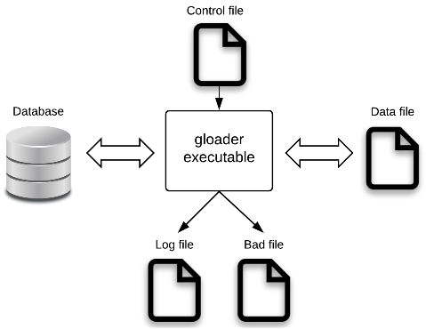

<a id="e698d1344247c12f"></a>

# 40. gloader/gloadernet(Upload/download Tool)

> Source: [GOLDILOCKS 22c.1 User Manual (en)](https://manual.sunjesoft.co.kr/goldilocks/22c_1/manual/en/e698d1344247c12f)  
> Tag: `22c.1_10_tag`

[← 39. gsql/gsqlnet (Interactive SQL Tool)](39-gsql-gsqlnet-interactive-sql-tool.md) · [Table of contents](../README.md) · [41. gdump →](41-gdump.md)

<a id="ed77e4c8fed2d245"></a>
## Overview of gloader and gloadernet

gloader is a utility which downloads or uploads data of GOLDILOCKS in table unit.

**Execution files**

<a id="24556d30ee8f0251"></a>
| Name | Description |
| --- | --- |
| gloader | It is used in Direct Attach (D/A) environment. |
| gloadernet | It is used in Client/ Server (C/S) environment. |

<a id="712a8196b57be796"></a>
### Environment

gloader should be connected to the database and it requires attention to all required files while using gloader.

<a id="7ed58faea7942f26"></a>


The control file and datafile are required to upload the data, then the log file is generated as a result.  
The control file is required to download the data, then the datafile, log file, and bad file are generated as the results.

<a id="9b2cfab8c56d7006"></a>
#### Control File

The control file is a file for operating gloader and it includes the following information. (Refer to [Control File Syntax](#1688cb8db5e12972).)

- Table name
- Schema name
- The delimiter between columns in a row
- The qualifier notifying the start and end of the data
- The delimiter between rows
- Character set
- Whether to trim the whitespace character
- Where clause

<a id="76e3565dc516edbb"></a>
#### DataFile

The datafile should be prepared when gloader uploads the data, and it is created when gloader downloads the data.  
The datafile supports text format and binary format.

- The datafile in text format has an advantage of which the file contents can be checked and directly updated. 
- The datafile in binary format can be performed faster comparing to the datafile in text format.

> gloader uses direct I/O for the data file by default. gloader arbitrarily adjusts the file size if the file size is not an array appropriate for direct I/O when uploading the data file by using direct I/O.

<a id="1edc73fc171f0ed1"></a>
#### Log File

Log file is a file which stores the following errors and results which occur while operating gloader.

- The row number and cause of the error 
- The operating results of gloader

<a id="b2ed4997bb97e834"></a>
#### Bad File

Bad file is a file which stores the rows in which an error occurred while gloader uploads the data. The delimiter between columns and rows, and the qualifier which are used to store the bad file should be user-defined.

<a id="6b1497117a43f805"></a>
### Example

The following is an example of downloading and uploading data by using gloader.

A table is created by using the SQL statement as follows.

```
$ cat test.sql
CREATE TABLE TEST
(
TEST_NAME VARCHAR(60),
TEST_NUM  INTEGER,
TEST_TIME TIMESTAMP(0) WITH TIME ZONE
);

INSERT INTO TEST VALUES
( 'NAME', 1, '1999-01-08 04:05:06.789 -8:00' );
INSERT INTO TEST VALUES
( 'NAME', 2, '1999-01-08 04:05:06.789 -8:00' );
INSERT INTO TEST VALUES
( 'NAME', 3, '1999-01-08 04:05:06.789 -8:00' );
COMMIT;
```

The control file is used as follows.

```
$ cat test.ctl
TABLE TEST
FIELDS TERMINATED BY ','
OPTIONALLY ENCLOSED BY '"'
LINES TERMINATED BY '\n'
```

- Export: It downloads the data.

```
$ gloader test test --export --control test.ctl --data test.dat --no-prompt

 COMPLETED IN EXPORTING TABLE: PUBLIC.TEST, 3 RECORDS
$ cat test.dat
"NAME","1","1999-01-08 04:05:07. -08:00"
"NAME","2","1999-01-08 04:05:07. -08:00"
"NAME","3","1999-01-08 04:05:07. -08:00"
$ cat test.log
cat test.log
COMPLETED IN EXPORTING TABLE: PUBLIC.TEST, 3 RECORDS [ Start Time: 2010-1-1 01:01:01 End Time: 2010-1-1 01:01:01 Taken Time: 56496 micro-sec ]
```

- Import: It uploads the data.

```
$ cat import.dat
"NAME","1","1999-01-08 04:05:07. -08:00"
"NAME","2","1999-01-08 04:05:07. -08:00"
"NAME","3","1999-01-08 04:05:07. -08:00"
"FAIL","FAIL","FAIL"

$ gloader test test --import --control test.ctl --data import.dat --no-prompt

 COMPLETED IN IMPORTING TABLE: PUBLIC.TEST, TOTAL 4 RECORDS, SUCCEEDED 3 RECORDS

$ gsql test test
gSQL> select * from test;
TEST_NAME TEST_NUM TEST_TIME                        
--------- -------- ---------------------------------
NAME             1 1999-01-08 04:05:07.000000 -08:00
NAME             2 1999-01-08 04:05:07.000000 -08:00
NAME             3 1999-01-08 04:05:07.000000 -08:00
NAME             1 1999-01-08 04:05:07.000000 -08:00
NAME             2 1999-01-08 04:05:07.000000 -08:00
NAME             3 1999-01-08 04:05:07.000000 -08:00

6 rows selected.

$ cat import.log
Err Rec(4) Col(2): 22018(12006): data value is not a numeric literal
COMPLETED IN IMPORTING TABLE: PUBLIC.TEST, TOTAL 4 RECORDS, SUCCEEDED 3 RECORDS [ Start Time: 2010-1-1 01:01:01 End Time: 2010-1-1 01:01:01 Taken Time: 56496 micro-sec ]

$ cat import.bad
"FAIL","FAIL","FAIL"
```

<a id="fb26df75ce297b61"></a>
## Using gloader

<a id="60b3d9ee2fd3e6a3"></a>
### Datafile Type

<a id="be9176b27500be77"></a>
#### Text Datafile

It is represented with a string which can be checked and edited by the user. A user can directly create, edit the file, or can download the data from the existing tables in the database. A user also can use the data in a text format downloaded from another DBMS products.  
The description for the representation of the text type datafile is recorded in the control file.

<a id="1fade6f68a8cceb0"></a>
#### Binary Datafile

The file consists of binary data. A user can not directly create or edit the binary datafile. The file is generated when downloading the data from the existing tables in the database.

The binary type file is uploaded faster than the text type because the data is written to the file appropriate to the data structure type defined in GOLDILOCKS.

> When GOLDILOCKS databases' versions are different one another, then it is not recommended to upload/ download by using a binary datafile. Also, it may be required to chang a column size when uploading/ downloading data between databases whose string sets are different.

<a id="2ef32d90e981f180"></a>
### Downloading Data

<a id="856c386f6d8e40ce"></a>
#### Downloading in Text File

<a id="551a230d0dbc1e5d"></a>
##### Simple Download

The following is the structure and data of the table to be downloaded.

```
$ cat test.sql
CREATE TABLE TEST ( I1 INTEGER PRIMARY KEY, I2 VARCHAR(10), I3 VARBINARY(10) );
INSERT INTO TEST VALUES( 1, 'LKH', X'10' );
INSERT INTO TEST VALUES( 2, 'KMM', X'A0' );
INSERT INTO TEST VALUES( 3, 'ksj', X'CD' );
COMMIT;

$ gsql test test
gSQL> SELECT * FROM TEST;

I1 I2  I3
-- --- --
 1 LKH 10
 2 KMM A0
 3 ksj CD

3 rows selected.
```

The following is the contents of the control file which is created to download the table data.

```
$ cat test.ctl
TABLE  PUBLIC.test
FIELDS TERMINATED BY ','
```

The data in the table T1 is downloaded through gloader as follows.

```
$ gloader test test --export --control test.ctl --data test.dat

 COMPLETED IN EXPORTING TABLE: PUBLIC.test, 3 RECORDS
```

The data in the table TEST is downloaded to the datafile as follows.

```
$ ls 
test.ctl test.dat test.log
$ cat test.dat
1,LKH,10
2,KMM,A0
3,ksj,CD
```

<a id="8469097c4403ec29"></a>
##### Whitespace Character

The following is the structure and data of the table to be downloaded.

```
$ cat test.sql
CREATE TABLE TEST ( I1 INTEGER PRIMARY KEY, I2 VARCHAR(10), I3 VARBINARY(10) );
INSERT INTO TEST VALUES( 1, ' L K H ', X'10' );
INSERT INTO TEST VALUES( 2, 'KIM
MM', X'A0' );
INSERT INTO TEST VALUES( 3, ' KIM S 
J ', X'CD' );
COMMIT;

$ gsql test test
gSQL> SELECT * FROM TEST;

I1 I2      I3
-- ------- --
 1  L K H  10
 2 KIM     A0
   MM        
 3  KIM S  CD
   J       
3 rows selected.
```

- The control file without using OPTIONALLY ENCLOSED BY statement

    - The following is the contents of the control file which is created to download the table data.

```
$ cat test.ctl
TABLE  PUBLIC.test
FIELDS TERMINATED BY ','
LINES TERMINATED BY '\n'
```

    - The data in the table TEST is downloaded to the datafile as follows.

```
$ ls 
test.ctl test.dat test.log
$ cat test.dat
1, L K H ,10
2,KIM
MM,A0
3, KIM S 
J ,CD
```

> The control file should be used with the OPTIONALLY ENCLOSED BY statement for the data including the white space to maintain the downloaded data and the uploaded data as same.

- The control file using OPTIONALLY ENCLOSED BY statement

    - The following is the contents of the control file which is created to download the table data.

```
$ cat test.ctl
TABLE  PUBLIC.test
FIELDS TERMINATED BY ','
OPTIONALLY ENCLOSED BY '"'
LINES TERMINATED BY '\n'
```

    - The data in the table TEST is downloaded to the datafile as follows.

```
$ ls 
test.ctl test.dat test.log
$ cat test.dat
"1"," L K H ","10"
"2","KIM
MM","A0"
"3"," KIM S 
J ","CD"
```

<a id="a058207bcb1e83bc"></a>
##### Time Related Data Type

DATE, TIME, TIME WITH TIME ZONE, TIMESTAMP, TIMESTAMP WITH TIME ZONE are output in the property default format when downloaded.

The following is each data type of DATE, TIME WITH TIME ZONE, TIMESTAMP WITH TIME ZONE.

```
$ gsql test test
gSQL> SELECT PROPERTY_VALUE, INIT_VALUE FROM V$PROPERTY WHERE PROPERTY_NAME LIKE 'NLS_DATE_FORMAT';

PROPERTY_VALUE                    INIT_VALUE                       
--------------------------------- ---------------------------------
YYYY-MM-DD                        YYYY-MM-DD 

1 row selected.

gSQL> SELECT PROPERTY_VALUE, INIT_VALUE FROM V$PROPERTY WHERE PROPERTY_NAME LIKE 'NLS_TIME_WITH_TIME_ZONE_FORMAT';

PROPERTY_VALUE                    INIT_VALUE                       
--------------------------------- ---------------------------------
HH24:MI:SS.FF6 TZH:TZM            HH24:MI:SS.FF6 TZH:TZM 

1 row selected.

gSQL> SELECT PROPERTY_VALUE, INIT_VALUE FROM V$PROPERTY WHERE PROPERTY_NAME LIKE 
'NLS_TIMESTAMP_WITH_TIME_ZONE_FORMAT';

PROPERTY_VALUE                    INIT_VALUE                       
--------------------------------- ---------------------------------
YYYY-MM-DD HH24:MI:SS.FF6 TZH:TZM YYYY-MM-DD HH24:MI:SS.FF6 TZH:TZM

1 row selected.
```

The following is the structure and data of the table to be downloaded.

```
$ cat test.sql
CREATE TABLE TEST ( I1 INTEGER, I2 DATE, I3 TIME WITH TIME ZONE, I4 TIMESTAMP WITH TIME ZONE );

INSERT INTO TEST VALUES ( 1, '1999-12-31', '01:01:01', '1999-12-31 01:01:01.789 -8:00' );
INSERT INTO TEST VALUES ( 2, '2000-01-01', '23:12:12', '2000-01-01 23:12:06.0 +8:00' );
INSERT INTO TEST VALUES ( 3, '2000-12-31', '23:12:12', '2000-12-31 23:12:12.0 -8:00' );
COMMIT;

$ gsql test test
gSQL> SELECT * FROM T1;
I1 I2         I3                     I4                               
-- ---------- ---------------------- ---------------------------------
 1 1999-12-31 01:01:01.000000 +09:00 1999-12-31 01:01:01.789000 -08:00
 2 2000-01-01 23:12:12.000000 +09:00 2000-01-01 23:12:06.000000 +08:00
 3 2000-12-31 23:12:12.000000 +09:00 2000-12-31 23:12:12.000000 -08:00

3 rows selected.
```

The following is the contents of the control file which is created to download the table data.

```
$ cat test.ctl
TABLE  PUBLIC.test
FIELDS TERMINATED BY ','
OPTIONALLY ENCLOSED BY '"'
LINES TERMINATED BY '\n'
```

The data in the table TEST is downloaded to the datafile as follows.

```
$ gloader test test -e -c test.ctl -d test.dat

 COMPLETED IN EXPORTING TABLE: PUBLIC.TEST, 3 RECORDS 

$ ls 
test.ctl test.dat test.log
$ cat test.dat
"1","1999-12-31 00:00:00","01:01:01.000000 +09:00","1999-12-31 01:01:01.789000 -08:00"
"2","2000-01-01 00:00:00","23:12:12.000000 +09:00","2000-01-01 23:12:06.000000 +08:00"
"3","2000-12-31 00:00:00","23:12:12.000000 +09:00","2000-12-31 23:12:12.000000 -08:00"
```

<a id="67ede836999bccfe"></a>
#### Downloading in Binary File

<a id="3a5db2ee225f71a8"></a>
##### Simple Download

The following is the structure and data of the table to be downloaded.

```
$ cat test.sql
CREATE TABLE TEST ( I1 INTEGER PRIMARY KEY, I2 VARCHAR(10), I3 VARBINARY(10) );
INSERT INTO TEST VALUES( 1, 'LKH', X'10' );
INSERT INTO TEST VALUES( 2, 'KMM', X'A0' );
INSERT INTO TEST VALUES( 3, 'ksj', X'CD' );
COMMIT;

$ gsql test test
gSQL> SELECT * FROM TEST;

I1 I2  I3
-- --- --
 1 LKH 10
 2 KMM A0
 3 ksj CD

3 rows selected.
```

The following is the contents of the control file which is created to download the table data.

```
$ cat test.ctl
TABLE  PUBLIC.test
FIELDS TERMINATED BY ','
```

The data in the table TEST is downloaded through gloader as follows.

```
$ gloader test test --export --control test.ctl --data test.dat --format binary

 COMPLETED IN EXPORTING TABLE: PUBLIC.test, 3 RECORDS
```

The following file is generated after executing gloader.

```
$ ls 
test.ctl test.dat test.log
```

> A user can not directly check or edit the binary file.

<a id="a857f41a8f1b7d4a"></a>
##### Complex Download

The following is the structure and data of the table to be downloaded.

```
$ gsql test test
gSQL>\desc TEST

COLUMN_NAME TYPE                        IS_NULLABLE
----------- --------------------------- -----------
I1          NUMBER(10,0)                TRUE       
I2          DATE                        TRUE       
I3          TIME(6) WITH TIME ZONE      TRUE       
I4          TIMESTAMP(6) WITH TIME ZONE TRUE       

gSQL> SELECT COUNT(*) FROM TEST;

COUNT(*)
--------
 1572864

1 row selected.
```

The following is the contents of the control file which is created to download the table data.

```
$ cat test.ctl
TABLE  PUBLIC.test
FIELDS TERMINATED BY ','
```

- Downloading in a single file

    - The data in the table TEST is downloaded through gloader as follows.

```
$ gloader test test --export --control test.ctl --data test.dat --format binary

loaded 1000 records into PUBLIC.TEST

loaded 2000 records into PUBLIC.TEST

... Ellipsis ... 

loaded 1571000 records into PUBLIC.TEST

loaded 1572000 records into PUBLIC.TEST

 COMPLETED IN EXPORTING TABLE: PUBLIC.TEST, TOTAL 1572864 RECORDS
```

    - The following file is generated after executing gloader.

```
$ ll test.*
-rw-r--r-- 1 test test       71 2014-08-28 12:13 t1.ctl
-rw-r--r-- 1 test test 59930624 2014-08-28 12:49 t1.dat
-rw-r--r-- 1 test test      159 2014-08-28 12:49 t1.log
```

- Downloading in multiple files

    - The data in the table TEST is downloaded through gloader as follows.

```
$ gloader test test --export --control test.ctl --data test.dat --format binary --filesize 31461376

loaded 1000 records into PUBLIC.TEST

loaded 2000 records into PUBLIC.TEST

... Ellipsis ...

loaded 1571000 records into PUBLIC.TEST

loaded 1572000 records into PUBLIC.TEST

 COMPLETED IN EXPORTING TABLE: PUBLIC.TEST, TOTAL 1572864 RECORDS
```

    - The following file is generated after executing gloader.

```
$ ll test.*
-rw-r--r-- 1 test test       71 2014-08-28 12:13 test.ctl
-rw-r--r-- 1 test test 31461376 2014-08-28 13:02 test.dat
-rw-r--r-- 1 test test 28474880 2014-08-28 13:02 test.dat.001
-rw-r--r-- 1 test test      159 2014-08-28 12:49 test.log
```

<a id="9807b3804cc257ec"></a>
### Uploading Data

<a id="a9758959b0917e7b"></a>
#### Uploading Text File

<a id="874942fb2a00f3e8"></a>
##### Simple Upload

The following is the table to be uploaded.

```
gSQL> \DESC TEST

COLUMN_NAME TYPE                        IS_NULLABLE
----------- --------------------------- -----------
I1          NUMBER(10,0)                TRUE       
I2          DATE                        TRUE       
I3          TIME(6) WITH TIME ZONE      TRUE       
I4          TIMESTAMP(6) WITH TIME ZONE TRUE       

gSQL> SELECT * FROM TEST;

no rows selected.
```

The following is the datafile to be uploaded.

```
$ cat test.dat
1,1999-12-31 00:00:00,01:01:01.000000 +09:00,1999-12-31 01:01:01.789000 -08:00
2,2000-01-01 00:00:00,23:12:12.000000 +09:00,2000-01-01 23:12:06.000000 +08:00
3,2000-12-31 00:00:00,23:12:12.000000 +09:00,2000-12-31 23:12:12.000000 -08:00
```

The datafile is uploaded with gloader and the result is output as follows.

```
$ gloader test test --import --control test.ctl --data test.dat

 COMPLETED IN IMPORTING TABLE: PUBLIC.TEST, TOTAL 3 RECORDS, SUCCEEDED 3 RECORDS 

$ gsql test test

gSQL> select * from test;

I1 I2         I3                     I4                               
-- ---------- ---------------------- ---------------------------------
 1 1999-12-31 01:01:01.000000 +09:00 1999-12-31 01:01:01.789000 -08:00
 2 2000-01-01 23:12:12.000000 +09:00 2000-01-01 23:12:06.000000 +08:00
 3 2000-12-31 23:12:12.000000 +09:00 2000-12-31 23:12:12.000000 -08:00

3 rows selected.
```

<a id="66eff8f1fb43a3b3"></a>
##### Whitespace Character

The following is the table to be uploaded.

```
gSQL> \DESC TEST

COLUMN_NAME TYPE                  IS_NULLABLE
----------- --------------------- -----------
I1          NUMBER(10,0)          TRUE
I2          CHARACTER VARYING(10) TRUE       
I3          BINARY VARYING(10)    TRUE    

gSQL> SELECT * FROM TEST;

no rows selected.
```

- The datafile downloaded without using OPTIONALLY ENCLOSED BY statement in the control file

    - The datafile is downloaded without using OPTIONALLY ENCLOSED BY statement in the control file as follows. (Refer to [Downloading in Text File](#856c386f6d8e40ce).)

```
$ cat test.dat
1, L K H ,10
2,KIM
MM,A0
3, KIM S 
J ,CD

```

    - The datafile is uploaded with gloader and the result is output as follows. Even though New Line ('`\`n') exists in the data of the second and third records, but a qualifier notifying the start and end of the column data is not set, so it is recognized as a row identifier.

```
$ gloader test test --import --control test.ctl --data test.dat

 COMPLETED IN IMPORTING TABLE: PUBLIC.TEST, TOTAL 5 RECORDS, SUCCEEDED 3 RECORDS

$ gsql test test

gSQL> select * from test;

I1 I2     I3  
-- ------ ----
 1 L K H  10  
 2 KIM    null
 3 KIM S  null

3 rows selected.
```

- The datafile downloaded using OPTIONALLY ENCLOSED BY statement in the control file

    - The datafile is downloaded by using the OPTIONALLY ENCLOSED BY statement of the control file as follows. (Refer to [Downloading in Text File](#856c386f6d8e40ce).) Differently from the result above, New Line ('`\n`') is treated as a part of data in the result below.

```
$ cat test.dat
"1"," L K H ","10"
"2","KIM
MM","A0"
"3"," KIM S 
J ","CD"
```

    - The datafile is uploaded with gloader and the result is output as follows.

```
$ gloader test test --import --control test.ctl --data test.dat

 COMPLETED IN IMPORTING TABLE: PUBLIC.TEST, TOTAL 5 RECORDS, SUCCEEDED 3 RECORDS

$ gsql test test

gSQL> select * from test;


I1 I2      I3
-- ------- --
 1  L K H  10
 2 KIM     A0
   MM        
 3  KIM S  CD
   J         

3 rows selected.
```

<a id="cbcb9bc1d38720bf"></a>
#### Uploading Binary File

<a id="17ab8bda039b4f77"></a>
##### Simple Upload

The following is the structure of the table to be uploaded.

```
gSQL> \DESC TEST

COLUMN_NAME TYPE                  IS_NULLABLE
----------- --------------------- -----------
I1          NUMBER(10,0)          TRUE
I2          CHARACTER VARYING(10) TRUE       
I3          BINARY VARYING(10)    TRUE    

gSQL> SELECT * FROM TEST;

no rows selected.
```

The following is the content of the control file written to download the table data.

```
$ cat test.ctl
TABLE  PUBLIC.test
FIELDS TERMINATED BY ','
```

The following is a file to be uploaded with gloader. *test.dat* was already downloaded when [Downloading in Binary File](#67ede836999bccfe).

```
$ ls 
test.dat
```

The datafile is uploaded to the table TEST and the result is output as follows.

```
$ gloader test test --import --control test.ctl --data test.dat --format binary

 COMPLETED IN IMPORTING TABLE: PUBLIC.TEST, TOTAL 3 RECORDS, SUCCEEDED 3 RECORDS

$ gsql test test
gSQL> SELECT * FROM TEST;

I1 I2  I3
-- --- --
 1 LKH 10
 2 KMM A0
 3 ksj CD

3 rows selected.
```

<a id="5e9c09527d024e8f"></a>
##### Complex Upload

The following is the structure of the table to be uploaded.

```
gSQL> \DESC TEST

COLUMN_NAME TYPE                  IS_NULLABLE
----------- --------------------- -----------
I1          NUMBER(10,0)          TRUE
I2          CHARACTER VARYING(10) TRUE       
I3          BINARY VARYING(10)    TRUE    

gSQL> SELECT * FROM TEST;

no rows selected.
```

The following is the datafile to be uploaded.

```
$ ll test.*
 -rw-r--r-- 1 test test       71 2014-08-28 12:13 test.ctl
 -rw-r--r-- 1 test test 31461376 2014-08-28 13:02 test.dat
 -rw-r--r-- 1 test test 28474880 2014-08-28 13:02 test.dat.001
 -rw-r--r-- 1 test test      159 2014-08-28 12:49 test.log
```

When uploading multiple downloaded files with --filesize, gloader should be separately performed for each datafile.

```
$ gloader test test --import --control test.ctl --data test.dat --format binary
 COMPLETED IN IMPORTING TABLE: PUBLIC.TEST, TOTAL 860728 RECORDS, SUCCEEDED 2285000 RECORDS, ERRORED 0 RECORDS 

$ gloader test test --import --control test.ctl --data test.dat.001 --format binary 
 COMPLETED IN IMPORTING TABLE: PUBLIC.TEST, TOTAL 860728 RECORDS, SUCCEEDED 860728 RECORDS, ERRORED 0 RECORDS
```

The upload result is as follows.

```
gSQL> select count(*) from test;

COUNT(*)
--------
 3145728

1 row selected.
```

<a id="11212e19a3bf4dcc"></a>
#### Controlling Upload Unit

The data can be uploaded faster by using the options which is related to performance.  
For more information, refer to [--array](#da7c0c3916f42844), [--commit](#a9be93540d20dcc8), [--atomic](#bf887a73e9d06f59).

The following is the datafile with approximately 380,000 records.

```
$ ll test.dat
-rw-r--r-- 1 test test 75092480 2014-08-28 15:59 test.dat
```

The following is the control file which is used for uploading.

```
$ cat test.ctl
TABLE  PUBLIC.test
FIELDS TERMINATED BY ','
OPTIONALLY ENCLOSED BY '"'
LINES TERMINATED BY '\n'
```

<a id="e289b7a4b958f38a"></a>
##### Array Binding and Commit Cycle

The following gloader command uploads records to be bound in 5,000 unit and uploads records to be committed in 20,000 unit.

```
$ gloader test test --import --control test.ctl --data test.dat --array 5000 --commit 20000

loaded 5000 records into PUBLIC.TEST


loaded 10000 records into PUBLIC.TEST


loaded 15000 records into PUBLIC.TEST

... Ellipsis ...
loaded 3810000 records into PUBLIC.TEST


loaded 3815000 records into PUBLIC.TEST


loaded 3818244 records into PUBLIC.TEST

 COMPLETED IN IMPORTING TABLE: PUBLIC.TEST, TOTAL 3818243 RECORDS, SUCCEEDED 3818243 RECORDS
```

The following is the result of executing gloader.

```
gSQL> SELECT I1, I2, I3 FROM TEST FETCH 3;
I1 I2 I3
-- ------- --
1 L K H 10
2 KIM A0
3 KIM S CD
3 rows selected.
gSQL> SELECT COUNT(*) FROM TEST;
COUNT(*)
--------
3818246
1 row selected.
```

<a id="b9acd8af9152cc4f"></a>
##### Array Binding and Atomic Option

The following gloader commands uploads records to be bound in 5000 unit with atomic INSERT, and 1,000 records are failed.

```
$ gloader test test --import --control test.ctl --data test.dat --array 5000 --atomic

loaded 5000 records into PUBLIC.TEST


loaded 10000 records into PUBLIC.TEST


loaded 15000 records into PUBLIC.TEST

... Ellipsis ...
loaded 38175000 records into PUBLIC.TEST

 COMPLETED IN IMPORTING TABLE: PUBLIC.TEST, TOTAL 3818243 RECORDS, SUCCEEDED 3817243 RECORDS
```

The following is the result of executing gloader.

```
gSQL> SELECT I1, I2, I3 FROM TEST FETCH 3;
I1 I2 I3
-- ------- --
1 L K H 10
2 KIM A0
3 KIM S CD
3 rows selected.
gSQL> SELECT COUNT(*) FROM TEST;
COUNT(*)
--------
3817243
1 row selected.
```

The following is the result for the cause of the upload failure and they are recorded in the log file. The upload is failed because the non-numeric data is stored in the first column of the first record.

```
$ cat test.log
Err Rec(1) Col(1): 22018(12006): data value is not a numeric literal
Err Rec(1) Col(-1): HY000(19041): Failed to atomic execution
Err Rec(1001) Col(1): 22018(12006): data value is not a numeric literal
Err Rec(1001) Col(-1): HY000(19041): Failed to atomic execution
COMPLETED IN IMPORTING TABLE: PUBLIC.TEST, TOTAL 3818243 RECORDS, SUCCEEDED 3817243 RECORDS [ Start Time: 2014-8-28 16:46:42 End Time: 2014-8-28 16:46:52 Taken Time: 10084582 micro-sec ]
```

The following is the result of the records which failed to upload and they are recorded in the bad file. 1000 records were stored because it is uploaded in 500 array units.

```
"s1"," L K H ","10"
"2","KIM","A0"
"3"," KIM S J ","CD"
... Ellipsis ...
```

> Array, commit options do not affect the execution result, but success or failure of INSERT in the atomic operation is treated in an array unit, so if a record is failed to upload, all records in a unit to which the records belong are treated as INSERT failure.  
> The cause of the first failed records of the array is recorded in the log file and the causes for failed record later is not recorded.

<a id="c363a6c6a1101a0f"></a>
#### Parallel Upload

gloader improves the performance of GOLDILOCKS by dividing the operation into parts and uploading them in thread unit. (Refer to [--parallel](#0b84bb80583439a8).)

The following is the datafile with approximately 380,000 records.

```
$ ll test.dat
-rw-r--r-- 1 test test 75092480 2014-08-28 15:59 test.dat
```

The following is the control file which is used for uploading.

```
$ cat test.ctl
TABLE  PUBLIC.test
FIELDS TERMINATED BY ','
OPTIONALLY ENCLOSED BY '"'
LINES TERMINATED BY '\n'
```

The following gloader commands uploads records which is bound to a thread performing four uploads. It is uploaded in 5000 unit with INSERT, and 100 records are failed.

```
$ gloader test test --import --control test.ctl --data test.dat --array 5000 --parallel 4

loaded 5000 records into PUBLIC.TEST


loaded 10000 records into PUBLIC.TEST


loaded 15000 records into PUBLIC.TEST

... Ellipsis ...
loaded 3810000 records into PUBLIC.TEST

loaded 3815000 records into PUBLIC.TEST

 COMPLETED IN IMPORTING TABLE: PUBLIC.TEST, TOTAL 3818243 RECORDS, SUCCEEDED 3818143 RECORDS
```

The following is the result of executing gloader.

```
gSQL> SELECT I1, I2, I3 FROM TEST FETCH 3;
I1 I2 I3
-- ------- --
1 L K H 10
2 KIM A0
3 KIM S CD
3 rows selected.
gSQL> SELECT COUNT(*) FROM TEST;
COUNT(*)
--------
3818143
1 row selected.
```

The cause of failure during the upload is recorded in the log file as follows.

```
$ cat test.log
Err Rec(1) Col(1): 22018(12006): data value is not a numeric literal
Err Rec(3) Col(1): 22018(12006): data value is not a numeric literal
Err Rec(5) Col(1): 22018(12006): data value is not a numeric literal
... Ellipsis ...
Err Rec(1001) Col(1): 22018(12006): data value is not a numeric literal
... Ellipsis ...
COMPLETED IN IMPORTING TABLE: PUBLIC.TEST, TOTAL 3818243 RECORDS, SUCCEEDED 3818143 RECORDS [ Start Time: 2014-8-28 16:46:42 End Time: 2014-8-28 16:46:52 Taken Time: 10084582 micro-sec ]
```

The following is a result of failed records recorded on the bad file during the upload. 100 records are stored.

```
"s1"," L K H ","10"
"s2","KIM","A0"
"s3"," KIM S J ","CD"
... Ellipsis ...
```

> When uploading the data with multiple threads, the records in which errors occur after INSERT are stored in the log file and bad file. In this case, the order of records may not be as same as the order in the data files.

<a id="b2ba112cfcdd079a"></a>
### Troubleshooting for Uploading

The record upload failure may occur by various causes. The failed record is stored in the bad file, and the information about the cause of failure is stored in the log file.

<a id="b421cade8292580d"></a>
#### Failure due to Redundant Constraint

<a id="d1184a2622c264b6"></a>
##### The redundant data is already in the constrained table to be uploaded. (primary key or unique index)

The following is the structure of the table to be uploaded.

```
gSQL>\desc T1

COLUMN_NAME TYPE                  IS_NULLABLE
----------- --------------------- -----------
I1          NUMBER(10,0)          TRUE
I2          CHARACTER VARYING(10) TRUE       
I3          BINARY VARYING(10)    TRUE    

gSQL> SELECT * FROM T1;

I1 I2  I3
-- --- --
 1 LKH 10
 2 KMM A0
 3 ksj CD

3 rows selected.
```

The following is the datafile to be uploaded.

```
$ cat t1.dat
"1","LKH"
"4","SOS"
"5","OKO"
```

The followings are the upload result by using gloader, and the created log file and bad file.  
The upload is failed because the record violated a primary key constraint.

```
$ gloader test test -i -c t1.ctl -d t1.dat

 COMPLETED IN IMPORTING TABLE: PUBLIC.T1, TOTAL 3 RECORDS, SUCCEEDED 2 RECORDS 
$
$ cat t1.log
Err Rec(1) Col(-1): 40002(16057): unique constraint (PUBLIC.T1_PRIMARY_KEY) violated
COMPLETED IN IMPORTING TABLE: PUBLIC.T1, TOTAL 3 RECORDS, SUCCEEDED 2 RECORDS [ Start Time: 2014-8-26 16:19:51 End Time: 2014-8-26 16:19:51 Taken Time: 15455 micro-sec ]
$
$ cat t1.bad
"1","LKH"
```

<a id="faa8eb698da575cc"></a>
#### Failure due to Date/time Format

The format can be set for the data type such as DATE, TIME, TIME WITH TIME ZONE, TIMESTAMP, TIMESTAMP WITH TIME ZONE, and it may cause the failure of upload using gloader.

The following is the table to be uploaded.

```
gSQL> \DESC T1

COLUMN_NAME TYPE IS_NULLABLE
----------- --------------------------- -----------
I1 NUMBER(10,0) TRUE
I2 TIMESTAMP(6) WITH TIME ZONE TRUE

gSQL> SELECT * FROM T1;
no rows selected.
```

The format of the TIMESTAMP WITH TIME ZONE on the server is as follows.

```
gSQL> SELECT PROPERTY_VALUE, INIT_VALUE FROM V$PROPERTY WHERE PROPERTY_NAME LIKE 'NLS_TIMESTAMP_WITH_TIME_ZONE_FORMAT';

PROPERTY_VALUE                    INIT_VALUE                       
--------------------------------- ---------------------------------
YYYY-MM-DD HH24:MI:SS.FF6 TZH:TZM YYYY-MM-DD HH24:MI:SS.FF6 TZH:TZM
```

The following is the datafile to be uploaded.

```
$ cat t1.dat
"4","20000108 00:00:00"
"5","20000108 04:05:06"
"6","20000108 04:05:06"
```

The following is the result of executing upload by using gloader.

```
$ gloader test test -i -c t1.ctl -d t1.dat
 
 COMPLETED IN IMPORTING TABLE: PUBLIC.T1, TOTAL 3 RECORDS, SUCCEEDED 0 RECORDS
```

The cause and records of upload failure are stored in the log file and the bad file as follows.

```
$ cat t1.log
Err Rec(1) Col(2): HY000(12136): literal does not match format string
Err Rec(2) Col(2): HY000(12136): literal does not match format string
Err Rec(3) Col(2): HY000(12136): literal does not match format string
COMPLETED IN IMPORTING TABLE: PUBLIC.T1, TOTAL 3 RECORDS, SUCCEEDED 0 RECORDS [ Start Time: 2014-8-27 13:56:29 End Time: 2014-8-27 13:56:29 Taken Time: 20670 micro-sec ]

$ cat t1.bad 
"4","20000108 00:00:00"
"5","20000108 04:05:06"
"6","20000108 04:05:06"
```

<a id="3400cf054959e586"></a>
##### Troubleshooting

The problem occurs when the data type format of the datafile and that of the data used on the server are different. The data type format of the datafile should be set to solve the problem. In this case, .odbc.ini is used.

The data type format is set in .odbc.ini file as follows.

```
$ cat .odbc.ini
[GOLDILOCKS]
HOST = 127.0.0.1
PORT = 21123
DATE_FORMAT = YYYYMMDD
TIME_FORMAT = HH24MISS
TIME_WITH_TIME_ZONE_FORMAT = HH24MISS TZHTZM
TIMESTAMP_FORMAT = YYYYMMDD HHMISS
TIMESTAMP_WITH_TIME_ZONE_FORMAT = YYYYMMDD HH:MI:SS
```

The following is the result of setting .odbc.ini and performing gloader again.

```
$ gloader test test -i -c t1.ctl -d t1.dat

 COMPLETED IN IMPORTING TABLE: PUBLIC.T1, TOTAL 3 RECORDS, SUCCEEDED 3 RECORDS
```


> 
> - The data type format set in .odbc.ini is applied to the entire column, and it can not be separately set.
> - If the data type format is set in .odbc.ini, it is also applied when downloading to gloader.
> 

<a id="e7c769798fc79cc4"></a>
#### Failure Due to Lack of Capacity

gloader is performed and failed as follows.

```
$ gloader test test -i -c t1.ctl -d t2.dat

loaded 4000 records into PUBLIC.T1
COMPLETED IN IMPORTING TABLE: PUBLIC.T1, TOTAL 4200 RECORDS, SUCCEEDED 0 RECORDS
```

It is failed due to lack of the space for datafile in the tablespace.

```
$ cat t1.log
Err Rec(1) Col(-1): HY000(14015): there is no extendible datafile in tablespace 'MEM_DATA_TBS'
Err Rec(2) Col(-1): HY000(14015): there is no extendible datafile in tablespace 'MEM_DATA_TBS'
... Ellipsis ...
COMPLETED IN IMPORTING TABLE: PUBLIC.T1, TOTAL 4200 RECORDS, SUCCEEDED 0 RECORDS [ Start Time: 2014-8-27 15:7:28 End Time: 2014-8-27 15:7:29 Taken Time: 317885 micro-sec ]
```

<a id="21e88e31f533a969"></a>
##### Troubleshooting

The datafile of a tablespace should be extended or added to solve the problem.   
For more information, refer to [ALTER TABLESPACE](../part-03-sql-manual/18-sql-references-a-b.md#6cf7c5c15a54e23b).

<a id="128c77ebfc52567c"></a>
#### Datafile Analysis Failure

The field terminator, the qualifier, and the line terminator described in the control file may be different in the text datafile because of misuse.

The following is the structure of the table object to be uploaded.

```
gSQL>\desc T1
COLUMN_NAME TYPE                  IS_NULLABLE
----------- --------------------- -----------
I1          NUMBER(10,0)          TRUE
I2          CHARACTER VARYING(10) TRUE       
I3          BINARY VARYING(10)    TRUE
```

The following is the control file to be uploaded.

```
$ cat t1.ctl
TABLE  T1
FIELDS TERMINATED BY ','
OPTIONALLY ENCLOSED BY '"'
LINES TERMINATED BY '\n'
```

The following is the datafile to be uploaded.

```
$ cat t1.dat
'1',"LKH","aa"
"2","SOS"","aa"
"5","OKO","00"
```

The following is the result of executing upload by using gloader.

```
$ gloader test test --import --control t1.ctl --data t1.dat

 COMPLETED IN IMPORTING TABLE: PUBLIC.T1, TOTAL 3 RECORDS, SUCCEEDED 1 RECORDS
```

The cause and records of upload failure are as follows.

```
$ cat t1.log
Err Rec(1) Col(1): 22018(12006): data value is not a numeric literal
COMPLETED IN IMPORTING TABLE: PUBLIC.TEST, TOTAL 3 RECORDS, SUCCEEDED 1 RECORDS [ Start Time: 2014-8-28 18:6:13 End Time: 2014-8-28 18:6:13 Taken Time: 18679 micro-sec ]
$
$ cat t1.bad
"2","SOS"","aa"
'1',"LKH","aa"
```

<a id="39356268201033c8"></a>
##### Troubleshooting

The records fail to analyze the data due to qualifier or delimiter which are used improperly. Therefore, to solve this problem, the field terminator, the qualifier and the delimiter in the control file and the datafile should be checked, then the datafile should be edited based on the records of the bad file.

> The records which are failed to parse in the data analysis process are stored in the bad file, not in the log file.

<a id="7096b755e382fa62"></a>
#### Uploading to Another Database Whose Character Set Is Different

Adjusting the column size may be required when downloading/ uploading data in binary type between databases whose character sets are different one another.

The following is the structure of the table object to be uploaded.

```
gSQL>\desc T1
COLUMN_NAME TYPE                  IS_NULLABLE
----------- --------------------- -----------
I1          NUMBER(10,0)          TRUE
I2          CHARACTER VARYING(36) TRUE
```

The following is the table data, and it is a VARCHAR type, its size is 36 and is completely filled.

```
SELECT * FROM T1;

I1    I2
---- ------------------------------------ 
   1 일이삼사오육칠팔구십일이삼사오육칠팔
```

The following error occurs when downloading data above from UHC database then uploading to UTF8 database which has the same schema.

```
$ gloader test test -i -f binary -T T1 -d t1.dup

ERR-HY000(42023): byte length of data greater than column length.

ERROR: FAILED TO IMPORT TABLE PUBLIC.T1
```

<a id="d579582b9655f07c"></a>
##### Troubleshooting

The data upload succeeds when adjusting the length of column I2 as follows.  
Declare I2 as VARCHAR(18 CHAR), or declare I2 as VARCAR(54) size.

```
gSQL>\desc T1
COLUMN_NAME TYPE                       IS_NULLABLE
----------- -------------------------- -----------
I1          NUMBER(10,0)               TRUE
I2          CHARACTER VARYING(18 CHAR) TRUE
```

```
gSQL>\desc T1
COLUMN_NAME TYPE                  IS_NULLABLE
----------- --------------------- -----------
I1          NUMBER(10,0)          TRUE
I2          CHARACTER VARYING(54) TRUE
```

<a id="1688cb8db5e12972"></a>
## Control File Syntax

```
TABLE [schema_name.]table_name[domain_name.]
FIELDS TERMINATED BY 'Field Terminator'
[OPTIONALLY ENCLOSED BY 'Open Qualifier' [AND 'Close Qualifier']]
[LINES TERMINATED BY 'Line Terminator']
[Characterset characterset_name]
[RTRIM [ON|OFF]]
[LTRIM [ON|OFF]]
[WHERE="conditional statement"]
```

> A control file describes only one table. Therefore, each item above should be described in the control file only once, and if it is described redundantly, then the control parsing error occurs.

<a id="822edd08fd64b154"></a>
### CHARACTERSET

<a id="eddc47b582a05617"></a>
#### Syntax

```
CHARACTERSET characterset_name
```

<a id="07534881022c0cc3"></a>
#### Description

It refers to the character set of the datafile to be downloaded or uploaded.  
If the character set is not specified, the UTF8 which is the default character set of CHARACTER_SET in GOLDILOCKS property is used.

<a id="9c00521e362c1030"></a>
#### Example

The following is an example of which the character set of the datafile to be uploaded or downloaded is the ASCII code.

```
% cat sample.ctl
CHARACTERSET ASCII
```

<a id="d3ceca4706669f33"></a>
### TABLE

<a id="4d976cc7baa0d99c"></a>
#### Syntax

```
TABLE table_name
TABLE schema_name.table_name
TABLE table_name@domain_name
TABLE schema_name.table_name@domain_name
```

<a id="854a49969f43b2a0"></a>
#### Description

It specifies the name of table to which upload or download the data, or specifies the schema name  to which the table belongs, or the domain name.  
The domain name can be used only for data download, and it downloads only the data of the corresponding member.  
The string or double-quoted (") string is used in the table name.  
If the table name is given as the command row argument in gloader as well, then the value of the command row argument takes precedence over the value in the control file.

<a id="868a7659eb542793"></a>
#### Examples

The following is an example of specifying only the table name.

```
% cat sample.ctl
TABLE lineitem
```

The following is an example of specifying the schema PUBLIC and the table name. It has the same meaning as the example above.

```
% cat sample.ctl
TABLE PUBLIC.lineitem
```

The following is an example of specifying the schema PUBLIC and the table name of G1N1 member. It has the same meaning as the example above.

```
% cat sample.ctl
TABLE PUBLIC.lineitem@G1N1
```

The following is an example of specifying the table name created by the delimited identifier.

```
gSQL> CREATE TABLE "Tab*&^" ( id INTEGER );
```

```
% cat sample.ctl
TABLE "Tab*&^"
```

<a id="73ac9a7185362909"></a>
### FIELDS TERMINATED BY

<a id="32b87c37353f2dc7"></a>
#### Syntax

```
FIELDS TERMINATED BY 'Field Terminator'
```

<a id="1287bc6832562199"></a>
#### Description

The field terminator is used as a delimiter between columns in the record data of the data file. Setting the field terminator in the control file can not be omitted.  
The field terminator can be set with one or more strings, and should not be redundant with a qualifier or line terminator, and it should not use the subset string.  
There is not any constraintfor the string to be set as a field terminator. However, `\` or % should be added to in front of each n, t, r when setting NEW LINE or TAB, CARRIAGE RETURN character.  
If the field terminator is given as the command row argument in gloader as well, then the value of the command row argument takes precedence over the value in the control file.

<a id="ba01d2e810b93df5"></a>
#### Example

The following is an example of setting the field terminator as COMMA and NEW LINE.

```
% cat sample.ctl

FIELDS TERMINATED BY ',\n'
```

```
% cat sample.ctl

FIELDS TERMINATED BY ',%n'
```

<a id="e39cdf330d43c7aa"></a>
### OPTIONALLY ENCLOSED BY

<a id="1b7de978d4408fb5"></a>
#### Syntax

```
OPTIONALLY ENCLOSED BY 'Open Qualifier' [AND 'Close Qualifier']
```

<a id="20a5e85fbcf7ad63"></a>
#### Description

Qualifier is used as a delimiter to represent the start and end of the column.  
Qualifier is a single character, and the first qualifier is a open qualifier, the last qualifier is a close qualifier. The same characters can be used to set an open qualifier and a close qualifier, or the different characters can be used to represent the start and end of the column.  
Characters set as a qualifier can not be used in a field terminator nor in a line terminator.  
If a close qualifier literally belongs to a column data, two close qualifiers are used to represent a single valid data.  
If an open qualifier is set omitting a close qualifier, then characters as same as those in an open qualifier is set in a close qualifier.

If OPTIONALLY ENCLOSED BY statement does not exist, the column data is distinguished by the field terminator.  
If the qualifier is given as the command row argument in gloader as well, then the value of the command row argument takes precedence over the value in the control file.

> If OPTIONALLY ENCLOSED BY statement does not exist, the results of the uploading and downloading data may be different. (Refer to [Troubleshooting Uploading](#b2ba112cfcdd079a).)

<a id="1fd7e1103a1766ac"></a>
#### Example

The following is an example of using double quotes (") and a single quote (') as a open qualifier and a close qualifier each.

```
% cat sample.ctl
OPTIONALLY ENCLOSED BY '"' AND "'"
```

<a id="e673d66226c5299e"></a>
### LINES TERMINATED BY

<a id="ab32830926930a86"></a>
#### Syntax

```
LINES TERMINATED BY 'Line Terminator'
```

The line terminator is used as a delimiter between records in the data file.  
The line terminator can be set with one or more strings, and should not be redundant with a qualifier or a field terminator, and it should not use the subset string.

When omitting the line terminator setting, then  NEW LINE ('`\`n' or '%n') is used by default.   
If the line terminator is given as the command row argument in gloader as well, then the value of thecommand row argument takes precedence over the value in the control file.

<a id="396a1772df180650"></a>
#### Description

> • Differently from Unix, CARRIAGE RETURN and NEW LINE are written together instead of a single NEW LINE in the data file exported from Windows OS. When importing data by using this data file, LINES TERMINATED BY in the control file should be explicitly set like as '`\`r`\`n' so that the data is normally imported.  
>   
> • It is recommended to set a field terminator and a line terminator with a different string each. The more mutual string including the first character exist the poorer the import performance due to the internal comparing. In other words, when a field terminator and a line terminator are set with different strings each, then the shorter the string the better the performnace.

<a id="26b02de74617709b"></a>
#### Example

The following is an example of using '^^`\`t`\`r`\`n' as a line terminator

```
% cat sample.ctl

LINES TERMINATED BY '^^\t\r\n'
```

<a id="a5be34f71f598199"></a>
### LTRIM

<a id="5e3a19991f1b72fb"></a>
#### Syntax

```
LTRIM ON|OFF
```

<a id="03f0e0cdf5e0ccd0"></a>
#### Description

It determines a left trim.  
The default value is OFF, and when it is set to OFF, then the left WHITESPACE is considered data.  
When it is set to ON, then the left WHITESPACE is ignored.

> OPTIONALLY ENCLOSED BY is applied only when the syntax does not exist.  
> If OPTIONALLY ENCLOSED BY is used and the column is enclosed with delimiters in the data file, then RTRIM and LTRIM is OFF.

<a id="da970eb5708c7b8c"></a>
#### Example

The following is an example of setting LTRIM to ON.

```
% cat sample.ctl
LTRIM ON
```

<a id="9b28a990db1d34c1"></a>
### RTRIM

<a id="79b4074536c3edd9"></a>
#### Syntax

```
RTRIM ON|OFF
```

<a id="8b7637442630fba8"></a>
#### Description

It determines a right trim.  
The default value is OFF, and when it is set to OFF, then the right WHITESPACE is considered data.  
When it is set to ON, then the right WHITESPACE is ignored.

> OPTIONALLY ENCLOSED BY is applied only when the syntax does not exist.  
> If OPTIONALLY ENCLOSED BY is used and the column is enclosed with delimiters in the data file, then RTRIM and LTRIM is OFF.

<a id="ab6bc81f621194e1"></a>
#### Example

The following is an example of setting RTRIM to ON.

```
% cat sample.ctl
RTRIM ON
```

<a id="030913bc375f7f70"></a>
### WHERE

<a id="388883d23af1ae3d"></a>
#### Syntax

```
WHERE="conditional_statement"
```

<a id="2eaf2c38d8694961"></a>
#### Description

It uses a conditional clause when downloading data.

<a id="3bf1aaf679461bb0"></a>
#### Example

The following is an example of using WHERE.

```
% cat sample.ctl
WHERE="I2 > 3"
```

<a id="7c8a7dc476921743"></a>
## gloader Argument References

<a id="9fce9060bd6285d7"></a>
### Usage

```
$ gloader --help
Usage 
    gloader user password mode data [control] [format] [options]

    user                user name
    password            password

mode: gloader's mode. 
  --export              export data
  --import              import data

data:
  --data                data file

options:
  --control             control file
  --format              file format(text|binary, Default text)
  --log                 log file
  --bad                 bad file
  --dsn                 dsn string
  --array               number of rows in bind array(Default 1000)
  --filesize            max file size
  --commit              number of commit unit(Default 5000)
  --comment             commenting on commit
  --atomic              use atomic function
  --parallel            use parallel in import
  --propagation         enabling or disabling a redo log propagation(ON|OFF)
  --errors              number of error count to allow(Default 100)
  --AsTIMESTAMP         bind DATE as TIMESTAMP
  --buffered            buffered disk io(Default direct io)
  --tablename           [schema_name.]table_name[@domain_name]
  --fieldterm           field terminator
  --lineterm            line terminator
  --qualifier           qualifier(column data encloser)
  --where               export only rows selected by given WHERE condition
  --group-id            importing distributed data by group id using global connections in a clustered environment
  --directio-size       direct io size(Default 512)
  --no-copyright        suppresses the display of the banner
  --silent              suppresses the display of the result message
  --help                print help message
```

<a id="a05faad4265c6a4d"></a>
### Mandatory Argument

The arguments are entered in an order of username and password to connect to the database.  
gloader operation mode, control file, datafile are entered as arguments.

<a id="7661879ab6b36129"></a>
| Argument | Description |
| --- | --- |
| user_name | It is the user name. The maximum length of user name is 128. |
| password | It is password. The maximum length of password is 128. |

<a id="146584787ae9f72a"></a>
#### --export

<a id="6c5724c9f4f4629b"></a>
##### Description

It specifies for gloader to download the data in the database.

<a id="f3e5781fc0912507"></a>
##### Example

```
$ gloader test test --export -c sample.ctl -d sample.dat
```

<a id="5254a0269e51a01d"></a>
#### --import

<a id="256704149b65176b"></a>
##### Description

It specifies for gloader to upload the data in the database.

<a id="a697775a371dc96b"></a>
##### Example

```
$ gloader test test --import -c sample.ctl -d sample.dat
```

<a id="ed3a5794234a615a"></a>
#### --control

<a id="8c850a8dca435b73"></a>
##### Description

It specifies the control file path.

If --tablename is given as an argument, the control file can be omitted. The table name is mandatory to execute gloader, so the table name should be given via a control file or an argument. If the table name is not given as an argument, TABLE item should be set via a control file.

When a control file is omitted, a field terminator, a qualifier, a line terminator can be given as an argument. If these delimiters are not given as an argument, then delimiters in CSV form is used by default.

<a id="fb4c28615d41739a"></a>
##### Example

The following is an example of using a control file whose name is sample.ctl.

```
$ gloader test test -i --control sample.ctl -d sample.dat
```

<a id="59e2286e9d629dfe"></a>
#### --data

<a id="601fba56c8d33c2a"></a>
##### Description

It specifies the data file path to download or upload.

<a id="ecf004da5ba863ed"></a>
##### Example

The following is an example of uploading a control file whose name is sample.dat.

```
$ gloader test test -i -c sample.ctl --data sample.dat
```

<a id="f2a21836574e92bb"></a>
### Optional Argument

<a id="14ee92ab49e2f7d5"></a>
#### --tablename

<a id="41d07be554530858"></a>
##### Description

It specifies the table name in [Schemaname.]Tablename[@domain_name] form.

The table name should be given via setting TABLE of an argument or a control file. In other words, if a control file is omitted, the table name argument is mandatory.  
If a tablename argument is given when TABLE item of a control file is set, then argument value takes precedence over the value in the control file.

<a id="98c9c60132e428fb"></a>
##### Example

The following is an example of uploading data in CSV form by giving a tablename argument because the control file argument is omitted

```
$ gloader test test -i --tablename PUBLIC.T1 --data sample.dat
```

The following is an argument of omitting a tablename argument because TABLE item is omitted in the control file.

```
$ cat sample.ctl | grep TABLE
  TABLE T1
$ gloader test test -i -c sample.ctl --data sample.dat
```

<a id="bac7d07a32033319"></a>
#### --format

<a id="1d9dca804e9668fb"></a>
##### Description

It specifies the datafile format.  
The datafile format may be text or binary, and the default value is text when the format is not set.

<a id="cb6e27bb54837c98"></a>
##### Example

The following is an example of downloading the data to sample.dat in binary form.

```
$ gloader test test --export --control sample.ctl --data sample.dat --format binary
```

The followings are sample.dat and sample.log which are created after executing gloader as above.

```
$ ls
sample.ctl sample.dat sample.log
```

<a id="569d8048c9260f71"></a>
#### --log

<a id="cc800efe5353bc84"></a>
##### Description

It specifies the logfile path.  
gloader records the error and results occurred during the execution.  
If the file name is not specified, the name is created as same as the datafile by changing its extension to log.

<a id="60de26a134b670d9"></a>
##### Example

The following is an example of when the name of the log file is specified by using --log option.

```
$ gloader test test --export --control sample.ctl --data sample.dat --log SAMPLE.log
```

The followings are sample.dat, SAMPLE.log which are created after executing gloader as above.

```
$ ls
sample.ctl sample.dat SAMPLE.log
```

The following is an example of when the name of the log file is not specified by using --log option.

```
$ gloader test test --export --control sample.ctl --data sample.dat
```

The followings are sample.dat, sample.log which are created after executing gloader as above.

```
$ ls
sample.ctl sample.dat sample.log
```

<a id="4b7c35ab8d9d4f62"></a>
#### --bad

<a id="f2fd13dd997d6290"></a>
##### Description

It specifies the bad file path.  
It is valid only when gloader performs the import operation. Rows which can not be uploaded due to an error are stored in the bad file.  
If the file name is not specified, the name is created as same as the datafile by changing its extension to bad.

<a id="d89ac08b7054dc42"></a>
##### Example

The following is an example of when the name of the bad file is specified by using --bad option.

```
$ gloader test test --import --control sample.ctl --data sample.dat --bad SAMPLE.bad
```

The followings are sample.dat, sample.log, SAMPLE.bad which are created after executing gloader as above.

```
$ ls
SAMPLE.bad sample.ctl sample.dat sample.log
```

The following is an example of when the name of the bad file is not specified by using --bad option.

```
$ gloader test test --export --control sample.ctl --data sample.dat
```

The followings are sample.dat, sample.log, sample.bad which are created after executing gloader as above.

```
$ ls
sample.bad sample.ctl sample.dat sample.log
```

<a id="7c3a1e04ed78629c"></a>
#### --dsn

<a id="59f591a661454468"></a>
##### Description

It is the dsn string. The maximum length is 128.  
It is used to specify the format of the time-related data type represented in the data file to be downloaded or uploaded.  
It is used to specify the server when using gloadernet in the Client/ Server (C/S) environment.  
For more information, refer to [odbc.ini File](../part-05-developer-manual/31-odbc.md#725df1c9d28dbaab).

<a id="1e5117dd3ac91faf"></a>
##### Example

The following is an example of .odbc.ini described to use --dsn option.

```
$ cat .odbc.ini
[GOLDILOCKS]
HOST = 127.0.0.1
PORT = 21123
DATE_FORMAT = YYYYMMDD
TIME_FORMAT = HH24MISS
TIME_WITH_TIME_ZONE_FORMAT = HH24MISS TZHTZM
TIMESTAMP_FORMAT = YYYYMMDD HHMISS
TIMESTAMP_WITH_TIME_ZONE_FORMAT = YYYYMMDD HH:MI:SS
```

The following is an example of uploading the data to the goldilocks server by using --dsn option.

```
$ gloadernet test test --dsn goldilocks --import --control sample.ctl --data sample.dat
```

The following is an example of defining the format of time-related data type of the data file by using --dsn option, and then downloading data.

```
$ gloader test test --dsn goldilocks --export --control sample.ctl --data sample.dat
```

For more information, refer to [Failure due to date/time format](#faa8eb698da575cc).

<a id="da7c0c3916f42844"></a>
#### --array

<a id="992b1cf55f74002c"></a>
##### Description

It specifies the number of rows to be bound when importing the data.  
The amount of memory is required in proportion to the number of array. If not specified, 1,000 rows are used.  
The option is applied only when uploading the data.

<a id="7249ff9c2dad877b"></a>
##### Example

The following is an example of uploading the data file in 2,000 records unit.

```
$ gloader test test --import --control sample.ctl --data sample.dat --array 2000
```

<a id="79ba83252f00a32b"></a>
#### --filesize

<a id="ed5efd258c3daa23"></a>
##### Description

The maximum size of the file can be set when gloader downloads the data. If the amount of data exceeds the maximum size, the file is generated by adding the permutation number to the file extension.  
If not specified, the maximum file size is unlimited, and the minimum is 31,461,376 (30 Mbytes).  
The option is valid only for the binary type data file.

<a id="ed203eedb4e4cfd4"></a>
##### Example

The following is an example of executing the commands, then the file size exceeds the specified maximum, so new files are generated as results.

```
$ gloader test test --export --control sample.ctl --data sample.dat --filesize 31461376
```

```
$ls -al
-rw-r--r-- 1 test test 31461376 sample.dat
-rw-r--r-- 1 test test 31461376 sample.dat.001
-rw-r--r-- 1 test test  6715392 sample.dat.002
```

<a id="a9be93540d20dcc8"></a>
#### --commit

<a id="67cd004364f61ade"></a>
##### Description

While gloader uploads the data, the transaction is in the no commit state. The commit cycle may be set by using --commit option.  
If not set, the default value is 5,000 (rows).

<a id="1d3e2cfc9c60f320"></a>
##### Example

The following is an example of using --commit option.

```
$ gloader test test --import --control sample.ctl --data sample.dat --commit 10000
```

<a id="8b8466a8a218c909"></a>
#### --comment

<a id="b9a2c5d0f3366ed7"></a>
##### Description

When gloader commits the transaction, it specifies the comment on the transaction.

<a id="5b050960ba748dc6"></a>
##### Example

The following is an example of using --comment option.

```
$ gloader test test --import --control sample.ctl --data sample.dat --comment import_sample
```

<a id="bf887a73e9d06f59"></a>
#### --atomic

<a id="a132d36e9a23a4c9"></a>
##### Description

It is the option for performing array INSERT, and it is useful when uploading the data.  
The performance is faster than the existing array insert, because atomic array INSERT processes the insert statements as many as the size of array in a single transaction.

<a id="76688e0a0602f789"></a>
##### Example

The following is an example of using --atomic option.

```
$ gloader test test --import --control sample.ctl --data sample.dat --array 1000 --atomic
```

<a id="0b84bb80583439a8"></a>
#### --parallel

<a id="4a9f1d4cfc4e2c2c"></a>
##### Description

It specifies the number of threads for parallel processing.  
It is useful only when gloader uploads the data, and the performance gets faster when the number of threads is increased by adjusting --parallel option.  
The performance gets faster by increasing the number of threads, but it is recommended to set the number of threads according to the operational environment.  
The default value is 1, and the maximum value is 32.

<a id="6da14e904b38ef2f"></a>
##### Example

The following is an example of using eight threads when uploading data. Ten threads are operated together including threads analyzing the data files and read only threads, besides the eight uploading threads.

```
$ gloader test test --import --control sample.ctl --data sample.dat --parallel 8
```

<a id="89e099219cabf48b"></a>
#### --propagation

<a id="58b0eea8ecce516b"></a>
##### Description

It determines whether to propagate the upload transaction log to another replicated server.  
It can be set to ON or OFF.

<a id="41a5af8ef72f45f8"></a>
##### Example

The following is an example of which the upload transaction log is not propagated to another replicated server.

```
$ gloader test test --import --control sample.ctl --data sample.dat --propagation off
```

<a id="11ae528a5f2b192e"></a>
#### --errors

<a id="5d6f3de75ebd0f33"></a>
##### Description

It sets the number of errors permitted when gloader uploads the data.  
If not set, 100 (rows) are used. If it is set to 0, the --errors option is ignored.  
If it is smaller than the size of --array option, the number of permitted error is the number of array.

<a id="71851457eb6159de"></a>
##### Example

The following is an example of using --errors option.

```
$ gloader test test --import --control sample.ctl --data sample.dat --errors 10000
```

<a id="5d86ae1a7dfbaa91"></a>
#### --AsTIMESTAMP

<a id="9e7cab19169e6ecc"></a>
##### Description

It sets the DATE type data stored in TIMESTAMP  format to be operated in TIMESTAMP format for backward compatibility.  
TIMESTAMP_FORMAT is also applied to the DATE type data when using the --AsTIMESTAMP option.

<a id="f907f024147fb1da"></a>
##### Example

The following is an example of using --AsTIMESTAMP option.

```
$ gloader test test --import --control sample.ctl --data sample.dat --AsTIMESTAMP
```

<a id="a08d0ec7076e5727"></a>
#### --buffered

<a id="914e194e42787bbc"></a>
##### Description

Only the datafile uses the buffered IO instead of the direct IO.  
The log file and bad file use the buffered IO.

<a id="387e4dcf51c86ce7"></a>
##### Example

The following is an example of using --buffered option.

```
$ gloader test test --import --control sample.ctl --data sample.dat --buffered
```

<a id="e26660c29beaf772"></a>
#### --fieldterm

<a id="2feb03bc810afeec"></a>
##### Description

It provides a field terminator.  
If it is set in a control file as well, then the fieldterm argument value is preferentially used.   
% is added in front of n, r, t each for NEW LINE, CARRIAGE RETURN, TAB.  
Characters which is used as a shell meta character such as ', ", \, & is not recommended to use.

<a id="703522e79ff62685"></a>
##### Example

The following is an example of using --fieldterm option.

```
$ gloader test test --i -c sample.ctl -d sample.dat --fieldterm ",,,"
$ gloader test test --i -c sample.ctl -d sample.dat --fieldterm ,,,
$ gloader test test --i -c sample.ctl -d sample.dat --fieldterm ',,,'
```

<a id="fca99d6375c2d0ae"></a>
#### --lineterm

<a id="5fa8202d4ea5cef6"></a>
##### Description

It provides a line terminator.  
If it is set in a control file as well, then the lineterm argument value is preferentially used.   
The detailed usage is as same as that of the fieldterm argument.

<a id="2b069189fc2f8104"></a>
##### Example

The following is an example of using --lineterm option.

```
$ gloader test test --i -T PUBLIC.test -d sample.dat --lineterm ",,,"
$ gloader test test --i -T PUBLIC.test -d sample.dat --lineterm ,,,
$ gloader test test --i -T PUBLIC.test -d sample.dat --lineterm ',,,'
```

<a id="ceac29d1315f683c"></a>
#### --qualifier

<a id="e2a95d2b2c1c4712"></a>
##### Description

It provides a qualifier which is to be added to the start and the end of the column data. Only a single character can be set as a qualifier.  
If it is set in a control file as well, then the qualifier argument value is preferentially used.   
The detailed usage is as same as that of the fieldterm argument.

<a id="ba92d8e8859f3dd2"></a>
##### Example

The following is an example of using --qualifier option.

```
$ gloader test test --i -T PUBLIC.test -d sample.dat --qualifier "|"
$ gloader test test --i -T PUBLIC.test -d sample.dat --qualifier '"'
```

<a id="61c0bfb6d32435fc"></a>
#### --where

<a id="923d63ef54e37a32"></a>
##### Description

It downloads the data by setting a conditional clause for export operation.  
If the where clause is also set in a control file, then the where argument value is preferentially used.

<a id="db2df40beb66b382"></a>
##### Example

The following is an example of using --where option.

```
$ gloader test test --i -T PUBLIC.test -d sample.dat --where "I2 > 4"
```

<a id="7617a56ba2ce0783"></a>
#### --group-id

<a id="023f509d4e057aa4"></a>
##### Description

It directly uploads the data to the corresponding group after sorting the data by group when uploading the data in the sharded table in the cluster environment.  
If this option is used when uploading the data to the non-sharded table, the option is not valid.  
This option is operated only in C/S environment, so it is valid only in gloadernet and it can be used only when uploading text files.

*--group-id* option uses [GLOBAL CONNECTION](../part-05-developer-manual/31-odbc.md#7c9e8defdb7b38e1) of ODBC, so properties related to the [Data Source Configuration](../part-05-developer-manual/31-odbc.md#9eb127553a6b9343) should be set.

<a id="36c620c49a5916e2"></a>
##### Example

The following is odbc.ini configuration file to use the global connection.

```
$cat .odbc.ini
[GOLDILOCKS]
HOST=127.0.0.1
PORT = 22581
LOCALITY_AWARE_TRANSACTION=1
LOCATOR_DSN = LOCATOR
[LOCATOR]
LOCATOR_FILE=.locator.ini
```

The following is an example of using *--group-id* option in gloadernet.

```
$ gloadernet test test --i -T PUBLIC.test -d sample.dat --group-id
COMPLETED IN IMPORTING TABLE: PUBLIC.TEST, TOTAL 20 RECORDS, SUCCEEDED 20 RECORDS
```

The following is an example of an error which occurred due to using *--group-id* option in gloader.

```
$ gloader test test --i -T PUBLIC.test -d sample.dat --group-id
ERR-HY010(19009): Function sequence error : The function should be called only when the SQL_ATTR_LOCALITY_AWARE_TRANSACTION connection attribute is set.

```

<a id="07c4f3cbd49c154a"></a>
#### --directio-size

<a id="788f8ca7ae6d6ffd"></a>
##### Description

gloader uses direct IO by default. The default value of direct IO is 512, but this size can be modified by using *--directio-size*. The value for the size should be the value of 2 powers of 512.

<a id="0016c9659cb72bb9"></a>
##### Example

The following is an example of modifying the direct IO size in gloader.

```
$ gloader test test --i -T PUBLIC.test -d sample.dat --directio-size 1024
```

<a id="38c2956e648b68a7"></a>
#### --no-copyright

<a id="52efae570f22d352"></a>
##### Description

It does not output the copyright and version.

<a id="e7e4881848b496ea"></a>
##### Example

The following is the result of executing gloader with --no-copyright option.

```
$ gloader test test --import --control sample.ctl --data sample.dat --no-copyright 
COMPLETED IN EXPORTING TABLE: PUBLIC.t1, 3 RECORDS 
$
```

<a id="382be99f5f0ac356"></a>
#### --silent

<a id="e00e08f26d81958c"></a>
##### Description

It does not output the results of executing gloader.

<a id="e02b95d8440dcb23"></a>
##### Example

The following is the result of executing gloader with --silent option.

```
$ gloader test test --import --control sample.ctl --data sample.dat --silent

$
```

<a id="9b82549b7a65dc57"></a>
#### --help

<a id="435bdf0acf2bd673"></a>
##### Description

It displays the help messages.  
For more information, refer to [Usage](#9fce9060bd6285d7).

---

[← 39. gsql/gsqlnet (Interactive SQL Tool)](39-gsql-gsqlnet-interactive-sql-tool.md) · [Table of contents](../README.md) · [41. gdump →](41-gdump.md)

<sub>Copyright © 2010 SUNJESOFT Inc. All rights reserved.</sub>
