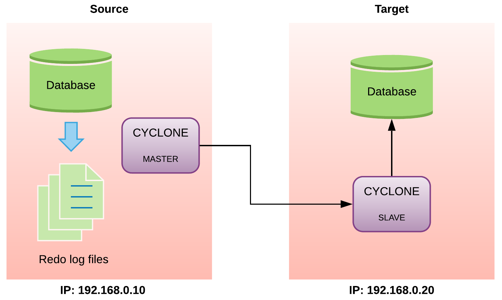

<a id="297bbf535e9fa6e7"></a>

# 50. CYCLONE

> Source: [GOLDILOCKS 22c.1 User Manual (en)](https://manual.sunjesoft.co.kr/goldilocks/22c_1/manual/en/297bbf535e9fa6e7)  
> Tag: `22c.1_10_tag`

[← 49. Overview](49-overview.md) · [Table of contents](../README.md) · [51. LOGMIRROR →](51-logmirror.md)

<a id="98f3157ef155f15a"></a>
## CYCLONE

CYCLONE is a replication tool which uses the Change Data Capture (CDC) method.

<a id="af5bbfb028540ef9"></a>
### Overview

Database records the data changes which occur during the operation in the redo log file for the recovery. CDC performs the replication by analyzing the information of the recorded redo log file.

CYCLONE is driven being divided into master and slave. Master recognizes the changes of the redo log file in the original database and analyzes it, then transfers it to the slave. Slave analyzes the received data and performs the replication by using ODBC.

<a id="55aba934dd7e0c25"></a>
### Operational Features

- It is divided into master and slave and is operated as master/slave in group unit.
- Master and slave of CYCLONE uses TCP/ IP communication. 
- It can be executed/ terminated in group unit.
- The replication is executed in table unit, and a group may include one or more tables. 
- A single table may be operated being included in several groups. 
- The original database should have the redo log files, so DATA_STORE_MODE should be operated in TDS.
- The original database should have SUPPLEMENTAL LOGGING.
    - SUPPLEMENTAL LOGGING adds an additional information to the redo log files for the replication of CYCLONE.
- The original database should be operated in ARCHIVE LOG mode.
    - GOLDILOCKS recursively reuses the redo log files. When the redo log files are reused before the replication is completed, the replication becomes aborted and the existing replication from the current point is canceled then restarted. Therefore, the redo log files should be operated in ARCHIVE LOG mode to be archived.
- It does not affect GOLDILOCKS even when it fails to replicate because it is operated as an independent process.

<a id="9e4e173d8b603b91"></a>
### Operational Restrictions

- The table participated in the replication should have a PRIMARY KEY.
- Only the committed transaction is allowed to be replicated. Therefore, the content is unknown to the slave before committing the transaction.
- The primary key update is not supported. 
    - When the primary key is updated, the table is given up and it is not replicated any more. 
- The table participated in the replication can not use the column which has Generated Always As Identity property. 
- When Data Definition Language (DDL) is performed on the table in which the replication is being operated, it could be given up. 
    - For more information, refer to [The occurrence of give up and whether to allow DDL statement according to DDL category](#ec779fc67c96906b) in table1. 
    - If it does not comply with the processing procedure of table DDL of CYCLONE, then even the allowable DDL is given up.
    - It does not affect the replication of other tables.
    - It is same in case of the truncated table. 
- The given-up table can be reset only when it was given up with --reset TABLE_NAME
- The columns configuring the table participating in the replication should have the same structure.(data type, order)
- The database performing the replication should have the same character encoding.
- The table stored in the recycle bin is not a replication target.

<a id="ec779fc67c96906b"></a>
<table class="table column_count_4"><caption>The occurrence of give up and whether to allow DDL statement according to DDL category</caption><thead><tr><th class="to_center to_middle"><div>DDL category</div></th><th class="to_center to_middle"><div>Occurrence of
give up</div></th><th class="to_center"><div>Whether to 
allow 
DDL statement</div></th><th class="to_center to_middle"><div>DDL statement</div></th></tr></thead><tbody><tr><td class="to_middle" rowspan="8"><div>Table DDL</div></td><td class="to_center to_middle"><div>X</div></td><td class="to_center"><div>-</div></td><td class="to_middle"><div>CREATE TABLE</div></td></tr><tr><td class="to_center to_middle"><div>O</div></td><td class="to_center"><div>X</div></td><td class="to_middle"><div>DROP TABLE</div></td></tr><tr><td class="to_center to_middle"><div>O</div></td><td class="to_center"><div>X</div></td><td class="to_middle"><div>TRUNCATE TABLE</div></td></tr><tr><td class="to_center to_middle"><div>O</div></td><td class="to_center"><div>X</div></td><td class="to_middle"><div>ALTER TABLE .. RENAME</div></td></tr><tr><td class="to_center to_middle"><div>X</div></td><td class="to_center"><div>-</div></td><td class="to_middle"><div>ALTER TABLE .. STORAGE</div></td></tr><tr><td class="to_center to_middle"><div>X</div></td><td class="to_center"><div>-</div></td><td class="to_middle"><div>ALTER TABLE .. ADD SUPPLEMENTAL LOG</div></td></tr><tr><td class="to_center"><div>O</div></td><td class="to_center"><div>X</div></td><td><div>ALTER TABLE .. DROP SUPPLEMENTAL LOG</div></td></tr><tr><td class="to_center"><div>X</div></td><td class="to_center"><div>-</div></td><td><div>ALTER TABLE .. READ { ONLY | WRITE }</div></td></tr><tr><td class="to_middle" rowspan="10"><div>Column DDL</div></td><td class="to_center to_middle"><div>O</div></td><td class="to_center"><div>O</div></td><td class="to_middle"><div>ALTER TABLE .. ADD COLUMN</div></td></tr><tr><td class="to_center to_middle"><div>O</div></td><td class="to_center"><div>X</div></td><td class="to_middle"><div>ALTER TABLE .. SET UNUSED COLUMN</div></td></tr><tr><td class="to_center to_middle"><div>O</div></td><td class="to_center"><div>-</div></td><td class="to_middle"><div>ALTER TABLE .. RENAME COLUMN</div></td></tr><tr><td class="to_center to_middle"><div>X</div></td><td class="to_center"><div>-</div></td><td class="to_middle"><div>ALTER TABLE .. ALTER COLUMN .. SET DEFAULT</div></td></tr><tr><td class="to_center to_middle"><div>X</div></td><td class="to_center"><div>-</div></td><td class="to_middle"><div>ALTER TABLE .. ALTER COLUMN .. DROP DEFAULT</div></td></tr><tr><td class="to_center to_middle"><div>O</div></td><td class="to_center"><div>X</div></td><td class="to_middle"><div>ALTER TABLE .. ALTER COLUMN .. SET NOT NULL</div></td></tr><tr><td class="to_center to_middle"><div>O</div></td><td class="to_center"><div>X</div></td><td class="to_middle"><div>ALTER TABLE .. ALTER COLUMN .. DROP NOT NULL</div></td></tr><tr><td class="to_center to_middle"><div>O</div></td><td class="to_center"><div>X</div></td><td class="to_middle"><div>ALTER TABLE .. ALTER COLUMN .. ALTER IDENTITY</div></td></tr><tr><td class="to_center to_middle"><div>O</div></td><td class="to_center"><div>X</div></td><td class="to_middle"><div>ALTER TABLE .. ALTER COLUMN .. DROP IDENTITY</div></td></tr><tr><td class="to_center"><div>O</div></td><td class="to_center"><div>O</div></td><td><div>ALTER TABLE .. ALTER COLUMN .. SET DATATYPE</div></td></tr><tr><td class="to_middle" rowspan="4"><div>Constraint DDL</div></td><td class="to_center to_middle"><div>O</div></td><td class="to_center"><div>X</div></td><td class="to_middle"><div>ALTER TABLE .. ADD CONSTRAINT</div></td></tr><tr><td class="to_center to_middle"><div>O</div></td><td class="to_center"><div>X</div></td><td class="to_middle"><div>ALTER TABLE .. DROP CONSTRAINT</div></td></tr><tr><td class="to_center"><div>O</div></td><td class="to_center"><div>X</div></td><td><div>ALTER TABLE .. ALTER CONSTRAINT</div></td></tr><tr><td class="to_center"><div>X</div></td><td class="to_center"><div>-</div></td><td><div>ALTER TABLE .. RENAME CONSTRAINT</div></td></tr><tr><td class="to_middle" rowspan="6"><div>Index DDL</div></td><td class="to_center to_middle"><div>O</div></td><td class="to_center"><div>X</div></td><td class="to_middle"><div>CREATE UNIQUE INDEX</div></td></tr><tr><td class="to_center to_middle"><div>X</div></td><td class="to_center"><div>-</div></td><td class="to_middle"><div>CREATE INDEX</div></td></tr><tr><td class="to_center to_middle"><div>O</div></td><td class="to_center"><div>X</div></td><td class="to_middle"><div>DROP INDEX unique_index</div></td></tr><tr><td class="to_center"><div>X</div></td><td class="to_center"><div>-</div></td><td><div>DROP INDEX non_unique_index</div></td></tr><tr><td class="to_center"><div>X</div></td><td class="to_center"><div>-</div></td><td><div>ALTER INDEX .. STORAGE</div></td></tr><tr><td class="to_center to_middle"><div>X</div></td><td class="to_center"><div>-</div></td><td><div>ALTER INDEX .. RENAME</div></td></tr><tr><td class="to_middle" rowspan="3"><div>Superordinate object 
of table</div></td><td class="to_center to_middle"><div>O</div></td><td class="to_center"><div>X</div></td><td class="to_middle"><div>DROP USER</div></td></tr><tr><td class="to_center to_middle"><div>O</div></td><td class="to_center"><div>X</div></td><td class="to_middle"><div>DROP SCHEMA</div></td></tr><tr><td class="to_center to_middle"><div>O</div></td><td class="to_center"><div>X</div></td><td class="to_middle"><div>DROP TABLESPACE</div></td></tr></tbody></table>

> The server property [DISABLE_DDL_CDC_GIVEUP](../part-02-administration-manual/10-server-property.md#626249d01000fc6a) can disable the DDL statement which causes the replication give up to avoid user created errors. Also, the server property [DISABLE_UPDATE_PK_CDC_GIVEUP](../part-02-administration-manual/10-server-property.md#2e594dab6ae3b224) can disable primary key update.

<a id="b9f3dfc53dd20c61"></a>
### DDL Processing during Replication

It should comply with the following procedure when the allowable DDL is performed for the table in which the replication is being performed.

1. Terminate all operating CYCLONE in master and slave before executing DDL in master.
** The process in progress does not need to be terminated.
** e.g. cyclone --master --stop / cyclone --slave --stop 
2. Execute DDL in both master and slave. (It should be the allowable DDL.)
** For more information, refer to [The occurrence of give up and whether to allow DDL statement according to DDL category](#ec779fc67c96906b)
3. Restart CYCLONE of master and slave.
** cyclone --master --start ... / cyclone --slave --start ...
** It does not require --reset option.
** It performs the recovery from the termination of the first stage and process DDL when restarting. (Refer to trace log)

**DDL application procedure**

<a id="56bd999860e991da"></a>
| Item | MASTER CYCLONE | MASTER DB | SLAVE CYCLONE | SLAVE DB |
| --- | --- | --- | --- | --- |
| 1 | CYCLONE STOP | - | - | - |
| 2 | - | - | CYCLONE STOP | - |
| 3 | - | Executing DDL | - | - |
| 4 | - | - | - | Executing DDL |
| 5 | CYCLONE START | - | - | - |
| 6 | - | - | CYCLONE START | - |

> If the table which executed DDL in CYCLONE master is given up after DDL application procedure is normally performed, then the following two should be checked.  
> 
> 
> 1. Check if DDL performed in the master DB and in the slave DB is same, and check if the table structure is same after performing the DDL. (The order of performing DDL does not matter.)
> 2. Check if the performed DDL is allowable.
> 
>   
> If the table is given up due to the reasons above, the given-up table should be replicated again from the current point by using reset in table unit and restarting it. (e.g. cyclone --start --master --reset TABLE_NAME).

<a id="ae523346906023d8"></a>
### Datatype Compatibility When Interworking with Other DBMS

- When target database of CYCLONE slave interworks with other DBMS instead of GOLDILOCKS, the column datatype of GOLDILOCKS table, source database, should be compatible with that of other DBMS table so that it can prevent the data loss or an error.
- Currently, it can interwork with Oracle, MySQL and DB2.
- When interworking with other DBMS, then SYNC and allowable DDL features are not available.

<a id="1d0f7edb41179c65"></a>
#### Oracle

**Datatype compatible with Oracle**

<a id="6e4138588e9d23ee"></a>
| GOLDILOCKS | Oracle | Remarks |
| --- | --- | --- |
| Boolean | X | The corresponding datatype does not exist. |
| NATIVE_SMALLINT | NUMBER(5) | - |
| NATIVE_INTEGER | NUMBER(10) | - |
| NATIVE_BIGINT | NUMBER(19) | - |
| NATIVE_REAL | BINARY_FLOAT | - |
| NATIVE_DOUBLE | BINARY_DOUBLE | - |
| FLOAT | FLOAT | - |
| SMALLINT | NUMBER(5,0) | - |
| INTEGER | NUMBER(10,0) | - |
| BIGINT | NUMBER(19,0) | - |
| INT2 | NUMBER(5,0) | - |
| INT4 | NUMBER(10,0) | - |
| INT8 | NUMBER(19,0) | - |
| REAL | FLOAT(24) | - |
| DOUBLE | FLOAT(53) | - |
| DOUBLE PRECISION | FLOAT(53) | - |
| FLOAT4 | FLOAT(24) | - |
| FLOAT8 | FLOAT(53) | - |
| DECIMAL | NUMERIC | - |
| NUMBER | NUMBER | - |
| NUMERIC | NUMERIC | - |
| CHAR | CHAR | - |
| VARCHAR | VARCHAR, VARCHAR2 | - |
| BINARY | RAW | - |
| VARBINARY | RAW | - |
| DATE | DATE | - |
| TIME | X | The corresponding datatype does not exist. |
| TIMESTAMP | TIMESTAMP | - |
| TIMESTAMP WITH TIMEZONE | X | It does not support ODBC driver. |
| INTERVAL | X | It does not support ODBC driver. |
| LONG VARCHAR | LONG VARCHAR | - |
| LONG VARBINARY | LONG RAW | - |

- The following four datatypes can not be replicated as described in a table above.
    - BOOLEAN
    - TIME
    - TIMESTAMP WITH TIMEZONE
    - INTERVAL

<a id="6a8161ac149cfd92"></a>
#### MySQL

**Datatype compatible with MySQL**

<a id="121a8480aab4a8d4"></a>
| GOLDILOCKS | MySQL | Remarks |
| --- | --- | --- |
| Boolean | BOOL, BOOLEAN | The corresponding type in MySQL is a synonym of TINYINT(1). |
| NATIVE_SMALLINT | SMALLINT | - |
| NATIVE_INTEGER | INT | - |
| NATIVE_BIGINT | BIGINT | - |
| NATIVE_REAL | FLOAT | - |
| NATIVE_DOUBLE | DOUBLE | The corresponding type in MySQL is a synonym of DOUBLE PRECISION, and it does not support the unsigned. |
| FLOAT | X | The precision is supported up to 53 in MySQL, and a data error occurs if the precision is bigger. |
| SMALLINT | SMALLINT | - |
| INTEGER | INTEGER | - |
| BIGINT | BIGINT | - |
| INT2 | SMALLINT | - |
| INT4 | INTEGER | - |
| INT8 | BIGINT | - |
| REAL | REAL | - |
| DOUBLE | DOUBLE | - |
| DOUBLE PRECISION | DOUBLE PRECISION | - |
| FLOAT4 | FLOAT(24) | A data error may occur. |
| FLOAT8 | FLOAT(53) | A data error may occur. |
| DECIMAL | DECIMAL | - |
| NUMBER | X | - |
| NUMERIC | NUMERIC | - |
| CHAR | TEXT | - |
| VARCHAR | TEXT | - |
| BINARY | VARBINARY | - |
| VARBINARY | VARBINARY | - |
| DATE | DATETIME | - |
| TIME | TIME(6) | The data is not lost when fractional seconds precision is set. |
| TIMESTAMP | DATETIME(6) | The data is not lost when fractional seconds precision is set. |
| TIMESTAMP WITH TIMEZONE | X | It does not support ODBC driver. |
| INTERVAL | X | It does not support ODBC driver. |
| LONG VARCHAR | TEXT | - |
| LONG VARBINARY | BLOB | - |

- The following four datatypes can not be replicated as described in a table above.
    - FLOAT
    - NUMBER
    - TIMESTAMP WITH TIMEZONE
    - INTERVAL

> When 'lower_case_table_names' is set to '0' in Mysql settings, then it is case sensitive in schema/ table name. Therefore, use a double quotation (") in schema/ table name when specifying the configuration file.

<a id="6c8a18f9b8786999"></a>
#### DB2

**Datatype compatible with DB2**

<a id="9c0f0c0b058076e6"></a>
| GOLDILOCKS | DB2 | Remarks |
| --- | --- | --- |
| Boolean | X | The corresponding datatype does not exist. |
| NATIVE_SMALLINT | SMALLINT | - |
| NATIVE_INTEGER | INT | - |
| NATIVE_BIGINT | BIGINT | - |
| NATIVE_REAL | REAL | - |
| NATIVE_DOUBLE | DOUBLE | - |
| FLOAT | DOUBLE | - |
| SMALLINT | DECIMAL(5) | - |
| INTEGER | DECIMAL(10) | - |
| BIGINT | DECIMAL(19) | - |
| INT2 | DECIMAL(5) | - |
| INT4 | DECIMAL(10) | - |
| INT8 | DECIMAL(19) | - |
| REAL | DOUBLE | - |
| DOUBLE | DOUBLE | - |
| DOUBLE PRECISION | DOUBLE | - |
| FLOAT4 | DOUBLE | - |
| FLOAT8 | DOUBLE | - |
| DECIMAL | DECIMAL | The significant digit of DB2 is 31. |
| NUMBER | DECIMAL | The significant digit of DB2 is 31. |
| NUMERIC | DECIMAL | The significant digit of DB2 is 31. |
| CHAR | CHAR | The maximum size of DB2 is 254 bytes. |
| VARCHAR | VARCHAR | - |
| BINARY | CHAR(n) FOR BIT DATA | The maximum size of DB2 is 254 bytes. |
| VARBINARY | VARCHAR(n) FOR BIT DATA | - |
| DATE | DATE / TIMESTAMP(0) | DATE of DB2 is stored only in YYYY/MM/DD format. |
| TIME | X | - |
| TIMESTAMP | TIMESTAMP | - |
| TIMESTAMP WITH TIMEZONE | X | It does not support ODBC driver. |
| INTERVAL | X | It does not support ODBC driver. |
| LONG VARCHAR | CLOB | - |
| LONG VARBINARY | BLOB | - |

<a id="b99e6f392f439cba"></a>
### Others

The replication moments are as follows.

- At the first run, the replication starts after master and slave are performed and the initialization is terminated.
- Even if it is restarted after terminated during the replication, the replication is continuously performed from the termination point. (Recovery feature)
- It should be restarted by using --reset option when giving up the existing replication and restarting from the current point.

<a id="3146ddc78a9cae32"></a>
## Requirements

Original GOLDILOCKS: It is required to perform GOLDILOCKS preparations, user registration and privilege setting all.  
Remote GOLDILOCKS: It is required to perform user registration and privilege setting only.

<a id="2540a81e637ffaa2"></a>
### GOLDILOCKS Requirements

The followings should be set in GOLDILOCKS before starting the replication using CYCLONE.

<a id="7e7034fbcb7ca76f"></a>
#### SUPPLEMENTAL LOGGING

SUPPLEMENTAL LOGGING stores additional information in the redo log file for the replication of CYCLONE. The database restart is required to change the settings of the database in operation, but the database restart is not required to set SUPPLEMENTAL LOGGING for a particular table.

<a id="7eb2c538eed23be4"></a>
##### Setting SUPPLEMENTAL LOGGING in Database

- If the GOLDILOCKS property is set as SUPPLEMENTAL LOGGING, SUPPLEMENTAL LOGGING is recorded for every table.
- GOLDILOCKS restart is required. 
- The appropriate information is added or updated in the property file.
    - Property file: goldilocks.properties.conf
    - Property setting: SUPPLEMENTAL LOG_DATA_PRIMARY_KEY = YES

<a id="b319960e4b788f07"></a>
##### Setting SUPPLEMENTAL LOGGING in Specific Table Participating in Replication

```
<add table supplemental log statement> ::=
    ALTER TABLE table_name 
        ADD SUPPLEMENTAL LOG DATA ( PRIMARY KEY ) COLUMNS
    ;
```

<a id="f243c133ae5970c6"></a>
#### ARCHIVE LOG

GOLDILOCKS reuses the redo log files recursively. When GOLDILOCKS reuses the redo log file being processed by CYCLONE, then CYCLONE does not proceed and is terminated. GOLDILOCKS should be operated in ARCHIVE LOG mode to ensure the continuous replication operation.

<a id="a2e2a0284a9d294f"></a>
##### Changing Database in Operation to ARCHIVE LOG Mode

- Restart GOLDILOCKS. 
- After database is shutdown, connect with sysdba and change it to ARCHIVE LOG mode in MOUNT phase.

```
gSQL> \startup mount

Startup success

gSQL> alter database archivelog;

Database altered.
```

<a id="d423d40bcc0516d3"></a>
##### Setting ARCHIVE LOG Mode When Creating Database

- Update the property file before creating the database. 
    - Property file: goldilocks.properties.conf
    - Property setting: ARCHIVELOG_MODE = 1

> The path in which ARCHIVE LOG file is stored can be viewed and updated with 'ARCHIVELOG_DIR'.

<a id="cdaff04d680d2147"></a>
#### DATA_STORE_MODE

CYCLONE performs the replication by reading the redo log files of GOLDILOCKS. Therefore, GOLDILOCKS should be operated in Transactional Data Store (TDS) mode.

<a id="9a6b382dec536118"></a>
##### Changing DATA_STORE_MODE

- Restart the database. 
- Add or update the corresponding information in the property file.
    - Property file: goldilocks.properties.conf
    - Property setting: DATA_STORE_MODE = 2

> If the value of DATA_STORE_MODE is 1, it indicates Concurrent Data Store (CDS), and if it is 2, it indicates Transactional Data Store (TDS).

<a id="134eb1a437aba326"></a>
### Registering User and Setting Privileges

CYCLONE retrieves and manipulates the required information during the operation. The user operating CYCLONE and the proper privileges for the user are required.

<a id="984ccafa24569d52"></a>
#### Creating Database User

A specific user should be added to operate CYCLONE, and the corresponding user should be added for all GOLDILOCKS of which CYCLONE is operated in master, slave mode.

```
<user definition> ::=
    CREATE USER user_identifier IDENTIFIED BY password
    [ DEFAULT TABLESPACE tablespace_name ]
    [ TEMPORARY TABLESPACE tablespace_name ]
    [ INDEX TABLESPACE {tablespace_name|NULL} ]
    [ <schema clause> ]
    ;

<schema clause> ::=
      WITH SCHEMA [schema_name]
    | WITHOUT SCHEMA
```

The following is an example of creating the user cdc_user with the password cdc_password.

```
gSQL> CREATE USER cdc_user IDENTIFIED BY cdc_password;
```

<a id="517666223cfc0d3f"></a>
#### Database Privileges

<a id="272bd1811658d2fa"></a>
##### Granting User Access Privilege

The following is an example for granting the access privilege to cdc_user. It should be set on all GOLDILOCKS which is operated in both master/ slave mode.

```
gSQL> GRANT CREATE SESSION ON DATABASE TO cdc_user;
```

<a id="206a8f3331a79f84"></a>
##### Granting Privilege for Altering Table

The following is an example of granting the table updating privilege to cdc_user. It is set on GOLDILOCKS which is operated in slave mode.

```
gSQL> GRANT INSERT ANY TABLE, DELETE ANY TABLE, UPDATE ANY TABLE ON
DATABASE TO cdc_user;
```

<a id="9483e2a7d7eca82b"></a>
#### Tablespace Privileges

The privileges on the data tablespace and temporary tablespace should be set. The following is an example of granting the privilege for using the default tablespace to cdc_user. It is set on GOLDILOCKS which is operated in slave mode.

```
gSQL> GRANT CREATE OBJECT ON TABLESPACE mem_data_tbs TO cdc_user;
gSQL> GRANT CREATE OBJECT ON TABLESPACE mem_temp_tbs TO cdc_user;
```

<a id="2237aa0fdd703c0d"></a>
#### Schema Privileges

The schema privileges for creating and managing meta managed in CYCLONE should be set. The following is an example granting the schema privilege to cdc_user. It is set on GOLDILOCKS which is operated in slave mode.

```
gSQL> GRANT CREATE TABLE, CREATE INDEX, CREATE SEQUENCE, CREATE VIEW,
ADD CONSTRAINT ON SCHEMA cdc_user TO cdc_user;
```

<a id="b73d548b96d7f677"></a>
## Configuration

<a id="5cff4aedb689400b"></a>
### Configuration File

When performing CYCLONE, the information and options required for operating are set by using the configuration file.

- When a specific configuration file is not set by using the --conf option, a specific file in the $GOLDILOCKS_DATA/conf directory is read. cyclone.master.conf file is read when it is operated in master mode and cyclone.slave.conf file is read when it is operated in slave mode.

**Configuration file options**

<a id="40311d688a22c9ac"></a>
| Name | Description | Coverage |
| --- | --- | --- |
| COMM_CHUNK_COUNT | It sets the size of BUFFER for communication. | Master/ slave |
| DSN | It sets Data Source Name. | Master/ slave |
| GROUP_NAME | It sets the group name. | Master/ slave |
| HOST_IP | It sets the host IP address of which GOLDILOCKS operates. | Master/ slave |
| HOST_EXTERNAL_IP | It is used when slave GOLDILOCKS IP to which the cyclone master is to be connected is different from HOST_IP. (When master and slave are on wan section.) | Slave |
| HOST_PORT | It sets the host port of which GOLDILOCKS operates. | Master/ slave |
| PORT | It sets the port for master/ slave communication. | Master/ slave |
| USER_ID | It sets the user name. | Master/ slave |
| USER_PW | It sets the user password. | Master/ slave |
| USER_ENCRYPT_PW | It sets the encrypted password for DB user. | Master/ slave |
| CAPTURE_TABLE | It sets the table to be replicated. | Master |
| LOG_PATH | It is used when interworking with LOGMIRROR and it sets the location of the redo log file. | Master |
| PROTOCOL | It sets the connection type which is to be connected to GOLDILOCKS. (DA or TCP) | Master/ slave |
| READ_LOG_BLOCK_COUNT | It sets the amount of data to be read at a time when operating CAPTURE. | Master |
| TRANS_SORT_AREA_SIZE | It sets the size of the BUFFER to be allocated to CAPTURE. | Master |
| TRANS_FILE_PATH | It sets the location in which the temporarily generated file is to be stored when operating CAPTURE. | Master |
| SYNCHER_COUNT | It is applied when using SYNC feature, and it sets the number of SYNCHER simultaneously performing the data insertion. | Master |
| SYNC_ARRAY_SIZE | It is applied when using SYNC feature, and it sets the array size which insert data at a time. | Master |
| GIVEUP_INTERVAL | If the replication performance speed is lower than GOLDILOCKS performance, it is set to stop the replication. | Master |
| APPLIER_COUNT | It sets the number of APPLIER simultaneously performed during the replication. | Slave |
| APPLY_COMMIT_SIZE | It sets the maximum size for COMMIT during the replication. | Slave |
| APPLY_TABLE | It sets the table to which the replicated table is to be applied. | Slave |
| MASTER_IP | It sets the IP address of the equipment of which CYCLONE master is operated. | Slave |
| PROPAGATE_MODE | It sets whether to propagate the data applied by CYCLONE. | Slave |
| SUPPLEMENTAL_LOG_FORCE_MODE | If supplemental logging is not enabled on the replication target table, supplemental logging is enabled for that table. To use this option, the required privilege to enable this feature is needed. | Master |
| SEPARATE_CONFLICT_LOG | It sets whether to separate the conflict log from the trace log when storing it. (The default value is 0.) * 0: It is not separated. * 1: It is separated then stored. (The filename is cyclone_conflict_GROUPNAME.log.) | Slave |
| UPDATE_APPLY_MODE | It distinguishes the operation when updating. (The default value is 0.) * 0: It is updated only when the primary keys are same.  * 1: It is updated only when the primary key and the value before the update are same. * 2: It is updated only when the primary keys are same. It compares the value before and after the update, then leaves a log if the values are different. | Slave |
| TCP_NODELAY | It sets TCP_NODELAY option of a socket. (The default value is 1.) * 0: TCP_NODELAY off * 1: TCP_NODELAY on | Master |
| HEARTBEAT_TIMEOUT | It sets the maximum time (second) maintaining connection if the connection is not smooth due to network disconnection or system error after replication connection. | Master/ slave |
| SKIP_COMMENT | It enters the text for transaction skip. If the same text is entered as commit comment in master, then it skips that transaction instead of replicating it. | Master |
| LOG_CAPTURE_INTERVAL_1 | It sets the execution cycle of capture. If the value is not changed after executing 10 times with that value, then it is converted to the value of LOG_CAPTURE_INTERVAL_2 and performs capture. (The default value is 0.2 seconds.) | Master |
| LOG_CAPTURE_INTERVAL_2 | It sets the execution cycle of capture. If the value is not changed after executing with the value of LOG_CAPTURE_INTERVAL_1, then it sets the execution cycle of capture. (The default value is 1 second.) | Master |
| CLUSTER | It specifies the connection information of a master when the master is in cluster environment. A master consists of the following three information.  * ID: It is a delimiter and sets to 1 or more value. * MASTER_IP * PORT | Slave |
| ORACLE_DRIVER | It specifies the file location of the Oracle ODBC driver provided by Oracle. | Slave |
| MYSQL_DRIVER | It specifies the file location of the MySQL ODBC driver provided by MySQL. | Slave |
| MYSQL_DATABASE | It specifies the database name of MySQL to replicate. | Slave |
| DB2_DRIVER | It specifies the file path of the DB2 ODBC driver provided by DB2. | Slave |
| DB2_DATABASE | It specifies the name of the DB2 database to be replicated. | Slave |
| TIBERO_DRIVER | It specifies the file path of the ODBC driver provided by TIBERO. | Slave |
| SYNC_ORACLE_DRIVER | It specifies the file path of the Oracle ODBC driver provided by Oracle. (Used for SYNC connections) | Master |
| SYNC_MYSQL_DRIVER | It specifies the file path of the MySQL ODBC driver provided by MySQL. (Used for SYNC connections) | Master |
| SYNC_DB2_DRIVER | It specifies the file path of the DB2 ODBC driver provided by DB2. (Used for SYNC connections) | Master |
| SYNC_TIBERO_DRIVER | It specifies the file path of the TIBERO ODBC driver provided by TIBERO. (Used for SYNC connections) | Master |
| PACKET_COMPRESSION_MODE | It sets whether to compress the data of communication of master and slave. (1: Enable, 0: Disable, Default: Enable) | Master |

<a id="5af2d763cc3843e2"></a>
### Configuration Option

<a id="3e59ce88d1927067"></a>
#### COMM_CHUNK_COUNT

- It sets the number of buffers(chunk) used in data communication between master and slave of CYCLONE.
- It allocates the resource with 16M * N (the set value). 
- The default value is 32, and the actual size is 16M * 32 = 512 M.
- The minimum value is 10.
- It can be set in master and slave.
    - If too small value is set so the buffer is not enough, the performance becomes poor.

• Settings applied to all groups

```
COMM_CHUNK_COUNT = 10
```

• Settings applied to a specific group

```
GROUP_NAME = testGROUP
{
    COMM_CHUNK_COUNT=20
    ....
    ....
}
```

<a id="96669101e45a4aa5"></a>
#### DSN

- It sets the data source name which is required when connecting to GOLDILOCKS.
- It can be set in master and slave.
- The default value is GOLDILOCKS.

• Settings applied to all groups

```
DSN=GOLDILOCKS
```

• Settings applied to a specific group

```
GROUP_NAME = testGROUP
{
    DSN=GOLDILOCKS
    ....
    ....
}
```

<a id="81c374fc429c2084"></a>
#### GROUP_NAME

- It is necessary for distinguishing the CYCLONE operation within the equipment and it is a unit of generating the operation process. 
- It is the delimiter of when starting or terminating CYCLONE in group unit. 
- After it is set, it should not be changed. If changed, it is regarded as a new group. 
- It can be set in master and slave. 
    - The connection between master and slave is separated not by GROUP_NAME but by PORT.
    - GROUP_NAME should be unique in the same equipment.
- The braces { } should be used.

```
GROUP_NAME = testGROUP
{
    ....
    ....
}
```

<a id="2d29149d80728f27"></a>
#### HOST_IP

- It sets the IP address of GOLDILOCKS to be connected by CYCLONE. 
- It can be set in master and slave. 
    - It is valid only when PROTOCOL is set to TCP.

• Settings applied to all groups

```
HOST_IP = 127.0.0.1
```

• Settings applied to a specific group

```
GROUP_NAME = testGROUP
{
    HOST_IP = 127.0.0.1
    ....
    ....
}
```

<a id="499ff821e1460f30"></a>
#### HOST_EXTERNAL_IP

- It can be set in slave.
- CYCLONE master access GOLDILOCKS of the slave's side when it is operated in sync, and it is used if slave GOLDILOCKS IP to which the cyclone master is to be connected is different from HOST_IP.
    - It is used when IP on lan and IP on wan is different because master and slave are on wan section.
    - CYCLONE slave transfers this value to CYCLONE master, and it is used in CYCLONE master.

• Settings applied to all groups

```
HOST_EXTERNAL_IP = 192.168.0.120
```

• Settings applied to a specific group

```
GROUP_NAME = testGROUP
{
    HOST_EXTERNAL_IP = 192.168.0.120
    ....
    ....
}
```

<a id="674a71f26b142c63"></a>
#### HOST_PORT

- It sets the port of GOLDILOCKS to be connected by CYCLONE. 
- It should be set together with HOST_IP.
- It can be set in master and slave.

• Settings applied to all groups

```
HOST_PORT = 22531
```

• Settings applied to a specific group

```
GROUP_NAME = testGROUP
{
    HOST_PORT = 22531
    ....
    ....
}
```

<a id="19ff890da37d0900"></a>
#### PORT

- It sets the PORT used in the communication between master and slave.
- The duplicated PORT should not be set between the groups, and the unique value should be used for each GROUP.
- It is mandatory be set and it can be set only within GROUP_NAME.

• It can be set only within a group.

```
GROUP_NAME = testGROUP
{
    PORT = 21102
    ....
    ....
}
```

<a id="fd21868ff20339ca"></a>
#### USER_ID

- It sets the user ID required to access GOLDILOCKS.
- It can be set in master and slave.

• Settings applied to all groups

```
USER_ID = testID
```

• Settings applied to a specific group

```
GROUP_NAME = testGROUP
{
    USER_ID = testID
    ....
    ....
}
```

<a id="3810c81f5453432f"></a>
#### USER_PW

- It sets the user password required to access GOLDILOCKS.
- It can be set in master and slave.

• Settings applied to all groups

```
USER_PW = testPW
```

• Settings applied to a specific group

```
GROUP_NAME = testGROUP
{
    USER_PW = testPW
    ....
    ....
}
```

<a id="28aa8798e5de7c5c"></a>
#### USER_ENCRYPT_PW

- It sets the user password which is required for the access to GOLDILOCKS by encrypting.
- It is used instead of USER_PW.
- Encrypted user password is created by [cyclone --encrypt *user password* --key *the key to be encrypted*].
- If this value is used, then --key option should be used when executing cyclone. (In this case, the key value as same as that created with --encrypt should be used.

• Settings applied to all groups

```
USER_ENCRYPT_PW = 't33KImiqvhqNyfN+uZmFrw=='
```

• Settings applied to a specific group

```
GROUP_NAME = testGROUP
{
    USER_ENCRYPT_PW = 't33KImiqvhqNyfN+uZmFrw=='
    ....
    ....
}
```

<a id="db67dd2173460f08"></a>
#### CAPTURE_TABLE

- It sets the table to be replicated. 
    - It is set in *schema_name.table_name* format.
- It can set only in master.
- It can be set only within a group.
- When specifying several tables, the parentheses ( ) should be used.
- The table stored in the recycle bin can not be set to be replicated.

```
GROUP_NAME = testGROUP
{
    CAPTURE_TABLE = 
    (
        testSchema1.testTable1,
        testSchema1.testTable2,
        testSchema2.testTable1
    )
}
```

<a id="9ccb796294ce5cb5"></a>
#### LOG_PATH

- It is used when interworking with LOG MIRROR.
- It sets the path of the redo log files stored by LOGMIRROR.
    - The absolute path should be used.
    - The path should be specified by using single quote (').

• Settings applied to all groups

```
LOG_PATH = '/data/wal/'
```

• Settings applied to a specific group

```
GROUP_NAME = testGROUP
{
    LOG_PATH = '/data/wal/'
    ....
    ....
}
```

<a id="61d326b1de8a0a2d"></a>
#### PROTOCOL

- It sets the type to connect to GOLDILOCKS in operation.
- It can be set to DA or TCP.
- If PROTOCOL is set to DA, neither HOST_IP nor is HOST_PORT used when accessing to GOLDILOCKS.
    - However, in a slave, HOST_IP and HOST_PORT can be used for SYNC even when PROTOCOL is DA.
- The default value is DA.

• Settings applied to all groups

```
PROTOCOL = DA
```

• Settings applied to a specific group

```
GROUP_NAME = testGROUP
{
    PROTOCOL = DA
    ....
    ....
}
```

<a id="b5c54e2d9d2a765f"></a>
#### READ_LOG_BLOCK_COUNT

- It sets the number of the log blocks to be read at a time when capturing redo log file.
- It can be set only in master.
- The size of a log block is 512 bytes.
- The default value is 40960, and the actual read size is 20 MBytes.
    - The minimum value is 100.

• Settings applied to all groups

```
READ_LOG_BLOCK_COUNT = 1024
```

• Settings applied to a specific group

```
GROUP_NAME = testGROUP
{
    READ_LOG_BLOCK_COUNT = 1024
    ....
    ....
}
```

<a id="14dcf050259c5a1e"></a>
#### TRANS_SORT_AREA_SIZE

- It sets the memory space required for capturing the redo log files.
- It can be set only in master.
- The unit is MB (megabytes).
- The default value is 500 MB.
    - The minimum value is 10 MB.
- If the value is set too small, the performance becomes poor.

• Settings applied to all groups

```
TRANS_SORT_AREA_SIZE = 300
```

• Settings applied to a specific group

```
GROUP_NAME = testGROUP
{
    TRANS_SORT_AREA_SIZE = 300
    ....
    ....
}
```

<a id="3bd7095c112c2260"></a>
#### TRANS_FILE_PATH

- If a space bigger than TRANS_SORT_AREA_SIZE is required, the temporary file is created. It sets the path in which the temporary file is to be stored.
    - The absolute path should be used.
    - The path should be specified by using single quote (').
- It can be set only in master.

• Settings applied to all groups

```
TRANS_FILE_PATH = '/data/TmpTrans'
```

• Settings applied to a specific group

```
GROUP_NAME = testGROUP
{
    TRANS_FILE_PATH = '/data/TmpTrans'
    ....
    ....
}
```

<a id="f2d14395342d3173"></a>
#### SYNCHER_COUNT

- It is used for synchronization.
    - It sets the number of SYNCHERs participating in synchronization.
    - It is input in the number unit.
- It is set only in master.

• Settings applied to all groups

```
SYNCHER_COUNT = 8
```

• Settings applied to a specific group

```
GROUP_NAME = testGROUP
{
    SYNCHER_COUNT = 8
    ....
    ....
}
```

<a id="2aac4b41042f9a27"></a>
#### SYNC_ARRAY_SIZE

- It is used for syncronization.
    - It sets the unit of record to be inserted at a time when performing synchronization.
    - It is input in the number unit.
- It can be set only in master.

• Settings applied to all groups

```
SYNC_ARRAY_SIZE = 1000
```

• Settings applied to a specific group

```
GROUP_NAME = testGROUP
{
    SYNC_ARRAY_SIZE = 1000
    ....
    ....
}
```

<a id="05f534b6c0416f2f"></a>
#### GIVEUP_INTERVAL

- It gives up the replication and terminates CYCLONE if the INTERVAL between GOLDILOCKS and CYCLONE is bigger than the set value. 
    - It is input in the number of REDO LOG BLOCK unit.
- It can be set only in master.

• Settings applied to all groups

```
GIVEUP_INTERVAL = 10000
```

• Settings applied to a specific group

```
GROUP_NAME = testGROUP
{
    GIVEUP_INTERVAL = 10000
    ....
    ....
}
```

<a id="9ca07e1fb9a0644a"></a>
#### APPLIER_COUNT

- It sets the number of APPLIER executing replication. 
    - It indicates a parallel factor. 
- The default value is 6, and 6 sessions are created.
    - The maximum value is not limited, but too high value can cause the contention between APPLIERs.
    - The set value significantly affects on performance.
    - The session is created according to the set value and the replication is simultaneously performed.
- It can be set only in slave.

• Settings applied to all groups

```
APPLIER_COUNT = 16
```

• Settings applied to a specific group

```
GROUP_NAME = testGROUP
{
    APPLIER_COUNT = 16
    ....
    ....
}
```

<a id="ea119431ecbdf0e8"></a>
#### APPLY_COMMIT_SIZE

- It sets the number of transaction executing COMMIT when the replication is performed.
    - It executes COMMIT after performing the transaction once when replicating transactions committed in the original database to the remote database.
    - The set value indicates the maximum value.
- The set value affects on performance.
- It can be set only in slave.

• Settings applied to all groups

```
APPLY_COMMIT_SIZE = 1000
```

• Settings applied to a specific group

```
GROUP_NAME = testGROUP
{
    APPLY_COMMIT_SIZE = 1000
    ....
    ....
}
```

<a id="8524c58e2463bc98"></a>
#### APPLY_TABLE

- It sets the table to which the replicated table is to be applied. 
    - It is set in *replicating table name TO table name to which the replicated table is applied* format.
    - The table names are not necessary to be same.
- It can be set only in slave.
- It can be set only within a group. 
- The parentheses ( ) should be used when specifying several tables.

```
GROUP_NAME = testGROUP
{
    APPLY_TABLE =
    (
        testSchema1.testTable1 TO testSchema1.testTable1,
        testSchema1.testTable2 TO testSchema2.testTable3,
        testSchema2.testTable3 TO testSchema2.testTable4
    )
}
```

<a id="aacd55b58bcc46c1"></a>
#### MASTER_IP

- It sets the IP address of the device which CYCLONE master operates.
- It can be set only in slave.

• Settings applied to all groups

```
MASTER_IP = 192.168.0.100
```

• Settings applied to a specific group

```
GROUP_NAME = testGROUP
{
    MASTER_IP = 192.168.0.100
    ....
    ....
}
```

<a id="54b7c32f31b69a3b"></a>
#### PROPAGATE_MODE

- If CYCLONE is circularly configured, it sets whether or not another CYCLONE applies the transactions of which a CYCLONE applied.
- It can be set only in slave.
    - The default value is '0' and it does not PROPAGATE.
    - If it is set to 1, it is PROPAGATEd. If it is set to 0, it is not PROPAGATEd.

• Settings applied to all groups

```
PROPAGATE_MODE = 1
```

• Settings applied to a specific group

```
GROUP_NAME = testGROUP
{
    PROPAGATE_MODE = 1
    ....
    ....
}
```

<a id="8a41fc4c84604a8b"></a>
#### SUPPLEMENTAL_LOG_FORCE_MODE

- To perform replication in CYCLONE, supplemental logging must be enabled on the target table.
- When this option is set to 1 (Enable), supplemental logging is forcibly enabled if it is disabled on the target table.
- This option can be set only on the master.
    - The default value is 0 (Disable).
    - Set this option to 1 (Enable) to enable it, or to 0 to disable it.
    - When this option is set to 1 (Enable), the user must have the privilege to enable supplemental logging.

• Settings applied to all groups

```
SUPPLEMENTAL_LOG_FORCE_MODE = 1
```

• Settings applied to a specific group

```
GROUP_NAME = testGROUP
{
    SUPPLEMENTAL_LOG_FORCE_MODE = 1
    ....
    ....
}
```

<a id="e6d2270e5363e617"></a>
#### SEPARATE_CONFLICT_LOG

- It sets whether to separate the conflict log from the trace log when storing it.
- It can be set only in slave.
    - Set it to 1 to separate it, or set it to 0 not to separate it.
        - The default value is 0.
        - If it is set to 1, then it is stored in cyclone_conflict_GROUPNAME.log file.
- It can not be set to apply to a specific group.

• Settings applied to all groups

```
SEPARATE_CONFLICT_LOG = 1
```

<a id="644a93a3dda48bde"></a>
#### UPDATE_APPLY_MODE

- It is used for the update operation in slave. 
    - 0: If only the primary keys are same, the update operation is performed. (The default value)
    - 1: If the primary key is same with the value of before updating, the update operation is performed.
    - 2: If only the primary keys are same, the update operation is performed. The values before and after updating are compared and if they are different, then it leaves the logs. 
- If it is set to 0, the previous value is not checked and the update is performed.
- If it is set to 1 and the previous value is different, the update is failed and leaves the conflict log. 
- If it is set to 2 and the previous value is different, the update is succeeded and leaves the conflict log.

• Settings applied to all groups

```
UPDATE_APPLY_MODE = 1
```

• Settings applied to a specific group

```
GROUP_NAME = testGROUP
{
    UPDATE_APPLY_MODE = 1
    ....
    ....
}
```

> For a column whose data type is long varchar or long varbinary, then only the lengths are compared for the performance reason.

<a id="df30e9bd44a882ae"></a>
#### TCP_NODELAY

- It is used only in master.
- It sets TCP_NODELAY option for the CDC transfer socket. (This option does not affect the sync. It is fixed to TCP_NODELAY on.)
    - 0: It offs the socket TCP_NODELAY option.
    - 1: It ons the socket TCP_NODELAY option. (Default)

• Settings applied to all groups

```
TCP_NODELAY = 1
```

• Settings applied to a specific group

```
GROUP_NAME = testGROUP
{
    TCP_NODELAY = 1
    ....
    ....
}
```

<a id="162944fbb05a748c"></a>
#### HEARTBEAT_TIMEOUT

- It can be set in master and slave.
- It sets the maximum time (second) maintaining connection if the connection is not smooth due to network disconnection or system error after replication connection between master and slave.
- The default value is 30 (seconds).
    - The minimum value is 10 (seconds).

• Settings applied to all groups

```
HEARTBEAT_TIMEOUT = 40
```

• Settings applied to a specific group

```
GROUP_NAME = testGROUP
{
    HEARTBEAT_TIMEOUT = 40
    ....
    ....
}
```

<a id="9a4043472a057e65"></a>
#### SKIP_COMMENT

- It can be set in master.
- It is available when a specific transaction is not replicated. 
- If the same value is input as a comment when executing transaction commit after setting the corresponding value, then it skips that transaction instead of replicating it.

• Settings applied to all groups

```
SKIP_COMMENT = 'DO_SKIP'
```

• Settings applied to a specific group

```
GROUP_NAME = testGROUP
{
    SKIP_COMMENT = 'DO_SKIP'
    ....
    ....
}
```

<a id="747ea14c65056892"></a>
#### LOG_CAPTURE_INTERVAL_1

- It can be set in master.
- It sets the execution cycle of capture operated in master. The execution cycle is set in millisecond.
- It is used to quickly detect the changes of the redo log file.
- If the value of redo log file is not changed after executing 10 times with that value, then it is converted to the value of LOG_CAPTURE_INTERVAL_2 and performs capture.
- The default value is 200 (0.2 seconds), and the unit is millisecond.

• Settings applied to all groups

```
LOG_CAPTURE_INTERVAL_1 = 200
```

• Settings applied to a specific group

```
GROUP_NAME = testGROUP
{
    LOG_CAPTURE_INTERVAL_1 = 200
    ....
    ....
}
```

<a id="e52779f471a1e38d"></a>
#### LOG_CAPTURE_INTERVAL_2

- It can be set in master.
- It sets the execution cycle of capture operated in master. The execution cycle is set in millisecond.
- It is used to quickly detect the changes of the redo log file.
- If the value of redo log file is not changed after executing 10 times with the value of LOG_CAPTURE_INTERVAL_1, then it is converted to the corresponding value and performs capture. 
- The default value is 1000(1 second), and the unit is millisecond.

• Settings applied to all groups

```
LOG_CAPTURE_INTERVAL_2 = 1000
```

• Settings applied to a specific group

```
GROUP_NAME = testGROUP
{
    LOG_CAPTURE_INTERVAL_2 = 1000
    ....
    ....
}
```

<a id="5b365666f78d95e9"></a>
#### CLUSTER

- It can be set in slave.
- It sets the connection information of N masters whih is operated in cluster environment. (It consists of ID, MASTER_IP and PORT information.) 
    - ID: It is an identifier of master in slave, and only number can be input. Once the value is set, it should not be altered.
    - MASTER_IP: It sets IP in which master is being operated.
    - PORT:It sets port in which master is being operated.

• Cluster can be set only within a group.

```
GROUP_NAME = testGROUP
{
    CLUSTER = (ID=1, MASTER_IP=192.0.0.100, PORT=21102),
              (ID=2, MASTER_IP=192.0.0.101, PORT=21103)
    ....
    ....
}
```

<a id="fd434f403bfa2173"></a>
#### ORACLE_DRIVER

- It can be set in slave.
- It specifies the location and name of ODBC driver file provided by Oracle.
    - Currently it supports Oracle 11g and 12c.

• It can be set in any group.

```
ORACLE_DRIVER = '/app/oracle/product/11.2.0/db_1/lib/libsqora.so.11.1'

GROUP_NAME = testGROUP
{
    ....
    ....
}
```

<a id="a090689e4717b1b7"></a>
#### MYSQL_DRIVER

- It can be set in slave.
- It specifies the location and name of ODBC driver file provided by MySQL.

• It can be set in any group.

```
MYSQL_DRIVER = '/usr/lib64/libmaodbc.so'

GROUP_NAME = testGROUP
{
    ....
    ....
}
```

<a id="120f87f86958b50a"></a>
#### MYSQL_DATABASE

- It can be set in slave.
- It specifies the DATABASE name of MySQL to replicate.
- The DATABASE name of MySQL has the same meaning as the SCHEMA name.

• It can be set in any group.

```
MYSQL_DATABASE = mysql

GROUP_NAME = testGROUP
{
    ....
    ....
}
```

<a id="45d6f8f6df5d3f86"></a>
#### DB2_DRIVER

- It can be set in slave.
- It specifies the location and name of ODBC driver file provided by DB2.

• It can be set in any group.

```
DB2_DRIVER = '/usr/lib64/libdb2o.so'

GROUP_NAME = testGROUP
{
    ....
    ....
}
```

<a id="855467f4c0f75b49"></a>
#### DB2_DATABASE

- It can be set in slave.
- It specifies the DATABASE name of DB2 to replicate.

• It can be set in any group.

```
DB2_DATABASE = db2

GROUP_NAME = testGROUP
{
    ....
    ....
}
```

<a id="6a4928efc2a436e5"></a>
#### TIBERO_DRIVER

- It can be set in slave.
- It specifies the file path and file name of the ODBC driver provided by TIBERO.

• It can be set in any group.

```
TIBERO_DRIVER = '/usr/lib64/libtbodb.so'

GROUP_NAME = testGROUP
{
    ....
    ....
}
```

<a id="3baaf2f1bdecd477"></a>
#### SYNC_ORACLE_DRIVER

- It can be set in master.
- When performing a SYNC operation, if the database acting as the slave is Oracle, specify the file path and file name of the Oracle ODBC driver.

• It can be set in any group.

```
SYNC_ORACLE_DRIVER = '/app/oracle/product/11.2.0/db_1/lib/libsqora.so.11.1'

GROUP_NAME = testGROUP
{
    ....
    ....
}
```

<a id="96926779daa1ab9d"></a>
#### SYNC_MYSQL_DRIVER

- It can be set in master.
- When performing a SYNC operation, if the database acting as the slave is MYSQL, specify the file path and file name of the MYSQL ODBC driver.

• It can be set in any group.

```
SYNC_MYSQL_DRIVER = '/usr/lib64/libmaodbc.so'

GROUP_NAME = testGROUP
{
    ....
    ....
}
```

<a id="ac482fe4e143fbdb"></a>
#### SYNC_DB2_DRIVER

- It can be set in master.
- When performing a SYNC operation, if the database acting as the slave is DB2, specify the file path and file name of the DB2 ODBC driver.

• It can be set in any group.

```
SYNC_DB2_DRIVER = '/usr/lib64/libdb2o.so'

GROUP_NAME = testGROUP
{
    ....
    ....
}
```

<a id="7a1badbb8395cf46"></a>
#### SYNC_TIBERO_DRIVER

- It can be set in master.
- When performing a SYNC operation, if the database acting as the slave is TIBERO, specify the file path and file name of the TIBERO ODBC driver.

• It can be set in any group.

```
SYNC_TIBERO_DRIVER = '/usr/lib64/libtbodbc.so'

GROUP_NAME = testGROUP
{
    ....
    ....
}
```

<a id="47fe5146276793c5"></a>
#### PACKET_COMPRESSION_MODE

- It can be set in master.
- It sets whether to compress the data which is transferred from master to slave.
    - 1: Enable (Default)
    - 0: Disable

• It can be set in a specific group.

```
GROUP_NAME = testGROUP
{
    PACKET_COMPRESSION_MODE = 1
    ....
    ....
}
```

<a id="5332119b6eeb74b9"></a>
## Operating

CYCLONE can be operated in D/A or C/S environment of GOLDILOCKS.

CONFIG file or PROTOCOL configuration of ODBC.INI should be used according to the environments as follows. CONFIG configuration takes precedence over ODBC.INI configuration.

**CONFIG, ODBC.INI**

<a id="cb85f603a5276fe3"></a>
| Configuration | Description |
| --- | --- |
| PROTOCOL=DA | It is used in D/A environment. (Default) |
| PROTOCOL=TCP | It is used in C/S environment. |

The running contents during the operation can be viewed through trace log.

<a id="5c20350ea7b753d0"></a>
| Item | File |
| --- | --- |
| Cyclone master | $GOLDILOCKS_DATA/trc/cyclone_master.trc |
| Cyclone slave | $GOLDILOCKS_DATA/trc/cyclone_slave.trc |

> For more information about error message and its handling method stored in trace log, refer to [Troubleshooting of CYCLONE](../part-02-administration-manual/8-goldilocks-database-replication.md#03bd943bdcb8697d).

<a id="79f9570984e9a47f"></a>
### GOLDILOCKS Connection Policy

It is the policy for CYCLONE to connect to GOLDILOCKS.

There are two ways to connect to GOLDILOCKS. One is  that CYCLONE connects to local GOLDILOCKS, and the other is that CYCLONE master remotely connects to slave side GOLDILOCKS on the slave's side when performing SYNC. Both use  CYCLONE config value is preferentially used, then use odbc.ini. However, when performing SYNC, PROTOCOL value is ignored and  it is set to TCP no matter what.

The config properties relating to GOLDILOCKS connection are DSN, PROTOCOL, HOST_IP, HOST_EXTERNAL_IP, HOST_PORT, USER_ID, USER_PW.  
(USER_ENCRYPT_PW is listed as USER_PW because it replaces USER_PW.)

<a id="12a8cc22644ca065"></a>
#### Correct Examples

- It is available just with USER_ID and USER_PW because it is connected as D/A.

**Only USER_ID and USER_PW are required because the connection uses D/A.**

<a id="a0ecc38f37042668"></a>
| Item | File |
| --- | --- |
| CONFIG | USER_ID=test, USER_PW=test |
| GOLDILOCKS configuration of odbc.ini | - |

- The information should exist either in CONFIG or in odbc.ini. HOST_IP and HOST_PORT are ignored because it is operated in D/A.

**Connection information is required in either CONFIG or odbc.ini. HOST_IP and HOST_PORT are ignored because the connection uses D/A.**

<a id="15e32df9838f198c"></a>
| Item | File |
| --- | --- |
| CONFIG | HOST_IP=127.0.0.1, HOST_PORT=22581,USER_ID=test |
| GOLDILOCKS configuration of odbc.ini | USER_PW=test |

- USER_ID is operated with the test account because it is connected with TCP and CONFIG takes precedence.

**The connection uses TCP, and CONFIG takes precedence, so USER_ID uses the test account.**

<a id="e47188f05eec4cdf"></a>
| Item | File |
| --- | --- |
| CONFIG | PROTOCOL=TCP, USER_ID=test, USER_PW=test |
| GOLDILOCKS configuration of odbc.ini | HOST_IP=127.0.0.1, HOST_PORT=22581, USER_ID=test2, USER_PW=test2 |

- HOST_EXTERANL_IP can not be set in slave even though it is connected as D/A.

**HOST_EXTERANL_IP can be configured for a slave even when the connection uses D/A.**

<a id="18a583ab10ba77e2"></a>
| Item | File |
| --- | --- |
| CONFIG | PROTOCOL=DA, HOST_EXTERNAL_IP=192.168.0.10, USER_ID=test |
| GOLDILOCKS configuration of odbc.ini | HOST_IP=127.0.0.1, HOST_PORT=22581,USER_PW=test |

<a id="eae8b744e540c541"></a>
#### Wrong Examples

- It is connected as D/A, but USER_PW does not exist.

**USER_PW is missing for the D/A connection.**

<a id="91a15ba9c4c22d52"></a>
| Item | File |
| --- | --- |
| CONFIG | HOST_EXTERNAL_IP=192.168.0.10 |
| GOLDILOCKS configuration of odbc.ini | PROTOCOL=DA,USER_ID=test |

- It is connected as TCP, but HOST_IP does not exist.

**HOST_IP is missing for the TCP connection.**

<a id="a86438122915730f"></a>
| Item | File |
| --- | --- |
| CONFIG | HOST_EXTERNAL_IP=192.168.0.10, USER_ID=test |
| GOLDILOCKS configuration of odbc.ini | PROTOCOL=TCP, HOST_PORT=22581,USER_PW=test |

<a id="fe69f9eaec5cec62"></a>
### Executing Option

CYCLONE should be used with the following options at run-time.

**Executing options**

<a id="737c263e30bfa312"></a>
| Option | Description | Remarks |
| --- | --- | --- |
| --start \| -s | It starts CYCLONE. | It should be used together with --master \| --slave. |
| --stop \| -t | It terminates CYCLONE. | It should be used together with --master \| --slave. |
| --master \| -m | It is performed in master mode. | It should be used together with --start \| --stop. |
| --slave \| -l | It is performed in slave mode. | It should be used together with --start \| --stop. |
| --status \| -u | It displays the operating status of CYCLONE. | It should be used together with --master \| --slave. |
| --conf \| -c | It sets the path of configuration file which is required when executing CYCLONE. | It is input in --conf CONFIG_FILE format. It should be used together with --start. If it is not explicitly set, master uses $GOLDILOCKS_DATA/cyclone.master.conf, and slave uses $GOLDILOCKS_DATA/cyclone.slave.conf. |
| --silent \| -i | It sets not to output messages. | - |
| --reset \| -r | It resets operational information of the replication. | It is input in --reset TABLE_NAME or --reset all format. It should be described within a single quote (') when resetting multiple tables. |
| --group \| -g | It sets a specific group. | It is input in --group GROUP_NAME format. |
| --help \| -h | It outputs the help message. |  |
| --sync \| -n | It performs data synchronization. | It should be used together with --master \| --slave. |
| --encrypt \| -e | It encrypts the user password with the given key. | - |
| --key \| -k | It sets the encryption key when performing the --encrypt option. If USER_ENCRYPT_PW is used in the config, it sets the decryption key. | - |
| --info \| -o | It displays the status of the table which is currently being replicated. | It should be used together with --master, --group. |
| --recovery \| -v | It is used when passing the replication being performed in a standalone mode of cluster environment to another cluster member. | It is used in --recovery GROUP_NAME form, and GROUP_NAME describes CYCLONE GROUP_NAME of a slave which was previously performed. |
| --stand-alone \| -S | It is operated in a standalone mode of cluster environment. (It is operated in a cluster mode in cluster environment.) | It is valid only in master. (It is set in the configuration file in slave.) |
| --local \| -a | It is used when synchronizing the table sharded in cluster environment. It synchronizes only the data in the corresponding cluster group. | It should be used together with --sync. |

- It executes all groups in master mode by using the default environment file.

```
prompt> cyclone --master --start
```

- It terminates all groups in master mode.

```
prompt> cyclone --master --stop
```

- It executes all groups in slave mode by using the default environment file.

```
prompt> cyclone --slave --start
```

- It terminates all groups in slave mode.

```
prompt> cyclone --slave --stop
```

- It executes only the TEST_GROUP group in master mode.

```
prompt> cyclone --master --start --group TEST_GROUP
```

- It terminates only TEST_GROUP group among the groups operated in master mode.

```
prompt> cyclone --master --stop --group TEST_GROUP
```

- It sets the TEST_CONFIG file in slave mode and executes it.

```
prompt> cyclone --slave --start --conf TEST_CONFIG
```

- It encrypts GOLDILOCKS user password.

```
prompt> cyclone --encrypt test --key 1234
Cyclone Encrypted Passwd : 'YFH+bpBPNvk='
```

- USER_ENCRYPT_PW is set in the config.

```
prompt> cyclone --master --start --key 1234
```

- It deletes the existing replications of master and slave, and newly starts it.

```
prompt> cyclone --master --start --reset all
prompt> cyclone --slave --start --reset all
```

- It deletes the existing replications of only the tables T1, T2 in master, and starts it newly from the current point.

```
prompt> cyclone --master --start --reset 'T1, T2'
prompt> cyclone --slave --start
```

- It displays the current replication status per each table on master side.

```
prompt> cyclone --master --info --group GROUP1
================================================
 GROUP NAME = GROUP1
================================================
 SCHEMA NAME         : PUBLIC
 TABLE NAME          : T1 (GIVE-UP (DDL-LSN:129541))
 PHYSICAL ID         : 5299989643264
================================================
 SCHEMA NAME         : PUBLIC
 TABLE NAME          : T2 (ACTIVE (CAPTURE-START-LSN:128922))
 PHYSICAL ID         : 35549444308992
================================================
 SCHEMA NAME         : PUBLIC
 TABLE NAME          : T3 (ACTIVE (CAPTURE-START-LSN:128922))
 PHYSICAL ID         : 35558034243584
================================================
 SCHEMA NAME         : PUBLIC
 TABLE NAME          : T4 (ACTIVE (CAPTURE-START-LSN:128922))
 PHYSICAL ID         : 35566624178176
================================================
   TOTAL   COUNT : 4
   GIVE-UP COUNT : 1
================================================
```

> For more information about examples of adding/deleting node or group, refer to [Adding and Deleting Nodes](../part-02-administration-manual/8-goldilocks-database-replication.md#41460a3a6cb67a06).  
> For more information about examples of initializing replication, refer to [Initializing Replication](../part-02-administration-manual/8-goldilocks-database-replication.md#2547da2b4728989c).

<a id="ea861850d1dbf837"></a>
## Operating Examples

The structure of operating CYCLONE is as follows.

<a id="813f75e18e179a81"></a>


- Device structure
    - The source device which is the original data
        - GOLDILOCKS IP: 192.168.0.10
        - GOLDILOCKS port: 22581
        - The table to be replicated: T1, T2
    - The remote target device for replication
        - GOLDILOCKS IP: 192.168.0.20
        - GOLDILOCKS port: 22581

<a id="dcdc0a9cae8c2dd3"></a>
### Operating Order

1. Set the original GOLDILOCKS environment.
2. Set the remote GOLDILOCKS environment.
3. Set the CYCLONE MASTER environment.
4. Set the CYCLONE SLAVE environment.
5. Execute and operate it.

<a id="f0c9240c8b579c29"></a>
### Original GOLDILOCKS Configuration

Execute all described [Requirements](#3146ddc78a9cae32).  

Create tables T1, T2 for testing.

```
gSQL > CREATE TABLE T1( COL1 INTEGER PRIMARY KEY, COL2 VARCHAR(20) );
gSQL > CREATE TABLE T2( COL1 INTEGER PRIMARY KEY, COL2 VARCHAR(20) );
gSQL > COMMIT;
```

<a id="3444d7598239c7a8"></a>
### Remote GOLDILOCKS Configuration

Execute [Registering User and Setting Privileges](#134eb1a437aba326).

<a id="195a4a8d88a44991"></a>
### CYCLONE MASTER Configuration

- CYCLONE MASTER configuration file
    - Storing path: $GOLDILOCKS_DATA/conf/cyclone.master.conf
    - It is the source device.

• It is connected with D/A of the same device, so HOST information does not exist.

```
USER_ID = cdc_user
USER_PW = cdc_password

GROUP_NAME = GROUP1
{
    PORT = 21102
    CAPTURE_TABLE =
    ( 
        T1,
        T2
    )
}
```

<a id="643427d552add471"></a>
### CYCLONE SLAVE Configuration

- CYCLONE SLAVE configuration file
    - Storing path: $GOLDILOCKS_DATA/conf/cyclone.slave.conf
    - It is the target device.

- It is connected with D/A of the same device, but HOST_IP and HOST_PORT are used for SYNC.

```
USER_ID = cdc_user
USER_PW = cdc_password
HOST_IP = 192.168.0.20
HOST_PORT = 22581

GROUP_NAME = GROUP1
{
    PORT = 21102
    APPLY_TABLE =
    (
        T1 TO T1,
        T2 TO T2
    )
}
```

<a id="b419d2e0d0dc0d75"></a>
### Executing and Operating

- Execute CYCLONE master.
    - It should be executed in the source device.

```
cyclone --master --start --conf $GOLDILOCKS_DATA/conf/cyclone.master.conf
```

- Execute CYCLONE SLAVE.
    - It should be executed in the target device.

```
cyclone --slave --start --conf $GOLDILOCKS_DATA/conf/cyclone.slave.conf
```

<a id="05c784f9fcce5082"></a>
### Synchronizing Data

- Synchronizing data
    - It copies all data from the master to the slave, and it performs the replication. 
    - It copies the table data in the master to be replicated to the table in the slave when performing data synchronization.
    - Data synchronization can be performed to other databases (Oracle, MySQL, DB2, and Tibero).
        - To use this feature, the ODBC driver for the target database must be installed on the master. 
- It should be performed after giving --sync option to both master and slave when starting the operation.
    - *--sync all* is used to sync all tables, and *--sync TABLE_NAME* is used to sync a specific table. 
        - The table name of master is described in TABLE_NAME. (The table name of master should be described in TABLE_NAME even when it is operated in slave.)
- HOST_IP (or HOST_EXTERNAL_IP) and HOST_PORT should be set in CONFIG or odbc.ini of slave though it is D/A.


> 
> - If there is data in the slave table participating in the replication, data synchronization may not be properly performed due to duplicated PK. Therefore, the user should manually delete the data from the slave table before data synchronization.
> - When data synchronization is performed by using the --sync option, the previous information of replication is deleted. In other words, the --reset option is internally forced to be set when using the --sync option.
> - Cyclone which is operated as master directly connects to GOLDILOCKS which is operated as slave and it performs the data synchronization.
> - To perform data synchronization to other databases, the file path of the ODBC driver appropriate for each database vendor must be specified.
>     - Oracle: SYNC_ORACLE_DRIVER
>     - MySql: SYNC_MYSQL_DRIVER
>     - DB2: SYNC_DB2_DRIVER
>     - Tibero: SYNC_TIBERO_DRIVER
> 

- Execute CYCLONE master
    - It should be executed in the source device.

```
cyclone --master --start --conf $GOLDILOCKS_DATA/conf/cyclone.master.conf --sync all
```

- Execute CYCLONE SLAVE
    - It should be executed in the target device.

```
cyclone --slave --start --conf $GOLDILOCKS_DATA/conf/cyclone.slave.conf --sync --all
```

- The following is an example of a sync error.
    - It is recommended to delete the data from tables od slave to prevent an error.

    - Execute MASTER.

```
gSQL> CREATE TABLE T1( COL1 INTEGER PRIMARY KEY, COL2 VARCHAR(20) );
gSQL> INSERT INTO T1 VALUES( 1, 'HELLO' );
```

    - Execute SLAVE.

```
gSQL> CREATE TABLE T1( COL1 INTEGER PRIMARY KEY, COL2 VARCHAR(20) );
gSQL> INSERT INTO T1 VALUES( 1, 'BYE' );
```

    - Execute MASTER.

```
cyclone --master --start --sync all
```

    - Execute SLAVE.

```
cyclone --slave  --start --sync all
SLAVE cyclone log
[RECEIVER] start the data synchronization.
[RECEIVER] Error Occurred.
STOP Done.
```

An error occurs and the sync does not operate due to an attempt to using the same value in the primary key.

<a id="3b3ad2befa8cc990"></a>
### Initializing Replication Information

- Initializing replication information
    - It restarts the replication from current point for the entire table or a specific table participating in the replication.
    - It is performed by using the --reset TABLE_NAME option or the --reset ALL option.
- Differences of between master and slave when performing the --reset option
    - Master stores table information and column information participating in the replication as meta. If RESET is performed in master by using the --Reset ALL option or the Reset Table_name option, it removes the meta in the table and configures meta again by using the information at the current point. 
        - The --reset option should be performed in master to replicate again the table which is given up during the replication performing DDL. 
    - The slave stores the information for recovery when restating the replication. *--reset All* or *--reset TABLE_NAME* should be described when executing slave as same as when executing master.


> 
> - Add the --reset ALL option to initialize all tables participating in the replication when performing master/ slave.   
>   prompt> cyclone --master --start --reset ALL  
>   prompt> cyclone --slave --start --reset ALL
> 
> 
> 
> - Add the --reset TABLE_NAME option when performing master to initialize the replication information of a specific table. 
>     - The table name of when performing slave should be as same as that of when performing master.   
>   prompt> cyclone --master --start --reset T1  
>   prompt> cyclone --slave --start 
> 
> 
> 
> - A single quote (') should be used to initialize two or more tables.  
>   prompt> cyclone --master --start --reset 'T1 T2'  
>   prompt> cyclone --master --start --reset 'T1, T2'
> 

<a id="9b02c50d33ce2277"></a>
### Recovery

- When using recovery,
    - It is used when handing over the replication to another cluster member in the same group and proceeding it, due to an error of master while the replication is being processed by using a standalone option in cluster environment. 
    - It is performed with --recovery GROUP_NAME in master, and GROUP_NAME describes the group name of slave which previously performed the replication.

> The process of resetting the replication information  
>   
> 1. Replicate with G1N1 member (standalone) in cluster environment.   
> prompt> cyclone --master --start --reset ALL --group g1n1_master --stand-alone  
> prompt> cyclone --slave --start --reset ALL --group g1n1_slave  
>   
> 2. Stop operating the existing cyclone to stop the cluster member or to hand over the service.  
> prompt> cyclone --master --stop  
> prompt> cyclone --slave --stop  
>   
> 3. Service the new replication (G1N2) by using the information of the existing replication. (G1N1)  
> prompt> cyclone --master --start --reset all --group g1n2_master --stand-alone --recovery g1n1_slave  
> prompt> cyclone --master --start --reset all --group g1n2_slave

<a id="dfbfc2073e2bd182"></a>
## Operating CYCLONE in Cluster

<a id="01cfd7ec220eb06f"></a>
### Requirements

- It provides a method to replicate members in the same cluster group in cluster environment.
    - Master and slave are operated in a relationship of 1 : 1 in standalone environment.
    - Master and slave are operated in a relationship of N: 1 in cluster environment.
- Available environment
    - Master should be cluster environment. (It is automatically detected.)
    - Slave can be either standalone or cluster environment.
- The status of master connected to slave is called as a node.


> 
> 1. Master connecting to a slave should be a member in the same cluster group. 
> 
> 
>     - If it is a member of another cluster group, it should be operated in another slave.
> 
> 
> 1. If master is cluster environment, CYCLONE is basically operated in cluster mode, and --stand-alone option should be used to operate CYCLONE in standalone mode.
> 
> 
>     - --stand-alone option is used only when performing master. 
>     - If the cluster information of master is described by adding CLUSTER option to configuration file, then slave is operated in cluster mode.
> 

<a id="17865f022a2080db"></a>
### Operating

<a id="b2281ed7f25e5589"></a>
#### Starting and Terminating

- The time of terminating master and slave are different each in standalone environment and in cluster environment.
    - Standalone environment
        - If master is terminated, then slave is automatically terminated.
        - If slave is terminated, master is switched to an idle state but it is not terminated.
    - Cluster environment
        - Even when master is terminated, slave is not terminated. If another master is already connected, then the replication proceeds. If any master is not connected, slave is switched to an idle state.
        - If slave is terminated, all connected masters are automatically terminated.

> If master is running in cluster environment, then slave should use CLUSTER_LIST option.  
> If standalone option is used to run master in cluster environment, then slave should not use CLUSTER_LIST option.

<a id="70ff95d8390447aa"></a>
#### Node Type

In cluster environment, CYCLONE classifies master connecting to slave into a trust node and a non-trust node.

**Node in cluster environment**

<a id="843ccf978f6bb41c"></a>
| Node | Description | Replication |
| --- | --- | --- |
| Trust node | It is a node all of whose tables participating in replication are online. | O |
| Non-trust node | It is a node one or more of whose tables participating in replication are offline. | X |

<a id="e30d876f7d972989"></a>
#### Operation According to Node Status

- Switching from a non-trust node to a trust node
    - It is executed when all tables are switched to online by rebalancing the cluster member while an offline table exists.
    - The node is automatically switched from a non-trust node to a trust node, and participates in replication. 
- Switching from a trust node to a non-trust node
    - It is executed when a table being replicated in another cluster member in operation is altered while the cluster member is terminated and is not operated.
    - A non-trust node is automatically altered when a cluster member joins, and it is excluded from replication.


> 
> - The replication is maintained when one or more trust nodes exist among masters participating in the replication.
> - A trust node is not restricted to a specific node, and any node is allowed regardless of node types.
> - If all masters participating in replication becomes non-trust nodes, the replication does not proceed any more, and the replication does not start again even when they become trust nodes.
> - At least one or more trust nodes are required to proceeds the replication in cluster environment.
> 

<a id="5a133ec3459c144e"></a>
### Executing

<a id="062c9ec34930e1d0"></a>
#### Configuration File

The configuration file of master is as same as that of standalone.  
The following is an example of configuring G1N1 master environment, and IP of that device is assumed as 192.168.0.10.

- There is nothing to alter for master even in cluster environment.

```
USER_ID = cdc_user
USER_PW = cdc_password

GROUP_NAME = G1N1_Master
{
    PORT = 21011
    CAPTURE_TABLE =
    (
        T1,
        T2
    )
}
```

The following is an example of configuring G1N2 master environment, and IP of that device is assumed as 192.168.0.20.

- There is nothing to alter for master even in cluster environment.

```
USER_ID = cdc_user
USER_PW = cdc_password

GROUP_NAME = G1N2_Master
{
    PORT = 21012
    CAPTURE_TABLE =
    (
        T1,
        T2
    )
}
```

CLUSTER is added to the configuration file of slave to describe the information of master.

- CLUSTER consists of ID, MASTER_IP, and PORT. (The sequence does not matter.)
    - ID is input in numbers, and it is used as an internal delimiter to distinguish master in slave. Once it is set, it can not be altered. (If it is altered, it is recognized as a different master.)
    - MASTER_IP is IP in which CYCLONE MASTER is operated in CLUSTER member.
    - PORT is a PORT in which CYCLONE MASTER is operated in CLUSTER member.
- The information of a CLUSTER is described in parentheses, and it is distinguished by a comma (,) between parentheses.

MASTER_IP, PORT which are the master information of CLUSTER are described in CLUSTER configuration.

```
USER_ID = cdc_user
USER_PW = cdc_password

GROUP_NAME = G1_Slave
{
    CLUSTER = ( ID = 1, MASTER_IP = 192.168.0.10, PORT = 21011 ),
              ( ID = 2, MASTER_IP = 192.168.0.20, PORT = 21012 )
    APPLY_TABLE =
    (
        T1 TO T1,
        T2 TO T2
    )
}
```

<a id="664a16e774d09272"></a>
#### Executing Method

<a id="fc7ee8f96ae18c1a"></a>
##### Executing in Master

• It is executed in G1N1.

```
cyclone --master --start --conf $GOLDILOCKS_DATA/conf/cyclone.master.conf --group G1N1_Master
```

- It is executed in G1N2.

```
cyclone --master --start --conf $GOLDILOCKS_DATA/conf/cyclone.master.conf --group G1N2_Master
```

<a id="0398620a6fcb72e3"></a>
##### Executing in Slave

```
cyclone --slave --start --conf $GOLDILOCKS_DATA/conf/cyclone.slave.conf --group G1_Slave
```

<a id="3b4dff319c2407d2"></a>
### SYNC Method

<a id="93fcf79fd2586c12"></a>
#### Executing Master

It is executed in G1N1. (It is master of which SYNC is to be executed, and it uses --sync option.)

```
cyclone --master --start --conf $GOLDILOCKS_DATA/conf/cyclone.master.conf --sync all
```

<a id="5a61f03df2651f8a"></a>
#### Executing Slave

```
cyclone --slave --start --conf $GOLDILOCKS_DATA/conf/cyclone.slave.conf --sync all
```

> --local option should be used when syncing if a sharded table participates in the replication. It is because the data of a sharded table exists only in each cluster group, and data in other cluster groups are synchronized when executing sync without --local option. However, if all tables participating in the replication in cluster environment are cloned tables, then --local option does not need to be used.

<a id="c75c07ae22fad8f1"></a>
### Others

--reset option can be used as same as it is used in standalone environment.

<a id="7c4eb4be59103c65"></a>
## Monitoring (CYMON)

CYMON (CYclone MONitor) is a tool for monitoring CYCLONE which is a CDC replication tool. It periodically updates the monitoring information of CDC replication to GOLDILOCKS operated as master.

**Execution files**

<a id="97909eea8e8d2d73"></a>
| File name | Description |
| --- | --- |
| cymon | Monitoring cyclone |

<a id="c4f25a9d43cfd0d4"></a>
### Configuration File

The configuration file of cymon uses the configuration file used when running cyclone as master. If a specific configuration file is not set by using the --conf option, the $GOLDILOCKS_DATA/conf/cyclone.master.conf file is read as the default when cyclone is run as master.

> CYMON should be run on the device which is as same as the device of which CYCLONE runs as master.

<a id="db54f7a911a62f05"></a>
### Monitoring Contents

<a id="b1a97336f5242b23"></a>
#### CYMON

CYMON periodically updates the operating information of CYCLONE to the CYCLONE_MONITOR_INFO table of GOLDILOCKS. The monitoring information is as follows.

**CYCLONE_MONITOR_INFO**

<a id="b3a4885f0462d393"></a>
| Column | Description |
| --- | --- |
| GROUP_NAME | It is the name of a group in which CYCLONE was executed. |
| TIME | It is the information of time at which the information was updated. (YYYY-MM-DD HH24:MI:SS) |
| MASTER_STATE | It is the state of CYCLONE which is operated as MASTER. * N/A: The state is unknown. * READY: It is waiting for connection of SLAVE * RUNNING: SLAVE is connected and the replication is running. * SYNCING: The slave is connected and performing the sync function. |
| SLAVE_STATE | It is the state of CYCLONE which is operated as SLAVE. * N/A: The state is unknown. * RUNNING: The replication is running. * SYNCING: The sync function is in progress. |
| MASTER_PORT | It is the information of PORT on which CYCLONE operated in MASTER is waiting for slave. |
| SLAVE_IP | It is an IP address of the device connected with CYCLONE SLAVE. |
| REDO_LOG_FILESEQ | It is the sequence number of the redo log file of the running GOLDILOCKS. |
| REDO_LOG_BLOCKSEQ | It is the block sequence number of the redo log file of the running GOLDILOCKS. |
| CAPTURE_FILESEQ | It is the sequence number of the redo log file being captured by CYCLONE master. |
| CAPTURE_BLOCKSEQ | It is the block sequence number of the redo log file being captured by CYCLONE master. |
| APPLY_FILESEQ | It is the sequence number of the redo log file being processed by CYCLONE slave. |
| APPLY_BLOCKSEQ | It is the block sequence number of the redo log file being processed by CYCLONE slave. |
| CAPTURE_INTERVAL | It is the number of the remaining redo log blocks to be processed by CYCLONE master  * 1 block = 512 bytes (Redo log block size = 512 bytes) |
| CAPTURE_INTERVAL_SIZE | It is the size of the remaining redo log files to be processed by CYCLONE master. |
| TOTAL_TX_COUNT | It is the number of all transactions captured by CYCLONE master. |
| CAPTURE_TX_COUNT | It is the number of all transactions in which the replication targets are included among the transactions captured by CYCLONE master. |
| CAPTURE_COMMIT_LSN | It is the commit log number of the last transaction which was captured in CYCLONE master. It is not updated if there is not a transaction to be captured any more. |
| APPLY_COMMIT_LSN | It is the commit log number of the transaction being processed in CYCLONE slave. It is not updated if there is not a transaction to be processed any more. |

> INTERVAL information is the CAPTURE information for analyzing the redo log file of CYCLONE operated as master, and it is not the information reflected by APPLIER in CYCLONE SLAVE.

<a id="03633531c5240e72"></a>
### Executing and Monitoring

<a id="6842190cb073b172"></a>
#### Executing Option

**Executing option**

<a id="dfd15c89b43f7c69"></a>
| Option | Description | Remarks |
| --- | --- | --- |
| --conf \| -c | It sets the configuration file path. | It is input in --conf CONFIG FILE format. * It should set the file as same as the configuration file used when running CYCLONE as master. |
| --start \| -s | It executes CYMON. | - |
| --stop \| -t | It terminates CYMON. | - |
| --status \| -u | It displays the operating status of CYMON. | - |
| --cycle \| -y | It sets the update cycle of monitoring information. | It is input in --cycle X format. * It should be entered in seconds. |
| --key \| -k | It sets the decryption key when USER_ENCRYPT_PW is used in config. | - |
| --trace \| -r | It simultaneously records the monitoring information of capture on the trace log. | The trace log is recorded in $GOLDILOCKS_DATA/trc/cymon.trc. |
| --silent \| -i | It sets not to output the message. | - |
| --help \| -h | It outputs the help message. | - |

<a id="d29d31d13d9c313a"></a>
#### Examples

- Execute CYMON (Update the monitoring information of cyclone_monitor_info table.)
    - Executes CYMON to update the monitoring information per second. It continuously updates the information until terminating CYMON.

```
cymon --start --cycle 1
```

- View the monitoring information

```
gSQL> \set vertical on
gSQL> select * from cyclone_monitor_info;

              GROUP_NAME # GROUP1
                    TIME # 2015-01-13 17:34:53
            MASTER_STATE # READY
             SLAVE_STATE # N/A
             MASTER_PORT # 21102
                SLAVE_IP # null
        REDO_LOG_FILESEQ # 0
       REDO_LOG_BLOCKSEQ # 52392
         CAPTURE_FILESEQ # 0
        CAPTURE_BLOCKSEQ # 0
           APPLY_FILESEQ # 0
          APPLY_BLOCKSEQ # 0
        CAPTURE_INTERVAL # 0
   CAPTURE_INTERVAL_SIZE # 0
      CAPTURE_COMMIT_LSN # 0
        APPLY_COMMIT_LSN # 0
```

    - The information above describes that only CYCLONE MASTER is being operated and SLAVE is waiting.

```
gSQL> \set vertical on
gSQL> select * from cyclone_monitor_info;

              GROUP_NAME # GROUP1
                    TIME # 2015-01-13 17:36:17
            MASTER_STATE # RUNNING
             SLAVE_STATE # RUNNING
             MASTER_PORT # 21102
                SLAVE_IP # 127.0.0.1
        REDO_LOG_FILESEQ # 0
       REDO_LOG_BLOCKSEQ # 52811
         CAPTURE_FILESEQ # 0
        CAPTURE_BLOCKSEQ # 52811
           APPLY_FILESEQ # 0
          APPLY_BLOCKSEQ # 52811
        CAPTURE_INTERVAL # 0
   CAPTURE_INTERVAL_SIZE # 0
      CAPTURE_COMMIT_LSN # 1023
        APPLY_COMMIT_LSN # 1023
```

    - The information above describes that CYCLONE MASTER and SLAVE are being operated.

- Execute CYMON (Store the monitoring information in trace log)
    - The monitoring information is stored not only in a monitoring table but also in a trace log since when CYMON is normally executed with master.
    - Generally, it is used when unable to view cyclone_monitor_info table due to an error of the master DB. In this case, the information of master DB such as information of REDO_LOG_FILESEQ and REDO_LOG_BLOCKSEQ are not included.
    - Trace log is in $GOLDILOCKS_DATA/trc/cymon.trc.

```
cymon --start --trace
```

- View the monitoring information (When using --trace option)
    - It stores the monitoring information since when the cyclone master is normally executed.

```
GROUP_NAME         TIME                MASTER_STATE SLAVE_STATE  MASTER_PORT  SLAVE_IP       CAPTURE_FILESEQ CAPTURE_BLOCKSEQ TOTAL_TX_COUNT CAPTURE_TX_COUNT  CAPTURE_COMMIT_LSN  APPLY_FILESEQ   APPLY_BLOCKSEQ   APPLY_COMMIT_LSN
------------------ ------------------- ------------ ------------ ----------- --------------- --------------- ---------------- -------------- ---------------- -----------------    -------------- ---------------- ------------------
GROUP1             2016-11-02 15:43:03 READY        N/A                21102 null                          0                0              0                0                0                  0               0                  0 
GROUP2             2016-11-02 15:43:03 READY        N/A                21103 null                          0                0              0                0                0                  0               0                  0
```

    - The information above describes that only CYCLONE MASTER is being operated and SLAVE is waiting.

```
GROUP_NAME         TIME                MASTER_STATE SLAVE_STATE  MASTER_PORT  SLAVE_IP       CAPTURE_FILESEQ CAPTURE_BLOCKSEQ TOTAL_TX_COUNT CAPTURE_TX_COUNT  CAPTURE_COMMIT_LSN  APPLY_FILESEQ   APPLY_BLOCKSEQ   APPLY_COMMIT_LSN
------------------ ------------------- ------------ ------------ ----------- --------------- --------------- ---------------- -------------- ---------------- -----------------    -------------- ---------------- ------------------
GROUP1             2016-11-02 15:43:11 RUNNING      RUNNING            21102 192.168.0.206                 7            52779              0                0               15346              7            52779             15346
GROUP2             2016-11-02 15:43:11 READY        N/A                21103 null                          0                0              0                0                   0              0                0                 0
```

    - The information above describes that CYCLONE MASTER (group1) and SLAVE are being operated.

- View the operating status of CYMON

```
$ cymon --status
======================================
|             CYMON STATUS           |
======================================
|       Service is running...        |
--------------------------------------
```

- Terminate CYMON

```
$ cymon --stop
stop done.
```

---

[← 49. Overview](49-overview.md) · [Table of contents](../README.md) · [51. LOGMIRROR →](51-logmirror.md)

<sub>Copyright © 2010 SUNJESOFT Inc. All rights reserved.</sub>
