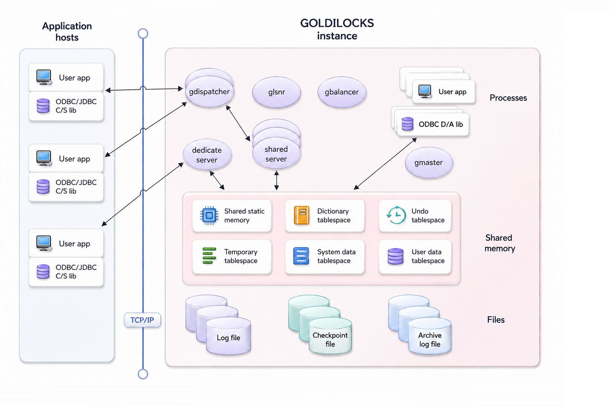
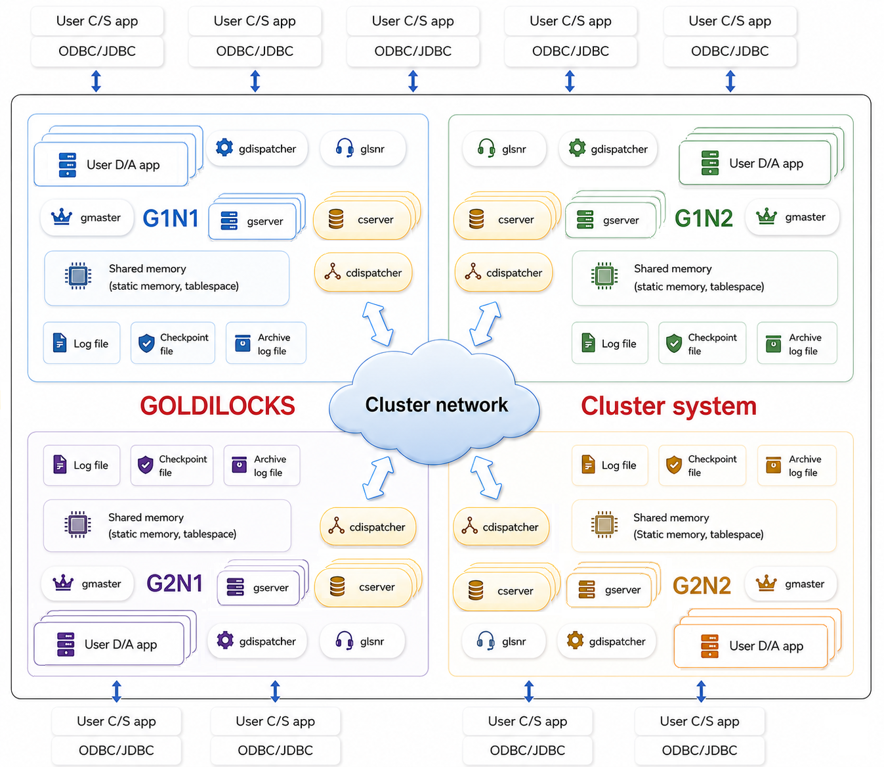

<a id="d7a162472ed3bb52"></a>

# 1. Preface

> Source: [GOLDILOCKS 26c.1 User Manual (en)](https://manual.sunjesoft.co.kr/goldilocks/26c_1/manual/en/d7a162472ed3bb52)  
> Tag: `26c.1_0_tag`

[Table of contents](../README.md) · [2. Tutorial →](2-tutorial.md)

<a id="14bb549486ef24ed"></a>
## Preface

This document is a guide intended for operators responsible for configuring, managing, and using GOLDILOCKS. Its purpose is to provide the fundamental concepts required for installing and administering GOLDILOCKS. It also describes key operational considerations that should be observed when using the GOLDILOCKS system.

- The information presented in this document is not absolute and may vary depending on the installation environment and usage scenarios.
- This document is based on the GOLDILOCKS 26c.1 version.
- his document is written for RedHat–based Linux platforms.

<a id="295fb0f71956c5b8"></a>
### Target Readers

The target readers of this document include:

- Programmers who require a fundamental understanding of GOLDILOCKS database administration while developing applications.
- Administrators and performance managers responsible for operating the GOLDILOCKS database.
- Administrators and performance managers responsible for operating the GOLDILOCKS cluster system.

<a id="81971d8537330de5"></a>
## Overview

This chapter provides an overview of the basic structure and key characteristics of GOLDILOCKS for new users. It describes the available deployment options, including standalone and cluster system architectures. It also explains the differences between these architectures and their respective use cases.

<a id="925dd872753d12d9"></a>
### GOLDILOCKS Database Management System

The GOLDILOCKS database system consists of the following components:

- User-installed GOLDILOCKS software binaries
- A database, which is a collection of tablespaces implemented using one or more shared memory segments
- Various files that ensure database persistence
    - Data files created to match the size of each shared memory segment
    - Redo log files that support database recovery in the event of a failure
    - Configuration files used to define database settings
    - Trace log files that record events occurring during database operations
- The gmaster process, responsible for database management, and its internal system threads

<a id="8c8b19cf4e813661"></a>
### GOLDILOCKS Architecture

To prevent failures in an application process from affecting the entire database system, the GOLDILOCKS database adopts a shared-memory-based multi-process architecture rather than a multi-threaded architecture. The overall architecture of the GOLDILOCKS database is shown in Figure 1.  
Data is loaded into shared memory, while the gmaster process, which serves as the management daemon, performs overall database management tasks such as system boot-up, log flushing, and aging. It also ensures data durability by storing redo log files and data files on disk.  
Applications that use the GOLDILOCKS database employ one of the following two access models.

<a id="4adbf6fba06bf85a"></a>


- Direct access (D/A) model
    - The Direct Access (D/A) model is used when the user application runs on the same equipment as the GOLDILOCKS database.
    - In this model, user applications must link with the GOLDILOCKS ODBC/JDBC libraries designed for D/A.
    - These D/A libraries include a query processing module and a storage management module, enabling user requests to be processed by directly attaching the shared memory configured for the database.
    - This approach is ideal for applications requiring low latency, as it eliminates the communication overhead between the application process and the database process module. 
- Client/ Server (C/S) model
    - The Client/Server (C/S) model can be employed when the user application runs either on the same equipment as the GOLDILOCKS database or on a different system.
    - User applications must link with the GOLDILOCKS ODBC/JDBC libraries for C/S.
    - The GOLDILOCKS development library for C/S processes user requests via TCP communication with the server (gserver) which serves the database specified in the connection string.
    - While the response speed for a single application in C/S is generally slower than in D/A, the C/S model offers flexibility in application location and maintains relatively stable operation even if application errors occur. 
    - The C/S model can operate in either shared mode or dedicated mode. In dedicated mode, a single server (gserver) process runs for a single client. In shared mode, multiple clients are supported by continuously running a gdispatcher and shared gserver processes. 
    - Dedicated mode is suitable for environments with large amounts of data. Shared mode is better suited for environments with many clients and smaller amounts of data.
    - For more information about configuring dedicated or shared modes, refer to [odbc.ini](../part-05-developer-manual/34-odbc.md#a37d4e15f0c71e92) File and [Listener Configuration](../part-06-utility-manual/43-glsnr.md#5249f5eb6dfc9943).

> In the D/A model, an application directly accesses and manipulates the database, which can make the database instance unstable due to frequent errors during the early development stages. Therefore, it is efficient to develop the application using the C/S model during the early stages and then switch to the D/A model in the final development stage.

<a id="c3739965160864e2"></a>
### GOLDILOCKS Cluster System Architecture

GOLDILOCKS can be used by configuring a standalone database or by binding multiple databases into a single cluster and managing the database in cluster units. In other words, when configured as a cluster system, a user can distribute and store table data into multiple nodes according to the desired sharding strategy. This guarantees high availability and improves throughput due to parallel processing.

The GOLDILOCKS cluster system guarantees ACID compliance for transactions that are cluster-wide. Therefore, it provides data reliability equivalent to that of transactions performed on a standalone server, even when any node belonging to the cluster system is involved in performing the transaction.

Each database within the GOLDILOCKS cluster system has a multi-process structure and data loading method similar to that of a standalone database. However, the cdispatcher process and cluster server (cserver) process are added. The cdispatcher process is for efficient communication between member nodes in the cluster, and the cluster server (cserver) process is for data storage and management on the cluster member nodes. Additionally, tablespaces and management areas for transaction management of the cluster system are added to the shared memory.

<a id="3e0f2b71dd2c0e35"></a>


<a id="2b3ae17d36461861"></a>
## Characteristics of GOLDILOCKS Cluster

<a id="1dc0a3fd4849a5c1"></a>
### Features of Cluster

GOLDILOCKS cluster is a cluster system with a shared-nothing architecture and overcomes limitations in transaction performance and storage of an existing standalone system.

- High throughput
    - GOLDILOCKS cluster does not limit the creation of groups, and linear performance can be improved by creating additional groups. 
    - It overcomes the storage space limitation of existing memory-based standalone systems.
- High availability
    - If a group consists of multiple members and at least one member is running, it does not affect the group's availability.
    - Even when not every member in a group is available, other groups, except for that group, normally provide service.
- Online expansion and online recovery
    - Creating groups or adding members is possible even while the service is in progress, and it does not affect the ongoing service.
    - Additionally, a member that was suspended due to an error can rejoin the cluster online. 
- Providing the perfect transaction
    - It perfectly provides the following properties that a transaction should comply with.
        - Atomicity
        - Consistency
        - Isolation
        - Durability
- Providing the perfect MVCC (multi-version concurrency control)
    - GOLDILOCKS cluster provides global statement-level consistency similar to that of a standalone system. 
    - SQL statements starting at a specific point can access the desired version among various versions when querying any node.
- Providing the standard SQL and the standard DBC
    - It provides SQL equivalent to SQL-92.
    - It supports standard DBCs such as JDBC and ODBC..
- Application compatibility
    - The application source code or SQL developed for the existing standalone system can be used in the GOLDILOCKS cluster without modification.

<a id="2d15cb31194ea3ad"></a>
### Constraint of Cluster

All SQL statements in the GOLDILOCKS cluster can be used in the same way as those in a standalone system, except for the following constraints.

> PRIMARY KEY for the sharded table, UNIQUE constraint, and UNIQUE INDEX must include the sharding key.

The following is an example of a failure because the UNIQUE (name) constraint does not include the id column, which is the sharding key.

```
gSQL> 
CREATE TABLE t1 
(
    id   INTEGER PRIMARY KEY,
    name VARCHAR(128),
    UNIQUE (name)
)
SHARDING BY HASH(id);

ERR-HYC00(16380): UNIQUE or PRIMARY KEY must include all sharding key columns for cluster system
```

The constraint must be created to include the sharding key, such a UNIQUE ( id, name ) or UNIQUE ( name, id ) as follows.

```
gSQL> 
CREATE TABLE t1 
(
    id   INTEGER PRIMARY KEY,
    name VARCHAR(128),
    UNIQUE( id, name ) 
) 
SHARDING BY HASH (id);

Table created.
```

> Non-deterministic statements must have a global secondary index to distinguish between identical rows across the cluster members.

The following is an example of an error that occurs when creating a table by force while omitting the global secondary index.

```
gSQL> CREATE TABLE t1 ( c1 INTEGER ) WITHOUT GLOBAL SECONDARY INDEX;

Table created.

gSQL> INSERT INTO t1 VALUES (1), (2), (3), (4), (5);

5 rows created.

gSQL> COMMIT;

Commit complete.
```

The following is an example of deleting three rows, which does not guarantee that the same rows will be deleted across all cluster members.

```
gSQL> DELETE FROM t1 FETCH 3;

ERR-42000(16423): does not support non-deterministic DML in the cluster system : global secondary index expected
```

The following example shows that the cluster members may not guarantee updating the same rows to the same value when using RANDOM(1, 100).

```
gSQL> UPDATE t1 SET c1 = RANDOM(1, 100);

ERR-42000(16423): does not support non-deterministic DML in the cluster system : global secondary index expected
```

The following is an example of updating a row at the current position using an updatable cursor. It requires a global secondary index to distinguish the same rows across cluster members.

```
gSQL> \var v1 INTEGER
gSQL> DECLARE cur1 CURSOR FOR SELECT c1 FROM t1 FOR UPDATE;

Cursor declared.

gSQL> OPEN cur1;

Cursor is open.

gSQL> FETCH cur1 INTO :v1;

V1
--
 1

1 row fetched.

gSQL> UPDATE t1 SET c1 = 1 WHERE CURRENT OF cur1;

ERR-42000(16423): does not support non-deterministic DML in the cluster system : global secondary index expected
```

> It does not support deferrable constraints.

```
gSQL> ALTER TABLE t1 ADD CONSTRAINT t1_uk UNIQUE(id) DEFERRABLE;

ERR-HYC00(16388): does not support deferrable constraints in the cluster system : 
ALTER TABLE t1 ADD CONSTRAINT t1_uk UNIQUE(id) DEFERRABLE
                                    *
ERROR at line 1:
```

> It does not guarantee that the same sequence will be used in the same order across different servers.

- It is executed in g1n1 server.

```
gSQL> SELECT seq1.NEXTVAL FROM dual;

NEXTVAL
-------
      1

1 row selected.

gSQL> SELECT seq1.NEXTVAL FROM dual;

NEXTVAL
-------
      2

1 row selected.
```

- It is executed in g2n1 server.

```
gSQL> SELECT seq1.NEXTVAL FROM dual;

NEXTVAL
-------
     21

1 row selected.
```

- It is executed again in g1n1 server.

```
gSQL> SELECT seq1.NEXTVAL FROM dual;

NEXTVAL
-------
      3

1 row selected.
```

---

[Table of contents](../README.md) · [2. Tutorial →](2-tutorial.md)

<sub>Copyright © 2010 SUNJESOFT Inc. All rights reserved.</sub>
