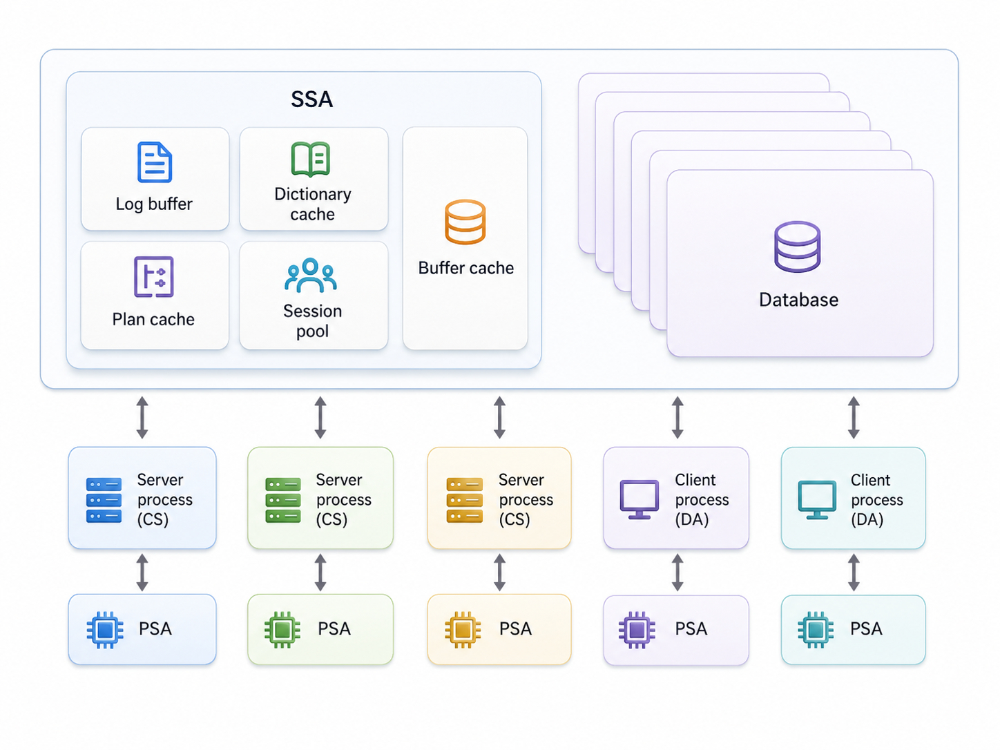

<a id="8440e8f3eb6da330"></a>

# 5. Basic Management of GOLDILOCKS Database

> Source: [GOLDILOCKS 26c.1 User Manual (en)](https://manual.sunjesoft.co.kr/goldilocks/26c_1/manual/en/8440e8f3eb6da330)  
> Tag: `26c.1_0_tag`

[← 4. What's New](../part-01-getting-started/4-what-s-new.md) · [Table of contents](../README.md) · [6. Structure and Storage Structure of GOLDILOCKS Database →](6-structure-and-storage-structure-of-goldilocks-database.md)

<a id="28dc71eb2d63aa3d"></a>
## Creating and Configuring the GOLDILOCKS Database

<a id="25ec47e9b735b4dc"></a>
### Creating Database

Create a database using gcreatedb, which is included in the GOLDILOCKS package. Before creating the database, consider the following.

**Considerations when creating a database**

<a id="c8e30ec12439905d"></a>
<table><thead><tr><th align="center" valign="middle">Considerations</th><th align="center" valign="middle">For more information, refer to</th></tr></thead><tbody><tr><td valign="middle">Consider the size of the space required for tables and indexes to be used in the database.</td><td><ul><li><a href="6-structure-and-storage-structure-of-goldilocks-database.md#162838622a7b72ea">Structure and Storage Structure of GOLDILOCKS Database</a></li></ul></td></tr><tr><td valign="middle">Consider the location for creating database files. This is because distributing files properly to balance disk I/O can enhance database performance. For example, a user can allocate redo log files to a separate disk or use striping, and distribute data files across multiple disks to balance disk I/O and enable parallel disk I/O operations.</td><td align="left" valign="middle"><ul><li><a href="6-structure-and-storage-structure-of-goldilocks-database.md#2659b5d5c8f0ac63">Managing Redo Log File</a></li></ul></td></tr><tr><td valign="middle">Be aware of the concepts and functions of each property set in the server property file, and manage them continuously.</td><td valign="middle"><ul><li><a href="#f9734bd78388b9cc">Specifying Initial Property</a></li><li><a href="#5e0c74e457e64e4a">Managing Initial Property Using GOLDILOCKS Configuration File</a></li><li><a href="10-server-property.md#3ae338b18fe83e54">Server Property</a></li></ul></td></tr></tbody></table>

In addition to the above considerations, refer to the [Creating Database](../part-01-getting-started/2-tutorial.md#531376da5fc853cc) section in the [Getting Started](../part-01-getting-started/1-preface.md#d7a162472ed3bb52) guide for additional options to consider when creating the database.

A user must set the environment variables to use GOLDILOCKS. These variables are $GOLDILOCKS_HOME and $GOLDILOCKS_DATA. The property file, *goldilock.properties.conf*, for creating and managing GOLDILOCKS database is located in *$GOLDILOCKS_DATA/conf*.

- GOLDILOCKS_HOME: The location where binaries included in the GOLDILOCKS package are installed, and which can be overwritten during updates. (Ensure to back up the license.)
- GOLDILOCKS_DATA: The default path where log files, data files, and control files used by the GOLDILOCKS database are created. These files cannot be overwritten.

<a id="f9734bd78388b9cc"></a>
### Configuring Initial Property

A user can use properties to control operational and management information in GOLDILOCKS.

<a id="2b8151ebd3bb75b1"></a>
#### Initial Property

Set the properties for creating or starting the database as follows:

1. Setting system environment variables
    1. Change the environment variables by typing the commands in the command window where GOLDILOCKS is installed and where the database is created or operated.
    2. Ensure that each property name includes the prefix *GOLDILOCKS_*.

- The following is an example of changing SHARED_MEMORY_STATIC_SIZE to 100M:

```
export GOLDILOCKS_SHARED_MEMORY_STATIC_SIZE=100M
```

2. Property file: The prefix is not required, so make the change directly in the property file.

- The following is an example of changing SHARED_MEMORY_STATIC_SIZE to 200M.
- Shared memory static size (100 M ~ 32 G)

```
SHARED_MEMORY_STATIC_SIZE = 200M
```

> If the same property is set in both the system environment variable and the property file, the value in the property file will take precedence. For example, if SHARED_MEMORY_STATIC_SIZE is set to 100 M in the system environment variable and 200 M in the property file, then SHARED_MEMORY_STATIC_SIZE will be applied as 200 M when operating the database.

<a id="5e0c74e457e64e4a"></a>
### Managing Initial Property Using GOLDILOCKS Configuration File

The property file is located in *$GOLDILOCKS_DATA/conf* and is split into two files according to their formats.

- Text property file 
    - File name: goldilocks.properties.conf
    - This file uses the "property name = value" format and can be directly edited by the user. 
    - If a binary property file exists, the text property file will not be read.

- Binary property file 
    - This file is created by the system, and cannot be directly edited by the user.
    - File name: goldilocks.properties.binary
    - To retrieve the contents of the binary file, use the gdump tool.

> If both a text property file and a binary property file exist, only the binary property file will be read. The text property file will not be processed. This binary property file is managed through user SQL (ALTER SYSTEM SET), and can only be edited using SQL.   
>   
> For information, refer to [ALTER SYSTEM SET property_name](../part-03-sql-manual/18-sql-references-a-b.md#ca16f1acaf4c1a9b), [ALTER SYSTEM RESET property_name](../part-03-sql-manual/18-sql-references-a-b.md#320e65003e92cceb).

- Editing text property file
    - Use the format "PROPERTY_NAME = VALUE".
    - Use '#' for annotations.
    - Properties have one of the following three data types.
        - Character data type: Use single quotes (') to set character values. If the character value includes the $GOLDILOCKS_DATA link, use &lt;GOLDILOCKS_DATA&gt;
        - Numeric data type: Do not perform calculations for numeric data. For example, LOG_BUFFER_SIZE=1024 * 1024 is not allowed. The size can be specified using units such as K (kilobyte), M (megabyte), G (gigabyte), T (terabyte), and P (petabyte).
        - Boolean data type: Allowed values are ON/OFF, ENABLE/DISABLE, 1/0 and TRUE/FALSE, and YES/NO.

<a id="07ef3b13b43b3c12"></a>
## Starting up and Shutting down a GOLDILOCKS Instance

This chapter describes the process for starting up and shutting down a GOLDILOCKS instance.

<a id="33ad310d28b1da91"></a>
### Starting up Instance

A GOLDILOCKS instance can only be started by a user with SYSDBA privileges.   
It can be started using either the Direct Attach (D/A) method or the dedicated method of Client/Server (C/S) method. However, it can not be started using the shared method of C/S.

<a id="d01e60d7c1eae7b0"></a>
#### Multi-level Startup

GOLDILOCKS features a multi-level startup procedure. This procedure allows an administrator to intervene and modify the database's state at each phase of the startup process.

The phases are idle, nomount, mount, and open, each with the following features.

<a id="7e768979fbc8ffd0"></a>
##### Idle Phase

The idle phase is a state in which the instance is not started.

When connecting to gsql while the instance is not started, you will connect to the idle instance as follows. In this phase, no sever commands can be executed except for `\`startup.

```
% gsql sys gliese --as sysdba

Connected to an idle instance.

gSQL> select * from dual;

ERR-08003(40044): connection does not exist 

gSQL>
```

- Administrator operations in the idle phase
    - Adjust the properties required to start up the instance 
    - Transition to the nomount phase using the `\startup` command in gsql

- Operations in an instance during the nomount transition
    - Start the gmaster daemon, which manages the GOLDILOCKS instance
    - Initialize the timer thread and cleanup thread within gmaster
    - Allocate and initialize the Shared memory Static Area (SSA).

**Applied properties during the transition to nomount**

<a id="7ecdd254cb6e1e6f"></a>
| Property name | Description |
| --- | --- |
| CLIENT_MAX_COUNT | Maximum number of connectable sessions |
| CONTROL_FILE_0 ~ 7 | Path of control file |
| CONTROL_FILE_COUNT | The number of valid path among the path of control file |
| DATA_STORE_MODE | Store mode of GOLDILOCKS instance |
| PLAN_CACHE_SIZE | Maximum size of shared memory for plan cache |
| PROCESS_MAX_COUNT | Maximum number of connectable process |
| SHARED_MEMORY_ADDRESS | Address of shared memory |
| SHARED_MEMORY_STATIC_NAME | Name of shared memory |
| SHARED_MEMORY_STATIC_KEY | Key value for creating shared memory |
| SHARED_MEMORY_STATIC_SIZE | Size of shared memory to be created |
| SYSTEM_LOGGER_DIR | Path of system logger |

Properties can not be changed in idle phase. An administrator changes the properties as follows.

To use an environment variable, set GOLDILOCKS_[property_name] to the desired value and then transition to the mount phase. This will ensure that the property is applied correctly.

```
% export GOLDILOCKS_CLIENT_MAX_COUNT=1000
```

To use 'SCOPE = FILE', record the property value to be changed in the file. The recorded property will be applied at nomount transition.

```
gSQL> alter system set client_max_count = 1000 scope = file;

System altered.

gSQL> \shutdown 

Shutdown success

gSQL> \startup    

Startup success

gSQL>
```

<a id="d7d60ef249fd1396"></a>
##### Nomount Phase

The nomount phase is a state in which the instance is not mounted to the database, and only the gmaster process has been started. The gmaster is a daemon that manages the GOLDILOCKS instance.

The following describes how to transition from the idle phase to the nomount phase.

```
% gsql sys gliese --as sysdba

Connected to an idle instance.

gSQL> \startup nomount

Startup success

gSQL>
```

- Administrator operations in the nomount phase
    - Adjusting nomount properties
    - For more information, refer to [ALTER SYSTEM {MOUNT | OPEN} DATABASE](../part-03-sql-manual/18-sql-references-a-b.md#3a13c91fdabdaa04), [ALTER DATABASE RESTORE](../part-03-sql-manual/18-sql-references-a-b.md#22625d6afdeafdcd).

- Operations in an instance during the mount transition
    - Loading the control file into the database
    - Preparing for database recovery
    - Starting threads in gmaster including checkpoint, log flusher, page flusher, IO slave and archive log

**Updatable properties in the nomount phase**

<a id="aa13956895f314d2"></a>
| Property name | Description |
| --- | --- |
| LOG_BUFFER_SIZE | Size of the redo log buffer |
| PARALLEL_LOAD_FACTOR | The number of threads for parallel operations after loading the database |
| PARALLEL_IO_FACTOR | The number of parallel threads for loading the database |
| PENDING_LOG_BUFFER_COUNT | The number of delayed log buffers |
| TRANSACTION_TABLE_SIZE | Size of the transaction table |
| UNDO_RELATION_COUNT | The number of undo relations |

<a id="da5149d6338d5388"></a>
##### Mount Phase

The mount phase is a state in which the instance is mounted to the database, and the database recognizes the control file. All sections of the control file are controllable during this phase.

The following describes how to transition from the nomount phase to the mount phase.

```
% gsql sys gliese --as sysdba

Connected to an idle instance.

gSQL> \startup nomount

Startup success

gSQL> alter system mount database;

System altered.

gSQL>
```

- Administrator operations in the mount phase
    - Adjusting mount properties
    - [ALTER SYSTEM {MOUNT | OPEN} DATABASE](../part-03-sql-manual/18-sql-references-a-b.md#3a13c91fdabdaa04)
    - [ALTER DATABASE ADD LOGFILE](../part-03-sql-manual/18-sql-references-a-b.md#d2062ac468f12d4a)
    - [ALTER DATABASE DROP LOGFILE](../part-03-sql-manual/18-sql-references-a-b.md#7f5e87ea8a89f0ff)
    - [ALTER DATABASE RENAME GLOBAL TRANSACTION LOGFILE](../part-03-sql-manual/18-sql-references-a-b.md#c3724d69b119c090)
    - [ALTER DATABASE RENAME LOGFILE](../part-03-sql-manual/18-sql-references-a-b.md#e8d893c3e0b6099d)
    - [ALTER DATABASE { ARCHIVELOG | NOARCHIVELOG }](../part-03-sql-manual/18-sql-references-a-b.md#41d1beb5c617389b)
    - [ALTER DATABASE DELETE BACKUP](../part-03-sql-manual/18-sql-references-a-b.md#e0dee9ed60af5102)
    - [ALTER DATABASE REGISTER](../part-03-sql-manual/18-sql-references-a-b.md#6a1edf86eeec57d6)
    - [ALTER DATABASE RECOVER](../part-03-sql-manual/18-sql-references-a-b.md#91d87d0b29aa6323)
    - [ALTER DATABASE RESTORE](../part-03-sql-manual/18-sql-references-a-b.md#22625d6afdeafdcd)
    - [ALTER SESSION SET property_name](../part-03-sql-manual/18-sql-references-a-b.md#a7df2194f3a8476a)
    - [ALTER SYSTEM RESET property_name](../part-03-sql-manual/18-sql-references-a-b.md#320e65003e92cceb)
    - [ALTER SYSTEM SWITCH LOGFILE](../part-03-sql-manual/18-sql-references-a-b.md#e8b9a0d94c67b15c)
    - [ALTER SYSTEM [KILL | DISCONNECT] SESSION](../part-03-sql-manual/18-sql-references-a-b.md#6d1a0bf8b32c9260)
    - [ALTER TABLESPACE name ADD [DATAFILE|MEMORY]](../part-03-sql-manual/18-sql-references-a-b.md#679bb44a33edbbcf)
    - [ALTER TABLESPACE name RENAME DATAFILE](../part-03-sql-manual/18-sql-references-a-b.md#c11fdc0b10cc1722)
    - [ALTER TABLESPACE name [ONLINE|OFFLINE]](../part-03-sql-manual/18-sql-references-a-b.md#f690c33a6dde5c14)

- Operations in an instance during the open transition
    - Loading all data files used in the instance into shared memory
    - Performing instance recovery
    - Creating NOLOGGING indexes
    - Deleting objects or files not removed by the ager thread
    - Creating cache for dictionary objects
    - If the "SHARED_SESSION" property is set to *YES*, the process monitor thread in gmaster will start.
    - The process monitor thread executes the balancer process, dispatcher process and shared-server process.

**Updatable properties in the mount phase**

<a id="9814c8dbb873baad"></a>
| Property name | Description |
| --- | --- |
| ARCHIVELOG_FILE | Prefix name of archive file |
| IN_DOUBT_DECISION | Decision about in-doubt transaction |
| LOCK_HASH_TABLE_SIZE | Hash table size for the lock administrator |
| LOG_MIRROR_MODE | Log mirroring mode |
| LOG_MIRROR_SHARED_MEMORY_STATIC_SIZE | Shared memory size for log mirroring |
| SUPPLEMENTAL_LOG_DATA_PRIMARY_KEY | Whether supplemental logging is performed at the database level. |

<a id="12f13e6976b777ea"></a>
##### Open Phase

The open phase is a state in which all data files are loaded into memory and the system is ready for service. During this phase, all operations are allowed.

```
% gsql sys gliese --as sysdba

Connected to an idle instance.

gSQL> \startup mount

Startup success

gSQL> alter system open database;

System altered.

gSQL>
```

<a id="f4b547b0dbcd11b2"></a>
#### Diagnosis

It is possible to execute multiple phases simultaneously using a single command (`\startup`) when starting an instance. If a phase fails, the administrator must identify which phase encountered the failure. Check the current phase using V$INSTANCE. The administrator can then continue the startup process from the subsequent phase.

The following is an example of starting up the instance to the open phase after a `\`startup failure.

```
% gsql sys gliese --as sysdba

Connected to an idle instance.

gSQL> \startup

ERR-42000(14051): media recovery required - 'TEST_TBS'

gSQL> select INSTANCE_STATUS from v$instance;

INSTANCE_STATUS
---------------
MOUNTED           

1 row selected.

...

gSQL> alter system open database;

System altered.
```

<a id="21abd5bb1df14b43"></a>
### Shutting down Instance

The GOLDILOCKS instance can only be terminated by a user with SYSDBA privilege. Additionally, it is not allowed to create new sessions during the shutdown process.

The GOLDILOCKS instance can be shut down using the Direct Attach (D/A) method and the dedicated method of Client/Server (C/S), but it cannot be shut down using the shared method of C/S.

There are four types of instance shutdown modes: shutdown normal, shutdown transactional, shutdown immediate, and shutdown abort.

<a id="9dd52cc5d0330acc"></a>
#### Shutdown Normal

Shutdown Normal is the default mode if no specific shutdown mode is provided. Use this mode if you want to shut down the instance gracefully.

```
gSQL> \shutdown normal

Shutdown success

gSQL>
```

The following describes the characteristics of Shutdown Normal.

- New sessions are not allowed.
- New transactions and statements are allowed in sessions that are already connected. 
- It waits for all sessions connected to the instance to terminate.
- It does not perform instance recovery when the instance is restarted.

<a id="28d819019fa15ed9"></a>
#### Shutdown Transactional

Use this type to shut down currently proceeding transactions normally, even if the session is forcibly terminated.

```
gSQL> \shutdown transactional

Shutdown success

gSQL>
```

The following describes the characteristics of Shutdown Transactional.

- Neither new sessions nor new transactions are allowed.
- New statements are allowed within ongoing transactions.
- It waits for the currently ongoing transactions to complete.
- Sessions are automatically terminated once ongoing transactions are completed.
- It does not perform instance recovery when the instance is restarted.

<a id="1e53e843cb09b994"></a>
#### Shutdown Immediate

Use this type to terminate the instance when the user can not terminate the current transactions.

```
gSQL> \shutdown immediate

Shutdown success

gSQL>
```

The following describes the characteristics of Shutdown Immediate.

- Neither new sessions nor new transactions are allowed.
- Ongoing sessions and transactions are forcibly terminated.
- It waits until the system's background threads complete their tasks.
- It does not perform instance recovery process when the instance is restarted.

<a id="92d8b65a4b8fa8a0"></a>
#### Shutdown Abort

Use this type when a user determines that the instance is in an abnormal state.

```
gSQL> \shutdown abort

Shutdown success

gSQL>
```

The following describes the characteristics of Shutdown Abort.

- Neither new sessions nor new transactions are allowed.
- Ongoing sessions and transactions are forcibly terminated.
- The system's background threads are shut down immediately.
- Instance recovery is performed when the instance is restarted.

<a id="735a4788667f826e"></a>
## Managing Process

This chapter describes the background processes of the GOLDILOCKS instance.

<a id="c25581f4bfa32541"></a>
### Master Process

The master process performs asynchronous operations for database performance and monitoring. It consists of multiple threads.

The executable file for the master process is named gmaster.

<a id="b70166ca0e531fb6"></a>
#### Checkpoint Thread

The checkpoint thread executes asynchronous checkpoint events, which occur in the log flushing thread. A checkpoint event occurs whenever a redo log file is switched.

The checkpoint event is executed asynchronously, regardless of user activity, and its log is recorded in system.trc as follows.

```
[2014-09-11 14:04:34.704465 THREAD(14497,140178383427328)] [INFORMATION]
[CHECKPOINT] begin

...

[2014-09-11 14:04:34.743933 THREAD(14497,140178383427328)] [INFORMATION]
[CHECKPOINT] save control file

[2014-09-11 14:04:34.759521 THREAD(14497,140178383427328)] [INFORMATION]
[CHECKPOINT] end
```

<a id="3a31bab1c0becd59"></a>
#### Log Flushing Thread

User transactions record redo log in the log buffer, which are periodically recorded in the log file by the log flushing thread.

Log switching occurs when the redo log is recorded to the end of the log file, and then it is recorded in the next redo log file. When log switching occurs, the checkpoint event is passed to the checkpoint thread.

If a reusable log file does not exist when a log file is switched, all queries except for read-only queries will wait until the reusable log file is created.

The following is the message left in system.trc when logging is blocked:

```
...

[2014-09-11 14:31:44.315871 THREAD(19102,139674683647744)] [INFORMATION]
[LOG FLUSHER] disable logging - blocked lfsn(1)

...
```

<a id="f3eeb6f658064e0b"></a>
#### Log Archiving Thread

The log archiving thread asynchronously archives redo log files. This thread is executed only when the database is operating in ARCHIVELOG mode.

Log archiving is part of the checkpoint process and is executed by the log archiving event triggered by the checkpoint thread.

The following is the message left in system.trc when redo_0_0.log is archived to archive_0.log.

```
[2014-09-11 14:13:32.515996 THREAD(16913,140631135463168)] [INFORMATION]
[ARCHIVELOG BEGIN] LOG(/home/test/work/product/Gliese/home/wal/redo_0_0.log(0)) => ARCHIVE(/home/test/work/product/Gliese/home/archive_log/archive_0.log)

[2014-09-11 14:13:33.145850 THREAD(16913,140631135463168)] [INFORMATION]
[ARCHIVELOG END] (/home/test/work/product/Gliese/home/archive_log/archive_0.log) : SUCCESS

...
```

<a id="ba82c19bbc2a1fff"></a>
#### Ager Thread

The ager thread physically drops database objects that have been logically dropped.

The DROP TABLE statement executes only a logical drop operation to maintain statement-level consistency in GOLDILOCKS. In other words, even if DROP TABLE has been executed, statements that were running before DROP TABLE can still access records from the dropped table.

The following is the message left in system.trc when table and tablespaces are physically dropped.

```
[2014-09-11 14:13:37.966788 THREAD(16925,139892990408448)] [INFORMATION]
[AGER] aging table - object scn(4561), object view scn(4562), type(0), physical id(25043954302976)

...

[2014-09-11 14:13:37.966917 THREAD(16925,139892990408448)] [INFORMATION]
[AGER] aging tablespace - object scn(4561), object view scn(4564), tablespace id(61)
```

<a id="117595d937d3e1a1"></a>
#### Timer Thread

The timer thread asynchronously updates the system time to reduce the time measurement overhead for user transactions, which then read the system-set time.  
The time precision is set according to [TIMER_INTERVAL](10-server-property.md#03661ff1fd2b8a63), with a default value of 10 ms.

The following describes the use of the time set by the timer thread. The time error can be as large as the TIMER_INTERVAL value. For example, if TIMER_INTERVAL is 10 ms, then the time error will also be up to 10 ms.

- Time out: QUERY_TIMEOUT, IDLE_TIMEOUT, DDL_LOCK_TIMEOUT, ...
- Message record time written in trace log
- Startup time of login statement or transaction
- Time recorded in transaction commit redo log

<a id="4a1086b55c88f22d"></a>
#### Page Flusher & IO Slave Threads

When a checkpoint occurs, updated data pages are applied to the disk. The updated information is stored in multiple data files within a tablespace. To manage this, the page flusher thread distributes the operations to I/O slave threads, each handling specific tablespaces and data files. The I/O slave threads then record the updated pages in the data files in parallel.

If tables and index pages stored in the disk tablespace are updated by being cached to the buffer, they are linked to the checkpoint list. Pages updated for reuse in the buffer cache are linked to the buffer replace list. The I/O slave threads then reflect the pages in the I/O checkpoint list and the pages in the buffer replace list onto the disk either at checkpoint time or on a regular basis.

Storing as many updated pages as possible at one time improves performance. The number of pages written at each time is governed by the [MAXIMUM_FLUSH_PAGE_COUNT](10-server-property.md#c88f72ae27022abe) setting.

After the updated pages are written to the data file, the following is the message left in system.trc.

```
[2014-09-11 14:13:38.329162 THREAD(16925,139893221086976)] [INFORMATION]
[IO SLAVE] flush datafile ( tablespace : 0, datafile : 0 )

[2014-09-11 14:13:38.552161 THREAD(16925,139893221086976)] [INFORMATION]
[IO SLAVE] flush datafile ( tablespace : 1, datafile : 0 )

[2014-09-11 14:13:38.587510 THREAD(16925,139893221086976)] [INFORMATION]
[IO SLAVE] flush datafile ( tablespace : 2, datafile : 0 )

[2014-09-11 14:13:38.587831 THREAD(16925,139893221086976)] [INFORMATION]
[IO SLAVE] flush datafile ( tablespace : 62, datafile : 0 )

[2014-09-11 14:13:38.620239 THREAD(16925,139893221086976)] [INFORMATION]
[IO SLAVE] flush datafile ( tablespace : 63, datafile : 0 )
```

<a id="0f2d673fee170e0b"></a>
#### Cleanup Thread

The cleanup thread asynchronously cleans up system resources and performs the following tasks.

- It cleans up normally terminated sessions. GOLDILOCKS handles the logical termination of a user session, while the cleanup thread handles the physical termination.
- It cleans up abnormally terminated sessions. If a session was using transactions, those transactions will be rolled back.
- It checks for timeout on snapshot statements. If a session exceeds the timeout, it is forcibly terminated.

When cleaning up an abnormally terminated session, the following is the message left in system.trc.

```
[2014-09-12 10:34:38.387349 THREAD(23003,140722556352256)] [WARNING]
[CLEANUP] cleaning session - env(19), session(20), transaction(FFFFFFFFFFFFFFFF), program(gsql), pid(23209), thread(140080441665280)

[2014-09-12 10:34:38.387515 THREAD(23003,140722556352256)] [WARNING]
[CLEANUP] cleaning up 1 sessions
```

If a snapshot statement exceeds the timeout, the following is the message left in system.trc.

```
[2014-09-12 10:49:21.842179 THREAD(3972,139706316711680)] [WARNING]
[CLEANUP] long statement timeout - pid(8029), thread(140053960505088), program(gsql), statement start time(2014-09-12 10:48:49.963471)
```

If an abnormally terminated session is killed by a kill -9 signal while changing shared memory when an exclusive latch is acquired, the database will no longer be operable. In this situation, the following is the message left in system.trc, and the instance must be terminated using SHUTDOWN ABORT:"

```
[2014-09-12 11:12:58.809249 THREAD(15313,140671386121984)] [WARNING]
[CLEANUP] failed to cleaning session - server restart required
...... dead session in critical section - env(3), session(4), transaction(47001E0004), pid(15296), thread(140178075756288)
```

<a id="c2d5393eb2ce1b13"></a>
#### Process Monitor Thread

The process monitor thread executes and monitors processes.

- It is executed only when the SHARED_SESSION property is set to *YES*.
- It executes the load-balancer (gbalancer), dispatcher (gdispatcher), and shared-server (gserver), and re-executes them if they are abnormally terminated.
- It does not monitor the listener (glsnr) process.

<a id="cc3b1f9048cb3193"></a>
#### Cluster Recover Thread

When starting up a node in a cluster system environment, if the node reaches the mount phase, the cluster recover thread is created. If there is an in-doubt transaction, the cluster recover thread communicates with the cluster recover thread on the remote node to recover the in-doubt transaction.

If there is an in-doubt transaction, the cluster recover thread communicates with the cluster recover thread on the remote node to determine the status of the in-doubt transaction. If the remote node has been restarted and the transaction has not yet been recovered, then it sends a message requesting priority completion of the recovery. It then updates the in-doubt transaction status once the recovery is complete.

The statuses of in-doubt transactions that can be determined through remote nodes are NONE, PREPARE, COMMIT, and ROLLBACK. If a response of COMMIT or ROLLBACK is received from at least one remote node, the corresponding action, either COMMIT or ROLLBACK, is performed. If responses of NONE or PREPARE are received from all remote nodes, a ROLLBACK is performed because neither COMMIT nor ROLLBACK has been executed on any cluster node.

The recovery of in-doubt transactions by the cluster recovery thread generates the following messages in system.trc:

```
[2018-11-22 16:52:00.466805 INSTANCE(G3N2) THREAD(7828,140557371479808)] [WARNING]
[CLUSTER RECOVER] begin recovery

[2018-11-22 16:52:00.467221 INSTANCE(G3N2) THREAD(7828,140557371479808)] [WARNING]
[CLUSTER RECOVER] commit in-doubt transaction - commit scn(999.0.439), global transaction id(1.29294650), local transaction id(4)

[2018-11-22 16:52:00.468253 INSTANCE(G3N2) THREAD(7828,140557371479808)] [WARNING]
[CLUSTER RECOVER] rollback in-doubt transaction - commit scn(1000.439), global transaction id(4.34406459), local transaction id(59)

[2018-11-22 16:52:00.469198 INSTANCE(G3N2) THREAD(7828,140557371479808)] [WARNING]
[CLUSTER RECOVER] commit in-doubt transaction - commit scn(1001.0.439), global transaction id(5.35127356), local transaction id(60)
```

<a id="571ec2a1745714bf"></a>
#### Failover Thread

When starting up a node in a cluster system environment, if the node progresses to the LOCAL OPEN phase, the cluster failover thread is created. This failover thread performs the failover for the error node by either reselecting a coordinator or offlining the node when an error occurs on that specific node or within the network of the cluster system.

In the event of a failover situation, one of the normal nodes that has acquired the failover lock communicates with the failover threads of other nodes to perform the failover.

The failover performed by the failover thread leaves the following messages in system.trc.

```
[2018-11-22 15:27:34.619208 INSTANCE(G1N1) THREAD(20140,140219957368576)] [INFORMATION]
[FAILOVER] begin - failover member(5)

[2018-11-22 15:27:34.619418 INSTANCE(G1N1) THREAD(20140,140219957368576)] [INFORMATION]
[FAILOVER] acquire failover lock - driver(0), target(5), driver seq(1)

[2018-11-22 15:27:34.619692 INSTANCE(G1N1) THREAD(20183,140317097449216)] [INFORMATION]
[CDISPATCHER-S2] disconnect member - target member(5)

[2018-11-22 15:27:34.619893 INSTANCE(G1N1) THREAD(20183,140317097449216)] [INFORMATION]
[CDISPATCHER-S2] finalize sender socket - member(5)

[2018-11-22 15:27:34.621860 INSTANCE(G1N1) THREAD(20140,140219957368576)] [INFORMATION]
[FAILOVER] acquire failover lock

...

[2018-11-22 15:27:38.726436 INSTANCE(G1N1) THREAD(20140,140219957368576)] [INFORMATION][FAILOVER] member(5) has failovered

[2018-11-22 15:27:38.728624 INSTANCE(G1N1) THREAD(20140,140219957368576)] [INFORMATION]
[FAILOVER] release failover lock - driver(-1), target(5), driver seq(1)

[2018-11-22 15:27:38.728786 INSTANCE(G1N1) THREAD(20140,140219957368576)] [WARNING]
reset remote session map - member(5)

[2018-11-22 15:27:38.729679 INSTANCE(G1N1) THREAD(20140,140219957368576)] [INFORMATION]
[FAILOVER] finished
```

<a id="6bceee5c35c24455"></a>
### Listener Process

The listener process enables remote access through the network in a client/server environment. It waits for client connections using [LISTEN_PORT](../part-06-utility-manual/43-glsnr.md#01f5e8f3d7d0e9b6). When a client connects, if in dedicated mode, the process starts a new gserver, and connects the client to it. If in shared mode, the process uses a load-balancer (gbalancer) to select an underloaded dispatcher (gdispatcher), and connects the client to it.

The gserver is a type of operation server that executes client requests.

If LISTEN_PORT is already in use, the following error occurs.

```
% glsnr --start

ERR-HY000(11077): given address is already in use
```

The listener process operates independently of the instance. In other words, the listener process can start up and shut down at any time, regardless of the instance's status.

<a id="19c7194390bcbc54"></a>
## Managing Memory

<a id="3348477ad01e948b"></a>
### GOLDILOCKS Memory Architecture

GOLDILOCKS uses SSA (shared memory area) for sharing among all sessions in the system, a shared memory for database pages, and PSA (heap memory) that is used independently by each session.

<a id="7a55e5220e0b0a87"></a>


<a id="604dd8d57dc2dbac"></a>
### Managing SSA

The Shared Static Area (SSA) is a memory area used to store information that is shared among all sessions in the system.

A new process must use the same physical address for using SSA. It is because the location of all information referenced by SSA uses the physical address.

The physical starting address of SSA is determined by [SHARED_MEMORY_STATIC_KEY](10-server-property.md#3c43113ec551fba8) and [SESSION_FATAL_BEHAVIOR](10-server-property.md#8764c71c9674031f). The following error occurs if another program is already using the shared memory key assigned by the same SHARED_MEMORY_STATIC_KEY, and the memory assigned by SHARED_MEMORY_ADDRESS.

```
% gsql sys gliese --as sysdba

Connected to an idle instance.

gSQL> \startup

ERR-HY000(11029): shared memory segment exists 

gSQL>
```

SSA stores key information, including the log buffer, dictionary cache, plan cache, session pool, lock pool, and transaction pool.

The size of SSA is determined by [SHARED_MEMORY_STATIC_SIZE](10-server-property.md#6bbbc914a0e83be3). The system automatically manages the memory used for the session/ lock/ transaction pool and dictionary cache, which can not be adjusted by the user. However, users can manage the usage of the log buffer and plan cache arbitrarily.

If the default value for the log buffer and plan cache are increased, the SHARED_MEMORY_STATIC_SIZE must be increased accordingly. Otherwise, the following error occurs.

```
% gsql sys gliese --as sysdba

Connected to an idle instance.

gSQL> \startup

ERR-HY000(13010): Insufficient static area

gSQL>
```

<a id="5d1fa5423777aea2"></a>
### Managing PSA

The Private Static Area (PSA) is a heap memory area used independently by each session. [PRIVATE_STATIC_AREA_SIZE](10-server-property.md#099bad76ad55b880) determines the maximum size of the PSA.

An initial size is allocated to the PSA when a session is created. If additional memory is required in the session, the PSA can be allocated up to its maximum size. A following error occurs if it exceeds the maximum size.

```
ERR-HY000(13011): Unable to extend memory: [MAX: 104857600, TOTAL: 102764408, ALLOC: 2097240] DESC: private static area
```

<a id="16c429c52e00bdd1"></a>
## Monitoring

Database monitoring is essential not only for detecting and preventing potential issues, but also for identifying ways to improve database management. For monitoring purposes, the GOLDILOCKS database provides text file trace logs and several performance views.

<a id="9b4193d32eae29fd"></a>
### Monitoring with Trace File

From the time the instance starts up until it terminates, the GOLDILOCKS database provides a system log that records overall system errors, warnings, and information. Additionally, it provides XA transaction logs, trace logs such as DDL logs, and SQL trace logs. For more information, refer to the [SQL Trace Log](../part-03-sql-manual/15-sql-tuning.md#05c8fa0c4bf66e1d).

<a id="17c98685ca2b29c3"></a>
#### Managing Trace Log File

The GOLDILOCKS database's trace log files consist of system.trc file and xa.trc file. The system.trc file records system logs and DDL logs, while the xa.trc file records XA transaction logs. Trace log files are created in the directory specified in the SYSTEM_LOGGER_DIR property, which is generally created in the trc directory under the directory specified in the GOLDILOCKS_DATA environment variable. The trace log file's size is 10 Mbytes. If its space is insufficient, the existing trace log file with a unique file extension is preserved, and a new trace log file is created.

The listener trace log file is created as *listener.trc* in the trc directory under the directory specified by the GOLDILOCKS_DATA environment variable. The log file size is 10 Mbytes. If the space is insufficient, the existing log file with a unique file extension is preserved, and a new trace log file is created.

Except for the system log, you can turn monitoring for XA transaction logs and DDL logs on or off. Set the TRACE_DDL property to 0 to turn off DDL logging, or to 1 to turn it on. XA logging is configured in the same way using the TRACE_XA property.

<a id="095d6ce3381d3125"></a>
#### System Log

The system log records errors, warnings, and information that occur in the database instance from the time the master process starts up until it terminates.

<a id="4c73147cbabff4d2"></a>
##### System Log Format

The system log is recorded in the following format.

```
['log record data and time' THREAD('process Id', 'thread handle')] ['log level']
['log prefix'] 'log body'
```

- 'log record date and time' refers to the date and time when the log entry was created.
- THREAD('process Id', 'thread handle') provides the process ID and thread handle associated with the log entry.
- 'log prefix' is the entity or feature that created the log, while 'log body' contains the detailed information.
- 'Log level' is the level of the log recorded in the system log, with values such as FATAL, ABORT, WARNING, INFO, each having the following properties.

**Log level properties**

<a id="c7cb8c8c59456a9f"></a>
| Log level | Description | Processing |
| --- | --- | --- |
| FATAL | The state in which the master or client process shuts down abnormally. | In the event of a client process FATAL error, the client must be reconnected. For a system FATAL error, the database instance must be shut down and restarted. Additionally, back up the data file, control file, redo log file, and system log file, and contact the manufacturer. |
| ABORT | The state in which the service continues after a rollback. | It is the normal state for system operation. Execute the process again after resolving the cause of the rollback. |
| WARNING | Operational warnings | It is an abnormal state of the database instance. While there is no immediate operational problem, cause analysis is required. |
| INFO | Operational information | - |

For example, the following system log recorded operational information at 17:30:55 on September 11 in 2014, by process id 21395 (with thread handle 139982731163392). The log prefix is 'STARTUP-SM', indicating that the storage manager was executing when the master process of the GOLDILOCKS database started up. This indicates that the transition to the NO-MOUNT phase had been completed during the multilevel startup.

```
[2014-09-11 17:30:55.758164 THREAD(21395,139982731163392)] [INFORMATION]
[STARTUP-SM] NO-MOUNT PHASE
```

<a id="7484d421d98ac18a"></a>
##### Operational Information of GOLDILOCKS Database

This log covers database instance creation, multilevel startup and shutdown, data file loading, and recovery from restarts and media failures. It records essential information for the operation of the master process, from startup to termination.

- GOLDILOCKS instance creation log

The system log records the following information during database instance creation. It creates the control file after transitioning to the NO-MOUNT phase as part of the database creation process.

```
=================================================
 Startup GOLDILOCKS
 TIME    : 2014-09-03 14:43:17.321020
=================================================


[2014-09-03 14:43:17.321134 THREAD(14979,140542517491456)] [INFORMATION]
[STARTUP-SM] NO-MOUNT PHASE

[2014-09-03 14:43:17.321658 THREAD(14979,140542517491456)] [INFORMATION]
[STARTUP-SM] DATA_STORE_MODE(2)

[2014-09-03 14:43:17.335809 THREAD(14979,140542517491456)] [INFORMATION]
.... copy control file from '/goldilocks_data/wal/control_0.ctl' to '/goldilocks_data/wal/control_1.ctl'
```

Then, it transitions to the OPEN phase and creates the system tablespace.

```
[2014-09-03 14:43:17.401356 THREAD(14979,140542517491456)] [INFORMATION]
[STARTUP-SM] MOUNT PHASE

[2014-09-03 14:43:19.319769 THREAD(14979,140542517491456)] [INFORMATION]
[STARTUP-SM] PRE-OPEN PHASE

[2014-09-03 14:43:19.320494 THREAD(14979,140542517491456)] [INFORMATION]
[STARTUP-SM] RECOVER TABLESPACE AND DATAFILE STATE

[2014-09-03 14:43:19.326269 THREAD(14979,140542517491456)] [INFORMATION]
[STARTUP-SM] OPEN PHASE

[2014-09-03 14:43:21.005536 THREAD(14979,140542517491456)] [INFORMATION]
[TABLESPACE] Create Tablespace(0)

[2014-09-03 14:43:21.005593 THREAD(14979,140542517491456)] [INFORMATION]
[TABLESPACE] Create Tablespace(1)

...
```

After creating the system tablespace, it performs a checkpoint and then terminates the database instance.

```
[2014-09-03 14:43:21.788129 THREAD(14979,140542517491456)] [INFORMATION]
[CHECKPOINT] begin - checkpoint lid(0,10128,13), checkpoint lsn(10512), oldest lsn(10512)

[2014-09-03 14:43:21.788188 THREAD(14979,140542517491456)] [INFORMATION]
[CHECKPOINT] body - checkpoint lid(-1,0,0), checkpoint lsn(-1), active transaction count(0)

[2014-09-03 14:43:21.788203 THREAD(14979,140542517491456)] [INFORMATION]
[CHECKPOINT] end - checkpoint lid(0,10128,77), checkpoint lsn(10513)

[2014-09-03 14:43:21.788214 THREAD(14979,140542517491456)] [INFORMATION]
[CHECKPOINT] flush redo log

[2014-09-03 14:43:21.949589 THREAD(14979,140542517491456)] [INFORMATION]
[CHECKPOINT] save control file

[2014-09-03 14:43:21.957563 THREAD(14979,140542517491456)] [INFORMATION]
[SHUTDOWN-SM] CLOSE

[2014-09-03 14:43:21.957595 THREAD(14979,140542517491456)] [INFORMATION]
[SHUTDOWN-SM] POST CLOSE

[2014-09-03 14:43:21.992521 THREAD(14979,140542517491456)] [INFORMATION]
[SHUTDOWN-SM] DISMOUNT

[2014-09-03 14:43:21.992557 THREAD(14979,140542517491456)] [INFORMATION]
[SHUTDOWN-SM] INIT
```

- GOLDILOCKS instance startup log

The master process records logs for activities such as the multilevel startup of the database instance, loading data files, restart recovery, and media recovery. After transitioning to the MOUNT phase, the data file is loaded.

```
=================================================
 Startup GOLDILOCKS
 TIME    : 2014-09-03 14:43:22.162601
=================================================


[2014-09-03 14:43:22.162765 THREAD(14982,140025756808960)] [INFORMATION]
[STARTUP-SM] NO-MOUNT PHASE

[2014-09-03 14:43:22.163389 THREAD(14982,140025756808960)] [INFORMATION]
[STARTUP-SM] DATA_STORE_MODE(2)

[2014-09-03 14:43:22.429311 THREAD(14983,140025756808960)] [INFORMATION]
[STARTUP-SM] MOUNT PHASE

[2014-09-03 14:43:22.559395 THREAD(14983,140025756808960)] [INFORMATION]
[EVENT] system startup : SUCCESS

[2014-09-03 14:43:22.568526 THREAD(14981,139649517561600)] [INFORMATION]
[STARTUP] MOUNT PHASE

[2014-09-03 14:43:22.571200 THREAD(14983,140025756808960)] [INFORMATION]
[STARTUP-SM] LOAD DATAFILES

[2014-09-03 14:43:22.571241 THREAD(14983,140025756808960)] [INFORMATION]
.... datafile '/goldilocks_data/db/system_dict.dbf' assigned to IO_SLAVE (0)

...

[2014-09-03 14:43:22.571562 THREAD(14983,140025280841472)] [INFORMATION]
.... LOAD DATAFILE(/goldilocks_data/db/system_dict.dbf)

...
```

After loading the data file to the memory, it executes the recovery.

```
[2014-09-03 14:43:23.537256 THREAD(14983,140025756808960)] [INFORMATION]
[STARTUP-SM] REFINE TABLESPACE AND DATAFILE

[2014-09-03 14:43:23.631974 THREAD(14983,140025756808960)] [INFORMATION]
[RESTART REDO] begin

[2014-09-03 14:43:23.634374 THREAD(14983,140025756808960)] [INFORMATION]
[RESTART REOD] read checkpoint log - checkpoint log id(0,10128,13), oldest lsn(10512), system scn(7)

[2014-09-03 14:43:23.756293 THREAD(14983,140025756808960)] [INFORMATION]
[RESTART REDO] ready to redo - start lid(0,10128,13), lsn(10512)

...

[2014-09-03 14:43:24.090755 THREAD(14983,140025756808960)] [INFORMATION]
[RESTART REDO] end - restart lsn(10514), restart scn(7)

[2014-09-03 14:43:24.091551 THREAD(14983,140025756808960)] [INFORMATION]
[RESTART UNDO] begin

[2014-09-03 14:43:24.091598 THREAD(14983,140025756808960)] [INFORMATION]
[RESTART UNDO] end
```

After recovery, it performs a checkpoint, reflects the recovery results to the disk data file. Then, it creates indexes, and then transitions to the OPEN phase.

```
[2014-09-03 14:43:24.111878 THREAD(14983,140025633163008)] [INFORMATION]
[CHECKPOINT] begin

...

[2014-09-03 14:43:24.129995 THREAD(14983,140025633163008)] [INFORMATION]
[CHECKPOINT] save control file

[2014-09-03 14:43:24.135864 THREAD(14983,140025633163008)] [INFORMATION]
[CHECKPOINT] end

[2014-09-03 14:43:24.144525 THREAD(14983,140025756808960)] [INFORMATION]
[STARTUP-SM] PRE-OPEN PHASE

[2014-09-03 14:43:24.202782 THREAD(14983,140025756808960)] [INFORMATION]
[STARTUP-SM] RECOVER TABLESPACE AND DATAFILE STATE

[2014-09-03 14:43:24.210158 THREAD(14983,140025756808960)] [INFORMATION]
[STARTUP-SM] REFINE RELATIONS

[2014-09-03 14:43:24.210304 THREAD(14983,140025756808960)] [INFORMATION]
[STARTUP-SM] REBUILD INDEXES

[2014-09-03 14:43:24.210375 THREAD(14983,140025756808960)] [INFORMATION]
[STARTUP-SM] OPEN PHASE

[2014-09-03 14:43:24.332064 THREAD(14983,140025756808960)] [INFORMATION]
[EVENT] system startup : SUCCESS

[2014-09-03 14:43:24.340843 THREAD(14981,139649517561600)] [INFORMATION]
[STARTUP] OPEN PHASE
```

- GOLDILOCKS instance termination log

When shutting down a database instance, it first writes all data files to disk, performs a checkpoint, and then terminates the master process.

```
[2014-09-03 14:48:03.467293 THREAD(15416,139855812097792)] [INFORMATION]
[IO SLAVE] flush datafile ( tablespace : 0, datafile : 0 )

...

[2014-09-03 14:48:03.748958 THREAD(15416,139855908558592)] [INFORMATION]
[PAGE FLUSHER] flushed lsn(137496), flushed page count(9216)]

[2014-09-03 14:48:03.761055 THREAD(15416,139856376227584)] [INFORMATION]
[CHECKPOINT] begin

...

[2014-09-03 14:48:03.780011 THREAD(15416,139856376227584)] [INFORMATION]
[CHECKPOINT] save control file

[2014-09-03 14:48:03.786387 THREAD(15416,139856376227584)] [INFORMATION]
[CHECKPOINT] end

[2014-09-03 14:48:03.791251 THREAD(15416,139856430274304)] [INFORMATION]
[SHUTDOWN-SM] CLOSE

[2014-09-03 14:48:03.791383 THREAD(15416,139856430274304)] [INFORMATION]
[SHUTDOWN-SM] POST CLOSE

[2014-09-03 14:48:03.824445 THREAD(15416,139856430274304)] [INFORMATION]
[SHUTDOWN-SM] DISMOUNT

[2014-09-03 14:48:03.824518 THREAD(15416,139856430274304)] [INFORMATION]
[EVENT] system shutdown : SUCCESS

[2014-09-03 14:48:04.267130 THREAD(15416,139856430274304)] [INFORMATION]
[SHUTDOWN-SM] INIT
```

If `\`shutdown abort is used to forcibly stop the server, neither a checkpoint nor a normal server shutdown is executed.

```
[2014-09-03 14:51:45.353154 THREAD(8989,139949509089024)] [INFORMATION]
[SHUTDOWN] skip CLOSE phase

[2014-09-03 14:51:45.678461 THREAD(8989,139949509089024)] [INFORMATION]
[SHUTDOWN] skip DISMOUNT phase

[2014-09-03 14:51:45.678696 THREAD(8989,139949509089024)] [INFORMATION]
[EVENT] system shutdown : SUCCESS

[2014-09-03 14:51:45.678928 THREAD(8989,139949509089024)] [INFORMATION]
[SHUTDOWN-SM] INIT
```

- Logs for the master process checkpoint, log flusher, log archiving, ager, parallel I/O, and cleanup thread during database operation

A checkpoint writes all data files that have been updated only in memory and not yet written to disk. If parallel I/O is used, it performs the operation in units corresponding to data files. A checkpoint log unit spans from '[CHECKPOINT] begin' to '[CHECKPOINT] end'.

[IO SLAVE] logs are recorded by the I/O thread dedicated to parallel I/O operations. '[IO SLAVE] flush data file (tablespace: 0, datafile: 0)’ log is recorded after the data file (with datafile ID '0' and tablespace ID '0') is written to disk. These data file flush logs are repeatedly recorded as many as the number of data file at checkpoint time.

'[PAGE FLUSHER] flushed lsn(139039), flushed page count(9216)]' means that the minimum lsn reflected on the disk is 139039, and 9216 pages have been written. The last log lsn archives redo log files with LSNs smaller than 139039, records the checkpoint log and control file, and then stores them on the disk.

If the database is large, the checkpoint time will be longer. Monitor the [IO SLAVE] logs to check if the data file is continuously being recorded. If disk I/O stops operating, verify whether log archiving is still in progress. If there is insufficient space, free up space and ensure that log archiving continues normally.

If a checkpoint fails, '[CHECKPOINT] CHECKPOINT was failed' will be recorded. A checkpoint may be skipped during checkpoint time due to a log file switch, which would result in '[CHECKPOINT] CHECKPOINT was skipped' being recorded.

```
[2014-09-12 15:54:59.654427 THREAD(13780,140493515450112)] [INFORMATION]
[CHECKPOINT] begin

[2014-09-12 15:54:59.654798 THREAD(13780,140493029623552)] [INFORMATION]
[IO SLAVE] flush datafile ( tablespace : 0, datafile : 0 )

[2014-09-12 15:54:59.835173 THREAD(13780,140493029623552)] [INFORMATION]
[IO SLAVE] flush datafile ( tablespace : 1, datafile : 0 )

[2014-09-12 15:54:59.893991 THREAD(13780,140493029623552)] [INFORMATION]
[IO SLAVE] flush datafile ( tablespace : 2, datafile : 0 )

[2014-09-12 15:54:59.926753 THREAD(13780,140493050603264)] [INFORMATION]
[PAGE FLUSHER] flushed lsn(138895), flushed page count(9216)]

[2014-09-12 15:54:59.926989 THREAD(13780,140492777965312)] [INFORMATION]
[ARCHIVING] stable lsn(139039)

[2014-09-12 15:54:59.933780 THREAD(13780,140493515450112)] [INFORMATION]
[CHECKPOINT] begin - checkpoint lid(0,55527,13), checkpoint lsn(139040), oldest lsn(139040)

[2014-09-12 15:54:59.933825 THREAD(13780,140493515450112)] [INFORMATION]
[CHECKPOINT] body - checkpoint lid(0,55527,77), checkpoint lsn(139041), active transaction count(1)

[2014-09-12 15:54:59.933844 THREAD(13780,140493515450112)] [INFORMATION]
[CHECKPOINT] end - checkpoint lid(0,55527,155), checkpoint lsn(139042)

[2014-09-12 15:54:59.933859 THREAD(13780,140493515450112)] [INFORMATION]
[CHECKPOINT] flush redo log

[2014-09-12 15:54:59.936154 THREAD(13780,140493515450112)] [INFORMATION]
[CHECKPOINT] save control file

[2014-09-12 15:54:59.942850 THREAD(13780,140493515450112)] [INFORMATION]
[CHECKPOINT] end
```

The log flusher records system logs when the log buffer stops flushing to disk and when it restarts the stopped flusher. If the next log group is not a reusable log file, logging will be paused until it becomes reusable. For example, logging may be halted if the redo log file with sequence number 34 has not yet been archived.

```
[2014-09-12 16:01:57.514303 THREAD(13780,140573333325568)] [INFORMATION]
[LOG FLUSHER] disable logging - blocked lfsn(34)
```

If logging stops, transactions will also halt, requiring immediate action. Logging will resume once the checkpoint is executed and archiving is completed.

```
[2014-09-12 16:01:58.079236 THREAD(13780,140380267869952)] [INFORMATION]
[ARCHIVING] enable logging - blocked lfsn(34), inactivated lfsn(34)
```

The log archiving thread archives redo log files in the ACTIVE state and records the system log. One unit of this process spans from '[ARCHIVING] stable lsn(...)' to '[ARCHIVING] inactivate group ...'. When the database operates in archive log mode, redo file archiving logs are recorded, ranging from '[ARCHIVELOG BEGIN] ...' to '[ARCHIVELOG END] ...'.

```
[2014-09-02 17:41:56.762950 THREAD(20800,140129584793344)] [INFORMATION]
[ARCHIVING] stable lsn(144143)

[2014-09-02 17:41:56.763549 THREAD(20800,140129584793344)] [INFORMATION]
[ARCHIVELOG BEGIN] LOG(/goldilocks_data/wal/redo_0_0.log(8)) => ARCHIVE(/goldilocks_data/archive_log/archive_8.log)

[2014-09-02 17:41:57.385936 THREAD(20800,140129584793344)] [INFORMATION]
[ARCHIVELOG END] (/goldilocks_data/archive_log/archive_8.log) : SUCCESS

[2014-09-02 17:41:57.385987 THREAD(20800,140129584793344)] [INFORMATION]
[ARCHIVING] inactivate group #0(8)
```

If the log *'Archiving was failed - ...'* appears after *'[ARCHIVELOG BEGIN] ...'*, then log archiving has failed. This issue must be resolved immediately to enable the service by reusing the redo log file that is in the active state.

The aging information recorded for a table and tablespace after the ager has been dropped is as follows: When a table is dropped, its lock is also removed. The table’s SCN, the SCN applicable for aging at that time, and the aging information for the table lock are recorded. Additionally, if the table has an index, the index is also deleted when the table is removed.

```
[2014-09-03 12:13:56.539971 THREAD(5225,139821699815168)] [INFORMATION]
[AGER] aging index - object scn(224), type(0), physical id(22634477649920)

[2014-09-03 12:13:56.540388 THREAD(5225,139821699815168)] [INFORMATION]
[AGER] aging table - object scn(224), object view scn(225), type(0), physical id(22630182682624)

[2014-09-03 12:13:56.540491 THREAD(5225,139821699815168)] [INFORMATION]
[AGER] aging lock item - object scn(226), agable stmt scn(228), physical id(22630182682624)
```

When a tablespace is deleted, the tablespace SCN, the SCN available for aging at the time of deletion, and the ID of the dropped tablespace are recorded.

```
[2014-09-03 12:13:56.540553 THREAD(5225,139821699815168)] [INFORMATION]
[AGER] aging tablespace - object scn(224), object view scn(227), tablespace id(5)
```

The information recorded by the cleanup thread about sessions that were abnormally terminated is as follows: Even if a user session is abnormally terminated, its resources are cleaned up, allowing the database instance and other users to continue operating normally.

```
[2014-09-03 13:43:02.220139 THREAD(7768,140298504156928)] [WARNING]
[CLEANUP] snipe at zombie session - pid(7766), thread(139967223228160), program(gsql)

[2014-09-03 13:43:02.220211 THREAD(7768,140298504156928)] [WARNING]
[CLEANUP] cleaning session - env(3), session(4), transaction(FFFFFFFFFFFFFFFF), program(gsql), pid(7766), thread(139967223228160)
[2014-09-03 13:43:02.220270 THREAD(7768,140298504156928)] [WARNING]
[CLEANUP] cleaning up 1 sessions
```

- Log of creating, dropping and altering tablespaces by a user

The system log records operations related to creating, deleting, and updating user tablespaces. By default, tablespace-related DDL operations are logged regardless of whether TRACE_DDL is ON or OFF. However, DDL failures are not recorded in the system log. To obtain more detailed information about DDL logs and the causes of failures, users should enable TRACE_DDL by setting it to ON.

```
[2014-09-15 10:26:41.649909 THREAD(24881,140468897289984)] [INFORMATION]
[TABLESPACE] Create Tablespace(7)

[2014-09-15 10:26:55.966385 THREAD(24881,140468897289984)] [INFORMATION]
[DATAFILE] add datafile(/home/zkyungoh/work/product/Gliese/home/db/TEST1.dbf)

[2014-09-15 10:27:11.325897 THREAD(24881,140468897289984)] [INFORMATION]
[DATAFILE] Drop Datafile(/home/zkyungoh/work/product/Gliese/home/db/TEST1.dbf)

...

[2014-09-15 10:32:00.669550 THREAD(24881,140468897289984)] [INFORMATION]
[TABLESPACE] drop tablespace ( 7 )
```

- Logs for system internal errors and index creation failures

An internal error occurs in the GOLDILOCKS database system when a system error happens, but the exact cause of the failure cannot be determined. When an internal error occurs, the SQL statement that caused the error is rolled back. The service remains continuously available because the error does not affect the system or other sessions.

However, if the SQL statement that caused the error is executed again, it might fail for the same reason or succeed if the underlying issue has been resolved. Therefore, users must avoid making changes to the database at the point of failure and must instead request a cause analysis to identify the root of the problem

Index creation fails if a UNIQUE index is attempted on a table where a key with the same value already exists. Even if the index creation fails, it does not affect the table or any indexes that have already been created, so there is no impact on the service.

```
[2014-09-15 11:26:59.640345 THREAD(7819,140737354012416)] [INFORMATION]
Index creation failed ( physical id : 22638772617216, error code : 14016 )
```

<a id="31555c1766bb29f9"></a>
#### XA Log

It records the success or failure of operations related to the XA transaction interface, including start, close, end, rollback, prepare, commit, recover, and forget for processing distributed transactions. The GOLDILOCKS database does not record XA trace logs by default. TRACE_XA must be set to *ON* to record XA trace logs as follows. For more information, refer to [XA API References](../part-05-developer-manual/34-odbc.md#4b2248620e8390fc).

```
gSQL> alter system set trace_xa = yes;

System altered.
```

XA trace logs are recorded in the 'xa.trc' as follows. Initially, the executed XA interface is recorded, followed by the status (*complete* or *failed*). Additional information such as session id and transaction id is also recorded. If it fails, the error code defined in the [XA API References](../part-05-developer-manual/34-odbc.md#4b2248620e8390fc) is included in the log.

```
[2014-09-15 11:45:19.599018 THREAD(7966,139931504572160)] [INFORMATION]
xa_start() complete - session(4), xid(0.3231.00), flags(0)

[2014-09-15 11:45:19.599360 THREAD(7966,139931504572160)] [INFORMATION]
xa_end() complete - session(4), xid(0.3231.00), flags(4000000)

[2014-09-15 11:45:19.599418 THREAD(7966,139931504572160)] [INFORMATION]
xa_prepare() complete - session(4), xid(0.3231.00), flags(0)

[2014-09-15 11:45:22.864563 THREAD(7966,139931504572160)] [INFORMATION]
xa_recover() complete - session(4), xid(), flags(1000000)

[2014-09-15 11:45:22.864829 THREAD(7966,139931504572160)] [INFORMATION]
xa_commit() complete - session(4), xid(0.3231.00), flags(0)

[2014-09-15 11:45:22.864887 THREAD(7966,139931504572160)] [INFORMATION]
xa_rollback() complete - session(4), xid(0.3232.00), flags(0)

[2014-09-15 11:45:22.885951 THREAD(7966,139931504572160)] [INFORMATION]
xa_forget() complete - session(4), xid(0.3230.00), flags(0)

[2014-09-15 11:45:22.886017 THREAD(7966,139931504572160)] [INFORMATION]
xa_forget() failed - session(4), xid(0.3231.00), flags(0), xa_error(-4)
```

<a id="194da60f954553bd"></a>
#### DDL Log

For all DDL operations (create, drop, alter) generated in the GOLDILOCKS database, the system log includes the session that generated the DDL, the complete SQL statements, and the status of success or failure. By default, the GOLDILOCKS database does not record DDL logs. To record DDL trace logs, TRACE_DDL must be set to ON as follows.

```
gSQL> alter system set trace_ddl = yes;

System altered.
```

The following provides an example of the DDL log recorded when a tablespace is created using a DDL statement.

```
gSQL> CREATE TABLESPACE TEST_TBS1 
DATAFILE 'TEST_TBS1_01.dbf' SIZE 10M, 
                      'TEST_TBS1_02.dbf' SIZE 10M, 
                      'TEST_TBS1_03.dbf' SIZE 10M;

Tablespace created.
```

```
[2014-09-15 12:26:29.209210 THREAD(8149,140267442067200)] [INFORMATION]
[SESSION:11][DDL success] CREATE TABLESPACE TEST_TBS1 
DATAFILE 'TEST_TBS1_01.dbf' SIZE 10M, 
                      'TEST_TBS1_02.dbf' SIZE 10M, 
                      'TEST_TBS1_03.dbf' SIZE 10M

[2014-09-15 12:26:29.209277 THREAD(8149,140267442067200)] [INFORMATION]
[SESSION:11][COMMIT with DDL]
```

If a DDL statement fails, a 'DDL failure' log is recorded as follows.

```
gSQL> ALTER TABLESPACE TEST_TBS1 ADD DATAFILE 'TEST_TBS1_04.dbf' SIZE 10M;

ERR-42000(16130): file is already exist - '/home/zkyungoh/work/product/Gliese/home/db/TEST_TBS1_04.dbf' : 
ALTER TABLESPACE TEST_TBS1 ADD DATAFILE 'TEST_TBS1_04.dbf' SIZE 10M
                                        *
ERROR at line 1:
```

```
[2014-09-15 12:45:08.598789 THREAD(8115,140191085913856)] [INFORMATION]
[SESSION:4][DDL failure] ALTER TABLESPACE TEST_TBS1 ADD DATAFILE 'TEST_TBS1_01.dbf' SIZE 10M
```

The DDL log for table or index DDL statement is recorded in the same way. After creating a table or an index, the committed DDL log is as follows.

```
gSQL> CREATE TABLE T1 ( I1 NATIVE_INTEGER ) TABLESPACE TEST_TBS1;

Table created.

gSQL> CREATE INDEX T1X ON T1 ( I1 );

Index created.

gSQL> COMMIT;

Commit complete.
```

```
[2014-09-15 12:40:37.887952 THREAD(8115,140191085913856)] [INFORMATION]
[SESSION:4][DDL success] CREATE TABLE T1 ( I1 NATIVE_INTEGER ) TABLESPACE TEST_TBS1

[2014-09-15 12:40:47.451806 THREAD(8115,140191085913856)] [INFORMATION]
[SESSION:4][DDL success] CREATE INDEX T1X ON T1 ( I1 )

[2014-09-15 12:40:51.017975 THREAD(8115,140191085913856)] [INFORMATION]
[SESSION:4][COMMIT with DDL]
```

The following shows the rollback DDL log after creating a table or an index.

```
[2014-09-15 12:42:27.367722 THREAD(8115,140191085913856)] [INFORMATION]
[SESSION:4][DDL success] CREATE TABLE T1 ( I1 NATIVE_INTEGER ) TABLESPACE TEST_TBS1

[2014-09-15 12:42:31.317436 THREAD(8115,140191085913856)] [INFORMATION]
[SESSION:4][DDL success] CREATE INDEX T1X ON T1 ( I1 )

[2014-09-15 12:42:34.601738 THREAD(8115,140191085913856)] [INFORMATION]
[SESSION:4][ROLLBACK with DDL]
```

<a id="3a1d937712cf2cfb"></a>
#### Trace Log Replication

Replication trace logs are recorded in a separate file when using GOLDILOCKS' replication tools, such as CYCLONE and LOGMIRROR. For more information about replication trace logs, refer to the [operating](../part-07-replication/55-cyclone.md#8c15f41394f35695) in CYCLONE chapter and the [operating](../part-07-replication/56-logmirror.md#64acde2de47d90b2) in LOGMIRROR chapter.

<a id="36cfce1a2f872f90"></a>
#### Listener Log

Errors and information occurring from the startup of the listener process until its termination are recorded in the listener log.

<a id="373eda79fc0414fc"></a>
##### Listener Log Format

The listener log is recorded in the following format.

```
['log recorded date and time' THREAD('process id', 'thread handle')]
['log prefix'] 'log body'
```

- 'log record date and time' refers to the date and time when the log entry was created.
- THREAD ('process Id', 'thread handle') provides the process ID and thread handle associated with the log entry.
- 'log prefix' is the entity or feature that created the log, while 'log body' contains the detailed information.

<a id="c4d2f56a995bcdad"></a>
### Monitoring Performance Using View

Concurrency control is necessary for multi-user databases because the database is accessed or updated by multiple users simultaneously. Concurrency control must be provided for system data, shared resources, and explicit data through SQL statements. GOLDILOCKS manages concurrency using latches.

Concurrency control using locks can lead to deadlocks when multiple transactions attempt to update the same data. Similarly, concurrency control using latches, as supported by GOLDILOCKS, can also result in deadlocks. Since deadlocks impact performance, a view is provided to handle latches when a deadlock occurs.

Transactions that generate deadlocks can be identified using V$LOCK_WAIT. The administrator must monitor these transactions and unlock the deadlocks. For more information about V$LOCK_WAIT, refer to [V$LOCK_WAIT](9-database-information.md#c7f6f5aea45d657b). For more information to monitor latch-related deadlocks, refer to [V$LATCH](9-database-information.md#5093b4fb619f10e6).

---

[← 4. What's New](../part-01-getting-started/4-what-s-new.md) · [Table of contents](../README.md) · [6. Structure and Storage Structure of GOLDILOCKS Database →](6-structure-and-storage-structure-of-goldilocks-database.md)

<sub>Copyright © 2010 SUNJESOFT Inc. All rights reserved.</sub>
