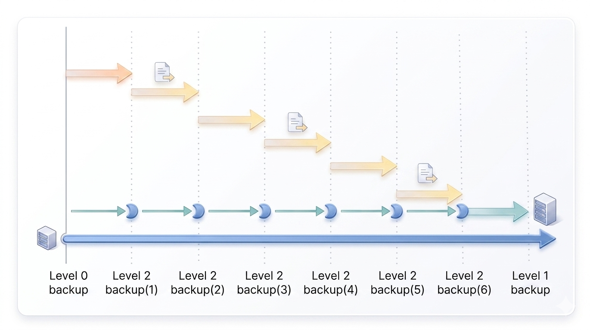
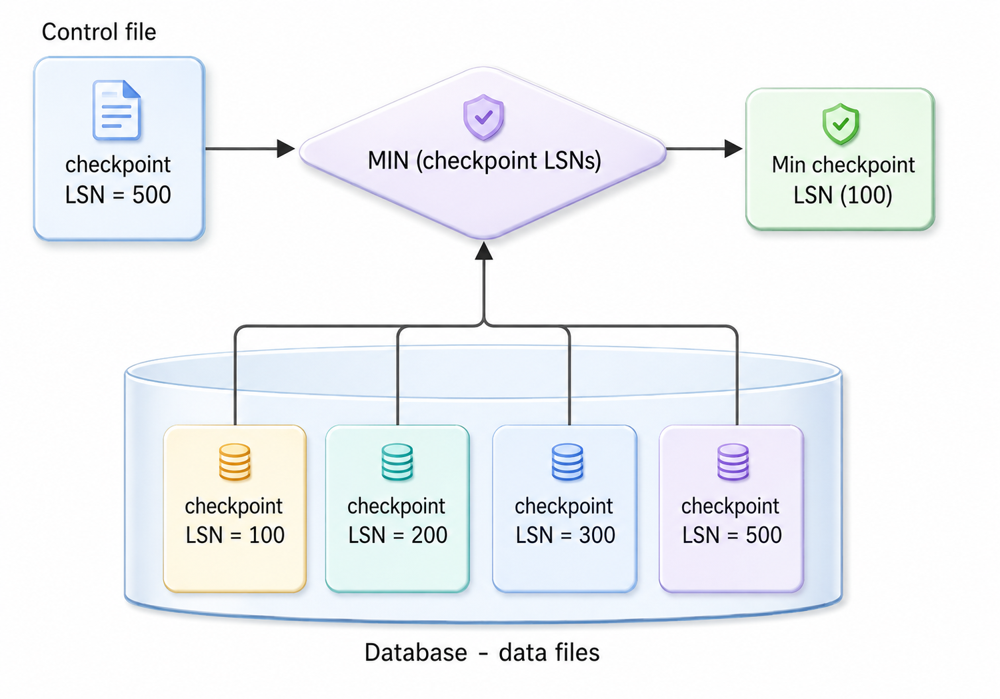

<a id="b139daefb99011f4"></a>

# 7. Backup and Recovery of GOLDILOCKS Database

> Source: [GOLDILOCKS 26c.1 User Manual (en)](https://manual.sunjesoft.co.kr/goldilocks/26c_1/manual/en/b139daefb99011f4)  
> Tag: `26c.1_0_tag`

[← 6. Structure and Storage Structure of GOLDILOCKS Database](6-structure-and-storage-structure-of-goldilocks-database.md) · [Table of contents](../README.md) · [8. GOLDILOCKS Database Replication →](8-goldilocks-database-replication.md)

This chapter describes GOLDILOCKS database backup and recovery, as well as the ARCHIVELOG mode used for these processes.

<a id="f25383eaa57ab850"></a>
## ARCHIVELOG Mode

The GOLDILOCKS database executes logging using a circular log group. It consists of at least four log groups. When the log files in a log group are exhausted, logging proceeds to the next log group. If all created log groups are exhausted, the first log group is reused. In this case, a new log file is not created; instead, the previously recorded log file is reused.

In NOARCHIVELOG mode, previously written logs are lost when a log group is reused. Therefore, if an administrator does not manage completed log groups, the logs of completed transactions will be lost while operating in NOARCHIVELOG mode.

On the other hand, in ARCHIVELOG mode, the system archives log files before reusing them. After completing the recording in a log file, the system moves to the next log group. The archived logs are preserved permanently unless they are deliberately deleted.

<a id="6b15aa70c817343a"></a>
### ACHIVELOG Mode

For recovery using backups, all log files created after the backup are needed, as the timing of the backup's use is uncertain. Therefore, log files must be archived before they are reused. Consequently, backups are supported only in ARCHIVELOG mode.

In ARCHIVELOG mode, the service may experience interruptions in a busy system due to the archiving process. Additionally, extra storage space is required to accommodate the archived log files.

<a id="3b71610248b6d14a"></a>
### NOARCHIVELOG Mode

Backup is not supported in NOARCHIVELOG mode because it can not be guaranteed that the log files preceding the reuse are available.

However, the system does not archive log files in NOARCHIVELOG mode. Therefore, there are no interruptions due to archiving at checkpoints when large volumes of logs are continuously recorded. Additionally, no extra storage space is required for archived log files.

The ARCHIVELOG_MODE property determines the logging mode when creating the database. If the ARCHIVELOG_MODE value is set to 0, the database is created in NOARCHIVELOG mode. If the value is set to 1, the database is created in ARCHIVELOG mode. This property is applicable only during database creation and is not referenced during database operation.

Execute the following syntax during the mount phase of the GOLDILOCKS database startup to change the ARCHIVELOG mode while the database is operating.

```
gSQL> ALTER DATABASE ARCHIVELOG;       
 
Database altered.
 
gSQL> ALTER DATABASE NOARCHIVELOG;
 
Database altered.
```

To check the ARCHIVELOG mode set in the database, query the ARCHIVELOG_MODE in the performance view V$ARCHIVELOG.

```
gSQL> SELECT ARCHIVELOG_MODE FROM V$ARCHIVELOG;

ARCHIVELOG_MODE
---------------
NOARCHIVELOG   

1 row selected.
```

<a id="1489a2969bcad011"></a>
## Backup and Recovery

<a id="3882289dbca7597d"></a>
### Backup

<a id="5f8e826ac2866cf5"></a>
#### Purpose of Backup and Recovery

A database can protect and recover data in the event of various failures or data loss. Failures can occur for many reasons. In particular, when the database is physically corrupted or damaged by a disaster, a duplicate copy is essential for recovery. This duplicate copy is known as a backup.

When the database service becomes unavailable due to various failures, it can be restored to a functional state using either the current database or a backup, a process known as recovery. Recovery using the current database is called restart recovery, while recovery using a backup is known as media recovery. GOLDILOCKS performs media recovery either automatically or manually to restore backup data files, and then uses restart recovery to complete the process and restart the database.

<a id="d97118dcbce81b43"></a>
#### Backup

Database backup is divided into physical backup and logical backup. Generally, backup refers to creating a copy of data files while the database is online. This chapter focuses on online physical backup.

<a id="2bf87ed03fea22ec"></a>
<table class="table column_count_4"><caption>Database backup type</caption><thead><tr><th class="to_center"><div>Backup type
</div></th><th class="to_center"><div>Backup form
</div></th><th class="to_center"><div>Database state
</div></th><th class="to_center"><div>Description
</div></th></tr></thead><tbody><tr><td class="to_middle" rowspan="2"><div>Physical backup
</div></td><td class="to_middle"><div>Cold backup
</div></td><td class="to_middle"><div>Offline
</div></td><td><div>Creating the copy of the data file
Stopping the service to execute the backup
</div></td></tr><tr><td class="to_middle"><div>Hot backup
</div></td><td class="to_middle"><div>Online
</div></td><td><div>Creating the copy of the data file
Executing backup during service operation
Available only in ARCHIVELOG mode</div></td></tr><tr><td class="to_middle"><div>Logical backup
</div></td><td class="to_middle"><div>Export backup
</div></td><td class="to_middle"><div>Online
</div></td><td><div>Backup/recovery at the table level
Exporting regardless of HW/OS system
</div></td></tr></tbody></table>

GOLDILOCKS uses data files and control files to operate the service, and these files need to be recovered if they become corrupted due to a failure. A control file is created during database creation and stores essential information for operating the database. Data files, which include both system tablespace files created at database creation and user-defined tablespace files, store the actual data. If any of these control files or data files become corrupted, use backup files for recovery.

In other words, control files and data files should be backed up to ensure recovery. To facilitate this, GOLDILOCKS supports backup of control files, the entire database, and individual tablespaces.

Depending on the backup method, it is divided into full backups and incremental backups. A full backup creates a copy of the data files at the time of the backup, and an incremental backup only backs up the modified parts since the previous backup. In the case of a full backup, a copy as large as the data files is created every time, which results in storage consumption equivalent to the size of the database or tablespace for each backup.

On the other hand, an incremental backup is relatively small in size because it only copies the changes made since the previous backup.

<a id="744a07d485747839"></a>
<table><caption>Full backup vs. incremental backup</caption><thead><tr><th align="center" valign="middle">Item</th><th align="center" valign="middle">Full backup</th><th align="center" valign="middle">Incremental backup</th></tr></thead><tbody><tr><td align="left" valign="middle">Backup object</td><td colspan="2" valign="middle"><ul><li>Database: The entire data file being used by the database</li><li>Tablespace: The data files within a specific tablespace of the database.</li></ul></td></tr><tr><td align="left" valign="middle">Description</td><td valign="middle"><ul><li>Backup the entire data file used by the database or tablespace</li><li>Creating a backup file for each data file</li><li>Restoring the required data file after a failure using the appropriate backup method, then recover it</li></ul></td><td valign="middle"><ul><li>Backup the modified parts of the data file used by the database or tablespace since the previous backup</li><li>Creating an incremental backup file that records only the modified parts</li><li>Recovery using multiple incremental backups after a failure</li></ul></td></tr></tbody></table>

<a id="1865334599aaedbe"></a>
#### Full Backup

Use a full backup to perform both database and tablespace backups. The database backup involves backing up control files and data files.

<a id="2d5707fc254bc6c5"></a>
##### Control File Backup

Backup the control file as follows. Specify the backup control file name along with the absolute path, or provide only the backup control file name. If you provide only the backup control file name, the backup file will be created in the directory specified by the LOG_DIR property.

```
gSQL> ALTER DATABASE BACKUP CONTROLFILE TO '/goldilocks_data/backup/backup.ctl';

Database altered.
```

<a id="7846bd870dff7f02"></a>
##### Database Backup

A database backup can backup the entire data file currently in use by the database. When backing up a data file, ensure that no changes are made to the file while it is being copied. If the file is in use during the copy process, it may become inconsistent, potentially leading to inconsistencies at the page level. To prevent these issues, put the database into a state that allows for a consistent backup.

```
gSQL> ALTER DATABASE BEGIN BACKUP;

Database altered.
```

Use the operating system’s file copy feature to create a copy of the data file while the database is in backup mode. After creating the copy, follow these steps to complete the backup process and make the database writable again.

```
gSQL> ALTER DATABASE END BACKUP;

Database altered.
```

<a id="20e430c4685bae6b"></a>
##### Tablespace Backup

A tablespace backup can backup the data files currently in use by a specified tablespace. For the same reason as with database backups, set the tablespace to backup mode using the tablespace name (tablespace_name) as follows:

```
gSQL> ALTER TABLESPACE TEST_TBS BEGIN BACKUP;

Tablespace altered.
```

Use the operating system's file copy feature to create a copy of the tablespace's data file while the tablespace is in backup mode. After creating the copy, complete the tablespace backup as follows.

```
gSQL> ALTER TABLESPACE TEST_TBS END BACKUP;

Tablespace altered.
```

<a id="344b476004f41f7d"></a>
#### Incremental Backup

An incremental backup supports both database-level and tablespace-level backups, similar to a full backup. However, an incremental backup does not back up the control files separately. Instead, the control file is included in the backup when performing a database incremental backup.

GOLDILOCKS supports incremental backup levels ranging from 0 to 4. When performing an incremental backup for the first time, set the level to 0 to back up the entire data file. For subsequent incremental backups, set the level to 1 or higher to back up only the modified portions since the last backup.

The given level of incremental backup searches for the time when the same level or lower level was executed. Then, it backups only the modified parts after the previous backup.

For example, after performing a level 0 backup, a level 2 backup (1) will back up only the modified parts since the level 0 backup. Subsequently, a level 2 backup (2) will back up only the changes made after the level 2 backup (1). Similarly, level 2 backups (3), (4), (5), and (6) will each back up the changes made since the most recent level 2 backup. On the other hand, a level 1 backup, if executed last, will back up all changes made since the level 0 backup.

<a id="730accc1852b8ba9"></a>


<a id="d9ca3b8033b21ef2"></a>
##### Database Incremental Backup

Perform an incremental backup of the entire database data file as follows: Begin by creating a level 0 backup, which backs up the entire data file.

```
gSQL> ALTER DATABASE BACKUP INCREMENTAL LEVEL 0;

Database altered.
```

And then, the modified parts since level 0 are backed up at level 1.

```
gSQL> ALTER DATABASE BACKUP INCREMENTAL LEVEL 1;

Database altered.
```

<a id="627264155ad7a002"></a>
##### Tablespace Incremental Backup

Just like with the database incremental backup, first back up the entire data file of the tablespace at level 0.

```
gSQL> ALTER TABLESPACE TEST_TBS BACKUP INCREMENTAL LEVEL 0;

Tablespace altered.
```

Then, back up the modified parts since level 0 at level 1.

```
gSQL> ALTER TABLESPACE TEST_TBS BACKUP INCREMENTAL LEVEL 1;

Tablespace altered.
```

<a id="fbfd1dbe81d58999"></a>
##### Change Tracking

To perform an incremental backup of the disk tablespace, the system must scan the entire data file to determine if any pages have been updated since the previous backup. As a result, if the data file is large, the incremental backup can take a long time, even if only a small number of pages have been updated, because the entire data file needs to be scanned.

Change tracking records only the pages that have been updated since the last incremental backup. This allows the next incremental backup to target only the updated pages, eliminating the need for a full scan of the data file. As a result, the backup time is reduced.

However, if most of the pages in the data file have been updated, the backup will involve a significant portion of the data file, making change tracking less efficient. Change tracking is only available when the database is in ARCHIVELOG mode and is not available in NOARCHIVELOG mode.

The following is an example of how to enable and disable change tracking in the database.

```
gSQL> ALTER DATABASE ENABLE CHANGE TRACKING;

Database altered.

gSQL> ALTER DATABASE DISABLE CHANGE TRACKING;

Database altered.
```

When change tracking is enabled, it creates both a change tracking file and shared memory. Both the change tracking file and the shared memory have the same structure, consisting of blocks that store update flags for pages, with the size of each block defined by the [CHANGE_TRACKING_EXTENT_SIZE](10-server-property.md#9179ff071f077bde) property.

The update flags are initialized during the first incremental backup after change tracking is enabled. When a page is updated, this change is recorded in the flag for that page. As a result, during subsequent incremental backups, only the pages marked by the update flags in the change tracking file are scanned and backed up.

When change tracking is enabled, a file is created in the location specified by the [CHANGE_TRACKING_FILE](10-server-property.md#18b22dba09497e21) property. If both the file name and storage location are provided when enabling change tracking, the file will be created at the specified location. If the storage location is not specified, the change tracking file will be created in the location specified by the SYSTEM_TABLESPACE_DIR property.

```
gSQL> ALTER DATABASE ENABLE CHANGE TRACKING USING FILE '/tmp/change_tracking.ctf';

Database altered.
```

The change tracking file has an initial size of 10 MB. It expands by an additional 10 MB each time it becomes full, in response to the increased number of updated disk data files.

<a id="917a0f316dcf068b"></a>
##### Parallel Incremental Bakcup

It can create multiple backup files in parallel.

The backup file has a 1-to-N relationship with data files. In other words, a single backup file can store multiple data files, but a single data file is not split and stored across multiple backup files.

The parallel backup must specify the partition factor (the number of pieces). If the parallel factor exceeds the partition factor, then the parallel factor will be adjusted to match the partition factor.

The following is an example of performing a parallel backup with four threads. The %p specifier represents the piece format, resulting in the creation of four backup piece files in total.

```
gSQL> ALTER DATABASE BACKUP INCREMENTAL LEVEL 0 FORMAT 'backup_%p' PIECE 4 PARALLEL 4;

Database altered.
```

<a id="8abc894a73a46607"></a>
### Recovery

The database ensures data consistency by performing recovery in the event of a failure or corruption. The types of database failures are as follows.

**Database failure type**

<a id="6058fb5437520127"></a>
| Failure type | Causes and symtoms | Solution |
| --- | --- | --- |
| Transaction failure | Transaction failure and deadlock due to logical errors (bad input, overflow, data not found) | Abort transaction |
| System crash | Corruption of volatile storage due to abnormal termination (blackout) of the DBMS or OS | Restart recovery |
| Media failure | Corruption of non-volatile storage device | Restore, restart recovery |

To resolve a transaction failure, abort the executing transactions, roll back all database updates, and release any obtained locks.

When a system crash results in the abnormal termination of database processes, recent information stored in volatile storage is not reflected in non-volatile storage and is lost. To address this, start up the database and perform recovery to restore it to the state it was in before the abnormal termination. This process is known as restart recovery. To recover the database, restart recovery uses the control files, data files, and log files that were in use before the failure.

If the non-volatile storage device is corrupted, recovery using the database files from before the failure is not possible because the control files, data files, and log files are also corrupted and unusable. In this case, recover the database using previously archived backup files and log files, and then perform the recovery process.

GOLDILOCKS supports both complete recovery and incomplete recovery. Complete recovery restores the data file to its latest consistent state using the log files. It can be applied to the database, tablespace, and data file. For tablespaces and data files, complete recovery is available for offline tablespaces even while the database service is running. Complete recovery is divided into two types: automatic recovery and manual recovery. Automatic recovery occurs during database restart, while manual recovery involves using recovery statements supported by GOLDILOCKS.

Incomplete recovery is available only for the database and restores it to a consistent state as of a specific point in time. This type of recovery must be performed manually. It can either recover to a specific point all at once or use user-selective recovery. User-selective incomplete recovery allows the user to choose a specific log file to recover up to that selected log file.

If both complete recovery and incomplete recovery are required, use the redo log and archive log files.

**Database recovery**

<a id="86b7fac153674e02"></a>
<table><thead><tr><th align="center" valign="middle">Recovery</th><th align="center" valign="middle">Target</th><th align="center" valign="middle">Description</th></tr></thead><tbody><tr><td valign="middle">Complete recovery</td><td valign="middle">Database,<br>tablespace,<br>datafile</td><td valign="middle"><ul><li>Automatic recovery (Recovers during restart)</li><li>Manual recovery (Manually recovers the database, tablespace and data files.)</li></ul></td></tr><tr><td valign="middle">Incomplete recovery</td><td valign="middle">Database</td><td valign="middle"><ul><li>Manual recovery only<br><ul><li>Incomplete recovery at once</li><li>User-selective incomplete recovery</li></ul></li></ul></td></tr></tbody></table>

<a id="53c75af128653e9c"></a>
#### Automatic Recovery

Automatic recovery is performed during the restart of the database after either a normal or abnormal termination. It utilizes the control files, data files, and log files that were in use immediately before the termination. If the latest database file is corrupted, the backup of the database file is used, and automatic recovery is carried out using the archive log files.

The recovery process is executed in three phases: analysis, redo, and undo.

<a id="6c04f31e971ac975"></a>
##### Analysis

Two operations are executed in the analysis phase. First, it searches for the first log to perform the restart recovery. To do this, it refers to the most recently executed checkpoint log and locates the most recent checkpoint log from the log information recorded in the control file. Second, it initializes the transaction table of the system. It uses the transaction information from the checkpoint written in the checkpoint log to initialize the system's transaction table.

<a id="fce79507b4a7d3a6"></a>
##### Restart Redo

All logs from the first log obtained in the analysis phase for restart recovery to the last log recorded in the redo log files are processed during the restart redo. During this process, the transaction table is updated when a transaction is completed or a new transaction is started.

<a id="0dd4e2c38aa4424a"></a>
##### Restart Undo

After the restart redo is completed, the system performs transaction rollback by undoing all incomplete transactions remaining in the transaction table.

<a id="5e4432c7d1c84fce"></a>
#### Recovery Using Backup

If the control files, data files, or log files are corrupted or missing, recovery must be performed using backup files. When recovering from a backup control file or data file, it can be complicated to determine the log from which to start the recovery.

<a id="d556997430c027d7"></a>
##### Analysis for Recovery Using Backup

In the analysis phase for recovery using backup, similar to automatic recovery, the system searches for the first log for recovery and initializes the transaction table. It does this by identifying the oldest LSN among the checkpoint LSNs recorded in all the data file headers. The system then compares this with the checkpoint LSN recorded in the control file to determine the minimum value, which is used to find the starting point for recovery.

The checkpoint LSN recorded in the data file header reflects the checkpointed LSN for that specific data file. Therefore, when using a backup data file, you should select the oldest checkpoint LSN from the data file headers. Compare this value with the checkpoint LSN recorded in the control file to determine the minimum checkpoint LSN for the recovery.

<a id="9d6bf8da0d1719de"></a>


<a id="b0c54fcb959f8f7a"></a>
##### Recovery Using Archive Log Files

Recovery using archive log files involves not only the redo log files but also the archive log files, especially when the minimum checkpoint LSN for recovery is found in an archive log file. Recovery using backups is performed at the level of the database, tablespace, or data file. Database recovery is carried out only during the MOUNT phase, while recovery at the tablespace and data file levels can be performed during either the MOUNT phase or the OPEN phase.

- Restoring the backup data files

Restoring data files can be done using either a full backup or an incremental backup. To restore data files from a full backup, the user directly uses the operating system's file copy command. In contrast, restoring from an incremental backup is done using the restoration syntax provided by GOLDILOCKS. Note that the tablespace must be OFFLINE to restore data files during the OPEN phase.

The following describes how to restore data files using an incremental backup.

```
gSQL> ALTER DATABASE RESTORE;
 
Database altered.
 
gSQL> ALTER DATABASE RESTORE TABLESPACE TEST_TBS;
 
Database altered.
```

- Manual recovery after restoring data files

The following describes how to execute recovery using the recovery syntax after restoring data files.

```
gSQL> ALTER DATABASE RECOVER;
 
Database altered.
 
gSQL> ALTER DATABASE RECOVER TABLESPACE TEST_TBS;
 
Database altered.
```

<a id="a7a4cbac95de9e6c"></a>
#### Incomplete Recovery

If restart recovery is not possible due to user errors during operation, corrupted control files, or corrupted redo and archive log files, and if recovery can not restore the database to a consistent state, then incomplete recovery should be executed. Incomplete recovery restores the database only up to a specific point in time.  
The following are situations when incomplete recovery is required.

<a id="1686a4a1b0748280"></a>
##### Corrupted Control File

Control files are multiplexed, meaning they can be recovered using uncorrupted copies if not all of the multiplexed files are corrupted.   
However, if all control files are corrupted, recovery must be performed using backup control files. In this case, complete recovery is not possible because the log information in the control files may have changed. Therefore, recovery can only be performed up to a specific point in time.

<a id="7ec48cbb224bb286"></a>
##### Restoring Backup Control File

When control files are corrupted, you can copy the remaining uncorrupted multiplexed control files to keep the control files up-to-date. However, if all multiplexed control files are corrupted, restore the backup control files and then perform the recovery. Note that any log information changed after the backup can not be recovered when using the backup control files.

<a id="96a5e17bc8196cf1"></a>
##### Corrupted Redo Log File

GOLDILOCKS organizes redo log files into several log members within a log group to prevent corruption. However, if all log members in a log group are corrupted, recovery using redo log files is not possible. In this case, incomplete recovery should be performed up to the point where uncorrupted log files are available.

<a id="a239606efaf3762a"></a>
##### Corrupted Archive Log File

In recovery, if an archive log file is corrupted, then incomplete recovery must be executed until uncorrupted log file. The process is the same as when redo log file is corrupted.

<a id="2b8f6bc59d89d3c7"></a>
##### User's Mistake

When a user accidentally drops an important table or incorrectly inserts, updates, or deletes data, it must be recoverable to the point before the mistake.

<a id="89d547edc96b91ea"></a>
##### Incomplete Recovery of GOLDILOCKS Database

GOLDILOCKS supports two types of incomplete recovery. One type allows recovery to a point specified by the operator, while the other enables recovery in log file units interactively between the operator and the system.

Incomplete recovery to a specified point can designate the specific point in time that needs recovery using a specified log’s LSN, a specific time, or a specific SCN.

Incomplete recovery is performed for the entire database only during the MOUNT phase. Incomplete recovery at the specific tablespace level is not supported due to potential database consistency issues.

- Incomplete recovery until specified LSN

It searches for the log that will complete the incomplete recovery and then executes the recovery up to the log's LSN.   
The following is an example of performing incomplete recovery until log LSN 1000.

```
gSQL> ALTER DATABASE RECOVER UNTIL CHANGE 1000;

Database altered;

gSQL> ALTER DATABASE RECOVER UNTIL CHANGE LSN 1000;

Database altered;
```

- Incomplete recovery until specified SCN

After identifying the SCN up to which incomplete recovery should be performed, recover only up to the SCN of the corresponding log. In a standalone environment, only the LCN of the SCN is valid. For example, to recover up to LCN 300, perform the operation as follows. For recovery up to a specific SCN in a cluster environment, refer to the [Incomplete Recovery in a Cluster Environment](#195abb6d669c2cf5) section.

```
gSQL> ALTER DATABASE RECOVER UNTIL CHANGE SCN '0.0.300';

Database altered;
```

> SCNs are not recorded sequentially, so even if the incomplete recovery is executed until SCN '0.0.300', it may result in recovery beyond that point. The following is an example of recovery when the SCN is reversed.  
>   
> Log: --- LSN 90 (SCN '0.0.3') -- LSN 91 (SCN '0.0.5') -- LSN 92 (SCN '0.0.4')  
>   
> gSQL> ALTER DATABASE RECOVER UNTIL CHANGE SCN '0.0.3';  
> → Recovery is performed up to LSN 90.  
>   
> gSQL> ALTER DATABASE RECOVER UNTIL CHANGE SCN '0.0.4';  
> → Recovery is performed up to LSN 92. (Recovery proceeds up to LSN 92, which contains SCN '0.0.4'.)  
>   
> gSQL> ALTER DATABASE RECOVER UNTIL CHANGE SCN '0.0.5';  
> → Recovery is performed up to LSN 92. (During recovery up to SCN '0.0.5', both SCN '0.0.4' and SCN '0.0.5' are recovered.)

- Incomplete recovery until specified time

It searches for the time that will complete the incomplete recovery and then executes the recovery up to the specified time.   
The following is an example of performing incomplete recovery until '2017-05-18 16:10:10.00000'.

```
gSQL> ALTER DATABASE RECOVER UNTIL TIME '2017-05-18 16:10:10.000000';

Database altered;
```

- Interactive incomplete recovery

If the log file is corrupted, recovery is executed up to just before the corrupted log file. To facilitate this, GOLDILOCKS recommends the required log files to the operator, who then executes the incomplete recovery using either the recommended log file or a new log file.

The following is an example of performing interactive incomplete recovery using GOLDILOCKS. First, when the operator initiates the incomplete recovery with the BEGIN command, GOLDILOCKS suggests the necessary log files for the recovery. The operator can either use the recommended log file directly or specify a different log file for the recovery.

```
gSQL> ALTER DATABASE BEGIN INCOMPLETE RECOVERY;

ERR-01000(14104): Warning: suggestion '/goldilocks/archive_log/archive_0.log'
ERR-01000(14103): Warning: media recovery needs a logfile including log (Lsn 139992)
Database altered.

gSQL> ALTER DATABASE RECOVER AUTOMATICALLY;

ERR-01000(14104): Warning: suggestion '/goldilocks/archive_log/archive_1.log'
ERR-01000(14103): Warning: media recovery needs a logfile including log (Lsn 144143)
Database altered.

gSQL> ALTER DATABASE END INCOMPLETE RECOVERY;

Database altered.
```

<a id="78c3b4283d7a03cf"></a>
##### Restarting Database after Incomplete Recovery

After the incomplete recovery is completed, a user can not restart the database in the usual manner. This is because the recovered GOLDILOCKS database, resulting from the incomplete recovery, is not associated with the current redo log files. To restart the database, the user must reset the redo log file, as the database is at a previous point, while the current redo log file pertains to logs generated afterward. Use the *RESETLOGS* option when restarting the GOLDILOCKS database after the incomplete recovery.

```
gSQL> ALTER SYSTEM OPEN DATABASE;

ERR-HY000(14083): must use RESETLOGS option for database open

gSQL> ALTER SYSTEM OPEN DATABASE RESETLOGS;

System altered.
```

<a id="c2e36e05e424bd32"></a>
##### Cautions for Incomplete Recovery

Incomplete recovery is performed up to a specific point to create a consistent database, but identifying that specific point can be challenging. All redo log files are reset after the incomplete recovery, so it is essential to back up all control files, data files, and redo log files offline before proceeding with the recovery. The incomplete recovery may need to be executed multiple times to determine the correct point.

Archive log files are necessary during the incomplete recovery. However, the newly recovered database differs from the previous one, so the archive redo log files created by the previous database must be dropped.

<a id="c18425c2797ea284"></a>
#### Recovery Examples

<a id="bfd0b806833bf9dd"></a>
##### Corrupted Control File

The GOLDILOCKS database control files store crucial information about the physical structure of the database and its consistency. If these files are corrupted or accidentally dropped, the database can not be operated.

The GOLDILOCKS database can multiplex between 2 and 8 control files. If at least one valid control file is available, the remaining control files can be restored, allowing the database to be restarted.

<a id="c9d65c400e4e7892"></a>
###### **When a valid multiplexed control file exists**

If the multiplexed control file *'/goldilocks_data/wal/control_1.ctl'* is corrupted, the database restart will fail as follows.

```
gSQL> \STARTUP

ERR-HY000(14097): control file is corrupted - '/goldilocks_data/wal/control_1.ctl'
```

Copy the valid control file from */goldilocks_data/wal/control_0.ctl* to */goldilocks_data/wal/control_1.ctl*, and drop the shared memory that caused the restart failure. Then, restart the database.

```
$ cp /goldilocks_data/wal/control_0.ctl /goldilocks_data/wal/control_1.ctl

gSQL> \SHUTDOWN

Shutdown success

gSQL> \STARTUP

Startup success
```

<a id="9b4e88574fce46ba"></a>
###### **When all multiplexed control files are corrupted**

If all multiplexed control files are corrupted, a user can restart the database using backup control files after performing incomplete recovery. The physical structure of the database may change after backing up the control files, so incomplete recovery must be executed when restoring control files from backups. Archive log files and redo log files still exist even after incomplete recovery. Therefore, an administrator must perform GOLDILOCKS interactive incomplete recovery to manually restore the database to the 'CURRENT' state of the redo log file.

The backup control file can be copied to the multiplexed control files using the operating system's file copy feature, or they can be restored using the GOLDILOCKS database recovery feature as follows. Control file recovery can only be executed during the NOMOUNT phase of the GOLDILOCKS multilevel startup.

```
gSQL> \STARTUP NOMOUNT

Startup success

gSQL> ALTER DATABASE RESTORE CONTROLFILE FROM '/goldilocks_data/backup/backup.ctl';

Database altered.
```

After restoring the backup control files, execute the incomplete recovery during the MOUNT phase as follows.

```
gSQL> ALTER SYSTEM MOUNT DATABASE;

System altered.

gSQL> ALTER DATABASE BEGIN INCOMPLETE RECOVERY;

ERR-01000(14104): Warning: suggestion '/goldilocks/archive_log/archive_0.log'
ERR-01000(14103): Warning: media recovery needs a logfile including log (Lsn 137499)
Database altered.

gSQL> ALTER DATABASE RECOVER AUTOMATICALLY;

ERR-01000(14104): Warning: suggestion '/goldilocks/archive_log/archive_1.log'
ERR-01000(14103): Warning: media recovery needs a logfile including log (Lsn 137667)
Database altered.

gSQL> ALTER DATABASE RECOVER '/goldilocks/wal/redo_1_0.log';

ERR-01000(14104): Warning: suggestion '/goldilocks/archive_log/archive_2.log'
ERR-01000(14103): Warning: media recovery needs a logfile including log (Lsn 137672)
Database altered.

gSQL> ALTER DATABASE END INCOMPLETE RECOVERY;

Database altered.

gSQL> ALTER SYSTEM OPEN DATABASE RESETLOGS;

System altered.
```

<a id="6bae1c03ebaaf940"></a>
##### Corrupted Data File

If a data file is corrupted or dropped, complete recovery is performed using backup data files. A full backup restores the data files by copying the backup files, while an incremental backup uses GOLDILOCKS' restoring syntax for recovery.  
Restoration and recovery can be executed at the database level or within a specific tablespace. Recovery can also be performed for the tablespace corresponding to the affected data file. Recovery at the tablespace level can be conducted during the MOUNT phase or the OPEN phase; however, the tablespace must be in OFFLINE state to restore and recover data files during the OPEN phase.

- Recovering corrupted data files using a full backup during the MOUNT phase

Execute the complete recovery after copying the backup data file from */goldilocks/backup/test.dbf* to */goldilocks/db/test.dbf*.

```
$ cp /goldilocks/backup/test.dbf /goldilocks/db/test.dbf

gSQL> \STARTUP MOUNT

System altered.

gSQL> ALTER DATABASE RECOVER;

Database altered.

gSQL> ALTER SYSTEM OPEN DATABASE;

System altered.
```

- Recovering corrupted data files using a full backup during the OPEN phase

```
gSQL> SELECT IS_ONLINE FROM V$TABLESPACE WHERE TBS_NAME = 'TEST_TBS';

IS_ONLINE
---------
FALSE     

1 row selected.

$ cp /goldilocks/backup/test.dbf /goldilocks/db/test.dbf

gSQL> ALTER DATABASE RECOVER TABLESPACE TEST_TBS;

Database altered.

gSQL> ALTER TABLESPACE TEST_TBS ONLINE;

Tablespace altered.
```

- Recovering corrupted data files using an incremental backup during the MOUNT phase

```
gSQL> \STARTUP MOUNT

System altered.

gSQL> ALTER DATABASE RESTORE;

Database altered.

gSQL> ALTER SYSTEM OPEN DATABASE;

System altered.
```

- Recovering corrupted data files using an incremental backup during the OPEN phase

```
gSQL> SELECT IS_ONLINE FROM V$TABLESPACE WHERE TBS_NAME = 'TEST_TBS';

IS_ONLINE
---------
FALSE  

1 row selected.

gSQL> ALTER DATABASE RESTORE TABLESPACE TEST_TBS;

Database altered.

gSQL> ALTER TABLESPACE TEST_TBS ONLINE;

Tablespace altered.
```

<a id="5851e5bbec1c55ce"></a>
##### User's Mistake (Table Dropping or Incorrect Insert/drop/update)

The GOLDILOCKS database supports DDL rollback for tables and indexes if a table, such as TEST, is dropped by mistake. A user can roll back to cancel the table drop instead of committing the action, even after the table has been dropped, as follows.

```
gSQL> DROP TABLE TEST;

Table dropped.

gSQL> ROLLBACK;

Rollback complete.

gSQL> \DESC TEST

COLUMN_NAME TYPE          IS_NULLABLE
----------- ------------- -----------
I1          NUMBER(10,0)  TRUE       
I2          CHARACTER(10) TRUE

gSQL> DROP TABLE TEST;

Table dropped.

gSQL> COMMIT;

Commit complete.

gSQL> \DESC TEST

ERR-42000(16040): table or view does not exist : 
SELECT *   FROM TEST  WHERE 1 = 0 
                *
ERROR at line 1:
```

If the table drop is committed, it cannot be rolled back. Therefore, execute GOLDILOCKS incomplete recovery to restore the database to a specific point using backups. This will recover the data to the state before the table drop. After that, restart the database.

The backup file from the point before the table drop is used to restore the table during incomplete media recovery. The correct point can be identified, as described above, by repeating the recovery several times to determine when the table was dropped. During this process, the gdump tool can be used to dump the log file for analysis.

Assuming the LSN is 1000 at the time after the table drop, the incomplete recovery is executed as follows.

```
gSQL> \STARTUP MOUNT

System altered.

gSQL> ALTER DATABASE RECOVER UNTIL CHANGE 1000;

Database altered.

gSQL> ALTER SYSTEM OPEN DATABASE RESETLOGS;

System altered

gSQL> \DESC TEST

COLUMN_NAME TYPE          IS_NULLABLE
----------- ------------- -----------
I1          NUMBER(10,0)  TRUE       
I2          CHARACTER(10) TRUE
```

<a id="913b5c04a91340ea"></a>
##### Corrupted Log File (Archive File, Redo Log File)

- Corrupted archive log file during recovery

Assume that the data files are corrupted and a user is executing recovery using the backup data files. Additionally, assume that a specific archive log file becomes corrupted during the recovery, preventing the process from being completed.

For example, consider the archive log files 'archive_0.log', 'archive_1.log', 'archive_2.log', and 'archive_3.log.' If 'archive_3.log' is corrupted, preventing the recovery from being completed, incomplete recovery can be performed up to 'archive_2.log,' after which the database can be restarted.

```
gSQL> \STARTUP MOUNT

System altered

gSQL> ALTER DATABASE BEGIN INCOMPLETE RECOVERY;

ERR-01000(14104): Warning: suggestion '/goldilocks/archive_log/archive_0.log'
ERR-01000(14103): Warning: media recovery needs a logfile including log (Lsn 139992)
Database altered.

gSQL> ALTER DATABASE RECOVER AUTOMATICALLY;

ERR-01000(14104): Warning: suggestion '/goldilocks/archive_log/archive_3.log'
ERR-01000(14103): Warning: media recovery needs a logfile including log (Lsn 194143)
Database altered.

gSQL> ALTER DATABASE END INCOMPLETE RECOVERY;

Database altered.

gSQL> ALTER SYSTEM OPEN DATABASE RESETLOGS;

System altered
```

- Corrupted redo log file

Assume that a failure occurs while operating the database, resulting in the corruption of the CURRENT log group where logs are flushed.

For example, if an abnormal termination occurs while in the state of the following log groups, manual recovery is executed to complete the incomplete recovery. This is necessary because log group 3, 0 has not yet been archived.

**Log group state**

<a id="91e4afea1b5b9c9f"></a>
| Log group | Log group state | Log file sequence no. | Prev last LSN |
| --- | --- | --- | --- |
| Log group 0 | ACTIVE | 8 | 80000 |
| Log group 1 | CURRENT | 9 | 90000 |
| Log group 2 | INACTIVE | 6 | 60000 |
| Log group 3 | ACTIVE | 7 | 70000 |

```
gSQL> \STARTUP MOUNT

System altered

gSQL> ALTER DATABASE BEGIN INCOMPLETE RECOVERY;

ERR-01000(14104): Warning: suggestion '/goldilocks/archive_log/archive_0.log'
ERR-01000(14103): Warning: media recovery needs a logfile including log (Lsn 1000)
Database altered.

gSQL> ALTER DATABASE RECOVER AUTOMATICALLY;

ERR-01000(14104): Warning: suggestion '/goldilocks/archive_log/archive_7.log'
ERR-01000(14103): Warning: media recovery needs a logfile including log (Lsn 70001)
Database altered.

gSQL> ALTER DATABASE RECOVER '/goldilocks/wal/redo_3_0.log';

ERR-01000(14104): Warning: suggestion '/goldilocks/archive_log/archive_8.log'
ERR-01000(14103): Warning: media recovery needs a logfile including log (Lsn 80001)
Database altered.

gSQL> ALTER DATABASE RECOVER '/goldilocks/wal/redo_0_0.log';

ERR-01000(14104): Warning: suggestion '/goldilocks/archive_log/archive_9.log'
ERR-01000(14103): Warning: media recovery needs a logfile including log (Lsn 90001)
Database altered.

gSQL> ALTER DATABASE END INCOMPLETE RECOVERY;

Database altered.

gSQL> ALTER SYSTEM OPEN DATABASE RESETLOGS;

System altered
```

<a id="796b862593cbe1a3"></a>
##### More Recent Datafile Than Log

All tablespaces created in the GOLDILOCKS database consist of pages, and each page sets its page LSN to the LSN recorded by the last transaction that updated that page. Therefore, all page LSNs in the datafile will have the same value or a smaller value than the LSN of the latest log recorded in the redo log file of the log group.

When restarting the database, if a specific page's LSN in the data file has a value greater than the latest log's LSN, then it compromises database consistency and renders normal service unavailable. To prevent this abnormal situation, the GOLDILOCKS database checks the data file and log during the restart process.

If any page in the data file has an LSN greater than the latest log's LSN, the database restart will fail as follows.

```
gSQL> \STARTUP

ERR-HY000(14114): exist inconsistent datafiles; need to restore more older backup datafiles or more recent redo logfiles
```

To resolve this issue, restore the backup data file containing LSNs smaller than the latest log LSN. Alternatively, restart the database after restoring the log file that contains LSNs greater than those in the data file. Check the trace file to identify which data file needs to be restored.

For example, if the following messages appear in the trace file when the restart fails, it indicates that the page with an LSN of '126787' in the '/data/db/system_dic.dbf' data file has a value greater than the latest log LSN of '126652'. To facilitate the restart, restore the previous backup data file, or restore the log file that contains an LSN greater than or equal to '126787'. Additionally, if multiple pages in the data file have LSN values greater than the log file LSN, restore the log file with the highest value among them to successfully restart the database and provide service.

```
[2016-01-15 12:41:14.045679 THREAD(10581,139799401453312)] [INFORMATION]

[STARTUP_SM] the max page lsn '126787' of datafile '/data/db/system_dict.dbf' is more recent than the latest redo log lsn '126652'.

[2016-01-15 12:41:14.045705 THREAD(10581,139799401453312)] [INFORMATION]
[STARTUP_SM] the max page lsn '126830' of datafile '/data/db/system_undo.dbf' is more recent than the latest redo log lsn '126652'.

[2016-01-15 12:41:14.045729 THREAD(10581,139799401453312)] [INFORMATION]
[STARTUP_SM] the max page lsn '126829' of datafile '/data/db/test_log.dbf' is more recent than the latest redo log lsn '126652'.
```

<a id="195abb6d669c2cf5"></a>
#### Incomplete Recovery in a Cluster Environment

[Incomplete recovery](#a7a4cbac95de9e6c) can also be performed in a cluster environment.  
However, due to the nature of a cluster, the recovery point (SCN) of all members must be aligned to ensure database consistency.  
To achieve this, perform incomplete recovery in the following three steps and then restart the database.  
Through this process, the GCN of all members is aligned, and the DCN of members within each group is also synchronized.

1. Perform incomplete recovery on an arbitrary member  
   - Perform recovery up to a specific point based on LSN, SCN, or time.  
   - After recovery, check the latest SCN of the member.
2. Perform incomplete recovery on members of other groups  
   - Select one member from each group, excluding the group of the member recovered in Step 1.  
   - Perform recovery based on the GCN of the latest SCN identified in Step 1.  
   - After recovery, check the latest SCN of each member.
3. Perform incomplete recovery on the remaining members  
   - Perform recovery on all remaining members based on the GCN and DCN of the SCNs identified in Steps 1 and 2.

For example, assume a cluster environment consisting of two groups, each with two members (G1 {g1n1, g1n2}, G2 {g2n1, g2n2}).  
In this case, regardless of the cluster configuration, first perform incomplete recovery on an arbitrary member up to the desired point in time, and then proceed with recovery for the remaining members according to the procedure described above.

1. Perform incomplete recovery on g1n1 in group G1 up to the specified timestamp '2026-03-09 16:38:35.148078', and then verify the latest SCN after recovery.

```
gSQL> \STARTUP MOUNT

System altered

gSQL> ALTER DATABASE RECOVER UNTIL CHANGE TIME '2026-03-09 16:38:35.148078';

Database altered.

gSQL> ALTER SYSTEM OPEN LOCAL DATABASE RESETLOGS;

System altered.

gSQL> SELECT * FROM V$SYSTEM_STAT WHERE STAT_NAME = 'RECOVERED_SCN';

STAT_NAME     STAT_VALUE STAT_STR   COMMENTS          
------------- ---------- ---------- ------------------
RECOVERED_SCN          0 11.2.62198 last recovered scn

1 row selected.
```

2. Perform incomplete recovery on g2n1 in group G2 up to SCN '11.*', and then verify the latest SCN after recovery.

```
gSQL> \STARTUP MOUNT

System altered

gSQL> ALTER DATABASE RECOVER UNTIL CHANGE SCN '11.*';

Database altered.

gSQL> ALTER SYSTEM OPEN LOCAL DATABASE RESETLOGS;

System altered.

gSQL> SELECT * FROM V$SYSTEM_STAT WHERE STAT_NAME = 'RECOVERED_SCN';

STAT_NAME     STAT_VALUE STAT_STR   COMMENTS          
------------- ---------- ---------- ------------------
RECOVERED_SCN          0 11.0.63366 last recovered scn

1 row selected.
```

3. Perform incomplete recovery on the remaining members of groups G1 and G2 (g1n2, g2n2) based on the latest SCN of each group identified in steps 1 and 2.

```
// Perform incomplete recovery on g1n2.
gSQL> \STARTUP MOUNT

System altered

gSQL> ALTER DATABASE RECOVER UNTIL CHANGE SCN '11.2.*';

Database altered.

gSQL> ALTER SYSTEM OPEN LOCAL DATABASE RESETLOGS;

System altered.

// Perform incomplete recovery on g2n2.
gSQL> \STARTUP MOUNT

System altered

gSQL> ALTER DATABASE RECOVER UNTIL CHANGE SCN '11.0.*';

Database altered.

gSQL> ALTER SYSTEM OPEN LOCAL DATABASE RESETLOGS;

System altered.
```

<a id="11ce1455bbf8718c"></a>
#### *in doubt* Transaction Recovery in a Cluster Environment

Transactions in a cluster environment are categorized into global transactions, domain transactions, and local transactions. A global transaction is executed across two or more cluster groups, a domain transaction is performed within a single cluster group, and a local transaction is executed on a single cluster member.

The local transaction relies solely on the local member's log for recovery. In contrast, the domain transaction also uses the local member's log during recovery, rolling back if an abnormal termination occurs before the transaction is completed. Additionally, it performs synchronization with a group member through rebalancing if needed.

The global transaction uses the two-phase commit protocol to achieve commitment. The two-phase commit process for GOLDILOCKS global transactions is performed as follows.

- PREPARE phase
    - The driver member sends PREPARE messages to all members and waits for their response. 
    - If it receives PREPARE response messages from all members, it moves on to the COMMIT phase. If at least one member fails or does not respond, it initiates a rollback.
- COMMIT phase
    - The driver member sends COMMIT messages to all members and waits for their responses. 
    - The commit is executed even if there are failing members.

If a member is abnormally terminated without recording the commit log during the COMMIT phase, it must obtain state information from other members upon restarting. This is necessary because the member cannot determine whether the global transaction in the 'PREPARE' state was committed or rolled back after restarting.

To achieve this, GOLDILOCKS records committed global transaction information in transaction record form in MEM_TRANS_TBS. When a new record is added, the previous record is logged in the global transaction log file as needed. Later, the abnormally terminated member performs restart recovery or manual recovery using the log, and if there is an in-doubt transaction in the 'PREPARE' state, it obtains the COMMIT/ROLLBACK information for that transaction from the active members to complete the recovery.

GOLDILOCKS creates a global transaction log file consisting of two log groups in advance and records in-doubt transaction information in the log file during database creation. If the log file becomes full, the next log file is utilized. The filled log file can be reused after being archived by the archive system thread. In a cluster environment, the global transaction log file is always archived, regardless of the ARCHIVELOG mode, as it is necessary to refer to previous in-doubt transaction information.

---

[← 6. Structure and Storage Structure of GOLDILOCKS Database](6-structure-and-storage-structure-of-goldilocks-database.md) · [Table of contents](../README.md) · [8. GOLDILOCKS Database Replication →](8-goldilocks-database-replication.md)

<sub>Copyright © 2010 SUNJESOFT Inc. All rights reserved.</sub>
