<a id="507c746178af8962"></a>

# 12. SQL Languages

> Source: [GOLDILOCKS 26c.1 User Manual (en)](https://manual.sunjesoft.co.kr/goldilocks/26c_1/manual/en/507c746178af8962)  
> Tag: `26c.1_0_tag`

[← 11. SQL Elements](11-sql-elements.md) · [Table of contents](../README.md) · [13. SQL Objects →](13-sql-objects.md)

Structured Query Languages (SQL) are classified as follows.

- Data Definition Language
- Data Manipulation Language
- Data Query Language
- Control Language

<a id="409f89727a0eb076"></a>
## Data Definition Language

<a id="cd443f1fd7e65cde"></a>
### DDL Related Statements

For more information, refer to the following.

- Non-schema object DDL
    - [Database Related Statements](13-sql-objects.md#1513c369f59a3720)
    - [Profile Related Statements](13-sql-objects.md#11c59039d989ce79)
    - [Audit Policy Related Statement](13-sql-objects.md#a2be795f98efe5c6)
    - [Authorization Related Statements](13-sql-objects.md#5fd24967dae1c97b)
    - [Schema Related Statements](13-sql-objects.md#8c214565a052d261)
    - [Tablespace Related Statements](13-sql-objects.md#3241835cc9d68baa)

- SQL schema object DDL
    - [Table Related Statements](13-sql-objects.md#1895d22334489c10)
    - [Index Related Statements](13-sql-objects.md#eaa369678e30f347)
    - [View Related Statements](13-sql-objects.md#2e2886d9e78a0fcb)
    - [Sequence Related Statements](13-sql-objects.md#3766124c366d78b1)
    - [Synonym Related Statements](13-sql-objects.md#0dd0d15e2783f806)
    - [Stored Procedure Related Statements](13-sql-objects.md#04ad655b3603fc64)
    - [Stored Function Related Statements](13-sql-objects.md#649457274d9a08ee)
    - [Package Related Statements](13-sql-objects.md#341e0322a257026f)
    - [Library Related Statements](13-sql-objects.md#400612c6d9d7dc22)
    - [Trigger Related Statements](13-sql-objects.md#13a5d01c1cffb1fe)

- Cluster object DDL
    - [Cluster System Related Statements](14-cluster-objects.md#bde4baf64f5f5404)
    - [Cluster Group Related Statements](14-cluster-objects.md#a741ebe9e36c647b)
    - [Cluster Member Related Statements](14-cluster-objects.md#e3b44d85339afdf6)
    - [Cluster Location Related Statements](14-cluster-objects.md#4427184812ad8238)
    - [Global Secondary Index Related Statements](14-cluster-objects.md#eedbcad0006e9d66)

<a id="59cbdab977517bb1"></a>
### Concepts of DDL

Data Definition Language (DDL) is an SQL language used to create, drop and alter SQL objects.

The SQL objects of a database are listed in the table below. For more information, refer to the links in the table.

<a id="64f61240512e3c1a"></a>
<table class="table column_count_4"><caption>SQL objects types</caption><thead><tr><th class="to_center"><div>Object type</div></th><th class="to_center"><div>Object</div></th><th class="to_center"><div>Description</div></th><th class="to_center"><div>Refer to</div></th></tr></thead><tbody><tr><td class="to_left to_middle" rowspan="7"><div>Non-schema
object</div></td><td class="to_left to_middle"><div>Profile</div></td><td class="to_left to_middle"><div>It is an object that defines the password management policy.</div></td><td class="to_left to_middle"><div><a class="reference text" href="13-sql-objects.md#b473eb49b47375b0">Profile</a></div></td></tr><tr><td class="to_middle"><div>Audit policy</div></td><td class="to_middle"><div>It is an object that defines the SQL auditing policy.</div></td><td class="to_middle"><div><a class="reference text" href="13-sql-objects.md#8a166818c6a19ad8">Audit Policy</a></div></td></tr><tr><td class="to_middle"><div>Role</div></td><td class="to_middle"><div>It is a role object that consists of a set of privileges.</div></td><td class="to_middle"><div><a class="reference text" href="13-sql-objects.md#150ddad127e67031">Authorization</a></div></td></tr><tr><td class="to_left to_middle"><div>User</div></td><td class="to_left to_middle"><div>It is a user object that consists of a set of privileges.</div></td><td class="to_left to_middle"><div><a class="reference text" href="13-sql-objects.md#150ddad127e67031">Authorization</a></div></td></tr><tr><td class="to_left to_middle"><div>Schema</div></td><td class="to_left to_middle"><div>It is a logical container that contains SQL schema objects such as tables.</div></td><td class="to_left to_middle"><div><a class="reference text" href="13-sql-objects.md#f08bb9c05992d53b">Schema</a></div></td></tr><tr><td class="to_left to_middle"><div>Tablespace</div></td><td class="to_left to_middle"><div>It is the physical storage for objects such as tables, indexes, etc.</div></td><td class="to_left to_middle"><div><a class="reference text" href="13-sql-objects.md#1d5069ac2933aea8">Tablespace</a></div></td></tr><tr><td class="to_left to_middle"><div>Public synonym</div></td><td class="to_left to_middle"><div>It is a public synonym.</div></td><td class="to_left to_middle"><div><a class="reference text" href="13-sql-objects.md#241990debacad4f5">Public Synonym</a></div></td></tr><tr><td class="to_left to_middle" rowspan="10"><div>SQL schema 
object</div></td><td class="to_left to_middle"><div>Table</div></td><td class="to_left to_middle"><div>It is a physical relation where data is stored.</div></td><td class="to_left to_middle"><div><a class="reference text" href="13-sql-objects.md#c3591c5653ef2e4e">Table</a></div></td></tr><tr><td class="to_left to_middle"><div>View</div></td><td class="to_left to_middle"><div>It is a logical relation that consists of queries.</div></td><td class="to_left to_middle"><div><a class="reference text" href="13-sql-objects.md#6d304d89d1526b87">View</a></div></td></tr><tr><td class="to_left to_middle"><div>Index</div></td><td class="to_left to_middle"><div>It is an index object designed to improve query performance.</div></td><td class="to_left to_middle"><div><a class="reference text" href="13-sql-objects.md#d40be59cec34a5e6">Index</a></div></td></tr><tr><td class="to_left to_middle"><div>Sequence</div></td><td class="to_left to_middle"><div>It is an object that generates sequential numbers.</div></td><td class="to_left to_middle"><div><a class="reference text" href="13-sql-objects.md#218a4e304f2de6b4">Sequence</a></div></td></tr><tr><td class="to_left to_middle"><div>Synonym</div></td><td class="to_left to_middle"><div>It is an object that declares an alias for another object.</div></td><td class="to_left to_middle"><div><a class="reference text" href="13-sql-objects.md#556f1fbf6bf9cf1d">Synonym</a></div></td></tr><tr><td class="to_middle"><div>Stored procedure</div></td><td class="to_middle"><div>It is a user-defined procedure object.</div></td><td class="to_middle"><div><a class="reference text" href="13-sql-objects.md#da561cda3b17dee9">Stored Procedure</a></div></td></tr><tr><td class="to_middle"><div>Stored function</div></td><td class="to_middle"><div>It is a user-defined function object.</div></td><td class="to_middle"><div><a class="reference text" href="13-sql-objects.md#03c2a80a3bfeb8b8">Stored Function</a></div></td></tr><tr><td class="to_middle"><div>Package</div></td><td class="to_middle"><div>It is a user-defined package object.</div></td><td class="to_middle"><div><a class="reference text" href="13-sql-objects.md#956ccc566d823e3c">Package</a></div></td></tr><tr><td class="to_middle"><div>Library</div></td><td class="to_middle"><div>It is a library object that refers to an external shared library file.</div></td><td class="to_middle"><div><a class="reference text" href="13-sql-objects.md#8e114ce4bd55cb67">Library</a></div></td></tr><tr><td class="to_middle"><div>Trigger</div></td><td class="to_middle"><div>It is a trigger object that defines automated actions that execute whenever DML operations occur on a specific table.</div></td><td class="to_middle"><div><a class="reference text" href="13-sql-objects.md#b36a9264d15b927a">Trigger</a></div></td></tr><tr><td class="to_left to_middle" rowspan="5"><div>Cluster
object</div></td><td class="to_left to_middle"><div>Cluster group</div></td><td class="to_left to_middle"><div>It is a collection of cluster members.</div></td><td class="to_left to_middle"><div><a class="reference text" href="14-cluster-objects.md#6d5a8e9fe2743caa">Cluster Group</a></div></td></tr><tr><td class="to_left to_middle"><div>Cluster member</div></td><td class="to_left to_middle"><div>It is a data server that configures a cluster system.</div></td><td class="to_left to_middle"><div><a class="reference text" href="14-cluster-objects.md#c2e50728804daf6f">Cluster Member</a></div></td></tr><tr><td class="to_left to_middle"><div>Cluster location</div></td><td class="to_left to_middle"><div>It is an object that defines the location of a cluster member.</div></td><td class="to_left to_middle"><div><a class="reference text" href="14-cluster-objects.md#362b061cc4518627">Cluster Location</a></div></td></tr><tr><td class="to_left to_middle"><div>Shard</div></td><td class="to_left to_middle"><div>It is a set of rows that horizontally partitions a cluster table.</div></td><td class="to_left to_middle"><div><a class="reference text" href="14-cluster-objects.md#e56d5d1087eefb48">Cluster Table and Shard</a></div></td></tr><tr><td class="to_left to_middle"><div>Global secondary
index</div></td><td class="to_left to_middle"><div>It is an index for the row identifier of a cluster.</div></td><td class="to_left to_middle"><div><a class="reference text" href="14-cluster-objects.md#3e9bcc83795a29d0">Global Secondary Index</a></div></td></tr></tbody></table>

<a id="3bd50c7599bf31b4"></a>
### DDL and Transaction

A GOLDILOCKS transaction includes not only DML statements, such as INSERT, DELETE, and UPDATE, but also DDL statements, such as CREATE, DROP, and ALTER objects. While many DBMS perform implicit transactions for DDL statements. In contrast, GOLDILOCKS includes DDL statements within the transaction ensuring the atomicity and consistency of the entire transaction.

This feature is useful when a user needs to atomically perform batch DDL operations, such as database migration or tool installation, or to recover from mistakes by using ROLLBACK in cases where statements like DROP TABLE or TRUNCATE TABLE are executed by mistake.

If a DDL statement has the auto-commit property enabled, it is automatically committed when executed. On the other hand, if auto-commit is not enabled, the transaction can still be rolled back even after the statement is executed. The auto-commit status of a DDL statement can be queried using the [V$SQL_COMMAND](../part-02-administration-manual/9-database-information.md#4597a2bd046dff51) view as shown below.

```
gSQL> 
SELECT command, auto_commit 
  FROM V$SQL_COMMAND 
 WHERE is_ddl = 'YES';

COMMAND                                                   AUTO_COMMIT
--------------------------------------------------------- -----------
ALTER AUDIT POLICY                                        YES        
ALTER CLUSTER GROUP .. ADD CLUSTER MEMBER                 YES        
ALTER DATABASE DROP INACTIVE CLUSTER MEMBERS              YES        
ALTER DATABASE RESET LOCAL CLUSTER MEMBER                 YES        
ALTER DATABASE ADD LOGFILE GROUP                          YES        
ALTER DATABASE ADD LOGFILE MEMBER                         YES        
ALTER DATABASE DROP LOGFILE GROUP                         YES        
ALTER DATABASE DROP LOGFILE MEMBER                        YES        
ALTER DATABASE RENAME CHANGE TRACKING                     YES        
ALTER DATABASE RENAME LOGFILE                             YES        
ALTER DATABASE ARCHIVELOG                                 YES        
ALTER DATABASE NOARCHIVELOG                               YES        
ALTER DATABASE DATAFILE AUTOEXTEND ..                     YES        
ALTER DATABASE CLEAR AUDIT TRAIL                          YES        
ALTER DATABASE CLEAR PASSWORD HISTORY                     NO         
ALTER FUNCTION                                            YES        
ALTER INDEX AGING                                         NO         
ALTER INDEX .. STORAGE                                    NO         
ALTER INDEX .. RENAME                                     NO         
ALTER INDEX .. REBUILD                                    YES        
ALTER INDEX .. ENABLE                                     NO         
ALTER INDEX .. DISABLE                                    NO         
ALTER PACKAGE                                             YES        
ALTER PROCEDURE                                           YES        
ALTER PROFILE                                             YES        
ALTER SEQUENCE                                            YES        
ALTER SEQUENCE .. SYNCHRONIZE                             YES        
ALTER SYSTEM SWITCH LOGFILE                               YES        
ALTER TABLE .. ADD COLUMN                                 NO         
ALTER TABLE .. SET UNUSED COLUMN                          NO         
ALTER TABLE .. ALTER COLUMN .. SET DEFAULT                NO         
ALTER TABLE .. ALTER COLUMN .. DROP DEFAULT               NO         
ALTER TABLE .. ALTER COLUMN .. SET NOT NULL               NO         
ALTER TABLE .. ALTER COLUMN .. DROP NOT NULL              NO         
ALTER TABLE .. ALTER COLUMN .. SET DATA TYPE              YES        
ALTER TABLE .. ALTER COLUMN .. AS IDENTITY                YES        
ALTER TABLE .. ALTER COLUMN .. DROP IDENTITY              YES        
ALTER TABLE .. RENAME COLUMN                              NO         
ALTER TABLE .. STORAGE                                    NO         
ALTER TABLE .. ADD CONSTRAINT                             NO         
ALTER TABLE .. ALTER CONSTRAINT                           NO         
ALTER TABLE .. DROP CONSTRAINT                            NO         
ALTER TABLE .. DROP OFFLINE SEGMENTS                      YES        
ALTER TABLE .. RENAME CONSTRAINT                          NO         
ALTER TABLE .. RENAME TO ..                               NO         
ALTER TABLE .. REBALANCE ..                               YES        
ALTER TABLE .. SYNCHRONIZE ..                             YES        
ALTER TABLE .. MOVE SHARD .. TO CLUSTER GROUP ..          YES        
ALTER TABLE .. SPLIT SHARD .. INTO .. AT CLUSTER GROUP .. YES        
ALTER TABLE .. MERGE SHARDS .. INTO ..                    YES        
ALTER TABLE .. RENAME SHARD .. TO ..                      NO         
ALTER TABLE .. ADD SUPPLEMENTAL LOG                       NO         
ALTER TABLE .. ADD GLOBAL SECONDARY INDEX                 NO         
ALTER TABLE .. ALTER GLOBAL SECONDARY INDEX               NO         
ALTER TABLE .. ALTER GLOBAL SECONDARY INDEX AGING         NO         
ALTER TABLE .. DROP GLOBAL SECONDARY INDEX                NO         
ALTER TABLE .. REBUILD GLOBAL SECONDARY INDEX             YES        
ALTER TABLE .. DROP SUPPLEMENTAL LOG                      NO         
ALTER TABLE .. READ ONLY                                  YES        
ALTER TABLE .. READ WRITE                                 YES        
ALTER TABLE .. SYNCHRONIZE IDENTITY COLUMN                YES        
ALTER TABLE .. DROP UNUSABLE SEGMENTS                     YES        
ALTER TABLE .. OFFLINE INACTIVE CLUSTER MEMBERS           YES        
ALTER TABLE .. SET TRIGGER ORDER ..                       NO         
ALTER TABLESPACE .. ADD                                   YES        
ALTER TABLESPACE .. DROP                                  YES        
ALTER TABLESPACE .. ONLINE                                YES        
ALTER TABLESPACE .. OFFLINE                               YES        
ALTER TABLESPACE .. RENAME TO                             YES        
ALTER TABLESPACE .. RENAME { DATAFILE | MEMORY }          YES        
ALTER TRIGGER .. COMPILE                                  YES        
ALTER TRIGGER .. ENABLE                                   YES        
ALTER TRIGGER .. DISABLE                                  YES        
ALTER TRIGGER .. RENAME TO ..                             YES        
ALTER USER                                                YES        
ALTER USER .. IDENTIFIED BY                               YES        
ALTER VIEW                                                NO         
ANALYZE SYSTEM COMPUTE STATISTICS                         NO         
ANALYZE SYSTEM DELETE STATISTICS                          NO         
ANALYZE TABLE .. [COMPUTE|ESTIMATE] STATISTICS            YES        
ANALYZE TABLE .. DELETE STATISTICS                        NO         
AUDIT POLICY                                              YES        
COMMENT ON .. IS                                          NO         
CREATE AUDIT POLICY                                       YES        
CREATE CLUSTER GROUP                                      YES        
CREATE FUNCTION                                           YES        
CREATE INDEX                                              NO         
CREATE LIBRARY                                            YES        
CREATE PACKAGE                                            YES        
CREATE PACKAGE BODY                                       YES        
CREATE PROCEDURE                                          YES        
CREATE PROFILE                                            YES        
CREATE ROLE                                               YES        
CREATE SCHEMA                                             YES        
CREATE SEQUENCE                                           YES        
CREATE SYNONYM                                            NO         
CREATE TABLE                                              NO         
CREATE TABLE ... AS SELECT                                NO         
CREATE TABLESPACE                                         YES        
CREATE TRIGGER                                            YES        
CREATE USER                                               YES        
CREATE VIEW                                               NO         
DROP AUDIT POLICY                                         YES        
DROP CLUSTER GROUP                                        YES        
DROP FUNCTION                                             YES        
DROP INDEX                                                NO         
DROP LIBRARY                                              YES        
DROP PACKAGE                                              YES        
DROP PROCEDURE                                            YES        
DROP PROFILE                                              YES        
DROP ROLE                                                 YES        
DROP SCHEMA                                               YES        
DROP SEQUENCE                                             YES        
DROP SYNONYM                                              NO         
DROP TABLE                                                NO         
DROP TABLESPACE                                           YES        
DROP TRIGGER                                              YES        
DROP USER                                                 YES        
DROP VIEW                                                 NO         
GRANT .. ON DATABASE                                      NO         
GRANT .. ON TABLESPACE                                    NO         
GRANT .. ON SCHEMA                                        NO         
GRANT .. ON TABLE                                         NO         
GRANT USAGE ON ..                                         NO         
GRANT .. ON PROCEDURE                                     NO         
GRANT .. ON PACKAGE                                       NO         
GRANT .. ON LIBRARY                                       NO         
GRANT role TO                                             NO         
NOAUDIT POLICY                                            YES        
REVOKE .. ON DATABASE                                     NO         
REVOKE .. ON TABLESPACE                                   NO         
REVOKE .. ON SCHEMA                                       NO         
REVOKE .. ON TABLE                                        NO         
REVOKE USAGE ON ..                                        NO         
REVOKE .. ON PROCEDURE                                    NO         
REVOKE .. ON PACKAGE                                      NO         
REVOKE .. ON LIBRARY                                      NO         
REVOKE role TO                                            NO         
TRUNCATE TABLE                                            NO         
PURGE CONSTRAINT                                          NO         
PURGE INDEX                                               NO         
PURGE TRIGGER                                             NO         
PURGE TABLE                                               NO         
PURGE TABLESPACE                                          YES        
PURGE RECYCLEBIN                                          YES        
PURGE DBA_RECYCLEBIN                                      YES        
FLASHBACK TABLE                                           YES        
ALTER DATABASE RENAME GLOBAL TRANSACTION LOGFILE          YES        

148 rows selected.
```

The following are examples of COMMIT and ROLLBACK when table-related DDL statements are included in transactions, along with their effects on other transactions. These examples demonstrate that a transaction containing DDL guarantees atomicity. Additionally, they ensure the transaction’s reading consistency, which remains unaffected by other transactions until the transaction is committed or rolled back.

<a id="fca35f84bb4ba078"></a>
#### Creating Object and Transaction

- Before committing or rolling back a transaction that creates a table

When a table is created and the transaction is not committed, the table data can be manipulated within the DDL transaction as follows. However, other transactions are not allowed to query the table until the table-creation transaction is committed. Like the INSERT statement, the CREATE TABLE statement can not be queried by any other transaction until the transaction is committed.

    - Transaction A: Table t1 is created, but the transaction is not committed.

```
gSQL> CREATE TABLE t1 ( id INTEGER, name VARCHAR(128) );
Table created.

gSQL> INSERT INTO t1 VALUES ( 1, 'leekmo' );
1 row created.

gSQL> SELECT * FROM t1;

ID NAME  
-- ------
 1 leekmo

1 row selected.
```

As mentioned above, if table t1 is created in transaction A and the transaction is not yet committed, transaction B in another session can not query table t1 or create a table named t1.

    - Transaction B: Table t1 can not be queried until transaction A is committed.

```
gSQL> SELECT * FROM t1;

ERR-42000(16040): table or view does not exist : 
SELECT * FROM t1
              *
ERROR at line 1:
```

    - Table t1 can not be created until transaction A is rolled back.

```
gSQL> CREATE TABLE t1 ( emp_no INTEGER );

ERR-HYT00(14026): resource busy or timeout expired
```

- After committing a transaction that create a table

If transaction A is committed, table t1 can be queried by transaction B, and the CREATE TABLE statement will return a validation error, notifying that table t1 already exists, as shown below.

    - Transaction B: After committing transaction A, the table can be queried as follows.

```
gSQL> SELECT * FROM t1;

ID NAME  
-- ------
 1 leekmo

1 row selected.
```

    - After transaction A is committed, a validation error is returned.

```
gSQL> CREATE TABLE t1 ( emp_no INTEGER );

ERR-42000(16005): name 'PUBLIC.T1' is already used by an existing object : 
CREATE TABLE t1 ( emp_no INTEGER )
             *
ERROR at line 1:
```

- After rolling back a transaction that creates a table

If transaction A is rolled back, the creation of table t1 is also rolled back, and table t1 can then be created by transaction B.

    - Transaction B: When transaction A is rolled back, its state is reverted to what it was before the creation of table t1.

```
gSQL> SELECT * FROM t1;

ERR-42000(16040): table or view does not exist : 
SELECT * FROM t1
              *
ERROR at line 1:
```

    - The transaction A is rolled back, allowing the creation of table t1.

```
gSQL> CREATE TABLE t1 ( emp_no INTEGER );

Table created.
```

<a id="76eb3eb97370a6fe"></a>
#### Dropping Object and Transaction

- Before committing or rolling back a transaction that drops a table

When a table is dropped and the transaction is not committed, other transactions can query the dropped table until the DROP TABLE transaction is committed. The DROP TABLE statement, like the DELETE statement, retrieves the state of the table before it was the dropped when queried by other transactions until the transaction is committed.

The following example describes the state where transaction A drops table t1, then creates a new table t1, with the transaction not yet committed.

    - Transaction A: There is a row with two columns in table t1 before the tabled is dropped.

```
gSQL> SELECT * FROM t1;

ID NAME  
-- ------
 1 leekmo

1 row selected.
```

    - Dropping the existing table t1

```
gSQL> DROP TABLE t1;

Table dropped.
```

    - Creating the new table t1

```
gSQL> CREATE TABLE t1 ( addr VARCHAR(128) );    

Table created.
```

    - Creating a new row in the newly created table t1

```
gSQL> INSERT INTO t1 VALUES ( 'Seoul, Korea' );

1 row created.

gSQL> SELECT * FROM t1;

ADDR        
------------
Seoul, Korea

1 row selected.
```

If transaction B queries while transaction A is not committed, it retrieves the information as it was before transaction A was executed, as shown below. The DROP TABLE statement, like the DELETE statement, does not affect other transactions until the transaction is committed.

    - Transaction B: Transaction B retrieves the table as it was before transaction A was executed.

```
gSQL> SELECT * FROM t1;

ID NAME  
-- ------
 1 leekmo

1 row selected.
```

- After committing the transaction that drops the table

If transaction A is committed, transaction B can then query the newly created table t1 as follows.

    - Transaction B: After transaction A is committed, transaction B queries the newly created table t1.

```
gSQL> SELECT * FROM t1;

ADDR        
------------
Seoul, Korea

1 row selected.
```

- After rolling back a transaction that drops a table

If transaction A is rolled back, transaction B can query table t1 as it was before the execution of transaction A, as shown below. In other words, rolling back transaction A does not affect the data that transaction B queries.

    - Transaction B: If transaction A is rolled back, transaction B queries the information as it was before the execution of transaction A.

```
gSQL> SELECT * FROM t1;

ID NAME  
-- ------
 1 leekmo

1 row selected.
```

<a id="696b8bdbcde06a43"></a>
#### Altering Object and Transaction

The ALTER TABLE statement is used to alter the structure of a table. Like the CREATE TABLE and DROP TABLE statements, the ALTER TABLE statement also ensures the atomicity and consistency of the transaction. Before committing a transaction in which a column is added to a table, other transactions will retrieve the information of the existing table as follows. In other words, like the UPDATE statement, the ALTER TABLE statement retrieves the information as it was before the DDL operation when queried by other transactions until the transaction is committed.

- Transaction A: It adds a new UPDATE_TIME column.

```
gSQL> ALTER TABLE t1 ADD COLUMN ( update_time TIMESTAMP DEFAULT CURRENT_TIMESTAMP );

Table altered.
```

- The table t1, including the added column, is retrieved.

```
gSQL> select * from t1;

ID NAME   UPDATE_TIME               
-- ------ --------------------------
 1 leekmo 2014-07-10 12:50:33.540495

1 row selected.
```

If transaction B is executed before transaction A is committed, the table t1, as it was before the column was added, will be retrieved.

- Transaction B: The added column, UPDATE_TIME, is not retrieve because transaction A is not committed.

```
gSQL> SELECT * FROM t1;

ID NAME  
-- ------
 1 leekmo

1 row selected.
```

<a id="cdce1c4f271e24fd"></a>
## Data Manipulation Language

<a id="575d5d17e1bbf827"></a>
### DML Related Statements

For more information, refer to the following.

- INSERT related statements
    - [INSERT INTO](20-sql-references-h-z.md#feb637229fe4dc62)
    - [INSERT INTO name RETURNING](20-sql-references-h-z.md#9b221e074482cce0)
    - [INSERT INTO name RETURNING .. INTO](20-sql-references-h-z.md#b4cbafb4ebba9b68)
    - [INSERT INTO name ... UPDATE](20-sql-references-h-z.md#18bcca41e7d36fb7)
    - [INSERT INTO name ... UPDATE RETURNING](20-sql-references-h-z.md#0d5b3b71993e2f18)
    - [INSERT INTO name ... UPDATE RETURNING ... INTO](20-sql-references-h-z.md#f7d38ad8bcad8590)

- UPDATE related statements
    - [UPDATE](20-sql-references-h-z.md#b8c5e51f7074a6a9)
    - [UPDATE name RETURNING](20-sql-references-h-z.md#f9a91742fa4c7945)
    - [UPDATE name RETURNING .. INTO](20-sql-references-h-z.md#dcfb5da7eb1383a2)
    - [UPDATE name WHERE CURRENT OF cursor_name](20-sql-references-h-z.md#1eb1284d162899b5)

- DELETE related statements
    - [DELETE FROM](19-sql-references-c-g.md#49b395482c2c6438)
    - [DELETE FROM name RETURNING](19-sql-references-c-g.md#43d479588fc6bc18)
    - [DELETE FROM name RETURNING .. INTO](19-sql-references-c-g.md#58b0c6a8f037a99b)
    - [DELETE FROM name WHERE CURRENT OF cursor_name](19-sql-references-c-g.md#6203e76a3fa030ee)

- MERGE related statements: [MERGE](20-sql-references-h-z.md#2ce51d1a09e94307)

- SELECT related statements: [SELECT .. INTO](20-sql-references-h-z.md#2b53148bdab71da7)

- Dynamic SQL related statements
    - [EXECUTE IMMEDIATE 'sql_string'](19-sql-references-c-g.md#dda14e1000da63d4)
    - [PREPARE statement_name](20-sql-references-h-z.md#ff813c116e09eff4)
    - [EXECUTE statement_name](19-sql-references-c-g.md#69d4b817b99bec5b)

<a id="ba8ef56e1db0c648"></a>
### Concepts of DML

Data Manipulation Language (DML) is an SQL language used to manipulate and query data in existing tables, such as INSERT, DELETE, and UPDATE.

This chapter covers only DML statements that modify data. For more information on querying data, refer to [Data Query Language](#8aba54d62f2d29c9).

DDL statements modify the structure of SQL objects, while DML statements manipulate the contents of those objects. For example, the ALTER TABLE statement alters a table's structure, whereas the INSERT statement adds one or more rows to the table.

DML statements, such as inserting, deleting, and updating data in tables, are classified as follows.

<a id="3eb057073961f8d4"></a>
<table class="table column_count_3"><caption>Data manipulation statements</caption><thead><tr><th class="to_center"><div>Category</div></th><th class="to_center"><div>Statements</div></th><th class="to_center"><div>Description</div></th></tr></thead><tbody><tr><td class="to_left to_middle" rowspan="7"><div>INSERT</div></td><td class="to_left to_middle"><div>INSERT .. VALUES</div></td><td class="to_left to_middle"><div>It adds a single row to the table.</div></td></tr><tr><td class="to_left to_middle"><div>INSERT .. SELECT</div></td><td class="to_left to_middle"><div>It inserts the query results into the table.</div></td></tr><tr><td class="to_left to_middle"><div>INSERT .. RETURN .. INTO</div></td><td class="to_left to_middle"><div>It sets the value of the inserted row as a variable.</div></td></tr><tr><td class="to_left to_middle"><div>INSERT .. RETURN</div></td><td class="to_left to_middle"><div>It retrieves the inserted row as the query result.</div></td></tr><tr><td class="to_middle"><div>INSERT  ... UPDATE</div></td><td class="to_middle"><div>It inserts new rows. 
If a conflict with a unique constraint occurs, it updates the existing rows.</div></td></tr><tr><td class="to_middle"><div>INSERT ... UPDATE RETURNING</div></td><td class="to_middle"><div>It retrieves the inserted or updated rows.</div></td></tr><tr><td class="to_middle"><div>INSERT ... UPDATE RETURNING ... INTO</div></td><td class="to_middle"><div>It sets the value of the inserted or updated rows as a variable.</div></td></tr><tr><td class="to_left to_middle" rowspan="4"><div>DELETE</div></td><td class="to_left to_middle"><div>DELETE .. WHERE</div></td><td class="to_left to_middle"><div>It deletes the row that satisfies the condition.</div></td></tr><tr><td class="to_left to_middle"><div>DELETE .. WHERE CURRENT OF</div></td><td class="to_left to_middle"><div>It deletes the row at the current cursor position.</div></td></tr><tr><td class="to_left to_middle"><div>DELETE .. RETURN .. INTO</div></td><td class="to_left to_middle"><div>It sets the value of the deleted row as a variable.</div></td></tr><tr><td class="to_left to_middle"><div>DELETE .. RETURN</div></td><td class="to_left to_middle"><div>It retrieves the deleted row as the query result.</div></td></tr><tr><td class="to_left to_middle" rowspan="4"><div>UPDATE</div></td><td class="to_left to_middle"><div>UPDATE .. WHERE</div></td><td class="to_left to_middle"><div>It updates the row that satisfy the condition.</div></td></tr><tr><td class="to_left to_middle"><div>UPDATE .. WHERE CURRENT OF</div></td><td class="to_left to_middle"><div>It updates the row at the current cursor position.</div></td></tr><tr><td class="to_left to_middle"><div>UPDATE .. RETURN .. INTO</div></td><td class="to_left to_middle"><div>It sets the value of the updated row as a variable.</div></td></tr><tr><td class="to_left to_middle"><div>UPDATE .. RETURN</div></td><td class="to_left to_middle"><div>It retrieves the updated row as the query result.</div></td></tr><tr><td><div>MERGE</div></td><td class="to_middle"><div>MERGE</div></td><td class="to_middle"><div>It conditionally inserts, deletes or updates rows. </div></td></tr></tbody></table>

<a id="09ad53ad70766654"></a>
### Inserting Data

The INSERT statement adds data to a table on a row-by-row basis. It can insert one or more rows into a table. Even when data for some columns is omitted, all rows are added with the missing columns completed.

The following is an example of a table.

```
CREATE TABLE t1
(
    id   NUMBER(10,0),
    name VARCHAR(128),
    addr VARCHAR(1024) DEFAULT 'n/a'
);
```

The simplest way to add a row is as follows.

```
INSERT INTO t1 VALUES ( 1, 'leekmo', 'Seoul, Korea' );
```

The values listed in the VALUES clause are inserted according to the sequence of the columns as defined when the table was created.   
However, the example above can lead to unexpected errors  when columns are inserted or deleted. Therefore, it is recommended to explicitly specify the column names, as shown below.

```
INSERT INTO t1 (id, name, addr) VALUES ( 1, 'leekmo', 'Seoul, Korea' );
INSERT INTO t1 (name, addr, id) VALUES ( 'leekmo', 'Seoul, Korea', 1 );
```

The two INSERT statements above only differ in the order of the columns, but they both add a row with the same data.

If not all columns of the table are listed, the unspecified columns are set to their default values to complete the row. For example, the addr column, which is not included in the statement, will store the default value of 'n/a' that was defined when the table was created.

```
INSERT INTO t1 ( id, name ) VALUES ( 1, 'leekmo' );
INSERT INTO t1 ( id, name ) SELECT id, name FROM emp;
```

Use the DEFAULT keyword to explicitly specify the default value for a column, as shown below.

```
INSERT INTO t1 ( id, name, addr ) VALUES ( 1, 'leekmo', DEFAULT );
```

Use one of the following two statements to set all the columns to their default values.

```
INSERT INTO t1 ( id, name, addr ) VALUES ( DEFAULT, DEFAULT, DEFAULT );
INSERT INTO t1 DEFAULT VALUES;
```

Use a single INSERT statement to add multiple rows, as shown below. The following is an example of how to add three new rows with one INSERT statement.

```
INSERT INTO t1 (id, name, addr) VALUES
  ( 1, 'leekmo', 'Seoul, Korea' ),
  ( 2, 'mkkim', 'Seoul, Korea' ),
  ( 3, 'xcom', 'Inchon, Korea' );
```

Use the results of a SELECT query to add multiple rows. The following is an example of how to add rows to the table t1 by retrieving employees who joined the company more than three years ago.

```
INSERT INTO t1 ( id, name, addr )
SELECT id, name, addr 
  FROM emp 
 WHERE DATEDIFF( YEAR, SYSDATE, join_date ) >= 3;
```

<a id="2bceb0e1068b2a56"></a>
### Deleting Data

The DELETE statement removes data from a table on a row-by-row basis, similar to how data is inserted. Rows can be deleted using a WHERE condition or by specifying the row's ID (ROWID).

The following is an example of deleting rows that meet the WHERE condition.

```
DELETE FROM t1 WHERE id = 1;
```

The following is an example of deleting a row using ROWID.

```
gSQL> SELECT rowid FROM t1 WHERE id = 1;

                  ROWID
-----------------------
AAAAAAAAFNHAACAAAAAiAAA

1 row selected.

gSQL> DELETE FROM t1 WHERE ROWID = 'AAAAAAAAFNHAACAAAAAiAAA';

1 row deleted.
```

A DELETE statement without a WHERE clause removes all rows from a table, as shown below. While it functions similarly to the TRUNCATE TABLE statement in deleting all rows, it is recommended to use TRUNCATE TABLE instead.

```
DELETE FROM t1;
TRUNCATE TABLE t1;
```

<a id="fbc2d2455f2cf7a5"></a>
### Updating Data

Update data using the UPDATE statement. One or more rows and columns can be updated. While other columns not specified in the statement are unaffected.

The following is an example of updating a column in rows that meet the specified condition.

```
UPDATE t1 SET page_view = page_view + 1 WHERE id = 1;
```

The following are examples of updating multiple columns, where both UPDATE statements achieve the same result.

```
UPDATE t1 SET page_view = page_view + 1, status = 'F' WHERE id = 1;
UPDATE t1 SET (page_view, status) = (page_view + 1, 'F') WHERE id = 1;
```

Use DEFAULT as shown below to set the column value to its default.

```
UPDATE t1 SET addr = DEFAULT WHERE id = 1;
```

<a id="498eba9dfdc932ab"></a>
### Merging Data

MERGE statements conditionally INSERT, DELETE or UPDATE rows in a table.

The table to be modified is the target table, while the table providing rows to be merged is the source table.

The join result between the target table and the source table determines the status, such as MATCHED or NOT MATCHED. UPDATE and DELETE operations can be performed on MATCHED records, while INSERT can be performed on NOT MATCHED records.  
Alternatively, if a DO NOTHING action is specified, no action will be taken either on MATCHED or NOT MATCHED records.

The following is an example of performing an UPDATE on records that meet the join condition between the target table and the source table.

```
MERGE INTO inventory
USING item
ON inventory.inv_item_id = item.id
WHEN MATCHED THEN UPDATE SET inv_quantity = inv_quantity + item.quantity;
```

The following is an example of performing a DELETE on records that meet the join condition between the target table and the source table.

```
MERGE INTO inventory
USING item
ON inventory.inv_item_id = item.id
WHEN MATCHED AND item.sale_item = TRUE THEN DELETE;
```

The following is an example of performing a DO NOTHING or INSERT operation on records that do not meet the join condition between the target table and the source table.

```
MERGE INTO inventory
USING item
ON inventory.inv_item_id = item.id
WHEN NOT MATCHED AND item.sale_item = TRUE THEN DO NOTHING
WHEN NOT MATCHED THEN INSERT VALUES ( item.id, item.quantity );
```

The following is an example of performing the above examples using a single MERGE statement.

```
gSQL>
SELECT * FROM inventory ORDER BY inv_item_id;
INV_ITEM_ID INV_QUANTITY
----------- ------------
          1          100
          2          150
          3          200
          4          250
          5          300
5 rows selected.

gSQL>
SELECT * FROM item ORDER BY id;
ID SALE_ITEM QUANTITY
-- --------- --------
 2 TRUE            70
 4 FALSE          150
16 FALSE           50
17 TRUE           300
4 rows selected.

gSQL>
MERGE INTO inventory
USING item
ON inventory.inv_item_id = item.id
WHEN MATCHED AND item.sale_item = TRUE THEN DELETE
WHEN MATCHED THEN UPDATE SET inv_quantity = inv_quantity + item.quantity
WHEN NOT MATCHED AND item.sale_item = TRUE THEN DO NOTHING
WHEN NOT MATCHED THEN INSERT VALUES ( item.id, item.quantity );
3 rows merged.

gSQL>
SELECT * FROM inventory ORDER BY inv_item_id;
INV_ITEM_ID INV_QUANTITY
----------- ------------
          1          100
          3          200
          4          400
          5          300
         16           50
5 rows selected.
```

<a id="12b308f270f96d13"></a>
### Manipulating Data Using Cursor

A cursor is a session object that executes queries and manipulates the query results. Use a cursor to update or delete records in the query result set.

The following is an example of declaring an updatable cursor and using it to update or delete the row at the current cursor position.

```
gSQL> DECLARE cur1 CURSOR FOR SELECT id, data FROM t1 FOR UPDATE;

Cursor declared.

gSQL> OPEN cur1;

Cursor is open.

gSQL> \var v_id INTEGER
gSQL> \var v_data VARCHAR(128)
gSQL> FETCH cur1 INTO :v_id, :v_data;

V_ID V_DATA
---- ------
   1 data_1

1 row fetched.

gSQL> FETCH cur1 INTO :v_id, :v_data;

V_ID V_DATA
---- ------
   2 data_2

1 row fetched.

gSQL> DELETE FROM t1 WHERE CURRENT OF cur1;

1 row deleted.

gSQL> FETCH cur1 INTO :v_id, :v_data;

V_ID V_DATA
---- ------
   3 data_3

1 row fetched.

gSQL> UPDATE t1 SET id = id + :v_id WHERE CURRENT OF cur1;

1 row updated.

gSQL> COMMIT;

Commit complete.

gSQL> SELECT * FROM t1 ORDER BY 1;

ID DATA  
-- ------
 1 data_1
 6 data_3

2 rows selected.
```

The examples above describe the following.  
Use [DECLARE cursor_name](19-sql-references-c-g.md#ccb6dc5ecb7cf850) to declare a FOR UPDATE cursor, and use [OPEN cursor_name](20-sql-references-h-z.md#f2fc3f30b9aedce3) to open the cursor.  
Use [FETCH cursor_name](19-sql-references-c-g.md#b4d62d5536bcdf22) to move the cursor to the specified position.  
Use [DELETE FROM name WHERE CURRENT OF cursor_name](19-sql-references-c-g.md#6203e76a3fa030ee) to delete the row at the current cursor position.  
Use [UPDATE name WHERE CURRENT OF cursor_name](20-sql-references-h-z.md#1eb1284d162899b5) to update the row at the current cursor position.

A FOR UPDATE cursor is closed using [CLOSE cursor_name](19-sql-references-c-g.md#a47858c9b07fa0f3), or it is automatically closed when the transaction is committed.

<a id="867bd7ad5e50c654"></a>
### DML Query

When executing DML statements that modify data, use the RETURNING clause to retrieve the changed data. Similar to a SELECT statement, the RETURNING clause can retrieve data, allowing the DML statement to replace a separate SELECT query.

The following is an example of using the [INSERT INTO name RETURNING](20-sql-references-h-z.md#9b221e074482cce0) syntax to insert data and retrieve the result. The join_date value, which is input using the SYSDATE function, can be retrieved with a single DML query.

```
gSQL> INSERT INTO t1 ( id, join_date )  VALUES ( 1, SYSDATE ) RETURNING id, join_date;

ID JOIN_DATE 
-- ----------
 1 2014-07-18

1 row created.
```

The following is an example of using the [DELETE FROM name RETURNING](19-sql-references-c-g.md#43d479588fc6bc18) syntax to delete data and retrieve the result. The result data can be further manipulated using operations in the RETURNING clause.

```
gSQL> DELETE FROM t1 RETURNING ( id || ': ' || join_date ) AS id_and_join_date;

ID_AND_JOIN_DATE
----------------
1: 2014-07-18   

1 row deleted.
```

The following is an example of using the [UPDATE name RETURNING](20-sql-references-h-z.md#f9a91742fa4c7945) syntax to update rows and retrieve the updated values. The values before the update can be retrieved using the OLD clause.

- It updates the row and retrieves the updated value.

```
gSQL> UPDATE t1 SET page_view = page_view + 1 WHERE id = 1 RETURNING page_view;

PAGE_VIEW
---------
      102

1 row updated.
```

- It updates the row and retrieves the value before the update.

```
gSQL> UPDATE t1 SET page_view = page_view + 1 WHERE id = 1 RETURNING OLD page_view;

PAGE_VIEW
---------
      102

1 row updated.
```

The RETURNING clause used in DML statements, like a SELECT query, can retrieve multiple query results. However, when the DML operation affects only a single row, the host variable can be populated using the RETURNING INTO clause. In this case, the number of affected rows must be one or fewer, as with the [SELECT .. INTO](20-sql-references-h-z.md#2b53148bdab71da7) clause .

The following is an example of setting the value to a host variable using the RETURNING .. INTO clause in each DML statement.

- It declares a host variable.

```
gSQL> \var v_id        INTEGER
gSQL> \var v_page_view BIGINT
gSQL> \var v_date      DATE
```

- After inserting the row, the value is assigned to the host variable.

```
gSQL> INSERT INTO t1 ( id, join_date ) VALUES ( 1, SYSDATE ) RETURNING join_date INTO :v_date;

V_DATE                    
--------------------------
2014-07-18 16:57:11.000000

1 row created.
```

- After updating the row, the value is assigned to the host variable.

```
gSQL> UPDATE t1 SET page_view = page_view + 1 WHERE id = 1 RETURN page_view INTO :v_page_view;

V_PAGE_VIEW
-----------
        101

1 row updated.
```

- After deleting the row, the value is assigned to the host variable.

```
gSQL> DELETE FROM t1 WHERE id = 1 RETURN id, page_view INTO :v_id, :v_page_view;

V_ID V_PAGE_VIEW
---- -----------
   1         101

1 row deleted.
```

For more information on DML queries, refer to the following.

- [INSERT INTO name RETURNING](20-sql-references-h-z.md#9b221e074482cce0)
- [INSERT INTO name RETURNING .. INTO](20-sql-references-h-z.md#b4cbafb4ebba9b68)
- [INSERT INTO name ... UPDATE RETURNING](20-sql-references-h-z.md#0d5b3b71993e2f18)
- [INSERT INTO name ... UPDATE RETURNING ... INTO](20-sql-references-h-z.md#f7d38ad8bcad8590)
- [DELETE FROM name RETURNING](19-sql-references-c-g.md#43d479588fc6bc18)
- [DELETE FROM name RETURNING .. INTO](19-sql-references-c-g.md#58b0c6a8f037a99b)
- [UPDATE name RETURNING](20-sql-references-h-z.md#f9a91742fa4c7945)
- [UPDATE name RETURNING .. INTO](20-sql-references-h-z.md#dcfb5da7eb1383a2)

<a id="df02d66ddd4d5aa0"></a>
### Adding Data Using the APPEND INSERT Method

Goldilocks stores data using the APPEND INSERT method when executing specific DDL statements or inserting large volumes of data.  
This chapter describes the characteristics of the APPEND INSERT method, how to use it, and the available options that users can select.

<a id="aa65acd886201f98"></a>
#### APPEND INSERT Features

Goldilocks supports both the standard INSERT method and the APPEND INSERT method when adding data to a table.

The standard INSERT method first attempts to use available or reusable space within the table. If insufficient space is available, it allocates new space to store the data. During this process, all referential integrity constraints defined on the table are enforced, and any changes are reflected in the associated indexes.

In contrast, the APPEND INSERT method appends data to previously unused space in the table or to newly allocated space. Depending on the specified options, referential integrity checks can be skipped, and index keys may not be updated. For disk-based tables, data is written directly to the data files without passing through the buffer.

The APPEND INSERT method is optimized for bulk data loading and provides improved performance by allowing various performance-related options to be used together.

The APPEND INSERT method can be used in the following ways:

- Specify the APPEND INSERT hint in an INSERT statement.
- Use the APPEND INSERT-related options in gloader.
- Use the APPEND INSERT method when executing certain DDL statements that synchronize large volumes of data.

<a id="6f542ac43d48aaa6"></a>
#### APPEND INSERT Hints and Options

The following hints and options are available for adding data using the APPEND INSERT method.

- APPEND: A hint that specifies the APPEND INSERT method for adding data.
- PARALLEL: An option that enables multiple sessions to perform APPEND INSERT operations concurrently. If this option is not specified, concurrent APPEND INSERT operations by multiple sessions are not allowed.
- NOLOGGING: An option that minimizes the amount of logging generated when used with the PARALLEL option.
- STATEMENT_NOFORCE: An option that specifies whether the data pages used by the statement are written to disk when the statement completes.

When adding data using the APPEND INSERT method, one of the following index maintenance modes can be selected.

- IMMEDIATE_INDEX_MAINTENANCE: Updates indexes immediately as each record is inserted.
- DEFERRED_INDEX_MAINTENANCE: Updates indexes when the transaction is committed.
- SKIP_INDEX_MAINTENANCE: Marks all indexes as UNUSABLE SEGMENT when the transaction is committed.

<a id="9d8bb2624f50fc1b"></a>
##### APPEND Hint

Adds one or more rows using the APPEND INSERT method.

- Adds a single row to table t1 using the APPEND INSERT method.

```
gSQL> CREATE TABLE t1 ( c1 INTEGER );

Table created.

gSQL> INSERT /*+ APPEND */ INTO t1 VALUES ( 1 );

1 row created.

gSQL> SELECT * FROM t1;

C1
--
 1

1 row selected.
```

- Executes an APPEND INSERT .. INTO .. SELECT .. statement on table t1.

```
gSQL> SELECT COUNT(*) FROM t2;

COUNT(*)
--------
   16384

1 row selected.

gSQL> CREATE TABLE t1 ( c1 INTEGER );

Table created.

gSQL> INSERT /*+ APPEND */ INTO t1 SELECT * FROM t2;

16384 rows created.

gSQL> SELECT COUNT(*) FROM t1;

COUNT(*)
--------
   16384

1 row selected.
```

<a id="dc02458f347a4c76"></a>
##### PARALLEL Option

When the PARALLEL option is specified, APPEND INSERT does not use the existing space allocated to the target table. Instead, it inserts data into a separate work area and applies the data to the target table when the transaction commits.  
During this process, the work area created by the session is accessible only for APPEND INSERT operations until the transaction is completed.  
If the PARALLEL option is not specified, APPEND INSERT is performed in serial mode.

- Add data to table t1 using APPEND INSERT with the PARALLEL option.

```
gSQL> CREATE TABLE t1 ( c1 INTEGER );

Table created.

gSQL> INSERT /*+ APPEND PARALLEL */ INTO t1 VALUES ( 1 );

1 row created.

gSQL> SELECT * FROM t1;

ERR-42000(14158): cannot read table after modification in parallel
```

<a id="3be9ab6b4d179d94"></a>
##### NOLOGGING Option

The NOLOGGING option can be used together with the PARALLEL option. It minimizes the amount of logging generated during APPEND INSERT, thereby improving data loading performance.  
However, if the system terminates abnormally after an APPEND INSERT operation performed with the NOLOGGING option, the pages containing the data inserted by APPEND INSERT cannot be recovered during restart and become logically corrupted. In this case, the corresponding table segment becomes [unusable](13-sql-objects.md#3fb4959aee22b764).  
The same condition may also occur when the database is recovered from a backup taken before the NOLOGGING APPEND INSERT operation.

> To prevent an unusable table segment from being created after performing an APPEND INSERT operation with the NOLOGGING option, perform a checkpoint after the data loading operation is complete. In ARCHIVELOG mode, taking a backup after the operation is also recommended.

- Add data to table t1 using APPEND INSERT with the NOLOGGING option.

```
gSQL> SELECT COUNT(*) FROM t2;

COUNT(*)
--------
   16384

1 row selected.

gSQL> CREATE TABLE t1 ( c1 INTEGER );

Table created.

gSQL> INSERT /*+ APPEND PARALLEL NOLOGGING */ INTO t1 SELECT * FROM t2;

16384 rows created.

gSQL> SELECT COUNT(*) FROM t1;

COUNT(*)
--------
   16384

1 row selected.
```

- After performing an APPEND INSERT operation on table t1 with the NOLOGGING option, an unusable table segment is created when the database is restarted. Once the table segment becomes unusable, DML operations and queries fail as shown below.

```
gSQL> INSERT INTO T1 VALUES ( 1 );

ERR-42000(14052): segment is unusable - object name(T1), physical id(35948876267521)

gSQL> UPDATE T1 SET I1 = I1;

ERR-42000(14052): segment is unusable - object name(T1), physical id(35948876267521)

gSQL> SELECT * FROM t1;

ERR-42000(14052): segment is unusable - object name(t1), physical id(35948876267521)
```

<a id="4f9341568d4df396"></a>
##### STATEMENT_NOFORCE Option

When APPEND INSERT is performed on a disk table, the buffer is not used, and the pages modified by the operation are written directly to the data files. By default, the modified pages are flushed to disk when the APPEND INSERT statement completes.  
The STATEMENT_NOFORCE option does not wait for the pages to be flushed to disk when each statement completes. Instead, the modified pages are flushed to disk when the transaction completes. This allows large-volume data loading to improve performance by utilizing asynchronous disk I/O.  
However, if asynchronous disk I/O fails while the STATEMENT_NOFORCE option is being used, the transaction is rolled back.

- Add data to table t1 using APPEND INSERT with the STATEMENT_NOFORCE option.

```
gSQL> SELECT COUNT(*) FROM t2;

COUNT(*)
--------
   16384

1 row selected.

gSQL> CREATE TABLE t1 ( c1 INTEGER );

Table created.

gSQL> INSERT /*+ APPEND STATEMENT_NOFORCE */ INTO t1 SELECT * FROM t2;

16384 rows created.

gSQL> SELECT COUNT(*) FROM t1;

COUNT(*)
--------
   16384

1 row selected.
```

<a id="d5ff7b0acb46827e"></a>
##### Index Maintenance Options for APPEND INSERT

When data is inserted into a table using a conventional INSERT operation, the presence of indexes affects performance, and the data insertion may fail due to index key constraints. Therefore, when inserting a large amount of data, it is recommended to insert the data first and create indexes afterward to improve performance and space efficiency.

To insert a large amount of data, APPEND INSERT provides the following three index maintenance options.

- IMMEDIATE_INDEX_MAINTENANCE
    - Updates indexes immediately as each record is inserted into the table. If the index update fails due to insufficient space or an index integrity violation, the corresponding INSERT statement fails.
    - The IMMEDIATE_INDEX_MAINTENANCE option cannot be used when the PARALLEL option is specified.
- DEFERRED_INDEX_MAINTENANCE
    - After records are inserted into the table, the records inserted by APPEND INSERT are applied to indexes in bulk when the transaction completes.
    - If insufficient space or an index integrity violation occurs during index update, the corresponding index is set to an [unusable index segment](13-sql-objects.md#1982eb3f5c26a1ce).
- SKIP_INDEX_MAINTENANCE
    - All indexes created on the table are set to unusable segments.

If the index maintenance option is omitted, the default option is applied internally. The default option is IMMEDIATE_INDEX_MAINTENANCE in serial mode and DEFERRED_INDEX_MAINTENANCE in parallel mode.

The IMMEDIATE_INDEX_MAINTENANCE option updates indexes immediately, preserving the integrity of table data and indexes. However, when a large amount of data is inserted, performance may degrade because indexes must be updated for each inserted record.  
In contrast, the DEFERRED_INDEX_MAINTENANCE option updates indexes in bulk, providing better performance for large-volume data loading. However, if an index becomes unusable, DML operations cannot be performed using the index until it is rebuilt.  
The SKIP_INDEX_MAINTENANCE option marks all indexes as unusable. Therefore, all unusable indexes must be rebuilt before the service is started after the data loading operation.  
Unusable indexes can be identified by querying V$RELATION, as shown below.

```
gSQL> CREATE TABLE t1 ( i1 INTEGER );

Table created.

gSQL> CREATE INDEX t1x ON t1 ( i1 );

Index created.

gSQL> COMMIT;

Commit complete.

gSQL> INSERT /*+ APPEND SKIP_INDEX_MAINTENANCE */ INTO t1 VALUES ( 1 );

1 row created.

gSQL> COMMIT;

Commit complete.

gSQL> SELECT NAME, USABLE FROM V$RELATION WHERE USABLE = FALSE AND TYPE = 'BTREE INDEX';

NAME USABLE
---- ------
T1X  FALSE 

1 row selected.
```

- Insert data using APPEND INSERT with the IMMEDIATE_INDEX_MAINTENANCE option.

```
gSQL> CREATE TABLE t1 ( i1 INTEGER PRIMARY KEY, i2 INTEGER );

Table created.

gSQL> COMMIT;

Commit complete.

gSQL> INSERT /*+ APPEND IMMEDIATE_INDEX_MAINTENANCE */ INTO t1 VALUES ( 1, 1 );

1 row created.

gSQL> INSERT /*+ APPEND IMMEDIATE_INDEX_MAINTENANCE */ INTO t1 VALUES ( 1, 1 );

ERR-23000(16057): unique constraint (PUBLIC.t1_PRIMARY_KEY) violated

gSQL> COMMIT;

Commit complete.

gSQL> SELECT * FROM t1;

I1 I2
-- --
 1  1

1 row selected.
```

- Insert data using APPEND INSERT with the DEFERRED_INDEX_MAINTENANCE option.
    - When data is inserted using APPEND INSERT, index integrity is not maintained. As a result, the indexes become unusable and cannot be accessed.

```
gSQL> CREATE TABLE t1 ( i1 INTEGER PRIMARY KEY, i2 INTEGER );

Table created.

gSQL> COMMIT;

Commit complete.

gSQL> INSERT /*+ APPEND DEFERRED_INDEX_MAINTENANCE */ INTO t1 VALUES ( 1, 1 );

1 row created.

gSQL> INSERT /*+ APPEND DEFERRED_INDEX_MAINTENANCE */ INTO t1 VALUES ( 1, 1 );

1 row created.

gSQL> COMMIT;

Commit complete.

gSQL> SELECT * FROM t1;

I1 I2
-- --
 1  1
 1  1

2 rows selected.

gSQL> SELECT * FROM t1 WHERE i1 = 1;

ERR-42000(14052): segment is unusable - object name(T1_PRIMARY_KEY_INDEX), physical id(35948876267521)
```

- Insert data using APPEND INSERT with the SKIP_INDEX_MAINTENANCE option.

```
gSQL> CREATE TABLE t1 ( i1 INTEGER PRIMARY KEY, i2 INTEGER );

Table created.

gSQL> COMMIT;

Commit complete.

gSQL> INSERT /*+ APPEND SKIP_INDEX_MAINTENANCE */ INTO t1 VALUES ( 1, 1 );

1 row created.

gSQL> COMMIT;

Commit complete.

gSQL> SELECT * FROM t1;

I1 I2
-- --
 1  1

1 rows selected.

gSQL> SELECT * FROM t1 WHERE i1 = 1;

ERR-42000(14052): segment is unusable - object name(T1_PRIMARY_KEY_INDEX), physical id(35940286332931)
```

<a id="254bfc13ba35dea7"></a>
#### gloader APPEND INSERT Options

To insert data using APPEND INSERT with gloader, use the merge option.

The index maintenance option and the nologging option can be used together with the merge option.

When data is inserted using APPEND INSERT with gloader, the default index maintenance option is DEFERRED_INDEX_MAINTENANCE. Alternatively, the SKIP_INDEX_MAINTENANCE option can be specified.

- merge
    - EXTENT: Inserts data into unused space that has already been allocated to the target table. Execution with the PARALLEL option or concurrent execution using multiple gloader processes is not supported.
    - SEGMENT: Inserts data into newly allocated space instead of using the space already allocated to the target table. The PARALLEL option and concurrent execution by multiple gloader processes are supported.
- skip_index_maintenance
    - Valid only when used with the merge option.
    - Marks all indexes created on the table as unusable segments after the data loading operation performed by gloader is complete.
- nologging
    - Valid only when used with the SEGMENT merge option.
    - Minimizes the amount of logging generated during data loading with gloader.

<a id="9e9a3c3e4740b037"></a>
#### Restrictions on APPEND INSERT

Within a single transaction, APPEND INSERT can be used to insert data into only one table. All APPEND INSERT operations within the transaction must use the same options.

APPEND INSERT cannot be used to insert data into a table on which a trigger is defined. In addition, if a foreign key is defined on the table, only the IMMEDIATE_INDEX_MAINTENANCE option can be used.  
If APPEND INSERT is performed on a table that is a replication target, replication is put into the give-up state.

- Within a single transaction, APPEND INSERT can be used to insert data into only one table, and all APPEND INSERT operations must use the same options.

```
gSQL> CREATE TABLE t1 ( i1 INTEGER );

Table created.

gSQL> CREATE TABLE t2 ( i1 INTEGER );

Table created.

gSQL> COMMIT;

Commit complete.

gSQL> INSERT /*+ APPEND */ INTO t1 VALUES ( 1 );

1 row created.

gSQL> INSERT /*+ APPEND PARALLEL */ INTO t1 VALUES ( 1 );

ERR-42000(16622): append insert attributes mismatch

gSQL> INSERT /*+ APPEND */ INTO t2 VALUES ( 1 );

ERR-42000(16621): a transaction can insert into only one table in append manner

gSQL> INSERT /*+ APPEND */ INTO t1 vALUES ( 1 );

1 row created.
```

- APPEND INSERT cannot be used to insert data into a table on which a trigger is defined.

```
gSQL> CREATE TABLE t1 ( i1 INTEGER );

Table created.

gSQL> CREATE TABLE t2 ( i1 INTEGER );

Table created.

gSQL> COMMIT;

Commit complete.

gSQL> CREATE TRIGGER trg1
   AFTER INSERT ON t1
BEGIN
   INSERT INTO t2 VALUES ( 1 );
END;
/

Trigger created.

gSQL> COMMIT;

Commit complete.

gSQL> INSERT /*+ APPEND */ INTO t1 VALUES ( 1 );

ERR-42000(16672): cannot append insert - triggers are enabled on the table
```

- If APPEND INSERT is performed with the DEFERRED_INDEX_MAINTENANCE or SKIP_INDEX_MAINTENANCE option, the operation fails if a foreign key is defined on the table.

```
gSQL> CREATE TABLE parent ( c1 INTEGER UNIQUE );

Table created.

gSQL> CREATE TABLE child ( c1 INTEGER );

Table created.

gSQL> ALTER TABLE child ADD CONSTRAINT child_fk1 FOREIGN KEY( c1 ) REFERENCES parent( c1 );

Table altered.

gSQL> COMMIT;

Commit complete.

gSQL> INSERT /*+ APPEND DEFERRED_INDEX_MAINTENANCE */ INTO parent VALUES ( 1 );

ERR-42000(16667): cannot append insert - foreign keys are enabled on the table

gSQL> INSERT /*+ APPEND SKIP_INDEX_MAINTENANCE */ INTO parent VALUES ( 1 );

ERR-42000(16667): cannot append insert - foreign keys are enabled on the table
```

<a id="8aba54d62f2d29c9"></a>
## Data Query Language

<a id="24316f39743cd63b"></a>
### Query Related Statements

For more information, refer to the following.

- SELECT query related statements
    - [SELECT](20-sql-references-h-z.md#d7ebf6af3421bb2f)
    - [SELECT .. FOR UPDATE](20-sql-references-h-z.md#1cd99ab297830a3f)

- DML query related statements
    - [INSERT INTO name RETURNING](20-sql-references-h-z.md#9b221e074482cce0)
    - [UPDATE name RETURNING](20-sql-references-h-z.md#f9a91742fa4c7945)
    - [DELETE FROM name RETURNING](19-sql-references-c-g.md#43d479588fc6bc18)

- Cursor related statements
    - [DECLARE cursor_name](19-sql-references-c-g.md#ccb6dc5ecb7cf850)
    - [OPEN cursor_name](20-sql-references-h-z.md#f2fc3f30b9aedce3)
    - [FETCH cursor_name](19-sql-references-c-g.md#b4d62d5536bcdf22)
    - [CLOSE cursor_name](19-sql-references-c-g.md#a47858c9b07fa0f3)
    - [DELETE FROM name WHERE CURRENT OF cursor_name](19-sql-references-c-g.md#6203e76a3fa030ee)
    - [UPDATE name WHERE CURRENT OF cursor_name](20-sql-references-h-z.md#1eb1284d162899b5)

<a id="f90f7f24e49e6b39"></a>
### Concepts of Query

A query is a series of operations used to retrieve data from one or more tables or views. By using a query, a user can obtain result data that satisfies specific conditions, presented in the desired format, from the stored data.

A query is a SELECT statement that appears at the top of an entire SQL statement, separated by ';'. A top-level SELECT statement can include another SELECT statement, in which case the subordinate SELECT is referred as a subquery.

In GOLDILOCKS, queries are divided into SELECT queries, DML queries, and cursors. A SELECT query returns results using the SELECT statement. A DML query returns results using the RETURNING clause in INSERT, DELETE, and UPDATE statements. A cursor is a query that temporarily stores the result set of a single query, allowing random access to rows in the stored result set to retrieve the desired results.  
Users can retrieve results all at once using either a SELECT query or a DML query. However, when using a cursor, the SELECT statement specified with DECLARE cursor is executed within the OPEN cursor statement, holding the result set until CLOSE cursor is called. Results can then be retrieved repeatedly by randomly accessing rows in the result set using the FETCH cursor statement.

This chapter covers SELECT queries, DML queries and cursors.

<a id="ba38d963c762f332"></a>
### Basic Query

The basic form of a query is *SELECT &lt;select list&gt; FROM &lt;table expression&gt;*. The *&lt;select list&gt;,* which appears between the SELECT and FROM keywords, specifies one or more columns or expressions to be included in the rows returned from the table or view described in *&lt;table expression&gt;*.

```
SELECT n_name
     , INITCAP( n_name )  
  FROM nation
 WHERE n_regionkey = 1;           


N_NAME                    INITCAP( N_NAME )        
------------------------- -------------------------
ARGENTINA                 Argentina                
BRAZIL                    Brazil                   
CANADA                    Canada                   
PERU                      Peru                     
UNITED STATES             United States            

5 rows selected.
```

One or more tables or views can be described in the &lt;table expression&gt;, and the same column can appear in two tables or views. In this case, the table or view name should be specified alongside the column when describing it in the &lt;select list&gt;. When referring to a table or column, it is recommended to clearly include schema names and table names, etc.

- A wrong example

```
SELECT n_name
  FROM nation   AS n
     , v_nation AS v
 WHERE n.n_nationkey = v.n_nationkey
   AND v.n_regionkey = 1;


ERR-42000(16142): column ambiguously defined : 
SELECT n_name
       *
ERROR at line 1:
```

- A correct example

```
SELECT n.n_name
  FROM nation   AS n
     , v_nation AS v
 WHERE n.n_nationkey = v.n_nationkey
   AND v.n_regionkey = 1;

N_NAME                   
-------------------------
ARGENTINA                
BRAZIL                   
CANADA                   
PERU                     
UNITED STATES            

5 rows selected.
```

&lt;select list&gt; supports alias names. It changes the output column names for each column separated by commas (,). Alias names can only be used in the &lt;order by clause&gt; and can not be used in other phrases.

```
SELECT p_type
     , p_retailprice * 0.9 AS discount_price
  FROM part
 ORDER BY discount_price
 FETCH 5;

    2     3     4     5 
P_TYPE                 DISCOUNT_PRICE
---------------------- --------------
PROMO BURNISHED COPPER          810.9
ECONOMY BRUSHED NICKEL          810.9
LARGE BRUSHED BRASS             811.8
LARGE BRUSHED NICKEL            811.8
PROMO ANODIZED STEEL            811.8

5 rows selected.
```

In addition to the &lt;select list&gt;, both the &lt;hint clause&gt; and &lt;set quantifier&gt; can also appear between the SELECT and FROM keywords. The &lt;hint clause&gt; allows users to directly influence the query execution plan. For more information, refer to [SQL Hint](15-sql-tuning.md#df9172b533f52953). The &lt;set quantifier&gt; eliminates duplicate rows in the result. For more information, refer to [query specification](20-sql-references-h-z.md#28304a9136be0fbe).

- An example of using a hint

```
SELECT 
       /*+ INDEX( part ) */
       p_type
     , p_retailprice
  FROM part
 WHERE p_partkey = 100;

P_TYPE               P_RETAILPRICE
-------------------- -------------
ECONOMY ANODIZED TIN        1000.1

1 row selected.
```

- An example of using a &lt;set quantifier&gt;

```
SELECT DISTINCT
       o_orderpriority
  FROM orders;

O_ORDERPRIORITY
---------------
5-LOW          
2-HIGH         
3-MEDIUM       
1-URGENT       
4-NOT SPECIFIED

5 rows selected.
```

<a id="342133a5fb16d745"></a>
### SET Operator

SET operators combine the result set of two or more queries into a single result set. The SET operators are UNION, EXCEPT, INTERSECT, and MINUS. MINUS operates the same as EXCEPT. Each SET operator has additional options, such as ALL and DISTINCT. If the option is omitted, DISTINCT is used by default.

When using SET operators to describe two or more queries, the queries are generally processed sequentially from left to right. However, if parentheses are used to explicitly specify the order of processing, the queries within the parentheses are processed first.

```
SELECT n_name
  FROM nation
 WHERE n_nationkey < 10
INTERSECT
( SELECT n_name
    FROM nation
   WHERE n_regionkey = 1
  UNION ALL
  SELECT n_name
    FROM nation
   WHERE n_regionkey = 2 );

N_NAME                   
-------------------------
BRAZIL                   
ARGENTINA                
INDONESIA                
INDIA                    
CANADA                   

5 rows selected.
```

Each query used with SET operators must have the same number of targets, and the targets at the same positions in each query must have data types that belong to the same group.

SET operators have an &lt;order by clause&gt; to sort the final result set, and each query within a SET operator may have its own &lt;order by clause&gt; to sort its individual result.

For more information about SET operators, refer to [set operator](20-sql-references-h-z.md#1e4cbe254403f053).

<a id="661cb9b6b5373ffd"></a>
### Common Table Expression (CTE)

The temporary result set defined through the &lt;with clause&gt; is called a Common Table Expression (CTE). A CTE defined in the syntax can be referenced within the execution scope. One or more CTEs can be defined in the &lt;with clause&gt;, and each CTE can reference other CTEs, including itself. Repeatedly executing the query to construct the temporary result set is known as recursive subquery factoring.

CTEs are classified into recursive and non-recursive CTEs.

When a CTE references itself (self-referencing CTE), it is called a recursive CTE. A CTE that does not reference itself is called a non-recursive CTE.

```
* recursive CTE
WITH RECURSIVE_CTE ( c1 ) AS
     (
          SELECT 1 
            FROM dual
          UNION ALL
          SELECT c1 + 1 
            FROM RECURSIVE_CTE     ❶ Self reference
           WHERE c1 < 10
     )
SELECT c1 FROM RECURSIVE_CTE;
```

```
* non-recursive CTE
WITH NON_RECURSIVE_CTE ( c1 ) AS 
     (
          SELECT i1
            FROM t1
          UNION ALL
          SELECT i1
            FROM t2 
     )
SELECT c1 FROM NON_RECURSIVE_CTE;
```

<a id="f5d0190e41ac5670"></a>
#### Recursive CTE

A recursive CTE always consists of two query blocks joined by UNION ALL. The query block containing the self-referencing CTE is called the recursive member query, and the other query block is called the anchor member query.

```
WITH CTE_RECURSIVE( c1, c2 ) AS
    (  
         SELECT i1, i2                           ❶ Anchor member query
           FROM t1
          WHERE i2 IS NULL
         UNION ALL
         SELECT i1, i2                           ❷ Recursive member query
           FROM CTE_RECURSIVE, t1
          WHERE CTE_RECURSIVE.c1 = t1.i2
    )
SELECT c1, c2 FROM CTE_RECURSIVE;
```

A recursive CTE constructs the records obtained from the anchor member query into the temporary result set and retrieves those records through a CTE reference in the recursive member query. The recursive CTE also constructs the results obtained from the recursive member query into the temporary result set and attempts to re-execute the recursive member query. This process repeats until no more records can be added to the temporary result set.

The &lt;search clause&gt; is used to specify the order in which the records of the temporary result set are configured in the current step. The &lt;search clause&gt; supports the DEPTH FIRST BY and BREADTH FIRST BY methods. The &lt;search clause&gt; can only be described within a recursive CTE.

For more information, refer to [&lt;search clause&gt;](20-sql-references-h-z.md#076042b9c0361a80).

```
gSQL> SELECT * FROM t1;
I1  I2 
--- ---
A   ---
AA    A
AB    A
AC    A
AAX  AA
ABX  AB
ACX  AC
7 rows selected.

* SEARCH BREADTH FIRST BY
gSQL> WITH w1( w_i1, w_i2 ) AS
    ( 
         SELECT i1, i2
           FROM t1
          WHERE i1 = 'A'
         UNION ALL
         SELECT i1, i2
           FROM w1, t1
          WHERE w_i1 = i2
    ) SEARCH BREADTH FIRST BY w_i1, w_i2 SET w_seq
SELECT w_i1, w_i2, w_seq
 FROM w1;
W_I1 W_I2 W_SEQ
---- ---- -----
A    ---      1
AA   A        2
AB   A        3
AC   A        4
AAX  AA       5
ABX  AB       6
ACX  AC       7
7 rows selected.

* SEARCH DEPTH FIRST BY
gSQL> WITH w1( w_i1, w_i2 ) AS
    ( 
         SELECT i1, i2
           FROM t1
          WHERE i1 = 'A'
         UNION ALL
         SELECT i1, i2
           FROM w1, t1
          WHERE w_i1 = i2
    ) SEARCH DEPTH FIRST BY w_i1, w_i2 SET w_seq
SELECT w_i1, w_i2, w_seq
 FROM w1;
W_I1 W_I2 W_SEQ
---- ---- -----
A    ---      1
AA   A        2
AAX  AA       3
AB   A        4
ABX  AB       5
AC   A        6
ACX  AC       7
7 rows selected.
```

When the results from the previous step are configured into the current temporary result set, the recursive CTE may execute infinitely. In such cases, the system detects the cycle and raises a 'cycle detected' error.

The target for comparison is selected through the &lt;cycle clause&gt; to determine whether a cycle occurs, and it is also possible to check if a cycle has occurred. When using the &lt;cycle clause&gt;, a 'cycle detected' error is not raised if a cycle occurs.

When the &lt;cycle clause&gt; is not specified, all columns used in defining the CTE are selected as the targets for determining whether a cycle has occurred.

```
gSQL> SELECT * FROM t1;
I1  I2 
--- ---
A   ---
AA  A  
AB  A  
AC  A  
AA  AA 
AAX AA 
ABX AB 
ACX AC 
8 rows selected.
```

- When a cycle occurs but the cycle clause is not defined

```
gSQL> WITH w1( w_i1, w_i2 ) AS
     (           SELECT i1, i2
            FROM t1
           WHERE i1 = 'A'
          UNION ALL
          SELECT i1, i2
            FROM w1, t1
           WHERE w_i1 = i2
     )
SELECT w_i1, w_i2
  FROM w1;
ERR-42000(16511): cycle detected while executing recursive WITH query
```

- When a cycle occurs and the cycle clause is defined

```
gSQL> WITH w1( w_i1, w_i2 ) AS
     ( 
          SELECT i1, i2
            FROM t1
           WHERE i1 = 'A'
          UNION ALL
          SELECT i1, i2
            FROM w1, t1
           WHERE w_i1 = i2
     ) CYCLE w_i1, w_i2 SET c_cycle TO 'T' DEFAULT 'F'
SELECT w_i1, w_i2, c_cycle
  FROM w1;
W_I1 W_I2 C_CYCLE
---- ---- -------
A    ---  F      
AC   A    F      
AB   A    F      
AA   A    F      
ACX  AC   F      
ABX  AB   F      
AAX  AA   F      
AA   AA   F      
AAX  AA   F      
AA   AA   T      
10 rows selected.
```

<a id="8efb630595235560"></a>
### Join

A join is a query that combines rows from more than one table or view in the &lt;from clause&gt;. If no join condition is specified, the result is obtained by combining each row from the left table or view with every row from the right table or view.

When joining two or more tables or views in the &lt;from clause&gt;, if the tables or views have columns with the same name, the columns must be clearly distinguished by using the table or view name in the &lt;select list&gt;, &lt;where clause&gt;, and other relevant statements. Otherwise, a validation error will occur.

Join queries can either include a join condition or not. The join condition is used to compare columns from two different tables or views. If no join condition is specified, the result will return each row from both tables or views combined into a single row. If a join condition is specified, only the rows from each table or view that satisfy the join condition will be returned in the combined form.

An equi-join is a join where the join condition uses an equality operator (=). The equi-join condition plays a crucial role in optimizing the join operation by the optimizer.

A self-join refers to a join operation where only the same table appears in the &lt;from clause&gt;. To reference columns in the &lt;select list&gt; and other clauses, an alias is assigned to each table, and the table alias is used to specify the columns.

<a id="697665dd69f6ee73"></a>
#### CROSS JOIN

A CROSS JOIN is a join operation whose no join condition exists, and it is also called as a Cartesian Product. The CROSS JOIN combines each row from one table or view with every row from the other, and the resulting combined rows are returned.

```
SELECT a.r_name
     , b.r_name
  FROM region AS a
     , region AS b
 FETCH 5;


R_NAME                    R_NAME                   
------------------------- -------------------------
AFRICA                    AFRICA                   
AFRICA                    AMERICA                  
AFRICA                    ASIA                     
AFRICA                    EUROPE                   
AFRICA                    MIDDLE EAST              

5 rows selected.
```

<a id="f84d3d8c63695e64"></a>
#### INNER JOIN

An INNER JOIN returns the rows that satisfy the join condition between two or more tables or views. It occurs when the INNER JOIN is explicitly specified in the &lt;from clause&gt;. Or, when tables or views are listed with a comma (,) in the &lt;from clause&gt; and the join condition is specified in the &lt;where clause&gt;.   
If both an explicit inner join is present in the &lt;from clause&gt; and a join condition is specified in the &lt;where clause&gt;, they are processed as a single inner join condition.

- An example of using an INNER JOIN statement

```
SELECT n_name
  FROM region INNER JOIN nation ON r_regionkey = n_regionkey
 WHERE r_name = 'AFRICA';

N_NAME                   
-------------------------
ALGERIA                  
ETHIOPIA                 
KENYA                    
MOROCCO                  
MOZAMBIQUE               

5 rows selected.
```

- An example of a list using commas (,)

```
SELECT n_name
  FROM region
     , nation
 WHERE r_regionkey = n_regionkey
   AND r_name = 'AFRICA';

N_NAME                   
-------------------------
ALGERIA                  
ETHIOPIA                 
KENYA                    
MOROCCO                  
MOZAMBIQUE               

5 rows selected.
```

<a id="520e1725d7f4beec"></a>
#### OUTER JOIN

An OUTER JOIN is a join operation that returns rows that satisfy the join condition for two or more tables or views. Additionally, depending on the direction of the OUTER JOIN, it returns rows from one or both tables or views that do not satisfy the join condition.

OUTER JOIN can be classified into LEFT OUTER JOIN, RIGHT OUTER JOIN, and FULL OUTER JOIN. All three types of OUTER JOIN return rows that satisfy the join condition.  
However, LEFT OUTER JOIN returns rows from the left table that do not satisfy the join condition, filling the right table's columns with NULLs. RIGHT OUTER JOIN returns rows from the right table that do not satisfy the join condition, filling the left table's columns with NULLs. FULL OUTER JOIN returns all additional rows from both the LEFT OUTER JOIN and RIGHT OUTER JOIN results.

```
SELECT r_name
     , n_name
  FROM region LEFT OUTER JOIN nation 
       ON r_regionkey = n_regionkey AND r_name = 'AFRICA'; 

R_NAME                    N_NAME                   
------------------------- -------------------------
AFRICA                    ALGERIA                  
AFRICA                    ETHIOPIA                 
AFRICA                    KENYA                    
AFRICA                    MOROCCO                  
AFRICA                    MOZAMBIQUE               
AMERICA                   null                     
ASIA                      null                     
EUROPE                    null                     
MIDDLE EAST               null                     

9 rows selected.
```

GOLDILOCKS supports the outer join operator (+) for compatibility with Oracle, which is not supported in the SQL standard but is supported in Oracle. The outer join operator (+) lists tables in the &lt;from clause&gt; using a comma (,) and adds a (+) to the column that serves as the outer node in the join condition of the &lt;where clause&gt;.

When using the outer join operator (+), the sign (+) must be placed on the right side of the column, as shown below.

```
select * from t1, t2 where t1.i1 = t2.i1(+);
```

The syntax rules for the outer join operator (+) are as follows.

- The &lt;Join outer operator&gt; can only be used in the &lt;where clause&gt;.
- The &lt;Join outer operator&gt; can only be applied to the &lt;column reference&gt; of a &lt;table reference&gt; that is a target of the &lt;joined table&gt;.
- A &lt;value expression&gt; containing the &lt;join outer operator&gt; can not be combined with other conditions that use the &lt;OR logical operator&gt;.
- A &lt;column reference&gt; containing the &lt;join outer operator&gt; can not be used as an argument in the IN function.
- A single &lt;table reference&gt; can not be used as a null-generated table in multiple outer joins (constraints on the outer join)
- When performing an outer join between two or more tables, the tables are listed in left outer join order, and the outer join is executed starting from the leftmost table.
- When performing an outer join between two or more tables and multiple tables are combined into a single table through the outer join, the join is executed according to the sequence calculated by the optimizer.

Even when the outer join operator (+) is specified, it is ignored in the following cases.

- The &lt;join outer operator&gt; can be used with a &lt;value expression&gt;, which serves as the join condition between two tables. If it can not be used as the join condition, it is ignored and no error or warning will occur.
- The &lt;join outer operator&gt; specified in a &lt;column reference&gt; of the outer query is ignored, and no error or warning will occur.
- When two &lt;table reference&gt; are outer joined using the &lt;join outer operator&gt;, the &lt;join outer operator&gt; must be specified for all &lt;column reference&gt; that belong to the tables generating null values. Otherwise, the join between the two &lt;table reference&gt; will be processed as an inner join, and no error or warning will occur.

The differences between Oracle and GOLDILOCKS regarding the outer join operator (+) are as follows.

- Quantified comparison (in, = any, = all = row, etc.)
    - GOLDILOCKS: It processes the operation as a validation error.
    - Oracle: The and/or operation is applied, and the validation check is performed.
- *Or *sub-clause in an *and* clause
    - GOLDILOCKS: Validation is applied to the columns of an *or* sub-clause.
    - Oracle: Validation is ignored for the columns of an *or* sub-clause.
- When the condition clause includes a subquery
    - GOLDILOCKS: The outer join is applied, and the condition is processed as a join condition.
    - Oracle: The outer join is applied, but the condition is processed as a where filter.

> GOLDILOCKS supports the outer join operator (+) for compatibility with Oracle. It is recommended to specify OUTER JOIN in the &lt;from clause&gt;. (Oracle also recommends specifying OUTER JOIN in the &lt;from clause&gt;.)

<a id="a8ae10e366f5009a"></a>
#### NATURAL JOIN

A NATURAL JOIN is a join condition that uses an equality (=) condition as the join condition for columns with the same name when joining two or more tables or views. It functions the same as an INNER JOIN, except that it implicitly creates and applies the join condition for columns with the same names.

```
SELECT r_name
  FROM region a NATURAL JOIN region b;

R_NAME                   
-------------------------
AFRICA                   
AMERICA                  
ASIA                     
EUROPE                   
MIDDLE EAST              

5 rows selected.
```

<a id="ddd6d0ba51e3cb96"></a>
#### SEMI JOIN

A SEMI JOIN is a join operation that returns the corresponding left rows when there are right rows that satisfy the join condition. Unlike other join operations, which return rows that combine both the left and right rows, a SEMI JOIN returns only the left rows.

- An example of using the semi join

```
SELECT r_name
  FROM region
 WHERE r_regionkey IN ( SELECT n_regionkey
                          FROM nation
                         WHERE n_nationkey < 5 );

R_NAME                   
-------------------------
AFRICA                   
AMERICA                  
MIDDLE EAST              

3 rows selected.
```

<a id="51a3ed9756318c7c"></a>
#### ANTI-SEMI JOIN

An ANTI-SEMI JOIN is a join operation that returns the corresponding left rows when there are right rows that do not satisfy the join condition. Like the SEMI JOIN, the ANTI-SEMI JOIN returns only the left rows.

- An example of using the anti-semi join

```
SELECT r_name
  FROM region
 WHERE r_regionkey NOT IN ( SELECT n_regionkey
                              FROM nation
                             WHERE n_nationkey < 5 );

R_NAME                   
-------------------------
ASIA                     
EUROPE                   

2 rows selected.
```

For more information about the join operation, refer to [joined table](20-sql-references-h-z.md#249e03c0fb53573c).

<a id="d418cdf28e98a562"></a>
### Pivot

Pivot is a feature that configures a cross table that summarizes data by converting rows into columns. Using the pivot operation, a specific column's value is transformed into a new column name, and the data for that value can be aggregated.

The following is a sample table.

```
gSQL> SELECT * FROM sales;

ITEM   REGION PRICE AMOUNT
------ ------ ----- ------
apple  seoul  30000     10
apple  seoul  30000     30
kiwi   seoul  20000     15
mango  seoul  40000     20
orange seoul  25000      5
apple  busan  25000      5
mango  busan  35000     20
mango  busan  45000     10
orange busan  30000     15
apple  daegu  25000     30
kiwi   daegu  25000     10
kiwi   daegu  15000     20
apple  jeju   25000     30
apple  jeju   35000      5
kiwi   jeju   15000     10
kiwi   jeju   15000     10
mango  jeju   45000     10

17 rows selected.
```

The following is an example of an aggregated value for records that match one of the column's values.

Retrieve the aggregated sales value of apples per region.

```
gSQL> SELECT region
           , SUM( price * amount ) FILTER( WHERE item = 'apple' ) AS APPLE
        FROM sales
       GROUP BY region;

REGION   APPLE
------ -------
seoul  1200000
daegu   750000
busan   125000
jeju    925000

4 rows selected.
```

The query above is configured to retrieve the aggregated sales value for the item 'apple' per region from the sales table.

The superordinate query can be configured as follows using the &lt;pivot clause&gt;. For more information, refer to [pivot clause](20-sql-references-h-z.md#4f854e69606a7ccb).

```
gSQL> SELECT *
        FROM sales PIVOT(
                          SUM( price * amount ) FOR item IN ( 'apple' APPLE )
                        );

REGION   APPLE
------ -------
seoul  1200000
daegu   750000
busan   125000
jeju    925000

4 rows selected.
```

The following is an example of an aggregated value for records that match the values of multiple columns.

Retrieve the aggregated sales value for each fruit per region.

```
gSQL> SELECT region
     , SUM( price * amount ) FILTER( WHERE item = 'apple' )  APPLE
     , SUM( price * amount ) FILTER( WHERE item = 'kiwi' )   KIWI
     , SUM( price * amount ) FILTER( WHERE item = 'mango' )  MANGO
     , SUM( price * amount ) FILTER( WHERE item = 'orange' ) ORANGE
  FROM sales
 GROUP BY region;

REGION   APPLE   KIWI   MANGO ORANGE
------ ------- ------ ------- ------
seoul  1200000 300000  800000 125000
daegu   750000 550000    null   null
busan   125000   null 1150000 450000
jeju    925000 300000  450000   null

4 rows selected.
```

The superordinate query can be configured as follows using the &lt;pivot clause&gt;.

```
gSQL> SELECT *
        FROM sales PIVOT(
                          SUM( price * amount ) FOR item IN (  'apple'  APPLE
                                                             , 'kiwi'   KIWI
                                                             , 'mango'  MANGO
                                                             , 'orange' ORANGE )
                        );

REGION   APPLE   KIWI   MANGO ORANGE
------ ------- ------ ------- ------
seoul  1200000 300000  800000 125000
daegu   750000 550000    null   null
busan   125000   null 1150000 450000
jeju    925000 300000  450000   null

4 rows selected.
```

In the query above, the &lt;pivot clause&gt; configures a pivot table, a new cross table, using the target table.

The following is the new pivot table, T_PIVOT.

```
gSQL> SELECT T_PIVOT.*
        FROM sales PIVOT(
                          SUM( price * amount ) FOR item IN ( 'apple' APPLE )
                        ) AS T_PIVOT;

REGION   APPLE
------ -------
seoul  1200000
daegu   750000
busan   125000
jeju    925000

4 rows selected.
```

The sales table described before the &lt;pivot clause&gt; is the target table for the pivot.

Columns in a pivot table consist of columns from the pivot target table that were not referenced in the &lt;pivot clause&gt;, as well as new pivot columns defined in the &lt;pivot clause&gt;.

The following is a sample query that does not reference the region of the sales table in the &lt;pivot clause&gt; statement.

```
gSQL> SELECT *
        FROM sales PIVOT(
                          SUM( price * amount ) FOR item IN ( 'apple' PIVOT_COL )
                        );

REGION PIVOT_COL
------ ---------
seoul    1200000
daegu     750000
busan     125000
jeju      925000

4 rows selected.
```

The following is a sample query that references all columns of the sales table in the &lt;pivot clause&gt; statement.

```
gSQL> SELECT *
        FROM sales PIVOT(
                          SUM( price * amount ) FOR ( region, item ) IN ( ( 'seoul', 'apple' ) PIVOT_COL )
                        );

PIVOT_COL
---------
  1200000

1 row selected.
```

One or more columns with pivot values can be configured using the &lt;pivot clause&gt;. Each &lt;aggregation function&gt; described in the &lt;pivot clause&gt; configures each different pivot column.

The following is an example of defining two new pivot columns using two aggregation functions in the &lt;pivot clause&gt;.

```
gSQL> SELECT *
        FROM sales PIVOT(
                          SUM( amount ) AS TOTAL_AMOUNT
                        , SUM( price * amount ) AS TOTAL_PRICE
                          FOR item
                          IN ( 'apple' PIVOT_APPLE )
                        );

REGION PIVOT_APPLE_TOTAL_AMOUNT PIVOT_APPLE_TOTAL_PRICE
------ ------------------------ -----------------------
seoul                        40                 1200000
daegu                        30                  750000
busan                         5                  125000
jeju                         35                  925000

4 rows selected.
```

The name of a pivot column configured through the &lt;pivot clause&gt; is a combination of the alias specified in the &lt;pivot in clause&gt; and the alias specified in the &lt;aggregation function&gt;.

If no alias is specified in the &lt;pivot in clause&gt;, the alias is replaced with a query string representing the values described in the &lt;pivot in clause&gt;, linked by an underscore ('_').

The following is an example of configuring a pivot column name when no alias is specified in the &lt;pivot in clause&gt;.

```
gSQL> SELECT *
        FROM sales PIVOT(
                          SUM( price * amount )
                          FOR ( region, item )
                          IN ( ( 'seoul', 'apple' ) )
                        );

'seoul'_'apple'
---------------
        1200000

1 row selected.
```

If no alias is specified in the &lt;aggregation function&gt;, the pivot column name is defined based solely on the &lt;pivot in clause&gt;.

The following is an example of configuring a pivot column name depending on whether an alias is specified in the &lt;aggregation function&gt;.

```
gSQL> SELECT *
        FROM sales PIVOT(
                          SUM( amount )         
                        , SUM( price * amount ) AS TOTAL_PRICE
                          FOR ( region, item )
                          IN ( ( 'seoul', 'apple' ) AS PIVOT_COLUMN )
                        );

PIVOT_COLUMN PIVOT_COLUMN_TOTAL_PRICE
------------ ------------------------
          40                  1200000
          
1 row selected.
```

<a id="2a77befc5feef357"></a>
### Unpivot

The unpivot feature configures a cross table by converting a column into a row. Using the unpivot operation, a new column is created with the column names of the specified columns as its values, while the values from those columns are placed into another new column.

The following is a sample table.

```
gSQL> SELECT *  FROM result;

STUDENT ENGLISH MATH SCIENCE HISTORY
------- ------- ---- ------- -------
David        70   70      80      90
James        80   90      60      60
Mary         70   90      50      80
Linda        90   60      80      70
Tom          90 null    null      70

5 rows selected.
```

The following is an example of binding the values of multiple columns for a row into a single row to represent multiple rows.

Retrieve the scores for each subject for all students.

```
gSQL> SELECT *
        FROM (
               SELECT student
                    , 'ENGLISH' AS subject
                    , english   AS score
                 FROM result
               UNION ALL
               SELECT student
                    , 'MATH' AS subject
                    , math   AS score
                 FROM result
               UNION ALL
               SELECT student
                    , 'SCIENCE' AS subject
                    , science   AS score
                 FROM result
               UNION ALL
               SELECT student
                    , 'HISTORY' AS subject
                    , history   AS score
                 FROM result
             );               

STUDENT SUBJECT SCORE
------- ------- -----
David   ENGLISH    70
James   ENGLISH    80
Mary    ENGLISH    70
Linda   ENGLISH    90
Tom     ENGLISH    90
David   MATH       70
James   MATH       90
Mary    MATH       90
Linda   MATH       60
Tom     MATH     null
David   SCIENCE    80
James   SCIENCE    60
Mary    SCIENCE    50
Linda   SCIENCE    80
Tom     SCIENCE  null
David   HISTORY    90
James   HISTORY    60
Mary    HISTORY    80
Linda   HISTORY    70
Tom     HISTORY    70

20 rows selected.
```

Configure the query above to retrieve the subject name and score for each student from the result table.

Use the &lt;unpivot clause&gt; as follows to represent the query above. For more information, refer to [unpivot clause](20-sql-references-h-z.md#19bb3872a694c77c).

```
gSQL> SELECT *
        FROM result
                   UNPIVOT INCLUDE NULLS
                           (
                             score
                             FOR subject
                             IN (
                                   english
                                 , math
                                 , science
                                 , history
                                )
                           );

STUDENT SUBJECT SCORE
------- ------- -----
David   ENGLISH    70
James   ENGLISH    80
Mary    ENGLISH    70
Linda   ENGLISH    90
Tom     ENGLISH    90
David   MATH       70
James   MATH       90
Mary    MATH       90
Linda   MATH       60
Tom     MATH     null
David   SCIENCE    80
James   SCIENCE    60
Mary    SCIENCE    50
Linda   SCIENCE    80
Tom     SCIENCE  null
David   HISTORY    90
James   HISTORY    60
Mary    HISTORY    80
Linda   HISTORY    70
Tom     HISTORY    70

20 rows selected.
```

In the query above, the &lt;unpivot clause&gt; configures an unpivot table, a new cross table, using the target table.

The following is the new unpivot table, T_UNPIVOT.

```
gSQL> SELECT T_UNPIVOT.*
        FROM result
                   UNPIVOT INCLUDE NULLS
                           (
                             score
                             FOR subject
                             IN (
                                   english
                                 , math
                                )
                           ) AS T_UNPIVOT;

STUDENT SCIENCE HISTORY SUBJECT SCORE
------- ------- ------- ------- -----
David        80      90 ENGLISH    70
James        60      60 ENGLISH    80
Mary         50      80 ENGLISH    70
Linda        80      70 ENGLISH    90
Tom        null      70 ENGLISH    90
David        80      90 MATH       70
James        60      60 MATH       90
Mary         50      80 MATH       90
Linda        80      70 MATH       60
Tom        null      70 MATH     null

10 rows selected.
```

The result table described before the &lt;unpivot clause&gt; is the target table for the unpivot.

Columns in an unpivot table consist of the columns from the unpivot target table that were not referenced in the &lt;unpivot clause&gt;, as well as new unpivot columns defined in the &lt;unpivot clause&gt;.

The following is a sample query that does not reference the student in the target table of the &lt;unpivot clause&gt; statement.

```
gSQL> SELECT *
        FROM (
               SELECT student
                    , english
                    , math
                    , science
                    , history
                 FROM result
             )
                   UNPIVOT INCLUDE NULLS
                           (
                             score
                             FOR subject
                             IN (
                                   english
                                 , math
                                 , science
                                 , history
                                )
                           )
       WHERE score > 80;

STUDENT SUBJECT SCORE
------- ------- -----
Linda   ENGLISH    90
Tom     ENGLISH    90
James   MATH       90
Mary    MATH       90
David   HISTORY    90

5 rows selected.
```

The following is a sample query that references all columns of the result table in the &lt;unpivot clause&gt; statement.

```
gSQL> SELECT *
        FROM (
               SELECT english
                    , math
                    , science
                    , history
                 FROM result
             )
                   UNPIVOT INCLUDE NULLS
                           (
                             score
                             FOR subject
                             IN (
                                   english
                                 , math
                                 , science
                                 , history
                                )
                           )
       WHERE score > 80;

SUBJECT SCORE
------- -----
ENGLISH    90
ENGLISH    90
MATH       90
MATH       90
HISTORY    90

5 rows selected.
```

For more information about the unpivot columns newly configured by the &lt;unpivot clause&gt;, refer to the following.

- [Unpivot Column Which Consists of the Information about the Column of the Source Relation](20-sql-references-h-z.md#caeb9e27f4a45f0f)
- [Unpivot Column Which Consists of the Column Values of the Source Relation](20-sql-references-h-z.md#e8faf29437553362)

One or more unpivot columns, consisting of information from the columns of the source relation, can be configured using the &lt;unpivot clause&gt;. Each column name specified in the &lt;unpivot for clause&gt; defines a separate unpivot column. All unpivot columns in a single row will have the same value.

The following is an example of configuring two unpivot columns, each containing information from the columns of the source relation.

```
gSQL> SELECT *
        FROM result
                   UNPIVOT INCLUDE NULLS
                           (
                             score
                             FOR (
                                   subject_1
                                 , subject_2
                                 )
                             IN (
                                   english
                                 , math
                                 , science
                                 , history
                                )
                           )
       WHERE score > 80;

SUBJECT_1 SUBJECT_2 SCORE
--------- --------- -----
ENGLISH   ENGLISH      90
ENGLISH   ENGLISH      90
MATH      MATH         90
MATH      MATH         90
HISTORY   HISTORY      90

5 rows selected.
```

If the AS statement of the &lt;columns of unpivot in clause&gt; is specified, the corresponding expr represents the value of the unpivot column, which contains the column information from the source relation.

The following is an example of how to describe the AS statement for &lt;columns of unpivot in clause&gt;.

```
gSQL> SELECT *
        FROM result
                   UNPIVOT INCLUDE NULLS
                           (
                             score
                             FOR (
                                   subject_1
                                 , subject_2
                                 )
                             IN (
                                   english  AS 'ENG'
                                 , math     AS 'MAT'
                                 , science  AS 'SCI'
                                 , history  AS 'HIS'
                                )
                           )
       WHERE score > 80;

STUDENT SUBJECT_1 SUBJECT_2 SCORE
------- --------- --------- -----
Linda   ENG       ENG          90
Tom     ENG       ENG          90
James   MAT       MAT          90
Mary    MAT       MAT          90
David   HIS       HIS          90

5 rows selected.
```

One or more unpivot columns, which consist of the column values from the source relation, can be configured through the &lt;unpivot clause&gt;. The number of unpivot columns is determined by the number of column names specified in the &lt;unpivot value column list&gt;. The value of each unpivot column corresponds to the value of the respective column described in the &lt;columns of unpivot in clause&gt;.

The following is an example of configuring two unpivot columns, each consisting of the column values from the source relation.

```
gSQL> SELECT *
        FROM result
                   UNPIVOT INCLUDE NULLS
                           (
                             ( score_1, score_2 )
                             FOR subject
                             IN (
                                   ( english, math )
                                 , ( science, history )
                                )
                           );

STUDENT SUBJECT         SCORE_1 SCORE_2
------- --------------- ------- -------
David   ENGLISH_MATH         70      70
James   ENGLISH_MATH         80      90
Mary    ENGLISH_MATH         70      90
Linda   ENGLISH_MATH         90      60
Tom     ENGLISH_MATH         90    null
David   SCIENCE_HISTORY      80      90
James   SCIENCE_HISTORY      60      60
Mary    SCIENCE_HISTORY      50      80
Linda   SCIENCE_HISTORY      80      70
Tom     SCIENCE_HISTORY    null      70

10 rows selected.
```

If the INCLUDE NULLS option in the &lt;unpivot clause&gt; is described, the unpivot results will not be filtered.

The following is an example of unpivoting with INCLUDE NULLS applied.

```
gSQL> SELECT *
        FROM result
                   UNPIVOT INCLUDE NULLS
                           (
                             score
                             FOR subject
                             IN (
                                   english
                                 , math
                                 , science
                                 , history
                                )
                           )
       WHERE student = 'Tom';

STUDENT SUBJECT SCORE
------- ------- -----
Tom     ENGLISH    90
Tom     MATH     null
Tom     SCIENCE  null
Tom     HISTORY    70

4 rows selected.
```

If the EXCLUDE NULLS option in the &lt;unpivot clause&gt; is specified, all unpivot columns consisting of the column values from the source relation will exclude records with null values from the result.

The following is an example of applying EXCLUDE NULLS when all unpivot columns, consisting of the column values from the source relation, have null values.

```
gSQL> SELECT *
        FROM result
                   UNPIVOT EXCLUDE NULLS
                           (
                             score
                             FOR subject
                             IN (
                                   english
                                 , math
                                 , science
                                 , history
                                )
                           )
       WHERE student = 'Tom';

STUDENT SUBJECT SCORE
------- ------- -----
Tom     ENGLISH    90
Tom     HISTORY    70

2 rows selected.
```

The following is an example of applying EXCLUDE NULLS when some unpivot columns, consisting of the column values from the source relation, have null values.

```
gSQL> SELECT *
        FROM result
                   UNPIVOT INCLUDE NULLS
                           (
                             ( score_1, score_2 )
                             FOR subject
                             IN (
                                   ( english, math )
                                 , ( science, history )
                                )
                           )
       WHERE student = 'Tom';

STUDENT SUBJECT         SCORE_1 SCORE_2
------- --------------- ------- -------
Tom     ENGLISH_MATH         90    null
Tom     SCIENCE_HISTORY    null      70

2 rows selected.
```

<a id="f476da9601289b2c"></a>
### Hierarchical Query

A hierarchical query can process hierarchical model data. Hierarchical model data consists of a hierarchical relationship defined by a connecting condition.

A recursive CTE is used to express a hierarchical query. For more information, refer to [Recursive CTE](#f5d0190e41ac5670).

Another way to configure a hierarchical query is by using the &lt;hierarchical query clause&gt;.

The &lt;hierarchical query clause&gt; creates a hierarchy using the given starting condition (&lt;start with clause&gt;) and the child connecting condition (&lt;connect by clause&gt;), and configures the result record using a depth-first method. The &lt;hierarchical query clause&gt; must include the &lt;connect by clause&gt;.

```
SELECT *
  FROM r_region
 WHERE r_population > 10000000
 START WITH r_name = 'EARTH'             ❶ Starting condition
CONNECT BY r_domain = PRIOR r_name       ❷ Connecting condition
```

All expressions used as arguments of the PRIOR operator in the &lt;connect by&gt; clause are included in the result for the current hierarchy. Only the expressions included in the result are used as targets to check for cycle occurrences. The results configured this way can be referenced through the [&lt;hierarchy expression&gt;](20-sql-references-h-z.md#050a0dc5f7f3436b).

Cycle occurrence in a hierarchical query is checked by repeatedly traversing the parent hierarchy based on the currently configured result, and verifying if the same result exists. If a cycle is detected based on the current result, it is noted that the parent record of the current result includes the record where the cycle occurred.

If the system searches for a record containing cycle occurrence information, it determines that a cycle has occurred and triggers a cycle detected error. However, if NOCYCLE is specified in the &lt;connect by&gt; statement, a cycle detected error is not triggered. Instead, cycle occurrence can be checked using CONNECT_BY_ISCYCLE, which is one of the &lt;hierarchical expressions&gt;.

```
gSQL> 
SELECT * FROM t1;

I1 I2  
-- ----
A  null
AA A   
AB A   
AC A   
AA AA  
AB AA  

6 rows selected.

gSQL> 
SELECT i1, i2, CONNECT_BY_ISCYCLE 
  FROM t1
START WITH i1 = 'A'
CONNECT BY NOCYCLE i2 = prior i1;

I1 I2   CONNECT_BY_ISCYCLE
-- ---- ------------------
A  null                  0
AA A                     1
AB AA                    0
AB A                     0
AC A                     0

5 rows selected.
```

Sibling records with the same parent records are sorted using the &lt;order sibling by clause&gt;. This clause is applied when configuring the result record per each hierarchy.   
However, the &lt;order by clause&gt;, which has a similar structure, sorts all records retrieved from the query block. Therefore, &lt;order sibling by clause&gt; and &lt;order by clause&gt; do not affect each other, and there are no constraints between them.

```
gSQL> 
SELECT * FROM t1;

I1  I2
--- ----
A   null
AA  A   
AB  A   
fAA AA  
eAA AA  
bAA AA  
dAB AB  
cAB AB  
aAB AB  

9 rows selected.
```

- The following is an example of defining the order in which sibling records of the same parent are fetched.

```
gSQL> 
SELECT LEVEL, i1, i2
  FROM t1
START WITH i1 = 'A' 
CONNECT BY i2 = PRIOR i1
ORDER SIBLINGS BY i1;

LEVEL I1  I2
----- --- ----
    1 A   null
    2 AA  A   
    3 bAA AA  
    3 eAA AA  
    3 fAA AA  
    2 AB  A   
    3 aAB AB  
    3 cAB AB  
    3 dAB AB  

9 rows selected.
```

- The following is an example of sorting all results retrieved in a hierarchy using the ORDER BY clause, ordered by LEVEL.

```
gSQL> 
SELECT LEVEL, i1, i2
  FROM t1
START WITH i1 = 'A'
CONNECT BY i2 = PRIOR i1
ORDER SIBLINGS BY i1
ORDER BY LEVEL;

LEVEL I1  I2  
----- --- ----
    1 A   null
    2 AA  A   
    2 AB  A   
    3 bAA AA  
    3 eAA AA  
    3 fAA AA  
    3 aAB AB  
    3 cAB AB  
    3 dAB AB  

9 rows selected.
```

<a id="d1e656ae8c165b5e"></a>
#### Order of Evaluating Hierarchical Query

The &lt;hierarchical query clause&gt; consists of the &lt;start with connect by clause&gt; and the &lt;order siblings by clause&gt;.

The statements in the &lt;hierarchical query clause&gt; are executed in the following order.

Results acquired through the &lt;start with connect by clause&gt; from each hierarchy are sorted using the &lt;order siblings by clause&gt;. The &lt;start with clause&gt; is evaluated for the root hierarchy, and the &lt;order siblings by clause&gt; is applied. Then, the result is configured using the &lt;connect by clause&gt; and &lt;order siblings by clause&gt; for the child hierarchy that is configured later.

<a id="c5b938ba66d2f1ca"></a>
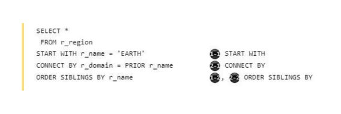

The &lt;hierarchical query clause&gt; in the query block is executed in the following order.

The &lt;hierarchical query clause&gt; is described between the &lt;where clause&gt; and &lt;group by clause&gt; after the &lt;from clause&gt;. However, unlike its description order, the &lt;hierarchical query clause&gt; is evaluated after the &lt;from clause&gt; and before the &lt;where clause&gt;.

Conditions described in the &lt;where clause&gt; do not affect the evaluation of the &lt;hierarchical query clause&gt;.

The following is the evaluation order of the &lt;hierarchical query clause&gt; based on the configuration of the &lt;from clause&gt; and &lt;where clause&gt;.

- When only a single table is present in the *from* clause

```
SELECT *
 FROM r_region
WHERE r_population > 10000000             ❸ Condition in WHERE clause
START WITH r_name = 'EARTH'               ❶ START WITH
CONNECT BY r_domain = PRIOR r_name        ❷ CONNECT BY
```

- When a join condition consisting of multiple tables exists in the *from* clause

    - When the join condition is described in the ON clause of the FROM clause

```
SELECT *
  FROM r_region INNER JOIN s_region 
       ON r_id = s_id                    ❶ Join condition in the ON clause
 WHERE r_population > 10000000           ❹ Condition in the WHERE clause
START WITH r_name = 'EARTH'              ❷ START WITH
CONNECT BY r_domain = PRIOR r_name       ❸ CONNECT BY
```

- When the join condition is described in the WHERE clause

```
SELECT *
  FROM r_region, s_region
 WHERE r_population > 10000000            ❸ Condition in the WHERE clause
   AND r_id = s_id                        ❸ Join condition in the WHERE clause
START WITH r_name = 'EARTH'               ❶ START WITH
CONNECT BY r_domain = PRIOR r_name        ❷ CONNECT BY
```

    - When the join condition is described in both the ON clause and the WHERE clause of the FROM clause.

```
SELECT *
  FROM r_region INNER JOIN s_region
       ON r_name = s_name                   ❶ Join condition in the ON clause
 WHERE r_population > 10000000              ❹ Condition in the WHERE clause
   AND r_id = s_id                          ❹ Join condition in the WHERE clause
START WITH r_name = 'EARTH'                 ❷ START WITH
CONNECT BY r_domain = PRIOR r_name          ❸ CONNECT BY
```

If a &lt;group by clause&gt; is used in a query block that includes a &lt;hierarchical query clause&gt;, the result set can be grouped using the &lt;hierarchical expression&gt;.

```
SELECT COUNT(*)
  FROM r_region
 START WITH r_name = 'EARTH'
CONNECT BY r_domain = PRIOR r_name
 GROUP BY PROIR r_domain
```

<a id="dffea84d3579715b"></a>
### Grouping Result Set (group by)

The &lt;group by clause&gt; is used to group rows with the same columns into one. It lists and separates columns using commas (,), and GOLDILOCKS supports the grouping operation based on this.

```
SELECT 
       o_orderpriority
     , MIN( o_totalprice ) AS min_price
     , MAX( o_totalprice ) AS max_price
  FROM orders
 GROUP BY
       o_orderpriority;

O_ORDERPRIORITY MIN_PRICE MAX_PRICE
--------------- --------- ---------
5-LOW              857.71 530604.44
2-HIGH              896.8 522720.61
3-MEDIUM           875.52 508668.52
1-URGENT            866.9 544089.09
4-NOT SPECIFIED    884.82 555285.16

5 rows selected.
```

If the &lt;group by clause&gt; is specified, only the columns and the aggregate functions described in the &lt;group by clause&gt; can be included in the &lt;select list&gt;.

If only constants or parentheses (instead of columns) are specified in the &lt;group by clause&gt;, it is treated as an empty grouping set, which includes imaginary columns with the same value in each row. In this case, grouping is performed based on the columns. The same applies when a &lt;having clause&gt; is specified without a &lt;group by clause&gt;.

The concept of grouping sets in the &lt;group by clause&gt; is used to describe complex groupings. Each specified grouping set is grouped separately, and the aggregation for each group is returned as a result.

```
--# GROUPING SETS
SELECT
    o_orderdate
  , o_orderpriority
  , SUM( o_totalprice )
  FROM orders
 WHERE o_custkey = 1
 GROUP BY GROUPING SETS( o_orderdate, o_orderpriority )
 ORDER BY 1;

O_ORDERDATE O_ORDERPRIORITY SUM( O_TOTALPRICE )
----------- --------------- -------------------
1992-04-19  null                       74602.81
1992-08-22  null                      123076.84
1996-06-29  null                       65478.05
1996-07-01  null                      174645.94
1996-12-09  null                       54048.26
1997-03-23  null                       95911.01
null        5-LOW                      177125.1
null        2-HIGH                     65478.05
null        3-MEDIUM                   95911.01
null        1-URGENT                  249248.75

10 rows selected.


--# ROLLUP
SELECT
    o_orderdate
  , o_orderpriority
  , SUM( o_totalprice )
  FROM orders
 WHERE o_custkey = 1
 GROUP BY ROLLUP( o_orderdate, o_orderpriority )
 ORDER BY 1;

O_ORDERDATE O_ORDERPRIORITY SUM( O_TOTALPRICE )
----------- --------------- -------------------
1992-04-19  1-URGENT                   74602.81
1992-04-19  null                       74602.81
1992-08-22  5-LOW                     123076.84
1992-08-22  null                      123076.84
1996-06-29  2-HIGH                     65478.05
1996-06-29  null                       65478.05
1996-07-01  1-URGENT                  174645.94
1996-07-01  null                      174645.94
1996-12-09  5-LOW                      54048.26
1996-12-09  null                       54048.26
1997-03-23  3-MEDIUM                   95911.01
1997-03-23  null                       95911.01
null        null                      587762.91

13 rows selected.


--# CUBE
SELECT
    o_orderdate
  , o_orderpriority
  , SUM( o_totalprice )
  FROM orders
 WHERE o_custkey = 1
 GROUP BY CUBE( o_orderdate, o_orderpriority )
 ORDER BY 1;

O_ORDERDATE O_ORDERPRIORITY SUM( O_TOTALPRICE )
----------- --------------- -------------------
1992-04-19  1-URGENT                   74602.81
1992-04-19  null                       74602.81
1992-08-22  5-LOW                     123076.84
1992-08-22  null                      123076.84
1996-06-29  2-HIGH                     65478.05
1996-06-29  null                       65478.05
1996-07-01  1-URGENT                  174645.94
1996-07-01  null                      174645.94
1996-12-09  5-LOW                      54048.26
1996-12-09  null                       54048.26
1997-03-23  3-MEDIUM                   95911.01
1997-03-23  null                       95911.01
null        null                      587762.91
null        5-LOW                      177125.1
null        2-HIGH                     65478.05
null        3-MEDIUM                   95911.01
null        1-URGENT                  249248.75

17 rows selected.
```

If the concept of grouping sets is used multiple times, duplicate groups may be configured. Specify a &lt;set quantifier&gt; in the &lt;group by clause&gt; to drop the duplicate groups.

```
--# ALL
SELECT
    o_orderdate
  , o_orderpriority
  , o_shippriority
  , SUM( o_totalprice )
  FROM orders
 WHERE o_custkey = 1 AND O_ORDERDATE > '1997-01-01'
 GROUP BY ALL 
          ROLLUP( o_orderdate, o_orderpriority )
        , GROUPING SETS( o_orderdate, o_shippriority )
 ORDER BY 1;

O_ORDERDATE O_ORDERPRIORITY O_SHIPPRIORITY SUM( O_TOTALPRICE )
----------- --------------- -------------- -------------------
1997-03-23  3-MEDIUM                     0            95911.01
1997-03-23  3-MEDIUM                  null            95911.01
1997-03-23  null                      null            95911.01
1997-03-23  null                      null            95911.01
1997-03-23  null                         0            95911.01
null        null                         0            95911.01

--# DISTINCT
SELECT
    o_orderdate
  , o_orderpriority
  , o_shippriority
  , SUM( o_totalprice )
  FROM orders
 WHERE o_custkey = 1 AND O_ORDERDATE > '1997-01-01'
 GROUP BY DISTINCT 
          ROLLUP( o_orderdate, o_orderpriority )
        , GROUPING SETS( o_orderdate, o_shippriority )
 ORDER BY 1;

O_ORDERDATE O_ORDERPRIORITY O_SHIPPRIORITY SUM( O_TOTALPRICE )
----------- --------------- -------------- -------------------
1997-03-23  3-MEDIUM                     0            95911.01
1997-03-23  3-MEDIUM                  null            95911.01
1997-03-23  null                      null            95911.01
1997-03-23  null                         0            95911.01
null        null                         0            95911.01

5 rows selected.
```

The &lt;having clause&gt; can be used to specify conditions for retrieving specific rows from the results grouped by the &lt;group by clause&gt;. The &lt;having clause&gt; describes conditions for each group, and can include conditions based on aggregate operations.

```
SELECT 
       o_orderpriority
     , MIN( o_totalprice ) AS min_price
     , MAX( o_totalprice ) AS max_price
  FROM orders
 GROUP BY
       o_orderpriority
 HAVING
       MIN( o_totalprice ) < 870;

O_ORDERPRIORITY MIN_PRICE MAX_PRICE
--------------- --------- ---------
5-LOW              857.71 530604.44
1-URGENT            866.9 544089.09

2 rows selected.
```

For more information about grouping, refer to [group by clause](20-sql-references-h-z.md#124ff4a28b194dde).

<a id="b4eaf099efec12bf"></a>
### Window Query

The window function returns the result of the function for a defined range of records. The defined range of records is called as a window, and the record range is defined in the OVER &lt;window name or specification&gt;. Unlike a general or aggregate function, the window function includes the OVER clause.

```
SUM( sales ) OVER ()
SUM( sales ) OVER window_name
SUM( sales ) OVER ( PARTITION BY item_no
                    ORDER BY sales
                    ROWS BETWEEN UNBOUNDED PRECEDING
                             AND CURRENT ROW )
```

Like an aggregate function, the window function returns the result of the function for multiple records. However, while an aggregate function returns a single record per group, the window function returns multiple records per group.

Each record in the group of a window function contains the execution result of the function for the window (the defined record range). Therefore, unlike an aggregate function, the window function returns all records within each group.

The following is an example of executing both an aggregate function and a window function.

- The following is a sample table.

```
gSQL> 
SELECT * FROM store;

ITEM_NO SALES_DATE SALES
------- ---------- -----
    100 2001-01-01   150
    100 2001-01-02   100
    100 2001-01-03   170
    100 2001-01-04    90
    100 2001-01-05   200
    235 2001-01-01    70
    235 2001-01-02   130
    235 2001-01-03   190
    235 2001-01-04   150
    235 2001-01-05    50

10 rows selected.
```

- Execution result of the aggregate function

```
gSQL> 
SELECT SUM( sales ) AS aggrfunc_sum
  FROM store;

AGGRFUNC_SUM
------------
        1300

1 row selected.
```

- Execution result of the window function

```
gSQL> 
SELECT item_no,
       sales,
       SUM( sales ) OVER () as windowfunc_sum
  FROM store;

ITEM_NO SALES WINDOWFUNC_SUM
------- ----- --------------
    100   150           1300
    100   100           1300
    100   170           1300
    100    90           1300
    100   200           1300
    235    70           1300
    235   130           1300
    235   190           1300
    235   150           1300
    235    50           1300

10 rows selected.
```

The window function defines the window (the execution range of the function) in the OVER &lt;window name or specification&gt; clause.

The data is divided into groups as specified in the &lt;window partition clause&gt; PARTITION BY.  
Then, the records within each group are sorted as specified in the &lt;window order clause&gt; ORDER BY.  
Finally, the record range for the window function is defined within the sorted records of each group as described in the &lt;window frame clause&gt;.

For more information about the definition for window, refer to [window clause](20-sql-references-h-z.md#465362e9aeb4ca49).

The window function is executed for each partition defined in the &lt;window partition clause&gt; PARTITION BY, and if PARTITION BY is omitted, the entire result record becomes a single partition.

If the &lt;window order clause&gt; ORDER BY is described, the window frame (the range of execution for the window function) is applied to each record (current row) within the partition.

The window frame is defined by the &lt;window frame clause&gt;, which specifies the application unit (ROWS/ RANGE/ GROUPS), the starting point, the ending point and the excluded records.

If the &lt;window frame clause&gt; is omitted, the default window frame is RANGE BETWEEN UNBOUNDED PRECEDING AND CURRENT ROW. In this case, the execution range extends from the first record in the partition to all peer records of the current record.

For more information about the &lt;window frame clause&gt;, refer to the [&lt;window frame clause&gt;](20-sql-references-h-z.md#c0ee8fda874eb2c6).

The following examples describe the difference in results between the case where the &lt;window order clause&gt; ORDER BY is omitted and the case where the window frame is applied by describing the &lt;window order clause&gt; ORDER BY.

- When the &lt;window order clause&gt; ORDER BY is omitted

    - If PARTITION BY is described, it calculates the sum(sales) for each specified partition.

```
gSQL> 
SELECT item_no,
       sales,
       SUM( sales ) OVER ( PARTITION BY item_no ) as windowfunc_sum
  FROM store;

ITEM_NO SALES WINDOWFUNC_SUM
------- ----- --------------
    100   150            710
    100   100            710
    100   170            710
    100    90            710
    100   200            710
    235    70            590
    235   130            590
    235   190            590
    235   150            590
    235    50            590

10 rows selected.
```

    - If PARTITION BY is omitted, the entire record is treated as a single partition, and the sum(sales) is calculated for all records.

```
gSQL> 
SELECT item_no,
       sales,
       SUM( sales ) OVER ( ) as windowfunc_sum
  FROM store;

ITEM_NO SALES WINDOWFUNC_SUM
------- ----- --------------
    100   150           1300
    100   100           1300
    100   170           1300
    100    90           1300
    100   200           1300
    235    70           1300
    235   130           1300
    235   190           1300
    235   150           1300
    235    50           1300

10 rows selected.
```

- When the &lt;window order clause&gt; ORDER BY is described

    - If PARTITION BY is described: The &lt;window frame clause&gt; is omitted, the default window frame, RANGE BETWEEN UNBOUNDED PRECEDING AND CURRENT ROW, is applied. In this case, the sum(sales) is calculated from the first record in the partition to all peer records of the current record.

```
gSQL> 
SELECT item_no,
       sales,
       SUM( sales ) OVER ( PARTITION BY item_no 
                           ORDER BY sales ) as windowfunc_sum
  FROM store;

ITEM_NO SALES WINDOWFUNC_SUM
------- ----- --------------
    100    90             90
    100   100            190
    100   150            340
    100   170            510
    100   200            710
    235    50             50
    235    70            120
    235   130            250
    235   150            400
    235   190            590

10 rows selected.
```

    - If PARTITION BY is omitted: The entire record is treated as a single partition. In this case, the &lt;window frame clause&gt; is omitted, and the default window frame, RANGE BETWEEN UNBOUNDED PRECEDING AND CURRENT ROW, is applied. As a result, the sum(sales) is calculated from the first record in the partition to all peer records of the current record.

```
gSQL> 
SELECT item_no,
       sales,
       SUM( sales ) OVER ( ORDER BY sales ) as windowfunc_sum
  FROM store;

ITEM_NO SALES WINDOWFUNC_SUM
------- ----- --------------
    235    50             50
    235    70            120
    100    90            210
    100   100            310
    235   130            440
    100   150            740
    235   150            740
    100   170            910
    235   190           1100
    100   200           1300

10 rows selected.
```

When executing multiple window functions for the same window (defined record range), define the window name in the WINDOW clause and refer to it.

```
gSQL> 
SELECT item_no,
       sales_date,
       sales,
       SUM( sales ) OVER W1 cumulative_sales, 
       AVG( sales ) OVER w1 avg_sales
  FROM store
WINDOW w1 AS ( PARTITION BY item_no
               ORDER BY sales_date
               ROWS BETWEEN UNBOUNDED PRECEDING
                        AND CURRENT ROW );

ITEM_NO SALES_DATE SALES CUMULATIVE_SALES AVG_SALES
------- ---------- ----- ---------------- ---------
    100 2001-01-01   150              150       150
    100 2001-01-02   100              250       125
    100 2001-01-03   170              420       140
    100 2001-01-04    90              510     127.5
    100 2001-01-05   200              710       142
    235 2001-01-01    70               70        70
    235 2001-01-02   130              200       100
    235 2001-01-03   190              390       130
    235 2001-01-04   150              540       135
    235 2001-01-05    50              590       118

10 rows selected.
```

The window function can be described in the *select list* and the *order by* clause.

The window function is executed on the result set after the FROM, WHERE, GROUP BY, and HAVING clauses are processed. When aggregate functions, GROUP BY, and HAVING clauses are used in a query, the window function should reference the group columns instead of the original table columns.

For more information, refer to the [Window Function](11-sql-elements.md#587d6da9bc5f0c63) and the [window clause](20-sql-references-h-z.md#465362e9aeb4ca49).

<a id="0244f19a47e7fe8b"></a>
### Sorting Result Set (order by)

The &lt;order by clause&gt; sorts the result set based on specified columns. &lt;order by clause&gt; can sort by any column type except the LONG type.

When a positive integer is specified in the &lt;order by clause&gt;, it refers to the column at the position corresponding to the integer value in the &lt;select list&gt;. The range of positive integers that can be specified in the &lt;order by clause&gt; is from 1 to the number of targets in the &lt;select list&gt;.

```
SELECT 
       o_orderpriority
     , MIN( o_totalprice ) AS min_price
     , MAX( o_totalprice ) AS max_price
  FROM orders
 GROUP BY
       o_orderpriority
 ORDER BY 1;

O_ORDERPRIORITY MIN_PRICE MAX_PRICE
--------------- --------- ---------
1-URGENT            866.9 544089.09
2-HIGH              896.8 522720.61
3-MEDIUM           875.52 508668.52
4-NOT SPECIFIED    884.82 555285.16
5-LOW              857.71 530604.44

5 rows selected.
```

If the column data type in the &lt;order by clause&gt; is numeric, the sorting is done using numeric comparison. If the column data type is a character type, the sorting is done using character comparison.

Each column in the &lt;order by clause&gt; can be specified with a sorting direction, such as ASC or DESC. If the direction is omitted, it is considered as ASC.

For more information about sorting, refer to the [order by clause](20-sql-references-h-z.md#5c186a0aa73345b6).

<a id="f40da16e425995ba"></a>
### Subquery

A subquery supports multi-level search requests, where the result of the current query depends on the result of the subquery.   
For example, to find people who are older than the average age in a specific group, the query is written in multiple steps. The first query retrieves the average age of people in the group, and the second query uses this result to retrieve the number of people who are older than the average.

```
SELECT e_name
  FROM emp
 WHERE e_age > ( SELECT AVG(e_age)
                   FROM emp
                  WHERE e_dept = 'RND' );
```

A subquery can be used in the &lt;from clause&gt; or the &lt;where clause&gt;. A subquery in the &lt;from clause&gt; is called an 'inline view', while a subquery in the &lt;where clause&gt; is referred to as a 'nested subquery'.

When using a nested subquery, the column name in the table or view of the nested subquery can be the same as the column name in the table or view of the query containing the nested subquery. In this case, if only the column name is specified in the &lt;select list&gt; of the nested subquery, it refers to the column in the table or view of the nested subquery. If the column name in the &lt;select list&gt; of the nested subquery does not exist in the table or view of the nested subquery, it refers to the corresponding column name in the table or view of the query containing the nested subquery.

```
SELECT r_name
  FROM region
 WHERE EXISTS ( SELECT * 
                  FROM nation
                 WHERE n_nationkey < 5             /* nation.n_nationkey */
                   AND n_regionkey = r_regionkey ) /* nation.n_regionkey = region.r_regionkey */
;
```

The optimizer unnests a nested subquery in the &lt;where clause&gt; into the query containing the nested subquery, and process it as a SEMI JOIN or ANTI-SEMI JOIN. This optimization is applied when the nested subquery is used with operators like IN, NOT IN, EXISTS, NOT EXISTS, or quantification operators. The optimizer determines whether to unnest the subquery by calculating the cost. If a user wants to forcibly unnest the nested subquery, they can use the &lt;hint clause&gt; for the nested subquery.

For more information about unnesting nested subqueries, refer to [SQL Hint](15-sql-tuning.md#df9172b533f52953).

```
SELECT r_name
  FROM region
 WHERE r_regionkey IN ( SELECT /*+ UNNEST */
                               n_regionkey
                          FROM nation
                         WHERE n_nationkey < 5 );
```

For more information about subqueries, refer to [subquery](20-sql-references-h-z.md#0c74f438d0e1f966).

<a id="ba7e324cde8c14f5"></a>
### Table Sampling

Table sampling is a feature that randomly extracts a subset of rows from a table, allowing statistical or analytical tasks to be performed more quickly and efficiently without processing the entire dataset.

```
gSQL> \EXPLAIN PLAN SELECT COUNT( DISTINCT c1 ) FROM t1;

COUNT( DISTINCT C1 )
--------------------
                 100

1 row selected.

>>>  start print plan

< Execution Plan >
==================================================================================================
|  IDX  |  NODE DESCRIPTION                                            |                    ROWS |
--------------------------------------------------------------------------------------------------
|    0  |  SELECT STATEMENT                                            |                       1 |
|    1  |    QUERY BLOCK ("$QB_IDX_2")                                 |                       1 |
|    2  |      SINGLE ROW AGGREGATION                                  |                       1 |
|    3  |        TABLE ACCESS ("T1")                                   |                 1000000 |
==================================================================================================

     1  -  TARGET : COUNT( DISTINCT T1.C1 )
     2  -  DISTINCT AGGREGATION : COUNT( DISTINCT T1.C1 )
     3  -  READ COLUMN : T1.C1

<<<  end print plan


gSQL> \EXPLAIN PLAN SELECT COUNT( DISTINCT c1 ) FROM t1 TABLESAMPLE( 10 PERCENT ROWS );

COUNT( DISTINCT C1 )
--------------------
                 100

1 row selected.

>>>  start print plan

< Execution Plan >
==================================================================================================
|  IDX  |  NODE DESCRIPTION                                            |                    ROWS |
--------------------------------------------------------------------------------------------------
|    0  |  SELECT STATEMENT                                            |                       1 |
|    1  |    QUERY BLOCK ("$QB_IDX_2")                                 |                       1 |
|    2  |      SINGLE ROW AGGREGATION                                  |                       1 |
|    3  |        TABLE ACCESS ("T1")                                   |                   99726 |
==================================================================================================

     1  -  TARGET : COUNT( DISTINCT T1.C1 )
     2  -  DISTINCT AGGREGATION : COUNT( DISTINCT T1.C1 )
     3  -  ROW SAMPLING ( 10.00 % )
           READ COLUMN : T1.C1

<<<  end print plan
```

The table sampling method can be specified at the row level or page level using the &lt;sample clause&gt;.

```
gSQL> SELECT COUNT( c1 ) FROM t1 TABLESAMPLE( 10 PERCENT PAGES );

COUNT( C1 )
-----------
      97152

1 row selected.

gSQL> SELECT COUNT( c1 ) FROM t1 TABLESAMPLE( 10 PERCENT ROWS );

COUNT( C1 )
-----------
     100140

1 row selected.
```

For more information about table sampling, refer to the [sample clause](20-sql-references-h-z.md#f11bfbfa622bd200).

<a id="031335ad7a73b642"></a>
## Control Language

<a id="42b42b3000f62558"></a>
### Control Language Related Statements

For more information, refer to the following.

- Transaction control-related statements
    - [COMMIT](19-sql-references-c-g.md#3beee453ea244831)
    - [ROLLBACK](20-sql-references-h-z.md#a7f186a4dca1588e)
    - [LOCK TABLE](20-sql-references-h-z.md#41362c316d3f7f25)
    - [SAVEPOINT savepoint_specifier](20-sql-references-h-z.md#79cec2425d42b60f)
    - [RELEASE SAVEPOINT savepoint_specifier](20-sql-references-h-z.md#965ceb9eced025a5)

- Session control-related statements: Refer to the following.
    - [ALTER SESSION SET property_name](18-sql-references-a-b.md#a7df2194f3a8476a)
    - [SET ROLE role_name](20-sql-references-h-z.md#6150b8d582737fc5)
    - [SET SESSION AUTHORIZATION user_identifier](20-sql-references-h-z.md#42aca1fe6eac5234)
    - [SET SESSION CHARACTERISTICS AS transaction_mode](20-sql-references-h-z.md#8b6af92b951cd016)
    - [SET TIME ZONE](20-sql-references-h-z.md#5efe34286d151da2)
    - [SET TRANSACTION transaction_mode](20-sql-references-h-z.md#877f43b45e3f8153)

- System control-related statements: Refer to the following.
    - [ALTER SYSTEM CHECKPOINT](18-sql-references-a-b.md#5a912e8fc036f755)
    - [ALTER SYSTEM {MOUNT | OPEN} DATABASE](18-sql-references-a-b.md#3a13c91fdabdaa04)
    - [ALTER SYSTEM [KILL | DISCONNECT] SESSION](18-sql-references-a-b.md#6d1a0bf8b32c9260)
    - [ALTER SYSTEM SET property_name](18-sql-references-a-b.md#ca16f1acaf4c1a9b)
    - [ALTER SYSTEM RESET property_name](18-sql-references-a-b.md#320e65003e92cceb)
    - [ALTER SYSTEM SWITCH LOGFILE](18-sql-references-a-b.md#e8b9a0d94c67b15c)

<a id="601d5ee70299a1bb"></a>
### Transaction Control

Transaction control statements are used to manage changes made by executing DML or DDL statements within a transaction. Transaction control statements can either commit the changes to make them permanent, or roll them back to undo them.

Transaction control statements are classified as follows.

**Transaction control statements**

<a id="1b205eef1204f8bb"></a>
| Statement | Description | Refer to |
| --- | --- | --- |
| COMMIT | It terminates the transaction normally. | [COMMIT](19-sql-references-c-g.md#3beee453ea244831) |
| ROLLBACK | It undoes the transaction. | [ROLLBACK](20-sql-references-h-z.md#a7f186a4dca1588e) |
| SAVEPOINT | It creates a savepoint. | [SAVEPOINT savepoint_specifier](20-sql-references-h-z.md#79cec2425d42b60f) |
| RELEASE SAVEPOINT | It removes the specified savepoint. | [RELEASE SAVEPOINT savepoint_specifier](20-sql-references-h-z.md#965ceb9eced025a5) |
| LOCK TABLE | It sets a table-level lock. | [LOCK TABLE](20-sql-references-h-z.md#41362c316d3f7f25) |
| SET TRANSACTION | It controls transaction properties. (Read/write, and isolation level) | [SET TRANSACTION transaction_mode](20-sql-references-h-z.md#877f43b45e3f8153) |
| SET CONSTRAINTS | It controls the checkpoint behavior of deferrable constraints. | [SET CONSTRAINTS](20-sql-references-h-z.md#99b7c8cb97aff1bd) |

A transaction is automatically created when DML or DDL statements are executed for the first time. DML statements modify data, while DDL statements alter SQL objects. However, SELECT statements or control statements do not initiate a transaction.

Transaction rollbacks are classified into two types: total rollback and partial rollback. A total rollback is performed using the ROLLBACK statement and undoes all changes made by DML or DDL within the transaction. A partial rollback can be executed either explicitly or implicitly.

An explicit partial rollback is a method where the user executes the ROLLBACK statement using a savepoint as follows.  
The following example describes how savepoints sp1 and sp2 are declared, and then a partial rollback is explicitly performed.

```
gSQL> CREATE TABLE t1 ( id INTEGER, name VARCHAR(128) );

Table created.

gSQL> COMMIT;

Commit complete.

gSQL> INSERT INTO t1 VALUES ( 1, 'leekmo' );

1 row created.

gSQL> SAVEPOINT sp1;

Savepoint created.

gSQL> INSERT INTO t1 VALUES ( 2, 'mkkim' );

1 row created.

gSQL> SAVEPOINT sp2;

Savepoint created.

gSQL> INSERT INTO t1 VALUES ( 3, 'xcom' );

1 row created.

gSQL> ROLLBACK TO SAVEPOINT sp2;

Rollback complete.

gSQL> SELECT * FROM t1;

ID NAME  
-- ------
 1 leekmo
 2 mkkim 

2 rows selected.

gSQL> ROLLBACK TO SAVEPOINT sp1;

Rollback complete.

gSQL> SELECT * FROM t1;

ID NAME  
-- ------
 1 leekmo

1 row selected.

gSQL> ROLLBACK WORK;

Rollback complete.

gSQL> SELECT * FROM t1;

no rows selected.
```

When an error occurs during the execution of a statement, only the changes made by that statement are undone, which is called an implicit partial rollback. The following is an example of an implicit partial rollback: if a unique constraint is violated, only the INSERT statement is rolled back, and the previous changes in the transaction are preserved.

```
gSQL> ALTER TABLE t1 ADD CONSTRAINT t1_uk UNIQUE(id);

Table altered.

gSQL> COMMIT;

Commit complete.

gSQL> INSERT INTO t1 VALUES ( 4, 'egonspace' );

1 row created.

gSQL> INSERT INTO t1 VALUES ( 1, 'jhkim' );  

ERR-40002(16057): unique constraint (PUBLIC.T1_UK) violated

gSQL> SELECT * FROM t1;

ID NAME     
-- ---------
 1 leekmo   
 2 mkkim    
 3 xcom     
 4 egonspace

4 rows selected.
```

<a id="6a7fa93c31c0eb85"></a>
### Session Control

A session is a logical entity used to manage the state information of a user accessing the database. Session control statement are used to modify the properties of the session.

Session control statements are classified as follows.

**Session control statements**

<a id="526d36b7597f70db"></a>
| Statement | Description | Refer to |
| --- | --- | --- |
| SET SESSION CHARACTERISTICS | It controls the transaction properties in the session. | [SET SESSION CHARACTERISTICS AS transaction_mode](20-sql-references-h-z.md#8b6af92b951cd016) |
| SET TIME ZONE | It alters the time zone of the session. | [SET TIME ZONE](20-sql-references-h-z.md#5efe34286d151da2) |
| SET ROLE | It alters the role of the session. | [SET ROLE role_name](20-sql-references-h-z.md#6150b8d582737fc5) |
| SET SESSION AUTHORIZATION | It alters the user of the session. | [SET SESSION AUTHORIZATION user_identifier](20-sql-references-h-z.md#42aca1fe6eac5234) |
| SET SCHEMA | It alters the session schema. | [SET SCHEMA schema_name](20-sql-references-h-z.md#c739d92270bfc5cf) |
| ALTER SESSION SET | It alters the session properties. | [ALTER SESSION SET property_name](18-sql-references-a-b.md#a7df2194f3a8476a) |

Both the SET TRANSACTION statement, a transaction control statement, and the SET SESSION CHARACTERISTICS statement, a session control statement, control transaction properties. However, there is a key difference: the SET TRANSACTION statement applies only to the next transaction that will be executed, while the SET SESSION CHARACTERISTICS statement applies to all subsequent transactions within the session.

The following is the result of the CURRENT_TIMESTAMP statement, which retrieves the current date and time after the time zone is changed using the SET TIME ZONE statement.

```
gSQL> SELECT CURRENT_TIMESTAMP FROM DUAL;

CURRENT_TIMESTAMP                
---------------------------------
2014-07-21 11:42:49.828276 +09:00

1 row selected.

gSQL> SET TIME ZONE '+00:00';

Session set.

gSQL> SELECT CURRENT_TIMESTAMP FROM DUAL;

CURRENT_TIMESTAMP                
---------------------------------
2014-07-21 02:43:03.437940 +00:00

1 row selected.
```

<a id="310e8077340b6de1"></a>
### System Control

System control statements manage the database system and are classified as follows.

**System control statements**

<a id="a2d7dfb900d0dee4"></a>
| Statement | Description | Refer to |
| --- | --- | --- |
| ALTER SYSTEM {OPEN\|MOUNT} DATABASE | It starts up the database. | [ALTER SYSTEM {MOUNT \| OPEN} DATABASE](18-sql-references-a-b.md#3a13c91fdabdaa04) |
| ALTER SYSTEM CHECKPOINT | It performs a checkpoint. | [ALTER SYSTEM CHECKPOINT](18-sql-references-a-b.md#5a912e8fc036f755) |
| ALTER SYSTEM KILL SESSION | It forcibly terminates a specific session. | [ALTER SYSTEM [KILL \| DISCONNECT] SESSION](18-sql-references-a-b.md#6d1a0bf8b32c9260) |
| ALTER SYSTEM SWITCH LOGFILE | It switches the log file. | [ALTER SYSTEM SWITCH LOGFILE](18-sql-references-a-b.md#e8b9a0d94c67b15c) |
| ALTER SYSTEM SET | It sets a system property. | [ALTER SYSTEM SET property_name](18-sql-references-a-b.md#ca16f1acaf4c1a9b) |
| ALTER SYSTEM RESET | It removes a system property. | [ALTER SYSTEM RESET property_name](18-sql-references-a-b.md#320e65003e92cceb) |

The following is an example of querying sessions connected to the database and terminating a specific session.

```
gSQL> SELECT USER_NAME, SESSION_ID, SERIAL_NO, SESSION_STATUS, PROGRAM_NAME FROM V$SESSION WHERE USER_NAME = 'TEST';

USER_NAME SESSION_ID SERIAL_NO SESSION_STATUS PROGRAM_NAME
--------- ---------- --------- -------------- ------------
TEST              62        49 CONNECTED      gsql        
TEST              65       109 CONNECTED      gsqlnet     
TEST              66       130 CONNECTED      gsql        

3 rows selected.

gSQL> ALTER SYSTEM DISCONNECT SESSION 65, 109;

System altered.
```

<a id="03dfa4eb76b28986"></a>
## Processing SQL in Cluster

This chapter explains how to process various SQL statements in a cluster environment.

<a id="5a68da92fee10cd0"></a>
### Processing DDL in Cluster

<a id="4cbe2d0fdc453da7"></a>
#### DDL Processing Procedure in Cluster

The GOLDILOCKS cluster does not have a separate meta server, and users can perform DDL operations on any cluster member that constitutes the cluster system.

DDL is executed according to the procedure outlined below in a cluster environment.

<a id="a89ef5f544ab3eb9"></a>
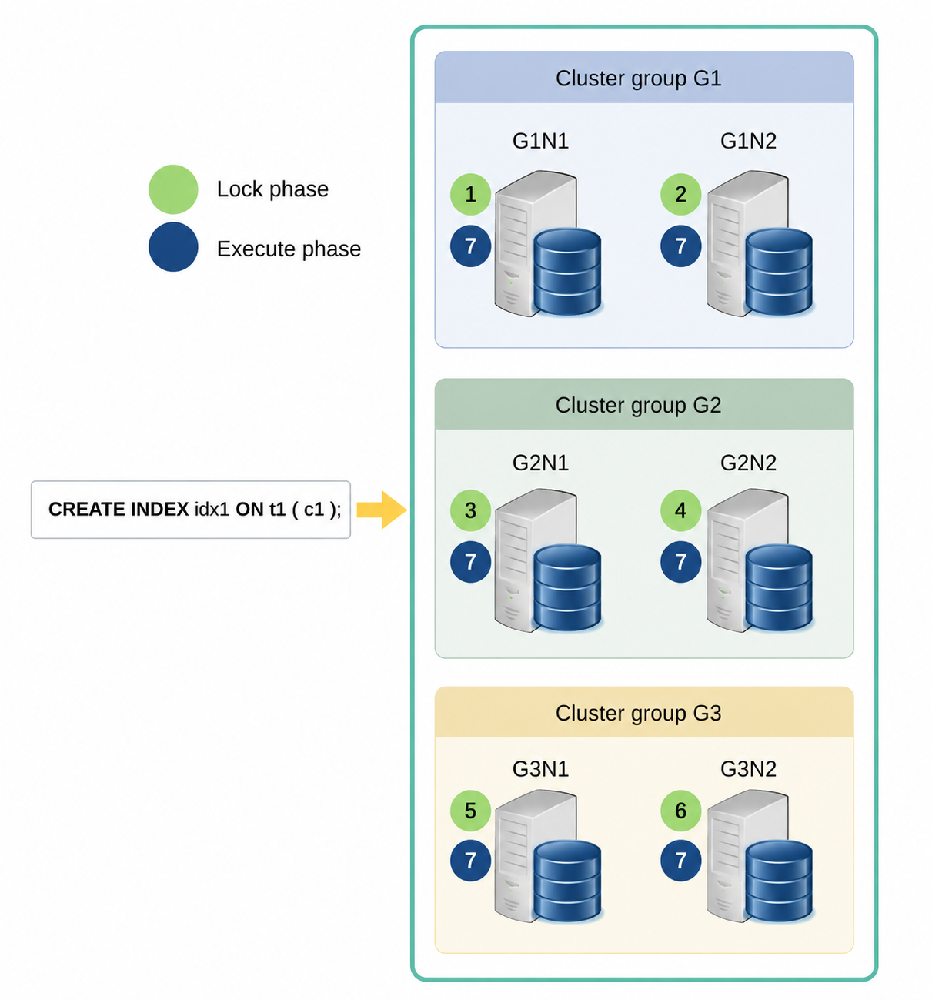

DDL is performed in two phases: the lock phase and the execution phase. In the lock phase, the necessary locks for executing the DDL are acquired, and the DDL is performed sequentially on each cluster member. In the execution phase, the DDL is executed simultaneously across all cluster members.

DDL is considered completed when it is successfully executed on all cluster members. If DDL fails on any specific cluster member, the operations are cancelled on all members. DDL can not be performed if an error occurs on any cluster member. Through this process, all cluster members synchronize the meta information for the objects.

<a id="632fa2c7be2295b2"></a>
#### Simultaneous DDL Execution

The cluster object DDL, which changes the cluster system configuration, and the SQL object DDL can not be performed simultaneously. The possibility of simultaneously performing DDL for cluster objects and DDL for SQL objects is as follows.

**Possibility of simultaneously performing DDL**

<a id="6db2c4c329b9d224"></a>
| DDL | Cluster object DDL | SQL object DDL |
| --- | --- | --- |
| Cluster object DDL | X | X |
| SQL object DDL | X | O |

The following DDL operations can not be performed simultaneously, as stated above.

- Cluster object DDL and cluster object DDL
    - (X) CREATE CLUSTER GROUP g2 CLUSTER MEMBER g2n1 HOST '192.168.0.21' PORT 10210;
    - (X) ALTER CLUSTER GROUP g1 ADD CLUSTER MEMBER g1n2 HOST '192.168.0.12' PORT 10120;
- Cluster object DDL and SQL object DDL
    - (X) CREATE CLUSTER GROUP g2 CLUSTER MEMBER g2n1 HOST '192.168.0.21' PORT 10210;
    - (X) CREATE TABLE t1 ( c1 INTEGER );
- SQL object DDL and SQL object DDL
    - (O) CREATE TABLE t1 ( c1 INTEGER );
    - (O) CREATE TABLE t2 ( a1 INTEGER );

<a id="e6560b099e994fa6"></a>
### SELECT Processing in Cluster

Generally, query processing in a cluster is similar to that of a standalone system. However, when data exists on both a local server and a remote server, the difference lies in the fact that the cluster sends the query for processing to the remote server and receives the result from it.

There are sharded tables and cloned tables (refer to [Cluster Table and Shard](14-cluster-objects.md#e56d5d1087eefb48)) in a cluster environment, and the data for each table is stored on both local and remote servers. The data of a sharded table is partitioned and stored across groups, with data being duplicated on the members within the same group. In a cloned table, the data is duplicated and stored across all groups and members.

The following figure shows a GOLDILOCKS cluster configured as 3 x 2, along with the tables stored in that cluster.

<a id="b77093e85a303013"></a>
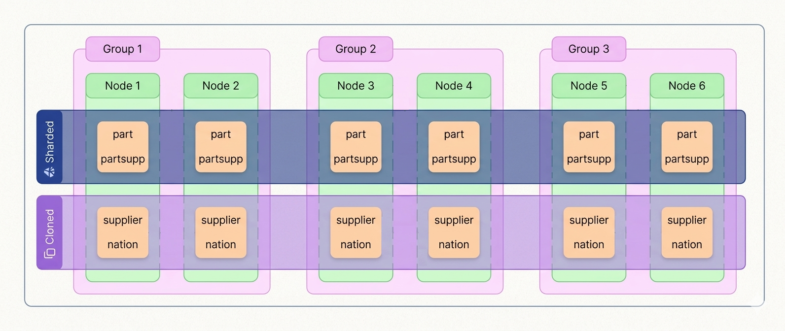

The following DDL creates the tables given above.

```
CREATE TABLE part

(
    p_partkey     INTEGER
  , p_name        VARCHAR(55)
  , p_brand       CHAR(10)
  , p_type        VARCHAR(25)
  , p_size        INTEGER
  , p_retailprice NUMERIC(12,2)
  , CONSTRAINT part_pk PRIMARY KEY( p_partkey ) INDEX part_pk_index
) 
    SHARDING BY HASH(p_partkey) 
    SHARD COUNT 3;

CREATE TABLE partsupp
(
    ps_partkey    INTEGER
  , ps_suppkey    INTEGER
  , ps_availqty   INTEGER
  , ps_supplycost NUMERIC(12,2)
  , CONSTRAINT partsupp_pk PRIMARY KEY( ps_partkey, ps_suppkey ) INDEX partsupp_pk_index
) 
   SHARDING BY HASH(ps_partkey) 
   SHARD COUNT 3;

CREATE TABLE supplier
(
    s_suppkey     INTEGER
  , s_name        CHAR(25)
  , s_nationkey   INTEGER
  , s_phone       CHAR(15)
  , CONSTRAINT supplier_pk PRIMARY KEY( s_suppkey ) INDEX supplier_pk_index
)  CLONED;


CREATE TABLE nation
(
    n_nationkey   INTEGER
  , n_name        CHAR(25)
)  CLONED;
```

In the figure above, the part table and the partsupp table are sharded tables, and their data is partitioned and stored across groups. The supplier table is a cloned table, and its data is duplicated and stored on every node.

GOLDILOCKS in a cluster environment processes queries based on the table type and the location of the search target data. The cluster processes the query according to the method used to collect the data and the method used to manipulate the fetched data.

<a id="31f5db231e72de94"></a>
#### Query Processing Method in Cluster

A cluster must collect data from both a local server and a remote server to process a query. It creates an SQL statement, sends it to both the local and remote servers, and then collects the query processing results to gather the data.

Data manipulation is performed based on the syntax type of the collected data. For example, in a cluster query with a *group by* clause, the data is first collected and then grouped.

Data collection and manipulation are performed by the plan node known as the cluster puller.

<a id="22ad93e6359727ef"></a>
##### Cluster Puller

The cluster puller node collects and manipulates the data.

- Data collection is the process of gathering data from multiple servers.
- Data manipulation is the process of creating new data based on the collected data.

The following is the process for performing the cluster puller.

<a id="493379b3b6ad6555"></a>
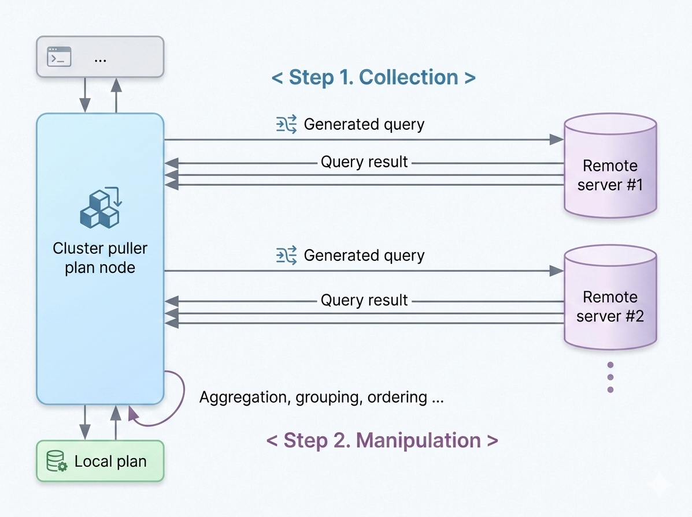

The cluster puller is classified based on the data fetching method from a local server and whether it distinguishes between remote servers when fetching data from a remote server.

A cluster puller is divided into the following three plan nodes.

**Cluster puller node**

<a id="190a779c97a37707"></a>
| Cluster puller node | Local data collection method | Remote data collection method |
| --- | --- | --- |
| Plan based cluster | It executes the plan configured on the local server. | It executes the generated query. (It collects the results without distinguishing between remote servers.) |
| Single cluster | It executes the generated query. | It executes the generated query. (It collects the results without distinguishing between remote servers.) |
| Multiple cluster | It executes the generated query. | It executes the generated query. (It collects the results by distinguishing between remote servers.) |

A generated query is configured to collect or update data while executing a user-provided query. For more information, refer to [Generated Query](#87df3bcca9b2fd64).

The following paragraphs describe how data is collected for each feature available in each cluster puller node and how the data is manipulated.

<a id="4d61470c6204e6b8"></a>
##### How to Collect Data

- By pass: It collects the processed results in the order they were delivered.
- Merge sort: It sequentially collects the processed results based on the specified sorting order.

<a id="edf572139153f0fd"></a>
##### How to Manipulate Collected Data

- No manipulation: It does not manipulate the data.
- Aggregation: It aggregates the collected data.
- Grouping: It groups the collected data.
- Ordering: It orders the collected data.
- Intersect key group: It classifies the collected data based on the received server, and the data from each server is grouped by the given key, followed by an intersection at the group level.
- Distinct key group: It classifies the collected data based on the received server, and the data from each server is grouped by the given key, followed by a distinct operation at the group level.

<a id="298fd11011097a6d"></a>
##### Cluster Puller Feature

The cluster puller node collects data from a local server or a remote server. After determining the target server(s), it sends a generated query to fetch the data.

The following is an example of retrieving a single table without a *where* condition.

```
gSQL> \EXPLAIN PLAN SELECT c1 FROM t_shard_1;

C1
--
 1
 2
 3

3 rows selected.

>>>  start print plan

< Execution Plan >
===========================================================================
|  IDX  |  NODE DESCRIPTION                          |               ROWS |
---------------------------------------------------------------------------
|    0  |  SELECT STATEMENT                          |                  3 |
|    1  |    QUERY BLOCK ("$QB_IDX_2")               |                  3 |
|    2  |      PLAN BASED CLUSTER                    | LOCAL/REMOTE     3 |
|    3  |        INDEX ACCESS ("T_SHARD_1", "IDX")   | (         1)     1 |
===========================================================================

     1  -  TARGET : T_SHARD_1.C1
     2  -  SQL : SELECT /*+ INDEX( _A1, "PUBLIC"."IDX" ) */ "_A1"."C1" FROM "PUBLIC"."T_SHARD_1"@LOCAL AS "_A1"
           TARGET DOMAIN : G1(G1N1,G1N2) 1 rows, G2(G2N1,G2N2) 1 rows, G3(G3N1,G3N2) 1 rows
     3  -  RANGE SHARD ( # 3 ) 
           READ INDEX COLUMN : T_SHARD_1.C1

<<<  end print plan
```

After executing the query, a plan-based cluster is used as the cluster puller. The plan-based cluster in the execution plan above is the plan with idx 2 in the &lt;Execution Plan&gt;.

The following information is output in the ROWS field of the cluster puller.

- LOCAL ONLY n: The number of data fetched from a local server
- REMOTE ONLY n: The number of data fetched from a remote server
- LOCAL/REMOTE n: The total number of data fetched from both a local server and a remote server

The following is detailed information about the PLAN BASED CLUSTER.

- SQL: The generated query
- TARGET DOMAIN: The target group and member to which the generated query is transferred, along with the number of data fetched from the group

<a id="e67d4c22a0a3d85e"></a>
##### Selecting Target Server for Execution in Cluster Puller

It analyzes the following information and selects the target for executing the generated query.

- Table replication placement strategy
- [Cluster Domain](#881b1c9bb66c884c)
- [Reducing Target Domain of Cluster Puller](#dac0a88dff37d884)

It analyzes the information listed above for each table included in the generated query, identifies a common server, and selects it as the target server to execute the generated query. These are classified as target domains in the cluster puller node.

The following is a summary of the replication placement strategy for the defined tables, as described in the [Generated Query](#87df3bcca9b2fd64).

```
t_shard_1 (shard table)  : at cluster group G1, G2, G3
t_shard_2 (shard table)  : at cluster group G1, G3
t_clone_1 (cloned table) : at cluster group G1, G2, G3 (cluster wide)
t_clone_2 (cloned table) : at cluster group G2, G3
```

The following is an example of selecting the execution target server based on the table replication placement strategy.

- Execution target server: All servers in G1 and G3

```
gSQL> SELECT c1 FROM t_shard_2;
```

- Execution target server: All servers in G1, G2, and G3

```
gSQL> SELECT c1 FROM t_clone_1;
```

- Execution target server: All servers in G1 and G3 (commonly included cluster group )

```
gSQL> SELECT c1 FROM t_shard_2, t_clone_1;
```

The following is an example of selecting the execution target server based on the description of the cluster domain.

- Execution target server: All servers in G1, G2, and G3

```
gSQL> SELECT c1 FROM t_shard_1@GLOBAL;
```

- Execution target server: The server that was requested to process the user query

```
gSQL> SELECT c1 FROM t_shard_1@LOCAL;
```

- Execution target server: All servers in G2

```
gSQL> SELECT c1 FROM t_shard_1@G2;
```

- Execution target server: G3N1 server

```
gSQL> SELECT c1 FROM t_shard_1@G3N1;
```

- Execution target server: The target server does not exist.

```
gSQL> SELECT c1 FROM t_shard_1@G4;
```

The following is an example of selecting the execution target server based on the sharding key search condition.

- Execution target server: All servers in G1, G2, and G3

```
gSQL> SELECT c1 FROM t_shard_1;
```

- Execution target server: All servers in G1, G2, and G3

```
gSQL> SELECT c1 FROM t_shard_1 WHERE c1 = 1;
```

- Execution target server: All servers in G3

```
gSQL> SELECT c1 FROM t_shard_1 WHERE shard_key = 500;
```

- Execution target server: The target server does not exist.

```
gSQL> SELECT c1 FROM t_shard_1 WHERE shard_key = 100 AND shard_key = 500;
```

It identifies common servers using the table replication placement strategy, cluster domain, and sharding key search strategy when executing the generated query to retrieve the data. If multiple servers within the same cluster group are targeted for execution, the generated query is performed on only one accessible server per cluster group, taking into account the network conditions at the time of execution.

The following is an example of selecting a target server for execution.

- Table replication placement strategy: All servers in G1, G2, and G3

- Cluster domain
- t_shard_1: All servers in G2
- t_clone_1: All servers in G1, G2, and G3
- join: All servers in G1, G2, and G3

- Sharding key searching strategy: All servers in G2

- Target server to execute the generated query: A single server in G2

```
gSQL> \EXPLAIN PLAN ONLY SELECT * FROM t_shard_1@G2, t_clone_1 WHERE t_shard_1.shard_key = 300;

>>>  start print plan

< Execution Plan >
===================================================================
|  IDX  |  NODE DESCRIPTION                      |           ROWS |
-------------------------------------------------------------------
|    0  |  SELECT STATEMENT                      |              0 |
|    1  |    QUERY BLOCK ("$QB_IDX_2")           |              0 |
|    2  |      PLAN BASED CLUSTER                |              0 |
|    3  |        NESTED JOIN (INNER JOIN)        |              0 |
|    4  |          TABLE ACCESS ("T_SHARD_1")    |              0 |
|    5  |          TABLE ACCESS ("T_CLONE_1")    |              0 |
===================================================================

     1  -  TARGET : T_SHARD_1.SHARD_KEY, T_SHARD_1.C1, T_CLONE_1.C1
     2  -  SQL : SELECT /*+ KEEP_JOINED_TABLE USE_NL_IN( _A1 ) FULL( _A2 ) FULL( _A1 ) */ "_A2"."SHARD_KEY", "_A2"."C1", "_A1"."C1" FROM ( "PUBLIC"."T_SHARD_1"@LOCAL AS "_A2" INNER JOIN "PUBLIC"."T_CLONE_1"@LOCAL AS "_A1" ON true ) ALIAS "_A3" WHERE "_A2"."SHARD_KEY" = :_V0
           TARGET DOMAIN : G2(G2N1,G2N2) 0 rows
     3  -  JOINED COLUMN : T_SHARD_1.SHARD_KEY, T_SHARD_1.C1, T_CLONE_1.C1
     4  -  RANGE SHARD ( # 3 ) 
           READ COLUMN : T_SHARD_1.SHARD_KEY, T_SHARD_1.C1
             PHYSICAL FILTER : T_SHARD_1.SHARD_KEY = 300
     5  -  CLONED 
           READ COLUMN : T_CLONE_1.C1

<<<  end print plan
```

<a id="90fe00c495128d1c"></a>
##### Utilizing Cluster Puller

It selects a cluster puller node based on the data manipulation method. If no data manipulation is required, a plan-based cluster or a single cluster can be used. If ordering of the results is needed, multiple clusters are employed. The data collection method is determined by the data manipulation method.

**Features supported by cluster puller node**

<a id="21b8392ffc80a07e"></a>
| Cluster | Data collection method | Data manipulation method |
| --- | --- | --- |
| Plan based cluster | By pass | No manipulation |
| Single cluster | By pass | No manipulation Aggregation Grouping Intersect key group Distinct key group |
| Multiple cluster | Merge sort | Ordering Grouping |

<a id="89b936565b4406b1"></a>
#### Cluster Puller Plan Node

The cluster puller plan node is classified based on the data collection method from both local and remote servers. For more information on the classification of cluster puller plan nodes according to data collection, refer to [Cluster Puller Plan Node](#89b936565b4406b1).

<a id="31bbbc66a9346657"></a>
##### Plan Based Cluster

It collects the execution results in the order received during the data collection phase.

- Collecting local data: It executes the plan configured locally.
- Collecting remote data: It executes the generated query.

It does not manipulate anything except applying a filter to the collected data. (No manipulation)

The following is an example of executing a plan-based cluster.

<a id="92b539da2cf5bb62"></a>
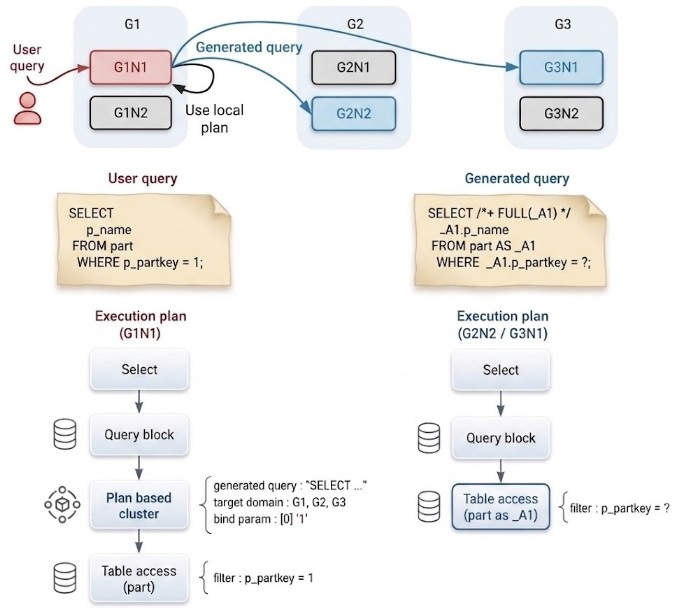

<a id="69d80c98f59ebd93"></a>
##### Single Cluster

It collects the execution results in the order received during the data collection phase.

- Collecting local data: It executes the generated query.
- Collecting remote data: It executes the generated query.

A single cluster supports the following data manipulation methods.

- No manipulation
- Aggregation
- Grouping
- Intersect key group
- Distinct key group

The following is an example of executing a single cluster.

<a id="9016628a664e5444"></a>
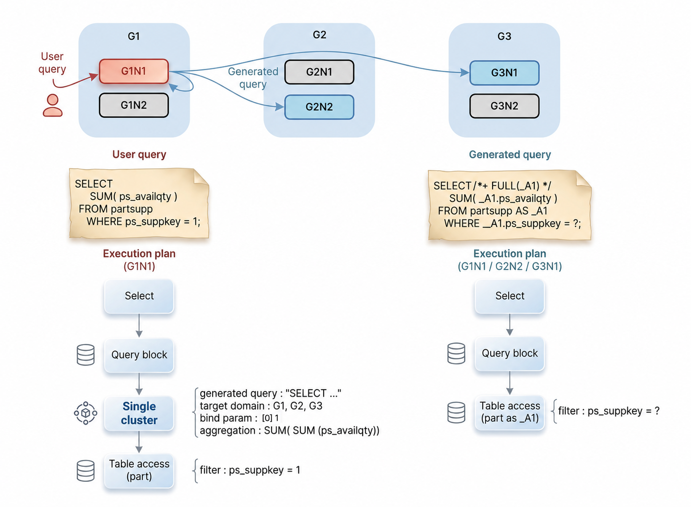

<a id="be81c852d41294cb"></a>
##### Multiple Clusters

Multiple clusters execute the generated query using a different cluster executor for each group. They collect data by performing a merge sort on the data received from all cluster executors during the data collection phase.

- Collecting local data: It executes the generated query.
- Collecting remote data: It executes the generated query.

Multiple clusters support the following data manipulation methods.

- Ordering
- Grouping

The following is an example of executing multiple clusters.

<a id="869fc33db73abb29"></a>
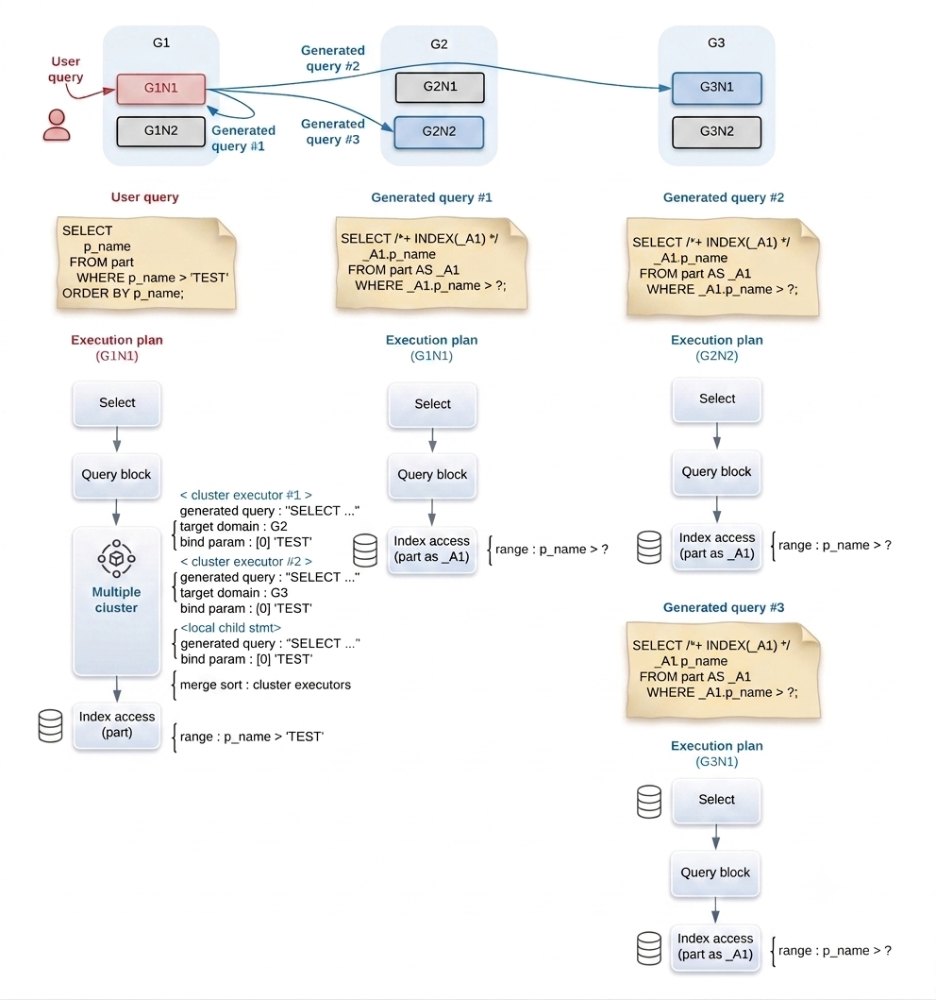

<a id="881b1c9bb66c884c"></a>
#### Cluster Domain

The cluster domain collects data only from a limited set of servers within a cluster environment. For example, to search for employees in a specific range from a sharded table partitioned by salary, the corresponding cluster group can be set as the cluster domain, and then a query can be executed as follows.

- It configures a sharded table for each salary class.

```
gSQL> CREATE TABLE t1( name VARCHAR(128), salary INTEGER )
    SHARDING BY RANGE( salary )
        SHARD s1 VALUES LESS THAN ( 200 )       AT CLUSTER GROUP G1,
        SHARD s2 VALUES LESS THAN ( 400 )       AT CLUSTER GROUP G2,
        SHARD s3 VALUES LESS THAN ( MAXVALUE )  AT CLUSTER GROUP G3;

Table created.

gSQL> INSERT INTO t1 VALUES ( 'A', 500 );

1 row created.

gSQL> INSERT INTO t1 VALUES ( 'B', 100 );

1 row created.

gSQL> INSERT INTO t1 VALUES ( 'C', 300 );

1 row created.
```

- It searches for employees within a specific salary range.

```
gSQL> SELECT name, salary FROM t1@G2;

NAME SALARY
---- ------
C       300

1 row selected.
```

A cluster domain is defined by targeting a table or view specified in the [from clause](20-sql-references-h-z.md#9f811dbc5cb361f5) and referencing the [&lt;cluster domain&gt;](20-sql-references-h-z.md#db78065548687982), and one of the following options can then be selected.

- A cluster member performing a user query
- A cluster member performing a user query targeting a offline table
- All cluster groups
- A cluster group
- A cluster member

When a cluster member is selected as a cluster domain, it accesses the corresponding server and collects data. If the server does not have the data distribution for the target table, the query will return no results.

It supports the *@LOCAL_OFFLINE* cluster domain to retrieve offline table data from the server to which the user is connected. If the table is online, an error will occur.

If a cluster group is selected as a cluster domain, it will have the data distribution for the corresponding table in the group and collect data by accessing a server it can communicate with. If no accessible server is available, the query will return no results.

If all cluster groups are selected as a cluster domain, data from each cluster group will be collected and transferred to the user.

A cluster domain can not be used to determine the data update target. In other words, &lt;cluster domain&gt; can not be applied to the target table of a DML operation.

A cluster domain for a DML target table causes a syntax error as follows.

```
gSQL> INSERT INTO t1@LOCAL VALUES ( 1 );

ERR-42000(16062): syntax error : 
INSERT INTO t1@LOCAL VALUES ( 1 )
              *
ERROR at line 1:


gSQL> UPDATE t1@GLOBAL SET c1 = 1;

ERR-42000(16062): syntax error : 
UPDATE t1@GLOBAL SET c1 = 1
         *
ERROR at line 1:


gSQL> DELETE FROM t1@G1;

ERR-42000(16062): syntax error : 
DELETE FROM t1@G1
              *
ERROR at line 1:
```

A cluster domain for a target table in a SELECT FOR UPDATE statement causes a syntax error as follows.

- Cluster domain for the target of data collection

```
gSQL> SELECT c1 FROM t1@LOCAL;

I1
--
 1

1 row selected.
```

- Cluster domain for the target of data updates

```
gSQL> SELECT c1 FROM t1@LOCAL FOR UPDATE;

ERR-42000(16062): syntax error : 
SELECT c1 FROM t1@LOCAL FOR UPDATE
                 *
ERROR at line 1:
```

The cluster domain specified in the from clause is used to restrict the reference scope and has the following meanings:

- table@g2: Restricts the cluster domain of the table to g2.
- view@g2: Restricts the cluster domain to g2 for all clauses included in the subqueries that define the view.
- table_subquery@g2: Restricts the cluster domain to g2 for all clauses included in the subqueries that define the table subquery.

The cluster domain specified for a view or a table subquery is also propagated to any subquery expressions contained within the subquery.

```
gSQL> CREATE VIEW v1 AS SELECT ( SELECT SUM( salary ) FROM t1 ) AS TOTAL FROM dual;

View created.


gSQL> SELECT * FROM v1@g2;

TOTAL
-----
  300

1 row selected.

--# Result with the cluster domain applied to subquery expressions
gSQL> SELECT ( SELECT SUM( salary ) FROM t1@g2 ) AS TOTAL FROM dual@g2;

TOTAL
-----
  300

1 row selected.

--# Result without the cluster domain applied to subquery expressions
gSQL> SELECT ( SELECT SUM( salary ) FROM t1 ) AS TOTAL FROM dual@g2;

TOTAL
-----
  900

1 row selected.
```

<a id="dac0a88dff37d884"></a>
##### Reducing Target Domain of Cluster Puller

The methods to reduce the target domain to be processed by transferring a generated query are as follows.

- [Cluster Domain](#881b1c9bb66c884c): It reduces the target domain by specifying the domain.
- Shard key filter: It reduces the target domain by providing the sharding key condition. 
- Rowinfo domain filter: It reduces the target domain by applying a pseudo column condition related to the table.

The combination of the shard key filter and the rowinfo domain filter is called the domain filter.

The following is an example of retrieving a single table by specifying the target domain for retrieval in the table.

```
gSQL> \EXPLAIN PLAN SELECT c1 FROM t_shard_1@G2;

C1
--
 2

1 row selected.

>>>  start print plan

< Execution Plan >
==========================================================================
|  IDX  |  NODE DESCRIPTION                          |              ROWS |
--------------------------------------------------------------------------
|    0  |  SELECT STATEMENT                          |                 1 |
|    1  |    QUERY BLOCK ("$QB_IDX_2")               |                 1 |
|    2  |      PLAN BASED CLUSTER                    | REMOTE ONLY     1 |
|    3  |        INDEX ACCESS ("T_SHARD_1", "IDX")   | (         0)    0 |
==========================================================================

     1  -  TARGET : T_SHARD_1.C1
     2  -  SQL : SELECT /*+ INDEX( _A1, "PUBLIC"."IDX" ) */ "_A1"."C1" FROM "PUBLIC"."T_SHARD_1"@LOCAL AS "_A1"
           TARGET DOMAIN : G2(G2N1,G2N2) 1 rows
     3  -  RANGE SHARD ( # 3 ) 
           READ INDEX COLUMN : T_SHARD_1.C1

<<<  end print plan
```

When the retrieving target domain is specified, the TARGET DOMAIN is reduced to G2, as shown in the example above. For more information about domains, refer to [Cluster Domain](#881b1c9bb66c884c).

The following is an example of restricting the TARGET DOMAIN by adding a shard key condition in the where clause.

```
gSQL> \EXPLAIN PLAN SELECT c1 FROM t_shard_1 WHERE shard_key = 555;

C1
--
 3

1 row selected.

>>>  start print plan

< Execution Plan >
=========================================================================
|  IDX  |  NODE DESCRIPTION                       |                ROWS |
-------------------------------------------------------------------------
|    0  |  SELECT STATEMENT                       |                   1 |
|    1  |    QUERY BLOCK ("$QB_IDX_2")            |                   1 |
|    2  |      PLAN BASED CLUSTER                 | REMOTE ONLY       1 |
|    3  |        TABLE ACCESS ("T_SHARD_1")       |                   0 |
=========================================================================

     1  -  TARGET : T_SHARD_1.C1
     2  -  SQL : SELECT /*+ FULL( _A1 ) */ "_A1"."C1" FROM "PUBLIC"."T_SHARD_1"@LOCAL AS "_A1" WHERE "_A1"."SHARD_KEY" = :_V0
           TARGET DOMAIN : G3(G3N1,G3N2) 1 rows
     3  -  RANGE SHARD ( # 3 ) 
           READ COLUMN : T_SHARD_1.SHARD_KEY, T_SHARD_1.C1
             PHYSICAL FILTER : T_SHARD_1.SHARD_KEY = 555

<<<  end print plan
```

When a shard key condition with a constant value is added, the TARGET DOMAIN is reduced as shown in the example above.

The retrieving target group can be restricted using the shard key condition. A shard key condition with a constant value can determine the retrieving target while configuring the plan. A shard key condition that is not a constant value determines the retrieving target group at the time of query execution.    
In other words, adding a shard key condition that is not a constant value does not reduce the TARGET DOMAIN. Instead, the SHARD KEY FILTER condition, which provides the information to determine the domain, is configured at the time of query execution.

The following is an example of restricting the TARGET DOMAIN by adding a shard key condition that is not a constant value to the where clause.

```
gSQL> VAR V1 INTEGER
gSQL> EXEC :V1 := 555
gSQL> \EXPLAIN PLAN SELECT c1 FROM t_shard_1 WHERE shard_key = :V1;

C1
--
 3

1 row selected.

>>>  start print plan

< Execution Plan >
=======================================================================
|  IDX  |  NODE DESCRIPTION                     |                ROWS |
-----------------------------------------------------------------------
|    0  |  SELECT STATEMENT                     |                   1 |
|    1  |    QUERY BLOCK ("$QB_IDX_2")          |                   1 |
|    2  |      PLAN BASED CLUSTER               | REMOTE ONLY       1 |
|    3  |        TABLE ACCESS ("T_SHARD_1")     |                   0 |
=======================================================================

     1  -  TARGET : T_SHARD_1.C1
     2  -  SQL : SELECT /*+ FULL( _A1 ) */ "_A1"."C1" FROM "PUBLIC"."T_SHARD_1"@LOCAL AS "_A1" WHERE "_A1"."SHARD_KEY" = :_V0
           TARGET DOMAIN : G1(G1N1,G1N2) 0 rows, G2(G2N1,G2N2) 0 rows, G3(G3N1,G3N2) 1 rows
             SHARD KEY FILTER : ( T_SHARD_1.SHARD_KEY = :V1 )
     3  -  RANGE SHARD ( # 3 ) 
           READ COLUMN : T_SHARD_1.SHARD_KEY, T_SHARD_1.C1
             PHYSICAL FILTER : T_SHARD_1.SHARD_KEY = :V1

<<<  end print plan
```

TARGET DOMAIN can also be reduced by providing a condition on the [Pseudo Columns](11-sql-elements.md#f67e0c248cd3d29d) related to the table. It can be used as a domain filter only when the equal (=) condition is applied to the pseudo column.

**Pseudo columns that can be used as domain filters**

<a id="37ba191cafb93101"></a>
| Pseudo column | Domain filter usability |
| --- | --- |
| CURRVAL | Not allowed |
| NEXTVAL | Not allowed |
| ROWNUM | Not allowed |
| ROWID | Allowed |
| CLUSTER_GROUP_ID | Allowed |
| CLUSTER_MEMBER_ID | Allowed |
| CLUSTER_GROUP_NAME | Allowed |
| CLUSTER_NAME_ID | Allowed |
| CLUSTER_SHARD_ID | Allowed |

The following is an example of restricting the TARGET DOMAIN by adding a pseudo column condition.

```
gSQL> \EXPLAIN PLAN SELECT c1 FROM t_shard_1 WHERE cluster_group_name = 'G3';

C1
--
 3

1 row selected.

>>>  start print plan

< Execution Plan >
============================================================================
|  IDX  |  NODE DESCRIPTION                          |                ROWS |
----------------------------------------------------------------------------
|    0  |  SELECT STATEMENT                          |                   1 |
|    1  |    QUERY BLOCK ("$QB_IDX_2")               |                   1 |
|    2  |      PLAN BASED CLUSTER                    | REMOTE ONLY       1 |
|    3  |        INDEX ACCESS ("T_SHARD_1", "IDX")   | (         0)      0 |
============================================================================

     1  -  TARGET : T_SHARD_1.C1
     2  -  SQL : SELECT /*+ INDEX( _A1, "PUBLIC"."IDX" ) */ "_A1"."C1" FROM "PUBLIC"."T_SHARD_1"@LOCAL AS "_A1" WHERE "_A1"."CLUSTER_GROUP_NAME" = :_V0
           TARGET DOMAIN : G3(G3N1,G3N2) 1 rows
     3  -  RANGE SHARD ( # 3 ) 
           READ INDEX COLUMN : T_SHARD_1.C1
             LOGICAL KEY FILTER : T_SHARD_1.CLUSTER_GROUP_NAME = 'G3'

<<<  end print plan
```

The pseudo column condition using a constant value reduces the TARGET DOMAIN.

The following is an example of using a pseudo column condition that is not a constant value.

```
gSQL> VAR V1 VARCHAR( 10 )
gSQL> EXEC :V1 := 'G3N1'
gSQL> \EXPLAIN PLAN SELECT c1 FROM t_shard_1 WHERE cluster_member_name = :V1;

C1
--
 3

1 row selected.

>>>  start print plan

< Execution Plan >
===========================================================================
|  IDX  |  NODE DESCRIPTION                          |               ROWS |
---------------------------------------------------------------------------
|    0  |  SELECT STATEMENT                          |                  1 |
|    1  |    QUERY BLOCK ("$QB_IDX_2")               |                  1 |
|    2  |      PLAN BASED CLUSTER                    | REMOTE ONLY      1 |
|    3  |        INDEX ACCESS ("T_SHARD_1", "IDX")   | (       0)       0 |
===========================================================================

     1  -  TARGET : T_SHARD_1.C1
     2  -  SQL : SELECT /*+ INDEX( _A1, "PUBLIC"."IDX" ) */ "_A1"."C1" FROM "PUBLIC"."T_SHARD_1"@LOCAL AS "_A1" WHERE "_A1"."CLUSTER_MEMBER_NAME" = :_V0
           TARGET DOMAIN : G1(G1N1,G1N2) 0 rows, G2(G2N1,G2N2) 0 rows, G3(G3N1,G3N2) 1 rows
             ROWINFO DOMAIN FILTER : T_SHARD_1.CLUSTER_MEMBER_NAME = :V1
     3  -  RANGE SHARD ( # 3 ) 
           READ INDEX COLUMN : T_SHARD_1.C1
             LOGICAL KEY FILTER : T_SHARD_1.CLUSTER_MEMBER_NAME = :V1

<<<  end print plan
```

Adding a pseudo column condition that is not a constant value does not reduce the TARGET DOMAIN. Instead, the ROWINFO DOMAIN FILTER condition, which contains the information to determine the domain, is configured at the time of execution.

<a id="87df3bcca9b2fd64"></a>
#### Generated Query

The generated query is generated to reference or update data on another server when processing a query provided by the user.

```
SELECT c1 FROM t1;
```

When the query is provided by a user as described above, the server receiving the query generates a similar query to collect the t1 data from all related cluster groups as follows.

```
SELECT c1 FROM t1@LOCAL;
```

The following is an example table created to describe the generated query.

```
CREATE TABLE t_shard_1( shard_key INTEGER, c1 INTEGER )
    SHARDING BY RANGE( shard_key )
        SHARD s1 VALUES LESS THAN ( 200 )       AT CLUSTER GROUP G1,
        SHARD s2 VALUES LESS THAN ( 400 )       AT CLUSTER GROUP G2,
        SHARD s3 VALUES LESS THAN ( MAXVALUE )  AT CLUSTER GROUP G3;

CREATE TABLE t_shard_2( shard_key INTEGER, c1 INTEGER )
    SHARDING BY RANGE( shard_key )
        SHARD s1 VALUES LESS THAN ( 300 )       AT CLUSTER GROUP G1,
        SHARD s2 VALUES LESS THAN ( MAXVALUE )  AT CLUSTER GROUP G3;


CREATE TABLE t_clone_1( c1 INTEGER ) CLONED AT CLUSTER WIDE;


CREATE TABLE t_clone_2( c1 INTEGER ) CLONED AT CLUSTER GROUP G2, G3;
```

The generated query is a query that was reconfigured based on the cluster puller plan node.

Each cluster puller plan node configures the generated query for the [data collection method](#4d61470c6204e6b8) according to [Utilizing Cluster Puller](#90fe00c495128d1c).

<a id="c9f0757a0b77c218"></a>
##### Generated Query for No Manipulation

When the collected data is not manipulated, the plan-based cluster or the single cluster is used as the cluster puller plan node.

The generated query is configured and output in the explain plan result for the cluster puller plan node that does not perform data manipulation, but information about the manipulation is not included.

The following is an example of no manipulation using the plan-based cluster.

```
gSQL> \EXPLAIN PLAN SELECT c1 FROM t_shard_1;

C1
--
 1
 3
 2

3 rows selected.

>>>  start print plan

< Execution Plan >
============================================================================
|  IDX  |  NODE DESCRIPTION                             |             ROWS |
----------------------------------------------------------------------------
|    0  |  SELECT STATEMENT                             |                3 |
|    1  |    QUERY BLOCK ("$QB_IDX_2")                  |                3 |
|    2  |      PLAN BASED CLUSTER                       | LOCAL/REMOTE   3 |
|    3  |        TABLE ACCESS ("T_SHARD_1")             |                1 |
============================================================================

     1  -  TARGET : T_SHARD_1.C1
     2  -  SQL : SELECT /*+ FULL( _A1 ) */ "_A1"."C1" FROM "PUBLIC"."T_SHARD_1"@LOCAL AS "_A1"
           TARGET DOMAIN : G1(G1N1,G1N2) 1 rows, G2(G2N1,G2N2) 1 rows, G3(G3N1,G3N2) 1 rows
     3  -  RANGE SHARD ( # 3 ) 
           READ COLUMN : T_SHARD_1.C1

<<<  end print plan
```

The following is an example of no manipulation using a single cluster.

```
gSQL> \EXPLAIN PLAN SELECT t_shard_1.c1 FROM t_shard_1, t_shard_2 WHERE t_shard_1.shard_key = t_shard_2.c1;

C1
--
 1
 2

2 rows selected.

>>>  start print plan

< Execution Plan >
============================================================================
| IDX | NODE DESCRIPTION                                  |           ROWS |
----------------------------------------------------------------------------
|   0 | SELECT STATEMENT                                  |              2 |
|   1 |   QUERY BLOCK ("$QB_IDX_2")                       |              2 |
|   2 |     SINGLE CLUSTER                                | LOCAL/REMOTE 2 |
|   3 |       CLUSTER PUSHER ("_$NI_6")                   |              3 |
|   4 |         PLAN BASED CLUSTER                        | LOCAL/REMOTE 3 |
|   5 |           TABLE ACCESS ("T_SHARD_2")              |              2 |
|   6 |       SELECT STATEMENT                            |              0 |
|   7 |         QUERY BLOCK ("$QB_IDX_2")                 |              0 |
|   8 |           NESTED JOIN (INNER JOIN)                |              0 |
|   9 |             TABLE ACCESS ("T_SHARD_1" AS _A2)     |              1 |
|  10 |             PUSHER TABLE ACCESS ("_$NI_6" AS _A1) |              0 |
============================================================================

     1  -  TARGET : T_SHARD_1.C1
     2  -  SQL : SELECT /*+ KEEP_JOINED_TABLE USE_NL_IN( _A1 ) FULL( _A2 ) FULL( _A1 ) */ "_A2"."C1" FROM ( "PUBLIC"."T_SHARD_1"@LOCAL AS "_A2" INNER JOIN "SESSION_SCHEMA"."_$NI_6"@LOCAL AS "_A1" ON "_A2"."SHARD_KEY" = "_A1"."C1") ALIAS "_A3"
           TARGET DOMAIN : G1(G1N1,G1N2) 1 rows, G2(G2N1,G2N2) 1 rows, G3(G3N1,G3N2) 0 rows
     3  -  SQL : DECLARE INSTANT TABLE "SESSION_SCHEMA"."_$NI_6" ( "C1" NUMBER(10, 0) ) 
           COLUMN : T_SHARD_2.C1 AS C1           
           SHARDED : T_SHARD_2.C1
           TARGET DOMAIN : G1(G1N1,G1N2) 1 rows, G2(G2N1,G2N2) 2 rows, G3(G3N1,G3N2) 0 rows
     4  -  SQL : SELECT /*+ FULL( _A1 ) */ "_A1"."C1" FROM "PUBLIC"."T_SHARD_2"@LOCAL AS "_A1"
           TARGET DOMAIN : G1(G1N1,G1N2) 1 rows, G3(G3N1,G3N2) 2 rows
     5  -  RANGE SHARD ( # 4 ) 
           READ COLUMN : T_SHARD_2.C1
     7  -  TARGET : _A2.C1
     8  -  JOINED COLUMN : _A2.SHARD_KEY, _A1.C1, _A2.C1
             ON FILTER : _A2.SHARD_KEY = _A1.C1
     9  -  RANGE SHARD ( # 3 ) 
           READ COLUMN : _A2.SHARD_KEY, _A2.C1
    10  -  READ COLUMN : _A1.C1

<<<  end print plan
```

<a id="60679c6abd202ebd"></a>
##### Generated Query for Aggregation

The generated query for aggregation supports aggregation for each group. It re-aggregates the data collected through the generated query and then configures the final result.

**Aggregation data manipulation method**

<a id="7deb44af7d1b0df3"></a>
| Aggregation in the user query | The type of operations included  in the generated query | Operations on the aggregation result |
| --- | --- | --- |
| COUNT() | COUNT() | SUM( COUNT() ) |
| SUM() | SUM() | SUM( SUM() ) |
| AVG() | COUNT(), SUM() | SUM( SUM() ) / SUM( COUNT() ) |
| MIN() | MIN() | MIN( MIN() ) |
| MAX() | MAX() | MAX( MAX() ) |

The generated query configures a query that includes the COUNT operation to process the COUNT operation from the user query. It gathers the data collected through the generated query and accumulates the COUNT results for each group. The accumulated COUNT result for each group becomes the result of user's COUNT operation.

The following is an example of aggregation using a single cluster.

```
gSQL> \EXPLAIN PLAN SELECT COUNT( c1 ) FROM t_shard_1;

COUNT( C1 )
-----------
          3

1 row selected.

>>>  start print plan

< Execution Plan >
==========================================================================
|  IDX  |  NODE DESCRIPTION                            |            ROWS |
--------------------------------------------------------------------------
|    0  |  SELECT STATEMENT                            |               1 |
|    1  |    QUERY BLOCK ("$QB_IDX_2")                 |               1 |
|    2  |      SINGLE CLUSTER                          | LOCAL/REMOTE  1 |
|    3  |        SELECT STATEMENT                      |               1 |
|    4  |          QUERY BLOCK ("$QB_IDX_2")           |               1 |
|    5  |            TABLE ACCESS ("T_SHARD_1" AS _A1) |               1 |
==========================================================================

     1  -  TARGET : COUNT( T_SHARD_1.C1 )
     2  -  SQL : SELECT /*+ FULL( _A1 ) */ COUNT( "_A1"."C1" ) FROM "PUBLIC"."T_SHARD_1"@LOCAL AS "_A1"
           TARGET DOMAIN : G1(G1N1,G1N2) 1 rows, G2(G2N1,G2N2) 1 rows, G3(G3N1,G3N2) 1 rows
           RE-AGGREGATION
             AGGREGATION : SUM( COUNT( T_SHARD_1.C1 ) )
     4  -  TARGET : COUNT( _A1.C1 )
     5  -  RANGE SHARD ( # 3 ) 
           READ COLUMN : _A1.C1
           AGGREGATION : COUNT( _A1.C1 )

<<<  end print plan
```

When DISTINCT is specified in the aggregation operation, such as COUNT( DISTINCT c1 ), the generated query including the aggregation can not be configured, and the cluster puller plan node does not support data manipulation related to the aggregation.

The following is an example of the COUNT( DISTINCT ) operation.

```
gSQL> \EXPLAIN PLAN SELECT COUNT( DISTINCT c1 ) FROM t_shard_1;

COUNT( DISTINCT C1 )
--------------------
                   3

1 row selected.

>>>  start print plan

< Execution Plan >
============================================================================
|  IDX  |  NODE DESCRIPTION                              |            ROWS |
----------------------------------------------------------------------------
|    0  |  SELECT STATEMENT                              |               1 |
|    1  |    QUERY BLOCK ("$QB_IDX_2")                   |               1 |
|    2  |      SINGLE ROW AGGREGATION                    |               1 |
|    3  |        PLAN BASED CLUSTER                      | LOCAL/REMOTE  3 |
|    4  |          TABLE ACCESS ("T_SHARD_1")            |               1 |
============================================================================

     1  -  TARGET : COUNT( DISTINCT T_SHARD_1.C1 )
     2  -  DISTINCT AGGREGATION : COUNT( DISTINCT T_SHARD_1.C1 )
     3  -  SQL : SELECT /*+ FULL( _A1 ) */ "_A1"."C1" FROM "PUBLIC"."T_SHARD_1"@LOCAL AS "_A1"
           TARGET DOMAIN : G1(G1N1,G1N2) 1 rows, G2(G2N1,G2N2) 1 rows, G3(G3N1,G3N2) 1 rows
     4  -  RANGE SHARD ( # 3 ) 
           READ COLUMN : T_SHARD_1.C1

<<<  end print plan
```

When aggregation including DISTINCT is used, the generated query of the cluster puller does not include the aggregation. Instead, the data collected by the cluster puller performs the aggregation operation through a separate plan node.

<a id="ea4259f7ab61f753"></a>
##### Generated Query for Grouping

The generated query for grouping performs grouping for each group. It re-groups the data collected through the generated query.

The HAVING condition is applied after the grouping is completed on the cluster puller plan node.

The following is an example of grouping on a cluster puller plan node.

```
gSQL> \EXPLAIN PLAN SELECT COUNT( c1 ) FROM t_shard_1 AS A GROUP BY c1 HAVING MIN( shard_key ) > 1;

COUNT( C1 )
-----------
          1
          1
          1

3 rows selected.

>>>  start print plan

< Execution Plan >
============================================================================
|  IDX  |  NODE DESCRIPTION                              |            ROWS |
----------------------------------------------------------------------------
|    0  |  SELECT STATEMENT                              |               3 |
|    1  |    QUERY BLOCK ("$QB_IDX_2")                   |               3 |
|    2  |      SINGLE CLUSTER                            | LOCAL/REMOTE  3 |
|    3  |        SELECT STATEMENT                        |               1 |
|    4  |          QUERY BLOCK ("$QB_IDX_2")             |               1 |
|    5  |            GROUP HASH INSTANT                  |               1 |
|    6  |              TABLE ACCESS ("T_SHARD_1" AS _A1) |               1 |
============================================================================

     1  -  TARGET : COUNT( A.C1 )
     2  -  SQL : SELECT /*+ USE_GROUP_HASH(100) FULL( _A1 ) */ "_A1"."C1", MIN( "_A1"."SHARD_KEY" ), COUNT( "_A1"."C1" ) FROM "PUBLIC"."T_SHARD_1"@LOCAL AS "_A1" GROUP BY "_A1"."C1"
           TARGET DOMAIN : G1(G1N1,G1N2) 1 rows, G2(G2N1,G2N2) 1 rows, G3(G3N1,G3N2) 1 rows
           RE-GROUPING
             GROUP KEY : A.C1
             AGGREGATION : MIN( MIN( A.SHARD_KEY ) ), SUM( COUNT( A.C1 ) )
             PHYSICAL FILTER : MIN( A.SHARD_KEY ) > 1
     4  -  TARGET : _A1.C1, MIN( _A1.SHARD_KEY ), COUNT( _A1.C1 )
     5  -  GROUP KEY : _A1.C1
           RECORD COLUMN : MIN( _A1.SHARD_KEY ), COUNT( _A1.C1 )
           READ KEY COLUMN : _A1.C1
           READ RECORD COLUMN : MIN( _A1.SHARD_KEY ), COUNT( _A1.C1 )
     6  -  RANGE SHARD ( # 3 ) 
           READ COLUMN : _A1.SHARD_KEY, _A1.C1

<<<  end print plan
```

The cluster puller plan node is determined based on the [data collection method](#4d61470c6204e6b8) grouped by group. When data is collected using the by pass method, a single cluster is used. When data is collected using the merge sort method, multiple clusters are used.

When the preserved order of the subordinate node of the cluster puller plan node is used for grouping, the data is collected using the merge sort method.

The following is an example of grouping using a single cluster.

```
gSQL> \EXPLAIN PLAN SELECT c1 FROM t_shard_1 AS A GROUP BY c1;

C1
--
 1
 2
 3

3 rows selected.

>>>  start print plan

< Execution Plan >
==========================================================================
| IDX | NODE DESCRIPTION                               |            ROWS |
--------------------------------------------------------------------------
|   0 | SELECT STATEMENT                               |               3 |
|   1 |  QUERY BLOCK ("$QB_IDX_2")                     |               3 |
|   2 |   SINGLE CLUSTER                               | LOCAL/REMOTE  3 |
|   3 |    SELECT STATEMENT                            |               1 |
|   4 |     QUERY BLOCK ("$QB_IDX_2")                  |               1 |
|   5 |      GROUP                                     |               1 |
|   6 |       INDEX ACCESS ("T_SHARD_1" AS _A1, "IDX") | (      1)     1 |
==========================================================================

     1  -  TARGET : A.C1
     2  -  SQL : SELECT /*+ INDEX( _A1, "PUBLIC"."IDX" ) */ "_A1"."C1" FROM "PUBLIC"."T_SHARD_1"@LOCAL AS "_A1" GROUP BY "_A1"."C1"
           TARGET DOMAIN : G1(G1N1,G1N2) 1 rows, G2(G2N1,G2N2) 1 rows, G3(G3N1,G3N2) 1 rows
           RE-GROUPING
             GROUP KEY : A.C1
     4  -  TARGET : _A1.C1
     5  -  GROUP KEY : _A1.C1
     6  -  RANGE SHARD ( # 3 ) 
           READ INDEX COLUMN : _A1.C1

<<<  end print plan
```

Grouping using a single cluster can produce the grouping result after all data is collected.

The following is an example of grouping using multiple clusters.

```
gSQL> \EXPLAIN PLAN SELECT /*+ MERGE_GROUP */ c1 FROM t_shard_1 AS A GROUP BY c1;

C1
--
 1
 2
 3

3 rows selected.

>>>  start print plan

< Execution Plan >
==========================================================================
| IDX | NODE DESCRIPTION                               |            ROWS |
--------------------------------------------------------------------------
|   0 | SELECT STATEMENT                               |               3 |
|   1 |  QUERY BLOCK ("$QB_IDX_2")                     |               3 |
|   2 |   MULTIPLE CLUSTER                             | LOCAL/REMOTE  3 |
|   3 |    SELECT STATEMENT                            |               1 |
|   4 |     QUERY BLOCK ("$QB_IDX_2")                  |               1 |
|   5 |      GROUP                                     |               1 |
|   6 |       INDEX ACCESS ("T_SHARD_1" AS _A1, "IDX") | (      1)     1 |
==========================================================================

     1  -  TARGET : A.C1
     2  -  SQL : SELECT /*+ INDEX( _A1, "PUBLIC"."IDX" ) */ "_A1"."C1" FROM "PUBLIC"."T_SHARD_1"@LOCAL AS "_A1" GROUP BY "_A1"."C1" ORDER BY "_A1"."C1" ASC NULLS LAST
           TARGET DOMAIN : G1(G1N1,G1N2) 1 rows, G2(G2N1,G2N2) 1 rows, G3(G3N1,G3N2) 1 rows
           MERGE GROUPING
             SORT KEY : A.C1
             GROUP KEY : A.C1
     4  -  TARGET : _A1.C1
     5  -  GROUP KEY : _A1.C1
     6  -  RANGE SHARD ( # 3 ) 
           READ INDEX COLUMN : _A1.C1

<<<  end print plan
```

Grouping using multiple clusters can produce the grouping result after data collection for each grouping key is completed.

However, if all sharding keys are used as the grouping condition, a cluster puller without manipulation is configured. The cluster puller configures a generated query that includes grouping and transfers the result to the superordinate plan without manipulating the collected data.

The following is an example of grouping with no manipulation when a user query includes a GROUP BY statement.

```
gSQL> \EXPLAIN PLAN SELECT shard_key FROM t_shard_1 AS A GROUP BY shard_key;

SHARD_KEY
---------
      111
      555
      333

3 rows selected.

>>>  start print plan

< Execution Plan >
=========================================================================
|  IDX  |  NODE DESCRIPTION                         |              ROWS |
-------------------------------------------------------------------------
|    0  |  SELECT STATEMENT                         |                 3 |
|    1  |    QUERY BLOCK ("$QB_IDX_2")              |                 3 |
|    2  |      PLAN BASED CLUSTER                   | LOCAL/REMOTE    3 |
|    3  |        GROUP HASH INSTANT                 |                 1 |
|    4  |          TABLE ACCESS ("T_SHARD_1" AS A)  |                 1 |
=========================================================================

     1  -  TARGET : A.SHARD_KEY
     2  -  SQL : SELECT /*+ USE_GROUP_HASH(10) FULL( _A1 ) */ "_A1"."SHARD_KEY" FROM "PUBLIC"."T_SHARD_1"@LOCAL AS "_A1" GROUP BY "_A1"."SHARD_KEY"
           TARGET DOMAIN : G1(G1N1,G1N2) 1 rows, G2(G2N1,G2N2) 1 rows, G3(G3N1,G3N2) 1 rows
     3  -  GROUP KEY : A.SHARD_KEY
           READ KEY COLUMN : A.SHARD_KEY
     4  -  RANGE SHARD ( # 3 ) 
           READ COLUMN : A.SHARD_KEY

<<<  end print plan
```

<a id="ba82262c2a107a43"></a>
##### Generated Query for Ordering

The generated query for ordering performs ordering for each group. It reorders the data collected through the generated query and then configures the result.

Data collection for ordering is supported by the merge sort method. The merge sort method uses multiple clusters.

The following is an example of processing ordering using the preserved order across multiple clusters.

```
gSQL> \EXPLAIN PLAN SELECT c1 FROM t_shard_1 ORDER BY c1;

C1
--
 1
 2
 3

3 rows selected.

>>>  start print plan

< Execution Plan >
============================================================================
| IDX | NODE DESCRIPTION                                  |           ROWS |
----------------------------------------------------------------------------
|   0 |SELECT STATEMENT                                   |              3 |
|   1 |  QUERY BLOCK ("$QB_IDX_2")                        |              3 |
|   2 |    MULTIPLE CLUSTER                               | LOCAL/REMOTE 3 |
|   3 |      SELECT STATEMENT                             |              1 |
|   4 |        QUERY BLOCK ("$QB_IDX_2")                  |              1 |
|   5 |          INDEX ACCESS ("T_SHARD_1" AS _A1, "IDX") | (      1)    1 |
============================================================================

     1  -  TARGET : T_SHARD_1.C1
     2  -  SQL : SELECT /*+ INDEX( _A1, "PUBLIC"."IDX" ) */ "_A1"."C1" FROM "PUBLIC"."T_SHARD_1"@LOCAL AS "_A1" ORDER BY "_A1"."C1" ASC NULLS LAST
           TARGET DOMAIN : G1(G1N1,G1N2) 1 rows, G2(G2N1,G2N2) 1 rows, G3(G3N1,G3N2) 1 rows
           MERGE SORTING
             SORT KEY : T_SHARD_1.C1
     4  -  TARGET : _A1.C1
     5  -  RANGE SHARD ( # 3 ) 
           READ INDEX COLUMN : _A1.C1

<<<  end print plan
```

The following is an example of processing ordering when the preserved order is not available across multiple clusters.

```
gSQL> \EXPLAIN PLAN SELECT /*+ FULL( t_shard_1 ) */ c1 FROM t_shard_1 ORDER BY c1;

C1
--
 1
 2
 3

3 rows selected.

>>>  start print plan

< Execution Plan >
============================================================================
|  IDX  |  NODE DESCRIPTION                              |            ROWS |
----------------------------------------------------------------------------
|    0  |  SELECT STATEMENT                              |               3 |
|    1  |    QUERY BLOCK ("$QB_IDX_2")                   |               3 |
|    2  |      MULTIPLE CLUSTER                          | LOCAL/REMOTE  3 |
|    3  |        SELECT STATEMENT                        |               1 |
|    4  |          QUERY BLOCK ("$QB_IDX_2")             |               1 |
|    5  |            SORT INSTANT                        |               1 |
|    6  |              TABLE ACCESS ("T_SHARD_1" AS _A1) |               1 |
============================================================================

     1  -  TARGET : T_SHARD_1.C1
     2  -  SQL : SELECT /*+ USE_ORDER_SORT FULL( _A1 ) */ "_A1"."C1" FROM "PUBLIC"."T_SHARD_1"@LOCAL AS "_A1" ORDER BY "_A1"."C1" ASC NULLS LAST
           TARGET DOMAIN : G1(G1N1,G1N2) 1 rows, G2(G2N1,G2N2) 1 rows, G3(G3N1,G3N2) 1 rows
           MERGE SORTING
             SORT KEY : T_SHARD_1.C1
     4  -  TARGET : _A1.C1
     5  -  SORT KEY : "_A1.C1 ASC NULLS LAST"
           READ KEY COLUMN : _A1.C1
     6  -  RANGE SHARD ( # 3 ) 
           READ COLUMN : _A1.C1

<<<  end print plan
```

<a id="742e40a8f8b91297"></a>
##### Generated Query for Intersect Key Group

The intersect key group evaluation determines whether the same data has been received from all groups.

It is not applied to all collected data. The intersect is applied only when the key group values are the same and all nil expression values are null.

If the nil expression value is not null, the result is configured without evaluating the intersect key group.

If all nil expression values are null, the intersect key group result is configured only when the same data has been received from all groups.

The generated query for the intersect key group is ordered according to the key group. The data collected through the generated query is then reordered based on the key group. The intersect key group is applied to the sorted data according to the nil expression value.

The following is an example of processing an intersect key group in a single cluster.

```
gSQL> \EXPLAIN PLAN
      SELECT /*+ REMOTE_JOIN( t_clone_1 ) */ t_clone_1.c1, t_shard_1.c1
        FROM t_clone_1
             LEFT OUTER JOIN
             t_shard_1
             ON t_clone_1.c1 = t_shard_1.c1;

C1   C1
-- ----
 1    1
 3    3
 5 null

3 rows selected.

>>>  start print plan

< Execution Plan >
==================================================================================================
|  IDX  |  NODE DESCRIPTION                                            |                    ROWS |
--------------------------------------------------------------------------------------------------
|    0  |  SELECT STATEMENT                                            |                       3 |
|    1  |    QUERY BLOCK ("$QB_IDX_2")                                 |                       3 |
|    2  |      SINGLE CLUSTER                                          | LOCAL/REMOTE          3 |
|    3  |        SELECT STATEMENT                                      |                       3 |
|    4  |          QUERY BLOCK ("$QB_IDX_2")                           |                       3 |
|    5  |            HASH JOIN (LEFT OUTER JOIN)                       |                       3 |
|    6  |              TABLE ACCESS ("T_CLONE_1" AS _A2)               |                       3 |
|    7  |              HASH JOIN INSTANT                               |                       3 |
|    8  |                TABLE ACCESS ("T_SHARD_1" AS _A1)             |                       3 |
==================================================================================================

     1  -  TARGET : T_CLONE_1.C1, T_SHARD_1.C1
     2  -  SQL : SELECT /*+ KEEP_JOINED_TABLE USE_HASH_IN( _A1, 10 ) FULL( _A2 ) FULL( _A1 ) */ "_A2"."C1", "_A1"."C1", LOCAL_GROUP_ID() FROM ( "PUBLIC"."T_CLONE_1"@"G1N1"|"G1N2"|"G2N1"|"G2N2"|"G3N1"|"G3N2" AS "_A2" LEFT OUTER JOIN "PUBLIC"."T_SHARD_1"@"G1N1"|"G1N2"|"G2N1"|"G2N2"|"G3N1"|"G3N2" AS "_A1" ON "_A1"."C1" = "_A2"."C1") ALIAS "_A3"
           TARGET DOMAIN : G1(G1N1,G1N2) 3 rows, G2(G2N1,G2N2) 3 rows, G3(G3N1,G3N2) 3 rows
           INTERSECT KEY GROUP
             KEY GROUP : T_CLONE_1.C1
             Nil Expression : T_SHARD_1.C1
     4  -  TARGET : _A2.C1, _A1.C1, LOCAL_GROUP_ID()
     5  -  JOINED COLUMN : _A2.C1, _A1.C1
     6  -  CLONED 
           READ COLUMN : _A2.C1
     7  -  HASH KEY : _A1.C1
           READ KEY COLUMN : _A1.C1
             HASH FILTER : _A1.C1 = _A2.C1
     8  -  HASH SHARD ( # 3 ) 
           READ COLUMN : _A1.C1

<<<  end print plan
```

<a id="3069e91f5c3b9f56"></a>
##### Generated Query for Distinct Key Group

The distinct key group evaluation determines whether it has received the same data from two or more groups.

Distinct is applied when the values defined by the key group are the same, and data is received from different groups. Distinct is not applied to data from the same group.

The generated query for the distinct key group is ordered according to the key group. The data collected through this query is then reordered based on the key group. The distinct key group is applied to the sorted data according to the received group.

The following is an example of processing a distinct key group in a single cluster.

```
gSQL> \EXPLAIN PLAN
      SELECT t_clone_1.c1
        FROM t_clone_1
       WHERE t_clone_1.c1 IN ( SELECT /*+ REMOTE_UNNEST */ t_shard_1.c1 FROM t_shard_1 );

C1
--
 1
 3

2 rows selected.

>>>  start print plan

< Execution Plan >
==================================================================================================
|  IDX  |  NODE DESCRIPTION                                            |                    ROWS |
--------------------------------------------------------------------------------------------------
|    0  |  SELECT STATEMENT                                            |                       2 |
|    1  |    QUERY BLOCK ("$QB_IDX_2")                                 |                       2 |
|    2  |      SINGLE CLUSTER                                          | LOCAL/REMOTE          2 |
|    3  |        SELECT STATEMENT                                      |                       2 |
|    4  |          QUERY BLOCK ("$QB_IDX_2")                           |                       2 |
|    5  |            HASH JOIN (SEMI)                                  |                       2 |
|    6  |              TABLE ACCESS ("T_CLONE_1" AS _A2)               |                       3 |
|    7  |              HASH JOIN INSTANT (UNIQUE)                      |                       2 |
|    8  |                TABLE ACCESS ("T_SHARD_1" AS _A1)             |                       3 |
==================================================================================================

     1  -  TARGET : T_CLONE_1.C1
     2  -  SQL : SELECT /*+ KEEP_JOINED_TABLE USE_HASH_IN( _A1, 10 ) FULL( _A2 ) FULL( _A1 ) */ "_A2"."C1", LOCAL_GROUP_ID() FROM ( "PUBLIC"."T_CLONE_1"@"G1N1"|"G1N2"|"G2N1"|"G2N2"|"G3N1"|"G3N2" AS "_A2" SEMI JOIN "PUBLIC"."T_SHARD_1"@"G1N1"|"G1N2"|"G2N1"|"G2N2"|"G3N1"|"G3N2" AS "_A1" ON "_A1"."C1" = "_A2"."C1") ALIAS "_A3"
           TARGET DOMAIN : G1(G1N1,G1N2) 2 rows, G2(G2N1,G2N2) 0 rows, G3(G3N1,G3N2) 0 rows
           DISTINCT KEY GROUP
             KEY GROUP : T_CLONE_1.C1
     4  -  TARGET : _A2.C1, LOCAL_GROUP_ID()
     5  -  JOINED COLUMN : _A2.C1
     6  -  CLONED 
           READ COLUMN : _A2.C1
     7  -  HASH KEY : _A1.C1
           READ KEY COLUMN : _A1.C1
             HASH FILTER : _A1.C1 = _A2.C1
           FETCH ONE ROW
     8  -  HASH SHARD ( # 3 ) 
           READ COLUMN : _A1.C1

<<<  end print plan
```

<a id="847d595988a5d9bb"></a>
##### Generated Query for Offset & Limit

If the user query includes an offset & limit statement, or if the records to be retrieved by the optimizer are restricted to a specific value, the offset & limit statement should be added to the generated query to minimize the number of records retrieved from each node.

The following is an example of how to configure the generated query when an offset & limit statement is used in the user query.

```
gSQL> \EXPLAIN PLAN 
       SELECT t_shard_1.c1 FROM t_shard_1 OFFSET 1 LIMIT 1;

no rows selected.

>>>  start print plan

< Execution Plan >
==================================================================================================
|  IDX  |  NODE DESCRIPTION                                            |                    ROWS |
--------------------------------------------------------------------------------------------------
|    0  |  SELECT STATEMENT                                            |                       0 |
|    1  |    QUERY BLOCK ("$QB_IDX_2")                                 |                       0 |
|    2  |      PLAN BASED CLUSTER                                      | LOCAL/REMOTE          0 |
|    3  |        TABLE ACCESS ("T_SHARD_1")                            |                       0 |
==================================================================================================

     1  -  TARGET : T_SHARD_1.C1
     2  -  SQL : SELECT /*+ FULL( _A1 ) */ "_A1"."C1" FROM "PUBLIC"."T_SHARD_1"@LOCAL AS "_A1" LIMIT 2
           TARGET DOMAIN : G1(G1N1,G1N2) 0 rows, G2(G2N1,G2N2) 0 rows, G3(G3N1,G3N2) 0 rows
     3  -  HASH SHARD ( # 3 ) 
           READ COLUMN : T_SHARD_1.C1

<<<  end print plan
```

<a id="9df35d8fd211e4dd"></a>
#### Constraints for Configuring Generated Query

The configuration of the generated query is constrained in the following cases.

- [Using non-deterministic expression](#ff8822614fcf3f80)
- [When unable to unnest subquery](#ce66b837988c4a8e)

<a id="ff8822614fcf3f80"></a>
##### Using Non-deterministic Expression

> When using a non-deterministic expression, if it can not be converted into a constant, it will not be included in the generated query.

- The generated query does not include any sequence-related expressions.

```
gSQL> \EXPLAIN PLAN ONLY SELECT seq.nextval FROM t_shard_1;

>>>  start print plan

< Execution Plan >
=======================================================================
|  IDX  |  NODE DESCRIPTION                            |         ROWS |
-----------------------------------------------------------------------
|    0  |  SELECT STATEMENT                            |            0 |
|    1  |    QUERY BLOCK ("$QB_IDX_2")                 |            0 |
|    2  |      PLAN BASED CLUSTER                      |            0 |
|    3  |        INDEX ACCESS ("T_SHARD_1", "IDX")     |            0 |
=======================================================================

     1  -  TARGET : NEXTVAL(SEQ)
     2  -  SQL : SELECT /*+ INDEX( _A1, "PUBLIC"."IDX" ) */ NULL FROM "PUBLIC"."T_SHARD_1"@LOCAL AS "_A1"
           TARGET DOMAIN : G1(G1N1,G1N2) 0 rows, G2(G2N1,G2N2) 0 rows, G3(G3N1,G3N2) 0 rows
     3  -  RANGE SHARD ( # 3 ) 
           READ INDEX COLUMN : NOTHING

<<<  end print plan
```

- The non-deterministic expression, if it can be converted into a constant, is converted by the subordinate cluster puller node.
- The generated query includes the non-deterministic expression as a bind parameter.

```
gSQL> \EXPLAIN PLAN ONLY SELECT c1 FROM t_shard_1 WHERE shard_key = random( 1, 100 );

>>>  start print plan

< Execution Plan >
========================================================================
|  IDX  |  NODE DESCRIPTION                       |               ROWS |
------------------------------------------------------------------------
|    0  |  SELECT STATEMENT                       |                  0 |
|    1  |    QUERY BLOCK ("$QB_IDX_2")            |                  0 |
|    2  |      PLAN BASED CLUSTER                 |                  0 |
|    3  |        TABLE ACCESS ("T_SHARD_1")       |                  0 |
========================================================================

     1  -  TARGET : T_SHARD_1.C1
     2  -  SQL : SELECT /*+ FULL( _A1 ) */ "_A1"."C1" FROM "PUBLIC"."T_SHARD_1"@LOCAL AS "_A1" WHERE "_A1"."SHARD_KEY" = :_V0
           TARGET DOMAIN : G1(G1N1,G1N2) 0 rows, G2(G2N1,G2N2) 0 rows, G3(G3N1,G3N2) 0 rows
     3  -  RANGE SHARD ( # 3 ) 
           READ COLUMN : T_SHARD_1.SHARD_KEY, T_SHARD_1.C1
             PHYSICAL FILTER : T_SHARD_1.SHARD_KEY = RANDOM(1,100)

<<<  end print plan
```

- The non-deterministic expression that can not be converted into a constant is not included in the generated query.
- The non-deterministic expression is processed after data is collected by the cluster puller node.

```
gSQL> \EXPLAIN PLAN ONLY
SELECT 1 FROM t_shard_1 WHERE shard_key = random( c1, 100 ); 

>>>  start print plan

< Execution Plan >
==================================================================================================
|  IDX  |  NODE DESCRIPTION                                            |                    ROWS |
--------------------------------------------------------------------------------------------------
|    0  |  SELECT STATEMENT                                            |                         |
|    1  |    FILTER                                                    |                       0 |
|    2  |      CLUSTER ACCESS ("T_SHARD_1") [RANGE SHARDING]           |                       0 |
|    3  |        TABLE ACCESS ("T_SHARD_1") [RANGE SHARDING]           |                       0 |
==================================================================================================

     1  -  READ COLUMNS : NOTHING
           FILTER : T_SHARD_1.SHARD_KEY = RANDOM(T_SHARD_1.C1,100)
     2  -  SQL : SELECT /*+ FULL("_A1") */ "_A1"."SHARD_KEY","_A1"."C1" FROM "PUBLIC"."T_SHARD_1"@LOCAL "_A1"
     3  -  READ COLUMNS : SHARD_KEY, C1

<<<  end print plan
```

<a id="ce66b837988c4a8e"></a>
##### When Unable to Unnest Subquery

> A subquery that can be converted into a constant is included in the generated query as a bind parameter.  
> A subquery that cannot be converted into a constant is not included in the generated query.

For more information about unnesting a subquery, refer to [Subquery](#f40da16e425995ba).

- The generated query can not include the unnested subquery.
- The subquery is processed on the cluster puller node or the superordinate node.

```
gSQL> \EXPLAIN PLAN
      SELECT shard_key
        FROM t_shard_1
       WHERE t_shard_1.c1 IN ( SELECT /*+ NO_QUERY_TRANSFORMATION */ t_clone_1.c1 FROM t_clone_1 );

SHARD_KEY
---------
      111
      555

2 rows selected.

>>>  start print plan

< Execution Plan >
========================================================================
|  IDX  |  NODE DESCRIPTION                      |                ROWS |
------------------------------------------------------------------------
|    0  |  SELECT STATEMENT                      |                   2 |
|    1  |    QUERY BLOCK ("$QB_IDX_2")           |                   2 |
|    2  |      PLAN BASED CLUSTER                | LOCAL/REMOTE      2 |
|    3  |        TABLE ACCESS ("T_SHARD_1")      |                   1 |
|    4  |  SUB QUERY LIST                        |                     |
|    5  |    INLINE_VIEW ("$V5") (MATERIALIZED)  |                   2 |
|    6  |      QUERY BLOCK ("$QB_IDX_6")         |                   3 |
|    7  |        TABLE ACCESS ("T_CLONE_1")      |                   3 |
========================================================================

     1  -  TARGET : T_SHARD_1.SHARD_KEY
     2  -  SQL : SELECT /*+ FULL( _A1 ) */ "_A1"."SHARD_KEY", "_A1"."C1" FROM "PUBLIC"."T_SHARD_1"@LOCAL AS "_A1"
           TARGET DOMAIN : G1(G1N1,G1N2) 1 rows, G2(G2N1,G2N2) 1 rows, G3(G3N1,G3N2) 1 rows
             POST FILTER : ( T_SHARD_1.C1 ) IN ( $V5.C1 )
     3  -  RANGE SHARD ( # 3 ) 
           READ COLUMN : T_SHARD_1.SHARD_KEY, T_SHARD_1.C1
     5  -  COLUMN : T_CLONE_1.C1 AS C1
     6  -  TARGET : T_CLONE_1.C1
     7  -  CLONED 
           READ COLUMN : T_CLONE_1.C1

<<<  end print plan
```

- The generated query can not include a subquery that can not be converted into a constant.

```
gSQL> \EXPLAIN PLAN
      SELECT shard_key
        FROM t_shard_1
       WHERE shard_key = ( SELECT c1 FROM dual );

no rows selected.

>>>  start print plan

< Execution Plan >
===========================================================================
|  IDX  |  NODE DESCRIPTION                          |               ROWS |
---------------------------------------------------------------------------
|    0  |  SELECT STATEMENT                          |                  0 |
|    1  |    QUERY BLOCK ("$QB_IDX_2")               |                  0 |
|    2  |      PLAN BASED CLUSTER                    | LOCAL/REMOTE     0 |
|    3  |        TABLE ACCESS ("T_SHARD_1")          |                  1 |
|    4  |      SUB QUERY LIST                        |                    |
|    5  |        INLINE_VIEW ("$V5")                 |                  3 |
|    6  |          QUERY BLOCK ("$QB_IDX_6")         |                  3 |
|    7  |            FAST DUAL ACCESS ("DUAL")       |                  3 |
===========================================================================

     1  -  TARGET : T_SHARD_1.SHARD_KEY
     2  -  SQL : SELECT /*+ FULL( _A1 ) */ "_A1"."SHARD_KEY", "_A1"."C1" FROM "PUBLIC"."T_SHARD_1"@LOCAL AS "_A1"
           TARGET DOMAIN : G1(G1N1,G1N2) 1 rows, G2(G2N1,G2N2) 1 rows, G3(G3N1,G3N2) 1 rows
             POST FILTER : T_SHARD_1.SHARD_KEY = $V5.C1
     3  -  RANGE SHARD ( # 3 ) 
           READ COLUMN : T_SHARD_1.SHARD_KEY, T_SHARD_1.C1
     5  -  COLUMN : {T_SHARD_1.C1} AS C1
     6  -  TARGET : {T_SHARD_1.C1}
     7  -  READ COLUMN : NOTHING

<<<  end print plan
```

- The generated query includes a subquery that has been converted into a constant as a bind parameter.

```
gSQL> \EXPLAIN PLAN
SELECT shard_key
  FROM t_shard_1
 WHERE shard_key = ( SELECT 111 FROM dual );

SHARD_KEY
---------
      111

1 row selected.

>>>  start print plan

< Execution Plan >
=======================================================================
|  IDX  |  NODE DESCRIPTION                      |               ROWS |
-----------------------------------------------------------------------
|    0  |  SELECT STATEMENT                      |                  1 |
|    1  |    QUERY BLOCK ("$QB_IDX_2")           |                  1 |
|    2  |      PLAN BASED CLUSTER                | LOCAL ONLY       1 |
|    3  |        TABLE ACCESS ("T_SHARD_1")      |                  1 |
|    4  |  SUB QUERY LIST                        |                    |
|    5  |    INLINE_VIEW ("$V5")                 |                  1 |
|    6  |      QUERY BLOCK ("$QB_IDX_6")         |                  1 |
|    7  |        FAST DUAL ACCESS ("DUAL")       |                  1 |
=======================================================================

     1  -  TARGET : T_SHARD_1.SHARD_KEY
     2  -  SQL : SELECT /*+ FULL( _A1 ) */ "_A1"."SHARD_KEY" FROM "PUBLIC"."T_SHARD_1"@LOCAL AS "_A1" WHERE "_A1"."SHARD_KEY" = :_V0
           TARGET DOMAIN : G1(G1N1,G1N2) 1 rows, G2(G2N1,G2N2) 0 rows, G3(G3N1,G3N2) 0 rows
             SHARD KEY FILTER : ( T_SHARD_1.SHARD_KEY = $V5.$C0 )
     3  -  RANGE SHARD ( # 3 ) 
           READ COLUMN : T_SHARD_1.SHARD_KEY
             PHYSICAL FILTER : T_SHARD_1.SHARD_KEY = $V5.$C0
     5  -  COLUMN : 111 AS $C0
     6  -  TARGET : 111
     7  -  READ COLUMN : NOTHING

<<<  end print plan
```

<a id="366a16344ec1965e"></a>
#### Cluster Pusher

The cluster pusher node creates and manages a virtual table to facilitate the efficient query execution of the cluster puller node.

<a id="556ebe98792abf7f"></a>
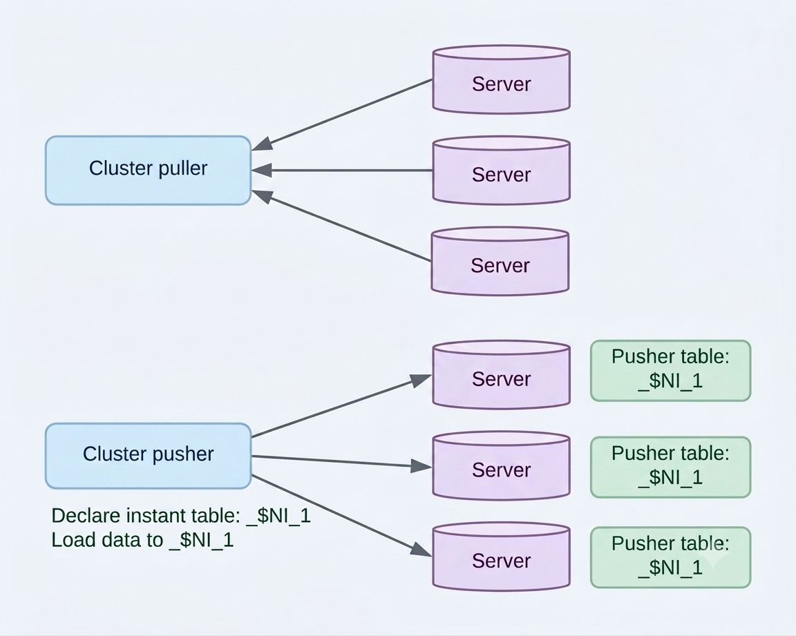

The cluster puller node collects the data. The cluster pusher node distributes it in the form of a new table.

The cluster pusher node declares a pusher table and loads the data.

- Declaring the pusher table: It creates an instant table on both the local and remote servers.
- Loading data: It loads the data received from the subordinate node of the cluster pusher node into the pusher table.

<a id="a43b5e639441a80e"></a>
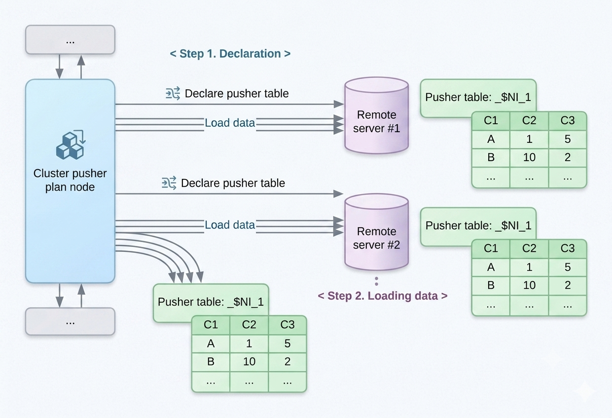

The following is an example of using the cluster pusher.

```
gSQL> \EXPLAIN PLAN ONLY
      SELECT A.c1
        FROM t_shard_1 AS A, t_shard_1 AS B
       WHERE A.shard_key = B.c1;

>>>  start print plan

< Execution Plan >
==========================================================================
|  IDX  |  NODE DESCRIPTION                                  |      ROWS |
--------------------------------------------------------------------------
|    0  |  SELECT STATEMENT                                  |         0 |
|    1  |    QUERY BLOCK ("$QB_IDX_2")                       |         0 |
|    2  |      SINGLE CLUSTER                                |         0 |
|    3  |        CLUSTER PUSHER ("_$NI_7")                   |         0 |
|    4  |          PLAN BASED CLUSTER                        |         0 |
|    5  |            INDEX ACCESS ("T_SHARD_1" AS B, "IDX")  |         0 |
|    6  |        HASH JOIN (INNER JOIN)                      |         0 |
|    7  |          TABLE ACCESS ("T_SHARD_1" AS A)           |         0 |
|    8  |          HASH JOIN INSTANT                         |         0 |
|    9  |            PUSHER TABLE ACCESS ("_$NI_7")          |         0 |
==========================================================================

     1  -  TARGET : A.C1
     2  -  SQL : SELECT /*+ KEEP_JOINED_TABLE USE_HASH_IN( _A1, 100 ) FULL( _A2 ) FULL( _A1 ) */ "_A2"."C1" FROM ( "PUBLIC"."T_SHARD_1"@LOCAL AS "_A2" INNER JOIN "SESSION_SCHEMA"."_$NI_7"@LOCAL AS "_A1" ON "_A1"."C1" = "_A2"."SHARD_KEY") ALIAS "_A3"
           TARGET DOMAIN : G1(G1N1,G1N2) 0 rows, G2(G2N1,G2N2) 0 rows, G3(G3N1,G3N2) 0 rows
     3  -  SQL : DECLARE INSTANT TABLE "SESSION_SCHEMA"."_$NI_7" ( "C1" NUMBER(10, 0) ) 
           COLUMN : B.C1 AS C1           
           SHARDED : B.C1
           TARGET DOMAIN : G1(G1N1,G1N2) 0 rows, G2(G2N1,G2N2) 0 rows, G3(G3N1,G3N2) 0 rows
     4  -  SQL : SELECT /*+ INDEX( _A1, "PUBLIC"."IDX" ) */ "_A1"."C1" FROM "PUBLIC"."T_SHARD_1"@LOCAL AS "_A1"
           TARGET DOMAIN : G1(G1N1,G1N2) 0 rows, G2(G2N1,G2N2) 0 rows, G3(G3N1,G3N2) 0 rows
     5  -  RANGE SHARD ( # 3 ) 
           READ INDEX COLUMN : B.C1
     6  -  JOINED COLUMN : A.C1
     7  -  RANGE SHARD ( # 3 ) 
           READ COLUMN : A.SHARD_KEY, A.C1
     8  -  HASH KEY : _$NI_7.C1
           READ KEY COLUMN : _$NI_7.C1
             HASH FILTER : _$NI_7.C1 = A.SHARD_KEY

<<<  end print plan
```

In the execution information above, the plan with an idx of 3 in &lt;Execution Plan&gt; corresponds to the cluster pusher.

The NODE DESCRIPTION of the cluster pusher displays the name of the pusher table.

The detailed information about the CLUSTER PUSHER is as follows.

- SQL: It is the query that declares the pusher table.
- COLUMN: It is the original expressions for each column of the pusher table. 
- SHARDED: They are the columns of the pusher table used based on the distribution of the pusher table data. 
- TARGET DOMAIN: It is the target group and members that configure the pusher table, along with the amount of data transferred to that group.

<a id="a9b704d721ab046d"></a>
##### Pusher Table

The pusher table is an instant table in the user query unit, configured by the query processor to efficiently use the cluster puller. It is used to organize the collected data in the driver server in relational form.

The configured pusher table can be referenced in the generated query like a general table.

The following is an example of performing a join query that does not use the pusher table.

```
gSQL> \EXPLAIN PLAN
      SELECT /*+ LOCAL_JOIN( t_shard_1 ) */ t_shard_1.c1
        FROM t_shard_1, t_shard_2
       WHERE t_shard_1.shard_key = t_shard_2.shard_key;

C1
--
 1
 3
 2

3 rows selected.

>>>  start print plan

< Execution Plan >
========================================================================
|  IDX  |  NODE DESCRIPTION                       |               ROWS |
------------------------------------------------------------------------
|    0  |  SELECT STATEMENT                       |                  3 |
|    1  |    QUERY BLOCK ("$QB_IDX_2")            |                  3 |
|    2  |      HASH JOIN (INNER JOIN)             |                  3 |
|    3  |        PLAN BASED CLUSTER               | LOCAL/REMOTE     3 |
|    4  |          TABLE ACCESS ("T_SHARD_1")     |                  1 |
|    5  |        HASH JOIN INSTANT                |                  3 |
|    6  |          PLAN BASED CLUSTER             | LOCAL/REMOTE     3 |
|    7  |            TABLE ACCESS ("T_SHARD_2")   |                  1 |
========================================================================

     1  -  TARGET : T_SHARD_1.C1
     2  -  JOINED COLUMN : T_SHARD_1.C1
     3  -  SQL : SELECT /*+ FULL( _A1 ) */ "_A1"."SHARD_KEY", "_A1"."C1" FROM "PUBLIC"."T_SHARD_1"@LOCAL AS "_A1"
           TARGET DOMAIN : G1(G1N1,G1N2) 1 rows, G2(G2N1,G2N2) 1 rows, G3(G3N1,G3N2) 1 rows
     4  -  RANGE SHARD ( # 3 ) 
           READ COLUMN : T_SHARD_1.SHARD_KEY, T_SHARD_1.C1
     5  -  HASH KEY : T_SHARD_2.SHARD_KEY
           READ KEY COLUMN : T_SHARD_2.SHARD_KEY
             HASH FILTER : T_SHARD_2.SHARD_KEY = T_SHARD_1.SHARD_KEY
     6  -  SQL : SELECT /*+ FULL( _A1 ) */ "_A1"."SHARD_KEY" FROM "PUBLIC"."T_SHARD_2"@LOCAL AS "_A1"
           TARGET DOMAIN : G1(G1N1,G1N2) 1 rows, G3(G3N1,G3N2) 2 rows
     7  -  RANGE SHARD ( # 4 ) 
           READ COLUMN : T_SHARD_2.SHARD_KEY

<<<  end print plan
```

Two cluster puller plans are used when performing the join, as shown above. This is because a single generated query can not process a join between two tables with different sharding strategies.

The following is an example of performing a join query using the pusher table.

```
gSQL> \EXPLAIN PLAN
SELECT /*+ REMOTE_JOIN( t_shard_1 ) */ t_shard_1.c1
  FROM t_shard_1, t_shard_2
 WHERE t_shard_1.shard_key = t_shard_2.shard_key;

C1
--
 1
 2
 3

3 rows selected.

>>>  start print plan

< Execution Plan >
=========================================================================
| IDX | NODE DESCRIPTION                              |            ROWS |
-------------------------------------------------------------------------
|   0 | SELECT STATEMENT                              |               3 |
|   1 |  QUERY BLOCK ("$QB_IDX_2")                    |               3 |
|   2 |   SINGLE CLUSTER                              | LOCAL/REMOTE  3 |
|   3 |    CLUSTER PUSHER ("_$NI_7")                  |               3 |
|   4 |     PLAN BASED CLUSTER                        | LOCAL/REMOTE  3 |
|   5 |      TABLE ACCESS ("T_SHARD_2")               |               1 |
|   6 |    SELECT STATEMENT                           |               1 |
|   7 |     QUERY BLOCK ("$QB_IDX_2")                 |               1 |
|   8 |      HASH JOIN (INNER JOIN)                   |               1 |
|   9 |       TABLE ACCESS ("T_SHARD_1" AS _A2)       |               1 |
|  10 |       HASH JOIN INSTANT                       |               1 |
|  11 |        PUSHER TABLE ACCESS ("_$NI_7" AS _A1)  |               1 |
=========================================================================

     1  -  TARGET : T_SHARD_1.C1
     2  -  SQL : SELECT /*+ KEEP_JOINED_TABLE USE_HASH_IN( _A1, 10 ) FULL( _A2 ) FULL( _A1 ) */ "_A2"."C1" FROM ( "PUBLIC"."T_SHARD_1"@LOCAL AS "_A2" INNER JOIN "SESSION_SCHEMA"."_$NI_7"@LOCAL AS "_A1" ON "_A1"."SHARD_KEY" = "_A2"."SHARD_KEY") ALIAS "_A3"
           TARGET DOMAIN : G1(G1N1,G1N2) 1 rows, G2(G2N1,G2N2) 1 rows, G3(G3N1,G3N2) 1 rows
     3  -  SQL : DECLARE INSTANT TABLE "SESSION_SCHEMA"."_$NI_7" ( "SHARD_KEY" NUMBER(10, 0) ) 
           COLUMN : T_SHARD_2.SHARD_KEY AS SHARD_KEY           
           SHARDED : T_SHARD_2.SHARD_KEY
           TARGET DOMAIN : G1(G1N1,G1N2) 1 rows, G2(G2N1,G2N2) 1 rows, G3(G3N1,G3N2) 1 rows
     4  -  SQL : SELECT /*+ FULL( _A1 ) */ "_A1"."SHARD_KEY" FROM "PUBLIC"."T_SHARD_2"@LOCAL AS "_A1"
           TARGET DOMAIN : G1(G1N1,G1N2) 1 rows, G3(G3N1,G3N2) 2 rows
     5  -  RANGE SHARD ( # 4 ) 
           READ COLUMN : T_SHARD_2.SHARD_KEY
     7  -  TARGET : _A2.C1
     8  -  JOINED COLUMN : _A2.C1
     9  -  RANGE SHARD ( # 3 ) 
           READ COLUMN : _A2.SHARD_KEY, _A2.C1
    10  -  HASH KEY : _A1.SHARD_KEY
           READ KEY COLUMN : _A1.SHARD_KEY
             HASH FILTER : _A1.SHARD_KEY = _A2.SHARD_KEY
    11  -  READ COLUMN : _A1.SHARD_KEY

<<<  end print plan
```

The generated query of the cluster puller, as configured in the execution result above, includes the join.

The CLUSTER PUSHER, configured under SINGLE CLUSTER, defines the pusher table "_$NI_7" through the DECLARE statement.

The data collected from the table t_shard_2 in the CLUSTER PUSHER is distributed to the pusher table on both the local and remote servers using the sharding strategy of t_shard_1. The join between these two tables can be processed as a single generated query because both t_shard_1 and the pusher table use the same sharding strategy.

The pusher table has the following features.

- It declares the pusher table in the cluster pusher plan node and loads the data. 
- It is configured as a table included in the SESSION_SCHEMA.
- It can not configure an index.
- Multiple pusher tables can be configured in a single user query.
- Pusher tables are not shared among user queries.
- The performance cycle of the user query and the management cycle of the pusher table are the same.
- The pusher table configured on each server contains either replicated or distributed data.

<a id="4c33e28e0bd47f2d"></a>
##### Pusher Table Configured with Replicated Data

The data configuration of the pusher table varies depending on the execution of the cluster puller.

The pusher table, configured to process the outer join as shown below, processes the generated query including the outer join on all servers that have the same data for t_shard_2.

```
gSQL> \EXPLAIN PLAN ONLY
      SELECT A.c1
        FROM t_shard_1 AS A LEFT OUTER JOIN t_shard_2 AS B ON A.c1 = B.c1;

>>>  start print plan

< Execution Plan >
==========================================================================
|  IDX  |  NODE DESCRIPTION                                  |      ROWS |
--------------------------------------------------------------------------
|    0  |  SELECT STATEMENT                                  |         0 |
|    1  |    QUERY BLOCK ("$QB_IDX_2")                       |         0 |
|    2  |      SINGLE CLUSTER                                |         0 |
|    3  |        CLUSTER PUSHER ("_$NI_5")                   |         0 |
|    4  |          PLAN BASED CLUSTER                        |         0 |
|    5  |            TABLE ACCESS ("T_SHARD_2" AS B)         |         0 |
|    6  |        HASH JOIN (INVERTED LEFT OUTER JOIN)        |         0 |
|    7  |          PUSHER TABLE ACCESS ("_$NI_5")            |         0 |
|    8  |          HASH JOIN INSTANT                         |         0 |
|    9  |            INDEX ACCESS ("T_SHARD_1" AS A, "IDX")  |         0 |
==========================================================================

     1  -  TARGET : A.C1
     2  -  SQL : SELECT /*+ KEEP_JOINED_TABLE USE_HASH_IN( _A1, 100 ) FULL( _A2 ) INDEX( _A1, "PUBLIC"."IDX" ) */ "_A1"."C1" FROM ( "PUBLIC"."T_SHARD_1"@"G1N1"|"G1N2"|"G2N1"|"G2N2"|"G3N1"|"G3N2" AS "_A1" LEFT OUTER JOIN "SESSION_SCHEMA"."_$NI_5"@LOCAL AS "_A2" ON "_A1"."C1" = "_A2"."C1") ALIAS "_A3"
           TARGET DOMAIN : G1(G1N1,G1N2) 0 rows, G2(G2N1,G2N2) 0 rows, G3(G3N1,G3N2) 0 rows
     3  -  SQL : DECLARE INSTANT TABLE "SESSION_SCHEMA"."_$NI_5" ( "C1" NUMBER(10, 0) ) 
           COLUMN : B.C1 AS C1
           CLONED
           TARGET DOMAIN : G1(G1N1,G1N2) 0 rows, G2(G2N1,G2N2) 0 rows, G3(G3N1,G3N2) 0 rows
     4  -  SQL : SELECT /*+ FULL( _A1 ) */ "_A1"."C1" FROM "PUBLIC"."T_SHARD_2"@LOCAL AS "_A1"
           TARGET DOMAIN : G1(G1N1,G1N2) 0 rows, G3(G3N1,G3N2) 0 rows
     5  -  RANGE SHARD ( # 4 ) 
           READ COLUMN : B.C1
     6  -  JOINED COLUMN : A.C1
     8  -  HASH KEY : A.C1
           READ KEY COLUMN : A.C1
             HASH FILTER : A.C1 = _$NI_5.C1
     9  -  RANGE SHARD ( # 3 ) 
           READ INDEX COLUMN : A.C1

<<<  end print plan
```

The pusher table, configured with replicated data, is output as CLONED, as shown in the result above.

<a id="6ceed1d7f69887c2"></a>
##### Pusher Table Composed of Distributed Data

The following is an example of processing an outer join using the sharding key of t_shard_1 as the join condition.

```
gSQL> \EXPLAIN PLAN ONLY
      SELECT A.c1
        FROM t_shard_1 AS A LEFT OUTER JOIN t_shard_2 AS B ON A.shard_key = B.c1;

>>>  start print plan

< Execution Plan >
=======================================================================
|  IDX  |  NODE DESCRIPTION                           |          ROWS |
-----------------------------------------------------------------------
|    0  |  SELECT STATEMENT                           |             0 |
|    1  |    QUERY BLOCK ("$QB_IDX_2")                |             0 |
|    2  |      SINGLE CLUSTER                         |             0 |
|    3  |        CLUSTER PUSHER ("_$NI_7")            |             0 |
|    4  |          PLAN BASED CLUSTER                 |             0 |
|    5  |            TABLE ACCESS ("T_SHARD_2" AS B)  |             0 |
|    6  |        HASH JOIN (LEFT OUTER JOIN)          |             0 |
|    7  |          TABLE ACCESS ("T_SHARD_1" AS A)    |             0 |
|    8  |          HASH JOIN INSTANT                  |             0 |
|    9  |            PUSHER TABLE ACCESS ("_$NI_7")   |             0 |
=======================================================================

     1  -  TARGET : A.C1
     2  -  SQL : SELECT /*+ KEEP_JOINED_TABLE USE_HASH_IN( _A1, 10 ) FULL( _A2 ) FULL( _A1 ) */ "_A2"."C1" FROM ( "PUBLIC"."T_SHARD_1"@"G1N1"|"G1N2"|"G2N1"|"G2N2"|"G3N1"|"G3N2" AS "_A2" LEFT OUTER JOIN "SESSION_SCHEMA"."_$NI_7"@LOCAL AS "_A1" ON "_A1"."C1" = "_A2"."SHARD_KEY") ALIAS "_A3"
           TARGET DOMAIN : G1(G1N1,G1N2) 0 rows, G2(G2N1,G2N2) 0 rows, G3(G3N1,G3N2) 0 rows
     3  -  SQL : DECLARE INSTANT TABLE "SESSION_SCHEMA"."_$NI_7" ( "C1" NUMBER(10, 0) ) 
           COLUMN : B.C1 AS C1           
           SHARDED : B.C1
           TARGET DOMAIN : G1(G1N1,G1N2) 0 rows, G2(G2N1,G2N2) 0 rows, G3(G3N1,G3N2) 0 rows
     4  -  SQL : SELECT /*+ FULL( _A1 ) */ "_A1"."C1" FROM "PUBLIC"."T_SHARD_2"@LOCAL AS "_A1"
           TARGET DOMAIN : G1(G1N1,G1N2) 0 rows, G3(G3N1,G3N2) 0 rows
     5  -  RANGE SHARD ( # 4 ) 
           READ COLUMN : B.C1
     6  -  JOINED COLUMN : A.C1
     7  -  RANGE SHARD ( # 3 ) 
           READ COLUMN : A.SHARD_KEY, A.C1
     8  -  HASH KEY : _$NI_7.C1
           READ KEY COLUMN : _$NI_7.C1
             HASH FILTER : _$NI_7.C1 = A.SHARD_KEY

<<<  end print plan
```

The pusher table holds the data for t_shard_2 divided into groups. The data is distributed based on C1 column of t_shard_2 according to the sharding strategy configured in the sharding key of t_shard_1.

The pusher table, composed of distributed data, is output as SHARDED, as shown in the detailed result above.

<a id="c0728949c19016ea"></a>
#### Cluster query processing per SELECT statement

The chapters above describe the [Cluster Puller](#22ad93e6359727ef) and [Cluster Pusher](#366a16344ec1965e) plan nodes used to process SELECT queries in the cluster. This chapter describes how to process cluster queries per SELECT statement using these nodes.

<a id="0ae3bff07a7b3928"></a>
##### FROM Statement (Single Table)

Query processing in a single table is divided into processing in a sharded table and processing in a cloned table. When processing in a sharded table, the data is divided into n groups and stored, so queries are sent to both the local server and the remote server. The results are then collected and combined into a final result set. To request queries from the remote server and receive the results, GOLDILOCKS uses either a plan-based cluster or a single cluster plan node. These cluster pullers simultaneously send queries to both the local and remote servers, collecting the results in parallel to create the final result set.

The following is an example of processing a query in a *part* table, which is a sharded table.

```
gSQL> \EXPLAIN PLAN
      SELECT p_name, p_brand, p_type, cluster_group_id
        FROM part;

P_NAME P_BRAND    P_TYPE CLUSTER_GROUP_ID
------ ---------- ------ ----------------
Part#3 Brand#2    STEEL                 1
Part#2 Brand#1    NICKEL                2
Part#5 Brand#3    STEEL                 2
Part#1 Brand#1    COPPER                3
Part#4 Brand#3    NICKEL                3

5 rows selected.

>>>  start print plan

< Execution Plan >
===============================================================
|  IDX  |  NODE DESCRIPTION              |               ROWS |
---------------------------------------------------------------
|    0  |  SELECT STATEMENT              |                  5 |
|    1  |    QUERY BLOCK ("$QB_IDX_2")   |                  5 |
|    2  |      PLAN BASED CLUSTER        | LOCAL/REMOTE     5 |
|    3  |        TABLE ACCESS ("PART")   |                  1 |
===============================================================

     1  -  TARGET : PART.P_NAME, PART.P_BRAND, PART.P_TYPE, PART.CLUSTER_GROUP_ID
     2  -  SQL : SELECT /*+ FULL( _A1 ) */ "_A1"."CLUSTER_GROUP_ID", "_A1"."P_NAME", "_A1"."P_BRAND", "_A1"."P_TYPE" FROM "PUBLIC"."PART"@LOCAL AS "_A1"
           TARGET DOMAIN : G1(G1N1,G1N2) 1 rows, G2(G2N1,G2N2) 2 rows, G3(G3N1,G3N2) 2 rows
     3  -  HASH SHARD ( # 3 ) 
           READ COLUMN : PART.P_NAME, PART.P_BRAND, PART.P_TYPE

<<<  end print plan
```

When a cloned table is created using the cloned strategy, such as the AT CLUSTER WIDE strategy, all nodes have replications, allowing most local servers to process queries for the cloned table. However, when a new group or member is added, the data for the cloned table is not available on that group or member, so the data must be fetched from the remote server. In this case, the cluster puller is configured. For more information about the cloned strategy, refer to [Cloned Strategy](../part-01-getting-started/3-cluster-tutorial.md#ac7718ce7683e0a5).

The following is an example of processing a query in the *supplier* table, which is a cloned table.

```
gSQL> \EXPLAIN PLAN
      SELECT s_name, s_nationkey
        FROM supplier;

S_NAME                    S_NATIONKEY    
------------------------- ---------------
Supplier#1                FRANCE         
Supplier#2                KOREA          
Supplier#3                GERMANY        
Supplier#4                UNITED STATES  
Supplier#5                CANADA         

5 rows selected.

>>>  start print plan

< Execution Plan >
======================================================================
|  IDX  |  NODE DESCRIPTION                        |            ROWS |
----------------------------------------------------------------------
|    0  |  SELECT STATEMENT                        |               5 |
|    1  |    QUERY BLOCK ("$QB_IDX_2")             |               5 |
|    2  |      TABLE ACCESS ("SUPPLIER")           |               5 |
======================================================================

     1  -  TARGET : SUPPLIER.S_NAME, SUPPLIER.S_NATIONKEY
     2  -  CLONED 
           READ COLUMN : SUPPLIER.S_NAME, SUPPLIER.S_NATIONKEY

<<<  end print plan
```

It can fetch all data for the *supplier* table from a local server, as mentioned above, so the cluster puller is not configured.

The following is an example of processing a query in the *supplier* table, which is a cloned table, using the domain.

```
gSQL> \EXPLAIN PLAN
      SELECT s_name, s_nationkey
        FROM supplier@G2;

S_NAME                    S_NATIONKEY    
------------------------- ---------------
Supplier#1                FRANCE         
Supplier#2                KOREA          
Supplier#3                GERMANY        
Supplier#4                UNITED STATES  
Supplier#5                CANADA         

5 rows selected.

>>>  start print plan

< Execution Plan >
=======================================================================
|  IDX  |  NODE DESCRIPTION                      |               ROWS |
-----------------------------------------------------------------------
|    0  |  SELECT STATEMENT                      |                  5 |
|    1  |    QUERY BLOCK ("$QB_IDX_2")           |                  5 |
|    2  |      PLAN BASED CLUSTER                | REMOTE ONLY      5 |
|    3  |        TABLE ACCESS ("SUPPLIER")       |                  0 |
=======================================================================

     1  -  TARGET : SUPPLIER.S_NAME, SUPPLIER.S_NATIONKEY
     2  -  SQL : SELECT /*+ FULL( _A1 ) */ "_A1"."S_NAME", "_A1"."S_NATIONKEY" FROM "PUBLIC"."SUPPLIER"@LOCAL AS "_A1"
           TARGET DOMAIN : G2(G2N1,G2N2) 5 rows
     3  -  CLONED 
           READ COLUMN : SUPPLIER.S_NAME, SUPPLIER.S_NATIONKEY

<<<  end print plan
```

It configures the cluster puller, as mentioned above, to fetch the data for the supplier table from the remote server.

<a id="72817eae70187c4e"></a>
##### FROM Statement (Join)

The data collection for the cluster puller plan node is processed in one of the following two forms.

- Data collection from a single group: It is used for a query that consists only of cloned tables or when the cluster domain is limited to a single group.
- Data collection from multiple groups: It is used for a query that includes a sharded table.

Joins using the cluster puller plan node are also performed in the two forms mentioned above.

When performing a join by collecting data from a single group, the join between two cloned tables configures the cluster puller to collect the data.  
If a common cluster domain does not exist between the two cloned tables, one of the following two methods can be selected to perform the join.

First, it configures the cluster puller for each join target table, then performs the join.

```
gSQL> \EXPLAIN PLAN
      SELECT s_suppkey, n_name
        FROM supplier@g2, nation@g3
       WHERE s_nationkey = n_nationkey;

S_SUPPKEY N_NAME                   
--------- -------------------------
        1 FRANCE                   
        2 INDIA                    
        3 GERMANY                  
        4 CANADA                   
        5 UNITED STATES            

5 rows selected.

>>>  start print plan

< Execution Plan >
=========================================================================
|  IDX  |  NODE DESCRIPTION                        |               ROWS |
-------------------------------------------------------------------------
|    0  |  SELECT STATEMENT                        |                  5 |
|    1  |    QUERY BLOCK ("$QB_IDX_2")             |                  5 |
|    2  |      HASH JOIN (INNER JOIN)              |                  5 |
|    3  |        PLAN BASED CLUSTER                | REMOTE ONLY      5 |
|    4  |          TABLE ACCESS ("SUPPLIER")       |                  0 |
|    5  |        HASH JOIN INSTANT                 |                  5 |
|    6  |          PLAN BASED CLUSTER              | REMOTE ONLY     30 |
|    7  |            TABLE ACCESS ("NATION")       |                  0 |
=========================================================================

     1  -  TARGET : SUPPLIER.S_SUPPKEY, NATION.N_NAME
     2  -  JOINED COLUMN : SUPPLIER.S_SUPPKEY, NATION.N_NAME
     3  -  SQL : SELECT /*+ FULL( _A1 ) */ "_A1"."S_SUPPKEY", "_A1"."S_NATIONKEY" FROM "PUBLIC"."SUPPLIER"@LOCAL AS "_A1"
           TARGET DOMAIN : G2(G2N1,G2N2) 5 rows
     4  -  CLONED 
           READ COLUMN : SUPPLIER.S_SUPPKEY, SUPPLIER.S_NATIONKEY
     5  -  HASH KEY : NATION.N_NATIONKEY
           RECORD COLUMN : NATION.N_NAME
           READ KEY COLUMN : NATION.N_NATIONKEY, NATION.N_NAME
             HASH FILTER : NATION.N_NATIONKEY = SUPPLIER.S_NATIONKEY
     6  -  SQL : SELECT /*+ FULL( _A1 ) */ "_A1"."N_NATIONKEY", "_A1"."N_NAME" FROM "PUBLIC"."NATION"@LOCAL AS "_A1"
           TARGET DOMAIN : G3(G3N1,G3N2) 30 rows
     7  -  CLONED 
           READ COLUMN : NATION.N_NATIONKEY, NATION.N_NAME

<<<  end print plan
```

However, if performed as described above, the issue is that all data from the two tables must be fetched.

Second, it configures the pusher table for the table, then performs the join query that includes the pusher table. In this case, a single group collects the data as follows.

```
gSQL> \EXPLAIN PLAN
      SELECT /*+ REMOTE_JOIN( supplier ) */ s_suppkey, n_name
        FROM supplier@g2, nation@g3
       WHERE s_nationkey = n_nationkey;

S_SUPPKEY N_NAME                   
--------- -------------------------
        4 CANADA                   
        1 FRANCE                   
        3 GERMANY                  
        2 INDIA                    
        5 UNITED STATES            

5 rows selected.

>>>  start print plan

< Execution Plan >
===========================================================================
|  IDX  |  NODE DESCRIPTION                           |              ROWS |
---------------------------------------------------------------------------
|    0  |  SELECT STATEMENT                           |                 5 |
|    1  |    QUERY BLOCK ("$QB_IDX_2")                |                 5 |
|    2  |      SINGLE CLUSTER                         | REMOTE ONLY     5 |
|    3  |        CLUSTER PUSHER ("_$NI_7")            |                 5 |
|    4  |          PLAN BASED CLUSTER                 | REMOTE ONLY     5 |
|    5  |            TABLE ACCESS ("SUPPLIER")        |                 0 |
|    6  |        HASH JOIN (INNER JOIN)               |                 0 |
|    7  |          TABLE ACCESS ("NATION")            |                 0 |
|    8  |          HASH JOIN INSTANT                  |                 0 |
|    9  |            PUSHER TABLE ACCESS ("_$NI_7")   |                 0 |
===========================================================================

     1  -  TARGET : _$NI_7.S_SUPPKEY, NATION.N_NAME
     2  -  SQL : SELECT /*+ KEEP_JOINED_TABLE USE_HASH_IN( _A1, 5 ) FULL( _A2 ) FULL( _A1 ) */ "_A1"."S_SUPPKEY", "_A2"."N_NAME" FROM ( "PUBLIC"."NATION"@LOCAL AS "_A2" INNER JOIN "SESSION_SCHEMA"."_$NI_7"@LOCAL AS "_A1" ON "_A1"."S_NATIONKEY" = "_A2"."N_NATIONKEY") ALIAS "_A3"
           TARGET DOMAIN : G3(G3N1,G3N2) 5 rows
     3  -  SQL : DECLARE INSTANT TABLE "SESSION_SCHEMA"."_$NI_7" ( "S_NATIONKEY" NUMBER(10, 0), "S_SUPPKEY" NUMBER(10, 0) ) 
           COLUMN : SUPPLIER.S_NATIONKEY AS S_NATIONKEY, SUPPLIER.S_SUPPKEY AS S_SUPPKEY
           CLONED
           TARGET DOMAIN : G3(G3N1,G3N2) 5 rows
     4  -  SQL : SELECT /*+ FULL( _A1 ) */ "_A1"."S_SUPPKEY", "_A1"."S_NATIONKEY" FROM "PUBLIC"."SUPPLIER"@LOCAL AS "_A1"
           TARGET DOMAIN : G2(G2N1,G2N2) 5 rows
     5  -  CLONED 
           READ COLUMN : SUPPLIER.S_SUPPKEY, SUPPLIER.S_NATIONKEY
     6  -  JOINED COLUMN : _$NI_7.S_SUPPKEY, NATION.N_NAME
     7  -  CLONED 
           READ COLUMN : NATION.N_NATIONKEY, NATION.N_NAME
     8  -  HASH KEY : _$NI_7.S_NATIONKEY
           RECORD COLUMN : _$NI_7.S_SUPPKEY
           READ KEY COLUMN : _$NI_7.S_NATIONKEY, _$NI_7.S_SUPPKEY
             HASH FILTER : _$NI_7.S_NATIONKEY = NATION.N_NATIONKEY

<<<  end print plan
```

When performing a join by collecting data from multiple groups, the data in a sharded table is distributed across several groups, so the data must be collected from multiple groups to process the query.

Joins involving the sharded table are classified as follows.

- Case 1: Joining a sharded table and a cloned table
    - The data of the cloned table is distributed to all groups where the data of the sharded table is distributed. 
- Case 2: Joining a sharded table and a cloned table
    - The data of the cloned table is not distributed to one or more groups where the data of the sharded table is distributed. 
- Case 3: Joining a sharded table and a sharded table
    - An equi-join condition exists between the sharding keys of the two sharded tables.
- Case 4: Joining a sharded table and a sharded table
    - An equi-join condition exists using the sharding key of one of the sharded tables.
- Case 5: Joining a sharded table and a sharded table
    - No equi-join condition exists using the sharding key.

In case 1, if the cloned table data exists in all groups where the sharded table data is distributed, then aggregating the join results from each group will give the complete join result.

```
gSQL> \EXPLAIN PLAN
      SELECT ps_partkey, s_name
        FROM partsupp, supplier
       WHERE ps_suppkey = s_suppkey;

PS_PARTKEY S_NAME                   
---------- -------------------------
         3 Supplier#1               
         3 Supplier#4               
         2 Supplier#2               
         2 Supplier#5               
         5 Supplier#1               
         5 Supplier#4               
         1 Supplier#2               
         1 Supplier#3               
         4 Supplier#3               
         4 Supplier#5               

10 rows selected.

>>>  start print plan

< Execution Plan >
===========================================================================
|IDX| NODE DESCRIPTION                                  |            ROWS |
---------------------------------------------------------------------------
| 0 | SELECT STATEMENT                                  |              10 |
| 1 |  QUERY BLOCK ("$QB_IDX_2")                        |              10 |
| 2 |   PLAN BASED CLUSTER                              | LOCAL/REMOTE 10 |
| 3 |    HASH JOIN (INNER JOIN)                         |               2 |
| 4 |     INDEX ACCESS ("PARTSUPP", "PARTSUPP_PK_INDEX")| (    2)       2 |
| 5 |     HASH JOIN INSTANT                             |               2 |
| 6 |      TABLE ACCESS ("SUPPLIER")                    |               5 |
===========================================================================

     1  -  TARGET : PARTSUPP.PS_PARTKEY, SUPPLIER.S_NAME
     2  -  SQL : SELECT /*+ KEEP_JOINED_TABLE USE_HASH_IN( _A1, 5 ) INDEX( _A2, "PUBLIC"."PARTSUPP_PK_INDEX" ) FULL( _A1 ) */ "_A2"."PS_PARTKEY", "_A1"."S_NAME" FROM ( "PUBLIC"."PARTSUPP"@LOCAL AS "_A2" INNER JOIN "PUBLIC"."SUPPLIER"@LOCAL AS "_A1" ON "_A1"."S_SUPPKEY" = "_A2"."PS_SUPPKEY") ALIAS "_A3"
           TARGET DOMAIN : G1(G1N1,G1N2) 2 rows, G2(G2N1,G2N2) 4 rows, G3(G3N1,G3N2) 4 rows
     3  -  JOINED COLUMN : PARTSUPP.PS_PARTKEY, SUPPLIER.S_NAME
     4  -  HASH SHARD ( # 3 ) 
           READ INDEX COLUMN : PARTSUPP.PS_PARTKEY, PARTSUPP.PS_SUPPKEY
     5  -  HASH KEY : SUPPLIER.S_SUPPKEY
           RECORD COLUMN : SUPPLIER.S_NAME
           READ KEY COLUMN : SUPPLIER.S_SUPPKEY, SUPPLIER.S_NAME
             HASH FILTER : SUPPLIER.S_SUPPKEY = PARTSUPP.PS_SUPPKEY
           FETCH ONE ROW
     6  -  CLONED 
           READ COLUMN : SUPPLIER.S_SUPPKEY, SUPPLIER.S_NAME

<<<  end print plan
```

In case 2, the generated query including the join cannot be configured. In this case, the cluster puller is configured for each table that is a join target, and the join is performed as follows.

```
gSQL> \EXPLAIN PLAN
      SELECT ps_partkey, s_name
        FROM partsupp, supplier@G2|G3
       WHERE ps_suppkey = s_suppkey;

PS_PARTKEY S_NAME                   
---------- -------------------------
         3 Supplier#1               
         3 Supplier#4               
         1 Supplier#2               
         1 Supplier#3               
         4 Supplier#3               
         4 Supplier#5               
         2 Supplier#2               
         2 Supplier#5               
         5 Supplier#1               
         5 Supplier#4               

10 rows selected.

>>>  start print plan

< Execution Plan >
===========================================================================
|IDX| NODE DESCRIPTION                                  |            ROWS |
---------------------------------------------------------------------------
| 0 |SELECT STATEMENT                                   |              10 |
| 1 | QUERY BLOCK ("$QB_IDX_2")                         |              10 |
| 2 |  HASH JOIN (INNER JOIN)                           |              10 |
| 3 |   PLAN BASED CLUSTER                              | LOCAL/REMOTE 10 |
| 4 |    INDEX ACCESS ("PARTSUPP", "PARTSUPP_PK_INDEX") |(    2)        2 |
| 5 |   HASH JOIN INSTANT                               |              10 |
| 6 |    PLAN BASED CLUSTER                             | REMOTE ONLY   5 |
| 7 |     TABLE ACCESS ("SUPPLIER")                     |               0 |
===========================================================================

     1  -  TARGET : PARTSUPP.PS_PARTKEY, SUPPLIER.S_NAME
     2  -  JOINED COLUMN : PARTSUPP.PS_PARTKEY, SUPPLIER.S_NAME
     3  -  SQL : SELECT /*+ INDEX( _A1, "PUBLIC"."PARTSUPP_PK_INDEX" ) */ "_A1"."PS_PARTKEY", "_A1"."PS_SUPPKEY" FROM "PUBLIC"."PARTSUPP"@LOCAL AS "_A1"
           TARGET DOMAIN : G1(G1N1,G1N2) 2 rows, G2(G2N1,G2N2) 4 rows, G3(G3N1,G3N2) 4 rows
     4  -  HASH SHARD ( # 3 ) 
           READ INDEX COLUMN : PARTSUPP.PS_PARTKEY, PARTSUPP.PS_SUPPKEY
     5  -  HASH KEY : SUPPLIER.S_SUPPKEY
           RECORD COLUMN : SUPPLIER.S_NAME
           READ KEY COLUMN : SUPPLIER.S_SUPPKEY, SUPPLIER.S_NAME
             HASH FILTER : SUPPLIER.S_SUPPKEY = PARTSUPP.PS_SUPPKEY
     6  -  SQL : SELECT /*+ FULL( _A1 ) */ "_A1"."S_SUPPKEY", "_A1"."S_NAME" FROM "PUBLIC"."SUPPLIER"@LOCAL AS "_A1"
           TARGET DOMAIN : G2(G2N1,G2N2) 5 rows, G3(G3N1,G3N2) 0 rows
     7  -  CLONED 
           READ COLUMN : SUPPLIER.S_SUPPKEY, SUPPLIER.S_NAME

<<<  end print plan
```

In case 3, if the sharding strategies for both tables are the same, the total sum of the join results from each group will be the complete join result. If the sharding strategies for the two tables are different, the situation is the same as in case 4.

If the sharding strategies of the two tables are the same, then case 3 is performed as follows.

```
gSQL> \EXPLAIN PLAN
      SELECT p_name, ps_suppkey
        FROM part, partsupp
       WHERE p_partkey = ps_partkey;

P_NAME PS_SUPPKEY
------ ----------
Part#3          4
Part#3          1
Part#2          5
Part#2          2
Part#5          4
Part#5          1
Part#1          3
Part#1          2
Part#4          5
Part#4          3

10 rows selected.

>>>  start print plan

< Execution Plan >
===========================================================================
|IDX| NODE DESCRIPTION                                  |            ROWS |
---------------------------------------------------------------------------
| 0 |SELECT STATEMENT                                   |              10 |
| 1 | QUERY BLOCK ("$QB_IDX_2")                         |              10 |
| 2 |  PLAN BASED CLUSTER                               | LOCAL/REMOTE 10 |
| 3 |   HASH JOIN (INNER JOIN)                          |               2 |
| 4 |    TABLE ACCESS ("PART")                          |               1 |
| 5 |    HASH JOIN INSTANT                              |               2 |
| 6 |     INDEX ACCESS ("PARTSUPP", "PARTSUPP_PK_INDEX")| (      2)     2 |
===========================================================================

     1  -  TARGET : PART.P_NAME, PARTSUPP.PS_SUPPKEY
     2  -  SQL : SELECT /*+ KEEP_JOINED_TABLE USE_HASH_IN( _A1, 10 ) FULL( _A2 ) INDEX( _A1, "PUBLIC"."PARTSUPP_PK_INDEX" ) */ "_A2"."P_NAME", "_A1"."PS_SUPPKEY" FROM ( "PUBLIC"."PART"@LOCAL AS "_A2" INNER JOIN "PUBLIC"."PARTSUPP"@LOCAL AS "_A1" ON "_A1"."PS_PARTKEY" = "_A2"."P_PARTKEY") ALIAS "_A3"
           TARGET DOMAIN : G1(G1N1,G1N2) 2 rows, G2(G2N1,G2N2) 4 rows, G3(G3N1,G3N2) 4 rows
     3  -  JOINED COLUMN : PART.P_NAME, PARTSUPP.PS_SUPPKEY
     4  -  HASH SHARD ( # 3 ) 
           READ COLUMN : PART.P_PARTKEY, PART.P_NAME
     5  -  HASH KEY : PARTSUPP.PS_PARTKEY
           RECORD COLUMN : PARTSUPP.PS_SUPPKEY
           READ KEY COLUMN : PARTSUPP.PS_PARTKEY, PARTSUPP.PS_SUPPKEY
             HASH FILTER : PARTSUPP.PS_PARTKEY = PART.P_PARTKEY
     6  -  HASH SHARD ( # 3 ) 
           READ INDEX COLUMN : PARTSUPP.PS_PARTKEY, PARTSUPP.PS_SUPPKEY

<<<  end print plan
```

In case 4, the generated query including the join for two sharded tables cannot be configured. A pusher table can be created for the table corresponding to the one that uses the sharding key in the equi-join condition, and the query can be processed similarly to case 1.

Case 4 is performed for two sharded tables as follows.

```
gSQL> \EXPLAIN PLAN
      SELECT /*+ REMOTE_JOIN( part ) */ p_name, ps_suppkey
        FROM part, partsupp
       WHERE p_partkey = ps_suppkey;

P_NAME PS_SUPPKEY
------ ----------
Part#3          3
Part#3          3
Part#1          1
Part#1          1
Part#4          4
Part#4          4
Part#2          2
Part#2          2
Part#5          5
Part#5          5

10 rows selected.

>>>  start print plan

< Execution Plan >
===========================================================================
|IDX| NODE DESCRIPTION                                  |            ROWS |
---------------------------------------------------------------------------
|  0|SELECT STATEMENT                                   |              10 |
|  1| QUERY BLOCK ("$QB_IDX_2")                         |              10 |
|  2|  SINGLE CLUSTER                                   | LOCAL/REMOTE 10 |
|  3|   CLUSTER PUSHER ("_$NI_7")                       |              10 |
|  4|    PLAN BASED CLUSTER                             | LOCAL/REMOTE 10 |
|  5|     INDEX ACCESS ("PARTSUPP", "PARTSUPP_PK_INDEX")| (     2)      2 |
|  6|   SELECT STATEMENT                                |               2 |
|  7|    QUERY BLOCK ("$QB_IDX_2")                      |               2 |
|  8|     HASH JOIN (INNER JOIN)                        |               2 |
|  9|      TABLE ACCESS ("PART" AS _A2)                 |               1 |
| 10|      HASH JOIN INSTANT                            |               2 |
| 11|       PUSHER TABLE ACCESS ("_$NI_7" AS _A1)       |               2 |
===========================================================================

     1  -  TARGET : PART.P_NAME, _$NI_7.PS_SUPPKEY
     2  -  SQL : SELECT /*+ KEEP_JOINED_TABLE USE_HASH_IN( _A1, 10 ) FULL( _A2 ) FULL( _A1 ) */ "_A2"."P_NAME", "_A1"."PS_SUPPKEY" FROM ( "PUBLIC"."PART"@LOCAL AS "_A2" INNER JOIN "SESSION_SCHEMA"."_$NI_7"@LOCAL AS "_A1" ON "_A1"."PS_SUPPKEY" = "_A2"."P_PARTKEY") ALIAS "_A3"
           TARGET DOMAIN : G1(G1N1,G1N2) 2 rows, G2(G2N1,G2N2) 4 rows, G3(G3N1,G3N2) 4 rows
     3  -  SQL : DECLARE INSTANT TABLE "SESSION_SCHEMA"."_$NI_7" ( "PS_SUPPKEY" NUMBER(10, 0) ) 
           COLUMN : PARTSUPP.PS_SUPPKEY AS PS_SUPPKEY           
           SHARDED : PARTSUPP.PS_SUPPKEY
           TARGET DOMAIN : G1(G1N1,G1N2) 2 rows, G2(G2N1,G2N2) 4 rows, G3(G3N1,G3N2) 4 rows
     4  -  SQL : SELECT /*+ INDEX( _A1, "PUBLIC"."PARTSUPP_PK_INDEX" ) */ "_A1"."PS_SUPPKEY" FROM "PUBLIC"."PARTSUPP"@LOCAL AS "_A1"
           TARGET DOMAIN : G1(G1N1,G1N2) 2 rows, G2(G2N1,G2N2) 4 rows, G3(G3N1,G3N2) 4 rows
     5  -  HASH SHARD ( # 3 ) 
           READ INDEX COLUMN : PARTSUPP.PS_SUPPKEY
     7  -  TARGET : _A2.P_NAME, _A1.PS_SUPPKEY
     8  -  JOINED COLUMN : _A2.P_NAME, _A1.PS_SUPPKEY
     9  -  HASH SHARD ( # 3 ) 
           READ COLUMN : _A2.P_PARTKEY, _A2.P_NAME
    10  -  HASH KEY : _A1.PS_SUPPKEY
           READ KEY COLUMN : _A1.PS_SUPPKEY
             HASH FILTER : _A1.PS_SUPPKEY = _A2.P_PARTKEY
    11  -  READ COLUMN : _A1.PS_SUPPKEY

<<<  end print plan
```

In case 5, the sharding strategy for the two sharded tables cannot be used. In this case, the join can be performed by configuring one of the join target tables as a pusher table in the form of a cloned table, as follows.

```
gSQL> \EXPLAIN PLAN
      SELECT SUM( A.p_size )
        FROM part A, part B
       WHERE A.p_type = B.p_type;

SUM( A.P_SIZE )
---------------
            109

1 row selected.

>>>  start print plan

< Execution Plan >
===========================================================================
|IDX|  NODE DESCRIPTION                                  |           ROWS |
---------------------------------------------------------------------------
|  0|SELECT STATEMENT                                    |              1 |
|  1|  QUERY BLOCK ("$QB_IDX_2")                         |              1 |
|  2|    SINGLE CLUSTER                          | LOCAL/REMOTE 1 |
|  3|      CLUSTER PUSHER ("_$NI_6")             |              5 |
|  4|        PLAN BASED CLUSTER                          | LOCAL/REMOTE 5 |
|  5|          TABLE ACCESS ("PART" AS B)                |              1 |
|  6|      SELECT STATEMENT                              |              1 |
|  7|        QUERY BLOCK ("$QB_IDX_2")                   |              1 |
|  8|          SINGLE ROW AGGREGATION                    |              1 |
|  9|            HASH JOIN (INNER JOIN)                  |              2 |
| 10|              PUSHER TABLE ACCESS ("_$NI_6" AS _A2) |              5 |
| 11|              HASH JOIN INSTANT                     |              2 |
| 12|                TABLE ACCESS ("PART" AS _A1)        |              1 |
===========================================================================

     1  -  TARGET : SUM( A.P_SIZE )
     2  -  SQL : SELECT /*+ KEEP_JOINED_TABLE USE_HASH_IN( _A1, 10 ) FULL( _A2 ) FULL( _A1 ) */ SUM( "_A1"."P_SIZE" ) FROM ( "SESSION_SCHEMA"."_$NI_6"@LOCAL AS "_A2" INNER JOIN "PUBLIC"."PART"@LOCAL AS "_A1" ON "_A1"."P_TYPE" = "_A2"."P_TYPE") ALIAS "_A3"
           TARGET DOMAIN : G1(G1N1,G1N2) 1 rows, G2(G2N1,G2N2) 1 rows, G3(G3N1,G3N2) 1 rows
           RE-AGGREGATION
             AGGREGATION : SUM( SUM( A.P_SIZE ) )
     3  -  SQL : DECLARE INSTANT TABLE "SESSION_SCHEMA"."_$NI_6" ( "P_TYPE" VARCHAR(25 OCTETS) ) 
           COLUMN : B.P_TYPE AS P_TYPE
           CLONED
           TARGET DOMAIN : G1(G1N1,G1N2) 5 rows, G2(G2N1,G2N2) 5 rows, G3(G3N1,G3N2) 5 rows
     4  -  SQL : SELECT /*+ FULL( _A1 ) */ "_A1"."P_TYPE" FROM "PUBLIC"."PART"@LOCAL AS "_A1"
           TARGET DOMAIN : G1(G1N1,G1N2) 1 rows, G2(G2N1,G2N2) 2 rows, G3(G3N1,G3N2) 2 rows
     5  -  HASH SHARD ( # 3 ) 
           READ COLUMN : B.P_TYPE
     7  -  TARGET : SUM( _A1.P_SIZE )
     8  -  AGGREGATION : SUM( _A1.P_SIZE )
     9  -  JOINED COLUMN : _A1.P_SIZE
    10  -  READ COLUMN : _A2.P_TYPE
    11  -  HASH KEY : _A1.P_TYPE
           RECORD COLUMN : _A1.P_SIZE
           READ KEY COLUMN : _A1.P_TYPE, _A1.P_SIZE
             HASH FILTER : _A1.P_TYPE = _A2.P_TYPE
    12  -  HASH SHARD ( # 3 ) 
           READ COLUMN : _A1.P_TYPE, _A1.P_SIZE

<<<  end print plan
```

<a id="29ce871fa03f56ab"></a>
##### FROM Statement (Outer Join)

The query process in an outer join can be divided into data collection from a single group and data collection from multiple groups as [FROM Statement (Join)](#72817eae70187c4e).

An outer join that collects data from a single group is applied only to queries that consist of cloned tables or when the cluster domain is limited to a single group. The join result is configured by executing the generated query, which includes the outer join, within a single group as follows.

```
gSQL> \EXPLAIN PLAN
      SELECT s_suppkey, n_name
        FROM supplier@g2
             LEFT OUTER JOIN
             nation@g2
             ON s_nationkey = n_nationkey;

S_SUPPKEY N_NAME                   
--------- -------------------------
        4 CANADA                   
        1 FRANCE                   
        3 GERMANY                  
        2 INDIA                    
        5 UNITED STATES            

5 rows selected.

>>>  start print plan

< Execution Plan >
========================================================================
|  IDX  |  NODE DESCRIPTION                           |           ROWS |
------------------------------------------------------------------------
|    0  |  SELECT STATEMENT                           |              5 |
|    1  |    QUERY BLOCK ("$QB_IDX_2")                |              5 |
|    2  |      SINGLE CLUSTER                         | REMOTE ONLY  5 |
|    3  |        HASH JOIN (INVERTED LEFT OUTER JOIN) |              0 |
|    4  |          TABLE ACCESS ("NATION")            |              0 |
|    5  |          HASH JOIN INSTANT                  |              0 |
|    6  |            TABLE ACCESS ("SUPPLIER")        |              0 |
========================================================================

     1  -  TARGET : SUPPLIER.S_SUPPKEY, NATION.N_NAME
     2  -  SQL : SELECT /*+ KEEP_JOINED_TABLE USE_HASH_IN( _A1, 5 ) FULL( _A2 ) FULL( _A1 ) */ "_A1"."S_SUPPKEY", "_A2"."N_NAME" FROM ( "PUBLIC"."SUPPLIER"@"G2N1"|"G2N2" AS "_A1" LEFT OUTER JOIN "PUBLIC"."NATION"@"G2N1"|"G2N2" AS "_A2" ON "_A1"."S_NATIONKEY" = "_A2"."N_NATIONKEY") ALIAS "_A3"
           TARGET DOMAIN : G2(G2N1,G2N2) 5 rows
     3  -  JOINED COLUMN : SUPPLIER.S_SUPPKEY, NATION.N_NAME
     4  -  CLONED 
           READ COLUMN : NATION.N_NATIONKEY, NATION.N_NAME
     5  -  HASH KEY : SUPPLIER.S_NATIONKEY
           RECORD COLUMN : SUPPLIER.S_SUPPKEY
           READ KEY COLUMN : SUPPLIER.S_NATIONKEY, SUPPLIER.S_SUPPKEY
             HASH FILTER : SUPPLIER.S_NATIONKEY = NATION.N_NATIONKEY
     6  -  CLONED 
           READ COLUMN : SUPPLIER.S_SUPPKEY, SUPPLIER.S_NATIONKEY

<<<  end print plan
```

An outer join that collects data from multiple groups is applied in the following three cases.

- Case 1: Joining a sharded table and a cloned table
    - The data from the cloned table is distributed to all groups where the data from the sharded table is distributed.
- Case 2: Joining sharded table and sharded table
    - An equi-join condition between the sharding keys of the two sharded tables exists.
- Case 3: When one or more sharded tables are included and there is no equi-join condition between the sharding keys.

In case 1, the generated query, including the outer join, is configured.  
The total of the outer join results from each group forms the complete join result as follows.

```
gSQL> \EXPLAIN PLAN
      SELECT p_name, ps_suppkey
        FROM part
             LEFT OUTER JOIN
             partsupp
             ON p_partkey = ps_partkey;

P_NAME PS_SUPPKEY
------ ----------
Part#3          4
Part#3          1
Part#1          3
Part#1          2
Part#4          5
Part#4          3
Part#2          5
Part#2          2
Part#5          4
Part#5          1

10 rows selected.

>>>  start print plan

< Execution Plan >
=========================================================================
|IDX| NODE DESCRIPTION                                |            ROWS |
-------------------------------------------------------------------------
| 0 | SELECT STATEMENT                                |              10 |
| 1 |  QUERY BLOCK ("$QB_IDX_2")                      |              10 |
| 2 |   SINGLE CLUSTER                                | LOCAL/REMOTE 10 |
| 3 |    SELECT STATEMENT                             |               2 |
| 4 |     QUERY BLOCK ("$QB_IDX_2")                   |               2 |
| 5 |      HASH JOIN (LEFT OUTER JOIN)                |               2 |
| 6 |       TABLE ACCESS ("PART" AS _A2)              |               1 |
| 7 |       HASH JOIN INSTANT                         |               2 |
| 8 |        INDEX ACCESS ("PARTSUPP" AS _A1, ... )   | (     2)      2 |
=========================================================================

     1  -  TARGET : PART.P_NAME, PARTSUPP.PS_SUPPKEY
     2  -  SQL : SELECT /*+ KEEP_JOINED_TABLE USE_HASH_IN( _A1, 10 ) FULL( _A2 ) INDEX( _A1, "PUBLIC"."PARTSUPP_PK_INDEX" ) */ "_A2"."P_NAME", "_A1"."PS_SUPPKEY" FROM ( "PUBLIC"."PART"@"G1N1"|"G1N2"|"G2N1"|"G2N2"|"G3N1"|"G3N2" AS "_A2" LEFT OUTER JOIN "PUBLIC"."PARTSUPP"@"G1N1"|"G1N2"|"G2N1"|"G2N2"|"G3N1"|"G3N2" AS "_A1" ON "_A1"."PS_PARTKEY" = "_A2"."P_PARTKEY") ALIAS "_A3"
           TARGET DOMAIN : G1(G1N1,G1N2) 2 rows, G2(G2N1,G2N2) 4 rows, G3(G3N1,G3N2) 4 rows
     4  -  TARGET : _A2.P_NAME, _A1.PS_SUPPKEY
     5  -  JOINED COLUMN : _A2.P_NAME, _A1.PS_SUPPKEY
     6  -  HASH SHARD ( # 3 ) 
           READ COLUMN : _A2.P_PARTKEY, _A2.P_NAME
     7  -  HASH KEY : _A1.PS_PARTKEY
           RECORD COLUMN : _A1.PS_SUPPKEY
           READ KEY COLUMN : _A1.PS_PARTKEY, _A1.PS_SUPPKEY
             HASH FILTER : _A1.PS_PARTKEY = _A2.P_PARTKEY
     8  -  HASH SHARD ( # 3 ) 
           READ INDEX COLUMN : _A1.PS_PARTKEY, _A1.PS_SUPPKEY

<<<  end print plan
```

In case 2, the generated query, including the outer join, is configured as case 1.   
The total of the outer join results from each group forms the complete join result as follows.

```
gSQL> \EXPLAIN PLAN
      SELECT p_name, ps_suppkey
        FROM part
             LEFT OUTER JOIN
             partsupp
             ON p_partkey = ps_partkey;

P_NAME PS_SUPPKEY
------ ----------
Part#3          4
Part#3          1
Part#1          3
Part#1          2
Part#4          5
Part#4          3
Part#2          5
Part#2          2
Part#5          4
Part#5          1

10 rows selected.

>>>  start print plan

< Execution Plan >
=========================================================================
|IDX| NODE DESCRIPTION                                |            ROWS |
-------------------------------------------------------------------------
| 0 | SELECT STATEMENT                                |              10 |
| 1 |  QUERY BLOCK ("$QB_IDX_2")                      |              10 |
| 2 |   SINGLE CLUSTER                                | LOCAL/REMOTE 10 |
| 3 |    SELECT STATEMENT                             |               2 |
| 4 |     QUERY BLOCK ("$QB_IDX_2")                   |               2 |
| 5 |      HASH JOIN (LEFT OUTER JOIN)                |               2 |
| 6 |       TABLE ACCESS ("PART" AS _A2)              |               1 |
| 7 |       HASH JOIN INSTANT                         |               2 |
| 8 |        INDEX ACCESS ("PARTSUPP" AS _A1, ... )   | (     2)      2 |
=========================================================================

     1  -  TARGET : PART.P_NAME, PARTSUPP.PS_SUPPKEY
     2  -  SQL : SELECT /*+ KEEP_JOINED_TABLE USE_HASH_IN( _A1, 10 ) FULL( _A2 ) INDEX( _A1, "PUBLIC"."PARTSUPP_PK_INDEX" ) */ "_A2"."P_NAME", "_A1"."PS_SUPPKEY" FROM ( "PUBLIC"."PART"@"G1N1"|"G1N2"|"G2N1"|"G2N2"|"G3N1"|"G3N2" AS "_A2" LEFT OUTER JOIN "PUBLIC"."PARTSUPP"@"G1N1"|"G1N2"|"G2N1"|"G2N2"|"G3N1"|"G3N2" AS "_A1" ON "_A1"."PS_PARTKEY" = "_A2"."P_PARTKEY") ALIAS "_A3"
           TARGET DOMAIN : G1(G1N1,G1N2) 2 rows, G2(G2N1,G2N2) 4 rows, G3(G3N1,G3N2) 4 rows
     4  -  TARGET : _A2.P_NAME, _A1.PS_SUPPKEY
     5  -  JOINED COLUMN : _A2.P_NAME, _A1.PS_SUPPKEY
     6  -  HASH SHARD ( # 3 ) 
           READ COLUMN : _A2.P_PARTKEY, _A2.P_NAME
     7  -  HASH KEY : _A1.PS_PARTKEY
           RECORD COLUMN : _A1.PS_SUPPKEY
           READ KEY COLUMN : _A1.PS_PARTKEY, _A1.PS_SUPPKEY
             HASH FILTER : _A1.PS_PARTKEY = _A2.P_PARTKEY
     8  -  HASH SHARD ( # 3 ) 
           READ INDEX COLUMN : _A1.PS_PARTKEY, _A1.PS_SUPPKEY

<<<  end print plan
```

In case 3, the results of the generated query, including the outer join, from each group are aggregated, leading to duplicate anti join results, as case 1. To remove the duplicate anti join results, the intersect key group method is used to manipulate the data. For more information about the intersect key group, refer to the [Generated Query for Intersect Key Group](#742e40a8f8b91297).

The following is an example of processing the intersect key group for the outer join.

```
gSQL> \EXPLAIN PLAN
      SELECT /*+ REMOTE_JOIN( supplier ) */ ps_partkey, s_name
        FROM supplier
             LEFT OUTER JOIN
             partsupp
             ON ps_suppkey = s_suppkey;

PS_PARTKEY S_NAME                   
---------- -------------------------
         3 Supplier#1               
         3 Supplier#4               
         5 Supplier#1               
         2 Supplier#2               
         5 Supplier#4               
         2 Supplier#5               
         1 Supplier#2               
         4 Supplier#3               
         1 Supplier#3               
         4 Supplier#5               

10 rows selected.

>>>  start print plan

< Execution Plan >
============================================================================================================
|  IDX  |  NODE DESCRIPTION                                                      |                    ROWS |
------------------------------------------------------------------------------------------------------------
|    0  |  SELECT STATEMENT                                                      |                      10 |
|    1  |    QUERY BLOCK ("$QB_IDX_2")                                           |                      10 |
|    2  |      SINGLE CLUSTER                                                    | LOCAL/REMOTE         10 |
|    3  |        SELECT STATEMENT                                                |                       5 |
|    4  |          QUERY BLOCK ("$QB_IDX_2")                                     |                       5 |
|    5  |            HASH JOIN (LEFT OUTER JOIN)                                 |                       5 |
|    6  |              TABLE ACCESS ("SUPPLIER" AS _A2)                          |                       5 |
|    7  |              HASH JOIN INSTANT                                         |                       5 |
|    8  |                INDEX ACCESS ("PARTSUPP" AS _A1, "PARTSUPP_PK_INDEX")   | (         2)          2 |
============================================================================================================

     1  -  TARGET : PARTSUPP.PS_PARTKEY, SUPPLIER.S_NAME
     2  -  SQL : SELECT /*+ KEEP_JOINED_TABLE USE_HASH_IN( _A1, 10 ) FULL( _A2 ) INDEX( _A1, "PUBLIC"."PARTSUPP_PK_INDEX" ) */ "_A2"."S_SUPPKEY", "_A1"."PS_SUPPKEY", "_A1"."PS_PARTKEY", "_A2"."S_NAME", LOCAL_GROUP_ID() FROM ( "PUBLIC"."SUPPLIER"@"G1N1"|"G1N2"|"G2N1"|"G2N2"|"G3N1"|"G3N2" AS "_A2" LEFT OUTER JOIN "PUBLIC"."PARTSUPP"@"G1N1"|"G1N2"|"G2N1"|"G2N2"|"G3N1"|"G3N2" AS "_A1" ON "_A1"."PS_SUPPKEY" = "_A2"."S_SUPPKEY") ALIAS "_A3"
           TARGET DOMAIN : G1(G1N1,G1N2) 5 rows, G2(G2N1,G2N2) 5 rows, G3(G3N1,G3N2) 6 rows
           INTERSECT KEY GROUP
             KEY GROUP : SUPPLIER.S_SUPPKEY
             Nil Expression : PARTSUPP.PS_SUPPKEY
     4  -  TARGET : _A2.S_SUPPKEY, _A1.PS_SUPPKEY, _A1.PS_PARTKEY, _A2.S_NAME, LOCAL_GROUP_ID()
     5  -  JOINED COLUMN : _A2.S_SUPPKEY, _A1.PS_SUPPKEY, _A1.PS_PARTKEY, _A2.S_NAME
     6  -  CLONED 
           READ COLUMN : _A2.S_SUPPKEY, _A2.S_NAME
     7  -  HASH KEY : _A1.PS_SUPPKEY
           RECORD COLUMN : _A1.PS_PARTKEY
           READ KEY COLUMN : _A1.PS_SUPPKEY, _A1.PS_PARTKEY
             HASH FILTER : _A1.PS_SUPPKEY = _A2.S_SUPPKEY
     8  -  HASH SHARD ( # 3 ) 
           READ INDEX COLUMN : _A1.PS_PARTKEY, _A1.PS_SUPPKEY

<<<  end print plan
```

The generated query includes the ordering for the columns included in the equi-join condition, as mentioned above. It collects data from each group in the specified order, then applies the intersect key group only to the cases where the nil expression value is null.

<a id="cf605238f68b6b29"></a>
##### FROM Statement (Join Including Subquery)

Joins that include a subquery are classified based on whether the subquery is used as a join condition. When processing the cluster of a join that does not use the subquery as a join condition, the data is collected and manipulated through the cluster puller, and then the filter related to the subquery is applied. Joins that use the subquery as a join condition are processed according to the join operation.

The following is an example of processing a subquery that is not used as the join condition.

```
gSQL> \EXPLAIN PLAN
      SELECT p_name, ps_suppkey
        FROM part, partsupp
       WHERE p_partkey = ps_partkey
             AND ps_suppkey IN ( SELECT /*+ NO_UNNEST */ s_suppkey FROM supplier );

P_NAME PS_SUPPKEY
------ ----------
Part#3          4
Part#3          1
Part#2          5
Part#2          2
Part#5          4
Part#5          1
Part#1          3
Part#1          2
Part#4          5
Part#4          3

10 rows selected.

>>>  start print plan

< Execution Plan >
========================================================================
|  IDX  |  NODE DESCRIPTION                         |             ROWS |
------------------------------------------------------------------------
|    0  |  SELECT STATEMENT                         |               10 |
|    1  |    QUERY BLOCK ("$QB_IDX_2")              |               10 |
|    2  |      PLAN BASED CLUSTER                   | LOCAL/REMOTE  10 |
|    3  |        HASH JOIN (INNER JOIN)             |                2 |
|    4  |          TABLE ACCESS ("PART")            |                1 |
|    5  |          HASH JOIN INSTANT                |                2 |
|    6  |            INDEX ACCESS ("PARTSUPP", ...) | (      2)      2 |
|    7  |  SUB QUERY LIST                           |                  |
|    8  |    INLINE_VIEW ("$V8") (MATERIALIZED)     |               10 |
|    9  |      QUERY BLOCK ("$QB_IDX_8")            |                5 |
|   10  |        INDEX ACCESS ("SUPPLIER", ...)     | (      5)      5 |
========================================================================

     1  -  TARGET : PART.P_NAME, PARTSUPP.PS_SUPPKEY
     2  -  SQL : SELECT /*+ KEEP_JOINED_TABLE USE_HASH_IN( _A1, 10 ) FULL( _A2 ) INDEX( _A1, "PUBLIC"."PARTSUPP_PK_INDEX" ) */ "_A1"."PS_SUPPKEY", "_A2"."P_NAME" FROM ( "PUBLIC"."PART"@LOCAL AS "_A2" INNER JOIN "PUBLIC"."PARTSUPP"@LOCAL AS "_A1" ON "_A1"."PS_PARTKEY" = "_A2"."P_PARTKEY") ALIAS "_A3"
           TARGET DOMAIN : G1(G1N1,G1N2) 2 rows, G2(G2N1,G2N2) 4 rows, G3(G3N1,G3N2) 4 rows
             POST FILTER : ( PARTSUPP.PS_SUPPKEY ) IN ( $V8.S_SUPPKEY )
     3  -  JOINED COLUMN : PARTSUPP.PS_SUPPKEY, PART.P_NAME
     4  -  HASH SHARD ( # 3 ) 
           READ COLUMN : PART.P_PARTKEY, PART.P_NAME
     5  -  HASH KEY : PARTSUPP.PS_PARTKEY
           RECORD COLUMN : PARTSUPP.PS_SUPPKEY
           READ KEY COLUMN : PARTSUPP.PS_PARTKEY, PARTSUPP.PS_SUPPKEY
             HASH FILTER : PARTSUPP.PS_PARTKEY = PART.P_PARTKEY
     6  -  HASH SHARD ( # 3 ) 
           READ INDEX COLUMN : PARTSUPP.PS_PARTKEY, PARTSUPP.PS_SUPPKEY
     8  -  COLUMN : SUPPLIER.S_SUPPKEY AS S_SUPPKEY
     9  -  TARGET : SUPPLIER.S_SUPPKEY
    10  -  CLONED 
           READ INDEX COLUMN : SUPPLIER.S_SUPPKEY

<<<  end print plan
```

Joins that use the subquery as a join condition are classified based on the operator that includes the subquery, as follows.

**Join with subquery**

<a id="9801ba3157a99150"></a>
| Join operation | Operator including the subquery |
| --- | --- |
| INNER JOIN | All operators except [&lt;Group Comparison Conditions&gt;](11-sql-elements.md#f8b8886f84f751b4) |
| OUTER JOIN | All operators except [&lt;Group Comparison Conditions&gt;](11-sql-elements.md#f8b8886f84f751b4) |
| SEMI JOIN | [&lt;Group Comparison Conditions&gt;](11-sql-elements.md#f8b8886f84f751b4) with EXISTS, IN, or ANY quantifier |
| ANTI-SEMI JOIN | [&lt;Group Comparison Conditions&gt;](11-sql-elements.md#f8b8886f84f751b4) with NOT EXISTS, NOT IN, or ALL quantifier |

For more information about the join operation, refer to [Join](15-sql-tuning.md#183171ca4ae17770).

If a join condition or filter that includes a subquery is used in an inner join, the data is collected and the filter related to the subquery is applied as follows.

```
gSQL> \EXPLAIN PLAN
      SELECT ps_partkey, s_name
        FROM supplier
             INNER JOIN
             partsupp
             ON ps_suppkey = s_suppkey
                AND ps_suppkey = ( SELECT s_suppkey FROM DUAL );

PS_PARTKEY S_NAME                   
---------- -------------------------
         3 Supplier#1               
         3 Supplier#4               
         1 Supplier#2               
         1 Supplier#3               
         4 Supplier#3               
         4 Supplier#5               
         2 Supplier#2               
         2 Supplier#5               
         5 Supplier#1               
         5 Supplier#4               

10 rows selected.

>>>  start print plan

< Execution Plan >
=======================================================================
|  IDX  |  NODE DESCRIPTION                        |             ROWS |
-----------------------------------------------------------------------
|    0  |  SELECT STATEMENT                        |               10 |
|    1  |    QUERY BLOCK ("$QB_IDX_2")             |               10 |
|    2  |      PLAN BASED CLUSTER                  | LOCAL/REMOTE  10 |
|    3  |        HASH JOIN (INNER JOIN)            |                2 |
|    4  |          INDEX ACCESS ("PARTSUPP", ...)  | (      2)      2 |
|    5  |          HASH JOIN INSTANT               |                2 |
|    6  |            TABLE ACCESS ("SUPPLIER")     |                5 |
|    7  |      SUB QUERY LIST                      |                  |
|    8  |        INLINE_VIEW ("$V8")               |               10 |
|    9  |          QUERY BLOCK ("$QB_IDX_8")       |               10 |
|   10  |            FAST DUAL ACCESS ("DUAL")     |               10 |
=======================================================================

     1  -  TARGET : PARTSUPP.PS_PARTKEY, SUPPLIER.S_NAME
     2  -  SQL : SELECT /*+ KEEP_JOINED_TABLE USE_HASH_IN( _A1, 5 ) INDEX( _A2, "PUBLIC"."PARTSUPP_PK_INDEX" ) FULL( _A1 ) */ "_A2"."PS_SUPPKEY", "_A1"."S_SUPPKEY", "_A2"."PS_PARTKEY", "_A1"."S_NAME" FROM ( "PUBLIC"."PARTSUPP"@LOCAL AS "_A2" INNER JOIN "PUBLIC"."SUPPLIER"@LOCAL AS "_A1" ON "_A1"."S_SUPPKEY" = "_A2"."PS_SUPPKEY") ALIAS "_A3"
           TARGET DOMAIN : G1(G1N1,G1N2) 2 rows, G2(G2N1,G2N2) 4 rows, G3(G3N1,G3N2) 4 rows
             POST FILTER : PARTSUPP.PS_SUPPKEY = $V8.S_SUPPKEY
     3  -  JOINED COLUMN : PARTSUPP.PS_SUPPKEY, SUPPLIER.S_SUPPKEY, PARTSUPP.PS_PARTKEY, SUPPLIER.S_NAME
     4  -  HASH SHARD ( # 3 ) 
           READ INDEX COLUMN : PARTSUPP.PS_PARTKEY, PARTSUPP.PS_SUPPKEY
     5  -  HASH KEY : SUPPLIER.S_SUPPKEY
           RECORD COLUMN : SUPPLIER.S_NAME
           READ KEY COLUMN : SUPPLIER.S_SUPPKEY, SUPPLIER.S_NAME
             HASH FILTER : SUPPLIER.S_SUPPKEY = PARTSUPP.PS_SUPPKEY
           FETCH ONE ROW
     6  -  CLONED 
           READ COLUMN : SUPPLIER.S_SUPPKEY, SUPPLIER.S_NAME
     8  -  COLUMN : {SUPPLIER.S_SUPPKEY} AS S_SUPPKEY
     9  -  TARGET : {SUPPLIER.S_SUPPKEY}
    10  -  READ COLUMN : NOTHING

<<<  end print plan
```

If a join condition that includes a subquery exists in an outer join, a generated query that includes the outer join cannot be configured. In this case, the join is performed by configuring the cluster puller for each join target table, as follows.

```
gSQL> \EXPLAIN PLAN
      SELECT ps_partkey, s_name
        FROM supplier
             LEFT OUTER JOIN
             partsupp
             ON ps_suppkey = ( SELECT s_suppkey FROM DUAL );

PS_PARTKEY S_NAME                   
---------- -------------------------
         3 Supplier#1               
         5 Supplier#1               
         2 Supplier#2               
         1 Supplier#2               
         1 Supplier#3               
         4 Supplier#3               
         3 Supplier#4               
         5 Supplier#4               
         4 Supplier#5               
         2 Supplier#5               

10 rows selected.

>>>  start print plan

< Execution Plan >
========================================================================
|  IDX  |  NODE DESCRIPTION                        |              ROWS |
------------------------------------------------------------------------
|    0  |  SELECT STATEMENT                        |                10 |
|    1  |    QUERY BLOCK ("$QB_IDX_2")             |                10 |
|    2  |      NESTED JOIN (LEFT OUTER JOIN)       |                10 |
|    3  |        TABLE ACCESS ("SUPPLIER")         |                 5 |
|    4  |        PLAN BASED CLUSTER                | LOCAL/REMOTE   50 |
|    5  |          INDEX ACCESS ("PARTSUPP", ...)  | (        10)   10 |
|    6  |      SUB QUERY LIST                      |                   |
|    7  |        INLINE_VIEW ("$V7")               |                50 |
|    8  |          QUERY BLOCK ("$QB_IDX_8")       |                50 |
|    9  |            FAST DUAL ACCESS ("DUAL")     |                50 |
========================================================================

     1  -  TARGET : PARTSUPP.PS_PARTKEY, SUPPLIER.S_NAME
     2  -  JOINED COLUMN : PARTSUPP.PS_SUPPKEY, SUPPLIER.S_SUPPKEY, PARTSUPP.PS_PARTKEY, SUPPLIER.S_NAME
             POST ON FILTER : PARTSUPP.PS_SUPPKEY = $V7.S_SUPPKEY
     3  -  CLONED 
           READ COLUMN : SUPPLIER.S_SUPPKEY, SUPPLIER.S_NAME
     4  -  SQL : SELECT /*+ INDEX( _A1, "PUBLIC"."PARTSUPP_PK_INDEX" ) */ "_A1"."PS_PARTKEY", "_A1"."PS_SUPPKEY" FROM "PUBLIC"."PARTSUPP"@LOCAL AS "_A1"
           TARGET DOMAIN : G1(G1N1,G1N2) 10 rows, G2(G2N1,G2N2) 20 rows, G3(G3N1,G3N2) 20 rows
     5  -  HASH SHARD ( # 3 ) 
           READ INDEX COLUMN : PARTSUPP.PS_PARTKEY, PARTSUPP.PS_SUPPKEY
     7  -  COLUMN : {SUPPLIER.S_SUPPKEY} AS S_SUPPKEY
     8  -  TARGET : {SUPPLIER.S_SUPPKEY}
     9  -  READ COLUMN : NOTHING

<<<  end print plan
```

The filter that includes a subquery in an outer join is not included in the generated query. The cluster puller for the outer join collects and manipulates the data, and then performs the filters that are not included in the generated query.

The following is an example of processing a filter that includes a subquery in an outer join.

```
gSQL> \EXPLAIN PLAN
      SELECT p_name, ps_suppkey
        FROM partsupp
             LEFT OUTER JOIN
             part
             ON p_partkey = ps_partkey
       WHERE ps_supplycost > ( SELECT p_retailprice FROM supplier WHERE s_suppkey = ps_suppkey );

P_NAME PS_SUPPKEY
------ ----------
Part#3          4
Part#1          2
Part#5          1

3 rows selected.

>>>  start print plan

< Execution Plan >
===========================================================================
|  IDX  |  NODE DESCRIPTION                             |            ROWS |
---------------------------------------------------------------------------
|    0  |  SELECT STATEMENT                             |               3 |
|    1  |    QUERY BLOCK ("$QB_IDX_2")                  |               3 |
|    2  |      SINGLE CLUSTER                           | LOCAL/REMOTE  3 |
|    3  |        SELECT STATEMENT                       |               2 |
|    4  |          QUERY BLOCK ("$QB_IDX_2")            |               2 |
|    5  |            HASH JOIN (LEFT OUTER JOIN)        |               2 |
|    6  |              TABLE ACCESS ("PARTSUPP" AS _A2) |               2 |
|    7  |              HASH JOIN INSTANT                |               2 |
|    8  |                TABLE ACCESS ("PART" AS _A1)   |               1 |
|    9  |      SUB QUERY LIST                           |                 |
|   10  |        INLINE_VIEW ("$V8")                    |              10 |
|   11  |          QUERY BLOCK ("$QB_IDX_8")            |              10 |
|   12  |            INDEX ACCESS ("SUPPLIER", ...)     | (     10)    10 |
===========================================================================

     1  -  TARGET : PART.P_NAME, PARTSUPP.PS_SUPPKEY
     2  -  SQL : SELECT /*+ KEEP_JOINED_TABLE USE_HASH_IN( _A1, 500 ) FULL( _A2 ) FULL( _A1 ) */ "_A2"."PS_SUPPLYCOST", "_A2"."PS_SUPPKEY", "_A1"."P_RETAILPRICE", "_A1"."P_NAME" FROM ( "PUBLIC"."PARTSUPP"@"G1N1"|"G1N2"|"G2N1"|"G2N2"|"G3N1"|"G3N2" AS "_A2" LEFT OUTER JOIN "PUBLIC"."PART"@"G1N1"|"G1N2"|"G2N1"|"G2N2"|"G3N1"|"G3N2" AS "_A1" ON "_A1"."P_PARTKEY" = "_A2"."PS_PARTKEY") ALIAS "_A3"
           TARGET DOMAIN : G1(G1N1,G1N2) 2 rows, G2(G2N1,G2N2) 4 rows, G3(G3N1,G3N2) 4 rows
             POST FILTER : PARTSUPP.PS_SUPPLYCOST > $V8.P_RETAILPRICE
     4  -  TARGET : _A2.PS_SUPPLYCOST, _A2.PS_SUPPKEY, _A1.P_RETAILPRICE, _A1.P_NAME
     5  -  JOINED COLUMN : _A2.PS_SUPPLYCOST, _A2.PS_SUPPKEY, _A1.P_RETAILPRICE, _A1.P_NAME
     6  -  HASH SHARD ( # 3 ) 
           READ COLUMN : _A2.PS_PARTKEY, _A2.PS_SUPPKEY, _A2.PS_SUPPLYCOST
     7  -  HASH KEY : _A1.P_PARTKEY
           RECORD COLUMN : _A1.P_RETAILPRICE, _A1.P_NAME
           READ KEY COLUMN : _A1.P_PARTKEY, _A1.P_RETAILPRICE, _A1.P_NAME
             HASH FILTER : _A1.P_PARTKEY = _A2.PS_PARTKEY
           FETCH ONE ROW
     8  -  HASH SHARD ( # 3 ) 
           READ COLUMN : _A1.P_PARTKEY, _A1.P_NAME, _A1.P_RETAILPRICE
    10  -  COLUMN : {PART.P_RETAILPRICE} AS P_RETAILPRICE
    11  -  TARGET : {PART.P_RETAILPRICE}
    12  -  CLONED 
           READ INDEX COLUMN : SUPPLIER.S_SUPPKEY
             MIN RANGE : SUPPLIER.S_SUPPKEY = {PARTSUPP.PS_SUPPKEY}
             MAX RANGE : SUPPLIER.S_SUPPKEY = {PARTSUPP.PS_SUPPKEY}
           FETCH ONE ROW

<<<  end print plan
```

When a subquery specified in the where statement is converted into a semi join through &lt;subquery unnest&gt;, the generated query to process the semi join includes the semi join statement. When the results of the generated query from multiple groups are collected, duplicate semi join results may occur. The data is then manipulated using the distinct key group method to remove the duplicate semi join results. For more information about the distinct key group, refer to the [Generated Query for Distinct Key Group](#3069e91f5c3b9f56).

The following is an example of processing the distinct key group for a semi join.

```
gSQL> \EXPLAIN PLAN
      SELECT s_name
        FROM supplier
       WHERE s_suppkey IN ( SELECT /*+ REMOTE_UNNEST */ ps_suppkey FROM partsupp );

S_NAME                   
-------------------------
Supplier#1               
Supplier#4               
Supplier#2               
Supplier#5               
Supplier#3               

5 rows selected.

>>>  start print plan

< Execution Plan >
============================================================================================================
|  IDX  |  NODE DESCRIPTION                                                      |                    ROWS |
------------------------------------------------------------------------------------------------------------
|    0  |  SELECT STATEMENT                                                      |                       5 |
|    1  |    QUERY BLOCK ("$QB_IDX_2")                                           |                       5 |
|    2  |      SINGLE CLUSTER                                                    | LOCAL/REMOTE          5 |
|    3  |        SELECT STATEMENT                                                |                       2 |
|    4  |          QUERY BLOCK ("$QB_IDX_2")                                     |                       2 |
|    5  |            HASH JOIN (SEMI)                                            |                       2 |
|    6  |              TABLE ACCESS ("SUPPLIER" AS _A2)                          |                       5 |
|    7  |              HASH JOIN INSTANT (UNIQUE)                                |                       2 |
|    8  |                INDEX ACCESS ("PARTSUPP" AS _A1, "PARTSUPP_PK_INDEX")   | (         2)          2 |
============================================================================================================

     1  -  TARGET : SUPPLIER.S_NAME
     2  -  SQL : SELECT /*+ KEEP_JOINED_TABLE USE_HASH_IN( _A1, 10 ) FULL( _A2 ) INDEX( _A1, "PUBLIC"."PARTSUPP_PK_INDEX" ) */ "_A2"."S_SUPPKEY", "_A2"."S_NAME", LOCAL_GROUP_ID() FROM ( "PUBLIC"."SUPPLIER"@"G1N1"|"G1N2"|"G2N1"|"G2N2"|"G3N1"|"G3N2" AS "_A2" SEMI JOIN "PUBLIC"."PARTSUPP"@"G1N1"|"G1N2"|"G2N1"|"G2N2"|"G3N1"|"G3N2" AS "_A1" ON "_A1"."PS_SUPPKEY" = "_A2"."S_SUPPKEY") ALIAS "_A3"
           TARGET DOMAIN : G1(G1N1,G1N2) 2 rows, G2(G2N1,G2N2) 4 rows, G3(G3N1,G3N2) 3 rows
           DISTINCT KEY GROUP
             KEY GROUP : SUPPLIER.S_SUPPKEY
     4  -  TARGET : _A2.S_SUPPKEY, _A2.S_NAME, LOCAL_GROUP_ID()
     5  -  JOINED COLUMN : _A2.S_SUPPKEY, _A2.S_NAME
     6  -  CLONED 
           READ COLUMN : _A2.S_SUPPKEY, _A2.S_NAME
     7  -  HASH KEY : _A1.PS_SUPPKEY
           READ KEY COLUMN : _A1.PS_SUPPKEY
             HASH FILTER : _A1.PS_SUPPKEY = _A2.S_SUPPKEY
           FETCH ONE ROW
     8  -  HASH SHARD ( # 3 ) 
           READ INDEX COLUMN : _A1.PS_SUPPKEY

<<<  end print plan
```

When a subquery specified in the where statement is converted into an anti-semi join through &lt;subquery unnest&gt;, the generated query to process the anti-semi join includes the anti-semi join statement. When the results of the generated query from multiple groups are collected, duplicate anti-semi join results may occur. The data is then manipulated using the intersect key group method to remove the duplicate anti-semi join results. For more information about the intersect key group, refer to [Generated Query for Intersect Key Group](#742e40a8f8b91297).

The following is an example of processing the intersect key group for an anti-semi join.

```
gSQL> \EXPLAIN PLAN
      SELECT s_name
        FROM supplier
       WHERE s_suppkey NOT IN ( SELECT /*+ REMOTE_UNNEST */ ps_suppkey FROM partsupp WHERE ps_supplycost > 900 );

S_NAME                   
-------------------------
Supplier#3               
Supplier#5               

2 rows selected.

>>>  start print plan

< Execution Plan >
==================================================================================================
|  IDX  |  NODE DESCRIPTION                                            |                    ROWS |
--------------------------------------------------------------------------------------------------
|    0  |  SELECT STATEMENT                                            |                       2 |
|    1  |    QUERY BLOCK ("$QB_IDX_2")                                 |                       2 |
|    2  |      SINGLE CLUSTER                                          | LOCAL/REMOTE          2 |
|    3  |        SELECT STATEMENT                                      |                       4 |
|    4  |          QUERY BLOCK ("$QB_IDX_2")                           |                       4 |
|    5  |            HASH JOIN (ANTI SEMI)                             |                       4 |
|    6  |              TABLE ACCESS ("SUPPLIER" AS _A2)                |                       5 |
|    7  |              HASH JOIN INSTANT (UNIQUE)                      |                       4 |
|    8  |                TABLE ACCESS ("PARTSUPP" AS _A1)              |                       1 |
==================================================================================================

     1  -  TARGET : SUPPLIER.S_NAME
     2  -  SQL : SELECT /*+ KEEP_JOINED_TABLE USE_HASH_IN( _A1, 10 ) FULL( _A2 ) FULL( _A1 ) */ "_A2"."S_SUPPKEY", "_A2"."S_NAME", LOCAL_GROUP_ID() FROM ( "PUBLIC"."SUPPLIER"@"G1N1"|"G1N2"|"G2N1"|"G2N2"|"G3N1"|"G3N2" AS "_A2" ANTI SEMI JOIN "PUBLIC"."PARTSUPP"@"G1N1"|"G1N2"|"G2N1"|"G2N2"|"G3N1"|"G3N2" AS "_A1" ON "_A1"."PS_SUPPKEY" = "_A2"."S_SUPPKEY" AND "_A1"."PS_SUPPLYCOST" > :_V0) ALIAS "_A3"
           TARGET DOMAIN : G1(G1N1,G1N2) 4 rows, G2(G2N1,G2N2) 4 rows, G3(G3N1,G3N2) 4 rows
           INTERSECT KEY GROUP
             KEY GROUP : SUPPLIER.S_SUPPKEY
     4  -  TARGET : _A2.S_SUPPKEY, _A2.S_NAME, LOCAL_GROUP_ID()
     5  -  JOINED COLUMN : _A2.S_SUPPKEY, _A2.S_NAME
     6  -  CLONED 
           READ COLUMN : _A2.S_SUPPKEY, _A2.S_NAME
     7  -  HASH KEY : _A1.PS_SUPPKEY
           READ KEY COLUMN : _A1.PS_SUPPKEY
             HASH FILTER : _A1.PS_SUPPKEY = _A2.S_SUPPKEY
           FETCH ONE ROW
     8  -  HASH SHARD ( # 3 ) 
           READ COLUMN : _A1.PS_SUPPKEY, _A1.PS_SUPPLYCOST
             PHYSICAL FILTER : _A1.PS_SUPPLYCOST > :_V0

<<<  end print plan
```

<a id="758d9fa0cc5dc554"></a>
##### WHERE Statement

Filters configured on plan nodes are classified as follows.

- Constant filter: This filter is processed by being made into a constant at the plan node level.
- Post filter: This filter includes a subquery or consists of non-deterministic expressions.
- Filter: This filter is any filter that is not classified as a constant filter or post filter.

The generated query configures the cluster puller and the filters of the subordinate node into a query. The constant filter is converted into a constant and the query is configured in a bind parameter form, while the filter is included in the query without modification. However, the generated query is not configured for a post filter.

The following is an example of a generated query that includes a constant filter.

```
gSQL> \VAR v1 INTEGER
gSQL> \EXEC :v1 := 1
gSQL> \EXPLAIN PLAN
      SELECT p_name, p_brand, p_type, cluster_group_id
        FROM part
       WHERE :v1 = 1;
       
P_NAME P_BRAND    P_TYPE CLUSTER_GROUP_ID
------ ---------- ------ ----------------
Part#3 Brand#2    STEEL                 1
Part#2 Brand#1    NICKEL                2
Part#5 Brand#3    STEEL                 2
Part#1 Brand#1    COPPER                3
Part#4 Brand#3    NICKEL                3

5 rows selected.

>>>  start print plan

< Execution Plan >
=====================================================================
|  IDX  |  NODE DESCRIPTION                    |               ROWS |
---------------------------------------------------------------------
|    0  |  SELECT STATEMENT                    |                  5 |
|    1  |    QUERY BLOCK ("$QB_IDX_2")         |                  5 |
|    2  |      PLAN BASED CLUSTER              | LOCAL/REMOTE     5 |
|    3  |        TABLE ACCESS ("PART")         |                  1 |
=====================================================================

     1  -  TARGET : PART.P_NAME, PART.P_BRAND, PART.P_TYPE, PART.CLUSTER_GROUP_ID
     2  -  SQL : SELECT /*+ FULL( _A1 ) */ "_A1"."CLUSTER_GROUP_ID", "_A1"."P_NAME", "_A1"."P_BRAND", "_A1"."P_TYPE" FROM "PUBLIC"."PART"@LOCAL AS "_A1" WHERE :_V0
           TARGET DOMAIN : G1(G1N1,G1N2) 1 rows, G2(G2N1,G2N2) 2 rows, G3(G3N1,G3N2) 2 rows
             CONSTANT FILTER : :V1 = 1
     3  -  HASH SHARD ( # 3 ) 
           READ COLUMN : PART.P_NAME, PART.P_BRAND, PART.P_TYPE
             CONSTANT FILTER : :V1 = 1

<<<  end print plan
```

The following is an example of a generated query that includes a subordinate filter of the cluster puller.

```
gSQL> \EXPLAIN PLAN
      SELECT p_name, p_brand, p_type, cluster_group_id
        FROM part
       WHERE p_partkey = 1;

P_NAME P_BRAND    P_TYPE CLUSTER_GROUP_ID
------ ---------- ------ ----------------
Part#1 Brand#1    COPPER                3

1 row selected.

>>>  start print plan

< Execution Plan >
===========================================================================
|  IDX  |  NODE DESCRIPTION                              |           ROWS |
---------------------------------------------------------------------------
|    0  |  SELECT STATEMENT                              |              1 |
|    1  |    QUERY BLOCK ("$QB_IDX_2")                   |              1 |
|    2  |      PLAN BASED CLUSTER                        | REMOTE ONLY  1 |
|    3  |        INDEX ACCESS ("PART", "PART_PK_INDEX")  | (     0)     0 |
===========================================================================

     1  -  TARGET : PART.P_NAME, PART.P_BRAND, PART.P_TYPE, PART.CLUSTER_GROUP_ID
     2  -  SQL : SELECT /*+ INDEX( _A1, "PUBLIC"."PART_PK_INDEX" ) */ "_A1"."CLUSTER_GROUP_ID", "_A1"."P_NAME", "_A1"."P_BRAND", "_A1"."P_TYPE" FROM "PUBLIC"."PART"@LOCAL AS "_A1" WHERE "_A1"."P_PARTKEY" = :_V0
           TARGET DOMAIN : G3(G3N1,G3N2) 1 rows
     3  -  HASH SHARD ( # 3 ) 
           READ INDEX COLUMN : PART.P_PARTKEY
           READ TABLE COLUMN : PART.P_NAME, PART.P_BRAND, PART.P_TYPE
             MIN RANGE : PART.P_PARTKEY = 1
             MAX RANGE : PART.P_PARTKEY = 1
           FETCH ONE ROW

<<<  end print plan
```

The following is an example of a generated query when the cluster puller has a post filter.

```
gSQL> \EXPLAIN PLAN
      SELECT p_name, p_brand, p_type, cluster_group_id
        FROM part
       WHERE p_name = 'Part#5' AND p_partkey IN ( SELECT /*+ NO_UNNEST */ p_partkey FROM DUAL );

P_NAME P_BRAND    P_TYPE CLUSTER_GROUP_ID
------ ---------- ------ ----------------
Part#5 Brand#3    STEEL                 2

1 row selected.

>>>  start print plan

< Execution Plan >
====================================================================
|  IDX  |  NODE DESCRIPTION                     |             ROWS |
--------------------------------------------------------------------
|    0  |  SELECT STATEMENT                     |                1 |
|    1  |    QUERY BLOCK ("$QB_IDX_2")          |                1 |
|    2  |      PLAN BASED CLUSTER               | LOCAL/REMOTE   1 |
|    3  |        TABLE ACCESS ("PART")          |                0 |
|    4  |      SUB QUERY LIST                   |                  |
|    5  |        INLINE_VIEW ("$V5")            |                1 |
|    6  |          QUERY BLOCK ("$QB_IDX_6")    |                1 |
|    7  |            FAST DUAL ACCESS ("DUAL")  |                1 |
====================================================================

     1  -  TARGET : PART.P_NAME, PART.P_BRAND, PART.P_TYPE, PART.CLUSTER_GROUP_ID
     2  -  SQL : SELECT /*+ FULL( _A1 ) */ "_A1"."CLUSTER_GROUP_ID", "_A1"."P_PARTKEY", "_A1"."P_NAME", "_A1"."P_BRAND", "_A1"."P_TYPE" FROM "PUBLIC"."PART"@LOCAL AS "_A1" WHERE "_A1"."P_NAME" = :_V0
           TARGET DOMAIN : G1(G1N1,G1N2) 0 rows, G2(G2N1,G2N2) 1 rows, G3(G3N1,G3N2) 0 rows
             POST FILTER : ( PART.P_PARTKEY ) IN ( $V5.P_PARTKEY )
     3  -  HASH SHARD ( # 3 ) 
           READ COLUMN : PART.P_PARTKEY, PART.P_NAME, PART.P_BRAND, PART.P_TYPE
             PHYSICAL FILTER : PART.P_NAME = 'Part#5'
     5  -  COLUMN : {PART.P_PARTKEY} AS P_PARTKEY
     6  -  TARGET : {PART.P_PARTKEY}
     7  -  READ COLUMN : NOTHING

<<<  end print plan
```

<a id="24210b560f23683c"></a>
##### Using ROWNUM

The generated query can not include a non-deterministic statement, so it can not include rownum. When rownum is used, a COUNT plan node is configured. In conclusion, the cluster puller can not be configured on top of a COUNT plan.

The following is an example of a generated query when rownum is used.

```
gSQL> \EXPLAIN PLAN
      SELECT rownum, p_name, p_brand, p_type, cluster_group_id
        FROM part;

ROWNUM P_NAME P_BRAND    P_TYPE CLUSTER_GROUP_ID
------ ------ ---------- ------ ----------------
     1 Part#3 Brand#2    STEEL                 1
     2 Part#1 Brand#1    COPPER                3
     3 Part#4 Brand#3    NICKEL                3
     4 Part#2 Brand#1    NICKEL                2
     5 Part#5 Brand#3    STEEL                 2

5 rows selected.

>>>  start print plan

< Execution Plan >
=================================================================
|  IDX  |  NODE DESCRIPTION                |               ROWS |
-----------------------------------------------------------------
|    0  |  SELECT STATEMENT                |                  5 |
|    1  |    QUERY BLOCK ("$QB_IDX_2")     |                  5 |
|    2  |      COUNT                       |                  5 |
|    3  |        PLAN BASED CLUSTER        | LOCAL/REMOTE     5 |
|    4  |          TABLE ACCESS ("PART")   |                  1 |
=================================================================

     1  -  TARGET : ROWNUM, PART.P_NAME, PART.P_BRAND, PART.P_TYPE, PART.CLUSTER_GROUP_ID
     3  -  SQL : SELECT /*+ FULL( _A1 ) */ "_A1"."CLUSTER_GROUP_ID", "_A1"."P_NAME", "_A1"."P_BRAND", "_A1"."P_TYPE" FROM "PUBLIC"."PART"@LOCAL AS "_A1"
           TARGET DOMAIN : G1(G1N1,G1N2) 1 rows, G2(G2N1,G2N2) 2 rows, G3(G3N1,G3N2) 2 rows
     4  -  HASH SHARD ( # 3 ) 
           READ COLUMN : PART.P_NAME, PART.P_BRAND, PART.P_TYPE

<<<  end print plan
```

The following is an example of a generated query when a rownum filter is used.

```
gSQL> \EXPLAIN PLAN
      SELECT p_name, p_brand, p_type, cluster_group_id
        FROM part
       WHERE rownum < 3;

P_NAME P_BRAND    P_TYPE CLUSTER_GROUP_ID
------ ---------- ------ ----------------
Part#3 Brand#2    STEEL                 1
Part#1 Brand#1    COPPER                3

2 rows selected.

>>>  start print plan

< Execution Plan >
==================================================================
|  IDX  |  NODE DESCRIPTION                |                ROWS |
------------------------------------------------------------------
|    0  |  SELECT STATEMENT                |                   2 |
|    1  |    QUERY BLOCK ("$QB_IDX_2")     |                   2 |
|    2  |      COUNT                       |                   2 |
|    3  |        PLAN BASED CLUSTER        | LOCAL/REMOTE      3 |
|    4  |          TABLE ACCESS ("PART")   |                   1 |
==================================================================

     1  -  TARGET : PART.P_NAME, PART.P_BRAND, PART.P_TYPE, PART.CLUSTER_GROUP_ID
     2  -  STOP KEY FILTER : ROWNUM < 3
     3  -  SQL : SELECT /*+ FULL( _A1 ) */ "_A1"."CLUSTER_GROUP_ID", "_A1"."P_NAME", "_A1"."P_BRAND", "_A1"."P_TYPE" FROM "PUBLIC"."PART"@LOCAL AS "_A1"
           TARGET DOMAIN : G1(G1N1,G1N2) 1 rows, G2(G2N1,G2N2) 0 rows, G3(G3N1,G3N2) 2 rows
     4  -  HASH SHARD ( # 3 ) 
           READ COLUMN : PART.P_NAME, PART.P_BRAND, PART.P_TYPE

<<<  end print plan
```

<a id="329780e8545096f7"></a>
##### GROUP BY Statement

The query process for the group by statement varies depending on the sharding strategy used by the subordinate plan node and the grouping configuration.

**Grouping of subordinate nodes by sharding strategy**

<a id="e7cfb5e3b87a2927"></a>
| Subordinate Node Sharding Strategy and Grouping | Data collection | Data manipulation | *having* clause processing |
| --- | --- | --- | --- |
| When all sharding keys of the subordinate node are included in the grouping key | The generated query including the *group by* statement is performed in all groups. | no manipulation | The *having* clause is included in the generated query. |
| When subordinate node is a cloned node | The generated query including the *group by* statement is performed in a single group. | no manipulation | The *having* clause is included in the generated query. |
| When the sharding strategy of the subordinate node cannot be used | The generated query excluding the *group by* statement is performed in all groups. | Grouping is applied. | The *having* clause is applied after manipulating the data. |

> If the *having* clause includes non-deterministic information, except when the subordinate node is a cloned node, the generated query including grouping can not be configured. In conclusion, the cluster puller plan node is configured below the *group by*.

The following is an example of grouping when all sharding keys of the subordinate node are included in the grouping key.

```
gSQL> \EXPLAIN PLAN
      SELECT p_partkey
        FROM part
       GROUP BY p_partkey
      HAVING SUM( p_size ) > 0;

P_PARTKEY
---------
        3
        1
        4
        2
        5

5 rows selected.

>>>  start print plan

< Execution Plan >
=====================================================================
|  IDX  |  NODE DESCRIPTION                   |                ROWS |
---------------------------------------------------------------------
|    0  |  SELECT STATEMENT                   |                   5 |
|    1  |    QUERY BLOCK ("$QB_IDX_2")        |                   5 |
|    2  |      PLAN BASED CLUSTER             | LOCAL/REMOTE      5 |
|    3  |        GROUP HASH INSTANT           |                   1 |
|    4  |          TABLE ACCESS ("PART")      |                   1 |
=====================================================================

     1  -  TARGET : PART.P_PARTKEY
     2  -  SQL : SELECT /*+ USE_GROUP_HASH(500) FULL( _A1 ) */ "_A1"."P_PARTKEY" FROM "PUBLIC"."PART"@LOCAL AS "_A1" GROUP BY "_A1"."P_PARTKEY" HAVING SUM( "_A1"."P_SIZE" ) > :_V0
           TARGET DOMAIN : G1(G1N1,G1N2) 1 rows, G2(G2N1,G2N2) 2 rows, G3(G3N1,G3N2) 2 rows
     3  -  GROUP KEY : PART.P_PARTKEY
           RECORD COLUMN : SUM( PART.P_SIZE )
           READ KEY COLUMN : PART.P_PARTKEY
           READ RECORD COLUMN : SUM( PART.P_SIZE )
             PHYSICAL FILTER : SUM( PART.P_SIZE ) > 0
     4  -  HASH SHARD ( # 3 ) 
           READ COLUMN : PART.P_PARTKEY, PART.P_SIZE

<<<  end print plan
```

The following is an example of grouping when the subordinate node is a cloned node.

```
gSQL> \EXPLAIN PLAN
      SELECT s_nationkey
        FROM supplier
       GROUP BY s_nationkey
      HAVING COUNT( DISTINCT s_name ) > 0;

S_NATIONKEY    
---------------
CANADA         
UNITED STATES  
GERMANY        
KOREA          
FRANCE         

5 rows selected.

>>>  start print plan

< Execution Plan >
=========================================================================
|  IDX  |  NODE DESCRIPTION                          |             ROWS |
-------------------------------------------------------------------------
|    0  |  SELECT STATEMENT                          |                5 |
|    1  |    QUERY BLOCK ("$QB_IDX_2")               |                5 |
|    2  |      GROUP HASH INSTANT                    |                5 |
|    3  |        TABLE ACCESS ("SUPPLIER")           |                5 |
=========================================================================

     1  -  TARGET : SUPPLIER.S_NATIONKEY
     2  -  GROUP KEY : SUPPLIER.S_NATIONKEY
           RECORD COLUMN : COUNT( DISTINCT SUPPLIER.S_NAME )
           READ KEY COLUMN : SUPPLIER.S_NATIONKEY
           READ RECORD COLUMN : COUNT( DISTINCT SUPPLIER.S_NAME )
             PHYSICAL FILTER : COUNT( DISTINCT SUPPLIER.S_NAME ) > 0
     3  -  CLONED 
           READ COLUMN : SUPPLIER.S_NAME, SUPPLIER.S_NATIONKEY

<<<  end print plan
```

In the result above, only a local server (a single group) was accessed when grouping the cloned table. The following is an example of grouping when accessing data on a remote server is required.

```
gSQL> \EXPLAIN PLAN
      SELECT s_nationkey
        FROM supplier@g2
       GROUP BY s_nationkey
      HAVING COUNT( DISTINCT s_name ) > 0;

S_NATIONKEY    
---------------
CANADA         
UNITED STATES  
GERMANY        
KOREA          
FRANCE         

5 rows selected.

>>>  start print plan

< Execution Plan >
=========================================================================
|  IDX  |  NODE DESCRIPTION                      |                 ROWS |
-------------------------------------------------------------------------
|    0  |  SELECT STATEMENT                      |                    5 |
|    1  |    QUERY BLOCK ("$QB_IDX_2")           |                    5 |
|    2  |      PLAN BASED CLUSTER                | REMOTE ONLY        5 |
|    3  |        GROUP HASH INSTANT              |                    0 |
|    4  |          TABLE ACCESS ("SUPPLIER")     |                    0 |
=========================================================================

     1  -  TARGET : SUPPLIER.S_NATIONKEY
     2  -  SQL : SELECT /*+ USE_GROUP_HASH(10) FULL( _A1 ) */ "_A1"."S_NATIONKEY" FROM "PUBLIC"."SUPPLIER"@LOCAL AS "_A1" GROUP BY "_A1"."S_NATIONKEY" HAVING COUNT( DISTINCT "_A1"."S_NAME" ) > :_V0
           TARGET DOMAIN : G2(G2N1,G2N2) 5 rows, G3(G3N1,G3N2) 0 rows
     3  -  GROUP KEY : SUPPLIER.S_NATIONKEY
           RECORD COLUMN : COUNT( DISTINCT SUPPLIER.S_NAME )
           READ KEY COLUMN : SUPPLIER.S_NATIONKEY
           READ RECORD COLUMN : COUNT( DISTINCT SUPPLIER.S_NAME )
             PHYSICAL FILTER : COUNT( DISTINCT SUPPLIER.S_NAME ) > 0
     4  -  CLONED 
           READ COLUMN : SUPPLIER.S_NAME, SUPPLIER.S_NATIONKEY

<<<  end print plan
```

When the sharding strategy of the subordinate node can not be used for grouping, the grouping is performed per group through the generated query. The data is collected, and grouping is applied again to produce the grouping result. The generated query at this stage does not include the *having* clause, as it is evaluated after the grouping result is created.

The following is an example of grouping that can not use the sharding strategy of the subordinate node.

```
gSQL> \EXPLAIN PLAN
      SELECT p_type
        FROM part
       GROUP BY p_type
      HAVING SUM( p_size ) > 0;

P_TYPE
------
STEEL 
NICKEL
COPPER

3 rows selected.

>>>  start print plan

< Execution Plan >
===========================================================================
|  IDX  |  NODE DESCRIPTION                           |              ROWS |
---------------------------------------------------------------------------
|    0  |  SELECT STATEMENT                           |                 3 |
|    1  |    QUERY BLOCK ("$QB_IDX_2")                |                 3 |
|    2  |      SINGLE CLUSTER                         | LOCAL/REMOTE    3 |
|    3  |        SELECT STATEMENT                     |                 1 |
|    4  |          QUERY BLOCK ("$QB_IDX_2")          |                 1 |
|    5  |            GROUP HASH INSTANT               |                 1 |
|    6  |              TABLE ACCESS ("PART" AS _A1)   |                 1 |
===========================================================================

     1  -  TARGET : PART.P_TYPE
     2  -  SQL : SELECT /*+ USE_GROUP_HASH(10) FULL( _A1 ) */ "_A1"."P_TYPE", SUM( "_A1"."P_SIZE" ) FROM "PUBLIC"."PART"@LOCAL AS "_A1" GROUP BY "_A1"."P_TYPE"
           TARGET DOMAIN : G1(G1N1,G1N2) 1 rows, G2(G2N1,G2N2) 2 rows, G3(G3N1,G3N2) 2 rows
           RE-GROUPING
             GROUP KEY : PART.P_TYPE
             AGGREGATION : SUM( SUM( PART.P_SIZE ) )
             PHYSICAL FILTER : SUM( PART.P_SIZE ) > 0
     4  -  TARGET : _A1.P_TYPE, SUM( _A1.P_SIZE )
     5  -  GROUP KEY : _A1.P_TYPE
           RECORD COLUMN : SUM( _A1.P_SIZE )
           READ KEY COLUMN : _A1.P_TYPE
           READ RECORD COLUMN : SUM( _A1.P_SIZE )
     6  -  HASH SHARD ( # 3 ) 
           READ COLUMN : _A1.P_TYPE, _A1.P_SIZE

<<<  end print plan
```

In the result above, data is collected using a single cluster, and then grouping is performed.

When the sharding strategy of the subordinate node can not be used, the grouping can be processed by using ordering for the grouping key in the generated query. The data collected by processing the generated query from each group is sorted by the grouping key using merge sorting. Grouping is then performed again based on the sorted data, which is referred to as merge-grouping.

The following is an example of grouping using merge-grouping.

```
gSQL> \EXPLAIN PLAN
      SELECT /*+ MERGE_GROUP */ p_brand
        FROM part
       GROUP BY p_brand
      HAVING SUM( p_size ) > 0;

P_BRAND   
----------
Brand#1   
Brand#2   
Brand#3   

3 rows selected.

>>>  start print plan

< Execution Plan >
============================================================================
| IDX | NODE DESCRIPTION                                  |           ROWS |
----------------------------------------------------------------------------
|   0 | SELECT STATEMENT                                  |              3 |
|   1 |  QUERY BLOCK ("$QB_IDX_2")                        |              3 |
|   2 |   MULTIPLE CLUSTER                                | LOCAL/REMOTE 3 |
|   3 |    SELECT STATEMENT                               |              1 |
|   4 |     QUERY BLOCK ("$QB_IDX_2")                     |              1 |
|   5 |      GROUP                                        |              1 |
|   6 |       INDEX ACCESS ("PART" AS _A1, "IDX_P_BRAND") | (    1)      1 |
============================================================================

     1  -  TARGET : PART.P_BRAND
     2  -  SQL : SELECT /*+ INDEX( _A1, "PUBLIC"."IDX_P_BRAND" ) */ "_A1"."P_BRAND", SUM( "_A1"."P_SIZE" ) FROM "PUBLIC"."PART"@LOCAL AS "_A1" GROUP BY "_A1"."P_BRAND" ORDER BY "_A1"."P_BRAND" ASC NULLS LAST
           TARGET DOMAIN : G1(G1N1,G1N2) 1 rows, G2(G2N1,G2N2) 2 rows, G3(G3N1,G3N2) 2 rows
           MERGE GROUPING
             SORT KEY : PART.P_BRAND
             GROUP KEY : PART.P_BRAND
             AGGREGATION : SUM( SUM( PART.P_SIZE ) )
             LOGICAL FILTER : SUM( PART.P_SIZE ) > 0
     4  -  TARGET : _A1.P_BRAND, SUM( _A1.P_SIZE )
     5  -  GROUP KEY : _A1.P_BRAND
           RECORD COLUMN : SUM( _A1.P_SIZE )
     6  -  HASH SHARD ( # 3 ) 
           READ INDEX COLUMN : _A1.P_BRAND
           READ TABLE COLUMN : _A1.P_SIZE

<<<  end print plan
```

<a id="7acbaf3a3fe91511"></a>
##### ORDER BY Statement

The cluster puller uses merge sorting to manipulate the data for the *order by* statement. It configures the generated query including the ordering and collects data for each group. The collected data is merged while being sorted according to the ordering key. Since the *order by* node can not have a filter, it transfers the merge sorting result to the superordinate node without modification.

It uses multiple clusters to perform merge sorting.

The following is an example of processing an *order by* statement for a sharded table using merge sorting.

```
gSQL> \EXPLAIN PLAN
      SELECT p_type
        FROM part
       ORDER BY p_size;

P_TYPE
------
NICKEL
COPPER
NICKEL
STEEL 
STEEL 

5 rows selected.

>>>  start print plan

< Execution Plan >
==========================================================================
|  IDX  |  NODE DESCRIPTION                           |             ROWS |
--------------------------------------------------------------------------
|    0  |  SELECT STATEMENT                           |                5 |
|    1  |    QUERY BLOCK ("$QB_IDX_2")                |                5 |
|    2  |      MULTIPLE CLUSTER                       | LOCAL/REMOTE   5 |
|    3  |        SELECT STATEMENT                     |                1 |
|    4  |          QUERY BLOCK ("$QB_IDX_2")          |                1 |
|    5  |            SORT INSTANT                     |                1 |
|    6  |              TABLE ACCESS ("PART" AS _A1)   |                1 |
==========================================================================

     1  -  TARGET : PART.P_TYPE
     2  -  SQL : SELECT /*+ USE_ORDER_SORT FULL( _A1 ) */ "_A1"."P_SIZE", "_A1"."P_TYPE" FROM "PUBLIC"."PART"@LOCAL AS "_A1" ORDER BY "_A1"."P_SIZE" ASC NULLS LAST
           TARGET DOMAIN : G1(G1N1,G1N2) 1 rows, G2(G2N1,G2N2) 2 rows, G3(G3N1,G3N2) 2 rows
           MERGE SORTING
             SORT KEY : PART.P_SIZE
     4  -  TARGET : _A1.P_SIZE, _A1.P_TYPE
     5  -  SORT KEY : "_A1.P_SIZE ASC NULLS LAST"
           RECORD COLUMN : _A1.P_TYPE
           READ KEY COLUMN : _A1.P_SIZE
           READ RECORD COLUMN : _A1.P_TYPE
     6  -  HASH SHARD ( # 3 ) 
           READ COLUMN : _A1.P_TYPE, _A1.P_SIZE

<<<  end print plan
```

If non-deterministic information is included in the ordering key, the generated query can not include the ordering information. In this case, the cluster puller plan node is configured below the *order by* node.

The following is an example of ordering that includes non-deterministic information.

```
gSQL> \EXPLAIN PLAN
      SELECT p_type
        FROM part
       ORDER BY p_size, RANDOM( 1, 1 );

P_TYPE
------
NICKEL
COPPER
NICKEL
STEEL 
STEEL 

5 rows selected.

>>>  start print plan

< Execution Plan >
======================================================================
|  IDX  |  NODE DESCRIPTION                    |                ROWS |
----------------------------------------------------------------------
|    0  |  SELECT STATEMENT                    |                   5 |
|    1  |    QUERY BLOCK ("$QB_IDX_2")         |                   5 |
|    2  |      SORT INSTANT                    |                   5 |
|    3  |        PLAN BASED CLUSTER            | LOCAL/REMOTE      5 |
|    4  |          TABLE ACCESS ("PART")       |                   1 |
======================================================================

     1  -  TARGET : PART.P_TYPE
     2  -  SORT KEY : "PART.P_SIZE ASC NULLS LAST", "RANDOM(1,1) ASC NULLS LAST"
           RECORD COLUMN : PART.P_TYPE
           READ RECORD COLUMN : PART.P_TYPE
     3  -  SQL : SELECT /*+ FULL( _A1 ) */ "_A1"."P_TYPE", "_A1"."P_SIZE" FROM "PUBLIC"."PART"@LOCAL AS "_A1"
           TARGET DOMAIN : G1(G1N1,G1N2) 1 rows, G2(G2N1,G2N2) 2 rows, G3(G3N1,G3N2) 2 rows
     4  -  HASH SHARD ( # 3 ) 
           READ COLUMN : PART.P_TYPE, PART.P_SIZE

<<<  end print plan
```

The *order by* and *group by* statements can be processed using a single cluster puller in the following cases.

- When all ordering keys are included in the grouping key
- When the subordinate node of the grouping is a cloned node
- When all sharding keys on the subordinate node of the grouping are used as the grouping key

The following is an example where all ordering keys are included in the grouping key.

```
gSQL> \EXPLAIN PLAN
      SELECT p_partkey, COUNT( p_type )
        FROM part
       GROUP BY p_partkey
       ORDER BY p_partkey;


P_PARTKEY COUNT( P_TYPE )
--------- ---------------
        1               1
        2               1
        3               1
        4               1
        5               1

5 rows selected.

>>>  start print plan

< Execution Plan >
==========================================================================
|  IDX  |  NODE DESCRIPTION                           |             ROWS |
--------------------------------------------------------------------------
|    0  |  SELECT STATEMENT                           |                5 |
|    1  |    QUERY BLOCK ("$QB_IDX_2")                |                5 |
|    2  |      MULTIPLE CLUSTER                       | LOCAL/REMOTE   5 |
|    3  |        SELECT STATEMENT                     |                1 |
|    4  |          QUERY BLOCK ("$QB_IDX_2")          |                1 |
|    5  |            SORT INSTANT                     |                1 |
|    6  |              GROUP HASH INSTANT             |                1 |
|    7  |                TABLE ACCESS ("PART" AS _A1) |                1 |
==========================================================================

     1  -  TARGET : PART.P_PARTKEY, COUNT( PART.P_TYPE )
     2  -  SQL : SELECT /*+ USE_ORDER_SORT USE_GROUP_HASH(500) FULL( _A1 ) */ "_A1"."P_PARTKEY", COUNT( "_A1"."P_TYPE" ) FROM "PUBLIC"."PART"@LOCAL AS "_A1" GROUP BY "_A1"."P_PARTKEY" ORDER BY "_A1"."P_PARTKEY" ASC NULLS LAST
           TARGET DOMAIN : G1(G1N1,G1N2) 1 rows, G2(G2N1,G2N2) 2 rows, G3(G3N1,G3N2) 2 rows
           MERGE SORTING
             SORT KEY : PART.P_PARTKEY
     4  -  TARGET : _A1.P_PARTKEY, COUNT( _A1.P_TYPE )
     5  -  SORT KEY : "_A1.P_PARTKEY ASC NULLS LAST"
           RECORD COLUMN : COUNT( _A1.P_TYPE )
           READ KEY COLUMN : _A1.P_PARTKEY
           READ RECORD COLUMN : COUNT( _A1.P_TYPE )
     6  -  GROUP KEY : _A1.P_PARTKEY
           RECORD COLUMN : COUNT( _A1.P_TYPE )
           READ KEY COLUMN : _A1.P_PARTKEY
           READ RECORD COLUMN : COUNT( _A1.P_TYPE )
     7  -  HASH SHARD ( # 3 ) 
           READ COLUMN : _A1.P_PARTKEY, _A1.P_TYPE

<<<  end print plan
```

The following is an example of ordering and grouping using a single cluster puller when the subordinate node of grouping is a cloned node.

```
gSQL> \EXPLAIN PLAN
      SELECT s_nationkey, COUNT( s_suppkey )
        FROM supplier@G2|G3
       GROUP BY s_nationkey
       ORDER BY COUNT( s_suppkey );

S_NATIONKEY     COUNT( S_SUPPKEY )
--------------- ------------------
CANADA                           1
UNITED STATES                    1
GERMANY                          1
KOREA                            1
FRANCE                           1

5 rows selected.

>>>  start print plan

< Execution Plan >
======================================================================
|  IDX  |  NODE DESCRIPTION                      |              ROWS |
----------------------------------------------------------------------
|    0  |  SELECT STATEMENT                      |                 5 |
|    1  |    QUERY BLOCK ("$QB_IDX_2")           |                 5 |
|    2  |      PLAN BASED CLUSTER                | REMOTE ONLY     5 |
|    3  |        SORT INSTANT                    |                 0 |
|    4  |          GROUP HASH INSTANT            |                 0 |
|    5  |            TABLE ACCESS ("SUPPLIER")   |                 0 |
======================================================================

     1  -  TARGET : SUPPLIER.S_NATIONKEY, COUNT( SUPPLIER.S_SUPPKEY )
     2  -  SQL : SELECT /*+ USE_ORDER_SORT USE_GROUP_HASH(10) FULL( _A1 ) */ COUNT( "_A1"."S_SUPPKEY" ), "_A1"."S_NATIONKEY" FROM "PUBLIC"."SUPPLIER"@LOCAL AS "_A1" GROUP BY "_A1"."S_NATIONKEY" ORDER BY COUNT( "_A1"."S_SUPPKEY" ) ASC NULLS LAST
           TARGET DOMAIN : G2(G2N1,G2N2) 5 rows, G3(G3N1,G3N2) 0 rows
     3  -  SORT KEY : "COUNT( SUPPLIER.S_SUPPKEY ) ASC NULLS LAST"
           RECORD COLUMN : SUPPLIER.S_NATIONKEY
           READ KEY COLUMN : COUNT( SUPPLIER.S_SUPPKEY )
           READ RECORD COLUMN : SUPPLIER.S_NATIONKEY
     4  -  GROUP KEY : SUPPLIER.S_NATIONKEY
           RECORD COLUMN : COUNT( SUPPLIER.S_SUPPKEY )
           READ KEY COLUMN : SUPPLIER.S_NATIONKEY
           READ RECORD COLUMN : COUNT( SUPPLIER.S_SUPPKEY )
     5  -  CLONED 
           READ COLUMN : SUPPLIER.S_SUPPKEY, SUPPLIER.S_NATIONKEY

<<<  end print plan
```

The following is an example of ordering and grouping using a single cluster puller when all sharding keys on the subordinate node of the grouping are used as the grouping key.

```
gSQL> \EXPLAIN PLAN
      SELECT p_partkey, COUNT( p_type )
        FROM part
       GROUP BY p_partkey
       ORDER BY COUNT( p_type );

P_PARTKEY COUNT( P_TYPE )
--------- ---------------
        3               1
        2               1
        5               1
        1               1
        4               1

5 rows selected.

>>>  start print plan

< Execution Plan >
===========================================================================
|  IDX  |  NODE DESCRIPTION                             |            ROWS |
---------------------------------------------------------------------------
|    0  |  SELECT STATEMENT                             |               5 |
|    1  |    QUERY BLOCK ("$QB_IDX_2")                  |               5 |
|    2  |      MULTIPLE CLUSTER                         | LOCAL/REMOTE  5 |
|    3  |        SELECT STATEMENT                       |               1 |
|    4  |          QUERY BLOCK ("$QB_IDX_2")            |               1 |
|    5  |            SORT INSTANT                       |               1 |
|    6  |              GROUP HASH INSTANT               |               1 |
|    7  |                TABLE ACCESS ("PART" AS _A1)   |               1 |
===========================================================================

     1  -  TARGET : PART.P_PARTKEY, COUNT( PART.P_TYPE )
     2  -  SQL : SELECT /*+ USE_ORDER_SORT USE_GROUP_HASH(500) FULL( _A1 ) */ COUNT( "_A1"."P_TYPE" ), "_A1"."P_PARTKEY" FROM "PUBLIC"."PART"@LOCAL AS "_A1" GROUP BY "_A1"."P_PARTKEY" ORDER BY COUNT( "_A1"."P_TYPE" ) ASC NULLS LAST
           TARGET DOMAIN : G1(G1N1,G1N2) 1 rows, G2(G2N1,G2N2) 2 rows, G3(G3N1,G3N2) 2 rows
           MERGE SORTING
             SORT KEY : COUNT( PART.P_TYPE )
     4  -  TARGET : COUNT( _A1.P_TYPE ), _A1.P_PARTKEY
     5  -  SORT KEY : "COUNT( _A1.P_TYPE ) ASC NULLS LAST"
           RECORD COLUMN : _A1.P_PARTKEY
           READ KEY COLUMN : COUNT( _A1.P_TYPE )
           READ RECORD COLUMN : _A1.P_PARTKEY
     6  -  GROUP KEY : _A1.P_PARTKEY
           RECORD COLUMN : COUNT( _A1.P_TYPE )
           READ KEY COLUMN : _A1.P_PARTKEY
           READ RECORD COLUMN : COUNT( _A1.P_TYPE )
     7  -  HASH SHARD ( # 3 ) 
           READ COLUMN : _A1.P_PARTKEY, _A1.P_TYPE

<<<  end print plan
```

<a id="b2e747b37ec91dfe"></a>
##### DISTINCT Statement

The generated query of the cluster puller to perform a distinct statement includes the distinct statement. When performing distinct on a sharded table, it collects the data and configures the result through grouping. When performing distinct on a cloned table, the result is configured without modifying the collected data.

The following is an example of processing a distinct statement for a sharded table.

```
gSQL> \EXPLAIN PLAN
      SELECT DISTINCT p_name
        FROM part;

P_NAME
------
Part#2
Part#4
Part#3
Part#1
Part#5

5 rows selected.

>>>  start print plan

< Execution Plan >
===========================================================================
|  IDX  |  NODE DESCRIPTION                           |              ROWS |
---------------------------------------------------------------------------
|    0  |  SELECT STATEMENT                           |                 5 |
|    1  |    QUERY BLOCK ("$QB_IDX_2")                |                 5 |
|    2  |      SINGLE CLUSTER                         | LOCAL/REMOTE    5 |
|    3  |        SELECT STATEMENT                     |                 1 |
|    4  |          QUERY BLOCK ("$QB_IDX_2")          |                 1 |
|    5  |            GROUP HASH INSTANT               |                 1 |
|    6  |              TABLE ACCESS ("PART" AS _A1)   |                 1 |
===========================================================================

     1  -  TARGET : PART.P_NAME
     2  -  SQL : SELECT /*+ USE_DISTINCT_HASH(10) FULL( _A1 ) */ DISTINCT "_A1"."P_NAME" FROM "PUBLIC"."PART"@LOCAL AS "_A1"
           TARGET DOMAIN : G1(G1N1,G1N2) 1 rows, G2(G2N1,G2N2) 2 rows, G3(G3N1,G3N2) 2 rows
           RE-GROUPING
             GROUP KEY : PART.P_NAME
     4  -  TARGET : _A1.P_NAME
     5  -  GROUP KEY : _A1.P_NAME
           READ KEY COLUMN : _A1.P_NAME
     6  -  HASH SHARD ( # 3 ) 
           READ COLUMN : _A1.P_NAME

<<<  end print plan
```

The following is an example of processing a distinct statement for a cloned table on a remote server.

```
gSQL> \EXPLAIN PLAN
      SELECT DISTINCT s_name, s_nationkey
        FROM supplier@G2;

S_NAME                    S_NATIONKEY    
------------------------- ---------------
Supplier#1                FRANCE         
Supplier#5                CANADA         
Supplier#4                UNITED STATES  
Supplier#3                GERMANY        
Supplier#2                KOREA          

5 rows selected.

>>>  start print plan

< Execution Plan >
=====================================================================
|  IDX  |  NODE DESCRIPTION                     |              ROWS |
---------------------------------------------------------------------
|    0  |  SELECT STATEMENT                     |                 5 |
|    1  |    QUERY BLOCK ("$QB_IDX_2")          |                 5 |
|    2  |      PLAN BASED CLUSTER               | REMOTE ONLY     5 |
|    3  |        GROUP HASH INSTANT             |                 0 |
|    4  |          TABLE ACCESS ("SUPPLIER")    |                 0 |
=====================================================================

     1  -  TARGET : SUPPLIER.S_NAME, SUPPLIER.S_NATIONKEY
     2  -  SQL : SELECT /*+ USE_DISTINCT_HASH(100) FULL( _A1 ) */ DISTINCT "_A1"."S_NAME", "_A1"."S_NATIONKEY" FROM "PUBLIC"."SUPPLIER"@LOCAL AS "_A1"
           TARGET DOMAIN : G2(G2N1,G2N2) 5 rows
     3  -  GROUP KEY : SUPPLIER.S_NAME, SUPPLIER.S_NATIONKEY
           READ KEY COLUMN : SUPPLIER.S_NAME, SUPPLIER.S_NATIONKEY
     4  -  CLONED 
           READ COLUMN : SUPPLIER.S_NAME, SUPPLIER.S_NATIONKEY

<<<  end print plan
```

<a id="1fe8c0160a0c9887"></a>
##### Single Row Statement

Single row query processing in a cluster is classified based on whether the table is cloned or sharded. The generated query for processing the single row query for a cloned table includes all aggregation functions. The data that performed the generated query in a single group is collected and used to create the result.

The following is an example of a single-row statement for a cloned table on a remote server.

```
gSQL> \EXPLAIN PLAN
      SELECT COUNT( DISTINCT s_name ), SUM( s_suppkey )
        FROM supplier@G2;

COUNT( DISTINCT S_NAME ) SUM( S_SUPPKEY )
------------------------ ----------------
                       5               15

1 row selected.

>>>  start print plan

< Execution Plan >
======================================================================
|  IDX  |  NODE DESCRIPTION                     |               ROWS |
----------------------------------------------------------------------
|    0  |  SELECT STATEMENT                     |                  1 |
|    1  |    QUERY BLOCK ("$QB_IDX_2")          |                  1 |
|    2  |      PLAN BASED CLUSTER       | REMOTE ONLY      1 |
|    3  |        SINGLE ROW AGGREGATION         |                  0 |
|    4  |          TABLE ACCESS ("SUPPLIER")    |                  0 |
======================================================================

     1  -  TARGET : COUNT( DISTINCT SUPPLIER.S_NAME ), SUM( SUPPLIER.S_SUPPKEY )
     2  -  SQL : SELECT /*+ FULL( _A1 ) */ COUNT( DISTINCT "_A1"."S_NAME" ), SUM( "_A1"."S_SUPPKEY" ) FROM "PUBLIC"."SUPPLIER"@LOCAL AS "_A1"
           TARGET DOMAIN : G2(G2N1,G2N2) 1 rows
     3  -  AGGREGATION : SUM( SUPPLIER.S_SUPPKEY )
           DISTINCT AGGREGATION : COUNT( DISTINCT SUPPLIER.S_NAME )
     4  -  CLONED 
           READ COLUMN : SUPPLIER.S_SUPPKEY, SUPPLIER.S_NAME

<<<  end print plan
```

Single-row query processing in a sharded table is classified based on whether the aggregation function includes distinct.

When one or more aggregation functions, including distinct, are present.

- The cluster puller plan node is configured below the plan for single-row processing.
- The generated query does not include any aggregation functions.

The following is an example of processing a single row for a sharded table includes an aggregation with distinct.

```
gSQL> \EXPLAIN PLAN
      SELECT COUNT( DISTINCT p_name ), SUM( p_size )
        FROM part;

COUNT( DISTINCT P_NAME ) SUM( P_SIZE )
------------------------ -------------
                       5            58

1 row selected.

>>>  start print plan

< Execution Plan >
===================================================================
|  IDX  |  NODE DESCRIPTION                  |               ROWS |
-------------------------------------------------------------------
|    0  |  SELECT STATEMENT                  |                  1 |
|    1  |    QUERY BLOCK ("$QB_IDX_2")       |                  1 |
|    2  |      SINGLE ROW AGGREGATION|                  1 |
|    3  |        PLAN BASED CLUSTER  | LOCAL/REMOTE     5 |
|    4  |          TABLE ACCESS ("PART")     |                  1 |
===================================================================

     1  -  TARGET : COUNT( DISTINCT PART.P_NAME ), SUM( PART.P_SIZE )
     2  -  AGGREGATION : SUM( PART.P_SIZE )
           DISTINCT AGGREGATION : COUNT( DISTINCT PART.P_NAME )
     3  -  SQL : SELECT /*+ FULL( _A1 ) */ "_A1"."P_NAME", "_A1"."P_SIZE" FROM "PUBLIC"."PART"@LOCAL AS "_A1"
           TARGET DOMAIN : G1(G1N1,G1N2) 1 rows, G2(G2N1,G2N2) 2 rows, G3(G3N1,G3N2) 2 rows
     4  -  HASH SHARD ( # 3 ) 
           READ COLUMN : PART.P_NAME, PART.P_SIZE

<<<  end print plan
```

When none of the aggregation functions include distinct.

- The plan to process a single row is not configured.
- The generated query includes an aggregation function.
- It configures the result by performing the aggregation after collecting the data.

The following is an example of single-row processing for a sharded table that does not have an aggregation including distinct.

```
gSQL> \EXPLAIN PLAN
      SELECT COUNT( p_name ), SUM( p_size )
        FROM part;

COUNT( P_NAME ) SUM( P_SIZE )
--------------- -------------
              5            58

1 row selected.

>>>  start print plan

< Execution Plan >
==========================================================================
|  IDX  |  NODE DESCRIPTION                         |               ROWS |
--------------------------------------------------------------------------
|    0  |  SELECT STATEMENT                         |                  1 |
|    1  |    QUERY BLOCK ("$QB_IDX_2")              |                  1 |
|    2  |      SINGLE CLUSTER                       | LOCAL/REMOTE     1 |
|    3  |        SELECT STATEMENT                   |                  1 |
|    4  |          QUERY BLOCK ("$QB_IDX_2")        |                  1 |
|    5  |            TABLE ACCESS ("PART" AS _A1)   |                  1 |
==========================================================================

     1  -  TARGET : COUNT( PART.P_NAME ), SUM( PART.P_SIZE )
     2  -  SQL : SELECT /*+ FULL( _A1 ) */ COUNT( "_A1"."P_NAME" ), SUM( "_A1"."P_SIZE" ) FROM "PUBLIC"."PART"@LOCAL AS "_A1"
           TARGET DOMAIN : G1(G1N1,G1N2) 1 rows, G2(G2N1,G2N2) 1 rows, G3(G3N1,G3N2) 1 rows
           RE-AGGREGATION
             AGGREGATION : SUM( COUNT( PART.P_NAME ) ), SUM( SUM( PART.P_SIZE ) )
     4  -  TARGET : COUNT( _A1.P_NAME ), SUM( _A1.P_SIZE )
     5  -  HASH SHARD ( # 3 ) 
           READ COLUMN : _A1.P_NAME, _A1.P_SIZE
           AGGREGATION : COUNT( _A1.P_NAME ), SUM( _A1.P_SIZE )

<<<  end print plan
```

<a id="07ba8673c385829b"></a>
### DML Processing in Cluster

In GOLDILOCKS, a user can perform DML operations on all cluster members that make up the cluster system.

When data is manipulated in a cluster environment, the data of cluster members with the same data replica is also manipulated in the same way.

The following is an example table constructed to illustrate data manipulation.

```
CREATE TABLE t1( shard_key INTEGER, c1 INTEGER )
    SHARDING BY RANGE( shard_key )
        SHARD s1 VALUES LESS THAN ( 200 )       AT CLUSTER GROUP G1,
        SHARD s2 VALUES LESS THAN ( 400 )       AT CLUSTER GROUP G2,
        SHARD s3 VALUES LESS THAN ( MAXVALUE )  AT CLUSTER GROUP G3;
```

DML is performed as shown in the figure below in a cluster environment.

<a id="55fde4408b29355d"></a>
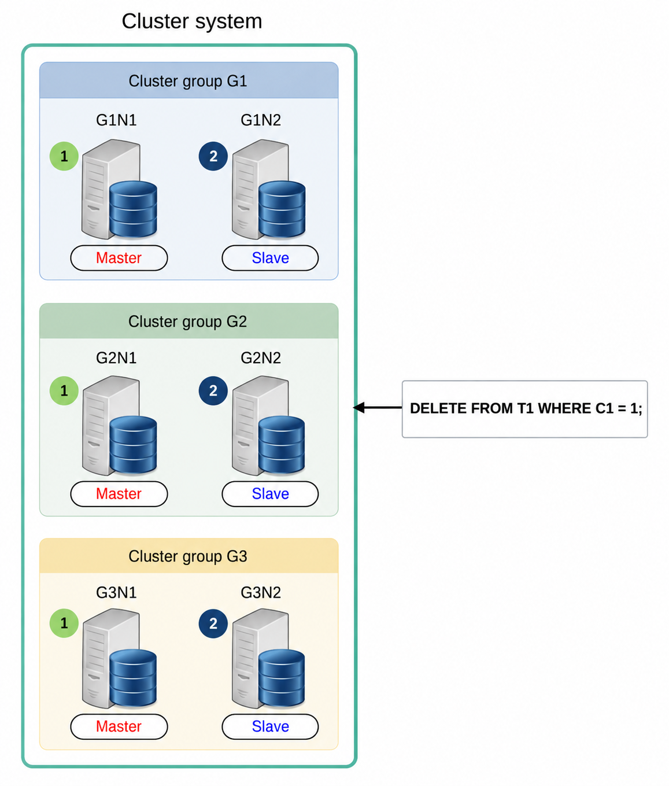

A master server and a slave server are defined for each group for DML processing in the cluster.

<a id="06e66baecf36fc15"></a>
#### Selecting Master Server for Each Cluster Group

It selects the cluster member that was included first among the cluster members accessible from each cluster group when manipulating data in a cluster environment.

<a id="ec1db615143e01c3"></a>
#### Selecting Slave Server for Each Cluster Group

It selects the cluster members remaining after excluding the master servers from the accessible cluster members in each cluster group when manipulating data in a cluster environment.

Find information about the master/ slave configuration of each table using the user_tab_place view. In the following example, the members for which IS_UPDATE_MASTER is TRUE are the master servers of each cluster group.

```
gSQL> 
SELECT group_name, member_name, member_position, is_update_master
  FROM user_tab_place
 WHERE table_name = 'T1';

GROUP_NAME MEMBER_NAME MEMBER_POSITION IS_UPDATE_MASTER
---------- ----------- --------------- ----------------
G1         G1N1                      0 TRUE            
G1         G1N2                      1 FALSE           
G2         G2N1                      2 TRUE            
G2         G2N2                      3 FALSE           
G3         G3N1                      4 TRUE            
G3         G3N2                      5 FALSE
```

<a id="324e2949d9190734"></a>
#### Performing DML

DML is performed sequentially, first applied to the master server phase, and then to the slave server phase.

- Applying to the master server 
    - It manipulates the data on the master server in each cluster group.
- Applying to the slave server
    - It manipulates the data on the slave server in the same way as it was applied to the master server in each cluster group.

In GOLDILOCKS, the following two methods are used to manipulate data while synchronizing the master and slave servers in each cluster group.

- [Query-Based DML](#4fe6ce798dad024c)
- [Global Rowid Based DML](#5b8c3ab3a773cdfd)

<a id="4fe6ce798dad024c"></a>
#### Query-Based DML

Query-based DML is a method used to manipulate records on each server by using a generated query. The generated query is internally created by the server that receives the user's query. This method is supported only if the same result is guaranteed when performing DML with the generated query on each server.

For more information, refer to [Generated Query](#87df3bcca9b2fd64).

The generated query for the master server and the generated query for the slave server may differ depending on whether the manipulated record returns the result.

Data manipulation using the generated query is performed as shown in the figure below.

<a id="171cc3b0d62bc7a7"></a>
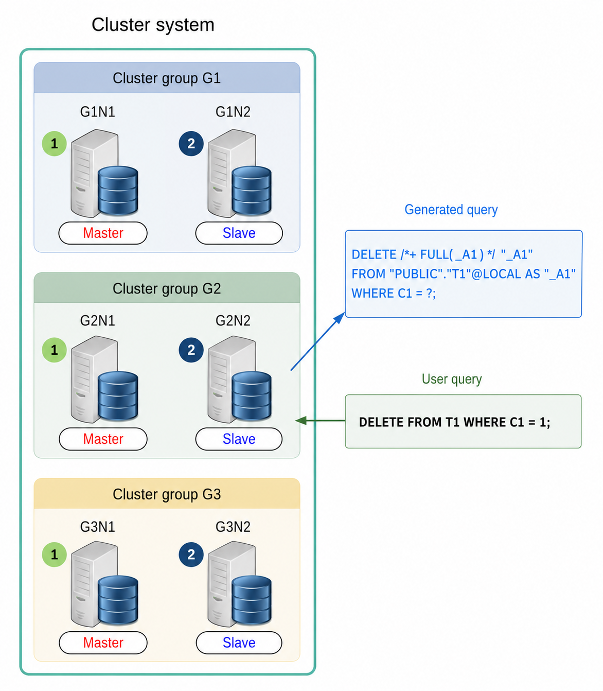

If there is no condition to select a target cluster group for manipulation in the conditional clause, as shown in the figure above, all cluster groups will become the targets of data manipulation using the generated query.

Data manipulation using the generated query is performed as follows.

1. The generated query is executed on each master server
2. The generated query is executed on each slave server

If only a specific cluster group is selected as the data manipulation target by the conditional clause, the process is carried out as shown in the figure below.

<a id="965f7e18a14c2892"></a>
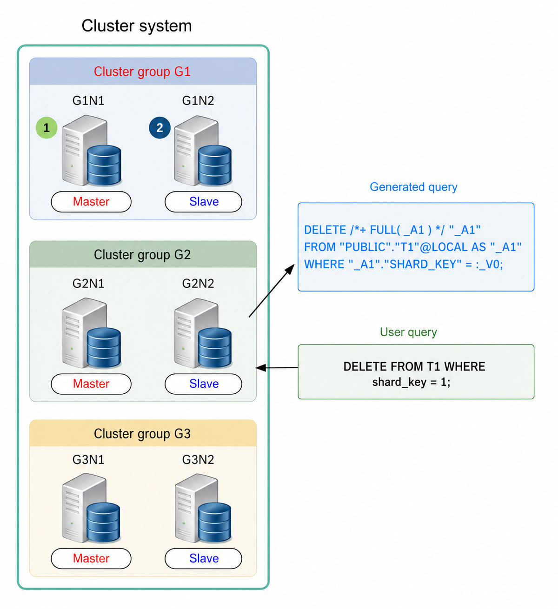

If the manipulation target is determined using the search condition (shard_key = 1) as shown above,the sharding strategy identifies that the record with shard_key = 1 is in the G1 cluster group. Therefore, only the record in the G1 cluster group is deleted.

When manipulating data in a specific cluster group, the procedure is the same as when manipulating the entire cluster group: it is first applied to the master and then performed on the slaves.

The plan node, called DML cluster, performs query-based DML operations. For more information, refer to [DML Cluster](#04bfb4877cc647e9).

Data manipulation using the generated query is supported only in the following cases.

- If a generated query can be created that guarantees the same result when executed on each cluster member of a cluster group
    - Refer to [Constraints of Generated Query Configuration](#9df35d8fd211e4dd).
- If, when configuring the generated query, the data reference target server and the data manipulation target server can be restricted to the same server
    - This means that the server executing the generated query does not need to access another server while processing the query.

The following user queries support data manipulation using the generated query.

- [SELECT .. FOR UPDATE](20-sql-references-h-z.md#1cd99ab297830a3f)
- [SELECT .. INTO .. FOR UPDATE](20-sql-references-h-z.md#945d689cff825d15)
- [DELETE FROM](19-sql-references-c-g.md#49b395482c2c6438)
- [DELETE FROM name RETURNING](19-sql-references-c-g.md#43d479588fc6bc18)
- [DELETE FROM name RETURNING .. INTO](19-sql-references-c-g.md#58b0c6a8f037a99b)
- [UPDATE](20-sql-references-h-z.md#b8c5e51f7074a6a9)
- [UPDATE name RETURNING](20-sql-references-h-z.md#f9a91742fa4c7945)
- [UPDATE name RETURNING .. INTO](20-sql-references-h-z.md#dcfb5da7eb1383a2)

Data manipulation using the generated query is available even when the [Global Secondary Index](14-cluster-objects.md#3e9bcc83795a29d0) is not configured.

<a id="04bfb4877cc647e9"></a>
##### DML Cluster

The DML cluster manipulates data from each server using the generated query and collects data when needed.

The following is an example of processing a DELETE RETURN statement for a sharded table using query-based DML.

```
gSQL> \EXPLAIN PLAN DELETE FROM part WHERE p_partkey = 5 RETURN p_name;

P_NAME
------
Part#3

1 row deleted.

>>>  start print plan

< Execution Plan >
==========================================================================
|  IDX  |  NODE DESCRIPTION                             |           ROWS |
--------------------------------------------------------------------------
|    0  |  DELETE STATEMENT ("PART")                    |              1 |
|    1  |    QUERY BLOCK ("$QB_IDX_2")                  |              0 |
|    2  |      DML CLUSTER                              | REMOTE ONLY  1 |
|    3  |        INDEX ACCESS ("PART", "PART_PK_INDEX") | (    0)      0 |
==========================================================================

     1  -  TARGET : PART.P_NAME
     2  -  FETCH
           Fetch SQL : DELETE /*+ INDEX( _A1, "PUBLIC"."PART_PK_INDEX" ) */  "_A1" FROM "PUBLIC"."PART"@LOCAL AS "_A1" WHERE "_A1"."P_PARTKEY" = :_V0 RETURN "_A1"."$PHYSICAL_ROWID", "_A1"."P_PARTKEY", "_A1"."P_NAME", "_A1"."P_BRAND"
           Non-Fetch SQL : DELETE /*+ INDEX( _A1, "PUBLIC"."PART_PK_INDEX" ) */  "_A1" FROM "PUBLIC"."PART"@LOCAL AS "_A1" WHERE "_A1"."P_PARTKEY" = :_V0
           TARGET DOMAIN : G2(G2N1,G2N2) 1 rows
     3  -  HASH SHARD ( # 3 ) 
           READ INDEX COLUMN : PART.P_PARTKEY
           READ TABLE COLUMN : PART.P_NAME, PART.P_BRAND
             MIN RANGE : PART.P_PARTKEY = 5
             MAX RANGE : PART.P_PARTKEY = 5
           FETCH ONE ROW

<<<  end print plan
```

The DML cluster is used to execute the DELETE statement in the query execution result. It refers to the plan with an idx of 2 in the &lt;Execution Plan&gt; output above.

The detailed information about the DML cluster is as follows.

- DML cluster usage type: FETCH, WITHOUT FETCH, SHARD KEY UPDATE
- Fetch SQL: The generated query used to perform DML and collect data
- Non-fetch SQL: The generated query used solely to perform DML operations
- TARGET DOMAIN: The group and member responsible for transferring the generated query, as well as the number of data items received from the group
- Shard key update information: The generated query that splits a singe UPDATE statement into UPDATE, SELECT, and DELETE operations

DML cluster usage type is classified according to the user query.

- WITHOUT FETCH: DML operations that do not retrieve execution result data (DELETE, UPDATE)
- FETCH: DML operations that retrieve execution result data (SELECT FOR UPDATE, DELETE RETURN, UPDATE RETURN)
- SHARD KEY UPDATE: UPDATE operations that modify the sharding key (UPDATE, UPDATE RETURN)

<a id="8f71bab179d3cc68"></a>
###### **DML Cluster (WITHOUT FETCH)**

If the DML cluster usage type is WITHOUT FETCH, the detailed information about the DML cluster is configured with non-fetch SQL and TARGET DOMAIN as follows.

```
gSQL> \EXPLAIN PLAN DELETE FROM supplier;

5 rows deleted.

>>>  start print plan

< Execution Plan >
=====================================================================
|  IDX  |  NODE DESCRIPTION                        |           ROWS |
---------------------------------------------------------------------
|    0  |  DELETE STATEMENT ("SUPPLIER")           |              5 |
|    1  |    QUERY BLOCK ("$QB_IDX_2")             |              0 |
|    2  |      DML CLUSTER                         |              5 |
|    3  |        INDEX ACCESS ("SUPPLIER", ...)    | (     5)     5 |
=====================================================================

     1  -  TARGET : NOTHING
     2  -  WITHOUT FETCH
           Non-Fetch SQL : DELETE /*+ INDEX( _A1, "PUBLIC"."SUPPLIER_PK_INDEX" ) */  "_A1" FROM "PUBLIC"."SUPPLIER"@LOCAL AS "_A1"
           TARGET DOMAIN : G1(G1N1,G1N2) 5 rows, G2(G2N1,G2N2) 5 rows, G3(G3N1,G3N2) 5 rows
     3  -  CLONED 
           READ INDEX COLUMN : SUPPLIER.S_SUPPKEY

<<<  end print plan
```

If data manipulation on a sharded table affects only a specific group as follows, the group where non-fetch SQL is performed will be limited.

```
gSQL> \EXPLAIN PLAN DELETE FROM part WHERE p_partkey = 5;

1 row deleted.

>>>  start print plan

< Execution Plan >
=======================================================================
|  IDX  |  NODE DESCRIPTION                             |        ROWS |
-----------------------------------------------------------------------
|    0  |  DELETE STATEMENT ("PART")                    |           1 |
|    1  |    QUERY BLOCK ("$QB_IDX_2")                  |           0 |
|    2  |      DML CLUSTER                              |           1 |
|    3  |        INDEX ACCESS ("PART", "PART_PK_INDEX") | (    0)   0 |
=======================================================================

     1  -  TARGET : NOTHING
     2  -  WITHOUT FETCH
           Non-Fetch SQL : DELETE /*+ INDEX( _A1, "PUBLIC"."PART_PK_INDEX" ) */  "_A1" FROM "PUBLIC"."PART"@LOCAL AS "_A1" WHERE "_A1"."P_PARTKEY" = :_V0
           TARGET DOMAIN : G2(G2N1,G2N2) 1 rows
     3  -  HASH SHARD ( # 3 ) 
           READ INDEX COLUMN : PART.P_PARTKEY
           READ TABLE COLUMN : PART.P_BRAND
             MIN RANGE : PART.P_PARTKEY = 5
             MAX RANGE : PART.P_PARTKEY = 5
           FETCH ONE ROW

<<<  end print plan
```

A non-fetch SQL in a DML cluster, consisting of WITHOUT FETCH, is executed equally across all master and slave servers, without distinguishing between cloned tables and sharded tables.

<a id="7f80e5108ae9bd8c"></a>
###### **DML Cluster (FETCH)**

If the DML cluster usage type is FETCH, the detailed information about the DML cluster is configured with fetch SQL, non-fetch SQL and TARGET DOMAIN as follows.

```
gSQL> \EXPLAIN PLAN SELECT p_name FROM part FOR UPDATE;

P_NAME
------
Part#1
Part#4
Part#3
Part#2
Part#5

5 rows selected.

>>>  start print plan

< Execution Plan >
=================================================================
|  IDX  |  NODE DESCRIPTION                |               ROWS |
-----------------------------------------------------------------
|    0  |  SELECT FOR UPDATE STATEMENT     |                  5 |
|    1  |    QUERY BLOCK ("$QB_IDX_2")     |                  0 |
|    2  |      DML CLUSTER                 | REMOTE ONLY      5 |
|    3  |        TABLE ACCESS ("PART")     |                  2 |
=================================================================

     1  -  TARGET : PART.P_NAME
     2  -  FETCH
           Fetch SQL : SELECT /*+ FULL( _A1 ) */ "_A1"."$PHYSICAL_ROWID", "_A1"."P_NAME" FROM "PUBLIC"."PART"@LOCAL AS "_A1" FOR UPDATE OF "_A1"."P_PARTKEY"
           Non-Fetch SQL : SELECT /*+ FULL( _A1 ) */  NULL FROM "PUBLIC"."PART"@LOCAL AS "_A1" FOR UPDATE OF "_A1"."P_PARTKEY" WITHOUT FETCH
           TARGET DOMAIN : G1(G1N1,G1N2) 2 rows, G2(G2N1,G2N2) 1 rows, G3(G3N1,G3N2) 2 rows
     3  -  HASH SHARD ( # 3 ) 
           READ COLUMN : PART.P_NAME

<<<  end print plan
```

A non-fetch SQL consists of a SELECT FOR UPDATE statement as shown in the result above. This non-fetch SQL is executed on both local and remote servers, but it does not collect data through the SELECT FOR UPDATE statement.

The fetch SQL for query-based DML on a cloned table is executed on one member within the entire group. If the local server has a replication of the cloned table, the fetch SQL is performed on the local server. If the local server does not have a replication of the cloned table, the fetch SQL is executed on an arbitrary master server. All servers with a replication of the cloned table, except for the one performing the fetch SQL, execute non-fetch SQL.

The fetch SQL for query-based DML on a sharded table is executed on the master servers of each group. All slave servers perform non-fetch SQL.

If data manipulation on a sharded table affects only a specific group as follows, the group where fetch SQL and non-fetch SQL are performed will be limited.

```
gSQL> \EXPLAIN PLAN SELECT p_name FROM part WHERE p_partkey = 5 FOR UPDATE;

P_NAME
------
Part#3

1 row selected.

>>>  start print plan

< Execution Plan >
==========================================================================
|  IDX  |  NODE DESCRIPTION                             |           ROWS |
--------------------------------------------------------------------------
|    0  |  SELECT FOR UPDATE STATEMENT                  |              1 |
|    1  |    QUERY BLOCK ("$QB_IDX_2")                  |              0 |
|    2  |      DML CLUSTER                              | REMOTE ONLY  1 |
|    3  |        INDEX ACCESS ("PART", "PART_PK_INDEX") | (    0)      0 |
==========================================================================

     1  -  TARGET : PART.P_NAME
     2  -  FETCH
           Fetch SQL : SELECT /*+ INDEX( _A1, "PUBLIC"."PART_PK_INDEX" ) */ "_A1"."$PHYSICAL_ROWID", "_A1"."P_NAME" FROM "PUBLIC"."PART"@LOCAL AS "_A1" WHERE "_A1"."P_PARTKEY" = :_V0 FOR UPDATE OF "_A1"."P_PARTKEY"
           Non-Fetch SQL : SELECT /*+ INDEX( _A1, "PUBLIC"."PART_PK_INDEX" ) */  NULL FROM "PUBLIC"."PART"@LOCAL AS "_A1" WHERE "_A1"."P_PARTKEY" = :_V0 FOR UPDATE OF "_A1"."P_PARTKEY" WITHOUT FETCH
           TARGET DOMAIN : G2(G2N1,G2N2) 1 rows
     3  -  HASH SHARD ( # 3 ) 
           READ INDEX COLUMN : PART.P_PARTKEY
           READ TABLE COLUMN : PART.P_NAME
             MIN RANGE : PART.P_PARTKEY = 5
             MAX RANGE : PART.P_PARTKEY = 5
           FETCH ONE ROW

<<<  end print plan
```

<a id="ee8ea2464dae9dec"></a>
###### **DML Cluster (SHARD KEY UPDATE)**

An UPDATE for the sharding key column is classified into the following two types, depending on whether the shard to which the record belongs is altered before or after the data manipulation.

- In-place update: The shard to which the record belongs is the same before and after the data manipulation.
- Out-place update: The shard to which the record belongs is different before and after the data manipulation.

In-place update alters the value without moving the record. The rowid information of records updated through an in-place update is not modified.

Out-place update deletes the existing record and inserts a new one. A new rowid is assigned to the record that was modified through an out-place update.

SHARD KEY UPDATE distinguishes between in-place and out-place updates and constructs the generated query accordingly.

The generated query for an in-place update consists of an UPDATE statement. The query includes a filter that ensures the shard of the value before and after the update remains the same.

The generated query for an out-place update is composed of a SELECT statement and a DELETE statement. Each query includes a filter that ensures the shards to which the value belongs before and after the update are different. The data before the update is collected through the SELECT statement to configure the new record. The new records are inserted using &lt;global rowid based DML&gt;, and the previous records are deleted through the DELETE statement.

If the DML cluster usage type is SHARD KEY UPDATE, the detailed configuration of the DML cluster consists of an UPDATE SQL for in-place updates and SELECT SQL & DELETE SQL for out-place updates, as follows.

```
gSQL> \EXPLAIN PLAN UPDATE part SET p_partkey = p_partkey + 10;

5 rows updated.

>>>  start print plan

< Execution Plan >
==========================================================================
|  IDX  |  NODE DESCRIPTION                            |            ROWS |
--------------------------------------------------------------------------
|    0  |  UPDATE STATEMENT ("PART")                   |               5 |
|    1  |    QUERY BLOCK ("$QB_IDX_2")                 |               0 |
|    2  |      DML CLUSTER                             |               5 |
|    3  |        UPDATE STATEMENT ("PART")             |               0 |
|    4  |          QUERY BLOCK ("$QB_IDX_2")           |               0 |
|    5  |            DML CLUSTER                       |               0 |
|    6  |              TABLE ACCESS ("PART" AS _A1)    |               0 |
|    7  |          QUERY BLOCK ("$QB_IDX_6")           |               0 |
|    8  |            INDEX ACCESS ("PART" AS _A1, ...) |               0 |
|    9  |        SELECT STATEMENT                      |               5 |
|   10  |          QUERY BLOCK ("$QB_IDX_2")           |               5 |
|   11  |            PLAN BASED CLUSTER                | LOCAL/REMOTE  5 |
|   12  |              TABLE ACCESS ("PART" AS _A1)    |               2 |
|   13  |        DELETE STATEMENT ("PART")             |               5 |
|   14  |          QUERY BLOCK ("$QB_IDX_2")           |               0 |
|   15  |            DML CLUSTER                       |               5 |
|   16  |              TABLE ACCESS ("PART" AS _A1)    |               2 |
|   17  |    QUERY BLOCK ("$QB_IDX_6")                 |               0 |
|   18  |      TABLE ACCESS ("PART")                   |               0 |
==========================================================================

     1  -  TARGET : NOTHING
     2  -  SHARD KEY UPDATE
           UPDATE SQL : UPDATE /*+ FULL( _A1 ) */ "PUBLIC"."PART"@"G1N1"|"G1N2"|"G2N1"|"G2N2"|"G3N1"|"G3N2" AS "_A1" SET ( "_A1"."P_PARTKEY" ) = ( CAST( "_A1"."P_PARTKEY" + :_V0 AS NUMBER(10, 0) ) ) FROM "PUBLIC"."PART"@"G1N1"|"G1N2"|"G2N1"|"G2N2"|"G3N1"|"G3N2" AS "_A1" WHERE SHARD_ID("PUBLIC"."PART", "_A1"."P_PARTKEY") = SHARD_ID("PUBLIC"."PART", CAST( "_A1"."P_PARTKEY" + :_V0 AS NUMBER(10, 0) ))
           SELECT SQL : SELECT /*+ FULL( _A1 ) */ "_A1"."$PHYSICAL_ROWID", "_A1"."P_PARTKEY", "_A1"."P_NAME", "_A1"."P_BRAND", "_A1"."P_TYPE", "_A1"."P_SIZE", "_A1"."P_RETAILPRICE" FROM "PUBLIC"."PART"@"G1N1"|"G1N2"|"G2N1"|"G2N2"|"G3N1"|"G3N2" AS "_A1" WHERE SHARD_ID("PUBLIC"."PART", "_A1"."P_PARTKEY") <> SHARD_ID("PUBLIC"."PART", CAST( "_A1"."P_PARTKEY" + :_V0 AS NUMBER(10, 0) ))
           DELETE SQL : DELETE /*+ FULL( _A1 ) */  "_A1" FROM "PUBLIC"."PART"@"G1N1"|"G1N2"|"G2N1"|"G2N2"|"G3N1"|"G3N2" AS "_A1" WHERE SHARD_ID("PUBLIC"."PART", "_A1"."P_PARTKEY") <> SHARD_ID("PUBLIC"."PART", CAST( "_A1"."P_PARTKEY" + :_V0 AS NUMBER(10, 0) ))
     4  -  TARGET : NOTHING
     5  -  WITHOUT FETCH
           Non-Fetch SQL : UPDATE /*+ FULL( _A1 ) */ "PUBLIC"."PART"@LOCAL AS "_A1" SET ( "_A1"."P_PARTKEY" ) = ( CAST( "_A1"."P_PARTKEY" + :_V0 AS NUMBER(10, 0) ) ) FROM "PUBLIC"."PART"@LOCAL AS "_A1" WHERE SHARD_ID("PUBLIC"."PART","_A1"."P_PARTKEY") = SHARD_ID("PUBLIC"."PART",CAST( "_A1"."P_PARTKEY" + :_V1 AS NUMBER(10, 0) ))
           TARGET DOMAIN : G1(G1N1,G1N2) 0 rows, G2(G2N1,G2N2) 0 rows, G3(G3N1,G3N2) 0 rows
     6  -  HASH SHARD ( # 3 ) 
           READ COLUMN : _A1.P_PARTKEY
             LOGICAL FILTER : SHARD_ID( "PUBLIC"."PART",_A1.P_PARTKEY) = SHARD_ID( "PUBLIC"."PART",CAST( _A1.P_PARTKEY + :_V0 AS NUMBER(10, 0) ))
     7  -  TARGET : NOTHING
     8  -  HASH SHARD ( # 3 ) 
           READ INDEX COLUMN : _A1.P_PARTKEY
    10  -  TARGET : _A1.$PHYSICAL_ROWID, _A1.P_PARTKEY, _A1.P_NAME, _A1.P_BRAND, _A1.P_TYPE, _A1.P_SIZE, _A1.P_RETAILPRICE
    11  -  SQL : SELECT /*+ FULL( _A1 ) */ "_A1"."$PHYSICAL_ROWID", "_A1"."P_PARTKEY", "_A1"."P_NAME", "_A1"."P_BRAND", "_A1"."P_TYPE", "_A1"."P_SIZE", "_A1"."P_RETAILPRICE" FROM "PUBLIC"."PART"@LOCAL AS "_A1" WHERE SHARD_ID("PUBLIC"."PART","_A1"."P_PARTKEY") <> SHARD_ID("PUBLIC"."PART",CAST( "_A1"."P_PARTKEY" + :_V0 AS NUMBER(10, 0) ))
           TARGET DOMAIN : G1(G1N1,G1N2) 2 rows, G2(G2N1,G2N2) 1 rows, G3(G3N1,G3N2) 2 rows
    12  -  HASH SHARD ( # 3 ) 
           READ COLUMN : _A1.P_PARTKEY, _A1.P_NAME, _A1.P_BRAND, _A1.P_TYPE, _A1.P_SIZE, _A1.P_RETAILPRICE
             LOGICAL FILTER : SHARD_ID( "PUBLIC"."PART",_A1.P_PARTKEY) <> SHARD_ID( "PUBLIC"."PART",CAST( _A1.P_PARTKEY + :_V0 AS NUMBER(10, 0) ))
    14  -  TARGET : NOTHING
    15  -  WITHOUT FETCH
           Non-Fetch SQL : DELETE /*+ FULL( _A1 ) */  "_A1" FROM "PUBLIC"."PART"@LOCAL AS "_A1" WHERE SHARD_ID("PUBLIC"."PART","_A1"."P_PARTKEY") <> SHARD_ID("PUBLIC"."PART",CAST( "_A1"."P_PARTKEY" + :_V0 AS NUMBER(10, 0) ))
           TARGET DOMAIN : G1(G1N1,G1N2) 2 rows, G2(G2N1,G2N2) 1 rows, G3(G3N1,G3N2) 2 rows
    16  -  HASH SHARD ( # 3 ) 
           READ COLUMN : _A1.P_PARTKEY, _A1.P_BRAND
             LOGICAL FILTER : SHARD_ID( "PUBLIC"."PART",_A1.P_PARTKEY) <> SHARD_ID( "PUBLIC"."PART",CAST( _A1.P_PARTKEY + :_V0 AS NUMBER(10, 0) ))
    17  -  TARGET : NOTHING
    18  -  HASH SHARD ( # 3 ) 
           READ COLUMN : PART.P_PARTKEY, PART.P_NAME, PART.P_BRAND, PART.P_TYPE, PART.P_SIZE, PART.P_RETAILPRICE

<<<  end print plan
```

<a id="032e1832c6a60ad0"></a>
###### **Join Operation in DML Cluster**

A statement that includes a subquery can be converted into a join operation by the query processor, similar to a [Join including subquery](#9801ba3157a99150). The subquery in a DML statement can also be converted into a join operation. The DML cluster plan node supports the generated query that includes a join.

The following is an example of performing a DELETE operation that includes a subquery.

```
gSQL> \EXPLAIN PLAN
      DELETE FROM part WHERE p_partkey IN ( SELECT ps_partkey FROM partsupp );

3 rows deleted.

>>>  start print plan

< Execution Plan >
=======================================================================
|  IDX  |  NODE DESCRIPTION                         |            ROWS |
-----------------------------------------------------------------------
|    0  |  DELETE STATEMENT ("PART")                |               3 |
|    1  |    QUERY BLOCK ("$QB_IDX_2")              |               0 |
|    2  |      DML CLUSTER                          |               3 |
|    3  |        HASH JOIN (SEMI)                   |               1 |
|    4  |          TABLE ACCESS ("PART")            |               2 |
|    5  |          HASH JOIN INSTANT (UNIQUE)       |               1 |
|    6  |            INDEX ACCESS ("PARTSUPP", ...) | (     2)      2 |
=======================================================================

     1  -  TARGET : NOTHING
     2  -  WITHOUT FETCH
           Non-Fetch SQL : DELETE /*+ KEEP_JOINED_TABLE USE_HASH_IN( _A2, 10 ) FULL( _A1 ) INDEX( _A2, "PUBLIC"."PARTSUPP_PK_INDEX" ) */  "_A1" FROM ( "PUBLIC"."PART"@"G1N1"|"G1N2"|"G2N1"|"G2N2"|"G3N1"|"G3N2" AS "_A1" SEMI JOIN "PUBLIC"."PARTSUPP"@"G1N1"|"G1N2"|"G2N1"|"G2N2"|"G3N1"|"G3N2" AS "_A2" ON "_A2"."PS_PARTKEY" = "_A1"."P_PARTKEY") ALIAS "_A3"
           TARGET DOMAIN : G1(G1N1,G1N2) 1 rows, G2(G2N1,G2N2) 1 rows, G3(G3N1,G3N2) 1 rows
     3  -  JOINED COLUMN : PART.$PHYSICAL_ROWID, PART.P_PARTKEY, PART.P_BRAND
     4  -  HASH SHARD ( # 3 ) 
           READ COLUMN : PART.P_PARTKEY, PART.P_BRAND
     5  -  HASH KEY : PARTSUPP.PS_PARTKEY
           READ KEY COLUMN : PARTSUPP.PS_PARTKEY
             HASH FILTER : PARTSUPP.PS_PARTKEY = PART.P_PARTKEY
           FETCH ONE ROW
     6  -  HASH SHARD ( # 3 ) 
           READ INDEX COLUMN : PARTSUPP.PS_PARTKEY

<<<  end print plan
```

However, the DML cluster plan node does not support manipulating the aggregated data. A join operation that requires data manipulation after collecting data through the generated query cannot be configured in the DML cluster.

The following is an example of when a DML statement including a subquery is converted to a join operation, but a DML cluster cannot be configured.

```
gSQL> \EXPLAIN PLAN
      DELETE FROM supplier WHERE s_suppkey IN ( SELECT ps_partkey FROM partsupp );

5 rows deleted.

>>>  start print plan

< Execution Plan >
===========================================================================
|IDX|  NODE DESCRIPTION                                  |           ROWS |
---------------------------------------------------------------------------
| 0 |  DELETE STATEMENT ("SUPPLIER")                     |              5 |
| 1 |    QUERY BLOCK ("$QB_IDX_2")                       |              5 |
| 2 |      SINGLE CLUSTER                                | LOCAL/REMOTE 5 |
| 3 |        SELECT STATEMENT                            |              1 |
| 4 |          QUERY BLOCK ("$QB_IDX_2")                 |              1 |
| 5 |            NESTED JOIN (SEMI)                      |              1 |
| 6 |              INDEX ACCESS ("SUPPLIER" AS _A2, ...) | (     5)     5 |
| 7 |              INDEX ACCESS ("PARTSUPP" AS _A1, ...) | (     1)     1 |
===========================================================================

     1  -  TARGET : NOTHING
     2  -  SQL : SELECT /*+ KEEP_JOINED_TABLE USE_NL_IN( _A1 ) INDEX( _A2, "PUBLIC"."SUPPLIER_PK_INDEX" ) INDEX( _A1, "PUBLIC"."PARTSUPP_PK_INDEX" ) */ "_A2"."$PHYSICAL_ROWID", "_A2"."S_SUPPKEY" FROM ( "PUBLIC"."SUPPLIER"@"G1N1"|"G1N2"|"G2N1"|"G2N2"|"G3N1"|"G3N2" AS "_A2" SEMI JOIN "PUBLIC"."PARTSUPP"@"G1N1"|"G1N2"|"G2N1"|"G2N2"|"G3N1"|"G3N2" AS "_A1" ON "_A1"."PS_PARTKEY" = "_A2"."S_SUPPKEY") ALIAS "_A3"
           TARGET DOMAIN : G1(G1N1,G1N2) 1 rows, G2(G2N1,G2N2) 2 rows, G3(G3N1,G3N2) 2 rows
     4  -  TARGET : _A2.$PHYSICAL_ROWID, _A2.S_SUPPKEY
     5  -  JOINED COLUMN : _A2.$PHYSICAL_ROWID, _A2.S_SUPPKEY
     6  -  CLONED 
           READ INDEX COLUMN : _A2.S_SUPPKEY
     7  -  HASH SHARD ( # 3 ) 
           READ INDEX COLUMN : _A1.PS_PARTKEY
             MIN RANGE : _A1.PS_PARTKEY = {_A2.S_SUPPKEY}
             MAX RANGE : _A1.PS_PARTKEY = {_A2.S_SUPPKEY}

<<<  end print plan
```

<a id="5b8c3ab3a773cdfd"></a>
#### Global Rowid-Based DML

Global rowid-based DML is a method that manipulates the same records stored in different cluster members using the rowid. This method is used when adding a new record or when [Query-Based DML](#4fe6ce798dad024c) is not available.

The rowid provided in a cluster environment is a piece of logical identification information assigned to a record, used to determine whether the records are identical. When a single record is stored across multiple cluster members, all records share the same rowid value. The rowid is assigned when a record is created, but a new rowid may be assigned if the value of the sharding key column is updated.

For more information about the rowid, refer to [ROWID Pseudo Column](11-sql-elements.md#ddfdf6ed362ba8f0) .

Data manipulation using the rowid information is divided into two phases: the rowid information collection phase and the data manipulation phase. When manipulating two or more records, both phases are repeated for each record.

- The rowid information collection phase 
    - This phase collects the rowid information of the records to be added or manipulated. 
- The data manipulation phase
    - This phase manipulates the records in the cluster group corresponding to the collected rowid.
    - It sequentially manipulates records on a slave server after manipulating records on the master server.

Data manipulation using the rowid information supports the following two methods, depending on whether the [Global Secondary Index](14-cluster-objects.md#3e9bcc83795a29d0) is used.

- [Global rowid Based DML without Using Global Secondary Index](#d775489a6e34878d)
- [Global rowid Based DML Using Global Secondary Index](#f44cb6734816a2fd)

<a id="d775489a6e34878d"></a>
##### Global Rowid-Based DML Without Using Global Secondary Index

Global rowid-based DML without using the global secondary index is used when it is not necessary to determine whether the record to be updated in the master server is the same as the corresponding record in the slave server. This method is used when a new record is created without referencing an existing one, similar to an INSERT operation.

Data manipulation using the rowid information without the global secondary index is performed as follows.

<a id="5b02f24aa70c47a6"></a>
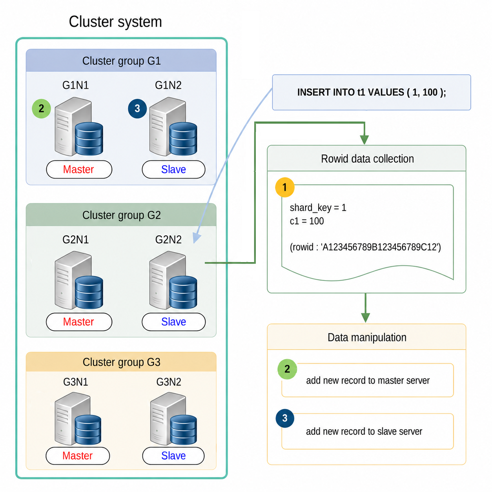

When adding a record, a rowid is assigned to the new record, and each record is stored at the appropriate position on the master server. All records are then applied to the slave server after being applied to the master server.

As shown above, when the sharding key column is configured with the value (shard_key = 1), it is determined by the sharding policy that the record with shard_key = 1 will be located in the cluster group G1. Therefore, the record is added only to the cluster group G1 .

The following is the result of performing a user query using [Global rowid-based DML without using global secondary index](#5b02f24aa70c47a6). As a result, no information is output for the global rowid-based DML.

```
gSQL> \EXPLAIN PLAN INSERT INTO t1 VALUES ( 1, 100 );

1 row created.

>>>  start print plan

< Execution Plan >
====================================================================
|  IDX  |  NODE DESCRIPTION                     |             ROWS |
--------------------------------------------------------------------
|    0  |  INSERT VALUES STATEMENT ("T1")       |                1 |
|    1  |    QUERY BLOCK ("$QB_IDX_2")          |                0 |
|    2  |      TABLE ACCESS ("T1")              |                0 |
====================================================================

     1  -  TARGET : NOTHING
     2  -  RANGE SHARD ( # 3 ) 
           READ COLUMN : T1.SHARD_KEY, T1.C1

<<<  end print plan
```

Global rowid-based DML without using the global secondary index supports the following types of queries.

- [INSERT INTO](20-sql-references-h-z.md#feb637229fe4dc62)
- [INSERT INTO name RETURNING](20-sql-references-h-z.md#9b221e074482cce0)
- [INSERT INTO name RETURNING .. INTO](20-sql-references-h-z.md#b4cbafb4ebba9b68)

<a id="f44cb6734816a2fd"></a>
##### Global Rowid-Based DML Using Global Secondary Index

The replicated record in both the master server and the slave server has the same global rowid value.

It must be guaranteed that the same data in both the master server and the slave server are manipulated in the same way by using the global rowid information to modify the existing record. The global secondary index is used to retrieve information about the record replicated through the global rowid.

Data manipulation using the rowid with the global secondary index is performed according to the procedure shown in the figure below.

<a id="879d7d97bdef9e3a"></a>
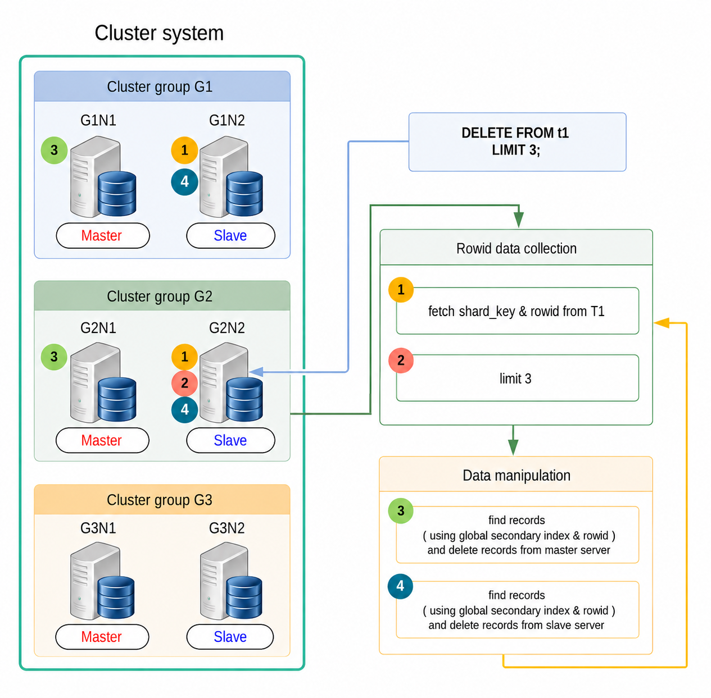

During the rowid information collection phase, the server that receives the user query collects the row id and column values of the target record to be manipulated.

During the data manipulation phase, the data in both the master server and the slave server for the cluster group to which the records selected in the rowid information collection phase belong is manipulated sequentially.

During the data manipulation phase, the server that collected the rowid information transfers it to both the master server and the slave server, and requests data manipulation. The servers that receive the request retrieve the target records stored in each server and manipulate them using the received rowid information and the existing global secondary index.

The rowid information collection phase and the data manipulation phase are repeated until no more target records can be found.

The following is the result of performing a user query for [Data manipulation using the rowid with the global secondary index](#879d7d97bdef9e3a). As a result, no output is produced for global rowid-based DML.

```
gSQL> \EXPLAIN PLAN DELETE FROM t1 LIMIT 3;

3 rows deleted.

>>>  start print plan

< Execution Plan >
===============================================================
|  IDX  |  NODE DESCRIPTION                |             ROWS |
---------------------------------------------------------------
|    0  |  DELETE STATEMENT ("T1")         |                3 |
|    1  |    QUERY BLOCK ("$QB_IDX_2")     |                3 |
|    2  |      PLAN BASED CLUSTER          | LOCAL/REMOTE   3 |
|    3  |        TABLE ACCESS ("T1")       |                2 |
===============================================================

     1  -  TARGET : NOTHING
     2  -  SQL : SELECT /*+ FULL( _A1 ) */ "_A1"."$PHYSICAL_ROWID" FROM "PUBLIC"."T1"@LOCAL AS "_A1"
           TARGET DOMAIN : G1(G1N1,G1N2) 2 rows, G2(G2N1,G2N2) 1 rows, G3(G3N1,G3N2) 0 rows
     3  -  RANGE SHARD ( # 3 ) 
           READ COLUMN : NOTHING

<<<  end print plan
```

Global rowid-based DML using the global secondary index supports the following types of queries.

- [SELECT .. FOR UPDATE](20-sql-references-h-z.md#1cd99ab297830a3f)
- [SELECT .. INTO .. FOR UPDATE](20-sql-references-h-z.md#945d689cff825d15)
- [DELETE FROM](19-sql-references-c-g.md#49b395482c2c6438)
- [DELETE FROM name RETURNING](19-sql-references-c-g.md#43d479588fc6bc18)
- [DELETE FROM name RETURNING .. INTO](19-sql-references-c-g.md#58b0c6a8f037a99b)
- [DELETE FROM name WHERE CURRENT OF cursor_name](19-sql-references-c-g.md#6203e76a3fa030ee)
- [UPDATE](20-sql-references-h-z.md#b8c5e51f7074a6a9)
- [UPDATE name RETURNING](20-sql-references-h-z.md#f9a91742fa4c7945)
- [UPDATE name RETURNING .. INTO](20-sql-references-h-z.md#dcfb5da7eb1383a2)
- [UPDATE name WHERE CURRENT OF cursor_name](20-sql-references-h-z.md#1eb1284d162899b5)

---

[← 11. SQL Elements](11-sql-elements.md) · [Table of contents](../README.md) · [13. SQL Objects →](13-sql-objects.md)

<sub>Copyright © 2010 SUNJESOFT Inc. All rights reserved.</sub>
