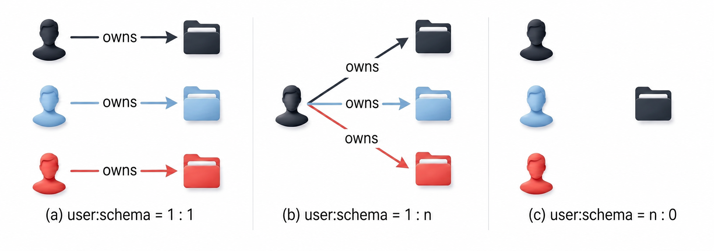

<a id="de7e8dcd976fc245"></a>

# 13. SQL Objects

> Source: [GOLDILOCKS 26c.1 User Manual (en)](https://manual.sunjesoft.co.kr/goldilocks/26c_1/manual/en/de7e8dcd976fc245)  
> Tag: `26c.1_0_tag`

[← 12. SQL Languages](12-sql-languages.md) · [Table of contents](../README.md) · [14. Cluster Objects →](14-cluster-objects.md)

This chapter describes the concepts and features of the following objects that configure the database.

- Authorization: User and privilege
- Schema
- Tablespace
- Table
- Index
- Sequence
- View
- Synonym
- Stored procedure
- Stored function
- Package
- Library
- Trigger

<a id="77c0395e271c5718"></a>
## Database

<a id="1513c369f59a3720"></a>
### Database-related Statements

For more information, refer to the following.

- Starting up the database: [ALTER SYSTEM {MOUNT | OPEN} DATABASE](18-sql-references-a-b.md#3a13c91fdabdaa04)

- Backup and recovery
    - [ALTER DATABASE BACKUP](18-sql-references-a-b.md#a9f4f713f7a7547c)
    - [ALTER DATABASE DELETE BACKUP](18-sql-references-a-b.md#e0dee9ed60af5102)
    - [ALTER DATABASE RECOVER](18-sql-references-a-b.md#91d87d0b29aa6323)
    - [ALTER DATABASE REGISTER](18-sql-references-a-b.md#6a1edf86eeec57d6)
    - [ALTER DATABASE RESTORE](18-sql-references-a-b.md#22625d6afdeafdcd)

- Creating, dropping, altering log files
    - [ALTER SYSTEM CHECKPOINT](18-sql-references-a-b.md#5a912e8fc036f755)
    - [ALTER SYSTEM SWITCH LOGFILE](18-sql-references-a-b.md#e8b9a0d94c67b15c)
    - [ALTER DATABASE ARCHIVELOG](18-sql-references-a-b.md#41d1beb5c617389b)
    - [ALTER DATABASE ADD LOGFILE](18-sql-references-a-b.md#d2062ac468f12d4a)
    - [ALTER DATABASE DROP LOGFILE](18-sql-references-a-b.md#7f5e87ea8a89f0ff)
    - [ALTER DATABASE RENAME LOGFILE](18-sql-references-a-b.md#e8d893c3e0b6099d)

- Comments on objects: [COMMENT ON name IS](19-sql-references-c-g.md#a14777a330bd6a71)

- System statistics information: [ANALYZE SYSTEM](18-sql-references-a-b.md#c4e134e246d494b5)

The information related to the database objects can be retrieved through the following views.

<a id="2adbb75593a34cc3"></a>
<table class="table column_count_3"><caption>Database object-related information</caption><thead><tr><th class="to_center"><div>Schema</div></th><th class="to_center"><div>View name</div></th><th class="to_center"><div>Description</div></th></tr></thead><tbody><tr><td class="to_middle"><div>DICTIONARY_SCHEMA</div></td><td class="to_middle"><div><a class="reference" href="../part-02-administration-manual/9-database-information.md#50f924d9911c8626">ALL_NONSCHEMA_COMMENTS</a></div></td><td class="to_middle"><div>Comment information of user-accessible non-schema objects</div></td></tr><tr><td class="to_middle" rowspan="6"><div>INFORMATION_SCHEMA</div></td><td class="to_middle"><div><a class="reference" href="../part-02-administration-manual/9-database-information.md#6e0250b9736483aa">INFORMATION_SCHEMA_CATALOG_NAME</a></div></td><td class="to_middle"><div>Database name information</div></td></tr><tr><td class="to_middle"><div><a class="reference" href="../part-02-administration-manual/9-database-information.md#1bd1f5ece9ef551d">SQL_FEATURES</a></div></td><td class="to_middle"><div>The SQL standard compatibility information of GOLDILOCKS</div></td></tr><tr><td class="to_middle"><div><a class="reference" href="../part-02-administration-manual/9-database-information.md#a07b98d323f2a83f">SQL_IMPLEMENTATION_INFO</a></div></td><td class="to_middle"><div>The SQL standard compatibility information of GOLDILOCKS</div></td></tr><tr><td class="to_middle"><div><a class="reference" href="../part-02-administration-manual/9-database-information.md#73cea78285b6725d">SQL_PACKAGES</a></div></td><td class="to_middle"><div>The SQL standard compatibility information of GOLDILOCKS</div></td></tr><tr><td class="to_middle"><div><a class="reference" href="../part-02-administration-manual/9-database-information.md#01c4947dd7f9d645">SQL_PARTS</a></div></td><td class="to_middle"><div>The SQL standard compatibility information of GOLDILOCKS</div></td></tr><tr><td class="to_middle"><div><a class="reference" href="../part-02-administration-manual/9-database-information.md#8b440e5f95b5c385">SQL_SIZING</a></div></td><td class="to_middle"><div>The SQL standard compatibility information of GOLDILOCKS</div></td></tr></tbody></table>

<a id="5846500546b64e7a"></a>
### Database Configuration Objects

<a id="b3bfd7287512c96e"></a>
#### SQL Objects that Configure the Database

A database is composed of multiple SQL objects.

SQL objects in a database are classified as SQL schema objects and non-schema objects, depending on whether they are included in the SCHEMA.

<a id="3bc3229a4110c622"></a>


SQL schema objects are included in the SCHEMA and are as follows.

- TABLE: An object that stores physical data, consisting of columns and rows
- VIEW: A logical object that provides a relation name for a query, similar to a table
- INDEX: An object designed to improve query performance
- SEQUENCE: An object used to generate numbers
- CONSTRAINT: An object used to maintain the integrity of a TABLE
- SYNONYM: An alias for a TABLE, VIEW, SEQUENCE, or other synonyms
- STORED PROCEDURE: A persistent stored module in the form of a procedure
- STORED FUNCTION: A persistent stored module in the form of a function
- PACKAGE: A persistent stored module in the form of a package
- LIBRARY: An object that refers to an external shared library file
- TRIGGER: An object that defines automated actions that execute whenever DML operations occur on a specific table

An SQL schema object can be used with a schema name or without it. If the schema name is omitted, it is interpreted based on the user's schema path.

The following is an example of when objects are created by specifying the schema name.

```
gSQL> CREATE TABLE my_schema.lineitem ( id INTEGER );
gSQL> CREATE INDEX my_schema.my_index ON my_schema.lineitem ( id );
```

Non-schema objects are not included in the schema, and they are as follows.

- PROFILE: Password management policy
- AUDIT POLICY: Audit policy
- USER: User
- ROLE: Role
- SCHEMA: The logical locations of SQL schema objects
- TABLESPACE: The physical storage spaces of SQL schema objects
- PUBLIC SYNONYM: An alias for a TABLE, VIEW, SEQUENCE, or other SYNONYMS that does not include a schema name

The SQL standard explicitly defines concepts and syntax for SCHEMA objects. However, the concepts of USER and DATABASE are only described, and their syntaxes are not defined in SQL. The SQL standard does not address the TABLESPACE object. In other words, the SQL standard does not explicitly define non-schema objects.

GOLDILOCKS defines USER, SCHEMA, and TABLESPACE as separate descendants of a database. However, other DBMS vendors define the concept of non-schema objects as follows.

- GOLDILOCKS
    - User and schema are separate objects.
    - A user either does not have a schema or has multiple schemas.
    - The relationship between user and schema is User : Schema = 1 : N.
- Oracle
    - User and schema are defined as similar concepts.
    - The relationship between user and schema is User : Schema = 1 : 1.
- DB2
    - A user is not a descendant of DATABASE.
    - The relationship between user and schema is User : Schema = 1 : N.
- Postgres
    - A user is not a descendant of DATABASE.
    - The relationship between user and schema is User : Schema = 1 : N. 
- MySQL
    - User and schema are defined as similar concepts.
    - A user is a descendant of DATABASE(SCHEMA).

<a id="72f07eaacbc3a081"></a>
#### Name Space of Objects

An object in the database has a unique name.  
An SQL schema object has a distinct name within a schema.  
For example, the same lineitem table object can be created in different schemas as follows.

```
gSQL> CREATE TABLE my_schema.lineitem ( id INTEGER );
gSQL> CREATE TABLE your_schema.lineitem ( name VARCHAR(128) );
```

SQL schema objects have the following name spaces within a single schema as follows.

- TABLE, VIEW, SEQUENCE, PRIVATE SYNONYM, STORED PROCEDURE, STORED FUNCTION
- INDEX
- CONSTRAINT

A table and a view can not be created under the same name, but a table and an index can be created under the same name, as follows.

• A table and a view can not be created under the same name.

```
gSQL> CREATE TABLE my_relation ( id INTEGER );
gSQL> CREATE VIEW my_relation ( name ) AS SELECT name FROM tmp_relation;
```

• A table and an index can be created under the same name.

```
gSQL> CREATE TABLE my_object ( id INTEGER );
gSQL> CREATE INDEX my_object ON my_table ( name );
```

A non-schema object has an identifiable name within the database and has the following name spaces.

- PROFILE
- AUDIT POLICY
- USER
- SCHEMA
- TABLESPACE

Namely, USERs can not be created under the same name, but a USER and a SCHEMA can be created under the same name.

• The my_name USER object and the my_name SCHEMA object are created.

```
gSQL> CREATE USER my_name IDENTIFIED BY my_name WITH SCHEMA my_name;
```

<a id="4762bad2ddb0de85"></a>
### Built-in Objects

When creating a database, GOLDILOCKS automatically creates objects such as users, schemas, and tablespaces that are necessary for system operation.

<a id="304035e1d7a3f3b9"></a>
#### Built-in Authorization

When creating a database, the following authorizations are automatically created. The built-in authorizations can not be removed, except for the TEST user.

- _SYSTEM user
    - This is an account used by the internal system. It is the owner of the built-in objects when the database is created, and when a user creates an object, it acts as the grantor, granting privileges to the object owner.
- SYS user
    - This is a user account used to manage the database.
- TEST user
    - This is a user created for testing purposes and can be removed.
- ADMIN role
    - This role is used to manage the database. 
- SYSDBA role
    - This role is responsible for starting up and shutting down the database.
- DBA role
    - This role is used to manage the database
    - It has the same privileges as the SYS user.
- PUBLIC
    - This is an account that represents all users. It is used to control the permissions for all users in the system.

<a id="bbfed197dab21b02"></a>
#### Built-in Schema

When creating a database, the following schemas are automatically created. The built-in schemas can not be removed.

- DEFINITION_SCHEMA
    - It consists of physical tables that store all object information of the database.
- FIXED_TABLE_SCHEMA
    - It consists of fixed tables that display the system's data structure Information in table form.
- DICTIONARY_SCHEMA
    - It consists of user-facing views for querying object information within the database.
- INFORMATION_SCHEMA
    - It consists of views defined by the SQL standard for querying object information within the database.
- PERFORMANCE_VIEW_SCHEMA
    - It consists of user-facing views for querying the state of the system. 
- SESSION_SCHEMA
    - This is a system schema used to manage session-level objects, which cannot be accessed by users.
- BUILTIN_PACKAGE_SCHEMA
    - This is a schema used to manage built-in packages.
- STMT_SCHEMA
    - This is a system schema used to manage statement-level objects, which cannot be accessed by users.
- PUBLIC
    - This schema allows all users to create objects and has a different meaning from the PUBLIC account, which refers to all users.

<a id="5afcf96ac14b9ce4"></a>
#### Built-in Tablespace

When creating a database, the following tablespaces are automatically created. All built-in tablespaces can not be removed.

- DICTIONARY_TBS
    - It stores dictionary tables that manage SQL object information.
- MEM_UNDO_TBS
    - It stores undo segments and transaction information.
- MEM_DATA_TBS
    - It is the first memory data tablespace created.
    - The data tablespace stores objects such as user-created tables.
- MEM_TEMP_TBS
    - It is the first temporary tablespace created.
    - The temporary tablespace stores temporary objects, such as sort and hash operations, created during query processing.
- DISK_DATA_TBS
    - It is the first disk data tablespace created.
    - The data tablespace stores objects such as user-created tables.
- MEM_AUX_TBS
    - It is a system auxiliary tablespace that stores automatically created records, such as audit records.
- MEM_TRANS_TBS
    - It is valid in a cluster system and manages global transaction information.
    - It is not created in a standalone system.

<a id="fd027bc987a08812"></a>
#### Built-in Profile

When creating a database, the following "DEFAULT" profile is automatically created. The password parameter information for the automatically created "DEFAULT" profile is as follows.

**DEFAULT profile configuration**

<a id="9989ab2c872d8610"></a>
| Parameter | Value |
| --- | --- |
| FAILED_LOGIN_ATTEMPTS | 10 |
| PASSWORD_LOCK_TIME | 1 |
| PASSWORD_LIFE_TIME | 180 |
| PASSWORD_GRACE_TIME | 7 |
| PASSWORD_REUSE_MAX | UNLIMITED |
| PASSWORD_REUSE_TIME | UNLIMITED |
| PASSWORD_VERIFY_FUNCTION | NULL |

The following are the characteristics of the default values in the "DEFAULT" profile.

- Account lockout
    - An account is locked for one day (PASSWORD_LOCK_TIME) after 10 consecutive failed login attempts (FAILED_LOGIN_ATTEMPTS).
- Password expiration
    - After 180 days (PASSWORD_LIFE_TIME), the password expires and a seven-day grace period (PASSWORD_GRACE_TIME) is provided.
- Password reusability
    - The old password can be reused. 
- Password complexity verification
    - Password complexity is not verified.

<a id="b473eb49b47375b0"></a>
## Profile

<a id="11c59039d989ce79"></a>
### Profile-related Statements

For more information, refer to the following.

- Creating a profile: [CREATE PROFILE](19-sql-references-c-g.md#98c2f8112f164605).
- Dropping a profile: [DROP PROFILE](19-sql-references-c-g.md#0c97ae81d474b49a).
- Altering a profile: [ALTER PROFILE](18-sql-references-a-b.md#1107682b7d496cfb).
- Assigning a profile to a user: [CREATE USER](19-sql-references-c-g.md#409f34806636a0ff), [ALTER USER](18-sql-references-a-b.md#0cc4292dd9d412b2)
- Clearing a password history: [ALTER DATABASE CLEAR PASSWORD HISTORY](18-sql-references-a-b.md#8cf16ad46dc69f8b).

<a id="d74e163d8c584042"></a>
<table class="table column_count_3"><caption>Profile object-related information</caption><thead><tr><th class="to_center"><div>Schema</div></th><th class="to_center"><div>View</div></th><th class="to_center"><div>Description</div></th></tr></thead><tbody><tr><td class="to_middle" rowspan="2"><div>DICTIONARY_SCHEMA</div></td><td class="to_middle"><div><a class="reference" href="../part-02-administration-manual/9-database-information.md#d862cf927df527ea">DBA_PROFILES</a></div></td><td class="to_middle"><div>All profile information</div></td></tr><tr><td class="to_middle"><div><a class="reference" href="../part-02-administration-manual/9-database-information.md#e31779cadcab4404">DBA_USERS</a></div></td><td class="to_middle"><div>User's profile information</div></td></tr></tbody></table>

<a id="630e61084907e7d4"></a>
### Concept of Profile

GOLDILOCKS performs user authentication for database security. A password management policy is necessary because user authentication passwords are vulnerable to theft, forgery, and misuse.

A profile includes password management policy information like this. DBAs or security administrators assign the profile to a user and apply the password management policy that is appropriate for the user's role.

<a id="f6cef6591ac8406a"></a>
#### Creating, Altering, Assigning Profile

A profile is created using the CREATE PROFILE statement.

```
CREATE PROFILE profile1 LIMIT 
       FAILED_LOGIN_ATTEMPTS     10  
       PASSWORD_LOCK_TIME        1 
       PASSWORD_LIFE_TIME        180 
       PASSWORD_GRACE_TIME       7
       PASSWORD_REUSE_MAX        UNLIMITED
       PASSWORD_REUSE_TIME       UNLIMITED
       PASSWORD_VERIFY_FUNCTION  NULL;
```

A profile is assigned using the CREATE USER or ALTER USER statements.

```
CREATE USER u1 IDENTIFIED BY u1 PROFILE profile1;
ALTER USER u2 PROFILE profile1;
```

The profile parameters are updated using the ALTER PROFILE statement.

```
ALTER PROFILE profile1 LIMIT 
      PASSWORD_REUSE_MAX        3
      PASSWORD_REUSE_TIME       30;
```

If a profile is not assigned to a user, the user is not restricted in creating or using a password.  
If a created profile or the DEFAULT profile is assigned to a user, the user must comply with the profile's password policies when creating or using a password.

<a id="19ee8f1a228b54a4"></a>
#### Password Settings of DEFAULT Profile

When the default profile is assigned to a user, the password is managed as follows.

**DEFAULT profile of password**

<a id="0150eb4494a35b6d"></a>
| Parameter | Default  setting | Description |
| --- | --- | --- |
| FAILED_LOGIN_ATTEMPS | 10 | The allowed number of consecutive login failures The account is locked after 10 consecutive failed login attempts. |
| PASSWORD_LOCK_TIME | 1 | The account lockout duration If the number of consecutive login failures exceeds the allowed value, the account is locked for one day. |
| PASSWORD_LIFE_TIME | 180 | The password lifetime The password expires after 180 days. |
| PASSWORD_GRACE_TIME | 7 | The duration allowed to change the password after expiration. The password must be changed within seven days after the first login following expiration. If the user does not change the password within this period, they will not be able to log in using the expired password. |
| PASSWORD_REUSE_MAX | UNLIMITED | It is the number of times the password cannot be reused. PASSWORD_REUSE_MAX and PASSWORD_REUSE_TIME must be set together. If both values are set to UNLIMITED, the password can always be reused. |
| PASSWORD_REUSE_TIME | UNLIMITED | The duration during which a password cannot be reused |

<a id="6fdf4eb21bff1674"></a>
#### Account Lockout

If the number of consecutive login attempt failures exceeds the value specified in FAILED_LOGIN_ATTEMPTS, the account is locked for the duration specified in PASSWORD_LOCK_TIME.

```
CREATE PROFILE profile1 LIMIT 
       FAILED_LOGIN_ATTEMPTS     10  
       PASSWORD_LOCK_TIME        1;

ALTER USER u1 PROFILE profile1;
```

When user u1's login attempts fail consecutively more than 10 times, the account is locked for one day. After one day, the account is automatically unlocked.

If the PASSWORD_LOCK_TIME value is not specified, it is considered to be the value specified in the PASSWORD_LIFE_TIME of the DEFAULT profile.

If the PASSWORD_LOCK_TIME value is set to UNLIMITED, the locked account will not be automatically released. Therefore, the following statement should be executed to unlock the account.

```
ALTER USER u1 ACCOUNT UNLOCK;
```

Upon a successful login, the number of failed login attempts is reset to zero.

A security manager can explicitly lock user accounts. In this case, the accounts will not be automatically released, so the security manager must unlock the locked accounts.

```
ALTER USER u1 ACCOUNT LOCK;
ALTER USER u1 ACCOUNT UNLOCK;
```

<a id="fe44e7d9fca9fb85"></a>
#### Password Lifetime

PASSWORD_LIFE_TIME specifies the lifetime of the password. After this period, the password expires.  
A user, DBA or security manager should change the password once it has expired.

```
CREATE PROFILE profile1 LIMIT 
       PASSWORD_LIFE_TIME        180
       PASSWORD_GRACE_TIME       7;

ALTER USER u1 PROFILE profile1;
```

The grace period begins when user u1 attempts to log in for the first time after 180 days.

During the seven-day grace period, the user will be reminded to enter a new password each time they access their account, until the password is changed. If the seven-day grace period expires without the password being changed, the user will not be able to log in until a new password is entered.

A password can expire by using the CREATE USER or ALTER USER statements.

```
ALTER USER u1 PASSWORD EXPIRE;
```

After the password has expired, when the user attempts to log in, the password expiration error (ERR-28000(16312): The password has expired) will occur, as shown in the example below, and a new password must be entered.

```
% gsql u1 u1

ERR-28000(16312): the password has expired

Changing password for u1
New password: 
Retype new password: 
Connected to GOLDILOCKS Database.

gSQL>
```

<a id="5b8b34a4eb97d039"></a>
#### Password Reuse

The password can be reused after it has been changed the specified number of times, as defined by PASSWORD_REUSE_MAX. Additionally, it can only be reused after the time period specified in PASSWORD_REUSE_TIME has passed.

```
CREATE PROFILE profile1 LIMIT 
       PASSWORD_REUSE_MAX        2
       PASSWORD_REUSE_TIME       1;

ALTER USER u1 PROFILE profile1;
```

User u1 can reuse the current password after it has been changed for twice and 10 days have passed.

```
ALTER USER u1 IDENTIFIED BY u1 REPLACE u1;
ALTER USER u1 IDENTIFIED BY u1 REPLACE u1
*
ERROR at line 1:
ORA-28007: the password cannot be reused

ALTER USER u1 IDENTIFIED BY u2 REPLACE u1;

User altered.

ALTER USER u1 IDENTIFIED BY u3 REPLACE u2;

User altered.
```

• 10 days have passed.

```
ALTER USER u1 IDENTIFIED BY u1 REPLACE u3;

User altered.
```

Both conditions must be satisfied to reuse the old password. If only one of the values in PASSWORD_REUSE_MAX or PASSWORD_REUSE_TIME is set to UNLIMITED, the password cannot be reused. If both values are set to UNLIMITED, the password can always be reused.

**Password reuse**

<a id="19f94ff5aaa09fdf"></a>
| PASSWORD_REUSE_MAX | PASSWORD_REUSE_TIME | Password reusability |
| --- | --- | --- |
| Integer value | Integer value | If both of the conditions are satisfied, it can be reused. |
| Integer value | UNLIMITED | It can not be reused. |
| UNLIMITED | Integer value | It can not be reused. |
| UNLIMITED | UNLIMITED | It is always reusable. |

<a id="48191ccb9160bc37"></a>
#### Password Complexity Verification

Password complexity verification checks whether the password is complex enough to protect against unauthorized access to the system.  
GOLDILOCKS supports the following method of password complexity verification.

**Password complexity verification**

<a id="a3c01c6f98f7f9dd"></a>
<table><thead><tr><th align="center">Method</th><th align="center">Details</th></tr></thead><tbody><tr><td valign="middle">KISA_VERIFY_FUNCTION</td><td valign="middle"><ul><li>At least 8 characters</li><li>At least one letter</li><li>At least one digit</li><li>At least one special character</li></ul></td></tr><tr><td valign="middle">ORA12C_VERIFY_FUNCTION</td><td valign="middle"><ul><li>At least 8 characters</li><li>At least one letter</li><li>At least one digit</li><li>Must not contain the database name</li><li>Must not contain the username or the reversed username</li><li>Must not contain 'goldilocks'</li><li>Must not contain 'oracle'</li><li>The following simple passwords cannot be used<br><ul><li>welcome1, database1, account1, user1234, password1, oracle123, computer1, abcdefg1, change_on_install</li></ul></li><li>Must differ by at least 3 characters from the previous password</li></ul></td></tr><tr><td valign="middle">ORA12C_STRONG_VERIFY_FUNCTION</td><td valign="middle"><ul><li>At least 9 characters</li><li>At least two uppercase letters</li><li>At least two lowercase letters</li><li>At least two digits</li><li>At least two special characters</li><li>Must differ by at least 4 characters from the previous password</li></ul></td></tr><tr><td valign="middle">VERIFY_FUNCTION_11G</td><td valign="middle"><ul><li>At least 8 characters</li><li>At least one letter</li><li>At least one digit</li><li>Must not contain the username</li><li>Must differ by at least 3 characters from the previous password</li></ul></td></tr><tr><td valign="middle">VERIFY_FUNCTION</td><td valign="middle"><ul><li>Must not be the same as the username</li><li>At least 4 characters</li><li>At least one letter</li><li>At least one digit</li><li>At least one special character</li><li>The following simple passwords cannot be used.<br><ul><li>welcome, database, account, user, password, oracle, computer, abcd</li></ul></li><li>Must differ by at least 3 characters from the previous password</li></ul></td></tr></tbody></table>

For more information about profile and user settings, refer to the [CREATE PROFILE](19-sql-references-c-g.md#98c2f8112f164605) and [CREATE USER](19-sql-references-c-g.md#409f34806636a0ff) statements.

<a id="8a166818c6a19ad8"></a>
## Audit Policy

<a id="a2be795f98efe5c6"></a>
### Audit Policy-related Statement

For more information, refer to the following.

- Creating an audit policy: [CREATE AUDIT POLICY](19-sql-references-c-g.md#9b9979f490f84f42)
- Dropping an audit policy: [DROP AUDIT POLICY](19-sql-references-c-g.md#230511362f0d7d5e)
- Altering an audit policy: [ALTER AUDIT POLICY](18-sql-references-a-b.md#1ee1c2c985e74ad3)
- Activating an audit policy: [AUDIT POLICY](18-sql-references-a-b.md#28ecab768bc8d18a)
- Deactivating an audit policy: [NOAUDIT POLICY](20-sql-references-h-z.md#237307d91350ad0b)
- Dropping an audit trail: [ALTER DATABASE CLEAR AUDIT TRAIL](18-sql-references-a-b.md#a4524ffa1dc98eef)

<a id="78262b2b12de3b5f"></a>
<table class="table column_count_3"><caption>Audit policy object-related information</caption><thead><tr><th class="to_center"><div>Schema</div></th><th class="to_center"><div>View</div></th><th class="to_center"><div>Description</div></th></tr></thead><tbody><tr><td class="to_middle" rowspan="3"><div>DICTIONARY_SCHEMA</div></td><td class="to_middle"><div><a class="reference" href="../part-02-administration-manual/9-database-information.md#5bfe8cf027be9a4d">AUDIT_POLICIES</a></div></td><td class="to_middle"><div>Information about all audit policies</div></td></tr><tr><td class="to_middle"><div><a class="reference" href="../part-02-administration-manual/9-database-information.md#5731dac7c5f3ad00">AUDIT_POLICY_OPTIONS</a></div></td><td class="to_middle"><div>Information about the audit policy option</div></td></tr><tr><td class="to_middle"><div><a class="reference" href="../part-02-administration-manual/9-database-information.md#380582544fbd4fa9">AUDIT_POLICY_ENABLED</a></div></td><td class="to_middle"><div>Information about activating the audit policy</div></td></tr></tbody></table>

<a id="9e5e144a336a2099"></a>
### Examples

The AUDIT SYSTEM ON DATABASE privilege is required to perform the following actions.

<a id="ff7d432fbbbcaca8"></a>
#### Creating Audit Policy

Perform the [CREATE AUDIT POLICY](19-sql-references-c-g.md#9b9979f490f84f42) statement to create an audit policy object.

The following is an example of creating an audit_t1_dml object to audit DML operations on the u1.t1 table.

```
CREATE AUDIT POLICY audit_t1_dml
       ACTIONS INSERT ON u1.t1
             , DELETE ON u1.t1
             , UPDATE ON u1.t1
;

Audit policy created.
```

Query the [AUDIT_POLICY_OPTIONS](../part-02-administration-manual/9-database-information.md#5731dac7c5f3ad00) view to check the audit policy options information.

```
SELECT policy_name
     , audit_option
     , object_schema
     , object_name
  FROM audit_policy_options
 WHERE policy_name = 'AUDIT_T1_DML'
 ORDER BY audit_option
;

POLICY_NAME  AUDIT_OPTION OBJECT_SCHEMA OBJECT_NAME
------------ ------------ ------------- -----------
AUDIT_T1_DML DELETE       U1            T1         
AUDIT_T1_DML INSERT       U1            T1         
AUDIT_T1_DML UPDATE       U1            T1         

3 rows selected.
```

<a id="43e0cc7d5f6cdae3"></a>
#### Activating Audit Policy

Use the [AUDIT POLICY](18-sql-references-a-b.md#28ecab768bc8d18a) statement to activate the audit policy.

The following is an example of activating an audit policy to generate an audit record when a user, other than 'u1' and 'sys', successfully performs a DML operation on the 'u1.t1' table.

```
AUDIT POLICY audit_t1_dml
      EXCEPT u1, sys
      WHENEVER SUCCESSFUL
;
```

The activated audit policy is applied to newly created sessions, but it does not affect existing sessions.

View information about the activated audit policy using the [AUDIT_POLICY_ENABLED](../part-02-administration-manual/9-database-information.md#380582544fbd4fa9).

```
SELECT policy_name
     , enabled_opt
     , user_name
     , when_success
     , when_failure
  FROM audit_policy_enabled
 WHERE policy_name = 'AUDIT_T1_DML'
 ORDER BY user_name
;

POLICY_NAME	         ENABLED_OPT           USER_NAME  WHEN_SUCCESS WHEN_FAILURE
-------------------- --------------------- ---------- ------------ ---------
AUDIT_T1_DML	     EXCEPT	               SYS        YES          NO
AUDIT_T1_DML	     EXCEPT	               U1         YES          NO

2 rows selected.
```

Once the audit policy is activated, the corresponding actions will generate audit records.

The following is an example of when the u2 user successfully performs SQL statements.

```
SELECT COUNT(*) FROM u1.t1;
INSERT INTO u1.t1 VALUES ( 1 );
UPDATE u1.t1 SET id = id + 1 WHERE id = 1;
DELETE u1.t1 WHERE id = 2;
COMMIT;
```

In the example above, INSERT, UPDATE, and DELETE are the target actions for auditing, so they create  audit records, but SELECT and COMMIT are not target actions for auditing, so they do not create audit records.

<a id="ff8bc2248ccd7b6a"></a>
#### View Audit Trail

SELECT ON DICTIONARY_SCHEMA.AUDIT_TRAIL privilege for the AUDIT_TRAIL view is required to view audit records.

The following is an example of viewing the audit trail created by the audit_t1_dml audit policy.

```
SELECT policy_name
     , logon_username
     , action_name
     , object_schema
     , object_name
     , sql_text
  FROM audit_trail
 WHERE policy_name = 'AUDIT_T1_DML'
;

POLICY_NAME  LOGON_USERNAME ACTION_NAME OBJECT_SCHEMA OBJECT_NAME SQL_TEXT                                 
------------ -------------- ----------- ------------- ----------- -----------------------------------------
AUDIT_T1_DML U2             INSERT      U1            T1          INSERT INTO u1.t1 VALUES ( 1 )           
AUDIT_T1_DML U2             UPDATE      U1            T1          UPDATE u1.t1 SET c1 = c1 + 1 WHERE c1 = 1
AUDIT_T1_DML U2             DELETE      U1            T1          DELETE u1.t1 WHERE c1 = 2                

3 rows selected.
```

<a id="d7b25b18646bb0af"></a>
#### Dropping Audit Trail

When an audit policy is activated, the size of the audit trail continues to increase.  
Execute the following statement to drop the audit trail.

```
ALTER DATABASE CLEAR AUDIT TRAIL;
```

Store it in the user table and then drop it as follows to maintain the audit trail.

- Creating a user table

```
CREATE TABLE my_audit_trail
AS SELECT *
     FROM audit_trail
     WITH NO DATA;
```

- Storing it in the user table and then dropping it.

```
INSERT INTO my_audit_trail SELECT * FROM audit_trail;
ALTER DATABASE CLEAR AUDIT TRAIL;
```

Create and manage the view as follows to view both the stored audit trail and the current audit_trail.

```
CREATE VIEW unified_audit_trail
AS 
SELECT * FROM my_audit_trail
 UNION ALL
SELECT * FROM dictionary_schema.audit_trail
;
```

<a id="2e00ee9c4033757d"></a>
#### Deactivating Audit Policy

Deactivate the audit policy using the following statement.

```
NOAUDIT POLICY audit_t1_dml;
```

Deactivating the audit policy only affects new sessions but does not impact the activation information of existing sessions.

<a id="8483b33d1473d9bf"></a>
#### Dropping Audit Policy

Execute the following statement to drop the audit policy object.

```
DROP AUDIT POLICY audit_t1_dml;
```

The audit policy object must be deactivated before it can be dropped, and dropping the object does not affect existing sessions.

<a id="f8efaba583efe0d0"></a>
### Concept of Audit Policy

<a id="04ffed90ccf08a8d"></a>
#### Audit Trail

<a id="d0851d2b0d983978"></a>
##### Viewing Audit Trail

Audit records can be viewed using the DICTIONARY_SCHEMA.AUDIT_TRAIL view.

The SELECT privilege is required to view the AUDIT_TRAIL view.

```
GRANT SELECT ON DICTIONARY_SCHEMA.AUDIT_TRAIL TO user_name;
```

The AUDIT_TRAIL view contains the following information.

<a id="6ad696bca6e0f2e2"></a>
<table class="table column_count_3"><caption>Column information</caption><thead><tr><th class="to_center"><div>Information</div></th><th class="to_center"><div>Column name</div></th><th class="to_center"><div>Description</div></th></tr></thead><tbody><tr><td class="to_middle" rowspan="6"><div>Session 
information</div></td><td class="to_left to_middle"><div>MEMBER_NAME</div></td><td class="to_left to_middle"><div>Cluster member name</div></td></tr><tr><td class="to_left to_middle"><div>SESSION_ID</div></td><td class="to_left to_middle"><div>Session identifier</div></td></tr><tr><td class="to_left to_middle"><div>SESSION_SERIAL</div></td><td class="to_left to_middle"><div>Session serial number</div></td></tr><tr><td class="to_middle"><div>LOGON_USERNAME</div></td><td class="to_middle"><div>Logon user name of the user whose actions were audited</div></td></tr><tr><td class="to_middle"><div>CURRENT_USERNAME</div></td><td class="to_middle"><div>Effective user for the statement execution</div></td></tr><tr><td class="to_middle"><div>SERVER_PROCESS</div></td><td class="to_middle"><div>Server process identifier for the session</div></td></tr><tr><td class="to_middle" rowspan="6"><div>Peer client 
information</div></td><td class="to_middle"><div>CLIENT_PROGRAM_NAME</div></td><td class="to_middle"><div>Client program used for session</div></td></tr><tr><td class="to_middle"><div>CLIENT_USERNAME</div></td><td class="to_middle"><div>Client operating system user name for the session</div></td></tr><tr><td class="to_middle"><div>CLIENT_PROCESS</div></td><td class="to_middle"><div>Client process identifier for the session</div></td></tr><tr><td class="to_middle"><div>CLIENT_HOST</div></td><td class="to_middle"><div>Client host ip address for the session</div></td></tr><tr><td class="to_middle"><div>CLIENT_PORT</div></td><td class="to_middle"><div>Client port number for the session</div></td></tr><tr><td class="to_middle"><div>CLIENT_TERMINAL</div></td><td class="to_middle"><div>Client terminal name for the session</div></td></tr><tr><td class="to_middle" rowspan="10"><div>SQL 
information</div></td><td class="to_middle"><div>TRANSACTION_ID</div></td><td class="to_middle"><div>Transaction identifier</div></td></tr><tr><td class="to_middle"><div>SCN</div></td><td class="to_middle"><div>System change number (SCN) string of the query at the time of the event</div></td></tr><tr><td class="to_middle"><div>GCN</div></td><td class="to_middle"><div>Global change number (GCN) of the query at the time of the event</div></td></tr><tr><td class="to_middle"><div>DCN</div></td><td class="to_middle"><div>Domain change number (DCN) of the query at the time of the event</div></td></tr><tr><td class="to_middle"><div>LCN</div></td><td class="to_middle"><div>Local change number (LCN) of the query at the time of the event</div></td></tr><tr><td class="to_middle"><div>STMT_NO</div></td><td class="to_middle"><div>Numeric number for each statement run in a session</div></td></tr><tr><td class="to_middle"><div>SQL_TEXT</div></td><td class="to_middle"><div>SQL associated with the event</div></td></tr><tr><td class="to_middle"><div>SQL_BINDS</div></td><td class="to_middle"><div>List of bind variables, if any, associated with SQL_TEXT</div></td></tr><tr><td class="to_middle"><div>RETURN_CODE</div></td><td class="to_middle"><div>Error code generated by the action, zero if the action succeeded</div></td></tr><tr><td class="to_middle"><div>ERROR_MESSAGE</div></td><td class="to_middle"><div>Error message generated by the action, null if the action succeeded</div></td></tr><tr><td class="to_middle" rowspan="8"><div>Event 
information</div></td><td class="to_middle"><div>ENTRY_ID</div></td><td class="to_middle"><div>Audit trail entry identifier in the session</div></td></tr><tr><td class="to_middle"><div>EVENT_TIMESTAMP</div></td><td class="to_middle"><div>Timestamp of the creation of the audit trail entry in local time zone</div></td></tr><tr><td class="to_middle"><div>POLICY_NAME</div></td><td class="to_middle"><div>Audit policy name that caused the current audit record</div></td></tr><tr><td class="to_middle"><div>PRIVILEGE_USED</div></td><td class="to_middle"><div>Database privilege used to execute the action</div></td></tr><tr><td class="to_middle"><div>ACTION_NAME</div></td><td class="to_middle"><div>Action name executed by the user</div></td></tr><tr><td class="to_middle"><div>OBJECT_TYPE</div></td><td class="to_middle"><div>Object type of object affected by the action</div></td></tr><tr><td class="to_middle"><div>OBJECT_SCHEMA</div></td><td class="to_middle"><div>Schema name of object affected by the action</div></td></tr><tr><td class="to_middle"><div>OBJECT_NAME</div></td><td class="to_middle"><div>Object name of object affected by the action</div></td></tr></tbody></table>

<a id="aa1cfdfdb8bac166"></a>
##### Storing Audit Trail

The AUDIT_TRAIL view consists of the following tables.

- AUDIT_TRAIL_SESSION
    - Records one entry per session.
    - Session information
    - Peer client information
- AUDIT_TRAIL_SQL
    - Records one entry per SQL statement.
    - SQL information
- AUDIT_TRAIL_EVENT
    - Records one entry per audit option.
    - Audit event information

Audit records, which configure an audit trail, are divided into multiple tables and then stored.  
The schema for these tables is DEFINITION_SCHEMA, and they are stored in the MEM_AUX_TBS tablespace.

- DEFINITION_SCHEMA
    - It is the schema that stores dictionary tables.
- MEM_AUX_TBS
    - System auxiliary tablespace 
    - It is the tablespace used to store records automatically created by the database.
    - It is managed in a separate tablespace to prevent the automatically created records from impacting service operations.

<a id="c6f320883ca80ab9"></a>
##### Creating Audit Record

When the audit policy is activated, an audit record is created whenever an action matching the specified conditions occurs. If multiple actions matching the audit conditions occur, one or more audit records are created.

- If similar audit options are listed, a single audit record is created.

    - Defining an audit policy

```
CREATE AUDIT POLICY p1
       PRIVILEGES INSERT ANY TABLE
       ACTIONS INSERT;

AUDIT POLICY p1;
```

    - Performing an audit action

```
INSERT INTO other_user.t1 VALUES ( 1 );
```

- If different audit options are listed, two audit records are created.

    - Defining an audit policy

```
CREATE AUDIT POLICY p1
       ACTIONS SELECT ON u1.t1
             , SELECT ON u1.t2;

AUDIT POLICY p1;
```

    - Performing an audit action

```
SELECT COUNT(*) FROM u1.t1 A, u1.t2 B WHERE A.id = B.id;
```

- If multiple audit policies are activated for the same action as follows, two audit records are created.

    - Defining an audit policy

```
CREATE AUDIT POLICY p1
       PRIVILEGES INSERT ANY TABLE;
AUDIT POLICY p1;

CREATE AUDIT POLICY p2
       ACTIONS INSERT;
AUDIT POLICY p2;
```

    - Performing an audit action

```
INSERT INTO other.t1 VALUES (1);
```

<a id="d26084af847f0590"></a>
##### Dropping Audit Trail (purge)

Execute the following statement to drop the audit trail.

```
ALTER DATABASE CLEAR AUDIT TRAIL;
```

Create a user table and store the old audit records in it as follows.

```
CREATE TABLE my_audit_trail AS SELECT * FROM audit_trail WITH NO DATA;
```

Then, regularly store it using the INSERT .. SELECT statement before dropping the audit trail.

```
INSERT INTO my_audit_trail SELECT * FROM audit_trail;

ALTER DATABASE CLEAR AUDIT TRAIL;
```

To store audit records for a specific period, execute the DELETE statement using the EVENT_TIMESTAMP column.

```
INSERT INTO my_audit_trail SELECT * FROM audit_trail;

DELETE FROM my_audit_trail WHERE event_timestamp < ADD_MONTHS( sysdate, -3 );

ALTER DATABASE CLEAR AUDIT TRAIL;
```

View the old and current audit records together by creating a view as follows.

```
CREATE VIEW audit_trail_view
AS SELECT * FROM dictionary_schema.audit_trail
   UNION ALL
   SELECT * FROM my_audit_trail; 

SELECT * FROM audit_trail_view;
```

<a id="12fa87dbbce733ab"></a>
#### Audit Policy Configuration

The audit policy may include the following options.

- Privilege auditing
    - It audits SQL execution using database privileges.
- Object action auditing
    - It audits SQL execution for specific objects. 
- System action auditing
    - It audits SQL execution for all objects.

Multiple audit policies can be created to manage audit options, but it is preferable to manage multiple audit options using a smaller number of audit policies.

The information for activated audit policies is constructed as session information at logon time, so the fewer the number of audit policies, the lower the load. Additionally, if multiple audit policies are activated, the system determines whether to create an audit record for an SQL statement, which may result in additional load due to the creation of multiple audit records.

Audit policy information constructed in a session at logon time is not affected by dropping, altering, activating or deactivating an audit policy.    
Altering an audit policy only applies to newly logged-in sessions.

<a id="e7d8984747674867"></a>
##### Privilege Auditing

Privilege auditing is configured to audit when an SQL statement is successfully executed using database privileges. It does not create an audit record for the sys user, who is the database owner, based on privilege auditing.

The database privilege that can be listed for privilege auditing can be viewed through the [V$AUDITABLE_DB_PRIVILEGES](../part-02-administration-manual/9-database-information.md#4ea8c50f1cfd9e2d) view.

```
gSQL> SELECT privilege_name FROM v$auditable_db_privileges;

PRIVILEGE_NAME   
-----------------
ADMINISTRATION   
ALTER DATABASE   
ALTER SYSTEM     
ACCESS CONTROL   
CREATE USER      
ALTER USER       
DROP USER        
CREATE ROLE      
DROP ROLE        
GRANT ROLE       
CREATE TABLESPACE
ALTER TABLESPACE 
DROP TABLESPACE  
USAGE TABLESPACE 
CREATE SCHEMA    
DROP SCHEMA      
ANALYZE ANY      
CREATE ANY TABLE 
ALTER ANY TABLE  
DROP ANY TABLE   
SELECT ANY TABLE     
INSERT ANY TABLE     
DELETE ANY TABLE     
UPDATE ANY TABLE     
LOCK ANY TABLE       
CREATE ANY VIEW      
DROP ANY VIEW        
CREATE ANY SEQUENCE  
ALTER ANY SEQUENCE   
DROP ANY SEQUENCE    
USAGE ANY SEQUENCE   
CREATE ANY INDEX     
ALTER ANY INDEX      
DROP ANY INDEX       
CREATE ANY SYNONYM   
DROP ANY SYNONYM     
CREATE PUBLIC SYNONYM
DROP PUBLIC SYNONYM  
CREATE PROFILE       
ALTER PROFILE        
DROP PROFILE         
CREATE ANY PROCEDURE 
ALTER ANY PROCEDURE  
DROP ANY PROCEDURE   
EXECUTE ANY PROCEDURE
AUDIT SYSTEM         
PURGE DBA_RECYCLEBIN 
CREATE ANY PACKAGE   
ALTER ANY PACKAGE    
DROP ANY PACKAGE     
EXECUTE ANY PACKAGE  
CREATE ANY LIBRARY   
ALTER ANY LIBRARY    
DROP ANY LIBRARY     
EXECUTE ANY LIBRARY  
CREATE ANY TRIGGER   
ALTER ANY TRIGGER    
DROP ANY TRIGGER     

58 rows selected.
```

The following is an example of when a user, u1, who has the SELECT ANY TABLE privilege, activates an audit policy for privilege auditing.

```
CREATE AUDIT POLICY p1
       PRIVILEGES SELECT ANY TABLE;

AUDIT POLICY p1;
```

Whether an audit record is created when user u1 performs the following two statements is as follows.

- SELECT * FROM u1.t1
    - It does not use the SELECT ANY TABLE privilege because the user is the owner of the object. 
    - No audit record is created.
- SELECT * FROM other.t1
    - Although the user does not have the SELECT ON other.t1 privilege, it succeeds with the SELECT ANY TABLE privilege.
    - An audit record is created.

Use the AUDIT_POLICY_OPTIONS view to view privilege auditing information as follows.

```
SELECT audit_option 
     , audit_option_type
     , object_schema
     , object_name
  FROM audit_policy_options
 WHERE policy_name = 'P1'
;

AUDIT_OPTION	     AUDIT_OPTION_TYPE    OBJECT_SCHEMA     OBJECT_NAME
-------------------- -------------------- ----------------- ------------
SELECT ANY TABLE     DATABASE PRIVILEGE   null              null
```

<a id="5b24a6393ae89dd7"></a>
##### Object Action Auditing

It audits SQL statements performed on a specific object.  
The actions to be audited for each object type are as follows.

**Audit actions per object type**

<a id="89cd620a0ac0630d"></a>
| Object type | Actions |
| --- | --- |
| Table | ALTER, COMMENT, DELETE, GRANT, INDEX, INSERT, LOCK, RENAME, SELECT, UPDATE |
| View | ALTER, COMMENT, GRANT, SELECT |
| Sequence | ALTER, COMMENT, GRANT, SELECT |
| Stored function/ procedure | ALTER, COMMENT, EXECUTE, GRANT |
| Package | ALTER, COMMENT, EXECUTE, GRANT |
| Library | COMMENT, EXECUTE, GRANT |

Create the audit policy as follows to audit DML operations on table u1.t1.

```
CREATE AUDIT POLICY audit_t1_dml
       ACTIONS INSERT ON u1.t1
             , DELETE ON u1.t1
             , UPDATE ON u1.t1
;
```

Information about object action auditing can be viewed by querying the AUDIT_POLICY_OPTIONS view as follows.

```
SELECT audit_option
     , audit_option_type
     , object_schema
     , object_name
  FROM audit_policy_options
 WHERE policy_name = 'AUDIT_T1_DML'
 ORDER BY audit_option
;

AUDIT_OPTION AUDIT_OPTION_TYPE OBJECT_SCHEMA OBJECT_NAME
------------ ----------------- ------------- -----------
DELETE       OBJECT ACTION     U1            T1         
INSERT       OBJECT ACTION     U1            T1         
UPDATE       OBJECT ACTION     U1            T1         

3 rows selected.
```

The ALL option, such as ALL ON schema.object, represents all audit actions that can be defined for the corresponding object.

The following is an example of using the ALL option together with other options.

```
CREATE AUDIT POLICY p1
       ACTIONS ALL ON u1.seq1
             , ALTER ON u1.seq1
;

Audit policy created.

SELECT audit_option 
     , audit_option_type
     , object_schema
     , object_name
  FROM audit_policy_options
 WHERE policy_name = 'P1'
 ORDER BY audit_option
;

AUDIT_OPTION AUDIT_OPTION_TYPE OBJECT_SCHEMA OBJECT_NAME
------------ ----------------- ------------- -----------
ALL          OBJECT ACTION     U1            SEQ1       
ALTER        OBJECT ACTION     U1            SEQ1       

2 rows selected.
```

When dropping the ALL option as follows, not all audit options are dropped—only the ALL option is dropped.

```
ALTER AUDIT POLICY p1
      DROP ACTIONS ALL ON u1.seq1;

Audit Policy altered.


SELECT audit_option 
     , audit_option_type
     , object_schema
     , object_name
  FROM audit_policy_options
 WHERE policy_name = 'P1'
 ORDER BY audit_option;


AUDIT_OPTION AUDIT_OPTION_TYPE OBJECT_SCHEMA OBJECT_NAME
------------ ----------------- ------------- -----------
ALTER        OBJECT ACTION     U1            SEQ1       

1 row selected.
```

The auditing of success or failure for EXECUTE on a stored function or stored procedure is determined solely by whether it is executable at the time of execution.

- WHENEVER NOT SUCCESSFUL creates an audit record when a stored function/ procedure can not be executed.
- WHENEVER SUCCESSFUL creates an audit record even if an error occurs while executing an SQL statement within a stored function/ procedure.
- If auditing the failure of an SQL statement within a stored function/ procedure, the specific SQL statement should be included in the audit target.

The following is an example of executing a SELECT statement that includes a stored function.

```
SELECT others.func1( t1.c1 )
  FROM t1;
```

It corresponds to WHENEVER NOT SUCCESSFUL when the call to others.func1() fails due to an error, such as a lack of privilege. It corresponds to WHENEVER SUCCESSFUL if the call to others.func1() succeeds, even if an error occurs while executing an SQL statement within the stored function.

<a id="17e00989cf61d8e9"></a>
##### System Action Auditing

It audits an SQL statement regardless of a specific object.  
Valid system actions can be queried from the V$AUDITABLE_SYSTEM_ACTIONS view.

```
gSQL> SELECT action_name FROM v$auditable_system_actions;

ACTION_NAME    
---------------
ALL            
DDL            
SELECT         
INSERT         
UPDATE         
DELETE         
MERGE          
EXECUTE        
CREATE TABLE   
DROP TABLE     
ALTER TABLE    
LOCK TABLE     
TRUNCATE TABLE 
ANALYZE TABLE  
RENAME         
CREATE INDEX   
DROP INDEX     
ALTER INDEX    
CREATE SEQUENCE
DROP SEQUENCE
ALTER SEQUENCE     
GRANT              
REVOKE             
CREATE SYNONYM     
DROP SYNONYM       
CREATE VIEW        
DROP VIEW          
ALTER VIEW         
CREATE PROCEDURE   
DROP PROCEDURE     
ALTER PROCEDURE    
CREATE FUNCTION    
DROP FUNCTION      
ALTER FUNCTION     
CREATE PACKAGE     
DROP PACKAGE       
ALTER PACKAGE      
CREATE PACKAGE BODY
CREATE TRIGGER     
DROP TRIGGER       
ALTER TRIGGER      
COMMENT            
ALTER DATABASE     
CREATE PROFILE     
DROP PROFILE       
ALTER PROFILE      
CREATE TABLESPACE  
DROP TABLESPACE    
ALTER TABLESPACE   
CREATE ROLE        
DROP ROLE          
CREATE USER        
DROP USER          
ALTER USER         
CHANGE PASSWORD    
CREATE SCHEMA      
DROP SCHEMA        
CREATE AUDIT POLICY
DROP AUDIT POLICY  
ALTER AUDIT POLICY
AUDIT                  
NOAUDIT                
ALTER SYSTEM           
ALTER SESSION          
ANALYZE SYSTEM         
COMMIT                 
ROLLBACK               
SAVEPOINT              
LOGON                  
LOGOFF                 
SET SESSION            
SET ROLE               
SET TRANSACTION        
SET CONSTRAINTS        
CREATE CLUSTER GROUP   
DROP CLUSTER GROUP     
ALTER CLUSTER GROUP    
CREATE CLUSTER LOCATION
DROP CLUSTER LOCATION  
ALTER CLUSTER LOCATION 
PURGE CONSTRAINT    
PURGE INDEX         
PURGE TRIGGER       
PURGE TABLE         
PURGE TABLESPACE    
PURGE RECYCLEBIN    
PURGE DBA_RECYCLEBIN
FLASHBACK TABLE     
CREATE LIBRARY      
DROP LIBRARY        

90 rows selected.
```

The system action name corresponding to each SQL statement can be viewed by querying the V$SQL_COMMAND view.

```
gSQL> SELECT command , audit_action FROM v$sql_command;

COMMAND                                         AUDIT_ACTION       
----------------------------------------------- -------------------
ALTER AUDIT POLICY                              ALTER AUDIT POLICY 
ALTER CLUSTER GROUP .. ADD CLUSTER MEMBER       ALTER CLUSTER GROUP
ALTER DATABASE DROP INACTIVE CLUSTER MEMBERS    ALTER DATABASE     
ALTER DATABASE DROP OFFLINE SEGMENTS            ALTER DATABASE     
ALTER DATABASE DROP UNUSABLE SEGMENTS           ALTER DATABASE     
ALTER DATABASE SYNCHRONIZE                      ALTER DATABASE    

... Ellipsis ...

PURGE RECYCLEBIN                                           PURGE RECYCLEBIN     
PURGE DBA_RECYCLEBIN                                       PURGE DBA_RECYCLEBIN 
FLASHBACK TABLE                                            FLASHBACK TABLE      
ALTER DATABASE ENABLE CHANGE TRACKING [ USING FILE REUSE ] null                 
ALTER DATABASE DISABLE CHANGE TRACKING                     null                 
ALTER DATABASE RENAME GLOBAL TRANSACTION LOGFILE           null                 

234 rows selected.
```

The following is an example of creating an audit policy that includes a system action and querying an audit option.

```
CREATE AUDIT POLICY p1
       ACTIONS SELECT
             , DROP TABLE
             , DROP USER
;

Audit Policy created.


SELECT audit_option 
     , audit_option_type
     , object_schema
     , object_name
  FROM audit_policy_options
 WHERE policy_name = 'P1'
 ORDER BY audit_option
;

AUDIT_OPTION AUDIT_OPTION_TYPE OBJECT_SCHEMA OBJECT_NAME
------------ ----------------- ------------- -----------
DROP TABLE   SYSTEM ACTION     null          null       
DROP USER    SYSTEM ACTION     null          null       
SELECT       SYSTEM ACTION     null          null       

3 rows selected.
```

<a id="e07fe326f8f9b5f2"></a>
##### Useful Audit Policy

The following is an example of defining a useful audit policy.

- Auditing logon failures

```
CREATE AUDIT POLICY AUDIT_LOGON_FAILURES
       ACTIONS LOGON
;

AUDIT POLICY AUDIT_LOGON_FAILURES
      WHENEVER NOT SUCCESSFUL
;
```

- Auditing Data Definition Language (DDL) performances

```
CREATE AUDIT POLICY AUDIT_DDL
       ACTIONS DDL
;

AUDIT POLICY AUDIT_DDL
      WHENEVER SUCCESSFUL
;
```

- Auditing a parameter change

```
CREATE AUDIT POLICY AUDIT_DATABASE_PARAMETER
       ACTIONS ALTER DATABASE
             , ALTER SYSTEM
;

AUDIT POLICY AUDIT_DATABASE_PARAMETER
      WHENEVER SUCCESSFUL
;
```

- Auditing an account change

```
CREATE AUDIT POLICY AUDIT_ACCOUNT_MGMT
       ACTIONS CREATE USER
             , DROP USER
             , ALTER USER
             , CHANGE PASSWORD
             , GRANT
             , REVOKE
;

AUDIT POLICY AUDIT_ACCOUNT_MGMT
;
```

- Auditing the recommendations of the Center for Internet Security (CIS)

```
CREATE AUDIT POLICY AUDIT_CIS_RECOMMENDATIONS
       PRIVILEGES ALTER SYSTEM
                , ALTER DATABASE 
          ACTIONS CREATE USER
                , DROP USER
                , ALTER USER
                , CHANGE PASSWORD  
                , GRANT
                , REVOKE
                , CREATE PROFILE
                , ALTER PROFILE
                , DROP PROFILE 
                , CREATE SYNONYM
                , DROP SYNONYM 
                , CREATE PROCEDURE
                , DROP PROCEDURE
                , ALTER PROCEDURE
;

AUDIT POLICY AUDIT_CIS_RECOMMENDATIONS
      WHENEVER SUCCESSFUL
;
```

<a id="00efd6ab01d36fdd"></a>
#### Managing Audit Policy

<a id="cb5dc36254b094cd"></a>
##### Activating Audit Poilcy

An audit policy object does not begin auditing until it is activated.

To perform auditing, the audit policy object must be activated using the AUDIT POLICY statement as follows.

```
CREATE AUDIT POLICY audit_t1_dml
       ACTIONS INSERT ON u1.t1
             , DELETE ON u1.t1
             , UPDATE ON u1.t1
;

Audit policy created.  

AUDIT POLICY audit_t1_dml;

Audit succeeded.
```

When activating an audit policy, it audits only new sessions and does not affect existing sessions.

When activating an audit policy using the AUDIT POLICY statement, you can specify the user to audit using the BY or EXCEPT clause, or you can audit success/ failure of an audit action using the WHENEVER clause.

- BY | EXCEPT
    - BY user_list: It specifies the users to audit. 
    - EXCEPT user_list: It audits all users except for the specified ones.
    - If omitted, it audits all users.
- WHENEVER
    - WHENEVER SUCCESSFUL: It creates an audit record when an audit action succeeds.
    - WHENEVER NOT SUCCESSFUL: It creates an audit record when an audit action fails.
    - If omitted, it creates an audit record regardless of the success/ failure of an audit action.

Information about the activated audit policy can be viewed by querying the AUDIT_POLICY_ENABLED view.

```
SELECT policy_name
     , enabled_opt
     , user_name
     , when_success
     , when_failure
  FROM audit_policy_enabled
 WHERE policy_name = 'AUDIT_T1_DML'
;

POLICY_NAME  ENABLED_OPT USER_NAME  WHEN_SUCCESS WHEN_FAILURE
------------ ----------- ---------- ------------ ------------
AUDIT_T1_DML BY          ALL USERS  YES          YES
```

If the auditing target user is omitted, as shown in the example above, it outputs ALL USERS, meaning all users.

Note the following when using the BY clause and EXCEPT clause.

- The BY clause and EXCEPT clause can not be used together in the same audit policy.

```
AUDIT POLICY audit_t1_dml BY u1;

Audit succeeded.

AUDIT POLICY audit_t1_dml EXCEPT u2;

ERR-42000(16475): audit policy already applied with the BY clause
```

- If multiple AUDIT POLICY BY clauses are used in the same audit policy, they are activated for the user sets. In other words, the following examples have the same meaning.

    - Example 1

```
AUDIT POLICY audit_t1_dml BY u1;

Audit succeeded.

AUDIT POLICY audit_t1_dml BY u2;

Audit succeeded.

SELECT policy_name
     , enabled_opt
     , user_name
     , when_success
     , when_failure
  FROM audit_policy_enabled
 WHERE policy_name = 'AUDIT_T1_DML'
;

POLICY_NAME  ENABLED_OPT USER_NAME WHEN_SUCCESS WHEN_FAILURE
------------ ----------- --------- ------------ ------------
AUDIT_T1_DML BY          U1        YES          YES         
AUDIT_T1_DML BY          U2        YES          YES         

2 rows selected.
```

    - Example 2

```
AUDIT POLICY audit_t1_dml BY u1, u2;

Audit succeeded.

SELECT policy_name
     , enabled_opt
     , user_name
     , when_success
     , when_failure
  FROM audit_policy_enabled
 WHERE policy_name = 'AUDIT_T1_DML'
;

POLICY_NAME  ENABLED_OPT USER_NAME WHEN_SUCCESS WHEN_FAILURE
------------ ----------- --------- ------------ ------------
AUDIT_T1_DML BY          U1        YES          YES         
AUDIT_T1_DML BY          U2        YES          YES         

2 rows selected.
```

- If multiple AUDIT POLICY EXCEPT clauses are used in the same audit policy, only the last AUDIT POLICY statement is valid. In other words, the following examples have different meanings.

    - Example 1

```
AUDIT POLICY audit_t1_dml EXCEPT u1;

Audit succeeded.

AUDIT POLICY audit_t1_dml EXCEPT u2;

Audit succeeded.

SELECT policy_name
     , enabled_opt
     , user_name
     , when_success
     , when_failure
  FROM audit_policy_enabled
 WHERE policy_name = 'AUDIT_T1_DML'
;

POLICY_NAME  ENABLED_OPT USER_NAME WHEN_SUCCESS WHEN_FAILURE
------------ ----------- --------- ------------ ------------
AUDIT_T1_DML EXCEPT      U2        YES          YES         

1 row selected.
```

    - Example 2

```
AUDIT POLICY audit_t1_dml EXCEPT u1, u2;

Audit succeeded.

SELECT policy_name
     , enabled_opt
     , user_name
     , when_success
     , when_failure
  FROM audit_policy_enabled
 WHERE policy_name = 'AUDIT_T1_DML'
;

POLICY_NAME  ENABLED_OPT USER_NAME WHEN_SUCCESS WHEN_FAILURE
------------ ----------- --------- ------------ ------------
AUDIT_T1_DML EXCEPT      U1        YES          YES         
AUDIT_T1_DML EXCEPT      U2        YES          YES         

2 rows selected.
```

- The WHENEVER clause used with the BY clause is accumulated. In other words, the following two examples have the same meaning.

    - Example 1

```
AUDIT POLICY audit_t1_dml BY u1 WHENEVER SUCCESSFUL;

Audit succeeded.

SELECT policy_name
     , enabled_opt
     , user_name
     , when_success
     , when_failure
  FROM audit_policy_enabled
 WHERE policy_name = 'AUDIT_T1_DML'
;

POLICY_NAME  ENABLED_OPT USER_NAME WHEN_SUCCESS WHEN_FAILURE
------------ ----------- --------- ------------ ------------
AUDIT_T1_DML BY          U1        YES          NO          

1 row selected.

AUDIT POLICY audit_t1_dml BY u1 WHENEVER NOT SUCCESSFUL;

Audit succeeded.

SELECT policy_name
     , enabled_opt
     , user_name
     , when_success
     , when_failure
  FROM audit_policy_enabled
 WHERE policy_name = 'AUDIT_T1_DML'
;

POLICY_NAME  ENABLED_OPT USER_NAME WHEN_SUCCESS WHEN_FAILURE
------------ ----------- --------- ------------ ------------
AUDIT_T1_DML BY          U1        YES          YES         

1 row selected.
```

    - Example 2

```
AUDIT POLICY audit_t1_dml BY u1;

Audit succeeded.

SELECT policy_name
     , enabled_opt
     , user_name
     , when_success
     , when_failure
  FROM audit_policy_enabled
 WHERE policy_name = 'AUDIT_T1_DML'
;

POLICY_NAME  ENABLED_OPT USER_NAME WHEN_SUCCESS WHEN_FAILURE
------------ ----------- --------- ------------ ------------
AUDIT_T1_DML BY          U1        YES          YES         

1 row selected.
```

- When the WHENEVER clause is used together with the EXCEPT clause, only the last part of it is valid. In other words, the following examples have different meanings.

    - Example 1

```
AUDIT POLICY audit_t1_dml EXCEPT u1 WHENEVER SUCCESSFUL;

Audit succeeded.

AUDIT POLICY audit_t1_dml EXCEPT u1 WHENEVER NOT SUCCESSFUL;

Audit succeeded.

SELECT policy_name
     , enabled_opt
     , user_name
     , when_success
     , when_failure
  FROM audit_policy_enabled
 WHERE policy_name = 'AUDIT_T1_DML'
;

POLICY_NAME  ENABLED_OPT USER_NAME WHEN_SUCCESS WHEN_FAILURE
------------ ----------- --------- ------------ ------------
AUDIT_T1_DML EXCEPT      U1        NO           YES         

1 row selected.
```

    - Example 2

```
AUDIT POLICY audit_t1_dml EXCEPT u1;

Audit succeeded.

SELECT policy_name
     , enabled_opt
     , user_name
     , when_success
     , when_failure
  FROM audit_policy_enabled
 WHERE policy_name = 'AUDIT_T1_DML'
;

POLICY_NAME  ENABLED_OPT USER_NAME WHEN_SUCCESS WHEN_FAILURE
------------ ----------- --------- ------------ ------------
AUDIT_T1_DML EXCEPT      U1        YES          YES         

1 row selected.
```

<a id="a0b6d81f3fb0098f"></a>
##### Deactivating Audit Policy

The NOAUDIT POLICY statement must be executed to deactivate an audit policy.   
The NOAUDIT POLICY statement applies only to a new session and does not affect existing sessions.

If all information is set to be deactivated using the query below, the audit policy will be completely deactivated.

```
SELECT policy_name
     , enabled_opt
     , user_name
     , when_success
     , when_failure
  FROM audit_policy_enabled
 WHERE policy_name = 'AUDIT_T1_DML'
;

no rows selected.
```

The NOAUDIT POLICY statement deletes the individual activation information created according to the specified AUDIT POLICY method.

The following is an example of deactivating auditing only for the u1 user of audit_t1_dml.

```
SELECT policy_name
     , enabled_opt
     , user_name
     , when_success
     , when_failure
  FROM audit_policy_enabled
 WHERE policy_name = 'AUDIT_T1_DML'
;

POLICY_NAME  ENABLED_OPT USER_NAME WHEN_SUCCESS WHEN_FAILURE
------------ ----------- --------- ------------ ------------
AUDIT_T1_DML BY          U1        YES          YES         
AUDIT_T1_DML BY          SYS       YES          YES         

2 rows selected.

NOAUDIT POLICY audit_t1_dml BY u1;

Noaudit succeeded.

SELECT policy_name
     , enabled_opt
     , user_name
     , when_success
     , when_failure
  FROM audit_policy_enabled
 WHERE policy_name = 'AUDIT_T1_DML'
;

POLICY_NAME  ENABLED_OPT USER_NAME WHEN_SUCCESS WHEN_FAILURE
------------ ----------- --------- ------------ ------------
AUDIT_T1_DML BY          SYS       YES          YES         

1 row selected.
```

If the AUDIT POLICY name BY clause is used, it must be deactivated using the NOAUDIT POLICY name BY statement. If the AUDIT POLICY name EXCEPT clause is used, it must be deactivated using the NOAUDIT POLICY name statement without the BY clause.

To deactivate each option of the AUDIT POLICY statement, the NOAUDIT POLICY statement should be used as follows, according to its usage.

**Activating/ deactivating audit policy**

<a id="4f28ac85b342468f"></a>
| Type | AUDIT POLICY statement | NOAUDIT POLICY statement |
| --- | --- | --- |
| All users | AUDIT POLICY p1 | NOAUDIT POLICY p1 |
| Using BY | AUDIT POLICY p1 BY u1 | NOAUDIT POLICY p1 BY u1 |
| Using EXCEPT | AUDIT POLICY p1 EXCEPT u1 | NOAUDIT POLICY p1 |

If all users are activated as follows, the NOAUDIT POLICY BY clause has no effect.

```
AUDIT POLICY audit_t1_dml;

Audit succeeded.

SELECT policy_name
     , enabled_opt
     , user_name
     , when_success
     , when_failure
  FROM audit_policy_enabled
 WHERE policy_name = 'AUDIT_T1_DML'
;

POLICY_NAME  ENABLED_OPT USER_NAME WHEN_SUCCESS WHEN_FAILURE
------------ ----------- --------- ------------ ------------
AUDIT_T1_DML BY          ALL USERS YES          YES         

1 row selected.

NOAUDIT POLICY audit_t1_dml BY u1;

Noaudit succeeded.

SELECT policy_name
     , enabled_opt
     , user_name
     , when_success
     , when_failure
  FROM audit_policy_enabled
 WHERE policy_name = 'AUDIT_T1_DML'
;

POLICY_NAME  ENABLED_OPT USER_NAME WHEN_SUCCESS WHEN_FAILURE
------------ ----------- --------- ------------ ------------
AUDIT_T1_DML BY          ALL USERS YES          YES         

1 row selected.
```

If one or more users are activated separately, the NOAUDIT POLICY statement must be used according to the AUDIT POLICY configuration.

- When it is activated using the BY clause

    - The following is an example of activation using the BY clause.

```
AUDIT POLICY p1 WHENEVER NOT SUCCESSFUL;
AUDIT POLICY p1 BY u1;
AUDIT POLICY p1 BY u2;
```

    - The result of querying the activation information is as follows.

```
SELECT policy_name
     , enabled_opt
     , user_name
     , when_success
     , when_failure
  FROM audit_policy_enabled
 WHERE policy_name = 'P1';

POLICY_NAME ENABLED_OPT USER_NAME WHEN_SUCCESS WHEN_FAILURE
----------- ----------- --------- ------------ ------------
P1          BY          ALL USERS NO           YES         
P1          BY          U1        YES          YES         
P1          BY          U2        YES          YES         

3 rows selected.
```

    - The following is the information about activation when the NOAUDIT statement is executed.

```
NOAUDIT POLICY p1;

Noaudit succeeded.

SELECT policy_name
     , enabled_opt
     , user_name
     , when_success
     , when_failure
  FROM audit_policy_enabled
 WHERE policy_name = 'P1';

POLICY_NAME ENABLED_OPT USER_NAME WHEN_SUCCESS WHEN_FAILURE
----------- ----------- --------- ------------ ------------
P1          BY          U1        YES          YES         
P1          BY          U2        YES          YES         

2 rows selected.
```

In the example above, auditing for ALL USERS is deactivated, but auditing for users u1 and u2 remains active.

If the NOAUDIT POLICY statement is used again with the BY option as follows, it will completely deactivate the audit policy p1.

```
NOAUDIT POLICY p1 BY u1, u2;

Noaudit succeeded.

SELECT policy_name
     , enabled_opt
     , user_name
     , when_success
     , when_failure
  FROM audit_policy_enabled
 WHERE policy_name = 'P1';

no rows selected.
```

- When it is activated using the EXCEPT clause

    - The following is an example of activation using the audit policy.

```
AUDIT POLICY p1 EXCEPT u1, sys;
```

    - The information about activation is shown as follows.

```
SELECT policy_name
     , enabled_opt
     , user_name
     , when_success
     , when_failure
  FROM audit_policy_enabled
 WHERE policy_name = 'P1';

POLICY_NAME ENABLED_OPT USER_NAME WHEN_SUCCESS WHEN_FAILURE
----------- ----------- --------- ------------ ------------
P1          EXCEPT      U1        YES          YES         
P1          EXCEPT      SYS       YES          YES         

2 rows selected.
```

    - Unlike the AUDIT POLICY statement, the NOAUDIT POLICY statement does not have an EXCEPT option and executes the statement without an option, as follows.

```
NOAUDIT POLICY p1;

Noaudit succeeded.

SELECT policy_name
     , enabled_opt
     , user_name
     , when_success
     , when_failure
  FROM audit_policy_enabled
 WHERE policy_name = 'P1';

no rows selected.
```

In other words, if an audit policy is activated using the EXCEPT option, a separate user can not be re activated using the NOAUDIT POLICY statement.

<a id="150ddad127e67031"></a>
## Authorization

<a id="5fd24967dae1c97b"></a>
### Authorization-related Statements

For more information, refer to the following.

- Creating a user: [CREATE USER](19-sql-references-c-g.md#409f34806636a0ff)
- Dropping a user: [DROP USER](19-sql-references-c-g.md#7979783b911846c2)
- Altering a user: [ALTER USER](18-sql-references-a-b.md#0cc4292dd9d412b2)

- Creating a role: [CREATE ROLE](19-sql-references-c-g.md#635504efdc11b072)
- Dropping a role: [DROP ROLE](19-sql-references-c-g.md#9c173c3287657d63)

- Granting privileges: [GRANT privileges TO](19-sql-references-c-g.md#bd0f6497073f3a8e), [GRANT role TO](19-sql-references-c-g.md#08d2b8947feab7b4)
- Revoking privileges: [REVOKE privileges FROM](20-sql-references-h-z.md#6f3292517bedb93d), [REVOKE role FROM](20-sql-references-h-z.md#56d94492714e9b12)

The information related to a user object and its authorization can be retrieved through the following views.

<a id="25f40ed0bfcd5cf6"></a>
<table class="table column_count_3"><caption>Information related to authorization objects</caption><thead><tr><th class="to_center"><div>Schema</div></th><th class="to_center"><div>View</div></th><th class="to_center"><div>Description</div></th></tr></thead><tbody><tr><td class="to_middle" rowspan="57"><div>DICTIONARY_SCHEMA</div></td><td class="to_middle"><div><a class="reference" href="../part-02-administration-manual/9-database-information.md#70028acea5214c9d">ALL_COL_PRIVS</a></div></td><td class="to_middle"><div>Privileges on columns accessible by the user</div></td></tr><tr><td class="to_middle"><div><a class="reference" href="../part-02-administration-manual/9-database-information.md#2c9029597956db01">ALL_COL_PRIVS_MADE</a></div></td><td class="to_middle"><div>Column privileges where the user is the grantor</div></td></tr><tr><td class="to_middle"><div><a class="reference" href="../part-02-administration-manual/9-database-information.md#e7c1ec17b910161b">ALL_COL_PRIVS_RECD</a></div></td><td class="to_middle"><div>Column privileges where the user is the grantee</div></td></tr><tr><td class="to_middle"><div><a class="reference" href="../part-02-administration-manual/9-database-information.md#1a037b4cd44be105">ALL_DB_PRIVS</a></div></td><td class="to_middle"><div>DB privileges related to the user</div></td></tr><tr><td class="to_middle"><div><a class="reference" href="../part-02-administration-manual/9-database-information.md#438923e9ade5fcc1">ALL_DB_PRIVS_MADE</a></div></td><td class="to_middle"><div>DB privileges where the user is the grantor</div></td></tr><tr><td class="to_middle"><div><a class="reference" href="../part-02-administration-manual/9-database-information.md#90e054eedd08f37c">ALL_DB_PRIVS_RECD</a></div></td><td class="to_middle"><div>DB privileges where the user is the grantee</div></td></tr><tr><td class="to_middle"><div><a class="reference text" href="../part-02-administration-manual/9-database-information.md#488cfda9e0e8a015">ALL_PACKAGE_PRIVS</a></div></td><td class="to_middle"><div>Package privileges related to the user</div></td></tr><tr><td class="to_middle"><div><a class="reference text" href="../part-02-administration-manual/9-database-information.md#df473728ccdc5212">ALL_PACKAGE_PRIVS_MADE</a></div></td><td class="to_middle"><div>Package privileges where the user is the grantor</div></td></tr><tr><td class="to_middle"><div><a class="reference text" href="../part-02-administration-manual/9-database-information.md#60c184fc9e2cd6f2">ALL_PACKAGE_PRIVS_RECD</a></div></td><td class="to_middle"><div>Package privileges where the user is the grantee</div></td></tr><tr><td class="to_middle"><div><a class="reference" href="../part-02-administration-manual/9-database-information.md#f9f335afc48a5512">ALL_PROC_PRIVS</a></div></td><td class="to_middle"><div>Stored procedure/ function privileges related to the user</div></td></tr><tr><td class="to_middle"><div><a class="reference" href="../part-02-administration-manual/9-database-information.md#4405c207a2e6f4cb">ALL_PROC_PRIVS_MADE</a></div></td><td class="to_middle"><div>Stored procedure/ function privileges where the user is the grantor</div></td></tr><tr><td class="to_middle"><div><a class="reference" href="../part-02-administration-manual/9-database-information.md#7d0cd1c8f2d7e970">ALL_PROC_PRIVS_RECD</a></div></td><td class="to_middle"><div>Stored procedure/ function privileges where the user is the grantee</div></td></tr><tr><td class="to_middle"><div><a class="reference" href="../part-02-administration-manual/9-database-information.md#bf889026b487ffa0">ALL_SCHEMA_PRIVS</a></div></td><td class="to_middle"><div>Schema privileges accessible by the user</div></td></tr><tr><td class="to_middle"><div><a class="reference" href="../part-02-administration-manual/9-database-information.md#177c80b89e9f7a7c">ALL_SCHEMA_PRIVS_MADE</a></div></td><td class="to_middle"><div>Schema privileges where the user is the grantor</div></td></tr><tr><td class="to_middle"><div><a class="reference" href="../part-02-administration-manual/9-database-information.md#48d87ac54b711ab1">ALL_SCHEMA_PRIVS_RECD</a></div></td><td class="to_middle"><div>Schema privileges where the user is the grantee</div></td></tr><tr><td class="to_middle"><div><a class="reference" href="../part-02-administration-manual/9-database-information.md#38c265e5bb7f846f">ALL_SEQ_PRIVS</a></div></td><td class="to_middle"><div>Sequence privileges accessible by the user</div></td></tr><tr><td class="to_middle"><div><a class="reference" href="../part-02-administration-manual/9-database-information.md#3323fa7c882ab1ea">ALL_SEQ_PRIVS_MADE</a></div></td><td class="to_middle"><div>Sequence privileges where the user is the grantor</div></td></tr><tr><td class="to_middle"><div><a class="reference" href="../part-02-administration-manual/9-database-information.md#fe030b096dd5079d">ALL_SEQ_PRIVS_RECD</a></div></td><td class="to_middle"><div>Sequence privileges where the user is the grantee</div></td></tr><tr><td class="to_middle"><div><a class="reference" href="../part-02-administration-manual/9-database-information.md#fbff1c34c1e5f63f">ALL_TAB_PRIVS</a></div></td><td class="to_middle"><div>Table privileges accessible by the user</div></td></tr><tr><td class="to_middle"><div><a class="reference" href="../part-02-administration-manual/9-database-information.md#4d5c0a4fd5f30a26">ALL_TAB_PRIVS_MADE</a></div></td><td class="to_middle"><div>Table privileges where the user is the grantor</div></td></tr><tr><td class="to_middle"><div><a class="reference" href="../part-02-administration-manual/9-database-information.md#c49c327398d73332">ALL_TAB_PRIVS_RECD</a></div></td><td class="to_middle"><div>Table privileges where the user is the grantee</div></td></tr><tr><td class="to_middle"><div><a class="reference" href="../part-02-administration-manual/9-database-information.md#a6e1e8fc0fe5dbc1">ALL_TBS_PRIVS</a></div></td><td class="to_middle"><div>Tablespace privileges accessible by the user</div></td></tr><tr><td class="to_middle"><div><a class="reference" href="../part-02-administration-manual/9-database-information.md#9dce18924e1aea6a">ALL_TBS_PRIVS_MADE</a></div></td><td class="to_middle"><div>Tablespace privileges where the user is the grantor</div></td></tr><tr><td class="to_middle"><div><a class="reference" href="../part-02-administration-manual/9-database-information.md#9aceee0b4bb61b13">ALL_TBS_PRIVS_RECD</a></div></td><td class="to_middle"><div>Tablespace privileges where the user is the grantee</div></td></tr><tr><td class="to_middle"><div><a class="reference" href="../part-02-administration-manual/9-database-information.md#f7b69eae5a8bc097">ALL_USERS</a></div></td><td class="to_middle"><div>Information about users accessible by the user</div></td></tr><tr><td class="to_middle"><div><a class="reference" href="../part-02-administration-manual/9-database-information.md#9be8fafec95a465f">USER_COL_PRIVS</a></div></td><td class="to_middle"><div>Information about privileges on columns owned by the user</div></td></tr><tr><td class="to_middle"><div><a class="reference" href="../part-02-administration-manual/9-database-information.md#6638c68546ba2ae3">USER_COL_PRIVS_MADE</a></div></td><td class="to_middle"><div>Information about granting privileges on the user-owned column</div></td></tr><tr><td class="to_middle"><div><a class="reference" href="../part-02-administration-manual/9-database-information.md#730bafea6fd484e7">USER_COL_PRIVS_RECD</a></div></td><td class="to_middle"><div>Information about acquiring privileges on the user-owned column</div></td></tr><tr><td class="to_middle"><div><a class="reference text" href="../part-02-administration-manual/9-database-information.md#54df7977988a3756">USER_PACKAGE_PRIVS</a></div></td><td class="to_middle"><div>Information about package privileges owned by the user</div></td></tr><tr><td class="to_middle"><div><a class="reference text" href="../part-02-administration-manual/9-database-information.md#8f2f8d4151182ddf">USER_PACKAGE_PRIVS_MADE</a></div></td><td class="to_middle"><div>Information about granting privileges on the user-owned package</div></td></tr><tr><td class="to_middle"><div><a class="reference text" href="../part-02-administration-manual/9-database-information.md#cabde33cc24a566a">USER_PACKAGE_PRIVS_RECD</a></div></td><td class="to_middle"><div>Information about acquiring privileges on the user-owned package</div></td></tr><tr><td class="to_middle"><div><a class="reference" href="../part-02-administration-manual/9-database-information.md#0014d7f399d207e8">USER_PROC_PRIVS</a></div></td><td class="to_middle"><div>Information about stored procedure/function privileges owned by the user</div></td></tr><tr><td class="to_middle"><div><a class="reference" href="../part-02-administration-manual/9-database-information.md#5de7f681f7632fff">USER_PROC_PRIVS_MADE</a></div></td><td class="to_middle"><div>Information about granting privileges on the user-owned stored procedure/ function</div></td></tr><tr><td class="to_middle"><div><a class="reference" href="../part-02-administration-manual/9-database-information.md#6a65c15b8703b88a">USER_PROC_PRIVS_RECD</a></div></td><td class="to_middle"><div>Information about acquiring privileges on the user-owned stored procedure/ function</div></td></tr><tr><td class="to_middle"><div><a class="reference text" href="../part-02-administration-manual/9-database-information.md#eb598e0f61d3dc2b">USER_ROLE_PRIVS</a></div></td><td class="to_middle"><div>Information about roles granted to the current user</div></td></tr><tr><td class="to_middle"><div><a class="reference" href="../part-02-administration-manual/9-database-information.md#a95a511d805d6e30">USER_SCHEMA_PRIVS</a></div></td><td class="to_middle"><div>Information about schema privileges owned by the user</div></td></tr><tr><td class="to_middle"><div><a class="reference" href="../part-02-administration-manual/9-database-information.md#b3bfb8f71cb46617">USER_SCHEMA_PRIVS_MADE</a></div></td><td class="to_middle"><div>Information about granting privileges on the user-owned schema</div></td></tr><tr><td class="to_middle"><div><a class="reference" href="../part-02-administration-manual/9-database-information.md#b72b435712535bc1">USER_SCHEMA_PRIVS_RECD</a></div></td><td class="to_middle"><div>Information about acquiring privileges on the user-owned schema</div></td></tr><tr><td class="to_middle"><div><a class="reference" href="../part-02-administration-manual/9-database-information.md#e14799b6acbae7e3">USER_SEQ_PRIVS</a></div></td><td class="to_middle"><div>Privilege information for the user-owned sequence</div></td></tr><tr><td class="to_middle"><div><a class="reference" href="../part-02-administration-manual/9-database-information.md#34d0e0d6e3411aae">USER_SEQ_PRIVS_MADE</a></div></td><td class="to_middle"><div>Information about granting privileges on the user-owned sequence</div></td></tr><tr><td class="to_middle"><div><a class="reference" href="../part-02-administration-manual/9-database-information.md#692b535acc2fea45">USER_SEQ_PRIVS_RECD</a></div></td><td class="to_middle"><div>Information about acquiring privileges on the user-owned sequence</div></td></tr><tr><td class="to_middle"><div><a class="reference text" href="../part-02-administration-manual/9-database-information.md#f72be9b29a9cef34">USER_SYS_PRIVS</a></div></td><td class="to_middle"><div>Information about system privileges granted to a user</div></td></tr><tr><td class="to_middle"><div><a class="reference" href="../part-02-administration-manual/9-database-information.md#83352bb31325bf6b">USER_TAB_PRIVS</a></div></td><td class="to_middle"><div>Privilege information about the user-owned table</div></td></tr><tr><td class="to_middle"><div><a class="reference" href="../part-02-administration-manual/9-database-information.md#e0c2cd71f245bbf5">USER_TAB_PRIVS_MADE</a></div></td><td class="to_middle"><div>Information about granting privileges on the user-owned table</div></td></tr><tr><td class="to_middle"><div><a class="reference" href="../part-02-administration-manual/9-database-information.md#f25e29c51746702f">USER_TAB_PRIVS_RECD</a></div></td><td class="to_middle"><div>Information about acquiring privileges on the user-owned table</div></td></tr><tr><td class="to_middle"><div><a class="reference" href="../part-02-administration-manual/9-database-information.md#ce1beac8518ed32c">USER_USERS</a></div></td><td class="to_middle"><div>Information about the current user</div></td></tr><tr><td class="to_middle"><div><a class="reference text" href="../part-02-administration-manual/9-database-information.md#0362c8010b744207">ROLE_COL_PRIVS</a></div></td><td class="to_middle"><div>Information about column privileges granted to the activated role that are accessible to the current user</div></td></tr><tr><td class="to_middle"><div><a class="reference" href="../part-02-administration-manual/9-database-information.md#a1d32196ef920b4f">ROLE_DB_PRIVS</a></div></td><td class="to_middle"><div>Information about database privileges granted to the activated role that are accessible to the current user</div></td></tr><tr><td class="to_middle"><div><a class="reference text" href="../part-02-administration-manual/9-database-information.md#41069f302b0a4e68">ROLE_LIBRARY_PRIVS</a></div></td><td class="to_middle"><div>Information about library privileges granted to the activated role that are accessible to the current user</div></td></tr><tr><td class="to_middle"><div><a class="reference text" href="../part-02-administration-manual/9-database-information.md#cd4eddbf83f55151">ROLE_PACKAGE_PRIVS</a></div></td><td class="to_middle"><div>Information about package privileges granted to the activated role that are accessible to the current user</div></td></tr><tr><td class="to_middle"><div><a class="reference text" href="../part-02-administration-manual/9-database-information.md#9505f2f174b6e0d0">ROLE_PROC_PRIVS</a></div></td><td class="to_middle"><div>Information about procedure/ function privileges granted to the activated role that are accessible to the current user</div></td></tr><tr><td class="to_middle"><div><a class="reference text" href="../part-02-administration-manual/9-database-information.md#c3ddbd7adbe9b3ea">ROLE_ROLE_PRIVS</a></div></td><td class="to_middle"><div>Information about roles granted to the activated role that are accessible to the current user</div></td></tr><tr><td class="to_middle"><div><a class="reference text" href="../part-02-administration-manual/9-database-information.md#3c1f5a47990be7b1">ROLE_SCHEMA_PRIVS</a></div></td><td class="to_middle"><div>Information about schema privileges granted to the activated role that are accessible to the current user</div></td></tr><tr><td class="to_middle"><div><a class="reference text" href="../part-02-administration-manual/9-database-information.md#c3557b04b47eaff3">ROLE_SEQ_PRIVS</a></div></td><td class="to_middle"><div>Information about sequence privileges granted to the activated role that are accessible to the current user</div></td></tr><tr><td class="to_middle"><div><a class="reference text" href="../part-02-administration-manual/9-database-information.md#a876f799f390957e">ROLE_SYS_PRIVS</a></div></td><td class="to_middle"><div>Information about system privileges granted to the activated role that are accessible to the current user</div></td></tr><tr><td class="to_middle"><div><a class="reference text" href="../part-02-administration-manual/9-database-information.md#53b9c7ced9db0caf">ROLE_TAB_PRIVS</a></div></td><td class="to_middle"><div>Information about table privileges granted to the activated role that are accessible to the current user</div></td></tr><tr><td class="to_middle"><div><a class="reference" href="../part-02-administration-manual/9-database-information.md#d26050d8f4171f56">ROLE_TBS_PRIVS</a></div></td><td class="to_middle"><div>Information about tablespace privileges granted to the activated role that are accessible to the current user</div></td></tr><tr><td class="to_middle" rowspan="11"><div>INFORMATION_SCHEMA</div></td><td class="to_middle"><div><a class="reference text" href="../part-02-administration-manual/9-database-information.md#8e7583d4353310e1">ADMINISTRABLE_ROLE_AUTHORIZATIONS</a></div></td><td class="to_middle"><div>Privilege information for roles with the WITH ADMIN OPTION granted to the current user or current role</div></td></tr><tr><td class="to_middle"><div><a class="reference" href="../part-02-administration-manual/9-database-information.md#07009b165779e3ed">COLUMN_PRIVILEGES</a></div></td><td class="to_middle"><div>Privilege information for user-accessible columns</div></td></tr><tr><td class="to_middle"><div><a class="reference text" href="../part-02-administration-manual/9-database-information.md#d080043265ea3ce2">MODULE_PRIVILEGES</a></div></td><td class="to_middle"><div>Privilege information for user-accessible modules (packages)</div></td></tr><tr><td class="to_middle"><div><a class="reference" href="../part-02-administration-manual/9-database-information.md#635110ea539989d0">ROUTINE_PRIVILEGES</a></div></td><td class="to_middle"><div>Privilege information for user-accessible stored procedures/ functions</div></td></tr><tr><td class="to_middle"><div><a class="reference text" href="../part-02-administration-manual/9-database-information.md#beca865ea413d618">ROLE_COLUMN_GRANTS</a></div></td><td class="to_middle"><div>Information about column privileges granted to the activated role that are accessible to the current user</div></td></tr><tr><td class="to_middle"><div><a class="reference text" href="../part-02-administration-manual/9-database-information.md#48e5d9bffc63ac2b">ROLE_MODULE_GRANTS</a></div></td><td class="to_middle"><div>Information about module (package) privileges granted to the activated role that are accessible to the current user</div></td></tr><tr><td class="to_middle"><div><a class="reference text" href="../part-02-administration-manual/9-database-information.md#69764f4d3d345f79">ROLE_ROUTINE_GRANTS</a></div></td><td class="to_middle"><div>Information about stored procedure/ function privileges granted to the activated role that are accessible to the current user</div></td></tr><tr><td class="to_middle"><div><a class="reference text" href="../part-02-administration-manual/9-database-information.md#f5c1974d7cb98709">ROLE_TABLE_GRANTS</a></div></td><td class="to_middle"><div>Information about table privileges granted to the activated role that are accessible to the current user</div></td></tr><tr><td class="to_middle"><div><a class="reference text" href="../part-02-administration-manual/9-database-information.md#e5bffa6ba85b297c">ROLE_USAGE_GRANTS</a></div></td><td class="to_middle"><div>Information about sequence privileges granted to the activated role that are accessible to the current user</div></td></tr><tr><td class="to_middle"><div><a class="reference text" href="../part-02-administration-manual/9-database-information.md#dd71e5f5125f4e0c">TABLE_PRIVILEGES</a></div></td><td class="to_middle"><div>Privilege information for user-accessible tables</div></td></tr><tr><td class="to_middle"><div><a class="reference text" href="../part-02-administration-manual/9-database-information.md#f6399448b916df71">USAGE_PRIVILEGES</a></div></td><td class="to_middle"><div>Privilege information for user-accessible sequences</div></td></tr></tbody></table>

<a id="0df7094d2e020cbf"></a>
### Concept of User

A user object consists of the user's set of execution privileges. The user must have the appropriate privileges to execute SQL statements on the corresponding object.

For example, a user created using the [CREATE USER](19-sql-references-c-g.md#409f34806636a0ff) statement is an object without any privileges. The user can not access the database or execute any SQL statements. To gain access, the user must have the CREATE SESSION ON DATABASE privilege, which allows the creation of sessions in the database. This privilege should be granted after executing the CREATE USER statement as follows.

```
CREATE USER u1 IDENTIFIED BY u1_password;
GRANT CREATE SESSION ON DATABASE TO u1;
COMMIT;
```

For more information about granting privileges after creating a user object, refer to the [Examples](19-sql-references-c-g.md#d3c8a5d0abf0a0e7) in the [CREATE USER](19-sql-references-c-g.md#409f34806636a0ff) and [GRANT privileges TO](19-sql-references-c-g.md#bd0f6497073f3a8e) statements.

<a id="d263da324e0432fa"></a>
### Concept of Role

A role object consists of a set of privileges. The privileges granted to the role are the set of privileges that can be executed by the user to whom the role is granted. For a user granted the role to execute SQL statements, the necessary privileges to perform the corresponding SQL commands must be granted to the role. Alternatively, the user should be granted a role that includes the required privileges.

For example, a role created using the [CREATE ROLE](19-sql-references-c-g.md#635504efdc11b072) statement does not have any privileges, so the user to whom the role is granted is not granted any privileges either. To allow the user with the role to create a table object, the role must be granted the CREATE TABLE ON SCHEMA privilege. The appropriate privilege should be granted by executing the CREATE ROLE statement as follows.

```
CREATE ROLE role1;
GRANT USAGE TABLESPACE TO role1;
GRANT CREATE TABLE ON SCHEMA u1 TO role1;
GRANT role1 TO u1;
COMMIT;
```

Alternatively, grant the role with the CREATE TABLE ON SCHEMA privilege to the role that is granted to the user.

```
CREATE ROLE role1;
GRANT role1 TO u1;

CREATE ROLE role2;
GRANT USAGE TABLESPACE TO role2;
GRANT CREATE TABLE ON SCHEMA u1 TO role2;
GRANT role2 TO role1;
```

For more information about granting roles and privileges after creating a role object, refer to the [Examples](19-sql-references-c-g.md#d3c8a5d0abf0a0e7) in [CREATE ROLE](19-sql-references-c-g.md#635504efdc11b072) and [GRANT privileges TO](19-sql-references-c-g.md#bd0f6497073f3a8e), and [GRANT role TO](19-sql-references-c-g.md#08d2b8947feab7b4).

<a id="102b0ababa67814e"></a>
### Creating Objects and Privileges

<a id="89cce99248f212b1"></a>
#### Creating SQL Schema Object

When creating an SQL schema object, such as a table, the user must have the privileges for the superordinate non-schema object to which the table belongs in order to execute the CREATE TABLE statement.

The following is an example of a CREATE TABLE statement.

```
CREATE TABLE t1 ( id BIGINT, name VARCHAR(128) );
```

When it is interpreted as follows,

```
CREATE TABLE u1.t1 ( id BIGINT, name VARCHAR(128) ) TABLESPACE mem_data_tbs;
```

As shown in the figure below, the owner of the table t1 is the account u1, which is also the owner of the u1 schema. The logical location for the table is the u1 schema, while the physical storage for the table is the mem_data_tbs tablespace.

<a id="535a303325a0809e"></a>


In this case, the user u1, who executed the statement, needs the following privileges for the schema and tablespace to which the table t1 will belong.

One of the following privileges is required to create the table, which will be stored in its logical location (schema u1).

- Privilege to create a table in the schema u1 
    - CREATE TABLE ON SCHEMA ON u1
- Privilege to create any table in the database
    - CREATE ANY TABLE ON DATABASE
    - A table can be created even without schema privileges, as long as the user has privileges on the database, which is the superordinate object of the schema u1.

One of the following privileges is required to create a table in the tablespace mem_data_tbs, which is the physical storage space for tables.

- Privilege to create an object in the tablespace mem_data_tbs
    - CREATE OBJECT ON TABLESPACE mem_data_tbs
- Privilege to use all tablespaces in the database 
    - USAGE TABLESPACE ON DATABASE
    - A table can be created if the user has privileges for the database, which is the superordinate object of the mem_data_tbs tablespace, even without having tablespace privileges.

The owner of the table object is determined as follows.

- The owner of the schema to which the table belongs 
- If the schema to which the table belongs is PUBLIC, then the user who executed the statement is the owner.

The owner of the table object has the following privileges to change the table structure and manipulate data in the table.

- SELECT ON TABLE
    - Privilege to execute SELECT statements on the table
- INSERT ON TABLE
    - Privilege to execute INSERT statements on the table
- UPDATE ON TABLE
    - Privilege to execute UPDATE statements on the table
- DELETE ON TABLE
    - Privilege to execute DELETE statements on the table
- LOCK ON TABLE
    - Privilege to execute LOCK statements on the table
- INDEX ON TABLE
    - Privilege to execute CREATE/DROP/ALTER INDEX statements on the table
- ALTER ON TABLE
    - Privilege to execute ALTER TABLE statements on the table

The grantor of the given privilege  is  the _SYSTEM account, which is used internally, and the grantee is the table owner. Therefore, no user, including the SYS account, is allowed to remove or change the owner's privileges using the [REVOKE privileges FROM](20-sql-references-h-z.md#6f3292517bedb93d). The table owner's privileges are also removed when the table is removed.

<a id="c75c8b70b700bdb0"></a>
#### Creating Non-schema Object

Similar to creating SQL schema objects, such as a table, appropriate privileges on the database, which is the superordinate object, are required to create non-schema objects, such as users, schemas, and tablespaces.

A user executing the following statements must have the following privileges on the database object (the superordinate object) for each statement.

- CREATE USER statement
    - CREATE USER ON DATABASE
    - The privilege to execute the CREATE USER statement on the database
- CREATE ROLE statement
    - CREATE ROLE ON DATABASE
    - The privilege to execute the CREATE ROLE on the database
- CREATE TABLESPACE statement
    - CREATE TABLESPACE ON DATABASE
    - The privilege to execute the CREATE TABLESPACE statement on the database
- CREATE SCHEMA statement
    - CREATE SCHEMA ON DATABASE
    - The privilege to execute the CREATE SCHEMA statement on the database
- CREATE PUBLIC SYNONYM statement
    - The privilege to execute the CREATE PUBLIC SYNONYM statement on the database

Unlike when creating SQL schema objects, the owner of a non-schema object is not the user who executes the CREATE statement. Each object has the following characteristics.

- User object
    - There is no owner. 
    - The DROP USER ON DATABASE privilege is required to drop a user object.
- ROLE object
    - There is no owner.
    - The DROP ROLE ON DATABASE privilege is required to drop a role object.
    - The WITH ADMIN OPTION should be granted.
- Tablespace object
    - There is no owner. 
    - The DROP TABLESPACE ON DATABASE privilege is required to drop a tablespace object.
- Schema object
    - It is an owner specified in the CREATE SCHEMA statement. 
    - The schema object owner can drop it.
- Public synonym object 
    - There is no owner. 
    - The DROP PUBLIC SYNONYM ON DATABASE privilege is required to drop a public synonym object.

<a id="66b4f7e6a473d090"></a>
### Privileges

<a id="8b54475b573fbf39"></a>
#### Granting Privileges

When the user is not the owner of an SQL schema object, such as a table, the user must be granted the appropriate privileges on the table using the [GRANT privileges TO](19-sql-references-c-g.md#bd0f6497073f3a8e) statement in order to INSERT, UPDATE, or SELECT data.

For example, a user who is not the owner of a table requires one of the following privileges to execute the SELECT statement. As shown in the figure below, even if the user does not have SELECT privileges on the t1 table, they can query the u1.t1 table if they have SELECT privileges on the superordinate object, such as the u1 schema or the database.

- The test user executes the following.

```
SELECT id, name FROM u1.t1 WHERE id < 100;
```

<a id="649a0cf34ce0fa55"></a>


- SELECT ON TABLE u1.t1
    - SELECT privilege for the table u1.t1
- SELECT ON SCHEMA u1
    - SELECT privilege for the schema u1, which is the superordinate object
    - SELECT privilege for all tables in the schema u1 
- SELECT ANY TABLE ON DATABASE
    - SELECT privilege for the database, which is the second superordinate object
    - SELECT privilege for all tables in the database

The user who executed the GRANT statement must be one of the following to grant the SELECT ON TABLE u1.t1 privileges to another user.

- Owner of the object u1.t1
    - The object owner has the SELECT ON TABLE u1.t1 WITH GRANT OPTION privilege, granted by the _SYSTEM account. 
- User with SELECT ON TABLE u1.t1 WITH GRANT OPTION 
    - The WITH GRANT OPTION allows the grantee to grant the granted privilege to another user.
- User with the ACCESS CONTROL ON DATABASE privilege
    - The user can control all privileges on all objects.

The following is an example of the object owner granting privileges to another user.

- The owner of the table u1.t1 executes the GRANT statement.

```
GRANT SELECT ON TABLE u1.t1 TO test;
```

For more information about the privilege types, refer to [GRANT privileges TO](19-sql-references-c-g.md#bd0f6497073f3a8e).  
For more information about the privileges required to execute each SQL statement, refer to the Invocation and Access Rule of each statement in the [SQL References](18-sql-references-a-b.md#bc26bcceab15c938) section.

<a id="23a9be4c5cc7f35e"></a>
#### Revoking Privileges

The granted privileges are revoked from a user using the [REVOKE privileges FROM](20-sql-references-h-z.md#6f3292517bedb93d). The privileges of the object's owner can not be revoked until the object is removed.

For example, the user who can execute the REVOKE statement to revoke the SELECT privilege from the test user is as follows. Even if the user is the owner of the table, they cannot revoke privileges that were not granted by them.

```
REVOKE SELECT ON TABLE u1.t1 FROM test;
```

- User who grants privileges 
    - The user grants the privilege of SELECT ON TABLE u1.t1 to the test1 user.
- User with the privilege of ACCESS CONTROL ON DATABASE 
    - The user with the ACCESS CONTROL ON DATABASE privilege can control all privileges on all objects.

When the test user is granted the same privilege by multiple users as shown below, the test user can execute the SELECT statement until all the granted privileges are revoked.

- The object owner, u1, grants the privilege to the test user.

```
GRANT SELECT ON TABLE u1.t1 TO test;
```

- The object owner, u1, grants the privilege of WITH GRANT OPTION to the user, u2.

```
GRANT SELECT ON TABLE u1.t1 TO u2 WITH GRANT OPTION;
```

- User u2 executes it.
- User u2, with the WITH GRANT OPTION privilege, grants the privilege to the test user.

```
GRANT SELECT ON TABLE u1.t1 TO test;
```

In the example above, the test user has two SELECT ON TABLE u1.t1 privileges, granted by user u1 and user u2. The privilege information consists of {grantor, grantee, object privileges}.

<a id="ff955cab072475d7"></a>
#### PUBLIC Account

The PUBLIC account is a special account that represents every user.

For example, if the SELECT privilege is granted to the PUBLIC account as follows, every user can execute SELECT statements on the table u1.t1.

```
GRANT SELECT ON TABLE u1.t1 TO PUBLIC;
```

In other words, even a user who has not been granted the SELECT privilege can execute SELECT statements on the u1.t1 table by using the SELECT privilege granted to the PUBLIC account.

When a privilege is granted to the PUBLIC account, it is granted not to the existing users but to the PUBLIC account itself. Even newly created users can also execute SELECT statements.

Likewise, when the privilege for the PUBLIC account is revoked as shown below, it does not revoke the privilege from all users. If a user has the SELECT privilege on the u1.t1 table, the user can still execute SELECT statements.

- The privilege is granted to the test user.

```
GRANT SELECT ON TABLE u1.t1 TO test;
```

- The privilege is granted to the PUBLIC account.

```
GRANT SELECT ON TABLE u1.t1 TO PUBLIC;
```

- The privilege of the PUBLIC account is revoked, but the test user still retains the SELECT ON TABLE u1.t1 privilege.

```
REVOKE SELECT ON TABLE u1.t1 FROM PUBLIC;
```

<a id="03bef083c39e6cb6"></a>
#### Column Privilege

By granting privileges only on specific columns of a table, it is possible to control the execution of DML or SELECT statements by other users.

Refer to the following example table.

```
CREATE TABLE u1.t1 
(
   id     BIGINT,
   name   VARCHAR(128),
   addr   VARCHAR(1024),
   salary NUMBER(20,0)
);
```

When granting the SELECT privilege on the u1.t1 table, excluding the salary column, to another user, the [GRANT privileges TO](19-sql-references-c-g.md#bd0f6497073f3a8e) statement is executed by listing the columns to which the privilege is granted, as shown below. The test user, who is the grantee of the privilege, can not query the salary column.

- The privThe SELECT column privilege is granted to the test user.

```
GRANT SELECT( id, name, addr ) ON TABLE u1.t1 TO test;
```

If the privilege on a table is granted as shown below, the privilege on every column in the table is automatically granted. When both column and table privileges are granted, the privilege information for the column is duplicated and not redundantly managed.

- The SELECT privilege is granted to the test user.

```
GRANT SELECT ON TABLE u1.t1 TO test;
```

- Privileges on every column in the table u1.t1 are automatically granted.

```
GRANT SELECT(id) ON TABLE u1.t1 TO test;
GRANT SELECT(name) ON TABLE u1.t1 TO test;
GRANT SELECT(addr) ON TABLE u1.t1 TO test;
GRANT SELECT(salary) ON TABLE u1.t1 TO test;
```

The privilege on a column is revoked using the [REVOKE privileges FROM](20-sql-references-h-z.md#6f3292517bedb93d) statement as follows.

- The SELECT column privilege is revoked from the test user.

```
REVOKE SELECT( id, name, addr ) ON TABLE u1.t1 FROM test;
```

If the privilege on a table is revoked as shown below, the privilege on every column in the table is automatically revoked. Even if column privileges and table privileges are granted separately, the column privileges are revoked when the table privileges are revoked.

- The SELECT privilege is revoked from the test user.
- Privileges on every column in the table u1.t1 are revoked.

```
REVOKE SELECT ON TABLE u1.t1 FROM test;
```

When only the column privilege is revoked, if the table privilege still exists as shown below, the statement can still be executed using the table privilege. Therefore, to grant privileges on a specific column only, the table privilege should be revoked first, and then privileges should be granted on each column.

- The SELECT table privilege is granted to the test user.

```
GRANT SELECT ON TABLE u1.t1 TO test;
```

- The SELECT(salary) column privilege is revoked from the test user.
- The test user can still query the salary column in the table u1.t1 because the test user has the SELECT privilege on the table.

```
REVOKE SELECT(salary) ON TABLE u1.t1 FROM test;
```

For more information about privileges on a table and columns, refer to [GRANT privileges TO](19-sql-references-c-g.md#bd0f6497073f3a8e).

<a id="f08bb9c05992d53b"></a>
## Schema

<a id="8c214565a052d261"></a>
### Schema-related Statements

For more information on creating and dropping a schema, refer to the following.

- Creating a schema: [CREATE SCHEMA](19-sql-references-c-g.md#0173622cce38fc3c).
- Dropping a schema: [DROP SCHEMA](19-sql-references-c-g.md#2fd59a238a864111).

The information about a schema object can be retrieved through the following views.

<a id="0b9f6cfc1d1fa4f7"></a>
<table class="table column_count_3"><caption>Schema object-related information</caption><thead><tr><th class="to_center"><div>Schema</div></th><th class="to_center"><div>View</div></th><th class="to_center"><div>Description</div></th></tr></thead><tbody><tr><td class="to_middle" rowspan="4"><div>DICTIONARY_SCHEMA</div></td><td class="to_middle"><div><a class="reference" href="../part-02-administration-manual/9-database-information.md#cf1376e164d283a8">ALL_SCHEMAS</a></div></td><td class="to_middle"><div>User-accessible schema information</div></td></tr><tr><td class="to_middle"><div><a class="reference" href="../part-02-administration-manual/9-database-information.md#fdfd6fa80e044bb1">ALL_SCHEMA_PATH</a></div></td><td class="to_middle"><div>User-accessible schema path</div></td></tr><tr><td class="to_middle"><div><a class="reference" href="../part-02-administration-manual/9-database-information.md#4940cf35eb60923a">USER_SCHEMAS</a></div></td><td class="to_middle"><div>User-owned schema information</div></td></tr><tr><td class="to_middle"><div><a class="reference" href="../part-02-administration-manual/9-database-information.md#f84589b62edb2b99">USER_SCHEMA_PATH</a></div></td><td class="to_middle"><div>User's schema path information</div></td></tr><tr><td class="to_middle"><div>INFORMATION_SCHEMA</div></td><td class="to_middle"><div><a class="reference" href="../part-02-administration-manual/9-database-information.md#b1c0b502ab875c53">SCHEMATA</a></div></td><td class="to_middle"><div>User-accessible schema information</div></td></tr></tbody></table>

<a id="c91d62f0960eccde"></a>
### Concept of Schema

The database consists of one or more schemas. A schema consists of objects, such as tables, indexes, views, and sequences, that handles data. Objects belonging to a schema are referred to as SQL schema objects.

A schema is a concept similar to a directory in OS, and the relationship between a schema and its tables is similar to the relationship between directories and files in OS. In other words, a schema represents the logical location of SQL schema objects and serves as a criterion for distinguishing names. Each SQL schema object must have a unique name within the schema, and the namespace within the schema is as follows

- Table, view, sequence, private synonym, stored procedure, and stored function
- Index
- Constraint

Tables with the same name can be defined in different schemas. These tables, despite having the same name, can be accessed and executed by specifying the schema name along with the table name.

```
gSQL> SELECT u1.t1.id, u1.t1.name, u2.t1.addr
        FROM u1.t1, u2.t1
       WHERE u1.t1.id = u2.t1.id;
```

The name of an SQL schema object can be specified with or without the schema name. If the schema name is omitted, it is determined by the user's schema path. For more information about the schema path, refer to the [Schema Path](#99f767e717d501b2) clause.

- When the schema name is specified

```
gSQL> SELECT u1.t1.id, u1.t1.name FROM u1.t1;
```

- When the schema name is omitted

```
gSQL> SELECT t1.id, t1.name FROM t1;
```

<a id="053590b7c0fb1c47"></a>
### User and Schema

In GOLDILOCKS, the relationship between a user and a schema is 1:N. A user does not own a schema, but a user can have multiple schemas.

The SQL standard does not explicitly define the relationship between non-schema objects such as users, schemas, and databases. Each DBMS defines the relationship between these objects in different ways, as follows.

- Oracle
    - The relationship between the user and the schema is 1:1.
- DB2
    - The relationship between the user and the schema is 1:N. 
- Postgres
    - The relationship between the user and the schema is 1:N. 
- MySQL
    - The relationship between the database and the schema is 1:1.
    - The user is a subordinate object of the schema (database).

When establishing the database, GOLDILOCKS configures various relationships between users and schemas based on the characteristics of the client system, as follows.

<a id="cbab65400b251d5b"></a>


To configure a database where each user owns its own schema as shown in figure (a), create the users and schemas as follows.

- Create the u1 user along with the u1 schema, so that the user owns the schema.

```
gSQL> CREATE USER u1 IDENTIFIED BY u1_password WITH SCHEMA;
```

- The WITH SCHEMA statement is optional, and a schema with the same name as the user is created.

```
gSQL> CREATE USER u2 IDENTIFIED BY u2_password;
gSQL> CREATE USER u3 IDENTIFIED BY u3_password;
```

To configure a database where a single user has multiple schemas, as shown in figure (b), create the users and schemas as follows.

- Create only the user u1 without creating a schema.

```
gSQL> CREATE USER u1 IDENTIFIED BY u1_password WITHOUT SCHEMA;
```

- Create multiple schemas and assign user u1 as the owner of each schema.

```
gSQL> CREATE SCHEMA s1 AUTHORIZATION u1;
gSQL> CREATE SCHEMA s2 AUTHORIZATION u1;
gSQL> CREATE SCHEMA s3 AUTHORIZATION u1;
```

To configure a database where multiple users share a single schema without creating a new schema, as shown in figure (c), create the users as follows.  
In the following example, all users share and use the [PUBLIC Schema](#741aaacfa0cbbeeb).

- Create only the users without creating a schema.

```
gSQL> CREATE USER u1 IDENTIFIED BY u1_password WITHOUT SCHEMA;
gSQL> CREATE USER u2 IDENTIFIED BY u2_password WITHOUT SCHEMA;
gSQL> CREATE USER u3 IDENTIFIED BY u3_password WITHOUT SCHEMA;
```

For more information about creating users and schemas, refer to [CREATE USER](19-sql-references-c-g.md#409f34806636a0ff), [CREATE SCHEMA](19-sql-references-c-g.md#0173622cce38fc3c).

<a id="99f767e717d501b2"></a>
### Schema Path

The schema path is the route used to find the schema name when an SQL schema object, such as a table, is referenced without the schema name. The concept of schema path is similar to the PATH environment variable in Unix systems. In other words, it is similar to how commands are searched in the order specified in the PATH variable when executing commands in Unix systems.

When a user owns multiple schemas and creates or queries a table without specifying a schema name, the schema path determines which schema the table will be created in.

- The table t1 is created in the schema s1.

```
gSQL> CREATE TABLE s1.t1 ( id INTEGER );
```

- The table t1 is created in the schema s2.

```
gSQL> CREATE TABLE s2.t1 ( name VARCHAR(128) );
```

- In which schema will the table t1 be created?

```
gSQL> CREATE TABLE t1 ( address VARCHAR(1024) );
```

- From which schema is the t1 table queried

```
gSQL> SELECT * FROM t1;
```

The figure below illustrates an example of the schema path for user u1. The schema path for user u1 is defined in the order of {s1, s2, s3}. Schema s1 contains table t1, schema s2 contains table t2, and schema s3 contains tables t1 and t3.

<a id="ed6027398248c6b6"></a>


In a SELECT statement without a schema name, the schema name is determined by the schema path as follows.

- It is interpreted as the table s1.t1 by the schema path.

```
gSQL> SELECT * FROM t1;
gSQL> SELECT * FROM s1.t1;
```

- It is interpreted as the table s2.t2 by the schema path.

```
gSQL> SELECT * FROM t2;
gSQL> SELECT * FROM s2.t2;
```

- It is interpreted as the table s3.t3 by the schema path.

```
gSQL> SELECT * FROM t3;
gSQL> SELECT * FROM s3.t3;
```

When omitting the schema name to retrieve the table s3.t1, as shown in the example above, the schema path determines the table s3.t1. Therefore, the schema name must be specified as follows.

- It becomes the table s1.t1 through the schema path.

```
gSQL> SELECT * FROM t1;
```

- The schema s3 must be specified to retrieve the table s3.t1.

```
gSQL> SELECT * FROM s3.t1;
```

The following CREATE TABLE statement, where the schema name is omitted, creates the table in the first schema (s1) of the schema path.

- An error occurs because the identical table s1.t1 already exists.

```
gSQL> CREATE TABLE t1 ( id INTEGER );
gSQL> CREATE TABLE s1.t1 ( id INTEGER );
```

- The table s2.t2 exists, but the table s1.t2 is created in a different schema.

```
gSQL> CREATE TABLE t2 ( name VARCHAR(128) );
gSQL> CREATE TABLE s1.t2 ( name VARCHAR(128) );
```

- The table s3.t3 exists, but the table s1.t3 is created in a different schema.

```
gSQL> CREATE TABLE t3 ( name VARCHAR(128) );
gSQL> CREATE TABLE s1.t3 ( name VARCHAR(128) );
```

If the current user omits the schema name when creating an object, the schema name to be used can be retrieved using [CURRENT_SCHEMA](17-built-in-function-references.md#fe4ad0b4ed2109ab), which is an SQL standard function.

```
gSQL> SELECT current_schema FROM dual;

CURRENT_SCHEMA
--------------
S1            

1 row selected.
```

The schema path information for the current user can be retrieved using the ALL SCHEMA PATH view in the DICTIONARY SCHEMA schema.

```
gSQL> SELECT * FROM all_schema_path;

AUTH_NAME SCHEMA_NAME             SEARCH_ORDER
--------- ----------------------- ------------
U1        S1                                 1
U1        S2                                 2
U1        S3                                 3
PUBLIC    DICTIONARY_SCHEMA                  4
PUBLIC    INFORMATION_SCHEMA                 5
PUBLIC    DEFINITION_SCHEMA                  6
PUBLIC    PERFORMANCE_VIEW_SCHEMA            7
PUBLIC    FIXED_TABLE_SCHEMA                 8
PUBLIC    BUILTIN_PACKAGE_SCHEMA             9

9 rows selected.
```

In the example above, the schema path for user u1 is ordered as {s1, s2, s3}, while the schema path for the PUBLIC account is ordered as {DICTIONARY_SCHEMA, INFORMATION_SCHEMA, DEFINITION_SCHEMA, PERFORMANCE_VIEW_SCHEMA, FIXED_TABLE_SCHEMA, BUILTIN_PACKAGE_SCHEMA}.   
If the schema name is omitted when retrieving table t1, the system first searches the schema path for the current user, u1. If the schema path is not found, it then searches the schema path for the PUBLIC account.

The schema path of a specific user can be altered using the [ALTER USER](18-sql-references-a-b.md#0cc4292dd9d412b2) statement as follows. The schema path for the PUBLIC account can be altered with the ALTER USER PUBLIC SCHEMA PATH statement.   
The CURRENT PATH clause is used to additionally modify other schemas along with the user's current schema.

- The schema path for user u1 is altered.

```
gSQL> ALTER USER u1 SCHEMA PATH ( s3, s2, s1 );

User altered.
```

- The schema path for the PUBLIC account is altered.

```
gSQL> ALTER USER PUBLIC SCHEMA PATH ( s1, s2, s3 );

User altered.
```

- The schema path, including the current schema path, is altered using the CURRENT PATH clause.

```
gSQL> ALTER USER u1 SCHEMA PATH ( s4, CURRENT PATH );

User altered.
```

When a user is created using the [CREATE USER](19-sql-references-c-g.md#409f34806636a0ff) statement, the schema path is automatically determined. However, a schema created later using the [CREATE SCHEMA](19-sql-references-c-g.md#0173622cce38fc3c) statement for that user is not automatically included in the user's schema path. Therefore, if necessary, the schema should be added to the schema path using the [ALTER USER](18-sql-references-a-b.md#0cc4292dd9d412b2) statement. For more information, refer to the documentation for each statement.

<a id="741aaacfa0cbbeeb"></a>
### PUBLIC Schema

The PUBLIC schema is a shared schema in which any user can create objects. As shown in the example below, if a user who does not own a schema creates a table without specifying a schema name, the schema of the table will be PUBLIC.

- A user, u1, who does not have a schema, is created.

```
gSQL> CREATE USER u1 IDENTIFIED BY u1_password WITHOUT SCHEMA;
gSQL> GRANT CREATE SESSION TO u1;
gSQL> GRANT CREATE OBJECT ON TABLESPACE mem_data_tbs TO u1;
```

- The user, u1, creates a table.

```
% gsql u1 u1_password
gSQL> CREATE TABLE t1 ( id INTEGER );
```

- The statements above are equivalent to the following.

```
gSQL> CREATE TABLE public.t1 ( id INTEGER );
```

In the example above, the schema of table t1, created by user u1, is PUBLIC. The PUBLIC schema is a built-in schema that is automatically created when the database is created. It is granted privileges that allow any user to create objects in the schema, which are equivalent to the following statement.

```
gSQL> GRANT CREATE TABLE, CREATE VIEW, CREATE INDEX, CREATE SEQUENCE, ADD CONSTRAINT
         ON SCHEMA PUBLIC
         TO PUBLIC;
```

The PUBLIC schema, a shared schema, is different from the PUBLIC account, which refers to all users. In the statement above, the privilege to create objects in the PUBLIC schema (ON SCHEMA PUBLIC) is granted to the PUBLIC account (TO PUBLIC), meaning all users.   
Any user can create or manage tables, but the appropriate privilege is required to retrieve a table created in the PUBLIC schema by another user.

The following are examples of GRANT statements using the PUBLIC account and the PUBLIC schema.

- The SELECT privilege on the u1.t1 table is granted to the PUBLIC account.
- All users can query the u1.t1 table.

```
gSQL> GRANT SELECT ON TABLE u1.t1 TO PUBLIC;
```

- The SELECT privilege on all tables in the PUBLIC schema is granted to user u1.
- User u1 can retrieve all tables in the PUBLIC schema.

```
gSQL> GRANT SELECT TABLE ON SCHEMA PUBLIC TO u1;
```

<a id="2ee27be0b6b73910"></a>
### Examples of Using User and Schema

For example, if a single administrator and multiple developers are using a single schema, the schema can be managed using the following SQL statement.

The following is an example of creating the mgr_user user who manages the our_schema schema, along with multiple users such as app_user1, app_user2, and app_user3, who develop applications using our_schema.

A mgr_user user and the our_schema schema are created as follows.

- mgr_user and our_schema are created.
- mgr_user owns our_schema.

```
gSQL> CREATE USER mgr_user IDENTIFIED BY mgr_user WITH SCHEMA our_schema;

User created.
```

- An appropriate privilege is granted to mgr_user.

```
gSQL> GRANT ALL PRIVILEGES ON DATABASE TO mgr_user;

Grant succeeded.

gSQL> COMMIT;

Commit complete.
```

Multiple app_user users are created as follows.  
The app_user users are granted permission to execute only SELECT and DML statements on our_schema.

- Multiple app_user users, who do not own the schema, are created as follows.

```
gSQL> CREATE USER app_user1 IDENTIFIED BY app_user1 WITHOUT SCHEMA;

User created.

gSQL> CREATE USER app_user2 IDENTIFIED BY app_user2 WITHOUT SCHEMA;

User created.

gSQL> CREATE USER app_user3 IDENTIFIED BY app_user3 WITHOUT SCHEMA;

User created.

gSQL> COMMIT;

Commit complete.
```

- Access privileges are granted to multiple app_user users.

```
gSQL> GRANT CREATE SESSION ON DATABASE TO app_user1, app_user2, app_user3;

Grant succeeded.

gSQL> COMMIT;

Commit complete.
```

- Only read/write privileges on our_schema are granted to multiple app_user users.

```
gSQL> GRANT SELECT TABLE, INSERT TABLE, UPDATE TABLE, DELETE TABLE ON SCHEMA our_schema TO app_user1, app_user2, app_user3;

Grant succeeded.

gSQL> COMMIT;

Commit complete.
```

- The SCHEMA_PATH for multiple app_user users is specified as our_schema.

```
gSQL> ALTER USER app_user1 SCHEMA PATH ( our_schema );

User altered.

gSQL>  ALTER USER app_user2 SCHEMA PATH ( our_schema );

User altered.

gSQL> ALTER USER app_user3 SCHEMA PATH ( our_schema );

User altered.

gSQL> COMMIT;

Commit complete.
```

Through the operations above, mgr_user has DDL privileges to create/ drop/ alter objects in our_schema, while multiple app_user users can only perform read/ write operations on the tables in our_schema.

mgr_user can perform management tasks, such as creating a table, as follows.

```
gSQL> \connect mgr_user mgr_user
gSQL> CREATE TABLE t1 ( c1 INTEGER );

Table created.

gSQL> INSERT INTO t1 VALUES ( 1 );

1 row created.

gSQL> INSERT INTO t1 VALUES (2), (3);

2 rows created.

gSQL> COMMIT;

Commit complete.
```

Multiple app_user users can perform read/ write operations on the tables in our_schema without specifying the schema name, but they are not allowed to create or drop objects, as follows.

```
gSQL> \connect app_user1 app_user1
gSQL> SELECT * FROM t1;

C1
--
 1
 2
 3

3 rows selected.

gSQL> INSERT INTO t1 VALUES (4);

1 row created.

gSQL> COMMIT;

Commit complete.

gSQL> DROP TABLE t1;

ERR-42000(16208): insufficient privileges
```

<a id="1d5069ac2933aea8"></a>
## Tablespace

<a id="3241835cc9d68baa"></a>
### Tablespace-related Statements

For more information, refer to the following.

- Creating tablespace
    - [CREATE TABLESPACE](19-sql-references-c-g.md#8ab1dca3b8dad438)
    - [CREATE MEMORY DATA TABLESPACE](19-sql-references-c-g.md#8f6b0a901e93d0d4)
    - [CREATE MEMORY TEMPORARY TABLESPACE](19-sql-references-c-g.md#a09ab566de521b1a)
    - [CREATE DISK DATA TABLESPACE](19-sql-references-c-g.md#89eb5cb801251c20)

- Dropping tablespace: [DROP TABLESPACE](19-sql-references-c-g.md#9b31e9a7a77c3aed)

- Altering tablespace
    - [ALTER TABLESPACE](18-sql-references-a-b.md#4e7cd5f52e3f3a17)
    - [ALTER TABLESPACE name RENAME TO](18-sql-references-a-b.md#37d80106a85aedf5)
    - [ALTER TABLESPACE name BACKUP](18-sql-references-a-b.md#7fe166f588ba7fa5)
    - [ALTER TABLESPACE name [ONLINE|OFFLINE]](18-sql-references-a-b.md#f690c33a6dde5c14)

- Adding, dropping, and altering files that configures the tablespace
    - [ALTER TABLESPACE name ADD [DATAFILE|MEMORY]](18-sql-references-a-b.md#679bb44a33edbbcf)
    - [ALTER TABLESPACE name DROP [DATAFILE|MEMORY]](18-sql-references-a-b.md#f7af2e5ac67e8178)
    - [ALTER TABLESPACE name RENAME DATAFILE](18-sql-references-a-b.md#c11fdc0b10cc1722)
    - [ALTER DATABASE DATAFILE AUTOEXTEND](18-sql-references-a-b.md#c38f4ab693cfd2c4)

The information related to a tablespace object can be retrieved through the following views.

**Tablespace object related information**

<a id="f3d38266a96254ca"></a>
| Schema | View | Description |
| --- | --- | --- |
| DICTIONARY_SCHEMA | [USER_TABLESPACES](../part-02-administration-manual/9-database-information.md#65e8c60862310dfe) | Information of user-accessible tablespaces |

<a id="011ccc41af2ba674"></a>
### Concept of Tablespace

A tablespace is a logical concept that consists of one or more physical shared memory segments. It serves as a space for storing data such as tables and indexes.  
Physical objects like tables and indexes stored in a tablespace can span across multiple shared memory segments, as shown below.  
The tablespace can be extended by adding more shared memory.

<a id="068170bee9b4cd1c"></a>


Tablespaces are classified into three types based on the type of data they store, as follows.

- DATA TABLESPACE
    - This tablespace is used to store and manage permanent data such as tables and logging indexes.
- TEMPORARY TABLESPACE
    - This tablespace is used to store and manage volatile data, such as non-logged indexes, hash data generated during query execution, and sort data.
- UNDO TABLESPACE
    - This tablespace is used to store and manage data change information for rolling back transactions.

Tables and indexes (LOGGING) stored in the DATA tablespace create redo logs to permanently manage data. However, indexes without logging, stored in the TEMPORARY tablespace, do not create redo logs. These non-logged indexes do not log changes. When the system is restarted, the index is rebuilt based on the table data, and the index functionality is retained.

A tablespace is a physical storage location where SQL schema objects are stored. A specific tablespace can be specified when creating a table or an index. A table, its associated index, and indexes created for constraint conditions can be stored in different tablespaces.   
For more information on specifying the tablespace when creating an object, refer to the following.

- [CREATE TABLE](19-sql-references-c-g.md#47f3ce328094503e)
- [CREATE INDEX](19-sql-references-c-g.md#c758c010adf913ce)
- [ALTER TABLE name ADD CONSTRAINT](18-sql-references-a-b.md#35d842d05c006ac4)

If a tablespace is not specified when creating an object, such as a table or an index, the user's default tablespace is used.   
For more information about the user's default tablespace, refer to the following.

- [CREATE USER](19-sql-references-c-g.md#409f34806636a0ff)
- [ALTER USER](18-sql-references-a-b.md#0cc4292dd9d412b2)

For more information about tablespace, refer to [Managing Tablespace](../part-02-administration-manual/6-structure-and-storage-structure-of-goldilocks-database.md#88359ab2b5772eac).

<a id="c3591c5653ef2e4e"></a>
## Table

<a id="1895d22334489c10"></a>
### Table-related Statements

The statements for creating, dropping, and altering a table are as follows.

- Creating table
    - [CREATE TABLE](19-sql-references-c-g.md#47f3ce328094503e)
    - [CREATE TABLE AS SELECT](19-sql-references-c-g.md#13b906a980351a1f)
    - [CREATE GLOBAL TEMPORARY TABLE](19-sql-references-c-g.md#66b0fbe98e273ebf)
    - [CREATE IMMUTABLE TABLE](19-sql-references-c-g.md#223284d287163f99)

- Dropping table
    - [DROP TABLE](19-sql-references-c-g.md#5324bfcd0073e53b)
    - [TRUNCATE TABLE](20-sql-references-h-z.md#861102d1d05071a5)

- Altering table
    - [ALTER TABLE](18-sql-references-a-b.md#c0fe1090ab6b3bb1)
    - [ALTER TABLE name RENAME TO](18-sql-references-a-b.md#6214e1245a3d9b3f)
    - [ALTER TABLE name STORAGE](18-sql-references-a-b.md#a7df9ea67080b418)

- Adding, dropping, and altering a column in the table
    - [ALTER TABLE name ADD COLUMN](18-sql-references-a-b.md#a075befc84515f66)
    - [ALTER TABLE name SET UNUSED COLUMN](18-sql-references-a-b.md#0200557f43ff91ad)
    - [ALTER TABLE name ALTER COLUMN](18-sql-references-a-b.md#8fe328a059aa9479)
    - [ALTER TABLE name RENAME COLUMN](18-sql-references-a-b.md#fd882a484caefef1)

- Adding, dropping, and altering a constraint in the table
    - [ALTER TABLE name ADD CONSTRAINT](18-sql-references-a-b.md#35d842d05c006ac4)
    - [ALTER TABLE name DROP CONSTRAINT](18-sql-references-a-b.md#76321198b633d720)
    - [ALTER TABLE name ALTER CONSTRAINT](18-sql-references-a-b.md#eb62db9bb8f75d76)

- Adding or dropping additional logs for the table
    - [ALTER TABLE name ADD SUPPLEMENTAL LOG](18-sql-references-a-b.md#887a6e0556055fb1)
    - [ALTER TABLE name DROP SUPPLEMENTAL LOG](18-sql-references-a-b.md#acb0aab5af1cfaee)

- Table statistics information: [ANALYZE TABLE](18-sql-references-a-b.md#1dbf53dac8b0496f).

- Managing the table's recycle bin
    - [FLASHBACK TABLE](19-sql-references-c-g.md#69b2f9ab182ec9e2)
    - [PURGE](20-sql-references-h-z.md#5574787c1a0b3492)

The information related to a table object can be retrieved through the following views.

<a id="47492e02ff7d5293"></a>
<table class="table column_count_3"><caption>Table object related information</caption><thead><tr><th class="to_center"><div>Schema</div></th><th class="to_center"><div>View</div></th><th class="to_center"><div>Description</div></th></tr></thead><tbody><tr><td class="to_middle" rowspan="25"><div>DICTIONARY_SCHEMA</div></td><td class="to_middle"><div><a class="reference" href="../part-02-administration-manual/9-database-information.md#01f8bc5ec4c66799">ALL_ALL_TABLES</a></div></td><td class="to_middle"><div>Information about user-accessible tables</div></td></tr><tr><td class="to_middle"><div><a class="reference" href="../part-02-administration-manual/9-database-information.md#1d1f1e6b92d71ac6">ALL_COL_COMMENTS</a></div></td><td class="to_middle"><div>Information about comments on user-accessible columns</div></td></tr><tr><td class="to_middle"><div><a class="reference" href="../part-02-administration-manual/9-database-information.md#53c1e349cd676f11">ALL_CONSTRAINTS</a></div></td><td class="to_middle"><div>Information about user-accessible constraints</div></td></tr><tr><td class="to_middle"><div><a class="reference" href="../part-02-administration-manual/9-database-information.md#5e8d1094bdacdaeb">ALL_CONS_COLUMNS</a></div></td><td class="to_middle"><div>Column information for user-accessible constraints</div></td></tr><tr><td><div><a class="reference text" href="../part-02-administration-manual/9-database-information.md#599e0d6590c85740">ALL_HISTOGRAM_BALANCE</a></div></td><td><div>Information about height-balanced histogram for user-accessible tables</div></td></tr><tr><td><div><a class="reference text" href="../part-02-administration-manual/9-database-information.md#253929e92938a31f">ALL_HISTOGRAM_FREQUENCY</a></div></td><td><div>Information about frequency histogram for user-accessible tables</div></td></tr><tr><td><div><a class="reference text" href="../part-02-administration-manual/9-database-information.md#07c36d905836d11f">ALL_STAT_COLUMN_GROUP</a></div></td><td><div>Information about column group statistics for user-accessible tables</div></td></tr><tr><td class="to_middle"><div><a class="reference" href="../part-02-administration-manual/9-database-information.md#4f03553d4c06ee8f">ALL_TABLES</a></div></td><td class="to_middle"><div>Information about user-accessible tables</div></td></tr><tr><td class="to_middle"><div><a class="reference" href="../part-02-administration-manual/9-database-information.md#b0bd6a74f235bdc6">ALL_TAB_COLS</a></div></td><td class="to_middle"><div>Information about user-accessible columns</div></td></tr><tr><td class="to_middle"><div><a class="reference" href="../part-02-administration-manual/9-database-information.md#282c3c9b2111fc54">ALL_TAB_COLUMNS</a></div></td><td class="to_middle"><div>Information about user-accessible columns</div></td></tr><tr><td class="to_middle"><div><a class="reference" href="../part-02-administration-manual/9-database-information.md#fa9d10f201e38012">ALL_TAB_COMMENTS</a></div></td><td class="to_middle"><div>Information about comments on user-accessible tables</div></td></tr><tr><td class="to_middle"><div><a class="reference" href="../part-02-administration-manual/9-database-information.md#b167cdfbc7a6e322">ALL_TAB_IDENTITY_COLS</a></div></td><td class="to_middle"><div>Information about identity columns in user-accessible tables</div></td></tr><tr><td class="to_middle"><div><a class="reference" href="../part-02-administration-manual/9-database-information.md#a21b5c0defd5af08">USER_ALL_TABLES</a></div></td><td class="to_middle"><div>Information about user-owned tables</div></td></tr><tr><td class="to_middle"><div><a class="reference" href="../part-02-administration-manual/9-database-information.md#4384d8853d6bd352">USER_COL_COMMENTS</a></div></td><td class="to_middle"><div>Information about comments on user-owned columns</div></td></tr><tr><td class="to_middle"><div><a class="reference" href="../part-02-administration-manual/9-database-information.md#cc033a8849c6797a">USER_CONSTRAINTS</a></div></td><td class="to_middle"><div>Information about user-owned constraints</div></td></tr><tr><td class="to_middle"><div><a class="reference" href="../part-02-administration-manual/9-database-information.md#93e49bd467f80a99">USER_CONS_COLUMNS</a></div></td><td class="to_middle"><div>Column information for user-owned constraints</div></td></tr><tr><td><div><a class="reference text" href="../part-02-administration-manual/9-database-information.md#3bf211ff1d446705">USER_HISTOGRAM_BALANCE</a></div></td><td><div>Information about height-balanced histogram for user-owned tables</div></td></tr><tr><td><div><a class="reference text" href="../part-02-administration-manual/9-database-information.md#5f6bd4931f585e44">USER_HISTOGRAM_FREQUENCY</a></div></td><td><div>Information about frequency histogram of user-owned tables</div></td></tr><tr><td><div><a class="reference text" href="../part-02-administration-manual/9-database-information.md#ca68a1024e0e7103">USER_RECYCLEBIN</a></div></td><td><div>Information about user-owned recycle bin objects</div></td></tr><tr><td><div><a class="reference text" href="../part-02-administration-manual/9-database-information.md#ed72c7a32b053fbc">USER_STAT_COLUMN_GROUP</a></div></td><td><div>Information about column group statistics for user-owned tables</div></td></tr><tr><td class="to_middle"><div><a class="reference" href="../part-02-administration-manual/9-database-information.md#3ed5fc29efd53bd7">USER_TABLES</a></div></td><td class="to_middle"><div>Information about user-owned tables</div></td></tr><tr><td class="to_middle"><div><a class="reference" href="../part-02-administration-manual/9-database-information.md#b2c1ba654389ce6c">USER_TAB_COLS</a></div></td><td class="to_middle"><div>Information about user-owned columns</div></td></tr><tr><td class="to_middle"><div><a class="reference" href="../part-02-administration-manual/9-database-information.md#801c08ccca2552cb">USER_TAB_COLUMNS</a></div></td><td class="to_middle"><div>Information about user-owned columns</div></td></tr><tr><td class="to_middle"><div><a class="reference" href="../part-02-administration-manual/9-database-information.md#dbaa3824731e9f28">USER_TAB_COMMENTS</a></div></td><td class="to_middle"><div>Information about comments on user-owned tables</div></td></tr><tr><td class="to_middle"><div><a class="reference" href="../part-02-administration-manual/9-database-information.md#cba7e6cae7e589af">USER_TAB_IDENTITY_COLS</a></div></td><td class="to_middle"><div>Information about identity column about user-owned tables</div></td></tr><tr><td class="to_middle" rowspan="6"><div>INFORMATION_SCHEMA</div></td><td class="to_middle"><div><a class="reference" href="../part-02-administration-manual/9-database-information.md#fbf825592aa58065">COLUMNS</a></div></td><td class="to_middle"><div>Information about user-accessible columns</div></td></tr><tr><td class="to_middle"><div><a class="reference" href="../part-02-administration-manual/9-database-information.md#0f47ca62722dc571">CONSTRAINT_COLUMN_USAGE</a></div></td><td class="to_middle"><div>Column information about user-accessible constraints</div></td></tr><tr><td class="to_middle"><div><a class="reference" href="../part-02-administration-manual/9-database-information.md#f4fa87d4b19fc7c3">CONSTRAINT_TABLE_USAGE</a></div></td><td class="to_middle"><div>Table information for user-accessible constraints</div></td></tr><tr><td class="to_middle"><div><a class="reference" href="../part-02-administration-manual/9-database-information.md#d2d801c30c758713">KEY_COLUMN_USAGE</a></div></td><td class="to_middle"><div>Column information for user-accessible key constraints</div></td></tr><tr><td class="to_middle"><div><a class="reference" href="../part-02-administration-manual/9-database-information.md#00059fa8c89cfd9e">TABLES</a></div></td><td class="to_middle"><div>Information about user-accessible tables</div></td></tr><tr><td class="to_middle"><div><a class="reference" href="../part-02-administration-manual/9-database-information.md#a9a9dee6d1825e3b">TABLE_CONSTRAINTS</a></div></td><td class="to_middle"><div>Information about user-accessible constraints</div></td></tr></tbody></table>

<a id="93b97b0389ab39ea"></a>
### Concept of Table

A table is the fundamental object that configures the structure of a database. In the SQL standard, a table is called a base table, and a view is called a viewed table.

A table consists of columns and rows. It contains multiple rows, and the number and order of columns in each row are the same. A table has one or more columns, each with a name, but a row does not have a name. The order of rows is not always the same as the order in which the data is added. A value is the data found at the intersection of a column and a row. A column is a set of values that share the same data type.

Each column of a table has a unique name that distinguishes it from other columns in the table. It has a data type that corresponds to the characteristics of the values. For more information about data types, refer to the [Data Type](11-sql-elements.md#d31560e2b64a41fa) section.   
Constraints can be added to a table to ensure data integrity. For more information about constraints, refer to [CREATE TABLE](19-sql-references-c-g.md#47f3ce328094503e) and  [ALTER TABLE name ADD CONSTRAINT](18-sql-references-a-b.md#35d842d05c006ac4).   
An index can be created on a table to improve the performance of queries. For more information about indexes, refer to the [Index](#d40be59cec34a5e6) section.

The following is an example of creating a lineitem table using the [CREATE TABLE](19-sql-references-c-g.md#47f3ce328094503e) statement.

```
CREATE TABLE lineitem
(
    l_orderkey      INTEGER    NOT NULL
  , l_partkey       INTEGER    NOT NULL
  , l_suppkey       INTEGER    NOT NULL
  , l_linenumber    INTEGER    NOT NULL
  , l_quantity      NUMERIC(12,2)
  , l_extendedprice NUMERIC(12,2)
  , l_discount      NUMERIC(12,2)
  , l_tax           NUMERIC(12,2)
  , l_returnflag    CHAR(1)    NOT NULL  DEFAULT 'F'
  , l_linestatus    CHAR(1)
  , l_shipdate      DATE
  , l_commitdate    DATE
  , l_receiptdate   DATE
  , PRIMARY KEY (l_orderkey, l_linenumber) INDEX lineitem_pk_idx TABLESPACE mem_temp_tbs
) TABLESPACE mem_data_tbs;
```

In the example above, the lineitem table defines multiple columns along with constraints. When defining columns with constraints, the NOT NULL constraint is applied to the columns l_orderkey, l_partkey, l_suppkey, and l_linenumber, and a PRIMARY KEY constraint is defined by combining the two columns l_orderkey and l_linenumber. Constraints that are specified alongside the column definitions are called in-line constraints, while constraints that are defined separately from the column definitions are called out-line constraints.

Using the DEFAULT clause in the l_returnflag column, the value 'F' is declared as the default value for the column. The index created with the PRIMARY KEY constraint is separately named lineitem_pk_idx, and the tablespace in which the index will be stored is specified as mem_temp_tbs. The table itself is stored in the mem_data_tbs tablespace as its physical storage.

The following is an example of adding a constraint to a table using the [ALTER TABLE name ADD CONSTRAINT](18-sql-references-a-b.md#35d842d05c006ac4) statement.

```
ALTER TABLE lineitem 
      ADD CONSTRAINT lineitem_unique_all_key 
      UNIQUE( l_orderkey ASC, l_partkey DESC, l_suppkey DESC, l_linenumber ASC);
```

In the example above, a UNIQUE constraint is added to the lineitem table, and the sort order (ASC/ DESC) for the columns of the index automatically created by the constraint is specified.

The following is an example of adding columns to a table using the [ALTER TABLE name ADD COLUMN](18-sql-references-a-b.md#a075befc84515f66) statement.

```
ALTER TABLE lineitem ADD COLUMN 
(
    l_shipinstruct  CHAR(25)
  , l_shipmode      CHAR(10)
  , l_comment       VARCHAR(44)
);
```

In the example above, multiple columns are added to the table. In-line constraints or default values can be specified when adding columns.

The following is an example of creating an index on a table using the [CREATE INDEX](19-sql-references-c-g.md#c758c010adf913ce) statement.

```
CREATE INDEX lineitem_idx_shipdate ON lineitem( l_shipdate ASC NULLS LAST );
```

In the example above, an index is created on the l_shipdate column, which is frequently used in query conditions. The column’s sort order is specified as ascending (ASC), and if a NULL value exists, it is placed at the end.

For more information about DML statements for inserting/ deleting/ updating data in a table, refer to the [Data Manipulation Language](12-sql-languages.md#cdce1c4f271e24fd) clause.  
For more information about SELECT statements for querying data from a table, refer to the [Data Query Language](12-sql-languages.md#8aba54d62f2d29c9) clause and the [SELECT](20-sql-references-h-z.md#d7ebf6af3421bb2f) statement.

<a id="3860dd65a27da602"></a>
### Global Temporary Table

It is a type of temporary table where the table definition is shared by all users, but the data is separated and used for each session.

The table definition is created when executing the CREATE GLOBAL TEMPORARY TABLE command, but the physical storage (segment) is created in a session-dependent state when the INSERT command is executed for the first time on that table. The storage allocated to all global temporary tables created in the session is released when the session ends. Depending on the option specified during creation, it can be determined whether the data remaining after a COMMIT or ROLLBACK will be TRUNCATED.

Except for cluster-related statements, it supports all DDL and DML operations provided by a regular table. A DDL command returns an error to a global temporary table being used by the current session. However, the TRUNCATE TABLE command for a global temporary table applies only to the current session, so it does not return an error even if the table is being used by another session.

A global temporary table can only be defined in a temporary tablespace, so it does not record a redo log for restart recovery. However, it records an undo log for MVCC and rollback, and the space where the undo log is recorded can be chosen to be either the system undo tablespace or the system temp tablespace by using the [TEMP_UNDO_ENABLED](../part-02-administration-manual/10-server-property.md#a588c25ed5256ce6) option.

If TEMP_UNDO_ENABLED is set to 1, undo logs are recorded in the session's temp undo relation, separate from the transaction's undo relation. If the transaction performs only DML operations on a global temporary table, neither the transaction record nor the commit log is recorded, thus improving DML performance.

When the space used in a session is released, it is typically returned to the corresponding tablespace, and when space is reallocated, it is allocated from the tablespace. The process of allocating and releasing space in the tablespace is costly, as it involves maintaining concurrency with other sessions and managing the allocation and release of space. Therefore, though the [TEMP_SEGMENT_CACHE_SIZE](../part-02-administration-manual/10-server-property.md#8f4cc8ddb7e36514) property, space that has been released after use in a session can be reused within the session without being returned to the tablespace.

In other words, if TEMP_SEGMENT_CACHE_SIZE is set to 0 (the default value), the segment that is released after use is immediately returned to the tablespace. If TEMP_SEGMENT_CACHE_SIZE is set to a value greater than 1 (with a maximum of 4,294,967,295), then as many segments as specified are reused within the session when returning the segment.

When a global temporary table is no longer used in a session, the segments in the segment cache can be cleaned up all at once by using the [ALTER SESSION CLEANUP GLOBAL TEMPORARY SEGMENT POOL;](18-sql-references-a-b.md#3c15ec2c9de88be2) statement.

The following is an example of creating a global temporary table using the [CREATE GLOBAL TEMPORARY TABLE](19-sql-references-c-g.md#66b0fbe98e273ebf) statement.

```
CREATE  GLOBAL TEMPORARY TABLE SESSION_TABLE1(
        COL1    CHAR(10)
       ,COL2    VARCHAR2(20)
       ,COL3    NUMBER(10)
)   ON  COMMIT  DELETE ROWS;
```

The information about the created global temporary table can be viewed in the DICTIONARY tables or views in the same way as viewing the information of a regular table.

<a id="c15d65264412dc95"></a>
### Table Function-Derived Table

A table function-derived table is a logical table consisting of the result set returned by executing a table function. A table function is a function defined with a return table type. The definition of a table function-derived table follows the table column list specified in the return statement of the table function. Unlike a regular table, a table function-derived table cannot have indexes or constraints. The rows of a table function-derived table are the results returned by the table function. This type of table is useful when creating a subset of a specific table to retrieve the desired data from a particular table.   
For more information about the concept of table functions, refer to [Stored Function](#03c2a80a3bfeb8b8).

<a id="3d02074c8b1e5705"></a>


<a id="5e621fa4c162b20c"></a>
### Table in Cluster

For more information about tables in a cluster environment, refer to [Cluster Table and Shard](14-cluster-objects.md#e56d5d1087eefb48).

<a id="a69c745bde09025b"></a>
### Table Recycle Bin Management

<a id="830f9e20e37d7eb4"></a>
#### Syntax

- Restoring an object stored in the recyclebin.
    - [FLASHBACK TABLE](19-sql-references-c-g.md#69b2f9ab182ec9e2)
- Dropping an object stored in the recyclebin.
    - [PURGE](20-sql-references-h-z.md#5574787c1a0b3492)

Information about the recycle bin can be retrieved through the following views.

<a id="ab31159fc06b14f8"></a>
<table class="table column_count_3"><caption>Information about the recycle bin</caption><thead><tr><th class="to_center"><div>Schema</div></th><th class="to_center"><div>View</div></th><th class="to_center"><div>Description</div></th></tr></thead><tbody><tr><td class="to_middle" rowspan="3"><div>DICTIONARY_SCHEMA</div></td><td><div><a class="reference text" href="../part-02-administration-manual/9-database-information.md#eb818fa688d19fc7">DBA_RECYCLEBIN</a></div></td><td><div>Information about all recycle bins in the database</div></td></tr><tr><td><div><a class="reference text" href="../part-02-administration-manual/9-database-information.md#ca68a1024e0e7103">USER_RECYCLEBIN</a></div></td><td><div>Information about the recycle bin owned by the user</div></td></tr><tr><td><div><a class="reference" href="../part-02-administration-manual/9-database-information.md#8d6155bd6d5d456a">RECYCLEBIN</a></div></td><td><div>Alias of USER_RECYCLEBIN</div></td></tr></tbody></table>

<a id="48502ccdddd80776"></a>
#### Description

It is a feature that stores the dropped object in the recycle bin instead of immediately removing it. Constraints and indexes associated with the table are also stored in the recycle bin.

The concept of the recycle bin is also referred to as the *flashback drop* feature, objects stored in the recycle bin can be either dropped or restored using the PURGE or FLASHBACK TABLE statement.

When a table is dropped and stored in the recycle bin, the names of all objects related to the table are altered and stored. The altered names take the form of BIN$unique_name, with the database generating and assigning a unique value. The unique_name is created as a 32-character string.

When restoring a table stored in the recycle bin, the constraints and indexes related to the table are restored to their original names before they were dropped. However, if a name that existed before the object was dropped already exists, the object is restored using the name it had in the recycle bin.

The [RECYCLEBIN](../part-02-administration-manual/10-server-property.md#2656c2ec034f2f65) property must be activated to use the recycle bin feature. This property can be altered using ALTER SESSION or ALTER SYSTEM, with ALTER SYSTEM having a DEFERRED option. The default value is FALSE.

```
gSQL> ALTER SESSION SET RECYCLEBIN = ON;

Session altered.

gSQL> ALTER SYSTEM SET RECYCLEBIN = ON DEFERRED;

System altered.
```

<a id="997914e43bc505a7"></a>
#### Feature

- Objects stored in the recycle bin are not physically dropped. Therefore, the space used by the tablespace associated with the object is not released. 
- Each user has their own recycle bin and can view their own. 
- When an object stored in the recycle bin is removed, if there are tables with the same name, the oldest object is dropped. 
- When restoring an object from the recycle bin, if there are tables with the same name, the newest object is restored. 
- The DICTIONARY VIEW allows retrieving objects stored in the recycle bin, while the INFORMATION VIEW does not.
- The PURGE DBA_RECYCLEBIN ON DATABASE privilege is required to drop all recycle bins in the database.
- The PURGE and FLASHBACK TABLE statements can be audited with AUDIT SYSTEM ACTION.
- If a tablespace is dropped, the objects in the recycle bin associated with that tablespace are also dropped. 
- If a schema is dropped, the objects in the recycle bin associated with that schema are also dropped. 
- If a user is dropped, the objects in the recycle bin associated with that user are also dropped.

> Only certain DML and DDL statements are allowed for objects stored in the recycle bin. Any statements other than those listed below will result in an error.  
>   
> • SELECT  
> • SELECT .. FOR UPDATE  
> • LOCK TABLE  
> • COMMENT ON TABLE name IS  
> • COMMENT ON COLUMN name IS  
> • COMMENT ON INDEX name IS  
> • COMMENT ON CONSTRAINT name IS  
> • GRANT privileges TO  
> • REVOKE privileges FROM  
> • CREATE TABLE AS SELECT  
> • CREATE GLOBAL TEMPORARY TABLE AS SELECT  
> • CREATE AUDIT POLICY  
> • ALTER AUDIT POLICY  
> • CREATE VIEW  
> • CREATE SYNONYM  
> • CREATE FUNCTION  
> • CREATE PROCEDURE  
> • ALTER FUNCTION  
> • ALTER PROCEDURE  
> • ALTER DATABASE MOVE SHARD  
> • ALTER DATABASE REBALANCE  
> • ALTER DATABASE REBALANCE EXCLUDE CLUSTER GROUP  
> • ALTER TABLE name REBALANCE  
> • ALTER TABLE name REBALANCE EXCLUDE CLUSTER GROUP  
> • ALTER TABLE name MOVE SHARD  
> • ALTER TABLE name SPLIT SHARD  
> • ALTER TABLE name MERGE SHARD  
> • ALTER TABLE name SYNCHRONIZE IDENTITY COLUMN

<a id="b4f6061a2e09ba8b"></a>
#### Example

The RECYCLEBIN  property must be activated to use the recycle bin feature.

```
gSQL> ALTER SESSION SET RECYCLEBIN = ON;

Session altered.

gSQL> CREATE TABLE t1 ( id INTEGER PRIMARY KEY, name VARCHAR(32) );

Table created.

gSQL> DROP TABLE t1;

Table dropped.

gSQL> CREATE TABLE t1 ( id INTEGER PRIMARY KEY, name VARCHAR(32) );

Table created.

gSQL> DROP TABLE t1;

Table dropped.

gSQL> COMMIT;

Commit complete.

gSQL> SELECT OBJECT_NAME, ORIGINAL_NAME, OBJECT_TYPE, DROPPED_TIME FROM USER_RECYCLEBIN;

OBJECT_NAME                          ORIGINAL_NAME        OBJECT_TYPE DROPPED_TIME              
------------------------------------ -------------------- ----------- --------------------------
BIN$8981D28E172C11EAA7C5D51B86D72AB6 T1                   TABLE       2019-12-05 15:57:44.120000
BIN$8981D2C0172C11EAA7C5D51B86D72AB6 T1_PRIMARY_KEY       CONSTRAINT  2019-12-05 15:57:44.120000
BIN$8981D2AC172C11EAA7C5D51B86D72AB6 T1_PRIMARY_KEY_INDEX INDEX       2019-12-05 15:57:44.120000
BIN$8F1E9614172C11EAA7C5D51B86D72AB6 T1                   TABLE       2019-12-05 15:57:53.540000
BIN$8F1E9650172C11EAA7C5D51B86D72AB6 T1_PRIMARY_KEY       CONSTRAINT  2019-12-05 15:57:53.540000
BIN$8F1E963C172C11EAA7C5D51B86D72AB6 T1_PRIMARY_KEY_INDEX INDEX       2019-12-05 15:57:53.540000

6 rows selected.

gSQL> PURGE TABLE t1;

Table purged.

gSQL> SELECT OBJECT_NAME, ORIGINAL_NAME, OBJECT_TYPE, DROPPED_TIME FROM USER_RECYCLEBIN;

OBJECT_NAME                          ORIGINAL_NAME        OBJECT_TYPE DROPPED_TIME              
------------------------------------ -------------------- ----------- --------------------------
BIN$8F1E9614172C11EAA7C5D51B86D72AB6 T1                   TABLE       2019-12-05 15:57:53.540000
BIN$8F1E9650172C11EAA7C5D51B86D72AB6 T1_PRIMARY_KEY       CONSTRAINT  2019-12-05 15:57:53.540000
BIN$8F1E963C172C11EAA7C5D51B86D72AB6 T1_PRIMARY_KEY_INDEX INDEX       2019-12-05 15:57:53.540000

3 rows selected.

gSQL> FLASHBACK TABLE t1 TO BEFORE DROP;

Flashback complete.

gSQL> DESC T1

COLUMN_NAME TYPE         IS_NULLABLE
----------- ------------ -----------
ID          NUMBER(10,0) FALSE      
NAME        VARCHAR(32)  TRUE       

INDEX_NAME           TABLESPACE_NAME INDEX_TYPE IS_UNIQUE COLUMNS
-------------------- --------------- ---------- --------- -------
T1_PRIMARY_KEY_INDEX MEM_TEMP_TBS    BTREE      TRUE      ID     

CONSTRAINT_NAME CONSTRAINT_TYPE ASSOCIATED_INDEX     COLUMNS
--------------- --------------- -------------------- -------
T1_PRIMARY_KEY  PRIMARY KEY     T1_PRIMARY_KEY_INDEX ID  


gSQL> SELECT OBJECT_NAME, ORIGINAL_NAME, OBJECT_TYPE, DROPPED_TIME FROM USER_RECYCLEBIN;

no rows selected.
```

<a id="3fb4959aee22b764"></a>
### Unusable Table Segment

When a table segment is in the unusable state, full table scans and all DML operations on the table fail. An unusable table segment can be created in the following situations:

- A table that is not recovered using an [IRRECOVERABLE SEGMENT](18-sql-references-a-b.md#6a1edf86eeec57d6) after a system restart
- When the system is restarted after performing an [APPEND INSERT](12-sql-languages.md#3be9ab6b4d179d94) operation using the NOLOGGING option.

A table with an unusable segment must be truncated or dropped, recreated, and the data must be reloaded.

However, if another member in the cluster has the latest usable segment, the table can be recovered to a usable state containing the latest data by performing synchronize.

For example, suppose member g1n2 in cluster group g1 is restarted, causing table t1 to become unusable. If another member in the same cluster group, g1n1, still has a usable segment, the table can be recovered to a usable state by performing table synchronize, as shown below.

```
gSQL> SELECT NAME, TYPE, USABLE FROM V$RELATION WHERE USABLE = FALSE;

NAME TYPE  USABLE
---- ----- ------
T1   TABLE FALSE 

1 row selected.

gSQL> ALTER TABLE t1 SYNCHRONIZE;

Table altered.

gSQL> COMMIT;

Commit complete.

gSQL> SELECT NAME, TYPE, USABLE FROM V$RELATION WHERE USABLE = FALSE;

no rows selected.
```

<a id="d40be59cec34a5e6"></a>
## Index

<a id="eaa369678e30f347"></a>
### Index-related Statements

The statements for creating, dropping, or altering an index are as follows.  

• Creating an index: Refer to [CREATE INDEX](19-sql-references-c-g.md#c758c010adf913ce).  
• Dropping an index: Refer to [DROP INDEX](19-sql-references-c-g.md#0d535b079ff2f022).  
• Updating an index: Refer to [ALTER INDEX](18-sql-references-a-b.md#24601995ef802556).

The information related to an index object can be retrieved through the following views.

<a id="7652a33f900c7b8c"></a>
<table class="table column_count_3"><caption>Index object related information</caption><thead><tr><th class="to_center"><div>Schema</div></th><th class="to_center"><div>View</div></th><th class="to_center"><div>Description</div></th></tr></thead><tbody><tr><td class="to_middle" rowspan="4"><div>DICTIONARY_SCHEMA</div></td><td><div><a class="reference" href="../part-02-administration-manual/9-database-information.md#e980a8ae9d3b9ba5">ALL_INDEXES</a></div></td><td><div>Information about user-accessible indexes</div></td></tr><tr><td><div><a class="reference" href="../part-02-administration-manual/9-database-information.md#74e043d1d77984dd">ALL_IND_COLUMNS</a></div></td><td><div>Column information about user-accessible index</div></td></tr><tr><td><div><a class="reference" href="../part-02-administration-manual/9-database-information.md#d3fb3da6c9d55faa">USER_INDEXES</a></div></td><td><div>Information about user-owned indexes</div></td></tr><tr><td><div><a class="reference" href="../part-02-administration-manual/9-database-information.md#20ccdbde26b82187">USER_IND_COLUMNS</a></div></td><td><div>Column information about user-owned index</div></td></tr></tbody></table>

<a id="fa4d435530939c00"></a>
### Concept of Index

An index is a table-related object designed to improve data access performance when querying a table. Each index consists of key values derived from the data in one or more columns of the table. It is an object separate from the table itself.   
The database automatically constructs the index key data when index is created, and the key data of the index is automatically managed when adding/ deleting/ updating the table data.

The following is an example of a query.

```
SELECT data FROM t1 WHERE id = 12345;
```

If an index does not exist, the results that satisfy the condition are found by scanning all rows in the table. If the table consists of many rows, but the number of results that satisfy the condition is relatively small, the query will have very inefficient response times.  
When an index is created on the id column using the [CREATE INDEX](19-sql-references-c-g.md#c758c010adf913ce) statement as shown below, the optimizer evaluates the costs of a full table scan versus an index scan, and selects the index scan to improve query performance.

```
CREATE INDEX t1_idx_id ON t1(id);
```

When creating an index, two or more columns can be used as the index key, and an index that consists of two or more keys is called a composite index. The composite index is sorted by the first key, and if the values of the first key are the same, it is then sorted by the second key. The sorting continues for as many keys as there are.

When creating indexes, the column sort order can be specified as ascending (ASC) or descending (DESC). The sort order for NULL values can be specified as NULLS FIRST or NULLS LAST. Refer to the following example.

```
gSQL> CREATE TABLE t1 ( value INTEGER );

Table created.

gSQL> INSERT INTO t1 VALUES (1), (NULL), (3), (2), (NULL);

5 rows created.

gSQL> CREATE INDEX idx1 ON t1 ( value ASC NULLS LAST );

Index created.

gSQL> CREATE INDEX idx2 ON t1 ( value DESC NULLS FIRST );

Index created.

gSQL> SELECT /*+ INDEX(t1, idx1) */ * FROM t1;

VALUE
-----
    1
    2
    3
 null
 null

5 rows selected.

gSQL> SELECT /*+ INDEX(t1, idx2) */ * FROM t1;

VALUE
-----
 null
 null
    3
    2
    1

5 rows selected.
```

In the example above, the index idx1 is specified in ascending order (ASC), with NULLS LAST, and the index idx2 is specified in descending order (DESC), with NULLS FIRST.   
When querying the table with the same query, different index hints are provided to ensure that all rows are retrieved using each respective index. The results using index idx1 are sorted in ascending order, with NULL values placed at the end. On the other hand, the results using index idx2 are sorted in descending order, with NULL values placed at the beginning.

<a id="280b1ec2d088d479"></a>
### Concept of UNIQUE

An index can be created as a UNIQUE index or a non-unique index. If the key values are not UNIQUE when creating a UNIQUE index, an error will occur.  
NULL values are allowed as key values in both UNIQUE indexes and UNIQUE constraints.  
If a NULL value is included, the truth table for UNIQUE behaves as follows. In other words, if the key is one, it can have multiple null values.

**Truth table for uniqueness of two values**

<a id="091785196372c18a"></a>
| Value1 | Value2 | UNIQUE |
| --- | --- | --- |
| 1 | 1 | false |
| 1 | 2 | true |
| 1 | null | true |
| null | null | true |

A UNIQUE index or UNIQUE constraint consisting of two or more keys can have null as a whole value or as a partial value. If NULL is included in the composite key, the truth table for UNIQUE behaves as follows.

**Truth table for UNIQUE in composite key**

<a id="c4585dee08e3739d"></a>
| Row1 | Row2 | UNIQUE |
| --- | --- | --- |
| (1, 1) | (1, 1) | false |
| (1, 1) | (1, 2) | true |
| (1, null) | (1, null) | false |
| (1, null) | (2, null) | true |
| (null, null) | (null, null) | true |

Note that the definition of UNIQUE has been changed in the SQL standard as follows.


> 
> - UNIQUE definition until SQL1999  
>   If there are no two rows in T such that the value of each column in one row is non-null and **is equal to** the value of the corresponding column in the other row according to Subclause 8.2, ‘‘&lt;comparison predicate&gt;’’, then the result of the &lt;unique predicate&gt; is true; otherwise, the result of the &lt;unique predicate&gt; is false.
> 
> 
> 
> - UNIQUE definition after SQL2003  
>   If there are no two rows in T such that the value of each column in one row is non-null and **is not distinct from** the value of the corresponding column in the other row, then the result of the &lt;unique predicate&gt; is True; otherwise, the result of the &lt;unique predicate&gt; is False.
> 

GOLDILOCKS follows the SQL 2011 standard, which is the version released after SQL 2003. According to the SQL standard, UNIQUE is defined based on the uniqueness of a composite key, as shown in the following table.

**Truth table for UNIQUE of a composite key in the SQL standard**

<a id="455b216356d556fd"></a>
| Row1 | Row2 | Until SQL1999 | After SQL2003 |
| --- | --- | --- | --- |
| (1, 1) | (1, 1) | false | false |
| (1, 1) | (1, 2) | true | true |
| (1, null) | (1, null) | true | false |
| (1, null) | (2, null) | true | true |
| (null, null) | (null, null) | true | true |

Each DBMS vendor follows the SQL standard for the definition of UNIQUE as follows.  

• DBMSs that follow the UNIQUE definition after SQL2003: Oracle, SQL server  
• DBMSs that follow the UNIQUE definition up until SQL1999: Postgres, MySQL

<a id="1982eb3f5c26a1ce"></a>
### Unusable Index Segment

If a table contains an index segment in the unusable state, any query that uses the index fails. In addition, all DML operations on the table fail. An unusable index segment can be created in the following cases:

- A table that is not recovered using an [IRRECOVERABLE SEGMENT](18-sql-references-a-b.md#6a1edf86eeec57d6) after a system restart
- When an [APPEND INSERT](12-sql-languages.md#d5ff7b0acb46827e) operation is performed using the SKIP_INDEX_MAINTENANCE or DEFERRED_INDEX_MAINTENANCE option.

If an unusable index segment is created, the index must be rebuilt, or the table must be truncated or dropped and recreated, after which the data must be reloaded.  
If a key integrity constraint is violated while rebuilding the index, the index segment remains in the unusable state. In this case, the index must be dropped, the records that violate the key integrity constraint must be removed, and then the index must be recreated.

```
gSQL> CREATE TABLE t1 ( i1 INTEGER, i2 INTEGER );

Table created.

gSQL> CREATE UNIQUE INDEX t1x ON t1 ( i1 );

Index created.

gSQL> COMMIT;

Commit complete.

gSQL> INSERT /*+ APPEND DEFERRED_INDEX_MAINTENANCE */ INTO T1 VALUES ( 1, 1 ), ( 1, 2 );

2 rows created.

gSQL> COMMIT;

Commit complete.

gSQL> SELECT i1 FROM t1 WHERE i1 = 1;

ERR-42000(14052): segment is unusable - object name(T1X), physical id(36717675413547)

gSQL> ALTER INDEX t1x REBUILD;

ERR-23001(14016): some rows of base table violate uniqueness of index

gSQL> DROP INDEX t1x;

Index dropped.

gSQL> COMMIT;

Commit complete.

gSQL> DELETE FROM t1 WHERE i1 = 1 AND i2 = 2;

1 row deleted.

gSQL> COMMIT;

Commit complete.

gSQL> CREATE UNIQUE INDEX t1x ON t1 ( i1 );

Index created.

gSQL> COMMIT;

Commit complete.

gSQL> SELECT i1 FROM t1 WHERE i1 = 1;

I1
--
 1

1 row selected.
```

<a id="6d304d89d1526b87"></a>
## View

<a id="2e2886d9e78a0fcb"></a>
### View-related Statements

The statements for creating, dropping, and altering a view are as follows.  

• Creating a view: Refer to [CREATE VIEW](19-sql-references-c-g.md#5d56559b64b8b9ae).  
• Dropping a view: Refer to [DROP VIEW](19-sql-references-c-g.md#5a1fec21848fd68b).  
• Altering a view: Refer to [ALTER VIEW](18-sql-references-a-b.md#119e4fa9e88f98df).

The information related to a view object can be retrieved through the following views.

<a id="d88391b2b616eb44"></a>
<table class="table column_count_3"><caption>View object-related information</caption><thead><tr><th class="to_center"><div>Schema</div></th><th class="to_center"><div>View</div></th><th class="to_center"><div>Description</div></th></tr></thead><tbody><tr><td class="to_middle" rowspan="4"><div>DICTIONARY_SCHEMA</div></td><td class="to_middle"><div><a class="reference" href="../part-02-administration-manual/9-database-information.md#79648a001ba9f285">ALL_VIEWS</a></div></td><td class="to_middle"><div>Information about user-accessible views</div></td></tr><tr><td class="to_middle"><div><a class="reference" href="../part-02-administration-manual/9-database-information.md#20b01211f1c558c8">ALL_DEPENDENCIES</a></div></td><td class="to_middle"><div>Information about objects related to user-accessible views</div></td></tr><tr><td class="to_middle"><div><a class="reference" href="../part-02-administration-manual/9-database-information.md#72eebd02b7d85fe8">USER_VIEWS</a></div></td><td class="to_middle"><div>Information about user-owned views</div></td></tr><tr><td class="to_middle"><div><a class="reference" href="../part-02-administration-manual/9-database-information.md#76e92d074d1c3425">USER_DEPENDENCIES</a></div></td><td class="to_middle"><div>Information about objects related to user-owned views</div></td></tr><tr><td class="to_middle" rowspan="3"><div>INFORMATION_SCHEMA</div></td><td class="to_middle"><div><a class="reference" href="../part-02-administration-manual/9-database-information.md#795253721115820e">VIEWS</a></div></td><td class="to_middle"><div>Information about user-accessible views</div></td></tr><tr><td class="to_middle"><div><a class="reference" href="../part-02-administration-manual/9-database-information.md#d31ca53fcca21597">VIEW_TABLE_USAGE</a></div></td><td class="to_middle"><div>Information about the tables used when creating a view</div></td></tr><tr><td class="to_middle"><div><a class="reference" href="../part-02-administration-manual/9-database-information.md#d45ea99f1a4b95e5">VIEW_ROUTINE_USAGE</a></div></td><td class="to_middle"><div>Information about the stored functions used when creating a view</div></td></tr></tbody></table>

<a id="90c07dcdc0ccfe50"></a>
### Concept of View

While a table is a physical relation that stores data, a view is a logical relation consisting of queries. In the SQL standard, it is referred to as a viewed table. Queries performed on a view can be used in the same way as those on a table.

A view offers the following advantages.

- Data access can be restricted to allow querying only specific parts of the information in the table.
- Complex and frequent queries can be written in a single view to reduce query complexity.
- Data can be presented from a different perspective than the table by changing the column names or data in the view.
- Applications built on views are not affected by changes in table structures.

A view created by a [CREATE VIEW](19-sql-references-c-g.md#5d56559b64b8b9ae) statement is replaced with an in-line view when executing queries as follows.

• Creating a view

```
CREATE VIEW v1 ( v_id, v_sum )
AS
SELECT l_partkey, SUM( l_quantity )
  FROM lineitem
 GROUP BY l_partkey;
```

• Querying a view

```
SELECT v_id, v_sum
  FROM v1
 WHERE v_sum > 1000;
```

• Translating a view

```
SELECT v_id, v_sum
  FROM ( SELECT l_partkey, SUM( l_quantity )
           FROM lineitem
          GROUP BY l_partkey
       ) v1 ( v_id, v_sum )
 WHERE v_sum > 1000;
```

When the v1 view is created using the asterisk (*) in the SELECT statement to represent all columns, even after a new column addr is added to the table t1 that the view accesses, querying the v1 view will retrieve all columns, including the newly added column.

```
gSQL> CREATE TABLE t1 ( id INTEGER, name VARCHAR(128) );

Table created.

gSQL> INSERT INTO t1 VALUES ( 1, 'leekmo' );

1 row created.
```

• Creating a view using an asterisk (*)

```
gSQL> CREATE VIEW v1 AS SELECT * FROM t1;

View created.
```

• Querying the view

```
gSQL> SELECT * FROM v1;

ID NAME  
-- ------
 1 leekmo

1 row selected.
```

• Adding a column to the table referenced by the view

```
gSQL> ALTER TABLE t1 ADD COLUMN addr VARCHAR(1024) DEFAULT 'N/A';

Table altered.
```

• Querying the view after adding the column

```
gSQL> SELECT * FROM v1;

ID NAME   ADDR
-- ------ ----
 1 leekmo N/A 

1 row selected.
```

However, creating a view using the asterisk (*) as shown above is not recommended, as it can require changes to the application when the table structure is modified.

<a id="218a4e304f2de6b4"></a>
## Sequence

<a id="3766124c366d78b1"></a>
### Sequence-related Statements

The statements for creating, dropping, altering, and using a sequence are as follows.  

• Creating a sequence: Refer to [CREATE SEQUENCE](19-sql-references-c-g.md#630728df3a71a28b).  
• Dropping a sequence: Refer to [DROP SEQUENCE](19-sql-references-c-g.md#125ff61843f5e7f3).  
• Altering a sequence: Refer to [ALTER SEQUENCE](18-sql-references-a-b.md#59da3d9f8e5621cf).  
• Using a sequence: Refer to  [NEXTVAL](17-built-in-function-references.md#bc1e3ceed22e9e15), [CURRVAL](17-built-in-function-references.md#a9f13cbd9fea3680).

The information related to a sequence object can be retrieved through the following views.

<a id="ff20b383db29ec9c"></a>
<table class="table column_count_3"><caption>Sequence object-related information</caption><thead><tr><th class="to_center"><div>Schema</div></th><th class="to_center"><div>Vew</div></th><th class="to_center"><div>Description</div></th></tr></thead><tbody><tr><td class="to_middle" rowspan="2"><div>DICTIONARY_SCHEMA</div></td><td><div><a class="reference" href="../part-02-administration-manual/9-database-information.md#631ea5cd465616b2">ALL_SEQUENCES</a></div></td><td><div>Information about user-accessible sequences</div></td></tr><tr><td><div><a class="reference" href="../part-02-administration-manual/9-database-information.md#9083760143fdeed4">USER_SEQUENCES</a></div></td><td><div>Information about user-owned sequences</div></td></tr><tr><td><div>INFORMATION_SCHEMA</div></td><td><div><a class="reference" href="../part-02-administration-manual/9-database-information.md#ebca59d9bd04da1b">SEQUENCES</a></div></td><td><div>Information about user-accessible sequences</div></td></tr></tbody></table>

<a id="343fc501f10af1b7"></a>
### Concept of Sequence

A sequence is an object that automatically creates sequential numbers and is referred to as a sequence generator in the SQL standard. It is a useful object for automatically managing unique keys or primary keys. A sequence can be used across multiple tables.

The following is an example of using a single sequence object to automatically generate the id column values and using it across multiple tables.

```
gSQL> CREATE SEQUENCE seq;

Sequence created.

gSQL> INSERT INTO t1 (id, name) VALUES ( seq.NEXTVAL, 'leekmo' );

1 row created.

gSQL> INSERT INTO t2 (id, addr) VALUES ( seq.CURRVAL, 'Seoul, Korea' );

1 row created.

gSQL> SELECT * FROM t1;

ID NAME  
-- ------
 1 leekmo

1 row selected.

gSQL> SELECT * FROM t2;

ID ADDR        
-- ------------
 1 Seoul, Korea

1 row selected.
```

In the example above, the next number for the id column in table t1 is automatically generated using the seq.NEXTVAL function. The same value is then used for the id column in table t2 using the seq.CURRVAL function.   
When creating a sequence, you can specify the starting value incremental value, minimum value, maximum value, cycle or no cycle and the cached value for the automatically generated numbers.   
For more information, refer to the [CREATE SEQUENCE](19-sql-references-c-g.md#630728df3a71a28b) statement.

An identity column is similar to a sequence, and it automatically generates numbers for a table. It can be used as follows.

```
gSQL> CREATE TABLE t1 ( id INTEGER GENERATED ALWAYS AS IDENTITY, name VARCHAR(128) );

Table created.

gSQL> INSERT INTO t1 (name) VALUES ( 'leekmo' );

1 row created.

gSQL> INSERT INTO t1 (name) VALUES ( 'mkkim' );

1 row created.

gSQL> INSERT INTO t1 (name) VALUES ( 'xcom73' );

1 row created.

gSQL> SELECT * FROM t1;

ID NAME  
-- ------
 1 leekmo
 2 mkkim 
 3 xcom73

3 rows selected.
```

In the example above, the id column is created as an identity column when creating the t1 table. The value for the id column is automatically generated by the identity column when the INSERT statement is executed.   
For more information, refer to the [&lt;identity column specification&gt;](19-sql-references-c-g.md#98890fd94ddb7e32) clause of the [CREATE TABLE](19-sql-references-c-g.md#47f3ce328094503e) statement.

The sequence and the identity column are functionally similar, as both generate sequential numbers. However, they differ in the following aspects.

- A sequence is an SQL schema object, while an identity column is a column of a table.
- A sequence can be used across multiple tables, whereas an identity column can only be used in a single table.

After a sequence is created, its values can be accessed using the [NEXTVAL](17-built-in-function-references.md#bc1e3ceed22e9e15) or [CURRVAL](17-built-in-function-references.md#a9f13cbd9fea3680) functions. The sequence values are generated independently of the transaction and are not affected by the COMMIT or ROLLBACK of the transaction.

```
gSQL> INSERT INTO t1(id) VALUES( seq.NEXTVAL );

1 row created.

gSQL> SELECT id FROM t1;

ID
--
 1

1 row selected.

gSQL> ROLLBACK;

Rollback complete.

gSQL> INSERT INTO t1(id) VALUES( seq.NEXTVAL );

1 row created.

gSQL> SELECT id FROM t1;

ID
--
 2

1 row selected.
```

In the first INSERT statement of the above example, the seq.NEXTVAL function generates the value 1. Then, after the transaction was rolled back, the seq.NEXTVAL function generated the value 2, which incremented from the next value, independent of the transaction.

The sequence value can only be used in the following statements.

- The select list value of the top-level SELECT statement
    - SELECT seq.NEXTVAL FROM dual;
- The select list value of the INSERT .. SELECT statement
    - INSERT INTO t1(id) SELECT seq.NEXTVAL FROM daul;
- The input value of the INSERT .. VALUES statement
    - INSERT INTO t1(id) VALUES ( seq.NEXTVAL );
- The SET value of the UPDATE statement
    - UPDATE t1 SET id = seq.NEXTVAL;

The sequence value can only be used in the locations specified above. It can not be used in subqueries, as an argument to aggregation functions, or in clauses such as WHERE, DISTINCT, GROUP BY, HAVING, or ORDER BY.

<a id="3a5f519b09d1ec37"></a>
### Cluster Sequence

When GOLDILOCKS is used to configure a cluster system, a global sequence object is used internally. The global sequence object creates a pool of sequence values that are shared across the entire cluster system, and allocates them to each member node based on the cache size when the NEXTVAL function is called. In other words, if a specific node is allocated 20 sequence values, the other nodes will receive values starting from the next available value. Each member node loads the sequence values assigned by the global sequence object into its local cache and returns them as the result of NEXTVAL calls until all the allocated values are exhausted.

The global sequence object has the following features and constraints compared to a sequence in a standalone database.

- The sign can not be modified using the INCREMENT BY option in the ALTER SEQUENCE statement. (Although the size can be modified.)
- When using the CYCLE option, duplicated values may be returned to member nodes due to the size of the entire sequence pool. Therefore, if the CYCLE option is required, the sequence pool should be set large enough to account for the INCREMENT BY value, CACHE SIZE, and the number of cluster member nodes.
- Even when no error occurs, the sequence values returned by a specific member node may not be sequential. However, a sequential sequence value will be obtained if only a single member node calls NEXTVAL.
- If NOCACHE is used, the CACHE SIZE is set to 1, meaning no additional sequence values are loaded into the local cache. In this case, the global sequence object allocates a single sequence value each time NEXTVAL is called, which increases network traffic and may result in poor performance.
- It generally operates as AUTO COMMIT when creating, altering or deleting the sequence. 
- When modifying the CACHE size and INCREMENT values using the ALTER statement, all sequence values loaded in the local caches of all nodes are reset. In other words, the new sequence set must be allocated again by the global sequence object when NEXTVAL is called later.

<a id="556f1fbf6bf9cf1d"></a>
## Synonym

<a id="0dd0d15e2783f806"></a>
### Synonym-related Statements

The statements for creating and dropping a synonym are as follows.  

• Creating a synonym: Refer to [CREATE SYNONYM](19-sql-references-c-g.md#3632eb462786e0cb).  
• Dropping a synonym: Refer to [DROP SYNONYM](19-sql-references-c-g.md#cc44cfa07d635430).

The information related to a synonym object can be retrieved through the following views.

<a id="56fd6a139831d8a4"></a>
<table class="table column_count_3"><caption>Synonym object related information</caption><thead><tr><th class="to_center"><div>Schema</div></th><th class="to_center"><div>View</div></th><th class="to_center"><div>Description</div></th></tr></thead><tbody><tr><td class="to_middle" rowspan="2"><div>DICTIONARY_SCHEMA</div></td><td><div><a class="reference" href="../part-02-administration-manual/9-database-information.md#059d4570c83a80a9">ALL_SYNONYMS</a></div></td><td><div>All synonym information</div></td></tr><tr><td><div><a class="reference" href="../part-02-administration-manual/9-database-information.md#cfb77e1271915951">USER_SYNONYMS</a></div></td><td><div>Information about user-owned synonym</div></td></tr></tbody></table>

<a id="21cd0b7e339b9d30"></a>
### Concept of Synonym

A synonym is an alias for the following objects.

- Table
- View
- Sequence
- Stored procedure
- Stored function
- Other synonyms

Synonyms can be used as aliases in SELECT, INSERT, UPDATE, DELETE, LOCK TABLE, GRANT, REVOKE, and COMMENT statements.

Using synonyms is very convenient because only the synonym needs to be redefined, without modifying the application, even when the schema of the underlying objects changes. Database security can be improved by hiding the real name of the object and its owner. Additionally, usability is enhanced by replacing long object names with shorter ones.

Synonyms are classified into private synonyms and public synonyms. A private synonym is a schema object, while a public synonym is a non-schema object.

The following examples of creating and using private and public synonyms, as indicated in the table below, illustrate their concepts.

```
gSQL> \CONNECT u1 u1
gSQL> CREATE TABLE u1.t1 (col1 INTEGER );
gSQL> INSERT INTO u1.t1 VALUES(1);
gSQL> COMMIT;
```

<a id="10f620d9bcf13ed5"></a>
#### Private Synonym

A private synonym is a schema object. If a synonym is created without specifying a schema name, the default schema name of the user executing the statement is used.

```
gSQL> \CONNECT u2 u2 
gSQL> CREATE SYNONYM u2.syn1 FOR u1.t1;

Synonym created.

gSQL> SELECT * FROM u2.syn1;

ERR-42000(16254): lacks privilege (SELECT ON TABLE "U1"."T1")
```

A synonym is only an alias. Therefore, if a user does not have the appropriate privileges on the underlying object u1.t1, the user can not use it, even if the user created the synonym.

```
gSQL> \CONNECT u1 u1
gSQL> GRANT SELECT ON TABLE u2.syn1 TO u2;
gSQL> \CONNECT u2 u2 
gSQL> SELECT * FROM u2.syn1;
COL1
----
   1

1 row selected.

gSQL> SELECT * FROM u1.t1;
COL1
----
   1

1 row selected.

gSQL> DROP SYNONYM u2.syn1;

Synonym dropped.
```

In the above example, the SELECT privilege on u2.syn1 is granted to u2, but this is the same as granting the SELECT privilege on u1.t1 to u2. Therefore, caution should be exercised when granting privileges to synonyms.

<a id="241990debacad4f5"></a>
#### Public Synonym

A public synonym is a non-schema object. The schema name cannot be specified when creating or dropping it.

```
gSQL> \CONNECT u2 u2
gSQL> CREATE PUBLIC SYNONYM pubSyn1 FOR u1.t1;
Synonym created.
gSQL> SELECT * FROM pubSyn1;
ERR-42000(16254): lacks privilege (SELECT ON TABLE "U1"."T1")
```

A public synonym does not have an owner and is accessible to all users. However, a user without the appropriate privileges on the underlying objects cannot access them.

```
gSQL> \CONNECT u1 u1
gSQL> GRANT SELECT ON TABLE pubSyn1 TO u2;
gSQL> \CONNECT u2 u2 
gSQL> SELECT * FROM pubSyn1;
COL1
----
   1

1 row selected.

gSQL> SELECT * FROM u1.t1;
COL1
----
   1

1 row selected.

gSQL> DROP SYNONYM pubSyn1;

Synonym dropped.
```

<a id="da561cda3b17dee9"></a>
## Stored Procedure

<a id="04ad655b3603fc64"></a>
### Stored Procedure-related Statements

The statements for creating, dropping, and altering a stored procedure are as follows.  

• Creating a stored procedure: Refer to [CREATE PROCEDURE](../part-04-sql-psm-manual/31-psm-sql-references.md#d439613cbc283235).  
• Dropping a stored procedure: Refer to [DROP PROCEDURE](../part-04-sql-psm-manual/31-psm-sql-references.md#edab1b4697fec9a3).  
• Altering a stored procedure: Refer to [ALTER PROCEDURE](../part-04-sql-psm-manual/31-psm-sql-references.md#066771bec4083e3c).

The information related to a stored procedure can be retrieved through the following views.

<a id="5bd07de95c4d782f"></a>
<table class="table column_count_3"><caption>Stored procedure object related information</caption><thead><tr><th class="to_center"><div>Schema</div></th><th class="to_center"><div>View</div></th><th class="to_center"><div>Description</div></th></tr></thead><tbody><tr><td class="to_middle" rowspan="8"><div>DICTIONARY_SCHEMA</div></td><td class="to_middle"><div><a class="reference" href="../part-02-administration-manual/9-database-information.md#55b190354a29ebb9">ALL_ARGUMENTS</a></div></td><td class="to_middle"><div>Argument information for user-accessible procedures and functions</div></td></tr><tr><td class="to_middle"><div><a class="reference" href="../part-02-administration-manual/9-database-information.md#20b01211f1c558c8">ALL_DEPENDENCIES</a></div></td><td class="to_middle"><div>Information about objects related to user-accessible procedures and functions</div></td></tr><tr><td class="to_middle"><div><a class="reference" href="../part-02-administration-manual/9-database-information.md#175de8d8bca0ba66">ALL_PROCEDURES</a></div></td><td class="to_middle"><div>Object information for user-accessible procedures and functions</div></td></tr><tr><td class="to_middle"><div><a class="reference" href="../part-02-administration-manual/9-database-information.md#16d490cad7587942">ALL_SOURCE</a></div></td><td class="to_middle"><div>Source text information for user-accessible procedures and functions</div></td></tr><tr><td class="to_middle"><div><a class="reference" href="../part-02-administration-manual/9-database-information.md#e6fa9153e81a0785">USER_ARGUMENTS</a></div></td><td class="to_middle"><div>Argument information for user-owned procedures and functions</div></td></tr><tr><td class="to_middle"><div><a class="reference" href="../part-02-administration-manual/9-database-information.md#76e92d074d1c3425">USER_DEPENDENCIES</a></div></td><td class="to_middle"><div>Information about objects related to user-owned procedures and functions</div></td></tr><tr><td class="to_middle"><div><a class="reference" href="../part-02-administration-manual/9-database-information.md#3f91c3ca163a85a9">USER_PROCEDURES</a></div></td><td class="to_middle"><div>Object information for user-owned procedures and functions</div></td></tr><tr><td class="to_middle"><div><a class="reference" href="../part-02-administration-manual/9-database-information.md#abb7d509744fa085">USER_SOURCE</a></div></td><td class="to_middle"><div>Source text information for user-accessible procedures and functions</div></td></tr><tr><td class="to_middle" rowspan="5"><div>INFORMATION_SCHEMA</div></td><td class="to_middle"><div><a class="reference" href="../part-02-administration-manual/9-database-information.md#b342c61d7fea348a">PARAMETERS</a></div></td><td class="to_middle"><div>Argument information for user-accessible procedures and functions</div></td></tr><tr><td class="to_middle"><div><a class="reference" href="../part-02-administration-manual/9-database-information.md#3b7848bde8b71a0c">ROUTINES</a></div></td><td class="to_middle"><div>Object information for user-accessible procedures and functions</div></td></tr><tr><td class="to_middle"><div><a class="reference" href="../part-02-administration-manual/9-database-information.md#7f85a8820d015512">ROUTINE_ROUTINE_USAGE</a></div></td><td class="to_middle"><div>Information about procedures and functions referenced by user-accessible procedures and functions</div></td></tr><tr><td class="to_middle"><div><a class="reference" href="../part-02-administration-manual/9-database-information.md#9bba1a53f05b8548">ROUTINE_SEQUENCE_USAGE</a></div></td><td class="to_middle"><div>Information about sequences referenced by user-accessible procedures and functions</div></td></tr><tr><td class="to_middle"><div><a class="reference" href="../part-02-administration-manual/9-database-information.md#e37442aa366eb771">ROUTINE_TABLE_USAGE</a></div></td><td class="to_middle"><div>Information about tables and views referenced by user-accessible procedures and functions</div></td></tr></tbody></table>

<a id="1866fc85b5323135"></a>
### Concept of Stored Procedure

A stored procedure is a type of persistent stored module in procedure form, defined and managed at the schema level, like other schema-level database objects. Since it is in procedure form, it does not have a return value. It is used by being directly called in a CALL statement, or from another stored procedure or stored function.

A stored procedure can be created with either an &lt;SQL body&gt; or an &lt;external body&gt;.  
A stored procedure with an &lt;SQL body&gt; declares PL items, can be used within a block, and executes pl statements.  
A stored procedure with an &lt;external body&gt; executes an external routine that is programmed in an external programming language.

For more information about a stored procedure, refer to the [Schema-level Procedure](../part-04-sql-psm-manual/25-using-psm-subprograms.md#9d4fc646b05043cc).

A stored procedure with an &lt;SQL body&gt; is used as follows.

```
CREATE OR REPLACE PROCEDURE PROC1( A1 INTEGER, A2 INTEGER )
IS  
  V1 INTEGER;
BEGIN
  SELECT COUNT(*)
    INTO V1
    FROM T1
    WHERE T1.I1 >= A1 AND T1.I1 <= A2; 
  DBMS_OUTPUT.PUT_LINE( 'V1 = ' || V1 );
END;
/

BEGIN
  PROC1( 2, 4 ); -- call schema-level procedure
END;
/

V1 = 3

Anonymous PL block executed.
```

A stored procedure with an &lt;external body&gt; is used as follows.

```
gSQL>
CREATE OR REPLACE PROCEDURE proc1( p1 NATIVE_INTEGER,
                                   p2 NATIVE_INTEGER,
                                   p3 OUT NATIVE_INTEGER ) AS
LANGUAGE C
LIBRARY lib NAME "add"
PARAMETERS( p1 INT , 
            p2 INT , 
            p3 INT );
/

Procedure created.

gSQL>
DECLARE 
  var1 INTEGER;
BEGIN
  -- call schema-level procedure that calls an external routine 
  proc1( 5 , 3 , var1 );
  DBMS_OUTPUT.PUT_LINE( 'result of external routine : ' || var1 );
END;
/

result of external routine : 8
Anonymous PL block executed.
```

<a id="03c2a80a3bfeb8b8"></a>
## Stored Function

<a id="649457274d9a08ee"></a>
### Stored Function-related Statements

The statements for creating, dropping and altering a stored function are as follows.  

• Creating a stored function: Refer to [CREATE FUNCTION](../part-04-sql-psm-manual/31-psm-sql-references.md#8343c001bfba29fc).  
• Dropping a stored function: Refer to [DROP FUNCTION](../part-04-sql-psm-manual/31-psm-sql-references.md#c7cbdaa712da2629) .  
• Altering a stored function: Refer to [ALTER FUNCTION](../part-04-sql-psm-manual/31-psm-sql-references.md#5568841efba34448).

The information related to a stored function can be retrieved through the following views.

<a id="edac0f7c63289c05"></a>
<table class="table column_count_3"><caption>Stored function object related information</caption><thead><tr><th class="to_center"><div>Schema</div></th><th class="to_center"><div>View</div></th><th class="to_center"><div>Description</div></th></tr></thead><tbody><tr><td class="to_middle" rowspan="8"><div>DICTIONARY_SCHEMA</div></td><td class="to_middle"><div><a class="reference" href="../part-02-administration-manual/9-database-information.md#55b190354a29ebb9">ALL_ARGUMENTS</a></div></td><td class="to_middle"><div>Argument information for user-accessible procedures and functions</div></td></tr><tr><td class="to_middle"><div><a class="reference" href="../part-02-administration-manual/9-database-information.md#20b01211f1c558c8">ALL_DEPENDENCIES</a></div></td><td class="to_middle"><div>Information about objects related to user-accessible procedures and functions</div></td></tr><tr><td class="to_middle"><div><a class="reference" href="../part-02-administration-manual/9-database-information.md#175de8d8bca0ba66">ALL_PROCEDURES</a></div></td><td class="to_middle"><div>Object information for user-accessible procedures and functions</div></td></tr><tr><td class="to_middle"><div><a class="reference" href="../part-02-administration-manual/9-database-information.md#16d490cad7587942">ALL_SOURCE</a></div></td><td class="to_middle"><div>Source text information for user-accessible procedures and functions</div></td></tr><tr><td class="to_middle"><div><a class="reference" href="../part-02-administration-manual/9-database-information.md#e6fa9153e81a0785">USER_ARGUMENTS</a></div></td><td class="to_middle"><div>Argument information for user-owned procedures and functions</div></td></tr><tr><td class="to_middle"><div><a class="reference" href="../part-02-administration-manual/9-database-information.md#76e92d074d1c3425">USER_DEPENDENCIES</a></div></td><td class="to_middle"><div>Information about objects related to user-owned procedures and functions</div></td></tr><tr><td class="to_middle"><div><a class="reference" href="../part-02-administration-manual/9-database-information.md#3f91c3ca163a85a9">USER_PROCEDURES</a></div></td><td class="to_middle"><div>Object information for user-owned procedures and functions</div></td></tr><tr><td class="to_middle"><div><a class="reference" href="../part-02-administration-manual/9-database-information.md#abb7d509744fa085">USER_SOURCE</a></div></td><td class="to_middle"><div>Source text information for user-accessible procedures and functions</div></td></tr><tr><td class="to_middle" rowspan="5"><div>INFORMATION_SCHEMA</div></td><td class="to_middle"><div><a class="reference" href="../part-02-administration-manual/9-database-information.md#b342c61d7fea348a">PARAMETERS</a></div></td><td class="to_middle"><div>Argument information for user-accessible procedures and functions</div></td></tr><tr><td class="to_middle"><div><a class="reference" href="../part-02-administration-manual/9-database-information.md#3b7848bde8b71a0c">ROUTINES</a></div></td><td class="to_middle"><div>Object information for user-accessible procedures and functions</div></td></tr><tr><td class="to_middle"><div><a class="reference" href="../part-02-administration-manual/9-database-information.md#7f85a8820d015512">ROUTINE_ROUTINE_USAGE</a></div></td><td class="to_middle"><div>Information about procedures and functions referenced by user-accessible procedures and functions</div></td></tr><tr><td class="to_middle"><div><a class="reference" href="../part-02-administration-manual/9-database-information.md#9bba1a53f05b8548">ROUTINE_SEQUENCE_USAGE</a></div></td><td class="to_middle"><div>Information about sequences referenced by user-accessible procedures and functions</div></td></tr><tr><td class="to_middle"><div><a class="reference" href="../part-02-administration-manual/9-database-information.md#e37442aa366eb771">ROUTINE_TABLE_USAGE</a></div></td><td class="to_middle"><div>Information about tables and views referenced by user-accessible procedures and functions</div></td></tr></tbody></table>

<a id="ce7db01dd9daabbc"></a>
### Concept of Stored Function

A stored function is a type of persistent stored module in function form, defined and managed within the schema unit, just like other schema-level database objects. A stored function is classified as follows, according to the definition of the RETURN clause.

- A function that defines the datatype of the return value returned from the function, such as RETURN &lt;datatype&gt;
- A function that defines the table type of the returned result set, such as RETURN TABLE ( &lt;column_list&gt; )
    - This is called a table function.

For more information about a stored function, refer to the [schema-level function](../part-04-sql-psm-manual/25-using-psm-subprograms.md#090a35bb2f3c8981).

<a id="dc60bb13768041ac"></a>
#### RETURN &lt;datatype&gt; Function

The datatype of the expression returned by executing the function is defined in the RETURN clause. The function must define the result value to be returned. Such functions can be executed directly using the CALL statement, or they can be used as expressions within a stored procedure or stored function, or as expressions in SQL statements.

A stored function can be created with either an &lt;SQL body&gt; or an &lt;external body&gt;.  
The execution result of a stored function with an &lt;SQL body&gt; is specified through the &lt;RETURN Statement&gt;.  
The execution result of a stored function with an &lt;external body&gt; is the result of executing the external routine, which is programmed in an external programming language.

A stored function with an &lt;SQL body&gt; is used as follows.

```
gSQL> CREATE OR REPLACE FUNCTION FUNC1( A1 INTEGER, A2 INTEGER )
RETURN INTEGER
IS
  V1 INTEGER;
BEGIN
  SELECT COUNT(*)
    INTO V1
    FROM T1
    WHERE T1.I1 >= A1 AND T1.I1 <= A2;
  RETURN V1;
END; 
/

Function created.

gSQL> SELECT FUNC1( 2, 4 ) FROM DUAL;

FUNC1( 2, 4 )
-------------
            3

1 row selected.
```

A stored function with an &lt;external body&gt; is used as follows.

```
gSQL> 
CREATE OR REPLACE FUNCTION func1( p1 NATIVE_INTEGER,
                                  p2 NATIVE_INTEGER )
  RETURN NATIVE_INTEGER AS
LANGUAGE C
LIBRARY lib NAME "add"
PARAMETERS( p1 INT , 
            p2 INT , 
            RETURN INT );
/

Function created.

-- execute schema-level function that calls an external routine 
gSQL> SELECT FUNC1( 2, 4 ) FROM DUAL;

FUNC1( 2, 4 )
-------------
            6

1 row selected.
```

<a id="c5adc4daafbb2f52"></a>
#### Table Function

The RETURN clause defines the table column list of the result set returned by executing the function, and such a function is referred to as a table function. The table function defines the result set to return using a select statement or a cursor variable. It can be used as a derived table in the FROM clause of a SELECT statement.

The table function executes the defined SELECT statement or the cursor query of the cursor variable and returns the resulting set to the parent SELECT statement. This returned result set forms the table function-derived table in the SELECT statement. Additionally, the columns of tables listed before the table function-derived table in the FROM clause can be referenced as arguments for the table function.

To use the table function as described above, declare the cursor variable or return the result set through the &lt;RETURN TABLE Statement&gt;. Therefore, the table function must be a stored function with an &lt;SQL body&gt;.

```
gSQL> CREATE TABLE t_score( c_grade INTEGER, c_score INTEGER );

Table created.

gSQL> INSERT INTO t_score VALUES ( 1 , 98 ) , ( 1 , 97 ) , ( 1 , 99 ),
                                 ( 2 , 95 ) , ( 2 , 98 ) , ( 2 , 92 ),
                                 ( 3 , 98 ) , ( 3 , 96 ) , ( 3 , 94 );

9 rows created.

gSQL> COMMIT;

Commit complete.
```

- Returning the execution result of the cursor variable

```
gSQL> 
CREATE OR REPLACE FUNCTION tf_cv( p_grade INTEGER ) 
  RETURN TABLE( rf_grade INTEGER, rf_score INTEGER ) AS
  cv SYS_REFCURSOR;
BEGIN
  OPEN cv FOR SELECT * FROM t_score WHERE c_grade = p_grade;
  
  RETURN TABLE( cv );
END;
/

Function created.

gSQL> SELECT rf_grade, rf_score FROM TABLE( tf_cv( 2 ) );

RF_GRADE RF_SCORE
-------- --------
       2       95
       2       98
       2       92

3 rows selected.
```

- Returning the execution result of the SELECT statement

```
gSQL> 
CREATE OR REPLACE FUNCTION tf_select( p_grade INTEGER ) 
  RETURN TABLE( rf_grade INTEGER, rf_score INTEGER ) AS
BEGIN
  RETURN TABLE ( SELECT * FROM t_score WHERE c_grade = p_grade );
END;
/

Function created.

gSQL> SELECT rf_grade, rf_score FROM TABLE( tf_select( 2 ) );

RF_GRADE RF_SCORE
-------- --------
       2       95
       2       98
       2       92

3 rows selected.
```

<a id="956ccc566d823e3c"></a>
## Package

<a id="341e0322a257026f"></a>
### Package-related Statement

The statements for creating, dropping and altering a package are as follows.

- Creating package: Refer to [CREATE PACKAGE](../part-04-sql-psm-manual/31-psm-sql-references.md#d67c80375fa9e3c8)
- Creating package body: Refer to [CREATE PACKAGE BODY](../part-04-sql-psm-manual/31-psm-sql-references.md#397f0c3a716022e0)
- Altering package: Refer to [ALTER PACKAGE](../part-04-sql-psm-manual/31-psm-sql-references.md#ed764dabc1cf7118)
- Dropping package: Refer to [DROP PACKAGE](../part-04-sql-psm-manual/31-psm-sql-references.md#12916c88f352e944)

The information related to a package object can be retrieved through the following views.

<a id="1672901f157bcd12"></a>
<table class="table column_count_3"><caption>Package object-related information.</caption><thead><tr><th class="to_center"><div>Schema</div></th><th class="to_center"><div>View</div></th><th class="to_center"><div>Description</div></th></tr></thead><tbody><tr><td class="to_middle" rowspan="10"><div>DICTIONARY_SCHEMA</div></td><td class="to_middle"><div><a class="reference text" href="../part-02-administration-manual/9-database-information.md#80b2f5c8b16ddf21">ALL_OBJECTS</a></div></td><td class="to_middle"><div>Information about user-accessible objects</div></td></tr><tr><td class="to_middle"><div><a class="reference text" href="../part-02-administration-manual/9-database-information.md#488cfda9e0e8a015">ALL_PACKAGE_PRIVS</a></div></td><td class="to_middle"><div>Information about privileges related to user packages</div></td></tr><tr><td class="to_middle"><div><a class="reference text" href="../part-02-administration-manual/9-database-information.md#df473728ccdc5212">ALL_PACKAGE_PRIVS_MADE</a></div></td><td class="to_middle"><div>Information about privileges granted by a user to allow access to the package</div></td></tr><tr><td class="to_middle"><div><a class="reference text" href="../part-02-administration-manual/9-database-information.md#60c184fc9e2cd6f2">ALL_PACKAGE_PRIVS_RECD</a></div></td><td class="to_middle"><div>Information about privileges granted to a user to allow access to the package</div></td></tr><tr><td class="to_middle"><div><a class="reference text" href="../part-02-administration-manual/9-database-information.md#16d490cad7587942">ALL_SOURCE</a></div></td><td class="to_middle"><div>Information about the source text of procedures, functions, and packages that are accessible by a user</div></td></tr><tr><td class="to_middle"><div><a class="reference text" href="../part-02-administration-manual/9-database-information.md#a23d3512d192f2b7">USER_OBJECTS</a></div></td><td class="to_middle"><div>Information about user-owned objects</div></td></tr><tr><td class="to_middle"><div><a class="reference text" href="../part-02-administration-manual/9-database-information.md#54df7977988a3756">USER_PACKAGE_PRIVS</a></div></td><td class="to_middle"><div>Information about privileges related to user-owned packages</div></td></tr><tr><td class="to_middle"><div><a class="reference text" href="../part-02-administration-manual/9-database-information.md#8f2f8d4151182ddf">USER_PACKAGE_PRIVS_MADE</a></div></td><td class="to_middle"><div>Information about privileges granted by a user to allow access to the user-owned packages</div></td></tr><tr><td class="to_middle"><div><a class="reference text" href="../part-02-administration-manual/9-database-information.md#cabde33cc24a566a">USER_PACKAGE_PRIVS_RECD</a></div></td><td class="to_middle"><div>Information about privileges granted to a user to allow access to the user-owned packages</div></td></tr><tr><td class="to_middle"><div><a class="reference text" href="../part-02-administration-manual/9-database-information.md#abb7d509744fa085">USER_SOURCE</a></div></td><td class="to_middle"><div>Information about the source text of procedures, functions, and packages that are owned by a user</div></td></tr><tr><td class="to_middle" rowspan="13"><div>INFORMATION_SCHEMA</div></td><td class="to_middle"><div><a class="reference text" href="../part-02-administration-manual/9-database-information.md#6e09cb3317206f16">MODULES</a></div></td><td class="to_middle"><div>Information about user-accessible SQL-server modules (packages)</div></td></tr><tr><td class="to_middle"><div><a class="reference text" href="../part-02-administration-manual/9-database-information.md#41e174df6a85335a">MODULE_BODY</a></div></td><td class="to_middle"><div>Information about user-accessible package bodies</div></td></tr><tr><td class="to_middle"><div><a class="reference text" href="../part-02-administration-manual/9-database-information.md#2c15648a098c2ae3">MODULE_BODY_MODULE_USAGE</a></div></td><td class="to_middle"><div>Information about other packages that are being used by user-accessible package bodies</div></td></tr><tr><td class="to_middle"><div><a class="reference text" href="../part-02-administration-manual/9-database-information.md#fc68fb25d101dae8">MODULE_BODY_ROUTINE_USAGE</a></div></td><td class="to_middle"><div>Information about procedures or functions that are being used by user-accessible package bodies</div></td></tr><tr><td class="to_middle"><div><a class="reference text" href="../part-02-administration-manual/9-database-information.md#e81b55c2f1f500e8">MODULE_BODY_SEQUENCE_USAGE</a></div></td><td class="to_middle"><div>Information about sequences that are being used by user-accessible package bodies</div></td></tr><tr><td class="to_middle"><div><a class="reference text" href="../part-02-administration-manual/9-database-information.md#60bfb391610c088a">MODULE_BODY_TABLE_USAGE</a></div></td><td class="to_middle"><div>Information about tables that are being used by user-accessible package bodies</div></td></tr><tr><td class="to_middle"><div><a class="reference text" href="../part-02-administration-manual/9-database-information.md#14aa3776b9d772b8">MODULE_MODULE_USAGE</a></div></td><td class="to_middle"><div>Information about other packages that are being used by user-accessible packages</div></td></tr><tr><td class="to_middle"><div><a class="reference text" href="../part-02-administration-manual/9-database-information.md#d080043265ea3ce2">MODULE_PRIVILEGES</a></div></td><td class="to_middle"><div>Information about privileges related to user-accessible packages</div></td></tr><tr><td class="to_middle"><div><a class="reference text" href="../part-02-administration-manual/9-database-information.md#aafd87ea5f6bc53f">MODULE_ROUTINE_USAGE</a></div></td><td class="to_middle"><div>Information about procedures or functions that are being used by user-accessible packages</div></td></tr><tr><td class="to_middle"><div><a class="reference text" href="../part-02-administration-manual/9-database-information.md#26f7df0278c6e30b">MODULE_SEQUENCE_USAGE</a></div></td><td class="to_middle"><div>Information about sequences that are being used by user-accessible packages</div></td></tr><tr><td class="to_middle"><div><a class="reference text" href="../part-02-administration-manual/9-database-information.md#b194e43cb655de31">MODULE_TABLE_USAGE</a></div></td><td class="to_middle"><div>Information about tables that are being used by user-accessible packages</div></td></tr><tr><td class="to_middle"><div><a class="reference text" href="../part-02-administration-manual/9-database-information.md#bc13b8654c207028">ROUTINE_MODULE_USAGE</a></div></td><td class="to_middle"><div>Information about packages that are being used by user-accessible procedures or functions</div></td></tr><tr><td class="to_middle"><div><a class="reference text" href="../part-02-administration-manual/9-database-information.md#35ae2df864ca4582">VIEW_MODULE_USAGE</a></div></td><td class="to_middle"><div>Information about packages that are being used by user-accessible views</div></td></tr></tbody></table>

<a id="ad140fd5d7241dc3"></a>
### Concept of Package

A package is a schema object that groups logically related PSM types, variables, subprograms, cursors, and exceptions. The package is stored in the database after being compiled, allowing other programs (such as other packages, procedures, or external programs) to reference, share, and execute its items.

For more information about the package, refer to [PSM Packages](../part-04-sql-psm-manual/27-psm-packages.md#4977b86be8d92d81).

The following is an example of creating a package.

```
CREATE TABLE emp( empno NUMBER, sal NUMBER, comm NUMBER );
Table created.

INSERT INTO emp VALUES( 3548, 6000, 1000 );
1 row created.

INSERT INTO emp VALUES( 9369, 5000, NULL );
1 row created.

INSERT INTO emp VALUES( 7294, 4000, 500 );
1 row created.

COMMIT;
Commit complete.


CREATE OR REPLACE PACKAGE emp_mgmt
IS
  PROCEDURE adjust_sal(v_flag VARCHAR, v_empno NUMBER, v_pct NUMBER);
  FUNCTION get_annual_sal(v_empno NUMBER) RETURN NUMBER;
END;
/

Package created.


CREATE OR REPLACE PACKAGE BODY emp_mgmt
IS
  PROCEDURE adjust_sal(v_flag VARCHAR, v_empno NUMBER, v_pct NUMBER) IS
  BEGIN
    IF v_flag = 'INCREASE' THEN
      UPDATE emp SET sal = sal + (sal * (v_pct / 100)) WHERE empno = v_empno;
    ELSE
      UPDATE emp SET sal = sal - (sal * (v_pct / 100)) WHERE empno = v_empno;
    END IF;
  END;
  FUNCTION get_annual_sal (v_empno NUMBER) RETURN NUMBER
  IS
    v_sal NUMBER;
  BEGIN
    SELECT (sal + NVL(comm,0)) * 12 INTO v_sal FROM emp WHERE empno = v_empno;
    RETURN v_sal;
  END;
END;
/

Package created.
```

The following is an example of using the package.

```
call emp_mgmt.adjust_sal('INCREASE',7369, 10);

Procedure Call complete.


SELECT emp_mgmt.get_annual_sal(7294) FROM DUAL;
EMP_MGMT.GET_ANNUAL_SAL(7294)
-----------------------------
                        54000
1 row selected.
```

<a id="8e114ce4bd55cb67"></a>
## Library

<a id="400612c6d9d7dc22"></a>
### Library-related Statement

The statements for creating and dropping a library are as follows:

- Create a library: [CREATE LIBRARY](../part-04-sql-psm-manual/31-psm-sql-references.md#d3c4a1abc483c544)
- Drop a library: [DROP LIBRARY](../part-04-sql-psm-manual/31-psm-sql-references.md#ac5c19f8f617c881)

Information related to library objects can be retrieved through the following views:

<a id="d898462b4f36d05d"></a>
<table class="table column_count_3"><caption>Information on library objects</caption><thead><tr><th class="to_center"><div>Schema</div></th><th class="to_center"><div>View</div></th><th class="to_center"><div>Description</div></th></tr></thead><tbody><tr><td class="to_middle" rowspan="4"><div>DICTIONARY_SCHEMA</div></td><td><div><a class="reference text" href="../part-02-administration-manual/9-database-information.md#155ee201f004fd92">ALL_LIBRARIES</a></div></td><td class="to_middle"><div>Library information accessible to the user</div></td></tr><tr><td><div><a class="reference text" href="../part-02-administration-manual/9-database-information.md#80b2f5c8b16ddf21">ALL_OBJECTS</a></div></td><td><div>Object information accessible to the user</div></td></tr><tr><td class="to_middle"><div><a class="reference text" href="../part-02-administration-manual/9-database-information.md#8b61cb11ed095a87">USER_LIBRARIES</a></div></td><td class="to_middle"><div>Library information owned by the user</div></td></tr><tr><td class="to_middle"><div><a class="reference text" href="../part-02-administration-manual/9-database-information.md#a23d3512d192f2b7">USER_OBJECTS</a></div></td><td class="to_middle"><div>Object information owned by the user</div></td></tr></tbody></table>

<a id="47135bb080bc7ba1"></a>
### Concept of Library

A Library is a schema object that refers to a shared library file composed of external C functions. The database utilizes this object to call functions contained within the external library. The Library object can specify either the filename or the full path of the shared library file. However, if only the filename is specified, the shared library must be located in the directory set by the EXTLIB_DIR property to be loaded successfully.

A library is referenced by an external routine, and when the routine is executed, the shared library specified in the library object is loaded and executed.

For more information, refer to [External Routine](../part-04-sql-psm-manual/28-external-routine.md#b4ed5ba13f79f52b).

The following is an example of creating a library.

```
CREATE LIBRARY lib_add AS '/home/user/extlib/add.so';
```

The following is an example of an external function that references a library.

```
CREATE FUNCTION func1( p1 IN NATIVE_INTEGER, 
                       p2 IN NATIVE_INTEGER )
      RETURN NATIVE_INTEGER AS
LANGUAGE C
LIBRARY lib_add NAME "add"
PARAMETERS ( p1 INT,
             p2 INT,
             RETURN INT );
```

That is, when an external routine is executed, the shared library is loaded and executed through the library object, as shown in the example below.

```
gSQL> 
SELECT func1( 6 , 7 ) FROM DUAL;

FUNC1( 6 , 7 ) 
-----------------
               13

1 row selected.
```

<a id="b36a9264d15b927a"></a>
## Trigger

<a id="13a5d01c1cffb1fe"></a>
### Trigger-related Statement

The statements for creating, altering and dropping a trigger are as follows:

- Create a trigger
    - [CREATE TRIGGER](../part-04-sql-psm-manual/31-psm-sql-references.md#44e30f425949fd8e)
- Alter a trigger
    - [ALTER TRIGGER name COMPILE](../part-04-sql-psm-manual/31-psm-sql-references.md#d86df859bc319efc)
    - [ALTER TRIGGER name ENABLE/DISABLE](../part-04-sql-psm-manual/31-psm-sql-references.md#87a5b7084ef9f6ba)
    - [ALTER TRIGGER name RENAME TO](../part-04-sql-psm-manual/31-psm-sql-references.md#7a2a65b5c770fb59)
- Drop a trigger
    - [DROP TRIGGER](../part-04-sql-psm-manual/31-psm-sql-references.md#c5e9e28a6d05bf8b)
- Change the execution order of triggers on an event table
    - [ALTER TABLE name SET TRIGGER ORDER](18-sql-references-a-b.md#24a95716d0044b84)

Information related to trigger objects can be retrieved through the following views:

<a id="02e48b10eacf5913"></a>
<table class="table column_count_3"><caption>Information on trigger objects</caption><thead><tr><th class="to_center"><div>Schema</div></th><th class="to_center"><div>View</div></th><th class="to_center"><div>Description</div></th></tr></thead><tbody><tr><td class="to_middle" rowspan="8"><div>DICTIONARY_SCHEMA</div></td><td class="to_middle"><div><a class="reference text" href="../part-02-administration-manual/9-database-information.md#20b01211f1c558c8">ALL_DEPENDENCIES</a></div></td><td class="to_middle"><div>Dependency information of database objects, including triggers accessible to the user</div></td></tr><tr><td class="to_middle"><div><a class="reference text" href="../part-02-administration-manual/9-database-information.md#80b2f5c8b16ddf21">ALL_OBJECTS</a></div></td><td class="to_middle"><div>Information on all objects, including triggers accessible to the user</div></td></tr><tr><td class="to_middle"><div><a class="reference" href="../part-02-administration-manual/9-database-information.md#16d490cad7587942">ALL_SOURCE</a></div></td><td class="to_middle"><div>Source text information of objects, including triggers accessible to the user</div></td></tr><tr><td class="to_middle"><div><a class="reference text" href="../part-02-administration-manual/9-database-information.md#4789e39e2071e756">ALL_TRIGGERS</a></div></td><td class="to_middle"><div>Information on trigger objects accessible to the user</div></td></tr><tr><td class="to_middle"><div><a class="reference" href="../part-02-administration-manual/9-database-information.md#76e92d074d1c3425">USER_DEPENDENCIES</a></div></td><td class="to_middle"><div>Dependency information of database objects, including triggers owned by the user</div></td></tr><tr><td class="to_middle"><div><a class="reference text" href="../part-02-administration-manual/9-database-information.md#a23d3512d192f2b7">USER_OBJECTS</a></div></td><td class="to_middle"><div>Information on all objects, including triggers owned by the user</div></td></tr><tr><td class="to_middle"><div><a class="reference" href="../part-02-administration-manual/9-database-information.md#abb7d509744fa085">USER_SOURCE</a></div></td><td class="to_middle"><div>Source text information of objects, including triggers owned by the user</div></td></tr><tr><td class="to_middle"><div><a class="reference text" href="../part-02-administration-manual/9-database-information.md#125a83ede339f5ba">USER_TRIGGERS</a></div></td><td class="to_middle"><div>Information on trigger objects owned by the user</div></td></tr><tr><td class="to_middle" rowspan="7"><div>INFORMATION_SCHEMA</div></td><td class="to_middle"><div><a class="reference text" href="../part-02-administration-manual/9-database-information.md#aff8e3dd7e5fce2f">TRIGGERS</a></div></td><td class="to_middle"><div>Information on trigger objects accessible to the user</div></td></tr><tr><td class="to_middle"><div><a class="reference text" href="../part-02-administration-manual/9-database-information.md#6bbf2cdd5c1ad681">TRIGGERED_UPDATE_COLUMNS</a></div></td><td class="to_middle"><div>Information on update event columns specified in triggers accessible to the user</div></td></tr><tr><td class="to_middle"><div><a class="reference text" href="../part-02-administration-manual/9-database-information.md#e903929c38dea03d">TRIGGER_EVENT_ORDER</a></div></td><td class="to_middle"><div>Execution order information of triggers with the same event attributes, accessible to the user</div></td></tr><tr><td class="to_middle"><div><a class="reference text" href="../part-02-administration-manual/9-database-information.md#3885ef4121d7f56d">TRIGGER_MODULE_USAGE</a></div></td><td class="to_middle"><div>Information on packages referenced by triggers accessible to the user</div></td></tr><tr><td class="to_middle"><div><a class="reference text" href="../part-02-administration-manual/9-database-information.md#949066dc5b4c1719">TRIGGER_ROUTINE_USAGE</a></div></td><td class="to_middle"><div>Information on procedures and functions referenced by triggers accessible to the user</div></td></tr><tr><td class="to_middle"><div><a class="reference text" href="../part-02-administration-manual/9-database-information.md#464e02e252c3ddd3">TRIGGER_SEQUENCE_USAGE</a></div></td><td class="to_middle"><div>Information on sequences referenced by triggers accessible to the user</div></td></tr><tr><td class="to_middle"><div><a class="reference text" href="../part-02-administration-manual/9-database-information.md#f6d01ffe4116af38">TRIGGER_TABLE_USAGE</a></div></td><td class="to_middle"><div>Information on tables referenced by triggers accessible to the user</div></td></tr></tbody></table>

<a id="3e36e76d0acef659"></a>
### Concept of Trigger

A trigger is a stored program unit written in PSM. It is compiled and stored in the database, and it is a schema object that is automatically executed by the database whenever an INSERT, UPDATE, or DELETE operation occurs on a specific table.

The key components of a trigger are as follows:

<a id="de76a27f45df4af9"></a>
| Component | Description |
| --- | --- |
| Target object | The table that the trigger continuously monitors. A trigger is always associated with a specific table and detects changes occurring in that table. |
| Trigger event | Refers to the DML operations executed on the target table. The trigger is activated by one or more of the following events: INSERT, UPDATE, or DELETE. |
| Trigger timing | Specifies when the trigger is executed. It is classified into BEFORE triggers, which execute before the event occurs on the target object, and AFTER triggers, which execute after the event has been completed. |
| Trigger execution Unit | Determines the frequency and scope of trigger execution. A STATEMENT-level trigger executes once per DML statement, whereas a ROW-level trigger executes individually for each affected row. |
| Trigger action | Defines the operation performed when the trigger is activated. It is typically written as a PSM block or executes a procedure using a CALL statement. |

> Proper use of triggers can improve the efficiency of database operations and help in building and deploying stable applications.  
> However, excessive use of triggers may create complex interdependencies, leading to unintended cascading behavior. This can make the system harder to maintain, so caution should be exercised when using triggers.

For more information, refer to the [Trigger](../part-04-sql-psm-manual/29-trigger.md#9e3bdbcf1ed13933) section.

The following is an example of creating a trigger using the [CREATE TRIGGER](../part-04-sql-psm-manual/31-psm-sql-references.md#44e30f425949fd8e) statement.

```
gSQL>
CREATE TABLE employees( emp_id     NUMBER PRIMARY KEY,
                        name       VARCHAR(100),
                        salary     NUMBER,
                        updated_at DATE );
Table created.

gSQL>
CREATE TABLE audit_log( action    VARCHAR(20),
                        emp_id    NUMBER,     
                        timestamp DATE );
Table created.

gSQL>
CREATE TRIGGER employees_trigger
  AFTER                           --# Trigger timing
    INSERT OR UPDATE OR DELETE    --# Trigger event
  ON employees                    --# Target object
REFERENCING OLD ROW AS o_row
            NEW ROW AS n_row
  FOR EACH ROW                    --# Trigger execution unit
BEGIN                             --# Trigger action start
  IF INSERTING THEN
    INSERT INTO audit_log VALUES( 'INSERT', n_row.emp_id, SYSDATE );
  ELSIF UPDATING THEN
    INSERT INTO audit_log VALUES( 'UPDATE', n_row.emp_id, SYSDATE );
  ELSIF DELETING THEN
    INSERT INTO audit_log VALUES( 'DELETE', o_row.emp_id, SYSDATE );
  ELSE
    NULL;
  END IF;
END;
/
Trigger created.
```

- Viewing Trigger Information

```
gSQL>
SELECT TRIGGER_NAME, TRIGGERING_EVENT, TABLE_NAME, STATUS
  FROM USER_TRIGGERS
 WHERE TRIGGER_NAME = 'EMPLOYEES_TRIGGER';
TRIGGER_NAME      TRIGGERING_EVENT           TABLE_NAME STATUS
----------------- -------------------------- ---------- ------
EMPLOYEES_TRIGGER INSERT OR UPDATE OR DELETE EMPLOYEES  ENABLE
1 row selected.
```

- Results of Performing DML Operations on the Trigger’s Target Table

```
gSQL> INSERT INTO employees VALUES ( 100, 'SUNJE', 1000, SYSDATE );
1 row created.
gSQL> INSERT INTO employees VALUES ( 101, 'SOFT', 2000, SYSDATE );
1 row created.
gSQL> UPDATE employees SET salary = salary * 2 WHERE emp_id = 100;
1 row updated.
gSQL> DELETE FROM employees WHERE emp_id = 101;
1 row deleted.
gSQL> COMMIT;

gSQL> SELECT * FROM audit_log;
ACTION EMP_ID TIMESTAMP 
------ ------ ----------
INSERT    100 2026-03-23
INSERT    101 2026-03-23
UPDATE    100 2026-03-23
DELETE    101 2026-03-23
4 rows selected.
```

The following is an example of how to enable or disable a trigger using the [ALTER TRIGGER name ENABLE/DISABLE](../part-04-sql-psm-manual/31-psm-sql-references.md#87a5b7084ef9f6ba) statement.

```
gSQL> ALTER TRIGGER employees_trigger DISABLE;
Trigger altered.

gSQL>
SELECT TRIGGER_NAME, TRIGGERING_EVENT, TABLE_NAME, STATUS
  FROM USER_TRIGGERS
 WHERE TRIGGER_NAME = 'EMPLOYEES_TRIGGER';
TRIGGER_NAME      TRIGGERING_EVENT           TABLE_NAME STATUS 
----------------- -------------------------- ---------- -------
EMPLOYEES_TRIGGER INSERT OR UPDATE OR DELETE EMPLOYEES  DISABLE
1 row selected.

gSQL> INSERT INTO employees VALUES ( 102, 'GOLDILOCKS', 3000, SYSDATE );
1 row created.
gSQL> COMMIT;

gSQL> SELECT * FROM audit_log WHERE EMP_ID = 102;
no rows selected.
```

A trigger can also be dropped using the [DROP TRIGGER ](../part-04-sql-psm-manual/31-psm-sql-references.md#c5e9e28a6d05bf8b)statement.

```
gSQL> DROP TRIGGER employees_trigger;
Trigger dropped.

gSQL>
SELECT TRIGGER_NAME, TRIGGERING_EVENT, TABLE_NAME, STATUS
  FROM USER_TRIGGERS
 WHERE TRIGGER_NAME = 'EMPLOYEES_TRIGGER';
no rows selected.
```

---

[← 12. SQL Languages](12-sql-languages.md) · [Table of contents](../README.md) · [14. Cluster Objects →](14-cluster-objects.md)

<sub>Copyright © 2010 SUNJESOFT Inc. All rights reserved.</sub>
