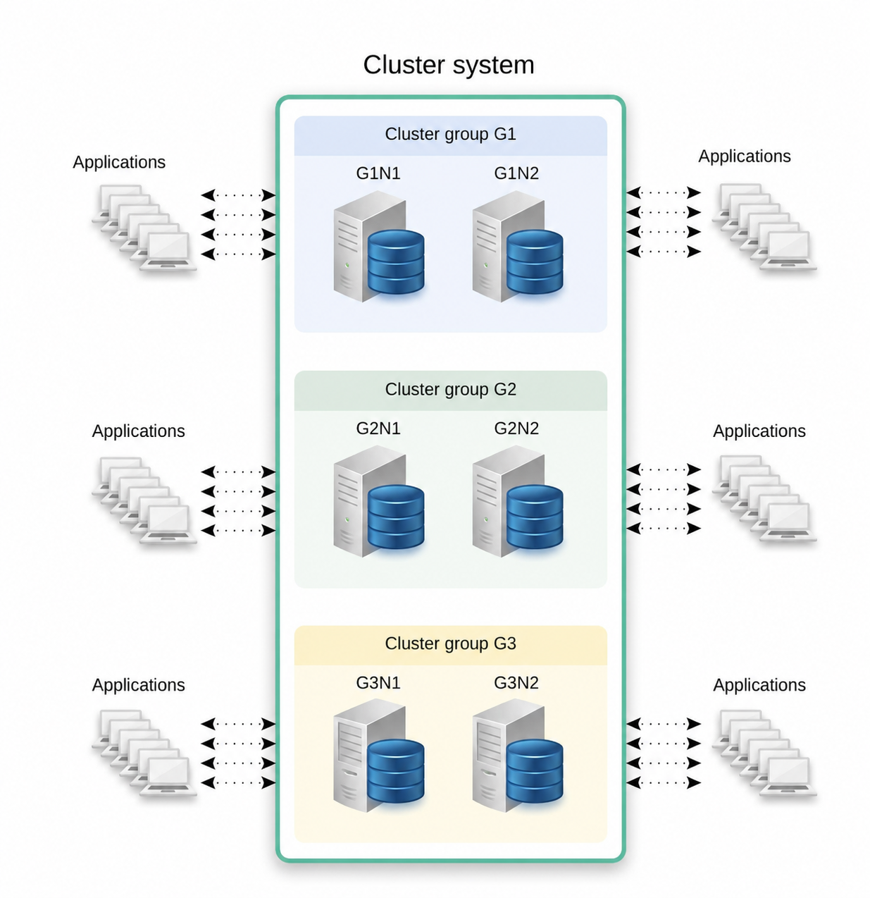
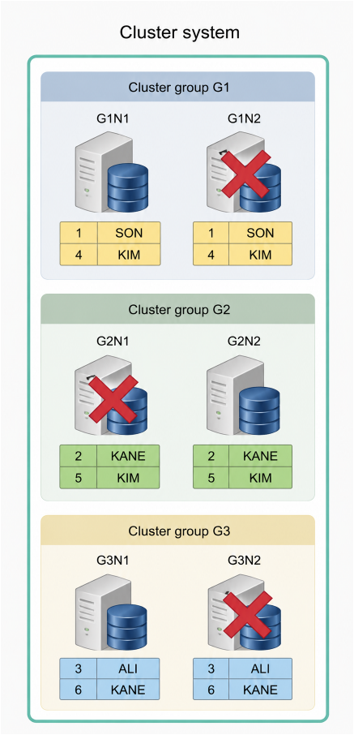
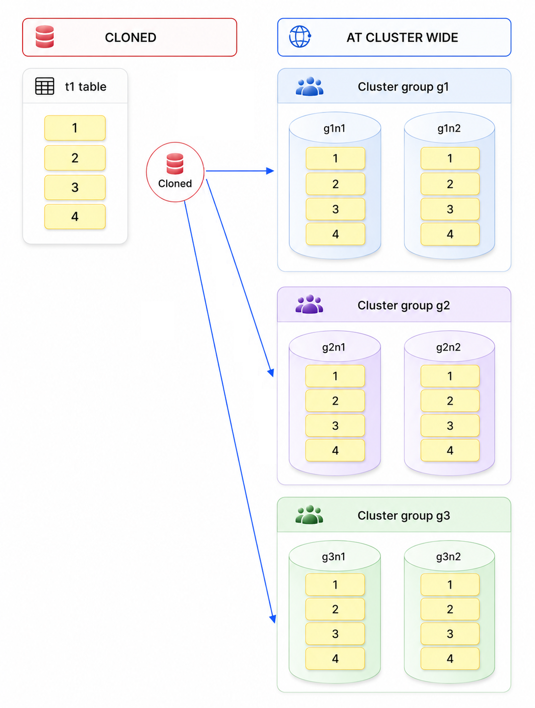
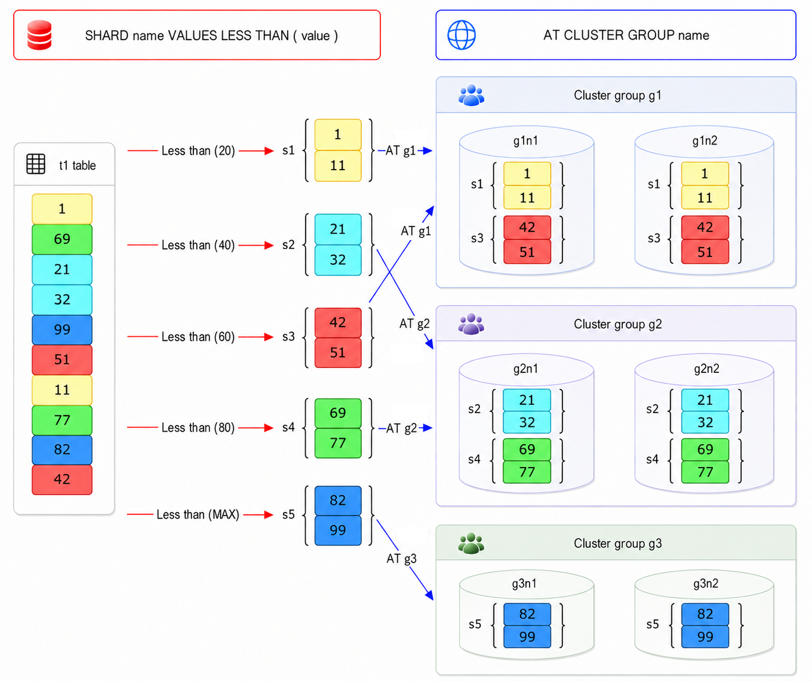
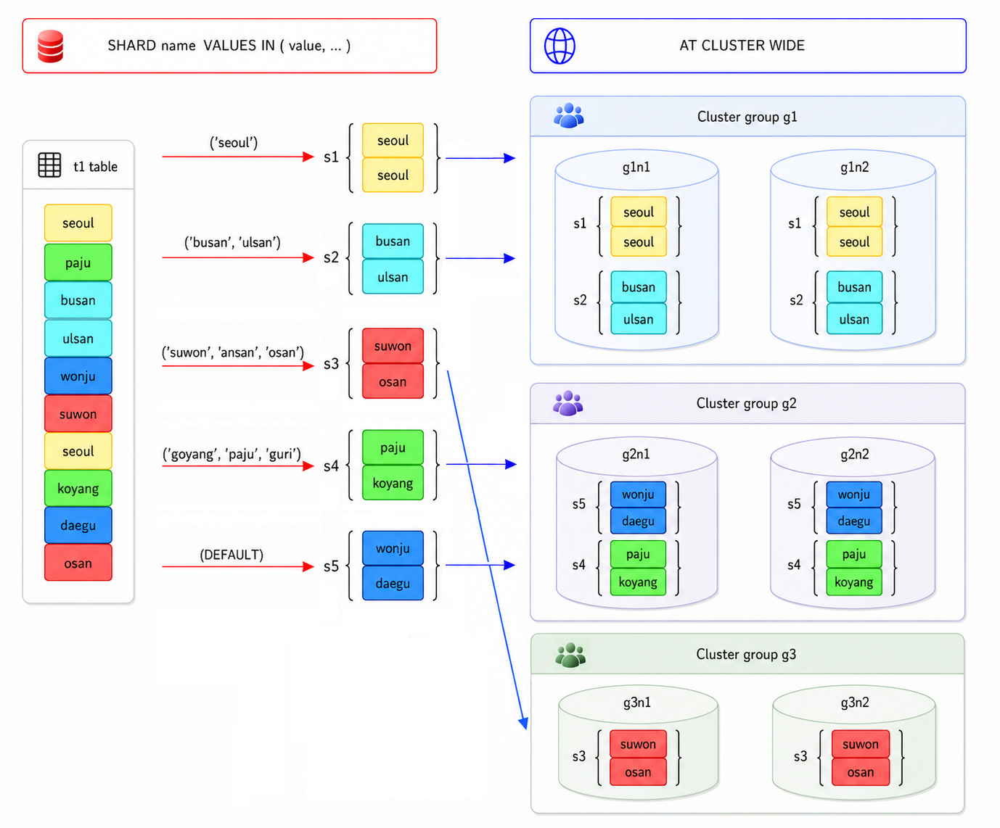
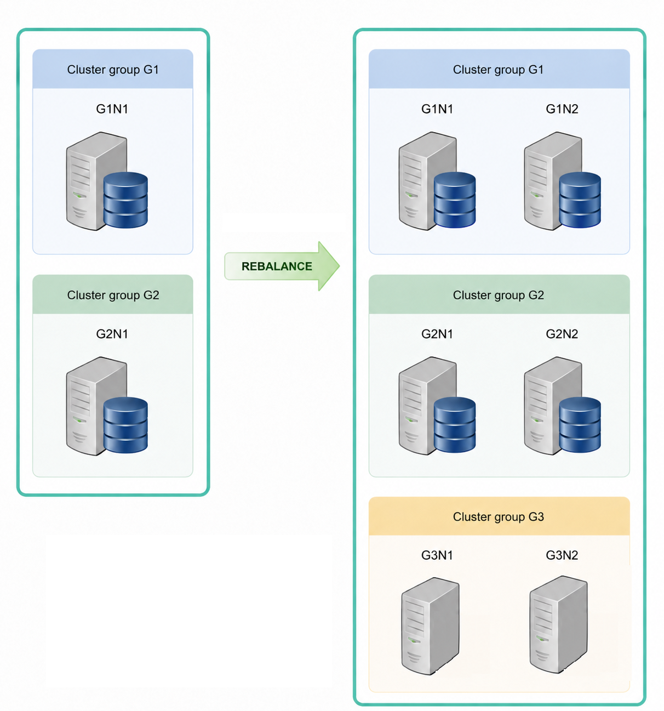
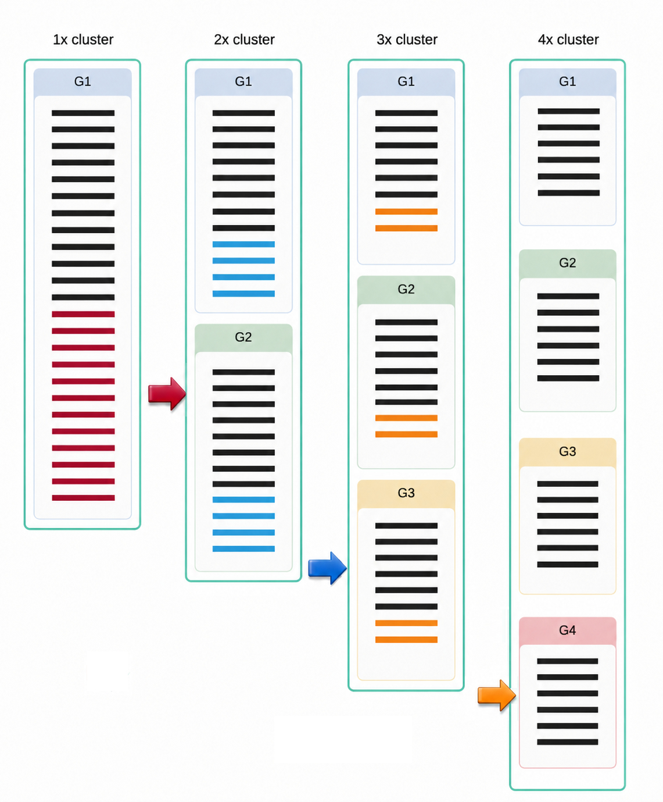

<a id="13619f348ff3cf9a"></a>

# 14. Cluster Objects

> Source: [GOLDILOCKS 26c.1 User Manual (en)](https://manual.sunjesoft.co.kr/goldilocks/26c_1/manual/en/13619f348ff3cf9a)  
> Tag: `26c.1_0_tag`

[← 13. SQL Objects](13-sql-objects.md) · [Table of contents](../README.md) · [15. SQL Tuning →](15-sql-tuning.md)

<a id="997d6b3618257b9f"></a>
## Cluster System

<a id="bde4baf64f5f5404"></a>
### Cluster System Related Statements

For more information, refer to the following.

- Expanding a cluster system
    - [CREATE CLUSTER GROUP](19-sql-references-c-g.md#6ad165b04482545a)
    - [ALTER CLUSTER GROUP name ADD MEMBER](18-sql-references-a-b.md#587d989b6ad2040a)

- Controlling an inactive cluster member
    - [ALTER DATABASE DROP INACTIVE CLUSTER MEMBERS](18-sql-references-a-b.md#a3601304aac063fd)
    - [ALTER SYSTEM JOIN DATABASE](18-sql-references-a-b.md#530c2222850ccc1c)

- Rebalancing data
    - [ALTER DATABASE REBALANCE](18-sql-references-a-b.md#eba0a85e4ceddd6e)
    - [ALTER TABLE name REBALANCE](18-sql-references-a-b.md#f207258645781242)

The information related to a cluster system can be retrieved through the following views.

<a id="35427f8c92c50967"></a>
<table class="table column_count_3"><caption>Cluster system-related information</caption><thead><tr><th class="to_center"><div>Schema</div></th><th class="to_center"><div>View</div></th><th class="to_center"><div>Description</div></th></tr></thead><tbody><tr><td class="to_middle" rowspan="2"><div>DICTIONARY_SCHEMA</div></td><td class="to_middle"><div><a class="reference" href="../part-02-administration-manual/9-database-information.md#8bfd728b676c8521">DBA_CLUSTER</a></div></td><td class="to_middle"><div>Information about the objects of cluster groups and cluster members that configure the cluster</div></td></tr><tr><td class="to_middle"><div><a class="reference" href="../part-02-administration-manual/9-database-information.md#a3e343d6c856d823">DBA_CLUSTER_COMMENTS</a></div></td><td class="to_middle"><div>Comment information about the cluster group and cluster member</div></td></tr><tr><td class="to_middle"><div>PERFORMANCE_VIEW_SCHEMA</div></td><td class="to_middle"><div><a class="reference" href="../part-02-administration-manual/9-database-information.md#590f00b1b318a709">V$CLUSTER_MEMBER</a></div></td><td class="to_middle"><div>Status information of cluster members</div></td></tr></tbody></table>

<a id="edad874d7542f9a2"></a>
### Concept of Cluster System

The GOLDILOCKS cluster system manages the data of a single database by sharding or replicating it across multiple servers. Applications can run on any server within the cluster system and operate in the same way as if using a single database, regardless of the system configuration or the connected server.

GOLDILOCKS cluster system consists of one or more cluster groups, and a cluster group consists of one or more cluster members. It does not require a separate application server or a meta server, but applications are connected to a cluster member corresponding to a data server, and run.

<a id="784391ff7ea0f351"></a>


The figure above shows a 3x2 cluster system consisting of two cluster members and three cluster groups, along with a single cluster group. The cluster system includes cluster groups (G1, G2, G3), where cluster group G1 consists of cluster members (G1N1, G1N2), cluster group G2 consists of cluster members (G2N1, G2N2), and cluster group G3 consists of cluster members (G3N1, G3N2). Applications can access any of these six cluster members, and it operates in the same way as using a single database.

The table data is sharded and placed in each cluster group, and the cluster members within a cluster group maintain identical replicas. The figure below illustrates the concept of table data placement in a 3x2 cluster.

<a id="6b69510532ea7509"></a>


The table data is sharded and placed in each cluster group according to the sharding strategy defined by the user. (in the figure above, based on the ID column) The data placed in a cluster group maintains replicas across the cluster members within the group.

<a id="6c9b6c7f6da6a38f"></a>
### Cluster System Availability

The cluster can continue to provide service even if a specific server fails or the network is disconnected. Cluster members within each cluster group maintain identical data replications, so the service remains uninterrupted even if a single cluster member fails. In other words, as long as data loss does not occur due to the failure of all cluster members in a cluster group, the service can continue without interruption.

The cluster continues to provide service even if three devices fail in the 3x2 cluster, as shown below.

<a id="8f52a94fe0c20aa4"></a>


If additional errors occur in G1N1, G2N2, or G3N1 in the situation described above, data loss will occur, and the service will no longer be available. Therefore, the user should restore the failed devices to the cluster system or add new cluster members before any further errors occur.

- The [ALTER SYSTEM JOIN DATABASE](18-sql-references-a-b.md#530c2222850ccc1c) statement is used to reintroduce a failed cluster member into the cluster system.

- The [ALTER DATABASE DROP INACTIVE CLUSTER MEMBERS](18-sql-references-a-b.md#a3601304aac063fd) statement is used to drop a failed cluster member from the cluster system.

- The [ALTER CLUSTER GROUP name ADD MEMBER](18-sql-references-a-b.md#587d989b6ad2040a) statement is used to add a cluster member to a cluster group for high availability.

- The [ALTER DATABASE REBALANCE](18-sql-references-a-b.md#eba0a85e4ceddd6e) and [ALTER TABLE name REBALANCE](18-sql-references-a-b.md#f207258645781242) statements are used to rebalance data to a newly added cluster member.

<a id="df773983c6aa83e4"></a>
### Cluster System Expansion

The cluster can be expanded by adding a new server without interrupting the service.

The cluster is expanded by adding a cluster member or a cluster group, and by rebalancing the data to the newly created server.

The following is an example of expanding a 2x1 cluster to a 3x2 cluster.

<a id="9a860ba56edca24e"></a>


Expand the cluster by adding a cluster group and a cluster member using the following statements.

- [ALTER CLUSTER GROUP name ADD MEMBER](18-sql-references-a-b.md#587d989b6ad2040a)
- [CREATE CLUSTER GROUP](19-sql-references-c-g.md#6ad165b04482545a)

To add a new cluster member to the cluster system, the tablespaces in the cluster member must match those in the cluster system. In other words, all tablespaces from the cluster system must be created in the new cluster member as well.

The following is an example of adding a cluster group and cluster members from a 3x2 cluster to a 2x1 cluster. Add the member G1N2 to group G1, and add the member G2N2 to group G2. Then, create group G3, including members G3N1 and G3N2.

- Add member G1N2 to group G1.

```
gSQL> 
ALTER CLUSTER GROUP G1 
      ADD CLUSTER MEMBER G1N2 HOST '192.168.0.12' PORT 10120;

Cluster Group altered.
```

- Add member G2N2 to group G2.

```
gSQL> 
ALTER CLUSTER GROUP G2 
      ADD CLUSTER MEMBER G2N2 HOST '192.168.0.22' PORT 10220;

Cluster Group altered.
```

- Create group G3.

```
gSQL>
CREATE CLUSTER GROUP G3 
       CLUSTER MEMBER G3N1 HOST '192.168.0.31' PORT 10310,
       CLUSTER MEMBER G3N2 HOST '192.168.0.32' PORT 10320;

Cluster Group created.
```

The newly added cluster group and cluster member in the cluster system can provide service by synchronizing the dictionary information of SQL objects. However, since the data has not yet been placed on the added cluster member, increased availability or load balancing cannot be expected. Therefore, the data should be rebalanced to the newly created cluster member.

Use the following statements sequentially to rebalance the data.

- [ALTER DATABASE REBALANCE](18-sql-references-a-b.md#eba0a85e4ceddd6e)
- [ALTER TABLE name REBALANCE](18-sql-references-a-b.md#f207258645781242)

The following is an example of rebalancing the data of all tables in the database.

```
gSQL> ALTER DATABASE REBALANCE;

Database altered.
```

<a id="6d5a8e9fe2743caa"></a>
## Cluster Group

<a id="a741ebe9e36c647b"></a>
### Cluster Group-related Statements

For more information about creating, dropping, and altering a cluster group, refer to the following.

- Creating a cluster group: [CREATE CLUSTER GROUP](19-sql-references-c-g.md#6ad165b04482545a)
- Dropping a cluster group: [DROP CLUSTER GROUP](19-sql-references-c-g.md#cf6da303c45334dc)
- Altering a cluster group: [ALTER CLUSTER GROUP name ADD MEMBER](18-sql-references-a-b.md#587d989b6ad2040a)

The information related to a cluster group can be retrieved through the following views.

<a id="0fab398b32daf0e0"></a>
<table class="table column_count_3"><caption>Cluster group-related information</caption><thead><tr><th class="to_center"><div>Schema</div></th><th class="to_center"><div>View</div></th><th class="to_center"><div>Description</div></th></tr></thead><tbody><tr><td class="to_middle" rowspan="2"><div>DICTIONARY_SCHEMA</div></td><td class="to_middle"><div><a class="reference" href="../part-02-administration-manual/9-database-information.md#8bfd728b676c8521">DBA_CLUSTER</a></div></td><td class="to_middle"><div>Object information of a cluster group and the cluster members that configure the cluster</div></td></tr><tr><td class="to_middle"><div><a class="reference" href="../part-02-administration-manual/9-database-information.md#a3e343d6c856d823">DBA_CLUSTER_COMMENTS</a></div></td><td class="to_middle"><div>Comment information of a cluster group and cluster member</div></td></tr></tbody></table>

<a id="3bc73680d66802ed"></a>
### Concept of Cluster Group

To operate the cluster system, at least one cluster group must be created.

<a id="897050231cbb0198"></a>
#### Creating Cluster Group

The first created cluster group must include itself as a cluster member. For more information about creating a cluster group, refer to [CREATE CLUSTER GROUP](19-sql-references-c-g.md#6ad165b04482545a).

A cluster member is a physical concept representing a data server, whereas a cluster group is a logical concept consisting of one or more cluster members.

The availability and load balancing of the cluster system depend on the configuration of the cluster group. The more cluster members a cluster group includes, the higher the availability. The more cluster groups there are, the greater the throughput of the cluster system, as the data is distributed.

All cluster members in a cluster group maintain the same data replications, ensuring that the service can continue to operate unless an error occurs in all the cluster members within the group. To maintain the availability of the cluster system, it is recommended to configure the cluster group with two or more cluster members.

The table data is sharded based on the sharding strategy and stored and managed in different cluster groups according to the shard placement strategy. The performance of the entire system is determined by the appropriate table sharding and placement strategies, which should align with the service's features. Each transaction and query is processed by focusing on the cluster group where the data is stored, so performance improves when the referenced data resides in the same cluster group.

<a id="2fbb4f7e26328eca"></a>
#### Dropping Cluster Group

A cluster group participating in a cluster system and providing a service can be dropped for various reasons. For more information about dropping a cluster group, refer to [DROP CLUSTER GROUP](19-sql-references-c-g.md#cf6da303c45334dc).

To drop a cluster group, all shards in a sharded table created within that cluster group must be transferred to another cluster group. The transfer should be done separately based on the cluster-wide and group-specific tables.

<a id="c2e50728804daf6f"></a>
## Cluster Member

<a id="e3b44d85339afdf6"></a>
### Cluster Member-related Statements

For more information, refer to the following.

- Adding a cluster member: [ALTER CLUSTER GROUP name ADD MEMBER](18-sql-references-a-b.md#587d989b6ad2040a)
- Dropping a cluster member: [ALTER DATABASE DROP INACTIVE CLUSTER MEMBERS](18-sql-references-a-b.md#a3601304aac063fd)
- Controlling a cluster member
    - [ALTER SYSTEM JOIN DATABASE](18-sql-references-a-b.md#530c2222850ccc1c)
    - [ALTER CLUSTER GROUP name OFFLINE MEMBER](18-sql-references-a-b.md#7c1059c2e32ada37)
    - [ALTER DATABASE RESET LOCAL CLUSTER MEMBER](18-sql-references-a-b.md#f1ab69327582aabb)

The information related to a cluster member can be retrieved through the following views.

<a id="2a583c9bf9777acf"></a>
<table class="table column_count_3"><caption>Cluster member-related information</caption><thead><tr><th class="to_center"><div>Schema</div></th><th class="to_center"><div>View</div></th><th class="to_center"><div>Description</div></th></tr></thead><tbody><tr><td class="to_middle" rowspan="2"><div>DICTIONARY_SCHEMA</div></td><td class="to_middle"><div><a class="reference" href="../part-02-administration-manual/9-database-information.md#8bfd728b676c8521">DBA_CLUSTER</a></div></td><td class="to_middle"><div>Object information for a cluster group and a cluster member that configure a cluster</div></td></tr><tr><td class="to_middle"><div><a class="reference" href="../part-02-administration-manual/9-database-information.md#a3e343d6c856d823">DBA_CLUSTER_COMMENTS</a></div></td><td class="to_middle"><div>Comment information for a cluster group and a cluster member</div></td></tr><tr><td class="to_middle"><div>PERFORMANCE_VIEW_SCHEMA</div></td><td class="to_middle"><div><a class="reference" href="../part-02-administration-manual/9-database-information.md#590f00b1b318a709">V$CLUSTER_MEMBER</a></div></td><td class="to_middle"><div>Status information for a cluster member</div></td></tr></tbody></table>

<a id="48a90eece60f021b"></a>
### Concept of Cluster Member

The cluster member is a server that configures the cluster system and maintains replication to match that of other members in the cluster group.

A cluster member is a data server that stores a portion of the cluster database, an application server that handles application connections and requests. Moreover, it is a meta server that duplicates and manages the meta information of objects. In other words, the GOLDILOCKS cluster does not require separate data servers, application servers, or meta servers.

Cluster members belonging to the same cluster group have identical data replicas. Therefore, a failure in a specific cluster member does not cause a failure in the entire system. For high system availability, it is recommended to include two or more cluster members in each cluster group, and a single cluster group can be configured with a maximum of 32 cluster members.

Execute the [ALTER CLUSTER GROUP name ADD MEMBER](18-sql-references-a-b.md#587d989b6ad2040a) statement to add a new cluster member to a cluster group.

The added cluster member maintains the meta information of the SQL object, identical to that in the cluster system, allowing it to process application connections and requests. However, since data is not stored on this member, adding a cluster member does not guarantee the high availability of the cluster group.

Execute the following statements to place the data after adding a cluster member.

- For rebalancing the entire data: Refer to [ALTER DATABASE REBALANCE](18-sql-references-a-b.md#eba0a85e4ceddd6e).
- For rebalancing only a part of the table: Refer to [ALTER TABLE name REBALANCE](18-sql-references-a-b.md#f207258645781242).

When an error occurs on a cluster member, the service continues to be provided, but DDL operations can not be performed. To ensure normal service operation, appropriate action should be taken for the cluster member with the error.

To make a cluster member with an error participate in the cluster system again, connect to the cluster member, bring it up to the LOCAL OPEN phase, and then perform the [ALTER SYSTEM JOIN DATABASE](18-sql-references-a-b.md#530c2222850ccc1c) statement.

Even if some cluster members are not running or the cluster system is operating with a disconnected network, perform the [ALTER SYSTEM JOIN DATABASE](18-sql-references-a-b.md#530c2222850ccc1c) statement after bringing the cluster member up to the LOCAL OPEN phase.

If the cluster member device with an error can not be restored, drop the cluster member by executing the [ALTER DATABASE DROP INACTIVE CLUSTER MEMBERS](18-sql-references-a-b.md#a3601304aac063fd) statement in the cluster system.

The cluster member dropped from the cluster system still retains its previous information and can not participate in the cluster system again. To reset the cluster member to its state before participating in the cluster system, execute the [ALTER DATABASE RESET LOCAL CLUSTER MEMBER](18-sql-references-a-b.md#f1ab69327582aabb) statement.

The statement above is different from creating a new database for the cluster member because it retains the tablespace information. Therefore, it can shorten the time required to create the tablespace when adding a new cluster member to the cluster system.

<a id="362b061cc4518627"></a>
## Cluster Location

<a id="4427184812ad8238"></a>
### Cluster Location Related Statements

For more information about creating, dropping, and altering a cluster location, refer to the following.

- Creating a cluster location: [CREATE CLUSTER LOCATION](19-sql-references-c-g.md#1e6f444e1a43b4b5)
- Dropping a cluster location: [DROP CLUSTER LOCATION](19-sql-references-c-g.md#9a30ad97763681d1)
- Altering a cluster location: [ALTER CLUSTER LOCATION](18-sql-references-a-b.md#b1673f7439fc39e9)

The information related to a cluster location can be retrieved through the following views.

**Cluster location related information**

<a id="b42a7e6c40b293e0"></a>
| Schema | View | Description |
| --- | --- | --- |
| PERFORMANCE_VIEW_SCHEMA | [V$CLUSTER_LOCATION](../part-02-administration-manual/9-database-information.md#74129679c71a7cac) | Information about the cluster location |

<a id="548e211494e9026f"></a>
### Concept of Cluster Location

The cluster location refers to the connection information used to link the internal cluster networks of each cluster member registered in the cluster system. Each cluster member uses a dedicated TCP network to transfer and receive various protocols, such as transaction processing and management information exchange. The member name, host IP address, and port used for the connection are collectively referred to as the cluster location.

Unique cluster location information must be specified for each member, and if the information is duplicated, the cluster network connection will fail, and the cluster system will not function properly.

Cluster location information is automatically added or deleted when a cluster member is added or removed, so users rarely need to manually add or delete this information. However, DDL statements related to the cluster location can be used in the following cases.

- When the cluster location information is lost due to the deletion of the location control file: [CREATE CLUSTER LOCATION](19-sql-references-c-g.md#1e6f444e1a43b4b5)
- When the previously registered connection information of a cluster member is altered, such as changes to the hardware, IP address, or port.: [ALTER CLUSTER LOCATION](18-sql-references-a-b.md#b1673f7439fc39e9)

<a id="e56d5d1087eefb48"></a>
## Cluster Table and Shard

<a id="05071cbabf531e4c"></a>
### Shard-related Statements

For more information about the definition and rebalancing of the shard, refer to the following.

- Definition of a shard: The &lt;table sharding strategy&gt; clause of the [CREATE TABLE](19-sql-references-c-g.md#47f3ce328094503e) statement. 
- Rebalancing a shard: [ALTER TABLE name REBALANCE](18-sql-references-a-b.md#f207258645781242)

The information related to a shard in a cluster table can be retrieved through the following views.

<a id="a3571175da8710f4"></a>
<table class="table column_count_3"><caption>Information related to cluster tables and shards </caption><thead><tr><th class="to_center"><div>Schema</div></th><th class="to_center"><div>View</div></th><th class="to_center"><div>Description</div></th></tr></thead><tbody><tr><td class="to_middle" rowspan="8"><div>DICTIONARY_SCHEMA</div></td><td class="to_middle"><div><a class="reference" href="../part-02-administration-manual/9-database-information.md#500953545d9fde8a">ALL_CLUSTER_TABLES</a></div></td><td class="to_middle"><div>Information about user-accessible cluster tables</div></td></tr><tr><td class="to_middle"><div><a class="reference" href="../part-02-administration-manual/9-database-information.md#0cec182b66c82ed6">ALL_SHARD_KEY_COLUMNS</a></div></td><td class="to_middle"><div>Shard key column information for user-accessible cluster tables</div></td></tr><tr><td class="to_middle"><div><a class="reference" href="../part-02-administration-manual/9-database-information.md#ac922cb9e3e62d66">ALL_TAB_PLACE</a></div></td><td class="to_middle"><div>Placement information for user-accessible cluster tables</div></td></tr><tr><td class="to_middle"><div><a class="reference" href="../part-02-administration-manual/9-database-information.md#5af69ccaf188794c">ALL_TAB_SHARDS</a></div></td><td class="to_middle"><div>Shard information for user-accessible cluster tables</div></td></tr><tr><td class="to_middle"><div><a class="reference" href="../part-02-administration-manual/9-database-information.md#fcb8bef343241bbf">USER_CLUSTER_TABLES</a></div></td><td class="to_middle"><div>Information about user-owned cluster tables</div></td></tr><tr><td class="to_middle"><div><a class="reference" href="../part-02-administration-manual/9-database-information.md#11327ef029b936a4">USER_SHARD_KEY_COLUMNS</a></div></td><td class="to_middle"><div>Shard key column information for user-owned cluster tables</div></td></tr><tr><td class="to_middle"><div><a class="reference" href="../part-02-administration-manual/9-database-information.md#9b1733274c756204">USER_TAB_PLACE</a></div></td><td class="to_middle"><div>Placement information for user-owned cluster tables</div></td></tr><tr><td class="to_middle"><div><a class="reference" href="../part-02-administration-manual/9-database-information.md#a46e9151dffac2e0">USER_TAB_SHARDS</a></div></td><td class="to_middle"><div>Shard information for user-owned cluster tables</div></td></tr></tbody></table>

<a id="7df326e466b0767a"></a>
### Cluster Table Type

A table created by a user in a cluster environment is one of the following.

- Cloned table: The table data is duplicated identically and managed.
- Sharded table: The table data is partitioned horizontally and managed.

A cloned table is suitable for tables, such as a product list or a provider list, where the data is relatively small and infrequently modified. This is because a cloned table duplicates all the table data and manages it. When data is inserted, deleted, or updated in the cloned table, these changes are applied to all cluster members where the cloned table is placed.

A sharded table is suitable for tables, such as transaction history or call history, where the data is large and needs to be partitioned. These tables are classified according to three sharding strategies, as follows.

- Hash-sharded table 
    - The table data is divided into several shards based on the hash value of a sharding key, and then distributed across the cluster system.
- Range-sharded table
    - The table data is divided into several shards based on the range value of a sharding key, and then distributed across the cluster system.
- List-sharded table
    - The table data is divided into several shards based on the list value of a sharding key, and then distributed across the cluster system.

A sharded table horizontally divides rows and manages them in shard units, the sharding strategy is defined using the SHARDING BY clause in the [CREATE TABLE](19-sql-references-c-g.md#47f3ce328094503e) statement. The set of rows classified by the sharding strategy is referred to as a shard.

Each shard is placed in a cluster group according to the placement policy defined by the user. It can either be automatically placed using the AT CLUSTER WIDE clause in the [CREATE TABLE](19-sql-references-c-g.md#47f3ce328094503e) statement, or a specific cluster group can be designated using the AT CLUSTER GROUP clause. When using AT CLUSTER WIDE for automatic placement, the [ALTER TABLE name REBALANCE](18-sql-references-a-b.md#f207258645781242) statement is executed after creating the cluster group with the [CREATE CLUSTER GROUP](19-sql-references-c-g.md#6ad165b04482545a) statement. However, when specifying the cluster group for shard placement using AT CLUSTER GROUP, the shard is not placed in the newly created cluster group.

The following is an example of creating a table based on the cluster table type and placing the data in a 3x2 cluster environment.

<a id="57242228d4845475"></a>
### Cloned Table

A cloned table duplicates all the data of the table identically and manages it.

The following is an example of creating a cluster-wide cloned table, where all table data is identically replicated and placed across the 3x2 cluster members.

```
CREATE TABLE t1 ( id INTEGER )
   CLONED
   AT CLUSTER WIDE
;
```

<a id="8d727014cd4f8ab6"></a>


The following is an example of creating a group-specific cloned table. All table data is identically duplicated and managed, but the duplicated data exists only in the cluster members of groups g1 and g2, as specified by the user, and is not present in group g3.

```
CREATE TABLE t1 ( id INTEGER )
   CLONED
   AT CLUSTER GROUP g1, g2
;
```

<a id="4c6bdfa9069d8534"></a>


<a id="e4ea14f9c9282580"></a>
### Hash-sharded table

A hash-sharded table divides the table data into multiple shards based on the hash value of a sharding key and then distributes them across the cluster system.

The following is an example of creating a cluster-wide hash-sharded table. When adding data to the table, a hash value is generated based on the ID column value, and this hash value is used to determine the shard in which to place the row, selected from five shards. Each shard is automatically placed. All rows with the same ID column value are included in the same shard and placed in the same cluster group.

```
CREATE TABLE t1 ( id INTEGER )
   SHARDING BY HASH(id)
   SHARD COUNT 5
   AT CLUSTER WIDE
;
```

<a id="a224b16d7af7edf8"></a>


The following is an example of creating a group-specific hash-sharded table. The hash value of the ID column determines the shard, but each shard is placed only in the cluster groups g1 and g2, as specified by the user.

```
CREATE TABLE t1 ( id INTEGER )
   SHARDING BY HASH(id)
   SHARD COUNT 5
   AT CLUSTER GROUP g1, g2
;
```

<a id="e46dbdecdbd81b0a"></a>


<a id="89ce16a330547932"></a>
### Range-sharded Table

A range-sharded table divides the table data into multiple shards based on the range value of a sharding key and then distributes them across the cluster system.

The following is an example of creating a cluster-wide range-sharded table. When adding data to the table, the shard in which to place the row is selected from five shards based on the range value of the ID column. Each shard is automatically placed. All rows within the same range of the ID column are included in the same shard and placed in the same cluster group.

```
CREATE TABLE t1 ( id INTEGER )
   SHARDING BY RANGE(id)
   AT CLUSTER WIDE
       SHARD s1 VALUES LESS THAN ( 20 ),
       SHARD s2 VALUES LESS THAN ( 40 ),
       SHARD s3 VALUES LESS THAN ( 60 ),
       SHARD s4 VALUES LESS THAN ( 80 ),
       SHARD s5 VALUES LESS THAN ( MAXVALUE )
;
```

<a id="6d84c8c7b181bbd7"></a>


The following is an example of creating a group-specific range-sharded table. The range value of the ID column determines the shard, but each shard is placed in a cluster group specified by the user.

```
CREATE TABLE t1 ( id INTEGER )
   SHARDING BY RANGE(id)
       SHARD s1 VALUES LESS THAN ( 20 )       AT CLUSTER GROUP g1,
       SHARD s2 VALUES LESS THAN ( 40 )       AT CLUSTER GROUP g2,
       SHARD s3 VALUES LESS THAN ( 60 )       AT CLUSTER GROUP g1,
       SHARD s4 VALUES LESS THAN ( 80 )       AT CLUSTER GROUP g2,
       SHARD s5 VALUES LESS THAN ( MAXVALUE ) AT CLUSTER GROUP g3
;
```

<a id="4d9db357c796c80d"></a>


<a id="01906fedd31e81b1"></a>
### List-sharded Table

A list-sharded table divides the table data into multiple shards based on the list value of a sharding key and then distributes them across the cluster system.

The following is an example of creating a cluster-wide list-sharded table. When adding data to the table, rows are placed in the shard that has the same list value as the CITY column value. Each shard is automatically placed.

```
CREATE TABLE t1 ( city VARCHAR(128) ) 
   SHARDING BY LIST (city)
      AT CLUSTER WIDE
      SHARD s1 VALUES IN ( 'seoul' ),
      SHARD s2 VALUES IN ( 'busan', 'ulsan' ),
      SHARD s3 VALUES IN ( 'suwon', 'ansan', 'osan' ),
      SHARD s4 VALUES IN ( 'goyang', 'paju', 'guri' ),
      SHARD s5 VALUES IN ( DEFAULT )            
;
```

<a id="522b6b63f4f0ed79"></a>


The following is an example of creating a group-specific list-sharded table. The shard is determined by the list value of the CITY column, but each shard is placed in the cluster group specified by the user.

```
CREATE TABLE t1 ( city VARCHAR(128) ) 
   SHARDING BY LIST (city)
      SHARD s1 VALUES IN ( 'seoul' )                  AT CLUSTER GROUP g1,
      SHARD s2 VALUES IN ( 'busan', 'ulsan' )         AT CLUSTER GROUP g2,
      SHARD s3 VALUES IN ( 'suwon', 'ansan', 'osan' ) AT CLUSTER GROUP g1,
      SHARD s4 VALUES IN ( 'goyang', 'paju', 'guri' ) AT CLUSTER GROUP g2,
      SHARD s5 VALUES IN ( DEFAULT )                  AT CLUSTER GROUP g3
;
```

<a id="7cfb51ca5f63ac85"></a>


<a id="db293f867c02aab4"></a>
### Rebalancing Cluster Table

Rebalance the data in the cluster table using the [ALTER TABLE name REBALANCE](18-sql-references-a-b.md#f207258645781242) statement.

The data of the cluster table is rebalanced in the following units.

- Cloned table: entire table 
- Sharded table: by shard unit

If the table is specified as AT CLUSTER WIDE, the shard is automatically rebalanced to the created cluster group, but if the cluster group for placing the shard is specified using AT CLUSTER GROUP, the shard will not be rebalanced to the created cluster group.

- When rebalancing automatically using AT CLUSTER WIDE, the data can be redistributed to a new cluster group and a new cluster member.

```
CREATE TABLE region
(
    r_regionkey   INTEGER
  , r_name        CHAR(25)
  , r_comment     VARCHAR(152)
)
CLONED
AT CLUSTER WIDE;
```

<a id="aff38a029e4e1cb2"></a>


- When specifying the location to place the shard using AT CLUSTER GROUP
    - The data is not rebalanced to the new cluster group.
    - The data can be rebalanced to a new cluster member added to the specified cluster group.

```
CREATE TABLE nation
(
    n_nationkey   INTEGER
  , n_name        CHAR(25)
  , n_regionkey   INTEGER
  , n_comment     VARCHAR(152)
)
CLONED
AT CLUSTER GROUP g1, g2;
```

<a id="11df455339a6bdb8"></a>


The information about the table placement can be retrieved through the following views.

- [USER_TAB_PLACE](../part-02-administration-manual/9-database-information.md#9b1733274c756204)
- [ALL_TAB_PLACE](../part-02-administration-manual/9-database-information.md#ac922cb9e3e62d66)

```
gSQL> 
SELECT group_name, member_name 
  FROM user_tab_place 
 WHERE table_name = 'REGION';

GROUP_NAME MEMBER_NAME
---------- -----------
G1         G1N1       
G1         G1N2       
G2         G2N1       
G2         G2N2       
G3         G3N1       
G3         G3N2       

6 rows selected.
```

The sharded table is rebalanced at the shard level, and the concept of shard rebalancing due to an increase in groups is as follows.

```
CREATE TABLE orders
(
    o_orderkey     INTEGER
  , o_custkey      INTEGER
  , o_orderstatus  CHAR(1)
  , o_totalprice   NUMERIC(12,2)
  , o_orderdate     DATE
  , o_orderpriority CHAR(15)
  , o_clerk        CHAR(15)
  , o_shippriority INTEGER
  , o_comment      VARCHAR(79)
)
SHARDING BY HASH( o_orderkey )
SHARD COUNT 24
AT CLUSTER WIDE
;
```

<a id="beec7ae8a322d53f"></a>


In the example above, the data of the orders table is divided into 24 shards and distributed. In a 1x cluster with a single group, all shards are placed in one group. In a 2x cluster with two groups, 12 shards are placed in each group.

When expanding from a 2x cluster to a 3x cluster, shards are transferred from the old group to the new group, but the number of shards in each group remains the same (8). When expanding from a 3x cluster to a 4x cluster, each group (G1, G2, G3) rebalances two shards to the newly created group (G4).

In other words, shard rebalancing minimizes the movement when shards are transferred from the existing group to the new group, while evenly distributing the data and maintaining nearly the same number of shards in each group.

The information about the shard placement of the sharded table can be retrieved through the following views.

- [USER_TAB_SHARDS](../part-02-administration-manual/9-database-information.md#a46e9151dffac2e0)
- [ALL_TAB_SHARDS](../part-02-administration-manual/9-database-information.md#5af69ccaf188794c)

```
gSQL> 
SELECT shard_name, group_name 
  FROM user_tab_shards 
 WHERE table_name = 'ORDERS';

SHARD_NAME   GROUP_NAME
------------ ----------
SHARD_000000 G1        
SHARD_000001 G1        
SHARD_000002 G1        
SHARD_000003 G1        
SHARD_000004 G1        
SHARD_000005 G1        
SHARD_000006 G1        
SHARD_000007 G1        
SHARD_000008 G3        
SHARD_000009 G3        
SHARD_000010 G3        
SHARD_000011 G3        
SHARD_000012 G2        
SHARD_000013 G2        
SHARD_000014 G2        
SHARD_000015 G2        
SHARD_000016 G2        
SHARD_000017 G2        
SHARD_000018 G2        
SHARD_000019 G2        
SHARD_000020 G3        
SHARD_000021 G3        
SHARD_000022 G3        
SHARD_000023 G3        

24 rows selected.
```

When tables with the same &lt;sharding strategy&gt; are fully rebalanced as follows, the shard placement results will be identical. Rows with the same shard key are guaranteed to be placed in the same shard and group, even if the tables are different.

- Table t1
    - It is created in a 2x cluster.
    - CREATE TABLE t1 ( c1 INTEGER ) SHARDING BY (c1);
    - It is rebalanced in a 4x cluster.
    - ALTER TABLE t1 REBALANCE:
- Table t2
    - It is created in a 3x cluster.
    - CREATE TABLE t2 ( a1 INTEGER ) SHARDING BY (a1);
    - It is rebalanced in a 4x cluster.
    - ALTER TABLE t2 REBALANCE:
- Table t3
    - It is created in a 4x cluster.
    - CREATE TABLE t3 ( i1 INTEGER ) SHARDING BY (i1);

In other words, the following query can access and process data on only one cluster member.

```
SELECT COUNT(*)
  FROM t1, t2, t3
 WHERE t1.c1 = t2.a1
   AND t2.a1 = t3.i1
   AND t1.c1 = 1;
```

<a id="3e9bcc83795a29d0"></a>
## Global Secondary Index

<a id="eedbcad0006e9d66"></a>
### Global Secondary Index-related Statements

For more information about creating, dropping, and altering a global secondary index, refer to the following.

- Creating a global secondary index: [ALTER TABLE name ADD GLOBAL SECONDARY INDEX](18-sql-references-a-b.md#c0be2a6bcfa14f9c)
- Dropping a global secondary index: [ALTER TABLE name DROP GLOBAL SECONDARY INDEX](18-sql-references-a-b.md#e790c72560fd7600)
- Altering a global secondary index: [ALTER TABLE name ALTER GLOBAL SECONDARY INDEX](18-sql-references-a-b.md#0a0bd7ac1ecae05e)

The information related to a global secondary index can be retrieved through the following views.

<a id="43885cce9f0506ce"></a>
<table class="table column_count_3"><caption>Global secondary index-related information</caption><thead><tr><th class="to_center"><div>Schema</div></th><th class="to_center"><div>View</div></th><th class="to_center"><div>Description</div></th></tr></thead><tbody><tr><td class="to_middle" rowspan="6"><div>DICTIONARY_SCHEMA</div></td><td class="to_middle"><div><a class="reference" href="../part-02-administration-manual/9-database-information.md#500953545d9fde8a">ALL_CLUSTER_TABLES</a></div></td><td class="to_middle"><div>Existence of a global secondary index in user-accessible tables</div></td></tr><tr><td class="to_middle"><div><a class="reference" href="../part-02-administration-manual/9-database-information.md#858d09784cb63bb9">ALL_GLOBAL_SECONDARY_INDEXES</a></div></td><td class="to_middle"><div>Object information of user-accessible global secondary indexes</div></td></tr><tr><td class="to_middle"><div><a class="reference" href="../part-02-administration-manual/9-database-information.md#13de2c2a17fccf2d">ALL_GSI_PLACE</a></div></td><td class="to_middle"><div>Placement information of user-accessible global secondary indexes</div></td></tr><tr><td class="to_middle"><div><a class="reference" href="../part-02-administration-manual/9-database-information.md#fcb8bef343241bbf">USER_CLUSTER_TABLES</a></div></td><td class="to_middle"><div>Existence of a global secondary index in user-owned tables</div></td></tr><tr><td class="to_middle"><div><a class="reference" href="../part-02-administration-manual/9-database-information.md#6dc0b5a99b5d8215">USER_GLOBAL_SECONDARY_INDEXES</a></div></td><td class="to_middle"><div>Object information of user-owned global secondary indexes</div></td></tr><tr><td class="to_middle"><div><a class="reference" href="../part-02-administration-manual/9-database-information.md#e932d696e25dbf7b">USER_GSI_PLACE</a></div></td><td class="to_middle"><div>Placement information of user-owned global secondary indexes</div></td></tr></tbody></table>

<a id="0d44585f70cbf901"></a>
### Concept of Global Secondary Index

A global secondary index is a B-tree index that uses the Global Row Identifier (GRID) values of table records as the key in each cluster member of the cluster environment.

In a cluster environment, tables are replicated across all members within a group, and the same records are applied and retrieved during DML operations or SELECT queries. GRID is a unique value that differentiates the same records across cluster members. It is assigned when a record is first inserted, propagated to all members within the group, and stored alongside the record.

When creating a table in a cluster environment, a global secondary index may or may not be created, and it can also be created or deleted separately after the table is created. A table may not have a global secondary index, or it may have at most one global secondary index.

<a id="fd22cd266216aab4"></a>


A global secondary index is required to perform a non-deterministic query on a table. If the table does not have a global secondary index, the non-deterministic query will fail as follows.

```
gSQL> DELETE FROM T1 LIMIT 1;

ERR-42000(16423): does not support non-deterministic DML in the cluster system : global secondary index expected
```

Refer to dictionaries such as ALL_GSI_PLACE, DBA_GSI_PLACE, and USER_GSI_PLACE to check whether a table has a global secondary index.

---

[← 13. SQL Objects](13-sql-objects.md) · [Table of contents](../README.md) · [15. SQL Tuning →](15-sql-tuning.md)

<sub>Copyright © 2010 SUNJESOFT Inc. All rights reserved.</sub>
