<a id="453b86074837c179"></a>

# 15. SQL Tuning

> Source: [GOLDILOCKS 26c.1 User Manual (en)](https://manual.sunjesoft.co.kr/goldilocks/26c_1/manual/en/453b86074837c179)  
> Tag: `26c.1_0_tag`

[← 14. Cluster Objects](14-cluster-objects.md) · [Table of contents](../README.md) · [16. Built-in Data Type References →](16-built-in-data-type-references.md)

<a id="49d2ecf67862f2f3"></a>
## SQL Tuning

<a id="be068d7e6ccc07a3"></a>
### Overview

SQL tuning is the process of analyzing and modifying a query to improve its performance.

This process helps a query reach the desired performance level by reducing its response time or increasing throughput.

Knowledge of SQL processing and the optimizer is required for SQL tuning, so this chapter covers these topics.

<a id="691b55a7e20d59d8"></a>
### SQL Processing

The following figure illustrates SQL processing.

<a id="6c8a517503e8904f"></a>
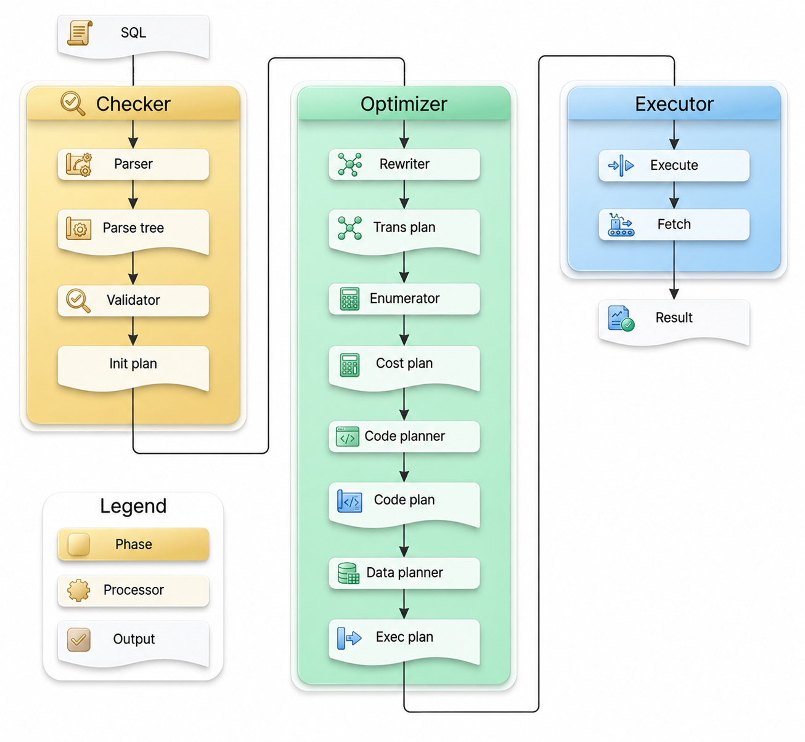

The user query returns the result through several phases: a parser, a validator, a rewriter, an enumerator, a code planner, a data planner, and an executor. The following paragraphs describe each phase.

<a id="be5e4dbda418a294"></a>
#### Parser

A parser checks for grammatical errors in the SQL statement input by the user.

```
gSQL> SELECT * FORM customer;

ERR-42000(40000): syntax error 
SELECT * FORM customer
.........^  ^
Error at line 1
```

If the SQL statement has no grammatical errors, a parse tree is generated. This becomes the input for the validator in the next phase.

<a id="d84a84cf216f62af"></a>
#### Validator

The validator checks for semantic errors in the input parse tree.

For example, it checks whether objects such as tables or columns specified in the query exist, and whether the user has the necessary privileges to reference those objects.

```
gSQL> SELECT * FROM customer;

ERR-42000(16040): table or view does not exist : 
SELECT * FROM customer
              *
ERROR at line 1:
```

If the parse tree has no semantic errors, an init plan is created based on it.

<a id="f49d68a4aed67625"></a>
#### Rewriter

A rewriter transforms a SQL statement into a high-performance SQL query that retains the same meaning.

It analyzes the init plan to create a trans plan, then converts it into a trans plan in a form that is expected to offer better performance. The transformed trans plan becomes the input argument for the enumerator phase.

For more information about converting SQL statements, refer to the [Rewriter](#8921741640766ec3).

<a id="7730b45e22cd20d5"></a>
#### Enumerator

An enumerator calculates the cost of multiple plans based on statistical information and creates the plan with the lowest cost.

For more information about various optimization methods, such as access paths to a table, join ordering, and join method determination, refer to the [Enumerator](#346d90fc87fe4465).

<a id="d58dca4d46a47884"></a>
#### Code Planner

A code planner creates a code plan.

A code plan is the phase where the plan finally selected by the enumerator is converted into an execution plan. The execution plan consists of tree-structured nodes and includes the following information.

- Methods of accessing each table
- The order in which the tables are referenced
- The method of performing join operations on the tables
- Information about data filtering
- Information about data grouping and aggregation
- Information about data sorting

<a id="fcacb8385b62c7a4"></a>
#### Plan Cache

Code plans created by the code planner are registered in the plan cache. The registered plans are classified based on whether the parameter values of the plan cache match.

**Plan cache parameters**

<a id="37cff92930d86616"></a>
| Parameter | Description |
| --- | --- |
| Query text | Case-sensitive query text |
| User information | User ID |
| Cursor property | Cursor properties for queries requiring fetch operations |
| Bind parameter | Number of bind parameters and the IN/OUT properties of each bind parameter |
| Enable atomic | Whether atomic insertion is enabled |
| Enable hint error | Whether hint validation errors are triggered |

When a user query is input, the system checks whether a plan with matching plan cache parameter values exists in the plan cache. If it does, the parser-validator-rewriter-enumerator-code planner process is skipped, and the plan registered in the plan cache is used. By using the plan from the cache, the cost of the parser-validator-rewriter-enumerator-code planner process is reduced, thereby improving performance.

The following are examples of queries with different query text values. Although they are the same queries, their capitalization is different, so the queries below are not recognized as the same plan.

```
"SELECT * FROM customer"
"select * from customer"
"Select * From customer"
"SELECT * FROM  customer"
```

> If a schema object (such as a table, index, view, or sequence) referenced by a plan is not committed, the plan will not be registered.

<a id="b87c4ea0823c3b69"></a>
#### Data Planner

A data planner creates a data plan, which includes a space to store intermediate results and a temporary area to hold expression results while executing code plans.

<a id="312178be49f124fa"></a>
#### Executor

An executor returns the actual results of executing both a code plan and a data plan.

<a id="688c1c86177721a7"></a>


<a id="47536ffbf1799f38"></a>
#### Execution Plan

The execution plan consists of a code plan and a data plan. It is in the form of a tree, with the top node representing an INSERT, DELETE, UPDATE, or SELECT statement.

The execution plan is the most basic analysis tool for SQL tuning. By examining the execution plan, it is possible to see how the query is transformed by the rewriter and which access path, join order, and join method are selected by the enumerator.

The following are the syntax and an example for outputting the execution plan.

<a id="5034e79afaee1f52"></a>
##### Syntax

The following is the syntax for outputting the execution plan.

```
<explain plan> ::= 
      \explain plan [ on | only ] <sql statement>

<sql statement> ::= 
        <query expression>
      | <select for update statement>
      | <select statement: single row>
      | <insert statement>
      | <update statement: searched>
      | <delete statement: searched>
```

<a id="385873e87fc87e1c"></a>
##### Invocation and Access Rules

The privilege to access the &lt;sql statement&gt; is required to execute the &lt;explain plan&gt; statement.

<a id="6870249487c953cc"></a>
##### Syntax Rules and Parameters

```
\EXPLAIN PLAN ON
\EXPLAIN PLAN
```

When specified as above, the query is executed and the execution plan is output.

```
\EXPLAIN PLAN ONLY
```

When specified as above, the query is not executed; only the execution plan is output.

<a id="1863d305cd2197e7"></a>
##### Example

When executed as follows, the SQL statement is performed, and both the query result and the execution plan are output together.

The following example is executed in a cluster system consisting of G1 (G1N1, G1N2), G2 (G2N1, G2N2), and G3 (G3N1, G3N2). The 'customer' table is a cloned table, and the 'orders' table is a sharded table, with data divided by the 'do_orderkey'.

<a id="e9525be6ff809669"></a>


The execution plan above is represented as the following tree, with execution starting from the bottom node.

<a id="72c27ddedfbc56c7"></a>
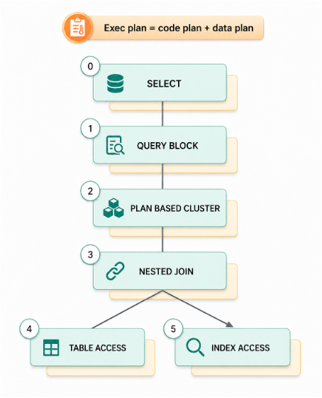

The execution tree above is executed as follows.

First, PLAN BASED CLUSTER(IDX 2) transfers the following SQL to G1, G2, and G3.

```
SELECT /*+ KEEP_JOINED_TABLE
           USE_NL_IN( _A1 ) 
           FULL( _A2 ) 
           INDEX( _A1, "PUBLIC"."CUSTOMER_PK_INDEX" ) 
       */ 
       "_A1"."C_NAME", "_A2"."O_ORDERDATE", "_A2"."O_ORDERSTATUS" 
  FROM ( "PUBLIC"."ORDERS"@LOCAL AS "_A2" 
         INNER JOIN 
         "PUBLIC"."CUSTOMER"@LOCAL AS "_A1" ON true 
       ) ALIAS "_A3" 
 WHERE "_A2"."O_ORDERDATE" < :_V0 
   AND "_A2"."O_ORDERDATE" >= :_V1 
   AND "_A1"."C_CUSTKEY" = "_A2"."O_CUSTKEY"
```

TABLE ACCESS (IDX:4) and INDEX ACCESS (IDX:5) in G1, G2, and G3 read data from the customer and orders tables, performing a NESTED JOIN (IDX:3).

PLAN BASED CLUSTER brings all the NESTED JOIN (IDX:3) results from G1, G2, and G3 to the local system.

Then, it returns the results.

<a id="48fa740f260a375b"></a>
##### Execution Plan Information

The information for each column in the execution plan table is as follows.

- IDX
    - This is the identifier assigned to each plan node.
- NODE DESCRIPTION
    - This is the name of the plan node.
    - The contents in brackets provide additional information that distinguishes plan nodes.
    - An indented plan node indicates a subordinate plan node.
        - Execution starts from the subordinate plan node, and the result is transferred to the superordinate node. 
- ROWS
    - This represents the number of result records generated by the execution of the plan node.

Each plan node contains the following optimization information.

- [Access Paths](#1cd2d1eaf09af996) for each table
- The order of processing [Join](#c0f6b0a744c75947) and join methods
- Information on [Group By](#7e13adf4f2fde616) processing
- Information on [Distinct](#0f7eea80b2547ff3) processing
- Information on [Single Row Aggregation](#2a9d02b29b16d052) processing
- Information on [Order By](#e3f984392541e633) processing
- Information on [Cluster Puller](12-sql-languages.md#22ad93e6359727ef) processing
- Information on [Cluster Pusher](12-sql-languages.md#366a16344ec1965e) processing

<a id="8921741640766ec3"></a>
## Rewriter

This chapter describes various query transformation techniques handled by the rewriter.

<a id="d7a009d103f0250e"></a>
### Filter Push Down

It pushes the filter down as far as possible to minimize the intermediate results that need to be processed.

The following is an example of filter pushdown.

<a id="811a504e8fb8167a"></a>


It filters the rows satisfying the condition n_name = JAPAN in the NATION table and the rows satisfying s_acctbal < 0 in the SUPPLIER table before performing the join. As a result, the number of rows targeted by the join is reduced, improving performance.

The following is an example of performing filter pushdown into a view.

<a id="fff0d0f882475bf3"></a>
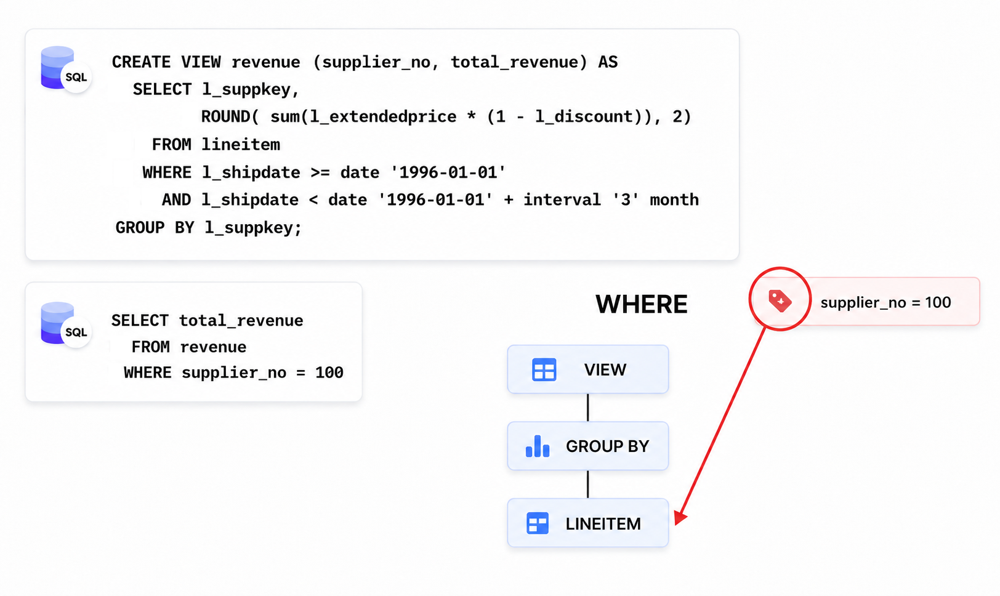

After converting supplier_no = 100 to l_suppkey = 100 and pushing it down to the lineitem TABLE ACCESS node, the number of rows targeted by the GROUP BY operation decreases, resulting in improved performance."

<a id="679fbd6d0f2a09f4"></a>
### DISTINCT Elimination

It eliminates the unnecessary DISTINCT operation.

DISTINCT is eliminated in the following cases.

- The query result of a single-row aggregation is one, so duplicate results do not occur even without DISTINCT.
- If a *group by* clause exists and all key columns of the *group by* are included in the select list, the result is unique, so duplicate results do not occur even without DISTINCT.
- If all key columns of a primary key are included in the select list, the result is unique, so duplicate results do not occur even without DISTINCT.

The following is an example of eliminating DISTINCT.

<a id="744963825b8a7caa"></a>
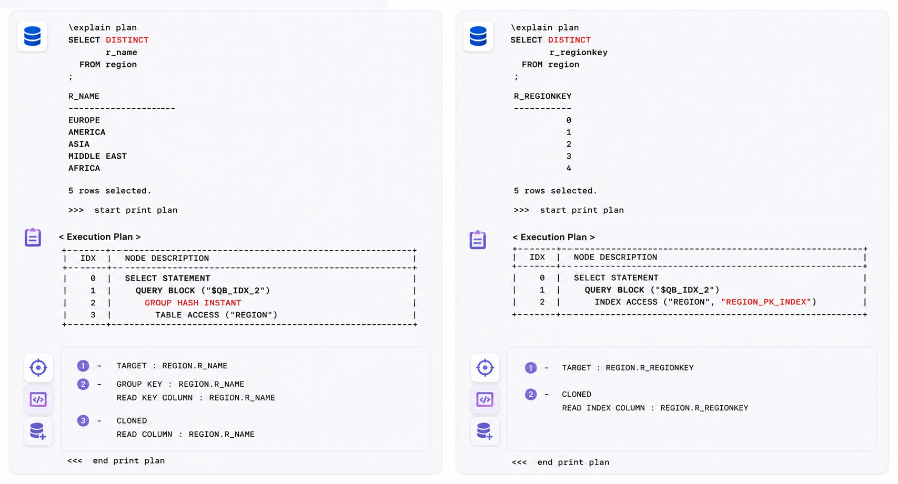

The left execution plan includes a GROUP HASH INSTANT node to process DISTINCT, whereas the right execution plan does not include this node.

Since r_regionkey is a primary key, the result is guaranteed to be distinct even without DISTINCT. Therefore, the unnecessary DISTINCT is eliminated.

<a id="938d019bbdc24c75"></a>
### ORDER BY Elimination

It eliminates the unnecessary ORDER BY.

ORDER BY is not required in the following cases.

- When there is only a view in the *from* clause, and a *group by*, *distinct,* or *order by* clause exists, the *order by* in the query block within the view is unnecessary. This is because the sorting order is discarded by the *group by*, *distinct*, or *order by* clauses in the outer query, even if sorting was performed. 
- The *order by* in the query block within a subquery is also unnecessary. This is because the subquery result is only used to determine whether to return a row in the outer query.

The following is an example of eliminating the ORDER BY clause.

<a id="a73d477a317ae507"></a>


The left and right views in the figure above are the same, but in the right SQL, there is an *order by* in the superordinate query of the view, so the *order by* within the view is eliminated.

<a id="d69f771a2d58bd1f"></a>
### Simple View Merging

It merges a simple view that does not include *group by*, *distinct*, or *aggregation* into the superordinate query block.

Applying simple view merging enables the optimizer to choose from various access paths, join orders, and join methods, leading to a better execution plan.

Simple view merging cannot be applied in the following cases.

- When a query block within the view includes any of the following
    - Set operator
    - LIMIT, OFFSET
    - DISTINCT
    - GROUP BY
    - Single row aggregation 
    - Full outer join
    - Natural join
    - ROWNUM
    - When a subquery expression exists in the SELECT list
- When the view participates in the following queries.
    - The view participates in a full outer join.
    - The view participates in a left outer join, and there are two or more tables within the view.

The following is an example of simple view merging.

```
CREATE VIEW v_nation 
( 
    v_nationkey,
    v_nation_name,
    v_region_name
)
AS
SELECT n_nationkey,
       n_name,
       r_name
  FROM nation, region
 WHERE n_regionkey = r_regionkey;
```

```
\EXPLAIN PLAN 
SELECT v_nation_name, COUNT(*)
  FROM customer, v_nation
 WHERE c_nationkey = v_nationkey
   AND v_region_name = 'ASIA'
GROUP BY v_nation_name;

V_NATION_NAME             COUNT(*)
------------------------- --------
CHINA                         6024
INDIA                         6042
INDONESIA                     6161
JAPAN                         5948
VIETNAM                       6008

5 rows selected.

>>>  start print plan

< Execution Plan >
=========================================================================
|  IDX  |  NODE DESCRIPTION                                             |
-------------------------------------------------------------------------
|    0  |  SELECT STATEMENT                                             |
|    1  |    QUERY BLOCK ("$QB_IDX_2")                                  |
|    2  |      GROUP HASH INSTANT                                       |
|    3  |        NESTED JOIN (INNER JOIN)                               |
|    4  |          NESTED JOIN (INNER JOIN)                             |
|    5  |            TABLE ACCESS ("REGION")                            |
|    6  |            INDEX ACCESS ("NATION", "NATION_REGIONKEY_FK")     |
|    7  |          INDEX ACCESS ("CUSTOMER", "CUSTOMER_NATIONKEY_FK")   |
=========================================================================

     1  -  TARGET : NATION.N_NAME, COUNT(*)
     2  -  GROUP KEY : NATION.N_NAME
           RECORD COLUMN : COUNT(*)
           READ KEY COLUMN : NATION.N_NAME
           READ RECORD COLUMN : COUNT(*)
     3  -  JOINED COLUMN : NATION.N_NAME
     4  -  JOINED COLUMN : NATION.N_NATIONKEY, NATION.N_NAME
     5  -  CLONED 
           READ COLUMN : REGION.R_REGIONKEY, REGION.R_NAME
             PHYSICAL FILTER : REGION.R_NAME = 'ASIA'
     6  -  CLONED 
           READ INDEX COLUMN : NATION.N_REGIONKEY
           READ TABLE COLUMN : NATION.N_NATIONKEY, NATION.N_NAME
             MIN RANGE : NATION.N_REGIONKEY = {REGION.R_REGIONKEY}
             MAX RANGE : NATION.N_REGIONKEY = {REGION.R_REGIONKEY}
     7  -  CLONED 
           READ INDEX COLUMN : CUSTOMER.C_NATIONKEY
             MIN RANGE : CUSTOMER.C_NATIONKEY = {NATION.N_NATIONKEY}
             MAX RANGE : CUSTOMER.C_NATIONKEY = {NATION.N_NATIONKEY}

<<<  end print plan
```

The view does not exist in the execution plan above. It is merged into the outer query and executed in the following converted query form.

<a id="a3c5429beb7e87f7"></a>
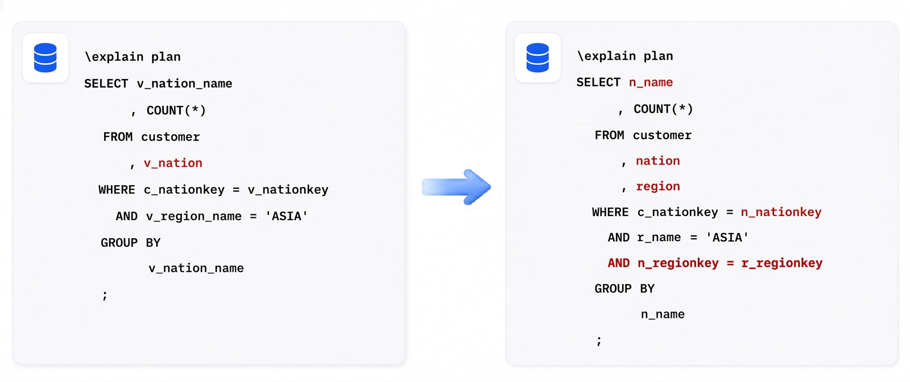

<a id="0b949a980f7b09c4"></a>
### Outer Join Table Elimination

It eliminates the unnecessary outer join table.

Neither an outer join nor access to the right table is required in the following cases.

- It is a left outer join, and the following conditions must be met:
    - A predicate in the form of left_table.col = right_table.col exists in the ON clause.
    - A unique index exists on right_table.col in the ON clause.
    - No columns from the right table are used in any other clauses except in the condition of the ON clause.

The following is an example of outer join table elimination.

Access to the nation table occurs only in the ON clause, and n_nationkey is the primary key column in the following example, so it is unique and does not contain any null values. Therefore, eliminating the nation table does not affect the result

```
\EXPLAIN PLAN
SELECT COUNT(*)
  FROM supplier 
       LEFT OUTER JOIN
       nation
       ON s_nationkey = n_nationkey
 WHERE s_acctbal < 0
;

COUNT(*)
--------
     886

1 row selected.

>>>  start print plan

< Execution Plan >
============================================================================
|  IDX  |  NODE DESCRIPTION                                         | ROWS |
----------------------------------------------------------------------------
|    0  |  SELECT STATEMENT                                         |    1 |
|    1  |    QUERY BLOCK ("$QB_IDX_2")                              |    1 |
|    2  |      TABLE ACCESS ("SUPPLIER")                            |    1 |
============================================================================

     1  -  TARGET : COUNT(*)
     2  -  CLONED 
           READ COLUMN : SUPPLIER.S_ACCTBAL
           AGGREGATION : COUNT(*)
             PHYSICAL FILTER : SUPPLIER.S_ACCTBAL < 0

<<<  end print plan
```

All accesses to the OUTER JOIN and the right table are eliminated in the execution plan above.

<a id="858658f549c0424f"></a>
### Outer Join Operation Elimination

It eliminates the unnecessary outer join operation.

- For a left outer join,
    - If a conditional clause corresponding to the right table exists in the where clause, and the conditional clause is not IS NULL,
        - It can be changed to an inner join
- For a full outer join,
    - If a conditional clause corresponding to the right table exists in the where clause, and the conditional clause is not IS NULL,
        - It can be changed to a right outer join
    - If a conditional clause corresponding to the left table exists in the where clause, and the conditional clause is not IS NULL,
        - It can be changed to a left outer join.
    - If conditional clauses corresponding to both the left and right tables exist in the where clause, and the conditional clauses are not IS NULL,
        - It can be changed to an inner join

The following is an example of eliminating an outer join operation.

```
\EXPLAIN PLAN
  SELECT MAX(COUNT(*))
    FROM customer
         LEFT OUTER JOIN
         orders
         ON  c_custkey = o_custkey
         AND o_comment LIKE '%special%requests%'
   WHERE o_orderpriority = '1-URGENT'
GROUP BY c_custkey;


MAX(COUNT(*))
-------------
            3

1 row selected.

>>>  start print plan

< Execution Plan >
========================================================================
|  IDX  |  NODE DESCRIPTION                                            |
------------------------------------------------------------------------
|    0  |  SELECT STATEMENT                                            |
|    1  |    QUERY BLOCK ("$QB_IDX_2")                                 |
|    2  |      SINGLE ROW AGGREGATION                                     |
|    3  |        GROUP                                                 |
|    4  |          HASH JOIN (INNER JOIN)                              |
|    5  |            INDEX ACCESS ("CUSTOMER", "CUSTOMER_PK_INDEX")    |
|    6  |            HASH JOIN INSTANT                                 |
|    7  |              TABLE ACCESS ("ORDERS")                         |
========================================================================

     1  -  TARGET : MAX( COUNT(*) )
     2  -  AGGREGATION : MAX( COUNT(*) )
     3  -  GROUP KEY : CUSTOMER.C_CUSTKEY
           RECORD COLUMN : COUNT(*)
     4  -  JOINED COLUMN : CUSTOMER.C_CUSTKEY
     5  -  READ INDEX COLUMN : CUSTOMER.C_CUSTKEY
     6  -  HASH KEY : ORDERS.O_CUSTKEY
           READ KEY COLUMN : ORDERS.O_CUSTKEY
             HASH FILTER : ORDERS.O_CUSTKEY = CUSTOMER.C_CUSTKEY
     7  -  READ COLUMN : ORDERS.O_CUSTKEY, ORDERS.O_ORDERPRIORITY,
                         ORDERS.O_COMMENT
             PHYSICAL FILTER : ORDERS.O_ORDERPRIORITY = '1-URGENT'
             LOGICAL FILTER : ORDERS.O_COMMENT LIKE '%special%requests%'

<<<  end print plan
```

In the above example, the condition o_orderpriority = '1-URGENT' exists in the WHERE clause. Due to this condition, rows where all data from the right table is NULL cannot occur in the result.

Therefore, the results are the same even when converting a left outer join to an inner join.

<a id="d663b9fad511376d"></a>
### EXISTS/NOT EXIST Operation Target Optimization

It reduces unnecessary expressions in the SELECT list of a subquery used in EXISTS or NOT EXISTS, improving query processing performance.

EXISTS or NOT EXISTS is an operator that determines whether a result row from a subquery exists. Therefore, neither the number of expressions in the SELECT list of the subquery nor the processing result affects the operation's outcome. As a result, the SELECT list of the subquery is changed to TRUE (BOOLEAN constant).

The following is an example of optimizing the target of an EXISTS operation.

```
\EXPLAIN PLAN
SELECT o_orderpriority,
       count(*) as order_count
  FROM orders
 WHERE o_orderdate = date '1993-07-01'
   AND EXISTS (
               SELECT /*+ NO_UNNEST */
                      *
                 FROM lineitem
                WHERE l_orderkey = o_orderkey
                  AND l_commitdate < l_receiptdate
             )
GROUP BY o_orderpriority
ORDER BY o_orderpriority;

O_ORDERPRIORITY ORDER_COUNT
--------------- -----------
1-URGENT                113
2-HIGH                  136
3-MEDIUM                112
4-NOT SPECIFIED         103
5-LOW                    97

5 rows selected.

>>>  start print plan

< Execution Plan >
==========================================================================
|IDX|  NODE DESCRIPTION                                                  |
--------------------------------------------------------------------------
| 0 |  SELECT STATEMENT                                                  |
| 1 |    QUERY BLOCK ("$QB_IDX_2")                                       |
| 2 |      SORT INSTANT                                                  |
| 3 |        GROUP HASH INSTANT                                          |
| 4 |          TABLE ACCESS ("ORDERS")                                   |
| 5 |          SUB QUERY LIST                                            |
| 6 |            INLINE_VIEW ("$V6")                                     |
| 7 |              QUERY BLOCK ("$QB_IDX_6")                             |
| 8 |                INDEX ACCESS ("LINEITEM", "LINEITEM_ORDERKEY_FK")   |
==========================================================================

     1  -  TARGET : ORDERS.O_ORDERPRIORITY, COUNT(*) AS ORDER_COUNT
     2  -  SORT KEY : "ORDERS.O_ORDERPRIORITY ASC NULLS LAST"
           RECORD COLUMN : COUNT(*)
           READ KEY COLUMN : ORDERS.O_ORDERPRIORITY
           READ RECORD COLUMN : COUNT(*)
     3  -  GROUP KEY : ORDERS.O_ORDERPRIORITY
           RECORD COLUMN : COUNT(*)
           READ KEY COLUMN : ORDERS.O_ORDERPRIORITY
           READ RECORD COLUMN : COUNT(*)
     4  -  READ COLUMN : ORDERS.O_ORDERKEY, ORDERS.O_ORDERDATE, 
                         ORDERS.O_ORDERPRIORITY
             PHYSICAL FILTER : ORDERS.O_ORDERDATE = DATE'1993-07-01'
             POST FILTER : EXISTS( ( $V6.DUMMY_COL ) )
     6  -  COLUMN : $V6.DUMMY_COL AS DUMMY_COL
     7  -  TARGET : NOTHING
     8  -  READ INDEX COLUMN : LINEITEM.L_ORDERKEY
           READ TABLE COLUMN : LINEITEM.L_COMMITDATE, LINEITEM.L_RECEIPTDATE
             MIN RANGE : LINEITEM.L_ORDERKEY = {ORDERS.O_ORDERKEY}
             MAX RANGE : LINEITEM.L_ORDERKEY = {ORDERS.O_ORDERKEY}
             PHYSICAL TABLE FILTER : LINEITEM.L_RECEIPTDATE > LINEITEM.L_COMMITDATE

<<<  end print plan
```

In the above example, lineitem is a table with 16 columns. The user query specifies reading all columns from lineitem using * in the SELECT list within the EXISTS subquery. However, during execution, only information about whether a row satisfying the condition exists is retrieved, and no target column values are fetched.

<a id="c525781eacd451e8"></a>
### Quantifier Elimination

It alters the SQL as follows to eliminate the ANY quantifier.

<a id="e3ff050c47c42734"></a>


The following is an example of eliminating a quantifier.

```
\EXPLAIN PLAN
SELECT COUNT(*)
  FROM supplier
 WHERE s_acctbal >ANY ( SELECT s_acctbal
                          FROM supplier, nation
                         WHERE s_nationkey = n_nationkey
                           AND n_name = 'CHINA' )
;

COUNT(*)
--------
    9950

1 row selected.

>>>  start print plan

< Execution Plan >
===========================================================================
|  IDX  |  NODE DESCRIPTION                                               |
---------------------------------------------------------------------------
|    0  |  SELECT STATEMENT                                               |
|    1  |    QUERY BLOCK ("$QB_IDX_2")                                    |
|    2  |      TABLE ACCESS ("SUPPLIER")                                  |
|    3  |  SUB QUERY LIST                                                 |
|    4  |    INLINE_VIEW ("$V4")                                          |
|    5  |      QUERY BLOCK ("$QB_IDX_6")                                  |
|    6  |        SINGLE ROW AGGREGATION                                      |
|    7  |          NESTED JOIN (INNER JOIN)                               |
|    8  |            TABLE ACCESS ("NATION")                              |
|    9  |            INDEX ACCESS ("SUPPLIER", "SUPPLIER_NATIONKEY_FK")   |
===========================================================================

     1  -  TARGET : COUNT(*)
     2  -  READ COLUMN : SUPPLIER.S_ACCTBAL
           AGGREGATION : COUNT(*)
             PHYSICAL FILTER : SUPPLIER.S_ACCTBAL > $V4.$C0
     4  -  COLUMN : MIN( SUPPLIER.S_ACCTBAL ) AS $C0
     5  -  TARGET : MIN( SUPPLIER.S_ACCTBAL )
     6  -  AGGREGATION : MIN( SUPPLIER.S_ACCTBAL )
     7  -  JOINED COLUMN : SUPPLIER.S_ACCTBAL
     8  -  READ COLUMN : NATION.N_NATIONKEY, NATION.N_NAME
             PHYSICAL FILTER : NATION.N_NAME = 'CHINA'
     9  -  READ INDEX COLUMN : SUPPLIER.S_NATIONKEY
           READ TABLE COLUMN : SUPPLIER.S_ACCTBAL
             MIN RANGE : SUPPLIER.S_NATIONKEY = {NATION.N_NATIONKEY}
             MAX RANGE : SUPPLIER.S_NATIONKEY = {NATION.N_NATIONKEY}

<<<  end print plan
```

<a id="aa37edd64a9188d3"></a>
### Transitive Closure

It creates a constant condition in another table using a join condition. This reduces the throughput of the join and improves performance.

The following is an example of a transitive closure.

<a id="e6f8a818f04caf96"></a>


<a id="076398f872e7dc4a"></a>
### Join Transitive Closure

It creates a join condition in another table using a join condition. With various join orderings and methods available, a more efficient execution plan can be generated.

It is performed by adding a join condition (A = C) to another join condition (A = B AND B = C).

The following is an example of a join transitive closure.

<a id="fad2276c698ec6da"></a>
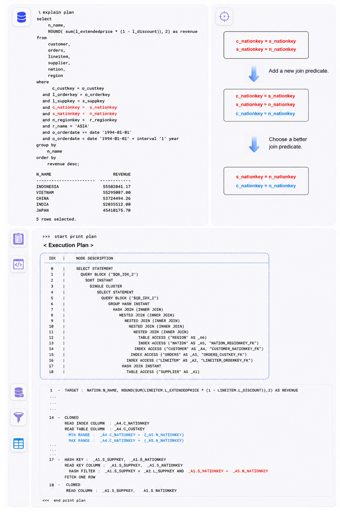

<a id="8ddd560d143351f1"></a>
### Subquery Unnesting

A subquery unnesting converts a subquery in a conditional clause into a join statement, ensuring the same result. It allows for the selection of various access paths, join methods, and join orders, enabling the creation of a more efficient execution plan.

Subqueries are classified into two types as follows.

- Nested subquery (Regular non-scalar subquery )
    - EXISTS/NOT EXIST subquery 
    - Comparison operator ( =, >,>=, <, <=, &lt;&gt;) ANY subquery
    - Comparison operator ( =, >,>=, <, <=, &lt;&gt;) ALL subquery 
    - IN/NOT IN subquery 
- Scalar subquery: Used in the WHERE clause or a SELECT list, returning only a single result.

Not all subqueries can be unnested. A subquery can only be unnested if it satisfies the following constraints

- It should not include a set operator. 
- A scalar subquery can only be used when specified in the WHERE clause.
- It must include a correlated predicate.

A correlated predicate is a predicate that includes a column from an outer query block, which is not defined within the subquery.  
In the example below, *c.cust_id* is a correlated column, and *s.cust_id = c.cust_id* is a correlated predicate.

```
SELECT C.cust_last_name, C.country_id
FROM   customers C
WHERE  EXISTS (SELECT 1
                 FROM sales S
                WHERE S.quantity_sold > 1000
                  AND S.cust_id = C.cust_id);
```

<a id="8434a67c29f6878f"></a>
#### Nested Subquery Unnesting

It converts a subquery into a semi join, anti-join, or inner join.

<a id="5d6f01d0d30b29a9"></a>
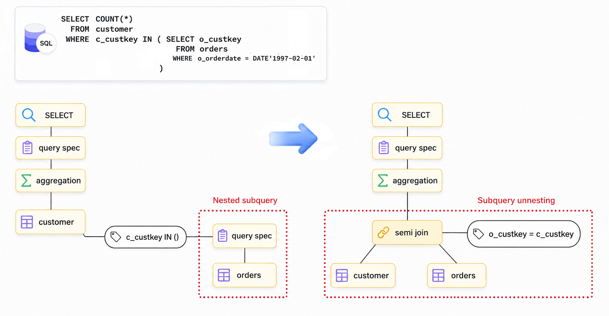

<a id="1f6657d089233866"></a>
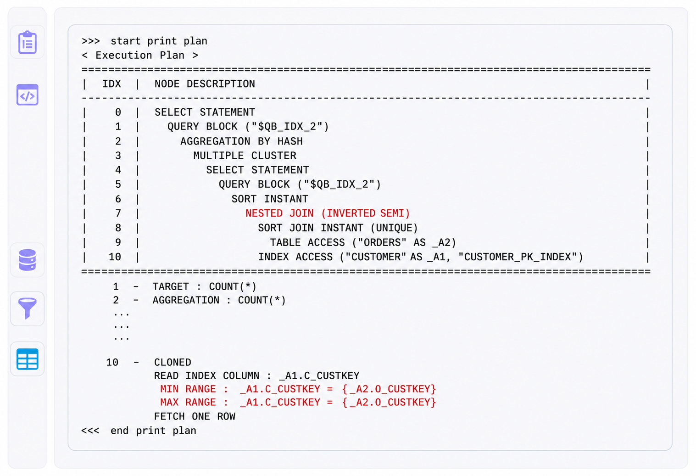

<a id="89eba948670afc5e"></a>
#### Scalar Subquery Unnesting

A scalar subquery in the WHERE clause can only be unnested if the following conditions are met.  
• It must be a single-row aggregation   
• It must include a correlated predicate.

The following is an example of unnesting a scalar subquery.

<a id="eb9fe3e2b0efba07"></a>


<a id="800f660155498e35"></a>
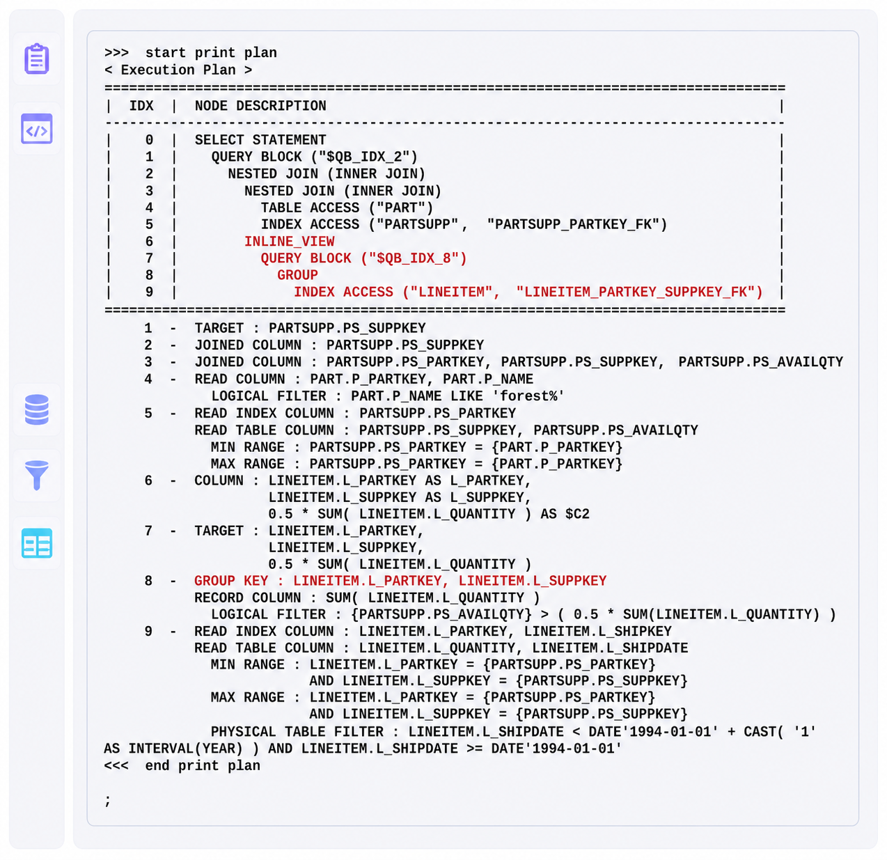

<a id="83133e6c1ed23971"></a>
### Complex View Merging

It merges a view containing a *group by* clause with a superordinate query block. Complex view merging is useful when the *group by* does not significantly reduce intermediate results, and when join filtering with the superordinate query block is effective. In other words, using complex view merging when the *group by* can greatly reduce intermediate results may degrade performance.

Complex view merging can not be applied in the following cases.

- When a query block within a view includes the following
    - SET operator
    - ROWNUM
    - LIMIT/OFFSET
    - Single-row aggregation
    - ORDER BY
    - SELECT list containing a subquery 
    - FULL OUTER JOIN
    - NATURAL JOIN
- When a view participates in the following query
    - A join other than an inner join 
    - An equi join predicate does not exist

The following is an example of complex view merging.

<a id="0be655da506fef75"></a>


<a id="e3194f5f71597813"></a>
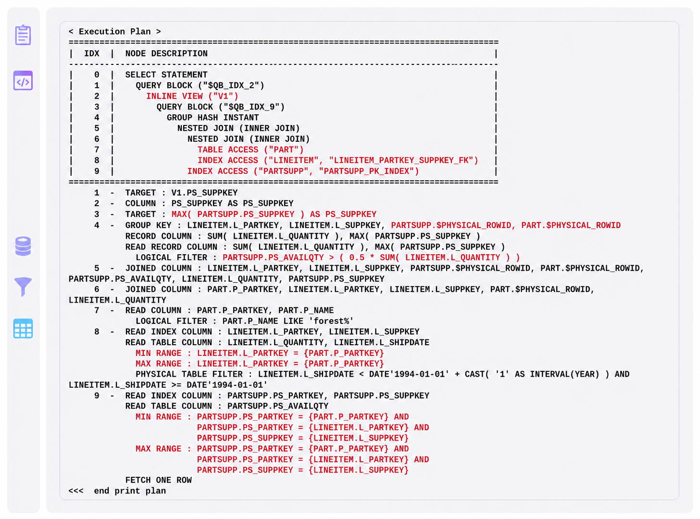

<a id="346d90fc87fe4465"></a>
## Enumerator

An enumerator calculates the cost based on statistical information to determine the most efficient plan.

It receives a trans plan and generates various cost plans based on it. Then, it calculates the cost of each plan using statistical information to select the plan with the lowest cost.

<a id="1cd2d1eaf09af996"></a>
### Access Paths

An access path is a method for accessing a single table, and there are four types as follows.

- Table access
- Index access
- Rowid access
- Index concat

It calculates the cost using the methods above and selects the access path with the lowest cost as the execution plan.

<a id="80c9f3b24fc7699a"></a>
#### Table Access

Table access is a method that reads all rows stored in a table exactly as they are stored.

A table access is selected in the following cases.

- When there is no index.
- When an index exists, but there is no predicate that can use the index (e.g., WHERE col1 + 1 = 10).
- When the cost of table access is high because there is no condition on the first key column of the index.   
  (e.g., WHERE col2 > 3 when the condition only applies to the second column of a composite index (col1, col2))
- When the table data is small, making the cost of table access lower than the cost of index access.
- When a user provides a table access hint (e.g., FULL(t1)).
- When the index selectivity is poor or the data is excessively unevenly distributed.

The following is an example of using table access.

```
\EXPLAIN PLAN
SELECT r_regionkey, r_name 
  FROM region;

R_REGIONKEY R_NAME                   
----------- -------------------------
          0 AFRICA                   
          1 AMERICA                  
          2 ASIA                     
          3 EUROPE                   
          4 MIDDLE EAST              

5 rows selected.

>>>  start print plan

< Execution Plan >
========================================================================
|  IDX  |  NODE DESCRIPTION                                            |
------------------------------------------------------------------------
|    0  |  SELECT STATEMENT                                            |
|    1  |    QUERY BLOCK ("$QB_IDX_2")                                 |
|    2  |      TABLE ACCESS ("REGION")                                 |
========================================================================

     1  -  TARGET : REGION.R_REGIONKEY, REGION.R_NAME
     2  -  READ COLUMN : REGION.R_REGIONKEY, REGION.R_NAME

<<<  end print plan
```

<a id="7a609ae6f946a51d"></a>
#### Index Access

An index access uses an index to retrieve data from a table.

Index access types include index full scan, index unique scan, index range scan, and in-key range scan. The optimal type is selected based on cost estimation.

<a id="2eccf53da4f8481b"></a>
##### Index Full Scan

It scans the entire index.

The following is an example of an index full scan.

```
\EXPLAIN PLAN
SELECT p_partkey
  FROM part;
...

200000 rows selected.

>>>  start print plan

< Execution Plan >
========================================================================
|  IDX  |  NODE DESCRIPTION                                            |
------------------------------------------------------------------------
|    0  |  SELECT STATEMENT                                            |                  
|    1  |    QUERY BLOCK ("$QB_IDX_2")                                 |
|    2  |      INDEX ACCESS ("PART", "PART_PK_INDEX")                  |
========================================================================

     1  -  TARGET : PART.P_PARTKEY
     2  -  READ INDEX COLUMN : PART.P_PARTKEY

<<<  end print plan
```

Since it only retrieves p_partkey, the key column of PART_PK_INDEX, performing an index full scan is more cost-effective than reading the entire table.

<a id="8cc6599e69b86828"></a>
##### Index Unique Scan

It fetches only one row through the index.

The following is an example of an index unique scan.

```
\EXPLAIN PLAN
SELECT * 
  FROM part
 WHERE p_partkey = 1;
...
1 row selected.

>>>  start print plan

< Execution Plan >
========================================================================
|  IDX  |  NODE DESCRIPTION                                            |
------------------------------------------------------------------------
|    0  |  SELECT STATEMENT                                            |
|    1  |    QUERY BLOCK ("$QB_IDX_2")                                 |
|    2  |      INDEX ACCESS ("PART", "PART_PK_INDEX")                  |
========================================================================

     1  -  TARGET : PART.P_PARTKEY, PART.P_NAME, PART.P_MFGR, PART.P_BRAND, 
                    PART.P_TYPE, PART.P_SIZE, PART.P_CONTAINER, 
                    PART.P_RETAILPRICE, PART.P_COMMENT
     2  -  READ INDEX COLUMN : PART.P_PARTKEY
           READ TABLE COLUMN : PART.P_NAME, PART.P_MFGR, PART.P_BRAND, 
                               PART.P_TYPE, PART.P_SIZE, PART.P_CONTAINER, 
                               PART.P_RETAILPRICE, PART.P_COMMENT
             MIN RANGE : PART.P_PARTKEY = 1
             MAX RANGE : PART.P_PARTKEY = 1
           FETCH ONE ROW

<<<  end print plan
```

<a id="43ce83b8cdb3f464"></a>
##### Index Range Scan

It reads rows within a range that satisfy the predicate condition through an index. Since the rows are read through the index, they are sorted by the index key column.

The following is an example of an index range scan.

```
\EXPLAIN PLAN
SELECT p_partkey, p_brand, p_type
  FROM part
 WHERE p_partkey >= 10
   AND p_partkey < 20;

P_PARTKEY P_BRAND    P_TYPE                   
--------- ---------- -------------------------
       10 Brand#54   LARGE BURNISHED STEEL    
       11 Brand#25   STANDARD BURNISHED NICKEL
       12 Brand#33   MEDIUM ANODIZED STEEL    
       13 Brand#55   MEDIUM BURNISHED NICKEL  
       14 Brand#13   SMALL POLISHED STEEL     
       15 Brand#15   LARGE ANODIZED BRASS     
       16 Brand#32   PROMO PLATED TIN         
       17 Brand#43   ECONOMY BRUSHED STEEL    
       18 Brand#11   SMALL BURNISHED STEEL    
       19 Brand#23   SMALL ANODIZED NICKEL    

10 rows selected.

>>>  start print plan

< Execution Plan >
========================================================================
|  IDX  |  NODE DESCRIPTION                                            |
------------------------------------------------------------------------
|    0  |  SELECT STATEMENT                                            |
|    1  |    QUERY BLOCK ("$QB_IDX_2")                                 |
|    2  |      INDEX ACCESS ("PART", "PART_PK_INDEX")                  |
========================================================================

     1  -  TARGET : PART.P_PARTKEY, PART.P_BRAND, PART.P_TYPE
     2  -  READ INDEX COLUMN : PART.P_PARTKEY
           READ TABLE COLUMN : PART.P_BRAND, PART.P_TYPE
             MIN RANGE : PART.P_PARTKEY >= 10
             MAX RANGE : PART.P_PARTKEY IS NOT NULL AND PART.P_PARTKEY < 20

<<<  end print plan
```

<a id="115f3af7f4576362"></a>
##### In Key Range Scan

An in key range scan is used when the following predicate exists.

```
( col1, col2 ) IN ( (val1, val2), (val3, val4) )
```

- The WHERE clause contains an IN or =ANY list function filter.
- col1 and col2 must be base columns. (Columns without any operations or functions applied.)
- The values (val1, val3) corresponding to col1 must be convertible to a single data type.
- The values (val2, val4) corresponding to col2 must be convertible to a single data type.

The following is an example of an in key range scan.

```
\EXPLAIN PLAN
  SELECT o_orderstatus
    FROM orders
   WHERE o_custkey IN ( 1, 10, 100, 1000, 10000 );
...
91 rows selected.

>>>  start print plan

< Execution Plan >
========================================================================
|  IDX  |  NODE DESCRIPTION                                            |
------------------------------------------------------------------------
|    0  |  SELECT STATEMENT                                            |
|    1  |    QUERY BLOCK ("$QB_IDX_2")                                 |
|    2  |      INDEX ACCESS ("ORDERS", "ORDERS_CUSTKEY_FK")            |
========================================================================

     1  -  TARGET : ORDERS.O_ORDERSTATUS
     2  -  READ INDEX COLUMN : ORDERS.O_CUSTKEY
           READ TABLE COLUMN : ORDERS.O_ORDERSTATUS
           IN KEY RANGE
             MIN RANGE : ORDERS.O_CUSTKEY = ?
             MAX RANGE : ORDERS.O_CUSTKEY = ?

<<<  end print plan
```

<a id="c39c12e5a8f32862"></a>
#### Rowid Access

A rowid access directly accesses the corresponding page using the rowid.

To use rowid access, a predicate for the rowid must exist. Since rowid access is generally faster than other access paths, if a predicate for the rowid exists, the estimator is likely to choose rowid access as the best access path.

```
gSQL> \EXPLAIN PLAN
SELECT p_brand, p_type
  FROM part
 WHERE rowid = 'AAAAAAAAYe8AACAAAEMJAAA';

P_BRAND    P_TYPE                  
---------- ------------------------
Brand#33   STANDARD POLISHED COPPER

1 row selected.

>>>  start print plan

< Execution Plan >
========================================================================
|  IDX  |  NODE DESCRIPTION                                            | 
------------------------------------------------------------------------
|    0  |  SELECT STATEMENT                                            |
|    1  |    QUERY BLOCK ("$QB_IDX_2")                                 |
|    2  |      ROWID ACCESS ("PART")                                   |
========================================================================

     1  -  TARGET : PART.P_BRAND, PART.P_TYPE
     2  -  READ COLUMN : PART.P_BRAND, PART.P_TYPE
             ROWID FILTER : PART.ROWID = 'AAAAAAAAYe8AACAAAEMJAAA'

<<<  end print plan
```

<a id="3dd5372ba5a7799e"></a>
#### Index Concat

Index concat is a method that combines the results of multiple index accesses into a single result. Therefore, it can only be used when an OR predicate exists, and each predicate can be accessed by an index.

If an OR predicate exists, the estimator calculates the cost of index concat and selects this method if its cost is lower than that of other access paths.

The following is an example of using index concat.

```
gSQL> \EXPLAIN PLAN
SELECT p_brand, p_type
  FROM part
 WHERE p_partkey = 1 OR p_partkey = 20;

P_BRAND    P_TYPE                
---------- ----------------------
Brand#13   PROMO BURNISHED COPPER
Brand#12   LARGE POLISHED NICKEL 

2 rows selected.

>>>  start print plan

< Execution Plan >
========================================================================
|  IDX  |  NODE DESCRIPTION                                            |
------------------------------------------------------------------------
|    0  |  SELECT STATEMENT                                            |
|    1  |    QUERY BLOCK ("$QB_IDX_2")                                 |
|    2  |      CONCAT (Compare Nothing)                                |
|    3  |        INDEX ACCESS ("PART", "PART_PK_INDEX")                |
|    4  |        INDEX ACCESS ("PART", "PART_PK_INDEX")                |
========================================================================

     1  -  TARGET : PART.P_BRAND, PART.P_TYPE
     2  -  CONCAT COLUMN : PART.P_BRAND, PART.P_TYPE
     3  -  READ INDEX COLUMN : PART.P_PARTKEY
           READ TABLE COLUMN : PART.P_BRAND, PART.P_TYPE
             MIN RANGE : PART.P_PARTKEY = 1
             MAX RANGE : PART.P_PARTKEY = 1
           FETCH ONE ROW
     4  -  READ INDEX COLUMN : PART.P_PARTKEY
           READ TABLE COLUMN : PART.P_BRAND, PART.P_TYPE
             MIN RANGE : PART.P_PARTKEY = 20
             MAX RANGE : PART.P_PARTKEY = 20
           FETCH ONE ROW

<<<  end print plan
```

<a id="c0f6b0a744c75947"></a>
### Join

A join combines two or more tables into a single result set.

In this case, a join condition defines the relationship between the tables. If no join condition exists, the rows from each table are multiplied to create a new result set.

An estimator creates various cost plans by considering the join order, join method, and access path based on the join type. It then calculates the cost and selects the most efficient plan. [Access Paths](#1cd2d1eaf09af996) were discussed in a previous chapter, while this chapter covers join types, join methods and join orders.

<a id="850a62829138e9b0"></a>
#### Join Type

<a id="471c0f4249fc68d8"></a>
##### Cross Join

There is no join condition. Therefore, the cartesian product of the two tables forms the new join result.

The following is an example of a cross join.

```
gSQL> \EXPLAIN PLAN SELECT r_regionkey, n_nationkey FROM region, nation;

R_REGIONKEY N_NATIONKEY
----------- -----------
          0           0
          0           1
          0           2
          0           3
          0           4
          0           5
          0           6
          0           7
          0           8
          0           9
          0          10
          0          11
          0          12
          0          13
          0          14
          0          15
          0          16
          0          17
          0          18
          0          19

R_REGIONKEY N_NATIONKEY
----------- -----------
          0          20
          0          21
          0          22
          0          23
          0          24
          1           0
          1           1
         ...         ...
          4          24


125 rows selected.

>>>  start print plan

< Execution Plan >
========================================================================
|  IDX  |  NODE DESCRIPTION                                            |
------------------------------------------------------------------------
|    0  |  SELECT STATEMENT                                            |
|    1  |    QUERY BLOCK ("$QB_IDX_2")                                 |
|    2  |      NESTED JOIN (INNER JOIN)                                |
|    3  |        INDEX ACCESS ("REGION", "REGION_PK_INDEX")            |
|    4  |        INDEX ACCESS ("NATION", "NATION_PK_INDEX")            |
========================================================================

     1  -  TARGET : REGION.R_REGIONKEY, NATION.N_NATIONKEY
     2  -  JOINED COLUMN : REGION.R_REGIONKEY, NATION.N_NATIONKEY
     3  -  READ INDEX COLUMN : REGION.R_REGIONKEY
     4  -  READ INDEX COLUMN : NATION.N_NATIONKEY

<<<  end print plan
```

<a id="178aaa218eec67e8"></a>
##### Inner Join

Only the rows that satisfy the join condition from the cartesian product of the two tables form the result set.

The following is an example of an inner join.

```
gSQL> \EXPLAIN PLAN 
SELECT r_regionkey, n_nationkey 
  FROM region, nation 
 WHERE r_regionkey = n_nationkey;

R_REGIONKEY N_NATIONKEY
----------- -----------
          0           0
          1           1
          2           2
          3           3
          4           4

5 rows selected.

>>>  start print plan

< Execution Plan >
========================================================================
|  IDX  |  NODE DESCRIPTION                                            |
------------------------------------------------------------------------
|    0  |  SELECT STATEMENT                                            |
|    1  |    QUERY BLOCK ("$QB_IDX_2")                                 |
|    2  |      NESTED JOIN (INNER JOIN)                                |
|    3  |        INDEX ACCESS ("REGION", "REGION_PK_INDEX")            |
|    4  |        INDEX ACCESS ("NATION", "NATION_PK_INDEX")            |
========================================================================

     1  -  TARGET : REGION.R_REGIONKEY, NATION.N_NATIONKEY
     2  -  JOINED COLUMN : REGION.R_REGIONKEY, NATION.N_NATIONKEY
     3  -  READ INDEX COLUMN : REGION.R_REGIONKEY
     4  -  READ INDEX COLUMN : NATION.N_NATIONKEY
             MIN RANGE : NATION.N_NATIONKEY = {REGION.R_REGIONKEY}
             MAX RANGE : NATION.N_NATIONKEY = {REGION.R_REGIONKEY}
           FETCH ONE ROW

<<<  end print plan
```

<a id="f9d9d6c41edc9707"></a>
##### Outer Join

It returns the rows that satisfy the join condition from the Cartesian product of two tables, and also returns rows from the outer table even if they do not satisfy the join condition. In other words, an outer join is used when you want to include rows that do not satisfy the join condition in the result.

In this case, the values corresponding to the inner table are NULL-padded.

In a left outer join, the left table becomes the outer table. Therefore, in the example below, the 'part' table, which is the left table, becomes the outer table and outputs rows that do not satisfy the join condition. In this case, the values from the 'partsupp' table, the inner table, are NULL-padded.

<a id="86eb1a3fcd0a95a4"></a>


In a right outer join, the right table becomes the outer table. Therefore, in the example below, the 'partsupp' table, which is the right table, becomes the outer table and outputs rows that do not satisfy the join condition. In this case, the values from the 'parts' table, the inner table, are NULL-padded.

<a id="754fbc26196ad9eb"></a>


A full outer join outputs rows that satisfy the join condition, and then performs both a left outer join and a right outer join to output all rows.

<a id="7608a25334415148"></a>


<a id="4a6d285a720e76af"></a>
###### **Left Outer Join**

It returns all rows that satisfy the join condition, and also returns rows from the left table even if they do not satisfy the join condition.

The following is an example of a left outer join.

```
gSQL> \EXPLAIN PLAN 
SELECT r_name, n_name
  FROM region 
       LEFT OUTER JOIN 
       nation 
       ON  r_regionkey = n_regionkey
       AND n_nationkey > 20;

R_NAME                    N_NAME                   
------------------------- -------------------------
AFRICA                    null                     
AMERICA                   UNITED STATES            
ASIA                      VIETNAM                  
EUROPE                    UNITED KINGDOM           
EUROPE                    RUSSIA                   
MIDDLE EAST               null                     

6 rows selected.

>>>  start print plan

< Execution Plan >
========================================================================
|  IDX  |  NODE DESCRIPTION                                            |
------------------------------------------------------------------------
|    0  |  SELECT STATEMENT                                            |
|    1  |    QUERY BLOCK ("$QB_IDX_2")                                 |
|    2  |      HASH JOIN (LEFT OUTER JOIN)                             |
|    3  |        TABLE ACCESS ("REGION")                               |
|    4  |        HASH JOIN INSTANT                                     | 
|    5  |          INDEX ACCESS ("NATION", "NATION_PK_INDEX")          |
========================================================================

     1  -  TARGET : REGION.R_NAME, NATION.N_NAME
     2  -  JOINED COLUMN : REGION.R_NAME, NATION.N_NAME
     3  -  READ COLUMN : REGION.R_REGIONKEY, REGION.R_NAME
     4  -  HASH KEY : NATION.N_REGIONKEY
           RECORD COLUMN : NATION.N_NAME
           READ KEY COLUMN : NATION.N_REGIONKEY, NATION.N_NAME
             HASH FILTER : NATION.N_REGIONKEY = REGION.R_REGIONKEY
     5  -  READ INDEX COLUMN : NATION.N_NATIONKEY
           READ TABLE COLUMN : NATION.N_NAME, NATION.N_REGIONKEY
             MIN RANGE : NATION.N_NATIONKEY > 20
             MAX RANGE : NATION.N_NATIONKEY IS NOT NULL

<<<  end print plan
```

<a id="fd9b2e4fb3bccd85"></a>
###### **Right Outer Join**

It returns all rows that satisfy the join condition, and also returns rows from the right table even if they do not satisfy the join condition.

The following is an example of a right outer join.

```
gSQL> \EXPLAIN PLAN 
SELECT r_name, n_name
  FROM region RIGHT OUTER JOIN nation ON  r_regionkey = n_regionkey
                                      AND n_nationkey > 20; 
R_NAME N_NAME                   
------ -------------------------
null                      ALGERIA                  
null                      ARGENTINA                
null                      BRAZIL                   
null                      CANADA                   
null                      EGYPT                    
null                      ETHIOPIA                 
null                      FRANCE                   
null                      GERMANY                  
null                      INDIA                    
null                      INDONESIA                
null                      IRAN                     
null                      IRAQ                     
null                      JAPAN                    
null                      JORDAN                   
null                      KENYA                    
null                      MOROCCO                  
null                      MOZAMBIQUE               
null                      PERU                     
null                      CHINA                    
null                      ROMANIA                  
null                      SAUDI ARABIA             
ASIA                      VIETNAM                  
EUROPE                    RUSSIA                   
EUROPE                    UNITED KINGDOM           
AMERICA                   UNITED STATES            

25 rows selected.

>>>  start print plan

< Execution Plan >
========================================================================
|  IDX  |  NODE DESCRIPTION                                            |
------------------------------------------------------------------------
|    0  |  SELECT STATEMENT                                            |
|    1  |    QUERY BLOCK ("$QB_IDX_2")                                 |
|    2  |      HASH JOIN (LEFT OUTER JOIN)                             |
|    3  |        TABLE ACCESS ("NATION")                               |
|    4  |        HASH JOIN INSTANT                                     |
|    5  |          TABLE ACCESS ("REGION")                             |
========================================================================

     1  -  TARGET : REGION.R_NAME, NATION.N_NAME
     2  -  JOINED COLUMN : REGION.R_NAME, NATION.N_NAME
     3  -  READ COLUMN : NATION.N_NATIONKEY, NATION.N_NAME, NATION.N_REGIONKEY
     4  -  HASH KEY : REGION.R_REGIONKEY
           RECORD COLUMN : REGION.R_NAME
           READ KEY COLUMN : REGION.R_REGIONKEY, REGION.R_NAME
             HASH FILTER : REGION.R_REGIONKEY = NATION.N_REGIONKEY
             LOGICAL FILTER : {NATION.N_NATIONKEY} > 20
           FETCH ONE ROW
     5  -  READ COLUMN : REGION.R_REGIONKEY, REGION.R_NAME

<<<  end print plan
```

<a id="e7a44812fcd0dbb1"></a>
###### **Full Outer Join**

It returns all rows that satisfy the join condition, and also returns all rows from both the left and right tables, even if they do not satisfy the join condition.

The following is an example of a full outer join.

```
gSQL> \EXPLAIN PLAN 
SELECT r_name, n_name
  FROM region FULL OUTER JOIN nation ON  r_regionkey = n_regionkey
                                      AND n_nationkey > 20;
R_NAME N_NAME                   
------ -------------------------
null                      ALGERIA                  
null                      ARGENTINA                
null                      BRAZIL                   
null                      CANADA                   
null                      EGYPT                    
null                      ETHIOPIA                 
null                      FRANCE                   
null                      GERMANY                  
null                      INDIA                    
null                      INDONESIA                
null                      IRAN                     
null                      IRAQ                     
null                      JAPAN                    
null                      JORDAN                   
null                      KENYA                    
null                      MOROCCO                  
null                      MOZAMBIQUE               
null                      PERU                     
null                      CHINA                    
null                      ROMANIA                  
null                      SAUDI ARABIA             
ASIA                      VIETNAM                  
EUROPE                    RUSSIA                   
EUROPE                    UNITED KINGDOM           
AMERICA                   UNITED STATES            
AFRICA                    null                     
MIDDLE EAST               null                     

27 rows selected.

>>>  start print plan

< Execution Plan >
========================================================================
|  IDX  |  NODE DESCRIPTION                                            |
------------------------------------------------------------------------
|    0  |  SELECT STATEMENT                                            |
|    1  |    QUERY BLOCK ("$QB_IDX_2")                                 |
|    2  |      HASH JOIN (FULL OUTER JOIN)                             |
|    3  |        TABLE ACCESS ("NATION")                               |
|    4  |        HASH JOIN INSTANT                                     |                      
|    5  |          TABLE ACCESS ("REGION")                             |
========================================================================

     1  -  TARGET : REGION.R_NAME, NATION.N_NAME
     2  -  JOINED COLUMN : REGION.R_NAME, NATION.N_NAME
     3  -  READ COLUMN : NATION.N_NATIONKEY, NATION.N_NAME, NATION.N_REGIONKEY
     4  -  HASH KEY : REGION.R_REGIONKEY
           RECORD COLUMN : REGION.R_NAME
           READ KEY COLUMN : REGION.R_REGIONKEY, REGION.R_NAME
             HASH FILTER : REGION.R_REGIONKEY = NATION.N_REGIONKEY
             LOGICAL FILTER : {NATION.N_NATIONKEY} > 20
     5  -  READ COLUMN : REGION.R_REGIONKEY, REGION.R_NAME

<<<  end print plan
```

<a id="2932e3ec512552c7"></a>
##### Semi Join

A semi join cannot be explicitly specified using an SQL statement. When a user uses a subquery with a quantifier such as IN, EXISTS, =ANY, the query rewriter converts it into a semi join while unnesting the subquery.

When a row that satisfies the join condition exists, it returns the row from the main query as the result.

The following is an example of a semi join.

```
\EXPLAIN PLAN
SELECT o_orderpriority,
       count(*) as order_count
  FROM orders
 WHERE o_orderdate = date '1993-07-01'
   AND EXISTS (
               SELECT *
                 FROM lineitem
                WHERE l_orderkey = o_orderkey
                  AND l_commitdate < l_receiptdate
             )
GROUP BY o_orderpriority
ORDER BY o_orderpriority;

O_ORDERPRIORITY ORDER_COUNT
--------------- -----------
1-URGENT                113
2-HIGH                  136
3-MEDIUM                112
4-NOT SPECIFIED         103
5-LOW                    97

5 rows selected.

>>>  start print plan

< Execution Plan >
==========================================================================
|  IDX  |  NODE DESCRIPTION                                              |
--------------------------------------------------------------------------
|    0  |  SELECT STATEMENT                                              |
|    1  |    QUERY BLOCK ("$QB_IDX_2")                                   |
|    2  |      SORT INSTANT                                              |
|    3  |        GROUP HASH INSTANT                                      |
|    4  |          NESTED JOIN (SEMI)                                    |
|    5  |            TABLE ACCESS ("ORDERS")                             |
|    6  |            INDEX ACCESS ("LINEITEM", "LINEITEM_ORDERKEY_FK")   |
==========================================================================

     1  -  TARGET : ORDERS.O_ORDERPRIORITY, COUNT(*) AS ORDER_COUNT
     2  -  SORT KEY : "ORDERS.O_ORDERPRIORITY ASC NULLS LAST"
           RECORD COLUMN : COUNT(*)
           READ KEY COLUMN : ORDERS.O_ORDERPRIORITY
           READ RECORD COLUMN : COUNT(*)
     3  -  GROUP KEY : ORDERS.O_ORDERPRIORITY
           RECORD COLUMN : COUNT(*)
           READ KEY COLUMN : ORDERS.O_ORDERPRIORITY
           READ RECORD COLUMN : COUNT(*)
     4  -  JOINED COLUMN : ORDERS.O_ORDERPRIORITY
     5  -  READ COLUMN : ORDERS.O_ORDERKEY, ORDERS.O_ORDERDATE, ORDERS.O_ORDERPRIORITY
             PHYSICAL FILTER : ORDERS.O_ORDERDATE = DATE'1993-07-01'
     6  -  READ INDEX COLUMN : LINEITEM.L_ORDERKEY
           READ TABLE COLUMN : LINEITEM.L_COMMITDATE, LINEITEM.L_RECEIPTDATE
             MIN RANGE : LINEITEM.L_ORDERKEY = {ORDERS.O_ORDERKEY}
             MAX RANGE : LINEITEM.L_ORDERKEY = {ORDERS.O_ORDERKEY}
             PHYSICAL TABLE FILTER :
                         LINEITEM.L_RECEIPTDATE > LINEITEM.L_COMMITDATE

<<<  end print plan
```

<a id="72812db8842bfac2"></a>
##### Anti Semi Join

An anti semi join cannot be explicitly specified using an SQL statement. When a user uses a subquery with a quantifier such as NOT IN, NOT EXISTS, !=ALL, =ALL, the query rewriter converts it into an anti semi join while unnesting the subquery.

When no row satisfies the join condition, the row from the main query is returned as the result.

When a nullable column is present in the join condition, the operation is performed as a null-aware anti-semi join. Otherwise, it is performed as a regular anti-semi join.

The following is an example of an anti semi join.   
Both p_partkey and ps_partkey are primary key columns. Therefore, none of them can be null.

```
\EXPLAIN PLAN
SELECT p_name, p_brand
  FROM part
 WHERE p_partkey NOT IN ( SELECT ps_partkey
                            FROM partsupp
                           WHERE ps_availqty > 5000 );
...

12511 rows selected.

>>>  start print plan

< Execution Plan >
========================================================================
|  IDX  |  NODE DESCRIPTION                                            |
------------------------------------------------------------------------
|    0  |  SELECT STATEMENT                                            |
|    1  |    QUERY BLOCK ("$QB_IDX_2")                                 |
|    2  |      HASH JOIN (ANTI SEMI)                                   |
|    3  |        TABLE ACCESS ("PART")                                 |
|    4  |        HASH JOIN INSTANT (UNIQUE)                            |
|    5  |          TABLE ACCESS ("PARTSUPP")                           |
========================================================================

     1  -  TARGET : PART.P_NAME, PART.P_BRAND
     2  -  JOINED COLUMN : PART.P_NAME, PART.P_BRAND
     3  -  READ COLUMN : PART.P_PARTKEY, PART.P_NAME, PART.P_BRAND
     4  -  HASH KEY : PARTSUPP.PS_PARTKEY
           READ KEY COLUMN : PARTSUPP.PS_PARTKEY
             HASH FILTER : PARTSUPP.PS_PARTKEY = PART.P_PARTKEY
           FETCH ONE ROW
     5  -  READ COLUMN : PARTSUPP.PS_PARTKEY, PARTSUPP.PS_AVAILQTY
             PHYSICAL FILTER : PARTSUPP.PS_AVAILQTY > 5000

<<<  end print plan
```

The following is an example of a null-aware anti-semi join.  
p_partkey is not null because it is a primary key column, but l_partkey is nullable.

```
\EXPLAIN PLAN
SELECT p_name, p_brand
  FROM part
 WHERE p_partkey NOT IN ( SELECT l_partkey
                            FROM lineitem
                           WHERE l_quantity > 30 );

no rows selected.

>>>  start print plan

< Execution Plan >
========================================================================
|  IDX  |  NODE DESCRIPTION                                            |
------------------------------------------------------------------------
|    0  |  SELECT STATEMENT                                            |
|    1  |    QUERY BLOCK ("$QB_IDX_2")                                 |
|    2  |      HASH JOIN (ANTI SEMI NA)                                |
|    3  |        TABLE ACCESS ("PART")                                 |
|    4  |        HASH JOIN INSTANT (UNIQUE)                            |
|    5  |          TABLE ACCESS ("LINEITEM")                           |
========================================================================

     1  -  TARGET : PART.P_NAME, PART.P_BRAND
     2  -  JOINED COLUMN : PART.P_NAME, PART.P_BRAND
     3  -  READ COLUMN : PART.P_PARTKEY, PART.P_NAME, PART.P_BRAND
     4  -  HASH KEY : LINEITEM.L_PARTKEY
           READ KEY COLUMN : LINEITEM.L_PARTKEY
             HASH FILTER : LINEITEM.L_PARTKEY = PART.P_PARTKEY
           FETCH ONE ROW
     5  -  READ COLUMN : LINEITEM.L_PARTKEY, LINEITEM.L_QUANTITY
             PHYSICAL FILTER : LINEITEM.L_QUANTITY > 30

<<<  end print plan
```

<a id="196b612dab147ba2"></a>
#### Join Method

The join operation methods between two tables include nested loops join, sort merge join, and hash join. The enumerator calculates the cost for these join methods and selects the one with the lowest cost.

<a id="5c5d3d8f76fe8dde"></a>
##### Nested Loops Join

It scans all rows in the inner table for each row in the outer table and retrieves the results that satisfy the join condition.

<a id="93de4cab5d402640"></a>
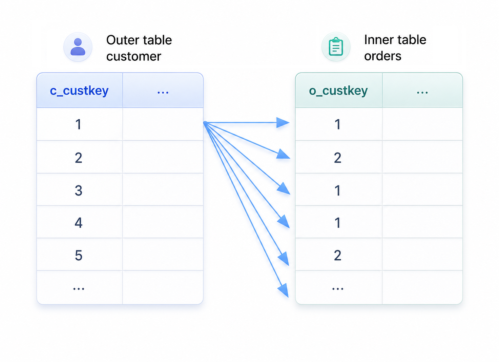

It performs a full scan of the inner table as many times as there are rows in the outer table, so the fewer rows in the outer table, the better.

Even a join without a join condition can return the execution result as a Cartesian product through a nested loop join. Therefore, a nested loop join can be performed even when hash join and sort merge join are not possible.

<a id="6c6ea87a2e07e4eb"></a>
###### **Index Nested Loops Join**

When the inner table has an index that can be used to find rows satisfying the join condition, an index nested loop join is performed. Since index access only retrieves the necessary rows, it improves performance.

<a id="03e82b6eed612e87"></a>
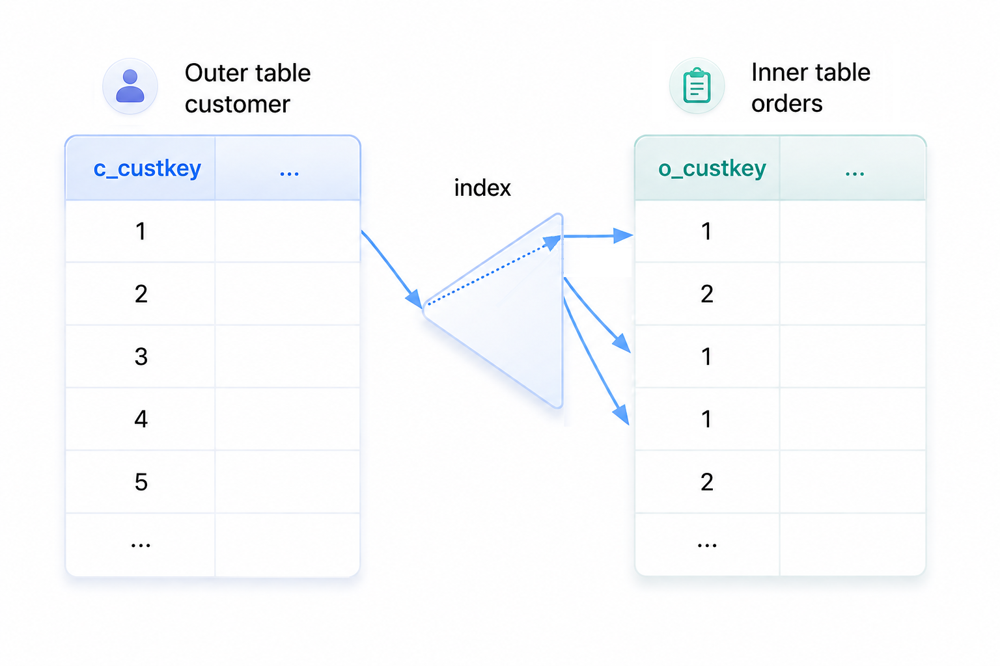

The following is an example of an index nested loop join.

```
\EXPLAIN PLAN
  SELECT c_custkey, count(o_orderkey)
    FROM customer, orders
   WHERE c_custkey = o_custkey
     AND c_comment like '%special%requests%'
GROUP BY c_custkey;
... 
2265 rows selected.

>>>  start print plan

< Execution Plan >
========================================================================
|  IDX  |  NODE DESCRIPTION                                            |
------------------------------------------------------------------------
|    0  |  SELECT STATEMENT                                            |
|    1  |    QUERY BLOCK ("$QB_IDX_2")                                 |
|    2  |      GROUP HASH INSTANT                                      |
|    3  |        NESTED JOIN (INNER JOIN)                              |
|    4  |          TABLE ACCESS ("CUSTOMER")                           |
|    5  |          INDEX ACCESS ("ORDERS", "ORDERS_CUSTKEY_FK")        |
========================================================================

     1  -  TARGET : CUSTOMER.C_CUSTKEY, COUNT( ORDERS.O_ORDERKEY )
     2  -  GROUP KEY : CUSTOMER.C_CUSTKEY
           RECORD COLUMN : COUNT( ORDERS.O_ORDERKEY )
           READ KEY COLUMN : CUSTOMER.C_CUSTKEY
           READ RECORD COLUMN : COUNT( ORDERS.O_ORDERKEY )
     3  -  JOINED COLUMN : CUSTOMER.C_CUSTKEY, ORDERS.O_ORDERKEY
     4  -  READ COLUMN : CUSTOMER.C_CUSTKEY, CUSTOMER.C_COMMENT
             LOGICAL FILTER : CUSTOMER.C_COMMENT LIKE '%special%requests%'
     5  -  READ INDEX COLUMN : ORDERS.O_CUSTKEY
           READ TABLE COLUMN : ORDERS.O_ORDERKEY
             MIN RANGE : ORDERS.O_CUSTKEY = {CUSTOMER.C_CUSTKEY}
             MAX RANGE : ORDERS.O_CUSTKEY = {CUSTOMER.C_CUSTKEY}

<<<  end print plan
```

<a id="0c6dd908f6f02be5"></a>
###### **Instant Nested Loops Join**

It performs a nested loop join after loading the intermediate results of the inner table into an instant table.

<a id="6afc856f61a8f8ef"></a>
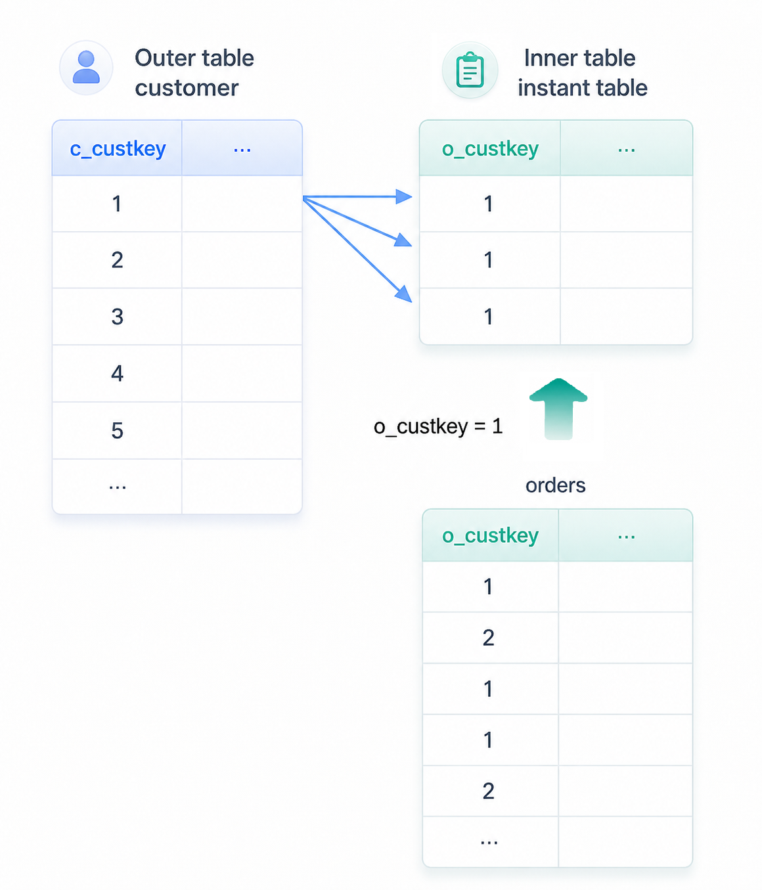

When a condition such as o_custkey = 1 exists, as shown in the above example, a nested loop join is performed by loading the intermediate result of the *orders* into an instant table.

The following is an example of an instant nested loop join.

```
\EXPLAIN PLAN
  SELECT c_custkey, count(o_orderkey)
    FROM customer, orders
   WHERE c_comment like '%special%requests%'
     AND o_orderdate = date '1995-03-15'
GROUP BY c_custkey;

...
3380 rows selected.

>>>  start print plan

< Execution Plan >
========================================================================
|  IDX  |  NODE DESCRIPTION                                            |
------------------------------------------------------------------------
|    0  |  SELECT STATEMENT                                            |
|    1  |    QUERY BLOCK ("$QB_IDX_2")                                 |
|    2  |      GROUP HASH INSTANT                                      |
|    3  |        NESTED JOIN (INNER JOIN)                              |
|    4  |          TABLE ACCESS ("ORDERS")                             |
|    5  |          FLAT JOIN INSTANT                                   |
|    6  |            TABLE ACCESS ("CUSTOMER")                         |
========================================================================

     1  -  TARGET : CUSTOMER.C_CUSTKEY, COUNT( ORDERS.O_ORDERKEY )
     2  -  GROUP KEY : CUSTOMER.C_CUSTKEY
           RECORD COLUMN : COUNT( ORDERS.O_ORDERKEY )
           READ KEY COLUMN : CUSTOMER.C_CUSTKEY
           READ RECORD COLUMN : COUNT( ORDERS.O_ORDERKEY )
     3  -  JOINED COLUMN : CUSTOMER.C_CUSTKEY, ORDERS.O_ORDERKEY
     4  -  READ COLUMN : ORDERS.O_ORDERKEY, ORDERS.O_ORDERDATE
             PHYSICAL FILTER : ORDERS.O_ORDERDATE = DATE'1995-03-15'
     5  -  RECORD COLUMN : CUSTOMER.C_CUSTKEY
           READ COLUMN : CUSTOMER.C_CUSTKEY
     6  -  READ COLUMN : CUSTOMER.C_CUSTKEY, CUSTOMER.C_COMMENT
             LOGICAL FILTER : CUSTOMER.C_COMMENT LIKE '%special%requests%'

<<<  end print plan
```

<a id="5549923096239b40"></a>
##### Sort Merge Join

It sorts the intermediate results of both the outer and inner tables, then sequentially compares them to check if they satisfy the join condition and returns the join result.

When an index is available on either the outer or the inner table, the table retrieves the sorted intermediate results using the index, rather than relying on a sort instant.

One or more equi join conditions are required to perform a sort merge join.

<a id="ba773f549d7f2301"></a>
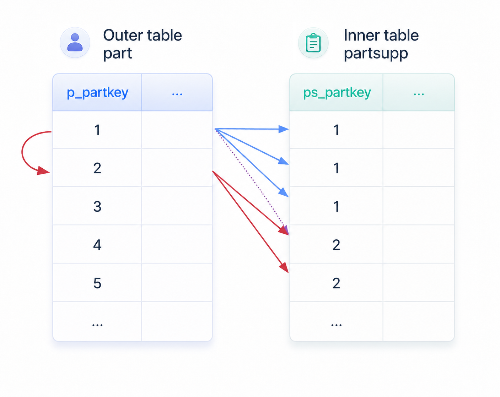

The following is an example of a sort merge join.

```
\EXPLAIN PLAN
SELECT p_name, p_brand, p_type
  FROM part, partsupp
 WHERE p_partkey = ps_partkey
   AND p_partkey < 10;
...
36 rows selected.

>>>  start print plan

< Execution Plan >
========================================================================
|  IDX  |  NODE DESCRIPTION                                            |
------------------------------------------------------------------------
|    0  |  SELECT STATEMENT                                            |
|    1  |    QUERY BLOCK ("$QB_IDX_2")                                 |
|    2  |      MERGE JOIN (INNER JOIN)                                 |
|    3  |        INDEX ACCESS ("PART", "PART_PK_INDEX")                |
|    4  |        INDEX ACCESS ("PARTSUPP", "PARTSUPP_PARTKEY_FK")      |
========================================================================

     1  -  TARGET : PART.P_NAME, PART.P_BRAND, PART.P_TYPE
     2  -  JOINED COLUMN : PART.P_NAME, PART.P_BRAND, PART.P_TYPE
             ON FILTER (Equi) : PART.P_PARTKEY = PARTSUPP.PS_PARTKEY
     3  -  READ INDEX COLUMN : PART.P_PARTKEY
           READ TABLE COLUMN : PART.P_NAME, PART.P_BRAND, PART.P_TYPE
             MAX RANGE : PART.P_PARTKEY < 10
     4  -  READ INDEX COLUMN : PARTSUPP.PS_PARTKEY
             MAX RANGE : PARTSUPP.PS_PARTKEY < 10

<<<  end print plan
```

<a id="4d01c98a230e134f"></a>
##### Hash Join

It creates a hash instant for the inner table and then returns the join result that satisfies the join condition using the hash.

One or more equi join conditions are required to perform a hash join.

<a id="f5eacf68a4a4e61d"></a>


The following is an example of a hash join.

```
\EXPLAIN PLAN
SELECT s_suppkey,
       s_name,
       total_revenue
  FROM supplier, 
         (
            SELECT l_suppkey,
                   ROUND( sum(l_extendedprice * (1 - l_discount)), 2)
              FROM lineitem
             WHERE l_shipdate >= date '1996-01-01'
               AND l_shipdate < date '1996-01-01' + interval '3' month
             GROUP BY l_suppkey
       ) revenue(supplier_no, total_revenue)
 WHERE
      s_suppkey = supplier_no;


...
10000 rows selected.

>>>  start print plan

< Execution Plan >
========================================================================
|  IDX  |  NODE DESCRIPTION                                            |
------------------------------------------------------------------------
|    0  |  SELECT STATEMENT                                            |
|    1  |    QUERY BLOCK ("$QB_IDX_2")                                 |
|    2  |      HASH JOIN (INNER JOIN)                                  |
|    3  |        TABLE ACCESS ("SUPPLIER")                             |
|    4  |        HASH JOIN INSTANT                                     |
|    5  |          INLINE_VIEW ("REVENUE")                             |
|    6  |            QUERY BLOCK ("$QB_IDX_7")                         |
|    7  |              GROUP HASH INSTANT                              |
|    8  |                TABLE ACCESS ("LINEITEM")                     |
========================================================================

     1  -  TARGET : SUPPLIER.S_SUPPKEY, SUPPLIER.S_NAME, REVENUE.$C1
     2  -  JOINED COLUMN : SUPPLIER.S_SUPPKEY, SUPPLIER.S_NAME, REVENUE.$C1
     3  -  READ COLUMN : SUPPLIER.S_SUPPKEY, SUPPLIER.S_NAME
     4  -  HASH KEY : REVENUE.L_SUPPKEY
           RECORD COLUMN : REVENUE.$C1
           READ KEY COLUMN : REVENUE.L_SUPPKEY, REVENUE.$C1
             HASH FILTER : REVENUE.L_SUPPKEY = SUPPLIER.S_SUPPKEY
     5  -  COLUMN : LINEITEM.L_SUPPKEY AS L_SUPPKEY, ROUND(SUM( LINEITEM.L_EXTENDEDPRICE * ( 1 - LINEITEM.L_DISCOUNT ) ),2) AS $C1
     6  -  TARGET : LINEITEM.L_SUPPKEY, ROUND(SUM( LINEITEM.L_EXTENDEDPRICE * ( 1 - LINEITEM.L_DISCOUNT ) ),2)
     7  -  GROUP KEY : LINEITEM.L_SUPPKEY
           RECORD COLUMN : SUM( LINEITEM.L_EXTENDEDPRICE * ( 1 - LINEITEM.L_DISCOUNT ) )
           READ KEY COLUMN : LINEITEM.L_SUPPKEY
           READ RECORD COLUMN : SUM( LINEITEM.L_EXTENDEDPRICE * ( 1 - LINEITEM.L_DISCOUNT ) )
     8  -  READ COLUMN : LINEITEM.L_SUPPKEY, LINEITEM.L_EXTENDEDPRICE, LINEITEM.L_DISCOUNT, LINEITEM.L_SHIPDATE
             PHYSICAL FILTER : LINEITEM.L_SHIPDATE < DATE'1996-01-01' + CAST( '3' AS INTERVAL(MONTH) ) AND LINEITEM.L_SHIPDATE >= DATE'1996-01-01'

<<<  end print plan
```

<a id="e2c7d2b320c87cac"></a>
#### Join Order

When joining three or more tables, the join order must be determined. The order is established by first joining two tables, and then joining the intermediate result with the next table.

When there are three tables, several join orders are possible, as follows.

<a id="beca12b60eff0970"></a>
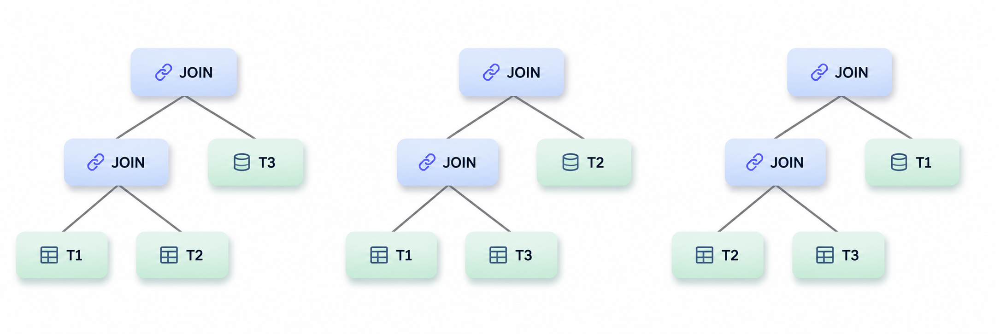

The enumerator creates a set of various execution plans based on possible join orders, join methods and available access paths, then determines the join order by selecting the plan with the lowest intermediate results and cost.

<a id="7e13adf4f2fde616"></a>
### Group By

This is the process of handling a group by.

Generally, it processes a *group by* operation by creating a GROUP HASH INSTANT.

If the intermediate result is sorted by the *group by key column* as it ascends from the subordinate node, it can be processed without accumulating separate hash instants.

The following is an example of processing a *group by* operation by creating a GROUP HASH INSTANT.

```
\EXPLAIN PLAN
  SELECT c_custkey, count(o_orderkey)
    FROM customer, orders
 WHERE c_custkey = o_custkey 
     AND c_comment like '%special%requests%'
     AND o_orderdate = date '1995-03-15'
GROUP BY c_custkey;

...
12 rows selected.

>>>  start print plan

< Execution Plan >
========================================================================
|  IDX  |  NODE DESCRIPTION                                            |
------------------------------------------------------------------------
|    0  |  SELECT STATEMENT                                            |
|    1  |    QUERY BLOCK ("$QB_IDX_2")                                 |
|    2  |      GROUP HASH INSTANT                                      |
|    3  |        NESTED JOIN (INNER JOIN)                              |
|    4  |          TABLE ACCESS ("CUSTOMER")                           |
|    5  |          INDEX ACCESS ("ORDERS", "ORDERS_CUSTKEY_FK")        |
========================================================================

     1  -  TARGET : CUSTOMER.C_CUSTKEY, COUNT( ORDERS.O_ORDERKEY )
     2  -  GROUP KEY : CUSTOMER.C_CUSTKEY
           RECORD COLUMN : COUNT( ORDERS.O_ORDERKEY )
           READ KEY COLUMN : CUSTOMER.C_CUSTKEY
           READ RECORD COLUMN : COUNT( ORDERS.O_ORDERKEY )
     3  -  JOINED COLUMN : CUSTOMER.C_CUSTKEY, ORDERS.O_ORDERKEY
     4  -  READ COLUMN : CUSTOMER.C_CUSTKEY, CUSTOMER.C_COMMENT
             LOGICAL FILTER : CUSTOMER.C_COMMENT LIKE '%special%requests%'
     5  -  READ INDEX COLUMN : ORDERS.O_CUSTKEY
           READ TABLE COLUMN : ORDERS.O_ORDERKEY, ORDERS.O_ORDERDATE
             MIN RANGE : ORDERS.O_CUSTKEY = {CUSTOMER.C_CUSTKEY}
             MAX RANGE : ORDERS.O_CUSTKEY = {CUSTOMER.C_CUSTKEY}
             PHYSICAL TABLE FILTER : ORDERS.O_ORDERDATE = DATE'1995-03-15'

<<<  end print plan
```

The following is an example of processing a *group by* operation using the sorted intermediate results from the subordinate node.

```
\EXPLAIN PLAN
  SELECT c_custkey, count(o_orderkey)
    FROM customer, orders
   WHERE c_custkey = o_custkey 
     AND c_custkey >= 10
     AND c_custkey < 20
     AND c_comment like '%special%requests%'
     AND o_orderdate = date '1995-03-15'
GROUP BY c_custkey;

...

>>>  start print plan

< Execution Plan >
========================================================================
|  IDX  |  NODE DESCRIPTION                                            |
------------------------------------------------------------------------
|    0  |  SELECT STATEMENT                                            |
|    1  |    QUERY BLOCK ("$QB_IDX_2")                                 |
|    2  |      GROUP                                                   |
|    3  |        NESTED JOIN (INNER JOIN)                              |
|    4  |          INDEX ACCESS ("CUSTOMER", "CUSTOMER_PK_INDEX")      |
|    5  |          INDEX ACCESS ("ORDERS", "ORDERS_CUSTKEY_FK")        |
========================================================================

     1  -  TARGET : CUSTOMER.C_CUSTKEY, COUNT( ORDERS.O_ORDERKEY )
     2  -  GROUP KEY : CUSTOMER.C_CUSTKEY
           RECORD COLUMN : COUNT( ORDERS.O_ORDERKEY )
     3  -  JOINED COLUMN : CUSTOMER.C_CUSTKEY, ORDERS.O_ORDERKEY
     4  -  READ INDEX COLUMN : CUSTOMER.C_CUSTKEY
           READ TABLE COLUMN : CUSTOMER.C_COMMENT
             MIN RANGE : CUSTOMER.C_CUSTKEY >= 10
             MAX RANGE : CUSTOMER.C_CUSTKEY IS NOT NULL AND CUSTOMER.C_CUSTKEY < 20
             LOGICAL TABLE FILTER : CUSTOMER.C_COMMENT LIKE '%special%requests%'
     5  -  READ INDEX COLUMN : ORDERS.O_CUSTKEY
           READ TABLE COLUMN : ORDERS.O_ORDERKEY, ORDERS.O_ORDERDATE
             MIN RANGE : ORDERS.O_CUSTKEY = {CUSTOMER.C_CUSTKEY} AND ORDERS.O_CUSTKEY >= 10
             MAX RANGE : ORDERS.O_CUSTKEY = {CUSTOMER.C_CUSTKEY} AND ORDERS.O_CUSTKEY < 20
             LOGICAL KEY FILTER : ORDERS.O_CUSTKEY LIKE '%special%requests%'
             PHYSICAL TABLE FILTER : ORDERS.O_ORDERDATE = DATE'1995-03-15'

<<<  end print plan
```

ROLLUP, CUBE, and GROUPING SETS can be used together with *group by*. Such forms are indicated as (NOT SIMPLE) when the plan is output.

```
\EXPLAIN PLAN
SELECT 
       calendar_year as year 
     , calendar_quarter_desc as quarter
     , calendar_month_desc as month
     , SUM(amount_sold) as sum 
  FROM sales, times
 WHERE sales.time_id=times.time_id 
   AND times.calendar_year = 2001
   AND sales.cust_id < 1000 AND sales.prod_id > 142 AND sales.channel_id > 2
 GROUP BY ROLLUP(calendar_year, calendar_quarter_desc, calendar_month_desc)
 ORDER BY 1, 2, 3;
    2     3     4     5     6     7     8     9    10    11    12 
YEAR QUARTER MONTH        SUM
---- ------- ------- --------
2001 2001-01 2001-01  1631.26
2001 2001-01 2001-02   922.03
2001 2001-01 2001-03  1625.59
2001 2001-01 null     4178.88
2001 2001-02 2001-04  2087.83
2001 2001-02 2001-05  1168.99
2001 2001-02 2001-06  1778.76
2001 2001-02 null     5035.58
2001 2001-03 2001-07  1604.74
2001 2001-03 2001-08  1841.42
2001 2001-03 2001-09  1953.56
2001 2001-03 null     5399.72
2001 2001-04 2001-10  2117.61
2001 2001-04 2001-11  1862.95
2001 2001-04 2001-12  1880.53
2001 2001-04 null     5861.09
2001 null    null    20475.27
null null    null    20475.27

18 rows selected.

>>>  start print plan

< Execution Plan >
========================================================================
|  IDX  |  NODE DESCRIPTION                                            |
------------------------------------------------------------------------
|    0  |  SELECT STATEMENT                                            |
|    1  |    QUERY BLOCK ("$QB_IDX_2")                                 |
|    2  |      SORT INSTANT                                            |
|    3  |        GROUP HASH INSTANT (NOT SIMPLE)                       |
|    4  |          NESTED JOIN (INNER JOIN)                            |
|    5  |            TABLE ACCESS ("TIMES")                            |
|    6  |            INDEX ACCESS ("SALES", "SALES_TIME_FK")           |
========================================================================

     1  -  TARGET : TIMES.CALENDAR_YEAR AS YEAR, TIMES.CALENDAR_QUARTER_DESC AS QUARTER, TIMES.CALENDAR_MONTH_DESC AS MONTH, SUM( SALES.AMOUNT_SOLD ) AS SUM
     2  -  SORT KEY : "TIMES.CALENDAR_YEAR ASC NULLS LAST", "TIMES.CALENDAR_QUARTER_DESC ASC NULLS LAST", "TIMES.CALENDAR_MONTH_DESC ASC NULLS LAST"
           RECORD COLUMN : SUM( SALES.AMOUNT_SOLD )
           READ KEY COLUMN : TIMES.CALENDAR_YEAR, TIMES.CALENDAR_QUARTER_DESC, TIMES.CALENDAR_MONTH_DESC
           READ RECORD COLUMN : SUM( SALES.AMOUNT_SOLD )
     3  -  GROUP ELEMENTS : ROLLUP( TIMES.CALENDAR_YEAR, TIMES.CALENDAR_QUARTER_DESC, TIMES.CALENDAR_MONTH_DESC )
           GROUP KEY : TIMES.CALENDAR_YEAR, TIMES.CALENDAR_QUARTER_DESC, TIMES.CALENDAR_MONTH_DESC
           RECORD COLUMN : SUM( SALES.AMOUNT_SOLD )
           READ COLUMN : TIMES.CALENDAR_YEAR, TIMES.CALENDAR_QUARTER_DESC, TIMES.CALENDAR_MONTH_DESC, SUM( SALES.AMOUNT_SOLD )
     4  -  JOINED COLUMN : TIMES.CALENDAR_YEAR, TIMES.CALENDAR_QUARTER_DESC, TIMES.CALENDAR_MONTH_DESC, SALES.AMOUNT_SOLD
     5  -  READ COLUMN : TIMES.TIME_ID, TIMES.CALENDAR_MONTH_DESC, TIMES.CALENDAR_QUARTER_DESC, TIMES.CALENDAR_YEAR
             PHYSICAL FILTER : TIMES.CALENDAR_YEAR = 2001
     6  -  READ INDEX COLUMN : SALES.TIME_ID
           READ TABLE COLUMN : SALES.PROD_ID, SALES.CUST_ID, SALES.CHANNEL_ID, SALES.AMOUNT_SOLD
             MIN RANGE : SALES.TIME_ID = {TIMES.TIME_ID}
             MAX RANGE : SALES.TIME_ID = {TIMES.TIME_ID}
             PHYSICAL TABLE FILTER : SALES.PROD_ID > 142 AND SALES.CUST_ID < 1000
             LOGICAL TABLE FILTER : SALES.CHANNEL_ID > 2

<<<  end print plan
```

<a id="0f7eea80b2547ff3"></a>
### Distinct

This is the process of handling distinct.

Generally, it processes a distinct operation by creating a GROUP HASH INSTANT.

If the intermediate result is sorted by the distinct key column as it ascends from the subordinate node, it can be processed without accumulating separate hash instants.

The following is an example of processing a distinct operation by creating a GROUP HASH INSTANT.

```
\EXPLAIN PLAN
SELECT DISTINCT c_nationkey
  FROM customer
 WHERE c_comment like '%special%requests%'
;

...

>>>  start print plan

< Execution Plan >
========================================================================
|  IDX  |  NODE DESCRIPTION                                            |
------------------------------------------------------------------------
|    0  |  SELECT STATEMENT                                            |
|    1  |    QUERY BLOCK ("$QB_IDX_2")                                 |
|    2  |      GROUP HASH INSTANT                                      |
|    3  |        TABLE ACCESS ("CUSTOMER")                             |
========================================================================

     1  -  TARGET : CUSTOMER.C_NATIONKEY
     2  -  GROUP KEY : CUSTOMER.C_NATIONKEY
           READ KEY COLUMN : CUSTOMER.C_NATIONKEY
     3  -  READ COLUMN : CUSTOMER.C_NATIONKEY, CUSTOMER.C_COMMENT
             LOGICAL FILTER : CUSTOMER.C_COMMENT LIKE '%special%requests%'

<<<  end print plan
```

The following is an example of processing a distinct operation using the sorted intermediate results from the subordinate node.

```
\EXPLAIN PLAN
  SELECT DISTINCT c_nationkey
    FROM customer
   WHERE c_nationkey >= 15
     AND c_nationkey < 20
     AND c_comment like '%special%requests%'
;
...
>>>  start print plan

< Execution Plan >
========================================================================
|  IDX  |  NODE DESCRIPTION                                            |
------------------------------------------------------------------------
|    0  |  SELECT STATEMENT                                            |
|    1  |    QUERY BLOCK ("$QB_IDX_2")                                 |
|    2  |      GROUP                                                   |
|    3  |        INDEX ACCESS ("CUSTOMER", "CUSTOMER_NATIONKEY_FK")    |
========================================================================

     1  -  TARGET : CUSTOMER.C_NATIONKEY
     2  -  GROUP KEY : CUSTOMER.C_NATIONKEY
     3  -  READ INDEX COLUMN : CUSTOMER.C_NATIONKEY
           READ TABLE COLUMN : CUSTOMER.C_COMMENT
             MIN RANGE : CUSTOMER.C_NATIONKEY >= 15
             MAX RANGE : CUSTOMER.C_NATIONKEY IS NOT NULL AND CUSTOMER.C_NATIONKEY < 20
             LOGICAL TABLE FILTER : CUSTOMER.C_COMMENT LIKE '%special%requests%'

<<<  end print plan
```

<a id="2a9d02b29b16d052"></a>
### Single Row Aggregation

This is the process of handling a single-row aggregation.

Generally, aggregation is processed using a hash.

If it is a simple query that retrieves MIN() or MAX(), an index may be used.

The following is an example of processing single-row aggregation using a hash.

```
\EXPLAIN PLAN
SELECT count(o_orderkey)
  FROM customer, orders
 WHERE c_custkey = o_custkey 
   AND c_comment like '%special%requests%';

COUNT(O_ORDERKEY)
-----------------
            33526

1 row selected.

>>>  start print plan

< Execution Plan >
========================================================================
|  IDX  |  NODE DESCRIPTION                                            |
------------------------------------------------------------------------
|    0  |  SELECT STATEMENT                                            |
|    1  |    QUERY BLOCK ("$QB_IDX_2")                                 |
|    2  |      SINGLE ROW AGGREGATION                                    |
|    3  |        NESTED JOIN (INNER JOIN)                              |
|    4  |          TABLE ACCESS ("CUSTOMER")                           |
|    5  |          INDEX ACCESS ("ORDERS", "ORDERS_CUSTKEY_FK")        |
========================================================================

     1  -  TARGET : COUNT( ORDERS.O_ORDERKEY )
     2  -  AGGREGATION : COUNT( ORDERS.O_ORDERKEY )
     3  -  JOINED COLUMN : ORDERS.O_ORDERKEY
     4  -  READ COLUMN : CUSTOMER.C_CUSTKEY, CUSTOMER.C_COMMENT
             LOGICAL FILTER : CUSTOMER.C_COMMENT LIKE '%special%requests%'
     5  -  READ INDEX COLUMN : ORDERS.O_CUSTKEY
           READ TABLE COLUMN : ORDERS.O_ORDERKEY
             MIN RANGE : ORDERS.O_CUSTKEY = {CUSTOMER.C_CUSTKEY}
             MAX RANGE : ORDERS.O_CUSTKEY = {CUSTOMER.C_CUSTKEY}

<<<  end print plan
```

The following is an example of processing single-row aggregation using an index.

```
\EXPLAIN PLAN SELECT MIN(c_custkey), MAX(c_custkey) FROM customer;

MIN(C_CUSTKEY) MAX(C_CUSTKEY)
-------------- --------------
             1         150000

1 row selected.

>>>  start print plan

< Execution Plan >
========================================================================
|  IDX  |  NODE DESCRIPTION                                            |
------------------------------------------------------------------------
|    0  |  SELECT STATEMENT                                            |
|    1  |    QUERY BLOCK ("$QB_IDX_2")                                 |
|    2  |      INDEX ACCESS ("CUSTOMER", "CUSTOMER_PK_INDEX")          |
========================================================================

     1  -  TARGET : MIN( CUSTOMER.C_CUSTKEY ), MAX( CUSTOMER.C_CUSTKEY )
     2  -  READ INDEX COLUMN : CUSTOMER.C_CUSTKEY
           AGGREGATION : MIN( CUSTOMER.C_CUSTKEY ), MAX( CUSTOMER.C_CUSTKEY )

<<<  end print plan
```

<a id="e3f984392541e633"></a>
### Order By

This is the process of handling an *order by*.

Generally, it processes an *order by* operation by creating a SORT INSTANT.

The following two methods are used to process the *order by* in a SORT INSTANT node.

- Sorting using a sort instant table
- Sorting using a limit sort (If order by is used with limit, the limit sort method is applied.)

If the intermediate result is sorted by the *order by key column* as it ascends from the subordinate node, it can be processed without accumulating separate sort instants.

The following is an example of processing an *order by* operation by creating a SORT INSTANT.

```
\EXPLAIN PLAN
  SELECT c_nationkey
    FROM customer
   WHERE c_comment like '%special%requests%'
ORDER BY c_nationkey;
...
>>>  start print plan

< Execution Plan >
========================================================================
|  IDX  |  NODE DESCRIPTION                                            |
------------------------------------------------------------------------
|    0  |  SELECT STATEMENT                                            |
|    1  |    QUERY BLOCK ("$QB_IDX_2")                                 |
|    2  |      SORT INSTANT                                            |
|    3  |        TABLE ACCESS ("CUSTOMER")                             |
========================================================================

     1  -  TARGET : CUSTOMER.C_NATIONKEY
     2  -  SORT KEY : "CUSTOMER.C_NATIONKEY ASC NULLS LAST"
           READ KEY COLUMN : CUSTOMER.C_NATIONKEY
     3  -  READ COLUMN : CUSTOMER.C_NATIONKEY, CUSTOMER.C_COMMENT
             LOGICAL FILTER : CUSTOMER.C_COMMENT LIKE '%special%requests%'

<<<  end print plan
```

The following is an example of processing *order by* using the LIMIT SORT method. It is performed within the SORT INSTANT node.

```
\EXPLAIN PLAN
  SELECT c_nationkey
    FROM customer
   WHERE c_comment like '%special%requests%'
ORDER BY c_nationkey
   LIMIT 3;
...
>>>  start print plan

< Execution Plan >
==================================================================================================
|  IDX  |  NODE DESCRIPTION                                            |                    ROWS |
--------------------------------------------------------------------------------------------------
|    0  |  SELECT STATEMENT                                            |                       0 |
|    1  |    QUERY BLOCK ("$QB_IDX_2")                                 |                       0 |
|    2  |      SORT INSTANT                                            |                       0 |
|    3  |        TABLE ACCESS ("CUSTOMER")                             |                       0 |
==================================================================================================

     1  -  TARGET : CUSTOMER.C_NATIONKEY
     2  -  LIMIT SORT
           SORT KEY : "CUSTOMER.C_NATIONKEY ASC NULLS LAST"
           READ KEY COLUMN : CUSTOMER.C_NATIONKEY
     3  -  READ COLUMN : CUSTOMER.C_NATIONKEY, CUSTOMER.C_COMMENT
             LOGICAL FILTER : CUSTOMER.C_COMMENT LIKE '%special%requests%'

<<<  end print plan
```

The following is an example of processing *order by* using the sorted intermediate results from the subordinate node. The *order by* processing is omitted.

```
>>>  start print plan

\EXPLAIN PLAN
  SELECT c_nationkey
    FROM customer
   WHERE c_nationkey >= 15
     AND c_nationkey < 20
ORDER BY c_nationkey;
...


>>>  start print plan

< Execution Plan >
========================================================================
|  IDX  |  NODE DESCRIPTION                                            |
------------------------------------------------------------------------
|    0  |  SELECT STATEMENT                                            |
|    1  |    QUERY BLOCK ("$QB_IDX_2")                                 |
|    2  |      INDEX ACCESS ("CUSTOMER", "CUSTOMER_NATIONKEY_FK")      |
========================================================================

     1  -  TARGET : CUSTOMER.C_NATIONKEY
     2  -  READ INDEX COLUMN : CUSTOMER.C_NATIONKEY
           READ TABLE COLUMN : CUSTOMER.C_COMMENT
             MIN RANGE : CUSTOMER.C_NATIONKEY >= 15
             MAX RANGE : CUSTOMER.C_NATIONKEY IS NOT NULL AND CUSTOMER.C_NATIONKEY < 20

<<<  end print plan
```

<a id="a69ed2598bdc6d3c"></a>
## Cluster

This chapter describes the optimization of cluster queries within the cluster system.  
For more information about the cluster system, refer to the [GOLDILOCKS Cluster System Architecture](../part-01-getting-started/1-preface.md#c3739965160864e2).

<a id="9efc7b34c570f518"></a>
### Table Sharding Strategy

There are two types of table sharding strategies as follows.

- Cloned table
- Sharded table

The descriptions and examples of table sharding strategies are as follows.

<a id="f283e529679d53f7"></a>
#### Cloned Table

All table data from every node in each group are stored identically in the cloned table. Therefore, this strategy is suitable for tables that are rarely updated and contain a small amount of data.

The following is an example of creating a customer table using a cloned table.

<a id="49aef9dd5163d8cc"></a>
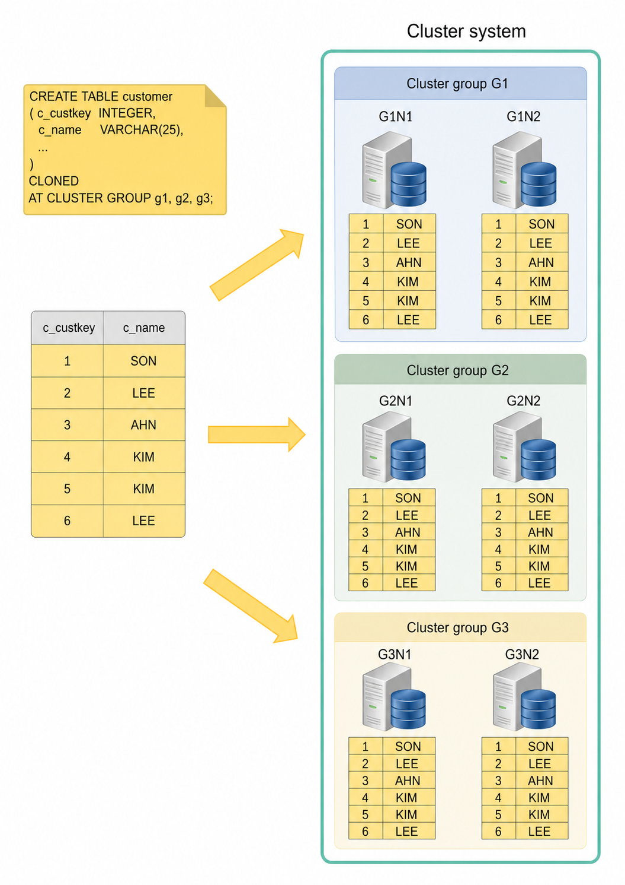

<a id="2b322e97f3d9d946"></a>
#### Sharded Table

Data is partitioned into groups based on the shard key and stored accordingly, with nodes within a single group holding the same data. Therefore, this approach is suitable for cases where partitioning is necessary due to large amounts of data. Depending on the partitioning policy, there are three types, as outlined below.

- Hash shard
- Range shard
- List shard

The following is an example of creating an order table using hash shards.

<a id="d008b54dc826d5f6"></a>
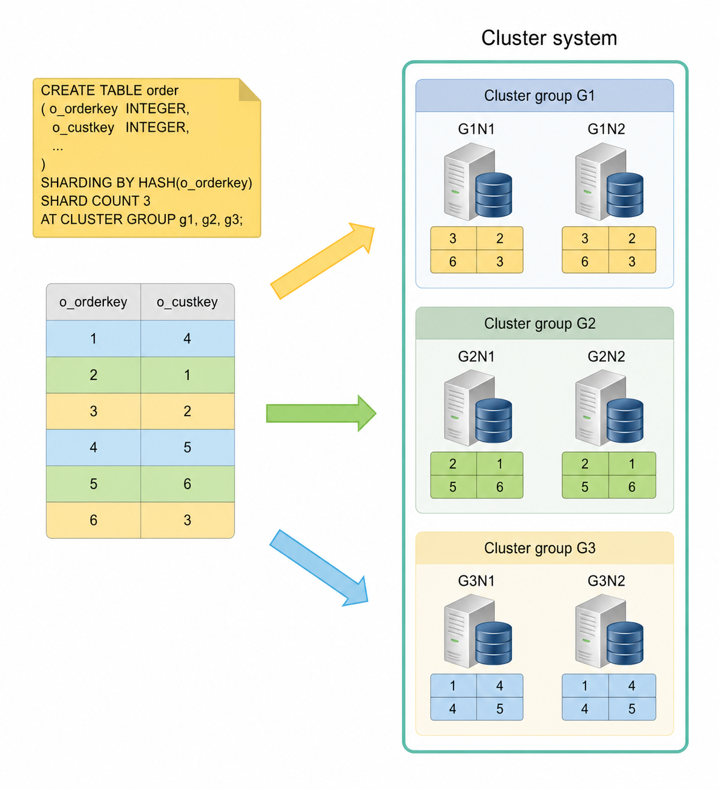

<a id="0f7fea6b9721e767"></a>
### Access

This paragraph describes the case in which a cluster query accesses a single table.

The following figure illustrates local and remote access when the current server is G1N1.

<a id="e0b6b0fbea7da50f"></a>
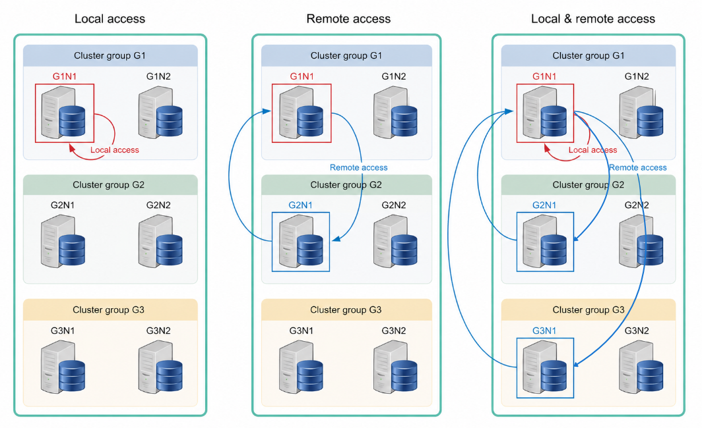

<a id="345da0c2c2ca47dc"></a>
#### Local Access

This is the case where the operation is performed only on the current server from the driver's perspective.

When querying the cloned table as shown in the example below, the operation only needs to be performed on the current server, since the data in all nodes across every group is identical.

<a id="f7595cc29a49023b"></a>


```
\EXPLAIN PLAN SELECT * FROM customer;

C_CUSTKEY C_NAME
--------- ------
        1 SON   
        2 LEE   
        3 AHN   
        4 KIM   
        5 KIM   
        6 LEE   

6 rows selected.

>>>  start print plan

< Execution Plan >
==========================================================================
| IDX |  NODE DESCRIPTION                                         | ROWS |
--------------------------------------------------------------------------
|  0  |  SELECT STATEMENT                                         |    6 |
|  1  |    QUERY BLOCK ("$QB_IDX_2")                              |    6 |
|  2  |      TABLE ACCESS ("CUSTOMER")                            |    6 |
==========================================================================

     1  -  TARGET : CUSTOMER.C_CUSTKEY, CUSTOMER.C_NAME
     2  -  CLONED 
           READ COLUMN : CUSTOMER.C_CUSTKEY, CUSTOMER.C_NAME

<<<  end print plan
```

The data in the sharded table is partitioned into groups based on the shard key. Therefore, local access is performed when there is a filter for the shard key, and it is known that the operation can be executed only on the current server.

<a id="e14b4a9832e4a843"></a>


```
\EXPLAIN PLAN SELECT * FROM orders WHERE o_orderkey = 3;

O_ORDERKEY O_CUSTKEY
---------- ---------
         3         2

1 row selected.

>>>  start print plan

< Execution Plan >
===========================================================================
| IDX |  NODE DESCRIPTION                                          | ROWS |
---------------------------------------------------------------------------
|  0  |  SELECT STATEMENT                                          |    1 |
|  1  |    QUERY BLOCK ("$QB_IDX_2")                               |    1 |
|  2  |      TABLE ACCESS ("ORDERS")                               |    1 |
===========================================================================

     1  -  TARGET : ORDERS.O_ORDERKEY, ORDERS.O_CUSTKEY
     2  -  HASH SHARD ( # 3 ) 
           READ COLUMN : ORDERS.O_ORDERKEY, ORDERS.O_CUSTKEY
             PHYSICAL FILTER : ORDERS.O_ORDERKEY = 3

<<<  end print plan
```

<a id="47ee5fb7c3494305"></a>
#### Remote Access

The data in the sharded table is partitioned into groups based on the shard key. When there is a filter for the shard key, the result can be fetched by performing remote access to a specific server.

<a id="64ba0eba57086942"></a>


```
\EXPLAIN PLAN SELECT * FROM orders WHERE o_orderkey = 2;

O_ORDERKEY O_CUSTKEY
---------- ---------
         2         1

1 row selected.

>>>  start print plan

< Execution Plan >
===========================================================================
|  IDX  |  NODE DESCRIPTION                               |          ROWS |
---------------------------------------------------------------------------
|  0  |  SELECT STATEMENT                                 |             1 |
|  1  |    QUERY BLOCK ("$QB_IDX_2")                      |             1 |
|  2  |      PLAN BASED CLUSTER                           | REMOTE ONLY 1 |
|  3  |        TABLE ACCESS ("ORDERS")                    |             0 |
===========================================================================

     1  -  TARGET : ORDERS.O_ORDERKEY, ORDERS.O_CUSTKEY
     2  -  SQL : SELECT /*+ FULL( _A1 ) */
                        "_A1"."O_ORDERKEY", "_A1"."O_CUSTKEY"
                   FROM "PUBLIC"."ORDERS"@LOCAL AS "_A1"
                  WHERE "_A1"."O_ORDERKEY" = :_V0
           TARGET DOMAIN : G2(G2N1,G2N2) 1 rows
     3  -  HASH SHARD ( # 3 ) 
           READ COLUMN : ORDERS.O_ORDERKEY, ORDERS.O_CUSTKEY
             PHYSICAL FILTER : ORDERS.O_ORDERKEY = 2

<<<  end print plan
```

In the execution plan above, the result was fetched by remotely transferring the SQL query to G2.

For a sharded table, if there is no filter on the shard key, the query must be sent to each server to retrieve the result.

<a id="6bbc108a86f5dbb7"></a>


```
\EXPLAIN PLAN SELECT * FROM orders WHERE o_custkey = 1;

O_ORDERKEY O_CUSTKEY
---------- ---------
         2         1

1 row selected.

>>>  start print plan

< Execution Plan >
===========================================================================
|  IDX  |  NODE DESCRIPTION                               |          ROWS |
---------------------------------------------------------------------------
|    0  |  SELECT STATEMENT                               |             1 |
|  1  |    QUERY BLOCK ("$QB_IDX_2")                      |             1 |
|  2  |      PLAN BASED CLUSTER                           |LOCAL/REMOTE 1 |
|  3  |        TABLE ACCESS ("ORDERS")                    |             0 |
===========================================================================

     1  -  TARGET : ORDERS.O_ORDERKEY, ORDERS.O_CUSTKEY
     2  -  SQL : SELECT /*+ FULL( _A1 ) */
                        "_A1"."O_ORDERKEY", "_A1"."O_CUSTKEY"
                   FROM "PUBLIC"."ORDERS"@LOCAL AS "_A1"
                  WHERE "_A1"."O_CUSTKEY" = :_V0
           TARGET DOMAIN : G1(G1N1,G1N2) 0 rows,
                           G2(G2N1,G2N2) 1 rows,
                           G3(G3N1,G3N2) 0 rows
     3  -  HASH SHARD ( # 3 ) 
           READ COLUMN : ORDERS.O_ORDERKEY, ORDERS.O_CUSTKEY
             PHYSICAL FILTER : ORDERS.O_CUSTKEY = 1

<<<  end print plan
```

In the execution plan above, the result was fetched by remotely transferring the SQL query to G1, G2, and G3.

<a id="183171ca4ae17770"></a>
### Join

<a id="c2f9a316b3575c78"></a>
#### Local Join

The join is performed on the current server. The types of local joins are as follows.

The following is an example of joining the 'region' and 'nation' tables. Both tables are cloned tables, and all nodes in every group of the cloned tables contain the same data. Therefore, in the following example, where the driver is G1N1, the join can be performed using data from G1N1 only.

```
\EXPLAIN PLAN
SELECT r_name, n_name
  FROM region, nation
 WHERE r_regionkey = n_regionkey;
```

<a id="7f5d76408460e014"></a>


```
>>>  start print plan

< Execution Plan >
========================================================================
|  IDX  |  NODE DESCRIPTION                                            |
------------------------------------------------------------------------
|    0  |  SELECT STATEMENT                                            |
|    1  |    QUERY BLOCK ("$QB_IDX_2")                                 |
|    2  |      HASH JOIN (INNER JOIN)                                  |
|    3  |        TABLE ACCESS ("NATION")                               |
|    4  |        HASH JOIN INSTANT                                     |
|    5  |          TABLE ACCESS ("REGION")                             |
========================================================================

     1  -  TARGET : REGION.R_NAME, NATION.N_NAME
     2  -  JOINED COLUMN : REGION.R_NAME, NATION.N_NAME
     3  -  CLONED 
           READ COLUMN : NATION.N_NAME, NATION.N_REGIONKEY
     4  -  HASH KEY : REGION.R_REGIONKEY
           RECORD COLUMN : REGION.R_NAME
           READ KEY COLUMN : REGION.R_REGIONKEY, REGION.R_NAME
             HASH FILTER : REGION.R_REGIONKEY = NATION.N_REGIONKEY
           FETCH ONE ROW
     5  -  CLONED 
           READ COLUMN : REGION.R_REGIONKEY, REGION.R_NAME

<<<  end print plan
```

The following is an example of joining the 'customer' and 'orders' tables. The 'customer' table is a cloned table, while the 'orders' table is a sharded table. The data in the sharded table is partitioned into groups based on a shard key. Therefore, a local join can be performed when a filter for the shard key column exists and the data is present on the current server, as shown in the following example.

```
\EXPLAIN PLAN
SELECT c_custkey, COUNT(o_orderkey)
  FROM customer, orders
 WHERE c_custkey = o_custkey
   AND o_orderkey = 3
GROUP BY c_custkey;
```

<a id="7c7a9e3ab98035fb"></a>
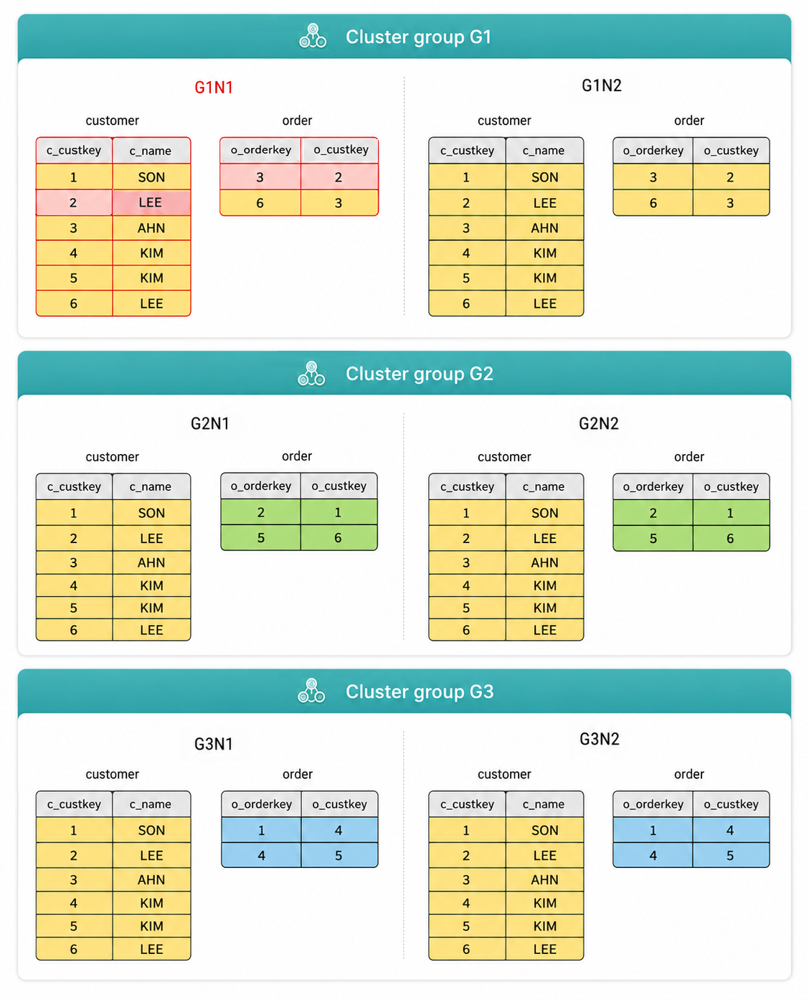

```
>>>  start print plan

< Execution Plan >
========================================================================
|  IDX  |  NODE DESCRIPTION                                            |
------------------------------------------------------------------------
|    0  |  SELECT STATEMENT                                            |
|    1  |    QUERY BLOCK ("$QB_IDX_2")                                 |
|    2  |      GROUP HASH INSTANT                                      |
|    3  |        NESTED JOIN (INNER JOIN)                              |
|    4  |          INDEX ACCESS ("ORDERS", "ORDERS_PK_INDEX")          |
|    5  |          INDEX ACCESS ("CUSTOMER", "CUSTOMER_PK_INDEX")      |
========================================================================

     1  -  TARGET : CUSTOMER.C_CUSTKEY, COUNT( ORDERS.O_ORDERKEY )
     2  -  GROUP KEY : CUSTOMER.C_CUSTKEY
           RECORD COLUMN : COUNT( ORDERS.O_ORDERKEY )
           READ KEY COLUMN : CUSTOMER.C_CUSTKEY
           READ RECORD COLUMN : COUNT( ORDERS.O_ORDERKEY )
     3  -  JOINED COLUMN : CUSTOMER.C_CUSTKEY, ORDERS.O_ORDERKEY
     4  -  HASH SHARD ( # 3 ) 
           READ INDEX COLUMN : ORDERS.O_ORDERKEY
           READ TABLE COLUMN : ORDERS.O_CUSTKEY
             MIN RANGE : ORDERS.O_ORDERKEY = 3
             MAX RANGE : ORDERS.O_ORDERKEY = 3
           FETCH ONE ROW
     5  -  CLONED 
           READ INDEX COLUMN : CUSTOMER.C_CUSTKEY
             MIN RANGE : CUSTOMER.C_CUSTKEY = {ORDERS.O_CUSTKEY}
             MAX RANGE : CUSTOMER.C_CUSTKEY = {ORDERS.O_CUSTKEY}
           FETCH ONE ROW

<<<  end print plan
```

The following is an example of joining the 'customer' and 'orders' tables without a filter for the shard key column. In this case, the local join is only possible after fetching all the data from the sharded table.

<a id="fd9f8f8e241b200f"></a>


```
\EXPLAIN PLAN
SELECT /*+ LOCAL_JOIN(orders) */
       c_custkey, COUNT(o_orderkey)
  FROM customer, orders
 WHERE c_custkey = o_custkey
GROUP BY c_custkey;
```

```
< Execution Plan >
============================================================================
|IDX|  NODE DESCRIPTION                                   |           ROWS |
----------------------------------------------------------------------------
| 0 |  SELECT STATEMENT                                   |              6 |
| 1 |    QUERY BLOCK ("$QB_IDX_2")                        |              6 |
| 2 |      HASH JOIN (INNER JOIN)                         |              6 |
| 3 |        PLAN BASED CLUSTER                           | LOCAL/REMOTE 6 |
| 4 |          INDEX ACCESS ("ORDERS", "ORDERS_PK_INDEX") | (6)          6 |
| 5 |        HASH JOIN INSTANT                            |              6 |
| 6 |          TABLE ACCESS ("CUSTOMER")                  |              6 |
============================================================================

     1  -  TARGET : CUSTOMER.C_CUSTKEY, CUSTOMER.C_NAME, ORDERS.O_ORDERKEY
     2  -  JOINED COLUMN : CUSTOMER.C_CUSTKEY, CUSTOMER.C_NAME, ORDERS.O_ORDERKEY
     3  -  SQL : SELECT /*+ INDEX( _A1, "PUBLIC"."ORDERS_PK_INDEX" ) */
                       "_A1"."O_ORDERKEY"
                  FROM "PUBLIC"."ORDERS"@LOCAL AS "_A1"
           TARGET DOMAIN : G1(G1N1,G1N2) 2 rows,
                           G2(G2N1,G2N2) 2 rows,
                           G3(G3N1,G3N2) 2 rows
     4  -  HASH SHARD ( # 3 ) 
           READ INDEX COLUMN : ORDERS.O_ORDERKEY
     5  -  HASH KEY : CUSTOMER.C_CUSTKEY
           RECORD COLUMN : CUSTOMER.C_NAME
           READ KEY COLUMN : CUSTOMER.C_CUSTKEY, CUSTOMER.C_NAME
             HASH FILTER : CUSTOMER.C_CUSTKEY = ORDERS.O_ORDERKEY
           FETCH ONE ROW
     6  -  CLONED 
           READ COLUMN : CUSTOMER.C_CUSTKEY, CUSTOMER.C_NAME

<<<  end print plan
```

In the execution plan above, all data from the 'orders' table was fetched by transferring the SQL query to G1, G2, and G3.

<a id="b5a2663104fb80e3"></a>
#### Remote Join

The join is performed on each server.

Performing the join on each server allows for parallel processing. Additionally, when the join significantly reduces the result set, performing the join on the server and fetching the result helps reduce network costs.

This chapter describes the various forms of remote.

<a id="43e58d88d7a4db99"></a>
##### Joining Cloned Table and Sharded Table

This chapter describes joining a cloned table and a sharded table.

The following is an example of joining the 'customer' and 'orders' tables. The 'customer' table is a cloned table, the 'orders' table is a sharded table, and the data is distributed as follows:

<a id="2ecc0a8be6f2dc90"></a>


```
\EXPLAIN PLAN
SELECT /*+ REMOTE_JOIN(orders) */
       c_custkey, COUNT(o_orderkey)
  FROM customer, orders
 WHERE c_custkey = o_custkey
GROUP BY c_custkey;


>>>  start print plan

< Execution Plan >
============================================================================
|IDX|  NODE DESCRIPTION                                   |           ROWS |
----------------------------------------------------------------------------
| 0 |  SELECT STATEMENT                                   |              6 |
| 1 |    QUERY BLOCK ("$QB_IDX_2")                        |              6 |
| 2 |      PLAN BASED CLUSTER                             | LOCAL/REMOTE 6 |
| 3 |        HASH JOIN (INNER JOIN)                       |              6 |
| 4 |          TABLE ACCESS ("ORDERS")                    |              6 |
| 5 |          HASH JOIN INSTANT                          |              6 |
| 6 |            TABLE ACCESS ("CUSTOMER")                |              6 |
============================================================================

     1  -  TARGET : CUSTOMER.C_CUSTKEY, CUSTOMER.C_NAME, ORDERS.O_ORDERKEY
     2  -  SQL : SELECT /*+ KEEP_JOINED_TABLE USE_HASH_IN( _A1, 10 )
                            FULL( _A2 )
                            FULL( _A1 ) */
                      "_A1"."C_CUSTKEY", "_A1"."C_NAME", "_A2"."O_ORDERKEY"
                   FROM ("PUBLIC"."ORDERS"@LOCAL AS "_A2"
                         INNER JOIN
                         "PUBLIC"."CUSTOMER"@LOCAL AS "_A1"
                     ON "_A1"."C_CUSTKEY" = "_A2"."O_ORDERKEY") ALIAS "_A3"
           TARGET DOMAIN : G1(G1N1,G1N2) 2 rows,
                           G2(G2N1,G2N2) 2 rows,
                           G3(G3N1,G3N2) 2 rows
     3  -  JOINED COLUMN : CUSTOMER.C_CUSTKEY, CUSTOMER.C_NAME, ORDERS.O_ORDERKEY
     4  -  HASH SHARD ( # 3 ) 
           READ COLUMN : ORDERS.O_ORDERKEY
     5  -  HASH KEY : CUSTOMER.C_CUSTKEY
           RECORD COLUMN : CUSTOMER.C_NAME
           READ KEY COLUMN : CUSTOMER.C_CUSTKEY, CUSTOMER.C_NAME
             HASH FILTER : CUSTOMER.C_CUSTKEY = ORDERS.O_ORDERKEY
     6  -  CLONED 
           READ COLUMN : CUSTOMER.C_CUSTKEY, CUSTOMER.C_NAME

<<<  end print plan
```

In the execution plan above, the join was performed on each server, and the result was fetched by transferring the SQL query to G1, G2, and G3.

<a id="5247258ec73edba9"></a>
##### Joining Sharded Table and Sharded Table

A remote join is possible when the following conditions are met.

- A shard key join condition exsists. (e.g. t1.shardKeyCol = t2.shardKeyCol )
- The sharding strategies are the same.
    - Joining a hash-sharded table with another hash-sharded table
    - Joining a range shard with another range shard
    - Joining a list shard with another list shard
- The shard counts are the same. 
- The shard key column types are the same.
- The number of shard key columns is the same.

The following is an example of joining the 'orders' and 'lineitem' tables. Both tables are hash-sharded, and a shard key join condition exists. Since they are sharded based on the same 'orderkey,' the join can be performed on each server.

<a id="0796130e30f86cfc"></a>
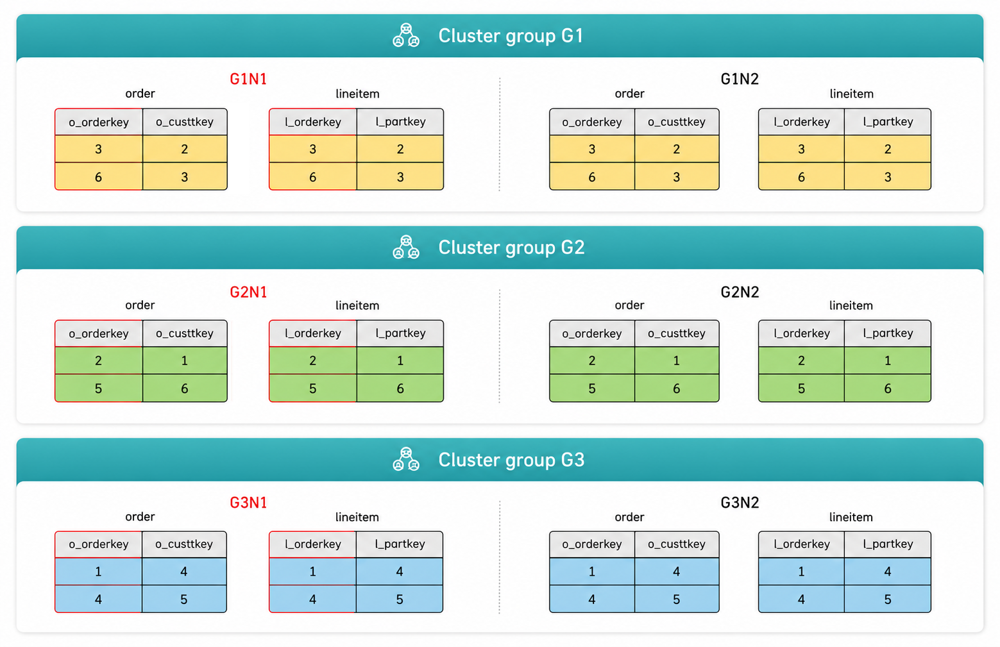

```
\EXPLAIN PLAN
SELECT o_orderkey, l_partkey
  FROM orders, lineitem
 WHERE o_orderkey = l_orderkey;
```

```
>>>  start print plan

< Execution Plan >
============================================================================
|IDX|  NODE DESCRIPTION                                   |           ROWS |
----------------------------------------------------------------------------
| 0 |  SELECT STATEMENT                                   |              6 |
| 1 |    QUERY BLOCK ("$QB_IDX_2")                        |              6 |
| 2 |      PLAN BASED CLUSTER                             | LOCAL/REMOTE 6 |
| 3 |        HASH JOIN (INNER JOIN)                       |              2 |
| 4 |          INDEX ACCESS ("ORDERS", "ORDERS_PK_INDEX") | (2)          2 |
| 5 |          HASH JOIN INSTANT                          |              2 |
| 6 |            TABLE ACCESS ("LINEITEM")                |              2 |
============================================================================

     1  -  TARGET : ORDERS.O_ORDERKEY, LINEITEM.L_PARTKEY
     2  -  SQL : SELECT /*+ KEEP_JOINED_TABLE USE_HASH_IN( _A1, 10 )
                            INDEX( _A2, "PUBLIC"."ORDERS_PK_INDEX" ) 
                            FULL( _A1 ) */ 
                       "_A2"."O_ORDERKEY", "_A1"."L_PARTKEY" 
                  FROM ( "PUBLIC"."ORDERS"@LOCAL AS "_A2" 
                         INNER JOIN 
                         "PUBLIC"."LINEITEM"@LOCAL AS "_A1" 
                    ON "_A1"."L_ORDERKEY" = "_A2"."O_ORDERKEY") ALIAS "_A3"
           TARGET DOMAIN : G1(G1N1,G1N2) 2 rows, 
                           G2(G2N1,G2N2) 2 rows, 
                           G3(G3N1,G3N2) 2 rows
     3  -  JOINED COLUMN : ORDERS.O_ORDERKEY, LINEITEM.L_PARTKEY
     4  -  HASH SHARD ( # 3 ) 
           READ INDEX COLUMN : ORDERS.O_ORDERKEY
     5  -  HASH KEY : LINEITEM.L_ORDERKEY
           RECORD COLUMN : LINEITEM.L_PARTKEY
           READ KEY COLUMN : LINEITEM.L_ORDERKEY, LINEITEM.L_PARTKEY
             HASH FILTER : LINEITEM.L_ORDERKEY = ORDERS.O_ORDERKEY
     6  -  HASH SHARD ( # 3 ) 
           READ COLUMN : LINEITEM.L_ORDERKEY, LINEITEM.L_PARTKEY

<<<  end print plan
```

In the execution plan above, the join was performed on each server, and the result was fetched by transferring the join SQL to each server.

The following is an example of joining the 'part' and 'lineitem' tables. Both tables are hash-sharded, but a shard key join condition does not exist.

Both the 'part' and 'lineitem' tables are hash-sharded. However, the data in the 'part' table is sharded based on 'p_partkey,' as the shard key for 'part' is 'p_partkey.' On the other hand, the data in the 'lineitem' table is sharded based on 'l_orderkey,' as the shard key for 'lineitem' is 'l_orderkey.'

```
\EXPLAIN PLAN
SELECT /*+ REMOTE_JOIN(lineitem) */
       l_orderkey, p_partkey
  FROM part, lineitem
 WHERE p_partkey = l_partkey;
```

<a id="1fcb73e68df9141a"></a>


For the query above to perform a remote join, it must first fetch all the data from the 'lineitem' table, then shard it using 'l_partkey' and transfer the data to G1, G2, and G3. In this case, the puller and pusher take on these roles.

<a id="905ddce87f885d73"></a>
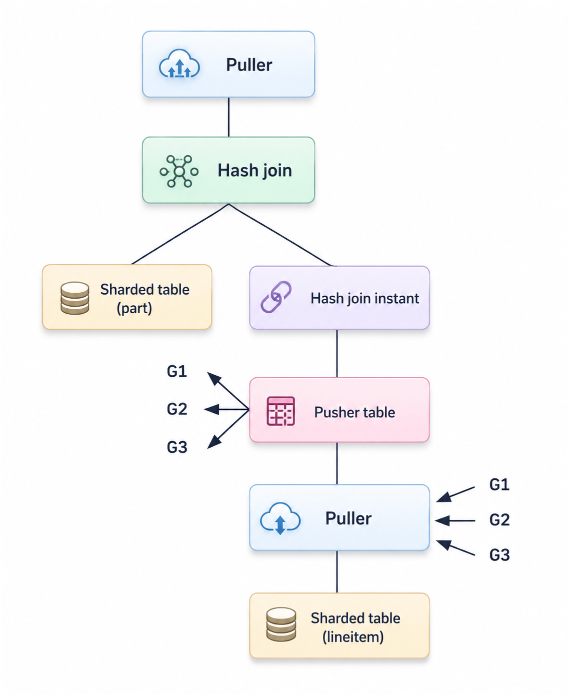

- [Cluster Puller](12-sql-languages.md#22ad93e6359727ef): It fetches data by transferring the SQL query to each server.
- [Cluster Pusher](12-sql-languages.md#366a16344ec1965e): It transfers data to each server.

In the figure above, the puller fetches all the data from 'lineitem.' Then, a pusher table is created using 'l_partkey' as the shard key, and the data is sent to G1, G2, and G3. Finally, a remote join between the 'part' and pusher tables is performed in G1, G2, and G3.

The execution plan is as follows.

```
>>>  start print plan

< Execution Plan >
============================================================================
|IDX|  NODE DESCRIPTION                                           |   ROWS |
----------------------------------------------------------------------------
| 0 |  SELECT STATEMENT                                           |      6 |
| 1 |    QUERY BLOCK ("$QB_IDX_2")                                |      6 |
| 2 |      SINGLE CLUSTER                                  |LOCAL/REMOTE 6 |
| 3 |        CLUSTER PUSHER ("_$NI_7")                            |      6 |
| 4 |          PLAN BASED CLUSTER                          |LOCAL/REMOTE 6 |
| 5 |            TABLE ACCESS ("LINEITEM")                        |      2 |
| 6 |        SELECT STATEMENT                                     |      2 |
| 7 |          QUERY BLOCK ("$QB_IDX_2")                          |      2 |
| 8 |            HASH JOIN (INNER JOIN)                           |      2 |
| 9 |              INDEX ACCESS ("PART" AS _A2, "PART_PK_INDEX")  | (2)  2 |
| 10 |              HASH JOIN INSTANT                             |      2 |
| 11 |                PUSHER TABLE ACCESS ("_$NI_7" AS _A1)       |     2 |
============================================================================

     1  -  TARGET : _$NI_7.L_ORDERKEY, PART.P_PARTKEY
     2  -  SQL : SELECT /*+ KEEP_JOINED_TABLE USE_HASH_IN( _A1, 10 ) 
                            INDEX( _A2, "PUBLIC"."PART_PK_INDEX" ) 
                            FULL( _A1 ) */ 
                        "_A1"."L_ORDERKEY", "_A2"."P_PARTKEY" 
                   FROM ( "PUBLIC"."PART"@LOCAL AS "_A2"
                          INNER JOIN 
                         "SESSION_SCHEMA"."_$NI_7"@LOCAL AS "_A1"
                     ON "_A1"."L_PARTKEY" = "_A2"."P_PARTKEY") ALIAS "_A3"
           TARGET DOMAIN : G1(G1N1,G1N2) 2 rows,
                           G2(G2N1,G2N2) 2 rows, 
                           G3(G3N1,G3N2) 2 rows
     3  -  SQL : DECLARE INSTANT TABLE "SESSION_SCHEMA"."_$NI_7"
                ( "L_PARTKEY" NUMBER(10, 0), "L_ORDERKEY" NUMBER(10, 0) ) 
           COLUMN : LINEITEM.L_PARTKEY AS L_PARTKEY, 
                    LINEITEM.L_ORDERKEY AS L_ORDERKEY           
           SHARDED : LINEITEM.L_PARTKEY
           TARGET DOMAIN : G1(G1N1,G1N2) 2 rows, 
                           G2(G2N1,G2N2) 2 rows, 
                           G3(G3N1,G3N2) 2 rows
     4  -  SQL : SELECT /*+ FULL( _A1 ) */
                        "_A1"."L_ORDERKEY", "_A1"."L_PARTKEY" 
                   FROM "PUBLIC"."LINEITEM"@LOCAL AS "_A1"
           TARGET DOMAIN : G1(G1N1,G1N2) 2 rows, 
                           G2(G2N1,G2N2) 2 rows, 
                           G3(G3N1,G3N2) 2 rows
     5  -  HASH SHARD ( # 3 ) 
           READ COLUMN : LINEITEM.L_ORDERKEY, LINEITEM.L_PARTKEY
     7  -  TARGET : _A1.L_ORDERKEY, _A2.P_PARTKEY
     8  -  JOINED COLUMN : _A1.L_ORDERKEY, _A2.P_PARTKEY
     9  -  HASH SHARD ( # 3 ) 
           READ INDEX COLUMN : _A2.P_PARTKEY
    10  -  HASH KEY : _A1.L_PARTKEY
           RECORD COLUMN : _A1.L_ORDERKEY
           READ KEY COLUMN : _A1.L_PARTKEY, _A1.L_ORDERKEY
             HASH FILTER : _A1.L_PARTKEY = _A2.P_PARTKEY
    11  -  READ COLUMN : _A1.L_PARTKEY, _A1.L_ORDERKEY

<<<  end print plan
```

In the execution plan above, (l_orderkey, l_partkey) was fetched by transferring the SQL query to G1, G2, and G3 in step 4. The (l_partkey, l_orderkey) values fetched in step 4 were stored in a pusher table, where the shard key was (l_partkey, l_orderkey), in step 3. This pusher table was sharded by 'l_partkey' and then transferred and temporarily stored in G1, G2, and G3. Finally, a remote join was performed between the 'part' table and the pusher table.

<a id="8671f7d0495c39f7"></a>
### Group By

<a id="3f1e328138728adf"></a>
#### Local Group By

It performs a *group by* operation on the current server

In the case of a *group by* operation on a cloned table, since all nodes in the groups have the same data, the *group by* should be performed on the current server.

```
\EXPLAIN PLAN
  SELECT c_nationkey, COUNT(c_custkey)
    FROM customer
GROUP BY c_nationkey;

>>>  start print plan

< Execution Plan >
========================================================================
|  IDX  |  NODE DESCRIPTION                                            |
------------------------------------------------------------------------
|    0  |  SELECT STATEMENT                                            |
|    1  |    QUERY BLOCK ("$QB_IDX_2")                                 |
|    2  |      GROUP HASH INSTANT                                      |
|    3  |        TABLE ACCESS ("CUSTOMER")                             |
========================================================================

     1  -  TARGET : CUSTOMER.C_NATIONKEY, COUNT( CUSTOMER.C_CUSTKEY )
     2  -  GROUP KEY : CUSTOMER.C_NATIONKEY
           RECORD COLUMN : COUNT( CUSTOMER.C_CUSTKEY )
           READ KEY COLUMN : CUSTOMER.C_NATIONKEY
           READ RECORD COLUMN : COUNT( CUSTOMER.C_CUSTKEY )
     3  -  CLONED 
           READ COLUMN : CUSTOMER.C_CUSTKEY, CUSTOMER.C_NATIONKEY

<<<  end print plan
```

<a id="37e00e9186277227"></a>
#### Remote Group By

It performs a *group by* operation on each server.

By performing *group by* on each server, a parallel processing effect can be achieved. Additionally, since *group by* generally reduces the results, the network cost of fetching the data can also be reduced.

```
\EXPLAIN PLAN
SELECT c_custkey, COUNT(o_orderkey)
  FROM customer, orders
 WHERE c_custkey = o_custkey
GROUP BY c_custkey;

>>>  start print plan

< Execution Plan >
===========================================================================
|IDX|  NODE DESCRIPTION                                  |           ROWS |
---------------------------------------------------------------------------
| 0 |  SELECT STATEMENT                                  |              6 |
| 1 |    QUERY BLOCK ("$QB_IDX_2")                       |              6 |
| 2 |     SINGLE CLUSTER                                 | LOCAL/REMOTE 6 |
| 3 |        SELECT STATEMENT                            |              2 |
| 4 |          QUERY BLOCK ("$QB_IDX_2")                 |              2 |
| 5 |            GROUP HASH INSTANT                      |              2 |
| 6 |              HASH JOIN (INNER JOIN)                |              2 |
| 7 |                TABLE ACCESS ("CUSTOMER" AS _A2)    |              6 |
| 8 |                HASH JOIN INSTANT                   |              2 |
| 9 |                  TABLE ACCESS ("ORDERS" AS _A1)    |              2 |
===========================================================================

     1  -  TARGET : CUSTOMER.C_CUSTKEY, COUNT( ORDERS.O_ORDERKEY )
     2  -  SQL : SELECT /*+ USE_GROUP_HASH(10)
                            KEEP_JOINED_TABLE USE_HASH_IN( _A1, 100 ) 
                            FULL( _A2 ) FULL( _A1 ) 
                        */ 
                        "_A2"."C_CUSTKEY", COUNT( "_A1"."O_ORDERKEY" ) 
                   FROM ( "PUBLIC"."CUSTOMER"@LOCAL AS "_A2" 
                          INNER JOIN 
                          "PUBLIC"."ORDERS"@LOCAL AS "_A1" 
                     ON "_A1"."O_CUSTKEY" = "_A2"."C_CUSTKEY") ALIAS "_A3" 
                GROUP BY "_A2"."C_CUSTKEY"
           TARGET DOMAIN : G1(G1N1,G1N2) 2 rows, 
                           G2(G2N1,G2N2) 2 rows, 
                           G3(G3N1,G3N2) 2 rows
           RE-GROUPING
             GROUP KEY : CUSTOMER.C_CUSTKEY
             AGGREGATION : SUM( COUNT( ORDERS.O_ORDERKEY ) )
     4  -  TARGET : _A2.C_CUSTKEY, COUNT( _A1.O_ORDERKEY )
     5  -  GROUP KEY : _A2.C_CUSTKEY
           RECORD COLUMN : COUNT( _A1.O_ORDERKEY )
           READ KEY COLUMN : _A2.C_CUSTKEY
           READ RECORD COLUMN : COUNT( _A1.O_ORDERKEY )
     6  -  JOINED COLUMN : _A2.C_CUSTKEY, _A1.O_ORDERKEY
     7  -  CLONED 
           READ COLUMN : _A2.C_CUSTKEY
     8  -  HASH KEY : _A1.O_CUSTKEY
           RECORD COLUMN : _A1.O_ORDERKEY
           READ KEY COLUMN : _A1.O_CUSTKEY, _A1.O_ORDERKEY
             HASH FILTER : _A1.O_CUSTKEY = _A2.C_CUSTKEY
     9  -  HASH SHARD ( # 3 ) 
           READ COLUMN : _A1.O_ORDERKEY, _A1.O_CUSTKEY

<<<  end print plan
```

<a id="5a10d8d153244e98"></a>
### Distinct

<a id="0f46bdb0e6a435da"></a>
#### Local Distinct

It performs a *distinct* operation on the current server

The following is an example of using distinct on the customer table, which is a cloned table. Since every node in all groups of a cloned table contains the same data, the distinct operation should be performed on the current server.

```
\EXPLAIN PLAN 
SELECT DISTINCT c_nationkey
  FROM customer;

>>>  start print plan

< Execution Plan >
========================================================================
|  IDX  |  NODE DESCRIPTION                                            |
------------------------------------------------------------------------
|    0  |  SELECT STATEMENT                                            |
|    1  |    QUERY BLOCK ("$QB_IDX_2")                                 |
|    2  |      GROUP                                                   |
|    3  |        INDEX ACCESS ("CUSTOMER", "CUSTOMER_NATIONKEY_FK")    |
========================================================================

     1  -  TARGET : CUSTOMER.C_NATIONKEY
     2  -  GROUP KEY : CUSTOMER.C_NATIONKEY
     3  -  CLONED 
           READ INDEX COLUMN : CUSTOMER.C_NATIONKEY

<<<  end print plan
```

The following is an example of using distinct on the orders table, which is a sharded table. Since the data in a sharded table is partitioned based on the shard key, all groups' data must be fetched in order to perform 'distinct' locally.

```
\EXPLAIN PLAN 
SELECT /*+ LOCAL_DISTINCT */
       DISTINCT o_orderstatus 
  FROM orders
 WHERE o_orderdate = date '1995-03-15';

>>>  start print plan

< Execution Plan >
============================================================================
|IDX|  NODE DESCRIPTION                                 |             ROWS |
----------------------------------------------------------------------------
| 0 |  SELECT STATEMENT                                 |                3 |
| 1 |    QUERY BLOCK ("$QB_IDX_2")                      |                3 |
| 2 |      GROUP HASH INSTANT                           |                3 |
| 3 |        PLAN BASED CLUSTER                         | LOCAL/REMOTE 603 |
| 4 |          TABLE ACCESS ("ORDERS")                  |              221 |
============================================================================

     1  -  TARGET : ORDERS.O_ORDERSTATUS
     2  -  GROUP KEY : ORDERS.O_ORDERSTATUS
           READ KEY COLUMN : ORDERS.O_ORDERSTATUS
     3  -  SQL : SELECT /*+ FULL( _A1 ) */
                        "_A1"."O_ORDERSTATUS" 
                  FROM "PUBLIC"."ORDERS"@LOCAL AS "_A1" 
                 WHERE "_A1"."O_ORDERDATE" = :_V0
           TARGET DOMAIN : G1(G1N1,G1N2) 221 rows, 
                           G2(G2N1,G2N2) 184 rows, 
                           G3(G3N1,G3N2) 198 rows
     4  -  HASH SHARD ( # 3 ) 
           READ COLUMN : ORDERS.O_ORDERSTATUS, ORDERS.O_ORDERDATE
             PHYSICAL FILTER : ORDERS.O_ORDERDATE = DATE'1995-03-15'

<<<  end print plan
```

In the execution plan above, a GROUP HASH INSTANT for distinct was performed after fetching the data satisfying the condition from G1, G2, and G3.

<a id="b643908add65a600"></a>
#### Remote Distinct

It performs a *distinct* operation on each server.

By performing *distinct* on each server, a parallel processing effect can be achieved. Additionally, since *distinct* generally reduces the results, the network cost of fetching the data can also be reduced.

```
\EXPLAIN PLAN 
SELECT DISTINCT o_orderstatus 
  FROM orders
 WHERE o_orderdate = date '1995-03-15';

>>>  start print plan

< Execution Plan >
============================================================================
|IDX|  NODE DESCRIPTION                                   |           ROWS |
----------------------------------------------------------------------------
| 0 |  SELECT STATEMENT                                   |              3 |
| 1 |    QUERY BLOCK ("$QB_IDX_2")                        |              3 |
| 2 |      SINGLE CLUSTER                                 | LOCAL/REMOTE 3 |
| 3 |        SELECT STATEMENT                             |              3 |
| 4 |          QUERY BLOCK ("$QB_IDX_2")                  |              3 |
| 5 |            GROUP HASH INSTANT                       |              3 |
| 6 |              TABLE ACCESS ("ORDERS" AS _A1)         |            221 |
============================================================================

     1  -  TARGET : ORDERS.O_ORDERSTATUS
     2  -  SQL : SELECT /*+ USE_DISTINCT_HASH(3) FULL( _A1 ) */
                        DISTINCT "_A1"."O_ORDERSTATUS" 
                   FROM "PUBLIC"."ORDERS"@LOCAL AS "_A1" 
                  WHERE "_A1"."O_ORDERDATE" = :_V0
           TARGET DOMAIN : G1(G1N1,G1N2) 3 rows, 
                           G2(G2N1,G2N2) 3 rows, 
                           G3(G3N1,G3N2) 3 rows
           RE-GROUPING
             GROUP KEY : ORDERS.O_ORDERSTATUS
     4  -  TARGET : _A1.O_ORDERSTATUS
     5  -  GROUP KEY : _A1.O_ORDERSTATUS
           READ KEY COLUMN : _A1.O_ORDERSTATUS
     6  -  HASH SHARD ( # 3 ) 
           READ COLUMN : _A1.O_ORDERSTATUS, _A1.O_ORDERDATE
             PHYSICAL FILTER : _A1.O_ORDERDATE = :_V0

<<<  end print plan
```

In the execution plan above, the results of performing distinct were fetched from G1, G2, and G3, and then distinct was performed again with RE-GROUPING. Although RE-GROUPING was performed, the results were significantly reduced, which lowered the network cost and made the process more efficient.

<a id="b6fdfec00b8b6ed1"></a>
### Order By

<a id="f9e3ee9c8b0ee7cc"></a>
#### Local Order By

It performs a *order by* operation on the current server.

The following is an example of using order by on the customer table, which is a cloned table. Since every node in all groups of a cloned table contains the same data, the order by operation should be performed on the current server.

```
\EXPLAIN PLAN
  SELECT c_nationkey, COUNT(c_custkey)
    FROM customer
GROUP BY c_nationkey
ORDER BY c_nationkey;

>>>  start print plan

< Execution Plan >
===========================================================================
| IDX |  NODE DESCRIPTION                                        |   ROWS |
---------------------------------------------------------------------------
|  0  |  SELECT STATEMENT                                        |     25 |
|  1  |    QUERY BLOCK ("$QB_IDX_2")                             |     25 |
|  2  |      SORT INSTANT                                        |     25 |
|  3  |        GROUP HASH INSTANT                                |     25 |
|  4  |          TABLE ACCESS ("CUSTOMER")                       | 150000 |
===========================================================================

     1  -  TARGET : CUSTOMER.C_NATIONKEY, COUNT( CUSTOMER.C_CUSTKEY )
     2  -  SORT KEY : "CUSTOMER.C_NATIONKEY ASC NULLS LAST"
           RECORD COLUMN : COUNT( CUSTOMER.C_CUSTKEY )
           READ KEY COLUMN : CUSTOMER.C_NATIONKEY
           READ RECORD COLUMN : COUNT( CUSTOMER.C_CUSTKEY )
     3  -  GROUP KEY : CUSTOMER.C_NATIONKEY
           RECORD COLUMN : COUNT( CUSTOMER.C_CUSTKEY )
           READ KEY COLUMN : CUSTOMER.C_NATIONKEY
           READ RECORD COLUMN : COUNT( CUSTOMER.C_CUSTKEY )
     4  -  CLONED 
           READ COLUMN : CUSTOMER.C_CUSTKEY, CUSTOMER.C_NATIONKEY

<<<  end print plan
```

The following is an example of using order by on the orders table, which is a sharded table. Since the data in a sharded table is partitioned based on the shard key, all groups' data must be fetched in order to perform order by locally.

```
\EXPLAIN PLAN 
  SELECT /*+ LOCAL_ORDER */ o_orderdate, o_shippriority
    FROM orders
   WHERE o_orderdate >= date '1993-07-01'
     AND o_orderdate < date '1993-07-01' + interval '1' month
ORDER BY o_orderdate; 

>>>  start print plan

< Execution Plan >
============================================================================
|IDX|  NODE DESCRIPTION                               |               ROWS |
----------------------------------------------------------------------------
| 0 |  SELECT STATEMENT                               |              19319 |
| 1 |    QUERY BLOCK ("$QB_IDX_2")                    |              19319 |
| 2 |      SORT INSTANT                               |              19319 |
| 3 |        PLAN BASED CLUSTER                       | LOCAL/REMOTE 19319 |
| 4 |          TABLE ACCESS ("ORDERS")                |               6453 |
============================================================================

     1  -  TARGET : ORDERS.O_ORDERDATE, ORDERS.O_SHIPPRIORITY
     2  -  SORT KEY : "ORDERS.O_ORDERDATE ASC NULLS LAST"
           RECORD COLUMN : ORDERS.O_SHIPPRIORITY
           READ KEY COLUMN : ORDERS.O_ORDERDATE
           READ RECORD COLUMN : ORDERS.O_SHIPPRIORITY
     3  -  SQL : SELECT /*+ FULL( _A1 ) */
                       "_A1"."O_ORDERDATE", "_A1"."O_SHIPPRIORITY" 
                   FROM "PUBLIC"."ORDERS"@LOCAL AS "_A1" 
                  WHERE "_A1"."O_ORDERDATE" < :_V0 
                    AND "_A1"."O_ORDERDATE" >= :_V1
           TARGET DOMAIN : G1(G1N1,G1N2) 6453 rows,
                           G2(G2N1,G2N2) 6450 rows, 
                           G3(G3N1,G3N2) 6416 rows
     4  -  HASH SHARD ( # 3 ) 
           READ COLUMN : ORDERS.O_ORDERDATE, ORDERS.O_SHIPPRIORITY
             PHYSICAL FILTER : ORDERS.O_ORDERDATE < DATE'1993-07-01' + CAST( '1' AS INTERVAL(MONTH) ) AND ORDERS.O_ORDERDATE >= DATE'1993-07-01'

<<<  end print plan
```

In the execution plan above, data satisfying the condition was fetched from G1, G2, and G3, and then a SORT INSTANT was performed.

<a id="f5f3e82a70199c76"></a>
#### Remote Order By

It performs a *order by* operation on each server.

By performing order by on each server, a parallel processing effect can be achieved. Additionally, if the results are sorted on the subordinate nodes and then passed up to the superordinate node, each server does not need to separately process the order by. Instead, the driver simply merges and sorts the results received from each server.

The following is an example of remote order by. The orders table is a sharded table.

```
\EXPLAIN PLAN 
  SELECT o_custkey, o_orderstatus
    FROM orders
   WHERE o_custkey > 0 AND o_custkey < 10
ORDER BY o_custkey;


>>>  start print plan

< Execution Plan >
============================================================================
|IDX| NODE DESCRIPTION                                              | ROWS |
----------------------------------------------------------------------------
| 0 | SELECT STATEMENT                                              |   66 |
| 1 |   QUERY BLOCK ("$QB_IDX_2")                                   |   66 |
| 2 |     MULTIPLE CLUSTER                               | LOCAL/REMOTE 66 |
| 3 |       SELECT STATEMENT                                        |   24 |
| 4 |          QUERY BLOCK ("$QB_IDX_2")                            |   24 |
| 5 |           INDEX ACCESS ("ORDERS" AS _A1, "ORDERS_CUSTKEY_FK") |   24 |
============================================================================

     1  -  TARGET : ORDERS.O_CUSTKEY, ORDERS.O_ORDERSTATUS
     2  -  SQL : SELECT /*+ INDEX( _A1, "PUBLIC"."ORDERS_CUSTKEY_FK" ) */
                        "_A1"."O_CUSTKEY", "_A1"."O_ORDERSTATUS" 
                   FROM "PUBLIC"."ORDERS"@LOCAL AS "_A1" 
                  WHERE "_A1"."O_CUSTKEY" > :_V0 
                    AND "_A1"."O_CUSTKEY" < :_V1 
               ORDER BY "_A1"."O_CUSTKEY" ASC NULLS LAST
           TARGET DOMAIN : G1(G1N1,G1N2) 24 rows, 
                           G2(G2N1,G2N2) 23 rows, 
                           G3(G3N1,G3N2) 19 rows
           MERGE SORTING
             SORT KEY : ORDERS.O_CUSTKEY
     4  -  TARGET : _A1.O_CUSTKEY, _A1.O_ORDERSTATUS
     5  -  HASH SHARD ( # 3 ) 
           READ INDEX COLUMN : _A1.O_CUSTKEY
           READ TABLE COLUMN : _A1.O_ORDERSTATUS
             MIN RANGE : _A1.O_CUSTKEY > :_V0
             MAX RANGE : _A1.O_CUSTKEY IS NOT NULL AND _A1.O_CUSTKEY < :_V1

<<<  end print plan
```

In the execution plan above, ordered data was fetched from G1, G2, and G3, then merged and sorted by the order by key column.

<a id="91be8b84bb739df1"></a>
### Aggregation

<a id="833d10f7e1c02845"></a>
#### Local Aggregation

It performs an *aggregation* operation on the current server.

The following is an example of a local aggregation. The customer table is a cloned table.

```
\EXPLAIN PLAN 
SELECT COUNT(DISTINCT c_nationkey)
  FROM customer;

>>>  start print plan

< Execution Plan >
============================================================================
|IDX|  NODE DESCRIPTION                                           |   ROWS |
----------------------------------------------------------------------------
| 0 |  SELECT STATEMENT                                           |      1 |
| 1 |    QUERY BLOCK ("$QB_IDX_2")                                |      1 |
| 2 |      SINGLE ROW AGGREGATION                                    |      1 |
| 3 |        INDEX ACCESS ("CUSTOMER", "CUSTOMER_NATIONKEY_FK")   | 150000 |
============================================================================

     1  -  TARGET : COUNT( DISTINCT CUSTOMER.C_NATIONKEY )
     2  -  DISTINCT AGGREGATION : COUNT( DISTINCT CUSTOMER.C_NATIONKEY )
     3  -  CLONED 
           READ INDEX COLUMN : CUSTOMER.C_NATIONKEY

<<<  end print plan
```

<a id="93fa4567f2f96deb"></a>
#### Remote Aggregation

It performs an aggregation operation on each server.

By performing aggregation on each server, a parallel processing effect can be achieved. Additionally, since aggregation generally reduces the results, the network cost of fetching the data can also be reduced.

```
\EXPLAIN PLAN
SELECT sum(ps_supplycost * ps_availqty) * 0.0001
  FROM partsupp,
       supplier,
       nation
 WHERE ps_suppkey = s_suppkey
   AND s_nationkey = n_nationkey
   AND n_name = 'GERMANY';

>>>  start print plan

< Execution Plan >
===========================================================================
|IDX|  NODE DESCRIPTION                                           |  ROWS |
---------------------------------------------------------------------------
| 0 |  SELECT STATEMENT                                           |     1 |
| 1 |    QUERY BLOCK ("$QB_IDX_2")                                |     1 |
| 2 |      SINGLE CLUSTER                               | LOCAL/REMOTE  1 |
| 3 |        SELECT STATEMENT                                     |     1 |
| 4 |          QUERY BLOCK ("$QB_IDX_2")                          |     1 |
| 5 |            SINGLE ROW AGGREGATION                              |     1 |
| 6 |              NESTED JOIN (INNER JOIN)                       | 10508 |
| 7 |                NESTED JOIN (INNER JOIN)                     |   396 |
| 8 |                  TABLE ACCESS ("NATION" AS _A3)             |     1 |
| 9 |               INDEX ACCESS ("SUPPLIER" AS _A2)              |   396 |
| 10 |                INDEX ACCESS ("PARTSUPP" AS _A1)            | 10508 |
===========================================================================

     1  -  TARGET : SUM( PARTSUPP.PS_SUPPLYCOST * PARTSUPP.PS_AVAILQTY ) * 0.0001
     2  -  SQL : SELECT /*+ KEEP_JOINED_TABLE USE_NL_IN( _A1 )
                            USE_NL_IN( _A2 ) 
                            FULL( _A3 ) 
                            INDEX( _A2, "PUBLIC"."SUPPLIER_NATIONKEY_FK" ) 
                            INDEX( _A1, "PUBLIC"."PARTSUPP_SUPPKEY_FK" ) 
                         */ 
                         SUM( "_A1"."PS_SUPPLYCOST" * "_A1"."PS_AVAILQTY" ) 
                   FROM ( ( "PUBLIC"."NATION"@LOCAL AS "_A3" 
                             INNER JOIN 
                            "PUBLIC"."SUPPLIER"@LOCAL AS "_A2" 
                             ON true 
                           ) ALIAS "_A4" 
                          INNER JOIN 
                          "PUBLIC"."PARTSUPP"@LOCAL AS "_A1" ON true 
                        ) ALIAS "_A5" 
                 WHERE "_A3"."N_NAME" = :_V0 
                   AND "_A2"."S_NATIONKEY" = "_A3"."N_NATIONKEY" 
                   AND "_A1"."PS_SUPPKEY" = "_A2"."S_SUPPKEY"
           TARGET DOMAIN : G1(G1N1,G1N2) 1 rows, 
                           G2(G2N1,G2N2) 1 rows, 
                           G3(G3N1,G3N2) 1 rows
           RE-AGGREGATION
             AGGREGATION : SUM( SUM( PARTSUPP.PS_SUPPLYCOST * PARTSUPP.PS_AVAILQTY ) )
     4  -  TARGET : SUM( _A1.PS_SUPPLYCOST * _A1.PS_AVAILQTY )
     5  -  AGGREGATION : SUM( _A1.PS_SUPPLYCOST * _A1.PS_AVAILQTY )
     6  -  JOINED COLUMN : _A1.PS_SUPPLYCOST, _A1.PS_AVAILQTY
             CONSTANT FILTER : TRUE
     7  -  JOINED COLUMN : _A2.S_SUPPKEY
             CONSTANT FILTER : TRUE
     8  -  CLONED 
           READ COLUMN : _A3.N_NATIONKEY, _A3.N_NAME
             PHYSICAL FILTER : _A3.N_NAME = :_V0
     9  -  CLONED 
           READ INDEX COLUMN : _A2.S_NATIONKEY
           READ TABLE COLUMN : _A2.S_SUPPKEY
             MIN RANGE : _A2.S_NATIONKEY = {_A3.N_NATIONKEY}
             MAX RANGE : _A2.S_NATIONKEY = {_A3.N_NATIONKEY}
    10  -  HASH SHARD ( # 3 ) 
           READ INDEX COLUMN : _A1.PS_SUPPKEY
           READ TABLE COLUMN : _A1.PS_AVAILQTY, _A1.PS_SUPPLYCOST
             MIN RANGE : _A1.PS_SUPPKEY = {_A2.S_SUPPKEY}
             MAX RANGE : _A1.PS_SUPPKEY = {_A2.S_SUPPKEY}

<<<  end print plan
```

In the execution plan above, aggregation results were fetched from G1, G2, and G3, then re-aggregation was performed and the result was returned.

<a id="a33d44d5c0f5e567"></a>
## Statistical Information

A query optimizer calculates the cost using statistical information. The statistics used by a query optimizer include table statistics, column statistics, and index statistics.

- Table statistics information
    - Number of rows
    - Number of pages
- Column statistics information
    - Number of distinct values
    - Number of NULL values
    - Average length of values
    - Minimum value
    - Maximum value
- Index statistics information
    - Number of distinct keys
    - Number of pages
    - Number of leaf pages
    - Tree level
    - Clustering factor of the index

To build the statistics information, execute the [ANALYZE TABLE](18-sql-references-a-b.md#1dbf53dac8b0496f) statement. The generated statistics are stored in the database and will be used until the statistics are rebuilt.

If statistics information has not been built for a table, simple statistics are generated using catalog information and page data at the time of query execution, and this information is used.

<a id="b69248a5fa5b4e2b"></a>
### Optimizer Adjustment

Generally, a query optimizer selects the most efficient plan using the given statistics information. However, there may be a better plan than the one chosen by the optimizer, so a user can specify an alternative plan if it was not selected by the optimizer.

Currently, the query optimizer in GOLDILOCKS supports the use of hints, and any hint specified by the user is preferentially applied when applicable, regardless of the calculated cost. Therefore, if a better plan exists, the user can force the optimizer to select it by using a hint.

For more information about hints, refer to [SQL Hint](#df9172b533f52953).

<a id="df9172b533f52953"></a>
## SQL Hint

<a id="eb336068f62ec65f"></a>
### Description

A hint is a comment used by the user to directly instruct the GOLDILOCKS optimizer on how to execute an SQL statement. The user can use a hint to specify the execution plan when the GOLDILOCKS optimizer is unable to select an appropriate plan due to inaccurate statistics information.

If the user provides a hint, the optimizer will prioritize it. Therefore, it is recommended to use hints only when the execution plan selected by the optimizer is considered incorrect.

If the hint provided by the user can not be used, the GOLDILOCKS optimizer will determine the execution plan.

In GOLDILOCKS, hints can be used with statements such as SELECT, INSERT SELECT, UPDATE, and DELETE. Hints are enclosed between /*+ and */ and are specified immediately after the keyword of each statement.

<a id="f10e6b74001af71a"></a>
### Syntax

The following is the syntax for a hint.

```
<hint clause> ::=
    /*+ <hint element> [ comment ] [ [ , ] <hint element> [ comment ] ] */

<hint element> ::=
      <statement hints>
    | <query block hints>
    | <operation hints>
    | <append insert hints>

<statement hints> ::=
      <dml hints >
    | <fetch fail over hints>

<dml hints> ::=
      DML_GLOBAL_ROWID

<fetch fail over hints> ::=
      FETCH_FAIL_OVER

<query block hints> ::=
      <push subquery hints>
    | <cte query hints>
    | <union all driver hints>
    | <query transformation hints>

<push subquery hints> ::=
      PUSH_SUBQ
    | NO_PUSH_SUBQ

<cte query hints> ::=
      INLINE
    | MATERIALIZE

<union all driver hints> ::=
      LOCAL_UNION_ALL
    | REMOTE_UNION_ALL

<query transformation hints> ::=
      NO_QUERY_TRANSFORMATION
    | <unnest subquery hints>
    | <transitive closure hints>
    | <view hints>

<unnest subquery hints> ::=
      <unnest hints>
    | <unnest join operation hints>
    | <unnest join driver hints>
    | <unnest join pusher hints> 
    | <unnest merge hints>
    | <unnest push view predicate hints>

<unnest hints> ::=
      UNNEST
    | NO_UNNEST

<unnest join operation hints> ::=
      UNNEST_NL
    | UNNEST_NL_IN
    | UNNEST_NL_OUT
    | UNNEST_INL
    | UNNEST_INL_IN
    | UNNEST_INL_OUT
    | UNNEST_HASH
    | UNNEST_HASH( hash_bucket_count ) 
    | UNNEST_HASH_IN
    | UNNEST_HASH_IN( hash_bucket_count )
    | UNNEST_HASH_OUT
    | UNNEST_HASH_OUT( hash_bucket_count )
    | UNNEST_MERGE
    | UNNEST_MERGE_IN
    | UNNEST_MERGE_OUT
    | NL_SJ
    | NL_ISJ
    | NL_AJ
    | INL_SJ
    | INL_AJ
    | MERGE_SJ
    | MERGE_AJ
    | HASH_SJ
    | HASH_ISJ
    | HASH_AJ

<unnest join driver hints> ::=
    | LOCAL_UNNEST
    | REMOTE_UNNEST

<unnest join pusher hints> ::=
      PUSHER_SUBQ
    | NO_PUSHER_SUBQ
    | PUSHER_OUTQ
    | NO_PUSHER_OUTQ

<unnest merge hints> ::=
      MERGE_SUBQ
    | NO_MERGE_SUBQ

<unnest push view predicate hints> ::=
      PUSH_PRED_SUBQ
    | NO_PUSH_PRED_SUBQ

<transitive closure hints> ::=
    | TRANSITIVE_CLOSURE
    | NO_TRANSITIVE_CLOSURE

< view hints > ::=
      <view merge hints>
    | <push view predicate hints>

<view merge hints> ::=
    | MERGE( view_name ) 
    | NO_MERGE( view_name ) 

<push view predicate hints> ::=    
      PUSH_PRED
    | NO_PUSH_PRED
    | PUSH_PRED( view_name[ [ , ] table_name ] ) 
    | NO_PUSH_PRED( view_name[ [ , ] table_name ] ) 


<operation hints> ::=
      <access path hints>
    | <join hints>
    | <group hints>
    | <distinct hints>
    | <order hints>
    | <aggr hints>
    | <window hints>
    | <rownum hints>

<access path hints> ::=
      FULL( table_name )
    | INDEX( table_name [ , ] [ index_name [ [ , ] index_name ] ] )
    | NO_INDEX( table_name [ , ] [ index_name [ [ , ] index_name ] ] )
    | INDEX_FORWARD( table_name [ , ] [ index_name [ [ , ] index_name ] ] )
    | INDEX_BACKWARD( table_name [ , ] [ index_name [ [ , ] index_name ] ] )
    | INDEX_ASC( table_name [ , ] [ index_name [ [ , ] index_name ] ] )
    | INDEX_DESC( table_name [ , ] [ index_name [ [ , ] index_name ] ] )
    | INDEX_COMBINE( table_name [ , ] [ index_name [ [ , ] index_name ] ] )
    | IN_KEY_RANGE( table_name [ , ] [ index_name [ [ , ] index_name ] ] )
    | ROWID( table_name )


<join hints> ::=
    < join order hints >
    | < join operation hints >
    | < join driver hints >
    | < join pusher hints >

<join order hints> ::=
      ORDERED
    | ORDERING( table_name [LEFT | RIGHT] [ , table_name [LEFT | RIGHT] ]
    | LEADING( table_name [ [ , ] table_name ] )
    | KEEP_JOINED_TABLE

<join operation hints> ::=
      USE_HASH( table_name [ [ , ] table_name ] )
    | USE_HASH( table_name [ [ , ] table_name ], hash_bucket_count )
    | NO_USE_HASH( table_name [ [ , ] table_name ] )
    | USE_MERGE( table_name [ [ , ] table_name ] )
    | NO_USE_MERGE( table_name [ [ , ] table_name ] )
    | USE_NL( table_name [ [ , ] table_name ] )
    | NO_USE_NL( table_name [ [ , ] table_name ] )
    | USE_INL( table_name [ [ , ] table_name ] )
    | NO_USE_INL( table_name [ [ , ] table_name ] )
    | USE_JOIN_COMBINE( alias ) 
    | NO_USE_JOIN_COMBINE( alias )
    | USE_NL_IN( alias )    
    | USE_NL_OUT( alias )   
    | USE_INL_IN( alias )    
    | USE_INL_OUT( alias )   
    | USE_HASH_IN( alias )  
    | USE_HASH_IN( alias, hash_bucket_count )  
    | USE_HASH_OUT( alias ) 
    | USE_HASH_OUT( alias, hash_bucket_count )  
    | USE_MERGE_IN( alias ) 
    | USE_MERGE_OUT( alias )

<join driver hints> ::=
    | LOCAL_JOIN( alias ) 
    | REMOTE_JOIN( alias )

<join pusher hints> ::=
      PUSHER( alias ) 
    | NO_PUSHER( alias )


<group hints> ::=   
      <group operation hints>
    | <group driver hints>

<group operation hints> ::=   
      USE_GROUP_HASH
    | USE_GROUP_HASH( hash_bucket_count )  

<group driver hints> ::=   
      LOCAL_GROUP
    | REMOTE_GROUP


<distinct hints> ::=   
      <distinct operation hints>
    | <distinct driver hints>

<distinct operation hints> ::=   
      DISTINCT_HASH
    | USE_DISTINCT_HASH( hash_bucket_count )  

<distinct driver hints> ::=   
      LOCAL_DISTINCT
    | REMOTE_DISTINCT


<order hints> ::=   
      <order operation hints>
    | <order driver hints>

<order operation hints> ::=   
      USE_ORDER_SORT
    | NO_USE_ORDER_SORT
    | USE_ORDER_LIMIT_SORT
    | NO_USE_ORDER_LIMIT_SORT

<order driver hints> ::=   
      LOCAL_ORDER
    | REMOTE_ORDER


<aggr hints> ::=   
      <aggr driver hint>

<aggr driver hints> ::=   
      LOCAL_AGGR
    | REMOTE_AGGR


<window hints> ::=   
      <window driver hint>

<window driver hints> ::=   
      LOCAL_WINDOW
    | REMOTE_WINDOW

<append insert hints> ::=
      APPEND
```

<a id="0d575cfd6e70b0fe"></a>
#### Invocation and Access Rules

The user must have the privilege to execute the query to execute the &lt;hint clause&gt; statement.

<a id="b7280f2b2b98dbd1"></a>
#### Syntax Rules and Parameters

The following are the syntax rules for using the &lt;hint clause&gt;.

- Multiple &lt;hint element&gt;s can be specified in the &lt;hint clause&gt; using whitespace or commas (, ).
- If there are two or more &lt;hint element&gt;s that cannot be applied simultaneously, only the first described &lt;hint element&gt; will be applied.
- If a syntactic error occurs in a &lt;hint element&gt;, that &lt;hint element&gt; is ignored by default. If the hint_error property is turned on, it will be treated as a validation error for the &lt;hint clause&gt;.
- The table_name and view_name specified in the &lt;hint clause&gt; must match one of the table_name, view_name, or their aliases described in the &lt;from clause&gt;.
- When specifying table_name, a schema name cannot be included.
- Even if a &lt;hint element&gt; is correctly described, if it cannot be applied, it will be ignored.

<a id="2838f8290d0b2ee0"></a>
#### Examples

The following is an example of using the &lt;hint clause&gt; in SELECT, INSERT SELECT, UPDATE, and DELETE statements.

- Using the &lt;hint clause&gt; in a SELECT statement

```
SELECT /*+ INDEX(orders, o_orderdate_idx) */ * 
  FROM orders 
 WHERE o_orderdate < date '2019-04-12';
```

- Using the &lt;hint clause&gt; in an INSERT SELECT statement

```
INSERT INTO orders_bk SELECT /*+ INDEX(orders, o_orderdate_idx) */ * 
                        FROM orders 
                       WHERE o_orderdate < date '2019-04-12';
```

- Using the &lt;hint clause&gt; in an UPDATE statement

```
UPDATE /*+ INDEX(lineitem, l_shipdate_idx) */ * lineitem
   SET l_receiptdate = CURRENT_DATE
 WHERE l_shipdate = date '2020-04-12';
```

- Using the &lt;hint clause&gt; in a DELETE statement

```
DELETE /*+ INDEX(lineitem, l_shipdate_idx) */ * lineitem
 WHERE l_receiptdate < date '2020-04-12';
```

The following is an example of incorrectly using a hint after setting the HINT_ERROR property to *ON* using the ALTER statement.

```
ALTER SESSION SET HINT_ERROR = ON;

SELECT /*+ INDEX(orders, o_orderdate_idxx) */ * 
  FROM orders 
 WHERE o_orderdate < date '2019-04-12';

ERR-42000(16058): not applicable hint ( cannot find index ) : 
SELECT /*+ INDEX(orders, o_orderdate_idxx) */ * 
                         *
ERROR at line 1:
```

For more information about the descriptions and examples of all hints, refer to the [Query Block Hint](#fba3d7c9213c4fc2) and [Operation Hint](#dc528f16de786869) sections.

<a id="014e0c27b15502f0"></a>
### Statement Hint

It is a hint that applies at the statement level.

<a id="64fbf337644eaf6a"></a>
#### &lt;dml hints&gt;

<a id="bc0f8d624dfb4998"></a>
##### DML_GLOBAL_ROWID

When processing a DML statement in a cluster environment, the node receiving the user query transfers the record update information to another node, which then applies it.

DML statements in a cluster environment are processed using the following two methods.

- Query based DML: A new query is created to transfer the updated statement.
- Global rowid based DML: The record identifier information is used to transfer the updated information of a specific record.

If the DML_GLOBAL_ROWID hint is specified, the global rowid-based DML method is applied preferentially.   
This hint is applicable to SELECT FOR UPDATE, INSERT, UPDATE, and DELETE statements.

The following is an example of applying query-based DML.

```
\EXPLAIN PLAN
DELETE FROM orders;


>>>  start print plan

< Execution Plan >
========================================================================
|  IDX  |  NODE DESCRIPTION                                            |
------------------------------------------------------------------------
|    0  |  DELETE STATEMENT ("ORDERS")                                 |    
|    1  |    QUERY BLOCK ("$QB_IDX_2")                                 |    
|    2  |      DML CLUSTER                                      |
|    3  |        TABLE ACCESS ("ORDERS")                               |    
========================================================================

     1  -  TARGET : NOTHING
     2  -  WITHOUT FETCH
           Non-Fetch SQL : DELETE /*+ FULL( _A1 ) */  "_A1" FROM "PUBLIC"."ORDERS"@LOCAL AS "_A1"
           TARGET DOMAIN : G1(G1N1,G1N2) 0 rows, G2(G2N1,G2N2) 0 rows, G3(G3N1,G3N2) 0 rows
     3  -  HASH SHARD ( # 3 ) 
           READ COLUMN : ORDERS.O_ORDERKEY, ORDERS.O_CUSTKEY

<<<  end print plan
```

The following is an example of using the DML_GLOBAL_ROWID hint.

```
\EXPLAIN PLAN
DELETE /*+ DML_GLOBAL_ROWID */ FROM orders;


>>>  start print plan

< Execution Plan >
========================================================================
|  IDX  |  NODE DESCRIPTION                                            |
------------------------------------------------------------------------
|    0  |  DELETE STATEMENT ("ORDERS")                                 |
|    1  |    QUERY BLOCK ("$QB_IDX_2")                                 |
|    2  |      PLAN BASED CLUSTER                                      |
|    3  |        TABLE ACCESS ("ORDERS")                               |
========================================================================

     1  -  TARGET : NOTHING
     2  -  SQL : SELECT /*+ FULL( _A1 ) */ "_A1"."$PHYSICAL_ROWID", "_A1"."O_ORDERKEY", "_A1"."O_CUSTKEY" FROM "PUBLIC"."ORDERS"@LOCAL AS "_A1"
           TARGET DOMAIN : G1(G1N1,G1N2) 0 rows, G2(G2N1,G2N2) 0 rows, G3(G3N1,G3N2) 0 rows
     3  -  HASH SHARD ( # 3 ) 
           READ COLUMN : ORDERS.O_ORDERKEY, ORDERS.O_CUSTKEY

<<<  end print plan
```

<a id="cfebae8a2cdb2b0c"></a>
#### &lt;fetch fail over hints&gt;

<a id="5a63efa5e685e5aa"></a>
##### FETCH_FAIL_OVER

The fetch failover feature provides an intact fetch result by handling communication errors that may occur during the fetch process for a SELECT statement in a cluster environment.  
Using the FETCH_FAIL_OVER hint activates the fetch failover feature.  
This hint is applied to the SELECT statement.

The following is an example of using the FETCH_FAIL_OVER hint.

```
\EXPLAIN PLAN
SELECT /*+ FETCH_FAIL_OVER */ o_orderkey FROM orders;


>>>  start print plan

< Execution Plan >
========================================================================
|  IDX  |  NODE DESCRIPTION                                            |
------------------------------------------------------------------------
|    0  |  SELECT STATEMENT                                            |
|    1  |    QUERY BLOCK ("$QB_IDX_2")                                 |
|    2  |      PLAN BASED CLUSTER                                      |
|    3  |        INDEX ACCESS ("ORDERS", "ORDERS_PK_INDEX")            |
========================================================================

     0  -  FETCH FAIL OVER
     1  -  TARGET : ORDERS.O_ORDERKEY
     2  -  SQL : SELECT /*+ INDEX( _A1, "PUBLIC"."ORDERS_PK_INDEX" ) */ "_A1"."O_ORDERKEY" FROM "PUBLIC"."ORDERS"@LOCAL AS "_A1"
           TARGET DOMAIN : G1(G1N1,G1N2) 0 rows, G2(G2N1,G2N2) 0 rows, G3(G3N1,G3N2) 0 rows
     3  -  HASH SHARD ( # 3 ) 
           READ INDEX COLUMN : ORDERS.O_ORDERKEY

<<<  end print plan
```

<a id="fba3d7c9213c4fc2"></a>
### Query Block Hint

It is a hint that applies at the query block level.

<a id="d58b6d81846ddf61"></a>
#### &lt;push subquery hints&gt;

<a id="dad023694cdb7480"></a>
##### PUSH_SUBQ

If the PUSH_SUBQ hint is specified, the optimizer pushes the subquery to the lowest node in the available execution plan nodes. This hint applies to a subquery that is not unnested; therefore, the PUSH_SUBQ hint is ignored if &lt;unnest subquery hints&gt; has been specified beforehand.

If the PUSH_SUBQ hint is not specified, the optimizer calculates the cost and then pushes the subquery to the node with the best cost.

If the PUSH_SUBQ hint is used, the subquery is applied unnested as soon as possible. As a result, performance is improved when subquery filtering has a significant effect, and the intermediate result can be stored by executing the subquery only once.  
The following is an example of using the PUSH_SUBQ hint in this case.

```
\EXPLAIN PLAN
SELECT
       c_name,
       o_totalprice
  FROM
       customer,
       orders,
       lineitem
 WHERE c_custkey = o_custkey
   AND o_orderkey = l_orderkey
   AND o_orderkey IN (
                      SELECT   /*+ PUSH_SUBQ */
                               l_orderkey
                        FROM   lineitem
                      GROUP BY l_orderkey 
                      HAVING   sum(l_quantity) > 300
                    );


>>>  start print plan

< Execution Plan >
========================================================================
|  IDX  |  NODE DESCRIPTION                                            |
------------------------------------------------------------------------
|    0  |  SELECT STATEMENT                                            |
|    1  |    QUERY BLOCK ("$QB_IDX_2")                                 |
|    2  |      NESTED JOIN (INNER JOIN)                                |
|    3  |        MERGE JOIN (INNER JOIN)                               |
|    4  |          INDEX ACCESS ("ORDERS", "ORDERS_PK_INDEX")          |
|    5  |          INDEX ACCESS ("LINEITEM", "LINEITEM_PK_INDEX")      |
|    6  |        INDEX ACCESS ("CUSTOMER", "CUSTOMER_PK_INDEX")        |
|    7  |  SUB QUERY LIST                                              |
|    8  |    INLINE_VIEW ("$V8") (MATERIALIZED)                        |
|    9  |      QUERY BLOCK ("$QB_IDX_10")                              |
|   10  |        GROUP HASH INSTANT                                    |
|   11  |          TABLE ACCESS ("LINEITEM")                           |
========================================================================

     1  -  TARGET : CUSTOMER.C_NAME, ORDERS.O_TOTALPRICE
     2  -  JOINED COLUMN : CUSTOMER.C_NAME, ORDERS.O_TOTALPRICE
     3  -  JOINED COLUMN : ORDERS.O_CUSTKEY, ORDERS.O_TOTALPRICE
             ON FILTER (Equi) : ORDERS.O_ORDERKEY = LINEITEM.L_ORDERKEY
     4  -  READ INDEX COLUMN : ORDERS.O_ORDERKEY
           READ TABLE COLUMN : ORDERS.O_CUSTKEY, ORDERS.O_TOTALPRICE
             POST FILTER : ( ORDERS.O_ORDERKEY ) IN ( $V8.L_ORDERKEY )
     5  -  READ INDEX COLUMN : LINEITEM.L_ORDERKEY
             MIN RANGE : LINEITEM.L_ORDERKEY >= {ORDERS.O_ORDERKEY}
             MAX RANGE : LINEITEM.L_ORDERKEY IS NOT NULL
     6  -  READ INDEX COLUMN : CUSTOMER.C_CUSTKEY
           READ TABLE COLUMN : CUSTOMER.C_NAME
             MIN RANGE : CUSTOMER.C_CUSTKEY = {ORDERS.O_CUSTKEY}
             MAX RANGE : CUSTOMER.C_CUSTKEY = {ORDERS.O_CUSTKEY}
           FETCH ONE ROW
     8  -  COLUMN : LINEITEM.L_ORDERKEY AS L_ORDERKEY
     9  -  TARGET : LINEITEM.L_ORDERKEY
    10  -  GROUP KEY : LINEITEM.L_ORDERKEY
           RECORD COLUMN : SUM( LINEITEM.L_QUANTITY )
           READ KEY COLUMN : LINEITEM.L_ORDERKEY
           READ RECORD COLUMN : SUM( LINEITEM.L_QUANTITY )
             PHYSICAL FILTER : SUM( LINEITEM.L_QUANTITY ) > 300
    11  -  READ COLUMN : LINEITEM.L_ORDERKEY, LINEITEM.L_QUANTITY

<<<  end print plan
```

In the above example, the subquery can be performed either in the join or on orders. It is executed on INDEX ACCESS ("ORDERS"), which is the lowest node among the available execution nodes, and it is not unnested.

<a id="ce5fea5c63fab341"></a>
##### NO_PUSH_SUBQ

If the NO_PUSH_SUBQ hint is specified, the optimizer will not push the subquery. As a result, the subquery is executed on the top node of the available execution plan nodes. This hint applies to a subquery that is not unnested, so the NO_PUSH_SUBQ hint is ignored if &lt;unnest subquery hints&gt; has been specified beforehand.

If the NO_PUSH_SUBQ hint is not specified, the optimizer calculates the cost and pushes the subquery to the node with the best cost.

If the NO_PUSH_SUBQ hint is specified, the subquery is applied unnested as late as possible. Therefore, if the subquery is applied before the intermediate result is reduced by the join, and when the subquery filtering has a small effect and the subquery is repeatedly executed, performance may degrade due to the repeated execution of the subquery. In such cases, it is recommended to delay the application of the subquery for as long as possible by using the NO_PUSH_SUBQ hint.

The following is an example of using the NO_PUSH_SUBQ hint in this case.

```
\EXPLAIN PLAN
SELECT
       c_name,
       o_totalprice
  FROM
       customer,
       orders,
       lineitem
 WHERE c_custkey = o_custkey
   AND o_orderkey = l_orderkey
   AND o_orderkey IN (
                      SELECT   /*+ NO_PUSH_SUBQ */
                              l_orderkey
                        FROM  lineitem
                       WHERE  o_orderdate = l_shipdate
                     );

>>>  start print plan

< Execution Plan >
========================================================================
|  IDX  |  NODE DESCRIPTION                                            |
------------------------------------------------------------------------
|    0  |  SELECT STATEMENT                                            |
|    1  |    QUERY BLOCK ("$QB_IDX_2")                                 |
|    2  |      NESTED JOIN (INNER JOIN)                                |
|    3  |        MERGE JOIN (INNER JOIN)                               |
|    4  |          INDEX ACCESS ("ORDERS", "ORDERS_PK_INDEX")          |
|    5  |          INDEX ACCESS ("LINEITEM", "LINEITEM_PK_INDEX")      |
|    6  |        INDEX ACCESS ("CUSTOMER", "CUSTOMER_PK_INDEX")        |
|    7  |      SUB QUERY LIST                                          |
|    8  |        INLINE_VIEW ("$V8")                                   |
|    9  |          QUERY BLOCK ("$QB_IDX_10")                          |
|   10  |            TABLE ACCESS ("LINEITEM")                         |
========================================================================

     1  -  TARGET : CUSTOMER.C_NAME, ORDERS.O_TOTALPRICE
     2  -  JOINED COLUMN : ORDERS.O_ORDERDATE, ORDERS.O_ORDERKEY, CUSTOMER.C_NAME, ORDERS.O_TOTALPRICE
             POST WHERE FILTER : ( ORDERS.O_ORDERKEY ) IN ( $V8.L_ORDERKEY )
     3  -  JOINED COLUMN : ORDERS.O_CUSTKEY, ORDERS.O_ORDERDATE, ORDERS.O_ORDERKEY, ORDERS.O_TOTALPRICE
             ON FILTER (Equi) : ORDERS.O_ORDERKEY = LINEITEM.L_ORDERKEY
     4  -  READ INDEX COLUMN : ORDERS.O_ORDERKEY
           READ TABLE COLUMN : ORDERS.O_CUSTKEY, ORDERS.O_TOTALPRICE, ORDERS.O_ORDERDATE
     5  -  READ INDEX COLUMN : LINEITEM.L_ORDERKEY
             MIN RANGE : LINEITEM.L_ORDERKEY >= {ORDERS.O_ORDERKEY}
             MAX RANGE : LINEITEM.L_ORDERKEY IS NOT NULL
     6  -  READ INDEX COLUMN : CUSTOMER.C_CUSTKEY
           READ TABLE COLUMN : CUSTOMER.C_NAME
             MIN RANGE : CUSTOMER.C_CUSTKEY = {ORDERS.O_CUSTKEY}
             MAX RANGE : CUSTOMER.C_CUSTKEY = {ORDERS.O_CUSTKEY}
           FETCH ONE ROW
     8  -  COLUMN : LINEITEM.L_ORDERKEY AS L_ORDERKEY
     9  -  TARGET : LINEITEM.L_ORDERKEY
    10  -  READ COLUMN : LINEITEM.L_ORDERKEY, LINEITEM.L_SHIPDATE
             PHYSICAL FILTER : LINEITEM.L_SHIPDATE = {ORDERS.O_ORDERDATE}
```

In the above example, the subquery can be performed using nested join, merge join, or orders index access. It is executed on the top node among the available execution nodes, which is NESTED JOIN (INNER JOIN).

<a id="26bdcb65b633ca37"></a>
#### &lt; cte query hints &gt;

This hint is used for the query block of the common table expression.

The common table expression is executed using either the inline or materialize method.

- Inline method: It is executed in the form of an inline view.
- Materialize method: The result of the common table expression is stored in an instant, and then the query is performed by reading rows from the instant table.

Generally, when the common table expression is used only once, it is executed using the inline method. When the common table expression is used two or more times, it is executed using the materialize method.

<a id="2fef34fa20420c74"></a>
##### INLINE

The INLINE hint is valid only in the query block of the common table expression. When this hint is specified, the common table expression is executed as an inline view.

The following is an example of using the INLINE hint.

```
gSQL> \explain plan
WITH revenue ( supplier_no, total_revenue ) AS
     (
        SELECT /*+ INLINE */
               l_suppkey,
               SUM(l_extendedprice * (1 - l_discount))
          FROM lineitem
         WHERE l_shipdate >= DATE '1996-01-01'
           AND l_shipdate < DATE '1996-01-01' + INTERVAL '3' MONTH
         GROUP BY
               l_suppkey    
     )
SELECT
    s_suppkey,
    s_name,
    ROUND( total_revenue, 2 ) as total_revenue
FROM
    supplier,
    revenue
WHERE
      s_suppkey = supplier_no
  AND total_revenue = (
                        select
                            max(total_revenue)
                        from
                            revenue
                      )
ORDER BY
   s_suppkey;


S_SUPPKEY S_NAME                    TOTAL_REVENUE
--------- ------------------------- -------------
     8449 Supplier#000008449           1772627.21

1 row selected.

>>>  start print plan

< Execution Plan >
========================================================================
|  IDX  |  NODE DESCRIPTION                                            |
------------------------------------------------------------------------
|    0  |  SELECT STATEMENT                                            |
|    1  |    QUERY BLOCK ("$QB_IDX_2")                                 |
|    2  |      SORT INSTANT                                            |
|    3  |        NESTED JOIN (INNER JOIN)                              |
|    4  |          VIEW ("REVENUE")                                    |
|    5  |            QUERY BLOCK ("$QB_IDX_7")                         |
|    6  |              GROUP HASH INSTANT                              |
|    7  |                TABLE ACCESS ("LINEITEM")                     |
|    8  |          INDEX ACCESS ("SUPPLIER", "SUPPLIER_PK_INDEX")      |
|    9  |  SUB QUERY LIST                                              |
|   10  |    INLINE_VIEW ("$V10")                                      |
|   11  |      QUERY BLOCK ("$QB_IDX_14")                              |
|   12  |        SINGLE ROW AGGREGATION                                   |
|   13  |          VIEW ("REVENUE")                                    |
|   14  |            QUERY BLOCK ("$QB_IDX_17")                        |
|   15  |              GROUP HASH INSTANT                              |
|   16  |                TABLE ACCESS ("LINEITEM")                     |
========================================================================

     1  -  TARGET : SUPPLIER.S_SUPPKEY, SUPPLIER.S_NAME, ROUND(REVENUE.TOTAL_REVENUE,2) AS TOTAL_REVENUE
     2  -  SORT KEY : "SUPPLIER.S_SUPPKEY ASC NULLS LAST"
           RECORD COLUMN : SUPPLIER.S_NAME, ROUND(REVENUE.TOTAL_REVENUE,2)
           READ KEY COLUMN : SUPPLIER.S_SUPPKEY
           READ RECORD COLUMN : SUPPLIER.S_NAME, ROUND(REVENUE.TOTAL_REVENUE,2)
     3  -  JOINED COLUMN : SUPPLIER.S_SUPPKEY, SUPPLIER.S_NAME, REVENUE.TOTAL_REVENUE
     4  -  COLUMN : LINEITEM.L_SUPPKEY AS SUPPLIER_NO, SUM( LINEITEM.L_EXTENDEDPRICE * ( 1 - LINEITEM.L_DISCOUNT ) ) AS TOTAL_REVENUE
     5  -  TARGET : LINEITEM.L_SUPPKEY, SUM( LINEITEM.L_EXTENDEDPRICE * ( 1 - LINEITEM.L_DISCOUNT ) )
     6  -  GROUP KEY : LINEITEM.L_SUPPKEY
           RECORD COLUMN : SUM( LINEITEM.L_EXTENDEDPRICE * ( 1 - LINEITEM.L_DISCOUNT ) )
           READ KEY COLUMN : LINEITEM.L_SUPPKEY
           READ RECORD COLUMN : SUM( LINEITEM.L_EXTENDEDPRICE * ( 1 - LINEITEM.L_DISCOUNT ) )
             PHYSICAL FILTER : SUM( LINEITEM.L_EXTENDEDPRICE * ( 1 - LINEITEM.L_DISCOUNT ) ) = $V10.$C0
     7  -  READ COLUMN : LINEITEM.L_SUPPKEY, LINEITEM.L_EXTENDEDPRICE, LINEITEM.L_DISCOUNT, LINEITEM.L_SHIPDATE
             PHYSICAL FILTER : LINEITEM.L_SHIPDATE < DATE'1996-01-01' + CAST( '3' AS INTERVAL(MONTH) ) AND LINEITEM.L_SHIPDATE >= DATE'1996-01-01'
     8  -  READ INDEX COLUMN : SUPPLIER.S_SUPPKEY
           READ TABLE COLUMN : SUPPLIER.S_NAME
             MIN RANGE : SUPPLIER.S_SUPPKEY = {REVENUE.SUPPLIER_NO}
             MAX RANGE : SUPPLIER.S_SUPPKEY = {REVENUE.SUPPLIER_NO}
           FETCH ONE ROW
    10  -  COLUMN : MAX( REVENUE.TOTAL_REVENUE ) AS $C0
    11  -  TARGET : MAX( REVENUE.TOTAL_REVENUE )
    12  -  AGGREGATION : MAX( REVENUE.TOTAL_REVENUE )
    13  -  COLUMN : SUM( LINEITEM.L_EXTENDEDPRICE * ( 1 - LINEITEM.L_DISCOUNT ) ) AS TOTAL_REVENUE
    14  -  TARGET : SUM( LINEITEM.L_EXTENDEDPRICE * ( 1 - LINEITEM.L_DISCOUNT ) )
    15  -  GROUP KEY : LINEITEM.L_SUPPKEY
           RECORD COLUMN : SUM( LINEITEM.L_EXTENDEDPRICE * ( 1 - LINEITEM.L_DISCOUNT ) )
           READ RECORD COLUMN : SUM( LINEITEM.L_EXTENDEDPRICE * ( 1 - LINEITEM.L_DISCOUNT ) )
    16  -  READ COLUMN : LINEITEM.L_SUPPKEY, LINEITEM.L_EXTENDEDPRICE, LINEITEM.L_DISCOUNT, LINEITEM.L_SHIPDATE
             PHYSICAL FILTER : LINEITEM.L_SHIPDATE < DATE'1996-01-01' + CAST( '3' AS INTERVAL(MONTH) ) AND LINEITEM.L_SHIPDATE >= DATE'1996-01-01'

<<<  end print plan
```

In the above query, the revenue defined in the WITH clause is used twice in the SELECT query.   
In this case, it is recommended to process it using the materialize method to avoid executing the revenue calculation multiple times. However, if the cost of materializing is higher than performing it twice, then the INLINE hint should be used to prevent it from being processed in the materialize method.

<a id="32038357bb3ab649"></a>
##### MATERIALIZE

The MATERIALIZE hint is valid only in the query block of the common table expression. When this hint is specified, the common table expression is executed once, and the result is stored in an instant table.

The following is an example of using the MATERIALIZE hint.

```
gSQL> \explain plan
WITH revenue ( supplier_no, total_revenue ) AS
     (
        SELECT /*+ MATERIALIZE */
               l_suppkey,
               SUM(l_extendedprice * (1 - l_discount))
          FROM lineitem
         WHERE l_shipdate >= DATE '1996-01-01'
           AND l_shipdate < DATE '1996-01-01' + INTERVAL '3' MONTH
         GROUP BY
               l_suppkey    
     )
SELECT
    s_suppkey,
    s_name,
    ROUND( total_revenue, 2 ) as total_revenue
FROM
    supplier,
    revenue
WHERE
      s_suppkey = supplier_no
  AND total_revenue = (
                        select
                            max(total_revenue)
                        from
                            revenue
                      )
ORDER BY
   s_suppkey; 


S_SUPPKEY S_NAME                    TOTAL_REVENUE
--------- ------------------------- -------------
     8449 Supplier#000008449           1772627.21

1 row selected.

>>>  start print plan

< Execution Plan >
========================================================================
|  IDX  |  NODE DESCRIPTION                                            |
------------------------------------------------------------------------
|    0  |  SELECT STATEMENT                                            |
|    1  |    QUERY BLOCK ("$QB_IDX_2")                                 |
|    2  |      SORT INSTANT                                            |
|    3  |        NESTED JOIN (INNER JOIN)                              |
|    4  |          MTR ACCESS ("REVENUE")                              |
|    5  |          INDEX ACCESS ("SUPPLIER", "SUPPLIER_PK_INDEX")      |
|    6  |    MTR LOADER LIST                                           |
|    7  |      MTR LOADER ("REVENUE")                                  |
|    8  |        VIEW ("REVENUE")                                      |
|    9  |          QUERY BLOCK ("$QB_IDX_7")                           |
|   10  |            GROUP HASH INSTANT                                |
|   11  |              TABLE ACCESS ("LINEITEM")                       |
|   12  |  SUB QUERY LIST                                              |
|   13  |    INLINE_VIEW ("$V12")                                      |
|   14  |      QUERY BLOCK ("$QB_IDX_14")                              |
|   15  |        MTR ACCESS ("REVENUE")                                |
========================================================================

     1  -  TARGET : SUPPLIER.S_SUPPKEY, 
                    SUPPLIER.S_NAME,
                    ROUND(REVENUE.TOTAL_REVENUE,2) AS TOTAL_REVENUE
     2  -  SORT KEY : "SUPPLIER.S_SUPPKEY ASC NULLS LAST"
           RECORD COLUMN : SUPPLIER.S_NAME, ROUND(REVENUE.TOTAL_REVENUE,2)
           READ KEY COLUMN : SUPPLIER.S_SUPPKEY
           READ RECORD COLUMN : SUPPLIER.S_NAME,
                                ROUND(REVENUE.TOTAL_REVENUE,2)
     3  -  JOINED COLUMN : SUPPLIER.S_SUPPKEY, 
                           SUPPLIER.S_NAME,
                           REVENUE.TOTAL_REVENUE
     4  -  READ COLUMN : REVENUE.SUPPLIER_NO, REVENUE.TOTAL_REVENUE
             PHYSICAL FILTER : REVENUE.TOTAL_REVENUE = $V12.$C0
     5  -  READ INDEX COLUMN : SUPPLIER.S_SUPPKEY
           READ TABLE COLUMN : SUPPLIER.S_NAME
             MIN RANGE : SUPPLIER.S_SUPPKEY = {REVENUE.SUPPLIER_NO}
             MAX RANGE : SUPPLIER.S_SUPPKEY = {REVENUE.SUPPLIER_NO}
           FETCH ONE ROW
     7  -  RECORD COLUMN : REVENUE.SUPPLIER_NO, REVENUE.TOTAL_REVENUE
     8  -  COLUMN : LINEITEM.L_SUPPKEY AS SUPPLIER_NO,
                   SUM( LINEITEM.L_EXTENDEDPRICE * ( 1 - LINEITEM.L_DISCOUNT ) ) AS TOTAL_REVENUE
     9  -  TARGET : LINEITEM.L_SUPPKEY,
                  SUM( LINEITEM.L_EXTENDEDPRICE * ( 1 - LINEITEM.L_DISCOUNT ) )
    10  -  GROUP KEY : LINEITEM.L_SUPPKEY
           RECORD COLUMN : SUM( LINEITEM.L_EXTENDEDPRICE * ( 1 - LINEITEM.L_DISCOUNT ) )
           READ KEY COLUMN : LINEITEM.L_SUPPKEY
           READ RECORD COLUMN : SUM( LINEITEM.L_EXTENDEDPRICE * ( 1 - LINEITEM.L_DISCOUNT ) )
    11  -  READ COLUMN : LINEITEM.L_SUPPKEY, 
                         LINEITEM.L_EXTENDEDPRICE,
                         LINEITEM.L_DISCOUNT, LINEITEM.L_SHIPDATE
         PHYSICAL FILTER : LINEITEM.L_SHIPDATE < DATE'1996-01-01' + CAST( '3' AS INTERVAL(MONTH) ) AND LINEITEM.L_SHIPDATE >= DATE'1996-01-01'
    13  -  COLUMN : MAX( REVENUE.TOTAL_REVENUE ) AS $C0
    14  -  TARGET : MAX( REVENUE.TOTAL_REVENUE )
    15  -  READ COLUMN : REVENUE.TOTAL_REVENUE
           AGGREGATION : MAX( REVENUE.TOTAL_REVENUE )

<<<  end print plan
```

In the above query, the revenue defined in the WITH clause is used twice in the SELECT query. When executed using the materialize method, the common table expression is performed only once, the result is stored in an instant table, and then used, which reduces the execution time.

<a id="5e6b662bc51f4f88"></a>
#### &lt; union all driver hints &gt;

It is a hint that can be used when performing a *union all* operation in a cluster system. It is ignored in a standalone environment.

<a id="eea50ff65dad21e7"></a>
##### LOCAL_UNION_ALL

It performs a *union all* operation on the current server.

The following is an example of using the LOCAL_UNION_ALL hint.

```
\explain plan
SELECT COUNT(c2)
  FROM ( SELECT /*+ LOCAL_UNION_ALL */
                r_sk, r_c2
           FROM r
          UNION ALL
         SELECT s_sk, s_c2
           FROM s 
          UNION ALL
         SELECT t_sk, t_c2
           FROM t
       ) v1(sk, c2)
;

COUNT(C2)
---------
        9

1 row selected.

>>>  start print plan

< Execution Plan >
==================================================================================================
|  IDX  |  NODE DESCRIPTION                                            |                    ROWS |
--------------------------------------------------------------------------------------------------
|    0  |  SELECT STATEMENT                                            |                       1 |
|    1  |    QUERY BLOCK ("$QB_IDX_2")                                 |                       1 |
|    2  |      SINGLE ROW AGGREGATION                                     |                       1 |
|    3  |        INLINE_VIEW ("V1")                                    |                       9 |
|    4  |          QUERY BLOCK ("$QB_IDX_5")                           |                       9 |
|    5  |            UNION-ALL                                         |                       9 |
|    6  |              QUERY BLOCK ("$QB_IDX_8")                       |                       3 |
|    7  |                PLAN BASED CLUSTER                            | LOCAL/REMOTE          3 |
|    8  |                  TABLE ACCESS ("R")                          |                       1 |
|    9  |              QUERY BLOCK ("$QB_IDX_11")                      |                       3 |
|   10  |                PLAN BASED CLUSTER                            | LOCAL/REMOTE          3 |
|   11  |                  TABLE ACCESS ("S")                          |                       1 |
|   12  |              QUERY BLOCK ("$QB_IDX_14")                      |                       3 |
|   13  |                PLAN BASED CLUSTER                            | LOCAL/REMOTE          3 |
|   14  |                  TABLE ACCESS ("T")                          |                       1 |
==================================================================================================

     1  -  TARGET : COUNT( V1.C2 )
     2  -  AGGREGATION : COUNT( V1.C2 )
     3  -  COLUMN : R_C2 AS C2
     4  -  TARGET : R_C2
     5  -  SET TARGET : R_C2
     6  -  TARGET : R.R_C2
     7  -  SQL : SELECT /*+ FULL( _A1 ) */ "_A1"."R_C2" FROM "PUBLIC"."R"@LOCAL AS "_A1"
           TARGET DOMAIN : G1(G1N1,G1N2) 1 rows, G2(G2N1,G2N2) 1 rows, G3(G3N1,G3N2) 1 rows
     8  -  HASH SHARD ( # 3 ) 
           READ COLUMN : R.R_C2
     9  -  TARGET : S.S_C2
    10  -  SQL : SELECT /*+ FULL( _A1 ) */ "_A1"."S_C2" FROM "PUBLIC"."S"@LOCAL AS "_A1"
           TARGET DOMAIN : G1(G1N1,G1N2) 1 rows, G2(G2N1,G2N2) 1 rows, G3(G3N1,G3N2) 1 rows
    11  -  HASH SHARD ( # 3 ) 
           READ COLUMN : S.S_C2
    12  -  TARGET : T.T_C2
    13  -  SQL : SELECT /*+ FULL( _A1 ) */ "_A1"."T_C2" FROM "PUBLIC"."T"@LOCAL AS "_A1"
           TARGET DOMAIN : G1(G1N1,G1N2) 1 rows, G2(G2N1,G2N2) 1 rows, G3(G3N1,G3N2) 1 rows
    14  -  HASH SHARD ( # 3 ) 
           READ COLUMN : T.T_C2

<<<  end print plan
```

In the execution plan above, the records were fetched from G1, G2, and G3 of each table, and the *union all* operation was processed locally.

<a id="03afa90a6ed92b76"></a>
##### REMOTE_UNION_ALL

It performs a *union all* operation on the servers in each group.

The following is an example of using the REMOTE_UNION_ALL hint.

```
\explain plan
SELECT COUNT(c2)
  FROM ( SELECT /*+ REMOTE_UNION_ALL */
                r_sk, r_c2
           FROM r
          UNION ALL
         SELECT s_sk, s_c2
           FROM s 
          UNION ALL
         SELECT t_sk, t_c2
           FROM t
       ) v1(sk, c2)
;

COUNT(C2)
---------
        9

1 row selected.

>>>  start print plan

< Execution Plan >
==================================================================================================
|  IDX  |  NODE DESCRIPTION                                            |                    ROWS |
--------------------------------------------------------------------------------------------------
|    0  |  SELECT STATEMENT                                            |                       1 |
|    1  |    QUERY BLOCK ("$QB_IDX_2")                                 |                       1 |
|    2  |      SINGLE CLUSTER                                          | LOCAL/REMOTE          1 |
|    3  |        SELECT STATEMENT                                      |                       1 |
|    4  |          QUERY BLOCK ("$QB_IDX_2")                           |                       1 |
|    5  |            SINGLE ROW AGGREGATION                               |                       1 |
|    6  |              INLINE_VIEW ("_A1")                             |                       3 |
|    7  |                QUERY BLOCK ("$QB_IDX_5")                     |                       3 |
|    8  |                  UNION-ALL                                   |                       3 |
|    9  |                    QUERY BLOCK ("$QB_IDX_8")                 |                       1 |
|   10  |                      TABLE ACCESS ("R" AS _A2)               |                       1 |
|   11  |                    QUERY BLOCK ("$QB_IDX_11")                |                       1 |
|   12  |                      TABLE ACCESS ("S" AS _A3)               |                       1 |
|   13  |                    QUERY BLOCK ("$QB_IDX_14")                |                       1 |
|   14  |                      TABLE ACCESS ("T" AS _A4)               |                       1 |
==================================================================================================

     1  -  TARGET : COUNT( V1.C2 )
     2  -  SQL : SELECT /*+ NO_MERGE( _A1 ) */ COUNT( "_A1"."C2" ) FROM ( ( SELECT /*+ FULL( _A2 ) */ "_A2"."R_C2" FROM "PUBLIC"."R"@LOCAL AS "_A2" ) UNION ALL ( SELECT /*+ FULL( _A3 ) */ "_A3"."S_C2" FROM "PUBLIC"."S"@LOCAL AS "_A3" ) UNION ALL ( SELECT /*+ FULL( _A4 ) */ "_A4"."T_C2" FROM "PUBLIC"."T"@LOCAL AS "_A4" ) ) AS "_A1"("C2")
           TARGET DOMAIN : G1(G1N1,G1N2) 1 rows, G2(G2N1,G2N2) 1 rows, G3(G3N1,G3N2) 1 rows
           RE-AGGREGATION
             AGGREGATION : SUM( COUNT( V1.C2 ) )
     4  -  TARGET : COUNT( _A1.C2 )
     5  -  AGGREGATION : COUNT( _A1.C2 )
     6  -  COLUMN : R_C2 AS C2
     7  -  TARGET : R_C2
     8  -  SET TARGET : R_C2
     9  -  TARGET : _A2.R_C2
    10  -  HASH SHARD ( # 3 ) 
           READ COLUMN : _A2.R_C2
    11  -  TARGET : _A3.S_C2
    12  -  HASH SHARD ( # 3 ) 
           READ COLUMN : _A3.S_C2
    13  -  TARGET : _A4.T_C2
    14  -  HASH SHARD ( # 3 ) 
           READ COLUMN : _A4.T_C2

<<<  end print plan
```

In the execution plan above, the SQL query, including the *union all* operation, was transferred to the G1, G2, and G3 groups, and then the *remote union all* was processed.

<a id="955647b77db30b0e"></a>
#### NO_QUERY_TRANSFORMATION

If the NO_QUERY_TRANSFORMATION hint is specified, the query block in which the hint is defined, along with all its subordinate query blocks, will not perform query transformation.

The following is an example of using the NO_QUERY_TRANSFORMATION hint.

```
\EXPLAIN PLAN
SELECT /*+ NO_QUERY_TRANSFORMATION */
       s_name,
       l_quantity
  FROM supplier,
       ( 
        SELECT
               l_suppkey, 
               l_quantity
          FROM lineitem
         WHERE l_shipdate >= date '1996-01-01'
           AND l_shipdate < date '1996-01-01' + interval '3' month
       ) lineitem_view
 WHERE s_suppkey = l_suppkey 
   AND s_nationkey IN (
                        SELECT n_nationkey 
                          FROM nation 
                         WHERE n_name = 'FRANCE' OR n_name = 'GERMANY'
                      )
;

>>>  start print plan

< Execution Plan >
========================================================================
|  IDX  |  NODE DESCRIPTION                                            |
------------------------------------------------------------------------
|    0  |  SELECT STATEMENT                                            |
|    1  |    QUERY BLOCK ("$QB_IDX_2")                                 |
|    2  |      NESTED JOIN (INNER JOIN)                                |
|    3  |        INLINE_VIEW ("LINEITEM_VIEW")                         |
|    4  |          QUERY BLOCK ("$QB_IDX_7")                           |
|    5  |            TABLE ACCESS ("LINEITEM")                         |
|    6  |        INDEX ACCESS ("SUPPLIER", "SUPPLIER_PK_INDEX")        |
|    7  |  SUB QUERY LIST                                              |
|    8  |    INLINE_VIEW ("$V8") (MATERIALIZED)                        |
|    9  |      QUERY BLOCK ("$QB_IDX_12")                              |
|   10  |        TABLE ACCESS ("NATION")                               |
========================================================================

     1  -  TARGET : SUPPLIER.S_NAME, LINEITEM_VIEW.L_QUANTITY
     2  -  JOINED COLUMN : SUPPLIER.S_NATIONKEY, SUPPLIER.S_NAME, LINEITEM_VIEW.L_QUANTITY
             POST WHERE FILTER : ( SUPPLIER.S_NATIONKEY ) IN ( $V8.N_NATIONKEY )
     3  -  COLUMN : LINEITEM.L_SUPPKEY AS L_SUPPKEY, LINEITEM.L_QUANTITY AS L_QUANTITY
     4  -  TARGET : LINEITEM.L_SUPPKEY, LINEITEM.L_QUANTITY
     5  -  READ COLUMN : LINEITEM.L_SUPPKEY, LINEITEM.L_QUANTITY, LINEITEM.L_SHIPDATE
             PHYSICAL FILTER : LINEITEM.L_SHIPDATE >= DATE'1996-01-01' AND LINEITEM.L_SHIPDATE < DATE'1996-01-01' + CAST( '3' AS INTERVAL(MONTH) )
     6  -  READ INDEX COLUMN : SUPPLIER.S_SUPPKEY
           READ TABLE COLUMN : SUPPLIER.S_NAME, SUPPLIER.S_NATIONKEY
             MIN RANGE : SUPPLIER.S_SUPPKEY = {LINEITEM_VIEW.L_SUPPKEY}
             MAX RANGE : SUPPLIER.S_SUPPKEY = {LINEITEM_VIEW.L_SUPPKEY}
           FETCH ONE ROW
     8  -  COLUMN : NATION.N_NATIONKEY AS N_NATIONKEY
     9  -  TARGET : NATION.N_NATIONKEY
    10  -  READ COLUMN : NATION.N_NATIONKEY, NATION.N_NAME
             LOGICAL FILTER : NATION.N_NAME = 'FRANCE' OR NATION.N_NAME = 'GERMANY'

<<<  end print plan
```

In the above example, simple view merging and subquery unnesting could be applied, but neither of these query transformation methods are applied due to the NO_QUERY_TRANSFORMATION hint.

<a id="d25f93fb7d47edc0"></a>
#### &lt;unnest subquery hints&gt;

&lt;unnest subquery hints&gt; include &lt;unnest hints&gt;, &lt;unnest join operation hints&gt;, &lt;unnest join driver hints&gt;, &lt;unnest join pusher hints&gt;, and &lt;unnest merge hints&gt;.

Subquery unnesting is part of the query transformation process. Therefore, if the NO_QUERY_TRANSFORMATION hint is specified, subquery unnesting will not be performed.

If both the NO_QUERY_TRANSFORMATION hint and &lt;unnest subquery hints&gt; are specified simultaneously in the same subquery, only the first specified hint will be applied, and the other hints will be ignored.

If both &lt;push subquery hints&gt; and &lt;unnest subquery hints&gt; are specified simultaneously in the same subquery, only the first specified hint will be applied, and the other hints will be ignored. This is because &lt;push subquery hints&gt; is a hint for a non-unnested subquery and cannot be used together with &lt;unnest subquery hints&gt;.

The descriptions and examples for the hints are as follows.

<a id="5d8b2f19555d9e1e"></a>
##### &lt;unnest hints&gt;

<a id="ef7ad868e9a6b3be"></a>
###### **UNNEST**

If the UNNEST hint is specified, the optimizer transforms the subquery into a join statement, ensuring the same result. However, the hint can only be applied when the subquery meets the unnesting constraints. If the hint is not applicable to the subquery, it will be ignored.  
For more information on the constraints, refer to [SubQuery Unnesting](#8ddd560d143351f1).

The following is an example of using the UNNEST hint.

```
\EXPLAIN PLAN
SELECT 
       o_orderdate,
       o_totalprice
  FROM orders 
 WHERE o_orderkey IN (
                      SELECT   /*+ UNNEST */
                               l_orderkey
                        FROM   lineitem
                      GROUP BY l_orderkey 
                      HAVING   sum(l_quantity) > 300
                    )
;

>>>  start print plan

< Execution Plan >
========================================================================
|  IDX  |  NODE DESCRIPTION                                            |
------------------------------------------------------------------------
|    0  |  SELECT STATEMENT                                            |
|    1  |    QUERY BLOCK ("$QB_IDX_2")                                 |
|    2  |      NESTED JOIN (INNER JOIN)                                |
|    3  |        INLINE_VIEW ("$V4")                                   |
|    4  |          QUERY BLOCK ("$QB_IDX_6")                           |
|    5  |            GROUP HASH INSTANT                                |
|    6  |              TABLE ACCESS ("LINEITEM")                       |
|    7  |        INDEX ACCESS ("ORDERS", "ORDERS_PK_INDEX")            |
========================================================================

     1  -  TARGET : ORDERS.O_ORDERDATE, ORDERS.O_TOTALPRICE
     2  -  JOINED COLUMN : ORDERS.O_ORDERDATE, ORDERS.O_TOTALPRICE
     3  -  COLUMN : LINEITEM.L_ORDERKEY AS L_ORDERKEY
     4  -  TARGET : LINEITEM.L_ORDERKEY
     5  -  GROUP KEY : LINEITEM.L_ORDERKEY
           RECORD COLUMN : SUM( LINEITEM.L_QUANTITY )
           READ KEY COLUMN : LINEITEM.L_ORDERKEY
           READ RECORD COLUMN : SUM( LINEITEM.L_QUANTITY )
             PHYSICAL FILTER : SUM( LINEITEM.L_QUANTITY ) > 300
     6  -  READ COLUMN : LINEITEM.L_ORDERKEY, LINEITEM.L_QUANTITY
     7  -  READ INDEX COLUMN : ORDERS.O_ORDERKEY
           READ TABLE COLUMN : ORDERS.O_TOTALPRICE, ORDERS.O_ORDERDATE
             MIN RANGE : ORDERS.O_ORDERKEY = {$V4.L_ORDERKEY}
             MAX RANGE : ORDERS.O_ORDERKEY = {$V4.L_ORDERKEY}
           FETCH ONE ROW

<<<  end print plan
```

<a id="f159f2f049aefd49"></a>
###### **NO_UNNEST**

If the NO_UNNEST hint is specified, the optimizer does not unnest the subquery. In other words, the subquery is filtered as it is, without any transformation.

The following is an example of using the NO_UNNEST hint.

```
\EXPLAIN PLAN
SELECT 
       o_orderdate,
       o_totalprice
  FROM orders 
 WHERE o_orderkey IN (
                      SELECT   /*+ NO_UNNEST */
                               l_orderkey
                        FROM   lineitem
                      GROUP BY l_orderkey 
                      HAVING   sum(l_quantity) > 300
                    )
;

no rows selected.

>>>  start print plan

< Execution Plan >
========================================================================
|  IDX  |  NODE DESCRIPTION                                            |
------------------------------------------------------------------------
|    0  |  SELECT STATEMENT                                            |
|    1  |    QUERY BLOCK ("$QB_IDX_2")                                 |
|    2  |      TABLE ACCESS ("ORDERS")                                 |
|    3  |  SUB QUERY LIST                                              |
|    4  |    INLINE_VIEW ("$V4") (MATERIALIZED)                        |
|    5  |      QUERY BLOCK ("$QB_IDX_6")                               |
|    6  |        GROUP HASH INSTANT                                    |
|    7  |          TABLE ACCESS ("LINEITEM")                           |
========================================================================

     1  -  TARGET : ORDERS.O_ORDERDATE, ORDERS.O_TOTALPRICE
     2  -  READ COLUMN : ORDERS.O_ORDERKEY, ORDERS.O_TOTALPRICE, ORDERS.O_ORDERDATE
             POST FILTER : ( ORDERS.O_ORDERKEY ) IN ( $V4.L_ORDERKEY )
     4  -  COLUMN : LINEITEM.L_ORDERKEY AS L_ORDERKEY
     5  -  TARGET : LINEITEM.L_ORDERKEY
     6  -  GROUP KEY : LINEITEM.L_ORDERKEY
           RECORD COLUMN : SUM( LINEITEM.L_QUANTITY )
           READ KEY COLUMN : LINEITEM.L_ORDERKEY
           READ RECORD COLUMN : SUM( LINEITEM.L_QUANTITY )
             PHYSICAL FILTER : SUM( LINEITEM.L_QUANTITY ) > 300
     7  -  READ COLUMN : LINEITEM.L_ORDERKEY, LINEITEM.L_QUANTITY

<<<  end print plan
```

<a id="fa097e197a021c1d"></a>
##### &lt;unnest join operation hints&gt;

If &lt;unnest join operation hints&gt; are specified, the optimizer transforms the subquery into a join statement, ensuring the same result, and performs the join as indicated by the hint.

<a id="6d8e9eec8bf8095a"></a>
###### **UNNEST_NL**

If the UNNEST_NL hint is specified, the optimizer transforms the subquery into a join statement, ensuring the same result, and performs the join using the nested loop join method.

The following is an example of using the UNNEST_NL hint.

```
\EXPLAIN PLAN
SELECT 
       o_orderdate,
       o_totalprice
  FROM orders 
 WHERE o_orderkey IN (
                      SELECT   /*+ UNNEST_NL */
                               l_orderkey
                        FROM   lineitem
                      GROUP BY l_orderkey 
                      HAVING   sum(l_quantity) > 300
                    )
;


>>>  start print plan

< Execution Plan >
========================================================================
|  IDX  |  NODE DESCRIPTION                                            |
------------------------------------------------------------------------
|    0  |  SELECT STATEMENT                                            |
|    1  |    QUERY BLOCK ("$QB_IDX_2")                                 |
|    2  |      NESTED JOIN (INNER JOIN)                                |
|    3  |        INLINE_VIEW ("$V4")                                   |
|    4  |          QUERY BLOCK ("$QB_IDX_6")                           |
|    5  |            GROUP HASH INSTANT                                |
|    6  |              TABLE ACCESS ("LINEITEM")                       |
|    7  |        INDEX ACCESS ("ORDERS", "ORDERS_PK_INDEX")            |
========================================================================

     1  -  TARGET : ORDERS.O_ORDERDATE, ORDERS.O_TOTALPRICE
     2  -  JOINED COLUMN : ORDERS.O_ORDERDATE, ORDERS.O_TOTALPRICE
     3  -  COLUMN : LINEITEM.L_ORDERKEY AS L_ORDERKEY
     4  -  TARGET : LINEITEM.L_ORDERKEY
     5  -  GROUP KEY : LINEITEM.L_ORDERKEY
           RECORD COLUMN : SUM( LINEITEM.L_QUANTITY )
           READ KEY COLUMN : LINEITEM.L_ORDERKEY
           READ RECORD COLUMN : SUM( LINEITEM.L_QUANTITY )
             PHYSICAL FILTER : SUM( LINEITEM.L_QUANTITY ) > 300
     6  -  READ COLUMN : LINEITEM.L_ORDERKEY, LINEITEM.L_QUANTITY
     7  -  READ INDEX COLUMN : ORDERS.O_ORDERKEY
           READ TABLE COLUMN : ORDERS.O_TOTALPRICE, ORDERS.O_ORDERDATE
             MIN RANGE : ORDERS.O_ORDERKEY = {$V4.L_ORDERKEY}
             MAX RANGE : ORDERS.O_ORDERKEY = {$V4.L_ORDERKEY}
           FETCH ONE ROW

<<<  end print plan
```

In the above example, the subquery is unnested into an INLINE_VIEW ("$V4") and participates in a NESTED JOIN.

<a id="03896169bc69f21a"></a>
###### **UNNEST_NL_IN**

If the UNNEST_NL_IN hint is specified, the optimizer transforms the subquery into a join statement, ensuring the same result, and performs the join using the nested loop join method. The subquery, unnested into a table or view, is then placed on the right side of the join.

The following is an example of using the UNNEST_NL_IN hint.

```
\EXPLAIN PLAN
SELECT 
       o_orderdate,
       o_totalprice
  FROM orders 
 WHERE o_orderkey IN (
                      SELECT   /*+ UNNEST_NL_IN */
                               l_orderkey
                        FROM   lineitem
                      GROUP BY l_orderkey 
                      HAVING   sum(l_quantity) > 300
                    )
;

>>>  start print plan

< Execution Plan >
=========================================================================
|  IDX  |  NODE DESCRIPTION                                             |
-------------------------------------------------------------------------
|    0  |  SELECT STATEMENT                                             |
|    1  |    QUERY BLOCK ("$QB_IDX_2")                                  |
|    2  |      NESTED JOIN (INNER JOIN)                                 |
|    3  |        TABLE ACCESS ("ORDERS")                                |
|    4  |        INLINE_VIEW ("$V5")                                    |
|    5  |          QUERY BLOCK ("$QB_IDX_6")                            |
|    6  |            GROUP                                              |
|    7  |              INDEX ACCESS ("LINEITEM", "LINEITEM_PK_INDEX")   |
=========================================================================

     1  -  TARGET : ORDERS.O_ORDERDATE, ORDERS.O_TOTALPRICE
     2  -  JOINED COLUMN : ORDERS.O_ORDERDATE, ORDERS.O_TOTALPRICE
     3  -  READ COLUMN : ORDERS.O_ORDERKEY, ORDERS.O_TOTALPRICE, ORDERS.O_ORDERDATE
     4  -  COLUMN : LINEITEM.L_ORDERKEY AS L_ORDERKEY
     5  -  TARGET : LINEITEM.L_ORDERKEY
     6  -  GROUP KEY : LINEITEM.L_ORDERKEY
           RECORD COLUMN : SUM( LINEITEM.L_QUANTITY )
             LOGICAL FILTER : SUM( LINEITEM.L_QUANTITY ) > 300
     7  -  READ INDEX COLUMN : LINEITEM.L_ORDERKEY
           READ TABLE COLUMN : LINEITEM.L_QUANTITY
             MIN RANGE : LINEITEM.L_ORDERKEY = {ORDERS.O_ORDERKEY}
             MAX RANGE : LINEITEM.L_ORDERKEY = {ORDERS.O_ORDERKEY}

<<<  end print plan
```

In the above example, the subquery is unnested into an INLINE_VIEW ("$V5"), becomes the right child of the NESTED JOIN, and participates in the join.

<a id="b442c5422e703ec5"></a>
###### **UNNEST_NL_OUT**

If the UNNEST_NL_OUT hint is specified, the optimizer transforms the subquery into a join statement, ensuring the same result, and performs the join using the nested loop join method. The subquery, unnested into a table or view, is then placed on the left side of the join.

The following is an example of using the UNNEST_NL_OUT hint.

```
\EXPLAIN PLAN
SELECT 
       o_orderdate,
       o_totalprice
  FROM orders 
 WHERE o_orderkey IN (
                      SELECT   /*+ UNNEST_NL_OUT */
                               l_orderkey
                        FROM   lineitem
                      GROUP BY l_orderkey 
                      HAVING   sum(l_quantity) > 300
                    )
;


>>>  start print plan

< Execution Plan >
========================================================================
|  IDX  |  NODE DESCRIPTION                                            |
------------------------------------------------------------------------
|    0  |  SELECT STATEMENT                                            |
|    1  |    QUERY BLOCK ("$QB_IDX_2")                                 |
|    2  |      NESTED JOIN (INNER JOIN)                                |
|    3  |        INLINE_VIEW ("$V4")                                   |
|    4  |          QUERY BLOCK ("$QB_IDX_6")                           |
|    5  |            GROUP HASH INSTANT                                |
|    6  |              TABLE ACCESS ("LINEITEM")                       |
|    7  |        INDEX ACCESS ("ORDERS", "ORDERS_PK_INDEX")            |
========================================================================

     1  -  TARGET : ORDERS.O_ORDERDATE, ORDERS.O_TOTALPRICE
     2  -  JOINED COLUMN : ORDERS.O_ORDERDATE, ORDERS.O_TOTALPRICE
     3  -  COLUMN : LINEITEM.L_ORDERKEY AS L_ORDERKEY
     4  -  TARGET : LINEITEM.L_ORDERKEY
     5  -  GROUP KEY : LINEITEM.L_ORDERKEY
           RECORD COLUMN : SUM( LINEITEM.L_QUANTITY )
           READ KEY COLUMN : LINEITEM.L_ORDERKEY
           READ RECORD COLUMN : SUM( LINEITEM.L_QUANTITY )
             PHYSICAL FILTER : SUM( LINEITEM.L_QUANTITY ) > 300
     6  -  READ COLUMN : LINEITEM.L_ORDERKEY, LINEITEM.L_QUANTITY
     7  -  READ INDEX COLUMN : ORDERS.O_ORDERKEY
           READ TABLE COLUMN : ORDERS.O_TOTALPRICE, ORDERS.O_ORDERDATE
             MIN RANGE : ORDERS.O_ORDERKEY = {$V4.L_ORDERKEY}
             MAX RANGE : ORDERS.O_ORDERKEY = {$V4.L_ORDERKEY}
           FETCH ONE ROW

<<<  end print plan
```

In the above example, a subquery is unnested to INLINE_VIEW ("$V4"), becomes a left child of NESTED JOIN and participates in the join.

<a id="be65bfdfabe1d2dc"></a>
###### **UNNEST_INL**

If the UNNEST_INL hint is specified, the optimizer transforms the subquery into a join statement, ensuring the same result, and performs the join using the instant nested loop join method.

The following is an example of using the UNNEST_INL hint.

```
\EXPLAIN PLAN
SELECT 
       o_orderdate,
       o_totalprice
  FROM orders 
 WHERE o_orderkey IN (
                      SELECT   /*+ UNNEST_INL */
                               l_orderkey
                        FROM   lineitem
                      GROUP BY l_orderkey 
                      HAVING   sum(l_quantity) > 300
                    )
;

>>>  start print plan

< Execution Plan >
========================================================================
|  IDX  |  NODE DESCRIPTION                                            |
------------------------------------------------------------------------
|    0  |  SELECT STATEMENT                                            |
|    1  |    QUERY BLOCK ("$QB_IDX_2")                                 |
|    2  |      NESTED JOIN (INNER JOIN)                                |
|    3  |        TABLE ACCESS ("ORDERS")                               |
|    4  |        SORT JOIN INSTANT                                     |
|    5  |          INLINE_VIEW ("$V6")                                 |
|    6  |            QUERY BLOCK ("$QB_IDX_6")                         |
|    7  |              GROUP HASH INSTANT                              |
|    8  |                TABLE ACCESS ("LINEITEM")                     |
========================================================================

     1  -  TARGET : ORDERS.O_ORDERDATE, ORDERS.O_TOTALPRICE
     2  -  JOINED COLUMN : ORDERS.O_ORDERDATE, ORDERS.O_TOTALPRICE
     3  -  READ COLUMN : ORDERS.O_ORDERKEY, ORDERS.O_TOTALPRICE, ORDERS.O_ORDERDATE
     4  -  SORT KEY : "$V6.L_ORDERKEY ASC NULLS LAST"
           READ KEY COLUMN : $V6.L_ORDERKEY
             MIN RANGE : $V6.L_ORDERKEY = {ORDERS.O_ORDERKEY}
             MAX RANGE : $V6.L_ORDERKEY = {ORDERS.O_ORDERKEY}
     5  -  COLUMN : LINEITEM.L_ORDERKEY AS L_ORDERKEY
     6  -  TARGET : LINEITEM.L_ORDERKEY
     7  -  GROUP KEY : LINEITEM.L_ORDERKEY
           RECORD COLUMN : SUM( LINEITEM.L_QUANTITY )
           READ KEY COLUMN : LINEITEM.L_ORDERKEY
           READ RECORD COLUMN : SUM( LINEITEM.L_QUANTITY )
             PHYSICAL FILTER : SUM( LINEITEM.L_QUANTITY ) > 300
     8  -  READ COLUMN : LINEITEM.L_ORDERKEY, LINEITEM.L_QUANTITY

<<<  end print plan
```

In the above example, a subquery is unnested to INLINE_VIEW ("$V6") and participates in NESTED JOIN.

<a id="7adb66f36677e809"></a>
###### **UNNEST_INL_IN**

If the UNNEST_INL_IN hint is specified, the optimizer transforms the subquery into a join statement, ensuring the same result, and performs the join using the instant nested loop join method. The subquery, unnested into a table or view, is then placed on the right side of the join.

The following is an example of using the UNNEST_INL_IN hint.

```
\EXPLAIN PLAN
SELECT 
       o_orderdate,
       o_totalprice
  FROM orders 
 WHERE o_orderkey IN (
                      SELECT   /*+ UNNEST_INL_IN */
                               l_orderkey
                        FROM   lineitem
                      GROUP BY l_orderkey 
                      HAVING   sum(l_quantity) > 300
                    )
;

no rows selected.

>>>  start print plan

< Execution Plan >
========================================================================
|  IDX  |  NODE DESCRIPTION                                            |
------------------------------------------------------------------------
|    0  |  SELECT STATEMENT                                            |
|    1  |    QUERY BLOCK ("$QB_IDX_2")                                 |
|    2  |      NESTED JOIN (INNER JOIN)                                |
|    3  |        TABLE ACCESS ("ORDERS")                               |
|    4  |        SORT JOIN INSTANT                                     |
|    5  |          INLINE_VIEW ("$V6")                                 |
|    6  |            QUERY BLOCK ("$QB_IDX_6")                         |
|    7  |              GROUP HASH INSTANT                              |
|    8  |                TABLE ACCESS ("LINEITEM")                     |
========================================================================

     1  -  TARGET : ORDERS.O_ORDERDATE, ORDERS.O_TOTALPRICE
     2  -  JOINED COLUMN : ORDERS.O_ORDERDATE, ORDERS.O_TOTALPRICE
     3  -  READ COLUMN : ORDERS.O_ORDERKEY, ORDERS.O_TOTALPRICE, ORDERS.O_ORDERDATE
     4  -  SORT KEY : "$V6.L_ORDERKEY ASC NULLS LAST"
           READ KEY COLUMN : $V6.L_ORDERKEY
             MIN RANGE : $V6.L_ORDERKEY = {ORDERS.O_ORDERKEY}
             MAX RANGE : $V6.L_ORDERKEY = {ORDERS.O_ORDERKEY}
     5  -  COLUMN : LINEITEM.L_ORDERKEY AS L_ORDERKEY
     6  -  TARGET : LINEITEM.L_ORDERKEY
     7  -  GROUP KEY : LINEITEM.L_ORDERKEY
           RECORD COLUMN : SUM( LINEITEM.L_QUANTITY )
           READ KEY COLUMN : LINEITEM.L_ORDERKEY
           READ RECORD COLUMN : SUM( LINEITEM.L_QUANTITY )
             PHYSICAL FILTER : SUM( LINEITEM.L_QUANTITY ) > 300
     8  -  READ COLUMN : LINEITEM.L_ORDERKEY, LINEITEM.L_QUANTITY

<<<  end print plan
```

In the above example, a subquery is unnested to INLINE_VIEW ("$V6"), becomes a right child of NESTED JOIN and participates in the join.

<a id="38c45e8d34a7ecd7"></a>
###### **UNNEST_INL_OUT**

If UNNEST_INL_OUT hint is specified, an optimizer transforms the subquery into the join statement which guarantees the same result, and performs the join by instant nested loop join method. Then, it places the subquery which is unnested to a table or a view, on the left side of the join.

The following is an example of using UNNEST_INL_OUT hint.

```
\EXPLAIN PLAN
SELECT 
       o_orderdate,
       o_totalprice
  FROM orders 
 WHERE o_orderkey IN (
                      SELECT   /*+ UNNEST_INL_OUT */
                               l_orderkey
                        FROM   lineitem
                      GROUP BY l_orderkey 
                      HAVING   sum(l_quantity) > 300
                    )
;

no rows selected.

>>>  start print plan

< Execution Plan >
========================================================================
|  IDX  |  NODE DESCRIPTION                                            |
------------------------------------------------------------------------
|    0  |  SELECT STATEMENT                                            |
|    1  |    QUERY BLOCK ("$QB_IDX_2")                                 |
|    2  |      NESTED JOIN (INNER JOIN)                                |
|    3  |        INLINE_VIEW ("$V4")                                   |
|    4  |          QUERY BLOCK ("$QB_IDX_6")                           |
|    5  |            GROUP HASH INSTANT                                |
|    6  |              TABLE ACCESS ("LINEITEM")                       |
|    7  |        SORT JOIN INSTANT                                     |
|    8  |          TABLE ACCESS ("ORDERS")                             |
========================================================================

     1  -  TARGET : ORDERS.O_ORDERDATE, ORDERS.O_TOTALPRICE
     2  -  JOINED COLUMN : ORDERS.O_ORDERDATE, ORDERS.O_TOTALPRICE
     3  -  COLUMN : LINEITEM.L_ORDERKEY AS L_ORDERKEY
     4  -  TARGET : LINEITEM.L_ORDERKEY
     5  -  GROUP KEY : LINEITEM.L_ORDERKEY
           RECORD COLUMN : SUM( LINEITEM.L_QUANTITY )
           READ KEY COLUMN : LINEITEM.L_ORDERKEY
           READ RECORD COLUMN : SUM( LINEITEM.L_QUANTITY )
             PHYSICAL FILTER : SUM( LINEITEM.L_QUANTITY ) > 300
     6  -  READ COLUMN : LINEITEM.L_ORDERKEY, LINEITEM.L_QUANTITY
     7  -  SORT KEY : "ORDERS.O_ORDERKEY ASC NULLS LAST"
           RECORD COLUMN : ORDERS.O_ORDERDATE, ORDERS.O_TOTALPRICE
           READ KEY COLUMN : ORDERS.O_ORDERKEY
           READ RECORD COLUMN : ORDERS.O_ORDERDATE, ORDERS.O_TOTALPRICE
             MIN RANGE : ORDERS.O_ORDERKEY = {$V4.L_ORDERKEY}
             MAX RANGE : ORDERS.O_ORDERKEY = {$V4.L_ORDERKEY}
     8  -  READ COLUMN : ORDERS.O_ORDERKEY, ORDERS.O_TOTALPRICE, ORDERS.O_ORDERDATE

<<<  end print plan
```

In the above example, a subquery is unnested to INLINE_VIEW ("$V4"), becomes a left child of NESTED JOIN and participates in the join.

<a id="070bc4e2395c2e4c"></a>
###### **UNNEST_HASH**

If the UNNEST_HASH hint is specified, the optimizer transforms the subquery into a join statement ensuring the same result, and performs the join using the hash join method.

The following is an example of using the UNNEST_HASH hint.

```
\EXPLAIN PLAN
SELECT 
       o_orderdate,
       o_totalprice
  FROM orders 
 WHERE o_orderkey IN (
                      SELECT   /*+ UNNEST_HASH */
                               l_orderkey
                        FROM   lineitem
                      GROUP BY l_orderkey 
                      HAVING   sum(l_quantity) > 300
                    )
;

>>>  start print plan

< Execution Plan >
========================================================================
|  IDX  |  NODE DESCRIPTION                                            |
------------------------------------------------------------------------
|    0  |  SELECT STATEMENT                                            |
|    1  |    QUERY BLOCK ("$QB_IDX_2")                                 |
|    2  |      HASH JOIN (INNER JOIN)                                  |
|    3  |        TABLE ACCESS ("ORDERS")                               |
|    4  |        HASH JOIN INSTANT                                     |
|    5  |          INLINE_VIEW ("$V6")                                 |
|    6  |            QUERY BLOCK ("$QB_IDX_6")                         |
|    7  |              GROUP HASH INSTANT                              |
|    8  |                TABLE ACCESS ("LINEITEM")                     |
========================================================================

     1  -  TARGET : ORDERS.O_ORDERDATE, ORDERS.O_TOTALPRICE
     2  -  JOINED COLUMN : ORDERS.O_ORDERDATE, ORDERS.O_TOTALPRICE
     3  -  READ COLUMN : ORDERS.O_ORDERKEY, ORDERS.O_TOTALPRICE, ORDERS.O_ORDERDATE
     4  -  HASH KEY : $V6.L_ORDERKEY
           READ KEY COLUMN : $V6.L_ORDERKEY
             HASH FILTER : $V6.L_ORDERKEY = ORDERS.O_ORDERKEY
           FETCH ONE ROW
     5  -  COLUMN : LINEITEM.L_ORDERKEY AS L_ORDERKEY
     6  -  TARGET : LINEITEM.L_ORDERKEY
     7  -  GROUP KEY : LINEITEM.L_ORDERKEY
           RECORD COLUMN : SUM( LINEITEM.L_QUANTITY )
           READ KEY COLUMN : LINEITEM.L_ORDERKEY
           READ RECORD COLUMN : SUM( LINEITEM.L_QUANTITY )
             PHYSICAL FILTER : SUM( LINEITEM.L_QUANTITY ) > 300
     8  -  READ COLUMN : LINEITEM.L_ORDERKEY, LINEITEM.L_QUANTITY

<<<  end print plan
```

In the above example, a subquery is unnested to INLINE_VIEW ("$V6") and participates in NESTED JOIN.

<a id="b9f0666562b13245"></a>
###### **UNNEST_HASH( hash_bucket_count)**

The UNNEST_HASH(hash_bucket_count) hint is the same as the UNNEST_HASH hint, with the added ability to specify the hash bucket count. Therefore, when this hint is used, it creates as many hash buckets as specified by the hash_bucket_count.

The following is an example of using the UNNEST_HASH(hash_bucket_count) hint.

```
\EXPLAIN PLAN
SELECT 
       o_orderdate,
       o_totalprice
  FROM orders 
 WHERE o_orderkey IN (
                      SELECT   /*+ UNNEST_HASH(3) */
                               l_orderkey
                        FROM   lineitem
                      GROUP BY l_orderkey 
                      HAVING   sum(l_quantity) > 300
                    )
;


>>>  start print plan

< Execution Plan >
========================================================================
|  IDX  |  NODE DESCRIPTION                                            |
------------------------------------------------------------------------
|    0  |  SELECT STATEMENT                                            |
|    1  |    QUERY BLOCK ("$QB_IDX_2")                                 |
|    2  |      HASH JOIN (INNER JOIN)                                  |
|    3  |        TABLE ACCESS ("ORDERS")                               |
|    4  |        HASH JOIN INSTANT                                     |
|    5  |          INLINE_VIEW ("$V6")                                 |
|    6  |            QUERY BLOCK ("$QB_IDX_6")                         |
|    7  |              GROUP HASH INSTANT                              |
|    8  |                TABLE ACCESS ("LINEITEM")                     |
========================================================================

     1  -  TARGET : ORDERS.O_ORDERDATE, ORDERS.O_TOTALPRICE
     2  -  JOINED COLUMN : ORDERS.O_ORDERDATE, ORDERS.O_TOTALPRICE
     3  -  READ COLUMN : ORDERS.O_ORDERKEY, ORDERS.O_TOTALPRICE, ORDERS.O_ORDERDATE
     4  -  HASH KEY : $V6.L_ORDERKEY
           READ KEY COLUMN : $V6.L_ORDERKEY
             HASH FILTER : $V6.L_ORDERKEY = ORDERS.O_ORDERKEY
           FETCH ONE ROW
     5  -  COLUMN : LINEITEM.L_ORDERKEY AS L_ORDERKEY
     6  -  TARGET : LINEITEM.L_ORDERKEY
     7  -  GROUP KEY : LINEITEM.L_ORDERKEY
           RECORD COLUMN : SUM( LINEITEM.L_QUANTITY )
           READ KEY COLUMN : LINEITEM.L_ORDERKEY
           READ RECORD COLUMN : SUM( LINEITEM.L_QUANTITY )
             PHYSICAL FILTER : SUM( LINEITEM.L_QUANTITY ) > 300
     8  -  READ COLUMN : LINEITEM.L_ORDERKEY, LINEITEM.L_QUANTITY

<<<  end print plan
```

The execution plan is the same as in the example using the UNNEST_HASH hint, but when the hint above is used, hash buckets are created in the HASH JOIN INSTANT based on the specified hash bucket count. Therefore, use this hint to adjust the hash bucket count if performance slows due to an estimated hash bucket count that is too large or too small during cost estimation.

<a id="55207816a8fceced"></a>
###### **UNNEST_HASH_IN**

If the UNNEST_HASH_IN hint is specified, the optimizer transforms the subquery into a join statement, ensuring the same result, and performs the join using the hash join method. The subquery, unnested into a table or view, is then placed on the right side of the join.

The following is an example of using the UNNEST_HASH_IN hint.

```
\EXPLAIN PLAN
SELECT 
       o_orderdate,
       o_totalprice
  FROM orders 
 WHERE o_orderkey IN (
                      SELECT   /*+ UNNEST_HASH_IN */
                               l_orderkey
                        FROM   lineitem
                      GROUP BY l_orderkey 
                      HAVING   sum(l_quantity) > 300
                    )
;

>>>  start print plan

< Execution Plan >
========================================================================
|  IDX  |  NODE DESCRIPTION                                            |
------------------------------------------------------------------------
|    0  |  SELECT STATEMENT                                            |
|    1  |    QUERY BLOCK ("$QB_IDX_2")                                 |
|    2  |      HASH JOIN (INNER JOIN)                                  |
|    3  |        TABLE ACCESS ("ORDERS")                               |
|    4  |        HASH JOIN INSTANT                                     |
|    5  |          INLINE_VIEW ("$V6")                                 |
|    6  |            QUERY BLOCK ("$QB_IDX_6")                         |
|    7  |              GROUP HASH INSTANT                              |
|    8  |                TABLE ACCESS ("LINEITEM")                     |
========================================================================

     1  -  TARGET : ORDERS.O_ORDERDATE, ORDERS.O_TOTALPRICE
     2  -  JOINED COLUMN : ORDERS.O_ORDERDATE, ORDERS.O_TOTALPRICE
     3  -  READ COLUMN : ORDERS.O_ORDERKEY, ORDERS.O_TOTALPRICE, ORDERS.O_ORDERDATE
     4  -  HASH KEY : $V6.L_ORDERKEY
           READ KEY COLUMN : $V6.L_ORDERKEY
             HASH FILTER : $V6.L_ORDERKEY = ORDERS.O_ORDERKEY
           FETCH ONE ROW
     5  -  COLUMN : LINEITEM.L_ORDERKEY AS L_ORDERKEY
     6  -  TARGET : LINEITEM.L_ORDERKEY
     7  -  GROUP KEY : LINEITEM.L_ORDERKEY
           RECORD COLUMN : SUM( LINEITEM.L_QUANTITY )
           READ KEY COLUMN : LINEITEM.L_ORDERKEY
           READ RECORD COLUMN : SUM( LINEITEM.L_QUANTITY )
             PHYSICAL FILTER : SUM( LINEITEM.L_QUANTITY ) > 300
     8  -  READ COLUMN : LINEITEM.L_ORDERKEY, LINEITEM.L_QUANTITY

<<<  end print plan
```

In the above example, a subquery is unnested to INLINE_VIEW ("$V4"), becomes a right child of NESTED JOIN and participates in the join.

<a id="cde8201f0db97768"></a>
###### **UNNEST_HASH_IN( hash_bucket_count )**

UNNEST_HASH_IN(hash_bucket_count) hint is the same as the UNNEST_HASH_IN hint, with the added ability to specify the hash bucket count. Therefore, when this hint is used, it creates as many hash buckets as specified by the hash_bucket_count.

The following is an example of using the UNNEST_HASH_IN(hash_bucket_count) hint.

```
\EXPLAIN PLAN
SELECT 
       o_orderdate,
       o_totalprice
  FROM orders 
 WHERE o_orderkey IN (
                      SELECT   /*+ UNNEST_HASH_IN(3) */
                               l_orderkey
                        FROM   lineitem
                      GROUP BY l_orderkey 
                      HAVING   sum(l_quantity) > 300
                    )
;


>>>  start print plan

< Execution Plan >
========================================================================
|  IDX  |  NODE DESCRIPTION                                            |
------------------------------------------------------------------------
|    0  |  SELECT STATEMENT                                            |
|    1  |    QUERY BLOCK ("$QB_IDX_2")                                 |
|    2  |      HASH JOIN (INNER JOIN)                                  |
|    3  |        TABLE ACCESS ("ORDERS")                               |
|    4  |        HASH JOIN INSTANT                                     |
|    5  |          INLINE_VIEW ("$V6")                                 |
|    6  |            QUERY BLOCK ("$QB_IDX_6")                         |
|    7  |              GROUP HASH INSTANT                              |
|    8  |                TABLE ACCESS ("LINEITEM")                     |
========================================================================

     1  -  TARGET : ORDERS.O_ORDERDATE, ORDERS.O_TOTALPRICE
     2  -  JOINED COLUMN : ORDERS.O_ORDERDATE, ORDERS.O_TOTALPRICE
     3  -  READ COLUMN : ORDERS.O_ORDERKEY, ORDERS.O_TOTALPRICE, ORDERS.O_ORDERDATE
     4  -  HASH KEY : $V6.L_ORDERKEY
           READ KEY COLUMN : $V6.L_ORDERKEY
             HASH FILTER : $V6.L_ORDERKEY = ORDERS.O_ORDERKEY
           FETCH ONE ROW
     5  -  COLUMN : LINEITEM.L_ORDERKEY AS L_ORDERKEY
     6  -  TARGET : LINEITEM.L_ORDERKEY
     7  -  GROUP KEY : LINEITEM.L_ORDERKEY
           RECORD COLUMN : SUM( LINEITEM.L_QUANTITY )
           READ KEY COLUMN : LINEITEM.L_ORDERKEY
           READ RECORD COLUMN : SUM( LINEITEM.L_QUANTITY )
             PHYSICAL FILTER : SUM( LINEITEM.L_QUANTITY ) > 300
     8  -  READ COLUMN : LINEITEM.L_ORDERKEY, LINEITEM.L_QUANTITY

<<<  end print plan
```

The execution plan is the same as in the example using UNNEST_HASH_IN hint, but when the hint above is used, hash buckets are created in the HASH JOIN INSTANT based on the specified hash bucket count. Therefore, use this hint to adjust the hash bucket count if performance slows due to an estimated hash bucket count that is too large or too small during cost estimation.

<a id="a7153187a267a021"></a>
###### **UNNEST_HASH_OUT**

If the UNNEST_HASH_OUT hint is specified, the optimizer transforms the subquery into a join statement, ensuring the same result, and performs the join using the hash join method. Then, it places the subquery which is unnested to a table or a view, on the left side of the join.

The following is an example of using the UNNEST_HASH_OUT hint.

```
\EXPLAIN PLAN
SELECT 
       o_orderdate,
       o_totalprice
  FROM orders 
 WHERE o_orderkey IN (
                      SELECT   /*+ UNNEST_HASH_OUT */
                               l_orderkey
                        FROM   lineitem
                      GROUP BY l_orderkey 
                      HAVING   sum(l_quantity) > 300
                    )
;

>>>  start print plan

< Execution Plan >
========================================================================
|  IDX  |  NODE DESCRIPTION                                            |
------------------------------------------------------------------------
|    0  |  SELECT STATEMENT                                            |
|    1  |    QUERY BLOCK ("$QB_IDX_2")                                 |
|    2  |      HASH JOIN (INNER JOIN)                                  |
|    3  |        INLINE_VIEW ("$V4")                                   |
|    4  |          QUERY BLOCK ("$QB_IDX_6")                           |
|    5  |            GROUP HASH INSTANT                                |
|    6  |              TABLE ACCESS ("LINEITEM")                       |
|    7  |        HASH JOIN INSTANT                                     |
|    8  |          TABLE ACCESS ("ORDERS")                             |
========================================================================

     1  -  TARGET : ORDERS.O_ORDERDATE, ORDERS.O_TOTALPRICE
     2  -  JOINED COLUMN : ORDERS.O_ORDERDATE, ORDERS.O_TOTALPRICE
     3  -  COLUMN : LINEITEM.L_ORDERKEY AS L_ORDERKEY
     4  -  TARGET : LINEITEM.L_ORDERKEY
     5  -  GROUP KEY : LINEITEM.L_ORDERKEY
           RECORD COLUMN : SUM( LINEITEM.L_QUANTITY )
           READ KEY COLUMN : LINEITEM.L_ORDERKEY
           READ RECORD COLUMN : SUM( LINEITEM.L_QUANTITY )
             PHYSICAL FILTER : SUM( LINEITEM.L_QUANTITY ) > 300
     6  -  READ COLUMN : LINEITEM.L_ORDERKEY, LINEITEM.L_QUANTITY
     7  -  HASH KEY : ORDERS.O_ORDERKEY
           RECORD COLUMN : ORDERS.O_ORDERDATE, ORDERS.O_TOTALPRICE
           READ KEY COLUMN : ORDERS.O_ORDERKEY, ORDERS.O_ORDERDATE, ORDERS.O_TOTALPRICE
             HASH FILTER : ORDERS.O_ORDERKEY = $V4.L_ORDERKEY
           FETCH ONE ROW
     8  -  READ COLUMN : ORDERS.O_ORDERKEY, ORDERS.O_TOTALPRICE, ORDERS.O_ORDERDATE

<<<  end print plan
```

In the above example, a subquery is unnested to INLINE_VIEW ("$V4"), becomes a left child of HASH JOIN and participates in the join.

<a id="caac215124ff83b8"></a>
###### **UNNEST_HASH_OUT( hash_bucket_count )**

The UNNEST_HASH_OUT(hash_bucket_count) hint is the same as the UNNEST_HASH_OUT hint, with the added ability to specify the hash bucket count.  
Therefore, when this hint is used, it creates as many hash buckets as specified by the hash_bucket_count.

The following is an example of using the UNNEST_HASH_OUT(hash_bucket_count) hint.

```
\EXPLAIN PLAN
SELECT 
       o_orderdate,
       o_totalprice
  FROM orders 
 WHERE o_orderkey IN (
                      SELECT   /*+ UNNEST_HASH_OUT(3) */
                               l_orderkey
                        FROM   lineitem
                      GROUP BY l_orderkey 
                      HAVING   sum(l_quantity) > 300
                    )
;


>>>  start print plan

< Execution Plan >
========================================================================
|  IDX  |  NODE DESCRIPTION                                            |
------------------------------------------------------------------------
|    0  |  SELECT STATEMENT                                            |
|    1  |    QUERY BLOCK ("$QB_IDX_2")                                 |
|    2  |      HASH JOIN (INNER JOIN)                                  |
|    3  |        INLINE_VIEW ("$V4")                                   |
|    4  |          QUERY BLOCK ("$QB_IDX_6")                           |
|    5  |            GROUP HASH INSTANT                                |
|    6  |              TABLE ACCESS ("LINEITEM")                       |
|    7  |        HASH JOIN INSTANT                                     |
|    8  |          TABLE ACCESS ("ORDERS")                             |
========================================================================

     1  -  TARGET : ORDERS.O_ORDERDATE, ORDERS.O_TOTALPRICE
     2  -  JOINED COLUMN : ORDERS.O_ORDERDATE, ORDERS.O_TOTALPRICE
     3  -  COLUMN : LINEITEM.L_ORDERKEY AS L_ORDERKEY
     4  -  TARGET : LINEITEM.L_ORDERKEY
     5  -  GROUP KEY : LINEITEM.L_ORDERKEY
           RECORD COLUMN : SUM( LINEITEM.L_QUANTITY )
           READ KEY COLUMN : LINEITEM.L_ORDERKEY
           READ RECORD COLUMN : SUM( LINEITEM.L_QUANTITY )
             PHYSICAL FILTER : SUM( LINEITEM.L_QUANTITY ) > 300
     6  -  READ COLUMN : LINEITEM.L_ORDERKEY, LINEITEM.L_QUANTITY
     7  -  HASH KEY : ORDERS.O_ORDERKEY
           RECORD COLUMN : ORDERS.O_ORDERDATE, ORDERS.O_TOTALPRICE
           READ KEY COLUMN : ORDERS.O_ORDERKEY, ORDERS.O_ORDERDATE, ORDERS.O_TOTALPRICE
             HASH FILTER : ORDERS.O_ORDERKEY = $V4.L_ORDERKEY
           FETCH ONE ROW
     8  -  READ COLUMN : ORDERS.O_ORDERKEY, ORDERS.O_TOTALPRICE, ORDERS.O_ORDERDATE

<<<  end print plan
```

The execution plan is the same as in the example using the UNNEST_HASH_OUT hint, but when the hint above is used, hash buckets are created in the HASH JOIN INSTANT based on the specified hash bucket count. Therefore, use this hint to adjust the hash bucket count if performance slows due to an estimated hash bucket count that is too large or too small during cost estimation.

<a id="4b593a34aa8e027b"></a>
###### **UNNEST_MERGE**

If the UNNEST_MERGE hint is specified, the optimizer transforms the subquery into a join statement, ensuring the same result, and performs the join using the merge join method.

The following is an example of using the UNNEST_MERGE hint.

```
\EXPLAIN PLAN
SELECT 
       o_orderdate,
       o_totalprice
  FROM orders 
 WHERE o_orderkey IN (
                      SELECT   /*+ UNNEST_MERGE */
                               l_orderkey
                        FROM   lineitem
                      GROUP BY l_orderkey 
                      HAVING   sum(l_quantity) > 300
                    )
;

>>>  start print plan

< Execution Plan >
========================================================================
|  IDX  |  NODE DESCRIPTION                                            |
------------------------------------------------------------------------
|    0  |  SELECT STATEMENT                                            |
|    1  |    QUERY BLOCK ("$QB_IDX_2")                                 |
|    2  |      MERGE JOIN (INNER JOIN)                                 |
|    3  |        INDEX ACCESS ("ORDERS", "ORDERS_PK_INDEX")            |
|    4  |        SORT JOIN INSTANT                                     |
|    5  |          INLINE_VIEW ("$V6")                                 |
|    6  |            QUERY BLOCK ("$QB_IDX_6")                         |
|    7  |              GROUP HASH INSTANT                              |
|    8  |                TABLE ACCESS ("LINEITEM")                     |
========================================================================

     1  -  TARGET : ORDERS.O_ORDERDATE, ORDERS.O_TOTALPRICE
     2  -  JOINED COLUMN : ORDERS.O_ORDERDATE, ORDERS.O_TOTALPRICE
             ON FILTER (Equi) : ORDERS.O_ORDERKEY = $V6.L_ORDERKEY
     3  -  READ INDEX COLUMN : ORDERS.O_ORDERKEY
           READ TABLE COLUMN : ORDERS.O_TOTALPRICE, ORDERS.O_ORDERDATE
     4  -  SORT KEY : "$V6.L_ORDERKEY ASC NULLS LAST"
           READ KEY COLUMN : $V6.L_ORDERKEY
             MIN RANGE : $V6.L_ORDERKEY >= {ORDERS.O_ORDERKEY}
             MAX RANGE : $V6.L_ORDERKEY IS NOT NULL
     5  -  COLUMN : LINEITEM.L_ORDERKEY AS L_ORDERKEY
     6  -  TARGET : LINEITEM.L_ORDERKEY
     7  -  GROUP KEY : LINEITEM.L_ORDERKEY
           RECORD COLUMN : SUM( LINEITEM.L_QUANTITY )
           READ KEY COLUMN : LINEITEM.L_ORDERKEY
           READ RECORD COLUMN : SUM( LINEITEM.L_QUANTITY )
             PHYSICAL FILTER : SUM( LINEITEM.L_QUANTITY ) > 300
     8  -  READ COLUMN : LINEITEM.L_ORDERKEY, LINEITEM.L_QUANTITY

<<<  end print plan
```

In the above example, a subquery is unnested to INLINE_VIEW ("$V6"), and participates in MERGE JOIN.

<a id="7447d9e083e51cba"></a>
###### **UNNEST_MERGE_IN**

If the UNNEST_MERGE_IN hint is specified, the optimizer transforms the subquery into a join statement, ensuring the same result, and performs the join using the merge join method. The subquery, unnested into a table or view, is then placed on the right side of the join.

The following is an example of using the UNNEST_MERGE_IN hint.

```
\EXPLAIN PLAN
SELECT 
       o_orderdate,
       o_totalprice
  FROM orders 
 WHERE o_orderkey IN (
                      SELECT   /*+ UNNEST_MERGE_IN */
                               l_orderkey
                        FROM   lineitem
                      GROUP BY l_orderkey 
                      HAVING   sum(l_quantity) > 300
                    )
;


>>>  start print plan

< Execution Plan >
========================================================================
|  IDX  |  NODE DESCRIPTION                                            |
------------------------------------------------------------------------
|    0  |  SELECT STATEMENT                                            |
|    1  |    QUERY BLOCK ("$QB_IDX_2")                                 |
|    2  |      MERGE JOIN (INNER JOIN)                                 |
|    3  |        INDEX ACCESS ("ORDERS", "ORDERS_PK_INDEX")            |
|    4  |        SORT JOIN INSTANT                                     |
|    5  |          INLINE_VIEW ("$V6")                                 |
|    6  |            QUERY BLOCK ("$QB_IDX_6")                         |
|    7  |              GROUP HASH INSTANT                              |
|    8  |                TABLE ACCESS ("LINEITEM")                     |
========================================================================

     1  -  TARGET : ORDERS.O_ORDERDATE, ORDERS.O_TOTALPRICE
     2  -  JOINED COLUMN : ORDERS.O_ORDERDATE, ORDERS.O_TOTALPRICE
             ON FILTER (Equi) : ORDERS.O_ORDERKEY = $V6.L_ORDERKEY
     3  -  READ INDEX COLUMN : ORDERS.O_ORDERKEY
           READ TABLE COLUMN : ORDERS.O_TOTALPRICE, ORDERS.O_ORDERDATE
     4  -  SORT KEY : "$V6.L_ORDERKEY ASC NULLS LAST"
           READ KEY COLUMN : $V6.L_ORDERKEY
             MIN RANGE : $V6.L_ORDERKEY >= {ORDERS.O_ORDERKEY}
             MAX RANGE : $V6.L_ORDERKEY IS NOT NULL
     5  -  COLUMN : LINEITEM.L_ORDERKEY AS L_ORDERKEY
     6  -  TARGET : LINEITEM.L_ORDERKEY
     7  -  GROUP KEY : LINEITEM.L_ORDERKEY
           RECORD COLUMN : SUM( LINEITEM.L_QUANTITY )
           READ KEY COLUMN : LINEITEM.L_ORDERKEY
           READ RECORD COLUMN : SUM( LINEITEM.L_QUANTITY )
             PHYSICAL FILTER : SUM( LINEITEM.L_QUANTITY ) > 300
     8  -  READ COLUMN : LINEITEM.L_ORDERKEY, LINEITEM.L_QUANTITY

<<<  end print plan
```

In the above example, a subquery is unnested to INLINE_VIEW ("$V6"), becomes a right child of MERGE JOIN and participates in the join.

<a id="0873230a6ff6bdb9"></a>
###### **UNNEST_MERGE_OUT**

If the UNNEST_MERGE_OUT hint is specified, the optimizer transforms the subquery into a join statement, ensuring the same result, and performs the join using the merge join method. The subquery, unnested into a table or view, is then placed on the left side of the join.

The following is an example of using the UNNEST_MERGE_OUT hint.

```
\EXPLAIN PLAN
SELECT 
       o_orderdate,
       o_totalprice
  FROM orders 
 WHERE o_orderkey IN (
                      SELECT   /*+ UNNEST_MERGE_OUT */
                               l_orderkey
                        FROM   lineitem
                      GROUP BY l_orderkey 
                      HAVING   sum(l_quantity) > 300
                    )
;


>>>  start print plan

< Execution Plan >
========================================================================
|  IDX  |  NODE DESCRIPTION                                            |
------------------------------------------------------------------------
|    0  |  SELECT STATEMENT                                            |
|    1  |    QUERY BLOCK ("$QB_IDX_2")                                 |
|    2  |      MERGE JOIN (INNER JOIN)                                 |
|    3  |        SORT JOIN INSTANT                                     |
|    4  |          INLINE_VIEW ("$V5")                                 |
|    5  |            QUERY BLOCK ("$QB_IDX_6")                         |
|    6  |              GROUP HASH INSTANT                              |
|    7  |                TABLE ACCESS ("LINEITEM")                     |
|    8  |        INDEX ACCESS ("ORDERS", "ORDERS_PK_INDEX")            |
========================================================================

     1  -  TARGET : ORDERS.O_ORDERDATE, ORDERS.O_TOTALPRICE
     2  -  JOINED COLUMN : ORDERS.O_ORDERDATE, ORDERS.O_TOTALPRICE
             ON FILTER (Equi) : $V5.L_ORDERKEY = ORDERS.O_ORDERKEY
     3  -  SORT KEY : "$V5.L_ORDERKEY ASC NULLS LAST"
           READ KEY COLUMN : $V5.L_ORDERKEY
     4  -  COLUMN : LINEITEM.L_ORDERKEY AS L_ORDERKEY
     5  -  TARGET : LINEITEM.L_ORDERKEY
     6  -  GROUP KEY : LINEITEM.L_ORDERKEY
           RECORD COLUMN : SUM( LINEITEM.L_QUANTITY )
           READ KEY COLUMN : LINEITEM.L_ORDERKEY
           READ RECORD COLUMN : SUM( LINEITEM.L_QUANTITY )
             PHYSICAL FILTER : SUM( LINEITEM.L_QUANTITY ) > 300
     7  -  READ COLUMN : LINEITEM.L_ORDERKEY, LINEITEM.L_QUANTITY
     8  -  READ INDEX COLUMN : ORDERS.O_ORDERKEY
           READ TABLE COLUMN : ORDERS.O_TOTALPRICE, ORDERS.O_ORDERDATE
             MIN RANGE : ORDERS.O_ORDERKEY >= {$V5.L_ORDERKEY}
             MAX RANGE : ORDERS.O_ORDERKEY IS NOT NULL

<<<  end print plan
```

In the above example, a subquery is unnested to INLINE_VIEW ("$V5"), becomes a left child of MERGE JOIN and participates in the join.

<a id="4948713ef8a1d469"></a>
###### **NL_SJ**

If the NL_SJ hint is specified, the optimizer unnests the subquery in a semi join form and performs the semi join using the nested loop method.

It behaves the same as the UNNEST_NL hint. However, while the UNNEST_NL hint applies to both semi joins and anti-semi joins, the NL_SJ hint applies only to semi joins. Therefore, if the hint is specified on a subquery that is unnested with an anti-semi join, the optimizer will ignore it.

The following is an example of using the NL_SJ hint.

```
\EXPLAIN PLAN
SELECT 
       o_orderdate,
       o_totalprice
  FROM orders 
 WHERE o_orderkey IN (
                      SELECT   /*+ NL_SJ */
                               l_orderkey
                        FROM   lineitem
                      GROUP BY l_orderkey 
                      HAVING   sum(l_quantity) > 300
                    )
;


>>>  start print plan

< Execution Plan >
=========================================================================
|  IDX  |  NODE DESCRIPTION                                             |
-------------------------------------------------------------------------
|    0  |  SELECT STATEMENT                                             |
|    1  |    QUERY BLOCK ("$QB_IDX_2")                                  |
|    2  |      NESTED JOIN (INNER JOIN)                                 |
|    3  |        TABLE ACCESS ("ORDERS")                                |
|    4  |        INLINE_VIEW ("$V5")                                    |
|    5  |          QUERY BLOCK ("$QB_IDX_6")                            |
|    6  |            GROUP                                              |
|    7  |              INDEX ACCESS ("LINEITEM", "LINEITEM_PK_INDEX")   |
=========================================================================

     1  -  TARGET : ORDERS.O_ORDERDATE, ORDERS.O_TOTALPRICE
     2  -  JOINED COLUMN : ORDERS.O_ORDERDATE, ORDERS.O_TOTALPRICE
     3  -  READ COLUMN : ORDERS.O_ORDERKEY, ORDERS.O_TOTALPRICE, ORDERS.O_ORDERDATE
     4  -  COLUMN : LINEITEM.L_ORDERKEY AS L_ORDERKEY
     5  -  TARGET : LINEITEM.L_ORDERKEY
     6  -  GROUP KEY : LINEITEM.L_ORDERKEY
           RECORD COLUMN : SUM( LINEITEM.L_QUANTITY )
             LOGICAL FILTER : SUM( LINEITEM.L_QUANTITY ) > 300
     7  -  READ INDEX COLUMN : LINEITEM.L_ORDERKEY
           READ TABLE COLUMN : LINEITEM.L_QUANTITY
             MIN RANGE : LINEITEM.L_ORDERKEY = {ORDERS.O_ORDERKEY}
             MAX RANGE : LINEITEM.L_ORDERKEY = {ORDERS.O_ORDERKEY}

<<<  end print plan
```

In the above example, NL_SJ hint is applied, so the subquery is unnested with a semi join, and a nested loop join is performed. Additionally, the semi join is converted into an inner join because both o_orderkey and l_orderkey are primary keys.

The following is an example of using the NL_SJ hint on a subquery that can only be unnested in an anti-semi join form.

```
\EXPLAIN PLAN
SELECT 
       o_orderdate,
       o_totalprice
  FROM orders 
 WHERE o_orderkey NOT IN (
                          SELECT   /*+ NL_SJ */
                                   l_orderkey
                            FROM   lineitem
                           GROUP BY l_orderkey 
                           HAVING   sum(l_quantity) > 300
                         )
;

>>>  start print plan

< Execution Plan >
========================================================================
|  IDX  |  NODE DESCRIPTION                                            |
------------------------------------------------------------------------
|    0  |  SELECT STATEMENT                                            |
|    1  |    QUERY BLOCK ("$QB_IDX_2")                                 |
|    2  |      HASH JOIN (ANTI SEMI)                                   |
|    3  |        TABLE ACCESS ("ORDERS")                               |
|    4  |        HASH JOIN INSTANT (UNIQUE)                            |
|    5  |          INLINE_VIEW ("$V6")                                 |
|    6  |            QUERY BLOCK ("$QB_IDX_6")                         |
|    7  |              GROUP HASH INSTANT                              |
|    8  |                TABLE ACCESS ("LINEITEM")                     |
========================================================================

     1  -  TARGET : ORDERS.O_ORDERDATE, ORDERS.O_TOTALPRICE
     2  -  JOINED COLUMN : ORDERS.O_ORDERDATE, ORDERS.O_TOTALPRICE
     3  -  READ COLUMN : ORDERS.O_ORDERKEY, ORDERS.O_TOTALPRICE, ORDERS.O_ORDERDATE
     4  -  HASH KEY : $V6.L_ORDERKEY
           READ KEY COLUMN : $V6.L_ORDERKEY
             HASH FILTER : $V6.L_ORDERKEY = ORDERS.O_ORDERKEY
           FETCH ONE ROW
     5  -  COLUMN : LINEITEM.L_ORDERKEY AS L_ORDERKEY
     6  -  TARGET : LINEITEM.L_ORDERKEY
     7  -  GROUP KEY : LINEITEM.L_ORDERKEY
           RECORD COLUMN : SUM( LINEITEM.L_QUANTITY )
           READ KEY COLUMN : LINEITEM.L_ORDERKEY
           READ RECORD COLUMN : SUM( LINEITEM.L_QUANTITY )
             PHYSICAL FILTER : SUM( LINEITEM.L_QUANTITY ) > 300
     8  -  READ COLUMN : LINEITEM.L_ORDERKEY, LINEITEM.L_QUANTITY

<<<  end print plan
```

It appears that the hint was ignored, as the subquery was unnested using the anti-semi join method and executed with the hash join method.

<a id="ba06c06e81db632d"></a>
###### **NL_ISJ**

If the NL_ISJ hint is specified, the optimizer unnests the subquery in an inverted semi join form, and performs the semi join using the nested loop method. The subquery, unnested into a table or view, is then placed on the left side of the join because it is an inverted semi join.

It behaves the same as the UNNEST_NL_OUT hint. However, while the UNNEST_NL_OUT hint applies to both semi joins and anti-semi joins, the NL_ISJ hint applies only to semi joins. Therefore, if the hint is specified on a subquery that is unnested with an anti-semi join, the optimizer will ignore it.

The following is an example of using the NL_ISJ hint.

```
\EXPLAIN PLAN
SELECT 
       o_orderdate,
       o_totalprice
  FROM orders 
 WHERE o_orderkey IN (
                      SELECT   /*+ NL_ISJ */
                               l_orderkey
                        FROM   lineitem
                      GROUP BY l_orderkey 
                      HAVING   sum(l_quantity) > 300
                    )
;


>>>  start print plan

< Execution Plan >
========================================================================
|  IDX  |  NODE DESCRIPTION                                            |
------------------------------------------------------------------------
|    0  |  SELECT STATEMENT                                            |
|    1  |    QUERY BLOCK ("$QB_IDX_2")                                 |
|    2  |      NESTED JOIN (INNER JOIN)                                |
|    3  |        INLINE_VIEW ("$V4")                                   |
|    4  |          QUERY BLOCK ("$QB_IDX_6")                           |
|    5  |            GROUP HASH INSTANT                                |
|    6  |              TABLE ACCESS ("LINEITEM")                       |
|    7  |        INDEX ACCESS ("ORDERS", "ORDERS_PK_INDEX")            |
========================================================================

     1  -  TARGET : ORDERS.O_ORDERDATE, ORDERS.O_TOTALPRICE
     2  -  JOINED COLUMN : ORDERS.O_ORDERDATE, ORDERS.O_TOTALPRICE
     3  -  COLUMN : LINEITEM.L_ORDERKEY AS L_ORDERKEY
     4  -  TARGET : LINEITEM.L_ORDERKEY
     5  -  GROUP KEY : LINEITEM.L_ORDERKEY
           RECORD COLUMN : SUM( LINEITEM.L_QUANTITY )
           READ KEY COLUMN : LINEITEM.L_ORDERKEY
           READ RECORD COLUMN : SUM( LINEITEM.L_QUANTITY )
             PHYSICAL FILTER : SUM( LINEITEM.L_QUANTITY ) > 300
     6  -  READ COLUMN : LINEITEM.L_ORDERKEY, LINEITEM.L_QUANTITY
     7  -  READ INDEX COLUMN : ORDERS.O_ORDERKEY
           READ TABLE COLUMN : ORDERS.O_TOTALPRICE, ORDERS.O_ORDERDATE
             MIN RANGE : ORDERS.O_ORDERKEY = {$V4.L_ORDERKEY}
             MAX RANGE : ORDERS.O_ORDERKEY = {$V4.L_ORDERKEY}
           FETCH ONE ROW

<<<  end print plan
```

In the above example, NL_ISJ hint is applied, so the subquery is unnested with an inverted semi join and a nested loop join is performed. Additionally, the semi join is converted into an inner join because both o_orderkey and l_orderkey are primary keys.

The following is an example of using the NL_ISJ hint on a subquery that can only be unnested in an anti-semi join form.

```
\EXPLAIN PLAN
SELECT 
       o_orderdate,
       o_totalprice
  FROM orders 
 WHERE o_orderkey NOT IN (
                          SELECT   /*+ NL_ISJ */
                                   l_orderkey
                            FROM   lineitem
                           GROUP BY l_orderkey 
                           HAVING   sum(l_quantity) > 300
                         )
;

>>>  start print plan

< Execution Plan >
========================================================================
|  IDX  |  NODE DESCRIPTION                                            |
------------------------------------------------------------------------
|    0  |  SELECT STATEMENT                                            |
|    1  |    QUERY BLOCK ("$QB_IDX_2")                                 |
|    2  |      HASH JOIN (ANTI SEMI)                                   |
|    3  |        TABLE ACCESS ("ORDERS")                               |
|    4  |        HASH JOIN INSTANT (UNIQUE)                            |
|    5  |          INLINE_VIEW ("$V6")                                 |
|    6  |            QUERY BLOCK ("$QB_IDX_6")                         |
|    7  |              GROUP HASH INSTANT                              |
|    8  |                TABLE ACCESS ("LINEITEM")                     |
========================================================================

     1  -  TARGET : ORDERS.O_ORDERDATE, ORDERS.O_TOTALPRICE
     2  -  JOINED COLUMN : ORDERS.O_ORDERDATE, ORDERS.O_TOTALPRICE
     3  -  READ COLUMN : ORDERS.O_ORDERKEY, ORDERS.O_TOTALPRICE, ORDERS.O_ORDERDATE
     4  -  HASH KEY : $V6.L_ORDERKEY
           READ KEY COLUMN : $V6.L_ORDERKEY
             HASH FILTER : $V6.L_ORDERKEY = ORDERS.O_ORDERKEY
           FETCH ONE ROW
     5  -  COLUMN : LINEITEM.L_ORDERKEY AS L_ORDERKEY
     6  -  TARGET : LINEITEM.L_ORDERKEY
     7  -  GROUP KEY : LINEITEM.L_ORDERKEY
           RECORD COLUMN : SUM( LINEITEM.L_QUANTITY )
           READ KEY COLUMN : LINEITEM.L_ORDERKEY
           READ RECORD COLUMN : SUM( LINEITEM.L_QUANTITY )
             PHYSICAL FILTER : SUM( LINEITEM.L_QUANTITY ) > 300
     8  -  READ COLUMN : LINEITEM.L_ORDERKEY, LINEITEM.L_QUANTITY

<<<  end print plan
```

After being unnested using the anti-semi join method and executed with the hash join method, it appears that the hint was ignored, as the unnested subquery is placed on the right side.

<a id="5628f5262c1fc3e6"></a>
###### **INL_SJ**

If the INL_SJ hint is specified, the optimizer unnests the subquery in a semi join form and performs the semi join using the instant nested loop method.

It behaves the same as the UNNEST_INL hint. However, while the UNNEST_INL hint applies to both semi joins and anti-semi joins, the INL_SJ hint applies only to semi joins. Therefore, if the hint is specified on a subquery that is unnested with an anti-semi join, the optimizer will ignore it.

The following is an example of using the INL_SJ hint.

```
\EXPLAIN PLAN
SELECT 
       o_orderdate,
       o_totalprice
  FROM orders 
 WHERE o_orderkey IN (
                      SELECT   /*+ INL_SJ */
                               l_orderkey
                        FROM   lineitem
                      GROUP BY l_orderkey 
                      HAVING   sum(l_quantity) > 300
                    )
;


>>>  start print plan

< Execution Plan >
========================================================================
|  IDX  |  NODE DESCRIPTION                                            |
------------------------------------------------------------------------
|    0  |  SELECT STATEMENT                                            |
|    1  |    QUERY BLOCK ("$QB_IDX_2")                                 |
|    2  |      NESTED JOIN (INNER JOIN)                                |
|    3  |        TABLE ACCESS ("ORDERS")                               |
|    4  |        SORT JOIN INSTANT                                     |
|    5  |          INLINE_VIEW ("$V6")                                 |
|    6  |            QUERY BLOCK ("$QB_IDX_6")                         |
|    7  |              GROUP HASH INSTANT                              |
|    8  |                TABLE ACCESS ("LINEITEM")                     |
========================================================================

     1  -  TARGET : ORDERS.O_ORDERDATE, ORDERS.O_TOTALPRICE
     2  -  JOINED COLUMN : ORDERS.O_ORDERDATE, ORDERS.O_TOTALPRICE
     3  -  READ COLUMN : ORDERS.O_ORDERKEY, ORDERS.O_TOTALPRICE, ORDERS.O_ORDERDATE
     4  -  SORT KEY : "$V6.L_ORDERKEY ASC NULLS LAST"
           READ KEY COLUMN : $V6.L_ORDERKEY
             MIN RANGE : $V6.L_ORDERKEY = {ORDERS.O_ORDERKEY}
             MAX RANGE : $V6.L_ORDERKEY = {ORDERS.O_ORDERKEY}
     5  -  COLUMN : LINEITEM.L_ORDERKEY AS L_ORDERKEY
     6  -  TARGET : LINEITEM.L_ORDERKEY
     7  -  GROUP KEY : LINEITEM.L_ORDERKEY
           RECORD COLUMN : SUM( LINEITEM.L_QUANTITY )
           READ KEY COLUMN : LINEITEM.L_ORDERKEY
           READ RECORD COLUMN : SUM( LINEITEM.L_QUANTITY )
             PHYSICAL FILTER : SUM( LINEITEM.L_QUANTITY ) > 300
     8  -  READ COLUMN : LINEITEM.L_ORDERKEY, LINEITEM.L_QUANTITY

<<<  end print plan
```

In the above example, INL_SJ hint is applied, so the subquery is unnested with a semi join, and an instant nested loop join is performed. Additionally, the semi join is converted into an inner join because both o_orderkey and l_orderkey are primary keys.

The following is an example of using the INL_SJ hint on a subquery that can only be unnested in an anti-semi join form.

```
\EXPLAIN PLAN
SELECT 
       o_orderdate,
       o_totalprice
  FROM orders 
 WHERE o_orderkey NOT IN (
                          SELECT   /*+ INL_SJ */
                                   l_orderkey
                            FROM   lineitem
                           GROUP BY l_orderkey 
                           HAVING   sum(l_quantity) > 300
                         )
;

>>>  start print plan

< Execution Plan >
========================================================================
|  IDX  |  NODE DESCRIPTION                                            |
------------------------------------------------------------------------
|    0  |  SELECT STATEMENT                                            |
|    1  |    QUERY BLOCK ("$QB_IDX_2")                                 |
|    2  |      HASH JOIN (ANTI SEMI)                                   |
|    3  |        TABLE ACCESS ("ORDERS")                               |
|    4  |        HASH JOIN INSTANT (UNIQUE)                            |
|    5  |          INLINE_VIEW ("$V6")                                 |
|    6  |            QUERY BLOCK ("$QB_IDX_6")                         |
|    7  |              GROUP HASH INSTANT                              |
|    8  |                TABLE ACCESS ("LINEITEM")                     |
========================================================================

     1  -  TARGET : ORDERS.O_ORDERDATE, ORDERS.O_TOTALPRICE
     2  -  JOINED COLUMN : ORDERS.O_ORDERDATE, ORDERS.O_TOTALPRICE
     3  -  READ COLUMN : ORDERS.O_ORDERKEY, ORDERS.O_TOTALPRICE, ORDERS.O_ORDERDATE
     4  -  HASH KEY : $V6.L_ORDERKEY
           READ KEY COLUMN : $V6.L_ORDERKEY
             HASH FILTER : $V6.L_ORDERKEY = ORDERS.O_ORDERKEY
           FETCH ONE ROW
     5  -  COLUMN : LINEITEM.L_ORDERKEY AS L_ORDERKEY
     6  -  TARGET : LINEITEM.L_ORDERKEY
     7  -  GROUP KEY : LINEITEM.L_ORDERKEY
           RECORD COLUMN : SUM( LINEITEM.L_QUANTITY )
           READ KEY COLUMN : LINEITEM.L_ORDERKEY
           READ RECORD COLUMN : SUM( LINEITEM.L_QUANTITY )
             PHYSICAL FILTER : SUM( LINEITEM.L_QUANTITY ) > 300
     8  -  READ COLUMN : LINEITEM.L_ORDERKEY, LINEITEM.L_QUANTITY

<<<  end print plan
```

It appears that the hint was ignored, as the subquery was unnested using the anti-semi join method and executed with the hash join method.

<a id="8192ac816d5a652e"></a>
###### **MERGE_SJ**

If the MERGE_SJ hint is specified, the optimizer unnests the subquery in a semi join form, and performs the semi join using the merge join method.

It behaves the same as the UNNEST_MERGE hint. However, while the UNNEST_MERGE hint applies to both semi joins and anti-semi joins, the MERGE_SJ hint applies only to semi joins. Therefore, if the hint is specified on a subquery that is unnested with an anti-semi join, the optimizer will ignore it.

The following is an example of using the MERGE_SJ hint.

```
\EXPLAIN PLAN
SELECT 
       o_orderdate,
       o_totalprice
  FROM orders 
 WHERE o_orderkey IN (
                      SELECT   /*+ MERGE_SJ */
                               l_orderkey
                        FROM   lineitem
                      GROUP BY l_orderkey 
                      HAVING   sum(l_quantity) > 300
                    )
;


>>>  start print plan

< Execution Plan >
========================================================================
|  IDX  |  NODE DESCRIPTION                                            |
------------------------------------------------------------------------
|    0  |  SELECT STATEMENT                                            |
|    1  |    QUERY BLOCK ("$QB_IDX_2")                                 |
|    2  |      MERGE JOIN (INNER JOIN)                                 |
|    3  |        INDEX ACCESS ("ORDERS", "ORDERS_PK_INDEX")            |
|    4  |        SORT JOIN INSTANT                                     |
|    5  |          INLINE_VIEW ("$V6")                                 |
|    6  |            QUERY BLOCK ("$QB_IDX_6")                         |
|    7  |              GROUP HASH INSTANT                              |
|    8  |                TABLE ACCESS ("LINEITEM")                     |
========================================================================

     1  -  TARGET : ORDERS.O_ORDERDATE, ORDERS.O_TOTALPRICE
     2  -  JOINED COLUMN : ORDERS.O_ORDERDATE, ORDERS.O_TOTALPRICE
             ON FILTER (Equi) : ORDERS.O_ORDERKEY = $V6.L_ORDERKEY
     3  -  READ INDEX COLUMN : ORDERS.O_ORDERKEY
           READ TABLE COLUMN : ORDERS.O_TOTALPRICE, ORDERS.O_ORDERDATE
     4  -  SORT KEY : "$V6.L_ORDERKEY ASC NULLS LAST"
           READ KEY COLUMN : $V6.L_ORDERKEY
             MIN RANGE : $V6.L_ORDERKEY >= {ORDERS.O_ORDERKEY}
             MAX RANGE : $V6.L_ORDERKEY IS NOT NULL
     5  -  COLUMN : LINEITEM.L_ORDERKEY AS L_ORDERKEY
     6  -  TARGET : LINEITEM.L_ORDERKEY
     7  -  GROUP KEY : LINEITEM.L_ORDERKEY
           RECORD COLUMN : SUM( LINEITEM.L_QUANTITY )
           READ KEY COLUMN : LINEITEM.L_ORDERKEY
           READ RECORD COLUMN : SUM( LINEITEM.L_QUANTITY )
             PHYSICAL FILTER : SUM( LINEITEM.L_QUANTITY ) > 300
     8  -  READ COLUMN : LINEITEM.L_ORDERKEY, LINEITEM.L_QUANTITY

<<<  end print plan
```

In the above example, MERGE_SJ hint is applied, so the subquery is unnested with a semi join and a merge join is performed. Additionally, the semi join is converted into an inner join because both o_orderkey and l_orderkey are primary keys.

The following is an example of using the MERGE_SJ hint on a subquery that can only be unnested in an anti-semi join form.

```
\EXPLAIN PLAN
SELECT 
       o_orderdate,
       o_totalprice
  FROM orders 
 WHERE o_orderkey NOT IN (
                          SELECT   /*+ MERGE_SJ */
                                   l_orderkey
                            FROM   lineitem
                           GROUP BY l_orderkey 
                           HAVING   sum(l_quantity) > 300
                         )
;

>>>  start print plan

< Execution Plan >
========================================================================
|  IDX  |  NODE DESCRIPTION                                            |
------------------------------------------------------------------------
|    0  |  SELECT STATEMENT                                            |
|    1  |    QUERY BLOCK ("$QB_IDX_2")                                 |
|    2  |      HASH JOIN (ANTI SEMI)                                   |
|    3  |        TABLE ACCESS ("ORDERS")                               |
|    4  |        HASH JOIN INSTANT (UNIQUE)                            |
|    5  |          INLINE_VIEW ("$V6")                                 |
|    6  |            QUERY BLOCK ("$QB_IDX_6")                         |
|    7  |              GROUP HASH INSTANT                              |
|    8  |                TABLE ACCESS ("LINEITEM")                     |
========================================================================

     1  -  TARGET : ORDERS.O_ORDERDATE, ORDERS.O_TOTALPRICE
     2  -  JOINED COLUMN : ORDERS.O_ORDERDATE, ORDERS.O_TOTALPRICE
     3  -  READ COLUMN : ORDERS.O_ORDERKEY, ORDERS.O_TOTALPRICE, ORDERS.O_ORDERDATE
     4  -  HASH KEY : $V6.L_ORDERKEY
           READ KEY COLUMN : $V6.L_ORDERKEY
             HASH FILTER : $V6.L_ORDERKEY = ORDERS.O_ORDERKEY
           FETCH ONE ROW
     5  -  COLUMN : LINEITEM.L_ORDERKEY AS L_ORDERKEY
     6  -  TARGET : LINEITEM.L_ORDERKEY
     7  -  GROUP KEY : LINEITEM.L_ORDERKEY
           RECORD COLUMN : SUM( LINEITEM.L_QUANTITY )
           READ KEY COLUMN : LINEITEM.L_ORDERKEY
           READ RECORD COLUMN : SUM( LINEITEM.L_QUANTITY )
             PHYSICAL FILTER : SUM( LINEITEM.L_QUANTITY ) > 300
     8  -  READ COLUMN : LINEITEM.L_ORDERKEY, LINEITEM.L_QUANTITY

<<<  end print plan
```

It appears that the hint was ignored, as the subquery was unnested using the anti-semi join method and executed with the hash join method.

<a id="32662404cbb92360"></a>
###### **HASH_SJ**

If the HASH_SJ hint is specified, the optimizer unnests the subquery in a semi join form and performs the semi join using the hash join method.

It behaves the same as the UNNEST_HASH hint. However, while the UNNEST_HASH hint applies to both semi joins and anti-semi joins, the HASH_SJ hint applies only to semi joins. Therefore, if the hint is specified on a subquery that is unnested with an anti-semi join, the optimizer will ignore it.

The following is an example of using the HASH_SJ hint.

```
\EXPLAIN PLAN
SELECT 
       o_orderdate,
       o_totalprice
  FROM orders 
 WHERE o_orderkey IN (
                      SELECT   /*+ HASH_SJ */
                               l_orderkey
                        FROM   lineitem
                      GROUP BY l_orderkey 
                      HAVING   sum(l_quantity) > 300
                    )
;

no rows selected.

>>>  start print plan

< Execution Plan >
========================================================================
|  IDX  |  NODE DESCRIPTION                                            |
------------------------------------------------------------------------
|    0  |  SELECT STATEMENT                                            |
|    1  |    QUERY BLOCK ("$QB_IDX_2")                                 |
|    2  |      HASH JOIN (INNER JOIN)                                  |
|    3  |        TABLE ACCESS ("ORDERS")                               |
|    4  |        HASH JOIN INSTANT                                     |
|    5  |          INLINE_VIEW ("$V6")                                 |
|    6  |            QUERY BLOCK ("$QB_IDX_6")                         |
|    7  |              GROUP HASH INSTANT                              |
|    8  |                TABLE ACCESS ("LINEITEM")                     |
========================================================================

     1  -  TARGET : ORDERS.O_ORDERDATE, ORDERS.O_TOTALPRICE
     2  -  JOINED COLUMN : ORDERS.O_ORDERDATE, ORDERS.O_TOTALPRICE
     3  -  READ COLUMN : ORDERS.O_ORDERKEY, ORDERS.O_TOTALPRICE, ORDERS.O_ORDERDATE
     4  -  HASH KEY : $V6.L_ORDERKEY
           READ KEY COLUMN : $V6.L_ORDERKEY
             HASH FILTER : $V6.L_ORDERKEY = ORDERS.O_ORDERKEY
           FETCH ONE ROW
     5  -  COLUMN : LINEITEM.L_ORDERKEY AS L_ORDERKEY
     6  -  TARGET : LINEITEM.L_ORDERKEY
     7  -  GROUP KEY : LINEITEM.L_ORDERKEY
           RECORD COLUMN : SUM( LINEITEM.L_QUANTITY )
           READ KEY COLUMN : LINEITEM.L_ORDERKEY
           READ RECORD COLUMN : SUM( LINEITEM.L_QUANTITY )
             PHYSICAL FILTER : SUM( LINEITEM.L_QUANTITY ) > 300
     8  -  READ COLUMN : LINEITEM.L_ORDERKEY, LINEITEM.L_QUANTITY

<<<  end print plan
```

In the above example, HASH_SJ hint is applied, so the subquery is unnested with a semi join and a hash join is performed. Additionally, the semi join is converted into an inner join because both o_orderkey and l_orderkey are primary keys.

The following is an example of using the HASH_SJ hint on a subquery that can only be unnested in an anti-semi join form.

```
\EXPLAIN PLAN
SELECT 
       o_orderdate,
       o_totalprice
  FROM orders 
 WHERE o_orderkey NOT IN (
                          SELECT   /*+ HASH_SJ */
                                   l_orderkey
                            FROM   lineitem
                           WHERE   l_shipdate >= date '1996-01-01'
                             AND   l_shipdate < date '1996-02-01'
                             AND   l_commitdate < l_receiptdate
                           GROUP BY l_orderkey 
                           HAVING   sum(l_quantity) > 300
                         )
   AND  o_orderdate >= date '1996-01-01'
   AND  o_orderdate < date '1996-02-01'
   AND  o_comment like '%Customer%Complaints%'
   AND  o_orderstatus = 'F'
;

>>>  start print plan

< Execution Plan >
=========================================================================
|  IDX  |  NODE DESCRIPTION                                             |
-------------------------------------------------------------------------
|    0  |  SELECT STATEMENT                                             |
|    1  |    QUERY BLOCK ("$QB_IDX_2")                                  |
|    2  |      NESTED JOIN (ANTI SEMI)                                  |
|    3  |        TABLE ACCESS ("ORDERS")                                |
|    4  |        INLINE_VIEW ("$V5")                                    |
|    5  |          QUERY BLOCK ("$QB_IDX_6")                            |
|    6  |            GROUP                                              |
|    7  |              INDEX ACCESS ("LINEITEM", "LINEITEM_PK_INDEX")   |
=========================================================================

     1  -  TARGET : ORDERS.O_ORDERDATE, ORDERS.O_TOTALPRICE
     2  -  JOINED COLUMN : ORDERS.O_ORDERDATE, ORDERS.O_TOTALPRICE
     3  -  READ COLUMN : ORDERS.O_ORDERKEY, ORDERS.O_ORDERSTATUS, ORDERS.O_TOTALPRICE, ORDERS.O_ORDERDATE, ORDERS.O_COMMENT
             PHYSICAL FILTER : ORDERS.O_ORDERSTATUS = 'F' AND ORDERS.O_ORDERDATE >= DATE'1996-01-01' AND ORDERS.O_ORDERDATE < DATE'1996-02-01'
             LOGICAL FILTER : ORDERS.O_COMMENT LIKE '%Customer%Complaints%'
     4  -  COLUMN : LINEITEM.L_ORDERKEY AS L_ORDERKEY
     5  -  TARGET : LINEITEM.L_ORDERKEY
     6  -  GROUP KEY : LINEITEM.L_ORDERKEY
           RECORD COLUMN : SUM( LINEITEM.L_QUANTITY )
             LOGICAL FILTER : SUM( LINEITEM.L_QUANTITY ) > 300
     7  -  READ INDEX COLUMN : LINEITEM.L_ORDERKEY
           READ TABLE COLUMN : LINEITEM.L_QUANTITY, LINEITEM.L_SHIPDATE, LINEITEM.L_COMMITDATE, LINEITEM.L_RECEIPTDATE
             MIN RANGE : LINEITEM.L_ORDERKEY = {ORDERS.O_ORDERKEY}
             MAX RANGE : LINEITEM.L_ORDERKEY = {ORDERS.O_ORDERKEY}
             PHYSICAL TABLE FILTER : LINEITEM.L_SHIPDATE >= DATE'1996-01-01' AND LINEITEM.L_SHIPDATE < DATE'1996-02-01' AND LINEITEM.L_RECEIPTDATE > LINEITEM.L_COMMITDATE

<<<  end print plan
```

It appears that the hint was ignored, as the subquery was unnested using the anti-semi join method and executed with the nested loop join method.

<a id="864a58bd1d6a8846"></a>
###### **HASH_ISJ**

If the HASH_ISJ hint is specified, the optimizer unnests the subquery in an inverted semi join form and performs the join using the hash join method.

It behaves the same as the UNNEST_HASH_OUT hint. However, while the UNNEST_HASH_OUT hint applies to both semi joins and anti-semi joins, the HASH_ISJ hint applies only to semi joins. Therefore, if the hint is specified on a subquery that is unnested with an anti-semi join, the optimizer will ignore it.

The following is an example of using the HASH_ISJ hint.

```
\EXPLAIN PLAN
SELECT 
       o_orderdate,
       o_totalprice
  FROM orders 
 WHERE o_orderkey IN (
                      SELECT   /*+ HASH_ISJ */
                               l_orderkey
                        FROM   lineitem
                      GROUP BY l_orderkey 
                      HAVING   sum(l_quantity) > 300
                    )
;

>>>  start print plan

< Execution Plan >
========================================================================
|  IDX  |  NODE DESCRIPTION                                            |
------------------------------------------------------------------------
|    0  |  SELECT STATEMENT                                            |
|    1  |    QUERY BLOCK ("$QB_IDX_2")                                 |
|    2  |      HASH JOIN (INNER JOIN)                                  |
|    3  |        INLINE_VIEW ("$V4")                                   |
|    4  |          QUERY BLOCK ("$QB_IDX_6")                           |
|    5  |            GROUP HASH INSTANT                                |
|    6  |              TABLE ACCESS ("LINEITEM")                       |
|    7  |        HASH JOIN INSTANT                                     |
|    8  |          TABLE ACCESS ("ORDERS")                             |
========================================================================

     1  -  TARGET : ORDERS.O_ORDERDATE, ORDERS.O_TOTALPRICE
     2  -  JOINED COLUMN : ORDERS.O_ORDERDATE, ORDERS.O_TOTALPRICE
     3  -  COLUMN : LINEITEM.L_ORDERKEY AS L_ORDERKEY
     4  -  TARGET : LINEITEM.L_ORDERKEY
     5  -  GROUP KEY : LINEITEM.L_ORDERKEY
           RECORD COLUMN : SUM( LINEITEM.L_QUANTITY )
           READ KEY COLUMN : LINEITEM.L_ORDERKEY
           READ RECORD COLUMN : SUM( LINEITEM.L_QUANTITY )
             PHYSICAL FILTER : SUM( LINEITEM.L_QUANTITY ) > 300
     6  -  READ COLUMN : LINEITEM.L_ORDERKEY, LINEITEM.L_QUANTITY
     7  -  HASH KEY : ORDERS.O_ORDERKEY
           RECORD COLUMN : ORDERS.O_ORDERDATE, ORDERS.O_TOTALPRICE
           READ KEY COLUMN : ORDERS.O_ORDERKEY, ORDERS.O_ORDERDATE, ORDERS.O_TOTALPRICE
             HASH FILTER : ORDERS.O_ORDERKEY = $V4.L_ORDERKEY
           FETCH ONE ROW
     8  -  READ COLUMN : ORDERS.O_ORDERKEY, ORDERS.O_TOTALPRICE, ORDERS.O_ORDERDATE

<<<  end print plan
```

In the above example, HASH_ISJ hint is applied, so the subquery is unnested with an inverted semi join and a hash join is performed. Additionally, the semi join is converted into an inner join because both o_orderkey and l_orderkey are primary keys.

The following is an example of using the HASH_ISJ hint on a subquery that can only be unnested in an anti-semi join form.

```
\EXPLAIN PLAN
SELECT 
       o_orderdate,
       o_totalprice
  FROM orders 
 WHERE o_orderkey NOT IN (
                          SELECT   /*+ HASH_ISJ */
                                   l_orderkey
                            FROM   lineitem
                           WHERE   l_shipdate >= date '1996-01-01'
                             AND   l_shipdate < date '1996-02-01'
                             AND   l_commitdate < l_receiptdate
                           GROUP BY l_orderkey 
                           HAVING   sum(l_quantity) > 300
                         )
   AND  o_orderdate >= date '1996-01-01'
   AND  o_orderdate < date '1996-02-01'
   AND  o_comment like '%Customer%Complaints%'
   AND  o_orderstatus = 'F'
;


>>>  start print plan

< Execution Plan >
=========================================================================
|  IDX  |  NODE DESCRIPTION                                             |
-------------------------------------------------------------------------
|    0  |  SELECT STATEMENT                                             |
|    1  |    QUERY BLOCK ("$QB_IDX_2")                                  |
|    2  |      NESTED JOIN (ANTI SEMI)                                  |
|    3  |        TABLE ACCESS ("ORDERS")                                |
|    4  |        INLINE_VIEW ("$V5")                                    |
|    5  |          QUERY BLOCK ("$QB_IDX_6")                            |
|    6  |            GROUP                                              |
|    7  |              INDEX ACCESS ("LINEITEM", "LINEITEM_PK_INDEX")   |
=========================================================================

     1  -  TARGET : ORDERS.O_ORDERDATE, ORDERS.O_TOTALPRICE
     2  -  JOINED COLUMN : ORDERS.O_ORDERDATE, ORDERS.O_TOTALPRICE
     3  -  READ COLUMN : ORDERS.O_ORDERKEY, ORDERS.O_ORDERSTATUS, ORDERS.O_TOTALPRICE, ORDERS.O_ORDERDATE, ORDERS.O_COMMENT
             PHYSICAL FILTER : ORDERS.O_ORDERSTATUS = 'F' AND ORDERS.O_ORDERDATE >= DATE'1996-01-01' AND ORDERS.O_ORDERDATE < DATE'1996-02-01'
             LOGICAL FILTER : ORDERS.O_COMMENT LIKE '%Customer%Complaints%'
     4  -  COLUMN : LINEITEM.L_ORDERKEY AS L_ORDERKEY
     5  -  TARGET : LINEITEM.L_ORDERKEY
     6  -  GROUP KEY : LINEITEM.L_ORDERKEY
           RECORD COLUMN : SUM( LINEITEM.L_QUANTITY )
             LOGICAL FILTER : SUM( LINEITEM.L_QUANTITY ) > 300
     7  -  READ INDEX COLUMN : LINEITEM.L_ORDERKEY
           READ TABLE COLUMN : LINEITEM.L_QUANTITY, LINEITEM.L_SHIPDATE, LINEITEM.L_COMMITDATE, LINEITEM.L_RECEIPTDATE
             MIN RANGE : LINEITEM.L_ORDERKEY = {ORDERS.O_ORDERKEY}
             MAX RANGE : LINEITEM.L_ORDERKEY = {ORDERS.O_ORDERKEY}
             PHYSICAL TABLE FILTER : LINEITEM.L_SHIPDATE >= DATE'1996-01-01' AND LINEITEM.L_SHIPDATE < DATE'1996-02-01' AND LINEITEM.L_RECEIPTDATE > LINEITEM.L_COMMITDATE

<<<  end print plan
```

It appears that the hint was ignored, as the subquery was unnested using the anti-semi join method and executed with the nested loop join method.

<a id="5e9d1837baf12f2c"></a>
###### **NL_AJ**

If the NL_AJ hint is specified, the optimizer unnests the subquery in an anti-semi join form and performs the join using the nested loop method.

It behaves the same as the UNNEST_NL hint. However, while the UNNEST_NL hint applies to both semi joins and anti-semi joins, the NL_AJ hint applies only to anti-semi joins. Therefore, if the hint is specified on a subquery that is unnested with a semi join, the optimizer will ignore it.

The following is an example of using the NL_AJ hint.

```
\EXPLAIN PLAN
SELECT 
       o_orderdate,
       o_totalprice
  FROM orders 
 WHERE o_orderkey NOT IN (
                          SELECT   /*+ NL_AJ */
                                   l_orderkey
                            FROM   lineitem
                           GROUP BY l_orderkey 
                           HAVING   sum(l_quantity) > 300
                         )
;

>>>  start print plan

< Execution Plan >
=========================================================================
|  IDX  |  NODE DESCRIPTION                                             |
-------------------------------------------------------------------------
|    0  |  SELECT STATEMENT                                             |
|    1  |    QUERY BLOCK ("$QB_IDX_2")                                  |
|    2  |      NESTED JOIN (ANTI SEMI)                                  |
|    3  |        TABLE ACCESS ("ORDERS")                                |
|    4  |        INLINE_VIEW ("$V5")                                    |
|    5  |          QUERY BLOCK ("$QB_IDX_6")                            |
|    6  |            GROUP                                              |
|    7  |              INDEX ACCESS ("LINEITEM", "LINEITEM_PK_INDEX")   |
=========================================================================

     1  -  TARGET : ORDERS.O_ORDERDATE, ORDERS.O_TOTALPRICE
     2  -  JOINED COLUMN : ORDERS.O_ORDERDATE, ORDERS.O_TOTALPRICE
     3  -  READ COLUMN : ORDERS.O_ORDERKEY, ORDERS.O_TOTALPRICE, ORDERS.O_ORDERDATE
     4  -  COLUMN : LINEITEM.L_ORDERKEY AS L_ORDERKEY
     5  -  TARGET : LINEITEM.L_ORDERKEY
     6  -  GROUP KEY : LINEITEM.L_ORDERKEY
           RECORD COLUMN : SUM( LINEITEM.L_QUANTITY )
             LOGICAL FILTER : SUM( LINEITEM.L_QUANTITY ) > 300
     7  -  READ INDEX COLUMN : LINEITEM.L_ORDERKEY
           READ TABLE COLUMN : LINEITEM.L_QUANTITY
             MIN RANGE : LINEITEM.L_ORDERKEY = {ORDERS.O_ORDERKEY}
             MAX RANGE : LINEITEM.L_ORDERKEY = {ORDERS.O_ORDERKEY}

<<<  end print plan
```

The following is an example of using the NL_AJ hint on a subquery that can only be unnested in a semi join form.

```
\EXPLAIN PLAN
SELECT 
       o_orderdate,
       o_totalprice
  FROM orders 
 WHERE o_comment IN (
                      SELECT   /*+ NL_AJ */
                               l_comment
                        FROM   lineitem
                       WHERE   l_shipdate >= date '1996-01-01'
                         AND   l_shipdate < date '1996-02-01'

                    )
;

>>>  start print plan

< Execution Plan >
========================================================================
|  IDX  |  NODE DESCRIPTION                                            |
------------------------------------------------------------------------
|    0  |  SELECT STATEMENT                                            |
|    1  |    QUERY BLOCK ("$QB_IDX_2")                                 |
|    2  |      HASH JOIN (SEMI)                                        |
|    3  |        TABLE ACCESS ("ORDERS")                               |
|    4  |        HASH JOIN INSTANT (UNIQUE)                            |
|    5  |          TABLE ACCESS ("LINEITEM")                           |
========================================================================

     1  -  TARGET : ORDERS.O_ORDERDATE, ORDERS.O_TOTALPRICE
     2  -  JOINED COLUMN : ORDERS.O_ORDERDATE, ORDERS.O_TOTALPRICE
     3  -  READ COLUMN : ORDERS.O_TOTALPRICE, ORDERS.O_ORDERDATE, ORDERS.O_COMMENT
     4  -  HASH KEY : LINEITEM.L_COMMENT
           READ KEY COLUMN : LINEITEM.L_COMMENT
             HASH FILTER : LINEITEM.L_COMMENT = ORDERS.O_COMMENT
           FETCH ONE ROW
     5  -  READ COLUMN : LINEITEM.L_SHIPDATE, LINEITEM.L_COMMENT
             PHYSICAL FILTER : LINEITEM.L_SHIPDATE >= DATE'1996-01-01' AND LINEITEM.L_SHIPDATE < DATE'1996-02-01'

<<<  end print plan
```

It appears that the hint was ignored, as the subquery was unnested using the semi join method and executed with the hash join method. Additionally, the semi join is converted into an inner join because both o_orderkey and l_orderkey are primary keys.

<a id="bace405289ea3851"></a>
###### **INL_AJ**

If the INL_AJ hint is specified, the optimizer unnests the subquery in an anti-semi join form and performs the join using the instant nested loop join method.

It behaves the same as the UNNEST_INL hint. However, while the UNNEST_INL hint applies to both semi joins and anti-semi joins, the INL_AJ hint applies only to anti-semi joins. Therefore, if the hint is specified on a subquery that is unnested with a semi join, the optimizer will ignore it.

The following is an example of using the INL_AJ hint.

```
\EXPLAIN PLAN
SELECT 
       o_orderdate,
       o_totalprice
  FROM orders 
 WHERE o_orderkey NOT IN (
                          SELECT   /*+ INL_AJ */
                                   l_orderkey
                            FROM   lineitem
                           GROUP BY l_orderkey 
                           HAVING   sum(l_quantity) > 300
                         )
;

>>>  start print plan

< Execution Plan >
========================================================================
|  IDX  |  NODE DESCRIPTION                                            |
------------------------------------------------------------------------
|    0  |  SELECT STATEMENT                                            |
|    1  |    QUERY BLOCK ("$QB_IDX_2")                                 |
|    2  |      NESTED JOIN (ANTI SEMI)                                 |
|    3  |        TABLE ACCESS ("ORDERS")                               |
|    4  |        SORT JOIN INSTANT                                     |
|    5  |          INLINE_VIEW ("$V6")                                 |
|    6  |            QUERY BLOCK ("$QB_IDX_6")                         |
|    7  |              GROUP HASH INSTANT                              |
|    8  |                TABLE ACCESS ("LINEITEM")                     |
========================================================================

     1  -  TARGET : ORDERS.O_ORDERDATE, ORDERS.O_TOTALPRICE
     2  -  JOINED COLUMN : ORDERS.O_ORDERDATE, ORDERS.O_TOTALPRICE
     3  -  READ COLUMN : ORDERS.O_ORDERKEY, ORDERS.O_TOTALPRICE, ORDERS.O_ORDERDATE
     4  -  SORT KEY : "$V6.L_ORDERKEY ASC NULLS LAST"
           READ KEY COLUMN : $V6.L_ORDERKEY
             MIN RANGE : $V6.L_ORDERKEY = {ORDERS.O_ORDERKEY}
             MAX RANGE : $V6.L_ORDERKEY = {ORDERS.O_ORDERKEY}
     5  -  COLUMN : LINEITEM.L_ORDERKEY AS L_ORDERKEY
     6  -  TARGET : LINEITEM.L_ORDERKEY
     7  -  GROUP KEY : LINEITEM.L_ORDERKEY
           RECORD COLUMN : SUM( LINEITEM.L_QUANTITY )
           READ KEY COLUMN : LINEITEM.L_ORDERKEY
           READ RECORD COLUMN : SUM( LINEITEM.L_QUANTITY )
             PHYSICAL FILTER : SUM( LINEITEM.L_QUANTITY ) > 300
     8  -  READ COLUMN : LINEITEM.L_ORDERKEY, LINEITEM.L_QUANTITY

<<<  end print plan
```

The following is an example of using the INL_AJ hint on a subquery that can only be unnested in a semi join form.

```
\EXPLAIN PLAN
SELECT 
       o_orderdate,
       o_totalprice
  FROM orders 
 WHERE o_orderkey IN (
                      SELECT   /*+ INL_AJ */
                               l_orderkey
                        FROM   lineitem
                      GROUP BY l_orderkey 
                      HAVING   sum(l_quantity) > 300
                    )
;

>>>  start print plan

< Execution Plan >
========================================================================
|  IDX  |  NODE DESCRIPTION                                            |
------------------------------------------------------------------------
|    0  |  SELECT STATEMENT                                            |
|    1  |    QUERY BLOCK ("$QB_IDX_2")                                 |
|    2  |      NESTED JOIN (INNER JOIN)                                |
|    3  |        INLINE_VIEW ("$V4")                                   |
|    4  |          QUERY BLOCK ("$QB_IDX_6")                           |
|    5  |            GROUP HASH INSTANT                                |
|    6  |              TABLE ACCESS ("LINEITEM")                       |
|    7  |        INDEX ACCESS ("ORDERS", "ORDERS_PK_INDEX")            |
========================================================================

     1  -  TARGET : ORDERS.O_ORDERDATE, ORDERS.O_TOTALPRICE
     2  -  JOINED COLUMN : ORDERS.O_ORDERDATE, ORDERS.O_TOTALPRICE
     3  -  COLUMN : LINEITEM.L_ORDERKEY AS L_ORDERKEY
     4  -  TARGET : LINEITEM.L_ORDERKEY
     5  -  GROUP KEY : LINEITEM.L_ORDERKEY
           RECORD COLUMN : SUM( LINEITEM.L_QUANTITY )
           READ KEY COLUMN : LINEITEM.L_ORDERKEY
           READ RECORD COLUMN : SUM( LINEITEM.L_QUANTITY )
             PHYSICAL FILTER : SUM( LINEITEM.L_QUANTITY ) > 300
     6  -  READ COLUMN : LINEITEM.L_ORDERKEY, LINEITEM.L_QUANTITY
     7  -  READ INDEX COLUMN : ORDERS.O_ORDERKEY
           READ TABLE COLUMN : ORDERS.O_TOTALPRICE, ORDERS.O_ORDERDATE
             MIN RANGE : ORDERS.O_ORDERKEY = {$V4.L_ORDERKEY}
             MAX RANGE : ORDERS.O_ORDERKEY = {$V4.L_ORDERKEY}
           FETCH ONE ROW

<<<  end print plan
```

It appears that the hint was ignored, as the subquery was unnested using the semi join method and executed with the nested loop join method. Additionally, the semi join is converted into an inner join because both o_orderkey and l_orderkey are primary keys.

<a id="61264bcd89696f80"></a>
###### **MERGE_AJ**

If the MERGE_AJ hint is specified, the optimizer unnests the subquery in an anti-semi join form and performs the join using the merge join method.

It behaves the same as the UNNEST_MERGE hint. However, while the UNNEST_MERGE hint applies to both semi joins and anti-semi joins, the MERGE_AJ applies only to anti-semi joins. Therefore, if the hint is specified on a subquery that is unnested with a semi join, the optimizer will ignore it.

The following is an example of using the MERGE_AJ hint.

```
\EXPLAIN PLAN
SELECT 
       o_orderdate,
       o_totalprice
  FROM orders 
 WHERE o_orderkey NOT IN (
                          SELECT   /*+ MERGE_AJ */
                                   l_orderkey
                            FROM   lineitem
                           GROUP BY l_orderkey 
                           HAVING   sum(l_quantity) > 300
                         )
;

>>>  start print plan

< Execution Plan >
========================================================================
|  IDX  |  NODE DESCRIPTION                                            |
------------------------------------------------------------------------
|    0  |  SELECT STATEMENT                                            |
|    1  |    QUERY BLOCK ("$QB_IDX_2")                                 |
|    2  |      MERGE JOIN (ANTI SEMI)                                  |
|    3  |        INDEX ACCESS ("ORDERS", "ORDERS_PK_INDEX")            |
|    4  |        SORT JOIN INSTANT (UNIQUE)                            |
|    5  |          INLINE_VIEW ("$V6")                                 |
|    6  |            QUERY BLOCK ("$QB_IDX_6")                         |
|    7  |              GROUP HASH INSTANT                              |
|    8  |                TABLE ACCESS ("LINEITEM")                     |
========================================================================

     1  -  TARGET : ORDERS.O_ORDERDATE, ORDERS.O_TOTALPRICE
     2  -  JOINED COLUMN : ORDERS.O_ORDERDATE, ORDERS.O_TOTALPRICE
             ON FILTER (Equi) : ORDERS.O_ORDERKEY = $V6.L_ORDERKEY
     3  -  READ INDEX COLUMN : ORDERS.O_ORDERKEY
           READ TABLE COLUMN : ORDERS.O_TOTALPRICE, ORDERS.O_ORDERDATE
     4  -  SORT KEY : "$V6.L_ORDERKEY ASC NULLS LAST"
           READ KEY COLUMN : $V6.L_ORDERKEY
             MIN RANGE : $V6.L_ORDERKEY >= {ORDERS.O_ORDERKEY}
             MAX RANGE : $V6.L_ORDERKEY IS NOT NULL
     5  -  COLUMN : LINEITEM.L_ORDERKEY AS L_ORDERKEY
     6  -  TARGET : LINEITEM.L_ORDERKEY
     7  -  GROUP KEY : LINEITEM.L_ORDERKEY
           RECORD COLUMN : SUM( LINEITEM.L_QUANTITY )
           READ KEY COLUMN : LINEITEM.L_ORDERKEY
           READ RECORD COLUMN : SUM( LINEITEM.L_QUANTITY )
             PHYSICAL FILTER : SUM( LINEITEM.L_QUANTITY ) > 300
     8  -  READ COLUMN : LINEITEM.L_ORDERKEY, LINEITEM.L_QUANTITY

<<<  end print plan
```

The following is an example of using the MERGE_AJ hint on a subquery that can only be unnested in a semi join form.

```
\EXPLAIN PLAN
SELECT 
       o_orderdate,
       o_totalprice
  FROM orders 
 WHERE o_orderkey IN (
                      SELECT   /*+ MERGE_AJ */
                               l_orderkey
                        FROM   lineitem
                      GROUP BY l_orderkey 
                      HAVING   sum(l_quantity) > 300
                    )
;

>>>  start print plan

< Execution Plan >
========================================================================
|  IDX  |  NODE DESCRIPTION                                            |
------------------------------------------------------------------------
|    0  |  SELECT STATEMENT                                            |
|    1  |    QUERY BLOCK ("$QB_IDX_2")                                 |
|    2  |      NESTED JOIN (INNER JOIN)                                |
|    3  |        INLINE_VIEW ("$V4")                                   |
|    4  |          QUERY BLOCK ("$QB_IDX_6")                           |
|    5  |            GROUP HASH INSTANT                                |
|    6  |              TABLE ACCESS ("LINEITEM")                       |
|    7  |        INDEX ACCESS ("ORDERS", "ORDERS_PK_INDEX")            |
========================================================================

     1  -  TARGET : ORDERS.O_ORDERDATE, ORDERS.O_TOTALPRICE
     2  -  JOINED COLUMN : ORDERS.O_ORDERDATE, ORDERS.O_TOTALPRICE
     3  -  COLUMN : LINEITEM.L_ORDERKEY AS L_ORDERKEY
     4  -  TARGET : LINEITEM.L_ORDERKEY
     5  -  GROUP KEY : LINEITEM.L_ORDERKEY
           RECORD COLUMN : SUM( LINEITEM.L_QUANTITY )
           READ KEY COLUMN : LINEITEM.L_ORDERKEY
           READ RECORD COLUMN : SUM( LINEITEM.L_QUANTITY )
             PHYSICAL FILTER : SUM( LINEITEM.L_QUANTITY ) > 300
     6  -  READ COLUMN : LINEITEM.L_ORDERKEY, LINEITEM.L_QUANTITY
     7  -  READ INDEX COLUMN : ORDERS.O_ORDERKEY
           READ TABLE COLUMN : ORDERS.O_TOTALPRICE, ORDERS.O_ORDERDATE
             MIN RANGE : ORDERS.O_ORDERKEY = {$V4.L_ORDERKEY}
             MAX RANGE : ORDERS.O_ORDERKEY = {$V4.L_ORDERKEY}
           FETCH ONE ROW

<<<  end print plan
```

It appears that the hint was ignored, as the subquery was unnested using the semi join method and executed with the nested loop join method. Additionally, the semi join is converted into an inner join because both o_orderkey and l_orderkey are primary keys.

<a id="83f8a67805a88c89"></a>
###### **HASH_AJ**

If the HASH_AJ hint is specified, the optimizer unnests the subquery in an anti-semi join form and performs the join using the hash join method.

It behaves the same as the UNNEST_HASH hint. However, while the UNNEST_HASH hint applies to both semi joins and anti-semi joins, the HASH_AJ hint applies only to anti-semi joins. Therefore, if the hint is specified on a subquery that is unnested with a semi join, the optimizer will ignore it.

The following is an example of using the HASH_AJ hint.

```
\EXPLAIN PLAN
SELECT 
       o_orderdate,
       o_totalprice
  FROM orders 
 WHERE o_orderkey NOT IN (
                          SELECT   /*+ HASH_AJ */
                                   l_orderkey
                            FROM   lineitem
                           GROUP BY l_orderkey 
                           HAVING   sum(l_quantity) > 300
                         )
;

>>>  start print plan

< Execution Plan >
========================================================================
|  IDX  |  NODE DESCRIPTION                                            |
------------------------------------------------------------------------
|    0  |  SELECT STATEMENT                                            |
|    1  |    QUERY BLOCK ("$QB_IDX_2")                                 |
|    2  |      HASH JOIN (ANTI SEMI)                                   |
|    3  |        TABLE ACCESS ("ORDERS")                               |
|    4  |        HASH JOIN INSTANT (UNIQUE)                            |
|    5  |          INLINE_VIEW ("$V6")                                 |
|    6  |            QUERY BLOCK ("$QB_IDX_6")                         |
|    7  |              GROUP HASH INSTANT                              |
|    8  |                TABLE ACCESS ("LINEITEM")                     |
========================================================================

     1  -  TARGET : ORDERS.O_ORDERDATE, ORDERS.O_TOTALPRICE
     2  -  JOINED COLUMN : ORDERS.O_ORDERDATE, ORDERS.O_TOTALPRICE
     3  -  READ COLUMN : ORDERS.O_ORDERKEY, ORDERS.O_TOTALPRICE, ORDERS.O_ORDERDATE
     4  -  HASH KEY : $V6.L_ORDERKEY
           READ KEY COLUMN : $V6.L_ORDERKEY
             HASH FILTER : $V6.L_ORDERKEY = ORDERS.O_ORDERKEY
           FETCH ONE ROW
     5  -  COLUMN : LINEITEM.L_ORDERKEY AS L_ORDERKEY
     6  -  TARGET : LINEITEM.L_ORDERKEY
     7  -  GROUP KEY : LINEITEM.L_ORDERKEY
           RECORD COLUMN : SUM( LINEITEM.L_QUANTITY )
           READ KEY COLUMN : LINEITEM.L_ORDERKEY
           READ RECORD COLUMN : SUM( LINEITEM.L_QUANTITY )
             PHYSICAL FILTER : SUM( LINEITEM.L_QUANTITY ) > 300
     8  -  READ COLUMN : LINEITEM.L_ORDERKEY, LINEITEM.L_QUANTITY

<<<  end print plan
```

The following is an example of using the HASH_AJ hint on a subquery that can only be unnested in a semi join form.

```
\EXPLAIN PLAN
SELECT 
       o_orderdate,
       o_totalprice
  FROM orders 
 WHERE o_orderkey IN (
                      SELECT   /*+ HASH_AJ */
                               l_orderkey
                        FROM   lineitem
                      GROUP BY l_orderkey 
                      HAVING   sum(l_quantity) > 300
                    )
;

>>>  start print plan

< Execution Plan >
========================================================================
|  IDX  |  NODE DESCRIPTION                                            |
------------------------------------------------------------------------
|    0  |  SELECT STATEMENT                                            |
|    1  |    QUERY BLOCK ("$QB_IDX_2")                                 |
|    2  |      NESTED JOIN (INNER JOIN)                                |
|    3  |        INLINE_VIEW ("$V4")                                   |
|    4  |          QUERY BLOCK ("$QB_IDX_6")                           |
|    5  |            GROUP HASH INSTANT                                |
|    6  |              TABLE ACCESS ("LINEITEM")                       |
|    7  |        INDEX ACCESS ("ORDERS", "ORDERS_PK_INDEX")            |
========================================================================

     1  -  TARGET : ORDERS.O_ORDERDATE, ORDERS.O_TOTALPRICE
     2  -  JOINED COLUMN : ORDERS.O_ORDERDATE, ORDERS.O_TOTALPRICE
     3  -  COLUMN : LINEITEM.L_ORDERKEY AS L_ORDERKEY
     4  -  TARGET : LINEITEM.L_ORDERKEY
     5  -  GROUP KEY : LINEITEM.L_ORDERKEY
           RECORD COLUMN : SUM( LINEITEM.L_QUANTITY )
           READ KEY COLUMN : LINEITEM.L_ORDERKEY
           READ RECORD COLUMN : SUM( LINEITEM.L_QUANTITY )
             PHYSICAL FILTER : SUM( LINEITEM.L_QUANTITY ) > 300
     6  -  READ COLUMN : LINEITEM.L_ORDERKEY, LINEITEM.L_QUANTITY
     7  -  READ INDEX COLUMN : ORDERS.O_ORDERKEY
           READ TABLE COLUMN : ORDERS.O_TOTALPRICE, ORDERS.O_ORDERDATE
             MIN RANGE : ORDERS.O_ORDERKEY = {$V4.L_ORDERKEY}
             MAX RANGE : ORDERS.O_ORDERKEY = {$V4.L_ORDERKEY}
           FETCH ONE ROW

<<<  end print plan
```

It appears that the hint was ignored, as the subquery was unnested using the semi join method and executed with the nested loop join method. Additionally, the semi join is converted into an inner join because both o_orderkey and l_orderkey are primary keys.

<a id="727cd623fe7aa1eb"></a>
##### &lt;unnest join driver hints&gt;

These hints are applicable when performing subquery unnesting in a clustered system but are ignored in a standalone system.

<a id="8c09d8c10e67c2f2"></a>
###### **LOCAL_UNNEST**

If the LOCAL_UNNEST hint is specified, the optimizer transforms the subquery into a join statement ensuring the same result and performs the join locally. In other words, it brings the results of both the left and right children to the local environment and performs the join.

The following is an example of using the LOCAL_UNNEST hint.

```
\EXPLAIN PLAN
SELECT 
       o_orderdate,
       o_totalprice
  FROM orders 
 WHERE o_orderkey IN (
                      SELECT   /*+ LOCAL_UNNEST */
                               l_orderkey
                        FROM   lineitem
                      GROUP BY l_orderkey 
                      HAVING   sum(l_quantity) > 300
                    )
;

>>>  start print plan

< Execution Plan >
========================================================================
|  IDX  |  NODE DESCRIPTION                                            |
------------------------------------------------------------------------
|    0  |  SELECT STATEMENT                                            |
|    1  |    QUERY BLOCK ("$QB_IDX_2")                                 |
|    2  |      HASH JOIN (INNER JOIN)                                  |
|    3  |        PLAN BASED CLUSTER                                    |
|    4  |          TABLE ACCESS ("ORDERS")                             |
|    5  |        HASH JOIN INSTANT                                     |
|    6  |          PLAN BASED CLUSTER                                  |
|    7  |            INLINE_VIEW ("$V8")                               |
|    8  |              QUERY BLOCK ("$QB_IDX_6")                       |
|    9  |                GROUP HASH INSTANT                            |
|   10  |                  TABLE ACCESS ("LINEITEM")                   |
========================================================================

     1  -  TARGET : ORDERS.O_ORDERDATE, ORDERS.O_TOTALPRICE
     2  -  JOINED COLUMN : ORDERS.O_ORDERDATE, ORDERS.O_TOTALPRICE
     3  -  SQL : SELECT /*+ FULL( _A1 ) */ "_A1"."O_ORDERKEY", "_A1"."O_TOTALPRICE", "_A1"."O_ORDERDATE" FROM "PUBLIC"."ORDERS"@LOCAL AS "_A1"
           TARGET DOMAIN : G1(G1N1,G1N2) 0 rows, G2(G2N1,G2N2) 0 rows, G3(G3N1,G3N2) 0 rows
     4  -  HASH SHARD ( # 3 ) 
           READ COLUMN : ORDERS.O_ORDERKEY, ORDERS.O_TOTALPRICE, ORDERS.O_ORDERDATE
     5  -  HASH KEY : $V8.L_ORDERKEY
           READ KEY COLUMN : $V8.L_ORDERKEY
             HASH FILTER : $V8.L_ORDERKEY = ORDERS.O_ORDERKEY
     6  -  SQL : SELECT /*+ NO_MERGE( _A1 ) */ * FROM ( SELECT /*+ USE_GROUP_HASH(10) FULL( _A2 ) */ "_A2"."L_ORDERKEY" FROM "PUBLIC"."LINEITEM"@LOCAL AS "_A2" GROUP BY "_A2"."L_ORDERKEY" HAVING SUM( "_A2"."L_QUANTITY" ) > :_V0 ) AS "_A1"("L_ORDERKEY")
           TARGET DOMAIN : G1(G1N1,G1N2) 0 rows, G2(G2N1,G2N2) 0 rows, G3(G3N1,G3N2) 0 rows
     7  -  COLUMN : LINEITEM.L_ORDERKEY AS L_ORDERKEY
     8  -  TARGET : LINEITEM.L_ORDERKEY
     9  -  GROUP KEY : LINEITEM.L_ORDERKEY
           RECORD COLUMN : SUM( LINEITEM.L_QUANTITY )
           READ KEY COLUMN : LINEITEM.L_ORDERKEY
           READ RECORD COLUMN : SUM( LINEITEM.L_QUANTITY )
             PHYSICAL FILTER : SUM( LINEITEM.L_QUANTITY ) > 300
    10  -  HASH SHARD ( # 3 ) 
           READ COLUMN : LINEITEM.L_ORDERKEY, LINEITEM.L_QUANTITY

<<<  end print plan
```

In the execution plan above, it can be seen that in the PLAN BASED CLUSTER of IDX 3, the result of TABLE ACCESS ("ORDERS") was retrieved, while in the PLAN BASED CLUSTER of IDX 6, the result of INLINE_VIEW ("$V8") was retrieved. An INNER JOIN (HASH JOIN) was then performed locally.

<a id="7d7dd8be3bbde672"></a>
###### **REMOTE_UNNEST**

If the REMOTE_UNNEST hint is specified, the optimizer transforms the subquery into a join statement ensuring the same result and performs the join remotely. In other words, the join is performed at each group.

The following is an example of using the REMOTE_UNNEST hint.

```
\EXPLAIN PLAN
SELECT 
       o_orderdate,
       o_totalprice
  FROM orders 
 WHERE o_orderkey IN (
                      SELECT   /*+ REMOTE_UNNEST */
                               l_orderkey
                        FROM   lineitem
                      GROUP BY l_orderkey 
                      HAVING   sum(l_quantity) > 300
                    )
;


>>>  start print plan

< Execution Plan >
========================================================================
|  IDX  |  NODE DESCRIPTION                                            |
------------------------------------------------------------------------
|    0  |  SELECT STATEMENT                                            |
|    1  |    QUERY BLOCK ("$QB_IDX_2")                                 |
|    2  |      PLAN BASED CLUSTER                                      |
|    3  |        NESTED JOIN (INNER JOIN)                              |
|    4  |          INLINE_VIEW ("$V5")                                 |
|    5  |            QUERY BLOCK ("$QB_IDX_6")                         |
|    6  |              GROUP HASH INSTANT                              |
|    7  |                TABLE ACCESS ("LINEITEM")                     |
|    8  |          INDEX ACCESS ("ORDERS", "ORDERS_PK_INDEX")          |
========================================================================

     1  -  TARGET : ORDERS.O_ORDERDATE, ORDERS.O_TOTALPRICE
     2  -  SQL : SELECT /*+ KEEP_JOINED_TABLE USE_NL_IN( _A1 ) NO_MERGE( _A2 ) INDEX( _A1, "PUBLIC"."ORDERS_PK_INDEX" ) */ "_A1"."O_ORDERDATE", "_A1"."O_TOTALPRICE" FROM ( ( SELECT /*+ USE_GROUP_HASH(10) FULL( _A3 ) */ "_A3"."L_ORDERKEY" FROM "PUBLIC"."LINEITEM"@LOCAL AS "_A3" GROUP BY "_A3"."L_ORDERKEY" HAVING SUM( "_A3"."L_QUANTITY" ) > :_V0 ) AS "_A2"("L_ORDERKEY") INNER JOIN "PUBLIC"."ORDERS"@LOCAL AS "_A1" ON true ) ALIAS "_A4" WHERE "_A1"."O_ORDERKEY" = "_A2"."L_ORDERKEY"
           TARGET DOMAIN : G1(G1N1,G1N2) 0 rows, G2(G2N1,G2N2) 0 rows, G3(G3N1,G3N2) 0 rows
     3  -  JOINED COLUMN : ORDERS.O_ORDERDATE, ORDERS.O_TOTALPRICE
     4  -  COLUMN : LINEITEM.L_ORDERKEY AS L_ORDERKEY
     5  -  TARGET : LINEITEM.L_ORDERKEY
     6  -  GROUP KEY : LINEITEM.L_ORDERKEY
           RECORD COLUMN : SUM( LINEITEM.L_QUANTITY )
           READ KEY COLUMN : LINEITEM.L_ORDERKEY
           READ RECORD COLUMN : SUM( LINEITEM.L_QUANTITY )
             PHYSICAL FILTER : SUM( LINEITEM.L_QUANTITY ) > 300
     7  -  HASH SHARD ( # 3 ) 
           READ COLUMN : LINEITEM.L_ORDERKEY, LINEITEM.L_QUANTITY
     8  -  HASH SHARD ( # 3 ) 
           READ INDEX COLUMN : ORDERS.O_ORDERKEY
           READ TABLE COLUMN : ORDERS.O_TOTALPRICE, ORDERS.O_ORDERDATE
             MIN RANGE : ORDERS.O_ORDERKEY = {$V5.L_ORDERKEY}
             MAX RANGE : ORDERS.O_ORDERKEY = {$V5.L_ORDERKEY}
           FETCH ONE ROW

<<<  end print plan
```

In the execution plan above, the join was performed at each group, and the join results were then collected from the PLAN BASED CLUSTER of IDX 2 and returned.

<a id="d7bd728ffa2e17da"></a>
##### &lt;unnest join pusher hints&gt;

These hints are applicable when performing subquery unnesting in a cluster system but are ignored in a standalone system.

<a id="5a2f42c3a672123a"></a>
###### **PUSHER_SUBQ**

If the PUSHER_SUBQ hint is specified, the optimizer transforms the subquery into a join statement ensuring the same result. Then, it creates the view or table resulting from unnesting the subquery as a pusher table when performing the join remotely.

The following is an example of using the PUSHER_SUBQ hint.

```
\EXPLAIN PLAN
SELECT p_name
  FROM part
 WHERE p_partkey IN ( SELECT /*+ PUSHER_SUBQ */
                             l_partkey
                        FROM lineitem 
                       WHERE l_shipdate = date'1998-12-01'
                     );

< Execution Plan >
===========================================================================
|IDX |  NODE DESCRIPTION                                           | ROWS |
--------------------------------------------------------------------------
|  0 |  SELECT STATEMENT                                           |  18 |
|  1 |    QUERY BLOCK ("$QB_IDX_2")                                |  18 |
|  2 |      SINGLE CLUSTER                             | LOCAL/REMOTE 18 |
|  3 |        CLUSTER PUSHER ("_$NI_6")                            |  18 |
|  4 |          PLAN BASED CLUSTER                     | LOCAL/REMOTE 18 |
|  5 |            TABLE ACCESS ("LINEITEM")                        |   7 |
|  6 |        SELECT STATEMENT                                     |   5 |
|  7 |          QUERY BLOCK ("$QB_IDX_2")                          |   5 |
|  8 |            NESTED JOIN (INVERTED SEMI)                      |   5 |
|  9 |              SORT JOIN INSTANT (UNIQUE)                     |   5 |
| 10 |                PUSHER TABLE ACCESS ("_$NI_6" AS _A2)        |   5 |
| 11 |              INDEX ACCESS ("PART" AS _A1, "PART_PK_INDEX")  |   5 |
==========================================================================

     1  -  TARGET : PART.P_NAME
     2  -  SQL : 
           SELECT /*+ KEEP_JOINED_TABLE USE_NL_IN( _A1 )
                      FULL( _A2 ) 
                      INDEX( _A1, "PUBLIC"."PART_PK_INDEX" ) 
                  */ 
                  "_A1"."P_NAME" 
           FROM ( "PUBLIC"."PART"@"G1N1"|"G1N2"|"G2N1"|"G2N2"|"G3N1"|"G3N2" 
                   AS "_A1"
                  SEMI JOIN 
                  "SESSION_SCHEMA"."_$NI_6"@LOCAL AS "_A2" 
                  ON "_A1"."P_PARTKEY" = "_A2"."L_PARTKEY"
                ) ALIAS "_A3"
           TARGET DOMAIN : G1(G1N1,G1N2) 5 rows, 
                           G2(G2N1,G2N2) 9 rows, 
                           G3(G3N1,G3N2) 4 rows
     3  -  SQL : DECLARE INSTANT TABLE "SESSION_SCHEMA"."_$NI_6"
                 ( "L_PARTKEY" NUMBER(10, 0) ) 
           COLUMN : LINEITEM.L_PARTKEY AS L_PARTKEY           
           SHARDED : LINEITEM.L_PARTKEY
           TARGET DOMAIN : G1(G1N1,G1N2) 5 rows, 
                           G2(G2N1,G2N2) 9 rows, 
                           G3(G3N1,G3N2) 4 rows
     4  -  SQL : 
           SELECT /*+ FULL( _A1 ) */ 
                  "_A1"."L_PARTKEY" 
             FROM "PUBLIC"."LINEITEM"@LOCAL AS "_A1" 
            WHERE "_A1"."L_SHIPDATE" = :_V0
           TARGET DOMAIN : G1(G1N1,G1N2) 7 rows, 
                           G2(G2N1,G2N2) 4 rows, 
                           G3(G3N1,G3N2) 7 rows
     5  -  HASH SHARD ( # 3 ) 
           READ COLUMN : LINEITEM.L_PARTKEY, LINEITEM.L_SHIPDATE
             PHYSICAL FILTER : LINEITEM.L_SHIPDATE = DATE'1998-12-01'
     7  -  TARGET : _A1.P_NAME
     8  -  JOINED COLUMN : _A1.P_NAME
     9  -  SORT KEY : "_A2.L_PARTKEY ASC NULLS LAST"
           READ KEY COLUMN : _A2.L_PARTKEY
    10  -  READ COLUMN : _A2.L_PARTKEY
    11  -  HASH SHARD ( # 3 ) 
           READ INDEX COLUMN : _A1.P_PARTKEY
           READ TABLE COLUMN : _A1.P_NAME
             MIN RANGE : _A1.P_PARTKEY = {_A2.L_PARTKEY}
             MAX RANGE : _A1.P_PARTKEY = {_A2.L_PARTKEY}
           FETCH ONE ROW

<<<  end print plan
```

In the execution plan above, in [IDX 3], a pusher table was created with l_partkey as the shard key, and data read from [IDX 4] was stored in it. Subsequently, the part and the pusher table performed a remote semi join.

<a id="8722cf7f26f288e7"></a>
###### **NO_PUSHER_SUBQ**

If the NO_PUSHER_SUBQ hint is specified, the optimizer transforms the subquery into a join statement ensuring the same result. However, it prevents the view or table created by unnesting the subquery from being created as a pusher table when performing the join remotely.

Therefore, remote unnesting may not be possible, and a sibling table can be created as a pusher table.

The following is an example of using the NO_PUSHER_SUBQ hint.

```
\EXPLAIN PLAN
SELECT p_name
  FROM part
 WHERE p_partkey IN ( SELECT /*+ NO_PUSHER_SUBQ */
                             l_partkey
                        FROM lineitem 
                       WHERE l_shipdate = date'1998-12-01'
                     );


>>>  start print plan

< Execution Plan >
============================================================================
|IDX|  NODE DESCRIPTION                              |                ROWS |
----------------------------------------------------------------------------
| 0 |  SELECT STATEMENT                              |                  18 |
| 1 |    QUERY BLOCK ("$QB_IDX_2")                   |                  18 |
| 2 |      HASH JOIN (SEMI)                          |                  18 |
| 3 |        PLAN BASED CLUSTER                      | LOCAL/REMOTE 200000 |
| 4 |          TABLE ACCESS ("PART")                 |               66675 |
| 5 |        HASH JOIN INSTANT (UNIQUE)              |                  18 |
| 6 |          PLAN BASED CLUSTER                    |     LOCAL/REMOTE 18 |
| 7 |            TABLE ACCESS ("LINEITEM")           |                   7 |
============================================================================

     1  -  TARGET : PART.P_NAME
     2  -  JOINED COLUMN : PART.P_NAME
     3  -  SQL : SELECT /*+ FULL( _A1 ) */ 
                        "_A1"."P_PARTKEY", "_A1"."P_NAME" 
                   FROM "PUBLIC"."PART"@LOCAL AS "_A1"
           TARGET DOMAIN : G1(G1N1,G1N2) 66675 rows, 
                           G2(G2N1,G2N2) 66664 rows, 
                           G3(G3N1,G3N2) 66661 rows
     4  -  HASH SHARD ( # 3 ) 
           READ COLUMN : PART.P_PARTKEY, PART.P_NAME
     5  -  HASH KEY : LINEITEM.L_PARTKEY
           READ KEY COLUMN : LINEITEM.L_PARTKEY
             HASH FILTER : LINEITEM.L_PARTKEY = PART.P_PARTKEY
           FETCH ONE ROW
     6  -  SQL : SELECT /*+ FULL( _A1 ) */ 
                        "_A1"."L_PARTKEY" 
                   FROM "PUBLIC"."LINEITEM"@LOCAL AS "_A1" 
                  WHERE "_A1"."L_SHIPDATE" = :_V0
           TARGET DOMAIN : G1(G1N1,G1N2) 7 rows, 
                           G2(G2N1,G2N2) 4 rows, 
                           G3(G3N1,G3N2) 7 rows
     7  -  HASH SHARD ( # 3 ) 
           READ COLUMN : LINEITEM.L_PARTKEY, LINEITEM.L_SHIPDATE
             PHYSICAL FILTER : LINEITEM.L_SHIPDATE = DATE'1998-12-01'

<<<  end print plan
```

From the execution above, remote unnesting is not performed; instead, local unnesting is done. In other words, data satisfying the conditions from part and lineitem is read into G1, G2, and G3, and then a semi join is performed on the current driver server.

The following is an example of using both the REMOTE_UNNEST hint and NO_PUSHER_SUBQ hints together.

```
\EXPLAIN PLAN
SELECT p_name
  FROM part
 WHERE p_partkey IN ( SELECT /*+ REMOTE_UNNEST NO_PUSHER_SUBQ */
                             l_partkey
                        FROM lineitem 
                       WHERE l_shipdate = date'1998-12-01'
                     );

>>>  start print plan

< Execution Plan >
==================================================================================================
|  IDX  |  NODE DESCRIPTION                                            |                    ROWS |
--------------------------------------------------------------------------------------------------
|    0  |  SELECT STATEMENT                                            |                      18 |
|    1  |    QUERY BLOCK ("$QB_IDX_2")                                 |                      18 |
|    2  |      SINGLE CLUSTER                                          | LOCAL/REMOTE         18 |
|    3  |        CLUSTER PUSHER ("_$NI_5")                             |                  200000 |
|    4  |          PLAN BASED CLUSTER                                  | LOCAL/REMOTE     200000 |
|    5  |            TABLE ACCESS ("PART")                             |                   66675 |
|    6  |        SELECT STATEMENT                                      |                       7 |
|    7  |          QUERY BLOCK ("$QB_IDX_2")                           |                       7 |
|    8  |            HASH JOIN (SEMI)                                  |                       7 |
|    9  |              PUSHER TABLE ACCESS ("_$NI_5" AS _A2)           |                  200000 |
|   10  |              HASH JOIN INSTANT (UNIQUE)                      |                       7 |
|   11  |                TABLE ACCESS ("LINEITEM" AS _A1)              |                       7 |
==================================================================================================

     1  -  TARGET : _$NI_5.P_NAME
     2  -  SQL : SELECT /*+ KEEP_JOINED_TABLE 
                            USE_HASH_IN( _A1, 786 ) 
                            FULL( _A2 ) 
                            FULL( _A1 ) */
                        "_A2"."P_PARTKEY", "_A2"."P_NAME", LOCAL_GROUP_ID()
                   FROM ( "SESSION_SCHEMA"."_$NI_5"@LOCAL AS "_A2"
                          SEMI JOIN
                          "PUBLIC"."LINEITEM"@"G1N1"|"G1N2"|"G2N1"|"G2N2"|"G3N1"|"G3N2" AS "_A1"
                          ON "_A1"."L_PARTKEY" = "_A2"."P_PARTKEY" AND "_A1"."L_SHIPDATE" = :_V0
                        ) ALIAS "_A3"
           TARGET DOMAIN : G1(G1N1,G1N2) 7 rows, 
                           G2(G2N1,G2N2) 4 rows, 
                           G3(G3N1,G3N2) 7 rows
           DISTINCT KEY GROUP
             KEY GROUP : _$NI_5.P_PARTKEY
     3  -  SQL : DECLARE INSTANT TABLE "SESSION_SCHEMA"."_$NI_5"
                 ( "P_PARTKEY" NUMBER(10, 0), "P_NAME" VARCHAR(55 OCTETS) )
           COLUMN : PART.P_PARTKEY AS P_PARTKEY, PART.P_NAME AS P_NAME
           CLONED
           TARGET DOMAIN : G1(G1N1,G1N2) 200000 rows, 
                           G2(G2N1,G2N2) 200000 rows, 
                           G3(G3N1,G3N2) 200000 rows
     4  -  SQL : SELECT /*+ FULL( _A1 ) */
                        "_A1"."P_PARTKEY", "_A1"."P_NAME"
                   FROM "PUBLIC"."PART"@LOCAL AS "_A1"
           TARGET DOMAIN : G1(G1N1,G1N2) 66675 rows, 
                           G2(G2N1,G2N2) 66664 rows, 
                           G3(G3N1,G3N2) 66661 rows
     5  -  HASH SHARD ( # 3 ) 
           READ COLUMN : PART.P_PARTKEY, PART.P_NAME
     7  -  TARGET : _A2.P_PARTKEY, _A2.P_NAME, LOCAL_GROUP_ID()
     8  -  JOINED COLUMN : _A2.P_PARTKEY, _A2.P_NAME
     9  -  READ COLUMN : _A2.P_PARTKEY, _A2.P_NAME
    10  -  HASH KEY : _A1.L_PARTKEY
           READ KEY COLUMN : _A1.L_PARTKEY
             HASH FILTER : _A1.L_PARTKEY = _A2.P_PARTKEY
           FETCH ONE ROW
    11  -  HASH SHARD ( # 3 ) 
           READ COLUMN : _A1.L_PARTKEY, _A1.L_SHIPDATE
             PHYSICAL FILTER : _A1.L_SHIPDATE = :_V0

<<<  end print plan
```

In the execution plan above, it could not accumulate a subquery in a pusher table, so it created part as a cloned pusher table, then performed remote join.

<a id="c9a84aaf2a4c9d8e"></a>
###### **PUSHER_OUTQ**

If the PUSHER_OUTQ hint is specified, the optimizer transforms the subquery into a join statement, ensuring the same result. It then accumulates an outer table of a subquery into a pusher table when performing the join remotely.

The following is an example of using the PUSHER_OUTQ hint.

```
\EXPLAIN PLAN
SELECT p_name
  FROM part
 WHERE p_partkey IN ( SELECT /*+ PUSHER_OUTQ */
                             l_partkey
                        FROM lineitem 
                       WHERE l_shipdate = date'1998-12-01'
                     );

< Execution Plan >
============================================================================
|IDX|  NODE DESCRIPTION                              |                ROWS |
----------------------------------------------------------------------------
| 0 |  SELECT STATEMENT                              |                  18 |
| 1 |    QUERY BLOCK ("$QB_IDX_2")                   |                  18 |
| 2 |      HASH JOIN (SEMI)                          |                  18 |
| 3 |        PLAN BASED CLUSTER                      | LOCAL/REMOTE 200000 |
| 4 |          TABLE ACCESS ("PART")                 |               66675 |
| 5 |        HASH JOIN INSTANT (UNIQUE)              |                  18 |
| 6 |          PLAN BASED CLUSTER                    |     LOCAL/REMOTE 18 |
| 7 |            TABLE ACCESS ("LINEITEM")           |                   7 |
============================================================================

     1  -  TARGET : PART.P_NAME
     2  -  JOINED COLUMN : PART.P_NAME
     3  -  SQL : SELECT /*+ FULL( _A1 ) */ 
                        "_A1"."P_PARTKEY", "_A1"."P_NAME"
                   FROM "PUBLIC"."PART"@LOCAL AS "_A1"
           TARGET DOMAIN : G1(G1N1,G1N2) 66675 rows, 
                           G2(G2N1,G2N2) 66664 rows, 
                           G3(G3N1,G3N2) 66661 rows
     4  -  HASH SHARD ( # 3 ) 
           READ COLUMN : PART.P_PARTKEY, PART.P_NAME
     5  -  HASH KEY : LINEITEM.L_PARTKEY
           READ KEY COLUMN : LINEITEM.L_PARTKEY
             HASH FILTER : LINEITEM.L_PARTKEY = PART.P_PARTKEY
           FETCH ONE ROW
     6  -  SQL : SELECT /*+ FULL( _A1 ) */ 
                        "_A1"."L_PARTKEY" 
                   FROM "PUBLIC"."LINEITEM"@LOCAL AS "_A1" 
                  WHERE "_A1"."L_SHIPDATE" = :_V0
           TARGET DOMAIN : G1(G1N1,G1N2) 7 rows,
                           G2(G2N1,G2N2) 4 rows, 
                           G3(G3N1,G3N2) 7 rows
     7  -  HASH SHARD ( # 3 ) 
           READ COLUMN : LINEITEM.L_PARTKEY, LINEITEM.L_SHIPDATE
             PHYSICAL FILTER : LINEITEM.L_SHIPDATE = DATE'1998-12-01'

<<<  end print plan
```

The PUSHER_OUTQ hint is applied in the case of a remote semi join. If the cost of a local semi join is lower than that of a remote semi join with the PUSHER_OUTQ hint applied, the local semi join is chosen. Therefore, even if the hint is applied, it cannot be confirmed through the execution plan.

Therefore, to check whether the hint is applied, use the REMOTE_UNNEST and PUSHER_OUTQ hints together as follows.

```
gSQL> \EXPLAIN PLAN
SELECT p_name
  FROM part
 WHERE p_partkey IN ( SELECT /*+ REMOTE_UNNEST PUSHER_OUTQ */
                             l_partkey
                        FROM lineitem 
                       WHERE l_shipdate = date'1998-12-01'
                     );

>>>  start print plan

< Execution Plan >
==================================================================================================
|  IDX  |  NODE DESCRIPTION                                            |                    ROWS |
--------------------------------------------------------------------------------------------------
|    0  |  SELECT STATEMENT                                            |                      18 |
|    1  |    QUERY BLOCK ("$QB_IDX_2")                                 |                      18 |
|    2  |      SINGLE CLUSTER                                          | LOCAL/REMOTE         18 |
|    3  |        CLUSTER PUSHER ("_$NI_5")                             |                  200000 |
|    4  |          PLAN BASED CLUSTER                                  | LOCAL/REMOTE     200000 |
|    5  |            TABLE ACCESS ("PART")                             |                   66675 |
|    6  |        SELECT STATEMENT                                      |                       7 |
|    7  |          QUERY BLOCK ("$QB_IDX_2")                           |                       7 |
|    8  |            HASH JOIN (SEMI)                                  |                       7 |
|    9  |              PUSHER TABLE ACCESS ("_$NI_5" AS _A2)           |                  200000 |
|   10  |              HASH JOIN INSTANT (UNIQUE)                      |                       7 |
|   11  |                TABLE ACCESS ("LINEITEM" AS _A1)              |                       7 |
==================================================================================================

     1  -  TARGET : _$NI_5.P_NAME
     2  -  SQL : SELECT /*+ KEEP_JOINED_TABLE 
                            USE_HASH_IN( _A1, 786 ) 
                            FULL( _A2 ) 
                            FULL( _A1 ) */
                        "_A2"."P_PARTKEY", "_A2"."P_NAME", LOCAL_GROUP_ID()
                   FROM ( "SESSION_SCHEMA"."_$NI_5"@LOCAL AS "_A2"
                          SEMI JOIN
                          "PUBLIC"."LINEITEM"@"G1N1"|"G1N2"|"G2N1"|"G2N2"|"G3N1"|"G3N2" AS "_A1"
                          ON "_A1"."L_PARTKEY" = "_A2"."P_PARTKEY" AND "_A1"."L_SHIPDATE" = :_V0
                        ) ALIAS "_A3"
           TARGET DOMAIN : G1(G1N1,G1N2) 7 rows,
                           G2(G2N1,G2N2) 4 rows,
                           G3(G3N1,G3N2) 7 rows
           DISTINCT KEY GROUP
             KEY GROUP : _$NI_5.P_PARTKEY
     3  -  SQL : DECLARE INSTANT TABLE "SESSION_SCHEMA"."_$NI_5"
                 ( "P_PARTKEY" NUMBER(10, 0), "P_NAME" VARCHAR(55 OCTETS) ) 
           COLUMN : PART.P_PARTKEY AS P_PARTKEY, PART.P_NAME AS P_NAME
           CLONED
           TARGET DOMAIN : G1(G1N1,G1N2) 200000 rows,
                           G2(G2N1,G2N2) 200000 rows,
                           G3(G3N1,G3N2) 200000 rows
     4  -  SQL : SELECT /*+ FULL( _A1 ) */
                        "_A1"."P_PARTKEY", "_A1"."P_NAME"
                   FROM "PUBLIC"."PART"@LOCAL AS "_A1"
           TARGET DOMAIN : G1(G1N1,G1N2) 66675 rows,
                           G2(G2N1,G2N2) 66664 rows,
                           G3(G3N1,G3N2) 66661 rows
     5  -  HASH SHARD ( # 3 ) 
           READ COLUMN : PART.P_PARTKEY, PART.P_NAME
     7  -  TARGET : _A2.P_PARTKEY, _A2.P_NAME, LOCAL_GROUP_ID()
     8  -  JOINED COLUMN : _A2.P_PARTKEY, _A2.P_NAME
     9  -  READ COLUMN : _A2.P_PARTKEY, _A2.P_NAME
    10  -  HASH KEY : _A1.L_PARTKEY
           READ KEY COLUMN : _A1.L_PARTKEY
             HASH FILTER : _A1.L_PARTKEY = _A2.P_PARTKEY
           FETCH ONE ROW
    11  -  HASH SHARD ( # 3 ) 
           READ COLUMN : _A1.L_PARTKEY, _A1.L_SHIPDATE
             PHYSICAL FILTER : _A1.L_SHIPDATE = :_V0

<<<  end print plan
```

In the execution plan above, a remote semi join was performed, and the part table from the outer query was built as a pusher table.

<a id="2b4c2db7fbf50e2c"></a>
###### **NO_PUSHER_OUTQ**

If the NO_PUSHER_OUTQ hint is specified, the optimizer transforms the subquery into a join statement, ensuring the same result. It should then avoid building the outer table of the subquery as a pusher table when performing the join remotely.

The following is an example of using the NO_PUSHER_OUTQ hint.

```
\EXPLAIN PLAN
SELECT p_name
  FROM part
 WHERE p_partkey IN ( SELECT /*+ NO_PUSHER_OUTQ */
                             l_partkey
                        FROM lineitem 
                       WHERE l_shipdate = date'1998-12-01'
                     );

>>>  start print plan

< Execution Plan >
============================================================================
| IDX |  NODE DESCRIPTION                                           | ROWS |
----------------------------------------------------------------------------
|  0 |  SELECT STATEMENT                                            |    1 |
|  1 |    QUERY BLOCK ("$QB_IDX_2")                                 |    1 |
|  2 |      SINGLE CLUSTER                               |  LOCAL/REMOTE 1 |
|  3 |        CLUSTER PUSHER ("_$NI_7")                             |   18 |
|  4 |          PLAN BASED CLUSTER                       | LOCAL/REMOTE 18 |
|  5 |            TABLE ACCESS ("LINEITEM")                         |    7 |
|  6 |        SELECT STATEMENT                                      |    1 |
|  7 |          QUERY BLOCK ("$QB_IDX_2")                           |    1 |
|  8 |            SINGLE ROW AGGREGATION                               |    1 |
|  9 |              NESTED JOIN (INVERTED SEMI)                     |    5 |
| 10 |                SORT JOIN INSTANT (UNIQUE)                    |    5 |
| 11 |                  PUSHER TABLE ACCESS ("_$NI_7" AS _A2)       |    5 |
| 12 |                INDEX ACCESS ("PART" AS _A1, "PART_PK_INDEX") |(5) 5 |
============================================================================

     1  -  TARGET : COUNT(*)
     2  -  SQL : SELECT /*+ KEEP_JOINED_TABLE 
                            USE_NL_IN( _A1 ) 
                            FULL( _A2 ) 
                            INDEX( _A1, "PUBLIC"."PART_PK_INDEX" ) 
                        */
                        COUNT(*) 
                  FROM ( "PUBLIC"."PART"@"G1N1"|"G1N2"|
                                         "G2N1"|"G2N2"|
                                         "G3N1"|"G3N2" AS "_A1" 
                         SEMI JOIN 
                        "SESSION_SCHEMA"."_$NI_7"@LOCAL AS "_A2" 
                         ON "_A1"."P_PARTKEY" = "_A2"."L_PARTKEY"
                      ) ALIAS "_A3"
           TARGET DOMAIN : G1(G1N1,G1N2) 1 rows, 
                           G2(G2N1,G2N2) 1 rows, 
                           G3(G3N1,G3N2) 1 rows
           RE-AGGREGATION
             AGGREGATION : SUM( COUNT(*) )
     3  -  SQL : DECLARE INSTANT TABLE "SESSION_SCHEMA"."_$NI_7"
                 ( "L_PARTKEY" NUMBER(10, 0) ) 
           COLUMN : LINEITEM.L_PARTKEY AS L_PARTKEY           
           SHARDED : LINEITEM.L_PARTKEY
           TARGET DOMAIN : G1(G1N1,G1N2) 5 rows,
                           G2(G2N1,G2N2) 9 rows, 
                           G3(G3N1,G3N2) 4 rows
     4  -  SQL : SELECT /*+ FULL( _A1 ) */  
                        "_A1"."L_PARTKEY" 
                   FROM "PUBLIC"."LINEITEM"@LOCAL AS "_A1" 
                  WHERE "_A1"."L_SHIPDATE" = :_V0
           TARGET DOMAIN : G1(G1N1,G1N2) 7 rows, 
                           G2(G2N1,G2N2) 4 rows, 
                           G3(G3N1,G3N2) 7 rows
     5  -  HASH SHARD ( # 3 ) 
           READ COLUMN : LINEITEM.L_PARTKEY, LINEITEM.L_SHIPDATE
             PHYSICAL FILTER : LINEITEM.L_SHIPDATE = DATE'1998-12-01'
     7  -  TARGET : COUNT(*)
     8  -  AGGREGATION : COUNT(*)
     9  -  JOINED COLUMN : NOTHING
    10  -  SORT KEY : "_A2.L_PARTKEY ASC NULLS LAST"
           READ KEY COLUMN : _A2.L_PARTKEY
    11  -  READ COLUMN : _A2.L_PARTKEY
    12  -  HASH SHARD ( # 3 ) 
           READ INDEX COLUMN : _A1.P_PARTKEY
             MIN RANGE : _A1.P_PARTKEY = {_A2.L_PARTKEY}
             MAX RANGE : _A1.P_PARTKEY = {_A2.L_PARTKEY}
           FETCH ONE ROW

<<<  end print plan
```

In the execution plan above, the part table of the outer query was not built as a pusher table, while the lineitem table, whose subquery had been unnested, was built as a pusher table.

<a id="b4af880cf0614c27"></a>
##### &lt;unnest merge hints&gt;

If a subquery is unnested as a view, the hint determines whether to merge the view.

<a id="626fa29862e2789e"></a>
###### **MERGE_SUBQ**

If a subquery is unnested as a view, the hint will merge the view.

The following is an example of using the MERGE_SUBQ hint.

```
\EXPLAIN PLAN
SELECT 
       o_orderdate,
       o_totalprice
  FROM orders 
 WHERE o_orderkey IN (
                      SELECT   /*+ MERGE_SUBQ */
                               l_orderkey
                        FROM   lineitem
                      GROUP BY l_orderkey 
                    )
;

no rows selected.

>>>  start print plan

< Execution Plan >
===========================================================================
|  IDX  |  NODE DESCRIPTION                                               |
---------------------------------------------------------------------------
|    0  |  SELECT STATEMENT                                               |
|    1  |    QUERY BLOCK ("$QB_IDX_2")                                    |
|    2  |      INLINE_VIEW ("$V3")                                        |
|    3  |        QUERY BLOCK ("$QB_IDX_6")                                |
|    4  |          GROUP HASH INSTANT                                     |
|    5  |            HASH JOIN (INNER JOIN)                               |
|    6  |              TABLE ACCESS ("ORDERS")                            |
|    7  |              HASH JOIN INSTANT                                  |
|    8  |                INDEX ACCESS ("LINEITEM", "LINEITEM_PK_INDEX")   |
===========================================================================

     1  -  TARGET : $V3.O_ORDERDATE, $V3.O_TOTALPRICE
     2  -  COLUMN : O_TOTALPRICE AS O_TOTALPRICE, O_ORDERDATE AS O_ORDERDATE
     3  -  TARGET : MAX( ORDERS.O_TOTALPRICE ) AS O_TOTALPRICE, MAX( ORDERS.O_ORDERDATE ) AS O_ORDERDATE
     4  -  GROUP KEY : LINEITEM.L_ORDERKEY, ORDERS.$PHYSICAL_ROWID
           RECORD COLUMN : MAX( ORDERS.O_TOTALPRICE ), MAX( ORDERS.O_ORDERDATE )
           READ RECORD COLUMN : MAX( ORDERS.O_TOTALPRICE ), MAX( ORDERS.O_ORDERDATE )
     5  -  JOINED COLUMN : LINEITEM.L_ORDERKEY, ORDERS.$PHYSICAL_ROWID, ORDERS.O_TOTALPRICE, ORDERS.O_ORDERDATE
     6  -  READ COLUMN : ORDERS.O_ORDERKEY, ORDERS.O_TOTALPRICE, ORDERS.O_ORDERDATE
     7  -  HASH KEY : LINEITEM.L_ORDERKEY
           READ KEY COLUMN : LINEITEM.L_ORDERKEY
             HASH FILTER : LINEITEM.L_ORDERKEY = ORDERS.O_ORDERKEY
     8  -  READ INDEX COLUMN : LINEITEM.L_ORDERKEY

<<<  end print plan
```

In the execution plan above, if a subquery was unnested into a view, the complex view merging was performed on that view.

<a id="910e3c29ba55fa27"></a>
###### **NO_MERGE_SUBQ**

If a subquery is unnested as a view, then the hint does not merge the view.

The following is an example of using the NO_MERGE_SUBQ hint.

```
\EXPLAIN PLAN
SELECT 
       o_orderdate,
       o_totalprice
  FROM orders 
 WHERE o_orderkey IN (
                      SELECT   /*+ NO_MERGE_SUBQ */
                               l_orderkey
                        FROM   lineitem
                      GROUP BY l_orderkey 
                    )
;

>>>  start print plan

< Execution Plan >
=========================================================================
|  IDX  |  NODE DESCRIPTION                                             |
-------------------------------------------------------------------------
|    0  |  SELECT STATEMENT                                             |
|    1  |    QUERY BLOCK ("$QB_IDX_2")                                  |
|    2  |      NESTED JOIN (INNER JOIN)                                 |
|    3  |        INLINE_VIEW ("$V4")                                    |
|    4  |          QUERY BLOCK ("$QB_IDX_6")                            |
|    5  |            GROUP                                              |
|    6  |              INDEX ACCESS ("LINEITEM", "LINEITEM_PK_INDEX")   |
|    7  |        INDEX ACCESS ("ORDERS", "ORDERS_PK_INDEX")             |
=========================================================================

     1  -  TARGET : ORDERS.O_ORDERDATE, ORDERS.O_TOTALPRICE
     2  -  JOINED COLUMN : ORDERS.O_ORDERDATE, ORDERS.O_TOTALPRICE
     3  -  COLUMN : LINEITEM.L_ORDERKEY AS L_ORDERKEY
     4  -  TARGET : LINEITEM.L_ORDERKEY
     5  -  GROUP KEY : LINEITEM.L_ORDERKEY
     6  -  READ INDEX COLUMN : LINEITEM.L_ORDERKEY
     7  -  READ INDEX COLUMN : ORDERS.O_ORDERKEY
           READ TABLE COLUMN : ORDERS.O_TOTALPRICE, ORDERS.O_ORDERDATE
             MIN RANGE : ORDERS.O_ORDERKEY = {$V4.L_ORDERKEY}
             MAX RANGE : ORDERS.O_ORDERKEY = {$V4.L_ORDERKEY}
           FETCH ONE ROW

<<<  end print plan
```

In the execution plan above, if a subquery was unnested into a view, the nested join was performed on the view as it is.

<a id="b9ec4f9b8e19cbf6"></a>
##### &lt;unnest push view predicate hints&gt;

The &lt;unnest push view predicate hints&gt; are used to determine whether the join predicate associated with a view (which resulted from subquery unnesting) should be pushed down into the view's internal structure.

<a id="823b44b6ab038002"></a>
###### **PUSH_PRED_SUBQ**

The PUSH_PRED_SUBQ hint specifically causes the join predicate associated with the view (created through subquery unnesting) to be pushed down into the view's internal definition.

The following is an example of using the PUSH_PRED_SUBQ hint:

```
--# Subquery Unnesting, followed by Join Predicate Pushdown
\EXPLAIN PLAN
SELECT 
       o_orderdate,
       o_totalprice
  FROM orders 
 WHERE o_orderkey IN (
                      SELECT   /*+ PUSH_PRED_SUBQ */
                               l_orderkey
                        FROM   lineitem
                      GROUP BY l_orderkey 
                    )
;

>>>  start print plan

< Execution Plan >
======================================================================|
| IDX |  NODE DESCRIPTION                                             |
-----------------------------------------------------------------------
|  0  |  SELECT STATEMENT                                             |
|  1  |    QUERY BLOCK ("$QB_IDX_2")                                  |
|  2  |      NESTED JOIN (INNER JOIN)                                 |
|  3  |        TABLE ACCESS ("ORDERS")                                |
|  4  |        INLINE_VIEW ("$V5")                                    |
|  5  |          QUERY BLOCK ("$QB_IDX_6")                            |
|  6  |            GROUP                                              |
|  7  |              INDEX ACCESS ("LINEITEM", "LINEITEM_PK_INDEX")   |
=======================================================================

     1  -  TARGET : ORDERS.O_ORDERDATE, ORDERS.O_TOTALPRICE
     2  -  JOINED COLUMN : ORDERS.O_ORDERDATE, ORDERS.O_TOTALPRICE
     3  -  READ COLUMN : ORDERS.O_ORDERKEY, ORDERS.O_TOTALPRICE, ORDERS.O_ORDERDATE
     4  -  COLUMN : LINEITEM.L_ORDERKEY AS L_ORDERKEY
     5  -  TARGET : LINEITEM.L_ORDERKEY
     6  -  GROUP KEY : LINEITEM.L_ORDERKEY
     7  -  READ INDEX COLUMN : LINEITEM.L_ORDERKEY
             MIN RANGE : LINEITEM.L_ORDERKEY = {ORDERS.O_ORDERKEY}
             MAX RANGE : LINEITEM.L_ORDERKEY = {ORDERS.O_ORDERKEY}

<<<  end print plan
```

It can be confirmed that the predicate 'o_orderkey = l_orderkey' was pushed down into the view and was used for index access on the lineitem table.

<a id="7097115a743c9bd8"></a>
###### **NO_PUSH_PRED_SUBQ**

The NO_PUSH_PRED_SUBQ hint prevents the join predicate associated with the view (created through subquery unnesting) from being pushed down into the view's internal structure.

The following is an example of using the NO_PUSH_PRED_SUBQ hint:

```
--# Subquery Unnesting, without Join Predicate Pushdown
\EXPLAIN PLAN
SELECT 
       o_orderdate,
       o_totalprice
  FROM orders 
 WHERE o_orderkey IN (
                      SELECT   /*+ NO_PUSH_PRED_SUBQ */
                               l_orderkey
                        FROM   lineitem
                      GROUP BY l_orderkey 
                    )
;

no rows selected.

>>>  start print plan

< Execution Plan >
=======================================================================
| IDX |  NODE DESCRIPTION                                             |
-----------------------------------------------------------------------
|  0  |  SELECT STATEMENT                                             |
|  1  |    QUERY BLOCK ("$QB_IDX_2")                                  |
|  2  |      NESTED JOIN (INNER JOIN)                                 |
|  3  |        INLINE_VIEW ("$V4")                                    |
|  4  |          QUERY BLOCK ("$QB_IDX_6")                            |
|  5  |            GROUP                                              |
|  6  |              INDEX ACCESS ("LINEITEM", "LINEITEM_PK_INDEX")   |
|  7  |        INDEX ACCESS ("ORDERS", "ORDERS_PK_INDEX")             |
=======================================================================

     1  -  TARGET : ORDERS.O_ORDERDATE, ORDERS.O_TOTALPRICE
     2  -  JOINED COLUMN : ORDERS.O_ORDERDATE, ORDERS.O_TOTALPRICE
     3  -  COLUMN : LINEITEM.L_ORDERKEY AS L_ORDERKEY
     4  -  TARGET : LINEITEM.L_ORDERKEY
     5  -  GROUP KEY : LINEITEM.L_ORDERKEY
     6  -  READ INDEX COLUMN : LINEITEM.L_ORDERKEY
     7  -  READ INDEX COLUMN : ORDERS.O_ORDERKEY
           READ TABLE COLUMN : ORDERS.O_TOTALPRICE, ORDERS.O_ORDERDATE
             MIN RANGE : ORDERS.O_ORDERKEY = {$V4.L_ORDERKEY}
             MAX RANGE : ORDERS.O_ORDERKEY = {$V4.L_ORDERKEY}
           FETCH ONE ROW

<<<  end print plan
```

It can be confirmed that the predicate 'o_orderkey = l_orderkey' was not pushed down into the view. Instead, it was used in the form 'o_orderkey = $v4.l_orderkey' during the nested loop join with the orders table.

<a id="d07968090c051b7d"></a>
#### &lt;transitive closure hints&gt;

These hints determine whether to apply the join transitive closure method.  
For more information about join transitive closure, refer to the [Join Transitive Closure](#076398f872e7dc4a).

<a id="75c82bce6c2be4c5"></a>
##### TRANSITIVE_CLOSURE

If the TRANSITIVE_CLOSURE hint is specified, the join transitive closure is applied during the rewriter process.

The following is an example of using the TRANSITIVE_CLOSURE hint.

```
\EXPLAIN PLAN
SELECT /*+ TRANSITIVE_CLOSURE */ 
       l_extendedprice * (1 - l_discount) - ps_supplycost * l_quantity as amount
  FROM part,
       lineitem,
       partsupp
 WHERE ps_suppkey = l_suppkey
   AND ps_partkey = l_partkey
   AND p_partkey = l_partkey
   AND p_name like '%green%';

>>>  start print plan

< Execution Plan >
============================================================================
|  IDX  |  NODE DESCRIPTION                                       |   ROWS |
----------------------------------------------------------------------------
| 0 |SELECT STATEMENT                                             | 319404 |
| 1 |  QUERY BLOCK ("$QB_IDX_2")                                  | 319404 |
| 2 |    NESTED JOIN (INNER JOIN)                                 | 319404 |
| 3 |      NESTED JOIN (INNER JOIN)                               |  42656 |
| 4 |        TABLE ACCESS ("PART")                                |  10664 |
| 5 |        INDEX ACCESS ("PARTSUPP", "PARTSUPP_PARTKEY_FK")     |  42656 |
| 6 |      INDEX ACCESS ("LINEITEM","LINEITEM_PARTKEY_SUPPKEY_FK")| 319404 |
============================================================================

     1  -  TARGET : ( LINEITEM.L_EXTENDEDPRICE * ( 1 - LINEITEM.L_DISCOUNT ) ) - ( PARTSUPP.PS_SUPPLYCOST * LINEITEM.L_QUANTITY ) AS AMOUNT
     2  -  JOINED COLUMN : LINEITEM.L_EXTENDEDPRICE, LINEITEM.L_DISCOUNT, PARTSUPP.PS_SUPPLYCOST, LINEITEM.L_QUANTITY
     3  -  JOINED COLUMN : PART.P_PARTKEY, PARTSUPP.PS_SUPPKEY, PARTSUPP.PS_SUPPLYCOST
     4  -  READ COLUMN : PART.P_PARTKEY, PART.P_NAME
             LOGICAL FILTER : PART.P_NAME LIKE '%green%'
     5  -  READ INDEX COLUMN : PARTSUPP.PS_PARTKEY
           READ TABLE COLUMN : PARTSUPP.PS_SUPPKEY, PARTSUPP.PS_SUPPLYCOST
             MIN RANGE : PARTSUPP.PS_PARTKEY = {PART.P_PARTKEY}
             MAX RANGE : PARTSUPP.PS_PARTKEY = {PART.P_PARTKEY}
     6  -  READ INDEX COLUMN : LINEITEM.L_PARTKEY, LINEITEM.L_SUPPKEY
           READ TABLE COLUMN : LINEITEM.L_QUANTITY, LINEITEM.L_EXTENDEDPRICE, LINEITEM.L_DISCOUNT
             MIN RANGE : LINEITEM.L_PARTKEY = {PART.P_PARTKEY} AND LINEITEM.L_SUPPKEY = {PARTSUPP.PS_SUPPKEY}
             MAX RANGE : LINEITEM.L_PARTKEY = {PART.P_PARTKEY} AND LINEITEM.L_SUPPKEY = {PARTSUPP.PS_SUPPKEY}

<<<  end print plan
```

In the example query above, there is no join condition in partsupp and part, but in the execution plan, a join condition (ps_partkey = p_partkey) is present in partsupp and part.

Although the user did not specify ps_partkey = p_partkey, it was generated through the relationship ps_partkey = l_partkey AND p_partkey = l_partkey. This technique of generating one join condition using another join condition is called join transitive closure. As a result, part and partsupp were able to be joined first, and by performing the join with the relatively smaller intermediate result first, performance was improved.

<a id="6ae3335d5c81f8ea"></a>
##### NO_TRANSITIVE_CLOSURE

If the NO_TRANSITIVE_CLOSURE hint is specified, join transitive closure is not applied during the rewriter process.

The following is an example of using the NO_TRANSITIVE_CLOSURE hint.

```
\EXPLAIN PLAN
SELECT /*+ NO_TRANSITIVE_CLOSURE */ 
       l_extendedprice * (1 - l_discount) - ps_supplycost * l_quantity as amount
  FROM part,
       lineitem,
       partsupp
 WHERE ps_suppkey = l_suppkey
   AND ps_partkey = l_partkey
   AND p_partkey = l_partkey
   AND p_name like '%green%';

>>>  start print plan

< Execution Plan >
===========================================================================
|  IDX  |  NODE DESCRIPTION                                       |  ROWS |
-------------------------------------------------------------------------
| 0 |SELECT STATEMENT                                             | 319404 |
| 1 |  QUERY BLOCK ("$QB_IDX_2")                                  | 319404 |
| 2 |    HASH JOIN (INNER JOIN)                                   | 319404 |
| 3 |      TABLE ACCESS ("PARTSUPP")                              | 800000 |
| 4 |      HASH JOIN INSTANT                                      | 319404 |
| 5 |        NESTED JOIN (INNER JOIN)                             | 319404 |
| 6 |          TABLE ACCESS ("PART")                              |  10664 |
| 7 |          INDEX ACCESS ("LINEITEM","LINEITEM_PARTKEY_SUPPKEY_FK")| 319404 |
============================================================================

     1  -  TARGET : ( LINEITEM.L_EXTENDEDPRICE * ( 1 - LINEITEM.L_DISCOUNT ) ) - ( PARTSUPP.PS_SUPPLYCOST * LINEITEM.L_QUANTITY ) AS AMOUNT
     2  -  JOINED COLUMN : LINEITEM.L_EXTENDEDPRICE, LINEITEM.L_DISCOUNT, PARTSUPP.PS_SUPPLYCOST, LINEITEM.L_QUANTITY
     3  -  READ COLUMN : PARTSUPP.PS_PARTKEY, PARTSUPP.PS_SUPPKEY, PARTSUPP.PS_SUPPLYCOST
     4  -  HASH KEY : LINEITEM.L_PARTKEY, LINEITEM.L_SUPPKEY
           RECORD COLUMN : LINEITEM.L_EXTENDEDPRICE, LINEITEM.L_DISCOUNT, LINEITEM.L_QUANTITY
           READ KEY COLUMN : LINEITEM.L_PARTKEY, LINEITEM.L_SUPPKEY, LINEITEM.L_EXTENDEDPRICE, LINEITEM.L_DISCOUNT, LINEITEM.L_QUANTITY
             HASH FILTER : LINEITEM.L_PARTKEY = PARTSUPP.PS_PARTKEY AND LINEITEM.L_SUPPKEY = PARTSUPP.PS_SUPPKEY
     5  -  JOINED COLUMN : LINEITEM.L_PARTKEY, LINEITEM.L_SUPPKEY, LINEITEM.L_EXTENDEDPRICE, LINEITEM.L_DISCOUNT, LINEITEM.L_QUANTITY
     6  -  READ COLUMN : PART.P_PARTKEY, PART.P_NAME
             LOGICAL FILTER : PART.P_NAME LIKE '%green%'
     7  -  READ INDEX COLUMN : LINEITEM.L_PARTKEY, LINEITEM.L_SUPPKEY
           READ TABLE COLUMN : LINEITEM.L_QUANTITY, LINEITEM.L_EXTENDEDPRICE, LINEITEM.L_DISCOUNT
             MIN RANGE : LINEITEM.L_PARTKEY = {PART.P_PARTKEY}
             MAX RANGE : LINEITEM.L_PARTKEY = {PART.P_PARTKEY}

<<<  end print plan
```

The example above has the same query as the one with the TRANSITIVE_CLOSURE hint, but the execution plan is different. This is because the execution plan is generated using only the join condition specified by the user.

If the statistical information is correct, the time to execute the query in the execution plan above may be longer than the time to execute the query with the TRANSITIVE_CLOSURE hint. This is because the intermediate results of the join are larger.

However, if the number of lineitem rows is much smaller due to incorrect statistical information, the execution plan created using only the join condition specified by the user will be more effective. In this case, use the NO_TRANSITIVE_CLOSURE hint.

<a id="9c1c277f427eed18"></a>
#### &lt;view hints&gt;

<a id="abe96be37879a947"></a>
##### &lt;view merge hints&gt;

These hints determine whether to apply the view merging method during the rewriter process.

<a id="f751e5d8633179e7"></a>
###### **MERGE(view_name)**

If the MERGE(view_name) hint is specified, the view with the view_name is merged with the outer query.

The following is an example of using the MERGE(view_name) hint.

```
CREATE OR REPLACE VIEW v_nation
  (
     v_nationkey,
     v_nation_name,
     v_region_name
  )
AS SELECT n_nationkey,
          n_name, 
          r_name
     FROM nation,
          region
    WHERE n_regionkey = r_regionkey;


\EXPLAIN PLAN 
  SELECT /*+ MERGE(v_nation) */
         v_nation_name,
         count(*)
    FROM customer,
         v_nation
   WHERE c_nationkey = v_nationkey
     AND v_region_name = 'ASIA'
GROUP BY v_nation_name ;

>>>  start print plan

< Execution Plan >
=========================================================================
|  IDX  |  NODE DESCRIPTION                                             |
-------------------------------------------------------------------------
|    0  |  SELECT STATEMENT                                             |
|    1  |    QUERY BLOCK ("$QB_IDX_2")                                  |
|    2  |      GROUP HASH INSTANT                                       |
|    3  |        NESTED JOIN (INNER JOIN)                               |
|    4  |          NESTED JOIN (INNER JOIN)                             |
|    5  |            TABLE ACCESS ("REGION")                            |
|    6  |            INDEX ACCESS ("NATION", "NATION_REGIONKEY_FK")     |
|    7  |          INDEX ACCESS ("CUSTOMER", "CUSTOMER_NATIONKEY_FK")   |
=========================================================================

     1  -  TARGET : NATION.N_NAME, COUNT(*)
     2  -  GROUP KEY : NATION.N_NAME
           RECORD COLUMN : COUNT(*)
           READ KEY COLUMN : NATION.N_NAME
           READ RECORD COLUMN : COUNT(*)
     3  -  JOINED COLUMN : NATION.N_NAME
     4  -  JOINED COLUMN : NATION.N_NATIONKEY, NATION.N_NAME
     5  -  READ COLUMN : REGION.R_REGIONKEY, REGION.R_NAME
             PHYSICAL FILTER : REGION.R_NAME = 'ASIA'
     6  -  READ INDEX COLUMN : NATION.N_REGIONKEY
           READ TABLE COLUMN : NATION.N_NATIONKEY, NATION.N_NAME
             MIN RANGE : NATION.N_REGIONKEY = {REGION.R_REGIONKEY}
             MAX RANGE : NATION.N_REGIONKEY = {REGION.R_REGIONKEY}
     7  -  READ INDEX COLUMN : CUSTOMER.C_NATIONKEY
             MIN RANGE : CUSTOMER.C_NATIONKEY = {NATION.N_NATIONKEY}
             MAX RANGE : CUSTOMER.C_NATIONKEY = {NATION.N_NATIONKEY}

<<<  end print plan
```

In the execution plan above, v_nation was merged with the outer query.

<a id="17eddacdb523fa4a"></a>
###### **NO_MERGE(view_name)**

If the NO_MERGE(view_name) hint is specified, the view with view_name is not merged with the outer query.

The following is an example of using the NO_MERGE(view_name) hint.

```
CREATE OR REPLACE VIEW v_nation
  (
     v_nationkey,
     v_nation_name,
     v_region_name
  )
AS SELECT n_nationkey,
          n_name, 
          r_name
     FROM nation,
          region
    WHERE n_regionkey = r_regionkey;
```

- View merge is not performed.

```
\EXPLAIN PLAN 
  SELECT /*+ NO_MERGE(v_nation) */
         v_nation_name,
         count(*)
    FROM customer,
         v_nation
   WHERE c_nationkey = v_nationkey
     AND v_region_name = 'ASIA'
GROUP BY v_nation_name ;

>>>  start print plan

< Execution Plan >
===========================================================================
|  IDX  |  NODE DESCRIPTION                                               |
---------------------------------------------------------------------------
|    0  |  SELECT STATEMENT                                               |
|    1  |    QUERY BLOCK ("$QB_IDX_2")                                    |
|    2  |      GROUP HASH INSTANT                                         |
|    3  |        NESTED JOIN (INNER JOIN)                                 |
|    4  |          VIEW ("V_NATION")                               |
|    5  |            QUERY BLOCK ("$QB_IDX_7")                            |
|    6  |              NESTED JOIN (INNER JOIN)                           |
|    7  |                TABLE ACCESS ("REGION")                          |
|    8  |                INDEX ACCESS ("NATION", "NATION_REGIONKEY_FK")   |
|    9  |          INDEX ACCESS ("CUSTOMER", "CUSTOMER_NATIONKEY_FK")     |
===========================================================================

     1  -  TARGET : V_NATION.V_NATION_NAME, COUNT(*)
     2  -  GROUP KEY : V_NATION.V_NATION_NAME
           RECORD COLUMN : COUNT(*)
           READ KEY COLUMN : V_NATION.V_NATION_NAME
           READ RECORD COLUMN : COUNT(*)
     3  -  JOINED COLUMN : V_NATION.V_NATION_NAME
     4  -  COLUMN : V_NATIONKEY AS V_NATIONKEY, V_NATION_NAME AS V_NATION_NAME, V_REGION_NAME AS V_REGION_NAME
     5  -  TARGET : NATION.N_NATIONKEY AS V_NATIONKEY, NATION.N_NAME AS V_NATION_NAME, REGION.R_NAME AS V_REGION_NAME
     6  -  JOINED COLUMN : NATION.N_NATIONKEY, NATION.N_NAME, REGION.R_NAME
     7  -  READ COLUMN : REGION.R_REGIONKEY, REGION.R_NAME
             PHYSICAL FILTER : REGION.R_NAME = 'ASIA'
     8  -  READ INDEX COLUMN : NATION.N_REGIONKEY
           READ TABLE COLUMN : NATION.N_NATIONKEY, NATION.N_NAME
             MIN RANGE : NATION.N_REGIONKEY = {REGION.R_REGIONKEY}
             MAX RANGE : NATION.N_REGIONKEY = {REGION.R_REGIONKEY}
     9  -  READ INDEX COLUMN : CUSTOMER.C_NATIONKEY
             MIN RANGE : CUSTOMER.C_NATIONKEY = {V_NATION.V_NATIONKEY}
             MAX RANGE : CUSTOMER.C_NATIONKEY = {V_NATION.V_NATIONKEY}

<<<  end print plan
```

In the execution plan above, v_nation was not merged with the outer query but existed as a view.

<a id="60547c5b846aa4ff"></a>
##### &lt;push view predicate hints&gt;

These hints either push the view-related join predicate into the view or prevent it from being pushed.

<a id="220d1933a20746bf"></a>
###### **PUSH_PRED**

If the PUSH_PRED hint is specified, it pushes all join predicates related to views listed in the from clause into the view.

The following is an example of using the PUSH_PRED hint.

```
CREATE OR REPLACE VIEW v_nation
  (
     v_nationkey,
     v_nation_name,
     v_region_name
  )
AS SELECT n_nationkey,
          n_name, 
          r_name
     FROM nation,
          region
    WHERE n_regionkey = r_regionkey;

\EXPLAIN PLAN 
  SELECT /*+ PUSH_PRED */
         v_nation_name,
         count(*)
    FROM customer,
         v_nation
   WHERE c_nationkey = v_nationkey
     AND v_region_name = 'ASIA'
GROUP BY v_nation_name;

>>>  start print plan

< Execution Plan >
=========================================================================
|  IDX  |  NODE DESCRIPTION                                             |
-------------------------------------------------------------------------
|    0  |  SELECT STATEMENT                                             |
|    1  |    QUERY BLOCK ("$QB_IDX_2")                                  |
|    2  |      GROUP HASH INSTANT                                       |
|    3  |        NESTED JOIN (INNER JOIN)                               |
|    4  |          INDEX ACCESS ("CUSTOMER", "CUSTOMER_NATIONKEY_FK")   |
|    5  |          VIEW ("V_NATION")                                    |
|    6  |            QUERY BLOCK ("$QB_IDX_7")                          |
|    7  |              NESTED JOIN (INNER JOIN)                         |
|    8  |                INDEX ACCESS ("NATION", "NATION_PK_INDEX")     |
|    9  |                INDEX ACCESS ("REGION", "REGION_PK_INDEX")     |
=========================================================================

     1  -  TARGET : V_NATION.V_NATION_NAME, COUNT(*)
     2  -  GROUP KEY : V_NATION.V_NATION_NAME
           RECORD COLUMN : COUNT(*)
           READ KEY COLUMN : V_NATION.V_NATION_NAME
           READ RECORD COLUMN : COUNT(*)
     3  -  JOINED COLUMN : V_NATION.V_NATION_NAME
     4  -  READ INDEX COLUMN : CUSTOMER.C_NATIONKEY
     5  -  COLUMN : V_NATIONKEY AS V_NATIONKEY, V_NATION_NAME AS V_NATION_NAME, V_REGION_NAME AS V_REGION_NAME
     6  -  TARGET : NATION.N_NATIONKEY AS V_NATIONKEY, NATION.N_NAME AS V_NATION_NAME, REGION.R_NAME AS V_REGION_NAME
     7  -  JOINED COLUMN : NATION.N_NATIONKEY, NATION.N_NAME, REGION.R_NAME
     8  -  READ INDEX COLUMN : NATION.N_NATIONKEY
           READ TABLE COLUMN : NATION.N_NAME, NATION.N_REGIONKEY
             MIN RANGE : NATION.N_NATIONKEY = {CUSTOMER.C_NATIONKEY}
             MAX RANGE : NATION.N_NATIONKEY = {CUSTOMER.C_NATIONKEY}
           FETCH ONE ROW
     9  -  READ INDEX COLUMN : REGION.R_REGIONKEY
           READ TABLE COLUMN : REGION.R_NAME
             MIN RANGE : REGION.R_REGIONKEY = {NATION.N_REGIONKEY}
             MAX RANGE : REGION.R_REGIONKEY = {NATION.N_REGIONKEY}
             PHYSICAL TABLE FILTER : REGION.R_NAME = 'ASIA'
           FETCH ONE ROW

<<<  end print plan
```

In the execution plan above, c_nationkey = v_nationkey was pushed into the view and used.

<a id="55126c6529fb6e0a"></a>
###### **NO_PUSH_PRED**

If the NO_PUSH_PRED hint is specified, it prevents the join predicates related to views listed in the from clause from being pushed into the view.

The following is an example of using the NO_PUSH_PRED hint.

```
CREATE OR REPLACE VIEW v_nation
  (
     v_nationkey,
     v_nation_name,
     v_region_name
  )
AS SELECT n_nationkey,
          n_name, 
          r_name
     FROM nation,
          region
    WHERE n_regionkey = r_regionkey;

\EXPLAIN PLAN 
  SELECT /*+ NO_PUSH_PRED */
         v_nation_name,
         count(*)
    FROM customer,
         v_nation
   WHERE c_nationkey = v_nationkey
     AND v_region_name = 'ASIA'
GROUP BY v_nation_name;

>>>  start print plan

< Execution Plan >
===========================================================================
|  IDX  |  NODE DESCRIPTION                                               |
---------------------------------------------------------------------------
|    0  |  SELECT STATEMENT                                               |
|    1  |    QUERY BLOCK ("$QB_IDX_2")                                    |
|    2  |      GROUP HASH INSTANT                                         |
|    3  |        NESTED JOIN (INNER JOIN)                                 |
|    4  |          VIEW ("V_NATION")                                      |
|    5  |            QUERY BLOCK ("$QB_IDX_7")                            |
|    6  |              NESTED JOIN (INNER JOIN)                           |
|    7  |                TABLE ACCESS ("REGION")                          |
|    8  |                INDEX ACCESS ("NATION", "NATION_REGIONKEY_FK")   |
|    9  |          INDEX ACCESS ("CUSTOMER", "CUSTOMER_NATIONKEY_FK")     |
===========================================================================

     1  -  TARGET : V_NATION.V_NATION_NAME, COUNT(*)
     2  -  GROUP KEY : V_NATION.V_NATION_NAME
           RECORD COLUMN : COUNT(*)
           READ KEY COLUMN : V_NATION.V_NATION_NAME
           READ RECORD COLUMN : COUNT(*)
     3  -  JOINED COLUMN : V_NATION.V_NATION_NAME
     4  -  COLUMN : V_NATIONKEY AS V_NATIONKEY, V_NATION_NAME AS V_NATION_NAME, V_REGION_NAME AS V_REGION_NAME
     5  -  TARGET : NATION.N_NATIONKEY AS V_NATIONKEY, NATION.N_NAME AS V_NATION_NAME, REGION.R_NAME AS V_REGION_NAME
     6  -  JOINED COLUMN : NATION.N_NATIONKEY, NATION.N_NAME, REGION.R_NAME
     7  -  READ COLUMN : REGION.R_REGIONKEY, REGION.R_NAME
             PHYSICAL FILTER : REGION.R_NAME = 'ASIA'
     8  -  READ INDEX COLUMN : NATION.N_REGIONKEY
           READ TABLE COLUMN : NATION.N_NATIONKEY, NATION.N_NAME
             MIN RANGE : NATION.N_REGIONKEY = {REGION.R_REGIONKEY}
             MAX RANGE : NATION.N_REGIONKEY = {REGION.R_REGIONKEY}
     9  -  READ INDEX COLUMN : CUSTOMER.C_NATIONKEY
             MIN RANGE : CUSTOMER.C_NATIONKEY = {V_NATION.V_NATIONKEY}
             MAX RANGE : CUSTOMER.C_NATIONKEY = {V_NATION.V_NATIONKEY}

<<<  end print plan
```

In the execution plan above, c_nationkey = v_nationkey was used outside the view.

<a id="2674dbf82ebae3e3"></a>
###### **PUSH_PRED( view_name[ [ , ] view_name ] )**

If the PUSH_PRED( view_name[ [ , ] view_name ] ) hint is specified, it pushes all join predicates related to the views listed in the from clause into the view.

The following is an example of using the PUSH_PRED( view_name[ [ , ] view_name ] ) hint.

```
CREATE OR REPLACE VIEW v_nation
  (
     v_nationkey,
     v_nation_name,
     v_region_name
  )
AS SELECT n_nationkey,
          n_name, 
          r_name
     FROM nation,
          region
    WHERE n_regionkey = r_regionkey;

\EXPLAIN PLAN 
  SELECT /*+ PUSH_PRED(v_nation) */
         v_nation_name,
         count(*)
    FROM customer,
         v_nation
   WHERE c_nationkey = v_nationkey
     AND v_region_name = 'ASIA'
GROUP BY v_nation_name;

>>>  start print plan

< Execution Plan >
=========================================================================
|  IDX  |  NODE DESCRIPTION                                             | 
-------------------------------------------------------------------------
|    0  |  SELECT STATEMENT                                             |
|    1  |    QUERY BLOCK ("$QB_IDX_2")                                  |
|    2  |      GROUP HASH INSTANT                                       |
|    3  |        NESTED JOIN (INNER JOIN)                               |
|    4  |          INDEX ACCESS ("CUSTOMER", "CUSTOMER_NATIONKEY_FK")   |
|    5  |          VIEW ("V_NATION")                                    |
|    6  |            QUERY BLOCK ("$QB_IDX_7")                          |
|    7  |              NESTED JOIN (INNER JOIN)                         |
|    8  |                INDEX ACCESS ("NATION", "NATION_PK_INDEX")     |
|    9  |                INDEX ACCESS ("REGION", "REGION_PK_INDEX")     |
=========================================================================

     1  -  TARGET : V_NATION.V_NATION_NAME, COUNT(*)
     2  -  GROUP KEY : V_NATION.V_NATION_NAME
           RECORD COLUMN : COUNT(*)
           READ KEY COLUMN : V_NATION.V_NATION_NAME
           READ RECORD COLUMN : COUNT(*)
     3  -  JOINED COLUMN : V_NATION.V_NATION_NAME
     4  -  READ INDEX COLUMN : CUSTOMER.C_NATIONKEY
     5  -  COLUMN : V_NATIONKEY AS V_NATIONKEY, V_NATION_NAME AS V_NATION_NAME, V_REGION_NAME AS V_REGION_NAME
     6  -  TARGET : NATION.N_NATIONKEY AS V_NATIONKEY, NATION.N_NAME AS V_NATION_NAME, REGION.R_NAME AS V_REGION_NAME
     7  -  JOINED COLUMN : NATION.N_NATIONKEY, NATION.N_NAME, REGION.R_NAME
     8  -  READ INDEX COLUMN : NATION.N_NATIONKEY
           READ TABLE COLUMN : NATION.N_NAME, NATION.N_REGIONKEY
             MIN RANGE : NATION.N_NATIONKEY = {CUSTOMER.C_NATIONKEY}
             MAX RANGE : NATION.N_NATIONKEY = {CUSTOMER.C_NATIONKEY}
           FETCH ONE ROW
     9  -  READ INDEX COLUMN : REGION.R_REGIONKEY
           READ TABLE COLUMN : REGION.R_NAME
             MIN RANGE : REGION.R_REGIONKEY = {NATION.N_REGIONKEY}
             MAX RANGE : REGION.R_REGIONKEY = {NATION.N_REGIONKEY}
             PHYSICAL TABLE FILTER : REGION.R_NAME = 'ASIA'
           FETCH ONE ROW

<<<  end print plan
```

<a id="f0f5b65aa4124ee0"></a>
###### **NO_PUSH_PRED( view_name[ [ , ] view_name ] )**

If the NO_PUSH_PRED( view_name[ [ , ] view_name ] ) hint is specified, it prevents the pushing of all join predicates related to the views listed in the from clause into the view.

The following is an example of using the NO_PUSH_PRED( view_name[ [ , ] view_name ] ) hint.

```
CREATE OR REPLACE VIEW v_nation
  (
     v_nationkey,
     v_nation_name,
     v_region_name
  )
AS SELECT n_nationkey,
          n_name, 
          r_name
     FROM nation,
          region
    WHERE n_regionkey = r_regionkey;

\EXPLAIN PLAN 
  SELECT /*+ NO_PUSH_PRED(v_nation) */
         v_nation_name,
         count(*)
    FROM customer,
         v_nation
   WHERE c_nationkey = v_nationkey
     AND v_region_name = 'ASIA'
GROUP BY v_nation_name;

>>>  start print plan

< Execution Plan >
===========================================================================
|  IDX  |  NODE DESCRIPTION                                               |
---------------------------------------------------------------------------
|    0  |  SELECT STATEMENT                                               |
|    1  |    QUERY BLOCK ("$QB_IDX_2")                                    |
|    2  |      GROUP HASH INSTANT                                         |
|    3  |        NESTED JOIN (INNER JOIN)                                 |
|    4  |          VIEW ("V_NATION")                                      |
|    5  |            QUERY BLOCK ("$QB_IDX_7")                            |
|    6  |              NESTED JOIN (INNER JOIN)                           |
|    7  |                TABLE ACCESS ("REGION")                          |
|    8  |                INDEX ACCESS ("NATION", "NATION_REGIONKEY_FK")   |
|    9  |          INDEX ACCESS ("CUSTOMER", "CUSTOMER_NATIONKEY_FK")     |
===========================================================================

     1  -  TARGET : V_NATION.V_NATION_NAME, COUNT(*)
     2  -  GROUP KEY : V_NATION.V_NATION_NAME
           RECORD COLUMN : COUNT(*)
           READ KEY COLUMN : V_NATION.V_NATION_NAME
           READ RECORD COLUMN : COUNT(*)
     3  -  JOINED COLUMN : V_NATION.V_NATION_NAME
     4  -  COLUMN : V_NATIONKEY AS V_NATIONKEY, V_NATION_NAME AS V_NATION_NAME, V_REGION_NAME AS V_REGION_NAME
     5  -  TARGET : NATION.N_NATIONKEY AS V_NATIONKEY, NATION.N_NAME AS V_NATION_NAME, REGION.R_NAME AS V_REGION_NAME
     6  -  JOINED COLUMN : NATION.N_NATIONKEY, NATION.N_NAME, REGION.R_NAME
     7  -  READ COLUMN : REGION.R_REGIONKEY, REGION.R_NAME
             PHYSICAL FILTER : REGION.R_NAME = 'ASIA'
     8  -  READ INDEX COLUMN : NATION.N_REGIONKEY
           READ TABLE COLUMN : NATION.N_NATIONKEY, NATION.N_NAME
             MIN RANGE : NATION.N_REGIONKEY = {REGION.R_REGIONKEY}
             MAX RANGE : NATION.N_REGIONKEY = {REGION.R_REGIONKEY}
     9  -  READ INDEX COLUMN : CUSTOMER.C_NATIONKEY
            MIN RANGE : CUSTOMER.C_NATIONKEY = {V_NATION.V_NATIONKEY}
            MAX RANGE : CUSTOMER.C_NATIONKEY = {V_NATION.V_NATIONKEY}

<<<  end print plan
```

<a id="dc528f16de786869"></a>
### Operation Hint

It is a hint that applies at the relation level.

<a id="759110b646c21467"></a>
#### &lt;access path hints&gt;

It is a hint that defines the method for accessing a single table.

<a id="b30b00d60ae74260"></a>
##### **FULL( table_name )**

If the FULL( table_name ) hint is specified, the optimizer performs a table full scan on the specified table.   
Only one table_name can be specified, and it must exist in the &lt;from clause&gt;.

The following is an example of using the FULL( table_name ) hint.

```
SELECT count(*) FROM nation;

COUNT(*)
--------
      25


1 row selected.


\EXPLAIN PLAN
SELECT /*+ FULL( nation ) */ 
       n_name
  FROM nation
 WHERE n_nationkey < 10;

>>>  start print plan

< Execution Plan >
====================================================================
|  IDX  |  NODE DESCRIPTION                                 | ROWS |
--------------------------------------------------------------------
|    0  |  SELECT STATEMENT                                 |   10 |
|    1  |    QUERY BLOCK ("$QB_IDX_2")                      |   10 |
|    2  |      TABLE ACCESS ("NATION")                      |   10 |
====================================================================

     1  -  TARGET : NATION.N_NAME
     2  -  READ COLUMN : NATION.N_NATIONKEY, NATION.N_NAME
             PHYSICAL FILTER : NATION.N_NATIONKEY < 10

<<<  end print plan
```

In the above example, since n_nationkey is a primary key column, index access is possible. However, when selecting ten rows from a small table, where the nation table contains only 25 rows, table access performs better than index access.

<a id="42391850dedb7678"></a>
##### INDEX( table_name [ , ] [ index_name [ [ , ] index_name ] ] )

If the INDEX( table_name [ , ] [ index_name [ [ , ] index_name ] ] ) hint is specified, the optimizer performs an index scan on the specified table. In this case, the index with the lowest cost is selected from the listed indexes. If index_name is not specified, the index with the lowest cost is selected from all indexes in the table.  
One or more table_name can be specified, and they must exist in the &lt;from clause&gt;.

An index name can be specified one or more times, or it can be omitted. It must be an index_name that exists in the table corresponding to table_name.

The following is an example of using the INDEX( table_name ) hint.

```
\EXPLAIN PLAN
  SELECT /*+ INDEX( nation ) */ 
         n_nationkey,
         n_name
    FROM nation
   WHERE n_nationkey < 10
ORDER BY n_nationkey;
  
>>>  start print plan

< Execution Plan >
====================================================================
|  IDX  |  NODE DESCRIPTION                                 | ROWS |
--------------------------------------------------------------------
| 0 |  SELECT STATEMENT                                     |  10  |
| 1 |    QUERY BLOCK ("$QB_IDX_2")                          |  10  |
| 2 |      INDEX ACCESS ("NATION", "NATION_PK_INDEX")       |  10  |
====================================================================

     1  -  TARGET : NATION.N_NATIONKEY, NATION.N_NAME
     2  -  READ INDEX COLUMN : NATION.N_NATIONKEY
           READ TABLE COLUMN : NATION.N_NAME
             MAX RANGE : NATION.N_NATIONKEY < 10

<<<  end print plan
```

In the above example, the nation table is a small table with only 25 rows, and since 10 rows are being selected, table access performs better than index access. However, when performing index access, the result is automatically ordered, even without an explicit ORDER BY, allowing the ORDER BY step to be omitted. Therefore, in this case, index access may be more efficient.

<a id="d435bb4cf57ee5ea"></a>
##### NO_INDEX( table_name [ , ] [ index_name [ [ , ] index_name ] ] )

If the NO_INDEX( table_name [ , ] [ index_name [ [ , ] index_name ] ] ) hint is specified, the optimizer avoids using the specified index. If index_name is not specified, no indexes will be used, meaning no index scan will be performed.  
Only one table_name can be specified, and it must exist in the &lt;from clause&gt;.

An index name can be specified one or more times, or it can be omitted. It must be an index_name that exists in the table corresponding to table_name.

The following is an example of using the NO_INDEX( table_name ) hint.

```
\EXPLAIN PLAN
  SELECT /*+ NO_INDEX( nation ) */ 
         n_nationkey,
         n_name
    FROM nation
   WHERE n_nationkey < 10
ORDER BY n_nationkey; 

>>>  start print plan

< Execution Plan >
====================================================================
|  IDX  |  NODE DESCRIPTION                                 | ROWS |
--------------------------------------------------------------------
|    0  |  SELECT STATEMENT                                 |  10  |
|    1  |    QUERY BLOCK ("$QB_IDX_2")                      |  10  |
|    2  |      SORT INSTANT                                 |  10  |
|    3  |        TABLE ACCESS ("NATION")                    |  10  |
====================================================================

     1  -  TARGET : NATION.N_NATIONKEY, NATION.N_NAME
     2  -  SORT KEY : "NATION.N_NATIONKEY ASC NULLS LAST"
           RECORD COLUMN : NATION.N_NAME
           READ KEY COLUMN : NATION.N_NATIONKEY
           READ RECORD COLUMN : NATION.N_NAME
     3  -  READ COLUMN : NATION.N_NATIONKEY, NATION.N_NAME
             PHYSICAL FILTER : NATION.N_NATIONKEY < 10

<<<  end print plan
```

In the above example, table access is performed because the use of any index is prevented.

<a id="6d32fedc2a9b4ab5"></a>
##### INDEX_FORWARD( table_name [ , ] [ index_name [ [ , ] index_name ] ] )

The INDEX_FORWARD( table_name [ , ] [ index_name [ [ , ] index_name ] ] ) hint is the same as the INDEX(table_name [,] [index_name[[,] index_name]]) hint.  
It performs a forward scan on the index. Therefore, if the index was created in ascending order, the result will be returned in ascending order. If the index was created in descending order, the result will be returned in descending order.

The following is an example of using the INDEX_FORWARD( table_name ) hint.

```
\EXPLAIN PLAN
  SELECT /*+ INDEX_FORWARD( nation ) */ 
         n_nationkey,
         n_name
    FROM nation
   WHERE n_nationkey < 10
ORDER BY n_nationkey ASC; 
>>>  start print plan

< Execution Plan >
====================================================================
|  IDX  |  NODE DESCRIPTION                                 | ROWS |
--------------------------------------------------------------------
|    0  |  SELECT STATEMENT                                 |  10  |
|    1  |    QUERY BLOCK ("$QB_IDX_2")                      |  10  |
|    2  |      INDEX ACCESS ("NATION", "NATION_PK_INDEX")   |  10  |
====================================================================

     1  -  TARGET : NATION.N_NATIONKEY, NATION.N_NAME
     2  -  READ INDEX COLUMN : NATION.N_NATIONKEY
           READ TABLE COLUMN : NATION.N_NAME
             MAX RANGE : NATION.N_NATIONKEY < 10

<<<  end print plan
```

In the above example, if NATION_PK_INDEX was created in ascending order, no separate sorting for the ORDER BY is required when performing the forward scan on the index.

<a id="d4ead9b5bcc096e2"></a>
##### INDEX_BACKWARD( table_name [ , ] [ index_name [ [ , ] index_name ] ] )

It performs a backward scan on the index. Therefore, if the index was created in ascending order, the result will be returned in descending order. If the index was created in descending order, the result will be returned in ascending order.  
The syntax rule of the INDEX_BACKWARD( table_name [ , ] [ index_name [ [ , ] index_name ] ] ) hint is the same as that of the INDEX(table_name [,] [index_name[[,] index_name]]) hint.

The following is an example of using the INDEX_BACKWARD( table_name ) hint.

```
\EXPLAIN PLAN
  SELECT /*+ INDEX_BACKWARD( nation ) */ 
         n_nationkey,
         n_name
    FROM nation
   WHERE n_nationkey < 10
ORDER BY n_nationkey DESC; 

>>>  start print plan

< Execution Plan >
====================================================================
|  IDX  |  NODE DESCRIPTION                                 | ROWS |
--------------------------------------------------------------------
|    0  |  SELECT STATEMENT                                 |  10  |
|    1  |    QUERY BLOCK ("$QB_IDX_2")                      |  10  |
|    2  |      INDEX ACCESS ("NATION", "NATION_PK_INDEX")   |  10  |
====================================================================

     1  -  TARGET : NATION.N_NATIONKEY, NATION.N_NAME
     2  -  READ INDEX COLUMN : NATION.N_NATIONKEY
           READ TABLE COLUMN : NATION.N_NAME
             MAX RANGE : NATION.N_NATIONKEY < 10

<<<  end print plan
```

In the above example, if NATION_PK_INDEX was created in ascending order, no separate sorting for the ORDER BY is required when performing the backward scan on the index.

<a id="2acb9bbb8cdee9b2"></a>
##### INDEX_ASC( table_name [ , ] [ index_name [ [ , ] index_name ] ] )

INDEX_ASC is an alias for INDEX_FORWARD.

The INDEX_ASC( table_name [ , ] [ index_name [ [ , ] index_name ] ] ) hint is the same as the INDEX(table_name [,] [index_name[[,] index_name]]) hint.  
It performs a forward scan on the index. Therefore, if the index was created in ascending order, the result will be returned in ascending order. If the index was created in descending order, the result will be returned in descending order.

The following is an example of using the INDEX_ASC( table_name ) hint.

```
\EXPLAIN PLAN
  SELECT /*+ INDEX_ASC( nation ) */ 
         n_nationkey,
         n_name
    FROM nation
   WHERE n_nationkey < 10
ORDER BY n_nationkey ASC; 
>>>  start print plan

< Execution Plan >
====================================================================
|  IDX  |  NODE DESCRIPTION                                 | ROWS |
--------------------------------------------------------------------
|    0  |  SELECT STATEMENT                                 |  10  |
|    1  |    QUERY BLOCK ("$QB_IDX_2")                      |  10  |
|    2  |      INDEX ACCESS ("NATION", "NATION_PK_INDEX")   |  10  |
====================================================================

     1  -  TARGET : NATION.N_NATIONKEY, NATION.N_NAME
     2  -  READ INDEX COLUMN : NATION.N_NATIONKEY
           READ TABLE COLUMN : NATION.N_NAME
             MAX RANGE : NATION.N_NATIONKEY < 10

<<<  end print plan
```

In the above example, if NATION_PK_INDEX was created in ascending order, no separate sorting for the ORDER BY is required when performing the forward scan on the index.

<a id="1a72d00200ba3556"></a>
##### INDEX_DESC( table_name [ , ] [ index_name [ [ , ] index_name ] ] )

INDEX_DESC is an alias for INDEX_BACKWARD.

It performs a backward scan on the index. Therefore, if the index was created in ascending order, the result will be returned in descending order. If the index was created in descending order, the result will be returned in ascending order.  
The syntax rule of the INDEX_DESC( table_name [ , ] [ index_name [ [ , ] index_name ] ] ) hint is the same as that of the INDEX(table_name [,] [index_name[[,] index_name]]) hint.

The following is an example of using the INDEX_DESC( table_name ) hint.

```
\EXPLAIN PLAN
  SELECT /*+ INDEX_DESC( nation ) */ 
         n_nationkey,
         n_name
    FROM nation
   WHERE n_nationkey < 10
ORDER BY n_nationkey DESC; 

>>>  start print plan

< Execution Plan >
====================================================================
|  IDX  |  NODE DESCRIPTION                                 | ROWS |
--------------------------------------------------------------------
|    0  |  SELECT STATEMENT                                 |  10  |
|    1  |    QUERY BLOCK ("$QB_IDX_2")                      |  10  |
|    2  |      INDEX ACCESS ("NATION", "NATION_PK_INDEX")   |  10  |
====================================================================

     1  -  TARGET : NATION.N_NATIONKEY, NATION.N_NAME
     2  -  READ INDEX COLUMN : NATION.N_NATIONKEY
           READ TABLE COLUMN : NATION.N_NAME
             MAX RANGE : NATION.N_NATIONKEY < 10

<<<  end print plan
```

In the above example, if NATION_PK_INDEX was created in ascending order, no separate sorting for the ORDER BY is required when performing the backward scan on the index.

<a id="34afec2abff3ee24"></a>
##### INDEX_COMBINE( table_name [ , ] [ index_name [ [ , ] index_name ] ] )

If the INDEX_COMBINE( table_name [ , ] [ index_name [ [ , ] index_name ] ] ) hint is specified, the optimizer separates the OR conditions in the specified table, performs an index scan for each condition, and then merges the results. During each index scan, the index with the lowest cost is selected from the listed indexes. If index_name is not specified, the index with the lowest cost is selected from all indexes in the table. Therefore, different indexes can be used for each OR condition.

When specifying the INDEX_COMBINE hint, the table name must exist in the &lt;from clause&gt;, and the index name must be one that exists in the table.

To perform the INDEX_COMBINE hint, the condition for scanning the table must include an OR clause. If the OR clause is not present, the optimizer will ignore the hint.

The following is an example of using the INDEX_COMBINE( table_name ) hint.

```
\EXPLAIN PLAN
SELECT /*+ INDEX_COMBINE( orders ) */ 
       o_orderstatus
  FROM orders
 WHERE o_orderkey = 1 OR o_custkey = 1;

>>>  start print plan

< Execution Plan >
=========================================================================
|  IDX  |  NODE DESCRIPTION                                      | ROWS |
-------------------------------------------------------------------------
|    0  |  SELECT STATEMENT                                      |   7  |
|    1  |    QUERY BLOCK ("$QB_IDX_2")                           |   7  |
|    2  |      CONCAT (Compare RID)                              |   7  |
|    3  |        INDEX ACCESS ("ORDERS", "ORDERS_PK_INDEX")      |   1  |
|    4  |        INDEX ACCESS ("ORDERS", "ORDERS_CUSTKEY_FK")    |   6  |
=========================================================================

     1  -  TARGET : ORDERS.O_ORDERSTATUS
     2  -  CONCAT COLUMN : ORDERS.$PHYSICAL_ROWID, ORDERS.O_ORDERSTATUS
     3  -  READ INDEX COLUMN : ORDERS.O_ORDERKEY
           READ TABLE COLUMN : ORDERS.O_ORDERSTATUS
             MIN RANGE : ORDERS.O_ORDERKEY = 1
             MAX RANGE : ORDERS.O_ORDERKEY = 1
           FETCH ONE ROW
     4  -  READ INDEX COLUMN : ORDERS.O_CUSTKEY
           READ TABLE COLUMN : ORDERS.O_ORDERSTATUS
             MIN RANGE : ORDERS.O_CUSTKEY = 1
             MAX RANGE : ORDERS.O_CUSTKEY = 1

<<<  end print plan
```

In the above example, an index scan can not be performed for the entire condition o_orderkey = 1 OR o_custkey = 1 condition, which may lead to slower performance. Therefore, by separating the OR condition and performing index scans for (o_orderkey = 1 and o_custkey = 1) individually, and then merging the results, performance can be improved.

<a id="274eac12f8bb55e4"></a>
##### IN_KEY_RANGE( table_name [ , ] [ index_name [ [ , ] index_name ] ] )

If the IN_KEY_RANGE( table_name [ , ] [ index_name [ [ , ] index_name ] ] ) hint is specified, the optimizer performs an IN key range scan on the specified table. In this case, the index with the lowest cost is selected from the listed indexes. If index_name is not specified, the index with the lowest cost is selected from all indexes in the table.  
However, a filter capable of supporting the IN key range is required to apply the IN_KEY_RANGE( table_name [ , ] [ index_name [ [ , ] index_name ] ] ) hint.

The filter conditions for the IN key range are as follows.

e.g. ( col1, col2 ) IN ( (val1, val2), (val3, val4) )   
• The IN or =ANY list function filter must exist in the WHERE clause.  
• col1 and col2 must be base columns. In other words, they should not be operations or functions.   
• The values (val1, val3) corresponding to col1 must be convertible to a single data type,   
&nbsp;&nbsp;and the values (val2, val4) corresponding to col2 must also be convertible to a single data type.

The following is an example of using the IN_KEY_RANGE hint.

```
\EXPLAIN PLAN
  SELECT /*+ IN_KEY_RANGE( orders ) */ 
         o_orderstatus
    FROM orders
   WHERE o_orderkey > 500 AND o_custkey IN ( 1, 10, 100, 1000, 10000 );

< Execution Plan >
=========================================================================
|  IDX  |  NODE DESCRIPTION                                      | ROWS |
-------------------------------------------------------------------------
|    0  |  SELECT STATEMENT                                      |   91 |
|    1  |    QUERY BLOCK ("$QB_IDX_2")                           |   91 |
|    2  |      INDEX ACCESS ("ORDERS", "ORDERS_CUSTKEY_FK")      |   91 |
=========================================================================

     1  -  TARGET : ORDERS.O_ORDERSTATUS
     2  -  READ INDEX COLUMN : ORDERS.O_CUSTKEY
           READ TABLE COLUMN : ORDERS.O_ORDERKEY, ORDERS.O_ORDERSTATUS
           IN KEY RANGE
             MIN RANGE : ORDERS.O_CUSTKEY = ?
             MAX RANGE : ORDERS.O_CUSTKEY = ?
             PHYSICAL TABLE FILTER : ORDERS.O_ORDERKEY > 500

<<<  end print plan
```

In the execution plan above, an IN key range scan was performed.

<a id="327e5cfd8a61bc24"></a>
##### ROWID( table_name )

If the ROWID( table_name ) hint is specified, the optimizer performs a rowid scan on the specified table. The table name must exist in the &lt;from clause&gt; when specifying the ROWID hint.

To apply the ROWID hint, an equal condition using ROWID must exist for the table. If such a condition is not present, the optimizer will ignore the hint.

The following is an example of using the ROWID hint.

```
\EXPLAIN PLAN
  SELECT /*+ ROWID( orders ) */ 
         o_orderstatus
    FROM orders
   WHERE rowid = 'AAAAAAAAYfAAACAAACGjAAA'; 

>>>  start print plan

< Execution Plan >
=========================================================================
|  IDX  |  NODE DESCRIPTION                                      | ROWS |
-------------------------------------------------------------------------
|    0  |  SELECT STATEMENT                                      |    1 |
|    1  |    QUERY BLOCK ("$QB_IDX_2")                           |    1 |
|    2  |      ROWID ACCESS ("ORDERS")                           |    1 |
=========================================================================

     1  -  TARGET : ORDERS.O_ORDERSTATUS
     2  -  READ COLUMN : ORDERS.O_ORDERSTATUS
             ROWID FILTER : ORDERS.ROWID = 'AAAAAAAAYfAAACAAACGjAAA'

<<<  end print plan
```

<a id="535447c7599dc1bc"></a>
#### &lt;join hints&gt;

<a id="11bc38f8e70ba382"></a>
##### &lt;join order hints&gt;

It is a hint that specifies the join ordering method.

<a id="56bb06671117b3fe"></a>
###### **ORDERED**

If the ORDERED hint is specified, the optimizer performs join ordering in the sequence defined in the &lt;FROM clause&gt;.

If a user knows the number of rows that satisfy the join conditions and the optimal join order, they can reduce the join ordering cost by using the ORDERED hint.

The following is an example of using the ORDERED hint.

```
\EXPLAIN PLAN
  SELECT  /*+ ORDERED */
          l_orderkey,
          ROUND( sum(l_extendedprice*(1-l_discount)), 2) as revenue,
          o_orderdate,
          o_shippriority
   FROM   customer,
          orders,
          lineitem
  WHERE   c_mktsegment = 'BUILDING'
    AND   c_custkey = o_custkey
    AND   l_orderkey = o_orderkey
    AND   o_orderdate < date '1995-03-15'
    AND   l_shipdate > date '1995-03-15'
GROUP BY  l_orderkey,
          o_orderdate,
          o_shippriority;

>>>  start print plan

< Execution Plan >
============================================================================
|  IDX  |  NODE DESCRIPTION                                       |   ROWS |
----------------------------------------------------------------------------
| 0 |  SELECT STATEMENT                                           |  11620 |
| 1 |    QUERY BLOCK ("$QB_IDX_2")                                |  11620 |
| 2 |      GROUP HASH INSTANT                                     |  11620 |
| 3 |        NESTED JOIN (INNER JOIN)                             |  30519 |
| 4 |          NESTED JOIN (INNER JOIN)                           | 147126 |
| 5 |            TABLE ACCESS ("CUSTOMER")                        |  30142 |
| 6 |            INDEX ACCESS ("ORDERS", "ORDERS_CUSTKEY_FK")     | 147126 |
| 7 |          INDEX ACCESS ("LINEITEM", "LINEITEM_ORDERKEY_FK")  |  30519 |
============================================================================

     1  -  TARGET : LINEITEM.L_ORDERKEY, ROUND(SUM( LINEITEM.L_EXTENDEDPRICE * ( 1 - LINEITEM.L_DISCOUNT ) ),2) AS REVENUE, ORDERS.O_ORDERDATE, ORDERS.O_SHIPPRIORITY
     2  -  GROUP KEY : LINEITEM.L_ORDERKEY, ORDERS.O_ORDERDATE, ORDERS.O_SHIPPRIORITY
           RECORD COLUMN : SUM( LINEITEM.L_EXTENDEDPRICE * ( 1 - LINEITEM.L_DISCOUNT ) )
           READ KEY COLUMN : LINEITEM.L_ORDERKEY, ORDERS.O_ORDERDATE, ORDERS.O_SHIPPRIORITY
           READ RECORD COLUMN : SUM( LINEITEM.L_EXTENDEDPRICE * ( 1 - LINEITEM.L_DISCOUNT ) )
     3  -  JOINED COLUMN : LINEITEM.L_ORDERKEY, ORDERS.O_ORDERDATE, ORDERS.O_SHIPPRIORITY, LINEITEM.L_EXTENDEDPRICE, LINEITEM.L_DISCOUNT
     4  -  JOINED COLUMN : ORDERS.O_ORDERKEY, ORDERS.O_ORDERDATE, ORDERS.O_SHIPPRIORITY
     5  -  READ COLUMN : CUSTOMER.C_CUSTKEY, CUSTOMER.C_MKTSEGMENT
             PHYSICAL FILTER : CUSTOMER.C_MKTSEGMENT = 'BUILDING'
     6  -  READ INDEX COLUMN : ORDERS.O_CUSTKEY
           READ TABLE COLUMN : ORDERS.O_ORDERKEY, ORDERS.O_ORDERDATE, ORDERS.O_SHIPPRIORITY
             MIN RANGE : ORDERS.O_CUSTKEY = {CUSTOMER.C_CUSTKEY}
             MAX RANGE : ORDERS.O_CUSTKEY = {CUSTOMER.C_CUSTKEY}
             PHYSICAL TABLE FILTER : ORDERS.O_ORDERDATE < DATE'1995-03-15'
     7  -  READ INDEX COLUMN : LINEITEM.L_ORDERKEY
           READ TABLE COLUMN : LINEITEM.L_EXTENDEDPRICE, LINEITEM.L_DISCOUNT, LINEITEM.L_SHIPDATE
             MIN RANGE : LINEITEM.L_ORDERKEY = {ORDERS.O_ORDERKEY}
             MAX RANGE : LINEITEM.L_ORDERKEY = {ORDERS.O_ORDERKEY}
             PHYSICAL TABLE FILTER : LINEITEM.L_SHIPDATE > DATE'1995-03-15'

<<<  end print plan
```

<a id="be50ea3e2db42d1a"></a>
###### **ORDERING( table_name [ , table_name [ , table_name [ LEFT | RIGHT ] ] ] )**

If the ORDERING( table_name [ , table_name [ , table_name [ LEFT | RIGHT ] ] ] ) hint is specified, the optimizer performs the join in the order described in the hint during the join ordering process.

A locating option can not be specified for the first and second tables, but it can be specified from the third table. The location options are LEFT and RIGHT. LEFT places the table on the left node (outer node) of the join, and RIGHT places the table on the right node (inner node) of the join. If no locating option is used, the location is determined by the cost estimation.

The following is an example of using the ORDERING hint.

```
\EXPLAIN PLAN
  SELECT  /*+ ORDERING( customer, orders, lineitem RIGHT ) */
          l_orderkey,
          ROUND( sum(l_extendedprice*(1-l_discount)), 2) as revenue,
          o_orderdate,
          o_shippriority
   FROM   lineitem,
          orders,
          customer
  WHERE   c_mktsegment = 'BUILDING'
    AND   c_custkey = o_custkey
    AND   l_orderkey = o_orderkey
    AND   o_orderdate < date '1995-03-15'
    AND   l_shipdate > date '1995-03-15'
GROUP BY  l_orderkey,
          o_orderdate,
          o_shippriority;

>>>  start print plan

< Execution Plan >
============================================================================
|  IDX  |  NODE DESCRIPTION                                       |   ROWS |
----------------------------------------------------------------------------
| 0 |  SELECT STATEMENT                                           |  11620 |
| 1 |    QUERY BLOCK ("$QB_IDX_2")                                |  11620 |
| 2 |      GROUP HASH INSTANT                                     |  11620 |
| 3 |        NESTED JOIN (INNER JOIN)                             |  30519 |
| 4 |          NESTED JOIN (INNER JOIN)                           | 147126 |
| 5 |            TABLE ACCESS ("CUSTOMER")                        |  30142 |
| 6 |            INDEX ACCESS ("ORDERS", "ORDERS_CUSTKEY_FK")     | 147126 |
| 7 |          INDEX ACCESS ("LINEITEM", "LINEITEM_ORDERKEY_FK")  |  30519 |
============================================================================

     1  -  TARGET : LINEITEM.L_ORDERKEY, ROUND(SUM( LINEITEM.L_EXTENDEDPRICE * ( 1 - LINEITEM.L_DISCOUNT ) ),2) AS REVENUE, ORDERS.O_ORDERDATE, ORDERS.O_SHIPPRIORITY
     2  -  GROUP KEY : LINEITEM.L_ORDERKEY, ORDERS.O_ORDERDATE, ORDERS.O_SHIPPRIORITY
           RECORD COLUMN : SUM( LINEITEM.L_EXTENDEDPRICE * ( 1 - LINEITEM.L_DISCOUNT ) )
           READ KEY COLUMN : LINEITEM.L_ORDERKEY, ORDERS.O_ORDERDATE, ORDERS.O_SHIPPRIORITY
           READ RECORD COLUMN : SUM( LINEITEM.L_EXTENDEDPRICE * ( 1 - LINEITEM.L_DISCOUNT ) )
     3  -  JOINED COLUMN : LINEITEM.L_ORDERKEY, ORDERS.O_ORDERDATE, ORDERS.O_SHIPPRIORITY, LINEITEM.L_EXTENDEDPRICE, LINEITEM.L_DISCOUNT
     4  -  JOINED COLUMN : ORDERS.O_ORDERKEY, ORDERS.O_ORDERDATE, ORDERS.O_SHIPPRIORITY
     5  -  READ COLUMN : CUSTOMER.C_CUSTKEY, CUSTOMER.C_MKTSEGMENT
             PHYSICAL FILTER : CUSTOMER.C_MKTSEGMENT = 'BUILDING'
     6  -  READ INDEX COLUMN : ORDERS.O_CUSTKEY
           READ TABLE COLUMN : ORDERS.O_ORDERKEY, ORDERS.O_ORDERDATE, ORDERS.O_SHIPPRIORITY
             MIN RANGE : ORDERS.O_CUSTKEY = {CUSTOMER.C_CUSTKEY}
             MAX RANGE : ORDERS.O_CUSTKEY = {CUSTOMER.C_CUSTKEY}
             PHYSICAL TABLE FILTER : ORDERS.O_ORDERDATE < DATE'1995-03-15'
     7  -  READ INDEX COLUMN : LINEITEM.L_ORDERKEY
           READ TABLE COLUMN : LINEITEM.L_EXTENDEDPRICE, LINEITEM.L_DISCOUNT, LINEITEM.L_SHIPDATE
             MIN RANGE : LINEITEM.L_ORDERKEY = {ORDERS.O_ORDERKEY}
             MAX RANGE : LINEITEM.L_ORDERKEY = {ORDERS.O_ORDERKEY}
             PHYSICAL TABLE FILTER : LINEITEM.L_SHIPDATE > DATE'1995-03-15'

<<<  end print plan
```

<a id="1ff82f0a12f959b9"></a>
###### **LEADING( table_name [ [ , ] table_name ] )**

If the LEADING( table_name [ [ , ] table_name ] ) hint is specified, the optimizer joins the tables in the order described in the hint during the join ordering process. Unlike the ORDERING hint, the LEADING( table_name [ [ , ] table_name ] ) hint can not specify the location of the tables, but it can only specify the order in which the tables participate in the join.

The following is an example of using the LEADING hint.

```
\EXPLAIN PLAN
  SELECT  /*+ LEADING( customer, orders, lineitem ) */
          l_orderkey,
          ROUND( sum(l_extendedprice*(1-l_discount)), 2) as revenue,
          o_orderdate,
          o_shippriority
   FROM   lineitem,
          orders,
          customer
  WHERE   c_mktsegment = 'BUILDING'
    AND   c_custkey = o_custkey
    AND   l_orderkey = o_orderkey
    AND   o_orderdate < date '1995-03-15'
    AND   l_shipdate > date '1995-03-15'
GROUP BY  l_orderkey,
          o_orderdate,
          o_shippriority;

>>>  start print plan

< Execution Plan >
============================================================================
|  IDX  |  NODE DESCRIPTION                                       |   ROWS |
----------------------------------------------------------------------------
| 0 |  SELECT STATEMENT                                           |  11620 |
| 1 |    QUERY BLOCK ("$QB_IDX_2")                                |  11620 |
| 2 |      GROUP HASH INSTANT                                     |  11620 |
| 3 |        NESTED JOIN (INNER JOIN)                             |  30519 |
| 4 |          NESTED JOIN (INNER JOIN)                           | 147126 |
| 5 |            TABLE ACCESS ("CUSTOMER")                        |  30142 |
| 6 |            INDEX ACCESS ("ORDERS", "ORDERS_CUSTKEY_FK")     | 147126 |
| 7 |          INDEX ACCESS ("LINEITEM", "LINEITEM_ORDERKEY_FK")  |  30519 |
============================================================================

 1  -  TARGET : LINEITEM.L_ORDERKEY, ROUND(SUM( LINEITEM.L_EXTENDEDPRICE * ( 1 - LINEITEM.L_DISCOUNT ) ),2) AS REVENUE, ORDERS.O_ORDERDATE, ORDERS.O_SHIPPRIORITY
     2  -  GROUP KEY : LINEITEM.L_ORDERKEY, ORDERS.O_ORDERDATE, ORDERS.O_SHIPPRIORITY
           RECORD COLUMN : SUM( LINEITEM.L_EXTENDEDPRICE * ( 1 - LINEITEM.L_DISCOUNT ) )
           READ KEY COLUMN : LINEITEM.L_ORDERKEY, ORDERS.O_ORDERDATE, ORDERS.O_SHIPPRIORITY
           READ RECORD COLUMN : SUM( LINEITEM.L_EXTENDEDPRICE * ( 1 - LINEITEM.L_DISCOUNT ) )
     3  -  JOINED COLUMN : LINEITEM.L_ORDERKEY, ORDERS.O_ORDERDATE, ORDERS.O_SHIPPRIORITY, LINEITEM.L_EXTENDEDPRICE, LINEITEM.L_DISCOUNT
     4  -  JOINED COLUMN : ORDERS.O_ORDERKEY, ORDERS.O_ORDERDATE, ORDERS.O_SHIPPRIORITY
     5  -  READ COLUMN : CUSTOMER.C_CUSTKEY, CUSTOMER.C_MKTSEGMENT
             PHYSICAL FILTER : CUSTOMER.C_MKTSEGMENT = 'BUILDING'
     6  -  READ INDEX COLUMN : ORDERS.O_CUSTKEY
           READ TABLE COLUMN : ORDERS.O_ORDERKEY, ORDERS.O_ORDERDATE, ORDERS.O_SHIPPRIORITY
             MIN RANGE : ORDERS.O_CUSTKEY = {CUSTOMER.C_CUSTKEY}
             MAX RANGE : ORDERS.O_CUSTKEY = {CUSTOMER.C_CUSTKEY}
             PHYSICAL TABLE FILTER : ORDERS.O_ORDERDATE < DATE'1995-03-15'
     7  -  READ INDEX COLUMN : LINEITEM.L_ORDERKEY
           READ TABLE COLUMN : LINEITEM.L_EXTENDEDPRICE, LINEITEM.L_DISCOUNT, LINEITEM.L_SHIPDATE
             MIN RANGE : LINEITEM.L_ORDERKEY = {ORDERS.O_ORDERKEY}
             MAX RANGE : LINEITEM.L_ORDERKEY = {ORDERS.O_ORDERKEY}
             PHYSICAL TABLE FILTER : LINEITEM.L_SHIPDATE > DATE'1995-03-15'

<<<  end print plan
```

<a id="51d80210b41a35a5"></a>
##### &lt;join operation hints&gt;

<a id="1ef5a34c4c38f9d8"></a>
###### **USE_HASH( table_name [ [ , ] table_name ] )**

If the USE_HASH( table_name [ [ , ] table_name ] ) hint is specified, the optimizer selects a hash join when determining the join operation in which the table_name participates.

One or more tables must be specified, but the same table cannot be specified more than once. If a &lt;join operation hint&gt; is already specified for a table, it is ignored. Additionally, if different join operation hints are specified for the two tables participating in the join, the hint specified for the right node (inner node) takes precedence.

The hint is applied only when an equi-join condition exists, even if the USE_HASH hint is specified. If a join condition suitable for a hash join does not exist, the optimizer selects the best join operation based on cost estimation.

The following is an example of using the USE_HASH( table_name [ [ , ] table_name ] ) hint.

```
\EXPLAIN PLAN
  SELECT  /*+ USE_HASH( orders ) */
          c_name, 
          o_orderdate,
          o_orderstatus
    FROM  customer,
          orders
   WHERE  c_custkey = o_custkey
     AND  o_orderdate >= date '1995-03-15'
     AND  o_orderdate < date '1995-03-15' + interval '1' month;

>>>  start print plan

< Execution Plan >
============================================================================
|  IDX  |  NODE DESCRIPTION                                       |   ROWS |
----------------------------------------------------------------------------
|    0  |  SELECT STATEMENT                                       |  19343 |
|    1  |    QUERY BLOCK ("$QB_IDX_2")                            |  19343 |
|    2  |      HASH JOIN (INNER JOIN)                             |  19343 |
|    3  |        TABLE ACCESS ("CUSTOMER")                        | 150000 |
|    4  |        HASH JOIN INSTANT                                |  19343 |
|    5  |          TABLE ACCESS ("ORDERS")                        |  19343 |
============================================================================

     1  -  TARGET : CUSTOMER.C_NAME, ORDERS.O_ORDERDATE, ORDERS.O_ORDERSTATUS
     2  -  JOINED COLUMN : CUSTOMER.C_NAME, ORDERS.O_ORDERDATE, ORDERS.O_ORDERSTATUS
     3  -  READ COLUMN : CUSTOMER.C_CUSTKEY, CUSTOMER.C_NAME
     4  -  HASH KEY : ORDERS.O_CUSTKEY
           RECORD COLUMN : ORDERS.O_ORDERDATE, ORDERS.O_ORDERSTATUS
           READ KEY COLUMN : ORDERS.O_CUSTKEY, ORDERS.O_ORDERDATE, ORDERS.O_ORDERSTATUS
             HASH FILTER : ORDERS.O_CUSTKEY = CUSTOMER.C_CUSTKEY
     5  -  READ COLUMN : ORDERS.O_CUSTKEY, ORDERS.O_ORDERSTATUS, ORDERS.O_ORDERDATE
             PHYSICAL FILTER : ORDERS.O_ORDERDATE < DATE'1995-03-15' + CAST( '1' AS INTERVAL(MONTH) ) AND ORDERS.O_ORDERDATE >= DATE'1995-03-15'

<<<  end print plan
```

<a id="ed9a0e5c4ffaf253"></a>
###### **USE_HASH( table_name [ [ , ] table_name ] , hash_bucket_count )**

The USE_HASH( table_name [ [ , ] table_name ] , hash_bucket_count ) hint is the same as the UNNEST_HASH hint, but it additionally allows specifying the hash bucket count.

If the statistical information is inaccurate, the hash bucket count of hash instants created for the hash join may be either too high or too low, which can degrade performance. In this case, specify the hash bucket count using a hint to prevent the performance degradation.

The following is an example of using the USE_HASH( table_name [ [ , ] table_name ], hash_bucket_count ) hint.

```
SELECT COUNT(DISTINCT o_custkey)
  FROM orders
 WHERE o_orderdate >= date '1995-03-15'
   AND o_orderdate < date '1995-03-15' + interval '1' month;

COUNT(DISTINCT O_CUSTKEY)
-------------------------
                    17430

1 row selected.

\EXPLAIN PLAN 
  SELECT  /*+ USE_HASH( orders, 17430 ) */
          c_name, 
          o_orderdate,
          o_orderstatus
    FROM  customer,
          orders
   WHERE  c_custkey = o_custkey
     AND  o_orderdate >= date '1995-03-15'
     AND  o_orderdate < date '1995-03-15' + interval '1' month;

... Ellipsis ... 

19343 rows selected.

>>>  start print plan

< Execution Plan >
==================================================================================================
|  IDX  |  NODE DESCRIPTION                                            |                    ROWS |
--------------------------------------------------------------------------------------------------
|    0  |  SELECT STATEMENT                                            |                   19343 |
|    1  |    QUERY BLOCK ("$QB_IDX_2")                                 |                   19343 |
|    2  |      HASH JOIN (INNER JOIN)                                  |                   19343 |
|    3  |        TABLE ACCESS ("CUSTOMER")                             |                  150000 |
|    4  |        HASH JOIN INSTANT                                     |                   19343 |
|    5  |          TABLE ACCESS ("ORDERS")                             |                   19343 |
==================================================================================================

     1  -  TARGET : CUSTOMER.C_NAME, ORDERS.O_ORDERDATE, ORDERS.O_ORDERSTATUS
     2  -  JOINED COLUMN : CUSTOMER.C_NAME, ORDERS.O_ORDERDATE, ORDERS.O_ORDERSTATUS
     3  -  READ COLUMN : CUSTOMER.C_CUSTKEY, CUSTOMER.C_NAME
     4  -  HASH KEY : ORDERS.O_CUSTKEY
           RECORD COLUMN : ORDERS.O_ORDERDATE, ORDERS.O_ORDERSTATUS
           READ KEY COLUMN : ORDERS.O_CUSTKEY, ORDERS.O_ORDERDATE, ORDERS.O_ORDERSTATUS
             HASH FILTER : ORDERS.O_CUSTKEY = CUSTOMER.C_CUSTKEY
     5  -  READ COLUMN : ORDERS.O_CUSTKEY, ORDERS.O_ORDERSTATUS, ORDERS.O_ORDERDATE
             PHYSICAL FILTER : ORDERS.O_ORDERDATE < DATE'1995-03-15' + CAST( '1' AS INTERVAL(MONTH) ) AND ORDERS.O_ORDERDATE >= DATE'1995-03-15'

<<<  end print plan
```

<a id="179cb2a2ccf19cef"></a>
###### **USE_HASH_IN( alias )**

If the USE_HASH_IN( alias ) hint is specified, the optimizer will select a hash join when determining the join operation for the join in which the alias participates. It will then place the alias on the right (inner) side of the join.

If a &lt;join operation hint&gt; is already specified for the described alias, this hint will be ignored. Additionally, if different join operation hints are specified for the two tables participating in the join, the hint specified for the right node (inner node) will take precedence.

A table name, a table alias name, a view name, a view alias name and a join alias name can be an alias.

The following is an example of using USE_HASH_IN( alias ) hint.

```
--# hash join 
\EXPLAIN PLAN
  SELECT  /*+ USE_HASH_IN( orders ) */
          c_name, 
          o_orderdate,
          o_orderstatus
    FROM  customer,
          orders
   WHERE  c_custkey = o_custkey
     AND  o_orderdate >= date '1995-03-15'
     AND  o_orderdate < date '1995-03-15' + interval '1' month;

>>>  start print plan

< Execution Plan >
============================================================================
|  IDX  |  NODE DESCRIPTION                                       |   ROWS |
----------------------------------------------------------------------------
|    0  |  SELECT STATEMENT                                       |  19343 |
|    1  |    QUERY BLOCK ("$QB_IDX_2")                            |  19343 |
|    2  |      HASH JOIN (INNER JOIN)                             |  19343 |
|    3  |        TABLE ACCESS ("CUSTOMER")                        | 150000 |
|    4  |        HASH JOIN INSTANT                                |  19343 |
|    5  |          TABLE ACCESS ("ORDERS")                        |  19343 |
============================================================================

     1  -  TARGET : CUSTOMER.C_NAME, ORDERS.O_ORDERDATE, ORDERS.O_ORDERSTATUS
     2  -  JOINED COLUMN : CUSTOMER.C_NAME, ORDERS.O_ORDERDATE, ORDERS.O_ORDERSTATUS
     3  -  READ COLUMN : CUSTOMER.C_CUSTKEY, CUSTOMER.C_NAME
     4  -  HASH KEY : ORDERS.O_CUSTKEY
           RECORD COLUMN : ORDERS.O_ORDERDATE, ORDERS.O_ORDERSTATUS
           READ KEY COLUMN : ORDERS.O_CUSTKEY, ORDERS.O_ORDERDATE, ORDERS.O_ORDERSTATUS
             HASH FILTER : ORDERS.O_CUSTKEY = CUSTOMER.C_CUSTKEY
     5  -  READ COLUMN : ORDERS.O_CUSTKEY, ORDERS.O_ORDERSTATUS, ORDERS.O_ORDERDATE
             PHYSICAL FILTER : ORDERS.O_ORDERDATE < DATE'1995-03-15' + CAST( '1' AS INTERVAL(MONTH) ) AND ORDERS.O_ORDERDATE >= DATE'1995-03-15'

<<<  end print plan
```

The following is an example of using USE_HASH_IN( alias ) hint by using join alias.

```
\EXPLAIN PLAN
  SELECT  /*+ USE_HASH_IN( j1 )  */
          l_orderkey,
          ROUND( sum(l_extendedprice*(1-l_discount)), 2) as revenue,
          o_orderdate,
          o_shippriority
   FROM   ( customer INNER JOIN orders ON  c_mktsegment = 'BUILDING' 
                                       AND c_custkey = o_custkey
                                       AND o_orderdate < date '1995-03-15'
          ) ALIAS j1
          INNER JOIN lineitem ON  l_orderkey = o_orderkey
                              AND l_shipdate > date '1995-03-15'
GROUP BY  l_orderkey,
          o_orderdate,
          o_shippriority;

>>>  start print plan

< Execution Plan >
===========================================================================
| IDX |  NODE DESCRIPTION                                       |    ROWS |
---------------------------------------------------------------------------
| 0 |  SELECT STATEMENT                                         |   11620 |
| 1 |    QUERY BLOCK ("$QB_IDX_2")                              |   11620 |
| 2 |      GROUP HASH INSTANT                                   |   11620 |
| 3 |        HASH JOIN (INNER JOIN)                             |   30519 |
| 4 |          TABLE ACCESS ("LINEITEM")                        | 3241776 |
| 5 |          HASH JOIN INSTANT                                |   30519 |
| 6 |            NESTED JOIN (INNER JOIN)                       |  147126 |
| 7 |              TABLE ACCESS ("CUSTOMER")                    |   30142 |
| 8 |              INDEX ACCESS ("ORDERS", "ORDERS_CUSTKEY_FK") |  147126 |
===========================================================================

     1  -  TARGET : LINEITEM.L_ORDERKEY, ROUND(SUM( LINEITEM.L_EXTENDEDPRICE * ( 1 - LINEITEM.L_DISCOUNT ) ),2) AS REVENUE, ORDERS.O_ORDERDATE, ORDERS.O_SHIPPRIORITY
     2  -  GROUP KEY : LINEITEM.L_ORDERKEY, ORDERS.O_ORDERDATE, ORDERS.O_SHIPPRIORITY
           RECORD COLUMN : SUM( LINEITEM.L_EXTENDEDPRICE * ( 1 - LINEITEM.L_DISCOUNT ) )
           READ KEY COLUMN : LINEITEM.L_ORDERKEY, ORDERS.O_ORDERDATE, ORDERS.O_SHIPPRIORITY
           READ RECORD COLUMN : SUM( LINEITEM.L_EXTENDEDPRICE * ( 1 - LINEITEM.L_DISCOUNT ) )
     3  -  JOINED COLUMN : LINEITEM.L_ORDERKEY, ORDERS.O_ORDERDATE, ORDERS.O_SHIPPRIORITY, LINEITEM.L_EXTENDEDPRICE, LINEITEM.L_DISCOUNT
     4  -  READ COLUMN : LINEITEM.L_ORDERKEY, LINEITEM.L_EXTENDEDPRICE, LINEITEM.L_DISCOUNT, LINEITEM.L_SHIPDATE
             PHYSICAL FILTER : LINEITEM.L_SHIPDATE > DATE'1995-03-15'
     5  -  HASH KEY : ORDERS.O_ORDERKEY
           RECORD COLUMN : ORDERS.O_ORDERDATE, ORDERS.O_SHIPPRIORITY
           READ KEY COLUMN : ORDERS.O_ORDERKEY, ORDERS.O_ORDERDATE, ORDERS.O_SHIPPRIORITY
             HASH FILTER : ORDERS.O_ORDERKEY = LINEITEM.L_ORDERKEY
     6  -  JOINED COLUMN : ORDERS.O_ORDERKEY, ORDERS.O_ORDERDATE, ORDERS.O_SHIPPRIORITY
     7  -  READ COLUMN : CUSTOMER.C_CUSTKEY, CUSTOMER.C_MKTSEGMENT
             PHYSICAL FILTER : CUSTOMER.C_MKTSEGMENT = 'BUILDING'
     8  -  READ INDEX COLUMN : ORDERS.O_CUSTKEY
           READ TABLE COLUMN : ORDERS.O_ORDERKEY, ORDERS.O_ORDERDATE, ORDERS.O_SHIPPRIORITY
             MIN RANGE : ORDERS.O_CUSTKEY = {CUSTOMER.C_CUSTKEY}
             MAX RANGE : ORDERS.O_CUSTKEY = {CUSTOMER.C_CUSTKEY}
             PHYSICAL TABLE FILTER : ORDERS.O_ORDERDATE < DATE'1995-03-15'

<<<  end print plan
```

In the execution plan above, join alias j1 was located on the right of the hash join.

<a id="7a034dfdeb8e9932"></a>
###### **USE_HASH_OUT( alias )**

If USE_HASH_OUT( alias ) hint is specified, then an optimizer selects hash join when determining the join operation of the join in which the alias participates. Then it places the alias on the left(outer) of the join.

If &lt;join operation hints&gt; already exists in the specified alias, then the hint is ignored. Also, if each different join operation hint is specified in two tables participating in join, then the hint specified in a right node (inner node) is preferentially applied.

A table name, a table alias name, a view name, a view alias name and a join alias name can be an alias.

The following is an example of using USE_HASH_OUT( alias ) hint.

```
\EXPLAIN PLAN
  SELECT  /*+ USE_HASH_OUT( orders ) */
          c_name, 
          o_orderdate,
          o_orderstatus
    FROM  customer,
          orders
   WHERE  c_custkey = o_custkey
     AND  o_orderdate >= date '1995-03-15'
     AND  o_orderdate < date '1995-03-15' + interval '1' month;

>>>  start print plan

< Execution Plan >
============================================================================|  IDX  |  NODE DESCRIPTION                                       |   ROWS |----------------------------------------------------------------------------
|    0  |  SELECT STATEMENT                                       |  19343 |
|    1  |    QUERY BLOCK ("$QB_IDX_2")                            |  19343 |
|    2  |      HASH JOIN (INNER JOIN)                             |  19343 |
|    3  |        TABLE ACCESS ("ORDERS")                          |  19343 |
|    4  |        HASH JOIN INSTANT                                |  19343 |
|    5  |          TABLE ACCESS ("CUSTOMER")                      | 150000 |
============================================================================

     1  -  TARGET : CUSTOMER.C_NAME, ORDERS.O_ORDERDATE, ORDERS.O_ORDERSTATUS
     2  -  JOINED COLUMN : CUSTOMER.C_NAME, ORDERS.O_ORDERDATE, ORDERS.O_ORDERSTATUS
     3  -  READ COLUMN : ORDERS.O_CUSTKEY, ORDERS.O_ORDERSTATUS, ORDERS.O_ORDERDATE
             PHYSICAL FILTER : ORDERS.O_ORDERDATE < DATE'1995-03-15' + CAST( '1' AS INTERVAL(MONTH) ) AND ORDERS.O_ORDERDATE >= DATE'1995-03-15'
     4  -  HASH KEY : CUSTOMER.C_CUSTKEY
           RECORD COLUMN : CUSTOMER.C_NAME
           READ KEY COLUMN : CUSTOMER.C_CUSTKEY, CUSTOMER.C_NAME
             HASH FILTER : CUSTOMER.C_CUSTKEY = ORDERS.O_CUSTKEY
           FETCH ONE ROW
     5  -  READ COLUMN : CUSTOMER.C_CUSTKEY, CUSTOMER.C_NAME

<<<  end print plan
```

<a id="5a559e4472e7c560"></a>
###### **NO_USE_HASH( table_name [ [ , ] table_name ] )**

If NO_USE_HASH( table_name [ [ , ] table_name ] ) hint is specified, then an optimizer excludes hash join when determining the join operation of the join in which table_name participates. Therefore, it selects the join operation whose cost estimation is the best among other join operations except for hash join.

One or more table should be specified, and the same tables can not be specified more than two. If &lt;join operation hints&gt; already exists in the specified table, then the hint is ignored. Also, if each different join operation hint is specified in two tables participating in join, then the hint specified in a right node (inner node) is preferentially applied.

The following is an example of using NO_USE_HASH( table_name [ [ , ] table_name ] ) hint.

```
\EXPLAIN PLAN
  SELECT  /*+ NO_USE_HASH( orders ) */
          c_name, 
          o_orderdate,
          o_orderstatus
    FROM  customer,
          orders
   WHERE  c_custkey = o_custkey
     AND  o_orderdate >= date '1995-03-15'
     AND  o_orderdate < date '1995-03-15' + interval '1' month;

>>>  start print plan

< Execution Plan >
===========================================================================
|  IDX  |  NODE DESCRIPTION                                        | ROWS |
---------------------------------------------------------------------------
|  0  |  SELECT STATEMENT                                         | 19343 |
|  1  |    QUERY BLOCK ("$QB_IDX_2")                              | 19343 |
|  2  |      NESTED JOIN (INNER JOIN)                             | 19343 |
|  3  |        TABLE ACCESS ("ORDERS")                            | 19343 |
|  4  |        INDEX ACCESS ("CUSTOMER", "CUSTOMER_PK_INDEX")     | 19343 |
===========================================================================

     1  -  TARGET : CUSTOMER.C_NAME, ORDERS.O_ORDERDATE, ORDERS.O_ORDERSTATUS
     2  -  JOINED COLUMN : CUSTOMER.C_NAME, ORDERS.O_ORDERDATE, ORDERS.O_ORDERSTATUS
     3  -  READ COLUMN : ORDERS.O_CUSTKEY, ORDERS.O_ORDERSTATUS, ORDERS.O_ORDERDATE
             PHYSICAL FILTER : ORDERS.O_ORDERDATE < DATE'1995-03-15' + CAST( '1' AS INTERVAL(MONTH) ) AND ORDERS.O_ORDERDATE >= DATE'1995-03-15'
     4  -  READ INDEX COLUMN : CUSTOMER.C_CUSTKEY
           READ TABLE COLUMN : CUSTOMER.C_NAME
             MIN RANGE : CUSTOMER.C_CUSTKEY = {ORDERS.O_CUSTKEY}
             MAX RANGE : CUSTOMER.C_CUSTKEY = {ORDERS.O_CUSTKEY}
           FETCH ONE ROW

<<<  end print plan
```

<a id="4f80501e8e66e9fc"></a>
###### **USE_MERGE( table_name [ [ , ] table_name ] )**

If USE_MERGE( table_name [ [ , ] table_name ] ) hint is specified, then an optimizer selects merge join when determining the join operation of the join in which table_name participates.

One or more table should be specified, and the same tables can not be specified more than two. If &lt;join operation hints&gt; already exists in the specified table, then the hint is ignored. Also, if each different join operation hint is specified in two tables participating in join, then the hint specified in a right node (inner node) is preferentially applied.

The following is an example of using USE_MERGE( table_name [ [ , ] table_name ] ) hint.

```
\EXPLAIN PLAN
  SELECT  /*+ USE_MERGE( orders ) */
          c_name, 
          o_orderdate,
          o_orderstatus
    FROM  customer,
          orders
   WHERE  c_custkey = o_custkey
     AND  o_orderdate >= date '1995-03-15'
     AND  o_orderdate < date '1995-03-15' + interval '1' month;

>>>  start print plan

< Execution Plan >
============================================================================
|  IDX  |  NODE DESCRIPTION                                       |   ROWS |
----------------------------------------------------------------------------
|  0  |  SELECT STATEMENT                                         |  19343 |
|  1  |    QUERY BLOCK ("$QB_IDX_2")                              |  19343 |
|  2  |      MERGE JOIN (INNER JOIN)                              |  19343 |
|  3  |        INDEX ACCESS ("CUSTOMER", "CUSTOMER_PK_INDEX")     | 150000 |
|  4  |        SORT JOIN INSTANT                                  |  19343 |
|  5  |          TABLE ACCESS ("ORDERS")                          |  19343 |
============================================================================

     1  -  TARGET : CUSTOMER.C_NAME, ORDERS.O_ORDERDATE, ORDERS.O_ORDERSTATUS
     2  -  JOINED COLUMN : CUSTOMER.C_NAME, ORDERS.O_ORDERDATE, ORDERS.O_ORDERSTATUS
             ON FILTER (Equi) : CUSTOMER.C_CUSTKEY = ORDERS.O_CUSTKEY
     3  -  READ INDEX COLUMN : CUSTOMER.C_CUSTKEY
           READ TABLE COLUMN : CUSTOMER.C_NAME
     4  -  SORT KEY : "ORDERS.O_CUSTKEY ASC NULLS LAST"
           RECORD COLUMN : ORDERS.O_ORDERDATE, ORDERS.O_ORDERSTATUS
           READ KEY COLUMN : ORDERS.O_CUSTKEY
           READ RECORD COLUMN : ORDERS.O_ORDERDATE, ORDERS.O_ORDERSTATUS
             MIN RANGE : ORDERS.O_CUSTKEY >= {CUSTOMER.C_CUSTKEY}
             MAX RANGE : ORDERS.O_CUSTKEY IS NOT NULL
     5  -  READ COLUMN : ORDERS.O_CUSTKEY, ORDERS.O_ORDERSTATUS, ORDERS.O_ORDERDATE
             PHYSICAL FILTER : ORDERS.O_ORDERDATE < DATE'1995-03-15' + CAST( '1' AS INTERVAL(MONTH) ) AND ORDERS.O_ORDERDATE >= DATE'1995-03-15'

<<<  end print plan
```

<a id="b3328dc02afee8f6"></a>
###### **USE_MERGE_IN( alias )**

If USE_MERGE_IN( alias ) hint is specified, then an optimizer selects merge join when determining the join operation of the join in which the alias participates. Then it places the alias on the right(inner) of the join.

If &lt;join operation hints&gt; already exists in the specified alias, then the hint is ignored. Also, if each different join operation hint is specified in two tables participating in join, then the hint specified in a right node (inner node) is preferentially applied.

A table name, a table alias name, a view name, a view alias name and a join alias name can be an alias.

The following is an example of using USE_MERGE_IN( alias ) hint.

```
\EXPLAIN PLAN
  SELECT  /*+ USE_MERGE_IN( orders ) */
          c_name, 
          o_orderdate,
          o_orderstatus
    FROM  customer,
          orders
   WHERE  c_custkey = o_custkey
     AND  o_orderdate >= date '1995-03-15'
     AND  o_orderdate < date '1995-03-15' + interval '1' month;

< Execution Plan >
===========================================================================
|  IDX  |  NODE DESCRIPTION                                      |   ROWS |
---------------------------------------------------------------------------
|  0  |  SELECT STATEMENT                                        |  19343 |
|  1  |    QUERY BLOCK ("$QB_IDX_2")                             |  19343 |
|  2  |      MERGE JOIN (INNER JOIN)                             |  19343 |
|  3  |        INDEX ACCESS ("CUSTOMER", "CUSTOMER_PK_INDEX")    | 150000 |
|  4  |        SORT JOIN INSTANT                                 |  19343 |
|  5  |          TABLE ACCESS ("ORDERS")                         |  19343 |
===========================================================================

     1  -  TARGET : CUSTOMER.C_NAME, ORDERS.O_ORDERDATE, ORDERS.O_ORDERSTATUS
     2  -  JOINED COLUMN : CUSTOMER.C_NAME, ORDERS.O_ORDERDATE, ORDERS.O_ORDERSTATUS
             ON FILTER (Equi) : CUSTOMER.C_CUSTKEY = ORDERS.O_CUSTKEY
     3  -  READ INDEX COLUMN : CUSTOMER.C_CUSTKEY
           READ TABLE COLUMN : CUSTOMER.C_NAME
     4  -  SORT KEY : "ORDERS.O_CUSTKEY ASC NULLS LAST"
           RECORD COLUMN : ORDERS.O_ORDERDATE, ORDERS.O_ORDERSTATUS
           READ KEY COLUMN : ORDERS.O_CUSTKEY
           READ RECORD COLUMN : ORDERS.O_ORDERDATE, ORDERS.O_ORDERSTATUS
             MIN RANGE : ORDERS.O_CUSTKEY >= {CUSTOMER.C_CUSTKEY}
             MAX RANGE : ORDERS.O_CUSTKEY IS NOT NULL
     5  -  READ COLUMN : ORDERS.O_CUSTKEY, ORDERS.O_ORDERSTATUS, ORDERS.O_ORDERDATE
             PHYSICAL FILTER : ORDERS.O_ORDERDATE < DATE'1995-03-15' + CAST( '1' AS INTERVAL(MONTH) ) AND ORDERS.O_ORDERDATE >= DATE'1995-03-15'

<<<  end print plan
```

<a id="997c3625a6cc41a5"></a>
###### **USE_MERGE_OUT( alias )**

If USE_MERGE_OUT( alias ) hint is specified, then an optimizer selects merge join when determining the join operation of the join in which the alias participates. Then it places the alias on the left(outer)of the join.

If &lt;join operation hints&gt; already exists in the specified alias, then the hint is ignored. Also, if each different join operation hint is specified in two tables participating in join, then the hint specified in a right node (inner node) is preferentially applied.

The following is an example of using USE_MERGE_OUT( alias ) hint.

```
\EXPLAIN PLAN
  SELECT  /*+ USE_MERGE_OUT( orders ) */
          c_name, 
          o_orderdate,
          o_orderstatus
    FROM  customer,
          orders
   WHERE  c_custkey = o_custkey
     AND  o_orderdate >= date '1995-03-15'
     AND  o_orderdate < date '1995-03-15' + interval '1' month;


< Execution Plan >
============================================================================
|  IDX  |  NODE DESCRIPTION                                       |   ROWS |
----------------------------------------------------------------------------
|  0  |  SELECT STATEMENT                                         |  19343 |
|  1  |    QUERY BLOCK ("$QB_IDX_2")                              |  19343 |
|  2  |      MERGE JOIN (INNER JOIN)                              |  19343 |
|  3  |        SORT JOIN INSTANT                                  |  19343 |
|  4  |          TABLE ACCESS ("ORDERS")                          |  19343 |
|  5  |        INDEX ACCESS ("CUSTOMER", "CUSTOMER_PK_INDEX")     | 149991 |
============================================================================

     1  -  TARGET : CUSTOMER.C_NAME, ORDERS.O_ORDERDATE, ORDERS.O_ORDERSTATUS
     2  -  JOINED COLUMN : CUSTOMER.C_NAME, ORDERS.O_ORDERDATE, ORDERS.O_ORDERSTATUS
             ON FILTER (Equi) : ORDERS.O_CUSTKEY = CUSTOMER.C_CUSTKEY
     3  -  SORT KEY : "ORDERS.O_CUSTKEY ASC NULLS LAST"
           RECORD COLUMN : ORDERS.O_ORDERDATE, ORDERS.O_ORDERSTATUS
           READ KEY COLUMN : ORDERS.O_CUSTKEY
           READ RECORD COLUMN : ORDERS.O_ORDERDATE, ORDERS.O_ORDERSTATUS
     4  -  READ COLUMN : ORDERS.O_CUSTKEY, ORDERS.O_ORDERSTATUS, ORDERS.O_ORDERDATE
             PHYSICAL FILTER : ORDERS.O_ORDERDATE < DATE'1995-03-15' + CAST( '1' AS INTERVAL(MONTH) ) AND ORDERS.O_ORDERDATE >= DATE'1995-03-15'
     5  -  READ INDEX COLUMN : CUSTOMER.C_CUSTKEY
           READ TABLE COLUMN : CUSTOMER.C_NAME
             MIN RANGE : CUSTOMER.C_CUSTKEY >= {ORDERS.O_CUSTKEY}
             MAX RANGE : CUSTOMER.C_CUSTKEY IS NOT NULL

<<<  end print plan
```

<a id="e55278a9ba6b8068"></a>
###### **NO_USE_MERGE( table_name [ [ , ] table_name ] )**

If NO_USE_MERGE( table_name [ [ , ] table_name ] ) hint is specified, then an optimizer excludes merge join when determining the join operation of the join in which table_name participates. Therefore, it selects the join operation whose cost estimation is the best among other join operations except for merge join.

One or more table should be specified, and the same tables can not be specified more than two. If &lt;join operation hints&gt; already exists in the specified table, then the hint is ignored. Also, if each different join operation hint is specified in two tables participating in join, then the hint specified in a right node (inner node) is preferentially applied.

The following is an example of using NO_USE_MERGE( table_name [ [ , ] table_name ] ) hint.

```
\EXPLAIN PLAN
  SELECT  /*+ NO_USE_MERGE( orders ) */
          c_name, 
          o_orderdate,
          o_orderstatus
    FROM  customer,
          orders
   WHERE  c_custkey = o_custkey
     AND  o_orderdate >= date '1995-03-15'
     AND  o_orderdate < date '1995-03-15' + interval '1' month;

< Execution Plan >
===========================================================================
|  IDX  |  NODE DESCRIPTION                                        | ROWS |
---------------------------------------------------------------------------
|  0  |  SELECT STATEMENT                                         | 19343 |
|  1  |    QUERY BLOCK ("$QB_IDX_2")                              | 19343 |
|  2  |      NESTED JOIN (INNER JOIN)                             | 19343 |
|  3  |        TABLE ACCESS ("ORDERS")                            | 19343 |
|  4  |        INDEX ACCESS ("CUSTOMER", "CUSTOMER_PK_INDEX")     | 19343 |
===========================================================================

     1  -  TARGET : CUSTOMER.C_NAME, ORDERS.O_ORDERDATE, ORDERS.O_ORDERSTATUS
     2  -  JOINED COLUMN : CUSTOMER.C_NAME, ORDERS.O_ORDERDATE, ORDERS.O_ORDERSTATUS
     3  -  READ COLUMN : ORDERS.O_CUSTKEY, ORDERS.O_ORDERSTATUS, ORDERS.O_ORDERDATE
             PHYSICAL FILTER : ORDERS.O_ORDERDATE < DATE'1995-03-15' + CAST( '1' AS INTERVAL(MONTH) ) AND ORDERS.O_ORDERDATE >= DATE'1995-03-15'
     4  -  READ INDEX COLUMN : CUSTOMER.C_CUSTKEY
           READ TABLE COLUMN : CUSTOMER.C_NAME
             MIN RANGE : CUSTOMER.C_CUSTKEY = {ORDERS.O_CUSTKEY}
             MAX RANGE : CUSTOMER.C_CUSTKEY = {ORDERS.O_CUSTKEY}
           FETCH ONE ROW

<<<  end print plan
```

<a id="169b6348dfd09442"></a>
###### **USE_NL( table_name [ [ , ] table_name ] )**

If USE_NL( table_name [ [ , ] table_name ] ) hint is specified, then an optimizer selects nested loop join when determining the join operation of the join in which table_name participates.

One or more table should be specified, and the same tables can not be specified more than two. If &lt;join operation hints&gt; already exists in the specified table, then the hint is ignored. Also, if each different join operation hint is specified in two tables participating in join, then the hint specified in a right node (inner node) is preferentially applied.

The following is an example of using USE_NL( table_name [ [ , ] table_name ] ) hint.

```
\EXPLAIN PLAN
  SELECT  /*+ USE_NL( orders ) */
          c_name, 
          o_orderdate,
          o_orderstatus
    FROM  customer,
          orders
   WHERE  c_custkey = o_custkey
     AND  o_orderdate >= date '1995-03-15'
     AND  o_orderdate < date '1995-03-15' + interval '1' month;

< Execution Plan >
===========================================================================
|  IDX  |  NODE DESCRIPTION                                        | ROWS |
---------------------------------------------------------------------------
|  0  |  SELECT STATEMENT                                         | 19343 |
|  1  |    QUERY BLOCK ("$QB_IDX_2")                              | 19343 |
|  2  |      NESTED JOIN (INNER JOIN)                             | 19343 |
|  3  |        TABLE ACCESS ("ORDERS")                            | 19343 |
|  4  |        INDEX ACCESS ("CUSTOMER", "CUSTOMER_PK_INDEX")     | 19343 |
===========================================================================

     1  -  TARGET : CUSTOMER.C_NAME, ORDERS.O_ORDERDATE, ORDERS.O_ORDERSTATUS
     2  -  JOINED COLUMN : CUSTOMER.C_NAME, ORDERS.O_ORDERDATE, ORDERS.O_ORDERSTATUS
     3  -  READ COLUMN : ORDERS.O_CUSTKEY, ORDERS.O_ORDERSTATUS, ORDERS.O_ORDERDATE
             PHYSICAL FILTER : ORDERS.O_ORDERDATE < DATE'1995-03-15' + CAST( '1' AS INTERVAL(MONTH) ) AND ORDERS.O_ORDERDATE >= DATE'1995-03-15'
     4  -  READ INDEX COLUMN : CUSTOMER.C_CUSTKEY
           READ TABLE COLUMN : CUSTOMER.C_NAME
             MIN RANGE : CUSTOMER.C_CUSTKEY = {ORDERS.O_CUSTKEY}
             MAX RANGE : CUSTOMER.C_CUSTKEY = {ORDERS.O_CUSTKEY}
           FETCH ONE ROW

<<<  end print plan
```

<a id="f3c47e49fc9e5c86"></a>
###### **USE_NL_IN( alias )**

If USE_NL_IN( alias ) hint is specified, then an optimizer selects nested loop join when determining the join operation of the join in which the alias participates. Then it places the alias on the right(inner) of the join.

A table name, a table alias name, a view name, a view alias name and a join alias name can be an alias.

The following is an example of using USE_NL_IN( alias ) hint.

```
\EXPLAIN PLAN
  SELECT  /*+ USE_NL_IN( orders ) */
          c_name, 
          o_orderdate,
          o_orderstatus
    FROM  customer,
          orders
   WHERE  c_custkey = o_custkey
     AND  o_orderdate >= date '1995-03-15'
     AND  o_orderdate < date '1995-03-15' + interval '1' month;

>>>  start print plan

< Execution Plan >
============================================================================
| IDX |  NODE DESCRIPTION                                         |   ROWS |
----------------------------------------------------------------------------
|  0  |  SELECT STATEMENT                                         |  19343 |
|  1  |    QUERY BLOCK ("$QB_IDX_2")                              |  19343 |
|  2  |      NESTED JOIN (INNER JOIN)                             |  19343 |
|  3  |        TABLE ACCESS ("CUSTOMER")                          | 150000 |
|  4  |        INDEX ACCESS ("ORDERS", "ORDERS_CUSTKEY_FK")       |  19343 |
============================================================================

     1  -  TARGET : CUSTOMER.C_NAME, ORDERS.O_ORDERDATE, ORDERS.O_ORDERSTATUS
     2  -  JOINED COLUMN : CUSTOMER.C_NAME, ORDERS.O_ORDERDATE, ORDERS.O_ORDERSTATUS
     3  -  READ COLUMN : CUSTOMER.C_CUSTKEY, CUSTOMER.C_NAME
     4  -  READ INDEX COLUMN : ORDERS.O_CUSTKEY
           READ TABLE COLUMN : ORDERS.O_ORDERSTATUS, ORDERS.O_ORDERDATE
             MIN RANGE : ORDERS.O_CUSTKEY = {CUSTOMER.C_CUSTKEY}
             MAX RANGE : ORDERS.O_CUSTKEY = {CUSTOMER.C_CUSTKEY}
             PHYSICAL TABLE FILTER : ORDERS.O_ORDERDATE < DATE'1995-03-15' + CAST( '1' AS INTERVAL(MONTH) ) AND ORDERS.O_ORDERDATE >= DATE'1995-03-15'

<<<  end print plan
```

<a id="5b5f63bf63426a80"></a>
###### **USE_NL_OUT( alias )**

If USE_NL_OUT( alias ) hint is specified, then an optimizer selects nested loop join when determining the join operation of the join in which the alias participates. Then it places the alias on the left(outer) of the join.

A table name, a table alias name, a view name, a view alias name and a join alias name can be an alias.

The following is an example of using USE_NL_OUT( alias ) hint.

```
\EXPLAIN PLAN
  SELECT  /*+ USE_NL_OUT( orders ) */
          c_name, 
          o_orderdate,
          o_orderstatus
    FROM  customer,
          orders
   WHERE  c_custkey = o_custkey
     AND  o_orderdate >= date '1995-03-15'
     AND  o_orderdate < date '1995-03-15' + interval '1' month;

< Execution Plan >
===========================================================================
|  IDX  |  NODE DESCRIPTION                                        | ROWS |
---------------------------------------------------------------------------
|  0  |  SELECT STATEMENT                                         | 19343 |
|  1  |    QUERY BLOCK ("$QB_IDX_2")                              | 19343 |
|  2  |      NESTED JOIN (INNER JOIN)                             | 19343 |
|  3  |        TABLE ACCESS ("ORDERS")                            | 19343 |
|  4  |        INDEX ACCESS ("CUSTOMER", "CUSTOMER_PK_INDEX")     | 19343 |
===========================================================================

     1  -  TARGET : CUSTOMER.C_NAME, ORDERS.O_ORDERDATE, ORDERS.O_ORDERSTATUS
     2  -  JOINED COLUMN : CUSTOMER.C_NAME, ORDERS.O_ORDERDATE, ORDERS.O_ORDERSTATUS
     3  -  READ COLUMN : ORDERS.O_CUSTKEY, ORDERS.O_ORDERSTATUS, ORDERS.O_ORDERDATE
             PHYSICAL FILTER : ORDERS.O_ORDERDATE < DATE'1995-03-15' + CAST( '1' AS INTERVAL(MONTH) ) AND ORDERS.O_ORDERDATE >= DATE'1995-03-15'
     4  -  READ INDEX COLUMN : CUSTOMER.C_CUSTKEY
           READ TABLE COLUMN : CUSTOMER.C_NAME
             MIN RANGE : CUSTOMER.C_CUSTKEY = {ORDERS.O_CUSTKEY}
             MAX RANGE : CUSTOMER.C_CUSTKEY = {ORDERS.O_CUSTKEY}
           FETCH ONE ROW

<<<  end print plan
```

<a id="5e71b8ff3f1e6e84"></a>
###### **NO_USE_NL( table_name [ [ , ] table_name ] )**

If NO_USE_NL( table_name [ [ , ] table_name ] ) hint is specified, then an optimizer excludes nested loop join when determining the join operation of the join in which table_name participates. Therefore, it selects the join operation whose cost estimation is the best among other join operations except for nested loop join.

The following is an example of using NO_USE_NL( table_name [ [ , ] table_name ] ) hint.

```
\EXPLAIN PLAN
  SELECT  /*+ NO_USE_NL( orders ) */
          c_name, 
          o_orderdate,
          o_orderstatus
    FROM  customer,
          orders
   WHERE  c_custkey = o_custkey
     AND  o_orderdate >= date '1995-03-15'
     AND  o_orderdate < date '1995-03-15' + interval '1' month;

>>>  start print plan

< Execution Plan >
============================================================================
| IDX |  NODE DESCRIPTION                                         |   ROWS |
----------------------------------------------------------------------------
|  0  |  SELECT STATEMENT                                         |  19343 |
|  1  |    QUERY BLOCK ("$QB_IDX_2")                              |  19343 |
|  2  |      HASH JOIN (INNER JOIN)                               |  19343 |
|  3  |        TABLE ACCESS ("CUSTOMER")                          | 150000 |
|  4  |        HASH JOIN INSTANT                                  |  19343 |
|  5  |          TABLE ACCESS ("ORDERS")                          |  19343 |
============================================================================

     1  -  TARGET : CUSTOMER.C_NAME, ORDERS.O_ORDERDATE, ORDERS.O_ORDERSTATUS
     2  -  JOINED COLUMN : CUSTOMER.C_NAME, ORDERS.O_ORDERDATE, ORDERS.O_ORDERSTATUS
     3  -  READ COLUMN : CUSTOMER.C_CUSTKEY, CUSTOMER.C_NAME
     4  -  HASH KEY : ORDERS.O_CUSTKEY
           RECORD COLUMN : ORDERS.O_ORDERDATE, ORDERS.O_ORDERSTATUS
           READ KEY COLUMN : ORDERS.O_CUSTKEY, ORDERS.O_ORDERDATE, ORDERS.O_ORDERSTATUS
             HASH FILTER : ORDERS.O_CUSTKEY = CUSTOMER.C_CUSTKEY
     5  -  READ COLUMN : ORDERS.O_CUSTKEY, ORDERS.O_ORDERSTATUS, ORDERS.O_ORDERDATE
             PHYSICAL FILTER : ORDERS.O_ORDERDATE < DATE'1995-03-15' + CAST( '1' AS INTERVAL(MONTH) ) AND ORDERS.O_ORDERDATE >= DATE'1995-03-15'

<<<  end print plan
```

<a id="e47a34ef4243d824"></a>
###### **USE_INL( table_name [ [ , ] table_name ] )**

If USE_INL( table_name [ [ , ] table_name ] ) hint is specified, then an optimizer selects instant nested loop join when determining the join operation of the join in which table_name participates.

One or more table should be specified, and the same tables can not be specified more than two. If &lt;join operation hints&gt; already exists in the specified table, then the hint is ignored. Also, if each different join operation hint is specified in two tables participating in join, then the hint specified in a right node (inner node) is preferentially applied.

The following is an example of using USE_INL( table_name [ [ , ] table_name ] ) hint.

```
\EXPLAIN PLAN
  SELECT  /*+ USE_INL( orders ) */
          c_name, 
          o_orderdate,
          o_orderstatus
    FROM  customer,
          orders
   WHERE  c_custkey = o_custkey
     AND  o_orderdate >= date '1995-03-15'
     AND  o_orderdate < date '1995-03-15' + interval '1' month;

>>>  start print plan

< Execution Plan >
===========================================================================
| IDX |  NODE DESCRIPTION                                        |   ROWS |
---------------------------------------------------------------------------
|  0  |  SELECT STATEMENT                                        |  19343 |
|  1  |    QUERY BLOCK ("$QB_IDX_2")                             |  19343 |
|  2  |      NESTED JOIN (INNER JOIN)                            |  19343 |
|  3  |        TABLE ACCESS ("ORDERS")                           |  19343 |
|  4  |        SORT JOIN INSTANT                                 |  19343 |
|  5  |          TABLE ACCESS ("CUSTOMER")                       | 150000 |
===========================================================================

     1  -  TARGET : CUSTOMER.C_NAME, ORDERS.O_ORDERDATE, ORDERS.O_ORDERSTATUS
     2  -  JOINED COLUMN : CUSTOMER.C_NAME, ORDERS.O_ORDERDATE, ORDERS.O_ORDERSTATUS
     3  -  READ COLUMN : ORDERS.O_CUSTKEY, ORDERS.O_ORDERSTATUS, ORDERS.O_ORDERDATE
             PHYSICAL FILTER : ORDERS.O_ORDERDATE < DATE'1995-03-15' + CAST( '1' AS INTERVAL(MONTH) ) AND ORDERS.O_ORDERDATE >= DATE'1995-03-15'
     4  -  SORT KEY : "CUSTOMER.C_CUSTKEY ASC NULLS LAST"
           RECORD COLUMN : CUSTOMER.C_NAME
           READ KEY COLUMN : CUSTOMER.C_CUSTKEY
           READ RECORD COLUMN : CUSTOMER.C_NAME
             MIN RANGE : CUSTOMER.C_CUSTKEY = {ORDERS.O_CUSTKEY}
             MAX RANGE : CUSTOMER.C_CUSTKEY = {ORDERS.O_CUSTKEY}
     5  -  READ COLUMN : CUSTOMER.C_CUSTKEY, CUSTOMER.C_NAME

<<<  end print plan
```

<a id="1665c2aadc04a30e"></a>
###### **USE_INL_IN( alias )**

If USE_INL_IN( alias ) hint is specified, then an optimizer selects instant nested loop join when determining the join operation of the join in which the alias participates. Then it places the alias on the right(inner) of the join.

A table name, a table alias name, a view name, a view alias name and a join alias name can be an alias.

The following is an example of using USE_INL_IN( alias ) hint.

```
\EXPLAIN PLAN
  SELECT  /*+ USE_INL_IN( orders ) */
          c_name, 
          o_orderdate,
          o_orderstatus
    FROM  customer,
          orders
   WHERE  c_custkey = o_custkey
     AND  o_orderdate >= date '1995-03-15'
     AND  o_orderdate < date '1995-03-15' + interval '1' month;

>>>  start print plan

< Execution Plan >
============================================================================
|  IDX  |  NODE DESCRIPTION                                       |   ROWS |
----------------------------------------------------------------------------
|  0  |  SELECT STATEMENT                                         |  19343 |
|  1  |    QUERY BLOCK ("$QB_IDX_2")                              |  19343 |
|  2  |      NESTED JOIN (INNER JOIN)                             |  19343 |
|  3  |        TABLE ACCESS ("CUSTOMER")                          | 150000 |
|  4  |        SORT JOIN INSTANT                                  |  19343 |
|  5  |          TABLE ACCESS ("ORDERS")                          |  19343 |
============================================================================

     1  -  TARGET : CUSTOMER.C_NAME, ORDERS.O_ORDERDATE, ORDERS.O_ORDERSTATUS
     2  -  JOINED COLUMN : CUSTOMER.C_NAME, ORDERS.O_ORDERDATE, ORDERS.O_ORDERSTATUS
     3  -  READ COLUMN : CUSTOMER.C_CUSTKEY, CUSTOMER.C_NAME
     4  -  SORT KEY : "ORDERS.O_CUSTKEY ASC NULLS LAST"
           RECORD COLUMN : ORDERS.O_ORDERDATE, ORDERS.O_ORDERSTATUS
           READ KEY COLUMN : ORDERS.O_CUSTKEY
           READ RECORD COLUMN : ORDERS.O_ORDERDATE, ORDERS.O_ORDERSTATUS
             MIN RANGE : ORDERS.O_CUSTKEY = {CUSTOMER.C_CUSTKEY}
             MAX RANGE : ORDERS.O_CUSTKEY = {CUSTOMER.C_CUSTKEY}
     5  -  READ COLUMN : ORDERS.O_CUSTKEY, ORDERS.O_ORDERSTATUS, ORDERS.O_ORDERDATE
             PHYSICAL FILTER : ORDERS.O_ORDERDATE < DATE'1995-03-15' + CAST( '1' AS INTERVAL(MONTH) ) AND ORDERS.O_ORDERDATE >= DATE'1995-03-15'

<<<  end print plan
```

<a id="47ca61bc9748d50e"></a>
###### **USE_INL_OUT( alias )**

If USE_INL_OUT( alias ) hint is specified, then an optimizer selects instant nested loop join when determining the join operation of the join in which the alias participates. Then it places the alias on the left(outer) of the join.

A table name, a table alias name, a view name, a view alias name and a join alias name can be an alias.

The following is an example of using USE_INL_OUT( alias ) hint.

```
\EXPLAIN PLAN
  SELECT  /*+ USE_INL_OUT( orders ) */
          c_name, 
          o_orderdate,
          o_orderstatus
    FROM  customer,
          orders
   WHERE  c_custkey = o_custkey
     AND  o_orderdate >= date '1995-03-15'
     AND  o_orderdate < date '1995-03-15' + interval '1' month;

>>>  start print plan

< Execution Plan >
===========================================================================
| IDX |  NODE DESCRIPTION                                        |   ROWS |
---------------------------------------------------------------------------
|  0  |  SELECT STATEMENT                                        |  19343 |
|  1  |    QUERY BLOCK ("$QB_IDX_2")                             |  19343 |
|  2  |      NESTED JOIN (INNER JOIN)                            |  19343 |
|  3  |        TABLE ACCESS ("ORDERS")                           |  19343 |
|  4  |        SORT JOIN INSTANT                                 |  19343 |
|  5  |          TABLE ACCESS ("CUSTOMER")                       | 150000 |
===========================================================================

     1  -  TARGET : CUSTOMER.C_NAME, ORDERS.O_ORDERDATE, ORDERS.O_ORDERSTATUS
     2  -  JOINED COLUMN : CUSTOMER.C_NAME, ORDERS.O_ORDERDATE, ORDERS.O_ORDERSTATUS
     3  -  READ COLUMN : ORDERS.O_CUSTKEY, ORDERS.O_ORDERSTATUS, ORDERS.O_ORDERDATE
             PHYSICAL FILTER : ORDERS.O_ORDERDATE < DATE'1995-03-15' + CAST( '1' AS INTERVAL(MONTH) ) AND ORDERS.O_ORDERDATE >= DATE'1995-03-15'
     4  -  SORT KEY : "CUSTOMER.C_CUSTKEY ASC NULLS LAST"
           RECORD COLUMN : CUSTOMER.C_NAME
           READ KEY COLUMN : CUSTOMER.C_CUSTKEY
           READ RECORD COLUMN : CUSTOMER.C_NAME
             MIN RANGE : CUSTOMER.C_CUSTKEY = {ORDERS.O_CUSTKEY}
             MAX RANGE : CUSTOMER.C_CUSTKEY = {ORDERS.O_CUSTKEY}
     5  -  READ COLUMN : CUSTOMER.C_CUSTKEY, CUSTOMER.C_NAME

<<<  end print plan
```

<a id="058bab5a8c9acba7"></a>
###### **NO_USE_INL( table_name [ [ , ] table_name ] )**

If NO_USE_INL( table_name [ [ , ] table_name ] ) hint is specified, then an optimizer excludes instant nested loop join when determining the join operation of the join in which table_name participates. Therefore, it selects the join operation whose cost estimation is the best among other join operations except for instant nested loop join.

One or more table should be specified, and the same tables can not be specified more than two. If &lt;join operation hints&gt; already exists in the specified table, then the hint is ignored. Also, if each different join operation hint is specified in two tables participating in join, then the hint specified in a right node (inner node) is preferentially applied.

The following is an example of using the NO_USE_INL( table_name [ [ , ] table_name ] ) hint.

```
\EXPLAIN PLAN
  SELECT  /*+ NO_USE_INL( orders ) */
          c_name, 
          o_orderdate,
          o_orderstatus
    FROM  customer,
          orders
   WHERE  c_custkey = o_custkey
     AND  o_orderdate >= date '1995-03-15'
     AND  o_orderdate < date '1995-03-15' + interval '1' month;

< Execution Plan >
===========================================================================
|  IDX  |  NODE DESCRIPTION                                        | ROWS |
---------------------------------------------------------------------------
|  0  |  SELECT STATEMENT                                         | 19343 |
|  1  |    QUERY BLOCK ("$QB_IDX_2")                              | 19343 |
|  2  |      NESTED JOIN (INNER JOIN)                             | 19343 |
|  3  |        TABLE ACCESS ("ORDERS")                            | 19343 |
|  4  |        INDEX ACCESS ("CUSTOMER", "CUSTOMER_PK_INDEX")     | 19343 |
===========================================================================

     1  -  TARGET : CUSTOMER.C_NAME, ORDERS.O_ORDERDATE, ORDERS.O_ORDERSTATUS
     2  -  JOINED COLUMN : CUSTOMER.C_NAME, ORDERS.O_ORDERDATE, ORDERS.O_ORDERSTATUS
     3  -  READ COLUMN : ORDERS.O_CUSTKEY, ORDERS.O_ORDERSTATUS, ORDERS.O_ORDERDATE
             PHYSICAL FILTER : ORDERS.O_ORDERDATE < DATE'1995-03-15' + CAST( '1' AS INTERVAL(MONTH) ) AND ORDERS.O_ORDERDATE >= DATE'1995-03-15'
     4  -  READ INDEX COLUMN : CUSTOMER.C_CUSTKEY
           READ TABLE COLUMN : CUSTOMER.C_NAME
             MIN RANGE : CUSTOMER.C_CUSTKEY = {ORDERS.O_CUSTKEY}
             MAX RANGE : CUSTOMER.C_CUSTKEY = {ORDERS.O_CUSTKEY}
           FETCH ONE ROW

<<<  end print plan
```

<a id="c90d48c6e284f83e"></a>
###### **USE_JOIN_COMBINE( alias )**

If the USE_JOIN_COMBINE( alias ) hint is specified, the optimizer will select a join combine when determining the join operation of the join in which the alias participates.

A table name, table alias name, view name, view alias name, and join alias name can all serve as an alias.

The following is an example of using the USE_JOIN_COMBINE( alias ) hint.

```
\EXPLAIN PLAN 
SELECT /*+ USE_JOIN_COMBINE(part) */ 
        sum(l_extendedprice * (1 - l_discount) ) as revenue
  FROM lineitem,
       part
 WHERE
       (
            p_partkey = l_partkey
        and p_brand = 'Brand#12'
        and p_container in ( 'SM CASE', 'SM BOX', 'SM PACK', 'SM PKG')
        and l_quantity >= 1 and l_quantity <= 1 + 10
        and p_size between 1 and 5
        and l_shipmode in ('AIR', 'AIR REG')
        and l_shipinstruct = 'DELIVER IN PERSON'
       )
       or
       (
            p_partkey = l_partkey
        and p_brand = 'Brand#23'
        and p_container in ('MED BAG', 'MED BOX', 'MED PKG', 'MED PACK')
        and l_quantity >= 10 and l_quantity <= 10 + 10
        and p_size between 1 and 10
        and l_shipmode in ('AIR', 'AIR REG')
        and l_shipinstruct = 'DELIVER IN PERSON'
       )
      or
      (
            p_partkey = l_partkey
        and p_brand = 'Brand#34'
        and p_container in ( 'LG CASE', 'LG BOX', 'LG PACK', 'LG PKG')
        and l_quantity >= 20 and l_quantity <= 20 + 10
        and p_size between 1 and 15
        and l_shipmode in ('AIR', 'AIR REG')
        and l_shipinstruct = 'DELIVER IN PERSON'
      );

>>>  start print plan

< Execution Plan >
===========================================================================
|IDX|  NODE DESCRIPTION                                                   |
---------------------------------------------------------------------------
| 0 |  SELECT STATEMENT                                                   |
| 1 |    QUERY BLOCK ("$QB_IDX_2")                                        |
| 2 |      SINGLE ROW AGGREGATION                                            |
| 3 |        CONCAT (Compare Nothing)                                     |
| 4 |          NESTED JOIN (INNER JOIN)                                   |
| 5 |            TABLE ACCESS ("PART")                                    |
| 6 |            INDEX ACCESS ("LINEITEM", "LINEITEM_PARTKEY_SUPPKEY_FK") |
| 7 |          NESTED JOIN (INNER JOIN)                                   |
| 8 |            TABLE ACCESS ("PART")                                    |
| 9 |            INDEX ACCESS ("LINEITEM", "LINEITEM_PARTKEY_SUPPKEY_FK") |
|10 |          NESTED JOIN (INNER JOIN)                                   |
|11 |            TABLE ACCESS ("PART")                                    |
|12 |            INDEX ACCESS ("LINEITEM", "LINEITEM_PARTKEY_SUPPKEY_FK") |
===========================================================================


     1  -  TARGET : SUM( LINEITEM.L_EXTENDEDPRICE * ( 1 - LINEITEM.L_DISCOUNT ) ) AS REVENUE
     2  -  AGGREGATION : SUM( LINEITEM.L_EXTENDEDPRICE * ( 1 - LINEITEM.L_DISCOUNT ) )
     3  -  CONCAT COLUMN : LINEITEM.L_EXTENDEDPRICE, LINEITEM.L_DISCOUNT
     4  -  JOINED COLUMN : LINEITEM.L_EXTENDEDPRICE, LINEITEM.L_DISCOUNT
     5  -  READ COLUMN : PART.P_PARTKEY, PART.P_BRAND, PART.P_SIZE, PART.P_CONTAINER
             PHYSICAL FILTER : PART.P_BRAND = 'Brand#12' AND PART.P_SIZE <= 5 AND PART.P_SIZE >= 1 AND ( PART.P_CONTAINER ) IN ( 'SM CASE', 'SM BOX', 'SM PACK', 'SM PKG' )
     6  -  READ INDEX COLUMN : LINEITEM.L_PARTKEY
           READ TABLE COLUMN : LINEITEM.L_QUANTITY, LINEITEM.L_EXTENDEDPRICE, LINEITEM.L_DISCOUNT, LINEITEM.L_SHIPINSTRUCT, LINEITEM.L_SHIPMODE
             MIN RANGE : LINEITEM.L_PARTKEY = {PART.P_PARTKEY}
             MAX RANGE : LINEITEM.L_PARTKEY = {PART.P_PARTKEY}
             PHYSICAL TABLE FILTER : LINEITEM.L_QUANTITY <= 1 + 10 AND LINEITEM.L_QUANTITY >= 1 AND LINEITEM.L_SHIPINSTRUCT = 'DELIVER IN PERSON' AND ( LINEITEM.L_SHIPMODE ) IN ( 'AIR', 'AIR REG' )
     7  -  JOINED COLUMN : LINEITEM.L_EXTENDEDPRICE, LINEITEM.L_DISCOUNT
     8  -  READ COLUMN : PART.P_PARTKEY, PART.P_BRAND, PART.P_SIZE, PART.P_CONTAINER
             PHYSICAL FILTER : PART.P_BRAND = 'Brand#23' AND PART.P_SIZE <= 10 AND PART.P_SIZE >= 1 AND ( PART.P_CONTAINER ) IN ( 'MED BAG', 'MED BOX', 'MED PKG', 'MED PACK' )
     9  -  READ INDEX COLUMN : LINEITEM.L_PARTKEY
           READ TABLE COLUMN : LINEITEM.L_QUANTITY, LINEITEM.L_EXTENDEDPRICE, LINEITEM.L_DISCOUNT, LINEITEM.L_SHIPINSTRUCT, LINEITEM.L_SHIPMODE
             MIN RANGE : LINEITEM.L_PARTKEY = {PART.P_PARTKEY}
             MAX RANGE : LINEITEM.L_PARTKEY = {PART.P_PARTKEY}
             PHYSICAL TABLE FILTER : LINEITEM.L_QUANTITY <= 10 + 10 AND LINEITEM.L_QUANTITY >= 10 AND LINEITEM.L_SHIPINSTRUCT = 'DELIVER IN PERSON' AND ( LINEITEM.L_SHIPMODE ) IN ( 'AIR', 'AIR REG' )
    10  -  JOINED COLUMN : LINEITEM.L_EXTENDEDPRICE, LINEITEM.L_DISCOUNT
    11  -  READ COLUMN : PART.P_PARTKEY, PART.P_BRAND, PART.P_SIZE, PART.P_CONTAINER
             PHYSICAL FILTER : PART.P_BRAND = 'Brand#34' AND PART.P_SIZE <= 15 AND PART.P_SIZE >= 1 AND ( PART.P_CONTAINER ) IN ( 'LG CASE', 'LG BOX', 'LG PACK', 'LG PKG' )
    12  -  READ INDEX COLUMN : LINEITEM.L_PARTKEY
           READ TABLE COLUMN : LINEITEM.L_QUANTITY, LINEITEM.L_EXTENDEDPRICE, LINEITEM.L_DISCOUNT, LINEITEM.L_SHIPINSTRUCT, LINEITEM.L_SHIPMODE
             MIN RANGE : LINEITEM.L_PARTKEY = {PART.P_PARTKEY}
             MAX RANGE : LINEITEM.L_PARTKEY = {PART.P_PARTKEY}
             PHYSICAL TABLE FILTER : LINEITEM.L_QUANTITY <= 20 + 10 AND LINEITEM.L_QUANTITY >= 20 AND LINEITEM.L_SHIPINSTRUCT = 'DELIVER IN PERSON' AND ( LINEITEM.L_SHIPMODE ) IN ( 'AIR', 'AIR REG' )

<<<  end print plan
```

<a id="d5ebba4a6a1b4e3e"></a>
###### **NO_USE_JOIN_COMBINE( alias )**

If the NO_USE_JOIN_COMBINE( alias ) hint is specified, the optimizer will exclude the join combine when determining the join operation for the join in which the alias participates.

A table name, table alias name, view name, view alias name and join alias name can all serve as an alias.

The following is an example of using the NO_USE_JOIN_COMBINE( alias ) hint.

```
\EXPLAIN PLAN 
SELECT /*+ NO_USE_JOIN_COMBINE(part) */ 
        sum(l_extendedprice * (1 - l_discount) ) as revenue
  FROM lineitem,
       part
 WHERE
       (
            p_partkey = l_partkey
        and p_brand = 'Brand#12'
        and p_container in ( 'SM CASE', 'SM BOX', 'SM PACK', 'SM PKG')
        and l_quantity >= 1 and l_quantity <= 1 + 10
        and p_size between 1 and 5
        and l_shipmode in ('AIR', 'AIR REG')
        and l_shipinstruct = 'DELIVER IN PERSON'
       )
       or
       (
            p_partkey = l_partkey
        and p_brand = 'Brand#23'
        and p_container in ('MED BAG', 'MED BOX', 'MED PKG', 'MED PACK')
        and l_quantity >= 10 and l_quantity <= 10 + 10
        and p_size between 1 and 10
        and l_shipmode in ('AIR', 'AIR REG')
        and l_shipinstruct = 'DELIVER IN PERSON'
       )
      or
      (
            p_partkey = l_partkey
        and p_brand = 'Brand#34'
        and p_container in ( 'LG CASE', 'LG BOX', 'LG PACK', 'LG PKG')
        and l_quantity >= 20 and l_quantity <= 20 + 10
        and p_size between 1 and 15
        and l_shipmode in ('AIR', 'AIR REG')
        and l_shipinstruct = 'DELIVER IN PERSON'
      );

>>>  start print plan

< Execution Plan >
===========================================================================
|IDX|  NODE DESCRIPTION                                                   |
---------------------------------------------------------------------------
| 0 |  SELECT STATEMENT                                                   |
| 1 |    QUERY BLOCK ("$QB_IDX_2")                                        |
| 2 |      SINGLE ROW AGGREGATION                                            |
| 3 |        NESTED JOIN (INNER JOIN)                                     |
| 4 |          TABLE ACCESS ("PART")                                      |
| 5 |          CONCAT (Compare Nothing)                                   |
| 6 |            INDEX ACCESS ("LINEITEM", "LINEITEM_PARTKEY_SUPPKEY_FK") |
| 7 |            INDEX ACCESS ("LINEITEM", "LINEITEM_PARTKEY_SUPPKEY_FK") |
| 8 |            INDEX ACCESS ("LINEITEM", "LINEITEM_PARTKEY_SUPPKEY_FK") |
===========================================================================

     1  -  TARGET : SUM( LINEITEM.L_EXTENDEDPRICE * ( 1 - LINEITEM.L_DISCOUNT ) ) AS REVENUE
     2  -  AGGREGATION : SUM( LINEITEM.L_EXTENDEDPRICE * ( 1 - LINEITEM.L_DISCOUNT ) )
     3  -  JOINED COLUMN : LINEITEM.L_EXTENDEDPRICE, LINEITEM.L_DISCOUNT
     4  -  READ COLUMN : PART.P_PARTKEY, PART.P_BRAND, PART.P_SIZE, PART.P_CONTAINER
     5  -  CONCAT COLUMN : LINEITEM.L_EXTENDEDPRICE, LINEITEM.L_DISCOUNT
     6  -  READ INDEX COLUMN : LINEITEM.L_PARTKEY
           READ TABLE COLUMN : LINEITEM.L_QUANTITY, LINEITEM.L_EXTENDEDPRICE, LINEITEM.L_DISCOUNT, LINEITEM.L_SHIPINSTRUCT, LINEITEM.L_SHIPMODE
             MIN RANGE : LINEITEM.L_PARTKEY = {PART.P_PARTKEY}
             MAX RANGE : LINEITEM.L_PARTKEY = {PART.P_PARTKEY}
             PHYSICAL TABLE FILTER : LINEITEM.L_QUANTITY <= 1 + 10 AND LINEITEM.L_QUANTITY >= 1 AND LINEITEM.L_SHIPINSTRUCT = 'DELIVER IN PERSON' AND ( LINEITEM.L_SHIPMODE ) IN ( 'AIR', 'AIR REG' )
             CONSTANT FILTER : {PART.P_BRAND} = 'Brand#12' AND ( {PART.P_CONTAINER} ) IN ( 'SM CASE', 'SM BOX', 'SM PACK', 'SM PKG' ) AND {PART.P_SIZE} <= 5 AND {PART.P_SIZE} >= 1
     7  -  READ INDEX COLUMN : LINEITEM.L_PARTKEY
           READ TABLE COLUMN : LINEITEM.L_QUANTITY, LINEITEM.L_EXTENDEDPRICE, LINEITEM.L_DISCOUNT, LINEITEM.L_SHIPINSTRUCT, LINEITEM.L_SHIPMODE
             MIN RANGE : LINEITEM.L_PARTKEY = {PART.P_PARTKEY}
             MAX RANGE : LINEITEM.L_PARTKEY = {PART.P_PARTKEY}
             PHYSICAL TABLE FILTER : LINEITEM.L_QUANTITY <= 10 + 10 AND LINEITEM.L_QUANTITY >= 10 AND LINEITEM.L_SHIPINSTRUCT = 'DELIVER IN PERSON' AND ( LINEITEM.L_SHIPMODE ) IN ( 'AIR', 'AIR REG' )
             CONSTANT FILTER : {PART.P_BRAND} = 'Brand#23' AND ( {PART.P_CONTAINER} ) IN ( 'MED BAG', 'MED BOX', 'MED PKG', 'MED PACK' ) AND {PART.P_SIZE} <= 10 AND {PART.P_SIZE} >= 1
     8  -  READ INDEX COLUMN : LINEITEM.L_PARTKEY
           READ TABLE COLUMN : LINEITEM.L_QUANTITY, LINEITEM.L_EXTENDEDPRICE, LINEITEM.L_DISCOUNT, LINEITEM.L_SHIPINSTRUCT, LINEITEM.L_SHIPMODE
             MIN RANGE : LINEITEM.L_PARTKEY = {PART.P_PARTKEY}
             MAX RANGE : LINEITEM.L_PARTKEY = {PART.P_PARTKEY}
             PHYSICAL TABLE FILTER : LINEITEM.L_QUANTITY <= 20 + 10 AND LINEITEM.L_QUANTITY >= 20 AND LINEITEM.L_SHIPINSTRUCT = 'DELIVER IN PERSON' AND ( LINEITEM.L_SHIPMODE ) IN ( 'AIR', 'AIR REG' )
             CONSTANT FILTER : {PART.P_BRAND} = 'Brand#34' AND ( {PART.P_CONTAINER} ) IN ( 'LG CASE', 'LG BOX', 'LG PACK', 'LG PKG' ) AND {PART.P_SIZE} <= 15 AND {PART.P_SIZE} >= 1

<<<  end print plan
```

<a id="4d01e8b69e900f66"></a>
##### &lt;join driver hints&gt;

These hints are applicable when performing the join in a cluster system. They are ignored in a standalone system.

<a id="24f2907156a60503"></a>
###### **LOCAL_JOIN( alias )**

When an alias participates in the join, the join is performed on the current server. If both the left and right children are sharded tables, all subordinate rows are brought to the local server, and then the join is performed.

The following is an example of using the LOCAL_JOIN hint.

```
\EXPLAIN PLAN
SELECT /*+ LOCAL_JOIN(lineitem) */
       l_orderkey, p_partkey
  FROM part, lineitem
 WHERE p_partkey = l_partkey;

>>>  start print plan

< Execution Plan >
============================================================================
|  IDX  |  NODE DESCRIPTION                          |                ROWS |
----------------------------------------------------------------------------
| 0 |  SELECT STATEMENT                              |                2528 |
| 1 |    QUERY BLOCK ("$QB_IDX_2")                   |                2528 |
| 2 |      HASH JOIN (INNER JOIN)                    |                2528 |
| 3 |        PLAN BASED CLUSTER                      | LOCAL/REMOTE 200000 |
| 4 |          INDEX ACCESS ("PART", "PART_PK_INDEX")|       (66675) 66675 |
| 5 |        HASH JOIN INSTANT                       |                2528 |
| 6 |          PLAN BASED CLUSTER                    |   LOCAL/REMOTE 2528 |
| 7 |            TABLE ACCESS ("LINEITEM")           |                 840 |
============================================================================

     1  -  TARGET : LINEITEM.L_ORDERKEY, PART.P_PARTKEY
     2  -  JOINED COLUMN : LINEITEM.L_ORDERKEY, PART.P_PARTKEY
     3  -  SQL : SELECT /*+ INDEX( _A1, "PUBLIC"."PART_PK_INDEX" ) */
                        "_A1"."P_PARTKEY"
                   FROM "PUBLIC"."PART"@LOCAL AS "_A1"
           TARGET DOMAIN : G1(G1N1,G1N2) 66675 rows, 
                           G2(G2N1,G2N2) 66664 rows,
                           G3(G3N1,G3N2) 66661 rows
     4  -  HASH SHARD ( # 3 ) 
           READ INDEX COLUMN : PART.P_PARTKEY
     5  -  HASH KEY : LINEITEM.L_PARTKEY
           RECORD COLUMN : LINEITEM.L_ORDERKEY
           READ KEY COLUMN : LINEITEM.L_PARTKEY, LINEITEM.L_ORDERKEY
             HASH FILTER : LINEITEM.L_PARTKEY = PART.P_PARTKEY
     6  -  SQL : SELECT /*+ FULL( _A1 ) */
                        "_A1"."L_ORDERKEY", "_A1"."L_PARTKEY"
                   FROM "PUBLIC"."LINEITEM"@LOCAL AS "_A1" 
                  WHERE "_A1"."L_SHIPDATE" = :_V0
           TARGET DOMAIN : G1(G1N1,G1N2) 840 rows,
                           G2(G2N1,G2N2) 824 rows,
                           G3(G3N1,G3N2) 864 rows
     7  -  HASH SHARD ( # 3 ) 
           READ COLUMN : LINEITEM.L_ORDERKEY, LINEITEM.L_PARTKEY, LINEITEM.L_SHIPDATE
             PHYSICAL FILTER : LINEITEM.L_SHIPDATE = DATE'1995-03-15'

<<<  end print plan
```

Both the part and lineitem tables were hash-sharded. In the execution plan above, both tables were brought to G1, G2, and G3, and the join was then performed locally.

<a id="56a912cef8b07ad8"></a>
###### **REMOTE_JOIN( alias )**

The join is performed on each server when an alias participates in the join.

The following is an example of using the REMOTE_JOIN hint.

```
\EXPLAIN PLAN
SELECT /*+ REMOTE_JOIN(lineitem) */
       l_orderkey, p_partkey
  FROM part, lineitem
 WHERE p_partkey = l_partkey
   AND l_shipdate = date '1995-03-15';


>>>  start print plan

< Execution Plan >
============================================================================
| IDX |NODE DESCRIPTION                                        |      ROWS |
----------------------------------------------------------------------------
|  0 |SELECT STATEMENT                                         |      2528 |
|  1 |  QUERY BLOCK ("$QB_IDX_2")                              |      2528 |
|  2 |    SINGLE CLUSTER                               | LOCAL/REMOTE 2528 |
|  3 |      CLUSTER PUSHER ("_$NI_5")                          |      2528 |
|  4 |        PLAN BASED CLUSTER                       | LOCAL/REMOTE 2528 |
|  5 |          TABLE ACCESS ("LINEITEM")                      |       840 |
|  6 |      SELECT STATEMENT                                   |       857 |
|  7 |        QUERY BLOCK ("$QB_IDX_2")                        |       857 |
|  8 |          NESTED JOIN (INNER JOIN)                       |       857 |
|  9 |            PUSHER TABLE ACCESS ("_$NI_5" AS _A2)        |       857 |
| 10 |            INDEX ACCESS ("PART" AS _A1, "PART_PK_INDEX")| (857) 857 |
============================================================================

     1  -  TARGET : _$NI_5.L_ORDERKEY, PART.P_PARTKEY
     2  -  SQL : SELECT /*+ KEEP_JOINED_TABLE
                            USE_NL_IN( _A1 )
                            FULL( _A2 ) 
                            INDEX( _A1, "PUBLIC"."PART_PK_INDEX" ) 
                        */ 
                        "_A2"."L_ORDERKEY", "_A1"."P_PARTKEY" 
                   FROM ( "SESSION_SCHEMA"."_$NI_5"@LOCAL AS "_A2" 
                          INNER JOIN 
                          "PUBLIC"."PART"@LOCAL AS "_A1" 
                          ON true 
                        ) ALIAS "_A3" 
                  WHERE "_A1"."P_PARTKEY" = "_A2"."L_PARTKEY"
           TARGET DOMAIN : G1(G1N1,G1N2) 857 rows, 
                           G2(G2N1,G2N2) 845 rows,
                           G3(G3N1,G3N2) 826 rows
     3  -  SQL : DECLARE INSTANT TABLE "SESSION_SCHEMA"."_$NI_5" 
                 ( "L_PARTKEY" NUMBER(10, 0), "L_ORDERKEY" NUMBER(10, 0) ) 
           COLUMN : LINEITEM.L_PARTKEY AS L_PARTKEY, LINEITEM.L_ORDERKEY AS L_ORDERKEY           
           SHARDED : LINEITEM.L_PARTKEY
           TARGET DOMAIN : G1(G1N1,G1N2) 857 rows, 
                           G2(G2N1,G2N2) 845 rows, 
                           G3(G3N1,G3N2) 826 rows
     4  -  SQL : SELECT /*+ FULL( _A1 ) */ 
                        "_A1"."L_ORDERKEY", "_A1"."L_PARTKEY" 
                   FROM "PUBLIC"."LINEITEM"@LOCAL AS "_A1" 
                  WHERE "_A1"."L_SHIPDATE" = :_V0
           TARGET DOMAIN : G1(G1N1,G1N2) 840 rows,
                           G2(G2N1,G2N2) 824 rows,
                           G3(G3N1,G3N2) 864 rows
     5  -  HASH SHARD ( # 3 ) 
           READ COLUMN : LINEITEM.L_ORDERKEY, LINEITEM.L_PARTKEY, LINEITEM.L_SHIPDATE
             PHYSICAL FILTER : LINEITEM.L_SHIPDATE = DATE'1995-03-15'
     7  -  TARGET : _A2.L_ORDERKEY, _A1.P_PARTKEY
     8  -  JOINED COLUMN : _A2.L_ORDERKEY, _A1.P_PARTKEY
             CONSTANT FILTER : TRUE
     9  -  READ COLUMN : _A2.L_PARTKEY, _A2.L_ORDERKEY
    10  -  HASH SHARD ( # 3 ) 
           READ INDEX COLUMN : _A1.P_PARTKEY
             MIN RANGE : _A1.P_PARTKEY = {_A2.L_PARTKEY}
             MAX RANGE : _A1.P_PARTKEY = {_A2.L_PARTKEY}
           FETCH ONE ROW

<<<  end print plan
```

In the execution plan above, the remote join was performed by creating lineitem as a pusher table with the shard key l_partkey, and then transferring the SQL to each server.

<a id="000f8b1c4d697203"></a>
##### &lt;join pusher hints&gt;

These hints are used when performing a remote join in a cluster system. They are ignored in a standalone system.

<a id="0b827cbb8ab751ee"></a>
###### **PUSHER( alias )**

When an alias participates in a remote join, the table or view corresponding to the alias is created as a pusher table.   
The hint is not applied if a remote join is possible without a pusher table.

The following is an example of using the PUSHER hint.

```
\EXPLAIN PLAN
SELECT /*+ PUSHER(lineitem) */
       l_orderkey, p_partkey
  FROM part, lineitem
 WHERE p_partkey = l_partkey
   AND l_shipdate = date '1995-03-15';

>>>  start print plan

< Execution Plan >
============================================================================
|  IDX  |  NODE DESCRIPTION                                         | ROWS |
----------------------------------------------------------------------------
|  0 |  SELECT STATEMENT                                            | 2528 |
|  1 |    QUERY BLOCK ("$QB_IDX_2")                                 | 2528 |
|  2 |      SINGLE CLUSTER                             | LOCAL/REMOTE 2528 |
|  3 |        CLUSTER PUSHER ("_$NI_5")                             | 2528 |
|  4 |          PLAN BASED CLUSTER                     | LOCAL/REMOTE 2528 |
|  5 |            TABLE ACCESS ("LINEITEM")                          | 840 |
|  6 |        SELECT STATEMENT                                       | 857 |
|  7 |          QUERY BLOCK ("$QB_IDX_2")                            | 857 |
|  8 |            NESTED JOIN (INNER JOIN)                           | 857 |
|  9 |              PUSHER TABLE ACCESS ("_$NI_5" AS _A2)            | 857 |
| 10 |              INDEX ACCESS ("PART" AS _A1, "PART_PK_INDEX")    | 857 |
============================================================================

     1  -  TARGET : _$NI_5.L_ORDERKEY, PART.P_PARTKEY
     2  -  SQL : SELECT /*+ KEEP_JOINED_TABLE 
                            USE_NL_IN( _A1 )
                            FULL( _A2 )
                            INDEX( _A1, "PUBLIC"."PART_PK_INDEX" ) 
                        */ 
                        "_A2"."L_ORDERKEY", "_A1"."P_PARTKEY" 
                  FROM ( "SESSION_SCHEMA"."_$NI_5"@LOCAL AS "_A2" 
                         INNER JOIN 
                         "PUBLIC"."PART"@LOCAL AS "_A1" 
                         ON true 
                       ) ALIAS "_A3"
                 WHERE "_A1"."P_PARTKEY" = "_A2"."L_PARTKEY"
           TARGET DOMAIN : G1(G1N1,G1N2) 857 rows,
                           G2(G2N1,G2N2) 845 rows, 
                           G3(G3N1,G3N2) 826 rows
     3  -  SQL : DECLARE INSTANT TABLE "SESSION_SCHEMA"."_$NI_5"
                ( "L_PARTKEY" NUMBER(10, 0), "L_ORDERKEY" NUMBER(10, 0) ) 
           COLUMN : LINEITEM.L_PARTKEY AS L_PARTKEY, LINEITEM.L_ORDERKEY AS L_ORDERKEY           
           SHARDED : LINEITEM.L_PARTKEY
           TARGET DOMAIN : G1(G1N1,G1N2) 857 rows, 
                           G2(G2N1,G2N2) 845 rows, 
                           G3(G3N1,G3N2) 826 rows
     4  -  SQL : SELECT /*+ FULL( _A1 ) */ 
                        "_A1"."L_ORDERKEY", "_A1"."L_PARTKEY" 
                   FROM "PUBLIC"."LINEITEM"@LOCAL AS "_A1" 
                 WHERE "_A1"."L_SHIPDATE" = :_V0
           TARGET DOMAIN : G1(G1N1,G1N2) 840 rows, 
                           G2(G2N1,G2N2) 824 rows, 
                           G3(G3N1,G3N2) 864 rows
     5  -  HASH SHARD ( # 3 ) 
           READ COLUMN : LINEITEM.L_ORDERKEY, LINEITEM.L_PARTKEY, LINEITEM.L_SHIPDATE
             PHYSICAL FILTER : LINEITEM.L_SHIPDATE = DATE'1995-03-15'
     7  -  TARGET : _A2.L_ORDERKEY, _A1.P_PARTKEY
     8  -  JOINED COLUMN : _A2.L_ORDERKEY, _A1.P_PARTKEY
             CONSTANT FILTER : TRUE
     9  -  READ COLUMN : _A2.L_PARTKEY, _A2.L_ORDERKEY
    10  -  HASH SHARD ( # 3 ) 
           READ INDEX COLUMN : _A1.P_PARTKEY
             MIN RANGE : _A1.P_PARTKEY = {_A2.L_PARTKEY}
             MAX RANGE : _A1.P_PARTKEY = {_A2.L_PARTKEY}
           FETCH ONE ROW

<<<  end print plan
```

In the execution plan above, the remote join was performed by creating the lineitem table as a pusher table with the shard key l_partkey, and then transferring the SQL to each server.

<a id="9a773aaa623c0c77"></a>
###### **NO_PUSHER( alias )**

A table or view corresponding to an alias is not created as a pusher table when the alias participates in the join.

If the remote join cost of building a sibling of an alias as a pusher table is high, a local join may be selected.  
In this case, when used together with the REMOTE_JOIN hint, the remote join is performed by creating a sibling of the alias as a pusher table.

The following is an example of using the NO_PUSHER hint.

```
\EXPLAIN PLAN
SELECT /*+ NO_PUSHER(lineitem) */
       l_orderkey, p_partkey
  FROM part, lineitem
 WHERE p_partkey = l_partkey
   AND l_shipdate = date '1995-03-15';

>>>  start print plan

< Execution Plan >
============================================================================
|IDX|  NODE DESCRIPTION                              |                ROWS |
----------------------------------------------------------------------------
| 0 | SELECT STATEMENT                               |                2528 |
| 1 |   QUERY BLOCK ("$QB_IDX_2")                    |                2528 |
| 2 |     HASH JOIN (INNER JOIN)                     |                2528 |
| 3 |       PLAN BASED CLUSTER                       | LOCAL/REMOTE 200000 |
| 4 |         INDEX ACCESS ("PART", "PART_PK_INDEX") |     (66675)   66675 |
| 5 |       HASH JOIN INSTANT                        |                2528 |
| 6 |         PLAN BASED CLUSTER                     | LOCAL/REMOTE   2528 |
| 7 |           TABLE ACCESS ("LINEITEM")            |                 840 |
============================================================================

     1  -  TARGET : LINEITEM.L_ORDERKEY, PART.P_PARTKEY
     2  -  JOINED COLUMN : LINEITEM.L_ORDERKEY, PART.P_PARTKEY
     3  -  SQL : SELECT /*+ INDEX( _A1, "PUBLIC"."PART_PK_INDEX" ) */
                       "_A1"."P_PARTKEY" 
                   FROM "PUBLIC"."PART"@LOCAL AS "_A1"
           TARGET DOMAIN : G1(G1N1,G1N2) 66675 rows, 
                           G2(G2N1,G2N2) 66664 rows, 
                           G3(G3N1,G3N2) 66661 rows
     4  -  HASH SHARD ( # 3 ) 
           READ INDEX COLUMN : PART.P_PARTKEY
     5  -  HASH KEY : LINEITEM.L_PARTKEY
           RECORD COLUMN : LINEITEM.L_ORDERKEY
           READ KEY COLUMN : LINEITEM.L_PARTKEY, LINEITEM.L_ORDERKEY
             HASH FILTER : LINEITEM.L_PARTKEY = PART.P_PARTKEY
     6  -  SQL : SELECT /*+ FULL( _A1 ) */ 
                        "_A1"."L_ORDERKEY", "_A1"."L_PARTKEY" 
                   FROM "PUBLIC"."LINEITEM"@LOCAL AS "_A1" 
                 WHERE "_A1"."L_SHIPDATE" = :_V0
           TARGET DOMAIN : G1(G1N1,G1N2) 840 rows, 
                           G2(G2N1,G2N2) 824 rows, 
                           G3(G3N1,G3N2) 864 rows
     7  -  HASH SHARD ( # 3 ) 
           READ COLUMN : LINEITEM.L_ORDERKEY, LINEITEM.L_PARTKEY, LINEITEM.L_SHIPDATE
             PHYSICAL FILTER : LINEITEM.L_SHIPDATE = DATE'1995-03-15'

<<<  end print plan
```

In the execution plan above, a local join was performed. If the remote join cost of building a sibling of an alias as a pusher table is high, a local join can be selected as shown below.

```
\EXPLAIN PLAN
SELECT /*+ REMOTE_JOIN(lineitem) NO_PUSHER(lineitem) */
       l_orderkey, p_partkey
  FROM part, lineitem
 WHERE p_partkey = l_partkey
   AND l_shipdate = date '1995-03-15';

>>>  start print plan

< Execution Plan >
============================================================================
|  IDX  |  NODE DESCRIPTION                           |               ROWS |
----------------------------------------------------------------------------
|  0 |  SELECT STATEMENT                              |               2528 |
|  1 |    QUERY BLOCK ("$QB_IDX_2")                   |               2528 |
|  2 |      SINGLE CLUSTER                            |LOCAL/REMOTE   2528 |
|  3 |        CLUSTER PUSHER ("_$NI_5")               |             200000 |
|  4 |          PLAN BASED CLUSTER                    |LOCAL/REMOTE 200000 |
|  5 |            INDEX ACCESS ("PART", "PART_PK_INDEX")    |(66675) 66675 |
|  6 |        SELECT STATEMENT                                    |    840 |
|  7 |          QUERY BLOCK ("$QB_IDX_2")                         |    840 |
|  8 |            HASH JOIN (INNER JOIN)                          |    840 |
|  9 |              PUSHER TABLE ACCESS ("_$NI_5" AS _A2)         | 200000 |
| 10 |              HASH JOIN INSTANT                             |    840 |
| 11 |                TABLE ACCESS ("LINEITEM" AS _A1)            |    840 |
============================================================================

     1  -  TARGET : LINEITEM.L_ORDERKEY, _$NI_5.P_PARTKEY
     2  -  SQL : SELECT /*+ KEEP_JOINED_TABLE
                            USE_HASH_IN( _A1, 396 ) 
                            FULL( _A2 ) 
                            FULL( _A1 ) 
                       */ 
                       "_A1"."L_ORDERKEY", "_A2"."P_PARTKEY" 
                  FROM ( "SESSION_SCHEMA"."_$NI_5"@LOCAL AS "_A2" 
                         INNER JOIN 
                         "PUBLIC"."LINEITEM"@LOCAL AS "_A1" 
                         ON "_A1"."L_PARTKEY" = "_A2"."P_PARTKEY"
                       ) ALIAS "_A3"
                 WHERE "_A1"."L_SHIPDATE" = :_V0
           TARGET DOMAIN : G1(G1N1,G1N2) 840 rows, 
                           G2(G2N1,G2N2) 824 rows,
                           G3(G3N1,G3N2) 864 rows
     3  -  SQL : DECLARE INSTANT TABLE "SESSION_SCHEMA"."_$NI_5"
                ( "P_PARTKEY" NUMBER(10, 0) ) 
           COLUMN : PART.P_PARTKEY AS P_PARTKEY
           CLONED
           TARGET DOMAIN : G1(G1N1,G1N2) 200000 rows, 
                           G2(G2N1,G2N2) 200000 rows,
                           G3(G3N1,G3N2) 200000 rows
     4  -  SQL : SELECT /*+ INDEX( _A1, "PUBLIC"."PART_PK_INDEX" ) */ 
                        "_A1"."P_PARTKEY"
                   FROM "PUBLIC"."PART"@LOCAL AS "_A1"
           TARGET DOMAIN : G1(G1N1,G1N2) 66675 rows,
                           G2(G2N1,G2N2) 66664 rows, 
                           G3(G3N1,G3N2) 66661 rows
     5  -  HASH SHARD ( # 3 ) 
           READ INDEX COLUMN : PART.P_PARTKEY
     7  -  TARGET : _A1.L_ORDERKEY, _A2.P_PARTKEY
     8  -  JOINED COLUMN : _A1.L_ORDERKEY, _A2.P_PARTKEY
     9  -  READ COLUMN : _A2.P_PARTKEY
    10  -  HASH KEY : _A1.L_PARTKEY
           RECORD COLUMN : _A1.L_ORDERKEY
           READ KEY COLUMN : _A1.L_PARTKEY, _A1.L_ORDERKEY
             HASH FILTER : _A1.L_PARTKEY = _A2.P_PARTKEY
    11  -  HASH SHARD ( # 3 ) 
           READ COLUMN : _A1.L_ORDERKEY, _A1.L_PARTKEY, _A1.L_SHIPDATE
             PHYSICAL FILTER : _A1.L_SHIPDATE = :_V0

<<<  end print plan
```

In the execution plan above, the remote join was performed by building a sibling of the alias as a pusher table.

<a id="4b6682e023c16afc"></a>
#### &lt;group hints&gt;

These hints are related to *group by* processing, so they are only valid when a *group by* clause is present.

<a id="ca5b960fa0b6cbc8"></a>
##### &lt;group operation hints&gt;

<a id="1108fec420da54da"></a>
###### **USE_GROUP_HASH**

If the USE_GROUP_HASH hint is specified, the optimizer uses a hash instant to process the *group by* operation.

Generally, a hash instant is used to process *group by*. However, if rows from subordinate nodes are sorted and ascended by the group by key columns, a hash instant is not accumulated. Instead, *group by* is processed by comparing the group by key column values in the rows.

The optimizer does not accumulate hash instants when performing cost estimation but directs the subordinate node to use an index. However, if the statistical information is inaccurate, this method may result in higher costs. In such cases, use the USE_GROUP_HASH hint.

The following is an example of using the USE_GROUP_HASH hint. Compare the execution plans before and after using the hint to understand how the USE_GROUP_HASH hint is processed.

```
\EXPLAIN PLAN 
   SELECT  
           c_custkey,
           count(o_orderkey) as c_count
     FROM  customer LEFT OUTER JOIN orders 
           ON  c_custkey = o_custkey
           AND o_comment not like '%special%requests%'
           AND c_mktsegment = 'BUILDING'
 GROUP BY   c_custkey;


>>>  start print plan

< Execution Plan >
========================================================================
|  IDX  |  NODE DESCRIPTION                                            |
------------------------------------------------------------------------
|    0  |  SELECT STATEMENT                                            |
|    1  |    QUERY BLOCK ("$QB_IDX_2")                                 |
|    2  |      GROUP                                            |
|    3  |        HASH JOIN (LEFT OUTER JOIN)                           |
|    4  |          INDEX ACCESS ("CUSTOMER", "CUSTOMER_PK_INDEX")  |
|    5  |          HASH JOIN INSTANT                                   |
|    6  |            TABLE ACCESS ("ORDERS")                           |
========================================================================

     1  -  TARGET : CUSTOMER.C_CUSTKEY, COUNT( ORDERS.O_ORDERKEY ) AS C_COUNT
     2  -  GROUP KEY : CUSTOMER.C_CUSTKEY
           RECORD COLUMN : COUNT( ORDERS.O_ORDERKEY )
           READ KEY COLUMN : CUSTOMER.C_CUSTKEY
           READ RECORD COLUMN : COUNT( ORDERS.O_ORDERKEY )
     3  -  JOINED COLUMN : CUSTOMER.C_CUSTKEY, ORDERS.O_ORDERKEY
     4  -  READ COLUMN : ORDERS.O_ORDERKEY, ORDERS.O_CUSTKEY, ORDERS.O_COMMENT
             LOGICAL FILTER : ORDERS.O_COMMENT NOT LIKE '%special%requests%'
     5  -  HASH KEY : CUSTOMER.C_CUSTKEY
           READ KEY COLUMN : CUSTOMER.C_CUSTKEY
             HASH FILTER : CUSTOMER.C_CUSTKEY = ORDERS.O_CUSTKEY
     6  -  READ INDEX COLUMN : CUSTOMER.C_CUSTKEY

<<<  end print plan

\EXPLAIN PLAN 
   SELECT  /*+ USE_GROUP_HASH */
           c_custkey,
           count(o_orderkey) as c_count
     FROM  customer LEFT OUTER JOIN orders 
           ON  c_custkey = o_custkey
           AND o_comment not like '%special%requests%'
           AND c_mktsegment = 'BUILDING'
 GROUP BY   c_custkey;

>>>  start print plan

< Execution Plan >
========================================================================
|  IDX  |  NODE DESCRIPTION                                            |
------------------------------------------------------------------------
|    0  |  SELECT STATEMENT                                            |
|    1  |    QUERY BLOCK ("$QB_IDX_2")                                 |
|    2  |      GROUP HASH INSTANT                               |
|    3  |        HASH JOIN (LEFT OUTER JOIN)                           |                       
|    4  |          TABLE ACCESS ("CUSTOMER")                    |
|    5  |          HASH JOIN INSTANT                                   |
|    6  |            TABLE ACCESS ("ORDERS")                           |
========================================================================

     1  -  TARGET : CUSTOMER.C_CUSTKEY, COUNT( ORDERS.O_ORDERKEY ) AS C_COUNT
     2  -  GROUP KEY : CUSTOMER.C_CUSTKEY
           RECORD COLUMN : COUNT( ORDERS.O_ORDERKEY )
           READ KEY COLUMN : CUSTOMER.C_CUSTKEY
           READ RECORD COLUMN : COUNT( ORDERS.O_ORDERKEY )
     3  -  JOINED COLUMN : CUSTOMER.C_CUSTKEY, ORDERS.O_ORDERKEY
     4  -  READ COLUMN : CUSTOMER.C_CUSTKEY, CUSTOMER.C_MKTSEGMENT
     5  -  HASH KEY : ORDERS.O_CUSTKEY
           RECORD COLUMN : ORDERS.O_ORDERKEY
           READ KEY COLUMN : ORDERS.O_CUSTKEY, ORDERS.O_ORDERKEY
             HASH FILTER : ORDERS.O_CUSTKEY = CUSTOMER.C_CUSTKEY
             LOGICAL FILTER : {CUSTOMER.C_MKTSEGMENT} = 'BUILDING'
     6  -  READ COLUMN : ORDERS.O_ORDERKEY, ORDERS.O_CUSTKEY, ORDERS.O_COMMENT
             LOGICAL FILTER : ORDERS.O_COMMENT NOT LIKE '%special%requests%'

<<<  end print plan
```

<a id="fdda384bac3ac54e"></a>
###### **USE_GROUP_HASH( hash_bucket_count )**

The USE_GROUP_HASH( hash_bucket_count ) hint is the same as the USE_GROUP_HASH hint, but it also allows specifying the hash bucket count.

If the statistical information is inaccurate, the hash bucket count for the hash instants created for GROUP BY may be too high or too low, leading to performance degradation. In this case, specifying the hash bucket count using the hint can prevent performance degradation.

The following is an example of using the USE_GROUP_HASH( hash_bucket_count ) hint.

```
\EXPLAIN PLAN
   SELECT  /*+ USE_GROUP_HASH(15000) */
           c_custkey,
           count(o_orderkey) as c_count
     FROM  customer LEFT OUTER JOIN orders 
           ON  c_custkey = o_custkey
           AND o_comment not like '%special%requests%'
           AND c_mktsegment = 'BUILDING'
 GROUP BY   c_custkey;

... Ellipsis ...

150000 rows selected.

>>>  start print plan

< Execution Plan >
==================================================================================================
|  IDX  |  NODE DESCRIPTION                                            |                    ROWS |
--------------------------------------------------------------------------------------------------
|    0  |  SELECT STATEMENT                                            |                  150000 |
|    1  |    QUERY BLOCK ("$QB_IDX_2")                                 |                  150000 |
|    2  |      GROUP HASH INSTANT                                      |                  150000 |
|    3  |        HASH JOIN (INVERTED LEFT OUTER JOIN)                  |                  430506 |
|    4  |          TABLE ACCESS ("ORDERS")                             |                 1483918 |
|    5  |          HASH JOIN INSTANT                                   |                  430506 |
|    6  |            TABLE ACCESS ("CUSTOMER")                         |                  150000 |
==================================================================================================

     1  -  TARGET : CUSTOMER.C_CUSTKEY, COUNT( ORDERS.O_ORDERKEY ) AS C_COUNT
     2  -  GROUP KEY : CUSTOMER.C_CUSTKEY
           RECORD COLUMN : COUNT( ORDERS.O_ORDERKEY )
           READ KEY COLUMN : CUSTOMER.C_CUSTKEY
           READ RECORD COLUMN : COUNT( ORDERS.O_ORDERKEY )
     3  -  JOINED COLUMN : CUSTOMER.C_CUSTKEY, ORDERS.O_ORDERKEY
     4  -  READ COLUMN : ORDERS.O_ORDERKEY, ORDERS.O_CUSTKEY, ORDERS.O_COMMENT
             NODE FILTER : ORDERS.O_COMMENT NOT LIKE '%special%requests%'
     5  -  HASH KEY : CUSTOMER.C_CUSTKEY
           RECORD COLUMN : CUSTOMER.C_MKTSEGMENT
           READ KEY COLUMN : CUSTOMER.C_CUSTKEY
           READ RECORD COLUMN : CUSTOMER.C_MKTSEGMENT
             HASH FILTER : CUSTOMER.C_CUSTKEY = ORDERS.O_CUSTKEY
             PHYSICAL FILTER : CUSTOMER.C_MKTSEGMENT = 'BUILDING'
     6  -  READ COLUMN : CUSTOMER.C_CUSTKEY, CUSTOMER.C_MKTSEGMENT

<<<  end print plan
```

<a id="e8e688194a580df5"></a>
###### **NO_USE_GROUP_HASH**

If the NO_USE_GROUP_HASH hint is specified, the optimizer processes *group by* without using a hash instant.

In other words, if the intermediate result is sorted by the group key and ascends from the subordinate plan, it is used. Otherwise, *group by* is processed using a sort instant.

```
\EXPLAIN PLAN 
   SELECT  /*+ NO_USE_GROUP_HASH */
           c_custkey,
           count(o_orderkey) as c_count
     FROM  customer LEFT OUTER JOIN orders 
           ON  c_custkey = o_custkey
           AND o_comment not like '%special%requests%'
           AND c_mktsegment = 'BUILDING'
 GROUP BY   c_custkey;

>>>  start print plan

< Execution Plan >
========================================================================
|  IDX  |  NODE DESCRIPTION                                            |
------------------------------------------------------------------------
|    0  |  SELECT STATEMENT                                            |
|    1  |    QUERY BLOCK ("$QB_IDX_2")                                 |
|  2    |      GROUP SORT INSTANT                               |
|    3  |        HASH JOIN (INVERTED LEFT OUTER JOIN)                  |
|    4  |          TABLE ACCESS ("ORDERS")                             |
|    5  |          HASH JOIN INSTANT                                   |
|    6  |            TABLE ACCESS ("CUSTOMER")                         |
========================================================================

     1  -  TARGET : CUSTOMER.C_CUSTKEY, COUNT( ORDERS.O_ORDERKEY ) AS C_COUNT
     2  -  GROUP KEY : CUSTOMER.C_CUSTKEY
           RECORD COLUMN : COUNT( ORDERS.O_ORDERKEY )
           READ KEY COLUMN : CUSTOMER.C_CUSTKEY
           READ RECORD COLUMN : COUNT( ORDERS.O_ORDERKEY )
     3  -  JOINED COLUMN : CUSTOMER.C_CUSTKEY, ORDERS.O_ORDERKEY
     4  -  READ COLUMN : ORDERS.O_ORDERKEY, ORDERS.O_CUSTKEY, ORDERS.O_COMMENT
             LOGICAL FILTER : ORDERS.O_COMMENT NOT LIKE '%special%requests%'
     5  -  HASH KEY : CUSTOMER.C_CUSTKEY
           RECORD COLUMN : CUSTOMER.C_MKTSEGMENT
           READ KEY COLUMN : CUSTOMER.C_CUSTKEY
           READ RECORD COLUMN : CUSTOMER.C_MKTSEGMENT
             HASH FILTER : CUSTOMER.C_CUSTKEY = ORDERS.O_CUSTKEY
             PHYSICAL FILTER : CUSTOMER.C_MKTSEGMENT = 'BUILDING'
     6  -  READ COLUMN : CUSTOMER.C_CUSTKEY, CUSTOMER.C_MKTSEGMENT

<<<  end print plan
```

<a id="aa2d512091fd91e2"></a>
###### **USE_GROUP_SORT**

If the USE_GROUP_SORT hint is specified, the optimizer processes *group by* using a sort instant.

```
\EXPLAIN PLAN 
   SELECT  /*+ USE_GROUP_SORT */
           c_custkey,
           count(o_orderkey) as c_count
     FROM  customer LEFT OUTER JOIN orders 
           ON  c_custkey = o_custkey
           AND o_comment not like '%special%requests%'
           AND c_mktsegment = 'BUILDING'
 GROUP BY   c_custkey;

>>>  start print plan

< Execution Plan >
========================================================================
|  IDX  |  NODE DESCRIPTION                                            |
------------------------------------------------------------------------
|    0  |  SELECT STATEMENT                                            |
|    1  |    QUERY BLOCK ("$QB_IDX_2")                                 |
|  2    |      GROUP SORT INSTANT                               |
|    3  |        HASH JOIN (INVERTED LEFT OUTER JOIN)                  |
|    4  |          TABLE ACCESS ("ORDERS")                             |
|    5  |          HASH JOIN INSTANT                                   |
|    6  |            TABLE ACCESS ("CUSTOMER")                         |
========================================================================

     1  -  TARGET : CUSTOMER.C_CUSTKEY, COUNT( ORDERS.O_ORDERKEY ) AS C_COUNT
     2  -  GROUP KEY : CUSTOMER.C_CUSTKEY
           RECORD COLUMN : COUNT( ORDERS.O_ORDERKEY )
           READ KEY COLUMN : CUSTOMER.C_CUSTKEY
           READ RECORD COLUMN : COUNT( ORDERS.O_ORDERKEY )
     3  -  JOINED COLUMN : CUSTOMER.C_CUSTKEY, ORDERS.O_ORDERKEY
     4  -  READ COLUMN : ORDERS.O_ORDERKEY, ORDERS.O_CUSTKEY, ORDERS.O_COMMENT
             LOGICAL FILTER : ORDERS.O_COMMENT NOT LIKE '%special%requests%'
     5  -  HASH KEY : CUSTOMER.C_CUSTKEY
           RECORD COLUMN : CUSTOMER.C_MKTSEGMENT
           READ KEY COLUMN : CUSTOMER.C_CUSTKEY
           READ RECORD COLUMN : CUSTOMER.C_MKTSEGMENT
             HASH FILTER : CUSTOMER.C_CUSTKEY = ORDERS.O_CUSTKEY
             PHYSICAL FILTER : CUSTOMER.C_MKTSEGMENT = 'BUILDING'
     6  -  READ COLUMN : CUSTOMER.C_CUSTKEY, CUSTOMER.C_MKTSEGMENT

<<<  end print plan
```

<a id="0c5056967f65c2da"></a>
###### **NO_USE_GROUP_SORT**

If the NO_USE_GROUP_SORT hint is specified, the optimizer processes *group by* without using a sort instant.

```
\EXPLAIN PLAN 
   SELECT  /*+ NO_USE_GROUP_SORT */
           c_custkey,
           count(o_orderkey) as c_count
     FROM  customer LEFT OUTER JOIN orders 
           ON  c_custkey = o_custkey
           AND o_comment not like '%special%requests%'
           AND c_mktsegment = 'BUILDING'
 GROUP BY   c_custkey;

>>>  start print plan

< Execution Plan >
========================================================================
|  IDX  |  NODE DESCRIPTION                                            |
------------------------------------------------------------------------
|    0  |  SELECT STATEMENT                                            |
|    1  |    QUERY BLOCK ("$QB_IDX_2")                                 |
|   2   |    GROUP HASH INSTANT                                 |
|    3  |        HASH JOIN (INVERTED LEFT OUTER JOIN)                  |
|    4  |          TABLE ACCESS ("ORDERS")                             |
|    5  |          HASH JOIN INSTANT                                   |
|    6  |            TABLE ACCESS ("CUSTOMER")                         |
========================================================================

     1  -  TARGET : CUSTOMER.C_CUSTKEY, COUNT( ORDERS.O_ORDERKEY ) AS C_COUNT
     2  -  GROUP KEY : CUSTOMER.C_CUSTKEY
           RECORD COLUMN : COUNT( ORDERS.O_ORDERKEY )
           READ KEY COLUMN : CUSTOMER.C_CUSTKEY
           READ RECORD COLUMN : COUNT( ORDERS.O_ORDERKEY )
     3  -  JOINED COLUMN : CUSTOMER.C_CUSTKEY, ORDERS.O_ORDERKEY
     4  -  READ COLUMN : ORDERS.O_ORDERKEY, ORDERS.O_CUSTKEY, ORDERS.O_COMMENT
             LOGICAL FILTER : ORDERS.O_COMMENT NOT LIKE '%special%requests%'
     5  -  HASH KEY : CUSTOMER.C_CUSTKEY
           RECORD COLUMN : CUSTOMER.C_MKTSEGMENT
           READ KEY COLUMN : CUSTOMER.C_CUSTKEY
           READ RECORD COLUMN : CUSTOMER.C_MKTSEGMENT
             HASH FILTER : CUSTOMER.C_CUSTKEY = ORDERS.O_CUSTKEY
             PHYSICAL FILTER : CUSTOMER.C_MKTSEGMENT = 'BUILDING'
     6  -  READ COLUMN : CUSTOMER.C_CUSTKEY, CUSTOMER.C_MKTSEGMENT

<<<  end print plan
```

<a id="4c6dbc61c13c1d4b"></a>
##### &lt;group driver hints&gt;

These hints are applicable when performing the *group by* clause in a cluster system. They are ignored in a standalone system.

<a id="877981835487cad9"></a>
###### **LOCAL_GROUP**

It performs a *group by* operation on the current server.

The following is an example of using the LOCAL_GROUP hint.

```
\EXPLAIN PLAN
SELECT /*+ LOCAL_GROUP */
       c_custkey, COUNT(o_orderkey)
  FROM customer, orders
 WHERE c_custkey = o_custkey
   AND o_orderdate >= date '1993-07-01'
   AND c_nationkey = 1
   AND o_orderstatus = 'F'
   AND o_orderpriority = '2-HIGH'
GROUP BY c_custkey;

>>>  start print plan

< Execution Plan >
============================================================================
|IDX|  NODE DESCRIPTION                                             | ROWS |
----------------------------------------------------------------------------
| 0 |  SELECT STATEMENT                                             | 2094 |
| 1 |    QUERY BLOCK ("$QB_IDX_2")                                  | 2094 |
| 2 |      GROUP HASH INSTANT                                       | 2094 |
| 3 |        PLAN BASED CLUSTER                         |LOCAL/REMOTE 3049 |
| 4 |          NESTED JOIN (INNER JOIN)                             | 1004 |
| 5 |            INDEX ACCESS ("CUSTOMER", "CUSTOMER_NATIONKEY_FK") | 5975 |
| 6 |            INDEX ACCESS ("ORDERS", "ORDERS_CUSTKEY_FK")       | 1004 |
============================================================================

     1  -  TARGET : CUSTOMER.C_CUSTKEY, COUNT( ORDERS.O_ORDERKEY )
     2  -  GROUP KEY : CUSTOMER.C_CUSTKEY
           RECORD COLUMN : COUNT( ORDERS.O_ORDERKEY )
           READ KEY COLUMN : CUSTOMER.C_CUSTKEY
           READ RECORD COLUMN : COUNT( ORDERS.O_ORDERKEY )
     3  -  SQL : SELECT /*+ KEEP_JOINED_TABLE 
                            USE_NL_IN( _A1 ) 
                            INDEX( _A2, "PUBLIC"."CUSTOMER_NATIONKEY_FK" ) 
                            INDEX( _A1, "PUBLIC"."ORDERS_CUSTKEY_FK" ) 
                        */ 
                        "_A2"."C_CUSTKEY", "_A1"."O_ORDERKEY" 
                   FROM ( "PUBLIC"."CUSTOMER"@LOCAL AS "_A2" 
                          INNER JOIN 
                          "PUBLIC"."ORDERS"@LOCAL AS "_A1" ON true 
                        ) ALIAS "_A3" 
                 WHERE "_A2"."C_NATIONKEY" = :_V0 
                   AND "_A1"."O_CUSTKEY" = "_A2"."C_CUSTKEY" 
                   AND "_A1"."O_ORDERSTATUS" = :_V1 
                   AND "_A1"."O_ORDERDATE" >= :_V2 
                   AND "_A1"."O_ORDERPRIORITY" = :_V3
           TARGET DOMAIN : G1(G1N1,G1N2) 1004 rows, 
                           G2(G2N1,G2N2) 995 rows, 
                           G3(G3N1,G3N2) 1050 rows
     4  -  JOINED COLUMN : CUSTOMER.C_CUSTKEY, ORDERS.O_ORDERKEY
     5  -  CLONED 
           READ INDEX COLUMN : CUSTOMER.C_NATIONKEY
           READ TABLE COLUMN : CUSTOMER.C_CUSTKEY
             MIN RANGE : CUSTOMER.C_NATIONKEY = 1
             MAX RANGE : CUSTOMER.C_NATIONKEY = 1
     6  -  HASH SHARD ( # 3 ) 
           READ INDEX COLUMN : ORDERS.O_CUSTKEY
           READ TABLE COLUMN : ORDERS.O_ORDERKEY, ORDERS.O_ORDERSTATUS, ORDERS.O_ORDERDATE, ORDERS.O_ORDERPRIORITY
             MIN RANGE : ORDERS.O_CUSTKEY = {CUSTOMER.C_CUSTKEY}
             MAX RANGE : ORDERS.O_CUSTKEY = {CUSTOMER.C_CUSTKEY}
             PHYSICAL TABLE FILTER : ORDERS.O_ORDERSTATUS = 'F' AND ORDERS.O_ORDERDATE >= DATE'1993-07-01' AND ORDERS.O_ORDERPRIORITY = '2-HIGH'

<<<  end print plan
```

In the execution plan above, it retrieved all the join results from G1, G2 and G3, and then performed the *group by* operation locally.

Generally, for sharded tables, it is recommended to process using a remote group if possible. This is because it allows for parallel processing of the grouping and reduces the intermediate results that need to be transferred.

However, if the number of rows to be processed by *group by* is small and parallel processing would not be effective, it is recommended to perform the *group by* locally.

<a id="ad200af30bf9f690"></a>
###### **REMOTE_GROUP**

It performs a *group by* operation on the servers in each group.

The following is an example of using the REMOTE_GROUP hint.

```
\EXPLAIN PLAN
SELECT /*+ REMOTE_GROUP */
       c_custkey, COUNT(o_orderkey)
  FROM customer, orders
 WHERE c_custkey = o_custkey
GROUP BY c_custkey;

>>>  start print plan

< Execution Plan >
============================================================================
| IDX |  NODE DESCRIPTION                                         |   ROWS |
----------------------------------------------------------------------------
| 0 |  SELECT STATEMENT                                           |  99996 |
| 1 |    QUERY BLOCK ("$QB_IDX_2")                                |  99996 |
| 2 |      SINGLE CLUSTER                             | LOCAL/REMOTE 99996 |
| 3 |        SELECT STATEMENT                                     |  98218 |
| 4 |          QUERY BLOCK ("$QB_IDX_2")                          |  98218 |
| 5 |            GROUP HASH INSTANT                               |  98218 |
| 6 |              HASH JOIN (INNER JOIN)                         | 500004 |
| 7 |                TABLE ACCESS ("ORDERS" AS _A2)               | 500004 |
| 8 |                HASH JOIN INSTANT                            | 500004 |
| 9 |                  INDEX ACCESS ("CUSTOMER" AS _A1")          | 150000 |
============================================================================

     1  -  TARGET : CUSTOMER.C_CUSTKEY, COUNT( ORDERS.O_ORDERKEY )
     2  -  SQL : SELECT /*+ USE_GROUP_HASH(150000)
                            KEEP_JOINED_TABLE 
                            USE_HASH_IN( _A1, 150000 ) 
                            FULL( _A2 ) 
                            INDEX( _A1, "PUBLIC"."CUSTOMER_PK_INDEX" ) 
                        */ 
                        "_A1"."C_CUSTKEY", COUNT( "_A2"."O_ORDERKEY" ) 
                   FROM ( "PUBLIC"."ORDERS"@LOCAL AS "_A2" 
                           INNER JOIN 
                          "PUBLIC"."CUSTOMER"@LOCAL AS "_A1" 
                          ON "_A1"."C_CUSTKEY" = "_A2"."O_CUSTKEY"
                        ) ALIAS "_A3" 
                 GROUP BY "_A1"."C_CUSTKEY"
           TARGET DOMAIN : G1(G1N1,G1N2) 98218 rows,
                           G2(G2N1,G2N2) 98174 rows, 
                           G3(G3N1,G3N2) 98138 rows
           RE-GROUPING
             GROUP KEY : CUSTOMER.C_CUSTKEY
             AGGREGATION : SUM( COUNT( ORDERS.O_ORDERKEY ) )
     4  -  TARGET : _A1.C_CUSTKEY, COUNT( _A2.O_ORDERKEY )
     5  -  GROUP KEY : _A1.C_CUSTKEY
           RECORD COLUMN : COUNT( _A2.O_ORDERKEY )
           READ KEY COLUMN : _A1.C_CUSTKEY
           READ RECORD COLUMN : COUNT( _A2.O_ORDERKEY )
     6  -  JOINED COLUMN : _A1.C_CUSTKEY, _A2.O_ORDERKEY
     7  -  HASH SHARD ( # 3 ) 
           READ COLUMN : _A2.O_ORDERKEY, _A2.O_CUSTKEY
     8  -  HASH KEY : _A1.C_CUSTKEY
           READ KEY COLUMN : _A1.C_CUSTKEY
             HASH FILTER : _A1.C_CUSTKEY = _A2.O_CUSTKEY
           FETCH ONE ROW
     9  -  CLONED 
           READ INDEX COLUMN : _A1.C_CUSTKEY

<<<  end print plan
```

In the execution plan above, the group by operation was performed on each server. After processing the join on each server, approximately 500,000 rows were grouped, producing 100,000 intermediate results. By processing in this way, the grouping can be done in parallel, and the amount of intermediate results to be transferred over the network can be reduced.

If the example above were processed locally, it would require bringing in 1,500,000 join results and performing the group by operation on all 1,500,000 rows. This approach incurs the network cost of transferring 1,500,000 rows and the cost of processing the grouping for all 1,500,000 rows at once.

<a id="236c9899e62f23e6"></a>
##### &lt;group cluster regrouping hints&gt;

It is a hint that can be used when performing a *group by* operation in a cluster system. It is ignored in a standalone system.

<a id="dfd8567dfe5bfb61"></a>
###### **MERGE_GROUP**

The MERGE_GROUP hint is available when the following conditions are met.

- The *group by* clause exists.
- It can be performed using a remote group.
- Intermediate results from the subordinate nodes of the group ascend, with the order of the group by key column preserved.

Using the MERGE_GROUP hint guarantees that the order will be maintained even after the intermediate results are fetched to the driver.

The following is an example of using the MERGE_GROUP hint.

```
\EXPLAIN PLAN
SELECT /*+ MERGE_GROUP */
       o_custkey
  FROM orders
 WHERE o_custkey > 0 
GROUP BY o_custkey;

O_CUSTKEY
---------
        1
        2
        4
        5
        7
        8
       10
       11
      ...
   149992
   149993
   149995
   149996
   149998
   149999

99996 rows selected.


>>>  start print plan

< Execution Plan >
============================================================================
|IDX|  NODE DESCRIPTION                               |               ROWS |
----------------------------------------------------------------------------
| 0 |  SELECT STATEMENT                               |              99996 |
| 1 |    QUERY BLOCK ("$QB_IDX_2")                    |              99996 |
| 2 |      MULTIPLE CLUSTER                           | LOCAL/REMOTE 99996 |
| 3 |        SELECT STATEMENT                         |              98218 |
| 4 |          QUERY BLOCK ("$QB_IDX_2")              |              98218 |
| 5 |            GROUP                                |              98218 |
| 6 |              INDEX ACCESS ("ORDERS" AS _A1)     |             500004 |
============================================================================

     1  -  TARGET : ORDERS.O_CUSTKEY
     2  -  SQL : SELECT /*+ INDEX( _A1, "PUBLIC"."ORDERS_CUSTKEY_FK" ) */ 
                        "_A1"."O_CUSTKEY" 
                   FROM "PUBLIC"."ORDERS"@LOCAL AS "_A1" 
                  WHERE "_A1"."O_CUSTKEY" > :_V0 
               GROUP BY "_A1"."O_CUSTKEY" 
               ORDER BY "_A1"."O_CUSTKEY" ASC NULLS LAST
           TARGET DOMAIN : G1(G1N1,G1N2) 98218 rows, 
                           G2(G2N1,G2N2) 98174 rows,
                           G3(G3N1,G3N2) 98138 rows
           MERGE GROUPING
             SORT KEY : ORDERS.O_CUSTKEY
             GROUP KEY : ORDERS.O_CUSTKEY
     4  -  TARGET : _A1.O_CUSTKEY
     5  -  GROUP KEY : _A1.O_CUSTKEY
     6  -  HASH SHARD ( # 3 ) 
           READ INDEX COLUMN : _A1.O_CUSTKEY
             MIN RANGE : _A1.O_CUSTKEY > :_V0
             MAX RANGE : _A1.O_CUSTKEY IS NOT NULL

<<<  end print plan
```

In the execution result above, the results are output in the order of the group key col.

<a id="5c646987f76703f9"></a>
#### &lt;distinct hints&gt;

These hints are related to *distinct* processing and are therefore only valid when a *distinct* clause is present.

<a id="262c300fea1b0675"></a>
##### &lt;distinct operation hints&gt;

<a id="0ba914a297ccf4a3"></a>
###### **USE_DISTINCT_HASH**

If the USE_DISTINCT_HASH hint is specified, the optimizer uses a hash instant to process *distinct*.

Generally, a hash instant is used to process *distinct*. However, if rows from the subordinate nodes are sorted by the distinct key column as they ascend, hash instants are not accumulated. Instead, *distinct* is processed by comparing the values of the distinct key column in the rows.

The optimizer does not accumulate hash instants when performing cost estimation but directs the subordinate node to use an index. However, if the statistical information is inaccurate, this method may result in higher costs. In such cases, use the USE_DISTINCT_HASH hint.

The following is an example of using the USE_DISTINCT_HASH hint. Compare the execution plans before and after using the hint to understand how the USE_DISTINCT_HASH hint is processed.

```
EXPLAIN PLAN 
   SELECT  
           DISTINCT
           c_nationkey
     FROM  customer
    WHERE  c_comment not like '%special%requests%'
      AND  c_nationkey > 5;
>>>  start print plan

< Execution Plan >
========================================================================
|  IDX  |  NODE DESCRIPTION                                            |                    
------------------------------------------------------------------------
|    0  |  SELECT STATEMENT                                            |
|    1  |    QUERY BLOCK ("$QB_IDX_2")                                 |
|    2  |      GROUP                                            |
|    3  |        INDEX ACCESS ("CUSTOMER", "CUSTOMER_NATIONKEY_FK")    |
========================================================================

     1  -  TARGET : CUSTOMER.C_NATIONKEY
     2  -  GROUP KEY : CUSTOMER.C_NATIONKEY
     3  -  READ INDEX COLUMN : CUSTOMER.C_NATIONKEY
           READ TABLE COLUMN : CUSTOMER.C_COMMENT
             MIN RANGE : CUSTOMER.C_NATIONKEY > 5
             MAX RANGE : CUSTOMER.C_NATIONKEY IS NOT NULL
             LOGICAL TABLE FILTER : CUSTOMER.C_COMMENT NOT LIKE '%special%requests%'

<<<  end print plan

\EXPLAIN PLAN 
   SELECT  /*+ USE_DISTINCT_HASH */
           DISTINCT
           c_nationkey
     FROM  customer
    WHERE  c_comment not like '%special%requests%'
      AND  c_nationkey > 5;

>>>  start print plan

< Execution Plan >
========================================================================
|  IDX  |  NODE DESCRIPTION                                            |
------------------------------------------------------------------------
|    0  |  SELECT STATEMENT                                            |
|    1  |    QUERY BLOCK ("$QB_IDX_2")                                 |
|    2  |      GROUP HASH INSTANT                              |
|    3  |        INDEX ACCESS ("CUSTOMER", "CUSTOMER_NATIONKEY_FK")    |
========================================================================

     1  -  TARGET : CUSTOMER.C_NATIONKEY
     2  -  GROUP KEY : CUSTOMER.C_NATIONKEY
           READ KEY COLUMN : CUSTOMER.C_NATIONKEY
     3  -  READ INDEX COLUMN : CUSTOMER.C_NATIONKEY
           READ TABLE COLUMN : CUSTOMER.C_COMMENT
             MIN RANGE : CUSTOMER.C_NATIONKEY > 5
             MAX RANGE : CUSTOMER.C_NATIONKEY IS NOT NULL
             LOGICAL TABLE FILTER : CUSTOMER.C_COMMENT NOT LIKE '%special%requests%'

<<<  end print plan
```

<a id="2659b2da508a7345"></a>
###### **USE_DISTINCT_HASH( hash__bucket_count )**

The USE_DISTINCT_HASH( hash__bucket_count ) hint is the same as the USE_DISTINCT_HASH hint, but it additionally allows specifying the hash bucket count.

If the statistical information is inaccurate, the hash bucket count of hash instants created for the DISTINCT may be either too high or too low, which can degrade performance. In this case, specify the hash bucket count using a hint to prevent the performance degradation.

The following is an example of using the USE_DISTINCT_HASH hint( hash_bucket_count ).

```
\EXPLAIN PLAN
   SELECT  /*+ USE_DISTINCT_HASH(19) */
           DISTINCT
           c_nationkey
     FROM  customer
    WHERE  c_comment not like '%special%requests%'
      AND  c_nationkey > 5;

... Ellipsis ...

19 rows selected.

>>>  start print plan

< Execution Plan >
==================================================================================================
|  IDX  |  NODE DESCRIPTION                                            |                    ROWS |
--------------------------------------------------------------------------------------------------
|    0  |  SELECT STATEMENT                                            |                      19 |
|    1  |    QUERY BLOCK ("$QB_IDX_2")                                 |                      19 |
|    2  |      GROUP HASH INSTANT                                      |                      19 |
|    3  |        TABLE ACCESS ("CUSTOMER")                             |                  111562 |
==================================================================================================

     1  -  TARGET : CUSTOMER.C_NATIONKEY
     2  -  GROUP KEY : CUSTOMER.C_NATIONKEY
           READ KEY COLUMN : CUSTOMER.C_NATIONKEY
     3  -  READ COLUMN : CUSTOMER.C_NATIONKEY, CUSTOMER.C_COMMENT
             PHYSICAL FILTER : CUSTOMER.C_NATIONKEY > 5
             NODE FILTER : CUSTOMER.C_COMMENT NOT LIKE '%special%requests%'

<<<  end print plan
```

<a id="a6f94badda1a6550"></a>
###### **NO_USE_DISTINCT_HASH**

If the NO_USE_DISTINCT_HASH hint is specified, the optimizer processes *distinct* without using a hash instant.

In other words, if the intermediate results are sorted by the distinct key and ascend from the subordinate plan, this method is used. Otherwise, *distinct* is processed using a sort instant.

```
\EXPLAIN PLAN 
   SELECT  /*+ NO_USE_DISTINCT_HASH */
           DISTINCT
           c_nationkey
     FROM  customer
    WHERE  c_comment not like '%special%requests%'
      AND  c_nationkey > 5;

>>>  start print plan

< Execution Plan >
========================================================================
|  IDX  |  NODE DESCRIPTION                                            |
------------------------------------------------------------------------
|    0  |  SELECT STATEMENT                                            |
|    1  |    QUERY BLOCK ("$QB_IDX_2")                                 |
|    2  |      GROUP                                                   |
|    3  |        INDEX ACCESS ("CUSTOMER", "CUSTOMER_NATIONKEY_FK")    |
========================================================================

     1  -  TARGET : CUSTOMER.C_NATIONKEY
     2  -  GROUP KEY : CUSTOMER.C_NATIONKEY
     3  -  READ INDEX COLUMN : CUSTOMER.C_NATIONKEY
           READ TABLE COLUMN : CUSTOMER.C_COMMENT
             MIN RANGE : CUSTOMER.C_NATIONKEY > 5
             MAX RANGE : CUSTOMER.C_NATIONKEY IS NOT NULL
             LOGICAL TABLE FILTER : CUSTOMER.C_COMMENT NOT LIKE '%special%requests%'

<<<  end print plan
```

<a id="12904b043facc0c6"></a>
###### **USE_DISTINCT_SORT**

If the USE_DISTINCT_SORT hint is specified, the optimizer processes *distinct* using a sort instant.

```
\EXPLAIN PLAN 
   SELECT  /*+ USE_DISTINCT_SORT */
           DISTINCT
           c_nationkey
     FROM  customer
    WHERE  c_comment not like '%special%requests%'
      AND  c_nationkey > 5;

>>>  start print plan

< Execution Plan >
========================================================================
|  IDX  |  NODE DESCRIPTION                                            |
------------------------------------------------------------------------
|    0  |  SELECT STATEMENT                                            |
|    1  |    QUERY BLOCK ("$QB_IDX_2")                                 |
|    2  |      GROUP SORT INSTANT                               |
|    3  |        TABLE ACCESS ("CUSTOMER")                             |
========================================================================

     1  -  TARGET : CUSTOMER.C_NATIONKEY
     2  -  GROUP KEY : CUSTOMER.C_NATIONKEY
           READ KEY COLUMN : CUSTOMER.C_NATIONKEY
     3  -  READ COLUMN : CUSTOMER.C_NATIONKEY, CUSTOMER.C_COMMENT
             PHYSICAL FILTER : CUSTOMER.C_NATIONKEY > 5
             LOGICAL FILTER : CUSTOMER.C_COMMENT NOT LIKE '%special%requests%'

<<<  end print plan
```

<a id="113e3027b09c2c7d"></a>
###### **NO_USE_DISTINCT_SORT**

If the NO_USE_DISTINCT_SORT hint is specified, the optimizer processes *distinct* without using a sort instant.

```
>>>  start print plan

< Execution Plan >
========================================================================
|  IDX  |  NODE DESCRIPTION                                            |                    
------------------------------------------------------------------------
|    0  |  SELECT STATEMENT                                            |
|    1  |    QUERY BLOCK ("$QB_IDX_2")                                 |
|    2  |      GROUP HASH INSTANT                               |
|    3  |        TABLE ACCESS ("CUSTOMER")                             |
========================================================================

     1  -  TARGET : CUSTOMER.C_NATIONKEY
     2  -  GROUP KEY : CUSTOMER.C_NATIONKEY
           READ KEY COLUMN : CUSTOMER.C_NATIONKEY
     3  -  READ COLUMN : CUSTOMER.C_NATIONKEY, CUSTOMER.C_COMMENT
             PHYSICAL FILTER : CUSTOMER.C_NATIONKEY > 5
             LOGICAL FILTER : CUSTOMER.C_COMMENT NOT LIKE '%special%requests%'

<<<  end print plan
```

<a id="4e5efd528718c400"></a>
##### &lt;distinct driver hints&gt;

These hints are applicable when performing the *distinct* clause in a cluster system. They are ignored in a standalone system.

<a id="08b94926715b8f33"></a>
###### **LOCAL_DISTINCT**

It performs a *distinct* operation on the current server.

The following is an example of using the LOCAL_DISTINCT hint.

```
\EXPLAIN PLAN 
SELECT /*+ LOCAL_DISTINCT */
       DISTINCT o_custkey
  FROM orders
 WHERE o_orderdate = date '1995-03-15'
   AND o_orderstatus = 'F'
   AND o_orderpriority = '2-HIGH';


>>>  start print plan

< Execution Plan >
============================================================================
|  IDX  |  NODE DESCRIPTION                              |            ROWS |
----------------------------------------------------------------------------
|    0  |  SELECT STATEMENT                              |              34 |
|    1  |    QUERY BLOCK ("$QB_IDX_2")                   |              34 |
|    2  |      GROUP HASH INSTANT                        |              34 |
|    3  |        PLAN BASED CLUSTER                      | LOCAL/REMOTE 34 |
|    4  |          TABLE ACCESS ("ORDERS")               |              13 |
============================================================================

     1  -  TARGET : ORDERS.O_CUSTKEY
     2  -  GROUP KEY : ORDERS.O_CUSTKEY
           READ KEY COLUMN : ORDERS.O_CUSTKEY
     3  -  SQL : SELECT /*+ FULL( _A1 ) */ 
                        "_A1"."O_CUSTKEY" 
                   FROM "PUBLIC"."ORDERS"@LOCAL AS "_A1" 
                  WHERE "_A1"."O_ORDERSTATUS" = :_V0 
                    AND "_A1"."O_ORDERDATE" = :_V1
                    AND "_A1"."O_ORDERPRIORITY" = :_V2
           TARGET DOMAIN : G1(G1N1,G1N2) 13 rows,
                           G2(G2N1,G2N2) 11 rows,
                           G3(G3N1,G3N2) 10 rows
     4  -  HASH SHARD ( # 3 ) 
           READ COLUMN : ORDERS.O_CUSTKEY, ORDERS.O_ORDERSTATUS, ORDERS.O_ORDERDATE, ORDERS.O_ORDERPRIORITY
             PHYSICAL FILTER : ORDERS.O_ORDERSTATUS = 'F' AND ORDERS.O_ORDERDATE = DATE'1995-03-15' AND ORDERS.O_ORDERPRIORITY = '2-HIGH'

<<<  end print plan
```

In the execution plan above, intermediate results that satisfied the conditions were retrieved from the orders to a local, and then a GROUP HASH INSTANT was created for *distinct*.

<a id="782b800b3987f3aa"></a>
###### **REMOTE_DISTINCT**

It performs a *distinct* operation on the servers in each group.

The following is an example of using the REMOTE_DISTINCT hint.

```
\EXPLAIN PLAN 
SELECT /*+ REMOTE_DISTINCT */
       DISTINCT o_orderstatus 
  FROM orders
 WHERE o_orderdate = date '1995-03-15';

>>>  start print plan

< Execution Plan >
============================================================================
|  IDX  |  NODE DESCRIPTION                                |          ROWS |
----------------------------------------------------------------------------
|    0  |  SELECT STATEMENT                                |             3 |
|    1  |    QUERY BLOCK ("$QB_IDX_2")                     |             3 |
|    2  |      SINGLE CLUSTER                              |LOCAL/REMOTE 3 |
|    3  |        SELECT STATEMENT                          |             3 |
|    4  |          QUERY BLOCK ("$QB_IDX_2")               |             3 |
|    5  |            GROUP HASH INSTANT                    |             3 |
|    6  |              TABLE ACCESS ("ORDERS" AS _A1)      |           221 |
============================================================================

     1  -  TARGET : ORDERS.O_ORDERSTATUS
     2  -  SQL : SELECT /*+ USE_DISTINCT_HASH(3)
                            FULL( _A1 ) 
                        */ 
                        DISTINCT "_A1"."O_ORDERSTATUS" 
                   FROM "PUBLIC"."ORDERS"@LOCAL AS "_A1" 
                  WHERE "_A1"."O_ORDERDATE" = :_V0
           TARGET DOMAIN : G1(G1N1,G1N2) 3 rows, 
                           G2(G2N1,G2N2) 3 rows, 
                           G3(G3N1,G3N2) 3 rows
           RE-GROUPING
             GROUP KEY : ORDERS.O_ORDERSTATUS
     4  -  TARGET : _A1.O_ORDERSTATUS
     5  -  GROUP KEY : _A1.O_ORDERSTATUS
           READ KEY COLUMN : _A1.O_ORDERSTATUS
     6  -  HASH SHARD ( # 3 ) 
           READ COLUMN : _A1.O_ORDERSTATUS, _A1.O_ORDERDATE
             PHYSICAL FILTER : _A1.O_ORDERDATE = :_V0

<<<  end print plan
```

In the execution plan above, remote distinct was performed by transferring the SQL that included DISTINCT.

<a id="bf25a39703869cc7"></a>
##### &lt;distinct cluster regrouping hints&gt;

These hints are applicable when performing the *distinct* clause in a cluster system. They are ignored in a standalone system.

<a id="4903ba898ef20409"></a>
###### **MERGE_DISTINCT**

MERGE_DISTINCT hint is available when it satisfies the following conditions.

- The *distinct* clause exists.
- It can be performed using a remote distinct.
- Intermediate results from the subordinate nodes of the distinct ascend, with the order of the distinct key column preserved.

Using the MERGE_DISTINCT hint guarantees that the order will be maintained even after the intermediate results are fetched to the driver.

The following is an example of using the MERGE_DISTINCT hint.

```
\EXPLAIN PLAN
SELECT /*+ MERGE_DISTINCT */
       DISTINCT o_custkey
  FROM orders
 WHERE o_custkey > 0
ORDER BY o_custkey;

O_CUSTKEY
---------
        1
        2
        4
      ...

99996 rows selected.

>>>  start print plan

< Execution Plan >
==========================================================================
|IDX|  NODE DESCRIPTION                                                  |
--------------------------------------------------------------------------
| 0 |  SELECT STATEMENT                                                  |
| 1 |    QUERY BLOCK ("$QB_IDX_2")                                       |
| 2 |      MULTIPLE CLUSTER                                              |
| 3 |        SELECT STATEMENT                                            |
| 4 |          QUERY BLOCK ("$QB_IDX_2")                                 |
| 5 |            GROUP                                                   |
| 6 |              INDEX ACCESS ("ORDERS" AS _A1, "ORDERS_CUSTKEY_FK")   |
==========================================================================

     1  -  TARGET : ORDERS.O_CUSTKEY
     2  -  SQL : SELECT /*+ INDEX( _A1, "PUBLIC"."ORDERS_CUSTKEY_FK" ) */
                        DISTINCT "_A1"."O_CUSTKEY" 
                   FROM "PUBLIC"."ORDERS"@LOCAL AS "_A1" 
                  WHERE "_A1"."O_CUSTKEY" > :_V0 
               ORDER BY "_A1"."O_CUSTKEY" ASC NULLS LAST
           TARGET DOMAIN : G1(G1N1,G1N2) 98218 rows, 
                           G2(G2N1,G2N2) 98174 rows,
                           G3(G3N1,G3N2) 98138 rows
           MERGE GROUPING
             SORT KEY : ORDERS.O_CUSTKEY
             GROUP KEY : ORDERS.O_CUSTKEY
     4  -  TARGET : _A1.O_CUSTKEY
     5  -  GROUP KEY : _A1.O_CUSTKEY
     6  -  HASH SHARD ( # 3 ) 
           READ INDEX COLUMN : _A1.O_CUSTKEY
             MIN RANGE : _A1.O_CUSTKEY > :_V0
             MAX RANGE : _A1.O_CUSTKEY IS NOT NULL

<<<  end print plan
```

In the execution plan above, *MULTIPLE CLUSTER(IDX:2)* preserved the order for o_custkey. Therefore, the SORT node for ORDER BY was unnecessary and was dropped.

<a id="48bc9a0f36d96945"></a>
#### &lt;order hints&gt;

These hints are related to *order by* processing and are therefore only valid when an *order by* clause is present.

<a id="3a222577e46bc59a"></a>
##### &lt;order operation hints&gt;

<a id="4db7907e4a20701d"></a>
###### **USE_ORDER_SORT**

If the USE_ORDER_SORT hint is specified, the optimizer uses a sort instant to process the *order by*.

Generally, a sort instant is used to process *order by*. However, if rows from the subordinate nodes are already sorted by the sort key column as they ascend, *order by* is processed without accumulating sort instants.

The optimizer does not accumulate sort instants during cost estimation but instead directs the subordinate node to use an index. However, if the statistical information is inaccurate, this method may incur higher costs. In such cases, use the USE_ORDER_SORT hint.

The following is an example of using the USE_ORDER_SORT hint. Compare the execution plans before and after using the hint to understand how the USE_ORDER_SORT hint is processed.

```
\EXPLAIN PLAN
  SELECT n_nationkey,
         n_name
    FROM nation
ORDER BY n_nationkey;

>>>  start print plan

< Execution Plan >
========================================================================
|  IDX  |  NODE DESCRIPTION                                            |
------------------------------------------------------------------------
|    0  |  SELECT STATEMENT                                            |
|    1  |    QUERY BLOCK ("$QB_IDX_2")                                 |
|    2  |      INDEX ACCESS ("NATION", "NATION_PK_INDEX")       |
========================================================================

     1  -  TARGET : NATION.N_NATIONKEY, NATION.N_NAME
     2  -  READ INDEX COLUMN : NATION.N_NATIONKEY
           READ TABLE COLUMN : NATION.N_NAME

<<<  end print plan

\EXPLAIN PLAN
  SELECT /*+ USE_ORDER_SORT */ 
         n_nationkey,
         n_name
    FROM nation
ORDER BY n_nationkey;

>>>  start print plan

< Execution Plan >
========================================================================
|  IDX  |  NODE DESCRIPTION                                            |
------------------------------------------------------------------------
|    0  |  SELECT STATEMENT                                            |
|    1  |    QUERY BLOCK ("$QB_IDX_2")                                 |
|    2  |      SORT INSTANT                                     |
|    3  |        TABLE ACCESS ("NATION")                        |
========================================================================

     1  -  TARGET : NATION.N_NATIONKEY, NATION.N_NAME
     2  -  SORT KEY : "NATION.N_NATIONKEY ASC NULLS LAST"
           RECORD COLUMN : NATION.N_NAME
           READ KEY COLUMN : NATION.N_NATIONKEY
           READ RECORD COLUMN : NATION.N_NAME
     3  -  READ COLUMN : NATION.N_NATIONKEY, NATION.N_NAME

<<<  end print plan
```

<a id="56d870f2f69713d1"></a>
###### **NO_USE_ORDER_SORT**

If the NO_USE_ORDER_SORT hint is specified, the optimizer ensures that rows are sorted by the sort key columns as they ascend from the subordinate node, preventing the accumulation of sort instants.

```
\EXPLAIN PLAN
  SELECT /*+ NO_USE_ORDER_SORT */ 
         n_nationkey,
         n_name
    FROM nation
ORDER BY n_nationkey;

>>>  start print plan

< Execution Plan >
========================================================================
|  IDX  |  NODE DESCRIPTION                                            |
------------------------------------------------------------------------
|    0  |  SELECT STATEMENT                                            |
|    1  |    QUERY BLOCK ("$QB_IDX_2")                                 |
|    2  |      INDEX ACCESS ("NATION", "NATION_PK_INDEX")              |
========================================================================

     1  -  TARGET : NATION.N_NATIONKEY, NATION.N_NAME
     2  -  READ INDEX COLUMN : NATION.N_NATIONKEY
           READ TABLE COLUMN : NATION.N_NAME

<<<  end print plan
```

In the execution plan above, there was no SORT INSTANT. Instead, the result was output, sorted by n_nationkey, using INDEX ACCESS.

<a id="b20251e85f5f0b61"></a>
###### **USE_ORDER_LIMIT_SORT**

If the USE_ORDER_LIMIT_SORT hint is specified, the optimizer sorts the results using the limit sort method. This is applicable only when both the LIMIT and ORDER BY clauses are used together.

```
\EXPLAIN PLAN
  SELECT /*+ USE_ORDER_LIMIT_SORT */ 
         n_nationkey,
         n_name
    FROM nation
ORDER BY n_nationkey
   LIMIT 10,10;


>>>  start print plan

< Execution Plan >
========================================================================
|  IDX  |  NODE DESCRIPTION                                            |
------------------------------------------------------------------------
|    0  |  SELECT STATEMENT                                            |
|    1  |    QUERY BLOCK ("$QB_IDX_2")                                 |
|    2  |      SORT INSTANT                                            |
|    3  |        TABLE ACCESS ("NATION")                               |
========================================================================

     1  -  TARGET : NATION.N_NATIONKEY, NATION.N_NAME
     2  -  LIMIT SORT
           SORT KEY : "NATION.N_NATIONKEY ASC NULLS LAST"
           RECORD COLUMN : NATION.N_NAME
           READ KEY COLUMN : NATION.N_NATIONKEY
           READ RECORD COLUMN : NATION.N_NAME
     3  -  READ COLUMN : NATION.N_NATIONKEY, NATION.N_NAME

<<<  end print plan
```

In the execution plan above, SORT INSTANT was performed using the LIMIT SORT method.

<a id="7dab1465d43a9c02"></a>
###### **NO_USE_ORDER_LIMIT_SORT**

If the NO_USE_ORDER_LIMIT_SORT hint is specified, the optimizer does not apply the limit sort method. Instead, it processes the rows by either creating a SORT INSTANT or ensuring the rows are sorted by the sort key column as they ascend from the subordinate node.

```
\EXPLAIN PLAN
  SELECT /*+ NO_USE_ORDER_LIMIT_SORT */ 
         n_nationkey,
         n_name
    FROM nation
ORDER BY n_nationkey
   LIMIT 10,10;


>>>  start print plan

< Execution Plan >
========================================================================
|  IDX  |  NODE DESCRIPTION                                            |
------------------------------------------------------------------------
|    0  |  SELECT STATEMENT                                            |
|    1  |    QUERY BLOCK ("$QB_IDX_2")                                 |
|    2  |      INDEX ACCESS ("NATION", "NATION_PK_INDEX")              |
========================================================================

     1  -  TARGET : NATION.N_NATIONKEY, NATION.N_NAME
     2  -  READ INDEX COLUMN : NATION.N_NATIONKEY
           READ TABLE COLUMN : NATION.N_NAME

<<<  end print plan
```

In the execution plan above, the LIMIT SORT method was not applied.

<a id="811c26749c37bcec"></a>
##### &lt;order driver hints&gt;

These hints are applicable when performing the *order by* clause in a cluster system. They are ignored in a standalone system.

<a id="c398533bd7714ae1"></a>
###### **LOCAL_ORDER**

It performs an *order by* operation on the current server.

The following is an example of using the LOCAL_ORDER hint.

```
\EXPLAIN PLAN 
  SELECT /*+ LOCAL_ORDER */ 
         o_orderdate, o_orderstatus
    FROM orders
   WHERE o_orderdate >= date '1993-07-01'
     AND o_orderdate < date '1993-07-01' + interval '1' month
ORDER BY o_orderdate; 

>>>  start print plan

< Execution Plan >
============================================================================
|  IDX  |  NODE DESCRIPTION                           |               ROWS |
----------------------------------------------------------------------------
|    0  |  SELECT STATEMENT                           |              19319 |
|    1  |    QUERY BLOCK ("$QB_IDX_2")                |              19319 |
|    2  |      SORT INSTANT                           |              19319 |
|    3  |        PLAN BASED CLUSTER                   | LOCAL/REMOTE 19319 |
|    4  |          TABLE ACCESS ("ORDERS")            |               6453 |
============================================================================

     1  -  TARGET : ORDERS.O_ORDERDATE, ORDERS.O_ORDERSTATUS
     2  -  SORT KEY : "ORDERS.O_ORDERDATE ASC NULLS LAST"
           RECORD COLUMN : ORDERS.O_ORDERSTATUS
           READ KEY COLUMN : ORDERS.O_ORDERDATE
           READ RECORD COLUMN : ORDERS.O_ORDERSTATUS
     3  -  SQL : SELECT /*+ FULL( _A1 ) */ 
                        "_A1"."O_ORDERSTATUS", "_A1"."O_ORDERDATE" 
                   FROM "PUBLIC"."ORDERS"@LOCAL AS "_A1" 
                  WHERE "_A1"."O_ORDERDATE" < :_V0 
                    AND "_A1"."O_ORDERDATE" >= :_V1
           TARGET DOMAIN : G1(G1N1,G1N2) 6453 rows, 
                           G2(G2N1,G2N2) 6450 rows, 
                           G3(G3N1,G3N2) 6416 rows
     4  -  HASH SHARD ( # 3 ) 
           READ COLUMN : ORDERS.O_ORDERSTATUS, ORDERS.O_ORDERDATE
             PHYSICAL FILTER : ORDERS.O_ORDERDATE < DATE'1993-07-01' + CAST( '1' AS INTERVAL(MONTH) ) AND ORDERS.O_ORDERDATE >= DATE'1993-07-01'
```

<a id="f4b4b30f1c73b461"></a>
###### **REMOTE_ORDER**

It performs an *order by* operation on the servers in each group.

The following is an example of using the REMOTE_ORDER hint.

```
\EXPLAIN PLAN 
  SELECT /*+ REMOTE_ORDER */ 
         o_orderdate, o_orderstatus
    FROM orders
   WHERE o_orderdate >= date '1993-07-01'
     AND o_orderdate < date '1993-07-01' + interval '1' month
ORDER BY o_orderdate; 

>>>  start print plan

< Execution Plan >
============================================================================
|  IDX  |  NODE DESCRIPTION                           |               ROWS |
----------------------------------------------------------------------------
|    0  |  SELECT STATEMENT                           |              19319 |
|    1  |    QUERY BLOCK ("$QB_IDX_2")                |              19319 |
|    2  |      MULTIPLE CLUSTER                       | LOCAL/REMOTE 19319 |
|    3  |        SELECT STATEMENT                     |               6453 |
|    4  |          QUERY BLOCK ("$QB_IDX_2")          |               6453 |
|    5  |            SORT INSTANT                     |               6453 |
|    6  |              TABLE ACCESS ("ORDERS" AS _A1) |               6453 |
============================================================================

     1  -  TARGET : ORDERS.O_ORDERDATE, ORDERS.O_ORDERSTATUS
     2  -  SQL : SELECT /*+ USE_ORDER_SORT
                            FULL( _A1 ) 
                        */ 
                        "_A1"."O_ORDERDATE", "_A1"."O_ORDERSTATUS" 
                   FROM "PUBLIC"."ORDERS"@LOCAL AS "_A1" 
                  WHERE "_A1"."O_ORDERDATE" < :_V0 
                    AND "_A1"."O_ORDERDATE" >= :_V1 
               ORDER BY "_A1"."O_ORDERDATE" ASC NULLS LAST
           TARGET DOMAIN : G1(G1N1,G1N2) 6453 rows,
                           G2(G2N1,G2N2) 6450 rows, 
                           G3(G3N1,G3N2) 6416 rows
           MERGE SORTING
             SORT KEY : ORDERS.O_ORDERDATE
     4  -  TARGET : _A1.O_ORDERDATE, _A1.O_ORDERSTATUS
     5  -  SORT KEY : "_A1.O_ORDERDATE ASC NULLS LAST"
           RECORD COLUMN : _A1.O_ORDERSTATUS
           READ KEY COLUMN : _A1.O_ORDERDATE
           READ RECORD COLUMN : _A1.O_ORDERSTATUS
     6  -  HASH SHARD ( # 3 ) 
           READ COLUMN : _A1.O_ORDERSTATUS, _A1.O_ORDERDATE
             PHYSICAL FILTER : _A1.O_ORDERDATE < :_V0 AND _A1.O_ORDERDATE >= :_V1

<<<  end print plan
```

<a id="e6f697432544f066"></a>
#### &lt;aggregation hints&gt;

These hints are applicable when performing single-row aggregations.

<a id="dd558c40bd11c977"></a>
##### &lt;aggregation driver hints&gt;

These hints are applicable when performing single-row aggregation in a cluster system. They are ignored in a standalone system.

<a id="003d5daf6e978ca4"></a>
###### **LOCAL_AGGR**

It performs an *aggregation* operation on the current server.

The following is an example of using the LOCAL_AGGR hint.

```
\EXPLAIN PLAN
SELECT /*+ LOCAL_AGGR */ 
       sum(ps_supplycost * ps_availqty) * 0.0001
  FROM partsupp,
       supplier,
       nation
 WHERE ps_suppkey = s_suppkey
   AND s_nationkey = n_nationkey
   AND n_name = 'GERMANY';

>>>  start print plan

< Execution Plan >
============================================================================
|IDX|  NODE DESCRIPTION                               |               ROWS |
----------------------------------------------------------------------------
| 0 |  SELECT STATEMENT                               |                  1 |
| 1 |    QUERY BLOCK ("$QB_IDX_2")                    |                  1 |
| 2 |      SINGLE ROW AGGREGATION                        |                  1 |
| 3 |        PLAN BASED CLUSTER                       | LOCAL/REMOTE 31680 |
| 4 |          NESTED JOIN (INNER JOIN)               |              10508 |
| 5 |            NESTED JOIN (INNER JOIN)             |                396 |
| 6 |              TABLE ACCESS ("NATION")            |                  1 |
| 7 |              INDEX ACCESS ("SUPPLIER")          |                396 |
| 8 |            INDEX ACCESS ("PARTSUPP")            |              10508 |
============================================================================

     1  -  TARGET : SUM( PARTSUPP.PS_SUPPLYCOST * PARTSUPP.PS_AVAILQTY ) * 0.0001
     2  -  AGGREGATION : SUM( PARTSUPP.PS_SUPPLYCOST * PARTSUPP.PS_AVAILQTY )
     3  -  SQL : SELECT /*+ KEEP_JOINED_TABLE 
                            USE_NL_IN( _A1 ) 
                            USE_NL_IN( _A2 ) 
                            FULL( _A3 )
                            INDEX( _A2, "PUBLIC"."SUPPLIER_NATIONKEY_FK" ) 
                            INDEX( _A1, "PUBLIC"."PARTSUPP_SUPPKEY_FK" ) 
                        */ 
                        "_A1"."PS_SUPPLYCOST", "_A1"."PS_AVAILQTY" 
                   FROM ( ( "PUBLIC"."NATION"@LOCAL AS "_A3" 
                            INNER JOIN 
                            "PUBLIC"."SUPPLIER"@LOCAL AS "_A2" ON true
                          ) ALIAS "_A4" 
                          INNER JOIN 
                          "PUBLIC"."PARTSUPP"@LOCAL AS "_A1" ON true 
                        ) ALIAS "_A5" 
                  WHERE "_A3"."N_NAME" = :_V0 
                    AND "_A2"."S_NATIONKEY" = "_A3"."N_NATIONKEY" 
                    AND "_A1"."PS_SUPPKEY" = "_A2"."S_SUPPKEY"
           TARGET DOMAIN : G1(G1N1,G1N2) 10508 rows,
                           G2(G2N1,G2N2) 10567 rows,
                           G3(G3N1,G3N2) 10605 rows
     4  -  JOINED COLUMN : PARTSUPP.PS_SUPPLYCOST, PARTSUPP.PS_AVAILQTY
     5  -  JOINED COLUMN : SUPPLIER.S_SUPPKEY
     6  -  CLONED 
           READ COLUMN : NATION.N_NATIONKEY, NATION.N_NAME
             PHYSICAL FILTER : NATION.N_NAME = 'GERMANY'
     7  -  CLONED 
           READ INDEX COLUMN : SUPPLIER.S_NATIONKEY
           READ TABLE COLUMN : SUPPLIER.S_SUPPKEY
             MIN RANGE : SUPPLIER.S_NATIONKEY = {NATION.N_NATIONKEY}
             MAX RANGE : SUPPLIER.S_NATIONKEY = {NATION.N_NATIONKEY}
     8  -  HASH SHARD ( # 3 ) 
           READ INDEX COLUMN : PARTSUPP.PS_SUPPKEY
           READ TABLE COLUMN : PARTSUPP.PS_AVAILQTY, PARTSUPP.PS_SUPPLYCOST
             MIN RANGE : PARTSUPP.PS_SUPPKEY = {SUPPLIER.S_SUPPKEY}
             MAX RANGE : PARTSUPP.PS_SUPPKEY = {SUPPLIER.S_SUPPKEY}

<<<  end print plan
```

In the execution plan above, the join results were all brought locally, and aggregation was performed.

<a id="5516e1c406d160bd"></a>
###### **REMOTE_AGGR**

It performs an *aggregation* operation on the servers in each group.

The following is an example of using the REMOTE_AGGR hint.

```
\EXPLAIN PLAN
SELECT /*+ REMOTE_AGGR */ 
       sum(ps_supplycost * ps_availqty) * 0.0001
  FROM partsupp,
       supplier,
       nation
 WHERE ps_suppkey = s_suppkey
   AND s_nationkey = n_nationkey
   AND n_name = 'GERMANY';

>>>  start print plan

< Execution Plan >
============================================================================
| IDX |  NODE DESCRIPTION                                 |           ROWS |
----------------------------------------------------------------------------
|  0 |  SELECT STATEMENT                                  |              1 |
|  1 |    QUERY BLOCK ("$QB_IDX_2")                       |              1 |
|  2 |      SINGLE CLUSTER                                | LOCAL/REMOTE 1 |
|  3 |        SELECT STATEMENT                            |              1 |
|  4 |          QUERY BLOCK ("$QB_IDX_2")                 |              1 |
|  5 |            SINGLE ROW AGGREGATION                     |              1 |
|  6 |              NESTED JOIN (INNER JOIN)              |          10508 |
|  7 |                NESTED JOIN (INNER JOIN)            |            396 |
|  8 |                  TABLE ACCESS ("NATION" AS _A3)    |              1 |
|  9 |                  INDEX ACCESS ("SUPPLIER" AS _A2)  |            396 |
| 10 |                INDEX ACCESS ("PARTSUPP" AS _A1)    |          10508 |
============================================================================

     1  -  TARGET : SUM( PARTSUPP.PS_SUPPLYCOST * PARTSUPP.PS_AVAILQTY ) * 0.0001
     2  -  SQL : SELECT /*+ KEEP_JOINED_TABLE
                            USE_NL_IN( _A1 ) 
                            USE_NL_IN( _A2 )
                            FULL( _A3 )  
                            INDEX( _A2, "PUBLIC"."SUPPLIER_NATIONKEY_FK" ) 
                            INDEX( _A1, "PUBLIC"."PARTSUPP_SUPPKEY_FK" )
                         */
                         SUM( "_A1"."PS_SUPPLYCOST" * "_A1"."PS_AVAILQTY" ) 
                   FROM ( ( "PUBLIC"."NATION"@LOCAL AS "_A3" 
                            INNER JOIN 
                            "PUBLIC"."SUPPLIER"@LOCAL AS "_A2" ON true 
                          ) ALIAS "_A4" 
                          INNER JOIN 
                          "PUBLIC"."PARTSUPP"@LOCAL AS "_A1" ON true 
                        ) ALIAS "_A5" 
                  WHERE "_A3"."N_NAME" = :_V0 
                    AND "_A2"."S_NATIONKEY" = "_A3"."N_NATIONKEY" 
                    AND "_A1"."PS_SUPPKEY" = "_A2"."S_SUPPKEY"
           TARGET DOMAIN : G1(G1N1,G1N2) 1 rows, 
                           G2(G2N1,G2N2) 1 rows,
                           G3(G3N1,G3N2) 1 rows
           RE-AGGREGATION
             AGGREGATION : SUM( SUM( PARTSUPP.PS_SUPPLYCOST * PARTSUPP.PS_AVAILQTY ) )
     4  -  TARGET : SUM( _A1.PS_SUPPLYCOST * _A1.PS_AVAILQTY )
     5  -  AGGREGATION : SUM( _A1.PS_SUPPLYCOST * _A1.PS_AVAILQTY )
     6  -  JOINED COLUMN : _A1.PS_SUPPLYCOST, _A1.PS_AVAILQTY
             CONSTANT FILTER : TRUE
     7  -  JOINED COLUMN : _A2.S_SUPPKEY
             CONSTANT FILTER : TRUE
     8  -  CLONED 
           READ COLUMN : _A3.N_NATIONKEY, _A3.N_NAME
             PHYSICAL FILTER : _A3.N_NAME = :_V0
     9  -  CLONED 
           READ INDEX COLUMN : _A2.S_NATIONKEY
           READ TABLE COLUMN : _A2.S_SUPPKEY
             MIN RANGE : _A2.S_NATIONKEY = {_A3.N_NATIONKEY}
             MAX RANGE : _A2.S_NATIONKEY = {_A3.N_NATIONKEY}
    10  -  HASH SHARD ( # 3 ) 
           READ INDEX COLUMN : _A1.PS_SUPPKEY
           READ TABLE COLUMN : _A1.PS_AVAILQTY, _A1.PS_SUPPLYCOST
             MIN RANGE : _A1.PS_SUPPKEY = {_A2.S_SUPPKEY}
             MAX RANGE : _A1.PS_SUPPKEY = {_A2.S_SUPPKEY}

<<<  end print plan
```

In the execution plan above, aggregation was performed on each server, and then re-aggregation was done by bringing the results to a local.

<a id="9d38b8f7f285d6f3"></a>
#### &lt;window hints&gt;

These hints are applicable when performing a window query.

<a id="12903245807ef953"></a>
##### &lt;window driver hints&gt;

These hints are applicable when performing a window query in a cluster system. They are ignored in a standalone.

<a id="c745f83a7cd61832"></a>
###### **LOCAL_WINDOW**

It performs a *window* operation on the current server.

The following is an example of using the LOCAL_WINDOW hint.

```
\EXPLAIN PLAN
SELECT /*+ LOCAL_WINDOW */
       o_orderkey, o_custkey, o_totalprice,
       RANK() OVER ( PARTITION BY o_orderkey ORDER BY o_custkey ) rank
  FROM orders
 WHERE o_custkey < 100;

O_ORDERKEY O_CUSTKEY O_TOTALPRICE RANK
---------- --------- ------------ ----
      9154        13    331327.34    1
     14656        74      28636.9    1
     24322        29     254716.3    1
     31653        70    149043.21    1
       ...
       
979 rows selected.

>>>  start print plan

< Execution Plan >
==================================================================================================
|  IDX  |  NODE DESCRIPTION                                            |                    ROWS |
--------------------------------------------------------------------------------------------------
|    0  |  SELECT STATEMENT                                            |                     979 |
|    1  |    QUERY BLOCK ("$QB_IDX_2")                                 |                     979 |
|    2  |      WINDOW                                                  |                     979 |
|    3  |        PLAN BASED CLUSTER                                    | LOCAL/REMOTE        979 |
|    4  |          INDEX ACCESS ("ORDERS", "ORDERS_CUSTKEY_FK")        | (       329)        329 |
==================================================================================================

     1  -  TARGET : ORDERS.O_ORDERKEY, ORDERS.O_CUSTKEY, ORDERS.O_TOTALPRICE, RANK AS RANK
     2  -  WINDOW SORT LIST
             WINDOW SORT : ORDERS.O_ORDERKEY, ORDERS.O_CUSTKEY
               RANK() OVER( PARTITION BY ORDERS.O_ORDERKEY ORDER BY ORDERS.O_CUSTKEY )
     3  -  SQL : SELECT /*+ INDEX( _A1, "PUBLIC"."ORDERS_CUSTKEY_FK" ) */ "_A1"."O_ORDERKEY", "_A1"."O_CUSTKEY", "_A1"."O_TOTALPRICE" FROM "PUBLIC"."ORDERS"@LOCAL AS "_A1" WHERE "_A1"."O_CUSTKEY" < :_V0
           TARGET DOMAIN : G1(G1N1,G1N2) 329 rows, G2(G2N1,G2N2) 317 rows, G3(G3N1,G3N2) 333 rows
     4  -  HASH SHARD ( # 3 ) 
           READ INDEX COLUMN : ORDERS.O_CUSTKEY
           READ TABLE COLUMN : ORDERS.O_ORDERKEY, ORDERS.O_TOTALPRICE
             MAX RANGE : ORDERS.O_CUSTKEY < 100

<<<  end print plan
```

In the execution plan above, the records were fetched from G1, G2, and G3, and the window operation was processed locally.

<a id="b53434106e58ec0b"></a>
###### **REMOTE_WINDOW**

It performs a *window* operation on the servers in each group.

The following is an example of using the REMOTE_WINDOW hint.

```
\EXPLAIN PLAN
SELECT /*+ REMOTE_WINDOW */
       o_orderkey, o_custkey, o_totalprice,
       RANK() OVER ( PARTITION BY o_orderkey ORDER BY o_custkey ) rank
  FROM orders;

O_ORDERKEY O_CUSTKEY O_TOTALPRICE RANK
---------- --------- ------------ ----
      9154        13    331327.34    1
     14656        74      28636.9    1
     24322        29     254716.3    1
     31653        70    149043.21    1
       ...

979 rows selected.

>>>  start print plan

< Execution Plan >
==================================================================================================
|  IDX  |  NODE DESCRIPTION                                            |                    ROWS |
--------------------------------------------------------------------------------------------------
|    0  |  SELECT STATEMENT                                            |                     979 |
|    1  |    QUERY BLOCK ("$QB_IDX_2")                                 |                     979 |
|    2  |      PLAN BASED CLUSTER                                      | LOCAL/REMOTE        979 |
|    3  |        WINDOW                                                |                     329 |
|    4  |          INDEX ACCESS ("ORDERS", "ORDERS_CUSTKEY_FK")        | (       329)        329 |
==================================================================================================

     1  -  TARGET : ORDERS.O_ORDERKEY, ORDERS.O_CUSTKEY, ORDERS.O_TOTALPRICE, RANK AS RANK
     2  -  SQL : SELECT /*+ INDEX( _A1, "PUBLIC"."ORDERS_CUSTKEY_FK" ) */ "_A1"."O_TOTALPRICE", "_A1"."O_ORDERKEY", "_A1"."O_CUSTKEY", RANK( ) OVER ( PARTITION BY "_A1"."O_ORDERKEY" ORDER BY "_A1"."O_CUSTKEY" ASC NULLS LAST ) FROM "PUBLIC"."ORDERS"@LOCAL AS "_A1" WHERE "_A1"."O_CUSTKEY" < :_V0
           TARGET DOMAIN : G1(G1N1,G1N2) 329 rows, G2(G2N1,G2N2) 317 rows, G3(G3N1,G3N2) 333 rows
     3  -  WINDOW SORT LIST
             WINDOW SORT : ORDERS.O_ORDERKEY, ORDERS.O_CUSTKEY
               RANK() OVER( PARTITION BY ORDERS.O_ORDERKEY ORDER BY ORDERS.O_CUSTKEY )
     4  -  HASH SHARD ( # 3 ) 
           READ INDEX COLUMN : ORDERS.O_CUSTKEY
           READ TABLE COLUMN : ORDERS.O_ORDERKEY, ORDERS.O_TOTALPRICE
             MAX RANGE : ORDERS.O_CUSTKEY < 100

<<<  end print plan
```

In the execution plan above, the *window* operation was performed on each server, and the results were fetched to the local.

<a id="f03da3362f30db73"></a>
### Append Insert Hint

This hint is used to perform APPEND INSERT when adding data to a table. For more information about the characteristics and options of APPEND INSERT, refer to [Adding Data Using the APPEND INSERT Method](12-sql-languages.md#df02d66ddd4d5aa0).

<a id="05c8fa0c4bf66e1d"></a>
## SQL Trace Log

<a id="ee5696bafb80aa3e"></a>
### Overview

The SQL trace log records information about the execution of user queries, which can be analyzed. The SQL trace log is generated in the $GOLDILOCKS_DATA/trc directory, with separate files for each process ID and session ID. The log consists of various details, such as the user query, SQL execution plan, execution time for each phase of the SQL process, and other related information, which are output into the file.

<a id="372c64d856e0796d"></a>
### Output

The TRACE_LOG_ID value should be set using the ALTER SESSION or ALTER SYSTEM statement in order to output the SQL trace log. For more information about the set value, refer to the [TRACE_LOG_ID](../part-02-administration-manual/10-server-property.md#3a2eadb24d0f23d0) in the server properties.

The trace log can record both successful and failed SQL queries, and it can be configured by combining flag values of TRACE_LOG_ID.

> A SQL query that fails during the execution phase of [SQL Processing](#691b55a7e20d59d8) is called a failed SQL query. Therefore, SQL queries that fail during the parser, validator, rewriter, enumerator, code planner, or data planner phases are not recorded in the trace log.

The following is an example of outputting an SQL trace log using the TRACE_LOG_ID property.

- It outputs both successful and failed SQL statements.

```
gSQL> ALTER SESSION SET TRACE_LOG_ID = 110000;

Session altered.
```

- It outputs both the successful SQL statement and the bind values.

```
gSQL> ALTER SYSTEM SET TRACE_LOG_ID = 100010;

System altered.
```

When the TRACE_LOG_ID property, which outputs the SQL trace log, is set using the ALTER SESSION statement, it applies and operates only within the corresponding session. When set using the ALTER SYSTEM statement, it applies and operates across all sessions of all processes connected to the server. Therefore, use ALTER SESSION to view the SQL trace log for the current session, and use ALTER SYSTEM to view the SQL trace log for other processes and sessions.

> If the number of processes and sessions connected to the server is large when set to ALTER SYSTEM, many SQL trace log files will be created. Be cautious when using it.

The SQL trace log file is created in the trc directory, and the file name is generated as follows.

```
opt_p[process ID]_s[session ID].trc
```

The file name starts with opt, followed by an identifier p and the process ID, then the session ID with an identifier s. The delimiter used is an underscore (_), and the file extension is .trc. If the data created in the same session of the same process exceeds the maximum size for a SQL trace log file, the file name is modified by adding the current time at the end of the existing file name. A new file is then created with the current file name, and recording continues.

The following is an example of an SQL trace log file name.

```
opt_p17104_s12.trc
```

<a id="6cdfad2588b21ade"></a>
### Output Format

SQL trace logs are divided into &lt;SQL query string&gt;, &lt;Execution plan&gt;, &lt;Execution type&gt;, &lt;Bind param value&gt;, and &lt;Time info&gt;.

<a id="56ce9934857b14b9"></a>
#### SQL Query String

It outputs the query entered by the user, along with the current time, success status, and query processing time. The output format is as follows.

```
[current time] [whether it is successful][query processing time] SQL statement
```

[Current time] displays the date and time in microseconds (us). [Success status] shows S for success and F for failure. The query processing time is displayed in us, and the SQL statement is the one entered by the user.

The query processing time is measure in 10 ms when the [TRACE_LOG_TIME_DETAIL](../part-02-administration-manual/10-server-property.md#56e018f2fb70f25f) property is not set to *ON*. However, if this property is set to *ON*, query processing performance may be degraded.

<a id="8bb80550d3ffba44"></a>
#### Execution Plan

It outputs the execution plan of an SQL statement. The format is similar to an [Execution Plan](#47536ffbf1799f38), with an additional total time column in the execution plan node table. The total time displayed for the statement represents the total time taken to process the entire query, while the total time displayed for other nodes represents the processing time for each individual node. In this case, the total time is displayed in 10 ms units.

Use the [TRACE_LOG_TIME_DETAIL](../part-02-administration-manual/10-server-property.md#56e018f2fb70f25f) property to output detailed time information. However, if this property is set to *ON*, the query processing performance may be degraded.

<a id="108c7c5c86a40e72"></a>
#### Execution Type

When the query is executed directly by running the SQL statement, it outputs DIRECT EXECUTE. When the query is executed using a prepared statement, it outputs PREPARE EXECUTE.

<a id="1461d0076327cdc2"></a>
#### Bind Param Value

When a bind param value is used in the SQL statement, it outputs the information about the bind param value. When a bind param value is not used in the SQL statement, it outputs *No Bind Param*.

<a id="0c2b5ddc7f032754"></a>
#### Time Info

It outputs the execution time for each phase of the SQL processing. The time info is categorized into module, time, rate, and call. The module shows the names of the phases, such as parse or validate, time displays the actual execution time, rate shows the proportion of each stage's execution time relative to the total execution time, and call indicates the number of times each stage was called.

The module consists of 7 phases: parse, validate, code opt, optimizer, data opt, execute, fetch, and a total phase. The parse phase is responsible for parsing the query, while the validate phase performs validation on the parsed query. The code opt phase is a preprocessing step for executing the SQL optimizer, and the optimizer phase actually runs the SQL optimizer. The data opt phase prepares for the execution of the SQL execution plan, and the execute phase executes the SQL execution plan. The fetch phase collects the query results, such as those from a SELECT statement, and returns the results.

When the plan cache is used, phases such as validate, code opt, and optimizer may not be called. For time, only values in 10 ms units are output, meaning execution times less than 10 ms will be displayed as 0. Additionally, for rate, the ratio of execution time for each phase relative to the total execution time is shown, with the total phase being 100%. If the execution time for a phase is 0, it will be displayed as 0%.

Use the [TRACE_LOG_TIME_DETAIL](../part-02-administration-manual/10-server-property.md#56e018f2fb70f25f) property to output detailed time information. However, if this property is set to *ON*, query processing performance may be degraded.

<a id="40392eb5a9bad0ce"></a>
### Examples

The following is an SQL statement that does not have a bind param value.

```
SELECT O_TOTALPRICE, O_ORDERDATE, L_QUANTITY
  FROM ORDERS, LINEITEM
 WHERE O_ORDERKEY = L_ORDERKEY
   AND O_ORDERDATE >= DATE '1996-01-01'
   AND L_SHIPMODE = 'AIR';
```

The following is the SQL trace log output when executing the SQL statement above with TRACE_LOG_ID set to 101111.

```
[2017-05-25 12:27:59.199657] [S][0.000000] SELECT O_TOTALPRICE, O_ORDERDATE, L_QUANTITY
  FROM ORDERS, LINEITEM
 WHERE O_ORDERKEY = L_ORDERKEY
   AND O_ORDERDATE >= DATE '1996-01-01'
   AND L_SHIPMODE = 'AIR'

< Execution Plan >
============================================================================
| IDX |  NODE DESCRIPTION                              | ROWS | Total Time |
----------------------------------------------------------------------------
|  0  |  SELECT STATEMENT                              |      | 0:00:00.00 |
|  1  |    NESTED LOOP JOIN (INNER JOIN)               |    1 | 0:00:00.00 |
|  2  |      TABLE ACCESS ("LINEITEM")                 |    2 | 0:00:00.00 |
|  3  |      INDEX ACCESS ("ORDERS, ORDERS_PK_INDEX")  |    1 | 0:00:00.00 |
============================================================================

     1  -  JOINED COLUMNS : ORDERS.O_TOTALPRICE, ORDERS.O_ORDERDATE, LINEITEM.L_QUANTITY
     2  -  READ COLUMNS : L_ORDERKEY, L_QUANTITY, L_SHIPMODE
             PHYSICAL FILTER : L_SHIPMODE = 'AIR'
     3  -  READ INDEX COLUMNS : O_ORDERKEY
           READ TABLE COLUMNS : O_TOTALPRICE, O_ORDERDATE
             MIN RANGE : O_ORDERKEY = {L_ORDERKEY}
             MAX RANGE : O_ORDERKEY = {L_ORDERKEY}
             PHYSICAL TABLE FILTER : O_ORDERDATE >= CAST( '1996-01-01' AS DATE )


< Execution Type >
----------------------
  DIRECT EXECUTE


< Bind Param Value >
--------------------------
  No Bind Param.


< Time Info >
============================================
| Module    | Time       | Rate     | Call |
--------------------------------------------
| Parse     | 0:00:00.00 |   0.00 % |    1 |
| Validate  | 0:00:00.00 |   0.00 % |    1 |
| Code Opt  | 0:00:00.00 |   0.00 % |    1 |
| Optimizer | 0:00:00.00 |   0.00 % |    1 |
| Data Opt  | 0:00:00.00 |   0.00 % |    1 |
| Execute   | 0:00:00.00 |   0.00 % |    1 |
| Fetch     | 0:00:00.00 |   0.00 % |    1 |
| Total     | 0:00:00.00 | 100.00 % |      |
============================================
```

The following is an SQL statement that has a bind param value.

```
SELECT L_QUANTITY
  FROM LINEITEM
 WHERE L_SHIPMODE = :V1;
```

The following is the SQL trace log output when executing the SQL statement above with TRACE_LOG_ID set to 101111.

```
[2017-05-25 12:27:59.200204] [S][0.000000] SELECT L_QUANTITY
  FROM LINEITEM
 WHERE L_SHIPMODE = :V1

< Execution Plan >
============================================================================
|  IDX  |  NODE DESCRIPTION                      |       ROWS | Total Time |
----------------------------------------------------------------------------
|    0  |  SELECT STATEMENT                      |            | 0:00:00.00 |
|    1  |    TABLE ACCESS ("LINEITEM")           |          0 | 0:00:00.00 |
============================================================================

     1  -  READ COLUMNS : L_QUANTITY, L_SHIPMODE
             PHYSICAL FILTER : L_SHIPMODE = :V1


< Execution Type >
----------------------
  DIRECT EXECUTE


< Bind Param Value >
--------------------------
   1 - :V1(IN, "AIR")


< Time Info >
============================================
| Module    | Time       | Rate     | Call |
--------------------------------------------
| Parse     | 0:00:00.00 |   0.00 % |    1 |
| Validate  | 0:00:00.00 |   0.00 % |    1 |
| Code Opt  | 0:00:00.00 |   0.00 % |    1 |
| Optimizer | 0:00:00.00 |   0.00 % |    1 |
| Data Opt  | 0:00:00.00 |   0.00 % |    1 |
| Execute   | 0:00:00.00 |   0.00 % |    1 |
| Fetch     | 0:00:00.00 |   0.00 % |    1 |
| Total     | 0:00:00.00 | 100.00 % |      |
============================================
```

---

[← 14. Cluster Objects](14-cluster-objects.md) · [Table of contents](../README.md) · [16. Built-in Data Type References →](16-built-in-data-type-references.md)

<sub>Copyright © 2010 SUNJESOFT Inc. All rights reserved.</sub>
