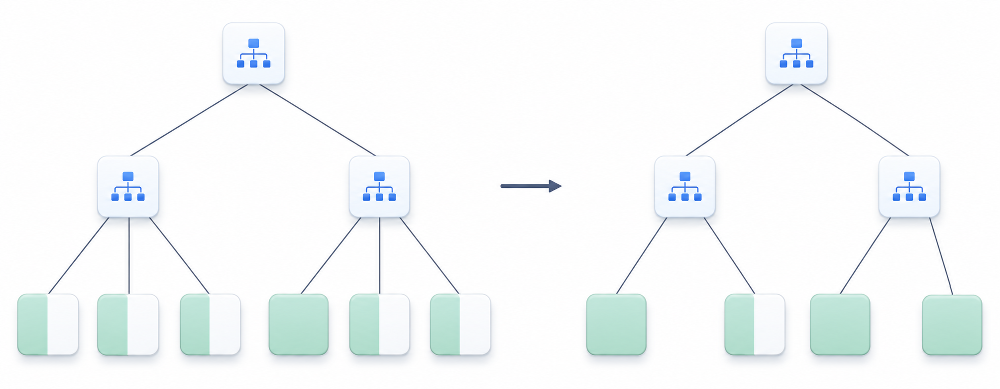

<a id="bc26bcceab15c938"></a>

# 18. SQL References (A~B)

> Source: [GOLDILOCKS 26c.1 User Manual (en)](https://manual.sunjesoft.co.kr/goldilocks/26c_1/manual/en/bc26bcceab15c938)  
> Tag: `26c.1_0_tag`

[← 17. Built-in Function References](17-built-in-function-references.md) · [Table of contents](../README.md) · [19. SQL References (C~G) →](19-sql-references-c-g.md)

<a id="1ee1c2c985e74ad3"></a>
## ALTER AUDIT POLICY

<a id="8d976d0bdcad5a88"></a>
### Function

It adds an auditing target to an audit policy object or drops an auditing target from an audit policy object.

<a id="46498ab40ecf8f4a"></a>
### Syntax

```
<alter audit policy statement> ::= 
    ALTER AUDIT POLICY policy_name
    { <add_audit_option> | <drop_audit_option> }
    ;

<add_audit_option> ::=
    ADD { <privilege_audit_clause> | <role_audit_clause> | <action_audit_clause> } [, ...]

<drop_audit_option> ::=
    DROP { <privilege_audit_clause> | <role_audit_clause> | <action_audit_clause> } [, ...]


<privilege_audit_clause> ::=
    PRIVILEGES <database_privilege> [, ...]

<role_audit_clause> ::=
    ROLES <role_name> [, ...]

<action_audit_clause> ::=
    ACTIONS { <object_action_audit> | <system_action_audit> } [, ...]

<object_action_audit> ::=
      ALL ON [schema_name.]object_name
    | <object_action> ON [schema_name.]object_name

<system_action_audit> ::=
      ALL
    | <system_action>
```

<a id="14c1d0957aac6cea"></a>
### Invocation and Access Rules

The AUDIT SYSTEM ON DATABASE privilege is required to execute the &lt;alter audit policy statement&gt;.

<a id="32897791d3deaa8d"></a>
### Syntax Rules and Parameters

<a id="964f8e774980c6ef"></a>
#### policy_name

It is the name of the audit policy object to be altered.

<a id="b37aea5295a945d3"></a>
#### &lt;add_audit_option&gt;

It adds an auditing target to an audit policy.

<a id="d2d235eb300da6fe"></a>
#### &lt;drop_audit_option&gt;

It drops an auditing target from an audit policy.

<a id="4cc9470d9255f80b"></a>
#### &lt;privilege_audit_clause&gt;

For more information, refer to [CREATE AUDIT POLICY](19-sql-references-c-g.md#9b9979f490f84f42).

<a id="f6e02392207c8dfe"></a>
#### &lt;role_audit_clause&gt;

For more information, refer to [CREATE AUDIT POLICY](19-sql-references-c-g.md#9b9979f490f84f42).

<a id="f42bf9ca2c903238"></a>
#### &lt;action_audit_clause&gt;

For more information, refer to [CREATE AUDIT POLICY](19-sql-references-c-g.md#9b9979f490f84f42).

<a id="8cea8a886defea66"></a>
### Description

It can alter an already activated audit policy, but it does not affect existing sessions; it only affects newly created sessions.

> When dropping the ALL option as follows, not all actions are dropped, but only the corresponding ALL option is dropped.

```
CREATE AUDIT POLICY p1
       ACTIONS ALL ON u1.t1,
               SELECT ON u1.t1;

ALTER AUDIT POLICY p1 DROP
      ACTIONS ALL ON u1.t1;
```

<a id="eeae71f1abb7c771"></a>
### Examples

The following is an example of adding a new audit option to an audit policy.

```
ALTER AUDIT POLICY policy_dml
      ADD ACTIONS SELECT ON u1.t1;
```

The following is an example of dropping an audit option from an audit policy.

```
ALTER AUDIT POLICY policy_dml
      DROP ACTIONS SELECT ON u1.t1;
```

<a id="4ab69e35b49e4468"></a>
### Compatibility

The SQL standard does not include an audit policy.

<a id="974a72c496912495"></a>
### For More Information

Refer to the following.

- Managing audit policy object
    - [CREATE AUDIT POLICY](19-sql-references-c-g.md#9b9979f490f84f42)
    - [DROP AUDIT POLICY](19-sql-references-c-g.md#230511362f0d7d5e)
    - [ALTER AUDIT POLICY](#1ee1c2c985e74ad3)

- Activating/ deactivating audit policy 
    - [AUDIT POLICY](#28ecab768bc8d18a)
    - [NOAUDIT POLICY](20-sql-references-h-z.md#237307d91350ad0b)

- Enquiring audit trail: [AUDIT_TRAIL](../part-02-administration-manual/9-database-information.md#79d9233c8fc99c99)

- Dropping audit trail: [ALTER DATABASE CLEAR AUDIT TRAIL](#a4524ffa1dc98eef)

<a id="587d989b6ad2040a"></a>
## ALTER CLUSTER GROUP name ADD MEMBER

<a id="5736abfd68a91816"></a>
### Function

It adds a cluster member to the cluster group.

<a id="8736a2730df33811"></a>
### Syntax

```
<alter cluster group add member statement> ::=
    ALTER CLUSTER GROUP group_name ADD
        <cluster member definition> [, ...]
    ;

<cluster member definition> ::=
    CLUSTER MEMBER member_name <connection attribute> [<member position>]

<connection attribute> ::=
    HOST 'address' PORT port_no

<member position> ::=
    POSITION DEFAULT
  | POSITION MAX
  | POSITION number
```

<a id="2cb949ed9e227825"></a>
### Invocation and Access Rules

It can be performed in a cluster system.

The ADMINISTRATION ON DATABASE privilege is required to execute the &lt;alter cluster group add member statement&gt;.

<a id="fa3e043c70dcf69e"></a>
### Syntax Rules and Parameters

<a id="a199ba0222db5706"></a>
#### group_name

It is the name of the cluster group.

<a id="168f19ed7ecba650"></a>
#### &lt;cluster member definition&gt;

It defines a cluster member to be included in a cluster group.  
A cluster group can include a maximum of 32 cluster members.

<a id="f539de9619074667"></a>
#### member_name

It is the name of a cluster member.  
The name of the cluster member must match the name defined when the database for that member was created.   
There must be no duplicate cluster group or cluster member names.   
The length of the name must be less than 128 bytes.

The start-up phase for the cluster member should be GLOBAL OPEN.

<a id="83e38c56c1984d4a"></a>
#### &lt;connection attribute&gt;

It defines the connection information for communication between the cluster members.  
The &lt;connection attribute&gt; must match the HOST and PORT defined when the database for that cluster member was created.  
The combination of HOST and PORT must be unique within the cluster system.

- HOST 'address' uses either the host name or an IPv4 address. If a host name is used, the system will use the first IPv4 address associated with it. 
- The PORT port_no should be within the range of 1024 to 49151.

<a id="94928a5930dd0d64"></a>
#### &lt;member position&gt;

It assigns the position number to the cluster member.

- POSITION DEFAULT
    - The system automatically assigns the position number.
- POSITION MAX
    - A new member position number is assigned, even if an empty position number exists.
    - It assigns a value greater than the largest member position number.
- POSITION number
    - The position number corresponding to the specified number is assigned.
    - The position number must be unique within the cluster system.
    - The position number must be an empty position number and should be equal to or smaller than the largest position number.
- If omitted, the default value is POSITION DEFAULT.

The member_position information of a cluster member can be retrieved through the DBA_CLUSTER view.

```
SELECT member_name, member_id, member_position FROM dba_cluster;
```

If the following position numbers are in use,

- G1N1: 0
- G1N2: 1
- G2N2: 3
- G3N2: 5

The following values are assigned based on each option.

- POSITION DEFAULT
    - It assigns 2, which is an empty value.
- POSITION MAX
    - It assigns 6, which is a new position number value.
- POSITION 3
    - It is duplicated, so it results in an error.
- POSITION 4
    - It assigns 4, which is a position number.

<a id="a1a777d21c863683"></a>
### Description

The &lt;alter cluster group add member statement&gt; statement does not rebalance shards in the tables.  
The following statement should be executed to rebalance the shards on the added cluster member.

- [ALTER DATABASE REBALANCE](#eba0a85e4ceddd6e)
- [ALTER TABLE name REBALANCE](#f207258645781242)

<a id="5b05f03dadce21c9"></a>
### Examples

The following is an example of adding two cluster members to a cluster group.

```
gSQL>
ALTER CLUSTER GROUP g1 ADD
    CLUSTER MEMBER g1n3 HOST '192.168.0.13' PORT 10130,
    CLUSTER MEMBER g1n4 HOST '192.168.0.14' PORT 10140
;

Cluster Group altered.
```

The following is an example of designating the empty member position as a cluster member position.

```
ALTER CLUSTER GROUP g2 ADD
    CLUSTER MEMBER g2n1 HOST '192.168.0.21' PORT 10210 POSITION 4
;
```

<a id="f59c5cb37c065714"></a>
### Compatibility

The SQL standard does not define the concept of a cluster.

<a id="5b5945b8d813d3bf"></a>
### For More Information

Refer to the following.

- [CREATE CLUSTER GROUP](19-sql-references-c-g.md#6ad165b04482545a)
- [DROP CLUSTER GROUP](19-sql-references-c-g.md#cf6da303c45334dc)
- [ALTER DATABASE REBALANCE](#eba0a85e4ceddd6e)
- [ALTER TABLE name REBALANCE](#f207258645781242)

<a id="7c1059c2e32ada37"></a>
## ALTER CLUSTER GROUP name OFFLINE MEMBER

<a id="97a521932b7010ee"></a>
### Function

It sets a cluster member within the cluster group to offline.

<a id="939a498efcf3dfb5"></a>
### Syntax

```
<alter cluster group offline member statement> ::=
    ALTER CLUSTER GROUP group_name OFFLINE CLUSTER MEMBER member_name
    ;
```

<a id="9737abff125174eb"></a>
### Invocation and Access Rules

It can be performed in a cluster system.

The ADMINISTRATION ON DATABASE privilege is required to execute the &lt;alter cluster group offline member statement&gt;.

<a id="ac5bd7786382b762"></a>
### Syntax Rules and Parameters

<a id="56e4bb69f7790db7"></a>
#### group_name

It is the name of a cluster group.

<a id="5cd75a2d71ac6439"></a>
#### member_name

It is the name of a cluster member.  
The cluster member must be included in the cluster group of group_name.  
The cluster member must be inactive.

<a id="b22675e40cb0472e"></a>
### Description

It sets the inactive cluster member to offline.

The &lt;alter cluster group offline member statement&gt; does not rebalance shards in the tables.

<a id="219e365d1c893525"></a>
### Examples

If an attempt is made to set a cluster member that is not inactive to offline, the following error will occur.

```
gSQL>

ALTER CLUSTER GROUP g1 OFFLINE CLUSTER MEMBER g1n2;

ERR-42000(16417): active member 'G1N2' cannot be offlined
```

The following is an example of changing a specific cluster member to an offline state.

```
gSQL>

ALTER CLUSTER GROUP g1 OFFLINE
    CLUSTER MEMBER g1n3
;
Cluster Group altered.
```

<a id="74158639c726115e"></a>
### Compatibility

The SQL standard does not define the concept of a cluster.

<a id="2cb1e0243090f583"></a>
### For More Information

Refer to the following.

- [CREATE CLUSTER GROUP](19-sql-references-c-g.md#6ad165b04482545a)
- [DROP CLUSTER GROUP](19-sql-references-c-g.md#cf6da303c45334dc)
- [ALTER DATABASE REBALANCE](#eba0a85e4ceddd6e)
- [ALTER TABLE name REBALANCE](#f207258645781242)

<a id="b1673f7439fc39e9"></a>
## ALTER CLUSTER LOCATION

<a id="7cc3f27617ea5a0c"></a>
### Function

It alters the cluster location information.

<a id="720cca8b27f42788"></a>
### Syntax

```
<alter cluster location statement> ::=
    ALTER CLUSTER LOCATION member_name 
    <cluster connection attribute>
    ;

<cluster connection attribute> ::
       HOST 'address' PORT port_no
```

<a id="edad52f5408a83d9"></a>
### Invocation and Access Rules

It can be performed in a cluster system.

The ADMINISTRATION ON DATABASE privilege is required to execute the &lt;alter cluster location statement&gt;.

<a id="aa1916e93ba25683"></a>
### Syntax Rules and Parameters

<a id="bc6ca5f5e27d6c82"></a>
#### member_name

It is the name of a cluster member.  
The same cluster member name must exist in the registered cluster location information.  
The length of the name must be shorter than 128 bytes.

<a id="c04c1de5918ebb24"></a>
#### &lt;cluster connection attribute&gt;

It defines the connection information for communication between cluster members.  
The combination of HOST and PORT must be unique within the cluster system.

- HOST 'address' can use either a host name or an IPv4 address. If a host name is used, the system will use the first IPv4 address.
- PORT port_no must be within the range of 1024 to 49151.

<a id="f216cc4e043315a7"></a>
### Description

If the connection information of the cluster location is altered, the cluster member does not need to be dropped or recreated, but the connection information can be altered using the [ALTER CLUSTER LOCATION](#b1673f7439fc39e9).

<a id="53117171d91a0101"></a>
### Examples

```
gSQL> 
ALTER CLUSTER LOCATION g1n2
    HOST '192.168.0.12' PORT 10120
;

Location altered.
```

<a id="fe219373a0b70a90"></a>
### Compatibility

The SQL standard does not define the concept of a cluster.

<a id="41c401b4c87ed518"></a>
### For More Information

Refer to the following.

- [CREATE CLUSTER LOCATION](19-sql-references-c-g.md#1e6f444e1a43b4b5)
- [DROP CLUSTER LOCATION](19-sql-references-c-g.md#9a30ad97763681d1)

<a id="d2062ac468f12d4a"></a>
## ALTER DATABASE ADD LOGFILE

<a id="07ef1b39f6c18fc4"></a>
### Function

It adds log file groups or log file members to the database.

<a id="489f8627fe09643d"></a>
### Syntax

```
<alter database add logfile statement> ::=
      <add logfile member statement> 
    | <add logfile group statement>
    ;

<add logfile member statement> ::=
    ALTER DATABASE ADD LOGFILE MEMBER <add logfile clause> [, ...] TO 
        <group clause>

<add logfile group statement> ::=
    ALTER DATABASE ADD LOGFILE <group clause> ( 'logfile_name' [, ...] ) 
        <size clause> [ REUSE ]

<group clause> ::=
    GROUP integer

<add logfile clause> ::=
    'logfile_name' [ REUSE ]

<size clause> ::=
    integer [ M | G ]
```

<a id="791812ca3e75f883"></a>
### Invocation and Access Rules

The ALTER DATABASE ON DATABASE privilege is required to execute the &lt;alter database add logfile statement&gt;.

<a id="dcd339e29dc10c7a"></a>
### Syntax Rules and Parameters

<a id="b70119196c5c2055"></a>
#### &lt;alter database add logfile statement&gt;

The database must be in the MOUNT phase.

<a id="c1ba577b2eddeda8"></a>
#### &lt;add logfile member statement&gt;

A log member is added to an existing log file group.

- &lt;add logfile clause&gt; 
    - 'logfile_name' is the file name of the logfile member to be added to the log file group.
    - If the file does not exist, a new file will be created.
    - The length of logfile_name must be shorter than 1024 bytes.
- &lt;group clause&gt; 
    - This specifies the identifier of the logfile group to be added to the database.
    - The integer must be the identifier of an existing logfile group. 
    - If the identifier corresponding to the integer does not exist, an error will occur.

<a id="c1421674c67e5a60"></a>
#### &lt;add logfile group statement&gt;

It adds a new log file group.

- It is added as the next group of the CURRENT log file group.
- &lt;group clause&gt; 
    - This specifies the identifier of the logfile group to be added to the database.
    - The integer must be an identifier of a non-existing logfile group.
    - If an identifier corresponding to the integer exists, an error will occur.
- &lt;size clause&gt; 
    - The file size can be specified with a minimum of 20 MB and a maximum of 120 GB.
    - The file size must be greater than the sum of the redo log buffer size and the pending log buffer size.
- If logfile_name already exists and the REUSE option is used, the existing log file will be reused if its size matches another member in the log file group.

<a id="755b7eb97b18d906"></a>
### Description

It is recommended to back up the control file to prepare for potential control file damage, as new log file groups and log members are stored in the control file.

<a id="f2cf0050d7f28718"></a>
### Examples

The following is an example of adding two log file members to the existing log file group 3.

```
ALTER DATABASE ADD LOGFILE MEMBER 'logfile1.log', 'logfile2.log' TO GROUP 3;
```

The following is an example of adding a new log file group 4 to the database. The size of log file group 4 is 100 M, and the log file name is 'logfile1.log'.

```
ALTER DATABASE ADD LOGFILE GROUP 4 ( 'logfile1.log' ) SIZE 100M;
```

> When adding a log group, a single log file must be used. However, multiple log files can be added as members to an existing group.

<a id="0b51218c70ce914c"></a>
### Compatibility

The SQL standard does not define the ALTER DATABASE statement.

<a id="cf621a8e77c758db"></a>
### For More Information

Refer to the following.

- [ALTER DATABASE ADD LOGFILE](#d2062ac468f12d4a)
- [ALTER DATABASE DROP LOGFILE](#7f5e87ea8a89f0ff)
- [ALTER DATABASE RENAME LOGFILE](#e8d893c3e0b6099d)

<a id="41d1beb5c617389b"></a>
## ALTER DATABASE ARCHIVELOG

<a id="d8469d26f154daf0"></a>
### Function

It alters the archive setting of the online log file in the database.

<a id="078b90e636d5fa30"></a>
### Syntax

```
<alter database archivelog statement> ::=
    ALTER DATABASE { ARCHIVELOG | NOARCHIVELOG }
    ;
```

<a id="53f3f08889e505a9"></a>
### Invocation and Access Rules

The ALTER DATABASE ON DATABASE privilege is required to execute the &lt;alter database archivelog statement&gt;.

<a id="30ad2cbb2d7df19e"></a>
### Syntax Rules and Parameters

<a id="faa39f7c533a9795"></a>
#### &lt;alter database archivelog statement&gt;

- The database must be in the MOUNT phase.
- ARCHIVELOG
    - This option archives the online log file.
- NOARCHIVELOG
    - This option does not archive the online log file.

<a id="4e9b9f9a0dfbee36"></a>
### Description

For database backup and media recovery using the backup, the system must operate in ARCHIVELOG mode.

<a id="10eac9f780e008dd"></a>
### Example

The following is an example of setting the database to archive mode.

```
ALTER DATABASE ARCHIVELOG;
```

<a id="d5f17d6c4588069a"></a>
### Compatibility

The SQL standard does not define the ALTER DATABASE statement.

<a id="480ac302c961b961"></a>
### For More Information

Refer to the following.

- [ALTER DATABASE BACKUP](#a9f4f713f7a7547c)
- [ALTER TABLESPACE name BACKUP](#7fe166f588ba7fa5)

<a id="a9f4f713f7a7547c"></a>
## ALTER DATABASE BACKUP

<a id="b31d6027ebc0baf5"></a>
### Function

It creates a backup of the entire database.

The backup targets are the datafile and the control file, and the datafile can be backed up using both full and incremental backups.

<a id="7b8feec50f604038"></a>
### Syntax

```
<alter database backup statement> ::=
      <database begin backup statement>
    | <database end backup statement>
    | <database incremental backup statement>
    | <database controlfile backup statement>
    ;

<database begin backup statement> ::=
    ALTER DATABASE BEGIN BACKUP [ AT <domain name> ]
    ;

<database end backup statement> ::=
    ALTER DATABASE END BACKUP [ AT <domain name> ]
    ;


<database incremental backup statement> ::=
    ALTER DATABASE BACKUP INCREMENTAL
        <incremental backup option> [ FORMAT 'format string' ] 
        [ PIECE integer ] [ <parallel clause> ] [ AT <domain name> ];

<incremental backup option> ::=
      LEVEL integer [ CUMULATIVE | DIFFERENTIAL ]

<database controlfile backup statement> ::=
    ALTER DATABASE BACKUP CONTROLFILE TO 'target_name'
        [ AT <domain name> ]    ;


<parallel clause> ::=
      NOPARALLEL
    | PARALLEL [ integer ]
```

<a id="cf038d8098704243"></a>
### Invocation and Access Rules

The ALTER DATABASE ON DATABASE privilege is required to execute the &lt;alter database backup statement&gt;.

<a id="bffc7e94fc09024e"></a>
### Syntax Rules and Parameters

<a id="766e19b00e146064"></a>
#### &lt;database begin backup clause&gt;

The database is set to a state where a full backup is available.

- All tablespaces in the ONLINE state, which are created and used in the database, should be set to a state where a full backup is available. 
- The database must be in the OPEN state and operated in ARCHIVELOG mode.
- Once BEGIN BACKUP has started, the following operations, which require writing to the data file, can not be performed.
    - SHUTDOWN NORMAL
    - OFFLINE/ DROP TABLESPACE
    - ADD/ DROP DATAFILE
- If the full backup is in the ACTIVE state and the instance is abnormally terminated, media recovery may be required upon restart.

<a id="43f5c18cdb9f8bc1"></a>
#### &lt;database end backup clause&gt;

The database is set to a state where a full backup is not available.

- All tablespaces in the ONLINE state, which are created and used in the database, should be set to a state where a full backup is not available. 
- The database must be in the OPEN phase and operated in ARCHIVELOG mode.

<a id="5d85a67f86f3dd09"></a>
#### &lt;database incremental backup statement&gt;

- An incremental backup is performed for the database.
- The database must be in the OPEN phase and operating in ARCHIVELOG mode.

<a id="e0693c37437fb66a"></a>
#### &lt;incremental backup option&gt;

- The 'integer' can be specified from 0 to 4. 
- LEVEL 0 can not specify CUMULATIVE or DIFFERENTIAL.
- CUMULATIVE | DIFFERENTIAL
    - CUMULATIVE
        - If 'integer' is n, it backs up all pages that have been altered since the most recent backups of LEVEL 0 through LEVEL n-1. 
    - DIFFERENTIAL
        - If 'integer' is n, it backs up all pages that have been altered since the most recent backups of LEVEL 0 through LEVEL n. 
    - If omitted, DIFFERENTIAL is specified by default.

<a id="bfd72ab9054d749a"></a>
#### FORMAT 'format string'

- It specifies the format of the backup file name.
- The format specifier is available in the 'format string' . 
- If FORMAT is not specified, the format string 'database_D%T_T%t_L%l_Q%q_P%p.inc' is used.
- format specifier
    - %d: Database signature
    - %q: Backup sequence number
    - %l: Backup level
    - %t: Time (HHMMSS)
    - %m: Cluster member name
    - %g: Cluster group name
    - %D: Day (DD)
    - %M: Month (MM)
    - %p: The piece number of the backup file
    - %T: Date (YYYYMMDD)
    - %Y: Year (YYYY)
    - %%: Percent(%) character

<a id="fc0bd7e767e94502"></a>
#### PIECE integer

- It specifies the number of backup files to be split into
- If %p is not included in the 'format string', the specified integer value is ignored and defaults to 1.

<a id="7edd3195528fa116"></a>
#### &lt;parallel clause&gt;

It specifies the number of threads to be used during backup.

- NOPARALLEL
    - Backup is not performed in parallel.
- PARALLEL [integer] 
    - Backup is performed in parallel.
    - The integer value ranges from a minimum of 1 to a maximum of 64.
    - If the integer is omitted, it defaults to 1.
- If not specified, the default setting is NOPARALLEL.
- If the total number of target datafiles is smaller than the specified integer, backup is performed in parallel up to the number of data files.
- If the number of PIECEs is smaller than the number of parallel processes, backup is performed in parallel up to the number of PIECEs.

<a id="86ea220eda755ef8"></a>
#### &lt;database controlfile backup statement&gt;

- The control file is backed up. 
    - The length of 'target_name' must be less than 1024 bytes.
    - If 'target_name' already exists, the operation fails.
- The database must be in the OPEN phase and operating in ARCHIVELOG mode.

> The maximum length of 'target_name' managed by GOLDILOCKS is 1024 bytes. However, since the maximum file name length varies depending on the OS, the actual length of 'target_name' that can be created may be less than 1024 bytes.

<a id="5cb37c498e4ed209"></a>
#### &lt;domain name&gt;

It is the name of the member or group on which the statement is performed.  
If not specified, the statement is performed on all groups.

<a id="899910483605be6d"></a>
### Description

It backs up the data files and control files in the database. A full backup of the database begins with BEGIN BACKUP, copies the datafiles using an OS file copy, and ends with END BACKUP. The incremental backup file is created in the path set by the BACKUP_DIR 1 property using a single statement.

<a id="81b7ed8b36a8ce2f"></a>
### Examples

The following is an example of setting the entire backup state to ACTIVE.

```
ALTER SYSTEM BEGIN BACkUP;
```

The following is an example of setting the entire backup state to INACTIVE.

```
ALTER SYSTEM END BACkUP;
```

The following is an example of creating an incremental backup at LEVEL 1 using DIFFERENTIAL.

```
ALTER DATABASE BACKUP INCREMENTAL LEVEL 1 DIFFERENTIAL;
```

The following is an example of creating the 'controlfile.bak' backup file for the control file. If an absolute path is not specified, the backup file is created in the directory set by the LOG_DIR property.

```
ALTER DATABASE BACKUP CONTROLFILE TO 'controlfile.bak';
```

The following is an example of performing an incremental backup with four threads, creating four backup files named with dates and piece numbers.

```
ALTER DATABASE BACKUP INCREMENTAL LEVEL 0 FORMAT 'backup_%T_%p' PIECE 4 PARALLEL 4;
```

<a id="1e5a38d5603d5b16"></a>
### Compatibility

The SQL standard does not define the ALTER DATABASE statement.

<a id="f94c466ca05dc26b"></a>
### For More Information

Refer to the following.

- [ALTER TABLESPACE name BACKUP](#7fe166f588ba7fa5)
- [ALTER DATABASE RECOVER](#91d87d0b29aa6323)

<a id="a4524ffa1dc98eef"></a>
## ALTER DATABASE CLEAR AUDIT TRAIL

<a id="ef55323de9ce5a25"></a>
### Function

It purges audit records accumulated due to the application of the audit policy.

<a id="44619137142bb896"></a>
### Syntax

```
<clear audit trail statement> ::= 
    ALTER DATABASE CLEAR AUDIT TRAIL
        [ AT <domain name> ]
    ;
```

<a id="a1ac085ffa98df73"></a>
### Invocation and Access Rules

The AUDIT SYSTEM ON DATABASE privilege is required to execute the &lt;clear audit trail statement&gt;.

<a id="3b606eff72614f71"></a>
### Syntax Rules and Parameters

<a id="7be4daba2a87becb"></a>
#### &lt;domain name&gt;

It is the name of the member or group on which the statement is performed.  
If not specified, the statement is performed on all groups.

<a id="3ba4d406897b1d77"></a>
### Description

If an audit policy is activated, an audit trails is getting longer as time goes by.  
Tables configuring an audit trail are stored in MEM_AUX_TBS tablespace, and a user should be cautious not to let the audit trail keep increasing.

<a id="c3f32f6e2f0f9131"></a>
### Storing Audit Trail

To store the audit trail when necessary, it should be stored according to the following procedure and then purged.

- When performing it for the first time

```
CREATE TABLE backup_audit_trail AS SELECT * FROM AUDIT_TRAIL;
COMMIT;
```

- When performing it repeatedly

```
INSERT INTO backup_audit_trail SELECT * FROM AUDIT_TRAIL;
COMMIT;
```

- When purging the audit trail

```
ALTER DATABASE CLEAR AUDIT TRAIL;
```

<a id="83cb8391d21462c5"></a>
### Example

Purge the audit trail using the following statement.

```
ALTER DATABASE CLEAR AUDIT TRAIL;
```

<a id="47cb210d6f14bb6b"></a>
### Compatibility

The SQL standard does not include the audit policy.

<a id="8a87f0bded892dbe"></a>
### For More Information

Refer to the following.

- Managing audit policy objects
    - [CREATE AUDIT POLICY](19-sql-references-c-g.md#9b9979f490f84f42)
    - [DROP AUDIT POLICY](19-sql-references-c-g.md#230511362f0d7d5e)
    - [ALTER AUDIT POLICY](#1ee1c2c985e74ad3)

- Activating/ deactivating audit policy 
    - [AUDIT POLICY](#28ecab768bc8d18a)
    - [NOAUDIT POLICY](20-sql-references-h-z.md#237307d91350ad0b)

- Enquiring audit trail: [AUDIT_TRAIL](../part-02-administration-manual/9-database-information.md#79d9233c8fc99c99)

- Dropping audit trail: [ALTER DATABASE CLEAR AUDIT TRAIL](#a4524ffa1dc98eef)

<a id="8cf16ad46dc69f8b"></a>
## ALTER DATABASE CLEAR PASSWORD HISTORY

<a id="bfef6151840eccda"></a>
### Function

It deletes the user's password change history accumulated due to the application of the profile.

<a id="8422bc0d1ba13676"></a>
### Syntax

```
<clear password history statement> ::= 
    ALTER DATABASE CLEAR PASSWORD HISTORY
        [ AT <domain name> ]
    ;
```

<a id="22df98f7e97d7993"></a>
### Invocation and Access Rules

The ALTER DATABASE ON DATABASE privilege is required to execute the &lt;clear password history statement&gt;.

<a id="02e3f53bf30b82c6"></a>
### Syntax Rules and Parameters

<a id="746dbe24b734c9dd"></a>
#### &lt;domain name&gt;

It is the name of the member or group on which the statement is performed.  
If not specified, the statement is performed on all groups.

<a id="57c6b4c957d6e138"></a>
### Description

When a profile is applied to a user, the user's password change history is accumulated based on the PASSWORD_REUSE_MAX and PASSWORD_REUSE_TIME policies.

**Managing the change history**

<a id="a6f1aedf43fc2971"></a>
| PASSWORD_REUSE_MAX | PASSWORD_REUSE_TIME | Managing the change history |
| --- | --- | --- |
| value | value | It manages only the change history within the specified value range, and any change history outside this range is automatically deleted. |
| value | UNLIMITED | Since all change history must be reviewed, it only accumulates the change history and does not remove any records. |
| UNLIMITED | value | Since all change history must be reviewed, it only accumulates the change history and does not remove any records. |
| UNLIMITED | UNLIMITED | Since the change history is not reviewed, it is also not managed. |

&lt;Clear password history statement&gt; deletes the accumulated user password change history.

<a id="4ccf8ea3cf79455a"></a>
### Examples

The following is an example of executing the &lt;clear password history statement&gt;.

```
gSQL> ALTER DATABASE CLEAR PASSWORD HISTORY;

Database altered.

gSQL> COMMIT;

Commit complete.
```

<a id="3c5297a4f9c3c2c2"></a>
### Compatibility

The SQL standard does not define the ALTER DATABASE statement.

<a id="53c9c428320b0103"></a>
### For More Information

Refer to the following.

- [CREATE PROFILE](19-sql-references-c-g.md#98c2f8112f164605)
- [CREATE USER](19-sql-references-c-g.md#409f34806636a0ff)

<a id="c38f4ab693cfd2c4"></a>
## ALTER DATABASE DATAFILE AUTOEXTEND

<a id="8624f28342672de5"></a>
### Function

It alters the property to automatically extend the disk tablespace data file. If the property is ON, the size to be extended and the maximum size of the data file can also be altered.

<a id="1a71056626f430ae"></a>
### Syntax

```
<alter database datafile autoextend statement> ::= 
    ALTER DATABASE DATAFILE datafile_name <autoextend clause>
        [ AT <domain name> ]
    ;

<autoextend clause>
    AUTOEXTEND { ON [ <next size clause> ] [ <max size clause> ] | OFF }

<next size clause>
    NEXT <size clause>

<max size clause>
    MAXSIZE { <size clause> | UNLIMITED }
```

<a id="0e11ea6a1bf982ec"></a>
### Invocation and Access Rules

The ALTER DATABASE ON DATABASE privilege is required to execute the &lt;alter database datafile autoextend statement&gt;.

The datafile automatic expand property can only alter the property of disk tablespace.

<a id="0cce98154343725d"></a>
#### datafile_name

It specifies the name of the data file to be altered.

<a id="70f99ce0781063f3"></a>
#### &lt;autoextend clause&gt;

It sets the automatic expand property to ON or OFF. If set to ON, the automatic expansion size and the maximum size of the data file can be specified.

<a id="a03ccd50da4038bd"></a>
#### &lt;next size clause&gt;

It specifies the size to be extended when the data file in use runs out of available space.

<a id="bc41d82072ac003d"></a>
#### &lt;max size clause&gt;

It specifies the maximum size to which the data file can be extended.

<a id="fcf048b30d2b259c"></a>
### Description

Refer to the syntax rules for each statement.

<a id="ced2cfb487139f80"></a>
### Examples

The following is an example of altering the automatic expand property of the datafile, the automatic expansion size, and the datafile size.

```
gSQL> ALTER DATABASE DATAFILE 'DISK_TBS.dbf' AUTOEXTEND OFF;

Database altered.

gSQL> ALTER DATABASE DATAFILE 'DISK_TBS.dbf' AUTOEXTEND ON;

Database altered.

gSQL> ALTER DATABASE DATAFILE 'DISK_TBS.dbf' AUTOEXTEND ON NEXT 20M;

Database altered.

gSQL> ALTER DATABASE DATAFILE 'DISK_TBS.dbf' AUTOEXTEND ON MAXSIZE 1G;

Database altered.

gSQL> ALTER DATABASE DATAFILE 'DISK_TBS.dbf' AUTOEXTEND ON 20M MAXSIZE 1G;

Database altered.
```

<a id="b72430a9f3a03f48"></a>
### Compatibility

The SQL standard does not define the concept of the datafile.

<a id="6f39d5b63721cc36"></a>
### For More Information

Refer to [CREATE DISK DATA TABLESPACE](19-sql-references-c-g.md#89eb5cb801251c20).

<a id="e0dee9ed60af5102"></a>
## ALTER DATABASE DELETE BACKUP

<a id="c323e5c0fcb085e8"></a>
### Function

It deletes the backup file and the backup information of the incremental backup. It can delete all incremental backups of the database or obsolete backups that are no longer usable.

<a id="bcafe1c1ef8a83c7"></a>
### Syntax

```
<alter database delete backup statement> ::=
    ALTER DATABASE DELETE <delete backup list option> 
        BACKUP LIST [ <including backup file option> ]
        [ AT <domain name> ]
    ;

<delete backup list option> ::=
      OBSOLETE
    | ALL

<including backup file option> ::=
    INCLUDING BACKUP FILES
```

<a id="486c460b53a22cd0"></a>
### Invocation and Access Rules

The ALTER DATABASE ON DATABASE privilege is required to execute the &lt;alter database delete backup statement&gt;.

<a id="a86c9dfdc6ee952c"></a>
### Syntax Rules and Parameters

<a id="848dacde317d8e15"></a>
#### &lt;alter database delete backup statement&gt;

The database must be in MOUNT or OPEN phase.

<a id="8e9d13a47a9c2011"></a>
#### &lt;delete backup list option&gt;

It selects the targets to be deleted from the existing incremental backups.

- OBSOLETE: It selects the database or tablespace backups to be deleted, which were taken before the most recent LEVEL 0 database backup.
- ALL: It selects all incremental backups to be deleted.

<a id="7d19ac80fcaffff3"></a>
#### &lt;including backup file option&gt;

- If omitted, it deletes only the backup information from the control file.
- It deletes both the backup information and the backup files.

<a id="ed0358b6512c9372"></a>
#### &lt;domain name&gt;

It is the name of the member or group on which the statement is performed.  
If not specified, the statement is performed on all groups.

<a id="e0946111b97ea6b3"></a>
### Description

Deletion of the OBSOLETE incremental backup deletes backups taken before the most recent LEVEL 0 database backup. When a non-LEVEL 0 incremental backup is performed, it is not deleted, even if it includes previously performed incremental backups. This is because the backup may be needed for incomplete recovery using incremental backups.

> Be cautious when deleting the backup file along with an incremental backup. It can not be recovered, even using the control file that contains the incremental backup information.

<a id="d16c895ce56541fb"></a>
### Example

The following is an example of how to delete the backup information and backup files of all existing incremental backups.

```
ALTER DATABASE DELETE ALL BACKUP LIST INCLUING BACKUP FILES;
```

<a id="1b051c2d58039667"></a>
### Compatibility

The SQL standard does not define the ALTER DATABASE statement.

<a id="91fc026a048d7014"></a>
### For More Information

Refer to the following.

- [ALTER TABLESPACE name BACKUP](#7fe166f588ba7fa5)
- [ALTER DATABASE RECOVER](#91d87d0b29aa6323)

<a id="89a3515c9a881380"></a>
## ALTER DATABASE DISABLE CHANGE TRACKING

<a id="b66a10a657a21659"></a>
### Function

It disables the data change tracking feature for the disk tablespace.

<a id="6a3f89618befb9f6"></a>
### Syntax

```
<alter database disable change tracking statement> ::=
    ALTER DATABASE DISABLE CHANGE TRACKING
        [ AT <domain name> ]
    ;
```

<a id="c697834ad716532e"></a>
### Invocation and Access Rules

The ALTER DATABASE ON DATABASE privilege is required to execute the &lt;alter database disable change tracking statement&gt;.

<a id="656f29355be5149c"></a>
### Syntax Rules and Parameters

The database must be in the MOUNT or OPEN phase.

<a id="c5dce5fa33ac38c7"></a>
#### &lt;domain name&gt;

It is the name of the member or group on which the statement is performed.  
If not specified, the statement is performed on all groups.

<a id="7e138e6714f8513b"></a>
### Description

It disables the management of backup target pages when performing an incremental backup for the disk tablespace.

> If CHANGE TRACKING is disabled, the system must scan all pages to determine the backup target during an incremental backup of the disk tablespace. This will increase the backup duration and, as a result, could impact service availability, so caution is advised.

<a id="6a2e154234e98deb"></a>
### Example

The following is an example of disabling the CHANGE TRACKING.

```
ALTER DATABASE DISABLE CHANGE TRACKING;
```

<a id="e024a78f34f9367c"></a>
### Compatibility

The SQL standard does not define the ALTER DATABASE statement.

<a id="b98e87eb95535a49"></a>
### For More Information

Refer to the following.

- [ALTER DATABASE ENABLE CHANGE TRACKING](#aca261c5d57cde22)
- [ALTER DATABASE RENAME CHANGE TRACKING FILE](#e844d07cccb4db29)

<a id="a3601304aac063fd"></a>
## ALTER DATABASE DROP INACTIVE CLUSTER MEMBERS

<a id="512291c989154600"></a>
### Function

It drops the entire inactive cluster member.

<a id="efa181846c94d085"></a>
### Syntax

```
<alter database drop inactive members statement> ::=
    ALTER DATABASE DROP [ FORCE | NO FORCE ] INACTIVE CLUSTER MEMBERS
    ;
```

<a id="9d1599152c449452"></a>
### Invocation and Access Rules

It can be performed in a cluster system.

The ADMINISTRATION ON DATABASE privilege is required to execute the &lt;alter database drop inactive cluster members statement&gt;.

<a id="c5ef2677138646f3"></a>
### Syntax Rules and Parameters

<a id="8d8b31a073568436"></a>
#### [ FORCE | NO FORCE ]

- FORCE
    - It drops an inactive cluster member even if there is a risk of data loss.
- NO FORCE
    - It does not drop an inactive cluster member if there is a risk of data loss.
- The default value is NO FORCE.

<a id="4652db2ef0873577"></a>
### Description

It drops the entire inactive cluster member.

The inactive state of a cluster member means it is not connected to the cluster system, which occurs in the following cases.

- An error occurs on a cluster member in an active cluster system.
- Attempting to start the cluster system without activating the affected cluster member.

However, if the table shard is lost while dropping the cluster member, the inactive cluster member can not be dropped.

Additionally, an inactive cluster member cannot be removed if there is a risk of data loss. Data loss can be prevented only if it is guaranteed that the replica of the table or shard belonging to the inactive cluster member does not contain more recent data than the other members of the cluster group. Therefore, the removal of an inactive cluster member is allowed if at least one online member exists in the same cluster group for a sharded table, or in the entire cluster for a cloned table.

However, if no online cluster member exists in the cluster group and the service is unavailable due to an inactive cluster member, the inactive cluster member can be dropped using the FORCE option, despite the risk of data loss.

It is recommended to use the &lt;alter database drop inactive members statement&gt; when an inactive cluster member can no longer be included in the cluster system.

<a id="da32565cfe33175c"></a>
### Examples

The following is an example of executing the &lt;alter database drop inactive members statement&gt;.

```
gSQL> ALTER DATABASE DROP INACTIVE CLUSTER MEMBERS;

Database altered.
```

<a id="948a7d65002f52a7"></a>
### Compatibility

The SQL standard does not define the concept of a cluster.

<a id="3363d4bf1988359c"></a>
### For More Information

Refer to [ALTER SYSTEM JOIN DATABASE](#530c2222850ccc1c).

<a id="7f5e87ea8a89f0ff"></a>
## ALTER DATABASE DROP LOGFILE

<a id="09e16e9379ce342b"></a>
### Function

It drops a log file group or a member that exists in the database.

<a id="72e6b89c4971a648"></a>
### Syntax

```
<alter database drop logfile statement> ::=
      <drop logfile group statement>
    | <drop logfile member statement>
    ;

<drop logfile group statement> ::=
    ALTER DATABASE DROP LOGFILE <group clause>

<group clause> ::=
    GROUP integer

<drop logfile member statement> ::=
    ALTER DATABASE DROP LOGFILE MEMBER <logfile_list>

<logfile_list> ::=
      'logfile_name'
    | <logfile_list> , 'logfile_name'
```

<a id="360525cf835c3853"></a>
### Invocation and Access Rules

The ALTER DATABASE ON DATABASE privilege is required to execute the &lt;alter database drop logfile statement&gt;.

<a id="5d6cbd7bb08c43a1"></a>
### Syntax Rules and Parameters

<a id="2cffc95ab53e994b"></a>
#### &lt;alter database drop logfile statement&gt;

The database must be in MOUNT phase.  
An error occurs if the log file to be deleted is in the CURRENT or ACTIVE stage.  
At least four log file groups must remain after dropping.

<a id="09234536e75f974e"></a>
#### &lt;drop logfile group statement&gt;

It drops the existing log file group.

- &lt;group clause&gt; 
    - It specifies the log file group to be dropped.
    - The integer must be the identifier of an existing log file.
    - An error occurs if the integer does not exist.

<a id="497136d96751e853"></a>
#### &lt;drop logfile member statement&gt;

It drops the existing log file members.

- &lt;logfile_list&gt;
    - It is the list of log file members to be dropped.
    - 'logfile_name' must be an existing name. 
    - An error occurs if 'logfile_name' does not exist.

<a id="9156ed43f6715438"></a>
### Description

For more information, refer to the syntax rules for each statement.

<a id="2ab0ec1e7f89cd5e"></a>
### Examples

The following is an example of dropping the existing log file GROUP 3.

```
ALTER DATABASE DROP LOGFILE GROUP 3;
```

The following is an example of dropping logfile1.log and logfile2.log from the existing logfile GROUP 3.

```
ALTER DATABASE DROP LOGFILE MEMBER 'logfile1.log', 'logfile2.log';
```

<a id="2e833b6ee8aba01e"></a>
### Compatibility

The SQL standard does not define the ALTER DATABASE statement.

<a id="bafb43a216e39609"></a>
### For More Information

Refer to the respective syntax rules and the following.

- [ALTER DATABASE ADD LOGFILE](#d2062ac468f12d4a)
- [ALTER DATABASE RENAME LOGFILE](#e8d893c3e0b6099d)

<a id="5b00c3e3280d2ce9"></a>
## ALTER DATABASE DROP OFFLINE SEGMENTS

<a id="9e78ae0a525f3947"></a>
### Function

It drops the segments of offline shards for all tables.

<a id="7dd54a0a14641cb7"></a>
### Syntax

```
<alter database drop offline segments statement> ::=
    ALTER DATABASE DROP OFFLINE SEGMENTS 
    ;
```

<a id="925bb5f02b2854fb"></a>
### Invocation and Access Rules

It can be performed within the cluster system.

The ALTER DATABASE ON DATABASE privilege is required to execute the &lt;alter database drop offline segments statement&gt;.

<a id="9dbb088bac8a6017"></a>
### Description

It drops the segments of offline shards for all tables and can be performed even when an inactive cluster member exists.

The inactive state of a cluster member means it is not connected to the cluster system, and it occurs in the following situations.

- An error occurs on a cluster member in an active cluster system.*
- Attempting to start the cluster system without activating the affected cluster member.

The &lt;alter database drop offline segments statement&gt; performs the &lt;alter table drop offline segments statement&gt; for each table, and it is equivalent to the sum of the following queries.

```
ALTER TABLE t1 DROP OFFLINE SEGMENTS;
COMMIT;
ALTER TABLE t2 DROP OFFLINE SEGMENTS;
COMMIT;
ALTER TABLE t3 DROP OFFLINE SEGMENTS;
COMMIT;

...

ALTER TABLE tn DROP OFFLINE SEGMENTS;
COMMIT;
```

The &lt;alter database drop offline segments statement&gt; does not terminate even if an error occurs in a specific table; it continues with the next table and succeeds with the following warning.

```
gSQL> ALTER DATABASE DROP OFFLINE SEGMENTS;

ERR-42000(16553): of the total '5' tables, '1' tables failed to drop offline segments
Database altered.
```

The error message above indicates that one of the five tables failed.

If the &lt;alter database drop offline segments statement&gt; is executed again after taking appropriate action for the error, it will be applied only to the table that previously failed.

For more information about the error, refer to the system trace log (system.trc) of the member that executed the statement.

<a id="7b51989dc379c27a"></a>
### Example

The following is an example of executing the &lt;alter database drop offline segments statement&gt;.

```
gSQL> ALTER DATABASE DROP OFFLINE SEGMENTS;

Database altered.
```

<a id="d4ffcd9dd8df1bfa"></a>
### Compatibility

The SQL standard does not define the concept of a cluster.

<a id="c3fa89f50dd357c5"></a>
### For More Information

Refer to [ALTER TABLE name DROP OFFLINE SEGMENTS](#ced91e1b7d9f491d).

<a id="7332a3adb0ec1f68"></a>
## ALTER DATABASE DROP UNUSABLE SEGMENTS

<a id="ed0647624d832018"></a>
### Function

The unusable segments of offline replicas among all tables in the database are dropped.

<a id="32751d9a8fe3890b"></a>
### Syntax

```
<alter database drop unusable segments statement> ::=
    ALTER DATABASE DROP UNUSABLE SEGMENTS 
    ;
```

<a id="39bd5a6c8eaa3b05"></a>
### Invocation and Access Rules

It can be performed within the cluster system.

The ALTER DATABASE ON DATABASE privilege is required to execute the &lt;alter database drop unusable segments statement&gt;.

<a id="69140dba28c5c8d0"></a>
### Description

The &lt;alter database drop unusable segments statement&gt; performs [&lt;alter table drop unusable segments statement&gt;](#f6e8b615dd1dc63e) on each table, and has the same effect as executing all of the following queries.

```
ALTER TABLE t1 DROP UNUSABLE SEGMENTS;
COMMIT;
ALTER TABLE t2 DROP UNUSABLE SEGMENTS;
COMMIT;
ALTER TABLE t3 DROP UNUSABLE SEGMENTS;
COMMIT;

...

ALTER TABLE tn DROP UNUSABLE SEGMENTS;
COMMIT;
```

The &lt;alter database drop unusable segments statement&gt; does not terminate even if an error occurs in a specific table; it continues with the next table and succeeds with the following warning.

```
gSQL> ALTER DATABASE DROP UNUSABLE SEGMENTS;

ERR-42000(16553): of the total '5' tables, '1' tables failed to drop offline segments
Database altered.
```

The error message above indicates that one of the five tables failed.

If the &lt;alter database drop unusable segments statement&gt; is executed again after taking appropriate action for the error, it will be applied only to the table that previously failed.

For more information about the error, refer to the system trace log (system.trc) of the member that executed the statement.

This statement can be executed even if there are inactive members.

<a id="e385ebfd1a6918dc"></a>
### Example

The following is an example of executing the &lt;alter database drop unusable segments statement&gt;.

```
gSQL> ALTER DATABASE DROP UNUSABLE SEGMENTS;

Database altered.
```

<a id="42dbb8cd80a9df1d"></a>
### Compatibility

The SQL standard does not define the concept of an unusable segment.

<a id="a33e871d6a1feed3"></a>
### For More Information

Refer to [ALTER TABLE name DROP UNUSABLE SEGMENTS](#f6e8b615dd1dc63e).

<a id="aca261c5d57cde22"></a>
## ALTER DATABASE ENABLE CHANGE TRACKING

<a id="e61c20836c1324c8"></a>
### Function

It enables the data change tracking feature for the disk tablespace.

<a id="32a33b1acd103b13"></a>
### Syntax

```
<alter database enable change tracking statement> ::=
    ALTER DATABASE ENABLE CHANGE TRACKING
        [ USING FILE 'file_name' REUSE ]
        [ AT <domain name> ]
    ;
```

<a id="8ea57ce469d06af4"></a>
### Invocation and Access Rules

The ALTER DATABASE ON DATABASE privilege is required to execute the &lt;alter database enable change tracking statement&gt;.

<a id="9dcb5a149b65e256"></a>
### Syntax Rules and Parameters

<a id="adda7d3d2976bacf"></a>
#### &lt;alter database enable change tracking statement&gt;

The database must be in the MOUNT or OPEN phase.  
The CHANGE TRACKING feature must be disabled.

- USING FILE 'file_name'
    - To enable CHANGE TRACKING, use the file specified by 'file_name'.
    - If a file is not specified, the filename set in the [CHANGE_TRACKING_FILE](../part-02-administration-manual/10-server-property.md#18b22dba09497e21) property is used.
- 'file_name'
    - If 'file_name' is not an absolute path, it follows the path merged with the path set in the [SYSTEM_TABLESPACE_DIR](../part-02-administration-manual/10-server-property.md#fc268a520f68aa64) property.
- REUSE
    - Use the REUSE clause if the file already exists.
    - If the file does not exist, a new file is created.

<a id="2aaced7f592e25e0"></a>
#### &lt;domain name&gt;

It is the name of the member or group on which the statement is performed.  
If not specified, the statement is performed on all groups.

<a id="9407be7435dbf2df"></a>
### Description

It enables the management of backup target pages when performing an incremental backup for the disk tablespace.

<a id="fa7afa9620fcefb7"></a>
### Example

The following is an example of enabling the CHANGE TRACKING.

```
ALTER DATABASE ENABLE CHANGE TRACKING;
```

<a id="e3770f1ecafc0203"></a>
### Compatibility

The SQL standard does not define the ALTER DATABASE statement.

<a id="0a0513c534c458bf"></a>
### For More Information

Refer to the following.

- [ALTER DATABASE ENABLE CHANGE TRACKING](#aca261c5d57cde22)
- [ALTER DATABASE RENAME CHANGE TRACKING FILE](#e844d07cccb4db29)

<a id="ddb148eaa7b01843"></a>
## ALTER DATABASE MOVE SHARD

<a id="cbb4c56cd41d13e9"></a>
### Function

It rebalances the shards of all tables in a specific cluster group to another cluster group.

<a id="60336cdb7b174359"></a>
### Syntax

```
<alter database move shard statement> ::=
    ALTER DATABASE MOVE SHARD FROM CLUSTER GROUP src_cluster_group
        TO CLUSTER GROUP dest_cluster_group 
       [ ONLINE | OFFLINE ] 
       [ LOGGING | NOLOGGING ] 
       [ <scan partition> ] 
       [ <parallel clause> ]
    ;

<scan partition> ::= 
    SCAN PARTITION integer

<parallel clause> ::=
    NOPARALLEL
  | PARALLEL [ integer ]
```

<a id="3bece5f5375ad05b"></a>
### Invocation and Access Rules

It can be performed in a cluster system.

The ALTER DATABASE ON DATABASE privilege is required to execute the &lt;alter database move shard statement&gt;.

<a id="2a485f33ba77da30"></a>
### Syntax Rules and Parameters

<a id="43aff0ff551bb378"></a>
#### src_cluster_group

It is the cluster group to which the table shard is moved.

<a id="ba3a7f4a275e39da"></a>
#### dest_cluster_group

It is the target cluster group to which the table shard is moved.

<a id="5a8edfca8add90b8"></a>
#### [ ONLINE | OFFLINE ]

It determines whether DML operations are allowed while rebalancing the table shard.

- ONLINE 
    - It allows INSERT, UPDATE, and DELETE operations. 
- OFFLINE 
    - It does not allow INSERT, UPDATE, or DELETE operations.
- If omitted, the default value is ONLINE.

<a id="93c31d91b6f4ab82"></a>
#### [ LOGGING | NOLOGGING ]

It specifies the amount of logging performed during table synchronization when rebalancing a table shard.

- LOGGING
    - Records all logs during table synchronization.
- NOLOGGING
    - Records only the minimum required logs during table synchronization.
- If omitted, the default value is LOGGING.

> When the NOLOGGING option is used, redo logs are not generated. Therefore, if the server terminates unexpectedly after executing move shard, the table becomes unusable. To prevent this, execute the CHECKPOINT statement after completing move shard.

<a id="d306324056ed5a35"></a>
#### &lt;scan partition&gt;

It specifies the number of partitions for the shard.

- The shard is divided into the specified number of partitions and rebalanced to the remote server.
- The integer can be used starting from 0, with a maximum value of 1000.
- If omitted, it follows the ONLINE_DDL_SCAN_PARTITION property.
- If the integer is smaller than the parallel integer, it is adjusted to match the parallel integer.

<a id="a2aadd925d7652e2"></a>
#### &lt;parallel clause&gt;

It specifies the number of threads to be used when rebalancing the table.

- NOPARALLEL
    - It does not rebalance tables in parallel.
- PARALLEL [integer] 
    - It rebalances tables in parallel.
    - The integer can be used starting from 0, with a maximum value of 64.
    - If the integer is omitted, the default value is 0.
    - If the integer is 0, the system determines the optimal value.

<a id="001b45cb7c4235c6"></a>
### Description

When adding a cluster member and a cluster group using the following statements, the table shard will not be rebalanced.

- [CREATE CLUSTER GROUP](19-sql-references-c-g.md#6ad165b04482545a)
- [ALTER CLUSTER GROUP name ADD MEMBER](#587d989b6ad2040a)

Execute the &lt;alter database rebalance statement&gt; to rebalance the shards of the entire table that were not rebalanced when adding a cluster group and a cluster member.

Executing the &lt;alter database move shard statement&gt; for tables that did not have their shards rebalanced means the following.

```
ALTER TABLE t1 MOVE SHARD FROM CLUSTER GROUP src_group TO CLUSTER GROUP dest_group;
COMMIT;
ALTER TABLE t2 MOVE SHARD FROM CLUSTER GROUP src_group TO CLUSTER GROUP dest_group;
COMMIT;
ALTER TABLE t3 MOVE SHARD FROM CLUSTER GROUP src_group TO CLUSTER GROUP dest_group;
COMMIT;
...
...
ALTER TABLE t_n MOVE SHARD FROM CLUSTER GROUP src_group TO CLUSTER GROUP dest_group;
COMMIT;
```

It is performed as described above for all tables except for CLONED and CLUSTER WIDE tables. The &lt;alter database move shard statement&gt; proceeds even if rebalancing the shard of a specific table fails. It does not roll back the tables that successfully rebalanced their shards.

Therefore, when executing the &lt;alter database move shard statement&gt; again after appropriately addressing an error, it will rebalance only the shard for the table that requires rebalancing. In this case, the table that successfully rebalanced its shard will not be included as a target for rebalancing.

<a id="2631e4b1dde4741d"></a>
### Examples

The following is an example of executing the &lt;alter database move shard statement&gt;.

```
gSQL> ALTER DATABASE MOVE SHARD FROM CLUSTER GROUP G1 TO CLUSTER GROUP G2;

Database altered.
```

<a id="7d7db8e66205b586"></a>
### Compatibility

The SQL standard does not define the concept of a cluster.

<a id="a4f65de0876e3a56"></a>
### For More Information

Refer to the following.

- [ALTER TABLE name MOVE SHARD](#b53aef713ebb21be)
- [CREATE CLUSTER GROUP](19-sql-references-c-g.md#6ad165b04482545a)
- [ALTER CLUSTER GROUP name ADD MEMBER](#587d989b6ad2040a)

<a id="3b5bed89d79fa87c"></a>
## ALTER DATABASE OFFLINE INACTIVE CLUSTER MEMBERS

<a id="565a476c34ae22b4"></a>
### Function

It sets the entire inactive cluster member to offline. In other words, it sets the shard map for the cluster member to offline.

<a id="d6014b8af51ee91c"></a>
### Syntax

```
<alter database offline inactive cluster members statement> ::=
    ALTER DATABASE OFFLINE INACTIVE CLUSTER MEMBERS
    ;
```

<a id="300e63874517da6a"></a>
### Invocation and Access Rules

This action can be performed in a cluster system.

The ADMINISTRATION ON DATABASE privilege is required to execute the &lt;alter database offline inactive cluster members statement&gt;.

<a id="e8f80ad71428d047"></a>
### Syntax Rules and Parameters

It sets the entire inactive cluster member to offline.  
An inactive cluster member refers to one that is not connected to the cluster system, and this state occurs in the following cases.

- An error occurs on a cluster member in an active cluster system.
- Attempting to start the cluster system without activating the affected cluster member.

<a id="74cd95a7cf2a5844"></a>
### Description

The &lt;alter database offline inactive members&gt; statement should be used when all inactive cluster members can no longer be included in the cluster system.

If an inactive cluster member can participate in the cluster system, use the [ALTER SYSTEM JOIN DATABASE](#530c2222850ccc1c) statement to include it in the system.

A cluster member that has been set to offline can be brought online again using the following statements after the join.

- [ALTER DATABASE REBALANCE](#eba0a85e4ceddd6e)
- [ALTER TABLE name REBALANCE](#f207258645781242)

<a id="27a40c31108fcbf6"></a>
### Examples

```
gSQL> ALTER DATABASE OFFLINE INACTIVE CLUSTER MEMBERS;
```

<a id="5b9bee9b60754835"></a>
### Compatibility

The SQL standard does not define the concept of a cluster.

<a id="213b41ce07e838f9"></a>
### For More Information

Refer to the following.

- [ALTER SYSTEM JOIN DATABASE](#530c2222850ccc1c)
- [ALTER DATABASE REBALANCE](#eba0a85e4ceddd6e)
- [ALTER TABLE name REBALANCE](#f207258645781242)

<a id="eba0a85e4ceddd6e"></a>
## ALTER DATABASE REBALANCE

<a id="700380516dbe5329"></a>
### Function

It rebalances the shards of all tables.

<a id="9111afce1bbfb1a1"></a>
### Syntax

```
<alter database rebalance statement> ::=
    ALTER DATABASE REBALANCE
       [ ONLINE | OFFLINE ] 
       [ LOGGING | NOLOGGING ]
       [ <scan partition> ] 
       [ <parallel clause> ]
    ;

<scan partition> ::= 
    SCAN PARTITION integer

<parallel clause> ::=
    NOPARALLEL
  | PARALLEL [ integer ]
```

<a id="e0d2c4c1087a285c"></a>
### Invocation and Access Rules

It can be performed in a cluster system.

The ALTER DATABASE ON DATABASE privilege is required to execute the &lt;alter database rebalance statement&gt;.

<a id="75178031371dcee1"></a>
### Syntax Rules and Parameters

<a id="3347709665ad3284"></a>
#### [ ONLINE | OFFLINE ]

It determines whether DML operations are allowed while rebalancing the table shard.

- ONLINE 
    - It allows INSERT, UPDATE, and DELETE operations. 
- OFFLINE 
    - It does not allow INSERT, UPDATE, or DELETE operations.
- If omitted, the default value is ONLINE.

<a id="b5c2edd0b89f7ddb"></a>
#### [ LOGGING | NOLOGGING ]

It specifies the amount of logging performed during table synchronization when rebalancing a table shard.

- LOGGING
    - Records all logs during table synchronization.
- NOLOGGING
    - Records only the minimum required logs during table synchronization.
- If omitted, the default value is LOGGING.

> When the NOLOGGING option is used, redo logs are not generated. Therefore, if the server terminates unexpectedly after the rebalance operation, the table becomes unusable. To prevent this, execute the CHECKPOINT statement after the rebalance operation completes.

<a id="fb939102fa906689"></a>
#### &lt;scan partition&gt;

It specifies the number of partitions for the shard.

- The shard is divided into the specified number of partitions and rebalanced to the remote server.
- The integer can be used starting from 0, with a maximum value of 1000.
- If omitted, it follows the ONLINE_DDL_SCAN_PARTITION property.
- If the integer is smaller than the parallel integer, it is adjusted to match the parallel integer.

<a id="ec8b058b413dd767"></a>
#### &lt;parallel clause&gt;

It specifies the number of threads to be used when rebalancing the table.

- NOPARALLEL
    - It does not rebalance tables in parallel.
- PARALLEL [integer] 
    - It rebalances tables in parallel.
    - The integer can be used starting from 0, with a maximum value of 64.
    - If the integer is omitted, the default value is 0.
    - If the integer is 0, the system determines the optimal value.

<a id="5a2f252db1b57b82"></a>
### Description

When adding a cluster member and a cluster group using the following statements, the table shards are not rebalanced.

- [CREATE CLUSTER GROUP](19-sql-references-c-g.md#6ad165b04482545a)
- [ALTER CLUSTER GROUP name ADD MEMBER](#587d989b6ad2040a)

Execute the &lt;alter database rebalance statement&gt; to rebalance the shards of the entire table that were not rebalanced when adding a cluster group and a cluster member.

The &lt;alter database rebalance statement&gt; is performed with the following concepts for tables whose shards were not rebalanced.

```
ALTER TABLE t1 REBALANCE;
COMMIT;
ALTER TABLE t2 REBALANCE;
COMMIT;
ALTER TABLE t3 REBALANCE;
COMMIT;
...
...
ALTER TABLE t_n REBALANCE;
COMMIT;
```

The &lt;alter database rebalance statement&gt; proceeds even if rebalancing the shard of a specific table fails. It does not roll back the table whose shard rebalancing was successful.

Therefore, when the &lt;alter database rebalance statement&gt; is executed again after appropriately handling an error, it will rebalance only the shard for the table that requires rebalancing. In this case, the table whose shard rebalancing was successful will not be included in the rebalancing target.

<a id="206018c4bb4c52b8"></a>
### Examples

The following is an example of executing the &lt;alter database rebalance statement&gt;.

```
gSQL> ALTER DATABASE REBALANCE;

Database altered.
```

<a id="d2f33c590a3babdd"></a>
### Compatibility

The SQL standard does not define the concept of a cluster.

<a id="9c2001a3205fc2a6"></a>
### For More Information

Refer to [ALTER TABLE name REBALANCE](#f207258645781242).

<a id="06645397a8a0d575"></a>
## ALTER DATABASE REBALANCE EXCLUDE CLUSTER GROUP

<a id="9a4857885abd8ed1"></a>
### Function

It rebalances the shards of all tables, excluding the shards of a specific cluster group.

<a id="895ab23a8e490633"></a>
### Syntax

```
<alter database rebalance exclude cluster group statement> ::=
    ALTER DATABASE REBALANCE EXCLUDE CLUSTER GROUP cluster_group_name        
       [ ONLINE | OFFLINE ]        
       [ LOGGING | NOLOGGING ]        
       [ <scan partition> ]        
       [ <parallel clause> ]
    ;

<scan partition> ::= 
    SCAN PARTITION integer

<parallel clause> ::=
    NOPARALLEL
  | PARALLEL [ integer ]
```

<a id="eb29f212efe056e5"></a>
### Invocation and Access Rules

It can be performed in a cluster system.

The ALTER DATABASE ON DATABASE privilege is required to execute the &lt;alter database rebalance exclude cluster group statement&gt;.

<a id="68b5388d1f22aee3"></a>
### Syntax Rules and Parameters

<a id="f3c4ff20d4c18c65"></a>
#### cluster_group_name

It is the name of the cluster group that does not include the shards of the tables.  
If the specified cluster group is the only cluster group, the statement can not be executed.

<a id="aaf3418104672a4d"></a>
#### [ ONLINE | OFFLINE ]

It determines whether DML operations are allowed during the rebalancing of the table's shard.

- ONLINE 
    - It allows INSERT, UPDATE, and DELETE operations. 
- OFFLINE 
    - It does not allow INSERT, UPDATE, or DELETE operations.
- If omitted, the default value is ONLINE.

<a id="7ec71cf116029aed"></a>
#### [ LOGGING | NOLOGGING ]

It specifies the amount of logging performed during table synchronization when rebalancing a table shard.

- LOGGING
    - Records all logs during table synchronization.
- NOLOGGING
    - Records only the minimum required logs during table synchronization.
- If omitted, the default value is LOGGING.

> When the NOLOGGING option is used, redo logs are not generated. Therefore, if the server terminates unexpectedly after the rebalance operation, the table becomes unusable. To prevent this, execute the CHECKPOINT statement after the rebalance operation completes.

<a id="e83c9e00a0b12922"></a>
#### &lt;scan partition&gt;

It specifies the number of partitions for the shard.

- The shard is divided into the specified number of partitions and rebalanced to the remote server.
- The integer can be used starting from 0, with a maximum value of 1000.
- If omitted, it follows the ONLINE_DDL_SCAN_PARTITION property.
- If the integer is smaller than the parallel integer, it is adjusted to match the parallel integer.

<a id="cd99c1f29ff5b47f"></a>
#### &lt;parallel clause&gt;

It specifies the number of threads to be used when rebalancing the table.

- NOPARALLEL
    - It does not rebalance tables in parallel.
- PARALLEL [integer] 
    - It rebalances tables in parallel.
    - The integer can be used starting from 0, with a maximum value of 64.
    - If the integer is omitted, the default value is 0.
    - If the integer is 0, the system determines the optimal value.

<a id="e91dda5a4a7fcbbe"></a>
### Description

To drop a cluster group using the [DROP CLUSTER GROUP](19-sql-references-c-g.md#cf6da303c45334dc) statement, there must be no shards in the cluster group.

Execute the &lt;alter database rebalance exclude cluster group statement&gt; to ensure that the specified cluster group does not include any shards. Executing the &lt;alter database rebalance exclude cluster group statement&gt; for tables that include a shard from the specified cluster group has the following meaning.

```
ALTER TABLE t1 REBALANCE EXCLUDE CLUSTER GROUP g3;
COMMIT;
ALTER TABLE t2 REBALANCE EXCLUDE CLUSTER GROUP g3;
COMMIT;
ALTER TABLE t3 REBALANCE EXCLUDE CLUSTER GROUP g3;
COMMIT;
...
...
ALTER TABLE t_n REBALANCE EXCLUDE CLUSTER GROUP g3;
COMMIT;
```

If  the &lt;alter database rebalance exclude cluster group statement&gt; fails due to a lack of storage space, it does not roll back the tables that successfully excluded a shard.

Therefore, when executing the &lt;alter database rebalance exclude cluster group statement&gt; again after appropriately handling an error, it will exclude and rebalance only the shard for the table that requires rebalancing. In this case, the table that successfully excluded the shard will not be included in the rebalancing target.

<a id="35aa23174013262e"></a>
### Examples

The following is an example of executing the &lt;alter database rebalance exclude cluster group statement&gt;.

```
gSQL> ALTER DATABASE REBALANCE EXCLUDE CLUSTER GROUP g3;

Database altered.
```

<a id="d6e3fc042d8e6f12"></a>
### Compatibility

The SQL standard does not define the concept of a cluster.

<a id="8b8707193fc83c66"></a>
### For More Information

Refer to the following.

- [DROP CLUSTER GROUP](19-sql-references-c-g.md#cf6da303c45334dc)
- [ALTER TABLE name REBALANCE EXCLUDE CLUSTER GROUP cluster_group_list](#af45593c0739dbf2)

<a id="91d87d0b29aa6323"></a>
## ALTER DATABASE RECOVER

<a id="26c6810c79d55075"></a>
### Function

It recovers the entire data file or part of the data files in the database using the online and archive log files.

<a id="d768127d4f2bad19"></a>
### Syntax

```
<alter database recover statement> ::=
      <complete database recover statement>
    | <datafile recover statement>
    | <complete tablespace recover statement>
    | <incomplete database recover statement>
    ;

<complete database recover statement> ::=
    ALTER DATABASE RECOVER [<recovery slaves clause>]

<datafile recover statement> ::=
    ALTER DATABASE RECOVER DATAFILE
        <datafile recovery clause>
        [ <recovery slaves clause> ]
        [ AT <domain name> ]

<datafile recovery clause> ::=
    <datafile recovery object> [, ...]

<datafile recovery object> ::=
    'datafile_name' [<recovery using backup option>] [recovery corruption option>]

<recovery using backup option> ::=
    USING BACKUP 'backup_datafile_name'

<recovery corruption option> ::=
    CORRUPTION

<complete tablespace recover statement> ::=
    ALTER DATABASE RECOVER TABLESPACE tablespace_name
        [ <recovery slaves clause> ]
        [ AT <domain name> ]

<incomplete database recover statement> ::=
      <batch incomplete recovery statement>
    | <interactive incomplete recovery statement>
    ;

<batch incomplete recovery statement> ::=
    ALTER DATABASE RECOVER <until clause> [<recovery slaves clause>]
    
<until clause> ::=
      UNTIL CHANGE integer
    | UNTIL CHANGE SCN scn_format
    | UNTIL TIME datetime_format

<using backup controlfile option> ::=
    USING BACKUP CONTROLFILE

<interactive incomplete recovery statement> ::=
    ALTER DATABASE <incomplete recovery option>

<incomplete recovery option> ::=
      BEGIN INCOMPLETE RECOVERY [<recovery slaves clause>]
    | END INCOMPLETE RECOVERY
    | RECOVER 'logfile name'
    | RECOVER AUTOMATICALLY
    | RECOVER SUGGESTION
    ;
<datafile recovery clause> ::=
    <datafile recovery object> [, ...]

<recovery slaves clause> ::=
      NOPARALLEL
    | PARALLEL [integer]
```

<a id="46d7dab1bdf95e63"></a>
### Invocation and Access Rules

The ALTER DATABASE ON DATABASE privilege is required to execute the &lt;alter database recover statement&gt;.

<a id="95fa28f4abf0b532"></a>
### Syntax Rules and Parameters

<a id="32e4f15c159b73cc"></a>
#### &lt;complete database recover statement&gt;

It recovers the database's data files to the latest state using the online and archive log files.

- Recovery is performed for all tablespaces in the ONLINE state.
- The database must be in the MOUNT phase and in ARCHIVELOG mode. 
- If the required archived log file is missing, the operation will fail.

<a id="989a3a24bb903e7e"></a>
#### &lt;datafile recover statement&gt;

It recovers to the latest state the datafile of a tablespace that was set offline using the immediate option, the backed-up datafile, or the datafile of a tablespace that requires recovery using the archive log files due to an error during backup.

- A datafile can be recovered in either the MOUNT phase or the OPEN phase.
- Recovery in the OPEN phase is only possible for the datafile of a tablespace in the OFFLINE state, and recovery in the MOUNT phase is possible for datafiles in both ONLINE and OFFLINE states.
- If the required archive log file is missing, the recovery will fail.
- &lt;datafile recovery clause&gt;
    - It specifies one or more datafile object lists to be recovered.
- &lt;datafile recovery object&gt;
    - It sets the name of the datafile to be recovered and the recovery options.
- &lt;recovery using backup option&gt;
    - It sets the name of the backup datafile for the recovery of the target datafile.
- &lt;recovery corruption option&gt;
    - It determines whether to recover only the corrupted pages from the target datafile.

<a id="733708d0848a86dd"></a>
#### &lt;complete tablespace recover statement&gt;

The data files of the tablespace are recovered to the latest state.

- To recover a tablespace, the database must be in either the MOUNT or OPEN state. 
- Recovery in the OPEN state is only possible for tablespaces in the OFFLINE state, and recovery in the MOUNT state can be performed for tablespaces in either the ONLINE or OFFLINE state.
- If the required archive log file is missing, the recovery will fail.
- The following requires a tablespace recovery operation.
    - A tablespace that was set to OFFLINE using the IMMEDIATE option. 
    - When a backed-up data file must be used.
    - When a failure occurs during the entire backup process.

<a id="b0b43677d8053eca"></a>
#### &lt;incomplete database recover statement&gt;

<a id="1d9d817209112aff"></a>
##### &lt;batch incomplete database recover statement&gt;

The datafiles in the database are recovered in batches to a specific point in time using the online and archive logfiles.

- Recovery is performed for all tablespaces in the ONLINE state.
- The database must be in MOUNT phase and in ARCHIVELOG mode.
- The recovery will fail if a data file containing data after the time of incomplete recovery is used.
- After completing the incomplete recovery, the database must be opened using RESETLOGS.
- &lt;until clause&gt; 
    - It is the specific point in time for incomplete recovery.
    - UNTIL CHANGE: Specifies the point in time for incomplete recovery in log units.
    - UNTIL CHANGE SCN: Specifies the point for incomplete recovery in SCN units.
    - UNTIL TIME: Specifies the point for incomplete recovery in datetime units.
- scn_format
    - Displays the SCN at which incomplete recovery is completed in the 'gcn.dcn.lcn' format.
    - gcn: global change number(BIGINT)
    - dcn: domain change number(BIGINT)
    - lcn: local change number(BIGINT)
    - gcn and dcn are valid only in a clustered environment.
    - gcn supports only the BIGINT type.
    - dcn and lcn support both the BIGINT type and '*', where '*' indicates infinite.
    - If dcn is of type BIGINT, lcn cannot be null and must be either a BIGINT value or '*'.
    - If dcn is '*', lcn must be null.
- datetime_format
    - Displays the time at which incomplete recovery is completed in the 'YYYY-MM-DD HH24:MI:SS' format.
    - YYYY: Year
    - MM: Month
    - DD: Day
    - HH24: Hour (24-hour format)
    - MI: Minute
    - SS: Second
    - FF6: Millisecond

<a id="0e1d33307c22546e"></a>
##### &lt;interactive incomplete database recover statement&gt;

The data files in the database are interactively recovered with the user up to a specific point in time using online and archive log files.

- Recovery is performed for all tablespaces in the ONLINE state.
- The database must be in MOUNT phase and in ARCHIVELOG mode.
- The recovery will fail if a data file containing data after the time of incomplete recovery is used.
- After completing the incomplete recovery, the database must be opened using RESETLOGS.
- &lt;incomplete recovery option&gt;
    - This option allows for performing an interactive incomplete recovery in log units.
    - BEGIN INCOMPLETE RECOVERY: It starts an incomplete recovery. 
    - END INCOMPLETE RECOVERY: It ends an incomplete recovery. 
    - RECOVER 'logfile name': It allows the user to directly specify the log file for recovery. 
    - RECOVER AUTOMATICALLY: It automatically recovers all recoverable archive log files 
    - RECOVER SUGGESTION: It recovers the archive log files required for recovery, as recommended by the system.

<a id="35d88eb68233ecd1"></a>
#### &lt;recovery slaves clause&gt;

It sets the number of slaves participating in the parallel recovery. If the &lt;recovery slaves clause&gt; is omitted, the value set in the RECOVERY_SLAVES property will be used.

- NOPARALLEL
    - The recovery is performed using only master threads, without any slave threads. 
- PARALLEL [integer] 
    - The recovery is performed in parallel.
    - The minimum value for integer is 0, and the maximum value is 64. 
    - If integer is omitted, the value set in the [RECOVERY_SLAVES](../part-02-administration-manual/10-server-property.md#10b2624db09467fe) property will be used.
    - If integer is 0, it is equivalent to NOPARALLEL.

If the &lt;recovery slaves clause&gt; is specified when performing BEGIN INCOMPLETE RECOVERY of an incomplete recovery, the database will be recovered in parallel using the value specified during BEGIN INCOMPLETE RECOVERY in the subsequent RECOVER statement.

<a id="f543142f9285de69"></a>
#### &lt;domain name&gt;

It is the name of the member or group on which the statement is performed.  
If not specified, the statement is performed on all groups.

<a id="45266e9e300dd945"></a>
### Description

Since it is difficult to pinpoint the exact recovery completion point in a single attempt, incomplete recovery must be performed multiple times to find the desired recovery point. However, if the database is started with the RESETLOGS option after incomplete recovery, it will result in a new database. Therefore, incomplete recovery should be performed multiple times after making copies of the archive log files and online redo log files.

<a id="1a58ada31d9dcc87"></a>
### Examples

The following is an example of a complete recovery for the entire database.

```
ALTER DATABASE RECOVER;
```

The following is an example of datafile recovery.

```
ALTER DATABASE RECOVER DATAFILE 'test.dbf';
```

The following is an example of tablespace recovery.

```
ALTER DATABASE RECOVER TABLESPACE test_tbs;
```

The following is an example of incomplete recovery for the entire database until LSN 11123.

```
ALTER DATABASE RECOVER UNTIL CHANGE 11123;
```

The following is an example of incomplete recovery for the entire database until SCNs '100.10.1000', '100.10.*', and '100.*'.

```
ALTER DATABASE RECOVER UNTIL SCN '100.10.1000';
```

'*' represents infinite.  
If dcn is set to '*', all logs less than or equal to the specified gcn are recovered.  
If lcn is set to '*', all logs less than or equal to the specified gcn and dcn are recovered.

```
ALTER DATABASE RECOVER UNTIL SCN '100.10.1000';
ALTER DATABASE RECOVER UNTIL SCN '100.10.*';
ALTER DATABASE RECOVER UNTIL SCN '100.*';
```

The following is an example of incomplete recovery for the entire database until datetime '2026-03-09 16:38:35.148078'.

```
ALTER DATABASE RECOVER UNTIL TIME '2026-03-09 16:38:35.148078';
```

The following is an example of interactive incomplete recovery until the recoverable archive log files.

```
ALTER DATABASE BEGIN INCOMPLETE RECOVERY;
ALTER DATABASE RECOVER AUTOMATICALLY;
ALTER DATABASE END INCOMPLETE RECOVERY;
```

<a id="ecea635b64b6347a"></a>
### Compatibility

The SQL standard does not define the ALTER DATABASE statement.

<a id="caa674f8ce71f5d9"></a>
### For More Information

Refer to the following.

- [ALTER DATABASE BACKUP](#a9f4f713f7a7547c)
- [ALTER TABLESPACE name BACKUP](#7fe166f588ba7fa5)
- [ALTER SYSTEM {MOUNT | OPEN} DATABASE](#3a13c91fdabdaa04)

<a id="6a1edf86eeec57d6"></a>
## ALTER DATABASE REGISTER

<a id="89910026596ffd22"></a>
### Function

It registers unrecoverable segments in the database.

<a id="9b83cbd002d28ae0"></a>
### Syntax

```
<alter database register statement> ::=
    ALTER DATABASE REGISTER IRRECOVERALBE SEGMENT 
        <segment physical identifier list>
    ;

<segment physical identifier list> ::=
      integer
    | <segment physical identifier list> , integer
```

<a id="c7906dad8541a38e"></a>
### Invocation and Access Rules

The ALTER DATABASE ON DATABASE privilege is required to execute the &lt;alter database register statement&gt;.

<a id="d3672fb987f6a3f5"></a>
### Syntax Rules and Parameters

<a id="86b3ea870f0b3ca5"></a>
#### &lt;alter database register statement&gt;

It registers the unrecoverable segments in the database. This statement can be used under the assumption that the segment is no longer in use, when the database is unrecoverable, and no backup exists.

- The database must be in the MOUNT phase. 
- The list of registered segment identifiers is initialized upon restart.
- If the server restart is successful, the registered segment enters the 'UNUSABLE' state, and those segments should be deleted.

<a id="6757b07986ae431d"></a>
#### &lt;segment physical identifier list&gt;

The list of unrecoverable segment identifiers  
• Integer: 8-byte integer segment identifier

<a id="694ded2328c4949e"></a>
### Description

When a server restarts after an abnormal termination, the database performs the recovery process. During this process, it re-executes pages using the REDO log to recover pages that were not written to disk in the previous service stage.

If an unexpected failure occurs during the execution of the REDO operation, this statement can be used to ignore the failure and continue the recovery process.

<a id="c9531ca897c1388d"></a>
### Example

The following is an example of abandoning the recovery of the segment with identifier 4028679323648.

```
ALTER DATABASE REGISTER IRRECOVERABLE SEGMENT 4028679323648;
```

<a id="a58d5ff05b2dfe65"></a>
### Compatibility

The SQL standard does not define the ALTER DATABASE statement.

<a id="4a37d348b59831bb"></a>
### For More Information

Refer to the following.

- [ALTER TABLESPACE name BACKUP](#7fe166f588ba7fa5)
- [ALTER DATABASE RECOVER](#91d87d0b29aa6323)

<a id="e844d07cccb4db29"></a>
## ALTER DATABASE RENAME CHANGE TRACKING FILE

<a id="a037d439d5840cb9"></a>
### Function

It renames the change tracking file.

<a id="c25b243f06ed9059"></a>
### Syntax

```
<rename change tracking file statement> ::=
    ALTER DATABASE RENAME CHANGE TRACKING FILE 'file_name'
    ;
```

<a id="32f4f92fb9135fdd"></a>
### Invocation and Access Rules

The ALTER DATABASE ON DATABASE privilege is required to execute the &lt;rename change tracking file statement&gt;.

<a id="d4b5441d5db2b689"></a>
### Syntax Rules and Parameters

<a id="6592ca8e97c15a8a"></a>
#### &lt;rename change tracking file statement&gt;

- The database must be in the MOUNT phase.
- Change tracking must be activated.

<a id="bcd81decac212fbe"></a>
#### 'file_name'

- It specifies the name of the change tracking file. 
- If it is not an absolute path, it follows the path merged with the SYSTEM_TABLESPACE_DIR property.

<a id="4dab4b218000f84b"></a>
### Description

For more information, refer to the syntax rules for each statement.

<a id="7c871598560ca7a5"></a>
### Example

The following is an example of renaming the change tracking file.

```
gSQL> ALTER DATABASE RENAME CHANGE TRACKING FILE 'new_change_tracking.ctf';

Database altered.
```

<a id="7ac7159c937260a6"></a>
### Compatibility

The SQL standard does not define the ALTER DATABASE statement.

<a id="e9357aaaf727ba08"></a>
### For More Information

Refer to the following.

- [ALTER DATABASE ENABLE CHANGE TRACKING](#aca261c5d57cde22)
- [ALTER DATABASE DISABLE CHANGE TRACKING](#89a3515c9a881380)

<a id="c3724d69b119c090"></a>
## ALTER DATABASE RENAME GLOBAL TRANSACTION LOGFILE

<a id="e7e04598763ea92d"></a>
### Function

It renames the global transaction logfile in the database.

<a id="9d6d1d8e7e5ce71b"></a>
### Syntax

```
<alter database rename global transaction logfile statement> ::=
    ALTER DATABASE RENAME GLOBAL TRANSACTION LOGFILE <source_clause>
       TO <target_clause>
    ;

<source_clause> ::= <logfile_list>

<target_clause> ::= <logfile_list>

<logfile_list> ::=
      'logfile_name'
    | <logfile_list>, 'logfile_name'
```

<a id="c3c89b5478f0ee44"></a>
### Invocation and Access Rules

The ALTER DATABASE ON DATABASE privilege is required to execute the &lt;alter database rename global transaction logfile statement&gt;.

<a id="1ce3a6edefb5bc28"></a>
### Syntax Rules and Parameters

<a id="4f7284f85e77e8b7"></a>
#### &lt;alter database rename global transaction logfile statement&gt;

- The database must be in the MOUNT phase.
- source_clause
    - The list of the global transaction log files to be modified in the database.
- target_clause
    - The list of the global transaction log files to be modified in the database.
    - An error occurs if the file does not exist.
    - The length of the name, including the path, must be shorter than 1024 bytes.

<a id="d826de3ad3b6a2b6"></a>
### Description

For more information, refer to the syntax rules for each statement.

<a id="91bfc81deb7f303a"></a>
### Example

The following is an example of modifying the global transaction logfile.

```
ALTER DATABASE RENAME GLOBAL TRANSACTION LOGFILE
 'org_commit_0.log', 'org_commit_1.log' TO 'new_commit_0.log', 'new_commit_1.log';
```

<a id="9c359f1ac026eec1"></a>
### Compatibility

The SQL standard does not define the ALTER DATABASE statement.

<a id="78d631cb3fce82d1"></a>
### For More Information

Refer to [ALTER DATABASE RENAME LOGFILE](#e8d893c3e0b6099d).

<a id="e8d893c3e0b6099d"></a>
## ALTER DATABASE RENAME LOGFILE

<a id="8729984bfa79e8ed"></a>
### Function

It renames the logfile in the database.

<a id="f2858cd2e8c2d5b1"></a>
### Syntax

```
<alter database rename logfile statement> ::=
    ALTER DATABASE RENAME LOGFILE <logfile_list> TO <logfile_list>
    ;

<logfile_list> ::=
      'logfile_name'
    | <logfile_list> , 'logfile_name'
```

<a id="18e0637bc68e0b20"></a>
### Invocation and Access Rules

The ALTER DATABASE ON DATABASE privilege is required to execute the &lt;alter database rename logfile statement&gt;.

<a id="04f75e307d2cc719"></a>
### Syntax Rules and Parameters

<a id="b854da8535a10df9"></a>
#### &lt;alter database rename logfile statement&gt;

- The database must be in the MOUNT phase. 
- FROM &lt;logfile_list&gt;
    - The list of log file names to be modified in the database.
- TO &lt;logfile_list&gt;
    - The list of log file names that will be modified in the database.
    - &lt;logfile_list&gt; should be an existing file.
    - An error occurs if the file does not exist.

<a id="7834402595b2531a"></a>
### Description

For more information, refer to the syntax rules for each statement.

<a id="c492cdce60d82075"></a>
### Example

The following is an example of modifying the existing 'logfile.log' to 'newlogfile.log'.

```
ALTER DATABASE RENAME LOGFILE 'logfile.log' TO 'newlogfile.log';
```

<a id="1ca1d0c9508669c1"></a>
### Compatibility

The SQL standard does not define the ALTER DATABASE statement.

<a id="6cf7aeece3b86512"></a>
### For More Information

Refer to the following.

- [ALTER DATABASE ADD LOGFILE](#d2062ac468f12d4a)
- [ALTER DATABASE DROP LOGFILE](#7f5e87ea8a89f0ff)

<a id="f1ab69327582aabb"></a>
## ALTER DATABASE RESET LOCAL CLUSTER MEMBER

<a id="79c676d83f562e90"></a>
### Function

It resets the local cluster member, excluding the tablespace object, to the state at the time of database creation.

<a id="e1a8b1c9ff163e19"></a>
### Syntax

```
<alter database reset local cluster member statement> ::=
    ALTER DATABASE RESET LOCAL CLUSTER MEMBER
    ;
```

<a id="c99429575680a89b"></a>
### Invocation and Access Rules

It can be performed in a cluster system.

The start-up phase must be LOCAL OPEN.

The ADMINISTRATION ON DATABASE privilege is required to execute the &lt;alter database reset local cluster member statement&gt;.

<a id="d9047a28674c8d79"></a>
### Description

It resets the local cluster member, excluding the tablespace object, to the state at the time of database creation. It drops all user-created objects, except for the tablespace object.

The &lt;alter database reset local cluster member statement&gt; resets an inactive cluster member and allows the new cluster member to participate in the cluster system.  
An inactive cluster member that is disconnected from the cluster system is processed as follows.

- If it can rejoin the cluster system, use the JOIN statement to make it join. 
    - [ALTER SYSTEM JOIN DATABASE](#530c2222850ccc1c)
- If it can not rejoin the cluster system, use the DROP statement to exclude it. 
    - [ALTER DATABASE DROP INACTIVE CLUSTER MEMBERS](#a3601304aac063fd)

At this point, the device corresponding to the cluster member excluded from the cluster system can be reused using the following two methods.

- Method 1: Recreate the database of the local cluster member. 
- Method 2: Reset the local cluster member using the &lt;alter database reset local cluster member statement&gt;.

Method 2 reduces the cost of recreating the tablespace compared to Method 1.

<a id="032afd80a186f58d"></a>
### Examples

The following is an example of a reset using the &lt;alter database reset local cluster member statement&gt; after bringing the local cluster member, which has been excluded from the cluster system, up to the LOCAL OPEN phase.

```
gSQL> \startup nomount

Startup success


gSQL> ALTER SYSTEM MOUNT DATABASE;

System altered.


gSQL> ALTER SYSTEM OPEN LOCAL DATABASE;

System altered.

gSQL> ALTER DATABASE RESET LOCAL CLUSTER MEMBER;

Database altered.
```

<a id="a75f331cd2f98e6e"></a>
### Compatibility

The SQL standard does not define the concept of a cluster.

<a id="eca94efab0073ff4"></a>
### For More Information

Refer to the following.

- [ALTER SYSTEM JOIN DATABASE](#530c2222850ccc1c)
- [ALTER DATABASE DROP INACTIVE CLUSTER MEMBERS](#a3601304aac063fd)

<a id="22625d6afdeafdcd"></a>
## ALTER DATABASE RESTORE

<a id="c3864fcd7f67fa0b"></a>
### Function

It restores the data files in the database or tablespace using an incremental backup.

<a id="ef7b2d4a06f243ca"></a>
### Syntax

```
<alter database restore statement> ::=
      <database restore statement>
    | <tablespace restore statement>
    | <controlfile restore statement>
    ;

<database restore statement> ::=
    ALTER DATABASE RESTORE [ <until clause> ] [ <parallel clause> ]

<until clause> ::=
    UNTIL CHANGE integer

<tablespace restore statement> ::=
    ALTER DATABASE RESTORE TABLESPACE tablespace_name 
        [ <parallel clause> ] [ AT <domain name> ]


<parallel clause> ::=
      NOPARALLEL
    | PARALLEL [ integer ]

<controlfile restore statement> ::=
    ALTER DATABASE RESTORE CONTROLFILE FROM 'file_name'
```

<a id="c2208999dff1e468"></a>
### Invocation and Access Rules

The ALTER DATABASE ON DATABASE privilege is required to execute the &lt;alter database restore statement&gt;.

<a id="f1415f54b8c82068"></a>
### Syntax Rules and Parameters

<a id="ca980aaa3b146ad3"></a>
#### &lt;database restore statement&gt;

It restores the data files in the database using an incremental backup.   
The database must be in the MOUNT phase.

<a id="9ff31b99d1893fde"></a>
#### &lt;tablespace restore statement&gt;

It restores the data files in the tablespace using an incremental backup.

- The database must be in either the MOUNT or OPEN phase.
- Recovery in the OPEN phase can only be performed for tablespaces in the OFFLINE state. Recovery in the MOUNT phase can be performed for tablespaces in either the ONLINE or OFFLINE state.

<a id="1a0bf66477eb85f7"></a>
#### &lt;parallel clause&gt;

It specifies the number of threads to be used during the backup.

- NOPARALLEL
    - Backup is not performed in parallel.
- PARALLEL [integer] 
    - Backup is performed in parallel.
    - The integer value ranges from a minimum of 1 to a maximum of 64.
    - If the integer is omitted, it defaults to 1.
- If not specified, the default setting is NOPARALLEL.

<a id="f6b3bfaab948f93e"></a>
#### &lt;domain name&gt;

It is the name of the member or group on which the statement is performed.  
If not specified, the statement is performed on all groups.

<a id="77b9d61a059b2a2b"></a>
#### &lt;controlfile restore statement&gt;

The control file is recovered using 'file_name'.

- The database must be in the NOMOUNT phase.
- An absolute path is recommended for 'file_name', but if a relative path is provided, &lt;GOLDILOCKS_HOME&gt;/wal/'file_name' will be used.

<a id="2fa1d565d399bb47"></a>
### Description

Data recovery using a full backup employs the OS copy command to directly copy the backup file to the data file path. Data recovery using incremental backup restores only the deleted or outdated data files.

<a id="2fcd4c2382b3bd31"></a>
### Examples

The following is an example of database recovery using an incremental backup.

```
ALTER DATABASE RESTORE;
```

The following is an example of tablespace recovery using an incremental backup.

```
ALTER DATABASE RESTORE TABLESPACE test_tbs;
```

The following is an example of database recovery using only the incremental backup with an LSN smaller than 11123.

```
ALTER DATABASE RESTORE UNTIL CHANGE 11123;
```

The following is an example of control file recovery using the controlfile.bak.

```
ALTER DATABASE RESTORE CONTROLFILE FROM 'controlfile.bak'
```

The following is an example of database recovery using four threads.

```
ALTER DATABASE RESTORE PARALLEL 4;
```

<a id="2c25c2621c7617be"></a>
### Compatibility

The SQL standard does not define the ALTER DATABASE statement.

<a id="2fdbad416c67ea38"></a>
### For More Information

Refer to the following.

- [ALTER DATABASE BACKUP](#a9f4f713f7a7547c)
- [ALTER TABLESPACE name BACKUP](#7fe166f588ba7fa5)
- [ALTER DATABASE RECOVER](#91d87d0b29aa6323)

<a id="8e0788c3012778c5"></a>
## ALTER DATABASE SYNCHRONIZE

<a id="5417addb76e365e4"></a>
### Function

It remotely synchronizes the shards and sequences across all tables.

<a id="4432aa89ec39befa"></a>
### Syntax

```
<alter database synchronize statement> ::=
    ALTER DATABASE SYNCHRONIZE 
       [ <synchronize target> ] 
       [ ONLINE | OFFLINE ] 
       [ LOGGING | NOLOGGING ] 
       [ <scan partition> ] 
       [ <parallel clause> ]
    ;

<synchronize target> ::= 
    TABLE
  | SEQUENCE
  | TABLE AND SEQUENCE
  | SEQUENCE AND TABLE

<scan partition> ::= 
    SCAN PARTITION integer

<parallel clause> ::=
    NOPARALLEL
  | PARALLEL [ integer ]
```

<a id="4d25a80b745659aa"></a>
### Invocation and Access Rules

It can be performed in the cluster system.

The ALTER DATABASE ON DATABASE privilege is required to execute the &lt;alter database synchronize statement&gt;.

<a id="c64cec0dcfc0d82e"></a>
### Syntax Rules and Parameters

<a id="f649d36fce81fd2d"></a>
#### &lt;synchronize target&gt;

It specifies the synchronization target object.

- TABLE
    - It synchronizes the table object.
- SEQUENCE
    - It synchronizes the sequence object.
- TABLE AND SEQUENCE or SEQUENCE AND TABLE
    - It synchronizes both the table and sequence objects.
- If omitted, the default value is TABLE AND SEQUENCE.

<a id="9aba01f89a3d6ab2"></a>
#### [ ONLINE | OFFLINE ]

It determines whether DML operations are allowed during the synchronization process.

- ONLINE 
    - It allows INSERT, UPDATE, and DELETE operations. 
- OFFLINE 
    - It does not allow INSERT, UPDATE, or DELETE operations.
- If omitted, the default value is ONLINE.

<a id="27d41c1b3a6f546b"></a>
#### [ LOGGING | NOLOGGING ]

It specifies the amount of logging performed during table synchronization.

- LOGGING
    - Records all logs during table synchronization.
- NOLOGGING
    - Records only the minimum required logs during table synchronization.
- If omitted, the default value is LOGGING.

> When the NOLOGGING option is used, redo logs are not generated. Therefore, if the server terminates unexpectedly after executing move shard, the table becomes unusable. To prevent this, execute the CHECKPOINT statement after synchronization is complete.

<a id="b016669e5db2fe39"></a>
#### &lt;scan partition&gt;

It specifies the number of partitions for the shard.

- The shard is divided into the specified number of partitions, which are synchronized with the remote server.
- The integer can be used starting from 0, with a maximum value of 1000.
- If omitted, the ONLINE_DDL_SCAN_PARTITION property will be used by default.
- If the integer is smaller than the parallel integer, it will be adjusted to match the parallel integer.

If the &lt;synchronize target&gt; specifies only SEQUENCE, it will be ignored.

<a id="8ce1e20a3907dc9d"></a>
#### &lt;parallel clause&gt;

It specifies the number of threads to be used for table synchronization.

- NOPARALLEL
    - It does not synchronize tables in parallel.
- PARALLEL [integer] 
    - It synchronize tables in parallel.
    - The integer can be used starting from 0, with a maximum value of 64.
    - If the integer is omitted, the default value is 0.
    - If the integer is 0, the system determines the optimal value.

If the &lt;synchronize target&gt; specifies only SEQUENCE, it will be ignored.

<a id="c22e646597a223fd"></a>
### Description

It synchronizes all existing offline shards and sequences, then switches them to online. Unlike [ALTER DATABASE REBALANCE](#eba0a85e4ceddd6e), it can be performed even if an inactive cluster member exists.

The inactive state of a cluster member means that it is not connected to the cluster system and occurs in the following situations.

- An error occurs on a cluster member in an active cluster system
- Attempting to start the cluster system without activating the affected cluster member

The &lt;alter database synchronize statement&gt; performs the [&lt;alter table synchronize statement&gt;](#bc55498003b53106) for each table and is equivalent to the sum of the following queries.

```
ALTER TABLE t1 SYNCHRONIZE;
COMMIT;
ALTER TABLE t2 SYNCHRONIZE;
COMMIT;
ALTER TABLE t3 SYNCHRONIZE;
COMMIT;

...

ALTER TABLE tn SYNCHRONIZE;
COMMIT;
```

The &lt;alter database synchronize statement&gt; does not terminate even if an error occurs while synchronizing a specific table. It continues to synchronize the next table and succeeds, issuing the following warning.

```
gSQL> ALTER DATABASE SYNCHRONIZE;

ERR-42000(16555): of the total '5' tables, '1' tables failed to synchronize
Database altered.
```

The error message above indicates that one of the five tables has failed.

If the &lt;alter database synchronize statement&gt; is executed again after taking the appropriate action for the error, it will only operate on the failed table.

For more information about the error, refer to the system trace log (system.trc) of the member that executed the statement.

<a id="ca8fd013fef90bae"></a>
### Example

The following is an example of executing the &lt;alter database synchronize statement&gt;.

```
gSQL> ALTER DATABASE SYNCHRONIZE;

Database altered.
```

<a id="29aaa750cef227b1"></a>
### Compatibility

The SQL standard does not define the concept of a cluster.

<a id="108af5ff583cac96"></a>
### For More Information

Refer to the following.

- [ALTER DATABASE REBALANCE](#eba0a85e4ceddd6e)
- [ALTER TABLE name REBALANCE](#f207258645781242)

<a id="24601995ef802556"></a>
## ALTER INDEX

<a id="1bcca3185c9dc6c3"></a>
### Function

It alters the index definition.

<a id="58b1e93aef1e2bd2"></a>
### Syntax

```
<alter index statement> ::=
      <alter index physical attribute statement>
    | <rename index statement>
    | <aging index statement>
    | <rebuild index statement>
    | <index coalesce statement>
    | <alter index enforcement>
    ;
```

<a id="c7f31d1aeff5059d"></a>
### Invocation and Access Rules

One of the following privileges is required to execute &lt;alter index statement&gt;.

- The owner of the index 
- The owner of the table to which the index belongs
- CONTROL TABLE ON TABLE for the table to which the index belongs
- (ALTER INDEX or CONTROL SCHEMA) ON SCHEMA for the schema to which the index belongs
- ALTER ANY INDEX ON DATABASE

<a id="e706878f06e2c3e4"></a>
### Syntax Rules and Parameters

<a id="a803cd70473f01aa"></a>
#### &lt;alter index physical attribute statement&gt;

It alters the physical attributes of the index.  
For more information, refer to [ALTER INDEX name STORAGE](#22d2f0569f8a174c).

<a id="ffea5f1168cb8e7e"></a>
#### &lt;rename index statement&gt;

It renames the index.  
For more information, refer to [ALTER INDEX name RENAME TO](#ddc3c42303e7faaa).

<a id="8b1f99c9bb674104"></a>
#### &lt;aging index statement&gt;

It deletes the empty pages of the index.  
For more information, refer to [ALTER INDEX name AGING](#19bc60ba10fef3ac).

<a id="3502885ca92521fb"></a>
#### &lt;rebuild index statement&gt;

It rebuilds the index.  
For more information, refer to [ALTER INDEX name REBUILD](#2c9ae90a7a32ddcf).

<a id="c47995b6846ec0a0"></a>
#### &lt;index coalesce statement&gt;

It removes index fragmentation.  
For more information, refer to [ALTER INDEX name COALESCE](#5333ab1d309d9a83).

<a id="a2f75a8cfe0ca599"></a>
#### &lt;alter index enforcement&gt;

It enables or disables an index.  
For more information, refer to [ALTER INDEX name ENABLE/DISABLE](#dbe18eea896189bf).

<a id="14b8c076bb556c79"></a>
### Description

Refer to the descriptions of each detailed statement.

<a id="dc7a01cb1113a524"></a>
### Examples

Refer to the examples of each detailed statement.

<a id="d142f261e91219ad"></a>
### Compatibility

The SQL standard does not define the concept of the index.

<a id="19bc60ba10fef3ac"></a>
## ALTER INDEX name AGING

<a id="781d45ee8df88317"></a>
### Function

It deletes an empty page from the index. It can be performed concurrently with DML.

<a id="27cfa1eae91ea64d"></a>
### Syntax

```
<aging index statement> ::=
    ALTER INDEX index_name AGING
        [ AT <domain name> ]
    ;
```

<a id="aac674a950e19bc5"></a>
### Invocation and Access Rules

One of the following privileges is required to execute the &lt;aging index statement&gt;.

- The owner of the index 
- The owner of the table to which the index belongs
- CONTROL TABLE ON TABLE for the table to which the index belongs.
- (ALTER INDEX or CONTROL SCHEMA) ON SCHEMA for the schema to which the index belongs
- ALTER ANY INDEX ON DATABASE

<a id="ecb5d1e01da3faeb"></a>
### Syntax Rules and Parameters

<a id="6173cfbab77ba1f5"></a>
#### index_name

It is the name of the target index.

<a id="2b230bce52463447"></a>
#### &lt;domain name&gt;

It is the name of the member or group on which the statement is performed.  
If not specified, the statement is performed on all groups.

<a id="a138b7dfff0e9750"></a>
### Description

This syntax returns pages, where all keys have been deleted, from the index pages to a segment. Aging is processed in two steps: logical deletion and physical deletion. Logical deletion involves disconnecting the reference to the page in the index, and it is performed when the SCN at the time of deleting the last key of a page is smaller than the agable SCN of the system. After that, physical deletion is performed when the SCN of the logical deletion is smaller than the agable SCN of the system.

> If the agable SCN of the system does not increase, the empty page may not be deleted, even if the index AGING statement succeeded.

<a id="8afb5433f62a4ea8"></a>
### Examples

The following is an example of index aging.

```
gSQL> select index_name, empty_blocks from user_indexes where index_name = 'T1X';

INDEX_NAME EMPTY_BLOCKS
---------- ------------
T1X                   2

1 row selected.

gSQL> alter index t1x aging;

Index altered.

gSQL> select index_name, empty_blocks from user_indexes where index_name = 'T1X';

INDEX_NAME EMPTY_BLOCKS
---------- ------------
T1X                   0

1 row selected.
```

<a id="6d74e083519b7595"></a>
### Compatibility

The SQL standard does not define the concept of the index.

<a id="2158e59b95a992d1"></a>
### For More Information

Refer to the following.

- [CREATE INDEX](19-sql-references-c-g.md#c758c010adf913ce)
- [ALTER INDEX](#24601995ef802556)
- [DROP INDEX](19-sql-references-c-g.md#0d535b079ff2f022)

<a id="5333ab1d309d9a83"></a>
## ALTER INDEX name COALESCE

<a id="5ccfba81d486452f"></a>
### Function

It coalesces adjacent leaf pages of the index, reducing the index space in use. This operation can be performed concurrently with DML.

<a id="8245bcba655a0817"></a>
### Syntax

```
<index coalesce statement> ::=
    ALTER INDEX index_name COALESCE
        [ AT <domain name> ]
    ;
```

<a id="73d8809e76829cf7"></a>
### Invocation and Access Rules

The user must meet the following conditions to execute the &lt;index coalesce statement&gt;.

- The owner of the index
- The owner of the table to which the index belongs
- CONTROL TABLE ON TABLE for the table to which the index belongs.
- (ALTER INDEX or CONTROL SCHEMA) ON SCHEMA for the schema to which the index belongs
- ALTER ANY INDEX ON DATABASE

At least one of the following privileges for the tablespace in which the index is to be created is required.

- CREATE OBJECT ON TABLESPACE for that tablespace
- USAGE TABLESPACE ON DATABASE

<a id="542ef235e96760d4"></a>
### Syntax Rules and Parameters

<a id="b96f0e15ea554b3a"></a>
#### index_name

It is the name of the target index.   
The schema name can be specified, and if omitted, the user's default schema name will be used.

<a id="696cbd4fcbaad5f1"></a>
#### &lt;domain name&gt;

It is the name of the member or group on which the statement is performed.  
If not specified, the statement is performed on all groups.

<a id="613d1d597418a59b"></a>
### Description

<a id="85e09024b7bb6964"></a>


- It sequentially scans the leaf pages and coalesces them when allowed, then returns the deleted pages to the segment.
- It helps resolve fragmentation issues in leaf pages caused by UPDATE/DELETE operations.
- It drops keys associated with invalid shards and frees the constraints related to the shard sequence.
- It operates only when adjacent leaf pages are allowed to coalesce, so if the fragmentation level is low, it may not be effective.
- If the fragmentation level of the index is high, the processing time may exceed that of an INDEX REBUILD.

**Comparison with INDEX REBUILD**

<a id="0278468771d5ec40"></a>
|  | INDEX REBUILD | INDEX COALESCE |
| --- | --- | --- |
| Altering index attributes | Possible | Impossible |
| Moving tablespace | Possible | Impossible |
| Locking table | Required | Not required |
| Additional space for execution | Required | Not required |
| Decreasing tree height | Possible | Impossible |

<a id="7d650b2b9a9a285e"></a>
### Examples

```
gsql> ALTER INDEX T1X COALESCE;

Index altered.
```

<a id="d3ac42e15c8689d2"></a>
### Compatibility

The SQL standard does not define the concept of the index.

<a id="ca53ee5ce8a1ecb0"></a>
### For More Information

Refer to the following.

- [ALTER INDEX](#24601995ef802556)
- [ALTER INDEX name REBUILD](#2c9ae90a7a32ddcf)

<a id="dbe18eea896189bf"></a>
## ALTER INDEX name ENABLE/DISABLE

<a id="bd2422b57567888e"></a>
### Function

It enables or disables an index.

<a id="9f2847cb862df2a8"></a>
### Syntax

```
<alter index enforcement> ::=
    ALTER INDEX index_name <index enforcement>
    ;

<index enforcement> ::=
      { ENABLE | ENFORCED }
    | { DISABLE | NOT ENFORCED }
```

<a id="f2872c7c3d4b21d3"></a>
### Invocation and Access Rules

One of the following privileges is required to execute the &lt;alter index enforcement&gt; .

- The owner of the index
- The owner of the table to which the index belongs
- CONTROL TABLE ON TABLE for the table to which the index belongs.
- (ALTER INDEX or CONTROL SCHEMA) ON SCHEMA for the schema to which the index belongs
- ALTER ANY INDEX ON DATABASE

<a id="03359e2cbad49dab"></a>
### Syntax Rules and Parameters

<a id="756cb523f61e826d"></a>
#### index_name

It is the name of the target index.  
The schema name can be specified, and if omitted, the user's default schema name will be used.

<a id="cd213cb22a1e1aca"></a>
#### &lt;index enforcement&gt;

ENABLE and ENFORCED have the same meaning.  
DISABLE and NOT ENFORCED have the same meaning.

- ENABLE
    - It builds and enables the index.
- DISABLE
    - It disables the index.
    - It returns all extents used by the index.
    - The index is not used for DML or SELECT operations.

<a id="f83adb710bf59ad6"></a>
### Description

An index created to support a key constraint must be managed using the ALTER CONSTRAINT statement.

```
CREATE TABLE t1 ( pk INTEGER PRIMARY KEY );
COMMIT;

gSQL> \desc t1

COLUMN_NAME TYPE         IS_NULLABLE
----------- ------------ -----------
PK          NUMBER(10,0) FALSE      

INDEX_NAME           TABLESPACE_NAME INDEX_TYPE IS_UNIQUE COLUMNS
-------------------- --------------- ---------- --------- -------
T1_PRIMARY_KEY_INDEX MEM_TEMP_TBS    BTREE      TRUE      PK     

CONSTRAINT_NAME CONSTRAINT_TYPE ASSOCIATED_INDEX     COLUMNS
--------------- --------------- -------------------- -------
T1_PRIMARY_KEY  PRIMARY KEY     T1_PRIMARY_KEY_INDEX PK

gSQL> ALTER INDEX T1_PRIMARY_KEY_INDEX DISABLE;
ERR-42000(16050): cannot modify index used for enforcement of unique/primary/foreign key : 
ALTER INDEX T1_PRIMARY_KEY_INDEX DISABLE
            *
ERROR at line 1:

gSQL> ALTER TABLE t1 ALTER CONSTRAINT t1_primary_key NOT ENFORCED;
Table altered.
```

<a id="7fc289fbfcd0486e"></a>
### Examples

Disable the index.

```
CREATE TABLE t1 ( c1 INTEGER );
CREATE INDEX idx1 ON t1(c1);

gSQL> ALTER INDEX idx1 DISABLE;
Index altered.
```

<a id="037441b889c15f11"></a>
### Compatibility

The SQL standard does not define the concept of the index.

<a id="96fb7e8a3a23d045"></a>
### For More Information

Refer to the following.

- [ALTER INDEX](#24601995ef802556)
- [ALTER TABLE name ALTER CONSTRAINT](#eb62db9bb8f75d76)

<a id="2c9ae90a7a32ddcf"></a>
## ALTER INDEX name REBUILD

<a id="e3d21ab5bedf4acd"></a>
### Function

It rebuilds the index.

<a id="41a2dba09e19b09e"></a>
### Syntax

```
<rebuild index statement> ::=
    ALTER INDEX index_name REBUILD
        [ ONLINE | OFFLINE ]
        [ <index attributes> [...] ]
        [ TABLESPACE tablespace_name ]
        [ AT <domain name> ]
    ;

<index attributes> ::=
      <physical attribute clause>
    | STORAGE ( <segment attr clause> [...] )
    | <parallel clause> 

<physical attribute clause> ::=
      PCTFREE integer
    | INITRANS integer
    | MAXTRANS integer

<segment attr clause> ::=
      INITIAL <size_clause>
    | NEXT <size_clause>

<size clause> ::=
      integer [ K | M | G | T ]

<parallel clause> ::=
      NOPARALLEL
    | PARALLEL [ integer ]
```

<a id="4c9230c6fa6a9c81"></a>
### Invocation and Access Rules

The user must satisfy the following conditions to execute the &lt;rebuild index statement&gt;.

- The owner of the index 
- The owner of the table to which the index belongs
- CONTROL TABLE ON TABLE for the table to which the index belongs.
- (ALTER INDEX or CONTROL SCHEMA) ON SCHEMA for the schema to which the index belongs
- ALTER ANY INDEX ON DATABASE

At least one of the following privileges on the tablespace where the index is to be created is required.

- CREATE OBJECT ON TABLESPACE for the tablespace
- USAGE TABLESPACE ON DATABASE

<a id="43d6f8f0ac75e1f0"></a>
### Syntax Rules and Parameters

<a id="0747b205b08e1b80"></a>
#### index_name

It is the name of the target index.  
The schema name can be specified; if omitted, the user's default schema name is used.

<a id="89a53bfe13c94a08"></a>
#### [ ONLINE | OFFLINE ]

It determines whether DML operations are allowed on the table during the index rebuild process.

- ONLINE
    - It allows INSERT, UPDATE, and DELETE operations.
- OFFLINE
    - It does not allow INSERT, UPDATE, or DELETE operations.
- If omitted, the default value is ONLINE.

<a id="d4fd1e675563b378"></a>
#### &lt;physical attribute clause&gt;

It defines the physical attribute information of the index.

- PCTFREE integer 
    - Definition
        - The reserved space to adjust the frequency of page splits caused by key insertion within the page
    - The value can range from 0 to 99.
    - If omitted, the default value will be the one set in the existing index.

- INITRANS integer 
    - Definition 
        - The initial number of transactions that can simultaneously access the page
        - If the number of users accessing the index is small, INITRANS is set to a low value. If the number of users simultaneously accessing the index is large, INITRANS is set to a high value.
        - If necessary, INITRANS will be automatically increased up to the specified MAXTRANS.
    - The value can range from 1 to 32.
    - If omitted, the value set in the existing index will be used.

- MAXTRANS integer 
    - Definition 
        - The maximum number of transactions that can simultaneously access the page
    - The value can range from 1 to 32.
    - If omitted, the default value will be the one set in the existing index.

<a id="7c59e7c352f4e912"></a>
#### &lt;segment attr clause&gt;

It specifies the information about the storage space where the index will be stored.

- INITIAL integer
    - Definition
        - It specifies the size of the physical storage space initially allocated when creating the index.
        - If the integer value is less than or equal to two EXTENTs, it is set to the size of two EXTENTs.
        - If the integer value is greater than two EXTENTs, it is aligned to the TABLESPACE’s EXTENT size.
    - The minimum value is 1, and the maximum value depends on the system environment.
    - If omitted, the default value will be the one set in the existing index.

- NEXT integer
    - Definition
        - It specifies the size of the physical storage space to be allocated when adding space to the index.
        - This size is aligned with the EXTENT size of the TABLESPACE to which the table belongs. (e.g. If the EXT size is 8192 bytes, 'NEXT 100' is actually treated as 8192 bytes.)
        - The allocation of space for NEXT works as follows, depending on the remaining available space in the index (calculated by subtracting the amount of space currently used from the MAXEXTENTS size).  
      - If the remaining space size is 0, space cannot be extended.  
      - If the remaining space size is greater than 0 but smaller than NEXT, the space will be allocated as large as the remaining space.  
      - If the remaining space size is greater than NEXT, the space will be allocated as large as the NEXT size.
    - The minimum value is 1, and the maximum value depends on the system environment.
    - If omitted, the default value is the one set in the existing index.

<a id="4421aaa5b45f2967"></a>
#### &lt;size clause&gt;

It specifies the file size in bytes. (If omitted, bytes are used by default.)

- K: Kilobytes 
- M: Megabytes 
- G: Gigabytes 
- T: Terabytes

<a id="2269d9e4a770c7d5"></a>
#### NOPARALLEL | PARALLEL [ integer ]

It specifies the number of threads to be used when rebuilding the index.

- NOPARALLEL 
    - The index is not rebuilt in parallel.
- PARALLEL [integer] 
    - The index is rebuilt in parallel.
    - If an integer is omitted or set to 0, the value is determined by the INDEX_BUILD_PARALLEL_FACTOR property.
    - The integer value ranges from a minimum of 0 to a maximum of 64.
    - If the integer or the property value is 0, the system determines the optimal value.
- If not specified, the default setting is NOPARALLEL.

<a id="01fb15add20a1eba"></a>
#### TABLESPACE tablespace_name

It specifies the name of the tablespace where the index will be rebuilt.

- When tablespace_name is specified
    - if the tablespace_name is a data tablespace, the index is rebuilt as a LOGGING index.
    - if the tablespace_name is a temporary tablespace or a nologging tablespace, the index is rebuilt as a NOLOGGING index.
- When the TABLESPACE clause is omitted, it is set to the tablespace of the existing index.

<a id="94a033c00bd8a137"></a>
#### &lt;domain name&gt;

It is the name of the member or group on which the statement is performed.  
If not specified, the statement is performed on all groups.

<a id="8ff5596860acb44c"></a>
### Description

- Dropping index fragmentation
    - Frequent DML operations on an index can cause fragmentation within the index pages. When the index tree becomes disproportionately large compared to the valid data, the index size increases, leading to degraded performance. In this case, rebuilding the index can resolve fragmentation, reduce the index size, and restore its performance.
- Altering the tablespace of the index
    - The tablespace of an existing index can be altered. 
    - However, the LOGGING setting must be adjusted according to whether the tablespace is TEMPORARY or not.
- Altering the LOGGING setting of the index 
    - To change the index to LOGGING, a data tablespace must be specified in the TABLESPACE option.
    - To change the index to NOLOGGING, a temporary tablespace or a nologging tablespace must be specified in the TABLESPACE option.
- Dropping keys related to invalid shards
    - When shards are modified, keys associated with the previous shards may remain in the index. If these keys are not removed, they may accumulate and cause a *shard sequence exceed* error. This error typically occurs when shards are frequently changed, and the solution is to rebuild the index.

<a id="cf3f47fba62652b5"></a>
### Examples

The following is an example of altering the index's logging setting and tablespace.

```
gsql> SELECT INDEX_NAME, TABLESPACE_NAME FROM INDEXES AS IDX, TABLESPACES AS TBS WHERE IDX.TABLESPACE_ID = TBS.TABLESPACE_ID AND IDX.INDEX_NAME = 'T1X';

INDEX_NAME TABLESPACE_NAME
---------- ---------------
T1X        MEM_TEMP_TBS   

1 row selected.

gsql> ALTER INDEX T1X REBUILD TABLESPACE MEM_DATA_TBS;

SELECT INDEX_NAME, TABLESPACE_NAME FROM INDEXES AS IDX, TABLESPACES AS TBS WHERE IDX.TABLESPACE_ID = TBS.TABLESPACE_ID AND IDX.INDEX_NAME = 'T1X';

INDEX_NAME TABLESPACE_NAME
---------- ---------------
T1X        MEM_DATA_TBS   

1 row selected.
```

<a id="a0daa0de90edb114"></a>
### Compatibility

The SQL standard does not define the concept of the index.

<a id="fc0ce3ae43f3a466"></a>
### For More Information

Refer to the following.

- [CREATE INDEX](19-sql-references-c-g.md#c758c010adf913ce)
- [ALTER INDEX](#24601995ef802556)
- [DROP INDEX](19-sql-references-c-g.md#0d535b079ff2f022)

<a id="ddc3c42303e7faaa"></a>
## ALTER INDEX name RENAME TO

<a id="f39b69301b7dc81d"></a>
### Function

It alters the index name.

<a id="379829668557458b"></a>
### Syntax

```
<rename index statement> ::=
    ALTER INDEX index_name
        RENAME TO new_index_name
    ;
```

<a id="fc416db31b89f748"></a>
### Invocation and Access Rules

One of the following privileges is required to execute the &lt;rename index statement&gt;.

- The owner of the index 
- The owner of the table to which the index belongs
- CONTROL TABLE ON TABLE for the table to which the index belongs.
- (ALTER INDEX or CONTROL SCHEMA) ON SCHEMA for the schema to which the index belongs
- ALTER ANY INDEX ON DATABASE

<a id="c80518af27533a1f"></a>
### Syntax Rules and Parameters

<a id="fad5e0c625739e19"></a>
#### index_name

It is the name of the target index.  
The schema name cannot be specified, and it must be the same as the schema name of the existing index.

<a id="edb33de06f1b792f"></a>
#### new_index_name

It is the name of the new index, and it must be unique within the schema.

<a id="cce264a3c75ca3af"></a>
### Description

Refer to the syntax rules for each statement.

<a id="39f2cd63959137e7"></a>
### Example

The following is an example of altering an index name.

```
gSQL> ALTER INDEX t1_idx1 RENAME TO idx_t1_id;

Index altered.
```

<a id="b05257c555709bf0"></a>
### Compatibility

The SQL standard does not define the concept of the index.

<a id="beee84272cd034c9"></a>
### For More Information

Refer to the following.

- [CREATE INDEX](19-sql-references-c-g.md#c758c010adf913ce)
- [ALTER INDEX](#24601995ef802556)
- [DROP INDEX](19-sql-references-c-g.md#0d535b079ff2f022)

<a id="22d2f0569f8a174c"></a>
## ALTER INDEX name STORAGE

<a id="bb76d34c4e7d8a15"></a>
### Function

It alters the physical attributes of the index.

<a id="4e137d6e540556a9"></a>
### Syntax

```
<alter index physical attribute statement> ::=
    ALTER INDEX index_name
    | <physical attribute clause>
    | [ STORAGE ( <segment attr clause> [...] ) ]
    ;

<physical attribute clause> ::=
      PCTFREE integer
    | INITRANS integer
    | MAXTRANS integer

<segment attr clause> ::=
      INITIAL <size_clause>
    | NEXT <size_clause>

<size clause> ::=
      integer [ K | M | G | T ]
```

<a id="ba2bb2df2d5346f2"></a>
### Invocation and Access Rules

One of the following privileges is required to execute the &lt;alter index physical attribute statement&gt;.

- The owner of the index 
- The owner of the table to which the index belongs
- CONTROL TABLE ON TABLE for the table to which the index belongs.
- (ALTER INDEX or CONTROL SCHEMA) ON SCHEMA for the schema to which the index belongs
- ALTER ANY INDEX ON DATABASE

<a id="60bc586b08f2ae91"></a>
### Syntax Rules and Parameters

<a id="9a84c3f5a19fe82e"></a>
#### index_name

It is the name of the target index.

<a id="5d6f08d48c174897"></a>
#### &lt;physical attribute clause&gt;

It defines the physical attributes of the index.

- PCTFREE integer 
    - Definition 
        - The reserved space to adjust the frequency of page splits caused by key insertion within the page
        - This is applied only during the index bottom-up build.
    - The value can range from 0 to 99.
    - If omitted, the value set in the DEFAULT_INDEX_PCTFREE property is used by default.

- INITRANS integer 
    - Definition 
        - The initial number of transactions that can simultaneously access the page
        - If the number of users accessing the index is small, INITRANS is set to a low value. If the number of users simultaneously accessing the index is large, INITRANS is set to a high value.
        - If necessary, INITRANS will be automatically increased up to the specified MAXTRANS.
    - The value can range from 1 to 32.
    - If omitted, the default value is 4.

- MAXTRANS integer 
    - Definition 
        - The maximum number of transactions that can simultaneously access the page
    - The value can range from 1 to 32. 
    - If omitted, the default value is 8.

<a id="37b2daa53b9cb67d"></a>
#### &lt;segment attr clause&gt;

It specifies the information for the index storage space.

- INITIAL integer
    - Definition
        - It specifies the size of the physical storage space initially allocated when creating the index.
        - If the integer value is less than or equal to two EXTENTs, it is set to the size of two EXTENTs.
        - If the integer value is greater than two EXTENTs, it is aligned to the TABLESPACE’s EXTENT size.
        - It is applied only during the index bottom-up build.
    - The minimum value is 1, and the maximum value depends on the system environment.

- NEXT integer
    - Definition
        - It specifies the size of the physical storage space to be allocated when adding space to the index.
        - This size is aligned with the EXTENT size of the TABLESPACE to which the table belongs. (e.g. If the EXT size is 8192 bytes, 'NEXT 100' is actually treated as 8192 bytes.)
        - NEXT operates as follows depending on the remaining space size of the currently available index. (Obtained by subtracting the amount of currently used space from the MAXEXTENTS size)  
      - If the remaining space size is 0, space cannot be extended.  
      - If the remaining space size is greater than 0 but smaller than NEXT, the space will be allocated as large as the remaining space.  
      - If the remaining space size is greater than NEXT, the space will be allocated as large as the NEXT size.
    - The minimum value is 1, and the maximum value depends on the system environment.

<a id="f321f00a2aafbe21"></a>
#### &lt;size clause&gt;

It specifies the file size in bytes. (If omitted, bytes are used by default.)

- K: Kilobytes 
- M: Megabytes 
- G: Gigabytes 
- T: Terabytes

<a id="5872db588ea71f75"></a>
### Description

Refer to the syntax rules for each statement.

<a id="4349c16c558d879b"></a>
### Examples

The following is an example of altering the physical attributes of an index.

```
gSQL> ALTER INDEX idx_t1_id PCTFREE 10 INITRANS 4 MAXTRANS 8;

Index altered.
```

<a id="a7adfd59f9ed4c3b"></a>
### Compatibility

The SQL standard does not define the concept of the index.

<a id="7bf56e8651efcd49"></a>
### For More Information

Refer to the following.

- [CREATE INDEX](19-sql-references-c-g.md#c758c010adf913ce)
- [ALTER INDEX](#24601995ef802556)
- [DROP INDEX](19-sql-references-c-g.md#0d535b079ff2f022)

<a id="1107682b7d496cfb"></a>
## ALTER PROFILE

<a id="d6cc80e5817fbd8c"></a>
### Function

It alters the password management method.

<a id="cf55ccff708683ea"></a>
### Syntax

```
<alter profile statement> ::= 
    ALTER PROFILE profile_name LIMIT 
    { <password_parameters>, ...}
    ; 

<password parameters> ::= 
      FAILED_LOGIN_ATTEMPTS { integer | UNLIMITED | DEFAULT }
    | PASSWORD_LOCK_TIME  { password_parameter_number_interval | UNLIMITED | DEFAULT }
    | PASSWORD_LIFE_TIME  { password_parameter_number_interval | UNLIMITED | DEFAULT }
    | PASSWORD_GRACE_TIME { password_parameter_number_interval | UNLIMITED | DEFAULT }
    | PASSWORD_REUSE_MAX  { integer | UNLIMITED | DEFAULT }
    | PASSWORD_REUSE_TIME { password_parameter_number_interval | UNLIMITED | DEFAULT }
    | PASSWORD_VERIFY_FUNCTION { <verify_policy> | NULL | DEFAULT }

<verify_policy> ::= 
      KISA_VERIFY_FUNCTION
    | ORA12C_VERIFY_FUNCTION
    | ORA12C_STRONG_VERIFY_FUNCTION
    | VERIFY_FUNCTION_11G 
    | VERIFY_FUNCTION

<password_parameter_number_interval> ::=
   integer 
 | integer / integer
```

<a id="78a5b9d7b88ab2a6"></a>
### Invocation and Access Rules

The ALTER PROFILE ON DATABASE privilege is required to execute the &lt;alter profile statement&gt;.

<a id="5ade7884ca11f647"></a>
### Syntax Rules and Parameters

<a id="88d4e9e441feb897"></a>
#### profile_name

It is the name of the profile to be altered.

<a id="c53148cbd3b5587b"></a>
#### FAILED_LOGIN_ATTEMPTS

It sets the number of consecutive failed login attempts allowed.  
For more information, refer to [CREATE PROFILE](19-sql-references-c-g.md#98c2f8112f164605).

<a id="63971160c860e3cf"></a>
#### PASSWORD_LOCK_TIME

It sets the account lockout duration (in days) after consecutive login failures.  
For more information, refer to [CREATE PROFILE](19-sql-references-c-g.md#98c2f8112f164605).

<a id="053677443a2b5313"></a>
#### PASSWORD_LIFE_TIME

It sets the password lifetime (in days).  
For more information, refer to [CREATE PROFILE](19-sql-references-c-g.md#98c2f8112f164605).

<a id="fd0e64d226e20b3d"></a>
#### PASSWORD_GRACE_TIME

It sets the grace period for password expiration when logging in after the PASSWORD_LIFE_TIME.  
For more information, refer to [CREATE PROFILE](19-sql-references-c-g.md#98c2f8112f164605).

<a id="8f16ab571fe3b8b2"></a>
#### PASSWORD_REUSE_MAX

It specifies the number of recent passwords that can not be reused when a user attempts to reuse an old password.  
For more information, refer to [CREATE PROFILE](19-sql-references-c-g.md#98c2f8112f164605).

<a id="5b68c77852649003"></a>
#### PASSWORD_REUSE_TIME

It specifies the elapsed time required before an old password can be reused.  
For more information, refer to [CREATE PROFILE](19-sql-references-c-g.md#98c2f8112f164605).

<a id="2cf7094cbf865a40"></a>
#### PASSWORD_VERIFY_FUNCTION

It sets the password complexity verification method.  
For more information, refer to [CREATE PROFILE](19-sql-references-c-g.md#98c2f8112f164605).

<a id="9b267c56c017ee78"></a>
### Examples

The following is an example of modifying the profile to control account lockout.

```
gSQL> ALTER PROFILE prof1 LIMIT
        FAILED_LOGIN_ATTEMPTS 3
        PASSWORD_LOCK_TIME 3;

Profile altered.

gSQL> COMMIT;

Commit complete.
```

The following is an example of modifying the profile to control the password lifetime.

```
gSQL> ALTER PROFILE prof1 LIMIT
        PASSWORD_LIFE_TIME 90 
        PASSWORD_GRACE_TIME 7;

Profile altered.

gSQL> COMMIT;

Commit complete.
```

The following is an example of modifying the profile to control password reusability.

```
gSQL> ALTER PROFILE prof1 LIMIT
        PASSWORD_REUSE_MAX  DEFAULT
        PASSWORD_REUSE_TIME DEFAULT;

Profile altered.

gSQL> COMMIT;

Commit complete.
```

The following is an example of modifying the profile to control password complexity verification.

```
gSQL> ALTER PROFILE prof1 LIMIT
        PASSWORD_VERIFY_FUNCTION KISA_VERIFY_FUNCTION;

Profile altered.

gSQL> COMMIT;

Commit complete.
```

<a id="55c544767162c7bb"></a>
### Compatibility

The SQL standard does not define the concept of the profile.

<a id="7fde9d3f24bcac6d"></a>
### For More Information

Refer to [DROP PROFILE](19-sql-references-c-g.md#0c97ae81d474b49a).

<a id="59da3d9f8e5621cf"></a>
## ALTER SEQUENCE

<a id="3df5c04a3a59fc0f"></a>
### Function

It alters the sequence.

<a id="ec62f1f73620edd0"></a>
### Syntax

```
<alter sequence generator statement> ::=
    ALTER SEQUENCE sequence_name <alter sequence generator options>
    ;

<alter sequence generator options> ::=
    <alter sequence generator option> [, ...]

<alter sequence generator option> ::=
      <alter sequence generator restart option>
    | <basic sequence generator option>

<alter sequence generator restart option> ::=
    RESTART [ WITH integer ]

<basic sequence generator option> ::=
      <sequence generator increment by option>
    | <sequence generator maxvalue option>
    | <sequence generator minvalue option>
    | <sequence generator cycle option>
    | <sequence generator cache option>


<sequence generator increment by option> ::=
    INCREMENT BY integer

<sequence generator maxvalue option> ::=
      MAXVALUE integer
    | (NO MAXVALUE | NOMAXVALUE)

<sequence generator minvalue option> ::=
      MINVALUE integer
    | (NO MINVALUE | NOMINVALUE)

<sequence generator cycle option> ::=
      CYCLE 
    | (NO CYCLE | NOCYCLE)

<sequence generator cache option> ::=
      CACHE integer
    | (NO CACHE | NOCACHE)
```

<a id="bac835366578b34e"></a>
### Invocation and Access Rules

One of the following privileges is required to execute the &lt;alter sequence generator statement&gt;.

- The owner of the sequence 
- (ALTER SEQUENCE or CONTROL SCHEMA) ON SCHEMA for the schema to which the sequence belongs
- ALTER ANY SEQUENCE ON DATABASE

<a id="c142096dbddca9fe"></a>
### Syntax Rules and Parameters

<a id="5bca166d6935ee40"></a>
#### sequence_name

It is the name of the sequence to be altered.  
The schema to which the sequence belongs can be defined, such as schema_name.sequence_name. If the schema_name is omitted, the default schema name of the user executing the statement will be used.

<a id="48b6a227125de31a"></a>
#### &lt;alter sequence generator restart option&gt;

It sets the NEXT VALUE of the sequence.  
However, it does not change the START WITH value defined in the [CREATE SEQUENCE](19-sql-references-c-g.md#630728df3a71a28b) statement.

- RESTART 
    - If no value is specified, the value defined in the START WITH clause of the &lt;sequence generator definition&gt; is set as the next value of the sequence.
- RESTART WITH integer 
    - It sets the integer value as the next value of the sequence.
    - The integer value must be between MINVALUE and MAXVALUE.

If the &lt;alter sequence generator restart option&gt; clause is not specified, the sequence attributes are changed based on the current sequence value.

<a id="ab2cdab3c556a46d"></a>
#### &lt;sequence generator increment by option&gt;

It changes the interval of the sequence numbers.  
The following are the constraints and characteristics.

- A positive or negative value can be used, but 0 is not allowed.
- The absolute value of the interval must be smaller than the difference between MINVALUE and MAXVALUE.
- If the value is positive, the sequence is ascending. If the value is negative, the sequence is descending.

<a id="0a9820b6c16d7616"></a>
#### &lt;sequence generator maxvalue option&gt;

It changes the maximum value that the sequence can generate.  
However, the MAXVALUE must not be smaller than the current sequence value.

- MAXVALUE integer
    - The range for the maximum value is from the minimum value of a 64-bit integer (-9,223,372,036,854,775,808) to the maximum value of a 64-bit integer (+9,223,372,036,854,775,807). 
    - It must be greater than or equal to the value of START WITH and greater than MINVALUE.
- NO MAXVALUE | NOMAXVALUE
    - This sets the maximum value as follows:
        - For an ascending sequence, it is the maximum value (+9,223,372,036,854,775,807) of a 64-bit integer.
        - For a descending sequence, the value is set to -1.
        - NO MAXVALUE (SQL standard) and NOMAXVALUE are reserved keywords with the same meaning, and either can be used.

<a id="a20fbd808bf9434e"></a>
#### &lt;sequence generator minvalue option&gt;

It changes the minimum value that the sequence can generate.  
However, the MINVALUE must not be greater than the current sequence value.

- MINVALUE integer 
    - The range for the minimum value is from the minimum value of a 64-bit integer (-9,223,372,036,854,775,808) to the maximum value of a 64-bit integer (+9,223,372,036,854,775,807).
    - It must be smaller than or equal to the value of START WITH and smaller than MAXVALUE.
- NO MINVALUE | NOMINVALUE 
    - This sets the minimum value as follows:
        - For an ascending sequence, the value is set to 1.
        - For a descending sequence, it is the minimum value (−9,223,372,036,854,775,808) of a 64-bit integer.
    - NO MINVALUE (SQL standard) and NOMINVALUE are reserved keywords with the same meaning, and either can be used.

<a id="da3ad6ecf1397ad2"></a>
#### &lt;sequence generator cycle option&gt;

It changes whether the sequence continues generating values when it reaches the maximum or minimum value.

- CYCLE 
    - When an ascending sequence reaches the maximum value, it restarts from the minimum value.
    - When a descending sequence reaches the minimum value, it restarts from the maximum value.
- NO CYCLE | NOCYCLE 
    - The sequence cannot generate values once it reaches the maximum or minimum value.
    - NO CYCLE (SQL standard) and NOCYCLE are reserved keywords with the same meaning, so either can be used.

<a id="b48cc49c48d39d5d"></a>
#### &lt;sequence generator cache option&gt;

It defines the number of sequence values to be pre-loaded into memory for quick access.  

When the database is restarted, the sequence values stored in memory are lost, and it starts from the value after reloading.

- CACHE integer 
    - The CACHE value must be greater than or equal to 2.
    - If CYCLE is enabled, the CACHE value must not exceed the length of the CYCLE.
        - Length of CYCLE: CEIL(MAXVALUE - MINVALUE) / ABS(INCREMENT) 
- NO CACHE | NOCACHE 
    - No sequence values are pre-loaded into memory.

<a id="492c2862811e41ff"></a>
### Description

It is not possible to change the START WITH attribute, which is one of the sequence attributes defined in the [CREATE SEQUENCE](19-sql-references-c-g.md#630728df3a71a28b) statement. To change the START WITH attribute, the sequence must be re-created by executing the [CREATE SEQUENCE](19-sql-references-c-g.md#630728df3a71a28b) statement after performing a [DROP SEQUENCE](19-sql-references-c-g.md#125ff61843f5e7f3).

<a id="89e58a6f863b9a0f"></a>
### Examples

The following is an example of restarting the sequence value using the RESTART option and assigning a new ID based on it.

```
gSQL> SELECT id, name FROM t1 ORDER BY 1;

 ID NAME  
--- ------
 10 leekmo
 42 mkkim 
 51 jhkim 
172 ehpark

4 rows selected.


gSQL> ALTER SEQUENCE seq1 RESTART;

Sequence altered.


gSQL> UPDATE t1 SET id = seq1.NEXTVAL;

4 rows updated.


gSQL> SELECT id, name FROM t1 ORDER BY 1;

ID NAME  
-- ------
 1 leekmo
 2 mkkim 
 3 jhkim 
 4 ehpark

4 rows selected.
```

<a id="b376458dca2e7b8c"></a>
### Compatibility

The SQL standard does not define the CACHE/ NO CACHE clause.

**SQL standard compatibility**

<a id="6beaad0443689085"></a>
| Feature ID | Description | Compatibility |
| --- | --- | --- |
| T176 | Sequence generator support | O |
| T177 | Sequence generator support: simple restart option | O |

<a id="d4296d3f3d80f085"></a>
### For More Information

Refer to the following.

- [CREATE SEQUENCE](19-sql-references-c-g.md#630728df3a71a28b)
- [DROP SEQUENCE](19-sql-references-c-g.md#125ff61843f5e7f3)

<a id="3c15ec2c9de88be2"></a>
## ALTER SESSION CLEANUP GLOBAL TEMPORARY SEGMENT POOL;

<a id="ddea30cf30534c83"></a>
### Function

It returns all segments that were caught for reuse in a session to the tablespaces.

<a id="174b9388ee2ca5af"></a>
### Syntax

```
<alter session cleanup global temporary segment pool statement> ::=
    ALTER SESSION CLEANUP GLOBAL TEMPORARY SEGMENT POOL
    ;
```

<a id="1d8cb4b3d13db41c"></a>
### Description

It cleans up only the segments from the segment cache in the performed session.

<a id="76d92af07e47ef58"></a>
### Examples

The following is an example of cleaning up the segment cache in the session.

```
gSQL> ALTER SESSION CLEANUP GLOBAL TEMPORARY SEGMENT POOL;

Session altered.
```

<a id="517422b617797e9a"></a>
### Compatibility

The SQL standard does not define the concept of the segment cache for global temporary tables and a global temporary indexes.

<a id="015f0db5c8ed70b1"></a>
### For More Information

Refer to [Global Temporary Table](13-sql-objects.md#3860dd65a27da602).

<a id="a7df2194f3a8476a"></a>
## ALTER SESSION SET property_name

<a id="d40d363eb77b46a7"></a>
### Function

It sets the property value for the session.

<a id="43c0739d304c0aad"></a>
### Syntax

```
<alter session set statement> ::=
    ALTER SESSION SET <property name> { = <property value> | TO DEFAULT }
    ;
```

<a id="708cec44b8ccc645"></a>
### Syntax Rules and Parameters

<a id="ae04624e99de444e"></a>
#### &lt;property name&gt;

It is the property name to be set.  
For more information, refer to the [Server Property](../part-02-administration-manual/10-server-property.md#3ae338b18fe83e54) section in the database administration manual.

<a id="a998526011dc6218"></a>
#### &lt;property value&gt;

It is the property value to be set.

<a id="bf944796a46fbbad"></a>
#### TO DEFAULT

It sets the session property value to the system property value.

<a id="b5db7850859ef5c0"></a>
### Description

For more information on each property, refer to the [Server Property](../part-02-administration-manual/10-server-property.md#3ae338b18fe83e54) section in the database administration manual.

<a id="5b12d9c2520cdb20"></a>
### Examples

The following is an example of an error that occurs when setting the ERROR HINT property, causing an error in the hint clause.

```
gSQL> ALTER SESSION SET HINT_ERROR = ON;

Session altered.

gSQL> SELECT /*+ INDEX( t1, invalid_index ) */ name FROM t1 WHERE id = 1;

ERR-42000(16058): not applicable hint : 
SELECT /*+ INDEX( t1, invalid_index ) */ name FROM t1 WHERE id = 1
           *
ERROR at line 1:
```

The following is an example of setting the session property value to the system property value.

```
gSQL> ALTER SESSION SET HINT_ERROR TO DEFAULT;

Session altered.
```

<a id="e1e36957050f6c5d"></a>
### Compatibility

The SQL standard does not define the concept of the session property.

<a id="e0ed78055c6ff65c"></a>
### For More Information

Refer to [ALTER SESSION SET property_name](#a7df2194f3a8476a).

<a id="2a0ab5d4f5714813"></a>
## ALTER SYSTEM CANCEL SESSION

<a id="6649cda7304628fa"></a>
### Function

It cancels the operation currently being executed in the session.

<a id="2b4961625e679ad1"></a>
### Syntax

```
<alter system cancel session statement> ::=
      ALTER SYSTEM CANCEL SESSION [<member_position>,] <session_id>,
          <serial#> [AT <domain_name>]
    ;
```

<a id="2d184b44b73e1591"></a>
### Invocation and Access Rules

The ALTER SYSTEM ON DATABASE privilege is required to execute the &lt;alter system cancel session statement&gt;.

<a id="0fd125d8b5793676"></a>
### Syntax Rules and Parameters

<a id="a474351760bc14f6"></a>
#### &lt;member_position&gt;

This syntax is valid only in a cluster database.  
t is the member position of the session that is the target for cancellation.

<a id="5b2d377a0a7ab6f6"></a>
#### &lt;session_id&gt;

It is the session ID.

<a id="13a057f0ed8f7d79"></a>
#### &lt;serial#&gt;

It is a SERIAL NUMBER for the session.

<a id="c10b782dc1b133dc"></a>
#### &lt;domain name&gt;

This syntax is valid only in a cluster database.  
It is the name of the member or group on which the syntax is performed.   
If not specified, the statement is performed on all groups.

<a id="1c0f23a613e8d29f"></a>
### Description

CANCEL SESSION applies only to a driver session, but it does not apply to a system session or a cluster session.  
If this statement is executed in a system session or cluster session, the following error will occur.

```
gSQL> ALTER SYSTEM CANCEL SESSION 1,1;

ERR-42000(16603): system session cannot be canceled
```

<a id="dfe280551f894164"></a>
### Example

The following is an example of executing the &lt;alter system cancel session statement&gt;.

```
gSQL> SELECT USER_NAME, SESSION_ID, SERIAL_NO, SESSION_STATUS, PROGRAM_NAME FROM V$SESSION WHERE USER_NAME = 'TEST';

USER_NAME SESSION_ID SERIAL_NO SESSION_STATUS PROGRAM_NAME
--------- ---------- --------- -------------- ------------
TEST              28        10 CONNECTED      gsql        
TEST              29         1 CONNECTED      gsqlnet     

2 rows selected.

gSQL> ALTER SYSTEM CANCEL SESSION 28, 10;

System altered.
```

<a id="fa4ff24032ead57d"></a>
### Compatibility

The SQL standard does not define the ALTER SYSTEM CANCEL SESSION statement.

<a id="5a912e8fc036f755"></a>
## ALTER SYSTEM CHECKPOINT

<a id="94f041a6ba0f7076"></a>
### Function

It performs a CHECKPOINT.

<a id="c70bdd35002f2321"></a>
### Syntax

```
<alter system checkpoint statement> ::=
    ALTER SYSTEM CHECKPOINT
    [ AT <domain name> ]
    ;
```

<a id="9172d8e4b18daf89"></a>
### Invocation and Access Rules

The ALTER SYSTEM ON DATABASE privilege is required to execute the &lt;alter system checkpoint statement&gt;.

<a id="030b7cf0f980d847"></a>
### Syntax Rules and Parameters

<a id="0c04657e8351ce39"></a>
#### &lt;alter system checkpoint statement&gt;

CHECKPOINT is an operation that ensures all data altered by committed transactions is written to disk.

- The database must be in the OPEN phase. 
- The database must be in TDS mode.
- During a full backup, the altered pages are not recorded in the data file, but only the REDO logs and control files are written to disk. If the server is abnormally terminated in this scenario, a media recovery must be performed.

<a id="0727ef68b8bfefc4"></a>
#### &lt;domain name&gt;

It is the name of the member or group on which the statement is performed.  
If not specified, the statement is performed on all groups.

<a id="aafc8ee9ffb43909"></a>
### Description

The checkpoint operation records all changes made by committed transactions to disk, enabling rapid recovery in the event of a system error.

<a id="0bfdacef9583130c"></a>
### Example

The following is an example of how to perform a CHECKPOINT.

```
ALTER SYSTEM CHECKPOINT;
```

<a id="c8258aacf97642b6"></a>
### Compatibility

The SQL standard does not define the concept of a CHECKPOINT.

<a id="b21d66f6df21db54"></a>
## ALTER SYSTEM CLEANUP BUFFER_CACHE

<a id="a6f149e9fc9439df"></a>
### Function

It clears all buffer pages that can be freed from the buffer cache.

<a id="fe67be761ea7b098"></a>
### Syntax

```
<alter system cleanup buffer_cache statement> ::=
    ALTER SYSTEM CLEANUP BUFFER_CACHE
    [ AT <domain name> ]
    ;
```

<a id="ca32323c721e4fc4"></a>
### Invocation and Access Rules

The ALTER SYSTEM ON DATABASE privilege is required to execute the &lt;alter system cleanup buffer_cache statement&gt;.

<a id="e9af078f43625df9"></a>
### Syntax Rules and Parameters

<a id="ff3b8c15e201aaac"></a>
#### &lt;alter system cleanup buffer_cache statement&gt;

Syntax rules and parameters do not exist for the &lt;alter system cleanup buffer_cache statement&gt;.

<a id="eb66017474f7158c"></a>
#### &lt;domain name&gt;

It is the name of the member or group on which the statement is performed.  
If not specified, the statement is performed on all groups.

<a id="447bb0df7e66a1bb"></a>
### Description

It flushes and frees all buffer pages that can be freed, cached in the buffer.

> It must be used to clear the buffer cache before performance measurement.  
> If used on a live server, it could have a detrimental effect on performance.

<a id="241ae2f9fa4ebcba"></a>
### Example

The following is an example of how to perform a CLEANUP BUFFER_CACHE.

```
ALTER SYSTEM CLEANUP BUFFER_CACHE;
```

<a id="bf77154346f87db2"></a>
### Compatibility

The SQL standard does not define the concept of CLEANUP BUFFER_CACHE.

<a id="fbbfc3bd19a347ce"></a>
## ALTER SYSTEM CLEANUP PLAN

<a id="6f54d76fa291bfdd"></a>
### Function

It performs a CLEANUP of all SQL plans.

<a id="96515ac812b0086b"></a>
### Syntax

```
<alter system cleanup plan statement> ::=
    ALTER SYSTEM CLEANUP PLAN
    [ AT <domain name> ]
    ;
```

<a id="32d42c66ddeca985"></a>
### Invocation and Access Rules

The ALTER SYSTEM ON DATABASE privilege is required to execute the &lt;alter system cleanup plan statement&gt;.

<a id="e919d54f2cecb5b4"></a>
### Syntax Rules and Parameters

<a id="9e4b98c5fda63484"></a>
#### &lt;alter system cleanup plan statement&gt;

There are no syntax rules or parameters for the &lt;alter system cleanup plan statement&gt;.

<a id="840d3a31d31b818e"></a>
#### &lt;domain name&gt;

It is the name of the member or group on which the statement is performed.  
If not specified, the statement is performed on all groups.

<a id="61d35c25b7eee2e6"></a>
### Description

It cleans up all cached SQL plans.

<a id="f6a7aadc3c6f3d13"></a>
### Examples

The following is an example of executing the CLEANUP PLAN.

```
ALTER SYSTEM CLEANUP PLAN;
```

<a id="0933e6b948714212"></a>
### Compatibility

The SQL standard does not define the concept of a CLEANUP PLAN.

<a id="65a73db7f2503874"></a>
## ALTER SYSTEM FLUSH LOGS

<a id="48aca43294590a5d"></a>
### Function

Requests that redo log records stored in the database log buffer be flushed to the log file.

<a id="fce82b25f6a21076"></a>
### Syntax

```
<alter system flush flush logs statement> ::=
    ALTER SYSTEM FLUSH LOGS [ AT domain_name ]
    ;
```

<a id="58ede5645e79e5aa"></a>
### Invocation and Access Rules

The ALTER SYSTEM ON DATABASE privilege is required to execute the &lt;alter system flush logs statement&gt;.

<a id="09b0339e29d6687f"></a>
### Syntax Rules and Parameters

<a id="2184507feed92522"></a>
#### &lt;alter system flush logs statement&gt;

Requests that logs generated by transactions be flushed to the log file.

- The database must be in the OPEN phase.

<a id="a0efac7687e9a250"></a>
#### &lt;domain name&gt;

It is the name of the member or group on which the statement is performed.   
If not specified, the statement is performed on all groups.

<a id="85fd84d0c77983e8"></a>
### Description

Requests that redo log records stored in the log buffer be flushed to the online log file and waits until the operation is complete.   
Use this statement when log flushing must be completed.

<a id="c5bd6fe719ec616c"></a>
### Example

The following is an example of executing FLUSH LOGS.

```
ALTER SYSTEM FLUSH LOGS;
```

<a id="95c8c1c0c441b42d"></a>
### Compatibility

The SQL standard does not define FLUSH LOGS.

<a id="18dcad89aa3a6231"></a>
## ALTER SYSTEM IRRECOVERABLE CLUSTER MEMBER

<a id="ea24e8ad99696ad0"></a>
### Function

It specifies an irrecoverable cluster member.

<a id="84a5273c236cd6f3"></a>
### Syntax

```
<alter system irrecoverable cluster member statement> ::=
    ALTER SYSTEM IRRECOVERABLE CLUSTER MEMBER <domain name>
    ;
```

<a id="eef2c5831354a84f"></a>
### Invocation and Access Rules

The ALTER SYSTEM ON DATABASE privilege is required to execute the &lt;alter system irrecoverable cluster member statement&gt;.

<a id="5a087701ab27fec3"></a>
### Syntax Rules and Parameters

<a id="efc6dcb6ccefd3e5"></a>
#### &lt;alter system irrecoverable cluster member statement&gt;

The database must be in the MOUNT phase.

<a id="5f3a523740e09615"></a>
#### &lt;domain name&gt;

It is the name of an irrecoverable member.   
Specifying all members in a group as irrecoverable members is not allowed.

<a id="a1138e25c8b24cc1"></a>
### Description

It is used to restart the system, excluding the corresponding member, if the cluster fails to restart due to an irrecoverable member. The corresponding member must be dropped using the [ALTER DATABASE DROP INACTIVE CLUSTER MEMBERS](#a3601304aac063fd) after the system successfully restarts.

This statement is used when a global transaction in the PREPARE state (in-doubt transaction) requests status information from a remote member to determine whether to COMMIT, but the COMMIT decision cannot be made due to the member being in an unrecoverable state. In such cases, the COMMIT decision is made excluding that member.

<a id="49be9b1ea9eab991"></a>
### Examples

The following is an example where one of six nodes is in an unrecoverable state, and the transaction state of the other five nodes is PREPARE. When the local startup phase is brought up, an error occurs.

```
gSQL> ALTER SYSTEM OPEN LOCAL DATABASE;

ERR-HY000(56013): cannot resolve in-doubt transaction '0.1.45613060' because '1' members of the total '5' remote cluster members were disconnected - connection map was '011110'
```

To perform the startup while excluding the unrecoverable member in this state, follow the steps below.

```
gSQL> ALTER SYSTEM IRRECOVERABLE CLUSTER MEMBER G3N2;

System altered.

gSQL> ALTER SYSTEM OPEN LOCAL DATABASE;

System altered.
```

<a id="2ff5f0823863a6d0"></a>
### Compatibility

The SQL standard does not define the concept of an IRRECOVERABLE CLUSTER MEMBER.

<a id="530c2222850ccc1c"></a>
## ALTER SYSTEM JOIN DATABASE

<a id="275497c0b69a6eb0"></a>
### Function

It includes a specific inactive cluster member back into the cluster system.

<a id="7ff0fcddcbfcdaa0"></a>
### Syntax

```
<alter system join database statement> ::=
    ALTER SYSTEM JOIN DATABASE 
    ;
```

<a id="05f6d7e3a28cbfb7"></a>
### Invocation and Access Rules

It can be performed in a cluster system.

The ADMINISTRATION ON DATABASE privilege is required to execute the &lt;alter system join database statement&gt;.

<a id="d44b95600d51fbf0"></a>
### Description

The inactive state of a cluster member means that it is not connected to the cluster system, and it occurs in the following situations.

- An error occurs on a cluster member in an active cluster system.
- Attempting to start the cluster system without activating the cluster member included in the cluster system.

If a specific cluster member is inactive, it can be included back into the cluster system using the following procedure.

- Start up the unstarted cluster member to the local open phase.

```
$ gsql sys gliese --as sysdba --dsn=G3N2
gSQL> \startup
```

- Include it in the cluster system using the &lt;alter system join database statement&gt;.

```
$ gsql sys gliese --as sysdba --dsn=G3N2
gSQL> ALTER SYSTEM JOIN DATABASE;
```

Use the &lt;alter system join database statement&gt; to make an inactive cluster member, which has been started up to the local open phase, participate in the cluster system without shutting it down.

To have the inactive cluster member rejoin the cluster system, the database state of the cluster system and that of the inactive cluster member must be the same.

The inactive cluster member cannot rejoin the cluster system after the transaction that alters the database in the cluster system has completed.

To operate the cluster system normally, inactive cluster members should be dropped according to the following procedure when multiple inactive cluster members exist.

1. JOIN the inactive cluster members that can participate in the cluster system.

```
gSQL> ALTER SYSTEM JOIN DATABASE;
```

2. DROP the inactive cluster members that cannot participate in the cluster system.

```
gSQL> ALTER DATABASE DROP INACTIVE CLUSTER MEMBERS;
```

Since all inactive cluster members are removed from the cluster system when executing the &lt;alter database drop inactive cluster member statement&gt;, all inactive cluster members that can participate should be included in the cluster system before dropping.

The &lt;alter system join database statement&gt; command changes user tables to the online state one by one. However, if it fails to change all tables to the online state, it outputs the following warning messages.

```
gSQL> ALTER SYSTEM JOIN DATABASE;

ERR-42000(16405): of the total '5' tables in the database, '2' tables need to be rebalanced : 
  concurrent execution : 0 
  inactive member      : 0 
  replica usablility   : 0 
  offline tablespace   : 0 
  low table scn        : 2 
  others               : 0
```

The meanings of each warning message are as follows:

- concurrent execution
    - Occurs when the operation fails due to concurrency issues with other sessions
- inactive member
    - Occurs when all replicas of active members are offline and there is at least one inactive member
- replica usability
    - Occurs when the local replica is in an unusable state
    - or when all replicas of active members are unusable
- offline tablespace 
    - Occurs when the local replica is created in an offline tablespace
- low table scn
    - Occurs when the local table's SCN is lower than that of the remote table
- others
    - Refers to any other causes not specified above

<a id="49481539fc4752e1"></a>
### Examples

```
gSQL> ALTER SYSTEM JOIN DATABASE;
```

<a id="e370d85bcd37c0c3"></a>
### Compatibility

The SQL standard does not define the concept of a cluster.

<a id="99970df1d33fb249"></a>
### For More Information

Refer to [ALTER DATABASE DROP INACTIVE CLUSTER MEMBERS](#a3601304aac063fd).

<a id="6d1a0bf8b32c9260"></a>
## ALTER SYSTEM [KILL | DISCONNECT] SESSION

<a id="3cb46a3d1cb67632"></a>
### Function

It terminates the session.

<a id="c12b4cdab6b0436f"></a>
### Syntax

```
<alter system end session statement> ::=
      ALTER SYSTEM DISCONNECT SESSION [<member_position>,] <session_id>,
           <serial#> [<disconnect_option>] [AT <domain name>]
    |  ALTER SYSTEM KILL SESSION [<member_position>,]
           <session_id>, <serial#> [AT <domain name>]
    ;
<disconnect_option> ::=
      POST_TRANSACTION
    | IMMEDIATE
```

<a id="8a7275d549887831"></a>
### Invocation and Access Rules

The ALTER SYSTEM ON DATABASE privilege is required to execute the &lt;alter system end session statement&gt;.

<a id="3129a6a5c63d19cf"></a>
### Syntax Rules and Parameters

<a id="e3b0508e16f9eb5b"></a>
#### &lt;member_position&gt;

It is the member position of a session that is a disconnect/kill target in a cluster environment.

<a id="f4fca209d3d553e3"></a>
#### &lt;session_id&gt;

It is the session ID.

<a id="7e98a4d393993745"></a>
#### &lt;serial#&gt;

It is the SERIAL NUMBER of the session.

<a id="5702118e3f83402e"></a>
#### &lt;disconnect_option&gt;

- POST_TRANSACTION: The session is terminated after the completion of the transaction.
- IMMEDIATE: The session is immediately terminated, without waiting for the completion of the transaction.

If the &lt;disconnect_option&gt; is not used, it operates in IMMEDIATE.

<a id="b9f9b5e8dab6c1f6"></a>
#### &lt;domain name&gt;

It is the name of the member or group on which the statement is performed.  
If not specified, the statement is performed on all groups.

<a id="a9c9b54841946451"></a>
### Description

DISCONNECT SESSION can specify the POST_TRANSACTION and IMMEDIATE options. POST_TRANSACTION terminates the session after the currently running transaction is completed. IMMEDIATE terminates the session after immediately cleaning up the currently running transaction

KILL SESSION terminates an abnormal session that remains in the system without its associated process.

<a id="30b9c3c13c81c260"></a>
### Example

```
gSQL> SELECT USER_NAME, SESSION_ID, SERIAL_NO, SESSION_STATUS, PROGRAM_NAME FROM V$SESSION WHERE USER_NAME = 'TEST';

USER_NAME SESSION_ID SERIAL_NO SESSION_STATUS PROGRAM_NAME
--------- ---------- --------- -------------- ------------
TEST              62        49 CONNECTED      gsql        
TEST              65       109 CONNECTED      gsqlnet     
TEST              66       130 CONNECTED      gsql        

3 rows selected.

gSQL> ALTER SYSTEM DISCONNECT SESSION 65, 109;

System altered.
```

<a id="fe4319f6ff4aab82"></a>
### Compatibility

The SQL standard does not define this.

<a id="3a13c91fdabdaa04"></a>
## ALTER SYSTEM {MOUNT | OPEN} DATABASE

<a id="ec29ffb6618216aa"></a>
### Function

It mounts the database on the system or alters the database to a state that is available for service.

<a id="35c1916501749028"></a>
### Syntax

```
<alter system database statement> ::=
    ALTER SYSTEM <alter system database clause>
    ;

<alter system database clause> ::= 
      MOUNT DATABASE
    | OPEN [ <database_scope> ] DATABASE [ <open_database_option> ]

<open_database_option> ::=
      NORESETLOGS
    | RESETLOGS

<database_scope> ::=
	  LOCAL
    | GLOBAL
```

<a id="df1723a4f7bd931a"></a>
### Invocation and Access Rules

The ADMINISTRATION ON DATABASE privilege is required to execute the &lt;alter system database statement&gt;.

<a id="04e8ee2dccb822c8"></a>
### Syntax Rules and Parameters

<a id="d7e8451fa5aba07e"></a>
#### &lt;alter system database clause&gt;

- MOUNT DATATABASE
    - It mounts the database on the system.
- OPEN DATABASE
    - It changes the database to a state that is available for service.

<a id="a0b8faa745ea57c2"></a>
#### &lt;open database option&gt;

- RESETLOGS / NORESETLOGS
    - It determines whether to keep the online redo logs after recovering the database.
    - NORESETLOGS retains the existing redo logs, while RESETLOGS initializes them.
    - RESETLOGS must be specified when the database is incompletely recovered.
    - If omitted, NORESETLOGS is specified by default.

<a id="8780e48f206f0502"></a>
#### &lt;database_scope&gt;

- LOCAL
    - It starts up the LOCAL server to the OPEN phase.
- GLOBAL
    - It starts up the GLOBAL server, which is the entire server, to the OPEN phase.
- If omitted in a cluster environment, it starts up the GLOBAL server by default.

<a id="f663d9e01708c418"></a>
### Examples

The following is an example of initializing the online redo logs.

```
ALTER SYSTEM OPEN DATABASE RESETLOGS;
```

<a id="a1f95e4b7088054b"></a>
### Compatibility

The SQL standard does not define the concept of MOUNT or OPEN in the database.

<a id="af783721ade6f6b6"></a>
### For More Information

Refer to [ALTER DATABASE RECOVER](#91d87d0b29aa6323).

<a id="6d31ea4bd1cf3aeb"></a>
## ALTER SYSTEM RECONNECT GLOBAL CONNECTION

<a id="6d774face684fb7f"></a>
### Function

It determines whether to reconnect to the session that is connected in GLOBAL CONNECTION form.

<a id="d8f7fe075b66c033"></a>
### Syntax

```
<alter system reconnect global connection statement> ::=
    ALTER SYSTEM RECONNECT GLOBAL CONNECTION
    ;
```

<a id="65048815e6ba808b"></a>
### Invocation and Access Rules

The ALTER SYSTEM ON DATABASE privilege is required to execute the &lt;alter system reconnect global connection statement&gt;.

<a id="e58613bcb50ff973"></a>
### Description

Whether the GLOBAL CONNECTION client reconnects is determined by comparing the SCN of a system object acquired from the server during the first connection with the SCN of the current server system object. This statement causes the client to reconnect by increasing the SCN of the system object.

The client does not reconnect immediately after executing this statement. The client will reconnect by comparing the SCN when executing a command on the server, and will not attempt to reconnect if the connections to all members from the client are valid.

<a id="b521535662424bb2"></a>
### Examples

The following is an example of executing the statement.

```
gSQL> ALTER SYSTEM RECONNECT GLOBAL CONNECTION;

System altered.
```

<a id="9d98a937c7e681e0"></a>
### Compatibility

The SQL standard does not define the concept of a GLOBAL CONNECTION.

<a id="320e65003e92cceb"></a>
## ALTER SYSTEM RESET property_name

<a id="02038bcd4b094730"></a>
### Function

It removes a property value from the properties file.

<a id="9b1d528d115c5f8e"></a>
### Syntax

```
<alter system reset statement> ::=
    ALTER SYSTEM { RESET | UNSET } <property name>
        [ SCOPE = { FILE | SPFILE } ]
        [ AT <domain name>]
    ;
```

<a id="4126da7987f44bc6"></a>
### Invocation and Access Rules

The ALTER SYSTEM ON DATABASE privilege is required to execute the &lt;alter system reset statement&gt;.

<a id="bd803c0a57d1ed71"></a>
### Syntax Rules and Parameters

<a id="e68faf64c44c2638"></a>
#### { RESET | UNSET }

RESET and UNSET are reserved words with the same meaning, so either one can be used.

<a id="4ae0350928fa1ae3"></a>
#### &lt;property name&gt;

It is the name of the property to be removed.  
For more information, refer to the [Server Property](../part-02-administration-manual/10-server-property.md#3ae338b18fe83e54) section in the database administration manual.

<a id="7a4ec65e7a07f7c4"></a>
#### [ SCOPE = { FILE | SPFILE } ]

It removes the property from the property file, so only SCOPE=FILE/SPFILE can be used.

- SCOPE = FILE 
    - FILE and SPFILE are reserved words with the same meaning, so either can be used. 
    - A property is removed from the FILE, and is not applied to the current state.
    - The changes will take effect when the database is restarted.

If the SCOPE clause is not specified, the default value is SCOPE = FILE.

<a id="dd6d653dc77dbf0b"></a>
#### &lt;domain name&gt;

It is the name of the member or group on which the statement is performed.  
If not specified, the statement is performed on all groups.

<a id="1ae1f28f9e4afd0e"></a>
### Description

If a property is altered using SCOPE=FILE/SPFILE, the updated value is saved in the property file and applied when the database is restarted.

When executing RESET, the updated property value is removed from the property file, and the default value is used when the database is restarted.

<a id="20409d8e85693563"></a>
### Examples

The following is an example of altering a property using SCOPE=FILE.

```
gSQL> ALTER SYSTEM SET PROCESS_MAX_COUNT=128 SCOPE=FILE;

System altered.
```

The following is an example of removing the property that was altered above.

```
gSQL> ALTER SYSTEM RESET PROCESS_MAX_COUNT SCOPE=FILE;

System altered.

gSQL> ALTER SYSTEM RESET PROCESS_MAX_COUNT SCOPE=SPFILE;

System altered.

gSQL> ALTER SYSTEM RESET PROCESS_MAX_COUNT;

System altered.

gSQL> ALTER SYSTEM UNSET PROCESS_MAX_COUNT;

System altered.
```

<a id="36a25c7e6ade14d8"></a>
### Compatibility

The SQL standard does not define the concept of a system property.

<a id="16733e5ccd7f0c27"></a>
### For More Information

Refer to [ALTER SYSTEM SET property_name](#ca16f1acaf4c1a9b).

<a id="ca16f1acaf4c1a9b"></a>
## ALTER SYSTEM SET property_name

<a id="4b54e4cae9b36c1e"></a>
### Function

It sets the value of the system property.

<a id="b98d924568a5a3c6"></a>
### Syntax

```
<alter system set statement> ::=
    ALTER SYSTEM SET <property name> { = <property value> | TO DEFAULT }
        [ DEFERRED ]
        [ SCOPE = [ MEMORY | { FILE | SPFILE } | BOTH ] ]
    [AT <domain name>]
    ;
```

<a id="eb51a0005abb3c8c"></a>
### Invocation and Access Rules

The ALTER SYSTEM ON DATABASE privilege is required to execute the &lt;alter system set statement&gt;.

<a id="1d8b1d4841d8f83b"></a>
### Syntax Rules and Parameters

<a id="77d3984327a722e2"></a>
#### &lt;property name&gt;

It is the name of the property to be set.  
For more information, refer to the [Server Property](../part-02-administration-manual/10-server-property.md#3ae338b18fe83e54) section in the database administration manual.

<a id="c215edbdc0b47f69"></a>
#### &lt;property value&gt;

It is the value of the property to be set.

<a id="3726c008f89ad121"></a>
#### TO DEFAULT

It sets the system property value to the initial value at the time the system is started.

<a id="78183a74d4b0113a"></a>
#### [ DEFERRED ]

It defines the point in time when the altered property will be applied.

- DEFERRED 
    - It does not affect the current SESSION, but is applied to any newly created SESSION.
    - It can be applied when the ISSYS_MODIFIABL property value is set to IMMEDIATE/ DEFERRED. It must be explicitly specified. 
    - It is not applicable when the SYS_MODIFIABLE property value is FALSE.

If the SYS_MODIFIABLE property value is IMMEDIATE, and DEFERRED is not explicitly specified, it is immediately applied to all sessions.

<a id="0afb5f820fa2efe5"></a>
#### [ SCOPE = [ MEMORY | { FILE | SPFILE } | BOTH ] ]

It specifies the range affected by the system property changes.

- SCOPE = MEMORY 
    - The changes are applied only to the current state, and are lost when the database is restarted.
- SCOPE = FILE 
    - FILE and SPFILE are reserved words with the same meaning, so either can be used. 
    - The changes are stored in the FILE, but are not applied to the current state.
    - The changes take effect when the database is restarted.
- SCOPE = BOTH 
    - The changes are stored in the FILE, and are applied to the current state.

If the SCOPE clause is omitted, the default value is SCOPE = MEMORY.  
If the SYS_MODIFIABLE property value is FALSE, it must be specified as SCOPE=FILE/SPFILE.

<a id="343e3b7263756973"></a>
#### &lt;domain name&gt;

It is the name of the member or group on which the statement is performed.  
If not specified, the statement is performed on all groups.

<a id="efddb40396e28b91"></a>
### Description

For more information, refer to the [Server Property](../part-02-administration-manual/10-server-property.md#3ae338b18fe83e54) section in the database administration manual.

<a id="dc42c54a3053f534"></a>
### Examples

The following is an example of changing a property whose SYS_MODIFIABLE value is DEFERRED.

```
gSQL> ALTER SYSTEM SET HINT_ERROR = ON;

ERR-22000(13019): Invalid property modify mode.(HINT_ERROR)

gSQL> ALTER SYSTEM SET HINT_ERROR = ON DEFERRED;

System altered.
```

The following is an example of changing a property whose SYS_MODIFIABLE value is FALSE.

```
gSQL> ALTER SYSTEM SET PROCESS_MAX_COUNT=128;

ERR-22000(13018): Specified property cannot be modified with this SCOPE option.(PROCESS_MAX_COUNT)

gSQL> ALTER SYSTEM SET PROCESS_MAX_COUNT=128 SCOPE=FILE;

System altered.
```

The following is an example of changing the altered property back to its default value at the time the session was connected.

```
gSQL> ALTER SYSTEM SET TRANSACTION_COMMIT_WRITE_MODE=0;

System altered.

gSQL> ALTER SYSTEM SET TRANSACTION_COMMIT_WRITE_MODE TO DEFAULT;

System altered.

gSQL> ALTER SYSTEM SET TRANSACTION_COMMIT_WRITE_MODE TO DEFAULT DEFERRED;

System altered.
```

<a id="4684ee9c43c92035"></a>
### Compatibility

The SQL standard does not define the concept of a system property.

<a id="4cf39fbd18343aa5"></a>
### For More Information

Refer to [ALTER SYSTEM RESET property_name](#320e65003e92cceb).

<a id="e8b9a0d94c67b15c"></a>
## ALTER SYSTEM SWITCH LOGFILE

<a id="7429bf73c42efab3"></a>
### Function

It alters the log files from the CURRENT state to the ACTIVE state in the database.

<a id="901ac2b73990f462"></a>
### Syntax

```
<alter system switch logfile statement> ::=
    ALTER SYSTEM SWITCH LOGFILE
    [ AT <domain name> ]
    ;
```

<a id="269fb388e0b0fbfd"></a>
### Invocation and Access Rules

The ALTER SYSTEM ON DATABASE privilege is required to execute the &lt;alter system switch logfile statement&gt;.

<a id="49024642a76c2e48"></a>
### Syntax Rules and Parameters

<a id="e7ebed1889bc4787"></a>
#### &lt;alter system switch logfile statement&gt;

The database must be in the MOUNT or OPEN phase.

<a id="594fe43b088a2854"></a>
#### &lt;domain name&gt;

It is the name of the member or group on which the statement is performed.  
If not specified, the statement is performed on all groups.

<a id="987e852adbd79eeb"></a>
### Description

Normally, if the log file in the CURRENT state is filled, a log switch occurs automatically. This statement is used to forcibly execute a log switch under special circumstances.

<a id="b988cf332e54efa2"></a>
### Example

```
ALTER SYSTEM SWITCH LOGFILE;
```

<a id="9e43c188f356f99b"></a>
### Compatibility

The SQL standard does not define the concept of a LOGFILE.

<a id="d04bd25b6d66792b"></a>
### For More Information

Refer to [ALTER SYSTEM {MOUNT | OPEN} DATABASE](#3a13c91fdabdaa04).

<a id="c0fe1090ab6b3bb1"></a>
## ALTER TABLE

<a id="dfbe88709d0c59c2"></a>
### Function

It alters the table definition.

<a id="3ed779e4d9afe0ba"></a>
### Syntax

```
<alter table statement> ::=
      <alter table physical attribute statement>
    | <rename table statement>
    | <add column definition>
    | <drop column definition>
    | <alter column definition>
    | <rename column statement>
    | <add table constraint definition>
    | <drop table constraint definition>
    | <alter table constraint definition>
    | <alter table drop offline segments statement>
    | <rename table constraint statement>
    | <add table supplemental log statement>
    | <drop table supplemental log statement>
    | <rebalance statement>
    | <alter table reorganize statement>
    | <move shard statement>
    | <merge shards statement>
    | <split shard statement>
    | <alter table synchronize statement>
    | <rename shard statement>
    | <read { only | write } statement>
    ;
```

<a id="56e39931a9577851"></a>
### Invocation and Access Rules

One of the following privileges is required to execute the &lt;alter table statement&gt;.

- (ALTER or CONTROL TABLE) ON TABLE for the table
- (ALTER TABLE or CONTROL SCHEMA) ON SCHEMA for the schema to which the table belongs
- ALTER ANY TABLE ON DATABASE

<a id="a6a978f224f33b30"></a>
### Syntax Rules and Parameters

<a id="c41eba2c90e9e57d"></a>
#### &lt;alter table physical attribute statement&gt;

It alters the physical attributes of a table.  
For more information, refer to [ALTER TABLE name STORAGE](#a7df9ea67080b418).

<a id="53aae066bfcab9f8"></a>
#### &lt;rename table statement&gt;

It renames the table.  
For more information, refer to [ALTER TABLE name RENAME TO](#6214e1245a3d9b3f).

<a id="88fce9239440ba8d"></a>
#### &lt;add column definition&gt;

It adds columns to the table.  
For more information, refer to [ALTER TABLE name ADD COLUMN](#a075befc84515f66).

<a id="a764fa8b2f7797b9"></a>
#### &lt;drop column definition&gt;

It drops a column from the table.  
For more information, refer to [ALTER TABLE name SET UNUSED COLUMN](#0200557f43ff91ad).

<a id="11bb35cc6ed97d89"></a>
#### &lt;alter column definition&gt;

It alters the column definition in the table.  
For more information, refer to [ALTER TABLE name ALTER COLUMN](#8fe328a059aa9479).

<a id="8ebc07d62b7abd75"></a>
#### &lt;rename column statement&gt;

It renames the column in the table.  
For more information, refer to [ALTER TABLE name RENAME COLUMN](#fd882a484caefef1).

<a id="83e7e1297087d97e"></a>
#### &lt;add table constraint definition&gt;

It adds constraints to the table.  
For more information, refer to [ALTER TABLE name ADD CONSTRAINT](#35d842d05c006ac4).

<a id="84e48d93e03eed5a"></a>
#### &lt;drop table constraint definition&gt;

It drops the constraints of the table.  
For more information, refer to [ALTER TABLE name DROP CONSTRAINT](#76321198b633d720).

<a id="f4d2200c574c0614"></a>
#### &lt;alter table constraint definition&gt;

It alters the constraints of the table.  
For more information, refer to [ALTER TABLE name ALTER CONSTRAINT](#eb62db9bb8f75d76).

<a id="343478cc14939dc5"></a>
#### &lt;alter table drop offline segments statement&gt;

It drops the offline shards of the table.   
For more information, refer to [ALTER TABLE name DROP OFFLINE SEGMENTS](#ced91e1b7d9f491d).

<a id="ece7cece68b7f6f4"></a>
#### &lt;rename table constraint statement&gt;

It renames the constraints of the table.  
For more information, refer to [ALTER TABLE name RENAME CONSTRAINT](#c871c0edf0399045).

<a id="19ffb8e98e77516e"></a>
#### &lt;add table supplemental log statement&gt;

It configures the system to add additional information to the redo log when the data in the table is altered.  
For more information, refer to  [ALTER TABLE name ADD SUPPLEMENTAL LOG](#887a6e0556055fb1).

<a id="039f375e85fc905d"></a>
#### &lt;drop table supplemental log statement&gt;

It configures the system not to add information to the redo log when the data in the table is altered.  
For more information, refer to [ALTER TABLE name DROP SUPPLEMENTAL LOG](#acb0aab5af1cfaee).

<a id="3252751ef4cacd35"></a>
#### &lt;rebalance statement&gt;

In a cluster environment, it restores consistency by rebalancing the table's shard or synchronizing the corrupted shard.  
For more information, refer to [ALTER TABLE name REBALANCE](#f207258645781242).

<a id="3acfb4eef76ee85c"></a>
#### &lt;alter table reorganize statement&gt;

It reorganizes the table physically.  
For more information, refer to [ALTER TABLE name REORGANIZE](#64d12151db2fcee0).

<a id="d20bd304f8cbbb23"></a>
#### &lt;alter table synchronize statement&gt;

It restores consistency by synchronizing the already deployed offline shards in a cluster environment.  
For more information, refer to [ALTER TABLE name SYNCHRONIZE](#bc55498003b53106).

<a id="ecdeeb41d2651196"></a>
#### &lt;move shard statement&gt;

It rebalances a specific shard of a table within a particular cluster group in a cluster environment.  
For more information, refer to [ALTER TABLE name MOVE SHARD](#b53aef713ebb21be) .

<a id="fdd5fe64fa322906"></a>
#### &lt;merge shards statement&gt;

It merges specific shards of a table in a cluster environment and then rebalances them.  
For more information, refer to  [ALTER TABLE name MERGE SHARDS](#3e44ba1eb05987de).

<a id="6f9917bdf2ca8ca9"></a>
#### &lt;split shard statement&gt;

It rebalances a specific shard of a table in a particular cluster group by splitting the shard in a cluster environment.  
For more information, refer to [ALTER TABLE name SPLIT SHARD](#4188b035bc0f32d0).

<a id="c10f154655d0f592"></a>
#### &lt;rename shard statement&gt;

It renames a specific shard of a table in a cluster environment.   
For more information, refer to [ALTER TABLE name RENAME SHARD](#807cafeecc0003b8).

<a id="f25ff2ada0b99a9a"></a>
#### &lt;read { only | write } statement&gt;

It sets the table to READ ( only | write }.  
For more information, refer to [ALTER TABLE name READ { ONLY | WRITE }](#adfac13bda46251f).

<a id="c65fb1ff93749a6a"></a>
### Description

For more information, refer to the description of each detailed statement.

<a id="658289d2747fd091"></a>
### Example

Refer to the examples of each detailed statement.

<a id="2a1e6a73aecb2040"></a>
### Compatibility

The SQL standard does not define the following statements.

- &lt;alter table physical attribute statement&gt; 
- &lt;rename table statement&gt; 
- &lt;rename column statement&gt; 
- &lt;rename table constraint statement&gt;
- &lt;add table supplemental log statement&gt; 
- &lt;drop table supplemental log statement&gt;
- &lt;rebalance statement&gt;
- &lt;move shard statement&gt;
- &lt;split shard statement&gt;
- &lt;rename shard statement&gt;
- &lt;read { only | write } statement&gt;

<a id="a075befc84515f66"></a>
## ALTER TABLE name ADD COLUMN

<a id="1f5073ae9cdaeca5"></a>
### Function

It adds a column to the table.

<a id="936b96627c53c4d8"></a>
### Syntax

```
<add column definition> ::=
      ALTER TABLE table_name ADD [ COLUMN ] <column definition>
    | ALTER TABLE table_name ADD [ COLUMN ] ( <column definition> [, ...] )
    ;
```

<a id="bf797bac7900ef6d"></a>
### Invocation and Access Rules

The user must meet the following conditions to execute the &lt;add column definition&gt;.

- At least one of the following privileges is required to alter the table.
    - (ALTER or CONTROL TABLE) ON TABLE for that table
    - (ALTER TABLE or CONTROL SCHEMA) ON SCHEMA for the schema to which the table belongs
    - ALTER ANY TABLE ON DATABASE

- If constraints are specified along with the added columns, the following conditions must be satisfied to generate the constraints.
    - One of the following privileges is required for the schema where the constraints will be generated. 
        - (ALTER TABLE or CONTROL SCHEMA) ON SCHEMA on the schema
        - ALTER ANY TABLE ON DATABASE
    - If the constraint being generated is a key constraint, one of the following privileges is required for the tablespace where the index will be generated.
        - CREATE OBJECT ON TABLESPACE on the tablespace
        - USAGE TABLESPACE ON DATABASE
    - If the constraint being generated is a FOREIGN KEY, one of the following privileges is required.
        - REFERENCES on the referenced table
        - REFERENCES for each referenced column
        - (ALTER TABLE or CONTROL SCHEMA) ON SCHEMA on the schema to which the referenced table belongs
        - ALTER ANY TABLE ON DATABASE

- The table owner has the following privileges for the added columns.
    - Privileges on all added columns 
        - SELECT(columns) ON TABLE WITH GRANT OPTION 
        - INSERT(columns) ON TABLE WITH GRANT OPTION 
        - UPDATE(columns) ON TABLE WITH GRANT OPTION 
        - REFERENCES(columns) ON TABLE WITH GRANT OPTION 
    - Privileges on the constraint generated together
        - The owner of the constraint 
        - The owner of the index generated with the constraint

<a id="c7912dba06568947"></a>
### Syntax Rules and Parameters

<a id="72b1f00e2505b025"></a>
#### table_name

It is the name of the table to be altered.  
The schema to which the table belongs can be defined using the format schema_name.table_name. If schema_name is omitted, the default schema name of the user executing the statement is used.

<a id="65b8f2cf4ed9db17"></a>
#### ADD [ COLUMN ]

The reserved word COLUMN can be omitted.

<a id="ee558bc95db1eef6"></a>
#### &lt;column definition&gt;

It defines the column to be added. For more information, refer to the [&lt;column definition&gt;](19-sql-references-c-g.md#9a0d2edb45ff78e2) clause of the [CREATE TABLE](19-sql-references-c-g.md#47f3ce328094503e) statement.  
Column names in a table must be unique.

When the DEFAULT clause is specified while defining the column, the default value is stored in the added column for all rows.  
When  the &lt;identity column specification&gt; clause is specified while defining the column, an automatically generated value is stored in the added column for each row.  
When the NOT NULL constraint is specified while defining the column, the table must be empty, or the DEFAULT clause or &lt;identity column specification&gt; clause must be specified along with it.

<a id="4d6c7a6b686b079b"></a>
#### ( &lt;column definition&gt; [, ...] )

It adds multiple columns.  
Multiple &lt;column definitions&gt; are listed inside the parentheses.

<a id="1fb298c631dfe203"></a>
### Description

The added column is positioned at the end of the existing columns.  
When specifying the DEFAULT or &lt;identity column specification&gt; clause, the processing time increases in proportion to the number of rows in the table.

<a id="48748c05eec058b3"></a>
### Examples

The following is an example of adding a column.

```
gSQL> ALTER TABLE region ADD COLUMN r_new_comment VARCHAR(152);

Table altered.
```

The following is an example of adding multiple columns.

```
gSQL> ALTER TABLE partsupp ADD COLUMN ( 
   ps_retailprice NUMERIC(12,2), 
   ps_acctbal NUMERIC(12,2), ps_mktsegment  CHAR(10) );

Table altered.
```

The following is an example of adding an identity column and a column with the DEFAULT clause.

```
gSQL> ALTER TABLE region ADD COLUMN ( 
    r_regionkey INTEGER GENERATED BY DEFAULT AS IDENTITY PRIMARY KEY,
    r_comment   VARCHAR(152) DEFAULT 'N/A' );

Table altered.

gSQL> SELECT r_regionkey, r_name, r_comment FROM region;

R_REGIONKEY R_NAME                    R_COMMENT
----------- ------------------------- ---------
          1 AFRICA                    N/A      
          2 AMERICA                   N/A      
          3 ASIA                      N/A      
          4 EUROPE                    N/A      
          5 MIDDLE EAST               N/A      

5 rows selected.
```

The following is an example of adding a column with a deferrable constraint.

```
gSQL> ALTER TABLE t1 ADD COLUMN ( id INTEGER CONSTRAINT t1_uk UNIQUE DEFERRABLE );

Table altered.

gSQL> COMMIT;

Commit complete.
```

<a id="c79a01b11f80dd5a"></a>
### Compatibility

The SQL standard does not define the addition of multiple column definitions.

<a id="00da8c963a2e474a"></a>
### For More Information

Refer to the following.

- [ALTER TABLE](#c0fe1090ab6b3bb1)
- [ALTER TABLE name SET UNUSED COLUMN](#0200557f43ff91ad)
- [ALTER TABLE name ALTER COLUMN](#8fe328a059aa9479)
- [ALTER TABLE name RENAME COLUMN](#fd882a484caefef1)

<a id="35d842d05c006ac4"></a>
## ALTER TABLE name ADD CONSTRAINT

<a id="4cf417a04689e875"></a>
### Function

It adds a table constraint.

<a id="230bee68a71a4821"></a>
### Syntax

```
<add table constraint definition> ::=
    ALTER TABLE table_name 
        ADD <table constraint definition>
    ;
```

<a id="5caa497db47112cf"></a>
### Invocation and Access Rules

The user must meet the following conditions to execute the &lt;add table constraint definition&gt; clause.

- One of the following privileges on the table is required to create the constraint.
    - (ALTER or CONTROL TABLE) ON TABLE for that table
    - (ALTER TABLE or CONTROL SCHEMA) ON SCHEMA for the schema to which the table belongs
    - ALTER ANY TABLE ON DATABASE

- One of the following privileges on the schema is required to create the constraint.
    - (ALTER TABLE or CONTROL SCHEMA) ON SCHEMA for the schema
    - ALTER ANY TABLE ON DATABASE

- If the constraint being generated is a key constraint, one of the following privileges is required for the tablespace where the index will be generated.
    - CREATE OBJECT ON TABLESPACE on the tablespace
    - USAGE TABLESPACE ON DATABASE

- If the constraint being generated is a FOREIGN KEY, one of the following privileges is required.
    - REFERENCES on the referenced table
    - REFERENCES for each referenced column
    - (ALTER TABLE or CONTROL SCHEMA) ON SCHEMA on the schema to which the referenced table belongs
    - ALTER ANY TABLE ON DATABASE

- The owner of the created constraint is determined as follow.
    - The owner of the schema to which the constraint belongs
    - If the schema to which the constraint belongs is PUBLIC, the user who executed the statement will be the owner.

> Constraints for PRIMARY KEY and UNIQUE in a cluster system must include all sharding keys.

<a id="fe5f023e5583e591"></a>
### Syntax Rules and Parameters

<a id="58b05b077a7f889c"></a>
#### table_name

It is the name of the table to be altered.  
The schema to which the table belongs can be defined using the format schema_name.table_name. If schema_name is omitted, the default schema name of the user executing the statement is used.

<a id="d1712105c2cbe1b0"></a>
#### &lt;table constraint definition&gt;

It defines the constraint to be added.  
The NOT NULL constraint can not be added using the ALTER TABLE .. ADD CONSTRAINT statement. Instead, it can be defined using the [ALTER TABLE name ALTER COLUMN](#8fe328a059aa9479) statement as follows.

```
ALTER TABLE t1 ALTER COLUMN c1 SET NOT NULL;
```

For more information, refer to the [&lt;table constraint definition&gt;](19-sql-references-c-g.md#ed1351cd864ccea3) clause of the [CREATE TABLE](19-sql-references-c-g.md#47f3ce328094503e) statement.

<a id="6dea9f610233bc90"></a>
### Description

When adding key constraints, such as a primary key or unique key, an index is automatically created for them.

<a id="b890293465cb5f4c"></a>
### Examples

The following is an example of adding a primary key constraint to a table.

```
gSQL> ALTER TABLE t1 ADD PRIMARY KEY ( id );

Table altered.
```

The following is an example of specifying a constraint name when adding a primary key constraint to a table.

```
gSQL> ALTER TABLE t1 ADD CONSTRAINT t1_pk PRIMARY KEY ( id );

Table altered.
```

The following is an example of adding a DEFERRABLE constraint.

```
gSQL> ALTER TABLE t1 ADD CONSTRAINT t1_uk UNIQUE ( id ) DEFERRABLE INITIALLY DEFERRED;

Table altered.

gSQL> COMMIT;

Commit complete.
```

<a id="4a0bc1d175736df8"></a>
### Compatibility

**SQL standard compatibility**

<a id="9cdb7fa851a89de2"></a>
| Feature ID | Description | Compatibility |
| --- | --- | --- |
| F381 | Extended schema manipulation | O |

<a id="9e0c6c64dc27cbab"></a>
### For More Information

Refer to the following.

- [CREATE TABLE](19-sql-references-c-g.md#47f3ce328094503e)
- [CREATE INDEX](19-sql-references-c-g.md#c758c010adf913ce)
- [ALTER TABLE](#c0fe1090ab6b3bb1)
- [ALTER TABLE name DROP CONSTRAINT](#76321198b633d720)

<a id="c0be2a6bcfa14f9c"></a>
## ALTER TABLE name ADD GLOBAL SECONDARY INDEX

<a id="e64bf3758573962b"></a>
### Function

It creates a global secondary index on the table.

<a id="288840b4a9de545e"></a>
### Syntax

```
<alter table add global secondary index definition> ::=
    ALTER TABLE table_name 
        ADD GLOBAL SECONDARY INDEX
        [ <index attributes> [...] ] [ TABLESPACE tablespace_name ]
    ;

<index attributes> ::=
      <physical attribute clause>
    | STORAGE ( <segment attr clause> [...] )
    | <parallel clause> 

<physical attribute clause> ::=
      PCTFREE integer
    | INITRANS integer
    | MAXTRANS integer

<segment attr clause> ::=
      INITIAL <size_clause>
    | NEXT <size_clause>

<size clause> ::=
      integer [ K | M | G | T ]

<parallel clause> ::=
      NOPARALLEL
    | PARALLEL [ integer ]
```

<a id="f3079d812d47d51c"></a>
### Invocation and Access Rules

The &lt;alter table add global secondary index definition&gt; can be defined in a cluster system, and the user must satisfy the following conditions.

- At least one of the following privileges is required for the table in which the index is to be created.
    - (ALTER or CONTROL TABLE) ON TABLE for that table
    - (ALTER TABLE or CONTROL SCHEMA) ON SCHEMA for the schema to which the table belongs.
    - ALTER ANY TABLE ON DATABASE

- At least one of the following privileges is required for the tablespace in which the index is to be created.
    - CREATE OBJECT ON TABLESPACE for that tablespace
    - USAGE TABLESPACE ON DATABASE

<a id="9bd05412cc979649"></a>
### Syntax Rules and Parameters

<a id="ef683a504daca5b0"></a>
#### table_name

It is the name of a table in which the index is to be created.  
The schema to which the table belongs can be defined using the format schema_name.table_name.  
If schema_name is omitted, the default schema name of the user executing the statement is used.

<a id="b03a079e826abfe4"></a>
#### &lt;physical attribute clause&gt;

It defines the physical attribute information of the index.

- PCTFREE integer 
    - Definition 
        - The reserved space to adjust the frequency of page splits caused by key insertion within the page
        - This is applied only during the index bottom-up build.
    - The value can range from 0 to 99.
    - If omitted, the value set in the DEFAULT_INDEX_PCTFREE property will be used by default.

- INITRANS integer 
    - Definition 
        - The initial number of transactions that can simultaneously access the page
        - If the number of users accessing the index is small, INITRANS is set to a low value. If the number of users simultaneously accessing the index is large, INITRANS is set to a high value.
        - If necessary, INITRANS will be automatically increased up to the specified MAXTRANS.
    - The value can range from 1 to 32.
    - If omitted, the default value will be 4.

- MAXTRANS integer 
    - Definition 
        - The maximum number of transactions that can simultaneously access the page
    - The value can range from 1 to 32. 
    - If omitted, the default value will be 8.

<a id="8ad915e6ffae704d"></a>
#### &lt;segment attr clause&gt;

It specifies the information about the storage space where the index will be stored.

- INITIAL integer
    - Definition
        - It specifies the size of the physical storage space initially allocated when creating the index.
        - If the integer value is less than or equal to two EXTENTs, it is set to the size of two EXTENTs.
        - If the integer value is greater than two EXTENTs, it is aligned to the TABLESPACE’s EXTENT size.
    - The minimum value is 1, and the maximum value depends on the system environment.
    - If omitted, the default value will be two EXTENTs size of the TABLESPACE to which the index belongs.

- NEXT integer
    - Definition
        - It specifies the size of the physical storage space to be allocated when adding space to the index.
        - This size is aligned with the EXTENT size of the TABLESPACE to which the table belongs. (e.g. If the EXT size is 8192 bytes, 'NEXT 100' is actually treated as 8192 bytes.)
        - The allocation of space for NEXT works as follows, depending on the remaining available space in the index (calculated by subtracting the amount of space currently used from the MAXEXTENTS size).  
      - If the remaining space size is 0, space cannot be extended.  
      - If the remaining space size is greater than 0 but smaller than NEXT, the space will be allocated as large as the remaining space.  
      - If the remaining space size is greater than NEXT, the space will be allocated as large as the NEXT size.
    - The minimum value is 1, and the maximum value depends on the system environment.
    - If omitted, the default value will be one EXTENT size of the TABLESPACE to which the index belongs.

<a id="db9752bfd1a9766b"></a>
#### &lt;size clause&gt;

It specifies the file size in bytes. (If omitted, bytes are used by default.)

- K: Kilobytes 
- M: Megabytes 
- G: Gigabytes 
- T: Terabytes

<a id="2dfd81649525617f"></a>
#### NOPARALLEL | PARALLEL [ integer ]

It specifies the number of threads to be used when building the index.

- NOPARALLEL 
    - The index is not rebuilt in parallel.
- PARALLEL [integer] 
    - The index is rebuilt in parallel.
    - If an integer is omitted or set to 0, the value is determined by the INDEX_BUILD_PARALLEL_FACTOR property.
    - The integer value ranges from a minimum of 0 to a maximum of 16. 
    - If the property value is 0, the system determines the optimal value.
- If not specified, the default setting is PARALLEL.

<a id="91fcc7efc19b8944"></a>
#### TABLESPACE tablespace_name

It specifies the name of the tablespace where the index will be stored.

- When tablespace_name is specified
    - tablespace_name must be a data tablespace to switch to the LOGGING index. 
    - tablespace_name must be a temporary tablespace or a nologging tablespace to switch to the NOLOGGING index

- If the TABLESPACE clause is omitted, the settings of the existing index will be used.

<a id="7adfc2809a052945"></a>
### Description

A non-deterministic query requires a global secondary index. The LOGGING and NOLOGGING indexes have the following trade-offs.

- LOGGING index
    - Advantage: The index is automatically restored using logs when the system starts, so no separate build process is required.
    - Disadvantage: Disk I/O occurs because changes to the index are logged when altering rows.
- NOLOGGING index
    - Advantage: No disk I/O occurs for index changes when altering rows.
    - Disadvantage: The index is automatically rebuilt when the system starts, as there is no log information for the index.

<a id="f21865da4d5cd684"></a>
### Examples

The following is an example of adding a global secondary index to table T1.

```
gSQL> ALTER TABLE T1 ADD GLOBAL SECONDARY INDEX;

Table altered.

gSQL> COMMIT;

Commit complete.
```

The following is an example of creating a global secondary index as a logging index on the tablespace USER_DATA_TBS of table T1.

```
gSQL> ALTER TABLE T1 ADD GLOBAL SECONDARY INDEX LOGGING TABLESPACE USER_DATA_TBS;

Table altered.

gSQL> COMMIT;

Commit complete.
```

The following is an example of creating a global secondary index as a nologging index on the tablespace USER_TEMP_TBS of table T1.

```
gSQL> ALTER TABLE T1 ADD GLOBAL SECONDARY INDEX NOLOGGING TABLESPACE USER_TEMP_TBS;

Table altered.

gSQL> COMMIT;

Commit complete.
```

<a id="7c1859a433e2e815"></a>
### Compatibility

The SQL standard does not define the concept of a global secondary index.

<a id="2a81a73f449007d5"></a>
### For More Information

Refer to the following.

- [ALTER TABLE name DROP GLOBAL SECONDARY INDEX](#e790c72560fd7600)
- [ALTER TABLE name ALTER GLOBAL SECONDARY INDEX](#0a0bd7ac1ecae05e)
- [CREATE TABLE](19-sql-references-c-g.md#47f3ce328094503e)

<a id="887a6e0556055fb1"></a>
## ALTER TABLE name ADD SUPPLEMENTAL LOG

<a id="60eccabdb1440360"></a>
### Function

When the table data is altered, if a primary key exists in the table, it is configured to add the primary key value to the redo log.

<a id="499a426d2719fdcf"></a>
### Syntax

```
<add table supplemental log statement> ::=
    ALTER TABLE table_name 
        ADD SUPPLEMENTAL LOG DATA ( PRIMARY KEY ) COLUMNS
    ;
```

<a id="67433a84d95bb759"></a>
### Invocation and Access Rules

One of the following privileges is required to execute the &lt;add table supplemental log statement&gt;.

- (ALTER or CONTROL TABLE) ON TABLE for the table
- (ALTER TABLE or CONTROL SCHEMA) ON SCHEMA for the schema to which the table belongs
- ALTER ANY TABLE ON DATABASE

<a id="b9e68fbece4e9772"></a>
### Syntax Rules and Parameters

<a id="ed5db431efcd3415"></a>
#### table_name

It is the name of the table to be altered.  
The schema to which the table belongs can be defined using the format schema_name.table_name. If schema_name is omitted, the default schema name of the user executing the statement is used.

The statement can be executed even if the primary key does not exist in the table.

<a id="5662843f9f3bc8f5"></a>
### Description

It also records a SUPPLEMENTAL LOG when performing UPDATE/DELETE operations on the corresponding TABLE. The recorded SUPPLEMENTAL LOG is used for log analysis or with tools like CDC.

To record the SUPPLEMENTAL LOG for every TABLEs, set *SUPPLEMENTAL_LOG_DATA_PRIMARY_KEY = YES*.

<a id="84297f8c921e0581"></a>
### Example

The following is an example of how to configure the system to add the primary key value to the redo log when modifying data in the table.

```
gSQL> ALTER TABLE t1 ADD SUPPLEMENTAL LOG DATA ( PRIMARY KEY ) COLUMNS;

Table altered.
```

<a id="b0b72b41ec4056b7"></a>
### Compatibility

The SQL standard does not define the concept of the &lt;add table supplemental log statement&gt;.

<a id="6e79457497f7d9df"></a>
### For More Information

Refer to [ALTER TABLE name DROP SUPPLEMENTAL LOG](#acb0aab5af1cfaee).

<a id="8fe328a059aa9479"></a>
## ALTER TABLE name ALTER COLUMN

<a id="c1f2563dbf077f99"></a>
### Function

It alters the column definition.

<a id="e264d79b729c3c8d"></a>
### Syntax

```
<alter column definition> ::=
    ALTER TABLE table_name 
        ALTER [ COLUMN ] column_name <alter column action>

<alter column action> ::=

      <set column default clause>
    | <drop column default clause>
    | <set column not null clause>
    | <drop column not null clause>
    | <alter column data type clause>
    | <alter identity column specification>
    | <drop identity property clause>    
    ;

<set column default clause> ::=
    SET DEFAULT <default option>

<drop column default clause> ::=
    DROP DEFAULT

<set column not null clause> ::=
    SET [ CONSTRAINT constraint_name ] NOT NULL [ <constraint characteristics> ]


<constraint characteristics> ::=
      [ NOT ] DEFERRABLE [ <constraint check time> ] [ <constraint enforcement> ]
    | <constraint check time> [ [ NOT ] DEFERRABLE ] [ <constraint enforcement> ]
    | [ <constraint enforcement> ]

<constraint check time> ::=
      INITIALLY DEFERRED 
    | INITIALLY IMMEDIATE

<constraint enforcement> ::=
    [NOT] ENFORCED

<drop column not null clause> ::=
    DROP NOT NULL

<alter column data type clause> ::=
    SET DATA TYPE <data type> 

<alter identity column specification> ::=
     <set identity column generation clause> [ <alter identity column option> ... ]
   | <alter identity column option> ...

<set identity column generation clause> ::=
   SET GENERATED { ALWAYS | BY DEFAULT }

<alter identity column option> ::=
     <alter sequence generator restart option>
   | [ SET ] <basic sequence generator option>

<alter sequence generator restart option> ::=
    RESTART [ WITH integer ]

<basic sequence generator option> ::=
      <sequence generator increment by option>
    | <sequence generator maxvalue option>
    | <sequence generator minvalue option>
    | <sequence generator cycle option>
    | <sequence generator cache option>

<drop identity property clause> ::=
    DROP IDENTITY
```

<a id="4eb1fbcdfa47c1bf"></a>
### Invocation and Access Rules

One of the following privileges is required to execute the &lt;alter column definition&gt;.

- (ALTER or CONTROL TABLE) ON TABLE for the table
- (ALTER TABLE or CONTROL SCHEMA) ON SCHEMA for the schema to which the table belongs
- ALTER ANY TABLE ON DATABASE

<a id="15c71cecb5644baa"></a>
### Syntax Rules and Parameters

<a id="2cc4a442bc6570e3"></a>
#### table_name

It is the name of the table to be altered.   
The schema to which the table belongs can be defined using the format schema_name.table_name. If schema_name is omitted, the default schema name of the user executing the statement is used.

<a id="050ac95a63b5aec0"></a>
#### ALTER [ COLUMN ]

The reserved word COLUMN can be omitted.

<a id="2836db96115bbfe5"></a>
#### column_name

It is the name of the column to be altered.

<a id="b310cbcbdd4f06ea"></a>
#### &lt;set column default clause&gt;

It sets the default value for the column.  
The column must not be an identity column

If the DEFAULT clause is used in subsequent INSERT statement, the set default value will be applied.

The data type of the DEFAULT expression must be compatible with the column's data type.  
If they are incompatible or the expression is invalid, an error will occur.

For more information, refer to the [&lt;default clause&gt;](19-sql-references-c-g.md#d666eeb539c786e2) in the [CREATE TABLE](19-sql-references-c-g.md#47f3ce328094503e) statement.

<a id="cff630107757768c"></a>
#### &lt;drop column default clause&gt;

It drops the default value of the column.  
The column must not be an identity column.  
If the default value is dropped, NULL will be set when the DEFAULT clause is used in INSERT statement.

<a id="2f0b97120e8386f4"></a>
#### &lt;set column not null clause&gt;

- SET [CONSTRAINT constraint_name] NOT NULL [ &lt;constraint characteristics&gt; ]
    - It sets a NOT NULL constraint on the column.
    - NULL values are not allowed as the column's value.
    - The column must not contain any NULL values.

- If [CONSTRAINT constraint_name] is omitted, a default constraint name will be assigned automatically. 
- If &lt;constraint characteristics&gt; are omitted, the constraint will have the NOT DEFERRABLE INITIALLY IMMEDIATE property. 
- An Identity column can not have the DEFERRABLE property.

For more information about the DEFERRABLE constraint, refer to the [SET CONSTRAINTS](20-sql-references-h-z.md#99b7c8cb97aff1bd).

<a id="5a99003513204727"></a>
#### &lt;drop column not null clause&gt;

- DROP NOT NULL
    - It drops the NOT NULL constraint from the column.

<a id="ccd11b5a7e1a1306"></a>
#### &lt;alter column data type clause&gt;

- SET DATA TYPE &lt;data type&gt;
    - It changes the data type of the column.

> The SET DATA TYPE is a DDL statement that is automatically committed.

Type conversion can be performed within the same family, and it must meet the following conditions.

**Conversion of character string types**

<a id="0c4794c438ce61c8"></a>
| from \ to | CHAR(n) | VARHCAR(n) | LONG VARCHAR |
| --- | --- | --- | --- |
| CHAR(m) | X | X | X |
| VARCHAR(m) | X | n >= m | X |
| LONG VARCHAR | X | X | O |

The conversion of the char length unit must satisfy the following condition.

**Conversion of the character length unit**

<a id="0cb90e62f8cefbed"></a>
| from \ to | OCTETS | CHARACTERS |
| --- | --- | --- |
| OCTETS | O | O |
| CHARACTERS | X | O |

**Conversion of binary string type**

<a id="ee76c9254110a2da"></a>
| from \ to | BINARY(n) | VARBINARY(n) | LONG VARBINARY |
| --- | --- | --- | --- |
| BINARY(m) | X | X | X |
| VARBINARY(m) | X | n >= m | X |
| LONG VARBINARY | X | X | O |

**Conversion of numeric type**

<a id="ed58bb0ead6e9ec2"></a>
| from \ to | SMALLINT | INTEGER | BIGINT | NUMERIC | NUMERIC(q) | NUMERIC(q,t) | NUMBER(q) | NUMBER(q,t) | REAL | DOUBLE PRECISION | FLOAT | FLOAT(q) | NUMBER |
| --- | --- | --- | --- | --- | --- | --- | --- | --- | --- | --- | --- | --- | --- |
| SMALLINT | O | O | O | O | q >= 5 | q >= 5  t >= 0  (q-t) >= 5 | q >= 5 | q >= 5  t >= 0  (q-t) >= 5 | O | O | O | ddc(q) >= 5 | O |
| INTEGER | X | O | O | O | q >= 10 | q >= 10  t >= 0  (q-t) >= 10 | q >= 10 | q >= 10  t >= 0  (q-t) >= 10 | X | O | O | ddc(q) >= 10 | O |
| BIGINT | X | X | O | O | q >= 19 | q >= 19  t >= 0  (q-t) >= 19 | q >= 19 | q >= 19  t >= 0  (q-t) >= 19 | X | X | O | ddc(q) >= 19 | O |
| NUMERIC | X | X | X | O | q == 38 | q == 38  t == 0 | q == 38 | q == 38  t == 0 | X | X | O | ddc(q) == 38 | O |
| NUMERIC(p) | 5 >= p | 10 >= p | 19 >= p | O | q >= p | q >= p  t >= 0  (q-t) >= p | q >= p | q >= p  t >= 0  (q-t) >= p | 8 >= p | 16 >= p | O | ddc(q) >= p | O |
| NUMERIC(p,s) | 5 >= p  0 >= s  5 >= (p-s) | 10 >= p  0 >= s  10 >= (p-s) | 19 >= p  0 >= s 19 >= (p-s) | 38 >= p  0 >= s  38 >= (p-s) | q >= p  0 >= s  q >= (p-s) | q >= p  t >= s  (q-t) >= (p-s) | q >= p  0 >= s  q >= (p-s) | q >= p  t >= s  (q-t) >= (p-s) | 8 >= p | 16 >= p | O | ddc(q) >= p | O |
| NUMBER(p) | 5 >= p | 10 >= p | 19 >= p | O | q >= p | q >= p  t >= 0  (q-t) >= p | q >= p | q >= p  t >= 0 (q-t) >= p | 8 >= p | 16 >= p | O | ddc(q) >= p | O |
| NUMBER(p,s) | 5 >= p  0 >= s  5 >= (p-s) | 10 >= p 0 >= s 10 >= (p-s) | 19 >= p  0 >= s  19 >= (p-s) | 38 >= p  0 >= s 3 8 >= (p-s) | q >= p  0 >= s  q >= (p-s) | q >= p  t >= s  (q-t) >= (p-s) | q >= p  0 >= s  q >= (p-s) | q >= p  t >= s (q-t) >= (p-s) | 8 >= p | 16 >= p | O | ddc(q) >= p | O |
| REAL | X | X | X | X | X | X | X | X | O | O | O | ddc(q) >= 8 | O |
| DOUBLE PRECISION | X | X | X | X | X | X | X | X | X | O | O | ddc(q) >= 16 | O |
| FLOAT | X | X | X | X | X | X | X | X | X | X | O | ddc(q) == 38 | O |
| FLOAT(p) | X | X | X | X | X | X | X | X | 8 >= ddc(p) | 16 >= ddc(p) | O | ddc(q) >= ddc(p) | O |
| NUMBER | X | X | X | X | X | X | X | X | X | - | O | ddc(q) == 38 | O |

The decimal digit count (ddc) value for FLOAT (p) is as follows.

**Decimal digit count (ddc) value**

<a id="da46053676e04f24"></a>
| FLOAT(p) | ddc(p) |
| --- | --- |
| 1 ~ 3 | 1 |
| 4 ~ 6 | 2 |
| 7 ~ 9 | 3 |
| 10 ~ 13 | 4 |
| 14 ~ 16 | 5 |
| 17 ~ 19 | 6 |
| 20 ~ 23 | 7 |
| 24 ~ 26 | 8 |
| 27 ~ 29 | 9 |
| 30 ~ 33 | 10 |
| 34 ~ 36 | 11 |
| 37 ~ 39 | 12 |
| 40 ~ 43 | 13 |
| 44 ~ 46 | 14 |
| 47 ~ 49 | 15 |
| 50 ~ 53 | 16 |
| 54 ~ 56 | 17 |
| 57 ~ 59 | 18 |
| 60 ~ 63 | 19 |
| 64 ~ 66 | 20 |
| 67 ~ 69 | 21 |
| 70 ~ 73 | 22 |
| 74 ~ 76 | 23 |
| 77 ~ 79 | 24 |
| 80 ~ 83 | 25 |
| 84 ~ 86 | 26 |
| 87 ~ 89 | 27 |
| 90 ~ 93 | 28 |
| 94 ~ 96 | 29 |
| 97 ~ 99 | 30 |
| 100 ~ 103 | 31 |
| 104 ~ 106 | 32 |
| 107 ~ 109 | 33 |
| 110 ~ 113 | 34 |
| 114 ~ 116 | 35 |
| 117 ~ 119 | 36 |
| 120 ~ 123 | 37 |
| 124 ~ 126 | 38 |

All numeric types are managed using the same structure, and each numeric type is equivalent to the following NUMBER(p, s) expression.

**NUMBER expressions of numeric types**

<a id="28d328693f616cbc"></a>
| Numeric type | NUMBER(p,s) expression |
| --- | --- |
| SMALLINT | NUMBER(5,0) |
| INTEGER | NUMBER(10,0) |
| BIGINT | NUMBER(19,0) |
| NUMERIC | NUMBER(38,0) |
| NUMERIC(p) | NUMBER(p,0) |
| NUMERIC(p,s) | NUMBER(p,s) |
| NUMBER(p) | NUMBER(p,0) |
| NUMBER(p,s) | NUMBER(p,s) |
| REAL | NUMBER(8,N/A) <= FLOAT(24) |
| DOUBLE PRECISION | NUMBER(16,N/A) <= FLOAT(53) |
| FLOAT | NUMBER(38,N/A) <= FLOAT(126) |
| FLOAT(p) | NUMBER( ddc(p), N/A ) |
| NUMBER | NUMBER(38, N/A ) |

The native numeric type is the same as the numeric type in C language and cannot be converted to a different type.

**Native numeric type conversion**

<a id="8a018b8f289b8aa2"></a>
| from \ to | NATIVE_SMALLINT | NATIVE_INTEGER | NATIVE_BIGINT | NATIVE_REAL | NATIVE_DOUBLE |
| --- | --- | --- | --- | --- | --- |
| NATIVE_SMALLINT | O | X | X | X | X |
| NATIVE_INTEGER | X | O | X | X | X |
| NATIVE_BIGINT | X | X | O | X | X |
| NATIVE_REAL | X | X | X | O | X |
| NATIVE_DOUBLE | X | X | X | X | O |

**Boolean type conversion**

<a id="c4623abf63e274f9"></a>
| from \ to | BOOLEAN |
| --- | --- |
| BOOLEAN | O |

**Conversion of date/time type (TZ: WITH TIME ZONE)**

<a id="6ce8bcce94215b76"></a>
| from \ to | DATE | TIME | TIME(g) | TIME TZ | TIME(g) TZ | TIMESTAMP | TIMESTAMP(g) | TIMESTAMP TZ | TIMESTAMP(g) TZ |
| --- | --- | --- | --- | --- | --- | --- | --- | --- | --- |
| DATE | O | X | X | X | X | X | X | X | X |
| TIME | X | O | g >= 6 | X | X | X | X | X | X |
| TIME(f) | X | 6 >= f | g >= f | X | X | X | X | X | X |
| TIME TZ | X | X | X | O | g >= 6 | X | X | X | X |
| TIME(f) TZ | X | X | X | 6 >= f | g >= f | X | X | X | X |
| TIMESTAMP | X | X | X | X | X | O | g >= 6 | X | X |
| TIMESTAMP(f) | X | X | X | X | X | 6 >= f | g >= f | X | X |
| TIMESTAMP TZ | X | X | X | X | X | X | X | O | g >= 6 |
| TIMESTAMP(f) TZ | X | X | X | X | X | X | X | 6 >= f | g >= f |

**Type conversion of the INTERVAL YEAR TO MONTH family (If p,q are omitted, the default value is 2.)**

<a id="13ce2ae7a952116d"></a>
| from \ to | YEAR(q) | MONTH(q) | YEAR(q) TO MONTH |
| --- | --- | --- | --- |
| YEAR(p) | q >= p | X | X |
| MONTH(p) | X | q >= p | X |
| YEAR(p) TO MONTH | X | X | q >= p |

**Type conversion of the INTERVAL DAY TO TIME family (If p,q are omitted, the default value is 2.) (If f,g are omitted, the default value is 6.)**

<a id="fc486895a83b0527"></a>
| from \ to | DAY(q) | HOUR(q) | MINUTE(q) | SECOND(q,g) | DAY(q) TO HOUR | DAY(q) TO MINUTE | DAY(q) TO SECOND(g) | HOUR(q) TO MINUTE | HOUR(q) TO SECOND(g) | MINUTE(q) TO SECOND(g) |
| --- | --- | --- | --- | --- | --- | --- | --- | --- | --- | --- |
| DAY(p) | q >= p | X | X | X | X | X | X | X | X | X |
| HOUR(p) | X | q >= p | X | X | X | X | X | X | X | X |
| MINUTE(p) | X | X | q >= p | X | X | X | X | X | X | X |
| SECOND(p,f) | X | X | X | q >= p  g >= f | X | X | X | X | X | X |
| DAY(p) TO HOUR | X | X | X | X | q >= p | X | X | X | X | X |
| DAY(p) TO MINUTE | X | X | X | X | X | q >= p | X | X | X | X |
| DAY(p) TO SECOND(f) | X | X | X | X | X | X | q >= p g >= f | X | X | X |
| HOUR(p) TO MINUTE | X | X | X | X | X | X | X | q >= p | X | X |
| HOUR(p) TO SECOND(f) | X | X | X | X | X | X | X | X | q >= p  g >= f | X |
| MINUTE(p) TO SECOND(f) | X | X | X | X | X | X | X | X | X | q >= p  g >= f |

**ROWID type conversion**

<a id="b6c2e768b2fa44bd"></a>
| from \ to | ROWID |
| --- | --- |
| ROWID | O |

<a id="7e099411da7cef45"></a>
#### &lt;alter identity column specification&gt;

It alters the identity property of the column.  
The column must be an identity column.

- SET GENERATED [ ALWAYS | BY DEFAULT ]
    - It changes the method of generating the identity column.
    - For more information, refer to the [&lt;identity column specification&gt;](19-sql-references-c-g.md#98890fd94ddb7e32) section of the [CREATE TABLE](19-sql-references-c-g.md#47f3ce328094503e) statement. 
- &lt;alter sequence generator restart option&gt; 
    - It changes the NEXT VALUE of the identity column.
    - For more information, refer to the [&lt;alter sequence generator restart option&gt;](#48b6a227125de31a) clause of the [ALTER SEQUENCE](#59da3d9f8e5621cf) statement. 
- &lt;basic sequence generator option&gt; 
    - It changes the properties of the identity column. 
    - While the SQL standard defines it to be written as SET &lt;basic sequence generator option&gt;, it can be omitted. 
    - For more information, refer to the [ALTER SEQUENCE](#59da3d9f8e5621cf) statement.

<a id="2966cd43a4abff17"></a>
#### &lt;drop identity property clause&gt;

It drops the identity property of the column.  
The column must be an identity column.

<a id="c4453a87b0a38868"></a>
### Description

The time taken to perform the null check in the SET NOT NULL clause is proportional to the number of rows in the table.

The following columns do not allow NULL values. In other words, even if the DROP NOT NULL clause is executed, NULL values are not permitted in these cases.

- A column that includes a NOT NULL constraint
- A column that is part of a primary key constraint
- An identity column

Changes to the default value using the SET DEFAULT clause and changes to the identity property using the &lt;alter identity column specification&gt; clause are applied to subsequent INSERT or UPDATE statements.

<a id="3c0eb2d4d722494c"></a>
### Examples

The following is an example of setting the DEFAULT property for the column.

```
gSQL> ALTER TABLE region ALTER COLUMN r_comment SET DEFAULT 'N/A';

Table altered.
```

The following is an example of dropping the DEFAULT property from the column.

```
gSQL> ALTER TABLE region ALTER COLUMN r_comment DROP DEFAULT;

Table altered.
```

The following is an example of setting a NOT NULL constraint on the column.

```
gSQL> ALTER TABLE region ALTER COLUMN r_regionkey SET NOT NULL;

Table altered.
```

The following is an example of dropping the NOT NULL constraint from the column.

```
gSQL> ALTER TABLE region ALTER COLUMN r_regionkey DROP NOT NULL;

Table altered.
```

The following is an example of extending the size of the column's data type.

```
gSQL> ALTER TABLE region ALTER COLUMN r_comment SET DATA TYPE VARCHAR(512);

Table altered.
```

The following is an example of restarting the next value of the identity column.

```
gSQL> ALTER TABLE region ALTER COLUMN r_regionkey RESTART;

Table altered.
```

The following is an example of dropping the identity property from the column.

```
gSQL> ALTER TABLE region ALTER COLUMN r_regionkey DROP IDENTITY;

Table altered.
```

<a id="817d00524fcecaf6"></a>
### Compatibility

**The SQL satndards compatibility**

<a id="26267307cf507d2a"></a>
| Feature ID | Description | Compatibility |
| --- | --- | --- |
| F381 | Extended schema manipulation | X |
| F382 | Alter column data type | O |
| F383 | Set column not null clause | O |
| F384 | Drop identity property value | O |
| F385 | Drop column generation expression clause | X |
| F386 | Set identity column generation clause | O |
| S043 | Enhanced reference types | X |
| T174 | Identity columns | O |
| T178 | Identity columns: simple restart option | O |

<a id="b6e47ed03d451c64"></a>
### For More Information

Refer to the following.

- [ALTER TABLE](#c0fe1090ab6b3bb1)
- [ALTER TABLE name ADD COLUMN](#a075befc84515f66)
- [ALTER TABLE name SET UNUSED COLUMN](#0200557f43ff91ad)
- [ALTER TABLE name RENAME COLUMN](#fd882a484caefef1)

<a id="eb62db9bb8f75d76"></a>
## ALTER TABLE name ALTER CONSTRAINT

<a id="e1dc69156dc56b3a"></a>
### Function

It alters the characteristics of the table constraint.

<a id="f7196d40c3f8e7ef"></a>
### Syntax

```
<alter table constraint definition> ::=
    ALTER TABLE table_name 
        ALTER <constraint object> <constraint characteristics>
    ;

<constraint object> ::=
      CONSTRAINT constraint_name
    | PRIMARY KEY 
    | UNIQUE ( column_name [, ...] ) 

<constraint characteristics> ::=
      [ NOT ] DEFERRABLE [ <constraint check time> ] [ <constraint enforcement> ]
    | <constraint check time> [ [ NOT ] DEFERRABLE ] [ <constraint enforcement> ]
    | <constraint enforcement>

<constraint check time> ::=
      INITIALLY DEFERRED 
    | INITIALLY IMMEDIATE

<constraint enforcement> ::=
    [NOT] ENFORCED
```

<a id="8e7b318bf7c432fb"></a>
### Invocation and Access Rules

One of the following privileges is required to execute the &lt;alter table constraint definition&gt;.

- (ALTER or CONTROL TABLE) ON TABLE for the table
- (ALTER TABLE or CONTROL SCHEMA) ON SCHEMA for the schema to which the table belongs
- ALTER ANY TABLE ON DATABASE

> Cluster does not support deferrable constraints.

<a id="97dcab4d82636525"></a>
### Syntax Rules and Parameters

<a id="9f3fec5fa41866e8"></a>
#### table_name

It is the name of the table to be altered.   
The schema to which the table belongs can be defined using the format schema_name.table_name. If schema_name is omitted, the default schema name of the user executing the statement is used.

<a id="4b75e2aba8c5eb95"></a>
#### &lt;constraint object&gt;

The constraint to be altered is specified as follows.

- CONSTRAINT constraint_name
    - The name of the constraint to be altered
- PRIMARY KEY 
    - The PRIMARY KEY constraint of the table
- UNIQUE( column [,...] ) 
    - A UNIQUE constraint that meets the specified column list

<a id="f3416348695f0e91"></a>
#### DEFERRABLE | NOT DEFERRABLE

It alters whether the constraint state is deferrable.

- DEFERRABLE
    - The constraint is altered to be deferrable. 
- NOT DEFERRABLE 
    - The constraint is altered to be non-deferrable.

For more information about deferrable constraints, refer to [SET CONSTRAINTS](20-sql-references-h-z.md#99b7c8cb97aff1bd).

<a id="b89ef5ab90489bf6"></a>
#### INITIALLY IMMEDIATE | INITIALLY DEFERRED

It alters the initial value of the check point for the constraint.

- INITIALLY IMMEDIATE 
    - The constraint is checked at the time of the DML operation.
- INITIALLY DEFERRED 
    - The constraint is checked at the time of COMMIT.

Constraints defined as NOT DEFERRABLE can not be altered to INITIALLY DEFERRED.

<a id="0d9e840a3677e259"></a>
#### [NOT] ENFORCED

It enables or disables the constraint.

- ENFORCED
    - It enables the constraint.
- NOT ENFORCED
    - It disables the constraint.

<a id="ebba1931a6fae9f0"></a>
### Description

For more information about deferrable constraints, refer to the [SET CONSTRAINTS](20-sql-references-h-z.md#99b7c8cb97aff1bd) statement.

<a id="33560b8eab151c50"></a>
### Example

The following is an example where the constraint t1_uk is set as deferrable and its checking time is set to DEFERRED.

```
gSQL> ALTER TABLE t1 ALTER CONSTRAINT t1_uk DEFERRABLE INITIALLY DEFERRED;

Table altered.

gSQL> COMMIT;

Commit complete.
```

<a id="d5e2a2a603331c10"></a>
### Compatibility

The SQL standard does not define the following clauses.

- ALTER PRIMARY KEY clause
- ALTER UNIQUE(column [,...]) clause

**SQL standard compatibility**

<a id="5eef7e60dcff6aed"></a>
| Feature ID | Description | Compatibility |
| --- | --- | --- |
| F492 | Optional table constraint enforcement | O |

<a id="0a0bd7ac1ecae05e"></a>
## ALTER TABLE name ALTER GLOBAL SECONDARY INDEX

<a id="bc85f712b87fc7ef"></a>
### Function

It alters the physical attributes of the global secondary index on the table.

<a id="4beeb0bc0dc4dc4f"></a>
### Syntax

```
<alter table alter global secondary index storage statement> ::=
    ALTER TABLE table_name ALTER GLOBAL SECONDARY INDEX
      <physical attribute clause>
    | [ STORAGE ( <segment attr clause> [...] ) ]
    ;

<physical attribute clause> ::=
      PCTFREE integer
    | INITRANS integer
    | MAXTRANS integer

<segment attr clause> ::=
      INITIAL <size_clause>
    | NEXT <size_clause>

<size clause> ::=
      integer [ K | M | G | T ]
```

<a id="b4dcf09a7447c5b8"></a>
### Invocation and Access Rules

One of the following privileges is required to execute the &lt;alter table alter global secondary index storage statement&gt;.

- (ALTER or CONTROL TABLE) ON TABLE for the table
- (ALTER TABLE or CONTROL SCHEMA) ON SCHEMA for the schema to which the table belongs
- ALTER ANY TABLE ON DATABASE

<a id="52cb33ace8571c4f"></a>
### Syntax Rules and Parameters

<a id="29d944b0f335c990"></a>
#### table_name

It is the name of the table where the index is to be created.  
The schema to which the table belongs can be defined using the format schema_name.table_name. If schema_name is omitted, the default schema name of the user executing the statement is used.

<a id="bcdf262c385ec1af"></a>
#### &lt;physical attribute clause&gt;

It defines the physical attribute information of the index.

- PCTFREE integer 
    - Definition 
        - The reserved space to adjust the frequency of page splits caused by key insertion within the page
    - The value can range from 0 to 99.
    - If omitted, the existing index settings will be used.

- INITRANS integer 
    - Definition 
        - The initial number of transactions that can simultaneously access the page
        - If the number of users accessing the index is small, INITRANS is set to a low value. If the number of users simultaneously accessing the index is large, INITRANS is set to a high value.
        - If necessary, INITRANS is automatically increased up to the specified MAXTRANS.
    - The value can range from 1 to 32.
    - If omitted, the existing index settings will be used.

- MAXTRANS integer 
    - Definition 
        - The maximum number of transactions that can simultaneously access the page
    - The value can range from 1 to 32. 
    - If omitted, the existing index settings will be used.

<a id="4114ce4f493060a3"></a>
#### &lt;segment attr clause&gt;

It specifies the information for the index storage space.

- INITIAL integer
    - Definition
        - It specifies the size of the physical storage space initially allocated when creating the index.
        - If the integer value is less than or equal to two EXTENTs, it is set to the size of two EXTENTs.
        - If the integer value is greater than two EXTENTs, it is aligned to the TABLESPACE’s EXTENT size.
    - The minimum value is 1, and the maximum value depends on the system environment.
    - If omitted, the default value will be the one set in the existing index.

- NEXT integer
    - Definition
        - It specifies the size of the physical storage space to be allocated when adding space to the index.
        - This size is aligned with the EXTENT size of the TABLESPACE to which the table belongs. (e.g. If the EXT size is 8192 bytes, 'NEXT 100' is actually treated as 8192 bytes.)
        - The allocation of space for NEXT works as follows, depending on the remaining available space in the index (calculated by subtracting the amount of space currently used from the MAXEXTENTS size).  
      - If the remaining space size is 0, space cannot be extended.  
      - If the remaining space size is greater than 0 but smaller than NEXT, the space will be allocated as large as the remaining space.  
      - If the remaining space size is greater than NEXT, the space will be allocated as large as the NEXT size.
    - The minimum value is 1, and the maximum value depends on the system environment.
    - If omitted, the default value will be the one set in the existing index.

<a id="7ba0cd78eba15851"></a>
#### &lt;size clause&gt;

It specifies the file size in bytes. (If omitted, bytes are used by default.)

- K: Kilobytes 
- M: Megabytes 
- G: Gigabytes 
- T: Terabytes

<a id="bc84b566a00beb21"></a>
### Description

A global secondary index is required to query non-deterministic query.

<a id="29e36d712d7e858c"></a>
### Examples

It alters the INITRANS and MAXTRANS values to 2 and 4, respectively, for use by the global secondary index on table T1.

```
gSQL> ALTER TABLE T1 ALTER GLOBAL SECONDARY INDEX INITRANS 2 MAXTRANS 4;

Table altered.

gSQL> COMMIT;

Commit complete.
```

<a id="87607c696d4f8399"></a>
### Compatibility

The SQL standard does not define the concept of a global secondary index.

<a id="2c54af6c5348affa"></a>
### For More Information

Refer to the following.

- [ALTER TABLE name ADD GLOBAL SECONDARY INDEX](#c0be2a6bcfa14f9c)
- [ALTER TABLE name DROP GLOBAL SECONDARY INDEX](#e790c72560fd7600)

<a id="d817a6266e9f29a7"></a>
## ALTER TABLE name ALTER GLOBAL SECONDARY INDEX AGING

<a id="19b1382d27d1050e"></a>
### Function

It deletes empty pages from the global secondary index.  
It can be performed concurrently with DML.

<a id="d4842a01ba4f7a8c"></a>
### Syntax

```
<global secondary index aging statement> ::=
    ALTER TABLE table_name ALTER GLOBAL SECONDARY INDEX AGING
        [ AT <domain name> ]
    ;
```

<a id="e96243e0f95fea54"></a>
### Invocation and Access Rules

One of the following privileges is required to execute the &lt;global secondary index aging statement&gt; .

- One of the following privileges is required for the table 
    - (ALTER or CONTROL TABLE) ON TABLE for the table
    - (ALTER TABLE or CONTROL SCHEMA) ON SCHEMA for the schema to which the table belongs 
    - ALTER ANY TABLE ON DATABASE

- One of the following privileges is required for the tablespace
    - CREATE OBJECT ON TABLESPACE for the tablespace
    - USAGE TABLESPACE ON DATABASE

<a id="5fa76ecc0186abeb"></a>
### Syntax Rules and Parameters

<a id="00134fa9ef34ebfb"></a>
#### table_name

It is the name of the target table.  
The schema to which the table belongs can be defined using the format schema_name.table_name. If schema_name is omitted, the default schema name of the user executing the statement is used.

<a id="d96ebb6a34c8039d"></a>
#### &lt;domain name&gt;

It is the name of the member or group on which the statement is performed.  
If not specified, the statement is performed on all groups.

<a id="e8df4a4415dc1389"></a>
### Description

This statement returns index pages whose all keys have been deleted to the segment.  
Aging is performed in two phases: logical deletion and physical deletion.

- Logical deletion disconnects the link that points to the page from the index. It is performed when the SCN at which the last key of the page was deleted is smaller than the system's agable SCN.
- Physical deletion returns logically deleted pages to the segment. It is performed when the SCN at which the page was logically deleted is smaller than the system's agable SCN.

> If the system's agable SCN does not increase, empty pages may not be deleted even if the INDEX AGING statement succeeds.

<a id="a4b81d43d521cc0c"></a>
### Example

The following is an example of performing aging on a global secondary index.

```
gSQL> select table_name, empty_blocks from user_global_secondary_indexes where table_name = 'T1';

TABLE_NAME EMPTY_BLOCKS
---------- ------------
T1                    2

1 row selected.

gSQL> alter table t1 alter global secondary index aging;

Table altered.

gSQL> select table_name, empty_blocks from user_global_secondary_indexes where table_name = 'T1';

TABLE_NAME EMPTY_BLOCKS
---------- ------------
T1                    0

1 row selected.
```

<a id="767e6e5e43bd01b1"></a>
### Compatibility

The SQL standard does not define the concept of a global secondary index.

<a id="f440c5f164c09a93"></a>
### For More Information

Refer to [ALTER TABLE name ALTER GLOBAL SECONDARY INDEX REBUILD](#1e71f92616f9896b).

<a id="91641d53f6bfbfad"></a>
## ALTER TABLE name ALTER GLOBAL SECONDARY INDEX COALESCE

<a id="0842ccf96c2aa3aa"></a>
### Function

It drops the fragmentation of the global secondary index.

<a id="6a846cd0d0dfa7f0"></a>
### Syntax

```
<global secondary index coalesce statement> ::=
    ALTER TABLE table_name ALTER GLOBAL SECONDARY INDEX COALESCE
        [ AT <domain name> ]
    ;
```

<a id="ad4761207acbaa14"></a>
### Invocation and Access Rules

The user must meet the following conditions to execute the <global secondary index coalesce.

- At least one of the following privileges is required for the table where the index is to be rebuilt.
    - (ALTER or CONTROL TABLE) ON TABLE for the table
    - (ALTER TABLE or CONTROL SCHEMA) ON SCHEMA for the schema to which the table belongs.
    - ALTER ANY TABLE ON DATABASE

- At least one of the following privileges is required for the tablespace where the index is to be created.
    - CREATE OBJECT ON TABLESPACE for that tablespace
    - USAGE TABLESPACE ON DATABASE

<a id="9aa999594c79c4a5"></a>
### Syntax Rules and Parameters

<a id="a444b5b94c0a03f0"></a>
#### table_name

It is the name of the target table.  
The schema to which the table belongs can be defined using the format schema_name.table_name. If schema_name is omitted, the default schema name of the user executing the statement is used.

<a id="32ca1f6a41e8b93e"></a>
#### &lt;domain name&gt;

It is the name of the member or group on which the statement is performed.  
If not specified, the statement is performed on all groups.

<a id="6b56edacfa1ac205"></a>
### Description

- It sequentially scans the leaf pages and coalesces them when allowed, then returns the deleted pages to the segment.
- It helps resolve the fragmentation issues in leaf pages caused by UPDATE/ DELETE operations.
- It operates only when adjacent leaf pages can be coalesced, so if the fragmentation level is low, it may not be effective.
- If the fragmentation level of the index is high, the processing time may exceed that of an INDEX REBUILD.

**Comparison with INDEX REBUILD**

<a id="dc75cc7ed8f5570c"></a>
|  | INDEX REBUILD | INDEX COALESCE |
| --- | --- | --- |
| Altering index attributes | Possible | Impossible |
| Moving tablespace | Possible | Impossible |
| Locking table | Required | Not required |
| Additional space for execution | Required | Not required |
| Decreasing tree height | Possible | Impossible |

<a id="086e602a84f3255f"></a>
### Examples

It drops the fragmentation of the global secondary index on table T1.

```
gSQL> ALTER TABLE T1 ALTER GLOBAL SECONDARY INDEX COALESCE;

Table altered.
```

<a id="bd532d0fef0feafe"></a>
### Compatibility

The SQL standard does not define the concept of a global secondary index.

<a id="1d88f192d46a43d9"></a>
### For More Information

Refer to [ALTER TABLE name ALTER GLOBAL SECONDARY INDEX REBUILD](#1e71f92616f9896b).

<a id="1e71f92616f9896b"></a>
## ALTER TABLE name ALTER GLOBAL SECONDARY INDEX REBUILD

<a id="bc300563d9ea1b68"></a>
### Function

It rebuilds the global secondary index

<a id="c2fb12723976377d"></a>
### Syntax

```
<global secondary index rebuild statement> ::=
    ALTER TABLE table_name ALTER GLOBAL SECONDARY INDEX REBUILD
        [ ONLINE | OFFLINE ]
        [ <index attributes> [...] ]
        [ TABLESPACE tablespace_name ]
        [ AT <domain name> ]
    ;

<index attributes> ::=
      <physical attribute clause>
    | STORAGE ( <segment attr clause> [...] )
    | <parallel clause> 

<physical attribute clause> ::=
      PCTFREE integer
    | INITRANS integer
    | MAXTRANS integer

<segment attr clause> ::=
      INITIAL <size_clause>
    | NEXT <size_clause>

<size clause> ::=
      integer [ K | M | G | T ]

<parallel clause> ::=
      NOPARALLEL
    | PARALLEL [ integer ]
```

<a id="e98dde91d7948a72"></a>
### Invocation and Access Rules

The user must meet the following conditions to execute the &lt;global secondary index rebuild statement&gt;.

- One of the following privileges is required for the table where the index is to be rebuilt.
    - (ALTER or CONTROL TABLE) ON TABLE for the table
    - (ALTER TABLE or CONTROL SCHEMA) ON SCHEMA for the schema to which the table belongs
    - ALTER ANY TABLE ON DATABASE

- One of the following privileges is required for the tablespace where the index is to be rebuilt.
    - CREATE OBJECT ON TABLESPACE for the tablespace
    - USAGE TABLESPACE ON DATABASE

<a id="04dccb07a3fb225b"></a>
### Syntax Rules and Parameters

<a id="ff0d99af8dfc886b"></a>
#### table_name

It is the name of the table where the index is to be rebuilt.   
The schema to which the table belongs can be defined using the format schema_name.table_name. If schema_name is omitted, the default schema name of the user executing the statement is used.

<a id="03a02a1bc6a07d9b"></a>
#### [ ONLINE | OFFLINE ]

It determines whether DML operations are allowed on the table while rebuilding the index.

- ONLINE
    - It allows INSERT, UPDATE, and DELETE operations.
- OFFLINE
    - It does not allow INSERT, UPDATE, or DELETE operations.
- If omitted, the default value is ONLINE.

<a id="6078432a266cb68d"></a>
#### &lt;physical attribute clause&gt;

It defines the physical attribute information of an index.

- PCTFREE integer 
    - Definition
        - The reserved space to adjust the frequency of page splits caused by key insertion within the page
    - It can use the value from 0 to 99.
    - If omitted, the default value will be the one set in the existing index.

- INITRANS integer 
    - Definition 
        - The initial number of transactions that can simultaneously access the page
        - If the number of users accessing the index is small, INITRANS is set to a low value. If the number of users simultaneously accessing the index is large, INITRANS is set to a high value.
        - If necessary, INITRANS will be automatically increased up to the specified MAXTRANS.
    - The value can range from 1 to 32.
    - If omitted, the default value will be the one set in the existing index.

- MAXTRANS integer 
    - Definition 
        - The maximum number of transactions that can simultaneously access the page
    - The value can range from 1 to 32.
    - If omitted, the default value will be the one set in the existing index.

<a id="9108ac0b1fd4e353"></a>
#### &lt;segment attr clause&gt;

It specifies the information for the index storage space.

- INITIAL integer
    - Definition
        - It specifies the size of the physical storage space initially allocated when creating the index.
        - If the integer value is less than or equal to two EXTENTs, it is set to the size of two EXTENTs.
        - If the integer value is greater than two EXTENTs, it is aligned to the TABLESPACE’s EXTENT size.
    - The minimum value is 1, and the maximum value depends on the system environment.
    - If omitted, the default value will be the one set in the existing index.

- NEXT integer
    - Definition
        - It specifies the size of the physical storage space to be allocated when adding space to the index.
        - This size is aligned with the EXTENT size of the TABLESPACE to which the table belongs. (e.g. If the EXT size is 8192 bytes, 'NEXT 100' is actually treated as 8192 bytes.)
        - The allocation of space for NEXT works as follows, depending on the remaining available space in the index (calculated by subtracting the amount of space currently used from the MAXEXTENTS size).  
      - If the remaining space size is 0, space cannot be extended.  
      - If the remaining space size is greater than 0 but smaller than NEXT, the space will be allocated as large as the remaining space.  
      - If the remaining space size is greater than NEXT, the space will be allocated as large as the NEXT size.
    - The minimum value is 1, and the maximum value depends on the system environment.
    - If omitted, the default value will be the one set in the existing index.

<a id="f2ad8871cd57b438"></a>
#### &lt;size clause&gt;

It specifies the file size in bytes. (If omitted, bytes are used by default.)

- K: Kilobytes 
- M: Megabytes 
- G: Gigabytes 
- T: Terabytes

<a id="c6bfc170f970346d"></a>
#### NOPARALLEL | PARALLEL [ integer ]

It specifies the number of threads to be used for rebuilding the index.

- NOPARALLEL 
    - The index is not rebuilt in parallel.
- PARALLEL [integer] 
    - The index is rebuilt in parallel.
    - If an integer is omitted or set to 0, the value is determined by the INDEX_BUILD_PARALLEL_FACTOR property. 
    - The integer value ranges from a minimum of 0 to a maximum of 64. 
    - If the integer or the property value is 0, the system determines the optimal value.
- If not specified, the default setting is NOPARALLEL.

<a id="56623bb715d903a4"></a>
#### TABLESPACE tablespace_name

It specifies the name of the tablespace where the index is to be rebuilt.

- When tablespace_name is specified
    - if tablespace_name is a data tablespace, the index is rebuilt as a LOGGING index.
    - if tablespace_name is a temporary tablespace or a nologging tablespace, the index is rebuilt as a NOLOGGING index.
- When the TABLESPACE clause is omitted, it is set to the tablespace of the existing index.

<a id="c83c7ce94df26ea8"></a>
#### &lt;domain name&gt;

It is the name of the member or group on which the statement is performed.  
If not specified, the statement is performed on all groups.  
It cannot be used with &lt;index attributes&gt;.

<a id="6f0aaa2584083ceb"></a>
### Description

- Dropping index fragmentation
    - When frequent UPDATE DML operations are performed on an index, fragmentation can occur on the index pages. If the index tree becomes excessively large compared to the valid data, the index size increases, leading to degraded performance. In such cases, rebuilding the index can resolve fragmentation by reducing the index size and restoring performance.
- Altering the tablespace of an index
    - The tablespace of an existing index can be altered.
    - However, the LOGGING setting must be configured appropriately depending on whether the tablespace is TEMPORARY or not.
- Altering the LOGGING setting of an index 
    - The LOGGING setting for an existing index can be altered using the TABLESPACE option.
    - To switch to a LOGGING index, a data tablespace must be specified in the TABLESPACE option.
    - To switch to a NOLOGGING index, a temporary tablespace or a NOLOGGING tablespace must be specified in the TABLESPACE option.

<a id="af3f1f5a2cd74ec2"></a>
### Examples

Rebuild the global secondary index on table T1.

```
gSQL> ALTER TABLE T1 ALTER GLOBAL SECONDARY INDEX REBUILD;
```

Alter the tablespace and logging settings of the global secondary index on table T1.

```
gSQL> ALTER TABLE T1 ALTER GLOBAL SECONDARY INDEX REBUILD TABLESPACE MEM_DATA_TBS;

gSQL> ALTER TABLE T1 ALTER GLOBAL SECONDARY INDEX REBUILD TABLESPACE MEM_TEMP_TBS;
```

<a id="d5c28feea660dc76"></a>
### Compatibility

The SQL standard does not define the concept of a global secondary index.

<a id="d88fcbbb159bf0e2"></a>
### For More Information

Refer to the following.

- [ALTER TABLE name ADD GLOBAL SECONDARY INDEX](#c0be2a6bcfa14f9c)
- [ALTER TABLE name DROP GLOBAL SECONDARY INDEX](#e790c72560fd7600)
- [ALTER INDEX name REBUILD](#2c9ae90a7a32ddcf)

<a id="76321198b633d720"></a>
## ALTER TABLE name DROP CONSTRAINT

<a id="ec240495ffa5d690"></a>
### Function

It drops a table constraint.

<a id="489715a33ad47d48"></a>
### Syntax

```
<drop table constraint definition> ::=
    ALTER TABLE table_name 
        DROP <constraint object>
        [ <drop behavior> ]
    ;

<constraint object> ::=
      CONSTRAINT constraint_name
    | PRIMARY KEY 
    | UNIQUE ( column_name [, ...] ) 

<drop behavior> ::=
      RESTRICT
    | CASCADE
    | CASCADE CONSTRAINTS
```

<a id="a8b18c008fad50f3"></a>
### Invocation and Access Rules

One of the following privileges is required to execute the &lt;drop table constraint definition&gt;.

- The owner of the constraint
- (ALTER or CONTROL TABLE) ON TABLE for that table
- (ALTER TABLE or CONTROL SCHEMA) ON SCHEMA for the schema to which the table belongs
- ALTER ANY TABLE ON DATABASE

<a id="b603760fec7e1222"></a>
### Syntax Rules and Parameters

<a id="477134102d656cc6"></a>
#### table_name

It is the name of the table to be altered.   
The schema to which the table belongs can be defined using the format schema_name.table_name. If schema_name is omitted, the default schema name of the user executing the statement is used.

<a id="cb580c9a9ec4b76a"></a>
#### CONSTRAINT constraint_name

It is the name of the constraint to be dropped.

<a id="8242b7d159050688"></a>
#### PRIMARY KEY

It is the primary key constraint on the table.

<a id="8c76278e5e1b3207"></a>
#### UNIQUE( column_name [, ...] )

It is the unique constraint on the columns.

<a id="6fb6c0c3ab166cde"></a>
#### &lt;drop behavior&gt;

When omitted, the default value is RESTRICT.

CASCADE and CASCADE CONSTRAINTS have the same meaning.

If the constraint to be dropped is a PRIMARY KEY or UNIQUE constraint and it is referenced by a FOREIGN KEY, the CASCADE or CASCADE CONSTRAINTS option must be specified.

<a id="0fb32948edb1ffd3"></a>
### Description

The [&lt;drop column not null clause&gt;](#5a99003513204727) of the [ALTER TABLE name ALTER COLUMN](#8fe328a059aa9479) is used to drop the NOT NULL constraint without specifying the constraint name.

A FOREIGN KEY must be dropped by specifying its constraint name.

```
CREATE TABLE parent ( pk INTEGER PRIMARY KEY );
CREATE TABLE child ( fk INTEGER REFERENCES parent(pk) );
COMMIT;

gSQL> ALTER TABLE child DROP FOREIGN KEY;
ERR-42000(40000): syntax error: 
ALTER TABLE child DROP FOREIGN KEY
                       ^     ^
Error at line 1

gSQL>
SELECT constraint_name
  FROM information_schema.referential_constraints
 WHERE constraint_table_name = 'CHILD'
;

CONSTRAINT_NAME                          
-----------------------------------------
CHILD_FOREIGN_KEY_FK_REFERENCES_PARENT_PK
1 row selected.

gSQL> ALTER TABLE child DROP CONSTRAINT CHILD_FOREIGN_KEY_FK_REFERENCES_PARENT_PK;
Table altered.
```

<a id="5af01fbf734fc5cf"></a>
### Examples

The following is an example of dropping the primary key constraint from the table.

```
gSQL> ALTER TABLE t1 DROP PRIMARY KEY;

Table altered.
```

The following is an example of dropping a table constraint by specifying its constraint name.

```
gSQL> ALTER TABLE t1 DROP CONSTRAINT t1_pk;

Table altered.
```

<a id="e4f794540377f118"></a>
### Compatibility

The SQL standard does not define the following clauses.

- DROP PRIMARY KEY 
- DROP UNIQUE ( column_name [, ...] ) 
- CASCADE CONSTRAINTS

**SQL standard compatibility**

<a id="b8b9905bd714dfdb"></a>
| Feature ID | Description | Compatibility |
| --- | --- | --- |
| F381 | Extended schema manipulation | O |

<a id="3a8d69c73ed8e799"></a>
### For More Information

Refer to the following.

- [ALTER TABLE](#c0fe1090ab6b3bb1)
- [ALTER TABLE name ADD CONSTRAINT](#35d842d05c006ac4)
- [DROP INDEX](19-sql-references-c-g.md#0d535b079ff2f022)

<a id="e790c72560fd7600"></a>
## ALTER TABLE name DROP GLOBAL SECONDARY INDEX

<a id="976a0f3c3cce1137"></a>
### Function

It drops a global secondary index from the table.

<a id="95945c3ba4ff47ce"></a>
### Syntax

```
<alter table drop global secondary index definition> ::=
    ALTER TABLE table_name 
        DROP GLOBAL SECONDARY INDEX
    ;
```

<a id="2051562fe2fe7b3f"></a>
### Invocation and Access Rules

The &lt;alter table drop global secondary index definition&gt; statement can be defined in a cluster system, and the user must meet the following conditions.

- The following privilege is required for the table from which the index is to be dropped.
    - (ALTER or CONTROL TABLE) ON TABLE for the table
    - (ALTER TABLE or CONTROL SCHEMA) ON SCHEMA for the schema to which the table belongs
    - ALTER ANY TABLE ON DATABASE

<a id="cb35d0a1c4afde67"></a>
### Syntax Rules and Parameters

<a id="0fe445874bcc58d5"></a>
#### table_name

It is the name of the table from which the index is to be dropped.

<a id="772c5b0cd153ef05"></a>
### Description

A global secondary index is required to query a non-deterministic query.

<a id="99499fd23f7f1956"></a>
### Examples

It drops the global secondary index from table T1.

```
gSQL> ALTER TABLE T1 DROP GLOBAL SECONDARY INDEX;

Table altered.

gSQL> COMMIT;

Commit complete.
```

<a id="ae10ec165e899149"></a>
### Compatibility

The SQL standard does not define the concept of a global secondary index.

<a id="fe3ea8defeea696b"></a>
### For More Information

Refer to the following.

- [ALTER TABLE name ADD GLOBAL SECONDARY INDEX](#c0be2a6bcfa14f9c)
- [ALTER TABLE name ALTER GLOBAL SECONDARY INDEX](#0a0bd7ac1ecae05e)

<a id="ced91e1b7d9f491d"></a>
## ALTER TABLE name DROP OFFLINE SEGMENTS

<a id="18c879be94277290"></a>
### Function

It drops the segments of offline shards.

<a id="9de6a316c8d68958"></a>
### Syntax

```
<alter table drop offline segments statement> ::=
    ALTER TABLE table_name 
        DROP OFFLINE SEGMENTS    
;
```

<a id="cb2fc769172f0f5f"></a>
### Invocation and Access Rules

It can be performed in a cluster system.

One of the following privileges is required to execute the &lt;alter table drop offline segments statement&gt;.

- (ALTER or CONTROL TABLE) ON TABLE for the table
- (ALTER TABLE or CONTROL SCHEMA) ON SCHEMA for the schema to which the table belongs
- ALTER ANY TABLE ON DATABASE

<a id="8ee5247dec25704d"></a>
### Syntax Rules and Parameters

<a id="cd783b619aa8371b"></a>
#### table_name

It is the name of the table.  
The schema to which the table belongs can be defined using the format schema_name.table_name. If schema_name is omitted, the default schema name of the user executing the statement is used.

<a id="2867d37d94fff878"></a>
### Description

It drops the segments of offline shards.

The &lt;alter table drop offline segments statement&gt; can be performed even if an inactive cluster member exists.

If the following conditions are not met, the operation will fail.

- At least one member of the cluster system must have an online replica of the cloned table to drop the segments of the cloned table. 
- At least one member per group must have an online replica of the sharded table to drop the segments of the sharded table.

For example, if all replicas in cluster group G3 of the sharded table t1 are offline, the following error will occur.

```
gSQL> ALTER TABLE t1 DROP OFFLINE SEGMENTS;

ERR-42000(16361): sharded table "PUBLIC"."T1" must have at least one usable replica of group 'G3'
```

Use the [&lt;alter database drop offline segments statement&gt;](#5b00c3e3280d2ce9) to perform this operation for all tables.

<a id="f3087bbfc24deec7"></a>
### Example

The following is an example of performing the &lt;alter table drop offline segments statement&gt; on table T1.

```
gSQL> ALTER TABLE t1 DROP OFFLINE SEGMENTS;

Table altered.
```

<a id="391ad1e957f696e6"></a>
### Compatibility

The SQL standard does not define the concept of a cluster.

<a id="8f103440e3eb1d96"></a>
### For More Information

Refer to [ALTER DATABASE DROP OFFLINE SEGMENTS](#5b00c3e3280d2ce9).

<a id="f6e8b615dd1dc63e"></a>
## ALTER TABLE name DROP UNUSABLE SEGMENTS

<a id="2cd082b124b6a376"></a>
### Function

Unusable segments are dropped from the segments of offline replicas.

<a id="4b7087e172d7a0c9"></a>
### Syntax

```
<alter table drop unusable segments statement> ::=
    ALTER TABLE table_name 
        DROP UNUSABLE SEGMENTS    
;
```

<a id="8eb08133ead282eb"></a>
### Invocation and Access Rules

It can be performed within the cluster system.

One of the following privileges is required to execute &lt;alter table drop unusable segments statement&gt;.

- (ALTER or CONTROL TABLE) ON TABLE for the table
- (ALTER TABLE or CONTROL SCHEMA) ON SCHEMA for the schema to which the table belongs
- ALTER ANY TABLE ON DATABASE

<a id="30d29cf4795e9fe3"></a>
### Syntax Rules and Parameters

<a id="193be5a48bdfe652"></a>
#### table_name

It is the name of the table.   
The schema to which the table belongs can be defined using the format schema_name.table_name. If schema_name is omitted, the default schema name of the user executing the statement is used.

<a id="239f869ed8115141"></a>
### Description

An unusable segment refers to a segment that can no longer be used, and it can be created in the following situations:

- When a specific segment is determined to be unrecoverable and is registered using the [&lt;alter database register statement&gt;](#6a1edf86eeec57d6)
- When an append insert is performed without logging, and the server shuts down abnormally without a checkpoint

This statement can be executed even if there are inactive cluster members.

Unlike the [&lt;alter table drop offline segments statement&gt;](#ced91e1b7d9f491d), it can be executed even when no replicas are in the online state.

To perform the same operation on all tables, use the [&lt;alter database drop offline segments statement&gt;](#5b00c3e3280d2ce9).

<a id="bc2579c1e886f8b1"></a>
### Example

The following is an example of performing the &lt;alter table drop unusable segments statement&gt; on table T1.

```
gSQL> ALTER TABLE t1 DROP UNUSABLE SEGMENTS;

Table altered.
```

<a id="18247eb714a86458"></a>
### Compatibility

The SQL standard does not define the concept of an unusable segment.

<a id="d8bf0b5de6fb895b"></a>
### For More Information

Refer to [ALTER TABLE name DROP OFFLINE SEGMENTS](#ced91e1b7d9f491d).

<a id="acb0aab5af1cfaee"></a>
## ALTER TABLE name DROP SUPPLEMENTAL LOG

<a id="55e906ce0e5592be"></a>
### Function

It configures the system to prevent primary key information from being recorded in the redo log when the data in the table is changed.

<a id="82adff6bdd4bbd94"></a>
### Syntax

```
<add table supplemental log statement> ::=
    ALTER TABLE table_name 
        DROP SUPPLEMENTAL LOG DATA ( PRIMARY KEY ) COLUMNS
    ;
```

<a id="7b2a4957506bed84"></a>
### Invocation and Access Rules

One of the following privileges is required to execute the &lt;drop table supplemental log statement&gt;.

- (ALTER or CONTROL TABLE) ON TABLE for the table
- (ALTER TABLE or CONTROL SCHEMA) ON SCHEMA for the schema to which the table belongs
- ALTER ANY TABLE ON DATABASE

<a id="22bdc3c01ea099e7"></a>
### Syntax Rules and Parameters

<a id="8b05ec5937a95263"></a>
#### table_name

It is the name of the table to be altered.  
The schema to which the table belongs can be defined using the format schema_name.table_name. If schema_name is omitted, the default schema name of the user executing the statement is used.  
This must be set using the [ALTER TABLE name ADD SUPPLEMENTAL LOG](#887a6e0556055fb1) statement.

<a id="f12e86e13851a9fd"></a>
### Description

For more information, refer to the syntax rules for each statement.

<a id="07a87f3fef10a624"></a>
### Example

The following is an example of configuring the system to prevent primary key information from being recorded in the redo log when the data in the table is changed.

```
gSQL> ALTER TABLE t1 DROP SUPPLEMENTAL LOG DATA ( PRIMARY KEY ) COLUMNS;

Table altered.
```

<a id="d39cce9d73ae937d"></a>
### Compatibility

The SQL standard does not define the concept of the &lt;drop table supplemental log statement&gt;.

<a id="3e44ba1eb05987de"></a>
## ALTER TABLE name MERGE SHARDS

<a id="19161f31ec919046"></a>
### Function

It merges specific shards in a table within a cluster environment and rebalances them.

<a id="d2d7ce3c49aa06bd"></a>
### Syntax

```
<alter table merge shards statement> ::=
    ALTER TABLE table_name MERGE SHARDS <source shard list> 
       INTO dest_shard_name [ <dest shard placement> ]
    ;

<source shard list> ::= 
    source_shard_name [, ...]
  | start_shard_name TO end_shard_name

<dest shard placement> ::=
    AT CLUSTER GROUP dest_group_name
```

<a id="1612afefb6c19b0b"></a>
### Invocation and Access Rules

It can be performed in a cluster system.

One of the following privileges is required to execute the &lt;alter table merge shards statement&gt;.

- (ALTER or CONTROL TABLE) ON TABLE for the table
- (ALTER TABLE or CONTROL SCHEMA) ON SCHEMA for the schema to which the table belongs
- ALTER ANY TABLE ON DATABASE

<a id="e519e4c48aedfecd"></a>
### Syntax Rules and Parameters

<a id="b4e0b2f4edcdf47c"></a>
#### table_name

It is the name of the table.  
The schema to which the table belongs can be defined using the format schema_name.table_name. If schema_name is omitted, the default schema name of the user executing the statement is used.  
The statement can only be performed when the table is cluster-specific and a list shard or range shard.

<a id="4c0ca2c1d4833912"></a>
#### &lt;source shard list&gt;

It is the list of original shards to be merged.  
The shards specified in the list must already exist in the table.

<a id="27390e300c6e46ba"></a>
#### source_shard_name

It is the name of an original shard to be merged.  
If the shard does not exist in the table, the statement can not be performed.

<a id="9cc111a4fbbaef97"></a>
#### start_shard_name

It is the name of the starting shard in the range to be merged.  
It is used only with a range shard.

<a id="f60f51c13965ddd8"></a>
#### end_shard_name

It is the name of the last shard in the range to be merged.  
It is used only with a range shard.

<a id="cabc258a0fa68ad6"></a>
#### dest_shard_name

It is the name of the target shard.

<a id="90dce3f420463652"></a>
#### &lt;dest shard placement&gt;

It is the name of the cluster group where the target shard is to be placed.  
If the corresponding clause is omitted, the *dest_shard_name* must be included in the &lt;source shard list&gt;.

<a id="5d377f5f3ca52800"></a>
### Description

It merges specific shards of a given table and places them in an arbitrary cluster group.

- It can not be performed in a standalone database.
- It can not be performed on a hash-sharded table or a cloned table.
- It can not be performed on a table created as cluster-wide.
- DML operations can not be performed on source shards while the merge is in progress. 
- For a range shard, the beginning and ending original shards to be merged can be defined.
- Original shards to be merged can be listed in either a range shard or a list shard.  
  In this case, the shards listed in a range shard must be adjacent.

The following is an error that occurs when attempting to merge non-adjacent shards in a range-sharded table using the list method.

```
CREATE TABLE t1( i1 INTEGER ) 
    SHARDING BY RANGE (i1)
    SHARD shard1 VALUES LESS THAN ( 200 )      AT CLUSTER GROUP G1,
    SHARD shard2 VALUES LESS THAN ( 400 )      AT CLUSTER GROUP G2,
    SHARD shard3 VALUES LESS THAN ( MAXVALUE ) AT CLUSTER GROUP G3
;

Table created.

ALTER TABLE t1 MERGE SHARDS shard1, shard3 INTO shard4 AT CLUSTER GROUP G2;

ERR-42000(16488): shards being merged are not adjacent : 
ALTER TABLE t1 MERGE SHARDS shard1, shard3 INTO shard4 AT CLUSTER GROUP G2
                                    *
ERROR at line 1:
```

<a id="e28ad308a5aa48b5"></a>
### Examples

The following is an example of merging shards using the list method.

```
gSQL> ALTER TABLE t1 MERGE SHARDS shard1, shard2, shard3 INTO shard4 AT CLUSTER GROUP G2;

Table altered
```

The following is an example of merging shards using the range method.

```
gSQL> ALTER TABLE t1 MERGE SHARDS shard1 TO shard3 INTO shard4 AT CLUSTER GROUP G2;

Table altered
```

<a id="a6229ece3a5411ea"></a>
### Compatibility

The SQL standard does not define the concept of a cluster.

<a id="4ac7c8ec335c5909"></a>
### For More Information

Refer to the following.

- [ALTER TABLE name MOVE SHARD](#b53aef713ebb21be)
- [ALTER TABLE name SPLIT SHARD](#4188b035bc0f32d0)

<a id="b53aef713ebb21be"></a>
## ALTER TABLE name MOVE SHARD

<a id="c89c51f1e67468df"></a>
### Function

It rebalances a specific shard of a table or all shards in a specific cluster group to a target cluster group.

<a id="562051e1dcf2b1d7"></a>
### Syntax

```
<alter table move shard statement> ::=
    ALTER TABLE table_name MOVE SHARD
        { shard_name_list | FROM CLUSTER GROUP src_cluster_group }
        TO CLUSTER GROUP dest_cluster_group 
       [ ONLINE | OFFLINE ] 
       [ LOGGING | NOLOGGING ] 
       [ <scan partition> ] 
       [ <parallel clause> ]
    ;

<scan partition> ::= 
    SCAN PARTITION integer

<parallel clause> ::=
    NOPARALLEL
  | PARALLEL [ integer ]
```

<a id="0240df3e326d7179"></a>
### Invocation and Access Rules

It can be performed in a cluster system.

One of the following privileges is required to execute the &lt;alter table move shard statement&gt;.

- (ALTER or CONTROL TABLE) ON TABLE for the table
- (ALTER TABLE or CONTROL SCHEMA) ON SCHEMA for the schema to which the table belongs
- ALTER ANY TABLE ON DATABASE

<a id="1625e22a490c773e"></a>
### Syntax Rules and Parameters

<a id="2e9cf557bcb7319d"></a>
#### table_name

It is the name of the table.   
The schema to which the table belongs can be defined using the format schema_name.table_name. If schema_name is omitted, the default schema name of the user executing the statement is used.  
The statement can only be performed when the table is cluster-group-specific.

<a id="0a94cc9662028504"></a>
#### shard_name_list

It is the list of shard names to be rebalanced.  

If any shard does not exist in the table, the statement cannot be performed.

<a id="7c1bd317723f9fbe"></a>
#### src_cluster_group

It is the name of the specific cluster group to be rebalanced.

<a id="ece73d2f2e9e4582"></a>
#### dest_cluster_group

It is the name of the target cluster group where the table's shard is to be placed.  
If the shard of the table already exists in the specified cluster group, the statement cannot be performed.

<a id="061bfc475be987b5"></a>
#### [ ONLINE | OFFLINE ]

It determines whether DML operations are allowed while rebalancing the table's shard.

- ONLINE 
    - It allows INSERT, UPDATE, and DELETE operations. 
- OFFLINE 
    - It does not allow INSERT, UPDATE, or DELETE operations.
- If omitted, the default value is ONLINE.

<a id="8b28f43a804f665d"></a>
#### [ LOGGING | NOLOGGING ]

It specifies the amount of logging performed during table synchronization when rebalancing a table shard.

- LOGGING
    - Records all logs during table synchronization.
- NOLOGGING
    - Records only the minimum required logs during table synchronization.
- If omitted, the default value is LOGGING.

> When the NOLOGGING option is used, redo logs are not generated. Therefore, if the server terminates unexpectedly after executing move shard, the table becomes unusable. To prevent this, execute the CHECKPOINT statement after completing move shard.

<a id="5b73446e455701e8"></a>
#### &lt;scan partition&gt;

It specifies the number of partitions for the shard.

- The shard is divided into the specified number of partitions and rebalanced to the remote server.
- The integer can range from 0 to a maximum value of 1000.
- If omitted, the ONLINE_DDL_SCAN_PARTITION property will be used.
- If the specified integer is smaller than the parallel integer, it will be adjusted to match the parallel integer.

<a id="267cb03c81a37b3d"></a>
#### &lt;parallel clause&gt;

It specifies the number of threads to be used during the rebalancing of the table.

- NOPARALLEL
    - It does not rebalance tables in parallel.
- PARALLEL [integer] 
    - It rebalances tables in parallel.
    - The integer can be used starting from 0, with a maximum value of 64.
    - If the integer is omitted, the default value is 0.
    - If the integer is 0, the system determines the optimal value.

<a id="14a7a199ceefad28"></a>
### Description

It rebalances a specific shard of the table from one cluster group to another.

To drop a specific cluster group, first rebalance the table's shard, then perform the [DROP CLUSTER GROUP](19-sql-references-c-g.md#cf6da303c45334dc) statement.

To move the shards of all tables from one cluster group to another, perform the ALTER DATABASE MOVE SHARD FROM CLUSTER GROUP TO CLUSTER GROUP statement.

If it is a CLONED table or a CLUSTER WIDE table, an error will occur, and the operation will fail.

<a id="8898b28d7faa4def"></a>
### Examples

The following is an example of executing the &lt;alter table move shard statement&gt; statement.

```
gSQL> ALTER TABLE t1 MOVE SHARD shard1, shard2 TO CLUSTER GROUP g3;

Table altered.

gSQL> ALTER TABLE t1 MOVE SHARD FROM CLUSTER GROUP g1 TO CLUSTER GROUP g3;

Table altered.
```

The following is an example where a CLONED table and a CLUSTER-WIDE table fail to move shards.

```
gSQL> CREATE TABLE T1 ( C1 INTEGER ) SHARDING BY RANGE (C1)
         AT CLUSTER WIDE
         SHARD s1 VALUES LESS THAN (10),                                      
         SHARD s2 VALUES LESS THAN (MAXVALUE);

Table created.

gSQL> ALTER TABLE T1 MOVE SHARD s1 TO CLUSTER GROUP g2;

ERR-42000(16440): cannot execute on cluster wide sharded tables

gSQL> CREATE TABLE T2 ( C1 INTEGER ) CLONED AT CLUSTER GROUP g1, g2;

Table created.

gSQL> ALTER TABLE T2 MOVE SHARD FROM CLUSTER GROUP g1 TO CLUSTER GROUP g3;

ERR-42000(16437): cannot execute on cloned tables
```

<a id="ccc7e95a13da737b"></a>
### Compatibility

The SQL standard does not define the concept of a cluster.

<a id="a25c73871ad065c0"></a>
### For More Information

Refer to [ALTER DATABASE MOVE SHARD](#ddb148eaa7b01843).

<a id="26617ae002eeb93d"></a>
## ALTER TABLE name OFFLINE INACTIVE CLUSTER MEMBERS

<a id="d0226b4f4925feb1"></a>
### Function

Changes all inactive cluster members in the table's cluster member information to the offline state. That is, it marks the shard map of the corresponding cluster members as offline.

<a id="d84e57f1fb2382c9"></a>
### Syntax

```
<alter table offline inactive cluster members statement> ::=
    ALTER TABLE table_name OFFLINE INACTIVE CLUSTER MEMBERS
    ;
```

<a id="5741f076ee5c825b"></a>
### Invocation and Access Rules

It can be performed in a cluster system.

One of the following privileges is required to execute &lt;alter table offline inactive cluster members statement&gt;.

- (ALTER or CONTROL TABLE) ON TABLE for the table
- (ALTER TABLE or CONTROL SCHEMA) ON SCHEMA for the schema to which the table belongs
- ALTER ANY TABLE ON DATABASE

<a id="44e091028377e005"></a>
### Syntax Rules and Parameters

<a id="7a6c0a74d2e6de58"></a>
#### table_name

It is the name of the table.   
The schema to which the table belongs can be defined using the format schema_name.table_name.   
If schema_name is omitted, the default schema name of the user executing the statement is used.

<a id="08712daff8f5a232"></a>
### Description

Use this statement when all inactive cluster members that contain shards of the table can no longer participate in the cluster.

In addition, for an inactive cluster member to rejoin the cluster system, it must be in the offline state on all members.

To change all tables in the database to the offline state for inactive cluster members, execute the [&lt;alter database offline inactive cluster members&gt;](#3b5bed89d79fa87c) statement.

<a id="5db224e24aa31963"></a>
### Example

The following is an example of executing the &lt;alter table offline inactive cluster members statement&gt; statement on table t1.

```
gSQL> ALTER TABLE t1 OFFLINE INACTIVE CLUSTER MEMBERS;

Table altered.
```

<a id="a9d7e292c4ab3718"></a>
### Compatibility

The SQL standard does not define the concept of clusters.

<a id="776ec4267fcea6ad"></a>
### For More Information

Refer to [ALTER DATABASE OFFLINE INACTIVE CLUSTER MEMBERS](#3b5bed89d79fa87c).

<a id="adfac13bda46251f"></a>
## ALTER TABLE name READ { ONLY | WRITE }

<a id="d8d59911b0c4cff8"></a>
### Function

It sets READ { ONLY | WRITE } on the table.

<a id="3fa94b28eac6d4a4"></a>
### Syntax

```
<alter table read { only | write } statement> :==
     ALTER TABLE table_name
         READ { ONLY | WRITE }
     ;
```

<a id="2a03199b453e90b3"></a>
### Invocation and Access Rules

One of the following privileges is required to execute the &lt;alter table read { only | write } statement&gt;.

- (ALTER or CONTROL TABLE) ON TABLE for the table
- (ALTER TABLE or CONTROL SCHEMA) ON SCHEMA for the schema to which the table belongs
- ALTER ANY TABLE ON DATABASE

<a id="1ebe36e6bcca7e74"></a>
### Syntax Rules and Parameters

<a id="c4ebc68de62bbc5a"></a>
#### table_name

It is the name of the table.  
The schema to which the table belongs can be defined using the format schema_name.table_name.   
If schema_name is omitted, the default schema name of the user executing the statement is used.

<a id="15939bfa67049c1f"></a>
### Description

It sets the table property to READ { ONLY | WRITE }.

If set to READ ONLY, neither the SELECT .. FOR UPDATE statement nor any DML/DDL statements that modify table data can be used. However, DDL statements that do not modify the table data are allowed.

> Disallowed SQL statements when set to READ ONLY  
> • INSERT, UPDATE, DELETE  
> • TRUNCATE  
> • SELECT .. FOR UPDATE  
> • ALTER TABLE RENAME/DROP COLUMN  
> • ALTER TABLE SET COLUMN UNUSED  
>   
> Allowed SQL statements when set to READ ONLY  
> • SELECT  
> • CREATE/ALTER/DROP INDEX  
> • ALTER TABLE ADD/ALTER COLUMN  
> • ALTER TABLE ADD/ALTER/RENAME/DROP CONSTRAINT  
> • ALTER TABLE for physical property changes  
> • ALTER TABLE DROP UNUSED COLUMNS  
> • ALTER TABLE RENAME TO  
> • DROP TABLE  
> • ALTER TABLE ADD/DROP SUPPLEMENTAL LOG  
> • LOCK TABLE

<a id="fc049dad44da668a"></a>
### Examples

The following is an example of executing the &lt;alter table read { only | write } statement&gt;.

```
gSQL> ALTER TABLE t1 READ ONLY;

Table altered.

gSQL> ALTER TABLE t1 READ WRITE;

Table altered.
```

<a id="672c90a42fa408ec"></a>
### Compatibility

The SQL standard does not define the &lt;alter table read { only | write } statement&gt;.

<a id="01f1387396c2f7dd"></a>
### For More Information

Refer to [ALTER TABLE](#c0fe1090ab6b3bb1).

<a id="f207258645781242"></a>
## ALTER TABLE name REBALANCE

<a id="6a6789df91161493"></a>
### Function

It rebalances the shard within the table.

<a id="17f04c612999aad0"></a>
### Syntax

```
<alter table rebalance statement> ::=
    ALTER TABLE table_name REBALANCE 
       [ ONLINE | OFFLINE ] 
       [ LOGGING | NOLOGGING ]
       [ <scan partition> ] 
       [ <parallel clause> ]
    ;

<scan partition> ::= 
    SCAN PARTITION integer

<parallel clause> ::=
    NOPARALLEL
  | PARALLEL [ integer ]
```

<a id="d903feb9f396277b"></a>
### Invocation and Access Rules

It can be performed in a cluster system.

One of the following privileges is required to execute the &lt;alter table rebalance statement&gt;.

- (ALTER or CONTROL TABLE) ON TABLE for the table
- (ALTER TABLE or CONTROL SCHEMA) ON SCHEMA for the schema to which the table belongs
- ALTER ANY TABLE ON DATABASE

<a id="6eac93334a43e91f"></a>
### Syntax Rules and Parameters

<a id="69d72b783dd04b87"></a>
#### table_name

It is the name of the table.   
The schema to which the table belongs can be defined using the format schema_name.table_name. If schema_name is omitted, the default schema name of the user executing the statement is used.

<a id="80f93713155ca596"></a>
#### [ ONLINE | OFFLINE ]

It determines whether DML operations are allowed while rebalancing the table shard.

- ONLINE 
    - It allows INSERT, UPDATE, and DELETE operations. 
- OFFLINE 
    - It does not allow INSERT, UPDATE, or DELETE operations.
- If omitted, the default value is ONLINE.

<a id="35c51759f67dd4ed"></a>
#### [ LOGGING | NOLOGGING ]

It specifies the amount of logging performed during table synchronization when rebalancing a table shard.

- LOGGING
    - Records all logs during table synchronization.
- NOLOGGING
    - Records only the minimum required logs during table synchronization.
- If omitted, the default value is LOGGING.

> When the NOLOGGING option is used, redo logs are not generated. Therefore, if the server terminates unexpectedly after the rebalance operation, the table becomes unusable. To prevent this, execute the CHECKPOINT statement after the rebalance operation completes.

<a id="236850419b27e8c6"></a>
#### &lt;scan partition&gt;

It specifies the number of partitions for the shard.

- The shard is divided into the specified number of partitions and rebalanced to the remote server.
- The integer can range from 0 to a maximum of 1000.
- If omitted, the ONLINE_DDL_SCAN_PARTITION property is used by default.
- If the specified integer is smaller than the parallel integer, it will be adjusted to match the parallel integer.

<a id="bf5671f0c2490e06"></a>
#### &lt;parallel clause&gt;

It specifies the number of threads to be used during the table rebalancing process.

- NOPARALLEL
    - It does not rebalance tables in parallel.
- PARALLEL [integer] 
    - It rebalances tables in parallel.
    - The integer can range from 0 to a maximum value of 64.
    - If the integer is omitted, the default value is 0.
    - If the integer is 0, the system will automatically determine the optimal value.

<a id="bdc7321f818b2dc0"></a>
### Description

It does not rebalance shards in a table when adding a cluster member or cluster group using the following statements.

- [CREATE CLUSTER GROUP](19-sql-references-c-g.md#6ad165b04482545a)
- [ALTER CLUSTER GROUP name ADD MEMBER](#587d989b6ad2040a)

To rebalance the shards of a table in the newly added cluster group and cluster member, execute the &lt;alter table rebalance statement&gt; statement. If the shards of the table are already rebalanced, the operation will succeed without requiring additional rebalancing.

To rebalance shards across all tables, execute the [ALTER DATABASE REBALANCE](#eba0a85e4ceddd6e) statement.

<a id="79162ebb8a12bd13"></a>
### Examples

The following is an example of executing the &lt;alter table rebalance statement&gt; statement.

```
gSQL> ALTER TABLE t1 REBALANCE;

Table altered.
```

<a id="28d64fcf7a9a4e48"></a>
### Compatibility

The SQL standard does not define the concept of a cluster.

<a id="af45593c0739dbf2"></a>
## ALTER TABLE name REBALANCE EXCLUDE CLUSTER GROUP cluster_group_list

<a id="fa77c21035bb2b72"></a>
### Function

It rebalances the shard of the table to exclude a shard from a specific cluster group.

<a id="4f082c18881fc635"></a>
### Syntax

```
<alter table rebalance exclude cluster group statement> ::=
    ALTER TABLE table_name REBALANCE 
        EXCLUDE CLUSTER GROUP cluster_group_list 
       [ ONLINE | OFFLINE ] 
       [ LOGGING | NOLOGGING ]
       [ <scan partition> ] 
       [ <parallel clause> ]
    ;

<scan partition> ::= 
    SCAN PARTITION integer

<parallel clause> ::=
    NOPARALLEL
  | PARALLEL [ integer ]
```

<a id="2411dde62ce0348d"></a>
### Invocation and Access Rules

It can be performed in a cluster system.

One of the following privileges is required to execute the &lt;alter table rebalance exclude cluster group statement&gt;.

- (ALTER or CONTROL TABLE) ON TABLE for the table
- (ALTER TABLE or CONTROL SCHEMA) ON SCHEMA for the schema to which the table belongs
- ALTER ANY TABLE ON DATABASE

<a id="cc0bc5d99fe285bd"></a>
### Syntax Rules and Parameters

<a id="657cd900723ab147"></a>
#### table_name

It is the name of the table.   
The schema to which the table belongs can be defined using the format schema_name.table_name. If schema_name is omitted, the default schema name of the user executing the statement is used.  
The statement can only be executed if the table is a cluster-wide table.

<a id="30f641ce50164fbb"></a>
#### cluster_group_list

It is a list of the cluster groups that do not include a shard of the table.  
If the cluster group to be excluded from rebalancing is the entire group, the statement can not be executed.

<a id="eb93d75b49a4731c"></a>
#### [ ONLINE | OFFLINE ]

It determines whether DML operations are allowed while rebalancing the table shard.

- ONLINE 
    - It allows INSERT, UPDATE, and DELETE operations. 
- OFFLINE 
    - It does not allow INSERT, UPDATE, or DELETE operations.
- If omitted, the default value is ONLINE.

<a id="cae6db47ecbdf585"></a>
#### [ LOGGING | NOLOGGING ]

It specifies the amount of logging performed during table synchronization when rebalancing a table shard.

- LOGGING
    - Records all logs during table synchronization.
- NOLOGGING
    - Records only the minimum required logs during table synchronization.
- If omitted, the default value is LOGGING.

> When the NOLOGGING option is used, redo logs are not generated. Therefore, if the server terminates unexpectedly after the rebalance operation, the table becomes unusable. To prevent this, execute the CHECKPOINT statement after the rebalance operation completes.

<a id="4969b37a0413d1ce"></a>
#### &lt;scan partition&gt;

It specifies the number of partitions for the shard.

- The shard is divided into the specified number of partitions and rebalanced to the remote server.
- The integer can range from 0 to a maximum of 1000.
- If omitted, the ONLINE_DDL_SCAN_PARTITION property is used by default.
- If the specified integer is smaller than the parallel integer, it will be adjusted to match the parallel integer.

<a id="935300ff4f49c748"></a>
#### &lt;parallel clause&gt;

It specifies the number of threads to be used during the table rebalancing process.

- NOPARALLEL
    - It does not rebalance tables in parallel.
- PARALLEL [integer] 
    - It rebalances tables in parallel.
    - The integer can range from 0 to a maximum value of 64.
    - If the integer is omitted, the default value is 0.
    - If the integer is 0, the system will automatically determine the optimal value.

<a id="0054567a061bff6e"></a>
### Description

It excludes a specific cluster group and rebalances the shard of the table.  
If the shard of the table does not exist in the specified cluster group, the operation will succeed without requiring a separate rebalancing.   
The shard is rebalanced based on the cluster group where the shard of the table is currently located.

To drop a specific cluster group, rebalance the shard of the table, and execute the [DROP CLUSTER GROUP](19-sql-references-c-g.md#cf6da303c45334dc) statement.  
To rebalance the shards while excluding a cluster group from all tables, execute the  [ALTER DATABASE REBALANCE EXCLUDE CLUSTER GROUP](#06645397a8a0d575) statement.

<a id="3b108362fa1e9ffa"></a>
### Examples

The following is an example of executing the &lt;alter table rebalance exclude cluster group statement&gt; statement.

```
gSQL> ALTER TABLE t1 REBALANCE EXCLUDE CLUSTER GROUP g3;

Table altered.
```

<a id="e871313489dd9128"></a>
### Compatibility

The SQL standard does not define the concept of a cluster.

<a id="fd882a484caefef1"></a>
## ALTER TABLE name RENAME COLUMN

<a id="c15f8c83167a6daa"></a>
### Function

It renames the table column.

<a id="a4e5d5a9096cc689"></a>
### Syntax

```
<rename column statement> ::=
    ALTER TABLE table_name 
        RENAME COLUMN old_column_name TO new_column_name
    ;
```

<a id="5af80b200f197004"></a>
### Invocation and Access Rules

One of the following privileges is required to execute the &lt;rename column statement&gt;.

- (ALTER or CONTROL TABLE) ON TABLE for the table
- (ALTER TABLE or CONTROL SCHEMA) ON SCHEMA for the schema to which the table belongs
- ALTER ANY TABLE ON DATABASE

<a id="9e8c16800248e239"></a>
### Syntax Rules and Parameters

<a id="aa3520395d85c21f"></a>
#### table_name

It is the name of the table to be altered.   
The schema to which the table belongs can be defined using the format schema_name.table_name. If schema_name is omitted, the default schema name of the user executing the statement is used.

<a id="ecdf0c13358b7cc6"></a>
#### old_column_name

It is the old name of the column to be altered.

<a id="b44ce0df2bcd1d1d"></a>
#### new_column_name

It is the new name for the column to be altered.   
The same column name must not already exist in the table.

<a id="c7a7e531f5dc75c9"></a>
### Description

Even when the column name is altered, it does not require changes to objects such as indexes or constraints that were created based on the previous column name.

Even if the column name is changed, the meaning of the CHECK constraint remains the same, as shown below.

```
CREATE TABLE t1 ( c1 INTEGER, c2 INTEGER,
                  CONSTRAINT t1_check CHECK ( c1 > c2 ) );

gSQL>
SELECT constraint_name, check_clause
  FROM information_schema.check_constraints
 WHERE constraint_table = 'T1';

CONSTRAINT_NAME CHECK_CLAUSE        
--------------- --------------------
T1_CHECK        CHECK( "C1" > "C2" )

1 row selected.

gSQL> INSERT INTO t1 VALUES ( 1, 2 );
ERR-23000(16665): check constraint "PUBLIC"."T1_CHECK" violated

gSQL> ALTER TABLE t1 RENAME COLUMN c1 TO tmp;
Table altered.

gSQL> INSERT INTO t1 VALUES ( 1, 2 );
ERR-23000(16665): check constraint "PUBLIC"."T1_CHECK" violated

gSQL> ALTER TABLE t1 RENAME COLUMN c2 TO c1;
Table altered.

gSQL> INSERT INTO t1 VALUES ( 1, 2 );
ERR-23000(16665): check constraint "PUBLIC"."T1_CHECK" violated

gSQL> ALTER TABLE t1 RENAME COLUMN tmp TO c2;
Table altered.

gSQL> INSERT INTO t1 VALUES ( 1, 2 );
ERR-23000(16665): check constraint "PUBLIC"."T1_CHECK" violated

gSQL>
SELECT constraint_name, check_clause
  FROM information_schema.check_constraints
 WHERE constraint_table = 'T1';

CONSTRAINT_NAME CHECK_CLAUSE        
--------------- --------------------
T1_CHECK        CHECK( "C2" > "C1" )

1 row selected.
```

<a id="eec5ccfe7b0043d0"></a>
### Example

The following is an example of swapping the names of two columns, col_1 and col_2.

```
gSQL> ALTER TABLE t1 RENAME COLUMN col_1 TO col_temp;

Table altered.

gSQL> ALTER TABLE t1 RENAME COLUMN col_2 TO col_1;

Table altered.

gSQL> ALTER TABLE t1 RENAME COLUMN col_temp TO col_2;

Table altered.

gSQL> COMMIT;

Commit complete.
```

<a id="9e558b3e498a81bc"></a>
### Compatibility

The SQL standard does not define the &lt;rename column statement&gt;.

<a id="d7a98092b5fd97ce"></a>
### For More Information

Refer to the following.

- [ALTER TABLE](#c0fe1090ab6b3bb1)
- [ALTER TABLE name ADD COLUMN](#a075befc84515f66)
- [ALTER TABLE name SET UNUSED COLUMN](#0200557f43ff91ad)
- [ALTER TABLE name ALTER COLUMN](#8fe328a059aa9479)

<a id="c871c0edf0399045"></a>
## ALTER TABLE name RENAME CONSTRAINT

<a id="4ca8df7936d28b61"></a>
### Function

It renames the constraints of the table.

<a id="5ef232d1e22bb199"></a>
### Syntax

```
<rename table constraint statement> ::=
    ALTER TABLE table_name 
        RENAME <constraint object> TO new_constraint_name
    ;

<constraint object> ::=
      CONSTRAINT constraint_name
    | PRIMARY KEY 
    | UNIQUE ( column_name [, ...] )
```

<a id="1834ab2fe3fe9f9f"></a>
### Invocation and Access Rules

One of the following privileges is required to execute the &lt;rename table constraint statement&gt;.

- (ALTER or CONTROL TABLE) ON TABLE for the table
- (ALTER TABLE or CONTROL SCHEMA) ON SCHEMA for the schema to which the table belongs
- ALTER ANY TABLE ON DATABASE

<a id="57b0a8446813fbe8"></a>
### Syntax Rules and Parameters

<a id="57879db276c69088"></a>
#### table_name

It is the name of the table to be altered.  
The schema to which the table belongs can be defined using the format schema_name.table_name. If schema_name is omitted, the default schema name of the user executing the statement is used.

<a id="104fc53b51883461"></a>
#### &lt;constraint object&gt;

The existing name of the constraint to be altered can be specified as follows.

- CONSTRAINT constraint_name
    - The name of the constraint to be altered
- PRIMARY KEY
    - The PRIMARY KEY constraint of the table
- UNIQUE( column [,...] )
    - The UNIQUE constraint that satisfies the column list

<a id="b34e716bb800729b"></a>
#### new_column_name

It is the new name of the constraint to be altered.

<a id="479bddaf0080ed94"></a>
### Description

The index name that was automatically created with a key constraint, such as a primary key or unique key, can not be altered. Use the [ALTER INDEX name RENAME TO](#ddc3c42303e7faaa) statement to rename the index.

<a id="5b0a2d04abbb0561"></a>
### Examples

The following is an example of renaming the primary key constraint of a table.

```
gSQL> ALTER TABLE t1 RENAME PRIMARY KEY TO pk_t1;

Table altered.
```

The following is an example of renaming a table constraint by specifying its constraint name.

```
gSQL> ALTER TABLE t1 RENAME CONSTRAINT pk_t1 TO t1_pk;

Table altered.
```

<a id="94cd00f801029480"></a>
### Compatibility

The SQL standard does not define the &lt;rename table constraint statement&gt; statement.

<a id="36edeeb107e6a7a2"></a>
### For More Information

Refer to the following.

- [ALTER TABLE](#c0fe1090ab6b3bb1)
- [ALTER TABLE name ADD CONSTRAINT](#35d842d05c006ac4)
- [ALTER TABLE name DROP CONSTRAINT](#76321198b633d720)
- [ALTER TABLE name ALTER CONSTRAINT](#eb62db9bb8f75d76)

<a id="807cafeecc0003b8"></a>
## ALTER TABLE name RENAME SHARD

<a id="9967cca674dfbc4b"></a>
### Function

It renames a specific shard of a table in a cluster environment.

<a id="81945321bf517eb0"></a>
### Syntax

```
<alter table rename shard statement> ::=
    ALTER TABLE table_name 
        RENAME SHARD shard_name TO new_shard_name
    ;
```

<a id="e61a6f9112e6abe5"></a>
### Invocation and Access Rules

It can be performed in a cluster system.

One of the following privileges is required to execute the &lt;alter table rename shard statement&gt;.

- (ALTER or CONTROL TABLE) ON TABLE for the table
- (ALTER TABLE or CONTROL SCHEMA) ON SCHEMA for the schema to which the table belongs
- ALTER ANY TABLE ON DATABASE

<a id="c54bf5127fb72931"></a>
### Syntax Rules and Parameters

<a id="66c6fe3c69e101f9"></a>
#### table_name

It is the name of the table to be altered.   
The schema to which the table belongs can be defined using the format schema_name.table_name. If schema_name is omitted, the default schema name of the user executing the statement is used.

<a id="e2a678d9cbf62ae1"></a>
#### shard_name

It is the existing name of the shard to be altered.  
If the shard does not exist in the table, the statement can not be executed.

<a id="6a8d01f74c08af48"></a>
#### new_shard_name

It is the new name of the shard to be altered.   
The same shard name must not exist in the table.

<a id="86809bc4577e6ef8"></a>
### Description

It alters the name of a specific shard in a hash, range, or list table. This statement can not be performed on a cloned table.

<a id="02d2b19a27165fb9"></a>
### Examples

The following is an example of executing the &lt;alter table rename shard statement&gt;.

```
gSQL> ALTER TABLE t_range RENAME SHARD r_01 TO r_new_01;

Table altered.

gSQL> ALTER TABLE t_list RENAME SHARD l_01 TO l_new_01;

Table altered.

gSQL> ALTER TABLE t_hash RENAME SHARD shard_000000 TO h_new_00;

Table altered.

gSQL> COMMIT;

Commit complete.
```

<a id="338eb79c26b2b50c"></a>
### Compatibility

The SQL standard does not define the concept of a cluster.

<a id="f46a06fd1e309064"></a>
### For More Information

Refer to the following.

- [ALTER TABLE](#c0fe1090ab6b3bb1)
- [ALTER TABLE name MOVE SHARD](#b53aef713ebb21be)
- [ALTER TABLE name SPLIT SHARD](#4188b035bc0f32d0)
- [ALTER TABLE name REBALANCE](#f207258645781242)

<a id="6214e1245a3d9b3f"></a>
## ALTER TABLE name RENAME TO

<a id="7d0a59e10ca4e685"></a>
### Function

It renames the table.

<a id="bda33209b845aa13"></a>
### Syntax

```
<rename table statement> ::=
    ALTER TABLE table_name 
        RENAME TO new_table_name
    ;
```

<a id="a5c7300701d947ab"></a>
### Invocation and Access Rules

One of the following privileges is required to execute the &lt;rename table statement&gt;.

- (ALTER or CONTROL TABLE) ON TABLE for the table
- (ALTER TABLE or CONTROL SCHEMA) ON SCHEMA for the schema to which the table belongs
- ALTER ANY TABLE ON DATABASE

<a id="2ade757691953e55"></a>
### Syntax Rules and Parameters

<a id="2373ad85eecab07e"></a>
#### table_name

It is the existing name of the table.  
The schema to which the table belongs can be defined using the format schema_name.table_name. If schema_name is omitted, the default schema name of the user executing the statement is used.

<a id="25af1ef4bc09892e"></a>
#### new_table_name

It is the new name of the table.  
The same table name must not exist in the schema.

<a id="8b1cef95119b79ba"></a>
### Description

Even when the table is renamed, objects referring to the table, such as indexes and constraints do not need to be renamed.

<a id="dfe2c0ff52800311"></a>
### Example

The following is an example of exchanging the names of two tables, t1 and t2.

```
gSQL> ALTER TABLE t1 RENAME TO t_temp;

Table altered.

gSQL> ALTER TABLE t2 RENAME TO t1;

Table altered.

gSQL> ALTER TABLE t_temp RENAME TO t2;

Table altered.

gSQL> COMMIT;

Commit complete.
```

<a id="91926a8b2c721428"></a>
### Compatibility

The SQL standard does not define the &lt;rename table statement&gt;.

<a id="3e1f59f40c1c0a30"></a>
### For More Information

Refer to [ALTER TABLE](#c0fe1090ab6b3bb1).

<a id="64d12151db2fcee0"></a>
## ALTER TABLE name REORGANIZE

<a id="956a18cc8d6ed343"></a>
### Function

It reorganizes the table physically.

<a id="57ad48349cbdb1a5"></a>
### Syntax

```
<alter table reorganize statement> ::=
    ALTER TABLE table_name REORGANIZE 
       [ LOGGING| NOLOGGING ] 
       [ ONLINE | OFFLINE ] 
       [ <scan partition> ] 
       [ <parallel clause> ]
       [ AT <domain name> ]
    ;

<scan partition> ::=
    SCAN PARTITION integer

<parallel clause> ::=
    NOPARALLEL
  | PARALLEL [ integer ]
```

<a id="951b5e238bad22c7"></a>
### Invocation and Access Rules

One of the following privileges is required to execute the &lt;alter table reorganize statement&gt;.

- (ALTER or CONTROL TABLE) ON TABLE for the table
- (ALTER TABLE or CONTROL SCHEMA) ON SCHEMA for the schema to which the table belongs
- ALTER ANY TABLE ON DATABASE

<a id="c7da23e546c990cd"></a>
### Syntax Rules and Parameters

<a id="08858eea3d9ef560"></a>
#### table_name

It is the name of the table to be altered.   
The schema to which the table belongs can be defined using the format schema_name.table_name. If schema_name is omitted, the default schema name of the user executing the statement is used.

<a id="7689439be2f1ec5f"></a>
#### [ LOGGING | NOLOGGING ]

It specifies whether redo logs are recorded when reorganizing a table.

- LOGGING 
    - Redo logs are recorded. 
- NOLOGGING 
    - Redo logs are not recorded.
- If omitted, the default is LOGGING.

> When the NOLOGGING option is used, redo logs are not generated. Therefore, if the server terminates unexpectedly after the reorganization, the table becomes unusable. To prevent this, execute the CHECKPOINT statement after the reorganization completes.

<a id="b88ae8ded7da7cd2"></a>
#### [ ONLINE | OFFLINE ]

It specifies whether DML operations are allowed when reorganizing a table.

- ONLINE 
    - INSERT, UPDATE, and DELETE are allowed. 
- OFFLINE 
    - INSERT, UPDATE, and DELETE are not allowed.
- If omitted, the default is ONLINE.

<a id="d9399521db11ebf5"></a>
#### &lt;scan partition&gt;

It divides the table into the specified number of parts and synchronizes them with the new table.

- The minimum value of integer is 0 and the maximum value is 1000.
- If omitted, the value of the ONLINE_DDL_SCAN_PARTITION property is applied.
- If integer is smaller than parallel integer, it is adjusted to the same value as parallel integer.

<a id="5824e31e6bf2ac53"></a>
#### &lt;parallel clause&gt;

It specifies the number of threads to be used when reorganizing a table.

- NOPARALLEL
    - The table is not reorganized in parallel.
- PARALLEL [integer] 
    - The table is reorganized in parallel. 
    - The minimum value of integer is 0 and the maximum value is 64.
    - If integer is omitted, the default is 0.
    - If integer is 0, the system determines the optimal value.

<a id="943d36caf661b85d"></a>
#### &lt;domain name&gt;

It is the name of the member or group on which the statement is performed.  
If not specified, the statement is performed on all groups.  
This option is for cluster databases only.

<a id="7821318bd2812590"></a>
### Description

Table Reorganization is the process of rearranging the physical structure of a table to improve query performance or optimize storage space.  
By eliminating free space within table pages, the physical size of the table can be reduced.

The key features of table reorganization are as follows:

- Indexes related to the table are also reorganized. (However, indexes in DISABLE/UNUSABLE status are excluded.)
- Reorganization can be performed only at the OPEN phase or above.
- The target member for reorganization must not be an inactive member.
- It can be performed on READ ONLY tables.
- It can be performed on IMMUTABLE tables.
- It can be performed on tables in the Recyclebin.


> 
> - Reorganization fails if the following conditions are not met:
>     - The table and its related indexes must exist in an ONLINE tablespace.
>     - The table must be in a USABLE or ONLINE state.
> - Reorganization is carried out by creating a new segment and copying the data, rather than reusing the previously allocated space. Therefore, additional space is required, and the maximum amount of required space is equal to the space currently used by the table.
> 

<a id="3aa05af83acd92dd"></a>
### Examples

The following example executes an &lt;alter table reorganize statement&gt;.

```
gSQL> ALTER TABLE t1 REORGANIZE;

Table altered.
```

<a id="c396909354d5870a"></a>
### Compatibility

The SQL standard does not define the concept of reorganize.

<a id="b55227ba211b37e6"></a>
### For More Information

For details, refer to [ALTER TABLE](#c0fe1090ab6b3bb1).

<a id="24a95716d0044b84"></a>
## ALTER TABLE name SET TRIGGER ORDER

<a id="43ca78402d81f594"></a>
### Function

It alters the execution order of the triggers created on the table.

<a id="101f21c05b3ca5c5"></a>
### Syntax

```
<alter table set trigger order statement> ::=
    ALTER TABLE <table_name> SET TRIGGER ORDER <trigger_name> [, ...]
    ;
```

<a id="12b7549265ac7f89"></a>
### Invocation and Access Rules

One of the following privileges is required to execute &lt;alter table set trigger order statement&gt;.

- (ALTER or CONTROL TABLE) ON TABLE for the table
- (ALTER TABLE or CONTROL SCHEMA) ON SCHEMA for the schema to which the table belongs
- ALTER ANY TABLE ON DATABASE

<a id="bd510722e84d8bdb"></a>
### Syntax Rules and Parameters

<a id="760e91b539e167b6"></a>
#### table_name

It is the name of the table to be altered.   
The schema to which the table belongs can be defined using the format schema_name.table_name. If schema_name is omitted, the default schema name of the user executing the statement is used.

<a id="1d8bf58c166252fa"></a>
#### &lt;trigger name&gt; [, ... ]

All listed triggers must meet the following conditions:

- They must be triggers created on the &lt;table name&gt;.
- Their action timing (BEFORE / AFTER) must be the same.
- Their action orientation (FOR EACH ROW / FOR EACH STATEMENT) must be the same.

<a id="70da0e19682c5981"></a>
### Description

For example, if the following AFTER STATEMENT triggers are created on table t1 in the given order:

- Creation order: trg1, trg2, trg3, trg4, trg5
- Execution order: trg1, trg2, trg3, trg4, trg5

The execution order of the triggers can be changed using the ALTER TABLE t1 SET TRIGGER ORDER statement, as shown below:

- ALTER TABLE t1 SET TRIGGER ORDER trg3
    - When only one trigger is specified:
    - Execution order: trg3, trg1, trg2, trg4, trg5
- ALTER TABLE t1 SET TRIGGER ORDER trg1, trg3, trg5
    - When only some of the triggers are specified:
    - Execution order: trg1, trg3, trg5, trg2, trg4
- ALTER TABLE t1 SET TRIGGER ORDER trg5, trg4, trg3, trg2, trg1
    - When all triggers are specified:
    - Execution order: trg5, trg4, trg3, trg2, trg1

<a id="b520a29be0fec13b"></a>
### Examples

When the execution order of triggers currently created on the table is as follows:

```
gSQL>
SELECT action_timing
     , action_orientation
     , action_order
     , trigger_name
  FROM information_schema.triggers
 WHERE event_object_table = 'T1'
 ORDER BY action_order;

ACTION_TIMING ACTION_ORIENTATION ACTION_ORDER TRIGGER_NAME
------------- ------------------ ------------ ------------
AFTER         STATEMENT                     1 TRG1        
AFTER         STATEMENT                     2 TRG2        
AFTER         STATEMENT                     3 TRG3        
AFTER         STATEMENT                     4 TRG4        
AFTER         STATEMENT                     5 TRG5        

5 rows selected.
```

Executing the &lt;alter table set trigger order statement&gt; alters the execution order of the triggers as shown below.

```
gSQL> ALTER TABLE t1 SET TRIGGER ORDER trg5, trg4, trg3, trg2, trg1;

Table Altered

gSQL>
SELECT action_timing
     , action_orientation
     , trigger_name
     , action_order
  FROM information_schema.triggers
 WHERE event_object_table = 'T1'
 ORDER BY action_order;

ACTION_TIMING ACTION_ORIENTATION ACTION_ORDER TRIGGER_NAME
------------- ------------------ ------------ ------------
AFTER         STATEMENT                     1 TRG5        
AFTER         STATEMENT                     2 TRG4        
AFTER         STATEMENT                     3 TRG3        
AFTER         STATEMENT                     4 TRG2        
AFTER         STATEMENT                     5 TRG1        

5 rows selected.
```

<a id="ec29e5c579e06491"></a>
### Compatibility

The SQL standard does not define any statement for altering the execution order of triggers.

<a id="0200557f43ff91ad"></a>
## ALTER TABLE name SET UNUSED COLUMN

<a id="7fa8137b789b6997"></a>
### Function

It drops a table column.

<a id="25dd82db1b787753"></a>
### Syntax

```
<drop column definition> ::=
    ALTER TABLE table_name <drop column clause>
    ;

<drop column clause> ::=
      SET UNUSED [ COLUMN ] <column_name_list> [ <drop behavior> ]

<column name list> ::=
      column_name
    | ( column_name [, ...] )

<drop behavior> ::=
      RESTRICT
    | CASCADE
    | CASCADE CONSTRAINTS
```

<a id="735e0b922dc4cae0"></a>
### Invocation and Access Rules

One of the following privileges is required to execute the &lt;drop column definition&gt;.

- (ALTER or CONTROL TABLE) ON TABLE for the table
- (ALTER TABLE or CONTROL SCHEMA) ON SCHEMA for the schema to which the table belongs
- ALTER ANY TABLE ON DATABASE

<a id="e8b22e98764bfd15"></a>
### Syntax Rules and Parameters

<a id="3babbff5b608beea"></a>
#### table_name

It is the name of the table to be altered.   
The schema to which the table belongs can be defined using the format schema_name.table_name. If schema_name is omitted, the default schema name of the user executing the statement is used.

<a id="797e0ffb7783ebae"></a>
#### SET UNUSED [ COLUMN ]

It disables the use of the specified columns.

<a id="62b80415724b4a13"></a>
#### column_name_list

It is the name of one or more columns to be dropped.

- e.g. ALTER TABLE t1 SET UNUSED COLUMN c1 
- e.g. ALTER TABLE t1 SET UNUSED COLUMN (c1, c2)

<a id="15678c75f3d6abd1"></a>
#### column_name

It is the name of the column to be dropped.

Indexes that include the column are also dropped.

```
CREATE INDEX idx1 ON t1(c1, c2);

--# The index idx1 is also dropped.
ALTER TABLE t1 SET UNUSED COLUMN (c1);
```

Constraints composed of the columns are also dropped.

```
CREATE TABLE t1 ( c1 INTEGER PRIMARY KEY
                , c2 INTEGER );

--# The primary key is also dropped.
ALTER TABLE t1 SET UNUSED COLUMN (c1);
```

Triggers that explicitly specify the column are also dropped.

```
CREATE TRIGGER trigger1
    AFTER UPDATE OF c1 ON t1
BEGIN
    NULL;
END;
/

--# UPDATE OF triggers are also dropped.
ALTER TABLE t1 SET UNUSED COLUMN (c1);
```

<a id="083b5d7634331a87"></a>
#### drop behavior

If omitted, the default value is RESTRICT.

CASCADE and CASCADE CONSTRAINTS have the same meaning.

If there is a constraint that includes the column to be dropped along with other columns, the CASCADE CONSTRAINTS option must be specified.

```
CREATE TABLE t1 ( c1 INTEGER
                , c2 INTEGER
                , UNIQUE(c1, c2) );

--# error
ALTER TABLE t1 SET UNUSED COLUMN c1;

--# success
ALTER TABLE t1 SET UNUSED COLUMN c1 CASCADE CONSTRAINTS;
```

If a FOREIGN KEY referencing a constraint that will be dropped together with the column exists, the CASCADE CONSTRAINTS option must be specified.

```
CREATE TABLE parent ( pk INTEGER PRIMARY KEY
                    , c1 INTEGER );

CREATE TABLE child ( fk INTEGER REFERENCES parent(pk) 
                   , c2 INTEGER );

--# error
ALTER TABLE parent SET UNUSED COLUMN ( pk );

--# success
ALTER TABLE parent SET UNUSED COLUMN ( pk ) CASCADE CONSTRAINTS;
```

<a id="c3e4217706606593"></a>
### Description

SET UNUSED COLUMN does not physically delete the data, ensuring consistent performance regardless of the number of rows.

<a id="0a547315717a3a1f"></a>
### Example

The following is an example of setting the column to be unused.

```
gSQL> ALTER TABLE t1 SET UNUSED COLUMN ( addr );

Table altered.
```

<a id="1ac7eff46e273709"></a>
### Compatibility

The SQL standard does not define the following clauses.

- SET UNUSED
- CASCADE CONSTRAINTS
- Listing multiple columns

**SQL standard compatibility**

<a id="5cbe1bf82a9611cc"></a>
| Feature ID | Description | Compatibility |
| --- | --- | --- |
| F033 | ALTER TABLE statement: DROP COLUMN clause | X |

<a id="8e3822137886decc"></a>
### For More Information

Refer to the following.

- [ALTER TABLE](#c0fe1090ab6b3bb1)
- [ALTER TABLE name ADD COLUMN](#a075befc84515f66)
- [ALTER TABLE name ALTER COLUMN](#8fe328a059aa9479)
- [ALTER TABLE name RENAME COLUMN](#fd882a484caefef1)

<a id="4188b035bc0f32d0"></a>
## ALTER TABLE name SPLIT SHARD

<a id="645da8c85a8ed354"></a>
### Function

It rebalances a specific shard of a table by splitting it in a cluster environment.

<a id="c0ce134920170030"></a>
### Syntax

```
<alter table split shard statement> ::=
    ALTER TABLE table_name SPLIT SHARD source_shard_name
        INTO ( <split shard placement> [, ...] )
    ;

<split shard placement> ::=
    <split shard bound def> AT CLUSTER GROUP dest_group_name

<split shard bound def> ::=
    <split list shard def>
  | <split range shard def>

<split list shard def> :=
    SHARD dest_shard_name VALUES IN ( <split list value clause> )

<split list value clause> :=
    <split list value> [, ...]

<split list value> :=
    constant
  | NULL

<split range shard def> :=
    SHARD dest_shard_name VALUES LESS THAN ( <split range value clause> )

<split range value clause> :=
    <split range value> [, ...]

<split range value> :=
    constant
```

<a id="79c39947ebbe52f0"></a>
### Invocation and Access Rules

It can be performed in a cluster system.

One of the following privileges is required to execute the &lt;alter table split shard statement&gt;.

- (ALTER or CONTROL TABLE) ON TABLE for the table
- (ALTER TABLE or CONTROL SCHEMA) ON SCHEMA for the schema to which the table belongs
- ALTER ANY TABLE ON DATABASE

<a id="c985012928214107"></a>
### Syntax Rules and Parameters

<a id="49182aea8fd68867"></a>
#### table_name

It is the name of the table  
The schema to which the table belongs can be defined using the format schema_name.table_name. If schema_name is omitted, the default schema name of the user executing the statement is used.  
The statement can only be performed when the table is cluster group-specific and either a list shard or a range shard.

<a id="e9f52a28da77b13a"></a>
#### source_shard_name

It is the name of the original shard to be split.   
If the shard does not exist in the table, the statement cannot be executed.

<a id="9526c225b3d4fd27"></a>
#### &lt;split shard placement&gt;

It defines the target shard to which the original shard is rebalanced after being split.

<a id="d133cdfd0b129006"></a>
#### &lt;split shard bound def&gt;

It defines the bound of the target shard to be split.

It can be defined using one of the following two bound defs.

- &lt;split list shard def&gt;
- &lt;split range shard def&gt;

<a id="1948afc94ca55fbe"></a>
##### &lt;split list shard def&gt;

It defines the split shard bound for a list shard.

- dest_shard_name
    - It is the name of the target shard.

- &lt;split list value clause&gt;
    - &lt;split list value&gt; must be an integer.
    - &lt;split list value&gt; can not be NULL.
    - &lt;split list value&gt; can not be DEFAULT.
    - S1 : ( 1, 11, 21, 31, NULL ) SPLIT SHARD S1 INTO ( &lt;split list value clause&gt; .. )
        - (O) SHARD S11 VALUES IN ( 1 )
        - (O) SHARD S11 VALUES IN ( 1, NULL ) 
        - (O) SHARD S11 VALUES IN ( 1, 11, 21, 31 ) 
        - (X) SHARD S11 VALUES IN ( 2 ) 
        - (X) SHARD S11 VALUES IN ( DEFAULT ) 
        - (X) SHARD S11 VALUES IN ( 1, 11, 21, 31, NULL )

<a id="2936404cb85547fa"></a>
##### &lt;split range shard def&gt;

It defines the split shard bound for a range shard.

- &lt;split range value clause&gt;
    - &lt;split list value&gt; must be an integer.
    - &lt;split list value&gt; can not be NULL.
    - &lt;split list value&gt; can not be MAXVALUE.
    - S1 : ( 100, 100 ), S2 : ( 50, 50 ) SPLIT SHARD S1 INTO ( &lt;split range value clause&gt; .. )
        - (O) SHARD S11 VALUES IN ( 50, 100 )
        - (O) SHARD S11 VALUES IN ( 100, 50 )
        - (O) SHARD S11 VALUES IN ( 60, 60 )
        - (X) SHARD S11 VALUES IN ( 50, NULL )
        - (X) SHARD S11 VALUES IN ( 50, 50 )
        - (X) SHARD S11 VALUES IN ( 100, 100 )
        - (X) SHARD S11 VALUES IN ( 100, 110 )
        - (X) SHARD S11 VALUES IN ( MAXVALUE, 100 )

<a id="8c913793da7a328e"></a>
#### dest_group_name

It is the name of the cluster group to which the split shard will be rebalanced.

<a id="e3be98187d74a443"></a>
### Description

It splits a specific shard of a given table and places it into a random cluster group.  
This is used to distribute records and balance the load by splitting shards when there are too many records for a specific shard or when the load is unevenly distributed across group members.

<a id="324bf3f2ce812d2d"></a>
### Examples

The following is an example of executing the &lt;alter table split shard statement&gt;.

```
gSQL> ALTER TABLE t1 SPLIT SHARD shard1 INTO ( SHARD shard11 VALUES IN ( 11 ) AT CLUSTER GROUP G2 );

Table altered.

gSQL> ALTER TABLE t1 SPLIT SHARD shard1 INTO ( SHARD shard11 VALUES LESS THAN ( 11 ) AT CLUSTER GROUP G2 );


Table altered.
```

<a id="7c6338cc458d9c3c"></a>
### Compatibility

The SQL standard does not define the concept of a cluster.

<a id="3f689aafd8d32f9e"></a>
### For More Information

Refer to the following.

- [ALTER TABLE name REBALANCE](#f207258645781242)
- [ALTER TABLE name REBALANCE EXCLUDE CLUSTER GROUP cluster_group_list](#af45593c0739dbf2)
- [ALTER TABLE name MOVE SHARD](#b53aef713ebb21be)
- [ALTER TABLE name MERGE SHARDS](#3e44ba1eb05987de)

<a id="a7df9ea67080b418"></a>
## ALTER TABLE name STORAGE

<a id="16910240c93a2ac9"></a>
### Function

It alters the physical attributes of a table.

<a id="2ee526a9afbeb181"></a>
### Syntax

```
<alter table physical attribute statement> ::=
    ALTER TABLE table_name 
      [ <physical attribute clause> ]
    | [ STORAGE ( <segment attr clause> [...] ) ]
    ;

<physical attribute clause> ::=
      PCTFREE integer
    | PCTUSED integer
    | INITRANS integer
    | MAXTRANS integer

<segment attr clause> ::=
    NEXT <size_clause>
    | MAXSIZE <size_clause>

<size clause> ::=
      integer [ K | M | G | T ]
```

<a id="7faea9333783f10b"></a>
### Invocation and Access Rules

One of the following privileges is required to execute the &lt;alter table physical attribute statement&gt;.

- (ALTER or CONTROL TABLE) ON TABLE for the table
- (ALTER TABLE or CONTROL SCHEMA) ON SCHEMA for the schema to which the table belongs
- ALTER ANY TABLE ON DATABASE

<a id="121b86b464473442"></a>
### Syntax Rules and Parameters

<a id="0e5f77a37bcee876"></a>
#### table_name

It is the name of the table to be altered.  
The schema to which the table belongs can be defined using the format schema_name.table_name. If schema_name is omitted, the default schema name of the user executing the statement is used.

<a id="9761936ccf3b99d5"></a>
#### &lt;physical attribute clause&gt;

It alters the physical attribute of a page that configures the table.  
This is not applied to already allocated pages, but is applied to newly allocated pages.  
For more information, refer to the [&lt;table physical attribute clause&gt;](19-sql-references-c-g.md#6b68c9f909f34928) in the [CREATE TABLE](19-sql-references-c-g.md#47f3ce328094503e) statement.

<a id="e7fe21269d0a43ea"></a>
#### &lt;segment attr clause&gt;

It alters the physical attribute of the extent that configures the segment.

This is not applied to the already allocated extent, but is applied to newly allocated extents.

- MAXSIZE integer 
    - It alters the allocable space size of the segment.
    - If the newly allocated space is smaller than the already allocated space, an error will occur.

<a id="c14b182b1643e68d"></a>
### Description

For more information, refer to the syntax rules for each statement.

<a id="e377c2e6bd2e33d3"></a>
### Example

The following is an example of altering the physical attributes of the table.

```
gSQL> ALTER TABLE t1 PCTFREE 10 PCTUSED 40 STORAGE ( NEXT 10M  MAXSIZE  100M );

Table altered.
```

<a id="e73aa1d081a42c6a"></a>
### Compatibility

The SQL standard does not define the physical attributes of a table.

<a id="a639baef41a0bb41"></a>
### For More Information

Refer to [ALTER TABLE](#c0fe1090ab6b3bb1).

<a id="bc55498003b53106"></a>
## ALTER TABLE name SYNCHRONIZE

<a id="57a178cbb3d74174"></a>
### Function

It synchronizes the shards of the existing table remotely.

<a id="925d713ffe3fd14b"></a>
### Syntax

```
<alter table synchronize statement> ::=
    ALTER TABLE table_name SYNCHRONIZE 
       [ ONLINE | OFFLINE ] 
       [ LOGGING | NOLOGGING ]
       [ <scan partition> ] 
       [ <parallel clause> ]
    ;

<scan partition> ::= 
    SCAN PARTITION integer

<parallel clause> ::=
    NOPARALLEL
  | PARALLEL [ integer ]
```

<a id="a922723e382a1c80"></a>
### Invocation and Access Rules

It can be performed in a cluster system.

One of the following privileges is required to execute the &lt;alter table synchronize statement&gt;.

- (ALTER or CONTROL TABLE) ON TABLE for the table
- (ALTER TABLE or CONTROL SCHEMA) ON SCHEMA for the schema to which the table belongs
- ALTER ANY TABLE ON DATABASE

<a id="956f4af481aa2a22"></a>
### Syntax Rules and Parameters

<a id="1b376a348a3e4bbf"></a>
#### table_name

It is the name of the table.   
The schema to which the table belongs can be defined using the format schema_name.table_name. If schema_name is omitted, the default schema name of the user executing the statement is used.

<a id="b9318617b22c4a6f"></a>
#### [ ONLINE | OFFLINE ]

It determines whether DML operations are allowed while synchronizing the table shard.

- ONLINE 
    - It allows INSERT, UPDATE, and DELETE operations.
- OFFLINE 
    - It does not allow INSERT, UPDATE, or DELETE operations.
- If omitted, the default value is ONLINE.

<a id="2bb77d9dd206de3b"></a>
#### [ LOGGING | NOLOGGING ]

It specifies the amount of logging performed during table synchronization.

- LOGGING
    - Records all logs during table synchronization.
- NOLOGGING
    - Records only the minimum required logs during table synchronization.
- If omitted, the default value is LOGGING.

> When the NOLOGGING option is used, redo logs are not generated. Therefore, if the server terminates unexpectedly after synchronization, the table becomes unusable. To prevent this, execute the CHECKPOINT statement after synchronization is complete.

<a id="32b4c551aea7a0d7"></a>
#### &lt;scan partition&gt;

It specifies the number of partitions for the shard.

- The shard is divided into the specified number of partitions and synchronized with the remote server.
- The integer can range from 0 to a maximum value of 1000.
- If omitted, the ONLINE_DDL_SCAN_PARTITION property will be used.
- If the integer is smaller than the parallel integer, it will be adjusted to match the parallel integer.

<a id="f534e51ccf34bcbe"></a>
#### &lt;parallel clause&gt;

It specifies the number of threads to be used for synchronizing the table.

- NOPARALLEL
    - It does not synchronize tables in parallel.
- PARALLEL [integer] 
    - It synchronize tables in parallel.
    - The integer can be used starting from 0, with a maximum value of 64.
    - If the integer is omitted, the default value is 0.
    - If the integer is 0, the system determines the optimal value.

<a id="de9a470503fadf2d"></a>
### Description

Table synchronization synchronizes the existing offline shards to restore consistency. Unlike the [&lt;alter table rebalance statement&gt;](#f207258645781242), it can be performed even when an inactive cluster member exists.

If the following conditions are not met, the operation will fail.

- At least one member of the cluster system must have an online replica of the cloned table to synchronize the shards of the cloned table.
- At least one member per group must have an online replica of the sharded table to synchronize its shards.

For example, if all replicas of the sharded table t1 in cluster group G3 are offline, the following error occurs.

```
gSQL> ALTER TABLE t1 SYNCHRONIZE;

ERR-42000(16546): sharded table "PUBLIC"."T1" must have at least one online replica of group 'G3'
```

Execute the [&lt;alter database synchronize statement&gt;](#8e0788c3012778c5) to synchronize shards across all tables.

<a id="ece4d1cade1b93ea"></a>
### Example

The following is an example of executing the &lt;alter table synchronize statement&gt; for table T1.

```
gSQL> ALTER TABLE t1 SYNCHRONIZE;

Table altered.
```

<a id="3a3a238c989a2e11"></a>
### Compatibility

The SQL standard does not define the concept of a cluster.

<a id="5f8e5b2dd00845c8"></a>
### For More Information

Refer to the following.

- [ALTER TABLE](#c0fe1090ab6b3bb1)
- [ALTER TABLE name REBALANCE](#f207258645781242)
- [ALTER DATABASE SYNCHRONIZE](#8e0788c3012778c5)

<a id="c49e5eddac666a7d"></a>
## ALTER TABLE name USABLE

<a id="c794141f2cbd9934"></a>
### Function

It changes a table in the unusable state to the usable state.

<a id="835b7dbb98e04c82"></a>
### Syntax

```
<alter table usable statement> ::=
    ALTER TABLE table_name USABLE 
    ;
```

<a id="fa0ff0cab056f3bd"></a>
### Invocation and Access Rules

It can be executed in a cluster system or a standalone system.

One of the following privileges is required to execute the &lt;alter table usable statement&gt; .

- (ALTER or CONTROL TABLE) ON TABLE for the table
- (ALTER TABLE or CONTROL SCHEMA) ON SCHEMA for the schema to which the table belongs
- ALTER ANY TABLE ON DATABASE

<a id="56634d04bf996ced"></a>
### Syntax Rules and Parameters

<a id="f7f901b1ff8b35ca"></a>
#### table_name

It is the name of the table.   
The schema to which the table belongs can be defined using the format schema_name.table_name. If schema_name is omitted, the default schema name of the user executing the statement is used.

<a id="5b0428185a5eacc1"></a>
#### &lt;domain name&gt;

It is the name of the member or group on which the statement is performed.   
If not specified, the statement is performed on all groups.

<a id="af1a17a74c6a10dc"></a>
### Description

It changes a table in the unusable state to the usable state.  
If the table is already in the usable state, the operation is treated as successful.  
When the table is changed to the usable state, all indexes associated with the table are rebuilt. However, indexes stored in offline tablespaces are not rebuilt.

A table can become unusable in the following cases:

- An append insert is performed in nologging mode, and shutdown abort is executed before a checkpoint.
- An append insert is performed in nologging mode, and recovery is performed using a previously backed up data file.
- The table is registered as an IRRECOVERABLE SEGMENT using the [ALTER DATABASE REGISTER](#6a1edf86eeec57d6) statement, and the database is subsequently started.

The &lt;alter table usable statement&gt; can be executed even if there are inactive cluster members.  
However, if the table contains any logically corrupted pages, the statement fails and the following error is returned.

```
gSQL> ALTER TABLE t1 USABLE;

ERR-42000(16677): unable to set table to 'usable' state due to remaining corrupted pages.
```

<a id="97fc6d262df8a53f"></a>
### Example

The following is an example of executing the &lt;alter table usable statement&gt;.

```
gSQL> ALTER TABLE t1 USABLE;

Table altered.
```

<a id="dfeee834d9b74065"></a>
### Compatibility

The SQL standard does not define the concept of usable segment.

<a id="4e7cd5f52e3f3a17"></a>
## ALTER TABLESPACE

<a id="bfe1118357bfcf1b"></a>
### Function

It alters the tablespace definition.

<a id="585dd79b952f5da4"></a>
### Syntax

```
<alter tablespace statement> ::=
      <rename tablespace statement>
    | <backup tablespace statement>
    | <on/offline tablespace statement>
    | <add file statement>
    | <drop file statement>
    | <rename datafile statement>
    ;
```

<a id="fe861bb966c14893"></a>
### Invocation and Access Rules

The ALTER TABLESPACE privilege is required to execute the &lt;alter tablespace statement&gt;.

<a id="9930a733ef70e8e1"></a>
### Syntax Rules and Parameters

<a id="6332556c61382245"></a>
#### &lt;rename tablespace statement&gt;

It renames the tablespace.  
For more information, refer to the [ALTER TABLESPACE name RENAME TO](#37d80106a85aedf5) statement.

<a id="208e137ce5c7eca0"></a>
#### &lt;backup tablespace statement&gt;

It backs up the tablespace.  
For more information, refer to the [ALTER TABLESPACE name BACKUP](#7fe166f588ba7fa5) statement.

<a id="79ddcf68c2f2fe9f"></a>
#### &lt;on-offline tablespace statement&gt;

It changes all files in the tablespace to either the online or offline state.  
For more information, refer to the [ALTER TABLESPACE name [ONLINE|OFFLINE]](#f690c33a6dde5c14) statement.

<a id="adf2b78d2f3dbb85"></a>
#### &lt;add file statement&gt;

It adds a file to the tablespace.  
For more information, refer to the [ALTER TABLESPACE name ADD [DATAFILE|MEMORY]](#679bb44a33edbbcf) statement.

<a id="36fda291a98244ff"></a>
#### &lt;drop file statement&gt;

It drops a file from the tablespace.  
For more information, refer to the [ALTER TABLESPACE name DROP [DATAFILE|MEMORY]](#f7af2e5ac67e8178) statement.

<a id="56adcf5275c60614"></a>
#### &lt;rename datafile statement&gt;

It renames the datafile in the data tablespace.   
For more information, refer to the [ALTER TABLESPACE name RENAME DATAFILE](#c11fdc0b10cc1722) statement.

<a id="b0a6c7668fbc26ee"></a>
### Description

Unlike other Data Definition Language (DDL) statements, the ALTER TABLESPACE statement can not be rolled back, and the transaction is automatically committed after executing the statement.

<a id="05550ae6d23c6654"></a>
### Example

Refer to the examples for each detailed statement.

<a id="5142f9b553306017"></a>
### Compatibility

The SQL standard does not define the concept of a tablespace.

<a id="81fd858d12e669cf"></a>
### For More Information

Refer to the following.

- [CREATE TABLESPACE](19-sql-references-c-g.md#8ab1dca3b8dad438)
- [DROP TABLESPACE](19-sql-references-c-g.md#9b31e9a7a77c3aed)

<a id="679bb44a33edbbcf"></a>
## ALTER TABLESPACE name ADD [DATAFILE|MEMORY]

<a id="b2bf12d77ad7c509"></a>
### Function

It extends the space of the tablespace.

<a id="937d46211fef1648"></a>
### Syntax

```
<add space statement> ::=
    ALTER TABLESPACE tablespace_name ADD <space specification>
        [AT <domain name>]
    ;

<space specification> ::=
      MEMORY <memory clause> [, ...]
    | DATAFILE <add datafile clause> [, ...]

<size clause> ::=
    integer [ K | M | G | T ]

<memory clause> 
     'memory_name' { SIZE <size clause> }

<add datafile clause> ::=
     'filename' 
        { SIZE <size clause> | REUSE | SIZE <size clause> REUSE }
        [ <autoextend clause> ]

<autoextend clause>
    AUTOEXTEND { ON [ <next size clause> ] [ <max size clause> ] | OFF }

<next size clause>
    NEXT <size clause>

<max size clause>
    MAXSIZE { <size clause> | UNLIMITED }
```

<a id="9b3d6bfea20251b2"></a>
### Invocation and Access Rules

The ALTER TABLESPACE ON DATABASE privilege is required to execute the &lt;add space statement&gt;.

<a id="ab22505a30687af5"></a>
### Syntax Rules and Parameters

<a id="ac82ad681164a3f5"></a>
#### &lt;add space statement&gt;

It adds space to the tablespace.

- Space can not be added to an OFFLINE tablespace.

<a id="5feba70461f3300f"></a>
#### tablespace_name

It is the name of the tablespace to which space will be added.

<a id="8a35b8b5d3090feb"></a>
#### &lt;file specification&gt;

The following syntax must be used based on the tablespace type.

- Memory data tablespace
    - DATAFILE &lt;add datafile clause&gt;
- Memory temporary tablespace
    - MEMORY &lt;memory clause&gt;

<a id="e01af83e92722d59"></a>
#### &lt;add datafile clause&gt;

It defines the memory datafile to be added.

- 'filename' 
    - It is the file name used to store and manage the data.
    - It is the space used to store the checkpoint image for the memory data. 
    - The filename can be either new or existing. 
    - The length of the filename must be less than 1024 bytes.

- SIZE &lt;size clause&gt; 
    - For a new file, the initial size is specified using the SIZE clause.
    - An error will occur if the file already exists.
    - The file size can be specified between 1M and 30G.

- REUSE 
    - If the file exists, the REUSE clause is used.
    - If the file does not exist, a new file is created. 
    - The size of the newly created file 
        - For a data tablespace, it is determined by the MEMORY_DATA_TABLESPACE_SIZE property.
        - For a temporary table space, it is determined by the MEMORY_TEMP_TABLESPACE_SIZE property.

- SIZE &lt;size clause&gt; REUSE 
    - If both the SIZE and REUSE clauses are specified, the operation depends on the presence of the filename:
        - For a new filename, the initial file size is specified using the SIZE clause.
        - For an existing filename, the file size is adjusted to the SIZE clause value using the existing file.

<a id="1eca86e345b00a1a"></a>
#### &lt;memory clause&gt;

- &lt;size clause&gt;
    - It defines the amount of memory to be added.

For more information, refer to the [&lt;memory clause&gt;](19-sql-references-c-g.md#57cf1f88427afa39) in the [CREATE MEMORY TEMPORARY TABLESPACE](19-sql-references-c-g.md#a09ab566de521b1a) statement.

<a id="4b0bb040713123a0"></a>
#### &lt;autoextend clause&gt;

It sets the automatic extension property when adding a data file to a disk tablespace. The automatic extension property can be set to *ON* or *OFF*. If set to *ON*, the automatic extension size and the maximum size of the data file can be specified.

<a id="a10e66fede7bff40"></a>
#### &lt;next size clause&gt;

It specifies the size to be extended when there is no more available space in the data file currently in use.

<a id="5cc564ffabfbdadb"></a>
#### &lt;max size clause&gt;

It specifies the maximum size to which the data file can be extended.

<a id="ec5b82786f0b1f25"></a>
#### &lt;domain name&gt;

It is the name of the member or group for which the statement is executed.  
If not specified, the statement is performed on all groups.

<a id="6ed20e207d7e7097"></a>
### Description

For more information, refer to the syntax rules for each statement.

<a id="d6e7e8b7a2140767"></a>
### Example

The following is an example of adding a datafile to the tablespace.

```
gSQL> ALTER TABLESPACE space1 ADD DATAFILE 'test_file_a2.dbf' SIZE 10M REUSE;

Tablespace altered.
```

<a id="398acb805b8210ae"></a>
### Compatibility

The SQL standard does not define the concept of a tablespace.

<a id="440c4def772a6d87"></a>
### For More Information

Refer to the following.

- [CREATE MEMORY DATA TABLESPACE](19-sql-references-c-g.md#8f6b0a901e93d0d4)
- [CREATE MEMORY TEMPORARY TABLESPACE](19-sql-references-c-g.md#a09ab566de521b1a)
- [ALTER TABLESPACE](#4e7cd5f52e3f3a17)

<a id="7fe166f588ba7fa5"></a>
## ALTER TABLESPACE name BACKUP

<a id="b9bf2aa7567c595b"></a>
### Function

It switches the tablespace to backup enabled state and backup disabled state to perform the backup.

<a id="b17b845386ca02eb"></a>
### Syntax

```
<backup tablespace statement> ::=
      <tablespace begin backup statement>
    | <tablespace end backup statement>
    | <tablespace incremental backup statement>    
    ;

<tablespace begin backup statement> ::=
    ALTER TABLESPACE tablespace_name BEGIN BACKUP [AT <domain_name>];

<tablespace end backup statement> ::=
    ALTER TABLESPACE tablespace_name END BACKUP [AT <domain_name>];

<tablesapce incremental backup statement> ::=
    ALTER TABLESPACE tablespace_name 
        BACKUP INCREMENTAL <incremental backup option> 
           [ FORMAT 'format string' ] [ PIECE integer ] 
           [ <parallel clause> ] [AT <domain_name>];

<incremental backup option> ::=
      LEVEL integer [ CUMULATIVE | DIFFERENTIAL ]

<parallel clause> ::=
      NOPARALLEL
    | PARALLEL [ integer ]
```

<a id="11de8ae85cc47626"></a>
### Invocation and Access Rules

The ALTER TABLESPACE ON DATABASE privilege is required to execute the &lt;backup space statement&gt;.

<a id="4dd877cc12bc5188"></a>
### Syntax Rules and Parameters

<a id="d893f55e9ed8ed88"></a>
#### &lt;tablespace begin backup statement&gt;

It sets the tablespace to the backup enabled state.

- The tablespace in use is set to the backup enabled state.
- The backup state of the tablespace, such as OFFLINE/ temporary, can not be switched.

<a id="ae87971a268ca915"></a>
#### tablespace_name

It is the name of the tablespace whose backup state is to be switched.

<a id="bcc331d4749ac37b"></a>
#### &lt;tablespace end backup statement&gt;

It sets the tablespace to the backup disabled state.

<a id="629551cbf04558b8"></a>
#### &lt;tablesapce incremental backup statement&gt;

It performs an incremental backup of the tablespace.  
The database must be in the OPEN phase and operated in ARCHIVELOG mode.

<a id="07e004c1959d46d8"></a>
#### &lt;incremental backup option&gt;

- An 'Integer' value can be specified from 0 to 4. 
- 'LEVEL 0' can not specify CUMULATIVE or DIFFERENTIAL.
- CUMULATIVE | DIFFERENTIAL
    - CUMULATIVE
        - If 'integer' is n, it backs up all pages that have been altered since the most recent backups from LEVEL 0 to LEVEL n-1. 
    - DIFFERENTIAL
        - If 'integer' is n, it backs up all pages that have been altered since the most recent backups from LEVEL 0 to LEVEL n.
    - If omitted, DIFFERENTIAL is specified by default.

<a id="b5e13212cca3b707"></a>
#### FORMAT 'format string'

- It specifies the format of the backup file name.
- The format specifier is available in the 'format string' . 
- If FORMAT is not specified, the format string 'tablespace_D%T_T%t_L%l_Q%q_P%p.inc' is used.
- format specifier
    - %d : Database signature
    - %q : Backup sequence number
    - %l : Backup level
    - %t : Time (HHMMSS)
    - %m : Cluster member name
    - %g : Cluster group name
    - %D : Day (DD)
    - %M : Month (MM)
    - %N : Tablespace name
    - %p : Piece number of the backup file
    - %T : Date (YYYYMMDD)
    - %Y : Year (YYYY)
    - %% : Percent(%) character

<a id="b2d4b24d1e5668fe"></a>
#### PIECE integer

- It specifies the number of backup files to be split into
- If %p is not included in the 'format string', the specified integer value is ignored and defaults to 1.

<a id="5f0bbf9397636cee"></a>
#### &lt;parallel clause&gt;

It specifies the number of threads to be used during the backup.

- NOPARALLEL
    - It does not perform the backup in parallel.
- PARALLEL [integer] 
    - It performs the backup in parallel.
    - The minimum value for the integer is 1, and the maximum value is 64.
    - If the integer is omitted, the default value is 1.
- If not specified, the default is NOPARALLEL.
- If the total number of target datafiles is smaller than the specified integer, the backup will be performed in parallel for as many datafiles as there are.
- If the number of PIECEs is smaller than the specified number of parallel pieces, the backup will be performed in parallel for as many PIECES as there are.

<a id="efdb74515cef5d34"></a>
#### &lt;domain name&gt;

It is the name of the member or group on which the statement is performed.  
If not specified, the statement is performed on all groups.

<a id="e03b1a4fe2ff31a0"></a>
### Description

It backs up the datafiles created in the tablespace. A full backup of the tablespace begins with BEGIN BACKUP, copies the datafiles using OS file copy, and ends with END BACKUP. The incremental backup file is created in the path specified by the BACKUP_DIR 1 property using a single statement.

<a id="4c8da21fc0a8b93e"></a>
### Examples

The following is an example of setting the full backup state to 'ACTIVE' for the tablespace DICTIONARY_TBS.

```
ALTER TABLESPACE DICTIONARY_TBS BEGIN BACKUP;
```

The following is an example of setting the full backup state to 'INACTIVE' for the tablespace DICTIONARY_TBS.

```
ALTER TABLESPACE DICTIONARY_TBS END BACKUP;
```

The following is an example of generating a LEVEL 0 incremental backup for the tablespace DICTIONARY_TBS.

```
ALTER TABLESPACE DICTIONARY_TBS BACKUP INCREMENTAL LEVEL 0;
```

The following is an example of performing a backup with four threads, resulting in four backup files, each consisting of the tablespace name, date and piece number.

```
ALTER TABLESPACE DICTIONARY_TBS BACKUP INCREMENTAL LEVEL 0 FORMAT 'backup_%N_%T_%p' PIECE 4 PARALLEL 4;
```

<a id="cab20dce618238fa"></a>
### Compatibility

The SQL standard does not define the concept of a tablespace.

<a id="10533cc017176274"></a>
### For More Information

Refer to the following.

- [ALTER TABLESPACE](#4e7cd5f52e3f3a17)
- [ALTER TABLESPACE name [ONLINE|OFFLINE]](#f690c33a6dde5c14)

<a id="f7af2e5ac67e8178"></a>
## ALTER TABLESPACE name DROP [DATAFILE|MEMORY]

<a id="2dff6bc7acab5d66"></a>
### Function

It reduces the space of the tablespace.

<a id="67c8a0313a0c7fab"></a>
### Syntax

```
<drop space statement> ::=
    ALTER TABLESPACE tablespace_name DROP <file specification>
    [ AT <domain name> ]
    ;

<file specification> ::=
      DATAFILE 'filename' 
    | MEMORY 'memory_name'
```

<a id="0905162deb007229"></a>
### Invocation and Access Rules

The ALTER TABLESPACE ON DATABASE privilege is required to execute the &lt;drop space statement&gt;.

<a id="18998583f4ce60c6"></a>
### Syntax Rules and Parameters

<a id="9f79fd80686133a1"></a>
#### tablespace_name

It is the name of the tablespace to be altered.

<a id="0eb7a22023693211"></a>
#### &lt;file specification&gt;

The following syntax must be used based on the tablespace type.

- Memory data tablespace
    - DATAFILE 'filename' 
- Memory temporary tablespace
    - MEMORY 'memory_name'

> The file of an OFFLINE tablespace can not be dropped.   
> The first file of a tablespace can not be dropped.   
> A data file that has been used at least once can not be dropped.

<a id="c027ea4848932568"></a>
#### &lt;domain name&gt;

It is the name of the member or group on which the statement is performed.  
If not specified, the statement is performed on all groups.

<a id="fa9655e1a59b11dc"></a>
### Description

For more information, refer to the syntax rules for each statement.

<a id="238a094b6229861f"></a>
### Example

The following is an example of dropping a file from the tablespace.

```
gSQL> ALTER TABLESPACE space1 DROP DATAFILE 'test_file_f2.dbf';

Tablespace altered.
```

<a id="c2bdab2017495ff4"></a>
### Compatibility

The SQL standard does not define the concept of a tablespace.

<a id="15f38eca18d0bfba"></a>
### For More Information

Refer to the following.

- [ALTER TABLESPACE](#4e7cd5f52e3f3a17)
- [ALTER TABLESPACE name ADD [DATAFILE|MEMORY]](#679bb44a33edbbcf)
- [ALTER TABLESPACE name RENAME DATAFILE](#c11fdc0b10cc1722)

<a id="f690c33a6dde5c14"></a>
## ALTER TABLESPACE name [ONLINE|OFFLINE]

<a id="4f329b458c3bc6b6"></a>
### Function

It alters the status of the tablespace.

<a id="a29fb8097d02fa43"></a>
### Syntax

```
<on/off tablespace statement> ::=
    ALTER TABLESPACE tablespace_name { ONLINE | OFFLINE [ NORMAL | IMMEIDATE ] }
    [ AT <domain name> ]
    ;
```

<a id="84a6549d8728e075"></a>
### Invocation and Access Rules

The ALTER TABLESPACE ON DATABASE privilege is required to execute the &lt;on/off tablespace statement&gt;.

<a id="9851b7c8989b5c2b"></a>
### Syntax Rules and Parameters

<a id="a5a0cf7ec61109da"></a>
#### ONLINE

It alters the tablespace status from OFFLINE to ONLINE

<a id="c0ebac46bb45318c"></a>
#### OFFLINE NORMAL

It alters the tablespace status from ONLINE to OFFLINE.

A tablespace that has been changed to OFFLINE is in a consistent state, so media recovery is not required when switching it back to ONLINE.

> OFFLINE NORMAL is not allowed in the MOUNT phase.

<a id="d06bd31085d4e779"></a>
#### OFFLINE IMMEDIATE

It alters the tablespace status from ONLINE to OFFLINE.

A tablespace that has been changed to OFFLINE is in an inconsistent state, so media recovery is required when switching it back to ONLINE.

> The SYSTEM tablespace can not be altered to the OFFLINE state.   
> OFFLINE IMMEDIATE requires media recovery and can only be performed in ARCHIVELOG mode.

<a id="b9972fb3f855ad65"></a>
#### &lt;domain name&gt;

It is the name of the member or group on which the statement is performed.  
If not specified, the statement is performed on all groups.

<a id="c98342dfc76b511b"></a>
### Description

For more information, refer to the syntax rules for each statement.

> In a cluster database, when the system is in the OPEN phase or above, all tables in the tablespace must be in the OFFLINE state in order to take the tablespace OFFLINE.  
>  Therefore, the [ALTER TABLESPACE name OFFLINE TABLES](#59cd84ddbf6b3bad) command must be executed beforehand.

<a id="ab0f3341b2995563"></a>
### Examples

The following is an example of setting the tablespace to OFFLINE state.

```
gSQL> ALTER TABLESPACE space1 OFFLINE;

Tablespace altered.
```

The following is an example of OFFLINE NORMAL for the tablespace failing in the MOUNT phase.

```
gSQL> ALTER TABLESPACE space1 OFFLINE;

ERR-42000(16290): OFFLINE NORMAL is only allowed if the database is in OPEN phase : 
ALTER TABLESPACE space1 OFFLINE
                 *
ERROR at line 1:

gSQL> ALTER TABLESPACE space1 OFFLINE NORMAL;

ERR-42000(16290): OFFLINE NORMAL is only allowed if the database is in OPEN phase : 
ALTER TABLESPACE space1 OFFLINE NORMAL
                 *
ERROR at line 1:
```

<a id="af340455f5986f70"></a>
### Compatibility

The SQL standard does not define the concept of a tablespace.

<a id="9a74b2e16d133e39"></a>
### For More Information

Refer to the following.

- [ALTER TABLESPACE](#4e7cd5f52e3f3a17)
- [ALTER TABLESPACE name BACKUP](#7fe166f588ba7fa5)

<a id="59cd84ddbf6b3bad"></a>
## ALTER TABLESPACE name OFFLINE TABLES

<a id="a4e1da3b2dc23c37"></a>
### Function

It alters the tables related to the tablespace to the OFFLINE state.

<a id="41bfa6635530a29d"></a>
### Syntax

```
<alter tablespace offline tables statement> ::=
    ALTER TABLESPACE tablespace_name OFFLINE TABLES [ <domain name> ]
    ;
```

<a id="d42102542b2956e7"></a>
### Invocation and Access Rules

It can be performed in a cluster system.

The ALTER TABLESPACE ON DATABASE privilege is required to execute the &lt;alter tablespace offline tables statement&gt;.

<a id="6b61e6ec84f981b8"></a>
### Syntax Rules and Parameters

<a id="fd1a3129e84c8d28"></a>
#### &lt;domain name&gt;

It is the name of the member or group on which the statement is performed.  
If not specified, the statement is performed on all groups.

<a id="c1b27d44aaf12161"></a>
### Description

&lt;alter tablespace offline tables statement&gt; must be executed in a cluster database when the system is in the OPEN phase, prior to executing [ALTER TABLESPACE tablespace_name OFFLINE](#f690c33a6dde5c14).

If TABLESPACE OFFLINE is performed without prior execution of this statement, the following error occurs.

```
gSQL> ALTER TABLESPACE space1 OFFLINE;

ERR-42000(16632): tables related to tablespace 'SPACE1' must be offline
```

The tables that are changed to the OFFLINE state are as follows:

- Tables stored in the tablespace 
- Tables owning the indexes stored in the tablespace

The &lt;alter tablespace offline tables statement&gt; can be executed even if there are inactive members.

<a id="e79fb699da655925"></a>
### Examples

The following is an example of executing the &lt;alter tablespace offline tables statement&gt;.

```
gSQL> ALTER TABLESAPCE space1 OFFLINE TABLES;

Tablespace altered.
```

<a id="e6e248f3ec5abf93"></a>
### Compatibility

The SQL standard does not define the concept of the tablespace.

<a id="76d96b6d25212426"></a>
### For More Information

Refer to [ALTER TABLESPACE name [ONLINE|OFFLINE]](#f690c33a6dde5c14).

<a id="c11fdc0b10cc1722"></a>
## ALTER TABLESPACE name RENAME DATAFILE

<a id="f2b4663f681bd415"></a>
### Function

It renames the datafiles that configure the tablespace.

<a id="cd65a49b98d62fb7"></a>
### Syntax

```
<rename datafile statement> ::=
    ALTER TABLESPACE tablespace_name RENAME DATAFILE <filename_list> TO <filename_list>
    ;

    <filename_list> ::= 
        'filename' [, ...]
```

<a id="1b07ef5155743a55"></a>
### Invocation and Access Rules

The ALTER TABLESPACE ON DATABASE privilege is required to execute the &lt;rename datafile statement&gt;.

> An ONLINE tablespace file can not be altered when it is in TDS mode and the database is in the OPEN phase. (Except for the temporary memory tablespace.)   
> The file must exist even after the alteration.

<a id="c1d460d2d09bf83a"></a>
### Syntax Rules and Parameters

<a id="6fceffc7bdd9e64f"></a>
#### tablespace_name

It is the name of the tablespace to be altered.

<a id="9e3e02ed39dbf628"></a>
#### 'filename'

The memory temporary tablespace refers to 'memory_name', while other types of tablespaces refer to 'filename'.

<a id="5e439a180ac593fe"></a>
#### &lt;domain name&gt;

It is the name of the member or group on which the statement is performed.  
If not specified, the statement is performed on all groups.

<a id="b7601c3d6d5f0e3d"></a>
### Description

The tablespace status determines whether the operation can be performed.

- OFFLINE: The operation can be performed in either the MOUNT or OPEN phase.
- ONLINE: The operation can only be performed in the MOUNT phase.

<a id="192c7d7b66f4c8ad"></a>
### Example

The following is an example of renaming 'test.dbf' to 'test1.dbf'.

```
gSQL> ALTER TABLESPACE TEST_TBS RENAME DATAFILE 'test.dbf' TO 'test1.dbf';

Tablespace altered.
```

<a id="8a69511b7e07d378"></a>
### Compatibility

The SQL standard does not define the concept of a tablespace.

<a id="1e823fc764fb9803"></a>
### For More Information

Refer to the following.

- [ALTER TABLESPACE](#4e7cd5f52e3f3a17)
- [ALTER TABLESPACE name ADD [DATAFILE|MEMORY]](#679bb44a33edbbcf)
- [ALTER TABLESPACE name DROP [DATAFILE|MEMORY]](#f7af2e5ac67e8178)

<a id="37d80106a85aedf5"></a>
## ALTER TABLESPACE name RENAME TO

<a id="50a9b0a5aa915ce5"></a>
### Function

It renames the tablespace.

<a id="6ee873194c7a1009"></a>
### Syntax

```
<rename tablespace statement> ::=
    ALTER TABLESPACE tablespace_name RENAME TO <new_tablespace_name>
    ;
```

<a id="968c0ec79c99bab2"></a>
### Invocation and Access Rules

The ALTER TABLESPACE ON DATABASE privilege required to execute the &lt;rename space statement&gt;.

<a id="2ac6bc08e570f1b9"></a>
### Syntax Rules and Parameters

<a id="20c2e1879b7e73f7"></a>
#### tablespace_name

It is the name of the old tablespace.

- The built-in tablespace can not be renamed.
- An OFFLINE tablespace can not be renamed.

<a id="aac8336008068521"></a>
#### new_tablespace_name

It is the name of the new tablespace.

<a id="a2826164934e6a8a"></a>
### Description

Even if the tablespace is renamed, the tables or indexes that were already created in the existing tablespace do not need to be renamed.

<a id="bc643d0b3334741f"></a>
### Example

The following is an example of renaming a tablespace.

```
gSQL> ALTER TABLESPACE space1 RENAME TO space2;

Tablespace altered.
```

<a id="7898aca345a9d3c3"></a>
### Compatibility

The SQL standard does not define the concept of a tablespace.

<a id="5cec59aa70c86f98"></a>
### For More Information

Refer to [ALTER TABLESPACE](#4e7cd5f52e3f3a17).

<a id="0cc4292dd9d412b2"></a>
## ALTER USER

<a id="ca819a3bc68ce51c"></a>
### Function

It alters the user definition of the database.

<a id="a2132ea10829ddba"></a>
### Syntax

```
<alter user statement> ::=
      ALTER USER user_identifier <alter user action>
    | ALTER USER PUBLIC <alter schema path>
    ;

<alter user action> ::=
      <alter password>
    | <alter profile>
    | <password expire>
    | <account lock>
    | <alter default tablespace>
    | <alter temporary tablespace>
    | <alter schema path>

<alter password> ::=
    IDENTIFIED BY new_password [ REPLACE old_password ]

<alter profile> ::=
    PROFILE { profile_name | DEFAULT | NULL }

<password expire> ::=
    PASSWORD EXPIRE

<account lock> ::=
    ACCOUNT { LOCK | UNLOCK }

<alter default tablespace> ::=
    DEFAULT TABLESPACE tablespace_name

<alter temporary tablespace> ::=
    TEMPORARY TABLESPACE tablespace_name

<alter schema path> ::=
    SCHEMA PATH ( { schema_name | CURRENT PATH } [, ...] )
```

<a id="db9728b8d798ede8"></a>
### Invocation and Access Rules

The ALTER USER ON DATABASE privilege is required to execute the &lt;alter user statement&gt;.  
However, &lt;alter password&gt; can be performed without any privileges when the user and user_identifier are identical.

<a id="09e3b928df113b6e"></a>
### Syntax Rules and Parameters

<a id="1005b6c04f32d2db"></a>
#### user_identifier

It is the username to be altered.

<a id="2c96ffd925fcafa1"></a>
#### &lt;alter password&gt;

It alters the user's password.

- IDENTIFIED BY new_password 
    - The new password is encrypted and stored. 
    - The password length must be no longer than 128 bytes. 
    - The password is case-sensitive.

- REPLACE old_password 
    - This can be omitted when the ALTER USER ON DATABASE privilege is granted.
    - It can not be omitted when the ALTER USER ON DATABASE privilege is not granted.
        - The user and the user_identifier must be identical.

<a id="f1db22dd407e8ca8"></a>
#### &lt;alter profile&gt;

It alters the profile for the password management policy.

- PROFILE profile_name
    - It assigns the profile_name created by the user.
- PROFILE DEFAULT
    - It assigns the default profile, "DEFAULT".
- PROFILE NULL
    - It does not assign any profile.

<a id="4f0edc3230091722"></a>
#### &lt;password expire&gt;

It expires the user's password.

<a id="33a3bcf7a46f9999"></a>
#### &lt;account lock&gt;

- ACCOUNT LOCK
    - It locks the user account. 
- ACCOUNT UNLOCK
    - It unlocks the user account.

<a id="624740bceec1a4b9"></a>
#### &lt;alter default tablespace&gt;

It alters the user's default tablespace.  
The tablespace_name must be a data tablespace.

<a id="1095fd46d73216a6"></a>
#### &lt;alter temporary tablespace&gt;

It alters the user's temporary tablespace.  
The tablespace_name must be a temporary tablespace.

<a id="24d47da2c4916603"></a>
#### &lt;alter index tablespace&gt;

It alters the user's index tablespace.

- It specifies INDEX TABLESPACE tablespace_name.
    - If a data tablespace is specified, the index becomes a LOGGING index.
    - If a temporary tablespace is specified, the index becomes a NOLOGGING index.
- INDEX TABLESPACE NULL
    - It does not assign an index tablespace.

<a id="f6409390bad77d6c"></a>
#### &lt;alter schema path&gt;

It alters the user's schema access path.  
If the schema is not specified in the user's SQL statement, the schema access path is determined based on the schema order for object naming resolution.

If the schema name is the same as another schema previously listed, it is not applied.

The following is an example of objects existing in a schema when performing the *ALTER USER u1 SCHEMA PATH ( u1, s2, public );*  statement.

<a id="84cc9f0bf1c58312"></a>
| Schema name | u1 | s2 | public |
| --- | --- | --- | --- |
| - | t1 | - | t1 |
| - | - | t2 | - |
| - | - | - | t3 |

The object name, whose schema is not specified, is interpreted by the SCHEMA PATH when user u1 executes the schema as follows.

- CREATE statement 
    - CREATE TABLE t1 ( c1 INTEGER ); 
        - Error: CREATE TABLE u1.t1 ( c1 INTEGER ); 
    - CREATE TABLE t2 ( c1 INTEGER ); 
        - Execution: CREATE TABLE u1.t2 ( c1 INTEGER );

- SELECT statement
    - SELECT * FROM t1; 
        - Execution: SELECT * FROM u1.t1; 
    - SELECT * FROM t2; 
        - Execution: SELECT * FROM s2.t2; 
    - SELECT * FROM t3; 
        - Execution: SELECT * FROM public.t3;

<a id="be98e68ce2e22229"></a>
#### CURRENT PATH

It is the schema path of the current user.

A new schema path can be added using CURRENT PATH, while maintaining the existing schema path as follows.

- U1's current schema path 
    - (u1, public) 
- Statement execution
    - ALTER USER u1 SCHEMA PATH ( s1, CURRENT PATH, s2 ); 
- U1's schema path is altered as follows.
    - (s1, u1, public, s2)

<a id="f4a1debebf77f538"></a>
#### ALTER USER PUBLIC &lt;alter schema path&gt;

It alters the schema path of the PUBLIC account.  
The schema path of the PUBLIC account is included in every user's schema path.

The initial schema path allocated to the PUBLIC account is as follows.

- DICTIONARY_SCHEMA
- INFORMATION_SCHEMA
- DEFINITION_SCHEMA
- PERFORMANCE_VIEW_SCHEMA
- FIXED_TABLE_SCHEMA

<a id="bf4b45c198149bd9"></a>
### Description

For more information, refer to the syntax rules for each statement.

<a id="56c2e17426cfdb0d"></a>
### Examples

The following is an example of altering the user's password.

```
gSQL> ALTER USER u1 IDENTIFIED BY new_password;

User altered.
```

The following is an example of assigning a profile to the user.

```
gSQL> ALTER USER u1 PROFILE prof1;

User altered.

gSQL> COMMIT;

Commit complete.
```

The following is an example of dropping the user's profile.

```
gSQL> ALTER USER u1 PROFILE NULL;

User altered.

gSQL> COMMIT;

Commit complete.
```

The following is an example of expiring the user's password.

```
gSQL> ALTER USER u1 PASSWORD EXPIRE;

User altered.

gSQL> COMMIT;

Commit complete.
```

The following is an example of unlocking a user's account.

```
gSQL> ALTER USER u1 ACCOUNT UNLOCK;

User altered.

gSQL> COMMIT;

Commit complete.
```

The following is an example of altering the user's DEFAULT TABLESPACE.

```
gSQL> ALTER USER u1 DEFAULT TABLESPACE mem_data_tbs;

User altered.
```

The following is an example of altering the user's TEMPORARY TABLESPACE.

```
gSQL> ALTER USER u1 TEMPORARY TABLESPACE mem_temp_tbs;

User altered.
```

The following is an example of altering the user's INDEX TABLESPACE.

```
gSQL> ALTER USER u1 INDEX TABLESPACE mem_temp_tbs;

User altered.
```

The following is an example of altering the user's schema path.

```
gSQL> ALTER USER u1 SCHEMA PATH ( s1, CURRENT PATH );

User altered.
```

<a id="67b625b1d881f5ee"></a>
### Compatibility

The SQL standard covers the concept of a user, but it does not define the SQL statements for creating, altering, or dropping a user.

<a id="eb31689433f7c37d"></a>
### For More Information

Refer to the following.

- [CREATE USER](19-sql-references-c-g.md#409f34806636a0ff)
- [DROP USER](19-sql-references-c-g.md#7979783b911846c2)

<a id="119e4fa9e88f98df"></a>
## ALTER VIEW

<a id="4f53d46689e2cd07"></a>
### Function

It alters the view definition.

<a id="70f1073c7f25aee6"></a>
### Syntax

```
<alter view statement> ::=
    ALTER VIEW view_name <alter view action>
    ;

<alter view action> ::=
    COMPILE
```

<a id="47e4d52abed39055"></a>
### Invocation and Access Rules

One of the following privileges is required to execute the &lt;alter view statement&gt;.

- (ALTER or CONTROL TABLE) ON TABLE for the view
- (ALTER TABLE or CONTROL SCHEMA) ON SCHEMA for the schema to which the view belongs
- ALTER ANY TABLE ON DATABASE

<a id="9838b3072f646468"></a>
### Syntax Rules and Parameters

<a id="62ebddc74f500f6a"></a>
#### view_name

It is the name of the view to be altered.  
The schema to which the view belongs can be defined using the format schema_name.view_name. If schema_name is omitted, the default schema name of the user executing the statement is used.

<a id="7f0a37cb23410dd7"></a>
#### COMPILE

It recompiles the view.  
The COMMENT assigned to the view column is reset.

<a id="2badb2a77e7c5641"></a>
### Description

When the table or view referenced by the view is altered or dropped, the view is also affected.

This information can be retrieved from the INFORMATION_SCHEMA.VIEWS.

- IS_COMPILED column
    - TRUE: The view was successfully created. 
    - FALSE: The view was created with the FORCE option despite errors.

- IS_AFFECTED column
    - TRUE: The table and view referenced by the view has been altered.
    - FALSE: After the view was created and compiled, the table or view referenced by the view was not altered.

<a id="efa5213ba403ab09"></a>
### Example

The following is an example of compiling a view that has been affected by a change in the table it references.

```
gSQL> SELECT TABLE_NAME, IS_AFFECTED 
        FROM INFORMATION_SCHEMA.VIEWS 
       WHERE TABLE_SCHEMA = 'PUBLIC'
         AND TABLE_NAME = 'V1';

TABLE_NAME IS_AFFECTED
---------- -----------
V1         TRUE       

1 row selected.


gSQL> ALTER VIEW v1 COMPILE;

View altered.

COMMIT;

Commit complete.

gSQL> SELECT TABLE_NAME, IS_AFFECTED 
        FROM INFORMATION_SCHEMA.VIEWS 
       WHERE TABLE_SCHEMA = 'PUBLIC'
         AND TABLE_NAME = 'V1';

TABLE_NAME IS_AFFECTED
---------- -----------
V1         FALSE      

1 row selected.
```

<a id="4c4bab90e8a3b159"></a>
### Compatibility

The SQL standard does not define the &lt;alter view statement&gt;.

<a id="f827aa6db7948b7c"></a>
### For More Information

Refer to the following.

- [CREATE VIEW](19-sql-references-c-g.md#5d56559b64b8b9ae)
- [DROP VIEW](19-sql-references-c-g.md#5a1fec21848fd68b)

<a id="c4e134e246d494b5"></a>
## ANALYZE SYSTEM

<a id="653c145b5b8cc3e4"></a>
### Function

It controls the system's statistical information.

<a id="a616d07699778f92"></a>
### Syntax

```
<analyze system statement> ::=
    ANALYZE SYSTEM [ <analyze action> ]
    ;

<analyze action> ::=
      COMPUTE STATISTICS
    | DELETE STATISTICS
```

<a id="c9fc5ce22365c6ff"></a>
### Invocation and Access Rules

The ANALYZE ANY ON DATABASE privilege is required to execute the &lt;analyze system statement&gt;.

<a id="2b73a1dea9797673"></a>
### Syntax Rules and Parameters

<a id="b59beb17ee9f2a81"></a>
#### &lt;analyze action&gt;

When omitted, the default value is COMPUTE STATISTICS.

<a id="aae48ae88008c568"></a>
#### COMPUTE STATISTICS

It builds the following statistical information related to the system.

- CPU_OPS (Operations Per Second) 
    - It is the number of operations the CPU can process per second.

- NETWORK_IOPS (I/O operations Per Second) 
    - This is valid for clusters. 
    - It is the number of network I/O operations that can be processed per second.

- BUFFER_MISS_PERCENT
    - It is the probability of a disk buffer miss.

<a id="e8482948672efae4"></a>
#### DELETE STATISTICS

It deletes the system's statistical information.

<a id="1ea06588cf7ff563"></a>
### Description

The built system statistical information is used to calculate the cost of the optimization process for query processing.

<a id="c230ab4c788498ea"></a>
### Examples

The following is an example of building the system's statistical information using the &lt;analyze system statement&gt;.

```
gSQL> ANALYZE SYSTEM COMPUTE STATISTICS;

analyzed.
```

The following is an example of retrieving the system's built statistical information.

```
gSQL> 
SELECT * FROM DBA_STAT_SYSTEM;

 CPU_OPS NETWORK_IOPS NETWORK_BUFSIZE BUFFER_MISS_PERCENT LAST_ANALYZED             
-------- ------------ --------------- ------------------- ---------------------------
53000412         2914           65536                  99  2017-03-30 16:49:42.200000

1 row selected.
```

<a id="4641a5578c4acac4"></a>
### Compatibility

The SQL standard does not define the concept of statistical information.

<a id="67f05ad573752c6b"></a>
### For More Information

Refer to [ANALYZE TABLE](#1dbf53dac8b0496f).

<a id="1dbf53dac8b0496f"></a>
## ANALYZE TABLE

<a id="3a2a858432cd95a5"></a>
### Function

It controls the table's statistical information.

<a id="25cd38c2b616463b"></a>
### Syntax

```
<analyze table statement> ::=
    ANALYZE TABLE table_name
    [ <parallel clause> ]
    [ <analyze action> ]
    ;

<parallel clause> ::=
      NOPARALLEL
    | PARALLEL [thread_count]

<analyze action> ::=
      COMPUTE STATISTICS [ <for_clause> | <for_clause_extension> ]
    | ESTIMATE STATISTICS <sample_clause> [ <for_clause> | <for_clause_extension> ]
    | DELETE STATISTICS
    | DELETE STATISTICS <for_clause_extension>

<sample_clause>
      SAMPLE row_count ROWS
    | SAMPLE percentage PERCENT

<for_clause>
      FOR ALL COLUMNS
    | FOR ALL INDEXED COLUMNS
    | FOR COLUMNS column_name [, ...]
    | FOR ALL INDEXES
    | FOR INDEXES index_name [, ...]

<for_clause_extension>
    FOR COLUMN GROUPS( column_name [, ...] )
```

<a id="5e7f7940ae781a0d"></a>
### Invocation and Access Rules

The ANALYZE ANY ON DATABASE privilege is required to execute the &lt;analyze table statement&gt;.

<a id="8876b35ca938787e"></a>
### Syntax Rules and Parameters

<a id="f62c90db5530d582"></a>
#### table_name

It is the name of the table.   
The schema to which the table belongs can be defined using the format schema_name.table_name. If schema_name is omitted, the default schema name of the user executing the statement is used.

<a id="cda7d05314fcd1c8"></a>
#### &lt;parallel clause&gt;

It specifies the number of threads to be used in the analysis process.  
If not specified, the default value is PARALLEL.

- NOPARALLEL
    - It does not perform the analysis in parallel.

- PARALLEL [thread_count]
    - It performs the analysis in parallel.
    - The minimum value of the thread_count is 0, and the maximum value is 64.
    - If thread_count is set to 0 or omitted, it will be determined by the number of CPUs in the system.

<a id="66ae2c804e8e465b"></a>
#### &lt;analyze action&gt;

When omitted, the default value is COMPUTE STATISTICS.

<a id="213f3c788c4b9ffd"></a>
#### COMPUTE STATISTICS

It builds the following statistical information related to the table through a full scan.

- Table statistics information
    - Row count
    - Number of pages
- Column statistics information
    - The number of distinct values
    - The number of NULL values 
    - The average length of values
    - The minimum value
    - The maximum value
    - Height-balanced histogram
        - This information is generated when the [HISTOGRAM_BALANCE_BUCKET_COUNT](../part-02-administration-manual/10-server-property.md#72887d9d523d11fa) property is enabled.
        - The number of balance buckets to be created is determined by HISTOGRAM_BALANCE_BUCKET_COUNT (Recommended value: 20).
    - Frequency histogram
        - This information is generated when the [HISTOGRAM_FREQUENCY_BUCKET_COUNT](../part-02-administration-manual/10-server-property.md#7628241bceaa2159) property is enabled.
        - If the number of frequency buckets to be created exceeds HISTOGRAM_FREQUENCY_BUCKET_COUNT (Recommended value: 20), the histogram is not generated.
- Index statistics Information 
    - Number of distinct keys
    - Number of pages
    - Number of leaf pages
    - Tree level
    - Clustering factor

The statistical information built according to the column's data type is as follows.

**Statistical information built according to the column's data type**

<a id="469c486346eb9788"></a>
| Data type | NUM_DISTINCT | NUM_NULLS | AVG_LENGTH | MIN/MAX | Height-balanced Histogram | Frequency Histogram |
| --- | --- | --- | --- | --- | --- | --- |
| BOOLEAN | O | O | O | X | X | O |
| NATIVE_SMALLINT | O | O | O | O | O | O |
| NATIVE_INTEGER | O | O | O | O | O | O |
| NATIVE_BIGINT | O | O | O | O | O | O |
| NATIVE_REAL | O | O | O | O | O | O |
| NATIVE_DOUBLE | O | O | O | O | O | O |
| NUMBER | O | O | O | O | O | O |
| NUMERIC | O | O | O | O | O | O |
| FLOAT | O | O | O | O | O | O |
| CHAR(n) | O | O | O | It is built when the size is 64 bytes or smaller. | It is built when the size is 64 bytes or smaller. | It is built when the size is 64 bytes or smaller. |
| VARCHAR(n) | O | O | O | It is built when the size is 64 bytes or smaller. | It is built when the size is 64 bytes or smaller. | It is built when the size is 64 bytes or smaller. |
| LONG VARCHAR | X | X | X | X | X | X |
| BINARY | O | O | O | X | X | X |
| VARBINARY | O | O | O | X | X | X |
| LONG VARBINARY | X | X | X | X | X | X |
| DATE | O | O | O | O | O | O |
| TIME | O | O | O | O | O | O |
| TIMESTAMP | O | O | O | O | O | O |
| INTERVAL | O | O | O | O | O | O |
| ROWID | O | O | O | X | X | X |

<a id="bc1a72d79a376310"></a>
#### ESTIMATE STATISTICS &lt;sample_clause&gt;

It builds the statistical information for the column and index using as many samples as specified in the &lt;sample_clause&gt;.

- SAMPLE row_count ROWS 
    - It uses as many samples as the specified number of rows.
    - row_count is a positive integer greater than 0. 
- SAMPLE percentage PERCENT 
    - It uses as many samples as the specified percentage.
    - The percentage is a positive integer in the range of 1 to 99.

If the number of sampling rows is smaller than the value specified in the [MIN_SAMPLE_ROW_COUNT](../part-02-administration-manual/10-server-property.md#5f580fabe4bc17e5) property, the property value will be used instead.

<a id="52b8d38a0cee6cec"></a>
#### &lt;for_clause&gt;

If omitted, it builds the statistical information for all columns and indexes for which statistics can be generated.

<a id="04033734ddc2b130"></a>
#### FOR ALL COLUMNS

It builds the statistical information for all columns for which statistics can be generated.  
It does not build the statistical information for indexes.

<a id="ee5b93fd5e2d117d"></a>
#### FOR ALL INDEXED COLUMNS

It builds the statistical information for all columns included in an index.  
It does not build the statistical information for other columns.  
It does not build the statistical information for the index itself.

<a id="0bf0c25a051f801f"></a>
#### FOR COLUMNS column_name [, ...]

It builds the statistical information for the listed columns.  
It does not build the statistical information for unlisted columns.  
It does not build the statistical information for any indexes.

<a id="595254ff05593c64"></a>
#### FOR ALL INDEXES

It builds the statistical information for all indexes.  
It does not build the statistical information for columns.

<a id="f7a5850d0b3a92d3"></a>
#### FOR INDEXES index_name [, ...]

It builds the statistical information for the listed indexes.  
It does not build the statistical information for unlisted indexes.  
It does not build the statistical information for any columns.

<a id="87381ccd9615592e"></a>
#### FOR COLUMN GROUPS ( column_name [, ...] )

The statement builds the NUM_DISTINCT value for a COLUMN GROUP combination.

For example, if the item table has columns (i_company, i_brand), the value 'I-PHONE' in the i_brand column has a strong dependency on the value 'APPLE' in the i_company column.

Building statistical information for the FOR COLUMN GROUP (i_company, i_brand) helps the optimizer analyze queries like the following.

```
SELECT * 
  FROM item, sales, ...
 WHERE i_brand = 'I-PHONE'
   AND i_company = 'APPLE' 
   AND i_item_id = s_item_id
   AND ...
```

- It is built only when the user specifies FOR COLUMN GROUPS.
    - (O) ANALYZE TABLE item COMPUTE STATISTICS FOR COLUMN GROUPS ( i_company, i_brand );
- The following column combination is the same as the above COLUMN GROUP but differs only in sequence, so it can not be built.
    - (X) ANALYZE TABLE item COMPUTE STATISTICS FOR COLUMN GROUPS ( i_brand, i_company );
- A duplicate column can not be described.
    - (X) ANALYZE TABLE item COMPUTE STATISTICS FOR COLUMN GROUPS ( i_company, i_brand, i_company );
- The number of columns that can be combined is between 2 and 4.
    - (X) ANALYZE TABLE item COMPUTE STATISTICS FOR COLUMN GROUPS ( i_category );
    - (X) ANALYZE TABLE item COMPUTE STATISTICS FOR COLUMN GROUPS ( i_category, i_class, i_company, i_brand, i_size, i_type );

<a id="729387392a1a5078"></a>
#### DELETE STATISTICS

It deletes the statistical information of the table.

<a id="a03a0c5b5a57e6fb"></a>
#### DELETE STATISTICS FOR COLUMN GROUPS ( column_name [, ...] )

It deletes the statistical information for the specified COLUMN GROUP.

<a id="4f95979d54083b28"></a>
### Description

Table statistics information is crucial as it affects the accuracy of query optimization.

The time to build statistical information increases in proportion to the amount of data in the table. Therefore, when the data volume is large, it is recommended to build statistics using sampling or to build statistics only for the key information that affects queries.

- The following is an example of building statistical information using sampling.

```
ANALYZE TABLE lineitem ESTIMATE STATISTICS SAMPLE 10 PERCENT;
```

- The following is an example of building statistical information for only the key columns and the index.

```
ANALYZE TABLE lineitem COMPUTE STATISTICS FOR ALL INDEXED COLUMNS;
ANALYZE TABLE lineitem COMPUTE STATISTICS FOR ALL INDEXES;
```

<a id="3fb068743b859e79"></a>
### Examples

The following is an example of building the statistical information through a full scan.

```
gSQL> ANALYZE TABLE orders;

Table analyzed.
```

The following is an example of retrieving the statistical information that has been built for the table.

```
gSQL>
SELECT 
       TABLE_NAME
     , NUM_ROWS
  FROM
       DICTIONARY_SCHEMA.USER_TABLES
 WHERE
       TABLE_SCHEMA = 'PUBLIC'
   AND TABLE_NAME   = 'ORDERS'
;

TABLE_NAME NUM_ROWS
---------- --------
ORDERS      1500000

1 row selected.


gSQL>
SELECT 
       TABLE_NAME
     , COLUMN_NAME
     , NUM_DISTINCT
     , NUM_NULLS
     , LOW_VALUE
     , HIGH_VALUE
  FROM
       DICTIONARY_SCHEMA.USER_TAB_COLUMNS
 WHERE
       TABLE_SCHEMA = 'PUBLIC'
   AND TABLE_NAME   = 'ORDERS'
;

TABLE_NAME COLUMN_NAME     NUM_DISTINCT NUM_NULLS LOW_VALUE           HIGH_VALUE         
---------- --------------- ------------ --------- ------------------- -------------------
ORDERS     O_ORDERKEY           1500000         0 1                   6000000            
ORDERS     O_CUSTKEY              99996         0 1                   149999             
ORDERS     O_ORDERSTATUS              3         0 F                   P                  
ORDERS     O_TOTALPRICE         1464556         0 857.71              555285.16          
ORDERS     O_ORDERDATE             2406         0 1992-01-01 00:00:00 1998-08-02 00:00:00
ORDERS     O_ORDERPRIORITY            5         0 1-URGENT            5-LOW              
ORDERS     O_CLERK                 1000         0 Clerk#000000001     Clerk#000001000    
ORDERS     O_SHIPPRIORITY             1         0 0                   0                  
ORDERS     O_COMMENT            1482071         0 null                null               

9 rows selected.

gSQL>
SELECT 
       TABLE_NAME
     , INDEX_NAME
     , DISTINCT_KEYS
  FROM
       DICTIONARY_SCHEMA.USER_INDEXES
 WHERE
       TABLE_SCHEMA = 'PUBLIC'
   AND TABLE_NAME   = 'ORDERS'
;

TABLE_NAME INDEX_NAME        DISTINCT_KEYS
---------- ----------------- -------------
ORDERS     ORDERS_PK_INDEX         1500000
ORDERS     ORDERS_CUSTKEY_FK         99996

2 rows selected.
```

<a id="43e674f50d9d8e7a"></a>
### Compatibility

The SQL standard does not define the concept of statistical information.

<a id="52db6cf1a3458bff"></a>
### For More Information

Refer to [ANALYZE SYSTEM](#c4e134e246d494b5).

<a id="28ecab768bc8d18a"></a>
## AUDIT POLICY

<a id="d398e83660dcc97a"></a>
### Function

It activates the audit policy.

<a id="20b049d1cb370637"></a>
### Syntax

```
<audit policy statement> ::= 
    AUDIT POLICY policy_name
    [ <specified_user_option> ]
    [ <specified_success_option> ]
    ;

<specified_user_option> ::=
      BY user_name [, ...]
    | EXCEPT user_name [, ...]

<specified_success_option> ::=
      WHENEVER SUCCESSFUL
    | WHENEVER NOT SUCCESSFUL
```

<a id="ca3c11df44071e63"></a>
### Invocation and Access Rules

The AUDIT SYSTEM ON DATABASE privilege is required to execute the &lt;audit policy statement&gt;.

<a id="56a68e4e733f2204"></a>
### Syntax Rules and Parameters

<a id="6f58982a8fa13493"></a>
#### policy_name

It is the name of the audit policy object to be activated.  
The activated audit policy does not affect existing sessions, and it only applies to newly created sessions.

<a id="3374d670e6727627"></a>
#### &lt;specified_user_option&gt;

It specifies the user to be audited.  
If omitted, all users will be audited.

The BY clause and the EXCEPT clause can not be used together in the same audit policy.

- BY user_list: Use the BY clause to specify the users who perform the auditing.
- EXCEPT user_list: Use the EXCEPT clause to exclude specific users from performing the auditing.

<a id="69f8babca175ec54"></a>
#### &lt;specified_success_option&gt;

- WHENEVER SUCCESSFUL
    - An audit record is created when an action succeeds.
- WHENEVER NOT SUCCESSFUL
    - An audit record is created when an action fails.
- If omitted, an audit record will be created for both successful and failed actions.

<a id="e29d5ec441259cd2"></a>
### Description

Activating the audit policy does not affect existing sessions, but it will begin auditing newly created sessions.

<a id="87e876154909108f"></a>
#### Retrieving Audit Record

An audit record is created when it matches the audit policy and can be retrieved through the DICTIONARY_SCHEMA.AUDIT_TRAIL view as shown below.

```
SELECT logon_user
     , event_timestamp
     , action_name
     , object_name 
     , sql_text
  FROM audit_trail
 WHERE policy_name = 'P1'
;
```

The SELECT privilege must be granted to an ordinary user in order to retrieve the AUDIT_TRAIL.

```
GRANT SELECT ON DICTIONARY_SCHEMA.AUDTI_TRAIL TO user_name;
```

<a id="9bfeeb560b059f70"></a>
#### Retrieving Audit Policy Information

Information about the audit policy object can be retrieved through the DICTIONARY_SCHEMA.AUDIT_POLICY_OPTIONS view.

```
SELECT policy_name
     , audit_option
     , object_schema
     , object_name
  FROM audit_policy_options
;
```

Information about whether the audit policy object is activated can be retrieved through the DICTIONARY_SCHEMA.AUDIT_POLICY_ENABLED view.

```
SELECT policy_name
     , enabled_opt
     , user_name
     , when_success
     , when_failure
  FROM audit_policy_enabled
;
```

<a id="c12c8de1b007af93"></a>
#### Cautions When Using BY and EXCEPT Clauses

Activate the user group if multiple AUDIT POLICY BY clauses are used for the same audit policy.  
In other words, the following two examples are equivalent.

- Example 1: This activates the p1 audit policy for u1 and u2.

```
AUDIT POLICY p1 BY u1;
AUDIT POLICY p1 BY u2;
```

- Example 2: This activates the p1 audit policy for u1 and u2.

```
AUDIT POLICY p1 BY u1, u2;
```

If multiple AUDIT POLICY EXCEPT clauses are used for the same audit policy, only the last AUDIT POLICY clause is valid.  
In other words, the following two examples have different meanings.

- Example 1: Only the last clause is valid and activates the p1 audit policy, excluding u2.

```
AUDIT POLICY p1 EXCEPT u1;
AUDIT POLICY p1 EXCEPT u2;
```

- Example 2: This activates the p1 audit policy, excluding u1 and u2.

```
AUDIT POLICY p1 EXCEPT u1, u2;
```

BY and EXCEPT can not be used together for the same policy.

- If the audit policy is activated with the BY clause, only the BY clause can be used thereafter.

```
AUDIT POLICY p1 BY u1;
```

    - Error

```
AUDIT POLICY p1 EXCEPT u2;
```

- If the audit policy is activated with the EXCEPT clause, only the EXCEPT clause can be used thereafter.

```
AUDIT POLICY p1 EXCEPT u1;
```

    - Error: It corresponds to *by all users*.

```
AUDIT POLICY p1;
```

If a user wants to convert an audit policy activated with the BY clause to the EXCEPT clause, or an audit policy activated with the EXCEPT clause to the BY clause, the activated audit policy must first be deactivated before it can be converted.

Deactivate the audit policy using the NOAUDIT POLICY statement as shown below.

- AUDIT POLICY p1 BY u1, u2;
    - NOAUDIT POLICY p1 BY u1, u2;
- AUDIT POLICY p1;
    - NOAUDIT POLICY p1;
- AUDIT POLICY p1 EXCEPT u1, u2;
    - NOAUDIT POLICY p1;
    - The NOAUDIT POLICY statement does not have the EXCEPT option.

The WHENEVER clause used with the BY clause is accumulated.

The following two examples are equivalent.

- Example 1: This creates the audit record regardless of success/ failure.

```
AUDIT POLICY p1 BY u1 WHENEVER SUCCESSFUL;
AUDIT POLICY p1 BY u1 WHENEVER NOT SUCCESSFUL;
```

- Example 2: This creates the audit record regardless of success/ failure.

```
AUDIT POLICY p1 BY u1;
```

If WHENEVER clauses are used with the EXCEPT clause, only the last WHENEVER clause is valid.

The following two examples have different meanings.

- Example 1: This creates the audit record when the action fails.

```
AUDIT POLICY p1 EXCEPT u1 WHENEVER SUCCESSFUL;
AUDIT POLICY p1 EXCEPT u1 WHENEVER NOT SUCCESSFUL;
```

- Example 2: This creates the audit record regardless of success/ failure.

```
AUDIT POLICY p1 EXCEPT u1;
```

<a id="2e2efac33e1ef98c"></a>
### Examples

The following is an example of activating the audit policy for all users.

```
AUDIT POLICY table_pol;
```

Information about the activation can be viewed using the following query.

```
SELECT policy_name
     , enabled_opt
     , user_name
  FROM audit_policy_enabled
 WHERE policy_name = 'TABLE_POL';

POLICY_NAME  ENABLED_OPT  USER_NAME
-----------  -----------  ---------
TABLE_POL    BY           ALL USERS
```

The following is an example of activating the audit policy by specifying specific users.

```
AUDIT POLICY dml_pol BY u1, u2;
```

The following is an example of activating the audit policy by excluding a specific user.

```
AUDIT POLICY read_seq_pol EXCEPT sys;
```

The following is an example of auditing the failure of a SQL statement by a specific user.

```
AUDIT POLICY delete_pol BY u1 WHENEVER NOT SUCCESSFUL;
```

<a id="5da784c9cadc809d"></a>
### Compatibility

The SQL standard does not include audit policy.

<a id="64ef13bad1fe0c57"></a>
### For More Information

Refer to the following.

- Managing audit policy objects
    - [CREATE AUDIT POLICY](19-sql-references-c-g.md#9b9979f490f84f42)
    - [DROP AUDIT POLICY](19-sql-references-c-g.md#230511362f0d7d5e)
    - [ALTER AUDIT POLICY](#1ee1c2c985e74ad3)

- Activating/ deactivating audit policy
    - [AUDIT POLICY](#28ecab768bc8d18a)
    - [NOAUDIT POLICY](20-sql-references-h-z.md#237307d91350ad0b)

- Viewing audit trail: [AUDIT_TRAIL](../part-02-administration-manual/9-database-information.md#79d9233c8fc99c99)

- Clearing audit trail: [ALTER DATABASE CLEAR AUDIT TRAIL](#a4524ffa1dc98eef)

---

[← 17. Built-in Function References](17-built-in-function-references.md) · [Table of contents](../README.md) · [19. SQL References (C~G) →](19-sql-references-c-g.md)

<sub>Copyright © 2010 SUNJESOFT Inc. All rights reserved.</sub>
