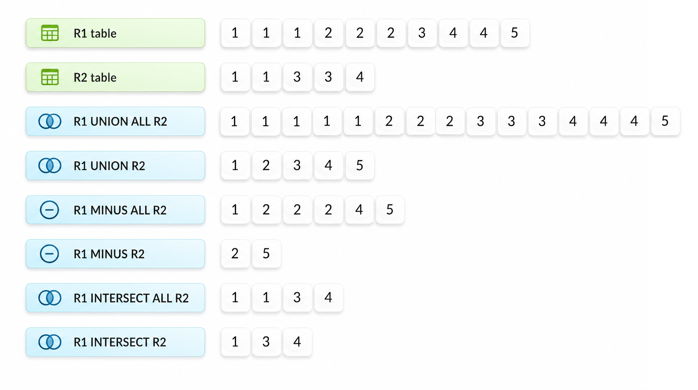

<a id="97d988a1791e5575"></a>

# 20. SQL References (H~Z)

> Source: [GOLDILOCKS 26c.1 User Manual (en)](https://manual.sunjesoft.co.kr/goldilocks/26c_1/manual/en/97d988a1791e5575)  
> Tag: `26c.1_0_tag`

[← 19. SQL References (C~G)](19-sql-references-c-g.md) · [Table of contents](../README.md) · [21. Overview of PSM →](../part-04-sql-psm-manual/21-overview-of-psm.md)

<a id="feb637229fe4dc62"></a>
## INSERT INTO

<a id="fa5bcf07d9b4abbb"></a>
### Function

It creates new rows in the table.

<a id="dd3e034a9d4cd08a"></a>
### Syntax

```
<insert statement> ::=
    INSERT [ /*+ <append insert hint clause> */ ]
        INTO table_name [ ( column_name [, ...] ) ]
        <insert source>
    ;

<append insert hint clause> ::=
    APPEND [ ( append insert option element [, ...] ) ]

<append insert option element> ::=
      PARALLEL [NOLOGGING]
    | STATEMENT_NOFORCE
    | <index maintenance options>

<insert maintenance options> ::=
      IMMEDIATE_INDEX_MAINTENANCE
    | DEFERRED_INDEX_MAINTENANCE
    | SKIP_INDEX_MAINTENANCE

<insert source> ::=
      <values clause>
    | <from subquery>
    | <from default>

<values clause> ::=
    VALUES { ( { <value expression> | DEFAULT } [, ...] ) } [, ...]

<from subquery> ::=
    <query expression>

<from default> ::=
    DEFAULT VALUES
```

<a id="df7c6358627d76ac"></a>
### Invocation and Access Rules

The user must satisfy the following conditions to perform &lt;insert statement&gt;.

- One of the following privileges is required to perform the INSERT statement.
    - INSERT(columns) ON TABLE for all columns which are targets of insert 
    - (INSERT or CONTROL TABLE) ON TABLE for the table
    - (INSERT TABLE or CONTROL SCHEMA) ON SCHEMA for the schema to which the table belongs
    - INSERT ANY TABLE ON DATABASE

- One of the following privileges is required for all tables used in &lt;from subquery&gt;.
    - SELECT(columns) ON TABLE for all columns of tables which were used in the statement
    - (SELECT or CONTROL TABLE) ON TABLE for the table
    - (SELECT TABLE or CONTROL SCHEMA) ON SCHEMA for the schema to which the table belongs
    - SELECT ANY TABLE ON DATABASE

<a id="5c9524f1d8ae3dde"></a>
### Syntax Rules and Parameters

<a id="c0b5298bf5cfe1d5"></a>
#### &lt;append insert hint clause&gt;

It specifies the hint to perform data insertion using the APPEND INSERT method.

- APPEND
    - The hint used to enable APPEND INSERT.

<a id="3af56f96dabdb7fb"></a>
#### &lt;append insert option element&gt;

It specifies the options that can be used when inserting data using the APPEND INSERT method. If the specified option cannot be applied, the insert statement fails.

- PARALLEL
    - It specifies that APPEND INSERT is performed concurrently by multiple sessions.
    - If the PARALLEL option is omitted, APPEND INSERT is performed in serial mode.
- NOLOGGING
    - It is used together with the PARALLEL option to minimize the amount of logging generated during data insertion.
- STATEMENT_NOFORCE
    - It specifies that the pages used by the statement are not synchronously flushed to disk when the statement completes.
    - If the STATEMENT_NOFORCE option is omitted, the pages used by the statement are flushed to disk before the statement completes.

<a id="2b596366a6ffcc8d"></a>
#### &lt;index maintenance options&gt;

It specifies the index maintenance options that can be used when inserting data using the APPEND INSERT method.

- IMMEDIATE_INDEX_MAINTENANCE
    - It updates the index immediately after each record is inserted into the table.
    - If an index integrity constraint is violated, the statement fails.
    - This option cannot be used with the PARALLEL option.
- DEFERRED_INDEX_MAINTENANCE
    - It updates the index in a batch when the transaction performing APPEND INSERT is committed.
    - If there is insufficient storage space or index integrity is violated during index maintenance, the affected index is marked as an unusable segment.
- SKIP_INDEX_MAINTENANCE
    - It marks all indexes created on the table as unusable segments when the transaction performing APPEND INSERT is committed.

<a id="b6757717f1566c7a"></a>
#### table_name

It is the name of the target table where the row will be created.  
The schema to which the table belongs can be defined using the format schema_name.table_name. If schema_name is omitted, the default schema of the user executing the statement will be used.

<a id="cde87845feeb8acf"></a>
#### [ ( column_name [, ...] ) ]

It is the name of a column in the table.  
The column list can be omitted.  
The number of columns must match the number of &lt;insert source&gt; values. If any columns are omitted, their values will be set to DEFAULT.

<a id="4b5825588039d0a0"></a>
#### &lt;values clause&gt;

It is a list of values to be assigned to the corresponding columns.

- &lt;value expression&gt; 
    - It is the value or expression to be assigned to the corresponding column. 
- DEFAULT 
    - The value for the corresponding column will use the default value defined in the [CREATE TABLE](19-sql-references-c-g.md#47f3ce328094503e).
    - If no default is defined, NULL will be assigned.

Multiple rows can be created as follows.

```
INSERT INTO table_name VALUES ( 1, 'A' ), ( 2, 'B' ), ( 3, 'C' )
```

<a id="60dbd1a0e8db86fb"></a>
#### &lt;from subquery&gt;

It is a query used to create rows.  
For more information, refer to the [query expression](#c9766ea5d527da96) clause of the [SELECT](#d7ebf6af3421bb2f) statement.

<a id="205aa25561987e4d"></a>
#### DEFAULT VALUES

It fills all columns with their default values.

The DEFAULT VALUES clause is equivalent to the following:

```
VALUES ( DEFAULT, DEFAULT, ..., DEFAULT )
```

<a id="8374dfc11e15769d"></a>
### Description

<a id="e263d2f365ba8dce"></a>
#### Differences Between INSERT Statements

- [INSERT INTO](#feb637229fe4dc62)
    - It creates one or more rows in the table. 
    - e.g. INSERT INTO t1 SELECT * FROM t1; 
- [INSERT INTO name RETURNING](#9b221e074482cce0)
    - It creates one or more rows in the table, and the created rows can be retrieved using the same method as a SELECT statement (API such as SQLFetch()).
    - e.g. INSERT INTO t1 SELECT * FROM t1 RETURNING c1; 
- [INSERT INTO name RETURNING .. INTO](#b4cbafb4ebba9b68)
    - It creates one or less row, and if exactly one row is created, the values are retrieved into the host variables specified in the RETURNING INTO clause.
    - e.g. INSERT INTO t1 DEFAULT VALUES RETURNING c1 INTO :v1;

<a id="772784f3170bde8e"></a>
### Examples

The following is an example of creating a single row using the INSERT statement.

```
gSQL> INSERT INTO region VALUES ( 0, 'AFRICA' );

1 row created.
```

The following examples demonstrate how to use DEFAULT or identity values for columns in an INSERT statement.

```
gSQL> CREATE TABLE region
(
    r_regionkey   BIGINT    GENERATED BY DEFAULT AS IDENTITY
  , r_name        CHAR(25)  DEFAULT 'N/A'
);

Table created.

gSQL> COMMIT;

Commit complete.
```

• DEFAULT is inserted into all columns.

```
gSQL> INSERT INTO region DEFAULT VALUES;

1 row created.
```

• DEFAULT is inserted into all columns.

```
gSQL> INSERT INTO region VALUES (DEFAULT, DEFAULT);

1 row created.
```

• If a column is omitted, the DEFAULT value of the r_name column is used.

```
gSQL> INSERT INTO region(r_regionkey) VALUES (-100);

1 row created.
```

• If a column is omitted, the identity value of the r_regionkey column is used.

```
gSQL> INSERT INTO region(r_name) VALUES ('ASIA');

1 row created.


gSQL> SELECT * FROM region;

R_REGIONKEY R_NAME                   
----------- -------------------------
          1 N/A                      
          2 N/A                      
       -100 N/A                      
          3 ASIA                     

4 rows selected.
```

The following is an example of creating multiple rows by specifying them in the VALUES clause.

```
gSQL> INSERT INTO region
       VALUES ( 1, 'AFRICA' ),
              ( 2, 'ASIA'   ),
              ( 3, 'EUROPE' );

3 rows created.
```

The following is an example of creating multiple rows using a subquery.

```
gSQL> INSERT INTO region SELECT r_regionkey, r_name FROM tmp_region WHERE r_regionkey < 3;

3 rows created.
```

<a id="a0d7cb3bf92ab68a"></a>
### Compatibility

**SQL standard compatibility**

<a id="732737975d395eda"></a>
| Feature ID | Description | Compatibility |
| --- | --- | --- |
| F781 | Self-referencing operations | X |
| F222 | INSERT statement: DEFAULT VALUES clause | O |
| S204 | Enhanced structured types | X |
| S043 | Enhanced reference types | X |
| T111 | Updatable joins, unions, and columns | X |

<a id="4226ed47eb92b13b"></a>
### For More Information

Refer to the following.

- [SELECT](#d7ebf6af3421bb2f)
- [INSERT INTO name RETURNING](#9b221e074482cce0)
- [INSERT INTO name RETURNING .. INTO](#b4cbafb4ebba9b68)

<a id="9b221e074482cce0"></a>
## INSERT INTO name RETURNING

<a id="9cf569d924be40e4"></a>
### Function

It creates new rows in the table and retrieves them.

<a id="65d122bae6a488a1"></a>
### Syntax

```
<insert statement> ::=
    INSERT [ /*+ <append insert hint clause> */ ]
        INTO table_name [ ( column_name [, ...] ) ]
        <insert source>
        <returning clause>
    ;

<append insert hint clause> ::=
    APPEND [ ( append insert option element [, ...] ) ]

<append insert option element> ::=
      PARALLEL [NOLOGGING]
    | STATEMENT_NOFORCE
    | <index maintenance options>

<insert maintenance options> ::=
      IMMEDIATE_INDEX_MAINTENANCE
    | DEFERRED_INDEX_MAINTENANCE
    | SKIP_INDEX_MAINTENANCE

<insert source> ::=
      <values clause>
    | <from subquery>
    | <from default>

<values clause> ::=
    VALUES { ( { <value expression> | DEFAULT } [, ...] ) } [, ...]

<from subquery> ::=
    <query expression>

<from default> ::=
    DEFAULT VALUES

<returning clause> ::=
      [ RETURN | RETURNING ] { * | { <value expression> [ [AS] alias_name ] } [, ...]
```

<a id="a61e6a6859ef0a5c"></a>
### Invocation and Access Rules

The user must satisfy the following conditions to execute an &lt;insert returning query statement&gt;.

- One of the following privileges is required to execute an INSERT statement.
    - INSERT(columns) ON TABLE for all columns that are the target of the insert
    - (INSERT or CONTROL TABLE) ON TABLE for the table
    - (INSERT TABLE or CONTROL SCHEMA) ON SCHEMA for the schema to which the table belongs
    - INSERT ANY TABLE ON DATABASE

- If a &lt;from subquery&gt; is used, one of the following privileges is required for each table used in the statement:
    - SELECT(columns) ON TABLE for all columns of the table used in the statement
    - (SELECT or CONTROL TABLE) ON TABLE for the table
    - (SELECT TABLE or CONTROL SCHEMA) ON SCHEMA for the schema to which the table belongs
    - SELECT ANY TABLE ON DATABASE

- One of the following privileges is required for all columns used in the RETURNING clause.
    - SELECT(columns) ON TABLE for all columns used in the RETURNING clause. 
    - (SELECT or CONTROL TABLE) ON TABLE for the table
    - (SELECT TABLE or CONTROL SCHEMA) ON SCHEMA for the schema to which the table belongs
    - SELECT ANY TABLE ON DATABASE

<a id="0da6da428338b8c8"></a>
### Syntax Rules and Parameters

<a id="583d12a53f714a1a"></a>
#### &lt;append insert hint clause&gt;

It specifies the hint to perform data insertion using the APPEND INSERT method.

- APPEND
    - The hint used to enable APPEND INSERT.

<a id="b416fb114344be49"></a>
#### &lt;append insert option element&gt;

It specifies the options that can be used when inserting data using the APPEND INSERT method. If the specified option cannot be applied, the insert statement fails.

- PARALLEL
    - It specifies that APPEND INSERT is performed concurrently by multiple sessions.
    - If the PARALLEL option is omitted, APPEND INSERT is performed in serial mode.
- NOLOGGING
    - It is used together with the PARALLEL option to minimize the amount of logging generated during data insertion.
- STATEMENT_NOFORCE
    - It specifies that the pages used by the statement are not synchronously flushed to disk when the statement completes.
    - If the STATEMENT_NOFORCE option is omitted, the pages used by the statement are flushed to disk before the statement completes.

<a id="743b48b705936f8e"></a>
#### &lt;index maintenance options&gt;

It specifies the index maintenance options that can be used when inserting data using the APPEND INSERT method.

- IMMEDIATE_INDEX_MAINTENANCE
    - It updates the index immediately after each record is inserted into the table.
    - If an index integrity constraint is violated, the statement fails.
    - This option cannot be used with the PARALLEL option.
- DEFERRED_INDEX_MAINTENANCE
    - It updates the index in a batch when the transaction performing APPEND INSERT is committed.
    - If there is insufficient storage space or index integrity is violated during index maintenance, the affected index is marked as an unusable segment.
- SKIP_INDEX_MAINTENANCE
    - It marks all indexes created on the table as unusable segments when the transaction performing APPEND INSERT is committed.

<a id="103e0ffe9f8faaeb"></a>
#### table_name

It is the name of the target table in which the row will be created.

<a id="37cd69376622bf44"></a>
#### [ ( column_name [, ...] ) ]

It is the names of the columns in the table.  
For more information, refer to the [INSERT INTO](#feb637229fe4dc62) statement.

<a id="fdec0db705debf52"></a>
#### &lt;values clause&gt;

It is a list of values to be assigned to the corresponding columns.  
For more information, refer to the [INSERT INTO](#feb637229fe4dc62) statement.

<a id="ac3adbaa339a9fc5"></a>
#### &lt;from subquery&gt;

It is a query used to create rows.  
For more information, refer to the [INSERT INTO](#feb637229fe4dc62) statement.

<a id="94e4f27fa95b66b5"></a>
#### DEFAULT VALUES

It fills all columns with their default values.  
For more information, refer to the [INSERT INTO](#feb637229fe4dc62) statement.

<a id="8e3e8c9fe507526f"></a>
#### &lt;returning clause&gt;

It returns the inserted rows.

- It specifies the columns to be retrieved from the created rows as the result set.
    - The RETURNING clause returns a result set consisting of the rows inserted by the INSERT statement.
    - &lt;value expression&gt; 
        - It is similar to the &lt;select list&gt; in a SELECT statement, but aggregation and similar operations are not allowed.
    - [[AS] alias_name] 
        - It specifies an alias for a value expression using the AS clause.

RETURN and RETURNING are equivalent keywords.

<a id="3737ac3bf1576e4f"></a>
### Description

For more information, refer to [Differences Between INSERT Statements](#e263d2f365ba8dce).

<a id="597353cfa5f117a1"></a>
### Examples

The following is an example of retrieving column values created using the INSERT statement.

```
gSQL> CREATE TABLE region
(
    r_regionkey   BIGINT    GENERATED BY DEFAULT AS IDENTITY
  , r_name        CHAR(25)  DEFAULT 'N/A'
);

Table created.

gSQL> COMMIT;

Commit complete.
```

- The following is an example of using the RETURNING clause to return a DEFAULT value assigned during insertion.

```
gSQL> INSERT INTO region VALUES ( DEFAULT, DEFAULT ) RETURNING r_regionkey, r_name;

R_REGIONKEY R_NAME                   
----------- -------------------------
          1 N/A                      

1 row created.
```

- The following is an example of returning values of omitted columns using the RETURNING clause.

```
gSQL> INSERT INTO region(r_name) VALUES ('ASIA') RETURNING r_regionkey;

R_REGIONKEY
-----------
          2

1 row created.
```

The following is an example of retrieving rows created from a subquery.

```
gSQL> INSERT INTO region 
      SELECT r_regionkey, r_name FROM tmp_region WHERE r_regionkey < 3 
      RETURNING r_regionkey, r_name;

R_REGIONKEY R_NAME                   
----------- -------------------------
          0 AFRICA                   
          1 AMERICA                  
          2 ASIA                     

3 rows created.
```

<a id="1f666b7213f10ce6"></a>
### Compatibility

The SQL standard does not define the &lt;insert returning query statement&gt;.

<a id="ffb434605984e82c"></a>
### For More Information

Refer to the following.

- [INSERT INTO](#feb637229fe4dc62)
- [INSERT INTO name RETURNING .. INTO](#b4cbafb4ebba9b68)

<a id="b4cbafb4ebba9b68"></a>
## INSERT INTO name RETURNING .. INTO

<a id="bf92adcf706c67c2"></a>
### Function

It creates a row in the table and retrieves its values into host variables.

<a id="76c54b02b1394661"></a>
### Syntax

```
<insert statement> ::=
    INSERT INTO table_name [ ( column_name [, ...] ) ]
        <insert source>
        <returning into clause>
    ;

<insert source> ::=
      <values clause>
    | <from subquery>
    | <from default>

<values clause> ::=
    VALUES { ( { <value expression> | DEFAULT } [, ...] ) } [, ...]

<from subquery> ::=
    <query expression>

<from default> ::=
    DEFAULT VALUES

<returning into clause> ::=
      [ RETURN | RETURNING ] { * | { <value expression> [ [AS] alias_name ] } [, ...] INTO variable_name [, ...]
```

<a id="04a5b846f312b721"></a>
### Invocation and Access Rules

The user must satisfy the following conditions to execute an &lt;insert returning into statement&gt;.

- One of the following privileges is required to execute an INSERT statement.
    - INSERT(columns) ON TABLE for all columns that are targets of the insert.
    - (INSERT or CONTROL TABLE) ON TABLE for the table 
    - (INSERT TABLE or CONTROL SCHEMA) ON SCHEMA for the schema to which the table belongs
    - INSERT ANY TABLE ON DATABASE

- If a &lt;from subquery&gt; is used, one of the following privileges is required for each table used in the statement:
    - SELECT(columns) ON TABLE for all columns of the table used in the statement
    - (SELECT or CONTROL TABLE) ON TABLE for the table
    - (SELECT TABLE or CONTROL SCHEMA) ON SCHEMA for the schema to which the table belongs
    - SELECT ANY TABLE ON DATABASE

- One of the following privileges is required for all columns used in the RETURNING clause.
    - SELECT(columns) ON TABLE for all columns used in the RETURNING clause
    - (SELECT or CONTROL TABLE) ON TABLE for the table
    - (SELECT TABLE or CONTROL SCHEMA) ON SCHEMA for the schema to which the table belongs
    - SELECT ANY TABLE ON DATABASE

<a id="18030fbf482ba991"></a>
### Syntax Rules and Parameters

<a id="eff490ed12b9e85e"></a>
#### &lt;append insert hint clause&gt;

It specifies the hint to perform data insertion using the APPEND INSERT method.

- APPEND
    - The hint used to enable APPEND INSERT.

<a id="d24a5672c00cd3cf"></a>
#### &lt;append insert option element&gt;

It specifies the options that can be used when inserting data using the APPEND INSERT method. If the specified option cannot be applied, the insert statement fails.

- PARALLEL
    - It specifies that APPEND INSERT is performed concurrently by multiple sessions.
    - If the PARALLEL option is omitted, APPEND INSERT is performed in serial mode.
- NOLOGGING
    - It is used together with the PARALLEL option to minimize the amount of logging generated during data insertion.
- STATEMENT_NOFORCE
    - It specifies that the pages used by the statement are not synchronously flushed to disk when the statement completes.
    - If the STATEMENT_NOFORCE option is omitted, the pages used by the statement are flushed to disk before the statement completes.

<a id="ee2460e27e9105e2"></a>
#### &lt;index maintenance options&gt;

It specifies the index maintenance options that can be used when inserting data using the APPEND INSERT method.

- IMMEDIATE_INDEX_MAINTENANCE
    - It updates the index immediately after each record is inserted into the table.
    - If an index integrity constraint is violated, the statement fails.
    - This option cannot be used with the PARALLEL option.
- DEFERRED_INDEX_MAINTENANCE
    - It updates the index in a batch when the transaction performing APPEND INSERT is committed.
    - If there is insufficient storage space or index integrity is violated during index maintenance, the affected index is marked as an unusable segment.
- SKIP_INDEX_MAINTENANCE
    - It marks all indexes created on the table as unusable segments when the transaction performing APPEND INSERT is committed.

<a id="f80c6bac5e9ae93a"></a>
#### table_name

It is the name of the target table in which the row will be created.

<a id="065baaa3cbb67cba"></a>
#### [ ( column_name [, ...] ) ]

It is the names of the columns in the table.  
For more information, refer to the [INSERT INTO](#feb637229fe4dc62) statement.

<a id="e724a793e8e40be2"></a>
#### &lt;values clause&gt;

It is a list of values to be assigned to the corresponding columns.  
For more information, refer to the [INSERT INTO](#feb637229fe4dc62) statement.

<a id="89fab65e3c3b3f16"></a>
#### &lt;from subquery&gt;

It is a query used to create rows.  
For more information, refer to the [INSERT INTO](#feb637229fe4dc62) statement.

<a id="9daedb2d6c3512d5"></a>
#### DEFAULT VALUES

It fills all columns with their default values.  
For more information, refer to the [INSERT INTO](#feb637229fe4dc62) statement.

<a id="7e7fc776ba882f2f"></a>
#### &lt;returning clause&gt;

It returns the inserted rows.  
For more information, refer to [&lt;returning clause&gt;](#8e3e8c9fe507526f) in [INSERT INTO name RETURNING](#9b221e074482cce0) statement.

<a id="867dfe84dca5b725"></a>
##### INTO variable_name [, ...]

The number of variables specified in the INTO clause must match the number of expressions in the RETURNING clause.  
Only one or less row can be inserted. If more than one row is inserted, an error occurs.

<a id="75afa92abd5817e4"></a>
### Description

For more information, refer to [Differences Between INSERT Statements](#e263d2f365ba8dce).

<a id="4c76d03f67499faf"></a>
### Example

The following is an example of retrieving the values of an created row into host variables.

```
gSQL> CREATE TABLE region
(
    r_regionkey   BIGINT    GENERATED BY DEFAULT AS IDENTITY
  , r_name        CHAR(25)  DEFAULT 'N/A'
);

Table created.

gSQL> COMMIT;

Commit complete.
```

• Declares the host variables.

```
\VAR v_key  BIGINT
\VAR v_name VARCHAR(128)
```

• Retrieving DEFAULT values into host variables.

```
gSQL> INSERT INTO region 
      VALUES ( DEFAULT, DEFAULT ) 
      RETURNING r_regionkey, r_name 
      INTO :v_key, :v_name;

V_KEY V_NAME                   
----- -------------------------
    1 N/A                      

1 row created.
```

• Retrieving the values of omitted columns into host variables.

```
gSQL> INSERT INTO region(r_name) 
      VALUES ('ASIA') 
      RETURNING r_regionkey 
      INTO :v_key;

V_KEY
-----
    2

1 row created.
```

<a id="f19afcc9728244bd"></a>
### Compatibility

The SQL standard does not define the &lt;insert returning into statement&gt;.

<a id="a9b2cbf883c3d01a"></a>
### For More Information

Refer to the following.

- [INSERT INTO](#feb637229fe4dc62)
- [INSERT INTO name RETURNING](#9b221e074482cce0)

<a id="18bcca41e7d36fb7"></a>
## INSERT INTO name ... UPDATE

<a id="954fc854cc9fc0a0"></a>
### Function

It creates new rows into the table. If a unique constraint is violated, the existing rows are updated instead.

<a id="ba11ea33c6a733d9"></a>
### Syntax

```
<upsert statement> ::=
    INSERT INTO table_name [ ( column_name [, ...] ) ]
        <insert source>
        <duplicate key clause>
    ;

<insert source> ::=
      <values clause>
    | <from subquery>
    | DEFAULT VALUES

<values clause> ::=
    VALUES { ( { <value expression> | DEFAULT } [, ...] ) } [, ...]

<from subquery> ::=
    <query expression>

<duplicate key clause>
    ON DUPLICATE KEY { DO NOTHING | <do update clause> }

<do update clause> ::=
    [DO] UPDATE [SET] <set clause>  [, ...]

<set value clause> ::= 
      <value expression>
    | DEFAULT
    | VALUES( column_name )

<set clause> ::=
      column_name = <set value clause>
    | ( column_name [, ...] ) = ( <set value clause> [, ...] )
    | ( column_name [, ...] ) = ( <query expression> )
```

<a id="481e1149b9e45b0e"></a>
### Invocation and Access Rules

The user must satisfy the following conditions to execute a &lt;upsert statement&gt;.

- One of the following privileges is required to execute a corresponding statement.
    - INSERT(columns) ON TABLE for all columns that are targets of the insert 
    - (INSERT or CONTROL TABLE) ON TABLE for the table
    - (INSERT TABLE or CONTROL SCHEMA) ON SCHEMA for the schema to which the table belongs
    - INSERT ANY TABLE ON DATABASE
    - UPDATE(columns) ON TABLE for all columns that are targets of the update 
    - (UPDATE or CONTROL TABLE) ON TABLE for the table
    - (UPDATE TABLE or CONTROL SCHEMA) ON SCHEMA for the schema to which the table belongs
    - UPDATE ANY TABLE ON DATABASE

- One of the following privileges is required for all tables used in &lt;from subquery&gt;.
    - SELECT(columns) ON TABLE for all columns of tables that were used in the statement
    - (SELECT or CONTROL TABLE) ON TABLE for the table
    - (SELECT TABLE or CONTROL SCHEMA) ON SCHEMA for the schema to which the table belongs
    - SELECT ANY TABLE ON DATABASE

- One of the following privileges is required for all columns used in the RETURNING clause.
    - SELECT(columns) ON TABLE for all columns that were used in the RETURNING clause
    - (SELECT or CONTROL TABLE) ON TABLE for the table
    - (SELECT TABLE or CONTROL SCHEMA) ON SCHEMA for the schema to which the table belongs
    - SELECT ANY TABLE ON DATABASE

<a id="e40ccfd260d2592b"></a>
### Syntax Rules and Parameters

<a id="a2b7681bdecce4c5"></a>
#### table_name

It is the name of the target table in which the row will be created.  
If an update is performed due to a unique constraint violation, this specifies the name of the target table to be updated.  
The schema to which the table belongs can be defined using the format schema_name.table_name. If schema_name is omitted, the default schema of the user executing the statement will be used.

<a id="1c3bbd1840fbb57b"></a>
#### [ ( column_name [, ...] ) ]

It is the names of the columns in the table.  
For more information, refer to [[ ( column_name [, ...] ) ]](#cde87845feeb8acf) clause of the [INSERT INTO](#feb637229fe4dc62) statement.

<a id="0ae944dddb6637c8"></a>
#### &lt;values clause&gt;

It is the list of values to be assigned to the corresponding columns.  
For more information, refer to [&lt;values clause&gt;](#4b5825588039d0a0) of the [INSERT INTO](#feb637229fe4dc62) statement.

<a id="a24aba3f4d462a9b"></a>
#### &lt;from subquery&gt;

It is a query used to create rows.  
For more information, refer to [query expression](#c9766ea5d527da96) clause of the [SELECT](#d7ebf6af3421bb2f) statement.

<a id="a3000cfcc0e71816"></a>
#### DEFAULT VALUES

It fills all columns with their default values.  
For more information, refer to [DEFAULT VALUES](#205aa25561987e4d) clause of the [INSERT INTO](#feb637229fe4dc62) statement.

<a id="e39b6ab166c22078"></a>
#### &lt;duplicate key clause&gt;

It defines the action to perform when a unique constraint is violated.

<a id="57dd510b754d0a3a"></a>
#### DO NOTHING

It does nothing if a unique constraint is violated.

<a id="feef67b5a980b5f1"></a>
#### &lt;do update clause&gt;

If a unique constraint is violated, it updates column values according to the &lt;set clause&gt;.

<a id="fb03f21cb5f7ab76"></a>
#### &lt;set value clause&gt;

It defines the values to assign to the columns to be updated.

The values can be specified in the following way:

- column_name = &lt;value expression&gt;

```
DO UPDATE SET column1 = value1, column2 = value2, column3 = value3
```

- column_name = DEFAULT

```
DO UPDATE SET column1 = DEFAULT, column2 = DEFAULT, column3 = DEFAULT
```

- column_name = VALUES( column_name )

Use the values from the &lt;insert source&gt; as the update values.

```
DO UPDATE SET column1 = VALUES(column1), column2 = VALUES(column2), column3 = VALUES(column2)
```

<a id="06157f0c9001af44"></a>
#### &lt;set clause&gt;

It defines the columns to be updated and the values to assign. The number of columns in the &lt;set clause&gt; must match the number of values.

The values can be defined in the following ways:

- column_name = { &lt;set value clause&gt; }

```
ON DUPLICATE KEY
   DO UPDATE SET column1 = value1, column2 = value2, column3 = value3
```

- ( column_name [, ...] ) = ( &lt;set value clause&gt; } [, ...] )

```
ON DUPLICATE KEY
   DO UPDATE SET ( column1, column2, column3 ) = ( value1, value2, value3 )
```

- ( column_name [, ...] ) = ( &lt;query expression&gt; )

```
ON DUPLICATE KEY
   DO UPDATE SET column1 = ( SELECT max(value1) FROM other_table_name )
```

The &lt;query expression&gt; must be a query that returns exactly one row.

If DEFAULT is used as a column value, the default value (refer to [&lt;default clause&gt;](19-sql-references-c-g.md#d666eeb539c786e2).) in the [CREATE TABLE](19-sql-references-c-g.md#47f3ce328094503e) statement is used. If no default is defined, NULL is assigned instead.

<a id="eb3584122df7cdad"></a>
### Description

<a id="8177b788aefb4be1"></a>
#### Differences Between INSERT INTO name ... UPDATE Statements

- [INSERT INTO name ... UPDATE](#18bcca41e7d36fb7)
    - It creates a row into the table. If a unique constraint is violated, the existing row is updated. 
    - e.g. INSERT INTO t1 VALUES ( 1, 1 ) ON DUPLICATE KEY UPDATE c2 = c2 + 1; 
- [INSERT INTO name ... UPDATE RETURNING](#0d5b3b71993e2f18)
    - It creates a row into the table or updates an existing row. The inserted or updated rows can be retrieved in the same way as with a SELECT statement (API such as SQLFetch()). 
    - e.g. INSERT INTO t1 VALUES ( 1, 1 ) ON DUPLICATE KEY UPDATE c2 = c2 + 1 RETURNING c2; 
- [INSERT INTO name ... UPDATE RETURNING ... INTO](#f7d38ad8bcad8590)
    - It creates or updates one or less row. If exactly one row is created or updated, the values are assigned to host variables specified in the RETURNING INTO clause. 
    - e.g. INSERT INTO t1 VALUES ( 1, 1 ) ON DUPLICATE KEY UPDATE c2 = c2 + 1 RETURNING c2 INTO :v1;

<a id="5e37e0f2b8003aab"></a>
#### &lt;upsert statement&gt; is a deterministic statement.

The following are two different but equivalent UPSERT statements that must produce the same result.

- INSERT INTO t1 VALUES( 1 ),( 2 ),( 3 ) ON DUPLICATE KEY UPDATE c1 = c1 + 1;
- INSERT INTO t1 VALUES( 3 ),( 2 ),( 1 ) ON DUPLICATE KEY UPDATE c1 = c1 + 1;

```
gSQL> CREATE TABLE t1 ( c1 INTEGER UNIQUE );

Table created.

gSQL> INSERT INTO t1 VALUES( 1 ),( 2 ),( 3 );

3 rows created.

gSQL> INSERT INTO t1 VALUES( 1 ),( 2 ),( 3 ) ON DUPLICATE KEY UPDATE c1 = c1 + 1;

3 rows created.

gSQL> SELECT * FROM t1;

C1
--
 2
 3
 4

3 rows selected.
```

```
gSQL> CREATE TABLE t1 ( c1 INTEGER UNIQUE );

Table created.

gSQL> INSERT INTO t1 VALUES( 1 ),( 2 ),( 3 );

3 rows created.

gSQL> INSERT INTO t1 VALUES( 3 ),( 2 ),( 1 ) ON DUPLICATE KEY UPDATE c1 = c1 + 1;

3 rows created.

gSQL> SELECT * FROM t1;

C1
--
 2
 3
 4

3 rows selected.
```

<a id="11e38f1181b3b8f1"></a>
### Examples

The following is an example where a row is updated due to a unique constraint violation.

```
gSQL> CREATE TABLE t1 ( c1 INTEGER UNIQUE );

Table created.

gSQL> INSERT INTO t1 VALUES( 1 );

1 row created.

gSQL> INSERT INTO t1 VALUES( 1 ) ON DUPLICATE KEY UPDATE c1 = c1 + 1;

1 row created.

gSQL> SELECT * FROM t1;

C1
--
 2

1 row selected.
```

The following is an example where no update is performed when a unique constraint is violated.

```
gSQL> CREATE TABLE t1 ( c1 INTEGER UNIQUE );

Table created.

gSQL> INSERT INTO t1 VALUES( 1 );

1 row created.

gSQL> INSERT INTO t1 VALUES( 1 ) ON DUPLICATE KEY DO NOTHING;

no rows created.

gSQL> SELECT * FROM t1;

C1
--
 1

1 row selected.
```

The following is an example of inserting or updating multiple rows using a subquery.

```
gSQL> CREATE TABLE t1 ( c1 INTEGER UNIQUE );

Table created.

gSQL> INSERT INTO t1 VALUES( 1 ),( 2 ),( 3 ),( 4 );

4 rows created.

gSQL> INSERT INTO t1 ( SELECT c1 FROM t1 ) ON DUPLICATE KEY UPDATE c1 = c1 + 1;

4 rows created.

gSQL> SELECT * FROM t1;

C1
--
 2
 3
 4
 5

4 rows selected.
```

<a id="8462df26ccf4991c"></a>
### Compatibility

The SQL standard does not define the &lt;upsert statement&gt;.

<a id="67162f355a39f2d2"></a>
### For More Information

Refer to the following.

- [INSERT INTO](#feb637229fe4dc62)
- [INSERT INTO name ... UPDATE RETURNING](#0d5b3b71993e2f18)
- [INSERT INTO name ... UPDATE RETURNING ... INTO](#f7d38ad8bcad8590)
- [UPDATE](#b8c5e51f7074a6a9)

<a id="0d5b3b71993e2f18"></a>
## INSERT INTO name ... UPDATE RETURNING

<a id="b71f999c9a0870fb"></a>
### Function

It creates new rows into the table. If a unique constraint is violated, the existing rows are updated. Then, the inserted or updated rows are retrieved.

<a id="9428d7c9516a59d1"></a>
### Syntax

```
<upsert returning statement> ::=
    INSERT INTO table_name [ ( column_name [, ...] ) ]
        <insert source>
        <duplicate key clause>
        <returning clause>    
    ;
<insert source> ::=
      <values clause>
    | <from subquery>
    | DEFAULT VALUES

<values clause> ::=
    VALUES { ( { <value expression> | DEFAULT } [, ...] ) } [, ...]

<from subquery> ::=
    <query expression>

<duplicate key clause>
    ON DUPLICATE KEY { DO NOTHING | <do update clause> }

<do update clause> ::=
    [DO] UPDATE [SET] <set clause>  [, ...]

<set value clause> ::= 
      <value expression>
    | DEFAULT
    | VALUES( column_name )

<set clause> ::=
      column_name = <set value clause>
    | ( column_name [, ...] ) = ( <set value clause> [, ...] )
    | ( column_name [, ...] ) = ( <query expression> )

<returning clause> ::=
    [ RETURN | RETURNING ] { * | { <value expression> [ [AS] alias_name ] } [, ...]
```

<a id="c5cf7b18d04f4c59"></a>
### Invocation and Access Rules

The user must satisfy the following conditions to execute a &lt;upsert returning statement&gt;.

- One of the following privileges is required to execute a corresponding statement.
    - INSERT(columns) ON TABLE for all columns that are targets of the insert 
    - (INSERT or CONTROL TABLE) ON TABLE for the table
    - (INSERT TABLE or CONTROL SCHEMA) ON SCHEMA for the schema to which the table belongs
    - INSERT ANY TABLE ON DATABASE
    - UPDATE(columns) ON TABLE for all columns that are targets of the update 
    - (UPDATE or CONTROL TABLE) ON TABLE for the table
    - (UPDATE TABLE or CONTROL SCHEMA) ON SCHEMA for the schema to which the table belongs
    - UPDATE ANY TABLE ON DATABASE

- One of the following privileges is required for all tables used in &lt;from subquery&gt;.
    - SELECT(columns) ON TABLE for all columns of tables that were used in the statement
    - (SELECT or CONTROL TABLE) ON TABLE for the table
    - (SELECT TABLE or CONTROL SCHEMA) ON SCHEMA for the schema to which the table belongs
    - SELECT ANY TABLE ON DATABASE

- One of the following privileges is required for all columns used in the RETURNING clause.
    - SELECT(columns) ON TABLE for all columns that were used in the RETURNING clause
    - (SELECT or CONTROL TABLE) ON TABLE for the table
    - (SELECT TABLE or CONTROL SCHEMA) ON SCHEMA for the schema to which the table belongs
    - SELECT ANY TABLE ON DATABASE

<a id="95111fd89c3942c7"></a>
### Syntax Rules and Parameters

<a id="a4e900c70722a805"></a>
#### table_name

It is the name of the target table in which the row will be created.  
If an update is performed due to an unique constraint violation, this specifies the name of the target table to be updated.   
For more information, refer to [table_name](#a2b7681bdecce4c5) clause of  the [INSERT INTO name ... UPDATE](#18bcca41e7d36fb7) statement.

<a id="ed592246f72c70e1"></a>
#### [ ( column_name [, ...] ) ]

It is the names of the columns in the table.  
For more information, refer to [[ ( column_name [, ...] ) ]](#cde87845feeb8acf) clause of the [INSERT INTO](#feb637229fe4dc62) statement.

<a id="1f748d28c39005be"></a>
#### &lt;values clause&gt;

It is the list of values to be assigned to the corresponding columns.  
For more information, refer to [&lt;values clause&gt;](#4b5825588039d0a0) of the [INSERT INTO](#feb637229fe4dc62) statement.

<a id="ab5eb8097f40b6a8"></a>
#### &lt;from subquery&gt;

It is a query used to create rows.  
For more information, refer to [query expression](#c9766ea5d527da96) clause of the [SELECT](#d7ebf6af3421bb2f) statement.

<a id="6eb9c3b364e3a65c"></a>
#### DEFAULT VALUES

It fills all columns with their default values.  
For more information, refer to [DEFAULT VALUES](#205aa25561987e4d) clause of the [INSERT INTO](#feb637229fe4dc62) statement.

<a id="4bbb881344dbce99"></a>
#### &lt;duplicate key clause&gt;

It defines the action to perform when a unique constraint is violated.

<a id="0dc4d519845e9625"></a>
#### DO NOTHING

It does nothing if a unique constraint is violated.

<a id="1afcd606362e6818"></a>
#### &lt;do update clause&gt;

If a unique constraint is violated, it updates column values according to the &lt;set clause&gt;.

<a id="b44d3ed91e247496"></a>
#### &lt;set value clause&gt;

It defines the values to assign to the columns to be updated.  
For more information, refer to [&lt;set value clause&gt;](#fb03f21cb5f7ab76) of the [INSERT INTO name ... UPDATE](#18bcca41e7d36fb7) statement.

<a id="9e31bbd065bf0497"></a>
#### &lt;set clause&gt;

It defines the columns to be updated and the values to assign. The number of columns in the &lt;set clause&gt; must match the number of values.  
For more information, refer to [&lt;set clause&gt;](#06157f0c9001af44) of the [INSERT INTO name ... UPDATE](#18bcca41e7d36fb7).

<a id="0e58274ae61e6461"></a>
#### &lt;returning clause&gt;

It returns the inserted or updated rows.

- It specifies the columns to be retrieved from the resulting set of created rows.
    - The RETURNING clause returns a result set consisting of the rows that were inserted or updated. 
    - &lt;value expression&gt; 
        - It is same as the &lt;select list&gt; in the SELECT statement, but aggregation and similar operations are not allowed.
    - [[AS] alias_name] 
        - The AS clause can be used to assign a name to the value expression.

<a id="7f576449ed96bd1b"></a>
### Description

For more information, refer to the [Differences Between INSERT INTO name ... UPDATE Statements](#8177b788aefb4be1).

The following is an example of inserting four rows and returning the inserted results.

```
gSQL> CREATE TABLE t1 ( c1 INTEGER UNIQUE );

Table created.

gSQL> INSERT INTO t1 VALUES( 1 ), ( 2 ), ( 3 ), ( 4 ) ON DUPLICATE KEY UPDATE c1 = c1 + 1 RETURNING c1;

C1
--
 1
 2
 3
 4

4 rows created.
```

The following is an example of updating rows due to a unique constraint violation and returning the updated results.

```
gSQL> CREATE TABLE t1 ( c1 INTEGER UNIQUE );

Table created.

gSQL> INSERT INTO t1 VALUES( 1 ),( 2 ),( 3 ),( 4 );

4 rows created.

gSQL> INSERT INTO t1 ( SELECT c1 FROM t1 ) ON DUPLICATE KEY UPDATE c1 = c1 + 1 RETURNING c1;

C1
--
 2
 3
 4
 5

4 rows created.
```

<a id="0655190b534dbe04"></a>
### Compatibility

The SQL standard does not define the &lt;upsert returning statement&gt;.

<a id="c9c092bbc78fc276"></a>
### For More Information

Refer to the following.

- [INSERT INTO name ... UPDATE](#18bcca41e7d36fb7)
- [INSERT INTO name ... UPDATE RETURNING ... INTO](#f7d38ad8bcad8590)

<a id="f7d38ad8bcad8590"></a>
## INSERT INTO name ... UPDATE RETURNING ... INTO

<a id="bf4c953f95df76cb"></a>
### Function

It creates a single row in the table. If a unique constraint is violated, the existing row is updated instead. Then, the created or updated row is retrieved into the host variable.

<a id="593dcd5978f78d3d"></a>
### Syntax

```
<upsert returning into statement> ::=
    INSERT INTO table_name [ ( column_name [, ...] ) ]
        <insert source>
        <duplicate key clause>
        <returning clause>    
        <into clause>    
    ;
<insert source> ::=
      <values clause>
    | <from subquery>
    | DEFAULT VALUES

<values clause> ::=
    VALUES { ( { <value expression> | DEFAULT } [, ...] ) } [, ...]

<from subquery> ::=
    <query expression>

<duplicate key clause>
    ON DUPLICATE KEY { DO NOTHING | <do update clause> }

<do update clause> ::=
    [DO] UPDATE [SET] <set clause>  [, ...]

<set value clause> ::= 
      <value expression>
    | DEFAULT
    | VALUES( column_name )

<set clause> ::=
      column_name = <set value clause>
    | ( column_name [, ...] ) = ( <set value clause> [, ...] )
    | ( column_name [, ...] ) = ( <query expression> )

<returning clause> ::=
    [ RETURN | RETURNING ] { * | { <value expression> [ [AS] alias_name ] } [, ...] 

<into clause> ::= INTO variable_name [, ...]
```

<a id="d9d4e62728c28c14"></a>
### Invocation and Access Rules

The user must satisfy the following conditions to execute a &lt;upsert returning into statement&gt;.

- One of the following privileges is required to execute the corresponding statement.
    - INSERT(columns) ON TABLE for all columns that are targets of the insert 
    - (INSERT or CONTROL TABLE) ON TABLE for the table
    - (INSERT TABLE or CONTROL SCHEMA) ON SCHEMA for the schema to which the table belongs
    - INSERT ANY TABLE ON DATABASE
    - UPDATE(columns) ON TABLE for all columns that are targets of the update 
    - (UPDATE or CONTROL TABLE) ON TABLE for the table
    - (UPDATE TABLE or CONTROL SCHEMA) ON SCHEMA for the schema to which the table belongs
    - UPDATE ANY TABLE ON DATABASE

- One of the following privileges is required for all tables used in &lt;from subquery&gt;.
    - SELECT(columns) ON TABLE for all columns of tables that were used in the statement
    - (SELECT or CONTROL TABLE) ON TABLE for the table
    - (SELECT TABLE or CONTROL SCHEMA) ON SCHEMA for the schema to which the table belongs
    - SELECT ANY TABLE ON DATABASE

- One of the following privileges is required for all columns used in the RETURNING clause.
    - SELECT(columns) ON TABLE for all columns that were used in the RETURNING clause
    - (SELECT or CONTROL TABLE) ON TABLE for the table
    - (SELECT TABLE or CONTROL SCHEMA) ON SCHEMA for the schema to which the table belongs
    - SELECT ANY TABLE ON DATABASE

<a id="a75cab2eb033d148"></a>
### Syntax Rules and Parameters

<a id="c5ce42a9f8d60096"></a>
#### table_name

It is the name of the target table in which the row will be created.  
If an update is performed due to an unique constraint violation, this specifies the name of the target table to be updated.   
For more information, refer to [table_name](#a2b7681bdecce4c5) clause of the [INSERT INTO name ... UPDATE](#18bcca41e7d36fb7) statement.

<a id="4c7c9f9dd5ba2f82"></a>
#### [ ( column_name [, ...] ) ]

It is the names of the columns in the table.  
For more information, refer to [[ ( column_name [, ...] ) ]](#cde87845feeb8acf) clause of the [INSERT INTO](#feb637229fe4dc62) statement.

<a id="f8c2b2fee27206da"></a>
#### &lt;values clause&gt;

It is the list of values to be assigned to the corresponding columns.  
For more information, refer to [&lt;values clause&gt;](#4b5825588039d0a0) of the [INSERT INTO](#feb637229fe4dc62) statement.

<a id="554ea44ca6614d2b"></a>
#### &lt;from subquery&gt;

It is a query used to create rows.  
For more information, refer to [query expression](#c9766ea5d527da96) clause of the [SELECT](#d7ebf6af3421bb2f) statement.

<a id="de432c3af1ad1140"></a>
#### DEFAULT VALUES

It fills all columns with their default values.  
For more information, refer to [DEFAULT VALUES](#205aa25561987e4d) clause of the [INSERT INTO](#feb637229fe4dc62) statement.

<a id="bbd3936290bca52c"></a>
#### &lt;duplicate key clause&gt;

It defines the action to perform when a unique constraint is violated.

<a id="edb8859dbeb8eb3e"></a>
#### DO NOTHING

It does nothing if a unique constraint is violated.

<a id="fbd21c1cd9024d40"></a>
#### &lt;do update clause&gt;

If a unique constraint is violated, it updates column values according to the &lt;set clause&gt;.

<a id="18e46f02649c81a9"></a>
#### &lt;set value clause&gt;

It defines the values to assign to the columns to be updated.  
For more information, refer to [&lt;set value clause&gt;](#fb03f21cb5f7ab76) of the [INSERT INTO name ... UPDATE](#18bcca41e7d36fb7) statement.

<a id="94dc643085c4fe71"></a>
#### &lt;set clause&gt;

It defines the columns to be updated and the values to assign. The number of columns in the &lt;set clause&gt; must match the number of values.  
For more information, refer to [&lt;set clause&gt;](#06157f0c9001af44) of the [INSERT INTO name ... UPDATE](#18bcca41e7d36fb7).

<a id="e995de0dad1f9b0b"></a>
#### &lt;returning clause&gt;

It returns the inserted or updated rows.  
For more information, refer to [&lt;returning clause&gt;](#0e58274ae61e6461) of the [INSERT INTO name ... UPDATE RETURNING](#0d5b3b71993e2f18).

<a id="4cd0eaf663f9e2b7"></a>
#### &lt;into clause&gt;

The number of variables specified in the INTO clause must match the number of expressions specified in the RETURNING clause.   
At most one row can be created. If two or more rows are created, an error occurs.

<a id="f52433098948a512"></a>
### Description

For more information, refer to the [Differences Between INSERT INTO name ... UPDATE Statements](#8177b788aefb4be1).

The following is an example of inserting a single row and retrieving the inserted result into a host variable.

```
gSQL> \VAR v_c1 INTEGER;

gSQL> CREATE TABLE t1 ( c1 INTEGER UNIQUE );

Table created.

gSQL> INSERT INTO t1 VALUES( 1 ) ON DUPLICATE KEY UPDATE c1 = c1 + 1 RETURNING c1 INTO :v_c1;

V_C1
----
   1

1 row created.
```

The following is an example of updating a single row due to a unique constraint violation and retrieving the updated result into a host variable.

```
gSQL> \VAR v_c1 INTEGER;

gSQL> CREATE TABLE t1 ( c1 INTEGER UNIQUE );

Table created.

gSQL> INSERT INTO t1 VALUES( 1 );

1 row created.

gSQL> INSERT INTO t1 VALUES( 1 ) ON DUPLICATE KEY UPDATE c1 = c1 + 1 RETURNING c1 INTO :v_c1;

V_C1
----
   2

1 row created.
```

<a id="37f52a249870949d"></a>
### Compatibility

The SQL standard does not define the &lt;upsert returning into statement&gt;.

<a id="c50b03dd8023e84a"></a>
### For More Information

Refer to the following.

- [INSERT INTO name ... UPDATE](#18bcca41e7d36fb7)
- [INSERT INTO name ... UPDATE RETURNING](#0d5b3b71993e2f18)

<a id="41362c316d3f7f25"></a>
## LOCK TABLE

<a id="0a5deba03d5cf064"></a>
### Function

It locks one or more tables.

<a id="c301d9534df68414"></a>
### Syntax

```
<lock table statement> ::=
    LOCK TABLE lock target [, ...] 
    IN <lock mode> MODE [<wait clause>]
    ;

<lock mode> ::=
    SHARE
    | EXCLUSIVE
    | ROW SHARE
    | ROW EXCLUSIVE
    | SHARE ROW EXCLUSIVE


<wait clause> ::=
    NOWAIT
    | WAIT time
```

<a id="1d9a5fb971ac41aa"></a>
### Invocation and Access Rules

One of the following privileges is required to execute the &lt;lock table statement&gt;.

- (LOCK or CONTROL TABLE) ON TABLE for the table
- (LOCK TABLE or CONTROL SCHEMA) ON SCHEMA for the schema to which the table belongs
- LOCK ANY TABLE ON DATABASE

<a id="e14bdadc59de5ec0"></a>
### Syntax Rules and Parameters

<a id="b1093c00882c2f7f"></a>
#### &lt;lock target&gt;

It specifies the target table to be locked.

<a id="0b583087a7f7b724"></a>
#### &lt;lock mode&gt;

It specifies the LOCK mode.

- SHARE 
    - It allows concurrent queries on the locked table, but prohibits any updates to the table.
- EXCLUSIVE 
    - It allows exclusive query operations on the locked table. 
- ROW SHARE 
    - It allows concurrent access to the locked table, but prohibits locking the entire table for exclusive access. 
- ROW EXCLUSIVE 
    - It allows concurrent access to the locked table, but prohibits locking the entire table for exclusive access. 
    - If ROW EXCLUSIVE mode is set, locking in SHARE mode is not allowed. 
    - ROW EXCLUSIVE mode is automatically acquired when performing updates, inserts, or deletes. 
- SHARE ROW EXCLUSIVE 
    - It is used when scanning the entire table or allowing other users scan rows in the table.
    - It prevents other users from accessing tables locked in SHARE mode or rows that are being updated.

<a id="2927f3d72086f2f3"></a>
#### &lt;wait clause&gt;

It specifies the wait time for acquiring a lock.

- NOWAIT 
    - It acquires the lock on the target object.
    - If the object is already locked by another user, the control is immediately taken over.
        - In this case, the database returns a message. 
- WAIT time 
    - It specifies the wait time for acquiring the lock.
    - The time is specified in seconds and must be between 0 and 1,000,000,000.
- If not specified, the system waits indefinitely until the lock is acquired.

<a id="f95a9193ab557d65"></a>
### Description

When a transaction is committed or rolled back, all acquired locks are automatically released. If the ROLLBACK TO SAVEPOINT statement is used, all locks acquired after the specified savepoint are released.

<a id="a1ce6de57a21ec05"></a>
### Examples

The following is an example of locking the TABLE t1 to prevent any update operations by another transaction.

```
gSQL> LOCK TABLE t1 IN EXCLUSIVE MODE;

Table locked.
```

The following is an example of executing a LOCK statement on multiple tables.

```
gSQL> LOCK TABLE t1, t2 IN EXCLUSIVE MODE;

Table locked.
```

The following is an example of acquiring a SHARE ROW EXCLUSIVE lock for the TABLE t1.

```
gSQL> LOCK TABLE t1 IN SHARE ROW EXCLUSIVE MODE;

Table locked.
```

The following statement can be executed only if the lock can be acquired on the TABLE immediately. If the lock cannot be acquired, an error occurs.

```
gSQL> LOCK TABLE t1 IN EXCLUSIVE MODE NOWAIT;

Table locked.
```

The following is an example of waiting 10 seconds to acquire the lock.

```
gSQL> LOCK TABLE t1 IN EXCLUSIVE MODE WAIT 10;

Table locked.
```

<a id="1d0157bf8095e6fa"></a>
### Compatibility

The SQL standard does not define the concept of a lock table.

<a id="27d0e165d67482bc"></a>
### For More Information

Refer to the following.

- [COMMIT](19-sql-references-c-g.md#3beee453ea244831)
- [ROLLBACK](#a7f186a4dca1588e)

<a id="2ce51d1a09e94307"></a>
## MERGE

<a id="8d1ceaad40ccfbad"></a>
### Function

It inserts, updates, or deletes the record that meets the condition in the target table.

<a id="64c3cfe60030b67a"></a>
### Syntax

```
<merge statement> ::=
    MERGE [ <hint clause> ] INTO <target table> [ [ AS ] <target alias> ]
    USING <source relation>
    ON <merge join condition>
    <merge operation specification>
    ;

<target table> ::=
    <table name>

<target alias> ::=
    <correlation name>
    
<source relation> ::=
    {
        <table name> [ [ AS ] <source alias> ]
      | <table subquery> [ [ AS ] <source alias> ]    
    }

<source alias> ::=
    <correlation name>

<merge join condition> ::=
    <search condition>
    
<merge operation specification> ::=
    <merge when clause> [...]

<merge when clause> ::=
      <merge when matched clause>
    | <merge when not matched clause>

<merge when matched clause> ::=
    WHEN MATCHED [ AND <search condition> ] 
        THEN { <merge update> | <merge delete> | <merge do nothing> }

<merge when not matched clause> ::=
    WHEN NOT MATCHED [ AND <search condition> ] 
        THEN { <merge insert> | <merge do nothing> }

<merge update> ::=
    UPDATE SET
    {
        <column name> = { <value expression> | DEFAULT }
      | <left paren> <column name> [, ...] <right paren>
        = <left paren> { <value expression> | DEFAULT } [, ...] <right paren>
    } [, ...]

<merge delete> ::=
    DELETE

<merge insert> ::=
    INSERT
    [ <left paren> <column name> [, ...] <right paren> ]
    {
        VALUES <left paren> <merge insert value element> [, ...] <right paren>
      | DEFAULT VALUES
    }

<merge do nothing> ::=
    DO NOTHING

<merge insert value element> ::=
      <value expression>
    | DEFAULT
```

<a id="66e7d7f1bbf8142f"></a>
### Invocation and Access Rules

There is no separate privilege specifically for the MERGE statement.

The user must satisfy the following conditions to execute a &lt;merge statement&gt;.

- If &lt;merge update&gt; is specified, the user must have the UPDATE privilege on all columns being updated.
    - One of the following privileges is required to perform an UPDATE operation.
        - UPDATE(columns) ON TABLE for all columns to be updated
        - (UPDATE or CONTROL TABLE) ON TABLE for the table
        - (UPDATE TABLE or CONTROL SCHEMA) ON SCHEMA for the schema to which the table belongs
        - UPDATE ANY TABLE ON DATABASE

- If &lt;merge delete&gt; is specified, the user must have the DELETE privilege on the table.
    - One of the following privileges is required to perform a DELETE operation.
        - (DELETE or CONTROL TABLE) ON TABLE for the table
        - (DELETE TABLE or CONTROL SCHEMA) ON SCHEMA for the schema to which the table belongs
        - DELETE ANY TABLE ON DATABASE

- If &lt;merge insert&gt; is specified, the user must have the INSERT privilege on the table.
    - One of the following privileges is required to perform an INSERT operation.
        - INSERT(columns) ON TABLE for all columns to be inserted
        - (INSERT or CONTROL TABLE) ON TABLE for the table 
        - (INSERT TABLE or CONTROL SCHEMA) ON SCHEMA for the schema to which the table belongs
        - INSERT ANY TABLE ON DATABASE

- The user must have the SELECT privilege on all columns referenced in both the &lt;target table&gt; and &lt;source relation&gt;.
    - The user must have one of the following privileges on all referenced columns in the &lt;target table&gt; and &lt;source relation&gt;.
        - SELECT(columns) ON TABLE for all referenced columns in both the &lt;target table&gt; and &lt;source relation&gt;
        - (SELECT or CONTROL TABLE) ON TABLE for the table
        - (SELECT TABLE or CONTROL SCHEMA) ON SCHEMA for the schema to which the table belongs
        - SELECT ANY TABLE ON DATABASE

<a id="735bd3c8679890ae"></a>
### Syntax Rules and Parameters

<a id="28de3bb2d4e7354a"></a>
#### &lt;hint clause&gt;

It specifies a hint required to perform the query that retrieves the join result of the &lt;target table&gt; and &lt;source relation&gt;.  
For more information, refer to [SQL Hint](15-sql-tuning.md#df9172b533f52953).

<a id="94f312c339e410c4"></a>
#### &lt;target table&gt;

It specifies the table to be modified.  
The schema to which the table belongs can be defined using the format schema_name.table_name. If schema_name is omitted, the default schema of the user executing the statement will be used.  
The target table can be either a regular table or a temporary table.

<a id="b75067d410817b8f"></a>
#### &lt;target alias&gt;

It is an alternative name (alias) for the &lt;target table&gt;.

<a id="4d963e9f6af9ba60"></a>
#### &lt;source relation&gt;

It is the source relation, which provides the rows to be merged into the target table (&lt;target table&gt;).

- The source relation can be one of the following:
    - Table
    - View 
    - Subquery

<a id="b785952f5af2640f"></a>
#### &lt;source alias&gt;

It is an alternative name (alias) for the &lt;source relation&gt;.

<a id="963cec6d8ee44524"></a>
#### &lt;merge join condition&gt;

It specifies the join condition between the &lt;target table&gt; and the &lt;source relation&gt;.  
The &lt;search condition&gt; may include columns from both the &lt;target table&gt; and the &lt;source relation&gt;.

<a id="3d25090316e03717"></a>
#### &lt;merge operation specification&gt;

It describes one or more &lt;merge when clause&gt;.

<a id="fcc3bde900e8f2f3"></a>
#### &lt;merge when clause&gt;

A &lt;merge when matched clause&gt; without a &lt;search condition&gt; can be specified only once.  
If a &lt;merge when matched clause&gt; without a &lt;search condition&gt; is specified, no additional &lt;merge when matched clause&gt; may be defined afterward.

```
gSQL> 
MERGE INTO t1
USING t2
ON t1.c1 = t2.c1
WHEN MATCHED THEN UPDATE SET ( c1, c2 ) = ( t2.c1, t2.c2 )
WHEN MATCHED AND t1.c1 = 100 THEN DO NOTHING;

ERR-42000(16614): unreachable WHEN clause specified after unconditional WHEN clause : 
WHEN MATCHED AND t1.c1 = 100 THEN DO NOTHING
*
ERROR at line 5:
```

A &lt;merge when not matched clause&gt; without a &lt;search condition&gt; can be specified only once.  
If a &lt;merge when not matched clause&gt; without a &lt;search condition&gt; is specified, no additional &lt;merge when not matched clause&gt; may be defined afterward.

```
gSQL> 
MERGE INTO t1
USING t2
ON t1.c1 = t2.c1
WHEN NOT MATCHED THEN INSERT VALUES ( c1, c2 )
WHEN NOT MATCHED AND c1 = 4 THEN INSERT DEFAULT VALUES;

ERR-42000(16614): unreachable WHEN clause specified after unconditional WHEN clause : 
WHEN NOT MATCHED AND c1 = 4 THEN INSERT DEFAULT VALUES
*
ERROR at line 5:
```

<a id="994da3d933de1943"></a>
#### &lt;merge when matched clause&gt;

The &lt;merge when matched clause&gt; is evaluated against the join result of the &lt;target table&gt; and the &lt;source relation&gt;.

The &lt;merge when matched clause&gt; is executed for records in the &lt;target table&gt; that meet one of the following conditions:  
• The &lt;search condition&gt; in the &lt;merge when matched clause&gt; evaluates to true  
• The &lt;merge when matched clause&gt; has no &lt;search condition&gt;

The &lt;search condition&gt; of the &lt;merge when matched clause&gt; may reference columns from both the &lt;target table&gt; and the &lt;source relation&gt;.

The &lt;merge when matched clause&gt; performs one of the following actions:  
• &lt;merge update&gt;: Updates the matched candidate record  
• &lt;merge delete&gt;: Deletes the matched candidate record  
• &lt;merge do nothing&gt;: Takes no action on the matched candidate record

After a record is selected as a matched candidate, it is no longer eligible for evaluation by any subsequent &lt;merge when matched clause&gt;.

<a id="caf4c731c4686aae"></a>
#### &lt;merge when not matched clause&gt;

The &lt;merge when not matched clause&gt; is evaluated for records in the &lt;source relation&gt; that do not satisfy the join condition with the &lt;target table&gt;.

The &lt;merge when not matched clause&gt; is executed for records in the &lt;source relation&gt; that meet one of the following conditions:  
• The &lt;search condition&gt; in the &lt;merge when not matched clause&gt; evaluates to true  
• The &lt;merge when not matched clause&gt; has no &lt;search condition&gt;

The &lt;search condition&gt; of the &lt;merge when not matched clause&gt; may reference only columns from the &lt;source relation&gt;.

The &lt;merge when not matched clause&gt; performs one of the following actions:  
• &lt;merge insert&gt;: Inserts a new record into the &lt;target table&gt;  
• &lt;merge do nothing&gt;: Takes no action on the matched candidate record

After a record is selected as a matched candidate, it is no longer eligible for evaluation by any subsequent &lt;merge when not matched clause&gt;.

<a id="f1a494b4b7840922"></a>
#### &lt;merge update&gt;

It updates the matched candidate records selected by the &lt;merge when matched clause&gt;.

Only the &lt;set clause&gt; of the UPDATE statement can be specified.

For more information, refer to the [&lt;set clause&gt;](#73042fa4b0ef403d) of the UPDATE statement.

In the &lt;set clause&gt;, only columns from the &lt;target table&gt; may be specified in the &lt;column name&gt;, while the &lt;value expression&gt; may reference columns from both the &lt;target table&gt; and the &lt;source relation&gt;.

<a id="aeece3bbd526f4e9"></a>
#### &lt;merge delete&gt;

It deletes the matched candidate records selected by the &lt;merge when matched clause&gt;.

<a id="327baf9cb3a2ee5a"></a>
#### &lt;merge do nothing&gt;

It takes no action on the matched candidate record selected by either the &lt;merge when matched clause&gt; or the &lt;merge when not matched clause&gt;.

<a id="748407ef7c4348c1"></a>
#### &lt;merge insert&gt;

If there are matched candidate records selected by the &lt;merge when not matched clause&gt;, specifies the records to be inserted into the &lt;target table&gt;.  
The &lt;value expression&gt; in the &lt;merge insert value element&gt; may reference columns from the &lt;source relation&gt;.

<a id="17b1ac207a78ced4"></a>
### Description

The MERGE statement is a single SQL statement that conditionally performs an INSERT, UPDATE, or DELETE operation.  
Its execution yields the same result as executing separate INSERT, UPDATE, or DELETE statements.  
In the MERGE statement, the INSERT, UPDATE, and DELETE operations do not include clauses for specifying the target table, nor do they support WHERE, OFFSET, or LIMIT clauses.

The MERGE statement uses the join result of the &lt;target table&gt; and the &lt;source relation&gt; to perform INSERT, UPDATE, or DELETE operations on the &lt;target table&gt; based on specified conditions.

The execution proceeds in the following order:

1. Candidate records are identified based on the join result between the &lt;target table&gt; and the &lt;source relation&gt;.
2. For each candidate record, a status of either MATCHED or NOT MATCHED is determined.
    1. MATCHED
        1. A record from the join result that satisfies the join condition between the &lt;target table&gt; and the &lt;source relation&gt;.
    2. NOT MATCHED
        1. A record from the &lt;source relation&gt; that does not satisfy the join condition with the &lt;target table&gt;.
3. Each candidate record, once classified as MATCHED or NOT MATCHED, is evaluated in the order of the specified WHEN clauses.
    1. For each candidate record, the first WHEN clause that evaluates to TRUE is executed.
        1. The &lt;search condition&gt; evaluates to TRUE
        2. The WHEN clause does not have a &lt;search condition&gt;
4. No more than one WHEN clause is executed for each candidate record.
    1. Candidate records that have been processed in step 3 are excluded from evaluation by any subsequent WHEN clauses.

Example of MERGE execution process

```
### table information

gSQL> 
SELECT * FROM t_target ORDER BY c1, c2;
C1 C2
-- --
 2  2
 4  4
 6  6
 8  8
4 rows selected.

gSQL>  
SELECT * FROM t_source ORDER BY c1, c2;
C1 C2
-- --
 2  1
 4  2
 6  3
 8  4
10  5
12  6
14  7
7 rows selected.
```

```
### MERGE statement

MERGE INTO t_target
USING t_source
ON t_target.c1 = t_source.c1
WHEN MATCHED AND t_target.c1 = 4 THEN DELETE
WHEN MATCHED AND t_target.c1 = 2 THEN DO NOTHING
WHEN MATCHED THEN UPDATE SET c1 = t_target.c1 + 100
WHEN NOT MATCHED AND t_source.c1 = 14 THEN DO NOTHING
WHEN NOT MATCHED THEN INSERT VALUES ( t_source.c1, t_source.c1 );
```

```
### Candidate records are determined based on the join result of the <target table> and the <source relation>.

t_target.c1 t_target.c2 t_source.c1 t_source.c2
----------- ----------- ----------- -----------
          2           2           2           1  <-- MATCHED
          4           4           4           2  <-- MATCHED
          6           6           6           3  <-- MATCHED
          8           8           8           4  <-- MATCHED
       null        null          10           5  <-- NOT MATCHED
       null        null          12           6  <-- NOT MATCHED
       null        null          14           7  <-- NOT MATCHED
```

<pre><code>### Records classified as MATCHED or NOT MATCHED are evaluated in the order of the specified WHEN clauses.

WHEN MATCHED AND t_target.c1 = 4 THEN DELETE                      ❶
WHEN MATCHED AND t_target.c1 = 2 THEN DO NOTHING                  ❷
WHEN MATCHED THEN UPDATE SET c1 = t_target.c1 + 100               ❸
WHEN NOT MATCHED AND t_source.c1 = 14 THEN DO NOTHING             ❹
WHEN NOT MATCHED THEN INSERT VALUES ( t_source.c1, t_source.c1 ); ❺

t_target.c1 t_target.c2 t_source.c1 t_source.c2
----------- ----------- ----------- -----------
          2           2           2           1  &lt;-- MATCHED     ❷ DO NOTHING
          <del>4           4 </del>          4           2  &lt;-- MATCHED     ❶ DELETE
          6 (106)     6           6           3  &lt;-- MATCHED     ❸ UPDATE
          8 (108)     8           8           4  &lt;-- MATCHED     ❸ UPDATE
       null (10)   null (10)     10           5  &lt;-- NOT MATCHED ❺ INSERT
       null (12)   null (12)     12           6  &lt;-- NOT MATCHED ❺ INSERT
       null        null          14           7  &lt;-- NOT MATCHED ❹ DO NOTHING</code></pre>

```
### Result of MERGE execution 

gSQL> 
MERGE INTO t_target
USING t_source
ON t_target.c1 = t_source.c1
WHEN MATCHED AND t_target.c1 = 4 THEN DELETE
WHEN MATCHED AND t_target.c1 = 2 THEN DO NOTHING
WHEN MATCHED THEN UPDATE SET c1 = t_target.c1 + 100
WHEN NOT MATCHED AND t_source.c1 = 14 THEN DO NOTHING
WHEN NOT MATCHED THEN INSERT VALUES ( t_source.c1, t_source.c1 );
5 rows merged.

gSQL> 
SELECT * FROM t_target ORDER BY c2, c1;
 C1 C2
--- --
  2  2
106  6
108  8
 10 10
 12 12
5 rows selected.
```

<a id="de7d96084f28f914"></a>
### Examples

The following is an example query that reflects changes such as department transfers of employees in the employee table.

```
DROP TABLE employee;
CREATE TABLE employee ( id              INTEGER,
                        department_id   INTEGER,
                        name            VARCHAR( 10 ) );

INSERT INTO employee VALUES ( 1, 10, 'KIM' );
INSERT INTO employee VALUES ( 2, 10, 'LEE' );
INSERT INTO employee VALUES ( 3, 20, 'PARK' );
INSERT INTO employee VALUES ( 4, 20, 'JUNG' );
INSERT INTO employee VALUES ( 5, 30, 'SONG' );
COMMIT;

DROP TABLE dep_transfer;
CREATE TABLE dep_transfer( emp_id              INTEGER,
                           curr_department_id  INTEGER,
                           new_department_id   INTEGER,
                           name                VARCHAR( 10 ),
                           is_retire           BOOLEAN );

INSERT INTO dep_transfer VALUES ( 1,   10,   30,   'KIM', FALSE );
INSERT INTO dep_transfer VALUES ( 3,   20,   30,  'PARK', FALSE );
INSERT INTO dep_transfer VALUES ( 4,   20, NULL,  'JUNG', TRUE );
INSERT INTO dep_transfer VALUES ( 5,   30,   10,  'SONG', FALSE );
INSERT INTO dep_transfer VALUES ( 6, NULL,   10, 'HWANG', FALSE );
COMMIT;

gSQL> 
MERGE INTO employee
USING dep_transfer
ON employee.id = dep_transfer.emp_id
WHEN MATCHED AND is_retire = TRUE THEN DELETE
WHEN MATCHED THEN UPDATE SET department_id = new_department_id
WHEN NOT MATCHED THEN INSERT VALUES ( emp_id, new_department_id, name );
5 rows merged.

gSQL> 
SELECT * FROM employee;      
ID DEPARTMENT_ID NAME 
-- ------------- -----
 1            30 KIM  
 2            10 LEE  
 3            30 PARK 
 5            10 SONG 
 6            10 HWANG
5 rows selected.
```

<a id="f523336e0ebc96e4"></a>
### Compatibility

The SQL standard does not define a DO NOTHING clause in the MERGE statement.

**SQL standard compatibility**

<a id="be590cddfe1730f7"></a>
| Feature ID | Description | Compatibility |
| --- | --- | --- |
| F781 | Self-referencing operations | X |
| S024 | Enhanced structured types | X |
| F312 | MERGE statement | O |
| F313 | Enhanced MERGE statement | O |
| F314 | MERGE statement with DELETE branch | O |

<a id="87d365244485a720"></a>
### For More Information

Refer to the following.

- [query expression](#c9766ea5d527da96)
- [INSERT INTO name ... UPDATE](#18bcca41e7d36fb7)
- [INSERT INTO](#feb637229fe4dc62)
- [UPDATE](#b8c5e51f7074a6a9)
- [DELETE FROM](19-sql-references-c-g.md#49b395482c2c6438)

<a id="237307d91350ad0b"></a>
## NOAUDIT POLICY

<a id="5ad444834793736e"></a>
### Function

It disables an audit policy.

<a id="d5f50b83d8ded016"></a>
### Syntax

```
<noaudit policy statement> ::= 
    NOAUDIT POLICY policy_name
    [ <specified_user_option> ]
    ;

<specified_user_option> ::=
      BY user_name [, ...]
```

<a id="cbe08089b872e262"></a>
### Invocation and Access Rules

The AUDIT SYSTEM ON DATABASE privilege is required to execute the &lt;noaudit policy statement&gt;.

<a id="726e1d620c194914"></a>
### Syntax Rules and Parameters

<a id="7c80c3c1964152c1"></a>
#### policy_name

It is the name of the audit policy object to be disabled.  
A disabled audit policy does not affect existing sessions; it only applies to sessions created afterward.

<a id="332e4f7151ec6650"></a>
#### &lt;specified_user_option&gt;

It specifies the users to be excluded from auditing.

Unlike the AUDIT POLICY statement, the NOAUDIT POLICY statement does not support the EXCEPT clause.

If the AUDIT POLICY name BY clause was used for activation, it must be deactivated using the NOAUDIT POLICY name BY statement.  
If the AUDIT POLICY name EXCEPT clause was used, it must be deactivated using the NOAUDIT POLICY name statement without the BY clause.

Depending on how the AUDIT POLICY statement was used, the corresponding NOAUDIT POLICY statement should be used to deactivate it, as shown below:

**Activating/ deactivating audit policy**

<a id="281990094705efa0"></a>
| Type | AUDIT POLICY statement | NOAUDIT POLICY statement |
| --- | --- | --- |
| All users | AUDIT POLICY p1 | NOAUDIT POLICY p1 |
| Using BY | AUDIT POLICY p1 BY u1 | NOAUDIT POLICY p1 BY u1 |
| Using EXCEPT | AUDIT POLICY p1 EXCEPT u1 | NOAUDIT POLICY p1 |

When all activated users are deactivated, the audit policy object becomes fully deactivated.

<a id="3f025de86733f3d5"></a>
### Description

The activation information of an audit policy object can be queried as follows.

```
SELECT policy_name
     , enabled_opt
     , user_name
  FROM audit_policy_enabled
 WHERE policy_name = 'P1';
```

The NOAUDIT POLICY statement removes individual activation entries depending on how the AUDIT POLICY was defined.  

If no activation entries are found through the above query, the audit policy is considered fully deactivated.

If the audit policy was activated for all users, the NOAUDIT POLICY BY clause has no effect.

```
AUDIT POLICY p1;
```

- It does not have any effect.

```
NOAUDIT POLICY p1 BY u1;
```

- In this case, it must be deactivated as follows:

```
NOAUDIT POLICY p1;
```

If one or more users were individually activated, the NOAUDIT POLICY statement must be used appropriately according to the method used in the AUDIT POLICY definition.

<a id="dedd5d71746ee834"></a>
#### When Activated by Using BY

If the audit policy is activated as follows:

```
AUDIT POLICY p1 WHENEVER NOT SUCCESSFUL;
AUDIT POLICY p1 BY u1;
AUDIT POLICY p1 BY u2;
```

The activation information appears as shown below.

```
SELECT policy_name
     , enabled_opt
     , user_name
     , when_success
     , when_failure
  FROM audit_policy_enabled
 WHERE policy_name = 'P1';

POLICY_NAME  ENABLED_OPT  USER_NAME    WHEN_SUCCESS  WHEN_FAILURE
-----------  -----------  ---------    ------------  ------------
P1           BY           ALL USERS    NO            YES
P1           BY           U1           YES           YES
P1           BY           U2           YES           YES
```

The following is an example of executing the NOAUDIT POLICY statement and checking the activation information.

```
NOAUDIT POLICY p1;

SELECT policy_name
     , enabled_opt
     , user_name
     , when_success
     , when_failure
  FROM audit_policy_enabled
 WHERE policy_name = 'P1';

POLICY_NAME  ENABLED_OPT  USER_NAME    WHEN_SUCCESS    WHEN_FAILURE
-----------  -----------  ---------    ------------    ------------
P1           BY           U1           YES             YES
P1           BY           U2           YES             YES
```

Auditing for failures on ALL USERS has been deactivated, while auditing for users u1 and u2 remains active.

By additionally using the NOAUDIT POLICY statement with the BY option as shown below, the audit policy p1 becomes fully deactivated:

```
NOAUDIT POLICY p1 BY u1, u2;

SELECT policy_name
     , enabled_opt
     , user_name
     , when_success
     , when_failure
  FROM audit_policy_enabled
 WHERE policy_name = 'P1';

no rows selected.
```

<a id="591ccddd2c362cef"></a>
#### When Activated by Using EXCEPT

If the audit policy is activated as follows:

```
AUDIT POLICY p1 EXCEPT u1, sys;
```

The activation information appears as shown below.

```
SELECT policy_name
     , enabled_opt
     , user_name
     , when_success
     , when_failure
  FROM audit_policy_enabled
 WHERE policy_name = 'P1';

POLICY_NAME  ENABLED_OPT  USER_NAME    WHEN_SUCCESS    WHEN_FAILURE
-----------  -----------  ---------    ------------    ------------
P1           EXCEPT       U1           YES             YES
P1           EXCEPT       SYS          YES             YES
```

Unlike the AUDIT POLICY statement, the NOAUDIT POLICY statement does not support the EXCEPT option, so it must be executed without any options, as shown below.

```
NOAUDIT POLICY p1;

SELECT policy_name
     , enabled_opt
     , user_name
     , when_success
     , when_failure
  FROM audit_policy_enabled
 WHERE policy_name = 'P1';

no rows selected.
```

In other words, if the audit policy was activated using the EXCEPT option, it is not possible to individually deactivate users using the NOAUDIT POLICY statement.

<a id="3a64e4bfe7c10399"></a>
### Examples

The following is an example of deactivating all users.

```
NOAUDIT POLICY table_pol;
```

The following is an example of deactivating specific users who were activated using the BY clause.

```
NOAUDIT POLICY table_pol BY u1;
```

<a id="589f9d869f233e3f"></a>
### Compatibility

The SQL standard does not define audit policies.

<a id="64f851d786b4449b"></a>
### For More Information

Refer to the following.

- Managing audit policy objects
    - [CREATE AUDIT POLICY](19-sql-references-c-g.md#9b9979f490f84f42)
    - [DROP AUDIT POLICY](19-sql-references-c-g.md#230511362f0d7d5e)
    - [ALTER AUDIT POLICY](18-sql-references-a-b.md#1ee1c2c985e74ad3)

- Activating/ deactivating audit policies
    - [AUDIT POLICY](18-sql-references-a-b.md#28ecab768bc8d18a)
    - [NOAUDIT POLICY](#237307d91350ad0b)

- Querying audit trails: [AUDIT_TRAIL](../part-02-administration-manual/9-database-information.md#79d9233c8fc99c99)

- Clearing audit trails: [ALTER DATABASE CLEAR AUDIT TRAIL](18-sql-references-a-b.md#a4524ffa1dc98eef)

<a id="f2fc3f30b9aedce3"></a>
## OPEN cursor_name

<a id="39e1747cb26c2fcf"></a>
### Function

It opens a cursor.

<a id="f191c9573b20dc11"></a>
### Syntax

```
<open statement> ::=
    OPEN cursor_name [ <parameter using clause> ]
    ;

<parameter using clause> ::=
      <using parameter arguments>

<using parameter arguments> ::=
    USING variable_name [, ...]
```

<a id="d190822dc521acbd"></a>
### Invocation and Access Rules

If cursor_name is a dynamic cursor declared using the [PREPARE statement_name](#ff813c116e09eff4) and [DECLARE cursor_name](19-sql-references-c-g.md#ccb6dc5ecb7cf850) statements, it can be used in embedded SQL.

It inherits the same privileges as the [&lt;cursor query&gt;](19-sql-references-c-g.md#8da2984ae500d2e9) specified in the [DECLARE cursor_name](19-sql-references-c-g.md#ccb6dc5ecb7cf850) statement that declared the cursor_name.

<a id="91b41d8fbfedb507"></a>
### Syntax Rules and Parameters

<a id="d855442fd710e9ad"></a>
#### cursor_name

It should be a cursor declared with [DECLARE cursor_name](19-sql-references-c-g.md#ccb6dc5ecb7cf850) within the session.

<a id="0aa006bef459bbef"></a>
#### &lt;parameter using clause&gt;

It can be used in embedded SQL.

When &lt;parameter using clause&gt; is used, cursor_name should be a dynamic cursor declared by using [PREPARE statement_name](#ff813c116e09eff4) and [DECLARE cursor_name](19-sql-references-c-g.md#ccb6dc5ecb7cf850).

<a id="d25f93f8da013205"></a>
#### &lt;using parameter arguments&gt;

When &lt;using parameter arguments&gt; is used, the number of variable_name should be equal to the number of the parameter included in a query which is referenced by [PREPARE statement_name](#ff813c116e09eff4).

The listed variable_name corresponds to the dynamic parameter in an order of its description.

```
{
    ...
    EXEC SQL PREPARE stmt1 FROM 'SELECT c1, c2 FROM t1 WHERE c1 IN ( ?, ?, ? )';
    EXEC SQL DECLARE cur1 CURSOR FOR stmt1;
    EXEC SQL OPEN cur1 USING :sValue1, :sValue2, :sValue3;
    ...
    EXEC SQL WHENEVER NOT FOUND DO break;
    for(;;)
    {
        EXEC SQL FETCH cur1 INTO :sC1, :sC2;    
    }
    EXEC SQL WHENEVER NOT FOUND CONTINUE;
    ...
    EXEC SQL CLOSE cur1;    
    ... 
}
```

<a id="102fbbfe870245b5"></a>
### Description

The cursor is a distinguishable object in a session. The cursor being used in the current session has nothing to do with the cursor being used in another session.

To use OPEN cursor_name statement, it should be a cursor declared with [DECLARE cursor_name](19-sql-references-c-g.md#ccb6dc5ecb7cf850), and it should be a closed cursor.

<a id="6405314744a3b1d9"></a>
### Examples

The following is an example of declaring a cursor and using OPEN cursor statement in an interactive SQL (gsql).

```
gSQL> DECLARE cur1 CURSOR FOR SELECT id, data FROM t1;

Cursor declared.

gSQL> OPEN cur1;

Cursor is open.

gSQL> \var v_id   INTEGER
gSQL> \var v_data VARCHAR(128)

gSQL> FETCH cur1 INTO :v_id, :v_data;

V_ID V_DATA
---- ------
   1 data_1

1 row fetched.

gSQL> FETCH cur1 INTO :v_id, :v_data;

V_ID V_DATA
---- ------
   2 data_2

1 row fetched.

gSQL> FETCH cur1 INTO :v_id, :v_data;

V_ID V_DATA
---- ------
   3 data_3

1 row fetched.

gSQL> FETCH cur1 INTO :v_id, :v_data;

V_ID V_DATA
---- ------
   4 data_4

1 row fetched.

gSQL> FETCH cur1 INTO :v_id, :v_data;

V_ID V_DATA
---- ------
   5 data_5

1 row fetched.

gSQL> FETCH cur1 INTO :v_id, :v_data;

no rows fetched.

gSQL> CLOSE cur1;

Cursor closed.
```

<a id="94089cf7750480b5"></a>
### Compatibility

**SQL standard compatibility**

<a id="3401d23df414d5db"></a>
| Feature ID | Description | Compatibility |
| --- | --- | --- |
| B031 | Basic Dynamic SQL | O |

<a id="cdfebe28b6defa88"></a>
### For More Information

Refer to the following.

- [DECLARE cursor_name](19-sql-references-c-g.md#ccb6dc5ecb7cf850)
- [FETCH cursor_name](19-sql-references-c-g.md#b4d62d5536bcdf22)
- [CLOSE cursor_name](19-sql-references-c-g.md#a47858c9b07fa0f3)
- [PREPARE statement_name](#ff813c116e09eff4)

<a id="ff813c116e09eff4"></a>
## PREPARE statement_name

<a id="783aa3dffeb5b7a3"></a>
### Function

It prepares a dynamic SQL statement for a repeated execution.

<a id="6aaeb81ff872853d"></a>
### Syntax

```
<prepare statement> ::=
    PREPARE statement_name FROM <SQL statement variable>
    ;

<SQL statement variable> ::=
      variable_name
    | 'sql statement'
    | "sql statement"
    | sql statement
```

<a id="a1607a52fb28e0d0"></a>
### Invocation and Access Rules

It can be used in embedded SQL.  
An appropriate privilege according to the type of a dynamic SQL statement is required.

<a id="0c223e310ed8f276"></a>
### Syntax Rules and Parameters

<a id="b6930434baa83ec9"></a>
#### statement_name

It is the name of the statement to be prepared.  
The length of the statement name should be shorter than 128 bytes.  
[EXECUTE statement_name](19-sql-references-c-g.md#69d4b817b99bec5b) and [DECLARE cursor_name](19-sql-references-c-g.md#ccb6dc5ecb7cf850), which are to be performed later, refers to the statement_name.  
If the same statement_name exists, the previously prepared dynamic SQL is dropped.

```
{
    ...

    EXEC SQL PREPARE stmt1 FROM 'DELETE FROM t1';
    ...
    EXEC SQL PREPARE stmt1 FROM 'UPDATE t1 SET c1 = c1 + 10';
    ...
}
```

<a id="bbdb4f572bb037ab"></a>
#### &lt;SQL statement variable&gt;

&lt;SQL statement variable&gt; can be used as following four types.

- variable_name: It is a variable in which an SQL statement is stored. 
- 'sql statement': It is an SQL statement which is enclosed with single quote ('). 
- "sql statement": It is an SQL statement which is enclosed with double quotes ("). 
- sql statement: It is an SQL statement without quote.

The single quote (') is used twice as follows to represent string data within single-quoted string.

```
{
    ...
    PREPARE stmt_name FROM 'INSERT INTO t1 VALUES ( ''literal data'' )'; 
    ...
}
```

The dynamic SQL statement referenced by &lt;SQL statement variable&gt; can use a host variable (:var) or parameter marker (?).   
However, if the unquoted SQL statement is used, the parameter marker (?) can not be used.

Depending on the characteristics of the referenced dynamic SQL statements, the variable can be either input or output dynamic parameter.   
The dynamic parameter described in the dynamic SQL statement does not have a meaning for the variable name, and it is identified by the specified order regardless of its type.

- Example 1

```
{
    ...
    int sValue1;
    int sValue2;
    ...
    EXEC SQL PREPARE stmt1 FROM 'DELETE FROM t1 WHERE c1 BETWEEN ? AND ?';
    EXEC SQL EXECUTE stmt1 USING :sValue1, :sValue2;   
    ...
}
```

- All parameter markers are the input dynamic parameters.
- The order to identify
    - No. 1 - BETWEEN ? 
        - Input dynamic parameter 
        - It uses the value of :sValue1. 
    - No. 2 - AND ? 
        - Input dynamic parameter 
        - It uses the value of :sValue2.

- Example 2

```
{
    ...
    int sValue1;
    int sValue2;
    ...
    EXEC SQL PREPARE stmt1 FROM 'SELECT SUM(c2) INTO :v1 FROM t1 WHERE c1 > :v2';
    EXEC SQL EXECUTE stmt1 USING :sValue1, :sValue2;
    ...
}
```

- The input dynamic parameter and the output dynamic parameter exist.
- The order to identify 
    - No. 1 - :v1 
        - Output dynamic parameter 
        - It stores the value in :sValue1. 
    - No. 2 - :v2 
        - Input dynamic parameter 
        - It uses the value of :sValue2.

<a id="200c62c231525d60"></a>
#### variable_name

The type corresponding to variable_name should be a character string.  
The dynamic SQL statement defined in variable_name should be valid.

<a id="2d047e44c78544b5"></a>
#### sql statement

The dynamic SQL statement defined in the sql statement should be valid.

<a id="00706376275fcf52"></a>
### Description

PREPARE statement_name FROM sql_string statement analyzes SQL statement to use EXECUTE or cursor statement. Statement_name is an identifier which informs the precompiler the statement in an embedded SQL source code. A separate type or declaration is not required because statement_name is not a host variable.

For more information, refer to [Embedded Dynamic SQL](../part-05-developer-manual/36-embedded-sql.md#125731fd5648b0c7).

<a id="f7e3dc5f4c8286e3"></a>
### Example

The following is an example of using PREPARE statement_name in an embedded SQL source code.

```
{
    ...
    sprintf( sUpdateSql, "UPDATE EMP SET sal = sal * :v1 WHERE JOB = 'SALES'");
    EXEC SQL PREPARE UPDATE_STMT FROM :sUpdateSql;
    if(sqlca.sqlcode != 0)
    {
        goto fail_exit;
    }

    sRatio = 1.1;
    EXEC SQL EXECUTE UPDATE_STMT USING :sRatio;
    if(sqlca.sqlcode != 0)
    {
        goto fail_exit;
    }
    ...
}
```

The full source code in which PREPARE statement_name was used can be viewed in [Dynamic Embedded SQL Example Program](../part-05-developer-manual/36-embedded-sql.md#9e34f0e2b9235743).

<a id="86a4b6084668a111"></a>
### Compatibility

**SQL standard compatibility**

<a id="bc5b1641b833b6e3"></a>
| Feature ID | Description | Compatibility |
| --- | --- | --- |
| B031 | Basic Dynamic SQL | O |
| B034 | Dynamic specification of cursor attributes | X |

<a id="97a7844b28c2f52c"></a>
### For More Information

Refer to the following.

- [EXECUTE statement_name](19-sql-references-c-g.md#69d4b817b99bec5b)
- [DECLARE cursor_name](19-sql-references-c-g.md#ccb6dc5ecb7cf850)
- [EXECUTE IMMEDIATE 'sql_string'](19-sql-references-c-g.md#dda14e1000da63d4)
- [Embedded Dynamic SQL](../part-05-developer-manual/36-embedded-sql.md#125731fd5648b0c7)

<a id="5574787c1a0b3492"></a>
## PURGE

<a id="d7dd3d3d09cebe05"></a>
### Function

It permanently drops objects stored in the recycle bin.

<a id="d20ff8365ef0780d"></a>
### Syntax

```
<purge statement> :==
    PURGE <purge action>
    ;

<purge action> :==
     TABLE table_name
   | INDEX index_name
   | CONSTRAINT constraint_name
   | TRIGGER trigger_name  
   | TABLESPACE tablespace_name [ USER user_name ]
   | RECYCLEBIN 
   | USER_RECYCLEBIN
   | DBA_RECYCLEBIN
```

<a id="56ed4eb1af9fbe8c"></a>
### Invocation and Access Rules

One of the following privileges is required for a user to perform &lt;purge statement&gt;.

- The owner of that table
- CONTROL TABLE ON TABLE for that table
- (DROP TABLE or CONTROL SCHEMA) ON SCHEMA for the schema to which the table belongs
- DROP ANY TABLE ON DATABASE

<a id="338d0a16e9c83234"></a>
### Syntax Rules and Parameters

<a id="b95cb8aebff6a6ad"></a>
#### table_name

It is the name of the object stored or of the dropped table in the recycle bin.  
It can define the schema to which the table belongs in the dropped table name, such as schema_name.table_name. If schema_name is omitted, the default schema name of the user performing the statement is used. In this case, indexes and constraints which are related to the table are also dropped.

<a id="f0884bcb86d52cee"></a>
#### index_name

It is the name of the object stored or of the dropped index in the recycle bin.   
It can define the schema to which the index belongs such as schema_name.index_name.   
If schema_name is omitted, the default schema name of the user performing the statement is used.   
The key index which is created with a constraint should be dropped with the constraint.

<a id="85c75a69c14f6929"></a>
#### constraint_name

It is the name of the object stored or of the dropped constraint in the recycle bin.

<a id="73307772288c67f5"></a>
#### trigger_name

It is the name of an object stored in the recycle bin or the name of a deleted trigger.

<a id="8d5c3853ed92971e"></a>
#### tablespace_name

It is the name of the tablespace.   
When assigning USER, DROP ANY TABLE ON DATABASE privilege is required.

<a id="4f47929f6e798faf"></a>
#### user_name

It is the name of the user.

<a id="a5833289d6e90590"></a>
#### recyclebin

It is the alias of user_recyclebin.

<a id="cb6473870bed6e49"></a>
#### user_recyclebin

It drops all recycle bins owned by a user.

<a id="8b8d0cad8508004f"></a>
#### dba_recyclebin

It drops all recycle bins in the database.   
PURGE DBA_RECYCLEBIN ON DATABASE privilege is required.

<a id="a17bd340607dd497"></a>
### Description

It permanently drops objects stored in the recycle bin by using the object name or the dropped table name stored in the recycle bin. If the name which is the same as that of the dropped table exists, then the oldest table object is dropped.

When specifying a tablespace in the recycle bin object owned by a user, then only the objects included in the tablespace are dropped. In this case, if a user is assigned, then only the objects included in the specified tablespace owned by the user are dropped.

PURGE TABLE, INDEX, CONSTRAINT statements  can be rolled back if it is before when the transaction is committed. However, PURGE TABLESPACE, RECYCLEBIN, DBA_RECYCLEBIN statements can not be rolled back, and the transaction which performed the statement is automatically committed.

<a id="66231774e5096e26"></a>
### Example

The following is an example of dropping a table stored in the recycle bin.

```
gSQL> SELECT OBJECT_NAME, ORIGINAL_NAME, OBJECT_TYPE FROM USER_RECYCLEBIN;

OBJECT_NAME                          ORIGINAL_NAME        OBJECT_TYPE
------------------------------------ -------------------- -----------
BIN$135B9908166111EA9C5C835D3E4BBBF7 T1                   TABLE      
BIN$135B993A166111EA9C5C835D3E4BBBF7 T1_PRIMARY_KEY       CONSTRAINT 
BIN$135B991C166111EA9C5C835D3E4BBBF7 T1_PRIMARY_KEY_INDEX INDEX      
BIN$135B9926166111EA9C5C835D3E4BBBF7 T1_IDX1              INDEX      

4 rows selected.

gSQL> PURGE TABLE t1;

Table purged.
```

The following is an example of dropping an index stored in the recycle bin.

```
gSQL> SELECT OBJECT_NAME, ORIGINAL_NAME, OBJECT_TYPE FROM USER_RECYCLEBIN;

OBJECT_NAME                          ORIGINAL_NAME        OBJECT_TYPE
------------------------------------ -------------------- -----------
BIN$135B9908166111EA9C5C835D3E4BBBF7 T1                   TABLE      
BIN$135B993A166111EA9C5C835D3E4BBBF7 T1_PRIMARY_KEY       CONSTRAINT 
BIN$135B991C166111EA9C5C835D3E4BBBF7 T1_PRIMARY_KEY_INDEX INDEX      
BIN$135B9926166111EA9C5C835D3E4BBBF7 T1_IDX1              INDEX      

4 rows selected.

gSQL> PURGE INDEX t1_idx1;

Index purged.
```

The following is an example of dropping constraints stored in the recycle bin.

```
gSQL> SELECT OBJECT_NAME, ORIGINAL_NAME, OBJECT_TYPE FROM USER_RECYCLEBIN;

OBJECT_NAME                          ORIGINAL_NAME        OBJECT_TYPE
------------------------------------ -------------------- -----------
BIN$135B9908166111EA9C5C835D3E4BBBF7 T1                   TABLE      
BIN$135B993A166111EA9C5C835D3E4BBBF7 T1_PRIMARY_KEY       CONSTRAINT 
BIN$135B991C166111EA9C5C835D3E4BBBF7 T1_PRIMARY_KEY_INDEX INDEX      

3 rows selected.

gSQL> PURGE CONSTRAINT t1_primary_key;

Constraints purged.
```

The following is an example of dropping objects included in the tablespace stored in the recycle bin.

```
gSQL> SELECT OBJECT_NAME, ORIGINAL_NAME, OBJECT_TYPE, TABLESPACE_NAME FROM USER_RECYCLEBIN;

OBJECT_NAME                          ORIGINAL_NAME OBJECT_TYPE TABLESPACE_NAME
------------------------------------ ------------- ----------- ---------------
BIN$02C76B24166311EA9C5C835D3E4BBBF7 T1            TABLE       MEM_DATA_TBS   

1 row selected.

gSQL> PURGE TABLESPACE MEM_DATA_TBS;

Tablespace purged.
```

The following is an example of dropping all recycle bins owned by a user.

```
gSQL> SELECT OBJECT_NAME, ORIGINAL_NAME, OBJECT_TYPE FROM USER_RECYCLEBIN;

OBJECT_NAME                          ORIGINAL_NAME        OBJECT_TYPE
------------------------------------ -------------------- -----------
BIN$64F6BFFC166311EA9C5C835D3E4BBBF7 T1                   TABLE      
BIN$64F6C042166311EA9C5C835D3E4BBBF7 T1_PRIMARY_KEY       CONSTRAINT 
BIN$64F6C010166311EA9C5C835D3E4BBBF7 T1_PRIMARY_KEY_INDEX INDEX      
BIN$64F6C024166311EA9C5C835D3E4BBBF7 T1_IDX1              INDEX      

4 rows selected.

gSQL> PURGE USER_RECYCLEBIN;

Recyclebin purged.
```

The following is an example of dropping all recycle bins in the system.

```
gSQL> SELECT OWNER, OBJECT_NAME, ORIGINAL_NAME, OBJECT_TYPE FROM USER_RECYCLEBIN;

OWNER OBJECT_NAME                          ORIGINAL_NAME        OBJECT_TYPE
----- ------------------------------------ -------------------- -----------
TEST  BIN$F0FB26F0166311EAA7C5D51B86D72AB6 T1                   TABLE      
TEST  BIN$F0FB272C166311EAA7C5D51B86D72AB6 T1_PRIMARY_KEY       CONSTRAINT 
TEST  BIN$F0FB2704166311EAA7C5D51B86D72AB6 T1_PRIMARY_KEY_INDEX INDEX      
TEST  BIN$F0FB2718166311EAA7C5D51B86D72AB6 T1_IDX1              INDEX      

4 rows selected.

gSQL> PURGE DBA_RECYCLEBIN;

DBA Recyclebin purged.
```

<a id="1d4c1302f255f0fc"></a>
### Compatibility

The SQL standard does not define the &lt;purge statement&gt;.

<a id="293702ffce7072ac"></a>
### For More Information

Refer to the following.

- [Managing Recycle Bin of Table](13-sql-objects.md#a69c745bde09025b)
- [FLASHBACK TABLE](19-sql-references-c-g.md#69b2f9ab182ec9e2)

<a id="965ceb9eced025a5"></a>
## RELEASE SAVEPOINT savepoint_specifier

<a id="eddf5ee575a8c388"></a>
### Function

It releases a savepoint.

<a id="2c8f795cc21cbf9a"></a>
### Syntax

```
<release savepoint statement> ::=
    RELEASE SAVEPOINT savepoint_name 
    ;
```

<a id="09ed20f249b8a2b8"></a>
### Syntax Rules and Parameters

<a id="fdcd0de8b78f0376"></a>
#### savepoint_name

It is a name of the savepoint, and it should exist.   
The length of the savepoint name should be shorter than 128 bytes.

<a id="8181cd2c8fe36a68"></a>
### Description

If multiple savepoints are defined and RELEASE SAVEPOINT savepoint_name statement is performed, all savepoints defined since the savepoint_name are also released.

<a id="97c33d2389d9c632"></a>
### Example

The following is an example of releasing a savepoint.

```
gSQL> RELEASE SAVEPOINT sp2;

Savepoint dropped.
```

<a id="486ee51b776049f8"></a>
### Compatibility

**SQL standard compatibility**

<a id="72280de626901fb7"></a>
| Feature ID | Description | Compatibility |
| --- | --- | --- |
| T271 | Savepoints | O |

<a id="726bb2be88b9cbaa"></a>
### For More Information

Refer to the following.

- [COMMIT](19-sql-references-c-g.md#3beee453ea244831)
- [ROLLBACK](#a7f186a4dca1588e)
- [SAVEPOINT savepoint_specifier](#79cec2425d42b60f)

<a id="6f3292517bedb93d"></a>
## REVOKE privileges FROM

<a id="b62f451ab2d58f57"></a>
### Function

It revokes the granted privilege from a user or a role.

<a id="ebe3dd0f96d4eb5d"></a>
### Syntax

```
<revoke privilege statement> ::=
    REVOKE [ <revoke option extention> ] <privilege>
      FROM <grantee> [, ...]
      [ <revoke behavior> ]
    ;

<revoke option extention> ::=
      GRANT OPTION FOR

<grantee> ::=
      PUBLIC
    | <user_identifier>
    | <role_name>

<revoke behavior> ::=
      RESTRICT
    | CASCADE
    | CASCADE CONSTRAINTS
```

<a id="88e6170cb627637e"></a>
### Syntax Rules and Parameters

<a id="2a584a5888ded41b"></a>
#### &lt;privilege&gt;

It is a privilege which is to be revoked from the revokee (the user or the role whose privilege is to be revoked).

The revoker (the user who performs the statement) should satisfy one of the following conditions.

- If it is &lt;privilege&gt; which the revoker grants to the revokee.
    - Only the &lt;privilege&gt; which the revoker grants to the revokee is revoked. 
- If the revoker owns ACCESS CONTROL ON DATABASE privilege. 
    - The &lt;privilege&gt; which other grantors grant to the revokee is revoked.

When using ALL [PRIVILEGES], it succeeds even when the satisfying &lt;privilege&gt; does not exist.

For more information about the types of &lt;privilege&gt;, refer to [&lt;privilege&gt;](19-sql-references-c-g.md#79c5b74234fe6d04) clause of [GRANT privileges TO](19-sql-references-c-g.md#bd0f6497073f3a8e) statement.

<a id="9272fcc57bd0b7f4"></a>
#### &lt;grantee&gt;

It is a user or a role whose privilege is to be revoked.

- &lt;user_identifier&gt;
    - It revokes the privilege of that user.
- &lt;role_name&gt;
    - It revokes the privilege of that role.
- PUBLIC 
    - They are authorization objects which mean all users and roles.

<a id="fef4b39178032455"></a>
#### GRANT OPTION FOR

It revokes WITH GRANT OPTION included in the privilege.   
It also revokes WITH GRANT OPTION of the dependent privilege.

The privilege is maintained.

<a id="cf9d1af060ffa21b"></a>
#### &lt;revoke behavior&gt;

- Dependent privilege: It is the same as the &lt;privilege&gt; which was granted to the revokee by using WITH GRANT OPTION and granted to another user by the revokee. 
- RESTRICT 
    - If the dependent privilege exists, it can not be revoked. 
- CASCADE 
    - The dependent privilege should also be revoked.
- CASCADE CONSTRAINTS 
    - The dependent privilege should also be revoked.
- If it is omitted, the default value is CASCADE.

<a id="fe597c058a8606c5"></a>
### Description

Data Definition Language (DDL) such as REVOKE privilege can be rolled back if it is before when the transaction is committed.

When performing the following DROP statement, all privilege information related to the object is revoked even without performing any separate REVOKE statement.

- DROP statement related to SQL schema object
    - [DROP TABLE](19-sql-references-c-g.md#5324bfcd0073e53b)
    - [DROP VIEW](19-sql-references-c-g.md#5a1fec21848fd68b)
    - [DROP SEQUENCE](19-sql-references-c-g.md#125ff61843f5e7f3)
    - [ALTER TABLE name SET UNUSED COLUMN](18-sql-references-a-b.md#0200557f43ff91ad)
    - [DROP FUNCTION](../part-04-sql-psm-manual/31-psm-sql-references.md#c7cbdaa712da2629)
    - [DROP PROCEDURE](../part-04-sql-psm-manual/31-psm-sql-references.md#edab1b4697fec9a3)
    - [DROP PACKAGE](../part-04-sql-psm-manual/31-psm-sql-references.md#12916c88f352e944)
    - [DROP LIBRARY](../part-04-sql-psm-manual/31-psm-sql-references.md#ac5c19f8f617c881)
    - [DROP TRIGGER](../part-04-sql-psm-manual/31-psm-sql-references.md#c5e9e28a6d05bf8b)

- DROP statement related to non-schema object 
    - [DROP SCHEMA](19-sql-references-c-g.md#2fd59a238a864111)
    - [DROP TABLESPACE](19-sql-references-c-g.md#9b31e9a7a77c3aed)
    - [DROP USER](19-sql-references-c-g.md#7979783b911846c2)

<a id="4679ec3e5a2650e2"></a>
### Examples

The following is an example of revoking multiple privileges for the table t1.

```
gSQL> REVOKE INSERT, UPDATE, DELETE, LOCK, ALTER, INDEX ON t1 FROM u1;

Revoke succeeded.
```

The following is an example of revoking SELECT ON TABLE t1 privilege granted to the PUBLIC account, which means all authorizations (users and roles). However, only the privilege for PUBLIC account is revoked, and SELECT ON TABLE t1 privilege which was explicitly granted to a specific user or a role is not revoked.

```
gSQL> REVOKE SELECT ON t1 FROM PUBLIC;

Revoke succeeded.
```

The following is an example that SELECT ON TABLE t1 privilege granted to user u1 is remained, and only REVOKE GRANT OPTION which can grant the privilege to another user is revoked.

```
gSQL> REVOKE GRANT OPTION FOR SELECT ON t1 FROM u1;

Revoke succeeded.
```

The following is an example that an error occurs when the privilege granted to the user u1 is revoked by using RESTRICT option and the user u1 grants it to another user. CASCADE option is used to revoke these dependent privileges as well.

```
gSQL> REVOKE SELECT ON t1 FROM u1 RESTRICT;

ERR-2B000(16235): dependent privilege descriptors still exist

gSQL> REVOKE SELECT ON t1 FROM u1 CASCADE;

Revoke succeeded.
```

The following is an example of REVOKing multiple privileges for table t1 from role1.

```
gSQL> REVOKE INSERT, UPDATE, DELETE, LOCK, ALTER, INDEX ON t1 FROM role1;

Revoke succeeded.
```

<a id="85740de8a4f4f45f"></a>
### Compatibility

The SQL standard does not define the following privileges.

- &lt;database privilege&gt; 
- &lt;tablespace privilege&gt; 
- &lt;schema privilege&gt;

&lt;revoke behavior&gt; of the SQL standard has the following differences.

- The default value of the SQL standard is RESTRICT.
- The SQL standard does not cover CASCADE CONSTRAINTS.

**SQL standard compatibility**

<a id="01672fa0f8404e1d"></a>
| Feature ID | Description | Compatibility |
| --- | --- | --- |
| T331 | Basic roles | O |
| T332 | Extended roles | X |
| F034 | Extended REVOKE statement | O |
| S081 | Subtables | X |

<a id="759862cca774467c"></a>
### For More Information

Refer to the following.

- [GRANT privileges TO](19-sql-references-c-g.md#bd0f6497073f3a8e)
- [&lt;database privilege&gt;](19-sql-references-c-g.md#134b53c6ac691c87)
- [&lt;tablespace privilege&gt;](19-sql-references-c-g.md#4bbeb7157db79704)
- [&lt;schema privilege&gt;](19-sql-references-c-g.md#9a864bad100ca61f)
- [&lt;table privilege&gt;](19-sql-references-c-g.md#4eabcc60112d6ca3)
- [Column privilege](19-sql-references-c-g.md#509b64b774e41232)
- [&lt;sequence privilege&gt;](19-sql-references-c-g.md#4beeb8e028d05f6d)

<a id="56d94492714e9b12"></a>
## REVOKE role FROM

<a id="5e83d027cdae480b"></a>
### Function

It revokes the granted role from another user or a role.

<a id="abbf1358f8ffedf0"></a>
### Syntax

```
<revoke role statement> ::=
     REVOKE [ ADMIN OPTION FOR ] <role revoked> [ , ...... ] 
            FROM <grantee> [ , ...... ]
     ;

<grantee> ::=
      PUBLIC
    | <user_identifier>
    | <role_name>

<role revoked> ::=
     <role_name>
```

<a id="016598fbce78c4f1"></a>
### Invocation and Access Rules

One of the following conditions should be satisfied to perform &lt;revoke role statement&gt;.

- The user should have GRANT ROLE ON DATABASE privilege.
- WITH ADMIN OPTION should be granted for &lt;role_name&gt;.

<a id="3bd1913334f4c1c3"></a>
### Syntax Rules and Parameters

<a id="9a9a3558ef213d9e"></a>
#### &lt;role revoked&gt;

It is a name of the role whose role is to be revoked.

<a id="c7527d2d1723f8a6"></a>
#### &lt;grantee&gt;

It is a user or a role whose role is to be revoked.

- &lt;user_identifier&gt;
    - It revokes the role of that user.
- &lt;role_name&gt;
    - It revokes the role of that role.
- PUBLIC
    - They are authorization objects which mean all users and roles.

<a id="bdb5bf1684534fe8"></a>
#### ADMIN OPTION FOR

It drops WITH ADMIN OPTION for the role.  
The granted role is maintained.

<a id="98bca49c179efb50"></a>
### Description

It revokes the role from another user or a role.  
Data Definition Language (DDL) such as REVOKE role can be rolled back if it is before when the transaction is committed.  
When performing [DROP ROLE](19-sql-references-c-g.md#9c173c3287657d63), all granted role information is deleted even without performing any separate REVOKE role statement.

<a id="743ca40881a6a500"></a>
### Examples

The following is an example of a user with GRANT ROLE ON DATABASE privilege revoking the role.

```
gSQL> GRANT GRANT ROLE ON DATABASE TO u1;

Grant succeeded.

gSQL> SELECT grantee, privilege
        FROM dba_sys_privs
       WHERE grantee = 'U1';

GRANTEE PRIVILEGE                  
------- ---------------------------
U1      CREATE SESSION ON DATABASE 
U1      GRANT ROLE ON DATABASE     

2 rows selected.

gSQL> SELECT grantee, granted_role, admin_option 
        FROM dba_role_privs 
       WHERE granted_role = 'ROLE1';

GRANTEE GRANTED_ROLE ADMIN_OPTION
------- ------------ ------------
ROLE2   ROLE1        NO          

1 row selected.

gSQL> \connect u1 u1

gSQL> REVOKE role1 FROM role2;

Revoke succeeded.
```

The following is an example of a user with WITH ADMIN OPTION for the role, revoking the role.

```
gSQL> GRANT role1 TO u1 WITH ADMIN OPTION;

Grant succeeded.

gSQL> SELECT grantee, privilege
        FROM dba_sys_privs
       WHERE grantee = 'U1';

GRANTEE PRIVILEGE                  
------- ---------------------------
U1      CREATE SESSION ON DATABASE 

1 row selected.

gSQL> SELECT grantee, granted_role, admin_option 
        FROM dba_role_privs 
       WHERE granted_role = 'ROLE1';

GRANTEE GRANTED_ROLE ADMIN_OPTION
------- ------------ ------------
ROLE2   ROLE1        NO          
U1      ROLE1        YES         

2 rows selected.


gSQL> \connect u1 u1

gSQL> REVOKE role1 FROM role2;

Revoke succeeded.
```

<a id="09c99295dfa4ddcb"></a>
### Compatibility

**SQL standard compatibility**

<a id="907574fc75d350ce"></a>
| Feature ID | Description | Compatibility |
| --- | --- | --- |
| T331 | Basic roles | O |
| T332 | Extended roles | X |
| F034 | Extended REVOKE statement | O |
| S081 | Subtables | X |

<a id="c93bded1f03388db"></a>
### For More Information

Refer to the following.

- [GRANT role TO](19-sql-references-c-g.md#08d2b8947feab7b4)
- [DROP ROLE](19-sql-references-c-g.md#9c173c3287657d63)

<a id="a7f186a4dca1588e"></a>
## ROLLBACK

<a id="d1895357c6721dfd"></a>
### Function

It rolls back a transaction, or the operation after the savepoint.

<a id="1d74463a96ae3623"></a>
### Syntax

```
<rollback statement> ::=
    ROLLBACK [ WORK ] [ <rollback force clause> | <savepoint clause> ]
    ;

<rollback force clause> ::=
    FORCE 'xid_string' [ COMMENT 'comment_string' ]

<savepoint clause> ::=
    TO SAVEPOINT savepoint_name
```

<a id="b26d739cfc659774"></a>
### Syntax Rules and Parameters

<a id="e9c8322fabfd366f"></a>
#### WORK

It is a reserved word which does not affect the operation.

<a id="741d8858a6e5e9f9"></a>
#### &lt;rollback force clause&gt;

It is used to manually rollback the distributed transaction.

- FORCE 'xid_string'
    - It rolls back the distributed transaction corresponding to 'xid_string'.
    - 'xid_string' consists of 'format_id.transaction_id.branch_id'.
- COMMENT 'comment_string'
    - It specifies the comment on a transaction when rolling back the distributed transaction.

<a id="70ea83290a57a8c9"></a>
#### &lt;savepoint clause&gt;

It specifies the rollback scope of the current transaction.

- If it is omitted 
    - It undoes all operations of the current transaction. 
    - It ends the transaction. 
    - It deletes all savepoints. 
    - It releases all transaction locks.

- TO SAVEPOINT savepoint_name 
    - It undoes the operations of the current transaction since savepoint_name.
    - It does not end the transaction. 
    - It deletes all savepoints since savepoint_name. 
    - It releases all transaction locks acquired since savepoint_name.

<a id="8f560e31d5a645fc"></a>
### Description

ROLLBACK statement undoes the following statements performed in the transaction.

- Data Manipulation Language (DML) statement
    - The statements to update data, such as INSERT, UPDATE and DELETE
- Data Definition Language (DDL) statement 
    - The statements to alter the structure and definition of the object such as CREATE, DROP, ALTER, TRUNCATE, GRANT and REVOKE

Exceptionally, the following statements of DDL which deals with OS resources or alters the DATA TYPE can not be rolled back, but are automatically committed when executing the statement.

- [CREATE TABLESPACE](19-sql-references-c-g.md#8ab1dca3b8dad438)
- [DROP TABLESPACE](19-sql-references-c-g.md#9b31e9a7a77c3aed)
- [ALTER TABLESPACE](18-sql-references-a-b.md#4e7cd5f52e3f3a17)
- ALTER TABLE .. ALTER COLUMN .. SET DATA TYPE: [&lt;alter column data type clause&gt;](18-sql-references-a-b.md#ccd11b5a7e1a1306)

<a id="0aade400e0298f70"></a>
### Examples

The following is an example of rolling back the INSERT statement.

```
gSQL> INSERT INTO t1 VALUES ( 1, 'anonymous' );

1 row created.

gSQL> SELECT * FROM t1;

ID DATA     
-- ---------
 1 anonymous

1 row selected.

gSQL> ROLLBACK;

Rollback complete.

gSQL> SELECT * FROM t1;

no rows selected.
```

The following is an example of ROLLBACK after performing the DROP TABLE statement.

```
gSQL> DROP TABLE t1;

Table dropped.

gSQL> SELECT * FROM t1;

ERR-42000(16040): table or view does not exist : 
SELECT * FROM t1
              *
ERROR at line 1:

gSQL> ROLLBACK;

Rollback complete.

gSQL> SELECT * FROM t1;

ID DATA     
-- ---------
 1 anonymous

1 row selected.
```

<a id="0949679ab7d489ba"></a>
### Compatibility

**SQL standard compatibility**

<a id="fc6b494ac8fe925b"></a>
| Feature ID | Description | Compatibility |
| --- | --- | --- |
| T271 | Savepoints | O |
| T261 | Chained transactions | X |

<a id="dbd5558e9a79a844"></a>
### For More Information

Refer to the following.

- [COMMIT](19-sql-references-c-g.md#3beee453ea244831)
- [SAVEPOINT savepoint_specifier](#79cec2425d42b60f)

<a id="79cec2425d42b60f"></a>
## SAVEPOINT savepoint_specifier

<a id="10070027bd702963"></a>
### Function

It defines a savepoint.

<a id="4b77a0a11ecf9896"></a>
### Syntax

```
<savepoint statement> ::=
    SAVEPOINT savepoint_name 
    ;
```

<a id="9260b721dfbdeaf0"></a>
### Syntax Rules and Parameters

<a id="4e49089b944f37d5"></a>
#### savepoint_name

It is a name of the savepoint.  
If the savepoint name is the same as the existing savepoint name, then the existing savepoint is deleted.  
The length of the savepoint name should be shorter than 128 bytes.

<a id="2e2ecae1147fe059"></a>
### Description

The defined savepoint is used by ROLLBACK TO SAVEPOINT statement (refer to [ROLLBACK](#a7f186a4dca1588e).), and DML or DDL statement which has been performed up to the savepoint is rolled back. Then the locks acquired by using that statement are released, too.

The defined savepoint is automatically deleted when the transaction is committed or rolled back, or it can be explicitly deleted by using [RELEASE SAVEPOINT savepoint_specifier](#965ceb9eced025a5).

<a id="e916e8faadc90bcb"></a>
### Example

The following is an example of defining the savepoint and using ROLLBACK TO SAVEPOINT statement.

```
gSQL> SAVEPOINT sp1;

Savepoint created.

gSQL> INSERT INTO t1 VALUES ( 1, 'anonymous' );

1 row created.

gSQL> SAVEPOINT sp2;

Savepoint created.

gSQL> INSERT INTO t1 VALUES ( 2, 'someone' );

1 row created.

gSQL> SAVEPOINT sp3;

Savepoint created.

gSQL> INSERT INTO t1 VALUES ( 3, 'anyone' );

1 row created.

gSQL> SELECT * FROM t1;

ID DATA     
-- ---------
 1 anonymous
 2 someone  
 3 anyone   

3 rows selected.

gSQL> ROLLBACK TO SAVEPOINT sp3;

Rollback complete.

gSQL> SELECT * FROM t1;

ID DATA     
-- ---------
 1 anonymous
 2 someone  

2 rows selected.

gSQL> ROLLBACK TO SAVEPOINT sp2;

Rollback complete.

gSQL> SELECT * FROM t1;

ID DATA     
-- ---------
 1 anonymous

1 row selected.

gSQL> ROLLBACK TO SAVEPOINT sp1;

Rollback complete.

gSQL> SELECT * FROM t1;

no rows selected.
```

<a id="61fceb4997a8d98b"></a>
### Compatibility

**SQL standard compatibility**

<a id="5e057a11bf8ab729"></a>
| Feature ID | Description | Compatibility |
| --- | --- | --- |
| T271 | Savepoints | O |

<a id="e562c91609964198"></a>
### For More Information

Refer to the following.

- [COMMIT](19-sql-references-c-g.md#3beee453ea244831)
- [ROLLBACK](#a7f186a4dca1588e)
- [RELEASE SAVEPOINT savepoint_specifier](#965ceb9eced025a5)

<a id="d7ebf6af3421bb2f"></a>
## SELECT

<a id="c9766ea5d527da96"></a>
### query expression

<a id="90fe9f61dc184d7c"></a>
#### Function

It retrieves desired rows from one or more tables or views.

<a id="951ff6e770584edc"></a>
#### Syntax

```
<query expression> ::=
    [ <with clause> ] <query expression body> [ <order by clause> ] [ <offset limit clause> ]

<query expression body> ::=
      <query term>
    | <set operator>

<query term> ::=
      <query specification>
    | <left paren> <query expression body> [ <order by clause> ] [ <offset limit clause> ] <right paren>
```

<a id="55ea4da9d0bf8c6a"></a>
#### Invocation and Access Rules

One of the following privileges for all tables used in the statement is required for a user to perform &lt;query expression&gt;.

- SELECT(columns) ON TABLE for all used columns of table in the statement 
- (SELECT or CONTROL TABLE) ON TABLE for the table
- (SELECT TABLE or CONTROL SCHEMA) ON SCHEMA for the schema to which the table belongs
- SELECT ANY TABLE ON DATABASE

<a id="136f949a3103b3f8"></a>
#### Syntax Rules and Parameters

<a id="6a70dda833b3e9e6"></a>
##### &lt;with clause&gt;

&lt;with clause&gt; defines the temporary result set, and it refers to that result set.   
For more information, refer to [with clause](#63dd0246c25074bd).

<a id="46c68a070df3f03d"></a>
##### &lt;set operator&gt;

It performs a set operation among the subqueries.  
For more information, refer to [set operator](#1e4cbe254403f053).

<a id="19ce02294770b8fa"></a>
##### &lt;query specification&gt;

It specifies a single subquery.   
For more information, refer to [&lt;query specification&gt;](#19ce02294770b8fa).

<a id="64169ed37ab8153f"></a>
##### &lt;order by clause&gt;

It specifies sorting information of a query result.   
For more information, refer to [order by clause](#5c186a0aa73345b6).

<a id="917667b2058a1f91"></a>
##### &lt;offset limit clause&gt;

It specifies the number of rows to skip and the number of rows to fetch from the query result set.   
For more information, refer to [offset limit clause](#0980c29c08cd8fe9).

<a id="d2312b0f4a04fd8f"></a>
#### Description

It specifies a query with SELECT statement.   
&lt;with clause&gt;, &lt;order by clause&gt;, &lt;offset limit clause&gt; can be omitted.  
Two or more subqueries can be specified by using &lt;set operator&gt;.

<a id="914c928fde5b3d3d"></a>
#### Examples

The following is an example of SELECT statement.

```
gSQL> SELECT s_name, s_nation FROM supplier;

S_NAME                    S_NATION     
------------------------- -------------
Supplier#1                FRANCE       
Supplier#2                KOREA        
Supplier#3                GERMANY      
Supplier#4                UNITED STATES
Supplier#5                CANADA       

5 rows selected.
```

The following is an example of the SELECT statement which uses &lt;order by clause&gt;.

```
gSQL> SELECT s_name, s_nation FROM supplier ORDER BY s_name DESC;

S_NAME                    S_NATION
------------------------- -------------
Supplier#5                CANADA
Supplier#4                UNITED STATES
Supplier#3                GERMANY
Supplier#2                KOREA
Supplier#1                FRANCE

5 rows selected.
```

The following is an example of the SELECT statement which uses &lt;offset limit clause&gt;.

```
gSQL> SELECT s_name, s_nation FROM supplier OFFSET 1;

S_NAME                    S_NATION
------------------------- -------------
Supplier#2                KOREA
Supplier#3                GERMANY
Supplier#4                UNITED STATES
Supplier#5                CANADA

4 rows selected.

gSQL> SELECT s_name, s_nation FROM supplier LIMIT 1; 

S_NAME                    S_NATION
------------------------- --------
Supplier#1                FRANCE  

1 row selected.
```

The following is an example of the SELECT statement which uses &lt;order by clause&gt; and &lt;offset limit clause&gt;.

```
gSQL> SELECT s_name, s_nation FROM supplier ORDER BY s_name DESC OFFSET 3 LIMIT 1; 

S_NAME                    S_NATION
------------------------- --------
Supplier#2                KOREA   

1 row selected.
```

The following is an example of SELECT statement which uses &lt;with clause&gt;.

```
* Non Recursive CTE

gSQL> WITH revenue ( supplier_no, total_revenue ) AS
      (
            SELECT
                   l_suppkey,
                   SUM(l_extendedprice * (1 - l_discount))
              FROM lineitem
             WHERE l_shipdate >= DATE '1996-01-01'
               AND l_shipdate < DATE '1996-01-01' + INTERVAL '3' MONTH
             GROUP BY
               l_suppkey
      )
    select
        s_suppkey,
        s_name,
        s_address,
        s_phone,
        ROUND( total_revenue, 2 ) as total_revenue
    from
        supplier,
        revenue
    where
          s_suppkey = supplier_no
      and total_revenue = (
                            select
                                max(total_revenue)
                            from
                                revenue
                          )
    order by
       s_suppkey;

S_SUPPKEY S_NAME                    S_ADDRESS         S_PHONE         TOTAL_REVENUE
--------- ------------------------- ----------------- --------------- -------------
     8449 Supplier#000008449        Wp34zim9qYFbVctdW 20-469-856-8873    1772627.21

1 row selected.


* Recursive CTE

gSQL> WITH GenerateRecord ( c1, c2 ) AS 
     (
          SELECT 1, 11
            FROM dual
          UNION ALL
          SELECT c1 + 1, c2 + 1
            FROM GenerateRecord
           WHERE c1 < 10
     )
SELECT c1, c2 FROM GenerateRecord;

C1 C2
-- --
 1 11
 2 12
 3 13
 4 14
 5 15
 6 16
 7 17
 8 18
 9 19
10 20

10 rows selected.
```

<a id="97677191bacde1a9"></a>
#### Compatibility

**SQL standard compatibility**

<a id="c89311a55d604184"></a>
| Feature ID | Description | Compatibility |
| --- | --- | --- |
| T121 | WITH(excluding RECURSIVE) in query expression | O |
| T122 | WITH(excluding RECURSIVE) in subquery | O |
| T131 | Recursive query | O |
| T132 | Recursive query in subquery | O |
| F661 | Simple tables | O |
| F302 | INTERSECT table operator | O |
| F301 | CORRESPONDING in query expressions | X |
| T551 | Optional key words for default syntax | O |
| F304 | EXCEPT ALL table operator | O |
| F850 | Top-level &lt;order by clause&gt; in &lt;query expression&gt; | O |
| F851 | &lt;order by clause&gt; in subqueries | O |
| F855 | Nested &lt;order by clause&gt; in &lt;query expression&gt; | O |
| F856 | Nested &lt;fetch first clause&gt; in &lt;query expression&gt; | O |
| F857 | Top-level &lt;fetch first clause&gt; in &lt;query expression&gt; | O |
| F858 | &lt;fetch first clause&gt; in subqueries | O |
| F860 | dynamic &lt;fetch first row count&gt; in &lt;fetch first clause&gt; | X |
| F861 | Top-level &lt;result offset clause&gt; in &lt;query expression&gt; | O |
| F862 | &lt;result offset clause&gt; in subqueries | O |
| F863 | Nested &lt;result offset clause&gt; in &lt;query expression&gt; | O |
| F865 | dynamic &lt;offset row count&gt; in &lt;result offset clause&gt; | X |
| F866 | FETCH FIRST clause: PERCENT option | X |
| F867 | FETCH FIRST clause: WITH TIES option | X |

<a id="63dd0246c25074bd"></a>
### with clause

<a id="6540f025c4ee7ba9"></a>
#### Function

&lt;with clause&gt; defines the temporary result set, and it refers to that result set.   
The result set a temporary result set with a given name, and it is defined and referred in SELECT statement. It is called as Common Table Expression (CTE).

<a id="f10957490b536943"></a>
#### Syntax

```
<with clause> ::=
    WITH <with list>

<with list> ::=
    <with list element> [ { <comma> <with list element> }... ]

<with list element> ::=
    <query name> [ <left paren> <with column list> <right paren> ] 
        AS <table subquery> [ <search or cycle clause> ]

<with column list> ::=
    <column name list>   
 
<search or cycle clause> ::=
    <search clause>
  | <cycle clause>
  | <search clause> <cycle clause>

<search clause> ::=
    SEARCH <recursive search order> SET <sequence column>

<recursive search order> ::=
    DEPTH FIRST BY <ordering column list>
  | BREADTH FIRST BY <ordering column list>

<ordering column list> ::= 
    <ordering column> [ { <comma> <ordering column> }... ]

<ordering column> ::= 
    <column name> [ ASC | DESC ] [ NULLS FIRST | NULLS LAST ]

<sequence column> ::=
    <column name>

<cycle clause> ::=
    CYCLE <cycle column list> SET <cycle mark column> TO <cycle mark value>
        DEFAULT <non-cycle mark value>

<cycle column list> ::=
    <cycle column> [ { <comma> <cycle column> }... ]

<cycle column> ::=
    <column name>
    
<cycle mark column> ::=
    <column name>
 
<cycle mark value> ::=
    <value expression>

<non-cycle mark value> ::=
    <value expression>
```

<a id="7b8718c26e471ec5"></a>
#### Invocation and Access Rules

It is supported in &lt;query expression&gt; statement, and the user should satisfy the access privilege of  &lt;query expression&gt; to perform it.   
For more information, refer to [query expression](#c9766ea5d527da96).

<a id="d68dc6b593abd065"></a>
#### Syntax Rules and Parameters

<a id="5cf18d375e7b057a"></a>
##### &lt;with list&gt;

It can define multiple &lt;with list element&gt;.

<a id="9f47bf4375b13895"></a>
##### &lt;with list element&gt;

It defines the temporary result set of specified &lt;query name&gt;.  
&lt;with list element&gt; is called as Common Table Expression (CTE).  
CTE is divided into a recursive CTE and a non-recursive CTE.  
For more information, refer to [Description](#aa5c64c25bda52ad).

- Referring to CTE 
    - Referring to CTE is restricted according to the described sequence. 
    - CTE described before the current CTE can be referenced.
    - CTE described after the current CTE can not be referenced.
- Non-recursive CTE
    - CTE described before the current CTE can be referenced in &lt;with list element&gt;.
- Recursive CTE
    - Either self CTE, or CTE described before the current CTE can be referenced in &lt;with list element&gt;.
    - Self-reference CTE is allowed only once within CTE.

```
--# success : non recursive CTE
WITH CTE_1( c1 ) AS
    (
         SELECT i1
           FROM t1
    ),
    CTE_2( c2 ) AS
    (
         SELECT c1
           FROM CTE_1      ❶ Referring to the leading CTE
    )
SELECT c2 FROM CTE_2;

--# error : non recursive CTE
WITH CTE_1( c1 ) AS
    (  
         SELECT c2
           FROM CTE_2      ❷ Referring to the trailing CTE
    ),
    CTE_2( c2 ) AS
    (  
         SELECT i1
           FROM t1
    )
SELECT c1 FROM CTE_1;
```

```
--# success : recursive CTE
WITH CTE_1( c1 ) AS
     (  
          SELECT i1
            FROM t1
     ),
     CTE_2( c2 ) AS
     (  
          SELECT c1
            FROM CTE_1          ❶ Referring to the leading CTE
     ),
     CTE_3( c3 ) AS
     (  
          SELECT 1
            FROM CTE_1
          UNION ALL
          SELECT 1
           FROM CTE_2, CTE_3     ❷ Referring to the leading CTE or self CTE
     )
SELECT c3 FROM CTE_3;

--# error : recursive CTE
WITH CTE_RECURSIVE( c1 ) AS  
   (  
          SELECT i1
            FROM t1
          WHERE i1 IS NULL
          UNION ALL
          SELECT 1
            FROM CTE_RECURSIVE A, CTE_RECURSIVE B   ❸ Self-reference CTE is allowed only once
          WHERE 1 = 0
     )
SELECT c1 FROM CTE_RECURSIVE;
```

<a id="7faaed7347c1287f"></a>
##### &lt;query name&gt;

&lt;query name&gt; should not be duplicated within WITH clause.

<a id="ae802b4b55e16279"></a>
##### &lt;with column list&gt;

Recursive CTE can not omit &lt;with column list&gt;.

<a id="076042b9c0361a80"></a>
##### &lt;search clause&gt;

- Non-recursive CTE
    - It can not describe &lt;search clause&gt;.
- Recursive CTE 
    - It describes the sort order of CTE result records.

- &lt;recursive search order&gt;
    - DEPTH FIRST BY
        - Child rows are returned before sibling rows are returned.
    - BREADTH FIRST BY
        - Sibling rows are returned before child rows are returned.

- &lt;ordering column list&gt;
    - It specifies the ordering of column list.
    - Sort order
        - ASC 
        - DESC
        - If not specified, the default value is ASC.
    - Null ordering
        - NULLS FIRST 
        - NULLS LAST
        - If not specified, the default value is NULLS LAST.
    - It should describe &lt;with column list&gt; declared in &lt;with list element&gt;.
    - It does not support LONG type (LONG VARCHAR, LONG VARBINARY).

- &lt;sequence column&gt;
    - It stores the sequence of CTE result records. 
    - &lt;column name&gt; should not be a duplicate of following items.
        - The column name declared in &lt;with column list&gt; of &lt;with list element&gt;
        - The column name declared in &lt;cycle column list&gt; of &lt;cycle clause&gt;

<a id="864198d6c5d8eb01"></a>
##### &lt;cycle clause&gt;

- Non-recursive CTE
    - It can not describe &lt;cycle clause&gt;.
- Recursive CTE
    - If &lt;cycle clause&gt; is omitted, it returns an error when cycle occurs.

It stores &lt;cycle mark value&gt; or &lt;non-cycle mark value&gt; in &lt;cycle mark column&gt; according to whether cycle occurs.

- &lt;cycle column list&gt;
    - It should describe &lt;with column list&gt; declared in &lt;with list element&gt;.

- &lt;cycle mark column&gt; 
    - &lt;column name&gt; should not be a duplicate of following items.
        - The column name declared in &lt;with column list&gt; of &lt;with list element&gt;
        - The column name declared in &lt;sequence column&gt; of &lt;search clause&gt;

- &lt;cycle mark value&gt; or &lt;non-cycle mark value&gt;
    - It can describe 1 byte character only.

<a id="aa5c64c25bda52ad"></a>
#### Description

&lt;with clause&gt; defines a temporary result set, and it can refer to that result set.    
It is defined and referenced within SELECT statement, and it is a temporary result set with a given name.  
It is called as Common Table Expression (CTE).  
CTE is classified into recursive CTE and non-recursive CTE.

- Recursive CTE: It refers to CTE which is currently defined within CTE (self-reference CTE).

```
WITH RECURSIVE_CTE ( c1 ) AS
     (
          SELECT 1 
            FROM dual
          UNION ALL
          SELECT c1 + 1 
            FROM RECURSIVE_CTE
           WHERE c1 < 10
     )
SELECT c1 FROM RECURSIVE_CTE;
```

- Non-recursive CTE: It is CTE other than recursive CTE.

```
WITH NON_RECURSIVE_CTE ( c1 ) AS 
     (
          SELECT i1
            FROM t1
          UNION ALL
          SELECT i1
            FROM t2 
     )
SELECT c1 FROM NON_RECURSIVE_CTE;
```

&lt;with clause&gt; can be described in  SELECT, INSERT, UPDATE, DELETE, CREATE TABLE AS SELECT, CREATE VIEW statement.

<a id="4d716ee075d09a62"></a>
##### &lt;with list element&gt;

It defines the temporary result set of the described &lt;query name&gt;.  
&lt;with list element&gt; is called as Common Table Expression (CTE).  
CTE is classified into recursive CTE and non-recursive CTE.

- Recursive CTE
    - It refers to CTE which is currently defined within CTE (self-reference CTE).
    - The query block including the self-reference CTE is called as a recursive member query. 
    - The query block other than a recursive member query is called as an anchor member query.
    - The recursive member query and the anchor member query should be composed of UNION ALL.
    - Only one recursive member query can be described.

- Non-recursive CTE: It is CTE other than recursive CTE.

```
WITH CTE_RECURSIVE( c1, c2 ) AS
    (  
         SELECT i1, i2                          ❶ Anchor member query
           FROM t1
          WHERE i2 IS NULL
         UNION ALL
         SELECT i1, i2                          ❷ Recursive member query
           FROM CTE_RECURSIVE, t1      ❸ Self reference
          WHERE CTE_RECURSIVE.c1 = t1.i2
    )
SELECT c1, c2 FROM CTE_RECURSIVE;
```

- The recursive member query can not include the following items.
    - GROUP BY or DISTINCT clause
        - (X) SELECT i1, i2 FROM CTE_RECURSIVE, t1 WHERE CTE_RECURSIVE.c1 = t1.i2 GROUP BY i1, i2
        - (X) SELECT DISTINCT i1, i2 FROM CTE_RECURSIVE, t1 WHERE CTE_RECURSIVE.c1 = t1.i2
    - Referring to CTE in the inner part of LEFT, RIGHT, OUTER JOIN
        - (X) SELECT i1, i2 FROM t1 LEFT OUTER JOIN CTE_RECURSIVE ON t1.i2 = CTE_RECURSIVE.c1
    - Aggregation function
        - (X) SELECT MAX(i1), MAX(i2) FROM CTE_RECURSIVE, t1 WHERE CTE_RECURSIVE.c1 = t1.i2
    - Subquery including self-reference CTE 
        - (X) SELECT i1, i2 FROM ( SELECT * FROM CTE_RECURSIVE ) cte, t1 WHERE cte.c1 = t1.i2

<a id="61fb0205f9db0d70"></a>
##### &lt;search clause&gt;

It describes the sort order of CTE result records.  
Sibling rows are sorted with &lt;ordering column list&gt;, it specifies the returning order of sibling rows and child rows for the sorted records.  
The sequence of result records are stored in &lt;sequence column&gt;.

- DEPTH FIRST BY
    - Child rows are returned before sibling rows are returned.
- BREADTH FIRST BY 
    - Sibling rows are returned before child rows are returned.

```
gSQL>
SELECT * FROM t1;

I1  I2 
--- ---
A   ---
AA  A  
AB  A  
AC  A  
AAX AA 
ABX AB 
ACX AC 

7 rows selected.

* SEARCH BREADTH FIRST BY

gSQL> 
WITH w1( w_i1, w_i2 ) AS
    ( 
         SELECT i1, i2
           FROM t1
          WHERE i1 = 'A'
         UNION ALL
         SELECT i1, i2
           FROM w1, t1
          WHERE w_i1 = i2
    ) SEARCH BREADTH FIRST BY w_i1, w_i2 SET w_seq
SELECT w_i1, w_i2, w_seq
 FROM w1;

W_I1 W_I2 W_SEQ
---- ---- -----
A    ---      1
AA   A        2
AB   A        3
AC   A        4
AAX  AA       5
ABX  AB       6
ACX  AC       7

7 rows selected.

* SEARCH DEPTH FIRST BY

gSQL> 
WITH w1( w_i1, w_i2 ) AS
    ( 
         SELECT i1, i2
           FROM t1
          WHERE i1 = 'A'
         UNION ALL
         SELECT i1, i2
           FROM w1, t1
          WHERE w_i1 = i2
    ) SEARCH DEPTH FIRST BY w_i1, w_i2 SET w_seq
SELECT w_i1, w_i2, w_seq
  FROM w1;

W_I1 W_I2 W_SEQ
---- ---- -----
A    ---      1
AA   A        2
AAX  AA       3
AB   A        4
ABX  AB       5
AC   A        6
ACX  AC       7

7 rows selected.
```

<a id="f4051f44c9dda2a3"></a>
##### &lt;cycle clause&gt;

If &lt;cycle clause&gt; statement is not described, then an error occurs when cycle occurs.

&lt;cycle column list&gt; is used to check cycle.   
It stores &lt;cycle mark value&gt; or &lt;non-cycle mark value&gt; in &lt;cycle mark column&gt; according to whether cycle occurs.   
Only 1 byte character can be described in &lt;cycle mark value&gt; or &lt;non-cycle mark value&gt;.   
&lt;cycle mark value&gt; is stored in &lt;cycle mark column&gt; of the record where cycle occurred. In this case, it stops further recursion, and returns only until the record where cycle occurred  
The recursion continuously proceeds for sibling rows where cycle does not occurred.

```
gSQL>
SELECT * FROM t1;

I1  I2 
--- ---
A   ---
AA  A  
AB  A  
AC  A  
AA  AA 
AAX AA 
ABX AB 
ACX AC 

8 rows selected.
```

- When cycle occurred and cycle clause is not described

```
gSQL> 
WITH w1( w_i1, w_i2 ) AS
     (     
          SELECT i1, i2
            FROM t1
           WHERE i1 = 'A'
          UNION ALL
          SELECT i1, i2
            FROM w1, t1
           WHERE w_i1 = i2
     )
SELECT w_i1, w_i2
  FROM w1;

ERR-42000(16511): cycle detected while executing recursive WITH query
```

- When cycle occurred and cycle clause is described

```
gSQL> 
WITH w1( w_i1, w_i2 ) AS
     ( 
          SELECT i1, i2
            FROM t1
           WHERE i1 = 'A'
          UNION ALL
          SELECT i1, i2
            FROM w1, t1
           WHERE w_i1 = i2
     ) CYCLE w_i1, w_i2 SET c_cycle TO 'T' DEFAULT 'F'
SELECT w_i1, w_i2, c_cycle
  FROM w1;

W_I1 W_I2 C_CYCLE
---- ---- -------
A    ---  F      
AC   A    F      
AB   A    F      
AA   A    F      
ACX  AC   F      
ABX  AB   F      
AAX  AA   F      
AA   AA   F      
AAX  AA   F      
AA   AA   T      

10 rows selected.
```

<a id="7b20f6a2a99d00c0"></a>
#### Examples

The following is an example of SELECT statement which uses WITH clause.

- Non-recursive CTE

```
gSQL>
WITH revenue ( supplier_no, total_revenue ) AS
      (
            SELECT
                   l_suppkey,
                   SUM(l_extendedprice * (1 - l_discount))
              FROM lineitem
             WHERE l_shipdate >= DATE '1996-01-01'
               AND l_shipdate < DATE '1996-01-01' + INTERVAL '3' MONTH
             GROUP BY
                   l_suppkey
      )
select
       s_suppkey,
       s_name,
       s_address,
       s_phone,
       ROUND( total_revenue, 2 ) as total_revenue
  from
       supplier,
       revenue
 where
       s_suppkey = supplier_no
   and total_revenue = (
                           select
                                  max(total_revenue)
                             from
                                  revenue
                       )
order by
      s_suppkey;

S_SUPPKEY S_NAME                    S_ADDRESS         S_PHONE         TOTAL_REVENUE
--------- ------------------------- ----------------- --------------- -------------
     8449 Supplier#000008449        Wp34zim9qYFbVctdW 20-469-856-8873    1772627.21

1 row selected.
```

- Recursive CTE

```
gSQL> 
WITH GenerateRecord ( c1, c2 ) AS 
     (
          SELECT 1, 11
            FROM dual
          UNION ALL
          SELECT c1 + 1, c2 + 1
            FROM GenerateRecord
           WHERE c1 < 10
     )
SELECT c1, c2 FROM GenerateRecord;

C1 C2
-- --
 1 11
 2 12
 3 13
 4 14
 5 15
 6 16
 7 17
 8 18
 9 19
10 20

10 rows selected.
```

The following is the result of retrieving record in emp table which will be used in the example of WITH clause.

```
gSQL>
SELECT * FROM emp;

NAME    MGR    
------- -------
Kelly   null   
Bill    Kelly  
Jackson Kelly  
Joe     Kelly  
Scott   Bill   
Larry   Bill   
Paul    Jackson
Bill    Bill   

8 rows selected.
```

The following is an example of using SEARCH BREADTH FIRST BY.

- Cycle occurred

```
gSQL> 
WITH w_emp( w_name, w_mgr ) AS
     (
         SELECT name, mgr
           FROM emp
          WHERE mgr IS NULL
         UNION ALL
         SELECT name, mgr
           FROM emp, w_emp
          WHERE mgr = w_emp.w_name
     ) SEARCH BREADTH FIRST BY w_name SET w_seq
SELECT w_name, w_mgr, w_seq
  FROM w_emp;

ERR-42000(16511): cycle detected while executing recursive WITH query
```

- Retrieve the data by describing cycle clause in the statement above after cycle occurred.

```
gSQL> 
WITH w_emp( w_name, w_mgr ) AS
     (
         SELECT name, mgr
           FROM emp
          WHERE mgr IS NULL
         UNION ALL
         SELECT name, mgr
           FROM emp, w_emp
          WHERE mgr = w_emp.w_name
     ) SEARCH BREADTH FIRST BY w_name SET w_seq
       CYCLE w_name SET w_cycle TO 'T' DEFAULT 'F'
SELECT w_name, w_mgr, w_seq, w_cycle
  FROM w_emp;

W_NAME  W_MGR   W_SEQ W_CYCLE
------- ------- ----- -------
Kelly   null        1 F      
Bill    Kelly       2 F      
Jackson Kelly       3 F      
Joe     Kelly       4 F      
Bill    Bill        5 T      
Larry   Bill        6 F      
Paul    Jackson     7 F      
Scott   Bill        8 F      

8 rows selected.
```

The following is an example of using SEARCH DEPTH FIRST BY.

```
gSQL>
WITH w_emp( w_name, w_mgr ) AS
     (
          SELECT name, mgr
            FROM emp
           WHERE mgr IS NULL
          UNION ALL
          SELECT name, mgr
            FROM emp, w_emp
           WHERE mgr = w_emp.w_name
     ) SEARCH DEPTH FIRST BY w_name SET w_seq
       CYCLE w_name SET w_cycle TO 'T' DEFAULT 'F'
SELECT w_name, w_mgr, w_seq, w_cycle
  FROM w_emp;

W_NAME  W_MGR   W_SEQ W_CYCLE
------- ------- ----- -------
Kelly   null        1 F      
Bill    Kelly       2 F      
Bill    Bill        3 T      
Larry   Bill        4 F      
Scott   Bill        5 F      
Jackson Kelly       6 F      
Paul    Jackson     7 F      
Joe     Kelly       8 F      

8 rows selected.
```

The following is an example of using *with clause* in CREATE TABLE AS SELECT statement.

```
gSQL> 
CREATE TABLE new_emp AS
WITH w_emp( w_name, w_mgr ) AS
     (
          SELECT name, mgr
            FROM emp
           WHERE mgr IS NULL
          UNION ALL
          SELECT name, mgr
            FROM emp, w_emp
           WHERE mgr = w_emp.w_name
     ) SEARCH BREADTH FIRST BY w_name SET w_seq
       CYCLE w_name SET w_cycle TO 'T' DEFAULT 'F'
SELECT w_name, w_mgr, w_seq, w_cycle
  FROM w_emp;

Table created.
```

The following is an example of using *with clause* in INSERT statement.

```
gSQL>
INSERT INTO new_emp
WITH w_emp( w_name, w_mgr ) AS
     (
          SELECT name, mgr
            FROM emp
           WHERE mgr = 'Bill'
          UNION ALL
          SELECT name, mgr
            FROM emp, w_emp
           WHERE mgr = w_emp.w_name
     ) SEARCH BREADTH FIRST BY w_name SET w_seq
       CYCLE w_name SET w_cycle TO 'T' DEFAULT 'F'
SELECT w_name, w_mgr, w_seq, w_cycle
  FROM w_emp;

6 rows created.
```

The following is an example of using *with clause* in UPDATE statement.

```
gSQL>
UPDATE new_emp SET w_name = NULL
 WHERE ( w_name, w_mgr ) 
       IN ( WITH w_emp( w_name, w_mgr ) AS
                (
                    SELECT name, mgr
                      FROM emp
                     WHERE mgr = 'Bill'
                    UNION ALL
                    SELECT name, mgr
                      FROM emp, w_emp
                     WHERE mgr = w_emp.w_name
                ) SEARCH BREADTH FIRST BY w_name SET w_seq
                  CYCLE w_name SET w_cycle TO 'T' DEFAULT 'F'
            SELECT w_name, w_mgr
              FROM w_emp );

9 rows updated.
```

The following is an example of using *with clause* in DELETE statement.

```
gSQL>
DELETE FROM new_emp
WHERE ( w_mgr ) 
      IN ( WITH w_emp( w_name, w_mgr ) AS
               (
                   SELECT name, mgr
                     FROM emp
                    WHERE mgr = 'Bill'
                   UNION ALL
                   SELECT name, mgr
                     FROM emp, w_emp
                    WHERE mgr = w_emp.w_name
               ) SEARCH BREADTH FIRST BY w_name SET w_seq
                 CYCLE w_name SET w_cycle TO 'T' DEFAULT 'F'
           SELECT w_mgr
             FROM w_emp );

9 rows deleted.
```

The following is an example of using *with clause* in CREATE VIEW statement.

```
gSQL>
CREATE VIEW v_emp AS
WITH w_emp( w_name, w_mgr ) AS
     (
          SELECT name, mgr
            FROM emp
           WHERE mgr IS NULL
          UNION ALL
          SELECT name, mgr
            FROM emp, w_emp
           WHERE mgr = w_emp.w_name
     ) SEARCH BREADTH FIRST BY w_name SET w_seq
       CYCLE w_name SET w_cycle TO 'T' DEFAULT 'F'
SELECT w_name, w_mgr, w_seq, w_cycle
  FROM w_emp;

View created.
```

<a id="28304a9136be0fbe"></a>
### query specification

<a id="b75f51931a80f53d"></a>
#### Function

It specifies the table which is derived from the result of &lt;table expression&gt;.

<a id="5c786020f5a5e346"></a>
#### Syntax

```
<query specification> ::=
    SELECT [ <hint clause> ] [ <set quantifier> ] <select list> <table expression>

<set quantifier> ::=
      ALL
    | DISTINCT

<table expression> ::=
      <from clause> [ <where clause> ] [ <hierarchical query clause> ] [ <group by clause> ] [ <having clause> ] [ <window clause> ]
```

<a id="5443753c5b24d2f2"></a>
#### Invocation and Access Rules

The user should satisfy one of the following conditions to perform &lt;query specification&gt;.

- The owner of that table 
- SELECT privilege for the table
- The user owns one of SELECT TABLE, CONTROL TABLE, CONTROL privileges for the schema to which the table belongs
- The user owns the SELECT TABLE privilege for the database

<a id="33a8cfc6f1a5c506"></a>
#### Syntax Rules and Parameters

<a id="c824c2d859f97915"></a>
##### &lt;hint clause&gt;

It specifies the hint for query execution.   
For more information, refer to [SQL Hint](15-sql-tuning.md#df9172b533f52953).

<a id="365444bcb8c50caf"></a>
##### &lt;set quantifier&gt;

It specifies whether to remove a duplicate of the query result.   
If it is omitted, it operates in the same way as ALL.

<a id="bbf1afe726596440"></a>
##### &lt;select list&gt;

It specifies the column to be retrieved among query results.   
For more information, refer to [select list](#9b5ad8550b24fa27).

<a id="e328701c45f7ab2c"></a>
##### &lt;from clause&gt;

It specifies the tables to be retrieved.  
For more information, refer to [from clause](#9f811dbc5cb361f5).

<a id="ac4e505cf5e33079"></a>
##### &lt;where clause&gt;

It specifies conditions for retrieving.  
For more information, refer to [where clause](#9476446413c73f97).

<a id="2d03cad2f64509bd"></a>
##### &lt;hierarchical query clause&gt;

It specifies to retrieve the hierarchical model data in a hierarchy.  
For more information, refer to [hierarchical query clause](#ed09df864260f2d0).

<a id="7750801828dc7409"></a>
##### &lt;group by clause&gt;

It specifies grouping of the query result.   
For more information, refer to [group by clause](#124ff4a28b194dde).

<a id="9c03d1d9d88c6871"></a>
##### &lt;having clause&gt;

It specifies conditions for the grouping result.  
For more information, refer to [having clause](#06b0129f0f6a85cf).

<a id="3fdbe51aaad6a2de"></a>
##### &lt;window clause&gt;

It defines the execution range of the window function.  
For more information, refer to [window clause](#465362e9aeb4ca49).

<a id="003e39de72ed6b23"></a>
#### Description

<a id="ffecc692b46c69e3"></a>
##### &lt;hint clause&gt;

&lt;hint clause&gt; is a comment which the user uses to directly command an optimizer how to execute SQL statement.

The optimizer of GOLDILOCKS preferentially applies &lt;hint clause&gt; specified by a user.   
If it is not applicable, the optimizer selects the best execution plan through the cost calculation.

Even when a syntactic error occurs in &lt;hint clause&gt;, GOLDILOCKS is set to ignore and perform it by default. Set [HINT_ERROR](../part-02-administration-manual/10-server-property.md#da1704a6f1c24ba1) property to *on*, then execute the query to check if a syntactic error exist in &lt;hint clause&gt;.

<a id="a921292ae6146396"></a>
##### &lt;set quantifier&gt;

&lt;set quantifier&gt; sets whether to remove duplicates from the result set consisting of the &lt;select list&gt; expressions.

- ALL: It does not remove the duplicates from the result set. 
- DISTINCT: It removes the duplicates from the result set.
- If it is omitted, it is operated by default which is the same as ALL.

<a id="58145e8a21ef6004"></a>
##### &lt;select list&gt;

It specifies columns to be retrieved from the query result.   
They are listed by separating by a comma (,).   
An asterisk (*) is used to specify all columns in &lt;from clause&gt;.

<a id="e92811a6aae3af75"></a>
##### &lt;from clause&gt;

&lt;from clause&gt; specifies the tables or views to be retrieved.

<a id="3501992e10b3ead9"></a>
##### &lt;where clause&gt;

&lt;where clause&gt; specifies the conditions to get only the desired results from the result obtained from &lt;from clause&gt;.

<a id="d04d2e98bdbc8e5f"></a>
##### &lt;hierarchical query clause&gt;

It specifies to retrieve the hierarchical model data in a hierarchy.  
It returns table records in a hierarchy of depth-first sequence by using the launch condition and sub-connectivity condition.

<a id="26504072c391c80b"></a>
##### &lt;group by clause&gt;

&lt;group by clause&gt; specifies the method of grouping the result set to which &lt;where clause&gt; was applied.

When &lt;group by clause&gt; is specified, the following expressions can be used in &lt;select list&gt;.

- Constant number
- Expression specified in *group by*
- Operation expression specified in *group by*
- Aggregation function for an expression belonging to a group

<a id="a82f4f6bcb1f9b23"></a>
##### &lt;having clause&gt;

&lt;having clause&gt; specifies the retrieving condition for the grouped result set.  
It is generally used together with &lt;group by clause&gt;.

<a id="b1fbf65001320189"></a>
##### &lt;window clause&gt;

It specifies the execution range of the window function described in *select list* and *order by* clause

<a id="42a875dc9a20b327"></a>
#### Examples

The following is an example of SELECT statement which uses &lt;hint clause&gt;.

```
gSQL> SELECT /*+ INDEX_DESC(supplier, supplier_pk_index) */ s_name, s_nation FROM supplier;

S_NAME                    S_NATION
------------------------- -------------
Supplier#5                CANADA
Supplier#4                UNITED STATES
Supplier#3                GERMANY
Supplier#2                KOREA
Supplier#1                FRANCE

5 rows selected.
```

The following is an example of SELECT statement which uses &lt;set quantifier&gt;.

```
gSQL> SELECT ALL p_type FROM part;

P_TYPE
------
COPPER
NICKEL
STEEL
NICKEL
STEEL

5 rows selected.

gSQL> SELECT DISTINCT p_type FROM part;

P_TYPE
------
COPPER
STEEL
NICKEL

3 rows selected.
```

The following is an example of SELECT statement which uses &lt;where clause&gt;.

```
gSQL> SELECT p_name, p_brand, p_type, p_size FROM part where p_size < 10;

P_NAME P_BRAND    P_TYPE P_SIZE
------ ---------- ------ ------
Part#1 Brand#1    COPPER      7
Part#2 Brand#1    NICKEL      1

2 rows selected.
```

The following is an example of retrieving the hierarchy data of SELECT statement by using &lt;hierarchical query clause&gt;.

```
gSQL> SELECT *
        FROM emp
      START WITH mgr IS NULL
      CONNECT BY NOCYCLE mgr = PRIOR name
      ORDER SIBLINGS BY name;

NAME    MGR    
------- -------
Kelly   null   
Bill    Kelly  
Larry   Bill   
Scott   Bill   
Jackson Kelly  
Paul    Jackson
Joe     Kelly  

7 rows selected.
```

The following is an example of SELECT statement which uses &lt;group by clause&gt;.

```
gSQL> SELECT ps_partkey, SUM(ps_availqty) FROM partsupp GROUP BY ps_partkey;

PS_PARTKEY SUM(PS_AVAILQTY)
---------- ----------------
         1            11401
         2             8025
         3            13864
         4            11564
         5             8744

5 rows selected.
```

The following is an example of SELECT statement which uses &lt;having clause&gt;.

```
gSQL> SELECT ps_partkey, SUM(ps_availqty) FROM partsupp GROUP BY ps_partkey having SUM(ps_availqty) > 10000;

PS_PARTKEY SUM(PS_AVAILQTY)
---------- ----------------
         1            11401
         3            13864
         4            11564

3 rows selected.
```

The following is an example of SELECT statement which uses &lt;window clause&gt;.

```
gSQL> 
SELECT item_no,
       sales_date,
       sales,
       SUM( sales ) OVER W1 cumulative_sales, 
       AVG( sales ) OVER w1 avg_sales
  FROM store
WINDOW w1 AS ( PARTITION BY item_no
               ORDER BY sales_date
               ROWS BETWEEN UNBOUNDED PRECEDING
                        AND CURRENT ROW );

ITEM_NO SALES_DATE SALES CUMULATIVE_SALES AVG_SALES
------- ---------- ----- ---------------- ---------
    100 2001-01-01   150              150       150
    100 2001-01-02   100              250       125
    100 2001-01-03   170              420       140
    100 2001-01-04    90              510     127.5
    100 2001-01-05   200              710       142
    235 2001-01-01    70               70        70
    235 2001-01-02   130              200       100
    235 2001-01-03   190              390       130
    235 2001-01-04   150              540       135
    235 2001-01-05    50              590       118

10 rows selected.
```

<a id="bedf59498bedcaf3"></a>
#### Compatibility

**SQL standard compatibility**

<a id="d5459861de1f71f8"></a>
| Feature ID | Description | Compatibility |
| --- | --- | --- |
| F801 | Full set function | X |
| T051 | Row types | X |
| T301 | Functional dependencies | X |
| T325 | Qualified SQL parameter references | X |
| T053 | Explicit aliases for all-fields reference | O |
| T285 | Enhanced derived column names | O |

<a id="e941b5898ece10d9"></a>
#### For More Information

Refer to [query expression](#c9766ea5d527da96).

<a id="9b5ad8550b24fa27"></a>
### select list

<a id="48d061872ea7d3b3"></a>
#### Function

It specifies the columns to be retrieved from the query result.

<a id="691df984c7bbd8c8"></a>
#### Syntax

```
<select list> ::=
      <asterisk>
    | <select sublist> [ { <comma> <select sublist> } ... ]

<select sublist> ::=
      <derived column>
    | <qualified asterisk>

<qualified asterisk> ::=
      <asterisked identifier chain> <period> <asterisk>

<asterisked identifier chain> ::=
    <asterisked identifier> [ { <period> <asterisked identifier> } ... ]

<derived column> ::=
    <value expression> [ <as clause> ]

<as clause> ::=
    [ AS ] <column name>
```

<a id="fcab23b97c3ba074"></a>
#### Invocation and Access Rules

If columns or subqueries exist in &lt;select list&gt; statement, the user should satisfy the following.

- The access privileges for the columns
- The access privileges for the table and columns of the subqueries

<a id="1bba4314e050aba8"></a>
#### Syntax Rules and Parameters

<a id="7f441d26b1040299"></a>
##### &lt;select list&gt;

It has &lt;asterisk&gt; or &lt;select sublist&gt;.

<a id="2eaaa853a4c1de3c"></a>
##### &lt;asterisk&gt;

- &lt;asterisk&gt; can be used only alone in &lt;select list&gt;. 
    - (O) SELECT * FROM t1;
    - (X) SELECT *, c1 FROM t1;

<a id="5e057c94ec3a807a"></a>
##### &lt;select sublist&gt;

- It has &lt;derived column&gt; or &lt;qualified asterisk&gt;.
    - SELECT c1, c2 FROM t1;
    - SELECT t1.* FROM t1;
- &lt;derived column&gt; can change the output name by using *AS*, and *AS* can be omitted.
    - SELECT c1 AS col1, c2 AS col2 AS FROM t1;
    - SELECT c1 col1, c2 col2 FROM t1;
- If two or more &lt;select sublist&gt; are specified, each &lt;select sublist&gt; should be separated by a comma (,).
    - (O) SELECT c1, c2 FROM t1;
    - (O) SELECT c1, c2, t1.* FROM t1;
    - (X) SELECT c1 c2 FROM t1;
        - c2 is processed as ALIAS.
    - (X) SELECT c1 c2 c3 FROM t1;

<a id="4f3ccb7ff11b5e2d"></a>
#### Description

<a id="30f9be5c9a52af59"></a>
##### &lt;select list&gt;

&lt;select list&gt; specifies the columns to be included in the result set.

<a id="6c289cdf2109329e"></a>
##### &lt;asterisk&gt;

&lt;asterisk&gt; sets all columns in &lt;from clause&gt; as a select list.

<a id="5d84125da3bfce22"></a>
##### &lt;select sublist&gt;

&lt;select sublist&gt; has &lt;derived column&gt; or &lt;qualified asterisk&gt;.

- &lt;qualified asterisk&gt;
    - It sets all columns belonging to a specific table or a view as a select list.
- &lt;derived column&gt;
    - It can specifies a column or &lt;value expression&gt;.
    - The column name can be updated by using &lt;as clause&gt;, and *AS* can be omitted.
    - If &lt;from clause&gt; has tables with the same column name, then the table name or the table alias should be specified to refer to that columns. 
        - SELECT T1.C1, T2.C1 FROM T1, T2;
        - SELECT A.C1, B.C1 FROM T1 A, T2 B;

If two or more &lt;select sublist&gt; are specified, each &lt;select sublist&gt; should be separated by a comma (',').

<a id="2c63b16a2c1ba732"></a>
##### Names to Be Set in select list

- When &lt;column name&gt; is specified in &lt;derived column&gt;, that name is set as a select list name
    - SELECT i1 AS name FROM t1;
- When &lt;column name&gt; is not specified in &lt;derived column&gt;
    - When &lt;derived column&gt; is a single column reference
        - The column name of a single column is set as a select list name.
        - SELECT i1 FROM t1;
    - If &lt;derived column&gt; is not a column but it is an expression
        - The select list name is not set.
        - SELECT i1 + 100 FROM t1;
        - If it is written in CREATE TABLE AS SELECT clause, the column name should be specified.
        - CREATE TABLE t2 AS SELECT i1 + 100 AS sum_i1 FROM t1;

<a id="645871bf751ae8e1"></a>
#### Examples

The following is an example of SELECT statement which uses &lt;asterisk&gt;.

```
gSQL> SELECT * FROM supplier;

S_SUPPKEY S_NAME                    S_NATION      S_PHONE
--------- ------------------------- ------------- ---------------
        1 Supplier#1                FRANCE        27-918-335-1736
        2 Supplier#2                KOREA         15-679-861-2259
        3 Supplier#3                GERMANY       11-383-516-1199
        4 Supplier#4                UNITED STATES 25-843-787-7479
        5 Supplier#5                CANADA        21-151-690-3663

5 rows selected.
```

The following is an example of SELECT statement which uses &lt;select sublist&gt;.

```
gSQL> SELECT revenue.* FROM revenue;

SUPPLIER_NO TOTAL_REVENUE
----------- -------------
          1      11978.64
          2       20321.5
          3      41844.68

3 rows selected.

gSQL> SELECT supplier_no suppno, total_revenue AS TOTAL FROM revenue;

SUPPNO    TOTAL
------ --------
     1 11978.64
     2  20321.5
     3 41844.68

3 rows selected.

gSQL> SELECT 1, revenue.*, CAST( total_revenue AS NATIVE_INTEGER ) TOTAL FROM revenue;

1 SUPPLIER_NO TOTAL_REVENUE TOTAL
- ----------- ------------- -----
1           1      11978.64 11979
1           2       20321.5 20322
1           3      41844.68 41845

3 rows selected.
```

<a id="cc4b2f289b2d6f6e"></a>
#### For More Information

Refer to [query specification](#28304a9136be0fbe).

<a id="9f811dbc5cb361f5"></a>
### from clause

<a id="a329b411ad79bf34"></a>
#### Function

It specifies the table which is derived from one or more tables.

<a id="343623d877221851"></a>
#### Syntax

```
<from clause> ::=
    FROM <table reference list>

<table reference list> ::=
    <table reference> [ { , <table reference> } ... ]

<table reference> ::=
      <table factor>
    | <joined table>
    | <table reference> <pivot clause>
    | <table reference> <unpivot clause>

<table factor> ::=
      <table primary> [ <sample clause> ]

<table primary> ::=
      <table name> [ <cluster domain> ] [ [ AS ] <correlation name> ]
    | <derived table> [ <cluster domain> ] [ [ AS ] <correlation name> [ <left paren> <derived column list> <right paren> ] ]
    | <lateral derived table> [ <cluster domain> ] [ [ AS ] <correlation name> [ <left paren> <derived column list> <right paren> ] ]
    | <table function derived table> [ [ AS ] <correlation name> ]
    | <parenthesized joined table>

<derived table> ::=
    <table subquery>

<lateral derived table> ::=
    LATERAL <table subquery>

<parenthesized joined table> ::=
      <left paren> <parenthesized joined table> <right paren>
    | <left paren> <joined table> <right paren>

<derived column list> ::=
    <column name list>

<cluster domain> ::=
    @ <cluster domain name>

<cluster domain name> ::=
      GLOBAL
    | LOCAL
    | LOCAL_OFFLINE
    | <identifier>

<table function derived table> ::=
      TABLE <left paren> <table function expression> <right paren>

<table function expression> ::=
      <table function name> <left paren> [ <table function argument list> ] <right paren>

<table function argument list> ::=
      <value expression> [ <comma> ... ]
```

<a id="7967f7fcc77c93aa"></a>
#### Invocation and Access Rules

The access privilege for the table or view specified in &lt;table reference list&gt; is required.

<a id="d260b1fa53561942"></a>
#### Syntax Rules and Parameters

<a id="2e4e82c8a18ee7a1"></a>
##### &lt;table reference list&gt;

- One or more tables can be specified in &lt;table reference list&gt; by using a comma (,).
- When two or more tables are specified 
    - The evaluation order for the tables is from left to right.
    - When * is specified in &lt;select list&gt;, the columns are sequentially mapped in &lt;select list&gt; from the left table to the right table.

<a id="caa83df6b604df08"></a>
##### &lt;table reference&gt;

- The &lt;pivot clause&gt; and &lt;unpivot clause&gt; can be specified multiple times in any order.
    - SELECT * FROM t1 PIVOT( COUNT(*) FOR c1 IN( 'a' ) ) UNPIVOT( col_value FOR col_name IN( c2, c3, c4 ) )
    - SELECT * FROM t1 UNPIVOT( col_value FOR col_name IN( c2, c3, c4 ) ) PIVOT( COUNT(*) FOR c1 IN( 'a' ) )
- The &lt;table primary&gt; preceding a &lt;pivot clause&gt; is the table to be pivoted.
- The &lt;table primary&gt; preceding an &lt;unpivot clause&gt; is the table to be unpivoted.
- For more information about pivot, refer to the [&lt;pivot clause&gt;](#4f854e69606a7ccb).
- For more information about unpivot, refer to the [&lt;unpivot clause&gt;](#19bb3872a694c77c).

<a id="880f52335d0aac9d"></a>
##### &lt;table factor&gt;

- The &lt;sample clause&gt; is provided to randomly sample a subset of the entire dataset.
- For more information about sampling, refer to the [&lt;sample clause&gt;](#f11bfbfa622bd200).

<a id="4441aa84ce8e2ba5"></a>
##### &lt;table primary&gt;

- An alias name can be specified by using &lt;correlation name&gt;.
    - SELECT * FROM t1 AS a, t2 AS b;
    - SELECT * FROM ( SELECT i1 FROM t1 ) AS a;

- &lt;derived table&gt; as known as &lt;table subquery&gt;
    - can specify an alias name by using &lt;correlation name&gt;.
        - SELECT * FROM ( SELECT i1, i2, i3 FROM t1 ) AS a;
    - can specify &lt;derived column list&gt;.
        - SELECT * FROM ( SELECT i1, i2, i3 FROM t1 ) AS a( col1, col2, col3 );
        - The number of &lt;column name&gt; in &lt;derived column list&gt; should be same as the number of targets in &lt;select list&gt; specified in &lt;table subquery&gt;.
        - It is sequentially mapped 1 :1 to the target in &lt;select list&gt; specified in &lt;table subquery&gt;.
        - It should use &lt;column name&gt; specified in &lt;derived column list&gt; to refer to &lt;select list&gt; of &lt;table subquery&gt; in that &lt;derived table&gt;.

```
SELECT col1, col2 
FROM ( SELECT i1, i2 FROM t1 ) AS a( col1, col2 ) 
WHERE col1 = 1 AND col2 = 1;
```

- &lt;lateral derived table&gt;
    - If LATERAL is specified in front of &lt;table subquery&gt;, then it becomes the lateral inline view. 
    - The lateral inline view can refer to tables listed in FROM clause of the main query in all clauses within &lt;table subquery&gt;.
        - However, it can refer to only the table which was specified before the lateral inline view. If it is RIGHT OUTER JOIN or FULL OUTER JOIN, then it can not refer to the table even when it was specified beforehand.

- &lt;table function derived table&gt;
    - table function derived table is a logical table which consists of the result sets of executing the table function. For more information about the table function derived table, refer to [Table Function Derived Table](13-sql-objects.md#c15d65264412dc95).
    - table function derived table specifies TABLE and the table function name to execute. 
    - &lt;table function argument list&gt; of &lt;table function expression&gt; can refer to the columns of the table listed before &lt;table function derived table&gt; in FROM clause.
        - However, if it is RIGHT OUTER JOIN or FULL OUTER JOIN, then it can not be referred even when the table is specified beforehand.

```
SELECT t1.col1, ft.rf2 
FROM t1, TABLE( tablefunc( t1.col1 ) );
```

<a id="331eff1bfe7d82c5"></a>
##### &lt;correlation name&gt;

- The same &lt;correlation name&gt; should not exist two or more in &lt;table reference list&gt;.
- When &lt;correlation name&gt; is specified, &lt;correlation name&gt; should be used to refer to &lt;table name&gt; or &lt;derived table&gt;.
    - SELECT a.i1 FROM t1 AS a WHERE a.i1 > 3;
    - (X) SELECT t1.i1 FROM t1 AS a WHERE t1.i1 > 3;
- When specifying &lt;correlation name&gt;, AS can be omitted.
    - SELECT a.i1 FROM t1 a;

<a id="cc40a5eff50d2d13"></a>
##### &lt;derived column list&gt;

The same &lt;column name&gt; should not exist two or more in &lt;derived column list&gt;.

<a id="dc54de61cca70c96"></a>
##### &lt;cluster domain&gt;

- &lt;cluster domain&gt; can be specified in a table, a view, or a table subquery.
    - SELECT * FROM t1@G1;
    - It can not be specified in &lt;parenthesized joined table&gt;.
        - (X) SELECT * FROM ( t1 INNER JOIN t2 ON t1.sk = t2.sk )@G2;
- &lt;cluster domain&gt; can not be specified in a table or a view whose structure or data is to be altered.
    - (X) DELETE FROM t2@GLOBAL;
    - (X) UPDATE t1@GLOBAL SET i1 = 1;
    - (X) INSERT INTO t1@GLOBAL VALUES ( 1, 10 );
    - (X) SELECT * FROM t1@GLOBAL FOR UPDATE;
    - (X) CREATE INDEX t1_idx ON t1@GLOBAL( i1 );

<a id="3e2a63befce133fe"></a>
##### &lt;cluster domain name&gt;

Only a cluster group name or a cluster member name can be &lt;identifier&gt; of &lt;cluster domain name&gt;.

- cluster group name 
    - SELECT * FROM t1@G1;
- cluster member name
    - SELECT * FROM t1@G1N1;

<a id="d80bea681ff21681"></a>
#### Description

<a id="18e3207409d5785a"></a>
##### &lt;table reference list&gt;

Two or more tables can be specified in &lt;table reference list&gt; by using a comma (,).

- If two or more tables are specified, it operates in the same way as cross join each table from left to right. 
    - SELECT * FROM t1, t2;
    - &lt;=&gt; SELECT * FROM t1 CROSS JOIN t2;
- If the conditions to join two tables exist in &lt;where clause&gt;, the two tables operate in the same way as inner join which has &lt;where clause&gt; as a join condition.
    - SELECT * FROM t1, t2 WHERE t1.I1 = t2.I1;
    - &lt;=&gt; SELECT * FROM t1 INNER JOIN t2 ON t1.i1 = t2.i1;
- If outer join operator (+) is used in &lt;where clause&gt;, it operates in the same way as outer join.
    - For more information about outer join operator (+), refer to [OUTER JOIN](12-sql-languages.md#520e1725d7f4beec).

<a id="84b19c8dd8d43a12"></a>
##### &lt;table reference&gt;

A single table, or view, table subquery, joined table can be &lt;table reference&gt;. Others except for the joined table can have a correlation name.

For more information about joined table, refer to [joined table](#249e03c0fb53573c).

<a id="0277f6aa1cd5a368"></a>
##### &lt;table primary&gt;

The tables, views, table subqueries and &lt;parenthesized joined table&gt; can be &lt;table primary&gt;.

The table, view, table subquery can have a correlation name, and AS can be omitted. If the correlation name is specified, it should be used in everywhere referring to the table, view, table subquery such as &lt;select list&gt;, &lt;where clause&gt;.

The table subquery can specify &lt;derived column list&gt;. The name specified in &lt;derived column list&gt; should be used in everywhere referring to table subquery column as like correlation name. To use &lt;derived column list&gt; in the table subquery, the correlation name should be specified.

&lt;parenthesized joined table&gt; specifies the logical join order for the table participating in the join operation. At this time, if all join operations for the tables enclosed with parentheses are cross join, inner join, the join order can be changed by an optimizer.

<a id="db78065548687982"></a>
##### &lt;cluster domain&gt;

When &lt;cluster domain&gt; is omitted, it means the same as using GLOBAL as &lt;cluster domain name&gt;.  
For more information, refer to [Cluster Domain](12-sql-languages.md#881b1c9bb66c884c).

<a id="1d8a220fe13cd480"></a>
##### &lt;cluster domain name&gt;

The reserved words defined in &lt;cluster domain name&gt; mean as follows.

- GLOBAL
    - It selects all cluster groups as a cluster domain.
- LOCAL
    - It selects only the server performing the user query as a cluster domain.
        - It brings data of G2N1 when performing the following query in G2N1.
        - SELECT * FROM t1@LOCAL;
- LOCAL_OFFLINE
    - It selects only the server performing the user query as a cluster domain to retrieve the offline table data.
        - It brings data of offline table T1 in G2N1 when performing the following query in G2N1.
        - SELECT * FROM t1@LOCAL_OFFLINE;
    - If LOCAL_OFFLINE domain is specified in an online table, then an error occurs.

If &lt;identifier&gt; is specified in &lt;cluster domain name&gt;, a cluster group or a cluster member with the corresponding name is selected as [Cluster Domain](12-sql-languages.md#881b1c9bb66c884c).

<a id="f77704fa36175e3c"></a>
#### Examples

The following is an example of SELECT statement to query a single table by using &lt;table name&gt;.

```
gSQL> SELECT c_name, c_nation FROM customer;

C_NAME     C_NATION
---------- -------------
Customer#1 KOREA
Customer#2 CANADA
Customer#3 KOREA
Customer#4 GERMANY
Customer#5 UNITED STATES

5 rows selected.
```

The following is an example of SELECT statement which uses &lt;derived table&gt;.

```
gSQL> SELECT * FROM (SELECT c_name, c_nation FROM customer);

C_NAME     C_NATION
---------- -------------
Customer#1 KOREA
Customer#2 CANADA
Customer#3 KOREA
Customer#4 GERMANY
Customer#5 UNITED STATES

5 rows selected.


gSQL> SELECT * FROM (SELECT c_name, c_nation FROM customer) AS CUST ("CUSTOMER_NAME", "CUSTOMER_NATION");

CUSTOMER_NAME CUSTOMER_NATION
------------- ---------------
Customer#1    KOREA          
Customer#2    CANADA         
Customer#3    KOREA          
Customer#4    GERMANY        
Customer#5    UNITED STATES  

5 rows selected.
```

The following is an example of SELECT statement using &lt;lateral derived table&gt;.

```
gSQL> SELECT r_name, n_name
  FROM region, (  SELECT n_name
                    FROM nation
                   WHERE n_regionkey = r_regionkey
               ) v_nation
 WHERE r_name = 'ASIA';

ERR-42000(16036): 'R_REGIONKEY': invalid identifier :
                   WHERE n_regionkey = r_regionkey
                                       *

gSQL> SELECT r_name, n_name
  FROM region, LATERAL (  SELECT n_name 
                            FROM nation
                           WHERE n_regionkey = r_regionkey
                       ) v_nation
 WHERE r_name = 'ASIA';
R_NAME                    N_NAME
------------------------- -------------------------
ASIA                      INDIA
ASIA                      INDONESIA
ASIA                      JAPAN
ASIA                      CHINA
ASIA                      VIETNAM

5 rows selected.
```

The following is an example of SELECT statement for a joined table which uses parentheses.

```
gSQL> SELECT customer.c_name, o_totalprice FROM (customer INNER JOIN orders ON customer.c_custkey = orders.o_custkey);

C_NAME     O_TOTALPRICE
---------- ------------
Customer#1    173665.47
Customer#2     46929.18
Customer#4    193846.25
Customer#3     32151.78
Customer#5     144659.2

5 rows selected.
```

The following is an example of SELECT statement which uses two table separated by a comma (,).

```
gSQL> SELECT c_name, o_totalprice FROM customer, orders;

C_NAME     O_TOTALPRICE
---------- ------------
Customer#1    173665.47
Customer#1     46929.18
Customer#1    193846.25
Customer#1     32151.78
Customer#1     144659.2
Customer#2    173665.47
Customer#2     46929.18
Customer#2    193846.25
Customer#2     32151.78
Customer#2     144659.2
Customer#3    173665.47
Customer#3     46929.18
Customer#3    193846.25
Customer#3     32151.78
Customer#3     144659.2
Customer#4    173665.47
Customer#4     46929.18
Customer#4    193846.25
Customer#4     32151.78
Customer#4     144659.2

C_NAME     O_TOTALPRICE
---------- ------------
Customer#5    173665.47
Customer#5     46929.18
Customer#5    193846.25
Customer#5     32151.78
Customer#5     144659.2

25 rows selected.
```

The following is an example of SELECT statement which uses &lt;cluster domain&gt;.

- Using the reserved word GLOBAL

```
gSQL> SELECT * FROM (SELECT c_name, c_nation FROM customer@GLOBAL);

C_NAME     C_NATION
---------- -------------
Customer#1 KOREA
Customer#2 CANADA
Customer#3 KOREA
Customer#4 GERMANY
Customer#5 UNITED STATES

5 rows selected.
```

- Using the reserved word LOCAL

```
gSQL> SELECT * FROM (SELECT c_name, c_nation FROM customer)@LOCAL;

C_NAME     C_NATION
---------- -------------
Customer#1 KOREA
Customer#2 CANADA

2 rows selected.
```

- Using the cluster group name G1

```
gSQL> SELECT * FROM (SELECT c_name, c_nation FROM customer@G1);

C_NAME     C_NATION
---------- -------------
Customer#1 KOREA
Customer#2 CANADA

2 rows selected.
```

- Using the cluster member name G2N1

```
gSQL> SELECT * FROM (SELECT c_name, c_nation FROM customer@G2N1);

C_NAME     C_NATION
---------- -------------
Customer#3 KOREA
Customer#4 GERMANY

2 rows selected.
```

<a id="2fd16c179435dcac"></a>
#### For More Information

Refer to [subquery](#0c74f438d0e1f966).

<a id="249e03c0fb53573c"></a>
### joined table

<a id="28288fc5f920e808"></a>
#### Function

It specifies the table derived from a cartesian product, inner join, outer join.

<a id="93e7f3eb865b9c47"></a>
#### Syntax

```
<joined table> ::=
      <cross join>
    | <qualified join>
    | <natural join>

<cross join> ::=
    <table reference> CROSS JOIN <table factor>

<qualified join> ::=
    <table reference> [ <join type> ] JOIN <table reference> <join specification>

<natural join> ::=
    <table reference> NATURAL [ <join type> ] JOIN <table factor>

<join specification> ::=
      <join condition>
    | <named columns join>

<join condition> ::=
    ON <search condition>

<named columns join> ::=
    USING ( <join column list> )

<join type> ::=
      INNER
    | { LEFT | RIGHT | FULL } [ OUTER ]

<join column list> ::=
    <column name list>
```

<a id="0ade73742d76281d"></a>
#### Invocation and Access Rules

The access privilege for all tables and views specified in a joined table is required.

<a id="6a4d4ff1a2f83f9a"></a>
#### Syntax Rules and Parameters

<a id="212332c07dba9a5d"></a>
##### &lt;cross join&gt;

&lt;join specification&gt; specifying the join condition does not appear at the location of &lt;cross join&gt;.  
A single table, &lt;table subquery&gt; or &lt;parenthesized joined table&gt; can appear on the right of &lt;cross join&gt;.

<a id="7e3a954dbf09e357"></a>
##### &lt;qualified join&gt;

- &lt;join specification&gt; specifying the join condition should be specified.
    - SELECT * FROM t1 INNER JOIN t2 ON t1.i1 = t2.i1;
    - SELECT * FROM t1 INNER JOIN t2 USING ( i1 );
- &lt;join type&gt; can be omitted, and it is processed as INNER when omitted.
    - SELECT * FROM t1 JOIN t2 ON t1.i1 = t2.i1;
    - &lt;=&gt; SELECT * FROM t1 INNER JOIN t2 ON t1.i1 = t2.i1;
- OUTER can be omitted in &lt;join type&gt;.
    - SELECT * FROM t1 LEFT JOIN t2 ON t1.i1 = t2.i1;
    - &lt;=&gt; SELECT * FROM t1 LEFT OUTER JOIN t2 ON t1.i1 = t2.i1;
- If &lt;join type&gt; is OUTER JOIN, then only &lt;join condition&gt; can appear on &lt;join specification&gt;.
    - SELECT * FROM t1 FULL OUTER JOIN t2 ON t1.i1 = t2.i1;
    - (X) SELECT * FROM t1 FULL OUTER JOIN t2 USING ( i1 );

<a id="9c57cc7ce79821ed"></a>
##### &lt;natural join&gt;

- &lt;join specification&gt; specifying the join condition does not appear at the location of &lt;natural join&gt;.
- A single table, &lt;table subquery&gt; or &lt;parenthesized joined table&gt; can appear on the right of &lt;natural join&gt;.
- &lt;join type&gt; can be omitted. When it is omitted, it performs INNER.
    - SELECT * FROM t1 NATURAL JOIN t2;
    - &lt;=&gt; SELECT * FROM t1 NATURAL INNER JOIN t2;
- It does not allow OUTER in &lt;join type&gt;.
    - (X) SELECT * FROM t1 NATURAL LEFT OUTER JOIN t2;
- If the same &lt;column name&gt; does not exist between the left row and right row of NATURAL JOIN, it performs &lt;cross join&gt;.
    - t1( c1 INTEGER, c2 INTEGER );
    - t2( c3 INTEGER, c4 INTEGER );
    - SELECT * FROM t1 NATURAL INNER JOIN t2;
    - &lt;=&gt; SELECT * FROM t1 CROSS JOIN t2;
- If the same &lt;column name&gt; exists between the left row and right row of NATURAL JOIN, it is performed as if USING clause is specified. 
    - t1( c1 INTEGER, c2 INTEGER );
    - t2( c2 INTEGER, c3 INTEGER );
    - SELECT * FROM t1 NATURAL INNER JOIN t2;
    - &lt;=&gt; SELECT * FROM t1 INNER JOIN t2 USING( c2 );

<a id="4d578997db4a56ce"></a>
##### &lt;join specification&gt;

- Only one of &lt;join condition&gt; or &lt;named columns join&gt; can be specified.
    - &lt;join condition&gt;
        - SELECT * FROM t1 INNER JOIN t2 ON t1.i1 = t2.i1;
    - &lt;named columns join&gt;
        - SELECT * FROM t1 INNER JOIN t2 USING ( i1 );
- When &lt;named columns join&gt; is specified
    - One or more column name should be specified in &lt;join column list&gt;.
        - SELECT * FROM t1 INNER JOIN t2 USING ( i1 );
    - The column name can not be specified such as &lt;table name&gt;.&lt;column name&gt;.
        - (X) SELECT * FROM t1 INNER JOIN t2 USING ( t1.i1 );
    - The listed columns in &lt;join column list&gt; should be on the left row and right row of JOIN, and they should be able to be compared.
        - t1( c1 INTEGER, c2 INTEGER );
        - t2( c2 INTEGER, c3 INTEGER );
        - SELECT * FROM t1 INNER JOIN t2 USING ( c2 );
    - If * is used in &lt;select list&gt;, then the records are configured as follows.  
      1) Columns specified in &lt;join column list&gt;  
      2) Columns which does not correspond to &lt;join column list&gt; among left rows.  
      3) Columns which does not correspond to &lt;join column list&gt; among right rows.
        - t1( c1 INTEGER, c2 INTEGER );
        - t2( c2 INTEGER, c3 INTEGER );
        - SELECT * FROM t1 INNER JOIN t2 USING ( c2 );
        - Record configuration: C2, C1, C3
    - &lt;column name&gt; specified in &lt;join column list&gt; can not be referenced together with &lt;table name&gt;.&lt;column name&gt;, but it can be referenced only by the &lt;column name&gt;.
        - SELECT c2 FROM t1 INNER JOIN t2 USING ( c2 ) WHERE c2 > 3;
        - (X) SELECT t1.c2 FROM t1 INNER JOIN t2 USING ( c2 );
        - (X) SELECT * FROM t1 INNER JOIN t2 USING ( c2 ) WHERE t1.c2 > 3;
    - Processing the join condition of &lt;join column list&gt;
        - For each column listed in &lt;join column list&gt;
        - The condition &lt;left table name&gt;.&lt;column name&gt; = &lt;right table name&gt;.&lt;column name&gt; is generated
        - and the conditions to process each &lt;column name&gt; condition using AND are generated.
        - t1( c1 INTEGER, c2 INTEGER );
        - t2( c1 INTEGER, c2 INTEGER );
        - SELECT * FROM t1 INNER JOIN t2 USING ( c1, c2 );
        - Join condition: t1.c1 = t2.c1 AND t1.c2 = t2.c2
    - &lt;table name&gt;.* statement which returns all the row for a particular table can not be used in &lt;select list&gt;.
        - (X) SELECT t1.*, t2.* FROM t1 INNER JOIN t2 USING ( c1, c2 );

<a id="27d4fd016037ba39"></a>
#### Description

<a id="77103b4998cd2a43"></a>
##### &lt;cross join&gt;

&lt;cross join&gt; returns a result which combines each left row with all right rows.

```
T1 ( 1, 1 ), ( 2, 2 )
T2 ( 2, 2 ), ( 3, 3 )

gSQL> SELECT * FROM t1 CROSS JOIN t2;
C1 C2 C1 C2
-- -- -- --
 1  1  2  2
 1  1  3  3
 2  2  2  2
 2  2  3  3
4 rows selected.
```

The explicit join condition can not be specified in &lt;cross join&gt;, but the join condition for the two tables can be specified in &lt;where clause&gt;. In this case, it performs inner join.  
• SELECT * FROM t1 CROSS JOIN t2 WHERE t1.c1 = t2.c1;  
• &lt;=&gt; SELECT * FROM t1 INNER JOIN t2 ON t1.c1 = t2.c1;

```
T1 ( 1, 1 ), ( 2, 2 )
T2 ( 2, 2 ), ( 3, 3 )

gSQL> SELECT * FROM t1 CROSS JOIN t2 WHERE t1.c1 = t2.c1;
C1 C2 C1 C2
-- -- -- --
 2  2  2  2
1 row selected.
```

<a id="1e75d031979f35fe"></a>
##### &lt;qualified join&gt;

&lt;qualified join&gt; combines each left row with all right rows, then returns only the rows satisfying the join condition as a result.

If &lt;where clause&gt; exists in &lt;table expression&gt;, then conditions in &lt;where clause&gt; are applied to the result set of &lt;qualified join&gt;.

The result is same, even when inner join processes the conditions in &lt;where clause&gt; as join conditions. But result differs when outer join processes the conditions in &lt;where clause&gt; as join conditions.

- **INNER JOIN:** 

```
t1 ( 1, 1 ), ( 2, 2 ), ( 3, 3 ), ( 4, 4 ), ( 5, 5 )
t2 ( 2, 2 ), ( 3, 3 )
```

- When a condition exists only on ON clause

```
gSQL> SELECT * FROM t1 INNER JOIN t2 ON t1.c1 = t2.c1 AND t1.c2 = t2.c2;
C1 C2 C1 C2
-- -- -- --
 2  2  2  2
 3  3  3  3
2 rows selected.
```

- When a condition exists on ON clause and WHERE clause
    - It applies WHERE condition t1.c2 = t2.c2 to the result set to which JOIN condition ON t1.c1 = t2.c1 is applied.

```
gSQL> SELECT * FROM t1 INNER JOIN t2 ON t1.c1 = t2.c1 WHERE t1.c2 = t2.c2;
C1 C2 C1 C2
-- -- -- --
 2  2  2  2
 3  3  3  3
2 rows selected.
```

    - The result set to which JOIN condition ON t1.c1 = t2.c1 is applied → Apply WHERE condition t1.c2 = t2.c2

```
( 2,  2,    2,    2 )                        ( 2,  2,    2,    2 )
  ( 3,  3,    3,    3 )                   →   ( 3,  3,    3,    3 )
```

- **OUTER JOIN:** 

```
t1 ( 1, 1 ), ( 2, 2 ), ( 3, 3 ), ( 4, 4 ), ( 5, 5 )
t2 ( 2, 2 ), ( 3, 3 )
```

- When a condition exists only on ON clause

```
gSQL> SELECT * FROM t1 LEFT OUTER JOIN t2 ON t1.c1 = t2.c1 AND t1.c2 = t2.c2;
C1 C2   C1   C2
-- -- ---- ----
 1  1 null null
 2  2    2    2
 3  3    3    3
 4  4 null null
 5  5 null null
5 rows selected.
```

- When a condition exists on ON clause and WHERE clause
    - It applies WHERE condition t1.c2 = t2.c2 to the result set to which JOIN condition ON t1.c1 = t2.c1 is applied.

```
gSQL> SELECT * FROM t1 LEFT OUTER JOIN t2 ON t1.c1 = t2.c1 WHERE t1.c2 = t2.c2;
C1 C2 C1 C2
-- -- -- --
 2  2  2  2
 3  3  3  3
2 rows selected.
```

    - The result set to which JOIN condition ON t1.c1 = t2.c1 is applied → Apply WHERE condition t1.c2 = t2.c2

```
( 1,  1, null, null )
  ( 2,  2,    2,    2 )                        ( 2,  2,    2,    2 )
  ( 3,  3,    3,    3 )                   →   ( 3,  3,    3,    3 ) 
  ( 4,  4, null, null )
  ( 5,  5, null, null )
```

Left outer join combines right rows satisfying the join condition for the left rows, then returns the combined rows as a result. If right rows satisfying the join condition does not exist, then it returns the result whose left row values are as they are and whose right row values are filled with NULL.

- **LEFT OUTER JOIN:** 

```
t1 ( 1, 1 ), ( 2, 2 )
t2 ( 2, 2 ), ( 3, 3 )

gSQL> SELECT * FROM t1 LEFT OUTER JOIN t2 ON t1.c1 = t2.c1;
C1 C2   C1   C2
-- -- ---- ----
 1  1 null null
 2  2    2    2
2 rows selected.
```

Right outer join is operated in an opposite way of left outer join.

```
RIGHT OUTER JOIN

t1 ( 1, 1 ), ( 2, 2 )
t2 ( 2, 2 ), ( 3, 3 )

gSQL> SELECT * FROM t1 RIGHT OUTER JOIN t2 ON t1.c1 = t2.c1;
  C1   C2 C1 C2
---- ---- -- --
   2    2  2  2
null null  3  3
2 rows selected.
```

Full outer join returns the left rows filled with NULL for all right rows which do not satisfy the join condition together with left outer join results.

```
FULL OUTER JOIN

t1 ( 1, 1 ), ( 2, 2 )
t2 ( 2, 2 ), ( 3, 3 )

gSQL> SELECT * FROM t1 FULL OUTER JOIN t2 ON t1.c1 = t2.c1;
  C1   C2   C1   C2
---- ---- ---- ----
   1    1 null null
   2    2    2    2
null null    3    3
3 rows selected.
```

<a id="004e821f6d880095"></a>
##### &lt;natural join&gt;

&lt;natural join&gt; joins all columns with same names in two tables participating in join as equal. In other words, it is the same as specifying all columns with same names of two tables participating in join in USING clause of inner join.

```
t1 ( C1 INTEGER, C2 INTEGER )
t2 ( C1 INTEGER, C3 INTEGER )

t1 ( 1, 10 ), ( 2, 20 ), ( 3, 30 )
t2 ( 1, 100 ), ( 2, 200 ), ( 3, 300 )

gSQL> SELECT * FROM t1 NATURAL JOIN t2; 
C1 C2  C3
-- -- ---
 1 10 100
 2 20 200
 3 30 300
3 rows selected.

gSQL> SELECT * FROM t1 INNER JOIN t2 USING ( c1 );
C1 C2  C3
-- -- ---
 1 10 100
 2 20 200
 3 30 300
3 rows selected.
```

<a id="c1f4d4e46e59cb10"></a>
##### &lt;join specification&gt;

It specifies the join condition.  
&lt;join condition&gt; specifies the condition for joining left rows and right rows of a join statement.  
&lt;named columns join&gt; specifies the join condition by listing that &lt;column name&gt;, if the same &lt;column name&gt; exist in left rows and right rows.

```
t1 ( C1 INTEGER, C2 INTEGER )
t2 ( C1 INTEGER, C3 INTEGER )

t1 ( 1, 10 ), ( 2, 20 ), ( 3, 30 )
t2 ( 1, 100 ), ( 2, 200 ), ( 3, 300 )

• <join condition>
gSQL> SELECT * FROM t1 INNER JOIN t2 ON t1.c1 = t2.c1;
C1 C2 C1  C3
-- -- -- ---
 1 10  1 100
 2 20  2 200
 3 30  3 300
3 rows selected.

• <named columns join>
gSQL> SELECT * FROM t1 INNER JOIN t2 USING ( c1 );
C1 C2  C3
-- -- ---
 1 10 100
 2 20 200
 3 30 300
3 rows selected.
```

<a id="88188d2c11bc1196"></a>
#### Examples

The following is an example of SELECT statement which uses &lt;cross join&gt;.

```
gSQL> SELECT c_name, o_totalprice FROM customer CROSS JOIN orders;

C_NAME     O_TOTALPRICE
---------- ------------
Customer#1    173665.47
Customer#1     46929.18
Customer#1    193846.25
Customer#1     32151.78
Customer#1     144659.2
Customer#2    173665.47
Customer#2     46929.18
Customer#2    193846.25
Customer#2     32151.78
Customer#2     144659.2
Customer#3    173665.47
Customer#3     46929.18
Customer#3    193846.25
Customer#3     32151.78
Customer#3     144659.2
Customer#4    173665.47
Customer#4     46929.18
Customer#4    193846.25
Customer#4     32151.78
Customer#4     144659.2

C_NAME     O_TOTALPRICE
---------- ------------
Customer#5    173665.47
Customer#5     46929.18
Customer#5    193846.25
Customer#5     32151.78
Customer#5     144659.2

25 rows selected.
```

The following is an example of SELECT statement which uses inner join.

```
gSQL> SELECT c_name, o_totalprice FROM customer INNER JOIN orders ON c_custkey = o_custkey;

C_NAME     O_TOTALPRICE
---------- ------------
Customer#1    173665.47
Customer#2     46929.18
Customer#4    193846.25
Customer#3     32151.78
Customer#5     144659.2

5 rows selected.
```

The following is an example of SELECT statement which uses outer join.

```
gSQL> SELECT c_name, o_totalprice FROM customer LEFT OUTER JOIN orders ON c_custkey = o_custkey AND o_orderdate < '1996-01-01';

C_NAME     O_TOTALPRICE
---------- ------------
Customer#1         null
Customer#2         null
Customer#3     32151.78
Customer#4    193846.25
Customer#5     144659.2

5 rows selected.

gSQL> SELECT c_name, o_totalprice FROM customer RIGHT OUTER JOIN orders ON c_custkey = o_custkey AND c_nation = 'KOREA';

C_NAME     O_TOTALPRICE
---------- ------------
Customer#1    173665.47
null           46929.18
null          193846.25
Customer#3     32151.78
null           144659.2

5 rows selected.

gSQL> SELECT c_name, o_totalprice FROM customer FULL OUTER JOIN orders ON c_custkey = o_custkey AND c_nation = 'KOREA' AND o_orderdate < '1996-01-01';

C_NAME     O_TOTALPRICE
---------- ------------
Customer#1         null
Customer#2         null
Customer#3     32151.78
Customer#4         null
Customer#5         null
null          173665.47
null           46929.18
null          193846.25
null           144659.2

9 rows selected.
```

The following is an example of SELECT statement which uses natural join.

```
gSQL> SELECT c_name, o_totalprice FROM (SELECT c_custkey custkey, c_name FROM customer) NATURAL JOIN (SELECT o_custkey custkey, o_totalprice FROM orders);

C_NAME     O_TOTALPRICE
---------- ------------
Customer#1    173665.47
Customer#2     46929.18
Customer#4    193846.25
Customer#3     32151.78
Customer#5     144659.2

5 rows selected.
```

<a id="7281385f14cef51f"></a>
#### Compatibility

**SQL standard compatibility**

<a id="3e6f35368958923d"></a>
| Feature ID | Description | Compatibility |
| --- | --- | --- |
| F401 | Extended joined table | O |
| F402 | Named column joins for LOBs, arrays, and multisets | X |
| F403 | Partitioned join tables | X |

<a id="d88ce522c3de1ece"></a>
#### For More Information

Refer to [from clause](#9f811dbc5cb361f5).

<a id="4f854e69606a7ccb"></a>
### pivot clause

<a id="54273c6108dcfa7d"></a>
#### Function

It describes a cross table which converts a row (value) to a column.

<a id="f7136f1131f23e49"></a>
#### Syntax

```
<pivot clause> ::=
    PIVOT
    <left paren>
       <aggregation function> [[AS] alias]
       [, <aggregation function> [[AS] alias]] ...
       <pivot for clause>
       <pivot in clause>
    <right paren>

<pivot for clause> ::=
      FOR column
    | FOR <left paren> column [, column] ... <right paren>

<pivot in clause> ::=
    IN
    <left paren>
    { <pivot value list> [[AS] alias] [, <pivot value list> [[AS] alias]] ... }
    <right paren>

<pivot value list> ::=
      expr
    | <left paren> expr [, expr] ... <right paren>
```

<a id="e628e23721a06020"></a>
#### Syntax Rules and Parameters

<a id="a6bef3b8cd9d63a1"></a>
##### &lt;pivot clause&gt;

A nested aggregation function is not available in &lt;aggregation function&gt;.

```
gSQL> SELECT *
        FROM t1 PIVOT(
                       SUM( SUM( c2 ) ) 
                       FOR c1
                       IN (
                             1
                           , 2
                          )
                        );

ERR-42000(16160): group function is nested too deeply : 
                 SUM( SUM( c2 ) ) 
                      *
ERROR at line 3:
```

The number of columns described in &lt;pivot for clause&gt; and the number of expr in &lt;pivot value list&gt; should be same.

```
gSQL> SELECT *
        FROM t1 PIVOT(
                       SUM( 1 ) 
                       FOR ( c1, c2 )
                       IN (
                             ( 1, 2 )
                           , ( 3 )
                          )
                        );

ERR-42000(16606): the number of elements in pivot values mismatch the pivot columns : 
                           , ( 3 )
                             *
ERROR at line 7:
```

<a id="8631c2fe34d61574"></a>
##### &lt;pivot for clause&gt;

Only column_name is allowed for the column within &lt;pivot for clause&gt;.

```
gSQL> SELECT *
        FROM t1 PIVOT(
                       SUM( 1 ) 
                       FOR 1
                       IN (
                             1
                           , 2
                          )
                        );

    2     3     4     5     6     7     8     9 
ERR-42000(40000): syntax error: 
                       FOR 1
                           ^
Error at line 4


gSQL> SELECT *
        FROM t1 PIVOT(
                       SUM( 1 ) 
                       FOR c1 + 1
                       IN (
                             1
                           , 2
                          )
                        );

    2     3     4     5     6     7     8     9 
ERR-42000(40000): syntax error: 
                       FOR c1 + 1
                              ^
Error at line 4
```

<a id="0800aae374c5c70b"></a>
##### &lt;pivot in clause&gt;

expr within &lt;pivot in clause&gt; supports a constant only.

```
gSQL> SELECT *
        FROM t1 PIVOT(
                       SUM( 1 ) 
                       FOR c1
                       IN (
                             c1
                           , 2
                          )
                        );

    2     3     4     5     6     7     8     9 
ERR-42000(16608): non-constant expression is not allowed for pivot|unpivot values : 
                             c1
                             *
ERROR at line 6:


gSQL> SELECT *
        FROM t1 PIVOT(
                       SUM( 1 ) 
                       FOR c1
                       IN (
                             CLOCK_DATE()
                           , 2
                          )
                        );

    2     3     4     5     6     7     8     9 
ERR-42000(16608): non-constant expression is not allowed for pivot|unpivot values : 
                             CLOCK_DATE()
                             *
ERROR at line 6:
```

An expression whose value is different among records or whose evaluation value changes each time is not supported.

```
gSQL> SELECT *
        FROM t1 PIVOT(
                       SUM( 1 ) 
                       FOR c1
                       IN (
                             RANDOM( 1, 2 )
                           , 2
                          )
                        );

    2     3     4     5     6     7     8     9 
ERR-42000(16608): non-constant expression is not allowed for pivot|unpivot values : 
                             RANDOM( 1, 2 )
                             *
ERROR at line 6:
```

<a id="e944fb6089b3819f"></a>
#### Description

<a id="875ba913e21646d1"></a>
##### &lt;pivot clause&gt;

&lt;pivot clause&gt; statement defines a new cross table by using the source relation.

```
gSQL> SELECT T_PIVOT.*
        FROM t1
                PIVOT(                  -- new cross table
                       SUM( c2 ) 
                       FOR c1
                       IN (
                             1
                           , 2
                          )
                        ) AS T_PIVOT;

1 2
- -
1 3

1 row selected.
```

The relation described before &lt;pivot clause&gt; statement is the source relation of the cross table.

```
gSQL> SELECT *
        FROM t1                  -- source relation
                PIVOT(
                       SUM( c2 ) 
                       FOR c1
                       IN (
                             1
                           , 2
                          )
                        );


1 2
- -
1 3

1 row selected.
```

<a id="a9d7c6d36c2d5afb"></a>
##### &lt;pivot for clause&gt;

&lt;pivot for clause&gt; statement defines the target column of pivot.

```
gSQL> SELECT c1 FROM t1;

C1
--
 1
 2
 2

3 rows selected.


gSQL> SELECT *
        FROM t1 
                PIVOT(
                       SUM( c2 ) 
                       FOR c1      -- t1.c1
                       IN (
                             1     -- t1.c1 = 1
                           , 2     -- t1.c1 = 2
                          )
                        );


1 2
- -
1 3

1 row selected.
```

<a id="944f806de2846df9"></a>
##### Pivot Column

Configure the new pivot columns of the cross table as many as the number of combinations of the values listed in &lt;pivot in clause&gt; and &lt;aggregation function&gt;.

```
gSQL> SELECT *
        FROM t1
                PIVOT(
                       SUM( c2 )    -- aggregation #1
                       FOR c1
                       IN (
                             1      -- row #1
                           , 2      -- row #2
                          )
                        );

1 2
- -
1 3

1 row selected.


gSQL> SELECT *
        FROM t1
                PIVOT(
                       SUM( c2 )    -- aggregation #1
                     , COUNT(*)     -- aggregation #2
                       FOR c1
                       IN (
                             1      -- row #1
                           , 2      -- row #2
                          )
                        );
1 1 2 2
- - - -
1 1 3 2

1 row selected.
```

Configure the columns of the cross table with all columns which were not referred within &lt;pivot clause&gt; statement among the columns of the source relation.

```
gSQL> \DESC t1

COLUMN_NAME TYPE         IS_NULLABLE
----------- ------------ -----------
C1          NUMBER(10,0) TRUE       
C2          NUMBER(10,0) TRUE  


gSQL> SELECT *
        FROM t1
                PIVOT(
                       SUM( 1 ) 
                       FOR c1      -- Refer to t1.c1
                       IN (
                             1
                           , 2
                          )
                        );

C2    1 2
-- ---- -
 1    1 1
 2 null 1

2 rows selected.


gSQL> SELECT *
        FROM t1
                PIVOT(
                       SUM( c2 )   -- Refer to t1.c2
                       FOR c1      -- Refer to t1.c1
                       IN (
                             1
                           , 2
                          )
                        );

1 2
- -
1 3

1 row selected.
```

<a id="d362d0626c9c63cf"></a>
##### Pivot Column Name

Configure the pivot column name by adding '_' between the pivot column name prefix and the pivot column name suffix .

```
gSQL> SELECT *
        FROM t1
                PIVOT(
                       SUM( c2 ) AS TOTAL     -- suffix
                       FOR c1
                       IN (
                             1   AS ONE       -- prefix #1
                           , 2   AS TWO       -- prefix #2
                          )
                        );

ONE_TOTAL TWO_TOTAL
--------- ---------
        1         3

gSQL> SELECT *
        FROM t1
                PIVOT(
                       SUM( c2 ) AS TOTAL     -- suffix #1
                     , COUNT(*)  AS CNT       -- suffix #2
                       FOR c1
                       IN (
                             1   AS ONE       -- prefix #1
                           , 2   AS TWO       -- prefix #2
                          )
                        );

ONE_TOTAL ONE_CNT TWO_TOTAL TWO_CNT
--------- ------- --------- -------
        1       1         3       2

1 row selected.
```

<a id="1825662cb020741a"></a>
###### **Pivot Column Name Prefix**

The display name for expr listed within &lt;pivot value list&gt; is used as a prefix of the pivot column name.

```
gSQL> SELECT *
        FROM t1
                PIVOT(
                       SUM( c2 ) AS TOTAL     -- suffix
                       FOR c1
                       IN (
                             1                -- prefix #1
                           , '2'              -- prefix #2
                          )
                        );


1_TOTAL '2'_TOTAL
------- ---------
      1         3

1 row selected.


gSQL> SELECT *
        FROM t1
                PIVOT(
                       SUM( c2 ) AS TOTAL     -- suffix #1
                     , COUNT(*)  AS CNT       -- suffix #2
                       FOR c1
                       IN (
                             1                -- prefix #1
                           , '2'              -- prefix #2
                          )
                        );

1_TOTAL 1_CNT '2'_TOTAL '2'_CNT
------- ----- --------- -------
      1     1         3       2

1 row selected.
```

If two or more expr are used in &lt;pivot value list&gt;, then the display names of each expr are concatenated with '_'.

```
gSQL> SELECT *
        FROM t1
                PIVOT(
                       COUNT(*)
                       FOR ( c1, c2 )
                       IN (
                             ( 1, 2 )      -- prefix #1
                           , ( '3', '4' )  -- prefix #2
                          )
                        );

1_2 '3'_'4'
--- -------
  0       0

1 row selected.


gSQL> SELECT *
        FROM t1
                PIVOT(
                       COUNT(*) AS CNT     -- suffix
                       FOR ( c1, c2 )
                       IN (
                             ( 1, 2 )      -- prefix #1
                           , ( '3', '4' )  -- prefix #2
                          )
                        );

1_2_CNT '3'_'4'_CNT
------- -----------
      0           0

1 row selected.
```

If an alias is specified in &lt;pivot value list&gt;, then the prefix of the pivot column name is replaced with the alias.

```
gSQL> SELECT *
        FROM t1
                PIVOT(
                       SUM( c2 )
                       FOR c1
                       IN (
                             1    AS ONE     -- prefix #1
                           , '2'  AS TWO     -- prefix #2
                          )
                        );

ONE TWO
--- ---
  1   3

1 row selected.


gSQL> SELECT *
        FROM t1
                PIVOT(
                       SUM( c2 ) AS TOTAL    -- suffix
                       FOR c1
                       IN (
                             1    AS ONE     -- prefix #1
                           , '2'  AS TWO     -- prefix #2
                          )
                        );

ONE_TOTAL TWO_TOTAL
--------- ---------
        1         3

1 row selected.
```

<a id="787370d8082e505e"></a>
###### **Pivot Column Name Suffix**

An alias for the aggregated value can be given in &lt;aggregation function&gt;, and this alias is operated as a suffix of the pivot column name.

```
gSQL> SELECT *
        FROM t1
                PIVOT(
                       SUM( c2 ) AS TOTAL    -- suffix #1
                     , COUNT(*)  AS CNT      -- suffix #2
                       FOR c1
                       IN (
                             1    AS ONE     -- prefix
                          )
                        );

ONE_TOTAL ONE_CNT
--------- -------
        1       1

1 row selected.
```

If an alias is not given in &lt;aggregation function&gt;, then the suffix of the pivot column name does not exist.

```
gSQL> SELECT *
        FROM t1
                PIVOT(
                       SUM( c2 )             -- suffix #1 (empty)
                     , COUNT(*)  AS CNT      -- suffix #2
                       FOR c1
                       IN (
                             1    AS ONE     -- prefix
                          )
                        );

ONE ONE_CNT
--- -------
  1       1

1 row selected.
```

<a id="74e8d721e9e58071"></a>
#### Examples

The following is an example of SELECT statement which used &lt;pivot clause&gt;.

```
gSQL> SELECT * FROM sales;

ITEM   REGION PRICE AMOUNT
------ ------ ----- ------
apple  seoul  30000     10
apple  seoul  30000     30
kiwi   seoul  20000     15
mango  seoul  40000     20
orange seoul  25000      5
apple  busan  25000      5
mango  busan  35000     20
mango  busan  45000     10
orange busan  30000     15
apple  daegu  25000     30
kiwi   daegu  25000     10
kiwi   daegu  15000     20
apple  jeju   25000     30
apple  jeju   35000      5
kiwi   jeju   15000     10
kiwi   jeju   15000     10
mango  jeju   45000     10

17 rows selected.


--# Retrieve the sales aggregation value for each fruit per region.
gSQL> SELECT *
        FROM sales PIVOT(
                          SUM( price * amount ) FOR item IN (  'apple'  PC_APPLE
                                                             , 'kiwi'   PC_KIWI
                                                             , 'mango'  PC_MANGO
                                                             , 'orange' PC_ORANGE )
                        );

REGION PC_APPLE PC_KIWI PC_MANGO PC_ORANGE
------ -------- ------- -------- ---------
seoul   1200000  300000   800000    125000
daegu    750000  550000     null      null
busan    125000    null  1150000    450000
jeju     925000  300000   450000      null

4 rows selected.
```

<a id="e890aa148cb79935"></a>
#### Compatibility

The SQL standard does not define the concept of pivot.

<a id="bf4cffae6783b820"></a>
#### For More Information

Refer to [from clause](#9f811dbc5cb361f5).

<a id="19bb3872a694c77c"></a>
### unpivot clause

<a id="7d350197fd44b5d3"></a>
#### Function

It describes a cross table which converts a column to a row (value).

<a id="9c66b72804e7cad1"></a>
#### Syntax

```
<unpivot clause> ::=
    UNPIVOT [ INCLUDE NULLS | EXCLUDE NULLS ]
    <left paren>
       <unpivot value column list>
       <unpivot for clause>
       <unpivot in clause>
    <right paren>

<unpivot value column list> ::=
       name
     | <left paren> name [, name] ... <right paren>
       
<unpivot for clause> ::=
      FOR name
    | FOR <left paren> name [, name] ... <right paren>

<unpivot in clause> ::=
    IN
    <left paren>
        <columns of unpivot in clause> [, <columns of unpivot in clause>] ...
    <right paren>

<columns of unpivot in clause> ::=
    {
        column
      | <left paren> column [, column] ... <right paren>
    }
    [ AS
         {
             expr
         }
    ]
```

<a id="9e954a52685cfacb"></a>
#### Syntax Rules and Parameters

<a id="e576296afe0da29f"></a>
##### &lt;unpivot clause&gt;

If [ INCLUDE NULLS | EXCLUDE NULLS ] is not described in &lt;unpivot clause&gt; statement, then it is operated the same as EXCLUDE NULLS.

```
gSQL> SELECT * FROM result;

STUDENT ENGLISH MATH SCIENCE HISTORY
------- ------- ---- ------- -------
David        70   70      80      90
Linda        90   60      80      70
Tom          90 null    null      70

3 rows selected.


gSQL> SELECT *
        FROM result
              UNPIVOT INCLUDE NULLS      -- INCLUDE NULLS
                     (
                       uc_score
                       FOR uc_subject
                       IN (
                             english
                           , math
                           , science
                           , history
                          )
                     );

STUDENT UC_SUBJECT UC_SCORE
------- ---------- --------
David   ENGLISH          70
Linda   ENGLISH          90
Tom     ENGLISH          90
David   MATH             70
Linda   MATH             60
Tom     MATH           null
David   SCIENCE          80
Linda   SCIENCE          80
Tom     SCIENCE        null
David   HISTORY          90
Linda   HISTORY          70
Tom     HISTORY          70

12 rows selected.

12 rows selected.


gSQL> SELECT *
        FROM result
              UNPIVOT EXCLUDE NULLS      -- EXCLUDE NULLS
                     (
                       uc_score
                       FOR uc_subject
                       IN (
                             english
                           , math
                           , science
                           , history
                          )
                     );

STUDENT UC_SUBJECT UC_SCORE
------- ---------- --------
David   ENGLISH          70
Linda   ENGLISH          90
Tom     ENGLISH          90
David   MATH             70
Linda   MATH             60
David   SCIENCE          80
Linda   SCIENCE          80
David   HISTORY          90
Linda   HISTORY          70
Tom     HISTORY          70

10 rows selected.


gSQL> SELECT *
        FROM result
              UNPIVOT                     -- Omitting NULLS treatment
                     (
                       uc_score
                       FOR uc_subject
                       IN (
                             english
                           , math
                           , science
                           , history
                          )
                     );

STUDENT UC_SUBJECT UC_SCORE
------- ---------- --------
David   ENGLISH          70
Linda   ENGLISH          90
Tom     ENGLISH          90
David   MATH             70
Linda   MATH             60
David   SCIENCE          80
Linda   SCIENCE          80
David   HISTORY          90
Linda   HISTORY          70
Tom     HISTORY          70

10 rows selected.
```

<a id="fe62d8d135d23bcd"></a>
##### &lt;unpivot in clause&gt;

Only column_name is allowed for the column within &lt;unpivot in clause&gt;.

```
gSQL> SELECT *
        FROM result
              UNPIVOT
                     (
                       uc_score
                       FOR uc_subject
                       IN (
                             'aaa'
                          )
                     );

ERR-42000(40000): syntax error: 
                             'aaa'
                             ^   ^
Error at line 8


gSQL> SELECT *
        FROM result
              UNPIVOT
                     (
                       uc_score
                       FOR uc_subject
                       IN (
                             xxx
                          )
                     );

ERR-42000(16036): 'XXX': invalid identifier : 
                             xxx
                             *
ERROR at line 8:
```

The number of names within &lt;unpivot value column list&gt; and the number of columns in &lt;columns of unpivot in clause&gt; should be same.

```
gSQL> SELECT *
        FROM result
              UNPIVOT
                     (
                       uc_score                    -- <unpivot value column list>
                       FOR uc_subject
                       IN (
                             english               -- <columns of unpivot in clause> #1
                           , ( math, science )     -- <columns of unpivot in clause> #2
                          )
                     );

ERR-42000(16607): the number of elements in unpivot values mismatch the unpivot columns : 
                           , ( math, science )     -- <columns of unpivot in clause> #2
                                     *
ERROR at line 9:


gSQL> SELECT *
        FROM result
              UNPIVOT
                     (
                       ( uc_score_1, uc_score_2 )  -- <unpivot value column list>
                       FOR uc_subject
                       IN (
                             english               -- <columns of unpivot in clause> #1
                           , ( math, science )     -- <columns of unpivot in clause> #2
                          )
                     );

ERR-42000(16607): the number of elements in unpivot values mismatch the unpivot columns : 
                             english               -- <columns of unpivot in clause> #1
                             *
ERROR at line 8:
```

expr which is described after AS keyword of &lt;columns of unpivot in clause&gt; can not refer to the column of the unpivot target relation.

```
gSQL> SELECT *
        FROM result
              UNPIVOT
                     (
                       uc_score
                       FOR uc_subject
                       IN (
                             english AS english    -- result.column
                          )
                     );

ERR-42000(16036): 'ENGLISH': invalid identifier : 
                             english AS english
                                        *
ERROR at line 8:


gSQL> SELECT *
        FROM result
              UNPIVOT
                     (
                       uc_score
                       FOR uc_subject
                       IN (
                             english AS student    -- result.column
                          )
                     );

ERR-42000(16036): 'STUDENT': invalid identifier : 
                             english AS student
                                        *
ERROR at line 8:


gSQL> SELECT *
        FROM dual
       WHERE EXISTS(
                     SELECT *
                       FROM result
                             UNPIVOT
                                    (
                                      uc_score
                                      FOR uc_subject
                                      IN (
                                            english AS dummy  -- dual.dummy (outer query's column)
                                         )
                                    )
                    );

DUMMY
-----
X    

1 row selected.
```

<a id="f0ce1ee2e359c7a4"></a>
#### Description

<a id="a33a25f01025849a"></a>
##### &lt;unpivot clause&gt;

&lt;unpivot clause&gt; statement defines a new cross table by using the source relation.

```
gSQL> SELECT T_UNPIVOT.*
        FROM result
              UNPIVOT                       -- new cross table
                     (
                       uc_score
                       FOR uc_subject
                       IN (
                             english
                           , math
                           , science
                           , history
                          )
                     ) T_UNPIVOT;

STUDENT UC_SUBJECT UC_SCORE
------- ---------- --------
David   ENGLISH          70
Linda   ENGLISH          90
Tom     ENGLISH          90
David   MATH             70
Linda   MATH             60
David   SCIENCE          80
Linda   SCIENCE          80
David   HISTORY          90
Linda   HISTORY          70
Tom     HISTORY          70

10 rows selected.
```

The relation described before &lt;unpivot clause&gt; statement is the source relation of the cross table.

```
gSQL> SELECT * 
        FROM result                  -- source relation
              UNPIVOT 
                     (
                       uc_score
                       FOR uc_subject
                       IN (
                             english
                           , math
                           , science
                           , history
                          )
                     );

STUDENT UC_SUBJECT UC_SCORE
------- ---------- --------
David   ENGLISH          70
Linda   ENGLISH          90
Tom     ENGLISH          90
David   MATH             70
Linda   MATH             60
David   SCIENCE          80
Linda   SCIENCE          80
David   HISTORY          90
Linda   HISTORY          70
Tom     HISTORY          70

10 rows selected.
```

If INCLUDE NULLS is specified in &lt;unpivot clause&gt;, then all records created by unpivot are returned as results.

```
gSQL> SELECT * 
        FROM result
              UNPIVOT INCLUDE NULLS
                     (
                       uc_score
                       FOR uc_subject
                       IN (
                             english
                           , math
                           , science
                           , history
                          )
                     );

STUDENT UC_SUBJECT UC_SCORE
------- ---------- --------
David   ENGLISH          70
Linda   ENGLISH          90
Tom     ENGLISH          90
David   MATH             70
Linda   MATH             60
Tom     MATH           null
David   SCIENCE          80
Linda   SCIENCE          80
Tom     SCIENCE        null
David   HISTORY          90
Linda   HISTORY          70
Tom     HISTORY          70

12 rows selected.
```

If EXCLUDE NULLS is specified in &lt;unpivot clause&gt;, then it returns records excluding the records all of whose unpivot columns are null among records created by unpivot.

```
--# If all unpivot columns are null

gSQL> SELECT * 
        FROM result
              UNPIVOT EXCLUDE NULLS   -- Delete the row whose uc_score column value is null.
                     (
                       uc_score        
                       FOR uc_subject
                       IN (
                             english
                           , math
                           , science
                           , history
                          )
                     );

STUDENT UC_SUBJECT UC_SCORE
------- ---------- --------
David   ENGLISH          70
Linda   ENGLISH          90
Tom     ENGLISH          90
David   MATH             70
Linda   MATH             60
David   SCIENCE          80
Linda   SCIENCE          80
David   HISTORY          90
Linda   HISTORY          70
Tom     HISTORY          70

10 rows selected.
```

```
--# If some unpivot columns are null

gSQL> SELECT * 
        FROM result
              UNPIVOT INCLUDE NULLS
                     (
                       ( uc_score_1, uc_score_2 )
                       FOR uc_subject
                       IN (
                             ( english, math )
                           , ( science, history )
                          )
                     );

STUDENT UC_SUBJECT      UC_SCORE_1 UC_SCORE_2
------- --------------- ---------- ----------
David   ENGLISH_MATH            70         70
Linda   ENGLISH_MATH            90         60
Tom     ENGLISH_MATH            90       null
David   SCIENCE_HISTORY         80         90
Linda   SCIENCE_HISTORY         80         70
Tom     SCIENCE_HISTORY       null         70

6 rows selected.


gSQL> SELECT * 
        FROM result
              UNPIVOT EXCLUDE NULLS   -- Delete the row whose uc_score_1 and uc_score_2 values are null.
                     (
                       ( uc_score_1, uc_score_2 )
                       FOR uc_subject
                       IN (
                             ( english, math )
                           , ( science, history )
                          )
                     );

STUDENT UC_SUBJECT      UC_SCORE_1 UC_SCORE_2
------- --------------- ---------- ----------
David   ENGLISH_MATH            70         70
Linda   ENGLISH_MATH            90         60
Tom     ENGLISH_MATH            90       null
David   SCIENCE_HISTORY         80         90
Linda   SCIENCE_HISTORY         80         70
Tom     SCIENCE_HISTORY       null         70

6 rows selected.
```

```
--# If all unpivot columns are null

gSQL> SELECT * 
        FROM result
              UNPIVOT INCLUDE NULLS
                     (
                       ( uc_score_1, uc_score_2 )
                       FOR uc_subject
                       IN (
                             ( english, history )
                           , ( math, science )
                          )
                     );

STUDENT UC_SUBJECT      UC_SCORE_1 UC_SCORE_2
------- --------------- ---------- ----------
David   ENGLISH_HISTORY         70         90
Linda   ENGLISH_HISTORY         90         70
Tom     ENGLISH_HISTORY         90         70
David   MATH_SCIENCE            70         80
Linda   MATH_SCIENCE            60         80
Tom     MATH_SCIENCE          null       null

6 rows selected.


gSQL> SELECT * 
        FROM result
              UNPIVOT EXCLUDE NULLS   -- Delete the row whose uc_score_1 and uc_score_2 are null.

                     (
                       ( uc_score_1, uc_score_2 )
                       FOR uc_subject
                       IN (
                             ( english, history )
                           , ( math, science )
                          )
                     );

STUDENT UC_SUBJECT      UC_SCORE_1 UC_SCORE_2
------- --------------- ---------- ----------
David   ENGLISH_HISTORY         70         90
Linda   ENGLISH_HISTORY         90         70
Tom     ENGLISH_HISTORY         90         70
David   MATH_SCIENCE            70         80
Linda   MATH_SCIENCE            60         80

5 rows selected.
```

<a id="caeb9e27f4a45f0f"></a>
##### Unpivot Column Which Consists of the Information about the Column of the Source Relation

&lt;unpivot for clause&gt; statement configures a new unpivot column consisting of the information about the unpivot target column.

```
gSQL> SELECT * 
        FROM result
              UNPIVOT INCLUDE NULLS
                     (
                       uc_score
                       FOR uc_subject    -- value is column's name in <columns of unpivot in clause>
                       IN (
                             english     -- <columns of unpivot in clause> #1
                           , math        -- <columns of unpivot in clause> #2
                           , science     -- <columns of unpivot in clause> #3
                           , history     -- <columns of unpivot in clause> #4
                          )
                     );

STUDENT UC_SUBJECT UC_SCORE
------- ---------- --------
David   ENGLISH          70
Linda   ENGLISH          90
Tom     ENGLISH          90
David   MATH             70
Linda   MATH             60
Tom     MATH           null
David   SCIENCE          80
Linda   SCIENCE          80
Tom     SCIENCE        null
David   HISTORY          90
Linda   HISTORY          70
Tom     HISTORY          70

12 rows selected.
```

The name within &lt;unpivot for clause&gt; is the column name of the new unpivot column.

```
gSQL> SELECT T_UNPIVOT.* 
        FROM result
              UNPIVOT INCLUDE NULLS
                     (
                       uc_score
                       FOR english    -- T_UNPIVOT's column
                       IN (
                             english
                          )
                     ) T_UNPIVOT;

STUDENT MATH SCIENCE HISTORY ENGLISH UC_SCORE
------- ---- ------- ------- ------- --------
David     70      80      90 ENGLISH       70
Linda     60      80      70 ENGLISH       90
Tom     null    null      70 ENGLISH       90

3 rows selected.
```

A new unpivot column is created for each name specified in the &lt;unpivot for clause&gt;.

```
gSQL> SELECT * 
        FROM result
              UNPIVOT INCLUDE NULLS
                     (
                       uc_score
                       FOR (
                              uc_subject_1  -- <unpivot for clause> unpivot column #1
                            , uc_subject_2  -- <unpivot for clause> unpivot column #2
                            )
                       IN (
                             english
                           , math
                           , science
                           , history
                          )
                     );

STUDENT UC_SUBJECT_1 UC_SUBJECT_2 UC_SCORE
------- ------------ ------------ --------
David   ENGLISH      ENGLISH            70
Linda   ENGLISH      ENGLISH            90
Tom     ENGLISH      ENGLISH            90
David   MATH         MATH               70
Linda   MATH         MATH               60
Tom     MATH         MATH             null
David   SCIENCE      SCIENCE            80
Linda   SCIENCE      SCIENCE            80
Tom     SCIENCE      SCIENCE          null
David   HISTORY      HISTORY            90
Linda   HISTORY      HISTORY            70
Tom     HISTORY      HISTORY            70

12 rows selected.
```

A new string value is created by joining the display names of the columns specified in the &lt;columns of unpivot in clause&gt; with '_'.

The resulting string value is the value of the unpivot column generated by the &lt;unpivot for clause&gt;.

```
gSQL> SELECT * 
        FROM result
              UNPIVOT INCLUDE NULLS
                     (
                       ( uc_score_1, uc_score_2 )
                       FOR uc_subject               -- value is column's name in <columns of unpivot in clause>
                       IN (
                             ( english, math )      -- <columns of unpivot in clause> #1
                           , ( science, history )   -- <columns of unpivot in clause> #2
                          )
                     );

STUDENT UC_SUBJECT      UC_SCORE_1 UC_SCORE_2
------- --------------- ---------- ----------
David   ENGLISH_MATH            70         70
Linda   ENGLISH_MATH            90         60
Tom     ENGLISH_MATH            90       null
David   SCIENCE_HISTORY         80         90
Linda   SCIENCE_HISTORY         80         70
Tom     SCIENCE_HISTORY       null         70

6 rows selected.
```

Within each record of the unpivot table, all unpivot columns created by the &lt;unpivot for clause&gt; have the same value.

```
gSQL> SELECT * 
        FROM result
              UNPIVOT INCLUDE NULLS
                     (
                       ( uc_score_1, uc_score_2 )
                       FOR (
                             uc_subject_1               -- value is column's name in <columns of unpivot in clause>
                           , uc_subject_2               -- value is column's name in <columns of unpivot in clause>
                           )
                       IN (
                             ( english, math )      -- <columns of unpivot in clause> #1
                           , ( science, history )   -- <columns of unpivot in clause> #2
                          )
                     );

STUDENT UC_SUBJECT_1    UC_SUBJECT_2    UC_SCORE_1 UC_SCORE_2
------- --------------- --------------- ---------- ----------
David   ENGLISH_MATH    ENGLISH_MATH            70         70
Linda   ENGLISH_MATH    ENGLISH_MATH            90         60
Tom     ENGLISH_MATH    ENGLISH_MATH            90       null
David   SCIENCE_HISTORY SCIENCE_HISTORY         80         90
Linda   SCIENCE_HISTORY SCIENCE_HISTORY         80         70
Tom     SCIENCE_HISTORY SCIENCE_HISTORY       null         70

6 rows selected.
```

<a id="e8faf29437553362"></a>
##### Unpivot Column Which Consists of the Column Values of the Source Relation

&lt;unpivot value column list&gt; statement defines the new unpivot columns with the value of the unpivot target column.

The column values in &lt;columns of unpivot in clause&gt; are set to the unpivot column value created by &lt;unpivot value column list&gt;.

```
gSQL> SELECT * 
        FROM result
              UNPIVOT INCLUDE NULLS
                     (
                       uc_score        -- value is column's value in <columns of unpivot in clause>
                       FOR uc_subject
                       IN (
                             english   -- <columns of unpivot in clause> #1
                           , math      -- <columns of unpivot in clause> #2
                           , science   -- <columns of unpivot in clause> #3
                           , history   -- <columns of unpivot in clause> #4
                          )
                     );

STUDENT UC_SUBJECT UC_SCORE
------- ---------- --------
David   ENGLISH          70
Linda   ENGLISH          90
Tom     ENGLISH          90
David   MATH             70
Linda   MATH             60
Tom     MATH           null
David   SCIENCE          80
Linda   SCIENCE          80
Tom     SCIENCE        null
David   HISTORY          90
Linda   HISTORY          70
Tom     HISTORY          70

12 rows selected.
```

&lt;unpivot in clause&gt; statement defines the target column of unpivot.

```
gSQL> SELECT * 
        FROM result
              UNPIVOT INCLUDE NULLS
                     (
                       uc_score
                       FOR uc_subject
                       IN (
                             english   -- english is result.english
                           , math      -- math is result.math
                           , science   -- science is result.science
                           , history   -- history is result.history
                          )
                     );

STUDENT UC_SUBJECT UC_SCORE
------- ---------- --------
David   ENGLISH          70
Linda   ENGLISH          90
Tom     ENGLISH          90
David   MATH             70
Linda   MATH             60
Tom     MATH           null
David   SCIENCE          80
Linda   SCIENCE          80
Tom     SCIENCE        null
David   HISTORY          90
Linda   HISTORY          70
Tom     HISTORY          70

12 rows selected.
```

<a id="85099ee4cd0b7260"></a>
#### Examples

The following is an example of SELECT statement using &lt;unpivot clause&gt;.

```
gSQL> SELECT * FROM result;

STUDENT ENGLISH MATH SCIENCE HISTORY
------- ------- ---- ------- -------
David        70   70      80      90
James        80   90      60      60
Mary         70   90      50      80
Linda        90   60      80      70
Tom          90 null    null      70
null       null null    null    null

6 rows selected.


--# Retrieve scores per each subject for all students.
gSQL> SELECT *
  FROM result
             UNPIVOT
                     (
                       uc_score
                       FOR uc_subject
                       IN (
                             english
                           , math
                           , science
                           , history
                          )
                     );

STUDENT UC_SUBJECT UC_SCORE
------- ---------- --------
David   ENGLISH          70
James   ENGLISH          80
Mary    ENGLISH          70
Linda   ENGLISH          90
Tom     ENGLISH          90
David   MATH             70
James   MATH             90
Mary    MATH             90
Linda   MATH             60
David   SCIENCE          80
James   SCIENCE          60
Mary    SCIENCE          50
Linda   SCIENCE          80
David   HISTORY          90
James   HISTORY          60
Mary    HISTORY          80
Linda   HISTORY          70
Tom     HISTORY          70

18 rows selected.
```

<a id="9539d78ec0a5e0e6"></a>
#### Compatibility

The SQL standard does not define the concept of unpivot.

<a id="bac19a2c5a317a47"></a>
#### For More Information

Refer to [from clause](#9f811dbc5cb361f5).

<a id="f11bfbfa622bd200"></a>
### sample clause

<a id="607a53a7a033b387"></a>
#### Function

It applies random sampling to the &lt;table primary&gt;.

<a id="397e6922a2f71388"></a>
#### Syntax

```
<sample clause> ::=
      TABLESAMPLE <left paren> percent_value [ PERCENT ROWS | PERCENT PAGES ] <right paren> [ <repeatable clause> ]

<repeatable clause> ::=
    REPEATABLE <left paren> seed_value <right paren>
```

<a id="7db6f95dde34e0bb"></a>
#### Invocation and Access Rules

<a id="798815f3d454a581"></a>
##### &lt;sample clause&gt;

Only real numbers greater than 0 and less than or equal to 100 are allowed for percent_value.

```
gSQL> SELECT COUNT(*) FROM t1 TABLESAMPLE( 0 PERCENT ROWS );

ERR-42000(16664): table sampling rate must be greater than 0 and less than or equal to 100 : 
SELECT COUNT(*) FROM t1 TABLESAMPLE( 0 PERCENT ROWS )
                                     *
ERROR at line 1:


gSQL> SELECT COUNT(*) FROM t1 TABLESAMPLE( 200 PERCENT ROWS );

ERR-42000(16664): table sampling rate must be greater than 0 and less than or equal to 100 : 
SELECT COUNT(*) FROM t1 TABLESAMPLE( 200 PERCENT ROWS )
                                     *
ERROR at line 1:


gSQL> SELECT COUNT(*) FROM t1 TABLESAMPLE( 100 PERCENT ROWS );

COUNT(*)
--------
 1000000

1 row selected.


gSQL> SELECT COUNT(*) FROM t1 TABLESAMPLE( 10 PERCENT ROWS );

COUNT(*)
--------
   99854

1 row selected.
```

If neither PERCENT ROWS nor PERCENT PAGES is specified, PERCENT ROWS is applied by default.

```
gSQL> \EXPLAIN PLAN SELECT COUNT(*) FROM t1 TABLESAMPLE( 10 );

COUNT(*)
--------
   99791

1 row selected.

>>>  start print plan

< Execution Plan >
==================================================================================================
|  IDX  |  NODE DESCRIPTION                                            |                    ROWS |
--------------------------------------------------------------------------------------------------
|    0  |  SELECT STATEMENT                                            |                       1 |
|    1  |    QUERY BLOCK ("$QB_IDX_2")                                 |                       1 |
|    2  |      TABLE ACCESS ("T1")                                     |                       1 |
==================================================================================================

     1  -  TARGET : COUNT(*)
     2  -  ROW SAMPLING ( 10.00 % )
           READ COLUMN : NOTHING
           AGGREGATION : COUNT(*)

<<<  end print plan
```

The percent_value uses up to two decimal places as the table sampling rate.

```
gSQL> \EXPLAIN PLAN SELECT COUNT(*) FROM t1 TABLESAMPLE( 12.345678 );

COUNT(*)
--------
  123804

1 row selected.

>>>  start print plan

< Execution Plan >
==================================================================================================
|  IDX  |  NODE DESCRIPTION                                            |                    ROWS |
--------------------------------------------------------------------------------------------------
|    0  |  SELECT STATEMENT                                            |                       1 |
|    1  |    QUERY BLOCK ("$QB_IDX_2")                                 |                       1 |
|    2  |      TABLE ACCESS ("T1")                                     |                       1 |
==================================================================================================

     1  -  TARGET : COUNT(*)
     2  -  ROW SAMPLING ( 12.34 % )
           READ COLUMN : NOTHING
           AGGREGATION : COUNT(*)

<<<  end print plan
```

<a id="21b2b167b2adf962"></a>
##### &lt;repeatable clause&gt;

The seed_value is a native integer type.

```
gSQL> SELECT COUNT(*) FROM t1 TABLESAMPLE( 10 PERCENT ROWS ) REPEATABLE ( 10000000000 );

ERR-22003(12075): data is outside the range of the data type to which the number is being converted


gSQL> \EXPLAIN PLAN SELECT COUNT(*) FROM t1 TABLESAMPLE( 10 PERCENT ROWS ) REPEATABLE ( 100000000 );

COUNT(*)
--------
   99967

1 row selected.

>>>  start print plan

< Execution Plan >
==================================================================================================
|  IDX  |  NODE DESCRIPTION                                            |                    ROWS |
--------------------------------------------------------------------------------------------------
|    0  |  SELECT STATEMENT                                            |                       1 |
|    1  |    QUERY BLOCK ("$QB_IDX_2")                                 |                       1 |
|    2  |      TABLE ACCESS ("T1")                                     |                       1 |
==================================================================================================

     1  -  TARGET : COUNT(*)
     2  -  ROW SAMPLING ( 10.00 % ) REPEATABLE( 100000000 )
           READ COLUMN : NOTHING
           AGGREGATION : COUNT(*)

<<<  end print plan


gSQL> \EXPLAIN PLAN SELECT COUNT(*) FROM t1 TABLESAMPLE( 10 PERCENT ROWS ) REPEATABLE ( -100000000 );

COUNT(*)
--------
  100109

1 row selected.

>>>  start print plan

< Execution Plan >
==================================================================================================
|  IDX  |  NODE DESCRIPTION                                            |                    ROWS |
--------------------------------------------------------------------------------------------------
|    0  |  SELECT STATEMENT                                            |                       1 |
|    1  |    QUERY BLOCK ("$QB_IDX_2")                                 |                       1 |
|    2  |      TABLE ACCESS ("T1")                                     |                       1 |
==================================================================================================

     1  -  TARGET : COUNT(*)
     2  -  ROW SAMPLING ( 10.00 % ) REPEATABLE( -100000000 )
           READ COLUMN : NOTHING
           AGGREGATION : COUNT(*)

<<<  end print plan
```

<a id="7e8f9c7b749fed0b"></a>
#### Description

&lt;sample clause&gt; is a feature in SQL that allows queries to be performed by extracting only a sample subset of data from a base table or global temporary table.

```
gSQL> SELECT COUNT(*) FROM t1 TABLESAMPLE( 10 PERCENT ROWS );

COUNT(*)
--------
  100415

1 row selected.


gSQL> SELECT COUNT(*) FROM ( SELECT * FROM t1 ) TABLESAMPLE( 10 PERCENT ROWS );

ERR-42000(16663): table sampling can only be performed on a single base table or temporary table : 
SELECT COUNT(*) FROM ( SELECT * FROM t1 ) TABLESAMPLE( 10 PERCENT ROWS )
                       *
ERROR at line 1:


gSQL> SELECT COUNT(*) FROM v1 TABLESAMPLE( 10 PERCENT ROWS );

ERR-42000(16663): table sampling can only be performed on a single base table or temporary table : 
SELECT COUNT(*) FROM v1 TABLESAMPLE( 10 PERCENT ROWS )
                     *
ERROR at line 1:
```

If PERCENT ROWS is specified, row-level sampling is performed at the probability of percent_value; if PERCENT PAGES is specified, page-level sampling is performed at the probability of percent_value.

```
gSQL> SELECT COUNT(*) FROM t1 TABLESAMPLE( 10 PERCENT ROWS );

COUNT(*)
--------
  100415

1 row selected.

gSQL> SELECT COUNT(*) FROM t1 TABLESAMPLE( 10 PERCENT ROWS );

COUNT(*)
--------
  100173

1 row selected.

gSQL> SELECT COUNT(*) FROM t1 TABLESAMPLE( 20 PERCENT ROWS );

COUNT(*)
--------
  200285

1 row selected.

gSQL> SELECT COUNT(*) FROM t1 TABLESAMPLE( 10 PERCENT PAGES );

COUNT(*)
--------
   96768

1 row selected.

gSQL> SELECT COUNT(*) FROM t1 TABLESAMPLE( 20 PERCENT PAGES );

COUNT(*)
--------
  202368

1 row selected.
```

The &lt;sample clause&gt; does not guarantee an exact number of result rows and evaluates by accessing the table directly, ignoring indexes.

```
gSQL> \EXPLAIN PLAN SELECT /*+ INDEX( t1 ) */ COUNT(*) FROM t1;

COUNT(*)
--------
 1000000

1 row selected.

>>>  start print plan

< Execution Plan >
==================================================================================================
|  IDX  |  NODE DESCRIPTION                                            |                    ROWS |
--------------------------------------------------------------------------------------------------
|    0  |  SELECT STATEMENT                                            |                       1 |
|    1  |    QUERY BLOCK ("$QB_IDX_2")                                 |                       1 |
|    2  |      INDEX ACCESS ("T1", "IDX_T1")                           | (   1000000)          1 |
==================================================================================================

     1  -  TARGET : COUNT(*)
     2  -  READ INDEX COLUMN : NOTHING
           AGGREGATION : COUNT(*)

<<<  end print plan


gSQL> \EXPLAIN PLAN SELECT /*+ INDEX( t1 ) */ COUNT(*) FROM t1 TABLESAMPLE( 10 PERCENT ROWS );

COUNT(*)
--------
  100081

1 row selected.

>>>  start print plan

< Execution Plan >
==================================================================================================
|  IDX  |  NODE DESCRIPTION                                            |                    ROWS |
--------------------------------------------------------------------------------------------------
|    0  |  SELECT STATEMENT                                            |                       1 |
|    1  |    QUERY BLOCK ("$QB_IDX_2")                                 |                       1 |
|    2  |      TABLE ACCESS ("T1")                                     |                       1 |
==================================================================================================

     1  -  TARGET : COUNT(*)
     2  -  ROW SAMPLING ( 10.00 % )
           READ COLUMN : NOTHING
           AGGREGATION : COUNT(*)

<<<  end print plan
```

The &lt;sample clause&gt; performs random sampling, so executing it without the REPEATABLE clause may produce different results each time.

```
gSQL> SELECT COUNT(*) FROM t1 TABLESAMPLE( 10 PERCENT ROWS );

COUNT(*)
--------
  100167

1 row selected.

gSQL> SELECT COUNT(*) FROM t1 TABLESAMPLE( 10 PERCENT ROWS );

COUNT(*)
--------
   99802

1 row selected.

gSQL> SELECT COUNT(*) FROM t1 TABLESAMPLE( 10 PERCENT ROWS );

COUNT(*)
--------
   99732

1 row selected.
```

Different seed_values in the &lt;repeatable clause&gt; may produce different results.

```
gSQL> SELECT COUNT(*) FROM t1 TABLESAMPLE( 10 PERCENT ROWS ) REPEATABLE ( 1 );

COUNT(*)
--------
   99756

1 row selected.

gSQL> SELECT COUNT(*) FROM t1 TABLESAMPLE( 10 PERCENT ROWS ) REPEATABLE ( 1 );

COUNT(*)
--------
   99756

1 row selected.

gSQL> SELECT COUNT(*) FROM t1 TABLESAMPLE( 10 PERCENT ROWS ) REPEATABLE ( 2 );

COUNT(*)
--------
  100361

1 row selected.
```

<a id="30de926ba1441456"></a>
#### Examples

The following is an example of a SELECT statement using the &lt;sample clause&gt;.

```
gSQL> SELECT COUNT(*) FROM t1 TABLESAMPLE( 10 PERCENT ROWS ) WHERE c1 >= c2;

COUNT(*)
--------
  100290

1 row selected.

gSQL> SELECT COUNT(*) FROM t1 A TABLESAMPLE( 1 PERCENT ROWS ), t1 B TABLESAMPLE( 2 PERCENT ROWS ) WHERE A.c1 = B.c1;

COUNT(*)
--------
 2012379

1 row selected.
```

<a id="47381507b39d74e9"></a>
#### Compatibility

**SQL standard compatibility**

<a id="69292f3c652c5c6b"></a>
| Feature ID | Description | Compatibility |
| --- | --- | --- |
| T613 | Sampling | O |

<a id="ca3bfdfb4e97e34f"></a>
#### For More Information

Refer to [query specification](#28304a9136be0fbe).

<a id="9476446413c73f97"></a>
### where clause

<a id="a55ae05516663972"></a>
#### Function

It applies &lt;search condition&gt; to the result of &lt;from clause&gt;.

<a id="107ca65d5fff8165"></a>
#### Syntax

```
<where clause> ::=
    WHERE <search condition>
```

<a id="22de4adf525e8bde"></a>
#### Syntax Rules and Parameters

<a id="8de7c8db3bec7747"></a>
##### &lt;where clause&gt;

&lt;search condition&gt; which returns a boolean type is required after WHERE keyword.

<a id="54a50e69797c4b85"></a>
#### Description

For more information about &lt;where clause&gt;, refer to [Conditions](11-sql-elements.md#e7913ce53ce3e011).

<a id="f8f905da723e5591"></a>
#### Example

The following is an example of SELECT statement which uses &lt;where clause&gt;.

```
gSQL> SELECT s_name, s_nation FROM supplier WHERE s_nation = 'KOREA';

S_NAME                    S_NATION
------------------------- --------
Supplier#2                KOREA

1 row selected.

gSQL> SELECT s_name, ps_availqty, ps_supplycost FROM supplier, partsupp WHERE s_nation = 'KOREA' AND s_suppkey = ps_suppkey;

S_NAME                    PS_AVAILQTY PS_SUPPLYCOST
------------------------- ----------- -------------
Supplier#2                       8076        993.49
Supplier#2                       4069        357.84

2 rows selected.
```

<a id="3bca8087bd4ad5bf"></a>
#### Compatibility

**SQL standard compatibility**

<a id="928318d39312df08"></a>
| Feature ID | Description | Compatibility |
| --- | --- | --- |
| F441 | Extended set function support | O |

<a id="bf204c955eb3f492"></a>
#### For More Information

Refer to [query specification](#28304a9136be0fbe).

<a id="ed09df864260f2d0"></a>
### hierarchical query clause

<a id="2751f20553cd0a92"></a>
#### Function

It specifies to retrieve the hierarchical model data in a hierarchy.   
It returns table records in a hierarchy of depth-first sequence by using the launch condition and sub-connectivity condition.

<a id="de03eaea61204d4b"></a>
#### Syntax

```
<hierarchical query clause> ::= 
    <start with connect by clause> [ <order siblings by clause> ]

<start with connect by clause> ::= 
    <start with clause> <connect by clause>
    | <connect by clause> <start with clause>
    | <connect by clause>

<start with clause> ::=
    START WITH <start_with_condition>

<connect by clause> ::=
    CONNECT BY [NOCYCLE] <connect_by_condition>

<order siblings by clause> ::=
    ORDER SIBLINGS BY <ordering element> [ { <comma> <ordering element> }... ]

<ordering element> ::=
    <value expression> [ASC | DESC] [NULLS FIRST | NULLS LAST]

<hierarchy expression> ::=
    LEVEL
    | CONNECT_BY_ISCYCLE
    | CONNECT_BY_ISLEAF
    | PRIOR <value expression>
    | CONNECT_BY_ROOT <value expression>
    | SYS_CONNECT_BY_PATH <left paren> <value expression> <comma> <character string literal> <right paren>
```

<a id="83c03633cd803573"></a>
#### Invocation and Access Rules

It is supported in &lt;query specification&gt; statement, and the user should satisfy the access privilege of &lt;query specification&gt; to perform it.  
For more information, refer to [query specification](#28304a9136be0fbe).

<a id="d594359c287d31d0"></a>
#### Syntax Rules and Parameters

<a id="4e51a7ad6d34a8e8"></a>
##### &lt;hierarchical query clause&gt;

&lt;connect by clause&gt; should be described.  
&lt;start with clause&gt; or &lt;order siblings by clause&gt; is described when it is required.

<a id="7b44451622703047"></a>
##### &lt;start with clause&gt;

It specifies the condition of root record in data hierarchy.  
When it is not specified, then all records of from clause become targets of root records.  
It can be described only once within SELECT statement.

<a id="d9dc746f7f1ec31a"></a>
##### &lt;connect by clause&gt;

It describes the relation between the parent record and the child record.  
It expresses the relation between the parent record and the child record by using PRIOR operator which representing the column value of the parent record.  
If the condition of connecting the parent record and the child record is not specified by using PRIOR operator, then an infinite loop may occur.  
It can be described only once within SELECT statement.

- NOCYCLE
    - When NOCYCLE option is not specified
        - When cycle occurs, then that query causes an error and the execution stops.
    - When NOCYCLE option is specified
        - When cycle occurs, then that query does not cause an error.
        - The record which caused cycle stops retrieving the child record and it is not included in the result record.
        - The query continuously proceeds for sibling rows where cycle does not occur.
        - 1 is stored in CONNECT_BY_ISCYCLE of the parent record of the record which caused cycle. 
        - 0 is stored in CONNECT_BY_ISCYCLE of the parent record of the record which has not caused cycle.

<a id="463945dafbddda4c"></a>
##### &lt;order siblings by clause&gt;

It specifies the order of fetching sibling records of the same parent records.

- Sort order
    - ASC 
    - DESC
    - If not specified, the default value is ASC.

- Null ordering
    - NULLS FIRST 
    - NULLS LAST
    - If not specified, the default value is NULLS LAST.

<a id="050a0dc5f7f3436b"></a>
##### &lt;hierarchy expression&gt;

- The following hierarchy information is acquired when configuring the hierarchy query. 
    - LEVEL
    - CONNECT_BY_ISCYCLE
    - CONNECT_BY_ISLEAF
    - PRIOR
    - CONNECT_BY_ROOT
    - SYS_CONNECT_BY_PATH

**Result type of &lt;hierarchy expression&gt;**

<a id="2689fdbcd9bb3005"></a>
| Expression | Result DataType |
| --- | --- |
| LEVEL | NATIVE_BIGINT |
| CONNECT_BY_ISCYCLE | NATIVE_BIGINT |
| CONNECT_BY_ISLEAF | NATIVE_BIGINT |
| PRIOR expr | Data type of expr |
| CONNECT_BY_ROOT expr | Data type of expr |
| SYS_CONNECT_BY_PATH( expr, literal ) | VARCHAR(4000 characters) |

&lt;hierarchy expression&gt; can be described in the following statements.

<a id="48eb1f20a94485b0"></a>
| Expression\clause | FROM | START WITH | CONNECT BY | ORDER SIBLINGS BY | WHERE/ GROUP BY/ HAVING | ORDER BY/ SELECT TARGET |
| --- | --- | --- | --- | --- | --- | --- |
| LEVEL | X | O | O | X | O | O |
| CONNECT_BY_ISCYCLE | X | X | X | X | O | O |
| CONNECT_BY_ISLEAF | X | X | X | X | O | O |
| PRIOR | X | X | O | X | O | O |
| CONNECT_BY_ROOT | X | X | X | X | O | O |
| SYS_CONNECT_BY_PATH | X | X | X | X | O | O |

Whether &lt;hierarchy expression&gt; can be used as an argument of &lt;hierarchy expression&gt; is described in the following table.

<a id="a1870019297f55d8"></a>
| Expression\Argument(expr) | LEVEL | CONNECT_BY_ISCYCLE | CONNECT_BY_ISLEAF | PRIOR | CONNECT_BY_ROOT | SYS_CONNECT_BY_PARTH |
| --- | --- | --- | --- | --- | --- | --- |
| PRIOR expr | X | X | X | X | X | X |
| CONNECT_BY_ROOT expr | X | X | X | X | X | X |
| SYS_CONNECT_BY_PARTH(expr,literal) | O | O | O | O | O | O |

<a id="ba62a4c1096f76b8"></a>
#### Description

&lt;hierarchical query clause&gt; retrieves the hierarchical model data in a hierarchy.   
It returns table records in a hierarchy of depth-first sequence by using the launch condition and sub-connectivity condition.

When &lt;hierarchical query clause&gt; is described in SELECT, then it is processed in the following order.

1. ON condition in FROM clause
2. START WITH
3. CONNECT BY
4. WHERE

- When only a single table exists in *from* clause

```
SELECT *
 FROM r_region
WHERE r_population > 10000000             ❸ Condition in WHERE clause
START WITH r_name = 'EARTH'               ❶ START WITH
CONNECT BY r_domain = PRIOR r_name        ❷ CONNECT BY
```

- When join condition configured with multiple tables exists in *from* clause

    - When join condition is described in ON clause of FROM clause

```
SELECT *
  FROM r_region INNER JOIN s_region 
       ON r_id = s_id                      ❶ Join condition in ON clause
 WHERE r_population > 10000000             ❹ Condition in WHERE clause
START WITH r_name = 'EARTH'                ❷ START WITH
CONNECT BY r_domain = PRIOR r_name         ❸ CONNECT BY
```

    - When join condition is described in WHERE clause

```
SELECT *
  FROM r_region, s_region
 WHERE r_population > 10000000             ❸ Condition in WHERE clause
   AND r_id = s_id                         ❸ Join condition in WHERE clause
START WITH r_name = 'EARTH'                ❶ START WITH
CONNECT BY r_domain = PRIOR r_name         ❷ CONNECT BY
```

    - When join condition is described in both ON clause of FROM and in WHERE clause

```
SELECT *
  FROM r_region INNER JOIN s_region
       ON r_name = s_name                   ❶ Join condition in ON clause
 WHERE r_population > 10000000              ❹ Condition in WHERE clause
   AND r_id = s_id                          ❹ Join condition in WHERE clause
START WITH r_name = 'EARTH'                 ❷ START WITH
CONNECT BY r_domain = PRIOR r_name          ❸ CONNECT BY
```

<a id="5d37c7c13dd622cc"></a>
##### &lt;order siblings by clause&gt;

It specifies the order of fetching sibling records of the same parent records within &lt;hierarchical query clause&gt;.  
&lt;order siblings by clause&gt; is a statement distinct from &lt;order by clause&gt;.

```
gSQL> 
SELECT * FROM t1;

I1  I2
--- ----
A   null
AA  A   
AB  A   
fAA AA  
eAA AA  
bAA AA  
dAB AB  
cAB AB  
aAB AB  

9 rows selected.
```

- The following is an example of defining the order of fetching sibling records of the same parent records.

```
gSQL> 
SELECT LEVEL, i1, i2
  FROM t1
START WITH i1 = 'A' 
CONNECT BY i2 = PRIOR i1
ORDER SIBLINGS BY i1;

LEVEL I1  I2
----- --- ----
    1 A   null
    2 AA  A   
    3 bAA AA  
    3 eAA AA  
    3 fAA AA  
    2 AB  A   
    3 aAB AB  
    3 cAB AB  
    3 dAB AB  

9 rows selected.
```

    - The following is an example of sorting all results retrieved in a hierarchy by using ORDER BY clause in an order of LEVEL.

```
gSQL> 
SELECT LEVEL, i1, i2
  FROM t1
START WITH i1 = 'A'
CONNECT BY i2 = PRIOR i1
ORDER SIBLINGS BY i1
ORDER BY LEVEL;

LEVEL I1  I2  
----- --- ----
    1 A   null
    2 AA  A   
    2 AB  A   
    3 bAA AA  
    3 eAA AA  
    3 fAA AA  
    3 aAB AB  
    3 cAB AB  
    3 dAB AB  

9 rows selected.
```

<a id="ab9c9630c88da31f"></a>
##### &lt;hierarchy expression&gt;

The following are features of the hierarchy expression.

- PRIOR
    - It acquires the information based on the parent record of the current record. 
    - PRIOR is a unary operator, and its priority is the same as that of a unary operator +,-.

```
gSQL>
SELECT i1, i2
  FROM t1
START WITH i1 = 'X'
CONNECT BY i2 = PRIOR i1;

I1    I2  
----- ----
X     null
XA    X   
XXA   XA  
XXXA  XXA 
XXXXA XXXA

5 rows selected.
```

- LEVEL
    - It is the hierarchical value in which the record belongs. 
    - LEVEL of the root record is 1, and LEVEL of the child record of the root is 2.
    - LEVEL increases by 1 as it goes down to the child record.

```
gSQL> 
SELECT LEVEL, i1, i2
  FROM t1
START WITH i1 = 'X'
CONNECT BY i2 = prior i1;

LEVEL I1    I2  
----- ----- ----
   1 X     null
   2 XA    X   
   3 XXA   XA  
   4 XXXA  XXA 
   5 XXXXA XXXA

5 rows selected.
```

- CONNECT_BY_ISCYCLE
    - It acquires the information about whether the record causing cycle exists among child records related to the current record. 
    - It is available only when NOCYCLE exists in CONNECT BY statement.

```
gSQL> 
SELECT * FROM t1;

I1 I2  
-- ----
A  null
AA A   
AB A   
AC A   
AA AA  
AB AA  

6 rows selected.

gSQL> 
SELECT i1, i2, CONNECT_BY_ISCYCLE 
  FROM t1
START WITH i1 = 'A'
CONNECT BY NOCYCLE i2 = prior i1;

I1 I2   CONNECT_BY_ISCYCLE
-- ---- ------------------
A  null                  0
AA A                     1
AB AA                    0
AB A                     0
AC A                     0

5 rows selected.
```

- CONNECT_BY_ISLEAF
    - It acquires the information about whether the child record related to the current record exists.
    - If the child record related to the current record does not exist, then it returns 1.

```
gSQL> 
SELECT i1, i2, CONNECT_BY_ISLEAF
  FROM t1
START WITH i1 = 'X'
CONNECT BY i2 = prior i1; 

I1    I2   CONNECT_BY_ISLEAF
----- ---- -----------------
X     null                 0
XA    X                    0
XXA   XA                   0
XXXA  XXA                  0
XXXXA XXXA                 1

5 rows selected.
```

- CONNECT_BY_ROOT
    - It acquires the information based on the root record of the current record.

```
gSQL> 
SELECT i1, i2, CONNECT_BY_ROOT i1
  FROM t1
START WITH i1 = 'X'
CONNECT BY i2 = prior i1;

I1    I2   CONNECT_BY_ROOT I1
----- ---- ------------------
X     null X                 
XA    X    X                 
XXA   XA   X                 
XXXA  XXA  X                 
XXXXA XXXA X                 

5 rows selected.
```

- SYS_CONNECT_BY_PATH
    - It acquires the information by recursively searching along the parent record of the current record.

```
gSQL> 
SELECT i1, i2, SYS_CONNECT_BY_PATH( i1, '/' )
  FROM t1
START WITH i1 = 'X'
CONNECT BY i2 = prior i1;

I1    I2   SYS_CONNECT_BY_PATH( I1, '/' )
----- ---- ------------------------------
X     null /X                            
XA    X    /X/XA                         
XXA   XA   /X/XA/XXA                     
XXXA  XXA  /X/XA/XXA/XXXA                
XXXXA XXXA /X/XA/XXA/XXXA/XXXXA          

5 rows selected.
```

<a id="6666dda772b4e376"></a>
#### Examples

The following is the result of retrieving record in emp table which will be used in the example of hierarchical query clause.

```
gSQL> 
SELECT * FROM emp;

NAME    MGR    
------- -------
Kelly   null   
Bill    Kelly  
Jackson Kelly  
Joe     Kelly  
Scott   Bill   
Larry   Bill   
Paul    Jackson
Bill    Bill   

8 rows selected.
```

The following is an example of when cycle occurs.

```
gSQL> 
SELECT *
  FROM emp
START WITH mgr IS NULL
CONNECT BY mgr = PRIOR name
ORDER SIBLINGS BY name;

ERR-42000(16511): cycle detected while executing recursive WITH query
```

The following is an example of executing the query by using CONNECT BY NOCYCLE statement.

```
gSQL> 
SELECT *
  FROM emp
START WITH mgr IS NULL
CONNECT BY NOCYCLE mgr = PRIOR name
ORDER SIBLINGS BY name;

NAME    MGR    
------- -------
Kelly   null   
Bill    Kelly  
Larry   Bill   
Scott   Bill   
Jackson Kelly  
Paul    Jackson
Joe     Kelly  

7 rows selected.
```

The following is an example of retrieving the information about the hierarchical data by using the hierarchy expression.

```
gSQL> 
SELECT name, 
       mgr, 
       PRIOR name AS prior_mgr,
       LEVEL,
       CONNECT_BY_ISCYCLE AS iscycle,
       CONNECT_BY_ISLEAF AS isleaf,
       CONNECT_BY_ROOT mgr AS root_mgr,
       SYS_CONNECT_BY_PATH( mgr, '/' ) AS path
  FROM emp
START WITH mgr IS NULL
CONNECT BY NOCYCLE mgr = PRIOR name
ORDER SIBLINGS BY name;

NAME    MGR     PRIOR_MGR LEVEL ISCYCLE ISLEAF ROOT_MGR PATH           
------- ------- --------- ----- ------- ------ -------- ---------------
Kelly   null    null          1       0      0 null     /              
Bill    Kelly   Kelly         2       1      0 null     //Kelly        
Larry   Bill    Bill          3       0      1 null     //Kelly/Bill   
Scott   Bill    Bill          3       0      1 null     //Kelly/Bill   
Jackson Kelly   Kelly         2       0      0 null     //Kelly        
Paul    Jackson Jackson       3       0      1 null     //Kelly/Jackson
Joe     Kelly   Kelly         2       0      1 null     //Kelly        

7 rows selected.
```

<a id="124ff4a28b194dde"></a>
### group by clause

<a id="2b94b722fbd87800"></a>
#### Function

It specifies the grouped table of which &lt;group by clause&gt; was applied to the result processed by the previous statements.

<a id="4dc4d754ee813a3b"></a>
#### Syntax

```
<group by clause> ::=
    GROUP BY [<set quantifier>] <grouping element list>

<set quantifier> ::=
    ALL
    | DISTINCT

<grouping element list> ::=
    <grouping element> [ { , <grouping element> } ... ]

<grouping element> ::=
      <ordinary grouping set>
    | <rollup list>
    | <cube list>
    | <grouping sets specification>
    | <empty grouping set>

<ordinary grouping set> ::=
      <grouping column reference>
    | <left paren> <grouping column reference list> <right paren>

<grouping column reference> ::=
    <column reference>
    | <select list alias>
    | <value expression>

<grouping column reference list> ::=
    <grouping column reference> [ { , <grouping column reference> }... ]

<empty grouping set> ::=
    <left paren> <right paren>

<rollup list> ::=
    ROLLUP <left paren> <ordinary grouping set list> <right paren>

<ordinary grouping set list> ::=
    <ordinary grouping set> [ { , <ordinary grouping set> }... ]

<cube list> ::=
    CUBE <left paren> <ordinary grouping set list> <right paren>

<grouping sets specification> ::=
    GROUPING SETS <left paren> <grouping set list> <right paren>

<grouping set list> ::=
    <grouping set> [ { , <grouping set> }... ]

<grouping set> ::=
    <ordinary grouping set>
  | <rollup list>
  | <cube list>
  | <grouping sets specification>
  | <empty grouping set>
```

<a id="2af9b44f68695e72"></a>
#### Invocation and Access Rules

Any separate access privilege is not required for a user to perform &lt;group by clause&gt;.

<a id="f7c4f329214dd818"></a>
#### Syntax Rules and Parameters

<a id="629b6a5450563c4c"></a>
##### &lt;ordinary grouping set&gt;

It consists of one or more &lt;grouping column reference&gt;.  
It does not support LONG type (LONG VARCHAR, LONG VARBINARY).  

• SELECT c1, sum(c2) FROM t1 GROUP BY c1;  
• SELECT sum(c1) FROM t1 GROUP BY NULL;

<a id="32b14a756106f71b"></a>
##### &lt;empty grouping set&gt;

It can be specified by using only parentheses.  

• SELECT sum(c1) FROM t1 GROUP BY ();

<a id="4bc21464da3afdaa"></a>
#### Description

<a id="11b3f5d64ff115d1"></a>
##### &lt;set quantifier&gt;

It is ALL or DISTINCT. If &lt;set quantifier&gt; is not specified, then it is ALL.   
If DISTINCT is specified, then it drops the duplicately defined group.

- GROUP BY ALL ROLLUP (a,b), ROLLUP(a,c)
    - (a,b,c)
    - (a,b)
    - (a,b)
    - (a,c)
    - (a,c)
    - (a)
    - (a)
    - (a)
    - ()
- GROUP BY DISTINCT ROLLUP (a,b), ROLLUP(a,c)
    - (a,b,c)
    - (a,b)
    - (a,c)
    - (a)
    - ()

<a id="d5eceef8a1fa0bd2"></a>
##### &lt;grouping element list&gt;

It groups &lt;grouping element list&gt; specified in &lt;group by clause&gt; into a GROUPING SET. If all values of &lt;grouping element&gt; in GROUPING SET are matched, it is processed as the same group.

- If &lt;group by clause&gt; is specified, the following expressions can appear in &lt;select list&gt;.
    - Constant number
    - &lt;grouping column reference&gt; specified in &lt;group by clause&gt;
    - Operation expression including &lt;grouping column reference&gt; specified in &lt;group by clause&gt;
    - Aggregation function of a column which is not specified in &lt;group by clause&gt;
    - SELECT c1, sum(c2) FROM t1 GROUP BY c1;

<a id="7624d1baebaf48c4"></a>
##### &lt;ordinary grouping set&gt;

&lt;grouping column reference&gt; or &lt;left paren&gt;&lt;grouping column reference list&gt;&lt;right paren&gt; can appear in &lt;ordinary grouping set&gt;.

&lt;group column reference list&gt; is a list of &lt;grouping column reference&gt;, and &lt;column reference&gt; or &lt;value expression&gt; can appear in &lt;grouping column reference&gt;.

- &lt;column reference&gt;
    - Only the columns belonging to &lt;from clause&gt; of &lt;query specification&gt; can be referenced.
        - SELECT c1 FROM t1 GROUP BY c1;
    - If same column names exist, then clearly specify the column name by using a table name. 
        - SELECT t1.c1, t2.c1 FROM t1, t2 GROUP BY t1.c1, t2.c1;

- &lt;select list alias&gt;
    - Only the &lt;column name&gt; specified in the &lt;as clause&gt; of a &lt;derived column&gt; included in the &lt;select list&gt; can be referenced.
        - SELECT COUNT(*), t1.c1 AS A1 FROM t1 GROUP BY A1;
    - If multiple instances of the same &lt;column name&gt; exist, the &lt;select list alias&gt; cannot be uniquely identified.
        - (X) SELECT t1.c1 AS A1, t1.c2 AS A1 FROM t1 GROUP BY A1;
    - If both a &lt;column reference&gt; and a &lt;select list alias&gt; with the same name exist, the &lt;grouping column reference&gt; refers to the &lt;column reference&gt;.
        - SELECT t1.c1, t1.c1 AS c1 FROM t1 GROUP BY c1;
        - The parent query is equivalent to the subquery.
        - SELECT t1.c1, t1.c1 AS c1 FROM t1 GROUP BY t1.c1;

- &lt;value expression&gt; 
    - It is an expression which includes &lt;column reference&gt;.
        - It can be divided into several groups by using &lt;column reference&gt;
        - SELECT sum(c2) FROM t1 GROUP BY c1 + 10;
    - It is an expression which does not include &lt;column reference&gt;.
        - Values in &lt;value expression&gt; are all same constants, so all records are configured into a single group.
        - If null is specified in &lt;value expression&gt;, the null values are treated as the same value, so all records are configured into a single group.
        - SELECT sum(c1), sum(c2) FROM t1 GROUP BY NULL;

<a id="a6885e7becc1408b"></a>
##### &lt;rollup list&gt;

ROLLUP statement is used together with &lt;ordinary grouping set list&gt;. If n number of &lt;ordinary grouping set&gt; are listed in &lt;ordinary grouping set list&gt;, then it groups &lt;ordinary grouping set&gt; into n groups, then it groups &lt;ordinary grouping set&gt; into n-1 groups, and it groups the next grouping set into n-2 groups. It keeps grouping in this way, and finally it returns the result of grouping into &lt;empty grouping sets&gt; group.   
Therefore, ( n + 1 ) groups are created in total.  
If it is used together with SUM, then ROLLUP can calculate the most specific small sum as well as the total sum.

<a id="cb88ae4d14b6623b"></a>
##### &lt;cube list&gt;

CUBE statement is used together with &lt;ordinary grouping set list&gt;. It groups &lt;ordinary grouping set&gt; into all kinds of combinations. If the number of &lt;ordinary grouping set&gt; is n, then 2<sup>n</sup> groups are created in total.

<a id="12958cf541ff4814"></a>
##### &lt;grouping sets specification&gt;

GROUPING SETS can specify all required combinations of groups. ROLLUP and CUBE combines groups according to each statement. However, GROUPING SETS can select required combinations of groups only.

<a id="a517a5daf86862fa"></a>
##### &lt;empty grouping set&gt;

All records in &lt;empty grouping set&gt; are configured into a single group.  
• SELECT sum(c1), sum(c2) FROM t1 GROUP BY ();

<a id="8c58ad8f80e4c5ca"></a>
#### Example

The following is an example of SELECT statement which uses GROUP BY clause.

```
gSQL> SELECT c_nation, COUNT(c_name) FROM customer GROUP BY c_nation;

C_NATION      COUNT(C_NAME)
------------- -------------
UNITED STATES             1
CANADA                    1
KOREA                     2
GERMANY                   1

4 rows selected.

gSQL> SELECT COUNT(c_name) FROM customer GROUP BY NULL;

COUNT(C_NAME)
-------------
            5

1 row selected.

gSQL> SELECT COUNT(c_name) FROM customer GROUP BY ();

COUNT(C_NAME)
-------------
            5

1 row selected.
```

The following is an example of using a &lt;select list alias&gt; as a grouping key.

```
gSQL> SELECT o_orderdate || ' : ' || o_custkey AS date_cust, COUNT(*) 
        FROM orders 
       GROUP BY date_cust 
      HAVING COUNT(*) > 2;


DATE_CUST           COUNT(*)
------------------- --------
1995-06-22 : 114637        3
1994-09-22 : 61855         3
1994-10-26 : 90070         3
1992-09-10 : 108091        3
1992-12-24 : 131530        3
1995-05-12 : 64672         3
1997-09-20 : 8098          3
1997-04-29 : 22942         3
1992-05-31 : 130456        3
1993-04-15 : 10405         3
1992-02-21 : 11939         3
1996-03-31 : 98120         3

12 rows selected.
```

The following is an example of SELECT statement which uses GROUP BY ROLLUP clause.

```
SELECT 
       calendar_year as year 
     , calendar_quarter_desc as quarter
     , calendar_month_desc as month
     , SUM(amount_sold) as sum 
  FROM sales, times
 WHERE sales.time_id=times.time_id 
   AND times.calendar_year = 2001
   AND sales.cust_id < 1000 AND sales.prod_id > 142 AND sales.channel_id > 2
 GROUP BY ROLLUP(calendar_year, calendar_quarter_desc, calendar_month_desc)
 ORDER BY 1, 2, 3;

YEAR QUARTER MONTH        SUM
---- ------- ------- --------
2001 2001-01 2001-01  1631.26
2001 2001-01 2001-02   922.03
2001 2001-01 2001-03  1625.59
2001 2001-01 null     4178.88
2001 2001-02 2001-04  2087.83
2001 2001-02 2001-05  1168.99
2001 2001-02 2001-06  1778.76
2001 2001-02 null     5035.58
2001 2001-03 2001-07  1604.74
2001 2001-03 2001-08  1841.42
2001 2001-03 2001-09  1953.56
2001 2001-03 null     5399.72
2001 2001-04 2001-10  2117.61
2001 2001-04 2001-11  1862.95
2001 2001-04 2001-12  1880.53
2001 2001-04 null     5861.09
2001 null    null    20475.27
null null    null    20475.27
```

The following is an example of SELECT statement which uses GROUP BY CUBE clause.

```
\EXPLAIN PLAN
SELECT 
       channels.channel_desc as channel 
     , countries.country_iso_code as country
     , SUM(amount_sold) as sold_sum
  FROM sales, customers, times, channels, countries
 WHERE sales.time_id = times.time_id 
   AND sales.cust_id = customers.cust_id 
   AND sales.channel_id = channels.channel_id 
   AND customers.country_id = countries.country_id
   AND channels.channel_desc IN ('Direct Sales', 'Internet')
   AND times.calendar_month_desc ='2001-09'
   AND countries.country_iso_code IN ('US','FR')
   AND sales.cust_id < 1000 AND sales.prod_id > 142 AND sales.channel_id > 2
   AND customers.cust_id < 1000
 GROUP BY CUBE(channels.channel_desc, countries.country_iso_code)
 ORDER BY 1,2;

CHANNEL      COUNTRY SOLD_SUM
------------ ------- --------
Direct Sales FR         59.91
Direct Sales US        662.47
Direct Sales null      722.38
Internet     FR         29.62
Internet     US        382.56
Internet     null      412.18
null         FR         89.53
null         US       1045.03
null         null     1134.56

9 rows selected.
```

The following is an example of SELECT statement which uses GROUP BY GROUPING SETS clause.

```
\EXPLAIN PLAN
SELECT 
       calendar_year as year 
     , calendar_quarter_desc as quarter
     , calendar_month_desc as month
     , SUM(amount_sold) as sum 
  FROM sales, times
 WHERE sales.time_id=times.time_id 
   AND times.calendar_year = 2001
   AND sales.cust_id < 1000 AND sales.prod_id > 142 AND sales.channel_id > 2
 GROUP BY GROUPING SETS( (calendar_year, calendar_quarter_desc, calendar_month_desc),
                         (calendar_year),
                                ()
                              )
 ORDER BY 1, 2, 3;  

YEAR QUARTER MONTH        SUM
---- ------- ------- --------
2001 2001-01 2001-01  1631.26
2001 2001-01 2001-02   922.03
2001 2001-01 2001-03  1625.59
2001 2001-02 2001-04  2087.83
2001 2001-02 2001-05  1168.99
2001 2001-02 2001-06  1778.76
2001 2001-03 2001-07  1604.74
2001 2001-03 2001-08  1841.42
2001 2001-03 2001-09  1953.56
2001 2001-04 2001-10  2117.61
2001 2001-04 2001-11  1862.95
2001 2001-04 2001-12  1880.53
2001 null    null    20475.27
null null    null    20475.27

14 rows selected.
```

<a id="142613467b0227f9"></a>
#### Compatibility

**SQL standard compatibility**

<a id="fd1a47d1a99f9714"></a>
| Feature ID | Description | Compatibility |
| --- | --- | --- |
| T431 | Extended grouping capabilities | O |
| T432 | Nested and concatenated GROUPING SETS | O |
| T434 | GROUP BY DISTINCT | O |

<a id="cd29c0415de15d34"></a>
#### For More Information

Refer to the following.

- [having clause](#06b0129f0f6a85cf)
- [query specification](#28304a9136be0fbe)

<a id="06b0129f0f6a85cf"></a>
### having clause

<a id="d46d9e5f0bef0334"></a>
#### Function

It specifies grouped tables having removed groups which do not satisfy &lt;search condition&gt;.

<a id="ea7ea305e6451a7e"></a>
#### Syntax

```
<having clause> ::=
    HAVING <search condition>
```

<a id="37bd8d8c88c4ddbd"></a>
#### Invocation and Access Rules

Any separate access privilege is not required for a user to perform &lt;having clause&gt;.

<a id="fa4c765f50cd9dfb"></a>
#### Syntax Rules and Parameters

<a id="9b56beb957937460"></a>
##### &lt;having clause&gt;

- The &lt;select list alias&gt; in the &lt;grouping column reference&gt; cannot be referenced in the &lt;having clause&gt;.
    - (X) SELECT c1, count(c2) AS A1 FROM t1 GROUP BY c1 HAVING A1 > 3;
- What can be used without aggregate functions in &lt;search condition&gt; is only &lt;grouping column reference&gt; specified in &lt;group by clause&gt;.
    - SELECT c1, sum(c2) FROM t1 GROUP BY c1 HAVING c1 > 3;
- The columns which are not specified in &lt;group by clause&gt; can be specified by using aggregate functions.
    - SELECT c1, sum(c2) FROM t1 GROUP BY c1 HAVING sum(c2) > 100;

<a id="13b7a550f709f243"></a>
#### Description

<a id="5b014701bd8dc875"></a>
##### &lt;having clause&gt;

&lt;having clause&gt; specifies search conditions for the grouped data.

Generally, it is used together with &lt;group by clause&gt;. When &lt;having clause&gt; is used without &lt;group by clause&gt;, it is considered as if &lt;empty grouping set&gt; exists.

- SELECT sum(c1), sum(c2) FROM t1 HAVING sum(c1) > 0;
- &lt;=&gt; SELECT sum(c1), sum(c2) FROM t1 GROUP BY () HAVING sum(c1) > 0;

&lt;column reference&gt; specified in &lt;group by clause&gt; can be specified in &lt;having clause&gt;.   
The columns which are not specified in &lt;group by clause&gt; can be specified by using aggregate functions.

- SELECT c1, sum(c2) FROM t1 GROUP BY c1 HAVING c1 > 3 AND sum(c2) > 100;

<a id="f899e819a7c59867"></a>
#### Example

The following is an example of SELECT statement which uses &lt;having clause&gt;.

```
gSQL> SELECT c_nation, COUNT(c_name) FROM customer GROUP BY c_nation HAVING COUNT(c_name) > 1;

C_NATION COUNT(C_NAME)
-------- -------------
KOREA                2

1 row selected.

gSQL> SELECT COUNT(c_name) FROM customer HAVING COUNT(c_name) > 1;

COUNT(C_NAME)
-------------
            5

1 row selected.
```

<a id="b62e91dce0531a7b"></a>
#### Compatibility

**SQL standard compatibility**

<a id="d7ac2d9584b4cd42"></a>
| Feature ID | Description | Compatibility |
| --- | --- | --- |
| T301 | Functional dependencies | O |

<a id="082b816641bf575f"></a>
#### For More Information

Refer to the following.

- [group by clause](#124ff4a28b194dde)
- [Conditions](11-sql-elements.md#e7913ce53ce3e011)

<a id="465362e9aeb4ca49"></a>
### window clause

<a id="85935b92c37ea44f"></a>
#### Function

It defines the execution range of the window function described in select list and order by clause.

<a id="a99a78b1ac5b93af"></a>
#### Syntax

```
<window clause> ::=
     WINDOW <window definition list>

<window definition list> ::=
     <window definition> [ { <comma> <window definition> }... ]

<window definition> ::=
     <new window name> AS <window specification>

<new window name> ::=
     <window name>

<window specification> ::=
     <left paren> <window specification details> <right paren>

<window specification details> ::=
     [ <existing window name> ]
          [ <window partition clause> ]
          [ <window order clause> ]
          [ <window frame clause> ]

<existing window name> ::=
     <window name>

<window partition clause> ::=
     PARTITION BY <window partition column reference list>

<window partition column reference list> ::=
     <window partition column reference>
          [ { <comma> <window partition column reference> }... ]

<window partition column reference> ::=
     <column reference>

<window order clause> ::=
     ORDER BY <sort specification list>

<sort specification list> ::=
     <sort specification> [ { <comma> <sort specification> }... ]

<sort specification> ::=
     <sort key> [ <ordering specification> ] [ <null ordering> ]

<sort key> ::=
     <value expression>

<ordering specification> ::=
       ASC
     | DESC

<null ordering> ::=
      NULLS FIRST
    | NULLS LAST

<window frame clause> ::=
     <window frame units> <window frame extent>
          [ <window frame exclusion> ]

<window frame units> ::=
       ROWS
     | RANGE
     | GROUPS

<window frame extent> ::=
       <window frame start>
     | <window frame between>

<window frame start> ::=
       UNBOUNDED PRECEDING
     | <window frame preceding>
     | CURRENT ROW

<window frame preceding> ::=
     <unsigned value specification> PRECEDING

<window frame between> ::=
     BETWEEN <window frame bound 1> AND <window frame bound 2>

<window frame bound 1> ::=
     <window frame bound>

<window frame bound 2> ::=
     <window frame bound>

<window frame bound> ::=
       <window frame start>
     | UNBOUNDED FOLLOWING
     | <window frame following>

<window frame following> ::=
     <unsigned value specification> FOLLOWING

<window frame exclusion> ::=
       EXCLUDE CURRENT ROW
     | EXCLUDE GROUP
     | EXCLUDE TIES
     | EXCLUDE NO OTHERS
```

<a id="a4d10925b2a93654"></a>
#### Invocation and Access Rules

The access privilege for a column is required if the column exist in a window clause.

<a id="092a43fe8a845390"></a>
#### Syntax Rules and Parameters

<a id="e4772c97a0f02ba2"></a>
##### &lt;window clause&gt;

The window function is not allowed in a window clause.

<a id="4764f87ca213bf69"></a>
##### &lt;window definition list&gt;

It can define multiple &lt;window definition&gt;.

<a id="138704312d3c0280"></a>
##### &lt;window definition&gt;

It describes the execution range of window function with &lt;new window name&gt;.

&lt;new window name&gt; should not be a duplicate in &lt;window clause&gt;.   
&lt;new window name&gt; can be referred in *over* clause in the window function.

```
SELECT SUM(i2) OVER w1
  FROM t1
WINDOW w1 AS ( PARTITION BY i1 ORDER BY i2 );
```

<a id="944a1f88f3ff6a46"></a>
##### &lt;window specification&gt;

It defines the execution range of window function.

It can redefine &lt;window specification&gt; by referring to &lt;existing window name&gt; and adding it to the predefined information.  
&lt;existing window name&gt; can refer to &lt;new window name&gt; which was predefined in &lt;window definition list&gt; only.

```
• Referred in window clause

SELECT SUM(i2) OVER w2
  FROM t1
WINDOW w1 AS ( PARTITION BY i1
               ORDER BY i2 ),
       w2 AS ( w1 ROWS BETWEEN UNBOUNDED PRECEDING  <---
                           AND CURRENT ROW );

• Referred in over clause of window function

SELECT SUM(i2) OVER ( w1 ROWS BETWEEN UNBOUNDED PRECEDING  <---
                                  AND CURRENT ROW )
  FROM t1
WINDOW w1 AS ( PARTITION BY i1
               ORDER BY i2 );
```

When redefining &lt;window specification&gt;by referring to &lt;existing window name&gt;

```
• <window partition clause> is not allowed in the redefinition.

SELECT SUM(i2) OVER ( w1 PARTITION BY i1 )  <--- ( X )
  FROM t1
WINDOW w1 AS ( );

• If order by clause is described in <existing window name>, 
  order by clause is not allowed in the redefinition.

SELECT SUM(i2) OVER ( w1 ORDER BY i3 ) <--- ( X )
  FROM t1
WINDOW w1 AS ( PARTITION BY i1
               ORDER BY i2 );

• window frame clause is not allowed in <existing window name>.

SELECT SUM(i2) OVER ( w1 )
  FROM t1
WINDOW w1 AS ( PARTITION BY i1
               ORDER BY i2
               ROWS BETWEEN UNBOUNDED PRECEDING  <--- ( X )
                        AND CURRENT ROW );
```

<a id="a5a01772f9953738"></a>
##### &lt;window frame start&gt;

If frame end is omitted, then &lt;window frame start&gt; is the same as &lt;window frame start&gt; AND CURRENT ROW.

- UNBOUNDED PRECEDING
    - UNBOUNDED PRECEDING AND CURRENT ROW
- *offset* PRECEDING
    - *offset* PRECEDING AND CURRENT ROW
        - 3 PRECEDING AND CURRENT ROW
- CURRENT ROW
    - CURRENT ROW AND CURRENT ROW

<a id="0d26c652639337b9"></a>
##### &lt;window frame between&gt;

- UNBOUNDED FOLLOWING is not allowed in frame start.
    - BETWEEN *UNBOUNDED FOLLOWING* AND UNBOUNDED FOLLOWING ( X )
- UNBOUNDED PRECEDING is not allowed in frame end.
    - BETWEEN UNBOUNDED PRECEDING AND *UNBOUNDED PRECEDING* ( X ) 
- If frame start is CURRENT ROW, then &lt;window frame preceding&gt; is not allowed in frame end.
    - BETWEEN CURRENT ROW AND *1 PRECEDING* ( X )
- If frame start is &lt;window frame following&gt;, then neither &lt;window frame preceding&gt; nor CURRENT ROW is allowed in frame end.
    - BETWEEN 3 FOLLOWING AND *1 PRECEDING* ( X )
    - BETWEEN 3 FOLLOWING AND *CURRENT ROW* ( X )

<a id="4f240e2874435e99"></a>
##### &lt;window frame following&gt; / &lt;window frame preceding&gt;

*offset* PRECEDING / *offset* FOLLOWING

- Neither a negative number nor NULL is allowed in offset.
    - *NULL* PRECEDING ( X )
    - *-1* PRECEDING ( X )
    - *NULL* FOLLOWING ( X )
    - *-1 *FOLLOWING ( X )

- When frame unit is RANGE
    - If the sort key of window ORDER BY is a numeric type, then describe a numeric type in offset.
        - ORDER BY orderkey RANGE BETWEEN 3 PRECEDING AND 5 FOLLOWING 
    - If the sort key of window ORDER BY is a datetime type or an interval type, then describe an interval type in offset.
        - ORDER BY orderdate RANGE BETWEEN INTERVAL'3'DAY PRECEDING AND INTERVAL'5'day FOLLOWING 
- When frame unit is ROWS/GROUPS, then describe an integer type number in offset.
    - ORDER BY orderkey ROWS BETWEEN 3 PRECEDING AND 5 FOLLOWING 
    - ORDER BY orderkey GROUPS BETWEEN 3 PRECEDING AND 5 FOLLOWING

<a id="9633b0c3e00020a5"></a>
#### Description

WINDOW clause describes the execution range of window function described in select list and  order by clause.

&lt;window partition clause&gt; divides groups.  
&lt;window order clause&gt; sorts the records in the group.  
&lt;window frame clause&gt; defines the range of window function's target record for the sorted records in the group.

WINDOW clause is executed for the result sets after FROM, WHERE, GROUP BY, HAVING clauses are executed.  
When using an aggregate, GROUP BY, HAVING clauses in a query, then describe the group column instead of the column from the original table in WINDOW clause.

<a id="8ccaa92d6ab8b82a"></a>
##### &lt;window specification&gt;

It describes the execution range of window function for each record.

It can redefine &lt;window specification&gt; by referring to &lt;existing window name&gt; and adding it to the predefined information.

```
SELECT SUM(i2) OVER ( w1 
                      ORDER BY i2
                      ROWS BETWEEN UNBOUNDED PRECEDING AND CURRENT ROW )
  FROM t1
WINDOW w1 AS ( PARTITION BY i1 ),
       w2 AS ( w1 ORDER BY i3 );

   → It is the same statement.

SELECT SUM(i2) OVER ( PARTITION BY i1 
                      ORDER BY i2
                      ROWS BETWEEN UNBOUNDED PRECEDING AND CURRENT ROW )
  FROM t1
WINDOW w1 AS ( PARTITION BY i1 ),
       w2 AS ( PARTITION BY i1
               ORDER BY i3 );
```

When referring to &lt;window name&gt; wname in window function OVER clause, then OVER wname and OVER ( wname ) is not same.

- OVER wname

```
* Referring to <window specification> information defined with wname

ex) Referring to w1
SELECT SUM(i2) OVER w1 
  FROM t1
WINDOW w1 AS ( PARTITION BY i1
               ORDER BY i2
               ROWS BETWEEN UNBOUNDED PRECEDING AND CURRENT ROW );
```

- OVER( wname )

```
* It redefines <window specification> by adding it to the predefined information,
  and it can not define <window frame clause> in the existing information.

ex) Referring to w1 
SELECT SUM(i2) OVER ( w1 ROWS BETWEEN UNBOUNDED PRECEDING AND CURRENT ROW ) 
  FROM t1
WINDOW w1 AS ( PARTITION BY i1
               ORDER BY i2 );

ex) Referring to w1 ( Error : It can not define <window frame clause> in the existing information. )
SELECT SUM(i2) OVER ( w1 ) 
  FROM t1
WINDOW w1 AS ( PARTITION BY i1
               ORDER BY i2
               ROWS BETWEEN UNBOUNDED PRECEDING AND CURRENT ROW );  <---
```

<a id="429aab468cb72a87"></a>
##### &lt;window partition clause&gt;

It divides the query result set into groups based on &lt;window partition column reference list&gt; by using PARTITION BY.  
If this clause is omitted, then the function processes all rows in the result set as a single group.

- When &lt;window partition clause&gt; is described

```
gSQL> 
SELECT orderdate,
       orderkey,
       totalprice, 
       SUM( totalprice ) OVER( PARTITION BY orderdate ) AS SUM_OVER_RESULT
FROM orders;

ORDERDATE  ORDERKEY TOTALPRICE SUM_OVER_RESULT
---------- -------- ---------- ---------------
1998-07-24     1730     204656          520630  
1998-07-24    17056     289620          520630  
1998-07-24    19937      26354          520630      partition ❶
----------------------------------------------------------------------
1998-07-25     2400     150304          368523  
1998-07-25    11204      27165          368523  
1998-07-25    11938     191054          368523      partition ❷ 
----------------------------------------------------------------------
1998-07-26    35655      13698          362691  
1998-07-26    53377     185930          362691  
1998-07-26    55010     163063          362691      partition ❸ 
----------------------------------------------------------------------

9 rows selected.
```

- When &lt;window partition clause&gt; is omitted

```
gSQL> 
SELECT orderdate,
       orderkey,
       totalprice,
       SUM( totalprice ) OVER() AS SUM_OVER_RESULT 
  FROM orders;

ORDERDATE  ORDERKEY TOTALPRICE SUM_OVER_RESULT
---------- -------- ---------- ---------------
1998-07-24     1730     204656         1251844  
1998-07-24    17056     289620         1251844  
1998-07-24    19937      26354         1251844  
1998-07-25     2400     150304         1251844  
1998-07-25    11204      27165         1251844  
1998-07-25    11938     191054         1251844  
1998-07-26    35655      13698         1251844  
1998-07-26    53377     185930         1251844  
1998-07-26    55010     163063         1251844      partition ❶ 
----------------------------------------------------------------------

9 rows selected.
```

<a id="6df217c33cd08d54"></a>
##### &lt;window order clause&gt;

It specifies the method of sorting the data in the partition based on &lt;sort specification list&gt; by using ORDER BY.

- &lt;ordering specification&gt;
    - It specifies whether to sort in ascending order or in descending order. 
        - ASC
        - DESC
        - If it is omitted, the default value is ASC.

- &lt;null ordering&gt;
    - It specifies an order between the NULL values and non-NULL values.
        - NULLS FIRST
        - NULLS LAST
        - If it is omitted, the default value is NULLS LAST.

- When &lt;window frame units&gt; of &lt;window frame clause&gt; is RANGE,
    - If offset PRECEDING or offset FOLLOWING is described, then it can specify only a single sort key.
        - ORDER BY I1 RANGE 3 PRECEDING 
        - ORDER BY I1 RANGE BETWEEN CURRENT ROW AND 3 FOLLOWING 
    - Otherwise, it can specify multiple sort keys.
        - ORDER BY I1, I2 RANGE UNBOUNDED PRECEDING 
        - ORDER BY I1, I2 RANGE CURRENT ROW 
        - ORDER BY I1, i2 RANGE BETWEEN CURRENT ROW AND UNBOUNDED FOLLOWING 
        - ORDER BY I1, i2 RANGE BETWEEN UNBOUNDED PRECEDING AND UNBOUNDED FOLLOWING

<a id="c0ee8fda874eb2c6"></a>
##### &lt;window frame clause&gt;

It specifies window frame which is the record range of window function's target.

window frame is the record range related to each row (current row) of the query.  
The target of window frame is records sorted in the current partition.  
window frame can specify the scope (ROWS/ RANGE/ GROUPS), starting point and ending point, and excluded records.

If it is omitted, then it applies RANGE BETWEEN UNBOUNDED PRECEDING AND CURRENT ROW.

- RANGE BETWEEN UNBOUNDED PRECEDING AND CURRENT ROW
    - Starting point: From the record at the beginning of the partition
    - Ending point: Until all peer records of the current record

- peer: The records whose sorting order of window ORDER BY clause is same

```
gSQL> 
SELECT orderdate AS O_DATE,
       orderkey AS O_KEY,
       custkey,
       totalprice,
       SUM( totalprice ) OVER( PARTITION BY orderdate 
                               ORDER BY custkey ) AS SUM_OVER_RESULT
  FROM orders;

O_DATE     O_KEY CUSTKEY TOTALPRICE SUM_OVER_RESULT
---------- ----- ------- ---------- ---------------
2000-01-01   101 3088161     180000          180000
2000-01-01   102 3088163      42000          269000   <- peer ( custkey values are same. )
2000-01-01   103 3088163      47000          269000      peer
2000-01-01   104 3088165     217000          486000
2000-01-01   105 3088167     108000          734000   <- peer ( custkey values are same. )
2000-01-01   106 3088167      60000          734000      peer
2000-01-01   107 3088167      80000          734000      peer
...
15 rows selected.
```

- When &lt;window frame clause&gt; is omitted

```
gSQL> 
SELECT orderdate AS O_DATE,
       orderkey AS O_KEY,
       custkey,
       totalprice,
       SUM( totalprice ) OVER( PARTITION BY orderdate 
                               ORDER BY custkey ) AS SUM_OVER_RESULT 
  FROM orders;

O_DATE     O_KEY CUSTKEY TOTALPRICE    SUM_OVER_RESULT
---------- ----- ------- ----------    ---------------
2000-01-01   101 3088161     180000 ❶     180000 ❶ 
2000-01-01   102 3088163      42000 ❷     269000 ❶+❷+❸
2000-01-01   103 3088163      47000 ❸     269000 ❶+❷+❸
2000-01-01   104 3088165     217000 ❹     486000 ❶+❷+❸+❹ 
2000-01-01   105 3088167     108000 ❺     734000 ❶+❷+❸+❹+❺+❻+❼
2000-01-01   106 3088167      60000 ❻     734000 ❶+❷+❸+❹+❺+❻+❼
2000-01-01   107 3088167      80000 ❼     734000 ❶+❷+❸+❹+❺+❻+❼
2000-01-01   108 3088169      32000 ❽     766000 ❶+❷+❸+❹+❺+❻+❼+❽ 
2000-01-01   109 3088170      30000 ❾     816000 ❶+❷+❸+❹+❺+❻+❼+❽+❾+❿
2000-01-01   110 3088170      20000 ❿     816000 ❶+❷+❸+❹+❺+❻+❼+❽+❾+❿
-------------------------------------------------------------------------
2000-03-03   301 3088161     180000 ❶     222000 ❶+❷
2000-03-03   302 3088161      42000 ❷     222000 ❶+❷
2000-03-03   303 3088165      47000 ❸     269000 ❶+❷+❸
2000-03-03   304 3088167     217000 ❹     594000 ❶+❷+❸+❹+❺
2000-03-03   305 3088167     108000 ❺     594000 ❶+❷+❸+❹+❺

15 rows selected.
```

<a id="1f76f224cdb2220d"></a>
##### &lt;window frame units&gt;

ROWS/ RANGE/ GROUPS are units of window frame scope.

<a id="5a0b03bea9867432"></a>
##### &lt;window frame extent&gt;

It defines window frame start (the starting point) and window frame end (ending point).

- UNBOUNDED PRECEDING
    - From the record at the beginning of the partition
- UNBOUNDED FOLLOWING
    - Until the record at the end of the partition
- CURRENT ROW
    - When it is &lt;window frame units&gt; ROWS,
        - it is the current record.
    - When it is &lt;window frame units&gt; RANGE/ GROUPS
        - they are all peer records in the current record. 
- offset PRECEDING/ offset FOLLOWING
    - When it is &lt;window frame units&gt; ROWS
        - it is the range of the number of offset records before and after the current record.
    - When it is &lt;window frame units&gt; GROUPS
        - it is the range of the number of offset groups before and after the current record group.
    - When it is &lt;window frame units&gt; RANGE
        - it is the range of offset values before and after the current record.
        - When sorting ORDER BY column in ASC order
        - … offset PRECEDING → The record whose value is above ( sort key value of the current record - offset )
        - … offset FOLLOWING → The record whose value is below ( sort key value of the current record + offset )
        - When sorting ORDER BY column in DESC order
        - … offset PRECEDING → The record whose value is below ( sort key value of the current record + offset )
        - … offset FOLLOWING → The record whose value is above ( sort key value of the current record - offset )
- For more information, refer to [Example of Using &lt;window frame extent&gt;](#3038c7558c5e5772).

<a id="31ac347025996fe1"></a>
##### &lt;window frame exclusion&gt;

It defines records to exclude from window frame.

- EXCLUDE CURRENT ROW: It excludes the current record.
- EXCLUDE GROUP: It excludes the current record and all peer records.
- EXCLUDE TIES: It maintains the current record but excludes all peer records.
- EXCLUDE NO OTHERS: It does not exclude any record.
- If it is not specified, the default value is EXCLUDE NO OTHERS.
- For more information, refer to [Example of Using &lt;window frame exclusion&gt;](#ff210ab2d59c91c8).

<a id="3038c7558c5e5772"></a>
##### Example of Using &lt;window frame extent&gt;

- BETWEEN UNBOUNDED PRECEDING AND CURRENT ROW

```
# ROWS BETWEEN UNBOUNDED PRECEDING AND CURRENT ROW

gSQL> 
SELECT orderdate AS O_DATE,
       orderkey AS O_KEY,
       custkey,
       totalprice,
       SUM( totalprice ) OVER( PARTITION BY orderdate 
                               ORDER BY custkey
                               ROWS BETWEEN UNBOUNDED PRECEDING 
                                        AND CURRENT ROW ) AS SUM_OVER_RESULT 
  FROM orders;

O_DATE     O_KEY CUSTKEY TOTALPRICE    SUM_OVER_RESULT
---------- ----- ------- ----------    ---------------
2000-01-01   101 3088161     180000 ❶     180000 ❶ 
2000-01-01   102 3088163      42000 ❷     222000 ❶+❷ 
2000-01-01   103 3088163      47000 ❸     269000 ❶+❷+❸ 
2000-01-01   104 3088165     217000 ❹     486000 ❶+❷+❸+❹ 
2000-01-01   105 3088167     108000 ❺     594000 ❶+❷+❸+❹+❺
2000-01-01   106 3088167      60000 ❻     654000 ❶+❷+❸+❹+❺+❻ 
2000-01-01   107 3088167      80000 ❼     734000 ❶+❷+❸+❹+❺+❻+❼ 
2000-01-01   108 3088169      32000 ❽     766000 ❶+❷+❸+❹+❺+❻+❼+❽ 
2000-01-01   109 3088170      30000 ❾     796000 ❶+❷+❸+❹+❺+❻+❼+❽+❾ 
2000-01-01   110 3088170      20000 ❿     816000 ❶+❷+❸+❹+❺+❻+❼+❽+❾+❿ 
-------------------------------------------------------------------------
2000-03-03   301 3088161     180000 ❶     180000 ❶
2000-03-03   302 3088161      42000 ❷     222000 ❶+❷
2000-03-03   303 3088165      47000 ❸     269000 ❶+❷+❸
2000-03-03   304 3088167     217000 ❹     486000 ❶+❷+❸+❹
2000-03-03   305 3088167     108000 ❺     594000 ❶+❷+❸+❹+❺

15 rows selected.
```

```
# RANGE BETWEEN UNBOUNDED PRECEDING AND CURRENT ROW

gSQL> 
SELECT orderdate AS O_DATE,
       orderkey AS O_KEY,
       custkey,
       totalprice,
       SUM( totalprice ) OVER( PARTITION BY orderdate 
                               ORDER BY custkey
                               RANGE BETWEEN UNBOUNDED PRECEDING 
                                         AND CURRENT ROW ) AS SUM_OVER_RESULT 
  FROM orders;

O_DATE     O_KEY CUSTKEY TOTALPRICE    SUM_OVER_RESULT
---------- ----- ------- ----------    ---------------
2000-01-01   101 3088161     180000 ❶     180000 ❶ 
2000-01-01   102 3088163      42000 ❷     269000 ❶+❷+❸
2000-01-01   103 3088163      47000 ❸     269000 ❶+❷+❸
2000-01-01   104 3088165     217000 ❹     486000 ❶+❷+❸+❹ 
2000-01-01   105 3088167     108000 ❺     734000 ❶+❷+❸+❹+❺+❻+❼
2000-01-01   106 3088167      60000 ❻     734000 ❶+❷+❸+❹+❺+❻+❼
2000-01-01   107 3088167      80000 ❼     734000 ❶+❷+❸+❹+❺+❻+❼
2000-01-01   108 3088169      32000 ❽     766000 ❶+❷+❸+❹+❺+❻+❼+❽ 
2000-01-01   109 3088170      30000 ❾     816000 ❶+❷+❸+❹+❺+❻+❼+❽+❾+❿
2000-01-01   110 3088170      20000 ❿     816000 ❶+❷+❸+❹+❺+❻+❼+❽+❾+❿
-------------------------------------------------------------------------
2000-03-03   301 3088161     180000 ❶     222000 ❶+❷
2000-03-03   302 3088161      42000 ❷     222000 ❶+❷
2000-03-03   303 3088165      47000 ❸     269000 ❶+❷+❸
2000-03-03   304 3088167     217000 ❹     594000 ❶+❷+❸+❹+❺
2000-03-03   305 3088167     108000 ❺     594000 ❶+❷+❸+❹+❺

15 rows selected.
```

```
# GROUPS BETWEEN UNBOUNDED PRECEDING AND CURRENT ROW

gSQL> 
SELECT orderdate AS O_DATE,
       orderkey AS O_KEY,
       custkey,
       totalprice,
       SUM( totalprice ) OVER( PARTITION BY orderdate 
                               ORDER BY custkey
                               GROUPS BETWEEN UNBOUNDED PRECEDING 
                                          AND CURRENT ROW ) AS SUM_OVER_RESULT 
  FROM orders;

O_DATE     O_KEY CUSTKEY TOTALPRICE    SUM_OVER_RESULT
---------- ----- ------- ----------    ---------------
2000-01-01   101 3088161     180000 ❶     180000 ❶ 
2000-01-01   102 3088163      42000 ❷     269000 ❶+❷+❸
2000-01-01   103 3088163      47000 ❸     269000 ❶+❷+❸
2000-01-01   104 3088165     217000 ❹     486000 ❶+❷+❸+❹ 
2000-01-01   105 3088167     108000 ❺     734000 ❶+❷+❸+❹+❺+❻+❼
2000-01-01   106 3088167      60000 ❻     734000 ❶+❷+❸+❹+❺+❻+❼
2000-01-01   107 3088167      80000 ❼     734000 ❶+❷+❸+❹+❺+❻+❼
2000-01-01   108 3088169      32000 ❽     766000 ❶+❷+❸+❹+❺+❻+❼+❽ 
2000-01-01   109 3088170      30000 ❾     816000 ❶+❷+❸+❹+❺+❻+❼+❽+❾+❿
2000-01-01   110 3088170      20000 ❿     816000 ❶+❷+❸+❹+❺+❻+❼+❽+❾+❿
-------------------------------------------------------------------------
2000-03-03   301 3088161     180000 ❶     222000 ❶+❷
2000-03-03   302 3088161      42000 ❷     222000 ❶+❷
2000-03-03   303 3088165      47000 ❸     269000 ❶+❷+❸
2000-03-03   304 3088167     217000 ❹     594000 ❶+❷+❸+❹+❺
2000-03-03   305 3088167     108000 ❺     594000 ❶+❷+❸+❹+❺

15 rows selected.
```

- BETWEEN offset PRECEDING AND offset FOLLOWING

```
# ROWS BETWEEN 1 PRECEDING AND 2 FOLLOWING

gSQL> 
SELECT orderdate AS O_DATE,
       orderkey AS O_KEY,
       custkey,
       totalprice,
       SUM( totalprice ) OVER( PARTITION BY orderdate 
                               ORDER BY custkey
                               ROWS BETWEEN 1 PRECEDING 
                                        AND 2 FOLLOWING ) AS SUM_OVER_RESULT 
  FROM orders;

O_DATE     O_KEY CUSTKEY TOTALPRICE    SUM_OVER_RESULT
---------- ----- ------- ----------    ---------------
2000-01-01   101 3088161     180000 ❶     269000 ❶+❷+❸ 
2000-01-01   102 3088163      42000 ❷     486000 ❶+❷+❸+❹ 
2000-01-01   103 3088163      47000 ❸     414000 ❷+❸+❹+❺ 
2000-01-01   104 3088165     217000 ❹     432000 ❸+❹+❺+❻ 
2000-01-01   105 3088167     108000 ❺     465000 ❹+❺+❻+❼ 
2000-01-01   106 3088167      60000 ❻     280000 ❺+❻+❼+❽ 
2000-01-01   107 3088167      80000 ❼     202000 ❻+❼+❽+❾ 
2000-01-01   108 3088169      32000 ❽     162000 ❼+❽+❾+❿ 
2000-01-01   109 3088170      30000 ❾      82000 ❽+❾+❿
2000-01-01   110 3088170      20000 ❿      50000 ❾+❿
-------------------------------------------------------------------------
2000-03-03   301 3088161     180000 ❶     269000 ❶+❷+❸ 
2000-03-03   302 3088161      42000 ❷     486000 ❶+❷+❸+❹ 
2000-03-03   303 3088165      47000 ❸     414000 ❷+❸+❹+❺ 
2000-03-03   304 3088167     217000 ❹     372000 ❸+❹+❺ 
2000-03-03   305 3088167     108000 ❺     325000 ❹+❺ 

15 rows selected.
```

```
# RANGE BETWEEN 1 PRECEDING AND 2 FOLLOWING

#####################################################
# When sorting ORDER BY column in ASC order 
#####################################################

 • 1 PRECEDING 
   -->   The value above ( sortkey value of the current row - 1 )
       = The value above ( custkey - 1 )

 • 2 FOLLOWING
   -->   The value below ( sortkey value of the current row + 2 )
       = The value below ( custkey + 2 )

gSQL> 
SELECT orderdate AS O_DATE,
       orderkey AS O_KEY,
       custkey,
       totalprice,
       SUM( totalprice ) OVER( PARTITION BY orderdate 
                               ORDER BY custkey
                               RANGE BETWEEN 1 PRECEDING 
                                         AND 2 FOLLOWING ) AS SUM_OVER_RESULT 
  FROM orders;

O_DATE     O_KEY CUSTKEY TOTALPRICE    SUM_OVER_RESULT
---------- ----- ------- ----------    ---------------
2000-01-01   101 3088161     180000 ❶     269000 ❶+❷+❸ 
2000-01-01   102 3088163      42000 ❷     306000 ❷+❸+❹
2000-01-01   103 3088163      47000 ❸     306000 ❷+❸+❹
2000-01-01   104 3088165     217000 ❹     465000 ❹+❺+❻+❼ 
2000-01-01   105 3088167     108000 ❺     280000 ❺+❻+❼+❽
2000-01-01   106 3088167      60000 ❻     280000 ❺+❻+❼+❽
2000-01-01   107 3088167      80000 ❼     280000 ❺+❻+❼+❽
2000-01-01   108 3088169      32000 ❽      82000 ❽+❾+❿ 
2000-01-01   109 3088170      30000 ❾      82000 ❽+❾+❿
2000-01-01   110 3088170      20000 ❿      82000 ❽+❾+❿
-------------------------------------------------------------------------
2000-03-03   301 3088161     180000 ❶     222000 ❶+❷
2000-03-03   302 3088161      42000 ❷     222000 ❶+❷
2000-03-03   303 3088165      47000 ❸     372000 ❸+❹+❺ 
2000-03-03   304 3088167     217000 ❹     325000 ❹+❺
2000-03-03   305 3088167     108000 ❺     325000 ❹+❺

15 rows selected.


#####################################################
# When sorting ORDER BY column in DESC order 
#####################################################

 • 1 PRECEDING 
   -->   The value below ( sortkey value of the current row + 1 )
       = The value below ( custkey + 1 )

 • 2 FOLLOWING
   -->   The value above ( sortkey value of the current row - 2 )
       = The value above ( custkey - 2 )

gSQL> 
SELECT orderdate AS O_DATE,
       orderkey AS O_KEY,
       custkey,
       totalprice,
       SUM( totalprice ) OVER( PARTITION BY orderdate 
                               ORDER BY custkey DESC
                               RANGE BETWEEN 1 PRECEDING 
                                         AND 2 FOLLOWING ) AS SUM_OVER_RESULT 
  FROM orders;

O_DATE     O_KEY CUSTKEY TOTALPRICE    SUM_OVER_RESULT
---------- ----- ------- ----------    ---------------
2000-01-01   109 3088170      30000 ❶      82000 ❶+❷+❸
2000-01-01   110 3088170      20000 ❷      82000 ❶+❷+❸
2000-01-01   108 3088169      32000 ❸     330000 ❶+❷+❸+❹+❺+❻ 
2000-01-01   105 3088167     108000 ❹     465000 ❹+❺+❻+❼
2000-01-01   106 3088167      60000 ❺     465000 ❹+❺+❻+❼
2000-01-01   107 3088167      80000 ❻     465000 ❹+❺+❻+❼
2000-01-01   104 3088165     217000 ❼     306000 ❼+❽+❾ 
2000-01-01   102 3088163      42000 ❽     269000 ❽+❾+❿
2000-01-01   103 3088163      47000 ❾     269000 ❽+❾+❿
2000-01-01   101 3088161     180000 ❿     180000 ❿ 
-------------------------------------------------------------------------
2000-03-03   304 3088167     217000 ❶     372000 ❶+❷+❸
2000-03-03   305 3088167     108000 ❷     372000 ❶+❷+❸
2000-03-03   303 3088165      47000 ❸      47000 ❸ 
2000-03-03   301 3088161     180000 ❹     222000 ❹+❺
2000-03-03   302 3088161      42000 ❺     222000 ❹+❺

15 rows selected.
```

```
# GROUPS BETWEEN 1 PRECEDING AND 2 FOLLOWING

gSQL> 
SELECT orderdate AS O_DATE,
       orderkey AS O_KEY,
       custkey,
       totalprice,
       SUM( totalprice ) OVER( PARTITION BY orderdate 
                               ORDER BY custkey
                               GROUPS BETWEEN 1 PRECEDING 
                                          AND 2 FOLLOWING ) AS SUM_OVER_RESULT 
  FROM orders;

O_DATE     O_KEY CUSTKEY TOTALPRICE    SUM_OVER_RESULT
---------- ----- ------- ----------    ---------------
2000-01-01   101 3088161     180000 ❶     486000 ❶+❷+❸+❹ 
2000-01-01   102 3088163      42000 ❷     734000 ❶+❷+❸+❹+❺+❻+❼
2000-01-01   103 3088163      47000 ❸     734000 ❶+❷+❸+❹+❺+❻+❼
2000-01-01   104 3088165     217000 ❹     586000 ❷+❸+❹+❺+❻+❼+❽ 
2000-01-01   105 3088167     108000 ❺     547000 ❹+❺+❻+❼+❽+❾+❿
2000-01-01   106 3088167      60000 ❻     547000 ❹+❺+❻+❼+❽+❾+❿
2000-01-01   107 3088167      80000 ❼     547000 ❹+❺+❻+❼+❽+❾+❿
2000-01-01   108 3088169      32000 ❽     330000 ❺+❻+❼+❽+❾+❿ 
2000-01-01   109 3088170      30000 ❾      82000 ❽+❾+❿
2000-01-01   110 3088170      20000 ❿      82000 ❽+❾+❿
-------------------------------------------------------------------------
2000-03-03   301 3088161     180000 ❶     594000 ❶+❷+❸+❹+❺
2000-03-03   302 3088161      42000 ❷     594000 ❶+❷+❸+❹+❺
2000-03-03   303 3088165      47000 ❸     594000 ❶+❷+❸+❹+❺ 
2000-03-03   304 3088167     217000 ❹     372000 ❸+❹+❺
2000-03-03   305 3088167     108000 ❺     372000 ❸+❹+❺

15 rows selected.
```

- BETWEEN CURRENT ROW AND UNBOUNDED FOLLOWING

```
# ROWS BETWEEN CURRENT ROW AND UNBOUNDED FOLLOWING

gSQL> 
SELECT orderdate AS O_DATE,
       orderkey AS O_KEY,
       custkey,
       totalprice,
       SUM( totalprice ) OVER( PARTITION BY orderdate 
                               ORDER BY custkey
                               ROWS BETWEEN CURRENT ROW 
                                        AND UNBOUNDED FOLLOWING ) AS SUM_OVER_RESULT 
  FROM orders;

O_DATE     O_KEY CUSTKEY TOTALPRICE SUM_OVER_RESULT
---------- ----- ------- ---------- ---------------
2000-01-01   101 3088161     180000          816000
2000-01-01   102 3088163      42000          636000
2000-01-01   103 3088163      47000          594000
2000-01-01   104 3088165     217000          547000
2000-01-01   105 3088167     108000          330000
2000-01-01   106 3088167      60000          222000
2000-01-01   107 3088167      80000          162000
2000-01-01   108 3088169      32000           82000
2000-01-01   109 3088170      30000           50000
2000-01-01   110 3088170      20000           20000
2000-03-03   301 3088161     180000          594000
2000-03-03   302 3088161      42000          414000
2000-03-03   303 3088165      47000          372000
2000-03-03   304 3088167     217000          325000
2000-03-03   305 3088167     108000          108000

15 rows selected.
```

```
# RANGE BETWEEN CURRENT ROW AND UNBOUNDED FOLLOWING

gSQL> 
SELECT orderdate AS O_DATE,
       orderkey AS O_KEY,
       custkey,
       totalprice,
       SUM( totalprice ) OVER( PARTITION BY orderdate 
                               ORDER BY custkey
                               RANGE BETWEEN CURRENT ROW 
                                         AND UNBOUNDED FOLLOWING ) AS SUM_OVER_RESULT 
  FROM orders;

O_DATE     O_KEY CUSTKEY TOTALPRICE SUM_OVER_RESULT
---------- ----- ------- ---------- ---------------
2000-01-01   101 3088161     180000          816000
2000-01-01   102 3088163      42000          636000
2000-01-01   103 3088163      47000          636000
2000-01-01   104 3088165     217000          547000
2000-01-01   105 3088167     108000          330000
2000-01-01   106 3088167      60000          330000
2000-01-01   107 3088167      80000          330000
2000-01-01   108 3088169      32000           82000
2000-01-01   109 3088170      30000           50000
2000-01-01   110 3088170      20000           50000
2000-03-03   301 3088161     180000          594000
2000-03-03   302 3088161      42000          594000
2000-03-03   303 3088165      47000          372000
2000-03-03   304 3088167     217000          325000
2000-03-03   305 3088167     108000          325000

15 rows selected.
```

```
# GROUPS BETWEEN CURRENT ROW AND UNBOUNDED FOLLOWING

gSQL> 
SELECT orderdate AS O_DATE,
       orderkey AS O_KEY,
       custkey,
       totalprice,
       SUM( totalprice ) OVER( PARTITION BY orderdate 
                               ORDER BY custkey
                               GROUPS BETWEEN CURRENT ROW 
                                          AND UNBOUNDED FOLLOWING ) AS SUM_OVER_RESULT 
  FROM orders;

O_DATE     O_KEY CUSTKEY TOTALPRICE SUM_OVER_RESULT
---------- ----- ------- ---------- ---------------
2000-01-01   101 3088161     180000          816000
2000-01-01   102 3088163      42000          636000
2000-01-01   103 3088163      47000          636000
2000-01-01   104 3088165     217000          547000
2000-01-01   105 3088167     108000          330000
2000-01-01   106 3088167      60000          330000
2000-01-01   107 3088167      80000          330000
2000-01-01   108 3088169      32000           82000
2000-01-01   109 3088170      30000           50000
2000-01-01   110 3088170      20000           50000
2000-03-03   301 3088161     180000          594000
2000-03-03   302 3088161      42000          594000
2000-03-03   303 3088165      47000          372000
2000-03-03   304 3088167     217000          325000
2000-03-03   305 3088167     108000          325000

15 rows selected.
```

<a id="ff210ab2d59c91c8"></a>
##### Example of Using &lt;window frame exclusion&gt;

- EXCLUDE CURRENT ROW

```
# ROWS

gSQL> 
SELECT orderdate AS O_DATE,
       orderkey AS O_KEY,
       custkey,
       totalprice,
       SUM( totalprice ) OVER( PARTITION BY orderdate 
                               ORDER BY custkey
                               ROWS BETWEEN UNBOUNDED PRECEDING 
                                        AND CURRENT ROW
                               EXCLUDE CURRENT ROW ) AS SUM_OVER_RESULT 
  FROM orders;

O_DATE     O_KEY CUSTKEY TOTALPRICE    SUM_OVER_RESULT
---------- ----- ------- ----------    ---------------
2000-01-01   101 3088161     180000 ❶       null 
2000-01-01   102 3088163      42000 ❷     180000 ❶ 
2000-01-01   103 3088163      47000 ❸     222000 ❶+❷ 
2000-01-01   104 3088165     217000 ❹     269000 ❶+❷+❸ 
2000-01-01   105 3088167     108000 ❺     486000 ❶+❷+❸+❹ 
2000-01-01   106 3088167      60000 ❻     594000 ❶+❷+❸+❹+❺ 
2000-01-01   107 3088167      80000 ❼     654000 ❶+❷+❸+❹+❺+❻ 
2000-01-01   108 3088169      32000 ❽     734000 ❶+❷+❸+❹+❺+❻+❼ 
2000-01-01   109 3088170      30000 ❾     766000 ❶+❷+❸+❹+❺+❻+❼+❽ 
2000-01-01   110 3088170      20000 ❿     796000 ❶+❷+❸+❹+❺+❻+❼+❽+❾ 
-------------------------------------------------------------------------
2000-03-03   301 3088161     180000 ❶       null
2000-03-03   302 3088161      42000 ❷     180000 ❶ 
2000-03-03   303 3088165      47000 ❸     222000 ❶+❷ 
2000-03-03   304 3088167     217000 ❹     269000 ❶+❷+❸ 
2000-03-03   305 3088167     108000 ❺     486000 ❶+❷+❸+❹ 

15 rows selected.
```

```
# RANGE

gSQL> 
SELECT orderdate AS O_DATE,
       orderkey AS O_KEY,
       custkey,
       totalprice,
       SUM( totalprice ) OVER( PARTITION BY orderdate 
                               ORDER BY custkey
                               RANGE BETWEEN UNBOUNDED PRECEDING 
                                         AND CURRENT ROW
                               EXCLUDE CURRENT ROW ) AS SUM_OVER_RESULT 
  FROM orders;

O_DATE     O_KEY CUSTKEY TOTALPRICE    SUM_OVER_RESULT
---------- ----- ------- ----------    ---------------
2000-01-01   101 3088161     180000 ❶       null
2000-01-01   102 3088163      42000 ❷     227000 ❶+❸
2000-01-01   103 3088163      47000 ❸     222000 ❶+❷
2000-01-01   104 3088165     217000 ❹     269000 ❶+❷+❸ 
2000-01-01   105 3088167     108000 ❺     626000 ❶+❷+❸+❹+❻+❼
2000-01-01   106 3088167      60000 ❻     674000 ❶+❷+❸+❹+❺+❼
2000-01-01   107 3088167      80000 ❼     654000 ❶+❷+❸+❹+❺+❻
2000-01-01   108 3088169      32000 ❽     734000 ❶+❷+❸+❹+❺+❻+❼ 
2000-01-01   109 3088170      30000 ❾     786000 ❶+❷+❸+❹+❺+❻+❼+❽+❿
2000-01-01   110 3088170      20000 ❿     796000 ❶+❷+❸+❹+❺+❻+❼+❽+❾
-------------------------------------------------------------------------
2000-03-03   301 3088161     180000 ❶      42000 ❷
2000-03-03   302 3088161      42000 ❷     180000 ❶
2000-03-03   303 3088165      47000 ❸     222000 ❶+❷ 
2000-03-03   304 3088167     217000 ❹     377000 ❶+❷+❸+❺
2000-03-03   305 3088167     108000 ❺     486000 ❶+❷+❸+❹

15 rows selected.
```

```
# GROUPS

gSQL> 
SELECT orderdate AS O_DATE,
       orderkey AS O_KEY,
       custkey,
       totalprice,
       SUM( totalprice ) OVER( PARTITION BY orderdate 
                               ORDER BY custkey
                               GROUPS BETWEEN UNBOUNDED PRECEDING 
                                          AND CURRENT ROW
                               EXCLUDE CURRENT ROW ) AS SUM_OVER_RESULT 
  FROM orders;

O_DATE     O_KEY CUSTKEY TOTALPRICE    SUM_OVER_RESULT
---------- ----- ------- ----------    ---------------
2000-01-01   101 3088161     180000 ❶       null
2000-01-01   102 3088163      42000 ❷     227000 ❶+❸
2000-01-01   103 3088163      47000 ❸     222000 ❶+❷
2000-01-01   104 3088165     217000 ❹     269000 ❶+❷+❸ 
2000-01-01   105 3088167     108000 ❺     626000 ❶+❷+❸+❹+❻+❼
2000-01-01   106 3088167      60000 ❻     674000 ❶+❷+❸+❹+❺+❼
2000-01-01   107 3088167      80000 ❼     654000 ❶+❷+❸+❹+❺+❻
2000-01-01   108 3088169      32000 ❽     734000 ❶+❷+❸+❹+❺+❻+❼ 
2000-01-01   109 3088170      30000 ❾     786000 ❶+❷+❸+❹+❺+❻+❼+❽+❿
2000-01-01   110 3088170      20000 ❿     796000 ❶+❷+❸+❹+❺+❻+❼+❽+❾
-------------------------------------------------------------------------
2000-03-03   301 3088161     180000 ❶      42000 ❷
2000-03-03   302 3088161      42000 ❷     180000 ❶
2000-03-03   303 3088165      47000 ❸     222000 ❶+❷ 
2000-03-03   304 3088167     217000 ❹     377000 ❶+❷+❸+❺
2000-03-03   305 3088167     108000 ❺     486000 ❶+❷+❸+❹

15 rows selected.
```

- EXCLUDE GROUP

```
# ROWS

gSQL> 
SELECT orderdate AS O_DATE,
       orderkey AS O_KEY,
       custkey,
       totalprice,
       SUM( totalprice ) OVER( PARTITION BY orderdate 
                               ORDER BY custkey
                               ROWS BETWEEN UNBOUNDED PRECEDING 
                                        AND CURRENT ROW
                               EXCLUDE GROUP ) AS SUM_OVER_RESULT 
  FROM orders;

O_DATE     O_KEY CUSTKEY TOTALPRICE    SUM_OVER_RESULT
---------- ----- ------- ----------    ---------------
2000-01-01   101 3088161     180000 ❶       null
2000-01-01   102 3088163      42000 ❷     180000 ❶
2000-01-01   103 3088163      47000 ❸     180000 ❶
2000-01-01   104 3088165     217000 ❹     269000 ❶+❷+❸ 
2000-01-01   105 3088167     108000 ❺     486000 ❶+❷+❸+❹
2000-01-01   106 3088167      60000 ❻     486000 ❶+❷+❸+❹
2000-01-01   107 3088167      80000 ❼     486000 ❶+❷+❸+❹
2000-01-01   108 3088169      32000 ❽     734000 ❶+❷+❸+❹+❺+❻+❼ 
2000-01-01   109 3088170      30000 ❾     766000 ❶+❷+❸+❹+❺+❻+❼+❽
2000-01-01   110 3088170      20000 ❿     766000 ❶+❷+❸+❹+❺+❻+❼+❽
-------------------------------------------------------------------------
2000-03-03   301 3088161     180000 ❶       null
2000-03-03   302 3088161      42000 ❷       null
2000-03-03   303 3088165      47000 ❸     222000 ❶+❷ 
2000-03-03   304 3088167     217000 ❹     269000 ❶+❷+❸
2000-03-03   305 3088167     108000 ❺     269000 ❶+❷+❸

15 rows selected.
```

```
# RANGE

gSQL> 
SELECT orderdate AS O_DATE,
       orderkey AS O_KEY,
       custkey,
       totalprice,
       SUM( totalprice ) OVER( PARTITION BY orderdate 
                               ORDER BY custkey
                               RANGE BETWEEN UNBOUNDED PRECEDING 
                                         AND CURRENT ROW
                               EXCLUDE GROUP ) AS SUM_OVER_RESULT 
  FROM orders;

O_DATE     O_KEY CUSTKEY TOTALPRICE    SUM_OVER_RESULT
---------- ----- ------- ----------    ---------------
2000-01-01   101 3088161     180000 ❶       null
2000-01-01   102 3088163      42000 ❷     180000 ❶
2000-01-01   103 3088163      47000 ❸     180000 ❶
2000-01-01   104 3088165     217000 ❹     269000 ❶+❷+❸ 
2000-01-01   105 3088167     108000 ❺     486000 ❶+❷+❸+❹
2000-01-01   106 3088167      60000 ❻     486000 ❶+❷+❸+❹
2000-01-01   107 3088167      80000 ❼     486000 ❶+❷+❸+❹
2000-01-01   108 3088169      32000 ❽     734000 ❶+❷+❸+❹+❺+❻+❼ 
2000-01-01   109 3088170      30000 ❾     766000 ❶+❷+❸+❹+❺+❻+❼+❽
2000-01-01   110 3088170      20000 ❿     766000 ❶+❷+❸+❹+❺+❻+❼+❽
-------------------------------------------------------------------------
2000-03-03   301 3088161     180000 ❶       null
2000-03-03   302 3088161      42000 ❷       null
2000-03-03   303 3088165      47000 ❸     222000 ❶+❷ 
2000-03-03   304 3088167     217000 ❹     269000 ❶+❷+❸
2000-03-03   305 3088167     108000 ❺     269000 ❶+❷+❸

15 rows selected.
```

```
# GROUPS

gSQL> SELECT orderdate AS O_DATE,
       orderkey AS O_KEY,
       custkey,
       totalprice,
       SUM( totalprice ) OVER( PARTITION BY orderdate 
                               ORDER BY custkey
                               GROUPS BETWEEN UNBOUNDED PRECEDING 
                                          AND CURRENT ROW
                               EXCLUDE GROUP ) AS SUM_OVER_RESULT 
  FROM orders;

O_DATE     O_KEY CUSTKEY TOTALPRICE    SUM_OVER_RESULT
---------- ----- ------- ----------    ---------------
2000-01-01   101 3088161     180000 ❶       null
2000-01-01   102 3088163      42000 ❷     180000 ❶
2000-01-01   103 3088163      47000 ❸     180000 ❶
2000-01-01   104 3088165     217000 ❹     269000 ❶+❷+❸ 
2000-01-01   105 3088167     108000 ❺     486000 ❶+❷+❸+❹
2000-01-01   106 3088167      60000 ❻     486000 ❶+❷+❸+❹
2000-01-01   107 3088167      80000 ❼     486000 ❶+❷+❸+❹
2000-01-01   108 3088169      32000 ❽     734000 ❶+❷+❸+❹+❺+❻+❼ 
2000-01-01   109 3088170      30000 ❾     766000 ❶+❷+❸+❹+❺+❻+❼+❽
2000-01-01   110 3088170      20000 ❿     766000 ❶+❷+❸+❹+❺+❻+❼+❽
-------------------------------------------------------------------------
2000-03-03   301 3088161     180000 ❶       null
2000-03-03   302 3088161      42000 ❷       null
2000-03-03   303 3088165      47000 ❸     222000 ❶+❷ 
2000-03-03   304 3088167     217000 ❹     269000 ❶+❷+❸
2000-03-03   305 3088167     108000 ❺     269000 ❶+❷+❸

15 rows selected.
```

- EXCLUDE TIES

```
# ROWS

gSQL> 
SELECT orderdate AS O_DATE,
       orderkey AS O_KEY,
       custkey,
       totalprice,
       SUM( totalprice ) OVER( PARTITION BY orderdate 
                               ORDER BY custkey
                               ROWS BETWEEN UNBOUNDED PRECEDING 
                                        AND CURRENT ROW
                               EXCLUDE TIES ) AS SUM_OVER_RESULT 
  FROM orders;

O_DATE     O_KEY CUSTKEY TOTALPRICE    SUM_OVER_RESULT
---------- ----- ------- ----------    ---------------
2000-01-01   101 3088161     180000 ❶     180000 ❶ 
2000-01-01   102 3088163      42000 ❷     222000 ❶+❷
2000-01-01   103 3088163      47000 ❸     227000 ❶+❸
2000-01-01   104 3088165     217000 ❹     486000 ❶+❷+❸+❹ 
2000-01-01   105 3088167     108000 ❺     594000 ❶+❷+❸+❹+❺
2000-01-01   106 3088167      60000 ❻     546000 ❶+❷+❸+❹+❻
2000-01-01   107 3088167      80000 ❼     566000 ❶+❷+❸+❹+❼
2000-01-01   108 3088169      32000 ❽     766000 ❶+❷+❸+❹+❺+❻+❼+❽ 
2000-01-01   109 3088170      30000 ❾     796000 ❶+❷+❸+❹+❺+❻+❼+❽+❾
2000-01-01   110 3088170      20000 ❿     786000 ❶+❷+❸+❹+❺+❻+❼+❽+❿
-------------------------------------------------------------------------
2000-03-03   301 3088161     180000 ❶     180000 ❶
2000-03-03   302 3088161      42000 ❷      42000 ❷
2000-03-03   303 3088165      47000 ❸     269000 ❶+❷+❸ 
2000-03-03   304 3088167     217000 ❹     486000 ❶+❷+❸+❹
2000-03-03   305 3088167     108000 ❺     377000 ❶+❷+❸+❺

15 rows selected.
```

```
# RANGE

gSQL> 
SELECT orderdate AS O_DATE,
       orderkey AS O_KEY,
       custkey,
       totalprice,
       SUM( totalprice ) OVER( PARTITION BY orderdate 
                               ORDER BY custkey
                               RANGE BETWEEN UNBOUNDED PRECEDING 
                                         AND CURRENT ROW
                               EXCLUDE TIES ) AS SUM_OVER_RESULT 
  FROM orders;

O_DATE     O_KEY CUSTKEY TOTALPRICE    SUM_OVER_RESULT
---------- ----- ------- ----------    ---------------
2000-01-01   101 3088161     180000 ❶     180000 ❶ 
2000-01-01   102 3088163      42000 ❷     222000 ❶+❷
2000-01-01   103 3088163      47000 ❸     227000 ❶+❸
2000-01-01   104 3088165     217000 ❹     486000 ❶+❷+❸+❹ 
2000-01-01   105 3088167     108000 ❺     594000 ❶+❷+❸+❹+❺
2000-01-01   106 3088167      60000 ❻     546000 ❶+❷+❸+❹+❻
2000-01-01   107 3088167      80000 ❼     566000 ❶+❷+❸+❹+❼
2000-01-01   108 3088169      32000 ❽     766000 ❶+❷+❸+❹+❺+❻+❼+❽ 
2000-01-01   109 3088170      30000 ❾     796000 ❶+❷+❸+❹+❺+❻+❼+❽+❾
2000-01-01   110 3088170      20000 ❿     786000 ❶+❷+❸+❹+❺+❻+❼+❽+❿
-------------------------------------------------------------------------
2000-03-03   301 3088161     180000 ❶     180000 ❶
2000-03-03   302 3088161      42000 ❷      42000 ❷
2000-03-03   303 3088165      47000 ❸     269000 ❶+❷+❸ 
2000-03-03   304 3088167     217000 ❹     486000 ❶+❷+❸+❹
2000-03-03   305 3088167     108000 ❺     377000 ❶+❷+❸+❺

15 rows selected.
```

```
# GROUPS

gSQL> 
SELECT orderdate AS O_DATE,
       orderkey AS O_KEY,
       custkey,
       totalprice,
       SUM( totalprice ) OVER( PARTITION BY orderdate 
                               ORDER BY custkey
                               GROUPS BETWEEN UNBOUNDED PRECEDING 
                                          AND CURRENT ROW
                               EXCLUDE TIES ) AS SUM_OVER_RESULT 
  FROM orders;

O_DATE     O_KEY CUSTKEY TOTALPRICE    SUM_OVER_RESULT
---------- ----- ------- ----------    ---------------
2000-01-01   101 3088161     180000 ❶     180000 ❶ 
2000-01-01   102 3088163      42000 ❷     222000 ❶+❷
2000-01-01   103 3088163      47000 ❸     227000 ❶+❸
2000-01-01   104 3088165     217000 ❹     486000 ❶+❷+❸+❹ 
2000-01-01   105 3088167     108000 ❺     594000 ❶+❷+❸+❹+❺
2000-01-01   106 3088167      60000 ❻     546000 ❶+❷+❸+❹+❻
2000-01-01   107 3088167      80000 ❼     566000 ❶+❷+❸+❹+❼
2000-01-01   108 3088169      32000 ❽     766000 ❶+❷+❸+❹+❺+❻+❼+❽ 
2000-01-01   109 3088170      30000 ❾     796000 ❶+❷+❸+❹+❺+❻+❼+❽+❾
2000-01-01   110 3088170      20000 ❿     786000 ❶+❷+❸+❹+❺+❻+❼+❽+❿
-------------------------------------------------------------------------
2000-03-03   301 3088161     180000 ❶     180000 ❶
2000-03-03   302 3088161      42000 ❷      42000 ❷
2000-03-03   303 3088165      47000 ❸     269000 ❶+❷+❸ 
2000-03-03   304 3088167     217000 ❹     486000 ❶+❷+❸+❹
2000-03-03   305 3088167     108000 ❺     377000 ❶+❷+❸+❺

15 rows selected.
```

<a id="554ff87ed9084495"></a>
#### Example

```
gSQL> 
SELECT item_no,
       sales_date,
       sales,
       SUM( sales ) OVER W1 cumulative_sales, 
       AVG( sales ) OVER w1 avg_sales
  FROM store
WINDOW w1 AS ( PARTITION BY item_no
               ORDER BY sales_date
               ROWS BETWEEN UNBOUNDED PRECEDING
                        AND CURRENT ROW );

ITEM_NO SALES_DATE SALES CUMULATIVE_SALES AVG_SALES
------- ---------- ----- ---------------- ---------
    100 2001-01-01   150              150       150
    100 2001-01-02   100              250       125
    100 2001-01-03   170              420       140
    100 2001-01-04    90              510     127.5
    100 2001-01-05   200              710       142
    235 2001-01-01    70               70        70
    235 2001-01-02   130              200       100
    235 2001-01-03   190              390       130
    235 2001-01-04   150              540       135
    235 2001-01-05    50              590       118

10 rows selected.
```

<a id="35e24ab725d74f9e"></a>
#### Compatibility

**SQL standard compatibility**

<a id="91fb36b5277ce6ed"></a>
| Feature ID | Description | Compatibility |
| --- | --- | --- |
| T611 | Elementary OLAP operations | X |
| T612 | Advanced OLAP operations | X |
| T301 | Functional dependencies | X |
| T620 | WINDOW clause: GROUPS option | O |

<a id="f7b39269471ba82c"></a>
#### For More Information

Refer to the following.

- [group by clause](#124ff4a28b194dde)
- [order by clause](#5c186a0aa73345b6)
- [Window Function](11-sql-elements.md#587d6da9bc5f0c63)

<a id="5c186a0aa73345b6"></a>
### order by clause

<a id="eb076d6f5c9bc41c"></a>
#### Function

It specifies the sorting order of the query results.

<a id="3866718e9cb4d8fd"></a>
#### Syntax

```
<order by clause> ::=
    ORDER BY <sort specification list>

<sort specification list> ::=
    <sort specification> [ { <comma> <sort specification> }... ]

<sort specification> ::=
    <sort key> [ <ordering specification> ] [ <null ordering> ]

<sort key> ::=
    <value expression>

<ordering specification> ::=
      ASC
    | DESC

<null ordering> ::=
      NULLS FIRST
    | NULLS LAST
```

<a id="372adc59af9f565c"></a>
#### Invocation and Access Rules

The access privilege for a column is required if the column exist in a sort key specified for sorting.

<a id="1a505c646194fdf8"></a>
#### Syntax Rules and Parameters

<a id="01b23523627fa2c3"></a>
##### &lt;order by clause&gt;

- When &lt;set quantifier&gt; DISTINCT is specified in &lt;query specification&gt;, then only the expression specified in &lt;select list&gt; can appear in &lt;sort key&gt;.
    - SELECT DISTINCT c1, c2 FROM t1 ORDER BY c1;
    - (X) SELECT DISTINCT c1, c2 FROM t1 ORDER BY c5;
- When one or more &lt;set function specification&gt; are specified in &lt;select list&gt; of &lt;query specification&gt;, then only the expression specified in &lt;select list&gt; can appear in &lt;sort key&gt;.
    - SELECT c1, sum(c2) FROM t1 GROUP BY c1 ORDER BY c1;
    - (X) SELECT c1, sum(c2) FROM t1 GROUP BY c1 ORDER BY c5;
- If &lt;order by clause&gt; is specified in &lt;set operator&gt;, &lt;sort key&gt; is analysed based on the firstly specified &lt;query specification&gt;.
    - SELECT c1, c2 FROM t1 UNION SELECT i1, i2 FROM t3 ORDER BY c1, c2;
    - (X) SELECT c1, c2 FROM t1 UNION SELECT i1, i2 FROM t3 ORDER BY i1, i2;

<a id="7e7f93d39c15eb95"></a>
##### &lt;sort specification list&gt;

- &lt;ordering specification&gt;
    - ASC
    - DESC
    - If it is not specified, the default value is ASC. 
- &lt;null ordering&gt;
    - NULLS FIRST
    - NULLS LAST
    - If it is not specified, the default value is NULLS LAST.

<a id="cd75e961a58fb0fc"></a>
##### &lt;sort key&gt;

- If &lt;value expression&gt; of &lt;sort key&gt; is the positive integer value, the value is used as a sort key index.
    - The i-th &lt;select sublist&gt; of &lt;query specification&gt; which corresponds to the value is used as a sort key.
        - SELECT c1, c2 FROM t1 ORDER BY 1;
        - C1 is sorted by the sort key.
    - If the i-th &lt;select sublist&gt; of &lt;query specification&gt; >which corresponds to the value does not exist, it returns an error.
        - (X) SELECT c1, c2 FROM t1 ORDER BY 3;
- A row subquery or relation subquery is not supported as &lt;value expression&gt;.
    - (X) SELECT c1, c2 FROM t1 ORDER BY ( SELECT i1, i2 FROM t2 FETCH FIRST ROW ONLY );
    - Multiple records exist in T2.
        - (X) SELECT c1, c2 FROM t1 ORDER BY ( SELECT i1 FROM t2 );
- Other &lt;value expression&gt; are used as sort keys.

<a id="dfd79c3ca12521ec"></a>
#### Description

<a id="291e2eedcc15925c"></a>
##### &lt;order by clause&gt;

&lt;order by clause&gt; specifies a method to sort the query results.

&lt;sort key&gt; can be listed in &lt;order by clause&gt; by using a comma (,), and &lt;sort key&gt; of each records are compared and listed in order.

```
SELECT c1, c2 FROM t1 ORDER BY c1, c2;
```

&lt;ordering specification&gt; which specifies an ascending order or an descending order can be specified in &lt;sort key&gt;. If it is omitted, then they are sorted in an ascending order.

```
gSQL> SELECT c1 FROM t1;
C1
--
 2
 3
 1
3 rows selected.
```

- Ascending order (ASC)

```
gSQL> SELECT c1 FROM t1 ORDER BY c1;
C1
--
 1
 2
 3
3 rows selected.

gSQL> SELECT c1 FROM t1 ORDER BY c1 ASC;
C1
--
 1
 2
 3
3 rows selected.
```

- Descending order (DESC)

```
gSQL> SELECT c1 FROM t1 ORDER BY c1 DESC;
C1
--
 3
 2
 1
3 rows selected.
```

&lt;null ordering&gt; specifies an order between the non-NULL values and NULL values in &lt;sort key&gt;. If it is omitted, then they are sorted as NULLS LAST.

```
gSQL> SELECT c1 FROM t1;
  C1
----
   2
null
   1
3 rows selected.
```

- NULLS LAST

```
gSQL> SELECT c1 FROM t1 ORDER BY c1;    
  C1
----
   1
   2
null
3 rows selected.

gSQL> SELECT c1 FROM t1 ORDER BY c1 NULLS LAST;
  C1
----
   1
   2
null
3 rows selected.
```

- NULLS FIRST

```
gSQL> SELECT c1 FROM t1 ORDER BY c1 NULLS FIRST;
  C1
----
null
   1
   2
3 rows selected.
```

If a constant value is specified in &lt;sort key&gt;, the expression positioned in the location corresponding to the order of the corresponding value in &lt;select list&gt; is regarded as &lt;sort key&gt;. In this case, the constant is an integer bigger than 0, and it should be equal or smaller than the total number of expression in &lt;select list&gt;.

```
gSQL> SELECT c1 FROM t1 ORDER BY 1;
  C1
----
   1
   2
null
3 rows selected.
```

LONG (LONG VARCHAR, LONG VARBINARY) type can not be specified in &lt;sort key&gt;.

<a id="90bd5960b4455815"></a>
##### Comparison of Null Value

- The comparison between null values is regarded as the same value.
- The comparison between non-null value and null value is subject to the following rules.
    - When it is NULLS FIRST and ASC: null value < not null value
    - When it is NULLS LAST and ASC: null value > not null value
    - When it is NULLS FIRST and DESC: null value > not null value
    - When it is NULLS LAST and DESC: null value < not null value
- If the comparison result between null values is UNKNOWN, it is sorted according to the scan order.

<a id="3287e4e7752367d6"></a>
##### Sorting Rows Which Have Same Sort Key Value

Peers are rows which can not be distinguished by a sort key, and the peers are sorted according to the scan order.

<a id="ce647ecb5d71e232"></a>
##### &lt;aggregation function&gt; Which Is Used As &lt;sort key&gt;

If &lt;aggregation function&gt; is used in &lt;query specification&gt;, or &lt;group by clause&gt; is specified, &lt;aggregation function&gt; can be used as &lt;sort key&gt;.  
However, the nested aggregation function can be used as &lt;sort key&gt; only when &lt;group by clause&gt; is specified.

```
gSQL> SELECT c1, c2 FROM t1;
C1 C2
-- --
 2  1
 3  5
 1  2
 2 10
 3 10
5 rows selected.

gSQL> SELECT sum(c1) FROM t1 ORDER BY sum(c1);
SUM(C1)
-------
     11
1 row selected.

gSQL> SELECT c1, sum(c2) FROM t1 GROUP BY c1 ORDER BY sum(c2);
C1 SUM(C2)
-- -------
 1       2
 2      11
 3      15
3 rows selected.

gSQL> SELECT sum(c1) FROM t1 GROUP BY c1 ORDER BY sum(sum(c1));
SUM(C1)
-------
      6
1 row selected.
```

<a id="1bfe9e99c88cb4f7"></a>
#### Example

The following is an example of SELECT statement which uses ORDER BY clause.

```
gSQL> SELECT c_name, c_nation FROM customer ORDER BY c_nation;

C_NAME     C_NATION
---------- -------------
Customer#2 CANADA
Customer#4 GERMANY
Customer#1 KOREA
Customer#3 KOREA
Customer#5 UNITED STATES

5 rows selected.

gSQL> SELECT c_name, c_nation FROM customer ORDER BY c_nation DESC;

C_NAME     C_NATION
---------- -------------
Customer#5 UNITED STATES
Customer#1 KOREA
Customer#3 KOREA
Customer#4 GERMANY
Customer#2 CANADA

5 rows selected.

gSQL> SELECT c_name, c_nation FROM customer ORDER BY 2 DESC;

C_NAME     C_NATION     
---------- -------------
Customer#5 UNITED STATES
Customer#1 KOREA        
Customer#3 KOREA        
Customer#4 GERMANY      
Customer#2 CANADA       

5 rows selected.
```

<a id="622ceb44a3ea2c3b"></a>
#### Compatibility

**SQL standard compatibility**

<a id="1c2b43682f3f7e31"></a>
| Feature ID | Description | Compatibility |
| --- | --- | --- |
| F850 | Top-level &lt;order by clause&gt; in &lt;query expression&gt; | O |
| F851 | &lt;order by clause&gt; in subqueries | O |
| F852 | Top-level &lt;order by clause&gt; in views | O |
| F855 | Nested &lt;order by clause&gt; in &lt;query expression&gt; | O |

<a id="64f42b958c2751f5"></a>
#### For More Information

Refer to [query expression](#c9766ea5d527da96).

<a id="0980c29c08cd8fe9"></a>
### offset limit clause

<a id="5fd6ce5b1478c100"></a>
#### Function

It specifies the number of rows to skip and the number of rows to fetch from the query results.

<a id="42a2d57f89c724ff"></a>
#### Syntax

```
<offset limit clause> ::=
      <result offset clause>
    | <fetch limit clause>
    | <result offset clause> <fetch limit clause>

<result offset clause> ::=
    OFFSET <offset row count> [ { ROW | ROWS } ]

<fetch limit clause> ::=
      <fetch first clause>
    | <limit clause>

<fetch first clause> ::=
    FETCH [ FIRST | NEXT ] [ <fetch row count> ] [ ROW ONLY | ROWS ONLY ]

<limit clause> ::=
    LIMIT { <fetch row count> | <offset row count> , <fetch row count> | ALL }
```

<a id="30e33d1b83f5c195"></a>
#### Invocation and Access Rules

The access privilege for &lt;offset limit clause&gt; is not required.

<a id="a840e7ddb88fef70"></a>
#### Syntax Rules and Parameters

<a id="c2d05c74a8f4f1f1"></a>
##### &lt;result offset clause&gt;

- &lt;offset row count&gt; value should be a positive integer which is bigger than or equal to zero.
- ROW and ROWS are keywords with the same meaning and they can be omitted.
- If the statement is omitted, it means the same as *OFFSET 0 ROWS*.

<a id="f834734674d7a1ca"></a>
##### &lt;fetch limit clause&gt;

- It specifies the number of rows to skip in the query result.
- If the statement is omitted, it means the same as *LIMIT ALL*.

<a id="796fff4d231b1d3a"></a>
##### &lt;fetch first clause&gt;

- It specifies the number of rows to fetch from the query result.
- It can not be used together with &lt;limit clause&gt;.
- FIRST and NEXT are keywords with the same meaning and they can be omitted.
- ROW ONLY and ROWS ONLY are keywords with the same meaning and they can be omitted.
- &lt;fetch row count&gt;
    - It should be a positive integer which is bigger than zero. 
    - It can be omitted and if it is omitted, its value is one.

<a id="e948a1cc4ca56f3d"></a>
##### &lt;limit clause&gt;

- It specifies the number of rows to fetch.
- It can simultaneously specify both the number of rows to fetch and the number of rows to be skipped from query results .
- It can not be used together with &lt;fetch first clause&gt;.
- When it is used as LIMIT &lt;fetch row count&gt;
    - &lt;fetch row count&gt; should be a positive integer which is bigger than zero.
    - The statement means same as *FETCH FIRST &lt;fetch row count&gt; ROWS ONLY*.
- When it is used as LIMIT &lt;offset row count&gt;, &lt;fetch row count&gt;
    - It can not be used together with &lt;result offset clause&gt;.
    - &lt;offset row count&gt; should be a positive integer which is bigger than or equal to zero.
    - &lt;fetch row count&gt; should be a positive integer which is bigger than zero.
    - The statement means same as *OFFSET &lt;offset row count&gt; ROWS FETCH FIRST &lt;fetch row count&gt; ROWS ONLY*.
- When it is used as LIMIT ALL
    - It does not limit the number of rows to fetch.

<a id="17da7e287c64758d"></a>
#### Description

<a id="4d14d45b2b674781"></a>
##### &lt;result offset clause&gt;

It fetches rows from the &lt;offset row count&gt;th of the query results. If the result which &lt;offset row count&gt; queried is greater than or equal to the number of rows, the number of fetch rows is 0.

```
gSQL> SELECT c1 FROM t1;
C1
--
 1
 2
 3
3 rows selected.

gSQL> SELECT c1 FROM t1 OFFSET 1;
C1
--
 2
 3
2 rows selected.

gSQL> SELECT c1 FROM t1 OFFSET 3;
no rows selected.
```

<a id="24ded49faf7ed648"></a>
##### &lt;fetch first clause&gt;

It fetches the query results as many as the number of &lt;fetch row count&gt;.

```
gSQL> SELECT c1 FROM t1;
C1
--
 1
 2
 3
3 rows selected.

gSQL> SELECT c1 FROM t1 FETCH FIRST 2 ROWS ONLY;
C1
--
 1
 2
2 rows selected.
```

<a id="88d7eb8a679ce601"></a>
##### &lt;limit clause&gt;

When LIMIT &lt;fetch_row_count&gt; is used, it fetches the query results as many as the number of &lt;fetch row count&gt;.

When LIMIT &lt;offset row count&gt; is used, &lt;fetch row count&gt;, it fetches the query results as many as the number of &lt;fetch row count&gt; from the &lt;offset row count&gt;th row.

When LIMIT ALL is used, it returns the query results to a user without limit of the number.

```
gSQL> SELECT c1 FROM t1;
C1
--
 1
 2
 3
3 rows selected.

• LIMIT <fetch_row_count>
gSQL> SELECT c1 FROM t1 LIMIT 2;
C1
--
 1
 2
2 rows selected.

• LIMIT <offset row count>, <fetch_row_count>
gSQL> SELECT c1 FROM t1 LIMIT 1, 1;
C1
--
 2
1 row selected.

• LIMIT ALL
gSQL> SELECT c1 FROM t1 LIMIT ALL;
C1
--
 1
 2
 3
3 rows selected.
```

<a id="ca452fcdfa9d5249"></a>
#### Examples

The following is an example of SELECT statement which uses &lt;result offset clause&gt;.

```
gSQL> SELECT c_name, c_nation FROM customer OFFSET 1;

C_NAME     C_NATION
---------- -------------
Customer#2 CANADA
Customer#3 KOREA
Customer#4 GERMANY
Customer#5 UNITED STATES

4 rows selected.
```

The following is an example of SELECT statement which uses &lt;fetch first clause&gt;.

```
gSQL> SELECT c_name, c_nation FROM customer FETCH FIRST ROW ONLY;

C_NAME     C_NATION
---------- --------
Customer#1 KOREA

1 row selected.

gSQL> SELECT c_name, c_nation FROM customer FETCH FIRST 2 ROW ONLY;

C_NAME     C_NATION
---------- --------
Customer#1 KOREA
Customer#2 CANADA

2 rows selected.
```

The following is an example of SELECT statement which uses &lt;limit clause&gt;.

```
gSQL> SELECT c_name, c_nation FROM customer LIMIT 1;

C_NAME     C_NATION
---------- --------
Customer#1 KOREA

1 row selected.

gSQL> SELECT c_name, c_nation FROM customer LIMIT 1, 2;

C_NAME     C_NATION
---------- --------
Customer#2 CANADA
Customer#3 KOREA

2 rows selected.

gSQL> SELECT c_name, c_nation FROM customer LIMIT ALL;

C_NAME     C_NATION
---------- -------------
Customer#1 KOREA
Customer#2 CANADA
Customer#3 KOREA
Customer#4 GERMANY
Customer#5 UNITED STATES

5 rows selected.
```

The following is an example of SELECT statement which uses &lt;result offset clause&gt; and &lt;fetch limit clause&gt;.

```
gSQL> SELECT c_name, c_nation FROM customer OFFSET 1 FETCH 2;

C_NAME     C_NATION
---------- --------
Customer#2 CANADA
Customer#3 KOREA

2 rows selected.

gSQL> SELECT c_name, c_nation FROM customer OFFSET 1 LIMIT 2;

C_NAME     C_NATION
---------- --------
Customer#2 CANADA
Customer#3 KOREA

2 rows selected.
```

<a id="a4bd3c68fb3e48a0"></a>
#### Compatibility

**SQL standard compatibility**

<a id="239a70c1e703fc99"></a>
| Feature ID | Description | Compatibility |
| --- | --- | --- |
| F861 | Top-level &lt;result offset clause&gt; in &lt;query expression&gt; | O |
| F862 | &lt;result offset clause&gt; in subqueries | O |
| F863 | Nested &lt;result offset clause&gt; in &lt;query expression&gt; | O |
| F864 | Top-level &lt;result offset clause&gt; in views | O |
| F865 | dynamic &lt;offset row count&gt; in &lt;result offset clause&gt; | X |

<a id="1e4cbe254403f053"></a>
### set operator

<a id="e0131c5c501a5a00"></a>
#### Function

It performs a set operation for results of the subquery.

<a id="6ff344c09893f51c"></a>
#### Syntax

```
<set operator> ::=
      <set operator term>
    | <query expression body> UNION [ ALL | DISTINCT ] <set operator term>
    | <query expression body> EXCEPT [ ALL | DISTINCT ] <set operator term>
    | <query expression body> MINUS [ ALL | DISTINCT ] <set operator term>

<set operator term> ::=
      <query term>
    | <set operator term> INTERSECT [ ALL | DISTINCT ] <set operator term>
```

<a id="1b51e17542d9f18c"></a>
#### Invocation and Access Rules

All access privileges for the &lt;query expression&gt; in each &lt;set operator term&gt; are required for using &lt;set operator&gt; statement.

<a id="0855465b5cc9b25b"></a>
#### Syntax Rules and Parameters

<a id="953a5d68d98582dc"></a>
##### &lt;set operator&gt;

- It specifies the set operations among the subqueries.
- The number of the target in &lt;select list&gt; of each subquery should be same, and all matched targets should belong to the same data type group.
- The representative name of the result target of &lt;set operator&gt; is the target name of &lt;select list&gt; of the first subquery.
    - gSQL> SELECT c1 AS NAME FROM t1 UNION SELECT i1 FROM t2;  
      NAME  
      ----  
      1  
      2  
      2 rows selected.
- If the processing order is not explicitly specified by using parentheses it processes by evaluating specified subqueries from the left to the right.
- The meaning of each operator in &lt;set operator&gt; is as follows.
    - UNION
        - UNION ALL: It is a union of all subquery results without removing the duplicates.
        - UNION DISTINCT: It is a union of all subquery results, which removed the duplicates.
        - If at least one of ALL and DISTINCT is not specified, it is operated the same as when DISTINCT is specified.
    - EXCEPT
        - EXCEPT ALL: It returns the difference of all rows for the subquery result including all duplicates.
        - EXCEPT DISTINCT: It returns the difference of all rows for the subquery result excluding all duplicates.
        - If at least one of ALL and DISTINCT is not specified, it is operated the same as when DISTINCT is specified.
    - MINUS
        - It is an alias of EXCEPT and, it is operated the same as EXCEPT.
    - INTERSECT
        - INTERSECT ALL: It is a intersection of all subquery results without removing the duplicates.
        - INTERSECT DISTINCT: It is a intersection of all subquery results, which removed the duplicates.
        - If at least one of ALL and DISTINCT is not specified, it is operated the same as when DISTINCT is specified.

<a id="b79913eab9f1032d"></a>
##### &lt;query term&gt;

It specifies the single subquery.  
For more information, refer to [query expression](#c9766ea5d527da96).

<a id="fc1cb98bb0442fb2"></a>
#### Description

<a id="165b671acab8fd7e"></a>
##### Differences between ALL and DISTINCT in &lt;set operator&gt;

For example, if the data of the table R1 and R2 is given as follows, the result of each &lt;set operator &gt; is as follows.

- TABLE data
    - R1 TABLE = {1, 1, 1, 2, 2, 2, 3, 4, 4, 5}
    - R2 TABLE = {1, 1, 3, 3, 4}
- SELECT * FROM R1 UNION ALL SELECT * FROM R2;
    - result = {1, 1, 1, 1, 1, 2, 2, 2, 3, 3, 3, 4, 4, 4, 5}
- SELECT * FROM R1 UNION DISTINCT SELECT * FROM R2;
    - result = {1, 2, 3, 4, 5}
- SELECT * FROM R1 MINUS ALL SELECT * FROM R2;
    - result = {1, 2, 2, 2, 4, 5}
- SELECT * FROM R1 MINUS DISTINCT SELECT * FROM R2;
    - result = {2, 5}
- SELECT * FROM R1 INTERSECT ALL SELECT * FROM R2;
    - result = {1, 1, 3, 4}
- SELECT * FROM R1 INTERSECT DISTINCT SELECT * FROM R2;
    - result = {1, 3, 4}

<a id="4c492b47a60ae17c"></a>


<a id="dcd32baca755b681"></a>
##### Operator Precedence

The operator precedence of &lt;set operator&gt; is as follows.

- Parentheses ( ) has a priority.
- INTERSECT has a priority.
- For UNION and EXCEPT, the precedence is according to an order listed from left to right within an expression.

<a id="04a6ec6c685868a0"></a>
##### Result Type of &lt;set operator&gt;

The i-th column of all subqueries in &lt;set operator&gt; should be a data type of the same family, and its result type is determined by  [Result Type Combination Rule](11-sql-elements.md#4c0e2485bf66d2d0).  
However, LONG VARCHAR and LONG VARBINARY types can only use UNION ALL.

<a id="d6c8f71b48b1eb38"></a>
##### ORDER BY Clause

When &lt;set operator&gt; is used together with ORDER BY, and the column names are different among subqueries, then it can be used as follows.

- ORDER BY indicator
    - It specifies the order of result columns.  
      SELECT c1 FROM t1  
      UNION ALL  
      SELECT c2 FROM t2  
      ORDER BY 1;
- ORDER BY left_column_name
    - It specifies the column name of the first subquery.  
      SELECT c1 FROM t1  
      UNION ALL  
      SELECT c2 FROM t2  
      ORDER BY c1;

<a id="583fa8f4e553b2fb"></a>
#### Examples

The following is an example of SELECT statement which uses UNION operator.

```
gSQL> SELECT s_nation nation FROM supplier UNION ALL SELECT c_nation FROM customer;

NATION
-------------
FRANCE
KOREA
GERMANY
UNITED STATES
CANADA
KOREA
CANADA
KOREA
GERMANY
UNITED STATES

10 rows selected.

gSQL> SELECT s_nation nation FROM supplier UNION DISTINCT SELECT c_nation FROM customer;

NATION
-------------
UNITED STATES
CANADA
KOREA
GERMANY
FRANCE

5 rows selected.
```

The following is an example of SELECT statement which uses EXCEPT operator.

```
gSQL> SELECT c_nation nation FROM customer EXCEPT ALL SELECT s_nation FROM supplier;

NATION
------
KOREA

1 row selected.

gSQL> SELECT c_nation nation FROM customer EXCEPT DISTINCT SELECT s_nation FROM supplier;

no rows selected.
```

The following is an example of SELECT statement which uses INTERSECT operator.

```
gSQL> SELECT c_nation nation FROM customer INTERSECT ALL SELECT s_nation FROM supplier;

NATION
-------------
UNITED STATES
CANADA
KOREA
GERMANY

4 rows selected.

gSQL> SELECT c_nation nation FROM customer INTERSECT DISTINCT SELECT s_nation FROM supplier;

NATION
-------------
UNITED STATES
CANADA
KOREA
GERMANY

4 rows selected.
```

<a id="56b14efd4b0de5a0"></a>
#### Compatibility

**SQL standard compatibility**

<a id="658120a8fae79d9f"></a>
| Feature ID | Description | Compatibility |
| --- | --- | --- |
| F302 | INTERSECT table operator | O |
| F301 | CORRESPONDING | X |
| T551 | Optional key words for default syntax | O |
| F304 | EXCEPT ALL table operator | O |

<a id="0cfb9fe106093ce0"></a>
#### For More Information

Refer to [query expression](#c9766ea5d527da96).

<a id="0c74f438d0e1f966"></a>
### subquery

<a id="8507d431ceff50dc"></a>
#### Function

It specifies the scalar value, row, table which are derived from &lt;query expression&gt;.

<a id="99fe807463043ccf"></a>
#### Syntax

```
<scalar subquery> ::=
    <subquery>

<row subquery> ::=
    <subquery>

<table subquery> ::=
    <subquery>

<subquery> ::=
    ( <query expression> )
```

<a id="1c7413904746b7b5"></a>
#### Invocation and Access Rules

The access privilege for &lt;query expression&gt; in &lt;subquery&gt; is required.

<a id="c3f8706dfc285b0f"></a>
#### Syntax Rules and Parameters

<a id="e524b6eea13bd462"></a>
##### &lt;scalar subquery&gt;

- The number of targets in &lt;query expression&gt; should be one.
- The result value according to the number of rows returned from &lt;query expression&gt; is as follows.
    - If the number of returned rows is zero, the result value is NULL.
    - If the number of returned rows is one, the result value is a value contained in the row.
    - If the number of returned rows is two or more, an exception error occurs.

<a id="b5a97b7c3985fc99"></a>
##### &lt;row subquery&gt;

- The number of target in &lt;query expression&gt; should be two or more.
- The result value according to the number of rows returned from &lt;query expression&gt; is as follows.
    - If the number of returned rows is zero, the result value is a row all of whose columns are NULL.
    - If the number of returned rows is one, the result value is that row.
    - If the number of returned rows is two or more, an exception error occurs.

<a id="8cfa95e8bc83e6c3"></a>
##### &lt;table subquery&gt;

- The number of target in &lt;query expression&gt; should be one or more.
- The result according to the number of rows returned from &lt;query expression&gt; is as follows. 
    - If the number of returned rows is zero, the result value is *no rows*.
    - If the number of returned rows is one or more, the result value is that row.

<a id="3b5e7dc330992a37"></a>
#### Description

<a id="8145b69c6453b3e6"></a>
##### &lt;scalar subquery&gt;

&lt;scalar subquery&gt; returns one row which has one column as a result. The target of &lt;scalar subquery&gt; should be only one, and the result data type depends on the data type of the target.

&lt;scalar subquery&gt; can be used alone in the target of &lt;select list&gt;, and it can be used in the operator which has a single column.

<a id="68a2679b00c38935"></a>
##### &lt;row subquery&gt;

&lt;row subquery&gt; returns one row which has two or more columns as a result. The targets of &lt;row subquery&gt; should be two or more, and the result data type depends on the data type of each target.

&lt;row subquery&gt; can not be used alone in the target of &lt;select list&gt;, and it can only be used in the row operator which has two or more columns.

<a id="59e647e691a7986c"></a>
##### &lt;table subquery&gt;

&lt;table subquery&gt; returns one or more rows which have one or more columns as a result. The targets of &lt;table subquery&gt; should be one or more, and the result data type depends on the data type of each target.

&lt;table subquery&gt; can not be used alone in the target of &lt;select list&gt;, but it can be used in the operators such as IN, NOT IN, EXISTS, NOT EXISTS, quantify operator.

<a id="ad0797b97701c457"></a>
#### Examples

The following is an example of SELECT statement which uses &lt;scalar subquery&gt;.

```
gSQL> SELECT (SELECT c_name FROM dual)  FROM customer;

(SELECT C_NAME FROM DUAL)
-------------------------
Customer#1
Customer#2
Customer#3
Customer#4
Customer#5

5 rows selected.

gSQL> SELECT c_name, c_nation FROM customer WHERE c_nation = (SELECT 'CANADA' FROM dual);

C_NAME     C_NATION
---------- --------
Customer#2 CANADA

1 row selected.
```

The following is an example of SELECT statement which uses &lt;row subquery&gt;.

```
gSQL> SELECT p_name, p_brand, p_type FROM part WHERE (p_brand, p_type) = (SELECT 'Brand#1', 'NICKEL' FROM dual);

P_NAME P_BRAND    P_TYPE
------ ---------- ------
Part#2 Brand#1    NICKEL

1 row selected.
```

The following is an example of SELECT statement which uses &lt;table subquery&gt;.

```
gSQL> SELECT s_name, s_nation FROM supplier WHERE s_nation IN (SELECT c_nation FROM customer);

S_NAME                    S_NATION
------------------------- -------------
Supplier#2                KOREA
Supplier#3                GERMANY
Supplier#4                UNITED STATES
Supplier#5                CANADA

4 rows selected.

gSQL> SELECT * FROM (SELECT s_name, s_nation FROM supplier);

S_NAME                    S_NATION
------------------------- -------------
Supplier#1                FRANCE
Supplier#2                KOREA
Supplier#3                GERMANY
Supplier#4                UNITED STATES
Supplier#5                CANADA

5 rows selected.
```

<a id="0528dd58748de240"></a>
#### Compatibility

**SQL standard compatibility**

<a id="7e3a73f197dff864"></a>
| Feature ID | Description | Compatibility |
| --- | --- | --- |
| F471 | Scalar subquery values | O |
| F641 | Row and table constructors | X |
| T501 | Enhanced EXISTS predicate | O |
| E061-11 | Subqueries in IN predicate | O |
| E061-12 | Subqueries in quantified comparison predicate | O |
| E061-12 | Correlated subqueries | O |

<a id="3c213ec324b330dd"></a>
#### For More Information

Refer to the following.

- [from clause](#9f811dbc5cb361f5)
- [where clause](#9476446413c73f97)

<a id="ae9f9cc3cb36a08e"></a>
### hint clause

It specifies a hint to be used for a query execution.  
For more information, refer to [SQL Hint](15-sql-tuning.md#df9172b533f52953).

<a id="1cd99ab297830a3f"></a>
## SELECT .. FOR UPDATE

<a id="72bb81956d35487d"></a>
### Function

It sets whether or not to update the result set of SELECT statement.

<a id="79ce788aad0e6ddd"></a>
### Syntax

```
<select for update statement> ::=
    <query expression>  <updatability clause>
    ;

<updatability clause> ::=
      FOR READ ONLY 
    | FOR UPDATE [ OF <column name list> ] [ <lock wait mode> ]

<lock wait mode> ::=
    | WAIT
    | WAIT second
    | NOWAIT
```

<a id="dce649fdce52d5c4"></a>
### Invocation and Access Rules

The user should satisfy the following conditions to perform &lt;select for update statement&gt;.

- One of the following privileges for all tables used in the statement is required for a user to perform &lt;query expression&gt;.
    - SELECT(columns) ON TABLE for all columns used in the statement among the table columns
    - (SELECT or CONTROL TABLE) ON TABLE for that table
    - (SELECT TABLE or CONTROL SCHEMA) ON SCHEMA for the schema to which the table belongs
    - SELECT ANY TABLE ON DATABASE

- If FOR UPDATE clause is used, one of the following privileges for the tables to be locked is required.
    - (LOCK or CONTROL TABLE) ON TABLE for that table
    - (LOCK TABLE or CONTROL SCHEMA) ON SCHEMA for the schema to which the table belongs
    - LOCK ANY TABLE ON DATABASE

<a id="aea8e71d169b682c"></a>
### Syntax Rules and Parameters

<a id="ee74892e81614b56"></a>
#### &lt;query expression&gt;

INTO clause should not exist in SELECT statement.

To use FOR UPDATE, the query should identify the row updates of the base table, or it should be an updatable query which can acquire the lock into the row.

The updatable query should satisfy all of following conditions.

- DISTINCT should not exist in the top-level query. 
    - (X) SELECT DISTINCT * FROM t1; 
- GROUP BY, HAVING, aggregation function should not exist in the top-level query. 
    - (X) SELECT MAX(c1) FROM t1; 
- Set operators should not exist. 
    - (X) SELECT * FROM t1 UNION ALL SELECT * FROM t2; 
- There should be at least one updatable column in the table listed in FROM clause. 
    - The column of the table which is not for cross join among the tables included in join is not an updatable column.
        - OUTER JOIN is not the cross join. 
        - NATURAL JOIN is not the cross join. 
        - If USING clause is used in INNER JOIN, it is not the cross join. 
    - The column of the following tables is not an updatable column.
        - Dictionary table, fixed table, performance view 
    - The column of a view is not an updatable table.

For more information about SELECT statement, refer to [query expression](#c9766ea5d527da96).

<a id="d202c7c6bee12988"></a>
#### &lt;updatability clause&gt;

It specifies whether or not to update the row for the result set.

- FOR READ ONLY 
    - The read-only query is declared.
- FOR UPDATE 
    - The writable query is declared. 
    - x lock is acquired for the rows until the end of the transaction to prevent other transactions from updating the rows when executing the query.
    - &lt;query expression&gt; should be an updatable query.

<a id="89fa0375d29d3a1b"></a>
#### FOR UPDATE OF …

It lists the columns relating to acquiring lock when executing the query.

- The column listed in FOR UPDATE OF statement. 
    - It should be updatable columns of the table listed in the FROM clause of &lt;query expression&gt;.
    - It acquires a lock for the table of the listed column.
- Only FOR UPDATE is used 
    - It means the same as listing all updatable columns of the table in FROM clause of &lt;query expression&gt;.
    - It acquires a lock for the table of all columns.

<a id="be963a2f91b9f63d"></a>
#### &lt;lock wait mode&gt;

It is used together with FOR UPDATE statement, and it specifies the lock acquisition method.

- WAIT 
    - It acquires a lock for all rows of the query result before obtaining the query result.
    - It waits until acquiring a lock.
- WAIT second 
    - It acquires a lock for all rows of the query result before acquiring the query result.
    - If the lock is not acquired for a specified time, an error occurs.
    - The wait time is in seconds and it can use the value between 0 and 1,000,000,000.
- NOWAIT 
    - It acquires a lock for all rows of the query result before acquiring the query result.
    - If the lock is not immediately acquired, an error occurs.
- If it is not specified, the default value is WAIT.

<a id="b7fbce5e7bcb3df7"></a>
### Description

SELECT statement keep fetching the rows regardless of whether the transaction ends. However, SELECT .. FOR UPDATE statement can not fetch the rows when the transaction ends because the statement acquires the lock for the rows.

> Cursor holdability  
> 
> 
> - WITH HOLD
>     - It can keep fetching regardless of whether the transaction ends. 
>     - It is also known as fetch across commit.
> 
> 
> 
> - WITHOUT HOLD
>     - When the transaction ends, it can not fetch.
> 

<a id="d47f834cd61704af"></a>
### Examples

The following is an example of acquiring a lock for the row by using FOR UPDATE statement.

```
gSQL> SELECT id, data FROM t1 WHERE id = 3 FOR UPDATE;

ID DATA  
-- ------
 3 data_3

1 row selected.
```

The following uses join and ORDER BY clause but it is an updatable query, so FOR UPDATE statement can be used.

```
gSQL> SELECT t1.id, t1.name, t2.addr 
        FROM t1, t2
       WHERE t1.id = t2.id
       ORDER BY 1
         FOR UPDATE;

ID NAME    ADDR         
-- ------- -------------
 1 someone somewhere    
 2 anyone  anywhere     
 3 unknown N/A          
 4 leekmo  leekmo's home
 5 mkkim   seoul        

5 rows selected.
```

The following is a non-updatable query, so FOR UPDATE statement can not be used.

```
gSQL> SELECT id, COUNT(*)
        FROM t1
       GROUP BY id
         FOR UPDATE;

ERR-42000(16112): query expression is not updatable
```

<a id="dddc98c2c922a723"></a>
### Compatibility

In the SQL standard, &lt;select for update statement&gt; is not defined, but it can be defined by using [DECLARE cursor_name](19-sql-references-c-g.md#ccb6dc5ecb7cf850) statement.

<a id="2b53148bdab71da7"></a>
## SELECT .. INTO

<a id="524fca156dfdd72e"></a>
### Function

It retrieves a single row by using a query, then obtains the value of retrieved row into the host variable.

<a id="e34d9a73482dc6c4"></a>
### Syntax

```
<select statement: single row> ::=
    SELECT [ <hint clause> ] [ <set quantifier> ] <select list>
        INTO <select target list>
        <table expression>
    ;

<select target list> ::=
    variable_name [, ...]
```

<a id="811043380826b610"></a>
### Invocation and Access Rules

One of the following privileges for all tables used in the statement is required for a user to perform &lt;select statement: single row&gt;.

- SELECT(columns) ON TABLE for all columns used in the statement among the table columns
- (SELECT or CONTROL TABLE) ON TABLE for that table
- (SELECT TABLE or CONTROL SCHEMA) ON SCHEMA for the schema to which the table belongs
- SELECT ANY TABLE ON DATABASE

<a id="ef296a6cb74349f8"></a>
### Syntax Rules and Parameters

<a id="c4f2f9dd392ca432"></a>
#### &lt;hint clause&gt;

It specifies hints for query execution.  
For more information, refer to [hint clause](#ae9f9cc3cb36a08e) of [SELECT](#d7ebf6af3421bb2f) statement.

<a id="741dd5d2f2e910ab"></a>
#### &lt;set quantifier&gt;

It specifies whether to remove duplicates from the query result.  
For more information, refer to [query specification](#28304a9136be0fbe) clause.

<a id="db36233058cd8b30"></a>
#### &lt;select list&gt;

It specifies the columns to be retrieved from the query result.  
For more information, refer to [select list](#9b5ad8550b24fa27) clause.

<a id="43d370a83739cc6b"></a>
#### INTO &lt;select target list&gt;

The number of the variable specified in INTO clause should be equal to the number of the expression specified in &lt;select list&gt;.

<a id="bbddfd4bb0df7100"></a>
#### &lt;table expression&gt;

It specifies the query information such as a search condition.  
For more information, refer to [query specification](#28304a9136be0fbe) clause.

<a id="159aafe5bfdd161f"></a>
### Description

The rows to be retrieved should be one or less.  
If two or more rows are retrieved, an error occurs.

<a id="e0bb8adf90b8b8f0"></a>
#### Differences Between SELECT Statements

- &lt;select statement&gt;
    - It retrieves multiple rows which satisfy the condition, and the retrieved rows can be retrieved by using API such as SQLFetch ().
    - e.g. SELECT c1 FROM t1 WHERE c1 > 0; 
- &lt;select statement: single row&gt;
    - It can retrieve one or less row which satisfies the condition, then obtains the value into the host variable in INTO clause when the retrieved row is a single row. 
    - e.g. SELECT c2 INTO :v1 FROM t1 WHERE c1 = 0;

<a id="805cc65959e56447"></a>
### Example

The following is an example of obtaining the value into the host variable by using interactive SQL (gsql).

```
gSQL> \var v_id   INTEGER
gSLQ> \var v_data VARCHAR(128)

gSQL> SELECT id, data INTO :v_id, :v_data FROM t1 WHERE id = 3;

V_ID V_DATA
---- ------
   3 data_3

1 row selected.
```

<a id="945d689cff825d15"></a>
## SELECT .. INTO .. FOR UPDATE

<a id="b8766ea1ef77c9e4"></a>
### Function

It sets whether to update the row by retrieving a single row through the query, then obtains the value of retrieved row into the host variable.

<a id="ff31b9e37b65f7ed"></a>
### Syntax

```
<select for update statement: single row> ::=
    SELECT [ <hint clause> ] [ <set quantifier> ] <select list>
        INTO <select target list>
        <table expression>  <updatability clause>
    ;

<select target list> ::=
    variable_name [, ...]

<updatability clause> ::=
      FOR READ ONLY 
    | FOR UPDATE [ OF <column name list> ] [ <lock wait mode> ]

<lock wait mode> ::=
    | WAIT
    | WAIT second
    | NOWAIT
```

<a id="70b58ef0141a962c"></a>
### Invocation and Access Rules

One of the following privileges for all tables used in the statement is required for a user to perform &lt;select statement: single row&gt;.

- SELECT(columns) ON TABLE for all columns used in the statement among the table columns
- (SELECT or CONTROL TABLE) ON TABLE for that table
- (SELECT TABLE or CONTROL SCHEMA) ON SCHEMA for the schema to which the table belongs
- SELECT ANY TABLE ON DATABASE

If FOR UPDATE clause is used, one of the following privileges for the tables to be locked is required.

- (LOCK or CONTROL TABLE) ON TABLE for that table
- (LOCK TABLE or CONTROL SCHEMA) ON SCHEMA for the schema to which the table belongs
- LOCK ANY TABLE ON DATABASE

<a id="c57b05d95323cbdb"></a>
### Syntax Rules and Parameters

<a id="1e1c230fb19967cd"></a>
#### &lt;select for update statement: single row&gt;

To use FOR UPDATE, the query should identify the row updates of the base table, or it should be an updatable query which can acquire the lock into the row.

The updatable query should satisfy all of following conditions.

- DISTINCT should not exist in the top-level query. 
    - (X) SELECT DISTINCT * FROM t1; 
- GROUP BY, HAVING, aggregation function should not exist in the top-level query. 
    - (X) SELECT MAX(c1) FROM t1; 
- Set operators should not exist. 
    - (X) SELECT * FROM t1 UNION ALL SELECT * FROM t2; 
- There should be at least one updatable column in the table listed in FROM clause. 
    - The column of the table which is not for cross join among the tables included in join is not an updatable column.
        - FULL OUTER JOIN is not the cross join. 
        - NATURAL JOIN is not the cross join. 
        - If USING clause is used in INNER JOIN, it is not the cross join. 
    - The column of the following tables is not an updatable column.
        - Dictionary table, fixed table, performance view 
    - The column of a view is not an updatable table.

<a id="acb98202107d5e98"></a>
#### &lt;updatability clause&gt;

It specifies whether or not to update the row for the result set.

- FOR READ ONLY 
    - The read-only query is declared.
- FOR UPDATE 
    - The writable query is declared. 
    - x lock is acquired for the rows until the end of the transaction to prevent other transactions from updating the rows when executing the query.
    - &lt;query expression&gt; should be an updatable query.

<a id="8f01c20993236a56"></a>
#### FOR UPDATE OF …

It lists the columns relating to acquiring lock when executing the query.

- The column listed in FOR UPDATE OF statement. 
    - It should be updatable columns of the table listed in the FROM clause of &lt;query expression&gt;.
    - It acquires a lock for the table of the listed column.
- Only FOR UPDATE is used 
    - It means the same as listing all updatable columns of the table in FROM clause of &lt;query expression&gt;.
    - It acquires a lock for the table of all columns.

<a id="79c3e4c1cbbff9ed"></a>
#### &lt;lock wait mode&gt;

It is used together with FOR UPDATE statement, and it specifies the lock acquisition method.

- WAIT 
    - It acquires a lock for all rows of the query result before obtaining the query result.
    - It waits until acquiring a lock.
- WAIT second 
    - It acquires a lock for all rows of the query result before acquiring the query result.
    - If the lock is not acquired for a specified time, an error occurs.
    - The wait time is in seconds and it can use the value between 0 and 1,000,000,000.
- NOWAIT 
    - It acquires a lock for all rows of the query result before acquiring the query result.
    - If the lock is not immediately acquired, an error occurs.
- If it is not specified, the default value is WAIT.

<a id="4ea111b333d5af35"></a>
#### &lt;hint clause&gt;

It specifies hints for query execution.  
For more information, refer to [hint clause](#ae9f9cc3cb36a08e) of [SELECT](#d7ebf6af3421bb2f) statement.

<a id="92d9f6b4d4111849"></a>
#### &lt;set quantifier&gt;

It specifies whether to remove duplicates from the query result.  
For more information, refer to [query specification](#28304a9136be0fbe) clause.

<a id="69a7af5970d38c19"></a>
#### &lt;select list&gt;

It specifies the columns to be retrieved from the query result.  
For more information, refer to [select list](#9b5ad8550b24fa27) clause.

<a id="b72a46611e6046e3"></a>
#### INTO &lt;select target list&gt;

The number of the variable specified in INTO clause should be equal to the number of the expression specified in &lt;select list&gt;.

<a id="fcbb802d7d58a38b"></a>
#### &lt;table expression&gt;

It specifies the query information such as a search condition.  
For more information, refer to [query specification](#28304a9136be0fbe) clause.

<a id="cb5087c1b8cf8d9c"></a>
### Description

The rows to be retrieved should be one or less.  
If two or more rows are retrieved, an error occurs.

SELECT statement keep fetching the rows regardless of whether the transaction ends. However, SELECT .. FOR UPDATE statement can not fetch the rows when the transaction ends because the statement acquires the lock for the rows.

> Cursor holdability  
> 
> 
> - WITH HOLD
>     - It can keep fetching regardless of whether the transaction ends. 
>     - It is also known as fetch across commit.
> 
> 
> 
> - WITHOUT HOLD
>     - When the transaction ends, it can not fetch.
> 

<a id="be6c9bc19cb02f76"></a>
#### Differences Between SELECT Statements

- &lt;select for update statement&gt;
    - It retrieves multiple rows which satisfy the condition, sets whether to update them and the retrieved rows can be retrieved by using API such as SQLFetch ().
    - e.g. SELECT c1 FROM t1 WHERE c1 > 0 FOR UPDATE; 
- &lt;select for update statement: single row&gt;
    - It can retrieve one or less row which satisfies the condition, sets whether to update them then obtains the value into the host variable in INTO clause when the retrieved row is a single row. 
    - e.g. SELECT c2 INTO :v1 FROM t1 WHERE c1 = 0 FOR UPDATE;

<a id="70f5260dddb4f08e"></a>
### Examples

The following is an example of acquiring a lock for the row by using FOR UPDATE statement, and obtaining the value into the host variable by using interactive SQL (gsql).

```
gSQL> \var v_id   INTEGER
gSQL> \var v_data VARCHAR(128)

gSQL> SELECT id, data INTO :v_id, :v_data FROM t1 WHERE id = 3 FOR UPDATE;

V_ID V_DATA
---- ------
   3 data_3

1 row selected.
```

The following uses join and ORDER BY clause but it is an updatable query, so FOR UPDATE statement can be used.

```
gSQL> \var v_id   INTEGER
gSQL> \var v_name VARCHAR(128)
gSQL> \var v_addr VARCHAR(128)


gSQL> SELECT t1.id, t1.name, t2.addr 
        INTO :v_id, :v_name, :v_addr
        FROM t1, t2
       WHERE t1.id = t2.id
       ORDER BY 1
       LIMIT 1
         FOR UPDATE;

ID NAME    ADDR         
-- ------- -------------
 1 someone somewhere    

1 row selected.
```

The following is a non-updatable query, so FOR UPDATE statement can not be used.

```
gSQL> \var v_id    INTEGER
gSQL> \var v_count INTEGER

gSQL> SELECT id, COUNT(*)
        INTO :v_id, :v_count
        FROM t1
       GROUP BY id
         FOR UPDATE;

ERR-42000(16112): query expression is not updatable
```

<a id="2ffbd7021713fcdc"></a>
### For More Information

Refer to the following.

- [SELECT .. FOR UPDATE](#1cd99ab297830a3f)
- [SELECT .. INTO](#2b53148bdab71da7)

<a id="99b7c8cb97aff1bd"></a>
## SET CONSTRAINTS

<a id="5198e466d28df064"></a>
### Function

It sets the check point of deferrable constraint in a transaction to IMMEDIATE or DEFERRED.

<a id="b1d82970f8a1b70e"></a>
### Syntax

```
<set constraints mode statement> ::=
    SET { CONSTRAINT | CONSTRAINTS } <constraint name list> { DEFERRED | IMMEDIATE }
    ;

<constraint name list> ::=
      ALL
    | <constraint name> [, ...]
```

<a id="5066036b206eade7"></a>
### Invocation and Access Rules

Any separate access privilege is not required for a user to perform SET CONSTRAINTS.

> It is not supported in the cluster system.

<a id="051b6e82acefca72"></a>
### Syntax Rules and Parameters

<a id="84bde6a45377fc0d"></a>
#### CONSTRAINT | CONSTRAINTS

CONSTRAINT and CONSTRAINTS are the keywords of the same meaning, and the SQL standard uses CONSTRAINTS.

<a id="71a51e505bb17d3a"></a>
#### &lt;constraint name list&gt;

It specifies the list of constraint names, or specifies ALL to set all deferrable constraints.  
When specifying &lt;constraint name&gt;, it should be the name of the deferrable constraint.  
ALL means all deferrable constraints.

<a id="1d7052dded0a4343"></a>
#### DEFERRED | IMMEDIATE

It sets the check point of specified deferrable constraints.

- IMMEDIATE
    - It checks the specified constraints when executing the DML statement. 
    - If the transaction violates the constraints, then an error occurs.
- DEFERRED
    - It checks the specified constraints when the transaction is committed.

If the transaction is in progress, the check point of the constraint is set in the current transaction. If the transaction is not in progress, it is set in the next transaction.  
After the transaction ends, it does not affect the next transaction.

<a id="291e6c84b3e9cb48"></a>
### Description

<a id="5baf7cef9088b0d5"></a>
#### Deferrable Constraint

DEFERRABLE constraint can change its check point.  
The following is an example of creating a table with a deferrable constraint, and inserting data to the table.

```
gSQL> CREATE TABLE t1 
( 
    id   INTEGER, 
    name VARCHAR(128) CONSTRAINT t1_uk UNIQUE 
                      DEFERRABLE INITIALLY IMMEDIATE
);

Table created.

gSQL> COMMIT;

Commit complete.

gSQL> INSERT INTO t1 VALUES ( 1, 'leekmo' );

1 row created.

gSQL> INSERT INTO t1 VALUES ( 2, 'mkkim' );

1 row created.

gSQL> COMMIT;

Commit complete.
```

In the example above, UNIQUE constraint which is deferrable is created on a name column, and the initial check point is set as INITIALLY IMMEDIATE. Therefore, the constraint is checked whenever DML statement is executed.

In this case, if the user tries to exchange the name value of two rows as follows, it violates the constraint because the check point is IMMEDIATE.

```
gSQL> UPDATE t1 SET name = 'mkkim' WHERE id = 1;

ERR-23000(16057): unique constraint (PUBLIC.T1_UK) violated

gSQL> UPDATE t1 SET name = 'leekmo' WHERE id = 2;

ERR-23000(16057): unique constraint (PUBLIC.T1_UK) violated
```

If the check point is changed to DEFERRED as follows, the operation the same as above succeeds because the constraint is checked when the transaction is committed.

```
gSQL> SET CONSTRAINTS t1_uk DEFERRED;

Constraints set.

gSQL> UPDATE t1 SET name = 'mkkim' WHERE id = 1;

1 row updated.

gSQL> UPDATE t1 SET name = 'leekmo' WHERE id = 2;

1 row updated.

gSQL> COMMIT;

Commit complete.
```

If the check point is set to DEFERRED, then the constraint is checked when the transaction is committed. Therefore, if the transaction is committed when the constraint is violated, then the transaction fails and it is rolled back as follows.

```
gSQL> SET CONSTRAINTS t1_uk DEFERRED;

Constraints set.

gSQL> INSERT INTO t1 VALUES ( 3, 'leekmo' );

1 row created.

gSQL> COMMIT;

ERR-40002(16291): transaction rollback: integrity constraint violation : PUBLIC.T1_UK(1)
```

<a id="6760f55a14fe203f"></a>
#### Violation of a Deferred Constraint

Executing the following statements when the transaction violates the constraints set to DEFFFERED, then an error occurs as follows.

- COMMIT
    - An error occurs and the transaction is rolled back.
- SET CONSTRAINTS ALL IMMEDIATE
    - An syntax error occurs. 
- DDL
    - An syntax error occurs.

An unexpected ROLLBACK can occur when COMMIT, it is necessary to ensure whether the transaction violates the constraint by using SET CONSTRAINTS ALL IMMEDIATE statement.

```
gSQL> SET CONSTRAINTS t1_uk DEFERRED;

Constraints set.

gSQL> INSERT INTO t1 VALUES ( 3, 'leekmo' );

1 row created.

gSQL> SET CONSTRAINTS ALL IMMEDIATE;

ERR-23000(16038): integrity constraint violation : PUBLIC.T1_UK(1)

gSQL> SELECT * FROM t1 ORDER BY id;

ID NAME  
-- ------
 1 mkkim 
 2 leekmo
 3 leekmo

3 rows selected.

gSQL> UPDATE t1 SET name = 'xcom73' WHERE id = 3;

1 row updated.

gSQL> SET CONSTRAINTS ALL IMMEDIATE;

Constraints set.

gSQL> COMMIT;

Commit complete.
```

<a id="4a78663197d114d3"></a>
#### Transaction Control Language

SET CONSTRAINTS statement is a transaction control language which is used when the transaction is in progress such as [SAVEPOINT savepoint_specifier](#79cec2425d42b60f).  
The transaction control such as COMMIT, ROLLBACK, ROLLBACK TO SAVEPOINT statement is applied to SET CONSTRAINTS statement.

The following is an example of a table with multiple deferrable constraints.

```
CREATE TABLE t1
(
   id1 INTEGER CONSTRAINT t1_uk1 UNIQUE DEFERRABLE INITIALLY IMMEDIATE,
   id2 INTEGER CONSTRAINT t1_uk2 UNIQUE DEFERRABLE INITIALLY IMMEDIATE,
   id3 INTEGER CONSTRAINT t1_uk3 UNIQUE DEFERRABLE INITIALLY IMMEDIATE
);
```

If &lt;set constraints mode statement&gt; statement is performed when the transaction is in progress, the check point of deferrable constraints is changed depending on each point as follows.

- result: success

```
INSERT INTO t1 VALUES ( 1, 1, 1 );

1 row created.

COMMIT;

Commit complete.
```

- result: success

```
SAVEPOINT sp1;

Savepoint created.
```

- result: success
- t1_uk1 constraint is DEFERRED

```
SET CONSTRAINTS t1_uk1 DEFERRED;

Constraints set.
```

- result: success

```
SAVEPOINT sp2;

Savepoint created.
```

- result: success
- t1_uk1, t1_uk2 constraints are DEFERRED

```
SET CONSTRAINTS t1_uk2 DEFERRED;

Constraints set.
```

- result: success

```
SAVEPOINT sp3;

Savepoint created.
```

- result: success
- ALL constraints are DEFERRED

```
SET CONSTRAINTS ALL DEFERRED;

Constraints set.
```

- result: success

```
SAVEPOINT sp4;

Savepoint created.
```

- result: success
- ALL constraints are IMMEDIATE

```
SET CONSTRAINTS ALL IMMEDIATE;

Constraints set.
```

When the transaction is partially rolled back by using ROLLBACK TO SAVEPOINT statement as follows, SET CONSTRAINTS statement is also partially rolled back and the check point is changed.

- result: error

```
INSERT INTO t1 VALUES ( 1, 2, 2 );

ERR-23000(16057): unique constraint (PUBLIC.T1_UK1) violated
```

- result: error

```
INSERT INTO t1 VALUES ( 3, 1, 3 );

ERR-23000(16057): unique constraint (PUBLIC.T1_UK2) violated
```

- result: error

```
INSERT INTO t1 VALUES ( 4, 4, 1 );

ERR-23000(16057): unique constraint (PUBLIC.T1_UK3) violated
```

- result: success
- t1_uk1, t1_uk2 constraints are DEFERRED

```
ROLLBACK TO SAVEPOINT sp4;

Rollback complete.
```

- result: success

```
INSERT INTO t1 VALUES ( 1, 2, 2 );

1 row created.
```

- result: success

```
INSERT INTO t1 VALUES ( 3, 1, 3 );

1 row created.
```

- result: success

```
INSERT INTO t1 VALUES ( 4, 4, 1 );

1 row created.
```

- result: success
- t1_uk1, t1_uk2 constraints are DEFERRED

```
ROLLBACK TO SAVEPOINT sp3;

Rollback complete.
```

- result: success

```
INSERT INTO t1 VALUES ( 1, 2, 2 );

1 row created.
```

- result: success

```
INSERT INTO t1 VALUES ( 3, 1, 3 );

1 row created.
```

- result: success

```
INSERT INTO t1 VALUES ( 4, 4, 1 );

ERR-23000(16057): unique constraint (PUBLIC.T1_UK3) violated
```

- result: success
- t1_uk1 constraint is DEFERRED

```
ROLLBACK TO SAVEPOINT sp2;

Rollback complete.
```

- result: success

```
INSERT INTO t1 VALUES ( 1, 2, 2 );

1 row created.
```

- result: error

```
INSERT INTO t1 VALUES ( 3, 1, 3 );

ERR-23000(16057): unique constraint (PUBLIC.T1_UK2) violated
```

- result: error

```
INSERT INTO t1 VALUES ( 4, 4, 1 );

ERR-23000(16057): unique constraint (PUBLIC.T1_UK3) violated
```

- result: success
- all constraint are IMMEDIATE

```
ROLLBACK TO SAVEPOINT sp1;

Rollback complete.
```

- result: error

```
INSERT INTO t1 VALUES ( 1, 2, 2 );

ERR-23000(16057): unique constraint (PUBLIC.T1_UK1) violated
```

- result: error

```
INSERT INTO t1 VALUES ( 3, 1, 3 );

ERR-23000(16057): unique constraint (PUBLIC.T1_UK2) violated
```

- result: error

```
INSERT INTO t1 VALUES ( 4, 4, 1 );

ERR-23000(16057): unique constraint (PUBLIC.T1_UK3) violated
```

- result: 1 row
- 1 1 1

```
SELECT * FROM t1;

ID1 ID2 ID3
--- --- ---
  1   1   1

1 row selected.
```

When the transaction is committed or rolled back, the effects of SET CONSTRAINTS statement is also terminated, and all deferrable constraints follows the constraints property which is INITIALLY IMMEDIATE or INITIALLY DEFERRED value.

<a id="f187dfc4d25cfec1"></a>
### Examples

The following is an example of changing the check point by specifying the constraint name.

```
gSQL> SET CONSTRAINTS t1_uk1 DEFERRED;

Constraints set.
```

The following is an example of changing the check point of all deferrable constraints.

```
gSQL> SET CONSTRAINTS ALL DEFERRED;

Constraints set.
```

<a id="0f6b89e6e699338e"></a>
### Compatibility

The SQL standard does not define CONSTRAINT keyword clause.

**SQL standard compatibility**

<a id="b0ac5cda592848b2"></a>
| Feature ID | Description | Compatibility |
| --- | --- | --- |
| F721 | Deferrable constraints | O |

<a id="3fbebb4eb85348c2"></a>
### For More Information

Refer to the following.

- Adding constraints
    - [CREATE TABLE](19-sql-references-c-g.md#47f3ce328094503e)
    - [ALTER TABLE name ADD CONSTRAINT](18-sql-references-a-b.md#35d842d05c006ac4)
    - [ALTER TABLE name ADD COLUMN](18-sql-references-a-b.md#a075befc84515f66)
    - [ALTER TABLE name ALTER COLUMN](18-sql-references-a-b.md#8fe328a059aa9479)

- Altering constraints: [ALTER TABLE name ALTER CONSTRAINT](18-sql-references-a-b.md#eb62db9bb8f75d76)

- Controlling the check point of constraints: [SET CONSTRAINTS](#99b7c8cb97aff1bd)

<a id="6150b8d582737fc5"></a>
## SET ROLE role_name

<a id="a3a5397da648a0ab"></a>
### Function

It sets the session role and the current role.

<a id="aa3811174adb9c12"></a>
### Syntax

```
<set role statement> ::=
    SET ROLE <role specification> ;

<role specification> ::=
     <role_name>
   | NONE
```

<a id="6d64fea5e24c14a8"></a>
### Invocation and Access Rules

One of the following conditions should be satisfied to perform &lt;set role statement&gt;.

- The user should have ACCESS CONTROL ON DATABASE privilege.
- The role should be applicable to the current user.

<a id="093c1db2850d05d1"></a>
### Syntax Rules and Parameters

<a id="8b7390d19c227391"></a>
#### &lt;role specification&gt;

- &lt;role_name&gt;
    - It is a name of the role whose current role is to be set.
- NONE
    - It does not set the current role as when it is connected to the session.

<a id="1089a3e937e3c53d"></a>
### Description

If the transaction is activated, then it can not alter &lt;set role statement&gt;.

The current role is NULL when it is connected to the session for the first time.

Set the current role by performing &lt;set role statement&gt;.  
Or, do not set the current role session as when it is connected to the session for the first time.

It performs all statements according to the current role after performing &lt;set role statement&gt;.

<a id="1c0c01d2b7235c8d"></a>
### Example

The following is an example of setting and releasing the current role by the user whose role is granted.

```
gSQL> \connect u1 u1

gSQL> SELECT CURRENT_USER , CURRENT_ROLE FROM dual;

CURRENT_USER CURRENT_ROLE
------------ ------------
U1           null        

1 row selected.

gSQL> SET ROLE role1;

Session set.

gSQL> SELECT CURRENT_USER , CURRENT_ROLE FROM dual;

CURRENT_USER CURRENT_ROLE
------------ ------------
U1           ROLE1       

1 row selected.

gSQL> SET ROLE NONE;

Session set.

gSQL> SELECT CURRENT_USER , CURRENT_ROLE FROM dual;

CURRENT_USER CURRENT_ROLE
------------ ------------
U1           null        

1 row selected.
```

<a id="68f5188b07fa21b4"></a>
### Compatibility

**SQL standard compatibility**

<a id="ead2927bf7aae78f"></a>
| Feature ID | Description | Compatibility |
| --- | --- | --- |
| T331 | Basic roles | O |
| T332 | Extended Roles | X |

<a id="c739d92270bfc5cf"></a>
## SET SCHEMA schema_name

<a id="afd87eed01e1ef3f"></a>
### Function

It sets the default schema name to be used in the current session.

<a id="7b28ba7df926a156"></a>
### Syntax

```
<set schema statement> ::=
    SET SCHEMA schema_name
    ;
```

<a id="f772f51cbb55582d"></a>
### Invocation and Access Rules

N/A

<a id="daf1179ec96244a2"></a>
### Syntax Rules and Parameters

<a id="7363ab360eb8831d"></a>
#### schema_name

It is the default schema name to be set in the current session.

<a id="90ccc4617805eea5"></a>
### Description

It sets the default schema name to be used in the current session.  
If the schema name of the object is not specified, then it becomes the default schema name to be used in the current session.

- When accessing as the user u1, then retrieve R relation by using the schema path of user u1.

```
% gsql u1 u1
gsql> SELECT * FROM r;
```

- When SET SCHEMA statement is set, then then retrieve R relation by using NEW_SCHEMA.R.

```
gsql> SET SCHEMA new_schema;

gsql> SELECT * FROM r;
```

<a id="15c7311dcc318273"></a>
### Examples

The following is an example of when user u1 has schema s1 and s2.

```
CREATE USER u1 IDENTIFIED BY u1 WITHOUT SCHEMA;
CREATE SCHEMA s1 AUTHORIZATION u1;
CREATE SCHEMA s2 AUTHORIZATION u1;
COMMIT;

ALTER USER u1 SCHEMA PATH ( s1, s2 );
GRANT ALL PRIVILEGES TO u1;
COMMIT;

CREATE TABLE s1.t1 ( c1 VARCHAR(32) );
INSERT INTO s1.t1 VALUES ( 'S1.T1' );
COMMIT;

CREATE TABLE s2.t1 ( c1 VARCHAR(32) );
INSERT INTO s2.t1 VALUES ( 'S2.T1' );
COMMIT;
```

It retrieves table S1.T1 by interpreting table t1 using schema path of user u1 when accessing for the first time.

```
% gsql u1 u1

gSQL> SELECT current_schema FROM dual;

CURRENT_SCHEMA
--------------
S1            

1 row selected.


gSQL> SELECT * FROM t1;

C1   
-----
S1.T1

1 row selected.
```

It retrieves table S2.T1 by interpreting table t1 using schema name of the session after SET SCHEMA statement is used.

```
gSQL> SET SCHEMA s2;

Session set.


gSQL> SELECT current_schema FROM dual;

CURRENT_SCHEMA
--------------
S2            

1 row selected.


gSQL> SELECT * FROM t1;

C1   
-----
S2.T1

1 row selected.
```

<a id="dceb5c5173848d09"></a>
### Compatibility

**SQL standard compatibility**

<a id="917050c4c0ff01a3"></a>
| Feature ID | Description | Compatibility |
| --- | --- | --- |
| F761 | Session management | O |

<a id="42aca1fe6eac5234"></a>
## SET SESSION AUTHORIZATION user_identifier

<a id="4731b6c0033d8b9a"></a>
### Function

It sets the session user and current user.

<a id="f6c19e4d89f132bb"></a>
### Syntax

```
<set session user identifier statement> ::=
    SET SESSION AUTHORIZATION user_identifier
    ;
```

<a id="e1da3448655b8c1a"></a>
### Invocation and Access Rules

ACCESS CONTROL ON DATABASE privilege is required for a logon user to perform &lt;set session user identifier statement&gt;.

The user information is managed in three types as follows.

- Logon user
    - It is a user who performed login, and it is maintained until the connection is closed.
- Session user
    - It is the same as the first logon user, but it can be changed using the SET SESSION AUTHORIZATION statement.
- Current user
    - It is generally the same as the session user, but it is temporarily changed internally in system to control access when using the PSM or view.
    - The session user and current user is similar to the difference between the unix system's real user and the effective user.

<a id="44dcc249c46bc925"></a>
### Syntax Rules and Parameters

<a id="3f8d31189131a76c"></a>
#### user_identifier

It is the username to be altered.

<a id="768e32552f01605d"></a>
### Description

After performing SET SESSION AUTHORIZATION statement, all statements is performed based on the session user. Therefore, the privilege for the session user is checked and the owner of when creating objects also is the session user.

<a id="7327c679f9b4a251"></a>
### Example

The following is an example that the user test with ACCESS CONTROL ON DATABASE privilege sets the user u1 to the session user.

```
gSQL> SET SESSION AUTHORIZATION u1;

Session set.

gSQL> SELECT LOGON_USER(), SESSION_USER(), CURRENT_USER FROM dual;

LOGON_USER() SESSION_USER() CURRENT_USER
------------ -------------- ------------
TEST         U1             U1          

1 row selected.
```

<a id="ee38a0986620dc0f"></a>
### Compatibility

**SQL standard compatibility**

<a id="51e78e4f2dca7834"></a>
| Feature ID | Description | Compatibility |
| --- | --- | --- |
| F321 | User authorization | O |

<a id="8b6af92b951cd016"></a>
## SET SESSION CHARACTERISTICS AS transaction_mode

<a id="26cbef56333d949b"></a>
### Function

It sets the transaction property of a session.

<a id="ca8cb16bd59348a9"></a>
### Syntax

```
<set session characteristics statement> ::=
    SET SESSION CHARACTERISTICS AS TRANSACTION <transaction_mode>
    ;

<transaction_mode> ::=
    { <transaction_access_mode> | ISOLATION LEVEL < isolation_level > }

<transaction_access_mode> ::=
    READ { ONLY | WRITE }

< isolation_level > ::=
    { READ COMMITTED | SERIALIZABLE }
```

<a id="e9d0b4192aa69004"></a>
### Syntax Rules and Parameters

<a id="98016dce93538e0d"></a>
#### &lt;transaction_access_mode&gt;

It is ACCESS MODE of the following transactions.

- READ ONLY 
- READ WRITE

<a id="773850fc5692b5c6"></a>
#### &lt;isolation_level&gt;

It is ISOLATION LEVEL of the following transactions.

- READ COMMITTED 
- SERIALIZABLE

> SERIALIZABLE is not supported in the cluster environment.

<a id="feb5b21f96d5cdd3"></a>
### Description

SET SESSION CHARACTERISTICS sets the transaction property of a session. In other words, properties of all transactions created within the session follows these properties.

However, [SET TRANSACTION transaction_mode](#877f43b45e3f8153) statement sets only the property of a single transaction which is performed next.

<a id="79db34c24f849761"></a>
### Examples

The following is an example that all transactions to be created within the session are set to READ ONLY.

```
gSQL> SET SESSION CHARACTERISTICS AS TRANSACTION READ ONLY;

Session set.
```

The following is an example that the isolation level of all transactions to be created within the session is set to READ COMMITTED.

```
gSQL> SET SESSION CHARACTERISTICS AS TRANSACTION ISOLATION LEVEL READ COMMITTED;

Session set.
```

<a id="632ea23c38cec327"></a>
### Compatibility

**SQL standard compatibility**

<a id="938d27b11ce85f6d"></a>
| Feature ID | Description | Compatibility |
| --- | --- | --- |
| F761 | Session management | O |

<a id="28685fdfe242ae44"></a>
### For More Information

Refer to [SET TRANSACTION transaction_mode](#877f43b45e3f8153).

<a id="5efe34286d151da2"></a>
## SET TIME ZONE

<a id="52b0fc825b3413b2"></a>
### Function

It sets the TIMEZONE of a session.

<a id="5033baec32f416df"></a>
### Syntax

```
<set local time zone statement> ::=
    SET TIME ZONE <set time zone value>
    ;

<set time zone value> ::= 
    { '[+|-]hh:mm' | LOCAL }
```

<a id="e4c3cf74095dacc7"></a>
### Syntax Rules and Parameters

<a id="aef8ca02b037739c"></a>
#### &lt;set time zone value&gt;

It is the TIMEZONE value to be set.

- hh:mm: It is a GMT OFFSET of the TIMEZONE to be set.
    - The range of the offset value is '-14:00' ~ '+14:00' .
- LOCAL: It is the TIME ZONE at the time of session creation.
    - TIME ZONE at the time of session creation is set to TIME ZONE of the client OS.

<a id="d6b1898aba20defb"></a>
### Description

Altering the time zone of the session affects the result value of function such as [CURRENT_TIME](17-built-in-function-references.md#29a0a944688833fc), [CURRENT_TIMESTAMP](17-built-in-function-references.md#f242b35f2a25d86c).

<a id="ad8d7d9131c267ce"></a>
### Example

The following is an example of altering the session time zone to '+09: 00'.

```
gSQL> SET TIME ZONE '+09:00';

Session set.
```

<a id="0362f9a2f4a58066"></a>
### Compatibility

**SQL standard compatibility**

<a id="92e2b5aec685ef5e"></a>
| Feature ID | Description | Compatibility |
| --- | --- | --- |
| F411 | Time zone specifications | O |

<a id="877f43b45e3f8153"></a>
## SET TRANSACTION transaction_mode

<a id="28f7e633c25ea8db"></a>
### Function

It sets the transaction property.

<a id="2a18bfdcd82bec79"></a>
### Syntax

```
<set transaction statement> ::=
    SET TRANSACTION <transaction_mode>
    ;

<transaction_mode> ::=
    { <transaction_access_mode> | ISOLATION LEVEL < isolation_level > }

<transaction_access_mode> ::=
    READ { ONLY | WRITE }

< isolation_level > ::=
    { READ COMMITTED | SERIALIZABLE }
```

<a id="692420dfcd7549a1"></a>
### Syntax Rules and Parameters

<a id="72c5167abf753b86"></a>
#### &lt;transaction_access_mode&gt;

It is ACCESS MODE of the following transactions.

- READ ONLY 
- READ WRITE

<a id="888a4ed5fbe91657"></a>
#### &lt;isolation_level&gt;

It is ISOLATION LEVEL of the following transactions.

- READ COMMITTED 
- SERIALIZABLE

> SERIALIZABLE is not supported in the cluster environment.

<a id="f655fccb33109c57"></a>
### Description

SET TRANSACTION sets property of the next transaction, and the property is reset to the default value after the next transaction ends.

<a id="88faccf9cf5fdd12"></a>
### Example

The following is an example of setting the next transaction to READ ONLY.

```
gSQL> SET TRANSACTION READ ONLY;

Transaction set.
```

<a id="4a488330f00e1f73"></a>
### Compatibility

**SQL standard compatibility**

<a id="cb07cd1b4756e8a2"></a>
| Feature ID | Description | Compatibility |
| --- | --- | --- |
| T251 | SET TRANSACTION statement: LOCAL option | X |

<a id="cd5f0f467f42f5b9"></a>
### For More Information

Refer to [SET SESSION CHARACTERISTICS AS transaction_mode](#8b6af92b951cd016).

<a id="861102d1d05071a5"></a>
## TRUNCATE TABLE

<a id="b46192aabe37b0af"></a>
### Function

It truncates all rows from a table.

<a id="5c514312805045a9"></a>
### Syntax

```
<truncate table statement> ::= 
    TRUNCATE TABLE table_name 
        [ RESTART IDENTITY | CONTINUE IDENTITY ] 
        [ DROP STORAGE | DROP ALL STORAGE ] 
    ;
```

<a id="33ddc88c2df3b138"></a>
### Invocation and Access Rules

One of the following privileges is required for a user to perform &lt;truncate table statement&gt;.

- The owner of that table 
- CONTROL TABLE ON TABLE for the table
- (DROP TABLE or CONTROL SCHEMA) ON SCHEMA for the schema to which the table belongs
- DROP ANY TABLE ON DATABASE

<a id="a1dc6d10b7908fb4"></a>
### Syntax Rules and Parameters

<a id="4c09e414dd71dc08"></a>
#### table_name

It is the name of a target table whose rows are to be truncated.  
It can define schema to which the table belongs such as schema_name.table_name and if schema_name is omitted, the default schema name of the user performing the statement is used.

<a id="983912a16c35503e"></a>
#### [ RESTART IDENTITY | CONTINUE IDENTITY ]

- RESTART IDENTITY 
    - If an identity column which has auto created value in that table exists, it automatically restarts value.
- CONTINUE IDENTITY 
    - If an identity column which has auto created value in that table exists, it does not change the existing value.
- If it is not specified, the default value is CONTINUE IDENTITY.

<a id="51e2cb8fded12869"></a>
#### [ DROP STORAGE | DROP ALL STORAGE ]

- DROP STORAGE 
    - It drops allocated extents from the table excluding the space of MINSIZE.
- DROP ALL STORAGE 
    - It drops all extents allocated to the table.
- If it is not specified, the default value is DROP STORAGE.

<a id="86b0bb090abd6caa"></a>
### Description

Data Definition Language (DDL) statement such as TRUNCATE TABLE can be rolled back if it is before when the transaction is committed.

TRUNCATE TABLE does not fire DELETE TRIGGER.

A parent table referenced by a foreign key cannot be TRUNCATEd.

```
CREATE TABLE parent ( pk INTEGER PRIMARY KEY );
CREATE TABLE child ( fk INTEGER CONSTRAINT child_fk REFERENCES parent(pk) );
INSERT INTO parent VALUES ( 1 );
INSERT INTO child  VALUES ( 1 );
COMMIT;

gSQL> TRUNCATE TABLE parent;
ERR-42000(16042): unique/primary keys in table referenced by foreign keys
```

Either TRUNCATE the child table first, drop the foreign key, or change it to NOT ENFORCED.

- TRUNCATE the child TABLE first

```
gSQL> TRUNCATE TABLE child;
Table truncated.

gSQL> TRUNCATE TABLE parent;
Table truncated.
```

- Drop the FOREIGN KEY constraint or change it to NOT ENFORCED.

```
gSQL> ALTER TABLE child ALTER CONSTRAINT child_fk NOT ENFORCED;
Table altered.

gSQL> TRUNCATE TABLE parent;
Table truncated.
```

<a id="f927f2706c070e37"></a>
### Examples

The following is an example of performing TRUNCATE TABLE statement.

```
gSQL> TRUNCATE TABLE t1;

Table truncated.
```

The following is an example of restarting the value of the identity column when performing TRUNCATE TABLE.

```
TRUNCATE TABLE t1 RESTART IDENTITY;

Table truncated.
```

<a id="92a04a4e5d249716"></a>
### Compatibility

The SQL standard does not define [ DROP STORAGE | DROP ALL STORAGE ] clause.

**SQL standard compatibility**

<a id="680c6032169c326e"></a>
| Feature ID | Description | Compatibility |
| --- | --- | --- |
| F200 | TRUNCATE TABLE statement | O |
| F202 | TRUNCATE TABLE: identity column restart option | O |

<a id="b8c5e51f7074a6a9"></a>
## UPDATE

<a id="aeb34696c0b25a56"></a>
### Function

It updates rows in a table.

<a id="947e23b3c856b852"></a>
### Syntax

```
<update statement: searched> ::=
    UPDATE table_name [ [ AS ] alias_name ]
        SET <set clause> [, ...]
        [ WHERE <search condition> ]
        [ <result offset clause> ]
        [ <fetch limit clause> ]
    ;

<set clause> ::=
      column_name = { <value expression> | DEFAULT }
    | ( column_name [, ...] ) = ( { <value expression> | DEFAULT } [, ...] )
    | ( column_name [, ...] ) = ( <query expression> )


<result offset clause> ::=
    OFFSET skip_count [ ROW | ROWS ]


<fetch limit clause> ::=
      <fetch first clause>
    | <limit clause>


<fetch first clause> ::=
    FETCH [ FIRST | NEXT ] [ row_count ] [ ROW ONLY | ROWS ONLY ]


<limit clause>
    LIMIT { fetch_row_count | offset_row_count, fetch_row_count | ALL }
```

<a id="7bfb87ea365c272f"></a>
### Invocation and Access Rules

One of the following privileges is required for a user to perform &lt;update statement: searched&gt;.

- UPDATE(columns) ON TABLE for all columns which are targets to be updated
- (UPDATE or CONTROL TABLE) ON TABLE for the table
- (UPDATE TABLE or CONTROL SCHEMA) ON SCHEMA for the schema to which the table belongs
- UPDATE ANY TABLE ON DATABASE

<a id="d5f491bd1973ce39"></a>
### Syntax Rules and Parameters

<a id="615aa47844656680"></a>
#### table_name

It is the name of a target table whose rows are to be updated.  
It can define schema to which the table belongs such as schema_name.table_name and if schema_name is omitted, the default schema name of the user performing the statement is used.

<a id="525f28622490ffdb"></a>
#### [ AS alias_name ]

It is an alias for the table_name.

<a id="73042fa4b0ef403d"></a>
#### &lt;set clause&gt;

It defines the columns to be updated and its values to be assigned. The number of columns in &lt;set clause&gt; should be the same as the number of values.

It can be defined as follows.

- column_name = { &lt;value expression&gt; | DEFAULT }

```
UPDATE table_name 
   SET column1 = value1, column2 = value2, column3 = value3
```

- ( column_name [, ...] ) = ( { &lt;value expression&gt; | DEFAULT } [, ...] )

```
UPDATE table_name 
   SET ( column1, column2, column3 ) = ( value1, value2, value3 )
```

- ( column_name [, ...] ) = ( &lt;query expression&gt; )

```
UPDATE table_name 
   SET column1 = ( SELECT max(value1) FROM other_table_name )
```

&lt;query expression&gt; should be a query which creates a single row.

If DEFAULT is defined as a column value, the default values (refer to [&lt;default clause&gt;](19-sql-references-c-g.md#d666eeb539c786e2)) defined when executing [CREATE TABLE](19-sql-references-c-g.md#47f3ce328094503e) is used. If it is not defined, NULL value is assigned.

<a id="6b366a77655c725a"></a>
#### WHERE &lt;search condition&gt;

It updates the rows which satisfy WHERE condition.  
If WHERE condition is not specified, all rows are updated.  
For more information about WHERE condition, refer to [where clause](#9476446413c73f97) of [SELECT](#d7ebf6af3421bb2f).

<a id="73e76a7b6ecd01f4"></a>
#### &lt;result offset clause&gt;

It specifies the number of rows to skip from the query result.  
For more information, refer to [&lt;result offset clause&gt;](#c2d05c74a8f4f1f1) of [SELECT](#d7ebf6af3421bb2f).

<a id="1c7ff190cbdd44ac"></a>
#### &lt;fetch limit clause&gt;

It specifies the number of rows to fetch in two ways, which are &lt;fetch first clause&gt; and &lt;limit clause&gt;.

- &lt;fetch first clause&gt;
    - It specifies the number of rows to be fetched. 
    - For more information, refer to [&lt;fetch first clause&gt;](#796fff4d231b1d3a) of [SELECT](#d7ebf6af3421bb2f) statement.
- &lt;limit clause&gt;
    - It specifies the number of rows to be fetched, or it simultaneously specifies both the number of rows to be skipped and the number of rows to be fetched.
    - For more information, refer to [&lt;limit clause&gt;](#e948a1cc4ca56f3d) of [SELECT](#d7ebf6af3421bb2f) statement.

<a id="add97e75afdac0c5"></a>
### Description

<a id="4347de6c4cc31d52"></a>
#### Differences Between UPDATE Statements

- [UPDATE](#b8c5e51f7074a6a9)
    - It updates multiple rows which satisfy the condition.
    - e.g. UPDATE t1 SET c2 = c2 + 1 WHERE c1 > 0; 
- [UPDATE name WHERE CURRENT OF cursor_name](#1eb1284d162899b5)
    - It updates the row which the current cursor indicates.
    - e.g. UPDATE t1 WHERE CURRENT OF cursor; 
- [UPDATE name RETURNING](#f9a91742fa4c7945)
    - It updates multiple rows which satisfy the conditions, and the updated rows can be retrieved in the same way as [SELECT](#d7ebf6af3421bb2f) statement (API such as SQLFetch ()).
    - e.g. UPDATE t1 SET c2 = c2 + 1 WHERE c1 > 0 RETURNING c2; 
- [UPDATE name RETURNING .. INTO](#dcfb5da7eb1383a2)
    - It updates row less than or equal to one, and if a single row is updated, it obtains the value to the host variable of RETURNING INTO clause.
    - e.g. UPDATE t1 SET c2 = c2 + 1 WHERE c1 = 0 RETURNING c2 INTO :v1;

<a id="f31f98fe6edc6489"></a>
### Examples

The following is an example of updating multiple rows which satisfy the condition.

```
gSQL> UPDATE lineitem
         SET l_shipdate = CURRENT_DATE
       WHERE l_returnflag = 'R';

5 rows updated.
```

The following is an example of updating the value of multiple columns.

```
gSQL> UPDATE lineitem
         SET l_shipdate   = CURRENT_DATE
           , l_returnflag = 'A'
       WHERE l_returnflag = 'R';

5 rows updated.
```

The following is an example of updating multiple columns by enclosing them with parentheses.

```
gSQL> UPDATE lineitem
         SET ( l_shipdate  , l_returnflag )
           = ( CURRENT_DATE, 'A' )
       WHERE l_returnflag = 'R';

5 rows updated.
```

The following is an example of updating the column value by using the subquery.

```
gSQL> UPDATE lineitem
         SET l_discount = ( SELECT MAX(l_discount) + 0.01 FROM lineitem )
       WHERE l_returnflag = 'R';

5 rows updated.
```

The following is an example of updating part of the rows which satisfy the condition by using OFFSET and FETCH clauses.

```
gSQL> UPDATE lineitem
         SET l_discount = l_discount + 0.01
       WHERE l_returnflag = 'R'
      OFFSET 3
      FETCH 2;

2 rows updated.
```

<a id="360989c22ad00920"></a>
### Compatibility

The SQL standard does not define the following clauses in UPDATE statement.

- &lt;result offset clause&gt; 
- &lt;fetch limit clause&gt;

**SQL standard compatibility**

<a id="8d8a8e135b2c0bf2"></a>
| Feature ID | Description | Compatibility |
| --- | --- | --- |
| F781 | Self-referencing operations | X |
| T111 | Updatable joins, unions, and columns | X |

<a id="f9a91742fa4c7945"></a>
## UPDATE name RETURNING

<a id="475b6d5d73e3c0ba"></a>
### Function

It updates rows in a table, and retrieves the rows of before or after the update.

<a id="34a4b398e3f7d988"></a>
### Syntax

```
<update statement: searched> ::=
    UPDATE table_name [ [ AS ] alias_name ]
        SET <set clause> [, ...]
        [ WHERE <search condition> ]
        [ <result offset clause> ]
        [ <fetch limit clause> ]
        <returning clause>

<set clause> ::=
      column_name = { <value expression> | DEFAULT }
    | ( column_name [, ...] ) = ( { <value expression> | DEFAULT } [, ...] )
    | ( column_name [, ...] ) = ( <query expression> )


<result offset clause> ::=
    OFFSET skip_count [ ROW | ROWS ]


<fetch limit clause> ::=
      <fetch first clause>
    | <limit clause>


<fetch first clause> ::=
    FETCH [ FIRST | NEXT ] [ row_count ] [ ROW ONLY | ROWS ONLY ]


<limit clause>
    LIMIT { fetch_row_count | offset_row_count, fetch_row_count | ALL }


<returning clause> ::=
    { RETURN | RETURNING } [ NEW | OLD ] { * | { <value expression> [ [AS] alias_name] } [, ...] }
```

<a id="d7e31d30a2a2769c"></a>
### Invocation and Access Rules

The user should satisfy the following conditions to perform &lt;update returning query statement&gt;.

- One of the following privileges is required to perform UPDATE statement.
    - UPDATE(columns) ON TABLE for all columns which are targets to be updated
    - (UPDATE or CONTROL TABLE) ON TABLE for the table
    - (UPDATE TABLE or CONTROL SCHEMA) ON SCHEMA for the schema to which the table belongs
    - UPDATE ANY TABLE ON DATABASE

- One of the following privileges for all columns used in RETURNING clause is required.
    - SELECT(columns) ON TABLE for all columns used in RETURNING clause 
    - (SELECT or CONTROL TABLE) ON TABLE for the table
    - (SELECT TABLE or CONTROL SCHEMA) ON SCHEMA for the schema to which the table belongs
    - SELECT ANY TABLE ON DATABASE

<a id="20e5f0daf292aed1"></a>
### Syntax Rules and Parameters

<a id="c654b54e2e4cd4c4"></a>
#### table_name

It is the name of a target table whose rows are to be updated.

<a id="84cb26894486d2d6"></a>
#### [ AS alias_name ]

It is an alias for the table_name.

<a id="546e6d0b1762e93b"></a>
#### &lt;set clause&gt;

It defines the columns to be updated and its values to be assigned. The number of columns in &lt;set clause&gt; should be the same as the number of values.  
For more information, refer to [UPDATE](#b8c5e51f7074a6a9).

<a id="1d1233ad6f61aff4"></a>
#### WHERE &lt;search condition&gt;

It updates the rows which satisfy WHERE condition.  
If WHERE condition is not specified, all rows are updated.  
For more information about WHERE condition, refer to [where clause](#9476446413c73f97) of [SELECT](#d7ebf6af3421bb2f).

<a id="993f90e79e848b7c"></a>
#### &lt;result offset clause&gt;

It specifies the number of rows to skip from the query result.  
For more information, refer to [&lt;result offset clause&gt;](#c2d05c74a8f4f1f1) of [SELECT](#d7ebf6af3421bb2f).

<a id="04ddbca0a31b086f"></a>
#### &lt;fetch limit clause&gt;

It specifies the number of rows to fetch in two ways, which are &lt;fetch first clause&gt; and &lt;limit clause&gt;.

- &lt;fetch first clause&gt;
    - It specifies the number of rows to be fetched. 
    - For more information, refer to [&lt;fetch first clause&gt;](#796fff4d231b1d3a) of [SELECT](#d7ebf6af3421bb2f) statement.
- &lt;limit clause&gt;
    - It specifies the number of rows to be fetched, or it simultaneously specifies both the number of rows to be skipped and the number of rows to be fetched.
    - For more information, refer to [&lt;limit clause&gt;](#e948a1cc4ca56f3d) of [SELECT](#d7ebf6af3421bb2f) statement.

<a id="f9bb963e8a24b786"></a>
#### &lt;returning clause&gt;

It defines the updated rows as a result set, and specifies columns to be retrieved from the result set.

- RETURN and RETURNING are the keywords with the same meaning. 
- NEW | OLD 
    - NEW: It searches for updated rows based on the row after the update.
    - OLD: It searches for updated rows based on the row before the update.
    - If it is omitted, the default value is NEW. 
- &lt;value expression&gt; 
    - It is the same as &lt;select list&gt; in SELECT statement, but aggregation can not be used.
- [ [AS] alias_name] 
    - It can name &lt;value expression&gt; by using AS clause.

<a id="943ff8fef1d57dd4"></a>
### Description

For more information, refer to [Differences Between UPDATE Statements](#4347de6c4cc31d52).

<a id="1c20f7caf3397736"></a>
### Examples

The following is an example of obtaining values of the updated rows by using RETURNING clause.

```
gSQL> UPDATE lineitem 
         SET l_discount = l_discount + 0.01
       WHERE l_returnflag = 'R'
   RETURNING l_orderkey, l_linenumber, l_discount;

L_ORDERKEY L_LINENUMBER L_DISCOUNT
---------- ------------ ----------
         8            1        .07
         9            2        .11
        12            5        .05
        15            1        .03
        16            2        .08

5 rows updated.
```

The following is an example of obtaining values before the update for the updated rows by using RETURNING OLD clause.

```
gSQL> UPDATE lineitem 
         SET l_discount = l_discount + 0.01
       WHERE l_returnflag = 'R'
   RETURNING OLD l_orderkey, l_linenumber, l_discount;

L_ORDERKEY L_LINENUMBER L_DISCOUNT
---------- ------------ ----------
         8            1        .06
         9            2         .1
        12            5        .04
        15            1        .02
        16            2        .07

5 rows updated.
```

<a id="b4555d03fc4cbc3d"></a>
### Compatibility

The SQL standard does not define &lt;update returning query statement&gt;.

<a id="dcfb5da7eb1383a2"></a>
## UPDATE name RETURNING .. INTO

<a id="58d8debc3e0eb6d4"></a>
### Function

It updates a single row of a table, and the updated value is obtained into the host variable.

<a id="67aebac08b16078c"></a>
### Syntax

```
<update statement: searched> ::=
    UPDATE table_name [ [ AS ] alias_name ]
        SET <set clause> [, ...]
        [ WHERE <search condition> ]
        [ <result offset clause> ]
        [ <fetch limit clause> ]
        <returning into clause>
    ;


<set clause> ::=
      column_name = { <value expression> | DEFAULT }
    | ( column_name [, ...] ) = ( { <value expression> | DEFAULT } [, ...] )
    | ( column_name [, ...] ) = ( <query expression> )


<result offset clause> ::=
    OFFSET skip_count [ ROW | ROWS ]


<fetch limit clause> ::=
      <fetch first clause>
    | <limit clause>


<fetch first clause> ::=
    FETCH [ FIRST | NEXT ] [ row_count ] [ ROW ONLY | ROWS ONLY ]


<limit clause>
    LIMIT { fetch_row_count | offset_row_count, fetch_row_count | ALL }


<returning into clause> ::=
    { RETURN | RETURNING } [ NEW | OLD ] { * | { <value expression> [ [AS] alias_name] } [, ...] } INTO variable_name [, ...]
```

<a id="bcab714a6ee55be8"></a>
### Invocation and Access Rules

The user should satisfy the following conditions to perform &lt;update returning query statement&gt;.

- One of the following privileges is required to perform UPDATE statement.
    - UPDATE(columns) ON TABLE for all columns which are targets to be updated
    - (UPDATE or CONTROL TABLE) ON TABLE for the table
    - (UPDATE TABLE or CONTROL SCHEMA) ON SCHEMA for the schema to which the table belongs
    - UPDATE ANY TABLE ON DATABASE

- One of the following privileges for all columns used in RETURNING clause is required.
    - SELECT(columns) ON TABLE for all columns used in RETURNING clause
    - (SELECT or CONTROL TABLE) ON TABLE for the table 
    - (SELECT TABLE or CONTROL SCHEMA) ON SCHEMA for the schema to which the table belongs
    - SELECT ANY TABLE ON DATABASE

<a id="98319cfd8cc5a577"></a>
### Syntax Rules and Parameters

<a id="bde7a421879bb07a"></a>
#### table_name

It is the name of a target table whose rows are to be updated.

<a id="0a847f76f15ed1d1"></a>
#### [ AS alias_name ]

It is an alias for the table_name.

<a id="bda0f0bc789e428f"></a>
#### &lt;set clause&gt;

It defines the columns to be updated and its values to be assigned. The number of columns in &lt;set clause&gt; should be the same as the number of values.  
For more information, refer to [UPDATE](#b8c5e51f7074a6a9).

<a id="8054d1cea29ca43f"></a>
#### WHERE &lt;search condition&gt;

It updates the rows which satisfy WHERE condition.  
If WHERE condition is not specified, all rows are updated.  
For more information about WHERE condition, refer to [where clause](#9476446413c73f97) of [SELECT](#d7ebf6af3421bb2f).

<a id="817a9da783df2a36"></a>
#### &lt;result offset clause&gt;

It specifies the number of rows to skip in the query result.  
For more information, refer to [&lt;result offset clause&gt;](#c2d05c74a8f4f1f1) of [SELECT](#d7ebf6af3421bb2f).

<a id="7c20b84dcae1f176"></a>
#### &lt;fetch limit clause&gt;

It specifies the number of rows to fetch in two ways, which are &lt;fetch first clause&gt; and &lt;limit clause&gt;.

- &lt;fetch first clause&gt;
    - It specifies the number of rows to be fetched. 
    - For more information, refer to [&lt;fetch first clause&gt;](#796fff4d231b1d3a) of [SELECT](#d7ebf6af3421bb2f) statement.
- &lt;limit clause&gt;
    - It specifies the number of rows to be fetched, or it simultaneously specifies both the number of rows to be skipped and the number of rows to be fetched.
    - For more information, refer to [&lt;limit clause&gt;](#e948a1cc4ca56f3d) of [SELECT](#d7ebf6af3421bb2f) statement.

<a id="4512c31a58a28ab0"></a>
#### RETURNING .. AS ..

It defines the updated rows as a result set, and specifies columns to be retrieved from the result set.  
For more information, refer to [&lt;returning clause&gt;](#f9bb963e8a24b786) of [UPDATE name RETURNING](#f9a91742fa4c7945).

<a id="e8322b2fe092cd1e"></a>
#### INTO variable_name [, ...]

The number of variables specified in INTO clause should be equal to the number of the expressions specified in RETURNING clause.  
The row to be updated should be one or less. If two or more rows are updated, an error occurs.

<a id="018909ae0ab47651"></a>
### Description

For more information, refer to [Differences Between UPDATE Statements](#4347de6c4cc31d52).

<a id="214c7e512d2b49b7"></a>
### Example

The following is an example of obtaining column values of the updated rows into the host variables.

• Declare the host variable.

```
gSQL> \VAR v_discount NUMBER

gSQL> UPDATE lineitem 
         SET l_discount = l_discount + 0.01
       WHERE l_orderkey = 12 AND l_linenumber = 5
   RETURNING l_discount INTO :v_discount;

V_DISCOUNT
----------
       .05

1 row updated.
```

<a id="0fb5dc6a2468821f"></a>
### Compatibility

In the SQL standard, &lt;update returning into statement&gt; statement does not exist.

<a id="1eb1284d162899b5"></a>
## UPDATE name WHERE CURRENT OF cursor_name

<a id="7eabedc8f6d76df2"></a>
### Function

It updates a single row which the current cursor indicates.

<a id="1c40c8eae82e48e7"></a>
### Syntax

```
<update statement: positioned> ::=
    UPDATE table_name [ [ AS ] alias_name ]
        SET <set clause> [, ...]
        WHERE CURRENT OF cursor_name
    ;
```

<a id="419eb38238600886"></a>
### Invocation and Access Rules

The user should satisfy the following conditions to perform &lt;update statement: positioned&gt;.

- One of the following privileges is required to perform UPDATE statement.
    - UPDATE(columns) ON TABLE for all columns which are targets to be updated
    - (UPDATE or CONTROL TABLE) ON TABLE for the table
    - (UPDATE TABLE or CONTROL SCHEMA) ON SCHEMA for the schema to which the table belongs
    - UPDATE ANY TABLE ON DATABASE

<a id="032fb548fca56f5e"></a>
### Syntax Rules and Parameters

<a id="cab7f7c7d2234ca8"></a>
#### table_name

It is the name of a table whose rows are to be updated.

<a id="d900b1e3190c5197"></a>
#### [ AS alias_name ]

It is an alias for the table_name.

<a id="cc77bb124999020a"></a>
#### &lt;set clause&gt;

It defines the columns to be updated and its values to be assigned. The number of columns in &lt;set clause&gt; should be the same as the number of values.  
For more information, refer to [UPDATE](#b8c5e51f7074a6a9).

<a id="4ce2ec2703b0ad5c"></a>
#### cursor_name

The cursor corresponding to cursor_name should satisfy the following conditions.

- The cursor should be OPEN. (Refer to [OPEN cursor_name](#f2fc3f30b9aedce3).) 
- Fetched rows by using the cursor should exist. (Refer to [FETCH cursor_name](19-sql-references-c-g.md#b4d62d5536bcdf22).)
- The query used for the cursor should identify table_name. (Refer to [DECLARE cursor_name](19-sql-references-c-g.md#ccb6dc5ecb7cf850).) 
- The cursor should be updatable for table_name. (Refer to [DECLARE cursor_name](19-sql-references-c-g.md#ccb6dc5ecb7cf850).)

<a id="b20939335ba90e1e"></a>
### Description

For more information, refer to [Differences Between UPDATE Statements](#4347de6c4cc31d52).

<a id="734a9afeb48d0ae9"></a>
### Examples

The following is an example that &lt;update statement: positioned&gt; is performed in interactive SQL (gsql) using the cursor.

- Declare the host variable.

```
gSQL> \VAR v_discount NUMBER
```

- Declare the cursor.

```
gSQL> DECLARE update_cursor CURSOR FOR 
        SELECT l_discount
          FROM lineitem
         WHERE l_orderkey = 8 AND l_linenumber = 1
           FOR UPDATE;

Cursor declared.
```

- Open the cursor.

```
gSQL> OPEN update_cursor;

Cursor is open.
```

- Fetch the row.

```
gSQL> FETCH update_cursor INTO :v_discount;

V_DISCOUNT
----------
       .06

1 row fetched.
```

- Update the current row.

```
gSQL> UPDATE lineitem 
         SET l_discount = l_discount + 0.01 
       WHERE CURRENT OF update_cursor;

1 row updated.
```

- Close the cursor.

```
gSQL> CLOSE update_cursor;

Cursor closed.

gSQL> COMMIT;

Commit complete.
```

The following is an example of performing &lt;update statement: positioned&gt; by using the cursor in embedded SQL program.

```
{
    ...
    EXEC SQL BEGIN DECLARE SECTION;
        ...    
        double v_discount;  
        ...   
    EXEC SQL END DECLARE SECTION;
    ...
    EXEC SQL DECLARE update_cursor CURSOR FOR
              SELECT l_discount
                FROM lineitem
               WHERE l_orderkey = 8 AND l_linenumber = 1
                 FOR UPDATE;
    ...
    EXEC SQL OPEN update_cursor;
    ...
    EXEC SQL FETCH NEXT update_cursor INTO :v_discount;
    ...
    EXEC SQL UPDATE lineitem 
                SET l_discount = l_discount + 0.01 
              WHERE CURRENT OF update_cursor;
    ...
    EXEC SQL CLOSE update_cursor;
    ...
    EXEC SQL COMMIT WORK;
    ...
}
```

<a id="c9368b6dc1f5eb63"></a>
### Compatibility

**SQL standard compatibility**

<a id="d59abcc302b9c545"></a>
| Feature ID | Description | Compatibility |
| --- | --- | --- |
| F831 | Full cursor update | O |
| B031 | Basic dynamic SQL | O |

<a id="03f542580b2f6660"></a>
### For More Information

Refer to [CLOSE cursor_name](19-sql-references-c-g.md#a47858c9b07fa0f3).

---

[← 19. SQL References (C~G)](19-sql-references-c-g.md) · [Table of contents](../README.md) · [21. Overview of PSM →](../part-04-sql-psm-manual/21-overview-of-psm.md)

<sub>Copyright © 2010 SUNJESOFT Inc. All rights reserved.</sub>
