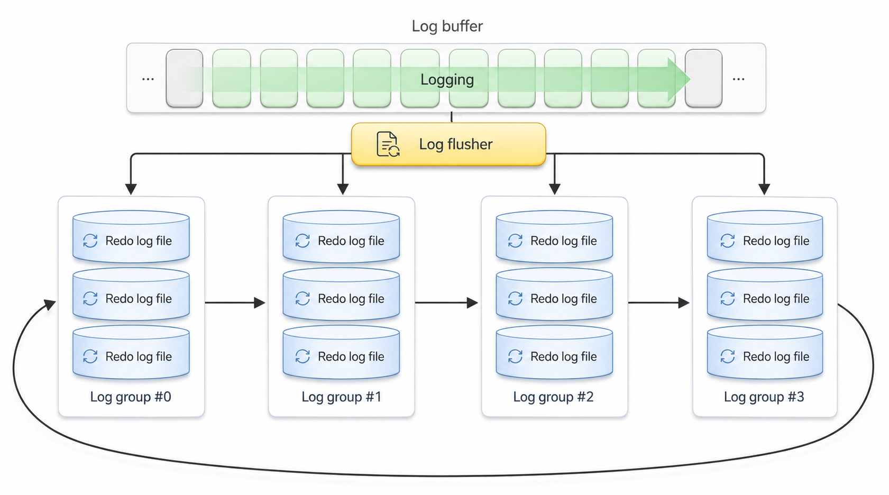
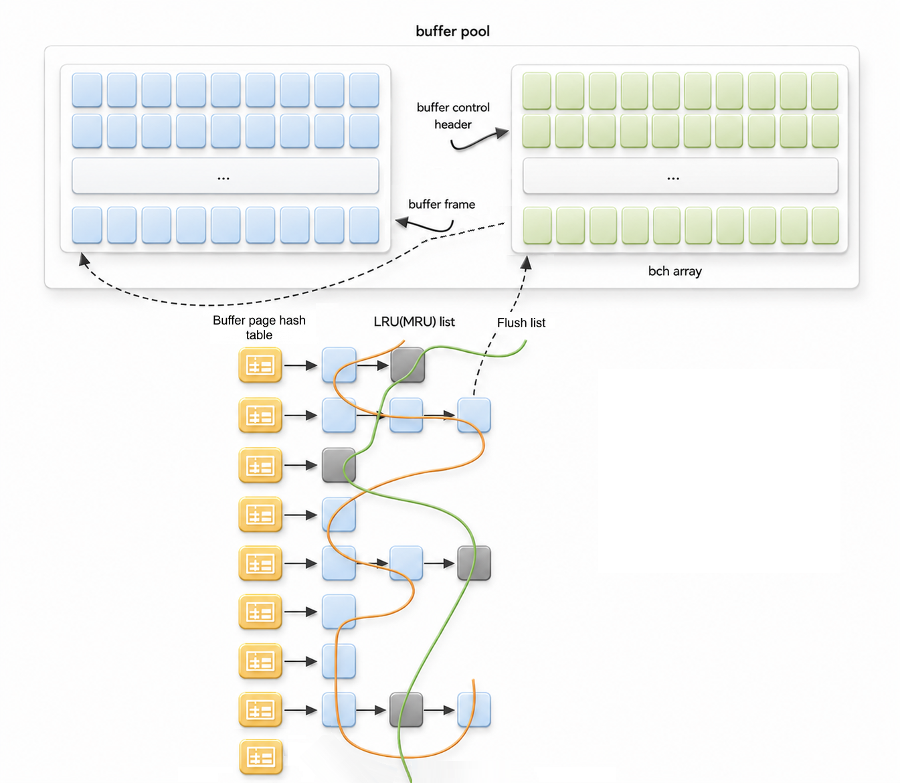

<a id="4cee6e4e7a3cd2d1"></a>

# 6. GOLDILOCKS 데이터베이스의 구조 및 저장 구조

> 원본: [GOLDILOCKS 26c.1 User Manual (ko)](https://manual.sunjesoft.co.kr/goldilocks/26c_1/manual/ko/4cee6e4e7a3cd2d1)  
> 태그: `26c.1_0_tag`

[← 5. GOLDILOCKS 데이터베이스 관리 기본](5-goldilocks-데이터베이스-관리-기본.md) · [전체 목차](../README.md) · [7. GOLDILOCKS 데이터베이스의 백업과 복구 →](7-goldilocks-데이터베이스의-백업과-복구.md)

<a id="a850ea99e9e2829f"></a>
## 제어 파일 관리

GOLDILOCKS 데이터베이스를 이용하기 위해서는 데이터베이스 instance를 생성해야 하며 데이터베이스 instance가 생성될 때 제어 파일이 생성된다. GOLDILOCKS 다단계 시작의 nomount 단계에서 mount 단계로 올라갈 때 제어 파일에 기록된 정보를 이용하여 데이터베이스에서 사용할 파일들의 절대 경로와 파일 크기 등과 같은 정보를 파악한다. 제어 파일은 바이너리 파일이며 데이터베이스의 다음과 같은 정보들이 저장된다.

<a id="f73a9ab4a2e37e20"></a>
### 제어 파일 내용

**GOLDILOCKS 데이터베이스 시스템 정보**

<a id="64b9e8c274dd0418"></a>
| 항목 | 설명 |
| --- | --- |
| Data Store Mode | 데이터베이스가 기동될 때 설정된 저장 모드이다. (TDS, CDS) |
| Server State | 데이터베이스 instance의 상태이다. (NONE, RECOVERED, RECOVERING, SERVICE, SHUTDOWN) |
| Last Checkpoint Lsn | 데이터베이스에서 마지막으로 수행된 체크포인트의 LSN이다. |
| On Disk Lsn | 데이터베이스 복구에 필요한 로그가 기록된 최소 LSN이다. |

**로그 정보**

<a id="c2fd450e26cfd650"></a>
| 항목 | 설명 |
| --- | --- |
| Checkpoint Lid, Lsn | 데이터베이스에서 마지막으로 수행된 체크포인트의 로그 정보 (LSN, 로그의 위치) 이다. |
| Last Inactivated Log File Sequence | 마지막으로 inactive로 바뀐 로그 파일 sequence이다. |
| Archivelog Mode | 운영 중인 데이터베이스의 archivelog mode이다. |
| Creation Time | 데이터베이스 생성 시간이다. |

데이터베이스 정보에는 데이터베이스의 운영 정보 및 사용 중인 모든 테이블스페이스 정보, 데이터정보를 저장한다. 제어 파일에 저장된 데이터베이스 운영 정보는 다음과 같다.

**데이터베이스 정보**

<a id="e2f4f6bf9ab2bc32"></a>
| 항목 | 설명 |
| --- | --- |
| Transaction Table Size | 데이터베이스에서 사용 중인 최대 transaction table의 개수이다. |
| Undo Relation Count | 데이터베이스에서 사용 중인 undo relation의 개수이다. |
| Tablespace Count | 데이터베이스에 생성되어 사용 중인 테이블스페이스의 개수이다. |
| New Tablespace Id | 다음에 생성될 테이블스페이스 ID이다. |

제어 파일에 저장된 테이블스페이스의 정보는 다음과 같다.

**테이블스페이스 정보**

<a id="98529cf51e8fda3d"></a>
| 항목 | 설명 |
| --- | --- |
| Tablespace Id | 테이블스페이스의 고유한 ID이다. |
| Attributes | 테이블스페이스의 속성으로써 저장 장치 (메모리, 디스크), 영속성 보장여부 (temporary, persistent)와 테이블스페이스의 용도 (dictionary, undo, data, temporary) 등을 포함한다. |
| Page Count In Extent | Extent의 page 개수이다. |
| State | 테이블스페이스의 상태 (CREATING, CREATED, DROPPING, DROPPED, AGING) 이다. |
| Relation Id | 테이블스페이스의 pending 연산을 저장하기 위한 relation ID이다. |
| New Data File Id | 테이블스페이스에 새로운 데이터가 추가될 때 설정하기 위한 데이터 ID이다. |
| Is Logging | 테이블스페이스의 logging 모드이다. (LOGGING/ NOLOGGING) |
| Is Online | 테이블스페이스의 online 여부이다. (ONLINE/ OFFLINE) |
| Data File Count | Tablespace가 사용 중인 데이터의 개수이다. |
| Offline Lsn | Offline 테이블스페이스를 online으로 변경하기 위해 복구가 필요한 경우 복구를 수행해야 하는 마지막 LSN이다. |
| Offline State | Offline 테이블스페이스의 상태이다. (CONSISTENT/ INCONSISTENT) CONSISTENT offline 테이블스페이스는 메모리에 존재하는 최신 데이터를 디스크의 데이터에 반영한 후 테이블스페이스의 상태를 offline으로 바꾸기 때문에 online으로 변경할 때 복구할 필요가 없다. 반면 INCONSISTENT offline 테이블스페이스를 online으로 변경할 때는 로그를 이용하여 복구를 수행한 후 online으로 변경해야 한다. |

제어 파일에 저장된 데이터 파일의 정보는 다음과 같다.

**데이터 파일 정보**

<a id="75f664f4629efe61"></a>
| 항목 | 설명 |
| --- | --- |
| Name | 데이터가 저장된 절대 경로를 포함한 데이터 이름이다. |
| State | 데이터의 상태 (CREATING, CREATED, DROPPING, DROPPED, AGING) 이다. |
| Data File Id | 테이블스페이스에서 고유한 데이터의 ID이다. |
| Auto Extend | 데이터 파일이 가득 찼을 때 자동으로 확장할지 여부이다. |
| Size | 데이터의 크기이다. |
| Next Size | 데이터가 가득 찼을 때 확장할 크기이다. |
| Max Size | 확장 가능한 데이터의 최대 크기이다. |
| Timestamp | 데이터가 생성된 시점이다. |
| Checkpoint Lsn, Lid | 데이터 파일에 마지막으로 체크포인트가 수행되었을 때의 체크포인트 로그 정보 (LSN, 로그 위치) 이다. |
| Creation Lsn, Lid | 데이터 파일이 생성된 시점의 체크포인트 로그 정보 (LSN, 로그 위치) 이다. |

데이터베이스에서 수행된 각 incremental backup의 정보를 저장한다. GOLDILOCKS 데이터베이스는 데이터베이스, 테이블스페이스에 대한 incremental backup을 지원하고 다음과 같은 incremental backup 정보를 제어 파일에 저장한다.

**Incremental backup 정보**

<a id="897a937d9c54621e"></a>
| 항목 | 설명 |
| --- | --- |
| Backup Lsn, Lid | Backup 시작 시점에 마지막으로 수행된 체크포인트 로그 정보 (LSN, 로그 위치) 이다. |
| Begin Time | Incremental backup이 시작된 시점이다. |
| Completion Time | Incremental backup이 완료된 시점이다. |
| Tablespace Id | Incremental backup이 수행된 테이블스페이스의 고유 ID이다. 테이블스페이스에 대한 incremental backup의 경우 해당 테이블스페이스 ID가 기록되고 테이블스페이스에 대한 backup이 아닌 경우 최대 테이블스페이스 ID (65535)가 기록된다. |
| Level | 수행된 incremental backup의 level이다. |
| Object Type | Incremental backup의 대상이다. (데이터베이스, 제어 파일, 테이블스페이스) |
| Backup File Name | Incremental backup 파일의 이름이다. |
| Backup Option | Incremental backup의 option이다. (cumulative/ differential) |

<a id="c87793c7d5588f55"></a>
### 제어 파일 다중화

제어 파일은 GOLDILOCKS 데이터베이스의 물리적 구조와 데이터의 일관성에 대한 중요한 정보를 저장하고 있으므로 훼손되거나 실수로 삭제되는 등의 문제가 발생하는 경우 데이터베이스를 운영할 수 없다.

따라서 GOLDILOCKS 데이터베이스는 최소 두 개 이상의 제어 파일을 생성하여 물리적으로 분리된 디스크에 유지할 것을 권장하고 최대 여덟 개까지 다중화를 지원한다. 제어 파일을 추가하려면 데이터베이스를 생성할 때 프로퍼티 파일에 다중화할 제어 파일 개수를 설정하고 각 제어 파일의 경로를 설정한다. 또한 운영 중에 제어 파일 다중화 개수에 대한 프로퍼티 값을 증가시키고 추가할 제어 파일의 경로를 설정하여 추가할 수도 있다.

<a id="bc25ea408cab7179"></a>
### 제어 파일 훼손 시 대처 방안

데이터베이스 비정상 종료 등으로 인해 제어 파일이 훼손되었을 경우 다중화된 제어 파일 중 정상 제어 파일을 이용하여 훼손된 제어 파일을 복원한 후에 다시 시작한다.

만약 다중화된 제어 파일들이 모두 훼손되었을 경우, 백업된 제어 파일을 복원하여 archive redo log file과 redo log file까지 불완전 미디어 복구를 수행하여 재시작한다. 백업된 제어 파일을 이용한 불완전 복구는 시나리오별 복구 예제 중에 [다중화된 모든 제어 파일이 훼손된 경우](7-goldilocks-데이터베이스의-백업과-복구.md#a6b9e0629638fdc0)를 참조한다.

<a id="f586b4a62069de28"></a>
### 제어 파일 정보

제어 파일의 위치와 이름에 대한 정보를 조회하기 위해 성능 view인 V$CONTROLFILE을 이용할 수 있다.   
다음은 V$CONTROLFILE를 이용하여 제어 파일의 이름을 조회하는 예이다.

```
gSQL> SELECT CONTROLFILE_NAME FROM V$CONTROLFILE;

CONTROLFILE_NAME                                         
---------------------------------------------------------
/goldilocks_data/wal/control_0.ctl
/goldilocks_data/wal/control_1.ctl

2 rows selected.
```

GOLDILOCKS의 dump tool인 [gdump](../part-06-utility-manual/46-gdump.md#515b53d7c2e15b60)를 이용하면 제어 파일에 기록된 정확한 정보를 확인할 수 있다.

<a id="8eb835a2cdd387c3"></a>
## Redo Log File 관리

GOLDILOCKS 데이터베이스는 영속성을 보장하기 위해 redo log file을 사용한다. 즉, 다양한 원인으로 인해 GOLDILOCKS 데이터베이스가 비정상 종료되었을 때 데이터 파일과 redo log를 이용하여 종료하기 직전의 데이터베이스 상태로 복귀할 수 있다.

이를 위해 GOLDILOCKS 데이터베이스는 수행되는 모든 데이터베이스 갱신 연산들을 Write Ahead Logging (WAL) 정책을 이용하여 로그로 남긴다.

갱신 연산에 의해 갱신된 데이터를 데이터 파일에 기록하지 않고 갱신 연산에 대한 로그를 redo log file에 기록하는 이유는 데이터베이스 성능상 훨씬 효율적이기 때문이다. 갱신 연산이 발생할 때마다 데이터 파일을 기록하면 데이터 파일을 기록하기 위해 랜덤으로 접속하고 동일한 파일에 대한 갱신 연산들의 경합 등으로 인해 디스크 IO가 과도하게 발생한다. 이에 반해 갱신 로그는 갱신 데이터에 비해 크기가 작고 로그 파일의 마지막 위치에 계속 누적 (append)되는 방식으로 효율적인 디스크 IO를 수행한다.

또한 GOLDILOCKS 데이터베이스는 공유 메모리상의 로그 버퍼를 이용하여 갱신 로그를 로그 버퍼에 기록한 후 로그 버퍼를 일괄적으로 로그 파일에 기록하여 더욱 효율적인 디스크 IO를 수행한다.

<a id="743a04beed006386"></a>
### Redo Log File 구조

GOLDILOCKS의 redo log 버퍼와 로그 파일은 circular 구조이다. 정의된 로그 그룹의 수만큼 미리 로그 파일을 생성하여 로그를 기록하고 하나의 로그 파일이 가득 차면 다음 로그 파일을 사용한다. 로그 파일이 모두 사용되면 이전에 사용되었던 로그 파일을 재사용 한다. 로그 파일은 여러 개의 멤버를 가진 하나의 로그 그룹이 circular 구조로 구성되어 있고 GOLDILOCKS는 최소 네 개의 로그 그룹을 이용하여 로깅을 수행한다.

<a id="75de31d28f58048a"></a>


<a id="6b6f4f9edecb65f8"></a>
### Redo Log 그룹과 멤버

GOLDILOCKS 데이터베이스는 데이터베이스 운용 중에 발생하는 로그를 디스크 로그 파일에 기록하기 위해 로그 그룹과 멤버를 이용한다. 하나의 redo log file은 하나의 로그 그룹의 멤버가 되고 여러 개의 로그 멤버가 모여 로그 그룹을 구성한다. 로그 그룹을 여러 개의 로그 멤버로 구성하면 특정 디스크가 고장나거나 특정 로그 멤버가 훼손되었을 때 다른 로그 멤버를 이용할 수 있어 가용성이 높아진다.

시스템은 하나의 로그 그룹에 로그를 기록하다가 그 로그 그룹이 가득 차면 다음 로그 그룹을 사용하는 방식으로 circular 로그 그룹을 사용한다. 시스템이 사용하는 로그 그룹이 현재 로그 그룹에서 다음 로그 그룹으로 바뀌는 것을 로그 switching이라고 한다.

로그 그룹 및 멤버의 개수와 각각의 위치는 데이터베이스를 생성할 때 프로퍼티에 의해 설정되고 운용 중에 추가 또는 삭제 구문을 이용하여 변경할 수도 있다.

<a id="424515091932b6eb"></a>
#### 로그 그룹 상태

로그 그룹은 생성될 때 UNUSED 상태로 초기화되고 운용 중에 시스템에 의해 CURRENT, ACTIVE, INACTIVE 상태로 변경된다.

**GOLDILOCKS 로그 그룹 상태**

<a id="c3e1e2be5c96abb6"></a>
| 로그 그룹 상태 | 설명 |
| --- | --- |
| UNUSED | 생성 후 사용된 적이 없는 로그 그룹의 상태이다. |
| CURRENT | 현재 시스템이 사용 중인 로그 그룹의 상태이다. |
| ACTIVE | CURRENT 로그 그룹이 switching 된 후 아직 재사용을 위해 준비되지 않은 상태이다. |
| INACTIVE | ACTIVE 상태의 로그 그룹이 재사용을 위해 준비된 상태이다. |

ACTIVE 상태의 로그 그룹은 시스템에서 재사용할 수 없고 archive 로그 thread에 의해 INACTIVE 상태로 변경된 후에 재사용할 수 있다. Archive log thread는 체크포인트가 완료되기 전에 이벤트에 의해 깨어나 ACTIVE 상태의 로그 그룹들을 INACTIVE 상태로 바꾼다. 이를 위해 시스템이 ARCHIVELOG 모드로 운용 중일 경우 로그 아카이빙 thread는 ACTIVE 상태의 로그 그룹의 로그 파일을 아카이빙한 후 INACTIVE 상태로 변경한다. 만약 NOARCHIVELOG 모드로 운영 중인 경우, 로그 그룹의 상태만 INACTIVE로 변경하여 즉시 재사용 할 수 있도록 한다.

<a id="0e1f89bff596c5cc"></a>
#### 로그 그룹 및 로그 멤버 추가

<a id="d6aea0957fe5eed3"></a>
##### 로그 그룹 추가

로그 그룹은 GOLDILOCKS 데이터베이스 다단계 startup 중 mount 단계에서만 추가할 수 있다. 사용 중인 로그 그룹에 새로운 로그 그룹을 추가하며 CURRENT 상태의 다음에 추가된다. 예를 들어 'abc.log'라는 파일 이름으로 파일 크기가 20 Mbyte인 새로운 로그 그룹을 그룹 ID 10으로 추가하는 경우 다음과 같이 수행할 수 있다.

```
ALTER DATABASE ADD LOGFILE GROUP 10 ('abc.log') SIZE 20M;
```

<a id="cf40fc57d4826d32"></a>
##### 로그 멤버 추가

사용 중인 로그 그룹의 안정성을 위해 새로운 로그 멤버를 추가할 수 있는데 로그 그룹 추가와 마찬가지로 GOLDILOCKS 데이터베이스 다단계 startup 중 mount 단계에서 가능하다. 예를 들어 로그 그룹 ID 10에 'test.log' 로그 파일을 추가하는 경우 다음과 같이 수행할 수 있다. 이 때 로그 그룹 내의 로그 멤버들은 동일한 파일 크기를 가지기 때문에 로그 파일의 크기를 기술하지 않는다.

```
ALTER DATABASE ADD LOGFILE MEMBER 'test.log' TO GROUP 10;
```

<a id="dc6627e51a66cc36"></a>
#### 로그 멤버 이름 변경

사용 중인 로그 멤버의 위치 및 파일 이름을 변경해야 하는 경우 mount 단계에서 RENAME 할 수 있다. 로그 멤버의 RENAME은 로그 멤버가 위치한 디스크가 물리적으로 고장났거나 성능상 로그 멤버를 다른 디스크로 옮겨야 하는 경우에 수행된다. 다음은 '/disk1/goldilocks_data/wal/redo_0_0.log'의 로그 파일을 '/disk2/goldilocks_data/wal/redo_0_0.log'로 RENAME하는 예이다.

```
ALTER DATABASE RENAME LOGFILE '/disk1/goldilocks_data/wal/redo_0_0.log' TO '/disk2/goldilocks_data/wal/redo_0_0.log';
```

<a id="6734fc40a05fef2f"></a>
#### 로그 그룹 및 로그 멤버 제거

로그 그룹이나 로그 멤버의 수를 줄이거나 로그 파일이 위치한 디스크 고장 등으로 인해 사용 중인 로그 그룹과 멤버를 제거해야 할 경우, mount 단계에서 DROP 할 수 있다. 로그 그룹 10의 모든 로그 멤버를 제거하려면 다음과 같이 수행한다.

```
ALTER DATABASE DROP LOGFILE GROUP 10;
```

로그 멤버는 해당 로그 그룹에 최소 두 개 이상의 로그 멤버가 존재할 때만 제거할 수 있다. '/disk1/goldilocks_data/wal/redo_0_0.log' 로그 멤버를 제거하려면 다음과 같이 수행한다.

```
ALTER DATABASE DROP LOGFILE MEMBER '/disk1/goldilocks_data/wal/redo_0_0.log';
```

<a id="b71fc754fd378444"></a>
### Redo Log File 훼손 시 대처 방안

시스템이 고장난 후에 redo log file이 훼손된 경우 재시작 복구에 실패하여 시스템을 구동할 수 없게 된다. 이 때 훼손된 로그 그룹에 정상적인 로그 멤버가 존재하는 경우, 정상 로그 멤버의 로그 파일을 훼손된 로그 파일에 복사하여 재시작 복구 및 시스템 구동을 수행할 수 있다.

이 때 최소한 제어 파일의 [V$CONTROLFILE](9-database-information.md#18bdc552731c31d6)의 ON_DISK_LSN 로그에 기록된 로그를 포함하는 로그 파일이 있어야 복구를 완료할 수 있다. 해당 로그 파일이 없으면 복구를 완료할 수 없고, [불완전 복구](7-goldilocks-데이터베이스의-백업과-복구.md#d82c357b74443413)를 수행한 후 재시작할 수 있다.

만약 로그 그룹의 로그 파일들이 모두 훼손되었거나 로그 멤버가 하나밖에 없는 경우, [불완전 복구](7-goldilocks-데이터베이스의-백업과-복구.md#d82c357b74443413)를 수행하여 정상적인 로그 파일까지만 복구하여 재시작할 수 있다.

<a id="33c02f426403b37d"></a>
### Redo Log File 정보

Redo log file의 위치와 이름에 대한 정보를 조회하기 위해 성능 view인 V$LOGFILE을 이용할 수 있다.   
V$LOGFILE를 이용하여 로그 파일 이름과 로그 파일이 속한 로그 그룹 ID, 로그 그룹의 상태, 파일 크기를 다음과 같이 조회할 수 있다.

```
gSQL> SELECT FILE_NAME, GROUP_ID, GROUP_STATE, FILE_SIZE FROM V$LOGFILE;

FILE_NAME                          GROUP_ID GROUP_STATE FILE_SIZE
---------------------------------- -------- ----------- ---------
/disk1/goldilocks_data/wal/redo_0_0.log        0 INACTIVE    104857600
/disk1/goldilocks_data/wal/redo_1_0.log        1 CURRENT     104857600
/disk1/goldilocks_data/wal/redo_2_0.log        2 UNUSED      104857600
/disk1/goldilocks_data/wal/redo_3_0.log        3 UNUSED      104857600

4 rows selected.
```

<a id="83fc104fab0b2359"></a>
## Archive Redo Log File 관리

GOLDILOCKS의 redo log file은 circular 로그 그룹을 이용하여 사용된 로그 그룹을 재사용하므로 백업을 이용한 미디어 복구를 위해서는 데이터베이스를 archive 로그 모드로 운용해야 하는데 이 때 기록이 완료된 redo log file은 archive redo log file로 복사된다. GOLDILOCKS 데이터베이스의 archive log mode에 대한 자세한 내용은 [ARCHIVELOG 모드](7-goldilocks-데이터베이스의-백업과-복구.md#77b035281eeca56b)를 참조한다.

<a id="b4a167de9ade9470"></a>
### Archive Redo Log File 생성

Redo log file은 GOLDILOCKS 데이터베이스의 시스템 thread인 log archiving thread에 의해 archive redo log file 디렉토리로 복사된다. Log archiving thread는 체크포인트를 수행할 때 체크포인트 thread에 의해 활성화되어 redo log file 중 아카이빙 되어야 할 대상을 찾아 아카이빙을 수행한다.

Archive redo log file은 ARCHIVELOG_DIR_1 프로퍼티에 설정된 디렉토리에 ARCHIVELOG_FILE 프로퍼티에 설정된 prefix와 각 redo log file의 sequence 번호를 이용한 archive redo log file 이름으로 생성된다.

<a id="0ca97b562e56a6be"></a>
### Archive Redo Log File 보존과 삭제

Redo log file과 마찬가지로 archive redo log file도 임의로 삭제할 경우 백업을 이용한 미디어 복구에 실패할 수 있다. 따라서 archive redo log file은 백업 파일과 함께 보존해야 하며 백업 파일이 더 이상 필요없을 때 백업을 이용한 미디어 복구를 위해 필요한 archive redo log file도 함께 제거할 수 있다.

백업은 가장 최근에 수행된 체크포인트에 의해 디스크로 내려간 데이터 파일을 복사하는 것이므로 그 백업을 이용하여 미디어 복구를 수행하기 위해서는 체크포인트 시점에 가장 오래된 LSN과 그 이후의 archive redo log file들이 필요하다. 체크포인트는 redo log file이 스위치될 때 시스템에 의해 수행되므로 CURRENT 상태의 redo log file을 제외한 모든 로그 파일에는 최소한 한 개 이상의 체크포인트 로그가 존재한다.

이를 이용하여 백업된 파일을 이용한 미디어 복구 시 필요한 archive redo log file을 구하는 방법은 다음과 같다.

1. 백업된 데이터 파일의 파일 헤더에 기록된 체크포인트 LSN을 구한다.
2. Archive redo log file을 덤프하여 체크포인트 LSN을 포함하는 archive redo log file을 구한다.
3. 백업을 이용한 미디어 복구 시 필요한 archive redo log file은 2에서 구한 archive redo log file의 직전 로그 파일부터가 된다.

증분 백업에 필요한 archive redo log file을 구하기 위해서는 제어 파일을 덤프하여 체크포인트 LSN을 구해야 하며 이후 과정은 전체 백업과 동일하다.

백업 파일이 더 이상 필요 없을 때 백업을 이용한 미디어 복구를 위해 필요한 archive redo log file도 함께 제거할 수 있다.

<a id="80f950161359bed2"></a>
### Archive Redo Log File 디렉토리 다중화

Archive redo log file을 ARCHIVELOG_DIR_1에 설정된 디렉토리에서 다른 미디어나 디렉토리로 옮기면 미디어 복구에 필요한 archive redo log file을 찾지 못하여 수행에 실패한다. 이 경우 옮겨진 archive redo log file을 ARCHIVELOG_DIR_1에 설정된 디렉토리로 다시 옮겨서 수행하거나 ARCHIVELOG_DIR_2 ~ ARCHIVELOG_DIR_10에 archive redo log file이 존재하는 디렉토리를 설정하는 방식으로 미디어 복구를 위한 archive redo log file 디렉토리를 추가하여 수행할 수 있다. 단, 미디어 복구를 위해 ARCHIVELOG_DIR_2 ~ ARCHIVELOG_DIR_10을 사용하기 위해서는 READABLE_ARCHIVELOG_DIR_COUNT를 디렉토리 개수만큼 설정해야 한다.

<a id="7bb27f54bbdaa095"></a>
## 테이블스페이스 관리

데이터베이스에서 사용되는 모든 데이터들은 물리적인 디스크 파일에 저장되고 데이터의 효율적인 관리와 성능 향상을 위해 데이터베이스의 논리적인 구조를 이용한다. GOLDILOCKS는 테이블스페이스, 세그먼트, extent, page 등과 같은 논리적 구조를 이용하여 디스크 사용 공간을 효율적으로 관리한다.

테이블스페이스는 여러 개의 데이터 파일을 포함할 수 있으며 각각의 테이블스페이스를 online/ offline 상태로 설정하여 데이터 가용성을 향상시킬 수 있다. 또한 데이터 파일을 저장하는 디스크를 분산시켜 IO 성능을 향상시키고 물리적인 디스크의 IO의 경합을 감소시킨다.

<a id="cafd4aa5baeacff4"></a>
### 테이블스페이스 종류

GOLDILOCKS의 테이블스페이스는 데이터베이스를 생성할 때 생성되어 GOLDILOCKS 시스템만 사용하고 제어하는 SYSTEM 테이블스페이스와 사용자가 생성하고 사용하는 non SYSTEM 테이블스페이스가 있다.

<a id="e7283bf5a18fb1f8"></a>
#### SYSTEM 테이블스페이스

GOLDILOCKS 데이터베이스가 생성될 때 생성되며 데이터베이스 운영을 위해 반드시 필요한 테이블스페이스이다. Dictionary 테이블스페이스, Undo 테이블스페이스, 그리고 system temporary 테이블스페이스가 있다.

<a id="7fafcca96fc81968"></a>
#### Non SYSTEM 테이블스페이스

데이터를 저장하기 위한 테이블과 인덱스를 저장하기 위해 사용자가 임의로 생성하고 삭제할 수 있는 테이블스페이스들이다.

<a id="63af2e4bd92f631a"></a>
### 테이블스페이스 및 데이터 파일 관리

<a id="7b4f7ee22573e966"></a>
#### 테이블스페이스 관리

<a id="ad8b66c0b495025c"></a>
##### 테이블스페이스 상태 관리

GOLDILOCKS 데이터베이스의 테이블스페이스는 online과 offline으로 상태를 나눌 수 있다. Offline 상태의 테이블스페이스에는 접근할 수 없다. 사용자가 특정 테이블스페이스를 임의로 offline 상태로 설정할 수 있고 시스템에 의해 비정상 상태의 테이블스페이스가 offline 될 수도 있다. 시스템 테이블스페이스는 offline 상태로 설정할 수 없다.

- Offline 테이블스페이스

GOLDILOCKS 데이터베이스는 테이블스페이스가 offline 상태가 되기 전에 테이블스페이스 내의 모든 데이터 파일을 디스크로 flush 한다. 데이터 파일을 flush 하려면 관련 로그들을 모두 디스크로 flush 해야 하기 때문에 이후에 online으로 상태가 바뀔 때 특별히 복구를 수행할 필요없고 단지 offline 테이블스페이스 상태에서 발생한 DDL들이 온라인 상태로 바뀔 때 적용된다.

데이터 파일을 flush하지 않고 offline으로 바꾸는 IMMEDIATE 모드를 이용하면 테이블스페이스를 즉시 offline으로 바꿀 수 있는데 이 경우 online으로 설정하려면 미디어 복구를 수행한 후에 online 상태로 바꾸어야 한다.

**테이블스페이스 offline 옵션**

<a id="85b1602519d82923"></a>
| 옵션 | 설명 | 테이블스페이스를 online으로 바꿀 경우 |
| --- | --- | --- |
| NORMAL | 테이블스페이스의 데이터 파일과 관련된 로그를 모두 디스크로 flush 한 후 offline으로 바꾼다. | 미디어 복구를 수행할 필요없다. |
| IMMEDIATE | 테이블스페이스를 즉시 offline으로 바꾼다. | 미디어 복구를 수행해야 한다. |

GOLDILOCKS는 mount 단계에서 테이블스페이스를 offline으로 바꿀 수 있다. 이는 데이터베이스를 시작할 때 복구할 수 없는 테이블스페이스를 제외하고 시작하여 서비스를 수행함으로써 가용성을 높인다. Mount 단계에서 테이블스페이스를 offline하는 것은 서버가 정상적으로 종료되었거나 ARCHIVELOG 모드로 서버를 운용할 때만 가능하다.

```
gSQL> ALTER TABLESPACE TEST_TBS OFFLINE;
 
Tablespace altered.
 
gSQL> ALTER TABLESPACE TEST_TBS ONLINE;
 
Tablespace altered.
```

```
gSQL> ALTER TABLESPACE TEST_TBS OFFLINE IMMEDIATE;
 
Tablespace altered.
 
gSQL> ALTER TABLESPACE TEST_TBS ONLINE;
 
ERR-42000(14051): media recovery required - 'TEST_TBS'
 
gSQL> ALTER DATABASE RECOVER TABLESPACE TEST_TBS;
 
Database altered.
 
gSQL> ALTER TABLESPACE TEST_TBS ONLINE;
 
Tablespace altered.
```

<a id="0171772356b51e97"></a>
##### 테이블스페이스 속성

GOLDILOCKS 데이터베이스의 테이블스페이스 속성은 다음과 같다. 영속성 보장 여부를 구분하는 PERSISTENT, TEMPORARY 속성, 테이블스페이스와 저장되는 데이터의 종류에 따른 DATA, UNDO의 속성이 있다.

<a id="43d6b352aefd9994"></a>
<table class="table column_count_3"><caption>GOLDILOCKS 데이터베이스의 테이블스페이스 속성</caption><thead><tr><th class="to_center" colspan="2"><div>속성</div></th><th class="to_center"><div>설명</div></th></tr></thead><tbody><tr><td class="to_middle" rowspan="2"><div>영속성</div></td><td class="to_middle"><div>PERSISTENT</div></td><td class="to_middle"><div>테이블스페이스에 저장된 데이터들에 대한 영속성을 지원한다. (복구 대상)</div></td></tr><tr><td class="to_middle"><div>TEMPORARY</div></td><td class="to_middle"><div>테이블스페이스에 저장된 데이터들에 대한 영속성을 지원하지 않는다.</div></td></tr><tr><td class="to_middle" rowspan="4"><div>저장 데이터 종류</div></td><td class="to_middle"><div>DATA</div></td><td class="to_middle"><div>사용자가 입력한 데이터가 저장된다.</div></td></tr><tr><td class="to_middle"><div>UNDO</div></td><td class="to_middle"><div>데이터베이스의 MVCC를 위해 필요한 데이터가 저장된다.</div></td></tr><tr><td class="to_middle"><div>DICT</div></td><td class="to_middle"><div>데이터베이스 운영을 위한 딕셔너리 정보가 저장된다.</div></td></tr><tr><td class="to_middle"><div>TEMPORARY</div></td><td class="to_middle"><div>SQL 처리를 위한 데이터들이 저장된다.</div></td></tr><tr><td class="to_middle" rowspan="2"><div>저장 매체 타입</div></td><td class="to_middle"><div>DISK</div></td><td class="to_middle"><div>디스크 테이블스페이스의 페이지는 버퍼 캐쉬를 이용하여 디스크의 데이터파일에서 읽어야 하며, 만약 캐싱되어 있을 경우에는 버퍼 캐쉬에서 접근할 수 있다.</div></td></tr><tr><td class="to_middle"><div>MEMORY</div></td><td class="to_middle"><div>테이블스페이스를 생성할 때 데이터파일의 크기와 동일한 전용의 공유 메모리가 생성되어 메모리에서 필요한 페이지에 즉시 접근할 수 있다.</div></td></tr></tbody></table>

<a id="b845a6533542a145"></a>
##### 테이블스페이스 관리

- 사용자 테이블스페이스 생성

새로운 사용자 테이블스페이스를 생성한다. 테이블스페이스를 생성할 때 데이터베이스 인스턴스에서 사용 중인 테이블스페이스 이름은 고유해야 한다. 테이블스페이스 한 개당 최대 1,024 개의 데이터 파일을 가질 수 있다. 메모리 테이블스페이스의 경우 각 데이터 파일에 최대 30 Gbyte까지 저장할 수 있고, 디스크 테이블스페이스의 경우 디스크에서 물리적으로 사용 가능한 크기까지 저장할 수 있다. 데이터베이스에서 생성할 수 있는 테이블스페이스의 최대 개수는 시스템 테이블스페이스를 포함하여 65,535 개이다.

데이터 파일 이름은 데이터 파일 절대 경로를 포함하여 데이터베이스에서 유일해야 하고, 이미 생성된 데이터 파일 중에 데이터베이스에서 사용하고 있지 않은 파일을 재사용하려면 'REUSE' 옵션을 사용한다. 테이블스페이스에서 사용할 익스텐트 (extent) 한 개의 크기는 64 Kbyte, 128 Kbyte, 256 Kbyte, 512 Kbyte, 1 Mbyte 중 하나를 선택할 수 있으며 기본값은 256 Kbyte 이다.

```
gSQL> CREATE TABLESPACE TEST_TBS DATAFILE
     '/goldilocks1/db/TEST_TBS1.dbf' SIZE 20M,
     '/goldilocks2/db/TEST_TBS2.dbf' SIZE 50M,
     '/goldilocks3/db/TEST_TBS3.dbf' SIZE 100M REUSE;

Tablespace created.
```

다음은 디스크 테이블스페이스를 생성하는 예이다.

```
gSQL> CREATE DISK TABLESPACE TEST_TBS DATAFILE
     '/goldilocks1/db/TEST_DISK_TBS1.dbf' AUTOEXTEND OFF MAXSIZE 20M,
     '/goldilocks2/db/TEST_DISK_TBS2.dbf' AUTOEXTEND ON NEXT 20M MAXSIZE UNLIMITED REUSE;

Tablespace created.
```

테이블스페이스를 생성할 때 테이블스페이스의 online/ offline 상태를 설정할 수 있고 LOGGING, NOLOGGING 테이블스페이스 속성을 설정할 수 있다.

- 테이블스페이스 제거

테이블스페이스가 더 이상 필요하지 않으면 테이블스페이스와 해당 데이터 파일을 제거할 수 있다. 테이블스페이스가 생성되면 테이블스페이스에 추가된 디스크 데이터 파일과 메모리가 생성되어 유지되기 때문에 사용하지 않는 테이블스페이스가 있으면 자원이 낭비되므로 삭제하는 것이 좋다.

```
gSQL> DROP TABLESPACE TEST_TBS;

Tablespace dropped.
```

기본적으로 테이블스페이스 제거는 테이블스페이스에 생성되어 사용 중인 테이블 인덱스까지 제거하지는 않기 때문에 만약 사용 중인 테이블이나 인덱스가 존재하는 테이블스페이스를 제거하려면 INCLUDING CONTENTS 옵션을 함께 사용해야 한다.

```
gSQL> DROP TABLESPACE TEST_TBS;

ERR-42000(16148): tablespace not empty, use INCLUDING CONTENTS option : 
drop tablespace TEST_TBS
                *
ERROR at line 1:

gSQL> DROP TABLESPACE TEST_TBS INCLUDING CONTENTS;

Tablespace dropped.
```

그리고 테이블스페이스에 추가된 데이터 파일까지 삭제하려면 AND DATAFILES 옵션이 필요하다.

```
gSQL> DROP TABLESPACE TEST_TBS INCLUDING CONTENTS AND DATAFILES;

Tablespace dropped.
```

- 테이블스페이스 크기 조정

테이블스페이스의 크기를 조정하기 위해서는 테이블스페이스에 데이터 파일을 추가하거나 삭제한다. 데이터베이스를 사용하는 중에 데이터를 저장할 공간이 부족할 경우 테이블스페이스에 새로운 데이터 파일을 추가하여 공간을 확보하고 사용하지 않는 테이블스페이스의 데이터 파일을 삭제하여 공간 낭비를 줄일 수 있다.

```
gSQL> ALTER TABLESPACE TEST_TBS ADD DATAFILE 'TEST_TBS2.dbf' SIZE 20M;

Tablespace altered.

gSQL> ALTER TABLESPACE TEST_TBS DROP DATAFILE 'TEST_TBS2.dbf;

Tablespace altered.
```

테이블스페이스의 데이터 파일은 생성된 후 사용된 적이 없는 경우에만 삭제할 수 있다. 사용된 적이 있는 경우, 모든 데이터가 삭제되었더라도 데이터 파일을 삭제할 수 없다.

```
ALTER TABLESPACE TEST_TBS DROP DATAFILE 'TEST_TBS2.dbf';

ERR-42000(14044): datafile not empty
```

- 임시 테이블스페이스 관리

임시 테이블스페이스는 데이터 파일을 가지지 않고 지정된 크기만큼 메모리만 할당한다. 다음과 같이 임시 테이블스페이스를 생성할 수 있다.

```
gSQL> CREATE TEMPORARY TABLESPACE TEST_TBS MEMORY 'TEST_TEMP_TBS' SIZE 10M EXTSIZE 256K;

Tablespace created.
```

다음과 같이 임시 테이블스페이스의 메모리를 추가할 수 있다.

```
gSQL> ALTER TABLESPACE TEST_TBS ADD MEMORY 'TEST_TBS2' SIZE 10M;

Tablespace altered.
```

다음과 같이 임시 테이블스페이스에서 사용되지 않은 메모리를 삭제할 수 있다.

```
gSQL> ALTER TABLESPACE TEST_TBS DROP MEMORY 'TEST_TBS2';

Tablespace altered.
```

다음과 같이 임시 테이블스페이스를 제거할 수 있다.

```
gSQL> DROP TABLESPACE TEST_TBS INCLUDING CONTENTS AND DATAFILES;

Tablespace dropped.
```

<a id="acd5905b4e0cc944"></a>
##### 데이터 파일 이동

데이터 파일이 저장된 디스크를 옮기거나 디렉토리를 변경한 경우, 데이터베이스에 저장된 데이터 파일의 경로를 변경해야 한다.

다음은 'TEST_TBS' 테이블스페이스의 '/goldilocks1/db/TEST_TBS1.dbf' 데이터 파일을 '/goldilocks4/db/TEST_TBS1.dbf'로 이동하기 위해 경로를 변경하는 예이다.

```
gSQL> ALTER TABLESPACE TEST_TBS RENAME DATAFILE
    '/goldilocks1/db/TEST_TBS1.dbf' TO '/goldilocks4/db/TEST_TBS1.dbf';

Tablespace altered.
```

<a id="ca9abbae6e4c9073"></a>
#### 테이블스페이스 정보

데이터베이스에서 생성된 테이블스페이스의 정보를 보려면 [V$TABLESPACE](9-database-information.md#c33cd02ea5b4e280)를 참조한다.

```
gSQL> \DESC V$TABLESPACE

COLUMN_NAME   TYPE                   IS_NULLABLE
------------- ---------------------- -----------
TBS_NAME      VARCHAR(128)           FALSE      
TBS_ID        NUMBER                 FALSE      
TBS_ATTR      VARCHAR(128)           FALSE      
IS_LOGGING    BOOLEAN                FALSE      
IS_ONLINE     BOOLEAN                FALSE      
OFFLINE_STATE VARCHAR(32)            FALSE      
EXTENT_SIZE   NUMBER                 FALSE      
PAGE_SIZE     NUMBER                 FALSE
```

<a id="0ccccffd97a42fe1"></a>
## 데이터 파일 관리

<a id="5a4eb642961d4968"></a>
### 데이터 파일 정합성

데이터 파일의 정합성은 디스크 고장이나 데이터베이스 결함, 사용자의 실수로 인해 깨어질 수 있다. 데이터 파일의 정합성이 깨어진 것을 인식하지 못한 채 데이터베이스를 이용하여 서비스하면 심각한 문제가 발생한다.

이를 위해 GOLDILOCKS 데이터베이스는 데이터 파일의 각 페이지 별 checksum을 이용하여 데이터 파일의 정합성을 보장한다. LSN과 CRC 값을 이용하여 GOLDILOCKS 데이터베이스의 페이지 checksum을 생성하고 각 페이지에 저장한다. 사용자는 [PAGE_CHECKSUM_TYPE](10-server-property.md#c863dc4362b040f4) 값 설정을 통해 페이지 checksum 종류를 설정하고 기본값으로 LSN을 사용한다.

페이지 checksum은 데이터베이스를 시작할 때 데이터 파일을 메모리에 로드하는 시점에 체크되는데 만약 checksum 값에 오류가 발생할 경우 데이터베이스를 이용한 서비스가 불가능하여 시작할 수 없다.

예를 들어, 사용자가 생성한 테이블스페이스 TEST_TBS의 데이터 파일 TEST_TBS.dbf의 정합성이 깨어진 경우, 데이터베이스 시작은 다음과 같이 실패한다.

```
gSQL> \STARTUP MOUNT

Startup success

gSQL> ALTER SYSTEM OPEN DATABASE;

ERR-HY000(14094): datafile recovery required - datafile(/goldilocks/db/TEST_TBS.dbf) of tablespace(TEST_TBS) corrupted
```

데이터 파일의 정합성이 깨진 경우, 데이터 파일을 소유한 테이블스페이스를 offline 상태로 변경한 후에 데이터베이스를 시작하거나 해당 데이터 파일을 복구한 후에 데이터베이스를 시작할 수 있다.

다음은 테이블스페이스를 offline으로 변경한 후에 데이터베이스를 시작하는 방법이다.

```
gSQL> \STARTUP MOUNT

Startup success

gSQL> ALTER SYSTEM OPEN DATABASE;

ERR-HY000(14094): datafile recovery required - datafile(/goldilocks/db/TEST_TBS.dbf) of tablespace(TEST_TBS) corrupted

gSQL> ALTER TABLESPACE TEST_TBS OFFLINE IMMEDIATE;

Tablespace altered.

gSQL> ALTER SYSTEM OPEN DATABASE;

System altered.
```

데이터 파일을 복구하려면 데이터 파일에 대한 전체 백업 혹은 증분 백업이 존재해야만 한다. 백업이 존재하는 경우 다음과 같이 복구를 수행한다.

```
gSQL> \STARTUP MOUNT

Startup success

gSQL> ALTER SYSTEM OPEN DATABASE;

ERR-HY000(14094): datafile recovery required - datafile(/goldilocks/db/TEST_TBS.dbf) of tablespace(TEST_TBS) corrupted

gSQL> ALTER DATABASE RECOVER DATAFILE 'TEST_TBS.dbf' CORRUPTION;

Database altered.

gSQL> ALTER SYSTEM OPEN DATABASE;

System altered.
```

<a id="a4571d05c06ff797"></a>
### 데이터 파일 정보

데이터베이스에서 사용 중인 데이터 파일의 정보를 보려면 [V$DATAFILE](9-database-information.md#c361e3507a9b133f)을 참조한다.

```
gSQL> \DESC V$DATAFILE

COLUMN_NAME    TYPE                           IS_NULLABLE
-------------- ------------------------------ -----------
TBS_NAME       VARCHAR(128)                   FALSE      
DATAFILE_NAME  VARCHAR(1024)                  FALSE      
CHECKPOINT_LSN NUMBER                         FALSE      
CREATION_TIME  TIMESTAMP(6) WITHOUT TIME ZONE FALSE      
FILE_SIZE      NUMBER                         FALSE
```

<a id="bf8de5ae6f68cc6c"></a>
## 버퍼 캐쉬

<a id="ee1e550ec291215e"></a>
### GOLDILOCKS 버퍼 캐쉬 구조

디스크 테이블스페이스에 저장된 테이블과 인덱스 페이지에 접근하기 위해 디스크 데이터파일에서 필요한 페이지를 버퍼에 캐싱한다. GOLDILOCKS는 [BUFFER_CACHE_SIZE](10-server-property.md#e0636338226aa458) 프로퍼티에 설정된 크기만큼 버퍼 캐쉬를 할당하고 [BUFFER_HASH_BUCKETS](10-server-property.md#73c474bfae932a28) 프로퍼티에 설정된 크기만큼의 해쉬 테이블을 이용하여 버퍼 캐쉬에 캐싱된 페이지에서 요청된 페이지를 버퍼 캐쉬에서 검색한다. 페이지에 접근할 때마다 터치 카운트를 증가시키고, 버퍼 캐쉬에 여유공간이 없을 경우, 터치 카운트 값이 작은 페이지를 대체하는 LRU 정책을 사용한다.

<a id="4f84c2a1aceb665e"></a>


<a id="558c982923aab3af"></a>
### 버퍼 캐쉬 리스트

다음은 GOLDILOCKS에서 버퍼 캐쉬를 위해 사용하는 리스트들이다.

**Buffer cache 리스트**

<a id="21535bd9cd2af9c9"></a>
| 리스트 종류 | 설명 | 프로퍼티 |
| --- | --- | --- |
| 버퍼 프리 리스트 | 즉시 사용 가능한 버퍼 프레임의 리스트 | BUFFER_FREE_LIST_COUNT |
| 버퍼 LRU 리스트 | 터치 카운트를 기반으로 재사용할 수 있는 페이지를 검색하기 위한 리스트 | BUFFER_LRU_LIST_COUNT |
| 버퍼 플러쉬 리스트 | 버퍼 LRU 리스트에서 재사용하기 위해 갱신된 페이지를 데이터파일에 반영하기 위한 버퍼 프레임의 리스트 | PARALLEL_IO_FACTOR |
| 버퍼 체크포인트 리스트 | 체크포인트 할 때 데이터파일에 플러쉬되어야 할 갱신된 페이지 프레임의 리스트 | CHECKPOINT_LIST_COUNT_PER_IO_GROUP |

시스템이 시작된 후에 사용되지 않은 페이지 프레임들은 버퍼 프리 리스트로 연결되고 사용된 페이지 프레임은 버퍼 LRU 리스트로 연결된다. 버퍼 캐쉬에서 갱신된 페이지 프레임은 버퍼 체크포인트 리스트로 연결되며 버퍼 LRU 리스트에서 제거되지는 않는다.

버퍼 프리 리스트에서 모든 페이지 프레임이 사용된 후 새로운 페이지를 캐싱할 페이지 프레임이 없는 경우에는 버퍼 LRU 리스트를 검색하여 사용 가능한 페이지 프레임을 찾는다. 이 때 갱신되었지만 사용하고 있지 않은 페이지 프레임은 버퍼 플러쉬 리스트로 옮겨진다.

버퍼 체크포인트 리스트를 제외한 버퍼 프리/ LRU/ 플러쉬 리스트에는 어떤 페이지 프레임도 중복으로 연결될 수 없다. 즉, 버퍼 프리 리스트에 존재하는 페이지 프레임은 동시에 버퍼 LRU/ 플러쉬 리스트에 존재할 수 없고, 버퍼 LRU 리스트에 존재하는 페이지 프레임 역시 버퍼 프리/ 플러쉬 리스트에 존재할 수 없다.

버퍼 LRU 리스트는 hot/ cold 영역으로 구분되어 cold 영역에 있는 페이지 프레임의 터치 카운트가 정해진 값 ([BUFFER_HOT_REGION_CRITERIA](10-server-property.md#93aabc57645d61a1))과 같거나 크면 hot 영역으로 옮겨진다. 버퍼 LRU 리스트의 페이지 프레임들이 접근할 때마다 터치 카운트가 증가되다가 모두 hot 영역에 속하게 되면 대체할 페이지 프레임을 구할 수 없기 때문에 hot 영역의 크기를 [BUFFER_HOT_REGION_PERCENT](10-server-property.md#ee8bc0d2a20fbb6b) 프로퍼티 값으로 제한한다.

<a id="4c3f5f5c9b6aa645"></a>
### 페이지 프레임 상태

버퍼 캐쉬의 모든 페이지 프레임은 다음과 같은 상태를 갖는다.

**페이지 프레임 상태**

<a id="c5a584d4350fc74a"></a>
| 상태 | 설명 | 페이지 프레임 접근 |
| --- | --- | --- |
| FREE | 현재 사용하고 있지 않은 페이지 프레임 | 접근 불가 |
| PREPARED | 페이지 캐싱을 위해 할당되었지만 디스크로부터 읽기가 완료되지 않은 상태 | 접근 불가 |
| CLEAN | 버퍼 캐쉬에 페이지가 캐싱되었고 페이지 프레임이 갱신된 적이 없는 상태 | 접근 가능 |
| DIRTY | 버퍼 캐쉬에 페이지가 캐싱되었고 페이지 프레임이 갱신된 상태 | 접근 가능 |
| FLUSHING | 버퍼 캐쉬에 페이지가 캐싱되었고 페이지 프레임이 갱신되어 디스크 데이터파일에 플러쉬되고 있는 상태 | 접근 가능 |
| INCONSISTENT | 버퍼 캐쉬에 페이지 프레임이 비정상적인 상태 | 접근 불가 |

---

[← 5. GOLDILOCKS 데이터베이스 관리 기본](5-goldilocks-데이터베이스-관리-기본.md) · [전체 목차](../README.md) · [7. GOLDILOCKS 데이터베이스의 백업과 복구 →](7-goldilocks-데이터베이스의-백업과-복구.md)

<sub>Copyright © 2010 SUNJESOFT Inc. All rights reserved.</sub>
