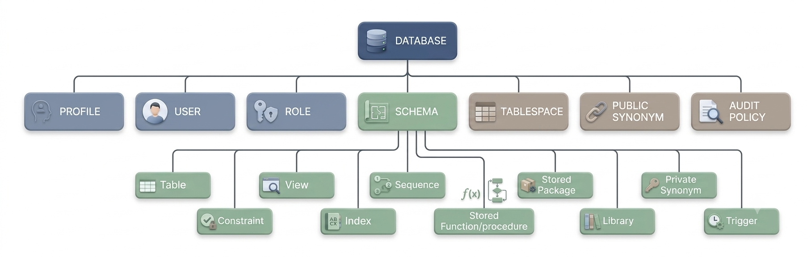
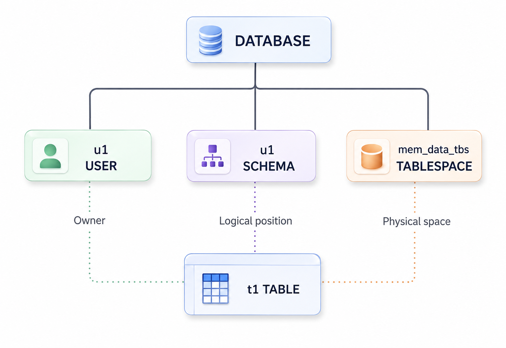
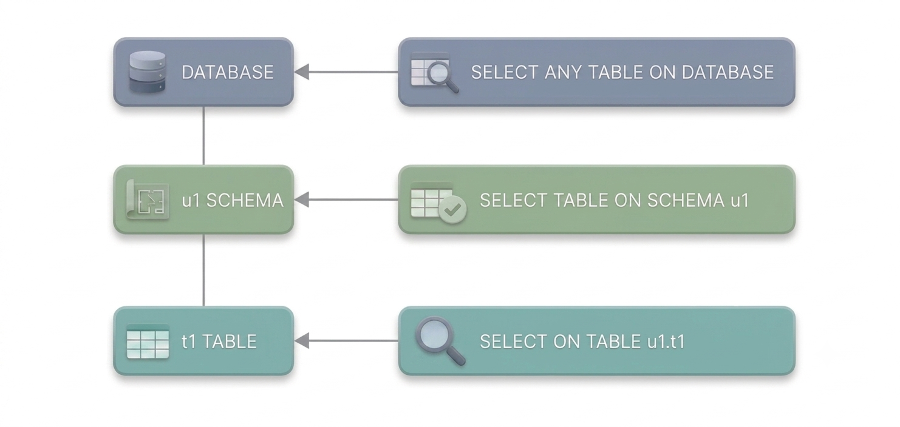
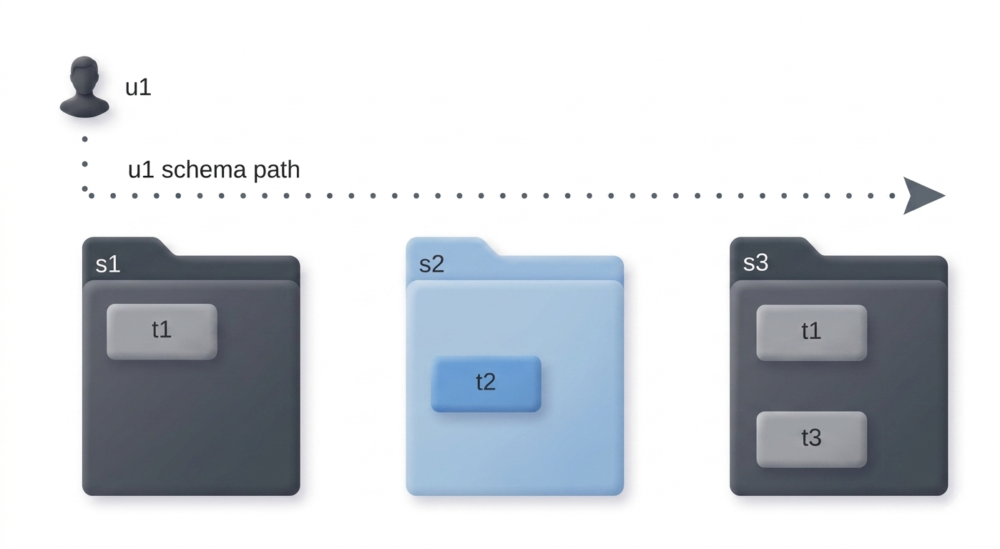
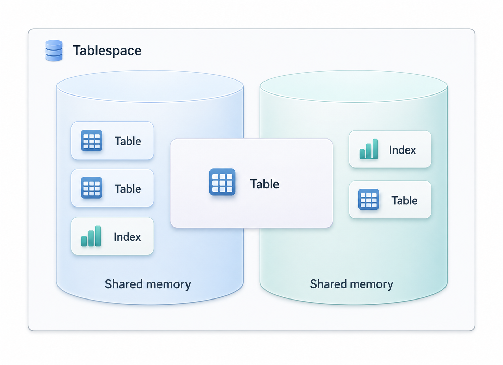
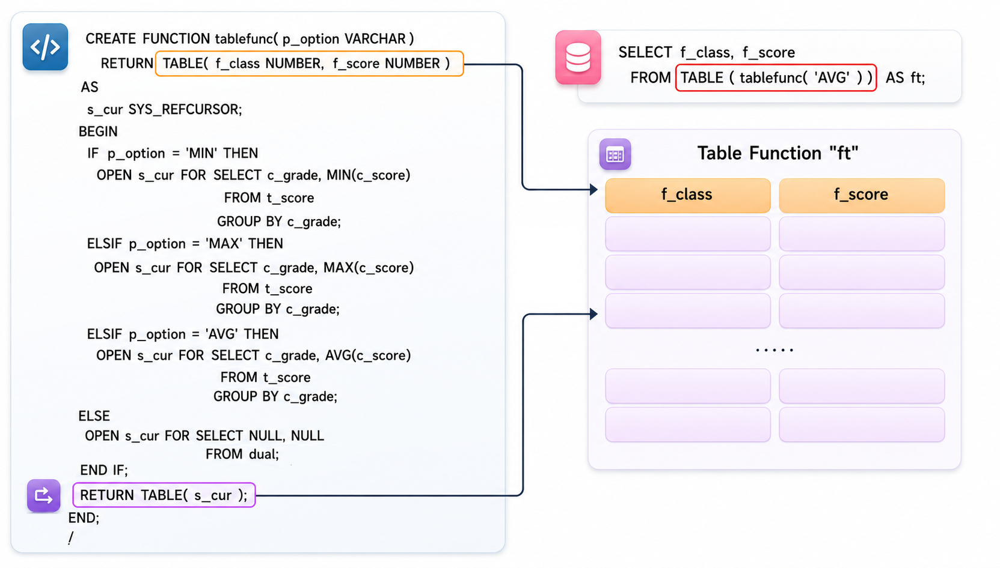

<a id="51d9700039303afe"></a>

# 13. SQL Objects

> 원본: [GOLDILOCKS 26c.1 User Manual (ko)](https://manual.sunjesoft.co.kr/goldilocks/26c_1/manual/ko/51d9700039303afe)  
> 태그: `26c.1_0_tag`

[← 12. SQL Languages](12-sql-languages.md) · [전체 목차](../README.md) · [14. Cluster Objects →](14-cluster-objects.md)

본 장에서는 database를 구성하는 다음 객체들의 개념과 특징에 대해 설명한다.

- Authorization: User와 privilege
- Schema
- Tablespace
- Table
- Index
- Sequence
- View
- Synonym
- Stored procedure
- Stored function
- Package
- Library
- Trigger

<a id="60b043f2ad3c1630"></a>
## Database

<a id="2885df2c4a1b63ea"></a>
### 데이터베이스 관련 구문

자세한 내용은 다음 링크를 참조한다.

- 데이터베이스 구동: [ALTER SYSTEM {MOUNT | OPEN} DATABASE](18-sql-references-a-b.md#cbf215370461aa13)

- 백업 및 복구
    - [ALTER DATABASE BACKUP](18-sql-references-a-b.md#93565f80d30924b0)
    - [ALTER DATABASE DELETE BACKUP](18-sql-references-a-b.md#d1c1804d37182cca)
    - [ALTER DATABASE RECOVER](18-sql-references-a-b.md#233fbcf85decd22e)
    - [ALTER DATABASE REGISTER](18-sql-references-a-b.md#a996ea8c8491c041)
    - [ALTER DATABASE RESTORE](18-sql-references-a-b.md#60ea018060bd0c35)

- 로그파일 생성, 제거, 변경
    - [ALTER SYSTEM CHECKPOINT](18-sql-references-a-b.md#c8f23e33be79fc47)
    - [ALTER SYSTEM SWITCH LOGFILE](18-sql-references-a-b.md#3e74ff8636ece361)
    - [ALTER DATABASE ARCHIVELOG](18-sql-references-a-b.md#052eab7887cba477)
    - [ALTER DATABASE ADD LOGFILE](18-sql-references-a-b.md#975c069a4f386a7c)
    - [ALTER DATABASE DROP LOGFILE](18-sql-references-a-b.md#512d71b4f3b2f884)
    - [ALTER DATABASE RENAME LOGFILE](18-sql-references-a-b.md#0e0424376b3a0ab9)

- 객체에 대한 주석: [COMMENT ON name IS](19-sql-references-c-g.md#ee34c21e2e9001e6)

- 시스템 통계 정보: [ANALYZE SYSTEM](18-sql-references-a-b.md#ceffc94d9a4e4c0a)

데이터베이스 객체와 관련된 정보는 다음과 같은 view를 통해 조회할 수 있다.

<a id="1105526829939f22"></a>
<table class="table column_count_3"><caption>데이터베이스 객체 관련 정보</caption><thead><tr><th class="to_center"><div>스키마</div></th><th class="to_center"><div>View 이름</div></th><th class="to_center"><div>설명</div></th></tr></thead><tbody><tr><td class="to_middle"><div>DICTIONARY_SCHEMA</div></td><td class="to_middle"><div><a class="reference" href="../part-02-administration-manual/9-database-information.md#1d6dad84e8b15dfe">ALL_NONSCHEMA_COMMENTS</a></div></td><td class="to_middle"><div>사용자가 접근 가능한 non-schema 객체의 주석 정보이다.</div></td></tr><tr><td class="to_middle" rowspan="6"><div>INFORMATION_SCHEMA</div></td><td class="to_middle"><div><a class="reference" href="../part-02-administration-manual/9-database-information.md#3634eaae939205b5">INFORMATION_SCHEMA_CATALOG_NAME</a></div></td><td class="to_middle"><div>데이터베이스 이름 정보이다.</div></td></tr><tr><td class="to_middle"><div><a class="reference" href="../part-02-administration-manual/9-database-information.md#53018e31a0639e42">SQL_FEATURES</a></div></td><td class="to_middle"><div>GOLDILOCKS의 SQL 표준 호환성 정보이다.</div></td></tr><tr><td class="to_middle"><div><a class="reference" href="../part-02-administration-manual/9-database-information.md#25750f2b0cd049c6">SQL_IMPLEMENTATION_INFO</a></div></td><td class="to_middle"><div>GOLDILOCKS의 SQL 표준 호환성 정보이다.</div></td></tr><tr><td class="to_middle"><div><a class="reference" href="../part-02-administration-manual/9-database-information.md#ca72bcbd4f322384">SQL_PACKAGES</a></div></td><td class="to_middle"><div>GOLDILOCKS의 SQL 표준 호환성 정보이다.</div></td></tr><tr><td class="to_middle"><div><a class="reference" href="../part-02-administration-manual/9-database-information.md#c212dae7493c2f9e">SQL_PARTS</a></div></td><td class="to_middle"><div>GOLDILOCKS의 SQL 표준 호환성 정보이다.</div></td></tr><tr><td class="to_middle"><div><a class="reference" href="../part-02-administration-manual/9-database-information.md#a390569b57f3aa55">SQL_SIZING</a></div></td><td class="to_middle"><div>GOLDILOCKS의 SQL 표준 호환성 정보이다.</div></td></tr></tbody></table>

<a id="6d2184b9ae13883b"></a>
### 데이터베이스 구성 객체

<a id="af894234d181231e"></a>
#### 데이터베이스를 구성하는 SQL 객체

데이터베이스는 다수의 SQL object로 구성된다.

데이터베이스에 포함되는 SQL object들은 schema에 포함되는지 여부에 따라 SQL schema object와 non-schema object로 구분된다.

<a id="fbcfd88405dda926"></a>


SQL schema object는 schema 내에 포함되는 객체로써 그 종류는 다음과 같다.

- TABLE: Column과 row로 구성되어 물리적 data를 저장하는 객체
- VIEW: 질의에 relation 이름을 부여하여 TABLE과 유사하게 접근하는 논리적 객체
- INDEX: 질의 성능을 향상시키기 위한 객체
- SEQUENCE: 번호를 생성하기 위한 객체
- CONSTRAINT: TABLE의 무결성을 유지하기 위한 객체
- SYNONYM: TABLE, VIEW, SEQUENCE, 기타 다른 SYNONYM에 대한 대체 이름
- STORED PROCEDURE: Procedure 형태의 persistent stored module 객체
- STORED FUNCTION: Function 형태의 persistent stored module 객체
- PACKAGE: Package 형태의 persistent stored module 객체
- LIBRARY: 외부 shared library 파일을 지칭하는 객체
- TRIGGER: 특정 테이블에서 DML이 수행될 때마다 자동으로 실행될 동작을 정의하는 객체

SQL schema object는 schema 이름을 함께 명시해서 사용하거나 schema 이름을 생략하여 사용할 수도 있다. 생략할 경우의 schema 이름은 user의 schema path로 해석된다.

다음은 schema 이름을 명시하여 object를 생성하는 예이다.

```
gSQL> CREATE TABLE my_schema.lineitem ( id INTEGER );
gSQL> CREATE INDEX my_schema.my_index ON my_schema.lineitem ( id );
```

Non-schema object는 schema에 포함되지 않는 객체로써 그 종류는 다음과 같다.

- PROFILE: 비밀번호 관리 정책
- AUDIT POLICY: 감사 정책
- USER: 사용자
- ROLE: Role
- SCHEMA: SQL schema object들의 논리적 위치 
- TABLESPACE: SQL schema object들의 물리적 공간
- PUBLIC SYNONYM: 스키마 이름이 없는 TABLE, VIEW, SEQUENCE, 기타 다른 SYNONYM의 대체 이름

SQL 표준은 SCHEMA 객체의 개념과 구문을 명확하게 정의하고 있지만 USER와 DATABASE는 개념만 존재할 뿐 구문이 정의되어 있지 않다. TABLESPACE 객체는 SQL 표준에서 다루지 않는 객체이다. 즉, SQL 표준은 non-schema 객체의 관계를 명확하게 정의하지 않고 있다.

GOLDILOCKS는 USER, SCHEMA, TABLESPACE를 DATABASE 하위의 별도 객체로 정의하고 있는 반면에 다른 DBMS 업체들은 다음과 같이 non-schema 객체를 정의하고 있다.

- GOLDILOCKS
    - USER와 SCHEMA가 별도의 객체이다.
    - USER는 자신의 SCHEMA를 소유하지 않거나 여러 개의 SCHEMA를 소유할 수 있다.
    - USER : SCHEMA = 1 : N 관계이다.
- Oracle
    - USER와 SCHEMA를 유사한 개념으로 정의하고 있다.
    - USER : SCHEMA = 1 : 1 관계이다.
- DB2
    - USER가 DATABASE의 하위 객체가 아니다.
    - USER : SCHEMA = 1 : N 관계이다.
- Postgres
    - USER가 DATABASE의 하위 객체가 아니다.
    - USER : SCHEMA = 1 : N 관계이다.
- MySQL
    - DATABASE와 SCHEMA를 유사한 개념으로 정의하고 있다.
    - USER가 DATABASE (SCHEMA)의 하위 객체이다.

<a id="21ebed580bae7704"></a>
#### 객체의 Name Space

데이터베이스 내의 객체는 식별 가능한 이름을 갖는다.   
SQL schema object는 schema 내에서 중복되지 않은 이름을 갖는다.   
다음 예와 같이 서로 다른 schema에 동일한 lineitem 테이블 객체를 생성할 수 있다.

```
gSQL> CREATE TABLE my_schema.lineitem ( id INTEGER );
gSQL> CREATE TABLE your_schema.lineitem ( name VARCHAR(128) );
```

SQL schema object는 하나의 schema 내에서 다음과 같은 name space를 갖는다.

- TABLE, VIEW, SEQUENCE, PRIVATE SYNONYM, STORED PROCEDURE, STORED FUNCTION
- INDEX
- CONSTRAINT

즉, 이름이 같은 table과 view는 생성할 수 없지만 이름이 같은 table과 index는 생성할 수 있다.

- Table과 view는 동일한 이름으로 생성할 수 없다.

```
gSQL> CREATE TABLE my_relation ( id INTEGER );
gSQL> CREATE VIEW my_relation ( name ) AS SELECT name FROM tmp_relation;
```

- Table과 index는 동일한 이름으로 생성할 수 있다.

```
gSQL> CREATE TABLE my_object ( id INTEGER );
gSQL> CREATE INDEX my_object ON my_table ( name );
```

Non-schema object는 database 내에서 식별 가능한 이름을 가지며 다음과 같은 name space를 갖는다.

- PROFILE
- AUDIT POLICY
- USER
- SCHEMA
- TABLESPACE

즉, 이름이 같은 USER는 생성할 수 없지만 이름이 같은 USER와 SCHEMA는 생성할 수 있다.

- my_name USER 객체와 my_name SCHEMA 객체가 생성된다.

```
gSQL> CREATE USER my_name IDENTIFIED BY my_name WITH SCHEMA my_name;
```

<a id="2f8c72e8465f80e9"></a>
### Built-in 객체

GOLDILOCKS는 database를 생성할 때 시스템 운영에 필요한 user, schema, tablespace 객체를 자동으로 생성한다.

<a id="5139f600291eafba"></a>
#### Built-in Authorization

Database를 생성할 때 자동으로 다음과 같은 authorization을 생성한다. TEST user를 제외한 built-in authorization은 삭제할 수 없다.

- _SYSTEM user
    - 시스템 내부에서 사용하는 계정으로써 database를 생성할 때의 built-in 객체 소유자이며, 사용자가 객체를 생성할 때 객체의 소유자에게 권한을 부여하는 grantor가 된다.
- SYS user
    - Database를 관리하기 위한 user이다.
- TEST user
    - 테스트 하기 위해 생성된 user로써 제거 가능한 객체이다.
- ADMIN role
    - Database를 관리하기 위한 role이다.
- SYSDBA role
    - Database를 구동/ 종료하기 위한 role이다.
- DBA role
    - Database를 관리하기 위한 role이다.
    - SYS user와 동일한 권한을 갖는다.
- PUBLIC 
    - 모든 사용자를 의미하는 계정으로써 모든 사용자의 권한을 제어하기 위해 사용한다.

<a id="05cc6783210429af"></a>
#### Built-in Schema

Database를 생성할 때 다음과 같은 스키마를 자동으로 생성한다. 모든 built-in 스키마는 제거할 수 없다.

- DEFINITION_SCHEMA
    - Database의 모든 객체 정보를 저장하고 있는 물리적 테이블들로 구성된다.
- FIXED_TABLE_SCHEMA
    - System의 자료 구조 정보를 테이블 형태로 보여주는 fixed table들로 구성된다.
- DICTIONARY_SCHEMA
    - Database의 객체 정보를 조회하기 위한 사용자 관점의 view들로 구성된다.
- INFORMATION_SCHEMA
    - Database의 객체 정보를 조회하기 위해 SQL 표준에서 정의한 view들로 구성된다.
- PERFORMANCE_VIEW_SCHEMA
    - System의 상태를 조회하기 위한 사용자 관점의 view들로 구성된다.
- SESSION_SCHEMA
    - Session 단위의 객체를 관리하기 위한 system schema로서 user는 사용할 수 없다.
- BUILTIN_PACKAGE_SCHEMA
    - Built-in package를 관리하기 위한 schema 이다.
- STMT_SCHEMA
    - Statement 단위의 객체를 관리하기 위한 system schema로서 user는 사용할 수 없다.
- PUBLIC
    - 모든 사용자가 객체를 생성할 수 있는 schema로서 모든 사용자를 의미하는 PUBLIC 계정과는 다른 의미이다.

<a id="98dfb7a9dda5ea19"></a>
#### Built-in Tablespace

Database를 생성할 때 다음과 같은 테이블스페이스를 자동으로 생성한다. 모든 built-in 테이블스페이스는 제거할 수 없다.

- DICTIONARY_TBS
    - SQL 객체 정보를 관리하기 위한 dictionary table들을 저장한다.
- MEM_UNDO_TBS
    - Undo segment들과 transaction 정보들을 저장한다.
- MEM_DATA_TBS
    - 최초로 생성되는 memory data tablespace이다.
    - Data tablespace는 사용자가 생성한 table 등의 객체를 저장한다.
- MEM_TEMP_TBS
    - 최초로 생성되는 temporary tablespace이다.
    - Temporary tablespace는 질의 처리 중에 생성되는 sort나 hash와 같은 임시 객체를 저장한다.
- DISK_DATA_TBS
    - 최초로 생성되는 disk data tablespace이다.
    - Data tablespace는 사용자가 생성한 table 등의 객체를 저장한다.
- MEM_AUX_TBS
    - System auxiliary tablespace이며 audit record와 같이 자동으로 생성되는 레코드를 저장한다.
- MEM_TRANS_TBS
    - Cluster system에서 유효하며 global transaction 정보를 관리한다.
    - Standalone에서는 생성되지 않는다.

<a id="0da217c8d9f717e5"></a>
#### Built-in Profile

Database를 생성할 때 다음과 같은 "DEFAULT" profile이 자동으로 생성된다. 자동 생성되는 "DEFAULT" profile의 password parameter 정보는 다음과 같다.

**DEFAULT profile 구성**

<a id="26e5c954d533cf18"></a>
| Parameter | Value |
| --- | --- |
| FAILED_LOGIN_ATTEMPTS | 10 |
| PASSWORD_LOCK_TIME | 1 |
| PASSWORD_LIFE_TIME | 180 |
| PASSWORD_GRACE_TIME | 7 |
| PASSWORD_REUSE_MAX | UNLIMITED |
| PASSWORD_REUSE_TIME | UNLIMITED |
| PASSWORD_VERIFY_FUNCTION | NULL |

"DEFAULT" profile 기본값들의 특성은 다음과 같다.

- 계정 잠금
    - 10번 연속으로 login에 실패할 경우 (FAILED_LOGIN_ATTEMPTS) 1일 (PASSWORD_LOCK_TIME) 동안 계정을 잠근다.
- 비밀번호 만료
    - 180일 (PASSWORD_LIFE_TIME)이 경과한 후 7일 (PASSWORD_GRACE_TIME) 간의 유예 기간 후에 비밀번호가 만료된다.
- 비밀번호 재사용 가능 여부
    - 이전 비밀번호를 재사용할 수 있다.
- 비밀번호 복잡도 검사
    - 검사하지 않는다.

<a id="bb8ed3fa480046e0"></a>
## Profile

<a id="1cf3bf17972cb658"></a>
### Profile 관련 구문

자세한 내용은 다음 링크를 참조한다.

- Profile 생성: [CREATE PROFILE](19-sql-references-c-g.md#46ce60330a91c0ff)
- Profile 제거: [DROP PROFILE](19-sql-references-c-g.md#6f593da79c49a927)
- Profile 변경: [ALTER PROFILE](18-sql-references-a-b.md#5acd39cd4aba40d6)
- User에 profile 적용: [CREATE USER](19-sql-references-c-g.md#96a76bb7ce13b574), [ALTER USER](18-sql-references-a-b.md#993785b9050b5d8a)
- Password 이력 제거: [ALTER DATABASE CLEAR PASSWORD HISTORY](18-sql-references-a-b.md#9fcd6b011e0fb566)

<a id="dc90dd9280778902"></a>
<table class="table column_count_3"><caption>Profile 객체 관련 정보</caption><thead><tr><th class="to_center"><div>스키마</div></th><th class="to_center"><div>View</div></th><th class="to_center"><div>설명</div></th></tr></thead><tbody><tr><td class="to_middle" rowspan="2"><div>DICTIONARY_SCHEMA</div></td><td><div><a class="reference" href="../part-02-administration-manual/9-database-information.md#74bb0ea3a7701c39">DBA_PROFILES</a></div></td><td><div>모든 profile 정보</div></td></tr><tr><td><div><a class="reference" href="../part-02-administration-manual/9-database-information.md#0f18c3f66c6e6cc3">DBA_USERS</a></div></td><td><div>사용자의 profile 정보</div></td></tr></tbody></table>

<a id="396dc1b1edae9851"></a>
### Profile 개념

GOLDILOCKS는 데이터베이스 보안을 위해 사용자 인증을 수행한다. 이 때 비밀번호가 사용되는데, 비밀번호는 도난, 위조, 잘못된 사용에 취약하므로 비밀번호 관리 정책이 필요하다.

Profile은 이와 같은 비밀번호 관리 정책 정보를 포함한다. DBA 또는 보안책임자는 profile을 사용자에게 할당하여 사용자의 역할에 적합한 비밀번호 관리 정책을 적용한다.

<a id="3fd39d6207974058"></a>
#### Profile 생성, 변경 및 할당

CREATE PROFILE 구문을 사용하여 profile을 생성한다.

```
CREATE PROFILE profile1 LIMIT 
       FAILED_LOGIN_ATTEMPTS     10  
       PASSWORD_LOCK_TIME        1 
       PASSWORD_LIFE_TIME        180 
       PASSWORD_GRACE_TIME       7
       PASSWORD_REUSE_MAX        UNLIMITED
       PASSWORD_REUSE_TIME       UNLIMITED
       PASSWORD_VERIFY_FUNCTION  NULL;
```

CREATE USER 또는 ALTER USER 구문을 사용하여 profile을 할당한다.

```
CREATE USER u1 IDENTIFIED BY u1 PROFILE profile1;
ALTER USER u2 PROFILE profile1;
```

ALTER PROFILE 구문을 사용하여 profile의 파라미터들을 변경한다.

```
ALTER PROFILE profile1 LIMIT 
      PASSWORD_REUSE_MAX        3
      PASSWORD_REUSE_TIME       30;
```

사용자에게 profile을 할당하지 않으면 사용자는 비밀번호 생성 및 사용에 아무런 제약을 받지 않는다.   
생성한 profile이나 DEFAULT profile을 사용자에게 할당하면 사용자는 비밀번호를 생성하거나 사용할 때 해당 profile의 비밀번호 정책을 따른다.

<a id="85aaafbe9e2b53f3"></a>
#### DEFAULT profile의 비밀번호 설정

사용자에게 DEFAULT profile을 할당하면 비밀번호는 다음과 같이 관리된다.

**비밀번호의 DEFAULT profile**

<a id="64ad17283659c68c"></a>
| Parameter | Default setting | 설명 |
| --- | --- | --- |
| FAILED_LOGIN_ATTEMPS | 10 | 허용된 연속 login 실패 횟수이다. 연속적으로 10 번을 초과하여 login에 실패할 경우, 계정이 잠긴다. |
| PASSWORD_LOCK_TIME | 1 | 계정 잠금 기간이다. 허용된 연속 login 실패 횟수를 초과하는 경우, 1일 동안 계정이 잠긴다. |
| PASSWORD_LIFE_TIME | 180 | 비밀번호 수명이다. 180일이 지나면 비밀번호가 만료된다. |
| PASSWORD_GRACE_TIME | 7 | 비밀번호가 만료되었을 때, 비밀번호를 변경해야 하는 기간이다. 비밀번호가 만료된 첫 번째 로그인 이후로 7일 이내에 비밀번호를 변경해야 한다. 이 시기에 비밀번호를 변경하지 않으면 해당 비밀번호로 로그인 할 수 없게 된다. |
| PASSWORD_REUSE_MAX | UNLIMITED | 비밀번호를 재사용할 수 없는 횟수이다.  PASSWORD_REUSE_MAX와 PASSWORD_REUSE_TIME은 반드시 함께 설정되어야 하는데 두 값이 모두 UNLIMITED 인 경우, 비밀번호는 항상 재사용 가능하다. |
| PASSWORD_REUSE_TIME | UNLIMITED | 비밀번호가 재사용될 수 없는 기간이다. |

<a id="46008611cab59232"></a>
#### 계정 잠금

연속적인 login 실패가 FAILED_LOGIN_ATTEMPTS에 명시된 횟수를 초과하는 경우, PASSWORD_LOCK_TIME에 명시된 기간만큼 계정이 잠긴다.

```
CREATE PROFILE profile1 LIMIT 
       FAILED_LOGIN_ATTEMPTS     10  
       PASSWORD_LOCK_TIME        1;

ALTER USER u1 PROFILE profile1;
```

u1 사용자가 연속적으로 10번 넘게 login에 실패하면, 1일동안 계정이 잠긴다. 그리고 1일이 지나면 자동으로 잠긴 계정이 해제된다.

PASSWORD_LOCK_TIME을 명시하지 않으면, default profile의 PASSWORD_LOCK_TIME에 명시된 값으로 간주된다.

PASSWORD_LOCK_TIME이 UNLIMITED면 잠긴 계정이 자동으로 해제되지 않기 때문에 다음 구문을 수행하여 계정을 해제해 주어야 한다.

```
ALTER USER u1 ACCOUNT UNLOCK;
```

Login에 성공하면 login 실패 횟수는 0으로 초기화 된다.

보안 책임자는 명시적으로 사용자 계정을 잠글 수 있는데, 이 경우에는 자동으로 해제되지 않기 때문에 보안 책임자가 잠근 계정을 해제해 주어야 한다.

```
ALTER USER u1 ACCOUNT LOCK;
ALTER USER u1 ACCOUNT UNLOCK;
```

<a id="97e368e7f6053890"></a>
#### 비밀번호 수명

PASSWORD_LIFE_TIME은 비밀번호 수명으로써 이 기간이 지나면 비밀번호는 만료된다.   
비밀번호가 만료되면, 사용자, DBA 또는 보안 담당자가 비밀번호를 변경해야만 한다.

```
CREATE PROFILE profile1 LIMIT 
       PASSWORD_LIFE_TIME        180
       PASSWORD_GRACE_TIME       7;

ALTER USER u1 PROFILE profile1;
```

180일이 지난 후에 u1 사용자가 처음으로 login 하려고 시도할 때부터 grace time에 들어가게 된다.

Grace time인 7일 동안에는 사용자가 비밀번호를 변경할 때까지 사용자가 계정에 접근할 때마다 새로운 비밀번호를 입력하도록 상기시킨다.  
Grace time인 7일이 경과된 후에도 비밀번호가 변경되지 않으면 새로운 비밀번호가 설정될 때까지 계정 접근이 거부된다.

CREATE USER 또는 ALTER USER 구문을 사용하여 비밀 번호를 만료시킬 수도 있다.

```
ALTER USER u1 PASSWORD EXPIRE;
```

비밀번호가 만료된 후 사용자가 접속하면 아래의 예와 같이 비밀번호 만료 에러 (ERR-28000(16312) the password has expired)가 발생하며, 새로운 비밀번호를 입력해야 한다.

```
% gsql u1 u1

ERR-28000(16312): the password has expired

Changing password for u1
New password: 
Retype new password: 
Connected to GOLDILOCKS Database.

gSQL>
```

<a id="8c78c8e1a8949203"></a>
#### 비밀번호 재사용

동일한 비밀번호를 재사용하려면 PASSWORD_REUSE_MAX에 설정된 횟수만큼 다른 비밀번호로 변경해야 하고 PASSWORD_REUSE_TIME에 설정된 기간만큼 시간이 경과해야 한다.

```
CREATE PROFILE profile1 LIMIT 
       PASSWORD_REUSE_MAX        2
       PASSWORD_REUSE_TIME      10;

ALTER USER u1 PROFILE profile1;
```

u1 사용자가 현재 비밀번호를 재사용하기 위해서는 비밀번호를 두 번 변경해야 하고 10일이 지나야 한다.

```
ALTER USER u1 IDENTIFIED BY u1 REPLACE u1;
ALTER USER u1 IDENTIFIED BY u1 REPLACE u1
*
ERROR at line 1:
ORA-28007: the password cannot be reused

ALTER USER u1 IDENTIFIED BY u2 REPLACE u1;

User altered.

ALTER USER u1 IDENTIFIED BY u3 REPLACE u2;

User altered.
```

- 10일 경과

```
ALTER USER u1 IDENTIFIED BY u1 REPLACE u3;

User altered.
```

반드시 두 조건을 모두 만족해야 재사용 가능하며, PASSWORD_REUSE_MAX, PASSWORD_REUSE_TIME 두 값 중 하나만 UNLIMITED인 경우에는 비밀번호를 재사용할 수 없다.   
두 값이 모두 UNLIMITED면 항상 재사용 가능하다.

**비밀번호 재사용**

<a id="81df660dfe30bebc"></a>
| PASSWORD_REUSE_MAX | PASSWORD_REUSE_TIME | Password reuse 여부 |
| --- | --- | --- |
| Integer value | Integer value | 두 조건 모두 만족해야 재사용 가능 |
| Integer value | UNLIMITED | 재사용 불가 |
| UNLIMITED | Integer value | 재사용 불가 |
| UNLIMITED | UNLIMITED | 항상 재사용 가능 |

<a id="79e7450055325c0b"></a>
#### 비밀번호 복잡도 검증

시스템을 공격하려는 침입자들이 쉽게 추측할 수 없을 만큼 복잡한 비밀번호인지 여부를 검증한다.  
GOLDILOCKS에서 제공하는 비밀번호 복잡도 검증 방법은 다음과 같다.

**비밀번호 복잡도 검증**

<a id="95d4ba67fd5fe58c"></a>
<table><thead><tr><th align="center">복잡도 검증 방법</th><th align="center">복잡도 검증 내용</th></tr></thead><tbody><tr><td valign="middle">KISA_VERIFY_FUNCTION</td><td valign="middle"><ul><li>8 자리 이상</li><li>1 개 이상의 문자</li><li>1 개 이상의 숫자</li><li>1 개 이상의 특수문자</li></ul></td></tr><tr><td valign="middle">ORA12C_VERIFY_FUNCTION</td><td valign="middle"><ul><li>8 자리 이상</li><li>1 개 이상의 문자</li><li>1 개 이상의 숫자</li><li>Database name을 포함하면 안된다.</li><li>사용자 이름 또는 거꾸로 된 사용자 이름을 포함하면 안된다.</li><li>goldilocks를 포함하면 안된다.</li><li>oracle을 포함하면 안된다.</li><li>다음과 같이 단순한 비밀번호는 사용할 수 없다.<br><ul><li>welcome1, database1, account1, user1234, password1, oracle123, computer1, abcdefg1, change_on_install</li></ul></li><li>이전 비밀번호와 적어도 3 자리는 달라야 한다.</li></ul></td></tr><tr><td valign="middle">ORA12C_STRONG_VERIFY_FUNCTION</td><td valign="middle"><ul><li>9 자리 이상</li><li>2 개 이상의 대문자</li><li>2 개 이상의 소문자</li><li>2 개 이상의 숫자</li><li>2 개 이상의 특수 문자</li><li>이전 비밀번호와 적어도 4 자리는 달라야 한다.</li></ul></td></tr><tr><td valign="middle">VERIFY_FUNCTION_11G</td><td valign="middle"><ul><li>8 자리 이상</li><li>1 개 이상의 문자</li><li>1 개 이상의 숫자</li><li>사용자 이름을 포함하면 안된다.</li><li>이전 비밀번호와 적어도 3 자리는 달라야 한다.</li></ul></td></tr><tr><td valign="middle">VERIFY_FUNCTION</td><td valign="middle"><ul><li>사용자 이름과 같아선 안된다.</li><li>4 자리 이상</li><li>1 개 이상의 문자</li><li>1 개 이상의 숫자</li><li>1 개 이상의 특수문자</li><li>다음과 같이 단순한 비밀번호는 사용할 수 없다.<br><ul><li>welcome, database, account, user, password, oracle, computer, abcd</li></ul></li><li>이전 비밀번호와 적어도 3 자리는 달라야 한다.</li></ul></td></tr></tbody></table>

Profile과 사용자 설정에 대한 자세한 내용은 [CREATE PROFILE](19-sql-references-c-g.md#46ce60330a91c0ff) 구문과 [CREATE USER](19-sql-references-c-g.md#96a76bb7ce13b574) 구문을 참조한다.

<a id="7679bc1ee27d9062"></a>
## Audit Policy

<a id="61b47c709093ea84"></a>
### Audit Policy 관련 구문

자세한 내용은 다음 링크를 참조한다.

- Audit policy 생성: [CREATE AUDIT POLICY](19-sql-references-c-g.md#079c12405d0687f7)
- Audit policy 제거: [DROP AUDIT POLICY](19-sql-references-c-g.md#5665b185fc830eaa)
- Audit policy 변경: [ALTER AUDIT POLICY](18-sql-references-a-b.md#e6d664ed42cb125a)
- Audit policy 활성화: [AUDIT POLICY](18-sql-references-a-b.md#c26186987b5864cf)
- Audit policy 비활성화: [NOAUDIT POLICY](20-sql-references-h-z.md#2a39421bd3a74134)
- Audit trail 삭제: [ALTER DATABASE CLEAR AUDIT TRAIL](18-sql-references-a-b.md#f4b53fa2e7dce2b7)

<a id="93f38597401703b3"></a>
<table class="table column_count_3"><caption>Audit policy 객체 관련 정보</caption><thead><tr><th class="to_center"><div>스키마</div></th><th class="to_center"><div>View</div></th><th class="to_center"><div>설명</div></th></tr></thead><tbody><tr><td class="to_middle" rowspan="3"><div>DICTIONARY_SCHEMA</div></td><td><div><a class="reference" href="../part-02-administration-manual/9-database-information.md#bcc03d54474ebf70">AUDIT_POLICIES</a></div></td><td><div>모든 audit policy 정보</div></td></tr><tr><td><div><a class="reference" href="../part-02-administration-manual/9-database-information.md#24211623ebe3ca8c">AUDIT_POLICY_OPTIONS</a></div></td><td><div>Audit policy 옵션 정보</div></td></tr><tr><td><div><a class="reference" href="../part-02-administration-manual/9-database-information.md#a0b1425590db4566">AUDIT_POLICY_ENABLED</a></div></td><td><div>Audit policy 활성화 정보</div></td></tr></tbody></table>

<a id="39d0e7b4471dd69b"></a>
### 사용 예

다음과 같이 수행하려면 AUDIT SYSTEM ON DATABASE 권한이 있어야 한다.

<a id="83d761380558a559"></a>
#### Audit Policy 생성

Audit policy 객체를 생성하기 위해 [CREATE AUDIT POLICY](19-sql-references-c-g.md#079c12405d0687f7) 구문을 수행한다.

다음 구문은 u1.t1 테이블에 대한 DML을 감사하기 위해 audit_t1_dml 객체를 생성하는 예이다.

```
CREATE AUDIT POLICY audit_t1_dml
       ACTIONS INSERT ON u1.t1
             , DELETE ON u1.t1
             , UPDATE ON u1.t1
;

Audit policy created.
```

[AUDIT_POLICY_OPTIONS](../part-02-administration-manual/9-database-information.md#24211623ebe3ca8c) view를 조회하여 audit policy의 옵션 정보를 확인한다.

```
SELECT policy_name
     , audit_option
     , object_schema
     , object_name
  FROM audit_policy_options
 WHERE policy_name = 'AUDIT_T1_DML'
 ORDER BY audit_option
;

POLICY_NAME  AUDIT_OPTION OBJECT_SCHEMA OBJECT_NAME
------------ ------------ ------------- -----------
AUDIT_T1_DML DELETE       U1            T1         
AUDIT_T1_DML INSERT       U1            T1         
AUDIT_T1_DML UPDATE       U1            T1         

3 rows selected.
```

<a id="c82e9714508191e9"></a>
#### Audit Policy 활성화

Audit policy를 활성화하려면 [AUDIT POLICY](18-sql-references-a-b.md#c26186987b5864cf) 구문을 사용해야 한다.

다음은 u1, sys 이외의 사용자가 u1.t1 테이블에 대해 DML을 성공적으로 수행했을 경우, audit record를 남기도록 audit policy를 활성화하는 예이다.

```
AUDIT POLICY audit_t1_dml
      EXCEPT u1, sys
      WHENEVER SUCCESSFUL
;
```

활성화된 audit policy는 새로 생성되는 session에 적용되고 기존 session에는 영향을 주지 않는다.

Audit policy의 활성화 정보는 [AUDIT_POLICY_ENABLED](../part-02-administration-manual/9-database-information.md#a0b1425590db4566) view를 조회하여 확인할 수 있다.

```
SELECT policy_name
     , enabled_opt
     , user_name
     , when_success
     , when_failure
  FROM audit_policy_enabled
 WHERE policy_name = 'AUDIT_T1_DML'
 ORDER BY user_name
;

POLICY_NAME	         ENABLED_OPT           USER_NAME  WHEN_SUCCESS WHEN_FAILURE
-------------------- --------------------- ---------- ------------ ---------
AUDIT_T1_DML	     EXCEPT	               SYS        YES          NO
AUDIT_T1_DML	     EXCEPT	               U1         YES          NO

2 rows selected.
```

Audit policy를 활성화 한 뒤에 조건에 부합하는 action들이 audit record를 생성한다.

다음은 u2 사용자가 SQL 구문들을 모두 성공적으로 수행하는 예이다.

```
SELECT COUNT(*) FROM u1.t1;
INSERT INTO u1.t1 VALUES ( 1 );
UPDATE u1.t1 SET id = id + 1 WHERE id = 1;
DELETE u1.t1 WHERE id = 2;
COMMIT;
```

위의 예에서 INSERT, UPDATE, DELETE는 감사 대상 action이기 때문에 audit record를 생성하지만  
SELECT, COMMIT은 감사 대상 action이 아니므로 audit record를 생성하지 않는다.

<a id="c0fc58f37d16b1bf"></a>
#### Audit Trail 조회

Audit record를 조회하기 위해 AUDIT_TRAIL view에 대해 SELECT ON DICTIONARY_SCHEMA.AUDIT_TRAIL 권한이 있어야 한다.

다음은 audit_t1_dml 감사 정책에 의해 생성된 audit trail을 조회하는 예이다.

```
SELECT policy_name
     , logon_username
     , action_name
     , object_schema
     , object_name
     , sql_text
  FROM audit_trail
 WHERE policy_name = 'AUDIT_T1_DML'
;

POLICY_NAME  LOGON_USERNAME ACTION_NAME OBJECT_SCHEMA OBJECT_NAME SQL_TEXT                                 
------------ -------------- ----------- ------------- ----------- -----------------------------------------
AUDIT_T1_DML U2             INSERT      U1            T1          INSERT INTO u1.t1 VALUES ( 1 )           
AUDIT_T1_DML U2             UPDATE      U1            T1          UPDATE u1.t1 SET c1 = c1 + 1 WHERE c1 = 1
AUDIT_T1_DML U2             DELETE      U1            T1          DELETE u1.t1 WHERE c1 = 2                

3 rows selected.
```

<a id="f4c5d69073b10d75"></a>
#### Audit Trail 삭제

Audit policy를 활성화하면 audit trail의 크기가 계속 증가한다.   
Audit trail을 삭제하려면 다음 구문을 수행해야 한다.

```
ALTER DATABASE CLEAR AUDIT TRAIL;
```

Audit trail을 저장하려면 다음 예와 같이 사용자 테이블에 저장한 후 삭제한다.

- 사용자 테이블 생성

```
CREATE TABLE my_audit_trail
AS SELECT *
     FROM audit_trail
     WITH NO DATA;
```

- 사용자 테이블에 저장한 후 삭제

```
INSERT INTO my_audit_trail SELECT * FROM audit_trail;
ALTER DATABASE CLEAR AUDIT TRAIL;
```

저장된 audit trail과 현재 audit_trail을 함께 조회하고 싶은 경우 다음과 같이 view를 만들어 관리한다.

```
CREATE VIEW unified_audit_trail
AS 
SELECT * FROM my_audit_trail
 UNION ALL
SELECT * FROM dictionary_schema.audit_trail
;
```

<a id="fd80074bb8ec37c0"></a>
#### Audit Policy 비활성화

다음 구문을 사용하여 audit policy를 비활성화한다.

```
NOAUDIT POLICY audit_t1_dml;
```

Audit policy 비활성화는 새로운 session에만 영향을 미치며, 기존 session의 활성화 정보에는 영향을 미치지 않는다.

<a id="ec736895cee4a78d"></a>
#### Audit Policy 삭제

Audit policy 객체를 삭제하려면 다음 구문을 수행한다.

```
DROP AUDIT POLICY audit_t1_dml;
```

Audit policy 객체를 삭제하려면 비활성 상태이어야 하는데 객체를 삭제해도 기존 session에는 영향을 미치지 않는다.

<a id="c0b666a98b1e92b6"></a>
### Audit Policy 개념

<a id="34f76c8b5229e7f9"></a>
#### Audit Trail

<a id="b254699e02c8d186"></a>
##### Audit Trail 조회

Audit record는 DICTIONARY_SCHEMA.AUDIT_TRAIL view를 사용하여 조회할 수 있다.

AUDIT_TRAIL view를 조회하기 위해서는 SELECT 권한이 있어야 한다.

```
GRANT SELECT ON DICTIONARY_SCHEMA.AUDIT_TRAIL TO user_name;
```

AUDIT_TRAIL view는 다음과 같은 정보를 갖는다.

<a id="68e6d9b508fec6e9"></a>
<table class="table column_count_3"><caption>Column 정보 </caption><thead><tr><th class="to_center"><div>정보</div></th><th class="to_center"><div>Column 이름</div></th><th class="to_center"><div>설명</div></th></tr></thead><tbody><tr><td class="to_middle" rowspan="6"><div>Session 
information</div></td><td class="to_left to_middle"><div>MEMBER_NAME</div></td><td class="to_left to_middle"><div>Cluster member name</div></td></tr><tr><td class="to_left to_middle"><div>SESSION_ID</div></td><td class="to_left to_middle"><div>Session identifier</div></td></tr><tr><td class="to_left to_middle"><div>SESSION_SERIAL</div></td><td class="to_left to_middle"><div>Session serial number</div></td></tr><tr><td class="to_middle"><div>LOGON_USERNAME</div></td><td class="to_middle"><div>Logon user name of the user whose actions were audited</div></td></tr><tr><td class="to_middle"><div>CURRENT_USERNAME</div></td><td class="to_middle"><div>Effective user for the statement execution</div></td></tr><tr><td class="to_middle"><div>SERVER_PROCESS</div></td><td class="to_middle"><div>Server process identifier for the session</div></td></tr><tr><td class="to_middle" rowspan="6"><div>Peer client 
information</div></td><td class="to_middle"><div>CLIENT_PROGRAM_NAME</div></td><td class="to_middle"><div>Client program used for session</div></td></tr><tr><td class="to_middle"><div>CLIENT_USERNAME</div></td><td class="to_middle"><div>Client operating system user name for the session</div></td></tr><tr><td class="to_middle"><div>CLIENT_PROCESS</div></td><td class="to_middle"><div>Client process identifier for the session</div></td></tr><tr><td class="to_middle"><div>CLIENT_HOST</div></td><td class="to_middle"><div>Client host ip address for the session</div></td></tr><tr><td class="to_middle"><div>CLIENT_PORT</div></td><td class="to_middle"><div>Client port number for the session</div></td></tr><tr><td class="to_middle"><div>CLIENT_TERMINAL</div></td><td class="to_middle"><div>Client terminal name for the session</div></td></tr><tr><td class="to_middle" rowspan="10"><div>SQL 
information</div></td><td class="to_middle"><div>TRANSACTION_ID</div></td><td class="to_middle"><div>Transaction identifier</div></td></tr><tr><td class="to_middle"><div>SCN</div></td><td class="to_middle"><div>System change number (SCN) string of the query at the time of the event</div></td></tr><tr><td class="to_middle"><div>GCN</div></td><td class="to_middle"><div>Global change number (GCN) of the query at the time of the event</div></td></tr><tr><td class="to_middle"><div>DCN</div></td><td class="to_middle"><div>Domain change number (DCN) of the query at the time of the event</div></td></tr><tr><td class="to_middle"><div>LCN</div></td><td class="to_middle"><div>Local change number (LCN) of the query at the time of the event</div></td></tr><tr><td class="to_middle"><div>STMT_NO</div></td><td class="to_middle"><div>Numeric number for each statement run in a session</div></td></tr><tr><td class="to_middle"><div>SQL_TEXT</div></td><td class="to_middle"><div>SQL associated with the event</div></td></tr><tr><td class="to_middle"><div>SQL_BINDS</div></td><td class="to_middle"><div>List of bind variables, if any, associated with SQL_TEXT</div></td></tr><tr><td class="to_middle"><div>RETURN_CODE</div></td><td class="to_middle"><div>Error code generated by the action, zero if the action succeeded</div></td></tr><tr><td class="to_middle"><div>ERROR_MESSAGE</div></td><td class="to_middle"><div>Error message generated by the action, null if the action succeeded</div></td></tr><tr><td class="to_middle" rowspan="8"><div>Event 
information</div></td><td class="to_middle"><div>ENTRY_ID</div></td><td class="to_middle"><div>Audit trail entry identifier in the session</div></td></tr><tr><td class="to_middle"><div>EVENT_TIMESTAMP</div></td><td class="to_middle"><div>Timestamp of the creation of the audit trail entry in local time zone</div></td></tr><tr><td class="to_middle"><div>POLICY_NAME</div></td><td class="to_middle"><div>Audit policy name that caused the current audit record</div></td></tr><tr><td class="to_middle"><div>PRIVILEGE_USED</div></td><td class="to_middle"><div>Database privilege used to execute the action</div></td></tr><tr><td class="to_middle"><div>ACTION_NAME</div></td><td class="to_middle"><div>Action name executed by the user</div></td></tr><tr><td class="to_middle"><div>OBJECT_TYPE</div></td><td class="to_middle"><div>Object type of object affected by the action</div></td></tr><tr><td class="to_middle"><div>OBJECT_SCHEMA</div></td><td class="to_middle"><div>Schema name of object affected by the action</div></td></tr><tr><td class="to_middle"><div>OBJECT_NAME</div></td><td class="to_middle"><div>Object name of object affected by the action</div></td></tr></tbody></table>

<a id="a7a34a14a4605a05"></a>
##### Audit Trail 저장

AUDIT_TRAIL view를 구성하는 table들은 다음과 같다.

- AUDIT_TRAIL_SESSION
    - Session당 하나의 record를 기록한다.
    - Session information
    - Peer client information
- AUDIT_TRAIL_SQL
    - SQL당 하나의 record를 기록한다.
    - SQL information
- AUDIT_TRAIL_EVENT
    - Audit option당 하나의 record를 기록한다.
    - Audit event information

Audit trail을 구성하는 audit record들은 다수의 table로 분할되어 저장된다.   
Table들의 schema는 DEFINITION_SCHEMA이며, MEM_AUX_TBS 테이블스페이스에 저장된다.

- DEFINITION_SCHEMA
    - Dictionary table들을 저장하고 있는 schema이다.
- MEM_AUX_TBS
    - System auxiliary tablespace 
    - Database가 자동으로 생성하는 record를 저장하기 위한 tablespace이다. 
    - 자동으로 생성하는 record가 서비스 운영에 영향을 주지 않도록 하기 위해 별도의 tablespace로 관리한다.

<a id="c028e656c02fabb8"></a>
##### Audit Record 생성

Audit policy를 활성화하면 조건에 부합하는 action이 발생했을 때 audit record를 생성한다.  
다수의 감사 조건에 부합하는 action이 발생할 경우, 하나 이상의 audit record를 생성한다.

- 다음과 같이 유사한 audit option을 나열한 경우 하나의 audit record를 생성한다.

    - Audit policy 정의

```
CREATE AUDIT POLICY p1
       PRIVILEGES INSERT ANY TABLE
       ACTIONS INSERT;

AUDIT POLICY p1;
```

    - Audit action 수행

```
INSERT INTO other_user.t1 VALUES ( 1 );
```

- 다음과 같이 서로 다른 audit option을 나열한 경우, 두 개의 audit record를 생성한다.

    - Audit policy 정의

```
CREATE AUDIT POLICY p1
       ACTIONS SELECT ON u1.t1
             , SELECT ON u1.t2;

AUDIT POLICY p1;
```

    - Audit action 수행

```
SELECT COUNT(*) FROM u1.t1 A, u1.t2 B WHERE A.id = B.id;
```

- 다음과 같이 동일한 action에 다수의 audit policy를 활성화한 경우, 두 개의 audit record를 생성한다.

    - Audit policy 정의

```
CREATE AUDIT POLICY p1
       PRIVILEGES INSERT ANY TABLE;
AUDIT POLICY p1;

CREATE AUDIT POLICY p2
       ACTIONS INSERT;
AUDIT POLICY p2;
```

    - Audit action 수행

```
INSERT INTO other.t1 VALUES (1);
```

<a id="169b83b61df4963b"></a>
##### Audit Trail 삭제 (purge)

Audit trail을 삭제하려면 다음 구문을 수행해야한다.

```
ALTER DATABASE CLEAR AUDIT TRAIL;
```

과거의 audit record를 보관하려면 다음과 같이 사용자 테이블을 만들어 저장해야 한다.

```
CREATE TABLE my_audit_trail AS SELECT * FROM audit_trail WITH NO DATA;
```

이후 주기적으로 audit trail을 삭제하기 전에 INSERT .. SELECT 구문으로 저장한다.

```
INSERT INTO my_audit_trail SELECT * FROM audit_trail;

ALTER DATABASE CLEAR AUDIT TRAIL;
```

만약 특정 기간 동안의 audit record를 보관하려면 EVENT_TIMESTAMP column을 사용하여 DELETE 구문을 수행해야 한다.

```
INSERT INTO my_audit_trail SELECT * FROM audit_trail;

DELETE FROM my_audit_trail WHERE event_timestamp < ADD_MONTHS( sysdate, -3 );

ALTER DATABASE CLEAR AUDIT TRAIL;
```

과거의 audit record와 현재 audit record를 함께 조회하려면 다음과 같이 view를 만들어서 조회해야 한다.

```
CREATE VIEW audit_trail_view
AS SELECT * FROM dictionary_schema.audit_trail
   UNION ALL
   SELECT * FROM my_audit_trail; 

SELECT * FROM audit_trail_view;
```

<a id="8d1e1a1a8026e085"></a>
#### Audit Policy 설정

Audit policy에 포함할 수 있는 옵션은 다음과 같다.

- Privilege auditing
    - Database privilege를 사용하여 SQL 수행을 감사한다.
- Object action auditing
    - 특정 객체에 대한 SQL 수행을 감사한다.
- System action auditing
    - 모든 객체에 대한 SQL 수행을 감사한다.

다수의 audit policy를 생성하여 관리할 수도 있지만 적은 수의 audit policy로 다수의 audit option을 관리하는 것이 바람직하다.

활성화된 audit policy 정보들은 logon 시점에 session 정보로 구축되므로 audit policy 개수가 적을 수록 부하가 줄어든다.  
또한 다수의 audit policy를 활성화하면 하나의 SQL 문장에 대한 audit record 생성 여부를 판단하여 다수의 audit record를 생성하는 부하가 발생할 수 있다.

Logon 시점에 session 내에 구축된 audit policy 정보는 audit policy 제거, 변경, 활성화, 비활성화 등에 영향을 받지 않는다.    
Audit policy 변경은 새로 logon 하는 session에만 적용된다.

<a id="cfa05361e9e7605c"></a>
##### Privilege Auditing

Privilege auditing은 database privilege를 이용해 SQL 문장을 성공적으로 수행한 경우에 이를 감사하기 위해 설정한다.   
Database의 소유자인 sys 사용자에 대해서는 privilege auditing에 따른 audit record를 생성하지 않는다.

Privilege auditing을 위해 나열할 수 있는 database privilege는 [V$AUDITABLE_DB_PRIVILEGES](../part-02-administration-manual/9-database-information.md#aee8355ea24895a3) view 를 조회하여 확인할 수 있다.

```
gSQL> SELECT privilege_name FROM v$auditable_db_privileges;

PRIVILEGE_NAME   
-----------------
ADMINISTRATION   
ALTER DATABASE   
ALTER SYSTEM     
ACCESS CONTROL   
CREATE USER      
ALTER USER       
DROP USER        
CREATE ROLE      
DROP ROLE        
GRANT ROLE       
CREATE TABLESPACE
ALTER TABLESPACE 
DROP TABLESPACE  
USAGE TABLESPACE 
CREATE SCHEMA    
DROP SCHEMA      
ANALYZE ANY      
CREATE ANY TABLE 
ALTER ANY TABLE  
DROP ANY TABLE   
SELECT ANY TABLE     
INSERT ANY TABLE     
DELETE ANY TABLE     
UPDATE ANY TABLE     
LOCK ANY TABLE       
CREATE ANY VIEW      
DROP ANY VIEW        
CREATE ANY SEQUENCE  
ALTER ANY SEQUENCE   
DROP ANY SEQUENCE    
USAGE ANY SEQUENCE   
CREATE ANY INDEX     
ALTER ANY INDEX      
DROP ANY INDEX       
CREATE ANY SYNONYM   
DROP ANY SYNONYM     
CREATE PUBLIC SYNONYM
DROP PUBLIC SYNONYM  
CREATE PROFILE       
ALTER PROFILE        
DROP PROFILE         
CREATE ANY PROCEDURE 
ALTER ANY PROCEDURE  
DROP ANY PROCEDURE   
EXECUTE ANY PROCEDURE
AUDIT SYSTEM         
PURGE DBA_RECYCLEBIN 
CREATE ANY PACKAGE   
ALTER ANY PACKAGE    
DROP ANY PACKAGE     
EXECUTE ANY PACKAGE  
CREATE ANY LIBRARY   
ALTER ANY LIBRARY    
DROP ANY LIBRARY     
EXECUTE ANY LIBRARY  
CREATE ANY TRIGGER   
ALTER ANY TRIGGER    
DROP ANY TRIGGER     

58 rows selected.
```

다음은 SELECT ANY TABLE 권한을 가지고 있는 사용자 u1이 privilege auditing을 위해 audit policy를 활성화하는 예이다.

```
CREATE AUDIT POLICY p1
       PRIVILEGES SELECT ANY TABLE;

AUDIT POLICY p1;
```

사용자 u1이 다음 두 구문을 수행할 때 audit record 생성 여부는 다음과 같다.

- SELECT * FROM u1.t1
    - 객체의 소유자이기 때문에 SELECT ANY TABLE 권한을 사용하지 않는다.
    - Audit record가 없다.
- SELECT * FROM other.t1
    - SELECT ON other.t1 권한이 없으나 SELECT ANY TABLE 권한으로 성공한다.
    - Audit record를 생성한다.

Privilege auditing 정보를 확인하려면 다음과 같이 AUDIT_POLICY_OPTIONS view를 조회해야 한다.

```
SELECT audit_option 
     , audit_option_type
     , object_schema
     , object_name
  FROM audit_policy_options
 WHERE policy_name = 'P1'
;

AUDIT_OPTION	     AUDIT_OPTION_TYPE    OBJECT_SCHEMA     OBJECT_NAME
-------------------- -------------------- ----------------- ------------
SELECT ANY TABLE     DATABASE PRIVILEGE   null              null
```

<a id="04a8f509a5698116"></a>
##### Object Action Auditing

특정 객체에 대해 수행하는 SQL을 감사한다.  
각 객체 유형별로 감사할 수 있는 action은 다음과 같다.

**객체 유형별 audit action**

<a id="95cea816da72d1f2"></a>
| 객체 유형 | Actions |
| --- | --- |
| Table | ALTER, COMMENT, DELETE, GRANT, INDEX, INSERT, LOCK, RENAME, SELECT, UPDATE |
| View | ALTER, COMMENT, GRANT, SELECT |
| Sequence | ALTER, COMMENT, GRANT, SELECT |
| Stored function/ procedure | ALTER, COMMENT, EXECUTE, GRANT |
| Package | ALTER, COMMENT, EXECUTE, GRANT |
| Library | COMMENT, EXECUTE, GRANT |

예를 들어, 테이블 u1.t1에 대한 DML을 감사하려면 다음과 같이 audit policy를 생성한다.

```
CREATE AUDIT POLICY audit_t1_dml
       ACTIONS INSERT ON u1.t1
             , DELETE ON u1.t1
             , UPDATE ON u1.t1
;
```

Object action auditing에 대한 정보는 다음과 같이 AUDIT_POLICY_OPTIONS view를 조회하여 확인한다.

```
SELECT audit_option
     , audit_option_type
     , object_schema
     , object_name
  FROM audit_policy_options
 WHERE policy_name = 'AUDIT_T1_DML'
 ORDER BY audit_option
;

AUDIT_OPTION AUDIT_OPTION_TYPE OBJECT_SCHEMA OBJECT_NAME
------------ ----------------- ------------- -----------
DELETE       OBJECT ACTION     U1            T1         
INSERT       OBJECT ACTION     U1            T1         
UPDATE       OBJECT ACTION     U1            T1         

3 rows selected.
```

ALL ON schema.object와 같은 ALL 옵션은 해당 객체에 대해 정의할 수 있는 모든 audit action을 의미한다.

다음은 ALL 옵션과 다른 옵션을 함께 사용하는 예이다.

```
CREATE AUDIT POLICY p1
       ACTIONS ALL ON u1.seq1
             , ALTER ON u1.seq1
;

Audit policy created.

SELECT audit_option 
     , audit_option_type
     , object_schema
     , object_name
  FROM audit_policy_options
 WHERE policy_name = 'P1'
 ORDER BY audit_option
;

AUDIT_OPTION AUDIT_OPTION_TYPE OBJECT_SCHEMA OBJECT_NAME
------------ ----------------- ------------- -----------
ALL          OBJECT ACTION     U1            SEQ1       
ALTER        OBJECT ACTION     U1            SEQ1       

2 rows selected.
```

다음과 같이 ALL 옵션을 삭제하면 모든 audit option이 삭제되는 것이 아니라 ALL 옵션만 삭제된다.

```
ALTER AUDIT POLICY p1
      DROP ACTIONS ALL ON u1.seq1;

Audit Policy altered.


SELECT audit_option 
     , audit_option_type
     , object_schema
     , object_name
  FROM audit_policy_options
 WHERE policy_name = 'P1'
 ORDER BY audit_option;


AUDIT_OPTION AUDIT_OPTION_TYPE OBJECT_SCHEMA OBJECT_NAME
------------ ----------------- ------------- -----------
ALTER        OBJECT ACTION     U1            SEQ1       

1 row selected.
```

Stored function이나 stored procedure의 EXECUTE 성공, 실패에 대한 감사는 실제 수행 시점에 수행 가능 여부만으로 결정된다.

- WHENEVER NOT SUCCESSFUL는 stored function/ procedure를 수행할 수 없을 때 감사 레코드를 생성한다.
- WHENEVER SUCCESSFUL은 stored function/procedure 내부의 SQL 구문 수행 중에 에러가 발생하더라도 감사 레코드를 생성한다.
- Stored function/ procedure 내부의 SQL 구문 실패에 대한 감사가 필요할 경우, 해당 SQL 구문을 감사 대상에 포함시켜야 한다.

다음은 stored function을 포함한 SELECT 구문을 수행하는 예이다.

```
SELECT others.func1( t1.c1 )
  FROM t1;
```

권한 부족과 같은 오류로 인해 others.func1() 호출에 실패하는 경우는 WHENEVER NOT SUCCESSFUL에 해당하고, others.func1() 호출에 성공하면 stored function 내의 SQL 구문을 수행할 때 에러가 발생하더라도 WHENEVER SUCCESSFUL에 해당한다.

<a id="ab71033e13caa40b"></a>
##### System Action Auditing

특정 객체와 관계없이 SQL 구문을 감사한다.  
유효한 system action은 V$AUDITABLE_SYSTEM_ACTIONS를 조회한다.

```
gSQL> SELECT action_name FROM v$auditable_system_actions;

ACTION_NAME    
---------------
ALL            
DDL            
SELECT         
INSERT         
UPDATE         
DELETE         
MERGE          
EXECUTE        
CREATE TABLE   
DROP TABLE     
ALTER TABLE    
LOCK TABLE     
TRUNCATE TABLE 
ANALYZE TABLE  
RENAME         
CREATE INDEX   
DROP INDEX     
ALTER INDEX    
CREATE SEQUENCE
DROP SEQUENCE
ALTER SEQUENCE     
GRANT              
REVOKE             
CREATE SYNONYM     
DROP SYNONYM       
CREATE VIEW        
DROP VIEW          
ALTER VIEW         
CREATE PROCEDURE   
DROP PROCEDURE     
ALTER PROCEDURE    
CREATE FUNCTION    
DROP FUNCTION      
ALTER FUNCTION     
CREATE PACKAGE     
DROP PACKAGE       
ALTER PACKAGE      
CREATE PACKAGE BODY
CREATE TRIGGER     
DROP TRIGGER       
ALTER TRIGGER      
COMMENT            
ALTER DATABASE     
CREATE PROFILE     
DROP PROFILE       
ALTER PROFILE      
CREATE TABLESPACE  
DROP TABLESPACE    
ALTER TABLESPACE   
CREATE ROLE        
DROP ROLE          
CREATE USER        
DROP USER          
ALTER USER         
CHANGE PASSWORD    
CREATE SCHEMA      
DROP SCHEMA        
CREATE AUDIT POLICY
DROP AUDIT POLICY  
ALTER AUDIT POLICY
AUDIT                  
NOAUDIT                
ALTER SYSTEM           
ALTER SESSION          
ANALYZE SYSTEM         
COMMIT                 
ROLLBACK               
SAVEPOINT              
LOGON                  
LOGOFF                 
SET SESSION            
SET ROLE               
SET TRANSACTION        
SET CONSTRAINTS        
CREATE CLUSTER GROUP   
DROP CLUSTER GROUP     
ALTER CLUSTER GROUP    
CREATE CLUSTER LOCATION
DROP CLUSTER LOCATION  
ALTER CLUSTER LOCATION 
PURGE CONSTRAINT    
PURGE INDEX         
PURGE TRIGGER       
PURGE TABLE         
PURGE TABLESPACE    
PURGE RECYCLEBIN    
PURGE DBA_RECYCLEBIN
FLASHBACK TABLE     
CREATE LIBRARY      
DROP LIBRARY        

90 rows selected.
```

각 SQL 구문에 해당하는 system action 이름은 V$SQL_COMMAND view를 조회하여 확인한다.

```
gSQL> SELECT command , audit_action FROM v$sql_command;

COMMAND                                         AUDIT_ACTION       
----------------------------------------------- -------------------
ALTER AUDIT POLICY                              ALTER AUDIT POLICY 
ALTER CLUSTER GROUP .. ADD CLUSTER MEMBER       ALTER CLUSTER GROUP
ALTER DATABASE DROP INACTIVE CLUSTER MEMBERS    ALTER DATABASE     
ALTER DATABASE DROP OFFLINE SEGMENTS            ALTER DATABASE     
ALTER DATABASE DROP UNUSABLE SEGMENTS           ALTER DATABASE     
ALTER DATABASE SYNCHRONIZE                      ALTER DATABASE    

... 중략 ...

PURGE RECYCLEBIN                                           PURGE RECYCLEBIN     
PURGE DBA_RECYCLEBIN                                       PURGE DBA_RECYCLEBIN 
FLASHBACK TABLE                                            FLASHBACK TABLE      
ALTER DATABASE ENABLE CHANGE TRACKING [ USING FILE REUSE ] null                 
ALTER DATABASE DISABLE CHANGE TRACKING                     null                 
ALTER DATABASE RENAME GLOBAL TRANSACTION LOGFILE           null                 

234 rows selected.
```

다음은 system action을 포함하는 audit policy를 생성하고 audit option을 조회하는 예이다.

```
CREATE AUDIT POLICY p1
       ACTIONS SELECT
             , DROP TABLE
             , DROP USER
;

Audit Policy created.


SELECT audit_option 
     , audit_option_type
     , object_schema
     , object_name
  FROM audit_policy_options
 WHERE policy_name = 'P1'
 ORDER BY audit_option
;

AUDIT_OPTION AUDIT_OPTION_TYPE OBJECT_SCHEMA OBJECT_NAME
------------ ----------------- ------------- -----------
DROP TABLE   SYSTEM ACTION     null          null       
DROP USER    SYSTEM ACTION     null          null       
SELECT       SYSTEM ACTION     null          null       

3 rows selected.
```

<a id="c8faf572dd82759d"></a>
##### Useful Audit Policy

다음은 유용한 audit policy를 정의하는 예이다.

- Logon failure 감사

```
CREATE AUDIT POLICY AUDIT_LOGON_FAILURES
       ACTIONS LOGON
;

AUDIT POLICY AUDIT_LOGON_FAILURES
      WHENEVER NOT SUCCESSFUL
;
```

- Data Definition Language (DDL) 수행을 감사

```
CREATE AUDIT POLICY AUDIT_DDL
       ACTIONS DDL
;

AUDIT POLICY AUDIT_DDL
      WHENEVER SUCCESSFUL
;
```

- 파라미터 변경을 감사

```
CREATE AUDIT POLICY AUDIT_DATABASE_PARAMETER
       ACTIONS ALTER DATABASE
             , ALTER SYSTEM
;

AUDIT POLICY AUDIT_DATABASE_PARAMETER
      WHENEVER SUCCESSFUL
;
```

- 계정 변경을 감사

```
CREATE AUDIT POLICY AUDIT_ACCOUNT_MGMT
       ACTIONS CREATE USER
             , DROP USER
             , ALTER USER
             , CHANGE PASSWORD
             , GRANT
             , REVOKE
;

AUDIT POLICY AUDIT_ACCOUNT_MGMT
;
```

- Center for Internet Security (CIS) 권고 사항을 감사

```
CREATE AUDIT POLICY AUDIT_CIS_RECOMMENDATIONS
       PRIVILEGES ALTER SYSTEM
                , ALTER DATABASE 
          ACTIONS CREATE USER
                , DROP USER
                , ALTER USER
                , CHANGE PASSWORD  
                , GRANT
                , REVOKE
                , CREATE PROFILE
                , ALTER PROFILE
                , DROP PROFILE 
                , CREATE SYNONYM
                , DROP SYNONYM 
                , CREATE PROCEDURE
                , DROP PROCEDURE
                , ALTER PROCEDURE
;

AUDIT POLICY AUDIT_CIS_RECOMMENDATIONS
      WHENEVER SUCCESSFUL
;
```

<a id="72cc2a7f5ff0efcc"></a>
#### Audit Policy 운영

<a id="e8834dafc5b474f5"></a>
##### Audit Poilcy 활성화

Audit policy 객체는 활성화되기 전까지는 감사를 수행하지 않는다.

감사를 수행하려면 다음과 같이 AUDIT POLICY 구문을 이용해 audit policy 객체를 활성화해야 한다.

```
CREATE AUDIT POLICY audit_t1_dml
       ACTIONS INSERT ON u1.t1
             , DELETE ON u1.t1
             , UPDATE ON u1.t1
;

Audit policy created.  

AUDIT POLICY audit_t1_dml;

Audit succeeded.
```

Audit policy를 활성화하면 새로운 session에 대해서만 감사를 수행하며 기존 session에는 영향을 미치지 않는다.

AUDIT POLICY 구문을 사용하여 audit policy를 활성화할 때, BY 절 또는 EXCEPT 절을 이용하여 감사를 수행할 사용자를 명시하거나 WHENEVER 절을 이용해 audit action의 성공/ 실패를 감사할 수 있다.

- BY | EXCEPT
    - BY user_list: 감사를 수행할 사용자를 명시한다.
    - EXCEPT user_list: 지정한 사용자들을 제외한 모든 사용자를 감사한다.
    - 생략할 경우, 모든 사용자를 감사한다.
- WHENEVER
    - WHENEVER SUCCESSFUL: Audit action이 성공했을 때 audit record를 생성한다.
    - WHENEVER NOT SUCCESSFUL: Audit action이 실패했을 때 audit record를 생성한다.
    - 생략할 경우, audit action의 성공/ 실패와 무관하게 audit record를 생성한다.

Audit policy의 활성화 정보는 AUDIT_POLICY_ENABLED view를 조회하여 확인할 수 있다.

```
SELECT policy_name
     , enabled_opt
     , user_name
     , when_success
     , when_failure
  FROM audit_policy_enabled
 WHERE policy_name = 'AUDIT_T1_DML'
;

POLICY_NAME  ENABLED_OPT USER_NAME  WHEN_SUCCESS WHEN_FAILURE
------------ ----------- ---------- ------------ ------------
AUDIT_T1_DML BY          ALL USERS  YES          YES
```

위의 예와 같이 감사 대상 사용자를 생략한 경우, 모든 사용자를 의미하는 ALL USERS를 출력한다.

BY와 EXCEPT 절을 사용할 때는 다음과 사항에 유의해야 한다.

- 동일한 audit policy에 대해 BY 절과 EXCEPT 절을 함께 사용할 수 없다.

```
AUDIT POLICY audit_t1_dml BY u1;

Audit succeeded.

AUDIT POLICY audit_t1_dml EXCEPT u2;

ERR-42000(16475): audit policy already applied with the BY clause
```

- 동일한 audit policy에 다수의 AUDIT POLICY BY 절을 사용할 경우, user들의 집합에 대해 활성화된다. 즉, 다음 두 예제는 동일한 의미이다.

    - 예제 1

```
AUDIT POLICY audit_t1_dml BY u1;

Audit succeeded.

AUDIT POLICY audit_t1_dml BY u2;

Audit succeeded.

SELECT policy_name
     , enabled_opt
     , user_name
     , when_success
     , when_failure
  FROM audit_policy_enabled
 WHERE policy_name = 'AUDIT_T1_DML'
;

POLICY_NAME  ENABLED_OPT USER_NAME WHEN_SUCCESS WHEN_FAILURE
------------ ----------- --------- ------------ ------------
AUDIT_T1_DML BY          U1        YES          YES         
AUDIT_T1_DML BY          U2        YES          YES         

2 rows selected.
```

    - 예제 2

```
AUDIT POLICY audit_t1_dml BY u1, u2;

Audit succeeded.

SELECT policy_name
     , enabled_opt
     , user_name
     , when_success
     , when_failure
  FROM audit_policy_enabled
 WHERE policy_name = 'AUDIT_T1_DML'
;

POLICY_NAME  ENABLED_OPT USER_NAME WHEN_SUCCESS WHEN_FAILURE
------------ ----------- --------- ------------ ------------
AUDIT_T1_DML BY          U1        YES          YES         
AUDIT_T1_DML BY          U2        YES          YES         

2 rows selected.
```

- 동일한 audit policy에 다수의 AUDIT POLICY EXCEPT 절을 사용할 경우, 마지막 AUDIT POLICY 구문만 유효하다. 즉, 다음 두 예제는 다른 의미이다.

    - 예제 1

```
AUDIT POLICY audit_t1_dml EXCEPT u1;

Audit succeeded.

AUDIT POLICY audit_t1_dml EXCEPT u2;

Audit succeeded.

SELECT policy_name
     , enabled_opt
     , user_name
     , when_success
     , when_failure
  FROM audit_policy_enabled
 WHERE policy_name = 'AUDIT_T1_DML'
;

POLICY_NAME  ENABLED_OPT USER_NAME WHEN_SUCCESS WHEN_FAILURE
------------ ----------- --------- ------------ ------------
AUDIT_T1_DML EXCEPT      U2        YES          YES         

1 row selected.
```

    - 예제 2

```
AUDIT POLICY audit_t1_dml EXCEPT u1, u2;

Audit succeeded.

SELECT policy_name
     , enabled_opt
     , user_name
     , when_success
     , when_failure
  FROM audit_policy_enabled
 WHERE policy_name = 'AUDIT_T1_DML'
;

POLICY_NAME  ENABLED_OPT USER_NAME WHEN_SUCCESS WHEN_FAILURE
------------ ----------- --------- ------------ ------------
AUDIT_T1_DML EXCEPT      U1        YES          YES         
AUDIT_T1_DML EXCEPT      U2        YES          YES         

2 rows selected.
```

- BY 절과 함께 사용하는 WHENEVER 절은 누적된다. 즉, 다음 두 예제는 동일한 의미이다.

    - 예제 1

```
AUDIT POLICY audit_t1_dml BY u1 WHENEVER SUCCESSFUL;

Audit succeeded.

SELECT policy_name
     , enabled_opt
     , user_name
     , when_success
     , when_failure
  FROM audit_policy_enabled
 WHERE policy_name = 'AUDIT_T1_DML'
;

POLICY_NAME  ENABLED_OPT USER_NAME WHEN_SUCCESS WHEN_FAILURE
------------ ----------- --------- ------------ ------------
AUDIT_T1_DML BY          U1        YES          NO          

1 row selected.

AUDIT POLICY audit_t1_dml BY u1 WHENEVER NOT SUCCESSFUL;

Audit succeeded.

SELECT policy_name
     , enabled_opt
     , user_name
     , when_success
     , when_failure
  FROM audit_policy_enabled
 WHERE policy_name = 'AUDIT_T1_DML'
;

POLICY_NAME  ENABLED_OPT USER_NAME WHEN_SUCCESS WHEN_FAILURE
------------ ----------- --------- ------------ ------------
AUDIT_T1_DML BY          U1        YES          YES         

1 row selected.
```

    - 예제 2

```
AUDIT POLICY audit_t1_dml BY u1;

Audit succeeded.

SELECT policy_name
     , enabled_opt
     , user_name
     , when_success
     , when_failure
  FROM audit_policy_enabled
 WHERE policy_name = 'AUDIT_T1_DML'
;

POLICY_NAME  ENABLED_OPT USER_NAME WHEN_SUCCESS WHEN_FAILURE
------------ ----------- --------- ------------ ------------
AUDIT_T1_DML BY          U1        YES          YES         

1 row selected.
```

- EXCEPT 절과 함께 사용하는 WHENEVER 절은 마지막만 유효하다. 즉, 다음 두 예제는 다른 의미이다.

    - 예제 1

```
AUDIT POLICY audit_t1_dml EXCEPT u1 WHENEVER SUCCESSFUL;

Audit succeeded.

AUDIT POLICY audit_t1_dml EXCEPT u1 WHENEVER NOT SUCCESSFUL;

Audit succeeded.

SELECT policy_name
     , enabled_opt
     , user_name
     , when_success
     , when_failure
  FROM audit_policy_enabled
 WHERE policy_name = 'AUDIT_T1_DML'
;

POLICY_NAME  ENABLED_OPT USER_NAME WHEN_SUCCESS WHEN_FAILURE
------------ ----------- --------- ------------ ------------
AUDIT_T1_DML EXCEPT      U1        NO           YES         

1 row selected.
```

    - 예제 2

```
AUDIT POLICY audit_t1_dml EXCEPT u1;

Audit succeeded.

SELECT policy_name
     , enabled_opt
     , user_name
     , when_success
     , when_failure
  FROM audit_policy_enabled
 WHERE policy_name = 'AUDIT_T1_DML'
;

POLICY_NAME  ENABLED_OPT USER_NAME WHEN_SUCCESS WHEN_FAILURE
------------ ----------- --------- ------------ ------------
AUDIT_T1_DML EXCEPT      U1        YES          YES         

1 row selected.
```

<a id="ef55a506539b4036"></a>
##### Audit Policy 비활성화

Audit policy를 비활성화하기 위해서는 NOAUDIT POLICY 구문을 수행해야 한다.  
NOAUDIT POLICY 구문은 새로운 session에만 적용되며 기존 session에는 영향을 미치지 않는다.

다음 질의를 사용하여 활성화된 정보가 없도록 설정하면 audit policy가 완전히 비활성화된다.

```
SELECT policy_name
     , enabled_opt
     , user_name
     , when_success
     , when_failure
  FROM audit_policy_enabled
 WHERE policy_name = 'AUDIT_T1_DML'
;

no rows selected.
```

NOAUDIT POLICY 구문은 AUDIT POLICY 지정 방식에 따라 생성된 개별 활성화 정보를 삭제한다.

다음은 audit_t1_dml의 u1 사용자에 대한 감사만 비활성화하는 예이다.

```
SELECT policy_name
     , enabled_opt
     , user_name
     , when_success
     , when_failure
  FROM audit_policy_enabled
 WHERE policy_name = 'AUDIT_T1_DML'
;

POLICY_NAME  ENABLED_OPT USER_NAME WHEN_SUCCESS WHEN_FAILURE
------------ ----------- --------- ------------ ------------
AUDIT_T1_DML BY          U1        YES          YES         
AUDIT_T1_DML BY          SYS       YES          YES         

2 rows selected.

NOAUDIT POLICY audit_t1_dml BY u1;

Noaudit succeeded.

SELECT policy_name
     , enabled_opt
     , user_name
     , when_success
     , when_failure
  FROM audit_policy_enabled
 WHERE policy_name = 'AUDIT_T1_DML'
;

POLICY_NAME  ENABLED_OPT USER_NAME WHEN_SUCCESS WHEN_FAILURE
------------ ----------- --------- ------------ ------------
AUDIT_T1_DML BY          SYS       YES          YES         

1 row selected.
```

AUDIT POLICY name BY 절을 사용한 경우 NOAUDIT POLICY name BY 구문으로 비활성화해야 하고,   
AUDIT POLICY name EXCEPT 절을 사용한 경우 BY 절 없이 NOAUDIT POLICY name 구문으로 비활성화해야 한다.

AUDIT POLICY 구문의 각 옵션을 비활성화하려면 그 사용 방법에 따라 다음과 같이 NOAUDIT POLICY 구문을 사용해야 한다.

**Audit policy 활성화/ 비활성화**

<a id="8e96f19dc1dfb5aa"></a>
| 유형 | AUDIT POLICY 구문 | NOAUDIT POLICY 구문 |
| --- | --- | --- |
| 전체 사용자 | AUDIT POLICY p1 | NOAUDIT POLICY p1 |
| BY를 사용 | AUDIT POLICY p1 BY u1 | NOAUDIT POLICY p1 BY u1 |
| EXCEPT를 사용 | AUDIT POLICY p1 EXCEPT u1 | NOAUDIT POLICY p1 |

다음과 같이 모든 user를 활성화한 경우, NOAUDIT POLICY BY 절은 아무런 영향을 미치지 않는다.

```
AUDIT POLICY audit_t1_dml;

Audit succeeded.

SELECT policy_name
     , enabled_opt
     , user_name
     , when_success
     , when_failure
  FROM audit_policy_enabled
 WHERE policy_name = 'AUDIT_T1_DML'
;

POLICY_NAME  ENABLED_OPT USER_NAME WHEN_SUCCESS WHEN_FAILURE
------------ ----------- --------- ------------ ------------
AUDIT_T1_DML BY          ALL USERS YES          YES         

1 row selected.

NOAUDIT POLICY audit_t1_dml BY u1;

Noaudit succeeded.

SELECT policy_name
     , enabled_opt
     , user_name
     , when_success
     , when_failure
  FROM audit_policy_enabled
 WHERE policy_name = 'AUDIT_T1_DML'
;

POLICY_NAME  ENABLED_OPT USER_NAME WHEN_SUCCESS WHEN_FAILURE
------------ ----------- --------- ------------ ------------
AUDIT_T1_DML BY          ALL USERS YES          YES         

1 row selected.
```

하나 이상의 user들을 개별적으로 활성화한 경우, AUDIT POLICY 설정 방법에 따라 NOAUDIT POLICY 구문을 사용해야 한다.

- BY 절을 이용해 활성화한 경우

    - 다음은 BY 절을 이용하여 활성화하는 예이다.

```
AUDIT POLICY p1 WHENEVER NOT SUCCESSFUL;
AUDIT POLICY p1 BY u1;
AUDIT POLICY p1 BY u2;
```

    - 활성화 정보를 조회한 결과는 다음과 같다.

```
SELECT policy_name
     , enabled_opt
     , user_name
     , when_success
     , when_failure
  FROM audit_policy_enabled
 WHERE policy_name = 'P1';

POLICY_NAME ENABLED_OPT USER_NAME WHEN_SUCCESS WHEN_FAILURE
----------- ----------- --------- ------------ ------------
P1          BY          ALL USERS NO           YES         
P1          BY          U1        YES          YES         
P1          BY          U2        YES          YES         

3 rows selected.
```

    - 다음은 NOAUDIT 구문을 수행했을 때의 활성화 정보이다.

```
NOAUDIT POLICY p1;

Noaudit succeeded.

SELECT policy_name
     , enabled_opt
     , user_name
     , when_success
     , when_failure
  FROM audit_policy_enabled
 WHERE policy_name = 'P1';

POLICY_NAME ENABLED_OPT USER_NAME WHEN_SUCCESS WHEN_FAILURE
----------- ----------- --------- ------------ ------------
P1          BY          U1        YES          YES         
P1          BY          U2        YES          YES         

2 rows selected.
```

위의 예에서 ALL USERS에 대한 감사는 비활성화되었지만 사용자 u1, u2에 대한 감사는 여전히 활성화되어 있다.

다음과 같이 BY 옵션을 사용하여 NOAUDIT POLICY 구문을 다시 사용하면 audit policy p1은 완전히 비활성화된다.

```
NOAUDIT POLICY p1 BY u1, u2;

Noaudit succeeded.

SELECT policy_name
     , enabled_opt
     , user_name
     , when_success
     , when_failure
  FROM audit_policy_enabled
 WHERE policy_name = 'P1';

no rows selected.
```

- EXCEPT를 이용해 활성화한 경우

    - 다음은 audit policy를 사용하여 활성화하는 예이다.

```
AUDIT POLICY p1 EXCEPT u1, sys;
```

    - 활성화 정보를 조회한 결과는 다음과 같다.

```
SELECT policy_name
     , enabled_opt
     , user_name
     , when_success
     , when_failure
  FROM audit_policy_enabled
 WHERE policy_name = 'P1';

POLICY_NAME ENABLED_OPT USER_NAME WHEN_SUCCESS WHEN_FAILURE
----------- ----------- --------- ------------ ------------
P1          EXCEPT      U1        YES          YES         
P1          EXCEPT      SYS       YES          YES         

2 rows selected.
```

    - AUDIT POLICY 구문과 달리 NOAUDIT POLICY 구문에는 EXCEPT option이 없고 다음과 같이 옵션 없이 구문을 수행한다.

```
NOAUDIT POLICY p1;

Noaudit succeeded.

SELECT policy_name
     , enabled_opt
     , user_name
     , when_success
     , when_failure
  FROM audit_policy_enabled
 WHERE policy_name = 'P1';

no rows selected.
```

즉, EXCEPT 옵션을 사용하여 audit policy를 활성화한 경우 NOAUDIT POLICY 구문을 사용하여 개별 사용자를 다시 활성화할 수 없다.

<a id="aed0c98fdcd8c325"></a>
## Authorization

<a id="5d3b2fb317b575f2"></a>
### Authorization 관련 구문

자세한 내용은 다음 링크를 참조한다.

- User 생성: [CREATE USER](19-sql-references-c-g.md#96a76bb7ce13b574)
- User 제거: [DROP USER](19-sql-references-c-g.md#19e745a811890279)
- User 변경: [ALTER USER](18-sql-references-a-b.md#993785b9050b5d8a)

- Role 생성: [CREATE ROLE](19-sql-references-c-g.md#0d487ff524efb8bf)
- Role 제거: [DROP ROLE](19-sql-references-c-g.md#84a501362442f591)

- 권한 부여: [GRANT privileges TO](19-sql-references-c-g.md#3283bbfc30fb00b0), [GRANT role TO](19-sql-references-c-g.md#fd27b8c95b0f1bc2)
- 권한 제거: [REVOKE privileges FROM](20-sql-references-h-z.md#dd5b2688d6e617c1), [REVOKE role FROM](20-sql-references-h-z.md#25b534416caec4de)

사용자 객체와 권한에 관련된 정보는 다음과 같은 view를 통해 조회할 수 있다.

<a id="626a60f693d23fc7"></a>
<table class="table column_count_3"><caption>Authorization 객체 관련 정보</caption><thead><tr><th class="to_center"><div>스키마</div></th><th class="to_center"><div>View</div></th><th class="to_center"><div>설명</div></th></tr></thead><tbody><tr><td class="to_middle" rowspan="57"><div>DICTIONARY_SCHEMA</div></td><td class="to_middle"><div><a class="reference" href="../part-02-administration-manual/9-database-information.md#15332b2b242e0769">ALL_COL_PRIVS</a></div></td><td class="to_middle"><div>사용자가 접근 가능한 column에 대한 권한</div></td></tr><tr><td class="to_middle"><div><a class="reference" href="../part-02-administration-manual/9-database-information.md#9159e112df77170a">ALL_COL_PRIVS_MADE</a></div></td><td class="to_middle"><div>사용자가 grantor인 column 권한</div></td></tr><tr><td class="to_middle"><div><a class="reference" href="../part-02-administration-manual/9-database-information.md#df74a52c4b90a300">ALL_COL_PRIVS_RECD</a></div></td><td class="to_middle"><div>사용자가 grantee인 column 권한</div></td></tr><tr><td class="to_middle"><div><a class="reference" href="../part-02-administration-manual/9-database-information.md#61a310d4e33b8e32">ALL_DB_PRIVS</a></div></td><td class="to_middle"><div>사용자와 관련된 DB 권한</div></td></tr><tr><td class="to_middle"><div><a class="reference" href="../part-02-administration-manual/9-database-information.md#cbcc08828938a5d2">ALL_DB_PRIVS_MADE</a></div></td><td class="to_middle"><div>사용자가 grantor인 DB 권한</div></td></tr><tr><td class="to_middle"><div><a class="reference" href="../part-02-administration-manual/9-database-information.md#88628013b7184da3">ALL_DB_PRIVS_RECD</a></div></td><td class="to_middle"><div>사용자가 grantee인 DB 권한</div></td></tr><tr><td class="to_middle"><div><a class="reference" href="../part-02-administration-manual/9-database-information.md#c3c7638b7d5fde20">ALL_PACKAGE_PRIVS</a></div></td><td class="to_middle"><div>사용자와 관련된 package 권한</div></td></tr><tr><td class="to_left to_middle"><div><a class="reference" href="../part-02-administration-manual/9-database-information.md#53f2df90a2789754">ALL_PACKAGE_PRIVS_MADE</a></div></td><td class="to_middle"><div>사용자가 grantor인 package 권한</div></td></tr><tr><td class="to_left to_middle"><div><a class="reference" href="../part-02-administration-manual/9-database-information.md#68b2c6f78e54b428">ALL_PACKAGE_PRIVS_RECD</a></div></td><td class="to_middle"><div>사용자가 grantee인 package 권한</div></td></tr><tr><td class="to_middle"><div><a class="reference text" href="../part-02-administration-manual/9-database-information.md#252044aa24074c61">ALL_PROC_PRIVS</a></div></td><td class="to_middle"><div>사용자와 관련된 stored procedure/ function 권한</div></td></tr><tr><td class="to_middle"><div><a class="reference text" href="../part-02-administration-manual/9-database-information.md#f3ffec0643c44342">ALL_PROC_PRIVS_MADE</a></div></td><td class="to_middle"><div>사용자가 grantor인 stored procedure/ function 권한</div></td></tr><tr><td class="to_middle"><div><a class="reference text" href="../part-02-administration-manual/9-database-information.md#c4ffee247f8b3452">ALL_PROC_PRIVS_RECD</a></div></td><td class="to_middle"><div>사용자가 grantee인 stored procedure/ function 권한</div></td></tr><tr><td class="to_middle"><div><a class="reference" href="../part-02-administration-manual/9-database-information.md#d4ad359f8cdc7602">ALL_SCHEMA_PRIVS</a></div></td><td class="to_middle"><div>사용자가 접근 가능한 스키마에 대한 권한</div></td></tr><tr><td class="to_middle"><div><a class="reference" href="../part-02-administration-manual/9-database-information.md#b0d4d36aca23f9c1">ALL_SCHEMA_PRIVS_MADE</a></div></td><td class="to_middle"><div>사용자가 grantor인 스키마 권한</div></td></tr><tr><td class="to_middle"><div><a class="reference" href="../part-02-administration-manual/9-database-information.md#dc8710f678ec439a">ALL_SCHEMA_PRIVS_RECD</a></div></td><td class="to_middle"><div>사용자가 grantee인 스키마 권한</div></td></tr><tr><td class="to_middle"><div><a class="reference" href="../part-02-administration-manual/9-database-information.md#ca8af6c12e250b6f">ALL_SEQ_PRIVS</a></div></td><td class="to_middle"><div>사용자가 접근 가능한 시퀀스에 대한 권한</div></td></tr><tr><td class="to_middle"><div><a class="reference" href="../part-02-administration-manual/9-database-information.md#792b971a0f3d669f">ALL_SEQ_PRIVS_MADE</a></div></td><td class="to_middle"><div>사용자가 grantor인 시퀀스 권한</div></td></tr><tr><td class="to_middle"><div><a class="reference" href="../part-02-administration-manual/9-database-information.md#c0d89a274452967e">ALL_SEQ_PRIVS_RECD</a></div></td><td class="to_middle"><div>사용자가 grantee인 시퀀스 권한</div></td></tr><tr><td class="to_middle"><div><a class="reference" href="../part-02-administration-manual/9-database-information.md#7f2d1a1080e946dd">ALL_TAB_PRIVS</a></div></td><td class="to_middle"><div>사용자가 접근 가능한 테이블에 대한 권한</div></td></tr><tr><td class="to_middle"><div><a class="reference" href="../part-02-administration-manual/9-database-information.md#07a4248638ea8f7d">ALL_TAB_PRIVS_MADE</a></div></td><td class="to_middle"><div>사용자가 grantor인 테이블 권한</div></td></tr><tr><td class="to_middle"><div><a class="reference" href="../part-02-administration-manual/9-database-information.md#402a1c8be296e247">ALL_TAB_PRIVS_RECD</a></div></td><td class="to_middle"><div>사용자가 grantee인 테이블 권한</div></td></tr><tr><td class="to_middle"><div><a class="reference" href="../part-02-administration-manual/9-database-information.md#79f2f67ea1cd87f1">ALL_TBS_PRIVS</a></div></td><td class="to_middle"><div>사용자가 접근 가능한 테이블스페이스에 대한 권한</div></td></tr><tr><td class="to_middle"><div><a class="reference" href="../part-02-administration-manual/9-database-information.md#79042e3ca49b7096">ALL_TBS_PRIVS_MADE</a></div></td><td class="to_middle"><div>사용자가 grantor인 테이블스페이스 권한</div></td></tr><tr><td class="to_middle"><div><a class="reference" href="../part-02-administration-manual/9-database-information.md#b4dfa871ef5ef515">ALL_TBS_PRIVS_RECD</a></div></td><td class="to_middle"><div>사용자가 grantee인 테이블스페이스 권한</div></td></tr><tr><td class="to_middle"><div><a class="reference" href="../part-02-administration-manual/9-database-information.md#c9ebeb24cb4c390e">ALL_USERS</a></div></td><td class="to_middle"><div>사용자가 접근 가능한 사용자 정보</div></td></tr><tr><td class="to_middle"><div><a class="reference" href="../part-02-administration-manual/9-database-information.md#0bc364a2e15941c0">USER_COL_PRIVS</a></div></td><td class="to_middle"><div>사용자가 소유한 column에 대한 권한 정보</div></td></tr><tr><td class="to_middle"><div><a class="reference" href="../part-02-administration-manual/9-database-information.md#a07ce15aa176f8e5">USER_COL_PRIVS_MADE</a></div></td><td class="to_middle"><div>사용자가 소유한 column에 대한 권한 부여 정보</div></td></tr><tr><td class="to_middle"><div><a class="reference" href="../part-02-administration-manual/9-database-information.md#8a84bb532f3dce16">USER_COL_PRIVS_RECD</a></div></td><td class="to_middle"><div>사용자가 소유한 column에 대한 권한 획득 정보</div></td></tr><tr><td class="to_middle"><div><a class="reference" href="../part-02-administration-manual/9-database-information.md#09b24ba1c7e135c3">USER_PACKAGE_PRIVS</a></div></td><td class="to_middle"><div>사용자가 소유한 package에 대한 권한 정보</div></td></tr><tr><td class="to_middle"><div><a class="reference" href="../part-02-administration-manual/9-database-information.md#da5391bbec901d8e">USER_PACKAGE_PRIVS_MADE</a></div></td><td class="to_middle"><div>사용자가 소유한 package 권한 부여 정보</div></td></tr><tr><td class="to_middle"><div><a class="reference" href="../part-02-administration-manual/9-database-information.md#5385c5c430363670">USER_PACKAGE_PRIVS_RECD</a></div></td><td class="to_middle"><div>사용자가 소유한 package 권한 획득 정보</div></td></tr><tr><td class="to_middle"><div><a class="reference text" href="../part-02-administration-manual/9-database-information.md#7ef104867e0394d2">USER_PROC_PRIVS</a></div></td><td class="to_middle"><div>사용자가 소유한 stored procedure/ function에 대한 권한 정보</div></td></tr><tr><td class="to_middle"><div><a class="reference text" href="../part-02-administration-manual/9-database-information.md#b1f674966d1ffa0a">USER_PROC_PRIVS_MADE</a></div></td><td class="to_middle"><div>사용자가 소유한 stored procedure/ function에 대한 권한 부여 정보</div></td></tr><tr><td class="to_middle"><div><a class="reference text" href="../part-02-administration-manual/9-database-information.md#1d9fc955816e537a">USER_PROC_PRIVS_RECD</a></div></td><td class="to_middle"><div>사용자가 소유한 stored procedure/ function에 대한 권한 획득 정보</div></td></tr><tr><td class="to_middle"><div><a class="reference" href="../part-02-administration-manual/9-database-information.md#f5acc6f79a1ec982">USER_ROLE_PRIVS</a></div></td><td class="to_middle"><div>현재 사용자에게 부여된 role 정보</div></td></tr><tr><td class="to_middle"><div><a class="reference" href="../part-02-administration-manual/9-database-information.md#df14c72d989fbfbe">USER_SCHEMA_PRIVS</a></div></td><td class="to_middle"><div>사용자가 소유한 스키마에 대한 권한 정보</div></td></tr><tr><td class="to_middle"><div><a class="reference" href="../part-02-administration-manual/9-database-information.md#72e0a5b716fd2369">USER_SCHEMA_PRIVS_MADE</a></div></td><td class="to_middle"><div>사용자가 소유한 스키마에 대한 권한 부여 정보</div></td></tr><tr><td class="to_middle"><div><a class="reference" href="../part-02-administration-manual/9-database-information.md#d73c26e9d1209f62">USER_SCHEMA_PRIVS_RECD</a></div></td><td class="to_middle"><div>사용자가 소유한 스키마에 대한 권한 획득 정보</div></td></tr><tr><td class="to_middle"><div><a class="reference" href="../part-02-administration-manual/9-database-information.md#292fa980ccc13df8">USER_SEQ_PRIVS</a></div></td><td class="to_middle"><div>사용자가 소유한 시퀀스에 대한 권한 정보</div></td></tr><tr><td class="to_middle"><div><a class="reference" href="../part-02-administration-manual/9-database-information.md#7c30f643f5fdf632">USER_SEQ_PRIVS_MADE</a></div></td><td class="to_middle"><div>사용자가 소유한 시퀀스에 대한 권한 부여 정보</div></td></tr><tr><td class="to_middle"><div><a class="reference" href="../part-02-administration-manual/9-database-information.md#a75b08c54d3aea5c">USER_SEQ_PRIVS_RECD</a></div></td><td class="to_middle"><div>사용자가 소유한 시퀀스에 대한 권한 획득 정보</div></td></tr><tr><td class="to_middle"><div><a class="reference" href="../part-02-administration-manual/9-database-information.md#6092b9d904f01e02">USER_SYS_PRIVS</a></div></td><td class="to_middle"><div>사용자에게 부여된 system 권한 정보</div></td></tr><tr><td class="to_middle"><div><a class="reference" href="../part-02-administration-manual/9-database-information.md#2d8c275e39bc5dbd">USER_TAB_PRIVS</a></div></td><td class="to_middle"><div>사용자가 소유한 테이블에 대한 권한 정보</div></td></tr><tr><td class="to_middle"><div><a class="reference" href="../part-02-administration-manual/9-database-information.md#c3207957b4096eda">USER_TAB_PRIVS_MADE</a></div></td><td class="to_middle"><div>사용자가 소유한 테이블에 대한 권한 부여 정보</div></td></tr><tr><td class="to_middle"><div><a class="reference" href="../part-02-administration-manual/9-database-information.md#d4c68fabc3d8342f">USER_TAB_PRIVS_RECD</a></div></td><td class="to_middle"><div>사용자가 소유한 테이블에 대한 권한 획득 정보</div></td></tr><tr><td class="to_middle"><div><a class="reference" href="../part-02-administration-manual/9-database-information.md#6cc56912e3a2f8fb">USER_USERS</a></div></td><td class="to_middle"><div>현재 사용자 정보</div></td></tr><tr><td class="to_middle"><div><a class="reference" href="../part-02-administration-manual/9-database-information.md#cb971b9e672523a4">ROLE_COL_PRIVS</a></div></td><td class="to_middle"><div>현재 사용자가 접근 가능한 활성화된 role에 부여된 column 권한 정보</div></td></tr><tr><td class="to_middle"><div><a class="reference" href="../part-02-administration-manual/9-database-information.md#acb5f5769893d030">ROLE_DB_PRIVS</a></div></td><td class="to_middle"><div>현재 사용자가 접근 가능한 활성화된 role에 부여된 데이터베이스 권한 정보</div></td></tr><tr><td class="to_left to_middle"><div><a class="reference" href="../part-02-administration-manual/9-database-information.md#bd0a54d96c906072">ROLE_LIBRARY_PRIVS</a></div></td><td><div>현재 사용자가 접근 가능한 활성화된 role에 부여된 library 권한 정보</div></td></tr><tr><td class="to_middle"><div><a class="reference text" href="../part-02-administration-manual/9-database-information.md#dc87b0d3eaab2580">ROLE_PACKAGE_PRIVS</a></div></td><td class="to_middle"><div>현재 사용자가 접근 가능한 활성화된 role에 부여된 package 권한 정보</div></td></tr><tr><td class="to_middle"><div><a class="reference" href="../part-02-administration-manual/9-database-information.md#09d06287320caea3">ROLE_PROC_PRIVS</a></div></td><td class="to_middle"><div>현재 사용자가 접근 가능한 활성화된 role에 부여된 procedure/ function 권한 정보</div></td></tr><tr><td class="to_middle"><div><a class="reference" href="../part-02-administration-manual/9-database-information.md#2404a08308b1e2c0">ROLE_ROLE_PRIVS</a></div></td><td class="to_middle"><div>현재 사용자가 접근 가능한 활성화된 role에 부여된 role 정보</div></td></tr><tr><td class="to_middle"><div><a class="reference" href="../part-02-administration-manual/9-database-information.md#f989b2154a832373">ROLE_SCHEMA_PRIVS</a></div></td><td class="to_middle"><div>현재 사용자가 접근 가능한 활성화된 role에 부여된 스키마 권한 정보</div></td></tr><tr><td class="to_middle"><div><a class="reference" href="../part-02-administration-manual/9-database-information.md#5f7e282867bb459c">ROLE_SEQ_PRIVS</a></div></td><td class="to_middle"><div>현재 사용자가 접근 가능한 활성화된 role에 부여된 시퀀스 권한 정보</div></td></tr><tr><td class="to_middle"><div><a class="reference" href="../part-02-administration-manual/9-database-information.md#418c8aa9b1d53846">ROLE_SYS_PRIVS</a></div></td><td class="to_middle"><div>현재 사용자가 접근 가능한 활성화된 role에 부여된 시스템 권한 정보</div></td></tr><tr><td class="to_middle"><div><a class="reference" href="../part-02-administration-manual/9-database-information.md#25e9323ff840e05c">ROLE_TAB_PRIVS</a></div></td><td class="to_middle"><div>현재 사용자가 접근 가능한 활성화된 role에 부여된 테이블 권한 정보</div></td></tr><tr><td class="to_middle"><div><a class="reference" href="../part-02-administration-manual/9-database-information.md#462dc6980831d98c">ROLE_TBS_PRIVS</a></div></td><td class="to_middle"><div>현재 사용자가 접근 가능한 활성화된 role에 부여된 테이블스페이스 권한 정보</div></td></tr><tr><td class="to_justify to_middle" rowspan="11"><div>INFORMATION_SCHEMA</div></td><td class="to_middle"><div><a class="reference" href="../part-02-administration-manual/9-database-information.md#b79db007a27dc6cf">ADMINISTRABLE_ROLE_AUTHORIZATIONS</a></div></td><td class="to_middle"><div>현재 사용자 또는 현재 role에 WITH ADMIN OPTION이 부여된 role의 권한 정보</div></td></tr><tr><td class="to_middle"><div><a class="reference" href="../part-02-administration-manual/9-database-information.md#59562e81a335ac33">COLUMN_PRIVILEGES</a></div></td><td class="to_middle"><div>사용자가 접근 가능한 column 권한 정보</div></td></tr><tr><td class="to_middle"><div><a class="reference" href="../part-02-administration-manual/9-database-information.md#445aa91bbee77289">MODULE_PRIVILEGES</a></div></td><td class="to_middle"><div>사용자가 접근 가능한 module (package) 권한 정보</div></td></tr><tr><td class="to_middle"><div><a class="reference text" href="../part-02-administration-manual/9-database-information.md#e4030493f02bdbe7">ROUTINE_PRIVILEGES</a></div></td><td class="to_middle"><div>사용자가 접근 가능한 stored procedure/ function 권한 정보</div></td></tr><tr><td class="to_middle"><div><a class="reference" href="../part-02-administration-manual/9-database-information.md#3d2b11ed66218115">ROLE_COLUMN_GRANTS</a></div></td><td class="to_middle"><div>현재 사용자가 접근 가능한 활성화된 role에 부여된 column 권한 정보</div></td></tr><tr><td class="to_middle"><div><a class="reference" href="../part-02-administration-manual/9-database-information.md#2c8b0992131aaabd">ROLE_MODULE_GRANTS</a></div></td><td class="to_middle"><div>현재 사용자가 접근 가능한 활성화된 role에 부여된 module (package) 권한 정보</div></td></tr><tr><td class="to_middle"><div><a class="reference" href="../part-02-administration-manual/9-database-information.md#9619508606d2776e">ROLE_ROUTINE_GRANTS</a></div></td><td class="to_middle"><div>현재 사용자가 접근 가능한 활성화된 role에 부여된 stored procedure/ function 권한 정보</div></td></tr><tr><td class="to_middle"><div><a class="reference" href="../part-02-administration-manual/9-database-information.md#fc8b32800e452fd1">ROLE_TABLE_GRANTS</a></div></td><td class="to_middle"><div>현재 사용자가 접근 가능한 활성화된 role에 부여된 table 권한 정보</div></td></tr><tr><td class="to_middle"><div><a class="reference" href="../part-02-administration-manual/9-database-information.md#7955d1c7839ad3b9">ROLE_USAGE_GRANTS</a></div></td><td class="to_middle"><div>현재 사용자가 접근 가능한 활성화된 role에 부여된 시퀀스 권한 정보</div></td></tr><tr><td><div><a class="reference text" href="../part-02-administration-manual/9-database-information.md#a5e27e85777c8eaf">TABLE_PRIVILEGES</a></div></td><td><div>사용자가 접근 가능한 테이블 권한 정보</div></td></tr><tr><td><div><a class="reference text" href="../part-02-administration-manual/9-database-information.md#be51cf9010ec9360">USAGE_PRIVILEGES</a></div></td><td><div>사용자가 접근 가능한 시퀀스 권한 정보</div></td></tr></tbody></table>

<a id="f4312c6b7b926345"></a>
### User 개념

User 객체는 사용자가 수행할 수 있는 권한의 집합으로 구성된다. 특정 사용자가 SQL 문장을 수행하려면 관련 객체에 대해 해당 SQL 구문을 수행할 수 있는 권한이 있어야 한다.

예를 들어, [CREATE USER](19-sql-references-c-g.md#96a76bb7ce13b574) 문장으로 생성한 user에는 어떠한 권한도 없고 database에 접속할 수 없으며 어떠한 SQL 문장도 수행할 수 없다. 해당 사용자가 접속하기 위해서는 database 객체에 session을 생성할 수 있는 CREATE SESSION ON DATABASE 권한이 있어야 한다. 즉, 다음 예와 같이 CREATE USER 구문을 실행하여 적절한 권한을 부여해야 한다.

```
CREATE USER u1 IDENTIFIED BY u1_password;
GRANT CREATE SESSION ON DATABASE TO u1;
COMMIT;
```

User 객체를 생성한 후에 부여할 권한에 대한 자세한 내용은 [CREATE USER](19-sql-references-c-g.md#96a76bb7ce13b574) 구문의 [사용 예](19-sql-references-c-g.md#b486c23de8a60416)와 [GRANT privileges TO](19-sql-references-c-g.md#3283bbfc30fb00b0) 구문을 참조한다.

<a id="9a086dd507d829f0"></a>
### Role 개념

Role 객체는 권한의 집합으로 구성된다. Role에 부여된 권한은 role을 부여받은 사용자가 수행할 수 있는 권한의 집합이다. Role을 부여받은 사용자가 SQL 문장을 수행하려면 관련 객체에 대해 해당 SQL 구문을 수행할 수 있는 권한이 role에 부여되어 있어야 한다. 또는 권한이 있는 role을 부여받아야 한다.

예를 들어, [CREATE ROLE](19-sql-references-c-g.md#0d487ff524efb8bf) 문장으로 생성한 role에는 어떠한 권한도 없기 때문에 role이 부여된 user에게도 권한이 부여되지 않는다. 해당 role을 부여받은 사용자가 table 객체를 생성하려면 role에 CREATE TABLE ON SCHEMA 권한이 있어야 한다. 즉, 다음 예와 같이 CREATE ROLE 구문을 실행하여 적절한 권한을 부여해야 한다.

```
CREATE ROLE role1;
GRANT USAGE TABLESPACE TO role1;
GRANT CREATE TABLE ON SCHEMA u1 TO role1;
GRANT role1 TO u1;
COMMIT;
```

또는 user에 부여된 role에 CREATE TABLE ON SCHEMA 권한이 부여된 role을 부여한다.

```
CREATE ROLE role1;
GRANT role1 TO u1;

CREATE ROLE role2;
GRANT USAGE TABLESPACE TO role2;
GRANT CREATE TABLE ON SCHEMA u1 TO role2;
GRANT role2 TO role1;
```

Role 객체를 생성한 후에 부여할 role과 권한에 대한 자세한 내용은 [CREATE ROLE](19-sql-references-c-g.md#0d487ff524efb8bf) 구문의 [사용 예](19-sql-references-c-g.md#5d2db4c2b8104db5)와 [GRANT privileges TO](19-sql-references-c-g.md#3283bbfc30fb00b0), [GRANT role TO](19-sql-references-c-g.md#fd27b8c95b0f1bc2) 구문을 참조한다.

<a id="c189fb2e47a0252c"></a>
### 객체의 생성과 권한

<a id="5b0a54f3947d3310"></a>
#### SQL Schema Object 생성

테이블과 같은 SQL schema object를 생성할 경우, 특정 사용자가 CREATE TABLE 구문을 수행하려면 테이블이 속할 상위 non-schema object에 대한 적절한 권한이 필요하다.

다음은 CREATE TABLE 구문의 예이다.

```
CREATE TABLE t1 ( id BIGINT, name VARCHAR(128) );
```

다음과 같은 의미로 해석될 경우

```
CREATE TABLE u1.t1 ( id BIGINT, name VARCHAR(128) ) TABLESPACE mem_data_tbs;
```

아래 그림에서와 같이 t1 테이블의 소유자는 u1 스키마의 소유자인 u1 계정이 되고 테이블이 포함될 논리적 위치는 u1 스키마가 되며 테이블이 저장될 물리적 공간은 mem_data_tbs 테이블스페이스가 된다.

<a id="c4f2926461d50939"></a>


이 때, 구문을 수행한 u1 사용자는 t1 테이블이 속할 스키마와 테이블스페이스에 대해 다음과 같은 권한이 필요하다.

논리적 위치인 u1 스키마에 포함될 테이블을 생성하려면 다음 권한 중 하나가 필요하다.

- u1 스키마에 테이블을 생성할 수 있는 권한
    - CREATE TABLE ON SCHEMA ON u1
- Database에 어떤 테이블이든 생성할 수 있는 권한
    - CREATE ANY TABLE ON DATABASE
    - 스키마 권한이 없더라도 u1 스키마의 상위 객체인 database에 대한 권한이 있다면 테이블을 생성할 수 있다.

물리적 저장공간인 mem_data_tbs 테이블스페이스에 테이블을 생성하려면 다음 권한 중 하나가 필요하다.

- mem_data_tbs 테이블스페이스에 객체를 생성할 수 있는 권한
    - CREATE OBJECT ON TABLESPACE mem_data_tbs
- Database에서 모든 테이블스페이스를 사용할 수 있는 권한
    - USAGE TABLESPACE ON DATABASE
    - 테이블스페이스 권한이 없더라도 mem_data_tbs 테이블스페이스의 상위 객체인 database에 대한 권한이 있다면 테이블을 생성할 수 있다.

테이블 객체의 소유자는 다음과 같이 결정된다.

- 테이블이 속한 스키마의 소유자
- 테이블이 속한 스키마가 PUBLIC인 경우, 구문을 수행한 사용자

테이블 객체의 소유자는 다음과 같이 테이블 구조를 변경하거나 테이블 데이터를 조작할 수 있는 권한을 갖는다.

- SELECT ON TABLE
    - 해당 테이블에 대해 SELECT 구문을 수행할 수 있는 권한
- INSERT ON TABLE
    - 해당 테이블에 대해 INSERT 구문을 수행할 수 있는 권한
- UPDATE ON TABLE
    - 해당 테이블에 대해 UPDATE 구문을 수행할 수 있는 권한
- DELETE ON TABLE
    - 해당 테이블에 대해 DELETE 구문을 수행할 수 있는 권한
- LOCK ON TABLE
    - 해당 테이블에 대해 LOCK 구문을 수행할 수 있는 권한
- INDEX ON TABLE
    - 해당 테이블에 대해 CREATE/ DROP/ ALTER INDEX 구문을 수행할 수 있는 권한
- ALTER ON TABLE
    - 해당 테이블에 대해 ALTER TABLE 구문을 수행할 수 있는 권한

이 때, 부여받는 권한의 grantor (권한을 부여하는 자)는 내부적으로 사용되는 _SYSTEM 계정이고 grantee (권한을 부여받는 자)는 테이블의 소유자가 된다. 따라서 SYS 계정을 포함한 어떠한 사용자도 [REVOKE privileges FROM](20-sql-references-h-z.md#dd5b2688d6e617c1) 문장을 이용해 소유자의 권한을 제거하거나 변경할 수 없다. 테이블 소유자가 부여받은 권한은 테이블이 제거될 때 함께 제거된다.

<a id="557273576d1d5d2a"></a>
#### Non-schema Object 생성

테이블과 같은 SQL schema object를 생성할 때와 마찬가지로, user, schema, tablespace와 같은 non-schema object를 생성할 때도 상위 객체인 database에 대한 적절한 권한이 필요하다.

다음 구문을 수행하는 사용자는 각 구문별 상위 객체인 database 객체에 대해 다음과 같은 권한을 가져야 한다.

- CREATE USER 구문
    - CREATE USER ON DATABASE
    - Database에 CREATE USER 구문을 수행할 수 있는 권한
- CREATE ROLE 구문
    - CREATE ROLE ON DATABASE
    - Database에 CREATE ROLE 구문을 수행할 수 있는 권한
- CREATE TABLESPACE 구문
    - CREATE TABLESPACE ON DATABASE
    - Database에 CREATE TABLESPACE 구문을 수행할 수 있는 권한
- CREATE SCHEMA 구문
    - CREATE SCHEMA ON DATABASE
    - Database에 CREATE SCHEMA 구문을 수행할 수 있는 권한
- CREATE PUBLIC SYNONYM 구문
    - Database에 CREATE PUBLIC SYNONYM 구문을 수행할 수 있는 권한

SQL schema object를 생성할 때와는 달리 non-schema object의 소유자는 CREATE 구문을 수행한 사용자가 아니다. 각 객체별로 다음과 같은 특징이 있다.

- User 객체
    - 소유자가 존재하지 않는다.
    - User 객체를 제거하기 위해 DROP USER ON DATABASE 권한이 필요하다.
- ROLE 객체
    - 소유자가 존재하지 않는다.
    - Role 객체를 제거하기 위해 DROP ROLE ON DATABASE 권한이 필요하다.
    - WITH ADMIN OPTION을 부여받아야 한다.
- Tablespace 객체
    - 소유자가 존재하지 않는다.
    - Tablespace 객체를 제거하기 위해 DROP TABLESPACE ON DATABASE 권한이 필요하다.
- Schema 객체
    - CREATE SCHEMA 구문에 지정된 소유자이다.
    - Schema 객체의 소유자가 제거할 수 있다.
- Public synonym 객체
    - 소유자가 존재하지 않는다.
    - Public synonym 객체를 제거하기 위해서는 DROP PUBLIC SYNONYM ON DATABASE 권한이 필요하다.

<a id="75afd9d9d315bc1b"></a>
### 권한 (Privilege)

<a id="ee3a8e7c625c1d0c"></a>
#### 권한 부여

사용자가 테이블과 같은 SQL schema object의 소유자가 아닌 경우에 데이터를 추가 (INSERT), 삭제 (DELETE), 갱신 (UPDATE) 하거나 검색 (SELECT)하기 위해서는 [GRANT privileges TO](19-sql-references-c-g.md#3283bbfc30fb00b0) 구문을 통해 해당 테이블에 대한 적절한 권한을 부여받아야 한다.

예를 들어, 테이블의 소유자가 아닌 사용자가 다음과 같은 SELECT 구문을 수행하기 위해서는 다음 권한 중 하나가 필요하다. 아래 그림과 같이 테이블 t1에 대한 SELECT 권한이 없더라도, 상위 객체인 u1 스키마에 대한 SELECT 권한 또는 database에 대한 SELECT 권한이 있다면 u1.t1 테이블을 조회할 수 있다.

- Test 사용자가 수행한다.

```
SELECT id, name FROM u1.t1 WHERE id < 100;
```

<a id="50f8049bf6e7a0c9"></a>


- SELECT ON TABLE u1.t1
    - u1.t1 테이블에 대한 SELECT 권한
- SELECT ON SCHEMA u1
    - 상위 객체인 u1 스키마에 대한 SELECT 권한
    - u1 스키마에 속한 모든 테이블을 SELECT 할 수 있는 권한이다.
- SELECT ANY TABLE ON DATABASE
    - 차상위 객체인 database에 대한 SELECT 권한
    - Database의 모든 테이블을 SELECT 할 수 있는 권한이다.

다른 사용자에게 SELECT ON TABLE u1.t1 권한을 부여하려면 GRANT 구문을 수행하는 사용자가 다음 중 하나여야 한다.

- u1.t1 객체의 소유자
    - 객체의 소유자는 _SYSTEM 계정이 부여한 SELECT ON TABLE u1.t1 WITH GRANT OPTION 권한을 가진다.
- SELECT ON TABLE u1.t1 WITH GRANT OPTION을 가진 사용자
    - WITH GRANT OPTION은 부여받은 권한을 다른 사용자에게 다시 부여할 수 있는 옵션이다.
- ACCESS CONTROL ON DATABASE 권한을 가진 사용자
    - 해당 사용자는 모든 객체에 대한 모든 권한을 제어할 수 있다.

다음은 객체의 소유자가 다른 사용자에게 권한을 부여하는 예이다.

- u1.t1 테이블을 소유한 사용자가 GRANT 구문을 수행한다.

```
GRANT SELECT ON TABLE u1.t1 TO test;
```

권한의 종류는 [GRANT privileges TO](19-sql-references-c-g.md#3283bbfc30fb00b0) 구문을 참조한다. 각 SQL 구문을 수행하기 위한 권한은 [SQL References](18-sql-references-a-b.md#7e5e0c9e12e61d15) 장의 각 구문별 사용 범위 및 접근 권한 항목을 참조한다.

<a id="aa022b4d0912e480"></a>
#### 권한 철회

특정 사용자에게 부여된 권한은 [REVOKE privileges FROM](20-sql-references-h-z.md#dd5b2688d6e617c1) 구문을 사용하여 철회할 수 있다. 단, 객체의 소유자가 가진 권한은 객체가 제거되기 전까지 철회할 수 없다.

예를 들어, REVOKE 구문을 수행하여 test 사용자로부터 SELECT 권한을 철회할 수 있는 사용자는 다음과 같다. 사용자가 테이블의 소유자라 하더라도 자신이 부여하지 않은 권한은 철회할 수 없다.

```
REVOKE SELECT ON TABLE u1.t1 FROM test;
```

- 권한을 부여한 사용자
    - test 사용자에게 SELECT ON TABLE u1.t1 권한을 부여한 사용자
- ACCESS CONTROL ON DATABASE 권한을 가진 사용자
    - 해당 사용자는 모든 객체에 대한 모든 권한을 제어할 수 있다.

다음과 같이 여러 사용자로부터 동일한 권한을 부여받은 경우, test 사용자는 부여받은 모든 권한이 철회되기 전까지 SELECT 구문을 수행할 수 있다.

- 객체의 소유자 u1이 test 사용자에게 권한 부여

```
GRANT SELECT ON TABLE u1.t1 TO test;
```

- 객체의 소유자 u1이 사용자 u2에게 WITH GRANT OPTION 권한 부여

```
GRANT SELECT ON TABLE u1.t1 TO u2 WITH GRANT OPTION;
```

- 사용자 u2가 수행
- WITH GRANT OPTION 권한을 가진 u2가 test 사용자에게 권한 부여

```
GRANT SELECT ON TABLE u1.t1 TO test;
```

위의 예에서, test 사용자는 grantor가 u1, u2 사용자인 두 개의 SELECT ON TABLE u1.t1 권한을 가지게 된다. 즉, 권한 정보는 {grantor, grantee, 객체 권한}으로 구성된다.

<a id="203d2ca65b00a389"></a>
#### PUBLIC 계정

PUBLIC 계정은 모든 사용자를 의미하는 특수한 계정이다.

예를 들어, 다음과 같이 PUBLIC 계정에 SELECT 권한을 부여할 경우 모든 사용자가 u1.t1 테이블에 SELECT 구문을 수행할 수 있다.

```
GRANT SELECT ON TABLE u1.t1 TO PUBLIC;
```

즉, 별도로 SELECT 권한을 부여받지 않은 사용자라 하더라도 PUBLIC 계정에 부여된 SELECT 권한을 이용해 u1.t1 테이블에 대해 SELECT 구문을 수행할 수 있다.

PUBLIC 계정에 권한을 부여하는 것은 이미 존재하는 모든 사용자에게 해당 권한을 부여하는 것이 아니라 PUBLIC 계정 자체에 권한을 부여하는 것이다. 따라서 새로운 사용자를 생성하더라도 새로 생성된 사용자가 SELECT 구문을 수행할 수 있다.

마찬가지로 다음과 같이 PUBLIC 계정에 대한 권한을 철회할 때도 모든 사용자로부터 해당 권한을 철회하는 것이 아니며, 사용자에게 u1.t1 테이블에 대한 SELECT 권한이 있다면 SELECT 구문을 수행할 수 있다.

- test 사용자에게 권한 부여

```
GRANT SELECT ON TABLE u1.t1 TO test;
```

- PUBLIC 계정에 권한 부여

```
GRANT SELECT ON TABLE u1.t1 TO PUBLIC;
```

- PUBLIC 계정의 권한이 철회되었지만 test 사용자는 여전히 SELECT ON TABLE u1.t1에 대한 권한을 가지고 있다.

```
REVOKE SELECT ON TABLE u1.t1 FROM PUBLIC;
```

<a id="e0ff27cb934ca10b"></a>
#### Column 권한

테이블의 특정 column에만 권한을 부여하여 다른 사용자의 DML이나 SELECT 구문 수행을 제어할 수 있다.

다음 예제 테이블을 참조한다.

```
CREATE TABLE u1.t1 
(
   id     BIGINT,
   name   VARCHAR(128),
   addr   VARCHAR(1024),
   salary NUMBER(20,0)
);
```

다른 사용자에 u1.t1 테이블의 salary column 정보를 제외한 SELECT 권한을 부여할 경우 다음과 같이 권한을 부여할 column을 나열하여 [GRANT privileges TO](19-sql-references-c-g.md#3283bbfc30fb00b0) 구문을 수행한다. 권한을 부여받은 test 사용자는 salary column을 조회할 수 없다.

- test 사용자에게 SELECT column 권한을 부여한다.

```
GRANT SELECT( id, name, addr ) ON TABLE u1.t1 TO test;
```

다음과 같이 테이블 권한을 부여할 경우, 테이블에 속한 모든 column에 대한 권한을 자동으로 부여한다. Column에 대한 권한과 테이블에 대한 권한을 함께 부여할 경우 column에 대한 권한 정보는 동일한 정보로써 중복 관리되지 않는다.

- test 사용자에게 SELECT 권한을 부여한다.

```
GRANT SELECT ON TABLE u1.t1 TO test;
```

- 다음과 같이 테이블의 모든 column에 대한 권한들을 자동으로 부여한다.

```
GRANT SELECT(id) ON TABLE u1.t1 TO test;
GRANT SELECT(name) ON TABLE u1.t1 TO test;
GRANT SELECT(addr) ON TABLE u1.t1 TO test;
GRANT SELECT(salary) ON TABLE u1.t1 TO test;
```

다음과 같이 [REVOKE privileges FROM](20-sql-references-h-z.md#dd5b2688d6e617c1) 구문을 수행하여 column에 대한 권한을 철회한다.

- test 사용자로부터 SELECT column 권한을 철회한다.

```
REVOKE SELECT( id, name, addr ) ON TABLE u1.t1 FROM test;
```

다음과 같이 테이블 권한을 철회하면 테이블에 속한 모든 column에 대한 권한도 자동으로 철회된다. 즉, column 권한과 테이블 권한을 별도로 부여했다 하더라도 테이블에 대한 권한을 철회하면 column들에 대한 권한도 모두 철회된다.

- test 사용자로부터 SELECT 권한을 철회한다.
- 테이블의 모든 column에 대한 권한을 철회한다.

```
REVOKE SELECT ON TABLE u1.t1 FROM test;
```

다음과 같이 column 권한만 철회할 경우 테이블 권한이 존재한다면 그 테이블 권한을 사용하여 여전히 해당 구문을 수행할 수 있다. 따라서 특정 column에만 권한을 부여하려면 테이블 권한을 철회한 후 각 column에 권한을 부여해야 한다.

- test 사용자에게 SELECT 테이블 권한을 부여한다.

```
GRANT SELECT ON TABLE u1.t1 TO test;
```

- test 사용자로부터 SELECT(salary) column 권한을 철회한다.
- test 사용자에 SELECT 테이블 권한이 존재하여 u1.t1 테이블의 salary column을 조회할 수 있다.

```
REVOKE SELECT(salary) ON TABLE u1.t1 FROM test;
```

테이블 권한과 column 권한에 대한 자세한 내용은 [GRANT privileges TO](19-sql-references-c-g.md#3283bbfc30fb00b0) 구문을 참조한다.

<a id="21d2a5c20a806672"></a>
## Schema

<a id="befb5c28ebfaa7d1"></a>
### Schema 관련 구문

자세한 내용은 다음 링크를 참조한다.

- Schema 생성: [CREATE SCHEMA](19-sql-references-c-g.md#541f43916ce348da)
- Schema 제거: [DROP SCHEMA](19-sql-references-c-g.md#f7dd83119c08a573)

스키마 객체와 관련된 정보는 다음과 같은 view를 통해 조회할 수 있다.

<a id="2872fa71edf25bf3"></a>
<table class="table column_count_3"><caption>스키마 객체 관련 정보</caption><thead><tr><th class="to_center"><div>스키마</div></th><th class="to_center"><div>View</div></th><th class="to_center"><div>설명</div></th></tr></thead><tbody><tr><td class="to_middle" rowspan="4"><div>DICTIONARY_SCHEMA</div></td><td class="to_middle"><div><a class="reference" href="../part-02-administration-manual/9-database-information.md#298934d4b94c08e6">ALL_SCHEMAS</a></div></td><td class="to_middle"><div>사용자가 접근 가능한 스키마 정보</div></td></tr><tr><td class="to_middle"><div><a class="reference" href="../part-02-administration-manual/9-database-information.md#0d8f802467fdbe89">ALL_SCHEMA_PATH</a></div></td><td class="to_middle"><div>사용자가 접근 가능한 스키마 경로</div></td></tr><tr><td class="to_middle"><div><a class="reference" href="../part-02-administration-manual/9-database-information.md#ca406172d39cecd5">USER_SCHEMAS</a></div></td><td class="to_middle"><div>사용자가 소유한 스키마 정보</div></td></tr><tr><td class="to_middle"><div><a class="reference" href="../part-02-administration-manual/9-database-information.md#daf7825280e49c87">USER_SCHEMA_PATH</a></div></td><td class="to_middle"><div>사용자의 스키마 경로 정보</div></td></tr><tr><td><div>INFORMATION_SCHEMA</div></td><td><div><a class="reference" href="../part-02-administration-manual/9-database-information.md#3c40d87c8bc1d23c">SCHEMATA</a></div></td><td><div>사용자가 접근 가능한 스키마 정보</div></td></tr></tbody></table>

<a id="fab7fd4660f933b2"></a>
### Schema 개념

데이터베이스는 하나 이상의 스키마로 구성된다. 스키마는 테이블, 인덱스, view, 시퀀스와 같은 데이터를 다루는 객체들로 구성된다. 이와 같이 스키마에 속한 객체들을 SQL schema object라고 한다.

스키마는 OS의 디렉토리와 유사한 개념으로, 스키마와 테이블의 관계는 OS의 디렉토리와 파일의 관계와 비슷하다. 즉, 스키마는 SQL schema object들의 논리적 위치이며 이름을 구분하는 기준이 된다. 각 SQL schema object들은 스키마 내에서 중복되지 않는 이름을 가져야 하며, 스키마 내의 naming space는 다음과 같다.

- Table, view, sequence, private synonym, stored procedure, stored function
- Index
- Constraint

서로 다른 스키마 내에서는 동일한 이름의 테이블을 정의할 수 있고 이름이 동일한 서로 다른 테이블에 접근할 경우 스키마 이름을 함께 명시하여 구문을 수행할 수 있다.

```
gSQL> SELECT u1.t1.id, u1.t1.name, u2.t1.addr
        FROM u1.t1, u2.t1
       WHERE u1.t1.id = u2.t1.id;
```

SQL schema object의 이름에는 다음과 같이 스키마 이름을 명시할 수도 있고 생략할 수도 있다. 생략할 경우 스키마의 이름은 구문을 수행하는 사용자의 schema path에 의해 결정된다. Schema path에 대한 자세한 내용은 [Schema Path](#3d5355367b16fe83) 절을 참조한다.

- Schema 이름을 명시하는 경우

```
gSQL> SELECT u1.t1.id, u1.t1.name FROM u1.t1;
```

- Schema 이름을 명시하지 않는 경우

```
gSQL> SELECT t1.id, t1.name FROM t1;
```

<a id="be62e9eae6012334"></a>
### User와 Schema

GOLDILOCKS에서 사용자와 스키마의 관계는 1 : N 이다.   
즉, 사용자가 schema를 소유하지 않을 수도 있고, 다수의 schema를 소유할 수도 있다.

SQL 표준은 user, schema, database 등의 non-schema 객체들의 관계에 대해 명확히 정의하지 않고 있다.   
반면, 각 DBMS 들은 다음과 같이 non-schema 객체 간의 관계를 상이하게 정의하고 있다.

- Oracle
    - user : schema = 1 : 1 관계이다. 
- DB2
    - user : schema = 1 : N 관계이다.
- Postgres
    - user : schema = 1 : N 관계이다.
- MySQL
    - database : schema = 1 : 1 관계이다.
    - user는 schema(database) 의 하위 객체이다.

GOLDILOCKS에서는 데이터베이스를 구축할 때 고객 시스템의 특성에 맞춰 아래 그림과 같이 다양하게 사용자와 스키마의 관계를 구성할 수 있다.

<a id="153d96d7fc52df48"></a>


그림 (a)와 같이 사용자별로 스키마를 소유하도록 데이터베이스를 구성할 경우 다음과 같이 사용자와 스키마를 생성한다.

- u1 사용자를 생성할 때 u1 스키마를 함께 생성하여 소유하도록 한다.

```
gSQL> CREATE USER u1 IDENTIFIED BY u1_password WITH SCHEMA;
```

- WITH SCHEMA 구문은 생략 가능하며 사용자와 동일한 이름의 스키마가 생성된다.

```
gSQL> CREATE USER u2 IDENTIFIED BY u2_password;
gSQL> CREATE USER u3 IDENTIFIED BY u3_password;
```

그림 (b)와 같이 하나의 사용자가 다수의 스키마를 소유하도록 데이터베이스를 구성할 경우 다음과 같이 사용자와 스키마를 생성한다.

- 스키마는 생성하지 않고 u1 사용자만 생성한다.

```
gSQL> CREATE USER u1 IDENTIFIED BY u1_password WITHOUT SCHEMA;
```

- 다수의 스키마를 생성하고, 각 스키마의 소유자를 u1 사용자로 지정한다.

```
gSQL> CREATE SCHEMA s1 AUTHORIZATION u1;
gSQL> CREATE SCHEMA s2 AUTHORIZATION u1;
gSQL> CREATE SCHEMA s3 AUTHORIZATION u1;
```

그림 (c)와 같이 별도의 스키마를 생성하지 않고 다수의 사용자들이 하나의 스키마를 공유하도록 데이터베이스를 구성할 경우 다음과 같이 사용자를 생성한다. 다음 예의 경우, 모든 사용자들이 [PUBLIC 스키마](#4bd311cf30a9ff42)를 공유하여 사용한다.

- 스키마를 생성하지 않고 사용자만 생성한다.

```
gSQL> CREATE USER u1 IDENTIFIED BY u1_password WITHOUT SCHEMA;
gSQL> CREATE USER u2 IDENTIFIED BY u2_password WITHOUT SCHEMA;
gSQL> CREATE USER u3 IDENTIFIED BY u3_password WITHOUT SCHEMA;
```

사용자 생성과 스키마 생성에 대한 자세한 내용은 [CREATE USER](19-sql-references-c-g.md#96a76bb7ce13b574) 구문과 [CREATE SCHEMA](19-sql-references-c-g.md#541f43916ce348da) 구문을 참조한다.

<a id="3d5355367b16fe83"></a>
### Schema Path

Schema path는 테이블과 같은 SQL schema 객체 이름을 스키마 이름없이 사용할 경우 해당 스키마 이름을 찾기 위한 경로이다. Schema path 개념은 Unix 시스템의 PATH 환경 변수와 유사하다. 즉, Unix 시스템에서 명령어를 수행할 때 PATH 경로에 지정된 순서대로 명령어를 검색하는 것과 유사한 개념이다.

사용자가 다수의 스키마를 소유하고 있고 다음과 같이 스키마 이름 없이 테이블을 생성하거나 조회할 때, 어떤 스키마에 테이블을 생성할지를 결정하는 기준이 schema path이다.

- s1 스키마에 t1 테이블을 생성한다.

```
gSQL> CREATE TABLE s1.t1 ( id INTEGER );
```

- s2 스키마에 t1 테이블을 생성한다.

```
gSQL> CREATE TABLE s2.t1 ( name VARCHAR(128) );
```

- 어떤 스키마에 t1 테이블이 생성되는가?

```
gSQL> CREATE TABLE t1 ( address VARCHAR(1024) );
```

- 어떤 스키마의 t1 테이블을 조회하는가?

```
gSQL> SELECT * FROM t1;
```

아래 그림은 사용자 u1의 schema path를 도식화한 예이다. 사용자 u1의 schema path는 {s1, s2, s3} 의 순서로 지정되어 있으며, s1 스키마에는 t1 테이블, s2 스키마에는 t2 테이블, s3 스키마에는 t1과 t3 테이블이 존재한다.

<a id="44b18ac2e5ffdfb8"></a>


다음과 같이 SELECT 구문에 스키마 이름이 생략된 경우, schema path에 의해 스키마 이름이 해석된다.

- Schema path에 의해 s1.t1 테이블로 해석된다.

```
gSQL> SELECT * FROM t1;
gSQL> SELECT * FROM s1.t1;
```

- Schema path에 의해 s2.t2 테이블로 해석된다.

```
gSQL> SELECT * FROM t2;
gSQL> SELECT * FROM s2.t2;
```

- Schema path 에 의해 s3.t3 테이블로 해석된다.

```
gSQL> SELECT * FROM t3;
gSQL> SELECT * FROM s3.t3;
```

위의 예에서 s3.t1 테이블을 조회하기 위해 스키마 이름을 생략할 경우 schema path가 s1.t1 테이블을 결정하므로, 다음과 같이 스키마 이름을 명시하여야 한다.

- Schema path에 의해 s1.t1 테이블이 된다.

```
gSQL> SELECT * FROM t1;
```

- s3.t1 테이블을 조회하기 위해서는 s3 스키마를 명시해야 한다.

```
gSQL> SELECT * FROM s3.t1;
```

다음과 같이 스키마 이름이 생략된 CREATE TABLE 구문은 schema path의 첫 번째 스키마인 s1에 생성된다.

- 동일한 테이블 s1.t1이 존재하여 에러가 발생한다.

```
gSQL> CREATE TABLE t1 ( id INTEGER );
gSQL> CREATE TABLE s1.t1 ( id INTEGER );
```

- s2.t2 테이블이 존재하지만 서로 다른 스키마에 속한 s1.t2 테이블이 생성된다.

```
gSQL> CREATE TABLE t2 ( name VARCHAR(128) );
gSQL> CREATE TABLE s1.t2 ( name VARCHAR(128) );
```

- s3.t3 테이블이 존재하지만 서로 다른 스키마에 속한 s1.t3 테이블이 생성된다.

```
gSQL> CREATE TABLE t3 ( name VARCHAR(128) );
gSQL> CREATE TABLE s1.t3 ( name VARCHAR(128) );
```

현재 사용자가 객체를 생성할 때 스키마 이름을 생략할 경우에 사용되는 스키마 이름은 SQL 표준함수인 [CURRENT_SCHEMA](17-built-in-function-references.md#4d350b96f9d2a1a4)를 통해 조회할 수 있다.

```
gSQL> SELECT current_schema FROM dual;

CURRENT_SCHEMA
--------------
S1            

1 row selected.
```

현재 사용자의 schema path 정보는 DICTIONARY_SCHEMA 스키마의 ALL_SCHEMA_PATH view를 통해 다음과 같이 조회할 수 있다.

```
gSQL> SELECT * FROM all_schema_path;

AUTH_NAME SCHEMA_NAME             SEARCH_ORDER
--------- ----------------------- ------------
U1        S1                                 1
U1        S2                                 2
U1        S3                                 3
PUBLIC    DICTIONARY_SCHEMA                  4
PUBLIC    INFORMATION_SCHEMA                 5
PUBLIC    DEFINITION_SCHEMA                  6
PUBLIC    PERFORMANCE_VIEW_SCHEMA            7
PUBLIC    FIXED_TABLE_SCHEMA                 8
PUBLIC    BUILTIN_PACKAGE_SCHEMA             9

9 rows selected.
```

위의 예에서 u1 사용자의 schema path는 {s1, s2, s3}의 순서로 되어 있으며, PUBLIC 계정의 schema path는 {DICTIONARY_SCHEMA, INFORMATION_SCHEMA, DEFINITION_SCHEMA, PERFORMANCE_VIEW_SCHEMA, FIXED_TABLE_SCHEMA, BUILTIN_PACKAGE_SCHEMA}의 순서로 되어 있다. 즉, 스키마 이름을 생략하고 임의의 t1 테이블을 조회할 경우 현재 사용자 u1의 schema path를 먼저 탐색하고, 존재하지 않을 경우 PUBLIC 계정의 schema path를 탐색한다.

특정 사용자의 schema path는 [ALTER USER](18-sql-references-a-b.md#993785b9050b5d8a) 구문을 사용하여 다음 예와 같이 변경할 수 있다. PUBLIC 계정의 schema path는 ALTER USER PUBLIC SCHEMA PATH 구문을 사용하여 변경한다. 사용자의 현재 schema path와 함께 추가적으로 schema도 변경할 경우 CURRENT PATH 절을 사용한다.

- u1 사용자의 schema path를 변경한다.

```
gSQL> ALTER USER u1 SCHEMA PATH ( s3, s2, s1 );

User altered.
```

- PUBLIC 계정의 schema path를 변경한다.

```
gSQL> ALTER USER PUBLIC SCHEMA PATH ( s1, s2, s3 );

User altered.
```

- CURRENT PATH를 이용하여 현재 schema path를 포함한 schema path를 변경한다.

```
gSQL> ALTER USER u1 SCHEMA PATH ( s4, CURRENT PATH );

User altered.
```

[CREATE USER](19-sql-references-c-g.md#96a76bb7ce13b574) 구문을 사용하여 사용자를 생성할 때 schema path가 자동으로 결정되며, 이 후 [CREATE SCHEMA](19-sql-references-c-g.md#541f43916ce348da) 구문을 사용해 생성한 사용자의 스키마는 사용자의 schema path에 자동으로 포함되지 않으므로, 필요한 경우 [ALTER USER](18-sql-references-a-b.md#993785b9050b5d8a) 구문을 사용하여 schema path에 포함시켜야 한다. 자세한 내용은 각 구문을 참조한다.

<a id="4bd311cf30a9ff42"></a>
### PUBLIC 스키마

PUBLIC 스키마는 모든 사용자가 객체를 생성할 수 있는 공용 스키마이다. 다음 예와 같이 스키마를 소유하지 않은 사용자가 스키마 이름을 명시하지 않고 생성한 테이블의 스키마가 PUBLIC이 된다.

- 스키마를 소유하지 않는 사용자 u1을 생성한다.

```
gSQL> CREATE USER u1 IDENTIFIED BY u1_password WITHOUT SCHEMA;
gSQL> GRANT CREATE SESSION TO u1;
gSQL> GRANT CREATE OBJECT ON TABLESPACE mem_data_tbs TO u1;
```

- 사용자 u1이 테이블을 생성한다.

```
% gsql u1 u1_password
gSQL> CREATE TABLE t1 ( id INTEGER );
```

- 위 구문은 다음과 같은 의미이다.

```
gSQL> CREATE TABLE public.t1 ( id INTEGER );
```

위의 예에서 사용자 u1이 생성한 테이블 t1의 스키마는 PUBLIC이 된다. PUBLIC 스키마는 데이터베이스를 생성할 때 자동으로 생성되는 built-in 스키마이며, 모든 사용자가 스키마 내에 객체를 생성할 수 있도록 다음 구문과 동일한 의미의 권한이 부여된다.

```
gSQL> GRANT CREATE TABLE, CREATE VIEW, CREATE INDEX,  CREATE SEQUENCE, ADD CONSTRAINT
         ON SCHEMA PUBLIC
         TO PUBLIC;
```

즉, 공용 스키마를 의미하는 PUBLIC 스키마는 모든 사용자를 의미하는 PUBLIC 계정과는 다르다. 위의 구문에서 모든 사용자를 의미하는 PUBLIC 계정 (구문에서, TO PUBLIC)에게 PUBLIC 스키마 (구문에서, ON SCHEMA PUBLIC)에 객체를 생성할 수 있는 권한이 부여되어 있다. 단, 모든 사용자가 테이블을 생성하고 조작할 수 있지만 다른 사용자가 PUBLIC 스키마에 생성한 테이블을 조회하는 것과 같은 조작을 하기 위해서는 해당 테이블에 대한 적절한 권한을 부여받아야 한다.

다음은 GRANT 구문상에서 PUBLIC 계정과 PUBLIC 스키마를 사용하는 예이다.

- PUBLIC 계정에 u1.t1 테이블을 SELECT 할 수 있는 권한을 부여한다.
- 모든 사용자가 u1.t1 테이블을 조회할 수 있다.

```
gSQL> GRANT SELECT ON TABLE u1.t1 TO PUBLIC;
```

- PUBLIC 스키마 내에 속한 모든 테이블을 SELECT 할 수 있는 권한을 u1에 부여한다.
- u1 사용자는 PUBLIC 스키마 내의 모든 테이블을 조회할 수 있다.

```
gSQL> GRANT SELECT TABLE ON SCHEMA PUBLIC TO u1;
```

<a id="e71cbb537e9722af"></a>
### User와 Schema 활용 예

예를 들어, 한 명의 관리자와 다수의 개발자가 하나의 schema를 함께 이용하는 경우 다음과 같은 SQL 구문을 통해 제어할 수 있다

다음은 스키마 our_schema를 관리하는 mgr_user 사용자와, our_schema를 이용해 application을 개발하는 다수의 사용자인 app_user1, app_user2, app_user3 를 생성하는 예이다.

다음과 같이 mgr_user 사용자와 our_schema 스키마를 생성한다.

- mgr_user와 our_schema를 생성한다.
- mgr_user가 our_schema의 소유자가 된다.

```
gSQL> CREATE USER mgr_user IDENTIFIED BY mgr_user WITH SCHEMA our_schema;

User created.
```

- mgr_user에게 적절한 권한을 부여한다.

```
gSQL> GRANT ALL PRIVILEGES ON DATABASE TO mgr_user;

Grant succeeded.

gSQL> COMMIT;

Commit complete.
```

다음과 같이 다수의 app_user 사용자를 생성한다.  
app_user 사용자들은 our_schema에 대해 SELECT와 DML만 수행할 수 있도록 한다.

- 스키마를 소유하지 않는 다수의 app_user를 생성한다.

```
gSQL> CREATE USER app_user1 IDENTIFIED BY app_user1 WITHOUT SCHEMA;

User created.

gSQL> CREATE USER app_user2 IDENTIFIED BY app_user2 WITHOUT SCHEMA;

User created.

gSQL> CREATE USER app_user3 IDENTIFIED BY app_user3 WITHOUT SCHEMA;

User created.

gSQL> COMMIT;

Commit complete.
```

- 다수의 app_user에게 접속 권한을 부여한다.

```
gSQL> GRANT CREATE SESSION ON DATABASE TO app_user1, app_user2, app_user3;

Grant succeeded.

gSQL> COMMIT;

Commit complete.
```

- 다수의 app_user에게 our_schema에 대한 읽기/ 쓰기 권한만 부여한다.

```
gSQL> GRANT SELECT TABLE, INSERT TABLE, UPDATE TABLE, DELETE TABLE ON SCHEMA our_schema TO app_user1, app_user2, app_user3;

Grant succeeded.

gSQL> COMMIT;

Commit complete.
```

- 다수의 app_user의 SCHEMA_PATH를 our_schema로 지정한다.

```
gSQL> ALTER USER app_user1 SCHEMA PATH ( our_schema );

User altered.

gSQL>  ALTER USER app_user2 SCHEMA PATH ( our_schema );

User altered.

gSQL> ALTER USER app_user3 SCHEMA PATH ( our_schema );

User altered.

gSQL> COMMIT;

Commit complete.
```

위와 같은 작업을 통해 mgr_user가 our_schema에 객체를 생성/ 제거/ 변경할 수 있는 DDL 권한들을 가지게 되는 반면에 다수의 app_user들은 our_schema에 포함된 테이블에 대해 읽기/ 쓰기 작업만 수행할 수 있다.

mgr_user는 다음 예와 같이 테이블을 생성하는 등의 관리 작업을 수행할 수 있다.

```
gSQL> \connect mgr_user mgr_user
gSQL> CREATE TABLE t1 ( c1 INTEGER );

Table created.

gSQL> INSERT INTO t1 VALUES ( 1 );

1 row created.

gSQL> INSERT INTO t1 VALUES (2), (3);

2 rows created.

gSQL> COMMIT;

Commit complete.
```

다수의 app_user는 다음과 같이 스키마 이름을 명시하지 않고 our_schema 내의 테이블들에 대해 읽기/쓰기는 할 수 있지만 객체를 제거하거나 생성할 수는 없다.

```
gSQL> \connect app_user1 app_user1
gSQL> SELECT * FROM t1;

C1
--
 1
 2
 3

3 rows selected.

gSQL> INSERT INTO t1 VALUES (4);

1 row created.

gSQL> COMMIT;

Commit complete.

gSQL> DROP TABLE t1;

ERR-42000(16208): insufficient privileges
```

<a id="4f795755e58e8b74"></a>
## Tablespace

<a id="31f33b25de86fc21"></a>
### Tablespace 관련 구문

자세한 내용은 다음 링크를 참조한다.

- Tablespace 생성
    - [CREATE TABLESPACE](19-sql-references-c-g.md#6b51bf8a71edc61b)
    - [CREATE MEMORY DATA TABLESPACE](19-sql-references-c-g.md#89b908fb6ee8dd25)
    - [CREATE MEMORY TEMPORARY TABLESPACE](19-sql-references-c-g.md#702566e5b0c8aa29)
    - [CREATE DISK DATA TABLESPACE](19-sql-references-c-g.md#827d82aef7b7dbc7)

- Tablespace 제거: [DROP TABLESPACE](19-sql-references-c-g.md#6f8b24f831f2bd7f)

- Tablespace 변경
    - [ALTER TABLESPACE](18-sql-references-a-b.md#7d3341dc7c3f738f)
    - [ALTER TABLESPACE name RENAME TO](18-sql-references-a-b.md#79748f2c18df2386)
    - [ALTER TABLESPACE name BACKUP](18-sql-references-a-b.md#7b6fbab7bad894d2)
    - [ALTER TABLESPACE name [ONLINE|OFFLINE]](18-sql-references-a-b.md#b9a7e09545483657)

- Tablespace를 구성하는 파일의 추가, 제거, 변경
    - [ALTER TABLESPACE name ADD [DATAFILE|MEMORY]](18-sql-references-a-b.md#0ed6c4c98eaca683)
    - [ALTER TABLESPACE name DROP [DATAFILE|MEMORY]](18-sql-references-a-b.md#c60287410089cc6b)
    - [ALTER TABLESPACE name RENAME DATAFILE](18-sql-references-a-b.md#53130577648dcf50)
    - [ALTER DATABASE DATAFILE AUTOEXTEND](18-sql-references-a-b.md#49be208ada17c239)

테이블스페이스 객체와 관련된 정보는 다음과 같은 view를 통해 조회할 수 있다.

**테이블스페이스 객체 관련 정보**

<a id="4761d28b623d2572"></a>
| 스키마 | View | 설명 |
| --- | --- | --- |
| DICTIONARY_SCHEMA | [USER_TABLESPACES](../part-02-administration-manual/9-database-information.md#0cddbb87c26f11d0) | 사용자가 접근 가능한 테이블스페이스 정보 |

<a id="a185e495d69e2497"></a>
### Tablespace 개념

테이블스페이스는 논리적 개념으로써 한 개 이상의 물리적 공유 메모리들로 구성되며, 테이블, 인덱스와 같은 데이터를 저장하기 위한 공간이다. 아래 그림에서와 같이 테이블스페이스에 저장되는 테이블, 인덱스와 같은 물리적 객체들은 여러 공유 메모리에 걸쳐 저장될 수 있으며, 공유 메모리를 추가하여 테이블스페이스를 확장할 수 있다.

<a id="6d302be345cdad3e"></a>


테이블스페이스는 저장하는 data의 유형에 따라, 다음과 같이 세 종류로 구분할 수 있다.

- DATA TABLESPACE
    - 테이블, 로깅 인덱스 등 영속적으로 저장 관리되는 데이터를 저장하는 데이터 테이블스페이스
- TEMPORARY TABLESPACE
    - 로깅없는 인덱스, 질의 수행 중 생성되는 hash, sort 등의 휘발성 데이터를 저장 관리하는 임시 테이블스페이스
- UNDO TABLESPACE
    - 트랜잭션을 철회하기 위해 데이터 갱신 정보를 저장 관리하는 테이블스페이스

DATA 테이블스페이스에 저장되는 테이블, 인덱스 (LOGGING) 등은 데이터를 영속적으로 관리하기 위한 redo log 등을 생성하는 반면, TEMPORARY 테이블스페이스에 저장되는 로깅없는 인덱스는 redo log를 생성하지 않는다. 로깅없는 인덱스의 경우, 변경 내용을 로깅하지 않는 반면, 시스템을 재구동할 때 테이블 데이터를 기준으로 재구축되므로 색인의 기능은 그대로 유지된다.

테이블스페이스는 SQL schema 객체가 저장되는 물리적 저장소이며 테이블, 인덱스 등을 생성할 때 특정 테이블스페이스를 지정할 수 있다. 즉, 하나의 테이블 및 테이블과 관련된 인덱스, 테이블의 제약 조건을 위해 생성되는 인덱스는 서로 다른 테이블스페이스에 저장할 수 있다. 객체를 생성할 때 테이블스페이스를 지정하는 방법은 다음 구문들을 참조한다.

- [CREATE TABLE](19-sql-references-c-g.md#ce6ecbcf1ea593ea)
- [CREATE INDEX](19-sql-references-c-g.md#1b99962ed891aa4f)
- [ALTER TABLE name ADD CONSTRAINT](18-sql-references-a-b.md#b1bf02c95ebfb66d)

테이블, 인덱스와 같은 객체를 생성할 때 테이블스페이스를 지정하지 않으면, 사용자에게 지정된 기본 테이블스페이스가 사용된다. 사용자의 기본 테이블스페이스를 설정하는 방법은 다음 구문들을 참조한다.

- [CREATE USER](19-sql-references-c-g.md#96a76bb7ce13b574)
- [ALTER USER](18-sql-references-a-b.md#993785b9050b5d8a)

테이블스페이스에 대한 자세한 내용은 [테이블스페이스 관리](../part-02-administration-manual/6-goldilocks-데이터베이스의-구조-및-저장-구조.md#7bb27f54bbdaa095)를 참조한다.

<a id="d4d089923374f397"></a>
## Table

<a id="f3cec4bb96b1f651"></a>
### 테이블 관련 구문

테이블을 생성, 제거, 변경하기 위한 구문은 다음과 같다.

- 테이블 생성
    - [CREATE TABLE](19-sql-references-c-g.md#ce6ecbcf1ea593ea)
    - [CREATE TABLE AS SELECT](19-sql-references-c-g.md#092851c0db1d8a7a)
    - [CREATE GLOBAL TEMPORARY TABLE](19-sql-references-c-g.md#da32246e0aa12f64)
    - [CREATE IMMUTABLE TABLE](19-sql-references-c-g.md#d49a988f0f1f2193)

- 테이블 제거
    - [DROP TABLE](19-sql-references-c-g.md#cdb39a166c5e9daf)
    - [TRUNCATE TABLE](20-sql-references-h-z.md#32f7c95aafaed0c2)

- 테이블 변경
    - [ALTER TABLE](18-sql-references-a-b.md#1085f15b7d6e9700)
    - [ALTER TABLE name RENAME TO](18-sql-references-a-b.md#81ef596f170298aa)
    - [ALTER TABLE name STORAGE](18-sql-references-a-b.md#e0bd18124d55324a)

- 테이블의 column 추가, 제거, 변경
    - [ALTER TABLE name ADD COLUMN](18-sql-references-a-b.md#5bf457087cd2404f)
    - [ALTER TABLE name SET UNUSED COLUMN](18-sql-references-a-b.md#2389dc92f034f678)
    - [ALTER TABLE name ALTER COLUMN](18-sql-references-a-b.md#0892c59a03976f71)
    - [ALTER TABLE name RENAME COLUMN](18-sql-references-a-b.md#61e1f15efa661ac2)

- 테이블의 제약 조건 추가, 제거, 변경
    - [ALTER TABLE name ADD CONSTRAINT](18-sql-references-a-b.md#b1bf02c95ebfb66d)
    - [ALTER TABLE name DROP CONSTRAINT](18-sql-references-a-b.md#098f7063d2ae708c)
    - [ALTER TABLE name ALTER CONSTRAINT](18-sql-references-a-b.md#75005eef58445700)
    - [ALTER TABLE name RENAME CONSTRAINT](18-sql-references-a-b.md#662d1bdaf11f8e22)

- 테이블의 부가로그 추가, 제거
    - [ALTER TABLE name ADD SUPPLEMENTAL LOG](18-sql-references-a-b.md#26bd68efcb7d74f4)
    - [ALTER TABLE name DROP SUPPLEMENTAL LOG](18-sql-references-a-b.md#b80519a1cdd40ae4)

- 테이블 통계 정보: [ANALYZE TABLE](18-sql-references-a-b.md#2c58b21ce5cb8f13)

- 테이블 휴지통 관리
    - [FLASHBACK TABLE](19-sql-references-c-g.md#c55e929f3b9856f0)
    - [PURGE](20-sql-references-h-z.md#a7e56bce11b6b2cf)

테이블 객체와 관련된 정보는 다음과 같은 view를 통해 조회할 수 있다.

<a id="141ed5ac2bc64cdf"></a>
<table class="table column_count_3"><caption>테이블 객체 관련 정보</caption><thead><tr><th class="to_center"><div>스키마</div></th><th class="to_center"><div>View</div></th><th class="to_center"><div>설명</div></th></tr></thead><tbody><tr><td class="to_middle" rowspan="25"><div>DICTIONARY_SCHEMA</div></td><td class="to_middle"><div><a class="reference" href="../part-02-administration-manual/9-database-information.md#dc565e7fcadcbd4c">ALL_ALL_TABLES</a></div></td><td class="to_middle"><div>사용자가 접근 가능한 테이블 정보</div></td></tr><tr><td class="to_middle"><div><a class="reference" href="../part-02-administration-manual/9-database-information.md#ff557ebf665a49fb">ALL_COL_COMMENTS</a></div></td><td class="to_middle"><div>사용자가 접근 가능한 column의 주석 정보</div></td></tr><tr><td class="to_middle"><div><a class="reference" href="../part-02-administration-manual/9-database-information.md#3ae785a09e4fae66">ALL_CONSTRAINTS</a></div></td><td class="to_middle"><div>사용자가 접근 가능한 제약 조건 정보</div></td></tr><tr><td class="to_middle"><div><a class="reference" href="../part-02-administration-manual/9-database-information.md#c02a278e388d9880">ALL_CONS_COLUMNS</a></div></td><td class="to_middle"><div>사용자가 접근 가능한 제약 조건의 column 정보</div></td></tr><tr><td class="to_middle"><div><a class="reference text" href="../part-02-administration-manual/9-database-information.md#b7f4d01b2a94e713">ALL_HISTOGRAM_BALANCE</a></div></td><td class="to_middle"><div>사용자가 접근 가능한 테이블의 height-balanced histogram 정보</div></td></tr><tr><td class="to_middle"><div><a class="reference text" href="../part-02-administration-manual/9-database-information.md#dad9ef0d72ca81dd">ALL_HISTOGRAM_FREQUENCY</a></div></td><td class="to_middle"><div>사용자가 접근 가능한 테이블의 frequency histogram 정보</div></td></tr><tr><td class="to_middle"><div><a class="reference text" href="../part-02-administration-manual/9-database-information.md#46dab8b8f2fb45ad">ALL_STAT_COLUMN_GROUP</a></div></td><td class="to_middle"><div>사용자가 접근 가능한 테이블의 column group 통계 정보</div></td></tr><tr><td class="to_middle"><div><a class="reference" href="../part-02-administration-manual/9-database-information.md#bf27c90f06aa7c46">ALL_TABLES</a></div></td><td class="to_middle"><div>사용자가 접근 가능한 테이블 정보</div></td></tr><tr><td class="to_middle"><div><a class="reference" href="../part-02-administration-manual/9-database-information.md#216d7c326e937526">ALL_TAB_COLS</a></div></td><td class="to_middle"><div>사용자가 접근 가능한 column 정보</div></td></tr><tr><td class="to_middle"><div><a class="reference" href="../part-02-administration-manual/9-database-information.md#2a47031b2fd0c4b8">ALL_TAB_COLUMNS</a></div></td><td class="to_middle"><div>사용자가 접근 가능한 column 정보</div></td></tr><tr><td class="to_middle"><div><a class="reference" href="../part-02-administration-manual/9-database-information.md#56d1b254b90e03d9">ALL_TAB_COMMENTS</a></div></td><td class="to_middle"><div>사용자가 접근 가능한 테이블의 주석 정보</div></td></tr><tr><td class="to_middle"><div><a class="reference" href="../part-02-administration-manual/9-database-information.md#4b2b39b23c249cd8">ALL_TAB_IDENTITY_COLS</a></div></td><td class="to_middle"><div>사용자가 접근 가능한 테이블의 identity column 정보</div></td></tr><tr><td class="to_middle"><div><a class="reference" href="../part-02-administration-manual/9-database-information.md#e6e23cf6219e0431">USER_ALL_TABLES</a></div></td><td class="to_middle"><div>사용자가 소유한 테이블의 정보</div></td></tr><tr><td class="to_middle"><div><a class="reference" href="../part-02-administration-manual/9-database-information.md#944c54436ef0dc0a">USER_COL_COMMENTS</a></div></td><td class="to_middle"><div>사용자가 소유한 column의 주석 정보</div></td></tr><tr><td class="to_middle"><div><a class="reference" href="../part-02-administration-manual/9-database-information.md#13d5969d5f1a63cb">USER_CONSTRAINTS</a></div></td><td class="to_middle"><div>사용자가 소유한 제약 조건 정보</div></td></tr><tr><td class="to_middle"><div><a class="reference" href="../part-02-administration-manual/9-database-information.md#a2ca9175a2f78f0d">USER_CONS_COLUMNS</a></div></td><td class="to_middle"><div>사용자가 소유한 제약 조건의 column 정보</div></td></tr><tr><td class="to_middle"><div><a class="reference text" href="../part-02-administration-manual/9-database-information.md#267df225b64b2f0d">USER_HISTOGRAM_BALANCE</a></div></td><td class="to_middle"><div>사용자가 소유한 테이블의 height-balanced histogram 정보</div></td></tr><tr><td class="to_middle"><div><a class="reference text" href="../part-02-administration-manual/9-database-information.md#c1c6f648a3e9c3c4">USER_HISTOGRAM_FREQUENCY</a></div></td><td class="to_middle"><div>사용자가 소유한 테이블의 frequency histogram 정보</div></td></tr><tr><td class="to_middle"><div><a class="reference" href="../part-02-administration-manual/9-database-information.md#11646427cdb17e1a">USER_RECYCLEBIN</a></div></td><td class="to_middle"><div>사용자가 소유한 휴지통 객체 정보</div></td></tr><tr><td class="to_middle"><div><a class="reference text" href="../part-02-administration-manual/9-database-information.md#727b6bec662b5d50">USER_STAT_COLUMN_GROUP</a></div></td><td class="to_middle"><div>사용자가 소유한 테이블의 column group 통계 정보</div></td></tr><tr><td class="to_middle"><div><a class="reference" href="../part-02-administration-manual/9-database-information.md#8bb75376c97a3a2c">USER_TABLES</a></div></td><td class="to_middle"><div>사용자가 소유한 테이블 정보</div></td></tr><tr><td class="to_middle"><div><a class="reference" href="../part-02-administration-manual/9-database-information.md#9764f65d709e5b40">USER_TAB_COLS</a></div></td><td class="to_middle"><div>사용자가 소유한 column 정보</div></td></tr><tr><td class="to_middle"><div><a class="reference" href="../part-02-administration-manual/9-database-information.md#0ab36400f75b86cc">USER_TAB_COLUMNS</a></div></td><td class="to_middle"><div>사용자가 소유한 column 정보</div></td></tr><tr><td class="to_middle"><div><a class="reference" href="../part-02-administration-manual/9-database-information.md#6c39a1284d5d78aa">USER_TAB_COMMENTS</a></div></td><td class="to_middle"><div>사용자가 소유한 테이블의 주석 정보</div></td></tr><tr><td class="to_middle"><div><a class="reference" href="../part-02-administration-manual/9-database-information.md#e3806fc6fe054b34">USER_TAB_IDENTITY_COLS</a></div></td><td class="to_middle"><div>사용자가 소유한 테이블의 identity column 정보</div></td></tr><tr><td class="to_middle" rowspan="6"><div>INFORMATION_SCHEMA</div></td><td class="to_middle"><div><a class="reference" href="../part-02-administration-manual/9-database-information.md#3cfe57f67565febd">COLUMNS</a></div></td><td class="to_middle"><div>사용자가 접근 가능한 column 정보</div></td></tr><tr><td class="to_middle"><div><a class="reference" href="../part-02-administration-manual/9-database-information.md#52b7b9c0a58e93d8">CONSTRAINT_COLUMN_USAGE</a></div></td><td class="to_middle"><div>사용자가 접근 가능한 제약 조건의 column 정보</div></td></tr><tr><td class="to_middle"><div><a class="reference" href="../part-02-administration-manual/9-database-information.md#f8d3eb95d004ce72">CONSTRAINT_TABLE_USAGE</a></div></td><td class="to_middle"><div>사용자가 접근 가능한 제약 조건의 테이블 정보</div></td></tr><tr><td class="to_middle"><div><a class="reference" href="../part-02-administration-manual/9-database-information.md#3aad55059a768926">KEY_COLUMN_USAGE</a></div></td><td class="to_middle"><div>사용자가 접근 가능한 key 제약 조건의 column 정보</div></td></tr><tr><td class="to_middle"><div><a class="reference" href="../part-02-administration-manual/9-database-information.md#1d331d4bc01ad39c">TABLES</a></div></td><td class="to_middle"><div>사용자가 접근 가능한 테이블 정보</div></td></tr><tr><td class="to_middle"><div><a class="reference" href="../part-02-administration-manual/9-database-information.md#6047874bb63329e2">TABLE_CONSTRAINTS</a></div></td><td class="to_middle"><div>사용자가 접근 가능한 제약 조건 정보</div></td></tr></tbody></table>

<a id="35044cb81183e0c3"></a>
### 테이블 개념

테이블은 데이터베이스를 구성하는 가장 기본적인 객체이다. SQL 표준에서는 테이블을 base table이라고 하고 view는 viewed table이라고 한다.

테이블은 column과 row로 구성된다. 테이블은 다수의 row들로 구성되며, 각 row의 column 개수와 순서는 동일하다. 테이블은 한 개 이상의 column으로 구성되며 column에는 이름이 있지만, row에는 이름이 없다. Row의 순서가 데이터 추가 순서와 반드시 동일한 것은 아니다. 특정 row와 특정 column이 교차하는 위치의 데이터를 value라고 한다. Column은 동일한 데이터 타입을 가지는 value들의 집합이다.

테이블의 각 column은 테이블 내에서 다른 column들과 구별되는 고유한 이름을 가지며, value 특성에 부합하는 데이터 타입을 가진다. 데이터 타입과 관련된 내용은 [Data Type](11-sql-elements.md#0e511565dcb79955) 절을 참조한다. 데이터 무결성을 위해 테이블에 제약 조건을 추가할 수 있으며, 제약 조건과 관련된 내용은 [CREATE TABLE](19-sql-references-c-g.md#ce6ecbcf1ea593ea)과 [ALTER TABLE name ADD CONSTRAINT](18-sql-references-a-b.md#b1bf02c95ebfb66d) 구문을 참조한다. 테이블을 조회하는 질의들의 성능을 향상시키기 위해 인덱스를 생성할 수 있으며, 인덱스와 관련된 내용은 [Index](#4b3078d45eb8bdba) 절을 참조한다.

다음은 [CREATE TABLE](19-sql-references-c-g.md#ce6ecbcf1ea593ea) 구문을 이용하여 lineitem 테이블을 생성하는 예이다.

```
CREATE TABLE lineitem
(
    l_orderkey      INTEGER    NOT NULL
  , l_partkey       INTEGER    NOT NULL
  , l_suppkey       INTEGER    NOT NULL
  , l_linenumber    INTEGER    NOT NULL
  , l_quantity      NUMERIC(12,2)
  , l_extendedprice NUMERIC(12,2)
  , l_discount      NUMERIC(12,2)
  , l_tax           NUMERIC(12,2)
  , l_returnflag    CHAR(1)    NOT NULL  DEFAULT 'F'
  , l_linestatus    CHAR(1)
  , l_shipdate      DATE
  , l_commitdate    DATE
  , l_receiptdate   DATE
  , PRIMARY KEY (l_orderkey, l_linenumber) INDEX lineitem_pk_idx TABLESPACE mem_temp_tbs
) TABLESPACE mem_data_tbs;
```

위의 예에서 lineitem 테이블에는 다수의 column과 함께 제약 조건들이 정의되어 있다. 제약 조건으로 column을 정의할 때 l_orderkey, l_partkey, l_suppkey, l_linenumber column 등에 NOT NULL 제약 조건을 정의하였고, 두 개의 column l_orderkey와 l_linenumber를 조합하여 PRIMARY KEY 제약 조건을 정의하였다. Column 정의와 함께 기술하는 제약 조건을 in-line 제약 조건이라 하며, column 정의와 별도로 기술하는 제약 조건을 out-line 제약 조건이라 한다.

Column의 기본값을 지정하기 위해 l_returnflag column에 DEFAULT 절을 사용하여 'F' 값을 선언하였으며, PRIMARY KEY 제약과 함께 생성되는 인덱스의 이름을 lineitem_pk_idx라고 별도로 명명하고 해당 인덱스가 저장될 테이블스페이스를 mem_temp_tbs라고 지정하였다. 그리고 테이블이 저장될 물리적 저장소로 mem_data_tbs 테이블스페이스를 사용하고 있다.

다음은 [ALTER TABLE name ADD CONSTRAINT](18-sql-references-a-b.md#b1bf02c95ebfb66d) 구문을 이용하여 테이블에 제약 조건을 추가하는 예이다.

```
ALTER TABLE lineitem 
      ADD CONSTRAINT lineitem_unique_all_key 
      UNIQUE( l_orderkey ASC, l_partkey DESC, l_suppkey DESC, l_linenumber ASC);
```

위의 예에서 lineitem 테이블에 UNIQUE 제약 조건을 추가하였으며, 제약 조건을 위해 자동으로 생성될 인덱스에 대해 column의 정렬 순서 (ASC/ DESC)를 명시하고 있다.

다음은 [ALTER TABLE name ADD COLUMN](18-sql-references-a-b.md#5bf457087cd2404f) 구문을 이용하여 테이블에 새로운 column을 추가하는 예이다.

```
ALTER TABLE lineitem ADD COLUMN 
(
    l_shipinstruct  CHAR(25)
  , l_shipmode      CHAR(10)
  , l_comment       VARCHAR(44)
);
```

위의 예에서는 다수의 column을 추가하고 있다. Column을 추가할 때 in-line 제약 조건이나 기본값을 함께 명시할 수 있다.

다음은 [CREATE INDEX](19-sql-references-c-g.md#1b99962ed891aa4f) 구문을 이용하여 테이블에 인덱스를 생성하는 예이다.

```
CREATE INDEX lineitem_idx_shipdate ON lineitem( l_shipdate ASC NULLS LAST );
```

위의 예에서는 질의 조건으로 자주 사용되는 l_shipdate column에 인덱스를 생성하며, column의 정렬 순서를 오름차순 (ASC)으로 지정하고 NULL 값이 존재할 경우 마지막에 위치하도록 지정한다.

테이블에 데이터를 추가/ 삭제/ 갱신하는 DML 구문에 대해서는 [Data Manipulation Language](12-sql-languages.md#51926b73d01bf67d) 절을 참조하고, 테이블의 데이터를 조회하는 SELECT 구문에 대해서는 [Data Query Language](12-sql-languages.md#a1757c938b7e4808) 절과 [SELECT](20-sql-references-h-z.md#2070458035e417b9) 구문을 참조한다.

<a id="997b0933993a63f4"></a>
### Global Temporary Table

테이블의 정의는 모든 사용자가 공유하지만, 데이터는 각 세션별로 구분되어 사용되는 임시 테이블의 한 종류이다.

테이블의 정의는 CREATE GLOBAL TEMPORARY TABLE 명령을 실행할 때 생성되지만, 물리적 저장 공간 (segment)은 세션에서 해당 테이블에 처음으로 INSERT 명령을 수행할 때 세션에 종속된 상태로 생성된다. 세션이 종료되면 해당 세션에서 생성된 모든 global temporary table들에 할당되었던 저장 공간들이 해제된다. 생성할 때 옵션 지정 여부에 따라 COMMIT이나 ROLLBACK 할 때 남아있는 데이터를 TRUNCATE할지 여부를 지정할 수 있다.

Cluster 관련한 구문을 제외하고 일반 테이블이 제공하는 모든 DDL과 DML을 지원하며, DDL 명령은 현재 세션에서 사용 중인 global temporary table에 에러를 반환한다. 단, global temporary table에 대한 TRUNCATE TABLE 명령은 현재 세션에만 적용되기 때문에 다른 세션에서 사용 중이라고 하더라도 에러를 반환하지 않는다.

Global temporary table은 temporary tablespace에서만 정의할 수 있기 때문에 재시작 복구를 위한 로그(redo log)를 기록하지 않는다. 하지만, MVCC와 rollback을 위해 이전 값 (undo log)은 기록하는데, undo log가 기록되는 공간은 [TEMP_UNDO_ENABLED](../part-02-administration-manual/10-server-property.md#d051cb46c0e94d3a) 프로퍼티를 이용하여 system undo tablespace나 system temp tablespace 중에 선택할 수 있다.

TEMP_UNDO_ENABLED 값이 1이면 트랜잭션의 undo relation과 별개로 session의 temp undo relation에 undo log를 기록한다. 만약 트랜잭션이 global temporary table에 대한 DML만 수행하는 경우에는 트랜잭션 레코드와 commit  로그도 기록하지 않으므로 DML 성능이 향상된다.

세션에서 사용된 공간들을 해제하면 기본적으로 해당 tablespace에 반환되고, 이 후 다시 공간을 할당할 때 tablespace로부터 할당되어 사용된다. Tablespace에서 공간을 할당하고 반환하는 과정은 다른 세션들과의 동시성 유지 및 공간 할당, 해제 비용이 크다. 따라서 [TEMP_SEGMENT_CACHE_SIZE](../part-02-administration-manual/10-server-property.md#84f625f58bc56b82) 프로퍼티를 통해 세션에서 사용 후 해제된 공간을 tablespace에 반환하지 않고 세션에서 재사용할 수 있다.

즉, TEMP_SEGMENT_CACHE_SIZE를 0 (기본값)으로 설정하면 사용 후에 해제되는 공간을 tablespace에 즉시 반환하고, 1보다 큰 값 (최대 4294967295)으로 설정하면 공간을 반환할 때 지정된 개수만큼의 공간만 session에서 재사용한다.

세션에서 더 이상 global temporary table을 사용하지 않는 경우 [ALTER SESSION CLEANUP GLOBAL TEMPORARY SEGMENT POOL;](18-sql-references-a-b.md#c7baf28afdb23d47) 구문을 사용하여 segment cache의 segment들을 한꺼번에 정리한다.

다음은 [CREATE GLOBAL TEMPORARY TABLE](19-sql-references-c-g.md#da32246e0aa12f64) 구문을 사용하여 global temporary table을 생성하는 예이다.

```
CREATE  GLOBAL TEMPORARY TABLE SESSION_TABLE1(
        COL1    CHAR(10)
       ,COL2    VARCHAR2(20)
       ,COL3    NUMBER(10)
)   ON  COMMIT  DELETE ROWS;
```

생성된 global temporary table들에 대한 정보는 일반 table들에 대한 정보를 조회하는 것과 동일한 방법으로 DICTIONARY 테이블들이나 view들에서 조회할 수 있다.

<a id="1355436653509274"></a>
### Table Function-Derived Table

Table function derived table은 table function을 수행하여 반환된 결과 집합으로 구성된 논리적 테이블이다. Table function은 return table type으로 정의된 function 이다. Table function derived table의 정의는 table function의 return statement에서 정의한 table column list 정의를 따른다. Table function derived table은 일반 테이블과 달리 index나 제약 조건을 가질 수 없다. Table function derived table의 row는 table function이 반환된 결과 집합이다. Table function derived table은 특정 테이블의 서브 집합을 구성하여 원하는 테이블에서 원하는 데이터를 검색할 때 유용하다.   
Table function 개념에 대한 자세한 내용은 [Stored Function](#a0b56ca5cf278a21)을 참조한다.

<a id="7351a3d3facf8e01"></a>


<a id="dcd8d791e5a8ccdb"></a>
### Cluster 테이블

Cluster 환경의 테이블에 대한 개념은 [Cluster Table과 Shard](14-cluster-objects.md#daaa25a5e8a42038) 을 참조한다.

<a id="3292cebd4a0cc225"></a>
### 테이블 휴지통 관리

<a id="c7d50e9425760cee"></a>
#### 구문

- 휴지통에 저장된 객체 복구
    - [FLASHBACK TABLE](19-sql-references-c-g.md#c55e929f3b9856f0)
- 휴지통에 저장된 객체 제거
    - [PURGE](20-sql-references-h-z.md#a7e56bce11b6b2cf)

휴지통 관련된 정보는 다음과 같은 view를 통해 조회할 수 있다.

<a id="de100695de5a8246"></a>
<table class="table column_count_3"><caption>휴지통 관련 정보</caption><thead><tr><th class="to_center"><div>스키마</div></th><th class="to_center"><div>View</div></th><th class="to_center"><div>설명</div></th></tr></thead><tbody><tr><td class="to_middle" rowspan="3"><div>DICTIONARY_SCHEMA</div></td><td><div><a class="reference" href="../part-02-administration-manual/9-database-information.md#61b59006802a5dc5">DBA_RECYCLEBIN</a></div></td><td><div>데이터베이스의 모든 휴지통의 정보</div></td></tr><tr><td><div><a class="reference" href="../part-02-administration-manual/9-database-information.md#11646427cdb17e1a">USER_RECYCLEBIN</a></div></td><td><div>자신이 소유한 휴지통의 정보</div></td></tr><tr><td><div><a class="reference" href="../part-02-administration-manual/9-database-information.md#80cfc11fa8140b5d">RECYCLEBIN</a></div></td><td><div>USER_RECYCLEBIN의 alias</div></td></tr></tbody></table>

<a id="d7828c3386c18092"></a>
#### 설명

테이블을 즉시 제거하지 않고 제거한 객체를 휴지통에 보관하는 기능이다. 테이블과 연계된 제약 조건과 인덱스도 휴지통에 함께 보관된다.

휴지통의 개념은 flashback drop 기능이라고도 하는데 PURGE와 FLASHBACK TABLE 구문을 사용하면 휴지통에 보관된 객체를 제거하거나 복구할 수 있다.

테이블이 제거되어 휴지통에 보관되면 테이블과 관련된 객체들의 이름은 모두 변경되어 저장된다. 변경된 이름은 BIN$unique_name 형태인데 데이터베이스가 고유한 값을 생성하여 부여한다. unique_name은 32 자의 문자값으로 생성된다.

휴지통에 보관된 테이블을 복구하려고 할 경우, 테이블과 관련된 제약 조건과 인덱스는 제거되기 전의 이름으로 복구된다. 그러나 만약 제거되기 전의 객체 이름과 동일한 이름이 이미 존재할 경우에는 휴지통에 저장된 이름으로 복구된다.

휴지통 기능을 사용하려면 [RECYCLEBIN](../part-02-administration-manual/10-server-property.md#e82f0eedda428e99) 프로퍼티를 활성화해야 한다. 해당 프로퍼티는 ALTER SESSION과 ALTER SYSTEM으로 변경을 할 수 있는데 ALTER SYSTEM의 경우 DEFERRED 속성을 가지고 있다. 디폴트 값은 FALSE 이다.

```
gSQL> ALTER SESSION SET RECYCLEBIN = ON;

Session altered.

gSQL> ALTER SYSTEM SET RECYCLEBIN = ON DEFERRED;

System altered.
```

<a id="58b5167eea8023a2"></a>
#### 특징

- 휴지통에 보관된 객체는 물리적으로 제거된 상태가 아니다. 따라서 해당 객체가 사용한 테이블스페이스의 공간은 해제되지 않는다.
- 사용자마다 각자 소유한 휴지통이 존재하며 자신의 휴지통을 조회할 수 있다.
- 휴지통에 보관된 객체를 제거할 때 이름이 중복된 테이블들이 있을 경우, 가장 오래된 객체를 제거한다.
- 휴지통에 보관된 객체를 복구할 때 이름이 중복된 테이블들이 있는 경우, 가장 최신의 객체를 복구한다.
- DICTIONARY VIEW에서는 휴지통에 보관된 객체들도 조회할 수 있는 반면에 INFORMATION VIEW에서는 조회되지 않는다.
- 데이터베이스의 모든 휴지통을 제거하려면 PURGE DBA_RECYCLEBIN ON DATABASE 권한이 필요하다.
- PURGE와 FLASHBACK TABLE 구문은 AUDIT SYSTEM ACTION으로 audit 할 수 있다.
- 테이블스페이스가 제거되면 해당 테이블스페이스에 포함된 휴지통 객체들도 제거된다.
- 스키마가 제거되면 해당 스키마에 포함된 휴지통 객체들도 제거된다.
- 사용자가 제거되면, 해당 사용자의 휴지통 객체들도 제거된다.

> 휴지통에 보관된 객체에 대해서는 일부 DML과 DDL만 허용되는데 아래 목록을 제외한 구문은 에러를 발생시킨다.  
>   
> • SELECT  
> • SELECT .. FOR UPDATE  
> • LOCK TABLE  
> • COMMENT ON TABLE name IS  
> • COMMENT ON COLUMN name IS  
> • COMMENT ON INDEX name IS  
> • COMMENT ON CONSTRAINT name IS  
> • GRANT privileges TO  
> • REVOKE privileges FROM  
> • CREATE TABLE AS SELECT  
> • CREATE GLOBAL TEMPORARY TABLE AS SELECT  
> • CREATE AUDIT POLICY  
> • ALTER AUDIT POLICY  
> • CREATE VIEW  
> • CREATE SYNONYM  
> • CREATE FUNCTION  
> • CREATE PROCEDURE  
> • ALTER FUNCTION  
> • ALTER PROCEDURE  
> • ALTER DATABASE MOVE SHARD  
> • ALTER DATABASE REBALANCE  
> • ALTER DATABASE REBALANCE EXCLUDE CLUSTER GROUP  
> • ALTER TABLE name REBALANCE  
> • ALTER TABLE name REBALANCE EXCLUDE CLUSTER GROUP  
> • ALTER TABLE name MOVE SHARD  
> • ALTER TABLE name SPLIT SHARD  
> • ALTER TABLE name MERGE SHARD  
> • ALTER TABLE name SYNCHRONIZE IDENTITY COLUMN

<a id="1f7f9811338ebe92"></a>
#### 사용 예

휴지통 기능을 사용하려면 RECYCLEBIN 프로퍼티가 활성화되어 있어야 한다.

```
gSQL> ALTER SESSION SET RECYCLEBIN = ON;

Session altered.

gSQL> CREATE TABLE t1 ( id INTEGER PRIMARY KEY, name VARCHAR(32) );

Table created.

gSQL> DROP TABLE t1;

Table dropped.

gSQL> CREATE TABLE t1 ( id INTEGER PRIMARY KEY, name VARCHAR(32) );

Table created.

gSQL> DROP TABLE t1;

Table dropped.

gSQL> COMMIT;

Commit complete.

gSQL> SELECT OBJECT_NAME, ORIGINAL_NAME, OBJECT_TYPE, DROPPED_TIME FROM USER_RECYCLEBIN;

OBJECT_NAME                          ORIGINAL_NAME        OBJECT_TYPE DROPPED_TIME              
------------------------------------ -------------------- ----------- --------------------------
BIN$8981D28E172C11EAA7C5D51B86D72AB6 T1                   TABLE       2019-12-05 15:57:44.120000
BIN$8981D2C0172C11EAA7C5D51B86D72AB6 T1_PRIMARY_KEY       CONSTRAINT  2019-12-05 15:57:44.120000
BIN$8981D2AC172C11EAA7C5D51B86D72AB6 T1_PRIMARY_KEY_INDEX INDEX       2019-12-05 15:57:44.120000
BIN$8F1E9614172C11EAA7C5D51B86D72AB6 T1                   TABLE       2019-12-05 15:57:53.540000
BIN$8F1E9650172C11EAA7C5D51B86D72AB6 T1_PRIMARY_KEY       CONSTRAINT  2019-12-05 15:57:53.540000
BIN$8F1E963C172C11EAA7C5D51B86D72AB6 T1_PRIMARY_KEY_INDEX INDEX       2019-12-05 15:57:53.540000

6 rows selected.

gSQL> PURGE TABLE t1;

Table purged.

gSQL> SELECT OBJECT_NAME, ORIGINAL_NAME, OBJECT_TYPE, DROPPED_TIME FROM USER_RECYCLEBIN;

OBJECT_NAME                          ORIGINAL_NAME        OBJECT_TYPE DROPPED_TIME              
------------------------------------ -------------------- ----------- --------------------------
BIN$8F1E9614172C11EAA7C5D51B86D72AB6 T1                   TABLE       2019-12-05 15:57:53.540000
BIN$8F1E9650172C11EAA7C5D51B86D72AB6 T1_PRIMARY_KEY       CONSTRAINT  2019-12-05 15:57:53.540000
BIN$8F1E963C172C11EAA7C5D51B86D72AB6 T1_PRIMARY_KEY_INDEX INDEX       2019-12-05 15:57:53.540000

3 rows selected.

gSQL> FLASHBACK TABLE t1 TO BEFORE DROP;

Flashback complete.

gSQL> DESC T1

COLUMN_NAME TYPE         IS_NULLABLE
----------- ------------ -----------
ID          NUMBER(10,0) FALSE      
NAME        VARCHAR(32)  TRUE       

INDEX_NAME           TABLESPACE_NAME INDEX_TYPE IS_UNIQUE COLUMNS
-------------------- --------------- ---------- --------- -------
T1_PRIMARY_KEY_INDEX MEM_TEMP_TBS    BTREE      TRUE      ID     

CONSTRAINT_NAME CONSTRAINT_TYPE ASSOCIATED_INDEX     COLUMNS
--------------- --------------- -------------------- -------
T1_PRIMARY_KEY  PRIMARY KEY     T1_PRIMARY_KEY_INDEX ID  


gSQL> SELECT OBJECT_NAME, ORIGINAL_NAME, OBJECT_TYPE, DROPPED_TIME FROM USER_RECYCLEBIN;

no rows selected.
```

<a id="70cdbb0d9f41a9ce"></a>
### Unusable Table 세그먼트

테이블 세그먼트가 unusable 상태인 경우, 해당 테이블에 대한 full scan과 모든 DML 작업이 실패한다. Unusable 테이블 세그먼트는 다음과 같은 경우에 생성될 수 있다.

- 시스템 재시작 후 [IRRECOVERABLE SEGMENT](18-sql-references-a-b.md#a996ea8c8491c041)를 이용한 복구를 수행하지 않은 테이블
- NOLOGGING 옵션을 사용하여 [APPEND INSERT](12-sql-languages.md#b2b3b6249a762b71) 를 수행한 후 시스템이 재시작된 경우

Unusable 세그먼트인 테이블은 truncate 하거나 삭제한 후 다시 생성하여 데이터를 다시 로드해야 한다.

단, 클러스터 환경에서 최신 usable 세그먼트를 가진 멤버가 존재하는 경우에는 synchronize를 수행하여 최신 데이터를 포함한 usable 세그먼트로 복구할 수 있다.

예를 들어, 클러스터 그룹 g1의 멤버 g1n2가 재시작되어 테이블 t1이 unusable 세그먼트가 되었지만, 같은 그룹의 멤버 g1n1이 usable 세그먼트를 보유하고 있는 경우에는 다음과 같이 테이블 synchronize를 수행하여 usable 상태로 복구할 수 있다.

```
gSQL> SELECT NAME, TYPE, USABLE FROM V$RELATION WHERE USABLE = FALSE;

NAME TYPE  USABLE
---- ----- ------
T1   TABLE FALSE 

1 row selected.

gSQL> ALTER TABLE t1 SYNCHRONIZE;

Table altered.

gSQL> COMMIT;

Commit complete.

gSQL> SELECT NAME, TYPE, USABLE FROM V$RELATION WHERE USABLE = FALSE;

no rows selected.
```

<a id="4b3078d45eb8bdba"></a>
## Index

<a id="062b22c18bdf2c03"></a>
### Index 관련 구문

Index를 생성, 제거, 변경하기 위한 구문은 다음과 같다.

- Index 생성: [CREATE INDEX](19-sql-references-c-g.md#1b99962ed891aa4f)
- Index 제거: [DROP INDEX](19-sql-references-c-g.md#d01836ffe196ec14)
- Index 변경: [ALTER INDEX](18-sql-references-a-b.md#73ef1debf9756149)

인덱스 객체와 관련된 정보는 다음과 같은 view를 통해 조회할 수 있다.

<a id="c6b4c0889a1ec937"></a>
<table class="table column_count_3"><caption>인덱스 객체 관련 정보</caption><thead><tr><th class="to_center"><div>스키마</div></th><th class="to_center"><div>View</div></th><th class="to_center"><div>설명</div></th></tr></thead><tbody><tr><td class="to_middle" rowspan="4"><div>DICTIONARY_SCHEMA</div></td><td><div><a class="reference" href="../part-02-administration-manual/9-database-information.md#d1fd272774a3b73a">ALL_INDEXES</a></div></td><td><div>사용자가 접근 가능한 인덱스 정보</div></td></tr><tr><td><div><a class="reference" href="../part-02-administration-manual/9-database-information.md#6434c96b3ab834d5">ALL_IND_COLUMNS</a></div></td><td><div>사용자가 접근 가능한 인덱스의 column 정보</div></td></tr><tr><td><div><a class="reference" href="../part-02-administration-manual/9-database-information.md#ddf11c72dd2b4f2b">USER_INDEXES</a></div></td><td><div>사용자가 소유한 인덱스 정보</div></td></tr><tr><td><div><a class="reference" href="../part-02-administration-manual/9-database-information.md#eeb10ac356a7cd09">USER_IND_COLUMNS</a></div></td><td><div>사용자가 소유한 인덱스의 column 정보</div></td></tr></tbody></table>

<a id="6966d8ddde58c260"></a>
### Index 개념

인덱스는 테이블 관련 객체로써 테이블을 조회할 때 데이터 접근 성능을 향상시키기 위한 객체이다. 각 인덱스는 테이블의 하나 이상의 column에 포함된 데이터를 이용한 key 값으로 구성되며, 테이블과는 분리된 객체이다. 데이터베이스는 인덱스를 생성할 때 자동으로 인덱스의 key 데이터를 구축하며, 테이블에 데이터를 추가/ 삭제/ 갱신할 때 인덱스의 key 데이터가 자동으로 관리된다.

다음은 질의의 예이다.

```
SELECT data FROM t1 WHERE id = 12345;
```

인덱스가 없는 경우, 테이블의 모든 row들을 검사하여 조건에 부합하는 결과를 찾는다. 만약 테이블이 다량의 row들로 구성된 반면, 조건에 부합하는 결과의 개수가 적으면 위 질의는 매우 비효율적인 응답 시간을 갖게 된다. 다음과 같이 [CREATE INDEX](19-sql-references-c-g.md#1b99962ed891aa4f) 구문을 이용하여 id column에 인덱스를 생성할 경우, optimizer가 테이블 full scan과 index scan의 비용을 평가한 후 인덱스를 이용한 검색을 선택하여 질의 성능을 향상시킨다.

```
CREATE INDEX t1_idx_id ON t1(id);
```

인덱스를 생성할 때 두 개 이상의 column을 인덱스의 key로 사용할 수 있으며, 둘 이상의 key로 구성된 인덱스를 composite index라고 한다. Composite index는 첫 번째 key를 기준으로 정렬하고, 첫 번째 key 값이 동일할 경우 두 번째 key 값을 기준으로 정렬한다. 이러한 방식으로 key의 개수만큼 정렬한다.

인덱스를 생성할 때 column을 오름차순 (ASC) 또는 내림차순 (DESC)으로 정렬하도록 지정할 수 있다. 그리고 NULL 값의 정렬 순서를 NULLS FIRST 또는 NULLS LAST로 지정할 수 있다. 다음 예제를 참조한다.

```
gSQL> CREATE TABLE t1 ( value INTEGER );

Table created.

gSQL> INSERT INTO t1 VALUES (1), (NULL), (3), (2), (NULL);

5 rows created.

gSQL> CREATE INDEX idx1 ON t1 ( value ASC NULLS LAST );

Index created.

gSQL> CREATE INDEX idx2 ON t1 ( value DESC NULLS FIRST );

Index created.

gSQL> SELECT /*+ INDEX(t1, idx1) */ * FROM t1;

VALUE
-----
    1
    2
    3
 null
 null

5 rows selected.

gSQL> SELECT /*+ INDEX(t1, idx2) */ * FROM t1;

VALUE
-----
 null
 null
    3
    2
    1

5 rows selected.
```

위의 예에서 idx1 인덱스는 정렬 순서를 오름차순 (ASC) NULLS LAST로 지정하였고, idx2 인덱스는 정렬 순서를 내림차순 (DESC) NULLS FIRST로 지정하였다. 동일한 질의로 테이블을 조회할 때 인덱스 힌트를 서로 다르게 주어 해당 인덱스를 이용한 모든 row 조회가 가능하도록 하였다. 인덱스 idx1을 사용한 결과는 오름차순으로 정렬되고 NULL 값들이 마지막에 위치하는 반면, 인덱스 idx2를 사용한 결과는 내림차순으로 정렬되고 NULL 값들이 처음에 위치한다.

<a id="ac7eabe1e70da883"></a>
### UNIQUE 개념

인덱스를 생성할 때 UNIQUE 또는 non-unique 인덱스를 생성할 수 있으며, UNIQUE 인덱스를 생성할 때 key들이 UNIQUE 하지 않을 경우 에러가 발생한다.   
UNIQUE 인덱스와 UNIQUE 제약 조건은 key 값으로 NULL 값을 허용한다.   
NULL 값을 포함할 경우 UNIQUE 여부에 대한 truth 테이블은 다음과 같다. 즉, key가 하나일 경우 다수의 null 값을 가질 수 있다

**두 값의 UNIQUE 여부**

<a id="245c83d2fa1ec3a4"></a>
| Value1 | Value2 | UNIQUE 여부 |
| --- | --- | --- |
| 1 | 1 | false |
| 1 | 2 | true |
| 1 | null | true |
| null | null | true |

두 개 이상의 key로 구성되는 UNIQUE 인덱스 또는 UNIQUE 제약 조건은 전체 또는 일부 값이 null일 수 있는데, composite key에 null을 포함할 경우 UNIQUE에 대한 truth 테이블은 다음과 같다.

**Composite key의 UNIQUE 여부**

<a id="cb2ad54f288f3af4"></a>
| Row1 | Row2 | UNIQUE 여부 |
| --- | --- | --- |
| (1, 1) | (1, 1) | false |
| (1, 1) | (1, 2) | true |
| (1, null) | (1, null) | false |
| (1, null) | (2, null) | true |
| (null, null) | (null, null) | true |

참고로 UNIQUE에 대한 정의는 SQL 표준에서 다음과 같이 변경되었다.


> 
> - SQL1999까지의 UNIQUE 정의  
>   If there are no two rows in T such that the value of each column in one row is non-null and **is equal to** the value of the corresponding column in the other row according to Subclause 8.2, ‘‘&lt;comparison predicate&gt;’’, then the result of the &lt;unique predicate&gt; is true; otherwise, the result of the &lt;unique predicate&gt; is false.
> 
> 
> 
> - SQL2003 이후의 UNIQUE 정의  
>   If there are no two rows in T such that the value of each column in one row is non-null and **is not distinct from** the value of the corresponding column in the other row, then the result of the &lt;unique predicate&gt; is True; otherwise, the result of the &lt;unique predicate&gt; is False.
> 

GOLDILOCKS는 SQL2003 이후의 표준인 SQL2011을 따르며, SQL 표준의 UNIQUE는 다음 표와 같이 composite key의 UNIQUE 여부에 따라 정의된다.

**SQL 표준 composite key의 UNIQUE 여부**

<a id="e4bee4fe7f775a78"></a>
| Row1 | Row2 | ~ SQL1999 | SQL2003 ~ |
| --- | --- | --- | --- |
| (1, 1) | (1, 1) | false | false |
| (1, 1) | (1, 2) | true | true |
| (1, null) | (1, null) | true | false |
| (1, null) | (2, null) | true | true |
| (null, null) | (null, null) | true | true |

각 DBMS 벤더들은 UNIQUE를 정의할 때 다음과 같이 SQL 표준을 따르고 있다.

- SQL2003 이후의 UNIQUE 정의를 따르는 DBMS: Oracle, SQL Server
- SQL1999까지의 UNIQUE 정의를 따르는 DBMS: Postgres, MySQL

<a id="ddab63d0b60f36d4"></a>
### Unusable Index 세그먼트

테이블에 unusable 상태의 인덱스 세그먼트가 존재하면, 해당 인덱스를 사용하는 질의는 모두 실패한다. 또한 테이블에 대해 수행되는 모든 DML 작업도 실패한다. Unusable 인덱스 세그먼트는 다음과 같은 경우에 생성될 수 있다.

- 시스템 재시작 후 [IRRECOVERABLE SEGMENT](18-sql-references-a-b.md#a996ea8c8491c041)를 이용한 복구를 수행하지 않은 인덱스
- SKIP_INDEX_MAINTENANCE 또는 DEFERRED_INDEX_MAINTENANCE 옵션을 사용하여 [APPEND INSERT](12-sql-languages.md#80c8ae3eac3f0e4e)를 수행한 경우

Unusable 인덱스 세그먼트가 생성된 경우에는 인덱스를 다시 빌드하거나, 테이블을 truncate 하거나 삭제한 후 재생성하여 데이터를 다시 로드해야 한다.  
인덱스를 다시 빌드하는 과정에서 key 무결성 제약을 위반하면 unusable 상태가 유지된다. 이 경우에는 인덱스를 삭제한 후 key 무결성을 위반하는 레코드를 삭제하고 인덱스를 다시 생성해야 한다.

```
gSQL> CREATE TABLE t1 ( i1 INTEGER, i2 INTEGER );

Table created.

gSQL> CREATE UNIQUE INDEX t1x ON t1 ( i1 );

Index created.

gSQL> COMMIT;

Commit complete.

gSQL> INSERT /*+ APPEND DEFERRED_INDEX_MAINTENANCE */ INTO T1 VALUES ( 1, 1 ), ( 1, 2 );

2 rows created.

gSQL> COMMIT;

Commit complete.

gSQL> SELECT i1 FROM t1 WHERE i1 = 1;

ERR-42000(14052): segment is unusable - object name(T1X), physical id(36717675413547)

gSQL> ALTER INDEX t1x REBUILD;

ERR-23001(14016): some rows of base table violate uniqueness of index

gSQL> DROP INDEX t1x;

Index dropped.

gSQL> COMMIT;

Commit complete.

gSQL> DELETE FROM t1 WHERE i1 = 1 AND i2 = 2;

1 row deleted.

gSQL> COMMIT;

Commit complete.

gSQL> CREATE UNIQUE INDEX t1x ON t1 ( i1 );

Index created.

gSQL> COMMIT;

Commit complete.

gSQL> SELECT i1 FROM t1 WHERE i1 = 1;

I1
--
 1

1 row selected.
```

<a id="318d0dfe4bf11c81"></a>
## View

<a id="3c10cce1690f9fd4"></a>
### View 관련 구문

View를 생성, 제거, 변경하기 위한 구문은 다음과 같다.

- View 생성: [CREATE VIEW](19-sql-references-c-g.md#c89fc59cace74235)
- View 제거: [DROP VIEW](19-sql-references-c-g.md#cad962c71dd7d5e3)
- View 변경: [ALTER VIEW](18-sql-references-a-b.md#3f52c3484a9235a7)

View 객체와 관련된 정보는 다음과 같은 view를 통해 조회할 수 있다.

<a id="b3ff2ecb9687c6ee"></a>
<table class="table column_count_3"><caption>View 객체 관련 정보</caption><thead><tr><th class="to_center"><div>스키마</div></th><th class="to_center"><div>View</div></th><th class="to_center"><div>설명</div></th></tr></thead><tbody><tr><td class="to_left to_middle" rowspan="4"><div>DICTIONARY_SCHEMA</div></td><td class="to_left to_middle"><div><a class="reference" href="../part-02-administration-manual/9-database-information.md#590899e52ec43687">ALL_VIEWS</a></div></td><td class="to_left to_middle"><div>사용자가 접근 가능한 view 정보</div></td></tr><tr><td class="to_left to_middle"><div><a class="reference" href="../part-02-administration-manual/9-database-information.md#3a2d49f5e51a4954">ALL_DEPENDENCIES</a></div></td><td class="to_left to_middle"><div>사용자가 접근 가능한 view와 관련된 객체정보</div></td></tr><tr><td class="to_left to_middle"><div><a class="reference" href="../part-02-administration-manual/9-database-information.md#868da788f00d7653">USER_VIEWS</a></div></td><td class="to_left to_middle"><div>사용자가 소유한 view 정보</div></td></tr><tr><td class="to_left to_middle"><div><a class="reference" href="../part-02-administration-manual/9-database-information.md#0a2af32e1b1e4f2f">USER_DEPENDENCIES</a></div></td><td class="to_left to_middle"><div>사용자가 소유한 view와 관련된 객체정보</div></td></tr><tr><td class="to_left to_middle" rowspan="3"><div>INFORMATION_SCHEMA</div></td><td class="to_left to_middle"><div><a class="reference" href="../part-02-administration-manual/9-database-information.md#373d058e03d3aabe">VIEWS</a></div></td><td class="to_left to_middle"><div>사용자가 접근 가능한 view 정보</div></td></tr><tr><td class="to_left to_middle"><div><a class="reference" href="../part-02-administration-manual/9-database-information.md#32e6b7bb5a158983">VIEW_TABLE_USAGE</a></div></td><td class="to_left to_middle"><div>View를 생성할 때 사용한 테이블 정보</div></td></tr><tr><td class="to_left to_middle"><div><a class="reference text" href="../part-02-administration-manual/9-database-information.md#3004b97ae0d544d8">VIEW_ROUTINE_USAGE</a></div></td><td class="to_left to_middle"><div>View를 생성할 때 사용한 stored function 정보</div></td></tr></tbody></table>

<a id="51684a6e18f0c76b"></a>
### View 개념

테이블이 데이터를 저장하는 물리적 릴레이션인 반면에 view는 질의로 구성된 논리적 릴레이션이다. SQL 표준에서는 viewed table이라고 한다. View에 수행되는 질의는 테이블과 동일하게 사용할 수 있다.

View에는 다음과 같은 장점이 있다.

- 테이블의 일부 정보만 조회할 수 있도록 하여 데이터 접근을 제한할 수 있다.
- 복잡하고 자주 사용되는 질의를 하나의 view로 작성하여 질의의 복잡도를 낮출 수 있다.
- View의 column 이름 변경, 데이터 갱신 등을 통해 테이블과 다른 관점에서 데이터를 제공할 수 있다.
- View에 대한 응용 프로그램을 작성할 때 테이블 구조 변경 등에 영향을 받지 않도록 할 수 있다.

다음과 같이 [CREATE VIEW](19-sql-references-c-g.md#c89fc59cace74235) 구문을 통해 작성된 view는 질의를 수행할 때 in-line view로 대체된다.

- View 생성

```
CREATE VIEW v1 ( v_id, v_sum )
AS
SELECT l_partkey, SUM( l_quantity )
  FROM lineitem
 GROUP BY l_partkey;
```

- View에 대한 질의

```
SELECT v_id, v_sum
  FROM v1
 WHERE v_sum > 1000;
```

- View에 대한 해석

```
SELECT v_id, v_sum
  FROM ( SELECT l_partkey, SUM( l_quantity )
           FROM lineitem
          GROUP BY l_partkey
       ) v1 ( v_id, v_sum )
 WHERE v_sum > 1000;
```

다음과 같이 SELECT 구문에 모든 column을 의미하는 asterisk(*)를 사용하여 v1 view를 생성한 경우, view가 접근하는 테이블 t1에 새로운 column addr가 추가된 후에도 v1 view에 대해 질의를 수행하면 추가된 column을 포함하여 모든 column을 조회할 수 있다.

```
gSQL> CREATE TABLE t1 ( id INTEGER, name VARCHAR(128) );

Table created.

gSQL> INSERT INTO t1 VALUES ( 1, 'leekmo' );

1 row created.
```

- Asterisk (*)를 사용하여 view 생성

```
gSQL> CREATE VIEW v1 AS SELECT * FROM t1;

View created.
```

- View 조회

```
gSQL> SELECT * FROM v1;

ID NAME  
-- ------
 1 leekmo

1 row selected.
```

- View가 참조하는 테이블에 column 추가

```
gSQL> ALTER TABLE t1 ADD COLUMN addr VARCHAR(1024) DEFAULT 'N/A';

Table altered.
```

- Column 추가 후 view 조회

```
gSQL> SELECT * FROM v1;

ID NAME   ADDR
-- ------ ----
 1 leekmo N/A 

1 row selected.
```

그러나 위와 같이 asterisk (*)를 이용하여 view를 생성하면 테이블 구조를 변경할 때 응용 프로그램을 변경시킬 수 있어 바람직하지 않다.

<a id="daa9c19fdf547c6a"></a>
## Sequence

<a id="6081c20e422859c5"></a>
### Sequence 관련 구문

Sequence를 생성, 제거, 변경, 사용하기 위한 구문은 다음과 같다.

- Sequence 생성: [CREATE SEQUENCE](19-sql-references-c-g.md#00dc9608bfdd1466)
- Sequence 제거: [DROP SEQUENCE](19-sql-references-c-g.md#a567fca70147b0b5)
- Sequence 변경: [ALTER SEQUENCE](18-sql-references-a-b.md#8163a1ba93288c58)
- Sequence 사용: [NEXTVAL](17-built-in-function-references.md#608a9268f6f53c18), [CURRVAL](17-built-in-function-references.md#2bee070f9c29bf65)

시퀀스 객체와 관련된 정보는 다음과 같은 view를 통해 조회할 수 있다.

<a id="38980f0c24900e07"></a>
<table class="table column_count_3"><caption>시퀀스 객체 관련 정보</caption><thead><tr><th class="to_center"><div>스키마</div></th><th class="to_center"><div>View</div></th><th class="to_center"><div>설명</div></th></tr></thead><tbody><tr><td class="to_middle" rowspan="2"><div>DICTIONARY_SCHEMA</div></td><td class="to_middle"><div><a class="reference" href="../part-02-administration-manual/9-database-information.md#f474cdc8f1ea5ed2">ALL_SEQUENCES</a></div></td><td class="to_middle"><div>사용자가 접근 가능한 시퀀스 정보</div></td></tr><tr><td class="to_middle"><div><a class="reference" href="../part-02-administration-manual/9-database-information.md#ef722d1d917f3872">USER_SEQUENCES</a></div></td><td class="to_middle"><div>사용자가 소유한 시퀀스 정보</div></td></tr><tr><td class="to_middle"><div>INFORMATION_SCHEMA</div></td><td class="to_middle"><div><a class="reference" href="../part-02-administration-manual/9-database-information.md#751d08bedae5a927">SEQUENCES</a></div></td><td class="to_middle"><div>사용자가 접근 가능한 시퀀스 정보</div></td></tr></tbody></table>

<a id="834e57a1fa19aa7e"></a>
### Sequence 개념

시퀀스는 자동으로 순차 번호를 생성하는 객체이다. SQL 표준에서는 sequence generator라고 한다. 시퀀스는 unique key나 primary key를 자동으로 관리하기에 유용한 객체이며, 하나의 시퀀스를 여러 테이블에서 사용할 수 있다.

다음은 하나의 시퀀스 객체를 사용하여 id column에 해당하는 값을 자동으로 생성한 후 여러 테이블에서 사용하는 예이다.

```
gSQL> CREATE SEQUENCE seq;

Sequence created.

gSQL> INSERT INTO t1 (id, name) VALUES ( seq.NEXTVAL, 'leekmo' );

1 row created.

gSQL> INSERT INTO t2 (id, addr) VALUES ( seq.CURRVAL, 'Seoul, Korea' );

1 row created.

gSQL> SELECT * FROM t1;

ID NAME  
-- ------
 1 leekmo

1 row selected.

gSQL> SELECT * FROM t2;

ID ADDR        
-- ------------
 1 Seoul, Korea

1 row selected.
```

위의 예에서 seq.NEXTVAL 함수를 이용하여 t1 테이블에 있는 id column의 다음 번호를 자동으로 생성하고, seq.CURRVAL 함수를 이용하여 동일한 값을 t2 테이블의 id column의 값으로 사용하였다. 시퀀스를 생성할 때 자동 생성되는 번호의 시작값, 증분값, 최소값, 최대값, cycle 여부, 캐쉬값 등을 지정할 수 있는데 자세한 내용은 [CREATE SEQUENCE](19-sql-references-c-g.md#00dc9608bfdd1466) 구문을 참조한다.

시퀀스와 유사한 기능을 하는 identity column은 하나의 테이블에서 자동으로 번호를 생성하는 column이며 다음과 같이 사용할 수 있다.

```
gSQL> CREATE TABLE t1 ( id INTEGER GENERATED ALWAYS AS IDENTITY, name VARCHAR(128) );

Table created.

gSQL> INSERT INTO t1 (name) VALUES ( 'leekmo' );

1 row created.

gSQL> INSERT INTO t1 (name) VALUES ( 'mkkim' );

1 row created.

gSQL> INSERT INTO t1 (name) VALUES ( 'xcom73' );

1 row created.

gSQL> SELECT * FROM t1;

ID NAME  
-- ------
 1 leekmo
 2 mkkim 
 3 xcom73

3 rows selected.
```

위의 예에서 t1 테이블을 생성할 때 id column을 identity column으로 생성했고 INSERT 구문을 수행할 때 id column 값으로 identity column이 자동으로 생성한 값이 입력되었다. Identity column에 대한 자세한 내용은 [CREATE TABLE](19-sql-references-c-g.md#ce6ecbcf1ea593ea) 구문의 [&lt;identity column specification&gt;](19-sql-references-c-g.md#6aa5dd364ecefc88) 절을 참조한다.

시퀀스와 identity column은 순차 번호를 생성한다는 점에서 기능상 유사하지만 다음과 같은 차이가 있다.

- 시퀀스는 SQL schema 객체인 반면에 identity column은 테이블의 column 중 하나이다.
- 시퀀스는 여러 테이블에 걸쳐 사용할 수 있지만 identity column은 한 테이블에서만 사용할 수 있다.

시퀀스가 생성된 후에 [NEXTVAL](17-built-in-function-references.md#608a9268f6f53c18) 또는 [CURRVAL](17-built-in-function-references.md#2bee070f9c29bf65) 함수를 이용하여 시퀀스 값을 사용할 수 있다. 시퀀스 값은 트랜잭션과 독립적으로 생성되며, 트랜잭션의 COMMIT 또는 ROLLBACK에 영향을 받지 않는다.

```
gSQL> INSERT INTO t1(id) VALUES( seq.NEXTVAL );

1 row created.

gSQL> SELECT id FROM t1;

ID
--
 1

1 row selected.

gSQL> ROLLBACK;

Rollback complete.

gSQL> INSERT INTO t1(id) VALUES( seq.NEXTVAL );

1 row created.

gSQL> SELECT id FROM t1;

ID
--
 2

1 row selected.
```

위 예제의 첫 번째 INSERT 구문에서 seq.NEXTVAL 함수는 1 값을 생성했고 이후 트랜잭션을 ROLLBACK 한 후 사용한 seq.NEXTVAL의 값으로써 트랜잭션과 무관하게 이후 값부터 다시 증가한 2를 생성했다.

시퀀스 값은 다음과 같은 위치에서만 사용할 수 있다.

- 최상위 SELECT 구문의 select list 값
    - SELECT seq.NEXTVAL FROM dual;
- INSERT .. SELECT 구문의 select list 값
    - INSERT INTO t1(id) SELECT seq.NEXTVAL FROM daul;
- INSERT .. VALUES 구문의 입력값
    - INSERT INTO t1(id) VALUES ( seq.NEXTVAL );
- UPDATE 구문의 SET 값
    - UPDATE t1 SET id = seq.NEXTVAL;

시퀀스 값은 위에서 정의한 위치 이외에서는 사용할 수 없으며, subquery, aggregation 함수의 인자, WHERE, DISTINCT, GROUP BY, HAVING, ORDER BY 절 등에 위치할 수 없다.

<a id="bf35dc184ebe0cc6"></a>
### Cluster Sequence

GOLDILOCKS를 cluster system으로 구성하여 사용할 때는 내부적으로 global 시퀀스 객체가 사용된다. Global 시퀀스 객체는 cluster system 전체에서 공용으로 사용할 시퀀스 값들의 pool을 생성해둔 후, 각 member 노드가 NEXTVAL을 호출할 때 cache 크기 만큼씩 할당해주는 방식이다. 즉, 만약 특정 노드가 20 개의 시퀀스 값들을 할당받았다면, 다른 노드들은 해당 값들의 다음 값부터 할당받을 수 있다. Member 노드는 global 시퀀스 객체로부터 할당받은 시퀀스 값들을 자신의 local cache에 적재해둔 후, 이를 모두 소진할 때까지 NEXTVAL 호출 결과로 반환한다.

Global 시퀀스 객체는 기존의 standalone database 용 시퀀스와 비교하여 다음과 같은 특징과 제약 사항을 가진다.

- ALTER SEQUENCE 구문에서 INCREMENT BY 옵션을 사용하여 부호를 변경할 수 없다. (크기는 변경할 수 있다.)
- CYCLE 옵션을 사용할 경우에는 전체 시퀀스 pool의 크기에 따라 member 노드 간에 중복된 값이 반환될 수 있다. 따라서 CYCLE 옵션이 필요한 경우에는 INCREMENT BY, CACHE SIZE, cluster member 노드 개수를 고려하여 시퀀스 pool 을 충분히 크게 생성해야 한다.
- 장애 상황이 아닌 경우라도 특정 member 노드를 기준으로 반환되는 시퀀스 값이 연속적이지 않을 수 있다. 물론, 하나의 member 노드만 NEXTVAL을 호출하는 경우에는 연속적인 시퀀스 값을 얻을 수 있다.
- NOCACHE일 경우에는 CACHE SIZE가 1이므로 local cache에 추가적인 시퀀스 값들을 적재해두지 않는다. 이 경우, NEXTVAL을 호출할 때마다 global 시퀀스 객체로부터 매번 시퀀스를 한 개씩 할당받게 되어, 네트워크 비용이 증가하므로 성능이 상당히 하락할 수 있다.
- 시퀀스를 생성, 변경, 삭제할 때는 기본적으로 AUTO COMMIT으로 동작한다.
- ALTER 구문을 사용하여 CACHE와 INCREMENT 크기를 변경할 경우, 모든 노드의 local cache에 적재된 시퀀스 값들이 모두 리셋된다. 즉, 이후에 NEXTVAL을 호출할 때 global 시퀀스 객체로부터 새로운 시퀀스 집합을 다시 할당받아야 한다.

<a id="1e8f367cb95feccb"></a>
## Synonym

<a id="0b86c4c523a7d6ba"></a>
### Synonym 관련 구문

Synonym을 생성, 제거하기 위한 구문은 다음과 같다.

- Synonym 생성: [CREATE SYNONYM](19-sql-references-c-g.md#4a778950a08bf81b)
- Synonym 제거: [DROP SYNONYM](19-sql-references-c-g.md#8040fc79850de3c0)

Synonym 객체와 관련된 정보는 다음과 같은 view를 통해 조회할 수 있다.

<a id="b26db53f29d05972"></a>
<table class="table column_count_3"><caption>Synonym 객체 관련 정보</caption><thead><tr><th class="to_center"><div>스키마</div></th><th class="to_center"><div>View</div></th><th class="to_center"><div>설명</div></th></tr></thead><tbody><tr><td class="to_middle" rowspan="2"><div>DICTIONARY_SCHEMA</div></td><td class="to_middle"><div><a class="reference" href="../part-02-administration-manual/9-database-information.md#90424165915ee36f">ALL_SYNONYMS</a></div></td><td class="to_middle"><div>모든 synonym 정보</div></td></tr><tr><td class="to_middle"><div><a class="reference" href="../part-02-administration-manual/9-database-information.md#00329453f6e68e9a">USER_SYNONYMS</a></div></td><td class="to_middle"><div>사용자가 소유한 synonym 정보</div></td></tr></tbody></table>

<a id="8229ddb24fc53eef"></a>
### Synonym 개념

Synonym은 다음과 같은 객체에 대한 대체명이다.

- Table
- View
- Sequence
- Stored procedure
- Stored function
- 다른 synonym

SELECT, INSERT, UPDATE, DELETE, LOCK TABLE, GRANT, REVOKE, COMMENT 구문에 대체명으로 사용할 수 있다.

Synonym을 생성해서 사용하면 기본 객체의 스키마가 변경되더라도 응용 프로그램을 수정할 필요없이 synonym만 새로 정의하면 되기 때문에 매우 편리하다. 또한 객체의 실제 이름과 소유자를 감춤으로써 데이터베이스 보안성을 강화할 수 있고, 긴 객체 이름을 짧게 수정하여 사용성을 높일 수도 있다.

Synonym에는 private synonym과 public synonym이 있는데, private synonym은 스키마 객체이고 public synonym은 비스키마 객체이다.

아래 테이블을 가리키는 private synonym과 public synonym을 생성하고 사용하는 예제를 통해 그 개념을 설명한다.

```
gSQL> \CONNECT u1 u1
gSQL> CREATE TABLE u1.t1 (col1 INTEGER );
gSQL> INSERT INTO u1.t1 VALUES(1);
gSQL> COMMIT;
```

<a id="aea028a4982c05dc"></a>
#### Private Synonym

Private synonym은 스키마 객체로써 이를 생성할 때 스키마 이름이 생략된 경우 구문을 수행하는 사용자의 기본 스키마 이름이 사용된다.

```
gSQL> \CONNECT u2 u2 
gSQL> CREATE SYNONYM u2.syn1 FOR u1.t1;

Synonym created.

gSQL> SELECT * FROM u2.syn1;

ERR-42000(16254): lacks privilege (SELECT ON TABLE "U1"."T1")
```

Synonym은 대체명일 뿐이므로 synonym을 생성한 사용자라 하더라도 기본 객체 u1.t1에 대한 적절한 권한이 없으면 이를 사용할 수 없다.

```
gSQL> \CONNECT u1 u1
gSQL> GRANT SELECT ON TABLE u2.syn1 TO u2;
gSQL> \CONNECT u2 u2 
gSQL> SELECT * FROM u2.syn1;
COL1
----
   1

1 row selected.

gSQL> SELECT * FROM u1.t1;
COL1
----
   1

1 row selected.

gSQL> DROP SYNONYM u2.syn1;

Synonym dropped.
```

위 예제에서 u2.syn1의 SELECT 권한을 u2에게 주었지만, 이는 u1.t1의 SELECT 권한을 u2에게 준 것과 동일하다. 따라서 synonym에 권한을 부여할 때는 주의해야 한다.

<a id="6c5a65cd54279a92"></a>
#### Public Synonym

Public synonym은 비스키마 객체로써 이를 생성하거나 삭제할 때는 스키마 이름을 명시할 수 없다.

```
gSQL> \CONNECT u2 u2 
gSQL> CREATE PUBLIC SYNONYM pubSyn1 FOR u1.t1;

Synonym created.

gSQL> SELECT * FROM pubSyn1;

ERR-42000(16254): lacks privilege (SELECT ON TABLE "U1"."T1")
```

Public synonym의 소유자는 없고 모든 사용자가 사용할 수 있지만, 기본 객체에 대한 적절한 권한이 없으면 기본 객체에 접근할 수 없다.

```
gSQL> \CONNECT u1 u1
gSQL> GRANT SELECT ON TABLE pubSyn1 TO u2;
gSQL> \CONNECT u2 u2 
gSQL> SELECT * FROM pubSyn1;
COL1
----
   1

1 row selected.

gSQL> SELECT * FROM u1.t1;
COL1
----
   1

1 row selected.

gSQL> DROP SYNONYM pubSyn1;

Synonym dropped.
```

<a id="845722112d7a3c72"></a>
## Stored Procedure

<a id="a4ce72490080b7fc"></a>
### Stored Procedure 관련 구문

Stored procedure를 생성, 제거, 변경하기 위한 구문은 다음과 같다.

- Stored procedure 생성: [CREATE PROCEDURE](../part-04-sql-psm-manual/31-psm-sql-references.md#48b6178f1f6cd4cb)
- Stored procedure 제거: [DROP PROCEDURE](../part-04-sql-psm-manual/31-psm-sql-references.md#47bed13ab733e3a0)
- Stored procedure 변경: [ALTER PROCEDURE](../part-04-sql-psm-manual/31-psm-sql-references.md#fedcce74e6accc1d)

Stored procedure 객체와 관련된 정보는 다음과 같은 view를 통해 조회할 수 있다.

<a id="ad73e9ba584ac64e"></a>
<table class="table column_count_3"><caption>Stored procedure 객체 관련 정보</caption><thead><tr><th class="to_center"><div>스키마</div></th><th class="to_center"><div>View</div></th><th class="to_center"><div>설명</div></th></tr></thead><tbody><tr><td class="to_middle" rowspan="8"><div>DICTIONARY_SCHEMA</div></td><td class="to_middle"><div><a class="reference" href="../part-02-administration-manual/9-database-information.md#f5fb8e730f20eaed">ALL_ARGUMENTS</a></div></td><td class="to_middle"><div>사용자가 접근 가능한 procedure, function의 argument 정보</div></td></tr><tr><td class="to_middle"><div><a class="reference" href="../part-02-administration-manual/9-database-information.md#3a2d49f5e51a4954">ALL_DEPENDENCIES</a></div></td><td class="to_middle"><div>사용자가 접근 가능한 procedure, function과 관련된 객체 정보</div></td></tr><tr><td class="to_middle"><div><a class="reference" href="../part-02-administration-manual/9-database-information.md#e7131befcd6a9436">ALL_PROCEDURES</a></div></td><td class="to_middle"><div>사용자가 접근 가능한 procedure, function 객체 정보</div></td></tr><tr><td class="to_middle"><div><a class="reference" href="../part-02-administration-manual/9-database-information.md#6886cacab277e385">ALL_SOURCE</a></div></td><td class="to_middle"><div>사용자가 접근 가능한 procedure, function의 source text 정보</div></td></tr><tr><td class="to_middle"><div><a class="reference" href="../part-02-administration-manual/9-database-information.md#7ec640710c7cae83">USER_ARGUMENTS</a></div></td><td class="to_middle"><div>사용자가 소유한 procedure, function의 argument 정보</div></td></tr><tr><td class="to_middle"><div><a class="reference" href="../part-02-administration-manual/9-database-information.md#0a2af32e1b1e4f2f">USER_DEPENDENCIES</a></div></td><td class="to_middle"><div>사용자가 소유한 procedure, function과 관련된 객체 정보</div></td></tr><tr><td class="to_middle"><div><a class="reference" href="../part-02-administration-manual/9-database-information.md#e86fb98ed061563f">USER_PROCEDURES</a></div></td><td class="to_middle"><div>사용자가 소유한 procedure, function 객체 정보</div></td></tr><tr><td class="to_middle"><div><a class="reference" href="../part-02-administration-manual/9-database-information.md#1e6fe98e39d570ce">USER_SOURCE</a></div></td><td class="to_middle"><div>사용자가 소유한 procedure, function의 source text 정보</div></td></tr><tr><td class="to_middle" rowspan="5"><div>INFORMATION_SCHEMA</div></td><td class="to_middle"><div><a class="reference" href="../part-02-administration-manual/9-database-information.md#998fdaedd0d0e2dd">PARAMETERS</a></div></td><td class="to_middle"><div>사용자가 접근 가능한 procedure, function의 argument 정보</div></td></tr><tr><td class="to_middle"><div><a class="reference" href="../part-02-administration-manual/9-database-information.md#78ef3c3234db2c9b">ROUTINES</a></div></td><td class="to_middle"><div>사용자가 접근 가능한 procedure, function의 객체 정보</div></td></tr><tr><td class="to_middle"><div><a class="reference" href="../part-02-administration-manual/9-database-information.md#623e6157b0a1df87">ROUTINE_ROUTINE_USAGE</a></div></td><td class="to_middle"><div>사용자가 접근 가능한 procedure, function이 참조하는 procedure, function 정보</div></td></tr><tr><td class="to_middle"><div><a class="reference" href="../part-02-administration-manual/9-database-information.md#0f058cd608fd4e5a">ROUTINE_SEQUENCE_USAGE</a></div></td><td class="to_middle"><div>사용자가 접근 가능한 procedure, function이 참조하는 sequence 정보</div></td></tr><tr><td class="to_middle"><div><a class="reference" href="../part-02-administration-manual/9-database-information.md#13771f5b770f6fd7">ROUTINE_TABLE_USAGE</a></div></td><td class="to_middle"><div>사용자가 접근 가능한 procedure, function이 참조하는 table, view 정보</div></td></tr></tbody></table>

<a id="fcc4e065b50702a5"></a>
### Stored Procedure 개념

Stored procedure는 procedure 형태의 persistent stored module 중 하나이며 다른 schema-level database 객체와 마찬가지로 schema 단위로 정의되고 관리된다. Procedure 형태이기 때문에 반환값은 정의되지 않으며, CALL 구문 또는 다른 stored procedure나 stored function 내에서 직접 호출하여 사용된다.

Stored procedure는 &lt;SQL body&gt; 또는 &lt;external body&gt;로 생성 가능하다.  
&lt;SQL body&gt;인 stored procedure는 PL item을 선언하고 block에서 사용 가능하며, pl statement를 실행한다.  
&lt;external body&gt;인 stored procedure는 외부 프로그래밍 언어로 프로그래밍한 external routine을 실행한다.

Stored procedure에 대한 자세한 내용은 [Schema-level Procedure](../part-04-sql-psm-manual/25-using-psm-subprograms.md#ad20c43fbf64d578)를 참조한다.

&lt;SQL body&gt;인 stored procedure는 다음과 같이 사용된다.

```
CREATE OR REPLACE PROCEDURE PROC1( A1 INTEGER, A2 INTEGER )
IS  
  V1 INTEGER;
BEGIN
  SELECT COUNT(*)
    INTO V1
    FROM T1
    WHERE T1.I1 >= A1 AND T1.I1 <= A2; 
  DBMS_OUTPUT.PUT_LINE( 'V1 = ' || V1 );
END;
/

BEGIN
  PROC1( 2, 4 ); -- call schema-level procedure
END;
/

V1 = 3

Anonymous PL block executed.
```

&lt;external body&gt;인 stored procedure는 다음과 같이 사용된다.

```
gSQL>
CREATE OR REPLACE PROCEDURE proc1( p1 NATIVE_INTEGER,
                                   p2 NATIVE_INTEGER,
                                   p3 OUT NATIVE_INTEGER ) AS
LANGUAGE C
LIBRARY lib NAME "add"
PARAMETERS( p1 INT , 
            p2 INT , 
            p3 INT );
/

Procedure created.

gSQL>
DECLARE 
  var1 INTEGER;
BEGIN
  -- call schema-level procedure that calls an external routine 
  proc1( 5 , 3 , var1 );
  DBMS_OUTPUT.PUT_LINE( 'result of external routine : ' || var1 );
END;
/

result of external routine : 8
Anonymous PL block executed.
```

<a id="a0b56ca5cf278a21"></a>
## Stored Function

<a id="d5e97c383f45ad1a"></a>
### Stored Function 관련 구문

Stored function을 생성, 제거, 변경하기 위한 구문은 다음과 같다.

- Stored function 생성: [CREATE FUNCTION](../part-04-sql-psm-manual/31-psm-sql-references.md#8f6d3c41338c889a)
- Stored function 제거: [DROP FUNCTION](../part-04-sql-psm-manual/31-psm-sql-references.md#799b77ea31fecf81)
- Stored function 변경: [ALTER FUNCTION](../part-04-sql-psm-manual/31-psm-sql-references.md#69bb017860d2aedf)

Stored function 객체와 관련된 정보는 다음과 같은 view를 통해 조회할 수 있다.

<a id="0421362cbf26aa3d"></a>
<table class="table column_count_3"><caption>Stored function 객체 관련 정보</caption><thead><tr><th class="to_center"><div>스키마</div></th><th class="to_center"><div>View</div></th><th class="to_center"><div>설명</div></th></tr></thead><tbody><tr><td class="to_middle" rowspan="8"><div>DICTIONARY_SCHEMA</div></td><td class="to_middle"><div><a class="reference" href="../part-02-administration-manual/9-database-information.md#f5fb8e730f20eaed">ALL_ARGUMENTS</a></div></td><td class="to_middle"><div>사용자가 접근 가능한 procedure, function의 argument 정보</div></td></tr><tr><td class="to_middle"><div><a class="reference" href="../part-02-administration-manual/9-database-information.md#3a2d49f5e51a4954">ALL_DEPENDENCIES</a></div></td><td class="to_middle"><div>사용자가 접근 가능한 procedure, function과 관련된 객체 정보</div></td></tr><tr><td class="to_middle"><div><a class="reference" href="../part-02-administration-manual/9-database-information.md#e7131befcd6a9436">ALL_PROCEDURES</a></div></td><td class="to_middle"><div>사용자가 접근 가능한 procedure, function 객체 정보</div></td></tr><tr><td class="to_middle"><div><a class="reference" href="../part-02-administration-manual/9-database-information.md#6886cacab277e385">ALL_SOURCE</a></div></td><td class="to_middle"><div>사용자가 접근 가능한 procedure, function의 source text 정보</div></td></tr><tr><td class="to_middle"><div><a class="reference" href="../part-02-administration-manual/9-database-information.md#7ec640710c7cae83">USER_ARGUMENTS</a></div></td><td class="to_middle"><div>사용자가 소유한 procedure, function의 argument 정보</div></td></tr><tr><td class="to_middle"><div><a class="reference" href="../part-02-administration-manual/9-database-information.md#0a2af32e1b1e4f2f">USER_DEPENDENCIES</a></div></td><td class="to_middle"><div>사용자가 소유한 procedure, function과 관련된 객체 정보</div></td></tr><tr><td class="to_middle"><div><a class="reference" href="../part-02-administration-manual/9-database-information.md#e86fb98ed061563f">USER_PROCEDURES</a></div></td><td class="to_middle"><div>사용자가 소유한 procedure, function 객체 정보</div></td></tr><tr><td class="to_middle"><div><a class="reference" href="../part-02-administration-manual/9-database-information.md#1e6fe98e39d570ce">USER_SOURCE</a></div></td><td class="to_middle"><div>사용자가 소유한 procedure, function의 source text 정보</div></td></tr><tr><td class="to_middle" rowspan="5"><div>INFORMATION_SCHEMA</div></td><td class="to_middle"><div><a class="reference" href="../part-02-administration-manual/9-database-information.md#998fdaedd0d0e2dd">PARAMETERS</a></div></td><td class="to_middle"><div>사용자가 접근 가능한 procedure, function의 argument 정보</div></td></tr><tr><td class="to_middle"><div><a class="reference" href="../part-02-administration-manual/9-database-information.md#78ef3c3234db2c9b">ROUTINES</a></div></td><td class="to_middle"><div>사용자가 접근 가능한 procedure, function의 객체 정보</div></td></tr><tr><td class="to_middle"><div><a class="reference" href="../part-02-administration-manual/9-database-information.md#623e6157b0a1df87">ROUTINE_ROUTINE_USAGE</a></div></td><td class="to_middle"><div>사용자가 접근 가능한 procedure, function이 참조하는 procedure, function 정보</div></td></tr><tr><td class="to_middle"><div><a class="reference" href="../part-02-administration-manual/9-database-information.md#0f058cd608fd4e5a">ROUTINE_SEQUENCE_USAGE</a></div></td><td class="to_middle"><div>사용자가 접근 가능한 procedure, function이 참조하는 sequence 정보</div></td></tr><tr><td class="to_middle"><div><a class="reference" href="../part-02-administration-manual/9-database-information.md#13771f5b770f6fd7">ROUTINE_TABLE_USAGE</a></div></td><td class="to_middle"><div>사용자가 접근 가능한 procedure, function이 참조하는 table, view 정보</div></td></tr></tbody></table>

<a id="b5eaabddc09cbc00"></a>
### Stored Function 개념

Stored function은 function 형태의 persistent stored module 중 하나이며 다른 schema-level database 객체와 마찬가지로 schema 단위로 정의되고 관리된다. Stored function은 RETURN 절의 정의에 따라 다음과 같이 구분된다.

- RETURN &lt;datatype&gt; 처럼 function에서 반환하는 반환값의 datatype을 정의한 function
- RETURN TABLE ( &lt;column_list&gt; ) 처럼 반환하는 결과 집합의 table type을 정의한 function
    - 이는 table function이다.

Stored function에 대한 자세한 내용은 [Schema-level Function](../part-04-sql-psm-manual/25-using-psm-subprograms.md#13e57b9ee3a45f86)을 참조한다.

<a id="6b1eb72115aeb775"></a>
#### RETURN &lt;datatype&gt; Function

Function을 실행하여 반환하는 expression의 datatype을 RETURN 절에서 정의한다. Function은 반환해야하는 결과값을 정의해야 한다. 이와 같은 function은 CALL 구문을 통해 직접 실행할 수 있다. 또는 stored procedure나 stored function 내에서 expression으로 사용하거나 SQL 구문에서 expression으로 사용된다.

Stored function은 &lt;SQL body&gt; 또는 &lt;external body&gt;로 생성 가능하다.  
&lt;SQL body&gt;인 stored function의 실행 결과는 &lt;RETURN Statement&gt;을 통해 명시한다.  
&lt;external body&gt;인 stored function의 실행 결과는 외부 프로그래밍 언어로 프로그래밍한 external routine의 실행 결과이다.

&lt;SQL body&gt;인 stored function은 다음과 같이 사용된다.

```
gSQL> CREATE OR REPLACE FUNCTION FUNC1( A1 INTEGER, A2 INTEGER )
RETURN INTEGER
IS
  V1 INTEGER;
BEGIN
  SELECT COUNT(*)
    INTO V1
    FROM T1
    WHERE T1.I1 >= A1 AND T1.I1 <= A2;
  RETURN V1;
END; 
/

Function created.

gSQL> SELECT FUNC1( 2, 4 ) FROM DUAL;

FUNC1( 2, 4 )
-------------
            3

1 row selected.
```

&lt;external body&gt;인 stored function은 다음과 같이 사용된다.

```
gSQL> 
CREATE OR REPLACE FUNCTION func1( p1 NATIVE_INTEGER,
                                  p2 NATIVE_INTEGER )
  RETURN NATIVE_INTEGER AS
LANGUAGE C
LIBRARY lib NAME "add"
PARAMETERS( p1 INT , 
            p2 INT , 
            RETURN INT );
/

Function created.

-- execute schema-level function that calls an external routine 
gSQL> SELECT FUNC1( 2, 4 ) FROM DUAL;

FUNC1( 2, 4 )
-------------
            6

1 row selected.
```

<a id="95cd5e30acdb10ff"></a>
#### Table Function

RETURN 절에서는 function을 실행하여 반환되는 결과 집합의 table column list를 정의하는데 이를 table function이라고 부른다. Table function은 반환해야 하는 결과 집합을 select statement나 cursor variable을 사용하여 정의한다. Table function은 SELECT 구문의 FROM 절에서 table function derived table로 사용할 수 있다.

Table function은 정의한 select statement 또는 cursor variable의 cursor query를 수행한 결과 집합을 상위의 SELECT 구문으로 반환한다. 반환된 결과 집합은 SELECT 구문에서 table function derived table을 구성한다. 또한 table function의 인자로 FROM 절에서 table function derived table 이전에 나열된 table의 column을 참조할 수 있다.

위와 같이 table function을 사용하기 위해서는 cursor variable 선언하거나 또는 &lt;RETURN TABLE Statement&gt;를 통해 결과 집합을 반환할 수 있어야 한다. 그러한 이유로 table function은 &lt;SQL body&gt;인 Stored Function이어야 한다.

```
gSQL> CREATE TABLE t_score( c_grade INTEGER, c_score INTEGER );

Table created.

gSQL> INSERT INTO t_score VALUES ( 1 , 98 ) , ( 1 , 97 ) , ( 1 , 99 ),
                                 ( 2 , 95 ) , ( 2 , 98 ) , ( 2 , 92 ),
                                 ( 3 , 98 ) , ( 3 , 96 ) , ( 3 , 94 );

9 rows created.

gSQL> COMMIT;

Commit complete.
```

- Cursor variable의 실행 결과 반환

```
gSQL> 
CREATE OR REPLACE FUNCTION tf_cv( p_grade INTEGER ) 
  RETURN TABLE( rf_grade INTEGER, rf_score INTEGER ) AS
  cv SYS_REFCURSOR;
BEGIN
  OPEN cv FOR SELECT * FROM t_score WHERE c_grade = p_grade;
  
  RETURN TABLE( cv );
END;
/

Function created.

gSQL> SELECT rf_grade, rf_score FROM TABLE( tf_cv( 2 ) );

RF_GRADE RF_SCORE
-------- --------
       2       95
       2       98
       2       92

3 rows selected.
```

- SELECT 구문의 실행 결과 반환

```
gSQL> 
CREATE OR REPLACE FUNCTION tf_select( p_grade INTEGER ) 
  RETURN TABLE( rf_grade INTEGER, rf_score INTEGER ) AS
BEGIN
  RETURN TABLE ( SELECT * FROM t_score WHERE c_grade = p_grade );
END;
/

Function created.

gSQL> SELECT rf_grade, rf_score FROM TABLE( tf_select( 2 ) );

RF_GRADE RF_SCORE
-------- --------
       2       95
       2       98
       2       92

3 rows selected.
```

<a id="18887342a98b2859"></a>
## Package

<a id="7cc769c59941e7be"></a>
### Package 관련 구문

Package를 생성, 변경 제거하기 위한 구문은 다음과 같다.

- Package 생성: [CREATE PACKAGE](../part-04-sql-psm-manual/31-psm-sql-references.md#5f9bdd6eb052f51f)
- Package body 생성: [CREATE PACKAGE BODY](../part-04-sql-psm-manual/31-psm-sql-references.md#4af32611ea712290)
- Package 변경: [ALTER PACKAGE](../part-04-sql-psm-manual/31-psm-sql-references.md#9412a5205d4edae2)
- Package 제거: [DROP PACKAGE](../part-04-sql-psm-manual/31-psm-sql-references.md#561079b3305fcaea)

Package 객체와 관련된 정보는 다음과 같은 view를 통해 조회할 수 있다.

<a id="a316589c39e2cf9b"></a>
<table class="table column_count_3"><caption>Package 객체 관련 정보</caption><thead><tr><th class="to_center"><div>스키마</div></th><th class="to_center"><div>View</div></th><th class="to_center"><div>설명</div></th></tr></thead><tbody><tr><td class="to_middle" rowspan="10"><div>DICTIONARY_SCHEMA</div></td><td class="to_middle"><div><a class="reference text" href="../part-02-administration-manual/9-database-information.md#ccbbe24816949e2e">ALL_OBJECTS</a></div></td><td class="to_middle"><div>사용자가 접근 가능한 object 정보</div></td></tr><tr><td class="to_middle"><div><a class="reference text" href="../part-02-administration-manual/9-database-information.md#c3c7638b7d5fde20">ALL_PACKAGE_PRIVS</a></div></td><td class="to_middle"><div>사용자의 package 관련 권한 정보</div></td></tr><tr><td class="to_middle"><div><a class="reference text" href="../part-02-administration-manual/9-database-information.md#53f2df90a2789754">ALL_PACKAGE_PRIVS_MADE</a></div></td><td class="to_middle"><div>사용자가 package에 접근하도록 부여한 권한 정보</div></td></tr><tr><td class="to_middle"><div><a class="reference text" href="../part-02-administration-manual/9-database-information.md#68b2c6f78e54b428">ALL_PACKAGE_PRIVS_RECD</a></div></td><td class="to_middle"><div>사용자가 package에 접근하도록 부여받은 권한 정보</div></td></tr><tr><td class="to_middle"><div><a class="reference text" href="../part-02-administration-manual/9-database-information.md#6886cacab277e385">ALL_SOURCE</a></div></td><td class="to_middle"><div>사용자가 접근 가능한 procedure, function, package의 source text 정보</div></td></tr><tr><td class="to_middle"><div><a class="reference text" href="../part-02-administration-manual/9-database-information.md#57cf3544374b0397">USER_OBJECTS</a></div></td><td class="to_middle"><div>사용자가 소유한 object 정보</div></td></tr><tr><td class="to_middle"><div><a class="reference text" href="../part-02-administration-manual/9-database-information.md#09b24ba1c7e135c3">USER_PACKAGE_PRIVS</a></div></td><td class="to_middle"><div>사용자가 소유한 package 관련 권한 정보</div></td></tr><tr><td class="to_middle"><div><a class="reference text" href="../part-02-administration-manual/9-database-information.md#da5391bbec901d8e">USER_PACKAGE_PRIVS_MADE</a></div></td><td class="to_middle"><div>사용자가 소유한 package에 접근하도록 부여한 권한 정보</div></td></tr><tr><td class="to_middle"><div><a class="reference text" href="../part-02-administration-manual/9-database-information.md#5385c5c430363670">USER_PACKAGE_PRIVS_RECD</a></div></td><td class="to_middle"><div>사용자가 소유한 package에 접근하도록 부여받은 권한 정보</div></td></tr><tr><td class="to_middle"><div><a class="reference text" href="../part-02-administration-manual/9-database-information.md#1e6fe98e39d570ce">USER_SOURCE</a></div></td><td class="to_middle"><div>사용자가 소유한 procedure, function, package의 source text 정보</div></td></tr><tr><td class="to_middle" rowspan="13"><div>INFORMATION_SCHEMA</div></td><td class="to_middle"><div><a class="reference text" href="../part-02-administration-manual/9-database-information.md#aaf7ad7cdbe69f1d">MODULES</a></div></td><td class="to_middle"><div>사용자가 접근 가능한 SQL-server module (package) 정보</div></td></tr><tr><td class="to_middle"><div><a class="reference text" href="../part-02-administration-manual/9-database-information.md#31bc2a12d6a11d4c">MODULE_BODY</a></div></td><td class="to_middle"><div>사용자가 접근 가능한 package body 정보</div></td></tr><tr><td class="to_middle"><div><a class="reference text" href="../part-02-administration-manual/9-database-information.md#27b446d2b4d278aa">MODULE_BODY_MODULE_USAGE</a></div></td><td class="to_middle"><div>사용자가 접근 가능한 package body가 사용 중인 다른 Package 정보</div></td></tr><tr><td class="to_middle"><div><a class="reference text" href="../part-02-administration-manual/9-database-information.md#2b910b6853e0a405">MODULE_BODY_ROUTINE_USAGE</a></div></td><td class="to_middle"><div>사용자가 접근 가능한 package body가 사용 중인 procedure나 function 정보</div></td></tr><tr><td class="to_middle"><div><a class="reference text" href="../part-02-administration-manual/9-database-information.md#30aab53e2446bfef">MODULE_BODY_SEQUENCE_USAGE</a></div></td><td class="to_middle"><div>사용자가 접근 가능한 package body가 사용 중인 sequence 정보</div></td></tr><tr><td class="to_middle"><div><a class="reference text" href="../part-02-administration-manual/9-database-information.md#392e033c0d4f4f52">MODULE_BODY_TABLE_USAGE</a></div></td><td class="to_middle"><div>사용자가 접근 가능한 package body가 사용 중인 table 정보</div></td></tr><tr><td class="to_middle"><div><a class="reference text" href="../part-02-administration-manual/9-database-information.md#8b07f3fd637e56a5">MODULE_MODULE_USAGE</a></div></td><td class="to_middle"><div>사용자가 접근 가능한 package가 사용 중인 다른 package 정보</div></td></tr><tr><td class="to_middle"><div><a class="reference text" href="../part-02-administration-manual/9-database-information.md#445aa91bbee77289">MODULE_PRIVILEGES</a></div></td><td class="to_middle"><div>사용자가 접근 가능한 package와 관련된 권한 정보</div></td></tr><tr><td class="to_middle"><div><a class="reference text" href="../part-02-administration-manual/9-database-information.md#6183a810e8fef33b">MODULE_ROUTINE_USAGE</a></div></td><td class="to_middle"><div>사용자가 접근 가능한 package가 사용 중인 procedure나 function 정보</div></td></tr><tr><td class="to_middle"><div><a class="reference text" href="../part-02-administration-manual/9-database-information.md#1217dc973bebedb1">MODULE_SEQUENCE_USAGE</a></div></td><td class="to_middle"><div>사용자가 접근 가능한 package가 사용 중인 sequence 정보</div></td></tr><tr><td class="to_middle"><div><a class="reference text" href="../part-02-administration-manual/9-database-information.md#8eec24659fd7ea0d">MODULE_TABLE_USAGE</a></div></td><td class="to_middle"><div>사용자가 접근 가능한 package가 사용 중인 table 정보</div></td></tr><tr><td class="to_middle"><div><a class="reference text" href="../part-02-administration-manual/9-database-information.md#b18f91b27680bc3a">ROUTINE_MODULE_USAGE</a></div></td><td class="to_middle"><div>사용자가 접근 가능한 procedure나 function이 사용 중인 package 정보</div></td></tr><tr><td class="to_middle"><div><a class="reference text" href="../part-02-administration-manual/9-database-information.md#e6810598b1810d0a">VIEW_MODULE_USAGE</a></div></td><td class="to_middle"><div>사용자가 접근 가능한 view가 사용 중인 package 정보</div></td></tr></tbody></table>

<a id="8bdc9be05e338127"></a>
### Package 개념

Package는 논리적으로 연관된 PSM 타입, 변수, subprogram, 커서, 예외 등의 항목을 묶어 놓은 스키마 객체이다. Package는 compile 과정을 거쳐 데이터베이스에 저장되는데 이는 다른 프로그램 (다른 package, 프로시저, 외부 프로그램 등)에서 package 항목을 참조, 공유, 실행할 수 있도록 하기 위함이다.

Package에 대한 자세한 설명은 [PSM Packages](../part-04-sql-psm-manual/27-psm-packages.md#459fd69c7c9bf4ae)을 참조한다.

다음은 package를 생성하는 예이다.

```
CREATE TABLE emp( empno NUMBER, sal NUMBER, comm NUMBER );
Table created.

INSERT INTO emp VALUES( 3548, 6000, 1000 );
1 row created.

INSERT INTO emp VALUES( 9369, 5000, NULL );
1 row created.

INSERT INTO emp VALUES( 7294, 4000, 500 );
1 row created.

COMMIT;
Commit complete.


CREATE OR REPLACE PACKAGE emp_mgmt
IS
  PROCEDURE adjust_sal(v_flag VARCHAR, v_empno NUMBER, v_pct NUMBER);
  FUNCTION get_annual_sal(v_empno NUMBER) RETURN NUMBER;
END;
/

Package created.


CREATE OR REPLACE PACKAGE BODY emp_mgmt
IS
  PROCEDURE adjust_sal(v_flag VARCHAR, v_empno NUMBER, v_pct NUMBER) IS
  BEGIN
    IF v_flag = 'INCREASE' THEN
      UPDATE emp SET sal = sal + (sal * (v_pct / 100)) WHERE empno = v_empno;
    ELSE
      UPDATE emp SET sal = sal - (sal * (v_pct / 100)) WHERE empno = v_empno;
    END IF;
  END;
  FUNCTION get_annual_sal (v_empno NUMBER) RETURN NUMBER
  IS
    v_sal NUMBER;
  BEGIN
    SELECT (sal + NVL(comm,0)) * 12 INTO v_sal FROM emp WHERE empno = v_empno;
    RETURN v_sal;
  END;
END;
/

Package created.
```

다음은 package를 사용하는 예이다.

```
call emp_mgmt.adjust_sal('INCREASE',7369, 10);

Procedure Call complete.


SELECT emp_mgmt.get_annual_sal(7294) FROM DUAL;
EMP_MGMT.GET_ANNUAL_SAL(7294)
-----------------------------
                        54000
1 row selected.
```

<a id="4b3d29da5c35a967"></a>
## Library

<a id="3ca51c3189a96d79"></a>
### Library 관련 구문

Library를 생성, 제거하기 위한 구문은 다음과 같다.

- Library 생성: [CREATE LIBRARY](../part-04-sql-psm-manual/31-psm-sql-references.md#e6a29c79119e1af1)
- Library 제거: [DROP LIBRARY](../part-04-sql-psm-manual/31-psm-sql-references.md#11be420b5d5517c9)

Library 객체와 관련된 정보는 다음과 같은 view를 통해 조회할 수 있다.

<a id="51444265bcd24f97"></a>
<table class="table column_count_3"><caption>Library 객체 관련 정보</caption><thead><tr><th class="to_center"><div>스키마</div></th><th class="to_center"><div>View</div></th><th class="to_center"><div>설명</div></th></tr></thead><tbody><tr><td class="to_middle" rowspan="4"><div>DICTIONARY_SCHEMA</div></td><td><div><a class="reference text" href="../part-02-administration-manual/9-database-information.md#d98055987666e009">ALL_LIBRARIES</a></div></td><td class="to_middle"><div>사용자가 접근 가능한 library 정보</div></td></tr><tr><td><div><a class="reference text" href="../part-02-administration-manual/9-database-information.md#ccbbe24816949e2e">ALL_OBJECTS</a></div></td><td><div>사용자가 접근 가능한 object 정보</div></td></tr><tr><td class="to_middle"><div><a class="reference text" href="../part-02-administration-manual/9-database-information.md#68259f0728c9d8db">USER_LIBRARIES</a></div></td><td class="to_middle"><div>사용자가 소유한 library 정보</div></td></tr><tr><td class="to_middle"><div><a class="reference text" href="../part-02-administration-manual/9-database-information.md#57cf3544374b0397">USER_OBJECTS</a></div></td><td class="to_middle"><div>사용자가 소유한 object 정보</div></td></tr></tbody></table>

<a id="1c954afefd34eea5"></a>
### Library 개념

Library는 external C function으로 구성된 shared library 파일을 지칭하는 스키마 객체이다. 데이터베이스는 이 객체를 활용하여 외부 라이브러리에 포함된 함수를 호출할 수 있다. Library 객체는 해당 shared library 파일의 이름이나 전체 경로를 지정할 수 있다. 다만, 파일 이름만 지정했을 경우에는 EXTLIB_DIR 프로퍼티에 설정된 디렉터리에 해당 shared library가 위치해야만 정상적으로 로딩할 수 있다.

Library는 external routine에서 참조되며, routine 실행 시 library 객체에 지정된 shared library가 로딩되어 실행된다.

자세한 내용은 [External Routine](../part-04-sql-psm-manual/28-external-routine.md#5edbddf52d93deaf)을 참조한다.

다음은 library를 생성하는 예이다.

```
CREATE LIBRARY lib_add AS '/home/user/extlib/add.so';
```

다음은 library를 참조하는 external function 의 예이다.

```
CREATE FUNCTION func1( p1 IN NATIVE_INTEGER, 
                       p2 IN NATIVE_INTEGER )
      RETURN NATIVE_INTEGER AS
LANGUAGE C
LIBRARY lib_add NAME "add"
PARAMETERS ( p1 INT,
             p2 INT,
             RETURN INT );
```

즉, external routine을 실행하면 다음 예와 같이 library 객체를 통해 shared library가 로딩되어 실행된다.

```
gSQL> 
SELECT func1( 6 , 7 ) FROM DUAL;

FUNC1( 6 , 7 ) 
-----------------
               13

1 row selected.
```

<a id="fc24a6abcc73e7a3"></a>
## Trigger

<a id="b66f2042d0b700ef"></a>
### Trigger 관련 구문

Trigger를 생성, 변경, 제거하기 위한 구문은 다음과 같다.

- Trigger 생성
    - [CREATE TRIGGER](../part-04-sql-psm-manual/31-psm-sql-references.md#c36270132fc5138d)
- Trigger 변경
    - [ALTER TRIGGER name COMPILE](../part-04-sql-psm-manual/31-psm-sql-references.md#7ef86e0333181a4e)
    - [ALTER TRIGGER name ENABLE/DISABLE](../part-04-sql-psm-manual/31-psm-sql-references.md#f14d8e926a633165)
    - [ALTER TRIGGER name RENAME TO](../part-04-sql-psm-manual/31-psm-sql-references.md#ae1a37f358aeb5db)
- Trigger 제거
    - [DROP TRIGGER](../part-04-sql-psm-manual/31-psm-sql-references.md#405a8fa6b4a11ae3)
- Event table에서 실행되는 trigger 순서 변경
    - [ALTER TABLE name SET TRIGGER ORDER](18-sql-references-a-b.md#e99539acedd7cb13)

Trigger 객체와 관련된 정보는 다음과 같은 view를 통해 조회할 수 있다.

<a id="c49ad1549559b45c"></a>
<table class="table column_count_3"><caption>Trigger 객체 관련 정보</caption><thead><tr><th class="to_center"><div>스키마</div></th><th class="to_center"><div>View</div></th><th class="to_center"><div>설명</div></th></tr></thead><tbody><tr><td class="to_middle" rowspan="8"><div>DICTIONARY_SCHEMA</div></td><td class="to_middle"><div><a class="reference" href="../part-02-administration-manual/9-database-information.md#3a2d49f5e51a4954">ALL_DEPENDENCIES</a></div></td><td class="to_middle"><div>사용자가 접근 가능한 trigger를 포함한 데이터베이스의 객체 종속성 정보</div></td></tr><tr><td class="to_middle"><div><a class="reference" href="../part-02-administration-manual/9-database-information.md#ccbbe24816949e2e">ALL_OBJECTS</a></div></td><td class="to_middle"><div>사용자가 접근 가능한 trigger를 포함한 모든 객체 정보</div></td></tr><tr><td class="to_middle"><div><a class="reference" href="../part-02-administration-manual/9-database-information.md#6886cacab277e385">ALL_SOURCE</a></div></td><td class="to_middle"><div>사용자가 접근 가능한 trigger를 포함한 객체들의 source text 정보</div></td></tr><tr><td class="to_middle"><div><a class="reference" href="../part-02-administration-manual/9-database-information.md#4411cc85725f6776">ALL_TRIGGERS</a></div></td><td class="to_middle"><div>사용자가 접근 가능한 trigger 객체 정보</div></td></tr><tr><td class="to_middle"><div><a class="reference" href="../part-02-administration-manual/9-database-information.md#0a2af32e1b1e4f2f">USER_DEPENDENCIES</a>
</div></td><td class="to_middle"><div>사용자가 소유한 trigger를 포함한 데이터베이스의 객체 종속성 정보</div></td></tr><tr><td class="to_middle"><div><a class="reference" href="../part-02-administration-manual/9-database-information.md#57cf3544374b0397">USER_OBJECTS</a></div></td><td class="to_middle"><div>사용자가 소유한 trigger를 포함한 모든 객체 정보</div></td></tr><tr><td class="to_middle"><div><a class="reference" href="../part-02-administration-manual/9-database-information.md#1e6fe98e39d570ce">USER_SOURCE</a></div></td><td class="to_middle"><div>사용자가 소유한 trigger를 포함한 객체들의 source text 정보</div></td></tr><tr><td class="to_middle"><div><a class="reference" href="../part-02-administration-manual/9-database-information.md#da4c6f4ef1c163db">USER_TRIGGERS</a></div></td><td class="to_middle"><div>사용자가 소유한 trigger 객체 정보</div></td></tr><tr><td class="to_middle" rowspan="7"><div>INFORMATION_SCHEMA</div></td><td class="to_middle"><div><a class="reference" href="../part-02-administration-manual/9-database-information.md#e81a9859de741ee3">TRIGGERS</a></div></td><td class="to_middle"><div>사용자가 접근 가능한 trigger 객체 정보</div></td></tr><tr><td class="to_left to_middle"><div><a class="reference" href="../part-02-administration-manual/9-database-information.md#b05f349928e40ed8">TRIGGERED_UPDATE_COLUMNS</a></div></td><td class="to_middle"><div>사용자가 접근 가능한 trigger에 명시된 update event column 정보</div></td></tr><tr><td class="to_middle"><div><a class="reference" href="../part-02-administration-manual/9-database-information.md#7a2acb29cb1714e9">TRIGGER_EVENT_ORDER</a></div></td><td class="to_middle"><div>사용자가 접근 가능한 동일한 속성의 event를 가진 trigger들의 실행 순서 정보</div></td></tr><tr><td class="to_middle"><div><a class="reference" href="../part-02-administration-manual/9-database-information.md#d4fcbd71fb7e1511">TRIGGER_MODULE_USAGE</a></div></td><td class="to_middle"><div>사용자가 접근 가능한 trigger가 참조하는 package 정보</div></td></tr><tr><td class="to_middle"><div><a class="reference" href="../part-02-administration-manual/9-database-information.md#c645c53788b61e17">TRIGGER_ROUTINE_USAGE</a></div></td><td class="to_middle"><div>사용자가 접근 가능한 trigger가 참조하는 procedure, function 정보</div></td></tr><tr><td class="to_middle"><div><a class="reference" href="../part-02-administration-manual/9-database-information.md#bc3e28cc394151cd">TRIGGER_SEQUENCE_USAGE</a></div></td><td class="to_middle"><div>사용자가 접근 가능한 trigger가 참조하는 sequence 정보</div></td></tr><tr><td class="to_middle"><div><a class="reference" href="../part-02-administration-manual/9-database-information.md#5408701b0cf2b9e9">TRIGGER_TABLE_USAGE</a></div></td><td class="to_middle"><div>사용자가 접근 가능한 trigger가 참조하는 table 정보</div></td></tr></tbody></table>

<a id="ca52a3581cc50e8c"></a>
### Trigger 개념

트리거는 PSM으로 작성된 저장 프로그래밍 단위로, 컴파일되어 저장되며 특정 테이블에 행을 삽입(INSERT), 수정(UPDATE), 삭제(DELETE) 할 때 데이터베이스에 의해 자동으로 실행되는 스키마 객체이다.

트리거의 핵심 구성 요소는 다음과 같다.

<a id="244bc20e34bb76f2"></a>
| 구성 요소 | 내용 |
| --- | --- |
| 트리거 대상 객체 | 트리거가 지속적으로 모니터링하는 대상 테이블이다. 트리거는 반드시 하나의 특정 테이블과 연결되며, 해당 테이블에서 발생하는 변경 사항을 감지한다. |
| 트리거 이벤트 | 대상 테이블에서 실행되는 DML 작업을 의미한다. INSERT, UPDATE, DELETE 작업 중 하나 또는 여러 이벤트에 관련된 트리거를 활성화 한다. |
| 트리거 발생 시점 | 트리거가 실행되는 시점을 명시한다. 대상 객체에서 실제로 이벤트가 실행되기 전에 동작하는 Before 트리거와 이벤트 실행 후에 동작하는 After 트리거로 구분된다. |
| 트리거 실행 단위 | 트리거의 실행 빈도와 범위를 결정한다. STATEMENT 단위 트리거는 DML 문이 실행될 때 한 번만 수행되며, ROW 단위 트리거는 변경되는 각 행마다 개별적으로 실행된다. |
| 트리거 동작 | 트리거가 활성화 될 때 수행되는 작업이다. 일반적으로 PSM block 형태로 정의되거나 call 구문을 통해 procedure 를 실행한다. |

> 트리거를 적절히 활용하면 데이터베이스를 보다 효율적으로 사용할 수 있으며, 안정적인 애플리케이션을 구축하고 배포하는 데 도움이 된다.  
>  다만, 트리거를 과도하게 사용할 경우 복잡한 상호 의존성이 발생하여 의도하지 않은 연쇄적인 동작을 유발할 수 있고, 이로 인해 유지보수가 어려워질 수 있으므로 주의해야 한다.

자세한 내용은 [Trigger](../part-04-sql-psm-manual/29-trigger.md#0363dbb16b7f9218) 를 참조한다.

다음은 [CREATE TRIGGER](../part-04-sql-psm-manual/31-psm-sql-references.md#c36270132fc5138d) 구문을 이용하여 트리거를 생성하는 예이다.

```
gSQL>
CREATE TABLE employees( emp_id     NUMBER PRIMARY KEY,
                        name       VARCHAR(100),
                        salary     NUMBER,
                        updated_at DATE );
Table created.

gSQL>
CREATE TABLE audit_log( action    VARCHAR(20),
                        emp_id    NUMBER,     
                        timestamp DATE );
Table created.

gSQL>
CREATE TRIGGER employees_trigger
  AFTER                           --# 트리거 발생 시점
    INSERT OR UPDATE OR DELETE    --# 트리거 이벤트
  ON employees                    --# 대상 객체
REFERENCING OLD ROW AS o_row
            NEW ROW AS n_row
  FOR EACH ROW                    --# 트리거 실행 단위
BEGIN                             --# 트리거 동작 시작
  IF INSERTING THEN
    INSERT INTO audit_log VALUES( 'INSERT', n_row.emp_id, SYSDATE );
  ELSIF UPDATING THEN
    INSERT INTO audit_log VALUES( 'UPDATE', n_row.emp_id, SYSDATE );
  ELSIF DELETING THEN
    INSERT INTO audit_log VALUES( 'DELETE', o_row.emp_id, SYSDATE );
  ELSE
    NULL;
  END IF;
END;
/
Trigger created.
```

- 생성된 트리거 정보 조회

```
gSQL>
SELECT TRIGGER_NAME, TRIGGERING_EVENT, TABLE_NAME, STATUS
  FROM USER_TRIGGERS
 WHERE TRIGGER_NAME = 'EMPLOYEES_TRIGGER';
TRIGGER_NAME      TRIGGERING_EVENT           TABLE_NAME STATUS
----------------- -------------------------- ---------- ------
EMPLOYEES_TRIGGER INSERT OR UPDATE OR DELETE EMPLOYEES  ENABLE
1 row selected.
```

- 트리거 대상 테이블에 DML을 수행한 결과

```
gSQL> INSERT INTO employees VALUES ( 100, 'SUNJE', 1000, SYSDATE );
1 row created.
gSQL> INSERT INTO employees VALUES ( 101, 'SOFT', 2000, SYSDATE );
1 row created.
gSQL> UPDATE employees SET salary = salary * 2 WHERE emp_id = 100;
1 row updated.
gSQL> DELETE FROM employees WHERE emp_id = 101;
1 row deleted.
gSQL> COMMIT;

gSQL> SELECT * FROM audit_log;
ACTION EMP_ID TIMESTAMP 
------ ------ ----------
INSERT    100 2026-03-23
INSERT    101 2026-03-23
UPDATE    100 2026-03-23
DELETE    101 2026-03-23
4 rows selected.
```

다음은 [ALTER TRIGGER name ENABLE/DISABLE](../part-04-sql-psm-manual/31-psm-sql-references.md#f14d8e926a633165) 구문을 사용하여 트리거를 활성화하거나 비활성화하는 방법이다.

```
gSQL> ALTER TRIGGER employees_trigger DISABLE;
Trigger altered.

gSQL>
SELECT TRIGGER_NAME, TRIGGERING_EVENT, TABLE_NAME, STATUS
  FROM USER_TRIGGERS
 WHERE TRIGGER_NAME = 'EMPLOYEES_TRIGGER';
TRIGGER_NAME      TRIGGERING_EVENT           TABLE_NAME STATUS 
----------------- -------------------------- ---------- -------
EMPLOYEES_TRIGGER INSERT OR UPDATE OR DELETE EMPLOYEES  DISABLE
1 row selected.

gSQL> INSERT INTO employees VALUES ( 102, 'GOLDILOCKS', 3000, SYSDATE );
1 row created.
gSQL> COMMIT;

gSQL> SELECT * FROM audit_log WHERE EMP_ID = 102;
no rows selected.
```

또한, [DROP TRIGGER](../part-04-sql-psm-manual/31-psm-sql-references.md#405a8fa6b4a11ae3) 구문을 사용하여 트리거를 삭제할 수 있다.

```
gSQL> DROP TRIGGER employees_trigger;
Trigger dropped.

gSQL>
SELECT TRIGGER_NAME, TRIGGERING_EVENT, TABLE_NAME, STATUS
  FROM USER_TRIGGERS
 WHERE TRIGGER_NAME = 'EMPLOYEES_TRIGGER';
no rows selected.
```

---

[← 12. SQL Languages](12-sql-languages.md) · [전체 목차](../README.md) · [14. Cluster Objects →](14-cluster-objects.md)

<sub>Copyright © 2010 SUNJESOFT Inc. All rights reserved.</sub>
