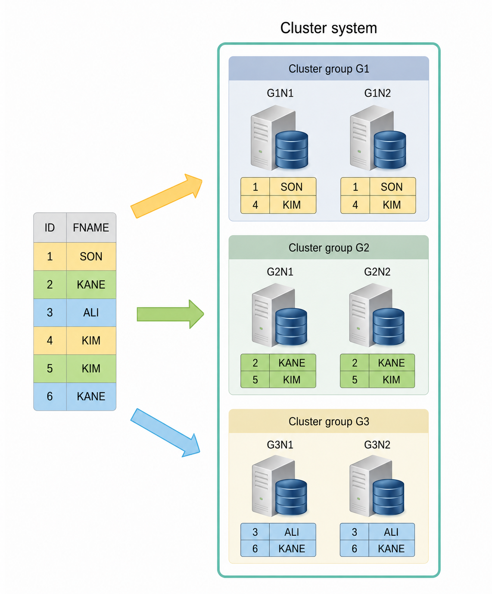
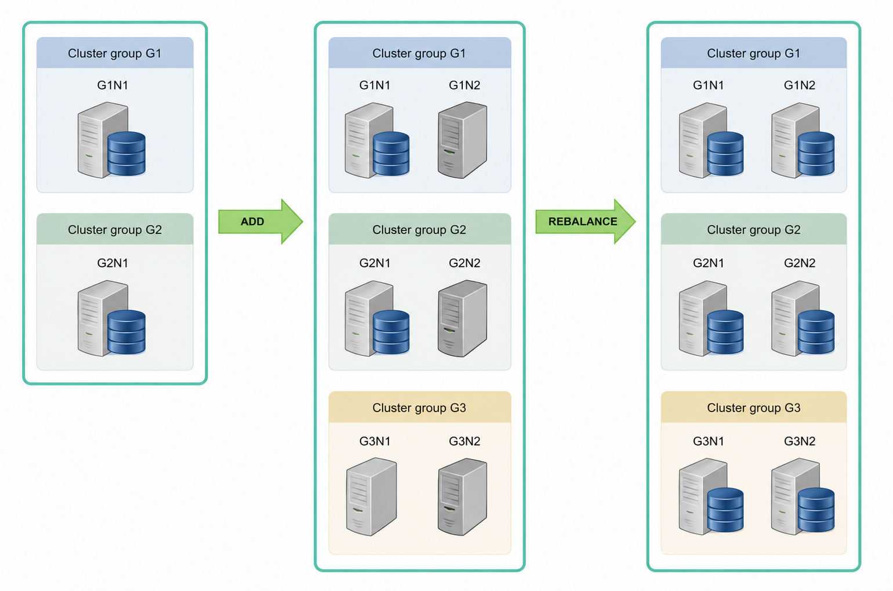
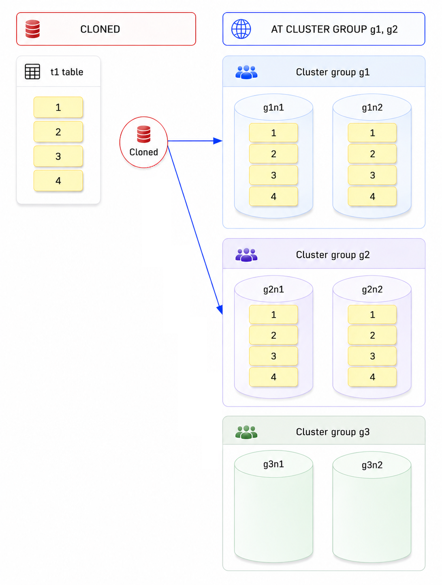
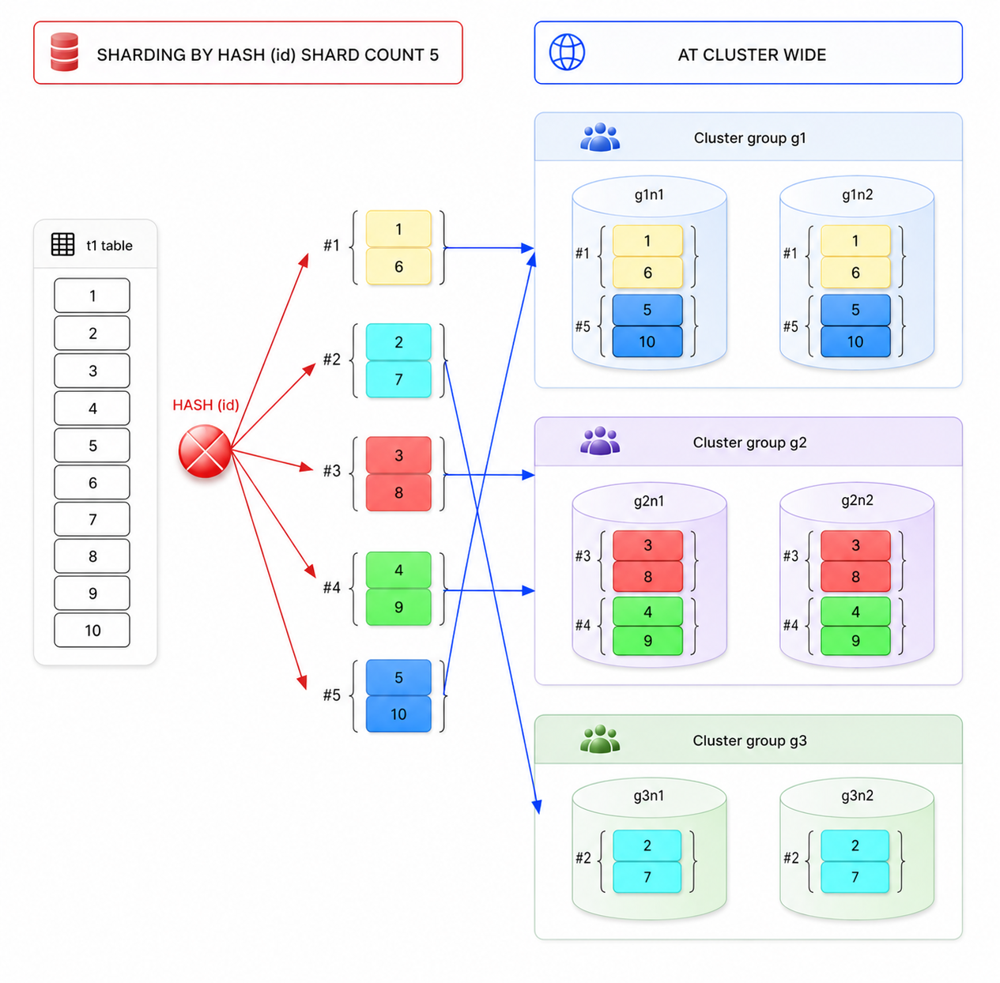
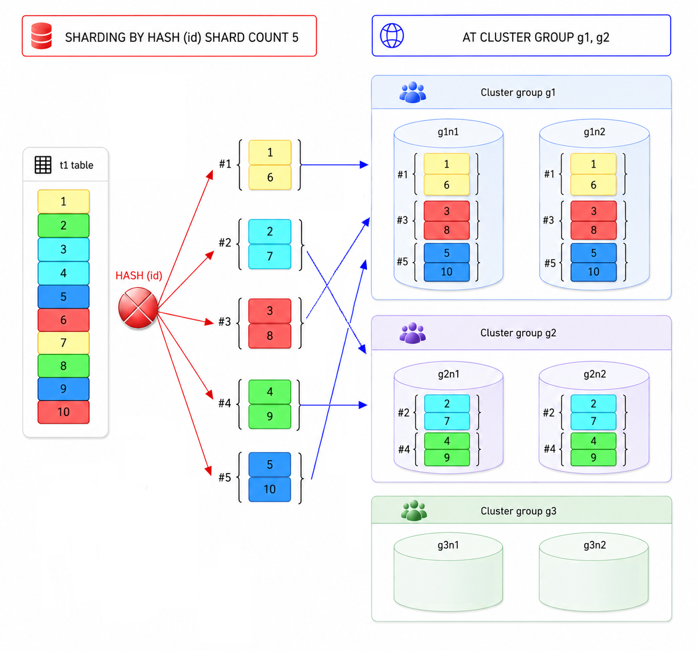
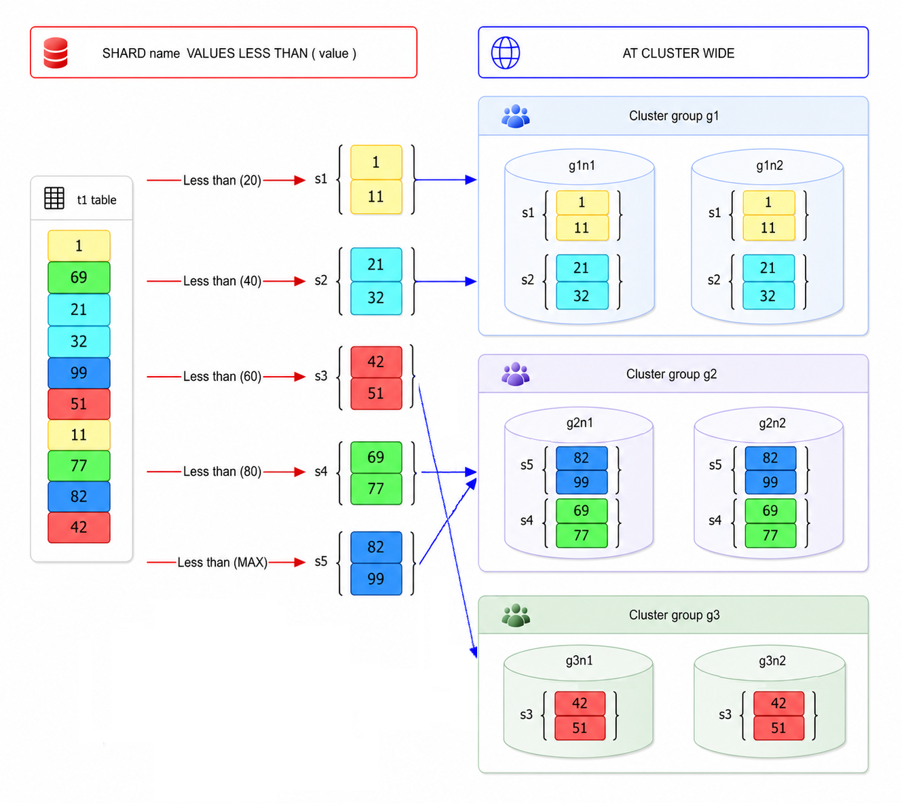
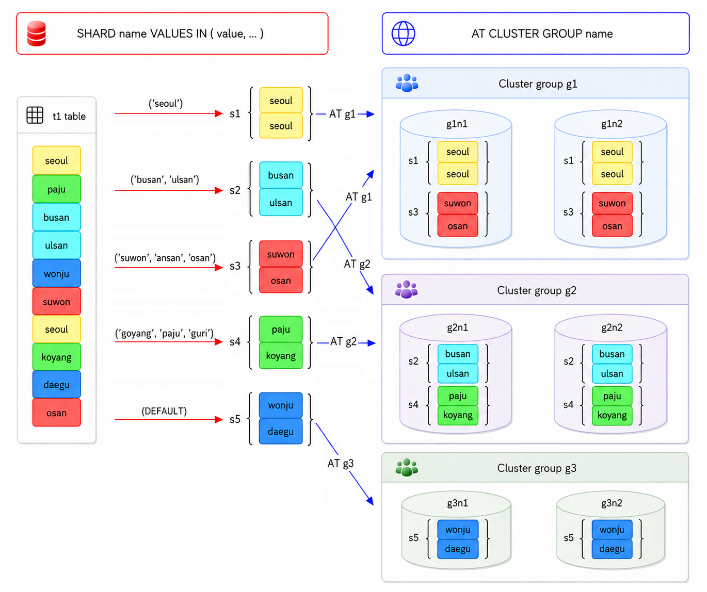
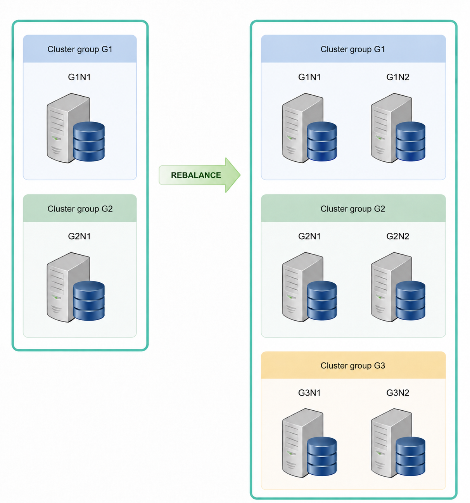
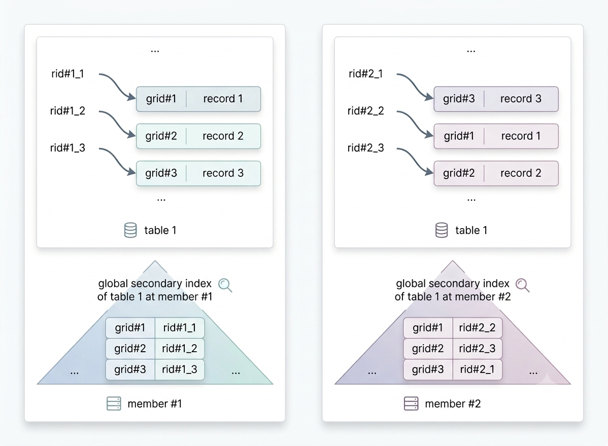

<a id="3122653a5e6a330f"></a>

# 14. Cluster Objects

> 원본: [GOLDILOCKS 26c.1 User Manual (ko)](https://manual.sunjesoft.co.kr/goldilocks/26c_1/manual/ko/3122653a5e6a330f)  
> 태그: `26c.1_0_tag`

[← 13. SQL Objects](13-sql-objects.md) · [전체 목차](../README.md) · [15. SQL Tuning →](15-sql-tuning.md)

<a id="fd3521f08003ab1a"></a>
## Cluster System

<a id="9925c1e294638453"></a>
### Cluster System 관련 구문

자세한 내용은 다음 링크를 참조한다.

- Cluster system 확장
    - [CREATE CLUSTER GROUP](19-sql-references-c-g.md#cb13f01b6a67d24a)
    - [ALTER CLUSTER GROUP name ADD MEMBER](18-sql-references-a-b.md#1b3565c76f35ea0a)

- Inactive cluster member 제어
    - [ALTER DATABASE DROP INACTIVE CLUSTER MEMBERS](18-sql-references-a-b.md#8ce707cabe9dc37a)
    - [ALTER SYSTEM JOIN DATABASE](18-sql-references-a-b.md#d64c686b2011e181)

- 데이터 재배치
    - [ALTER DATABASE REBALANCE](18-sql-references-a-b.md#045abf2d149b6478)
    - [ALTER TABLE name REBALANCE](18-sql-references-a-b.md#4dcbc8cc43487ef2)

Cluster system과 관련된 정보는 다음과 같은 view를 통해 조회할 수 있다.

<a id="c757115b8fdd2629"></a>
<table class="table column_count_3"><caption>Cluster system 관련 정보</caption><thead><tr><th class="to_center"><div>스키마</div></th><th class="to_center"><div>View 이름</div></th><th class="to_center"><div>설명</div></th></tr></thead><tbody><tr><td class="to_middle" rowspan="2"><div>DICTIONARY_SCHEMA</div></td><td class="to_middle"><div><a class="reference" href="../part-02-administration-manual/9-database-information.md#34859817c75d1b71">DBA_CLUSTER</a></div></td><td class="to_middle"><div>Cluster를 구성하는 cluster group, cluster member의 객체 정보</div></td></tr><tr><td class="to_middle"><div><a class="reference" href="../part-02-administration-manual/9-database-information.md#d9c49ab318fc6008">DBA_CLUSTER_COMMENTS</a></div></td><td class="to_middle"><div>Cluster group과 cluster member의 주석 정보</div></td></tr><tr><td class="to_middle"><div>PERFORMANCE_VIEW_SCHEMA</div></td><td class="to_middle"><div><a class="reference" href="../part-02-administration-manual/9-database-information.md#955698ee0a3944ce">V$CLUSTER_MEMBER</a></div></td><td class="to_middle"><div>Cluster member의 상태 정보</div></td></tr></tbody></table>

<a id="bd3de520ecdc7d9e"></a>
### Cluster System 개념

GOLDILOCKS의 cluster system은 한 개 database의 data를 여러 대의 server에 분할 또는 복제하여 관리한다. Application들은 cluster system을 구성하는 모든 server에서 운영 가능하며, system 구성 방식이나 접속한 server에 관계없이 하나의 database를 사용하는 것과 동일하게 동작한다.

GOLDILOCKS cluster system은 하나 이상의 cluster group으로 구성되며, 하나의 cluster group은 하나 이상의 cluster member로 구성된다. 별도의 application server 또는 meta server를 필요로 하지 않으며, application들은 data server에 해당하는 cluster member에 접속하여 동작한다.

<a id="6383177c46543a61"></a>


위의 그림은 세 개의 cluster group과 각 cluster group이 두 개의 cluster member를 구성하는 3 x 2 cluster system이다. 위의 그림에서 cluster system은 G1, G2, G3 cluster group으로 구성되어 있다. G1 cluster group은 G1N1, G1N2 cluster member로 구성되어 있으며, G2 cluster group은 G2N1과 G2N2로 구성되며, G3 cluster group은 G3N1, G3N2 cluster member로 구성되어 있다. Application들은 여섯 개의 cluster member 어디에나 접속할 수 있으며 하나의 database를 사용하는 것과 동일하게 동작한다.

테이블의 data는 각 cluster group에 분할 (sharding)되어 배치되며, cluster group 내의 cluster member 들은 복제본 (replica)을 동일하게 유지한다. 아래 그림은 3 x 2 cluster에 테이블의 data를 배치하는 개념을 표현한다.

<a id="044cb7d08d936567"></a>


테이블의 데이터는 사용자가 정의한 분할 전략에 의해 (위의 그림에서는 ID column을 기준으로) 분할되어 각 cluster group에 배치된다. Cluster group에 배치된 data는 cluster group 내의 cluster member들에 복제본을 유지한다.

<a id="540e4534e20c348a"></a>
### Cluster System의 가용성

Cluster는 특정 server가 고장나거나 네트워크가 단절되어도 계속 서비스할 수 있다. 각 cluster group을 구성하는 cluster member들은 데이터 복제본을 동일하게 유지하기 때문에 cluster member 한 개가 고장나더라도 서비스가 중단되지 않는다. 즉, cluster group의 모든 cluster member들에 장애가 발생하여 data loss가 발생하지 않는 한 지속적으로 서비스할 수 있다.

아래 그림과 같은 3 x 2 cluster에서는 장비 세 대가 고장나더라도 계속 서비스할 수 있다.

<a id="26eb17ccfea4bf98"></a>


위의 상황에서 G1N1, G2N2, G3N1에 추가적인 장애가 발생할 경우 data loss가 발생하여 서비스를 제공할 수 없으므로, 추가 장애가 발생하기 전에 장애가 발생한 장비를 cluster system에 참여시키거나, 새로운 cluster member를 추가해야 한다.

- [ALTER SYSTEM JOIN DATABASE](18-sql-references-a-b.md#d64c686b2011e181)는 장애가 발생한 cluster member를 cluster system에 다시 참여시킬 때 사용되는 구문이다.

- [ALTER DATABASE DROP INACTIVE CLUSTER MEMBERS](18-sql-references-a-b.md#8ce707cabe9dc37a)는 장애가 발생한 cluster member를 cluster system에서 제거하기 위해 사용되는 구문이다.

- [ALTER CLUSTER GROUP name ADD MEMBER](18-sql-references-a-b.md#1b3565c76f35ea0a)는 고가용성을 위해 cluster group에 cluster member를 추가할 때 사용되는 구문이다.

- [ALTER DATABASE REBALANCE](18-sql-references-a-b.md#045abf2d149b6478), [ALTER TABLE name REBALANCE](18-sql-references-a-b.md#4dcbc8cc43487ef2)는 생성한 cluster member에 데이터를 재배치하기 위해 사용되는 구문들이다.

<a id="27a574a0dd99aac6"></a>
### Cluster System 확장

서비스를 중단하지 않고 새로운 server를 추가하여 cluster를 확장할 수 있다.

Cluster는 cluster member 또는 cluster group을 추가하는 작업과 생성된 server에 data를 재분배하는 과정을 통해 확장된다.

다음은 2 x 1 cluster를 3 x 2 cluster로 확장하는 예이다.

<a id="a8d56fe466bf5e74"></a>


Cluster를 확장하기 위해 다음 구문을 사용하여 cluster group과 cluster member를 추가한다.

- [ALTER CLUSTER GROUP name ADD MEMBER](18-sql-references-a-b.md#1b3565c76f35ea0a)
- [CREATE CLUSTER GROUP](19-sql-references-c-g.md#cb13f01b6a67d24a)

Cluster system에 새로운 cluster member를 추가하려면 cluster member와 cluster system의 tablespace가 동일해야 한다. 즉, cluster member에 cluster system의 모든 tablespace와 동일한 tablespace를 생성해야 한다.

다음은 2 x 1 cluster에 3 x 2 cluster의 cluster group과 cluster member를 추가하는 예이다. G1 group에 G1N2 member를 추가하고, G2 group에 G2N2 member를 추가한다. 그리고, G3N1, G3N2 member를 포함하는 G3 group을 새로 생성한다.

- G1 group에 G1N2 member를 추가한다.

```
gSQL> 
ALTER CLUSTER GROUP G1 
      ADD CLUSTER MEMBER G1N2 HOST '192.168.0.12' PORT 10120;

Cluster Group altered.
```

- G2 group에 G2N2 member를 추가한다.

```
gSQL> 
ALTER CLUSTER GROUP G2 
      ADD CLUSTER MEMBER G2N2 HOST '192.168.0.22' PORT 10220;

Cluster Group altered.
```

- G3 group을 생성한다.

```
gSQL>
CREATE CLUSTER GROUP G3 
       CLUSTER MEMBER G3N1 HOST '192.168.0.31' PORT 10310,
       CLUSTER MEMBER G3N2 HOST '192.168.0.32' PORT 10320;

Cluster Group created.
```

Cluster system에 새로 추가한 cluster group과 cluster member는 SQL 객체들의 dictionary 정보를 모두 동기화하여 서비스할 수 있다. 그러나 추가된 cluster member에는 아직 데이터가 배치되어 있지 않기 때문에 가용성 증가나 부하 분산 효과는 기대할 수 없다. 이를 위해 생성된 cluster member에 데이터를 재배치해야 한다.

다음 구문을 차례대로 사용하여 데이터를 재배치한다.

- [ALTER DATABASE REBALANCE](18-sql-references-a-b.md#045abf2d149b6478)
- [ALTER TABLE name REBALANCE](18-sql-references-a-b.md#4dcbc8cc43487ef2)

다음은 데이터베이스의 모든 테이블의 데이터를 재배치하는 예이다.

```
gSQL> ALTER DATABASE REBALANCE;

Database altered.
```

<a id="d7bac7aaac54e37f"></a>
## Cluster Group

<a id="9cc7df4c404f88da"></a>
### Cluster Group 관련 구문

Cluster group을 생성, 제거, 변경하기 위한 구문은 다음과 같다.

- Cluster group 생성: [CREATE CLUSTER GROUP](19-sql-references-c-g.md#cb13f01b6a67d24a)
- Cluster group 제거: [DROP CLUSTER GROUP](19-sql-references-c-g.md#d4612fb5786bb45f)
- Cluster group 변경: [ALTER CLUSTER GROUP name ADD MEMBER](18-sql-references-a-b.md#1b3565c76f35ea0a)

Cluster group 과 관련된 정보는 다음과 같은 view를 통해 조회할 수 있다.

<a id="3907bef9b083c729"></a>
<table class="table column_count_3"><caption>Cluster group 관련 정보</caption><thead><tr><th class="to_center"><div>스키마</div></th><th class="to_center"><div>View 이름</div></th><th class="to_center"><div>설명</div></th></tr></thead><tbody><tr><td class="to_middle" rowspan="2"><div>DICTIONARY_SCHEMA</div></td><td class="to_middle"><div><a class="reference" href="../part-02-administration-manual/9-database-information.md#34859817c75d1b71">DBA_CLUSTER</a></div></td><td class="to_middle"><div>Cluster를 구성하는 cluster group, cluster member의 객체 정보</div></td></tr><tr><td class="to_middle"><div><a class="reference" href="../part-02-administration-manual/9-database-information.md#d9c49ab318fc6008">DBA_CLUSTER_COMMENTS</a></div></td><td class="to_middle"><div>Cluster group과 cluster member의 주석 정보</div></td></tr></tbody></table>

<a id="246b4f10890d9f90"></a>
### Cluster Group 개념

Cluster system을 운영하기 위해서는 최소 하나 이상의 cluster group을 생성해야 한다.

<a id="172dce7314f521fa"></a>
#### Cluster group의 생성

최초로 생성하는 cluster group은 자기 자신을 cluster member로 포함해야 한다. Cluster group을 생성하는 구문은 [CREATE CLUSTER GROUP](19-sql-references-c-g.md#cb13f01b6a67d24a)을 참조한다.

Cluster member는 data server를 의미하는 물리적 개념인 반면에 cluster group은 하나 이상의 cluster member들로 구성된 논리적 개념이다.

Cluster group의 구성 방식에 따라 cluster system의 고가용성 및 부하 분산 효과가 달라진다. Cluster group에 포함된 cluster member의 개수가 많을 수록 가용성이 높아지고 cluster group의 개수가 많을수록 data가 분산되어 cluster system의 전체 처리량 (throughput)이 증가한다.

Cluster group 내의 모든 cluster member는 동일한 data를 복제하여 유지하므로 cluster group을 구성하는 모든 cluster member에 장애가 발생하지 않는 한 서비스를 지속할 수 있다. Cluster system의 가용성을 유지하기 위해서 각 cluster group은 두 개 이상의 cluster member로 구성하는 것이 바람직하다.

테이블의 데이터는 분할 정책 (sharding strategy)에 따라 분할되며, 배치 (shard placement) 정책에 따라 서로 다른 cluster group에 저장 관리된다. 서비스 특성에 따른 적절한 테이블 분할 정책과 배치 정책이 시스템의 전체 성능을 좌우한다. 각 트랜잭션과 질의들은 data를 저장하고 있는 cluster group들을 중심으로 처리되므로 참조하는 data 들이 동일한 cluster group에 존재할 경우 성능이 향상된다.

<a id="9d2c41c55021e3a7"></a>
#### Cluster Group 제거

Cluster system에 참여하여 서비스 중인 cluster group은 여러가지 이유로 제거될 수 있다. Cluster group의 제거는 [DROP CLUSTER GROUP](19-sql-references-c-g.md#d4612fb5786bb45f)을 참조한다.

Cluster group을 제거하려면 해당 cluster group에 생성된 sharded table의 shard를 모두 다른 cluster group으로 이동시켜야 하는데 cluster-wide, group-specific table에 따라 별도로 이동시켜야 한다.

<a id="913c85789cf20a65"></a>
## Cluster Member

<a id="8ff24c43e2140802"></a>
### Cluster Member 관련 구문

자세한 내용은 다음 링크를 참조한다.

- Cluster member 추가: [ALTER CLUSTER GROUP name ADD MEMBER](18-sql-references-a-b.md#1b3565c76f35ea0a)

- Cluster member 제거: [ALTER DATABASE DROP INACTIVE CLUSTER MEMBERS](18-sql-references-a-b.md#8ce707cabe9dc37a)

- Cluster member 제어
    - [ALTER SYSTEM JOIN DATABASE](18-sql-references-a-b.md#d64c686b2011e181)
    - [ALTER CLUSTER GROUP name OFFLINE MEMBER](18-sql-references-a-b.md#289417401c1c26b1)
    - [ALTER DATABASE RESET LOCAL CLUSTER MEMBER](18-sql-references-a-b.md#9c0a4f742c9210c5)

Cluster member와 관련된 정보는 다음과 같은 view를 통해 조회할 수 있다.

<a id="3f627edea2f26299"></a>
<table class="table column_count_3"><caption>Cluster member 관련 정보</caption><thead><tr><th class="to_center"><div>스키마</div></th><th class="to_center"><div>View 이름</div></th><th class="to_center"><div>설명</div></th></tr></thead><tbody><tr><td class="to_middle" rowspan="2"><div>DICTIONARY_SCHEMA</div></td><td class="to_middle"><div><a class="reference" href="../part-02-administration-manual/9-database-information.md#34859817c75d1b71">DBA_CLUSTER</a></div></td><td class="to_middle"><div>Cluster를 구성하는 cluster group, cluster member의 객체 정보</div></td></tr><tr><td class="to_middle"><div><a class="reference" href="../part-02-administration-manual/9-database-information.md#d9c49ab318fc6008">DBA_CLUSTER_COMMENTS</a></div></td><td class="to_middle"><div>Cluster group과 cluster member의 주석 정보</div></td></tr><tr><td class="to_middle"><div>PERFORMANCE_VIEW_SCHEMA</div></td><td class="to_middle"><div><a class="reference" href="../part-02-administration-manual/9-database-information.md#955698ee0a3944ce">V$CLUSTER_MEMBER</a></div></td><td class="to_middle"><div>Cluster member의 상태 정보</div></td></tr></tbody></table>

<a id="1e2107b65f44de51"></a>
### Cluster Member 개념

Cluster member는 cluster system을 구성하는 하나의 server이며 cluster group 내의 cluster member들과 동일한 replica를 유지한다.

Cluster member는 cluster database의 일부 data를 저장하고 있는 data server 이면서 application의 접속과 요청을 처리하는 application server이고 객체의 meta 정보를 복제하여 관리하고 있는 meta server이기도 하다. 즉, GOLDILOCKS cluster는 별도의 data server, application server, meta server들을 필요로 하지 않는다.

동일한 cluster group에 속한 cluster member들은 동일한 data 복제본을 가지고 있다. 따라서 특정 cluster member의 장애가 시스템 전체의 장애를 유발하지 않는다. 시스템의 고가용성을 위해 각 cluster group에 두 개 이상의 cluster member를 포함하는 것이 바람직하며 하나의 cluster group은 최대 32 개의 cluster member로 구성될 수 있다.

새로운 cluster member를 cluster group에 추가하려면 [ALTER CLUSTER GROUP name ADD MEMBER](18-sql-references-a-b.md#1b3565c76f35ea0a) 구문을 수행한다.

추가한 cluster member는 SQL 객체의 meta 정보를 cluster system과 동일하게 유지하기 때문에 application의 접속과 요청을 처리할 수 있다. 그러나 data는 배치되어 있지 않으므로 cluster member의 추가가 cluster group의 고가용성을 보장하지는 않는다.

Cluster member를 추가한 후에 데이터를 배치하기 위해서 다음 구문을 수행한다.

- 전체 data를 재배치하는 경우: [ALTER DATABASE REBALANCE](18-sql-references-a-b.md#045abf2d149b6478)
- 일부 테이블만 재배치하는 경우: [ALTER TABLE name REBALANCE](18-sql-references-a-b.md#4dcbc8cc43487ef2)

Cluster member에 장애가 발생해도 서비스 운영에는 지장이 없지만 DDL을 수행할 수 없다. 정상적인 서비스 운영을 위해서는 장애가 발생한 cluster member에 대한 조치를 취해야 한다.

장애가 발생한 cluster member를 cluster system에 다시 참여시키려면 해당 cluster member에 접속하여 LOCAL OPEN 단계로 구동한 후에 [ALTER SYSTEM JOIN DATABASE](18-sql-references-a-b.md#d64c686b2011e181)를 수행한다.

일부 cluster member를 구동하지 않거나 네트워크 단절 상태에서 cluster system을 구동한 경우에도 해당 cluster member를 LOCAL OPEN 단계로 구동한 후에 [ALTER SYSTEM JOIN DATABASE](18-sql-references-a-b.md#d64c686b2011e181) 구문을 수행한다.

만약 장애가 발생한 cluster member의 장비를 복구할 수 없는 경우에는 cluster system에서 [ALTER DATABASE DROP INACTIVE CLUSTER MEMBERS](18-sql-references-a-b.md#8ce707cabe9dc37a) 구문을 수행하여 장애가 발생한 cluster member들을 제거한다.

Cluster system에서 제거된 cluster member는 여전히 제거되기 이전의 정보를 가지고 있으며 다시 cluster system에 참여할 수 없다. Cluster member를 cluster system에 참여하기 이전의 상태로 초기화하기 위해서는 [ALTER DATABASE RESET LOCAL CLUSTER MEMBER](18-sql-references-a-b.md#9c0a4f742c9210c5) 구문을 수행한다.

위 구문은 tablespace의 정보를 그대로 유지하고 있기 때문에 cluster system에 새로운 cluster member로 추가될 때 tablespace 생성 시간을 단축할 수 있다는 점이 cluster member의 database를 새로 생성한 것과의 차이점이다.

<a id="a0fd2fae0029a6d5"></a>
## Cluster Location

<a id="1c589a26bd481642"></a>
### Cluster Location 관련 구문

Cluster location을 생성, 제거, 변경하기 위한 구문은 다음과 같다.

- Cluster location 생성: [CREATE CLUSTER LOCATION](19-sql-references-c-g.md#67290c5932bd9838)
- Cluster location 제거: [DROP CLUSTER LOCATION](19-sql-references-c-g.md#572d8870897e75c3)
- Cluster location 변경: [ALTER CLUSTER LOCATION](18-sql-references-a-b.md#48af3f039b7c7dd9)

Cluster location과 관련된 정보는 다음과 같은 view를 통해 조회할 수 있다.

**Cluster location 관련 정보**

<a id="d506bf3fb840c5ba"></a>
| 스키마 | View 이름 | 설명 |
| --- | --- | --- |
| PERFORMANCE_VIEW_SCHEMA | [V$CLUSTER_LOCATION](../part-02-administration-manual/9-database-information.md#4229d8c893b08fad) | Cluster location 정보 |

<a id="af14f33d5cc39715"></a>
### Cluster Location 개념

Cluster location은 cluster system에 등록된 각 cluster member들의 내부 cluster network들을 연결하기 위한 접속 정보이다. 각각의 cluster member들은 transaction의 처리 및 관리 정보 교환과 같은 다양한 protocol의 상호 송수신을 위해 cluster 전용 tcp network를 사용하는데, 이 때 접속하기 위해 사용하는 member name, host ip address, port를 묶어서 cluster location이라고 한다.

각 member 별로 고유한 cluster location 정보가 지정되어야 하며 만약 정보가 중복될 경우 cluster network 접속에 실패하여 cluster system이 정상적으로 작동하지 않는다.

Cluster location 정보는 cluster member를 추가하거나 제거할 때 자동으로 추가되거나 삭제되기 때문에 사용자가 직접적으로 location 정보 자체를 추가하거나 삭제해야 할 경우는 거의 없다. 다만 다음과 같은 경우에는 cluster location 관련 DDL 구문을 사용할 수 있다.

- Location control file이 삭제되어 cluster location 정보가 유실된 경우: [CREATE CLUSTER LOCATION](19-sql-references-c-g.md#67290c5932bd9838)
- 이미 등록된 cluster member의 접속 정보가 변경된 경우, 즉 hardware가 변경되거나 접속 ip, port가 변경된 경우: [ALTER CLUSTER LOCATION](18-sql-references-a-b.md#48af3f039b7c7dd9)

<a id="daaa25a5e8a42038"></a>
## Cluster Table과 Shard

<a id="2a86f3b25c9b7409"></a>
### Shard 관련 구문

Shard 정의와 재배치를 위한 구문은 다음과 같다.

- Shard 정의: [CREATE TABLE](19-sql-references-c-g.md#ce6ecbcf1ea593ea) 구문의 &lt;table sharding strategy&gt; 절
- Shard 재배치: [ALTER TABLE name REBALANCE](18-sql-references-a-b.md#4dcbc8cc43487ef2)

Cluster table의 shard 관련 정보는 다음과 같은 view를 통해 조회할 수 있다.

<a id="7ed2da8ff874b367"></a>
<table class="table column_count_3"><caption>Cluster table과 shard 관련 정보</caption><thead><tr><th class="to_center"><div>스키마</div></th><th class="to_center"><div>View 이름</div></th><th class="to_center"><div>설명</div></th></tr></thead><tbody><tr><td class="to_middle" rowspan="8"><div>DICTIONARY_SCHEMA</div></td><td class="to_middle"><div><a class="reference" href="../part-02-administration-manual/9-database-information.md#9a65c1aae94a7159">ALL_CLUSTER_TABLES</a></div></td><td class="to_middle"><div>사용자가 접근 가능한 cluster table 정보</div></td></tr><tr><td class="to_middle"><div><a class="reference" href="../part-02-administration-manual/9-database-information.md#ba23c7745a176b8a">ALL_SHARD_KEY_COLUMNS</a></div></td><td class="to_middle"><div>사용자가 접근 가능한 cluster table의 shard key column 정보</div></td></tr><tr><td class="to_middle"><div><a class="reference" href="../part-02-administration-manual/9-database-information.md#08c1ae3b580b99da">ALL_TAB_PLACE</a></div></td><td class="to_middle"><div>사용자가 접근 가능한 cluster table의 배치 정보</div></td></tr><tr><td class="to_middle"><div><a class="reference" href="../part-02-administration-manual/9-database-information.md#df0ae14c10ea3b7a">ALL_TAB_SHARDS</a></div></td><td class="to_middle"><div>사용자가 접근 가능한 cluster table의 shard 정보</div></td></tr><tr><td class="to_middle"><div><a class="reference" href="../part-02-administration-manual/9-database-information.md#d1b5fa7839ebaa04">USER_CLUSTER_TABLES</a></div></td><td class="to_middle"><div>사용자가 소유한 cluster table 정보</div></td></tr><tr><td class="to_middle"><div><a class="reference" href="../part-02-administration-manual/9-database-information.md#e8e0d8570ab61ce8">USER_SHARD_KEY_COLUMNS</a></div></td><td class="to_middle"><div>사용자가 소유한 cluster table의 shard key column 정보</div></td></tr><tr><td class="to_middle"><div><a class="reference" href="../part-02-administration-manual/9-database-information.md#b67aa92422af69df">USER_TAB_PLACE</a></div></td><td class="to_middle"><div>사용자가 소유한 cluster table의 배치 정보</div></td></tr><tr><td class="to_middle"><div><a class="reference" href="../part-02-administration-manual/9-database-information.md#a63f133713822434">USER_TAB_SHARDS</a></div></td><td class="to_middle"><div>사용자가 소유한 cluster table의 shard 정보</div></td></tr></tbody></table>

<a id="97a0da0ad9be5142"></a>
### Cluster Table 유형

Cluster 환경에서 사용자가 생성하는 table은 다음 두 가지 중 하나이다.

- Cloned table: 테이블의 data를 동일하게 복제하여 관리한다.
- Sharded table: 테이블의 data를 수평으로 분할하여 관리한다.

Cloned table은 테이블의 data를 모두 복제하여 관리하므로 제품 목록, 공급자 목록 등과 같이 데이터의 갱신이 적고 데이터 양이 상대적으로 적은 테이블에 적합하다. Cloned table에 데이터를 추가, 삭제, 갱신할 경우 cloned table이 배치된 모든 cluster member에 동일하게 반영된다.

Sharded table은 거래 내역, 통화 내역 등과 같이 테이블의 데이터 양이 많아 분할이 필요한 경우에 적합하며, 다음과 같이 세 가지 분할 정책에 따라 분류된다.

- Hash sharded table 
    - 테이블의 data를 sharding key의 해시 (hash) 값을 기준으로 여러 개의 shard로 분할하여 cluster system에 배치한다.
- Range sharded table
    - 테이블의 data를 sharding key의 범위 (range) 값을 기준으로 여러 개의 shard로 분할하여 cluster system에 배치한다.
- List sharded table
    - 테이블의 data를 sharding key의 나열 (list) 값을 기준으로 여러 개의 shard로 분할하여 cluster system에 배치한다.

Sharded table은 row들을 수평으로 분할하여 shard 단위로 관리하며, sharding 정책은 [CREATE TABLE](19-sql-references-c-g.md#ce6ecbcf1ea593ea) 구문의 SHARDING BY 절을 이용해 정의한다. Sharding 정책에 의해 분류된 row들의 집합을 shard라고 한다.

각 shard는 사용자가 정의한 배치 정책에 따라 cluster group에 배치되는데 [CREATE TABLE](19-sql-references-c-g.md#ce6ecbcf1ea593ea) 구문의 AT CLUSTER WIDE를 통해 자동으로 배치하거나, AT CLUSTER GROUP 절을 이용해 배치할 cluster group을 지정할 수도 있다. AT CLUSTER WIDE를 사용해 자동으로 배치할 경우, [CREATE CLUSTER GROUP](19-sql-references-c-g.md#cb13f01b6a67d24a) 구문을 사용하여 cluster group을 생성한 후에 [ALTER TABLE name REBALANCE](18-sql-references-a-b.md#4dcbc8cc43487ef2) 구문을 수행하는 반면에 AT CLUSTER GROUP을 사용해 shard가 배치될 cluster group을 지정하는 경우 새롭게 추가된 cluster group에 shard가 배치되지 않는다.

다음은 3 x 2 cluster 환경에서 cluster table의 유형에 따라 테이블을 생성하고 data를 배치하는 개념을 설명하기 위한 예이다.

<a id="e5b4225525a73f97"></a>
### Cloned Table

Cloned table은 테이블의 모든 data를 동일하게 복제하여 관리한다.

다음은 cluster-wide cloned table을 생성하는 예이다. 모든 테이블 데이터를 3 x 2로 구성된 cluster member에 동일하게 복제하여 배치한다.

```
CREATE TABLE t1 ( id INTEGER )
   CLONED
   AT CLUSTER WIDE
;
```

<a id="6b5609d03f0c3f55"></a>


다음은 group-specific cloned table을 생성하는 예이다. 테이블의 모든 data가 복제되어 관리되기는 하지만 복제된 테이블 data는 사용자가 지정한 g1과 g2 group의 cluster member에만 존재하고 g3 group에는 data가 존재하지 않는다.

```
CREATE TABLE t1 ( id INTEGER )
   CLONED
   AT CLUSTER GROUP g1, g2
;
```

<a id="64924a20514cef90"></a>


<a id="881ce7477196ecb1"></a>
### Hash-sharded Table

Hash-sharded table은 data를 sharding key의 해시 (hash)값을 기준으로 여러 개의 shard로 분할하여 cluster system에 배치한다.

다음은 cluster-wide hash-sharded table을 생성하는 예이다. 테이블에 data를 추가할 때 ID column값을 기준으로 해시값을 생성하고 이를 이용해 다섯 개의 shard 중 row를 배치할 shard를 결정한다. 각 shard는 자동으로 배치된다. ID column 값이 동일한 모든 row들은 동일한 shard에 포함되며 동일한 cluster group에 배치된다.

```
CREATE TABLE t1 ( id INTEGER )
   SHARDING BY HASH(id)
   SHARD COUNT 5
   AT CLUSTER WIDE
;
```

<a id="376364dc8f07afde"></a>


다음은 group-specific hash-sharded table을 생성하는 예이다. ID column의 해시값이 shard를 결정하지만 각 shard는 사용자가 지정한 g1, g2 cluster group에만 배치된다.

```
CREATE TABLE t1 ( id INTEGER )
   SHARDING BY HASH(id)
   SHARD COUNT 5
   AT CLUSTER GROUP g1, g2
;
```

<a id="0e5bb2fd2d4ad12a"></a>


<a id="2b052edce9fa5a43"></a>
### Range-sharded Table

Range-sharded table은 data를 sharding key의 범위 (range)값을 기준으로 여러 개의 shard로 분할하여 cluster system에 배치한다.

다음은 cluster-wide range-sharded table을 생성하는 예이다. 테이블에 data를 추가할 때 ID column의 범위값을 기준으로 다섯 개의 shard 중에 row를 배치할 shard를 결정한다. 각 shard는 자동으로 배치된다. 동일한 범위 내에 있는 ID column의 모든 row들은 동일한 shard에 포함되며 동일한 cluster group에 배치된다.

```
CREATE TABLE t1 ( id INTEGER )
   SHARDING BY RANGE(id)
   AT CLUSTER WIDE
       SHARD s1 VALUES LESS THAN ( 20 ),
       SHARD s2 VALUES LESS THAN ( 40 ),
       SHARD s3 VALUES LESS THAN ( 60 ),
       SHARD s4 VALUES LESS THAN ( 80 ),
       SHARD s5 VALUES LESS THAN ( MAXVALUE )
;
```

<a id="6842dd0b8e8627d6"></a>


다음은 group-specific range-sharded table을 생성하는 예이다. ID column의 범위값이 shard를 결정하지만 각 shard는 사용자가 지정한 cluster group에 배치된다.

```
CREATE TABLE t1 ( id INTEGER )
   SHARDING BY RANGE(id)
       SHARD s1 VALUES LESS THAN ( 20 )       AT CLUSTER GROUP g1,
       SHARD s2 VALUES LESS THAN ( 40 )       AT CLUSTER GROUP g2,
       SHARD s3 VALUES LESS THAN ( 60 )       AT CLUSTER GROUP g1,
       SHARD s4 VALUES LESS THAN ( 80 )       AT CLUSTER GROUP g2,
       SHARD s5 VALUES LESS THAN ( MAXVALUE ) AT CLUSTER GROUP g3
;
```

<a id="ee6dd63075b97bbc"></a>


<a id="a212c147552c1ae5"></a>
### List-sharded Table

List-sharded table은 data를 sharding key의 나열 (list)값을 기준으로 여러 개의 shard로 분할하여 cluster system에 배치한다.

다음은 cluster-wide list-sharded table을 생성하는 예이다. 테이블에 data를 추가할 때 CITY column의 값과 동일한 나열값을 가지는 shard에 row를 배치한다. 각 shard는 자동으로 배치된다.

```
CREATE TABLE t1 ( city VARCHAR(128) ) 
   SHARDING BY LIST (city)
      AT CLUSTER WIDE
      SHARD s1 VALUES IN ( 'seoul' ),
      SHARD s2 VALUES IN ( 'busan', 'ulsan' ),
      SHARD s3 VALUES IN ( 'suwon', 'ansan', 'osan' ),
      SHARD s4 VALUES IN ( 'goyang', 'paju', 'guri' ),
      SHARD s5 VALUES IN ( DEFAULT )            
;
```

<a id="65d4e86033f4cd26"></a>


다음은 group-specific list-sharded table을 생성하는 예이다. CITY column의 나열값이 shard를 결정하지만 각 shard는 사용자가 지정한 cluster group에 배치된다.

```
CREATE TABLE t1 ( city VARCHAR(128) ) 
   SHARDING BY LIST (city)
      SHARD s1 VALUES IN ( 'seoul' )                  AT CLUSTER GROUP g1,
      SHARD s2 VALUES IN ( 'busan', 'ulsan' )         AT CLUSTER GROUP g2,
      SHARD s3 VALUES IN ( 'suwon', 'ansan', 'osan' ) AT CLUSTER GROUP g1,
      SHARD s4 VALUES IN ( 'goyang', 'paju', 'guri' ) AT CLUSTER GROUP g2,
      SHARD s5 VALUES IN ( DEFAULT )                  AT CLUSTER GROUP g3
;
```

<a id="bdf3e2aca6339d4a"></a>


<a id="8b0d6c530ea06766"></a>
### Cluster Table 재배치

[ALTER TABLE name REBALANCE](18-sql-references-a-b.md#4dcbc8cc43487ef2) 구문을 사용하여 cluster table의 데이터를 재배치한다.

Cluster table의 데이터는 다음과 같은 단위로 재배치된다.

- Cloned table: table 전체
- Sharded table: shard 단위

AT CLUSTER WIDE로 지정된 테이블인 경우, 생성된 cluster group에 shard가 자동으로 재배치되는 반면에 AT CLUSTER GROUP을 통해 shard가 배치될 cluster group을 지정한 경우에는 생성된 cluster group에 shard가 재배치되지 않는다.

- AT CLUSTER WIDE를 사용하여 자동으로 재배치할 수 있는 경우 새로운 cluster group, cluster member 에 데이터를 재배치할 수 있다.

```
CREATE TABLE region
(
    r_regionkey   INTEGER
  , r_name        CHAR(25)
  , r_comment     VARCHAR(152)
)
CLONED
AT CLUSTER WIDE;
```

<a id="377cdfa8bc82515d"></a>


- AT CLUSTER GROUP을 사용하여 shard를 배치할 위치를 지정한 경우
    - 새로운 cluster group에는 데이터가 재배치 되지 않는다.
    - 지정한 cluster group에 추가된 새로운 cluster member에 데이터를 재배치할 수 있다.

```
CREATE TABLE nation
(
    n_nationkey   INTEGER
  , n_name        CHAR(25)
  , n_regionkey   INTEGER
  , n_comment     VARCHAR(152)
)
CLONED
AT CLUSTER GROUP g1, g2;
```

<a id="6c5d621b6841c122"></a>


테이블 배치 정보는 다음과 같은 view를 통해 조회할 수 있다.

- [USER_TAB_PLACE](../part-02-administration-manual/9-database-information.md#b67aa92422af69df)
- [ALL_TAB_PLACE](../part-02-administration-manual/9-database-information.md#08c1ae3b580b99da)

```
gSQL> 
SELECT group_name, member_name 
  FROM user_tab_place 
 WHERE table_name = 'REGION';

GROUP_NAME MEMBER_NAME
---------- -----------
G1         G1N1       
G1         G1N2       
G2         G2N1       
G2         G2N2       
G3         G3N1       
G3         G3N2       

6 rows selected.
```

Sharded table은 shard 단위로 재배치되며 group 증가에 따른 shard 재배치 개념은 다음과 같다.

```
CREATE TABLE orders
(
    o_orderkey     INTEGER
  , o_custkey      INTEGER
  , o_orderstatus  CHAR(1)
  , o_totalprice   NUMERIC(12,2)
  , o_orderdate     DATE
  , o_orderpriority CHAR(15)
  , o_clerk        CHAR(15)
  , o_shippriority INTEGER
  , o_comment      VARCHAR(79)
)
SHARDING BY HASH( o_orderkey )
SHARD COUNT 24
AT CLUSTER WIDE
;
```

<a id="7e6216736812c199"></a>


위의 예에서 orders 테이블의 data는 24 개의 shard로 분할되어 배치된다. Group이 한 개인 1x cluster에는 모든 shard가 하나의 group에 배치되고 group이 두 개인 2x cluster에는 각 group에 12 개의 shard들이 배치된다.

2x cluster에서 3x cluster로 확장한 경우, 기존 group에서 새로운 group으로 shard들이 이동하지만 각 group이 갖는 shard의 개수는 여덟 개로 동일하다. 3x cluster에서 4x cluster로 확장한 경우, G1, G2, G3 에서 각각 두 개의 shard들을 새로 생성된 G4 group으로 재배치한다.

즉, shard 재배치는 기존 group에서 새로운 group으로 shard가 이동할 때 그 움직임을 최소화하며, 각 group이 갖는 shard의 개수를 거의 동일하게 유지하면서 데이터를 골고루 배치한다.

Sharded table의 shard 배치 정보는 다음 예에서처럼 view들을 사용하여 조회할 수 있다.

- [USER_TAB_SHARDS](../part-02-administration-manual/9-database-information.md#a63f133713822434)
- [ALL_TAB_SHARDS](../part-02-administration-manual/9-database-information.md#df0ae14c10ea3b7a)

```
gSQL> 
SELECT shard_name, group_name 
  FROM user_tab_shards 
 WHERE table_name = 'ORDERS';

SHARD_NAME   GROUP_NAME
------------ ----------
SHARD_000000 G1        
SHARD_000001 G1        
SHARD_000002 G1        
SHARD_000003 G1        
SHARD_000004 G1        
SHARD_000005 G1        
SHARD_000006 G1        
SHARD_000007 G1        
SHARD_000008 G3        
SHARD_000009 G3        
SHARD_000010 G3        
SHARD_000011 G3        
SHARD_000012 G2        
SHARD_000013 G2        
SHARD_000014 G2        
SHARD_000015 G2        
SHARD_000016 G2        
SHARD_000017 G2        
SHARD_000018 G2        
SHARD_000019 G2        
SHARD_000020 G3        
SHARD_000021 G3        
SHARD_000022 G3        
SHARD_000023 G3        

24 rows selected.
```

다음과 같이 동일한 &lt;sharding strategy&gt;를 가진 테이블들의 재배치가 완료되면 shard의 배치 결과는 동일하다. 서로 다른 테이블이라 하더라도 동일한 shard key를 갖는 row들은 동일한 shard와 동일한 group에 배치된다는 것이 보장된다.

- Table t1
    - 2x cluster에 생성된다.
    - CREATE TABLE t1 ( c1 INTEGER ) SHARDING BY (c1);
    - 4x cluster에 재배치된다.
    - ALTER TABLE t1 REBALANCE:
- Table t2
    - 3x cluster에 생성된다.
    - CREATE TABLE t2 ( a1 INTEGER ) SHARDING BY (a1);
    - 4x cluster에 재배치된다.
    - ALTER TABLE t2 REBALANCE:
- Table t3
    - 4x cluster에 생성된다.
    - CREATE TABLE t3 ( i1 INTEGER ) SHARDING BY (i1);

즉, 다음과 같은 query는 하나의 cluster member에만 접근하여 처리할 수 있다.

```
SELECT COUNT(*)
  FROM t1, t2, t3
 WHERE t1.c1 = t2.a1
   AND t2.a1 = t3.i1
   AND t1.c1 = 1;
```

<a id="296a6643d4240187"></a>
## Global Secondary Index

<a id="d717e1f5e9d9a898"></a>
### Global Secondary Index 관련 구문

Global secondary index를 생성, 제거, 변경하기 위한 구문은 다음과 같다.

- Global secondary index 생성: [ALTER TABLE name ADD GLOBAL SECONDARY INDEX](18-sql-references-a-b.md#ef80852f02ba2cc6)
- Global secondary index 제거: [ALTER TABLE name DROP GLOBAL SECONDARY INDEX](18-sql-references-a-b.md#2bbf4303b4825280)
- Global secondary index 변경: [ALTER TABLE name ALTER GLOBAL SECONDARY INDEX](18-sql-references-a-b.md#71b8f952e7d629e8)

Global secondary index 와 관련된 정보는 다음과 같은 view를 통해 조회할 수 있다.

<a id="857b59907a60ad91"></a>
<table class="table column_count_3"><caption>Global secondary index 관련 정보</caption><thead><tr><th class="to_center"><div>스키마</div></th><th class="to_center"><div>View 이름</div></th><th class="to_center"><div>설명</div></th></tr></thead><tbody><tr><td class="to_middle" rowspan="6"><div>DICTIONARY_SCHEMA</div></td><td class="to_middle"><div><a class="reference" href="../part-02-administration-manual/9-database-information.md#9a65c1aae94a7159">ALL_CLUSTER_TABLES</a></div></td><td class="to_middle"><div>사용자가 접근 가능한 테이블의 global secondary index 존재 여부</div></td></tr><tr><td class="to_middle"><div><a class="reference" href="../part-02-administration-manual/9-database-information.md#06dd4dd336b21820">ALL_GLOBAL_SECONDARY_INDEXES</a></div></td><td class="to_middle"><div>사용자가 접근 가능한 global secondary index 객체 정보</div></td></tr><tr><td class="to_middle"><div><a class="reference" href="../part-02-administration-manual/9-database-information.md#570217f7cd3f740d">ALL_GSI_PLACE</a></div></td><td class="to_middle"><div>사용자가 접근 가능한 global secondary index의 배치 정보</div></td></tr><tr><td class="to_middle"><div><a class="reference" href="../part-02-administration-manual/9-database-information.md#d1b5fa7839ebaa04">USER_CLUSTER_TABLES</a></div></td><td class="to_middle"><div>사용자가 소유한 테이블의 global secondary index 존재 여부</div></td></tr><tr><td class="to_middle"><div><a class="reference" href="../part-02-administration-manual/9-database-information.md#0b82bd1aa969c893">USER_GLOBAL_SECONDARY_INDEXES</a></div></td><td class="to_middle"><div>사용자가 소유한 global secondary index 객체 정보</div></td></tr><tr><td class="to_middle"><div><a class="reference" href="../part-02-administration-manual/9-database-information.md#5593d434701072ba">USER_GSI_PLACE</a></div></td><td class="to_middle"><div>사용자가 소유한 global secondary index의 배치 정보</div></td></tr></tbody></table>

<a id="6249856a3f19864f"></a>
### Global Secondary Index 개념

Global secondary index는 cluster 환경의 각 cluster member에서 테이블 레코드들의 Global Row Identifier (GRID) 값을 key로 구성한 B-tree 인덱스이다.

Cluster 환경에서 테이블은 group 내의 모든 member들에 복제되고, DML이나 select 시 동일한 레코드들이 반영되고 조회된다. GRID는 cluster member들에 있는 동일한 레코드들을 구분할 수 있는 고유한 값으로써 레코드가 최초로 삽입될 때 할당되어 group 내의 모든 member들에 전파되고 레코드와 함께 저장된다.

Cluster 환경에서 테이블을 생성할 때 global secondary index는 생성할 수도 있고 생성하지 않을 수도 있는데 테이블을 생성한 후에 별도로 global secondary index를 생성하거나 삭제할 수 있다. 테이블에는 global secondary index가 없거나 있더라도 최대 한 개까지만 생성할 수 있다.

<a id="08b4dfe668598282"></a>


테이블에 대한 non-deterministic 질의를 수행하기 위해서는 global secondary index가 반드시 필요한데 만약 테이블에 global secondary index가 없을 경우 non-deterministic 질의는 다음과 같이 실패한다.

```
gSQL> DELETE FROM T1 LIMIT 1;

ERR-42000(16423): does not support non-deterministic DML in the cluster system : global secondary index expected
```

테이블에 global secondary index가 존재하는지 확인하려면 ALL_GSI_PLACE, DBA_GSI_PLACE, USER_GSI_PLACE와 같은 dictionary를 참조한다.

---

[← 13. SQL Objects](13-sql-objects.md) · [전체 목차](../README.md) · [15. SQL Tuning →](15-sql-tuning.md)

<sub>Copyright © 2010 SUNJESOFT Inc. All rights reserved.</sub>
