<a id="b6e6786e3976e440"></a>

# 15. SQL Tuning

> 원본: [GOLDILOCKS 26c.1 User Manual (ko)](https://manual.sunjesoft.co.kr/goldilocks/26c_1/manual/ko/b6e6786e3976e440)  
> 태그: `26c.1_0_tag`

[← 14. Cluster Objects](14-cluster-objects.md) · [전체 목차](../README.md) · [16. Built-in Data Type References →](16-built-in-data-type-references.md)

<a id="c50b40ea2df50e6f"></a>
## SQL Tuning

<a id="c1c37bdeb46514fc"></a>
### 개요

SQL tuning은 질의문을 분석하고 수정하여 성능을 향상시키는 과정이다.

이 과정을 통해 질의문의 응답 시간을 줄이거나 작업 처리량을 향상시켜 질의문이 원하는 성능 수준에 도달하도록 할 수 있다.

SQL tuning을 수행하기 위해서는 SQL 처리 과정과 optimizer에 대한 지식이 필요하며, 본 장에서는 이에 대해 설명한다.

<a id="d4aa2e8a2875c216"></a>
### SQL 처리 과정

SQL 처리 과정은 다음 그림과 같다.

<a id="3efa3d8e90da23b8"></a>


사용자 질의문은 parser, validator, rewriter, enumerator, code planner, data planner, executor 과정을 거쳐 그 결과를 반환한다. 각 단계에 대한 설명은 다음과 같다.

<a id="2c2e3f9225ef98c1"></a>
#### Parser

Parser는 사용자가 입력한 SQL 구문에 문법적 오류가 없는지 검사한다.

```
gSQL> SELECT * FORM customer;

ERR-42000(40000): syntax error 
SELECT * FORM customer
.........^  ^
Error at line 1
```

SQL 구문에 문법적 오류가 없다면 parse tree를 생성한다. 이는 다음 단계인 validator의 입력 인자가 된다.

<a id="4da9b91cc84494db"></a>
#### Validator

Validator는 입력된 parse tree에 의미적 오류가 없는지 검사한다.

예를 들어 질의에 기술된 테이블이나 column 등의 객체들이 존재하는지, 사용자가 이들 객체를 참조할 수 있는 권한을 가지고 있는지 등을 검사하는 것이다.

```
gSQL> SELECT * FROM customer;

ERR-42000(16040): table or view does not exist : 
SELECT * FROM customer
              *
ERROR at line 1:
```

Parse tree를 분석하여 의미적 오류가 없다면 이를 바탕으로 init plan을 생성한다.

<a id="72a25120253825eb"></a>
#### Rewriter

Rewriter는 SQL 구문을 동일한 의미를 가진 고성능 SQL 구문으로 변환한다.

Init plan을 분석하여 trans plan을 생성하고, 이를 더 나은 성능이 기대되는 형태의 trans plan으로 변환한다. 변환 완료된 trans plan은 enumerator 단계의 입력 인자가 된다.

SQL 구문 변환에 대한 상세한 내용은 [Rewriter](#434bd3911bb3077a)를 참조한다.

<a id="992879ff0be8fcd0"></a>
#### Enumerator

Enumerator는 통계 정보를 바탕으로 여러 plan들의 비용을 계산하여 가장 좋은 cost plan을 생성한다.

테이블에 대한 access path, join ordering, join method 결정 등 다양한 최적화 기법에 대한 설명은 [Enumerator](#34dd6597c53a1b04)를 참조한다.

<a id="cd97cba0cb81759d"></a>
#### Code Planner

Code planner는 code plan을 생성한다.

Code plan은 enumerator가 최종적으로 선택한 plan을 실행 계획 형태로 생성하는 단계이다. 실행 계획은 tree 구조의 노드들로 구성되며 다음과 같은 정보들이 포함된다.

- 각 테이블들에 access 하는 방법
- 테이블들을 참조하는 순서
- 테이블들의 조인 연산을 수행하는 방법
- 데이터 filter에 대한 정보
- 데이터 grouping 및 aggregation 정보
- 데이터 정렬에 대한 정보

<a id="953de4132efe28c1"></a>
#### Plan Cache

Code planner가 생성한 code plan은 plan cache에 등록된다. 등록된 plan들은 plan cache parameters 값들의 일치 여부를 기준으로 구분된다.

**Plan cache parameters**

<a id="7446dc1a7685bec6"></a>
| Parameter | 설명 |
| --- | --- |
| Query text | 대소문자를 구분하는 query text |
| User information | User ID |
| Cursor property | Fetch가 필요한 query의 cursor 속성 |
| Bind parameter | Bind parameter 개수와 각 bind parameter의 IN/ OUT 속성 |
| Enable atomic | Atomic insertion 사용 여부 |
| Enable hint error | Hint에 validation error 발생 여부 |

사용자 질의가 입력되면 plan cache에 plan cache parameters 값들이 동일한 plan이 있는지 확인한다. 동일한 plan이 있을 경우, parser-validator-rewriter-enumerator-code planner의 수행 과정을 생략하고 plan cache에 등록된 plan을 사용한다.   
이와 같이 plan cache에 등록된 plan을 사용하면 parser-validator-rewriter-enumerator-code planner의 수행 과정에 드는 비용을 줄일 수 있어 그 만큼 성능이 향상된다.

다음은 서로 다른 query text 값을 가지는 query들의 예이다. 동일한 query 이지만 대소문자가 다르기 때문에 아래 query들이 동일한 plan이라는 것을 인식하지 못한다.

```
"SELECT * FROM customer"
"select * from customer"
"Select * From customer"
"SELECT * FROM  customer"
```

> Plan에서 참조하고 있는 스키마 객체 (테이블, 인덱스, view, 시퀀스)가 commit 되지 않으면 plan이 등록되지 않는다.

<a id="ec4422f7817689f6"></a>
#### Data Planner

Data planner는 data plan을 생성한다. Data plan은 code plan들이 수행될 때 중간 결과를 저장할 공간과expression들의 결과를 저장할 임시 공간 등을 가진다.

<a id="aa7aaf54f5acb024"></a>
#### Executor

Executor는 code plan과 data plan을 수행하여 실제로 수행된 결과를 반환한다.

<a id="2f311ab3927f626b"></a>
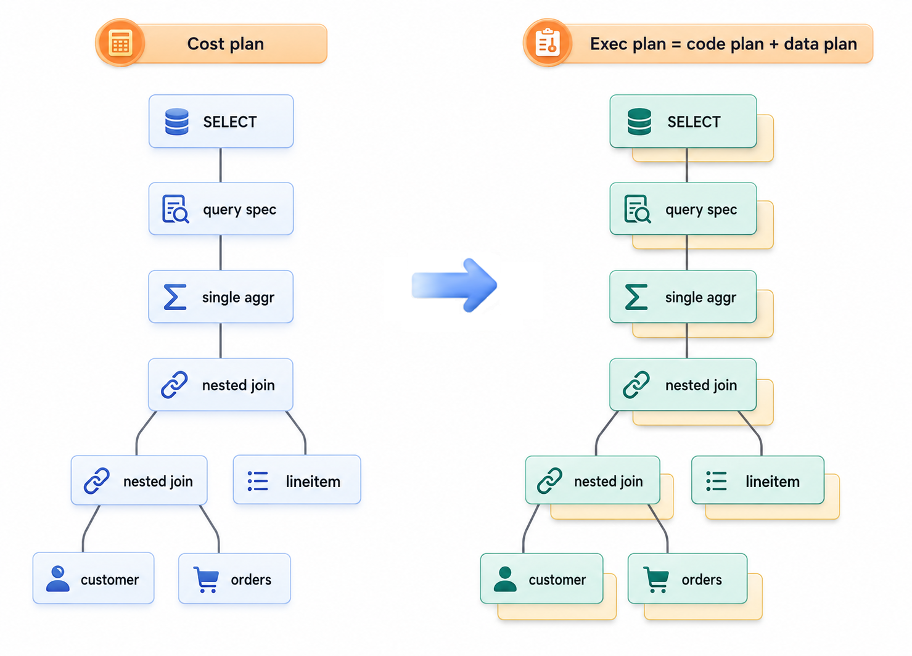

<a id="d840f5576fcd85fa"></a>
#### 실행 계획

실행 계획은 code plan과 data plan으로 구성되어 있다. 최상위 노드가 INSERT, DELETE, UPDATE, SELECT statement 인 tree 형태이다.

실행 계획은 SQL tuning의 가장 기본적인 분석 tool 이다. 실행 계획을 보면 rewriter가 어떻게 질의문을 변환했는지, enumerator가 어떤 access path, join order, join method를 선택했는지 확인할 수 있기 때문이다.

다음은 실행 계획을 출력하기 위한 구문과 실행 예이다.

<a id="0451ebb4f1fef057"></a>
##### 구문

다음은 실행 계획을 출력하기 위한 구문이다.

```
<explain plan> ::= 
      \explain plan [ on | only ] <sql statement>

<sql statement> ::= 
        <query expression>
      | <select for update statement>
      | <select statement: single row>
      | <insert statement>
      | <update statement: searched>
      | <delete statement: searched>
```

<a id="9db3f0d4b818ba32"></a>
##### 사용 범위 및 접근 권한

&lt;explain plan&gt; 구문을 수행하려면 &lt;sql statement&gt; 구문에 대한 접근 권한을 가져야 한다.

<a id="a42face8a4b9380a"></a>
##### 구문 규칙 및 파라미터

```
\EXPLAIN PLAN ON
\EXPLAIN PLAN
```

위와 같이 명시하면, 질의를 수행한 후에 실행 계획을 출력한다.

```
\EXPLAIN PLAN ONLY
```

위와 같이 명시하면 질의 수행은 하지 않고 실행 계획만 출력한다.

<a id="d5eb2a5de0be900b"></a>
##### 사용 예

다음과 같이 실행할 경우, SQL 구문을 수행하고 질의 결과와 실행 계획을 함께 출력한다.

다음 예제가 실행된 cluster system은 G1(G1N1, G1N2), G2(G2N1, G2N2), G3(G3N1, G3N2)으로 구성되어 있다. Customer는 cloned table 이고 orders는 data가 o_orderkey로 분할된 sharded table 이다.

<a id="1ec8eab5eb139c46"></a>
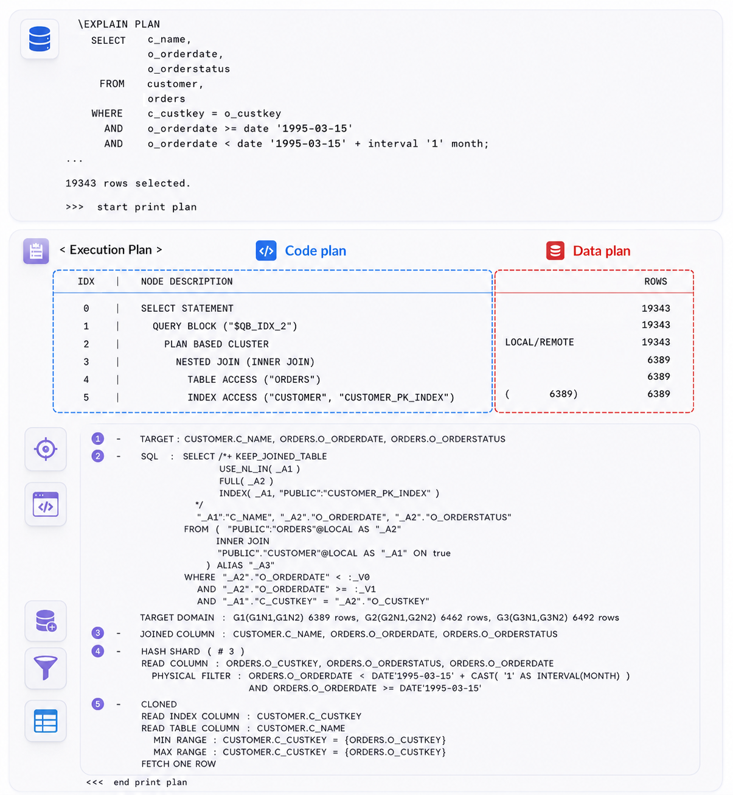

위 실행 계획을 tree 형태로 나타내면 다음과 같다. 최하위 노드부터 수행된다.

<a id="0c50c7701289a572"></a>


위 실행 tree는 다음과 같이 수행된다.

일단 PLAN BASED CLUSTER(IDX 2)는 G1, G2, G3에 다음과 같은 SQL을 전송한다.

```
SELECT /*+ KEEP_JOINED_TABLE
           USE_NL_IN( _A1 ) 
           FULL( _A2 ) 
           INDEX( _A1, "PUBLIC"."CUSTOMER_PK_INDEX" ) 
       */ 
       "_A1"."C_NAME", "_A2"."O_ORDERDATE", "_A2"."O_ORDERSTATUS" 
  FROM ( "PUBLIC"."ORDERS"@LOCAL AS "_A2" 
         INNER JOIN 
         "PUBLIC"."CUSTOMER"@LOCAL AS "_A1" ON true 
       ) ALIAS "_A3" 
 WHERE "_A2"."O_ORDERDATE" < :_V0 
   AND "_A2"."O_ORDERDATE" >= :_V1 
   AND "_A1"."C_CUSTKEY" = "_A2"."O_CUSTKEY"
```

각 G1, G2, G3에서 TABLE ACCESS(IDX:4), INDEX ACCESS(IDX:5)가 customer, orders 테이블로부터 data를 읽어 NESTED JOIN(IDX 3)을 수행한다.

PLAN BASED CLUSTER는 G1, G2, G3의 NESTED JOIN(IDX 3) 결과를 모두 local로 가져온다.

그리고 그 결과를 반환한다.

<a id="3856aba8e470dccf"></a>
##### 실행 계획 구성 정보

실행 계획 테이블의 각 column에 대한 정보는 다음과 같다.

- IDX
    - 각 plan node에 부여된 식별자이다.
- NODE DESCRIPTION
    - Plan node 이름이다.
    - 괄호 안의 내용은 plan node를 구분하는 부가적인 정보이다.
    - 들여쓰기로 표시된 plan node는 하위 plan node를 의미한다.
        - 하위 plan node부터 수행하여 상위 노드에 그 결과를 전달한다.
- ROWS
    - Plan node 수행에 따른 결과 레코드의 개수이다.

각 plan node들은 다음과 같은 최적화 정보를 담고 있다.

- 각각의 테이블에 대한 [Access Paths](#b82731885a93d1b6)
- [Join](#8b6a9bfce9334d9a)을 처리하는 순서 및 join method
- [Group By](#49da1d3f7f9f2924) 처리 정보
- [Distinct](#09f9be7b2b23cfe8) 처리 정보
- [Single Row Aggregation](#5b841256d9341b75) 처리 정보
- [Order By](#764a2f345d55c0e9) 처리 정보
- [Cluster Puller](12-sql-languages.md#6ad1394ea51bd252) 처리 정보
- [Cluster Pusher](12-sql-languages.md#58aadf181a8e32aa) 처리 정보

<a id="434bd3911bb3077a"></a>
## Rewriter

본 장에서는 rewriter가 처리하고 있는 다양한 query transformation 기법에 대해 설명한다.

<a id="b0fe5a2b56d833a9"></a>
### Filter Push Down

Filter를 내릴 수 있는 위치까지 최대한 내림으로써 처리해야 하는 중간 결과를 줄여준다.

다음은 filter push down의 예이다.

<a id="7a66a6b0e6c2c3ed"></a>
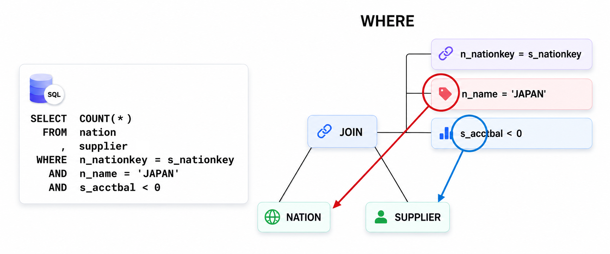

Join을 수행하기 전에 NATION에서 n_name = JAPAN 조건을 만족하는 row를 filtering 하고 SUPPLIER에서 s_acctbal < 0 조건을 만족하는 row를 filtering 한다. 이와 같이 처리하면 join 처리 대상 row의 개수가 줄어들어 성능이 향상된다.

다음은 view 안으로 filter push down 하는 예이다.

<a id="d2d4f0b6a503e697"></a>


supplier_no = 100을 l_suppkey = 100으로 변환한 후에 lineitem TABLE ACCESS 노드까지 내리면 GROUP BY 처리 대상 row가 줄어들어 성능이 향상된다.

<a id="92c04613df1d92fa"></a>
### DISTINCT Elimination

불필요한 DISTINCT를 삭제한다.

다음과 같은 경우에 DISTINCT를 삭제할 수 있다.

- Single row aggregation의 질의 결과는 한 건이므로 DISTINCT가 없어도 중복된 결과는 생기지 않는다.
- Group by가 존재하고 group by의 모든 key column들이 select list에 존재할 경우, 그 결과는 unique 하므로 DISTINCT가 없어도 중복된 결과가 생기지 않는다. 
- Primary key의 모든 key column들이 select list에 존재할 경우, 그 결과는 unique 하므로 DISTINCT가 없어도 중복된 결과가 생기지 않는다.

다음은 DISTINCT를 elimination 하는 예이다.

<a id="1a1978441254dbae"></a>
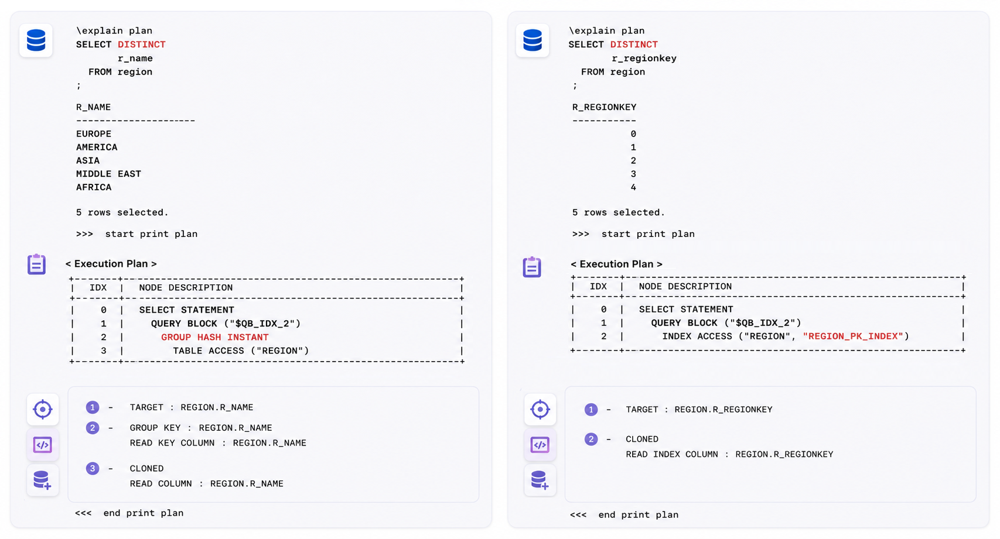

왼쪽 execution plan에는 DISTINCT를 처리하기 위한 GROUP HASH INSTANT 노드가 있지만, 오른쪽 execution plan에는 DISTINCT를 처리하기 위한 GROUP HASH INSTANT 노드가 없다.

r_regionkey는 primary key 이기 때문에 DISTINCT를 삭제하더라도 그 결과는 distinct 함을 보장한다. 따라서 불필요한 DISTINCT가 삭제된 것을 알 수 있다.

<a id="15dec692fecf7459"></a>
### ORDER BY Elimination

불필요한 ORDER BY를 삭제한다.

다음과 같은 경우에는 ORDER BY가 필요하지 않다.

- From 절에 view 하나만 있고 group by 절이나 distinct 절 또는 order by 절이 있는 경우, view 내부 query block에 존재하는 order by는 필요하지 않다. 정렬하더라도 외부의 group by, distinct, order by 등에 의해 정렬 순서가 사라지기 때문이다. 
- Subquery의 내부 query block에 존재하는 order by는 필요하지 않다. Subquery 결과는 outer query의 row를 반환할지 여부를 결정하는 데만 쓰이기 때문이다.

다음은 ORDER BY를 삭제하는 예이다.

<a id="6d6fea429e1f8475"></a>
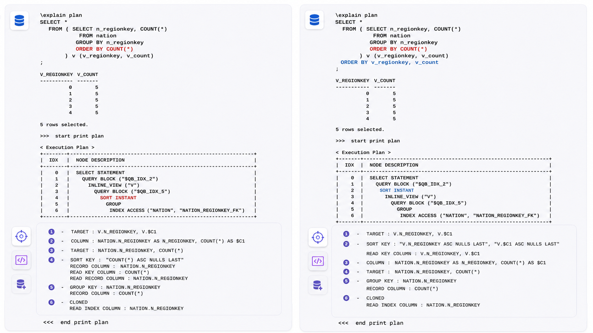

위 그림의 좌우 view는 서로 동일하지만 오른쪽 SQL은 view의 상위 query에 order by가 있어 view 내부의 order by는 삭제된 것을 확인할 수 있다.

<a id="40ba79941873c289"></a>
### Simple View Merging

Group by, distinct, aggregation 등을 포함하지 않은 simple view를 상위 query block에 merge 한다.

Simple view merging을 적용하면 optimizer가 다양한 access path, join ordering, join method를 선택할 수 있기 때문에 더 좋은 실행 계획을 얻을 수 있다.

다음과 같은 경우에는 simple view merging을 적용할 수 없다.

- View 내부의 query block이 다음 항목들을 포함하고 있을 경우
    - Set operator
    - LIMIT, OFFSET
    - DISTINCT
    - GROUP BY
    - Single row aggregation 
    - Full outer join
    - Natural join
    - ROWNUM
    - SELECT list에 subquery expression이 존재할 경우
- View가 다음과 같은 질의에 참여하고 있는 경우 
    - Full outer join에 view가 참여
    - Left outer join에 view가 참여하고 view 내부에 두 개 이상의 테이블이 존재

다음은 simple view를 merging 하는 예이다.

```
CREATE VIEW v_nation 
( 
    v_nationkey,
    v_nation_name,
    v_region_name
)
AS
SELECT n_nationkey,
       n_name,
       r_name
  FROM nation, region
 WHERE n_regionkey = r_regionkey;
```

```
\EXPLAIN PLAN 
SELECT v_nation_name, COUNT(*)
  FROM customer, v_nation
 WHERE c_nationkey = v_nationkey
   AND v_region_name = 'ASIA'
GROUP BY v_nation_name;

V_NATION_NAME             COUNT(*)
------------------------- --------
CHINA                         6024
INDIA                         6042
INDONESIA                     6161
JAPAN                         5948
VIETNAM                       6008

5 rows selected.

>>>  start print plan

< Execution Plan >
=========================================================================
|  IDX  |  NODE DESCRIPTION                                             |
-------------------------------------------------------------------------
|    0  |  SELECT STATEMENT                                             |
|    1  |    QUERY BLOCK ("$QB_IDX_2")                                  |
|    2  |      GROUP HASH INSTANT                                       |
|    3  |        NESTED JOIN (INNER JOIN)                               |
|    4  |          NESTED JOIN (INNER JOIN)                             |
|    5  |            TABLE ACCESS ("REGION")                            |
|    6  |            INDEX ACCESS ("NATION", "NATION_REGIONKEY_FK")     |
|    7  |          INDEX ACCESS ("CUSTOMER", "CUSTOMER_NATIONKEY_FK")   |
=========================================================================

     1  -  TARGET : NATION.N_NAME, COUNT(*)
     2  -  GROUP KEY : NATION.N_NAME
           RECORD COLUMN : COUNT(*)
           READ KEY COLUMN : NATION.N_NAME
           READ RECORD COLUMN : COUNT(*)
     3  -  JOINED COLUMN : NATION.N_NAME
     4  -  JOINED COLUMN : NATION.N_NATIONKEY, NATION.N_NAME
     5  -  CLONED 
           READ COLUMN : REGION.R_REGIONKEY, REGION.R_NAME
             PHYSICAL FILTER : REGION.R_NAME = 'ASIA'
     6  -  CLONED 
           READ INDEX COLUMN : NATION.N_REGIONKEY
           READ TABLE COLUMN : NATION.N_NATIONKEY, NATION.N_NAME
             MIN RANGE : NATION.N_REGIONKEY = {REGION.R_REGIONKEY}
             MAX RANGE : NATION.N_REGIONKEY = {REGION.R_REGIONKEY}
     7  -  CLONED 
           READ INDEX COLUMN : CUSTOMER.C_NATIONKEY
             MIN RANGE : CUSTOMER.C_NATIONKEY = {NATION.N_NATIONKEY}
             MAX RANGE : CUSTOMER.C_NATIONKEY = {NATION.N_NATIONKEY}

<<<  end print plan
```

위 execution plan에는 view가 없다. View가 outer query에 merging 되어 다음과 같이 변환된 query 형태로 수행된 것을 확인할 수 있다.

<a id="6450b56deb9aa03e"></a>


<a id="46e330617a748392"></a>
### Outer Join Table Elimination

불필요한 outer join table을 삭제한다.

다음과 같은 경우에는 outer join도 right table에 대한 접근도 모두 필요없다.

- Left outer join 이고, 
    - ON 절에 left_table.col = right_table.col 형태의 predicate 존재
    - ON 절의 right_table.col에 대해 unique index 존재
    - ON 절 조건 외에 다른 모든 절에서 right table의 column을 사용하지 않음

다음은 outer join table elimination의 예이다.   
다음 예에서 nation 테이블에 대한 접근은 오직 ON 절에만 존재하고, n_nationkey는 primary key column 이라서 unique 하며 null data도 없기 때문에 nation 테이블을 제거하더라도 결과에는 영향을 미치지 않는다.

```
\EXPLAIN PLAN
SELECT COUNT(*)
  FROM supplier 
       LEFT OUTER JOIN
       nation
       ON s_nationkey = n_nationkey
 WHERE s_acctbal < 0
;

COUNT(*)
--------
     886

1 row selected.

>>>  start print plan

< Execution Plan >
============================================================================
|  IDX  |  NODE DESCRIPTION                                         | ROWS |
----------------------------------------------------------------------------
|    0  |  SELECT STATEMENT                                         |    1 |
|    1  |    QUERY BLOCK ("$QB_IDX_2")                              |    1 |
|    2  |      TABLE ACCESS ("SUPPLIER")                            |    1 |
============================================================================

     1  -  TARGET : COUNT(*)
     2  -  CLONED 
           READ COLUMN : SUPPLIER.S_ACCTBAL
           AGGREGATION : COUNT(*)
             PHYSICAL FILTER : SUPPLIER.S_ACCTBAL < 0

<<<  end print plan
```

위 execution plan을 보면 OUTER JOIN과 right table에 대한 접근이 모두 제거된 것을 확인할 수 있다.

<a id="8e8de2e7ff52c213"></a>
### Outer Join Operation Elimination

불필요한 outer join operation을 삭제한다.

- Left outer join의 경우,
    - Where 절에 오른쪽 테이블에 해당하는 조건절이 존재하고, 그 조건절이 IS NULL 이 아닌 경우,
        - Inner join으로 변경할 수 있다.
- Full outer join의 경우,
    - Where 절에 오른쪽 테이블에 해당하는 조건절이 존재하고, 그 조건절이 IS NULL 이 아닌 경우,
        - Right outer join으로 변경할 수 있다.
    - Where 절에 왼쪽 테이블에 해당하는 조건절이 존재하고, 그 조건절이 IS NULL 이 아닌 경우,
        - Left outer join으로 변경할 수 있다.
    - Where 절에 양쪽 테이블에 모두 해당하는 조건절이 존재하고, 그 조건절이 IS NULL 이 아닌 경우,
        - Inner join으로 변경할 수 있다.

다음은 outer join operation을 삭제하는 예이다.

```
\EXPLAIN PLAN
  SELECT MAX(COUNT(*))
    FROM customer
         LEFT OUTER JOIN
         orders
         ON  c_custkey = o_custkey
         AND o_comment LIKE '%special%requests%'
   WHERE o_orderpriority = '1-URGENT'
GROUP BY c_custkey;


MAX(COUNT(*))
-------------
            3

1 row selected.

>>>  start print plan

< Execution Plan >
========================================================================
|  IDX  |  NODE DESCRIPTION                                            |
------------------------------------------------------------------------
|    0  |  SELECT STATEMENT                                            |
|    1  |    QUERY BLOCK ("$QB_IDX_2")                                 |
|    2  |      SINGLE ROW AGGREGATION                                  |
|    3  |        GROUP                                                 |
|    4  |          HASH JOIN (INNER JOIN)                              |
|    5  |            INDEX ACCESS ("CUSTOMER", "CUSTOMER_PK_INDEX")    |
|    6  |            HASH JOIN INSTANT                                 |
|    7  |              TABLE ACCESS ("ORDERS")                         |
========================================================================

     1  -  TARGET : MAX( COUNT(*) )
     2  -  AGGREGATION : MAX( COUNT(*) )
     3  -  GROUP KEY : CUSTOMER.C_CUSTKEY
           RECORD COLUMN : COUNT(*)
     4  -  JOINED COLUMN : CUSTOMER.C_CUSTKEY
     5  -  READ INDEX COLUMN : CUSTOMER.C_CUSTKEY
     6  -  HASH KEY : ORDERS.O_CUSTKEY
           READ KEY COLUMN : ORDERS.O_CUSTKEY
             HASH FILTER : ORDERS.O_CUSTKEY = CUSTOMER.C_CUSTKEY
     7  -  READ COLUMN : ORDERS.O_CUSTKEY, ORDERS.O_ORDERPRIORITY,
                         ORDERS.O_COMMENT
             PHYSICAL FILTER : ORDERS.O_ORDERPRIORITY = '1-URGENT'
             LOGICAL FILTER : ORDERS.O_COMMENT LIKE '%special%requests%'

<<<  end print plan
```

위 예제를 보면 WHERE 절에 o_orderpriority = '1-URGENT 조건이 존재한다. 이 조건으로 인해 right table의 결과로 모든 data가 NULL 인 row는 발생할 수 없다.

따라서 left outer join을 inner join으로 변경해도 그 결과는 동일하다.

<a id="196e49a4bf2bfb7e"></a>
### EXISTS/NOT EXIST 연산 Target 최적화

EXISTS나 NOT EXISTS에 존재하는 subquery의 SELECT list에서 불필요한 expression 처리를 줄여 질의 처리 성능을 향상시킨다.

EXISTS나 NOT EXISTS 연산은 subquery의 결과 row가 존재하는지 여부를 판단하는 연산자이므로 subquery의 SELECT list에 존재하는 expression의 개수나 처리 결과는 연산 결과에 영향을 미치지 않는다. 따라서 subquery의 SELECT list를 BOOLEAN 상수 TRUE로 변경한다.

다음은 EXISTS 연산 target을 최적화하는 예이다.

```
\EXPLAIN PLAN
SELECT o_orderpriority,
       count(*) as order_count
  FROM orders
 WHERE o_orderdate = date '1993-07-01'
   AND EXISTS (
               SELECT /*+ NO_UNNEST */
                      *
                 FROM lineitem
                WHERE l_orderkey = o_orderkey
                  AND l_commitdate < l_receiptdate
             )
GROUP BY o_orderpriority
ORDER BY o_orderpriority;

O_ORDERPRIORITY ORDER_COUNT
--------------- -----------
1-URGENT                113
2-HIGH                  136
3-MEDIUM                112
4-NOT SPECIFIED         103
5-LOW                    97

5 rows selected.

>>>  start print plan

< Execution Plan >
==========================================================================
|IDX|  NODE DESCRIPTION                                                  |
--------------------------------------------------------------------------
| 0 |  SELECT STATEMENT                                                  |
| 1 |    QUERY BLOCK ("$QB_IDX_2")                                       |
| 2 |      SORT INSTANT                                                  |
| 3 |        GROUP HASH INSTANT                                          |
| 4 |          TABLE ACCESS ("ORDERS")                                   |
| 5 |          SUB QUERY LIST                                            |
| 6 |            INLINE_VIEW ("$V6")                                     |
| 7 |              QUERY BLOCK ("$QB_IDX_6")                             |
| 8 |                INDEX ACCESS ("LINEITEM", "LINEITEM_ORDERKEY_FK")   |
==========================================================================

     1  -  TARGET : ORDERS.O_ORDERPRIORITY, COUNT(*) AS ORDER_COUNT
     2  -  SORT KEY : "ORDERS.O_ORDERPRIORITY ASC NULLS LAST"
           RECORD COLUMN : COUNT(*)
           READ KEY COLUMN : ORDERS.O_ORDERPRIORITY
           READ RECORD COLUMN : COUNT(*)
     3  -  GROUP KEY : ORDERS.O_ORDERPRIORITY
           RECORD COLUMN : COUNT(*)
           READ KEY COLUMN : ORDERS.O_ORDERPRIORITY
           READ RECORD COLUMN : COUNT(*)
     4  -  READ COLUMN : ORDERS.O_ORDERKEY, ORDERS.O_ORDERDATE, 
                         ORDERS.O_ORDERPRIORITY
             PHYSICAL FILTER : ORDERS.O_ORDERDATE = DATE'1993-07-01'
             POST FILTER : EXISTS( ( $V6.DUMMY_COL ) )
     6  -  COLUMN : $V6.DUMMY_COL AS DUMMY_COL
     7  -  TARGET : NOTHING
     8  -  READ INDEX COLUMN : LINEITEM.L_ORDERKEY
           READ TABLE COLUMN : LINEITEM.L_COMMITDATE, LINEITEM.L_RECEIPTDATE
             MIN RANGE : LINEITEM.L_ORDERKEY = {ORDERS.O_ORDERKEY}
             MAX RANGE : LINEITEM.L_ORDERKEY = {ORDERS.O_ORDERKEY}
             PHYSICAL TABLE FILTER : LINEITEM.L_RECEIPTDATE > LINEITEM.L_COMMITDATE

<<<  end print plan
```

위 예제에서 lineitem은 16 개의 column을 가진 테이블이다. 사용자 질의문에는 EXISTS subquery 내 SELECT list에 *를 사용하여 lineitem의 모든 column을 읽도록 쓰였지만, 수행할 때는 조건을 만족시키는 row가 존재하는지에 대한 정보만 가져오고, target column value는 아무것도 가지고 오지 않았다.

<a id="17c313db916802d4"></a>
### Quantifier Elimination

다음과 같이 SQL을 변경하여 ANY quantifier를 삭제한다.

<a id="9fbcd9b9c1c4e9aa"></a>
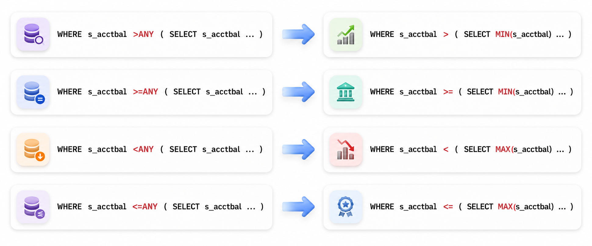

다음은 quantifier를 삭제하는 예이다.

```
\EXPLAIN PLAN
SELECT COUNT(*)
  FROM supplier
 WHERE s_acctbal >ANY ( SELECT s_acctbal
                          FROM supplier, nation
                         WHERE s_nationkey = n_nationkey
                           AND n_name = 'CHINA' )
;

COUNT(*)
--------
    9950

1 row selected.

>>>  start print plan

< Execution Plan >
===========================================================================
|  IDX  |  NODE DESCRIPTION                                               |
---------------------------------------------------------------------------
|    0  |  SELECT STATEMENT                                               |
|    1  |    QUERY BLOCK ("$QB_IDX_2")                                    |
|    2  |      TABLE ACCESS ("SUPPLIER")                                  |
|    3  |  SUB QUERY LIST                                                 |
|    4  |    INLINE_VIEW ("$V4")                                          |
|    5  |      QUERY BLOCK ("$QB_IDX_6")                                  |
|    6  |        SINGLE ROW AGGREGATION                                   |
|    7  |          NESTED JOIN (INNER JOIN)                               |
|    8  |            TABLE ACCESS ("NATION")                              |
|    9  |            INDEX ACCESS ("SUPPLIER", "SUPPLIER_NATIONKEY_FK")   |
===========================================================================

     1  -  TARGET : COUNT(*)
     2  -  READ COLUMN : SUPPLIER.S_ACCTBAL
           AGGREGATION : COUNT(*)
             PHYSICAL FILTER : SUPPLIER.S_ACCTBAL > $V4.$C0
     4  -  COLUMN : MIN( SUPPLIER.S_ACCTBAL ) AS $C0
     5  -  TARGET : MIN( SUPPLIER.S_ACCTBAL )
     6  -  AGGREGATION : MIN( SUPPLIER.S_ACCTBAL )
     7  -  JOINED COLUMN : SUPPLIER.S_ACCTBAL
     8  -  READ COLUMN : NATION.N_NATIONKEY, NATION.N_NAME
             PHYSICAL FILTER : NATION.N_NAME = 'CHINA'
     9  -  READ INDEX COLUMN : SUPPLIER.S_NATIONKEY
           READ TABLE COLUMN : SUPPLIER.S_ACCTBAL
             MIN RANGE : SUPPLIER.S_NATIONKEY = {NATION.N_NATIONKEY}
             MAX RANGE : SUPPLIER.S_NATIONKEY = {NATION.N_NATIONKEY}

<<<  end print plan
```

<a id="d218023a83498c7c"></a>
### Transitive Closure

조인 조건을 이용하여 다른 테이블에 상수 조건을 생성한다. 이렇게 하면 join 처리량을 줄여 성능을 향상 시킬 수 있다.

다음은 transitive closure 예이다.

<a id="1cabfaa9de080ddd"></a>
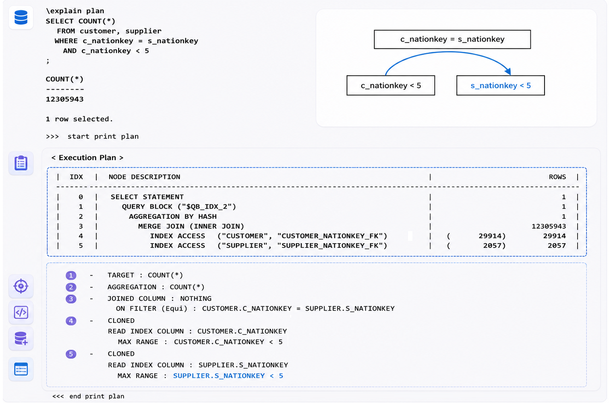

<a id="8af9fc24531260d4"></a>
### Join Transitive Closure

조인 조건을 이용하여 다른 테이블에 조인 조건을 생성한다. 다양한 join ordering과 join method를 선택할 수 있어 보다 좋은 실행 계획을 얻을 수 있다.

A = B AND B = C 인 조인 조건에 A = C인 조인 조건을 추가하는 방식이다.

다음은 join transitive closure 예이다.

<a id="8c5706da8ac9287d"></a>


<a id="b734df009f3916d7"></a>
### Subquery Unnesting

Subquery unnesting은 조건절에 있는 subquery를 동일한 결과를 보장하는 join 구문으로 변환하는 기능이다. 이렇게 처리하면 다양한 access path, join method, join order를 선택할 수 있어 보다 좋은 실행 계획을 얻을 수 있다.

Subquery는 다음과 같이 두가지로 분류할 수 있다.

- Nested subquery (Regular non-scalar subquery )
    - EXISTS/NOT EXIST subquery 
    - 비교연산자 ( =, >,>=, <, <=, &lt;&gt;) ANY subquery
    - 비교연산자 ( =, >,>=, <, <=, &lt;&gt;) ALL subquery 
    - IN/NOT IN subquery 
- Scalar subquery : WHERE 절 또는 SELECT list에 쓰여 오직 하나의 값만 반환

모든 subquery가 unnest 되는 것은 아니다. 다음 제약 조건을 만족해야 subquery unnesting 이 가능하다.

- Set 연산자를 포함하지 않아야 한다.
- Scalar subquery는 WHERE 절에 쓰인 경우에만 사용할 수 있다. 
- Correlated predicate을 포함해야 한다.

Correlated predicate은 subquery 내에 정의되지 않은 outer query block의 column을 포함하는 predicate이다.   
다음 예에서 c.cust_id가 correlated column이고 s.cust_id = c.cust_id가 correlated predicate 이다.

```
SELECT C.cust_last_name, C.country_id
FROM   customers C
WHERE  EXISTS (SELECT 1
                 FROM sales S
                WHERE S.quantity_sold > 1000
                  AND S.cust_id = C.cust_id);
```

<a id="80f3fe4939291a01"></a>
#### Nested Subquery Unnesting

Subquery를 semi join, anti-join, inner join으로 변환한다.

<a id="a451c7103e127049"></a>
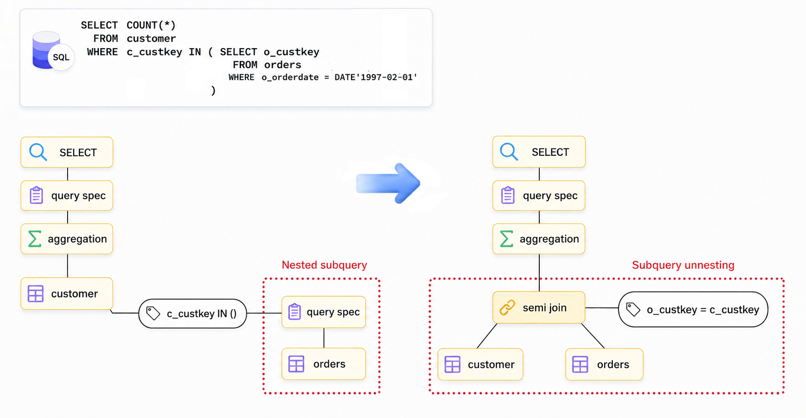

<a id="d17bead496d51e6d"></a>


<a id="6b75d9ca7b574e8f"></a>
#### Scalar Subquery Unnesting

WHERE 절에 있는 scalar subquery만 unnesting 할 수 있는데 , 이 때 subquery는 다음 조건을 만족해야 한다.   
• Single row aggregation 이어야 한다.   
• Correlated predicate을 포함해야 한다.

다음은 scalar subquery를 unnesting 하는 예이다.

<a id="02a5fd4f241b4f01"></a>
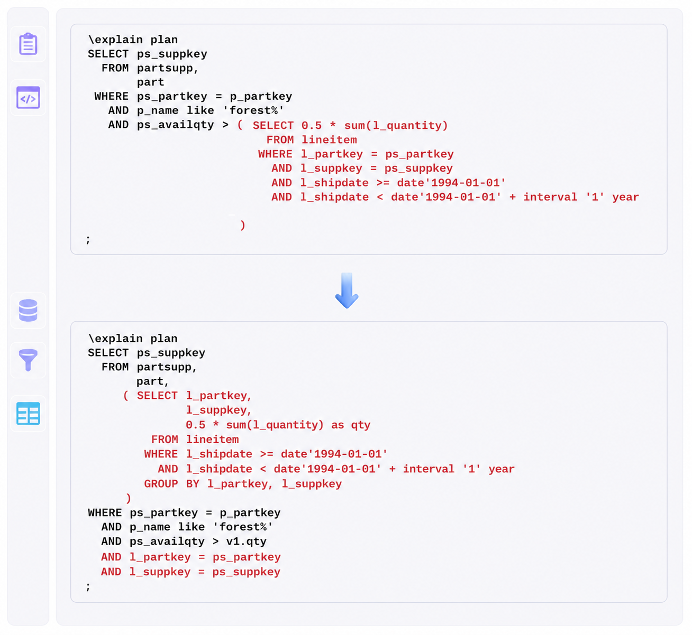

<a id="d9564d52ebd930be"></a>


<a id="655dc80fa7511edb"></a>
### Complex View Merging

Group by를 포함하는 view를 상위 query block과 merge 한다.   
Group by로는 중간 결과를 많이 줄일 수 없고, 상위 query block과의 join filtering 효과가 큰 경우에 사용하면 효과적이다. 따라서 group by로 중간 결과를 많이 줄일 수 있을 때 적용하면 오히려 성능을 저하시킬 수 있다.

다음과 같은 경우에는 complex view merging을 적용할 수 없다.

- View 내부 query block이 다음 항목을 포함하는 경우
    - SET operator
    - ROWNUM
    - LIMIT/OFFSET
    - Single row aggregation
    - ORDER BY
    - Subquery를 포함하는 SELECT list
    - FULL OUTER JOIN
    - NATURAL JOIN
- View가 다음과 같은 질의에 참여하고 있는 경우 
    - Inner join 이외의 join
    - Equi join predicate 이 없는 경우

다음은 complex view를 merge 하는 예이다.

<a id="b721d875c5eece86"></a>
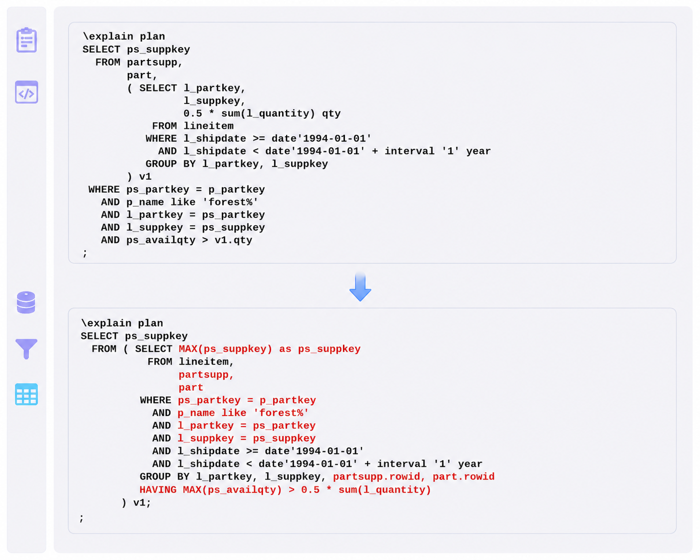

<a id="340ae947991257db"></a>


<a id="34dd6597c53a1b04"></a>
## Enumerator

Enumerator는 통계 정보를 바탕으로 cost를 계산하여 가장 효율적인 plan을 찾는다.

Trans plan을 입력받아 이에 대한 다양한 형태의 cost plan을 생성한 후에 통계 정보를 바탕으로 각 cost plan에 대한 cost를 계산하여 가장 cost가 작은 plan을 선택한다.

<a id="b82731885a93d1b6"></a>
### Access Paths

Access path는 단일 테이블에 access 하는 방법으로써 다음과 같은 종류가 있다.

- Table access
- Index access
- Rowid access
- Index concat

위의 방법에 따른 각각의 cost를 계산하여 가장 cost가 작은 access를 실행 계획으로 선택한다.

<a id="18ffdd319ef68248"></a>
#### Table Access

Table access는 테이블에 저장된 방식 그대로 모든 row를 읽어들이는 방식이다.

다음과 같은 경우에 table access를 선택한다.

- Index가 없는 경우
- Index가 있더라도 index를 사용할 수 있는 predicate이 없는 경우 (예: WHERE col1 + 1 = 10)
- Index의 첫 번째 key column에 대한 조건이 없어서 테이블 접근 비용이 큰 경우  
  (예: composite index (col1, col2)의 두 번째 column에 대한 조건만 존재하는 경우, WHERE col2 > 3)
- 테이블 데이터가 작아서 index access 보다 table access 비용이 더 적은 경우
- 사용자가 테이블 접근 힌트를 준 경우 (예: FULL(t1))
- Index selectivity가 좋지 않거나 데이터가 지나치게 불균형하게 분포된 경우

다음은 table access를 사용하는 예이다.

```
\EXPLAIN PLAN
SELECT r_regionkey, r_name 
  FROM region;

R_REGIONKEY R_NAME                   
----------- -------------------------
          0 AFRICA                   
          1 AMERICA                  
          2 ASIA                     
          3 EUROPE                   
          4 MIDDLE EAST              

5 rows selected.

>>>  start print plan

< Execution Plan >
========================================================================
|  IDX  |  NODE DESCRIPTION                                            |
------------------------------------------------------------------------
|    0  |  SELECT STATEMENT                                            |
|    1  |    QUERY BLOCK ("$QB_IDX_2")                                 |
|    2  |      TABLE ACCESS ("REGION")                                 |
========================================================================

     1  -  TARGET : REGION.R_REGIONKEY, REGION.R_NAME
     2  -  READ COLUMN : REGION.R_REGIONKEY, REGION.R_NAME

<<<  end print plan
```

<a id="f125d80460a4f9a7"></a>
#### Index Access

Index를 사용하여 테이블을 읽는 방식이다.

Index access에는 index full scan, index unique scan, index range scan, in key range scan 방식이 있으며, cost estimation에 의해 가장 좋은 방식이 선택된다.

<a id="9c0ae2d01bdb7399"></a>
##### Index Full Scan

Index 전체를 스캔한다.

다음은 index full scan의 예이다.

```
\EXPLAIN PLAN
SELECT p_partkey
  FROM part;
...

200000 rows selected.

>>>  start print plan

< Execution Plan >
========================================================================
|  IDX  |  NODE DESCRIPTION                                            |
------------------------------------------------------------------------
|    0  |  SELECT STATEMENT                                            |                  
|    1  |    QUERY BLOCK ("$QB_IDX_2")                                 |
|    2  |      INDEX ACCESS ("PART", "PART_PK_INDEX")                  |
========================================================================

     1  -  TARGET : PART.P_PARTKEY
     2  -  READ INDEX COLUMN : PART.P_PARTKEY

<<<  end print plan
```

PART_PK_INDEX의 key column인 p_partkey만 조회하기 때문에 테이블 전체를 읽는 것보다 인덱스 전체를 읽어 결과를 도출하면 비용이 더 적게 든다.

<a id="a423b2dc4be4fde6"></a>
##### Index Unique Scan

Index를 통해 row 하나만 fetch 한다.

다음은 index unique scan의 예이다.

```
\EXPLAIN PLAN
SELECT * 
  FROM part
 WHERE p_partkey = 1;
...
1 row selected.

>>>  start print plan

< Execution Plan >
========================================================================
|  IDX  |  NODE DESCRIPTION                                            |
------------------------------------------------------------------------
|    0  |  SELECT STATEMENT                                            |
|    1  |    QUERY BLOCK ("$QB_IDX_2")                                 |
|    2  |      INDEX ACCESS ("PART", "PART_PK_INDEX")                  |
========================================================================

     1  -  TARGET : PART.P_PARTKEY, PART.P_NAME, PART.P_MFGR, PART.P_BRAND, 
                    PART.P_TYPE, PART.P_SIZE, PART.P_CONTAINER, 
                    PART.P_RETAILPRICE, PART.P_COMMENT
     2  -  READ INDEX COLUMN : PART.P_PARTKEY
           READ TABLE COLUMN : PART.P_NAME, PART.P_MFGR, PART.P_BRAND, 
                               PART.P_TYPE, PART.P_SIZE, PART.P_CONTAINER, 
                               PART.P_RETAILPRICE, PART.P_COMMENT
             MIN RANGE : PART.P_PARTKEY = 1
             MAX RANGE : PART.P_PARTKEY = 1
           FETCH ONE ROW

<<<  end print plan
```

<a id="e79479742d01b9f8"></a>
##### Index Range Scan

Index를 통해 predicate 조건을 만족하는 구간의 row들을 읽어온다. 해당 결과 row들은 index를 통해 읽어오기 때문에 index key column에 대해 정렬되어 있다.

다음은 index range scan의 예이다.

```
\EXPLAIN PLAN
SELECT p_partkey, p_brand, p_type
  FROM part
 WHERE p_partkey >= 10
   AND p_partkey < 20;

P_PARTKEY P_BRAND    P_TYPE                   
--------- ---------- -------------------------
       10 Brand#54   LARGE BURNISHED STEEL    
       11 Brand#25   STANDARD BURNISHED NICKEL
       12 Brand#33   MEDIUM ANODIZED STEEL    
       13 Brand#55   MEDIUM BURNISHED NICKEL  
       14 Brand#13   SMALL POLISHED STEEL     
       15 Brand#15   LARGE ANODIZED BRASS     
       16 Brand#32   PROMO PLATED TIN         
       17 Brand#43   ECONOMY BRUSHED STEEL    
       18 Brand#11   SMALL BURNISHED STEEL    
       19 Brand#23   SMALL ANODIZED NICKEL    

10 rows selected.

>>>  start print plan

< Execution Plan >
========================================================================
|  IDX  |  NODE DESCRIPTION                                            |
------------------------------------------------------------------------
|    0  |  SELECT STATEMENT                                            |
|    1  |    QUERY BLOCK ("$QB_IDX_2")                                 |
|    2  |      INDEX ACCESS ("PART", "PART_PK_INDEX")                  |
========================================================================

     1  -  TARGET : PART.P_PARTKEY, PART.P_BRAND, PART.P_TYPE
     2  -  READ INDEX COLUMN : PART.P_PARTKEY
           READ TABLE COLUMN : PART.P_BRAND, PART.P_TYPE
             MIN RANGE : PART.P_PARTKEY >= 10
             MAX RANGE : PART.P_PARTKEY IS NOT NULL AND PART.P_PARTKEY < 20

<<<  end print plan
```

<a id="ea2c47865b099d51"></a>
##### In Key Range Scan

다음과 같은 predicate 있는 경우에 in key range scan을 수행할 수 있다.

```
( col1, col2 ) IN ( (val1, val2), (val3, val4) )
```

- WHERE 절에 IN 또는 =ANY list function filter가 있다.
- col1, col2는 base column 이어야 한다. (연산이나 function이 없는 column 이어야 한다.)
- col1에 대응되는 (val1, val3)를 하나의 data type으로 변환할 수 있어야 한다.
- col2에 대응되는 (val2, val4)를 하나의 data type으로 변환할 수 있어야 한다.

다음은 in key range scan의 예이다.

```
\EXPLAIN PLAN
  SELECT o_orderstatus
    FROM orders
   WHERE o_custkey IN ( 1, 10, 100, 1000, 10000 );
...
91 rows selected.

>>>  start print plan

< Execution Plan >
========================================================================
|  IDX  |  NODE DESCRIPTION                                            |
------------------------------------------------------------------------
|    0  |  SELECT STATEMENT                                            |
|    1  |    QUERY BLOCK ("$QB_IDX_2")                                 |
|    2  |      INDEX ACCESS ("ORDERS", "ORDERS_CUSTKEY_FK")            |
========================================================================

     1  -  TARGET : ORDERS.O_ORDERSTATUS
     2  -  READ INDEX COLUMN : ORDERS.O_CUSTKEY
           READ TABLE COLUMN : ORDERS.O_ORDERSTATUS
           IN KEY RANGE
             MIN RANGE : ORDERS.O_CUSTKEY = ?
             MAX RANGE : ORDERS.O_CUSTKEY = ?

<<<  end print plan
```

<a id="8016e814da30a7ab"></a>
#### Rowid Access

Rowid access는 rowid를 사용하여 해당 페이지에 직접 접근하는 방식이다.

Rowid access를 사용하려면 rowid에 대한 predicate이 반드시 존재해야 한다. Rowid access는 일반적으로 다른 access path보다 빠르기 때문에 rowid에 대한 predicate만 존재한다면 estimator가 rowid access를 가장 좋은 access path로 선택할 가능성이 높다.

```
gSQL> \EXPLAIN PLAN
SELECT p_brand, p_type
  FROM part
 WHERE rowid = 'AAAAAAAAYe8AACAAAEMJAAA';

P_BRAND    P_TYPE                  
---------- ------------------------
Brand#33   STANDARD POLISHED COPPER

1 row selected.

>>>  start print plan

< Execution Plan >
========================================================================
|  IDX  |  NODE DESCRIPTION                                            | 
------------------------------------------------------------------------
|    0  |  SELECT STATEMENT                                            |
|    1  |    QUERY BLOCK ("$QB_IDX_2")                                 |
|    2  |      ROWID ACCESS ("PART")                                   |
========================================================================

     1  -  TARGET : PART.P_BRAND, PART.P_TYPE
     2  -  READ COLUMN : PART.P_BRAND, PART.P_TYPE
             ROWID FILTER : PART.ROWID = 'AAAAAAAAYe8AACAAAEMJAAA'

<<<  end print plan
```

<a id="c23abd56e9d2ceb3"></a>
#### Index Concat

Index concat은 여러 개의 index access 결과를 통합하여 하나의 결과로 만드는 방식이다. 따라서 OR predicate이 존재하고, 각 predicate이 index access 할 수 있는 경우에만 사용할 수 있다.

OR predicate이 존재하면 estimator가 index concat의 cost를 계산한 후 이 cost가 다른 access path 보다 작으면 이 방식을 선택한다.

다음은 index concat을 사용하는 예이다.

```
gSQL> \EXPLAIN PLAN
SELECT p_brand, p_type
  FROM part
 WHERE p_partkey = 1 OR p_partkey = 20;

P_BRAND    P_TYPE                
---------- ----------------------
Brand#13   PROMO BURNISHED COPPER
Brand#12   LARGE POLISHED NICKEL 

2 rows selected.

>>>  start print plan

< Execution Plan >
========================================================================
|  IDX  |  NODE DESCRIPTION                                            |
------------------------------------------------------------------------
|    0  |  SELECT STATEMENT                                            |
|    1  |    QUERY BLOCK ("$QB_IDX_2")                                 |
|    2  |      CONCAT (Compare Nothing)                                |
|    3  |        INDEX ACCESS ("PART", "PART_PK_INDEX")                |
|    4  |        INDEX ACCESS ("PART", "PART_PK_INDEX")                |
========================================================================

     1  -  TARGET : PART.P_BRAND, PART.P_TYPE
     2  -  CONCAT COLUMN : PART.P_BRAND, PART.P_TYPE
     3  -  READ INDEX COLUMN : PART.P_PARTKEY
           READ TABLE COLUMN : PART.P_BRAND, PART.P_TYPE
             MIN RANGE : PART.P_PARTKEY = 1
             MAX RANGE : PART.P_PARTKEY = 1
           FETCH ONE ROW
     4  -  READ INDEX COLUMN : PART.P_PARTKEY
           READ TABLE COLUMN : PART.P_BRAND, PART.P_TYPE
             MIN RANGE : PART.P_PARTKEY = 20
             MAX RANGE : PART.P_PARTKEY = 20
           FETCH ONE ROW

<<<  end print plan
```

<a id="8b6a9bfce9334d9a"></a>
### Join

Join은 둘 이상의 테이블을 조합하여 하나의 결과 집합으로 만드는 과정이다.

이 때 테이블 간의 관계를 정의하는 것이 join condition 이다. Join condition이 없을 경우, 모든 테이블 row들의 곱이 새로운 결과 집합이 된다.

Estimator는 join type에 따라 join order, join method, access path를 고려한 다양한 cost plan을 생성하고, 이들의 cost를 계산하여 가장 좋은 cost plan을 선택한다. [Access Paths](#b82731885a93d1b6)는 위 절에 설명되어 있으며, 본 절에서는 join type, join method, join order에 대해 설명한다.

<a id="2d29357a9527a414"></a>
#### Join Type

<a id="b58fc9f97b4b63a8"></a>
##### Cross Join

Join condition이 없다. 따라서 두 테이블의 곱집합이 새로운 join 결과가 된다.

다음은 cross join의 예이다.

```
gSQL> \EXPLAIN PLAN SELECT r_regionkey, n_nationkey FROM region, nation;

R_REGIONKEY N_NATIONKEY
----------- -----------
          0           0
          0           1
          0           2
          0           3
          0           4
          0           5
          0           6
          0           7
          0           8
          0           9
          0          10
          0          11
          0          12
          0          13
          0          14
          0          15
          0          16
          0          17
          0          18
          0          19

R_REGIONKEY N_NATIONKEY
----------- -----------
          0          20
          0          21
          0          22
          0          23
          0          24
          1           0
          1           1
         ...         ...
          4          24


125 rows selected.

>>>  start print plan

< Execution Plan >
========================================================================
|  IDX  |  NODE DESCRIPTION                                            |
------------------------------------------------------------------------
|    0  |  SELECT STATEMENT                                            |
|    1  |    QUERY BLOCK ("$QB_IDX_2")                                 |
|    2  |      NESTED JOIN (INNER JOIN)                                |
|    3  |        INDEX ACCESS ("REGION", "REGION_PK_INDEX")            |
|    4  |        INDEX ACCESS ("NATION", "NATION_PK_INDEX")            |
========================================================================

     1  -  TARGET : REGION.R_REGIONKEY, NATION.N_NATIONKEY
     2  -  JOINED COLUMN : REGION.R_REGIONKEY, NATION.N_NATIONKEY
     3  -  READ INDEX COLUMN : REGION.R_REGIONKEY
     4  -  READ INDEX COLUMN : NATION.N_NATIONKEY

<<<  end print plan
```

<a id="6d741cf6e496c854"></a>
##### Inner Join

두 테이블의 곱집합에서 join condition을 만족하는 row들만 결과 집합이 된다.

다음은 inner join의 예이다.

```
gSQL> \EXPLAIN PLAN 
SELECT r_regionkey, n_nationkey 
  FROM region, nation 
 WHERE r_regionkey = n_nationkey;

R_REGIONKEY N_NATIONKEY
----------- -----------
          0           0
          1           1
          2           2
          3           3
          4           4

5 rows selected.

>>>  start print plan

< Execution Plan >
========================================================================
|  IDX  |  NODE DESCRIPTION                                            |
------------------------------------------------------------------------
|    0  |  SELECT STATEMENT                                            |
|    1  |    QUERY BLOCK ("$QB_IDX_2")                                 |
|    2  |      NESTED JOIN (INNER JOIN)                                |
|    3  |        INDEX ACCESS ("REGION", "REGION_PK_INDEX")            |
|    4  |        INDEX ACCESS ("NATION", "NATION_PK_INDEX")            |
========================================================================

     1  -  TARGET : REGION.R_REGIONKEY, NATION.N_NATIONKEY
     2  -  JOINED COLUMN : REGION.R_REGIONKEY, NATION.N_NATIONKEY
     3  -  READ INDEX COLUMN : REGION.R_REGIONKEY
     4  -  READ INDEX COLUMN : NATION.N_NATIONKEY
             MIN RANGE : NATION.N_NATIONKEY = {REGION.R_REGIONKEY}
             MAX RANGE : NATION.N_NATIONKEY = {REGION.R_REGIONKEY}
           FETCH ONE ROW

<<<  end print plan
```

<a id="195d69cec2484513"></a>
##### Outer Join

두 테이블의 곱집합에서 join condition을 만족하는 row들을 결과로 반환하고, outer table의 row는 join condition을 만족하지 않더라도 결과로 반환한다. 즉, join condition을 만족하지 않는 row도 출력하고 싶을 때 outer join을 사용한다.

이 때, inner table에 해당하는 값들은 NULL padding 된다.

Left outer join에서는 left table이 outer table이 된다.   
따라서 아래 예제에서 left table인 part가 outer table이 되어 join condition을 만족하지 않는 row도 출력하고, 이 때 inner table인 partsupp 값은 NULL padding 된다.

<a id="06871b5a321345cb"></a>
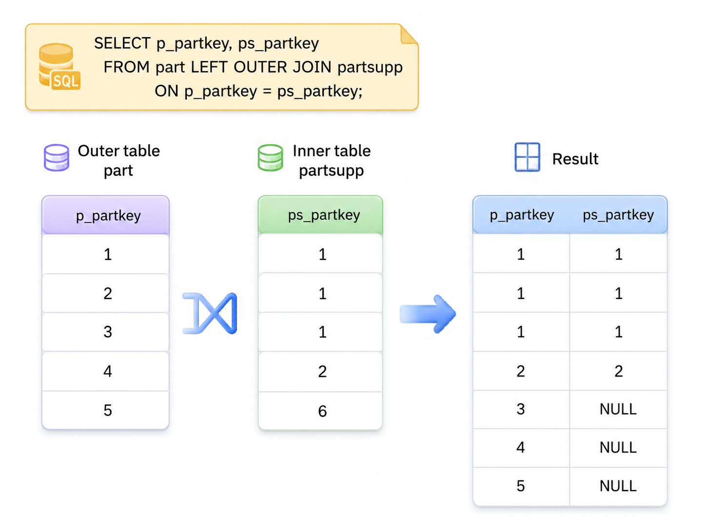

Right outer join에서는 right table이 outer table이 된다.  
따라서 아래 예제에서 right table인 partsupp가 outer table이 되어 join condition을 만족하지 않는 row도 출력하고, 이 때 inner table인 parts 값은 NULL padding 된다.

<a id="a3ac054f15decfa1"></a>
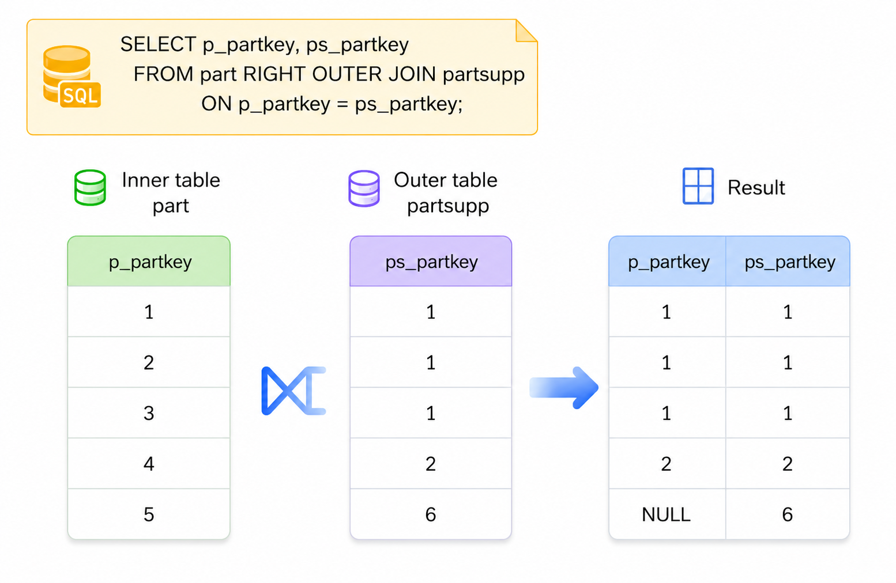

Full outer join은 join condition을 만족하는 row를 출력한 후, left outer로 한 번 right outer로 한 번 수행하여 모든 row를 출력한다.

<a id="86b24c6ae8b43e7a"></a>
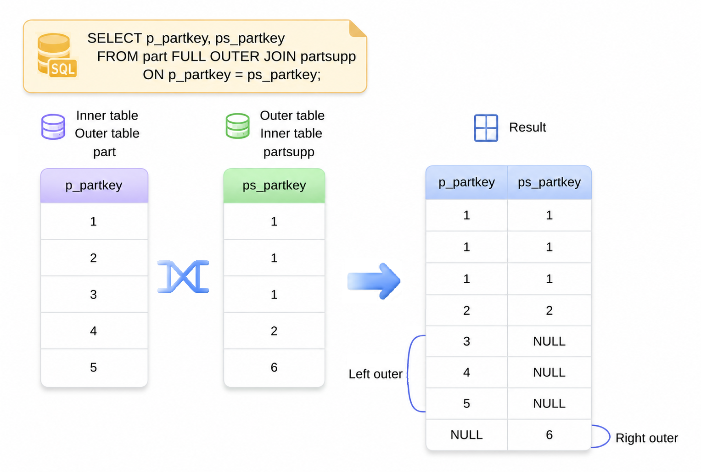

<a id="0b15e000b083e3e8"></a>
###### **Left Outer Join**

Join condition을 만족하는 row들을 모두 결과로 반환하고, left table의 row는 join condition을 만족하지 않더라도 결과로 반환한다.

다음은 left outer join의 예이다.

```
gSQL> \EXPLAIN PLAN 
SELECT r_name, n_name
  FROM region 
       LEFT OUTER JOIN 
       nation 
       ON  r_regionkey = n_regionkey
       AND n_nationkey > 20;

R_NAME                    N_NAME                   
------------------------- -------------------------
AFRICA                    null                     
AMERICA                   UNITED STATES            
ASIA                      VIETNAM                  
EUROPE                    UNITED KINGDOM           
EUROPE                    RUSSIA                   
MIDDLE EAST               null                     

6 rows selected.

>>>  start print plan

< Execution Plan >
========================================================================
|  IDX  |  NODE DESCRIPTION                                            |
------------------------------------------------------------------------
|    0  |  SELECT STATEMENT                                            |
|    1  |    QUERY BLOCK ("$QB_IDX_2")                                 |
|    2  |      HASH JOIN (LEFT OUTER JOIN)                             |
|    3  |        TABLE ACCESS ("REGION")                               |
|    4  |        HASH JOIN INSTANT                                     | 
|    5  |          INDEX ACCESS ("NATION", "NATION_PK_INDEX")          |
========================================================================

     1  -  TARGET : REGION.R_NAME, NATION.N_NAME
     2  -  JOINED COLUMN : REGION.R_NAME, NATION.N_NAME
     3  -  READ COLUMN : REGION.R_REGIONKEY, REGION.R_NAME
     4  -  HASH KEY : NATION.N_REGIONKEY
           RECORD COLUMN : NATION.N_NAME
           READ KEY COLUMN : NATION.N_REGIONKEY, NATION.N_NAME
             HASH FILTER : NATION.N_REGIONKEY = REGION.R_REGIONKEY
     5  -  READ INDEX COLUMN : NATION.N_NATIONKEY
           READ TABLE COLUMN : NATION.N_NAME, NATION.N_REGIONKEY
             MIN RANGE : NATION.N_NATIONKEY > 20
             MAX RANGE : NATION.N_NATIONKEY IS NOT NULL

<<<  end print plan
```

<a id="75d059477e809736"></a>
###### **Right Outer Join**

Join condition을 만족하는 row들을 모두 결과로 반환하고, right table의 row는 join condition을 만족하지 않더라도 결과로 반환한다.

다음은 right outer join의 예이다.

```
gSQL> \EXPLAIN PLAN 
SELECT r_name, n_name
  FROM region RIGHT OUTER JOIN nation ON  r_regionkey = n_regionkey
                                      AND n_nationkey > 20; 
R_NAME N_NAME                   
------ -------------------------
null                      ALGERIA                  
null                      ARGENTINA                
null                      BRAZIL                   
null                      CANADA                   
null                      EGYPT                    
null                      ETHIOPIA                 
null                      FRANCE                   
null                      GERMANY                  
null                      INDIA                    
null                      INDONESIA                
null                      IRAN                     
null                      IRAQ                     
null                      JAPAN                    
null                      JORDAN                   
null                      KENYA                    
null                      MOROCCO                  
null                      MOZAMBIQUE               
null                      PERU                     
null                      CHINA                    
null                      ROMANIA                  
null                      SAUDI ARABIA             
ASIA                      VIETNAM                  
EUROPE                    RUSSIA                   
EUROPE                    UNITED KINGDOM           
AMERICA                   UNITED STATES            

25 rows selected.

>>>  start print plan

< Execution Plan >
========================================================================
|  IDX  |  NODE DESCRIPTION                                            |
------------------------------------------------------------------------
|    0  |  SELECT STATEMENT                                            |
|    1  |    QUERY BLOCK ("$QB_IDX_2")                                 |
|    2  |      HASH JOIN (LEFT OUTER JOIN)                             |
|    3  |        TABLE ACCESS ("NATION")                               |
|    4  |        HASH JOIN INSTANT                                     |
|    5  |          TABLE ACCESS ("REGION")                             |
========================================================================

     1  -  TARGET : REGION.R_NAME, NATION.N_NAME
     2  -  JOINED COLUMN : REGION.R_NAME, NATION.N_NAME
     3  -  READ COLUMN : NATION.N_NATIONKEY, NATION.N_NAME, NATION.N_REGIONKEY
     4  -  HASH KEY : REGION.R_REGIONKEY
           RECORD COLUMN : REGION.R_NAME
           READ KEY COLUMN : REGION.R_REGIONKEY, REGION.R_NAME
             HASH FILTER : REGION.R_REGIONKEY = NATION.N_REGIONKEY
             LOGICAL FILTER : {NATION.N_NATIONKEY} > 20
           FETCH ONE ROW
     5  -  READ COLUMN : REGION.R_REGIONKEY, REGION.R_NAME

<<<  end print plan
```

<a id="3d8e6f37d2e90512"></a>
###### **Full Outer Join**

Join condition을 만족하는 row들을 모두 결과로 반환하고, join condition을 만족하지 않는 left table의 row와 right table의 row도 모두 결과로 반환한다.

다음은 full outer join의 예이다.

```
gSQL> \EXPLAIN PLAN 
SELECT r_name, n_name
  FROM region
       FULL OUTER JOIN 
       nation 
       ON  r_regionkey = n_regionkey
       AND n_nationkey > 20;

R_NAME N_NAME                   
------ -------------------------
null                      ALGERIA                  
null                      ARGENTINA                
null                      BRAZIL                   
null                      CANADA                   
null                      EGYPT                    
null                      ETHIOPIA                 
null                      FRANCE                   
null                      GERMANY                  
null                      INDIA                    
null                      INDONESIA                
null                      IRAN                     
null                      IRAQ                     
null                      JAPAN                    
null                      JORDAN                   
null                      KENYA                    
null                      MOROCCO                  
null                      MOZAMBIQUE               
null                      PERU                     
null                      CHINA                    
null                      ROMANIA                  
null                      SAUDI ARABIA             
ASIA                      VIETNAM                  
EUROPE                    RUSSIA                   
EUROPE                    UNITED KINGDOM           
AMERICA                   UNITED STATES            
AFRICA                    null                     
MIDDLE EAST               null                     

27 rows selected.

>>>  start print plan

< Execution Plan >
========================================================================
|  IDX  |  NODE DESCRIPTION                                            |
------------------------------------------------------------------------
|    0  |  SELECT STATEMENT                                            |
|    1  |    QUERY BLOCK ("$QB_IDX_2")                                 |
|    2  |      HASH JOIN (FULL OUTER JOIN)                             |
|    3  |        TABLE ACCESS ("NATION")                               |
|    4  |        HASH JOIN INSTANT                                     |
|    5  |          TABLE ACCESS ("REGION")                             |
========================================================================

     1  -  TARGET : REGION.R_NAME, NATION.N_NAME
     2  -  JOINED COLUMN : REGION.R_NAME, NATION.N_NAME
     3  -  READ COLUMN : NATION.N_NATIONKEY, NATION.N_NAME, NATION.N_REGIONKEY
     4  -  HASH KEY : REGION.R_REGIONKEY
           RECORD COLUMN : REGION.R_NAME
           READ KEY COLUMN : REGION.R_REGIONKEY, REGION.R_NAME
             HASH FILTER : REGION.R_REGIONKEY = NATION.N_REGIONKEY
             LOGICAL FILTER : {NATION.N_NATIONKEY} > 20
     5  -  READ COLUMN : REGION.R_REGIONKEY, REGION.R_NAME

<<<  end print plan
```

<a id="6490a684d50564c8"></a>
##### Semi Join

Semi join의 경우, SQL 구문을 사용하여 직접 기술할 수 없다. 사용자가 IN, EXISTS, =ANY와 같은 quantifier와 함께 subquery를 썼을 때, rewriter가 subquery unnesting 하는 과정에서 semi join으로 변환한다.

Join condition을 만족하는 row가 존재할 경우, main query의 row를 결과로 반환한다.

다음은 semi join의 예이다.

```
\EXPLAIN PLAN
SELECT o_orderpriority,
       count(*) as order_count
  FROM orders
 WHERE o_orderdate = date '1993-07-01'
   AND EXISTS (
               SELECT *
                 FROM lineitem
                WHERE l_orderkey = o_orderkey
                  AND l_commitdate < l_receiptdate
             )
GROUP BY o_orderpriority
ORDER BY o_orderpriority;

O_ORDERPRIORITY ORDER_COUNT
--------------- -----------
1-URGENT                113
2-HIGH                  136
3-MEDIUM                112
4-NOT SPECIFIED         103
5-LOW                    97

5 rows selected.

>>>  start print plan

< Execution Plan >
==========================================================================
|  IDX  |  NODE DESCRIPTION                                              |
--------------------------------------------------------------------------
|    0  |  SELECT STATEMENT                                              |
|    1  |    QUERY BLOCK ("$QB_IDX_2")                                   |
|    2  |      SORT INSTANT                                              |
|    3  |        GROUP HASH INSTANT                                      |
|    4  |          NESTED JOIN (SEMI)                                    |
|    5  |            TABLE ACCESS ("ORDERS")                             |
|    6  |            INDEX ACCESS ("LINEITEM", "LINEITEM_ORDERKEY_FK")   |
==========================================================================

     1  -  TARGET : ORDERS.O_ORDERPRIORITY, COUNT(*) AS ORDER_COUNT
     2  -  SORT KEY : "ORDERS.O_ORDERPRIORITY ASC NULLS LAST"
           RECORD COLUMN : COUNT(*)
           READ KEY COLUMN : ORDERS.O_ORDERPRIORITY
           READ RECORD COLUMN : COUNT(*)
     3  -  GROUP KEY : ORDERS.O_ORDERPRIORITY
           RECORD COLUMN : COUNT(*)
           READ KEY COLUMN : ORDERS.O_ORDERPRIORITY
           READ RECORD COLUMN : COUNT(*)
     4  -  JOINED COLUMN : ORDERS.O_ORDERPRIORITY
     5  -  READ COLUMN : ORDERS.O_ORDERKEY, ORDERS.O_ORDERDATE, ORDERS.O_ORDERPRIORITY
             PHYSICAL FILTER : ORDERS.O_ORDERDATE = DATE'1993-07-01'
     6  -  READ INDEX COLUMN : LINEITEM.L_ORDERKEY
           READ TABLE COLUMN : LINEITEM.L_COMMITDATE, LINEITEM.L_RECEIPTDATE
             MIN RANGE : LINEITEM.L_ORDERKEY = {ORDERS.O_ORDERKEY}
             MAX RANGE : LINEITEM.L_ORDERKEY = {ORDERS.O_ORDERKEY}
             PHYSICAL TABLE FILTER :
                         LINEITEM.L_RECEIPTDATE > LINEITEM.L_COMMITDATE

<<<  end print plan
```

<a id="5810362d74153d7b"></a>
##### Anti Semi Join

Anti semi join은 SQL 구문을 사용하여 직접 기술할 수 없다. 사용자가 NOT IN, NOT EXISTS, !=ALL, =ALL과 같은 quantifier와 함께 subquery를 썼을 때, rewriter가 subquery unnesting 하는 과정에서 anti semi join으로 변환한다.

Join condition을 만족하는 row가 하나도 없으면 main query의 row를 결과로 반환한다.

Join condition에 nullable column이 있으면 null-aware anti-semi join으로 수행하고, 그렇지 않으면 anti-semi join으로 수행한다.

다음은 anti semi join의 예이다.   
p_partkey와 ps_partkey는 모두 primary key column 이다. 따라서 모두 not null column 이다.

```
\EXPLAIN PLAN
SELECT p_name, p_brand
  FROM part
 WHERE p_partkey NOT IN ( SELECT ps_partkey
                            FROM partsupp
                           WHERE ps_availqty > 5000 );
...

12511 rows selected.

>>>  start print plan

< Execution Plan >
========================================================================
|  IDX  |  NODE DESCRIPTION                                            |
------------------------------------------------------------------------
|    0  |  SELECT STATEMENT                                            |
|    1  |    QUERY BLOCK ("$QB_IDX_2")                                 |
|    2  |      HASH JOIN (ANTI SEMI)                                   |
|    3  |        TABLE ACCESS ("PART")                                 |
|    4  |        HASH JOIN INSTANT (UNIQUE)                            |
|    5  |          TABLE ACCESS ("PARTSUPP")                           |
========================================================================

     1  -  TARGET : PART.P_NAME, PART.P_BRAND
     2  -  JOINED COLUMN : PART.P_NAME, PART.P_BRAND
     3  -  READ COLUMN : PART.P_PARTKEY, PART.P_NAME, PART.P_BRAND
     4  -  HASH KEY : PARTSUPP.PS_PARTKEY
           READ KEY COLUMN : PARTSUPP.PS_PARTKEY
             HASH FILTER : PARTSUPP.PS_PARTKEY = PART.P_PARTKEY
           FETCH ONE ROW
     5  -  READ COLUMN : PARTSUPP.PS_PARTKEY, PARTSUPP.PS_AVAILQTY
             PHYSICAL FILTER : PARTSUPP.PS_AVAILQTY > 5000

<<<  end print plan
```

다음은 null-aware anti-semi join의 예이다.  
p_partkey는 primary key column 이어서 not null 이지만, l_partkey는 nullable 이다.

```
\EXPLAIN PLAN
SELECT p_name, p_brand
  FROM part
 WHERE p_partkey NOT IN ( SELECT l_partkey
                            FROM lineitem
                           WHERE l_quantity > 30 );

no rows selected.

>>>  start print plan

< Execution Plan >
========================================================================
|  IDX  |  NODE DESCRIPTION                                            |
------------------------------------------------------------------------
|    0  |  SELECT STATEMENT                                            |
|    1  |    QUERY BLOCK ("$QB_IDX_2")                                 |
|    2  |      HASH JOIN (ANTI SEMI NA)                                |
|    3  |        TABLE ACCESS ("PART")                                 |
|    4  |        HASH JOIN INSTANT (UNIQUE)                            |
|    5  |          TABLE ACCESS ("LINEITEM")                           |
========================================================================

     1  -  TARGET : PART.P_NAME, PART.P_BRAND
     2  -  JOINED COLUMN : PART.P_NAME, PART.P_BRAND
     3  -  READ COLUMN : PART.P_PARTKEY, PART.P_NAME, PART.P_BRAND
     4  -  HASH KEY : LINEITEM.L_PARTKEY
           READ KEY COLUMN : LINEITEM.L_PARTKEY
             HASH FILTER : LINEITEM.L_PARTKEY = PART.P_PARTKEY
           FETCH ONE ROW
     5  -  READ COLUMN : LINEITEM.L_PARTKEY, LINEITEM.L_QUANTITY
             PHYSICAL FILTER : LINEITEM.L_QUANTITY > 30

<<<  end print plan
```

<a id="029f46e9de972592"></a>
#### Join Method

두 테이블의 join 연산 방법에는 nested loops join, sort merge join, hash join이 있다. Enumerator는 이 join method 들에 대한 cost를 계산하여 가장 비용이 적은 join 연산을 선택한다.

<a id="815be75228779238"></a>
##### Nested Loops Join

Outer table의 각 row에 대하여 inner table의 모든 row를 검색하여 join condition을 만족하는 결과를 찾는다.

<a id="f9e6d4fe7380ef7d"></a>


Outer table의 row 개수만큼 inner table을 full scan 하므로 outer table의 row 개수가 적을수록 좋다.

Join condition이 없는 join도 nested loop join을 통해 수행 결과를 cartesian product로 반환할 수 있다. 따라서 hash join, sort merge join이 안되는 경우라도 nested loop join은 수행할 수 있다.

<a id="c2c84115d40a56fe"></a>
###### **Index Nested Loops Join**

Inner table에 index가 있어서 그 index를 통해 join 조건에 맞는 row를 찾을 수 있는 경우, index nested loop join을 수행한다. Index access 하면 필요한 row에만 접근하므로 성능이 향상되는 효과를 얻을 수 있다.

<a id="a1d038199a52b9f1"></a>


다음은 index nested loop join의 예이다.

```
\EXPLAIN PLAN
  SELECT c_custkey, count(o_orderkey)
    FROM customer, orders
   WHERE c_custkey = o_custkey
     AND c_comment like '%special%requests%'
GROUP BY c_custkey;
... 
2265 rows selected.

>>>  start print plan

< Execution Plan >
========================================================================
|  IDX  |  NODE DESCRIPTION                                            |
------------------------------------------------------------------------
|    0  |  SELECT STATEMENT                                            |
|    1  |    QUERY BLOCK ("$QB_IDX_2")                                 |
|    2  |      GROUP HASH INSTANT                                      |
|    3  |        NESTED JOIN (INNER JOIN)                              |
|    4  |          TABLE ACCESS ("CUSTOMER")                           |
|    5  |          INDEX ACCESS ("ORDERS", "ORDERS_CUSTKEY_FK")        |
========================================================================

     1  -  TARGET : CUSTOMER.C_CUSTKEY, COUNT( ORDERS.O_ORDERKEY )
     2  -  GROUP KEY : CUSTOMER.C_CUSTKEY
           RECORD COLUMN : COUNT( ORDERS.O_ORDERKEY )
           READ KEY COLUMN : CUSTOMER.C_CUSTKEY
           READ RECORD COLUMN : COUNT( ORDERS.O_ORDERKEY )
     3  -  JOINED COLUMN : CUSTOMER.C_CUSTKEY, ORDERS.O_ORDERKEY
     4  -  READ COLUMN : CUSTOMER.C_CUSTKEY, CUSTOMER.C_COMMENT
             LOGICAL FILTER : CUSTOMER.C_COMMENT LIKE '%special%requests%'
     5  -  READ INDEX COLUMN : ORDERS.O_CUSTKEY
           READ TABLE COLUMN : ORDERS.O_ORDERKEY
             MIN RANGE : ORDERS.O_CUSTKEY = {CUSTOMER.C_CUSTKEY}
             MAX RANGE : ORDERS.O_CUSTKEY = {CUSTOMER.C_CUSTKEY}

<<<  end print plan
```

<a id="4cd3edd63a01ee21"></a>
###### **Instant Nested Loops Join**

Inner table의 중간 결과를 instant table에 적재한 후에 nested loop join을 수행한다.

<a id="f10d6f0986bc9ac9"></a>


다음 예제처럼 o_custkey = 1과 같은 조건이 있을 경우, orders의 중간 결과를 instant table에 적재하여 nested loop join을 수행할 수 있다.

다음은 instant nested loop join의 예이다.

```
\EXPLAIN PLAN
  SELECT c_custkey, count(o_orderkey)
    FROM customer, orders
   WHERE c_comment like '%special%requests%'
     AND o_orderdate = date '1995-03-15'
GROUP BY c_custkey;

...
3380 rows selected.

>>>  start print plan

< Execution Plan >
========================================================================
|  IDX  |  NODE DESCRIPTION                                            |
------------------------------------------------------------------------
|    0  |  SELECT STATEMENT                                            |
|    1  |    QUERY BLOCK ("$QB_IDX_2")                                 |
|    2  |      GROUP HASH INSTANT                                      |
|    3  |        NESTED JOIN (INNER JOIN)                              |
|    4  |          TABLE ACCESS ("ORDERS")                             |
|    5  |          FLAT JOIN INSTANT                                   |
|    6  |            TABLE ACCESS ("CUSTOMER")                         |
========================================================================

     1  -  TARGET : CUSTOMER.C_CUSTKEY, COUNT( ORDERS.O_ORDERKEY )
     2  -  GROUP KEY : CUSTOMER.C_CUSTKEY
           RECORD COLUMN : COUNT( ORDERS.O_ORDERKEY )
           READ KEY COLUMN : CUSTOMER.C_CUSTKEY
           READ RECORD COLUMN : COUNT( ORDERS.O_ORDERKEY )
     3  -  JOINED COLUMN : CUSTOMER.C_CUSTKEY, ORDERS.O_ORDERKEY
     4  -  READ COLUMN : ORDERS.O_ORDERKEY, ORDERS.O_ORDERDATE
             PHYSICAL FILTER : ORDERS.O_ORDERDATE = DATE'1995-03-15'
     5  -  RECORD COLUMN : CUSTOMER.C_CUSTKEY
           READ COLUMN : CUSTOMER.C_CUSTKEY
     6  -  READ COLUMN : CUSTOMER.C_CUSTKEY, CUSTOMER.C_COMMENT
             LOGICAL FILTER : CUSTOMER.C_COMMENT LIKE '%special%requests%'

<<<  end print plan
```

<a id="e7fe85e8215c3bc9"></a>
##### Sort Merge Join

Outer table과 inner table의 중간 결과를 모두 정렬한 다음 순차적으로 비교하여 join condition을 만족하는지 검사한 후 join 결과를 반환한다.

Outer table이나 inner table에 index가 존재하고 이를 이용할 수 있을 경우, 해당 table은 sort instant를 사용하지 않고 index를 통해 정렬된 중간 결과를 얻는다.

Sort merge join을 하기 위해서는 하나 이상의 equi join condition이 존재해야 한다.

<a id="dde6eb15ae952a64"></a>


다음은 sort merge join의 예이다.

```
\EXPLAIN PLAN
SELECT p_name, p_brand, p_type
  FROM part, partsupp
 WHERE p_partkey = ps_partkey
   AND p_partkey < 10;
...
36 rows selected.

>>>  start print plan

< Execution Plan >
========================================================================
|  IDX  |  NODE DESCRIPTION                                            |
------------------------------------------------------------------------
|    0  |  SELECT STATEMENT                                            |
|    1  |    QUERY BLOCK ("$QB_IDX_2")                                 |
|    2  |      MERGE JOIN (INNER JOIN)                                 |
|    3  |        INDEX ACCESS ("PART", "PART_PK_INDEX")                |
|    4  |        INDEX ACCESS ("PARTSUPP", "PARTSUPP_PARTKEY_FK")      |
========================================================================

     1  -  TARGET : PART.P_NAME, PART.P_BRAND, PART.P_TYPE
     2  -  JOINED COLUMN : PART.P_NAME, PART.P_BRAND, PART.P_TYPE
             ON FILTER (Equi) : PART.P_PARTKEY = PARTSUPP.PS_PARTKEY
     3  -  READ INDEX COLUMN : PART.P_PARTKEY
           READ TABLE COLUMN : PART.P_NAME, PART.P_BRAND, PART.P_TYPE
             MAX RANGE : PART.P_PARTKEY < 10
     4  -  READ INDEX COLUMN : PARTSUPP.PS_PARTKEY
             MAX RANGE : PARTSUPP.PS_PARTKEY < 10

<<<  end print plan
```

<a id="0d80179413dbbf83"></a>
##### Hash Join

Inner table에 hash instant를 생성한 후, hash를 사용하여 join condition에 맞는 join 결과를 반환한다.

Hash join을 하기 위해서는 하나 이상의 equi-join condition이 존재해야 한다.

<a id="a81c86e8ac85cc54"></a>
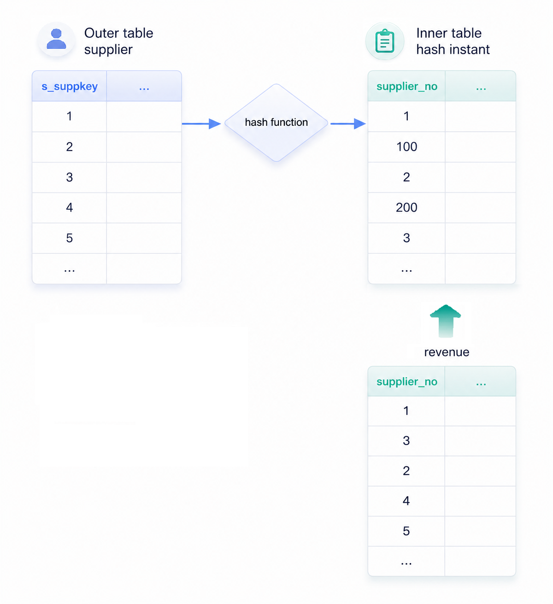

다음은 hash join의 예이다.

```
\EXPLAIN PLAN
SELECT s_suppkey,
       s_name,
       total_revenue
  FROM supplier, 
         (
            SELECT l_suppkey,
                   ROUND( sum(l_extendedprice * (1 - l_discount)), 2)
              FROM lineitem
             WHERE l_shipdate >= date '1996-01-01'
               AND l_shipdate < date '1996-01-01' + interval '3' month
             GROUP BY l_suppkey
       ) revenue(supplier_no, total_revenue)
 WHERE
      s_suppkey = supplier_no;


...
10000 rows selected.

>>>  start print plan

< Execution Plan >
========================================================================
|  IDX  |  NODE DESCRIPTION                                            |
------------------------------------------------------------------------
|    0  |  SELECT STATEMENT                                            |
|    1  |    QUERY BLOCK ("$QB_IDX_2")                                 |
|    2  |      HASH JOIN (INNER JOIN)                                  |
|    3  |        TABLE ACCESS ("SUPPLIER")                             |
|    4  |        HASH JOIN INSTANT                                     |
|    5  |          INLINE_VIEW ("REVENUE")                             |
|    6  |            QUERY BLOCK ("$QB_IDX_7")                         |
|    7  |              GROUP HASH INSTANT                              |
|    8  |                TABLE ACCESS ("LINEITEM")                     |
========================================================================

     1  -  TARGET : SUPPLIER.S_SUPPKEY, SUPPLIER.S_NAME, REVENUE.$C1
     2  -  JOINED COLUMN : SUPPLIER.S_SUPPKEY, SUPPLIER.S_NAME, REVENUE.$C1
     3  -  READ COLUMN : SUPPLIER.S_SUPPKEY, SUPPLIER.S_NAME
     4  -  HASH KEY : REVENUE.L_SUPPKEY
           RECORD COLUMN : REVENUE.$C1
           READ KEY COLUMN : REVENUE.L_SUPPKEY, REVENUE.$C1
             HASH FILTER : REVENUE.L_SUPPKEY = SUPPLIER.S_SUPPKEY
     5  -  COLUMN : LINEITEM.L_SUPPKEY AS L_SUPPKEY, ROUND(SUM( LINEITEM.L_EXTENDEDPRICE * ( 1 - LINEITEM.L_DISCOUNT ) ),2) AS $C1
     6  -  TARGET : LINEITEM.L_SUPPKEY, ROUND(SUM( LINEITEM.L_EXTENDEDPRICE * ( 1 - LINEITEM.L_DISCOUNT ) ),2)
     7  -  GROUP KEY : LINEITEM.L_SUPPKEY
           RECORD COLUMN : SUM( LINEITEM.L_EXTENDEDPRICE * ( 1 - LINEITEM.L_DISCOUNT ) )
           READ KEY COLUMN : LINEITEM.L_SUPPKEY
           READ RECORD COLUMN : SUM( LINEITEM.L_EXTENDEDPRICE * ( 1 - LINEITEM.L_DISCOUNT ) )
     8  -  READ COLUMN : LINEITEM.L_SUPPKEY, LINEITEM.L_EXTENDEDPRICE, LINEITEM.L_DISCOUNT, LINEITEM.L_SHIPDATE
             PHYSICAL FILTER : LINEITEM.L_SHIPDATE < DATE'1996-01-01' + CAST( '3' AS INTERVAL(MONTH) ) AND LINEITEM.L_SHIPDATE >= DATE'1996-01-01'

<<<  end print plan
```

<a id="fa9b0ba7753cf871"></a>
#### Join Order

세 개 이상의 테이블을 join 할 때는 join 순서를 결정해야 한다. 먼저 두 테이블을 join 하고 그 중간 결과와 다음 테이블을 join하는 방식으로 join order를 결정한다.

만일 세 개의 테이블이 있다면 다음과 같이 다양한 join order가 있을 수 있다.

<a id="b5bb61b7a190bade"></a>


Enumerator는 가능한 join order, join method, 그리고 가능한 access path에 따라 다양한 실행 계획들의 집합을 생성하는데, 중간 결과를 줄이고 cost가 적은 plan을 먼저 선택하면서 join ordering을 결정한다.

<a id="49da1d3f7f9f2924"></a>
### Group By

Group by를 처리하는 과정이다.

일반적으로 GROUP HASH INSTANT를 생성하여 group by를 처리한다.

만약 하위에서 중간 결과가 group by key column에 대하여 정렬되어 올라오는 경우에는 별도의 hash instant를 쌓지 않고 처리할 수 있다.

다음은 GROUP HASH INSTANT를 생성하여 group by를 처리하는 예이다.

```
\EXPLAIN PLAN
  SELECT c_custkey, count(o_orderkey)
    FROM customer, orders
 WHERE c_custkey = o_custkey 
     AND c_comment like '%special%requests%'
     AND o_orderdate = date '1995-03-15'
GROUP BY c_custkey;

...
12 rows selected.

>>>  start print plan

< Execution Plan >
========================================================================
|  IDX  |  NODE DESCRIPTION                                            |
------------------------------------------------------------------------
|    0  |  SELECT STATEMENT                                            |
|    1  |    QUERY BLOCK ("$QB_IDX_2")                                 |
|    2  |      GROUP HASH INSTANT                                      |
|    3  |        NESTED JOIN (INNER JOIN)                              |
|    4  |          TABLE ACCESS ("CUSTOMER")                           |
|    5  |          INDEX ACCESS ("ORDERS", "ORDERS_CUSTKEY_FK")        |
========================================================================

     1  -  TARGET : CUSTOMER.C_CUSTKEY, COUNT( ORDERS.O_ORDERKEY )
     2  -  GROUP KEY : CUSTOMER.C_CUSTKEY
           RECORD COLUMN : COUNT( ORDERS.O_ORDERKEY )
           READ KEY COLUMN : CUSTOMER.C_CUSTKEY
           READ RECORD COLUMN : COUNT( ORDERS.O_ORDERKEY )
     3  -  JOINED COLUMN : CUSTOMER.C_CUSTKEY, ORDERS.O_ORDERKEY
     4  -  READ COLUMN : CUSTOMER.C_CUSTKEY, CUSTOMER.C_COMMENT
             LOGICAL FILTER : CUSTOMER.C_COMMENT LIKE '%special%requests%'
     5  -  READ INDEX COLUMN : ORDERS.O_CUSTKEY
           READ TABLE COLUMN : ORDERS.O_ORDERKEY, ORDERS.O_ORDERDATE
             MIN RANGE : ORDERS.O_CUSTKEY = {CUSTOMER.C_CUSTKEY}
             MAX RANGE : ORDERS.O_CUSTKEY = {CUSTOMER.C_CUSTKEY}
             PHYSICAL TABLE FILTER : ORDERS.O_ORDERDATE = DATE'1995-03-15'

<<<  end print plan
```

다음은 하위의 정렬된 중간 결과를 이용하여 group by를 처리하는 예이다.

```
\EXPLAIN PLAN
  SELECT c_custkey, count(o_orderkey)
    FROM customer, orders
   WHERE c_custkey = o_custkey 
     AND c_custkey >= 10
     AND c_custkey < 20
     AND c_comment like '%special%requests%'
     AND o_orderdate = date '1995-03-15'
GROUP BY c_custkey;

...

>>>  start print plan

< Execution Plan >
========================================================================
|  IDX  |  NODE DESCRIPTION                                            |
------------------------------------------------------------------------
|    0  |  SELECT STATEMENT                                            |
|    1  |    QUERY BLOCK ("$QB_IDX_2")                                 |
|    2  |      GROUP                                                   |
|    3  |        NESTED JOIN (INNER JOIN)                              |
|    4  |          INDEX ACCESS ("CUSTOMER", "CUSTOMER_PK_INDEX")      |
|    5  |          INDEX ACCESS ("ORDERS", "ORDERS_CUSTKEY_FK")        |
========================================================================

     1  -  TARGET : CUSTOMER.C_CUSTKEY, COUNT( ORDERS.O_ORDERKEY )
     2  -  GROUP KEY : CUSTOMER.C_CUSTKEY
           RECORD COLUMN : COUNT( ORDERS.O_ORDERKEY )
     3  -  JOINED COLUMN : CUSTOMER.C_CUSTKEY, ORDERS.O_ORDERKEY
     4  -  READ INDEX COLUMN : CUSTOMER.C_CUSTKEY
           READ TABLE COLUMN : CUSTOMER.C_COMMENT
             MIN RANGE : CUSTOMER.C_CUSTKEY >= 10
             MAX RANGE : CUSTOMER.C_CUSTKEY IS NOT NULL AND CUSTOMER.C_CUSTKEY < 20
             LOGICAL TABLE FILTER : CUSTOMER.C_COMMENT LIKE '%special%requests%'
     5  -  READ INDEX COLUMN : ORDERS.O_CUSTKEY
           READ TABLE COLUMN : ORDERS.O_ORDERKEY, ORDERS.O_ORDERDATE
             MIN RANGE : ORDERS.O_CUSTKEY = {CUSTOMER.C_CUSTKEY} AND ORDERS.O_CUSTKEY >= 10
             MAX RANGE : ORDERS.O_CUSTKEY = {CUSTOMER.C_CUSTKEY} AND ORDERS.O_CUSTKEY < 20
             LOGICAL KEY FILTER : ORDERS.O_CUSTKEY LIKE '%special%requests%'
             PHYSICAL TABLE FILTER : ORDERS.O_ORDERDATE = DATE'1995-03-15'

<<<  end print plan
```

Group by와 함께 ROLLUP, CUBE, GROUPING SETS 등을 사용할 수 있다. 이와 같은 형태는 plan을 출력 할 때 (NOT SIMPLE)이라고 명시된다.

```
\EXPLAIN PLAN
SELECT 
       calendar_year as year 
     , calendar_quarter_desc as quarter
     , calendar_month_desc as month
     , SUM(amount_sold) as sum 
  FROM sales, times
 WHERE sales.time_id=times.time_id 
   AND times.calendar_year = 2001
   AND sales.cust_id < 1000 AND sales.prod_id > 142 AND sales.channel_id > 2
 GROUP BY ROLLUP(calendar_year, calendar_quarter_desc, calendar_month_desc)
 ORDER BY 1, 2, 3;
    2     3     4     5     6     7     8     9    10    11    12 
YEAR QUARTER MONTH        SUM
---- ------- ------- --------
2001 2001-01 2001-01  1631.26
2001 2001-01 2001-02   922.03
2001 2001-01 2001-03  1625.59
2001 2001-01 null     4178.88
2001 2001-02 2001-04  2087.83
2001 2001-02 2001-05  1168.99
2001 2001-02 2001-06  1778.76
2001 2001-02 null     5035.58
2001 2001-03 2001-07  1604.74
2001 2001-03 2001-08  1841.42
2001 2001-03 2001-09  1953.56
2001 2001-03 null     5399.72
2001 2001-04 2001-10  2117.61
2001 2001-04 2001-11  1862.95
2001 2001-04 2001-12  1880.53
2001 2001-04 null     5861.09
2001 null    null    20475.27
null null    null    20475.27

18 rows selected.

>>>  start print plan

< Execution Plan >
========================================================================
|  IDX  |  NODE DESCRIPTION                                            |
------------------------------------------------------------------------
|    0  |  SELECT STATEMENT                                            |
|    1  |    QUERY BLOCK ("$QB_IDX_2")                                 |
|    2  |      SORT INSTANT                                            |
|    3  |        GROUP HASH INSTANT (NOT SIMPLE)                       |
|    4  |          NESTED JOIN (INNER JOIN)                            |
|    5  |            TABLE ACCESS ("TIMES")                            |
|    6  |            INDEX ACCESS ("SALES", "SALES_TIME_FK")           |
========================================================================

     1  -  TARGET : TIMES.CALENDAR_YEAR AS YEAR, TIMES.CALENDAR_QUARTER_DESC AS QUARTER, TIMES.CALENDAR_MONTH_DESC AS MONTH, SUM( SALES.AMOUNT_SOLD ) AS SUM
     2  -  SORT KEY : "TIMES.CALENDAR_YEAR ASC NULLS LAST", "TIMES.CALENDAR_QUARTER_DESC ASC NULLS LAST", "TIMES.CALENDAR_MONTH_DESC ASC NULLS LAST"
           RECORD COLUMN : SUM( SALES.AMOUNT_SOLD )
           READ KEY COLUMN : TIMES.CALENDAR_YEAR, TIMES.CALENDAR_QUARTER_DESC, TIMES.CALENDAR_MONTH_DESC
           READ RECORD COLUMN : SUM( SALES.AMOUNT_SOLD )
     3  -  GROUP ELEMENTS : ROLLUP( TIMES.CALENDAR_YEAR, TIMES.CALENDAR_QUARTER_DESC, TIMES.CALENDAR_MONTH_DESC )
           GROUP KEY : TIMES.CALENDAR_YEAR, TIMES.CALENDAR_QUARTER_DESC, TIMES.CALENDAR_MONTH_DESC
           RECORD COLUMN : SUM( SALES.AMOUNT_SOLD )
           READ COLUMN : TIMES.CALENDAR_YEAR, TIMES.CALENDAR_QUARTER_DESC, TIMES.CALENDAR_MONTH_DESC, SUM( SALES.AMOUNT_SOLD )
     4  -  JOINED COLUMN : TIMES.CALENDAR_YEAR, TIMES.CALENDAR_QUARTER_DESC, TIMES.CALENDAR_MONTH_DESC, SALES.AMOUNT_SOLD
     5  -  READ COLUMN : TIMES.TIME_ID, TIMES.CALENDAR_MONTH_DESC, TIMES.CALENDAR_QUARTER_DESC, TIMES.CALENDAR_YEAR
             PHYSICAL FILTER : TIMES.CALENDAR_YEAR = 2001
     6  -  READ INDEX COLUMN : SALES.TIME_ID
           READ TABLE COLUMN : SALES.PROD_ID, SALES.CUST_ID, SALES.CHANNEL_ID, SALES.AMOUNT_SOLD
             MIN RANGE : SALES.TIME_ID = {TIMES.TIME_ID}
             MAX RANGE : SALES.TIME_ID = {TIMES.TIME_ID}
             PHYSICAL TABLE FILTER : SALES.PROD_ID > 142 AND SALES.CUST_ID < 1000
             LOGICAL TABLE FILTER : SALES.CHANNEL_ID > 2

<<<  end print plan
```

<a id="09f9be7b2b23cfe8"></a>
### Distinct

Distinct를 처리하는 과정이다.

일반적으로 GROUP HASH INSTANT를 생성하여 distinct를 처리한다.

만약 하위에서 중간 결과가 distinct key column에 대하여 정렬되어 올라오는 경우에는 별도의 hash instant를 쌓지 않고 처리할 수 있다.

다음은 GROUP HASH INSTANT를 생성하여 distinct를 처리하는 예이다.

```
\EXPLAIN PLAN
SELECT DISTINCT c_nationkey
  FROM customer
 WHERE c_comment like '%special%requests%'
;

...

>>>  start print plan

< Execution Plan >
========================================================================
|  IDX  |  NODE DESCRIPTION                                            |
------------------------------------------------------------------------
|    0  |  SELECT STATEMENT                                            |
|    1  |    QUERY BLOCK ("$QB_IDX_2")                                 |
|    2  |      GROUP HASH INSTANT                                      |
|    3  |        TABLE ACCESS ("CUSTOMER")                             |
========================================================================

     1  -  TARGET : CUSTOMER.C_NATIONKEY
     2  -  GROUP KEY : CUSTOMER.C_NATIONKEY
           READ KEY COLUMN : CUSTOMER.C_NATIONKEY
     3  -  READ COLUMN : CUSTOMER.C_NATIONKEY, CUSTOMER.C_COMMENT
             LOGICAL FILTER : CUSTOMER.C_COMMENT LIKE '%special%requests%'

<<<  end print plan
```

다음은 하위의 정렬된 중간 결과를 이용하여 distinct를 처리하는 예이다.

```
\EXPLAIN PLAN
  SELECT DISTINCT c_nationkey
    FROM customer
   WHERE c_nationkey >= 15
     AND c_nationkey < 20
     AND c_comment like '%special%requests%'
;
...
>>>  start print plan

< Execution Plan >
========================================================================
|  IDX  |  NODE DESCRIPTION                                            |
------------------------------------------------------------------------
|    0  |  SELECT STATEMENT                                            |
|    1  |    QUERY BLOCK ("$QB_IDX_2")                                 |
|    2  |      GROUP                                                   |
|    3  |        INDEX ACCESS ("CUSTOMER", "CUSTOMER_NATIONKEY_FK")    |
========================================================================

     1  -  TARGET : CUSTOMER.C_NATIONKEY
     2  -  GROUP KEY : CUSTOMER.C_NATIONKEY
     3  -  READ INDEX COLUMN : CUSTOMER.C_NATIONKEY
           READ TABLE COLUMN : CUSTOMER.C_COMMENT
             MIN RANGE : CUSTOMER.C_NATIONKEY >= 15
             MAX RANGE : CUSTOMER.C_NATIONKEY IS NOT NULL AND CUSTOMER.C_NATIONKEY < 20
             LOGICAL TABLE FILTER : CUSTOMER.C_COMMENT LIKE '%special%requests%'

<<<  end print plan
```

<a id="5b841256d9341b75"></a>
### Single Row Aggregation

Single row aggregation을 처리하는 과정이다.

일반적으로 hash를 이용하여 aggregation을 수행한다.

만약 MIN(), MAX()를 얻는 단순한 질의인 경우에는 index를 이용하기도 한다.

다음은 hash를 이용하여 single row aggregation을 처리하는 예이다.

```
\EXPLAIN PLAN
SELECT count(o_orderkey)
  FROM customer, orders
 WHERE c_custkey = o_custkey 
   AND c_comment like '%special%requests%';

COUNT(O_ORDERKEY)
-----------------
            33526

1 row selected.

>>>  start print plan

< Execution Plan >
========================================================================
|  IDX  |  NODE DESCRIPTION                                            |
------------------------------------------------------------------------
|    0  |  SELECT STATEMENT                                            |
|    1  |    QUERY BLOCK ("$QB_IDX_2")                                 |
|    2  |      SINGLE ROW AGGREGATION                                  |
|    3  |        NESTED JOIN (INNER JOIN)                              |
|    4  |          TABLE ACCESS ("CUSTOMER")                           |
|    5  |          INDEX ACCESS ("ORDERS", "ORDERS_CUSTKEY_FK")        |
========================================================================

     1  -  TARGET : COUNT( ORDERS.O_ORDERKEY )
     2  -  AGGREGATION : COUNT( ORDERS.O_ORDERKEY )
     3  -  JOINED COLUMN : ORDERS.O_ORDERKEY
     4  -  READ COLUMN : CUSTOMER.C_CUSTKEY, CUSTOMER.C_COMMENT
             LOGICAL FILTER : CUSTOMER.C_COMMENT LIKE '%special%requests%'
     5  -  READ INDEX COLUMN : ORDERS.O_CUSTKEY
           READ TABLE COLUMN : ORDERS.O_ORDERKEY
             MIN RANGE : ORDERS.O_CUSTKEY = {CUSTOMER.C_CUSTKEY}
             MAX RANGE : ORDERS.O_CUSTKEY = {CUSTOMER.C_CUSTKEY}

<<<  end print plan
```

다음은 index를 이용하여 single row aggregation을 처리하는 예이다.

```
\EXPLAIN PLAN SELECT MIN(c_custkey), MAX(c_custkey) FROM customer;

MIN(C_CUSTKEY) MAX(C_CUSTKEY)
-------------- --------------
             1         150000

1 row selected.

>>>  start print plan

< Execution Plan >
========================================================================
|  IDX  |  NODE DESCRIPTION                                            |
------------------------------------------------------------------------
|    0  |  SELECT STATEMENT                                            |
|    1  |    QUERY BLOCK ("$QB_IDX_2")                                 |
|    2  |      INDEX ACCESS ("CUSTOMER", "CUSTOMER_PK_INDEX")          |
========================================================================

     1  -  TARGET : MIN( CUSTOMER.C_CUSTKEY ), MAX( CUSTOMER.C_CUSTKEY )
     2  -  READ INDEX COLUMN : CUSTOMER.C_CUSTKEY
           AGGREGATION : MIN( CUSTOMER.C_CUSTKEY ), MAX( CUSTOMER.C_CUSTKEY )

<<<  end print plan
```

<a id="764a2f345d55c0e9"></a>
### Order By

Order by를 처리하는 과정이다.

일반적으로 SORT INSTANT를 생성하여 order by를 처리한다.

SORT INSTANT node의 order by는 다음과 같이 두 가지 방법으로 처리할 수 있다.

- sort instant table을 이용한 정렬
- limit sort를 이용한 정렬 (order by가 limit와 함께 사용되었을 때, limit sort 기법이 적용된다.)

만약 하위에서 중간 결과가 order by key column에 대하여 정렬되어 올라오는 경우에는 별도의 sort instant를 쌓지 않고 처리할 수 있다.

다음은 SORT INSTANT를 생성하여 order by를 처리하는 예이다.

```
\EXPLAIN PLAN
  SELECT c_nationkey
    FROM customer
   WHERE c_comment like '%special%requests%'
ORDER BY c_nationkey;
...
>>>  start print plan

< Execution Plan >
========================================================================
|  IDX  |  NODE DESCRIPTION                                            |
------------------------------------------------------------------------
|    0  |  SELECT STATEMENT                                            |
|    1  |    QUERY BLOCK ("$QB_IDX_2")                                 |
|    2  |      SORT INSTANT                                            |
|    3  |        TABLE ACCESS ("CUSTOMER")                             |
========================================================================

     1  -  TARGET : CUSTOMER.C_NATIONKEY
     2  -  SORT KEY : "CUSTOMER.C_NATIONKEY ASC NULLS LAST"
           READ KEY COLUMN : CUSTOMER.C_NATIONKEY
     3  -  READ COLUMN : CUSTOMER.C_NATIONKEY, CUSTOMER.C_COMMENT
             LOGICAL FILTER : CUSTOMER.C_COMMENT LIKE '%special%requests%'

<<<  end print plan
```

다음은 LIMIT SORT 기법을 이용하여 order by를 처리하는 예이다. SORT INSTANT node 내에서 수행된다.

```
\EXPLAIN PLAN
  SELECT c_nationkey
    FROM customer
   WHERE c_comment like '%special%requests%'
ORDER BY c_nationkey
   LIMIT 3;
...
>>>  start print plan

< Execution Plan >
==================================================================================================
|  IDX  |  NODE DESCRIPTION                                            |                    ROWS |
--------------------------------------------------------------------------------------------------
|    0  |  SELECT STATEMENT                                            |                       0 |
|    1  |    QUERY BLOCK ("$QB_IDX_2")                                 |                       0 |
|    2  |      SORT INSTANT                                            |                       0 |
|    3  |        TABLE ACCESS ("CUSTOMER")                             |                       0 |
==================================================================================================

     1  -  TARGET : CUSTOMER.C_NATIONKEY
     2  -  LIMIT SORT
           SORT KEY : "CUSTOMER.C_NATIONKEY ASC NULLS LAST"
           READ KEY COLUMN : CUSTOMER.C_NATIONKEY
     3  -  READ COLUMN : CUSTOMER.C_NATIONKEY, CUSTOMER.C_COMMENT
             LOGICAL FILTER : CUSTOMER.C_COMMENT LIKE '%special%requests%'

<<<  end print plan
```

다음은 하위의 정렬된 중간 결과를 이용하여 order by를 처리하는 예이다. Order by 처리가 생략되었다.

```
>>>  start print plan

\EXPLAIN PLAN
  SELECT c_nationkey
    FROM customer
   WHERE c_nationkey >= 15
     AND c_nationkey < 20
ORDER BY c_nationkey;
...


>>>  start print plan

< Execution Plan >
========================================================================
|  IDX  |  NODE DESCRIPTION                                            |
------------------------------------------------------------------------
|    0  |  SELECT STATEMENT                                            |
|    1  |    QUERY BLOCK ("$QB_IDX_2")                                 |
|    2  |      INDEX ACCESS ("CUSTOMER", "CUSTOMER_NATIONKEY_FK")      |
========================================================================

     1  -  TARGET : CUSTOMER.C_NATIONKEY
     2  -  READ INDEX COLUMN : CUSTOMER.C_NATIONKEY
           READ TABLE COLUMN : CUSTOMER.C_COMMENT
             MIN RANGE : CUSTOMER.C_NATIONKEY >= 15
             MAX RANGE : CUSTOMER.C_NATIONKEY IS NOT NULL AND CUSTOMER.C_NATIONKEY < 20

<<<  end print plan
```

<a id="c9dbb427c0ed59c3"></a>
## Cluster

본 장에서는 cluster system에서의 cluster query 최적화에 대해 설명한다.  
Cluster system에 대한 상세한 내용은 [GOLDILOCKS Cluster System Architecture](../part-01-getting-started/1-시작하기.md#5268b5421b4e3175)를 참조한다.

<a id="6576732c97f91b39"></a>
### Table Sharding 정책

Table sharding 정책에는 다음과 같은 두 가지 종류가 있다.

- Cloned table
- Sharded table

Table sharding 정책에 따른 설명과 예제는 다음과 같다.

<a id="b957a93c193f613f"></a>
#### Cloned Table

Cloned table에는 테이블의 모든 data가 모든 group의 모든 node에 동일하게 복제되어 저장된다. 따라서 갱신이 드물고 data 양이 상대적으로 적은 테이블에 적합하다.

다음은 customer table을 cloned로 생성하는 예이다.

<a id="24261d990e530c7c"></a>


<a id="1d37c3f0978839a3"></a>
#### Sharded Table

Shard key에 의해 data가 group 단위로 분할되어 저장되며, 한 group 내의 node들은 동일한 data를 가진다. 따라서 data 양이 많아 분할이 필요한 경우에 적합하며 분할 정책에 따라 다음과 같이 세 가지로 나뉜다.

- Hash shard
- Range shard
- List shard

다음은 hash shard로 order table을 만드는 예이다.

<a id="14abdcee4a0d360a"></a>


<a id="b24a3bccc900c77a"></a>
### Access

본 절에서는 cluster query가 단일 테이블에 access 하는 경우에 대해 설명한다.

다음은 현재 서버가 G1N1 일 때, local access와 remote access를 형상화한 것이다.

<a id="29c86f9e1a3d41e7"></a>


<a id="b44b39f9e4c399e8"></a>
#### Local Access

Driver 관점에서 현재 서버에서만 작업을 수행하는 경우이다.

다음 예와 같이 cloned table에 대해 질의할 경우, 모든 group 내 모든 node의 data가 동일하므로 현재 서버에서만 수행하면 된다.

<a id="00e1cae81256cdbc"></a>
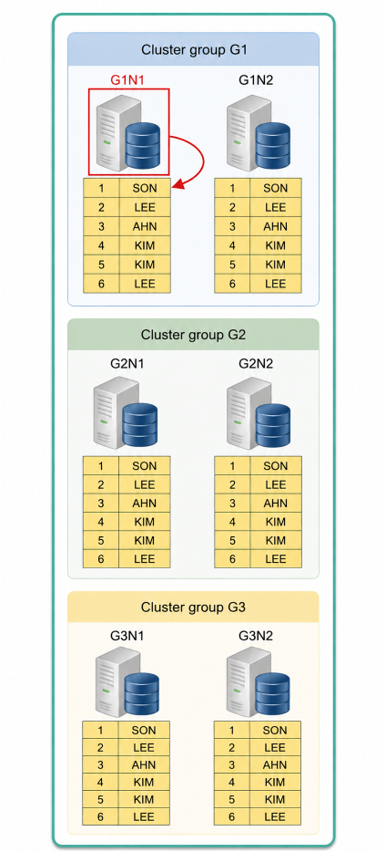

```
\EXPLAIN PLAN SELECT * FROM customer;

C_CUSTKEY C_NAME
--------- ------
        1 SON   
        2 LEE   
        3 AHN   
        4 KIM   
        5 KIM   
        6 LEE   

6 rows selected.

>>>  start print plan

< Execution Plan >
==========================================================================
| IDX |  NODE DESCRIPTION                                         | ROWS |
--------------------------------------------------------------------------
|  0  |  SELECT STATEMENT                                         |    6 |
|  1  |    QUERY BLOCK ("$QB_IDX_2")                              |    6 |
|  2  |      TABLE ACCESS ("CUSTOMER")                            |    6 |
==========================================================================

     1  -  TARGET : CUSTOMER.C_CUSTKEY, CUSTOMER.C_NAME
     2  -  CLONED 
           READ COLUMN : CUSTOMER.C_CUSTKEY, CUSTOMER.C_NAME

<<<  end print plan
```

Sharded table에는 data가 shard key에 의해 group 단위로 분할되어 저장되어 있다. 따라서 shard key에 대한 filter가 있고 그 값이 현재 서버에서만 수행가능하다는 것을 알 수 있는 경우에는 local access 한다.

<a id="3b07c2ecfb8108c6"></a>
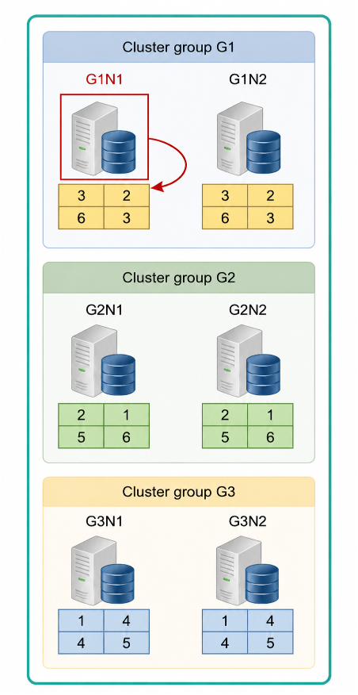

```
\EXPLAIN PLAN SELECT * FROM orders WHERE o_orderkey = 3;

O_ORDERKEY O_CUSTKEY
---------- ---------
         3         2

1 row selected.

>>>  start print plan

< Execution Plan >
===========================================================================
| IDX |  NODE DESCRIPTION                                          | ROWS |
---------------------------------------------------------------------------
|  0  |  SELECT STATEMENT                                          |    1 |
|  1  |    QUERY BLOCK ("$QB_IDX_2")                               |    1 |
|  2  |      TABLE ACCESS ("ORDERS")                               |    1 |
===========================================================================

     1  -  TARGET : ORDERS.O_ORDERKEY, ORDERS.O_CUSTKEY
     2  -  HASH SHARD ( # 3 ) 
           READ COLUMN : ORDERS.O_ORDERKEY, ORDERS.O_CUSTKEY
             PHYSICAL FILTER : ORDERS.O_ORDERKEY = 3

<<<  end print plan
```

<a id="df9082ccaf4225c3"></a>
#### Remote Access

Sharded table에는 data가 shard key에 의해 group 단위로 분할되어 저장되어 있다. Shard key에 대한 filter가 있으면 특정 서버에만 remote access 하여 결과를 가져올 수 있다.

<a id="99839beba91a5a5f"></a>
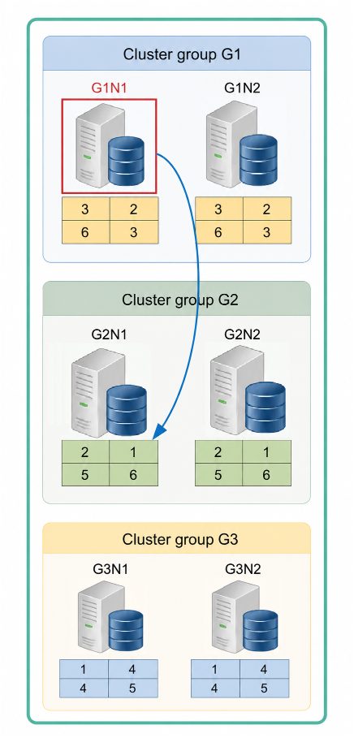

```
\EXPLAIN PLAN SELECT * FROM orders WHERE o_orderkey = 2;

O_ORDERKEY O_CUSTKEY
---------- ---------
         2         1

1 row selected.

>>>  start print plan

< Execution Plan >
===========================================================================
|  IDX  |  NODE DESCRIPTION                               |          ROWS |
---------------------------------------------------------------------------
|  0  |  SELECT STATEMENT                                 |             1 |
|  1  |    QUERY BLOCK ("$QB_IDX_2")                      |             1 |
|  2  |      PLAN BASED CLUSTER                           | REMOTE ONLY 1 |
|  3  |        TABLE ACCESS ("ORDERS")                    |             0 |
===========================================================================

     1  -  TARGET : ORDERS.O_ORDERKEY, ORDERS.O_CUSTKEY
     2  -  SQL : SELECT /*+ FULL( _A1 ) */
                        "_A1"."O_ORDERKEY", "_A1"."O_CUSTKEY"
                   FROM "PUBLIC"."ORDERS"@LOCAL AS "_A1"
                  WHERE "_A1"."O_ORDERKEY" = :_V0
           TARGET DOMAIN : G2(G2N1,G2N2) 1 rows
     3  -  HASH SHARD ( # 3 ) 
           READ COLUMN : ORDERS.O_ORDERKEY, ORDERS.O_CUSTKEY
             PHYSICAL FILTER : ORDERS.O_ORDERKEY = 2

<<<  end print plan
```

위 execution plan을 보면 remote로 G2에 SQL을 보내 결과를 가져온 것을 확인할 수 있다.

Sharded table인데 shard key에 대한 filter가 없는 경우에는 각 서버에 질의를 보내 결과를 받아와야 한다.

<a id="0bef65c209f67670"></a>
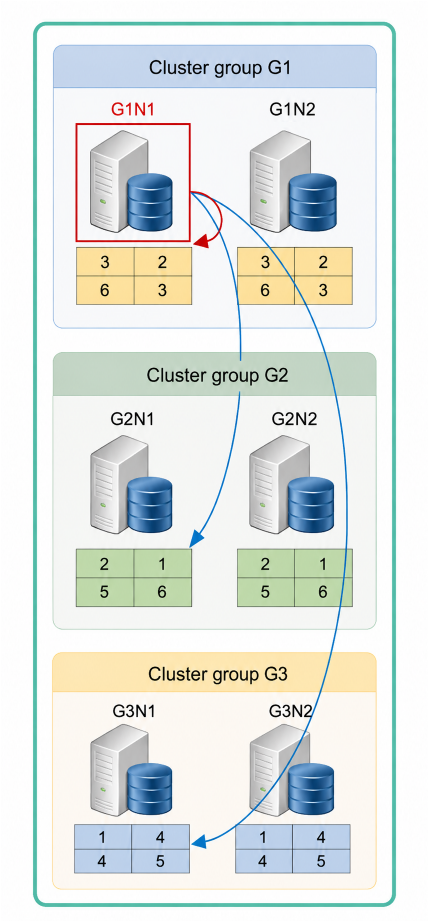

```
\EXPLAIN PLAN SELECT * FROM orders WHERE o_custkey = 1;

O_ORDERKEY O_CUSTKEY
---------- ---------
         2         1

1 row selected.

>>>  start print plan

< Execution Plan >
===========================================================================
|  IDX  |  NODE DESCRIPTION                               |          ROWS |
---------------------------------------------------------------------------
|    0  |  SELECT STATEMENT                               |             1 |
|  1  |    QUERY BLOCK ("$QB_IDX_2")                      |             1 |
|  2  |      PLAN BASED CLUSTER                           |LOCAL/REMOTE 1 |
|  3  |        TABLE ACCESS ("ORDERS")                    |             0 |
===========================================================================

     1  -  TARGET : ORDERS.O_ORDERKEY, ORDERS.O_CUSTKEY
     2  -  SQL : SELECT /*+ FULL( _A1 ) */
                        "_A1"."O_ORDERKEY", "_A1"."O_CUSTKEY"
                   FROM "PUBLIC"."ORDERS"@LOCAL AS "_A1"
                  WHERE "_A1"."O_CUSTKEY" = :_V0
           TARGET DOMAIN : G1(G1N1,G1N2) 0 rows,
                           G2(G2N1,G2N2) 1 rows,
                           G3(G3N1,G3N2) 0 rows
     3  -  HASH SHARD ( # 3 ) 
           READ COLUMN : ORDERS.O_ORDERKEY, ORDERS.O_CUSTKEY
             PHYSICAL FILTER : ORDERS.O_CUSTKEY = 1

<<<  end print plan
```

위 execution plan을 보면 remote로 G1, G2, G3에 SQL을 보내 결과를 가져온 것을 확인할 수 있다.

<a id="c208006afca33f11"></a>
### Join

<a id="abdfebcc07925fa7"></a>
#### Local Join

현재 서버에서 join을 수행한다. Local join의 형태는 다음과 같이 다양하다.

다음은 region과 nation을 join 하는 예이다. 두 테이블 모두 cloned table 이다. Cloned table의 모든 group의 node는 동일한 data를 가진다. 따라서 driver가 G1N1인 다음과 같은 예에서는 G1N1의 data 만으로 join 할 수 있다.

```
\EXPLAIN PLAN
SELECT r_name, n_name
  FROM region, nation
 WHERE r_regionkey = n_regionkey;
```

<a id="028eeb2dc732115e"></a>
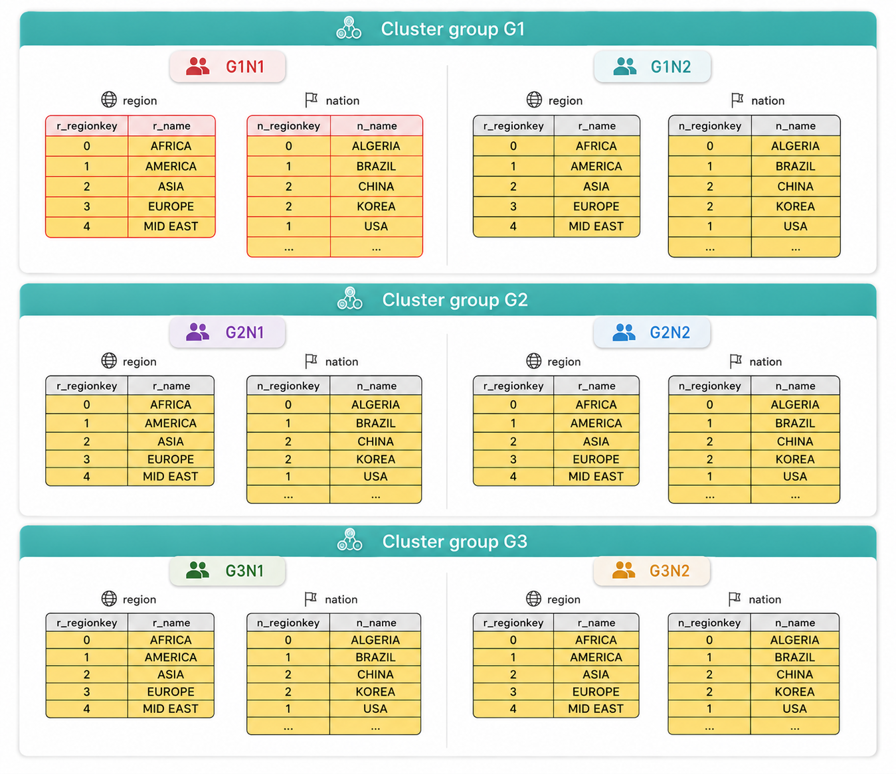

```
>>>  start print plan

< Execution Plan >
========================================================================
|  IDX  |  NODE DESCRIPTION                                            |
------------------------------------------------------------------------
|    0  |  SELECT STATEMENT                                            |
|    1  |    QUERY BLOCK ("$QB_IDX_2")                                 |
|    2  |      HASH JOIN (INNER JOIN)                                  |
|    3  |        TABLE ACCESS ("NATION")                               |
|    4  |        HASH JOIN INSTANT                                     |
|    5  |          TABLE ACCESS ("REGION")                             |
========================================================================

     1  -  TARGET : REGION.R_NAME, NATION.N_NAME
     2  -  JOINED COLUMN : REGION.R_NAME, NATION.N_NAME
     3  -  CLONED 
           READ COLUMN : NATION.N_NAME, NATION.N_REGIONKEY
     4  -  HASH KEY : REGION.R_REGIONKEY
           RECORD COLUMN : REGION.R_NAME
           READ KEY COLUMN : REGION.R_REGIONKEY, REGION.R_NAME
             HASH FILTER : REGION.R_REGIONKEY = NATION.N_REGIONKEY
           FETCH ONE ROW
     5  -  CLONED 
           READ COLUMN : REGION.R_REGIONKEY, REGION.R_NAME

<<<  end print plan
```

다음은 customer와 orders를 join하는 예이다. Customer는 cloned table 이고 order는 sharded table 이다. Sharded table은 shard key에 의해 group 단위로 data가 분할되어 있다. 다음 예에서처럼 shard key column에 대한 filter가 존재하며 그 data가 현재 서버에 존재함을 알 수 있는 경우에는 다음과 같이 local join이 가능하다.

```
\EXPLAIN PLAN
SELECT c_custkey, COUNT(o_orderkey)
  FROM customer, orders
 WHERE c_custkey = o_custkey
   AND o_orderkey = 3
GROUP BY c_custkey;
```

<a id="b1c56cde51047c1f"></a>


```
>>>  start print plan

< Execution Plan >
========================================================================
|  IDX  |  NODE DESCRIPTION                                            |
------------------------------------------------------------------------
|    0  |  SELECT STATEMENT                                            |
|    1  |    QUERY BLOCK ("$QB_IDX_2")                                 |
|    2  |      GROUP HASH INSTANT                                      |
|    3  |        NESTED JOIN (INNER JOIN)                              |
|    4  |          INDEX ACCESS ("ORDERS", "ORDERS_PK_INDEX")          |
|    5  |          INDEX ACCESS ("CUSTOMER", "CUSTOMER_PK_INDEX")      |
========================================================================

     1  -  TARGET : CUSTOMER.C_CUSTKEY, COUNT( ORDERS.O_ORDERKEY )
     2  -  GROUP KEY : CUSTOMER.C_CUSTKEY
           RECORD COLUMN : COUNT( ORDERS.O_ORDERKEY )
           READ KEY COLUMN : CUSTOMER.C_CUSTKEY
           READ RECORD COLUMN : COUNT( ORDERS.O_ORDERKEY )
     3  -  JOINED COLUMN : CUSTOMER.C_CUSTKEY, ORDERS.O_ORDERKEY
     4  -  HASH SHARD ( # 3 ) 
           READ INDEX COLUMN : ORDERS.O_ORDERKEY
           READ TABLE COLUMN : ORDERS.O_CUSTKEY
             MIN RANGE : ORDERS.O_ORDERKEY = 3
             MAX RANGE : ORDERS.O_ORDERKEY = 3
           FETCH ONE ROW
     5  -  CLONED 
           READ INDEX COLUMN : CUSTOMER.C_CUSTKEY
             MIN RANGE : CUSTOMER.C_CUSTKEY = {ORDERS.O_CUSTKEY}
             MAX RANGE : CUSTOMER.C_CUSTKEY = {ORDERS.O_CUSTKEY}
           FETCH ONE ROW

<<<  end print plan
```

다음은 customer와 orders의 join 인데, shard key column에 대한 filter가 없는 경우이다. 이 때 sharded table의 모든 data를 현재 서버에 가져와야 local join이 가능하다.

<a id="3e764f70287cad61"></a>
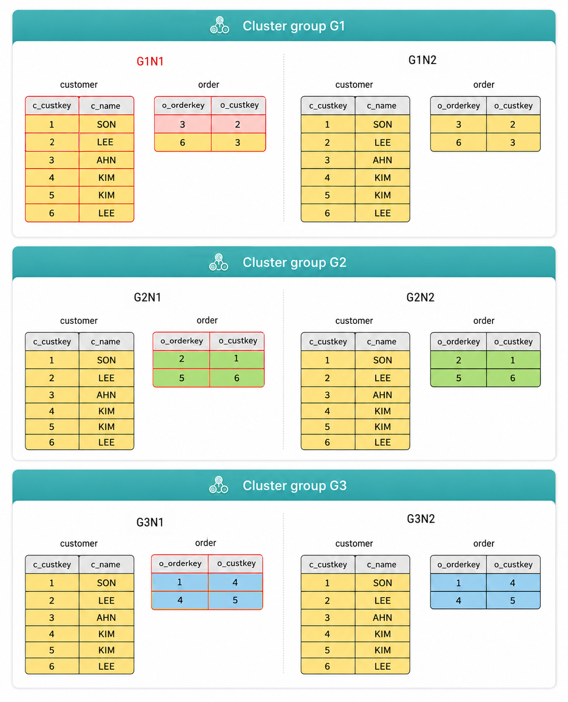

```
\EXPLAIN PLAN
SELECT /*+ LOCAL_JOIN(orders) */
       c_custkey, COUNT(o_orderkey)
  FROM customer, orders
 WHERE c_custkey = o_custkey
GROUP BY c_custkey;
```

```
< Execution Plan >
============================================================================
|IDX|  NODE DESCRIPTION                                   |           ROWS |
----------------------------------------------------------------------------
| 0 |  SELECT STATEMENT                                   |              6 |
| 1 |    QUERY BLOCK ("$QB_IDX_2")                        |              6 |
| 2 |      HASH JOIN (INNER JOIN)                         |              6 |
| 3 |        PLAN BASED CLUSTER                           | LOCAL/REMOTE 6 |
| 4 |          INDEX ACCESS ("ORDERS", "ORDERS_PK_INDEX") | (6)          6 |
| 5 |        HASH JOIN INSTANT                            |              6 |
| 6 |          TABLE ACCESS ("CUSTOMER")                  |              6 |
============================================================================

     1  -  TARGET : CUSTOMER.C_CUSTKEY, CUSTOMER.C_NAME, ORDERS.O_ORDERKEY
     2  -  JOINED COLUMN : CUSTOMER.C_CUSTKEY, CUSTOMER.C_NAME, ORDERS.O_ORDERKEY
     3  -  SQL : SELECT /*+ INDEX( _A1, "PUBLIC"."ORDERS_PK_INDEX" ) */
                       "_A1"."O_ORDERKEY"
                  FROM "PUBLIC"."ORDERS"@LOCAL AS "_A1"
           TARGET DOMAIN : G1(G1N1,G1N2) 2 rows,
                           G2(G2N1,G2N2) 2 rows,
                           G3(G3N1,G3N2) 2 rows
     4  -  HASH SHARD ( # 3 ) 
           READ INDEX COLUMN : ORDERS.O_ORDERKEY
     5  -  HASH KEY : CUSTOMER.C_CUSTKEY
           RECORD COLUMN : CUSTOMER.C_NAME
           READ KEY COLUMN : CUSTOMER.C_CUSTKEY, CUSTOMER.C_NAME
             HASH FILTER : CUSTOMER.C_CUSTKEY = ORDERS.O_ORDERKEY
           FETCH ONE ROW
     6  -  CLONED 
           READ COLUMN : CUSTOMER.C_CUSTKEY, CUSTOMER.C_NAME

<<<  end print plan
```

위 execution plan을 보면 각 G1, G2, G3에 SQL에 보내 order table의 모든 data를 가져온 것을 확인할 수 있다.

<a id="a5f4850dcd3c42ed"></a>
#### Remote Join

각 서버에서 join을 수행한다.

각 서버에서 join을 처리하면 병렬 처리 효과를 얻을 수 있다. 또한 join에 의해 결과가 많이 줄어드는 경우, 해당 서버에서 join을 수행하여 그 결과를 가져오면 네트워크 비용도 줄일 수 있다.

본 절에서는 remote의 다양한 형태에 대해 설명한다.

<a id="408884ce04bd6adf"></a>
##### Joining Cloned Table and Sharded Table

본 절에서는 cloned table과 sharded table의 join에 대해 설명한다.

다음은 customer와 orders를 join하는 예이다. Customer는 cloned table이고 order는 sharded table이며 data 분포는 다음과 같다.

<a id="6aa8f8960c3bcfc3"></a>
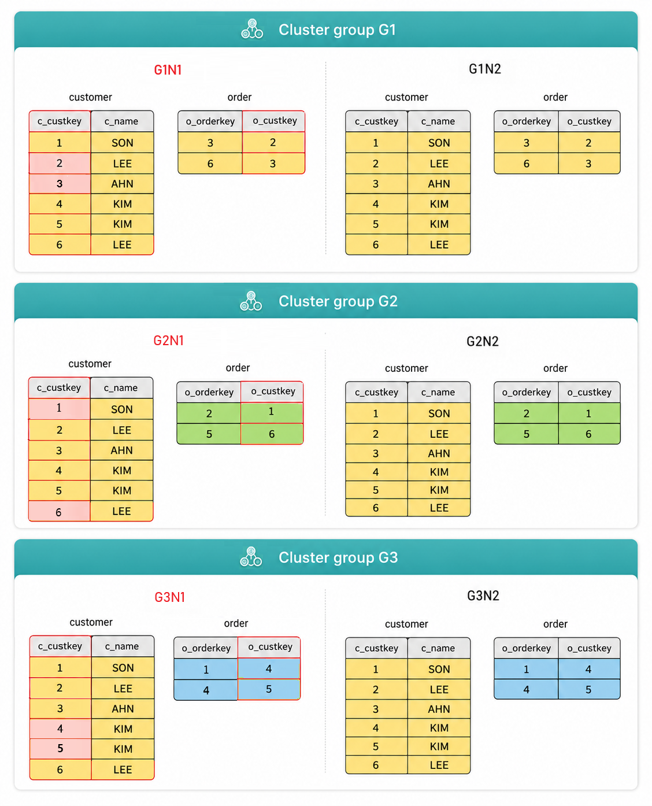

```
\EXPLAIN PLAN
SELECT /*+ REMOTE_JOIN(orders) */
       c_custkey, COUNT(o_orderkey)
  FROM customer, orders
 WHERE c_custkey = o_custkey
GROUP BY c_custkey;


>>>  start print plan

< Execution Plan >
============================================================================
|IDX|  NODE DESCRIPTION                                   |           ROWS |
----------------------------------------------------------------------------
| 0 |  SELECT STATEMENT                                   |              6 |
| 1 |    QUERY BLOCK ("$QB_IDX_2")                        |              6 |
| 2 |      PLAN BASED CLUSTER                             | LOCAL/REMOTE 6 |
| 3 |        HASH JOIN (INNER JOIN)                       |              6 |
| 4 |          TABLE ACCESS ("ORDERS")                    |              6 |
| 5 |          HASH JOIN INSTANT                          |              6 |
| 6 |            TABLE ACCESS ("CUSTOMER")                |              6 |
============================================================================

     1  -  TARGET : CUSTOMER.C_CUSTKEY, CUSTOMER.C_NAME, ORDERS.O_ORDERKEY
     2  -  SQL : SELECT /*+ KEEP_JOINED_TABLE USE_HASH_IN( _A1, 10 )
                            FULL( _A2 )
                            FULL( _A1 ) */
                      "_A1"."C_CUSTKEY", "_A1"."C_NAME", "_A2"."O_ORDERKEY"
                   FROM ("PUBLIC"."ORDERS"@LOCAL AS "_A2"
                         INNER JOIN
                         "PUBLIC"."CUSTOMER"@LOCAL AS "_A1"
                     ON "_A1"."C_CUSTKEY" = "_A2"."O_ORDERKEY") ALIAS "_A3"
           TARGET DOMAIN : G1(G1N1,G1N2) 2 rows,
                           G2(G2N1,G2N2) 2 rows,
                           G3(G3N1,G3N2) 2 rows
     3  -  JOINED COLUMN : CUSTOMER.C_CUSTKEY, CUSTOMER.C_NAME, ORDERS.O_ORDERKEY
     4  -  HASH SHARD ( # 3 ) 
           READ COLUMN : ORDERS.O_ORDERKEY
     5  -  HASH KEY : CUSTOMER.C_CUSTKEY
           RECORD COLUMN : CUSTOMER.C_NAME
           READ KEY COLUMN : CUSTOMER.C_CUSTKEY, CUSTOMER.C_NAME
             HASH FILTER : CUSTOMER.C_CUSTKEY = ORDERS.O_ORDERKEY
     6  -  CLONED 
           READ COLUMN : CUSTOMER.C_CUSTKEY, CUSTOMER.C_NAME

<<<  end print plan
```

위 execution plan을 보면 G1, G2, G3에 SQL을 전송하여 해당 서버에서 join을 수행하고 그 결과를 가져온 것을 확인할 수 있다.

<a id="ccec77fb3876a450"></a>
##### Joining Sharded Table and Sharded Table

다음 조건을 만족하면 remote join을 수행할 수 있다.

- Shard key join condition이 존재한다. (예: t1.shardKeyCol = t2.shardKeyCol )
- Shard strategy가 동일하다.
    - Joining hash sharded table and hash sharded table
    - Joining range shard and range shard 
    - Joining list shard and list shard 
- Shard count가 동일하다. 
- Shard key column의 타입이 동일하다.
- Shard key column 개수가 동일하다.

다음은 orders와 lineitem을 join하는 예이다. 두 테이블 모두 hash sharded table이고 shard key join condition이 있다. 동일한 기준의 orderkey에 대해 sharding 되어 있기 때문에 각 서버에서 join을 수행하면 된다.

<a id="92e4553247fee835"></a>
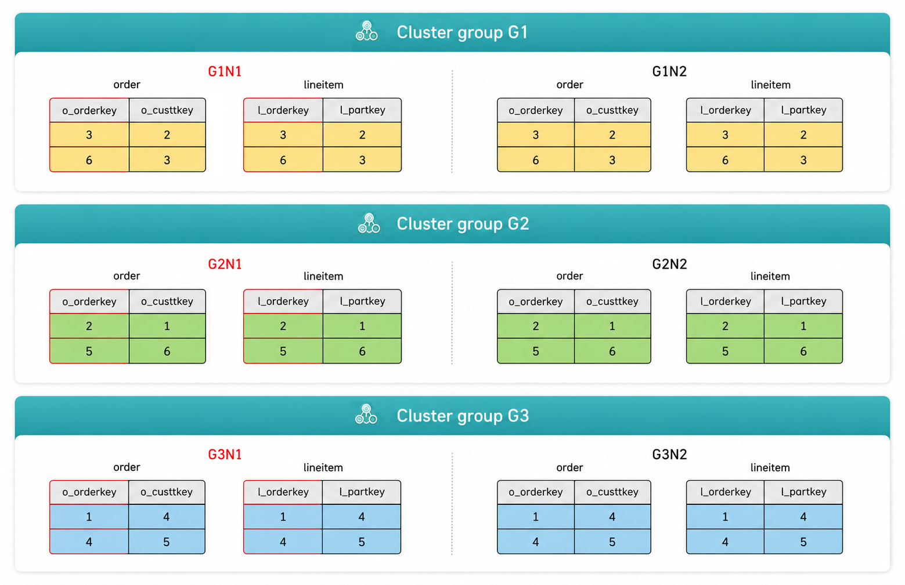

```
\EXPLAIN PLAN
SELECT o_orderkey, l_partkey
  FROM orders, lineitem
 WHERE o_orderkey = l_orderkey;
```

```
>>>  start print plan

< Execution Plan >
============================================================================
|IDX|  NODE DESCRIPTION                                   |           ROWS |
----------------------------------------------------------------------------
| 0 |  SELECT STATEMENT                                   |              6 |
| 1 |    QUERY BLOCK ("$QB_IDX_2")                        |              6 |
| 2 |      PLAN BASED CLUSTER                             | LOCAL/REMOTE 6 |
| 3 |        HASH JOIN (INNER JOIN)                       |              2 |
| 4 |          INDEX ACCESS ("ORDERS", "ORDERS_PK_INDEX") | (2)          2 |
| 5 |          HASH JOIN INSTANT                          |              2 |
| 6 |            TABLE ACCESS ("LINEITEM")                |              2 |
============================================================================

     1  -  TARGET : ORDERS.O_ORDERKEY, LINEITEM.L_PARTKEY
     2  -  SQL : SELECT /*+ KEEP_JOINED_TABLE USE_HASH_IN( _A1, 10 )
                            INDEX( _A2, "PUBLIC"."ORDERS_PK_INDEX" ) 
                            FULL( _A1 ) */ 
                       "_A2"."O_ORDERKEY", "_A1"."L_PARTKEY" 
                  FROM ( "PUBLIC"."ORDERS"@LOCAL AS "_A2" 
                         INNER JOIN 
                         "PUBLIC"."LINEITEM"@LOCAL AS "_A1" 
                    ON "_A1"."L_ORDERKEY" = "_A2"."O_ORDERKEY") ALIAS "_A3"
           TARGET DOMAIN : G1(G1N1,G1N2) 2 rows, 
                           G2(G2N1,G2N2) 2 rows, 
                           G3(G3N1,G3N2) 2 rows
     3  -  JOINED COLUMN : ORDERS.O_ORDERKEY, LINEITEM.L_PARTKEY
     4  -  HASH SHARD ( # 3 ) 
           READ INDEX COLUMN : ORDERS.O_ORDERKEY
     5  -  HASH KEY : LINEITEM.L_ORDERKEY
           RECORD COLUMN : LINEITEM.L_PARTKEY
           READ KEY COLUMN : LINEITEM.L_ORDERKEY, LINEITEM.L_PARTKEY
             HASH FILTER : LINEITEM.L_ORDERKEY = ORDERS.O_ORDERKEY
     6  -  HASH SHARD ( # 3 ) 
           READ COLUMN : LINEITEM.L_ORDERKEY, LINEITEM.L_PARTKEY

<<<  end print plan
```

위 execution plan을 보면 각 서버에 join SQL을 전송하여 해당 서버에서 join을 수행하고 그 결과를 가져온 것을 확인할 수 있다.

다음은 part와 lineitem을 join하는 예이다. 두 테이블 모두 hash sharded table 이다. 그러나 shard key join condition이 없는 경우이다.

Part와 lineitem 모두 hash sharded table 이다. 그러나 part는 shard key가 p_partkey 이어서 data 가 p_partkey를 기준으로 분할되어 있고, lineitem은 shard key가 l_orderkey 이므로 data가 l_orderkey 기준으로 분할되어 있다.

```
\EXPLAIN PLAN
SELECT /*+ REMOTE_JOIN(lineitem) */
       l_orderkey, p_partkey
  FROM part, lineitem
 WHERE p_partkey = l_partkey;
```

<a id="1a8e64d451f5ff4a"></a>
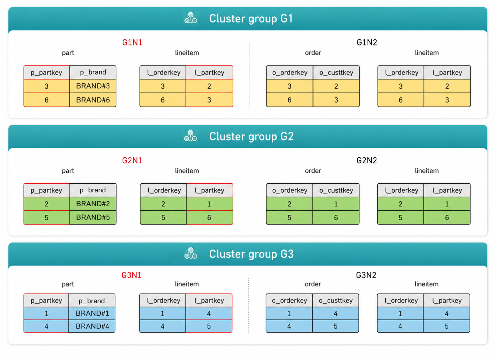

위 질의가 remote join을 수행하려면 lineitem의 모든 data를 가져온 후, l_partkey로 분할하여 G1, G2, G3로 전송해야 한다. 이 때, 그 역할을 하는 것이 puller와 pusher 이다.

<a id="acd0351a26517f48"></a>
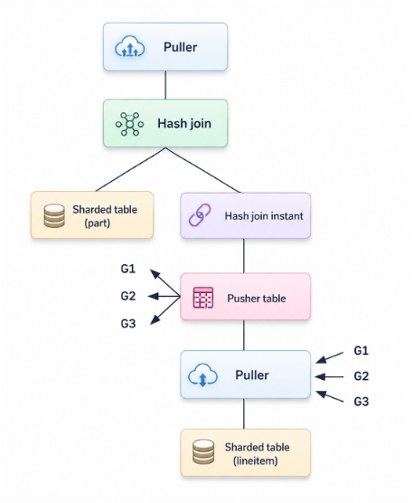

- [Cluster Puller](12-sql-languages.md#6ad1394ea51bd252): 각 서버에 SQL을 전송하여 data를 가지고 온다.
- [Cluster Pusher](12-sql-languages.md#58aadf181a8e32aa): 각 서버에 data를 전송한다.

위 그림에서 보면 puller는 lineitem에서 모든 data를 가지고 온다. 그 후 l_partkey가 shard key인 pusher table을 만들어 data를 G1, G2, G3에 보낸다. 그리고 G1, G2, G3에서 part와 pusher 테이블의 remote join을 수행한다.

Execution plan은 다음과 같다.

```
>>>  start print plan

< Execution Plan >
============================================================================
|IDX|  NODE DESCRIPTION                                           |   ROWS |
----------------------------------------------------------------------------
| 0 |  SELECT STATEMENT                                           |      6 |
| 1 |    QUERY BLOCK ("$QB_IDX_2")                                |      6 |
| 2 |      SINGLE CLUSTER                                  |LOCAL/REMOTE 6 |
| 3 |        CLUSTER PUSHER ("_$NI_7")                            |      6 |
| 4 |          PLAN BASED CLUSTER                          |LOCAL/REMOTE 6 |
| 5 |            TABLE ACCESS ("LINEITEM")                        |      2 |
| 6 |        SELECT STATEMENT                                     |      2 |
| 7 |          QUERY BLOCK ("$QB_IDX_2")                          |      2 |
| 8 |            HASH JOIN (INNER JOIN)                           |      2 |
| 9 |              INDEX ACCESS ("PART" AS _A2, "PART_PK_INDEX")  | (2)  2 |
| 10 |              HASH JOIN INSTANT                             |      2 |
| 11 |                PUSHER TABLE ACCESS ("_$NI_7" AS _A1)       |     2 |
============================================================================

     1  -  TARGET : _$NI_7.L_ORDERKEY, PART.P_PARTKEY
     2  -  SQL : SELECT /*+ KEEP_JOINED_TABLE USE_HASH_IN( _A1, 10 ) 
                            INDEX( _A2, "PUBLIC"."PART_PK_INDEX" ) 
                            FULL( _A1 ) */ 
                        "_A1"."L_ORDERKEY", "_A2"."P_PARTKEY" 
                   FROM ( "PUBLIC"."PART"@LOCAL AS "_A2"
                          INNER JOIN 
                         "SESSION_SCHEMA"."_$NI_7"@LOCAL AS "_A1"
                     ON "_A1"."L_PARTKEY" = "_A2"."P_PARTKEY") ALIAS "_A3"
           TARGET DOMAIN : G1(G1N1,G1N2) 2 rows,
                           G2(G2N1,G2N2) 2 rows, 
                           G3(G3N1,G3N2) 2 rows
     3  -  SQL : DECLARE INSTANT TABLE "SESSION_SCHEMA"."_$NI_7"
                ( "L_PARTKEY" NUMBER(10, 0), "L_ORDERKEY" NUMBER(10, 0) ) 
           COLUMN : LINEITEM.L_PARTKEY AS L_PARTKEY, 
                    LINEITEM.L_ORDERKEY AS L_ORDERKEY           
           SHARDED : LINEITEM.L_PARTKEY
           TARGET DOMAIN : G1(G1N1,G1N2) 2 rows, 
                           G2(G2N1,G2N2) 2 rows, 
                           G3(G3N1,G3N2) 2 rows
     4  -  SQL : SELECT /*+ FULL( _A1 ) */
                        "_A1"."L_ORDERKEY", "_A1"."L_PARTKEY" 
                   FROM "PUBLIC"."LINEITEM"@LOCAL AS "_A1"
           TARGET DOMAIN : G1(G1N1,G1N2) 2 rows, 
                           G2(G2N1,G2N2) 2 rows, 
                           G3(G3N1,G3N2) 2 rows
     5  -  HASH SHARD ( # 3 ) 
           READ COLUMN : LINEITEM.L_ORDERKEY, LINEITEM.L_PARTKEY
     7  -  TARGET : _A1.L_ORDERKEY, _A2.P_PARTKEY
     8  -  JOINED COLUMN : _A1.L_ORDERKEY, _A2.P_PARTKEY
     9  -  HASH SHARD ( # 3 ) 
           READ INDEX COLUMN : _A2.P_PARTKEY
    10  -  HASH KEY : _A1.L_PARTKEY
           RECORD COLUMN : _A1.L_ORDERKEY
           READ KEY COLUMN : _A1.L_PARTKEY, _A1.L_ORDERKEY
             HASH FILTER : _A1.L_PARTKEY = _A2.P_PARTKEY
    11  -  READ COLUMN : _A1.L_PARTKEY, _A1.L_ORDERKEY

<<<  end print plan
```

위 execution plan을 보면 4에서 SQL을 G1, G2, G3로 보내 (l_orderkey, l_partkey)를 가져온 것을 알 수 있다. 그리고 4에서 가져온 (l_partkey, l_orderkey) 값들을 3에서 (l_partkey, l_orderkey)가 shard key인 pusher table에 저장한다.  이 pusher table은 l_partkey로 분할되어 G1, G2, G3에 보내져 임시 저장되어 있다.  
Remote join은 part와 pusher table의 join으로 수행된다.

<a id="1a32c4674b21b5cb"></a>
### Group By

<a id="3b839c1510137047"></a>
#### Local Group By

현재 서버에서 group by를 수행한다.

Cloned table에 대한 group by인 경우, 모든 group의 node들이 동일한 data를 가지고 있으므로 현재 서버에서 group by를 수행하면 된다.

```
\EXPLAIN PLAN
  SELECT c_nationkey, COUNT(c_custkey)
    FROM customer
GROUP BY c_nationkey;

>>>  start print plan

< Execution Plan >
========================================================================
|  IDX  |  NODE DESCRIPTION                                            |
------------------------------------------------------------------------
|    0  |  SELECT STATEMENT                                            |
|    1  |    QUERY BLOCK ("$QB_IDX_2")                                 |
|    2  |      GROUP HASH INSTANT                                      |
|    3  |        TABLE ACCESS ("CUSTOMER")                             |
========================================================================

     1  -  TARGET : CUSTOMER.C_NATIONKEY, COUNT( CUSTOMER.C_CUSTKEY )
     2  -  GROUP KEY : CUSTOMER.C_NATIONKEY
           RECORD COLUMN : COUNT( CUSTOMER.C_CUSTKEY )
           READ KEY COLUMN : CUSTOMER.C_NATIONKEY
           READ RECORD COLUMN : COUNT( CUSTOMER.C_CUSTKEY )
     3  -  CLONED 
           READ COLUMN : CUSTOMER.C_CUSTKEY, CUSTOMER.C_NATIONKEY

<<<  end print plan
```

<a id="fa4358dcc9f4e181"></a>
#### Remote Group By

Group by를 각 서버에서 처리한다.

각 서버에서 group by를 처리하면 병렬 처리 효과를 얻을 수 있다. 또한 대체적으로 group by에 의해 결과가 많이 줄어들기 때문에 data를 가져오는 네트워크 비용도 줄일 수 있다.

```
\EXPLAIN PLAN
SELECT c_custkey, COUNT(o_orderkey)
  FROM customer, orders
 WHERE c_custkey = o_custkey
GROUP BY c_custkey;

>>>  start print plan

< Execution Plan >
===========================================================================
|IDX|  NODE DESCRIPTION                                  |           ROWS |
---------------------------------------------------------------------------
| 0 |  SELECT STATEMENT                                  |              6 |
| 1 |    QUERY BLOCK ("$QB_IDX_2")                       |              6 |
| 2 |     SINGLE CLUSTER                                 | LOCAL/REMOTE 6 |
| 3 |        SELECT STATEMENT                            |              2 |
| 4 |          QUERY BLOCK ("$QB_IDX_2")                 |              2 |
| 5 |            GROUP HASH INSTANT                      |              2 |
| 6 |              HASH JOIN (INNER JOIN)                |              2 |
| 7 |                TABLE ACCESS ("CUSTOMER" AS _A2)    |              6 |
| 8 |                HASH JOIN INSTANT                   |              2 |
| 9 |                  TABLE ACCESS ("ORDERS" AS _A1)    |              2 |
===========================================================================

     1  -  TARGET : CUSTOMER.C_CUSTKEY, COUNT( ORDERS.O_ORDERKEY )
     2  -  SQL : SELECT /*+ USE_GROUP_HASH(10)
                            KEEP_JOINED_TABLE USE_HASH_IN( _A1, 100 ) 
                            FULL( _A2 ) FULL( _A1 ) 
                        */ 
                        "_A2"."C_CUSTKEY", COUNT( "_A1"."O_ORDERKEY" ) 
                   FROM ( "PUBLIC"."CUSTOMER"@LOCAL AS "_A2" 
                          INNER JOIN 
                          "PUBLIC"."ORDERS"@LOCAL AS "_A1" 
                     ON "_A1"."O_CUSTKEY" = "_A2"."C_CUSTKEY") ALIAS "_A3" 
                GROUP BY "_A2"."C_CUSTKEY"
           TARGET DOMAIN : G1(G1N1,G1N2) 2 rows, 
                           G2(G2N1,G2N2) 2 rows, 
                           G3(G3N1,G3N2) 2 rows
           RE-GROUPING
             GROUP KEY : CUSTOMER.C_CUSTKEY
             AGGREGATION : SUM( COUNT( ORDERS.O_ORDERKEY ) )
     4  -  TARGET : _A2.C_CUSTKEY, COUNT( _A1.O_ORDERKEY )
     5  -  GROUP KEY : _A2.C_CUSTKEY
           RECORD COLUMN : COUNT( _A1.O_ORDERKEY )
           READ KEY COLUMN : _A2.C_CUSTKEY
           READ RECORD COLUMN : COUNT( _A1.O_ORDERKEY )
     6  -  JOINED COLUMN : _A2.C_CUSTKEY, _A1.O_ORDERKEY
     7  -  CLONED 
           READ COLUMN : _A2.C_CUSTKEY
     8  -  HASH KEY : _A1.O_CUSTKEY
           RECORD COLUMN : _A1.O_ORDERKEY
           READ KEY COLUMN : _A1.O_CUSTKEY, _A1.O_ORDERKEY
             HASH FILTER : _A1.O_CUSTKEY = _A2.C_CUSTKEY
     9  -  HASH SHARD ( # 3 ) 
           READ COLUMN : _A1.O_ORDERKEY, _A1.O_CUSTKEY

<<<  end print plan
```

<a id="627099cbf1c7d67c"></a>
### Distinct

<a id="9a11c0a30bfc2b72"></a>
#### Local Distinct

현재 서버에서 distinct를 수행한다.

다음은 cloned table인 customer에 distinct를 사용하는 예이다. Cloned table의 모든 group의 모든 node들이 동일한 data를 가지고 있으므로 현재 서버에서 distinct를 수행하면 된다.

```
\EXPLAIN PLAN 
SELECT DISTINCT c_nationkey
  FROM customer;

>>>  start print plan

< Execution Plan >
========================================================================
|  IDX  |  NODE DESCRIPTION                                            |
------------------------------------------------------------------------
|    0  |  SELECT STATEMENT                                            |
|    1  |    QUERY BLOCK ("$QB_IDX_2")                                 |
|    2  |      GROUP                                                   |
|    3  |        INDEX ACCESS ("CUSTOMER", "CUSTOMER_NATIONKEY_FK")    |
========================================================================

     1  -  TARGET : CUSTOMER.C_NATIONKEY
     2  -  GROUP KEY : CUSTOMER.C_NATIONKEY
     3  -  CLONED 
           READ INDEX COLUMN : CUSTOMER.C_NATIONKEY

<<<  end print plan
```

다음은 sharded table인 orders에 distinct를 사용하는 예이다. Sharded table은 data가 shard key 기준으로 분할되어 있으므로 local로 distinct를 수행하려면 모든 group의 data를 가져와야 한다.

```
\EXPLAIN PLAN 
SELECT /*+ LOCAL_DISTINCT */
       DISTINCT o_orderstatus 
  FROM orders
 WHERE o_orderdate = date '1995-03-15';

>>>  start print plan

< Execution Plan >
============================================================================
|IDX|  NODE DESCRIPTION                                 |             ROWS |
----------------------------------------------------------------------------
| 0 |  SELECT STATEMENT                                 |                3 |
| 1 |    QUERY BLOCK ("$QB_IDX_2")                      |                3 |
| 2 |      GROUP HASH INSTANT                           |                3 |
| 3 |        PLAN BASED CLUSTER                         | LOCAL/REMOTE 603 |
| 4 |          TABLE ACCESS ("ORDERS")                  |              221 |
============================================================================

     1  -  TARGET : ORDERS.O_ORDERSTATUS
     2  -  GROUP KEY : ORDERS.O_ORDERSTATUS
           READ KEY COLUMN : ORDERS.O_ORDERSTATUS
     3  -  SQL : SELECT /*+ FULL( _A1 ) */
                        "_A1"."O_ORDERSTATUS" 
                  FROM "PUBLIC"."ORDERS"@LOCAL AS "_A1" 
                 WHERE "_A1"."O_ORDERDATE" = :_V0
           TARGET DOMAIN : G1(G1N1,G1N2) 221 rows, 
                           G2(G2N1,G2N2) 184 rows, 
                           G3(G3N1,G3N2) 198 rows
     4  -  HASH SHARD ( # 3 ) 
           READ COLUMN : ORDERS.O_ORDERSTATUS, ORDERS.O_ORDERDATE
             PHYSICAL FILTER : ORDERS.O_ORDERDATE = DATE'1995-03-15'

<<<  end print plan
```

위 execution plan을 보면 G1, G2, G3에서 조건을 만족하는 data를 가져온 후에 distinct를 위한 GROUP HASH INSTANT가 수행되었음을 확인할 수 있다.

<a id="cee778207862eeaf"></a>
#### Remote Distinct

Distinct를 각 서버에서 처리한다.

각 서버에서 distinct를 처리하면 병렬 처리 효과를 얻을 수 있다. 또한 대체적으로 distinct에 의해 결과가 많이 줄어들기 때문에 data를 가져오는 네트워크 비용도 줄일 수 있다.

```
\EXPLAIN PLAN 
SELECT DISTINCT o_orderstatus 
  FROM orders
 WHERE o_orderdate = date '1995-03-15';

>>>  start print plan

< Execution Plan >
============================================================================
|IDX|  NODE DESCRIPTION                                   |           ROWS |
----------------------------------------------------------------------------
| 0 |  SELECT STATEMENT                                   |              3 |
| 1 |    QUERY BLOCK ("$QB_IDX_2")                        |              3 |
| 2 |      SINGLE CLUSTER                                 | LOCAL/REMOTE 3 |
| 3 |        SELECT STATEMENT                             |              3 |
| 4 |          QUERY BLOCK ("$QB_IDX_2")                  |              3 |
| 5 |            GROUP HASH INSTANT                       |              3 |
| 6 |              TABLE ACCESS ("ORDERS" AS _A1)         |            221 |
============================================================================

     1  -  TARGET : ORDERS.O_ORDERSTATUS
     2  -  SQL : SELECT /*+ USE_DISTINCT_HASH(3) FULL( _A1 ) */
                        DISTINCT "_A1"."O_ORDERSTATUS" 
                   FROM "PUBLIC"."ORDERS"@LOCAL AS "_A1" 
                  WHERE "_A1"."O_ORDERDATE" = :_V0
           TARGET DOMAIN : G1(G1N1,G1N2) 3 rows, 
                           G2(G2N1,G2N2) 3 rows, 
                           G3(G3N1,G3N2) 3 rows
           RE-GROUPING
             GROUP KEY : ORDERS.O_ORDERSTATUS
     4  -  TARGET : _A1.O_ORDERSTATUS
     5  -  GROUP KEY : _A1.O_ORDERSTATUS
           READ KEY COLUMN : _A1.O_ORDERSTATUS
     6  -  HASH SHARD ( # 3 ) 
           READ COLUMN : _A1.O_ORDERSTATUS, _A1.O_ORDERDATE
             PHYSICAL FILTER : _A1.O_ORDERDATE = :_V0

<<<  end print plan
```

위 execution plan을 보면 G1, G2, G3에서 distinct를 수행한 결과를 가져온 후 RE-GROUPING으로 다시 distinct 하는 것을 볼 수 있다. RE-GROUPING을 수행하더라도 결과가 많이 줄어들었으므로 네트워크 비용을 줄일 수 있어 더 효율적이다.

<a id="3431aa97be59d69d"></a>
### Order By

<a id="5afeac49772b3c1b"></a>
#### Local Order By

현재 서버에서 order by를 수행한다.

다음은 cloned table인 customer에 order by를 사용하는 예이다. Cloned table의 모든 group의 모든 node들이 동일한 data를 가지고 있으므로 현재 서버에서 order by를 수행하면 된다.

```
\EXPLAIN PLAN
  SELECT c_nationkey, COUNT(c_custkey)
    FROM customer
GROUP BY c_nationkey
ORDER BY c_nationkey;

>>>  start print plan

< Execution Plan >
===========================================================================
| IDX |  NODE DESCRIPTION                                        |   ROWS |
---------------------------------------------------------------------------
|  0  |  SELECT STATEMENT                                        |     25 |
|  1  |    QUERY BLOCK ("$QB_IDX_2")                             |     25 |
|  2  |      SORT INSTANT                                        |     25 |
|  3  |        GROUP HASH INSTANT                                |     25 |
|  4  |          TABLE ACCESS ("CUSTOMER")                       | 150000 |
===========================================================================

     1  -  TARGET : CUSTOMER.C_NATIONKEY, COUNT( CUSTOMER.C_CUSTKEY )
     2  -  SORT KEY : "CUSTOMER.C_NATIONKEY ASC NULLS LAST"
           RECORD COLUMN : COUNT( CUSTOMER.C_CUSTKEY )
           READ KEY COLUMN : CUSTOMER.C_NATIONKEY
           READ RECORD COLUMN : COUNT( CUSTOMER.C_CUSTKEY )
     3  -  GROUP KEY : CUSTOMER.C_NATIONKEY
           RECORD COLUMN : COUNT( CUSTOMER.C_CUSTKEY )
           READ KEY COLUMN : CUSTOMER.C_NATIONKEY
           READ RECORD COLUMN : COUNT( CUSTOMER.C_CUSTKEY )
     4  -  CLONED 
           READ COLUMN : CUSTOMER.C_CUSTKEY, CUSTOMER.C_NATIONKEY

<<<  end print plan
```

다음은 sharded table인 orders에 order by를 사용하는 예이다. Sharded table은 data가 shard key 기준으로 분할되어 있으므로 local에서 order by를 수행하기 위해서는 모든 group의 data를 가져와야 한다.

```
\EXPLAIN PLAN 
  SELECT /*+ LOCAL_ORDER */ o_orderdate, o_shippriority
    FROM orders
   WHERE o_orderdate >= date '1993-07-01'
     AND o_orderdate < date '1993-07-01' + interval '1' month
ORDER BY o_orderdate; 

>>>  start print plan

< Execution Plan >
============================================================================
|IDX|  NODE DESCRIPTION                               |               ROWS |
----------------------------------------------------------------------------
| 0 |  SELECT STATEMENT                               |              19319 |
| 1 |    QUERY BLOCK ("$QB_IDX_2")                    |              19319 |
| 2 |      SORT INSTANT                               |              19319 |
| 3 |        PLAN BASED CLUSTER                       | LOCAL/REMOTE 19319 |
| 4 |          TABLE ACCESS ("ORDERS")                |               6453 |
============================================================================

     1  -  TARGET : ORDERS.O_ORDERDATE, ORDERS.O_SHIPPRIORITY
     2  -  SORT KEY : "ORDERS.O_ORDERDATE ASC NULLS LAST"
           RECORD COLUMN : ORDERS.O_SHIPPRIORITY
           READ KEY COLUMN : ORDERS.O_ORDERDATE
           READ RECORD COLUMN : ORDERS.O_SHIPPRIORITY
     3  -  SQL : SELECT /*+ FULL( _A1 ) */
                       "_A1"."O_ORDERDATE", "_A1"."O_SHIPPRIORITY" 
                   FROM "PUBLIC"."ORDERS"@LOCAL AS "_A1" 
                  WHERE "_A1"."O_ORDERDATE" < :_V0 
                    AND "_A1"."O_ORDERDATE" >= :_V1
           TARGET DOMAIN : G1(G1N1,G1N2) 6453 rows,
                           G2(G2N1,G2N2) 6450 rows, 
                           G3(G3N1,G3N2) 6416 rows
     4  -  HASH SHARD ( # 3 ) 
           READ COLUMN : ORDERS.O_ORDERDATE, ORDERS.O_SHIPPRIORITY
             PHYSICAL FILTER : ORDERS.O_ORDERDATE < DATE'1993-07-01' + CAST( '1' AS INTERVAL(MONTH) ) AND ORDERS.O_ORDERDATE >= DATE'1993-07-01'

<<<  end print plan
```

위 execution plan을 보면 G1, G2, G3에서 조건을 만족하는 data를 가져온 후에 order by를 위한 SORT INSTANT가 수행된 것을 확인할 수 있다.

<a id="81336ffca5d6808c"></a>
#### Remote Order By

Order by를 각 서버에서 처리한다.

각 서버에서 order by를 처리하면 병렬 처리 효과를 얻을 수 있다. 또한 하위 노드에서 결과가 정렬되어 상위 노드로 올라오는 경우, 각 서버에서는 order by를 위해 별도의 처리를 하지 않아도 되고 driver는 각 서버에서 받은 결과를 merge 하면서 sort 하면 된다.

다음은 remote order by의 예이다. orders는 sharded table 이다.

```
\EXPLAIN PLAN 
  SELECT o_custkey, o_orderstatus
    FROM orders
   WHERE o_custkey > 0 AND o_custkey < 10
ORDER BY o_custkey;


>>>  start print plan

< Execution Plan >
============================================================================
|IDX| NODE DESCRIPTION                                              | ROWS |
----------------------------------------------------------------------------
| 0 | SELECT STATEMENT                                              |   66 |
| 1 |   QUERY BLOCK ("$QB_IDX_2")                                   |   66 |
| 2 |     MULTIPLE CLUSTER                               | LOCAL/REMOTE 66 |
| 3 |       SELECT STATEMENT                                        |   24 |
| 4 |          QUERY BLOCK ("$QB_IDX_2")                            |   24 |
| 5 |           INDEX ACCESS ("ORDERS" AS _A1, "ORDERS_CUSTKEY_FK") |   24 |
============================================================================

     1  -  TARGET : ORDERS.O_CUSTKEY, ORDERS.O_ORDERSTATUS
     2  -  SQL : SELECT /*+ INDEX( _A1, "PUBLIC"."ORDERS_CUSTKEY_FK" ) */
                        "_A1"."O_CUSTKEY", "_A1"."O_ORDERSTATUS" 
                   FROM "PUBLIC"."ORDERS"@LOCAL AS "_A1" 
                  WHERE "_A1"."O_CUSTKEY" > :_V0 
                    AND "_A1"."O_CUSTKEY" < :_V1 
               ORDER BY "_A1"."O_CUSTKEY" ASC NULLS LAST
           TARGET DOMAIN : G1(G1N1,G1N2) 24 rows, 
                           G2(G2N1,G2N2) 23 rows, 
                           G3(G3N1,G3N2) 19 rows
           MERGE SORTING
             SORT KEY : ORDERS.O_CUSTKEY
     4  -  TARGET : _A1.O_CUSTKEY, _A1.O_ORDERSTATUS
     5  -  HASH SHARD ( # 3 ) 
           READ INDEX COLUMN : _A1.O_CUSTKEY
           READ TABLE COLUMN : _A1.O_ORDERSTATUS
             MIN RANGE : _A1.O_CUSTKEY > :_V0
             MAX RANGE : _A1.O_CUSTKEY IS NOT NULL AND _A1.O_CUSTKEY < :_V1

<<<  end print plan
```

위 execution plan을 보면 G1, G2, G3에서 ordering 된 data를 가져온 후, data를 merge 하면서 order by key col에 대해 sorting 한 것을 알 수 있다.

<a id="0d9a385f507e97b0"></a>
### Aggregation

<a id="2f61540aecf67df3"></a>
#### Local Aggregation

현재 서버에서 aggregation을 수행한다.

다음은 local aggregation의 예이다. customer는 cloned table 이다.

```
\EXPLAIN PLAN 
SELECT COUNT(DISTINCT c_nationkey)
  FROM customer;

>>>  start print plan

< Execution Plan >
============================================================================
|IDX|  NODE DESCRIPTION                                           |   ROWS |
----------------------------------------------------------------------------
| 0 |  SELECT STATEMENT                                           |      1 |
| 1 |    QUERY BLOCK ("$QB_IDX_2")                                |      1 |
| 2 |      SINGLE ROW AGGREGATION                                 |      1 |
| 3 |        INDEX ACCESS ("CUSTOMER", "CUSTOMER_NATIONKEY_FK")   | 150000 |
============================================================================

     1  -  TARGET : COUNT( DISTINCT CUSTOMER.C_NATIONKEY )
     2  -  DISTINCT AGGREGATION : COUNT( DISTINCT CUSTOMER.C_NATIONKEY )
     3  -  CLONED 
           READ INDEX COLUMN : CUSTOMER.C_NATIONKEY

<<<  end print plan
```

<a id="ff7e2dcecf3a4574"></a>
#### Remote Aggregation

Aggregation을 각 서버에서 처리한다.

각 서버에서 aggregation을 처리하면 병렬 처리 효과를 얻을 수 있다. 또한 대체적으로 aggregation에 의해 결과가 많이 줄어들기 때문에 data를 가져오는 네트워크 비용도 줄일 수 있다.

```
\EXPLAIN PLAN
SELECT sum(ps_supplycost * ps_availqty) * 0.0001
  FROM partsupp,
       supplier,
       nation
 WHERE ps_suppkey = s_suppkey
   AND s_nationkey = n_nationkey
   AND n_name = 'GERMANY';

>>>  start print plan

< Execution Plan >
===========================================================================
|IDX|  NODE DESCRIPTION                                           |  ROWS |
---------------------------------------------------------------------------
| 0 |  SELECT STATEMENT                                           |     1 |
| 1 |    QUERY BLOCK ("$QB_IDX_2")                                |     1 |
| 2 |      SINGLE CLUSTER                               | LOCAL/REMOTE  1 |
| 3 |        SELECT STATEMENT                                     |     1 |
| 4 |          QUERY BLOCK ("$QB_IDX_2")                          |     1 |
| 5 |            SINGLE ROW AGGREGATION                           |     1 |
| 6 |              NESTED JOIN (INNER JOIN)                       | 10508 |
| 7 |                NESTED JOIN (INNER JOIN)                     |   396 |
| 8 |                  TABLE ACCESS ("NATION" AS _A3)             |     1 |
| 9 |               INDEX ACCESS ("SUPPLIER" AS _A2)              |   396 |
| 10 |                INDEX ACCESS ("PARTSUPP" AS _A1)            | 10508 |
===========================================================================

     1  -  TARGET : SUM( PARTSUPP.PS_SUPPLYCOST * PARTSUPP.PS_AVAILQTY ) * 0.0001
     2  -  SQL : SELECT /*+ KEEP_JOINED_TABLE USE_NL_IN( _A1 )
                            USE_NL_IN( _A2 ) 
                            FULL( _A3 ) 
                            INDEX( _A2, "PUBLIC"."SUPPLIER_NATIONKEY_FK" ) 
                            INDEX( _A1, "PUBLIC"."PARTSUPP_SUPPKEY_FK" ) 
                         */ 
                         SUM( "_A1"."PS_SUPPLYCOST" * "_A1"."PS_AVAILQTY" ) 
                   FROM ( ( "PUBLIC"."NATION"@LOCAL AS "_A3" 
                             INNER JOIN 
                            "PUBLIC"."SUPPLIER"@LOCAL AS "_A2" 
                             ON true 
                           ) ALIAS "_A4" 
                          INNER JOIN 
                          "PUBLIC"."PARTSUPP"@LOCAL AS "_A1" ON true 
                        ) ALIAS "_A5" 
                 WHERE "_A3"."N_NAME" = :_V0 
                   AND "_A2"."S_NATIONKEY" = "_A3"."N_NATIONKEY" 
                   AND "_A1"."PS_SUPPKEY" = "_A2"."S_SUPPKEY"
           TARGET DOMAIN : G1(G1N1,G1N2) 1 rows, 
                           G2(G2N1,G2N2) 1 rows, 
                           G3(G3N1,G3N2) 1 rows
           RE-AGGREGATION
             AGGREGATION : SUM( SUM( PARTSUPP.PS_SUPPLYCOST * PARTSUPP.PS_AVAILQTY ) )
     4  -  TARGET : SUM( _A1.PS_SUPPLYCOST * _A1.PS_AVAILQTY )
     5  -  AGGREGATION : SUM( _A1.PS_SUPPLYCOST * _A1.PS_AVAILQTY )
     6  -  JOINED COLUMN : _A1.PS_SUPPLYCOST, _A1.PS_AVAILQTY
             CONSTANT FILTER : TRUE
     7  -  JOINED COLUMN : _A2.S_SUPPKEY
             CONSTANT FILTER : TRUE
     8  -  CLONED 
           READ COLUMN : _A3.N_NATIONKEY, _A3.N_NAME
             PHYSICAL FILTER : _A3.N_NAME = :_V0
     9  -  CLONED 
           READ INDEX COLUMN : _A2.S_NATIONKEY
           READ TABLE COLUMN : _A2.S_SUPPKEY
             MIN RANGE : _A2.S_NATIONKEY = {_A3.N_NATIONKEY}
             MAX RANGE : _A2.S_NATIONKEY = {_A3.N_NATIONKEY}
    10  -  HASH SHARD ( # 3 ) 
           READ INDEX COLUMN : _A1.PS_SUPPKEY
           READ TABLE COLUMN : _A1.PS_AVAILQTY, _A1.PS_SUPPLYCOST
             MIN RANGE : _A1.PS_SUPPKEY = {_A2.S_SUPPKEY}
             MAX RANGE : _A1.PS_SUPPKEY = {_A2.S_SUPPKEY}

<<<  end print plan
```

위 execution plan을 보면 G1, G2, G3에서 aggregation 결과를 가져온 후, re-aggregation 하여 결과를 반환한 것을 알 수 있다.

<a id="f47b30dc293a9371"></a>
## 통계 정보

Query optimizer는 통계 정보를 사용하여 cost를 계산한다. Query optimizer가 사용하는 통계 정보에는 테이블 통계 정보와 column 통계 정보, 인덱스 통계 정보 등이 있다.

- 테이블 통계 정보
    - Row 개수
    - Page 개수
- Column 통계 정보
    - 서로 다른 값의 개수
    - NULL 값의 개수
    - 값의 평균 길이
    - 최소값
    - 최대값
- 인덱스 통계 정보
    - 서로 다른 key의 개수
    - Page 개수
    - Leaf page 개수
    - Tree level
    - 인덱스 군집도 (clustering factor)

통계 정보를 구축하려면 [ANALYZE TABLE](18-sql-references-a-b.md#2c58b21ce5cb8f13) 구문을 수행한다. 구축된 통계 정보는 데이터베이스에 저장되며 통계 정보를 재구축하기 전까지 동일한 통계 정보가 사용된다.

통계 정보가 구축되지 않은 테이블에 대해서는 카탈로그 정보와 질의 수행 시점의 페이지 정보를 이용하여 간단한 통계정보를 구축한 후 이용한다.

<a id="b553c3f12c9492fc"></a>
### Optimizer 조정

일반적으로 query optimizer는 주어진 통계 정보를 이용하여 가장 효율적인 plan을 선택한다. 그러나 query optimizer가 선택한 plan보다 더 좋은 plan이 존재할 수 있으며, query optimizer가 이를 선택하지 못하는 경우 사용자가 해당 plan을 사용하도록 지정할 수 있다.

현재 GOLDILOCKS의 query optimizer는 힌트를 제공하고 있으며, 적용 가능한 힌트가 기술된 경우 계산된 cost와 관계없이 사용자가 기술한 힌트를 우선 적용한다. 따라서 더 좋은 plan이 존재하는 경우 사용자가 힌트를 사용하여 plan을 강제로 변경할 수 있다.

힌트에 대한 자세한 내용은 [SQL Hint](#54d9bce5449eb296)를 참조한다.

<a id="54d9bce5449eb296"></a>
## SQL Hint

<a id="a906bb6e0fe72202"></a>
### 설명

Hint는 사용자가 GOLDILOCKS optimizer에게 SQL 구문을 수행하는 방법을 직접 지시하기 위해 사용하는 comment이다. 통계 정보가 정확하지 않아 GOLDILOCKS optimizer가 실행 계획을 정확히 판단할 수 없는 경우에 사용자가 hint를 사용하여 직접 실행 계획을 선택할 수 있다.

사용자가 hint를 기술하면 optimizer는 이를 최우선으로 선택한다. 따라서 optimizer가 선택한 SQL 구문 실행 계획이 잘못되었다고 판단하는 경우에만 사용할 것을 권장한다.

만약 사용자가 기술한 hint를 사용할 수 없는 경우에는 GOLDILOCKS optimizer가 판단해서 실행 계획을 결정한다.

GOLDILOCKS에서 hint는 SELECT, INSERT SELECT, UPDATE, DELETE 등의 구문에 사용할 수 있다. Hint는 각 구문의 키워드 다음에 위치시키며, /*+ 키워드와 */ 키워드를 양 옆에 사용하여 그 사이에 기술한다.

<a id="f764b0c4e889496f"></a>
### 구문

Hint 구문은 다음과 같다.

```
<hint clause> ::=
    /*+ <hint element> [ comment ] [ [ , ] <hint element> [ comment ] ] */

<hint element> ::=
      <statement hints>
    | <query block hints>
    | <operation hints>
    | <append insert hints>

<statement hints> ::=
      <dml hints >
    | <fetch fail over hints>

<dml hints> ::=
      DML_GLOBAL_ROWID

<fetch fail over hints> ::=
      FETCH_FAIL_OVER

<query block hints> ::=
      <push subquery hints>
    | <cte query hints>
    | <union all driver hints>
    | <query transformation hints>

<push subquery hints> ::=
      PUSH_SUBQ
    | NO_PUSH_SUBQ

<cte query hints> ::=
      INLINE
    | MATERIALIZE

<union all driver hints> ::=
      LOCAL_UNION_ALL
    | REMOTE_UNION_ALL

<query transformation hints> ::=
      NO_QUERY_TRANSFORMATION
    | <unnest subquery hints>
    | <transitive closure hints>
    | <view hints>

<unnest subquery hints> ::=
      <unnest hints>
    | <unnest join operation hints>
    | <unnest join driver hints>
    | <unnest join pusher hints> 
    | <unnest merge hints>
    | <unnest push view predicate hints>

<unnest hints> ::=
      UNNEST
    | NO_UNNEST

<unnest join operation hints> ::=
      UNNEST_NL
    | UNNEST_NL_IN
    | UNNEST_NL_OUT
    | UNNEST_INL
    | UNNEST_INL_IN
    | UNNEST_INL_OUT
    | UNNEST_HASH
    | UNNEST_HASH( hash_bucket_count ) 
    | UNNEST_HASH_IN
    | UNNEST_HASH_IN( hash_bucket_count )
    | UNNEST_HASH_OUT
    | UNNEST_HASH_OUT( hash_bucket_count )
    | UNNEST_MERGE
    | UNNEST_MERGE_IN
    | UNNEST_MERGE_OUT
    | NL_SJ
    | NL_ISJ
    | NL_AJ
    | INL_SJ
    | INL_AJ
    | MERGE_SJ
    | MERGE_AJ
    | HASH_SJ
    | HASH_ISJ
    | HASH_AJ

<unnest join driver hints> ::=
    | LOCAL_UNNEST
    | REMOTE_UNNEST

<unnest join pusher hints> ::=
      PUSHER_SUBQ
    | NO_PUSHER_SUBQ
    | PUSHER_OUTQ
    | NO_PUSHER_OUTQ

<unnest merge hints> ::=
      MERGE_SUBQ
    | NO_MERGE_SUBQ

<unnest push view predicate hints> ::=
      PUSH_PRED_SUBQ
    | NO_PUSH_PRED_SUBQ

<transitive closure hints> ::=
    | TRANSITIVE_CLOSURE
    | NO_TRANSITIVE_CLOSURE

< view hints > ::=
      <view merge hints>
    | <push view predicate hints>

<view merge hints> ::=
    | MERGE( view_name ) 
    | NO_MERGE( view_name ) 

<push view predicate hints> ::=    
      PUSH_PRED
    | NO_PUSH_PRED
    | PUSH_PRED( view_name[ [ , ] table_name ] ) 
    | NO_PUSH_PRED( view_name[ [ , ] table_name ] ) 


<operation hints> ::=
      <access path hints>
    | <join hints>
    | <group hints>
    | <distinct hints>
    | <order hints>
    | <aggr hints>
    | <window hints>
    | <rownum hints>

<access path hints> ::=
      FULL( table_name )
    | INDEX( table_name [ , ] [ index_name [ [ , ] index_name ] ] )
    | NO_INDEX( table_name [ , ] [ index_name [ [ , ] index_name ] ] )
    | INDEX_FORWARD( table_name [ , ] [ index_name [ [ , ] index_name ] ] )
    | INDEX_BACKWARD( table_name [ , ] [ index_name [ [ , ] index_name ] ] )
    | INDEX_ASC( table_name [ , ] [ index_name [ [ , ] index_name ] ] )
    | INDEX_DESC( table_name [ , ] [ index_name [ [ , ] index_name ] ] )
    | INDEX_COMBINE( table_name [ , ] [ index_name [ [ , ] index_name ] ] )
    | IN_KEY_RANGE( table_name [ , ] [ index_name [ [ , ] index_name ] ] )
    | ROWID( table_name )


<join hints> ::=
    < join order hints >
    | < join operation hints >
    | < join driver hints >
    | < join pusher hints >

<join order hints> ::=
      ORDERED
    | ORDERING( table_name [LEFT | RIGHT] [ , table_name [LEFT | RIGHT] ]
    | LEADING( table_name [ [ , ] table_name ] )
    | KEEP_JOINED_TABLE

<join operation hints> ::=
      USE_HASH( table_name [ [ , ] table_name ] )
    | USE_HASH( table_name [ [ , ] table_name ], hash_bucket_count )
    | NO_USE_HASH( table_name [ [ , ] table_name ] )
    | USE_MERGE( table_name [ [ , ] table_name ] )
    | NO_USE_MERGE( table_name [ [ , ] table_name ] )
    | USE_NL( table_name [ [ , ] table_name ] )
    | NO_USE_NL( table_name [ [ , ] table_name ] )
    | USE_INL( table_name [ [ , ] table_name ] )
    | NO_USE_INL( table_name [ [ , ] table_name ] )
    | USE_JOIN_COMBINE( alias ) 
    | NO_USE_JOIN_COMBINE( alias )
    | USE_NL_IN( alias )    
    | USE_NL_OUT( alias )   
    | USE_INL_IN( alias )    
    | USE_INL_OUT( alias )   
    | USE_HASH_IN( alias )  
    | USE_HASH_IN( alias, hash_bucket_count )  
    | USE_HASH_OUT( alias ) 
    | USE_HASH_OUT( alias, hash_bucket_count )  
    | USE_MERGE_IN( alias ) 
    | USE_MERGE_OUT( alias )

<join driver hints> ::=
    | LOCAL_JOIN( alias ) 
    | REMOTE_JOIN( alias )

<join pusher hints> ::=
      PUSHER( alias ) 
    | NO_PUSHER( alias )


<group hints> ::=   
      <group operation hints>
    | <group driver hints>

<group operation hints> ::=   
      USE_GROUP_HASH
    | USE_GROUP_HASH( hash_bucket_count )  

<group driver hints> ::=   
      LOCAL_GROUP
    | REMOTE_GROUP


<distinct hints> ::=   
      <distinct operation hints>
    | <distinct driver hints>

<distinct operation hints> ::=   
      DISTINCT_HASH
    | USE_DISTINCT_HASH( hash_bucket_count )  

<distinct driver hints> ::=   
      LOCAL_DISTINCT
    | REMOTE_DISTINCT


<order hints> ::=   
      <order operation hints>
    | <order driver hints>

<order operation hints> ::=   
      USE_ORDER_SORT
    | NO_USE_ORDER_SORT
    | USE_ORDER_LIMIT_SORT
    | NO_USE_ORDER_LIMIT_SORT

<order driver hints> ::=   
      LOCAL_ORDER
    | REMOTE_ORDER


<aggr hints> ::=   
      <aggr driver hint>

<aggr driver hints> ::=   
      LOCAL_AGGR
    | REMOTE_AGGR


<window hints> ::=   
      <window driver hint>

<window driver hints> ::=   
      LOCAL_WINDOW
    | REMOTE_WINDOW

<append insert hints> ::=
      APPEND
```

<a id="4fc365fcb2f4fd4e"></a>
#### 사용 범위 및 접근 권한

&lt;hint clause&gt; 구문을 수행하려면 사용자에게 query를 수행할 수 있는 권한이 있어야 한다.

<a id="d4b47c1bae51f882"></a>
#### 구문 규칙 및 파라미터

&lt;hint clause&gt;를 사용하는 기본 구문 규칙은 다음과 같다.

- &lt;hint clause&gt;에는 공백이나 comma (,)를 사용하여 다수의 &lt;hint element&gt;를 기술할 수 있다.
- &lt;hint element&gt;가 둘 이상이고 동시에 적용할 수 없는 경우, 먼저 기술된 &lt;hint element&gt;만 적용된다.
- &lt;hint element&gt;에 구문상 에러가 발생하면 기본적으로 해당 &lt;hint element&gt;를 무시하고, hint_error property를 on으로 하면 &lt;hint clause&gt;에 대한 validation error로 처리된다.
- &lt;hint clause&gt;에 기술된 table_name, view_name은 &lt;from clause&gt;에 기술한 table_name, view_name 또는 그를 가리키는 alias 중 하나와 일치해야 한다.
- table_name 기술할 때, schema name은 함께 기술할 수 없다.
- &lt;hint element&gt;가 올바르게 기술되더라도 그것을 적용할 수 없는 경우에는 해당 &lt;hint element&gt;를 무시한다.

<a id="6d761f3ea7a87a36"></a>
#### 사용 예

다음은 SELECT, INSERT SELECT, UPDATE, DELETE 구문에 &lt;hint clause&gt;를 사용하는 예이다.

- SELECT 구문에 사용하는 경우

```
SELECT /*+ INDEX(orders, o_orderdate_idx) */ * 
  FROM orders 
 WHERE o_orderdate < date '2019-04-12';
```

- INSERT SELECT 구문에 사용하는 경우

```
INSERT INTO orders_bk SELECT /*+ INDEX(orders, o_orderdate_idx) */ * 
                        FROM orders 
                       WHERE o_orderdate < date '2019-04-12';
```

- UPDATE 구문에 사용하는 경우

```
UPDATE /*+ INDEX(lineitem, l_shipdate_idx) */ * lineitem
   SET l_receiptdate = CURRENT_DATE
 WHERE l_shipdate = date '2020-04-12';
```

- DELETE 구문에 사용하는 경우

```
DELETE /*+ INDEX(lineitem, l_shipdate_idx) */ * lineitem
 WHERE l_receiptdate < date '2020-04-12';
```

다음은 ALTER 구문을 이용하여 HINT_ERROR property를 ON으로 설정한 후에 hint를 잘못 사용한 예이다.

```
ALTER SESSION SET HINT_ERROR = ON;

SELECT /*+ INDEX(orders, o_orderdate_idxx) */ * 
  FROM orders 
 WHERE o_orderdate < date '2019-04-12';

ERR-42000(16058): not applicable hint ( cannot find index ) : 
SELECT /*+ INDEX(orders, o_orderdate_idxx) */ * 
                         *
ERROR at line 1:
```

모든 hint에 대한 설명과 예제는 다음 [Query Block Hint](#4db071962b810dc9)와 [Operation Hint](#af5cc0f9c7328e07)을 참조한다.

<a id="73ebb38884086f42"></a>
### Statement Hint

Statement 단위로 적용되는 hint 이다.

<a id="a941a151176384af"></a>
#### &lt;dml hints&gt;

<a id="676af762c8d1607b"></a>
##### DML_GLOBAL_ROWID

Cluster 환경에서 DML 구문을 처리하면 user 질의를 받은 node가 다른 node에 레코드 변경 정보를 전달하여 반영한다.

Cluster 환경에서 DML 구문은 다음 두 가지 방식으로 처리된다.

- Query 기반 DML: 새로운 질의를 구성하여 변경 구문 전달한다.
- Global rowid 기반 DML: 레코드 식별자 정보를 이용하여 특정 레코드에 대한 변경 정보를 전달한다.

DML_GLOBAL_ROWID hint를 기술할 경우 global rowid 기반 DML 방식을 우선적으로 적용한다.  
이 hint는 SELECT FOR UPDATE, INSERT, UPDATE, DELETE 등의 구문에 적용된다.

다음은 query 기반 DML을 적용하는 예이다.

```
\EXPLAIN PLAN
DELETE FROM orders;


>>>  start print plan

< Execution Plan >
========================================================================
|  IDX  |  NODE DESCRIPTION                                            |
------------------------------------------------------------------------
|    0  |  DELETE STATEMENT ("ORDERS")                                 |    
|    1  |    QUERY BLOCK ("$QB_IDX_2")                                 |    
|    2  |      DML CLUSTER                                             |
|    3  |        TABLE ACCESS ("ORDERS")                               |    
========================================================================

     1  -  TARGET : NOTHING
     2  -  WITHOUT FETCH
           Non-Fetch SQL : DELETE /*+ FULL( _A1 ) */  "_A1" FROM "PUBLIC"."ORDERS"@LOCAL AS "_A1"
           TARGET DOMAIN : G1(G1N1,G1N2) 0 rows, G2(G2N1,G2N2) 0 rows, G3(G3N1,G3N2) 0 rows
     3  -  HASH SHARD ( # 3 ) 
           READ COLUMN : ORDERS.O_ORDERKEY, ORDERS.O_CUSTKEY

<<<  end print plan
```

다음은 DML_GLOBAL_ROWID hint를 사용하는 예이다.

```
\EXPLAIN PLAN
DELETE /*+ DML_GLOBAL_ROWID */ FROM orders;


>>>  start print plan

< Execution Plan >
========================================================================
|  IDX  |  NODE DESCRIPTION                                            |
------------------------------------------------------------------------
|    0  |  DELETE STATEMENT ("ORDERS")                                 |
|    1  |    QUERY BLOCK ("$QB_IDX_2")                                 |
|    2  |      PLAN BASED CLUSTER                                      |
|    3  |        TABLE ACCESS ("ORDERS")                               |
========================================================================

     1  -  TARGET : NOTHING
     2  -  SQL : SELECT /*+ FULL( _A1 ) */ "_A1"."$PHYSICAL_ROWID", "_A1"."O_ORDERKEY", "_A1"."O_CUSTKEY" FROM "PUBLIC"."ORDERS"@LOCAL AS "_A1"
           TARGET DOMAIN : G1(G1N1,G1N2) 0 rows, G2(G2N1,G2N2) 0 rows, G3(G3N1,G3N2) 0 rows
     3  -  HASH SHARD ( # 3 ) 
           READ COLUMN : ORDERS.O_ORDERKEY, ORDERS.O_CUSTKEY

<<<  end print plan
```

<a id="7a52e00d11280714"></a>
#### &lt;fetch fail over hints&gt;

<a id="a4b6d9ffea5444a9"></a>
##### FETCH_FAIL_OVER

Fetch fail over 기능은 cluster 환경에서 SELECT 구문에 대한 fetch를 수행하는 중에 통신 장애가 발생하는 상황을 고려하여 온전한 fetch 결과를 제공한다.  
FETCH_FAIL_OVER hint를 사용하면 fetch fail over 기능이 활성화된다.  
이 hint는 SELECT 구문에 적용된다.

다음은 FETCH_FAIL_OVER hint를 사용하는 예이다.

```
\EXPLAIN PLAN
SELECT /*+ FETCH_FAIL_OVER */ o_orderkey FROM orders;


>>>  start print plan

< Execution Plan >
========================================================================
|  IDX  |  NODE DESCRIPTION                                            |
------------------------------------------------------------------------
|    0  |  SELECT STATEMENT                                            |
|    1  |    QUERY BLOCK ("$QB_IDX_2")                                 |
|    2  |      PLAN BASED CLUSTER                                      |
|    3  |        INDEX ACCESS ("ORDERS", "ORDERS_PK_INDEX")            |
========================================================================

     0  -  FETCH FAIL OVER
     1  -  TARGET : ORDERS.O_ORDERKEY
     2  -  SQL : SELECT /*+ INDEX( _A1, "PUBLIC"."ORDERS_PK_INDEX" ) */ "_A1"."O_ORDERKEY" FROM "PUBLIC"."ORDERS"@LOCAL AS "_A1"
           TARGET DOMAIN : G1(G1N1,G1N2) 0 rows, G2(G2N1,G2N2) 0 rows, G3(G3N1,G3N2) 0 rows
     3  -  HASH SHARD ( # 3 ) 
           READ INDEX COLUMN : ORDERS.O_ORDERKEY

<<<  end print plan
```

<a id="4db071962b810dc9"></a>
### Query Block Hint

Query block 단위로 적용되는 hint 이다.

<a id="4a13dd1b3ffbb5ea"></a>
#### &lt;push subquery hints&gt;

<a id="eb6c6ad5a4217bc6"></a>
##### PUSH_SUBQ

PUSH_SUBQ hint를 기술할 경우, optimizer가 해당 subquery를 처리할 수 있는 실행 계획 노드들 중 최하위 노드로 push 한다. Unnest 되지 않은 subquery에 대한 hint 이므로 먼저 기술된 &lt;unnest subquery hints&gt;가 있으면 PUSH_SUBQ hint는 무시된다.

PUSH_SUBQ hint를 기술하지 않을 경우, optimizer가 cost를 계산하여 가장 cost가 좋은 node로 subquery를 push 한다.

PUSH_SUBQ hint를 사용하면 subquery가 unnest 되지 않은 상태로 최대한 빨리 적용되기 때문에 subquery의 filtering 효과가 크고 단 한 번의 subquery 수행만으로도 그 중간 결과를 저장할 수 있는 경우에 성능을 향상시킬 수 있다.   
다음은 이와 같은 경우에 PUSH_SUBQ hint를 사용하는 예이다.

```
\EXPLAIN PLAN
SELECT
       c_name,
       o_totalprice
  FROM
       customer,
       orders,
       lineitem
 WHERE c_custkey = o_custkey
   AND o_orderkey = l_orderkey
   AND o_orderkey IN (
                      SELECT   /*+ PUSH_SUBQ */
                               l_orderkey
                        FROM   lineitem
                      GROUP BY l_orderkey 
                      HAVING   sum(l_quantity) > 300
                    );


>>>  start print plan

< Execution Plan >
========================================================================
|  IDX  |  NODE DESCRIPTION                                            |
------------------------------------------------------------------------
|    0  |  SELECT STATEMENT                                            |
|    1  |    QUERY BLOCK ("$QB_IDX_2")                                 |
|    2  |      NESTED JOIN (INNER JOIN)                                |
|    3  |        MERGE JOIN (INNER JOIN)                               |
|    4  |          INDEX ACCESS ("ORDERS", "ORDERS_PK_INDEX")          |
|    5  |          INDEX ACCESS ("LINEITEM", "LINEITEM_PK_INDEX")      |
|    6  |        INDEX ACCESS ("CUSTOMER", "CUSTOMER_PK_INDEX")        |
|    7  |  SUB QUERY LIST                                              |
|    8  |    INLINE_VIEW ("$V8") (MATERIALIZED)                        |
|    9  |      QUERY BLOCK ("$QB_IDX_10")                              |
|   10  |        GROUP HASH INSTANT                                    |
|   11  |          TABLE ACCESS ("LINEITEM")                           |
========================================================================

     1  -  TARGET : CUSTOMER.C_NAME, ORDERS.O_TOTALPRICE
     2  -  JOINED COLUMN : CUSTOMER.C_NAME, ORDERS.O_TOTALPRICE
     3  -  JOINED COLUMN : ORDERS.O_CUSTKEY, ORDERS.O_TOTALPRICE
             ON FILTER (Equi) : ORDERS.O_ORDERKEY = LINEITEM.L_ORDERKEY
     4  -  READ INDEX COLUMN : ORDERS.O_ORDERKEY
           READ TABLE COLUMN : ORDERS.O_CUSTKEY, ORDERS.O_TOTALPRICE
             POST FILTER : ( ORDERS.O_ORDERKEY ) IN ( $V8.L_ORDERKEY )
     5  -  READ INDEX COLUMN : LINEITEM.L_ORDERKEY
             MIN RANGE : LINEITEM.L_ORDERKEY >= {ORDERS.O_ORDERKEY}
             MAX RANGE : LINEITEM.L_ORDERKEY IS NOT NULL
     6  -  READ INDEX COLUMN : CUSTOMER.C_CUSTKEY
           READ TABLE COLUMN : CUSTOMER.C_NAME
             MIN RANGE : CUSTOMER.C_CUSTKEY = {ORDERS.O_CUSTKEY}
             MAX RANGE : CUSTOMER.C_CUSTKEY = {ORDERS.O_CUSTKEY}
           FETCH ONE ROW
     8  -  COLUMN : LINEITEM.L_ORDERKEY AS L_ORDERKEY
     9  -  TARGET : LINEITEM.L_ORDERKEY
    10  -  GROUP KEY : LINEITEM.L_ORDERKEY
           RECORD COLUMN : SUM( LINEITEM.L_QUANTITY )
           READ KEY COLUMN : LINEITEM.L_ORDERKEY
           READ RECORD COLUMN : SUM( LINEITEM.L_QUANTITY )
             PHYSICAL FILTER : SUM( LINEITEM.L_QUANTITY ) > 300
    11  -  READ COLUMN : LINEITEM.L_ORDERKEY, LINEITEM.L_QUANTITY

<<<  end print plan
```

위 예제에서 subquery는 join이나 orders에서 수행할 수 있는데 수행 가능한 노드 중에 최하위 노드인 *INDEX ACCESS ("ORDERS")*에서 수행되었으며 unnest 되지도 않은 것을 확인할 수 있다.

<a id="7648210c643169e9"></a>
##### NO_PUSH_SUBQ

NO_PUSH_SUBQ를 기술할 경우, optimizer가 subquery를 push 하지 않는다. 따라서 처리할 수 있는 실행 계획 노드들 중 최상위 노드에서 subquery가 수행된다. Unnest 되지 않은 subquery에 대한 hint이므로 먼저 기술된 &lt;unnest subquery hints&gt;가 있으면 NO_PUSH_SUBQ hint는 무시된다.

NO_PUSH_SUBQ를 기술하지 않을 경우, optimizer가 cost를 계산하여 가장 cost가 좋은 node로 subquery를 push 한다.

NO_PUSH_SUBQ hint를 사용하면 subquery가 unnest 되지 않은 상태로 최대한 늦게 적용된다. Subquery의 filtering 효과가 작고 subquery를 반복적으로 수행하게 되는 경우, join에 의해 중간 결과가 줄어들기 전에 subquery를 적용하면 subquery가 반복적으로 수행되어 성능이 느려진다. 이와 같은 경우에는 NO_PUSH_SUBQ hint를 사용하여 subquery 적용 시간을 최대한 미루는 것이 좋다.

다음은 이와 같은 경우에 NO_PUSH_SUBQ hint를 사용하는 예이다.

```
\EXPLAIN PLAN
SELECT
       c_name,
       o_totalprice
  FROM
       customer,
       orders,
       lineitem
 WHERE c_custkey = o_custkey
   AND o_orderkey = l_orderkey
   AND o_orderkey IN (
                      SELECT   /*+ NO_PUSH_SUBQ */
                              l_orderkey
                        FROM  lineitem
                       WHERE  o_orderdate = l_shipdate
                     );

>>>  start print plan

< Execution Plan >
========================================================================
|  IDX  |  NODE DESCRIPTION                                            |
------------------------------------------------------------------------
|    0  |  SELECT STATEMENT                                            |
|    1  |    QUERY BLOCK ("$QB_IDX_2")                                 |
|    2  |      NESTED JOIN (INNER JOIN)                                |
|    3  |        MERGE JOIN (INNER JOIN)                               |
|    4  |          INDEX ACCESS ("ORDERS", "ORDERS_PK_INDEX")          |
|    5  |          INDEX ACCESS ("LINEITEM", "LINEITEM_PK_INDEX")      |
|    6  |        INDEX ACCESS ("CUSTOMER", "CUSTOMER_PK_INDEX")        |
|    7  |      SUB QUERY LIST                                          |
|    8  |        INLINE_VIEW ("$V8")                                   |
|    9  |          QUERY BLOCK ("$QB_IDX_10")                          |
|   10  |            TABLE ACCESS ("LINEITEM")                         |
========================================================================

     1  -  TARGET : CUSTOMER.C_NAME, ORDERS.O_TOTALPRICE
     2  -  JOINED COLUMN : ORDERS.O_ORDERDATE, ORDERS.O_ORDERKEY, CUSTOMER.C_NAME, ORDERS.O_TOTALPRICE
             POST WHERE FILTER : ( ORDERS.O_ORDERKEY ) IN ( $V8.L_ORDERKEY )
     3  -  JOINED COLUMN : ORDERS.O_CUSTKEY, ORDERS.O_ORDERDATE, ORDERS.O_ORDERKEY, ORDERS.O_TOTALPRICE
             ON FILTER (Equi) : ORDERS.O_ORDERKEY = LINEITEM.L_ORDERKEY
     4  -  READ INDEX COLUMN : ORDERS.O_ORDERKEY
           READ TABLE COLUMN : ORDERS.O_CUSTKEY, ORDERS.O_TOTALPRICE, ORDERS.O_ORDERDATE
     5  -  READ INDEX COLUMN : LINEITEM.L_ORDERKEY
             MIN RANGE : LINEITEM.L_ORDERKEY >= {ORDERS.O_ORDERKEY}
             MAX RANGE : LINEITEM.L_ORDERKEY IS NOT NULL
     6  -  READ INDEX COLUMN : CUSTOMER.C_CUSTKEY
           READ TABLE COLUMN : CUSTOMER.C_NAME
             MIN RANGE : CUSTOMER.C_CUSTKEY = {ORDERS.O_CUSTKEY}
             MAX RANGE : CUSTOMER.C_CUSTKEY = {ORDERS.O_CUSTKEY}
           FETCH ONE ROW
     8  -  COLUMN : LINEITEM.L_ORDERKEY AS L_ORDERKEY
     9  -  TARGET : LINEITEM.L_ORDERKEY
    10  -  READ COLUMN : LINEITEM.L_ORDERKEY, LINEITEM.L_SHIPDATE
             PHYSICAL FILTER : LINEITEM.L_SHIPDATE = {ORDERS.O_ORDERDATE}
```

위 예제에서 subquery는 nested join, merge join, orders index access에서 수행할 수 있는데 수행 가능한 노드 중에 최상위 노드인 NESTED JOIN (INNER JOIN)에서 수행된다는 것을 확인할 수 있다.

<a id="3fe56b842c95fe70"></a>
#### &lt; cte query hints &gt;

Common table expression의 query block에 대한 hint이다.

Common table expression은 inline 또는 materialize 방식으로 수행된다.

- Inline 방식: inline view 형태로 수행된다.
- Materialize 방식: Common table expression 결과를 instant에 저장한 후 해당 instant table에서 row들을 읽어 질의를 수행한다.

일반적으로 한 번만 사용되는 common table expression은 inline 방식으로 수행되고 두 번 이상 사용되는 common table expression은 materialize 방식으로 수행된다.

<a id="2deea6d759761a0c"></a>
##### INLINE

INLINE hint는 common table expression의 query block에서만 유효한 hint이며, 이 hint를 명시하면 common table expression이 inline view처럼 수행된다.

다음은 INLINE hint를 사용하는 예이다.

```
gSQL> \explain plan
WITH revenue ( supplier_no, total_revenue ) AS
     (
        SELECT /*+ INLINE */
               l_suppkey,
               SUM(l_extendedprice * (1 - l_discount))
          FROM lineitem
         WHERE l_shipdate >= DATE '1996-01-01'
           AND l_shipdate < DATE '1996-01-01' + INTERVAL '3' MONTH
         GROUP BY
               l_suppkey    
     )
SELECT
    s_suppkey,
    s_name,
    ROUND( total_revenue, 2 ) as total_revenue
FROM
    supplier,
    revenue
WHERE
      s_suppkey = supplier_no
  AND total_revenue = (
                        select
                            max(total_revenue)
                        from
                            revenue
                      )
ORDER BY
   s_suppkey;


S_SUPPKEY S_NAME                    TOTAL_REVENUE
--------- ------------------------- -------------
     8449 Supplier#000008449           1772627.21

1 row selected.

>>>  start print plan

< Execution Plan >
========================================================================
|  IDX  |  NODE DESCRIPTION                                            |
------------------------------------------------------------------------
|    0  |  SELECT STATEMENT                                            |
|    1  |    QUERY BLOCK ("$QB_IDX_2")                                 |
|    2  |      SORT INSTANT                                            |
|    3  |        NESTED JOIN (INNER JOIN)                              |
|    4  |          VIEW ("REVENUE")                                    |
|    5  |            QUERY BLOCK ("$QB_IDX_7")                         |
|    6  |              GROUP HASH INSTANT                              |
|    7  |                TABLE ACCESS ("LINEITEM")                     |
|    8  |          INDEX ACCESS ("SUPPLIER", "SUPPLIER_PK_INDEX")      |
|    9  |  SUB QUERY LIST                                              |
|   10  |    INLINE_VIEW ("$V10")                                      |
|   11  |      QUERY BLOCK ("$QB_IDX_14")                              |
|   12  |        SINGLE ROW AGGREGATION                                |
|   13  |          VIEW ("REVENUE")                                    |
|   14  |            QUERY BLOCK ("$QB_IDX_17")                        |
|   15  |              GROUP HASH INSTANT                              |
|   16  |                TABLE ACCESS ("LINEITEM")                     |
========================================================================

     1  -  TARGET : SUPPLIER.S_SUPPKEY, SUPPLIER.S_NAME, ROUND(REVENUE.TOTAL_REVENUE,2) AS TOTAL_REVENUE
     2  -  SORT KEY : "SUPPLIER.S_SUPPKEY ASC NULLS LAST"
           RECORD COLUMN : SUPPLIER.S_NAME, ROUND(REVENUE.TOTAL_REVENUE,2)
           READ KEY COLUMN : SUPPLIER.S_SUPPKEY
           READ RECORD COLUMN : SUPPLIER.S_NAME, ROUND(REVENUE.TOTAL_REVENUE,2)
     3  -  JOINED COLUMN : SUPPLIER.S_SUPPKEY, SUPPLIER.S_NAME, REVENUE.TOTAL_REVENUE
     4  -  COLUMN : LINEITEM.L_SUPPKEY AS SUPPLIER_NO, SUM( LINEITEM.L_EXTENDEDPRICE * ( 1 - LINEITEM.L_DISCOUNT ) ) AS TOTAL_REVENUE
     5  -  TARGET : LINEITEM.L_SUPPKEY, SUM( LINEITEM.L_EXTENDEDPRICE * ( 1 - LINEITEM.L_DISCOUNT ) )
     6  -  GROUP KEY : LINEITEM.L_SUPPKEY
           RECORD COLUMN : SUM( LINEITEM.L_EXTENDEDPRICE * ( 1 - LINEITEM.L_DISCOUNT ) )
           READ KEY COLUMN : LINEITEM.L_SUPPKEY
           READ RECORD COLUMN : SUM( LINEITEM.L_EXTENDEDPRICE * ( 1 - LINEITEM.L_DISCOUNT ) )
             PHYSICAL FILTER : SUM( LINEITEM.L_EXTENDEDPRICE * ( 1 - LINEITEM.L_DISCOUNT ) ) = $V10.$C0
     7  -  READ COLUMN : LINEITEM.L_SUPPKEY, LINEITEM.L_EXTENDEDPRICE, LINEITEM.L_DISCOUNT, LINEITEM.L_SHIPDATE
             PHYSICAL FILTER : LINEITEM.L_SHIPDATE < DATE'1996-01-01' + CAST( '3' AS INTERVAL(MONTH) ) AND LINEITEM.L_SHIPDATE >= DATE'1996-01-01'
     8  -  READ INDEX COLUMN : SUPPLIER.S_SUPPKEY
           READ TABLE COLUMN : SUPPLIER.S_NAME
             MIN RANGE : SUPPLIER.S_SUPPKEY = {REVENUE.SUPPLIER_NO}
             MAX RANGE : SUPPLIER.S_SUPPKEY = {REVENUE.SUPPLIER_NO}
           FETCH ONE ROW
    10  -  COLUMN : MAX( REVENUE.TOTAL_REVENUE ) AS $C0
    11  -  TARGET : MAX( REVENUE.TOTAL_REVENUE )
    12  -  AGGREGATION : MAX( REVENUE.TOTAL_REVENUE )
    13  -  COLUMN : SUM( LINEITEM.L_EXTENDEDPRICE * ( 1 - LINEITEM.L_DISCOUNT ) ) AS TOTAL_REVENUE
    14  -  TARGET : SUM( LINEITEM.L_EXTENDEDPRICE * ( 1 - LINEITEM.L_DISCOUNT ) )
    15  -  GROUP KEY : LINEITEM.L_SUPPKEY
           RECORD COLUMN : SUM( LINEITEM.L_EXTENDEDPRICE * ( 1 - LINEITEM.L_DISCOUNT ) )
           READ RECORD COLUMN : SUM( LINEITEM.L_EXTENDEDPRICE * ( 1 - LINEITEM.L_DISCOUNT ) )
    16  -  READ COLUMN : LINEITEM.L_SUPPKEY, LINEITEM.L_EXTENDEDPRICE, LINEITEM.L_DISCOUNT, LINEITEM.L_SHIPDATE
             PHYSICAL FILTER : LINEITEM.L_SHIPDATE < DATE'1996-01-01' + CAST( '3' AS INTERVAL(MONTH) ) AND LINEITEM.L_SHIPDATE >= DATE'1996-01-01'

<<<  end print plan
```

위 질의를 보면 WITH 절에서 정의한 revenue가 SELECT 질의에서 두 번 사용되었다.  
일반적으로 이런 경우에는 이를 materialize 방식으로 처리하여 revenue를 여러 번 수행하지 않도록 하는 것이 좋다. 그러나 두 번 수행하는 비용보다 materialize 비용이 훨씬 더 큰 경우에는 INLINE hint를 써서 materialize 방식으로 수행하지 않도록 할 수 있다.

<a id="796d6256debf04b9"></a>
##### MATERIALIZE

MATERIALIZE hint는 common table expression의 query block에서만 유효한 hint이며, 이 hint를 명시하면 common table expression를 한 번 수행한 후에 그 결과를 instant table에 저장한다.

다음은 MATERIALIZE hint를 사용하는 예이다.

```
gSQL> \explain plan
WITH revenue ( supplier_no, total_revenue ) AS
     (
        SELECT /*+ MATERIALIZE */
               l_suppkey,
               SUM(l_extendedprice * (1 - l_discount))
          FROM lineitem
         WHERE l_shipdate >= DATE '1996-01-01'
           AND l_shipdate < DATE '1996-01-01' + INTERVAL '3' MONTH
         GROUP BY
               l_suppkey    
     )
SELECT
    s_suppkey,
    s_name,
    ROUND( total_revenue, 2 ) as total_revenue
FROM
    supplier,
    revenue
WHERE
      s_suppkey = supplier_no
  AND total_revenue = (
                        select
                            max(total_revenue)
                        from
                            revenue
                      )
ORDER BY
   s_suppkey; 


S_SUPPKEY S_NAME                    TOTAL_REVENUE
--------- ------------------------- -------------
     8449 Supplier#000008449           1772627.21

1 row selected.

>>>  start print plan

< Execution Plan >
========================================================================
|  IDX  |  NODE DESCRIPTION                                            |
------------------------------------------------------------------------
|    0  |  SELECT STATEMENT                                            |
|    1  |    QUERY BLOCK ("$QB_IDX_2")                                 |
|    2  |      SORT INSTANT                                            |
|    3  |        NESTED JOIN (INNER JOIN)                              |
|    4  |          MTR ACCESS ("REVENUE")                              |
|    5  |          INDEX ACCESS ("SUPPLIER", "SUPPLIER_PK_INDEX")      |
|    6  |    MTR LOADER LIST                                           |
|    7  |      MTR LOADER ("REVENUE")                                  |
|    8  |        VIEW ("REVENUE")                                      |
|    9  |          QUERY BLOCK ("$QB_IDX_7")                           |
|   10  |            GROUP HASH INSTANT                                |
|   11  |              TABLE ACCESS ("LINEITEM")                       |
|   12  |  SUB QUERY LIST                                              |
|   13  |    INLINE_VIEW ("$V12")                                      |
|   14  |      QUERY BLOCK ("$QB_IDX_14")                              |
|   15  |        MTR ACCESS ("REVENUE")                                |
========================================================================

     1  -  TARGET : SUPPLIER.S_SUPPKEY, 
                    SUPPLIER.S_NAME,
                    ROUND(REVENUE.TOTAL_REVENUE,2) AS TOTAL_REVENUE
     2  -  SORT KEY : "SUPPLIER.S_SUPPKEY ASC NULLS LAST"
           RECORD COLUMN : SUPPLIER.S_NAME, ROUND(REVENUE.TOTAL_REVENUE,2)
           READ KEY COLUMN : SUPPLIER.S_SUPPKEY
           READ RECORD COLUMN : SUPPLIER.S_NAME,
                                ROUND(REVENUE.TOTAL_REVENUE,2)
     3  -  JOINED COLUMN : SUPPLIER.S_SUPPKEY, 
                           SUPPLIER.S_NAME,
                           REVENUE.TOTAL_REVENUE
     4  -  READ COLUMN : REVENUE.SUPPLIER_NO, REVENUE.TOTAL_REVENUE
             PHYSICAL FILTER : REVENUE.TOTAL_REVENUE = $V12.$C0
     5  -  READ INDEX COLUMN : SUPPLIER.S_SUPPKEY
           READ TABLE COLUMN : SUPPLIER.S_NAME
             MIN RANGE : SUPPLIER.S_SUPPKEY = {REVENUE.SUPPLIER_NO}
             MAX RANGE : SUPPLIER.S_SUPPKEY = {REVENUE.SUPPLIER_NO}
           FETCH ONE ROW
     7  -  RECORD COLUMN : REVENUE.SUPPLIER_NO, REVENUE.TOTAL_REVENUE
     8  -  COLUMN : LINEITEM.L_SUPPKEY AS SUPPLIER_NO,
                   SUM( LINEITEM.L_EXTENDEDPRICE * ( 1 - LINEITEM.L_DISCOUNT ) ) AS TOTAL_REVENUE
     9  -  TARGET : LINEITEM.L_SUPPKEY,
                  SUM( LINEITEM.L_EXTENDEDPRICE * ( 1 - LINEITEM.L_DISCOUNT ) )
    10  -  GROUP KEY : LINEITEM.L_SUPPKEY
           RECORD COLUMN : SUM( LINEITEM.L_EXTENDEDPRICE * ( 1 - LINEITEM.L_DISCOUNT ) )
           READ KEY COLUMN : LINEITEM.L_SUPPKEY
           READ RECORD COLUMN : SUM( LINEITEM.L_EXTENDEDPRICE * ( 1 - LINEITEM.L_DISCOUNT ) )
    11  -  READ COLUMN : LINEITEM.L_SUPPKEY, 
                         LINEITEM.L_EXTENDEDPRICE,
                         LINEITEM.L_DISCOUNT, LINEITEM.L_SHIPDATE
         PHYSICAL FILTER : LINEITEM.L_SHIPDATE < DATE'1996-01-01' + CAST( '3' AS INTERVAL(MONTH) ) AND LINEITEM.L_SHIPDATE >= DATE'1996-01-01'
    13  -  COLUMN : MAX( REVENUE.TOTAL_REVENUE ) AS $C0
    14  -  TARGET : MAX( REVENUE.TOTAL_REVENUE )
    15  -  READ COLUMN : REVENUE.TOTAL_REVENUE
           AGGREGATION : MAX( REVENUE.TOTAL_REVENUE )

<<<  end print plan
```

위 질의를 보면 WITH 절에서 정의한 revenue가 SELECT 질의에서 두 번 사용되었다.  
이를 materialize 방식으로 수행하면 common table expression을 한 번만 수행하여 그 결과를 instant table에 저장한 후 사용하기 때문에 수행 시간이 줄어든다.

<a id="d5ea01efbed17bab"></a>
#### &lt; union all driver hints &gt;

Cluster system에서 union all을 수행할 때 사용할 수 있는 hint이다. Standalone에서는 무시된다.

<a id="b722197a1a14f582"></a>
##### LOCAL_UNION_ALL

현재 서버에서 union all을 수행한다.

다음은 LOCAL_UNION_ALL hint를 사용하는 예이다.

```
\explain plan
SELECT COUNT(c2)
  FROM ( SELECT /*+ LOCAL_UNION_ALL */
                r_sk, r_c2
           FROM r
          UNION ALL
         SELECT s_sk, s_c2
           FROM s 
          UNION ALL
         SELECT t_sk, t_c2
           FROM t
       ) v1(sk, c2)
;

COUNT(C2)
---------
        9

1 row selected.

>>>  start print plan

< Execution Plan >
==================================================================================================
|  IDX  |  NODE DESCRIPTION                                            |                    ROWS |
--------------------------------------------------------------------------------------------------
|    0  |  SELECT STATEMENT                                            |                       1 |
|    1  |    QUERY BLOCK ("$QB_IDX_2")                                 |                       1 |
|    2  |      SINGLE ROW AGGREGATION                                  |                       1 |
|    3  |        INLINE_VIEW ("V1")                                    |                       9 |
|    4  |          QUERY BLOCK ("$QB_IDX_5")                           |                       9 |
|    5  |            UNION-ALL                                         |                       9 |
|    6  |              QUERY BLOCK ("$QB_IDX_8")                       |                       3 |
|    7  |                PLAN BASED CLUSTER                            | LOCAL/REMOTE          3 |
|    8  |                  TABLE ACCESS ("R")                          |                       1 |
|    9  |              QUERY BLOCK ("$QB_IDX_11")                      |                       3 |
|   10  |                PLAN BASED CLUSTER                            | LOCAL/REMOTE          3 |
|   11  |                  TABLE ACCESS ("S")                          |                       1 |
|   12  |              QUERY BLOCK ("$QB_IDX_14")                      |                       3 |
|   13  |                PLAN BASED CLUSTER                            | LOCAL/REMOTE          3 |
|   14  |                  TABLE ACCESS ("T")                          |                       1 |
==================================================================================================

     1  -  TARGET : COUNT( V1.C2 )
     2  -  AGGREGATION : COUNT( V1.C2 )
     3  -  COLUMN : R_C2 AS C2
     4  -  TARGET : R_C2
     5  -  SET TARGET : R_C2
     6  -  TARGET : R.R_C2
     7  -  SQL : SELECT /*+ FULL( _A1 ) */ "_A1"."R_C2" FROM "PUBLIC"."R"@LOCAL AS "_A1"
           TARGET DOMAIN : G1(G1N1,G1N2) 1 rows, G2(G2N1,G2N2) 1 rows, G3(G3N1,G3N2) 1 rows
     8  -  HASH SHARD ( # 3 ) 
           READ COLUMN : R.R_C2
     9  -  TARGET : S.S_C2
    10  -  SQL : SELECT /*+ FULL( _A1 ) */ "_A1"."S_C2" FROM "PUBLIC"."S"@LOCAL AS "_A1"
           TARGET DOMAIN : G1(G1N1,G1N2) 1 rows, G2(G2N1,G2N2) 1 rows, G3(G3N1,G3N2) 1 rows
    11  -  HASH SHARD ( # 3 ) 
           READ COLUMN : S.S_C2
    12  -  TARGET : T.T_C2
    13  -  SQL : SELECT /*+ FULL( _A1 ) */ "_A1"."T_C2" FROM "PUBLIC"."T"@LOCAL AS "_A1"
           TARGET DOMAIN : G1(G1N1,G1N2) 1 rows, G2(G2N1,G2N2) 1 rows, G3(G3N1,G3N2) 1 rows
    14  -  HASH SHARD ( # 3 ) 
           READ COLUMN : T.T_C2

<<<  end print plan
```

위 execution plan을 보면, 각 table의 G1, G2, G3로부터 record를 가져와 local에서 union all을 처리하였다.

<a id="196f5b9098614d63"></a>
##### REMOTE_UNION_ALL

각 group의 서버에서 union all을 수행한다.

다음은 REMOTE_UNION_ALL hint를 사용하는 예이다.

```
\explain plan
SELECT COUNT(c2)
  FROM ( SELECT /*+ REMOTE_UNION_ALL */
                r_sk, r_c2
           FROM r
          UNION ALL
         SELECT s_sk, s_c2
           FROM s 
          UNION ALL
         SELECT t_sk, t_c2
           FROM t
       ) v1(sk, c2)
;

COUNT(C2)
---------
        9

1 row selected.

>>>  start print plan

< Execution Plan >
==================================================================================================
|  IDX  |  NODE DESCRIPTION                                            |                    ROWS |
--------------------------------------------------------------------------------------------------
|    0  |  SELECT STATEMENT                                            |                       1 |
|    1  |    QUERY BLOCK ("$QB_IDX_2")                                 |                       1 |
|    2  |      SINGLE CLUSTER                                          | LOCAL/REMOTE          1 |
|    3  |        SELECT STATEMENT                                      |                       1 |
|    4  |          QUERY BLOCK ("$QB_IDX_2")                           |                       1 |
|    5  |            SINGLE ROW AGGREGATION                            |                       1 |
|    6  |              INLINE_VIEW ("_A1")                             |                       3 |
|    7  |                QUERY BLOCK ("$QB_IDX_5")                     |                       3 |
|    8  |                  UNION-ALL                                   |                       3 |
|    9  |                    QUERY BLOCK ("$QB_IDX_8")                 |                       1 |
|   10  |                      TABLE ACCESS ("R" AS _A2)               |                       1 |
|   11  |                    QUERY BLOCK ("$QB_IDX_11")                |                       1 |
|   12  |                      TABLE ACCESS ("S" AS _A3)               |                       1 |
|   13  |                    QUERY BLOCK ("$QB_IDX_14")                |                       1 |
|   14  |                      TABLE ACCESS ("T" AS _A4)               |                       1 |
==================================================================================================

     1  -  TARGET : COUNT( V1.C2 )
     2  -  SQL : SELECT /*+ NO_MERGE( _A1 ) */ COUNT( "_A1"."C2" ) FROM ( ( SELECT /*+ FULL( _A2 ) */ "_A2"."R_C2" FROM "PUBLIC"."R"@LOCAL AS "_A2" ) UNION ALL ( SELECT /*+ FULL( _A3 ) */ "_A3"."S_C2" FROM "PUBLIC"."S"@LOCAL AS "_A3" ) UNION ALL ( SELECT /*+ FULL( _A4 ) */ "_A4"."T_C2" FROM "PUBLIC"."T"@LOCAL AS "_A4" ) ) AS "_A1"("C2")
           TARGET DOMAIN : G1(G1N1,G1N2) 1 rows, G2(G2N1,G2N2) 1 rows, G3(G3N1,G3N2) 1 rows
           RE-AGGREGATION
             AGGREGATION : SUM( COUNT( V1.C2 ) )
     4  -  TARGET : COUNT( _A1.C2 )
     5  -  AGGREGATION : COUNT( _A1.C2 )
     6  -  COLUMN : R_C2 AS C2
     7  -  TARGET : R_C2
     8  -  SET TARGET : R_C2
     9  -  TARGET : _A2.R_C2
    10  -  HASH SHARD ( # 3 ) 
           READ COLUMN : _A2.R_C2
    11  -  TARGET : _A3.S_C2
    12  -  HASH SHARD ( # 3 ) 
           READ COLUMN : _A3.S_C2
    13  -  TARGET : _A4.T_C2
    14  -  HASH SHARD ( # 3 ) 
           READ COLUMN : _A4.T_C2

<<<  end print plan
```

위 execution plan을 보면, union all을 포함하는 SQL query가 G1, G2, G3 group으로 전송되어 remote union all이 처리된 것을 알 수 있다.

<a id="9251b222a353f839"></a>
#### NO_QUERY_TRANSFORMATION

NO_QUERY_TRANSFORMATION hint를 기술할 경우, hint가 명시된 query block과 그 하위 모든 query block은 query transform을 수행하지 않는다.

다음은 NO_QUERY_TRANSFORMATION hint를 사용하는 예이다.

```
\EXPLAIN PLAN
SELECT /*+ NO_QUERY_TRANSFORMATION */
       s_name,
       l_quantity
  FROM supplier,
       ( 
        SELECT
               l_suppkey, 
               l_quantity
          FROM lineitem
         WHERE l_shipdate >= date '1996-01-01'
           AND l_shipdate < date '1996-01-01' + interval '3' month
       ) lineitem_view
 WHERE s_suppkey = l_suppkey 
   AND s_nationkey IN (
                        SELECT n_nationkey 
                          FROM nation 
                         WHERE n_name = 'FRANCE' OR n_name = 'GERMANY'
                      )
;

>>>  start print plan

< Execution Plan >
========================================================================
|  IDX  |  NODE DESCRIPTION                                            |
------------------------------------------------------------------------
|    0  |  SELECT STATEMENT                                            |
|    1  |    QUERY BLOCK ("$QB_IDX_2")                                 |
|    2  |      NESTED JOIN (INNER JOIN)                                |
|    3  |        INLINE_VIEW ("LINEITEM_VIEW")                         |
|    4  |          QUERY BLOCK ("$QB_IDX_7")                           |
|    5  |            TABLE ACCESS ("LINEITEM")                         |
|    6  |        INDEX ACCESS ("SUPPLIER", "SUPPLIER_PK_INDEX")        |
|    7  |  SUB QUERY LIST                                              |
|    8  |    INLINE_VIEW ("$V8") (MATERIALIZED)                        |
|    9  |      QUERY BLOCK ("$QB_IDX_12")                              |
|   10  |        TABLE ACCESS ("NATION")                               |
========================================================================

     1  -  TARGET : SUPPLIER.S_NAME, LINEITEM_VIEW.L_QUANTITY
     2  -  JOINED COLUMN : SUPPLIER.S_NATIONKEY, SUPPLIER.S_NAME, LINEITEM_VIEW.L_QUANTITY
             POST WHERE FILTER : ( SUPPLIER.S_NATIONKEY ) IN ( $V8.N_NATIONKEY )
     3  -  COLUMN : LINEITEM.L_SUPPKEY AS L_SUPPKEY, LINEITEM.L_QUANTITY AS L_QUANTITY
     4  -  TARGET : LINEITEM.L_SUPPKEY, LINEITEM.L_QUANTITY
     5  -  READ COLUMN : LINEITEM.L_SUPPKEY, LINEITEM.L_QUANTITY, LINEITEM.L_SHIPDATE
             PHYSICAL FILTER : LINEITEM.L_SHIPDATE >= DATE'1996-01-01' AND LINEITEM.L_SHIPDATE < DATE'1996-01-01' + CAST( '3' AS INTERVAL(MONTH) )
     6  -  READ INDEX COLUMN : SUPPLIER.S_SUPPKEY
           READ TABLE COLUMN : SUPPLIER.S_NAME, SUPPLIER.S_NATIONKEY
             MIN RANGE : SUPPLIER.S_SUPPKEY = {LINEITEM_VIEW.L_SUPPKEY}
             MAX RANGE : SUPPLIER.S_SUPPKEY = {LINEITEM_VIEW.L_SUPPKEY}
           FETCH ONE ROW
     8  -  COLUMN : NATION.N_NATIONKEY AS N_NATIONKEY
     9  -  TARGET : NATION.N_NATIONKEY
    10  -  READ COLUMN : NATION.N_NATIONKEY, NATION.N_NAME
             LOGICAL FILTER : NATION.N_NAME = 'FRANCE' OR NATION.N_NAME = 'GERMANY'

<<<  end print plan
```

위 예제에서 simple view merging과 subquery unnsting을 적용할 수 있지만 NO_QUERY_TRANSFORMATION hint 때문에 두 가지 query transformaton 기법이 모두 적용되지 않은 것을 확인할 수 있다.

<a id="c1a1388fcf0c1aaa"></a>
#### &lt;unnest subquery hints&gt;

&lt;unnest subquery hints&gt;에는 &lt;unnest hints&gt;, &lt;unnest join operation hints&gt;, &lt;unnest join driver hints&gt;, &lt;unnest join pusher hints&gt;, &lt;unnest merge hints&gt;가 있다.

Subquery unnesting은 query transformation 과정 중 일부이다. 따라서 NO_QUERY_TRANSFORMATION hint가 쓰이면 subquery unnesting도 수행하지 않는다.

동일한 subquery에 NO_QUERY_TRANSFORMATION hint와 &lt;unnest subquery hints&gt;가 동시에 쓰인 경우에는 먼저 기술한 hint만 적용되고 나머지 hint는 무시된다.

동일한 subquery에 &lt;push subquery hints&gt;와 &lt;unnest subquery hints&gt;가 동시에 쓰인 경우에도 먼저 기술한 hint만 적용되고 나머지 hint는 무시된다. &lt;push subquery hints&gt;는 unnest 되지 않은 subquery에 대한 hint이므로 &lt;unnest subquery hints&gt;와 함께 적용할 수 없기 때문이다.

각 hint에 대한 설명과 예제는 다음과 같다.

<a id="3a0bb95564c46142"></a>
##### &lt;unnest hints&gt;

<a id="52dfad26cbe89620"></a>
###### **UNNEST**

UNNEST hint를 기술하면 optimizer가 subquery를 동일한 결과를 보장하는 join 구문으로 변환한다. 단, subquery unnesting 제약 조건을 만족해야 hint를 적용할 수 있다. Hint를 적용할 수 없는 subquery인 경우, hint는 무시된다.  
제약 조건에 대한 자세한 내용은 [Subquery Unnesting](#b734df009f3916d7)을 참조한다.

다음은 UNNEST hint를 사용하는 예이다.

```
\EXPLAIN PLAN
SELECT 
       o_orderdate,
       o_totalprice
  FROM orders 
 WHERE o_orderkey IN (
                      SELECT   /*+ UNNEST */
                               l_orderkey
                        FROM   lineitem
                      GROUP BY l_orderkey 
                      HAVING   sum(l_quantity) > 300
                    )
;

>>>  start print plan

< Execution Plan >
========================================================================
|  IDX  |  NODE DESCRIPTION                                            |
------------------------------------------------------------------------
|    0  |  SELECT STATEMENT                                            |
|    1  |    QUERY BLOCK ("$QB_IDX_2")                                 |
|    2  |      NESTED JOIN (INNER JOIN)                                |
|    3  |        INLINE_VIEW ("$V4")                                   |
|    4  |          QUERY BLOCK ("$QB_IDX_6")                           |
|    5  |            GROUP HASH INSTANT                                |
|    6  |              TABLE ACCESS ("LINEITEM")                       |
|    7  |        INDEX ACCESS ("ORDERS", "ORDERS_PK_INDEX")            |
========================================================================

     1  -  TARGET : ORDERS.O_ORDERDATE, ORDERS.O_TOTALPRICE
     2  -  JOINED COLUMN : ORDERS.O_ORDERDATE, ORDERS.O_TOTALPRICE
     3  -  COLUMN : LINEITEM.L_ORDERKEY AS L_ORDERKEY
     4  -  TARGET : LINEITEM.L_ORDERKEY
     5  -  GROUP KEY : LINEITEM.L_ORDERKEY
           RECORD COLUMN : SUM( LINEITEM.L_QUANTITY )
           READ KEY COLUMN : LINEITEM.L_ORDERKEY
           READ RECORD COLUMN : SUM( LINEITEM.L_QUANTITY )
             PHYSICAL FILTER : SUM( LINEITEM.L_QUANTITY ) > 300
     6  -  READ COLUMN : LINEITEM.L_ORDERKEY, LINEITEM.L_QUANTITY
     7  -  READ INDEX COLUMN : ORDERS.O_ORDERKEY
           READ TABLE COLUMN : ORDERS.O_TOTALPRICE, ORDERS.O_ORDERDATE
             MIN RANGE : ORDERS.O_ORDERKEY = {$V4.L_ORDERKEY}
             MAX RANGE : ORDERS.O_ORDERKEY = {$V4.L_ORDERKEY}
           FETCH ONE ROW

<<<  end print plan
```

<a id="8236fb363251c075"></a>
###### **NO_UNNEST**

NO_UNNEST hint를 기술하면 optimizer가 subquery를 unnest 하지 않는다. 즉, subquery 형태 그대로 filter 처리된다.

다음은 NO_UNNEST hint를 사용하는 예이다.

```
\EXPLAIN PLAN
SELECT 
       o_orderdate,
       o_totalprice
  FROM orders 
 WHERE o_orderkey IN (
                      SELECT   /*+ NO_UNNEST */
                               l_orderkey
                        FROM   lineitem
                      GROUP BY l_orderkey 
                      HAVING   sum(l_quantity) > 300
                    )
;

no rows selected.

>>>  start print plan

< Execution Plan >
========================================================================
|  IDX  |  NODE DESCRIPTION                                            |
------------------------------------------------------------------------
|    0  |  SELECT STATEMENT                                            |
|    1  |    QUERY BLOCK ("$QB_IDX_2")                                 |
|    2  |      TABLE ACCESS ("ORDERS")                                 |
|    3  |  SUB QUERY LIST                                              |
|    4  |    INLINE_VIEW ("$V4") (MATERIALIZED)                        |
|    5  |      QUERY BLOCK ("$QB_IDX_6")                               |
|    6  |        GROUP HASH INSTANT                                    |
|    7  |          TABLE ACCESS ("LINEITEM")                           |
========================================================================

     1  -  TARGET : ORDERS.O_ORDERDATE, ORDERS.O_TOTALPRICE
     2  -  READ COLUMN : ORDERS.O_ORDERKEY, ORDERS.O_TOTALPRICE, ORDERS.O_ORDERDATE
             POST FILTER : ( ORDERS.O_ORDERKEY ) IN ( $V4.L_ORDERKEY )
     4  -  COLUMN : LINEITEM.L_ORDERKEY AS L_ORDERKEY
     5  -  TARGET : LINEITEM.L_ORDERKEY
     6  -  GROUP KEY : LINEITEM.L_ORDERKEY
           RECORD COLUMN : SUM( LINEITEM.L_QUANTITY )
           READ KEY COLUMN : LINEITEM.L_ORDERKEY
           READ RECORD COLUMN : SUM( LINEITEM.L_QUANTITY )
             PHYSICAL FILTER : SUM( LINEITEM.L_QUANTITY ) > 300
     7  -  READ COLUMN : LINEITEM.L_ORDERKEY, LINEITEM.L_QUANTITY

<<<  end print plan
```

<a id="715c483e51bae123"></a>
##### &lt;unnest join operation hints&gt;

&lt;unnest join operation hints&gt;를 기술하면 optimizer가 subquery를 동일한 결과를 보장하는 join 구문으로 변환하고 hint에 지정된 방식으로 join을 수행한다.

<a id="056cf8c1d5691e75"></a>
###### **UNNEST_NL**

UNNEST_NL hint를 기술하면 optimizer가 subquery를 동일한 결과를 보장하는 join 구문으로 변환하고, 그 join을 nested loop join 방식으로 수행한다.

다음은 UNNEST_NL hint를 사용하는 예이다.

```
\EXPLAIN PLAN
SELECT 
       o_orderdate,
       o_totalprice
  FROM orders 
 WHERE o_orderkey IN (
                      SELECT   /*+ UNNEST_NL */
                               l_orderkey
                        FROM   lineitem
                      GROUP BY l_orderkey 
                      HAVING   sum(l_quantity) > 300
                    )
;


>>>  start print plan

< Execution Plan >
========================================================================
|  IDX  |  NODE DESCRIPTION                                            |
------------------------------------------------------------------------
|    0  |  SELECT STATEMENT                                            |
|    1  |    QUERY BLOCK ("$QB_IDX_2")                                 |
|    2  |      NESTED JOIN (INNER JOIN)                                |
|    3  |        INLINE_VIEW ("$V4")                                   |
|    4  |          QUERY BLOCK ("$QB_IDX_6")                           |
|    5  |            GROUP HASH INSTANT                                |
|    6  |              TABLE ACCESS ("LINEITEM")                       |
|    7  |        INDEX ACCESS ("ORDERS", "ORDERS_PK_INDEX")            |
========================================================================

     1  -  TARGET : ORDERS.O_ORDERDATE, ORDERS.O_TOTALPRICE
     2  -  JOINED COLUMN : ORDERS.O_ORDERDATE, ORDERS.O_TOTALPRICE
     3  -  COLUMN : LINEITEM.L_ORDERKEY AS L_ORDERKEY
     4  -  TARGET : LINEITEM.L_ORDERKEY
     5  -  GROUP KEY : LINEITEM.L_ORDERKEY
           RECORD COLUMN : SUM( LINEITEM.L_QUANTITY )
           READ KEY COLUMN : LINEITEM.L_ORDERKEY
           READ RECORD COLUMN : SUM( LINEITEM.L_QUANTITY )
             PHYSICAL FILTER : SUM( LINEITEM.L_QUANTITY ) > 300
     6  -  READ COLUMN : LINEITEM.L_ORDERKEY, LINEITEM.L_QUANTITY
     7  -  READ INDEX COLUMN : ORDERS.O_ORDERKEY
           READ TABLE COLUMN : ORDERS.O_TOTALPRICE, ORDERS.O_ORDERDATE
             MIN RANGE : ORDERS.O_ORDERKEY = {$V4.L_ORDERKEY}
             MAX RANGE : ORDERS.O_ORDERKEY = {$V4.L_ORDERKEY}
           FETCH ONE ROW

<<<  end print plan
```

Subquery가 INLINE_VIEW ("$V4")로 unnest되어 NESTED JOIN에 참여하고 있는 것을 확인할 수 있다.

<a id="1468217b8dc03073"></a>
###### **UNNEST_NL_IN**

UNNEST_NL_IN hint를 기술하면 optimizer가 subquery를 동일한 결과를 보장하는 join 구문으로 변환하고, 그 join을 nested loop join 방식으로 수행한다. 그리고 table이나 view로 unnest 된 subquery를 join의 right에 배치한다.

다음은 UNNEST_NL_IN hint를 사용하는 예이다.

```
\EXPLAIN PLAN
SELECT 
       o_orderdate,
       o_totalprice
  FROM orders 
 WHERE o_orderkey IN (
                      SELECT   /*+ UNNEST_NL_IN */
                               l_orderkey
                        FROM   lineitem
                      GROUP BY l_orderkey 
                      HAVING   sum(l_quantity) > 300
                    )
;

>>>  start print plan

< Execution Plan >
=========================================================================
|  IDX  |  NODE DESCRIPTION                                             |
-------------------------------------------------------------------------
|    0  |  SELECT STATEMENT                                             |
|    1  |    QUERY BLOCK ("$QB_IDX_2")                                  |
|    2  |      NESTED JOIN (INNER JOIN)                                 |
|    3  |        TABLE ACCESS ("ORDERS")                                |
|    4  |        INLINE_VIEW ("$V5")                                    |
|    5  |          QUERY BLOCK ("$QB_IDX_6")                            |
|    6  |            GROUP                                              |
|    7  |              INDEX ACCESS ("LINEITEM", "LINEITEM_PK_INDEX")   |
=========================================================================

     1  -  TARGET : ORDERS.O_ORDERDATE, ORDERS.O_TOTALPRICE
     2  -  JOINED COLUMN : ORDERS.O_ORDERDATE, ORDERS.O_TOTALPRICE
     3  -  READ COLUMN : ORDERS.O_ORDERKEY, ORDERS.O_TOTALPRICE, ORDERS.O_ORDERDATE
     4  -  COLUMN : LINEITEM.L_ORDERKEY AS L_ORDERKEY
     5  -  TARGET : LINEITEM.L_ORDERKEY
     6  -  GROUP KEY : LINEITEM.L_ORDERKEY
           RECORD COLUMN : SUM( LINEITEM.L_QUANTITY )
             LOGICAL FILTER : SUM( LINEITEM.L_QUANTITY ) > 300
     7  -  READ INDEX COLUMN : LINEITEM.L_ORDERKEY
           READ TABLE COLUMN : LINEITEM.L_QUANTITY
             MIN RANGE : LINEITEM.L_ORDERKEY = {ORDERS.O_ORDERKEY}
             MAX RANGE : LINEITEM.L_ORDERKEY = {ORDERS.O_ORDERKEY}

<<<  end print plan
```

Subquery가 INLINE_VIEW ("$V5")로 unnest 되고 NESTED JOIN의 right child가 되어 join에 참여하고 있는 것을 확인할 수 있다.

<a id="6c71e8d2c3ba8217"></a>
###### **UNNEST_NL_OUT**

UNNEST_NL_OUT hint를 기술하면 optimizer가 subquery를 동일한 결과를 보장하는 join 구문으로 변환하고, 그 join을 nested loop join 방식으로 수행한다. 그리고 table이나 view로 unnest 된 subquery를 join의 left에 배치한다.

다음은 UNNEST_NL_OUT hint를 사용하는 예이다.

```
\EXPLAIN PLAN
SELECT 
       o_orderdate,
       o_totalprice
  FROM orders 
 WHERE o_orderkey IN (
                      SELECT   /*+ UNNEST_NL_OUT */
                               l_orderkey
                        FROM   lineitem
                      GROUP BY l_orderkey 
                      HAVING   sum(l_quantity) > 300
                    )
;


>>>  start print plan

< Execution Plan >
========================================================================
|  IDX  |  NODE DESCRIPTION                                            |
------------------------------------------------------------------------
|    0  |  SELECT STATEMENT                                            |
|    1  |    QUERY BLOCK ("$QB_IDX_2")                                 |
|    2  |      NESTED JOIN (INNER JOIN)                                |
|    3  |        INLINE_VIEW ("$V4")                                   |
|    4  |          QUERY BLOCK ("$QB_IDX_6")                           |
|    5  |            GROUP HASH INSTANT                                |
|    6  |              TABLE ACCESS ("LINEITEM")                       |
|    7  |        INDEX ACCESS ("ORDERS", "ORDERS_PK_INDEX")            |
========================================================================

     1  -  TARGET : ORDERS.O_ORDERDATE, ORDERS.O_TOTALPRICE
     2  -  JOINED COLUMN : ORDERS.O_ORDERDATE, ORDERS.O_TOTALPRICE
     3  -  COLUMN : LINEITEM.L_ORDERKEY AS L_ORDERKEY
     4  -  TARGET : LINEITEM.L_ORDERKEY
     5  -  GROUP KEY : LINEITEM.L_ORDERKEY
           RECORD COLUMN : SUM( LINEITEM.L_QUANTITY )
           READ KEY COLUMN : LINEITEM.L_ORDERKEY
           READ RECORD COLUMN : SUM( LINEITEM.L_QUANTITY )
             PHYSICAL FILTER : SUM( LINEITEM.L_QUANTITY ) > 300
     6  -  READ COLUMN : LINEITEM.L_ORDERKEY, LINEITEM.L_QUANTITY
     7  -  READ INDEX COLUMN : ORDERS.O_ORDERKEY
           READ TABLE COLUMN : ORDERS.O_TOTALPRICE, ORDERS.O_ORDERDATE
             MIN RANGE : ORDERS.O_ORDERKEY = {$V4.L_ORDERKEY}
             MAX RANGE : ORDERS.O_ORDERKEY = {$V4.L_ORDERKEY}
           FETCH ONE ROW

<<<  end print plan
```

Subquery가 INLINE_VIEW ("$V4")로 unnest 되고 NESTED JOIN의 left child가 되어 join에 참여하고 있는 것을 확인할 수 있다.

<a id="aaae0df9213b868e"></a>
###### **UNNEST_INL**

UNNEST_INL hint를 기술하면 optimizer가 subquery를 동일한 결과를 보장하는 join 구문으로 변환하고, 그 join을 instant nested loop join 방식으로 수행한다.

다음은 UNNEST_INL hint를 사용하는 예이다.

```
\EXPLAIN PLAN
SELECT 
       o_orderdate,
       o_totalprice
  FROM orders 
 WHERE o_orderkey IN (
                      SELECT   /*+ UNNEST_INL */
                               l_orderkey
                        FROM   lineitem
                      GROUP BY l_orderkey 
                      HAVING   sum(l_quantity) > 300
                    )
;

>>>  start print plan

< Execution Plan >
========================================================================
|  IDX  |  NODE DESCRIPTION                                            |
------------------------------------------------------------------------
|    0  |  SELECT STATEMENT                                            |
|    1  |    QUERY BLOCK ("$QB_IDX_2")                                 |
|    2  |      NESTED JOIN (INNER JOIN)                                |
|    3  |        TABLE ACCESS ("ORDERS")                               |
|    4  |        SORT JOIN INSTANT                                     |
|    5  |          INLINE_VIEW ("$V6")                                 |
|    6  |            QUERY BLOCK ("$QB_IDX_6")                         |
|    7  |              GROUP HASH INSTANT                              |
|    8  |                TABLE ACCESS ("LINEITEM")                     |
========================================================================

     1  -  TARGET : ORDERS.O_ORDERDATE, ORDERS.O_TOTALPRICE
     2  -  JOINED COLUMN : ORDERS.O_ORDERDATE, ORDERS.O_TOTALPRICE
     3  -  READ COLUMN : ORDERS.O_ORDERKEY, ORDERS.O_TOTALPRICE, ORDERS.O_ORDERDATE
     4  -  SORT KEY : "$V6.L_ORDERKEY ASC NULLS LAST"
           READ KEY COLUMN : $V6.L_ORDERKEY
             MIN RANGE : $V6.L_ORDERKEY = {ORDERS.O_ORDERKEY}
             MAX RANGE : $V6.L_ORDERKEY = {ORDERS.O_ORDERKEY}
     5  -  COLUMN : LINEITEM.L_ORDERKEY AS L_ORDERKEY
     6  -  TARGET : LINEITEM.L_ORDERKEY
     7  -  GROUP KEY : LINEITEM.L_ORDERKEY
           RECORD COLUMN : SUM( LINEITEM.L_QUANTITY )
           READ KEY COLUMN : LINEITEM.L_ORDERKEY
           READ RECORD COLUMN : SUM( LINEITEM.L_QUANTITY )
             PHYSICAL FILTER : SUM( LINEITEM.L_QUANTITY ) > 300
     8  -  READ COLUMN : LINEITEM.L_ORDERKEY, LINEITEM.L_QUANTITY

<<<  end print plan
```

Subquery가 INLINE_VIEW ("$V6")로 unnest 되어 NESTED JOIN에 참여하고 있는 것을 확인할 수 있다.

<a id="a6df5a7201e6c927"></a>
###### **UNNEST_INL_IN**

UNNEST_INL_IN hint를 기술하면 optimizer가 subquery를 동일한 결과를 보장하는 join 구문으로 변환하고, 그 join을 instant nested loop join 방식으로 수행한다. 그리고 table이나 view로 unnest 된 subquery를 join의 right에 배치한다.

다음은 UNNEST_INL_IN hint를 사용하는 예이다.

```
\EXPLAIN PLAN
SELECT 
       o_orderdate,
       o_totalprice
  FROM orders 
 WHERE o_orderkey IN (
                      SELECT   /*+ UNNEST_INL_IN */
                               l_orderkey
                        FROM   lineitem
                      GROUP BY l_orderkey 
                      HAVING   sum(l_quantity) > 300
                    )
;

no rows selected.

>>>  start print plan

< Execution Plan >
========================================================================
|  IDX  |  NODE DESCRIPTION                                            |
------------------------------------------------------------------------
|    0  |  SELECT STATEMENT                                            |
|    1  |    QUERY BLOCK ("$QB_IDX_2")                                 |
|    2  |      NESTED JOIN (INNER JOIN)                                |
|    3  |        TABLE ACCESS ("ORDERS")                               |
|    4  |        SORT JOIN INSTANT                                     |
|    5  |          INLINE_VIEW ("$V6")                                 |
|    6  |            QUERY BLOCK ("$QB_IDX_6")                         |
|    7  |              GROUP HASH INSTANT                              |
|    8  |                TABLE ACCESS ("LINEITEM")                     |
========================================================================

     1  -  TARGET : ORDERS.O_ORDERDATE, ORDERS.O_TOTALPRICE
     2  -  JOINED COLUMN : ORDERS.O_ORDERDATE, ORDERS.O_TOTALPRICE
     3  -  READ COLUMN : ORDERS.O_ORDERKEY, ORDERS.O_TOTALPRICE, ORDERS.O_ORDERDATE
     4  -  SORT KEY : "$V6.L_ORDERKEY ASC NULLS LAST"
           READ KEY COLUMN : $V6.L_ORDERKEY
             MIN RANGE : $V6.L_ORDERKEY = {ORDERS.O_ORDERKEY}
             MAX RANGE : $V6.L_ORDERKEY = {ORDERS.O_ORDERKEY}
     5  -  COLUMN : LINEITEM.L_ORDERKEY AS L_ORDERKEY
     6  -  TARGET : LINEITEM.L_ORDERKEY
     7  -  GROUP KEY : LINEITEM.L_ORDERKEY
           RECORD COLUMN : SUM( LINEITEM.L_QUANTITY )
           READ KEY COLUMN : LINEITEM.L_ORDERKEY
           READ RECORD COLUMN : SUM( LINEITEM.L_QUANTITY )
             PHYSICAL FILTER : SUM( LINEITEM.L_QUANTITY ) > 300
     8  -  READ COLUMN : LINEITEM.L_ORDERKEY, LINEITEM.L_QUANTITY

<<<  end print plan
```

Subquery가 INLINE_VIEW ("$V6")로 unnest 되고 NESTED JOIN의 right child가 되어 join에 참여하고 있는 것을 확인할 수 있다.

<a id="ea96086a55b69b81"></a>
###### **UNNEST_INL_OUT**

UNNEST_INL_OUT hint를 기술하면 optimizer가 subquery를 동일한 결과를 보장하는 join 구문으로 변환하고, 그 join을 instant nested loop join 방식으로 수행한다. 그리고 table 또는 view로 unnest된 subquery를 join의 left에 배치한다.

다음은 UNNEST_INL_OUT hint를 사용하는 예이다.

```
\EXPLAIN PLAN
SELECT 
       o_orderdate,
       o_totalprice
  FROM orders 
 WHERE o_orderkey IN (
                      SELECT   /*+ UNNEST_INL_OUT */
                               l_orderkey
                        FROM   lineitem
                      GROUP BY l_orderkey 
                      HAVING   sum(l_quantity) > 300
                    )
;

no rows selected.

>>>  start print plan

< Execution Plan >
========================================================================
|  IDX  |  NODE DESCRIPTION                                            |
------------------------------------------------------------------------
|    0  |  SELECT STATEMENT                                            |
|    1  |    QUERY BLOCK ("$QB_IDX_2")                                 |
|    2  |      NESTED JOIN (INNER JOIN)                                |
|    3  |        INLINE_VIEW ("$V4")                                   |
|    4  |          QUERY BLOCK ("$QB_IDX_6")                           |
|    5  |            GROUP HASH INSTANT                                |
|    6  |              TABLE ACCESS ("LINEITEM")                       |
|    7  |        SORT JOIN INSTANT                                     |
|    8  |          TABLE ACCESS ("ORDERS")                             |
========================================================================

     1  -  TARGET : ORDERS.O_ORDERDATE, ORDERS.O_TOTALPRICE
     2  -  JOINED COLUMN : ORDERS.O_ORDERDATE, ORDERS.O_TOTALPRICE
     3  -  COLUMN : LINEITEM.L_ORDERKEY AS L_ORDERKEY
     4  -  TARGET : LINEITEM.L_ORDERKEY
     5  -  GROUP KEY : LINEITEM.L_ORDERKEY
           RECORD COLUMN : SUM( LINEITEM.L_QUANTITY )
           READ KEY COLUMN : LINEITEM.L_ORDERKEY
           READ RECORD COLUMN : SUM( LINEITEM.L_QUANTITY )
             PHYSICAL FILTER : SUM( LINEITEM.L_QUANTITY ) > 300
     6  -  READ COLUMN : LINEITEM.L_ORDERKEY, LINEITEM.L_QUANTITY
     7  -  SORT KEY : "ORDERS.O_ORDERKEY ASC NULLS LAST"
           RECORD COLUMN : ORDERS.O_ORDERDATE, ORDERS.O_TOTALPRICE
           READ KEY COLUMN : ORDERS.O_ORDERKEY
           READ RECORD COLUMN : ORDERS.O_ORDERDATE, ORDERS.O_TOTALPRICE
             MIN RANGE : ORDERS.O_ORDERKEY = {$V4.L_ORDERKEY}
             MAX RANGE : ORDERS.O_ORDERKEY = {$V4.L_ORDERKEY}
     8  -  READ COLUMN : ORDERS.O_ORDERKEY, ORDERS.O_TOTALPRICE, ORDERS.O_ORDERDATE

<<<  end print plan
```

Subquery가 INLINE_VIEW ("$V4")로 unnest 되어 NESTED JOIN의 left child가 되어 join에 참여하고 있는 것을 확인할 수 있다.

<a id="e6b04fda57a0f9b7"></a>
###### **UNNEST_HASH**

UNNEST_HASH hint를 기술하면 optimizer가 subquery를 동일한 결과를 보장하는 join 구문으로 변환하고, 그 join을 hash join 방식으로 수행한다.

다음은 UNNEST_HASH hint를 사용하는 예이다.

```
\EXPLAIN PLAN
SELECT 
       o_orderdate,
       o_totalprice
  FROM orders 
 WHERE o_orderkey IN (
                      SELECT   /*+ UNNEST_HASH */
                               l_orderkey
                        FROM   lineitem
                      GROUP BY l_orderkey 
                      HAVING   sum(l_quantity) > 300
                    )
;

>>>  start print plan

< Execution Plan >
========================================================================
|  IDX  |  NODE DESCRIPTION                                            |
------------------------------------------------------------------------
|    0  |  SELECT STATEMENT                                            |
|    1  |    QUERY BLOCK ("$QB_IDX_2")                                 |
|    2  |      HASH JOIN (INNER JOIN)                                  |
|    3  |        TABLE ACCESS ("ORDERS")                               |
|    4  |        HASH JOIN INSTANT                                     |
|    5  |          INLINE_VIEW ("$V6")                                 |
|    6  |            QUERY BLOCK ("$QB_IDX_6")                         |
|    7  |              GROUP HASH INSTANT                              |
|    8  |                TABLE ACCESS ("LINEITEM")                     |
========================================================================

     1  -  TARGET : ORDERS.O_ORDERDATE, ORDERS.O_TOTALPRICE
     2  -  JOINED COLUMN : ORDERS.O_ORDERDATE, ORDERS.O_TOTALPRICE
     3  -  READ COLUMN : ORDERS.O_ORDERKEY, ORDERS.O_TOTALPRICE, ORDERS.O_ORDERDATE
     4  -  HASH KEY : $V6.L_ORDERKEY
           READ KEY COLUMN : $V6.L_ORDERKEY
             HASH FILTER : $V6.L_ORDERKEY = ORDERS.O_ORDERKEY
           FETCH ONE ROW
     5  -  COLUMN : LINEITEM.L_ORDERKEY AS L_ORDERKEY
     6  -  TARGET : LINEITEM.L_ORDERKEY
     7  -  GROUP KEY : LINEITEM.L_ORDERKEY
           RECORD COLUMN : SUM( LINEITEM.L_QUANTITY )
           READ KEY COLUMN : LINEITEM.L_ORDERKEY
           READ RECORD COLUMN : SUM( LINEITEM.L_QUANTITY )
             PHYSICAL FILTER : SUM( LINEITEM.L_QUANTITY ) > 300
     8  -  READ COLUMN : LINEITEM.L_ORDERKEY, LINEITEM.L_QUANTITY

<<<  end print plan
```

Subquery가 INLINE_VIEW ("$V6")로 unnest 되어 NESTED JOIN에 참여하고 있는 것을 확인할 수 있다.

<a id="2140ae93b56bf0db"></a>
###### **UNNEST_HASH( hash_bucket_count)**

UNNEST_HASH(hash_bucket_count) hint는 UNNEST_HASH hint와 동일하지만 추가적으로 hash bucket count를 지정할 수 있다는 차이가 있다.   
따라서 이 hint를 사용하면 hash_bucket_count 만큼 hash의 bucket을 생성한다.

다음은 UNNEST_HASH(hash_bucket_count) hint를 사용하는 예이다.

```
\EXPLAIN PLAN
SELECT 
       o_orderdate,
       o_totalprice
  FROM orders 
 WHERE o_orderkey IN (
                      SELECT   /*+ UNNEST_HASH(3) */
                               l_orderkey
                        FROM   lineitem
                      GROUP BY l_orderkey 
                      HAVING   sum(l_quantity) > 300
                    )
;


>>>  start print plan

< Execution Plan >
========================================================================
|  IDX  |  NODE DESCRIPTION                                            |
------------------------------------------------------------------------
|    0  |  SELECT STATEMENT                                            |
|    1  |    QUERY BLOCK ("$QB_IDX_2")                                 |
|    2  |      HASH JOIN (INNER JOIN)                                  |
|    3  |        TABLE ACCESS ("ORDERS")                               |
|    4  |        HASH JOIN INSTANT                                     |
|    5  |          INLINE_VIEW ("$V6")                                 |
|    6  |            QUERY BLOCK ("$QB_IDX_6")                         |
|    7  |              GROUP HASH INSTANT                              |
|    8  |                TABLE ACCESS ("LINEITEM")                     |
========================================================================

     1  -  TARGET : ORDERS.O_ORDERDATE, ORDERS.O_TOTALPRICE
     2  -  JOINED COLUMN : ORDERS.O_ORDERDATE, ORDERS.O_TOTALPRICE
     3  -  READ COLUMN : ORDERS.O_ORDERKEY, ORDERS.O_TOTALPRICE, ORDERS.O_ORDERDATE
     4  -  HASH KEY : $V6.L_ORDERKEY
           READ KEY COLUMN : $V6.L_ORDERKEY
             HASH FILTER : $V6.L_ORDERKEY = ORDERS.O_ORDERKEY
           FETCH ONE ROW
     5  -  COLUMN : LINEITEM.L_ORDERKEY AS L_ORDERKEY
     6  -  TARGET : LINEITEM.L_ORDERKEY
     7  -  GROUP KEY : LINEITEM.L_ORDERKEY
           RECORD COLUMN : SUM( LINEITEM.L_QUANTITY )
           READ KEY COLUMN : LINEITEM.L_ORDERKEY
           READ RECORD COLUMN : SUM( LINEITEM.L_QUANTITY )
             PHYSICAL FILTER : SUM( LINEITEM.L_QUANTITY ) > 300
     8  -  READ COLUMN : LINEITEM.L_ORDERKEY, LINEITEM.L_QUANTITY

<<<  end print plan
```

Execution plan은 UNNEST_HASH hint를 사용하는 예와 동일하지만, 위 hint를 사용하면 HASH JOIN INSTANT에서 hash bucket count 만큼 hash bucket을 생성한다는 차이가 있다. 따라서 cost estimation을 수행할 때 hash bucket count가 지나치게 크거나 작게 추정되어 성능이 느려질 경우 이 hint를 사용하여 조절할 수 있다.

<a id="777707bfa7f094ad"></a>
###### **UNNEST_HASH_IN**

UNNEST_HASH_IN hint를 기술하면 optimizer가 subquery를 동일한 결과를 보장하는 join 구문으로 변환하고, 그 join을 hash join 방식으로 수행한다. 그리고 table이나 view로 unnest 된 subquery를 join의 right에 배치한다.

다음은 UNNEST_HASH_IN hint를 사용하는 예이다.

```
\EXPLAIN PLAN
SELECT 
       o_orderdate,
       o_totalprice
  FROM orders 
 WHERE o_orderkey IN (
                      SELECT   /*+ UNNEST_HASH_IN */
                               l_orderkey
                        FROM   lineitem
                      GROUP BY l_orderkey 
                      HAVING   sum(l_quantity) > 300
                    )
;

>>>  start print plan

< Execution Plan >
========================================================================
|  IDX  |  NODE DESCRIPTION                                            |
------------------------------------------------------------------------
|    0  |  SELECT STATEMENT                                            |
|    1  |    QUERY BLOCK ("$QB_IDX_2")                                 |
|    2  |      HASH JOIN (INNER JOIN)                                  |
|    3  |        TABLE ACCESS ("ORDERS")                               |
|    4  |        HASH JOIN INSTANT                                     |
|    5  |          INLINE_VIEW ("$V6")                                 |
|    6  |            QUERY BLOCK ("$QB_IDX_6")                         |
|    7  |              GROUP HASH INSTANT                              |
|    8  |                TABLE ACCESS ("LINEITEM")                     |
========================================================================

     1  -  TARGET : ORDERS.O_ORDERDATE, ORDERS.O_TOTALPRICE
     2  -  JOINED COLUMN : ORDERS.O_ORDERDATE, ORDERS.O_TOTALPRICE
     3  -  READ COLUMN : ORDERS.O_ORDERKEY, ORDERS.O_TOTALPRICE, ORDERS.O_ORDERDATE
     4  -  HASH KEY : $V6.L_ORDERKEY
           READ KEY COLUMN : $V6.L_ORDERKEY
             HASH FILTER : $V6.L_ORDERKEY = ORDERS.O_ORDERKEY
           FETCH ONE ROW
     5  -  COLUMN : LINEITEM.L_ORDERKEY AS L_ORDERKEY
     6  -  TARGET : LINEITEM.L_ORDERKEY
     7  -  GROUP KEY : LINEITEM.L_ORDERKEY
           RECORD COLUMN : SUM( LINEITEM.L_QUANTITY )
           READ KEY COLUMN : LINEITEM.L_ORDERKEY
           READ RECORD COLUMN : SUM( LINEITEM.L_QUANTITY )
             PHYSICAL FILTER : SUM( LINEITEM.L_QUANTITY ) > 300
     8  -  READ COLUMN : LINEITEM.L_ORDERKEY, LINEITEM.L_QUANTITY

<<<  end print plan
```

Subquery가 INLINE_VIEW ("$V4")로 unnest 되고 HASH JOIN의 right child가 되어 join에 참여하고 있는 것을 확인할 수 있다.

<a id="0de53514f03474b3"></a>
###### **UNNEST_HASH_IN( hash_bucket_count )**

UNNEST_HASH_IN(hash_bucket_count) hint는 UNNEST_HASH_IN hint와 동일하지만 추가적으로 hash bucket count를 지정할 수 있다는 차이가 있다.   
따라서 이 hint를 사용하면 hash_bucket_count 만큼 hash의 bucket을 생성한다.

다음은 UNNEST_HASH_IN(hash_bucket_count) hint를 사용하는 예이다.

```
\EXPLAIN PLAN
SELECT 
       o_orderdate,
       o_totalprice
  FROM orders 
 WHERE o_orderkey IN (
                      SELECT   /*+ UNNEST_HASH_IN(3) */
                               l_orderkey
                        FROM   lineitem
                      GROUP BY l_orderkey 
                      HAVING   sum(l_quantity) > 300
                    )
;


>>>  start print plan

< Execution Plan >
========================================================================
|  IDX  |  NODE DESCRIPTION                                            |
------------------------------------------------------------------------
|    0  |  SELECT STATEMENT                                            |
|    1  |    QUERY BLOCK ("$QB_IDX_2")                                 |
|    2  |      HASH JOIN (INNER JOIN)                                  |
|    3  |        TABLE ACCESS ("ORDERS")                               |
|    4  |        HASH JOIN INSTANT                                     |
|    5  |          INLINE_VIEW ("$V6")                                 |
|    6  |            QUERY BLOCK ("$QB_IDX_6")                         |
|    7  |              GROUP HASH INSTANT                              |
|    8  |                TABLE ACCESS ("LINEITEM")                     |
========================================================================

     1  -  TARGET : ORDERS.O_ORDERDATE, ORDERS.O_TOTALPRICE
     2  -  JOINED COLUMN : ORDERS.O_ORDERDATE, ORDERS.O_TOTALPRICE
     3  -  READ COLUMN : ORDERS.O_ORDERKEY, ORDERS.O_TOTALPRICE, ORDERS.O_ORDERDATE
     4  -  HASH KEY : $V6.L_ORDERKEY
           READ KEY COLUMN : $V6.L_ORDERKEY
             HASH FILTER : $V6.L_ORDERKEY = ORDERS.O_ORDERKEY
           FETCH ONE ROW
     5  -  COLUMN : LINEITEM.L_ORDERKEY AS L_ORDERKEY
     6  -  TARGET : LINEITEM.L_ORDERKEY
     7  -  GROUP KEY : LINEITEM.L_ORDERKEY
           RECORD COLUMN : SUM( LINEITEM.L_QUANTITY )
           READ KEY COLUMN : LINEITEM.L_ORDERKEY
           READ RECORD COLUMN : SUM( LINEITEM.L_QUANTITY )
             PHYSICAL FILTER : SUM( LINEITEM.L_QUANTITY ) > 300
     8  -  READ COLUMN : LINEITEM.L_ORDERKEY, LINEITEM.L_QUANTITY

<<<  end print plan
```

Execution plan은 UNNEST_HASH_IN hint를 사용하는 예와 동일하지만, 위 hint를 사용하면 HASH JOIN INSTANT에서 hash bucket count 만큼 hash bucket을 생성한다. 따라서 cost estimation을 수행할 때 hash bucket count가 지나치게 크거나 작게 추정되어 성능이 느려질 경우 이 hint로 조정할 수 있다.

<a id="3e6caaa58a8c92f9"></a>
###### **UNNEST_HASH_OUT**

UNNEST_HASH_OUT hint를 기술하면 optimizer가 subquery를 동일한 결과를 보장하는 join 구문으로 변환하고, 그 join을 hash join 방식으로 수행한다. 그리고 table이나 view로 unnest 된 subquery를 join의 left에 배치한다.

다음은 UNNEST_HASH_OUT hint를 사용하는 예이다.

```
\EXPLAIN PLAN
SELECT 
       o_orderdate,
       o_totalprice
  FROM orders 
 WHERE o_orderkey IN (
                      SELECT   /*+ UNNEST_HASH_OUT */
                               l_orderkey
                        FROM   lineitem
                      GROUP BY l_orderkey 
                      HAVING   sum(l_quantity) > 300
                    )
;

>>>  start print plan

< Execution Plan >
========================================================================
|  IDX  |  NODE DESCRIPTION                                            |
------------------------------------------------------------------------
|    0  |  SELECT STATEMENT                                            |
|    1  |    QUERY BLOCK ("$QB_IDX_2")                                 |
|    2  |      HASH JOIN (INNER JOIN)                                  |
|    3  |        INLINE_VIEW ("$V4")                                   |
|    4  |          QUERY BLOCK ("$QB_IDX_6")                           |
|    5  |            GROUP HASH INSTANT                                |
|    6  |              TABLE ACCESS ("LINEITEM")                       |
|    7  |        HASH JOIN INSTANT                                     |
|    8  |          TABLE ACCESS ("ORDERS")                             |
========================================================================

     1  -  TARGET : ORDERS.O_ORDERDATE, ORDERS.O_TOTALPRICE
     2  -  JOINED COLUMN : ORDERS.O_ORDERDATE, ORDERS.O_TOTALPRICE
     3  -  COLUMN : LINEITEM.L_ORDERKEY AS L_ORDERKEY
     4  -  TARGET : LINEITEM.L_ORDERKEY
     5  -  GROUP KEY : LINEITEM.L_ORDERKEY
           RECORD COLUMN : SUM( LINEITEM.L_QUANTITY )
           READ KEY COLUMN : LINEITEM.L_ORDERKEY
           READ RECORD COLUMN : SUM( LINEITEM.L_QUANTITY )
             PHYSICAL FILTER : SUM( LINEITEM.L_QUANTITY ) > 300
     6  -  READ COLUMN : LINEITEM.L_ORDERKEY, LINEITEM.L_QUANTITY
     7  -  HASH KEY : ORDERS.O_ORDERKEY
           RECORD COLUMN : ORDERS.O_ORDERDATE, ORDERS.O_TOTALPRICE
           READ KEY COLUMN : ORDERS.O_ORDERKEY, ORDERS.O_ORDERDATE, ORDERS.O_TOTALPRICE
             HASH FILTER : ORDERS.O_ORDERKEY = $V4.L_ORDERKEY
           FETCH ONE ROW
     8  -  READ COLUMN : ORDERS.O_ORDERKEY, ORDERS.O_TOTALPRICE, ORDERS.O_ORDERDATE

<<<  end print plan
```

Subquery가 INLINE_VIEW ("$V4")로 unnest 되고 HASH JOIN의 left child가 되어 join에 참여하고 있는 것을 확인할 수 있다.

<a id="031a29ce5c16f765"></a>
###### **UNNEST_HASH_OUT( hash_bucket_count )**

UNNEST_HASH_OUT(hash_bucket_count) hint는 UNNEST_HASH_OUT hint와 동일하지만 추가적으로 hash bucket count를 지정할 수 있다는 차이가 있다.  
따라서 이 hint를 사용하면 hash_bucket_count 만큼 hash의 bucket을 생성한다.

다음은 UNNEST_HASH_OUT(hash_bucket_count) hint를 사용하는 예이다.

```
\EXPLAIN PLAN
SELECT 
       o_orderdate,
       o_totalprice
  FROM orders 
 WHERE o_orderkey IN (
                      SELECT   /*+ UNNEST_HASH_OUT(3) */
                               l_orderkey
                        FROM   lineitem
                      GROUP BY l_orderkey 
                      HAVING   sum(l_quantity) > 300
                    )
;


>>>  start print plan

< Execution Plan >
========================================================================
|  IDX  |  NODE DESCRIPTION                                            |
------------------------------------------------------------------------
|    0  |  SELECT STATEMENT                                            |
|    1  |    QUERY BLOCK ("$QB_IDX_2")                                 |
|    2  |      HASH JOIN (INNER JOIN)                                  |
|    3  |        INLINE_VIEW ("$V4")                                   |
|    4  |          QUERY BLOCK ("$QB_IDX_6")                           |
|    5  |            GROUP HASH INSTANT                                |
|    6  |              TABLE ACCESS ("LINEITEM")                       |
|    7  |        HASH JOIN INSTANT                                     |
|    8  |          TABLE ACCESS ("ORDERS")                             |
========================================================================

     1  -  TARGET : ORDERS.O_ORDERDATE, ORDERS.O_TOTALPRICE
     2  -  JOINED COLUMN : ORDERS.O_ORDERDATE, ORDERS.O_TOTALPRICE
     3  -  COLUMN : LINEITEM.L_ORDERKEY AS L_ORDERKEY
     4  -  TARGET : LINEITEM.L_ORDERKEY
     5  -  GROUP KEY : LINEITEM.L_ORDERKEY
           RECORD COLUMN : SUM( LINEITEM.L_QUANTITY )
           READ KEY COLUMN : LINEITEM.L_ORDERKEY
           READ RECORD COLUMN : SUM( LINEITEM.L_QUANTITY )
             PHYSICAL FILTER : SUM( LINEITEM.L_QUANTITY ) > 300
     6  -  READ COLUMN : LINEITEM.L_ORDERKEY, LINEITEM.L_QUANTITY
     7  -  HASH KEY : ORDERS.O_ORDERKEY
           RECORD COLUMN : ORDERS.O_ORDERDATE, ORDERS.O_TOTALPRICE
           READ KEY COLUMN : ORDERS.O_ORDERKEY, ORDERS.O_ORDERDATE, ORDERS.O_TOTALPRICE
             HASH FILTER : ORDERS.O_ORDERKEY = $V4.L_ORDERKEY
           FETCH ONE ROW
     8  -  READ COLUMN : ORDERS.O_ORDERKEY, ORDERS.O_TOTALPRICE, ORDERS.O_ORDERDATE

<<<  end print plan
```

Execution plan은 UNNEST_HASH_OUT hint를 사용하는 예와 동일하지만, 위 hint를 사용하면 HASH JOIN INSTANT에서 hash bucket count 만큼 hash bucket을 생성한다. 따라서 cost estimation을 수행할 때 hash bucket count가 지나치게 크거나 작게 추정되어 성능이 느려질 경우 이 hint로 조정할 수 있다.

<a id="32648fc1efdd463f"></a>
###### **UNNEST_MERGE**

UNNEST_MERGE hint를 기술하면 optimizer가 subquery를 동일한 결과를 보장하는 join 구문으로 변환하고, 그 join을 merge join 방식으로 수행한다.

다음은 UNNEST_MERGE hint를 사용하는 예이다.

```
\EXPLAIN PLAN
SELECT 
       o_orderdate,
       o_totalprice
  FROM orders 
 WHERE o_orderkey IN (
                      SELECT   /*+ UNNEST_MERGE */
                               l_orderkey
                        FROM   lineitem
                      GROUP BY l_orderkey 
                      HAVING   sum(l_quantity) > 300
                    )
;

>>>  start print plan

< Execution Plan >
========================================================================
|  IDX  |  NODE DESCRIPTION                                            |
------------------------------------------------------------------------
|    0  |  SELECT STATEMENT                                            |
|    1  |    QUERY BLOCK ("$QB_IDX_2")                                 |
|    2  |      MERGE JOIN (INNER JOIN)                                 |
|    3  |        INDEX ACCESS ("ORDERS", "ORDERS_PK_INDEX")            |
|    4  |        SORT JOIN INSTANT                                     |
|    5  |          INLINE_VIEW ("$V6")                                 |
|    6  |            QUERY BLOCK ("$QB_IDX_6")                         |
|    7  |              GROUP HASH INSTANT                              |
|    8  |                TABLE ACCESS ("LINEITEM")                     |
========================================================================

     1  -  TARGET : ORDERS.O_ORDERDATE, ORDERS.O_TOTALPRICE
     2  -  JOINED COLUMN : ORDERS.O_ORDERDATE, ORDERS.O_TOTALPRICE
             ON FILTER (Equi) : ORDERS.O_ORDERKEY = $V6.L_ORDERKEY
     3  -  READ INDEX COLUMN : ORDERS.O_ORDERKEY
           READ TABLE COLUMN : ORDERS.O_TOTALPRICE, ORDERS.O_ORDERDATE
     4  -  SORT KEY : "$V6.L_ORDERKEY ASC NULLS LAST"
           READ KEY COLUMN : $V6.L_ORDERKEY
             MIN RANGE : $V6.L_ORDERKEY >= {ORDERS.O_ORDERKEY}
             MAX RANGE : $V6.L_ORDERKEY IS NOT NULL
     5  -  COLUMN : LINEITEM.L_ORDERKEY AS L_ORDERKEY
     6  -  TARGET : LINEITEM.L_ORDERKEY
     7  -  GROUP KEY : LINEITEM.L_ORDERKEY
           RECORD COLUMN : SUM( LINEITEM.L_QUANTITY )
           READ KEY COLUMN : LINEITEM.L_ORDERKEY
           READ RECORD COLUMN : SUM( LINEITEM.L_QUANTITY )
             PHYSICAL FILTER : SUM( LINEITEM.L_QUANTITY ) > 300
     8  -  READ COLUMN : LINEITEM.L_ORDERKEY, LINEITEM.L_QUANTITY

<<<  end print plan
```

Subquery가 INLINE_VIEW ("$V6")로 unnest 되어 MERGE JOIN에 참여하고 있는 것을 확인할 수 있다.

<a id="e50dd7175ffd1260"></a>
###### **UNNEST_MERGE_IN**

UNNEST_MERGE_IN hint를 기술하면 optimizer가 subquery를 동일한 결과를 보장하는 join 구문으로 변환하고, 그 join을 merge join 방식으로 수행한다. 그리고 table이나 view로 unnest 된 subquery를 join의 right에 배치한다.

다음은 UNNEST_MERGE_IN hint를 사용하는 예이다.

```
\EXPLAIN PLAN
SELECT 
       o_orderdate,
       o_totalprice
  FROM orders 
 WHERE o_orderkey IN (
                      SELECT   /*+ UNNEST_MERGE_IN */
                               l_orderkey
                        FROM   lineitem
                      GROUP BY l_orderkey 
                      HAVING   sum(l_quantity) > 300
                    )
;


>>>  start print plan

< Execution Plan >
========================================================================
|  IDX  |  NODE DESCRIPTION                                            |
------------------------------------------------------------------------
|    0  |  SELECT STATEMENT                                            |
|    1  |    QUERY BLOCK ("$QB_IDX_2")                                 |
|    2  |      MERGE JOIN (INNER JOIN)                                 |
|    3  |        INDEX ACCESS ("ORDERS", "ORDERS_PK_INDEX")            |
|    4  |        SORT JOIN INSTANT                                     |
|    5  |          INLINE_VIEW ("$V6")                                 |
|    6  |            QUERY BLOCK ("$QB_IDX_6")                         |
|    7  |              GROUP HASH INSTANT                              |
|    8  |                TABLE ACCESS ("LINEITEM")                     |
========================================================================

     1  -  TARGET : ORDERS.O_ORDERDATE, ORDERS.O_TOTALPRICE
     2  -  JOINED COLUMN : ORDERS.O_ORDERDATE, ORDERS.O_TOTALPRICE
             ON FILTER (Equi) : ORDERS.O_ORDERKEY = $V6.L_ORDERKEY
     3  -  READ INDEX COLUMN : ORDERS.O_ORDERKEY
           READ TABLE COLUMN : ORDERS.O_TOTALPRICE, ORDERS.O_ORDERDATE
     4  -  SORT KEY : "$V6.L_ORDERKEY ASC NULLS LAST"
           READ KEY COLUMN : $V6.L_ORDERKEY
             MIN RANGE : $V6.L_ORDERKEY >= {ORDERS.O_ORDERKEY}
             MAX RANGE : $V6.L_ORDERKEY IS NOT NULL
     5  -  COLUMN : LINEITEM.L_ORDERKEY AS L_ORDERKEY
     6  -  TARGET : LINEITEM.L_ORDERKEY
     7  -  GROUP KEY : LINEITEM.L_ORDERKEY
           RECORD COLUMN : SUM( LINEITEM.L_QUANTITY )
           READ KEY COLUMN : LINEITEM.L_ORDERKEY
           READ RECORD COLUMN : SUM( LINEITEM.L_QUANTITY )
             PHYSICAL FILTER : SUM( LINEITEM.L_QUANTITY ) > 300
     8  -  READ COLUMN : LINEITEM.L_ORDERKEY, LINEITEM.L_QUANTITY

<<<  end print plan
```

Subquery가 INLINE_VIEW ("$V6")로 unnest 되고 MERGE JOIN의 right child가 되어 join에 참여하고 있는 것을 확인할 수 있다.

<a id="c03df2faf1527bd6"></a>
###### **UNNEST_MERGE_OUT**

UNNEST_MERGE_OUT hint를 기술하면 optimizer가 subquery를 동일한 결과를 보장하는 join 구문으로 변환하고, 그 join을 merge join 방식으로 수행한다. 그리고 table이나 view로 unnest 된 subquery를 join의 left에 배치한다.

다음은 UNNEST_MERGE_OUT hint를 사용하는 예이다.

```
\EXPLAIN PLAN
SELECT 
       o_orderdate,
       o_totalprice
  FROM orders 
 WHERE o_orderkey IN (
                      SELECT   /*+ UNNEST_MERGE_OUT */
                               l_orderkey
                        FROM   lineitem
                      GROUP BY l_orderkey 
                      HAVING   sum(l_quantity) > 300
                    )
;


>>>  start print plan

< Execution Plan >
========================================================================
|  IDX  |  NODE DESCRIPTION                                            |
------------------------------------------------------------------------
|    0  |  SELECT STATEMENT                                            |
|    1  |    QUERY BLOCK ("$QB_IDX_2")                                 |
|    2  |      MERGE JOIN (INNER JOIN)                                 |
|    3  |        SORT JOIN INSTANT                                     |
|    4  |          INLINE_VIEW ("$V5")                                 |
|    5  |            QUERY BLOCK ("$QB_IDX_6")                         |
|    6  |              GROUP HASH INSTANT                              |
|    7  |                TABLE ACCESS ("LINEITEM")                     |
|    8  |        INDEX ACCESS ("ORDERS", "ORDERS_PK_INDEX")            |
========================================================================

     1  -  TARGET : ORDERS.O_ORDERDATE, ORDERS.O_TOTALPRICE
     2  -  JOINED COLUMN : ORDERS.O_ORDERDATE, ORDERS.O_TOTALPRICE
             ON FILTER (Equi) : $V5.L_ORDERKEY = ORDERS.O_ORDERKEY
     3  -  SORT KEY : "$V5.L_ORDERKEY ASC NULLS LAST"
           READ KEY COLUMN : $V5.L_ORDERKEY
     4  -  COLUMN : LINEITEM.L_ORDERKEY AS L_ORDERKEY
     5  -  TARGET : LINEITEM.L_ORDERKEY
     6  -  GROUP KEY : LINEITEM.L_ORDERKEY
           RECORD COLUMN : SUM( LINEITEM.L_QUANTITY )
           READ KEY COLUMN : LINEITEM.L_ORDERKEY
           READ RECORD COLUMN : SUM( LINEITEM.L_QUANTITY )
             PHYSICAL FILTER : SUM( LINEITEM.L_QUANTITY ) > 300
     7  -  READ COLUMN : LINEITEM.L_ORDERKEY, LINEITEM.L_QUANTITY
     8  -  READ INDEX COLUMN : ORDERS.O_ORDERKEY
           READ TABLE COLUMN : ORDERS.O_TOTALPRICE, ORDERS.O_ORDERDATE
             MIN RANGE : ORDERS.O_ORDERKEY >= {$V5.L_ORDERKEY}
             MAX RANGE : ORDERS.O_ORDERKEY IS NOT NULL

<<<  end print plan
```

Subquery가 INLINE_VIEW ("$V5")로 unnest 되고 MERGE JOIN의 left child가 되어 join에 참여하고 있는 것을 확인할 수 있다.

<a id="297f00c95b96ad93"></a>
###### **NL_SJ**

NL_SJ hint를 기술하면 optimizer가 subquery를 semi join 형태로 unnest 하고, 그 semi join을 nested loop 방식으로 수행한다.

UNNEST_NL hint와 동작 방식이 동일하지만, UNNEST_NL hint는 semi join과 anti-semi join에 모두 적용되는 반면에 NL_SJ hint는 semi join에만 적용된다는 점이 다르다.  
따라서 anti-semi join으로 unnest 되는 subquery에 위 hint를 기술하면 optimizer가 이를 무시한다.

다음은 NL_SJ hint를 사용하는 예이다.

```
\EXPLAIN PLAN
SELECT 
       o_orderdate,
       o_totalprice
  FROM orders 
 WHERE o_orderkey IN (
                      SELECT   /*+ NL_SJ */
                               l_orderkey
                        FROM   lineitem
                      GROUP BY l_orderkey 
                      HAVING   sum(l_quantity) > 300
                    )
;


>>>  start print plan

< Execution Plan >
=========================================================================
|  IDX  |  NODE DESCRIPTION                                             |
-------------------------------------------------------------------------
|    0  |  SELECT STATEMENT                                             |
|    1  |    QUERY BLOCK ("$QB_IDX_2")                                  |
|    2  |      NESTED JOIN (INNER JOIN)                                 |
|    3  |        TABLE ACCESS ("ORDERS")                                |
|    4  |        INLINE_VIEW ("$V5")                                    |
|    5  |          QUERY BLOCK ("$QB_IDX_6")                            |
|    6  |            GROUP                                              |
|    7  |              INDEX ACCESS ("LINEITEM", "LINEITEM_PK_INDEX")   |
=========================================================================

     1  -  TARGET : ORDERS.O_ORDERDATE, ORDERS.O_TOTALPRICE
     2  -  JOINED COLUMN : ORDERS.O_ORDERDATE, ORDERS.O_TOTALPRICE
     3  -  READ COLUMN : ORDERS.O_ORDERKEY, ORDERS.O_TOTALPRICE, ORDERS.O_ORDERDATE
     4  -  COLUMN : LINEITEM.L_ORDERKEY AS L_ORDERKEY
     5  -  TARGET : LINEITEM.L_ORDERKEY
     6  -  GROUP KEY : LINEITEM.L_ORDERKEY
           RECORD COLUMN : SUM( LINEITEM.L_QUANTITY )
             LOGICAL FILTER : SUM( LINEITEM.L_QUANTITY ) > 300
     7  -  READ INDEX COLUMN : LINEITEM.L_ORDERKEY
           READ TABLE COLUMN : LINEITEM.L_QUANTITY
             MIN RANGE : LINEITEM.L_ORDERKEY = {ORDERS.O_ORDERKEY}
             MAX RANGE : LINEITEM.L_ORDERKEY = {ORDERS.O_ORDERKEY}

<<<  end print plan
```

위 예제에는 NL_SJ hint가 적용되어 subquery가 semi join으로 unnest 되고, nested loop join으로 수행되었다. 그리고 o_orderkey와 l_orderkey가 모두 primary key이므로 semi join이 inner join으로 변경되었다.

다음은 anti-semi join 형태로만 unnest 할 수 있는 subquery에 NL_SJ hint를 사용하는 예이다.

```
\EXPLAIN PLAN
SELECT 
       o_orderdate,
       o_totalprice
  FROM orders 
 WHERE o_orderkey NOT IN (
                          SELECT   /*+ NL_SJ */
                                   l_orderkey
                            FROM   lineitem
                           GROUP BY l_orderkey 
                           HAVING   sum(l_quantity) > 300
                         )
;

>>>  start print plan

< Execution Plan >
========================================================================
|  IDX  |  NODE DESCRIPTION                                            |
------------------------------------------------------------------------
|    0  |  SELECT STATEMENT                                            |
|    1  |    QUERY BLOCK ("$QB_IDX_2")                                 |
|    2  |      HASH JOIN (ANTI SEMI)                                   |
|    3  |        TABLE ACCESS ("ORDERS")                               |
|    4  |        HASH JOIN INSTANT (UNIQUE)                            |
|    5  |          INLINE_VIEW ("$V6")                                 |
|    6  |            QUERY BLOCK ("$QB_IDX_6")                         |
|    7  |              GROUP HASH INSTANT                              |
|    8  |                TABLE ACCESS ("LINEITEM")                     |
========================================================================

     1  -  TARGET : ORDERS.O_ORDERDATE, ORDERS.O_TOTALPRICE
     2  -  JOINED COLUMN : ORDERS.O_ORDERDATE, ORDERS.O_TOTALPRICE
     3  -  READ COLUMN : ORDERS.O_ORDERKEY, ORDERS.O_TOTALPRICE, ORDERS.O_ORDERDATE
     4  -  HASH KEY : $V6.L_ORDERKEY
           READ KEY COLUMN : $V6.L_ORDERKEY
             HASH FILTER : $V6.L_ORDERKEY = ORDERS.O_ORDERKEY
           FETCH ONE ROW
     5  -  COLUMN : LINEITEM.L_ORDERKEY AS L_ORDERKEY
     6  -  TARGET : LINEITEM.L_ORDERKEY
     7  -  GROUP KEY : LINEITEM.L_ORDERKEY
           RECORD COLUMN : SUM( LINEITEM.L_QUANTITY )
           READ KEY COLUMN : LINEITEM.L_ORDERKEY
           READ RECORD COLUMN : SUM( LINEITEM.L_QUANTITY )
             PHYSICAL FILTER : SUM( LINEITEM.L_QUANTITY ) > 300
     8  -  READ COLUMN : LINEITEM.L_ORDERKEY, LINEITEM.L_QUANTITY

<<<  end print plan
```

Anti-semi join으로 unnest 된 후 hash join 방식으로 수행한 걸로 보아 hint가 무시된 것을 확인할 수 있다.

<a id="c68d1846475d5cd6"></a>
###### **NL_ISJ**

NL_ISJ hint를 기술하면 optimizer가 subquery를 inverted semi join 형태로 unnest 하고, 그 semi join을 nested loop 방식으로 수행한다. Inverted semi join 이므로 table이나 view로 unnest 된 subquery를 join의 left에 배치한다.

UNNEST_NL_OUT hint와 동작 방식이 동일하지만, UNNEST_NL_OUT hint는 semi join, anti-semi join에 모두 적용되는 반면에 NL_ISJ hint는 semi join에만 적용된다는 점이 다르다.  
따라서 anti-semi join으로 unnest 되는 subquery에 위 hint를 기술하면 optimizer가 이를 무시한다.

다음은 NL_ISJ hint를 사용하는 예이다.

```
\EXPLAIN PLAN
SELECT 
       o_orderdate,
       o_totalprice
  FROM orders 
 WHERE o_orderkey IN (
                      SELECT   /*+ NL_ISJ */
                               l_orderkey
                        FROM   lineitem
                      GROUP BY l_orderkey 
                      HAVING   sum(l_quantity) > 300
                    )
;


>>>  start print plan

< Execution Plan >
========================================================================
|  IDX  |  NODE DESCRIPTION                                            |
------------------------------------------------------------------------
|    0  |  SELECT STATEMENT                                            |
|    1  |    QUERY BLOCK ("$QB_IDX_2")                                 |
|    2  |      NESTED JOIN (INNER JOIN)                                |
|    3  |        INLINE_VIEW ("$V4")                                   |
|    4  |          QUERY BLOCK ("$QB_IDX_6")                           |
|    5  |            GROUP HASH INSTANT                                |
|    6  |              TABLE ACCESS ("LINEITEM")                       |
|    7  |        INDEX ACCESS ("ORDERS", "ORDERS_PK_INDEX")            |
========================================================================

     1  -  TARGET : ORDERS.O_ORDERDATE, ORDERS.O_TOTALPRICE
     2  -  JOINED COLUMN : ORDERS.O_ORDERDATE, ORDERS.O_TOTALPRICE
     3  -  COLUMN : LINEITEM.L_ORDERKEY AS L_ORDERKEY
     4  -  TARGET : LINEITEM.L_ORDERKEY
     5  -  GROUP KEY : LINEITEM.L_ORDERKEY
           RECORD COLUMN : SUM( LINEITEM.L_QUANTITY )
           READ KEY COLUMN : LINEITEM.L_ORDERKEY
           READ RECORD COLUMN : SUM( LINEITEM.L_QUANTITY )
             PHYSICAL FILTER : SUM( LINEITEM.L_QUANTITY ) > 300
     6  -  READ COLUMN : LINEITEM.L_ORDERKEY, LINEITEM.L_QUANTITY
     7  -  READ INDEX COLUMN : ORDERS.O_ORDERKEY
           READ TABLE COLUMN : ORDERS.O_TOTALPRICE, ORDERS.O_ORDERDATE
             MIN RANGE : ORDERS.O_ORDERKEY = {$V4.L_ORDERKEY}
             MAX RANGE : ORDERS.O_ORDERKEY = {$V4.L_ORDERKEY}
           FETCH ONE ROW

<<<  end print plan
```

위 예제에는 NL_ISJ hint가 적용되어 subquery가 inverted semi join으로 unnest 되고, nested loop join으로 수행되었다. 그리고 o_orderkey와 l_orderkey가 모두 primary key이므로 semi join이 inner join으로 변경되었다.

다음은 anti-semi join 형태로만 unnest 할 수 있는 subquery에 NL_ISJ hint를 사용하는 예이다.

```
\EXPLAIN PLAN
SELECT 
       o_orderdate,
       o_totalprice
  FROM orders 
 WHERE o_orderkey NOT IN (
                          SELECT   /*+ NL_ISJ */
                                   l_orderkey
                            FROM   lineitem
                           GROUP BY l_orderkey 
                           HAVING   sum(l_quantity) > 300
                         )
;

>>>  start print plan

< Execution Plan >
========================================================================
|  IDX  |  NODE DESCRIPTION                                            |
------------------------------------------------------------------------
|    0  |  SELECT STATEMENT                                            |
|    1  |    QUERY BLOCK ("$QB_IDX_2")                                 |
|    2  |      HASH JOIN (ANTI SEMI)                                   |
|    3  |        TABLE ACCESS ("ORDERS")                               |
|    4  |        HASH JOIN INSTANT (UNIQUE)                            |
|    5  |          INLINE_VIEW ("$V6")                                 |
|    6  |            QUERY BLOCK ("$QB_IDX_6")                         |
|    7  |              GROUP HASH INSTANT                              |
|    8  |                TABLE ACCESS ("LINEITEM")                     |
========================================================================

     1  -  TARGET : ORDERS.O_ORDERDATE, ORDERS.O_TOTALPRICE
     2  -  JOINED COLUMN : ORDERS.O_ORDERDATE, ORDERS.O_TOTALPRICE
     3  -  READ COLUMN : ORDERS.O_ORDERKEY, ORDERS.O_TOTALPRICE, ORDERS.O_ORDERDATE
     4  -  HASH KEY : $V6.L_ORDERKEY
           READ KEY COLUMN : $V6.L_ORDERKEY
             HASH FILTER : $V6.L_ORDERKEY = ORDERS.O_ORDERKEY
           FETCH ONE ROW
     5  -  COLUMN : LINEITEM.L_ORDERKEY AS L_ORDERKEY
     6  -  TARGET : LINEITEM.L_ORDERKEY
     7  -  GROUP KEY : LINEITEM.L_ORDERKEY
           RECORD COLUMN : SUM( LINEITEM.L_QUANTITY )
           READ KEY COLUMN : LINEITEM.L_ORDERKEY
           READ RECORD COLUMN : SUM( LINEITEM.L_QUANTITY )
             PHYSICAL FILTER : SUM( LINEITEM.L_QUANTITY ) > 300
     8  -  READ COLUMN : LINEITEM.L_ORDERKEY, LINEITEM.L_QUANTITY

<<<  end print plan
```

Anti-semi join으로 unnest 된 후 hash join 방식으로 수행했으며, unnest 된 subquery가 right에 있는 것을 보아 hint가 무시된 것을 확인할 수 있다.

<a id="637a9daa1ea10d33"></a>
###### **INL_SJ**

INL_SJ hint를 기술하면 optimizer가 subquery를 semi join 형태로 unnest 하고, 그 semi join을 instant nested loop 방식으로 수행한다.

UNNEST_INL hint와 동작 방식이 동일하지만, UNNEST_INL hint는 semi join, anti-semi join에 모두 적용되는 반면에 INL_SJ hint는 semi join에만 적용된다는 점이 다르다.  
따라서 anti-semi join으로 unnest 되는 subquery에 위 hint를 기술하면 optimizer가 이를 무시한다.

다음은 INL_SJ hint를 사용하는 예이다.

```
\EXPLAIN PLAN
SELECT 
       o_orderdate,
       o_totalprice
  FROM orders 
 WHERE o_orderkey IN (
                      SELECT   /*+ INL_SJ */
                               l_orderkey
                        FROM   lineitem
                      GROUP BY l_orderkey 
                      HAVING   sum(l_quantity) > 300
                    )
;


>>>  start print plan

< Execution Plan >
========================================================================
|  IDX  |  NODE DESCRIPTION                                            |
------------------------------------------------------------------------
|    0  |  SELECT STATEMENT                                            |
|    1  |    QUERY BLOCK ("$QB_IDX_2")                                 |
|    2  |      NESTED JOIN (INNER JOIN)                                |
|    3  |        TABLE ACCESS ("ORDERS")                               |
|    4  |        SORT JOIN INSTANT                                     |
|    5  |          INLINE_VIEW ("$V6")                                 |
|    6  |            QUERY BLOCK ("$QB_IDX_6")                         |
|    7  |              GROUP HASH INSTANT                              |
|    8  |                TABLE ACCESS ("LINEITEM")                     |
========================================================================

     1  -  TARGET : ORDERS.O_ORDERDATE, ORDERS.O_TOTALPRICE
     2  -  JOINED COLUMN : ORDERS.O_ORDERDATE, ORDERS.O_TOTALPRICE
     3  -  READ COLUMN : ORDERS.O_ORDERKEY, ORDERS.O_TOTALPRICE, ORDERS.O_ORDERDATE
     4  -  SORT KEY : "$V6.L_ORDERKEY ASC NULLS LAST"
           READ KEY COLUMN : $V6.L_ORDERKEY
             MIN RANGE : $V6.L_ORDERKEY = {ORDERS.O_ORDERKEY}
             MAX RANGE : $V6.L_ORDERKEY = {ORDERS.O_ORDERKEY}
     5  -  COLUMN : LINEITEM.L_ORDERKEY AS L_ORDERKEY
     6  -  TARGET : LINEITEM.L_ORDERKEY
     7  -  GROUP KEY : LINEITEM.L_ORDERKEY
           RECORD COLUMN : SUM( LINEITEM.L_QUANTITY )
           READ KEY COLUMN : LINEITEM.L_ORDERKEY
           READ RECORD COLUMN : SUM( LINEITEM.L_QUANTITY )
             PHYSICAL FILTER : SUM( LINEITEM.L_QUANTITY ) > 300
     8  -  READ COLUMN : LINEITEM.L_ORDERKEY, LINEITEM.L_QUANTITY

<<<  end print plan
```

위 예제에는 INL_SJ hint가 적용되어 subquery가 semi join으로 unnest 되고, instant nested loop join으로 수행되었다. 그리고 o_orderkey와 l_orderkey가 모두 primary key 이므로 semi join이 inner join으로 변경되었다.

다음은 anti-semi join 형태로만 unnest 할 수 있는 subquery에 INL_SJ hint를 사용하는 예이다.

```
\EXPLAIN PLAN
SELECT 
       o_orderdate,
       o_totalprice
  FROM orders 
 WHERE o_orderkey NOT IN (
                          SELECT   /*+ INL_SJ */
                                   l_orderkey
                            FROM   lineitem
                           GROUP BY l_orderkey 
                           HAVING   sum(l_quantity) > 300
                         )
;

>>>  start print plan

< Execution Plan >
========================================================================
|  IDX  |  NODE DESCRIPTION                                            |
------------------------------------------------------------------------
|    0  |  SELECT STATEMENT                                            |
|    1  |    QUERY BLOCK ("$QB_IDX_2")                                 |
|    2  |      HASH JOIN (ANTI SEMI)                                   |
|    3  |        TABLE ACCESS ("ORDERS")                               |
|    4  |        HASH JOIN INSTANT (UNIQUE)                            |
|    5  |          INLINE_VIEW ("$V6")                                 |
|    6  |            QUERY BLOCK ("$QB_IDX_6")                         |
|    7  |              GROUP HASH INSTANT                              |
|    8  |                TABLE ACCESS ("LINEITEM")                     |
========================================================================

     1  -  TARGET : ORDERS.O_ORDERDATE, ORDERS.O_TOTALPRICE
     2  -  JOINED COLUMN : ORDERS.O_ORDERDATE, ORDERS.O_TOTALPRICE
     3  -  READ COLUMN : ORDERS.O_ORDERKEY, ORDERS.O_TOTALPRICE, ORDERS.O_ORDERDATE
     4  -  HASH KEY : $V6.L_ORDERKEY
           READ KEY COLUMN : $V6.L_ORDERKEY
             HASH FILTER : $V6.L_ORDERKEY = ORDERS.O_ORDERKEY
           FETCH ONE ROW
     5  -  COLUMN : LINEITEM.L_ORDERKEY AS L_ORDERKEY
     6  -  TARGET : LINEITEM.L_ORDERKEY
     7  -  GROUP KEY : LINEITEM.L_ORDERKEY
           RECORD COLUMN : SUM( LINEITEM.L_QUANTITY )
           READ KEY COLUMN : LINEITEM.L_ORDERKEY
           READ RECORD COLUMN : SUM( LINEITEM.L_QUANTITY )
             PHYSICAL FILTER : SUM( LINEITEM.L_QUANTITY ) > 300
     8  -  READ COLUMN : LINEITEM.L_ORDERKEY, LINEITEM.L_QUANTITY

<<<  end print plan
```

Anti-semi join으로 unnest 된 후 hash join 방식으로 수행한 걸로 보아 hint가 무시된 것을 확인할 수 있다.

<a id="52cf9d798a4d1d0d"></a>
###### **MERGE_SJ**

MERGE_SJ hint를 기술하면 optimizer가 subquery를 semi join 형태로 unnest 하고, 그 semi join을 merge join 방식으로 수행한다.

UNNEST_MERGE hint와 동작 방식이 동일하지만, UNNEST_MERGE hint는 semi join, anti-semi join에 모두 적용되는 반면에 MERGE_SJ hint는 semi join에만 적용된다는 점이 다르다.  
따라서 anti-semi join으로 unnest 되는 subquery에 위 hint를 기술하면 optimizer가 이를 무시한다.

다음은 MERGE_SJ hint를 사용하는 예이다.

```
\EXPLAIN PLAN
SELECT 
       o_orderdate,
       o_totalprice
  FROM orders 
 WHERE o_orderkey IN (
                      SELECT   /*+ MERGE_SJ */
                               l_orderkey
                        FROM   lineitem
                      GROUP BY l_orderkey 
                      HAVING   sum(l_quantity) > 300
                    )
;


>>>  start print plan

< Execution Plan >
========================================================================
|  IDX  |  NODE DESCRIPTION                                            |
------------------------------------------------------------------------
|    0  |  SELECT STATEMENT                                            |
|    1  |    QUERY BLOCK ("$QB_IDX_2")                                 |
|    2  |      MERGE JOIN (INNER JOIN)                                 |
|    3  |        INDEX ACCESS ("ORDERS", "ORDERS_PK_INDEX")            |
|    4  |        SORT JOIN INSTANT                                     |
|    5  |          INLINE_VIEW ("$V6")                                 |
|    6  |            QUERY BLOCK ("$QB_IDX_6")                         |
|    7  |              GROUP HASH INSTANT                              |
|    8  |                TABLE ACCESS ("LINEITEM")                     |
========================================================================

     1  -  TARGET : ORDERS.O_ORDERDATE, ORDERS.O_TOTALPRICE
     2  -  JOINED COLUMN : ORDERS.O_ORDERDATE, ORDERS.O_TOTALPRICE
             ON FILTER (Equi) : ORDERS.O_ORDERKEY = $V6.L_ORDERKEY
     3  -  READ INDEX COLUMN : ORDERS.O_ORDERKEY
           READ TABLE COLUMN : ORDERS.O_TOTALPRICE, ORDERS.O_ORDERDATE
     4  -  SORT KEY : "$V6.L_ORDERKEY ASC NULLS LAST"
           READ KEY COLUMN : $V6.L_ORDERKEY
             MIN RANGE : $V6.L_ORDERKEY >= {ORDERS.O_ORDERKEY}
             MAX RANGE : $V6.L_ORDERKEY IS NOT NULL
     5  -  COLUMN : LINEITEM.L_ORDERKEY AS L_ORDERKEY
     6  -  TARGET : LINEITEM.L_ORDERKEY
     7  -  GROUP KEY : LINEITEM.L_ORDERKEY
           RECORD COLUMN : SUM( LINEITEM.L_QUANTITY )
           READ KEY COLUMN : LINEITEM.L_ORDERKEY
           READ RECORD COLUMN : SUM( LINEITEM.L_QUANTITY )
             PHYSICAL FILTER : SUM( LINEITEM.L_QUANTITY ) > 300
     8  -  READ COLUMN : LINEITEM.L_ORDERKEY, LINEITEM.L_QUANTITY

<<<  end print plan
```

위 예제에는 MERGE_SJ hint가 적용되어 subquery가 semi join으로 unnest 되고, merge join으로 수행되었다. 그리고 o_orderkey와 l_orderkey가 모두 primary key 이므로 semi join이 inner join으로 변경되었다.

다음은 anti-semi join 형태로만 unnest 할 수 있는 subquery에 MERGE_SJ hint를 사용하는 예이다.

```
\EXPLAIN PLAN
SELECT 
       o_orderdate,
       o_totalprice
  FROM orders 
 WHERE o_orderkey NOT IN (
                          SELECT   /*+ MERGE_SJ */
                                   l_orderkey
                            FROM   lineitem
                           GROUP BY l_orderkey 
                           HAVING   sum(l_quantity) > 300
                         )
;

>>>  start print plan

< Execution Plan >
========================================================================
|  IDX  |  NODE DESCRIPTION                                            |
------------------------------------------------------------------------
|    0  |  SELECT STATEMENT                                            |
|    1  |    QUERY BLOCK ("$QB_IDX_2")                                 |
|    2  |      HASH JOIN (ANTI SEMI)                                   |
|    3  |        TABLE ACCESS ("ORDERS")                               |
|    4  |        HASH JOIN INSTANT (UNIQUE)                            |
|    5  |          INLINE_VIEW ("$V6")                                 |
|    6  |            QUERY BLOCK ("$QB_IDX_6")                         |
|    7  |              GROUP HASH INSTANT                              |
|    8  |                TABLE ACCESS ("LINEITEM")                     |
========================================================================

     1  -  TARGET : ORDERS.O_ORDERDATE, ORDERS.O_TOTALPRICE
     2  -  JOINED COLUMN : ORDERS.O_ORDERDATE, ORDERS.O_TOTALPRICE
     3  -  READ COLUMN : ORDERS.O_ORDERKEY, ORDERS.O_TOTALPRICE, ORDERS.O_ORDERDATE
     4  -  HASH KEY : $V6.L_ORDERKEY
           READ KEY COLUMN : $V6.L_ORDERKEY
             HASH FILTER : $V6.L_ORDERKEY = ORDERS.O_ORDERKEY
           FETCH ONE ROW
     5  -  COLUMN : LINEITEM.L_ORDERKEY AS L_ORDERKEY
     6  -  TARGET : LINEITEM.L_ORDERKEY
     7  -  GROUP KEY : LINEITEM.L_ORDERKEY
           RECORD COLUMN : SUM( LINEITEM.L_QUANTITY )
           READ KEY COLUMN : LINEITEM.L_ORDERKEY
           READ RECORD COLUMN : SUM( LINEITEM.L_QUANTITY )
             PHYSICAL FILTER : SUM( LINEITEM.L_QUANTITY ) > 300
     8  -  READ COLUMN : LINEITEM.L_ORDERKEY, LINEITEM.L_QUANTITY

<<<  end print plan
```

Anti-semi join으로 unnest 된 후 hash join 방식으로 수행한 걸로 보아 hint가 무시된 것을 확인할 수 있다.

<a id="1ea4b2ec498a9c56"></a>
###### **HASH_SJ**

HASH_SJ hint를 기술하면 optimizer가 subquery를 semi join 형태로 unnest 하고, 그 semi join을 hash join 방식으로 수행한다.

UNNEST_HASH hint와 동작 방식이 동일하지만, UNNEST_HASH hint는 semi join, anti-semi join에 모두 적용되는 반면에 HASH_SJ hint는 semi join에만 적용된다는 점이 다르다.  
따라서 anti-semi join으로 unnest 되는 subquery에 위 hint를 기술하면 optimizer가 이를 무시한다.

다음은 HASH_SJ hint를 사용하는 예이다.

```
\EXPLAIN PLAN
SELECT 
       o_orderdate,
       o_totalprice
  FROM orders 
 WHERE o_orderkey IN (
                      SELECT   /*+ HASH_SJ */
                               l_orderkey
                        FROM   lineitem
                      GROUP BY l_orderkey 
                      HAVING   sum(l_quantity) > 300
                    )
;

no rows selected.

>>>  start print plan

< Execution Plan >
========================================================================
|  IDX  |  NODE DESCRIPTION                                            |
------------------------------------------------------------------------
|    0  |  SELECT STATEMENT                                            |
|    1  |    QUERY BLOCK ("$QB_IDX_2")                                 |
|    2  |      HASH JOIN (INNER JOIN)                                  |
|    3  |        TABLE ACCESS ("ORDERS")                               |
|    4  |        HASH JOIN INSTANT                                     |
|    5  |          INLINE_VIEW ("$V6")                                 |
|    6  |            QUERY BLOCK ("$QB_IDX_6")                         |
|    7  |              GROUP HASH INSTANT                              |
|    8  |                TABLE ACCESS ("LINEITEM")                     |
========================================================================

     1  -  TARGET : ORDERS.O_ORDERDATE, ORDERS.O_TOTALPRICE
     2  -  JOINED COLUMN : ORDERS.O_ORDERDATE, ORDERS.O_TOTALPRICE
     3  -  READ COLUMN : ORDERS.O_ORDERKEY, ORDERS.O_TOTALPRICE, ORDERS.O_ORDERDATE
     4  -  HASH KEY : $V6.L_ORDERKEY
           READ KEY COLUMN : $V6.L_ORDERKEY
             HASH FILTER : $V6.L_ORDERKEY = ORDERS.O_ORDERKEY
           FETCH ONE ROW
     5  -  COLUMN : LINEITEM.L_ORDERKEY AS L_ORDERKEY
     6  -  TARGET : LINEITEM.L_ORDERKEY
     7  -  GROUP KEY : LINEITEM.L_ORDERKEY
           RECORD COLUMN : SUM( LINEITEM.L_QUANTITY )
           READ KEY COLUMN : LINEITEM.L_ORDERKEY
           READ RECORD COLUMN : SUM( LINEITEM.L_QUANTITY )
             PHYSICAL FILTER : SUM( LINEITEM.L_QUANTITY ) > 300
     8  -  READ COLUMN : LINEITEM.L_ORDERKEY, LINEITEM.L_QUANTITY

<<<  end print plan
```

위 예제에는 HASH_SJ hint가 적용되어 subquery가 semi join으로 unnest 되고, hash join으로 수행되었다. 그리고 o_orderkey와 l_orderkey가 모두 primary key 이므로 semi join이 inner join으로 변경되었다.

다음은 anti-semi join 형태로만 unnest 할 수 있는 subquery에 HASH_SJ hint를 사용하는 예이다.

```
\EXPLAIN PLAN
SELECT 
       o_orderdate,
       o_totalprice
  FROM orders 
 WHERE o_orderkey NOT IN (
                          SELECT   /*+ HASH_SJ */
                                   l_orderkey
                            FROM   lineitem
                           WHERE   l_shipdate >= date '1996-01-01'
                             AND   l_shipdate < date '1996-02-01'
                             AND   l_commitdate < l_receiptdate
                           GROUP BY l_orderkey 
                           HAVING   sum(l_quantity) > 300
                         )
   AND  o_orderdate >= date '1996-01-01'
   AND  o_orderdate < date '1996-02-01'
   AND  o_comment like '%Customer%Complaints%'
   AND  o_orderstatus = 'F'
;

>>>  start print plan

< Execution Plan >
=========================================================================
|  IDX  |  NODE DESCRIPTION                                             |
-------------------------------------------------------------------------
|    0  |  SELECT STATEMENT                                             |
|    1  |    QUERY BLOCK ("$QB_IDX_2")                                  |
|    2  |      NESTED JOIN (ANTI SEMI)                                  |
|    3  |        TABLE ACCESS ("ORDERS")                                |
|    4  |        INLINE_VIEW ("$V5")                                    |
|    5  |          QUERY BLOCK ("$QB_IDX_6")                            |
|    6  |            GROUP                                              |
|    7  |              INDEX ACCESS ("LINEITEM", "LINEITEM_PK_INDEX")   |
=========================================================================

     1  -  TARGET : ORDERS.O_ORDERDATE, ORDERS.O_TOTALPRICE
     2  -  JOINED COLUMN : ORDERS.O_ORDERDATE, ORDERS.O_TOTALPRICE
     3  -  READ COLUMN : ORDERS.O_ORDERKEY, ORDERS.O_ORDERSTATUS, ORDERS.O_TOTALPRICE, ORDERS.O_ORDERDATE, ORDERS.O_COMMENT
             PHYSICAL FILTER : ORDERS.O_ORDERSTATUS = 'F' AND ORDERS.O_ORDERDATE >= DATE'1996-01-01' AND ORDERS.O_ORDERDATE < DATE'1996-02-01'
             LOGICAL FILTER : ORDERS.O_COMMENT LIKE '%Customer%Complaints%'
     4  -  COLUMN : LINEITEM.L_ORDERKEY AS L_ORDERKEY
     5  -  TARGET : LINEITEM.L_ORDERKEY
     6  -  GROUP KEY : LINEITEM.L_ORDERKEY
           RECORD COLUMN : SUM( LINEITEM.L_QUANTITY )
             LOGICAL FILTER : SUM( LINEITEM.L_QUANTITY ) > 300
     7  -  READ INDEX COLUMN : LINEITEM.L_ORDERKEY
           READ TABLE COLUMN : LINEITEM.L_QUANTITY, LINEITEM.L_SHIPDATE, LINEITEM.L_COMMITDATE, LINEITEM.L_RECEIPTDATE
             MIN RANGE : LINEITEM.L_ORDERKEY = {ORDERS.O_ORDERKEY}
             MAX RANGE : LINEITEM.L_ORDERKEY = {ORDERS.O_ORDERKEY}
             PHYSICAL TABLE FILTER : LINEITEM.L_SHIPDATE >= DATE'1996-01-01' AND LINEITEM.L_SHIPDATE < DATE'1996-02-01' AND LINEITEM.L_RECEIPTDATE > LINEITEM.L_COMMITDATE

<<<  end print plan
```

Anti-semi join으로 unnest 된 후 nested loop join 방식으로 수행한 걸로 보아 hint가 무시된 것을 확인할 수 있다.

<a id="98ffa1b6acd6f47f"></a>
###### **HASH_ISJ**

HASH_ISJ hint를 기술하면 optimizer가 subquery를 inverted semi join 형태로 unnest 하고, 그 join을 hash join 방식으로 수행한다.

UNNEST_HASH_OUT hint와 동작 방식이 동일하지만, UNNEST_HASH_OUT hint는 semi join, anti-semi join에 모두 적용되는 반면에 HASH_ISJ hint는 semi join에만 적용된다는 점이 다르다.  
따라서 anti-semi join으로 unnest 되는 subquery에 위 hint를 기술하면 optimizer가 이를 무시한다.

다음은 HASH_ISJ hint를 사용하는 예이다.

```
\EXPLAIN PLAN
SELECT 
       o_orderdate,
       o_totalprice
  FROM orders 
 WHERE o_orderkey IN (
                      SELECT   /*+ HASH_ISJ */
                               l_orderkey
                        FROM   lineitem
                      GROUP BY l_orderkey 
                      HAVING   sum(l_quantity) > 300
                    )
;

>>>  start print plan

< Execution Plan >
========================================================================
|  IDX  |  NODE DESCRIPTION                                            |
------------------------------------------------------------------------
|    0  |  SELECT STATEMENT                                            |
|    1  |    QUERY BLOCK ("$QB_IDX_2")                                 |
|    2  |      HASH JOIN (INNER JOIN)                                  |
|    3  |        INLINE_VIEW ("$V4")                                   |
|    4  |          QUERY BLOCK ("$QB_IDX_6")                           |
|    5  |            GROUP HASH INSTANT                                |
|    6  |              TABLE ACCESS ("LINEITEM")                       |
|    7  |        HASH JOIN INSTANT                                     |
|    8  |          TABLE ACCESS ("ORDERS")                             |
========================================================================

     1  -  TARGET : ORDERS.O_ORDERDATE, ORDERS.O_TOTALPRICE
     2  -  JOINED COLUMN : ORDERS.O_ORDERDATE, ORDERS.O_TOTALPRICE
     3  -  COLUMN : LINEITEM.L_ORDERKEY AS L_ORDERKEY
     4  -  TARGET : LINEITEM.L_ORDERKEY
     5  -  GROUP KEY : LINEITEM.L_ORDERKEY
           RECORD COLUMN : SUM( LINEITEM.L_QUANTITY )
           READ KEY COLUMN : LINEITEM.L_ORDERKEY
           READ RECORD COLUMN : SUM( LINEITEM.L_QUANTITY )
             PHYSICAL FILTER : SUM( LINEITEM.L_QUANTITY ) > 300
     6  -  READ COLUMN : LINEITEM.L_ORDERKEY, LINEITEM.L_QUANTITY
     7  -  HASH KEY : ORDERS.O_ORDERKEY
           RECORD COLUMN : ORDERS.O_ORDERDATE, ORDERS.O_TOTALPRICE
           READ KEY COLUMN : ORDERS.O_ORDERKEY, ORDERS.O_ORDERDATE, ORDERS.O_TOTALPRICE
             HASH FILTER : ORDERS.O_ORDERKEY = $V4.L_ORDERKEY
           FETCH ONE ROW
     8  -  READ COLUMN : ORDERS.O_ORDERKEY, ORDERS.O_TOTALPRICE, ORDERS.O_ORDERDATE

<<<  end print plan
```

위 예제에는 HASH_ISJ hint가 적용되어 subquery가 inverted semi join으로 unnest 되고, hash join으로 수행되었다. 그리고 o_orderkey와 l_orderkey가 모두 primary key 이므로 semi join이 inner join으로 변경되었다.

다음은 anti-semi join 형태로만 unnest 할 수 있는 subquery에 HASH_ISJ hint를 사용하는 예이다.

```
\EXPLAIN PLAN
SELECT 
       o_orderdate,
       o_totalprice
  FROM orders 
 WHERE o_orderkey NOT IN (
                          SELECT   /*+ HASH_ISJ */
                                   l_orderkey
                            FROM   lineitem
                           WHERE   l_shipdate >= date '1996-01-01'
                             AND   l_shipdate < date '1996-02-01'
                             AND   l_commitdate < l_receiptdate
                           GROUP BY l_orderkey 
                           HAVING   sum(l_quantity) > 300
                         )
   AND  o_orderdate >= date '1996-01-01'
   AND  o_orderdate < date '1996-02-01'
   AND  o_comment like '%Customer%Complaints%'
   AND  o_orderstatus = 'F'
;


>>>  start print plan

< Execution Plan >
=========================================================================
|  IDX  |  NODE DESCRIPTION                                             |
-------------------------------------------------------------------------
|    0  |  SELECT STATEMENT                                             |
|    1  |    QUERY BLOCK ("$QB_IDX_2")                                  |
|    2  |      NESTED JOIN (ANTI SEMI)                                  |
|    3  |        TABLE ACCESS ("ORDERS")                                |
|    4  |        INLINE_VIEW ("$V5")                                    |
|    5  |          QUERY BLOCK ("$QB_IDX_6")                            |
|    6  |            GROUP                                              |
|    7  |              INDEX ACCESS ("LINEITEM", "LINEITEM_PK_INDEX")   |
=========================================================================

     1  -  TARGET : ORDERS.O_ORDERDATE, ORDERS.O_TOTALPRICE
     2  -  JOINED COLUMN : ORDERS.O_ORDERDATE, ORDERS.O_TOTALPRICE
     3  -  READ COLUMN : ORDERS.O_ORDERKEY, ORDERS.O_ORDERSTATUS, ORDERS.O_TOTALPRICE, ORDERS.O_ORDERDATE, ORDERS.O_COMMENT
             PHYSICAL FILTER : ORDERS.O_ORDERSTATUS = 'F' AND ORDERS.O_ORDERDATE >= DATE'1996-01-01' AND ORDERS.O_ORDERDATE < DATE'1996-02-01'
             LOGICAL FILTER : ORDERS.O_COMMENT LIKE '%Customer%Complaints%'
     4  -  COLUMN : LINEITEM.L_ORDERKEY AS L_ORDERKEY
     5  -  TARGET : LINEITEM.L_ORDERKEY
     6  -  GROUP KEY : LINEITEM.L_ORDERKEY
           RECORD COLUMN : SUM( LINEITEM.L_QUANTITY )
             LOGICAL FILTER : SUM( LINEITEM.L_QUANTITY ) > 300
     7  -  READ INDEX COLUMN : LINEITEM.L_ORDERKEY
           READ TABLE COLUMN : LINEITEM.L_QUANTITY, LINEITEM.L_SHIPDATE, LINEITEM.L_COMMITDATE, LINEITEM.L_RECEIPTDATE
             MIN RANGE : LINEITEM.L_ORDERKEY = {ORDERS.O_ORDERKEY}
             MAX RANGE : LINEITEM.L_ORDERKEY = {ORDERS.O_ORDERKEY}
             PHYSICAL TABLE FILTER : LINEITEM.L_SHIPDATE >= DATE'1996-01-01' AND LINEITEM.L_SHIPDATE < DATE'1996-02-01' AND LINEITEM.L_RECEIPTDATE > LINEITEM.L_COMMITDATE

<<<  end print plan
```

Anti-semi join으로 unnest 된 후 nested loop join 방식으로 수행한 걸로 보아 hint가 무시된 것을 확인할 수 있다.

<a id="a6a3c384c1794ee7"></a>
###### **NL_AJ**

NL_AJ hint를 기술하면 optimizer가 subquery를 anti-semi join 형태로 unnest 하고, 그 join을 nested loop 방식으로 수행한다.

UNNEST_NL hint와 동작 방식이 동일하지만, UNNEST_NL hint는 semi join과 anti-semi join에 모두 적용되는 반면에 NL_AJ hint는 anti-semi join에만 적용된다는 점이 다르다.  
따라서 semi join으로 unnest 되는 subquery에 위 hint를 기술하면 optimizer가 이를 무시한다.

다음은 NL_AJ hint를 사용하는 예이다.

```
\EXPLAIN PLAN
SELECT 
       o_orderdate,
       o_totalprice
  FROM orders 
 WHERE o_orderkey NOT IN (
                          SELECT   /*+ NL_AJ */
                                   l_orderkey
                            FROM   lineitem
                           GROUP BY l_orderkey 
                           HAVING   sum(l_quantity) > 300
                         )
;

>>>  start print plan

< Execution Plan >
=========================================================================
|  IDX  |  NODE DESCRIPTION                                             |
-------------------------------------------------------------------------
|    0  |  SELECT STATEMENT                                             |
|    1  |    QUERY BLOCK ("$QB_IDX_2")                                  |
|    2  |      NESTED JOIN (ANTI SEMI)                                  |
|    3  |        TABLE ACCESS ("ORDERS")                                |
|    4  |        INLINE_VIEW ("$V5")                                    |
|    5  |          QUERY BLOCK ("$QB_IDX_6")                            |
|    6  |            GROUP                                              |
|    7  |              INDEX ACCESS ("LINEITEM", "LINEITEM_PK_INDEX")   |
=========================================================================

     1  -  TARGET : ORDERS.O_ORDERDATE, ORDERS.O_TOTALPRICE
     2  -  JOINED COLUMN : ORDERS.O_ORDERDATE, ORDERS.O_TOTALPRICE
     3  -  READ COLUMN : ORDERS.O_ORDERKEY, ORDERS.O_TOTALPRICE, ORDERS.O_ORDERDATE
     4  -  COLUMN : LINEITEM.L_ORDERKEY AS L_ORDERKEY
     5  -  TARGET : LINEITEM.L_ORDERKEY
     6  -  GROUP KEY : LINEITEM.L_ORDERKEY
           RECORD COLUMN : SUM( LINEITEM.L_QUANTITY )
             LOGICAL FILTER : SUM( LINEITEM.L_QUANTITY ) > 300
     7  -  READ INDEX COLUMN : LINEITEM.L_ORDERKEY
           READ TABLE COLUMN : LINEITEM.L_QUANTITY
             MIN RANGE : LINEITEM.L_ORDERKEY = {ORDERS.O_ORDERKEY}
             MAX RANGE : LINEITEM.L_ORDERKEY = {ORDERS.O_ORDERKEY}

<<<  end print plan
```

다음은 semi join 형태로만 unnest 할 수 있는 subquery에 NL_AJ hint를 사용하는 예이다.

```
\EXPLAIN PLAN
SELECT 
       o_orderdate,
       o_totalprice
  FROM orders 
 WHERE o_comment IN (
                      SELECT   /*+ NL_AJ */
                               l_comment
                        FROM   lineitem
                       WHERE   l_shipdate >= date '1996-01-01'
                         AND   l_shipdate < date '1996-02-01'

                    )
;

>>>  start print plan

< Execution Plan >
========================================================================
|  IDX  |  NODE DESCRIPTION                                            |
------------------------------------------------------------------------
|    0  |  SELECT STATEMENT                                            |
|    1  |    QUERY BLOCK ("$QB_IDX_2")                                 |
|    2  |      HASH JOIN (SEMI)                                        |
|    3  |        TABLE ACCESS ("ORDERS")                               |
|    4  |        HASH JOIN INSTANT (UNIQUE)                            |
|    5  |          TABLE ACCESS ("LINEITEM")                           |
========================================================================

     1  -  TARGET : ORDERS.O_ORDERDATE, ORDERS.O_TOTALPRICE
     2  -  JOINED COLUMN : ORDERS.O_ORDERDATE, ORDERS.O_TOTALPRICE
     3  -  READ COLUMN : ORDERS.O_TOTALPRICE, ORDERS.O_ORDERDATE, ORDERS.O_COMMENT
     4  -  HASH KEY : LINEITEM.L_COMMENT
           READ KEY COLUMN : LINEITEM.L_COMMENT
             HASH FILTER : LINEITEM.L_COMMENT = ORDERS.O_COMMENT
           FETCH ONE ROW
     5  -  READ COLUMN : LINEITEM.L_SHIPDATE, LINEITEM.L_COMMENT
             PHYSICAL FILTER : LINEITEM.L_SHIPDATE >= DATE'1996-01-01' AND LINEITEM.L_SHIPDATE < DATE'1996-02-01'

<<<  end print plan
```

Semi join으로 unnest 된 후 hash join 방식으로 수행한 걸로 보아 hint가 무시된 것을 확인할 수 있다. 그리고 o_orderkey와 l_orderkey가 모두 primary key이므로 semi join이 inner join으로 변경되었다.

<a id="cbc6cf8622750a5f"></a>
###### **INL_AJ**

INL_AJ hint를 기술하면 optimizer가 subquery를 anti-semi join 형태로 unnest 하고, 그 join을 instant nested loop join 방식으로 수행한다.

UNNEST_INL hint와 동작 방식이 동일하지만, UNNEST_INL hint는 semi join과 anti-semi join에 모두 적용되는 반면에 INL_AJ hint는 anti-semi join에만 적용된다는 점이 다르다.  
따라서 semi join으로 unnest 되는 subquery에 위 hint를 기술하면 optimizer가 이를 무시한다.

다음은 INL_AJ hint를 사용하는 예이다.

```
\EXPLAIN PLAN
SELECT 
       o_orderdate,
       o_totalprice
  FROM orders 
 WHERE o_orderkey NOT IN (
                          SELECT   /*+ INL_AJ */
                                   l_orderkey
                            FROM   lineitem
                           GROUP BY l_orderkey 
                           HAVING   sum(l_quantity) > 300
                         )
;

>>>  start print plan

< Execution Plan >
========================================================================
|  IDX  |  NODE DESCRIPTION                                            |
------------------------------------------------------------------------
|    0  |  SELECT STATEMENT                                            |
|    1  |    QUERY BLOCK ("$QB_IDX_2")                                 |
|    2  |      NESTED JOIN (ANTI SEMI)                                 |
|    3  |        TABLE ACCESS ("ORDERS")                               |
|    4  |        SORT JOIN INSTANT                                     |
|    5  |          INLINE_VIEW ("$V6")                                 |
|    6  |            QUERY BLOCK ("$QB_IDX_6")                         |
|    7  |              GROUP HASH INSTANT                              |
|    8  |                TABLE ACCESS ("LINEITEM")                     |
========================================================================

     1  -  TARGET : ORDERS.O_ORDERDATE, ORDERS.O_TOTALPRICE
     2  -  JOINED COLUMN : ORDERS.O_ORDERDATE, ORDERS.O_TOTALPRICE
     3  -  READ COLUMN : ORDERS.O_ORDERKEY, ORDERS.O_TOTALPRICE, ORDERS.O_ORDERDATE
     4  -  SORT KEY : "$V6.L_ORDERKEY ASC NULLS LAST"
           READ KEY COLUMN : $V6.L_ORDERKEY
             MIN RANGE : $V6.L_ORDERKEY = {ORDERS.O_ORDERKEY}
             MAX RANGE : $V6.L_ORDERKEY = {ORDERS.O_ORDERKEY}
     5  -  COLUMN : LINEITEM.L_ORDERKEY AS L_ORDERKEY
     6  -  TARGET : LINEITEM.L_ORDERKEY
     7  -  GROUP KEY : LINEITEM.L_ORDERKEY
           RECORD COLUMN : SUM( LINEITEM.L_QUANTITY )
           READ KEY COLUMN : LINEITEM.L_ORDERKEY
           READ RECORD COLUMN : SUM( LINEITEM.L_QUANTITY )
             PHYSICAL FILTER : SUM( LINEITEM.L_QUANTITY ) > 300
     8  -  READ COLUMN : LINEITEM.L_ORDERKEY, LINEITEM.L_QUANTITY

<<<  end print plan
```

다음은 semi join 형태로만 unnest 할 수 있는 subquery에 INL_AJ hint를 사용하는 예이다.

```
\EXPLAIN PLAN
SELECT 
       o_orderdate,
       o_totalprice
  FROM orders 
 WHERE o_orderkey IN (
                      SELECT   /*+ INL_AJ */
                               l_orderkey
                        FROM   lineitem
                      GROUP BY l_orderkey 
                      HAVING   sum(l_quantity) > 300
                    )
;

>>>  start print plan

< Execution Plan >
========================================================================
|  IDX  |  NODE DESCRIPTION                                            |
------------------------------------------------------------------------
|    0  |  SELECT STATEMENT                                            |
|    1  |    QUERY BLOCK ("$QB_IDX_2")                                 |
|    2  |      NESTED JOIN (INNER JOIN)                                |
|    3  |        INLINE_VIEW ("$V4")                                   |
|    4  |          QUERY BLOCK ("$QB_IDX_6")                           |
|    5  |            GROUP HASH INSTANT                                |
|    6  |              TABLE ACCESS ("LINEITEM")                       |
|    7  |        INDEX ACCESS ("ORDERS", "ORDERS_PK_INDEX")            |
========================================================================

     1  -  TARGET : ORDERS.O_ORDERDATE, ORDERS.O_TOTALPRICE
     2  -  JOINED COLUMN : ORDERS.O_ORDERDATE, ORDERS.O_TOTALPRICE
     3  -  COLUMN : LINEITEM.L_ORDERKEY AS L_ORDERKEY
     4  -  TARGET : LINEITEM.L_ORDERKEY
     5  -  GROUP KEY : LINEITEM.L_ORDERKEY
           RECORD COLUMN : SUM( LINEITEM.L_QUANTITY )
           READ KEY COLUMN : LINEITEM.L_ORDERKEY
           READ RECORD COLUMN : SUM( LINEITEM.L_QUANTITY )
             PHYSICAL FILTER : SUM( LINEITEM.L_QUANTITY ) > 300
     6  -  READ COLUMN : LINEITEM.L_ORDERKEY, LINEITEM.L_QUANTITY
     7  -  READ INDEX COLUMN : ORDERS.O_ORDERKEY
           READ TABLE COLUMN : ORDERS.O_TOTALPRICE, ORDERS.O_ORDERDATE
             MIN RANGE : ORDERS.O_ORDERKEY = {$V4.L_ORDERKEY}
             MAX RANGE : ORDERS.O_ORDERKEY = {$V4.L_ORDERKEY}
           FETCH ONE ROW

<<<  end print plan
```

Semi join으로 unnest 된 후 nested loop join 방식으로 수행한 걸로 보아 hint가 무시된 것을 확인할 수 있다. 그리고 o_orderkey와 l_orderkey가 모두 primary key이므로 semi join이 inner join으로 변경되었다.

<a id="8a82b1922965ef4b"></a>
###### **MERGE_AJ**

MERGE_AJ hint를 기술하면 optimizer가 subquery를 anti-semi join 형태로 unnest 하고, 그 join을 merge join 방식으로 수행한다.

UNNEST_MERGE hint와 동작 방식이 동일하지만, UNNEST_MERGE hint는 semi join과 anti-semi join에 모두 적용되는 반면에 MERGE_AJ hint는 anti-semi join에만 적용된다는 점이 다르다.  
따라서 semi join으로 unnest 되는 subquery에 위 hint를 기술하면 optimizer가 이를 무시한다.

다음은 MERGE_AJ hint를 사용하는 예이다.

```
\EXPLAIN PLAN
SELECT 
       o_orderdate,
       o_totalprice
  FROM orders 
 WHERE o_orderkey NOT IN (
                          SELECT   /*+ MERGE_AJ */
                                   l_orderkey
                            FROM   lineitem
                           GROUP BY l_orderkey 
                           HAVING   sum(l_quantity) > 300
                         )
;

>>>  start print plan

< Execution Plan >
========================================================================
|  IDX  |  NODE DESCRIPTION                                            |
------------------------------------------------------------------------
|    0  |  SELECT STATEMENT                                            |
|    1  |    QUERY BLOCK ("$QB_IDX_2")                                 |
|    2  |      MERGE JOIN (ANTI SEMI)                                  |
|    3  |        INDEX ACCESS ("ORDERS", "ORDERS_PK_INDEX")            |
|    4  |        SORT JOIN INSTANT (UNIQUE)                            |
|    5  |          INLINE_VIEW ("$V6")                                 |
|    6  |            QUERY BLOCK ("$QB_IDX_6")                         |
|    7  |              GROUP HASH INSTANT                              |
|    8  |                TABLE ACCESS ("LINEITEM")                     |
========================================================================

     1  -  TARGET : ORDERS.O_ORDERDATE, ORDERS.O_TOTALPRICE
     2  -  JOINED COLUMN : ORDERS.O_ORDERDATE, ORDERS.O_TOTALPRICE
             ON FILTER (Equi) : ORDERS.O_ORDERKEY = $V6.L_ORDERKEY
     3  -  READ INDEX COLUMN : ORDERS.O_ORDERKEY
           READ TABLE COLUMN : ORDERS.O_TOTALPRICE, ORDERS.O_ORDERDATE
     4  -  SORT KEY : "$V6.L_ORDERKEY ASC NULLS LAST"
           READ KEY COLUMN : $V6.L_ORDERKEY
             MIN RANGE : $V6.L_ORDERKEY >= {ORDERS.O_ORDERKEY}
             MAX RANGE : $V6.L_ORDERKEY IS NOT NULL
     5  -  COLUMN : LINEITEM.L_ORDERKEY AS L_ORDERKEY
     6  -  TARGET : LINEITEM.L_ORDERKEY
     7  -  GROUP KEY : LINEITEM.L_ORDERKEY
           RECORD COLUMN : SUM( LINEITEM.L_QUANTITY )
           READ KEY COLUMN : LINEITEM.L_ORDERKEY
           READ RECORD COLUMN : SUM( LINEITEM.L_QUANTITY )
             PHYSICAL FILTER : SUM( LINEITEM.L_QUANTITY ) > 300
     8  -  READ COLUMN : LINEITEM.L_ORDERKEY, LINEITEM.L_QUANTITY

<<<  end print plan
```

다음은 semi join 형태로만 unnest 할 수 있는 subquery에 MERGE_AJ hint를 사용하는 예이다.

```
\EXPLAIN PLAN
SELECT 
       o_orderdate,
       o_totalprice
  FROM orders 
 WHERE o_orderkey IN (
                      SELECT   /*+ MERGE_AJ */
                               l_orderkey
                        FROM   lineitem
                      GROUP BY l_orderkey 
                      HAVING   sum(l_quantity) > 300
                    )
;

>>>  start print plan

< Execution Plan >
========================================================================
|  IDX  |  NODE DESCRIPTION                                            |
------------------------------------------------------------------------
|    0  |  SELECT STATEMENT                                            |
|    1  |    QUERY BLOCK ("$QB_IDX_2")                                 |
|    2  |      NESTED JOIN (INNER JOIN)                                |
|    3  |        INLINE_VIEW ("$V4")                                   |
|    4  |          QUERY BLOCK ("$QB_IDX_6")                           |
|    5  |            GROUP HASH INSTANT                                |
|    6  |              TABLE ACCESS ("LINEITEM")                       |
|    7  |        INDEX ACCESS ("ORDERS", "ORDERS_PK_INDEX")            |
========================================================================

     1  -  TARGET : ORDERS.O_ORDERDATE, ORDERS.O_TOTALPRICE
     2  -  JOINED COLUMN : ORDERS.O_ORDERDATE, ORDERS.O_TOTALPRICE
     3  -  COLUMN : LINEITEM.L_ORDERKEY AS L_ORDERKEY
     4  -  TARGET : LINEITEM.L_ORDERKEY
     5  -  GROUP KEY : LINEITEM.L_ORDERKEY
           RECORD COLUMN : SUM( LINEITEM.L_QUANTITY )
           READ KEY COLUMN : LINEITEM.L_ORDERKEY
           READ RECORD COLUMN : SUM( LINEITEM.L_QUANTITY )
             PHYSICAL FILTER : SUM( LINEITEM.L_QUANTITY ) > 300
     6  -  READ COLUMN : LINEITEM.L_ORDERKEY, LINEITEM.L_QUANTITY
     7  -  READ INDEX COLUMN : ORDERS.O_ORDERKEY
           READ TABLE COLUMN : ORDERS.O_TOTALPRICE, ORDERS.O_ORDERDATE
             MIN RANGE : ORDERS.O_ORDERKEY = {$V4.L_ORDERKEY}
             MAX RANGE : ORDERS.O_ORDERKEY = {$V4.L_ORDERKEY}
           FETCH ONE ROW

<<<  end print plan
```

Semi join으로 unnest 된 후 nested loop join 방식으로 수행한 걸로 보아 hint가 무시된 것을 확인할 수 있다. 그리고 o_orderkey와 l_orderkey가 모두 primary key이므로 semi join이 inner join으로 변경되었다.

<a id="01ed638dc0688860"></a>
###### **HASH_AJ**

HASH_AJ hint를 기술하면 optimizer가 subquery를 anti-semi join 형태로 unnest 하고, 그 join을 hash join 방식으로 수행한다.

UNNEST_HASH hint와 동작 방식이 동일하지만, UNNEST_HASH hint는 semi join과 anti-semi join에 모두 적용되는 반면에 HASH_AJ hint는 anti-semi join에만 적용된다는 점이 다르다.  
따라서 semi join으로 unnest 되는 subquery에 위 hint를 기술하면 optimizer가 이를 무시한다.

다음은 HASH_AJ hint를 사용하는 예이다.

```
\EXPLAIN PLAN
SELECT 
       o_orderdate,
       o_totalprice
  FROM orders 
 WHERE o_orderkey NOT IN (
                          SELECT   /*+ HASH_AJ */
                                   l_orderkey
                            FROM   lineitem
                           GROUP BY l_orderkey 
                           HAVING   sum(l_quantity) > 300
                         )
;

>>>  start print plan

< Execution Plan >
========================================================================
|  IDX  |  NODE DESCRIPTION                                            |
------------------------------------------------------------------------
|    0  |  SELECT STATEMENT                                            |
|    1  |    QUERY BLOCK ("$QB_IDX_2")                                 |
|    2  |      HASH JOIN (ANTI SEMI)                                   |
|    3  |        TABLE ACCESS ("ORDERS")                               |
|    4  |        HASH JOIN INSTANT (UNIQUE)                            |
|    5  |          INLINE_VIEW ("$V6")                                 |
|    6  |            QUERY BLOCK ("$QB_IDX_6")                         |
|    7  |              GROUP HASH INSTANT                              |
|    8  |                TABLE ACCESS ("LINEITEM")                     |
========================================================================

     1  -  TARGET : ORDERS.O_ORDERDATE, ORDERS.O_TOTALPRICE
     2  -  JOINED COLUMN : ORDERS.O_ORDERDATE, ORDERS.O_TOTALPRICE
     3  -  READ COLUMN : ORDERS.O_ORDERKEY, ORDERS.O_TOTALPRICE, ORDERS.O_ORDERDATE
     4  -  HASH KEY : $V6.L_ORDERKEY
           READ KEY COLUMN : $V6.L_ORDERKEY
             HASH FILTER : $V6.L_ORDERKEY = ORDERS.O_ORDERKEY
           FETCH ONE ROW
     5  -  COLUMN : LINEITEM.L_ORDERKEY AS L_ORDERKEY
     6  -  TARGET : LINEITEM.L_ORDERKEY
     7  -  GROUP KEY : LINEITEM.L_ORDERKEY
           RECORD COLUMN : SUM( LINEITEM.L_QUANTITY )
           READ KEY COLUMN : LINEITEM.L_ORDERKEY
           READ RECORD COLUMN : SUM( LINEITEM.L_QUANTITY )
             PHYSICAL FILTER : SUM( LINEITEM.L_QUANTITY ) > 300
     8  -  READ COLUMN : LINEITEM.L_ORDERKEY, LINEITEM.L_QUANTITY

<<<  end print plan
```

다음은 semi join 형태로만 unnest 할 수 있는 subquery에 HASH_AJ hint를 사용하는 예이다.

```
\EXPLAIN PLAN
SELECT 
       o_orderdate,
       o_totalprice
  FROM orders 
 WHERE o_orderkey IN (
                      SELECT   /*+ HASH_AJ */
                               l_orderkey
                        FROM   lineitem
                      GROUP BY l_orderkey 
                      HAVING   sum(l_quantity) > 300
                    )
;

>>>  start print plan

< Execution Plan >
========================================================================
|  IDX  |  NODE DESCRIPTION                                            |
------------------------------------------------------------------------
|    0  |  SELECT STATEMENT                                            |
|    1  |    QUERY BLOCK ("$QB_IDX_2")                                 |
|    2  |      NESTED JOIN (INNER JOIN)                                |
|    3  |        INLINE_VIEW ("$V4")                                   |
|    4  |          QUERY BLOCK ("$QB_IDX_6")                           |
|    5  |            GROUP HASH INSTANT                                |
|    6  |              TABLE ACCESS ("LINEITEM")                       |
|    7  |        INDEX ACCESS ("ORDERS", "ORDERS_PK_INDEX")            |
========================================================================

     1  -  TARGET : ORDERS.O_ORDERDATE, ORDERS.O_TOTALPRICE
     2  -  JOINED COLUMN : ORDERS.O_ORDERDATE, ORDERS.O_TOTALPRICE
     3  -  COLUMN : LINEITEM.L_ORDERKEY AS L_ORDERKEY
     4  -  TARGET : LINEITEM.L_ORDERKEY
     5  -  GROUP KEY : LINEITEM.L_ORDERKEY
           RECORD COLUMN : SUM( LINEITEM.L_QUANTITY )
           READ KEY COLUMN : LINEITEM.L_ORDERKEY
           READ RECORD COLUMN : SUM( LINEITEM.L_QUANTITY )
             PHYSICAL FILTER : SUM( LINEITEM.L_QUANTITY ) > 300
     6  -  READ COLUMN : LINEITEM.L_ORDERKEY, LINEITEM.L_QUANTITY
     7  -  READ INDEX COLUMN : ORDERS.O_ORDERKEY
           READ TABLE COLUMN : ORDERS.O_TOTALPRICE, ORDERS.O_ORDERDATE
             MIN RANGE : ORDERS.O_ORDERKEY = {$V4.L_ORDERKEY}
             MAX RANGE : ORDERS.O_ORDERKEY = {$V4.L_ORDERKEY}
           FETCH ONE ROW

<<<  end print plan
```

Semi join으로 unnest 된 후 nested loop join 방식으로 수행한 걸로 보아 hint가 무시된 것을 확인할 수 있다. 그리고 o_orderkey와 l_orderkey가 모두 primary key이므로 semi join이 inner join으로 변경되었다.

<a id="5b30aa8b7c0c9941"></a>
##### &lt;unnest join driver hints&gt;

Cluster system에서 subquery unnesting을 수행할 때 사용할 수 있는 hint 이다. Standalone에서는 무시된다.

<a id="69bb7126fa8c1868"></a>
###### **LOCAL_UNNEST**

LOCAL_UNNEST hint를 기술하면 optimizer가 subquery를 동일한 결과를 보장하는 join 구문으로 변환한 후, local에서 그 join을 수행한다. 즉 left child와 right child의 결과를 모두 local로 가져와서 join을 수행한다.

다음은 LOCAL_UNNEST hint를 사용하는 예이다.

```
\EXPLAIN PLAN
SELECT 
       o_orderdate,
       o_totalprice
  FROM orders 
 WHERE o_orderkey IN (
                      SELECT   /*+ LOCAL_UNNEST */
                               l_orderkey
                        FROM   lineitem
                      GROUP BY l_orderkey 
                      HAVING   sum(l_quantity) > 300
                    )
;

>>>  start print plan

< Execution Plan >
========================================================================
|  IDX  |  NODE DESCRIPTION                                            |
------------------------------------------------------------------------
|    0  |  SELECT STATEMENT                                            |
|    1  |    QUERY BLOCK ("$QB_IDX_2")                                 |
|    2  |      HASH JOIN (INNER JOIN)                                  |
|    3  |        PLAN BASED CLUSTER                                    |
|    4  |          TABLE ACCESS ("ORDERS")                             |
|    5  |        HASH JOIN INSTANT                                     |
|    6  |          PLAN BASED CLUSTER                                  |
|    7  |            INLINE_VIEW ("$V8")                               |
|    8  |              QUERY BLOCK ("$QB_IDX_6")                       |
|    9  |                GROUP HASH INSTANT                            |
|   10  |                  TABLE ACCESS ("LINEITEM")                   |
========================================================================

     1  -  TARGET : ORDERS.O_ORDERDATE, ORDERS.O_TOTALPRICE
     2  -  JOINED COLUMN : ORDERS.O_ORDERDATE, ORDERS.O_TOTALPRICE
     3  -  SQL : SELECT /*+ FULL( _A1 ) */ "_A1"."O_ORDERKEY", "_A1"."O_TOTALPRICE", "_A1"."O_ORDERDATE" FROM "PUBLIC"."ORDERS"@LOCAL AS "_A1"
           TARGET DOMAIN : G1(G1N1,G1N2) 0 rows, G2(G2N1,G2N2) 0 rows, G3(G3N1,G3N2) 0 rows
     4  -  HASH SHARD ( # 3 ) 
           READ COLUMN : ORDERS.O_ORDERKEY, ORDERS.O_TOTALPRICE, ORDERS.O_ORDERDATE
     5  -  HASH KEY : $V8.L_ORDERKEY
           READ KEY COLUMN : $V8.L_ORDERKEY
             HASH FILTER : $V8.L_ORDERKEY = ORDERS.O_ORDERKEY
     6  -  SQL : SELECT /*+ NO_MERGE( _A1 ) */ * FROM ( SELECT /*+ USE_GROUP_HASH(10) FULL( _A2 ) */ "_A2"."L_ORDERKEY" FROM "PUBLIC"."LINEITEM"@LOCAL AS "_A2" GROUP BY "_A2"."L_ORDERKEY" HAVING SUM( "_A2"."L_QUANTITY" ) > :_V0 ) AS "_A1"("L_ORDERKEY")
           TARGET DOMAIN : G1(G1N1,G1N2) 0 rows, G2(G2N1,G2N2) 0 rows, G3(G3N1,G3N2) 0 rows
     7  -  COLUMN : LINEITEM.L_ORDERKEY AS L_ORDERKEY
     8  -  TARGET : LINEITEM.L_ORDERKEY
     9  -  GROUP KEY : LINEITEM.L_ORDERKEY
           RECORD COLUMN : SUM( LINEITEM.L_QUANTITY )
           READ KEY COLUMN : LINEITEM.L_ORDERKEY
           READ RECORD COLUMN : SUM( LINEITEM.L_QUANTITY )
             PHYSICAL FILTER : SUM( LINEITEM.L_QUANTITY ) > 300
    10  -  HASH SHARD ( # 3 ) 
           READ COLUMN : LINEITEM.L_ORDERKEY, LINEITEM.L_QUANTITY

<<<  end print plan
```

위 execution plan을 보면 IDX 3의 PLAN BASED CLUSTER에서는 TABLE ACCESS ("ORDERS") 결과를 가지고 오고 IDX 6의 PLAN BASED CLUSTER에서는 INLINE_VIEW ("$V8") 결과를 가지고 와서 local에서 HASH JOIN (INNER JOIN)을 수행하는 것을 확인할 수 있다.

<a id="e2b834464934a793"></a>
###### **REMOTE_UNNEST**

REMOTE_UNNEST hint를 기술하면 optimizer가 subquery를 동일한 결과를 보장하는 join 구문으로 변환하고 그 join을 remote에서 수행한다. 즉 join을 각 group에서 수행한다.

다음은 REMOTE_UNNEST hint를 사용하는 예이다.

```
\EXPLAIN PLAN
SELECT 
       o_orderdate,
       o_totalprice
  FROM orders 
 WHERE o_orderkey IN (
                      SELECT   /*+ REMOTE_UNNEST */
                               l_orderkey
                        FROM   lineitem
                      GROUP BY l_orderkey 
                      HAVING   sum(l_quantity) > 300
                    )
;


>>>  start print plan

< Execution Plan >
========================================================================
|  IDX  |  NODE DESCRIPTION                                            |
------------------------------------------------------------------------
|    0  |  SELECT STATEMENT                                            |
|    1  |    QUERY BLOCK ("$QB_IDX_2")                                 |
|    2  |      PLAN BASED CLUSTER                                      |
|    3  |        NESTED JOIN (INNER JOIN)                              |
|    4  |          INLINE_VIEW ("$V5")                                 |
|    5  |            QUERY BLOCK ("$QB_IDX_6")                         |
|    6  |              GROUP HASH INSTANT                              |
|    7  |                TABLE ACCESS ("LINEITEM")                     |
|    8  |          INDEX ACCESS ("ORDERS", "ORDERS_PK_INDEX")          |
========================================================================

     1  -  TARGET : ORDERS.O_ORDERDATE, ORDERS.O_TOTALPRICE
     2  -  SQL : SELECT /*+ KEEP_JOINED_TABLE USE_NL_IN( _A1 ) NO_MERGE( _A2 ) INDEX( _A1, "PUBLIC"."ORDERS_PK_INDEX" ) */ "_A1"."O_ORDERDATE", "_A1"."O_TOTALPRICE" FROM ( ( SELECT /*+ USE_GROUP_HASH(10) FULL( _A3 ) */ "_A3"."L_ORDERKEY" FROM "PUBLIC"."LINEITEM"@LOCAL AS "_A3" GROUP BY "_A3"."L_ORDERKEY" HAVING SUM( "_A3"."L_QUANTITY" ) > :_V0 ) AS "_A2"("L_ORDERKEY") INNER JOIN "PUBLIC"."ORDERS"@LOCAL AS "_A1" ON true ) ALIAS "_A4" WHERE "_A1"."O_ORDERKEY" = "_A2"."L_ORDERKEY"
           TARGET DOMAIN : G1(G1N1,G1N2) 0 rows, G2(G2N1,G2N2) 0 rows, G3(G3N1,G3N2) 0 rows
     3  -  JOINED COLUMN : ORDERS.O_ORDERDATE, ORDERS.O_TOTALPRICE
     4  -  COLUMN : LINEITEM.L_ORDERKEY AS L_ORDERKEY
     5  -  TARGET : LINEITEM.L_ORDERKEY
     6  -  GROUP KEY : LINEITEM.L_ORDERKEY
           RECORD COLUMN : SUM( LINEITEM.L_QUANTITY )
           READ KEY COLUMN : LINEITEM.L_ORDERKEY
           READ RECORD COLUMN : SUM( LINEITEM.L_QUANTITY )
             PHYSICAL FILTER : SUM( LINEITEM.L_QUANTITY ) > 300
     7  -  HASH SHARD ( # 3 ) 
           READ COLUMN : LINEITEM.L_ORDERKEY, LINEITEM.L_QUANTITY
     8  -  HASH SHARD ( # 3 ) 
           READ INDEX COLUMN : ORDERS.O_ORDERKEY
           READ TABLE COLUMN : ORDERS.O_TOTALPRICE, ORDERS.O_ORDERDATE
             MIN RANGE : ORDERS.O_ORDERKEY = {$V5.L_ORDERKEY}
             MAX RANGE : ORDERS.O_ORDERKEY = {$V5.L_ORDERKEY}
           FETCH ONE ROW

<<<  end print plan
```

위 execution plan을 보면, 각 group에서 join을 수행하고 IDX 2의 PLAN BASED CLUSTER에서 join 결과를 취합하여 반환한다.

<a id="9433442c38caf18e"></a>
##### &lt;unnest join pusher hints&gt;

Cluster system에서 subquery unnesting을 수행할 때 사용할 수 있는 hint 이다. Standalone에서는 무시된다.

<a id="d8cfddf0bddf4175"></a>
###### **PUSHER_SUBQ**

PUSHER_SUBQ hint를 기술하면 optimizer가 subquery를 동일한 결과를 보장하는 join 구문으로 변환하고 그 join을 remote에서 수행할 때, subquery가 unnest되어 생성된 view 또는 table을 pusher table로 구축한다.

다음은 PUSHER_SUBQ hint를 사용하는 예이다.

```
\EXPLAIN PLAN
SELECT p_name
  FROM part
 WHERE p_partkey IN ( SELECT /*+ PUSHER_SUBQ */
                             l_partkey
                        FROM lineitem 
                       WHERE l_shipdate = date'1998-12-01'
                     );

< Execution Plan >
===========================================================================
|IDX |  NODE DESCRIPTION                                           | ROWS |
--------------------------------------------------------------------------
|  0 |  SELECT STATEMENT                                           |  18 |
|  1 |    QUERY BLOCK ("$QB_IDX_2")                                |  18 |
|  2 |      SINGLE CLUSTER                             | LOCAL/REMOTE 18 |
|  3 |        CLUSTER PUSHER ("_$NI_6")                            |  18 |
|  4 |          PLAN BASED CLUSTER                     | LOCAL/REMOTE 18 |
|  5 |            TABLE ACCESS ("LINEITEM")                        |   7 |
|  6 |        SELECT STATEMENT                                     |   5 |
|  7 |          QUERY BLOCK ("$QB_IDX_2")                          |   5 |
|  8 |            NESTED JOIN (INVERTED SEMI)                      |   5 |
|  9 |              SORT JOIN INSTANT (UNIQUE)                     |   5 |
| 10 |                PUSHER TABLE ACCESS ("_$NI_6" AS _A2)        |   5 |
| 11 |              INDEX ACCESS ("PART" AS _A1, "PART_PK_INDEX")  |   5 |
==========================================================================

     1  -  TARGET : PART.P_NAME
     2  -  SQL : 
           SELECT /*+ KEEP_JOINED_TABLE USE_NL_IN( _A1 )
                      FULL( _A2 ) 
                      INDEX( _A1, "PUBLIC"."PART_PK_INDEX" ) 
                  */ 
                  "_A1"."P_NAME" 
           FROM ( "PUBLIC"."PART"@"G1N1"|"G1N2"|"G2N1"|"G2N2"|"G3N1"|"G3N2" 
                   AS "_A1"
                  SEMI JOIN 
                  "SESSION_SCHEMA"."_$NI_6"@LOCAL AS "_A2" 
                  ON "_A1"."P_PARTKEY" = "_A2"."L_PARTKEY"
                ) ALIAS "_A3"
           TARGET DOMAIN : G1(G1N1,G1N2) 5 rows, 
                           G2(G2N1,G2N2) 9 rows, 
                           G3(G3N1,G3N2) 4 rows
     3  -  SQL : DECLARE INSTANT TABLE "SESSION_SCHEMA"."_$NI_6"
                 ( "L_PARTKEY" NUMBER(10, 0) ) 
           COLUMN : LINEITEM.L_PARTKEY AS L_PARTKEY           
           SHARDED : LINEITEM.L_PARTKEY
           TARGET DOMAIN : G1(G1N1,G1N2) 5 rows, 
                           G2(G2N1,G2N2) 9 rows, 
                           G3(G3N1,G3N2) 4 rows
     4  -  SQL : 
           SELECT /*+ FULL( _A1 ) */ 
                  "_A1"."L_PARTKEY" 
             FROM "PUBLIC"."LINEITEM"@LOCAL AS "_A1" 
            WHERE "_A1"."L_SHIPDATE" = :_V0
           TARGET DOMAIN : G1(G1N1,G1N2) 7 rows, 
                           G2(G2N1,G2N2) 4 rows, 
                           G3(G3N1,G3N2) 7 rows
     5  -  HASH SHARD ( # 3 ) 
           READ COLUMN : LINEITEM.L_PARTKEY, LINEITEM.L_SHIPDATE
             PHYSICAL FILTER : LINEITEM.L_SHIPDATE = DATE'1998-12-01'
     7  -  TARGET : _A1.P_NAME
     8  -  JOINED COLUMN : _A1.P_NAME
     9  -  SORT KEY : "_A2.L_PARTKEY ASC NULLS LAST"
           READ KEY COLUMN : _A2.L_PARTKEY
    10  -  READ COLUMN : _A2.L_PARTKEY
    11  -  HASH SHARD ( # 3 ) 
           READ INDEX COLUMN : _A1.P_PARTKEY
           READ TABLE COLUMN : _A1.P_NAME
             MIN RANGE : _A1.P_PARTKEY = {_A2.L_PARTKEY}
             MAX RANGE : _A1.P_PARTKEY = {_A2.L_PARTKEY}
           FETCH ONE ROW

<<<  end print plan
```

위 execution plan에서 [IDX 3]을 보면 l_partkey가 shard key인 pusher table을 만들어, [IDX 4]에서 읽어온 data를 저장하고 있음을 볼 수 있다. 그 이후 part와 pusher table은 remote semi join 한다.

<a id="80681f3f2a74369e"></a>
###### **NO_PUSHER_SUBQ**

NO_PUSHER_SUBQ hint를 기술하면 optimizer가 subquery를 동일한 결과를 보장하는 join 구문으로 변환하고 그 join을 remote에서 수행할 때, subquery가 unnest되어 생성된 view 또는 table을 pusher table로 구축하지 못하도록 한다.

이로 인하여 remote unnest 하지 못할 수도 있고, sibling table을 pusher table로 구축할 수도 있다.

다음은 NO_PUSHER_SUBQ hint를 사용하는 예이다.

```
\EXPLAIN PLAN
SELECT p_name
  FROM part
 WHERE p_partkey IN ( SELECT /*+ NO_PUSHER_SUBQ */
                             l_partkey
                        FROM lineitem 
                       WHERE l_shipdate = date'1998-12-01'
                     );


>>>  start print plan

< Execution Plan >
============================================================================
|IDX|  NODE DESCRIPTION                              |                ROWS |
----------------------------------------------------------------------------
| 0 |  SELECT STATEMENT                              |                  18 |
| 1 |    QUERY BLOCK ("$QB_IDX_2")                   |                  18 |
| 2 |      HASH JOIN (SEMI)                          |                  18 |
| 3 |        PLAN BASED CLUSTER                      | LOCAL/REMOTE 200000 |
| 4 |          TABLE ACCESS ("PART")                 |               66675 |
| 5 |        HASH JOIN INSTANT (UNIQUE)              |                  18 |
| 6 |          PLAN BASED CLUSTER                    |     LOCAL/REMOTE 18 |
| 7 |            TABLE ACCESS ("LINEITEM")           |                   7 |
============================================================================

     1  -  TARGET : PART.P_NAME
     2  -  JOINED COLUMN : PART.P_NAME
     3  -  SQL : SELECT /*+ FULL( _A1 ) */ 
                        "_A1"."P_PARTKEY", "_A1"."P_NAME" 
                   FROM "PUBLIC"."PART"@LOCAL AS "_A1"
           TARGET DOMAIN : G1(G1N1,G1N2) 66675 rows, 
                           G2(G2N1,G2N2) 66664 rows, 
                           G3(G3N1,G3N2) 66661 rows
     4  -  HASH SHARD ( # 3 ) 
           READ COLUMN : PART.P_PARTKEY, PART.P_NAME
     5  -  HASH KEY : LINEITEM.L_PARTKEY
           READ KEY COLUMN : LINEITEM.L_PARTKEY
             HASH FILTER : LINEITEM.L_PARTKEY = PART.P_PARTKEY
           FETCH ONE ROW
     6  -  SQL : SELECT /*+ FULL( _A1 ) */ 
                        "_A1"."L_PARTKEY" 
                   FROM "PUBLIC"."LINEITEM"@LOCAL AS "_A1" 
                  WHERE "_A1"."L_SHIPDATE" = :_V0
           TARGET DOMAIN : G1(G1N1,G1N2) 7 rows, 
                           G2(G2N1,G2N2) 4 rows, 
                           G3(G3N1,G3N2) 7 rows
     7  -  HASH SHARD ( # 3 ) 
           READ COLUMN : LINEITEM.L_PARTKEY, LINEITEM.L_SHIPDATE
             PHYSICAL FILTER : LINEITEM.L_SHIPDATE = DATE'1998-12-01'

<<<  end print plan
```

위 execution plan을 보면 remote unnest 하지 못하고, local unnest로 수행하였다. 즉, part와 lineitem에서 조건을 만족하는 data를 G1, G2, G3에서 읽어와서 현재 driver server에서 semi join으로 수행했다.

다음은 REMOTE_UNNEST hint와 NO_PUSHER_SUBQ hint를 함께 사용하는 예이다.

```
\EXPLAIN PLAN
SELECT p_name
  FROM part
 WHERE p_partkey IN ( SELECT /*+ REMOTE_UNNEST NO_PUSHER_SUBQ */
                             l_partkey
                        FROM lineitem 
                       WHERE l_shipdate = date'1998-12-01'
                     );

>>>  start print plan

< Execution Plan >
==================================================================================================
|  IDX  |  NODE DESCRIPTION                                            |                    ROWS |
--------------------------------------------------------------------------------------------------
|    0  |  SELECT STATEMENT                                            |                      18 |
|    1  |    QUERY BLOCK ("$QB_IDX_2")                                 |                      18 |
|    2  |      SINGLE CLUSTER                                          | LOCAL/REMOTE         18 |
|    3  |        CLUSTER PUSHER ("_$NI_5")                             |                  200000 |
|    4  |          PLAN BASED CLUSTER                                  | LOCAL/REMOTE     200000 |
|    5  |            TABLE ACCESS ("PART")                             |                   66675 |
|    6  |        SELECT STATEMENT                                      |                       7 |
|    7  |          QUERY BLOCK ("$QB_IDX_2")                           |                       7 |
|    8  |            HASH JOIN (SEMI)                                  |                       7 |
|    9  |              PUSHER TABLE ACCESS ("_$NI_5" AS _A2)           |                  200000 |
|   10  |              HASH JOIN INSTANT (UNIQUE)                      |                       7 |
|   11  |                TABLE ACCESS ("LINEITEM" AS _A1)              |                       7 |
==================================================================================================

     1  -  TARGET : _$NI_5.P_NAME
     2  -  SQL : SELECT /*+ KEEP_JOINED_TABLE 
                            USE_HASH_IN( _A1, 786 ) 
                            FULL( _A2 ) 
                            FULL( _A1 ) */
                        "_A2"."P_PARTKEY", "_A2"."P_NAME", LOCAL_GROUP_ID()
                   FROM ( "SESSION_SCHEMA"."_$NI_5"@LOCAL AS "_A2"
                          SEMI JOIN
                          "PUBLIC"."LINEITEM"@"G1N1"|"G1N2"|"G2N1"|"G2N2"|"G3N1"|"G3N2" AS "_A1"
                          ON "_A1"."L_PARTKEY" = "_A2"."P_PARTKEY" AND "_A1"."L_SHIPDATE" = :_V0
                        ) ALIAS "_A3"
           TARGET DOMAIN : G1(G1N1,G1N2) 7 rows, 
                           G2(G2N1,G2N2) 4 rows, 
                           G3(G3N1,G3N2) 7 rows
           DISTINCT KEY GROUP
             KEY GROUP : _$NI_5.P_PARTKEY
     3  -  SQL : DECLARE INSTANT TABLE "SESSION_SCHEMA"."_$NI_5"
                 ( "P_PARTKEY" NUMBER(10, 0), "P_NAME" VARCHAR(55 OCTETS) )
           COLUMN : PART.P_PARTKEY AS P_PARTKEY, PART.P_NAME AS P_NAME
           CLONED
           TARGET DOMAIN : G1(G1N1,G1N2) 200000 rows, 
                           G2(G2N1,G2N2) 200000 rows, 
                           G3(G3N1,G3N2) 200000 rows
     4  -  SQL : SELECT /*+ FULL( _A1 ) */
                        "_A1"."P_PARTKEY", "_A1"."P_NAME"
                   FROM "PUBLIC"."PART"@LOCAL AS "_A1"
           TARGET DOMAIN : G1(G1N1,G1N2) 66675 rows, 
                           G2(G2N1,G2N2) 66664 rows, 
                           G3(G3N1,G3N2) 66661 rows
     5  -  HASH SHARD ( # 3 ) 
           READ COLUMN : PART.P_PARTKEY, PART.P_NAME
     7  -  TARGET : _A2.P_PARTKEY, _A2.P_NAME, LOCAL_GROUP_ID()
     8  -  JOINED COLUMN : _A2.P_PARTKEY, _A2.P_NAME
     9  -  READ COLUMN : _A2.P_PARTKEY, _A2.P_NAME
    10  -  HASH KEY : _A1.L_PARTKEY
           READ KEY COLUMN : _A1.L_PARTKEY
             HASH FILTER : _A1.L_PARTKEY = _A2.P_PARTKEY
           FETCH ONE ROW
    11  -  HASH SHARD ( # 3 ) 
           READ COLUMN : _A1.L_PARTKEY, _A1.L_SHIPDATE
             PHYSICAL FILTER : _A1.L_SHIPDATE = :_V0

<<<  end print plan
```

위 execution plan을 보면 subquery를 pusher table에 축적하지 못하기 때문에, part를 cloned pusher table로 생성하여 remote join을 수행하였다.

<a id="873fea2d2aa593a1"></a>
###### **PUSHER_OUTQ**

PUSHER_OUTQ hint를 기술하면 optimizer가 subquery를 동일한 결과를 보장하는 join 구문으로 변환하고 그 join을 remote에서 수행할 때, subquery의 outer table을 pusher table에 적재한다.

다음은 PUSHER_OUTQ hint를 사용하는 예이다.

```
\EXPLAIN PLAN
SELECT p_name
  FROM part
 WHERE p_partkey IN ( SELECT /*+ PUSHER_OUTQ */
                             l_partkey
                        FROM lineitem 
                       WHERE l_shipdate = date'1998-12-01'
                     );

< Execution Plan >
============================================================================
|IDX|  NODE DESCRIPTION                              |                ROWS |
----------------------------------------------------------------------------
| 0 |  SELECT STATEMENT                              |                  18 |
| 1 |    QUERY BLOCK ("$QB_IDX_2")                   |                  18 |
| 2 |      HASH JOIN (SEMI)                          |                  18 |
| 3 |        PLAN BASED CLUSTER                      | LOCAL/REMOTE 200000 |
| 4 |          TABLE ACCESS ("PART")                 |               66675 |
| 5 |        HASH JOIN INSTANT (UNIQUE)              |                  18 |
| 6 |          PLAN BASED CLUSTER                    |     LOCAL/REMOTE 18 |
| 7 |            TABLE ACCESS ("LINEITEM")           |                   7 |
============================================================================

     1  -  TARGET : PART.P_NAME
     2  -  JOINED COLUMN : PART.P_NAME
     3  -  SQL : SELECT /*+ FULL( _A1 ) */ 
                        "_A1"."P_PARTKEY", "_A1"."P_NAME"
                   FROM "PUBLIC"."PART"@LOCAL AS "_A1"
           TARGET DOMAIN : G1(G1N1,G1N2) 66675 rows, 
                           G2(G2N1,G2N2) 66664 rows, 
                           G3(G3N1,G3N2) 66661 rows
     4  -  HASH SHARD ( # 3 ) 
           READ COLUMN : PART.P_PARTKEY, PART.P_NAME
     5  -  HASH KEY : LINEITEM.L_PARTKEY
           READ KEY COLUMN : LINEITEM.L_PARTKEY
             HASH FILTER : LINEITEM.L_PARTKEY = PART.P_PARTKEY
           FETCH ONE ROW
     6  -  SQL : SELECT /*+ FULL( _A1 ) */ 
                        "_A1"."L_PARTKEY" 
                   FROM "PUBLIC"."LINEITEM"@LOCAL AS "_A1" 
                  WHERE "_A1"."L_SHIPDATE" = :_V0
           TARGET DOMAIN : G1(G1N1,G1N2) 7 rows,
                           G2(G2N1,G2N2) 4 rows, 
                           G3(G3N1,G3N2) 7 rows
     7  -  HASH SHARD ( # 3 ) 
           READ COLUMN : LINEITEM.L_PARTKEY, LINEITEM.L_SHIPDATE
             PHYSICAL FILTER : LINEITEM.L_SHIPDATE = DATE'1998-12-01'

<<<  end print plan
```

PUSHER_OUTQ는 remote semi join 일 때, 적용되는 hint 이다.   
Local semi join의 cost가 PUSHER_OUTQ를 적용한 remote semi join의 cost 보다 좋을 경우 local semi join이 선택되기 때문에 hint가 적용되었어도 execution plan으로 확인할 수 없다.

따라서 다음과 같이 REMOTE_UNNEST hint와 PUSHER_OUTQ hint를 함께 사용해야 hint가 적용된 것을 확인할 수 있다.

```
gSQL> \EXPLAIN PLAN
SELECT p_name
  FROM part
 WHERE p_partkey IN ( SELECT /*+ REMOTE_UNNEST PUSHER_OUTQ */
                             l_partkey
                        FROM lineitem 
                       WHERE l_shipdate = date'1998-12-01'
                     );

>>>  start print plan

< Execution Plan >
==================================================================================================
|  IDX  |  NODE DESCRIPTION                                            |                    ROWS |
--------------------------------------------------------------------------------------------------
|    0  |  SELECT STATEMENT                                            |                      18 |
|    1  |    QUERY BLOCK ("$QB_IDX_2")                                 |                      18 |
|    2  |      SINGLE CLUSTER                                          | LOCAL/REMOTE         18 |
|    3  |        CLUSTER PUSHER ("_$NI_5")                             |                  200000 |
|    4  |          PLAN BASED CLUSTER                                  | LOCAL/REMOTE     200000 |
|    5  |            TABLE ACCESS ("PART")                             |                   66675 |
|    6  |        SELECT STATEMENT                                      |                       7 |
|    7  |          QUERY BLOCK ("$QB_IDX_2")                           |                       7 |
|    8  |            HASH JOIN (SEMI)                                  |                       7 |
|    9  |              PUSHER TABLE ACCESS ("_$NI_5" AS _A2)           |                  200000 |
|   10  |              HASH JOIN INSTANT (UNIQUE)                      |                       7 |
|   11  |                TABLE ACCESS ("LINEITEM" AS _A1)              |                       7 |
==================================================================================================

     1  -  TARGET : _$NI_5.P_NAME
     2  -  SQL : SELECT /*+ KEEP_JOINED_TABLE 
                            USE_HASH_IN( _A1, 786 ) 
                            FULL( _A2 ) 
                            FULL( _A1 ) */
                        "_A2"."P_PARTKEY", "_A2"."P_NAME", LOCAL_GROUP_ID()
                   FROM ( "SESSION_SCHEMA"."_$NI_5"@LOCAL AS "_A2"
                          SEMI JOIN
                          "PUBLIC"."LINEITEM"@"G1N1"|"G1N2"|"G2N1"|"G2N2"|"G3N1"|"G3N2" AS "_A1"
                          ON "_A1"."L_PARTKEY" = "_A2"."P_PARTKEY" AND "_A1"."L_SHIPDATE" = :_V0
                        ) ALIAS "_A3"
           TARGET DOMAIN : G1(G1N1,G1N2) 7 rows,
                           G2(G2N1,G2N2) 4 rows,
                           G3(G3N1,G3N2) 7 rows
           DISTINCT KEY GROUP
             KEY GROUP : _$NI_5.P_PARTKEY
     3  -  SQL : DECLARE INSTANT TABLE "SESSION_SCHEMA"."_$NI_5"
                 ( "P_PARTKEY" NUMBER(10, 0), "P_NAME" VARCHAR(55 OCTETS) ) 
           COLUMN : PART.P_PARTKEY AS P_PARTKEY, PART.P_NAME AS P_NAME
           CLONED
           TARGET DOMAIN : G1(G1N1,G1N2) 200000 rows,
                           G2(G2N1,G2N2) 200000 rows,
                           G3(G3N1,G3N2) 200000 rows
     4  -  SQL : SELECT /*+ FULL( _A1 ) */
                        "_A1"."P_PARTKEY", "_A1"."P_NAME"
                   FROM "PUBLIC"."PART"@LOCAL AS "_A1"
           TARGET DOMAIN : G1(G1N1,G1N2) 66675 rows,
                           G2(G2N1,G2N2) 66664 rows,
                           G3(G3N1,G3N2) 66661 rows
     5  -  HASH SHARD ( # 3 ) 
           READ COLUMN : PART.P_PARTKEY, PART.P_NAME
     7  -  TARGET : _A2.P_PARTKEY, _A2.P_NAME, LOCAL_GROUP_ID()
     8  -  JOINED COLUMN : _A2.P_PARTKEY, _A2.P_NAME
     9  -  READ COLUMN : _A2.P_PARTKEY, _A2.P_NAME
    10  -  HASH KEY : _A1.L_PARTKEY
           READ KEY COLUMN : _A1.L_PARTKEY
             HASH FILTER : _A1.L_PARTKEY = _A2.P_PARTKEY
           FETCH ONE ROW
    11  -  HASH SHARD ( # 3 ) 
           READ COLUMN : _A1.L_PARTKEY, _A1.L_SHIPDATE
             PHYSICAL FILTER : _A1.L_SHIPDATE = :_V0

<<<  end print plan
```

위 execution plan을 보면 remote semi join으로 수행하고, outer query의 table인 part를 pusher table로 구축한 것을 확인할 수 있다.

<a id="cfd649957aaafaa3"></a>
###### **NO_PUSHER_OUTQ**

NO_PUSHER_OUTQ hint를 기술하면 optimizer가 subquery를 동일한 결과를 보장하는 join 구문으로 변환하고 그 join을 remote에서 수행할 때, subquery의 outer table을 pusher table로 구축하면 안된다.

다음은 NO_PUSHER_OUTQ hint를 사용하는 예이다.

```
\EXPLAIN PLAN
SELECT p_name
  FROM part
 WHERE p_partkey IN ( SELECT /*+ NO_PUSHER_OUTQ */
                             l_partkey
                        FROM lineitem 
                       WHERE l_shipdate = date'1998-12-01'
                     );

>>>  start print plan

< Execution Plan >
============================================================================
| IDX |  NODE DESCRIPTION                                           | ROWS |
----------------------------------------------------------------------------
|  0 |  SELECT STATEMENT                                            |    1 |
|  1 |    QUERY BLOCK ("$QB_IDX_2")                                 |    1 |
|  2 |      SINGLE CLUSTER                               |  LOCAL/REMOTE 1 |
|  3 |        CLUSTER PUSHER ("_$NI_7")                             |   18 |
|  4 |          PLAN BASED CLUSTER                       | LOCAL/REMOTE 18 |
|  5 |            TABLE ACCESS ("LINEITEM")                         |    7 |
|  6 |        SELECT STATEMENT                                      |    1 |
|  7 |          QUERY BLOCK ("$QB_IDX_2")                           |    1 |
|  8 |            SINGLE ROW AGGREGATION                            |    1 |
|  9 |              NESTED JOIN (INVERTED SEMI)                     |    5 |
| 10 |                SORT JOIN INSTANT (UNIQUE)                    |    5 |
| 11 |                  PUSHER TABLE ACCESS ("_$NI_7" AS _A2)       |    5 |
| 12 |                INDEX ACCESS ("PART" AS _A1, "PART_PK_INDEX") |(5) 5 |
============================================================================

     1  -  TARGET : COUNT(*)
     2  -  SQL : SELECT /*+ KEEP_JOINED_TABLE 
                            USE_NL_IN( _A1 ) 
                            FULL( _A2 ) 
                            INDEX( _A1, "PUBLIC"."PART_PK_INDEX" ) 
                        */
                        COUNT(*) 
                  FROM ( "PUBLIC"."PART"@"G1N1"|"G1N2"|
                                         "G2N1"|"G2N2"|
                                         "G3N1"|"G3N2" AS "_A1" 
                         SEMI JOIN 
                        "SESSION_SCHEMA"."_$NI_7"@LOCAL AS "_A2" 
                         ON "_A1"."P_PARTKEY" = "_A2"."L_PARTKEY"
                      ) ALIAS "_A3"
           TARGET DOMAIN : G1(G1N1,G1N2) 1 rows, 
                           G2(G2N1,G2N2) 1 rows, 
                           G3(G3N1,G3N2) 1 rows
           RE-AGGREGATION
             AGGREGATION : SUM( COUNT(*) )
     3  -  SQL : DECLARE INSTANT TABLE "SESSION_SCHEMA"."_$NI_7"
                 ( "L_PARTKEY" NUMBER(10, 0) ) 
           COLUMN : LINEITEM.L_PARTKEY AS L_PARTKEY           
           SHARDED : LINEITEM.L_PARTKEY
           TARGET DOMAIN : G1(G1N1,G1N2) 5 rows,
                           G2(G2N1,G2N2) 9 rows, 
                           G3(G3N1,G3N2) 4 rows
     4  -  SQL : SELECT /*+ FULL( _A1 ) */  
                        "_A1"."L_PARTKEY" 
                   FROM "PUBLIC"."LINEITEM"@LOCAL AS "_A1" 
                  WHERE "_A1"."L_SHIPDATE" = :_V0
           TARGET DOMAIN : G1(G1N1,G1N2) 7 rows, 
                           G2(G2N1,G2N2) 4 rows, 
                           G3(G3N1,G3N2) 7 rows
     5  -  HASH SHARD ( # 3 ) 
           READ COLUMN : LINEITEM.L_PARTKEY, LINEITEM.L_SHIPDATE
             PHYSICAL FILTER : LINEITEM.L_SHIPDATE = DATE'1998-12-01'
     7  -  TARGET : COUNT(*)
     8  -  AGGREGATION : COUNT(*)
     9  -  JOINED COLUMN : NOTHING
    10  -  SORT KEY : "_A2.L_PARTKEY ASC NULLS LAST"
           READ KEY COLUMN : _A2.L_PARTKEY
    11  -  READ COLUMN : _A2.L_PARTKEY
    12  -  HASH SHARD ( # 3 ) 
           READ INDEX COLUMN : _A1.P_PARTKEY
             MIN RANGE : _A1.P_PARTKEY = {_A2.L_PARTKEY}
             MAX RANGE : _A1.P_PARTKEY = {_A2.L_PARTKEY}
           FETCH ONE ROW

<<<  end print plan
```

위 execution plan을 보면 outer query의 table인 part를 pusher table로 구축하지 않고, subquery가 unnest 된 table인 lineitem을 pusher table로 구축한 것을 확인할 수 있다.

<a id="b2b327516c3d2b66"></a>
##### &lt;unnest merge hints&gt;

Subquery가 view로 unnest 된 경우, 해당 view를 merge 할지 여부에 대한 hint 이다.

<a id="f6aabadfba755b19"></a>
###### **MERGE_SUBQ**

Subquery가 view로 unnest 된 경우, 해당 view를 merge 한다.

다음은 MERGE_SUBQ hint를 사용하는 예이다.

```
\EXPLAIN PLAN
SELECT 
       o_orderdate,
       o_totalprice
  FROM orders 
 WHERE o_orderkey IN (
                      SELECT   /*+ MERGE_SUBQ */
                               l_orderkey
                        FROM   lineitem
                      GROUP BY l_orderkey 
                    )
;

no rows selected.

>>>  start print plan

< Execution Plan >
===========================================================================
|  IDX  |  NODE DESCRIPTION                                               |
---------------------------------------------------------------------------
|    0  |  SELECT STATEMENT                                               |
|    1  |    QUERY BLOCK ("$QB_IDX_2")                                    |
|    2  |      INLINE_VIEW ("$V3")                                        |
|    3  |        QUERY BLOCK ("$QB_IDX_6")                                |
|    4  |          GROUP HASH INSTANT                                     |
|    5  |            HASH JOIN (INNER JOIN)                               |
|    6  |              TABLE ACCESS ("ORDERS")                            |
|    7  |              HASH JOIN INSTANT                                  |
|    8  |                INDEX ACCESS ("LINEITEM", "LINEITEM_PK_INDEX")   |
===========================================================================

     1  -  TARGET : $V3.O_ORDERDATE, $V3.O_TOTALPRICE
     2  -  COLUMN : O_TOTALPRICE AS O_TOTALPRICE, O_ORDERDATE AS O_ORDERDATE
     3  -  TARGET : MAX( ORDERS.O_TOTALPRICE ) AS O_TOTALPRICE, MAX( ORDERS.O_ORDERDATE ) AS O_ORDERDATE
     4  -  GROUP KEY : LINEITEM.L_ORDERKEY, ORDERS.$PHYSICAL_ROWID
           RECORD COLUMN : MAX( ORDERS.O_TOTALPRICE ), MAX( ORDERS.O_ORDERDATE )
           READ RECORD COLUMN : MAX( ORDERS.O_TOTALPRICE ), MAX( ORDERS.O_ORDERDATE )
     5  -  JOINED COLUMN : LINEITEM.L_ORDERKEY, ORDERS.$PHYSICAL_ROWID, ORDERS.O_TOTALPRICE, ORDERS.O_ORDERDATE
     6  -  READ COLUMN : ORDERS.O_ORDERKEY, ORDERS.O_TOTALPRICE, ORDERS.O_ORDERDATE
     7  -  HASH KEY : LINEITEM.L_ORDERKEY
           READ KEY COLUMN : LINEITEM.L_ORDERKEY
             HASH FILTER : LINEITEM.L_ORDERKEY = ORDERS.O_ORDERKEY
     8  -  READ INDEX COLUMN : LINEITEM.L_ORDERKEY

<<<  end print plan
```

위 execution plan을 보면 subquery가 view로 unnest 된 경우, 해당 view를 complex view merging 된 것을 확인할 수 있다.

<a id="6390df75526e7b4e"></a>
###### **NO_MERGE_SUBQ**

Subquery가 view로 unnest 된 경우, 해당 view를 merge 하지 않는다.

다음은 NO_MERGE_SUBQ hint를 사용하는 예이다.

```
\EXPLAIN PLAN
SELECT 
       o_orderdate,
       o_totalprice
  FROM orders 
 WHERE o_orderkey IN (
                      SELECT   /*+ NO_MERGE_SUBQ */
                               l_orderkey
                        FROM   lineitem
                      GROUP BY l_orderkey 
                    )
;

>>>  start print plan

< Execution Plan >
=========================================================================
|  IDX  |  NODE DESCRIPTION                                             |
-------------------------------------------------------------------------
|    0  |  SELECT STATEMENT                                             |
|    1  |    QUERY BLOCK ("$QB_IDX_2")                                  |
|    2  |      NESTED JOIN (INNER JOIN)                                 |
|    3  |        INLINE_VIEW ("$V4")                                    |
|    4  |          QUERY BLOCK ("$QB_IDX_6")                            |
|    5  |            GROUP                                              |
|    6  |              INDEX ACCESS ("LINEITEM", "LINEITEM_PK_INDEX")   |
|    7  |        INDEX ACCESS ("ORDERS", "ORDERS_PK_INDEX")             |
=========================================================================

     1  -  TARGET : ORDERS.O_ORDERDATE, ORDERS.O_TOTALPRICE
     2  -  JOINED COLUMN : ORDERS.O_ORDERDATE, ORDERS.O_TOTALPRICE
     3  -  COLUMN : LINEITEM.L_ORDERKEY AS L_ORDERKEY
     4  -  TARGET : LINEITEM.L_ORDERKEY
     5  -  GROUP KEY : LINEITEM.L_ORDERKEY
     6  -  READ INDEX COLUMN : LINEITEM.L_ORDERKEY
     7  -  READ INDEX COLUMN : ORDERS.O_ORDERKEY
           READ TABLE COLUMN : ORDERS.O_TOTALPRICE, ORDERS.O_ORDERDATE
             MIN RANGE : ORDERS.O_ORDERKEY = {$V4.L_ORDERKEY}
             MAX RANGE : ORDERS.O_ORDERKEY = {$V4.L_ORDERKEY}
           FETCH ONE ROW

<<<  end print plan
```

위 execution plan을 보면 subquery가 view로 unnest 된 경우, 해당 view 그대로 nested join을 수행된 것을 확인할 수 있다.

<a id="0eddf0893797d0b3"></a>
##### &lt;unnest push view predicate hints&gt;

&lt;unnest push view predicate hints&gt;를 기술하면 subquery가 view로 unnest 되었을 때, 해당 view와 관련된 join predicate을 view 내부로 push 할지 여부를 결정한다.

<a id="95433f13f1007268"></a>
###### **PUSH_PRED_SUBQ**

PUSH_PRED_SUBQ hint는 subquery가 view로 unnest 되었을 때, 해당 view와 관련된 join predicate을 view 내부로 push 한다.

다음은 PUSH_PRED_SUBQ hint를 사용하는 예이다.

```
--# Subquery를 unnest 한 후, join predicate을 push down 
\EXPLAIN PLAN
SELECT 
       o_orderdate,
       o_totalprice
  FROM orders 
 WHERE o_orderkey IN (
                      SELECT   /*+ PUSH_PRED_SUBQ */
                               l_orderkey
                        FROM   lineitem
                      GROUP BY l_orderkey 
                    )
;

>>>  start print plan

< Execution Plan >
======================================================================|
| IDX |  NODE DESCRIPTION                                             |
-----------------------------------------------------------------------
|  0  |  SELECT STATEMENT                                             |
|  1  |    QUERY BLOCK ("$QB_IDX_2")                                  |
|  2  |      NESTED JOIN (INNER JOIN)                                 |
|  3  |        TABLE ACCESS ("ORDERS")                                |
|  4  |        INLINE_VIEW ("$V5")                                    |
|  5  |          QUERY BLOCK ("$QB_IDX_6")                            |
|  6  |            GROUP                                              |
|  7  |              INDEX ACCESS ("LINEITEM", "LINEITEM_PK_INDEX")   |
=======================================================================

     1  -  TARGET : ORDERS.O_ORDERDATE, ORDERS.O_TOTALPRICE
     2  -  JOINED COLUMN : ORDERS.O_ORDERDATE, ORDERS.O_TOTALPRICE
     3  -  READ COLUMN : ORDERS.O_ORDERKEY, ORDERS.O_TOTALPRICE, ORDERS.O_ORDERDATE
     4  -  COLUMN : LINEITEM.L_ORDERKEY AS L_ORDERKEY
     5  -  TARGET : LINEITEM.L_ORDERKEY
     6  -  GROUP KEY : LINEITEM.L_ORDERKEY
     7  -  READ INDEX COLUMN : LINEITEM.L_ORDERKEY
             MIN RANGE : LINEITEM.L_ORDERKEY = {ORDERS.O_ORDERKEY}
             MAX RANGE : LINEITEM.L_ORDERKEY = {ORDERS.O_ORDERKEY}

<<<  end print plan
```

'o_orderkey = l_orderkey' predicate이 view 내부로 push 되어 lineitem 테이블의 index access 에 사용된 것을 확인할 수 있다.

<a id="29fe4a32f912a069"></a>
###### **NO_PUSH_PRED_SUBQ**

NO_PUSH_PRED_SUBQ hint는 subquery가 view로 unnest 되었을 때, 해당 view와 관련된 join predicate을 view 내부로 push 하지 않는다.

다음은 NO_PUSH_PRED_SUBQ hint를 사용하는 예이다.

```
--# Subquery를 unnest 한 후, join predicate을 push down 하지 않음
\EXPLAIN PLAN
SELECT 
       o_orderdate,
       o_totalprice
  FROM orders 
 WHERE o_orderkey IN (
                      SELECT   /*+ NO_PUSH_PRED_SUBQ */
                               l_orderkey
                        FROM   lineitem
                      GROUP BY l_orderkey 
                    )
;

no rows selected.

>>>  start print plan

< Execution Plan >
=======================================================================
| IDX |  NODE DESCRIPTION                                             |
-----------------------------------------------------------------------
|  0  |  SELECT STATEMENT                                             |
|  1  |    QUERY BLOCK ("$QB_IDX_2")                                  |
|  2  |      NESTED JOIN (INNER JOIN)                                 |
|  3  |        INLINE_VIEW ("$V4")                                    |
|  4  |          QUERY BLOCK ("$QB_IDX_6")                            |
|  5  |            GROUP                                              |
|  6  |              INDEX ACCESS ("LINEITEM", "LINEITEM_PK_INDEX")   |
|  7  |        INDEX ACCESS ("ORDERS", "ORDERS_PK_INDEX")             |
=======================================================================

     1  -  TARGET : ORDERS.O_ORDERDATE, ORDERS.O_TOTALPRICE
     2  -  JOINED COLUMN : ORDERS.O_ORDERDATE, ORDERS.O_TOTALPRICE
     3  -  COLUMN : LINEITEM.L_ORDERKEY AS L_ORDERKEY
     4  -  TARGET : LINEITEM.L_ORDERKEY
     5  -  GROUP KEY : LINEITEM.L_ORDERKEY
     6  -  READ INDEX COLUMN : LINEITEM.L_ORDERKEY
     7  -  READ INDEX COLUMN : ORDERS.O_ORDERKEY
           READ TABLE COLUMN : ORDERS.O_TOTALPRICE, ORDERS.O_ORDERDATE
             MIN RANGE : ORDERS.O_ORDERKEY = {$V4.L_ORDERKEY}
             MAX RANGE : ORDERS.O_ORDERKEY = {$V4.L_ORDERKEY}
           FETCH ONE ROW

<<<  end print plan
```

'o_orderkey = l_orderkey' predicate이 view 내부로 push 되지 않고, 대신 orders 테이블과의 nested loop join 시에 'o_orderkey = $v4.l_orderkey' 형태로 사용된 것을 확인할 수 있다.

<a id="0ac6d44bbdf529f7"></a>
#### &lt;transitive closure hints&gt;

Join transitive closure 기법 적용 여부에 대한 hint 이다.   
Join transitive closure에 대한 자세한 내용은 [Join Transitive Closure](#8af9fc24531260d4)를 참조한다.

<a id="5128800d358bb2e4"></a>
##### TRANSITIVE_CLOSURE

TRANSITIVE_CLOSURE hint를 기술하면 rewriter 과정 중에 join transitive closure 기법을 적용한다.

다음은 TRANSITIVE_CLOSURE hint를 사용하는 예이다.

```
\EXPLAIN PLAN
SELECT /*+ TRANSITIVE_CLOSURE */ 
       l_extendedprice * (1 - l_discount) - ps_supplycost * l_quantity as amount
  FROM part,
       lineitem,
       partsupp
 WHERE ps_suppkey = l_suppkey
   AND ps_partkey = l_partkey
   AND p_partkey = l_partkey
   AND p_name like '%green%';

>>>  start print plan

< Execution Plan >
============================================================================
|  IDX  |  NODE DESCRIPTION                                       |   ROWS |
----------------------------------------------------------------------------
| 0 |SELECT STATEMENT                                             | 319404 |
| 1 |  QUERY BLOCK ("$QB_IDX_2")                                  | 319404 |
| 2 |    NESTED JOIN (INNER JOIN)                                 | 319404 |
| 3 |      NESTED JOIN (INNER JOIN)                               |  42656 |
| 4 |        TABLE ACCESS ("PART")                                |  10664 |
| 5 |        INDEX ACCESS ("PARTSUPP", "PARTSUPP_PARTKEY_FK")     |  42656 |
| 6 |      INDEX ACCESS ("LINEITEM","LINEITEM_PARTKEY_SUPPKEY_FK")| 319404 |
============================================================================

     1  -  TARGET : ( LINEITEM.L_EXTENDEDPRICE * ( 1 - LINEITEM.L_DISCOUNT ) ) - ( PARTSUPP.PS_SUPPLYCOST * LINEITEM.L_QUANTITY ) AS AMOUNT
     2  -  JOINED COLUMN : LINEITEM.L_EXTENDEDPRICE, LINEITEM.L_DISCOUNT, PARTSUPP.PS_SUPPLYCOST, LINEITEM.L_QUANTITY
     3  -  JOINED COLUMN : PART.P_PARTKEY, PARTSUPP.PS_SUPPKEY, PARTSUPP.PS_SUPPLYCOST
     4  -  READ COLUMN : PART.P_PARTKEY, PART.P_NAME
             LOGICAL FILTER : PART.P_NAME LIKE '%green%'
     5  -  READ INDEX COLUMN : PARTSUPP.PS_PARTKEY
           READ TABLE COLUMN : PARTSUPP.PS_SUPPKEY, PARTSUPP.PS_SUPPLYCOST
             MIN RANGE : PARTSUPP.PS_PARTKEY = {PART.P_PARTKEY}
             MAX RANGE : PARTSUPP.PS_PARTKEY = {PART.P_PARTKEY}
     6  -  READ INDEX COLUMN : LINEITEM.L_PARTKEY, LINEITEM.L_SUPPKEY
           READ TABLE COLUMN : LINEITEM.L_QUANTITY, LINEITEM.L_EXTENDEDPRICE, LINEITEM.L_DISCOUNT
             MIN RANGE : LINEITEM.L_PARTKEY = {PART.P_PARTKEY} AND LINEITEM.L_SUPPKEY = {PARTSUPP.PS_SUPPKEY}
             MAX RANGE : LINEITEM.L_PARTKEY = {PART.P_PARTKEY} AND LINEITEM.L_SUPPKEY = {PARTSUPP.PS_SUPPKEY}

<<<  end print plan
```

위 예제의 질의문에는 partsupp와 part에 join condition이 없지만, execution plan에는 partsupp와 part에 join condition (ps_partkey = p_partkey)이 있다.

ps_partkey = p_partkey는 사용자가 기술하지 않았지만 ps_partkey = l_partkey AND p_partkey = l_partkey 관계를 통해 생성되었다. 이와 같이 조인 조건을 이용하여 또 다른 조인 조건을 생성하는 기법을 join transitive closure 라고 한다. 이로 인해 part와 partsupp를 먼저 join 할 수 있게 되었고 상대적으로 중간 결과가 적은 join을 먼저 수행한 덕분에 성능이 향상되었다.

<a id="7af9570f65692fa1"></a>
##### NO_TRANSITIVE_CLOSURE

NO_TRANSITIVE_CLOSURE hint를 기술하면 rewriter 과정 중에 join transitive closure 기법을 적용하지 않는다.

다음은 NO_TRANSITIVE_CLOSURE hint를 사용하는 예이다.

```
\EXPLAIN PLAN
SELECT /*+ NO_TRANSITIVE_CLOSURE */ 
       l_extendedprice * (1 - l_discount) - ps_supplycost * l_quantity as amount
  FROM part,
       lineitem,
       partsupp
 WHERE ps_suppkey = l_suppkey
   AND ps_partkey = l_partkey
   AND p_partkey = l_partkey
   AND p_name like '%green%';

>>>  start print plan

< Execution Plan >
===========================================================================
|  IDX  |  NODE DESCRIPTION                                       |  ROWS |
-------------------------------------------------------------------------
| 0 |SELECT STATEMENT                                             | 319404 |
| 1 |  QUERY BLOCK ("$QB_IDX_2")                                  | 319404 |
| 2 |    HASH JOIN (INNER JOIN)                                   | 319404 |
| 3 |      TABLE ACCESS ("PARTSUPP")                              | 800000 |
| 4 |      HASH JOIN INSTANT                                      | 319404 |
| 5 |        NESTED JOIN (INNER JOIN)                             | 319404 |
| 6 |          TABLE ACCESS ("PART")                              |  10664 |
| 7 |          INDEX ACCESS ("LINEITEM","LINEITEM_PARTKEY_SUPPKEY_FK")| 319404 |
============================================================================

     1  -  TARGET : ( LINEITEM.L_EXTENDEDPRICE * ( 1 - LINEITEM.L_DISCOUNT ) ) - ( PARTSUPP.PS_SUPPLYCOST * LINEITEM.L_QUANTITY ) AS AMOUNT
     2  -  JOINED COLUMN : LINEITEM.L_EXTENDEDPRICE, LINEITEM.L_DISCOUNT, PARTSUPP.PS_SUPPLYCOST, LINEITEM.L_QUANTITY
     3  -  READ COLUMN : PARTSUPP.PS_PARTKEY, PARTSUPP.PS_SUPPKEY, PARTSUPP.PS_SUPPLYCOST
     4  -  HASH KEY : LINEITEM.L_PARTKEY, LINEITEM.L_SUPPKEY
           RECORD COLUMN : LINEITEM.L_EXTENDEDPRICE, LINEITEM.L_DISCOUNT, LINEITEM.L_QUANTITY
           READ KEY COLUMN : LINEITEM.L_PARTKEY, LINEITEM.L_SUPPKEY, LINEITEM.L_EXTENDEDPRICE, LINEITEM.L_DISCOUNT, LINEITEM.L_QUANTITY
             HASH FILTER : LINEITEM.L_PARTKEY = PARTSUPP.PS_PARTKEY AND LINEITEM.L_SUPPKEY = PARTSUPP.PS_SUPPKEY
     5  -  JOINED COLUMN : LINEITEM.L_PARTKEY, LINEITEM.L_SUPPKEY, LINEITEM.L_EXTENDEDPRICE, LINEITEM.L_DISCOUNT, LINEITEM.L_QUANTITY
     6  -  READ COLUMN : PART.P_PARTKEY, PART.P_NAME
             LOGICAL FILTER : PART.P_NAME LIKE '%green%'
     7  -  READ INDEX COLUMN : LINEITEM.L_PARTKEY, LINEITEM.L_SUPPKEY
           READ TABLE COLUMN : LINEITEM.L_QUANTITY, LINEITEM.L_EXTENDEDPRICE, LINEITEM.L_DISCOUNT
             MIN RANGE : LINEITEM.L_PARTKEY = {PART.P_PARTKEY}
             MAX RANGE : LINEITEM.L_PARTKEY = {PART.P_PARTKEY}

<<<  end print plan
```

위 예제는 TRANSITIVE_CLOSURE hint의 예제와 질의문은 같지만 execution plan이 다르다. 사용자가 기술한 join condition만으로 실행 계획을 생성했기 때문이다.

통계 정보가 정확한 경우, 위 execution plan은 TRANSITIVE_CLOSURE hint의 예제보다 질의 수행 시간이 오래 걸릴 수 있는데 이는 join의 중간 결과 개수가 많기 때문이다.

그러나 통계 정보가 부정확하여 lineitem의 row 개수가 훨씬 적은 경우, 사용자가 기술한 join condition 만으로 실행 계획을 생성하는게 성능상 효과적일 수 있어 이런 경우에 NO_TRANSITIVE_CLOSURE hint를 사용한다.

<a id="d0bf586174714c02"></a>
#### &lt;view hints&gt;

<a id="0f3d68167c1baeaf"></a>
##### &lt;view merge hints&gt;

Rewriter 과정에서 view merging 기법을 적용할지 여부에 관한 hint 이다.

<a id="6a59a4af6bdb3b42"></a>
###### **MERGE(view_name)**

MERGE(view_name) hint를 기술하면 view_name을 가진 view를 outer query와 merge 한다.

다음은 MERGE(view_name) hint를 사용하는 예이다.

```
CREATE OR REPLACE VIEW v_nation
  (
     v_nationkey,
     v_nation_name,
     v_region_name
  )
AS SELECT n_nationkey,
          n_name, 
          r_name
     FROM nation,
          region
    WHERE n_regionkey = r_regionkey;


\EXPLAIN PLAN 
  SELECT /*+ MERGE(v_nation) */
         v_nation_name,
         count(*)
    FROM customer,
         v_nation
   WHERE c_nationkey = v_nationkey
     AND v_region_name = 'ASIA'
GROUP BY v_nation_name ;

>>>  start print plan

< Execution Plan >
=========================================================================
|  IDX  |  NODE DESCRIPTION                                             |
-------------------------------------------------------------------------
|    0  |  SELECT STATEMENT                                             |
|    1  |    QUERY BLOCK ("$QB_IDX_2")                                  |
|    2  |      GROUP HASH INSTANT                                       |
|    3  |        NESTED JOIN (INNER JOIN)                               |
|    4  |          NESTED JOIN (INNER JOIN)                             |
|    5  |            TABLE ACCESS ("REGION")                            |
|    6  |            INDEX ACCESS ("NATION", "NATION_REGIONKEY_FK")     |
|    7  |          INDEX ACCESS ("CUSTOMER", "CUSTOMER_NATIONKEY_FK")   |
=========================================================================

     1  -  TARGET : NATION.N_NAME, COUNT(*)
     2  -  GROUP KEY : NATION.N_NAME
           RECORD COLUMN : COUNT(*)
           READ KEY COLUMN : NATION.N_NAME
           READ RECORD COLUMN : COUNT(*)
     3  -  JOINED COLUMN : NATION.N_NAME
     4  -  JOINED COLUMN : NATION.N_NATIONKEY, NATION.N_NAME
     5  -  READ COLUMN : REGION.R_REGIONKEY, REGION.R_NAME
             PHYSICAL FILTER : REGION.R_NAME = 'ASIA'
     6  -  READ INDEX COLUMN : NATION.N_REGIONKEY
           READ TABLE COLUMN : NATION.N_NATIONKEY, NATION.N_NAME
             MIN RANGE : NATION.N_REGIONKEY = {REGION.R_REGIONKEY}
             MAX RANGE : NATION.N_REGIONKEY = {REGION.R_REGIONKEY}
     7  -  READ INDEX COLUMN : CUSTOMER.C_NATIONKEY
             MIN RANGE : CUSTOMER.C_NATIONKEY = {NATION.N_NATIONKEY}
             MAX RANGE : CUSTOMER.C_NATIONKEY = {NATION.N_NATIONKEY}

<<<  end print plan
```

위 execution plan을 보면 v_nation이 outer query에 merging 된 것을 확인할 수 있다.

<a id="09f07d85d1a203c3"></a>
###### **NO_MERGE(view_name)**

NO_MERGE(view_name) hint를 기술하면 view_name을 가진 view를 outer query와 merge 하지 않는다.

다음은 NO_MERGE(view_name) hint를 사용하는 예이다.

```
CREATE OR REPLACE VIEW v_nation
  (
     v_nationkey,
     v_nation_name,
     v_region_name
  )
AS SELECT n_nationkey,
          n_name, 
          r_name
     FROM nation,
          region
    WHERE n_regionkey = r_regionkey;
```

- View merge 안됨

```
\EXPLAIN PLAN 
  SELECT /*+ NO_MERGE(v_nation) */
         v_nation_name,
         count(*)
    FROM customer,
         v_nation
   WHERE c_nationkey = v_nationkey
     AND v_region_name = 'ASIA'
GROUP BY v_nation_name ;

>>>  start print plan

< Execution Plan >
===========================================================================
|  IDX  |  NODE DESCRIPTION                                               |
---------------------------------------------------------------------------
|    0  |  SELECT STATEMENT                                               |
|    1  |    QUERY BLOCK ("$QB_IDX_2")                                    |
|    2  |      GROUP HASH INSTANT                                         |
|    3  |        NESTED JOIN (INNER JOIN)                                 |
|    4  |          VIEW ("V_NATION")                               |
|    5  |            QUERY BLOCK ("$QB_IDX_7")                            |
|    6  |              NESTED JOIN (INNER JOIN)                           |
|    7  |                TABLE ACCESS ("REGION")                          |
|    8  |                INDEX ACCESS ("NATION", "NATION_REGIONKEY_FK")   |
|    9  |          INDEX ACCESS ("CUSTOMER", "CUSTOMER_NATIONKEY_FK")     |
===========================================================================

     1  -  TARGET : V_NATION.V_NATION_NAME, COUNT(*)
     2  -  GROUP KEY : V_NATION.V_NATION_NAME
           RECORD COLUMN : COUNT(*)
           READ KEY COLUMN : V_NATION.V_NATION_NAME
           READ RECORD COLUMN : COUNT(*)
     3  -  JOINED COLUMN : V_NATION.V_NATION_NAME
     4  -  COLUMN : V_NATIONKEY AS V_NATIONKEY, V_NATION_NAME AS V_NATION_NAME, V_REGION_NAME AS V_REGION_NAME
     5  -  TARGET : NATION.N_NATIONKEY AS V_NATIONKEY, NATION.N_NAME AS V_NATION_NAME, REGION.R_NAME AS V_REGION_NAME
     6  -  JOINED COLUMN : NATION.N_NATIONKEY, NATION.N_NAME, REGION.R_NAME
     7  -  READ COLUMN : REGION.R_REGIONKEY, REGION.R_NAME
             PHYSICAL FILTER : REGION.R_NAME = 'ASIA'
     8  -  READ INDEX COLUMN : NATION.N_REGIONKEY
           READ TABLE COLUMN : NATION.N_NATIONKEY, NATION.N_NAME
             MIN RANGE : NATION.N_REGIONKEY = {REGION.R_REGIONKEY}
             MAX RANGE : NATION.N_REGIONKEY = {REGION.R_REGIONKEY}
     9  -  READ INDEX COLUMN : CUSTOMER.C_NATIONKEY
             MIN RANGE : CUSTOMER.C_NATIONKEY = {V_NATION.V_NATIONKEY}
             MAX RANGE : CUSTOMER.C_NATIONKEY = {V_NATION.V_NATIONKEY}

<<<  end print plan
```

위 execution plan을 보면 v_nation이 outer query에 merging 되지 않고 그대로 view 형태로 존재하는 것을 확인할 수 있다.

<a id="6eeed481f507b17d"></a>
##### &lt;push view predicate hints&gt;

View와 관련된 join predicate을 view 안으로 push 하거나 push 하지 못하게 하기 위한 hint 이다.

<a id="5502b73a3f401fa5"></a>
###### **PUSH_PRED**

PUSH_PRED hint를 기술하면 from절에 나열된 view와 관련된 모든 join predicate을 view 안으로 push 한다.

다음은 PUSH_PRED hint를 사용하는 예이다.

```
CREATE OR REPLACE VIEW v_nation
  (
     v_nationkey,
     v_nation_name,
     v_region_name
  )
AS SELECT n_nationkey,
          n_name, 
          r_name
     FROM nation,
          region
    WHERE n_regionkey = r_regionkey;

\EXPLAIN PLAN 
  SELECT /*+ PUSH_PRED */
         v_nation_name,
         count(*)
    FROM customer,
         v_nation
   WHERE c_nationkey = v_nationkey
     AND v_region_name = 'ASIA'
GROUP BY v_nation_name;

>>>  start print plan

< Execution Plan >
=========================================================================
|  IDX  |  NODE DESCRIPTION                                             |
-------------------------------------------------------------------------
|    0  |  SELECT STATEMENT                                             |
|    1  |    QUERY BLOCK ("$QB_IDX_2")                                  |
|    2  |      GROUP HASH INSTANT                                       |
|    3  |        NESTED JOIN (INNER JOIN)                               |
|    4  |          INDEX ACCESS ("CUSTOMER", "CUSTOMER_NATIONKEY_FK")   |
|    5  |          VIEW ("V_NATION")                                    |
|    6  |            QUERY BLOCK ("$QB_IDX_7")                          |
|    7  |              NESTED JOIN (INNER JOIN)                         |
|    8  |                INDEX ACCESS ("NATION", "NATION_PK_INDEX")     |
|    9  |                INDEX ACCESS ("REGION", "REGION_PK_INDEX")     |
=========================================================================

     1  -  TARGET : V_NATION.V_NATION_NAME, COUNT(*)
     2  -  GROUP KEY : V_NATION.V_NATION_NAME
           RECORD COLUMN : COUNT(*)
           READ KEY COLUMN : V_NATION.V_NATION_NAME
           READ RECORD COLUMN : COUNT(*)
     3  -  JOINED COLUMN : V_NATION.V_NATION_NAME
     4  -  READ INDEX COLUMN : CUSTOMER.C_NATIONKEY
     5  -  COLUMN : V_NATIONKEY AS V_NATIONKEY, V_NATION_NAME AS V_NATION_NAME, V_REGION_NAME AS V_REGION_NAME
     6  -  TARGET : NATION.N_NATIONKEY AS V_NATIONKEY, NATION.N_NAME AS V_NATION_NAME, REGION.R_NAME AS V_REGION_NAME
     7  -  JOINED COLUMN : NATION.N_NATIONKEY, NATION.N_NAME, REGION.R_NAME
     8  -  READ INDEX COLUMN : NATION.N_NATIONKEY
           READ TABLE COLUMN : NATION.N_NAME, NATION.N_REGIONKEY
             MIN RANGE : NATION.N_NATIONKEY = {CUSTOMER.C_NATIONKEY}
             MAX RANGE : NATION.N_NATIONKEY = {CUSTOMER.C_NATIONKEY}
           FETCH ONE ROW
     9  -  READ INDEX COLUMN : REGION.R_REGIONKEY
           READ TABLE COLUMN : REGION.R_NAME
             MIN RANGE : REGION.R_REGIONKEY = {NATION.N_REGIONKEY}
             MAX RANGE : REGION.R_REGIONKEY = {NATION.N_REGIONKEY}
             PHYSICAL TABLE FILTER : REGION.R_NAME = 'ASIA'
           FETCH ONE ROW

<<<  end print plan
```

위 execution plan을 보면 c_nationkey = v_nationkey가 view 내부로 push 되어 사용된 것을 확인할 수 있다.

<a id="d00156c4b578f46f"></a>
###### **NO_PUSH_PRED**

NO_PUSH_PRED hint를 기술하면 from절에 나열된 view와 관련된 join predicate을 view 안으로 push 하지 않는다.

다음은 NO_PUSH_PRED hint를 사용하는 예이다.

```
CREATE OR REPLACE VIEW v_nation
  (
     v_nationkey,
     v_nation_name,
     v_region_name
  )
AS SELECT n_nationkey,
          n_name, 
          r_name
     FROM nation,
          region
    WHERE n_regionkey = r_regionkey;

\EXPLAIN PLAN 
  SELECT /*+ NO_PUSH_PRED */
         v_nation_name,
         count(*)
    FROM customer,
         v_nation
   WHERE c_nationkey = v_nationkey
     AND v_region_name = 'ASIA'
GROUP BY v_nation_name;

>>>  start print plan

< Execution Plan >
===========================================================================
|  IDX  |  NODE DESCRIPTION                                               |
---------------------------------------------------------------------------
|    0  |  SELECT STATEMENT                                               |
|    1  |    QUERY BLOCK ("$QB_IDX_2")                                    |
|    2  |      GROUP HASH INSTANT                                         |
|    3  |        NESTED JOIN (INNER JOIN)                                 |
|    4  |          VIEW ("V_NATION")                                      |
|    5  |            QUERY BLOCK ("$QB_IDX_7")                            |
|    6  |              NESTED JOIN (INNER JOIN)                           |
|    7  |                TABLE ACCESS ("REGION")                          |
|    8  |                INDEX ACCESS ("NATION", "NATION_REGIONKEY_FK")   |
|    9  |          INDEX ACCESS ("CUSTOMER", "CUSTOMER_NATIONKEY_FK")     |
===========================================================================

     1  -  TARGET : V_NATION.V_NATION_NAME, COUNT(*)
     2  -  GROUP KEY : V_NATION.V_NATION_NAME
           RECORD COLUMN : COUNT(*)
           READ KEY COLUMN : V_NATION.V_NATION_NAME
           READ RECORD COLUMN : COUNT(*)
     3  -  JOINED COLUMN : V_NATION.V_NATION_NAME
     4  -  COLUMN : V_NATIONKEY AS V_NATIONKEY, V_NATION_NAME AS V_NATION_NAME, V_REGION_NAME AS V_REGION_NAME
     5  -  TARGET : NATION.N_NATIONKEY AS V_NATIONKEY, NATION.N_NAME AS V_NATION_NAME, REGION.R_NAME AS V_REGION_NAME
     6  -  JOINED COLUMN : NATION.N_NATIONKEY, NATION.N_NAME, REGION.R_NAME
     7  -  READ COLUMN : REGION.R_REGIONKEY, REGION.R_NAME
             PHYSICAL FILTER : REGION.R_NAME = 'ASIA'
     8  -  READ INDEX COLUMN : NATION.N_REGIONKEY
           READ TABLE COLUMN : NATION.N_NATIONKEY, NATION.N_NAME
             MIN RANGE : NATION.N_REGIONKEY = {REGION.R_REGIONKEY}
             MAX RANGE : NATION.N_REGIONKEY = {REGION.R_REGIONKEY}
     9  -  READ INDEX COLUMN : CUSTOMER.C_NATIONKEY
             MIN RANGE : CUSTOMER.C_NATIONKEY = {V_NATION.V_NATIONKEY}
             MAX RANGE : CUSTOMER.C_NATIONKEY = {V_NATION.V_NATIONKEY}

<<<  end print plan
```

위 execution plan을 보면 c_nationkey = v_nationkey가 view 외부에서 사용된 것을 확인할 수 있다.

<a id="9c578642fdfec5a2"></a>
###### **PUSH_PRED( view_name[ [ , ] view_name ] )**

PUSH_PRED( view_name[ [ , ] view_name ] ) hint를 기술하면 from 절에 나열된 view와 관련된 모든 join predicate을 view 안으로 push 한다.

다음은 PUSH_PRED( view_name[ [ , ] view_name ] ) hint를 사용하는 예이다.

```
CREATE OR REPLACE VIEW v_nation
  (
     v_nationkey,
     v_nation_name,
     v_region_name
  )
AS SELECT n_nationkey,
          n_name, 
          r_name
     FROM nation,
          region
    WHERE n_regionkey = r_regionkey;

\EXPLAIN PLAN 
  SELECT /*+ PUSH_PRED(v_nation) */
         v_nation_name,
         count(*)
    FROM customer,
         v_nation
   WHERE c_nationkey = v_nationkey
     AND v_region_name = 'ASIA'
GROUP BY v_nation_name;

>>>  start print plan

< Execution Plan >
=========================================================================
|  IDX  |  NODE DESCRIPTION                                             | 
-------------------------------------------------------------------------
|    0  |  SELECT STATEMENT                                             |
|    1  |    QUERY BLOCK ("$QB_IDX_2")                                  |
|    2  |      GROUP HASH INSTANT                                       |
|    3  |        NESTED JOIN (INNER JOIN)                               |
|    4  |          INDEX ACCESS ("CUSTOMER", "CUSTOMER_NATIONKEY_FK")   |
|    5  |          VIEW ("V_NATION")                                    |
|    6  |            QUERY BLOCK ("$QB_IDX_7")                          |
|    7  |              NESTED JOIN (INNER JOIN)                         |
|    8  |                INDEX ACCESS ("NATION", "NATION_PK_INDEX")     |
|    9  |                INDEX ACCESS ("REGION", "REGION_PK_INDEX")     |
=========================================================================

     1  -  TARGET : V_NATION.V_NATION_NAME, COUNT(*)
     2  -  GROUP KEY : V_NATION.V_NATION_NAME
           RECORD COLUMN : COUNT(*)
           READ KEY COLUMN : V_NATION.V_NATION_NAME
           READ RECORD COLUMN : COUNT(*)
     3  -  JOINED COLUMN : V_NATION.V_NATION_NAME
     4  -  READ INDEX COLUMN : CUSTOMER.C_NATIONKEY
     5  -  COLUMN : V_NATIONKEY AS V_NATIONKEY, V_NATION_NAME AS V_NATION_NAME, V_REGION_NAME AS V_REGION_NAME
     6  -  TARGET : NATION.N_NATIONKEY AS V_NATIONKEY, NATION.N_NAME AS V_NATION_NAME, REGION.R_NAME AS V_REGION_NAME
     7  -  JOINED COLUMN : NATION.N_NATIONKEY, NATION.N_NAME, REGION.R_NAME
     8  -  READ INDEX COLUMN : NATION.N_NATIONKEY
           READ TABLE COLUMN : NATION.N_NAME, NATION.N_REGIONKEY
             MIN RANGE : NATION.N_NATIONKEY = {CUSTOMER.C_NATIONKEY}
             MAX RANGE : NATION.N_NATIONKEY = {CUSTOMER.C_NATIONKEY}
           FETCH ONE ROW
     9  -  READ INDEX COLUMN : REGION.R_REGIONKEY
           READ TABLE COLUMN : REGION.R_NAME
             MIN RANGE : REGION.R_REGIONKEY = {NATION.N_REGIONKEY}
             MAX RANGE : REGION.R_REGIONKEY = {NATION.N_REGIONKEY}
             PHYSICAL TABLE FILTER : REGION.R_NAME = 'ASIA'
           FETCH ONE ROW

<<<  end print plan
```

<a id="9611d3afce019359"></a>
###### **NO_PUSH_PRED( view_name[ [ , ] view_name ] )**

NO_PUSH_PRED( view_name[ [ , ] view_name ] ) hint를 기술하면 from 절에 나열된 view와 관련된 모든 join predicate을 view 안으로 push 하지 않는다.

다음은 NO_PUSH_PRED( view_name[ [ , ] view_name ] ) hint를 사용하는 예이다.

```
CREATE OR REPLACE VIEW v_nation
  (
     v_nationkey,
     v_nation_name,
     v_region_name
  )
AS SELECT n_nationkey,
          n_name, 
          r_name
     FROM nation,
          region
    WHERE n_regionkey = r_regionkey;

\EXPLAIN PLAN 
  SELECT /*+ NO_PUSH_PRED(v_nation) */
         v_nation_name,
         count(*)
    FROM customer,
         v_nation
   WHERE c_nationkey = v_nationkey
     AND v_region_name = 'ASIA'
GROUP BY v_nation_name;

>>>  start print plan

< Execution Plan >
===========================================================================
|  IDX  |  NODE DESCRIPTION                                               |
---------------------------------------------------------------------------
|    0  |  SELECT STATEMENT                                               |
|    1  |    QUERY BLOCK ("$QB_IDX_2")                                    |
|    2  |      GROUP HASH INSTANT                                         |
|    3  |        NESTED JOIN (INNER JOIN)                                 |
|    4  |          VIEW ("V_NATION")                                      |
|    5  |            QUERY BLOCK ("$QB_IDX_7")                            |
|    6  |              NESTED JOIN (INNER JOIN)                           |
|    7  |                TABLE ACCESS ("REGION")                          |
|    8  |                INDEX ACCESS ("NATION", "NATION_REGIONKEY_FK")   |
|    9  |          INDEX ACCESS ("CUSTOMER", "CUSTOMER_NATIONKEY_FK")     |
===========================================================================

     1  -  TARGET : V_NATION.V_NATION_NAME, COUNT(*)
     2  -  GROUP KEY : V_NATION.V_NATION_NAME
           RECORD COLUMN : COUNT(*)
           READ KEY COLUMN : V_NATION.V_NATION_NAME
           READ RECORD COLUMN : COUNT(*)
     3  -  JOINED COLUMN : V_NATION.V_NATION_NAME
     4  -  COLUMN : V_NATIONKEY AS V_NATIONKEY, V_NATION_NAME AS V_NATION_NAME, V_REGION_NAME AS V_REGION_NAME
     5  -  TARGET : NATION.N_NATIONKEY AS V_NATIONKEY, NATION.N_NAME AS V_NATION_NAME, REGION.R_NAME AS V_REGION_NAME
     6  -  JOINED COLUMN : NATION.N_NATIONKEY, NATION.N_NAME, REGION.R_NAME
     7  -  READ COLUMN : REGION.R_REGIONKEY, REGION.R_NAME
             PHYSICAL FILTER : REGION.R_NAME = 'ASIA'
     8  -  READ INDEX COLUMN : NATION.N_REGIONKEY
           READ TABLE COLUMN : NATION.N_NATIONKEY, NATION.N_NAME
             MIN RANGE : NATION.N_REGIONKEY = {REGION.R_REGIONKEY}
             MAX RANGE : NATION.N_REGIONKEY = {REGION.R_REGIONKEY}
     9  -  READ INDEX COLUMN : CUSTOMER.C_NATIONKEY
            MIN RANGE : CUSTOMER.C_NATIONKEY = {V_NATION.V_NATIONKEY}
            MAX RANGE : CUSTOMER.C_NATIONKEY = {V_NATION.V_NATIONKEY}

<<<  end print plan
```

<a id="af5cc0f9c7328e07"></a>
### Operation Hint

Relation 단위로 적용되는 hint 이다.

<a id="a5b6c2b13fefbeb4"></a>
#### &lt;access path hints&gt;

단일 table에 access 하는 방법을 지정하는 hint 이다.

<a id="28e524e8904aac55"></a>
##### **FULL( table_name )**

FULL( table_name ) hint를 기술하면 optimizer가 기술된 table에 대해 table full scan을 수행한다.  
table_name은 하나만 기술할 수 있고, &lt;from clause&gt;에 존재해야 한다.

다음은 FULL( table_name ) hint를 사용하는 예이다.

```
SELECT count(*) FROM nation;

COUNT(*)
--------
      25


1 row selected.


\EXPLAIN PLAN
SELECT /*+ FULL( nation ) */ 
       n_name
  FROM nation
 WHERE n_nationkey < 10;

>>>  start print plan

< Execution Plan >
====================================================================
|  IDX  |  NODE DESCRIPTION                                 | ROWS |
--------------------------------------------------------------------
|    0  |  SELECT STATEMENT                                 |   10 |
|    1  |    QUERY BLOCK ("$QB_IDX_2")                      |   10 |
|    2  |      TABLE ACCESS ("NATION")                      |   10 |
====================================================================

     1  -  TARGET : NATION.N_NAME
     2  -  READ COLUMN : NATION.N_NATIONKEY, NATION.N_NAME
             PHYSICAL FILTER : NATION.N_NATIONKEY < 10

<<<  end print plan
```

위 예제에서 n_nationkey는 primary key column이므로 index access 할 수 있지만, nation 테이블의 전체 row 개수가 25개 밖에 안되는 작은 테이블에서 열 건의 row를 select 할 경우에는 index access 보다 table access의 성능이 더 좋다.

<a id="97566e7e229c06ed"></a>
##### INDEX( table_name [ , ] [ index_name [ [ , ] index_name ] ] )

INDEX( table_name [ , ] [ index_name [ [ , ] index_name ] ] ) hint를 기술하면 optimizer가 기술된 table에 대해 index scan을 수행한다. 이 때 나열된 index 중 가장 cost가 좋은 index를 선택하는데 index_name을 나열하지 않은 경우에는 해당 table의 모든 index 중 가장 cost가 좋은 index를 선택한다.  
table_name은 하나만 기술할 수 있고, &lt;from clause&gt;에 존재해야 한다.

index name은 하나 이상 기술하거나 생략할 수 있으며, table_name에 해당하는 table에 존재하는 index_name 이어야 한다.

다음은 INDEX( table_name ) hint를 사용하는 예이다.

```
\EXPLAIN PLAN
  SELECT /*+ INDEX( nation ) */ 
         n_nationkey,
         n_name
    FROM nation
   WHERE n_nationkey < 10
ORDER BY n_nationkey;
  
>>>  start print plan

< Execution Plan >
====================================================================
|  IDX  |  NODE DESCRIPTION                                 | ROWS |
--------------------------------------------------------------------
| 0 |  SELECT STATEMENT                                     |  10  |
| 1 |    QUERY BLOCK ("$QB_IDX_2")                          |  10  |
| 2 |      INDEX ACCESS ("NATION", "NATION_PK_INDEX")       |  10  |
====================================================================

     1  -  TARGET : NATION.N_NATIONKEY, NATION.N_NAME
     2  -  READ INDEX COLUMN : NATION.N_NATIONKEY
           READ TABLE COLUMN : NATION.N_NAME
             MAX RANGE : NATION.N_NATIONKEY < 10

<<<  end print plan
```

위 예제에서 nation 테이블은 전체 row의 개수가 25 개 밖에 안되는 작은 테이블이고, 10 건을 select 하는 경우이기 때문에 index access 보다 table access의 성능이 더 좋다. 그러나 index access를 수행하면 별도로 order by 처리를 하지 않더라도 order by를 한 것과 같은 결과가 도출되기 때문에 order by 처리를 생략할 수 있다. 따라서 이 경우에는 index access를 하는 것이 더 좋을 수 있다.

<a id="eb55d8a33a89e06e"></a>
##### NO_INDEX( table_name [ , ] [ index_name [ [ , ] index_name ] ] )

NO_INDEX( table_name [ , ] [ index_name [ [ , ] index_name ] ] ) hint를 기술하면 optimizer가 기술된 index들을 사용하지 않도록 지정한다. index_name을 나열하지 않은 경우에는 모든 index를 사용하지 않는다. 즉, index scan을 하지 않는다.  
table_name은 하나만 기술할 수 있고, &lt;from clause&gt;에 존재해야 한다.

index name은 하나 이상 기술하거나 생략할 수 있으며, table_name에 해당하는 table에 존재하는 index_name 이어야 한다.

다음은 NO_INDEX( table_name ) hint를 사용하는 예이다.

```
\EXPLAIN PLAN
  SELECT /*+ NO_INDEX( nation ) */ 
         n_nationkey,
         n_name
    FROM nation
   WHERE n_nationkey < 10
ORDER BY n_nationkey; 

>>>  start print plan

< Execution Plan >
====================================================================
|  IDX  |  NODE DESCRIPTION                                 | ROWS |
--------------------------------------------------------------------
|    0  |  SELECT STATEMENT                                 |  10  |
|    1  |    QUERY BLOCK ("$QB_IDX_2")                      |  10  |
|    2  |      SORT INSTANT                                 |  10  |
|    3  |        TABLE ACCESS ("NATION")                    |  10  |
====================================================================

     1  -  TARGET : NATION.N_NATIONKEY, NATION.N_NAME
     2  -  SORT KEY : "NATION.N_NATIONKEY ASC NULLS LAST"
           RECORD COLUMN : NATION.N_NAME
           READ KEY COLUMN : NATION.N_NATIONKEY
           READ RECORD COLUMN : NATION.N_NAME
     3  -  READ COLUMN : NATION.N_NATIONKEY, NATION.N_NAME
             PHYSICAL FILTER : NATION.N_NATIONKEY < 10

<<<  end print plan
```

위 예제에서는 모든 index를 사용하지 않도록 하였기 때문에 table access를 수행한 것을 확인할 수 있다.

<a id="ad155277ebc334f9"></a>
##### INDEX_FORWARD( table_name [ , ] [ index_name [ [ , ] index_name ] ] )

INDEX(table_name [,] [index_name[[,] index_name]]) hint와 동일하다.  
Index를 forward scan 하라는 의미이다. 따라서 index가 ascending order로 생성되었으면 ascending order로 descending order로 생성되었으면 descending order로 결과를 출력한다.

다음은 INDEX_FORWARD( table_name ) hint를 사용하는 예이다.

```
\EXPLAIN PLAN
  SELECT /*+ INDEX_FORWARD( nation ) */ 
         n_nationkey,
         n_name
    FROM nation
   WHERE n_nationkey < 10
ORDER BY n_nationkey ASC; 
>>>  start print plan

< Execution Plan >
====================================================================
|  IDX  |  NODE DESCRIPTION                                 | ROWS |
--------------------------------------------------------------------
|    0  |  SELECT STATEMENT                                 |  10  |
|    1  |    QUERY BLOCK ("$QB_IDX_2")                      |  10  |
|    2  |      INDEX ACCESS ("NATION", "NATION_PK_INDEX")   |  10  |
====================================================================

     1  -  TARGET : NATION.N_NATIONKEY, NATION.N_NAME
     2  -  READ INDEX COLUMN : NATION.N_NATIONKEY
           READ TABLE COLUMN : NATION.N_NAME
             MAX RANGE : NATION.N_NATIONKEY < 10

<<<  end print plan
```

위 예제에서 NATION_PK_INDEX가 ascending으로 생성된 경우, index를 forward scan하면 ORDER BY를 위한 별도의 sorting이 필요없다.

<a id="5fe28e9fb8ceface"></a>
##### INDEX_BACKWARD( table_name [ , ] [ index_name [ [ , ] index_name ] ] )

Index를 backward scan 하라는 의미이다. 따라서 index가 ascending order로 생성되었으면 descending order로 descending order로 생성되었으면 ascending order로 출력한다.  
INDEX(table_name [,] [index_name[[,] index_name]]) hint와 구문 규칙은 동일하다.

다음은 INDEX_BACKWARD( table_name ) hint를 사용하는 예이다.

```
\EXPLAIN PLAN
  SELECT /*+ INDEX_BACKWARD( nation ) */ 
         n_nationkey,
         n_name
    FROM nation
   WHERE n_nationkey < 10
ORDER BY n_nationkey DESC; 

>>>  start print plan

< Execution Plan >
====================================================================
|  IDX  |  NODE DESCRIPTION                                 | ROWS |
--------------------------------------------------------------------
|    0  |  SELECT STATEMENT                                 |  10  |
|    1  |    QUERY BLOCK ("$QB_IDX_2")                      |  10  |
|    2  |      INDEX ACCESS ("NATION", "NATION_PK_INDEX")   |  10  |
====================================================================

     1  -  TARGET : NATION.N_NATIONKEY, NATION.N_NAME
     2  -  READ INDEX COLUMN : NATION.N_NATIONKEY
           READ TABLE COLUMN : NATION.N_NAME
             MAX RANGE : NATION.N_NATIONKEY < 10

<<<  end print plan
```

위 예제에서 NATION_PK_INDEX가 ascending으로 생성된 경우, index를 backward scan 하면 ORDER BY를 위한 별도의 sorting 이 필요없다.

<a id="489ca2f33624b119"></a>
##### INDEX_ASC( table_name [ , ] [ index_name [ [ , ] index_name ] ] )

INDEX_ASC는 INDEX_FORWARD의 별칭이다.

INDEX(table_name [,] [index_name[[,] index_name]]) hint와 동일하다.  
Index를 forward scan 하라는 의미이다. 따라서 index가 ascending order로 생성되었으면 ascending order로 descending order로 생성되었으면 descending order로 결과를 출력한다.

다음은 INDEX_ASC( table_name ) hint를 사용하는 예이다.

```
\EXPLAIN PLAN
  SELECT /*+ INDEX_ASC( nation ) */ 
         n_nationkey,
         n_name
    FROM nation
   WHERE n_nationkey < 10
ORDER BY n_nationkey ASC; 
>>>  start print plan

< Execution Plan >
====================================================================
|  IDX  |  NODE DESCRIPTION                                 | ROWS |
--------------------------------------------------------------------
|    0  |  SELECT STATEMENT                                 |  10  |
|    1  |    QUERY BLOCK ("$QB_IDX_2")                      |  10  |
|    2  |      INDEX ACCESS ("NATION", "NATION_PK_INDEX")   |  10  |
====================================================================

     1  -  TARGET : NATION.N_NATIONKEY, NATION.N_NAME
     2  -  READ INDEX COLUMN : NATION.N_NATIONKEY
           READ TABLE COLUMN : NATION.N_NAME
             MAX RANGE : NATION.N_NATIONKEY < 10

<<<  end print plan
```

위 예제에서 NATION_PK_INDEX가 ascending으로 생성된 경우, index를 forward scan하면 ORDER BY를 위한 별도의 sorting이 필요없다.

<a id="8d500b768a4d6525"></a>
##### INDEX_DESC( table_name [ , ] [ index_name [ [ , ] index_name ] ] )

INDEX_DESC는 INDEX_BACKWARD의 별칭이다.

Index를 backward scan 하라는 의미이다. 따라서 index가 ascending order로 생성되었으면 descending order로 descending order로 생성되었으면 ascending order로 출력한다.  
INDEX(table_name [,] [index_name[[,] index_name]]) hint와 구문 규칙은 동일하다.

다음은 INDEX_DESC( table_name ) hint를 사용하는 예이다.

```
\EXPLAIN PLAN
  SELECT /*+ INDEX_DESC( nation ) */ 
         n_nationkey,
         n_name
    FROM nation
   WHERE n_nationkey < 10
ORDER BY n_nationkey DESC; 

>>>  start print plan

< Execution Plan >
====================================================================
|  IDX  |  NODE DESCRIPTION                                 | ROWS |
--------------------------------------------------------------------
|    0  |  SELECT STATEMENT                                 |  10  |
|    1  |    QUERY BLOCK ("$QB_IDX_2")                      |  10  |
|    2  |      INDEX ACCESS ("NATION", "NATION_PK_INDEX")   |  10  |
====================================================================

     1  -  TARGET : NATION.N_NATIONKEY, NATION.N_NAME
     2  -  READ INDEX COLUMN : NATION.N_NATIONKEY
           READ TABLE COLUMN : NATION.N_NAME
             MAX RANGE : NATION.N_NATIONKEY < 10

<<<  end print plan
```

위 예제에서 NATION_PK_INDEX가 ascending으로 생성된 경우, index를 backward scan 하면 ORDER BY를 위한 별도의 sorting 이 필요없다.

<a id="f3de927e4b220c06"></a>
##### INDEX_COMBINE( table_name [ , ] [ index_name [ [ , ] index_name ] ] )

INDEX_COMBINE( table_name [ , ] [ index_name [ [ , ] index_name ] ] ) hint를 기술하면 optimizer가 기술된 table에 대해 OR 구문을 분리하여 각각 index scan 수행한 후 결과들을 합치도록 지정한다. 이 때 각 index scan을 결정할 때 나열된 index 중에 가장 cost가 좋은 index를 선택하며, index_name을 나열하지 않은 경우에는 해당 table의 모든 index 중 가장 cost가 좋은 index를 선택한다. 따라서 OR 구문에 따라 서로 다른 index를 사용할 수 있다.

INDEX_COMBINE hint를 기술할 때는 table name이 &lt;from clause&gt;에 존재해야 하며, index name도 해당 table에 존재하는 index의 이름이어야 한다.

INDEX_COMBINE hint를 수행하려면 해당 table을 scan 하기 위한 조건에 or 구문이 반드시 존재해야 한다. 만약 or 구문이 존재하지 않으면 optimizer가 해당 hint를 무시한다.

다음은 INDEX_COMBINE( table_name ) hint를 사용하는 예이다.

```
\EXPLAIN PLAN
SELECT /*+ INDEX_COMBINE( orders ) */ 
       o_orderstatus
  FROM orders
 WHERE o_orderkey = 1 OR o_custkey = 1;

>>>  start print plan

< Execution Plan >
=========================================================================
|  IDX  |  NODE DESCRIPTION                                      | ROWS |
-------------------------------------------------------------------------
|    0  |  SELECT STATEMENT                                      |   7  |
|    1  |    QUERY BLOCK ("$QB_IDX_2")                           |   7  |
|    2  |      CONCAT (Compare RID)                              |   7  |
|    3  |        INDEX ACCESS ("ORDERS", "ORDERS_PK_INDEX")      |   1  |
|    4  |        INDEX ACCESS ("ORDERS", "ORDERS_CUSTKEY_FK")    |   6  |
=========================================================================

     1  -  TARGET : ORDERS.O_ORDERSTATUS
     2  -  CONCAT COLUMN : ORDERS.$PHYSICAL_ROWID, ORDERS.O_ORDERSTATUS
     3  -  READ INDEX COLUMN : ORDERS.O_ORDERKEY
           READ TABLE COLUMN : ORDERS.O_ORDERSTATUS
             MIN RANGE : ORDERS.O_ORDERKEY = 1
             MAX RANGE : ORDERS.O_ORDERKEY = 1
           FETCH ONE ROW
     4  -  READ INDEX COLUMN : ORDERS.O_CUSTKEY
           READ TABLE COLUMN : ORDERS.O_ORDERSTATUS
             MIN RANGE : ORDERS.O_CUSTKEY = 1
             MAX RANGE : ORDERS.O_CUSTKEY = 1

<<<  end print plan
```

위 예제에서 o_orderkey = 1 OR o_custkey = 1 조건 전체로는 index scan을 할 수 없기 때문에 성능이 느려질 수 있다. 따라서 OR 구문을 분리하여 o_orderkey = 1 과 o_custkey = 1를 각각 index scan 한 후 그 결과를 합치면 성능을 향상시킬 수 있다.

<a id="e318750fbbe0b6fb"></a>
##### IN_KEY_RANGE( table_name [ , ] [ index_name [ [ , ] index_name ] ] )

IN_KEY_RANGE( table_name [ , ] [ index_name [ [ , ] index_name ] ] ) hint를 기술하면 optimizer가 기술된 table에 대해 IN key range scan을 수행한다. 이 때 나열된 index 중에 가장 cost가 좋은 index를 선택하며, index_name을 나열하지 않은 경우에는 해당 table의 모든 index 중 가장 cost가 좋은 index를 선택한다.  
다만, IN_KEY_RANGE( table_name [ , ] [ index_name [ [ , ] index_name ] ] ) hint를 적용하려면 IN key range 가능한 filter가 있어야 한다.

IN key range 가능한 filter의 조건은 다음과 같다.

예: ( col1, col2 ) IN ( (val1, val2), (val3, val4) )   
• WHERE 절에 IN 또는 =ANY list function filter가 있어야 한다.   
• col1과 col2는 base column 이어야 한다. 즉, 연산이나 function이면 안된다.   
• col1에 대응되는 (val1, val3)를 하나의 data type으로 변환할 수 있어야 하고,   
&nbsp;&nbsp;col2에 대응되는 (val2, val4)를 하나의 data type으로 변환할 수 있어야 한다.

다음은 IN_KEY_RANGE hint를 사용하는 예이다.

```
\EXPLAIN PLAN
  SELECT /*+ IN_KEY_RANGE( orders ) */ 
         o_orderstatus
    FROM orders
   WHERE o_orderkey > 500 AND o_custkey IN ( 1, 10, 100, 1000, 10000 );

< Execution Plan >
=========================================================================
|  IDX  |  NODE DESCRIPTION                                      | ROWS |
-------------------------------------------------------------------------
|    0  |  SELECT STATEMENT                                      |   91 |
|    1  |    QUERY BLOCK ("$QB_IDX_2")                           |   91 |
|    2  |      INDEX ACCESS ("ORDERS", "ORDERS_CUSTKEY_FK")      |   91 |
=========================================================================

     1  -  TARGET : ORDERS.O_ORDERSTATUS
     2  -  READ INDEX COLUMN : ORDERS.O_CUSTKEY
           READ TABLE COLUMN : ORDERS.O_ORDERKEY, ORDERS.O_ORDERSTATUS
           IN KEY RANGE
             MIN RANGE : ORDERS.O_CUSTKEY = ?
             MAX RANGE : ORDERS.O_CUSTKEY = ?
             PHYSICAL TABLE FILTER : ORDERS.O_ORDERKEY > 500

<<<  end print plan
```

위 execution plan을 보면 IN key range scan을 수행한 것을 확인할 수 있다.

<a id="1d3e2dc73bed8526"></a>
##### ROWID( table_name )

ROWID( table_name ) hint를 기술하면 optimizer가 기술한 table에 대해 rowid scan을 수행한다.  
ROWID hint를 기술할 때 table name이 &lt;from clause&gt;에 존재해야 한다.

ROWID hint를 적용하려면 해당 table에 ROWID를 이용한 equal 조건이 반드시 존재해야 한다. 이런 조건이 없으면 optimizer가 이 hint를 무시한다.

다음은 ROWID hint를 사용하는 예이다.

```
\EXPLAIN PLAN
  SELECT /*+ ROWID( orders ) */ 
         o_orderstatus
    FROM orders
   WHERE rowid = 'AAAAAAAAYfAAACAAACGjAAA'; 

>>>  start print plan

< Execution Plan >
=========================================================================
|  IDX  |  NODE DESCRIPTION                                      | ROWS |
-------------------------------------------------------------------------
|    0  |  SELECT STATEMENT                                      |    1 |
|    1  |    QUERY BLOCK ("$QB_IDX_2")                           |    1 |
|    2  |      ROWID ACCESS ("ORDERS")                           |    1 |
=========================================================================

     1  -  TARGET : ORDERS.O_ORDERSTATUS
     2  -  READ COLUMN : ORDERS.O_ORDERSTATUS
             ROWID FILTER : ORDERS.ROWID = 'AAAAAAAAYfAAACAAACGjAAA'

<<<  end print plan
```

<a id="f7b5ec3b1638ee56"></a>
#### &lt;join hints&gt;

<a id="31a64e142bc5954e"></a>
##### &lt;join order hints&gt;

Join ordering 하는 방법을 지정하는 hint 이다.

<a id="7506b56277adbdf4"></a>
###### **ORDERED**

ORDERED hint를 기술하면 optimizer는 join ordering 시에 &lt;from clause&gt;에 기술한 순서대로 join 하도록 지정한다.

사용자가 조인 조건을 만족하는 row 개수를 정확하게 알고 최적의 join order를 아는 경우에는 ORDERED hint를 사용하여 join ordering 비용을 줄일 수 있다.

다음은 ORDERED hint를 사용하는 예이다.

```
\EXPLAIN PLAN
  SELECT  /*+ ORDERED */
          l_orderkey,
          ROUND( sum(l_extendedprice*(1-l_discount)), 2) as revenue,
          o_orderdate,
          o_shippriority
   FROM   customer,
          orders,
          lineitem
  WHERE   c_mktsegment = 'BUILDING'
    AND   c_custkey = o_custkey
    AND   l_orderkey = o_orderkey
    AND   o_orderdate < date '1995-03-15'
    AND   l_shipdate > date '1995-03-15'
GROUP BY  l_orderkey,
          o_orderdate,
          o_shippriority;

>>>  start print plan

< Execution Plan >
============================================================================
|  IDX  |  NODE DESCRIPTION                                       |   ROWS |
----------------------------------------------------------------------------
| 0 |  SELECT STATEMENT                                           |  11620 |
| 1 |    QUERY BLOCK ("$QB_IDX_2")                                |  11620 |
| 2 |      GROUP HASH INSTANT                                     |  11620 |
| 3 |        NESTED JOIN (INNER JOIN)                             |  30519 |
| 4 |          NESTED JOIN (INNER JOIN)                           | 147126 |
| 5 |            TABLE ACCESS ("CUSTOMER")                        |  30142 |
| 6 |            INDEX ACCESS ("ORDERS", "ORDERS_CUSTKEY_FK")     | 147126 |
| 7 |          INDEX ACCESS ("LINEITEM", "LINEITEM_ORDERKEY_FK")  |  30519 |
============================================================================

     1  -  TARGET : LINEITEM.L_ORDERKEY, ROUND(SUM( LINEITEM.L_EXTENDEDPRICE * ( 1 - LINEITEM.L_DISCOUNT ) ),2) AS REVENUE, ORDERS.O_ORDERDATE, ORDERS.O_SHIPPRIORITY
     2  -  GROUP KEY : LINEITEM.L_ORDERKEY, ORDERS.O_ORDERDATE, ORDERS.O_SHIPPRIORITY
           RECORD COLUMN : SUM( LINEITEM.L_EXTENDEDPRICE * ( 1 - LINEITEM.L_DISCOUNT ) )
           READ KEY COLUMN : LINEITEM.L_ORDERKEY, ORDERS.O_ORDERDATE, ORDERS.O_SHIPPRIORITY
           READ RECORD COLUMN : SUM( LINEITEM.L_EXTENDEDPRICE * ( 1 - LINEITEM.L_DISCOUNT ) )
     3  -  JOINED COLUMN : LINEITEM.L_ORDERKEY, ORDERS.O_ORDERDATE, ORDERS.O_SHIPPRIORITY, LINEITEM.L_EXTENDEDPRICE, LINEITEM.L_DISCOUNT
     4  -  JOINED COLUMN : ORDERS.O_ORDERKEY, ORDERS.O_ORDERDATE, ORDERS.O_SHIPPRIORITY
     5  -  READ COLUMN : CUSTOMER.C_CUSTKEY, CUSTOMER.C_MKTSEGMENT
             PHYSICAL FILTER : CUSTOMER.C_MKTSEGMENT = 'BUILDING'
     6  -  READ INDEX COLUMN : ORDERS.O_CUSTKEY
           READ TABLE COLUMN : ORDERS.O_ORDERKEY, ORDERS.O_ORDERDATE, ORDERS.O_SHIPPRIORITY
             MIN RANGE : ORDERS.O_CUSTKEY = {CUSTOMER.C_CUSTKEY}
             MAX RANGE : ORDERS.O_CUSTKEY = {CUSTOMER.C_CUSTKEY}
             PHYSICAL TABLE FILTER : ORDERS.O_ORDERDATE < DATE'1995-03-15'
     7  -  READ INDEX COLUMN : LINEITEM.L_ORDERKEY
           READ TABLE COLUMN : LINEITEM.L_EXTENDEDPRICE, LINEITEM.L_DISCOUNT, LINEITEM.L_SHIPDATE
             MIN RANGE : LINEITEM.L_ORDERKEY = {ORDERS.O_ORDERKEY}
             MAX RANGE : LINEITEM.L_ORDERKEY = {ORDERS.O_ORDERKEY}
             PHYSICAL TABLE FILTER : LINEITEM.L_SHIPDATE > DATE'1995-03-15'

<<<  end print plan
```

<a id="790128bbfecab076"></a>
###### **ORDERING( table_name [ , table_name [ , table_name [ LEFT | RIGHT ] ] ] )**

ORDERING( table_name [ , table_name [ , table_name [ LEFT | RIGHT ] ] ] ) hint를 기술하면 optimizer가 join ordering 할 때 hint에 기술한 table 순서대로 join 하도록 지정한다.

첫 번째와 두 번째 table에는 위치 지정 옵션을 기술할 수 없고 세 번째 table부터는 위치 지정 옵션을 기술할 수 있다. 위치 지정 옵션에는 LEFT와 RIGHT가 있는데 LEFT는 해당 table을 join의 left node (outer node)에 위치하도록 하며, RIGHT는 해당 table을 join의 right node (inner node)에 위치하도록 지정한다. 위치 지정 옵션을 사용하지 않을 경우에는 cost estimation에 의해 위치가 결정된다.

다음은 ORDERING hint를 사용하는 예이다.

```
\EXPLAIN PLAN
  SELECT  /*+ ORDERING( customer, orders, lineitem RIGHT ) */
          l_orderkey,
          ROUND( sum(l_extendedprice*(1-l_discount)), 2) as revenue,
          o_orderdate,
          o_shippriority
   FROM   lineitem,
          orders,
          customer
  WHERE   c_mktsegment = 'BUILDING'
    AND   c_custkey = o_custkey
    AND   l_orderkey = o_orderkey
    AND   o_orderdate < date '1995-03-15'
    AND   l_shipdate > date '1995-03-15'
GROUP BY  l_orderkey,
          o_orderdate,
          o_shippriority;

>>>  start print plan

< Execution Plan >
============================================================================
|  IDX  |  NODE DESCRIPTION                                       |   ROWS |
----------------------------------------------------------------------------
| 0 |  SELECT STATEMENT                                           |  11620 |
| 1 |    QUERY BLOCK ("$QB_IDX_2")                                |  11620 |
| 2 |      GROUP HASH INSTANT                                     |  11620 |
| 3 |        NESTED JOIN (INNER JOIN)                             |  30519 |
| 4 |          NESTED JOIN (INNER JOIN)                           | 147126 |
| 5 |            TABLE ACCESS ("CUSTOMER")                        |  30142 |
| 6 |            INDEX ACCESS ("ORDERS", "ORDERS_CUSTKEY_FK")     | 147126 |
| 7 |          INDEX ACCESS ("LINEITEM", "LINEITEM_ORDERKEY_FK")  |  30519 |
============================================================================

     1  -  TARGET : LINEITEM.L_ORDERKEY, ROUND(SUM( LINEITEM.L_EXTENDEDPRICE * ( 1 - LINEITEM.L_DISCOUNT ) ),2) AS REVENUE, ORDERS.O_ORDERDATE, ORDERS.O_SHIPPRIORITY
     2  -  GROUP KEY : LINEITEM.L_ORDERKEY, ORDERS.O_ORDERDATE, ORDERS.O_SHIPPRIORITY
           RECORD COLUMN : SUM( LINEITEM.L_EXTENDEDPRICE * ( 1 - LINEITEM.L_DISCOUNT ) )
           READ KEY COLUMN : LINEITEM.L_ORDERKEY, ORDERS.O_ORDERDATE, ORDERS.O_SHIPPRIORITY
           READ RECORD COLUMN : SUM( LINEITEM.L_EXTENDEDPRICE * ( 1 - LINEITEM.L_DISCOUNT ) )
     3  -  JOINED COLUMN : LINEITEM.L_ORDERKEY, ORDERS.O_ORDERDATE, ORDERS.O_SHIPPRIORITY, LINEITEM.L_EXTENDEDPRICE, LINEITEM.L_DISCOUNT
     4  -  JOINED COLUMN : ORDERS.O_ORDERKEY, ORDERS.O_ORDERDATE, ORDERS.O_SHIPPRIORITY
     5  -  READ COLUMN : CUSTOMER.C_CUSTKEY, CUSTOMER.C_MKTSEGMENT
             PHYSICAL FILTER : CUSTOMER.C_MKTSEGMENT = 'BUILDING'
     6  -  READ INDEX COLUMN : ORDERS.O_CUSTKEY
           READ TABLE COLUMN : ORDERS.O_ORDERKEY, ORDERS.O_ORDERDATE, ORDERS.O_SHIPPRIORITY
             MIN RANGE : ORDERS.O_CUSTKEY = {CUSTOMER.C_CUSTKEY}
             MAX RANGE : ORDERS.O_CUSTKEY = {CUSTOMER.C_CUSTKEY}
             PHYSICAL TABLE FILTER : ORDERS.O_ORDERDATE < DATE'1995-03-15'
     7  -  READ INDEX COLUMN : LINEITEM.L_ORDERKEY
           READ TABLE COLUMN : LINEITEM.L_EXTENDEDPRICE, LINEITEM.L_DISCOUNT, LINEITEM.L_SHIPDATE
             MIN RANGE : LINEITEM.L_ORDERKEY = {ORDERS.O_ORDERKEY}
             MAX RANGE : LINEITEM.L_ORDERKEY = {ORDERS.O_ORDERKEY}
             PHYSICAL TABLE FILTER : LINEITEM.L_SHIPDATE > DATE'1995-03-15'

<<<  end print plan
```

<a id="43684954d978d5c1"></a>
###### **LEADING( table_name [ [ , ] table_name ] )**

LEADING( table_name [ [ , ] table_name ] ) hint를 기술하면 optimizer가 join ordering 할 때 hint에 기술한 table 순서대로 join 하도록 지정한다. ORDERING hint와 달리 위치를 지정할 수 없고, join ordering에 참여하는 table의 순서만 지정할 수 있다.

다음은 LEADING hint를 사용하는 예이다.

```
\EXPLAIN PLAN
  SELECT  /*+ LEADING( customer, orders, lineitem ) */
          l_orderkey,
          ROUND( sum(l_extendedprice*(1-l_discount)), 2) as revenue,
          o_orderdate,
          o_shippriority
   FROM   lineitem,
          orders,
          customer
  WHERE   c_mktsegment = 'BUILDING'
    AND   c_custkey = o_custkey
    AND   l_orderkey = o_orderkey
    AND   o_orderdate < date '1995-03-15'
    AND   l_shipdate > date '1995-03-15'
GROUP BY  l_orderkey,
          o_orderdate,
          o_shippriority;

>>>  start print plan

< Execution Plan >
============================================================================
|  IDX  |  NODE DESCRIPTION                                       |   ROWS |
----------------------------------------------------------------------------
| 0 |  SELECT STATEMENT                                           |  11620 |
| 1 |    QUERY BLOCK ("$QB_IDX_2")                                |  11620 |
| 2 |      GROUP HASH INSTANT                                     |  11620 |
| 3 |        NESTED JOIN (INNER JOIN)                             |  30519 |
| 4 |          NESTED JOIN (INNER JOIN)                           | 147126 |
| 5 |            TABLE ACCESS ("CUSTOMER")                        |  30142 |
| 6 |            INDEX ACCESS ("ORDERS", "ORDERS_CUSTKEY_FK")     | 147126 |
| 7 |          INDEX ACCESS ("LINEITEM", "LINEITEM_ORDERKEY_FK")  |  30519 |
============================================================================

 1  -  TARGET : LINEITEM.L_ORDERKEY, ROUND(SUM( LINEITEM.L_EXTENDEDPRICE * ( 1 - LINEITEM.L_DISCOUNT ) ),2) AS REVENUE, ORDERS.O_ORDERDATE, ORDERS.O_SHIPPRIORITY
     2  -  GROUP KEY : LINEITEM.L_ORDERKEY, ORDERS.O_ORDERDATE, ORDERS.O_SHIPPRIORITY
           RECORD COLUMN : SUM( LINEITEM.L_EXTENDEDPRICE * ( 1 - LINEITEM.L_DISCOUNT ) )
           READ KEY COLUMN : LINEITEM.L_ORDERKEY, ORDERS.O_ORDERDATE, ORDERS.O_SHIPPRIORITY
           READ RECORD COLUMN : SUM( LINEITEM.L_EXTENDEDPRICE * ( 1 - LINEITEM.L_DISCOUNT ) )
     3  -  JOINED COLUMN : LINEITEM.L_ORDERKEY, ORDERS.O_ORDERDATE, ORDERS.O_SHIPPRIORITY, LINEITEM.L_EXTENDEDPRICE, LINEITEM.L_DISCOUNT
     4  -  JOINED COLUMN : ORDERS.O_ORDERKEY, ORDERS.O_ORDERDATE, ORDERS.O_SHIPPRIORITY
     5  -  READ COLUMN : CUSTOMER.C_CUSTKEY, CUSTOMER.C_MKTSEGMENT
             PHYSICAL FILTER : CUSTOMER.C_MKTSEGMENT = 'BUILDING'
     6  -  READ INDEX COLUMN : ORDERS.O_CUSTKEY
           READ TABLE COLUMN : ORDERS.O_ORDERKEY, ORDERS.O_ORDERDATE, ORDERS.O_SHIPPRIORITY
             MIN RANGE : ORDERS.O_CUSTKEY = {CUSTOMER.C_CUSTKEY}
             MAX RANGE : ORDERS.O_CUSTKEY = {CUSTOMER.C_CUSTKEY}
             PHYSICAL TABLE FILTER : ORDERS.O_ORDERDATE < DATE'1995-03-15'
     7  -  READ INDEX COLUMN : LINEITEM.L_ORDERKEY
           READ TABLE COLUMN : LINEITEM.L_EXTENDEDPRICE, LINEITEM.L_DISCOUNT, LINEITEM.L_SHIPDATE
             MIN RANGE : LINEITEM.L_ORDERKEY = {ORDERS.O_ORDERKEY}
             MAX RANGE : LINEITEM.L_ORDERKEY = {ORDERS.O_ORDERKEY}
             PHYSICAL TABLE FILTER : LINEITEM.L_SHIPDATE > DATE'1995-03-15'

<<<  end print plan
```

<a id="2dd775940dddb8ad"></a>
##### &lt;join operation hints&gt;

<a id="0afe62ed20e0f06a"></a>
###### **USE_HASH( table_name [ [ , ] table_name ] )**

USE_HASH( table_name [ [ , ] table_name ] ) hint를 기술하면 optimizer가 table_name이 참여하는 join의 join operation을 결정할 때, hash join을 선택한다.

하나 이상의 table을 기술해야 하며, 동일한 table을 둘 이상 기술할 수 없다. 기술한 table에 이미 &lt;join operation hints&gt;가 있다면 이 hint는 무시된다. 또한 join에 참여하는 두 table에 각각 다른 join operation hint가 기술되어 있으면 right node (inner node)에 기술된 hint가 우선 적용된다.

USE_HASH hint가 기술되어 있어도 equi-join condition이 있어야 hint가 적용된다. Hash join이 가능한 join condition이 없는 경우, optimizer는 cost estimation을 통해 최적의 join operation을 선택한다.

다음은 USE_HASH( table_name [ [ , ] table_name ] ) hint를 사용하는 예이다.

```
\EXPLAIN PLAN
  SELECT  /*+ USE_HASH( orders ) */
          c_name, 
          o_orderdate,
          o_orderstatus
    FROM  customer,
          orders
   WHERE  c_custkey = o_custkey
     AND  o_orderdate >= date '1995-03-15'
     AND  o_orderdate < date '1995-03-15' + interval '1' month;

>>>  start print plan

< Execution Plan >
============================================================================
|  IDX  |  NODE DESCRIPTION                                       |   ROWS |
----------------------------------------------------------------------------
|    0  |  SELECT STATEMENT                                       |  19343 |
|    1  |    QUERY BLOCK ("$QB_IDX_2")                            |  19343 |
|    2  |      HASH JOIN (INNER JOIN)                             |  19343 |
|    3  |        TABLE ACCESS ("CUSTOMER")                        | 150000 |
|    4  |        HASH JOIN INSTANT                                |  19343 |
|    5  |          TABLE ACCESS ("ORDERS")                        |  19343 |
============================================================================

     1  -  TARGET : CUSTOMER.C_NAME, ORDERS.O_ORDERDATE, ORDERS.O_ORDERSTATUS
     2  -  JOINED COLUMN : CUSTOMER.C_NAME, ORDERS.O_ORDERDATE, ORDERS.O_ORDERSTATUS
     3  -  READ COLUMN : CUSTOMER.C_CUSTKEY, CUSTOMER.C_NAME
     4  -  HASH KEY : ORDERS.O_CUSTKEY
           RECORD COLUMN : ORDERS.O_ORDERDATE, ORDERS.O_ORDERSTATUS
           READ KEY COLUMN : ORDERS.O_CUSTKEY, ORDERS.O_ORDERDATE, ORDERS.O_ORDERSTATUS
             HASH FILTER : ORDERS.O_CUSTKEY = CUSTOMER.C_CUSTKEY
     5  -  READ COLUMN : ORDERS.O_CUSTKEY, ORDERS.O_ORDERSTATUS, ORDERS.O_ORDERDATE
             PHYSICAL FILTER : ORDERS.O_ORDERDATE < DATE'1995-03-15' + CAST( '1' AS INTERVAL(MONTH) ) AND ORDERS.O_ORDERDATE >= DATE'1995-03-15'

<<<  end print plan
```

<a id="7ed728db4a86a1bb"></a>
###### **USE_HASH( table_name [ [ , ] table_name ] , hash_bucket_count )**

USE_HASH( table_name [ [ , ] table_name ] , hash_bucket_count ) hint는 USE_HASH hint와 동일하지만 추가적으로 hash bucket count를 지정할 수 있다는 차이가 있다.

통계 정보가 부정확한 경우, hash join을 위해 생성된 hash instant의 hash bucket count가 너무 많거나 적어서 성능이 저하될 수 있다. 이 경우 hint로 hash bucket count를 지정하여 성능 저하를 방지할 수 있다.

다음은 USE_HASH( table_name [ [ , ] table_name ], hash_bucket_count ) hint를 사용하는 예이다.

```
SELECT COUNT(DISTINCT o_custkey)
  FROM orders
 WHERE o_orderdate >= date '1995-03-15'
   AND o_orderdate < date '1995-03-15' + interval '1' month;

COUNT(DISTINCT O_CUSTKEY)
-------------------------
                    17430

1 row selected.

\EXPLAIN PLAN 
  SELECT  /*+ USE_HASH( orders, 17430 ) */
          c_name, 
          o_orderdate,
          o_orderstatus
    FROM  customer,
          orders
   WHERE  c_custkey = o_custkey
     AND  o_orderdate >= date '1995-03-15'
     AND  o_orderdate < date '1995-03-15' + interval '1' month;

... 중략 ... 

19343 rows selected.

>>>  start print plan

< Execution Plan >
==================================================================================================
|  IDX  |  NODE DESCRIPTION                                            |                    ROWS |
--------------------------------------------------------------------------------------------------
|    0  |  SELECT STATEMENT                                            |                   19343 |
|    1  |    QUERY BLOCK ("$QB_IDX_2")                                 |                   19343 |
|    2  |      HASH JOIN (INNER JOIN)                                  |                   19343 |
|    3  |        TABLE ACCESS ("CUSTOMER")                             |                  150000 |
|    4  |        HASH JOIN INSTANT                                     |                   19343 |
|    5  |          TABLE ACCESS ("ORDERS")                             |                   19343 |
==================================================================================================

     1  -  TARGET : CUSTOMER.C_NAME, ORDERS.O_ORDERDATE, ORDERS.O_ORDERSTATUS
     2  -  JOINED COLUMN : CUSTOMER.C_NAME, ORDERS.O_ORDERDATE, ORDERS.O_ORDERSTATUS
     3  -  READ COLUMN : CUSTOMER.C_CUSTKEY, CUSTOMER.C_NAME
     4  -  HASH KEY : ORDERS.O_CUSTKEY
           RECORD COLUMN : ORDERS.O_ORDERDATE, ORDERS.O_ORDERSTATUS
           READ KEY COLUMN : ORDERS.O_CUSTKEY, ORDERS.O_ORDERDATE, ORDERS.O_ORDERSTATUS
             HASH FILTER : ORDERS.O_CUSTKEY = CUSTOMER.C_CUSTKEY
     5  -  READ COLUMN : ORDERS.O_CUSTKEY, ORDERS.O_ORDERSTATUS, ORDERS.O_ORDERDATE
             PHYSICAL FILTER : ORDERS.O_ORDERDATE < DATE'1995-03-15' + CAST( '1' AS INTERVAL(MONTH) ) AND ORDERS.O_ORDERDATE >= DATE'1995-03-15'

<<<  end print plan
```

<a id="001ecef088aace5e"></a>
###### **USE_HASH_IN( alias )**

USE_HASH_IN( alias ) hint를 기술하면 optimizer는 alias가 참여하는 join의 join operation을 결정할 때, hash join을 선택한다. 그리고 alias를 join의 right (inner)에 둔다.

기술한 alias에 이미 &lt;join operation hints&gt;가 있다면 이 hint는 무시된다. 또한 join에 참여하는 두 table에 각각 다른 join operation hint가 기술되어 있으면 right node (inner node)에 기술된 hint가 우선 적용된다.

Alias에는 table name, table alias name, view name, view alias name, join alias name이 올 수 있다.

다음은 USE_HASH_IN( alias ) hint를 사용하는 예이다.

```
--# hash join 
\EXPLAIN PLAN
  SELECT  /*+ USE_HASH_IN( orders ) */
          c_name, 
          o_orderdate,
          o_orderstatus
    FROM  customer,
          orders
   WHERE  c_custkey = o_custkey
     AND  o_orderdate >= date '1995-03-15'
     AND  o_orderdate < date '1995-03-15' + interval '1' month;

>>>  start print plan

< Execution Plan >
============================================================================
|  IDX  |  NODE DESCRIPTION                                       |   ROWS |
----------------------------------------------------------------------------
|    0  |  SELECT STATEMENT                                       |  19343 |
|    1  |    QUERY BLOCK ("$QB_IDX_2")                            |  19343 |
|    2  |      HASH JOIN (INNER JOIN)                             |  19343 |
|    3  |        TABLE ACCESS ("CUSTOMER")                        | 150000 |
|    4  |        HASH JOIN INSTANT                                |  19343 |
|    5  |          TABLE ACCESS ("ORDERS")                        |  19343 |
============================================================================

     1  -  TARGET : CUSTOMER.C_NAME, ORDERS.O_ORDERDATE, ORDERS.O_ORDERSTATUS
     2  -  JOINED COLUMN : CUSTOMER.C_NAME, ORDERS.O_ORDERDATE, ORDERS.O_ORDERSTATUS
     3  -  READ COLUMN : CUSTOMER.C_CUSTKEY, CUSTOMER.C_NAME
     4  -  HASH KEY : ORDERS.O_CUSTKEY
           RECORD COLUMN : ORDERS.O_ORDERDATE, ORDERS.O_ORDERSTATUS
           READ KEY COLUMN : ORDERS.O_CUSTKEY, ORDERS.O_ORDERDATE, ORDERS.O_ORDERSTATUS
             HASH FILTER : ORDERS.O_CUSTKEY = CUSTOMER.C_CUSTKEY
     5  -  READ COLUMN : ORDERS.O_CUSTKEY, ORDERS.O_ORDERSTATUS, ORDERS.O_ORDERDATE
             PHYSICAL FILTER : ORDERS.O_ORDERDATE < DATE'1995-03-15' + CAST( '1' AS INTERVAL(MONTH) ) AND ORDERS.O_ORDERDATE >= DATE'1995-03-15'

<<<  end print plan
```

다음은 join alias를 사용하여 USE_HASH_IN( alias ) hint를 사용하는 예이다.

```
\EXPLAIN PLAN
  SELECT  /*+ USE_HASH_IN( j1 )  */
          l_orderkey,
          ROUND( sum(l_extendedprice*(1-l_discount)), 2) as revenue,
          o_orderdate,
          o_shippriority
   FROM   ( customer INNER JOIN orders ON  c_mktsegment = 'BUILDING' 
                                       AND c_custkey = o_custkey
                                       AND o_orderdate < date '1995-03-15'
          ) ALIAS j1
          INNER JOIN lineitem ON  l_orderkey = o_orderkey
                              AND l_shipdate > date '1995-03-15'
GROUP BY  l_orderkey,
          o_orderdate,
          o_shippriority;

>>>  start print plan

< Execution Plan >
===========================================================================
| IDX |  NODE DESCRIPTION                                       |    ROWS |
---------------------------------------------------------------------------
| 0 |  SELECT STATEMENT                                         |   11620 |
| 1 |    QUERY BLOCK ("$QB_IDX_2")                              |   11620 |
| 2 |      GROUP HASH INSTANT                                   |   11620 |
| 3 |        HASH JOIN (INNER JOIN)                             |   30519 |
| 4 |          TABLE ACCESS ("LINEITEM")                        | 3241776 |
| 5 |          HASH JOIN INSTANT                                |   30519 |
| 6 |            NESTED JOIN (INNER JOIN)                       |  147126 |
| 7 |              TABLE ACCESS ("CUSTOMER")                    |   30142 |
| 8 |              INDEX ACCESS ("ORDERS", "ORDERS_CUSTKEY_FK") |  147126 |
===========================================================================

     1  -  TARGET : LINEITEM.L_ORDERKEY, ROUND(SUM( LINEITEM.L_EXTENDEDPRICE * ( 1 - LINEITEM.L_DISCOUNT ) ),2) AS REVENUE, ORDERS.O_ORDERDATE, ORDERS.O_SHIPPRIORITY
     2  -  GROUP KEY : LINEITEM.L_ORDERKEY, ORDERS.O_ORDERDATE, ORDERS.O_SHIPPRIORITY
           RECORD COLUMN : SUM( LINEITEM.L_EXTENDEDPRICE * ( 1 - LINEITEM.L_DISCOUNT ) )
           READ KEY COLUMN : LINEITEM.L_ORDERKEY, ORDERS.O_ORDERDATE, ORDERS.O_SHIPPRIORITY
           READ RECORD COLUMN : SUM( LINEITEM.L_EXTENDEDPRICE * ( 1 - LINEITEM.L_DISCOUNT ) )
     3  -  JOINED COLUMN : LINEITEM.L_ORDERKEY, ORDERS.O_ORDERDATE, ORDERS.O_SHIPPRIORITY, LINEITEM.L_EXTENDEDPRICE, LINEITEM.L_DISCOUNT
     4  -  READ COLUMN : LINEITEM.L_ORDERKEY, LINEITEM.L_EXTENDEDPRICE, LINEITEM.L_DISCOUNT, LINEITEM.L_SHIPDATE
             PHYSICAL FILTER : LINEITEM.L_SHIPDATE > DATE'1995-03-15'
     5  -  HASH KEY : ORDERS.O_ORDERKEY
           RECORD COLUMN : ORDERS.O_ORDERDATE, ORDERS.O_SHIPPRIORITY
           READ KEY COLUMN : ORDERS.O_ORDERKEY, ORDERS.O_ORDERDATE, ORDERS.O_SHIPPRIORITY
             HASH FILTER : ORDERS.O_ORDERKEY = LINEITEM.L_ORDERKEY
     6  -  JOINED COLUMN : ORDERS.O_ORDERKEY, ORDERS.O_ORDERDATE, ORDERS.O_SHIPPRIORITY
     7  -  READ COLUMN : CUSTOMER.C_CUSTKEY, CUSTOMER.C_MKTSEGMENT
             PHYSICAL FILTER : CUSTOMER.C_MKTSEGMENT = 'BUILDING'
     8  -  READ INDEX COLUMN : ORDERS.O_CUSTKEY
           READ TABLE COLUMN : ORDERS.O_ORDERKEY, ORDERS.O_ORDERDATE, ORDERS.O_SHIPPRIORITY
             MIN RANGE : ORDERS.O_CUSTKEY = {CUSTOMER.C_CUSTKEY}
             MAX RANGE : ORDERS.O_CUSTKEY = {CUSTOMER.C_CUSTKEY}
             PHYSICAL TABLE FILTER : ORDERS.O_ORDERDATE < DATE'1995-03-15'

<<<  end print plan
```

위 execution plan을 보면 join alias j1이 hash join의 right에 있는 것을 확인할 수 있다.

<a id="64d467a060dbdf8a"></a>
###### **USE_HASH_OUT( alias )**

USE_HASH_OUT( alias ) hint를 기술하면 optimizer는 alias가 참여하는 join의 join operation을 결정할 때, hash join을 선택한다. 그리고 alias를 join의 left(outer)에 둔다.

기술한 alias에 이미 &lt;join operation hints&gt;가 있다면 이 hint는 무시된다. 또한 join에 참여하는 두 table에 각각 다른 join operation hint가 기술되어 있으면 right node (inner node)에 기술된 hint가 우선 적용된다.

Alias에는 table name, table alias name, view name, view alias name, join alias name이 올 수 있다.

다음은 USE_HASH_OUT( alias ) hint를 사용하는 예이다.

```
\EXPLAIN PLAN
  SELECT  /*+ USE_HASH_OUT( orders ) */
          c_name, 
          o_orderdate,
          o_orderstatus
    FROM  customer,
          orders
   WHERE  c_custkey = o_custkey
     AND  o_orderdate >= date '1995-03-15'
     AND  o_orderdate < date '1995-03-15' + interval '1' month;

>>>  start print plan

< Execution Plan >
============================================================================
|  IDX  |  NODE DESCRIPTION                                       |   ROWS |
----------------------------------------------------------------------------
|    0  |  SELECT STATEMENT                                       |  19343 |
|    1  |    QUERY BLOCK ("$QB_IDX_2")                            |  19343 |
|    2  |      HASH JOIN (INNER JOIN)                             |  19343 |
|    3  |        TABLE ACCESS ("ORDERS")                          |  19343 |
|    4  |        HASH JOIN INSTANT                                |  19343 |
|    5  |          TABLE ACCESS ("CUSTOMER")                      | 150000 |
============================================================================

     1  -  TARGET : CUSTOMER.C_NAME, ORDERS.O_ORDERDATE, ORDERS.O_ORDERSTATUS
     2  -  JOINED COLUMN : CUSTOMER.C_NAME, ORDERS.O_ORDERDATE, ORDERS.O_ORDERSTATUS
     3  -  READ COLUMN : ORDERS.O_CUSTKEY, ORDERS.O_ORDERSTATUS, ORDERS.O_ORDERDATE
             PHYSICAL FILTER : ORDERS.O_ORDERDATE < DATE'1995-03-15' + CAST( '1' AS INTERVAL(MONTH) ) AND ORDERS.O_ORDERDATE >= DATE'1995-03-15'
     4  -  HASH KEY : CUSTOMER.C_CUSTKEY
           RECORD COLUMN : CUSTOMER.C_NAME
           READ KEY COLUMN : CUSTOMER.C_CUSTKEY, CUSTOMER.C_NAME
             HASH FILTER : CUSTOMER.C_CUSTKEY = ORDERS.O_CUSTKEY
           FETCH ONE ROW
     5  -  READ COLUMN : CUSTOMER.C_CUSTKEY, CUSTOMER.C_NAME

<<<  end print plan
```

<a id="0d4fb0b7d3c91137"></a>
###### **NO_USE_HASH( table_name [ [ , ] table_name ] )**

NO_USE_HASH( table_name [ [ , ] table_name ] ) hint를 기술하면 optimizer가 table_name이 참여하는 join의 join operation을 결정할 때 hash join을 제외한다. 따라서 hash join을 제외한 나머지 join operation 중에서 cost estimation이 가장 좋은 것을 선택한다.

하나 이상의 table을 기술해야 하며, 동일한 table을 둘 이상 기술할 수 없다. 기술한 table에 이미 &lt;join operation hints&gt;가 있다면 이 hint는 무시된다. 또한 join에 참여하는 두 table에 각각 다른 join operation hint가 기술되어 있으면 right node (inner node)에 기술된 hint가 우선 적용된다.

다음은 NO_USE_HASH( table_name [ [ , ] table_name ] ) hint를 사용하는 예이다.

```
\EXPLAIN PLAN
  SELECT  /*+ NO_USE_HASH( orders ) */
          c_name, 
          o_orderdate,
          o_orderstatus
    FROM  customer,
          orders
   WHERE  c_custkey = o_custkey
     AND  o_orderdate >= date '1995-03-15'
     AND  o_orderdate < date '1995-03-15' + interval '1' month;

>>>  start print plan

< Execution Plan >
===========================================================================
|  IDX  |  NODE DESCRIPTION                                        | ROWS |
---------------------------------------------------------------------------
|  0  |  SELECT STATEMENT                                         | 19343 |
|  1  |    QUERY BLOCK ("$QB_IDX_2")                              | 19343 |
|  2  |      NESTED JOIN (INNER JOIN)                             | 19343 |
|  3  |        TABLE ACCESS ("ORDERS")                            | 19343 |
|  4  |        INDEX ACCESS ("CUSTOMER", "CUSTOMER_PK_INDEX")     | 19343 |
===========================================================================

     1  -  TARGET : CUSTOMER.C_NAME, ORDERS.O_ORDERDATE, ORDERS.O_ORDERSTATUS
     2  -  JOINED COLUMN : CUSTOMER.C_NAME, ORDERS.O_ORDERDATE, ORDERS.O_ORDERSTATUS
     3  -  READ COLUMN : ORDERS.O_CUSTKEY, ORDERS.O_ORDERSTATUS, ORDERS.O_ORDERDATE
             PHYSICAL FILTER : ORDERS.O_ORDERDATE < DATE'1995-03-15' + CAST( '1' AS INTERVAL(MONTH) ) AND ORDERS.O_ORDERDATE >= DATE'1995-03-15'
     4  -  READ INDEX COLUMN : CUSTOMER.C_CUSTKEY
           READ TABLE COLUMN : CUSTOMER.C_NAME
             MIN RANGE : CUSTOMER.C_CUSTKEY = {ORDERS.O_CUSTKEY}
             MAX RANGE : CUSTOMER.C_CUSTKEY = {ORDERS.O_CUSTKEY}
           FETCH ONE ROW

<<<  end print plan
```

<a id="4716838ab1330538"></a>
###### **USE_MERGE( table_name [ [ , ] table_name ] )**

USE_MERGE( table_name [ [ , ] table_name ] ) hint를 기술하면 optimizer가 table_name이 참여하는 join의 join operation을 결정할 때, merge join을 선택한다.

하나 이상의 table을 기술해야 하며, 동일한 table을 둘 이상 기술할 수 없다. 기술한 table에 이미 &lt;join operation hints&gt;가 있다면 이 hint는 무시된다. 또한 join에 참여하는 두 table에 각각 다른 join operation hint가 기술되어 있으면 right node (inner node)에 기술된 hint가 우선 적용된다.

다음은 USE_MERGE( table_name [ [ , ] table_name ] ) hint를 사용하는 예이다.

```
\EXPLAIN PLAN
  SELECT  /*+ USE_MERGE( orders ) */
          c_name, 
          o_orderdate,
          o_orderstatus
    FROM  customer,
          orders
   WHERE  c_custkey = o_custkey
     AND  o_orderdate >= date '1995-03-15'
     AND  o_orderdate < date '1995-03-15' + interval '1' month;

>>>  start print plan

< Execution Plan >
============================================================================
|  IDX  |  NODE DESCRIPTION                                       |   ROWS |
----------------------------------------------------------------------------
|  0  |  SELECT STATEMENT                                         |  19343 |
|  1  |    QUERY BLOCK ("$QB_IDX_2")                              |  19343 |
|  2  |      MERGE JOIN (INNER JOIN)                              |  19343 |
|  3  |        INDEX ACCESS ("CUSTOMER", "CUSTOMER_PK_INDEX")     | 150000 |
|  4  |        SORT JOIN INSTANT                                  |  19343 |
|  5  |          TABLE ACCESS ("ORDERS")                          |  19343 |
============================================================================

     1  -  TARGET : CUSTOMER.C_NAME, ORDERS.O_ORDERDATE, ORDERS.O_ORDERSTATUS
     2  -  JOINED COLUMN : CUSTOMER.C_NAME, ORDERS.O_ORDERDATE, ORDERS.O_ORDERSTATUS
             ON FILTER (Equi) : CUSTOMER.C_CUSTKEY = ORDERS.O_CUSTKEY
     3  -  READ INDEX COLUMN : CUSTOMER.C_CUSTKEY
           READ TABLE COLUMN : CUSTOMER.C_NAME
     4  -  SORT KEY : "ORDERS.O_CUSTKEY ASC NULLS LAST"
           RECORD COLUMN : ORDERS.O_ORDERDATE, ORDERS.O_ORDERSTATUS
           READ KEY COLUMN : ORDERS.O_CUSTKEY
           READ RECORD COLUMN : ORDERS.O_ORDERDATE, ORDERS.O_ORDERSTATUS
             MIN RANGE : ORDERS.O_CUSTKEY >= {CUSTOMER.C_CUSTKEY}
             MAX RANGE : ORDERS.O_CUSTKEY IS NOT NULL
     5  -  READ COLUMN : ORDERS.O_CUSTKEY, ORDERS.O_ORDERSTATUS, ORDERS.O_ORDERDATE
             PHYSICAL FILTER : ORDERS.O_ORDERDATE < DATE'1995-03-15' + CAST( '1' AS INTERVAL(MONTH) ) AND ORDERS.O_ORDERDATE >= DATE'1995-03-15'

<<<  end print plan
```

<a id="3b376e3a5dda975b"></a>
###### **USE_MERGE_IN( alias )**

USE_MERGE_IN( alias ) hint를 기술하면 optimizer는 alias가 참여하는 join의 join operation을 결정할 때 merge join을 선택한다. 그리고 alias를 join의 right (inner)에 둔다.

기술한 alias에 이미 &lt;join operation hints&gt;가 있다면 이 hint는 무시된다. 또한 join에 참여하는 두 table에 각각 다른 join operation hint가 기술되어 있으면 right node (inner node)에 기술된 hint가 우선 적용된다.

Alias에는 table name, table alias name, view name, view alias name, join alias name이 올 수 있다.

다음은 USE_MERGE_IN( alias ) hint를 사용하는 예이다.

```
\EXPLAIN PLAN
  SELECT  /*+ USE_MERGE_IN( orders ) */
          c_name, 
          o_orderdate,
          o_orderstatus
    FROM  customer,
          orders
   WHERE  c_custkey = o_custkey
     AND  o_orderdate >= date '1995-03-15'
     AND  o_orderdate < date '1995-03-15' + interval '1' month;

< Execution Plan >
===========================================================================
|  IDX  |  NODE DESCRIPTION                                      |   ROWS |
---------------------------------------------------------------------------
|  0  |  SELECT STATEMENT                                        |  19343 |
|  1  |    QUERY BLOCK ("$QB_IDX_2")                             |  19343 |
|  2  |      MERGE JOIN (INNER JOIN)                             |  19343 |
|  3  |        INDEX ACCESS ("CUSTOMER", "CUSTOMER_PK_INDEX")    | 150000 |
|  4  |        SORT JOIN INSTANT                                 |  19343 |
|  5  |          TABLE ACCESS ("ORDERS")                         |  19343 |
===========================================================================

     1  -  TARGET : CUSTOMER.C_NAME, ORDERS.O_ORDERDATE, ORDERS.O_ORDERSTATUS
     2  -  JOINED COLUMN : CUSTOMER.C_NAME, ORDERS.O_ORDERDATE, ORDERS.O_ORDERSTATUS
             ON FILTER (Equi) : CUSTOMER.C_CUSTKEY = ORDERS.O_CUSTKEY
     3  -  READ INDEX COLUMN : CUSTOMER.C_CUSTKEY
           READ TABLE COLUMN : CUSTOMER.C_NAME
     4  -  SORT KEY : "ORDERS.O_CUSTKEY ASC NULLS LAST"
           RECORD COLUMN : ORDERS.O_ORDERDATE, ORDERS.O_ORDERSTATUS
           READ KEY COLUMN : ORDERS.O_CUSTKEY
           READ RECORD COLUMN : ORDERS.O_ORDERDATE, ORDERS.O_ORDERSTATUS
             MIN RANGE : ORDERS.O_CUSTKEY >= {CUSTOMER.C_CUSTKEY}
             MAX RANGE : ORDERS.O_CUSTKEY IS NOT NULL
     5  -  READ COLUMN : ORDERS.O_CUSTKEY, ORDERS.O_ORDERSTATUS, ORDERS.O_ORDERDATE
             PHYSICAL FILTER : ORDERS.O_ORDERDATE < DATE'1995-03-15' + CAST( '1' AS INTERVAL(MONTH) ) AND ORDERS.O_ORDERDATE >= DATE'1995-03-15'

<<<  end print plan
```

<a id="da7d425aae2238c9"></a>
###### **USE_MERGE_OUT( alias )**

USE_MERGE_OUT( alias ) hint를 기술하면 optimizer는 alias가 참여하는 join의 join operation을 결정할 때, merge join을 선택한다. 그리고 alias를 join의 left(outer)에 둔다.

기술한 alias에 이미 &lt;join operation hints&gt;가 있다면 이 hint는 무시된다. 또한 join에 참여하는 두 table에 각각 다른 join operation hint가 기술되어 있으면 right node (inner node)에 기술된 hint가 우선 적용된다.

다음은 USE_MERGE_OUT( alias ) hint를 사용하는 예이다.

```
\EXPLAIN PLAN
  SELECT  /*+ USE_MERGE_OUT( orders ) */
          c_name, 
          o_orderdate,
          o_orderstatus
    FROM  customer,
          orders
   WHERE  c_custkey = o_custkey
     AND  o_orderdate >= date '1995-03-15'
     AND  o_orderdate < date '1995-03-15' + interval '1' month;


< Execution Plan >
============================================================================
|  IDX  |  NODE DESCRIPTION                                       |   ROWS |
----------------------------------------------------------------------------
|  0  |  SELECT STATEMENT                                         |  19343 |
|  1  |    QUERY BLOCK ("$QB_IDX_2")                              |  19343 |
|  2  |      MERGE JOIN (INNER JOIN)                              |  19343 |
|  3  |        SORT JOIN INSTANT                                  |  19343 |
|  4  |          TABLE ACCESS ("ORDERS")                          |  19343 |
|  5  |        INDEX ACCESS ("CUSTOMER", "CUSTOMER_PK_INDEX")     | 149991 |
============================================================================

     1  -  TARGET : CUSTOMER.C_NAME, ORDERS.O_ORDERDATE, ORDERS.O_ORDERSTATUS
     2  -  JOINED COLUMN : CUSTOMER.C_NAME, ORDERS.O_ORDERDATE, ORDERS.O_ORDERSTATUS
             ON FILTER (Equi) : ORDERS.O_CUSTKEY = CUSTOMER.C_CUSTKEY
     3  -  SORT KEY : "ORDERS.O_CUSTKEY ASC NULLS LAST"
           RECORD COLUMN : ORDERS.O_ORDERDATE, ORDERS.O_ORDERSTATUS
           READ KEY COLUMN : ORDERS.O_CUSTKEY
           READ RECORD COLUMN : ORDERS.O_ORDERDATE, ORDERS.O_ORDERSTATUS
     4  -  READ COLUMN : ORDERS.O_CUSTKEY, ORDERS.O_ORDERSTATUS, ORDERS.O_ORDERDATE
             PHYSICAL FILTER : ORDERS.O_ORDERDATE < DATE'1995-03-15' + CAST( '1' AS INTERVAL(MONTH) ) AND ORDERS.O_ORDERDATE >= DATE'1995-03-15'
     5  -  READ INDEX COLUMN : CUSTOMER.C_CUSTKEY
           READ TABLE COLUMN : CUSTOMER.C_NAME
             MIN RANGE : CUSTOMER.C_CUSTKEY >= {ORDERS.O_CUSTKEY}
             MAX RANGE : CUSTOMER.C_CUSTKEY IS NOT NULL

<<<  end print plan
```

<a id="bd58de47372c10cc"></a>
###### **NO_USE_MERGE( table_name [ [ , ] table_name ] )**

NO_USE_MERGE( table_name [ [ , ] table_name ] ) hint를 기술하면 optimizer가 table_name이 참여하는 join의 join operation을 결정할 때 merge join을 제외한다. 따라서 merge join을 제외한 나머지 join operation 중에서 cost estimation이 가장 좋은 것을 선택한다.

하나 이상의 table을 기술해야 하며, 동일한 table을 둘 이상 기술할 수 없다. 기술한 table에 이미 &lt;join operation hints&gt;가 있다면 이 hint는 무시된다. 또한 join에 참여하는 두 table에 각각 다른 join operation hint가 기술되어 있으면 right node (inner node)에 기술된 hint가 우선 적용된다.

다음은 NO_USE_MERGE( table_name [ [ , ] table_name ] ) hint를 사용하는 예이다.

```
\EXPLAIN PLAN
  SELECT  /*+ NO_USE_MERGE( orders ) */
          c_name, 
          o_orderdate,
          o_orderstatus
    FROM  customer,
          orders
   WHERE  c_custkey = o_custkey
     AND  o_orderdate >= date '1995-03-15'
     AND  o_orderdate < date '1995-03-15' + interval '1' month;

< Execution Plan >
===========================================================================
|  IDX  |  NODE DESCRIPTION                                        | ROWS |
---------------------------------------------------------------------------
|  0  |  SELECT STATEMENT                                         | 19343 |
|  1  |    QUERY BLOCK ("$QB_IDX_2")                              | 19343 |
|  2  |      NESTED JOIN (INNER JOIN)                             | 19343 |
|  3  |        TABLE ACCESS ("ORDERS")                            | 19343 |
|  4  |        INDEX ACCESS ("CUSTOMER", "CUSTOMER_PK_INDEX")     | 19343 |
===========================================================================

     1  -  TARGET : CUSTOMER.C_NAME, ORDERS.O_ORDERDATE, ORDERS.O_ORDERSTATUS
     2  -  JOINED COLUMN : CUSTOMER.C_NAME, ORDERS.O_ORDERDATE, ORDERS.O_ORDERSTATUS
     3  -  READ COLUMN : ORDERS.O_CUSTKEY, ORDERS.O_ORDERSTATUS, ORDERS.O_ORDERDATE
             PHYSICAL FILTER : ORDERS.O_ORDERDATE < DATE'1995-03-15' + CAST( '1' AS INTERVAL(MONTH) ) AND ORDERS.O_ORDERDATE >= DATE'1995-03-15'
     4  -  READ INDEX COLUMN : CUSTOMER.C_CUSTKEY
           READ TABLE COLUMN : CUSTOMER.C_NAME
             MIN RANGE : CUSTOMER.C_CUSTKEY = {ORDERS.O_CUSTKEY}
             MAX RANGE : CUSTOMER.C_CUSTKEY = {ORDERS.O_CUSTKEY}
           FETCH ONE ROW

<<<  end print plan
```

<a id="374123a9917ecc5c"></a>
###### **USE_NL( table_name [ [ , ] table_name ] )**

USE_NL( table_name [ [ , ] table_name ] ) hint를 기술하면 optimizer가 table_name이 참여하는 join의 join operation을 결정할 때 nested loop join을 선택한다.

하나 이상의 table을 기술해야 하며, 동일한 table을 둘 이상 기술할 수 없다. 기술한 table에 이미 &lt;join operation hints&gt;가 있다면 이 hint는 무시된다. 또한 join에 참여하는 두 table에 각각 다른 join operation hint가 기술되어 있으면 right node (inner node)에 기술된 hint가 우선 적용된다.

다음은 USE_NL( table_name [ [ , ] table_name ] ) hint를 사용하는 예이다.

```
\EXPLAIN PLAN
  SELECT  /*+ USE_NL( orders ) */
          c_name, 
          o_orderdate,
          o_orderstatus
    FROM  customer,
          orders
   WHERE  c_custkey = o_custkey
     AND  o_orderdate >= date '1995-03-15'
     AND  o_orderdate < date '1995-03-15' + interval '1' month;

< Execution Plan >
===========================================================================
|  IDX  |  NODE DESCRIPTION                                        | ROWS |
---------------------------------------------------------------------------
|  0  |  SELECT STATEMENT                                         | 19343 |
|  1  |    QUERY BLOCK ("$QB_IDX_2")                              | 19343 |
|  2  |      NESTED JOIN (INNER JOIN)                             | 19343 |
|  3  |        TABLE ACCESS ("ORDERS")                            | 19343 |
|  4  |        INDEX ACCESS ("CUSTOMER", "CUSTOMER_PK_INDEX")     | 19343 |
===========================================================================

     1  -  TARGET : CUSTOMER.C_NAME, ORDERS.O_ORDERDATE, ORDERS.O_ORDERSTATUS
     2  -  JOINED COLUMN : CUSTOMER.C_NAME, ORDERS.O_ORDERDATE, ORDERS.O_ORDERSTATUS
     3  -  READ COLUMN : ORDERS.O_CUSTKEY, ORDERS.O_ORDERSTATUS, ORDERS.O_ORDERDATE
             PHYSICAL FILTER : ORDERS.O_ORDERDATE < DATE'1995-03-15' + CAST( '1' AS INTERVAL(MONTH) ) AND ORDERS.O_ORDERDATE >= DATE'1995-03-15'
     4  -  READ INDEX COLUMN : CUSTOMER.C_CUSTKEY
           READ TABLE COLUMN : CUSTOMER.C_NAME
             MIN RANGE : CUSTOMER.C_CUSTKEY = {ORDERS.O_CUSTKEY}
             MAX RANGE : CUSTOMER.C_CUSTKEY = {ORDERS.O_CUSTKEY}
           FETCH ONE ROW

<<<  end print plan
```

<a id="7b8de9b910adc21a"></a>
###### **USE_NL_IN( alias )**

USE_NL_IN( alias ) hint를 기술하면 optimizer는 alias가 참여하는 join의 join operation을 결정할 때 nested loop join을 선택한다. 그리고 alias를 join의 right (inner)에 둔다.

Alias에는 table name, table alias name, view name, view alias name, join alias name이 올 수 있다.

다음은 USE_NL_IN( alias ) hint를 사용하는 예이다.

```
\EXPLAIN PLAN
  SELECT  /*+ USE_NL_IN( orders ) */
          c_name, 
          o_orderdate,
          o_orderstatus
    FROM  customer,
          orders
   WHERE  c_custkey = o_custkey
     AND  o_orderdate >= date '1995-03-15'
     AND  o_orderdate < date '1995-03-15' + interval '1' month;

>>>  start print plan

< Execution Plan >
============================================================================
| IDX |  NODE DESCRIPTION                                         |   ROWS |
----------------------------------------------------------------------------
|  0  |  SELECT STATEMENT                                         |  19343 |
|  1  |    QUERY BLOCK ("$QB_IDX_2")                              |  19343 |
|  2  |      NESTED JOIN (INNER JOIN)                             |  19343 |
|  3  |        TABLE ACCESS ("CUSTOMER")                          | 150000 |
|  4  |        INDEX ACCESS ("ORDERS", "ORDERS_CUSTKEY_FK")       |  19343 |
============================================================================

     1  -  TARGET : CUSTOMER.C_NAME, ORDERS.O_ORDERDATE, ORDERS.O_ORDERSTATUS
     2  -  JOINED COLUMN : CUSTOMER.C_NAME, ORDERS.O_ORDERDATE, ORDERS.O_ORDERSTATUS
     3  -  READ COLUMN : CUSTOMER.C_CUSTKEY, CUSTOMER.C_NAME
     4  -  READ INDEX COLUMN : ORDERS.O_CUSTKEY
           READ TABLE COLUMN : ORDERS.O_ORDERSTATUS, ORDERS.O_ORDERDATE
             MIN RANGE : ORDERS.O_CUSTKEY = {CUSTOMER.C_CUSTKEY}
             MAX RANGE : ORDERS.O_CUSTKEY = {CUSTOMER.C_CUSTKEY}
             PHYSICAL TABLE FILTER : ORDERS.O_ORDERDATE < DATE'1995-03-15' + CAST( '1' AS INTERVAL(MONTH) ) AND ORDERS.O_ORDERDATE >= DATE'1995-03-15'

<<<  end print plan
```

<a id="cb763730a1825cbe"></a>
###### **USE_NL_OUT( alias )**

USE_NL_OUT( alias ) hint를 기술하면 optimizer는 alias가 참여하는 join의 join operation을 결정할 때 nested loop join을 선택한다. 그리고 alias를 join의 left(outer)에 둔다.

Alias에는 table name, table alias name, view name, view alias name, join alias name이 올 수 있다.

다음은 USE_NL_OUT( alias ) hint를 사용하는 예이다.

```
\EXPLAIN PLAN
  SELECT  /*+ USE_NL_OUT( orders ) */
          c_name, 
          o_orderdate,
          o_orderstatus
    FROM  customer,
          orders
   WHERE  c_custkey = o_custkey
     AND  o_orderdate >= date '1995-03-15'
     AND  o_orderdate < date '1995-03-15' + interval '1' month;

< Execution Plan >
===========================================================================
|  IDX  |  NODE DESCRIPTION                                        | ROWS |
---------------------------------------------------------------------------
|  0  |  SELECT STATEMENT                                         | 19343 |
|  1  |    QUERY BLOCK ("$QB_IDX_2")                              | 19343 |
|  2  |      NESTED JOIN (INNER JOIN)                             | 19343 |
|  3  |        TABLE ACCESS ("ORDERS")                            | 19343 |
|  4  |        INDEX ACCESS ("CUSTOMER", "CUSTOMER_PK_INDEX")     | 19343 |
===========================================================================

     1  -  TARGET : CUSTOMER.C_NAME, ORDERS.O_ORDERDATE, ORDERS.O_ORDERSTATUS
     2  -  JOINED COLUMN : CUSTOMER.C_NAME, ORDERS.O_ORDERDATE, ORDERS.O_ORDERSTATUS
     3  -  READ COLUMN : ORDERS.O_CUSTKEY, ORDERS.O_ORDERSTATUS, ORDERS.O_ORDERDATE
             PHYSICAL FILTER : ORDERS.O_ORDERDATE < DATE'1995-03-15' + CAST( '1' AS INTERVAL(MONTH) ) AND ORDERS.O_ORDERDATE >= DATE'1995-03-15'
     4  -  READ INDEX COLUMN : CUSTOMER.C_CUSTKEY
           READ TABLE COLUMN : CUSTOMER.C_NAME
             MIN RANGE : CUSTOMER.C_CUSTKEY = {ORDERS.O_CUSTKEY}
             MAX RANGE : CUSTOMER.C_CUSTKEY = {ORDERS.O_CUSTKEY}
           FETCH ONE ROW

<<<  end print plan
```

<a id="5c0fa82d25bd07eb"></a>
###### **NO_USE_NL( table_name [ [ , ] table_name ] )**

NO_USE_NL( table_name [ [ , ] table_name ] ) hint를 기술하면 optimizer가 table_name이 참여하는 join의 join operation을 결정할 때 nested loop join을 제외한다. 따라서 nested loop join을 제외한 나머지 join operation 중에서 cost estimation이 가장 좋은 것을 선택한다.

다음은 NO_USE_NL( table_name [ [ , ] table_name ] ) hint를 사용하는 예이다.

```
\EXPLAIN PLAN
  SELECT  /*+ NO_USE_NL( orders ) */
          c_name, 
          o_orderdate,
          o_orderstatus
    FROM  customer,
          orders
   WHERE  c_custkey = o_custkey
     AND  o_orderdate >= date '1995-03-15'
     AND  o_orderdate < date '1995-03-15' + interval '1' month;

>>>  start print plan

< Execution Plan >
============================================================================
| IDX |  NODE DESCRIPTION                                         |   ROWS |
----------------------------------------------------------------------------
|  0  |  SELECT STATEMENT                                         |  19343 |
|  1  |    QUERY BLOCK ("$QB_IDX_2")                              |  19343 |
|  2  |      HASH JOIN (INNER JOIN)                               |  19343 |
|  3  |        TABLE ACCESS ("CUSTOMER")                          | 150000 |
|  4  |        HASH JOIN INSTANT                                  |  19343 |
|  5  |          TABLE ACCESS ("ORDERS")                          |  19343 |
============================================================================

     1  -  TARGET : CUSTOMER.C_NAME, ORDERS.O_ORDERDATE, ORDERS.O_ORDERSTATUS
     2  -  JOINED COLUMN : CUSTOMER.C_NAME, ORDERS.O_ORDERDATE, ORDERS.O_ORDERSTATUS
     3  -  READ COLUMN : CUSTOMER.C_CUSTKEY, CUSTOMER.C_NAME
     4  -  HASH KEY : ORDERS.O_CUSTKEY
           RECORD COLUMN : ORDERS.O_ORDERDATE, ORDERS.O_ORDERSTATUS
           READ KEY COLUMN : ORDERS.O_CUSTKEY, ORDERS.O_ORDERDATE, ORDERS.O_ORDERSTATUS
             HASH FILTER : ORDERS.O_CUSTKEY = CUSTOMER.C_CUSTKEY
     5  -  READ COLUMN : ORDERS.O_CUSTKEY, ORDERS.O_ORDERSTATUS, ORDERS.O_ORDERDATE
             PHYSICAL FILTER : ORDERS.O_ORDERDATE < DATE'1995-03-15' + CAST( '1' AS INTERVAL(MONTH) ) AND ORDERS.O_ORDERDATE >= DATE'1995-03-15'

<<<  end print plan
```

<a id="dcf7fbbe9759e5e9"></a>
###### **USE_INL( table_name [ [ , ] table_name ] )**

USE_INL( table_name [ [ , ] table_name ] ) hint를 기술하면 optimizer가 table_name이 참여하는 join의 join operation을 결정할 때 instant nested loop join을 선택한다.

하나 이상의 table을 기술해야 하며, 동일한 table을 둘 이상 기술할 수 없다. 기술한 table에 이미 &lt;join operation hints&gt;가 있다면 이 hint는 무시된다. 또한 join에 참여하는 두 table에 각각 다른 join operation hint가 기술되어 있으면 right node (inner node)에 기술된 hint가 우선 적용된다.

다음은 USE_INL( table_name [ [ , ] table_name ] ) hint를 사용하는 예이다.

```
\EXPLAIN PLAN
  SELECT  /*+ USE_INL( orders ) */
          c_name, 
          o_orderdate,
          o_orderstatus
    FROM  customer,
          orders
   WHERE  c_custkey = o_custkey
     AND  o_orderdate >= date '1995-03-15'
     AND  o_orderdate < date '1995-03-15' + interval '1' month;

>>>  start print plan

< Execution Plan >
===========================================================================
| IDX |  NODE DESCRIPTION                                        |   ROWS |
---------------------------------------------------------------------------
|  0  |  SELECT STATEMENT                                        |  19343 |
|  1  |    QUERY BLOCK ("$QB_IDX_2")                             |  19343 |
|  2  |      NESTED JOIN (INNER JOIN)                            |  19343 |
|  3  |        TABLE ACCESS ("ORDERS")                           |  19343 |
|  4  |        SORT JOIN INSTANT                                 |  19343 |
|  5  |          TABLE ACCESS ("CUSTOMER")                       | 150000 |
===========================================================================

     1  -  TARGET : CUSTOMER.C_NAME, ORDERS.O_ORDERDATE, ORDERS.O_ORDERSTATUS
     2  -  JOINED COLUMN : CUSTOMER.C_NAME, ORDERS.O_ORDERDATE, ORDERS.O_ORDERSTATUS
     3  -  READ COLUMN : ORDERS.O_CUSTKEY, ORDERS.O_ORDERSTATUS, ORDERS.O_ORDERDATE
             PHYSICAL FILTER : ORDERS.O_ORDERDATE < DATE'1995-03-15' + CAST( '1' AS INTERVAL(MONTH) ) AND ORDERS.O_ORDERDATE >= DATE'1995-03-15'
     4  -  SORT KEY : "CUSTOMER.C_CUSTKEY ASC NULLS LAST"
           RECORD COLUMN : CUSTOMER.C_NAME
           READ KEY COLUMN : CUSTOMER.C_CUSTKEY
           READ RECORD COLUMN : CUSTOMER.C_NAME
             MIN RANGE : CUSTOMER.C_CUSTKEY = {ORDERS.O_CUSTKEY}
             MAX RANGE : CUSTOMER.C_CUSTKEY = {ORDERS.O_CUSTKEY}
     5  -  READ COLUMN : CUSTOMER.C_CUSTKEY, CUSTOMER.C_NAME

<<<  end print plan
```

<a id="bcebe6d275538e9c"></a>
###### **USE_INL_IN( alias )**

USE_INL_IN( alias ) hint를 기술하면 optimizer는 alias가 참여하는 join의 join operation을 결정할 때 instant nested loop join을 선택한다. 그리고 alias를 join의 right (inner)에 둔다.

Alias에는 table name, table alias name, view name, view alias name, join alias name이 올 수 있다.

다음은 USE_INL_IN( alias ) hint를 사용하는 예이다.

```
\EXPLAIN PLAN
  SELECT  /*+ USE_INL_IN( orders ) */
          c_name, 
          o_orderdate,
          o_orderstatus
    FROM  customer,
          orders
   WHERE  c_custkey = o_custkey
     AND  o_orderdate >= date '1995-03-15'
     AND  o_orderdate < date '1995-03-15' + interval '1' month;

>>>  start print plan

< Execution Plan >
============================================================================
|  IDX  |  NODE DESCRIPTION                                       |   ROWS |
----------------------------------------------------------------------------
|  0  |  SELECT STATEMENT                                         |  19343 |
|  1  |    QUERY BLOCK ("$QB_IDX_2")                              |  19343 |
|  2  |      NESTED JOIN (INNER JOIN)                             |  19343 |
|  3  |        TABLE ACCESS ("CUSTOMER")                          | 150000 |
|  4  |        SORT JOIN INSTANT                                  |  19343 |
|  5  |          TABLE ACCESS ("ORDERS")                          |  19343 |
============================================================================

     1  -  TARGET : CUSTOMER.C_NAME, ORDERS.O_ORDERDATE, ORDERS.O_ORDERSTATUS
     2  -  JOINED COLUMN : CUSTOMER.C_NAME, ORDERS.O_ORDERDATE, ORDERS.O_ORDERSTATUS
     3  -  READ COLUMN : CUSTOMER.C_CUSTKEY, CUSTOMER.C_NAME
     4  -  SORT KEY : "ORDERS.O_CUSTKEY ASC NULLS LAST"
           RECORD COLUMN : ORDERS.O_ORDERDATE, ORDERS.O_ORDERSTATUS
           READ KEY COLUMN : ORDERS.O_CUSTKEY
           READ RECORD COLUMN : ORDERS.O_ORDERDATE, ORDERS.O_ORDERSTATUS
             MIN RANGE : ORDERS.O_CUSTKEY = {CUSTOMER.C_CUSTKEY}
             MAX RANGE : ORDERS.O_CUSTKEY = {CUSTOMER.C_CUSTKEY}
     5  -  READ COLUMN : ORDERS.O_CUSTKEY, ORDERS.O_ORDERSTATUS, ORDERS.O_ORDERDATE
             PHYSICAL FILTER : ORDERS.O_ORDERDATE < DATE'1995-03-15' + CAST( '1' AS INTERVAL(MONTH) ) AND ORDERS.O_ORDERDATE >= DATE'1995-03-15'

<<<  end print plan
```

<a id="d0ac2186e8e435bb"></a>
###### **USE_INL_OUT( alias )**

USE_INL_OUT( alias ) hint를 기술하면 optimizer는 alias가 참여하는 join의 join operation을 결정할 때 instant nested loop join을 선택한다. 그리고 alias를 join의 left(outer)에 둔다.

Alias에는 table name, table alias name, view name, view alias name, join alias name이 올 수 있다.

다음은 USE_INL_OUT( alias ) hint를 사용하는 예이다.

```
\EXPLAIN PLAN
  SELECT  /*+ USE_INL_OUT( orders ) */
          c_name, 
          o_orderdate,
          o_orderstatus
    FROM  customer,
          orders
   WHERE  c_custkey = o_custkey
     AND  o_orderdate >= date '1995-03-15'
     AND  o_orderdate < date '1995-03-15' + interval '1' month;

>>>  start print plan

< Execution Plan >
===========================================================================
| IDX |  NODE DESCRIPTION                                        |   ROWS |
---------------------------------------------------------------------------
|  0  |  SELECT STATEMENT                                        |  19343 |
|  1  |    QUERY BLOCK ("$QB_IDX_2")                             |  19343 |
|  2  |      NESTED JOIN (INNER JOIN)                            |  19343 |
|  3  |        TABLE ACCESS ("ORDERS")                           |  19343 |
|  4  |        SORT JOIN INSTANT                                 |  19343 |
|  5  |          TABLE ACCESS ("CUSTOMER")                       | 150000 |
===========================================================================

     1  -  TARGET : CUSTOMER.C_NAME, ORDERS.O_ORDERDATE, ORDERS.O_ORDERSTATUS
     2  -  JOINED COLUMN : CUSTOMER.C_NAME, ORDERS.O_ORDERDATE, ORDERS.O_ORDERSTATUS
     3  -  READ COLUMN : ORDERS.O_CUSTKEY, ORDERS.O_ORDERSTATUS, ORDERS.O_ORDERDATE
             PHYSICAL FILTER : ORDERS.O_ORDERDATE < DATE'1995-03-15' + CAST( '1' AS INTERVAL(MONTH) ) AND ORDERS.O_ORDERDATE >= DATE'1995-03-15'
     4  -  SORT KEY : "CUSTOMER.C_CUSTKEY ASC NULLS LAST"
           RECORD COLUMN : CUSTOMER.C_NAME
           READ KEY COLUMN : CUSTOMER.C_CUSTKEY
           READ RECORD COLUMN : CUSTOMER.C_NAME
             MIN RANGE : CUSTOMER.C_CUSTKEY = {ORDERS.O_CUSTKEY}
             MAX RANGE : CUSTOMER.C_CUSTKEY = {ORDERS.O_CUSTKEY}
     5  -  READ COLUMN : CUSTOMER.C_CUSTKEY, CUSTOMER.C_NAME

<<<  end print plan
```

<a id="1c837990490d9154"></a>
###### **NO_USE_INL( table_name [ [ , ] table_name ] )**

NO_USE_INL( table_name [ [ , ] table_name ] ) hint를 기술하면 optimizer가 table_name이 참여하는 join의 join operation을 결정할 때 instant nested loop join을 제외한다. 따라서 instant nested loop join을 제외한 나머지 join operation 중에서 cost estimation이 가장 좋은 것을 선택한다.

하나 이상의 table을 기술해야 하며, 동일한 table을 둘 이상 기술할 수 없다. 기술한 table에 이미 &lt;join operation hints&gt;가 있다면 이 hint는 무시된다. 또한 join에 참여하는 두 table에 각각 다른 join operation hint가 기술되어 있으면 right node (inner node)에 기술된 hint가 우선 적용된다.

다음은 NO_USE_INL( table_name [ [ , ] table_name ] ) hint를 사용하는 예이다.

```
\EXPLAIN PLAN
  SELECT  /*+ NO_USE_INL( orders ) */
          c_name, 
          o_orderdate,
          o_orderstatus
    FROM  customer,
          orders
   WHERE  c_custkey = o_custkey
     AND  o_orderdate >= date '1995-03-15'
     AND  o_orderdate < date '1995-03-15' + interval '1' month;

< Execution Plan >
===========================================================================
|  IDX  |  NODE DESCRIPTION                                        | ROWS |
---------------------------------------------------------------------------
|  0  |  SELECT STATEMENT                                         | 19343 |
|  1  |    QUERY BLOCK ("$QB_IDX_2")                              | 19343 |
|  2  |      NESTED JOIN (INNER JOIN)                             | 19343 |
|  3  |        TABLE ACCESS ("ORDERS")                            | 19343 |
|  4  |        INDEX ACCESS ("CUSTOMER", "CUSTOMER_PK_INDEX")     | 19343 |
===========================================================================

     1  -  TARGET : CUSTOMER.C_NAME, ORDERS.O_ORDERDATE, ORDERS.O_ORDERSTATUS
     2  -  JOINED COLUMN : CUSTOMER.C_NAME, ORDERS.O_ORDERDATE, ORDERS.O_ORDERSTATUS
     3  -  READ COLUMN : ORDERS.O_CUSTKEY, ORDERS.O_ORDERSTATUS, ORDERS.O_ORDERDATE
             PHYSICAL FILTER : ORDERS.O_ORDERDATE < DATE'1995-03-15' + CAST( '1' AS INTERVAL(MONTH) ) AND ORDERS.O_ORDERDATE >= DATE'1995-03-15'
     4  -  READ INDEX COLUMN : CUSTOMER.C_CUSTKEY
           READ TABLE COLUMN : CUSTOMER.C_NAME
             MIN RANGE : CUSTOMER.C_CUSTKEY = {ORDERS.O_CUSTKEY}
             MAX RANGE : CUSTOMER.C_CUSTKEY = {ORDERS.O_CUSTKEY}
           FETCH ONE ROW

<<<  end print plan
```

<a id="06bf0bb40266aff5"></a>
###### **USE_JOIN_COMBINE( alias )**

USE_JOIN_COMBINE( alias ) hint를 기술하면 optimizer는 alias가 참여하는 join의 join operation을 결정할 때 join combine을 선택한다.

Alias에는 table name, table alias name, view name, view alias name, join alias name이 올 수 있다.

다음은 USE_JOIN_COMBINE( alias ) hint를 사용하는 예이다.

```
\EXPLAIN PLAN 
SELECT /*+ USE_JOIN_COMBINE(part) */ 
        sum(l_extendedprice * (1 - l_discount) ) as revenue
  FROM lineitem,
       part
 WHERE
       (
            p_partkey = l_partkey
        and p_brand = 'Brand#12'
        and p_container in ( 'SM CASE', 'SM BOX', 'SM PACK', 'SM PKG')
        and l_quantity >= 1 and l_quantity <= 1 + 10
        and p_size between 1 and 5
        and l_shipmode in ('AIR', 'AIR REG')
        and l_shipinstruct = 'DELIVER IN PERSON'
       )
       or
       (
            p_partkey = l_partkey
        and p_brand = 'Brand#23'
        and p_container in ('MED BAG', 'MED BOX', 'MED PKG', 'MED PACK')
        and l_quantity >= 10 and l_quantity <= 10 + 10
        and p_size between 1 and 10
        and l_shipmode in ('AIR', 'AIR REG')
        and l_shipinstruct = 'DELIVER IN PERSON'
       )
      or
      (
            p_partkey = l_partkey
        and p_brand = 'Brand#34'
        and p_container in ( 'LG CASE', 'LG BOX', 'LG PACK', 'LG PKG')
        and l_quantity >= 20 and l_quantity <= 20 + 10
        and p_size between 1 and 15
        and l_shipmode in ('AIR', 'AIR REG')
        and l_shipinstruct = 'DELIVER IN PERSON'
      );

>>>  start print plan

< Execution Plan >
===========================================================================
|IDX|  NODE DESCRIPTION                                                   |
---------------------------------------------------------------------------
| 0 |  SELECT STATEMENT                                                   |
| 1 |    QUERY BLOCK ("$QB_IDX_2")                                        |
| 2 |      SINGLE ROW AGGREGATION                                         |
| 3 |        CONCAT (Compare Nothing)                                     |
| 4 |          NESTED JOIN (INNER JOIN)                                   |
| 5 |            TABLE ACCESS ("PART")                                    |
| 6 |            INDEX ACCESS ("LINEITEM", "LINEITEM_PARTKEY_SUPPKEY_FK") |
| 7 |          NESTED JOIN (INNER JOIN)                                   |
| 8 |            TABLE ACCESS ("PART")                                    |
| 9 |            INDEX ACCESS ("LINEITEM", "LINEITEM_PARTKEY_SUPPKEY_FK") |
|10 |          NESTED JOIN (INNER JOIN)                                   |
|11 |            TABLE ACCESS ("PART")                                    |
|12 |            INDEX ACCESS ("LINEITEM", "LINEITEM_PARTKEY_SUPPKEY_FK") |
===========================================================================


     1  -  TARGET : SUM( LINEITEM.L_EXTENDEDPRICE * ( 1 - LINEITEM.L_DISCOUNT ) ) AS REVENUE
     2  -  AGGREGATION : SUM( LINEITEM.L_EXTENDEDPRICE * ( 1 - LINEITEM.L_DISCOUNT ) )
     3  -  CONCAT COLUMN : LINEITEM.L_EXTENDEDPRICE, LINEITEM.L_DISCOUNT
     4  -  JOINED COLUMN : LINEITEM.L_EXTENDEDPRICE, LINEITEM.L_DISCOUNT
     5  -  READ COLUMN : PART.P_PARTKEY, PART.P_BRAND, PART.P_SIZE, PART.P_CONTAINER
             PHYSICAL FILTER : PART.P_BRAND = 'Brand#12' AND PART.P_SIZE <= 5 AND PART.P_SIZE >= 1 AND ( PART.P_CONTAINER ) IN ( 'SM CASE', 'SM BOX', 'SM PACK', 'SM PKG' )
     6  -  READ INDEX COLUMN : LINEITEM.L_PARTKEY
           READ TABLE COLUMN : LINEITEM.L_QUANTITY, LINEITEM.L_EXTENDEDPRICE, LINEITEM.L_DISCOUNT, LINEITEM.L_SHIPINSTRUCT, LINEITEM.L_SHIPMODE
             MIN RANGE : LINEITEM.L_PARTKEY = {PART.P_PARTKEY}
             MAX RANGE : LINEITEM.L_PARTKEY = {PART.P_PARTKEY}
             PHYSICAL TABLE FILTER : LINEITEM.L_QUANTITY <= 1 + 10 AND LINEITEM.L_QUANTITY >= 1 AND LINEITEM.L_SHIPINSTRUCT = 'DELIVER IN PERSON' AND ( LINEITEM.L_SHIPMODE ) IN ( 'AIR', 'AIR REG' )
     7  -  JOINED COLUMN : LINEITEM.L_EXTENDEDPRICE, LINEITEM.L_DISCOUNT
     8  -  READ COLUMN : PART.P_PARTKEY, PART.P_BRAND, PART.P_SIZE, PART.P_CONTAINER
             PHYSICAL FILTER : PART.P_BRAND = 'Brand#23' AND PART.P_SIZE <= 10 AND PART.P_SIZE >= 1 AND ( PART.P_CONTAINER ) IN ( 'MED BAG', 'MED BOX', 'MED PKG', 'MED PACK' )
     9  -  READ INDEX COLUMN : LINEITEM.L_PARTKEY
           READ TABLE COLUMN : LINEITEM.L_QUANTITY, LINEITEM.L_EXTENDEDPRICE, LINEITEM.L_DISCOUNT, LINEITEM.L_SHIPINSTRUCT, LINEITEM.L_SHIPMODE
             MIN RANGE : LINEITEM.L_PARTKEY = {PART.P_PARTKEY}
             MAX RANGE : LINEITEM.L_PARTKEY = {PART.P_PARTKEY}
             PHYSICAL TABLE FILTER : LINEITEM.L_QUANTITY <= 10 + 10 AND LINEITEM.L_QUANTITY >= 10 AND LINEITEM.L_SHIPINSTRUCT = 'DELIVER IN PERSON' AND ( LINEITEM.L_SHIPMODE ) IN ( 'AIR', 'AIR REG' )
    10  -  JOINED COLUMN : LINEITEM.L_EXTENDEDPRICE, LINEITEM.L_DISCOUNT
    11  -  READ COLUMN : PART.P_PARTKEY, PART.P_BRAND, PART.P_SIZE, PART.P_CONTAINER
             PHYSICAL FILTER : PART.P_BRAND = 'Brand#34' AND PART.P_SIZE <= 15 AND PART.P_SIZE >= 1 AND ( PART.P_CONTAINER ) IN ( 'LG CASE', 'LG BOX', 'LG PACK', 'LG PKG' )
    12  -  READ INDEX COLUMN : LINEITEM.L_PARTKEY
           READ TABLE COLUMN : LINEITEM.L_QUANTITY, LINEITEM.L_EXTENDEDPRICE, LINEITEM.L_DISCOUNT, LINEITEM.L_SHIPINSTRUCT, LINEITEM.L_SHIPMODE
             MIN RANGE : LINEITEM.L_PARTKEY = {PART.P_PARTKEY}
             MAX RANGE : LINEITEM.L_PARTKEY = {PART.P_PARTKEY}
             PHYSICAL TABLE FILTER : LINEITEM.L_QUANTITY <= 20 + 10 AND LINEITEM.L_QUANTITY >= 20 AND LINEITEM.L_SHIPINSTRUCT = 'DELIVER IN PERSON' AND ( LINEITEM.L_SHIPMODE ) IN ( 'AIR', 'AIR REG' )

<<<  end print plan
```

<a id="9a69858b5bac9b2d"></a>
###### **NO_USE_JOIN_COMBINE( alias )**

NO_USE_JOIN_COMBINE( alias ) hint를 기술하면 optimizer는 alias가 참여하는 join의 join operation을 결정할 때 join combine을 제외한다.

Alias에는 table name, table alias name, view name, view alias name, join alias name이 올 수 있다.

다음은 NO_USE_JOIN_COMBINE( alias ) hint를 사용하는 예이다.

```
\EXPLAIN PLAN 
SELECT /*+ NO_USE_JOIN_COMBINE(part) */ 
        sum(l_extendedprice * (1 - l_discount) ) as revenue
  FROM lineitem,
       part
 WHERE
       (
            p_partkey = l_partkey
        and p_brand = 'Brand#12'
        and p_container in ( 'SM CASE', 'SM BOX', 'SM PACK', 'SM PKG')
        and l_quantity >= 1 and l_quantity <= 1 + 10
        and p_size between 1 and 5
        and l_shipmode in ('AIR', 'AIR REG')
        and l_shipinstruct = 'DELIVER IN PERSON'
       )
       or
       (
            p_partkey = l_partkey
        and p_brand = 'Brand#23'
        and p_container in ('MED BAG', 'MED BOX', 'MED PKG', 'MED PACK')
        and l_quantity >= 10 and l_quantity <= 10 + 10
        and p_size between 1 and 10
        and l_shipmode in ('AIR', 'AIR REG')
        and l_shipinstruct = 'DELIVER IN PERSON'
       )
      or
      (
            p_partkey = l_partkey
        and p_brand = 'Brand#34'
        and p_container in ( 'LG CASE', 'LG BOX', 'LG PACK', 'LG PKG')
        and l_quantity >= 20 and l_quantity <= 20 + 10
        and p_size between 1 and 15
        and l_shipmode in ('AIR', 'AIR REG')
        and l_shipinstruct = 'DELIVER IN PERSON'
      );

>>>  start print plan

< Execution Plan >
===========================================================================
|IDX|  NODE DESCRIPTION                                                   |
---------------------------------------------------------------------------
| 0 |  SELECT STATEMENT                                                   |
| 1 |    QUERY BLOCK ("$QB_IDX_2")                                        |
| 2 |      SINGLE ROW AGGREGATION                                         |
| 3 |        NESTED JOIN (INNER JOIN)                                     |
| 4 |          TABLE ACCESS ("PART")                                      |
| 5 |          CONCAT (Compare Nothing)                                   |
| 6 |            INDEX ACCESS ("LINEITEM", "LINEITEM_PARTKEY_SUPPKEY_FK") |
| 7 |            INDEX ACCESS ("LINEITEM", "LINEITEM_PARTKEY_SUPPKEY_FK") |
| 8 |            INDEX ACCESS ("LINEITEM", "LINEITEM_PARTKEY_SUPPKEY_FK") |
===========================================================================

     1  -  TARGET : SUM( LINEITEM.L_EXTENDEDPRICE * ( 1 - LINEITEM.L_DISCOUNT ) ) AS REVENUE
     2  -  AGGREGATION : SUM( LINEITEM.L_EXTENDEDPRICE * ( 1 - LINEITEM.L_DISCOUNT ) )
     3  -  JOINED COLUMN : LINEITEM.L_EXTENDEDPRICE, LINEITEM.L_DISCOUNT
     4  -  READ COLUMN : PART.P_PARTKEY, PART.P_BRAND, PART.P_SIZE, PART.P_CONTAINER
     5  -  CONCAT COLUMN : LINEITEM.L_EXTENDEDPRICE, LINEITEM.L_DISCOUNT
     6  -  READ INDEX COLUMN : LINEITEM.L_PARTKEY
           READ TABLE COLUMN : LINEITEM.L_QUANTITY, LINEITEM.L_EXTENDEDPRICE, LINEITEM.L_DISCOUNT, LINEITEM.L_SHIPINSTRUCT, LINEITEM.L_SHIPMODE
             MIN RANGE : LINEITEM.L_PARTKEY = {PART.P_PARTKEY}
             MAX RANGE : LINEITEM.L_PARTKEY = {PART.P_PARTKEY}
             PHYSICAL TABLE FILTER : LINEITEM.L_QUANTITY <= 1 + 10 AND LINEITEM.L_QUANTITY >= 1 AND LINEITEM.L_SHIPINSTRUCT = 'DELIVER IN PERSON' AND ( LINEITEM.L_SHIPMODE ) IN ( 'AIR', 'AIR REG' )
             CONSTANT FILTER : {PART.P_BRAND} = 'Brand#12' AND ( {PART.P_CONTAINER} ) IN ( 'SM CASE', 'SM BOX', 'SM PACK', 'SM PKG' ) AND {PART.P_SIZE} <= 5 AND {PART.P_SIZE} >= 1
     7  -  READ INDEX COLUMN : LINEITEM.L_PARTKEY
           READ TABLE COLUMN : LINEITEM.L_QUANTITY, LINEITEM.L_EXTENDEDPRICE, LINEITEM.L_DISCOUNT, LINEITEM.L_SHIPINSTRUCT, LINEITEM.L_SHIPMODE
             MIN RANGE : LINEITEM.L_PARTKEY = {PART.P_PARTKEY}
             MAX RANGE : LINEITEM.L_PARTKEY = {PART.P_PARTKEY}
             PHYSICAL TABLE FILTER : LINEITEM.L_QUANTITY <= 10 + 10 AND LINEITEM.L_QUANTITY >= 10 AND LINEITEM.L_SHIPINSTRUCT = 'DELIVER IN PERSON' AND ( LINEITEM.L_SHIPMODE ) IN ( 'AIR', 'AIR REG' )
             CONSTANT FILTER : {PART.P_BRAND} = 'Brand#23' AND ( {PART.P_CONTAINER} ) IN ( 'MED BAG', 'MED BOX', 'MED PKG', 'MED PACK' ) AND {PART.P_SIZE} <= 10 AND {PART.P_SIZE} >= 1
     8  -  READ INDEX COLUMN : LINEITEM.L_PARTKEY
           READ TABLE COLUMN : LINEITEM.L_QUANTITY, LINEITEM.L_EXTENDEDPRICE, LINEITEM.L_DISCOUNT, LINEITEM.L_SHIPINSTRUCT, LINEITEM.L_SHIPMODE
             MIN RANGE : LINEITEM.L_PARTKEY = {PART.P_PARTKEY}
             MAX RANGE : LINEITEM.L_PARTKEY = {PART.P_PARTKEY}
             PHYSICAL TABLE FILTER : LINEITEM.L_QUANTITY <= 20 + 10 AND LINEITEM.L_QUANTITY >= 20 AND LINEITEM.L_SHIPINSTRUCT = 'DELIVER IN PERSON' AND ( LINEITEM.L_SHIPMODE ) IN ( 'AIR', 'AIR REG' )
             CONSTANT FILTER : {PART.P_BRAND} = 'Brand#34' AND ( {PART.P_CONTAINER} ) IN ( 'LG CASE', 'LG BOX', 'LG PACK', 'LG PKG' ) AND {PART.P_SIZE} <= 15 AND {PART.P_SIZE} >= 1

<<<  end print plan
```

<a id="8946d1dc728019b1"></a>
##### &lt;join driver hints&gt;

Cluster system에서 join을 수행할 때 사용할 수 있는 hint 이다. Standalone에서는 무시된다.

<a id="50accb5f3cb3fe2e"></a>
###### **LOCAL_JOIN( alias )**

Alias가 join에 참여할 때, 현재 서버에서 join을 수행한다. Left child와 right child가 모두 sharded table 인 경우, 하위의 모든 row들을 local로 가져와서 join을 수행한다.

다음은 LOCAL_JOIN hint를 사용하는 예이다.

```
\EXPLAIN PLAN
SELECT /*+ LOCAL_JOIN(lineitem) */
       l_orderkey, p_partkey
  FROM part, lineitem
 WHERE p_partkey = l_partkey;

>>>  start print plan

< Execution Plan >
============================================================================
|  IDX  |  NODE DESCRIPTION                          |                ROWS |
----------------------------------------------------------------------------
| 0 |  SELECT STATEMENT                              |                2528 |
| 1 |    QUERY BLOCK ("$QB_IDX_2")                   |                2528 |
| 2 |      HASH JOIN (INNER JOIN)                    |                2528 |
| 3 |        PLAN BASED CLUSTER                      | LOCAL/REMOTE 200000 |
| 4 |          INDEX ACCESS ("PART", "PART_PK_INDEX")|       (66675) 66675 |
| 5 |        HASH JOIN INSTANT                       |                2528 |
| 6 |          PLAN BASED CLUSTER                    |   LOCAL/REMOTE 2528 |
| 7 |            TABLE ACCESS ("LINEITEM")           |                 840 |
============================================================================

     1  -  TARGET : LINEITEM.L_ORDERKEY, PART.P_PARTKEY
     2  -  JOINED COLUMN : LINEITEM.L_ORDERKEY, PART.P_PARTKEY
     3  -  SQL : SELECT /*+ INDEX( _A1, "PUBLIC"."PART_PK_INDEX" ) */
                        "_A1"."P_PARTKEY"
                   FROM "PUBLIC"."PART"@LOCAL AS "_A1"
           TARGET DOMAIN : G1(G1N1,G1N2) 66675 rows, 
                           G2(G2N1,G2N2) 66664 rows,
                           G3(G3N1,G3N2) 66661 rows
     4  -  HASH SHARD ( # 3 ) 
           READ INDEX COLUMN : PART.P_PARTKEY
     5  -  HASH KEY : LINEITEM.L_PARTKEY
           RECORD COLUMN : LINEITEM.L_ORDERKEY
           READ KEY COLUMN : LINEITEM.L_PARTKEY, LINEITEM.L_ORDERKEY
             HASH FILTER : LINEITEM.L_PARTKEY = PART.P_PARTKEY
     6  -  SQL : SELECT /*+ FULL( _A1 ) */
                        "_A1"."L_ORDERKEY", "_A1"."L_PARTKEY"
                   FROM "PUBLIC"."LINEITEM"@LOCAL AS "_A1" 
                  WHERE "_A1"."L_SHIPDATE" = :_V0
           TARGET DOMAIN : G1(G1N1,G1N2) 840 rows,
                           G2(G2N1,G2N2) 824 rows,
                           G3(G3N1,G3N2) 864 rows
     7  -  HASH SHARD ( # 3 ) 
           READ COLUMN : LINEITEM.L_ORDERKEY, LINEITEM.L_PARTKEY, LINEITEM.L_SHIPDATE
             PHYSICAL FILTER : LINEITEM.L_SHIPDATE = DATE'1995-03-15'

<<<  end print plan
```

Part와 lineitem 모두 hash sharded table 이다. 위 execution plan을 보면 두 테이블을 모두 G1, G2, G3에서 가져와서 local에서 join을 수행하였다.

<a id="4cb1b48e6dcb418a"></a>
###### **REMOTE_JOIN( alias )**

Alias가 join에 참여할 때, 각 서버에서 join을 수행한다.

다음은 REMOTE_JOIN hint를 사용하는 예이다.

```
\EXPLAIN PLAN
SELECT /*+ REMOTE_JOIN(lineitem) */
       l_orderkey, p_partkey
  FROM part, lineitem
 WHERE p_partkey = l_partkey
   AND l_shipdate = date '1995-03-15';


>>>  start print plan

< Execution Plan >
============================================================================
| IDX |NODE DESCRIPTION                                        |      ROWS |
----------------------------------------------------------------------------
|  0 |SELECT STATEMENT                                         |      2528 |
|  1 |  QUERY BLOCK ("$QB_IDX_2")                              |      2528 |
|  2 |    SINGLE CLUSTER                               | LOCAL/REMOTE 2528 |
|  3 |      CLUSTER PUSHER ("_$NI_5")                          |      2528 |
|  4 |        PLAN BASED CLUSTER                       | LOCAL/REMOTE 2528 |
|  5 |          TABLE ACCESS ("LINEITEM")                      |       840 |
|  6 |      SELECT STATEMENT                                   |       857 |
|  7 |        QUERY BLOCK ("$QB_IDX_2")                        |       857 |
|  8 |          NESTED JOIN (INNER JOIN)                       |       857 |
|  9 |            PUSHER TABLE ACCESS ("_$NI_5" AS _A2)        |       857 |
| 10 |            INDEX ACCESS ("PART" AS _A1, "PART_PK_INDEX")| (857) 857 |
============================================================================

     1  -  TARGET : _$NI_5.L_ORDERKEY, PART.P_PARTKEY
     2  -  SQL : SELECT /*+ KEEP_JOINED_TABLE
                            USE_NL_IN( _A1 )
                            FULL( _A2 ) 
                            INDEX( _A1, "PUBLIC"."PART_PK_INDEX" ) 
                        */ 
                        "_A2"."L_ORDERKEY", "_A1"."P_PARTKEY" 
                   FROM ( "SESSION_SCHEMA"."_$NI_5"@LOCAL AS "_A2" 
                          INNER JOIN 
                          "PUBLIC"."PART"@LOCAL AS "_A1" 
                          ON true 
                        ) ALIAS "_A3" 
                  WHERE "_A1"."P_PARTKEY" = "_A2"."L_PARTKEY"
           TARGET DOMAIN : G1(G1N1,G1N2) 857 rows, 
                           G2(G2N1,G2N2) 845 rows,
                           G3(G3N1,G3N2) 826 rows
     3  -  SQL : DECLARE INSTANT TABLE "SESSION_SCHEMA"."_$NI_5" 
                 ( "L_PARTKEY" NUMBER(10, 0), "L_ORDERKEY" NUMBER(10, 0) ) 
           COLUMN : LINEITEM.L_PARTKEY AS L_PARTKEY, LINEITEM.L_ORDERKEY AS L_ORDERKEY           
           SHARDED : LINEITEM.L_PARTKEY
           TARGET DOMAIN : G1(G1N1,G1N2) 857 rows, 
                           G2(G2N1,G2N2) 845 rows, 
                           G3(G3N1,G3N2) 826 rows
     4  -  SQL : SELECT /*+ FULL( _A1 ) */ 
                        "_A1"."L_ORDERKEY", "_A1"."L_PARTKEY" 
                   FROM "PUBLIC"."LINEITEM"@LOCAL AS "_A1" 
                  WHERE "_A1"."L_SHIPDATE" = :_V0
           TARGET DOMAIN : G1(G1N1,G1N2) 840 rows,
                           G2(G2N1,G2N2) 824 rows,
                           G3(G3N1,G3N2) 864 rows
     5  -  HASH SHARD ( # 3 ) 
           READ COLUMN : LINEITEM.L_ORDERKEY, LINEITEM.L_PARTKEY, LINEITEM.L_SHIPDATE
             PHYSICAL FILTER : LINEITEM.L_SHIPDATE = DATE'1995-03-15'
     7  -  TARGET : _A2.L_ORDERKEY, _A1.P_PARTKEY
     8  -  JOINED COLUMN : _A2.L_ORDERKEY, _A1.P_PARTKEY
             CONSTANT FILTER : TRUE
     9  -  READ COLUMN : _A2.L_PARTKEY, _A2.L_ORDERKEY
    10  -  HASH SHARD ( # 3 ) 
           READ INDEX COLUMN : _A1.P_PARTKEY
             MIN RANGE : _A1.P_PARTKEY = {_A2.L_PARTKEY}
             MAX RANGE : _A1.P_PARTKEY = {_A2.L_PARTKEY}
           FETCH ONE ROW

<<<  end print plan
```

위 execution plan을 보면 lineitem을 l_partkey를 shard key로 가지는 pusher table로 생성한 후 각 서버에 SQL을 전송하여 remote join을 수행한 것을 알 수 있다.

<a id="504e399ac11b6457"></a>
##### &lt;join pusher hints&gt;

Cluster system에서 remote join을 수행할 때 사용할 수 있는 hint 이다. Standalone에서는 무시된다.

<a id="6b1889da6a36570e"></a>
###### **PUSHER( alias )**

Alias가 remote join에 참여할 때, alias에 해당하는 table이나 view를 pusher table로 구축한다.  
Pusher table이 없어도 remote join이 가능한 경우에는 hint가 적용되지 않는다.

다음은 PUSHER hint를 사용하는 예이다.

```
\EXPLAIN PLAN
SELECT /*+ PUSHER(lineitem) */
       l_orderkey, p_partkey
  FROM part, lineitem
 WHERE p_partkey = l_partkey
   AND l_shipdate = date '1995-03-15';

>>>  start print plan

< Execution Plan >
============================================================================
|  IDX  |  NODE DESCRIPTION                                         | ROWS |
----------------------------------------------------------------------------
|  0 |  SELECT STATEMENT                                            | 2528 |
|  1 |    QUERY BLOCK ("$QB_IDX_2")                                 | 2528 |
|  2 |      SINGLE CLUSTER                             | LOCAL/REMOTE 2528 |
|  3 |        CLUSTER PUSHER ("_$NI_5")                             | 2528 |
|  4 |          PLAN BASED CLUSTER                     | LOCAL/REMOTE 2528 |
|  5 |            TABLE ACCESS ("LINEITEM")                          | 840 |
|  6 |        SELECT STATEMENT                                       | 857 |
|  7 |          QUERY BLOCK ("$QB_IDX_2")                            | 857 |
|  8 |            NESTED JOIN (INNER JOIN)                           | 857 |
|  9 |              PUSHER TABLE ACCESS ("_$NI_5" AS _A2)            | 857 |
| 10 |              INDEX ACCESS ("PART" AS _A1, "PART_PK_INDEX")    | 857 |
============================================================================

     1  -  TARGET : _$NI_5.L_ORDERKEY, PART.P_PARTKEY
     2  -  SQL : SELECT /*+ KEEP_JOINED_TABLE 
                            USE_NL_IN( _A1 )
                            FULL( _A2 )
                            INDEX( _A1, "PUBLIC"."PART_PK_INDEX" ) 
                        */ 
                        "_A2"."L_ORDERKEY", "_A1"."P_PARTKEY" 
                  FROM ( "SESSION_SCHEMA"."_$NI_5"@LOCAL AS "_A2" 
                         INNER JOIN 
                         "PUBLIC"."PART"@LOCAL AS "_A1" 
                         ON true 
                       ) ALIAS "_A3"
                 WHERE "_A1"."P_PARTKEY" = "_A2"."L_PARTKEY"
           TARGET DOMAIN : G1(G1N1,G1N2) 857 rows,
                           G2(G2N1,G2N2) 845 rows, 
                           G3(G3N1,G3N2) 826 rows
     3  -  SQL : DECLARE INSTANT TABLE "SESSION_SCHEMA"."_$NI_5"
                ( "L_PARTKEY" NUMBER(10, 0), "L_ORDERKEY" NUMBER(10, 0) ) 
           COLUMN : LINEITEM.L_PARTKEY AS L_PARTKEY, LINEITEM.L_ORDERKEY AS L_ORDERKEY           
           SHARDED : LINEITEM.L_PARTKEY
           TARGET DOMAIN : G1(G1N1,G1N2) 857 rows, 
                           G2(G2N1,G2N2) 845 rows, 
                           G3(G3N1,G3N2) 826 rows
     4  -  SQL : SELECT /*+ FULL( _A1 ) */ 
                        "_A1"."L_ORDERKEY", "_A1"."L_PARTKEY" 
                   FROM "PUBLIC"."LINEITEM"@LOCAL AS "_A1" 
                 WHERE "_A1"."L_SHIPDATE" = :_V0
           TARGET DOMAIN : G1(G1N1,G1N2) 840 rows, 
                           G2(G2N1,G2N2) 824 rows, 
                           G3(G3N1,G3N2) 864 rows
     5  -  HASH SHARD ( # 3 ) 
           READ COLUMN : LINEITEM.L_ORDERKEY, LINEITEM.L_PARTKEY, LINEITEM.L_SHIPDATE
             PHYSICAL FILTER : LINEITEM.L_SHIPDATE = DATE'1995-03-15'
     7  -  TARGET : _A2.L_ORDERKEY, _A1.P_PARTKEY
     8  -  JOINED COLUMN : _A2.L_ORDERKEY, _A1.P_PARTKEY
             CONSTANT FILTER : TRUE
     9  -  READ COLUMN : _A2.L_PARTKEY, _A2.L_ORDERKEY
    10  -  HASH SHARD ( # 3 ) 
           READ INDEX COLUMN : _A1.P_PARTKEY
             MIN RANGE : _A1.P_PARTKEY = {_A2.L_PARTKEY}
             MAX RANGE : _A1.P_PARTKEY = {_A2.L_PARTKEY}
           FETCH ONE ROW

<<<  end print plan
```

위 execution plan을 보면 lineitem을 l_partkey를 shard key로 가지는 pusher table로 생성하여 각 서버에 SQL을 전송하여 remote join을 수행한 것을 알 수 있다.

<a id="4764302dcb87518f"></a>
###### **NO_PUSHER( alias )**

Alias가 join에 참여할 때, alias에 해당하는 table이나 view를 pusher table로 구축하지 않는다.

Alias의 sibling을 pusher table로 구축했을 때의 remote join 비용이 크면, local join이 선택될 수 있다.  
이 때, REMOTE_JOIN hint와 함께 쓰면 alias의 sibling을 pusher table로 구축하여 remote join을 수행한다.

다음은 NO_PUSHER hint를 사용하는 예이다.

```
\EXPLAIN PLAN
SELECT /*+ NO_PUSHER(lineitem) */
       l_orderkey, p_partkey
  FROM part, lineitem
 WHERE p_partkey = l_partkey
   AND l_shipdate = date '1995-03-15';

>>>  start print plan

< Execution Plan >
============================================================================
|IDX|  NODE DESCRIPTION                              |                ROWS |
----------------------------------------------------------------------------
| 0 | SELECT STATEMENT                               |                2528 |
| 1 |   QUERY BLOCK ("$QB_IDX_2")                    |                2528 |
| 2 |     HASH JOIN (INNER JOIN)                     |                2528 |
| 3 |       PLAN BASED CLUSTER                       | LOCAL/REMOTE 200000 |
| 4 |         INDEX ACCESS ("PART", "PART_PK_INDEX") |     (66675)   66675 |
| 5 |       HASH JOIN INSTANT                        |                2528 |
| 6 |         PLAN BASED CLUSTER                     | LOCAL/REMOTE   2528 |
| 7 |           TABLE ACCESS ("LINEITEM")            |                 840 |
============================================================================

     1  -  TARGET : LINEITEM.L_ORDERKEY, PART.P_PARTKEY
     2  -  JOINED COLUMN : LINEITEM.L_ORDERKEY, PART.P_PARTKEY
     3  -  SQL : SELECT /*+ INDEX( _A1, "PUBLIC"."PART_PK_INDEX" ) */
                       "_A1"."P_PARTKEY" 
                   FROM "PUBLIC"."PART"@LOCAL AS "_A1"
           TARGET DOMAIN : G1(G1N1,G1N2) 66675 rows, 
                           G2(G2N1,G2N2) 66664 rows, 
                           G3(G3N1,G3N2) 66661 rows
     4  -  HASH SHARD ( # 3 ) 
           READ INDEX COLUMN : PART.P_PARTKEY
     5  -  HASH KEY : LINEITEM.L_PARTKEY
           RECORD COLUMN : LINEITEM.L_ORDERKEY
           READ KEY COLUMN : LINEITEM.L_PARTKEY, LINEITEM.L_ORDERKEY
             HASH FILTER : LINEITEM.L_PARTKEY = PART.P_PARTKEY
     6  -  SQL : SELECT /*+ FULL( _A1 ) */ 
                        "_A1"."L_ORDERKEY", "_A1"."L_PARTKEY" 
                   FROM "PUBLIC"."LINEITEM"@LOCAL AS "_A1" 
                 WHERE "_A1"."L_SHIPDATE" = :_V0
           TARGET DOMAIN : G1(G1N1,G1N2) 840 rows, 
                           G2(G2N1,G2N2) 824 rows, 
                           G3(G3N1,G3N2) 864 rows
     7  -  HASH SHARD ( # 3 ) 
           READ COLUMN : LINEITEM.L_ORDERKEY, LINEITEM.L_PARTKEY, LINEITEM.L_SHIPDATE
             PHYSICAL FILTER : LINEITEM.L_SHIPDATE = DATE'1995-03-15'

<<<  end print plan
```

위 execution plan을 보면 local join으로 수행된 것을 알 수 있다. Alias의 sibling을 pusher table로 구축했을 때의 remote join 비용이 크면, 이와 같이 local join이 선택될 수 있다.

```
\EXPLAIN PLAN
SELECT /*+ REMOTE_JOIN(lineitem) NO_PUSHER(lineitem) */
       l_orderkey, p_partkey
  FROM part, lineitem
 WHERE p_partkey = l_partkey
   AND l_shipdate = date '1995-03-15';

>>>  start print plan

< Execution Plan >
============================================================================
|  IDX  |  NODE DESCRIPTION                           |               ROWS |
----------------------------------------------------------------------------
|  0 |  SELECT STATEMENT                              |               2528 |
|  1 |    QUERY BLOCK ("$QB_IDX_2")                   |               2528 |
|  2 |      SINGLE CLUSTER                            |LOCAL/REMOTE   2528 |
|  3 |        CLUSTER PUSHER ("_$NI_5")               |             200000 |
|  4 |          PLAN BASED CLUSTER                    |LOCAL/REMOTE 200000 |
|  5 |            INDEX ACCESS ("PART", "PART_PK_INDEX")    |(66675) 66675 |
|  6 |        SELECT STATEMENT                                    |    840 |
|  7 |          QUERY BLOCK ("$QB_IDX_2")                         |    840 |
|  8 |            HASH JOIN (INNER JOIN)                          |    840 |
|  9 |              PUSHER TABLE ACCESS ("_$NI_5" AS _A2)         | 200000 |
| 10 |              HASH JOIN INSTANT                             |    840 |
| 11 |                TABLE ACCESS ("LINEITEM" AS _A1)            |    840 |
============================================================================

     1  -  TARGET : LINEITEM.L_ORDERKEY, _$NI_5.P_PARTKEY
     2  -  SQL : SELECT /*+ KEEP_JOINED_TABLE
                            USE_HASH_IN( _A1, 396 ) 
                            FULL( _A2 ) 
                            FULL( _A1 ) 
                       */ 
                       "_A1"."L_ORDERKEY", "_A2"."P_PARTKEY" 
                  FROM ( "SESSION_SCHEMA"."_$NI_5"@LOCAL AS "_A2" 
                         INNER JOIN 
                         "PUBLIC"."LINEITEM"@LOCAL AS "_A1" 
                         ON "_A1"."L_PARTKEY" = "_A2"."P_PARTKEY"
                       ) ALIAS "_A3"
                 WHERE "_A1"."L_SHIPDATE" = :_V0
           TARGET DOMAIN : G1(G1N1,G1N2) 840 rows, 
                           G2(G2N1,G2N2) 824 rows,
                           G3(G3N1,G3N2) 864 rows
     3  -  SQL : DECLARE INSTANT TABLE "SESSION_SCHEMA"."_$NI_5"
                ( "P_PARTKEY" NUMBER(10, 0) ) 
           COLUMN : PART.P_PARTKEY AS P_PARTKEY
           CLONED
           TARGET DOMAIN : G1(G1N1,G1N2) 200000 rows, 
                           G2(G2N1,G2N2) 200000 rows,
                           G3(G3N1,G3N2) 200000 rows
     4  -  SQL : SELECT /*+ INDEX( _A1, "PUBLIC"."PART_PK_INDEX" ) */ 
                        "_A1"."P_PARTKEY"
                   FROM "PUBLIC"."PART"@LOCAL AS "_A1"
           TARGET DOMAIN : G1(G1N1,G1N2) 66675 rows,
                           G2(G2N1,G2N2) 66664 rows, 
                           G3(G3N1,G3N2) 66661 rows
     5  -  HASH SHARD ( # 3 ) 
           READ INDEX COLUMN : PART.P_PARTKEY
     7  -  TARGET : _A1.L_ORDERKEY, _A2.P_PARTKEY
     8  -  JOINED COLUMN : _A1.L_ORDERKEY, _A2.P_PARTKEY
     9  -  READ COLUMN : _A2.P_PARTKEY
    10  -  HASH KEY : _A1.L_PARTKEY
           RECORD COLUMN : _A1.L_ORDERKEY
           READ KEY COLUMN : _A1.L_PARTKEY, _A1.L_ORDERKEY
             HASH FILTER : _A1.L_PARTKEY = _A2.P_PARTKEY
    11  -  HASH SHARD ( # 3 ) 
           READ COLUMN : _A1.L_ORDERKEY, _A1.L_PARTKEY, _A1.L_SHIPDATE
             PHYSICAL FILTER : _A1.L_SHIPDATE = :_V0

<<<  end print plan
```

위 execution plan을 보면 alias의 sibling을 pusher table로 구축하여 remote join을 수행한 것을 확인할 수 있다.

<a id="7f130ed302683989"></a>
#### &lt;group hints&gt;

Group by 처리 관련 hint 이므로 group by 절이 있을 경우에만 유효하다.

<a id="2d6ab8372de584ad"></a>
##### &lt;group operation hints&gt;

<a id="03059e8457f8f31b"></a>
###### **USE_GROUP_HASH**

USE_GROUP_HASH hint를 기술하면 optimizer가 hash instant를 사용하여 group by를 처리한다.

일반적으로 group by를 처리할 때는 hash instant를 사용한다. 그러나 하위 노드에서 row가 group by key column들에 대해 정렬되어 올라오는 경우에는 hash instant를 쌓지 않고 row들의 group by key column value들을 비교하는 방식으로 group by를 처리하기도 한다.

Optimizer는 cost estimation을 수행할 때 hash instant를 쌓지 않고 하위 노드가 index를 쓰도록 유도하기도 하는데, 통계 정보가 부정확하면 이 방법의 비용이 더 비쌀 수 있다. 따라서 이와 같은 경우에는 USE_GROUP_HASH hint를 사용할 수 있다.

다음은 USE_GROUP_HASH hint를 사용하는 예이다. Hint를 사용하기 전의 execution plan과 hint를 사용한 후의 execution plan을 비교하면 USE_GROUP_HASH hint 처리 방식을 이해할 수 있다.

```
\EXPLAIN PLAN 
   SELECT  
           c_custkey,
           count(o_orderkey) as c_count
     FROM  customer LEFT OUTER JOIN orders 
           ON  c_custkey = o_custkey
           AND o_comment not like '%special%requests%'
           AND c_mktsegment = 'BUILDING'
 GROUP BY   c_custkey;


>>>  start print plan

< Execution Plan >
========================================================================
|  IDX  |  NODE DESCRIPTION                                            |
------------------------------------------------------------------------
|    0  |  SELECT STATEMENT                                            |
|    1  |    QUERY BLOCK ("$QB_IDX_2")                                 |
|    2  |      GROUP                                            |
|    3  |        HASH JOIN (LEFT OUTER JOIN)                           |
|    4  |          INDEX ACCESS ("CUSTOMER", "CUSTOMER_PK_INDEX")  |
|    5  |          HASH JOIN INSTANT                                   |
|    6  |            TABLE ACCESS ("ORDERS")                           |
========================================================================

     1  -  TARGET : CUSTOMER.C_CUSTKEY, COUNT( ORDERS.O_ORDERKEY ) AS C_COUNT
     2  -  GROUP KEY : CUSTOMER.C_CUSTKEY
           RECORD COLUMN : COUNT( ORDERS.O_ORDERKEY )
           READ KEY COLUMN : CUSTOMER.C_CUSTKEY
           READ RECORD COLUMN : COUNT( ORDERS.O_ORDERKEY )
     3  -  JOINED COLUMN : CUSTOMER.C_CUSTKEY, ORDERS.O_ORDERKEY
     4  -  READ COLUMN : ORDERS.O_ORDERKEY, ORDERS.O_CUSTKEY, ORDERS.O_COMMENT
             LOGICAL FILTER : ORDERS.O_COMMENT NOT LIKE '%special%requests%'
     5  -  HASH KEY : CUSTOMER.C_CUSTKEY
           READ KEY COLUMN : CUSTOMER.C_CUSTKEY
             HASH FILTER : CUSTOMER.C_CUSTKEY = ORDERS.O_CUSTKEY
     6  -  READ INDEX COLUMN : CUSTOMER.C_CUSTKEY

<<<  end print plan

\EXPLAIN PLAN 
   SELECT  /*+ USE_GROUP_HASH */
           c_custkey,
           count(o_orderkey) as c_count
     FROM  customer LEFT OUTER JOIN orders 
           ON  c_custkey = o_custkey
           AND o_comment not like '%special%requests%'
           AND c_mktsegment = 'BUILDING'
 GROUP BY   c_custkey;

>>>  start print plan

< Execution Plan >
========================================================================
|  IDX  |  NODE DESCRIPTION                                            |
------------------------------------------------------------------------
|    0  |  SELECT STATEMENT                                            |
|    1  |    QUERY BLOCK ("$QB_IDX_2")                                 |
|    2  |      GROUP HASH INSTANT                               |
|    3  |        HASH JOIN (LEFT OUTER JOIN)                           |                       
|    4  |          TABLE ACCESS ("CUSTOMER")                    |
|    5  |          HASH JOIN INSTANT                                   |
|    6  |            TABLE ACCESS ("ORDERS")                           |
========================================================================

     1  -  TARGET : CUSTOMER.C_CUSTKEY, COUNT( ORDERS.O_ORDERKEY ) AS C_COUNT
     2  -  GROUP KEY : CUSTOMER.C_CUSTKEY
           RECORD COLUMN : COUNT( ORDERS.O_ORDERKEY )
           READ KEY COLUMN : CUSTOMER.C_CUSTKEY
           READ RECORD COLUMN : COUNT( ORDERS.O_ORDERKEY )
     3  -  JOINED COLUMN : CUSTOMER.C_CUSTKEY, ORDERS.O_ORDERKEY
     4  -  READ COLUMN : CUSTOMER.C_CUSTKEY, CUSTOMER.C_MKTSEGMENT
     5  -  HASH KEY : ORDERS.O_CUSTKEY
           RECORD COLUMN : ORDERS.O_ORDERKEY
           READ KEY COLUMN : ORDERS.O_CUSTKEY, ORDERS.O_ORDERKEY
             HASH FILTER : ORDERS.O_CUSTKEY = CUSTOMER.C_CUSTKEY
             LOGICAL FILTER : {CUSTOMER.C_MKTSEGMENT} = 'BUILDING'
     6  -  READ COLUMN : ORDERS.O_ORDERKEY, ORDERS.O_CUSTKEY, ORDERS.O_COMMENT
             LOGICAL FILTER : ORDERS.O_COMMENT NOT LIKE '%special%requests%'

<<<  end print plan
```

<a id="67438a0637bc5b0f"></a>
###### **USE_GROUP_HASH( hash_bucket_count )**

USE_GROUP_HASH( hash_bucket_count ) hint는 USE_GROUP_HASH hint와 동일하지만 추가적으로 hash bucket count를 지정할 수 있다는 차이가 있다.

통계 정보가 부정확한 경우, GROUP BY를 위해 생성된 hash instant의 hash bucket count가 너무 많거나 적어서 성능이 저하될 수 있다. 이 경우 hint로 hash bucket count를 지정하여 성능 저하를 방지할 수 있다.

다음은 USE_GROUP_HASH( hash_bucket_count ) hint를 사용하는 예이다.

```
\EXPLAIN PLAN
   SELECT  /*+ USE_GROUP_HASH(15000) */
           c_custkey,
           count(o_orderkey) as c_count
     FROM  customer LEFT OUTER JOIN orders 
           ON  c_custkey = o_custkey
           AND o_comment not like '%special%requests%'
           AND c_mktsegment = 'BUILDING'
 GROUP BY   c_custkey;

... 중략 ...

150000 rows selected.

>>>  start print plan

< Execution Plan >
==================================================================================================
|  IDX  |  NODE DESCRIPTION                                            |                    ROWS |
--------------------------------------------------------------------------------------------------
|    0  |  SELECT STATEMENT                                            |                  150000 |
|    1  |    QUERY BLOCK ("$QB_IDX_2")                                 |                  150000 |
|    2  |      GROUP HASH INSTANT                                      |                  150000 |
|    3  |        HASH JOIN (INVERTED LEFT OUTER JOIN)                  |                  430506 |
|    4  |          TABLE ACCESS ("ORDERS")                             |                 1483918 |
|    5  |          HASH JOIN INSTANT                                   |                  430506 |
|    6  |            TABLE ACCESS ("CUSTOMER")                         |                  150000 |
==================================================================================================

     1  -  TARGET : CUSTOMER.C_CUSTKEY, COUNT( ORDERS.O_ORDERKEY ) AS C_COUNT
     2  -  GROUP KEY : CUSTOMER.C_CUSTKEY
           RECORD COLUMN : COUNT( ORDERS.O_ORDERKEY )
           READ KEY COLUMN : CUSTOMER.C_CUSTKEY
           READ RECORD COLUMN : COUNT( ORDERS.O_ORDERKEY )
     3  -  JOINED COLUMN : CUSTOMER.C_CUSTKEY, ORDERS.O_ORDERKEY
     4  -  READ COLUMN : ORDERS.O_ORDERKEY, ORDERS.O_CUSTKEY, ORDERS.O_COMMENT
             NODE FILTER : ORDERS.O_COMMENT NOT LIKE '%special%requests%'
     5  -  HASH KEY : CUSTOMER.C_CUSTKEY
           RECORD COLUMN : CUSTOMER.C_MKTSEGMENT
           READ KEY COLUMN : CUSTOMER.C_CUSTKEY
           READ RECORD COLUMN : CUSTOMER.C_MKTSEGMENT
             HASH FILTER : CUSTOMER.C_CUSTKEY = ORDERS.O_CUSTKEY
             PHYSICAL FILTER : CUSTOMER.C_MKTSEGMENT = 'BUILDING'
     6  -  READ COLUMN : CUSTOMER.C_CUSTKEY, CUSTOMER.C_MKTSEGMENT

<<<  end print plan
```

<a id="1f3f629fe5ed97a0"></a>
###### **NO_USE_GROUP_HASH**

NO_USE_GROUP_HASH hint를 기술하면 optimizer가 hash instant를 사용하지 않고 group by를 처리한다.

즉, 하위 plan에서 중간 결과가 group key에 대하여 정렬되어 올라오는 경우에는 이를 사용하고, 그렇지 않은 경우에는 sort instant를 사용하여 group by를 처리한다.

```
\EXPLAIN PLAN 
   SELECT  /*+ NO_USE_GROUP_HASH */
           c_custkey,
           count(o_orderkey) as c_count
     FROM  customer LEFT OUTER JOIN orders 
           ON  c_custkey = o_custkey
           AND o_comment not like '%special%requests%'
           AND c_mktsegment = 'BUILDING'
 GROUP BY   c_custkey;

>>>  start print plan

< Execution Plan >
========================================================================
|  IDX  |  NODE DESCRIPTION                                            |
------------------------------------------------------------------------
|    0  |  SELECT STATEMENT                                            |
|    1  |    QUERY BLOCK ("$QB_IDX_2")                                 |
|  2    |      GROUP SORT INSTANT                               |
|    3  |        HASH JOIN (INVERTED LEFT OUTER JOIN)                  |
|    4  |          TABLE ACCESS ("ORDERS")                             |
|    5  |          HASH JOIN INSTANT                                   |
|    6  |            TABLE ACCESS ("CUSTOMER")                         |
========================================================================

     1  -  TARGET : CUSTOMER.C_CUSTKEY, COUNT( ORDERS.O_ORDERKEY ) AS C_COUNT
     2  -  GROUP KEY : CUSTOMER.C_CUSTKEY
           RECORD COLUMN : COUNT( ORDERS.O_ORDERKEY )
           READ KEY COLUMN : CUSTOMER.C_CUSTKEY
           READ RECORD COLUMN : COUNT( ORDERS.O_ORDERKEY )
     3  -  JOINED COLUMN : CUSTOMER.C_CUSTKEY, ORDERS.O_ORDERKEY
     4  -  READ COLUMN : ORDERS.O_ORDERKEY, ORDERS.O_CUSTKEY, ORDERS.O_COMMENT
             LOGICAL FILTER : ORDERS.O_COMMENT NOT LIKE '%special%requests%'
     5  -  HASH KEY : CUSTOMER.C_CUSTKEY
           RECORD COLUMN : CUSTOMER.C_MKTSEGMENT
           READ KEY COLUMN : CUSTOMER.C_CUSTKEY
           READ RECORD COLUMN : CUSTOMER.C_MKTSEGMENT
             HASH FILTER : CUSTOMER.C_CUSTKEY = ORDERS.O_CUSTKEY
             PHYSICAL FILTER : CUSTOMER.C_MKTSEGMENT = 'BUILDING'
     6  -  READ COLUMN : CUSTOMER.C_CUSTKEY, CUSTOMER.C_MKTSEGMENT

<<<  end print plan
```

<a id="9a3ac35820a633dc"></a>
###### **USE_GROUP_SORT**

USE_GROUP_SORT hint를 기술하면 optimizer가 sort instant를 사용하여 group by를 처리한다.

```
\EXPLAIN PLAN 
   SELECT  /*+ USE_GROUP_SORT */
           c_custkey,
           count(o_orderkey) as c_count
     FROM  customer LEFT OUTER JOIN orders 
           ON  c_custkey = o_custkey
           AND o_comment not like '%special%requests%'
           AND c_mktsegment = 'BUILDING'
 GROUP BY   c_custkey;

>>>  start print plan

< Execution Plan >
========================================================================
|  IDX  |  NODE DESCRIPTION                                            |
------------------------------------------------------------------------
|    0  |  SELECT STATEMENT                                            |
|    1  |    QUERY BLOCK ("$QB_IDX_2")                                 |
|  2    |      GROUP SORT INSTANT                               |
|    3  |        HASH JOIN (INVERTED LEFT OUTER JOIN)                  |
|    4  |          TABLE ACCESS ("ORDERS")                             |
|    5  |          HASH JOIN INSTANT                                   |
|    6  |            TABLE ACCESS ("CUSTOMER")                         |
========================================================================

     1  -  TARGET : CUSTOMER.C_CUSTKEY, COUNT( ORDERS.O_ORDERKEY ) AS C_COUNT
     2  -  GROUP KEY : CUSTOMER.C_CUSTKEY
           RECORD COLUMN : COUNT( ORDERS.O_ORDERKEY )
           READ KEY COLUMN : CUSTOMER.C_CUSTKEY
           READ RECORD COLUMN : COUNT( ORDERS.O_ORDERKEY )
     3  -  JOINED COLUMN : CUSTOMER.C_CUSTKEY, ORDERS.O_ORDERKEY
     4  -  READ COLUMN : ORDERS.O_ORDERKEY, ORDERS.O_CUSTKEY, ORDERS.O_COMMENT
             LOGICAL FILTER : ORDERS.O_COMMENT NOT LIKE '%special%requests%'
     5  -  HASH KEY : CUSTOMER.C_CUSTKEY
           RECORD COLUMN : CUSTOMER.C_MKTSEGMENT
           READ KEY COLUMN : CUSTOMER.C_CUSTKEY
           READ RECORD COLUMN : CUSTOMER.C_MKTSEGMENT
             HASH FILTER : CUSTOMER.C_CUSTKEY = ORDERS.O_CUSTKEY
             PHYSICAL FILTER : CUSTOMER.C_MKTSEGMENT = 'BUILDING'
     6  -  READ COLUMN : CUSTOMER.C_CUSTKEY, CUSTOMER.C_MKTSEGMENT

<<<  end print plan
```

<a id="784b5a9c809712ab"></a>
###### **NO_USE_GROUP_SORT**

NO_USE_GROUP_SORT hint를 기술하면 optimizer가 sort instant를 사용하지 않고 group by를 처리한다.

```
\EXPLAIN PLAN 
   SELECT  /*+ NO_USE_GROUP_SORT */
           c_custkey,
           count(o_orderkey) as c_count
     FROM  customer LEFT OUTER JOIN orders 
           ON  c_custkey = o_custkey
           AND o_comment not like '%special%requests%'
           AND c_mktsegment = 'BUILDING'
 GROUP BY   c_custkey;

>>>  start print plan

< Execution Plan >
========================================================================
|  IDX  |  NODE DESCRIPTION                                            |
------------------------------------------------------------------------
|    0  |  SELECT STATEMENT                                            |
|    1  |    QUERY BLOCK ("$QB_IDX_2")                                 |
|   2   |    GROUP HASH INSTANT                                 |
|    3  |        HASH JOIN (INVERTED LEFT OUTER JOIN)                  |
|    4  |          TABLE ACCESS ("ORDERS")                             |
|    5  |          HASH JOIN INSTANT                                   |
|    6  |            TABLE ACCESS ("CUSTOMER")                         |
========================================================================

     1  -  TARGET : CUSTOMER.C_CUSTKEY, COUNT( ORDERS.O_ORDERKEY ) AS C_COUNT
     2  -  GROUP KEY : CUSTOMER.C_CUSTKEY
           RECORD COLUMN : COUNT( ORDERS.O_ORDERKEY )
           READ KEY COLUMN : CUSTOMER.C_CUSTKEY
           READ RECORD COLUMN : COUNT( ORDERS.O_ORDERKEY )
     3  -  JOINED COLUMN : CUSTOMER.C_CUSTKEY, ORDERS.O_ORDERKEY
     4  -  READ COLUMN : ORDERS.O_ORDERKEY, ORDERS.O_CUSTKEY, ORDERS.O_COMMENT
             LOGICAL FILTER : ORDERS.O_COMMENT NOT LIKE '%special%requests%'
     5  -  HASH KEY : CUSTOMER.C_CUSTKEY
           RECORD COLUMN : CUSTOMER.C_MKTSEGMENT
           READ KEY COLUMN : CUSTOMER.C_CUSTKEY
           READ RECORD COLUMN : CUSTOMER.C_MKTSEGMENT
             HASH FILTER : CUSTOMER.C_CUSTKEY = ORDERS.O_CUSTKEY
             PHYSICAL FILTER : CUSTOMER.C_MKTSEGMENT = 'BUILDING'
     6  -  READ COLUMN : CUSTOMER.C_CUSTKEY, CUSTOMER.C_MKTSEGMENT

<<<  end print plan
```

<a id="cad119dd1598a317"></a>
##### &lt;group driver hints&gt;

Cluster system에서 group by 절을 수행할 때 사용할 수 있는 hint 이다. Standalone에서는 무시된다.

<a id="e1103b4150018b91"></a>
###### **LOCAL_GROUP**

현재 서버에서 group by를 수행한다.

다음은 LOCAL_GROUP hint를 사용하는 예이다.

```
\EXPLAIN PLAN
SELECT /*+ LOCAL_GROUP */
       c_custkey, COUNT(o_orderkey)
  FROM customer, orders
 WHERE c_custkey = o_custkey
   AND o_orderdate >= date '1993-07-01'
   AND c_nationkey = 1
   AND o_orderstatus = 'F'
   AND o_orderpriority = '2-HIGH'
GROUP BY c_custkey;

>>>  start print plan

< Execution Plan >
============================================================================
|IDX|  NODE DESCRIPTION                                             | ROWS |
----------------------------------------------------------------------------
| 0 |  SELECT STATEMENT                                             | 2094 |
| 1 |    QUERY BLOCK ("$QB_IDX_2")                                  | 2094 |
| 2 |      GROUP HASH INSTANT                                       | 2094 |
| 3 |        PLAN BASED CLUSTER                         |LOCAL/REMOTE 3049 |
| 4 |          NESTED JOIN (INNER JOIN)                             | 1004 |
| 5 |            INDEX ACCESS ("CUSTOMER", "CUSTOMER_NATIONKEY_FK") | 5975 |
| 6 |            INDEX ACCESS ("ORDERS", "ORDERS_CUSTKEY_FK")       | 1004 |
============================================================================

     1  -  TARGET : CUSTOMER.C_CUSTKEY, COUNT( ORDERS.O_ORDERKEY )
     2  -  GROUP KEY : CUSTOMER.C_CUSTKEY
           RECORD COLUMN : COUNT( ORDERS.O_ORDERKEY )
           READ KEY COLUMN : CUSTOMER.C_CUSTKEY
           READ RECORD COLUMN : COUNT( ORDERS.O_ORDERKEY )
     3  -  SQL : SELECT /*+ KEEP_JOINED_TABLE 
                            USE_NL_IN( _A1 ) 
                            INDEX( _A2, "PUBLIC"."CUSTOMER_NATIONKEY_FK" ) 
                            INDEX( _A1, "PUBLIC"."ORDERS_CUSTKEY_FK" ) 
                        */ 
                        "_A2"."C_CUSTKEY", "_A1"."O_ORDERKEY" 
                   FROM ( "PUBLIC"."CUSTOMER"@LOCAL AS "_A2" 
                          INNER JOIN 
                          "PUBLIC"."ORDERS"@LOCAL AS "_A1" ON true 
                        ) ALIAS "_A3" 
                 WHERE "_A2"."C_NATIONKEY" = :_V0 
                   AND "_A1"."O_CUSTKEY" = "_A2"."C_CUSTKEY" 
                   AND "_A1"."O_ORDERSTATUS" = :_V1 
                   AND "_A1"."O_ORDERDATE" >= :_V2 
                   AND "_A1"."O_ORDERPRIORITY" = :_V3
           TARGET DOMAIN : G1(G1N1,G1N2) 1004 rows, 
                           G2(G2N1,G2N2) 995 rows, 
                           G3(G3N1,G3N2) 1050 rows
     4  -  JOINED COLUMN : CUSTOMER.C_CUSTKEY, ORDERS.O_ORDERKEY
     5  -  CLONED 
           READ INDEX COLUMN : CUSTOMER.C_NATIONKEY
           READ TABLE COLUMN : CUSTOMER.C_CUSTKEY
             MIN RANGE : CUSTOMER.C_NATIONKEY = 1
             MAX RANGE : CUSTOMER.C_NATIONKEY = 1
     6  -  HASH SHARD ( # 3 ) 
           READ INDEX COLUMN : ORDERS.O_CUSTKEY
           READ TABLE COLUMN : ORDERS.O_ORDERKEY, ORDERS.O_ORDERSTATUS, ORDERS.O_ORDERDATE, ORDERS.O_ORDERPRIORITY
             MIN RANGE : ORDERS.O_CUSTKEY = {CUSTOMER.C_CUSTKEY}
             MAX RANGE : ORDERS.O_CUSTKEY = {CUSTOMER.C_CUSTKEY}
             PHYSICAL TABLE FILTER : ORDERS.O_ORDERSTATUS = 'F' AND ORDERS.O_ORDERDATE >= DATE'1993-07-01' AND ORDERS.O_ORDERPRIORITY = '2-HIGH'

<<<  end print plan
```

위 execution plan을 보면 G1, G2, G3로부터 join의 결과를 모두 가져온 후, local에서 group by 처리하였다.

일반적으로 sharded table인 경우, remote group이 가능하다면 remote group으로 처리하는 것이 좋다. Grouping을 병렬로 처리할 수 있고, 전송받아야 할 중간 결과가 줄어들기 때문이다.

그러나 group by 처리해야 할 대상 row 개수가 적어서 병렬 처리 효과를 얻을 수 없는 경우에는 local로 group by를 처리하는 것이 좋다.

<a id="d597ca78782b76c2"></a>
###### **REMOTE_GROUP**

각 group의 서버에서 group by를 수행한다.

다음은 REMOTE_GROUP hint를 사용하는 예이다.

```
\EXPLAIN PLAN
SELECT /*+ REMOTE_GROUP */
       c_custkey, COUNT(o_orderkey)
  FROM customer, orders
 WHERE c_custkey = o_custkey
GROUP BY c_custkey;

>>>  start print plan

< Execution Plan >
============================================================================
| IDX |  NODE DESCRIPTION                                         |   ROWS |
----------------------------------------------------------------------------
| 0 |  SELECT STATEMENT                                           |  99996 |
| 1 |    QUERY BLOCK ("$QB_IDX_2")                                |  99996 |
| 2 |      SINGLE CLUSTER                             | LOCAL/REMOTE 99996 |
| 3 |        SELECT STATEMENT                                     |  98218 |
| 4 |          QUERY BLOCK ("$QB_IDX_2")                          |  98218 |
| 5 |            GROUP HASH INSTANT                               |  98218 |
| 6 |              HASH JOIN (INNER JOIN)                         | 500004 |
| 7 |                TABLE ACCESS ("ORDERS" AS _A2)               | 500004 |
| 8 |                HASH JOIN INSTANT                            | 500004 |
| 9 |                  INDEX ACCESS ("CUSTOMER" AS _A1")          | 150000 |
============================================================================

     1  -  TARGET : CUSTOMER.C_CUSTKEY, COUNT( ORDERS.O_ORDERKEY )
     2  -  SQL : SELECT /*+ USE_GROUP_HASH(150000)
                            KEEP_JOINED_TABLE 
                            USE_HASH_IN( _A1, 150000 ) 
                            FULL( _A2 ) 
                            INDEX( _A1, "PUBLIC"."CUSTOMER_PK_INDEX" ) 
                        */ 
                        "_A1"."C_CUSTKEY", COUNT( "_A2"."O_ORDERKEY" ) 
                   FROM ( "PUBLIC"."ORDERS"@LOCAL AS "_A2" 
                           INNER JOIN 
                          "PUBLIC"."CUSTOMER"@LOCAL AS "_A1" 
                          ON "_A1"."C_CUSTKEY" = "_A2"."O_CUSTKEY"
                        ) ALIAS "_A3" 
                 GROUP BY "_A1"."C_CUSTKEY"
           TARGET DOMAIN : G1(G1N1,G1N2) 98218 rows,
                           G2(G2N1,G2N2) 98174 rows, 
                           G3(G3N1,G3N2) 98138 rows
           RE-GROUPING
             GROUP KEY : CUSTOMER.C_CUSTKEY
             AGGREGATION : SUM( COUNT( ORDERS.O_ORDERKEY ) )
     4  -  TARGET : _A1.C_CUSTKEY, COUNT( _A2.O_ORDERKEY )
     5  -  GROUP KEY : _A1.C_CUSTKEY
           RECORD COLUMN : COUNT( _A2.O_ORDERKEY )
           READ KEY COLUMN : _A1.C_CUSTKEY
           READ RECORD COLUMN : COUNT( _A2.O_ORDERKEY )
     6  -  JOINED COLUMN : _A1.C_CUSTKEY, _A2.O_ORDERKEY
     7  -  HASH SHARD ( # 3 ) 
           READ COLUMN : _A2.O_ORDERKEY, _A2.O_CUSTKEY
     8  -  HASH KEY : _A1.C_CUSTKEY
           READ KEY COLUMN : _A1.C_CUSTKEY
             HASH FILTER : _A1.C_CUSTKEY = _A2.O_CUSTKEY
           FETCH ONE ROW
     9  -  CLONED 
           READ INDEX COLUMN : _A1.C_CUSTKEY

<<<  end print plan
```

위 execution plan을 보면 group by를 각 서버에서 처리하였다. 각 서버에서 join을 처리한 결과 약 50 만건을 grouping 하여 10 만건의 중간 결과를 배출한다. 이와 같이 처리하면 grouping을 병렬로 처리할 수 있고, 네트워크로 가져와야 하는 중간 결과도 줄일 수 있다.

만일 위 예제를 local로 처리하면 join의 결과 150 만건을 가져와서 150 만건에 대해 group by를 처리해야 한다. 이와 같이 처리하면 150 만건을 가져오는 네트워크 비용과 150 만건에 대한 grouping을 일괄적으로 처리하는 비용이 든다.

<a id="d743221c97d37c0a"></a>
##### &lt;group cluster regrouping hints&gt;

Cluster system에서 group by 절을 수행할 때 사용할 수 있는 hint 이다. Standalone에서는 무시된다.

<a id="7ab4e1cd6e4d671f"></a>
###### **MERGE_GROUP**

MERGE_GROUP hint는 다음과 같은 조건을 만족할 때 사용할 수 있다.

- Group by 절이 존재한다.
- Remote group으로 수행할 수 있다.
- Group 노드의 하위 노드에서 중간 결과가 group by key column에 대한 order가 보장된 상태로 올라온다.

MERGE_GROUP hint를 사용하면 중간 결과를 driver에 가져온 이후에도 order를 보장할 수 있다.

다음은 MERGE_GROUP hint를 사용하는 예이다.

```
\EXPLAIN PLAN
SELECT /*+ MERGE_GROUP */
       o_custkey
  FROM orders
 WHERE o_custkey > 0 
GROUP BY o_custkey;

O_CUSTKEY
---------
        1
        2
        4
        5
        7
        8
       10
       11
      ...
   149992
   149993
   149995
   149996
   149998
   149999

99996 rows selected.


>>>  start print plan

< Execution Plan >
============================================================================
|IDX|  NODE DESCRIPTION                               |               ROWS |
----------------------------------------------------------------------------
| 0 |  SELECT STATEMENT                               |              99996 |
| 1 |    QUERY BLOCK ("$QB_IDX_2")                    |              99996 |
| 2 |      MULTIPLE CLUSTER                           | LOCAL/REMOTE 99996 |
| 3 |        SELECT STATEMENT                         |              98218 |
| 4 |          QUERY BLOCK ("$QB_IDX_2")              |              98218 |
| 5 |            GROUP                                |              98218 |
| 6 |              INDEX ACCESS ("ORDERS" AS _A1)     |             500004 |
============================================================================

     1  -  TARGET : ORDERS.O_CUSTKEY
     2  -  SQL : SELECT /*+ INDEX( _A1, "PUBLIC"."ORDERS_CUSTKEY_FK" ) */ 
                        "_A1"."O_CUSTKEY" 
                   FROM "PUBLIC"."ORDERS"@LOCAL AS "_A1" 
                  WHERE "_A1"."O_CUSTKEY" > :_V0 
               GROUP BY "_A1"."O_CUSTKEY" 
               ORDER BY "_A1"."O_CUSTKEY" ASC NULLS LAST
           TARGET DOMAIN : G1(G1N1,G1N2) 98218 rows, 
                           G2(G2N1,G2N2) 98174 rows,
                           G3(G3N1,G3N2) 98138 rows
           MERGE GROUPING
             SORT KEY : ORDERS.O_CUSTKEY
             GROUP KEY : ORDERS.O_CUSTKEY
     4  -  TARGET : _A1.O_CUSTKEY
     5  -  GROUP KEY : _A1.O_CUSTKEY
     6  -  HASH SHARD ( # 3 ) 
           READ INDEX COLUMN : _A1.O_CUSTKEY
             MIN RANGE : _A1.O_CUSTKEY > :_V0
             MAX RANGE : _A1.O_CUSTKEY IS NOT NULL

<<<  end print plan
```

위 수행 결과를 보면 group key col 순서대로 ordering 되어 출력되었다.

<a id="96a7c35d7ae3d8c4"></a>
#### &lt;distinct hints&gt;

Distinct 처리 관련 hint 이므로 distinct 절이 있는 경우에만 유효하다.

<a id="ff481737d70e22ba"></a>
##### &lt;distinct operation hints&gt;

<a id="90312b967159e81a"></a>
###### **USE_DISTINCT_HASH**

USE_DISTINCT_HASH hint를 기술하면 optimizer가 hash instant를 사용하여 distinct를 처리한다.

일반적으로 distinct를 처리할 때는 hash instant를 사용한다. 그러나 하위 노드에서 row가 distinct key column들에 대해 정렬되어 올라오는 경우에는 hash instant를 쌓지 않고 row들의 distinct key column value들을 비교하는 방식으로 distinct를 처리하기도 한다.

Optimizer는 cost estimation을 수행할 때 hash instant를 쌓지 않고 하위 노드가 index를 쓰도록 유도하기도 하는데, 통계 정보가 부정확하면 이 방법의 비용이 더 비쌀 수 있다. 따라서 이와 같은 경우에는 USE_DISTINCT_HASH hint를 사용할 수 있다.

다음은 USE_DISTINCT_HASH hint를 사용하는 예이다. Hint를 사용하기 전의 execution plan과 hint를 사용한 후의 execution plan을 비교하면 USE_DISTINCT_HASH hint의 처리 방식을 이해할 수 있다.

```
EXPLAIN PLAN 
   SELECT  
           DISTINCT
           c_nationkey
     FROM  customer
    WHERE  c_comment not like '%special%requests%'
      AND  c_nationkey > 5;
>>>  start print plan

< Execution Plan >
========================================================================
|  IDX  |  NODE DESCRIPTION                                            |                    
------------------------------------------------------------------------
|    0  |  SELECT STATEMENT                                            |
|    1  |    QUERY BLOCK ("$QB_IDX_2")                                 |
|    2  |      GROUP                                            |
|    3  |        INDEX ACCESS ("CUSTOMER", "CUSTOMER_NATIONKEY_FK")    |
========================================================================

     1  -  TARGET : CUSTOMER.C_NATIONKEY
     2  -  GROUP KEY : CUSTOMER.C_NATIONKEY
     3  -  READ INDEX COLUMN : CUSTOMER.C_NATIONKEY
           READ TABLE COLUMN : CUSTOMER.C_COMMENT
             MIN RANGE : CUSTOMER.C_NATIONKEY > 5
             MAX RANGE : CUSTOMER.C_NATIONKEY IS NOT NULL
             LOGICAL TABLE FILTER : CUSTOMER.C_COMMENT NOT LIKE '%special%requests%'

<<<  end print plan

\EXPLAIN PLAN 
   SELECT  /*+ USE_DISTINCT_HASH */
           DISTINCT
           c_nationkey
     FROM  customer
    WHERE  c_comment not like '%special%requests%'
      AND  c_nationkey > 5;

>>>  start print plan

< Execution Plan >
========================================================================
|  IDX  |  NODE DESCRIPTION                                            |
------------------------------------------------------------------------
|    0  |  SELECT STATEMENT                                            |
|    1  |    QUERY BLOCK ("$QB_IDX_2")                                 |
|    2  |      GROUP HASH INSTANT                              |
|    3  |        INDEX ACCESS ("CUSTOMER", "CUSTOMER_NATIONKEY_FK")    |
========================================================================

     1  -  TARGET : CUSTOMER.C_NATIONKEY
     2  -  GROUP KEY : CUSTOMER.C_NATIONKEY
           READ KEY COLUMN : CUSTOMER.C_NATIONKEY
     3  -  READ INDEX COLUMN : CUSTOMER.C_NATIONKEY
           READ TABLE COLUMN : CUSTOMER.C_COMMENT
             MIN RANGE : CUSTOMER.C_NATIONKEY > 5
             MAX RANGE : CUSTOMER.C_NATIONKEY IS NOT NULL
             LOGICAL TABLE FILTER : CUSTOMER.C_COMMENT NOT LIKE '%special%requests%'

<<<  end print plan
```

<a id="d5e633c430acbaef"></a>
###### **USE_DISTINCT_HASH( hash__bucket_count )**

USE_DISTINCT_HASH( hash__bucket_count ) hint는 USE_DISTINCT_HASH hint와 동일하지만 추가적으로 hash bucket count를 지정할 수 있다는 차이가 있다.

통계 정보가 부정확한 경우, DISTINCT를 위해 생성된 hash instant의 hash bucket count가 너무 많거나 적어서 성능이 저하될 수 있다. 이 경우 hint로 hash bucket count를 지정하여 성능 저하를 방지할 수 있다.

다음은 USE_DISTINCT_HASH hint( hash_bucket_count )를 사용하는 예이다.

```
\EXPLAIN PLAN
   SELECT  /*+ USE_DISTINCT_HASH(19) */
           DISTINCT
           c_nationkey
     FROM  customer
    WHERE  c_comment not like '%special%requests%'
      AND  c_nationkey > 5;

... 중략 ...

19 rows selected.

>>>  start print plan

< Execution Plan >
==================================================================================================
|  IDX  |  NODE DESCRIPTION                                            |                    ROWS |
--------------------------------------------------------------------------------------------------
|    0  |  SELECT STATEMENT                                            |                      19 |
|    1  |    QUERY BLOCK ("$QB_IDX_2")                                 |                      19 |
|    2  |      GROUP HASH INSTANT                                      |                      19 |
|    3  |        TABLE ACCESS ("CUSTOMER")                             |                  111562 |
==================================================================================================

     1  -  TARGET : CUSTOMER.C_NATIONKEY
     2  -  GROUP KEY : CUSTOMER.C_NATIONKEY
           READ KEY COLUMN : CUSTOMER.C_NATIONKEY
     3  -  READ COLUMN : CUSTOMER.C_NATIONKEY, CUSTOMER.C_COMMENT
             PHYSICAL FILTER : CUSTOMER.C_NATIONKEY > 5
             NODE FILTER : CUSTOMER.C_COMMENT NOT LIKE '%special%requests%'

<<<  end print plan
```

<a id="03231031670d2528"></a>
###### **NO_USE_DISTINCT_HASH**

NO_USE_DISTINCT_HASH hint를 기술하면 optimizer가 hash instant를 사용하지 않고 distinct를 처리한다.

즉, 하위 plan에서 중간 결과가 distinct key에 대해 정렬되어 올라오는 경우에는 이를 사용하고, 그렇지 않은 경우에는 sort instant를 사용하여 distinct를 처리한다.

```
\EXPLAIN PLAN 
   SELECT  /*+ NO_USE_DISTINCT_HASH */
           DISTINCT
           c_nationkey
     FROM  customer
    WHERE  c_comment not like '%special%requests%'
      AND  c_nationkey > 5;

>>>  start print plan

< Execution Plan >
========================================================================
|  IDX  |  NODE DESCRIPTION                                            |
------------------------------------------------------------------------
|    0  |  SELECT STATEMENT                                            |
|    1  |    QUERY BLOCK ("$QB_IDX_2")                                 |
|    2  |      GROUP                                                   |
|    3  |        INDEX ACCESS ("CUSTOMER", "CUSTOMER_NATIONKEY_FK")    |
========================================================================

     1  -  TARGET : CUSTOMER.C_NATIONKEY
     2  -  GROUP KEY : CUSTOMER.C_NATIONKEY
     3  -  READ INDEX COLUMN : CUSTOMER.C_NATIONKEY
           READ TABLE COLUMN : CUSTOMER.C_COMMENT
             MIN RANGE : CUSTOMER.C_NATIONKEY > 5
             MAX RANGE : CUSTOMER.C_NATIONKEY IS NOT NULL
             LOGICAL TABLE FILTER : CUSTOMER.C_COMMENT NOT LIKE '%special%requests%'

<<<  end print plan
```

<a id="4a95351e5fbf0bab"></a>
###### **USE_DISTINCT_SORT**

USE_DISTINCT_SORT hint를 기술하면 optimizer가 sort instant를 사용하여 distinct를 처리한다.

```
\EXPLAIN PLAN 
   SELECT  /*+ USE_DISTINCT_SORT */
           DISTINCT
           c_nationkey
     FROM  customer
    WHERE  c_comment not like '%special%requests%'
      AND  c_nationkey > 5;

>>>  start print plan

< Execution Plan >
========================================================================
|  IDX  |  NODE DESCRIPTION                                            |
------------------------------------------------------------------------
|    0  |  SELECT STATEMENT                                            |
|    1  |    QUERY BLOCK ("$QB_IDX_2")                                 |
|    2  |      GROUP SORT INSTANT                               |
|    3  |        TABLE ACCESS ("CUSTOMER")                             |
========================================================================

     1  -  TARGET : CUSTOMER.C_NATIONKEY
     2  -  GROUP KEY : CUSTOMER.C_NATIONKEY
           READ KEY COLUMN : CUSTOMER.C_NATIONKEY
     3  -  READ COLUMN : CUSTOMER.C_NATIONKEY, CUSTOMER.C_COMMENT
             PHYSICAL FILTER : CUSTOMER.C_NATIONKEY > 5
             LOGICAL FILTER : CUSTOMER.C_COMMENT NOT LIKE '%special%requests%'

<<<  end print plan
```

<a id="a5b2c6f2d44ee3da"></a>
###### **NO_USE_DISTINCT_SORT**

NO_USE_DISTINCT_SORT hint를 기술하면 optimizer가 sort instant를 사용하지 않고 distinct를 처리한다.

```
>>>  start print plan

< Execution Plan >
========================================================================
|  IDX  |  NODE DESCRIPTION                                            |                    
------------------------------------------------------------------------
|    0  |  SELECT STATEMENT                                            |
|    1  |    QUERY BLOCK ("$QB_IDX_2")                                 |
|    2  |      GROUP HASH INSTANT                               |
|    3  |        TABLE ACCESS ("CUSTOMER")                             |
========================================================================

     1  -  TARGET : CUSTOMER.C_NATIONKEY
     2  -  GROUP KEY : CUSTOMER.C_NATIONKEY
           READ KEY COLUMN : CUSTOMER.C_NATIONKEY
     3  -  READ COLUMN : CUSTOMER.C_NATIONKEY, CUSTOMER.C_COMMENT
             PHYSICAL FILTER : CUSTOMER.C_NATIONKEY > 5
             LOGICAL FILTER : CUSTOMER.C_COMMENT NOT LIKE '%special%requests%'

<<<  end print plan
```

<a id="08705861671e206e"></a>
##### &lt;distinct driver hints&gt;

Cluster system에서 distinct 절을 수행할 때 사용할 수 있는 hint 이다. Standalone에서는 무시된다.

<a id="3cd5adb51020c8a1"></a>
###### **LOCAL_DISTINCT**

현재 서버에서 distinct를 수행한다.

다음은 LOCAL_DISTINCT hint를 사용하는 예이다.

```
\EXPLAIN PLAN 
SELECT /*+ LOCAL_DISTINCT */
       DISTINCT o_custkey
  FROM orders
 WHERE o_orderdate = date '1995-03-15'
   AND o_orderstatus = 'F'
   AND o_orderpriority = '2-HIGH';


>>>  start print plan

< Execution Plan >
============================================================================
|  IDX  |  NODE DESCRIPTION                              |            ROWS |
----------------------------------------------------------------------------
|    0  |  SELECT STATEMENT                              |              34 |
|    1  |    QUERY BLOCK ("$QB_IDX_2")                   |              34 |
|    2  |      GROUP HASH INSTANT                        |              34 |
|    3  |        PLAN BASED CLUSTER                      | LOCAL/REMOTE 34 |
|    4  |          TABLE ACCESS ("ORDERS")               |              13 |
============================================================================

     1  -  TARGET : ORDERS.O_CUSTKEY
     2  -  GROUP KEY : ORDERS.O_CUSTKEY
           READ KEY COLUMN : ORDERS.O_CUSTKEY
     3  -  SQL : SELECT /*+ FULL( _A1 ) */ 
                        "_A1"."O_CUSTKEY" 
                   FROM "PUBLIC"."ORDERS"@LOCAL AS "_A1" 
                  WHERE "_A1"."O_ORDERSTATUS" = :_V0 
                    AND "_A1"."O_ORDERDATE" = :_V1
                    AND "_A1"."O_ORDERPRIORITY" = :_V2
           TARGET DOMAIN : G1(G1N1,G1N2) 13 rows,
                           G2(G2N1,G2N2) 11 rows,
                           G3(G3N1,G3N2) 10 rows
     4  -  HASH SHARD ( # 3 ) 
           READ COLUMN : ORDERS.O_CUSTKEY, ORDERS.O_ORDERSTATUS, ORDERS.O_ORDERDATE, ORDERS.O_ORDERPRIORITY
             PHYSICAL FILTER : ORDERS.O_ORDERSTATUS = 'F' AND ORDERS.O_ORDERDATE = DATE'1995-03-15' AND ORDERS.O_ORDERPRIORITY = '2-HIGH'

<<<  end print plan
```

위 execution plan을 보면 orders에서 조건을 만족하는 중간 결과들을 local로 가져와서 distinct를 위한 GROUP HASH INSTANT를 생성한 것을 알 수 있다.

<a id="37e8614fc2df2f6a"></a>
###### **REMOTE_DISTINCT**

각 group의 서버에서 distinct를 수행한다.

다음은 REMOTE_DISTINCT hint를 사용하는 예이다.

```
\EXPLAIN PLAN 
SELECT /*+ REMOTE_DISTINCT */
       DISTINCT o_orderstatus 
  FROM orders
 WHERE o_orderdate = date '1995-03-15';

>>>  start print plan

< Execution Plan >
============================================================================
|  IDX  |  NODE DESCRIPTION                                |          ROWS |
----------------------------------------------------------------------------
|    0  |  SELECT STATEMENT                                |             3 |
|    1  |    QUERY BLOCK ("$QB_IDX_2")                     |             3 |
|    2  |      SINGLE CLUSTER                              |LOCAL/REMOTE 3 |
|    3  |        SELECT STATEMENT                          |             3 |
|    4  |          QUERY BLOCK ("$QB_IDX_2")               |             3 |
|    5  |            GROUP HASH INSTANT                    |             3 |
|    6  |              TABLE ACCESS ("ORDERS" AS _A1)      |           221 |
============================================================================

     1  -  TARGET : ORDERS.O_ORDERSTATUS
     2  -  SQL : SELECT /*+ USE_DISTINCT_HASH(3)
                            FULL( _A1 ) 
                        */ 
                        DISTINCT "_A1"."O_ORDERSTATUS" 
                   FROM "PUBLIC"."ORDERS"@LOCAL AS "_A1" 
                  WHERE "_A1"."O_ORDERDATE" = :_V0
           TARGET DOMAIN : G1(G1N1,G1N2) 3 rows, 
                           G2(G2N1,G2N2) 3 rows, 
                           G3(G3N1,G3N2) 3 rows
           RE-GROUPING
             GROUP KEY : ORDERS.O_ORDERSTATUS
     4  -  TARGET : _A1.O_ORDERSTATUS
     5  -  GROUP KEY : _A1.O_ORDERSTATUS
           READ KEY COLUMN : _A1.O_ORDERSTATUS
     6  -  HASH SHARD ( # 3 ) 
           READ COLUMN : _A1.O_ORDERSTATUS, _A1.O_ORDERDATE
             PHYSICAL FILTER : _A1.O_ORDERDATE = :_V0

<<<  end print plan
```

위 execution plan을 보면 DISTINCT가 포함된 SQL을 전송하여 remote distinct로 수행한 것을 알 수 있다.

<a id="50083d6295f52624"></a>
##### &lt;distinct cluster regrouping hints&gt;

Cluster system에서 distinct 절을 수행할 때 사용할 수 있는 hint 이다. Standalone에서는 무시된다.

<a id="4db89b8401afd6eb"></a>
###### **MERGE_DISTINCT**

MERGE_DISTINCT hint는 다음 조건을 만족할 때 사용할 수 있다.

- Distinct 절이 존재한다.
- Remote distinct로 수행할 수 있다.
- Distinct 노드의 하위 노드에서 중간 결과가 distinct key column에 대한 order가 보장된 상태로 올라온다.

MERGE_DISTINCT hint를 사용하면 중간 결과를 driver에 가져온 이후에도 order를 보장할 수 있다.

다음은 MERGE_DISTINCT hint를 사용하는 예이다.

```
\EXPLAIN PLAN
SELECT /*+ MERGE_DISTINCT */
       DISTINCT o_custkey
  FROM orders
 WHERE o_custkey > 0
ORDER BY o_custkey;

O_CUSTKEY
---------
        1
        2
        4
      ...

99996 rows selected.

>>>  start print plan

< Execution Plan >
==========================================================================
|IDX|  NODE DESCRIPTION                                                  |
--------------------------------------------------------------------------
| 0 |  SELECT STATEMENT                                                  |
| 1 |    QUERY BLOCK ("$QB_IDX_2")                                       |
| 2 |      MULTIPLE CLUSTER                                              |
| 3 |        SELECT STATEMENT                                            |
| 4 |          QUERY BLOCK ("$QB_IDX_2")                                 |
| 5 |            GROUP                                                   |
| 6 |              INDEX ACCESS ("ORDERS" AS _A1, "ORDERS_CUSTKEY_FK")   |
==========================================================================

     1  -  TARGET : ORDERS.O_CUSTKEY
     2  -  SQL : SELECT /*+ INDEX( _A1, "PUBLIC"."ORDERS_CUSTKEY_FK" ) */
                        DISTINCT "_A1"."O_CUSTKEY" 
                   FROM "PUBLIC"."ORDERS"@LOCAL AS "_A1" 
                  WHERE "_A1"."O_CUSTKEY" > :_V0 
               ORDER BY "_A1"."O_CUSTKEY" ASC NULLS LAST
           TARGET DOMAIN : G1(G1N1,G1N2) 98218 rows, 
                           G2(G2N1,G2N2) 98174 rows,
                           G3(G3N1,G3N2) 98138 rows
           MERGE GROUPING
             SORT KEY : ORDERS.O_CUSTKEY
             GROUP KEY : ORDERS.O_CUSTKEY
     4  -  TARGET : _A1.O_CUSTKEY
     5  -  GROUP KEY : _A1.O_CUSTKEY
     6  -  HASH SHARD ( # 3 ) 
           READ INDEX COLUMN : _A1.O_CUSTKEY
             MIN RANGE : _A1.O_CUSTKEY > :_V0
             MAX RANGE : _A1.O_CUSTKEY IS NOT NULL

<<<  end print plan
```

위 execution plan을 보면 *MULTIPLE CLUSTER(IDX:2)*가 o_custkey에 대한 order를 유지시켜주고 있는 것을 확인할 수 있다. 이로 인해 ORDER BY를 위한 SORT 노드도 필요하지 않아 제거되었다.

<a id="6592d77d60e052cf"></a>
#### &lt;order hints&gt;

Order by 처리와 관련된 hint이므로 order by 절이 있는 경우에만 유효하다.

<a id="fae452b0f3455d27"></a>
##### &lt;order operation hints&gt;

<a id="f847eda15133302d"></a>
###### **USE_ORDER_SORT**

USE_ORDER_SORT hint를 기술하면 optimizer가 sort instant를 사용하여 order by를 처리한다.

일반적으로 order by를 처리할 때는 sort instant를 사용한다. 그러나 하위 노드에서 row가 sort key column들에 대해 정렬되어 올라오는 경우에는 sort instant를 쌓지 않고 order by를 처리하기도 한다.

Optimizer는 cost estimation을 수행할 때 sort instant를 쌓지 않고 하위 노드가 index를 사용하도록 유도하기도 하는데, 통계 정보가 부정확하면 이 방법의 비용이 더 비쌀 수 있다. 따라서 이와 같은 경우에는 USE_ORDER_SORT hint를 사용할 수 있다.

다음은 USE_ORDER_SORT hint를 사용하는 예이다. Hint를 사용하기 전의 execution plan과 hint를 사용한 후의 execution plan을 비교하면 USE_ORDER_SORT hint의 처리 방식을 이해할 수 있다.

```
\EXPLAIN PLAN
  SELECT n_nationkey,
         n_name
    FROM nation
ORDER BY n_nationkey;

>>>  start print plan

< Execution Plan >
========================================================================
|  IDX  |  NODE DESCRIPTION                                            |
------------------------------------------------------------------------
|    0  |  SELECT STATEMENT                                            |
|    1  |    QUERY BLOCK ("$QB_IDX_2")                                 |
|    2  |      INDEX ACCESS ("NATION", "NATION_PK_INDEX")       |
========================================================================

     1  -  TARGET : NATION.N_NATIONKEY, NATION.N_NAME
     2  -  READ INDEX COLUMN : NATION.N_NATIONKEY
           READ TABLE COLUMN : NATION.N_NAME

<<<  end print plan

\EXPLAIN PLAN
  SELECT /*+ USE_ORDER_SORT */ 
         n_nationkey,
         n_name
    FROM nation
ORDER BY n_nationkey;

>>>  start print plan

< Execution Plan >
========================================================================
|  IDX  |  NODE DESCRIPTION                                            |
------------------------------------------------------------------------
|    0  |  SELECT STATEMENT                                            |
|    1  |    QUERY BLOCK ("$QB_IDX_2")                                 |
|    2  |      SORT INSTANT                                     |
|    3  |        TABLE ACCESS ("NATION")                        |
========================================================================

     1  -  TARGET : NATION.N_NATIONKEY, NATION.N_NAME
     2  -  SORT KEY : "NATION.N_NATIONKEY ASC NULLS LAST"
           RECORD COLUMN : NATION.N_NAME
           READ KEY COLUMN : NATION.N_NATIONKEY
           READ RECORD COLUMN : NATION.N_NAME
     3  -  READ COLUMN : NATION.N_NATIONKEY, NATION.N_NAME

<<<  end print plan
```

<a id="db3cc930331805f0"></a>
###### **NO_USE_ORDER_SORT**

NO_USE_ORDER_SORT hint를 기술하면 optimizer는 하위 노드에서 row가 sort key column들에 대해 정렬되어 올라오도록 하여 sort instant를 쌓지 않도록 처리한다.

```
\EXPLAIN PLAN
  SELECT /*+ NO_USE_ORDER_SORT */ 
         n_nationkey,
         n_name
    FROM nation
ORDER BY n_nationkey;

>>>  start print plan

< Execution Plan >
========================================================================
|  IDX  |  NODE DESCRIPTION                                            |
------------------------------------------------------------------------
|    0  |  SELECT STATEMENT                                            |
|    1  |    QUERY BLOCK ("$QB_IDX_2")                                 |
|    2  |      INDEX ACCESS ("NATION", "NATION_PK_INDEX")              |
========================================================================

     1  -  TARGET : NATION.N_NATIONKEY, NATION.N_NAME
     2  -  READ INDEX COLUMN : NATION.N_NATIONKEY
           READ TABLE COLUMN : NATION.N_NAME

<<<  end print plan
```

위 execution plan을 보면 SORT INSTANT가 없다. 대신 INDEX ACCESS로 수행하여 n_nationkey에 대해 정렬된 결과를 출력한다.

<a id="503e5844f10f7344"></a>
###### **USE_ORDER_LIMIT_SORT**

USE_ORDER_LIMIT_SORT hint를 기술하면 optimizer가 limit sort 기법을 이용하여 결과를 정렬한다. 물론 LIMIT 절과 ORDER BY 절이 함께 쓰여야 적용할 수 있다.

```
\EXPLAIN PLAN
  SELECT /*+ USE_ORDER_LIMIT_SORT */ 
         n_nationkey,
         n_name
    FROM nation
ORDER BY n_nationkey
   LIMIT 10,10;


>>>  start print plan

< Execution Plan >
========================================================================
|  IDX  |  NODE DESCRIPTION                                            |
------------------------------------------------------------------------
|    0  |  SELECT STATEMENT                                            |
|    1  |    QUERY BLOCK ("$QB_IDX_2")                                 |
|    2  |      SORT INSTANT                                            |
|    3  |        TABLE ACCESS ("NATION")                               |
========================================================================

     1  -  TARGET : NATION.N_NATIONKEY, NATION.N_NAME
     2  -  LIMIT SORT
           SORT KEY : "NATION.N_NATIONKEY ASC NULLS LAST"
           RECORD COLUMN : NATION.N_NAME
           READ KEY COLUMN : NATION.N_NATIONKEY
           READ RECORD COLUMN : NATION.N_NAME
     3  -  READ COLUMN : NATION.N_NATIONKEY, NATION.N_NAME

<<<  end print plan
```

위 execution plan을 보면 SORT INSTANT가 LIMIT SORT로 수행되었다는 것을 확인할 수 있다.

<a id="acb60e8d91969e9b"></a>
###### **NO_USE_ORDER_LIMIT_SORT**

NO_USE_ORDER_LIMIT_SORT hint를 기술하면 optimizer가 limit sort 기법을 적용하지 않는다. 따라서 SORT INSTANT를 생성하여 처리하거나, 하위 노드에서 row가 sort key column들에 대해 정렬되어 올라오도록 처리한다.

```
\EXPLAIN PLAN
  SELECT /*+ NO_USE_ORDER_LIMIT_SORT */ 
         n_nationkey,
         n_name
    FROM nation
ORDER BY n_nationkey
   LIMIT 10,10;


>>>  start print plan

< Execution Plan >
========================================================================
|  IDX  |  NODE DESCRIPTION                                            |
------------------------------------------------------------------------
|    0  |  SELECT STATEMENT                                            |
|    1  |    QUERY BLOCK ("$QB_IDX_2")                                 |
|    2  |      INDEX ACCESS ("NATION", "NATION_PK_INDEX")              |
========================================================================

     1  -  TARGET : NATION.N_NATIONKEY, NATION.N_NAME
     2  -  READ INDEX COLUMN : NATION.N_NATIONKEY
           READ TABLE COLUMN : NATION.N_NAME

<<<  end print plan
```

위 execution plan을 보면 LIMIT SORT 기법을 적용하지 않았다는 것을 확인할 수 있다.

<a id="8d9e2ac7ef6e441e"></a>
##### &lt;order driver hints&gt;

Cluster system에서 order by 절을 수행할 때 사용할 수 있는 hint 이다. Standalone에서는 무시된다.

<a id="06a8fecde2c562d9"></a>
###### **LOCAL_ORDER**

현재 서버에서 order by를 수행한다.

다음은 LOCAL_ORDER hint를 사용하는 예이다.

```
\EXPLAIN PLAN 
  SELECT /*+ LOCAL_ORDER */ 
         o_orderdate, o_orderstatus
    FROM orders
   WHERE o_orderdate >= date '1993-07-01'
     AND o_orderdate < date '1993-07-01' + interval '1' month
ORDER BY o_orderdate; 

>>>  start print plan

< Execution Plan >
============================================================================
|  IDX  |  NODE DESCRIPTION                           |               ROWS |
----------------------------------------------------------------------------
|    0  |  SELECT STATEMENT                           |              19319 |
|    1  |    QUERY BLOCK ("$QB_IDX_2")                |              19319 |
|    2  |      SORT INSTANT                           |              19319 |
|    3  |        PLAN BASED CLUSTER                   | LOCAL/REMOTE 19319 |
|    4  |          TABLE ACCESS ("ORDERS")            |               6453 |
============================================================================

     1  -  TARGET : ORDERS.O_ORDERDATE, ORDERS.O_ORDERSTATUS
     2  -  SORT KEY : "ORDERS.O_ORDERDATE ASC NULLS LAST"
           RECORD COLUMN : ORDERS.O_ORDERSTATUS
           READ KEY COLUMN : ORDERS.O_ORDERDATE
           READ RECORD COLUMN : ORDERS.O_ORDERSTATUS
     3  -  SQL : SELECT /*+ FULL( _A1 ) */ 
                        "_A1"."O_ORDERSTATUS", "_A1"."O_ORDERDATE" 
                   FROM "PUBLIC"."ORDERS"@LOCAL AS "_A1" 
                  WHERE "_A1"."O_ORDERDATE" < :_V0 
                    AND "_A1"."O_ORDERDATE" >= :_V1
           TARGET DOMAIN : G1(G1N1,G1N2) 6453 rows, 
                           G2(G2N1,G2N2) 6450 rows, 
                           G3(G3N1,G3N2) 6416 rows
     4  -  HASH SHARD ( # 3 ) 
           READ COLUMN : ORDERS.O_ORDERSTATUS, ORDERS.O_ORDERDATE
             PHYSICAL FILTER : ORDERS.O_ORDERDATE < DATE'1993-07-01' + CAST( '1' AS INTERVAL(MONTH) ) AND ORDERS.O_ORDERDATE >= DATE'1993-07-01'
```

<a id="de817cdb727bae22"></a>
###### **REMOTE_ORDER**

각 group의 서버에서 order by를 수행한다.

다음은 REMOTE_ORDER hint를 사용하는 예이다.

```
\EXPLAIN PLAN 
  SELECT /*+ REMOTE_ORDER */ 
         o_orderdate, o_orderstatus
    FROM orders
   WHERE o_orderdate >= date '1993-07-01'
     AND o_orderdate < date '1993-07-01' + interval '1' month
ORDER BY o_orderdate; 

>>>  start print plan

< Execution Plan >
============================================================================
|  IDX  |  NODE DESCRIPTION                           |               ROWS |
----------------------------------------------------------------------------
|    0  |  SELECT STATEMENT                           |              19319 |
|    1  |    QUERY BLOCK ("$QB_IDX_2")                |              19319 |
|    2  |      MULTIPLE CLUSTER                       | LOCAL/REMOTE 19319 |
|    3  |        SELECT STATEMENT                     |               6453 |
|    4  |          QUERY BLOCK ("$QB_IDX_2")          |               6453 |
|    5  |            SORT INSTANT                     |               6453 |
|    6  |              TABLE ACCESS ("ORDERS" AS _A1) |               6453 |
============================================================================

     1  -  TARGET : ORDERS.O_ORDERDATE, ORDERS.O_ORDERSTATUS
     2  -  SQL : SELECT /*+ USE_ORDER_SORT
                            FULL( _A1 ) 
                        */ 
                        "_A1"."O_ORDERDATE", "_A1"."O_ORDERSTATUS" 
                   FROM "PUBLIC"."ORDERS"@LOCAL AS "_A1" 
                  WHERE "_A1"."O_ORDERDATE" < :_V0 
                    AND "_A1"."O_ORDERDATE" >= :_V1 
               ORDER BY "_A1"."O_ORDERDATE" ASC NULLS LAST
           TARGET DOMAIN : G1(G1N1,G1N2) 6453 rows,
                           G2(G2N1,G2N2) 6450 rows, 
                           G3(G3N1,G3N2) 6416 rows
           MERGE SORTING
             SORT KEY : ORDERS.O_ORDERDATE
     4  -  TARGET : _A1.O_ORDERDATE, _A1.O_ORDERSTATUS
     5  -  SORT KEY : "_A1.O_ORDERDATE ASC NULLS LAST"
           RECORD COLUMN : _A1.O_ORDERSTATUS
           READ KEY COLUMN : _A1.O_ORDERDATE
           READ RECORD COLUMN : _A1.O_ORDERSTATUS
     6  -  HASH SHARD ( # 3 ) 
           READ COLUMN : _A1.O_ORDERSTATUS, _A1.O_ORDERDATE
             PHYSICAL FILTER : _A1.O_ORDERDATE < :_V0 AND _A1.O_ORDERDATE >= :_V1

<<<  end print plan
```

<a id="c02f8167228a92c4"></a>
#### &lt;aggregation hints&gt;

Single row aggregation을 수행할 때 사용할 수 있는 hint 이다.

<a id="f8feb8f52c156a4e"></a>
##### &lt;aggregation driver hints&gt;

Cluster system에서 single row aggregation을 수행할 때 사용할 수 있는 hint 이다. Standalone에서는 무시된다.

<a id="6e6553fd30ab29b0"></a>
###### **LOCAL_AGGR**

현재 서버에서 aggregation을 수행한다.

다음은 LOCAL_AGGR hint를 사용하는 예이다.

```
\EXPLAIN PLAN
SELECT /*+ LOCAL_AGGR */ 
       sum(ps_supplycost * ps_availqty) * 0.0001
  FROM partsupp,
       supplier,
       nation
 WHERE ps_suppkey = s_suppkey
   AND s_nationkey = n_nationkey
   AND n_name = 'GERMANY';

>>>  start print plan

< Execution Plan >
============================================================================
|IDX|  NODE DESCRIPTION                               |               ROWS |
----------------------------------------------------------------------------
| 0 |  SELECT STATEMENT                               |                  1 |
| 1 |    QUERY BLOCK ("$QB_IDX_2")                    |                  1 |
| 2 |      SINGLE ROW AGGREGATION                     |                  1 |
| 3 |        PLAN BASED CLUSTER                       | LOCAL/REMOTE 31680 |
| 4 |          NESTED JOIN (INNER JOIN)               |              10508 |
| 5 |            NESTED JOIN (INNER JOIN)             |                396 |
| 6 |              TABLE ACCESS ("NATION")            |                  1 |
| 7 |              INDEX ACCESS ("SUPPLIER")          |                396 |
| 8 |            INDEX ACCESS ("PARTSUPP")            |              10508 |
============================================================================

     1  -  TARGET : SUM( PARTSUPP.PS_SUPPLYCOST * PARTSUPP.PS_AVAILQTY ) * 0.0001
     2  -  AGGREGATION : SUM( PARTSUPP.PS_SUPPLYCOST * PARTSUPP.PS_AVAILQTY )
     3  -  SQL : SELECT /*+ KEEP_JOINED_TABLE 
                            USE_NL_IN( _A1 ) 
                            USE_NL_IN( _A2 ) 
                            FULL( _A3 )
                            INDEX( _A2, "PUBLIC"."SUPPLIER_NATIONKEY_FK" ) 
                            INDEX( _A1, "PUBLIC"."PARTSUPP_SUPPKEY_FK" ) 
                        */ 
                        "_A1"."PS_SUPPLYCOST", "_A1"."PS_AVAILQTY" 
                   FROM ( ( "PUBLIC"."NATION"@LOCAL AS "_A3" 
                            INNER JOIN 
                            "PUBLIC"."SUPPLIER"@LOCAL AS "_A2" ON true
                          ) ALIAS "_A4" 
                          INNER JOIN 
                          "PUBLIC"."PARTSUPP"@LOCAL AS "_A1" ON true 
                        ) ALIAS "_A5" 
                  WHERE "_A3"."N_NAME" = :_V0 
                    AND "_A2"."S_NATIONKEY" = "_A3"."N_NATIONKEY" 
                    AND "_A1"."PS_SUPPKEY" = "_A2"."S_SUPPKEY"
           TARGET DOMAIN : G1(G1N1,G1N2) 10508 rows,
                           G2(G2N1,G2N2) 10567 rows,
                           G3(G3N1,G3N2) 10605 rows
     4  -  JOINED COLUMN : PARTSUPP.PS_SUPPLYCOST, PARTSUPP.PS_AVAILQTY
     5  -  JOINED COLUMN : SUPPLIER.S_SUPPKEY
     6  -  CLONED 
           READ COLUMN : NATION.N_NATIONKEY, NATION.N_NAME
             PHYSICAL FILTER : NATION.N_NAME = 'GERMANY'
     7  -  CLONED 
           READ INDEX COLUMN : SUPPLIER.S_NATIONKEY
           READ TABLE COLUMN : SUPPLIER.S_SUPPKEY
             MIN RANGE : SUPPLIER.S_NATIONKEY = {NATION.N_NATIONKEY}
             MAX RANGE : SUPPLIER.S_NATIONKEY = {NATION.N_NATIONKEY}
     8  -  HASH SHARD ( # 3 ) 
           READ INDEX COLUMN : PARTSUPP.PS_SUPPKEY
           READ TABLE COLUMN : PARTSUPP.PS_AVAILQTY, PARTSUPP.PS_SUPPLYCOST
             MIN RANGE : PARTSUPP.PS_SUPPKEY = {SUPPLIER.S_SUPPKEY}
             MAX RANGE : PARTSUPP.PS_SUPPKEY = {SUPPLIER.S_SUPPKEY}

<<<  end print plan
```

위 execution plan을 보면 join 결과를 모두 local로 가져와서 aggregation을 수행한 것을 알 수 있다.

<a id="4d9a060bd3a202c2"></a>
###### **REMOTE_AGGR**

각 group의 서버에서 aggregation을 수행한다.

다음은 REMOTE_AGGR hint를 사용하는 예이다.

```
\EXPLAIN PLAN
SELECT /*+ REMOTE_AGGR */ 
       sum(ps_supplycost * ps_availqty) * 0.0001
  FROM partsupp,
       supplier,
       nation
 WHERE ps_suppkey = s_suppkey
   AND s_nationkey = n_nationkey
   AND n_name = 'GERMANY';

>>>  start print plan

< Execution Plan >
============================================================================
| IDX |  NODE DESCRIPTION                                 |           ROWS |
----------------------------------------------------------------------------
|  0 |  SELECT STATEMENT                                  |              1 |
|  1 |    QUERY BLOCK ("$QB_IDX_2")                       |              1 |
|  2 |      SINGLE CLUSTER                                | LOCAL/REMOTE 1 |
|  3 |        SELECT STATEMENT                            |              1 |
|  4 |          QUERY BLOCK ("$QB_IDX_2")                 |              1 |
|  5 |            SINGLE ROW AGGREGATION                  |              1 |
|  6 |              NESTED JOIN (INNER JOIN)              |          10508 |
|  7 |                NESTED JOIN (INNER JOIN)            |            396 |
|  8 |                  TABLE ACCESS ("NATION" AS _A3)    |              1 |
|  9 |                  INDEX ACCESS ("SUPPLIER" AS _A2)  |            396 |
| 10 |                INDEX ACCESS ("PARTSUPP" AS _A1)    |          10508 |
============================================================================

     1  -  TARGET : SUM( PARTSUPP.PS_SUPPLYCOST * PARTSUPP.PS_AVAILQTY ) * 0.0001
     2  -  SQL : SELECT /*+ KEEP_JOINED_TABLE
                            USE_NL_IN( _A1 ) 
                            USE_NL_IN( _A2 )
                            FULL( _A3 )  
                            INDEX( _A2, "PUBLIC"."SUPPLIER_NATIONKEY_FK" ) 
                            INDEX( _A1, "PUBLIC"."PARTSUPP_SUPPKEY_FK" )
                         */
                         SUM( "_A1"."PS_SUPPLYCOST" * "_A1"."PS_AVAILQTY" ) 
                   FROM ( ( "PUBLIC"."NATION"@LOCAL AS "_A3" 
                            INNER JOIN 
                            "PUBLIC"."SUPPLIER"@LOCAL AS "_A2" ON true 
                          ) ALIAS "_A4" 
                          INNER JOIN 
                          "PUBLIC"."PARTSUPP"@LOCAL AS "_A1" ON true 
                        ) ALIAS "_A5" 
                  WHERE "_A3"."N_NAME" = :_V0 
                    AND "_A2"."S_NATIONKEY" = "_A3"."N_NATIONKEY" 
                    AND "_A1"."PS_SUPPKEY" = "_A2"."S_SUPPKEY"
           TARGET DOMAIN : G1(G1N1,G1N2) 1 rows, 
                           G2(G2N1,G2N2) 1 rows,
                           G3(G3N1,G3N2) 1 rows
           RE-AGGREGATION
             AGGREGATION : SUM( SUM( PARTSUPP.PS_SUPPLYCOST * PARTSUPP.PS_AVAILQTY ) )
     4  -  TARGET : SUM( _A1.PS_SUPPLYCOST * _A1.PS_AVAILQTY )
     5  -  AGGREGATION : SUM( _A1.PS_SUPPLYCOST * _A1.PS_AVAILQTY )
     6  -  JOINED COLUMN : _A1.PS_SUPPLYCOST, _A1.PS_AVAILQTY
             CONSTANT FILTER : TRUE
     7  -  JOINED COLUMN : _A2.S_SUPPKEY
             CONSTANT FILTER : TRUE
     8  -  CLONED 
           READ COLUMN : _A3.N_NATIONKEY, _A3.N_NAME
             PHYSICAL FILTER : _A3.N_NAME = :_V0
     9  -  CLONED 
           READ INDEX COLUMN : _A2.S_NATIONKEY
           READ TABLE COLUMN : _A2.S_SUPPKEY
             MIN RANGE : _A2.S_NATIONKEY = {_A3.N_NATIONKEY}
             MAX RANGE : _A2.S_NATIONKEY = {_A3.N_NATIONKEY}
    10  -  HASH SHARD ( # 3 ) 
           READ INDEX COLUMN : _A1.PS_SUPPKEY
           READ TABLE COLUMN : _A1.PS_AVAILQTY, _A1.PS_SUPPLYCOST
             MIN RANGE : _A1.PS_SUPPKEY = {_A2.S_SUPPKEY}
             MAX RANGE : _A1.PS_SUPPKEY = {_A2.S_SUPPKEY}

<<<  end print plan
```

위 execution plan을 보면 각 서버에서 aggregation을 수행한 후 그 결과를 local로 가져와서 re-aggregation 한 것을 알 수 있다.

<a id="3a7dfb615d23e291"></a>
#### &lt;window hints&gt;

Window query를 수행할 때 사용할 수 있는 hint 이다.

<a id="a028b6f2dd4c1afa"></a>
##### &lt;window driver hints&gt;

Cluster system에서 window query를 수행할 때 사용할 수 있는 hint이다. Standalone에서는 무시된다.

<a id="24927551ae492b83"></a>
###### **LOCAL_WINDOW**

현재 서버에서 window를 수행한다.

다음은 LOCAL_WINDOW hint를 사용하는 예이다.

```
\EXPLAIN PLAN
SELECT /*+ LOCAL_WINDOW */
       o_orderkey, o_custkey, o_totalprice,
       RANK() OVER ( PARTITION BY o_orderkey ORDER BY o_custkey ) rank
  FROM orders
 WHERE o_custkey < 100;

O_ORDERKEY O_CUSTKEY O_TOTALPRICE RANK
---------- --------- ------------ ----
      9154        13    331327.34    1
     14656        74      28636.9    1
     24322        29     254716.3    1
     31653        70    149043.21    1
       ...
       
979 rows selected.

>>>  start print plan

< Execution Plan >
==================================================================================================
|  IDX  |  NODE DESCRIPTION                                            |                    ROWS |
--------------------------------------------------------------------------------------------------
|    0  |  SELECT STATEMENT                                            |                     979 |
|    1  |    QUERY BLOCK ("$QB_IDX_2")                                 |                     979 |
|    2  |      WINDOW                                                  |                     979 |
|    3  |        PLAN BASED CLUSTER                                    | LOCAL/REMOTE        979 |
|    4  |          INDEX ACCESS ("ORDERS", "ORDERS_CUSTKEY_FK")        | (       329)        329 |
==================================================================================================

     1  -  TARGET : ORDERS.O_ORDERKEY, ORDERS.O_CUSTKEY, ORDERS.O_TOTALPRICE, RANK AS RANK
     2  -  WINDOW SORT LIST
             WINDOW SORT : ORDERS.O_ORDERKEY, ORDERS.O_CUSTKEY
               RANK() OVER( PARTITION BY ORDERS.O_ORDERKEY ORDER BY ORDERS.O_CUSTKEY )
     3  -  SQL : SELECT /*+ INDEX( _A1, "PUBLIC"."ORDERS_CUSTKEY_FK" ) */ "_A1"."O_ORDERKEY", "_A1"."O_CUSTKEY", "_A1"."O_TOTALPRICE" FROM "PUBLIC"."ORDERS"@LOCAL AS "_A1" WHERE "_A1"."O_CUSTKEY" < :_V0
           TARGET DOMAIN : G1(G1N1,G1N2) 329 rows, G2(G2N1,G2N2) 317 rows, G3(G3N1,G3N2) 333 rows
     4  -  HASH SHARD ( # 3 ) 
           READ INDEX COLUMN : ORDERS.O_CUSTKEY
           READ TABLE COLUMN : ORDERS.O_ORDERKEY, ORDERS.O_TOTALPRICE
             MAX RANGE : ORDERS.O_CUSTKEY < 100

<<<  end print plan
```

위 execution plan을 보면 G1, G2, G3에서 record를 가져와 local에서 window를 수행한 것을 알 수 있다.

<a id="ca23f1d74efc5f61"></a>
###### **REMOTE_WINDOW**

각 group의 서버에서 window를 수행한다.

다음은 REMOTE_WINDOW hint를 사용하는 예이다.

```
\EXPLAIN PLAN
SELECT /*+ REMOTE_WINDOW */
       o_orderkey, o_custkey, o_totalprice,
       RANK() OVER ( PARTITION BY o_orderkey ORDER BY o_custkey ) rank
  FROM orders;

O_ORDERKEY O_CUSTKEY O_TOTALPRICE RANK
---------- --------- ------------ ----
      9154        13    331327.34    1
     14656        74      28636.9    1
     24322        29     254716.3    1
     31653        70    149043.21    1
       ...

979 rows selected.

>>>  start print plan

< Execution Plan >
==================================================================================================
|  IDX  |  NODE DESCRIPTION                                            |                    ROWS |
--------------------------------------------------------------------------------------------------
|    0  |  SELECT STATEMENT                                            |                     979 |
|    1  |    QUERY BLOCK ("$QB_IDX_2")                                 |                     979 |
|    2  |      PLAN BASED CLUSTER                                      | LOCAL/REMOTE        979 |
|    3  |        WINDOW                                                |                     329 |
|    4  |          INDEX ACCESS ("ORDERS", "ORDERS_CUSTKEY_FK")        | (       329)        329 |
==================================================================================================

     1  -  TARGET : ORDERS.O_ORDERKEY, ORDERS.O_CUSTKEY, ORDERS.O_TOTALPRICE, RANK AS RANK
     2  -  SQL : SELECT /*+ INDEX( _A1, "PUBLIC"."ORDERS_CUSTKEY_FK" ) */ "_A1"."O_TOTALPRICE", "_A1"."O_ORDERKEY", "_A1"."O_CUSTKEY", RANK( ) OVER ( PARTITION BY "_A1"."O_ORDERKEY" ORDER BY "_A1"."O_CUSTKEY" ASC NULLS LAST ) FROM "PUBLIC"."ORDERS"@LOCAL AS "_A1" WHERE "_A1"."O_CUSTKEY" < :_V0
           TARGET DOMAIN : G1(G1N1,G1N2) 329 rows, G2(G2N1,G2N2) 317 rows, G3(G3N1,G3N2) 333 rows
     3  -  WINDOW SORT LIST
             WINDOW SORT : ORDERS.O_ORDERKEY, ORDERS.O_CUSTKEY
               RANK() OVER( PARTITION BY ORDERS.O_ORDERKEY ORDER BY ORDERS.O_CUSTKEY )
     4  -  HASH SHARD ( # 3 ) 
           READ INDEX COLUMN : ORDERS.O_CUSTKEY
           READ TABLE COLUMN : ORDERS.O_ORDERKEY, ORDERS.O_TOTALPRICE
             MAX RANGE : ORDERS.O_CUSTKEY < 100

<<<  end print plan
```

위 execution plan을 보면 각 서버에서 window를 수행한 후 그 결과를 local로 가져온 것을 알 수 있다.

<a id="f8af190dd8ed9d3c"></a>
### Append Insert Hint

테이블에 데이터를 추가할 때 APPEND INSERT 방식으로 수행하기 위한 hint 이다. APPEND INSERT 의 자세한 특성과 옵션은 [APPEND INSERT 방식의 데이터 추가](12-sql-languages.md#9fdab7fa44252736)를 참조한다.

<a id="c6ea0344490bf8ee"></a>
## SQL Trace Log

<a id="26ea30c15e606b0d"></a>
### 개요

SQL trace log는 분석 가능한 사용자 질의 수행 정보를 기록하는 log이다. SQL trace log는 프로세스 ID와 세션 ID로 구분되어 각각 독립된 파일로 $GOLDILOCKS_DATA/trc 디렉토리에 생성된다. SQL trace log는 사용자 질의, SQL 실행 계획, SQL 처리 과정별 수행시간 등과 같은 여러 정보로 구성되어 파일에 출력된다.

<a id="f13aa84aba972bfb"></a>
### 출력

SQL trace log를 출력하기 위해서는 ALTER SESSION 또는 ALTER SYSTEM 구문을 사용하여 TRACE_LOG_ID의 값을 설정해 주어야 한다. 설정값은 server property의 [TRACE_LOG_ID](../part-02-administration-manual/10-server-property.md#3afcdb7a99e99fc7)를 참조한다.

Trace log는 성공한 SQL 질의와 실패한 SQL 질의 모두를 남길 수 있는데 이는 TRACE_LOG_ID의 flag 값을 조합해서 설정할 수 있다.

> [SQL 처리 과정](#d4aa2e8a2875c216) 중 executor 과정에서 실패한 SQL 질의문을 실행에 실패한 SQL 질의문이라고 한다. 따라서 parser, validator, rewriter, enumerator, code planner, data planner 과정에서 실패한 SQL 질의문은 trace log를 남기지 않는다.

다음은 TRACE_LOG_ID 프로퍼티를 사용하여 SQL trace log를 출력하는 예이다.

- 성공한 SQL 구문과 실패한 SQL 구문을 출력한다.

```
gSQL> ALTER SESSION SET TRACE_LOG_ID = 110000;

Session altered.
```

- 성공한 SQL 구문과 bind 값을 출력한다.

```
gSQL> ALTER SYSTEM SET TRACE_LOG_ID = 100010;

System altered.
```

SQL trace log를 출력하는 프로퍼티인 TRACE_LOG_ID를 ALTER SESSION으로 설정하면 해당 세션에만 반영되어 동작하며, ALTER SYSTEM으로 설정하면 서버에 접속한 모든 프로세스의 모든 세션에 반영되어 동작한다. 따라서 현재 세션의 SQL trace log를 보고 싶은 경우에는 ALTER SESSION을 사용하고 현재 수행되고 있는 다른 프로세스 및 다른 세션에 대한 SQL trace log를 보고 싶은 경우에는 ALTER SYSTEM을 사용한다.

> ALTER SYSTEM으로 설정된 상태에서 서버에 접속한 프로세스와 세션의 수가 많다면 SQL trace log의 파일도 그만큼 많이 생성되므로 사용에 주의하여야 한다.

SQL trace log 파일은 trc 디렉토리 아래에 생성되는데 파일명 규칙은 다음과 같다.

```
opt_p[프로세스ID]_s[세션ID].trc
```

파일명 앞에 opt 그 뒤에 p 식별자와 함께 프로세스ID, 그 뒤에 s 식별자와 함께 세션ID를 나열한다. _를 구분자로 하고 확장자는 trc이다. 만약 동일 프로세스의 동일 세션에서 생성된 내용이 SQL trace log 파일의 최대 크기보다 많은 경우 기존 파일은 파일명 뒤에 현재 시점의 시간을 추가한 파일명으로 변경하고, 현재 파일명으로 새로운 파일을 만들어 계속 기록한다.

다음은 SQL trace log 파일명의 예이다.

```
opt_p17104_s12.trc
```

<a id="e18364494cba2102"></a>
### 출력 형식

SQL trace log는 크게 &lt;SQL query string&gt;, &lt;Execution plan&gt;, &lt;Execution type&gt;, &lt;Bind param value&gt;, &lt;Time info&gt;로 나누어 진다.

<a id="8073c56b624d614e"></a>
#### SQL Query String

사용자가 입력한 질의를 현재 시간과 성공여부, 질의 처리 시간을 포함하여 출력하며 출력형식은 다음과 같다.

```
[현재 시간] [성공여부][질의 처리 시간] SQL 구문
```

[현재 시간]은 날짜와 us 단위의 시간까지 출력하며, [성공여부]는 성공인 경우 S, 실패인 경우 F로 출력한다. 질의 처리 시간은 us 단위의 시간으로 출력하며 SQL 구문은 사용자가 입력한 SQL 구문이다.

참고로 질의 처리 시간은 [TRACE_LOG_TIME_DETAIL](../part-02-administration-manual/10-server-property.md#bc312de7e5b8cd1d) 프로퍼티를 *ON*으로 설정하지 않은 경우에 10 ms 단위로 측정된다. 이 프로퍼티를 *ON*으로 설정하면 질의 처리 성능이 저하될 수 있으므로 주의한다.

<a id="a4fb2d32c523f0dc"></a>
#### Execution Plan

SQL 구문의 실행 계획을 출력한다. 이는 [실행 계획](#d840f5576fcd85fa)과 거의 동일한 형태이며 execution plan node table에 total time column이 추가적으로 출력된다. Statement에 출력되는 total time은 질의 전체를 수행한 시간을 의미하며, 나머지 각 노드들에 출력되는 total time은 각각의 노드에서 수행한 시간을 의미한다. 이 때 total time은 10 ms 단위로 출력된다.

[TRACE_LOG_TIME_DETAIL](../part-02-administration-manual/10-server-property.md#bc312de7e5b8cd1d) 프로퍼티를 사용하면 좀 더 자세한 시간을 출력할 수 있다. 단, 이 프로퍼티를 *ON*으로 설정하면 질의 처리 성능이 저하될 수 있으므로 주의한다.

<a id="d333d6725489844a"></a>
#### Execution Type

SQL 구문의 실행 형태로써 직접 질의를 수행하는 경우 *DIRECT EXECUTE*를 출력하고, prepare를 사용하여 질의를 수행하는 경우 *PREPARE EXECUTE*를 출력한다.

<a id="8836cb51e30b056a"></a>
#### Bind Param Value

SQL 구문에서 bind param value를 사용한 경우 해당 bind param value의 정보를 출력한다. 만약 SQL 구문에 bind param value를 사용하지 않은 경우 *No Bind Param*을 출력한다.

<a id="e51dbf9d8449aafc"></a>
#### Time Info

SQL 처리과정의 각 단계별 실행 시간을 출력한다. Time info는 module, time, rate, call로 구분되어 출력되며, module은 parse, validate와 같은 단계명을 출력하고, time은 실제 수행시간을 출력하며, rate은 전체 수행시간에서 각 단계의 수행시간이 차지하는 비율을 출력한다. Call은 각 단계가 호출된 횟수를 출력한다.

Module은 parse, validate, code opt, optimizer, data opt, execute, fetch의 7단계와 total로 나뉘어 있다. Parse는 질의를 parsing하고 validate는 parsing된 질의에 대하여 validation을 수행한다. Code opt는 SQL optimizer를 수행하기 위한 전처리 단계이며, optimizer는 실제로 SQL optimizer를 수행한다. Data opt는 SQL 실행 계획을 실제로 수행하기 위해 준비하는 단계이고 execute는 SQL 실행 계획을 수행한다. Fetch는 SELECT 구문과 같이 질의 결과들을 수집하여 결과를 반환한다.

Plan cache가 사용될 경우 validate, code opt, optimizer 등은 호출되지 않을 수 있다. Time의 경우 10 ms 단위까지만 출력되기 때문에 10 ms 이하의 수행시간은 0으로 출력된다. 또한 rate의 경우 전체 수행시간 대비 각 단계 수행 시간의 비율이기 때문에 total을 100%로 하여 각 단계별 수행시간을 나눈 비율을 출력하며, 이 때 각 단계의 수행시간이 0인 경우 0%로 출력된다.

[TRACE_LOG_TIME_DETAIL](../part-02-administration-manual/10-server-property.md#bc312de7e5b8cd1d) 프로퍼티를 사용하면 좀 더 자세한 출력 시간을 출력할 수 있다. 단, 이 프로퍼티를 *ON*으로 설정할 경우 질의 처리 성능이 저하될 수 있으므로 주의한다.

<a id="607a433a667f3974"></a>
### 출력 예

다음은 bind param value가 존재하지 않는 형태의 SQL 구문이다.

```
SELECT O_TOTALPRICE, O_ORDERDATE, L_QUANTITY
  FROM ORDERS, LINEITEM
 WHERE O_ORDERKEY = L_ORDERKEY
   AND O_ORDERDATE >= DATE '1996-01-01'
   AND L_SHIPMODE = 'AIR';
```

다음은 TRACE_LOG_ID를 101111로 설정한 다음 위의 SQL 구문을 수행할 경우 출력되는 SQL trace log이다.

```
[2017-05-25 12:27:59.199657] [S][0.000000] SELECT O_TOTALPRICE, O_ORDERDATE, L_QUANTITY
  FROM ORDERS, LINEITEM
 WHERE O_ORDERKEY = L_ORDERKEY
   AND O_ORDERDATE >= DATE '1996-01-01'
   AND L_SHIPMODE = 'AIR'

< Execution Plan >
============================================================================
| IDX |  NODE DESCRIPTION                              | ROWS | Total Time |
----------------------------------------------------------------------------
|  0  |  SELECT STATEMENT                              |      | 0:00:00.00 |
|  1  |    NESTED LOOP JOIN (INNER JOIN)               |    1 | 0:00:00.00 |
|  2  |      TABLE ACCESS ("LINEITEM")                 |    2 | 0:00:00.00 |
|  3  |      INDEX ACCESS ("ORDERS, ORDERS_PK_INDEX")  |    1 | 0:00:00.00 |
============================================================================

     1  -  JOINED COLUMNS : ORDERS.O_TOTALPRICE, ORDERS.O_ORDERDATE, LINEITEM.L_QUANTITY
     2  -  READ COLUMNS : L_ORDERKEY, L_QUANTITY, L_SHIPMODE
             PHYSICAL FILTER : L_SHIPMODE = 'AIR'
     3  -  READ INDEX COLUMNS : O_ORDERKEY
           READ TABLE COLUMNS : O_TOTALPRICE, O_ORDERDATE
             MIN RANGE : O_ORDERKEY = {L_ORDERKEY}
             MAX RANGE : O_ORDERKEY = {L_ORDERKEY}
             PHYSICAL TABLE FILTER : O_ORDERDATE >= CAST( '1996-01-01' AS DATE )


< Execution Type >
----------------------
  DIRECT EXECUTE


< Bind Param Value >
--------------------------
  No Bind Param.


< Time Info >
============================================
| Module    | Time       | Rate     | Call |
--------------------------------------------
| Parse     | 0:00:00.00 |   0.00 % |    1 |
| Validate  | 0:00:00.00 |   0.00 % |    1 |
| Code Opt  | 0:00:00.00 |   0.00 % |    1 |
| Optimizer | 0:00:00.00 |   0.00 % |    1 |
| Data Opt  | 0:00:00.00 |   0.00 % |    1 |
| Execute   | 0:00:00.00 |   0.00 % |    1 |
| Fetch     | 0:00:00.00 |   0.00 % |    1 |
| Total     | 0:00:00.00 | 100.00 % |      |
============================================
```

다음은 bind param value가 존재하는 형태의 SQL 구문이다.

```
SELECT L_QUANTITY
  FROM LINEITEM
 WHERE L_SHIPMODE = :V1;
```

다음은 TRACE_LOG_ID를 101111로 설정한 다음 위의 SQL 구문을 수행할 경우 출력되는 SQL trace log이다.

```
[2017-05-25 12:27:59.200204] [S][0.000000] SELECT L_QUANTITY
  FROM LINEITEM
 WHERE L_SHIPMODE = :V1

< Execution Plan >
============================================================================
|  IDX  |  NODE DESCRIPTION                      |       ROWS | Total Time |
----------------------------------------------------------------------------
|    0  |  SELECT STATEMENT                      |            | 0:00:00.00 |
|    1  |    TABLE ACCESS ("LINEITEM")           |          0 | 0:00:00.00 |
============================================================================

     1  -  READ COLUMNS : L_QUANTITY, L_SHIPMODE
             PHYSICAL FILTER : L_SHIPMODE = :V1


< Execution Type >
----------------------
  DIRECT EXECUTE


< Bind Param Value >
--------------------------
   1 - :V1(IN, "AIR")


< Time Info >
============================================
| Module    | Time       | Rate     | Call |
--------------------------------------------
| Parse     | 0:00:00.00 |   0.00 % |    1 |
| Validate  | 0:00:00.00 |   0.00 % |    1 |
| Code Opt  | 0:00:00.00 |   0.00 % |    1 |
| Optimizer | 0:00:00.00 |   0.00 % |    1 |
| Data Opt  | 0:00:00.00 |   0.00 % |    1 |
| Execute   | 0:00:00.00 |   0.00 % |    1 |
| Fetch     | 0:00:00.00 |   0.00 % |    1 |
| Total     | 0:00:00.00 | 100.00 % |      |
============================================
```

---

[← 14. Cluster Objects](14-cluster-objects.md) · [전체 목차](../README.md) · [16. Built-in Data Type References →](16-built-in-data-type-references.md)

<sub>Copyright © 2010 SUNJESOFT Inc. All rights reserved.</sub>
