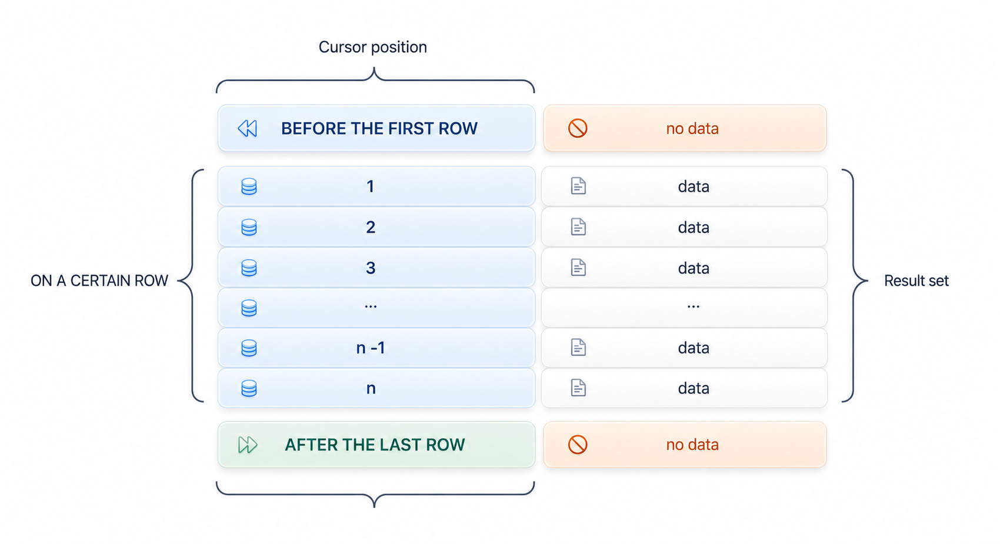

<a id="9ddc84012c021155"></a>

# 19. SQL References (C~G)

> 원본: [GOLDILOCKS 26c.1 User Manual (ko)](https://manual.sunjesoft.co.kr/goldilocks/26c_1/manual/ko/9ddc84012c021155)  
> 태그: `26c.1_0_tag`

[← 18. SQL References (A~B)](18-sql-references-a-b.md) · [전체 목차](../README.md) · [20. SQL References (H~Z) →](20-sql-references-h-z.md)

<a id="98a34ae5c82860ff"></a>
## CLOSE cursor_name

<a id="42b8d45e1992a0bf"></a>
### 기능

커서를 닫는다.

<a id="060c8580a89f6a59"></a>
### 구문

```
<close statement> ::=
    CLOSE cursor_name
    ;
```

<a id="e011510251dcbff7"></a>
### 구문 규칙 및 파라미터

<a id="60b63bdc60ea4cb4"></a>
#### cursor_name

커서가 open 되어 있어야 한다.  
세션 내에서 [DECLARE cursor_name](#d0200d8897a107da) 구문으로 선언된 커서이어야 한다.

<a id="a9dc039029f350d6"></a>
### 설명

Cursor는 session 내에 존재하는 객체이고 서로 다른 session의 cursor에 영향을 주지 않는다.

<a id="f74664197451bcc7"></a>
### 사용 예

다음은 interactive SQL tool (gsql)을 사용하여 커서를 DECLARE, OPEN, FETCH, CLOSE 하는 예이다.

```
gSQL> DECLARE cur1 CURSOR FOR SELECT id, data FROM t1;

Cursor declared.

gSQL> OPEN cur1;

Cursor is open.

gSQL> \var v_id   INTEGER
gSQL> \var v_data VARCHAR(128)

gSQL> FETCH cur1 INTO :v_id, :v_data;

V_ID V_DATA
---- ------
   1 data_1

1 row fetched.


gSQL> FETCH cur1 INTO :v_id, :v_data;

V_ID V_DATA
---- ------
   2 data_2

1 row fetched.

gSQL> FETCH cur1 INTO :v_id, :v_data;

no rows fetched.

gSQL> CLOSE cur1;

Cursor closed.
```

<a id="befa42c1757eed4d"></a>
### 호환성

**SQL 표준 호환성**

<a id="8f2a35bd76da4a45"></a>
| Feature ID | 설명 | 지원 여부 |
| --- | --- | --- |
| B031 | Basic dynamic SQL | O |

<a id="6598c62cbbd2ac6d"></a>
### 참조

관련 내용은 다음을 참조한다.

- [DECLARE cursor_name](#d0200d8897a107da)
- [OPEN cursor_name](20-sql-references-h-z.md#674c9a50006ee689)
- [FETCH cursor_name](#189c41bd169bad81)

<a id="ee34c21e2e9001e6"></a>
## COMMENT ON name IS

<a id="f7664419748b0102"></a>
### 기능

객체에 대한 설명을 dictionary에 저장한다.

<a id="7d907beeacef6fb3"></a>
### 구문

```
<comment statement> ::=
    COMMENT ON <comment object> IS 'comment string'
    ;

<comment object> ::=
      CLUSTER GROUP group_name
    | CLUSTER MEMBER member_name
    | DATABASE
    | PROFILE profile_name
    | AUDIT POLICY policy_name
    | AUTHORIZATION user_name
    | TABLESPACE tablespace_name
    | SCHEMA schema_name
    | TABLE [schema_name].table_name
    | COLUMN [schema_name].table_name.column_name
    | INDEX [schema_name].index_name
    | SEQUENCE [schema_name].sequence_name
    | CONSTRAINT [schema_name].constraint_name
    | LIBRARY [schema_name].library_name
    | PROCEDURE [schema_name].procedure_name
    | PACKAGE [schema_name].package_name
    | TRIGGER [schema_name].trigger_name
```

<a id="620664450c758868"></a>
### 사용 범위 및 접근 권한

&lt;comment statement&gt; 구문을 수행하려면 각 객체에 대하여 다음과 같이 권한을 변경해야 한다.

- CLUSTER GROUP
    - ALTER SYSTEM ON DATABASE
- CLUSTER MEMBER
    - ALTER SYSTEM ON DATABASE
- DATABASE 
    - ALTER DATABASE ON DATABASE 
- PROFILE
    - ALTER PROFILE ON DATABASE
- AUDIT POLICY
    - AUDIT SYSTEM ON DATABASE
- AUTHORIZATION (user) 
    - ALTER USER ON DATABASE 
- AUTHORIZATION (role) 
    - ALTER ROLE ON DATABASE 
- TABLESPACE 
    - ALTER TABLESPACE ON DATABASE 
- SCHEMA: 다음 권한 중 하나가 있어야 한다. 
    - 스키마의 소유자 
    - 스키마에 대해 CONTROL SCHEMA ON SCHEMA 
    - ALTER SCHEMA ON DATABASE 
- TABLE: 다음 권한 중 하나가 있어야 한다. 
    - 테이블의 소유자 
    - 테이블에 대해 CONTROL TABLE ON TABLE 
    - 테이블이 속한 스키마에 대해 CONTROL SCHEMA ON SCHEMA 
    - ALTER ANY TABLE ON DATABASE 
- COLUMN: 다음 권한 중 하나가 있어야 한다. 
    - Column이 속한 테이블의 소유자 
    - Column이 속한 테이블에 대해 CONTROL TABLE ON TABLE 
    - Column이 속한 테이블의 스키마에 대해 CONTROL SCHEMA ON SCHEMA 
    - ALTER ANY TABLE ON DATABASE 
- INDEX: 다음 권한 중 하나가 있어야 한다. 
    - 인덱스의 소유자 
    - 인덱스가 속한 스키마에 대해 CONTROL SCHEMA ON SCHEMA 
    - ALTER ANY INDEX ON DATABASE 
- SEQUENCE 
    - 시퀀스의 소유자 
    - 시퀀스가 속한 스키마에 대해 CONTROL SCHEMA ON SCHEMA 
    - ALTER ANY SEQUENCE ON DATABASE 
- CONSTRAINT 
    - 제약 조건의 소유자 
    - 제약 조건이 속한 스키마에 대해 CONTROL SCHEMA ON SCHEMA 
    - ALTER ANY TABLE ON DATABASE
- LIBRARY
    - 라이브러리의 소유자
    - 라이브러리가 속한 스키마에 대해 CONTROL SCHEMA ON SCHEMA
- PROCEDURE
    - Stored procedure/ function 의 소유자
    - Stored procedure/ function 이 속한 스키마에 대해 CONTROL SCHEMA ON SCHEMA
    - ALTER ANY PROCEDURE ON DATABASE
- PACKAGE
    - 패키지의 소유자
    - 패키지가 속한 스키마에 대해 CONTROL SCHEMA ON SCHEMA
    - ALTER ANY PACKAGE ON DATABASE
- TRIGGER
    - 트리거의 소유자
    - 트리거가 속한 스키마에 대해 CONTROL SCHEMA ON SCHEMA
    - ALTER ANY TRIGGER ON DATABASE

<a id="1ec7501480e3662a"></a>
### 구문 규칙 및 파라미터

<a id="4f60cb47c8f4c748"></a>
#### &lt;comment object&gt;

설명을 저장할 대상 객체로써 다음과 같은 database 객체에 대한 comment를 저장할 수 있다.

- Cluster object
    - CLUSTER GROUP
    - CLUSTER MEMBER 
- Non-schema object 
    - DATABASE 
    - PROFILE
    - AUDIT POLICY
    - AUTHORIZATION (User or Role) 
    - TABLESPACE 
    - SCHEMA 
- Schema object 
    - TABLE 또는 VIEW 
    - COLUMN 
    - INDEX 
    - SEQUENCE 
    - CONSTRAINT
    - LIBRARY
    - PROCEDURE 또는 FUNCTION
    - PACKAGE
    - TRIGGER

Schema object의 경우 schema_name을 기술하지 않으면 구문을 수행하는 사용자의 [Schema Path](13-sql-objects.md#3d5355367b16fe83)에 의해 스키마 이름이 결정된다.

```
COMMENT ON TABLE test_table IS 'test comment'; 
→ COMMENT ON TABLE user_default_schema.test_table IS 'test comment';
```

<a id="fd1b15bcde2dc7e3"></a>
#### 'comment string'

저장할 comment 문장을 기술한다.   
Comment를 삭제하려면 다음과 같이 empty string ('')을 사용한다.

```
COMMENT ON TABLE test_table IS '';
```

comment string의 길이는 1024 bytes를 초과할 수 없다.

<a id="b8335efa4fc4aa3d"></a>
### 설명

다음 dictionary view의 COMMENTS column으로부터 객체 유형별 정보를 확인할 수 있다.

- Cluster objects
    - CLUSTER GROUP & CLUSTER MEMBER
        - DICTIONARY_SCHEMA.DBA_CLUSTER_COMMENTS view
- Non-schema objects
    - DATABASE
        - DICTIONARY_SCHEMA.ALL_NONSCHEMA_COMMENTS view
        - DICTIONARY_SCHEMA.DBA_NONSCHEMA_COMMENTS view
    - PROFILE
        - DICTIONARY_SCHEMA.DBA_NONSCHEMA_COMMENTS view
    - AUDIT POLICY
        - DICTIONARY_SCHEMA.AUDIT_POLICIES view
    - USER
        - DICTIONARY_SCHEMA.ALL_NONSCHEMA_COMMENTS view
        - DICTIONARY_SCHEMA.DBA_NONSCHEMA_COMMENTS view
    - TABLESPACE
        - DICTIONARY_SCHEMA.ALL_NONSCHEMA_COMMENTS view
        - DICTIONARY_SCHEMA.DBA_NONSCHEMA_COMMENTS view
    - SCHEMA
        - DICTIONARY_SCHEMA.ALL_NONSCHEMA_COMMENTS view
        - DICTIONARY_SCHEMA.DBA_NONSCHEMA_COMMENTS view
- SQL schema objects
    - TABLE
        - DICTIONARY_SCHEMA.USER_TAB_COMMENTS view
        - DICTIONARY_SCHEMA.ALL_TAB_COMMENTS view
        - DICTIONARY_SCHEMA.DBA_TAB_COMMENTS view
    - VIEW
        - DICTIONARY_SCHEMA.USER_TAB_COMMENTS view
        - DICTIONARY_SCHEMA.ALL_TAB_COMMENTS view
        - DICTIONARY_SCHEMA.DBA_TAB_COMMENTS view
    - COLUMN
        - DICTIONARY_SCHEMA.USER_COL_COMMENTS view
        - DICTIONARY_SCHEMA.ALL_COL_COMMENTS view
        - DICTIONARY_SCHEMA.DBA_COL_COMMENTS view
    - INDEX
        - DICTIONARY_SCHEMA.USER_INDEXES view
        - DICTIONARY_SCHEMA.ALL_INDEXES view
        - DICTIONARY_SCHEMA.DBA_INDEXES view
    - SEQUENCE
        - DICTIONARY_SCHEMA.USER_SEQUENCES view
        - DICTIONARY_SCHEMA.ALL_SEQUENCES view
        - DICTIONARY_SCHEMA.DBA_SEQUENCES view
    - CONSTRAINT
        - DICTIONARY_SCHEMA.USER_CONSTRAINTS view
        - DICTIONARY_SCHEMA.ALL_CONSTRAINTS view
        - DICTIONARY_SCHEMA.DBA_CONSTRAINTS view
    - LIBRARY
        - DICTIONARY_SCHEMA.USER_LIBRARIES view
        - DICTIONARY_SCHEMA.ALL_LIBRARIES view
        - DICTIONARY_SCHEMA.DBA_LIBRARIES view
    - PROCEDURE & FUNCTION
        - DICTIONARY_SCHEMA.USER_PROCEDURES view
        - DICTIONARY_SCHEMA.ALL_PROCEDURES view
        - DICTIONARY_SCHEMA.DBA_PROCEDURES view
        - INFORMATION_SCHEMA.ROUTINES view
    - PACKAGE
        - INFORMATION_SCHEMA.MODULES view
    - TRIGGER
        - DICTIONARY_SCHEMA.USER_TRIGGERS view
        - DICTIONARY_SCHEMA.ALL_TRIGGERS view
        - DICTIONARY_SCHEMA.DBA_TRIGGERS view
        - INFORMATION_SCHEMA.TRIGGERS view

각 view에 대한 자세한 내용은 [DICTIONARY_SCHEMA](../part-02-administration-manual/9-database-information.md#72c0cc66453855b4)를 참조한다.

<a id="17e99eb0b46d78df"></a>
### 사용 예

다음은 테이블에 주석을 작성하는 예이다.

```
gSQL> COMMENT ON TABLE t1 IS 'test comment on table t1';

Comment created.
```

다음은 column에 주석을 작성하는 예이다.

```
gSQL> COMMENT ON COLUMN t1.id IS 'test comment on column t1.id';

Comment created.
```

다음은 스키마에 주석을 작성하는 예이다.

```
gSQL> COMMENT ON SCHEMA s1 IS 'test comment on schema s1';

Comment created.
```

<a id="459bc212f971f73e"></a>
### 호환성

SQL 표준에는 &lt;comment statement&gt;가 없다.

<a id="9d9942a1324d8ced"></a>
## COMMIT

<a id="c7ea6a4c3543288d"></a>
### 기능

현재 트랜잭션을 종료하고, 변경된 모든 내용을 영속화한다.

<a id="0aac10860ea4e38b"></a>
### 구문

```
<commit statement> ::=
    COMMIT [ WORK ] 
       [ [ <commit comment clause> ] [ <commit write clause> ] |
         [ <commit force clause> ] [ <commit comment clause> ] ]
    ;

<commit comment clause> ::=
      COMMENT 'comment_string'

<commit write clause> ::=
      WRITE [ WAIT | NOWAIT ]

<commit force clause> ::=
    FORCE 'xid_string'
```

<a id="00d712927230ba3c"></a>
### 구문 규칙 및 파라미터

<a id="4fdae781a385ea11"></a>
#### WORK

동작에 영향을 미치지 않는 예약어이다.

<a id="7b36eaa2555463fb"></a>
#### &lt;commit comment clause&gt;

- COMMENT 'comment_string'
    - 트랜잭션을 commit 할 때 트랜잭션에 주석을 지정한다.

<a id="34cdea2252bf1e12"></a>
#### &lt;commit write clause&gt;

Commit 연산으로 생성된 redo log가 redo log file에 기록될 때까지 기다릴지 여부를 결정한다.

- WAIT
    - commit 연산에 의해서 생성된 redo log가 redo log file에 기록될 때까지 기다린 후 연산을 종료한다.
- NOWAIT
    - commit 연산에 의해서 생성된 redo log가 redo log 버퍼에 기록되면 연산을 종료한다.
- 지정되어 있지 않을 경우, 프로퍼티를 따른다.

<a id="e4429be3e3eb6fd4"></a>
#### &lt;commit force clause&gt;

분산 트랜잭션을 수동으로 commit 할 때 사용한다.

- FORCE 'xid_string'
    - 'xid_string'에 해당하는 분산 트랜잭션을 commit 한다.
    - 'xid_string'은 '*format_id*.*transaction_id*.*branch_id*'로 구성된다.

<a id="030e8d6d185b76be"></a>
### 설명

COMMIT 구문은 트랜잭션 내에서 수행된 다음 구문들을 완료한다.

- Data Manipulation Language (DML) 구문
    - 데이터를 변경하는 INSERT, UPDATE, DELETE 등의 구문
- Data Definition Language (DDL) 구문 
    - 객체의 구조 및 정의를 변경하는 CREATE, DROP, ALTER, TRUNCATE, GRANT, REVOKE 등의 구문

예외적으로, DDL 중에 OS 자원을 다루거나 DATA TYPE을 변경하는 다음 구문들은 자동으로 COMMIT 된다.

- [CREATE TABLESPACE](#6b51bf8a71edc61b)
- [DROP TABLESPACE](#6f8b24f831f2bd7f)
- [ALTER TABLESPACE](18-sql-references-a-b.md#7d3341dc7c3f738f)
- ALTER TABLE .. ALTER COLUMN .. SET DATA TYPE: [&lt;alter column data type clause&gt;](18-sql-references-a-b.md#c3cbf4f521dbd868)

COMMIT을 수행하면 WITHOUT HOLD 옵션으로 열린 커서는 자동으로 닫힌다. 커서에 대한 자세한 내용은 다음의 커서 관련 구문을 참조한다.

- [DECLARE cursor_name](#d0200d8897a107da)
- [OPEN cursor_name](20-sql-references-h-z.md#674c9a50006ee689)

트랜잭션이 지연된 (DEFERRED) 제약 조건을 위반하면 COMMIT 구문의 수행은 실패하고 트랜잭션은 ROLLBACK 된다. 지연된 제약 조건에 대한 자세한 내용은 [SET CONSTRAINTS](20-sql-references-h-z.md#b6ece05278d045fb) 구문의 설명을 참조한다.

<a id="a4b1974fd4cd4b3f"></a>
### 사용 예

다음은 INSERT 구문을 수행한 후에 COMMIT을 수행하는 예이다.

```
gSQL> INSERT INTO t1 VALUES ( 1, 'anonymous' );

1 row created.

gSQL> COMMIT WORK COMMENT 'INSERT T1';

Commit complete.
```

<a id="c8348550e659e4b7"></a>
### 호환성

**SQL 표준 호환성**

<a id="58e50c01c2d3b5d3"></a>
| Feature ID | 설명 | 지원 여부 |
| --- | --- | --- |
| T261 | Chained transactions | X |

<a id="b4f40c700d4f6e0c"></a>
### 참조

관련 내용은 다음을 참조한다.

- [ROLLBACK](20-sql-references-h-z.md#1ba3b433854d9411)
- [SAVEPOINT savepoint_specifier](20-sql-references-h-z.md#903816d217929cbc)

<a id="079c12405d0687f7"></a>
## CREATE AUDIT POLICY

<a id="27e670f0b40f3150"></a>
### 기능

Audit policy 객체를 생성한다.   
생성한 audit policy 객체를 활성화하려면 AUDIT POLICY 구문을 수행하여야 한다.

<a id="376ef6f6c8212d54"></a>
### 구문

```
<audit policy definition> ::= 
    CREATE AUDIT POLICY policy_name
    { <privilege_audit_clause> | <role_audit_clause> | <action_audit_clause> }  [, ...]
    ; 

<privilege_audit_clause> ::=
    PRIVILEGES <database_privilege> [, ...]

<role_audit_clause> ::=
    ROLES <role_name> [, ...]


<action_audit_clause> ::=
    ACTIONS { <object_action_audit> | <system_action_audit> } [, ...]

<object_action_audit> ::=
      ALL ON [schema_name.]object_name
    | <object_action> ON [schema_name.]object_name

<system_action_audit> ::=
      ALL
    | DDL
    | <system_action>
```

<a id="acbc121eccd2c9f9"></a>
### 사용 범위 및 접근 권한

&lt;audit policy definition&gt; 구문을 수행하려면 사용자에게 AUDIT SYSTEM ON DATABASE 권한이 있어야 한다.

<a id="0631f23a5ce3a780"></a>
### 구문 규칙 및 파라미터

<a id="eb89cb5670359330"></a>
#### policy_name

생성할 audit policy의 이름이다.

<a id="2b6199045f36147c"></a>
#### &lt;privilege_audit_clause&gt;

권한 감사는 database privilege를 이용해 SQL 구문을 성공적으로 수행한 경우를 감사한다.   
특정 사용자가 database privilege를 이용해 SQL 구문을 수행하는 것을 감사할 수 있으며, database의 소유자인 SYS 사용자에 대해서는 권한 감사 기록을 남기지 않는다.

다음은 u1 사용자에게 SELECT ANY TABLE 권한을 부여하고 audit policy를 활성화하는 예이다.

```
CREATE AUDIT POLICY p1 
       PRIVILEGES SELECT ANY TABLE;

AUDIT POLICY p1;
```

사용자 u1이 다음과 같은 SQL 구문을 수행할 경우 권한 감사가 다르게 동작한다.

- SELECT * FROM u1.t1;
    - u1.t1 테이블의 소유자 권한으로 SQL 구문을 수행하여 audit record를 생성하지 않는다.
- SELECT * FROM u2.t1;
    - SELECT ANY TABLE 권한으로 SQL 구문을 수행하여 audit record를 생성한다.

권한 감사에 기술할 수 있는 &lt;database_privilege&gt;는 다음 질의로 조회할 수 있다.

```
SELECT PRIVILEGE_NAME FROM V$AUDITABLE_DB_PRIVILEGES;
```

<a id="b7a0a0fef8e44e9b"></a>
#### &lt;role_audit_clause&gt;

Role 감사는 특정 role을 이용해 SQL 구문을 수행한 경우에 대해 감사한다.  
다음은 u1 사용자에게 dba role 권한을 부여하고 audit policy를 활성화한 예이다.

```
gSQL> GRANT dba TO u1;
gSQL> CREATE AUDIT POLICY p1 ROLES dba;
gSQL> AUDIT POLICY p1;
```

다음과 같이 사용자 u1이 SQL 구문을 수행할 경우 권한 감사는 각각 다르게 동작한다.

- u1> SELECT * FROM u1.t1;
    - u1.t1 테이블의 소유자 권한으로 SQL 구문을 수행하고 audit record를 생성하지 않는다.
- u1> SELECT * FROM u2.t1;
    - dba role이 가진 권한으로 SQL 구문을 수행하고 audit record를 생성한다.

<a id="82a7d82dbe62cd64"></a>
#### &lt;action_audit_clause&gt;

특정 객체에 대한 action과 database 전체에 대한 action을 감사한다.

<a id="99ca91a960b8e1ba"></a>
#### &lt;object_action_audit&gt;

<a id="0ff1b91d73cb44b8"></a>
##### ALL ON object_name

object_name에 해당하는 객체에 대해 나열할 수 있는 모든 action을 의미한다.

각 객체 유형별로 감사할 수 있는 audit action은 다음 표와 같다.

**객체별 audit action**

<a id="b89692146004b3ea"></a>
| Object type | Action |
| --- | --- |
| Table | ALTER, COMMENT, DELETE, GRANT, INDEX, INSERT, LOCK, RENAME, SELECT, UPDATE |
| View | ALTER, COMMENT, GRANT, SELECT |
| Sequence | ALTER, COMMENT, GRANT, SELECT |
| Stored function/  procedure | ALTER, COMMENT, EXECUTE, GRANT |

<a id="a399e7d53688af4d"></a>
##### &lt;object_action&gt; ON object_name

특정 object에 대한 개별 action들은 다음과 같이 ON 절을 명시하여 하나씩 나열한다.

```
CREATE AUDIT POLICY p1
       ACTIONS INSERT ON u1.t1
             , DELETE ON u1.t1
             , UPDATE ON u1.t1
;
```

<a id="f87f5d6d0307b7f2"></a>
##### EXECUTE action 유의 사항

Stored function이나 stored procedure의 EXECUTE action 성공, 실패 여부에 대한 감사는 실제 수행 시점의 수행 가능 여부만으로 판단한다.

- WHENEVER NOT SUCCESSFUL의 경우, stored function/ procedure를 수행할 수 없을 경우에 감사 레코드를 생성한다.
- WHENEVER SUCCESSFUL의 경우, stored function/ procedure 내부의 SQL 구문을 수행하는 중에 에러가 발생하더라도 감사 레코드를 생성한다.
- Stored function/ procedure 내부의 SQL 구문 실패에 대한 감사가 필요할 경우, 해당 SQL 구문을 감사 대상에 포함해야 한다.

<a id="4f5337b74655e391"></a>
#### &lt;system_action_audit&gt;

특정 객체와 관계없이 database에 발생하는 system action을 감사한다.

- &lt;system_action&gt;

유효한 system action은 다음 질의로 조회할 수 있다.

```
SELECT ACTION_NAME FROM V$AUDITABLE_SYSTEM_ACTIONS;
```

- ALL

모든 system action을 의미한다.

- DDL

모든 Data Definition Language (DDL) 구문을 의미한다.

<a id="6672987ded247382"></a>
### 설명

Audit policy 객체는 감사할 대상들을 정의한 객체이다.    
Audit policy를 활성화하기 위해서는 AUDIT POLICY 구문을 수행해야 한다.

다수의 audit policy 를 정의하고 활성화할 수 있지만, 제한된 개수의 audit policy를 유지하는 것이 바람직하다.    
여러 개의 작은 policy 조각들을 묶어 소수의 policy group으로 만드는 것이 바람직하다.

생성한 audit policy 객체의 옵션 정보는 다음과 같이 AUDIT_POLICY_OPTIONS view를 통해 조회할 수 있다.

```
SELECT audit_option
     , audit_option_type
     , object_schema
     , object_name
  FROM audit_policy_options
 WHERE policy_name = 'P1'
;

AUDIT_OPTION AUDIT_OPTION_TYPE OBJECT_SCHEMA  OBJECT_NAME
------------ ----------------- -------------- ------------
DELETE	     OBJECT ACTION     U1	      T1
INSERT	     OBJECT ACTION     U1	      T1
UPDATE	     OBJECT ACTION     U1	      T1
```

<a id="7847b311cc185393"></a>
#### Audit Record의 생성

여러 감사 조건에 부합하는 action이 발생할 경우, 한 개 이상의 audit record를 생성한다.

다음과 같이 유사한 audit option을 나열한 경우 하나의 audit record를 생성한다.

- Audit policy 정의

```
CREATE AUDIT POLICY p1
       PRIVILEGES SELECT ANY TABLE
       ACTIONS SELECT;

AUDIT POLICY p1;
```

- Audit action 수행

```
SELECT * FROM other_user.t1;
```

다음과 같이 서로 다른 audit option을 나열한 경우 두 개의 audit record를 생성한다.

- Audit policy 정의

```
CREATE AUDIT POLICY p1
       ACTIONS SELECT ON u1.t1
             , SELECT ON u2.t2;

AUDIT POLICY p1;
```

- Audit action 수행

```
SELECT COUNT(*) FROM u1.t1 A, u2.t2 B WHERE A.id = B.id;
```

다음과 같이 동일한 action에 대해 여러 audit policy를 활성화한 경우, 두 개의 audit record를 생성한다.

- Audit policy 정의

```
CREATE AUDIT POLICY p1
       PRIVILEGES SELECT ANY TABLE;
AUDIT POLICY p1;

CREATE AUDIT POLICY p2
       ACTIONS SELECT;
AUDIT POLICY p2;
```

- Audit action 수행

```
SELECT * FROM other.t1;
```

<a id="2026ec78b4dd2e8a"></a>
### 사용 예

다음은 권한을 감사하는 audit policy를 정의하는 예이다.

```
CREATE AUDIT POLICY policy_table
       PRIVILEGES CREATE ANY TABLE
                , DROP ANY TABLE
;
```

다음은 객체에 대한 action을 감사하는 audit policy를 정의하는 예이다.

```
CREATE AUDIT POLICY policy_dml
       ACTIONS INSERT ON u1.t1
             , DELETE ON u1.t1
             , UPDATE ON u1.t1
             , ALL    ON u1.t2
;
```

다음은 system action을 감사하는 audit policy를 정의하는 예이다.

```
CREATE AUDIT POLICY policy_drop
       ACTIONS DROP TABLE, TRUNCATE TABLE
;
```

다음은 위의 예를 모두 합친 audit policy를 정의하는 예이다.

```
CREATE AUDIT POLICY policy_group
       PRIVILEGES CREATE ANY TABLE
                , DROP ANY TABLE
       ACTIONS INSERT ON u1.t1
             , DELETE ON u1.t1
             , UPDATE ON u1.t1
             , ALL    ON u1.t2
             , DROP TABLE
             , TRUNCATE TABLE
;
```

<a id="06bcad4ba8c56e9e"></a>
### 호환성

SQL 표준에는 audit policy가 없다.

<a id="c75f39fd465b3618"></a>
### 참조

관련 내용은 다음을 참조한다.

- Audit policy 객체 관리
    - [CREATE AUDIT POLICY](#079c12405d0687f7)
    - [DROP AUDIT POLICY](#5665b185fc830eaa)
    - [ALTER AUDIT POLICY](18-sql-references-a-b.md#e6d664ed42cb125a)

- Audit policy 활성화/ 비활성화
    - [AUDIT POLICY](18-sql-references-a-b.md#c26186987b5864cf)
    - [NOAUDIT POLICY](20-sql-references-h-z.md#2a39421bd3a74134)

- Audit trail 조회: [AUDIT_TRAIL](../part-02-administration-manual/9-database-information.md#28a87ad95b910b03)

- Audit trail 소거: [ALTER DATABASE CLEAR AUDIT TRAIL](18-sql-references-a-b.md#f4b53fa2e7dce2b7)

<a id="cb13f01b6a67d24a"></a>
## CREATE CLUSTER GROUP

<a id="de970771313d9985"></a>
### 기능

Cluster system에 참여할 cluster group을 생성한다.

<a id="2c4f53c6409fc59a"></a>
### 구문

```
<cluster group definition> ::=
    CREATE CLUSTER GROUP group_name 
        <cluster member definition> [, ...]
    ;

<cluster member definition> ::=
    CLUSTER MEMBER member_name <connection attribute> [<member position>]

<connection attribute> ::=
    HOST 'address' PORT port_no

<member position> ::=
    POSITION DEFAULT
  | POSITION MAX
  | POSITION number
```

<a id="044285b1ac6ebcee"></a>
### 사용 범위 및 접근 권한

Cluster system에서 수행할 수 있다.

&lt;cluster group definition&gt; 구문을 수행하려면 사용자에게 ADMINISTRATION ON DATABASE 권한이 있어야 한다.

<a id="3c7abb81fbb2db55"></a>
### 구문 규칙 및 파라미터

<a id="1795320e5d550723"></a>
#### group_name

Cluster group의 이름이다.   
동일한 cluster group, cluster member 이름이 존재하지 않아야 한다.   
이름의 길이는 128 바이트보다 작아야 한다.

<a id="794c8522c1b1fe8f"></a>
#### &lt;cluster member definition&gt;

Cluster group에 포함될 cluster member를 정의한다.  
Cluster group은 cluster member를 최대 32 개까지 포함할 수 있다.  
Cluster system에 최초로 생성하는 cluster group에는 cluster member를 한 개만 정의할 수 있고 자기 자신을 cluster member로 포함해야 한다.

<a id="473a502280814050"></a>
#### member_name

Cluster member의 이름이다.   
Cluster member 이름은 해당 member의 database를 생성할 때 정의한 member 이름과 동일해야 한다.  
동일한 cluster group, cluster member 이름이 존재하지 않아야 한다.   
이름의 길이는 128 바이트보다 작아야 한다.

Cluster member의 start-up 단계는 GLOBAL OPEN 단계여야 한다.

<a id="f75cc448eeac64c2"></a>
#### &lt;connection attribute&gt;

Cluster member간 통신을 위한 연결 정보를 정의한다.   
&lt;connection attribute&gt;는 해당 member의 database를 생성할 때 정의한 HOST, PORT와 동일해야 한다.  
HOST와 PORT 조합은 cluster system 내에서 유일해야 한다.

- HOST 'address'는 host name 또는 IPv4 주소를 사용한다. Host name을 사용할 경우 시스템의 첫 번째 IPv4 주소를 사용한다.
- PORT port_no는 1024 ~ 49151 범위의 값이어야 한다.

<a id="d3d4dd76d883fb59"></a>
#### &lt;member position&gt;

Cluster member의 position number를 지정한다.

- POSITION DEFAULT
    - 시스템이 자동으로 position number를 지정한다.
- POSITION MAX
    - 빈 position number가 있더라도 새로운 member position number를 지정한다.
    - 가장 큰 member position 보다 큰 값을 지정한다.
- POSITION number
    - number에 해당하는 position number를 지정한다.
    - 해당 position number는 cluster system 내에서 고유해야 한다.
    - 해당 position number는 비어있는 position number이면서 가장 큰 position number와 같거나 작아야 한다.
- 생략할 경우, 기본값은 POSITION DEFAULT 이다.

Cluster member의 member_position 정보는 DBA_CLUSTER view를 통해 조회할 수 있다.

```
SELECT member_name, member_id, member_position FROM dba_cluster;
```

예를 들어 다음과 같은 position number가 사용되고 있는 경우,

- G1N1: 0
- G1N2: 1
- G2N2: 3
- G3N2: 5

각 옵션에 따라, 다음과 같은 값을 지정한다.

- POSITION DEFAULT
    - 비어있는 값인 2를 지정한다.
- POSITION MAX
    - 새로운 position number 값인 6을 지정한다.
- POSITION 3
    - 중복되므로 error 이다.
- POSITION 4
    - position number 4를 지정한다.

<a id="d7d8ae4f72b93bf6"></a>
### 설명

&lt;cluster group definition&gt; 구문은 table들의 shard를 재배치하지 않는다.

추가된 cluster group에 shard를 재배치하려면 다음 구문을 수행해야 한다.

- [ALTER DATABASE REBALANCE](18-sql-references-a-b.md#045abf2d149b6478)
- [ALTER TABLE name REBALANCE](18-sql-references-a-b.md#4dcbc8cc43487ef2)

<a id="98a9620cdd09e43a"></a>
### 사용 예

다음은 두 개의 cluster member로 구성된 cluster group을 생성하는 예이다.

```
gSQL> 
CREATE CLUSTER GROUP g1
    CLUSTER MEMBER g1n1 HOST '192.168.0.11' PORT 10110
;

Cluster Group created.

gSQL>
ALTER CLUSTER GROUP g1
    ADD CLUSTER MEMBER g1n2 HOST '192.168.0.12' PORT 10120
;

Cluster Group altered.

gSQL> 
CREATE CLUSTER GROUP g2
    CLUSTER MEMBER g2n1 HOST '192.168.0.21' PORT 10210,
    CLUSTER MEMBER g2n2 HOST '192.168.0.22' PORT 10220
;

Cluster Group created.
```

<a id="3aafd0009133ee9e"></a>
### 호환성

SQL 표준에서는 cluster에 대한 개념을 정의하지 않고 있다.

<a id="e968a7a87f0c6dea"></a>
### 참조

관련 내용은 다음을 참조한다.

- [DROP CLUSTER GROUP](#d4612fb5786bb45f)
- [ALTER CLUSTER GROUP name ADD MEMBER](18-sql-references-a-b.md#1b3565c76f35ea0a)

<a id="67290c5932bd9838"></a>
## CREATE CLUSTER LOCATION

<a id="307971fa121a350c"></a>
### 기능

Cluster member의 접속 정보를 생성한다.

<a id="e2152bb6ef86eaa3"></a>
### 구문

```
<cluster location definition> ::=
    CREATE CLUSTER LOCATION member_name 
        <cluster connection attribute>
        [ AT <domain name> ]
    ;

<cluster connection attribute> ::
       HOST 'address' PORT port_no
```

<a id="90448758a0c175b8"></a>
### 사용 범위 및 접근 권한

Cluster system에서 수행할 수 있다.

&lt;cluster location definition&gt; 구문을 수행하려면 사용자에게 ADMINISTRATION ON DATABASE 권한이 있어야 한다.

<a id="1bb4d2a0bdd85d1d"></a>
### 구문 규칙 및 파라미터

<a id="170dc91e614b4972"></a>
#### member_name

Cluster member의 이름이다.   
등록된 cluster location 정보에 동일한 cluster member 이름이 존재하지 않아야 한다.   
이름의 길이는 128 바이트보다 작아야 한다.

<a id="a3d87e195464bba3"></a>
#### &lt;cluster connection attribute&gt;

Cluster member간 통신을 위한 연결 정보를 정의한다.   
HOST와 PORT 조합은 cluster system 내에서 유일해야 한다.

- HOST 'address'는 host name 또는 IPv4 주소를 사용한다. Host name을 사용할 경우 시스템의 첫 번째 IPv4 주소를 사용한다.
- PORT port_no는 1024 ~ 49151 범위의 값이어야 한다.

<a id="e5be517636e2b15a"></a>
#### &lt;domain name&gt;

구문을 수행할 멤버나 그룹의 이름이다.  
지정하지 않은 경우에는 모든 그룹에 수행된다.

<a id="563329f633b91511"></a>
### 설명

기본적으로 cluster location 정보는 cluster group을 생성하거나 cluster member를 추가할 때 제공되는 접속 정보를 이용하여 자동으로 생성된다. 생성된 정보는 cluster member와 group을 삭제할 때 함께 삭제된다.

만약 cluster location의 접속 정보가 변경되면 cluster member를 삭제하거나 다시 생성할 필요없이 [ALTER CLUSTER LOCATION](18-sql-references-a-b.md#48af3f039b7c7dd9)을 이용하여 접속 정보를 변경할 수 있다.

<a id="1de8d94093b59d14"></a>
### 사용 예

```
gSQL> 
CREATE CLUSTER LOCATION g1n2
    HOST '192.168.0.12' PORT 10120,
;

Created
```

<a id="f5739cc442067e6e"></a>
### 호환성

SQL 표준에서는 cluster에 대한 개념을 정의하지 않고 있다.

<a id="b283c6e73b88db23"></a>
### 참조

관련 내용은 [DROP CLUSTER LOCATION](#572d8870897e75c3)을 참조한다.

<a id="827d82aef7b7dbc7"></a>
## CREATE DISK DATA TABLESPACE

<a id="a6014b911d8d3f1c"></a>
### 기능

디스크 데이터 테이블스페이스를 정의한다.

<a id="f2164ee1b127a26f"></a>
### 구문

```
<disk data tablespace statement> ::=
    CREATE DISK [ DATA ] TABLESPACE tablespace_name
        DATAFILE <disk datafile clause> [, ...]
        [ <data tablespace management clause> [, ...] ]

<disk datafile clause> ::=
     'filename' 
        [ SIZE <size clause> | REUSE | SIZE <size clause> REUSE ]
        [ <autoextend clause> ]
        [ AT <domain_name> ]

<autoextend clause>
    AUTOEXTEND { ON [ <next size clause> ] [ <max size clause> ] | OFF }

<next size clause>
    NEXT <size clause>

<max size clause>
    MAXSIZE { <size clause> | UNLIMITED }

<size clause> ::=
    integer [ K | M | G | T ]

<data tablespace management clause> ::=
      { ONLINE | OFFLINE }
    | EXTSIZE <size clause>
```

<a id="3989dca5c54d95be"></a>
### 사용 범위 및 접근 권한

&lt;disk data tablespace definition&gt; 구문을 수행하려면 사용자에게 CREATE TABLESPACE ON DATABASE 권한이 있어야 한다.

구문을 수행한 사용자는 생성한 테이블스페이스에 대해 CREATE OBJECT ON TABLESPACE 권한을 갖는다.

생성한 테이블스페이스에 객체를 생성하려면 사용자에게 다음 권한 중 하나가 있어야 한다.

- 해당 테이블스페이스에 대해 CREATE OBJECT ON TABLESPACE 
- USAGE TABLESPACE ON DATABASE

<a id="b24360f16c785edd"></a>
### 구문 규칙 및 파라미터

<a id="b083efebe92f5903"></a>
#### tablespace_name

생성할 테이블스페이스의 이름이다.  
테이블스페이스 이름의 길이는 128 바이트보다 작아야 한다.

<a id="7bd38c801c17804b"></a>
#### &lt;disk datafile clause&gt;

- 'filename' 
    - 데이터를 저장 관리할 파일의 이름이다.
    - 디스크 테이블스페이스에 생성된 테이블, 인덱스 페이지들이 저장될 공간이다.
    - filename은 새로운 파일이거나 이미 존재하는 파일이다.
    - filename의 길이는 1024 바이트보다 작아야 한다.

- SIZE &lt;size clause&gt; 
    - 새로운 파일일 경우 SIZE 절을 이용해 초기 크기를 지정한다. 
    - 파일이 존재할 경우 에러가 발생한다. 
    - 파일의 크기는 최소 1 M ~ 최대 30 G 까지 지정할 수 있다.

- REUSE 
    - 이미 존재하는 파일일 경우 REUSE 절을 이용한다. 
    - 파일이 존재하지 않을 경우 새로운 파일을 생성한다.
    - 새로 생성되는 파일의 크기는 USER_DATA_TABLESPACE_SIZE 프로퍼티에 의해 결정된다.

- SIZE &lt;size clause&gt; REUSE 
    - SIZE 절과 REUSE 절을 모두 명시할 경우 filename의 존재 여부에 따라 다음과 같이 작동한다. 
        - 새로운 filename일 경우에는 SIZE 절을 이용하여 초기 파일 크기를 지정한다. 
        - 이미 존재하는 filename일 경우에는 기존 파일을 이용하여 SIZE 절의 값으로 크기를 조정한다.

<a id="cbac134c7857c219"></a>
#### &lt;autoextend clause&gt;

자동 확장 속성을 ON 또는 OFF로 설정한다. ON으로 설정할 경우 자동 확장 크기와 데이터파일의 최대 크기를 지정할 수 있다.

<a id="63077c8e9cd1b93c"></a>
#### &lt;next size clause&gt;

현재 사용 중인 데이터 파일에 더 이상 사용할 공간이 없을 때 확장할 크기를 지정한다.

<a id="24bd63abc05eb455"></a>
#### &lt;max size clause&gt;

데이터 파일이 확장될 수 있는 최대 크기를 지정한다.

<a id="acd7488297c8c85d"></a>
#### &lt;size clause&gt;

파일의 바이트 크기를 명시한다. (명시하지 않을 경우 bytes 단위이다.)

- K: Kilobytes 
- M: Megabytes 
- G: Gigabytes 
- T: Terabytes

<a id="be8203d9e684ecff"></a>
#### &lt;domain_name&gt;

구문을 수행할 멤버나 그룹의 이름이다.  
지정하지 않은 경우에는 모든 그룹에 수행된다.

<a id="d5603b086b43e7d1"></a>
#### ONLINE | OFFLINE

테이블스페이스 ONLINE/ OFFLINE 여부를 설정한다.

- ONLINE은 테이블스페이스를 생성하는 즉시 사용할 수 있는 상태이다. 
- OFFLINE은 사용 불가능한 상태이므로 ONLINE 상태로 변경한 후에 사용할 수 있다.

<a id="c6ab5f4ca4e071e9"></a>
#### EXTSIZE &lt;size clause&gt;

테이블스페이스의 extent 크기를 지정한다.

- Extent 크기는 바이트 단위로 기술하며, 여섯 가지 (64 K, 128 K, 256 K, 512 K, 1 M, 2 M) 중 하나가 선택된다.
- 만약 extent 크기가 64 K ~ 128 K 사이의 값으로 지정되면 128 K로 설정되고, 2 M 이상으로 지정되면 2 M로 설정된다.

<a id="0e613901a41975cb"></a>
### 설명

Data tablespace는 table, index (LOGGING) 등의 SQL schema 객체를 저장할 물리적 공간을 제공하는 객체이다.

<a id="6ee56072a6472dc9"></a>
### 사용 예

다음은 disk data tablespace를 생성하는 예이다.

```
gSQL> CREATE DISK TABLESPACE space1 DATAFILE 'test_file_1.dbf' SIZE 10M REUSE;

Tablespace created.
```

다음은 다수의 data file로 구성된 tablespace를 생성하는 예이다.

```
gSQL> CREATE DISK TABLESPACE space1 
             DATAFILE 'test_file_3_1.dbf' SIZE 10M REUSE,
                      'test_file_3_2.dbf' SIZE 10M REUSE;

Tablespace created.
```

<a id="7f0552a77fca00eb"></a>
### 호환성

SQL 표준에서는 테이블스페이스에 대한 개념을 다루지 않고 있다.

<a id="28198f2d5f1bc6fb"></a>
### 참조

관련 내용은 다음을 참조한다.

- [DROP TABLESPACE](#6f8b24f831f2bd7f)
- [ALTER TABLESPACE](18-sql-references-a-b.md#7d3341dc7c3f738f)
- [ALTER DATABASE DATAFILE AUTOEXTEND](18-sql-references-a-b.md#49be208ada17c239)

<a id="da32246e0aa12f64"></a>
## CREATE GLOBAL TEMPORARY TABLE

<a id="063f6b1f515b9455"></a>
### 기능

새로운 global temporary table을 생성한다.

<a id="9c4b6005e364e1a1"></a>
### 구문

```
<global temporary table definition> ::=
    CREATE GLOBAL TEMPORARY TABLE table_name
        ( <table element> [, ...] )
        [ <table commit action clause> ]
        [ TABLESPACE tablespace_name ]
    ;

<global temporary table definition: AS query expression> ::=
    CREATE GLOBAL TEMPORARY TABLE table_name 
        [ TABLESPACE tablespace_name ]
        AS <query expression> [ WITH [ NO ] DATA ]
    ;

<table commit action clause> ::=
    ON COMMIT { PRESERVE | DELETE } ROWS
```

> &lt;table element&gt;의 정의는 &lt;table_definition&gt;의 정의와 동일하다. 자세한 내용은 [CREATE TABLE](#ce6ecbcf1ea593ea) 을 참조한다.

<a id="451900e912c03742"></a>
### 사용 범위 및 접근 권한

&lt;global temporary table definition&gt; 구문을 수행하려면 사용자가 다음 조건들을 만족해야 한다.

- 테이블 생성 권한
    - [CREATE TABLE](#ce6ecbcf1ea593ea) 구문의 접근 권한을 참조한다.
- SELECT 접근 권한 
    - [SELECT](20-sql-references-h-z.md#2070458035e417b9) 구문의 접근의 권한을 참조한다.

<a id="e305d7f44eda6ad6"></a>
### 구문 규칙 및 파라미터

<a id="f7113f33e55597c5"></a>
#### table_name

생성할 테이블의 이름이다.  
자세한 내용은 [table_name](#c2685ea4e7eef283) 구문을 참조한다.

<a id="b9acfb2e9cb36079"></a>
#### other syntax

이 외의 구문 규칙은 [CREATE TABLE](#ce6ecbcf1ea593ea) 및 [CREATE TABLE AS SELECT](#092851c0db1d8a7a) 구문의 syntax를 참조한다.

<a id="3a1d47286e36f45e"></a>
### 설명

GLOBAL TEMPORARY TABLE은 한 트랜잭션이나 세션이 실행되는 동안 유지될 데이터를 보관하는 용도로 사용하는 임시 테이블이다.  
개발자가 응용 프로그램을 개발할 때 연산 중간 데이터를 잠시 저장하는 변수와 같은 용도로 사용된다.

Global temporary table의 특징은 다음과 같다.

- Global temporary table의 정의는 모든 세션에서 볼 수 있다.
- Global temporary table을 정의할 때는 물리적 공간이 할당되지 않고, 처음으로 insert 할 때 해당 세션에 종속된 실제 공간 (segment)이 할당된다.
- Global temporary table의 데이터는 insert 한 세션이나 트랜잭션에서만 볼 수 있다.
- Global temporary table의 데이터가 저장되는 tablespace는 다음과 같이 결정된다.

<a id="63f6da1b2e9017c2"></a>
| Tablespace 명시 여부 | Table이 생성되는 tablespace |
| --- | --- |
| Tablespace를 명시한다. | 명시된 tablespace에 생성된다. |
| Tablespace를 명시하지 않는다. | 현재 세션 사용자의 default temporary tablespace에 생성된다. |

- Global temporary table에 대한 인덱스는 대응하는 테이블과 같은 세션에 종속되며 지속기간 역시 해당 테이블과 같다.
- Global temporary table에 대한 view를 정의할 수 있다.
- Global temporary table에 대해 테이블의 cluster 관련 특성을 기술하는 &lt;table sharding strategy&gt; 구문이나 &lt;table global secondary index clause&gt;구문을 지정할 수 없다.
- Global temporary table에 대해 테이블의 물리적 특징을 기술하는 &lt;table attribute clause&gt;나 인덱스의 물리적 특징을 기술하는 &lt;index attribute clause&gt;를 지정할 수 없다.
- Global temporary table을 base table로 하여 생성되는 index들에는 인덱스의 물리적 특징을 기술하는 &lt;index attribute clause&gt;를 지정할 수 없다.
- &lt;table commit action clause&gt;에 의해 transaction이 종료될 경우, 남아있는 데이터의 처리 방법을 결정할 수 있다.

<a id="8cb19363f6648aca"></a>
| Table commit action | 설명 |
| --- | --- |
| ON COMMIT PRESERVE ROWS | COMMIT 되거나 ROLLBACK 되어도 테이블에 남아있는 데이터를 그대로 유지한다. |
| ON COMMIT DELETE ROWS(default) | COMMIT 되거나 ROLLBACK 하는 시점에 테이블에 남아있는 데이터를 모두 삭제한다 (TRUNCATE). |

- 일반 테이블에 대한 대부분의 DDL을 지원한다. (ALTER, TRUNCATE 포함)
    - CLUSTER 관련 구문 (SHARD 및 global secondary index 관련 구문 등)은 지원하지 않는다.
    - 자신의 세션이나 다른 세션에서 현재 사용 중인 global temporary table에 대한 DDL은 오류를 발생시킨다.
    - 사용 중인 모든 세션에서 TRUNCATE TABLE이나 COMMIT 등으로 사용 중인 segment들을 모두 제거한 후에 DDL이 가능해진다.
- 일반 테이블에 대한 모든 DML과 select 구문을 지원한다.
- Global temporary table에 대한 모든 변경 (DML)은 redo log를 남기지 않는다.
- Global temporary table에 대한 모든 변경 (DML)은 undo log를 남기며, TEMP_UNDO_ENABLED 프로퍼티에 따라 undo log의 위치가 결정된다.

<a id="d0d241d18444265a"></a>
| TEMP_UNDO_ENABLED 값 | 설명 |
| --- | --- |
| TRUE | Database system의 default temporary tablespace에 undo log가 기록된다. |
| FALSE | Database system의 undo tablespace에 undo log가 기록된다. |

- Global temporary table에 대한 TRUNCATE 명령은 해당 세션의 segment만 truncate 한다.
- 세션이 종료되면 모든 segment들이 TRUNCATE 된 후에 반환된다.

<a id="19bd188ac8186d6c"></a>
### 사용 예

다음은 CREATE GLOBAL TEMPORARY TABLE 구문을 실행하는 예이다.

```
gSQL> CREATE  GLOBAL TEMPORARY TABLE SESSION_TABLE1(
        COL1    CHAR(10)
       ,COL2    VARCHAR2(20)
       ,COL3    NUMBER(10)
)   ON  COMMIT  DELETE ROWS;

Table created.
```

다음은 CREATE GLOBAL TEMPORARY TABLE ... AS SELECT 구문을 실행하는 예이다.

```
gSQL> CREATE  GLOBAL TEMPORARY TABLE SESSION_TABLE2
    ON  COMMIT  PRESERVE ROWS
    AS  SELECT  *
          FROM  EMPLOYEES;

Table created.
```

<a id="ff2b71e37f68ecc8"></a>
### 호환성

CREATE GLOBAL TEMPORARY TABLE 및 CREATE GLOBAL TEMPORARY TABLE AS SELECT 구문은 SQL 표준의 &lt;table definition&gt; 정의를 따른다. 단, 다음은 표준에서 확장된 것이다.

- 표준에서 SELECT 절 밖의 괄호는 필수이다. 그러나 GOLDILOCKS에서는 선택 사항이다.
- 표준에서 WITH [NO] DATA 절은 필수이다. 그러나 GOLDILOCKS에서는 선택 사항이다.
- GOLDILOCKS의 tablespace 개념은 표준에 없는 확장 개념이다.

**SQL 표준 호환성**

<a id="4d1c2e8a65c4f029"></a>
| Feature ID | 설명 | 지원 여부 |
| --- | --- | --- |
| T171 | LIKE clause in table definition | X |
| T172 | AS subquery clause in table definition | O |
| F531 | Temporary tables | X |
| S051 | Create table of type | X |
| S043 | Enhanced reference types | X |
| S081 | Subtables | X |
| T173 | Extended LIKE clause in table definition | X |
| T180 | System-versioned tables | X |
| F692 | Extended collation support | X |
| T174 | Identity columns | O |
| T175 | Generated columns | X |
| S071 | SQL paths in function and type name resolution | X |
| F321 | User authorization | O |
| T322 | Extended roles | X |
| F762 | CURRENT_CATALOG | O |
| F763 | CURRENT_SCHEMA | O |

<a id="a3958dc5b400f794"></a>
### 참조

관련 내용은 다음을 참조한다.

- [CREATE TABLE](#ce6ecbcf1ea593ea)
- [CREATE TABLE AS SELECT](#092851c0db1d8a7a)

<a id="d49a988f0f1f2193"></a>
## CREATE IMMUTABLE TABLE

<a id="f43a8deeaf444479"></a>
### 기능

새로운 immutable table을 생성한다.

<a id="ee259a561495f964"></a>
### 구문

```
<immutable table definition> ::=
    CREATE IMMUTABLE TABLE table_name
        ( <table element> [, ...] )
        [ <table sharding strategy> ]
        [ <table attribute clause> [...] ]
        [ TABLESPACE tablespace_name ]
        [ <table global secondary index clause> ]
    ;

<immutable table definition: AS query expression> ::=
    CREATE IMMUTABLE TABLE table_name
        [ ( column_name [, ...] ) ]
        [ <table sharding strategy> ]
        [ <table attribute clause> [, ...] ]
        [ TABLESPACE tablespace_name ]
        [ <table global secondary index clause> ]
        AS <query expression> [ WITH [ NO ] DATA ]
    ;
```

> &lt;table element&gt;, &lt;table sharding strategy&gt;, &lt;table attribute clause&gt;, &lt;table global secondary index clause&gt;의 정의는 &lt;table_definition&gt;의 정의와 동일하다. 자세한 내용은 [CREATE TABLE](#ce6ecbcf1ea593ea)을 참조한다.

<a id="d0c4ce3ddac08d57"></a>
### 사용 범위 및 접근 권한

&lt;immutable table definition&gt; 구문을 수행하려면 사용자가 다음 조건들을 만족해야 한다.

- 테이블 생성 권한
    - [CREATE TABLE](#ce6ecbcf1ea593ea) 구문의 접근 권한을 참조한다.
- SELECT 접근 권한 
    - [SELECT](20-sql-references-h-z.md#2070458035e417b9) 구문의 접근 권한을 참조한다.

<a id="624349d24c0a23bb"></a>
### 구문 규칙 및 파라미터

<a id="2fcb2bb072725da0"></a>
#### table_name

생성할 테이블의 이름이며, 스키마 내에서 고유한 이름이어야 한다.  
schema_name.table_name과 같이 테이블이 소속할 스키마를 정의할 수 있는데 schema_name을 생략할 경우, 구문을 수행하는 사용자의 기본 스키마 이름이 사용된다.  
테이블 이름의 길이는 128 바이트보다 작아야 한다.

<a id="ba4e824788173572"></a>
#### 기타 구문 규칙

이 외의 구문 규칙은 [CREATE TABLE](#ce6ecbcf1ea593ea)과 [CREATE TABLE AS SELECT](#092851c0db1d8a7a) 구문의 syntax를 참조한다.

<a id="7a9fecbf7158498c"></a>
### 설명

Immutable table은 저장된 레코드의 변경 및 삭제를 불가능하게 할 뿐만 아니라 테이블 자체도 삭제하지 못하도록 하기 위한 용도로 사용된다.

> 사용자, 스키마, 테이블스페이스, 클러스터 그룹을 삭제할 경우 immutable table도 삭제할 수 있다.

> Immutable table로 생성했을 때 허용되지 않는 SQL 구문
> 
> - UPDATE
> - DELETE
> - ALTER TABLE RENAME/DROP COLUMN
> - ALTER TABLE SET UNUSED COLUMN
> - ALTER TABLE DROP UNUSED COLUMNS
> - ALTER TABLE RENAME TO
> - TRUNCATE TABLE
> - DROP TABLE
> 
>   
> Immutable table로 생성했을 때 허용되는 SQL 구문
> 
> - INSERT
> - SELECT
> - SELECT .. FOR UPDATE
> - CREATE/ALTER/DROP INDEX
> - ALTER TABLE ADD/ALTER COLUMN
> - ALTER TABLE ADD/ALTER/RENAME/DROP CONSTRAINT
> - ALTER TABLE for physical property changes
> - ALTER TABLE ADD/DROP SUPPLEMENTAL LOG
> - LOCK TABLE
> - ALTER TABLE .. ADD/ALTER/DROP GLOBAL SECONDARY INDEX
> - ALTER DATABASE MOVE SHARD
> - ALTER TABLE .. MOVE SHARD
> - ALTER TABLE .. SPLIT SHARD
> - ALTER TABLE .. MERGE SHARD
> - DROP TABLESPACE
> - DROP SCHEMA
> - DROP USER
> - DROP CLUSTER GROUP
> 

<a id="82a860ab05b796fa"></a>
### 사용 예

다음은 CREATE IMMUTABLE TABLE 구문을 실행하는 예이다.

```
gSQL> CREATE IMMUTABLE TABLE t1
(
    id INTEGER PRIMARY KEY,
    name VARCHAR(128),
    addr VARCHAR(128)
);

Table created.
```

다음은 CREATE IMMUTABLE TABLE ... AS SELECT 구문을 실행하는 예이다.

```
gSQL> CREATE IMMUTABLE TABLE T2
       AS SELECT *
             FROM T1;

Table created.
```

<a id="a55e92b1e98b7a2d"></a>
### 호환성

SQL 표준에서는 CREATE IMMUTABLE TABLE 구문과 CREATE IMMUTABLE TABLE AS SELECT 구문을 다루지 않고 있다.

<a id="5f66661dd3edf6de"></a>
### 참조

관련 내용은 다음을 참조한다.

- [CREATE TABLE](#ce6ecbcf1ea593ea)
- [CREATE TABLE AS SELECT](#092851c0db1d8a7a)

<a id="1b99962ed891aa4f"></a>
## CREATE INDEX

<a id="89251b04781ca075"></a>
### 기능

인덱스를 생성한다.

<a id="e850a33efde77dde"></a>
### 구문

```
<index definition> ::=
    CREATE [ UNIQUE ] INDEX index_name
        ON table_name ( <index column element> [, ...] )
        [ <index attributes> [...] ]
        [ TABLESPACE tablespace_name ]
        [ <index enforcement> ]
    ;

<index column element> ::=
    column_name [ ASC | DESC ] [ NULLS FIRST | NULLS LAST ]

<index attributes> ::=
      <physical attribute clause>
    | STORAGE ( <segment attr clause> [...] )
    | <parallel clause> 

<physical attribute clause> ::=
      PCTFREE integer
    | INITRANS integer
    | MAXTRANS integer

<segment attr clause> ::=
      INITIAL <size_clause>
    | NEXT <size_clause>

<size clause> ::=
      integer [ K | M | G | T ]

<parallel clause> ::=
      NOPARALLEL
    | PARALLEL [ integer ]

<index enforcement> ::=
      { ENABLE | ENFORCED }
    | { DISABLE | NOT ENFORCED }
```

<a id="80aa9e986ee8ef60"></a>
### 사용 범위 및 접근 권한

&lt;index definition&gt; 구문을 수행하려면 사용자가 다음 조건들을 만족해야 한다.

- 인덱스를 생성할 테이블에 대해 다음 권한 중 하나가 있어야 한다.
    - 해당 테이블에 대해 (INDEX 또는 CONTROL TABLE) ON TABLE 
    - 테이블이 속한 스키마에 대해 CONTROL SCHEMA ON SCHEMA 
    - CREATE ANY INDEX ON DATABASE

- 인덱스가 생성될 스키마에 대해 다음 권한 중 하나가 있어야 한다.
    - 해당 스키마에 대해 (CREATE INDEX 또는 CONTROL SCHEMA) ON SCHEMA 
    - CREATE ANY INDEX ON DATABASE

- 인덱스가 생성될 테이블스페이스에 대해 다음 권한 중 하나가 있어야 한다.
    - 해당 테이블스페이스에 대해 CREATE OBJECT ON TABLESPACE 
    - USAGE TABLESPACE ON DATABASE

- 인덱스의 소유자는 다음과 같이 결정된다.
    - 인덱스가 속한 스키마의 소유자
    - 인덱스가 속한 스키마가 PUBLIC인 경우, 구문을 수행한 사용자

> Cluster에서 unique index는 모든 sharding key를 포함해야 한다.

<a id="eec9a6a30ecd4759"></a>
### 구문 규칙 및 파라미터

<a id="915daf3c2a3a29fa"></a>
#### UNIQUE

인덱스를 구성하는 column들에 중복 값을 허용하지 않는다.

<a id="ddfc145e0352c0c6"></a>
#### index_name

생성할 인덱스의 이름이며, 스키마 내에서 유일해야 한다.  
스키마 이름을 생략할 경우, 참조하는 테이블이 속한 스키마에 인덱스가 생성된다.  
인덱스 이름의 길이는 128 바이트보다 작아야 한다.

<a id="051f5a6b68487255"></a>
#### table_name

인덱스를 생성할 테이블의 이름이다.  
schema_name.table_name과 같이 테이블이 소속한 스키마를 정의할 수 있는데 schema_name을 생략할 경우, 구문을 수행하는 사용자의 기본 스키마 이름이 사용된다.

<a id="3a11b7f9feb7e5c0"></a>
#### column_name

인덱스 key로 사용할 column의 이름이다.  
하나 이상의 column을 정의해야 하는데 최대 32 개의 column을 인덱스 key로 사용할 수 있다.

구현 내용에 따라 다음과 같은 제약이 발생할 수 있다.

- 인덱스에 포함되는 column의 데이터 타입이 LONG CHARACTER VARYING, LONG BINARY VARYING 일 경우 인덱스를 생성할 수 없다. 
- Column들의 precision 합계가 1200 바이트보다 작은 경우에만 인덱스를 생성할 수 있다.

<a id="ed62f2f87cf2da5b"></a>
#### ASC | DESC

Column의 정렬 순서를 명시한다.

- ASC: 오름차순으로 정렬한다. 
- DESC: 내림차순으로 정렬한다. 
- 명시하지 않을 경우, 기본값은 ASC 이다.

<a id="0ec207e178ad32c8"></a>
#### NULLS FIRST | NULLS LAST

NULL 값의 정렬 순서를 명시한다.

- NULLS FIRST: NULL이 아닌 값들보다 앞에 위치한다. 
- NULLS LAST: NULL이 아닌 값들보다 뒤에 위치한다. 
- 명시하지 않을 경우, 기본값은 NULLS LAST 이다.

<a id="702f1dd708611f13"></a>
#### &lt;physical attribute clause&gt;

인덱스의 물리적 속성 정보를 정의한다.

- PCTFREE integer 
    - 정의 
        - 페이지 내 key 삽입으로 인한 페이지 분할 빈도를 조절하기 위해 예약된 공간이다.
        - 인덱스 bottom-up 빌드 시에만 적용된다. 
    - 0 에서 99 까지의 값을 사용할 수 있다. 
    - 생략할 경우, DEFAULT_INDEX_PCTFREE property에 설정된 값을 사용한다.

- INITRANS integer 
    - 정의 
        - 페이지에 동시 접근할 수 있는 초기 트랜잭션의 개수이다. 
        - 인덱스에 접근하는 사용자의 수가 적을 경우에는 INITRANS를 낮게 설정하고, 동시에 접근하는 사용자가 많을 경우에는 INITRANS를 높게 설정한다. 
        - 필요한 경우 설정된 MAXTRANS까지 자동으로 늘어난다. 
    - 1 부터 32 까지의 값을 사용할 수 있다. 
    - 생략할 경우, 기본값은 4 이다.

- MAXTRANS integer 
    - 정의 
        - 페이지에 동시 접근할 수 있는 트랜잭션의 최대 개수이다. 
    - 1 부터 32 까지의 값을 사용할 수 있다. 
    - 생략할 경우, 기본값은 8 이다.

<a id="d44b0d60fcd0fb5a"></a>
#### &lt;segment attr clause&gt;

인덱스가 저장될 공간에 대한 정보를 기술한다.

- INITIAL integer
    - 정의
        - 인덱스를 생성할 때 초기에 할당할 물리적 공간의 크기를 기술한다.
        - integer 값이 EXTENT 두 개 이하인 경우, extent 두 개 크기로 설정된다.
        - integer 값이 EXTENT 두 개 보다 큰 경우, TABLESPACE의 EXTENT 크기에 맞춰 (aligned) 설정된다.
    - 최소값은 1이고 최대값은 시스템 환경에 따라 다르다.
    - 생략할 경우, 기본값은 테이블이 속한 TABLESPACE의 EXTENT 두 개 크기이다.

- NEXT integer
    - 정의
        - 인덱스의 물리적 공간을 추가할 경우 할당할 물리적 공간의 크기를 기술한다.
        - 이 크기는 테이블이 속하는 TABLESPACE의 EXTENT 크기에 align 되어 사용된다. (예: EXT크기가 8192 bytes일 경우 'NEXT 100'은 실제 8192 bytes로 작동한다.)
        - NEXT는 현재 인덱스가 사용할 수 있는 남은 공간의 크기 (MAXEXTENTS의 크기에서 현재 사용하고 있는 공간의 크기를 뺀 크기)에 따라 다음과 같이 작동한다.  
      - 남은 공간의 크기가 0인 경우 더 이상 공간을 확장하지 못한다.  
      - 남은 공간의 크기가 0보다 크고 NEXT보다 작은 경우 남은 공간의 크기만큼 할당한다.  
      - 남은 공간의 크기가 NEXT 보다 클 경우 NEXT의 크기만큼 할당한다.
    - 최소값은 1이고 최대값은 시스템 환경에 따라 다르다.
    - 생략할 경우, 기본값은 인덱스가 속한 TABLESPACE의 EXTENT 하나 크기이다.

<a id="910e1110c57e7639"></a>
#### &lt;size clause&gt;

파일의 바이트 크기를 명시한다. (단위를 기술하지 않을 경우 bytes이다.)

- K: Kilobytes 
- M: Megabytes 
- G: Gigabytes 
- T: Terabytes

<a id="3cf01981f479f6b0"></a>
#### NOPARALLEL | PARALLEL [ integer ]

인덱스 구축과정에서 사용될 thread 개수를 지정한다.

- NOPARALLEL 
    - 인덱스를 병렬로 구축하지 않는다. 
- PARALLEL [integer] 
    - 인덱스를 병렬로 구축한다. 
    - integer가 생략되거나 0으로 지정된 경우에는 프로퍼티 (INDEX_BUILD_PARALLEL_FACTOR)를 따른다. 
    - integer는 0 부터 사용할 수 있으며 최대값은 16이다. 
    - 만약 프로퍼티의 값이 0인 경우에는 시스템이 최적값을 결정한다.
- 명시하지 않을 경우, 기본값은 PARALLEL이다.

<a id="5e784b2711b7bf64"></a>
#### TABLESPACE tablespace_name

인덱스가 저장될 tablespace의 이름을 지정한다.

- tablespace_name을 지정할 경우
    - tablespace_name이 data tablespace면 LOGGING 인덱스가 생성된다.
    - tablespace_name이 temporary tablespace 또는 nologging tablespace면 NOLOGGING 인덱스가 생성된다.

- TABLESPACE 절을 생략할 경우,
    - USER의 INDEX TABLESPACE tablespace_name을 지정한 경우
        - 정의한 테이블스페이스를 사용한다.
    - USER의 INDEX TABLESPACE가 NULL인 경우
        - DISK 테이블의 인덱스는 사용자의 기본 데이터 테이블스페이스를 사용한다.
        - MEMORY 테이블의 인덱스는 사용자의 기본 임시 테이블스페이스를 사용한다.

<a id="2ba2ab54e6ee514c"></a>
#### &lt;index enforcement&gt;

생략할 경우, 기본값은 ENABLE 이다.

ENABLE 과 ENFORCED 는 동일한 의미이다.  
DISABLE 과 NOT ENFORCED 는 동일한 의미이다.

- ENABLE
    - Index 를 활성화한다.
- DISABLE
    - Index 를 비활성화한다.
    - Index 객체만 생성하고, index 를 구축하지 않는다.
    - DML과 SELECT 에서 해당 index 를 사용하지 않는다.

<a id="92e22409a30ea682"></a>
### 설명

LOGGING 인덱스와 NOLOGGING 인덱스에는 다음과 같은 trade-off가 있다.

- LOGGING 인덱스
    - 장점: 시스템을 구동할 때 로그를 이용해 인덱스가 자동으로 복구되므로 별도의 구축과정이 없다.
    - 단점: 관련 row를 변경할 때 인덱스 변경 내용을 로그로 기록하여 디스크 IO를 유발한다.
- NOLOGGING 인덱스
    - 장점: 관련 row를 변경할 때 인덱스 변경 내용에 대한 디스크 IO가 발생하지 않는다.
    - 단점: 시스템을 구동할 때 인덱스에 대한 로그 정보가 없어 자동으로 인덱스를 재구축한다.

<a id="570361d346d10c76"></a>
### 사용 예

다음은 unique index를 생성하는 예이다.

```
gSQL> CREATE UNIQUE INDEX idx_t1_id ON t1( id );

Index created.
```

다음은 다수의 column에 대해 인덱스를 생성하는 예이다.

```
gSQL> CREATE INDEX idx_t1_id_name ON t1( id, name );

Index created.
```

다음은 인덱스 column의 정렬 순서를 지정하는 예이다.

```
gSQL> CREATE INDEX idx_t1_dept_id ON t1( dept_id DESC );

Index created.
```

다음은 인덱스 column의 NULL 값 정렬 순서를 지정하는 예이다.

```
gSQL> CREATE INDEX idx_t1_name ON t1( name NULLS FIRST );

Index created.
```

다음은 인덱스가 저장될 공간에 대한 정보를 설정하는 예이다.

```
gSQL> CREATE INDEX idx_t1_id ON t1( id )
             STORAGE ( INITIAL 10M NEXT 1M );

Index created.
```

다음은 인덱스에 대해 리두 로깅을 생성하도록 하는 예이다.

```
gSQL> CREATE INDEX idx_t1_id ON t1( id );

Index created.
```

다음은 인덱스를 병렬로 생성하도록 하는 예이다.

```
gSQL> CREATE INDEX idx_t1_name ON t1( name ) PARALLEL;

Index created.
```

다음은 인덱스를 생성할 때 테이블스페이스를 지정하는 예이다.

```
gSQL> CREATE INDEX idx_t1_name ON t1( name ) TABLESPACE mem_temp_tbs;

Index created.
```

<a id="3037139c9e9b0447"></a>
### 호환성

SQL 표준에서는 인덱스에 대한 개념을 다루지 않고 있다.

<a id="6063e663df6b6cc7"></a>
### 참조

관련 내용은 [DROP INDEX](#d01836ffe196ec14)를 참조한다.

<a id="89b908fb6ee8dd25"></a>
## CREATE MEMORY DATA TABLESPACE

<a id="24390c95f03e417c"></a>
### 기능

메모리 데이터의 테이블스페이스를 정의한다.

<a id="c4b261b9c62173ad"></a>
### 구문

```
<memory data tablespace statement> ::=
    CREATE [ MEMORY ] [ DATA ] TABLESPACE tablespace_name
        DATAFILE <memory datafile clause> [, ...]
        [ <data tablespace management clause> [, ...] ]

<memory datafile clause> ::=
     'filename' 
        [ SIZE <size clause> | REUSE | SIZE <size clause> REUSE ]
        [ AT <domain_name> ]
<size clause> ::=
    integer [ K | M | G | T ]

<data tablespace management clause> ::=
      { ONLINE | OFFLINE }
    | EXTSIZE <size clause>
```

<a id="137ff01599a38f97"></a>
### 사용 범위 및 접근 권한

&lt;memory data tablespace definition&gt; 구문을 수행하려면 사용자에게 CREATE TABLESPACE ON DATABASE 권한이 있어야 한다.

구문을 수행한 사용자는 생성한 테이블스페이스에 대해 CREATE OBJECT ON TABLESPACE 권한을 갖는다.

생성한 테이블스페이스에 객체를 생성하려면 사용자에게 다음 권한 중 하나가 있어야 한다.

- 해당 테이블스페이스에 대해 CREATE OBJECT ON TABLESPACE 
- USAGE TABLESPACE ON DATABASE

<a id="fdcb6089c711c6f1"></a>
### 구문 규칙 및 파라미터

<a id="14868d14f2852ef6"></a>
#### [ MEMORY ] [ DATA ]

테이블, 인덱스 등 영구적인 객체를 저장할 메모리 테이블스페이스이다.  
MEMORY와 DATA 예약어는 생략할 수 있다.

<a id="572c510432c5b311"></a>
#### tablespace_name

생성할 테이블스페이스의 이름이다.  
테이블스페이스 이름의 길이는 128 바이트보다 작아야 한다.

<a id="aa52fbbecf17c7bc"></a>
#### &lt;memory datafile clause&gt;

- 'filename' 
    - 데이터를 저장 관리할 파일의 이름이다.
    - 메모리 데이터에 대한 체크포인트 이미지를 저장할 공간이다.
    - filename은 새로운 파일이거나 이미 존재하는 파일이다.
    - filename의 길이는 1024 바이트보다 작아야 한다.

- SIZE &lt;size clause&gt; 
    - 새로운 파일일 경우 SIZE 절을 이용해 초기 크기를 지정한다. 
    - 파일이 존재할 경우 에러가 발생한다. 
    - 파일의 크기는 최소 1 M ~ 최대 30 G 까지 지정할 수 있다.

- REUSE 
    - 이미 존재하는 파일일 경우 REUSE 절을 이용한다. 
    - 파일이 존재하지 않을 경우 새로운 파일을 생성한다. 
    - 새로 생성되는 파일의 크기는 
        - 데이터 테이블스페이스의 경우 USER_DATA_TABLESPACE_SIZE 프로퍼티에 의해 결정되고 
        - 임시 테이블스페이스의 경우 USER_TEMP_TABLESPACE_SIZE 프로퍼티에 의해 결정된다.

- SIZE &lt;size clause&gt; REUSE 
    - SIZE 절과 REUSE 절을 모두 명시할 경우 filename의 존재 여부에 따라 다음과 같이 작동한다. 
        - 새로운 filename일 경우에는 SIZE 절을 이용해 초기 파일 크기를 지정한다. 
        - 이미 존재하는 filename일 경우에는 기존 파일을 이용하여 SIZE 절의 값으로 크기를 조정한다.

<a id="f78fad904eeeba87"></a>
#### &lt;size clause&gt;

파일의 바이트 크기를 명시한다. (단위를 기술하지 않을 경우 bytes이다.)

- K: Kilobytes 
- M: Megabytes 
- G: Gigabytes 
- T: Terabytes

<a id="8da6f70f240f8b60"></a>
#### &lt;domain_name&gt;

구문을 수행할 멤버나 그룹의 이름이다.  
지정하지 않은 경우에는 모든 그룹에 수행된다.

<a id="5f32e62422b8c5c0"></a>
#### ONLINE | OFFLINE

테이블스페이스 ONLINE/ OFFLINE 여부를 설정한다.

- ONLINE은 테이블스페이스를 생성하는 즉시 사용할 수 있는 상태이다. 
- OFFLINE은 사용 불가능한 상태이므로 ONLINE 상태로 변경한 후에 사용할 수 있다.

<a id="052260c23a609872"></a>
#### EXTSIZE &lt;size clause&gt;

테이블스페이스의 extent 크기를 지정한다.

- Extent 크기는 바이트 단위로 기술하며, 여섯 가지 (64 K, 128 K, 256 K, 512 K, 1 M, 2 M) 중 하나가 선택된다.
- 만약 extent 크기가 64 K ~ 128 K 사이의 값으로 지정되면 128 K로 설정되고, 2 M 이상으로 지정되면 2 M로 설정된다.

<a id="f72f7569714e56f6"></a>
### 설명

Data tablespace는 table, index (LOGGING) 등의 SQL schema 객체를 저장할 물리적 공간을 제공하는 객체이다.

<a id="56badd66909fa03d"></a>
### 사용 예

다음은 memory data tablespace를 생성하는 예이다.

```
gSQL> CREATE TABLESPACE space1 DATAFILE 'test_file_1.dbf' SIZE 10M REUSE;

Tablespace created.
```

다음은 다수의 data file로 구성된 tablespace를 생성하는 예이다.

```
gSQL> CREATE TABLESPACE space1 
             DATAFILE 'test_file_3_1.dbf' SIZE 10M REUSE,
                      'test_file_3_2.dbf' SIZE 10M REUSE;

Tablespace created.
```

<a id="1636586d3adc2c17"></a>
### 호환성

SQL 표준은 테이블스페이스에 대한 개념을 다루지 않고 있다.

<a id="4646b9f7a481258d"></a>
### 참조

관련 내용은 다음을 참조한다.

- [DROP TABLESPACE](#6f8b24f831f2bd7f)
- [ALTER TABLESPACE](18-sql-references-a-b.md#7d3341dc7c3f738f)

<a id="702566e5b0c8aa29"></a>
## CREATE MEMORY TEMPORARY TABLESPACE

<a id="5f3749bce9f23444"></a>
### 기능

메모리 임시 테이블스페이스를 정의한다.

<a id="8c7534b44a9474dc"></a>
### 구문

```
<memory temporary tablespace statement> ::=
    CREATE [ MEMORY ] TEMPORARY TABLESPACE tablespace_name
        MEMORY <memory clause> [, ...]
        <temporary tablespace management clause>

<memory clause> 
     'memory_name' { SIZE <size clause> } [ AT <domain_name> ]

<temporary tablespace management clause> ::=
    EXTSIZE <size clause>
```

<a id="8d99cd9b7ea10d82"></a>
### 사용 범위 및 접근 권한

&lt;memory temporary tablespace definition&gt; 구문을 수행하려면 사용자에게 CREATE TABLESPACE ON DATABASE 권한이 있어야 한다.

구문을 수행한 사용자는 생성한 테이블스페이스에 대해 CREATE OBJECT ON TABLESPACE 권한을 갖는다.

생성한 테이블스페이스에 객체를 생성하려면 사용자에게 다음 권한 중 하나가 있어야 한다.

- 해당 테이블스페이스에 대해 CREATE OBJECT ON TABLESPACE 
- USAGE TABLESPACE ON DATABASE

<a id="5e634822a3beea73"></a>
### 구문 규칙 및 파라미터

<a id="ad504af13d6c0d7c"></a>
#### [ MEMORY ] TEMPORARY

질의 처리 과정에서 생성되는 중간 결과 등의 임시 객체나 no logging 인덱스를 저장할 메모리 임시 테이블스페이스이다.  
MEMORY 예약어는 생략할 수 있다.

<a id="721e53caa8980a92"></a>
#### tablespace_name

생성할 테이블스페이스의 이름이다.  
테이블스페이스 이름의 길이는 128 바이트보다 작아야 한다.

<a id="a18dcfe739652b0d"></a>
#### &lt;memory clause&gt;

- 'memory_name' 
    - 임시 데이터를 저장할 메모리 이름이다. 
    - memory_name은 해당 테이블스페이스 내에서 유일해야 한다. 
    - memory_name의 길이는 1024 바이트보다 작아야 한다. 
- SIZE &lt;size clause&gt; 
    - 초기 크기를 지정한다. 
    - 최소 1 M ~ 최대 30 G 까지 지정할 수 있다.

<a id="d39cda08b5ff85c7"></a>
#### &lt;size clause&gt;

공유 메모리 공간의 바이트 크기를 명시한다. (단위를 기술하지 않을 경우 bytes이다.)  
임시 메모리 데이터의 경우 이미지를 파일로 관리하지 않는다.

- K: Kilobytes
- M: Megabytes
- G: Gigabytes
- T: Terabytes

<a id="04a3ed1891967e4b"></a>
#### &lt;domain_name&gt;

구문을 수행할 멤버나 그룹의 이름이다.  
지정하지 않은 경우에는 모든 그룹에 수행된다.

<a id="01de19934701fdaa"></a>
#### EXTSIZE &lt;size clause&gt;

테이블스페이스의 extent 크기를 지정한다.

- Extent 크기는 바이트 단위로 기술하며, 여섯 가지 (64 K, 128 K, 256 K, 512 K, 1 M, 2 M) 중 하나가 선택된다. 
- 만약 extent 크기가 64 K ~ 128 K 사이의 값으로 지정되면 128 K로 설정되고, 2 M 이상으로 지정되면 2 M로 설정된다.

<a id="a135723036e1a7b6"></a>
### 설명

Temporary tablespace는 index (NOLOGGING) 등의 SQL schema 객체와, 질의를 처리할 때 sorting/ hashing 하기 위한 중간 결과를 저장하는 물리적 공간을 제공하는 객체이다.

<a id="f2d1279e4bc23a27"></a>
### 사용 예

다음은 temporary tablespace를 생성하는 예이다.

```
gSQL> CREATE TEMPORARY TABLESPACE temp_space1 MEMORY 'test_memory_1' SIZE 10M;

Tablespace created.
```

다음은 다수의 메모리 공간을 갖는 temporary tablespace를 생성하는 예이다.

```
gSQL> CREATE TEMPORARY TABLESPACE temp_space1 
             MEMORY 'test_memory_3_1' SIZE 10M,
                    'test_memory_3_2' SIZE 10M;

Tablespace created.
```

<a id="088d1d20277294d5"></a>
### 호환성

SQL 표준은 테이블스페이스에 대한 개념을 다루지 않고 있다.

<a id="83cfa308b26c9c8c"></a>
### 참조

관련 내용은 다음을 참조한다.

- [DROP TABLESPACE](#6f8b24f831f2bd7f)
- [ALTER TABLESPACE](18-sql-references-a-b.md#7d3341dc7c3f738f)

<a id="46ce60330a91c0ff"></a>
## CREATE PROFILE

<a id="2b6649409e961a51"></a>
### 기능

Profile을 생성하는 구문으로써 password 관리 방법을 설정할 수 있다.   
User에게 profile을 할당하면 profile에 정의된 방법으로 user의 password를 관리한다.

<a id="bb02b36b42af781c"></a>
### 구문

```
<profile definition> ::=

    CREATE PROFILE profile_name LIMIT 
    { <password_parameters>, ...}
    ; 

<password parameters> ::= 
      FAILED_LOGIN_ATTEMPTS { integer | UNLIMITED | DEFAULT }
    | PASSWORD_LOCK_TIME  { password_parameter_number_interval | UNLIMITED | DEFAULT }
    | PASSWORD_LIFE_TIME  { password_parameter_number_interval | UNLIMITED | DEFAULT }
    | PASSWORD_GRACE_TIME { password_parameter_number_interval | UNLIMITED | DEFAULT }
    | PASSWORD_REUSE_MAX  { integer | UNLIMITED | DEFAULT }
    | PASSWORD_REUSE_TIME { password_parameter_number_interval | UNLIMITED | DEFAULT }
    | PASSWORD_VERIFY_FUNCTION { <verify_policy> | NULL | DEFAULT }

<verify_policy> ::= 
      KISA_VERIFY_FUNCTION
    | ORA12C_VERIFY_FUNCTION
    | ORA12C_STRONG_VERIFY_FUNCTION
    | VERIFY_FUNCTION_11G 
    | VERIFY_FUNCTION

<password_parameter_number_interval> ::=
   integer 
 | integer / integer
```

<a id="72768041e90a1dd3"></a>
### 사용 범위 및 접근 권한

&lt;profile definition&gt; 구문을 수행하려면 사용자에게 CREATE PROFILE ON DATABASE 권한이 있어야 한다.

<a id="03e3e6a1551570fc"></a>
### 구문 규칙 및 파라미터

<a id="21f364d2ada33e5d"></a>
#### profile_name

생성할 profile의 이름을 명시한다.

<a id="078241467085f383"></a>
#### password_parameters

비밀번호 관리를 위한 parameter들을 설정한다.

- 다음과 같은 parameter를 설정할 수 있다.
    - FAILED_LOGIN_ATTEMPTS
    - PASSWORD_LOCK_TIME
    - PASSWORD_LIFE_TIME
    - PASSWORD_GRACE_TIME
    - PASSWORD_REUSE_MAX
    - PASSWORD_REUSE_TIME
    - PASSWORD_VERIFY_FUNCTION

생략한 parameter는 "DEFAULT" profile의 정책을 따른다.

<a id="7b0619530b8be7b0"></a>
#### FAILED_LOGIN_ATTEMPTS

연속적인 로그인 실패 가능 횟수를 설정한다.   
명시된 횟수를 넘어서면 계정이 잠긴다.

- FAILED_LOGIN_ATTEMPTS integer
    - 값의 범위는 0보다 큰 양의 정수여야 한다. 
- FAILED_LOGIN_ATTEMPTS UNLIMITED
    - 로그인에 실패해도 계정이 잠기지 않는다.
- FAILED_LOGIN_ATTEMPTS DEFAULT
    - "DEFAULT" profile의 정책을 따른다.

<a id="82b2a4f1a800b5f3"></a>
#### PASSWORD_LOCK_TIME

연속적인 login 실패 후 계정이 잠기는 기간 (day)을 설정한다.

- PASSWORD_LOCK_TIME constant_expression
    - 잠금이 지속되는 기간 (day)이다.
    - 기본 단위는 일 (day)이다.
    - 테스트하기 위해 시 (n/24), 분 (n/1440), 초 (n/86400)를 명시할 수 있다.
    - 값의 범위는 1초 (1/86400) ~ 100000 일이다.
- PASSWORD_LOCK_TIME UNLIMITED
    - 계정이 잠길 경우 ALTER USER user_name ACCOUNT UNLOCK 구문을 수행하기 전까지 잠금이 해제되지 않는다.
- PASSWORD_LOCK_TIME DEFAULT
    - "DEFAULT" profile의 정책을 따른다.

<a id="8fb4b486b42eb0e1"></a>
#### PASSWORD_LIFE_TIME

비밀번호의 유효 기간 (day)을 설정한다.

- PASSWORD_LIFE_TIME constant_expression 
    - 비밀번호의 유효 기간 (day)이다.
    - 기본 단위는 일 (day)이다.
    - 테스트하기 위해 시 (n/24), 분 (n/1440), 초 (n/86400)를 명시할 수 있다.
    - 값의 범위는 1초 (1/86400) ~ 100000 일이다. 
- PASSWORD_LIFE_TIME UNLIMITED 
    - 비밀번호의 만료 기간이 없다.
- PASSWORD_LIFE_TIME DEFAULT
    - "DEFAULT" profile의 정책을 따른다.

<a id="f77aec1e81e93cbf"></a>
#### PASSWORD_GRACE_TIME

PASSWORD_LIFE_TIME 이후에 login 했을 때 비밀번호 만료를 유예하는 기간을 설정한다.

- PASSWORD_GRACE_TIME constant_expression 
    - 비밀번호 만료 유예 기간 (day)이다.
    - 기본 단위는 일 (day)이다.
    - 테스트하기 위해 시 (n/24), 분 (n/1440), 초 (n/86400)를 명시할 수 있다.
    - 값의 범위는 1초 (1/86400) ~ 100000 일이다. 
- PASSWORD_GRACE_TIME UNLIMITED 
    - 비밀번호 만료를 계속 유예한다.
- PASSWORD_GRACE_TIME DEFAULT 
    - "DEFAULT" profile의 정책을 따른다.

비밀번호 유효기간이 지난 후 처음으로 login 하려고 시도할 때부터 PASSWORD_GRACE_TIME이 시작되고, 이 기간동안 비밀번호를 변경하지 않으면 비밀번호가 만료된다.

<a id="3e0233b930aba13a"></a>
#### PASSWORD_REUSE_MAX

이전 비밀번호를 재사용하려 할 때 재사용할 수 없는 최근 비밀번호 개수를 설정한다.

PASSWORD_REUSE_MAX는 PASSWORD_REUSE_TIME과 함께 사용해야 한다.

- PASSWORD_REUSE_MAX integer
    - 값의 범위는 0보다 큰 양의 정수여야 한다. 
- PASSWORD_REUSE_MAX UNLIMITED
    - PASSWORD_REUSE_TIME이 UNLIMITED인 경우, 이전 비밀번호 모두를 재사용할 수 있다.
    - PASSWORD_REUSE_TIME이 UNLIMITED가 아닌 경우, 이전 비밀번호 중 어떤 것도 재사용할 수 없다.
- PASSWORD_REUSE_MAX DEFAULT
    - "DEFAULT" profile의 정책을 따른다.

<a id="7c76da1c11287e60"></a>
#### PASSWORD_REUSE_TIME

이전 비밀번호를 재사용하려 할 때, 해당 비밀번호를 재사용할 수 없는 기간을 설정한다.

PASSWORD_REUSE_TIME은 PASSWORD_REUSE_MAX와 함께 사용해야 한다.

- PASSWORD_REUSE_TIME constant_expression 
    - 해당 비밀번호를 재사용할 수 없는 기간 (day)이다.
    - 기본 단위는 일 (day)이다.
    - 테스트 하기 위해 시 (n/24), 분 (n/1440), 초 (n/86400)를 명시할 수 있다.
    - 값의 범위는 1초 (1/86400) ~ 100000 일이다. 
- PASSWORD_REUSE_TIME UNLIMITED
    - PASSWORD_REUSE_MAX가 UNLIMITED인 경우, 이전 비밀번호 모두를 재사용할 수 있다. 
    - PASSWORD_REUSE_MAX가 UNLIMITED가 아닌 경우, 이전 비밀번호 중 어떤 것도 재사용할 수 없다. 
- PASSWORD_REUSE_TIME DEFAULT
    - "DEFAULT" profile의 정책을 따른다.

<a id="c1541833b11957e3"></a>
#### PASSWORD_VERIFY_FUNCTION

비밀번호 복잡도 검증 방법을 설정한다.

- PASSWORD_VERIFY_FUNCTION null
    - 비밀번호 복잡도를 검증하지 않는다. 
- PASSWORD_VERIFY_FUNCTION DEFAULT
    - "DEFAULT" profile의 정책을 따른다. 
- PASSWORD_VERIFY_FUNCTION &lt;verify policy&gt;
    - 다음과 같이 비밀번호 복잡도 검증 방법을 지정할 수 있다.
        - KISA_VERIFY_FUNCTION
        - ORA12C_VERIFY_FUNCTION
        - ORA12C_STRONG_VERIFY_FUNCTION
        - VERIFY_FUNCTION_11G 
        - VERIFY_FUNCTION

<a id="a81c46680de83552"></a>
##### KISA_VERIFY_FUNCTION

Korea Internet & Security Agency (KISA)의 비밀번호 검증 방법이다.

- 8 글자 이상
- 1 개 이상의 문자
- 1 개 이상의 숫자
- 1 개 이상의 특수 문자

<a id="7d347c161d0cc95a"></a>
##### ORA12C_VERIFY_FUNCTION

Oracle의 ORA12C_VERIFY_FUNCTION 비밀번호 검증 방법이다.

- 8 글자 이상 
- 1 개 이상의 문자 
- 1 개 이상의 숫자 
- database name을 포함하면 안된다. 
- 사용자 이름 또는 거꾸로 된 사용자 이름을 포함하면 안된다. 
- goldilocks를 포함하면 안된다. 
- oracle을 포함하면 안된다. 
- 다음과 같이 단순한 비밀번호는 사용할 수 없다. 
    - welcome1, database1, account1, user1234, password1, oracle123, computer1, abcdefg1, change_on_install 
- 이전 비밀번호와 적어도 3 글자는 달라야 한다.

<a id="a07cbd5e438d81a6"></a>
##### ORA12C_STRONG_VERIFY_FUNCTION

Oracle의 ORA12C_STRONG_VERIFY_FUNCTION 비밀번호 검증 방법이다.

- 9 글자 이상
- 2 개 이상의 대문자 
- 2 개 이상의 소문자 
- 2 개 이상의 숫자 
- 2 개 이상의 특수 문자 
- 이전 비밀번호와 적어도 4 글자는 달라야 한다.

<a id="da0c51a3d560ecfd"></a>
##### VERIFY_FUNCTION_11G

Oracle의 VERIFY_FUNCTION_11G 비밀번호 검증 방법이다.

- 8 글자 이상
- 1 개 이상의 문자 
- 1 개 이상의 숫자 
- 사용자 이름을 포함하면 안된다. 
- 이전 비밀번호와 적어도 3 글자는 달라야 한다.

<a id="b8e23640d4a76e15"></a>
##### VERIFY_FUNCTION

Oracle의 VERIFY_FUNCTION 비밀번호 검증 방법이다.

- 사용자 이름과 같으면 안된다. 
- 4 글자 이상 
- 1 개 이상의 문자
- 1 개 이상의 숫자 
- 1 개 이상의 특수문자 
- 다음과 같이 단순한 비밀번호는 사용할 수 없다. 
    - welcome, database, account, user, password, oracle, computer, abcd
- 이전 비밀번호와 적어도 3 글자는 달라야 한다.

<a id="a6cdb32631673ed0"></a>
### 설명

<a id="9d9d0a6c68dd2c53"></a>
#### 계정 잠금

계정 잠금에 영향을 주는 parameter는 다음과 같다.

- FAILED_LOGIN_ATTEMPTS
- PASSWORD_LOCK_TIME

예를 들어 다음과 같은 profile과 user를 생성할 경우

```
CREATE PROFILE prof LIMIT
    FAILED_LOGIN_ATTEMPTS 4
    PASSWORD_LOCK_TIME 30;

ALTER USER u1 PROFILE prof;
```

u1 사용자의 login 실패횟수가 네 번을 초과할 경우 30일 동안 계정이 잠긴다.   
그리고 30일이 지나면 계정 잠금이 해제된다.

PASSWORD_LOCK_TIME이 UNLIMITED면, ALTER USER 구문을 사용하여 계정을 명시적으로 잠금 해제해주어야 한다.

```
ALTER USER user1 ACCOUNT UNLOCK;
```

<a id="234e65d0f6b7a1da"></a>
#### 비밀번호 만료

비밀번호 만료에 영향을 주는 parameter는 다음과 같다.

- PASSWORD_LIFE_TIME
- PASSWORD_GRACE_TIME

비밀번호는 다음과 같은 순서로 만료된다.

1. 비밀번호 설정
** 비밀번호가 변경된 순간부터 PASSWORD_LIFE_TIME만큼 경과된 기간이 비밀번호 만료 시점으로 설정된다.
** 비밀번호가 만료된 상태는 OPEN이며, 정상적으로 login 할 수 있다.

2. 만료 시점 이후에 login할 경우
** Login에는 성공하지만 비밀번호의 만료 상태가 EXPIRED (GRACE)가 되며 다음과 같은 warning이 발생한다.
*** ERR-28000(16310): The password will expire in n days
*** ERR-28000(16311): The password will expire soon
*** SQL 표준에서는 password expire 개념을 다루지 않고 있다.
*** 28000은 authentication warning 또는 error의 SQL 표준 상태코드이며, (16310, 16311)은 GOLDILOCKS error code이다.
** Login한 순간부터 PASSWORD_GRACE_TIME만큼 경과된 기간이 비밀번호의 만료 시점으로 재설정된다.

3. 유예기간 이후에 login할 경우
** 비밀번호 만료 상태가 EXPIRED 되어 login 할 수 없으며 다음과 같은 error가 발생한다.
*** ERR-28000(16312): The password has expired
*** SQL 표준에서는 password expire 개념을 다루지 않고 있다.
*** 28000은 authentication warning 또는 error의 SQL 표준 상태코드이며, (16312)는 GOLDILOCKS error code이다.
*** Program을 사용하여 password 재입력을 제어하려면 16312 값의 GOLDILOCKS internal error code를 사용해야 한다.

**비밀번호 만료 상태 전이**

<a id="80bc217666233970"></a>
| 단계 | 시점 | Login 성공 여부 | 계정 상태 |
| --- | --- | --- | --- |
| 1 | 비밀번호 변경 | Success | OPEN |
| 2 | PASSWORD_LIFE_TIME 경과 | Success with warning | EXPIRED(GRACE) |
| 3 | PASSWORD_GRACE_TIME 경과 | Error | EXPIRED |

다음 예제를 참조한다.

```
CREATE PROFILE prof LIMIT
   PASSWORD_LIFE_TIME 90
   PASSWORD_GRACE_TIME 3;

ALTER USER u1 PROFILE prof;
```

위 예에서 사용자 u1은 90일이 지난 후 login에 성공하지만 3일 안에 비밀번호가 만료된다는 경고 메시지를 받는다.

3일 안에 비밀번호를 변경하지 않으면 비밀번호는 만료된다.  
비밀번호가 만료되면, login 할 때 새로운 비밀번호를 입력하라는 메시지를 받고 계정 접근이 거부된다.

<a id="94c6d9aaee991fc7"></a>
#### 비밀번호 재사용 가능 여부

비밀번호 재사용 가능 여부에 영향을 주는 parameter는 다음과 같다.

- PASSWORD_REUSE_MAX
- PASSWORD_REUSE_TIME

두 parameter의 비밀번호 재사용 가능 여부는 다음 표와 같다.

**비밀번호 재사용 가능 조건**

<a id="f06f5bfd86c760c8"></a>
| PASSWORD_REUSE_MAX | PASSWORD_REUSE_TIME | 재사용 가능 조건 |
| --- | --- | --- |
| value | value | PASSWORD_REUSE_TIME과 PASSWORD_REUSE_MAX 조건을 만족해야 한다. |
| value | UNLIMITED | 항상 불가 |
| UNLIMITED | value | 항상 불가 |
| UNLIMITED | UNLIMITED | 항상 가능 |

다음과 같은 profile을 생성한 경우

```
CREATE PROFILE prof LIMIT
   PASSWORD_REUSE_MAX 5
   PASSWORD_REUSE_TIME 3;
```

최근 다섯 개 비밀번호와 최근 3일 이내에 변경한 비밀번호는 재사용할 수 없다.

사용자 u1의 비밀번호 변경 이력이 다음과 같을 경우 현재 비밀번호가 P#_000007이고, 현재 날짜가 2015-08-08 이면 기존 비밀번호의 재사용 가능 여부는 다음과 같다.

**재사용 가능 여부 예**

<a id="dc7ae0ab15b709bc"></a>
| password | password_date | 재사용 가능 여부 |
| --- | --- | --- |
| P#_000001 | 2015-08-01 | 가능 |
| P#_000002 | 2015-08-02 | 가능 |
| P#_000003 | 2015-08-03 | REUSE_MAX 위배 |
| P#_000004 | 2015-08-04 | REUSE_MAX 위배 |
| P#_000005 | 2015-08-05 | REUSE_MAX, REUSE_TIME 위배 |
| P#_000006 | 2015-08-06 | REUSE_MAX, REUSE_TIME 위배 |
| P#_000007 | 2015-08-07 | REUSE_MAX, REUSE_TIME 위배 |

비밀번호 재사용 가능 여부를 검사하기 위해 누적된 비밀번호 변경 이력은 다음 구문을 사용하여 삭제할 수 있다.

```
ALTER DATABASE CLEAR PASSWORD HISTORY;
```

<a id="129a2a24106aade5"></a>
#### DEFAULT profile

Database를 생성할 때 다음과 같은 "DEFAULT" profile을 자동으로 생성한다. 생성하는 "DEFAULT" profile 의 password parameter 정보는 다음과 같다.

**DEFAULT profile의 구성**

<a id="ddccf19d8ea08de2"></a>
| Parameter | Value |
| --- | --- |
| FAILED_LOGIN_ATTEMPTS | 10 |
| PASSWORD_LOCK_TIME | 1 |
| PASSWORD_LIFE_TIME | 180 |
| PASSWORD_GRACE_TIME | 7 |
| PASSWORD_REUSE_MAX | UNLIMITED |
| PASSWORD_REUSE_TIME | UNLIMITED |
| PASSWORD_VERIFY_FUNCTION | NULL |

"DEFAULT" profile의 기본값들은 다음과 같은 특성을 갖는다.

- 계정 잠금
    - 10 (FAILED_LOGIN_ATTEMPTS) 번 연속으로 login에 실패할 경우, 1일 (PASSWORD_LOCK_TIME) 동안 계정을 잠근다.
- 비밀번호 만료
    - 180일 (PASSWORD_LIFE_TIME)이 경과된 후에 7일 (PASSWORD_GRACE_TIME) 간의 유예 기간이 지나면 비밀번호가 만료된다.
- 비밀번호 재사용 가능 여부
    - 이전 비밀번호를 재사용할 수 있다.
- 비밀번호 복잡도 검사
    - 검사하지 않는다.

DEFAULT profile은 삭제할 수 없고 다음 구문으로 변경은 가능하다.

```
ALTER PROFILE DEFAULT LIMIT ...
```

<a id="501f264690190181"></a>
### 사용 예

다음은 계정 잠금을 제어하는 profile을 생성하는 예이다. 세 번 연속 login에 실패할 경우 3 일동안 계정을 잠근다.

```
gSQL> CREATE PROFILE prof1 LIMIT
        FAILED_LOGIN_ATTEMPTS 3
        PASSWORD_LOCK_TIME 3;

Profile created.

gSQL> COMMIT;

Commit complete.
```

다음은 비밀번호 만료를 제어하는 profile을 생성하는 예이다. 비밀번호의 유효기간은 90 일이며 7 일간의 유예기간을 갖는다.

```
gSQL> CREATE PROFILE prof1 LIMIT
        PASSWORD_LIFE_TIME 90 
        PASSWORD_GRACE_TIME 7;

Profile created.

gSQL> COMMIT;

Commit complete.
```

다음은 비밀번호 재사용 여부를 제어하는 profile을 생성하는 예이다. 다음 예에서는 비밀번호를 변경할 때 이전 비밀번호를 검사하지 않는다.

```
gSQL> CREATE PROFILE prof1 LIMIT
        PASSWORD_REUSE_MAX  DEFAULT
        PASSWORD_REUSE_TIME DEFAULT;

Profile created.

gSQL> COMMIT;

Commit complete.
```

다음은 비밀번호 복잡도 검사를 제어하는 profile을 생성하는 예이다.

```
gSQL> CREATE PROFILE prof1 LIMIT
        PASSWORD_VERIFY_FUNCTION KISA_VERIFY_FUNCTION;

Profile created.

gSQL> COMMIT;

Commit complete.
```

다음은 모든 parameter를 설정하여 profile을 생성하는 예이다.

```
gSQL> CREATE PROFILE prof1 LIMIT
        FAILED_LOGIN_ATTEMPTS 3
        PASSWORD_LOCK_TIME 3
        PASSWORD_LIFE_TIME 90 
        PASSWORD_GRACE_TIME 7
        PASSWORD_REUSE_MAX  DEFAULT
        PASSWORD_REUSE_TIME DEFAULT
        PASSWORD_VERIFY_FUNCTION KISA_VERIFY_FUNCTION;

Profile created.

gSQL> COMMIT;

Commit complete.
```

<a id="bda23af9d268afc8"></a>
### 호환성

SQL 표준은 profile에 대한 개념을 다루지 않고 있다.

<a id="f8f30a07e070a39a"></a>
### 참조

관련 내용은 다음을 참조한다.

- [DROP PROFILE](#6f593da79c49a927)
- [ALTER PROFILE](18-sql-references-a-b.md#5acd39cd4aba40d6)
- [CREATE USER](#96a76bb7ce13b574)
- [ALTER USER](18-sql-references-a-b.md#993785b9050b5d8a)
- [ALTER DATABASE CLEAR PASSWORD HISTORY](18-sql-references-a-b.md#9fcd6b011e0fb566)

<a id="0d487ff524efb8bf"></a>
## CREATE ROLE

<a id="99bc7d579065459e"></a>
### 기능

Role을 정의한다.

<a id="5324c476214a315e"></a>
### 구문

```
<role definition> ::=
    CREATE ROLE <role_name> [ WITHOUT GRANT ]
    ;
```

<a id="1768ee0699e20894"></a>
### 사용 범위 및 접근 권한

&lt;role definition&gt; 구문을 수행하려면 사용자에게 CREATE ROLE ON DATABASE 권한이 있어야 한다.

> 생성한 &lt;role_name&gt;에는 별도의 권한이 부여되지 않는다.  
> &lt;role_name&gt;을 생성한 사용자는 기본적으로 &lt;role_name&gt;을 부여받는다.  
> &lt;role_name&gt;을 부여받은 사용자가 세션에 접속하여 SQL 구문을 수행하려면 &lt;role_name&gt;에 적절한 권한이 부여되어야 한다.

<a id="f13a39b7f3072b64"></a>
### 구문 규칙 및 파라미터

<a id="0b21422b392af291"></a>
#### &lt;role_name&gt;

정의하려는 role의 이름이다.  
동일한 사용자 이름이나 role 이름이 존재하지 않아야 한다.  
&lt;role_name&gt;의 길이는 128 byte보다 작아야 한다.

<a id="4ce43cb8054b88cc"></a>
#### WITHOUT GRANT

&lt;role_name&gt;을 생성한 사용자에게는 &lt;role_name&gt;을 부여하지 않는다.

<a id="58277cb8e5e5e95a"></a>
### 설명

Role은 권한의 집합으로 구성된 authorization 객체이다.  
&lt;role definition&gt; 구문을 수행하면 어떠한 권한도 가지지 않은 role을 정의한다.  
정의한 후에 role의 용도에 맞는 권한을 부여한다.

Role을 생성한 사용자는 기본적으로 생성된 role을 부여받는다.  
생성한 role을 부여받지 않으려면 WITHOUT GRANT option을 사용하여 role을 정의하면 된다.

<a id="5d2db4c2b8104db5"></a>
### 사용 예

Role은 CREATE ROLE ON DATABASE 권한을 가진 사용자가 정의할 수 있다.

- 다음은 사용자에게 CREATE ROLE ON DATABASE 권한이 있는 예이다.

```
gSQL> GRANT CREATE ROLE ON DATABASE TO u1;

Grant succeeded.

gSQL> commit;

Commit complete.

gSQL> \connect u1 u1

gSQL> CREATE ROLE role1;

Role created.
```

- 다음은 사용자에게 CREATE ROLE ON DATABASE 권한이 없는 예이다.

```
gSQL> \connect u2 u2

gSQL> CREATE ROLE role2;

ERR-42000(16210): lacks privilege (CREATE ROLE ON DATABASE)
```

Role을 생성한 사용자는 기본적으로 생성된 role을 부여받는다.  
WITHOUT GRANT option을 포함하는 role을 생성하면 생성자에게 생성된 role이 부여되지 않는다.

- 다음은 role을 생성한 사용자에게 role을 부여하는 예이다.

```
\connect u1 u1

gSQL> CREATE ROLE role1;

Role created.

gSQL> SELECT role_name
        FROM dba_roles 
       WHERE role_name = 'ROLE1';

ROLE_NAME
---------
ROLE1    

1 row selected.

gSQL> SELECT username , granted_role, admin_option
        FROM user_role_privs
       WHERE granted_role = 'ROLE1';

USERNAME GRANTED_ROLE ADMIN_OPTION
-------- ------------ ------------
U1       ROLE1        YES         

1 row selected.
```

- 다음은 role을 생성한 사용자에게 role을 부여하지 않는 예이다.

```
\connect u1 u1

gSQL> CREATE ROLE role2 WITHOUT GRANT;

Role created.

gSQL> SELECT role_name
        FROM dba_roles 
       WHERE role_name = 'ROLE2';

ROLE_NAME
---------
ROLE2    

1 row selected.

gSQL> SELECT username , granted_role, admin_option
        FROM user_role_privs
       WHERE granted_role = 'ROLE2'; 

no rows selected.
```

Role에 객체를 생성하고 데이터 조작이 가능한 권한을 부여한다.  
객체를 생성하고 데이터 조작이 가능한 권한이 부여된 role을 사용자에게 부여한다.  
다음은 role을 부여받은 사용자가 객체를 생성하고 데이터를 조작하는 예이다.

```
gSQL> GRANT CREATE ANY TABLE, INSERT ANY TABLE ON DATABASE to role1;

Grant succeeded.

gSQL> GRANT create object on tablespace "MEM_DATA_TBS" to role1;

Grant succeeded.

gSQL> GRANT role1 TO u1;

Grant succeeded.

gSQL> SELECT grantee, privilege
        FROM dba_sys_privs
       WHERE grantee IN ( 'U1' , 'ROLE1' );

GRANTEE PRIVILEGE                                  
------- -------------------------------------------
ROLE1   CREATE ANY TABLE ON DATABASE               
ROLE1   INSERT ANY TABLE ON DATABASE               
ROLE1   CREATE OBJECT ON TABLESPACE "MEM_DATA_TBS" 
U1      CREATE SESSION ON DATABASE                 

4 rows selected.

gSQL> SELECT grantee, granted_role 
        FROM dba_role_privs 
       WHERE granted_role = 'ROLE1';

GRANTEE GRANTED_ROLE
------- ------------
U1      ROLE1       

1 rows selected.

\connect u1 u1

gSQL> CREATE TABLE t1( c1 INTEGER , c2 INTEGER );

Table created.

gSQL> INSERT INTO t1 VALUES( 1 , 2 );

1 row created.
```

<a id="ee0ca17a9955d986"></a>
### 호환성

**SQL 표준 호환성**

<a id="f226f590d89100ab"></a>
| Feature ID | 설명 | 지원 여부 |
| --- | --- | --- |
| T331 | Basic roles | O |
| T332 | Extended roles | X |

<a id="49cfb532e1ef5a91"></a>
### 참조

관련 내용은 [DROP ROLE](#84a501362442f591)을 참조한다.

<a id="541f43916ce348da"></a>
## CREATE SCHEMA

<a id="83a0e92f651207b5"></a>
### 기능

스키마를 정의한다.

<a id="6eb80734c4c6693e"></a>
### 구문

```
<schema definition> ::=
    CREATE SCHEMA <schema name clause>
        [ <schema element> [...] ]
    ;

<schema name clause> ::=
      schema_name
    | AUTHORIZATION user_identifier
    | schema_name AUTHORIZATION user_identifier

<schema element> ::=
      <table definition>
    | <view definition>
    | <index definition>
    | <sequence generator definition>
    | <grant privilege statement>
    | <comment statement>
```

<a id="31718a8381d0bb34"></a>
### 사용 범위 및 접근 권한

&lt;schema definition&gt; 구문을 수행하려면 사용자가 다음 조건들을 만족해야 한다.

- 스키마를 생성하려면 CREATE SCHEMA ON DATABASE 권한이 있어야 한다.

- &lt;schema element&gt;가 존재할 경우, 각 &lt;schema element&gt; 구문을 수행하기 위한 권한이 있어야 한다.  
  자세한 내용은 다음 각 구문의 *사용 범위 및 접근 권한*을 참조한다.
    - [CREATE TABLE](#ce6ecbcf1ea593ea) 
    - [CREATE VIEW](#c89fc59cace74235) 
    - [CREATE INDEX](#1b99962ed891aa4f)
    - [CREATE SEQUENCE](#00dc9608bfdd1466)
    - [GRANT privileges TO](#3283bbfc30fb00b0)
    - [COMMENT ON name IS](#ee34c21e2e9001e6)

- user_identifier에 해당하는 사용자는 생성한 스키마에 대해 다음과 같은 권한을 갖는다.
    - 생성한 schema_name 스키마의 소유자 
    - &lt;schema element&gt; 절로 생성된 객체의 소유자

- 생성한 스키마에 별도의 권한을 부여하지 않으므로 객체를 생성하려면 적절한 스키마 권한을 부여받아야 한다.  
  스키마 권한의 종류에 대한 내용은 GRANT privileges TO 구문의 [&lt;schema privilege&gt;](#9f087336634921ca)를 참조한다.  
  사용 예는 CREATE USER 구문의 [사용 예](#b486c23de8a60416)를 참조한다.

<a id="2e9c212e0e8f9879"></a>
### 구문 규칙 및 파라미터

<a id="ebf5a19812d9c3e2"></a>
#### schema_name

생성할 스키마의 이름이다.  
Database 내에 동일한 스키마 이름이 존재하지 않아야 한다.  
스키마 이름의 길이는 128 바이트보다 작아야 한다.

<a id="f544e75c3eb1c1a2"></a>
#### AUTHORIZATION user_identifier

스키마 이름을 생략할 경우, user_identifier와 동일한 이름의 스키마를 생성한다.   
AUTHORIZATION을 지정하지 않을 경우, 구문을 수행한 사용자의 user_identifier가 사용된다.

<a id="059d8c53aee5155d"></a>
#### schema_name AUTHORIZATION user_identifier

생성할 스키마 이름과 스키마의 소유자를 지정한다.   
소유자는 role이나 PUBLIC이 될 수 없다.

<a id="d71edc042e3ad182"></a>
#### &lt;schema element&gt;

스키마를 생성할 때 스키마 내에 함께 생성할 객체를 정의한다.   
schema_element는 나열된 순서대로 실행되며, comma (,) 없이 공백으로만 구분한다.   
생성하는 스키마와 이름이 다른 스키마에는 객체를 정의할 수 없다.

- &lt;grant privilege statement&gt; 구문은 다음 &lt;privilege&gt;에 대해서만 기술할 수 있다.
    - &lt;schema privilege&gt; 
    - &lt;table privilege&gt; 
    - &lt;sequence privilege&gt;

- &lt;comment statement&gt; 구문은 다음 객체에 대해서만 기술할 수 있다.
    - SCHEMA schema_name 
    - TABLE [schema_name].table_name 
    - COLUMN [schema_name].table_name.column_name 
    - INDEX [schema_name].index_name 
    - SEQUENCE [schema_name].sequence_name 
    - CONSTRAINT [schema_name].constraint_name

<a id="8d7b174cc76ed86b"></a>
### 설명

스키마는 table, view, index, sequence, constraint와 같은 SQL schema 객체들을 논리적으로 분류하는 객체이다.

GOLDILOCKS에서 user와 schema의 관계는 1 : N 이다. 즉, user가 소유한 schema가 존재하지 않거나 user가 다수의 schema를 소유할 수 있다.

SQL 표준에서는 user, schema, database와 같은 non-schema 객체들의 관계를 명확히 정의하고 있지 않으며, 각 DBMS들은 다음과 같이 non-schema 객체간의 관계를 상이하게 정의하고 있다.

> DBMS에서 user와 schema의 관계   
> 
> 
> - Oracle
>     - User : schema = 1 : 1 
> 
> 
> 
> - DB2 
>     - User : schema = 1 : N 
> 
> 
> 
> - Postgres 
>     - User : schema = 1 : N 
> 
> 
> 
> - MySQL 
>     - Database : schema = 1 : 1 
>     - User는 database (schema)의 하위 객체이다.
> 

<a id="69a4c4f9fdfd8835"></a>
### 사용 예

다음은 schema를 생성하는 예이다.

```
gSQL> CREATE SCHEMA s1;

Schema created.
```

다음은 schema를 생성하고 schema의 소유자를 지정하는 예이다.

```
gSQL> CREATE SCHEMA s1 AUTHORIZATION test;

Schema created.
```

다음은 schema와 schema에 속한 객체들을 함께 생성하는 예이다.

```
gSQL> CREATE SCHEMA s1 
             CREATE TABLE t1 ( id INTEGER, name VARCHAR(128) )
             CREATE INDEX idx_t1_id ON t1 ( id )
             COMMENT ON TABLE t1 IS 'comment on s1.t1'
;

Schema created.
```

<a id="c03290ff9f2b0f6d"></a>
### 호환성

**SQL 표준 호환성**

<a id="747eeb28b9eb2fa7"></a>
| Feature ID | 설명 | 지원 여부 |
| --- | --- | --- |
| S071 | SQL paths in function and type name resolution | X |
| F461 | Named character sets | X |
| F171 | Multiple schemas per user | O |
| T332 | Extended roles | X |

<a id="c77bfd178b37053a"></a>
### 참조

관련 내용은 다음을 참조한다.

- [DROP SCHEMA](#f7dd83119c08a573)
- [CREATE USER](#96a76bb7ce13b574)
- [CREATE TABLE](#ce6ecbcf1ea593ea)
- [CREATE VIEW](#c89fc59cace74235)
- [CREATE INDEX](#1b99962ed891aa4f)
- [CREATE SEQUENCE](#00dc9608bfdd1466)
- [GRANT privileges TO](#3283bbfc30fb00b0)
- [COMMENT ON name IS](#ee34c21e2e9001e6)

<a id="00dc9608bfdd1466"></a>
## CREATE SEQUENCE

<a id="1a41f7e1f8c847cf"></a>
### 기능

시퀀스를 생성한다.

<a id="266406f71b19ac14"></a>
### 구문

```
<sequence generator definition> ::=
    CREATE SEQUENCE [schema_name.] sequence_name 
        [ <sequence generator option> [, ...] ]
    ;

<sequence generator option> ::=
      <sequence generator start with option> 
    | <basic sequence generator option>

<sequence generator start with option> ::=
    START WITH integer

<basic sequence generator option> ::=
      <sequence generator increment by option>
    | <sequence generator maxvalue option>
    | <sequence generator minvalue option>
    | <sequence generator cycle option>
    | <sequence generator cache option>

<sequence generator increment by option> ::=
    INCREMENT BY integer

<sequence generator maxvalue option> ::=
      MAXVALUE integer
    | (NO MAXVALUE | NOMAXVALUE)

<sequence generator minvalue option> ::=
      MINVALUE integer
    | (NO MINVALUE | NOMINVALUE)

<sequence generator cycle option> ::=
      CYCLE 
    | (NO CYCLE | NOCYCLE)

<sequence generator cache option> ::=
      CACHE integer
    | (NO CACHE | NOCACHE)
```

<a id="7f42d5a3d5e1231c"></a>
### 사용 범위 및 접근 권한

&lt;sequence generator definition&gt; 구문을 수행하려면 사용자에게 다음 권한 중 하나가 있어야 한다.  
• 시퀀스가 속한 스키마에 대해 (CREATE SEQUENCE 또는 CONTROL SCHEMA) ON SCHEMA   
• CREATE ANY SEQUENCE ON DATABASE

시퀀스의 소유자는 다음과 같이 결정된다.   
• 시퀀스가 속한 스키마의 소유자   
• 시퀀스가 속한 스키마가 PUBLIC 인 경우, 구문을 수행한 사용자

시퀀스 소유자는 USAGE ON SEQUENCE WITH GRANT OPTION 권한을 갖는다.

생성한 시퀀스를 사용하려면 사용자에게 다음 권한 중 하나가 있어야 한다.  
• 해당 시퀀스에 대해 USAGE ON SEQUENCE   
• 시퀀스가 속한 스키마에 대해 (USAGE SEQUENCE 또는 CONTROL SCHEMA) ON SCHEMA   
• USAGE ANY SEQUENCE ON DATABASE

<a id="8ca82ebada71932b"></a>
### 구문 규칙 및 파라미터

<a id="d9969f81f8ca65b2"></a>
#### sequence_name

생성할 시퀀스의 이름이며 스키마 내에서 유일한 이름이어야 한다.  
schema_name.sequence_name과 같이 시퀀스가 속할 스키마를 정의할 수 있는데 schema_name을 생략할 경우, 구문을 수행하는 사용자의 기본 스키마 이름이 사용된다.  
시퀀스 이름의 길이는 128 바이트보다 작아야 한다.

<a id="cadd923b4565de9d"></a>
#### &lt;sequence generator option&gt;

&lt;sequence generator option&gt;을 사용하지 않을 경우 다음 두 문장은 같은 의미를 갖는다.

- CREATE SEQUENCE test_seq; 
- CREATE SEQUENCE test_seq START WITH 1 INCREMENT BY 1 NO MINVALUE NO MAXVALUE NO CYCLE CACHE 20;

<a id="c4386a270883d8a9"></a>
#### &lt;sequence generator start with option&gt;

첫 번째로 생성할 시퀀스 번호를 정의한다.   
오름차순인지 내림차순인지에 따라 다음과 같은 특징을 갖는다.

- 오름차순 시퀀스일 경우 (INCREMENT BY 양수) 
    - 최소값보다 큰 시퀀스 값으로 시작하고자 할 경우에 사용한다. 
    - START WITH 절을 생략할 경우, 기본값은 최소값 (MINVALUE value)이 된다. 
- 내림차순 시퀀스일 경우 (INCREMENT BY 음수) 
    - 최대값보다 작은 시퀀스 값으로 시작하고자 할 경우에 사용한다. 
    - START WITH 절을 생략할 경우, 기본값은 최대값 (MAXVALUE value)이 된다.

<a id="22d9bbd341d1bff5"></a>
#### &lt;sequence generator increment by option&gt;

시퀀스 번호의 간격을 정의한다.   
다음과 같은 제약 및 특징을 갖는다.

- 양수 또는 음수를 사용할 수 있으며, 0은 사용할 수 없다. 
- 간격의 절대값은 MINVALUE와 MAXVALUE의 차이보다 작아야 한다. 
- 양수일 경우 오름차순 시퀀스가 생성되며 음수일 경우 내림차순 시퀀스가 생성된다. 
- INCREMENT BY 절을 생략할 경우, 기본값은 양수 1 이다.

<a id="c862ddcb144cdaa5"></a>
#### &lt;sequence generator maxvalue option&gt;

시퀀스로 생성할 수 있는 최대값을 정의한다.

- MAXVALUE integer 
    - 최대값의 범위는 64 bit 정수의 최소값 (−9,223,372,036,854,775,808)에서 64 bit 정수의 최대값(+9,223,372,036,854,775,807) 사이인데
    - START WITH의 값과 같거나 크고, MINVALUE 값보다 커야 한다. 
- NO MAXVALUE | NOMAXVALUE 
    - 최대값은 다음과 같이 정의한다. 
        - 오름차순 시퀀스일 경우, 64 bit 정수의 최대값 (+9,223,372,036,854,775,807)이다. 
        - 내림차순 시퀀스일 경우, -1 이다. 
    - NO MAXVALUE (SQL 표준)와 NOMAXVALUE는 동일한 의미의 예약어이므로 어떤 것을 사용해도 무방하다. 
- MAXVALUE 와 NO MAXVALUE를 명시하지 않을 경우, 기본값은 NO MAXVALUE 이다.

<a id="529a369a5d82be89"></a>
#### &lt;sequence generator minvalue option&gt;

시퀀스로 생성할 수 있는 최소값을 정의한다.

- MINVALUE integer 
    - 최소값의 범위는 64 bit 정수의 최소값 (−9,223,372,036,854,775,808)에서 64bit 정수의 최대값(+9,223,372,036,854,775,807) 사이인데
    - START WITH의 값과 같거나 작고, MAXVALUE 값보다 작아야 한다. 
- NO MINVALUE | NOMINVALUE 
    - 최소값은 다음과 같이 정의한다. 
        - 오름차순 시퀀스일 경우, 1 이다. 
        - 내림차순 시퀀스일 경우, 64 bit 정수의 최소값 (−9,223,372,036,854,775,808) 이다. 
    - NO MINVALUE (SQL 표준)와 NOMINVALUE는 동일한 의미의 예약어이므로 어떤 것을 사용해도 무방하다. 
- MINVALUE와 NO MINVALUE를 명시하지 않을 경우, 기본값은 NO MINVALUE 이다.

<a id="fa59275cd7161ffe"></a>
#### &lt;sequence generator cycle option&gt;

시퀀스의 값이 최대값 또는 최소값이 되었을 때, 계속 값을 생성할지 여부를 명시한다.

- CYCLE 
    - 오름차순 시퀀스가 최대값이 되었을 때, 최소값부터 다시 생성한다. 
    - 내림차순 시퀀스가 최소값이 되었을 때, 최대값부터 다시 생성한다. 
- NO CYCLE | NOCYCLE 
    - 최대값 또는 최소값이 되었을 때, 시퀀스 값을 생성할 수 없다. 
    - NO CYCLE (SQL 표준) 과 NOCYCLE 은 동일한 의미의 예약어로 어떤 것을 사용해도 무방하다. 
- CYCLE과 NO CYCLE을 명시하지 않을 경우, 기본값은 NO CYCLE 이다.

<a id="7fd5e1ec74a8d554"></a>
#### &lt;sequence generator cache option&gt;

시퀀스에 빠르게 접근하기 위해 메모리상에 미리 적재할 시퀀스 값의 개수를 정의한다.   
Database를 재구동할 때 메모리상에 적재한 시퀀스 값은 유실되며 적재한 이후의 값부터 시작된다.

- CACHE integer 
    - CACHE 값은 2와 같거나 커야 하며, 
    - CYCLE이 존재할 경우 CACHE 값은 CYCLE의 길이보다 크지 않아야 한다.
        - CYCLE의 길이: CEIL(MAXVALUE - MINVALUE) / ABS(INCREMENT) 
- NO CACHE | NOCACHE 
    - 메모리 상에 시퀀스값을 미리 적재하지 않는다. 
- CACHE/ NO CACHE를 명시하지 않을 경우, 기본값은 CACHE 20 이다.

<a id="21af6b8b1461276d"></a>
### 설명

생성한 시퀀스 객체의 시퀀스 값은 [NEXTVAL](17-built-in-function-references.md#608a9268f6f53c18) 함수와 [CURRVAL](17-built-in-function-references.md#2bee070f9c29bf65) 함수를 이용하여 사용할 수 있다.

시퀀스 값은 트랜잭션 속성을 가지지 않으며, 시퀀스 함수를 사용한 SQL 구문에서 에러가 발생하거나 명시적인 ROLLBACK을 수행하더라도 시퀀스 값은 가장 최신 값을 유지한다.

CURRVAL 함수의 경우, session에서 가장 최근에 호출한 NEXTVAL 값을 반환한다.   
이러한 특성을 이용하면 NEXTVAL을 이용하여 한 번 얻은 시퀀스 값을 다른 SQL 문장에 계속 사용할 수 있다.  단, session에서 NEXTVAL을 호출하지 않은 경우에 CURRVAL를 사용하면 에러가 발생한다.

<a id="39d9e422c856d914"></a>
### 사용 예

다음과 같이 시퀀스 옵션을 정의하지 않은 seq1 객체는 seq2 객체와 동일한 의미의 오름차순 시퀀스이다.

```
gSQL> CREATE SEQUENCE seq1;

Sequence created.


gSQL> CREATE SEQUENCE seq2 START WITH 1 INCREMENT BY 1 NO MINVALUE NO MAXVALUE NO CYCLE CACHE 20;

Sequence created.
```

다음은 홀수값을 생성하는 시퀀스이다.

```
gSQL> CREATE SEQUENCE seq1 START WITH 1 INCREMENT BY 2;

Sequence created.
```

다음은 0 부터 시작하여 1000 까지 반복적으로 짝수를 생성하는 시퀀스를 생성하는 예이다.

```
gSQL> CREATE SEQUENCE seq1 START WITH 0 MINVALUE 0 MAXVALUE 1000 INCREMENT BY 2 CYCLE;

Sequence created.
```

다음은 -1 부터 시작하는 내림차순 시퀀스를 생성하는 예이다.

```
gSQL> CREATE SEQUENCE seq1 INCREMENT BY -1;

Sequence created.
```

<a id="a55b6af3ab489e24"></a>
### 호환성

SQL 표준에서는 &lt;sequence generator cache option&gt; 절을 정의하지 않고 있다.

**SQL 표준 호환성**

<a id="5e02ff0a41017977"></a>
| Feature ID | 설명 | 지원 여부 |
| --- | --- | --- |
| T176 | Sequence generator support | O |

<a id="bbadf4c65e7b6321"></a>
### 참조

관련 내용은 다음을 참조한다.

- [DROP SEQUENCE](#a567fca70147b0b5)
- [ALTER SEQUENCE](18-sql-references-a-b.md#8163a1ba93288c58)
- [NEXTVAL](17-built-in-function-references.md#608a9268f6f53c18)
- [CURRVAL](17-built-in-function-references.md#2bee070f9c29bf65)

<a id="4a778950a08bf81b"></a>
## CREATE SYNONYM

<a id="35c8c9a26c106041"></a>
### 기능

Synonym을 생성한다. Synonym은 테이블, view, 시퀀스, 또다른 synonym의 대체 이름으로써 이들 대신 다음 구문에서 사용될 수 있다.

- DML: SELECT, INSERT, UPDATE, DELETE, LOCK TABLE, CALL
- DDL: GRANT, REVOKE, COMMENT

<a id="e2349135d0931d04"></a>
### 구문

```
<synonym definition> ::=    
    CREATE [OR REPLACE] [PUBLIC] SYNONYM [schema_name.]synonym_name 
    FOR [schema_name.]object_name
    ;
```

<a id="e3061fafb9a32cdc"></a>
### 사용 범위 및 접근 권한

&lt;synonym definition&gt; 구문을 수행하려면 사용자가 다음 조건들을 만족해야 한다.

- PUBLIC을 명시하여 public synonym을 생성하려면 CREATE PUBLIC SYNONYM ON DATABASE 권한이 있어야 한다.

- Public synonym의 소유자는 PUBLIC이며, 생성한 사용자는 아무런 권한을 갖지 않는다.

- Private synonym을 생성하려면 다음 권한 중 하나가 있어야 한다.
    - 해당 스키마에 대해 (CREATE SYNONYM 또는 CONTROL SCHEMA) ON SCHEMA
    - CREATE ANY SYNONYM ON DATABASE

- Private synonym의 소유자는 다음과 같이 결정된다.
    - Private synonym이 속한 스키마의 소유자
    - Private synonym이 속한 스키마가 PUBLIC인 경우, 구문을 수행한 사용자

- Synonym을 생성했어도 기본 객체에 대한 권한이 없으면, 해당 synonym을 사용한 구문을 실행할 수 없다.

- 또한 synonym에 권한을 승인하면 synonym이 지칭하는 기본 객체에 대한 권한이 부여되므로 권한을 승인할 때 주의해야 한다.

<a id="4be79bd1e1287692"></a>
### 구문 규칙 및 파라미터

<a id="754c2e3dbfb10c81"></a>
#### [ OR REPLACE ]

이미 synonym이 존재할 경우, 기존의 synonym을 대체한다.

<a id="7a47d436f1571407"></a>
#### [ PUBLIC ]

Public synonym을 만들기 위해 명시한다.   
이 절을 생략하면 private synonym이 생성된다.

<a id="5d9264e54ca105fb"></a>
#### synonym_name

생성할 synonym의 이름이며, 스키마 내에서 유일한 이름이어야 한다.   
schema_name.synonym_name과 같이 synonym이 소속할 스키마를 정의할 수 있는데 schema_name을 생략할 경우, 구문을 수행하는 사용자의 기본 스키마 이름이 사용된다.   
Synonym 이름의 길이는 128 바이트보다 작아야 한다.   
Public synonym은 non-schema 객체이다. 따라서 PUBLIC을 명시하여 public synonym을 생성할 때는 스키마 이름을 명시할 수 없다.

<a id="56187ffc05bb4cdb"></a>
#### object_name

schema_name.object_name과 같이 객체가 소속된 스키마를 명시할 수 있으며, schema_name을 생략할 경우, 구문을 수행하는 사용자의 기본 스키마 이름이 사용된다.

object_name을 명시할 수 있는 객체 타입은 다음과 같다.

- Table
- View
- Sequence
- 또 다른 synonym

대상 객체의 존재 여부, cycle check, 권한 검사 등은 synonym을 사용한 구문을 수행할 때 실행된다.

<a id="8581d1f27ea9a466"></a>
### 설명

Synonym은 테이블, view, 시퀀스, 다른 synonym의 대체 이름이다.

Synonym을 생성해서 사용하면 기본 객체가 변경되더라도 응용 프로그램 수정 없이 synonym만 재정의 해서 사용하면 되기 때문에 매우 편리하다. 또한 객체의 실제 이름과 스키마를 숨김처리해서 데이터베이스 보안을 개선할 수도 있고, 객체의 긴 이름을 사용하기 쉬운 짧은 이름으로 변경하여 사용성을 높일 수도 있다.

Synonym은 말 그대로 대체 이름이기 때문에, 이를 생성했다고 해서 synonym을 이용하여 해당 객체에 접근할 수는 없다. 해당 객체에 대한 적절한 권한이 있어야만 접근할 수 있다.

Synonym을 사용하여 구문을 수행할 때 객체는 다음과 같은 순서로 접근한다.

1. 해당 이름의 테이블을 찾는다.
2. 테이블이 없을 경우, 해당 이름의 private synonym을 찾는다.
3. Private synonym이 없을 경우, 해당 이름의 public synonym을 찾는다.

```
gSQL> CREATE PUBLIC SYNONYM syn1 FOR u1.t1;

Synonym created.

gSQL> CREATE PUBLIC SYNONYM syn2 FOR syn1;

Synonym created.

gSQL> SELECT * FROM syn2;
```

위 SELECT 구문 예제에서 객체 접근 순서는 다음과 같다.

1. syn2 테이블을 검색하였으나 해당 테이블이 없다.
2. syn2 private synonym을 검색하였으나 해당 synonym이 없다.
3. syn2 public synonym을 검색하여 해당 synonym을 찾았다.
    1. syn1 테이블을 검색하였으나 해당 테이블이 없다.
    2. syn1 private synonym을 검색하였으나 해당 synonym이 없다.
    3. syn1 public synonym을 검색하여 해당 synonym을 찾았다.
        1. u1.t1 테이블을 검색하여 찾았다.

<a id="be26c01af0db5332"></a>
### 사용 예

다음은 private synonym을 생성하는 예이다.

```
gSQL> CREATE SYNONYM MyEmp FOR branch.Employee;

Synonym created.


gSQL> SELECT * FROM MyEmp;
```

다음은 public synonym을 생성하는 예이다.

```
gSQL> CREATE PUBLIC SYNONYM MainEmp FOR main.Employee;

Synonym created.


gSQL> SELECT * FROM MainEmp;
```

<a id="37ef3b71c1952e93"></a>
### 호환성

SQL 표준에서는 CREATE SYNONYM 구문을 정의하지 않고 있다.

<a id="962bd3fe11bf0230"></a>
### 참조

관련 내용은 [DROP SYNONYM](#8040fc79850de3c0)을 참조한다.

<a id="ce6ecbcf1ea593ea"></a>
## CREATE TABLE

<a id="f095394c7f710b3c"></a>
### 기능

테이블을 정의한다.

<a id="d69854ceeac20de0"></a>
### 구문

```
<table definition> ::=
    CREATE TABLE table_name
        ( <table element> [, ...] )
        [ <table sharding strategy> ]
        [ <table attribute clause> [...] ]
        [ TABLESPACE tablespace_name ]
        [ <table global secondary index clause> ]
    ;

<table element> ::=
      <column definition>
    | <table constraint definition>

<column definition> ::=
    column_name <data type> 
        [ <default clause> | <identity column specification> ]
        [ <column constraint definition> ]

<data type> ::=
      <character string type>
    | <binary string type>
    | <numeric type>
    | <boolean type>
    | <datetime type>
    | <interval type>

<character string type> ::=
      CHARACTER [ ( integer [ <character length units> ] ) ]
    | CHAR [ ( integer [ <character length units> ] ) ]
    | CHARACTER VARYING ( integer [ <character length units> ] )
    | CHAR VARYING ( integer [ <character length units> ] )
    | VARCHAR ( integer [ <character length units> ] )
    | CHARACTER LONG VARYING
    | LONG VARCHAR
  
<character length units> ::=
      CHARACTERS
    | CHAR
    | OCTETS
    | BYTE

<binary string type> ::=
      BINARY [ ( length ) ]
    | BINARY VARYING ( length )
    | VARBINARY ( length )
    | LONG BINARY VARYING
    | LONG VARBINARY

<numeric type> ::=
      <exact numeric type>
    | <approximate numeric type>
    | <native numeric type>

<exact numeric type> ::=
      NUMERIC [ ( precision [, scale ] ) ]
    | SMALLINT
    | INTEGER
    | INT
    | BIGINT

<approximate numeric type> ::=
    | FLOAT [ ( precision ) ]
    | REAL
    | DOUBLE PRECISION

<native numeric type> ::=
      NATIVE_SMALLINT
    | NATIVE_INTEGER
    | NATIVE_BIGINT
    | NATIVE_REAL
    | NATIVE_DOUBLE

<boolean type> ::=
    BOOLEAN

<datetime type> ::=
      DATE
    | TIME [ ( time_precision ) ] [ WITH TIME ZONE | WITHOUT TIME ZONE ]
    | TIMESTAMP [ ( timestamp_precision ) ] [ WITH TIME ZONE | WITHOUT TIME ZONE ]

<interval type> ::=
    INTERVAL <interval qualifier>

<interval qualifier> ::=
      <non-second primary datetime field> [ ( interval_leading_field_precision ) ]
          TO { <non-second primary datetime field> | SECOND [ ( interval_fractional_seconds_precision ) ] }
    | <non-second primary datetime field> [ ( interval_leading_field_precision ) ]
    | SECOND [ ( interval_leading_field_precision [, interval_fractional_seconds_precision ] ) ]

<non-second primary datetime field> ::=
      YEAR
    | MONTH
    | DAY
    | HOUR
    | MINUTE

<default clause> ::=
    DEFAULT <default option>

<default option> ::=
      constant
    | NULL
    | expression

<identity column specification> ::=
    GENERATED { ALWAYS | BY DEFAULT } AS IDENTITY 
    [ ( <common sequence generator option> [, ...] ) ]

<common sequence generator option> ::=
      START WITH integer_constant
    | <basic sequence generator option>

<basic sequence generator option> ::=
      INCREMENT BY integer_constant 
    | { MAXVALUE integer_constant | NO MAXVALUE }
    | { MINVALUE integer_constant | NO MINVALUE }
    | { CYCLE | NO CYCLE }
    | { CACHE integer_constant | NO CACHE }

<column constraint definition> ::=
    [ CONSTRAINT constraint_name ] <column constraint> [ <constraint characteristics> ]

<column constraint> ::=
      NOT NULL
    | { UNIQUE | PRIMARY KEY } [ <index name clause> [ <index attributes> ] [ TABLESPACE index_tablespace_name ] ]
    | <references specification> [ <index name clause> [ <index attributes> ] [ TABLESPACE index_tablespace_name ] ]
    | <check constraint definition> 

<index name clause> ::=
    INDEX index_name

<index attributes> ::=
      <index physical attribute clause>
    | STORAGE ( <segment attr clause> [...] )


<table constraint definition> ::=
    [ CONSTRAINT constraint_name ] <table constraint> [ <constraint characteristics> ]

<table constraint> ::=
      <unique constraint definition> [ <index name clause> [ <index attributes> ] [ TABLESPACE index_tablespace_name ] ]
    | <referential constraint definition> [ <index name clause> [ <index attributes> ] [ TABLESPACE index_tablespace_name ] ]
    | <check constraint definition>

<unique constraint definition> ::=
    { UNIQUE | PRIMARY KEY } ( <key column element> [, ...] )

<check constraint definition> ::= 
    CHECK ( search_condition ) 

<referential constraint definition> ::= 
    FOREIGN KEY ( <referencing column list> ) <references specification> [ <key constraint index option> ]

<references specification> ::=  
    REFERENCES <referenced table and columns> [ MATCH SIMPLE ] [ <referential triggered action> ] 

<referencing column list> ::=   
    <key column element> [, <key column element> ... ]   

<referenced table and columns> ::= 
    <table name> [ ( <referenced column list> ) ] 

<referenced column list> ::=  
    <column name list>         

<referential triggered action> ::=     
      <update rule> [ <delete rule> ]  
    | <delete rule> [ <update rule> ]  

<update rule> ::=       
    ON UPDATE <referential action>  

<delete rule> ::=     
    ON DELETE <referential action>  

<referential action> ::=      
      CASCADE 
    | SET NULL      
    | SET DEFAULT    
    | RESTRICT      
    | NO ACTION      

<key column element> ::=
    column_name [ ASC | DESC ] [ NULLS FIRST | NULLS LAST ]


<table sharding strategy> ::=
      <cloned strategy>
    | <hash sharding strategy>
    | <range sharding strategy>
    | <list sharding strategy>

<cloned strategy> ::=
    CLONED [ <clone placement> ]

<clone placement> ::=
      AT CLUSTER WIDE
    | AT CLUSTER GROUP group_list

<hash sharding strategy> ::=
    SHARDING BY [HASH] ( column_list )
    [ <hash shard count> ]
    [ <hash shard placement> ]

<hash shard count> ::=
    SHARD COUNT integer

<hash shard placement> ::=
      AT CLUSTER WIDE
    | AT CLUSTER GROUP group_list

<range sharding strategy> ::=
    SHARDING BY RANGE ( column_list )
    { <cluster-wide range shard placement> | <group-specific range shard placement> }

<cluster-wide range shard placement> ::=
    AT CLUSTER WIDE
    <range shard definition> [, ...]

<group-specific range shard placement> ::=
    <group-specific range shard definition> [, ...]

<group-specific range shard definition> ::=
    <range shard definition> AT CLUSTER GROUP group_name

<range shard definition> ::=
    SHARD range_name VALUES LESS THAN ( <range value clause> )

<range value clause> ::=
    <range value> [, ...]

<range value> ::=
      constant
    | MAXVALUE

<list sharding strategy> ::=
    SHARDING BY LIST ( column_name )
    { <cluster-wide list shard placement> | <group-specific list shard placement> }

<cluster-wide list shard placement> ::=
    AT CLUSTER WIDE
    <list shard definition> [, ...]

<group-specific list shard placement> ::=
    <group-specific list shard definition> [, ...]

<group-specific list shard definition> ::=
    <list shard definition> AT CLUSTER GROUP group_name

<list shard definition> ::=
      SHARD shard_name VALUES IN ( <list value clause> )

<list value clause> ::=
    <list value> [, ...]

<list value> ::=
      constant
    | NULL
    | DEFAULT


<table attribute clause> ::=
      [ <table physical attribute clause> ]
    | [ STORAGE ( <segment attr clause> [...] ) ]

<table physical attribute clause> ::=
      PCTFREE integer
    | PCTUSED integer
    | INITRANS integer
    | MAXTRANS integer

<index physical attribute clause> ::=
      PCTFREE integer
    | INITRANS integer
    | MAXTRANS integer

<segment attr clause> ::=
      INITIAL <size_clause>
    | NEXT <size_clause>
    | MAXSIZE <size_clause>

<size clause> ::=
      integer [ K | M | G | T ]


<constraint characteristics> ::=
      [ NOT ] DEFERRABLE [ <constraint check time> ] [ <constraint enforcement> ] 
    | <constraint check time> [ [ NOT ] DEFERRABLE ] [ <constraint enforcement> ]
    | <constraint enforcement> 

<constraint check time> ::=
      INITIALLY DEFERRED 
    | INITIALLY IMMEDIATE

<constraint enforcement> ::=  
    [ NOT ] ENFORCED 

<table global secondary index clause> ::=
      WITH GLOBAL SECONDARY INDEX [ <index attributes> [...] ] [ TABLESPACE tablespace_name ]
    |  WITHOUT GLOBAL SECONDARY INDEX
```

<a id="1a9bb7c42d00cfe1"></a>
### 사용 범위 및 접근 권한

Database가 stand-alone 인지 아니면 cluster 인지에 따라 다음과 같은 차이가 있다.

- Stand-alone
    - &lt;table sharding strategy&gt;를 정의할 수 없다.
    - &lt;table global secondary index clause&gt;를 정의할 수 없다.
- Cluster
    - UNIQUE, PRIMARY KEY 제약 조건을 정의할 때 모든 sharding key를 포함해야 한다.
    - 지연가능한 제약 조건을 정의할 수 없다.

&lt;table definition&gt; 구문을 수행하려면 사용자가 다음 조건들을 만족해야 한다.

- 테이블이 생성될 스키마에 대해 다음 권한 중 하나가 있어야 한다.
    - 해당 스키마에 대해 (CREATE TABLE 또는 CONTROL SCHEMA) ON SCHEMA 
    - CREATE ANY TABLE ON DATABASE

- 테이블이 생성될 테이블스페이스에 대해 다음 권한 중 하나가 있어야 한다.
    - 해당 테이블스페이스에 대해 CREATE OBJECT ON TABLESPACE 
    - USAGE TABLESPACE ON DATABASE

- 함께 생성한 제약 조건이 있을 경우, 제약 조건이 생성될 스키마에 대해 다음 권한 중 하나가 있어야 한다.
    - 해당 스키마에 대해 (ALTER TABLE 또는 CONTROL SCHEMA) ON SCHEMA 
    - ALTER ANY TABLE ON DATABASE

- 함께 생성한 제약 조건이 key 제약 조건일 경우, 인덱스가 생성될 테이블스페이스에 대해 다음 권한 중 하나가 있어야 한다.
    - 해당 테이블스페이스에 대해 CREATE OBJECT ON TABLESPACE 
    - USAGE TABLESPACE ON DATABASE

- referential constraint를 정의하려면 다음 권한 중 하나가 있어야 한다.
    - referenced table 에 대해 REFERENCES
    - 각 referenced column 에 대해 REFERENCES
    - referenced table 이 속한 스키마에 대해 (ALTER TABLE 또는 CONTROL SCHEMA) ON SCHEMA
    - ALTER ANY TABLE ON DATABASE

- 테이블의 소유자는 다음과 같이 결정된다.
    - 테이블이 속한 스키마의 소유자
    - 테이블이 속한 스키마가 PUBLIC일 경우, 구문을 수행한 사용자

- 테이블 소유자는 생성한 테이블에 대해 다음과 같은 권한을 갖는다.
    - 해당 테이블에 대한 권한 
        - SELECT ON TABLE WITH GRANT OPTION 
        - INSERT ON TABLE WITH GRANT OPTION 
        - UPDATE ON TABLE WITH GRANT OPTION 
        - DELETE ON TABLE WITH GRANT OPTION 
        - TRIGGER ON TABLE WITH GRANT OPTION 
        - REFERENCES ON TABLE WITH GRANT OPTION 
        - LOCK ON TABLE WITH GRANT OPTION 
        - INDEX ON TABLE WITH GRANT OPTION 
        - ALTER ON TABLE WITH GRANT OPTION 
    - 해당 테이블의 모든 column에 대한 권한 
        - SELECT(columns) ON TABLE WITH GRANT OPTION 
        - INSERT(columns) ON TABLE WITH GRANT OPTION 
        - UPDATE(columns) ON TABLE WITH GRANT OPTION 
        - REFERENCES(columns) ON TABLE WITH GRANT OPTION 
    - 함께 생성한 제약 조건에 대한 권한 
        - 제약 조건의 소유자 
        - 제약 조건과 함께 생성된 인덱스의 소유자

&lt;table sharding strategy&gt; 구문은 cluster system에서 사용할 수 있다.

<a id="389e73eba0b55c72"></a>
### 구문 규칙 및 파라미터

<a id="c2685ea4e7eef283"></a>
#### table_name

생성할 테이블의 이름이며, 스키마 내에서 유일한 이름이어야 한다.   
schema_name.table_name과 같이 테이블이 속할 스키마를 정의할 수 있는데 schema_name을 생략할 경우, 구문을 수행하는 사용자의 기본 스키마 이름이 사용된다.   
테이블 이름의 길이는 128 바이트보다 작아야 한다.

<a id="cbbbc16b08b9d034"></a>
#### &lt;column definition&gt;

테이블을 구성할 column을 정의한다.   
테이블은 하나 이상의 column에 대한 정의를 포함해야 한다.   
Column의 데이터 타입, 기본값, 자동 생성 값, 제약 조건 등을 기술할 수 있다.

<a id="d501772f478b2e96"></a>
#### column_name

테이블을 구성할 column의 이름으로 각 column은 테이블 내에서 유일한 이름을 가져야 한다.   
Column 이름의 길이는 128 바이트보다 작아야 한다.

<a id="1c1796c3edbb73e3"></a>
#### &lt;data type&gt;

- &lt;character string type&gt; 
- &lt;binary string type&gt; 
- &lt;numeric type&gt; 
- &lt;exact numeric type&gt; 
- &lt;approximate numeric type&gt; 
- &lt;boolean type&gt; 
- &lt;datetime type&gt; 
- &lt;interval type&gt; 
- &lt;interval qualifier&gt; 
- &lt;non-second primary datetime field&gt;

Column의 데이터 타입을 정의한다.  
자동 생성 값을 갖는 (&lt;identity column specification&gt;) column을 정의할 경우, SMALLINT, INTEGER, BIGINT 타입 중 하나의 데이터 타입을 사용해야 한다.  
데이터 타입과 관련한 자세한 내용은 [Data Type](11-sql-elements.md#0e511565dcb79955) 정의를 참조한다.

<a id="5292d4f8cec4321e"></a>
#### &lt;character length units&gt;

Character 타입의 문자 하나당 길이 단위를 지정한다.

- CHARACTERS/ CHAR는 문자 하나의 최대 byte만큼을 문자 하나의 길이로 지정한다. 따라서 한글과 같은 multi-bytes 문자 하나의 길이도 1로 처리한다.
- OCTETS/ BYTE는 1 byte를 문자 하나의 길이로 지정한다. 따라서 한글과 같은 multi-bytes 문자 하나의 길이는 multi-bytes로 처리한다.
- 생략할 경우 database를 생성할 때 사용된 CHAR_LENGTH_UNITS 속성값을 따른다.

SQL 표준의 기본값은 CHARACTERS이다.

> 다른 DBMS의 char length unit 기본값은 다음과 같다.
> 
> - Oracle, DB2: OCTETS
> - MS-SQL, MySQL, PostgreSQL: CHARACTERS
> 

<a id="a124a95cfa764ad4"></a>
#### [ &lt;default clause&gt; | &lt;identity column specification&gt; ]

Column의 기본값을 명시한다.   
&lt;default clause&gt;와 &lt;identity column specification&gt;은 함께 사용할 수 없다.   
모두 생략할 경우, 기본값은 NULL이다.

<a id="092150e3dd719845"></a>
#### &lt;default clause&gt;

DEFAULT 절은 INSERT, UPDATE와 같은 구문에 DEFAULT가 명시되거나 해당 column 이름이 생략될 경우에 사용할 기본값을 정의한다.

- DEFAULT 절이 사용되는 경우 
    - 예: CREATE TABLE t1 ( id INTEGER, name VARCHAR(32) DEFAULT 'anonymous' ); 
    - Column이 생략된 경우 
        - INSERT INTO t1(id) VALUES ( 1 ); 
        - INSERT INTO t1(id) SELECT id FROM other_table; 
    - DEFAULT를 명시한 경우 
        - INSERT INTO t1 DEFAULT VALUES; 
        - INSERT INTO t1 VALUES ( 2, DEFAULT ); 
        - UPDATE t1 SET name = DEFAULT;

DEFAULT expression의 데이터 타입은 column의 데이터 타입과 호환 가능해야 한다.  
타입이 호환되지 않거나 expression이 valid 하지 않으면 에러가 발생한다.

```
--# result: error
CREATE TABLE t1 ( c1 INTEGER DEFAULT 1 / 0 );

ERR-22012(12122): divisor is equal to zero


--# result: success
CREATE TABLE t1 ( c1 INTEGER DEFAULT 1 / 1 );

Table created.
```

DEFAULT expression은 모든 built-in 함수를 사용할 수 있지만 다음은 사용할 수 없다.

- 논리연산자 (AND, OR, NOT), 비교 연산자 (=, >, ..)
- Stored function 
- Column 이름 
- Subquery expression

<a id="6aa5dd364ecefc88"></a>
#### &lt;identity column specification&gt;

자동 생성값을 갖는 column을 정의한다.

테이블은 하나의 identity column 만 가질 수 있다.  
NOT NULL 제약 조건을 명시하지 않아도 identity column은 not nullable column이 된다.

&lt;identity column specification&gt; 절은 DEFAULT 절과 함께 기술할 수 없다.  
&lt;identity column specification&gt; 절은 DEFAULT 절과 마찬가지로 INSERT, UPDATE 구문에서 DEFAULT를 명시하거나 해당 column 이름이 생략될 경우에 사용할 기본값을 정의한다.

생성 방식은 다음과 같이 정의된다.

- GENERATED BY DEFAULT AS IDENTITY   
  사용자가 값을 지정한 경우 이를 적용하나, DEFAULT 절과 같이 기본값이 사용되어야 하는 경우 자동값을 생성한다. 
    - CREATE TABLE t1 ( id INTEGER GENERATED BY DEFAULT AS IDENTITY, name VARCHAR(32) ); 
    - (O) INSERT INTO t1 VALUES ( 12345, 'GOLDILOCKS'); 
        - 사용자가 지정한 값(12345) 를 입력한다.
    - (O) INSERT INTO t1(name) VALUES ( 'GOLDILOCKS'); 
        - id column에 자동 생성값이 입력된다.
    - (O) INSERT INTO t1(id, name) SELECT other_id, other_name FROM other_table;
        - 사용자가 지정한 값을 입력한다.
    - (O) INSERT INTO t1(name) SELECT other_name FROM other_table;
        - id column에 자동 생성값이 입력된다.
    - (O) UPDATE t1 SET id = 10000 WHERE id = 12345;
        - 사용자가 지정한 값을 입력한다.
    - (O) UPDATE t1 SET id = DEFAULT WHERE id = 12345;
        - id column에 자동 생성값이 입력된다.

- GENERATED ALWAYS AS IDENTITY  
  사용자가 값을 지정할 수 없으며, DEFAULT 절과 같이 기본값을 생성할 수 있어야 한다. 
    - CREATE TABLE t1 ( id INTEGER GENERATED ALWAYS AS IDENTITY, name VARCHAR(32) ); 
    - (X) INSERT INTO t1 VALUES ( 12345, 'GOLDILOCKS'); 
        - 에러, 사용자가 값을 지정할 수 없다.
    - (O) INSERT INTO t1(name) VALUES ( 'GOLDILOCKS' ); 
        - id column에 자동 생성값이 입력된다.
    - (X) INSERT INTO t1(id, name) SELECT other_id, other_name FROM other_table;
        - 에러, 사용자가 값을 지정할 수 없다.
    - (O) INSERT INTO t1(name) SELECT other_name FROM other_table;
        - id column에 자동 생성값이 입력된다.
    - (X) UPDATE t1 SET id = 10000 WHERE id = 12345;
        - 에러, 사용자가 값을 지정할 수 없다.
    - (O) UPDATE t1 SET id = DEFAULT WHERE id = 12345;
        - id column에 자동 생성값이 입력된다.

identity column 생성 옵션인 &lt;common sequence generator option&gt;과 &lt;basic sequence generator option&gt;에 대한 자세한 내용은 [CREATE SEQUENCE](#00dc9608bfdd1466) 구문을 참조한다.

<a id="ddcdf0377de6d7aa"></a>
#### &lt;column constraint definition&gt;

Column에 대해 다음과 같은 제약 조건을 정의한다.

- NOT NULL 제약 조건
- CHECK 제약 조건
- UNIQUE 제약 조건 
- PRIMARY KEY 제약 조건
- FOREIGN KEY 제약 조건

<a id="fa54dd0898aa3a67"></a>
#### constraint_name

제약 조건의 이름이며 생략 가능하다.

constraint_name을 생략할 경우 다음과 같은 형태로 제약 조건 이름을 자동으로 설정한다. 자동 생성하는 이름이 중복될 경우, constraint_name을 명시적으로 부여해야 한다.

- NOT NULL 제약 조건 
    - "table_name" + "_" + "NOT_NULL" + "_" + "column_name"
- CHECK 제약 조건
    - "table_name" + "_" + "CHECK" + "_" + "column_name"
- UNIQUE 제약 조건 
    - "table_name" + "_" + "UNIQUE" + "_" + "column_name" 
- PRIMARY KEY 제약 조건 
    - "table_name" + "_" + "PRIMARY_KEY"
- FOREIGN KEY 제약 조건 
    - "table_name" + "_" + "FOREIGN_KEY" + "referencing_column_name" + "REFERENCES" + "_" + "referenced_table_name" + "_" + "referenced_column_name"

제약 조건의 이름은 128 바이트보다 작아야 한다.

<a id="7acf085eb8d6682f"></a>
#### NOT NULL 제약 조건

Column 값으로 NULL 값을 허용하지 않는다.

<a id="9d54718478517ebd"></a>
#### CHECK 제약 조건

CHECK 제약 조건은 각 row 가 만족해야 하는 조건을 정의한다.

CHECK 제약 조건에 명시된 &lt;search_condition&gt; 은 BOOLEAN 값을 반환하는 논리식이어야 한다.

- (X) : CHECK( c1 + c2 )
- (O) : CHECK( c1 < c2 )

&lt;search_condition&gt; 의 논리값이 TRUE 이거나 UNKNOWN일 경우에는 제약 조건을 만족한다. 반대로 결과값이 FALSE일 경우에는 제약 조건을 위반한 것이다.

CHECK 제약 조건을 정의할 때는 다음과 같은 제약 사항을 반드시 고려해야 한다.

- Subquery 를 사용할 수 없다.
- 다른 객체를 참조할 수 없다.
    - 예: 다른 table, view, stored function, sequence 등
- Not deterministic expression 을 사용할 수 없다.
    - 예: SYSDATE, CURRENT_DATE, CURRENT_USER, RANDOM(start, end), ...
- Pseudo column 을 사용할 수 없다.
    - 예: CURRVAL, NEXTVAL, ROWID, ROWNUM, LEVEL, ...
- search_condition 에 사용할 수 있는 column 의 개수는 최대 32 개이다.
- DATE/TIME 상수는 format에 따라 해석이 달라질 수 있으므로 주의해서 사용해야 한다.
    - 주의해야 할 사용 예
        - CHECK ( order_date > '2014-10-11' )
        - NLS_DATE_FORMAT 이 'YYYY-MM-DD' 일 경우와 'YYYY-DD-MM' 일 경우, 서로 다르게 해석된다.
        - CHECK ( order_date > TO_DATE( '14-10-11', 'RRRR-MM-DD' )
        - Format string 중에 'RR', 'RRRR' 은 해석 시점에 따라 해석이 달라지는데 1950년 이전인 경우 1914년으로, 1951년 이후인 경우 2014년으로 해석된다.
    - 올바른 사용 예
        - 다음과 같이 NLS_FORMAT의 영향을 받지 않는 형태로 기술해야 한다.
        - CHECK ( order_date > DATE'2014-10-11' )
        - CHECK ( order_date > TO_DATE( '2014-10-11', 'YYYY-MM-DD' ) )

여러 개의 CHECK 제약 조건 간에는 우선순위가 없으며, 시스템은 상호 모순 여부를 검사하지 않는다.  
따라서 CHECK 제약 조건을 정의할 때, 제약 조건들 간에 충돌이 발생하지 않도록 주의해야 한다.

```
CREATE TABLE t1 
(
   value1 INTEGER,
   value2 INTEGER,
   CONSTRAINT t1_check_1 CHECK ( value1 > value2 ),
   CONSTRAINT t1_check_2 CHECK ( value1 < 0 ),
   CONSTRAINT t1_check_3 CHECK ( value2 > 0 )
);
```

CHECK 제약조건은 아래와 같이 제약조건 이름으로만 제거할 수 있다.

```
ALTER TABLE t1 DROP CONSTRAINT t1_check_1;
```

<a id="604cfef7a93b7632"></a>
#### UNIQUE 제약 조건

Column 값으로 동일한 값을 허용하지 않는다.   
단, NULL 값은 허용한다.

<a id="2c2c44797f97f476"></a>
#### PRIMARY KEY 제약 조건

Column 값으로 NULL 값이나 동일한 값을 허용하지 않는다.   
하나의 테이블에 하나의 PRIMARY KEY 제약 조건을 정의할 수 있다.

<a id="254ccdad9ba898ff"></a>
#### FOREIGN KEY 제약 조건

FOREIGN KEY 제약 조건은 referential constraint 라고도 하며, FOREIGN KEY column과 PRIMARY KEY 또는 UNIQUE 제약 조건이 설정된 column과의 관계를 정의한다.

FOREIGN KEY 제약 조건이 설정된 column 값과 동일한 값이 참조 대상인 PRIMARY KEY 또는 UNIQUE 제약 조건의 column에 존재해야 한다.

단, FOREIGN KEY column에 NULL 값이 포함된 경우에는 참조 대상 column에 값이 존재하지 않아도 허용된다.

Referential constraint가 정의된 테이블을 referencing table 또는 child table이라 하며, 이 테이블은 반드시 base table이어야 한다. 즉, temp table이나 view는 사용할 수 없다.

<a id="3da3a2965c390dc4"></a>
##### &lt;referential constraint definition&gt;

&lt;referential constraint definition&gt;은 referential constraint를 정의하기 위해 사용한다.

Referential constraint를 정의할 때 관련 index는 &lt;referencing column list&gt;와 &lt;key constraint index option&gt;에 기술된 내용에 따라 자동으로 생성된다.

<a id="1a3c9f4b9f4b64d9"></a>
##### &lt;referencing column list&gt;

&lt;referencing column list&gt;에 의해 식별된 referencing table의 column들을 referencing columns이라 한다.

- 중복된 column 을 referencing column 으로 지정할 수 없다.
    - (X) FOREIGN KEY ( fk1, fk1 ) REFERENCES parent(pk1, pk2)
- Long varchar와 long varbinary type의 column은 referencing column이 될 수 없다.
- Referencing column의 구성이 동일하더라도, 서로 다른 referential constraint를 정의할 수 있다.
    - (O) FOREIGN KEY (fk1) REFERENCES parent1 (pk1)
    - (O) FOREIGN KEY (fk1) REFERENCES parent2 (pk2)

<a id="99a96bc344e60f24"></a>
##### &lt;references specification&gt;

FOREIGN KEY 제약 조건을 column constraint 로 정의할 경우 &lt;references specification&gt; 으로 기술해야 하고, table constraint 로 정의할 경우 &lt;referential constraint definition&gt; 으로 기술해야 한다.

- column constraint 로 FOREIGN KEY 정의 시

```
CREATE TABLE child ( fk1 INTEGER REFERENCES parent(pk) );
```

- table constraint 로 FOREIGN KEY 정의 시

```
CREATE TABLE child ( fk1 INTEGER,
                     FOREIGN KEY (fk1) REFERENCES parent(pk) );
```

<a id="5eb9f86f48212414"></a>
##### &lt;referenced table and columns&gt;

Referential constraint가 참조하는 테이블을 referenced table 또는 parent table이라고 한다.

- Referencing table이 base table인 경우 referenced table은 base table이어야 한다.
    - (X) FOREIGN KEY (fk1) REFERENCES viewed_table
- Referenced table과 referencing table이 동일한 경우, 이를 self-referencing 이라 한다.
    - CREATE TABLE t1 ( pk INTEGER PRIMARY KEY, fk INTEGER REFERECNES t1(pk) );
- Parent table 만 기술할 경우 primary key 가 존재해야 한다.
    - CREATE TABLE parent1( pk INTEGER PRIMARY KEY );
    - CREATE TABLE parent2( uk INTEGER UNIQUE );
    - (O) CREATE TABLE child1 ( fk INTEGER REFERENCES parent1 );
    - (X) CREATE TABLE child2 ( fk INTEGER REFERENCES parent2 );

<a id="14258e57c522fa81"></a>
##### &lt;referenced column list&gt;

&lt;referenced column list&gt;에 의해 식별된 referenced table의 column들을 referenced columns이라 한다.

- &lt;referencing column list&gt;와 &lt;referenced column list&gt;의 column 개수는 반드시 동일해야 한다.
    - (X) FOREIGN KEY (fk1) REFERENCES parent( pk1, pk2 )
- &lt;referenced column list&gt;의 n번째 referencing column은 referenced table의 n번째 &lt;referencing column list&gt;를 참조한다.
    - FOREIGN KEY(fk1, fk2) REFERENCES parent( pk1, pk2)
        - fk1 -> pk1
        - fk2 -> pk2
    - FOREIGN KEY(fk1, fk2) REFERENCES parent( pk2, pk1)
        - fk1 -> pk2
        - fk2 -> pk1
- Referenced columns는 하나의 primary constraint 또는 하나의 unique constraint에 포함된 key column들로만 구성되어야 하며, 이를 통해 각 row가 고유한 값을 가지는 것이 보장되어야 한다.
    - CREATE TABLE parent ( pk INTEGER PRIMARY KEY, c1 INTEGER );
    - (O) CREATE TABLE child ( fk INTEGER REFERENCES parent(pk) );
    - (X) CREATE TABLE child ( fk INTEGER REFERENCES parent(c1) );
- &lt;referenced column list&gt;와 연관된 primary constraint나 unique constraint는 deferrable 할 수 없다.
    - CREATE TABLE parent ( pk INTEGER PRIMARY KEY DEFERRABLE );
    - (X) CREATE TABLE child ( fk INTEGER REFERENCES parent(pk) );
- Primary constraint나 unique constraint가 key column이 아닌 unique index의 key들로 이루어진 referenced columns는 구성할 수 없다.
    - CREATE TABLE parent ( c1 INTEGER );
    - CREATE UNIQUE INDEX parent_uk ON parent(c1);
    - (X) CREATE TABLE child ( fk INTEGER REFERENCES parent(c1) ); 
- Referenced column으로 중복된 column을 지정할 수 없다.
    - (X) CREATE TABLE child ( fk1 INTEGER, fk2 INTEGER, FOREIGN KEY(fk1, fk2) REFERENCES parent(pk, pk) );
- &lt;referenced column list&gt; 구문을 생략하면, referenced table의 primary constraint에 정의된 전체 key가 referenced columns가 된다.
    - 이 경우, &lt;referenced column list&gt;의 n번째 referencing column은 referenced table의 n번째 primary key를 참조한다.
    - CREATE TABLE parent( pk1 INTEGER, pk2 INTEGER, PRIMARY KEY(pk1,pk2) );
    - CREATE TABLE child ( fk1 INTEGER, fk2 INTEGER, FOREIGN KEY (fk1, fk2) REFERENCES parent );
        - fk1 -> pk1
        - fk2 -> pk2
- Referenced column 구성이 동일하더라도, 서로 다른 referential constraint를 정의할 수 있다.
    - (O) CREATE TABLE child ( fk1 INTEGER RERFERENCES parent(pk), fk2 INTEGER REFERENCES parent(pk) );
- 연관된 referencing column과 referenced column은 결과 타입 조합이 가능한 data type이어야 한다.
    - 단, CHAR 타입과 VARCHAR 타입 간의 참조, 그리고 BINARY 타입과 VARBINARY 타입 간의 참조는 허용되지 않는다.
    - CREATE TABLE parent( c1 CHAR(10) UNIQUE, c2 VARCHAR(10) UNIQUE);
    - (X) CREATE TABLE child ( fk VARCHAR(10) REFERENCES parent(c1) );
    - (O) CREATE TABLE child ( fk VARCHAR(10) REFERENCES parent(c2) );

<a id="022c7e3af6f20af0"></a>
##### &lt;referential triggered action&gt;

&lt;referential triggered action&gt;은 referential update action과 referential delete action으로 구성된다.

- &lt;update rule&gt;은 referential update action을 지정하고,
- &lt;delete rule&gt;은 referential delete action을 지정한다.

Referential update actions과 referential delete actions을 통칭하여 referential actions이라 한다.

Referential actions는 referential constraint 검사 전에 수행된다.

&lt;referential constraint definition&gt;에서 &lt;update rule&gt;을 기술하지 않은 경우, &lt;update rule&gt;의 &lt;referential action&gt;은 NO ACTION이다.

&lt;referential constraint definition&gt;에서 &lt;delete rule&gt;을 기술하지 않은 경우, &lt;delete rule&gt;의 &lt;referential action&gt;은 NO ACTION이다.

<a id="49597ae8735792a4"></a>
##### ON UPDATE CASCADE

Referenced table의 referenced column이 변경되면, 해당 값을 참조하는 referencing table의 일치하는 row에 있는 referencing column도 동일하게 변경된다.

```
CREATE TABLE parent ( pk INTEGER PRIMARY KEY );
CREATE TABLE child ( fk INTEGER REFERENCES parent(pk) ON UPDATE CASCADE );
INSERT INTO parent VALUES ( 1 );
INSERT INTO child  VALUES ( 1 );
COMMIT;

gSQL> UPDATE parent SET pk = 2 WHERE pk = 1;
1 row updated.

gSQL> SELECT * FROM child;
FK
--
 2
1 row selected.
```

<a id="59a9ebb048a4bdd2"></a>
##### ON UPDATE SET NULL

Referenced table의 referenced column이 변경되면, 해당 값을 참조하는 referencing table의 일치하는 row에 있는 referencing column은 null로 변경된다.

```
CREATE TABLE parent ( pk INTEGER PRIMARY KEY );
CREATE TABLE child ( fk INTEGER REFERENCES parent(pk) ON UPDATE SET NULL );
INSERT INTO parent VALUES ( 1 );
INSERT INTO child  VALUES ( 1 );
COMMIT;

gSQL> UPDATE parent SET pk = 2 WHERE pk = 1;
1 row updated.

gSQL> SELECT * FROM child;
  FK
----
null
1 row selected.
```

<a id="835c95b726af7053"></a>
##### ON UPDATE SET DEFAULT

Referenced table의 referenced column이 변경되면, 해당 값을 참조하는 referencing table의 일치하는 row에 있는 referencing column은 default value로 변경된다.

```
CREATE TABLE parent ( pk INTEGER PRIMARY KEY );
CREATE TABLE child ( fk INTEGER DEFAULT 0 REFERENCES parent(pk) ON UPDATE SET DEFAULT );
INSERT INTO parent VALUES ( 0 ), ( 1 );
INSERT INTO child  VALUES ( 1 );
COMMIT;

gSQL> UPDATE parent SET pk = 2 WHERE pk = 1;
1 row updated.

gSQL> SELECT * FROM child;
FK
--
 0
1 row selected.
```

<a id="a919663d97d6a104"></a>
##### ON UPDATE RESTRICT

Referencing table에 일치하는 row가 존재하는 경우, referenced table의 referenced column은 변경할 수 없다.

```
CREATE TABLE parent ( pk INTEGER PRIMARY KEY );
CREATE TABLE child ( fk INTEGER REFERENCES parent(pk) ON UPDATE RESTRICT );
INSERT INTO parent VALUES (-1),(1);
INSERT INTO child  VALUES (-1),(1);
COMMIT;

gSQL> UPDATE parent SET pk = -pk;
ERR-23001(16660): referential constraint "PUBLIC"."CHILD_FOREIGN_KEY_FK_REFERENCES_PARENT_PK" restriction violated : can not delete or update parent row
```

ON UPDATE RESTRICT는 ON UPDATE NO ACTION 조건보다 더 엄격한 제약을 의미한다.

- ON UPDATE RESTRICT: matching row가 존재하면, 해당 row에 대한 update를 금지한다.
- ON UPDATE NO ACTION: 전체 row의 update가 완료될 때까지 constraint check를 수행하지 않는다.

ON UPDATE NO ACTION 과의 차이는 아래와 같이 비교할 수 있다.

```
CREATE TABLE parent ( pk INTEGER PRIMARY KEY );
CREATE TABLE child ( fk INTEGER REFERENCES parent(pk) );
INSERT INTO parent VALUES (-1),(1);
INSERT INTO child  VALUES (-1),(1);
COMMIT;

gSQL> UPDATE parent SET pk = -pk;
2 rows updated.
```

<a id="816b8fa615901d0c"></a>
##### ON UPDATE NO ACTION

Referential update action 없이 referential constraint 검사만 수행한다.

<a id="6ffa1a8701f4daf5"></a>
##### ON DELETE CASCADE

Referenced table의 referenced row가 삭제되면, 해당 값을 참조하는 referencing table의 일치하는 모든 row도 삭제된다.

```
CREATE TABLE parent ( pk INTEGER PRIMARY KEY );
CREATE TABLE child ( fk INTEGER REFERENCES parent(pk) ON DELETE CASCADE );
INSERT INTO parent VALUES ( 1 );
INSERT INTO child  VALUES ( 1 );
COMMIT;

gSQL> DELETE FROM parent WHERE pk = 1;
1 row deleted.

gSQL> SELECT * FROM child;
no rows selected.
```

<a id="ba00e482026748ae"></a>
##### ON DELETE SET NULL

Referenced table의 referenced row가 삭제되면, 해당 값을 참조하는 referencing table의 일치하는 row에 있는 referencing column은 null로 설정된다.

```
CREATE TABLE parent ( pk INTEGER PRIMARY KEY );
CREATE TABLE child ( fk INTEGER REFERENCES parent(pk) ON DELETE SET NULL );
INSERT INTO parent VALUES ( 1 );
INSERT INTO child  VALUES ( 1 );
COMMIT;

gSQL> DELETE FROM parent WHERE pk = 1;
1 row deleted.

gSQL> SELECT * FROM child;
  FK
----
null
1 row selected.
```

<a id="1cba62c5e3d68bc6"></a>
##### ON DELETE SET DEFAULT

Referenced table의 referenced row가 삭제되면, 해당 값을 참조하는 referencing table의 일치하는 row에 있는 referencing column은 default value로 설정된다.

```
CREATE TABLE parent ( pk INTEGER PRIMARY KEY );
CREATE TABLE child ( fk INTEGER DEFAULT 0 REFERENCES parent(pk) ON DELETE SET DEFAULT );
INSERT INTO parent VALUES ( 0 ), ( 1 );
INSERT INTO child  VALUES ( 1 );
COMMIT;

gSQL> DELETE FROM parent WHERE pk = 1;
1 row deleted.

gSQL> SELECT * FROM child;
FK
--
 0
1 row selected.
```

<a id="89af4c7ea24359d5"></a>
##### ON DELETE RESTRICT

Referencing table에 일치하는 row가 존재하는 경우, referenced table의 referenced row는 삭제할 수 없다.

```
CREATE TABLE parent ( pk INTEGER PRIMARY KEY );
CREATE TABLE child ( fk INTEGER REFERENCES parent(pk) ON DELETE RESTRICT );
INSERT INTO parent VALUES ( 1 );
INSERT INTO child  VALUES ( 1 );
COMMIT;

gSQL> DELETE FROM parent WHERE pk = 1;
ERR-23001(16660): referential constraint "PUBLIC"."CHILD_FOREIGN_KEY_FK_REFERENCES_PARENT_PK" restriction violated : can not delete or update parent row
```

ON DELETE RESTRICT는 ON DELETE NO ACTION 조건보다 더 엄격한 제약을 의미한다.

- ON DELETE RESTRICT: matching row가 존재하면, 해당 row에 대한 delete를 금지한다.
- ON DELETE NO ACTION: 전체 row의 delete가 완료될 때까지 constraint check를 수행하지 않는다.

<a id="004338e56e6e5b85"></a>
##### ON DELETE NO ACTION

Referential delete action 없이 referential constraint 검사만 수행한다.

<a id="298c35aab04fe7b0"></a>
##### &lt;referential triggered action&gt; 사용 제한

Referencing column이 generated column인 경우 다음과 같은 &lt;referential triggered action&gt;은 명시할 수 없다.

- UPDATE CASCADE
- UPDATE SET NULL
- UPDATE SET DEFAULT
- DELETE SET NULL
- DELETE SET DEFAULT

```
CREATE TABLE parent ( pk INTEGER PRIMARY KEY );

gSQL>
CREATE TABLE child ( fk INTEGER GENERATED BY DEFAULT AS IDENTITY
                     REFERENCES parent(pk) ON DELETE SET NULL );
ERR-42000(16637): for referencing generated column, delete rule shall not specify SET NULL or SET DEFAULT : 
                     REFERENCES parent(pk) ON DELETE SET NULL )
                                                     *
ERROR at line 2:
```

<a id="2274e7e45223c37b"></a>
#### &lt;index name clause&gt;

UNIQUE 제약 조건, PRIMARY KEY 제약 조건을 정의할 때 생성되는 인덱스의 이름을 정의한다.

- INDEX index_name 
    - 제약 조건을 위한 인덱스의 이름을 정의한다. 
    - 스키마 이름과 함께 사용할 수 없으며, 제약 조건과 동일한 스키마에 생성된다.

UNIQUE 제약 조건, PRIMARY KEY 제약 조건을 정의할 때 INDEX 절을 생략할 경우에는 제약 조건에 부합하는 인덱스를 자동으로 생성한다.  
자동 생성되는 인덱스 이름으로는 "constraint_name" + "_INDEX"가 부여된다.

- &lt;index attributes&gt; 
    - 생성할 인덱스의 물리적 속성을 지정한다. 
    - 자세한 내용은 [CREATE INDEX](#1b99962ed891aa4f) 구문을 참조한다. 
- TABLESPACE index_tablespace_name 
    - 인덱스를 생성할 tablespace 를 지정한다. 
    - 자세한 내용은 [CREATE INDEX](#1b99962ed891aa4f) 을 참조한다.

<a id="2643d121c1e0846b"></a>
#### &lt;table constraint definition&gt;

&lt;unique constraint definition&gt;

- 테이블을 정의할 때의 제약 조건은 구문 내의 위치에 따라 두 가지 방법으로 나뉜다.
    - Column을 정의할 때 column 제약 정의 (&lt;column constraint definition&gt;)를 사용하여 하나의 column에 대한 제약 조건을 기술할 수 있다.
    - 이에 반해, 테이블 제약 정의 (&lt;table constraint definition&gt;)는 column 정의와 별도로 기술할 수 있으며, 하나 이상의 column에 대한 제약 조건을 기술할 수 있다.

테이블 제약 정의는 column 제약 정의와 비교하여 다음과 같은 구문상의 차이가 있다.

- NOT NULL 제약 
    - 테이블 제약 정의를 통해 명시할 수 없다. 
- Column 제약 정의와 달리 column을 명시해야 한다. 
    - UNIQUE 제약 &lt;unique constraint definition&gt; 
        - UNIQUE ( column_name [, ...] ) 
    - PRIMARY KEY 제약 &lt;unique constraint definition&gt; 
        - PRIMARY KEY ( column_name [, ...] )

<a id="1b1e28dc3870aa69"></a>
#### key column element

Key 대상이 되는 column을 지정한다.

- Column name 
    - Key를 생성할 column 이름이다.
- ASC | DESC 
    - ASC: 오름차순으로 정렬한다. 
    - DESC: 내림차순으로 정렬한다. 
    - 명시하지 않을 경우, 기본값은 ASC 이다. 
- NULLS FIRST | NULLS LAST 
    - NULLS FIRST: NULL이 아닌 값들보다 앞에 위치한다. 
    - NULLS LAST: NULL이 아닌 값들보다 뒤에 위치한다. 
    - 명시하지 않을 경우, 기본값은 NULLS LAST 이다.

<a id="94b4425f11e54294"></a>
#### &lt;table sharding strategy&gt;

테이블의 sharding 정책을 정의한다.   
다음과 같은 네 가지 정책 중 하나로 정의할 수 있다.

- &lt;cloned strategy&gt; 
- &lt;hash sharding strategy&gt; 
- &lt;range sharding strategy&gt; 
- &lt;list sharding strategy&gt;

생략할 경우 [DEFAULT_SHARDING](../part-02-administration-manual/10-server-property.md#1a409609d661f5ac) 프로퍼티 값에 의해 결정된다.

- DEFAULT_SHARDING 값이 0 인 경우
    - &lt;cloned strategy&gt;
- DEFAULT_SHARDING 값이 1 인 경우
    - &lt;hash sharding strategy&gt;

<a id="e8fe13a5d481cd08"></a>
#### &lt;cloned strategy&gt;

테이블의 모든 data를 복제한다.

<a id="b8aedd4d2041ed47"></a>
#### &lt;clone placement&gt;

Clone의 배치 정책을 정의한다.

- AT CLUSTER WIDE 
    - Cluster system의 모든 cluster group의 모든 cluster member에 clone을 배치한다. 
    - Cluster group과 cluster member를 추가할 때 [ALTER TABLE name REBALANCE](18-sql-references-a-b.md#4dcbc8cc43487ef2) 구문을 사용하여 clone을 재배치할 수 있다. 
- AT CLUSTER GROUP group_list 
    - 지정한 cluster group들의 모든 cluster member에 clone을 배치한다. 
    - 지정된 cluster group에 cluster member를 추가할 때 [ALTER TABLE name REBALANCE](18-sql-references-a-b.md#4dcbc8cc43487ef2) 구문을 사용하여 clone을 재배치할 수 있다. 
    - Cluster group 추가는 clone의 재배치에 영향을 주지 않는다.
- 생략할 경우, 기본값은 AT CLUSTER WIDE이다.

<a id="eb1ed48e15952f57"></a>
#### &lt;hash sharding strategy&gt;

테이블의 data를 sharding key의 hash 값을 기준으로 shard를 분할한다.

<a id="44f77e86f4932339"></a>
#### SHARDING BY [HASH] ( column_list )

Hash sharding을 위한 sharding key를 정의한다.

- Column을 32 개까지 나열할 수 있다. 
- 동일한 column은 사용할 수 없다. 
- LONG VARCHAR, LONG VARBINARY 타입의 column은 사용할 수 없다.

<a id="2ef09dde42a24077"></a>
#### &lt;hash shard count&gt;

분할할 hash shard의 개수를 정의한다.   
Shard의 개수는 1부터 512까지 정의할 수 있다.   
생략할 경우 기본값은 24이다.

<a id="e8d66c1fdf091fc0"></a>
#### &lt;hash shard placement&gt;

Hash shard의 배치 정책을 정의한다.

- AT CLUSTER WIDE 
    - Cluster system의 모든 cluster group의 모든 cluster member에 shard 들을 배치한다. 
    - Cluster group과 cluster member를 추가할 때 [ALTER TABLE name REBALANCE](18-sql-references-a-b.md#4dcbc8cc43487ef2) 구문을 사용하여 shard들을 재배치할 수 있다. 
- AT CLUSTER GROUP group_list 
    - 지정한 cluster group들의 모든 cluster member에 hash shard들을 배치한다. 
    - group_list의 개수는 &lt;hash shard count&gt;의 값과 같거나 작아야 한다. 
    - range shard, list shard와 달리 hash shard는 특정 shard가 배치될 cluster group을 지정할 수 없으며, system이 자동으로 shard 들을 배치할 cluster group을 결정한다. 
    - 지정한 cluster group에 cluster member를 추가할 때 [ALTER TABLE name REBALANCE](18-sql-references-a-b.md#4dcbc8cc43487ef2) 구문을 사용하여 shard를 재배치할 수 있다. 
    - Cluster group 추가는 hash shard의 재배치에 영향을 주지 않는다.
- 생략할 경우, 기본값은 AT CLUSTER WIDE 이다.

<a id="3a320a4afcc20c1e"></a>
#### &lt;range sharding strategy&gt;

테이블의 data를 sharding key의 범위값을 기준으로 shard 분할한다.

<a id="a55e4ba8296e3008"></a>
#### SHARDING BY RANGE ( column_list )

Range sharding을 위한 sharding key를 정의한다.

- Column을 32 개까지 나열할 수 있다. 
- 동일한 column은 사용할 수 없다. 
- LONG VARCHAR, LONG VARBINARY 타입의 column은 사용할 수 없다.

<a id="b43fdd094fa8b44b"></a>
#### &lt;cluster-wide range shard placement&gt;

Range shard들을 cluster system의 모든 cluster group으로 자동으로 배치한다.  
&lt;range shard definition&gt;을 기술하기 전에 AT CLUSTER WIDE 구문을 기술한다.  
Cluster group과 cluster member를 추가할 때 [ALTER TABLE name REBALANCE](18-sql-references-a-b.md#4dcbc8cc43487ef2) 구문을 사용하여 자동으로 shard들을 재배치할 수 있다.

- Range sharded table을 생성한다.
- 기존 cluster group인 g1, g2, g3에 여섯 개의 shard들을 배치한다.

```
CREATE TABLE t1 
(
   id   INTEGER,
   name VARCHAR(32)
)
SHARDING BY RANGE (id)
    AT CLUSTER WIDE
    SHARD s1 VALUES LESS THAN ( 200000 ),
    SHARD s2 VALUES LESS THAN ( 400000 ),
    SHARD s3 VALUES LESS THAN ( 500000 ),
    SHARD s4 VALUES LESS THAN ( 600000 ),
    SHARD s5 VALUES LESS THAN ( 800000 ),
    SHARD s6 VALUES LESS THAN ( MAXVALUE )
;
```

- Cluster group을 추가한다.

```
CREATE CLUSTER GROUP g4 
       CLUSTER MEMBER g4n1 HOST '192.168.0.41' PORT 10401
;
```

- Range shard를 재배치한다.
- 추가된 g4를 포함하여 cluster group g1, g2, g3, g4에 여섯 개의 shard들을 재배치한다.

```
ALTER TABLE t1 REBALANCE;
```

<a id="b8cf6c267ef6fa51"></a>
#### &lt;group-specific range shard placement&gt;

Range shard들을 지정한 cluster group에 배치한다.  
&lt;range shard definition&gt;과 함께 해당 shard를 배치할 AT CLUSTER GROUP group_name 구문을 기술한다.  
지정한 cluster group에 cluster member를 추가할 때 [ALTER TABLE name REBALANCE](18-sql-references-a-b.md#4dcbc8cc43487ef2) 구문을 사용하여 자동으로 shard들을 재배치할 수 있다.  
Cluster group 추가는 range shard의 재배치에 영향을 주지 않는다.

- Range sharded table을 생성한다.
- 각 range shard들을 지정한 cluster group에 배치한다.

```
CREATE TABLE t1 
(
   id   INTEGER,
   name VARCHAR(32)
)
SHARDING BY RANGE (id)
    SHARD s1 VALUES LESS THAN ( 200000 )   AT CLUSTER GROUP g1,
    SHARD s2 VALUES LESS THAN ( 400000 )   AT CLUSTER GROUP g2,
    SHARD s3 VALUES LESS THAN ( 500000 )   AT CLUSTER GROUP g3,
    SHARD s4 VALUES LESS THAN ( 600000 )   AT CLUSTER GROUP g2,
    SHARD s5 VALUES LESS THAN ( 800000 )   AT CLUSTER GROUP g3,
    SHARD s6 VALUES LESS THAN ( MAXVALUE ) AT CLUSTER GROUP g1
;
```

- Cluster group을 추가한다.

```
CREATE CLUSTER GROUP g4 
       CLUSTER MEMBER g4n1 HOST '192.168.0.41' PORT 10401
;
```

- Range shard를 재배치한다.
- 새로 생성한 cluster group g4 에는 shard가 배치되지 않는다

```
ALTER TABLE t1 REBALANCE;
```

<a id="a6dee2a6fd5e2911"></a>
#### &lt;range shard definition&gt;

SHARD range_name은 테이블 내에서 유일해야 한다.

최대 512 개의 &lt;range shard definition&gt;을 정의할 수 있다.

나열된 &lt;range shard definition&gt;은 &lt;range value clause&gt;의 순서로 정렬되며 서로 다른 &lt;range value clause&gt;를 사용해야 한다.

모든 값을 MAXVALUE로 정의한 &lt;range shard definition&gt;을 MAX shard라 한다.   
MAX shard는 반드시 존재해야 하며, 하나만 존재해야 한다.

- MAX shard를 포함해야 한다.

```
gSQL>
CREATE TABLE t1 
(
   id INTEGER,
   name VARCHAR(32)
)
SHARDING BY RANGE (id)
   AT CLUSTER WIDE
   SHARD s1 VALUES LESS THAN ( 100000 ),
   SHARD s2 VALUES LESS THAN ( 200000 ),
   SHARD s3 VALUES LESS THAN ( MAXVALUE )
;

Table created.
```

- MAX shard 를 포함하지 않은 경우 error가 발생한다.

```
gSQL>
CREATE TABLE t1 
(
   id INTEGER,
   name VARCHAR(32)
)
SHARDING BY RANGE (id)
   AT CLUSTER WIDE
   SHARD s1 VALUES LESS THAN ( 100000 ),
   SHARD s2 VALUES LESS THAN ( 200000 ),
   SHARD s3 VALUES LESS THAN ( 300000 )
;

ERR-42000(16377): MAX shard not defined : 
   SHARD s3 VALUES LESS THAN ( 300000 )
   *
ERROR at line 10:
```

<a id="239e72f665c09c92"></a>
#### &lt;range value clause&gt;

&lt;range value&gt;는 상수값이거나 최대값을 의미하는 MAXVALUE 여야 한다.

NULL 값은 &lt;range value&gt;로 사용할 수 없다.

- (O) SHARD s1 VALUES LESS THAN ( 1 ) 
- (O) SHARD s2 VALUES LESS THAN ( 1 + 1 ) 
- (O) SHARD s3 VALUES LESS THAN ( MAXVALUE ) 
- (X) SHARD s4 VALUES LESS THAN ( SYSDATE ) 
- (X) SHARD s5 VALUES LESS THAN ( NULL )

MAXVALUE는 다른 값보다 항상 큰 값을 의미하며 null 값을 포함한다.

Sharding key가 여러 개인 경우 MAXVALUE 이후에는 MAXVALUE만 지정할 수 있다.

- (O) SHARD s1 VALUES LESS THAN ( 100, MAXVALUE ) 
- (X) SHARD s2 VALUES LESS THAN ( MAXVALUE, 100 ) 
- (O) SHARD s3 VALUES LESS THAN ( MAXVALUE, MAXVALUE )

다수의 column을 사용하여 sharding key를 정의한 경우 다음 SHARD s3와 같이 모든 값을 MAXVALUE 로 나열한 MAX shard가 반드시 하나만 존재해야 한다.

```
CREATE TABLE t1 
(
   id INTEGER,
   name VARCHAR(32)
)
SHARDING BY RANGE (id, name)
   AT CLUSTER WIDE
   SHARD s1 VALUES LESS THAN ( 100000, MAXVALUE ),
   SHARD s2 VALUES LESS THAN ( 200000, 20000 ),
   SHARD s3 VALUES LESS THAN ( MAXVALUE, MAXVALUE )
;
```

<a id="80f5b4d5524e9af8"></a>
#### &lt;list sharding strategy&gt;

테이블의 data를 sharding key 의 나열값을 기준으로 shard를 분할한다.

<a id="a3f84cee2225e0bb"></a>
#### SHARDING BY LIST ( column_name )

List sharding을 위한 sharding key를 정의한다.

- 하나의 column만 사용할 수 있다. 
- LONG VARCHAR, LONG VARBINARY 타입의 column을 사용할 수 없다.

<a id="95de2657596e008d"></a>
#### &lt;cluster-wide list shard placement&gt;

Cluster system의 모든 cluster group에 list shard들을 자동으로 배치한다.  
&lt;list shard definition&gt;을 기술하기 전에 AT CLUSTER WIDE 구문을 기술한다.  
Cluster group과 cluster member를 추가할 때 [ALTER TABLE name REBALANCE](18-sql-references-a-b.md#4dcbc8cc43487ef2) 구문을 사용하여 자동으로 shard들을 재배치할 수 있다.

- List sharded table을 생성한다.
- 기존 cluster group인 g1, g2, g3에 다섯 개의 shard들을 배치한다.

```
CREATE TABLE city 
(
   id   INTEGER,
   name VARCHAR(32)
)
SHARDING BY LIST (name)
    AT CLUSTER WIDE
    SHARD s1 VALUES IN ( 'SEOUL' ),
    SHARD s2 VALUES IN ( 'PUSAN', 'ULSAN', 'DAEGU' ),
    SHARD s3 VALUES IN ( 'DAEJEON', 'GWANGJU' ),
    SHARD s4 VALUES IN ( 'ANSAN', 'GOYANG' ),
    SHARD s5 VALUES IN ( DEFAULT )
;
```

- Cluster group을 추가한다.

```
CREATE CLUSTER GROUP g4 
       CLUSTER MEMBER g4n1 HOST '192.168.0.41' PORT 10401
;
```

- List shard를 재배치한다.
- 추가된 g4를 포함하여 g1, g2, g3, g4 cluster group에 다섯 개의 shard들을 재배치한다.

```
ALTER TABLE t1 REBALANCE;
```

<a id="dc50a8ca7a60b354"></a>
#### &lt;group-specific list shard placement&gt;

List shard들을 지정한 cluster group에 배치한다.  
&lt;list shard definition&gt;과 함께 해당 shard를 배치할 AT CLUSTER GROUP group_name 구문을 기술한다.  
지정한 cluster group에 cluster member를 추가할 때 [ALTER TABLE name REBALANCE](18-sql-references-a-b.md#4dcbc8cc43487ef2) 구문을 사용하여 자동으로 shard들을 재배치할 수 있다.  
Cluster group 추가는 list shard의 재배치에 영향을 주지 않는다.

- List sharded table을 생성한다.
- 각 list shard를 지정한 cluster group에 배치한다.

```
CREATE TABLE city 
(
   id   INTEGER,
   name VARCHAR(32)
)
SHARDING BY LIST (name)
    SHARD s1 VALUES IN ( 'SEOUL' )                   AT CLUSTER GROUP g1,
    SHARD s2 VALUES IN ( 'PUSAN', 'ULSAN', 'DAEGU' ) AT CLUSTER GROUP g2,
    SHARD s3 VALUES IN ( 'DAEJEON', 'GWANGJU' )      AT CLUSTER GROUP g3,
    SHARD s4 VALUES IN ( 'ANSAN', 'GOYANG' )         AT CLUSTER GROUP g2,
    SHARD s5 VALUES IN ( DEFAULT )                   AT CLUSTER GROUP g1
;
```

- Cluster group을 추가한다.

```
CREATE CLUSTER GROUP g4 
       CLUSTER MEMBER g4n1 HOST '192.168.0.41' PORT 10401
;
```

- List shard를 재배치한다.
- 추가한 cluster group g4에 shard가 배치되지 않는다.

```
ALTER TABLE t1 REBALANCE;
```

<a id="26404aba89fc898a"></a>
#### &lt;list shard definition&gt;

LIST list_name은 테이블 내에서 유일해야 한다.

최대 512개의 &lt;list shard definition&gt;을 정의할 수 있다.   
나열된 &lt;list shard definition&gt;의 모든 &lt;list value&gt; 값이 서로 달라야 한다.

DFFAULT는 나열된 모든 &lt;list value&gt;를 제외한 나머지 값이다.   
DEFAULT는 다른 값과 함께 지정할 수 없다.   
DEFAULT를 포함하는 shard를 DEFAULT shard라고 한다.

DEFAULT shard는 반드시 존재해야 하며, 하나만 존재해야 한다.

- DEFAULT shard 를 포함해야 함

```
gSQL>
CREATE TABLE t1 
(
   category INTEGER,
   name     VARCHAR(32)
)
SHARDING BY LIST (category)
   AT CLUSTER WIDE
   SHARD s1 VALUES IN ( 1, 3, 5, 7 ),
   SHARD s2 VALUES IN ( 2, 4, 6, 8 ),
   SHARD s3 VALUES IN ( DEFAULT )
;

Table created.
```

- DEFAULT shard를 포함하지 않는 경우 error가 발생한다.

```
gSQL>

CREATE TABLE t1 
(
   category INTEGER,
   name     VARCHAR(32)
)
SHARDING BY LIST (category)
   AT CLUSTER WIDE
   SHARD s1 VALUES IN ( 1, 3, 5, 7 ),
   SHARD s2 VALUES IN ( 2, 4, 6, 8 ),
   SHARD s3 VALUES IN ( 9, 10 )
;

ERR-42000(16385): DEFAULT shard not defined : 
   SHARD s3 VALUES IN ( 9, 10 )
   *
ERROR at line 10:
```

<a id="51686c3a556b4ec1"></a>
#### &lt;list value clause&gt;

&lt;list value&gt;는 상수값이어야 한다.   
NULL 값이나 DEFAULT를 &lt;list value&gt;로 사용할 수 있다.

DEFAULT는 다른 값과 함께 지정할 수 없다.

- (O) SHARD s1 VALUES IN ( 1, 1 + 1, 3, 4 ) 
- (O) SHARD s2 VALUES IN ( 5, 6, 7, NULL ) 
- (O) SHARD s3 VALUES IN ( DEFAULT ) 
- (X) SHARD s4 VALUES IN ( DEFAULT, 8, 9, 10 ) 
- (X) SHARD s5 VALUES IN ( current_timestamp, systimestamp ) 
- (X) SHARD s6 VALUES IN ( c1, c2 )

<a id="7cd1675c4bbc6095"></a>
#### &lt;table physical attribute clause&gt;

테이블의 물리적 속성 정보를 정의한다.

- PCTFREE integer 
    - 정의 
        - 페이지 내에서 row를 수정하거나 업데이트 할 때 행 크기가 증가될 것에 대비하여 예약된 공간이다.
        - 초기에는 이 공간을 제외하고 입력된다. 
        - PCTFREE가 부족하면 데이터를 수정하거나 업데이트 할 때 행 이전 (ROW MIGRATION)이 발생한다.
    - 0 에서 99 까지의 값을 사용할 수 있다. 
    - 생략할 경우, 기본값은 10이다.

- PCTUSED integer 
    - 정의 
        - 새로운 row가 페이지에 추가되기 전에 row 데이터와 오버헤드에 대해 사용될 수 있는 페이지의 최소 퍼센트이다. 
        - 즉, 기존 데이터의 수정이나 삭제 등으로 인해 PCTUSED보다 값이 작아지면 이 페이지들에 한하여 입력이 가능하다. 
    - 0 에서 99 까지의 값을 사용할 수 있다. 
    - 생략할 경우, 기본값은 40 이다.

- INITRANS integer 
    - 정의 
        - 페이지에 동시 접근할 수 있는 초기 트랜잭션의 개수이다. 
        - 인덱스에 접근하는 사용자의 수가 적을 경우에는 INITRANS를 낮게 설정하고, 동시에 접근하는 사용자가 많을 경우에는 INITRANS를 높게 설정한다. 
        - 필요한 경우 설정된 MAXTRANS까지 자동으로 늘어난다. 
    - 1 부터 32 까지의 값을 사용할 수 있다. 
    - 생략할 경우, 기본값은 4 다.

- MAXTRANS integer 
    - 정의 
        - 페이지에 동시 접근할 수 있는 트랜잭션의 최대 개수이다. 
    - 1 부터 32 까지의 값을 사용할 수 있다. 
    - 생략할 경우, 기본값은 8 이다.

<a id="79722e19bd8fbd60"></a>
#### &lt;index physical attribute clause&gt;

인덱스의 물리적 속성 정보를 정의한다.

- PCTFREE integer 
    - 정의 
        - 페이지 내 key 삽입으로 인한 페이지 분할 빈도를 조절하기 위해 예약된 공간이다.
        - 인덱스 bottom-up 빌드 시에만 적용된다. 
    - 0 에서 99 까지의 값을 사용할 수 있다. 
    - 생략할 경우, DEFAULT_INDEX_PCTFREE property에 설정된 값을 사용한다.
- INITRANS integer 
    - &lt;table physical attribute clause&gt;의 INITRANS와 동일하다. 
- MAXTRANS integer 
    - &lt;table physical attribute clause&gt;의 MAXTRANS와 동일하다.

<a id="09a2f8cd092c640a"></a>
#### &lt;segment attr clause&gt;

테이블이 저장될 공간에 대한 정보를 기술한다.

- INITIAL integer 
    - 정의 
        - 테이블을 생성할 때 초기에 할당할 물리적 공간의 크기를 기술한다. 
        - integer 값이 EXTENT 두 개 이하인 경우, extent 두 개 크기로 설정된다.
        - integer 값이 EXTENT 두 개 보다 큰 경우, TABLESPACE의 EXTENT 크기에 맞춰 (aligned) 설정된다.
    - 최소값은 1이고 최대값은 시스템 환경에 따라 다르다. 
    - 생략할 경우, 기본값은 테이블이 속한 TABLESPACE의 EXTENT 두 개 크기이다.

- NEXT integer
    - 정의
        - 테이블의 물리적 공간을 추가할 경우 할당할 물리적 공간의 크기를 기술한다.
        - 이 크기는 테이블이 속하는 TABLESPACE의 EXTENT 크기에 align 되어 사용된다. (예: EXT크기가 8192 bytes일 경우 'NEXT 100'은 실제 8192 bytes로 작동한다.)
        - NEXT는 현재 테이블이 사용할 수 있는 남은 공간의 크기 (MAXEXTENTS의 크기에서 현재 사용하고 있는 공간의 크기를 뺀 크기)에 따라 아래와 같이 작동한다.  
      - 남은 공간의 크기가 0인 경우 더 이상 공간을 확장하지 못한다.  
      - 남은 공간의 크기가 0보다 크고 NEXT보다 작은 경우 남은 공간의 크기만큼 할당한다.  
      - 남은 공간의 크기가 NEXT 이상인 경우 NEXT의 크기만큼 할당한다.
    - 최소값은 1이고 최대값은 시스템 환경에 따라 다르다.
    - 생략할 경우, 기본값은 테이블이 속한 TABLESPACE의 EXTENT 하나 크기이다.

- MAXSIZE integer 
    - 정의 
        - 테이블에서 할당받을 수 있는 최대 공간의 크기이다. 
        - integer 값이 EXTENT 두 개 이하인 경우, extent 두 개 크기로 설정된다.
        - integer 값이 EXTENT 두 개 보다 큰 경우, TABLESPACE의 EXTENT 크기에 맞춰 (aligned) 설정된다.
    - 최소값은 1이고 최대값은 시스템 환경에 따라 다르다. 
    - 생략할 경우, 기본값은 32 테라바이트 (35,184,372,088,832) 이다.
    - 32 테라바이트보다 큰 값을 지정하더라도 32 테라바이트로 수정되어 설정된다.

<a id="5e79b09eae494d6f"></a>
#### &lt;size clause&gt;

파일의 바이트 크기를 명시한다. (단위를 기술하지 않을 경우 bytes이다.)

- K: Kilobytes 
- M: Megabytes 
- G: Gigabytes 
- T: Terabytes

<a id="d0697e65332c30bb"></a>
#### TABLESPACE tablespace_name

테이블이 저장될 tablespace의 이름을 지정한다.   
TABLESPACE 절을 생략할 경우, 구문을 수행하는 사용자의 기본 tablespace_name을 사용한다.

<a id="a596d243751dd538"></a>
#### TABLESPACE index_tablespace_name

인덱스가 저장될 tablespace의 이름을 지정한다.   
TABLESPACE 절을 생략할 경우, 사용자의 인덱스 테이블스페이스를 사용한다.  
사용자의 인덱스 테이블스페이스가 NULL인 경우, DISK 테이블은 사용자의 데이터 테이블스페이스를 사용하고 MEMORY 테이블은 사용자의 기본 임시 테이블스페이스를 사용한다.

<a id="b57eaba580da3b10"></a>
#### &lt;constraint characteristics&gt;

제약 조건의 특성을 정의한다.   
제약 조건을 정의할 때 다음과 같은 특성들을 설정할 수 있다.

- 제약 조건의 지연가능성 ( DEFERRABLE | NOT DEFERRABLE )
- 제약 조건의 검사시점 ( &lt;constraint check time&gt; )
- 제약 조건의 활성화/비활성화 ( ENFORCED | NOT ENFORCED )

&lt;constraint characteristics&gt;를 생략할 경우, NOT DEFERRABLE INITIALLY IMMEDIATE ENFORCED 로 설정한다.

<a id="ef528374a8e2912f"></a>
#### DEFERRABLE | NOT DEFERRABLE

제약 조건을 DML을 수행할 때 검사하지 않고, COMMIT을 수행할 때 검사할 수 있게 지연시킬 수 있는지 여부를 설정한다.

지연 가능한 제약 조건의 검사시점은 [SET CONSTRAINTS](20-sql-references-h-z.md#b6ece05278d045fb) 구문으로 제어한다.

- NOT DEFERRABLE
    - 검사 시점을 지연시킬 수 없으며, INSERT, DELETE, UPDATE 구문을 수행할 때 제약 조건을 검사한다.
- DEFERRABLE
    - 검사 시점을 [SET CONSTRAINTS](20-sql-references-h-z.md#b6ece05278d045fb) 구문으로 제어할 수 있다.
    - SET CONSTRAINTS constraint_name IMMEDIATE
        - DML을 수행할 때 제약 조건을 검사한다.
    - SET CONSTRAINTS constraint_name DEFERRED
        - COMMIT을 수행할 때 제약 조건을 검사한다.
- 명시하지 않을 경우 기본값은 &lt;constraint check time&gt;에 따라 결정된다.
    - INITIALLY IMMEDIATE를 명시한 경우, NOT DEFERRABLE 이다.
    - INITIALLY DEFERRED를 명시한 경우, DEFERRABLE 이다.
    - &lt;constraint check time&gt;을 명시하지 않은 경우, NOT DEFERRABLE 이다.

<a id="c85b8027523ec917"></a>
#### &lt;constraint check time&gt;

지연가능한 (DEFERRABLE) 제약 조건일 경우, 검사 시점의 초기값을 설정한다.

- INITIALLY IMMEDIATE
    - DML을 수행할 때 제약 조건을 검사한다.
- INITIALLY DEFERRED
    - COMMIT을 수행할 때 제약 조건을 검사한다.
    - NOT DEFERRABLE과 함께 사용할 수 없다.
- 명시하지 않을 경우, 기본값은 INITIALLY IMMEDIATE 이다.

지연 가능한 제약 조건에 대한 자세한 내용은 [SET CONSTRAINTS](20-sql-references-h-z.md#b6ece05278d045fb) 구문을 참조한다.

<a id="933505c51b636152"></a>
#### &lt;constraint enforcement&gt;

제약 조건의 활성화 또는 비활성화 여부를 설정한다.

- NOT ENFORCED: 비활성화
- ENFORCED: 활성화

명시하지 않을 경우, 기본값은 ENFORCED 이다.

<a id="2ef03922a0ae33d7"></a>
#### &lt;table global secondary index clause&gt;

테이블의 global secondary index를 정의한다.

- WITH GLOBAL SECONDARY INDEX [ &lt;index attributes&gt; [...] ] [ TABLESPACE tablespace_name ]
    - Cluster system 환경에서 테이블을 생성할 때 global secondary index를 생성한다.
    - &lt;index attribute&gt;
        - Global secondary index의 index attribute를 설정한다.
    - TABLESPACE tablespace_name
        - Global secondary index를 생성할 tablespace를 지정한다.
- WITHOUT GLOBAL SECONDARY INDEX
    - Cluster system 환경에서 테이블을 생성할 때 global secondary index를 생성하지 않도록 한다.

<a id="69b90292be3340d6"></a>
### 설명

<a id="22a62471cd809345"></a>
#### 제약 조건의 특성

GOLDILOCKS는 key 제약 조건을 생성할 때 uniqueness 검사를 하기 위해 자동으로 index를 생성한다.

다음과 같은 column은 NULL 값을 허용하지 않는다.

- NOT NULL 제약 조건이 있는 column
- Primary key 제약 조건에 포함되는 column
- Identity column

<a id="499e60d6ec6b547d"></a>
#### Cluster Table

Cluster 환경에서 테이블은 다음 중 하나의 sharding 정책으로 데이터를 관리한다.

- Cloned table
    - 테이블의 모든 data를 복제하여 cluster system에 배치한다.
- Hash sharded table
    - 테이블의 data를 sharding key의 해쉬 (hash) 값을 기준으로 여러 개의 shard로 분할하여 cluster system에 배치한다.
- Range sharded table
    - 테이블의 data를 sharding key의 범위 (range) 값을 기준으로 여러 개의 shard로 분할하여 cluster system에 배치한다.
- List sharded table
    - 테이블의 data를 sharding key의 나열 (list) 값을 기준으로 여러 개의 shard로 분할하여 cluster system 에 배치한다.

테이블을 생성할 때 다음을 고려하여 sharding 정책을 결정한다. Cluster system 상에서 운영되는 테이블들은 그 특성에 따라 code table과 fact table로 구분할 수 있다.

- Code table 
    - 제품 목록, 공급자 목록 등과 같이 데이터의 변경이 적으며 데이터 양이 적은 테이블 
    - Fact table과 함께 자주 참조되는 테이블 
- Fact table 
    - 거래 내역, 통화 내역 등과 같이 데이터의 변경이 많으며 데이터 양이 많은 테이블 
    - 데이터 양이 많아 sharding이 필요한 테이블

Code table에는 &lt;cloned strategy&gt;가 바람직하며, fact table의 경우 테이블의 접근 패턴에 따라 &lt;table sharding strategy&gt;를 결정해야 한다.

<a id="10886ce1885c1fc4"></a>
### 사용 예

다음은 일반 테이블을 생성하는 예이다.

```
gSQL> CREATE TABLE region
(
    r_regionkey   INTEGER
  , r_name        CHAR(25)
  , r_comment     VARCHAR(152)
);

Table created.
```

다음은 테이블을 생성할 때 column에 제약 조건을 기술하는 예이다.

```
gSQL> CREATE TABLE supplier
(
    s_suppkey     INTEGER PRIMARY KEY
  , s_name        CHAR(25) NOT NULL
  , s_address     VARCHAR(40)
  , s_nationkey   INTEGER
  , s_phone       CHAR(15)
  , s_acctbal     NUMERIC(12,2)
  , s_comment     VARCHAR(101)
);

Table created.
```

다음은 테이블을 생성할 때 여러 column을 포함하는 제약 조건을 기술하는 예이다.

```
gSQL> CREATE TABLE partsupp
(
    ps_partkey    INTEGER
  , ps_suppkey    INTEGER
  , ps_availqty   INTEGER
  , ps_supplycost NUMERIC(12,2)    
  , ps_comment    VARCHAR(199)
  , CONSTRAINT ps_unique_key UNIQUE(ps_partkey, ps_suppkey)
);

Table created.
```

다음은 테이블을 생성할 때 지연 가능 여부를 포함한 제약 조건을 기술하는 예이다.

```
gSQL> CREATE TABLE t1 
( 
    id     NUMBER        PRIMARY KEY 
                         NOT DEFERRABLE INITIALLY IMMEDIATE
  , name   VARCHAR(128)  CONSTRAINT t1_nn NOT NULL 
                         DEFERRABLE INITIALLY IMMEDIATE
  , addr   VARCHAR(1024) 
  , CONSTRAINT t1_uk UNIQUE ( id, name ) 
                     DEFERRABLE INITIALLY DEFERRED
);

Table created.

gSQL> COMMIT;

Commit complete.
```

다음은 테이블을 생성할 때 자동 생성값과 기본값을 갖는 column들을 기술하는 예이다.

```
CREATE TABLE customer
(
    c_custkey     INTEGER   GENERATED BY DEFAULT AS IDENTITY
  , c_name        VARCHAR(25)
  , c_address     VARCHAR(40) DEFAULT 'N/A'
  , c_nationkey   INTEGER
  , c_phone       CHAR(15)
  , c_acctbal     NUMERIC(12,2)
  , c_mktsegment  CHAR(10)
  , c_comment     VARCHAR(117)
);

Table created.
```

다음은 테이블을 생성할 때 저장될 tablespace를 지정하는 예이다.

```
gSQL> CREATE TABLE lineitem
(
    l_orderkey      INTEGER
  , l_partkey       INTEGER
  , l_suppkey       INTEGER
  , l_linenumber    INTEGER
  , l_quantity      NUMERIC(12,2)
  , l_extendedprice NUMERIC(12,2)
  , l_discount      NUMERIC(12,2)
  , l_tax           NUMERIC(12,2)
  , l_returnflag    CHAR(1)
  , l_linestatus    CHAR(1)
  , l_shipdate      DATE
  , l_commitdate    DATE
  , l_receiptdate   DATE
  , l_shipinstruct  CHAR(25)
  , l_shipmode      CHAR(10)
  , l_comment       VARCHAR(44)
  , PRIMARY KEY (l_orderkey, l_linenumber) INDEX lineitem_pk_idx TABLESPACE mem_temp_tbs
) TABLESPACE mem_data_tbs;

Table created.
```

다음은 cluster-wide cloned table을 정의하는 예이다. 테이블의 data를 cluster system 전체에 복제하여 배치한다.

```
gSQL>
CREATE TABLE region
(
    r_regionkey   INTEGER
  , r_name        CHAR(25)
  , r_comment     VARCHAR(152)
)
CLONED
AT CLUSTER WIDE
;

Table created.
```

다음은 group-specific cloned table을 정의하는 예이다. 테이블의 데이터는 사용자가 지정한 g1, g2 cluster group에 복제하여 배치한다.

```
gSQL> 
CREATE TABLE region
(
    r_regionkey   INTEGER
  , r_name        CHAR(25)
  , r_comment     VARCHAR(152)
)
CLONED
AT CLUSTER GROUP g1, g2
;

Table created.
```

다음은 cluster-wide hash sharded table을 정의하는 예이다. 테이블의 데이터가 ps_partkey column의 hash 값에 의해 24 개의 shard로 분할되며 각 shard는 cluster system 전체에 자동으로 배치된다.

```
gSQL>
CREATE TABLE partsupp
(
    ps_partkey    INTEGER
  , ps_suppkey    INTEGER
  , ps_availqty   INTEGER
  , ps_supplycost NUMERIC(12,2)    
  , ps_comment    VARCHAR(199)
)
SHARDING BY HASH ( ps_partkey )
SHARD COUNT 24
AT CLUSTER WIDE
;

Table created.
```

다음은 group-specific hash sharded table을 정의하는 예이다. 테이블의 데이터가 ps_partkey column의 hash 값에 의해 24 개의 shard로 분할되며 각 shard는 지정한 cluster group g2, g3에 자동으로 배치된다.

```
gSQL>
CREATE TABLE partsupp
(
    ps_partkey    INTEGER
  , ps_suppkey    INTEGER
  , ps_availqty   INTEGER
  , ps_supplycost NUMERIC(12,2)    
  , ps_comment    VARCHAR(199)
)
SHARDING BY HASH ( ps_partkey )
SHARD COUNT 24
AT CLUSTER GROUP g2, g3
;

Table created.
```

다음은 cluster-wide range sharded table을 정의하는 예이다. 테이블 데이터가 D_ID column의 range 값을 기준으로 여덟 개의 shard로 분할되고, 각 shard가 cluster system 전체에 자동으로 배치된다.

```
gSQL>
CREATE TABLE DISTRICT (
    D_ID        INTEGER, 
    D_W_ID      INTEGER, 
    D_NAME      VARCHAR(10), 
    D_STREET_1  VARCHAR(20), 
    D_STREET_2  VARCHAR(20), 
    D_CITY      VARCHAR(20), 
    D_STATE     CHAR(2), 
    D_ZIP       CHAR(9), 
    D_TAX       NUMERIC(4,4), 
    D_YTD       NUMERIC(15,2), 
    D_NEXT_O_ID INTEGER,

    PRIMARY KEY (D_W_ID, D_ID) INDEX DISTRICT_PK_IDX
) 
    SHARDING BY RANGE (D_ID)
    AT CLUSTER WIDE
    SHARD s1 VALUES LESS THAN ( 100 ),
    SHARD s2 VALUES LESS THAN ( 200 ),
    SHARD s3 VALUES LESS THAN ( 300 ),
    SHARD s4 VALUES LESS THAN ( 400 ),
    SHARD s5 VALUES LESS THAN ( 500 ),
    SHARD s6 VALUES LESS THAN ( 600 ),
    SHARD s7 VALUES LESS THAN ( 700 ),
    SHARD s8 VALUES LESS THAN ( MAXVALUE );
;

Table created.
```

다음은 group-specific range sharded table을 정의하는 예이다. 테이블 데이터는 NO_D_ID column의 range 값을 기준으로 세 개의 range 값으로 분할되고, s1 shard는 g1 cluster group에, s2 shard는 g2 cluster group에 그리고 s3 shard는 g3 cluster group에 각각 지정되어 배치된다.

```
gSQL>
CREATE TABLE NEW_ORDER
(
    NO_O_ID INTEGER,
    NO_D_ID INTEGER,
    NO_W_ID INTEGER,

    PRIMARY KEY(NO_W_ID, NO_D_ID, NO_O_ID) INDEX NEW_ORDER_PK_IDX
) 
    SHARDING BY RANGE (NO_D_ID)
    SHARD s1 VALUES LESS THAN ( 5 )        AT CLUSTER GROUP g1,
    SHARD s2 VALUES LESS THAN ( 8 )        AT CLUSTER GROUP g2,
    SHARD s3 VALUES LESS THAN ( MAXVALUE ) AT CLUSTER GROUP g3
;

Table created.
```

다음은 cluster-wide list sharded table을 정의하는 예이다. List shard가 city column을 기준으로 다섯 개로 분할되고, 각 shard는 cluster system 전체에 자동으로 배치된다.

```
gSQL>
CREATE TABLE t1 
(
    id   INTEGER
  , name VARCHAR(32)
  , city VARCHAR(128) 
) 
   SHARDING BY LIST (city)
      AT CLUSTER WIDE
      SHARD s1 VALUES IN ( 'seoul' ),
      SHARD s2 VALUES IN ( 'busan', 'ulsan' ),
      SHARD s3 VALUES IN ( 'suwon', 'ansan', 'osan' ),
      SHARD s4 VALUES IN ( 'goyang', 'paju', 'guri' ),
      SHARD s5 VALUES IN ( DEFAULT )            
;

Table created.
```

다음은 group-specific list sharded table을 정의하는 예이다. List shard가 city column을 기준으로 다섯 개로 분할되고, 각 shard는 지정된 cluster group에 배치된다.

```
gSQL>
CREATE TABLE t1 
(
    id   INTEGER
  , name VARCHAR(32)
  , city VARCHAR(128) 
) 
   SHARDING BY LIST (city)
      SHARD s1 VALUES IN ( 'seoul' )                  AT CLUSTER GROUP g1,
      SHARD s2 VALUES IN ( 'busan', 'ulsan' )         AT CLUSTER GROUP g2,
      SHARD s3 VALUES IN ( 'suwon', 'ansan', 'osan' ) AT CLUSTER GROUP g1,
      SHARD s4 VALUES IN ( 'goyang', 'paju', 'guri' ) AT CLUSTER GROUP g2,
      SHARD s5 VALUES IN ( DEFAULT )                  AT CLUSTER GROUP g3
;

Table created.
```

Global secondary index 없이 테이블 T1을 생성한다.

```
gSQL> CREATE TABLE T1 ( I1 INTEGER, I1 CHAR(32) )  WITHOUT GLOBAL SECONDARY INDEX;

Table created.
```

테이블 T1을 생성하고, 테이블 T1의 global secondary index를 생성한다.

```
gSQL> CREATE TABLE T1 ( I1 INTEGER, I1 CHAR(32) )  WITH GLOBAL SECONDARY INDEX;

Table created.
```

테이블 T1을 생성한 후에 테이블 T1의 global secondary index를 tablespace USER_DATA_TBS에 logging index로 생성한다.

```
gSQL> CREATE TABLE T1 ( I1 INTEGER, I1 CHAR(32) ) 
      WITH GLOBAL SECONDARY INDEX
      TABLESPACE USER_DATA_TBS;

Table created.
```

테이블 T1을 생성한 후에 테이블 T1의 global secondary index를 tablespace USER_TEMP_TBS에 nologging index로 생성한다.

```
gSQL> CREATE TABLE T1 ( I1 INTEGER, I1 CHAR(32) ) 
      WITH GLOBAL SECONDARY INDEX
      TABLESPACE USER_TEMP_TBS;

Table created.
```

<a id="b26a226af5b94db3"></a>
### 호환성

SQL 표준에서는 다음과 같은 절을 정의하지 않고 있다.

- TABLESPACE 절, &lt;physical attribute clause&gt; 절 등의 물리적 개념
- SQL 표준은 DEFAULT 절에 연산을 사용할 수 없다.

**&lt;table definition&gt;**

<a id="7fa8c4d283ca81a9"></a>
| Feature ID | 설명 | 지원 여부 |
| --- | --- | --- |
| T171 | LIKE clause in table definition | X |
| F531 | Temporary tables | X |
| S051 | Create table of type | X |
| S043 | Enhanced reference types | X |
| S081 | Subtables | X |
| T172 | AS subquery clause in table definition | O |
| T173 | Extended LIKE clause in table definition | X |
| T180 | System-versioned tables | X |
| T181 | Application-time period tables | X |

**&lt;column definition&gt;**

<a id="4fdb618d1b72e031"></a>
| Feature ID | 설명 | 지원 여부 |
| --- | --- | --- |
| F692 | Extended collation support | X |
| T174 | Identity columns | O |
| T175 | Generated columns | X |
| T180 | System-versioned tables | X |

**&lt;default clause&gt;**

<a id="04b262f78c444897"></a>
| Feature ID | 설명 | 지원 여부 |
| --- | --- | --- |
| S071 | SQL paths in function and type name resolution | X |
| F321 | User authorization | O |
| T322 | Extended roles | X |
| F762 | CURRENT_CATALOG | O |
| F763 | CURRENT_SCHEMA | O |

**&lt;unique constraint definition&gt;**

<a id="476473444f018c47"></a>
| Feature ID | 설명 | 지원 여부 |
| --- | --- | --- |
| S291 | Unique constraint on entire row | X |
| T591 | UNIQUE constraints of possibly null columns | O |
| T181 | Application-time period tables | X |
| F292 | UNIQUE null treatment | X |

**&lt;referential constraint definition&gt;**

<a id="cee8128dc7ef2240"></a>
| Feature ID | 설명 | 지원 여부 |
| --- | --- | --- |
| T191 | Referential action RESTRICT | O |
| F741 | Referential MATCH types | X |
| F191 | Referential delete actions | O |
| F701 | Referential update actions | O |
| T201 | Comparable data types for referential constraints | O |
| T181 | Application-time period tables | X |

**&lt;check constraint definition&gt;**

<a id="48a623936952352c"></a>
| Feature ID | 설명 | 지원 여부 |
| --- | --- | --- |
| F671 | Subqueries in CHECK constraints | X |
| F672 | Retrospective CHECK constraints | O |
| F673 | Reads SQL-data routine invocations in CHECK constraints | X |

<a id="8d347152297a425e"></a>
### 참조

관련 내용은 다음을 참조한다.

- [DROP TABLE](#cdb39a166c5e9daf)
- [ALTER TABLE](18-sql-references-a-b.md#1085f15b7d6e9700)
- [CREATE TABLESPACE](#6b51bf8a71edc61b)
- [CREATE SCHEMA](#541f43916ce348da)
- [CREATE INDEX](#1b99962ed891aa4f)
- [CREATE SEQUENCE](#00dc9608bfdd1466)
- [SET CONSTRAINTS](20-sql-references-h-z.md#b6ece05278d045fb)
- [ALTER TABLE name ADD GLOBAL SECONDARY INDEX](18-sql-references-a-b.md#ef80852f02ba2cc6)

<a id="092851c0db1d8a7a"></a>
## CREATE TABLE AS SELECT

<a id="da5ed075ddca1007"></a>
### 기능

질의 결과로부터 새로운 테이블을 생성한다.

<a id="0889425038a5fd67"></a>
### 구문

```
<table definition: AS query expression> ::=
    CREATE TABLE table_name 
        [ ( column_name [, ...] ) ]
        [ <table sharding strategy> ]
        [ <table attribute clause> [, ...] ]
        [ TABLESPACE tablespace_name ]
        [ <table global secondary index clause> ]
        AS <query expression> [ WITH [ NO ] DATA ]
    ;

<table sharding strategy> ::=
      <cloned strategy>
    | <hash sharding strategy>
    | <range sharding strategy>
    | <list sharding strategy>

<cloned strategy> ::=
    CLONED [ <clone placement> ]

<clone placement> ::=
      AT CLUSTER WIDE
    | AT CLUSTER GROUP group_list

<hash sharding strategy> ::=
    SHARDING BY [HASH] ( column_list )
    [ <hash shard count> ]
    [ <hash shard placement> ]

<hash shard count> ::=
    SHARD COUNT integer

<hash shard placement> ::=
      AT CLUSTER WIDE
    | AT CLUSTER GROUP group_list

<range sharding strategy> ::=
    SHARDING BY RANGE ( column_list )
    { <cluster-wide range shard placement> | <group-specific range shard placement> }

<cluster-wide range shard placement> ::=
    AT CLUSTER WIDE
    <range shard definition> [, ...]

<group-specific range shard placement> ::=
    <group-specific range shard definition> [, ...]

<group-specific range shard definition> ::=
    <range shard definition> AT CLUSTER GROUP group_name

<range shard definition> ::=
    SHARD range_name VALUES LESS THAN ( <range value clause> )

<range value clause> ::=
    <range value> [, ...]

<range value> ::=
      constant
    | MAXVALUE

<list sharding strategy> ::=
    SHARDING BY LIST ( column_name )
    { <cluster-wide list shard placement> | <group-specific list shard placement> }

<cluster-wide list shard placement> ::=
    AT CLUSTER WIDE
    <list shard definition> [, ...]

<group-specific list shard placement> ::=
    <group-specific list shard definition> [, ...]

<group-specific list shard definition> ::=
    <list shard definition> AT CLUSTER GROUP group_name

<list shard definition> ::=
      SHARD shard_name VALUES IN ( <list value clause> )

<list value clause> ::=
    <list value> [, ...]

<list value> ::=
      constant
    | NULL
    | DEFAULT


<table attribute clause> ::=
      [ <table physical attribute clause> ]
    | [ STORAGE ( <segment attr clause> [...] ) ]

<table physical attribute clause> ::=
      PCTFREE integer
    | PCTUSED integer
    | INITRANS integer
    | MAXTRANS integer

<index physical attribute clause> ::=
      PCTFREE integer
    | INITRANS integer
    | MAXTRANS integer

<segment attr clause> ::=
      INITIAL <size_clause>
    | NEXT <size_clause>
    | MAXSIZE <size_clause>

<size clause> ::=
      integer [ K | M | G | T ]

<table global secondary index clause> ::=
      WITH GLOBAL SECONDARY INDEX [ <index attributes> [...] ] [ TABLESPACE tablespace_name ]
    |  WITHOUT GLOBAL SECONDARY INDEX
```

<a id="3b42ea47875df6ff"></a>
### 사용 범위 및 접근 권한

&lt;table definition:AS query expression&gt; 구문을 수행하려면 사용자가 다음 조건들을 만족해야 한다.

- 테이블 생성 권한
    - [CREATE TABLE](#ce6ecbcf1ea593ea) 구문의 접근 권한을 참조한다.
- SELECT 접근 권한 
    - [SELECT](20-sql-references-h-z.md#2070458035e417b9) 구문의 접근 권한을 참조한다.

<a id="7ae0fc8c88e0804d"></a>
### 구문 규칙 및 파라미터

<a id="f7a934281a61fde5"></a>
#### table_name

생성할 테이블의 이름이다.  
자세한 내용은 [table_name](#c2685ea4e7eef283) 구문을 참조한다.

<a id="86bfb995296bb271"></a>
#### column_name_list

테이블을 구성할 column의 이름으로서 테이블 내에서 유일한 이름이어야 하며, column의 개수는 SELECT 절의 결과 column 개수와 동일해야 한다.   
명시하지 않을 경우, &lt;query expression&gt;의 SELECT 절의 column 이름을 사용한다.

단, SELECT절에 column이 아닌 expression (function, operation, subquery 등)이 오면 alias 또는 column name을 명시해야 한다.

Column 이름의 길이는 128 바이트보다 작아야 한다.

<a id="0a3eb0791ff21c66"></a>
#### WITH [NO] DATA

WITH DATA가 명시된 경우, SELECT 절의 결과가 생성될 테이블에 INSERT 된다.    
WITH NO DATA가 명시된 경우, SELECT 절의 결과가 생성될 테이블에 INSERT 되지 않는다.    
명시하지 않을 경우, WITH DATA를 명시한 것과 동일하게 작동한다.

<a id="8c8a01f2760e4b31"></a>
#### other syntax

이 외의 구문 규칙은 [CREATE TABLE](#ce6ecbcf1ea593ea) 구문의 syntax를 참조한다.

<a id="a2c52431d4e507bd"></a>
### 설명

CREATE TABLE AS SELECT 구문을 수행할 때 SELECT list에 NOT NULL 제약 조건이 있는 column이 명시된 경우, 새로운 테이블에도 NOT NULL 제약 조건이 생성된다. 단, 지연 가능한 NOT NULL 제약 조건인 경우, 새로운 테이블에는 NOT NULL 제약 조건을 생성하지 않는다.

그러나 명시적으로 NOT NULL 제약 조건을 생성한 것이 아니라, primary key, identity column과 같이 NOT NULL 속성을 가지고 있는 경우에는 새로운 테이블에 NOT NULL 제약 조건을 생성하지 않는다.

<a id="18a5062464e07fa1"></a>
### 사용 예

다음은 CREATE TABLE AS SELECT 구문을 실행하는 예이다.

```
gSQL> CREATE TABLE recent_orders 
                AS SELECT order_id, order_item, order_date
                   FROM orders 
                   WHERE order_date >= '2015-03-03'
Table created.
```

다음은 column 이름을 명시하는 예이다.

```
gSQL> CREATE TABLE recent_orders ( order_id, order_item, order_date )
                AS SELECT order_id, order_item, order_date
                   FROM orders 
                   WHERE order_date >= '2015-03-03'
Table created.
```

다음은 SELECT list에 함수가 있는 경우의 예이다.

```
gSQL> CREATE TABLE recent_orders ( order_date, order_count )
                AS SELECT order_date, COUNT(*) 
                   FROM orders 
                   WHERE order_date >= '2015-03-03'
                   GROUP BY order_date;
Table created.
```

다음은 WITH DATA가 있는 경우의 예이다.

```
gSQL>CREATE TABLE orders 
( 
    order_id   NUMBER        
  , order_item VARCHAR(128)  
  , order_date DATE
);
gSQL> COMMIT;
gSQL> INSERT INTO orders VALUES ( 1, 'Pen', '2010-01-01' );
gSQL> INSERT INTO orders VALUES ( 2, 'Book', '2015-03-03' );
gSQL> COMMIT;
gSQL> CREATE TABLE recent_orders
                AS SELECT order_id, order_item, order_date 
                   FROM orders 
                   WHERE order_date >= '2015-03-03'
      WITH DATA;
Table created.
gSQL> SELECT COUNT(*) FROM recent_orders;

COUNT(*)
--------
       1

1 row selected.
```

다음은 WITH NO DATA가 있는 경우의 예이다.

```
gSQL>CREATE TABLE orders 
( 
    order_id   NUMBER        
  , order_item VARCHAR(128)  
  , order_date DATE
);
gSQL> COMMIT;
gSQL> INSERT INTO orders VALUES ( 1, 'Pen', '2010-01-01' );
gSQL> INSERT INTO orders VALUES ( 2, 'Book', '2015-03-03' );
gSQL> COMMIT;
gSQL> CREATE TABLE recent_orders
                AS SELECT order_id, order_item, order_date 
                   FROM orders 
                   WHERE order_date >= '2015-03-03'
      WITH NO DATA;
Table created.
gSQL> SELECT COUNT(*) FROM recent_orders;

COUNT(*)
--------
       0

1 row selected.
```

<a id="52c69b9901353b37"></a>
### 호환성

CREATE TABLE AS SELECT 구문은 SQL 표준을 따른다. 단, 다음은 표준에서 확장된 것이다.

- 표준에서 SELECT 절 밖의 괄호는 필수이다. 그러나 GOLDILOCKS에서는 선택 사항이다.
- 표준에서 WITH [NO] DATA 절은 필수이다. 그러나 GOLDILOCKS에서는 선택 사항이다.
- GOLDILOCKS의 tablespace 개념은 표준에 없는 확장 개념이다.

**SQL 표준 호환성**

<a id="fbed577b5153f8f7"></a>
| Feature ID | 설명 | 지원 여부 |
| --- | --- | --- |
| T172 | AS subquery clause in table definition | O |

<a id="e5aedc25b8d4c902"></a>
### 참조

관련 내용은 다음을 참조한다.

- [CREATE TABLE](#ce6ecbcf1ea593ea)
- [SELECT](20-sql-references-h-z.md#2070458035e417b9)

<a id="6b51bf8a71edc61b"></a>
## CREATE TABLESPACE

<a id="8ab24d56d93cc4e6"></a>
### 기능

테이블스페이스를 생성한다.

<a id="bfb8c47fea7f0a07"></a>
### 구문

```
<create tablespace statement> ::=
      <memory data tablespace statement>
    | <memory temporary tablespace statement>
    ;
```

<a id="6b03e8874f2ec474"></a>
### 사용 범위 및 접근 권한

&lt;create tablespace statement&gt; 구문을 수행하려면 사용자에게 CREATE TABLESPACE ON DATABASE 권한이 있어야 한다.

구문을 수행한 사용자는 생성한 테이블스페이스에 대해 CREATE OBJECT ON TABLESPACE 권한을 갖는다.

생성한 테이블스페이스에 객체를 생성하려면 사용자에게 다음 권한 중 하나가 있어야 한다.

- 해당 테이블스페이스에 대해 CREATE OBJECT ON TABLESPACE 
- USAGE TABLESPACE ON DATABASE

<a id="ef5e7110b3fd08ac"></a>
### 구문 규칙 및 파라미터

<a id="e4e17a333d40cf59"></a>
#### &lt;memory data tablespace statement&gt;

- [ MEMORY ] TEMPORARY

질의 처리 과정에서 생성되는 중간 결과 등의 임시 객체나 no logging 인덱스를 저장할 메모리 임시 테이블스페이스이다.  
MEMORY 예약어는 생략할 수 있다.

<a id="14e20360358e762c"></a>
#### &lt;memory data tablespace clause&gt;

메모리 데이터의 테이블스페이스를 정의한다.  
자세한 내용은 [CREATE MEMORY DATA TABLESPACE](#89b908fb6ee8dd25) 구문을 참조한다.

<a id="945152657d16d8b2"></a>
#### &lt;memory temporary tablespace definition&gt;

메모리의 임시 테이블스페이스를 정의한다.  
자세한 내용은 [CREATE MEMORY TEMPORARY TABLESPACE](#702566e5b0c8aa29) 구문을 참조한다.

<a id="ccfbc91cb52489be"></a>
### 설명

각 세부 구문의 설명을 참조한다.

<a id="c96113a584a0e1e3"></a>
### 사용 예

각 세부 구문의 사용 예를 참조한다.

<a id="367fc87b3dd118bb"></a>
### 호환성

SQL 표준은 tablespace에 대한 개념을 다루지 않고 있다.

<a id="efa93f29e0e8e8a7"></a>
### 참조

관련 내용은 다음을 참조한다.

- [DROP TABLESPACE](#6f8b24f831f2bd7f)
- [ALTER TABLESPACE](18-sql-references-a-b.md#7d3341dc7c3f738f)

<a id="96a76bb7ce13b574"></a>
## CREATE USER

<a id="fe987686100ce0be"></a>
### 기능

데이터베이스 사용자를 정의한다.

<a id="c1cb0e1ef0ee0f37"></a>
### 구문

```
<user definition> ::=
    CREATE USER user_identifier IDENTIFIED BY password
    [ PROFILE { profile_name | DEFAULT | NULL } ]
    [ PASSWORD EXPIRE ]
    [ ACCOUNT { LOCK | UNLOCK } ]
    [ DEFAULT TABLESPACE tablespace_name ]
    [ TEMPORARY TABLESPACE tablespace_name ]
    [ INDEX TABLESPACE { tablespace_name | NULL } ]
    [ <schema clause> ]
    ;

<schema clause> ::=
      WITH SCHEMA [schema_name]
    | WITHOUT SCHEMA
```

<a id="a792cc06faa4ab50"></a>
### 사용 범위 및 접근 권한

&lt;user definition&gt; 구문을 수행하려면 사용자에게 CREATE USER ON DATABASE 권한이 있어야 한다.

생성한 user_identifier 사용자는 &lt;schema clause&gt;로 생성한 스키마의 소유자라는 권한을 갖는다.

> 생성된 user_identifier에는 별도의 권한이 부여되지 않는다.  
> user_identifier 사용자가 접속해서 SQL 구문을 수행하려면 적절한 권한을 부여받아야 한다.

<a id="0c627e025d9f2781"></a>
### 구문 규칙 및 파라미터

<a id="6b022386c9fb818a"></a>
#### user_identifier

생성할 user의 이름이다.  
동일한 사용자 이름 (user_identifier)이나 역할 이름 (role_name)이 존재하지 않아야 한다.  
user_identifier의 길이는 128 byte 보다 작아야 한다.

<a id="4a8ab493720576af"></a>
#### password

생성할 user의 password로써 암호화되어 저장된다.  
password의 길이는 128 byte보다 작아야 한다.  
password는 대소문자를 구별한다.  
password는 영문자로 시작해야 하고 영문자, 숫자, underscore(_), $를 포함할 수 있다.  
그 외의 특수문자를 사용하려면 double-quotation (")으로 묶어야 한다.

<a id="4a8c28ccfc7ad2e7"></a>
#### PROFILE { profile_name | DEFAULT | NULL }

비밀번호 관리 정책을 위한 profile을 할당한다.

- PROFILE profile_name
    - 사용자가 생성한 profile_name을 할당한다.
- PROFILE DEFAULT
    - 기본 profile "DEFAULT"를 할당한다.
- PROFILE NULL
    - Profile을 할당하지 않는다.

PROFILE 절을 생략할 경우, PROFILE NULL과 동일하며 profile이 적용되지 않는다.  
비밀번호 관리 정책에 대한 자세한 내용은 [CREATE PROFILE](#46ce60330a91c0ff) 을 참조한다.

<a id="b476f2adb0cef80b"></a>
#### PASSWORD EXPIRE

사용자의 비밀번호 유효기간을 만료시킨다.  
사용자가 login 하기 전에 강제로 비밀번호를 변경하도록 하기 위해 사용한다.

<a id="8e387a4288d639fb"></a>
#### ACCOUNT { LOCK | UNLOCK }

- ACCOUNT LOCK
    - 사용자 계정을 잠근다.
- ACCOUNT UNLOCK
    - 계정 잠금을 해제한다.

<a id="7eee307ee150d303"></a>
#### DEFAULT TABLESPACE tablespace_name

User가 생성하는 테이블, 인덱스 (LOGGING) 등의 객체가 저장될 기본 TABLESPACE를 지정한다.  
DEFAULT TABLESPACE 절을 생략할 경우, DATABASE를 생성할 때 정의한 default data tablespace (MEM_DATA_TBS)가 지정된다.

<a id="56c95b59bc92d9af"></a>
#### TEMPORARY TABLESPACE tablespace_name

User가 생성하는 임시 테이블, 인덱스 (NO LOGGING), 질의 처리 과정에서 생성되는 중간 결과들을 저장할 TABLESPACE를 지정한다.  
TEMPORARY TABLESPACE 절을 생략할 경우, DATABASE를 생성할 때 정의한 default temporary tablespace (MEM_TEMP_TBS)가 지정된다.

<a id="4b2f6279d9134c15"></a>
#### INDEX TABLESPACE { tablespace_name | NULL }

User가 생성하는 인덱스 객체가 저장되는 기본 TABLESPACE를 지정한다.

- INDEX TABLESPACE tablespace_name 지정
    - Data tablespace를 지정할 경우, LOGGING 인덱스가 된다.
    - Temporary tablespace를 지정할 경우, NOLOGGING 인덱스가 된다.

- INDEX TABLESPACE NULL
    - Index tablespace을 지정하지 않는다.

INDEX TABLESPACE 절을 생략할 경우, INDEX TABLESPACE NULL 이다.

<a id="d5a445948883221f"></a>
#### &lt;schema clause&gt;

User가 기본적으로 사용할 스키마를 생성한다.  
Database 내에 동일한 스키마 이름이 존재하지 않아야 한다.

- WITH SCHEMA [schema_name] 
    - schema_name을 부여하지 않을 경우, user_identifier와 동일한 이름의 스키마가 생성된다. 
    - User의 SCHEMA PATH는 schema_name 으로 설정된다. 
- WITHOUT SCHEMA 
    - User가 소유할 스키마를 생성하지 않는다. 
    - User의 SCHEMA PATH는 PUBLIC으로 설정된다.

&lt;schema clause&gt;를 명시하지 않을 경우, 기본값은 WITH SCHEMA이고 user_identifier와 동일한 이름의 스키마가 생성된다.  
사용자가 소유할 스키마는 [CREATE SCHEMA](#541f43916ce348da) 구문을 사용하여 추가로 생성할 수 있다.

<a id="c8f554fe2e2d6eb5"></a>
### 설명

User는 권한의 집합으로 구성된 authorization 객체이다.

최초로 &lt;user definition&gt; 구문을 수행할 때 어떠한 권한도 부여받지 않은 user가 생성되고 다음과 같이 적절한 권한을 부여해야 한다.

GOLDILOCKS에서 user와 schema의 관계는 1 : N 이다.  
즉, user가 schema를 소유하지 않을 수도 있고, 다수의 schema를 소유할 수도 있다.

SQL 표준은 user, schema, database 등의 non-schema 객체들의 관계에 대해 명확히 정의하지 않고 있다. 반면, 각 DBMS 들은 다음과 같이 non-schema 객체 간의 관계를 상이하게 정의하고 있다.

> DBMS별 user와 schema 관계   
> 
> 
> - Oracle
>     - User : schema = 1 : 1 관계이다.
> 
> 
> 
> - DB2 
>     - OS user와 동일하다. 
>     - User를 생성하고 삭제하는 별도의 SQL 구문이 없다. 
> 
> 
> 
> - Postgres 
>     - User : schema = 1 : N 관계이다. 
> 
> 
> 
> - MySQL 
>     - Database : schema = 1 : 1 관계이다.
>     - User는 database (schema)의 하위 객체이다.
> 

<a id="b486c23de8a60416"></a>
### 사용 예

사용자를 생성하고 생성한 사용자가 객체를 생성하고 데이터를 조작하도록 하려면 다음과 같이 권한을 부여해야 한다.

다음은 사용자를 생성하고 그 사용자에게 권한을 부여하는 예이다.

• Create a user.

```
gSQL> CREATE USER u1 IDENTIFIED BY u1_password
             DEFAULT   TABLESPACE mem_data_tbs
             TEMPORARY TABLESPACE mem_temp_tbs
             INDEX TABLESPACE NULL;

User created.

gSQL> COMMIT;

Commit complete.
```

• Grant database privileges.

```
gSQL> GRANT CREATE SESSION ON DATABASE TO u1;

Grant succeeded.

COMMIT;

Commit complete.
```

• Grant schema privileges.

```
GRANT CREATE TABLE, CREATE VIEW, CREATE INDEX, CREATE SEQUENCE 
      ON SCHEMA u1 TO u1;

Grant succeeded.

COMMIT;

Commit complete.
```

• Grant tablespace privileges.

```
GRANT CREATE OBJECT ON TABLESPACE mem_data_tbs TO u1;

Grant succeeded.

GRANT CREATE OBJECT ON TABLESPACE mem_temp_tbs TO u1;

Grant succeeded.

COMMIT;

Commit complete.
```

다음은 사용자가 객체를 생성하는 예이다.

• It needs CREATE SESSION ON DATABASE.

```
gSQL> \connect u1 u1_password
```

• It needs CREATE TABLE ON SCHEMA u1.   
• It needs CREATE OBJECT ON TABLESPACE mem_data_tbs.

```
gSQL> CREATE TABLE u1.t1 ( c1 INTEGER, c2 INTEGER ) TABLESPACE mem_data_tbs;

Table created.

gSQL> COMMIT;
```

• It needs CREATE INDEX ON SCHEMA u1.   
• It needs CREATE OBJECT ON TABLESPACE mem_temp_tbs.

```
gSQL> CREATE INDEX u1.idx ON t1 (c2) TABLESPACE mem_temp_tbs;

Index created.

gSQL> COMMIT;
```

• It needs CREATE SEQUENCE ON SCHEMA u1.

```
gSQL> CREATE SEQUENCE u1.seq;

Sequence created.

gSQL> COMMIT;

gSQL> INSERT INTO u1.t1 VALUES ( u1.seq.NEXTVAL, u1.seq.NEXTVAL );

1 row created

gSQL> COMMIT;
```

<a id="7806c4f5caaf490f"></a>
### 호환성

SQL 표준에서는 user 개념은 다루고 있지만 user 생성 및 삭제와 관련된 SQL 구문은 정의하지 않고 있다.

<a id="d69eb2924fd3e882"></a>
### 참조

관련 내용은 다음을 참조한다.

- [DROP USER](#19e745a811890279)
- [ALTER USER](18-sql-references-a-b.md#993785b9050b5d8a)
- [CREATE SCHEMA](#541f43916ce348da)

<a id="c89fc59cace74235"></a>
## CREATE VIEW

<a id="754d75d043b8b7fc"></a>
### 기능

View를 정의한다.

<a id="c4254959bc800dc4"></a>
### 구문

```
<view definition> ::=
    CREATE [ OR REPLACE ] [ FORCE | NO FORCE ] 
        VIEW view_name [ ( column_name [, ...] ) ]
        AS <query expression>
    ;
```

<a id="7fc16088bc891b44"></a>
### 사용 범위 및 접근 권한

&lt;view definition&gt; 구문을 수행하려면 사용자가 다음 조건들을 만족해야 한다.

- View를 생성하기 위해 다음 권한 중 하나가 있어야 한다.
    - View가 속한 스키마에 대해 (CREATE VIEW 또는 CONTROL SCHEMA) ON SCHEMA 
    - CREATE ANY VIEW ON DATABASE

- OR REPLACE 절을 사용할 때 이미 view가 존재할 경우, 기존 view를 제거할 수 있는 다음 권한 중 하나가 필요하다.
    - 해당 view의 소유자 
    - 해당 view에 대해 CONTROL TABLE ON TABLE 
    - View가 속한 스키마에 대해 (DROP VIEW 또는 CONTROL SCHEMA) ON SCHEMA 
    - DROP ANY VIEW ON DATABASE

- &lt;query expression&gt; 구문에 사용된 모든 테이블에 대해 다음 권한 중 하나가 있어야 한다.
    - 테이블의 column 중 구문에 사용된 모든 column에 대해 SELECT(columns) ON TABLE 
    - 테이블에 대해 (SELECT 또는 CONTROL TABLE) ON TABLE 
    - 테이블이 속한 스키마에 대해 (SELECT TABLE 또는 CONTROL SCHEMA) ON SCHEMA 
    - SELECT ANY TABLE ON DATABASE

- 생성한 view의 소유자는 다음과 같이 결정된다.
    - View가 속한 스키마의 소유자
    - View가 속한 스키마가 PUBLIC인 경우, 구문을 수행한 사용자

- View의 소유자는 생성한 view에 대해 다음과 같은 권한을 갖는다.
    - SELECT ON TABLE WITH GRANT OPTION 
    - INSERT ON TABLE WITH GRANT OPTION 
    - UPDATE ON TABLE WITH GRANT OPTION 
    - DELETE ON TABLE WITH GRANT OPTION 
    - TRIGGER ON TABLE 
    - LOCK ON TABLE WITH GRANT OPTION 
    - ALTER ON TABLE WITH GRANT OPTION

<a id="f0d9390eb90c0617"></a>
### 구문 규칙 및 파라미터

<a id="00bbd29f3036c846"></a>
#### [ OR REPLACE ]

이미 존재하는 view가 있을 경우, 기존의 view를 대체한다.

<a id="7ce60b6e4b6873ef"></a>
#### [ FORCE | NO FORCE ]

- FORCE 
    - &lt;query expression&gt;의 유효성 여부에 관계없이 view를 생성한다. 
- NO FORCE 
    - &lt;query expression&gt;이 유효할 경우 view를 생성한다.
- 기본값은 NO FORCE 이다

<a id="de637757de25606c"></a>
#### view_name

생성할 view의 이름이며, 스키마 내에서 유일한 이름이어야 한다.   
schema_name.view_name과 같이 view가 속할 스키마를 정의할 수 있는데 schema_name을 생략할 경우,구문을 수행하는 사용자의 기본 스키마 이름이 사용된다.  
View 이름의 길이는 128 바이트보다 작아야 한다.

<a id="2ea28c805ab6d20b"></a>
#### [ ( column_name [, ...] ) ]

View를 구성할 column의 이름을 정의한다.   
각 column의 이름은 view 내에서 고유한 이름이어야 한다.

Column의 개수는 SELECT 절의 결과 column 개수와 동일해야 한다.

Column 이름의 리스트를 생략할 경우, &lt;query expression&gt;의 SELECT 절의 column 이름을 사용한다.

<a id="bc81b3dcb43f7e13"></a>
##### AS &lt;query expression&gt;

View를 생성하는 [SELECT](20-sql-references-h-z.md#2070458035e417b9) 질의이다.

&lt;query expression&gt;에는 다음과 같은 변수를 포함할 수 없다.

- Host parameter 
- SQL parameter 
- Dynamic parameter 
- Embedded variable 
- SEQUENCE 객체

<a id="1e2657edf98da761"></a>
### 설명

View는 질의에 이름을 부여한 객체로써 table과 유사한 방식으로 사용할 수 있다.

View를 포함하는 질의를 수행할 때 해당 view는 view 정의에 포함된 질의로 해석된다. 예를 들어, 다음과 같이 view가 참조하는 table이 변경되면 view 정의에 포함된 asterisk (*) 등은 변경된 table 정보에 따라 자동으로 재해석된다.

```
gSQL> CREATE VIEW v1 AS SELECT * FROM t1;
gSQL> COMMIT;
gSQL> SELECT * FROM v1;

ID NAME     
-- ---------
 1 leekmo   
 2 mkkim    
 3 egonspace

3 rows selected.

gSQL> ALTER TABLE t1 ADD COLUMN ( dept_id  INTEGER,  addr  VARCHAR(1024) );
gSQL> COMMIT;

gSQL> select * from v1;

ID NAME      DEPT_ID ADDR
-- --------- ------- ----
 1 leekmo       null null
 2 mkkim        null null
 3 egonspace    null null

3 rows selected.
```

FORCE 옵션을 사용하여 질의에 에러가 존재하는 상태로 view를 생성하거나, view가 참조하는 테이블이나 view가 변경 또는 제거되었을 경우 해당 view에 영향을 미친다.

이런 정보는 INFORMATION_SCHEMA.VIEWS 로부터 조회할 수 있다.

- IS_COMPILED column
    - TRUE: View가 정상적으로 생성되었다.
    - FALSE: FORCE 옵션을 사용하여 에러가 존재하는 상태에서 view가 생성되었다.
- IS_AFFECTED column
    - TRUE: View가 참조하는 테이블 또는 view가 변경되었다.
    - FALSE: View를 생성하고 COMPILE한 후에 view가 참조하는 테이블이나 view가 변경되지 않았다.

View의 최대 생성 개수와 view 내부에 생성 가능한 최대 column 개수에는 제한이 없으므로 저장 공간에 문제가 없는 한 계속 생성할 수 있다.

<a id="4f097798831f1a8c"></a>
### 사용 예

다음은 view를 생성하는 예이다.

```
gSQL> CREATE VIEW v1 AS SELECT * FROM t1 WHERE dept_id = 101;

View created.
```

다음은 view를 정의하면서 column 이름을 정의하는 예이다.

```
gSQL> CREATE VIEW v1 ( v_id, v_name )
          AS SELECT id, name FROM t1 WHERE dept_id = 101;

View created.
```

다음은 기존 view가 있을 경우 REPLACE 옵션을 사용하여 이를 제거하고 새로 view를 생성하는 예이다.

```
gSQL> CREATE OR REPLACE VIEW v1(id, name) 
             AS SELECT id, name FROM t1;

View created.
```

다음은 view가 참조하는 객체가 존재하지 않더라도 FORCE 옵션을 사용하여 해당 view를 강제로 생성하는 예이다.

```
gSQL> CREATE FORCE VIEW v1 
          AS SELECT * FROM t1 WHERE dept_id = 101;

ERR-01000(16243): Warning: View created with compilation errors
ERR-42000(16040): table or view does not exist : 
    AS SELECT * FROM t1 WHERE dept_id = 101
                     *
ERROR at line 2:

View created.
```

<a id="eab0cbe824a42762"></a>
### 호환성

SQL 표준에서는 다음과 같은 절을 정의하지 않고 있다.

- [ OR REPLACE ] 절 
- [ FORCE | NO FORCE ] 절

**SQL 표준 호환성**

<a id="41ead6a863ad4388"></a>
| Feature ID | 설명 | 지원 여부 |
| --- | --- | --- |
| T131 | Recursive query | O |
| F751 | View CHECK enhancements | X |
| S043 | Enhanced reference types | X |
| T111 | Updatable joins, unions, and columns | X |
| F852 | Top-level &lt;order by clause&gt; in views | O |
| F864 | Top-level &lt;result offset clause&gt; in views | O |
| F859 | Top-level &lt;fetch first clause&gt; in views | O |
| S081 | Subtables | X |

<a id="bea0f1ae288e8482"></a>
### 참조

관련 내용은 다음을 참조한다.

- [DROP VIEW](#cad962c71dd7d5e3)
- [ALTER VIEW](18-sql-references-a-b.md#3f52c3484a9235a7)
- [SELECT](20-sql-references-h-z.md#2070458035e417b9)

<a id="d0200d8897a107da"></a>
## DECLARE cursor_name

<a id="70100877dee6e799"></a>
### 기능

커서를 선언한다.

<a id="432b33c7b36ac169"></a>
### 구문

```
<declare cursor> ::=
    DECLARE cursor_name <cursor properties> { FOR | IS } <cursor specification>
    ;

<cursor properties> ::=
      [ <cursor sensitivity> ] [ <cursor scrollability>] ] CURSOR [ <cursor holdability> ] 
    | [ <odbc cursor type] CURSOR [ <cursor holdability> ] 

<cursor sensitivity> ::=
      INSENSITIVE
    | SENSITIVE
    | ASENSITIVE

<cursor scrollability> ::=
      NO SCROLL
    | SCROLL

<cursor holdability> ::=
      WITH HOLD
    | WITHOUT HOLD

<odbc cursor type> ::=
      STATIC
    | KEYSET

<cursor specification> ::=
      statement_name
    | <cursor query>  [ <updatability clause> ]

<cursor query> ::=
      <select statement>
    | <insert returning query statement>
    | <update returning query statement>
    | <delete returning query statement>

<updatability clause> ::=
      FOR READ ONLY 
    | FOR UPDATE [ OF <column name list> ] [ <lock wait mode> ]

<lock wait mode> ::=
    | WAIT
    | WAIT second
    | NOWAIT
```

<a id="d68b4a53ffd255d2"></a>
### 사용 범위 및 접근 권한

statement_name을 사용한 동적 커서 (dynamic cursor)는 embedded SQL에서 사용할 수 있다.

&lt;cursor query&gt;의 유형에 따라 적절한 접근 권한을 가져야 한다.   
접근 권한에 대한 자세한 내용은 다음을 참조한다.

- [SELECT](20-sql-references-h-z.md#2070458035e417b9) 구문의 접근 권한
- [SELECT .. FOR UPDATE](20-sql-references-h-z.md#03346f7372e78a74) 구문의 접근 권한
- [INSERT INTO name RETURNING](20-sql-references-h-z.md#c73c45a86ae5a183) 구문의 접근 권한
- [UPDATE name RETURNING](20-sql-references-h-z.md#bef2071ff7bc6b58) 구문의 접근 권한
- [DELETE FROM name RETURNING](#15099108ca59435a) 구문의 접근 권한

<a id="f79d3d29ad2be912"></a>
### 구문 규칙 및 파라미터

<a id="544346cd532e4032"></a>
#### cursor_name

선언할 커서의 이름이다.   
하나의 session 내에서 고유한 이름이어야 한다.   
커서 이름의 길이는 128 바이트보다 작아야 한다.

<a id="06dda7aad21d1e33"></a>
#### { FOR | IS }

SQL 표준에서는 구문 키워드로 FOR나 IS 중에 하나를 사용한다.

<a id="1f401463a87d9e7a"></a>
#### &lt;cursor properties&gt;

커서의 속성을 정의한다.

- &lt;cursor sensitivity&gt;를 명시하지 않은 경우, 기본값은 INSENSITIVE 이다. 
- &lt;cursor scrollability&gt;를 명시하지 않은 경우, 기본값은 NO SCROLL 이다. 
- &lt;cursor holdability&gt;를 명시하지 않은 경우, &lt;cursor updatability&gt;가 기본값을 결정한다.

<a id="5e668d22cd163915"></a>
#### updatable query

Cursor 속성 중에 SENSITIVE나 FOR UPDATE를 사용하려면 cursor의 query가 base table의 row 변화를 식별하거나 row에 lock을 획득할 수 있는 updatable query 여야 한다.

updatable query는 다음 조건을 모두 만족해야 한다.

- 최상위 query에 DISTINCT가 존재하지 않아야 한다.
    - (X) SELECT DISTINCT * FROM t1;
- 최상위 query에 GROUP BY, HAVING, aggregation function이 존재하지 않아야 한다.
    - (X) SELECT MAX(c1) FROM t1;
- Returning query가 아니어야 한다.
    - (X) DELETE FROM t1 RETURNING c1;
- Set 연산자가 존재하지 않아야 한다.
    - (X) SELECT * FROM t1 UNION ALL SELECT * FROM t2;
- FROM 절에 나열된 table 들에 하나 이상의 updatable column이 존재해야 한다.
    - Join에 포함되는 테이블 중 cross join에 해당하지 않는 테이블의 column은 updatable column이 아니다.
        - FULL OUTER JOIN은 cross join이 아니다.
        - NATURAL JOIN은 cross join이 아니다.
        - INNER JOIN에 USING 구문이 사용되면 cross join이 아니다.
    - 다음과 같은 table들의 column은 updatable column이 아니다.
        - Dictionary table, fixed table, performance view
    - View의 column은 updatable table이 아니다.

<a id="2051c4f7c1610ac5"></a>
#### &lt;cursor sensitivity&gt;

커서를 운용할 때 query 결과에 영향을 미치는 다음과 같은 데이터 변화를 볼 수 있는지 여부를 설정한다.

- INSENSITIVE 
    - 커서 운용 중에 변경된 데이터 내용을 감지할 수 없다. 
- SENSITIVE 
    - &lt;cursor query&gt;가 updatable query여야 한다. 
    - 커서와 동일한 트랜잭션에서 변경 (UPDATE), 삭제 (DELETE)된 데이터를 감지한다. 
    - 다른 트랜잭션의 COMMIT을 통해 변경 (UPDATE), 삭제 (DELETE)된 데이터를 감지한다. 
- ASENSITIVE 
    - &lt;cursor query&gt;의 유형에 따라 INSENSITIVE인지 SENSITIVE인지가 결정된다. 
        - updatable query인 경우, SENSITIVE이다.
        - updatable query가 아닌 경우, INSENSITIVE이다.
- 명시하지 않을 경우, 기본값은 INSENSITIVE이다.

<a id="63a65a129d958a22"></a>
#### &lt;cursor scrollability&gt;

Cursor의 result set을 순차적 또는 비순차적으로 fetch 할 수 있는지 여부를 명시한다.

- NO SCROLL 
    - 순차적 FETCH (FETCH NEXT)만 가능하다. 
- SCROLL 
    - 비순차적 FETCH가 가능하다.
- 명시하지 않을 경우, 기본값은 NO SCROLL이다.

<a id="99da15facaa4d12a"></a>
#### &lt;cursor holdability&gt;

Cursor를 OPEN하고 트랜잭션을 commit 한 후에도 cursor가 유지되는지 여부를 설정한다.

- WITH HOLD 
    - 트랜잭션을 COMMIT 해도 cursor가 유지된다. 
    - FOR UPDATE 구문과 함께 사용할 수 없다. 
    - [INSERT INTO name RETURNING](20-sql-references-h-z.md#c73c45a86ae5a183) 구문과 함께 사용할 수 없다. 
    - [UPDATE name RETURNING](20-sql-references-h-z.md#bef2071ff7bc6b58) 구문과 함께 사용할 수 없다. 
    - [DELETE FROM name RETURNING](#15099108ca59435a) 구문과 함께 사용할 수 없다.
    - table commit action이 ON COMMIT DELETE ROWS인 global temporary table을 포함하는 질의에는 사용할 수 없다.

- WITHOUT HOLD 
    - 트랜잭션을 COMMIT/ ROLLBACK하면 cursor를 닫는다.

- Rollback과 cursor
    - 트랜잭션을 rollback 할 경우, 트랜잭션에 포함된 cursor를 닫는다.
    - Savepoint까지 rollback하면 savepoint 이후에 생성된 cursor를 닫는다.

- 명시하지 않을 경우, &lt;cursor holdability&gt;의 기본값은 &lt;cursor updatability&gt;에 따라 결정된다.
    - FOR READ ONLY이거나 &lt;cursor updatability&gt;를 명시하지 않은 경우, 기본값은 WITH HOLD 이다. 
    - FOR UPDATE 구문과 함께 사용할 경우, 기본값은 WITHOUT HOLD 이다.

<a id="6d67d29e934b7d73"></a>
#### &lt;odbc cursor type&gt;

ODBC 표준의 cursor 유형으로 SCROLL 속성을 갖는다.

- STATIC CURSOR 
    - SQL 표준의 INSENSITIVE SCROLL과 동일하다. 
    - 비순차적 FETCH가 가능하다. 
    - ODBC 표준의 static scroll cursor 이다. 
- KEYSET CURSOR 
    - SQL 표준의 ASENSITIVE SCROLL과 동일하다.
    - ODBC 표준의 keyset-driven scroll cursor 이다. 
    - Sensitivity 속성은 다음과 같은 특성에 따라 결정된다.

**FOR [UPDATE / READ ONLY] 구문과 query 유형에 따른 sensitivity 결정**

<a id="b7efba9849345f5e"></a>
| Updatability | Query 유형 | Sensitivity |
| --- | --- | --- |
| FOR UPDATE | Updatable query | SENSITIVE |
| FOR UPDATE | Non-updatable query | Query error |
| FOR READ ONLY | Any query | INSENSITIVE |
| N/A | Updatable query | SENSITIVE |
| N/A | Non-updatable query | INSENSITIVE |

<a id="544357426d91a73a"></a>
#### &lt;cursor specification&gt;

Cursor의 대상이 되는 query를 정의한다.   
statement_name을 사용할 경우, query가 정해지지 않은 동적 커서 (dynamic cursor)가 선언되고, &lt;cursor query&gt;를 사용할 경우, query가 정해진 고정 커서 (standing cursor)가 선언된다.

<a id="357b1537bfd7a484"></a>
#### statement_name

Cursor가 참조할 statement_name이며 embedded SQL에서 사용할 수 있다.

statement_name은 &lt;declare cursor&gt; 구문을 수행하기 전에 존재해야 하며, statement_name이 참조하는 SQL 문장은 [PREPARE statement_name](20-sql-references-h-z.md#d5d393507a5fefe6) 구문이 준비한 query여야 한다.

Query가 아닐 경우 [OPEN cursor_name](20-sql-references-h-z.md#674c9a50006ee689) 구문을 수행할 때 error가 발생한다.

<a id="c3e59d4f58b86b2a"></a>
#### &lt;cursor query&gt;

Cursor에서 사용할 수 있는 query 유형은 다음 각 구문을 참조한다.

- [SELECT](20-sql-references-h-z.md#2070458035e417b9)
- [SELECT .. FOR UPDATE](20-sql-references-h-z.md#03346f7372e78a74)
- [INSERT INTO name RETURNING](20-sql-references-h-z.md#c73c45a86ae5a183)
- [UPDATE name RETURNING](20-sql-references-h-z.md#bef2071ff7bc6b58)
- [DELETE FROM name RETURNING](#15099108ca59435a)

<a id="5f1b7e36a75eee46"></a>
#### &lt;updatability clause&gt;

Cursor를 이용해 row를 변경할지 여부를 명시한다.

- FOR READ ONLY 
    - 읽기 전용 커서를 선언한다. 
- FOR UPDATE 
    - 쓰기 가능한 커서를 선언한다. 
    - 커서를 open 할 때 해당 트랜잭션이 종료될 때까지, 다른 트랜잭션이 변경할 수 없도록 해당 row 들에 대한 x lock을 획득한다. 
    - WITH HOLD 구문과 함께 사용할 수 없다. 
    - &lt;cursor query&gt;가 updatable query여야 한다.
- 명시하지 않을 경우, 기본값은 FOR READ ONLY이다.

<a id="4ccd0b8ce78707bf"></a>
#### FOR UPDATE OF …

커서를 OPEN 할 때 lock 획득과 관련된 column을 나열한다.

- FOR UPDATE OF 구문에 나열된 column은
    - &lt;select statement&gt;의 FROM 절에 나열된 table의 갱신 가능한 column이어야 한다. 
    - 나열된 column의 table에 대한 lock을 획득한다. 
- FOR UPDATE만 사용하는 경우에는 
    - &lt;select statement&gt;의 FROM 절에 나열된 table들의 모든 갱신 가능한 column을 나열한 것과 동일한 의미이다. 
    - 모든 column의 table에 대한 lock을 획득한다.

<a id="22b533856f890a44"></a>
#### &lt;lock wait mode&gt;

FOR UPDATE 구문과 함께 사용하며, lock 획득 방법을 지정한다.

- WAIT 
    - 커서를 OPEN 할 때 질의 결과의 모든 row들에 대한 lock을 획득한다. 
    - Lock을 획득할 수 있을 때까지 대기한다. 
- WAIT second 
    - 커서를 OPEN 할 때 질의 결과의 모든 row 들에 대한 lock을 획득한다. 
    - 지정된 시간 안에 lock을 획득하지 못하면 에러가 발생한다. 
    - 초 단위이며 0 ~ 1000000000 까지의 값을 사용할 수 있다. 
- NOWAIT 
    - 커서를 OPEN 할 때 질의 결과의 모든 row들에 대한 lock을 획득한다. 
    - 즉시 lock을 획득하지 못하면 에러가 발생한다.
- 명시하지 않을 경우, 기본값은 WAIT 이다.

<a id="be0a0b6958f90915"></a>
### 설명

Query에 대한 속성을 제어할 때 DECLARE CURSOR 구문과 OPEN, FETCH, CLOSE 구문을 사용할 경우, 서버의 커서를 제어하기 때문에 ODBC statement나 JDBC statement를 이용하여 cursor를 사용하는 경우보다 성능상 부하가 걸린다.

Query를 수행하기 전에 ODBC statement와 JDBC statement를 이용해 cursor 속성을 제어할 수 있으며, DECLARE CURSOR 구문을 통한 SQL cursor의 속성 제어 방법과 이에 대응하는 ODBC 표준과 JDBC 표준의 cursor 속성 제어 방법은 다음과 같다.

<a id="69bccb58a81fa5e0"></a>
<table class="table column_count_4"><caption>ODBC/ JDBC의 커서 속성 제어 </caption><thead><tr><th class="to_center to_middle"><div>Property
분류</div></th><th class="to_center to_middle"><div>GOLDILOCKS
cursor property</div></th><th class="to_center to_middle"><div>ODBC 표준의 cursor 속성 설정</div></th><th class="to_center to_middle"><div>JDBC 표준의 cursor 속성 설정</div></th></tr></thead><tbody><tr><td class="to_left to_middle" rowspan="3"><div>Sensitivity</div></td><td class="to_left to_middle"><div>INSENSITIVE</div></td><td class="to_left to_middle"><div>SQLSetStmtAttr(stmt, SQL_ATTR_CURSOR_SENSITIVITY, SQL_INSENSITIVE, len)</div></td><td class="to_left to_middle"><div>설정할 수 없음</div></td></tr><tr><td class="to_left to_middle"><div>SENSITIVE</div></td><td class="to_left to_middle"><div>SQLSetStmtAttr(stmt, SQL_ATTR_CURSOR_SENSITIVITY, SQL_SENSITIVE, len)</div></td><td class="to_left to_middle"><div>설정할 수 없음</div></td></tr><tr><td class="to_left to_middle"><div>ASENSITIVE</div></td><td class="to_left to_middle"><div>SQLSetStmtAttr(stmt, SQL_ATTR_CURSOR_SENSITIVITY, SQL_UNSPECIFIED, len)</div></td><td class="to_left to_middle"><div>설정할 수 없음</div></td></tr><tr><td class="to_left to_middle" rowspan="2"><div>Scrollability</div></td><td class="to_left to_middle"><div>NO SCROLL</div></td><td class="to_left to_middle"><div>SQLSetStmtAttr(stmt, SQL_ATTR_CURSOR_SCROLLABLE, SQL_NONSCROLLABLE, len)</div></td><td class="to_left to_middle"><div>설정할 수 없음</div></td></tr><tr><td class="to_left to_middle"><div>SCROLL</div></td><td class="to_left to_middle"><div>SQLSetStmtAttr(stmt, SQL_ATTR_CURSOR_SCROLLABLE, SQL_SCROLLABLE, len)</div></td><td class="to_left to_middle"><div>설정할 수 없음</div></td></tr><tr><td class="to_left to_middle" rowspan="2"><div>Holdability</div></td><td class="to_left to_middle"><div>WITHOUT HOLD</div></td><td class="to_left to_middle"><div>설정할 수 없음</div></td><td class="to_left to_middle"><div>java.sql.Connection::prepareStatement( query, type, conc, ResultSet.CLOSE_CURSORS_AT_COMMIT )</div></td></tr><tr><td class="to_left to_middle"><div>WITH HOLD</div></td><td class="to_left to_middle"><div>설정할 수 없음</div></td><td class="to_left to_middle"><div>java.sql.Connection::prepareStatement( query, type, conc, ResultSet.HOLD_CURSORS_OVER_COMMIT )</div></td></tr></tbody></table>

ODBC cursor type에 대응되는 SQL cursor 선언은 다음과 같다.

**ODBC 커서 type에 대응되는 SQL 커서 선언**

<a id="5b8c520b2d8b52c5"></a>
| ODBC cursor type | SQL cursor 선언 |
| --- | --- |
| SQLSetStmtAttr(stmt, SQL_ATTR_CURSOR_TYPE, SQL_CURSOR_FORWARD_ONLY, len) | NO SCROLL CURSOR |
| SQLSetStmtAttr(stmt, SQL_ATTR_CURSOR_TYPE, SQL_CURSOR_STATIC, len) | STATIC CURSOR |
| SQLSetStmtAttr(stmt, SQL_ATTR_CURSOR_TYPE, SQL_CURSOR_KEYSET_DRIVEN, len) | KEYSET CURSOR |

JDBC cursor type에 대응되는 SQL cursor 선언은 다음과 같다.

**JDBC 커서 type에 대응되는 SQL 커서 선언**

<a id="01317008de14146e"></a>
| JDBC cursor type | SQL cursor 선언 |
| --- | --- |
| java.sql.Connection::prepareStatement( query, ResultSet.TYPE_FORWARD_ONLY, conc, hold ) | INSENSITIVE NO SCROLL CURSOR |
| java.sql.Connection::prepareStatement( query, ResultSet.TYPE_SCROLL_INSENSITIVE, conc, hold ) | INSENSITIVE SCROLL CURSOR |
| java.sql.Connection::prepareStatement( query, ResultSet.TYPE_SCROLL_SENSITIVE, conc, hold ) | SENSITIVE SCROLL CURSOR |

<a id="8a6289610398cb5a"></a>
### 사용 예

다음은 interactive sql (gsql)을 사용하여 cursor를 선언하고 사용하는 예이다.

```
gSQL> DECLARE cur1 CURSOR FOR SELECT id, data FROM t1;

Cursor declared.

gSQL> OPEN cur1;

Cursor is open.

gSQL> \var v_id   INTEGER
gSQL> \var v_data VARCHAR(128)

gSQL> FETCH cur1 INTO :v_id, :v_data;

V_ID V_DATA
---- ------
   1 data_1

1 row fetched.

gSQL> FETCH cur1 INTO :v_id, :v_data;

V_ID V_DATA
---- ------
   2 data_2

1 row fetched.

gSQL> FETCH cur1 INTO :v_id, :v_data;

V_ID V_DATA
---- ------
   3 data_3

1 row fetched.

gSQL> FETCH cur1 INTO :v_id, :v_data;

V_ID V_DATA
---- ------
   4 data_4

1 row fetched.

gSQL> FETCH cur1 INTO :v_id, :v_data;

V_ID V_DATA
---- ------
   5 data_5

1 row fetched.

gSQL> FETCH cur1 INTO :v_id, :v_data;

no rows fetched.

gSQL> CLOSE cur1;

Cursor closed.
```

다음은 KEYSET 커서를 선언하고 순차적으로 검색한 후, UPDATE, DELETE 구문에 대한 transaction이 완료된 후에 이를 역방향으로 검색하는 예이다.

```
gSQL> DECLARE cur_keyset KEYSET CURSOR FOR SELECT id, data FROM t1;

Cursor declared.

gSQL> OPEN cur_keyset;

Cursor is open.

gSQL> \var v_id   INTEGER
gSQL> \var v_data VARCHAR(128)

gSQL> FETCH NEXT cur_keyset INTO :v_id, :v_data;

V_ID V_DATA
---- ------
   1 data_1

1 row fetched.


gSQL> FETCH NEXT cur_keyset INTO :v_id, :v_data;

V_ID V_DATA
---- ------
   2 data_2

1 row fetched.

gSQL> FETCH NEXT cur_keyset INTO :v_id, :v_data;

V_ID V_DATA
---- ------
   3 data_3

1 row fetched.

gSQL> FETCH NEXT cur_keyset INTO :v_id, :v_data;

V_ID V_DATA
---- ------
   4 data_4

1 row fetched.

gSQL> FETCH NEXT cur_keyset INTO :v_id, :v_data;

V_ID V_DATA
---- ------
   5 data_5

1 row fetched.

gSQL> FETCH NEXT cur_keyset INTO :v_id, :v_data;

no rows fetched.

gSQL> UPDATE t1 SET data = 'new data_2' WHERE id = 2;

1 row updated.

gSQL> COMMIT;

Commit complete.

gSQL> DELETE FROM t1 WHERE id = 4;

1 row deleted.

gSQL> COMMIT;

Commit complete.

gSQL> FETCH PRIOR cur_keyset INTO :v_id, :v_data;

V_ID V_DATA
---- ------
   5 data_5

1 row fetched.


gSQL> FETCH PRIOR cur_keyset INTO :v_id, :v_data;

no rows fetched.


gSQL> FETCH PRIOR cur_keyset INTO :v_id, :v_data;

V_ID V_DATA
---- ------
   3 data_3

1 row fetched.

gSQL> FETCH PRIOR cur_keyset INTO :v_id, :v_data;

V_ID V_DATA    
---- ----------
   2 new data_2

1 row fetched.

gSQL> FETCH PRIOR cur_keyset INTO :v_id, :v_data;

V_ID V_DATA
---- ------
   1 data_1

1 row fetched.

gSQL> CLOSE cur_keyset;

Cursor closed.
```

다음은 SCROLL 커서를 선언하고 fetch orientation을 통해 커서를 사용하는 예이다.

```
gSQL> DECLARE cur_scroll SCROLL CURSOR FOR SELECT id, data FROM t1;

Cursor declared.

gSQL> OPEN cur_scroll;

Cursor is open.

gSQL> \var v_id   INTEGER
gSQL> \var v_data VARCHAR(128)

gSQL> FETCH LAST cur_scroll INTO :v_id, :v_data;
V_ID V_DATA
---- ------
   5 data_5

1 row fetched.


gSQL> FETCH PRIOR cur_scroll INTO :v_id, :v_data;

V_ID V_DATA
---- ------
   4 data_4

1 row fetched.


gSQL> FETCH FIRST cur_scroll INTO :v_id, :v_data;

V_ID V_DATA
---- ------
   1 data_1

1 row fetched.


gSQL> FETCH ABSOLUTE 3 cur_scroll INTO :v_id, :v_data;

V_ID V_DATA
---- ------
   3 data_3

1 row fetched.


gSQL> FETCH RELATIVE -1 cur_scroll INTO :v_id, :v_data;

V_ID V_DATA
---- ------
   2 data_2

1 row fetched.


gSQL> FETCH ABSOLUTE 3 cur_scroll INTO :v_id, :v_data;

V_ID V_DATA
---- ------
   3 data_3

1 row fetched.

gSQL> CLOSE cur_scroll;

Cursor closed.
```

<a id="9f1b5f24bafaf4b6"></a>
### 호환성

&lt;declare cursor&gt; 구문은 SQL 표준과 비교하여 다음과 같은 차이가 있다.

- SQL 표준의 &lt;cursor sensitivity&gt; 기본값은 ASENSITIVE이지만, GOLDILOCKS의 기본값은 INSENSITIVE이다. 
- SQL 표준에서는 다음과 같은 &lt;odbc cursor type&gt;을 다루지 않고 있다. 
    - STATIC CURSOR 
    - KEYSET CURSOR 
- SQL 표준의 &lt;cursor holdability&gt; 기본값은 WITHOUT HOLD이지만, GOLDILOCKS의 기본값은 &lt;cursor updatability&gt;에 따라 다르다. 
- SQL 표준에서는 &lt;cursor query&gt;로 &lt;select statement&gt;만 사용할 수 있지만, GOLDILOCKS는 다음과 같은 returning query를 사용할 수 있다. 
    - [INSERT INTO name RETURNING](20-sql-references-h-z.md#c73c45a86ae5a183)
    - [UPDATE name RETURNING](20-sql-references-h-z.md#bef2071ff7bc6b58)
    - [DELETE FROM name RETURNING](#15099108ca59435a)
- SQL 표준의 &lt;cursor updatability&gt; 기본값은 &lt;select statement&gt;에 따라 결정되지만, GOLDILOCKS의 기본값은 FOR READ ONLY이다. 
- SQL 표준에는 &lt;lock wait mode&gt; 구문이 존재하지 않는다.

**SQL 표준 호환성**

<a id="fbabf6cb1398df48"></a>
| Feature ID | 설명 | 지원 여부 |
| --- | --- | --- |
| F831 | Full cursor update | O |
| T231 | Sensitive cursors | O |
| F791 | Insensitive cursors | O |
| F431 | Read-only scrollable cursors | O |
| T471 | Result sets return value | X |
| T551 | Optional key words for default syntax | O |
| T111 | Updatable joins, unions, and columns | X |
| B031 | Basic dynamic SQL | O |

<a id="bb1b8bbae97756a9"></a>
### 참조

관련 내용은 다음을 참조한다.

- [OPEN cursor_name](20-sql-references-h-z.md#674c9a50006ee689)
- [FETCH cursor_name](#189c41bd169bad81)
- [CLOSE cursor_name](#98a34ae5c82860ff)
- [PREPARE statement_name](20-sql-references-h-z.md#d5d393507a5fefe6)
- [SELECT](20-sql-references-h-z.md#2070458035e417b9)
- [SELECT .. FOR UPDATE](20-sql-references-h-z.md#03346f7372e78a74)
- [INSERT INTO name RETURNING](20-sql-references-h-z.md#c73c45a86ae5a183)
- [UPDATE name RETURNING](20-sql-references-h-z.md#bef2071ff7bc6b58)
- [DELETE FROM name RETURNING](#15099108ca59435a)

<a id="ef8408aa8bc980db"></a>
## DELETE FROM

<a id="3b70855e73fcd47f"></a>
### 기능

테이블의 row들을 삭제한다.

<a id="a4b0ef397edc1a20"></a>
### 구문

```
<delete statement: searched> ::=
    DELETE [ FROM ] table_name [ [ AS ] alias_name ]
        [ WHERE <search condition> ]
        { [ <result offset clause> ] [ <fetch limit clause> ] | [ <local shard limit clause> ] }
    ;

<result offset clause> ::=
    OFFSET skip_count [ ROW | ROWS ]

<fetch limit clause> ::=
      <fetch first clause>
    | <limit clause>

<fetch first clause> ::=
    FETCH [ FIRST | NEXT ] [ row_count ] [ ROW ONLY | ROWS ONLY ]

<limit clause>
    LIMIT { fetch_row_count | offset_row_count, fetch_row_count | ALL }

<local shard limit clause>
    LOCAL SHARD LIMIT limit_row_count [ ROWS ]
```

<a id="574607041b08a99a"></a>
### 사용 범위 및 접근 권한

&lt;delete statement: searched&gt; 구문을 수행하려면 사용자에게 다음 권한 중 하나가 있어야 한다.

- 테이블에 대해 (DELETE 또는 CONTROL TABLE) ON TABLE 
- 테이블이 속한 스키마에 대해 (DELETE TABLE 또는 CONTROL SCHEMA) ON SCHEMA 
- DELETE ANY TABLE ON DATABASE

<a id="f525db732ee7f077"></a>
### 구문 규칙 및 파라미터

<a id="2c192a3b1aee3944"></a>
#### table_name

Row를 삭제할 대상 테이블의 이름이다.   
schema_name.table_name과 같이 테이블이 소속한 스키마를 정의할 수 있는데 schema_name을 생략할 경우 구문을 수행하는 사용자의 기본 스키마 이름이 사용된다.

<a id="25fabcd223917a58"></a>
#### [ AS alias_name ]

table_name의 alias 이다.

<a id="3150667b0c41c5b2"></a>
#### WHERE &lt;search condition&gt;

WHERE 조건을 만족하는 row를 삭제한다.  
WHERE 조건을 명시하지 않은 경우, 모든 row를 삭제한다.  
WHERE 조건의 자세한 내용은 [SELECT](20-sql-references-h-z.md#2070458035e417b9) 구문의 [where clause](20-sql-references-h-z.md#74a33d522dd6bfcc)를 참조한다.

<a id="d829af76af86f364"></a>
#### &lt;result offset clause&gt;

질의 결과 중 건너뛸 row의 개수를 명시한다.  
자세한 내용은 [SELECT](20-sql-references-h-z.md#2070458035e417b9) 구문의 [offset limit clause](20-sql-references-h-z.md#4685bb3308f27adc)를 참조한다.

<a id="16895a1884b65958"></a>
#### &lt;fetch limit clause&gt;

Fetch 할 row의 개수를 명시하는 구문으로써 다음 두 가지 방법이 사용된다.

- &lt;fetch first clause&gt;
    - Fetch 할 row의 개수를 명시한다.
    - 자세한 내용은 [SELECT](20-sql-references-h-z.md#2070458035e417b9) 구문의 [&lt;fetch first clause&gt;](20-sql-references-h-z.md#ee7e2a08dfec1b82)를 참조한다.
- &lt;limit clause&gt;
    - Fetch 할 row의 개수를 명시하거나 질의 결과 중 건너뛸 row의 개수와 fetch 할 row의 개수를 동시에 명시한다.
    - 자세한 내용은 [SELECT](20-sql-references-h-z.md#2070458035e417b9) 구문의 [&lt;limit clause&gt;](20-sql-references-h-z.md#9e55af5b24381989)를 참조한다.

<a id="d23d83f814803841"></a>
#### &lt;local shard limit clause&gt;

Cluster 환경에서 sharded table 에 대한 데이터 절체 기능을 제공한다.

Sharded table의 local group에 존재하는 레코드를 limit_row_count 개수만큼 삭제한다.

- 이 구문을 사용하면 sharded table을 제외한 다른 테이블에 대해서는 DELETE를 수행할 수 없다.
- limit_row_count 값은 양수이어야 한다.
- &lt;result offset clause&gt;, &lt;fetch limit clause&gt; 와 함께 사용할 수 없다.

<a id="d71456e916f86f4e"></a>
### 설명

<a id="d140575a357790bf"></a>
#### DELETE 관련 구문들의 차이점

- [DELETE FROM](#ef8408aa8bc980db)
    - 조건에 부합하는 다수의 row를 삭제한다. 
    - 예: DELETE FROM t1 WHERE c1 = 0; 
- [DELETE FROM name WHERE CURRENT OF cursor_name](#47f32633f37e2242)
    - Cursor가 현재 가리키는 row를 삭제한다. 
    - 예: DELETE FROM t1 WHERE CURRENT OF cursor; 
- [DELETE FROM name RETURNING](#15099108ca59435a)
    - 조건에 부합하는 다수의 row를 삭제하며, [SELECT](20-sql-references-h-z.md#2070458035e417b9) 구문과 동일한 방식( SQLFetch() 등의 API )으로 삭제한 row들을 검색할 수 있다. 
    - 예: DELETE FROM t1 WHERE c1 = 0 RETURNING c2; 
- [DELETE FROM name RETURNING .. INTO](#6812b7918be1752a)
    - 한 건 이하의 row를 삭제할 수 있으며, 삭제한 row가 한 건일 경우 RETURNING INTO 절의 호스트 변수에 값을 얻어온다. 
    - 예: DELETE FROM t1 WHERE c1 = 0 RETURNING c2 INTO :v1;

<a id="4e944e6651bf77ba"></a>
### 사용 예

다음은 DELETE 구문의 예이다.

```
gSQL> DELETE FROM t1 WHERE id > 3;

2 rows deleted.
```

다음은 &lt;result offset clause&gt;와 &lt;fetch first clause&gt;를 이용하여 조건을 만족하는 row들 중 일부 row들을 (두 건) 건너뛰고 일부 row들만 (두 건) 삭제하는 예이다.

```
gSQL> DELETE FROM t1 OFFSET 2 FETCH 2;

2 rows deleted.


gSQL> SELECT * FROM t1 ORDER BY 1;

ID DATA  
-- ------
 1 data_1
 2 data_2
 5 data_5

3 rows selected.
```

다음은 &lt;local group limit&gt; 을 사용하여 현재 질의 대상인 sharded table 의 local group 에 속한 레코드만 삭제하는 예이다.

```
gSQL> SELECT cluster_group_name, id, data FROM t_shard ORDER BY 1, 2;

CLUSTER_GROUP_NAME ID DATA  
------------------ -- ------
G1                  1 data_1
G2                  2 data_2

2 rows selected.

--# local group은 G1 이다.
gSQL> SELECT local_group_name() FROM dual;

LOCAL_GROUP_NAME()
------------------
G1                

1 row selected.

--# 두 건을 삭제하도록 요청했지만 local group(G1)에 존재하는 레코드가 한 건 뿐이므로 한 건만 삭제하였다.
gSQL> DELETE FROM t_shard LOCAL SHARD LIMIT 2;

1 row deleted.

--# 다른 local group에 속한 레코드는 삭제되지 않고 그대로 남아 있다.
gSQL> SELECT cluster_group_name, id, data FROM t_shard ORDER BY 1, 2;

CLUSTER_GROUP_NAME ID DATA  
------------------ -- ------
G2                  2 data_2

1 row selected.
```

다음은 &lt;local group limit&gt;를 기술한 DELETE 구문을 사용하는 anonymous PL block을 구성하여 sharded table에 대한 데이터 절체를 수행하는 예이다.

- bulk_delete.sql 파일 구성 예

```
--# lineitem 테이블에서 l_commitdate가 '1997-08-28' 보다 작은 모든 레코드를 삭제한다.
--# 삭제 대상 레코드를 50,000 개 단위로 나누어 삭제하고 COMMIT을 반복 수행한다.

BEGIN
    LOOP
        DELETE FROM lineitem WHERE l_commitdate < date '1997-08-28' LOCAL SHARD LIMIT 50000;
        
        IF SQL%ROWCOUNT = 0 THEN
            EXIT;
        ELSE
            COMMIT;
        END IF;
    END LOOP;
END;
/
```

- bulk_delete.sql 파일 수행 예

```
[shell]> gsqlnet test test --dsn=G1N1 --import bulk_delete.sql
```

Sharded table의 레코드가 분포된 각 group의 master server에서 데이터 절체 질의를 병렬로 수행하는 것을 권장한다.

```
[shell]> gsqlnet test test --dsn=G1N1 --import bulk_delete.sql &
[shell]> gsqlnet test test --dsn=G2N1 --import bulk_delete.sql &
[shell]> gsqlnet test test --dsn=G3N1 --import bulk_delete.sql &
```

<a id="d234037d4be0fc60"></a>
### 호환성

SQL 표준은 DELETE 구문에서 다음 절을 정의하지 않고 있다.

- &lt;result offset clause&gt; 
- &lt;fetch limit clause&gt;
- &lt;local shard limit clause&gt;

**SQL 표준 호환성**

<a id="06bc7f376585581d"></a>
| Feature ID | 설명 | 지원 여부 |
| --- | --- | --- |
| F781 | Self-referencing operations | X |
| T111 | Updatable joins, unions, and columns | X |

<a id="bd271972d1c0dd54"></a>
### 참조

관련 내용은 다음을 참조한다.

- [DELETE FROM name WHERE CURRENT OF cursor_name](#47f32633f37e2242)
- [DELETE FROM name RETURNING](#15099108ca59435a)
- [DELETE FROM name RETURNING .. INTO](#6812b7918be1752a)
- [SELECT](20-sql-references-h-z.md#2070458035e417b9)

<a id="15099108ca59435a"></a>
## DELETE FROM name RETURNING

<a id="62d5df41b8d55281"></a>
### 기능

테이블의 row들을 삭제하고, 삭제한 row들을 검색한다.

<a id="d0cedf032e266884"></a>
### 구문

```
<delete returning query statement> ::=
    DELETE [ FROM ] table_name [ [ AS ] alias_name ]
        [ WHERE <search condition> ]
        [ <result offset clause> ]
        [ <fetch limit clause> ]
        <returning clause>
    ;

<result offset clause> ::=
    OFFSET skip_count [ ROW | ROWS ]

<fetch limit clause> ::=
      <fetch first clause>
    | <limit clause>

<fetch first clause> ::=
    FETCH [ FIRST | NEXT ] [ row_count ] [ ROW ONLY | ROWS ONLY ]

<limit clause>
    LIMIT { fetch_row_count | offset_row_count, fetch_row_count | ALL }

<returning clause> ::=
    { RETURN | RETURNING } { * | { <value expression> [ [AS] alias_name] } [, ...] }
```

<a id="8c9bdd8c2e939773"></a>
### 사용 범위 및 접근 권한

&lt;delete returning query statement&gt; 구문을 수행하려면 사용자가 다음 조건들을 만족해야 한다.

- DELETE 구문을 수행하려면 다음 권한 중 하나가 있어야 한다.
    - 테이블에 대해 (DELETE 또는 CONTROL TABLE) ON TABLE 
    - 테이블이 속한 스키마에 대해 (DELETE TABLE 또는 CONTROL SCHEMA) ON SCHEMA 
    - DELETE ANY TABLE ON DATABASE

- RETURNING 절에 사용된 모든 column에 대해 다음 권한 중 하나가 있어야 한다.
    - RETURNING 구문에 사용된 모든 column에 대해 SELECT(columns) ON TABLE 
    - 테이블에 대해 (SELECT 또는 CONTROL TABLE) ON TABLE 
    - 테이블이 속한 스키마에 대해 (SELECT TABLE 또는 CONTROL SCHEMA) ON SCHEMA 
    - SELECT ANY TABLE ON DATABASE

<a id="ca5a82b3b7f4a48f"></a>
### 구문 규칙 및 파라미터

<a id="862e5e93b5c80b67"></a>
#### table_name

Row를 삭제할 대상 테이블의 이름이다.

<a id="3d8e8046be448b93"></a>
#### [ AS alias_name ]

table_name의 alias 이다.

<a id="48e386ac5cd52a58"></a>
#### WHERE &lt;search condition&gt;

WHERE 조건을 만족하는 row를 삭제한다.  
자세한 내용은 [DELETE FROM](#ef8408aa8bc980db) 구문을 참조한다.

<a id="f7161feb3cc77490"></a>
#### &lt;result offset clause&gt;

질의 결과 중에 건너뛸 row의 개수를 명시한다.  
자세한 내용은 [DELETE FROM](#ef8408aa8bc980db) 구문을 참조한다.

<a id="12f19d5533f40536"></a>
#### &lt;fetch first clause&gt;

Fetch 할 row의 개수를 명시한다.  
자세한 내용은 [DELETE FROM](#ef8408aa8bc980db) 구문을 참조한다.

<a id="58796c1b0961ab86"></a>
#### &lt;limit clause&gt;

Fetch 할 row의 개수를 명시하거나 질의 결과 중 건너뛸 row의 개수와 fetch 할 row의 개수를 동시에 명시한다.  
자세한 내용은 [DELETE FROM](#ef8408aa8bc980db) 구문을 참조한다.

<a id="8764eb6576c36373"></a>
#### &lt;returning clause&gt;

삭제된 row들을 결과 집합으로 하고, 이들 중에서 검색할 column을 기술한다.

- RETURNING 절은 DELETE 구문으로 삭제된 row들을 result set으로 하는 결과를 반환한다. 
- &lt;value expression&gt; 
    - SELECT 구문의 &lt;select list&gt;와 동일하지만 aggregation 등을 사용할 수 없다. 
- [[AS] alias_name] 
    - AS 절을 이용해 value expression의 이름을 지정할 수 있다.

RETURN과 RETURNING은 동일한 의미의 키워드이다.

<a id="26454c23fb3537fe"></a>
### 설명

자세한 내용은 [DELETE 관련 구문들의 차이점](#d140575a357790bf)을 참조한다.

<a id="22fbbfff1ab9a900"></a>
### 사용 예

다음은 조건을 만족하는 row들을 삭제하고 삭제한 row들을 검색하는 예이다.

```
gSQL> DELETE FROM t1 WHERE id > 3 RETURNING *;

ID DATA  
-- ------
 4 data_4
 5 data_5

2 rows deleted.
```

다음은 RETURNING 절에 연산을 사용하여 삭제한 row들의 정보를 조회하는 예이다.

```
gSQL> DELETE FROM t1 
             WHERE id > 3 
             RETURNING 'ID: ' || id || ', DATA: ' || data AS id_data;

ID_DATA            
-------------------
ID: 4, DATA: data_4
ID: 5, DATA: data_5

2 rows deleted.
```

<a id="3054d4eaa2d3b991"></a>
### 호환성

SQL 표준에는 &lt;delete returning query statement&gt; 구문이 존재하지 않는다.

<a id="b53a955161f1fc7a"></a>
### 참조

관련 내용은 다음을 참조한다.

- [DELETE FROM](#ef8408aa8bc980db)
- [DELETE FROM name WHERE CURRENT OF cursor_name](#47f32633f37e2242)
- [DELETE FROM name RETURNING .. INTO](#6812b7918be1752a)
- [SELECT](20-sql-references-h-z.md#2070458035e417b9)

<a id="6812b7918be1752a"></a>
## DELETE FROM name RETURNING .. INTO

<a id="cf0bdadfe1d20ef0"></a>
### 기능

테이블에서 row 하나를 삭제하고, 삭제한 row의 값을 호스트 변수에 얻어온다.

<a id="a324bd90bfdaaf76"></a>
### 구문

```
<delete returning query statement> ::=
    DELETE [ FROM ] table_name [ [ AS ] alias_name ]
        [ WHERE <search condition> ]
        [ <result offset clause> ]
        [ <fetch limit clause> ]
        <returning into clause>
    ;

<result offset clause> ::=
    OFFSET skip_count [ ROW | ROWS ]


<fetch limit clause> ::=
      <fetch first clause>
    | <limit clause>


<fetch first clause> ::=
    FETCH [ FIRST | NEXT ] [ row_count ] [ ROW ONLY | ROWS ONLY ]


<limit clause>
    LIMIT { fetch_row_count | offset_row_count, fetch_row_count | ALL }


<returning into clause> ::=
    { RETURN | RETURNING } { * | { <value expression> [ [AS] alias_name] } [, ...] } INTO variable_name [, ...]
```

<a id="2297829861d25c2c"></a>
### 사용 범위 및 접근 권한

&lt;delete returning into statement&gt; 구문을 수행하려면 사용자가 다음 조건들을 만족해야 한다.

- DELETE 구문을 수행하려면 다음 권한 중 하나가 있어야 한다.
    - 테이블에 대해 (DELETE 또는 CONTROL TABLE) ON TABLE 
    - 테이블이 속한 스키마에 대해 (DELETE TABLE 또는 CONTROL SCHEMA) ON SCHEMA 
    - DELETE ANY TABLE ON DATABASE

- RETURNING 절에 사용된 모든 column에 대해 다음 권한 중 하나가 있어야 한다.
    - RETURNING 구문에 사용된 모든 column에 대해 SELECT(columns) ON TABLE 
    - 테이블에 대해 (SELECT 또는 CONTROL TABLE) ON TABLE 
    - 테이블이 속한 스키마에 대해 (SELECT TABLE 또는 CONTROL SCHEMA) ON SCHEMA 
    - SELECT ANY TABLE ON DATABASE

<a id="a4e41b8457e155e0"></a>
### 구문 규칙 및 파라미터

<a id="b4ef5657100c5691"></a>
#### table_name

Row를 삭제할 대상 테이블의 이름이다.

<a id="38ab45ec0ce46584"></a>
#### [ AS alias_name ]

table_name의 alias 이다.

<a id="0935a5c857556d6e"></a>
#### WHERE &lt;search condition&gt;

WHERE 조건을 만족하는 row를 삭제한다.  
자세한 내용은 [DELETE FROM](#ef8408aa8bc980db) 구문을 참조한다.

<a id="ee2e56e0818905b7"></a>
#### &lt;result offset clause&gt;

질의 결과 중 건너뛸 row의 개수를 명시한다.  
자세한 내용은 [DELETE FROM](#ef8408aa8bc980db) 구문을 참조한다.

<a id="26b3a4aa5a2cd8f9"></a>
#### &lt;fetch first clause&gt;

Fetch 할 row의 개수를 명시한다.  
자세한 내용은 [DELETE FROM](#ef8408aa8bc980db) 구문을 참조한다.

<a id="8af8c7565002c521"></a>
#### &lt;limit clause&gt;

Fetch 할 row의 개수를 명시하거나 질의 결과 중 건너뛸 row의 개수와 fetch 할 row의 개수를 동시에 명시한다.  
자세한 내용은 [DELETE FROM](#ef8408aa8bc980db) 구문을 참조한다.

<a id="aa78db5db7839b19"></a>
#### &lt;returning into clause&gt;

- RETURNING .. AS ..
    - [DELETE FROM name RETURNING](#15099108ca59435a) 구문의 returning clause를 참조한다.
- INTO variable_name [, ...]
    - INTO 절에 기술된 변수의 개수는 RETURNING 절에 기술된 expression의 개수와 동일해야 한다.

<a id="267d9290097c4363"></a>
### 설명

삭제할 row가 하나 이하여야 한다.   
둘 이상의 row가 삭제되면 에러가 발생한다.

자세한 내용은 [DELETE 관련 구문들의 차이점](#d140575a357790bf)을 참조한다.

<a id="a794f85b3c64a6b7"></a>
### 사용 예

다음은 interactive SQL (gsql)에서 row를 삭제하고 삭제된 row의 값을 호스트 변수에 얻어오는 예이다.

```
gSQL> \var v_id    INTEGER
gSQL> \var v_data  VARCHAR(128)

gSQL> DELETE FROM t1 WHERE id = 3 RETURNING id, data INTO :v_id, :v_data;

V_ID V_DATA
---- ------
   3 data_3

1 row deleted.
```

<a id="5be061e636d812ad"></a>
### 호환성

SQL 표준에는 &lt;delete returning into statement&gt; 구문이 존재하지 않는다.

<a id="bda8fbf508193943"></a>
### 참조

관련 내용은 다음을 참조한다.

- [DELETE FROM](#ef8408aa8bc980db)
- [DELETE FROM name WHERE CURRENT OF cursor_name](#47f32633f37e2242)
- [DELETE FROM name RETURNING](#15099108ca59435a)
- [SELECT](20-sql-references-h-z.md#2070458035e417b9)

<a id="47f32633f37e2242"></a>
## DELETE FROM name WHERE CURRENT OF cursor_name

<a id="9e36d4cdf1ee7adf"></a>
### 기능

커서가 가리키는 row 하나를 삭제한다.

<a id="49cb40806e031cb0"></a>
### 구문

```
<delete statement: positioned> ::=
    DELETE [ FROM ] table_name [ [ AS ] alias_name ]
        WHERE CURRENT OF cursor_name
    ;
```

<a id="11a61a2e876c8bdf"></a>
### 사용 범위 및 접근 권한

&lt;delete statement: positioned&gt; 구문을 수행하려면 사용자에게 [DELETE FROM](#ef8408aa8bc980db) 구문을 수행할 수 있는 권한이 있어야 한다.

<a id="3f77f520847aad5c"></a>
### 구문 규칙 및 파라미터

<a id="4ef2100b3bc67940"></a>
#### table_name

Row를 삭제할 대상 테이블의 이름이다.

<a id="df69abde5ab14076"></a>
#### [ AS alias_name ]

table_name의 alias 이다.

<a id="ec9d47bf4ea070dd"></a>
#### cursor_name

cursor_name에 해당하는 커서는 다음 조건을 만족해야 한다.

- OPEN 된 커서여야 한다. ([OPEN cursor_name](20-sql-references-h-z.md#674c9a50006ee689)을 참조한다.) 
- 커서를 이용해 FETCH 한 row가 존재해야 한다. ([FETCH cursor_name](#189c41bd169bad81)을 참조한다.) 
- 커서를 위해 사용된 질의가 table_name을 식별할 수 있어야 한다. ([DECLARE cursor_name](#d0200d8897a107da)을 참조한다.) 
- table_name에 대해 갱신할 수 있는 커서여야 한다. ([DECLARE cursor_name](#d0200d8897a107da)을 참조한다.)

<a id="9958b28a65c7c303"></a>
### 설명

자세한 내용은 [DELETE 관련 구문들의 차이점](#d140575a357790bf)을 참조한다.

<a id="4128f9ecb5be279a"></a>
### 사용 예

다음은 interactive SQL (gsql)에서 FOR UPDATE 커서를 선언하고 그 커서를 이용해 row를 삭제하는 예이다.

```
gSQL> DECLARE cur1 CURSOR FOR SELECT id, data FROM t1 FOR UPDATE;

Cursor declared.


gSQL> OPEN cur1;

Cursor is open.


gSQL> \var v_id   INTEGER
gSQL> \var v_data VARCHAR(128)

gSQL> FETCH cur1 INTO :v_id, :v_data;

V_ID V_DATA
---- ------
   1 data_1

1 row fetched.

gSQL> FETCH cur1 INTO :v_id, :v_data;

V_ID V_DATA
---- ------
   2 data_2

1 row fetched.

gSQL> DELETE FROM t1 WHERE CURRENT OF cur1;

1 row deleted.

gSQL> FETCH cur1 INTO :v_id, :v_data;

V_ID V_DATA
---- ------
   3 data_3

1 row fetched.

gSQL> FETCH cur1 INTO :v_id, :v_data;

V_ID V_DATA
---- ------
   4 data_4

1 row fetched.

gSQL> DELETE FROM t1 WHERE CURRENT OF cur1;

1 row deleted.

gSQL> FETCH cur1 INTO :v_id, :v_data;

V_ID V_DATA
---- ------
   5 data_5

1 row fetched.

gSQL> FETCH cur1 INTO :v_id, :v_data;

no rows fetched.

gSQL> CLOSE cur1;

Cursor closed.

gSQL> SELECT id, data FROM t1 ORDER BY 1;

ID DATA  
-- ------
 1 data_1
 3 data_3
 5 data_5

3 rows selected.
```

<a id="562e4d76c015b737"></a>
### 호환성

**SQL 표준 호환성**

<a id="d05b5739ebf8ab3c"></a>
| Feature ID | 설명 | 지원 여부 |
| --- | --- | --- |
| S111 | ONLY in query expressions | X |
| B031 | Basic dynamic SQL | O |

<a id="58c98680216cebdf"></a>
### 참조

관련 내용은 다음을 참조한다.

- [DECLARE cursor_name](#d0200d8897a107da)
- [OPEN cursor_name](20-sql-references-h-z.md#674c9a50006ee689)
- [FETCH cursor_name](#189c41bd169bad81)
- [DELETE FROM](#ef8408aa8bc980db)
- [DELETE FROM name RETURNING](#15099108ca59435a)
- [DELETE FROM name RETURNING .. INTO](#6812b7918be1752a)

<a id="5665b185fc830eaa"></a>
## DROP AUDIT POLICY

<a id="75a93169dae9d124"></a>
### 기능

Audit policy를 제거한다.

<a id="404b62d1702e193f"></a>
### 구문

```
<drop audit policy statement> ::= 
    DROP AUDIT POLICY [ IF EXISTS ] policy_name
;
```

<a id="569444724f0a49f2"></a>
### 사용 범위 및 접근 권한

&lt;drop audit policy statement&gt; 구문을 수행하려면 사용자에게 AUDIT SYSTEM ON DATABASE 권한이 있어야 한다.

<a id="d412df1caab58c04"></a>
### 구문 규칙 및 파라미터

<a id="a51034d65bedfaf6"></a>
#### IF EXISTS

policy_name이 존재하지 않더라도 에러가 발생하지 않는다.

<a id="0c2956c2c3b2566e"></a>
#### policy_name

제거할 audit policy 객체의 이름이다.

<a id="7c377466214f86f9"></a>
### 설명

이미 활성화된 audit policy 객체는 제거할 수 없다. 이 경우, NOAUDIT POLICY 구문을 이용해 audit policy를 비활성화해야 한다.

<a id="34a91d169f3e9be9"></a>
### 사용 예

다음은 audit policy를 제거하는 예이다.

```
DROP AUDIT POLICY policy_table;
```

<a id="920d78dc62f86688"></a>
### 호환성

SQL 표준에는 audit policy가 존재하지 않는다.

<a id="f33cf05948238c0a"></a>
### 참조

관련 내용은 다음을 참조한다.

- Audit policy 객체 관리
    - [CREATE AUDIT POLICY](#079c12405d0687f7)
    - [DROP AUDIT POLICY](#5665b185fc830eaa)
    - [ALTER AUDIT POLICY](18-sql-references-a-b.md#e6d664ed42cb125a)

- Audit policy 활성화/ 비활성화
    - [AUDIT POLICY](18-sql-references-a-b.md#c26186987b5864cf)
    - [NOAUDIT POLICY](20-sql-references-h-z.md#2a39421bd3a74134)

- Audit trail 조회: [AUDIT_TRAIL](../part-02-administration-manual/9-database-information.md#28a87ad95b910b03)

- Audit trail 소거: [ALTER DATABASE CLEAR AUDIT TRAIL](18-sql-references-a-b.md#f4b53fa2e7dce2b7)

<a id="d4612fb5786bb45f"></a>
## DROP CLUSTER GROUP

<a id="15bb151a0e948537"></a>
### 기능

Cluster group을 cluster system에서 제거한다.

<a id="1a3a140494e70e9f"></a>
### 구문

```
<drop cluster group statement> ::=
    DROP CLUSTER GROUP [IF EXISTS] group_name
    ;
```

<a id="fd88dad63d47a947"></a>
### 사용 범위 및 접근 권한

Cluster system에서 수행할 수 있다.   
&lt;drop cluster group statement&gt; 구문을 수행하려면 사용자에게 ADMINISTRATION ON DATABASE 권한이 있어야 한다.

<a id="56c112b476d7b6aa"></a>
### 구문 규칙 및 파라미터

<a id="519c0f0d326f397d"></a>
#### [IF EXISTS]

Cluster group이 존재하지 않더라도 에러가 발생하지 않는다.

<a id="d159f235c1e67bed"></a>
#### group_name

Cluster group의 이름이다.   
Shard가 존재하지 않는 cluster group을 제거할 수 있다.

<a id="d81ff8bc07839321"></a>
### 설명

Cluster group을 제거하더라도 data loss가 발생하지 않는 경우에 해당 cluster group을 제거할 수 있다.

> 대상 cluster group의 모든 멤버가 inactive 상태여야만 한다.  
> 그렇지 않을 경우, 다음과 같은 에러가 발생한다.

```
gSQL> DROP CLUSTER GROUP g3;

ERR-42000(16582): there are active cluster members in the target cluster group 'G3'
```

<a id="518d671e044fcd1d"></a>
### 사용 예

다음은 cluster group을 제거하는 예이다.

```
gSQL> DROP CLUSTER GROUP g3;

Cluster Group dropped.
```

<a id="b6bfb148b989303e"></a>
### 호환성

SQL 표준에서는 cluster에 대한 개념을 정의하지 않고 있다.

<a id="eb7989a620bc8090"></a>
### 참조

관련 내용은 [CREATE CLUSTER GROUP](#cb13f01b6a67d24a)을 참조한다.

<a id="572d8870897e75c3"></a>
## DROP CLUSTER LOCATION

<a id="31a4e48bae427d5f"></a>
### 기능

Cluster member의 접속 정보를 삭제한다.

<a id="34fa514b1f554561"></a>
### 구문

```
<drop cluster location statement> ::=
    DROP CLUSTER LOCATION member_name 
        [ AT <domain name> ]
    ;
```

<a id="c75332b267d55cf8"></a>
### 사용 범위 및 접근 권한

Cluster system에서 수행할 수 있다.   
&lt;drop cluster location statement&gt; 구문을 수행하려면 사용자에게 ADMINISTRATION ON DATABASE 권한이 있어야 한다.

<a id="b5bed89beed105b1"></a>
### 구문 규칙 및 파라미터

<a id="f9d3c70d52b69d61"></a>
#### member_name

Cluster member의 이름이다.   
등록된 cluster location 정보에 동일한 cluster member 이름이 존재해야 한다.   
이름의 길이는 128 바이트보다 작아야 한다.

<a id="d1871705c987fea1"></a>
#### &lt;domain name&gt;

구문을 수행할 멤버나 그룹의 이름이다.  
지정하지 않은 경우에는 모든 그룹에 수행된다.

<a id="515873236369963c"></a>
### 설명

기본적으로 cluster location 정보는 cluster group을 생성할 때나 cluster member를 추가할 때 제공되는 접속 정보를 이용하여 자동으로 생성된다. 생성된 정보는 cluster member나 group을 삭제할 때 함께 삭제된다.

만약 cluster location의 접속 정보가 변경되면 cluster member을 삭제하거나 재생성할 필요없이 [ALTER CLUSTER LOCATION](18-sql-references-a-b.md#48af3f039b7c7dd9) 을 이용하여 접속 정보를 변경할 수 있다.

<a id="102de87e14ad6f82"></a>
### 사용 예

```
gSQL> 
DROP CLUSTER LOCATION g1n2
;

Created
```

<a id="2f285eb0df5e117e"></a>
### 호환성

SQL 표준에서는 cluster에 대한 개념을 정의하지 않고 있다.

<a id="07b625d7c30ab3dd"></a>
### 참조

관련 내용은 다음을 참조한다.

- [CREATE CLUSTER LOCATION](#67290c5932bd9838)
- [ALTER CLUSTER LOCATION](18-sql-references-a-b.md#48af3f039b7c7dd9)

<a id="d01836ffe196ec14"></a>
## DROP INDEX

<a id="eca6314876f43404"></a>
### 기능

인덱스를 제거한다.

<a id="f6ce31ad42bea2be"></a>
### 구문

```
<drop index statement> ::=
    DROP INDEX [ IF EXISTS ] index_name
    ;
```

<a id="0b52efa504ba7098"></a>
### 사용 범위 및 접근 권한

&lt;drop index statement&gt; 구문을 수행하려면 사용자에게 다음 권한 중 하나가 있어야 한다.

- 인덱스의 소유자 
- 인덱스가 속한 테이블의 소유자 
- 인덱스가 속한 테이블에 대해 CONTROL TABLE ON TABLE 
- 인덱스가 속한 스키마에 대해 (DROP INDEX 또는 CONTROL SCHEMA) ON SCHEMA 
- DROP ANY INDEX ON DATABASE

<a id="51ea1a15b0004952"></a>
### 구문 규칙 및 파라미터

<a id="67c86f738ac70685"></a>
#### IF EXISTS

인덱스가 존재하지 않더라도 에러가 발생하지 않는다.

<a id="45bf55709fe91920"></a>
#### index_name

삭제할 인덱스의 이름이다.   
schema_name.index_name과 같이 인덱스가 속한 스키마를 정의할 수 있는데 schema_name을 생략할 경우, 구문을 수행하는 사용자의 기본 스키마 이름이 사용된다.

UNIQUE 제약 조건, PRIMARY KEY 제약 조건을 위해 생성한 인덱스는 제거할 수 없다.  
위 제약 조건을 위해 생성된 인덱스를 제거하려면 [ALTER TABLE name DROP CONSTRAINT](18-sql-references-a-b.md#098f7063d2ae708c) 구문을 사용하여 관련된 제약 조건을 삭제해야 한다.

<a id="cfef49ded214b9a5"></a>
### 설명

DROP INDEX와 같은 Data Definition Language (DDL) 구문도 트랜잭션이 COMMIT 되기 전이라면 ROLLBACK 할 수 있다.

<a id="c5818ebf654cff83"></a>
### 사용 예

다음은 인덱스를 삭제하는 예이다.

```
gSQL> DROP INDEX idx_t1_id;

Index dropped.
```

다음은 IF EXISTS 구문을 사용하여 인덱스가 존재하지 않더라도 에러가 발생하지 않도록 하는 예이다.

```
gSQL> DROP INDEX IF EXISTS not_exist_index;

Index dropped.
```

<a id="9b93ddfeae8218a2"></a>
### 호환성

SQL 표준에서는 인덱스에 대한 개념을 다루지 않고 있다.

<a id="54a6f023905711d7"></a>
### 참조

관련 내용은 다음을 참조한다.

- [CREATE INDEX](#1b99962ed891aa4f)
- [DROP TABLE](#cdb39a166c5e9daf)
- [ALTER TABLE name DROP CONSTRAINT](18-sql-references-a-b.md#098f7063d2ae708c)

<a id="6f593da79c49a927"></a>
## DROP PROFILE

<a id="9ea2ad36b5fe63c6"></a>
### 기능

Profile을 삭제한다.

<a id="94a992dc31464262"></a>
### 구문

```
<drop profile statement> ::= 
    DROP PROFILE [ IF EXISTS ] profile_name [ CASCADE ] ;
```

<a id="5a4355722e3ee68f"></a>
### 사용 범위 및 접근 권한

&lt;drop profile statement&gt; 구문을 수행하려면 사용자에게 DROP PROFILE ON DATABASE 권한이 있어야 한다.

<a id="399b26304e2ceacb"></a>
### 구문 규칙 및 파라미터

<a id="a3f16c00146b51af"></a>
#### IF EXISTS

Profile이 존재하지 않더라도 에러가 발생하지 않는다.

<a id="a60eab0a635f18b3"></a>
#### profile_name

삭제할 profile의 이름을 명시한다.   
DEFAULT profile은 삭제할 수 없다.

<a id="1ed10a39b4a9913f"></a>
#### CASCADE

이미 할당받은 사용자들이 존재하는 경우, profile을 삭제하기 위해 반드시 이 절을 명시해야 한다.   
삭제할 profile을 할당받은 사용자들의 profile은 DEFAULT profile로 변경한다.

<a id="af72c0f4df69f19d"></a>
### 사용 예

다음은 CASCADE 구문을 사용하여 profile을 삭제하는 예이다.

```
gSQL> DROP PROFILE prof CASCADE;

Profile dropped.

gSQL> COMMIT;

Commit complete.
```

<a id="00baea0955f01a5f"></a>
### 호환성

SQL 표준에서는 profile에 대한 개념을 다루지 않고 있다.

<a id="a04c73f002ae97e1"></a>
### 참조

관련 내용은 다음을 참조한다.

- [CREATE PROFILE](#46ce60330a91c0ff)
- [ALTER PROFILE](18-sql-references-a-b.md#5acd39cd4aba40d6)

<a id="84a501362442f591"></a>
## DROP ROLE

<a id="20b32369f4df0fec"></a>
### 기능

Role을 제거한다.

<a id="abba68889bdf50dd"></a>
### 구문

```
<drop role statement> ::=
    DROP ROLE [ IF EXISTS ] <role_name>
    ;
```

<a id="5c53b08fe8541cb7"></a>
### 사용 범위 및 접근 권한

&lt;drop role statement&gt; 구문을 수행하려면 다음 조건 중 하나를 만족해야 한다.

- 사용자에게 DROP ROLE ON DATABASE 권한이 있어야 한다.
- &lt;role_name&gt;에 대한 WITH ADMIN OPTION이 부여되어야 한다.

<a id="11bb26ecf8b19796"></a>
### 구문 규칙 및 파라미터

<a id="9aa909900ea38d44"></a>
#### IF EXISTS

Role이 존재하지 않더라도 에러가 발생하지 않는다.

<a id="bcdf655f454b0a01"></a>
#### &lt;role_name&gt;

제거하려는 role의 이름이다.  
단, ADMIN, SYSDBA, DBA와 같은 built-in role은 제거할 수 없다.

<a id="b69ca016ef8a15e1"></a>
### 설명

Role을 제거한다.

<a id="9f3512d6d70be31e"></a>
### 사용 예

다음은 DROP ROLE ON DATABASE 권한이 있는 사용자가 role을 제거하는 예이다.

```
gSQL> GRANT DROP ROLE ON DATABASE TO u1;

Grant succeeded.

gSQL> SELECT grantee, privilege
        FROM dba_sys_privs
       WHERE grantee = 'U1';

GRANTEE PRIVILEGE                  
------- ---------------------------
U1      CREATE SESSION ON DATABASE 
U1      DROP ROLE ON DATABASE      

2 rows selected.

gSQL> SELECT grantee, granted_role, admin_option 
        FROM dba_role_privs 
       WHERE granted_role = 'ROLE1';

no rows selected.

gSQL> \connect u1 u1

gSQL> DROP ROLE role1;

Role dropped.
```

다음은 role에 대한 WITH ADMIN OPTION이 있는 사용자가 role을 제거하는 예이다.

```
gSQL> GRANT role1 TO u1 WITH ADMIN OPTION;

Grant succeeded.

gSQL> SELECT grantee, privilege
        FROM dba_sys_privs
       WHERE grantee = 'U1';

GRANTEE PRIVILEGE                  
------- ---------------------------
U1      CREATE SESSION ON DATABASE 

1 row selected.

gSQL> SELECT grantee, granted_role, admin_option 
        FROM dba_role_privs 
       WHERE granted_role = 'ROLE1';

GRANTEE GRANTED_ROLE ADMIN_OPTION
------- ------------ ------------
U1      ROLE1        YES         

1 row selected.

gSQL> \connect u1 u1

gSQL> DROP ROLE role1;

Role dropped.
```

<a id="0d4f4f565fc9d912"></a>
### 호환성

SQL 표준에서는 IF EXISTS 절을 정의하지 않고 있다.

**SQL 표준 호환성**

<a id="0244c33d21035506"></a>
| Feature ID | 설명 | 지원 여부 |
| --- | --- | --- |
| T331 | Basic roles | O |
| T332 | Extended roles | X |

<a id="5918f5ac35308600"></a>
### 참조

관련 내용은 [CREATE ROLE](#0d487ff524efb8bf)을 참조한다.

<a id="f7dd83119c08a573"></a>
## DROP SCHEMA

<a id="30c1bce2323b4c1b"></a>
### 기능

스키마를 제거한다.

<a id="d69241c71d73da82"></a>
### 구문

```
<drop schema statement> ::=
    DROP SCHEMA [ IF EXISTS ] schema_name
        [ <drop behavior> ]
    ;

<drop behavior> ::=
      RESTRICT
    | CASCADE
```

<a id="7d4c90d5659e0226"></a>
### 사용 범위 및 접근 권한

&lt;drop schema statement&gt; 구문을 수행하려면 사용자에게 다음 권한 중 하나가 있어야 한다.

- 스키마의 소유자 
- 해당 스키마에 대해 CONTROL SCHEMA ON SCHEMA 
- DROP SCHEMA ON DATABASE

<a id="d1658b39983a6c41"></a>
### 구문 규칙 및 파라미터

<a id="8092283cd561cda1"></a>
#### IF EXISTS

스키마가 존재하지 않더라도 에러가 발생하지 않는다.

<a id="d82dca1ae717487a"></a>
#### schema_name

제거할 스키마의 이름이다.   
단, database를 생성할 때 자동으로 생성되는 DICTIONARY_SCHEMA, INFORMATION_SCHEMA, PUBLIC과 같은 built-in 스키마는 제거할 수 없다.

<a id="ab49de649597e801"></a>
#### &lt;drop behavior&gt;

- RESTRICT 
    - Schema 내에 존재하는 객체가 없어야 한다. 
- CASCADE 
    - Schema 내의 모든 객체를 함께 제거한다.
    - Schema 내의 PRIMARY KEY 와 UNIQUE 객체를 참조하는 다른 schema 의 FOREIGN KEY 도 함께 제거한다.
- 생략할 경우, 기본값은 RESTRICT이다.

<a id="83a7dca0a39ace60"></a>
### 설명

스키마를 제거한다. 이 때, 제거하는 스키마에 포함된 휴지통 객체들도 제거된다.

<a id="16bd00e3a73b09ee"></a>
### 사용 예

다음은 schema와 schema 내에 존재하는 모든 객체를 함께 제거하는 예이다.

```
gSQL> DROP SCHEMA s1 CASCADE;

Schema dropped.
```

다음은 IF EXISTS 구문을 사용하여 schema가 존재하지 않더라도 에러가 발생하지 않도록 하는 예이다.

```
gSQL> DROP SCHEMA IF EXISTS not_exist_schema;

Schema dropped.
```

<a id="a85f67840235fe79"></a>
### 호환성

SQL 표준에서는 IF EXISTS 절을 정의하지 않고 있다.

**SQL 표준 호환성**

<a id="9c6c866b7db21855"></a>
| Feature ID | 설명 | 지원 여부 |
| --- | --- | --- |
| F032 | CASCADE drop behavior | O |
| F381 | Extended schema manipulation | O |

<a id="9f4d105401922dda"></a>
### 참조

관련 내용은 [CREATE SCHEMA](#541f43916ce348da)를 참조한다.

<a id="a567fca70147b0b5"></a>
## DROP SEQUENCE

<a id="cd0379677d9d9c98"></a>
### 기능

시퀀스를 제거한다.

<a id="862ae666df2a4144"></a>
### 구문

```
<drop sequence generator statement> ::=
    DROP SEQUENCE [ IF EXISTS ] [schema_name.] sequence_name 
    ;
```

<a id="6c6022b8dddae6d2"></a>
### 사용 범위 및 접근 권한

&lt;drop sequence generator statement&gt; 구문을 수행하려면 사용자에게 다음 권한 중 하나가 있어야 한다.

- 해당 시퀀스의 소유자 
- 시퀀스가 속한 스키마에 대해 (DROP SEQUENCE 또는 CONTROL SCHEMA) ON SCHEMA 
- DROP ANY SEQUENCE ON DATABASE

<a id="265c3a28cc5ea113"></a>
### 구문 규칙 및 파라미터

<a id="e96be929a476ae23"></a>
#### IF EXISTS

시퀀스가 존재하지 않더라도 에러가 발생하지 않는다.

<a id="b23db21507eade59"></a>
#### sequence_name

제거할 시퀀스의 이름이다.   
schema_name.sequence_name과 같이 시퀀스가 속할 스키마를 정의할 수 있는데 schema_name을 생략할 경우, 구문을 수행하는 사용자의 기본 스키마 이름이 사용된다.

<a id="05314983356af9b0"></a>
### 설명

DROP SEQUENCE와 같은 Data Definition Language (DDL) 구문도 트랜잭션이 COMMIT 되기 전이라면 ROLLBACK 할 수 있다.

<a id="8e047ebc6fc4787b"></a>
### 사용 예

다음은 sequence를 제거하는 예이다.

```
gSQL> DROP SEQUENCE seq1;

Sequence dropped.
```

다음은 IF EXISTS 구문을 사용하여 시퀀스가 존재하지 않더라도 에러가 발생하지 않도록 하는 예이다.

```
gSQL> DROP SEQUENCE invalid_sequence;

ERR-42000(16044): sequence does not exist : 
DROP SEQUENCE invalid_sequence
              *
ERROR at line 1:


gSQL> DROP SEQUENCE IF EXISTS invalid_sequence;

Sequence dropped.
```

<a id="51efb8ef015bf063"></a>
### 호환성

SQL 표준에서는 IF EXISTS 절을 정의하지 않고 있다.

**SQL 표준 호환성**

<a id="c8c1fa5595bd3de6"></a>
| Feature ID | 설명 | 지원 여부 |
| --- | --- | --- |
| T176 | Sequence generator support | O |

<a id="f4de9abbcc1889bc"></a>
### 참조

관련 내용은 다음을 참조한다.

- [CREATE SEQUENCE](#00dc9608bfdd1466)
- [ALTER SEQUENCE](18-sql-references-a-b.md#8163a1ba93288c58)

<a id="8040fc79850de3c0"></a>
## DROP SYNONYM

<a id="f20fbccbb9479139"></a>
### 기능

Synonym을 제거한다.

<a id="46c250a9ef4489c7"></a>
### 구문

```
<drop synonym statement> ::=
    DROP [ PUBLIC ] SYNONYM [ IF EXISTS ] [schema_name.]synonym_name
    ;
```

<a id="9aabd26e09099b3d"></a>
### 사용 범위 및 접근 권한

PUBLIC을 명시하여 public synonym을 제거하려면 DROP PUBLIC SYNONYM ON DATABASE 권한이 있어야 한다.

Private synonym을 제거하려면 사용자에게 다음 권한 중 하나가 있어야 한다.

- 해당 synonym의 소유자 
- Synonym이 속한 스키마에 대해 (DROP SYNONYM 또는 CONTROL SCHEMA) ON SCHEMA
- DROP ANY SYNONYM ON DATABASE

<a id="85fdcee82f78a324"></a>
### 구문 규칙 및 파라미터

<a id="9dd21f7a34478804"></a>
#### [ PUBLIC ]

Public synonym을 제거하고자 할 때 명시한다.   
이 절을 생략하면 private synonym이 제거된다.

<a id="370d3c8a20a1d903"></a>
#### IF EXISTS

Synonym이 존재하지 않더라도 에러가 발생하지 않는다.

<a id="691c9c04f35b3f81"></a>
#### synonym_name

제거할 synonym의 이름이다.  
schema_name.synonym_name과 같이 synonym이 속한 스키마를 정의할 수 있는데 schema_name을 생략할 경우, 구문을 수행하는 사용자의 기본 스키마 이름이 사용된다.   
PUBLIC을 명시한 경우, 스키마 이름을 명시할 수 없다.

<a id="ea91623b4742e723"></a>
### 설명

DROP SYNONYM과 같은 Data Definition Language (DDL) 구문도 트랜잭션이 COMMIT 되기 전이라면 ROLLBACK 할 수 있다.

<a id="23e271752cfeb693"></a>
### 사용 예

다음은 private synonym을 제거하는 예이다.

```
gSQL> DROP SYNONYM MyEmp;

Synonym dropped.
```

다음은 public synonym을 제거하는 예이다.

```
gSQL> DROP PUBLIC SYNONYM MainEmp;

Synonym dropped.
```

<a id="a0e3538fba60a758"></a>
### 호환성

SQL 표준에서는 DROP SYNONYM 구문을 정의하지 않고 있다.

<a id="c75d6db0d6011f53"></a>
### 참조

관련 내용은 [CREATE SYNONYM](#4a778950a08bf81b)을 참조한다.

<a id="cdb39a166c5e9daf"></a>
## DROP TABLE

<a id="bab646e15e4722a3"></a>
### 기능

테이블을 제거한다.

> 휴지통 기능이 활성화되어 있을 경우, 테이블이 즉시 제거되지 않고 휴지통에 보관된다.

<a id="0d0f1f9eb4e6d40b"></a>
### 구문

```
<drop table statement> ::=
    DROP TABLE [ IF EXISTS ] table_name
    [ <drop behavior> ]
    [ PURGE ]
    ;

<drop behavior> ::=
      RESTRICT
    | CASCADE
    | CASCADE CONSTRAINTS
```

<a id="02fe19e071c6bae5"></a>
### 사용 범위 및 접근 권한

&lt;drop table statement&gt; 구문을 수행하려면 사용자에게 다음 권한 중 하나가 있어야 한다.

- 해당 테이블의 소유자 
- 해당 테이블에 대해 CONTROL TABLE ON TABLE 
- 테이블이 속한 스키마에 대해 (DROP TABLE 또는 CONTROL SCHEMA) ON SCHEMA 
- DROP ANY TABLE ON DATABASE

<a id="f35eccbddf75e791"></a>
### 구문 규칙 및 파라미터

<a id="c64e146e502eb821"></a>
#### IF EXISTS

테이블이 존재하지 않더라도 에러가 발생하지 않는다.

<a id="1452a957f49f9d64"></a>
#### table_name

제거할 테이블의 이름이다.   
schema_name.table_name과 같이 테이블이 소속한 스키마를 정의할 수 있는데 schema_name을 생략할 경우, 구문을 수행하는 사용자의 기본 스키마 이름이 사용된다.

Database를 생성할 때 자동으로 생성되는 다음과 같은 테이블들은 삭제할 수 없다.

- DEFINITION_SCHEMA 스키마의 테이블들 
- FIXED_TABLE_SCHEMA 스키마의 테이블들

테이블에 생성된 제약 조건과 인덱스도 함께 제거한다.

<a id="7c1ce8ff5a6afb0d"></a>
#### drop behavior

생략할 경우, 기본값은 RESTRICT 이다.

CASCADE 와 CASCADE CONSTRAINTS 는 동일한 의미이다.

해당 table 을 FOREIGN KEY 로 참조하는 referencing table 이 존재하는 경우, CASCADE CONSTRAINTS 를 명시해야 한다.

<a id="78d7acceb191adbf"></a>
#### purge

휴지통 기능이 활성화된 경우에도 테이블을 휴지통에 보관하지 않고 즉시 제거한다.

<a id="4f011784864c6db1"></a>
### 설명

DROP TABLE과 같은 Data Definition Language (DDL) 구문도 트랜잭션이 COMMIT 되기 전이라면 ROLLBACK 할 수 있다.

<a id="a997aca239b6e0ff"></a>
### 사용 예

다음은 일반 테이블을 제거하는 예이다.

```
gSQL> DROP TABLE region;

Table dropped.
```

다음과 같이 IF EXISTS 구문을 사용하면 테이블이 존재하지 않더라도 에러가 발생하지 않는다.

```
gSQL> DROP TABLE IF EXISTS invalid_table;

Table dropped.
```

다음은 DROP 된 테이블을 ROLLBACK 하는 예이다.

```
gSQL> SELECT r_regionkey, r_name FROM region;

R_REGIONKEY R_NAME                   
----------- -------------------------
          0 AFRICA                   
          1 AMERICA                  
          2 ASIA                     
          3 EUROPE                   
          4 MIDDLE EAST              

5 rows selected.


gSQL> DROP TABLE region;

Table dropped.


gSQL> SELECT r_regionkey, r_name FROM region;

ERR-42000(16040): table or view does not exist : 
SELECT r_regionkey, r_name FROM region
                                *
ERROR at line 1:


gSQL> ROLLBACK;

Rollback complete.


gSQL> SELECT r_regionkey, r_name FROM region;

R_REGIONKEY R_NAME                   
----------- -------------------------
          0 AFRICA                   
          1 AMERICA                  
          2 ASIA                     
          3 EUROPE                   
          4 MIDDLE EAST              

5 rows selected.
```

<a id="a8174bec04f2e745"></a>
### 호환성

SQL 표준에서는 다음과 같은 절을 정의하지 않고 있다.

- IF EXISTS 
- CASCADE CONSTRAINTS

**SQL 표준 호환성**

<a id="fe16e399cc1976d1"></a>
| Feature ID | 설명 | 지원 여부 |
| --- | --- | --- |
| F032 | CASCADE drop behavior | O |

<a id="7f31b672509219cd"></a>
### 참조

관련 내용은 [CREATE TABLE](#ce6ecbcf1ea593ea)을 참조한다.

<a id="6f8b24f831f2bd7f"></a>
## DROP TABLESPACE

<a id="cf9972af2893c81c"></a>
### 기능

테이블스페이스를 제거한다.

<a id="be82146d38033dfd"></a>
### 구문

```
<drop tablespace statement> ::=
    DROP TABLESPACE [ IF EXISTS ] tablespace_name
        [ INCLUDING CONTENTS ]
        [ { AND | KEEP } DATAFILES ]
        [ <drop behavior> ]
    ;

<drop behavior> ::=
      RESTRICT
    | CASCADE
    | CASCADE CONSTRAINTS
```

<a id="ee194d0c22b40587"></a>
### 사용 범위 및 접근 권한

&lt;drop tablespace definition&gt; 구문을 수행하려면 사용자에게 DROP TABLESPACE ON DATABASE 권한이 있어야 한다.

<a id="ebd55994931c8d87"></a>
### 구문 규칙 및 파라미터

<a id="c3b32dee3cf2275c"></a>
#### IF EXISTS

테이블스페이스가 존재하지 않더라도 에러가 발생하지 않는다.

<a id="3026390d0fbdb966"></a>
#### tablespace_name

제거할 테이블스페이스의 이름이다.

Database를 생성할 때 구축되는 다음과 같은 시스템 테이블스페이스는 제거할 수 없다.

- DICTIONARY_TBS: system tablespace for dictionary management 
- MEM_UNDO_TBS: system tablespace for default undo tablespace 
- MEM_DATA_TBS: system tablespace for default user data tablespace 
- MEM_TEMP_TBS: system tablespace for default temporary tablespace

> tablespace_name이 사용자들의 default tablespace로 사용되고 있었다면 tablespace가 제거된 후에는 객체를 위한 공간을 할당받을 수 없다. 따라서 tablespace를 제거한 후에 [ALTER USER](18-sql-references-a-b.md#993785b9050b5d8a) 구문을 사용하여 사용자들의 default tablespace를 변경해 주어야 한다.

<a id="8e7ed45a22dec891"></a>
#### INCLUDING CONTENTS

테이블스페이스에 속하는 객체 (table, index, key constraints)를 삭제한다. 테이블스페이스에 속하는 table을 참조하는 index와 key constraints가 테이블스페이스 외부에 존재할 경우에는 이들도 함께 삭제한다.

INCLUDING CONTENTS 구문을 사용하지 않을 경우에는 테이블스페이스에 속하는 객체가 없어야 한다.

<a id="b7e1f525fd7a441e"></a>
#### [ { AND | KEEP } DATAFILES ]

테이블스페이스를 구성하는 데이터 파일들을 함께 삭제할지 여부를 지정한다.   
Memory temporary tablespace에는 데이터 파일이 존재하지 않으므로, 해당 절은 무시된다.

- AND DATAFILES 
    - 데이터 파일들을 함께 삭제한다. 
- KEEP DATAFILES 
    - 데이터 파일을 삭제하지 않고 남겨둔다. 
- 명시하지 않을 경우, 기본값은 KEEP DATAFILES 이다.

<a id="dbf8d1efdf59b7a0"></a>
#### drop behavior

생략할 경우, 기본값은 RESTRICT 이다.

CASCADE 와 CASCADE CONSTRAINTS 는 동일한 의미이다.

해당 tablespace 와 함께 제거되는 PRIMARY KEY/ UNIQUE 제약 조건을 다른 tablespace 의 FOREIGN KEY 가 참조할 경우, CASCADE CONSTRAINTS 를 명시해야 한다.

<a id="8a2a1c38a72f4556"></a>
### 설명

다른 Data Definition Language (DDL)과 달리 DROP TABLESPACE 구문은 ROLLBACK 할 수 없으며, 구문을 수행한 transaction이 자동으로 COMMIT 된다. 이 때 제거하는 테이블스페이스에 포함된 휴지통 객체들도 함께 제거된다.

<a id="8a3cdc9b2fa223ec"></a>
### 사용 예

다음은 tablespace와 함께 tablespace에 존재하는 모든 객체와 tablespace를 구성하는 모든 data file을 삭제하는 예이다.

```
gSQL> DROP TABLESPACE space1 INCLUDING CONTENTS AND DATAFILES CASCADE CONSTRAINTS;

Tablespace dropped.
```

다음은 IF EXISTS 구문을 사용하여 tablespace가 존재하지 않더라도 에러가 발생하지 않도록 하는 예이다.

```
gSQL> DROP TABLESPACE IF EXISTS not_exist_tablespace;

Tablespace dropped.
```

<a id="f43069d41359d911"></a>
### 호환성

SQL 표준은 tablespace에 대한 개념을 다루지 않고 있다.

<a id="b58348868ee0ce14"></a>
### 참조

관련 내용은 다음을 참조한다.

- [CREATE MEMORY DATA TABLESPACE](#89b908fb6ee8dd25)
- [CREATE MEMORY TEMPORARY TABLESPACE](#702566e5b0c8aa29)
- [ALTER TABLESPACE](18-sql-references-a-b.md#7d3341dc7c3f738f)

<a id="19e745a811890279"></a>
## DROP USER

<a id="7385dd250849222c"></a>
### 기능

데이터베이스 사용자를 제거한다.

<a id="d150396e6605933a"></a>
### 구문

```
<drop user statement> ::=
    DROP USER [ IF EXISTS ] user_identifier [ <drop behavior> ]
    ;

<drop behavior> ::=
      RESTRICT
    | CASCADE
```

<a id="a42afcbe2cb2ab47"></a>
### 사용 범위 및 접근 권한

&lt;drop user statement&gt; 구문을 수행하려면 사용자에게 DROP USER ON DATABASE 권한이 있어야 한다.

> user_identifier가 소유한 스키마가 존재하지 않아야 한다.  
> 스키마 제거에 대한 자세한 내용은 [DROP SCHEMA](#f7dd83119c08a573) 구문을 참조한다.

<a id="18e911acbb0a91ae"></a>
### 구문 규칙 및 파라미터

<a id="c56be17e8f35118d"></a>
#### IF EXISTS

사용자가 존재하지 않더라도 에러가 발생하지 않는다.

<a id="89cd0365114650ca"></a>
#### user_identifier

제거할 데이터베이스 사용자의 이름이다.   
단, database를 생성할 때 자동으로 생성되는 "SYS" 등과 같은 사용자는 제거할 수 없다.

다음과 같이 user_identifier가 생성했으나, 소유자가 아닌 객체는 제거하지 않는다.

- Role 
- Tablespace

<a id="5b227eba2b39392f"></a>
#### &lt;drop behavior&gt;

- RESTRICT 
    - User가 소유한 다음과 같은 SQL schema object가 존재하지 않아야 한다.
        - Table, view 
        - Index 
        - Sequence 
        - Table constraint 
- CASCADE 
    - User가 소유한 다음과 같은 SQL schema object를 모두 제거한다. 
        - Table, view 
        - Index 
        - Sequence 
        - Table constraint
    - User 가 소유한 PRIMARY KEY와 UNIQUE 객체를 참조하는 다른 user 의 FOREIGN KEY 도 함께 제거한다.
- 생략할 경우, 기본값은 RESTRICT 이다.

> DBMS에서 user와 schema의 관계   
> 
> 
> - Oracle
>     - User : schema = 1 : 1 
>     - CASCADE 할 때 schema도 함께 제거한다. 
> 
> 
> 
> - DB2 
>     - OS user와 동일하다. 
>     - User를 생성하고 제거하는 별도의 SQL 구문이 없다. 
> 
> 
> 
> - Postgres 
>     - User : schema = 1 : N
>     - CASCADE 옵션이 없으며 user가 소유한 모든 객체와 다른 사용자에게 부여한 모든 권한을 제거해야 user를 제거할 수 있다. 
> 
> 
> 
> - MySQL 
>     - Database : schema = 1 : 1
>     - User는 database (schema)의 하위 객체이며, CASCADE 옵션이 존재하지 않는다.
> 

<a id="9a146b85716fe254"></a>
### 설명

GOLDILOCKS에서 user와 schema의 관계는 1 : N 이다.   
즉, user가 schema를 소유하지 않을 수도 있고, 다수의 schema를 소유할 수도 있다.

User 객체를 제거하려면 user가 소유한 모든 schema를 제거해야 한다. 이 때, 제거하는 user 객체의 휴지통 객체들도 함께 제거된다.

<a id="938ff1df23d74728"></a>
### 사용 예

다음은 user가 소유한 모든 schema를 제거한 후 해당 user를 제거하는 예이다.

```
gSQL> DROP SCHEMA u1 CASCADE;

Schema dropped.

gSQL> DROP USER u1 CASCADE;

User dropped.
```

다음은 IF EXISTS 구문을 사용하여 user가 존재하지 않더라도 에러가 발생하지 않도록 하는 예이다.

```
gSQL> DROP USER IF EXISTS not_exist_user;

User dropped.
```

<a id="c9a3d6a1b0fba179"></a>
### 호환성

SQL 표준에서는 user의 개념은 다루고 있지만 user의 생성 및 제거와 관련된 SQL 구문은 정의하지 않고 있다.

<a id="b50122b222d1c53e"></a>
### 참조

관련 내용은 다음을 참조한다.

- [CREATE USER](#96a76bb7ce13b574)
- [ALTER USER](18-sql-references-a-b.md#993785b9050b5d8a)
- [DROP SCHEMA](#f7dd83119c08a573)

<a id="cad962c71dd7d5e3"></a>
## DROP VIEW

<a id="e12f2672ec56a185"></a>
### 기능

View를 제거한다.

<a id="8f9e9308103180d7"></a>
### 구문

```
<drop view statement> ::=
    DROP VIEW [ IF EXISTS ] view_name
    ;
```

<a id="d242f9ffe7bb835d"></a>
### 사용 범위 및 접근 권한

&lt;drop view statement&gt; 구문을 수행하려면 사용자에게 다음 권한 중 하나가 있어야 한다.

- 해당 view의 소유자 
- 해당 view에 대해 CONTROL TABLE ON TABLE 
- View가 속한 스키마에 대해 (DROP VIEW 또는 CONTROL SCHEMA) ON SCHEMA 
- DROP ANY VIEW ON DATABASE

<a id="3bba85016745a128"></a>
### 구문 규칙 및 파라미터

<a id="09cccccd39253cbe"></a>
#### IF EXISTS

View가 존재하지 않더라도 에러가 발생하지 않는다.

<a id="bddc1e91ff8136fb"></a>
#### view_name

제거할 view의 이름이다.   
schema_name.view_name과 같이 테이블이 속한 스키마를 정의할 수 있는데 schema_name을 생략할 경우 구문을 수행하는 사용자의 기본 스키마 이름이 사용된다.

<a id="b197a2f248d49585"></a>
### 설명

DROP VIEW와 같은 Data Definition Language (DDL) 구문도 트랜잭션이 COMMIT 되기 전이라면 ROLLBACK 할 수 있다.

<a id="e70d62743ee9e21a"></a>
### 사용 예

다음은 view를 제거하는 예이다.

```
gSQL> DROP VIEW v1;

View dropped.
```

다음은 IF EXISTS 구문을 사용하여 view가 존재하지 않더라도 에러가 발생하지 않도록 하는 예이다.

```
gSQL> DROP VIEW IF EXISTS not_exist_view;

View dropped.
```

<a id="d6bfba757064424a"></a>
### 호환성

SQL 표준에서는 IF EXISTS 절을 정의하지 않고 있다.

**SQL 표준 호환성**

<a id="d268cf41509bc377"></a>
| Feature ID | 설명 | 지원 여부 |
| --- | --- | --- |
| F032 | CASCADE drop behavior | X |

<a id="0a4560269e58b1f4"></a>
### 참조

관련 내용은 다음을 참조한다.

- [CREATE VIEW](#c89fc59cace74235)
- [ALTER VIEW](18-sql-references-a-b.md#3f52c3484a9235a7)

<a id="c36765396dd362e5"></a>
## EXECUTE IMMEDIATE 'sql_string'

<a id="55bbaf92d264a10f"></a>
### 기능

프로그램 작성 시점에 정의되지 않았던 dynamic SQL 문장을 수행한다.

<a id="adcb031335171655"></a>
### 구문

```
<execute immediate statement> ::=
    EXECUTE IMMEDIATE <SQL statement variable>
    ;

<SQL statement variable> ::=
      variable_name
    | 'sql statement'
    | "sql statement"
    | sql statement
```

<a id="b47f344523bc3df9"></a>
### 사용 범위 및 접근 권한

Embedded SQL에서 사용할 수 있다.   
Dynamic SQL 구문의 종류에 부합하는 수행 권한이 있어야 한다.

<a id="e437cf51f3830289"></a>
### 구문 규칙 및 파라미터

<a id="f2585f59056f40c0"></a>
#### &lt;SQL statement variable&gt;

&lt;SQL statement variable&gt;이 참조하는 dynamic SQL 문장은 host variable (:var)이나 parameter marker (?)를 사용할 수 없다.

다음과 같은 네 가지 유형의 &lt;SQL statement variable&gt;을 사용할 수 있다.

- variable_name: SQL이 저장된 변수 
- 'sql statement': Single quote (')로 묶인 SQL 문장 
- "sql statement": Double quote (")로 묶인 SQL 문장 
- sql statement: Quote 없는 SQL 문장

Single-quoted string 내에 문자열 data를 표현하려면 다음과 같이 single quote (')를 두 번 기술해야 한다.

```
{
    ...
    EXEC SQL EXECUTE IMMEDIATE 'INSERT INTO t1 VALUES ( ''literal data'' )'; 
    ...
}
```

SQL 문장이 질의 결과를 갖는 query인 경우, 수행에는 성공하지만 그 결과는 얻을 수 없다.

<a id="98bf39d33247bc74"></a>
#### variable_name

variable_name에 대응되는 type은 character string이어야 한다.   
variable_name에 정의된 dynamic SQL 문장은 유효한 문장이어야 한다.

<a id="4b6c785f33b83691"></a>
#### sql statement

sql statement에 정의된 dynamic SQL 문장은 유효한 문장이어야 한다.

<a id="03033002f7d489be"></a>
### 설명

EXECUTE IMMEDIATE 'sql_string' 구문은 dynamic embedded SQL 응용 프로그램에서 host variable이 없는 non-query SQL에 사용될 수 있다. 별도의 준비과정이 필요하지 않기 때문에, DDL이나 DML 등을 일회성으로 수행하기에 적합하다.

자세한 내용은 [Embedded Dynamic SQL](../part-05-developer-manual/36-embedded-sql.md#70d95d21f1b0a78f)을 참조한다.

<a id="bfc775e52d7e20cc"></a>
### 사용 예

다음은 EXECUTE IMMEDIATE 'sql_string'이 embedded SQL 소스 코드 내에서 사용되는 예이다.

```
{
    ...
    sprintf(sSqlStmt, "INSERT INTO EMP_RND\n"
            "SELECT *\n"
            "FROM   EMP\n"
            "WHERE  JOB = 'RND'\n" );
    EXEC SQL EXECUTE IMMEDIATE :sSqlStmt;
    if(sqlca.sqlcode != 0)
    {
        goto fail_exit;
    }
    ...
}
```

EXECUTE IMMEDIATE 'sql_string'이 사용된 전체 소스 코드는 [Dynamic Embedded SQL Example Program](../part-05-developer-manual/36-embedded-sql.md#96d2b117af21a815)에서 확인할 수 있다.

<a id="d20155687aceff65"></a>
### 호환성

**SQL 표준 호환성**

<a id="15732b423e6ef217"></a>
| Feature ID | 설명 | 지원 여부 |
| --- | --- | --- |
| B031 | Basic Dynamic SQL | O |

<a id="6cdd31c2e6e98a0f"></a>
### 참조

관련 내용은 다음을 참조한다.

- [PREPARE statement_name](20-sql-references-h-z.md#d5d393507a5fefe6)
- [EXECUTE statement_name](#7dafd7d0e446b4b9)
- [Embedded Dynamic SQL](../part-05-developer-manual/36-embedded-sql.md#70d95d21f1b0a78f)

<a id="7dafd7d0e446b4b9"></a>
## EXECUTE statement_name

<a id="6fad7c093694424c"></a>
### 기능

준비된 statement를 수행한다.

<a id="ba20ef1a339d63b8"></a>
### 구문

```
<execute statement> ::=
    EXECUTE statement_name [ <parameter using clause> ] [ <result into clause> ]
    ;

<parameter using clause> ::=
      <using parameter arguments>

<using parameter arguments> ::=
    USING variable_name [, ...]

<result into clause> ::=
      <into result arguments>

<into result arguments> ::=
    INTO variable_name [, ...]
```

<a id="510f140e8424d385"></a>
### 사용 범위 및 접근 권한

Embedded SQL에서 사용할 수 있다.   
Dynamic SQL 구문의 종류에 부합하는 수행 권한이 있어야 한다.

<a id="db91cdcd7d3b951a"></a>
### 구문 규칙 및 파라미터

<a id="46a8bf245eef03bd"></a>
#### statement_name

준비된 statement의 이름이다.  
[PREPARE statement_name](20-sql-references-h-z.md#d5d393507a5fefe6) 구문을 사용하여 statement_name을 준비해야 한다.

statement_name이 참조하는 dynamic SQL 문장이 dynamic parameter를 포함하고 있는 경우, &lt;parameter using clause&gt;를 명시해야 한다.

```
{
    ...
    EXEC SQL PREPARE stmt1 FROM 'DELETE FROM t1 WHERE c1 > ?';
    EXEC SQL EXECUTE stmt1 USING :sValue;
    ...
}
```

```
{

    ...
    EXEC SQL PREPARE stmt1 FROM 'SELECT COUNT(*) INTO :v1 FROM t1';
    EXEC SQL EXECUTE stmt1 USING :sValue;
    ...
}
```

statement_name이 참조하는 dynamic SQL 문장이 query이거나 결과가 존재하는 stored function일 경우, &lt;result into clause&gt;를 명시해야 한다.

```
{
    ...
    EXEC SQL PREPARE stmt1 FROM 'SELECT COUNT(*) FROM t1';
    EXEC SQL EXECUTE stmt1 INTO :sValue;
    ...
}
```

질의가 여러 건인 경우 정상적으로 수행되지만 결과는 최초 한 건만 얻을 수 있다.   
여러 건의 결과를 얻기 위해서는 다음과 같은 커서 관련 구문을 사용해야 한다.

- [DECLARE cursor_name](#d0200d8897a107da)
- [OPEN cursor_name](20-sql-references-h-z.md#674c9a50006ee689)
- [FETCH cursor_name](#189c41bd169bad81)
- [CLOSE cursor_name](#98a34ae5c82860ff)

질의 결과가 없을 경우, NO DATA로 완료된다.

<a id="a795e0fdbaa6d481"></a>
#### [ &lt;parameter using clause&gt; ] [ &lt;result into clause&gt; ]

&lt;parameter using clause&gt;와 &lt;result into clause&gt;는 순서에 관계없이 기술할 수 있지만 중복해서 기술하지 않아야 한다.

<a id="683c0a78a00825b1"></a>
#### &lt;parameter using clause&gt;

statement_name이 참조하는 dynamic SQL 문장에 parameter가 존재할 경우, parameter에 대한 정보를 &lt;using parameter arguments&gt; 절로 명시한다.

<a id="065acc16ffb561b3"></a>
#### &lt;using parameter arguments&gt;

&lt;using parameter arguments&gt; 구문이 사용될 경우, variable_name의 개수는 statement_name이 참조하는 dynamic SQL 문장에 포함된 parameter의 개수와 동일해야 한다.

나열된 variable_name은 기술된 순서대로 dynamic parameter 순서에 대응된다.

```
{

    ...
    EXEC SQL PREPARE stmt1 FROM 'DELETE FROM t1 WHERE c1 IN ( ?, ?, ? )';
    EXEC SQL EXECUTE stmt1 USING :sValue1, :sValue2, :sValue3;
    ... 
}
```

<a id="ea938632641f0e0c"></a>
#### &lt;result into clause&gt;

statement_name이 참조하는 dynamic SQL 문장이 query일 경우, 결과 column에 대한 정보를 &lt;into result arguments&gt; 절로 명시한다.

결과값이 null인 경우, INDICATOR를 명시하지 않으면 [DATA EXCEPTION, NULL VALUE, NO INDICATOR PARAMETER] 에러가 발생한다.

<a id="6a2e486d3ea1d255"></a>
#### &lt;into result arguments&gt;

&lt;into result arguments&gt; 구문이 사용될 경우, variable_name의 개수는 statement_name이 참조하는 dynamic SQL 문장의 결과 column 개수와 동일해야 한다.

나열된 variable_name은 기술된 순서대로 dynamic parameter 순서에 대응된다.

```
{

    ...
    EXEC SQL PREPARE stmt1 FROM 'SELECT MIN(salary), MAX(salary), AVG(salary) FROM employee';
    EXEC SQL EXECUTE stmt1 INTO :sMinValue, :sMaxValue, :sAvgValue;
    ... 
}
```

<a id="0870c15982fbbff6"></a>
### 설명

statement_name은 embedded SQL 소스 코드에서 precompiler에게 statement를 알려주는 식별자로써 host variable이 아니기 때문에 별도의 type이나 선언이 필요하지 않다. EXECUTE statement_name 구문은 PREPARE statement_name 구문 뒤에 쓰여야 한다.

자세한 내용은 [Embedded Dynamic SQL](../part-05-developer-manual/36-embedded-sql.md#70d95d21f1b0a78f)을 참조한다.

<a id="a5f6fb06d7410f12"></a>
### 사용 예

다음은 EXECUTE statement_name이 embedded SQL 소스 코드에서 사용되는 예이다.

```
{
    ...
    sprintf( sUpdateSql, "UPDATE EMP SET sal = sal * :v1 WHERE JOB = 'SALES'");
    EXEC SQL PREPARE UPDATE_STMT FROM :sUpdateSql;
    if(sqlca.sqlcode != 0)
    {
        goto fail_exit;
    }

    sRatio = 1.1;
    EXEC SQL EXECUTE UPDATE_STMT USING :sRatio;
    if(sqlca.sqlcode != 0)
    {
        goto fail_exit;
    }
    ...
}
```

EXECUTE statement_name이 사용된 전체 소스 코드는 [Dynamic Embedded SQL Example Program](../part-05-developer-manual/36-embedded-sql.md#96d2b117af21a815)에서 확인할 수 있다.

<a id="24d5fde1a3243e92"></a>
### 호환성

**SQL 표준 호환성**

<a id="319d1acf9468d3d1"></a>
| Feature ID | 설명 | 지원 여부 |
| --- | --- | --- |
| B031 | Basic dynamic SQL | O |
| B032 | Extended dynamic SQL | X |

<a id="5e2342ea703fd903"></a>
### 참조

관련 내용은 다음을 참조한다.

- [PREPARE statement_name](20-sql-references-h-z.md#d5d393507a5fefe6)
- [DECLARE cursor_name](#d0200d8897a107da)
- [OPEN cursor_name](20-sql-references-h-z.md#674c9a50006ee689)
- [FETCH cursor_name](#189c41bd169bad81)
- [CLOSE cursor_name](#98a34ae5c82860ff)
- [Embedded Dynamic SQL](../part-05-developer-manual/36-embedded-sql.md#70d95d21f1b0a78f)

<a id="189c41bd169bad81"></a>
## FETCH cursor_name

<a id="83e6faf1bc5fbba6"></a>
### 기능

커서를 결과 집합의 특정 row에 위치시키고, 해당 row의 값을 호스트 변수에 얻어온다.

<a id="b917462e093795c7"></a>
### 구문

```
<fetch statement> ::=
    FETCH [ <fetch orientation> ] [ FROM ] cursor_name 
        <result into clause>
    ;

<fetch orientation> ::=
      NEXT
    | PRIOR
    | FIRST
    | LAST
    | CURRENT
    | ABSOLUTE position
    | RELATIVE position

<result into clause> ::=
      <into result arguments>

<into result arguments> ::=
    INTO variable_name [, ...]
```

<a id="217fabdac34a2b14"></a>
### 구문 규칙 및 파라미터

<a id="7147dacba31ac141"></a>
#### [ FROM ] cursor_name

세션 내에서 open 된 커서이어야 한다.   
FROM은 생략할 수 있다.

<a id="49e2da52774712e6"></a>
#### &lt;fetch orientation&gt;

FETCH NEXT 이외의 &lt;fetch orientation&gt;을 사용하려면 scrollable cursor를 사용해야 한다.   
&lt;fetch orientation&gt;을 생략할 경우, 기본값은 NEXT이다.

Open 된 커서는 결과 집합에 대해 아래 그림과 같은 커서 위치 정보를 갖는다.

<a id="bb23177c13a3865d"></a>


**커서의 위치**

<a id="2b177e7493476777"></a>
| 커서의 위치 | 설명 |
| --- | --- |
| BEFORE THE FIRST ROW | 결과 집합의 첫 번째 row의 이전 위치에 있는 상태로써 OPEN 시점의 위치도 이에 해당한다. |
| ON A CERTAIN ROW | FETCH를 통해 결과 집합의 특정 row에 위치한 상태이다. |
| AFTER THE LAST ROW | 결과 집합의 마지막 row 이후의 위치에 있는 상태이다. |

현재 커서의 위치를 기준으로 각 &lt;fetch orientation&gt;은 다음과 같이 동작한다.

- NEXT: 현재 위치의 다음 row를 검색한다.
- PRIOR: 현재 위치의 이전 row를 검색한다. 
- FIRST: 결과 집합의 첫 번째 row를 검색한다. 
- LAST: 결과 집합의 마지막 row를 검색한다. 
- CURRENT: 현재 위치의 row를 검색한다. 
- ABSOLUTE position 
    - 결과 집합에서 position의 위치에 해당하는 row를 검색한다. 
    - Position 값이 음수일 경우 AFTER THE LAST ROW로부터 이전의 위치에 해당하는 row를 검색한다. 
- RELATIVE position 
    - 현재 위치에서 position만큼 떨어진 위치에 해당하는 row를 검색한다.

<a id="75d6fffa9b82b9dd"></a>
#### &lt;result into clause&gt;

&lt;into result arguments&gt;를 사용하여 결과 column을 획득할 변수 정보를 기술한다.

결과값이 null 인 경우, INDICATOR를 명시하지 않으면 [DATA EXCEPTION, NULL VALUE, NO INDICATOR PARAMETER] 에러가 발생한다.

<a id="6ef5425925597bad"></a>
#### &lt;into result arguments&gt;

INTO 절에 기술된 변수의 개수는 커서의 결과 집합의 column 개수와 동일해야 한다.

<a id="a588668c2135422d"></a>
### 설명

FETCH를 수행한 후에 커서 위치가 BEFORE THE FIRST ROW 거나 AFTER THE LAST LOW 인 경우, &lt;fetch orientation&gt;에 입력된 위치값에 관계없이 동일한 위치에 자리한다.

<a id="5f4165e402e5a880"></a>
### 사용 예

다음은 interactive SQL (gsql)에서 SCROLL 커서를 선언하고, 다양한 &lt;fetch orientation&gt;의 동작을 보여주는 예이다.

```
gSQL> DECLARE cur_scroll SCROLL CURSOR FOR SELECT id, data FROM t1;

Cursor declared.

gSQL> OPEN cur_scroll;

Cursor is open.

gSQL> \var v_id   INTEGER
gSQL> \var v_data VARCHAR(128)

gSQL> FETCH NEXT cur_scroll INTO :v_id, :v_data;

V_ID V_DATA
---- ------
   1 data_1

1 row fetched.

gSQL> FETCH NEXT cur_scroll INTO :v_id, :v_data;

V_ID V_DATA
---- ------
   2 data_2

1 row fetched.

gSQL> FETCH PRIOR cur_scroll INTO :v_id, :v_data;

V_ID V_DATA
---- ------
   1 data_1

1 row fetched.

gSQL> FETCH PRIOR cur_scroll INTO :v_id, :v_data;

no rows fetched.

gSQL> FETCH FIRST cur_scroll INTO :v_id, :v_data;

V_ID V_DATA
---- ------
   1 data_1

1 row fetched.

gSQL> FETCH FIRST cur_scroll INTO :v_id, :v_data;

V_ID V_DATA
---- ------
   1 data_1

1 row fetched.

gSQL> FETCH LAST cur_scroll INTO :v_id, :v_data;

V_ID V_DATA
---- ------
   5 data_5

1 row fetched.

gSQL> FETCH LAST cur_scroll INTO :v_id, :v_data;

V_ID V_DATA
---- ------
   5 data_5

1 row fetched.

gSQL> FETCH FIRST cur_scroll INTO :v_id, :v_data;

V_ID V_DATA
---- ------
   1 data_1

1 row fetched.

gSQL> FETCH CURRENT cur_scroll INTO :v_id, :v_data;

V_ID V_DATA
---- ------
   1 data_1

1 row fetched.

gSQL> FETCH LAST cur_scroll INTO :v_id, :v_data;

V_ID V_DATA
---- ------
   5 data_5

1 row fetched.

gSQL> FETCH CURRENT cur_scroll INTO :v_id, :v_data;

V_ID V_DATA
---- ------
   5 data_5

1 row fetched.

gSQL> FETCH ABSOLUTE 3 cur_scroll INTO :v_id, :v_data;

V_ID V_DATA
---- ------
   3 data_3

1 row fetched.

gSQL> FETCH CURRENT cur_scroll INTO :v_id, :v_data;

V_ID V_DATA
---- ------
   3 data_3

1 row fetched.

gSQL> FETCH ABSOLUTE 1 cur_scroll INTO :v_id, :v_data;

V_ID V_DATA
---- ------
   1 data_1

1 row fetched.

gSQL> FETCH ABSOLUTE -1 cur_scroll INTO :v_id, :v_data;

V_ID V_DATA
---- ------
   5 data_5

1 row fetched.

gSQL> FETCH ABSOLUTE 6 cur_scroll INTO :v_id, :v_data;

no rows fetched.

gSQL> FETCH ABSOLUTE -6 cur_scroll INTO :v_id, :v_data;

no rows fetched.

gSQL> FETCH ABSOLUTE 3 cur_scroll INTO :v_id, :v_data;

V_ID V_DATA
---- ------
   3 data_3

1 row fetched.

gSQL> FETCH ABSOLUTE -3 cur_scroll INTO :v_id, :v_data;

V_ID V_DATA
---- ------
   3 data_3

1 row fetched.

gSQL> FETCH RELATIVE 1 cur_scroll INTO :v_id, :v_data;

V_ID V_DATA
---- ------
   4 data_4

1 row fetched.

gSQL> FETCH RELATIVE -1 cur_scroll INTO :v_id, :v_data;

V_ID V_DATA
---- ------
   3 data_3

1 row fetched.

gSQL> FETCH RELATIVE 5 cur_scroll INTO :v_id, :v_data;

no rows fetched.

gSQL> FETCH RELATIVE -5 cur_scroll INTO :v_id, :v_data;

V_ID V_DATA
---- ------
   1 data_1

1 row fetched.

gSQL> CLOSE cur_scroll;

Cursor closed.
```

<a id="808cd21c40043447"></a>
### 호환성

SQL 표준에서는 &lt;fetch orientation&gt; 중에 CURRENT를 정의하지 않고 있다.

**SQL 표준 호환성**

<a id="2fad4487733f8dee"></a>
| Feature ID | 설명 | 지원 여부 |
| --- | --- | --- |
| F431 | Read-only scrollable cursors | O |
| B031 | Basic dynamic SQL | O |

<a id="49d9580e8c691848"></a>
### 참조

관련 내용은 다음을 참조한다.

- [DECLARE cursor_name](#d0200d8897a107da)
- [OPEN cursor_name](20-sql-references-h-z.md#674c9a50006ee689)
- [CLOSE cursor_name](#98a34ae5c82860ff)

<a id="c55e929f3b9856f0"></a>
## FLASHBACK TABLE

<a id="6d4d64a5ac858ac3"></a>
### 기능

휴지통에 보관되어 있는 테이블 객체를 복구한다.

<a id="9e97420a9e527878"></a>
### 구문

```
<flashback table statement> ::=
    FLASHBACK TABLE table_name
    TO BEFORE DROP [ RENAME TO new_table_name ]
    ;
```

<a id="fc06b56a302ba77d"></a>
### 사용 범위 및 접근 권한

&lt;flashback table statement&gt; 구문을 수행하려면 사용자에게 다음 권한 중 하나가 있어야 한다.

- 해당 테이블의 소유자 
- 해당 테이블에 대해 CONTROL TABLE ON TABLE 
- 테이블이 속한 스키마에 대해 (DROP TABLE 또는 CONTROL SCHEMA) ON SCHEMA 
- DROP ANY TABLE ON DATABASE

<a id="a48dde7dac363bc9"></a>
### 구문 규칙 및 파라미터

<a id="7ffbb2f484ddb6e6"></a>
#### table_name

휴지통에 저장된 객체의 이름 또는 제거된 테이블의 이름이다.  
제거된 테이블 이름에는 schema_name.table_name과 같이 테이블이 속한 스키마를 정의할 수 있으며 schema_name을 생략할 경우 구문을 수행하는 사용자의 기본 스키마 이름이 사용된다.

<a id="c50d69815fd367e6"></a>
#### new_table_name

복구되는 테이블의 새로운 이름이다.  
스키마 내에 동일한 테이블 이름이 존재하지 않아야 한다.

<a id="20272b4dbcef0486"></a>
### 설명

휴지통에 저장된 객체 이름이나 제거된 테이블의 이름을 사용하여 휴지통에 보관되어 있는 테이블 객체를 복구한다. 만약 제거된 테이블과 중복된 이름이 있는 경우 가장 최신의 테이블 객체를 복구한다.

복구하려는 테이블 객체의 이름이 존재하면 에러가 발생하는데 RENAME TO 절을 사용하여 새로운 테이블 이름으로 복구할 수 있다. 복구된 테이블의 제약 조건과 인덱스는 제거되기 전의 이름으로 복구되는데 만약 제거되기 전의 제약 조건 및 인덱스와 동일한 이름이 이미 존재할 경우, 휴지통에 저장된 이름으로 복구된다.

다른 Data Definition Language (DDL)과 달리 FLASHBACK TABLE 구문은 ROLLBACK 할 수 없으며, 구문을 수행한 transaction이 자동으로 COMMIT 된다.

<a id="5e86543ae5bb16b9"></a>
### 사용 예

다음은 휴지통에 저장된 객체 이름으로 테이블을 복구하는 예이다.

```
gSQL> SELECT SCHEMA_NAME, OBJECT_NAME, ORIGINAL_NAME, OBJECT_TYPE FROM USER_RECYCLEBIN;

SCHEMA_NAME OBJECT_NAME                          ORIGINAL_NAME OBJECT_TYPE
----------- ------------------------------------ ------------- -----------
PUBLIC      BIN$106A4F90165D11EA9C5C835D3E4BBBF7 T1            TABLE      

1 row selected.

gSQL> FLASHBACK TABLE "BIN$106A4F90165D11EA9C5C835D3E4BBBF7" TO BEFORE DROP;

Flashback complete.
```

다음은 제거되기 전 테이블의 이름으로 휴지통에서 복구하는 예이다.

```
gSQL> SELECT SCHEMA_NAME, OBJECT_NAME, ORIGINAL_NAME, OBJECT_TYPE FROM USER_RECYCLEBIN;

SCHEMA_NAME OBJECT_NAME                          ORIGINAL_NAME OBJECT_TYPE
----------- ------------------------------------ ------------- -----------
PUBLIC      BIN$106A4F90165D11EA9C5C835D3E4BBBF7 T1            TABLE      

gSQL> FLASHBACK TABLE T1 TO BEFORE DROP;

Flashback complete.
```

<a id="c58705fbff84887e"></a>
### 호환성

SQL 표준에서는 &lt;flashback table statement&gt;를 다루지 않고 있다.

<a id="810ac0c72c5e4f8b"></a>
### 참조

관련 내용은 다음을 참조한다.

- [테이블 휴지통 관리](13-sql-objects.md#3292cebd4a0cc225)
- [PURGE](20-sql-references-h-z.md#a7e56bce11b6b2cf)

<a id="3283bbfc30fb00b0"></a>
## GRANT privileges TO

<a id="3781f0328d0abd5e"></a>
### 기능

사용자 또는 role에게 권한을 부여한다.

<a id="ebf24afaccce7269"></a>
### 구문

```
<grant privilege statement> ::=
    GRANT <privilege> TO <grantee> [, ...]
        [ WITH GRANT OPTION ]
    ;

<grantee> ::=
      PUBLIC
    | user_identifier
    | role_name
    
<privilege> ::=
      <database privilege>
    | <tablespace privilege>
    | <schema privilege>
    | <table privilege>
    | <sequence privilege>
    | <procedure privilege>
    | <package privilege>
    | <library privilege>

<database privilege> ::=
      ALL [ PRIVILEGES ] [ON DATABASE]
    | <database action> [, ...] [ON DATABASE]

<database action> ::=
      ADMINISTRATION
    | ANALYZE ANY 
    | ALTER DATABASE
    | ALTER SYSTEM
    | AUDIT SYSTEM
    | ACCESS CONTROL
    | CREATE SESSION
    | CREATE PROFILE
    | ALTER PROFILE
    | DROP PROFILE 
    | CREATE USER
    | ALTER USER
    | DROP USER 
    | CREATE ROLE
    | ALTER ROLE
    | DROP ROLE
    | GRANT ROLE
    | CREATE TABLESPACE
    | ALTER TABLESPACE
    | DROP TABLESPACE
    | USAGE TABLESPACE
    | CREATE SCHEMA
    | ALTER SCHEMA
    | DROP SCHEMA
    | CREATE PUBLIC SYNONYM
    | DROP PUBLIC SYNONYM
    | CREATE ANY TABLE
    | ALTER ANY TABLE
    | DROP ANY TABLE
    | SELECT ANY TABLE
    | INSERT ANY TABLE
    | DELETE ANY TABLE
    | UPDATE ANY TABLE
    | LOCK ANY TABLE
    | CREATE ANY VIEW
    | DROP ANY VIEW
    | CREATE ANY SEQUENCE
    | ALTER ANY SEQUENCE
    | DROP ANY SEQUENCE
    | USAGE ANY SEQUENCE
    | CREATE ANY INDEX
    | ALTER ANY INDEX
    | DROP ANY INDEX
    | CREATE ANY SYNONYM
    | DROP ANY SYNONYM
    | CREATE ANY PROCEDURE
    | ALTER ANY PROCEDURE
    | DROP ANY PROCEDURE
    | EXECUTE ANY PROCEDURE
    | CREATE ANY PACKAGE
    | ALTER ANY PACKAGE
    | DROP ANY PACKAGE
    | EXECUTE ANY PACKAGE
    | CREATE ANY LIBRARY
    | DROP ANY LIBRARY
    | EXECUTE ANY LIBRARY
    | CREATE ANY TRIGGER
    | ALTER ANY TRIGGER
    | DROP ANY TRIGGER
    | PURGE DBA_RECYCLEBIN

<tablespace privilege> ::=
      ALL [ PRIVILEGES ] ON TABLESPACE tablespace_name
    | <tablespace action> [, ...] ON TABLESPACE tablespace_name

<tablespace action> ::=
    CREATE OBJECT

<schema privilege> ::=
      ALL [ PRIVILEGES ] ON SCHEMA schema_name
    | <schema action> [, ...] [ON SCHEMA schema_name]

<schema action> ::=
      CONTROL SCHEMA
    | CREATE TABLE
    | ALTER TABLE 
    | DROP TABLE
    | SELECT TABLE
    | INSERT TABLE
    | DELETE TABLE
    | UPDATE TABLE
    | LOCK TABLE
    | CREATE VIEW
    | DROP VIEW
    | CREATE SEQUENCE
    | ALTER SEQUENCE
    | DROP SEQUENCE
    | USAGE SEQUENCE
    | CREATE INDEX
    | ALTER INDEX
    | DROP INDEX
    | CREATE SYNONYM
    | DROP SYNONYM
    | CREATE PROCEDURE
    | ALTER PROCEDURE
    | DROP PROCEDURE
    | EXECUTE PROCEDURE
    | CREATE PACKAGE
    | ALTER PACKAGE
    | DROP PACKAGE
    | EXECUTE PACKAGE
    | CREATE LIBRARY
    | DROP LIBRARY
    | EXECUTE LIBRARY
    | CREATE TRIGGER
    | ALTER TRIGGER
    | DROP TRIGGER

<table privilege> ::=
      ALL [ PRIVILEGES ] ON [TABLE] table_name
    | { <table action> | <column action> } [, ...] ON [TABLE] table_name

<table action> ::=
      CONTROL TABLE
    | SELECT
    | INSERT
    | UPDATE
    | DELETE
    | TRIGGER
    | REFERENCES
    | LOCK
    | INDEX
    | ALTER

<column action> ::=
      SELECT ( column_name [, ...] )
    | INSERT ( column_name [, ...] )
    | UPDATE ( column_name [, ...] )
    | REFERENCES ( column_name [, ...] )

<sequence privilege> ::=
      ALL [ PRIVILEGES ] ON SEQUENCE sequence_name
    | <sequence action> ON SEQUENCE sequence_name

<sequence action> ::=
    USAGE

<procedure privilege> ::=
      ALL [ PRIVILEGES ] ON PROCEDURE procedure_name
    | <procedure action> ON PROCEDURE procedure_name

<procedure action> ::=
    EXECUTE

<package privilege> ::=
      ALL [ PRIVILEGES ] ON PACKAGE package_name
    | <package action> ON PACKAGE package_name

<package action> ::=
    EXECUTE

<library privilege> ::=
      ALL [ PRIVILEGES ] ON LIBRARY library_name
    | <library action> ON LIBRARY library_name

<library action> ::=
      EXECUTE
```

<a id="618ffb3e26ded4ca"></a>
### 구문 규칙 및 파라미터

<a id="61efdaaa67dd6489"></a>
#### &lt;grantee&gt;

권한을 부여받을 사용자 또는 role이다.

- user_identifier 
    - 해당 사용자에게 권한을 부여한다
- role_name
    - 해당 role에게 권한을 부여한다.
- PUBLIC 
    - 모든 사용자와 role을 의미하는 authorization 객체이다.

<a id="9fd73d51ead90173"></a>
#### WITH GRANT OPTION

Grantee (권한을 부여받은 사용자)가 다른 사용자에게 해당 권한을 부여할 수 있도록 한다.  
WITH GRANT OPTION은 grantee가 사용자 (user) 일 때만 허용된다.

다음과 같이 동일한 &lt;privilege&gt;에 대한 권한을 부여할 때 WITH GRANT OPTION은 계속 유지된다.

- GRANT SELECT ON t1 TO u1 WITH GRANT OPTION; 
- GRANT SELECT ON t1 TO u1;

<a id="e4df850b21114c76"></a>
#### &lt;privilege&gt;

Grantee (권한을 부여받는 사용자 또는 role)에게 부여할 권한이다.

Grantor (구문을 수행하는 사용자)는 다음 조건 중 하나를 만족해야 한다.

- Grantor가 WITH GRANT OPTION을 사용하여 해당 &lt;privilege&gt;를 소유한다.
    - Grantor는 구문을 수행하는 사용자가 된다. 
- Grantor가 ACCESS CONTROL ON DATABASE 권한을 소유한다.
    - Grantor는 객체의 소유자가 된다. 
        - &lt;database privilege&gt;: _SYSTEM 계정 
        - &lt;tablespace privilege&gt;: _SYSTEM 계정 
        - &lt;schema privilege&gt;: _SYSTEM 계정 
        - &lt;table privilege&gt;: table 의 소유자 
        - &lt;sequence privilege&gt;: sequence 의 소유자
        - &lt;procedure privilege&gt;: procedure/ function의 소유자
        - &lt;package privilege&gt;: package의 소유자
        - &lt;library privilege&gt;: library의 소유자

<a id="e6dbfe1d5eb190a0"></a>
#### &lt;database privilege&gt;

데이터베이스 객체에 대한 권한이다.  
[ON DATABASE] 구문은 생략할 수 있다.

database privilege로 정의할 수 있는 database action은 다음과 같다.

- ALL [ PRIVILEGES ] [ON DATABASE] 
    - Grantor (구문을 수행하는 사용자)가 WITH GRANT OPTION을 사용하여 해당 DATABASE에 대해 소유한 모든 권한이다.

**Database privilege**

<a id="7d4679be0a937ce8"></a>
| &lt;database action&gt; | 설명 |
| --- | --- |
| ADMINISTRATION | 서버 구동, 종료 권한 |
| ALTER DATABASE | ALTER DATABASE 구문을 수행할 수 있는 권한 |
| ALTER SYSTEM | ALTER SYSTEM 구문을 수행할 수 있는 권한 |
| AUDIT SYSTEM | Audit policy를 제어할 수 있는 권한 |
| ACCESS CONTROL | 모든 권한을 제어할 수 있는 권한 |
| CREATE SESSION | Database에 접속할 수 있는 권한 |
| CREATE PROFILE | Database에 profile을 생성할 수 있는 권한 |
| ALTER PROFILE | Database의 모든 profile을 변경할 수 있는 권한 |
| DROP PROFILE | Database의 모든 profile을 제거할 수 있는 권한 |
| CREATE USER | Database에 user를 생성할 수 있는 권한 |
| ALTER USER | Database의 모든 user를 변경할 수 있는 권한 |
| DROP USER | Database의 모든 user를 제거할 수 있는 권한 |
| CREATE ROLE | Database에 role을 생성할 수 있는 권한 |
| ALTER ROLE | Database의 모든 role을 변경할 수 있는 권한 |
| DROP ROLE | Database의 모든 role을 제거할 수 있는 권한 |
| GRANT ROLE | Database의 모든 role을 부여할 수 있는 권한 |
| CREATE TABLESPACE | Database에 tablespace를 생성할 수 있는 권한 |
| ALTER TABLESPACE | Database의 모든 tablespace를 변경할 수 있는 권한 |
| DROP TABLESPACE | Database의 모든 tablespace를 제거할 수 있는 권한 |
| USAGE TABLESPACE | Database의 모든 tablespace를 사용할 수 있는 권한 |
| CREATE SCHEMA | Database에 스키마를 생성할 수 있는 권한 |
| ALTER SCHEMA | Database의 모든 스키마를 변경할 수 있는 권한 |
| DROP SCHEMA | Database의 모든 스키마를 제거할 수 있는 권한 |
| CREATE PUBLIC SYNONYM | Database에 PUBLIC SYNONYM을 생성할 수 있는 권한 |
| DROP PUBLIC SYNONYM | Database의 모든 PUBLIC SYNONYM을 제거할 수 있는 권한 |
| CREATE ANY TABLE | Database의 모든 스키마에 테이블을 생성할 수 있는 권한 |
| ALTER ANY TABLE | Database의 모든 테이블을 변경할 수 있는 권한 |
| DROP ANY TABLE | Database의 모든 테이블을 제거할 수 있는 권한 |
| SELECT ANY TABLE | Database의 모든 테이블의 row를 검색할 수 있는 권한 |
| INSERT ANY TABLE | Database의 모든 테이블에 row를 생성할 수 있는 권한 |
| DELETE ANY TABLE | Database의 모든 테이블의 row를 삭제할 수 있는 권한 |
| UPDATE ANY TABLE | Database의 모든 테이블의 row를 갱신할 수 있는 권한 |
| LOCK ANY TABLE | Database의 모든 테이블에 LOCK 구문을 수행할 수 있는 권한 |
| CREATE ANY VIEW | Database의 모든 스키마에 view를 생성할 수 있는 권한 |
| DROP ANY VIEW | Database의 모든 view를 제거할 수 있는 권한 |
| CREATE ANY SEQUENCE | Database의 모든 스키마에 시퀀스를 생성할 수 있는 권한 |
| ALTER ANY SEQUENCE | Database의 모든 시퀀스를 변경할 수 있는 권한 |
| DROP ANY SEQUENCE | Database의 모든 시퀀스를 제거할 수 있는 권한 |
| USAGE ANY SEQUENCE | Database의 모든 시퀀스를 사용할 수 있는 권한 |
| CREATE ANY INDEX | Database의 모든 스키마에 인덱스를 생성할 수 있는 권한 |
| ALTER ANY INDEX | Database의 모든 인덱스를 변경할 수 있는 권한 |
| DROP ANY INDEX | Database의 모든 인덱스를 제거할 수 있는 권한 |
| CREATE ANY SYNONYM | Database의 모든 synonym을 생성할 수 있는 권한 |
| DROP ANY SYNONYM | Database의 모든 synonym을 제거할 수 있는 권한 |
| CREATE ANY PROCEDURE | Database의 모든 스키마에 procedure/ function을 생성할 수 있는 권한 |
| ALTER ANY PROCEDURE | Database의 모든 procedure/ function을 변경할 수 있는 권한 |
| DROP ANY PROCEDURE | Database의 모든 procedure/ function을 제거할 수 있는 권한 |
| EXECUTE ANY PROCEDURE | Database의 모든 procedure/ function을 수행할 수 있는 권한 |
| CREATE ANY PACKAGE | Database의 모든 스키마에 package를 생성할 수 있는 권한 |
| ALTER ANY PACKAGE | Database의 모든 package을 변경할 수 있는 권한 |
| DROP ANY PACKAGE | Database의 모든 package을 제거할 수 있는 권한 |
| EXECUTE ANY PACKAGE | Database의 모든 package을 수행할 수 있는 권한 |
| CREATE ANY LIBRARY | Database의 모든 스키마에 library를 생성할 수 있는 권한 |
| DROP ANY LIBRARY | Database의 모든 library를 제거할 수 있는 권한 |
| EXECUTE ANY LIBRARY | Database의 모든 library를 수행할 수 있는 권한 |
| CREATE ANY TRIGGER | Database의 모든 스키마에 trigger를 생성할 수 있는 권한 |
| ALTER ANY TRIGGER | Database의 모든 trigger를 변경할 수 있는 권한 |
| DROP ANY TRIGGER | Database의 모든 trigger를 제거할 수 있는 권한 |
| PURGE DBA_RECYCLEBIN | Database의 모든 휴지통을 제거할 수 있는 권한 |

<a id="5f934a4bfca2d678"></a>
#### &lt;tablespace privilege&gt;

테이블스페이스 객체에 대한 권한이다.

tablespace privilege로 정의할 수 있는 tablespace action은 다음과 같다.

- ALL [ PRIVILEGES ] ON TABLESPACE tablespace_name 
    - Grantor (구문을 수행하는 사용자)가 WITH GRANT OPTION을 사용하여 해당 TABLESPACE에 대해 소유한 모든 권한이다.

**Tablespace privilege**

<a id="d161a48acf0d5e1b"></a>
| &lt;tablespace action&gt; | 설명 |
| --- | --- |
| CREATE OBJECT | Tablespace에 객체를 생성할 수 있는 권한 |

<a id="9f087336634921ca"></a>
#### &lt;schema privilege&gt;

스키마 객체에 대한 권한이다.

- [ON SCHEMA schema_name] 생략 여부 
    - &lt;grantee&gt;가 다수일 경우 [ON SCHEMA schema_name] 구문을 생략할 수 없다. 
    - ALL [PRIVILEGES]를 사용할 경우 [ON SCHEMA schema_name] 구문을 생략할 수 없다. 
    - [ON SCHEMA schema_name] 구문을 생략할 경우 &lt;grantee&gt;는 하나의 user_identifier만 사용할 수 있으며, &lt;grantee&gt;의 스키마 검색 경로 중 첫 번째 스키마에 대한 권한을 부여한다.

schema privilege로 정의할 수 있는 schema action은 다음과 같다.

- ALL [ PRIVILEGES ] ON SCHEMA schema_name 
    - Grantor (구문을 수행하는 사용자)가 WITH GRANT OPTION을 사용하여 해당 SCHEMA에 대해 소유한 모든 권한이다.

**Schema privilege**

<a id="2422ff86b7a3c3e5"></a>
| &lt;schema action&gt; | 설명 |
| --- | --- |
| CONTROL SCHEMA | 해당 스키마에 대한 모든 권한 |
| CREATE TABLE | 스키마에 테이블을 생성할 수 있는 권한 |
| ALTER TABLE | 스키마의 모든 테이블을 변경할 수 있는 권한 |
| DROP TABLE | 스키마의 모든 테이블을 제거할 수 있는 권한 |
| SELECT TABLE | 스키마의 모든 테이블의 row를 검색할 수 있는 권한 |
| INSERT TABLE | 스키마의 모든 테이블의 row를 생성할 수 있는 권한 |
| DELETE TABLE | 스키마의 모든 테이블의 row를 삭제할 수 있는 권한 |
| UPDATE TABLE | 스키마의 모든 테이블의 row를 갱신할 수 있는 권한 |
| LOCK TABLE | 스키마의 모든 테이블에 LOCK 구문을 수행할 수 있는 권한 |
| CREATE VIEW | 스키마에 view를 생성할 수 있는 권한 |
| DROP VIEW | 스키마의 모든 view를 제거할 수 있는 권한 |
| CREATE SEQUENCE | 스키마에 시퀀스를 생성할 수 있는 권한 |
| ALTER SEQUENCE | 스키마의 모든 시퀀스를 변경할 수 있는 권한 |
| DROP SEQUENCE | 스키마의 모든 시퀀스를 제거할 수 있는 권한 |
| USAGE SEQUENCE | 스키마의 모든 시퀀스를 사용할 수 있는 권한 |
| CREATE INDEX | 스키마에 인덱스를 생성할 수 있는 권한 |
| ALTER INDEX | 스키마의 모든 인덱스를 변경할 수 있는 권한 |
| DROP INDEX | 스키마의 모든 인덱스를 제거할 수 있는 권한 |
| CREATE SYNONYM | 스키마에 synonym을 생성할 수 있는 권한 |
| DROP SYNONYM | 스키마의 모든 synonym을 제거할 수 있는 권한 |
| CREATE PROCEDURE | 스키마에 procedure/ function을 생성할 수 있는 권한 |
| ALTER PROCEDURE | 스키마의 모든 procedure/ function을 변경할 수 있는 권한 |
| DROP PROCEDURE | 스키마의 모든 procedure/ function을 제거할 수 있는 권한 |
| EXECUTE PROCEDURE | 스키마의 모든 procedure/ function을 수행할 수 있는 권한 |
| CREATE PACKAGE | 스키마에 package를 생성할 수 있는 권한 |
| ALTER PACKAGE | 스키마의 모든 package를 변경할 수 있는 권한 |
| DROP PACKAGE | 스키마의 모든 package를 제거할 수 있는 권한 |
| EXECUTE PACKAGE | 스키마의 모든 package를 수행할 수 있는 권한 |
| CREATE LIBRARY | 스키마에 library를 생성할 수 있는 권한 |
| DROP LIBRARY | 스키마의 모든 library를 제거할 수 있는 권한 |
| EXECUTE LIBRARY | 스키마의 모든 library를 수행할 수 있는 권한 |
| CREATE TRIGGER | 스키마에 trigger를 생성할 수 있는 권한 |
| ALTER TRIGGER | 스키마의 모든 trigger를 변경할 수 있는 권한 |
| DROP TRIGGER | 스키마의 모든 trigger를 제거할 수 있는 권한 |

<a id="ed9520102f5a17a2"></a>
#### &lt;table privilege&gt;

테이블 또는 view 객체에 대한 권한이다.  
[TABLE] 구문은 생략할 수 있다.

table privilege로 정의할 수 있는 table action은 다음과 같다.

- ALL [ PRIVILEGES ] ON [TABLE] table_name 
    - Grantor (구문을 수행하는 사용자)가 WITH GRANT OPTION을 사용하여 해당 TABLE에 대해 소유한 모든 권한이다.

**Table privilege**

<a id="55d6ccaa15c991aa"></a>
| &lt;table action&gt; | 설명 |
| --- | --- |
| CONTROL TABLE | 해당 테이블에 대한 모든 권한 |
| SELECT | 테이블의 row를 검색할 수 있는 권한 |
| INSERT | 테이블의 row를 생성할 수 있는 권한 |
| UPDATE | 테이블의 row를 갱신할 수 있는 권한 |
| DELETE | 테이블의 row를 삭제할 수 있는 권한 |
| TRIGGER | 테이블에 trigger를 생성할 수 있는 권한 |
| REFERENCES | 해당 테이블을 참조하는 참조 제약 조건을 생성할 수 있는 권한 |
| LOCK | 테이블에 LOCK 구문을 수행할 수 있는 권한 |
| INDEX | 테이블에 인덱스를 생성할 수 있는 권한 |
| ALTER | 테이블을 변경할 수 있는 권한 |

SELECT, INSERT, UPDATE, REFERENCES의 경우, 테이블의 모든 column에 추가적으로 권한을 부여한다.

table privilege로 정의할 수 있는 column action은 다음과 같다. 단, column action은 base table에만 적용된다.

**Column privilege**

<a id="2736a7461ac07dc1"></a>
| &lt;column action&gt; | 설명 |
| --- | --- |
| SELECT (columns) | 해당 column들을 검색할 수 있는 권한 |
| INSERT (columns) | 해당 column들을 포함한 row를 생성할 수 있는 권한 |
| UPDATE (columns) | 해당 column들을 갱신할 수 있는 권한 |
| REFERENCES (columns) | 해당 column들을 참조하는 참조 제약 조건을 생성할 수 있는 권한 |

<a id="ad1a917985398383"></a>
#### &lt;sequence privilege&gt;

시퀀스 객체에 대한 권한이다.

sequence privilege로 정의할 수 있는 sequence action은 다음과 같다.

- ALL [ PRIVILEGES ] ON SEQUENCE sequence_name 
    - Grantor (구문을 수행하는 사용자)가 WITH GRANT OPTION을 사용하여 해당 SEQUENCE에 대해 소유한 모든 권한이다.

**Sequence privilege**

<a id="ce482beb32811244"></a>
| &lt;sequence action&gt; | 설명 |
| --- | --- |
| USAGE | 시퀀스를 사용할 수 있는 권한 |

<a id="02900ada3dcc6bec"></a>
#### &lt;procedure privilege&gt;

Procedure/ function 객체에 대한 권한이다.

procedure privilege로 정의할 수 있는 action은 다음과 같다.

- ALL [ PRIVILEGES ] ON PROCEDURE procedure_name 
    - WITH GRANT OPTION을 사용하여 grantor (구문을 수행하는 사용자)에게 부여된 해당 procedure/ function에 대한 모든 권한이다.

**Procedure privilege**

<a id="e504d4c4b2c8e0a4"></a>
| &lt;procedure action&gt; | 설명 |
| --- | --- |
| EXECUTE | Procedure/ function을 실행할 수 있는 권한 |

<a id="b0591e9d8c48ca90"></a>
#### &lt;package privilege&gt;

Package 객체에 대한 권한이다.

package privilege로 정의할 수 있는 action은 다음과 같다.

- ALL [ PRIVILEGES ] ON PACKAGE package_name 
    - WITH GRANT OPTION을 사용하여 grantor (구문을 수행하는 사용자)에게 부여된 해당 package에 대한 모든 권한이다.

**Package privilege**

<a id="5c0c48170f46fb6e"></a>
| &lt;package action&gt; | 설명 |
| --- | --- |
| EXECUTE | Package를 실행할 수 있는 권한 |

<a id="f3ed19998aebbda0"></a>
#### &lt;library privilege&gt;

Library 객체에 대한 권한이다.

library privilege로 정의할 수 있는 action은 다음과 같다.

- ALL [ PRIVILEGES ] ON LIBRARY library_name 
    - WITH GRANT OPTION을 사용하여 grantor (구문을 수행하는 사용자)에게 부여된 해당 library에 대한 모든 권한이다.

**Library privilege**

<a id="75a3f85888a72e10"></a>
| &lt;package action&gt; | 설명 |
| --- | --- |
| EXECUTE | Library를 실행할 수 있는 권한 |

<a id="685682532aa05aa6"></a>
### 설명

GRANT privilege와 같은 Data Definition Language (DDL) 구문도 트랜잭션이 COMMIT 되기 전이라면 ROLLBACK 할 수 있다.

Table, sequence 등과 같은 SQL schema object를 생성한 owner는 해당 객체에 대한 권한을 별도로 부여받지 않더라도 일정한 권한을 가진다.   
이에 대한 자세한 설명은 다음과 같은 CREATE 구문을 참조한다.

- [CREATE TABLE](#ce6ecbcf1ea593ea)
- [CREATE VIEW](#c89fc59cace74235)
- [CREATE SEQUENCE](#00dc9608bfdd1466)
- [ALTER TABLE name ADD COLUMN](18-sql-references-a-b.md#5bf457087cd2404f)
- [CREATE FUNCTION](../part-04-sql-psm-manual/31-psm-sql-references.md#8f6d3c41338c889a)
- [CREATE PROCEDURE](../part-04-sql-psm-manual/31-psm-sql-references.md#48b6178f1f6cd4cb) 
- [CREATE PACKAGE](../part-04-sql-psm-manual/31-psm-sql-references.md#5f9bdd6eb052f51f)
- [CREATE LIBRARY](../part-04-sql-psm-manual/31-psm-sql-references.md#e6a29c79119e1af1)
- [CREATE TRIGGER](../part-04-sql-psm-manual/31-psm-sql-references.md#c36270132fc5138d)

Schema, tablespace 등과 같은 non-schema object를 생성한 owner에는 해당 객체에 대한 어떤 권한도 자동으로 부여되지 않으므로 별도의 권한을 부여받아야 한다.   
자세한 설명은 다음과 같은 CREATE 구문을 참조한다.

- [CREATE SCHEMA](#541f43916ce348da)
- [CREATE TABLESPACE](#6b51bf8a71edc61b)
- [CREATE USER](#96a76bb7ce13b574)

<a id="7b827d8e534440e6"></a>
### 사용 예

다음은 user u1에 SELECT ON TABLE t1 권한을 부여하는 예이다.

```
gSQL> GRANT SELECT ON t1 TO u1;

Grant succeeded.
```

다음은 모든 authorization (사용자와 role)을 의미하는 PUBLIC 계정에 SELECT ON TABLE t1 권한을 부여하는 예이다.

```
gSQL> GRANT SELECT ON t1 TO PUBLIC;

Grant succeeded.
```

다음은 user u1이 WITH GRANT OPTION을 사용하여 다른 user에게 해당 권한을 부여하는 예이다.

```
gSQL> GRANT SELECT ON t1 TO u1 WITH GRANT OPTION;

Grant succeeded.
```

다음은 구문을 수행하는 사용자가 WITH GRANT OPTION을 사용하여 TABLE t1 객체에 대해 소유한 모든 권한을 user u1에게 부여하는 예이다.

```
gSQL> GRANT ALL PRIVILEGES ON TABLE t1 TO u1;

Grant succeeded.
```

다음은 database에 접속할 수 있는 CREATE SESSION ON DATABASE 권한을 부여하는 예이다.

```
gSQL> GRANT CREATE SESSION ON DATABASE TO u1;

Grant succeeded.
```

다음은 SCHEMA s1에 table, view, index, sequence 객체를 생성할 수 있는 다수의 권한을 user u1에게 부여하는 예이다.

```
gSQL> GRANT CREATE TABLE, CREATE VIEW, CREATE INDEX, CREATE SEQUENCE ON SCHEMA s1 TO u1;

Grant succeeded.
```

다음은 TABLESPACE mem_data_tbs에 객체를 생성할 수 있는 권한을 user u1에게 부여하는 예이다.

```
gSQL> GRANT CREATE OBJECT ON TABLESPACE mem_data_tbs TO u1;

Grant succeeded.
```

다음은 TABLE t1의 일부 column을 조회할 수 있는 권한을 user u1에 부여하는 예이다.

```
gSQL> GRANT SELECT( id, name ) ON TABLE t1 TO u1;

Grant succeeded.
```

다음은 SEQUENCE seq1에 대해 NEXTVAL(), CURRVAL() 함수를 사용할 수 있는 권한을 user u1에 부여하는 예이다.

```
gSQL> GRANT USAGE ON SEQUENCE seq1 TO u1;

Grant succeeded.
```

다음은 role1에 SELECT ON TABLE t1 권한을 부여하는 예이다.

```
gSQL> GRANT SELECT ON t1 TO role1;  

Grant succeeded.
```

<a id="49a4f2f2d5d8b0c7"></a>
### 호환성

SQL 표준에서는 다음 privilege들을 정의하지 않고 있다.

- &lt;database privilege&gt; 
- &lt;tablespace privilege&gt; 
- &lt;schema privilege&gt;

**SQL 표준 호환성**

<a id="f13d5111d61e1f0d"></a>
| Feature ID | 설명 | 지원 여부 |
| --- | --- | --- |
| S023 | Basic structured types | X |
| S024 | Enhanced structured types | X |
| S081 | Subtables | X |
| T211 | Basic trigger capability | O |
| T281 | SELECT privilege with column granularity | O |
| T332 | Extended Roles | X |
| F731 | INSERT column privileges | O |

<a id="c1a8b599970c32e0"></a>
### 참조

관련 내용은 다음을 참조한다.

- [REVOKE privileges FROM](20-sql-references-h-z.md#dd5b2688d6e617c1)
- [CREATE USER](#96a76bb7ce13b574)
- [DROP USER](#19e745a811890279)
- [ALTER USER](18-sql-references-a-b.md#993785b9050b5d8a)
- [CREATE ROLE](#0d487ff524efb8bf)
- [DROP ROLE](#84a501362442f591)

<a id="fd27b8c95b0f1bc2"></a>
## GRANT role TO

<a id="029e1dbca79f6df2"></a>
### 기능

사용자 또는 role에게 role을 부여한다.

<a id="1f30c51bd5a7fd41"></a>
### 구문

```
<grant role statement> ::=
    GRANT <role granted> [ , ... ] TO <grantee> [ , ... ]
        [ WITH ADMIN OPTION ]
    ;

<role granted> ::=
    <role_name>

<grantee> ::=
      PUBLIC
    | <user_identifier>
    | <role_name>
```

<a id="947841f4aa1fb274"></a>
### 사용 범위 및 접근 권한

&lt;grant role statement&gt; 구문을 수행하려면 다음 조건 중 하나를 만족해야 한다.

- 사용자에게 GRANT ROLE ON DATABASE 권한이 있어야 한다.
- &lt;role_name&gt;에 대한 WITH ADMIN OPTION이 부여되어야 한다.

<a id="5b049d09c4340a6b"></a>
### 구문 규칙 및 파라미터

<a id="6af6ee3ef75f019a"></a>
#### &lt;role granted&gt;

부여하고자 하는 role의 이름이다.

<a id="c07bdb20ab92942d"></a>
#### &lt;grantee&gt;

Role을 부여받을 사용자 또는 role이다.

- &lt;user_identifier&gt;
    - 해당 사용자에게 role을 부여한다
- &lt;role_name&gt;
    - 해당 role에게 role을 부여한다.
- PUBLIC 
    - 모든 사용자와 role을 의미하는 authorization 객체이다.

<a id="15149b50e15089a7"></a>
#### WITH ADMIN OPTION

Grantee (role을 부여받은 사용자 또는 role)가 다른 사용자나 role에게 role을 부여할 수 있도록 한다.

다음과 같이 동일한 &lt;role granted&gt;를 부여할 때는 WITH ADMIN OPTION이 계속 유지된다.

- GRANT role1 TO u1 WITH ADMIN OPTION;
- GRANT role1 TO u1;

<a id="7bb39f160165b77c"></a>
### 설명

다른 사용자나 role에게 role을 부여한다.  
GRANT role과 같은 Data Definition Language (DDL) 구문도 트랜잭션이 COMMIT 되기 전이라면 ROLLBACK 할 수 있다.

Role을 생성한 사용자에게는 별도로 role을 부여하지 않더라도 WITH ADMIN OPTION을 포함한 role을 부여받는다.  
자세한 설명은 [CREATE ROLE](#0d487ff524efb8bf) 구문을 참조한다.

<a id="6aa675c59c1fba39"></a>
### 사용 예

다음은 GRANT ROLE ON DATABASE 권한이 있는 사용자가 role을 부여하는 예이다.

```
gSQL> GRANT GRANT ROLE ON DATABASE TO u1;

Grant succeeded.

gSQL> SELECT grantee, privilege
        FROM dba_sys_privs
       WHERE grantee = 'U1';

GRANTEE PRIVILEGE                  
------- ---------------------------
U1      CREATE SESSION ON DATABASE 
U1      GRANT ROLE ON DATABASE     

2 rows selected.

gSQL> SELECT grantee, granted_role, admin_option 
        FROM dba_role_privs 
       WHERE granted_role = 'ROLE1';

no rows selected.

gSQL> \connect u1 u1

gSQL> GRANT role1 TO role2;

Grant succeeded.
```

다음은 role에 대한 WITH ADMIN OPTION이 있는 사용자가 role을 부여하는 예이다.

```
gSQL> GRANT role1 TO u1 WITH ADMIN OPTION;

Grant succeeded.

gSQL> SELECT grantee, privilege
        FROM dba_sys_privs
       WHERE grantee = 'U1';

GRANTEE PRIVILEGE                  
------- ---------------------------
U1      CREATE SESSION ON DATABASE 

1 row selected.

gSQL> SELECT grantee, granted_role, admin_option 
        FROM dba_role_privs 
       WHERE granted_role = 'ROLE1';

GRANTEE GRANTED_ROLE ADMIN_OPTION
------- ------------ ------------
U1      ROLE1        YES         

1 row selected.

gSQL> \connect u1 u1

gSQL> GRANT role1 TO role2;

Grant succeeded.
```

<a id="978c256eefdb92fc"></a>
### 호환성

**SQL 표준 호환성**

<a id="e15075d83456b37a"></a>
| Feature ID | 설명 | 지원 여부 |
| --- | --- | --- |
| T331 | Basic roles | O |
| T332 | Extended roles | X |

<a id="4a96ea08113aeb8f"></a>
### 참조

관련 내용은 다음을 참조한다.

- [REVOKE role FROM](20-sql-references-h-z.md#25b534416caec4de)
- [CREATE USER](#96a76bb7ce13b574)
- [DROP USER](#19e745a811890279)
- [ALTER USER](18-sql-references-a-b.md#993785b9050b5d8a)
- [CREATE ROLE](#0d487ff524efb8bf)
- [DROP ROLE](#84a501362442f591)

---

[← 18. SQL References (A~B)](18-sql-references-a-b.md) · [전체 목차](../README.md) · [20. SQL References (H~Z) →](20-sql-references-h-z.md)

<sub>Copyright © 2010 SUNJESOFT Inc. All rights reserved.</sub>
