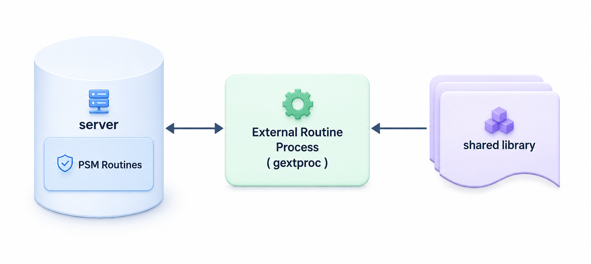

<a id="5edbddf52d93deaf"></a>

# 28. External Routine

> 원본: [GOLDILOCKS 26c.1 User Manual (ko)](https://manual.sunjesoft.co.kr/goldilocks/26c_1/manual/ko/5edbddf52d93deaf)  
> 태그: `26c.1_0_tag`

[← 27. PSM Packages](27-psm-packages.md) · [전체 목차](../README.md) · [29. Trigger →](29-trigger.md)

본 장에서는 다른 프로그래밍 언어로 작성된 external routine을 호출하는 데이터베이스 응용 프로그램을 개발하는 방법을 설명한다.

<a id="620a8dd903ce4629"></a>
## External Routine

External routine은 shared library에 저장되어 있는 함수이다.

External routine은 PSM routine에서 external routine process (gextproc)를 통해 shared library를 로딩한 후에 실행한다.  
gextproc는 external routine의 실행 결과를 PSM routine의 결과로 반환한다.  
이 기능을 통해 사용자는 필요한 순간에 shared library에 구현된 기능을 DBMS에서 사용할 수 있다.

<a id="fbb5ab53f4883f3d"></a>


<a id="306dae790c8abbfa"></a>
## Call Specification

Call specification은 external C function을 로드하여 실행할 수 있도록 정보를 명시한다.  
external C function은 C 언어로 프로그래밍 된 external routine 이다.

Call Specification의 역할은 다음과 같다.

- shared library 정보
- parameter의 datatype 변환
- parameter의 IN , OUT , IN OUT 모드에 따라 매핑
- memory 관리 여부
- Package Specification 또는 Package Body에 상관없이 유연하게 call specification 구문을 사용할 수 있다.

자세한 내용은 [Call Specification](30-psm-language-element-references.md#1663813aaf9c3eb4)를 참고한다.

<a id="4e791e587fd6972b"></a>
## Loading External C Function

External C function을 실행하기 위해서는 external routine process (gextproc)를 시작한다.  
PSM routine 런타임 중 GOLDILOCKS에서 설정한 네트워크 연결을 사용하여 아래의 정보를 gextproc에 전달한다.

- Shared Library 파일의 경로와 이름
- external c function의 이름
- external parameter 정보

gextproc는 shared library를 로드하고, external c function을 실행하고 반환한 결과를 전달한다.

External C function을 호출하기 위해서는 아래와 같은 단계를 따른다.

1. external C function을 정의한다.
2. shared library에 대응하는 Schema 객체인 library 객체를 생성한다.
3. external C function을 호출할 수 있도록 call specification을 정의한다.

<a id="a4cb16a353f33fab"></a>
### External C function

external C function을 정의한다.

다음은 간단한 더하기 함수를 생성하는 예이다.

```
#include <stdio.h>

int add( int a , int b )
{
  return a + b;
}
```

다음은 linux 환경에서 shared library를 만드는 예이다.  
gcc 옵션은 사용자의 편의에 따라 추가할 수 있다.

```
gcc -shared -fPIC -o add.so add.c
```

<a id="8276423cd31f512c"></a>
### Library 객체 생성

shared library 파일은 external C function이 저장된 동적으로 로드 가능한 운영체제 파일이다.  
shared library에 대한 보안을 위해 DBA가 shared library에 대한 액세스를 제어한다.  
DBA는 [CREATE LIBRARY](31-psm-sql-references.md#e6a29c79119e1af1) 구문을 사용하여 shared library를 지칭하는 스키마 객체를 생성한다.  
그 다음 권한이 있는 사용자라면 DBA가 library 객체에 대한 EXECUTE 권한을 부여한다.  
또는 DBA가 CREATE ANY LIBRARY 권한을 부여할 수 있고 이 권한이 있는 사용자는 직접 library 객체를 생성할 수 있다.

```
CREATE LIBRARY [ <schema name> ].<library name>
   { IS | AS } '<file path name>';
```

library 객체를 생성할 때 shared library 파일에 대해 이름만 명시하거나 전체 경로를 명시할 수 있다.

다음 예와 같이 파일 이름만 지정한 경우, shared library 파일을 로딩하려면 해당 파일이 반드시 EXTLIB_DIR 프로퍼티에 설정된 폴더에 위치해야 한다.

```
CREATE LIBRARY lib_add AS 'add.so';
```

사용자가 아래와 shared library에 대한 전체 경로를 명시했다면, gextproc는 해당 경로에 있는 shared library 파일을 로딩한다.

```
CREATE LIBRARY lib_add AS '/home/user/extlib/add.so';
```

<a id="8a22c5016665e3e4"></a>
### Publish External C function

Proceudre, Function 또는 Package를 DDL 할 때 [Call Specification](30-psm-language-element-references.md#1663813aaf9c3eb4) 구문을 작성하여 실행하려고 하는 external C function을 명시한다.

3.1에서 정의한 External C Function을 호출하는 PSM Routine 예는 다음과 같다.

```
CREATE FUNCTION func1( p1 IN NATIVE_INTEGER, 
                       p2 IN NATIVE_INTEGER )
      RETURN NATIVE_INTEGER AS
LANGUAGE C
LIBRARY lib_add NAME "add"
PARAMETERS ( p1 INT,
             p2 INT,
             RETURN INT );
```

아래와 같이 stored function 의 PARAMETERS 정의가 external C function 의 prototype 과 일치하는지 확인한다.

```
gSQL> \set vertical on

gSQL> SELECT routine_name,
       external_name,
       external_c_function
  FROM information_schema.routines
 WHERE routine_name = 'FUNC1';

            ROUTINE_NAME # FUNC1
           EXTERNAL_NAME # add
     EXTERNAL_C_FUNCTION # int add( int P1 , int P2 )

1 row selected.
```

<a id="2b57028be82bc3e6"></a>
## External C Function 명시

external C function name, parameter datatype 및 return datatype을 PSM routine에 매핑하는 [External Routine](#5edbddf52d93deaf)을 통해 게시된 external C function을 실행할 수 있다.

Call specification은 아래와 같이 구성된다.

- 개발 언어 정보
    - C언어만 허용한다.
- shared library에 해당하는 library 객체 이름
- shared library에 있는 external C function 이름
- parameter 전달 방식을 지정하기 위한 다양한 옵션

Call Specification는 아래 구문에서 사용할 수 있다.

- [CREATE PROCEDURE](31-psm-sql-references.md#48b6178f1f6cd4cb)
- [CREATE FUNCTION](31-psm-sql-references.md#8f6d3c41338c889a)
- [CREATE PACKAGE](31-psm-sql-references.md#5f9bdd6eb052f51f)
- [CREATE PACKAGE BODY](31-psm-sql-references.md#4af32611ea712290)

Call Specification 구문은 다음과 같다.

```
LANGUAGE C
{ LIBRARY <library name> NAME <double_quote_string> |
  NAME <double_quote_string> LIBRARY <library name> }
[ WITH CONTEXT ] 
PARAMETERS ( <external parameter> [ , ... ] )
```

&lt;library name&gt;은 library 스키마 객체의 이름이며, &lt;double_quote_string&gt; 은 external C function의 이름이다.  
&nbsp;&lt;external parameter&gt; 는 다음과 같다.

```
{
   CONTEXT
 | <parameter name> [ <property> ] [ BY REFERENCE ] <external datatype> 
 | RETURN [ <property> ] [ BY REFERENCE ] <external datatype> 
}
```

&lt;property&gt;는 아래와 같다.

```
{
   INDICATOR | LENGTH | MAXLEN 
}
```

<a id="efa7b38bc1ee8c20"></a>
### LIBRARY

shared library에 대응하는 스키마 객체로 library name은 식별자이다.  
library는 EXECUTE 권한이 있어야 실행할 수 있다.

<a id="ce773b5d3d6dc5fa"></a>
### NAME

호출하고자 하는 external C function 이름이다.  
external C function 이름은 큰따움표(" ")로 묶어서 표기한다.

<a id="a95e9b96c6c35d73"></a>
### LANGUAGE

external routine이 작성된 프로그래밍 언어를 나타낸다.  
현재는 C언어만 지원되고 있다.

<a id="cb06e8a6e2017d23"></a>
### WITH CONTEXT

CONTEXT가 external C function으로 전달되도록 지정한다.

<a id="61c06ac2a5ef335d"></a>
### PARAMETERS

external C function에 전달되는 parameter의 순서, datatype을 지정한다.  
현재 길이 및 최대 길이와 같은 parameter 속성과 parameter의 값 전달 방법을 지정할 수 있다.

<a id="428e402cca357c0a"></a>
## Call Specification 사용 예

- Procedure

```
gSQL>
CREATE OR REPLACE PROCEDURE proc1( p1 IN NATIVE_INTEGER,
                                   p2 IN NATIVE_INTEGER,
                                   p3 OUT NATIVE_INTEGER )
AS
LANGUAGE C
LIBRARY lib_sample NAME "sample_add_proc"
PARAMETERS( p1 INT,
            p2 INT,
            p3 INT );
/

Procedure created.
```

- Function

```
gSQL>
CREATE OR REPLACE FUNCTION func1( p1 IN NATIVE_INTEGER,
                                  p2 IN NATIVE_INTEGER )
    RETURN NATIVE_INTEGER
AS
LANGUAGE C
NAME "sample_add_func" LIBRARY lib_sample
PARAMETERS( p1 INT,
            p2 INT,
            RETURN INT );
/

Function created.
```

- Package Specification

```
gSQL>
CREATE OR REPLACE PACKAGE pkg1 AS  
  FUNCTION func1( p1 IN NATIVE_INTEGER,
                  p2 IN NATIVE_INTEGER )
      RETURN NATIVE_INTEGER
  AS
  LANGUAGE C
  NAME "sample_add_func" LIBRARY lib_sample
  PARAMETERS( p1 INT,
              p2 INT,
              RETURN INT );
END;
/

Package created.
```

- Package Body

```
gSQL>
CREATE OR REPLACE PACKAGE pkg1 AS   
  FUNCTION func1( p1 IN NATIVE_INTEGER,
                  p2 IN NATIVE_INTEGER )
      RETURN NATIVE_INTEGER;
END;
/

Package created.

gSQL>
CREATE OR REPLACE PACKAGE BODY pkg1 AS   
  FUNCTION func1( p1 IN NATIVE_INTEGER,
                  p2 IN NATIVE_INTEGER )
      RETURN NATIVE_INTEGER
  AS
  LANGUAGE C
  NAME "sample_add_func" LIBRARY lib_sample
  PARAMETERS( p1 INT,
              p2 INT,
              RETURN INT );
END;
/

Package created.
```

<a id="aaaf253878e2d82d"></a>
## Passing Parameters to External C Functions with Call Specifications

Call specification은 PSM과 C의 datatype를 매핑한다.  
몇 가지 이유가 있어 external C function의 parameter는 전달하기 복잡하다.

- PSM의 datatype과 C의 datatype이 1:1 매칭이 아니다.
- C와 달리 RDBMS의 NULL 개념이 있어, PSM의 parameter는 NULL이 가능하나 C의 parameter는 그렇지 않다.
- external C function에는 PSM의 datatype인 CHAR, VACHAR, LONG VARCHAR, BINARY, VARBINARY, LONG VARBINARY의 길이 또는 최대 길이 정보가 필요할 수 있다.
- PSM routine은 external C function에서 반환된 값의 현재 길이 및 NULL 상태 정보가 필요할 수 있다.

<a id="465f6e945fc60a47"></a>
### Parameter Data Type Mapping

PSM Routine의 parameter와 external C function은 아래의 표과 같이 매핑된다.

**Parameter Data Type Mapping**

<a id="53095fbee9e55b4a"></a>
| PSM datatype | external datatype | recommend external datatype |
| --- | --- | --- |
| BOOLEAN | UNSIGNED CHAR CHAR UNSIGNED SHORT SHORT UNSIGNED INT INT UNSIGNED LONG LONG | CHAR |
| NATIVE_SMALLINT | UNSIGNED CHAR CHAR UNSIGNED SHORT SHORT UNSIGNED INT INT UNSIGNED LONG LONG | SHORT |
| NATIVE_INTEGER | UNSIGNED CHAR CHAR UNSIGNED SHORT SHORT UNSIGNED INT INT UNSIGNED LONG LONG | INT |
| NATIVE_BIGINT | UNSIGNED CHAR CHAR UNSIGNED SHORT SHORT UNSIGNED INT INT UNSIGNED LONG LONG | LONG |
| NATIVE_REAL | FLOAT DOUBLE | FLOAT |
| NATIVE_DOUBLE | FLOAT DOUBLE | DOUBLE |
| FLOAT | DOUBLE | DOUBLE |
| NUMBER w/o precision | DOUBLE | DOUBLE |
| NUMBER w/ precision | SQL_NUMERIC | SQL_NUMERIC |
| CHAR | STRING | STRING |
| VARCHAR | STRING | STRING |
| LONG VARCHAR | SQL_LONG_VARIABLE_LENGTH | SQL_LONG_VARIABLE_LENGTH |
| BINARY | RAW | RAW |
| VARBINARY | RAW | RAW |
| LONG VARBINARY | SQL_LONG_VARIABLE_LENGTH | SQL_LONG_VARIABLE_LENGTH |
| DATE | SQL_DATA SQL_TIMESTAMP | SQL_TIMESTAMP |
| TIME | SQL_TIME | SQL_TIME |
| TIME WITH TIME ZONE | SQL_TIME_TZ | SQL_TIME_TZ |
| TIMESTAMP | SQL_TIMESTAMP | SQL_TIMESTAMP |
| TIMESTAMP WITH TIME ZONE | SQL_TIMESTAMP_TZ | SQL_TIMESTAMP_TZ |
| INTERVAL YEAR TO MONTH | SQL_INTERVAL | SQL_INTERVAL |
| INTERVAL DAY TO SECOND | SQL_INTERVAL | SQL_INTERVAL |
| ROWID | STRING | STRING |

<a id="0001376911e99088"></a>
### External Data Type Mapping

external datatype은 C datatype 에 매핑된다. C prototype을 작성 할 때 오류가 발생하지 않도록 아래의 표를 참고한다.

**External Data Type Mappings**

<a id="0767bc803192d9de"></a>
| external datatype | parameter mode가  IN 이거나 RETURN | parameter mode가  IN by reference 이거나 RETURNING by reference | parameter mode가  OUT type,  IN OUT type 일 때 |
| --- | --- | --- | --- |
| UNSIGNED CHAR | unsigned char | unsigned char * | unsigned char * |
| CHAR | char | char * | char * |
| UNSIGNED SHORT | unsigned short | unsigned short * | unsigned short * |
| SHORT | short | short * | short * |
| UNSIGNED INT | unsigned int | unsigned int * | unsigned int * |
| INT | int | int * | int * |
| UNSIGNED LONG | unsigned long | unsigned long * | unsigned long * |
| LONG | long | long * | long * |
| FLOAT | float | float * | float * |
| DOUBLE | double | double * | double * |
| STRING | char * | char * | char * |
| RAW | unsigned char * | unsigned char * | unsigned char * |
| SQL_LONG_VARIABLE_LENGTH | SQL_LONG_VARIABLE_LENGTH_STRUCT * | SQL_LONG_VARIABLE_LENGTH_STRUCT * | SQL_LONG_VARIABLE_LENGTH_STRUCT * |
| SQL_NUMERIC | SQL_NUMERIC_STRUCT * | SQL_NUMERIC_STRUCT * | SQL_NUMERIC_STRUCT * |
| SQL_DATE | SQL_DATE_STRUCT * | SQL_DATE_STRUCT * | SQL_DATE_STRUCT * |
| SQL_TIME | SQL_TIME_STRUCT * | SQL_TIME_STRUCT * | SQL_TIME_STRUCT * |
| SQL_TIME_TZ | SQL_TIME_WITH_TIMEZONE_STRUCT * | SQL_TIME_WITH_TIMEZONE_STRUCT * | SQL_TIME_WITH_TIMEZONE_STRUCT * |
| SQL_TIMESTAMP | SQL_TIMESTAMP_STRUCT * | SQL_TIMESTAMP_STRUCT * | SQL_TIMESTAMP_STRUCT * |
| SQL_TIMESTAMP_TZ | SQL_TIMESTAMP_WITH_TIMEZONE_STRUCT * | SQL_TIMESTAMP_WITH_TIMEZONE_STRUCT * | SQL_TIMESTAMP_WITH_TIMEZONE_STRUCT * |
| SQL_INTERNAL | SQL_INTERVAL_STRUCT * | SQL_INTERVAL_STRUCT * | SQL_INTERVAL_STRUCT * |

<a id="60e81a19fcce89b6"></a>
### Passing Parameters by VALUE or BY REFERENCE

parameter mode가 IN type이거나 RETURN이면 기본적으로 pass by value로 전달된다. BY REFERENCE 옵션을 주면, parameter mode가 IN type이거나 RETURN이어도 pass by reference로 전달된다.  
parameter mode가 OUT type, IN OUT type이면 기본적으로 pass by reference로 전달된다. BY REFERENCE 옵션을 주어도 아무런 영향이 없다.  
단, 아래의 external datatype은 기본적으로 pass by reference로 전달된다.

- STRING
- RAW
- SQL_LONG_VARIABLE_LENGTH
- SQL_NUMERIC
- SQL_DATE
- SQL_TIME
- SQL_TIME_TZ
- SQL_TIMESTAMP
- SQL_TIMESTAMP_TZ
- SQL_INTERVAL

<a id="7f46c44224243c2f"></a>
### Declaring Formal Parameters

일반적으로 external C function을 실행하는 routine은 다음과 같이 formal parameter들을 선언한다.

```
CREATE FUNCTION func1( p1 IN NATIVE_INTEGER, 
                       p2 IN NATIVE_INTEGER )
      RETURN NATIVE_INTEGER AS
LANGUAGE C
LIBRARY lib_add NAME "add"
PARAMETERS ( p1 INT,
             p2 INT,
             RETURN INT );
```

각 formal parameter를 선언할 때, parameter mode와 datatype을 지정한다. 이런 정보들은 external C function을 위해 필요한 정보로써 PARAMETERS 절을 사용하여 다음과 같은 정보를 제공한다.

- external datatype
- parameter의 현재 길이 및 최대 길이
- parameter에 대한 NULL/NOT NULL indicator
- parameter의 위치
- IN type parameter를 전달하는 방법

PARAMETERS 절을 작성할 때는 다음과 같은 사항에 유의한다.

- 모든 formal parameter는 PARAMETERS 절에 명시되어야 한다.
- WITH CONTEXT 절을 포함하는 경우, PARAMETERS 절에 CONTEXT parameter를 지정해야 한다.
- RETURN은 항상 가장 마지막에 명시해야 한다.

<a id="c30251372a7479df"></a>
### Properties

PARAMETERS 절을 사용하여 PSM Formal Parameter 및 함수 결과를 external C function으로 전달할 수 있다. Property를 지정하여 이를 수행한다.

아래 표는 지정된 Property에 허용되는 external datatype, PSM datatype 및 PSM Parameter mode를 나타낸다.

**Properties and data types**

<a id="4a3a6376504fb813"></a>
| Property | external datatype | default external datatype | PSM datatype | PSM Parameter Mode | Passing Method |
| --- | --- | --- | --- | --- | --- |
| INDICATOR | short | short | all datatype | IN IN OUT OUT RETURN | BY VALUE BY REFERENCE BY REFERENCE BY REFERENCE |
| LENGTH | unsigned short short unsigned int int unsigned long long | int | CHAR VARCHAR LONG VARCHAR BINARY VARBINARY LONG VARBINARY | IN IN OUT OUT RETURN | BY VALUE BY REFERENCE BY REFERENCE BY REFERENCE |
| MAXLEN | unsigned short short unsigned int int unsigned long long | int | CHAR VARCHAR LONG VARCHAR BINARY VARBINARY LONG VARBINARY | IN OUT OUT RETURN | BY VALUE |

다음은 PARAMETERS 절을 사용하여 PSM formal parameter와 RETURN의 property를 지정하는 예이다.

```
CREATE OR REPLACE FUNCTION strncpy_func( p1 IN CHAR(10),
                                         p2 IN OUT CHAR(10) )
RETURN VARCHAR AS
LANGUAGE C
LIBRARY strncpy_lib NAME "strncpy_extern_func"
PARAMETERS( p1 STRING,              -- formal parameter p1의 값
            p1 INDICATOR SHORT,     -- formal parameter p1의 NULL 여부
            p1 LENGTH INT,          -- formal parameter p1의 현재 길이
            p2 STRING,              -- formal parameter p2의 값
            p2 INDICATOR SHORT,     -- formal parameter p2의 NULL 여부
            p2 LENGTH INT,          -- formal parameter p2의 현재 길이     
            p2 MAXLEN INT,          -- formal parameter p2의 최대 길이                   
            RETURN LENGTH INT,      -- RETURN 값의 현재 길이
            RETURN STRING );        -- RETURN 값
```

위의 PARAMETERS 절을 통해 예측할 수 있는 C prototype은 다음과 같다.

```
char * strncpy_extern_func( char  * p1,
                            short   p1_indicator,
                            int     p1_length,
                            char  * p2,
                            short * p2_indicator,
                            int   * p2_length,
                            int     p2_maxlen,
                            int   * return_length );
```

위의 같은 C prototype은 information_schema.routines를 통해 확인할 수 있다.

```
gSQL> \set vertical on

gSQL>
SELECT routine_name,
       external_name,
       external_c_function
  FROM information_schema.routines
 WHERE routine_name = 'STRNCPY_FUNC';

            ROUTINE_NAME # STRNCPY_FUNC
           EXTERNAL_NAME # strncpy_extern_func
     EXTERNAL_C_FUNCTION # char * strncpy_extern_func( char * P1 , short P1_INDICATOR , int P1_LENGTH , char * P2 , short * P2_INDICATOR , int * P2_LENGTH , int P2_MAXLEN , int * RETURN_LENGTH )

1 row selected.
```

<a id="3a94001bc62f68b9"></a>
#### INDICATOR

INDICATOR는 parameter의 NULL 여부를 나타내는 property이다.

DBMS에서는 NULL 개념이 있지만, C언어에서는 NULL 개념이 없다.  
PSM Routine 과 external C function 간의 NULL에 대한 정보를 전달할 수 있어야 한다.  
Parameter가 NULL일 경우 external C function에서 parameter 값이 NULL임을 확인할 수 있어야 한다.  
반대로 external C function의 반환 결과가 NULL이면 이를 서버에서 확인할 수 있어야 한다.

이런 경우에 INDICATOR property를 통해 정보를 전달할 수 있다.  
INDICATOR 값은 SQL_NULL_DATA 상수를 통해 확인할 수 있다.

- INDICATOR 값이 SQL_NULL_DATA과 동일하면 연관된 parameter 값은 NULL이다.
- INDICATOR 값이 SQL_NULL_DATA과 동일하지 않다면 연관된 parameter 값은 NULL이 아니다.

Parameter mode와 RETURN 인 경우 INDICATOR 값은 아래와 같이 전달된다.

- Parameter Mode
    - IN mode
        - 값에 의한 전달, 읽기 모드
    - OUT mode , IN OUT mode
        - 참조에 의한 전달
- RETURN
    - 참조에 의한 전달

<a id="eff29edfd483e4c1"></a>
#### LENGTH and MAXLEN

LENGTH와 MAXLEN은 CHARACTER STRING 타입, BINARY STRING 타입의 parameter의 현재 길이와 최대 길이를 나타내는 Property이다.

LENGTH 값은 Parameter mode와 RETURN의 현재 길이를 나타내며 다음과 같이 전달된다.

- Parameter Mode
    - IN mode
        - 값에 의한 전달, 읽기 모드
    - OUT mode , IN OUT mode
        - 참조에 의한 전달
- RETURN
    - 참조에 의한 전달

MAXLEN 값은 Parameter mode와 RETURN의 최대 길이를 나타내며 다음과 같이 전달된다.

- Parameter Mode
    - IN mode
        - 적용할 수 없다.
    - OUT mode , IN OUT mode
        - 참조에 의한 전달, 읽기 전용
- RETURN
    - 참조에 의한 전달, 읽기 전용

<a id="772b737fa4764a0a"></a>
#### BY REFERENCE

BY REFERENCE는 참조에 의한 전달로 값을 전달하도록 지정한다.  
C 언어에서는 상수를 값에 의해 전달하거나 참조에 의한 전달할 수 있다.  
C 함수가 포인터 변수일 경우, BY REFERENCE 구문을 지정하여 parameter를 참조로 전달한다.

다음은 사용 예이다.

```
CREATE OR REPLACE PROCEDURE circleArea( radius IN NATIVE_INTEGER,
                                        area OUT FLOAT ) AS
LANGUAGE C
NAME "circle_area" LIBRARY circle_lib
PARAMETERS( radius BY REFERENCE INT,
            area DOUBLE );
/
```

이 경우, c 함수의 prototype은 다음과 같다.

```
void circle_area( int * radius , double * area );
```

<a id="e64bb8571fae1cec"></a>
#### WITH CONTEXT

WITH CONTEXT 절을 포함하면 external C function에서 parameter, 메모리 할당 및 예외에 대한 정보의 접근 권한을 부여할 수 있다.  
WITH CONTEXT 절은 CONTEXT 변수가 external C function에 전달되도록 지정한다.

다음은 사용 예이다.

```
CREATE FUNCTION str_concat( p1 VARCHAR,
                            p2 VARCHAR )
RETURN VARCHAR
AS LANGUAGE C
LIBRARY lib_context
NAME "c_concat"
WITH CONTEXT
PARAMETERS ( CONTEXT,
             p1 STRING,
             p2 STRING,
             RETURN STRING );
/
```

이 경우의 c 함수의 prototype은 아래와 같다.

```
char * c_concat( SQLExtProcContext * context , char * p1 , char * p2 );
```

<a id="131baddbfeb65c40"></a>
## Using Service Routines with External C Functions

<a id="eefde5e64741acab"></a>
### SQLExtProcAllocCallMemory()

SQLExtProcAllocCallMemory 함수는 external C function에서 메모리를 할당한다.  
함수에서 할당된 메모리들은 PSM으로 반환되는 즉시 자동으로 해제된다.

다음은 SQLExtProcAllocCallMemory()를 위한 PSM과 C 함수의 예이다.

- C prototype

```
char * c_concat( SQLExtProcContext * context,    
                 char              * p1,    
                 short               p1_indicator,     
                 int                 p1_length,         
                 char              * p2,    
                 short               p2_indicator,    
                 int                 p2_length,    
                 short             * result_indicator,    
                 int               * result_length );
```

- PSM Function 및 실행

```
CREATE OR REPLACE  FUNCTION str_concat( p1 VARCHAR,
                                        p2 VARCHAR )
  RETURN VARCHAR AS
LANGUAGE C
LIBRARY lib_concat
NAME "c_concat"
WITH CONTEXT
PARAMETERS ( CONTEXT,
             p1 STRING,
             p1 INDICATOR SHORT,
             p1 LENGTH INT,
             p2 STRING,
             p2 INDICATOR SHORT,
             p2 LENGTH INT,
             RETURN INDICATOR SHORT,
             RETURN LENGTH INT,
             RETURN STRING );
/
```

```
gSQL>
SELECT str_concat( 'Hello, ' , 'GOLDILOCKS' ) FROM dual;

STR_CONCAT( 'Hello, ' , 'GOLDILOCKS' )
--------------------------------------
Hello, GOLDILOCKS                     

1 row selected.
```

- SQLExtProcAllocCallMemory() 사용하여 메모리를 할당하는 C 함수

```
#include <stdio.h>
#include <string.h>
#include <goldilocks.h>

char * c_concat( SQLExtProcContext * context,
                 char              * p1,
                 short               p1_indicator,
                 int                 p1_length,
                 char              * p2,
                 short               p2_indicator,
                 int                 p2_length,
                 short             * result_indicator,
                 int               * result_length )
{ 
    char * resultStr       = NULL;
    int    resultLen       = 0;
    short  resultIndicator = SQL_NULL_DATA;

    /*
     * NULL 여부 확인
     */      
    
    if( (p1_indicator == SQL_NULL_DATA) || (p2_indicator == SQL_NULL_DATA) )
    {
        resultIndicator = SQL_NULL_DATA;
        resultLen       = 0;
             
        /*   
         * PSM에는 NULL Pointer가 없다. 따라서 결과로 zero-byte string을 반환한다.
         */

        resultStr = SQLExtProcAllocCallMemory( context, 1 );
        resultStr[resultLen] = '\0';
    }
    else
    {
        resultIndicator = !SQL_NULL_DATA;
        resultLen       = p1_length + p2_length;

        /*
         * 결과를 위한 메모리를 마지막 NULL terminator를 고려하여 할당한다.
         */

        resultStr = SQLExtProcAllocCallMemory( context, resultLen + 1 );

        /*
         * string concat
         */

        strcpy( resultStr, p1 );
        strcat( resultStr, p2 );
        resultStr[resultLen] = '\0';
    }

    /*
     * 결과 반환
     * 할당된 메모리는 PSM에서 나중에 메모리 해제 한다.
     */

    *result_indicator = resultIndicator;
    *result_length    = resultLen;

    return resultStr;
}
```

<a id="e64ad9b21a57baf7"></a>
### SQLExtProcRaiseServerError()

SQLExtProcRaiseServerError 함수는 사전에 정의된 예외를 발생시킨다.  
이 예외를 사용하기 위해서는 GOLDILOCKS의 에러 번호를 표기해야 한다.

다음은 SQLExtProcRaiseServerError()를 위한 PSM과 C 함수의 예제이다.

- C prototype

```
void c_division( SQLExtProcContext * context,
                 int                 dividend,
                 int                 divisor,
                 double            * result );
```

- PSM Function 및 실행

```
CREATE OR REPLACE PROCEDURE proc_division( dividend     NATIVE_INTEGER,
                                           divisor  IN  NATIVE_INTEGER,
                                           result   OUT FLOAT )
AS
LANGUAGE C
LIBRARY lib_division NAME "c_division"
WITH CONTEXT
PARAMETERS( CONTEXT,
            dividend INT,
            divisor  INT,
            result   DOUBLE );
/
```

```
gSQL> \var ret double

gSQL> CALL proc_division( 10 , 0 , :ret );

ERR-38000(12122): divisor is equal to zero : ERROR at PROCEDURE("PROC_DIVISION")
```

- SQLExtProcAllocCallMemory() 사용하여 메모리를 할당하는 C 함수

```
#include <stdio.h>
#include <assert.h>
#include <goldilocks.h>

void c_division( SQLExtProcContext * context,
                 int                 dividend,
                 int                 divisor,
                 double            * result )
{
    /*
     * divisor가 0인지 확인
     */
    
    if( divisor == 0 )
    {
        /*
         * ZERO_DIVIDE 에러를 반환한다.
         * GOLDILOCKS의 에러 코드는 12122 이다.
         */ 
    
        if( SQLExtProcRaiseServerError( context, 12122 ) == SQL_SUCCESS )
        {
            return;
        }
        else
        {
            assert( 0 );
        }
    }

    *result = (double) dividend / (double) divisor;
}
```

<a id="5642b3d82fa0cbfd"></a>
### SQLExtProcRaiseUserError()

SQLExtProcRaiseUserError 함수는 사용자가 정의한 예외를 발생시킨다.  
사용자는 에러 코드와 에러 메시지를 지정하여 에러를 정의할 수 있다.  
에러 코드는 20000 ~ 20999 사이에서 사용할 수 있다.

다음은 SQLExtProcRaiseUserError()를 위한 PSM과 C 함수의 예제이다.

- C prototype

```
void c_division( SQLExtProcContext * context,
                 int                 dividend,
                 int                 divisor,
                 double            * result );
```

- PSM Function 및 실행

```
CREATE OR REPLACE PROCEDURE proc_division( dividend     NATIVE_INTEGER,
                                           divisor  IN  NATIVE_INTEGER,
                                           result   OUT FLOAT )
AS
LANGUAGE C
LIBRARY lib_division NAME "c_division"
WITH CONTEXT
PARAMETERS( CONTEXT,
            dividend INT,
            divisor  INT,
            result   DOUBLE );
/
```

```
gSQL> \var ret double

gSQL> CALL proc_division( 10 , 0 , :ret );

ERR-38000(20001): 0 is not allowed in the divisor. : ERROR at PROCEDURE("PROC_DIVISION")
```

- SQLExtProcAllocCallMemory() 사용하여 메모리를 할당하는 C 함수

```
#include <stdio.h>
#include <assert.h>
#include <goldilocks.h>

void c_division( SQLExtProcContext * context,
                 int                 dividend,
                 int                 divisor,
                 double            * result )
{
    /*
     * divisor가 0인지 확인
     */
            
    if( divisor == 0 )
    {
        /*  
         * User Defined exception을 반환한다.
         * 이 때 에러코드와 메시지를 포함해야 한다.
         * 사용자가 사용할 수 있는 에러코드는 20000 ~ 20999 범위이다.
         */
            
        if( SQLExtProcRaiseUserError( context, 20001, (SQLCHAR *) "0 is not allowed in the divisor." ) == SQL_SUCCESS )
        {
            return;
        } 
        else
        {
            assert( 0 );
        }
    }

    *result = (double) dividend / (double) divisor;
}
```

<a id="0642f66ff2348bcd"></a>
## ERR-39000(26009): Lost Connection to 'gextproc' 에러 해결 가이드

ERR-39000(26009): lost connection to 'gextproc' 에러는 주로 두 가지 사용자 실수로 인해 발생한다.

- 사용자가 작성한 External C Function이 잘못된 경우
- 사용자가 작성한 External C Function과 PSM Routine의 PARAMETERS 정보가 다를 경우

gextproc 프로세스가 비정상 종료되어 ERR-39000(26009) 에러가 발생했을 경우, $GOLDILOCKS_DATA/extlib 디렉토리에 프로세스 ID로 구분되어 trace log 파일이 생성된다.

<a id="8d56bf04045ad004"></a>
### 사용자가 작성한 External C Function이 잘못된 경우

사용자 라이브러리가 잘못된 경우, trace log 파일의 callstack에서 사용자 라이브러리에서 호출한 C 함수명을 확인할 수 있다.

다음은 잘못된 C 함수이다.

```
int add_f(int a, int b)
{
    int *c = NULL;
    *c = a + b;
    return a + b;
}
```

다음은 external C function을 호출하는 PSM routine을 작성하는 예제이다.

```
gSQL>
CREATE LIBRARY lib1 as 'add.so';
/
Library created.

gSQL>
CREATE OR REPLACE FUNCTION func1( p1 NATIVE_INTEGER, p2 NATIVE_INTEGER ) 
    RETURN NATIVE_INTEGER AS
LANGUAGE C
LIBRARY lib1 NAME "add_f"
PARAMETERS ( p1 INT , p2 INT , RETURN INT );
/
Function created.

gSQL> SELECT func1(1, 1) FROM dual;
ERR-39000(26009): lost connection to 'gextproc': ERROR at FUNCTION("FUNC1")
```

다음은 위와 같이 생성된 트레이스 파일 (gextproc.448892.trc)의 내용이다.

```
% cat gextproc.448892.trc
SIGNAL(11) received
=================================================
CALL STACK
=================================================
gextproc(stbBacktraceToFile+0x18)[0x4f2ed8]
gextproc(ztemFatalHandler+0x178)[0x431e58]
gextproc(steFatalHandler+0x6a)[0x4f2e6a]
/lib/x86_64-linux-gnu/libpthread.so.0(+0x14420)[0x7faaa025c420]
/home/test/work/product/Gliese/home/extlib/managed/add.so(add_f+0x22)[0x7faaa03d111b]
gextproc[0x4f2a12]
```

Trace log 파일을 보면 callstack에 add.so(add_f+0x22) 라인이 포함되어 있는 것을 확인할 수 있다.

<a id="16197bc09fcb2cb1"></a>
### 사용자가 작성한 External C Function과 PSM Routine의 PARAMETERS 정보가 다를 경우

사용자가 작성한 external C function과 PSM routine의 PARAMETERS 정보가 다르면, trace log 파일의 callstack에 gextproc 만 존재한다.

다음은 사용자가 작성한 C 함수이다.

```
int add(int p1, int p2)
{
    return p1 + p2;
}
```

다음은 add 라는 external C function을 호출하는 PSM routine 이다.

```
gSQL> 
CREATE LIBRARY lib2 AS 'add.so';
/
Library created.

gSQL>
CREATE OR REPLACE FUNCTION func2(p1 NATIVE_INTEGER, 
                                 p2 NATIVE_INTEGER,
                                 p3 NATIVE_INTEGER)
    RETURN VARCHAR AS
LANGUAGE C
LIBRARY lib2 NAME "add"
PARAMETERS ( p1 INT , p2 INT , p3 INT , RETURN STRING );
/
Function created.

gSQL> SELECT func2(1, 1, 1) FROM dual;
ERR-39000(26009): lost connection to 'gextproc': ERROR at FUNCTION("FUNC2")
```

다음은 위와 같이 생성된 트레이스 파일 (gextproc.449987.trc) 의 내용이다.

```
% cat gextproc.449987.trc
SIGNAL(11) received
=================================================
CALL STACK
=================================================
gextproc(stbBacktraceToFile+0x18)[0x4f2ed8]
gextproc(ztemFatalHandler+0x178)[0x431e58]
gextproc(steFatalHandler+0x6a)[0x4f2e6a]
/lib/x86_64-linux-gnu/libpthread.so.0(+0x14420)[0x7f5b0a52a420]
/lib/x86_64-linux-gnu/libc.so.6(+0x188915)[0x7f5b0a49c915]
gextproc(ffvExternalStringToParameterVarChar+0x108)[0x438a48]
gextproc(fffSetOutParameterValues+0x315)[0x438475]
gextproc(fflExecuteFunction+0x138)[0x434eb8]
gextproc(ztepCmdCallExternalFunction+0x177)[0x4341d7]
gextproc(ztecRun+0x362)[0x432b52]
gextproc(main+0x1ce)[0x431bce]
/lib/x86_64-linux-gnu/libc.so.6(__libc_start_main+0xf3)[0x7f5b0a338083]
gextproc(_start+0x2e)[0x431c1e]
```

callstack에 사용자 라이브러리는 보이지 않고 gextproc에만 문제가 발생한 것을 확인할 수 있다.

PSM routine의 PARAMETERS 정보를 통해 구성한 external C function prototype은 다음과 같이 조회할 수 있다.

```
gSQL>
SELECT specific_name ,
       external_c_function
  FROM information_schema.routines
 WHERE specific_name = 'FUNC2';

SPECIFIC_NAME EXTERNAL_C_FUNCTION                   
------------- --------------------------------------
FUNC2         char * add( int P1 , int P2 , int P3 )

1 row selected.
```

위의 정보를 통해 사용자가 작성한 external C function과 PSM routine을 생성할 때의 PARAMETERS 정보가 다르다는 것을 확인할 수 있다.

- 사용자가 작성한 external C function

```
int add(int p1, int p2)
```

- PSM routine 생성 당시의 PARAMETERS 정보에 의한 external C function prototype

```
char * add( int P1 , int P2 , int P3 )
```

External routine을 정상적으로 실행하려면 사용자가 작성한 external C function과 PSM routine을 생성할 때 기술하는 PARAMETERS 정보가 일치해야 한다.  
그렇지 않을 경우, external routine process가 비정상적으로 종료될 뿐만 아니라 그 외 예기치 못한 결과가 발생할 수 있다.

---

[← 27. PSM Packages](27-psm-packages.md) · [전체 목차](../README.md) · [29. Trigger →](29-trigger.md)

<sub>Copyright © 2010 SUNJESOFT Inc. All rights reserved.</sub>
