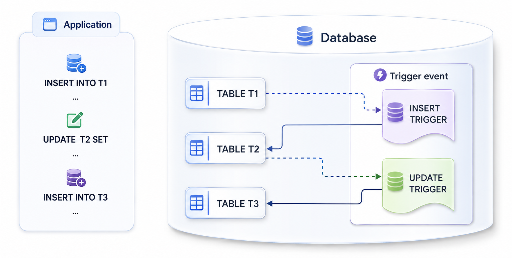

<a id="0363dbb16b7f9218"></a>

# 29. Trigger

> 원본: [GOLDILOCKS 26c.1 User Manual (ko)](https://manual.sunjesoft.co.kr/goldilocks/26c_1/manual/ko/0363dbb16b7f9218)  
> 태그: `26c.1_0_tag`

[← 28. External Routine](28-external-routine.md) · [전체 목차](../README.md) · [30. PSM Language Element References →](30-psm-language-element-references.md)

본 장에서는 테이블에 지정된 이벤트가 발생할 때 자동으로 호출되는 트리거의 정의와 실행 방법에 대해 설명한다.

<a id="5c78067dcf3e0b60"></a>
## Trigger 개요

트리거는 특정 베이스 테이블에서 데이터의 추가, 삭제, 갱신과 같은 DML (Data Manipulation Language) 문장이 실행될 때, 데이터베이스 내에서 자동으로 일련의 동작 (operation)이나 처리를 수행하도록 하는 데이터베이스 객체이다.

트리거는 PSM으로 작성된 저장 프로그래밍 단위로, 저장 프로시저와 마찬가지로 데이터베이스에 저장되어 반복적으로 실행될 수 있으나, 명시적으로 호출할 수는 없다. 트리거가 활성화되어 있는 동안에는 트리거링 이벤트가 발생할 때마다 데이터베이스가 자동으로 트리거를 실행하며, 비활성화된 경우에는 실행되지 않는다.

트리거는 [CREATE TRIGGER](31-psm-sql-references.md#c36270132fc5138d) 구문으로 생성하며, [DROP TRIGGER](31-psm-sql-references.md#405a8fa6b4a11ae3) 구문으로 삭제할 수 있다. 또한 트리거는 베이스 테이블을 기반으로 생성되는 객체이므로, 해당 테이블이 삭제되면 종속된 트리거도 함께 삭제된다.

<a id="d9d24c58fbc1c106"></a>


<a id="cc5c9f212fffdaf2"></a>
## Trigger 구성 요소

트리거는 대상 객체, 이벤트, 발생 시점 및 실행 단위, 그리고 구체적인 동작으로 구성된다.   
본 장에서는 이러한 핵심 구성 요소를 설명하며, DML 이벤트 탐지를 위한 conditional predicates와 transition table, transition variable 에 대해서는 [DML Trigger](#7c2075f953c4286c) 장에서 별도로 설명한다.

<a id="7a7d41b15a400825"></a>
### 트리거 대상 객체

DML 트리거에서 대상 객체는 트리거가 감지할 DML 이벤트의 대상이 되는 베이스 테이블의 이름을 의미한다. 대상 객체는 반드시 하나의 특정 테이블과 연결되며, 해당 테이블에서 발생하는 데이터 변경 사항을 감지한다.

또한 DML 트리거의 대상 객체로는 public synonym 이나 view 를 지정할 수 없으며, 반드시 베이스 테이블만 지정할 수 있다.

```
gSQL> CREATE TABLE t1 ( c1 INTEGER );
Table created.

gSQL> CREATE VIEW v1 AS SELECT * FROM t1;
View created.

gSQL>
CREATE TRIGGER t1_trig
  AFTER INSERT 
  ON v1
BEGIN
    NULL;
END;
/
ERR-42000(16650): object "V1" is not BASE TABLE :
AFTER INSERT ON V1
                *
ERROR at line 2:

gSQL>
CREATE OR REPLACE TRIGGER t1_trig
  AFTER INSERT 
  ON t1                     --# 대상 객체
BEGIN
    NULL;
END;
/
Trigger created.
```

<a id="3e39569266416ef4"></a>
### 트리거 이벤트

트리거 이벤트는 대상 테이블에서 발생하는 DML 작업에 따라 트리거의 실행 여부를 결정하기 위해 지정하는 요소이다. 이벤트 종류로는 INSERT, UPDATE, DELETE 가 있으며, 하나 이상의 트리거 이벤트를 지정할 수 있으나 동일한 이벤트를 중복하여 지정할 수는 없다. 또한 UPDATE의 경우, &lt; UPDATE [ OF &lt;column list&gt; ] &gt; 구문을 사용하여 특정 column이 업데이트될 때만 트리거가 실행되도록 지정할 수 있다.

```
gSQL>
CREATE OR REPLACE TRIGGER t1_trig
  AFTER
  INSERT OR UPDATE OR UPDATE
  ON t1  
BEGIN
    NULL;
END;
/
ERR-42000(16651): duplicate trigger event :
  INSERT OR UPDATE OR UPDATE
                      *
ERROR at line 3:

gSQL>
CREATE OR REPLACE TRIGGER t1_trig
  AFTER
  INSERT OR UPDATE OF c1 OR DELETE  --# 트리거 이벤트
  ON t1  
BEGIN
    NULL;
END;
/
Trigger created.
```

<a id="14ef86a81100608e"></a>
### 트리거 발생 시점

트리거 발생 시점은 대상 테이블에서 지정된 트리거 이벤트가 발생했을 때, 트리거가 실행되는 시점을 정의한다.   
트리거는 대상 객체에서 지정된 이벤트가 수행되기 전에 동작하는 BEFORE 트리거와, 이벤트가 수행된 후에 동작하는 AFTER 트리거로 구분된다.   
여러 개의 트리거가 정의된 경우, 실행 순서는 생성된 순서와 무관하게 BEFORE 트리거가 먼저 실행된 후 AFTER 트리거가 실행된다.

```
gSQL>
CREATE OR REPLACE TRIGGER t1_trig_after
  AFTER                      --# 트리거 발생 시점
  INSERT ON t1  
BEGIN
    DBMS_OUTPUT.PUT_LINE('After insert trigger');
END;
/
Trigger created.

gSQL>
CREATE OR REPLACE TRIGGER t1_trig_before
  BEFORE                      --# 트리거 발생 시점
  INSERT ON t1  
BEGIN
    DBMS_OUTPUT.PUT_LINE('Before insert trigger');
END;
/
Trigger created.

gSQL> set serveroutput on
gSQL> INSERT INTO t1 VALUES ( 10 );

Before insert trigger
After insert trigger
1 row created.
```

<a id="e5e4de85c5a851d7"></a>
### 트리거 실행 단위

트리거의 실행 단위는 문장 (statement) 단위로 수행되는 FOR EACH STATEMENT와 행 (row) 단위로 수행되는 FOR EACH ROW로 구분된다.  
문장 단위 트리거는 지정된 트리거 이벤트가 실행될 때 한 번만 수행되며, 행 단위 트리거는 데이터 변경이 발생한 각 행마다 개별적으로 실행된다.  
별도로 실행 단위를 지정하지 않은 경우, 기본적으로 FOR EACH STATEMENT 방식으로 동작한다.

```
gSQL> CREATE TABLE t1 ( c1 INTEGER );
Table created.

gSQL> INSERT INTO t1 VALUES ( 10 ), ( 20 );
2 rows created.

gSQL> COMMIT;
Commit complete.

gSQL>
CREATE OR REPLACE TRIGGER t1_trig_stmt
  AFTER
  UPDATE ON T1
  FOR EACH STATEMENT     --# 트리거 실행 단위
BEGIN
  DBMS_OUTPUT.PUT_LINE('Each statement trigger');
END;
/
Trigger created.

gSQL>
CREATE OR REPLACE TRIGGER t1_trig_row
  AFTER
  DELETE ON T1
  FOR EACH ROW          --# 트리거 실행 단위
BEGIN
  DBMS_OUTPUT.PUT_LINE('Each row trigger');
END;
/
Trigger created.

gSQL> set serveroutput on
gSQL> UPDATE t1 SET c1 = c1;

Each statement trigger
2 rows updated.

gSQL> DELETE FROM t1;

Each row trigger
Each row trigger
2 rows deleted.
```

<a id="dab1a2a1d2d88d86"></a>
### 트리거 동작

트리거 동작은 트리거의 실행 제어 및 수행 내용을 정의하는 요소로, &lt;trigger enforcement&gt; 옵션, &lt;triggered when clause&gt; 옵션, 그리고 &lt;trigger body&gt;로 구성된다.   
&lt;trigger enforcement&gt; 옵션은 트리거의 활성화 여부를 제어하는 기능으로, 트리거를 활성화 또는 비활성화 상태로 설정할 수 있다.  
&lt;triggered when clause&gt; 옵션은 특정 조건을 만족하는 경우에만 트리거가 실행되도록 지정할 수 있다.  
&lt;trigger body&gt;는 트리거 실행 시 수행되는 실제 작업을 정의한다.

트리거 생성 시 &lt;trigger enforcement&gt; 옵션을 사용하여 활성화 상태로 생성할지, 비활성화 상태로 생성할지를 지정할 수 있으며, 별도로 지정하지 않은 경우 기본적으로 활성화 상태로 생성된다.

```
gSQL> 
CREATE OR REPLACE TRIGGER t1_trig
  AFTER INSERT ON t1  
  DISABLE                --# DISABLE or NOT ENFORCED
BEGIN
    DBMS_OUTPUT.PUT_LINE('Insert trigger');
END;
/
Trigger created.

gSQL> set serveroutput on
gSQL> INSERT INTO t1 VALUES ( 10 );
1 row created.
```

&lt;triggered when clause&gt; 옵션은 트리거의 실행 여부를 제어하는 조건절을 정의하는 요소이다.  
해당 조건의 평가 결과가 TRUE인 경우 트리거가 실행되며, FALSE인 경우에는 실행되지 않는다.  
별도로 지정하지 않은 경우, 트리거는 항상 실행된다.

```
gSQL> 
CREATE OR REPLACE TRIGGER t1_trig
  AFTER INSERT ON t1
  REFERENCING NEW ROW n_row
  FOR EACH ROW
  WHEN (n_row.c1 > 10)
BEGIN
    DBMS_OUTPUT.PUT_LINE('Insert trigger');
END;
/
Trigger created.

gSQL> set serveroutput on
gSQL> INSERT INTO t1 VALUES ( 10 );
1 row created.

gSQL> INSERT INTO t1 VALUES ( 20 );

Insert trigger
1 row created.
```

트리거 실행 시 수행되는 &lt;trigger body&gt;는 일반적으로 PSM 블록 형태로 작성된다. 필요에 따라 CALL 구문을 사용하여 저장 프로시저를 호출하는 방식으로 구성할 수 있다.

PSM에 대한 자세한 내용은 [Using PSM Subprograms](25-using-psm-subprograms.md#2620aace3f721d2c) 참조한다.

<a id="7c2075f953c4286c"></a>
## DML Trigger

DML 트리거는 베이스 테이블에 정의되며, INSERT, UPDATE, DELETE와 같은 데이터 변경 이벤트를 실시간으로 감지할 수 있다.   
이를 통해 복잡한 비즈니스 규칙을 구현하고 데이터 무결성을 유지할 수 있으며, 데이터 변경 전후의 상태를 기반으로 동적인 데이터 제어를 수행할 수 있다.

<a id="43fa0d0bcdbfce72"></a>
### DML 트리거의 동작 특성 및 분류

DML 트리거는 트리거의 발생 시점과 실행 단위에 따라 다음과 같이 분류된다. 각 트리거는 고유한 특성을 가지며, 하나의 트리거에 서로 다른 속성을 혼합하여 정의할 수는 없다.

- Statement-level before trigger ( Before statement trigger )
    - 트리거를 발생시키는 구문이 실행되기 전에 수행된다.
- Statement-level after trigger ( After statement trigger )
    - 트리거를 발생시키는 구문이 실행된 후에 수행된다.
- Row-level before trigger ( Before row trigger )
    - 트리거를 발생시키는 구문이 영향을 미치는 각 행이 처리되기 전에 수행된다.
- Row-level after trigger ( After row trigger )
    - 트리거를 발생시키는 구문이 영향을 미치는 각 행이 처리된 후에 수행된다.

동일한 트리거 이벤트에 대해 서로 다른 발생 시점과 실행 단위를 가진 트리거가 둘 이상 정의된 경우, 트리거는 다음 순서로 실행된다. 동일한 실행 단위를 가진 트리거는 생성된 순서에 따라 실행된다.

1. Before statement trigger 
2. Before row trigger 
3. After row trigger 
4. After statement trigger

> 트리거의 실행 순서는 INFORMATION_SCHEMA.[TRIGGERS](../part-02-administration-manual/9-database-information.md#e81a9859de741ee3) 뷰를 통해 확인할 수 있다.

- 서로 다른 발생 시점을 가지는 트리거 생성 예

```
gSQL> CREATE TABLE t1 ( c1 INTEGER );
Table created.

gSQL> 
CREATE TRIGGER t1_trig_post_row
  AFTER INSERT ON t1
  FOR EACH ROW
BEGIN
    DBMS_OUTPUT.PUT_LINE('After row trigger');
END;
/
Trigger created.

gSQL> 
CREATE TRIGGER t1_trig_pre_row
  BEFORE INSERT ON t1
  FOR EACH ROW
BEGIN
    DBMS_OUTPUT.PUT_LINE('Before row trigger');
END;
/
Trigger created.

gSQL> 
CREATE TRIGGER t1_trig_post_stmt
  AFTER INSERT ON t1
  FOR EACH STATEMENT
BEGIN
    DBMS_OUTPUT.PUT_LINE('After statement trigger');
END;
/
Trigger created.

gSQL> 
CREATE TRIGGER t1_trig_pre_stmt
  BEFORE INSERT ON t1
  FOR EACH STATEMENT
BEGIN
    DBMS_OUTPUT.PUT_LINE('Before statement trigger');
END;
/
Trigger created.

gSQL> COMMIT;
Commit complete.
```

- 실행 결과

```
gSQL> set serveroutput on
gSQL> INSERT INTO t1 VALUES ( 10 ) ;

Before statement trigger
Before row trigger
After row trigger
After statement trigger
1 row created.
```

- 생성된 트리거 정보 조회

```
gSQL>
SELECT EVENT_OBJECT_TABLE
      ,TRIGGER_NAME
      ,ACTION_ORDER
      ,ACTION_TIMING
      ,ACTION_ORIENTATION
  FROM INFORMATION_SCHEMA.TRIGGERS
 WHERE EVENT_OBJECT_TABLE = 'T1';

EVENT_OBJECT_TABLE TRIGGER_NAME      ACTION_ORDER ACTION_TIMING ACTION_ORIENTATION
------------------ ----------------- ------------ ------------- ------------------
T1                 T1_TRIG_PRE_STMT             1 BEFORE        STATEMENT
T1                 T1_TRIG_PRE_ROW              1 BEFORE        ROW
T1                 T1_TRIG_POST_ROW             1 AFTER         ROW
T1                 T1_TRIG_POST_STMT            1 AFTER         STATEMENT
4 rows selected.
```

<a id="d6061a16e82e935d"></a>
### DML 트리거와 트랜잭션

트리거는 독립적인 트랜잭션으로 수행되지 않으며, 이를 호출한 DML 문과 동일한 트랜잭션 범위 내에서 수행된다.   
즉, 트리거와 DML 문은 하나의 원자적 트랜잭션으로 처리되므로, &lt;trigger body&gt; 내에서는 COMMIT, ROLLBACK, SAVEPOINT와 같은 트랜잭션 제어 언어 (Transaction Control Language) 의 사용이 제한된다.  
또한 DML 문 또는 트리거 실행 중 오류가 발생하면, 해당 트랜잭션은 전체가 함께 롤백된다.

```
gSQL> CREATE TABLE t1 ( c1 INTEGER );
Table created.

gSQL>
CREATE OR REPLACE TRIGGER t1_trig
  AFTER INSERT ON t1
BEGIN
    COMMIT;
END;
/
Trigger created.

gSQL> COMMIT;
Commit complete.

gSQL> INSERT INTO t1 values ( 10 );

ERR-0W000(17132): cannot execute in a trigger (COMMIT) :
    COMMIT;
    *
ERROR at line 4:
ERROR at TRIGGER("T1_TRIG")

gSQL> SELECT * FROM t1;
no rows selected.

gSQL> ROLLBACK;
Rollback complete.
```

<a id="679d11a35908c095"></a>
### DML 이벤트 탐지를 위한 Conditional Predicates

DML 트리거는 INSERT, UPDATE, DELETE 이벤트에 의해 실행된다. 트리거 내부에서는 조건 술어 (conditional predicates)를 사용하여 어떤 DML 이벤트에 의해 트리거가 실행되었는지 식별할 수 있다.

**Conditional predicates**

<a id="3a3f0f28eb17013a"></a>
| 조건 술어 | TRUE 인 경우 |
| --- | --- |
| INSERTING | INSERT 문에 의해 트리거가 실행된 경우 |
| UPDATING | UPDATE 문에 의해 트리거가 실행된 경우 |
| UPDATING OF ( column ) | 지정된 column에 대한 UPDATE 문에 의해 트리거가 실행된 경우 |
| DELETING | DELETE 문에 의해 트리거가 실행된 경우 |

```
gSQL> CREATE TABLE t1 ( c1 INTEGER, c2 INTEGER );
Table created.

gSQL>
CREATE OR REPLACE TRIGGER t1_trig
  BEFORE
  INSERT OR UPDATE OR DELETE
  ON t1  
BEGIN
  IF INSERTING THEN
    DBMS_OUTPUT.PUT_LINE('Inserting');
  ELSIF UPDATING OF (c2) THEN
    DBMS_OUTPUT.PUT_LINE('Updating of column');
  ELSIF UPDATING THEN
    DBMS_OUTPUT.PUT_LINE('Updating');
  ELSIF DELETING THEN
    DBMS_OUTPUT.PUT_LINE('Deleting');
  ELSE 
    DBMS_OUTPUT.PUT_LINE('Unknown');  
  END IF;
END;
/
Trigger created.

gSQL> COMMIT;
Commit complete.

gSQL> set serveroutput on
gSQL> INSERT INTO t1 VALUES ( 10, 20 ) ;
Inserting
1 row created.

gSQL> UPDATE t1 SET c2 = c2 + c2;
Updating of column
1 row updated.

gSQL> UPDATE T1 SET C1 = C1;
Updating
1 row updated.

gSQL> DELETE FROM T1;
Deleting
1 row deleted.
```

<a id="cb9223e4f2b9a174"></a>
### Transition Table과 Transition Variable

트리거 생성 시 REFERENCING 절을 사용하여 transition table 또는 transition variable을 명시할 수 있으며, 트리거에서 DML 수행 전후의 데이터를 참조하기 위해 사용된다.

- Transition table (전이 테이블) 
    - DML 수행으로 변경된 행 (row)들의 집합을 table 형태로 제공한다. 
    - BEFORE 트리거에서는 사용할 수 없다. 
    - 다중 이벤트 트리거에서는 사용할 수 없다. 
- Transition variable (전이 변수) 
    - STATEMENT 트리거에서는 사용할 수 없다. 
    - INSERT 이벤트 트리거에서는 OLD 전이 변수를 사용할 수 없다. 
    - DELETE 이벤트 트리거에서는 NEW 전이 변수를 사용할 수 없다. 
    - INSERT를 포함하는 다중 이벤트 트리거에서 INSERT 이벤트로 트리거가 발생한 경우, OLD 전이 변수는 NULL이다. 
    - DELETE를 포함하는 다중 이벤트 트리거에서 DELETE 이벤트로 트리거가 발생한 경우, NEW 전이 변수는 NULL이다.

전이 테이블과 전이 변수는 중복하여 선언할 수 없으며, &lt;triggered action&gt; 내에서만 사용할 수 있다.

**트리거 구성 요소별 transition table/ variable 사용 가능 여부**

<a id="7948cd2e4bc685f8"></a>
| 실행 단위 | 실행 시점 | 이벤트 | Transition table | Transition variable |
| --- | --- | --- | --- | --- |
| ROW | BEFORE | INSERT | - | NEW |
| - | - | UPDATE | - | OLD, NEW |
| - | - | DELETE | - | OLD |
| - | AFTER | INSERT | NEW | NEW |
| - | - | UPDATE | OLD, NEW | OLD, NEW |
| - | - | DELETE | OLD | OLD |
| STATEMENT | AFTER | INSERT | NEW | - |
| - | - | UPDATE | OLD, NEW | - |
| - | - | DELETE | OLD | - |

- Transition table 사용 예

```
gSQL> CREATE TABLE t1 ( c1 INTEGER, c2 INTEGER );
Table created.

gSQL> INSERT INTO t1 VALUES (1, 10), (2, 20), (3, 30), (4, 40);
4 rows created.

gSQL> 
CREATE OR REPLACE TRIGGER t1_trig
  AFTER UPDATE ON t1
  REFERENCING OLD TABLE o_tbl 
              NEW TABLE n_tbl
  FOR EACH STATEMENT
DECLARE
  o_count INTEGER;
  n_count INTEGER;
  v1 INTEGER;
  v2 INTEGER;
  
  CURSOR n_cur IS SELECT * FROM n_tbl ORDER BY c1 DESC;
BEGIN
  SELECT COUNT(*) INTO o_count FROM o_tbl;
  DBMS_OUTPUT.PUT_LINE('Old transition table, row count: ' || o_count );
  
  SELECT COUNT(*) INTO n_count FROM n_tbl;
  DBMS_OUTPUT.PUT_LINE('New transition table, row count: ' || n_count );
  
  OPEN n_cur;
  DBMS_OUTPUT.PUT_LINE('New transition table record');
  LOOP
    FETCH n_cur INTO v1, v2;
    EXIT WHEN n_cur%NOTFOUND;
    
    DBMS_OUTPUT.PUT_LINE('C1: ' || v1 || ', C2: ' || v2 );
  END LOOP;
  CLOSE n_cur;
END;
/
Trigger created.

gSQL> set serveroutput on
gSQL> UPDATE t1 SET c2 = c2 * c2;

Old transition table, row count: 4
New transition table, row count: 4
New transition table record
C1: 4, C2: 1600
C1: 3, C2: 900
C1: 2, C2: 400
C1: 1, C2: 100
4 rows updated.
```

- Transition variable 사용 예

```
gSQL> CREATE TABLE t1 ( c1 INTEGER, c2 INTEGER );
Table created.

gSQL>
CREATE OR REPLACE TRIGGER t1_trig
  AFTER INSERT OR DELETE 
  ON t1
  REFERENCING OLD ROW AS o_row
              NEW ROW AS n_row
  FOR EACH ROW
BEGIN
  --# INSERT
  IF INSERTING THEN
    CASE WHEN o_row.c1 IS NULL THEN
      DBMS_OUTPUT.PUT_LINE('Insert, Old transition variable is null');
    ELSE
      DBMS_OUTPUT.PUT_LINE('Insert, Old transition variable is not null');
    END CASE;
    
    CASE WHEN n_row.c1 IS NULL THEN
      DBMS_OUTPUT.PUT_LINE('Insert, New transition variable is null');
    ELSE
      DBMS_OUTPUT.PUT_LINE('Insert, New transition variable is not null');
    END CASE;
    
  --# DELETE
  ELSIF DELETING THEN
    CASE WHEN o_row.c1 IS NULL THEN
      DBMS_OUTPUT.PUT_LINE('Delete, Old transition variable is null');
    ELSE
      DBMS_OUTPUT.PUT_LINE('Delete, Old transition variable is not null');
    END CASE;
    
    CASE WHEN n_row.c1 IS NULL THEN
      DBMS_OUTPUT.PUT_LINE('Delete, New transition variable is null');
    ELSE
      DBMS_OUTPUT.PUT_LINE('Delete, New transition variable is not null');
    END CASE;  

  ELSE
    DBMS_OUTPUT.PUT_LINE('Unknown conditional predicates');
  END IF;
END;
/
Trigger created.

gSQL> set serveroutput on
gSQL> INSERT INTO t1 VALUES ( 10, 20 );

Insert, Old transition variable is null
Insert, New transition variable is not null
1 row created.

gSQL> DELETE FROM t1;

Delete, Old transition variable is not null
Delete, New transition variable is null
1 row deleted.
```

<a id="4ac25b5cc4ddf708"></a>
## Trigger 관리

본 장에서는 생성된 트리거를 효율적으로 운영하고 제어하기 위한 관리 체계 및 주요 설정 방법에 대해 설명한다.

<a id="9bd1b138dde0f5ad"></a>
### 트리거 정보 조회

생성된 트리거 객체의 세부 정보는 DICTIONARY_SCHEMA의 *_TRIGGERS 뷰 또는 INFORMATION_SCHEMA.TRIGGERS 를 통해 확인할 수 있다.

자세한 뷰 목록은 [Trigger 객체 관련 정보](../part-03-sql-manual/13-sql-objects.md#c49ad1549559b45c) 를 참조한다.

```
gSQL> CREATE TABLE t1 ( c1 INTEGER, c2 INTEGER );
Table created.

gSQL> 
CREATE OR REPLACE TRIGGER t1_trig
  AFTER UPDATE ON t1
  REFERENCING OLD TABLE o_tbl 
              NEW TABLE n_tbl
  FOR EACH STATEMENT
BEGIN
  NULL;
END;
/
Trigger created.

gSQL>
SELECT TRIGGER_SCHEMA
      ,TRIGGER_NAME
      ,TRIGGER_TYPE
      ,TRIGGERING_EVENT
      ,TABLE_OWNER
      ,TABLE_SCHEMA
      ,TABLE_NAME
      ,ACTION_TYPE
      ,STATUS
  FROM USER_TRIGGERS;
  
TRIGGER_SCHEMA TRIGGER_NAME TRIGGER_TYPE    TRIGGERING_EVENT TABLE_OWNER TABLE_SCHEMA TABLE_NAME ACTION_TYPE STATUS
-------------- ------------ --------------- ---------------- ----------- ------------ ---------- ----------- ------
PUBLIC         T1_TRIG      AFTER STATEMENT UPDATE           TEST        PUBLIC       T1         PSM BLOCK   ENABLE
1 row selected.
```

<a id="9e6c23677ab958ff"></a>
### 트리거 이름 변경

생성된 트리거의 이름은 기존 트리거를 삭제한 후 새로운 이름으로 재생성하는 방법으로 변경할 수도 있지만, ALTER TRIGGER RENAME 구문을 사용하면 기존 정의를 유지한 채 이름만 효율적으로 변경할 수 있다.

자세한 내용은 [ALTER TRIGGER name RENAME TO](31-psm-sql-references.md#ae1a37f358aeb5db) 를 참조한다.

```
gSQL> ALTER TRIGGER t1_trig RENAME TO t1_trig_post_update;
Trigger altered.

gSQL>
SELECT TRIGGER_SCHEMA
      ,TRIGGER_NAME
      ,TRIGGER_TYPE
      ,TRIGGERING_EVENT
      ,TABLE_OWNER
      ,TABLE_SCHEMA
      ,TABLE_NAME
      ,ACTION_TYPE
      ,STATUS
  FROM USER_TRIGGERS;

TRIGGER_SCHEMA TRIGGER_NAME        TRIGGER_TYPE    TRIGGERING_EVENT TABLE_OWNER TABLE_SCHEMA TABLE_NAME ACTION_TYPE STATUS
-------------- ------------------- --------------- ---------------- ----------- ------------ ---------- ----------- ------
PUBLIC         T1_TRIG_POST_UPDATE AFTER STATEMENT UPDATE           TEST        PUBLIC       T1         PSM BLOCK   ENABLE
1 row selected.
```

<a id="70c5a9087b888619"></a>
### 트리거 활성화 및 비활성화

트리거 생성 시 &lt;trigger enforcement&gt; 옵션을 생략하거나 ENABLE 또는 ENFORCED로 명시하면 해당 트리거는 활성화 상태로 생성된다. ALTER TRIGGER ENABLE/DISABLE 구문을 사용하여 트리거의 상태를 변경할 수 있다.

자세한 내용은 [ALTER TRIGGER name ENABLE/DISABLE](31-psm-sql-references.md#f14d8e926a633165) 을 참조한다.

- 트리거 비활성화

```
gSQL> ALTER TRIGGER t1_trig_post_update DISABLE;
Trigger altered.

gSQL>
SELECT TRIGGER_SCHEMA
      ,TRIGGER_NAME
      ,STATUS
  FROM USER_TRIGGERS;

TRIGGER_SCHEMA TRIGGER_NAME        STATUS
-------------- ------------------- -------
PUBLIC         T1_TRIG_POST_UPDATE DISABLE
1 row selected.
```

- 트리거 활성화

```
gSQL> ALTER TRIGGER t1_trig_post_update ENABLE;
Trigger altered.

gSQL>
SELECT TRIGGER_SCHEMA
      ,TRIGGER_NAME
      ,STATUS
  FROM USER_TRIGGERS;

TRIGGER_SCHEMA TRIGGER_NAME        STATUS
-------------- ------------------- ------
PUBLIC         T1_TRIG_POST_UPDATE ENABLE
1 row selected.
```

> USER_TRIGGERS 뷰의 STATUS column은 트리거 객체의 기능적 상태를 나타내며, ENABLE 또는 DISABLE 값으로 출력된다.

<a id="ddedcde8201d12a5"></a>
### 트리거 컴파일

트리거는 생성 시 자동으로 컴파일되어 유효 (VALID) 상태가 된다. 그러나 트리거가 참조하는 객체가 삭제되거나 구조가 변경되는 경우, 해당 트리거는 부적합(INVALID) 상태로 전환된다. 데이터베이스는 트리거 실행 시 자동으로 재컴파일을 수행하지만, 실행 시점의 성능 저하를 방지하고 운영 안정성을 확보하기 위해 사전에 수동으로 재컴파일하여 검증하는 것을 권장한다.

자세한 내용은 [ALTER TRIGGER name COMPILE](31-psm-sql-references.md#7ef86e0333181a4e) 을 참조한다.

```
gSQL> CREATE TABLE t1_history( sess_id INTEGER, stmt_view_scn VARCHAR(64), tran_date DATE );
Table created.

gSQL>
CREATE OR REPLACE TRIGGER t1_trig
AFTER INSERT ON t1
DECLARE
  t1_his t1_history%ROWTYPE;
BEGIN
  t1_his.sess_id := SESSION_ID();
  t1_his.stmt_view_scn := STATEMENT_VIEW_SCN();
  t1_his.tran_date := TRANSACTION_DATE();
  
  INSERT INTO t1_history VALUES t1_his;
END;
/
Trigger created.

gSQL> DROP TABLE IF EXISTS t1_history;
Table dropped.

gSQL> COMMIT;
Commit complete.

gSQL> 
SELECT SCHEMA_NAME
      ,OBJECT_NAME
      ,OBJECT_TYPE
      ,STATUS
  FROM USER_OBJECTS
 WHERE OBJECT_NAME = 'T1_TRIG';

SCHEMA_NAME OBJECT_NAME OBJECT_TYPE STATUS
----------- ----------- ----------- -------
PUBLIC      T1_TRIG     TRIGGER     INVALID
1 row selected.

gSQL> ALTER TRIGGER t1_trig COMPILE;

ERR-01000(16659): Warning: trigger "PUBLIC"."T1_TRIG" has compilation errors :
(1) at (6:10): ERR-2F000(17012): unknown type name
(2) at (8:3): ERR-2F000(17006): unknown variable or column name (T1_HIS)
(3) at (9:3): ERR-2F000(17006): unknown variable or column name (T1_HIS)
(4) at (10:3): ERR-2F000(17006): unknown variable or column name (T1_HIS)
(5) at (12:33): ERR-2F000(17006): unknown variable or column name (T1_HIS)
Trigger altered.

gSQL> CREATE TABLE t1_history( sess_id INTEGER, stmt_view_scn VARCHAR(64), tran_date DATE );
Table created.

gSQL> ALTER TRIGGER t1_trig COMPILE;
Trigger altered.

gSQL> 
SELECT SCHEMA_NAME
      ,OBJECT_NAME
      ,OBJECT_TYPE
      ,STATUS
  FROM USER_OBJECTS
 WHERE OBJECT_NAME = 'T1_TRIG';

SCHEMA_NAME OBJECT_NAME OBJECT_TYPE STATUS
----------- ----------- ----------- ------
PUBLIC      T1_TRIG     TRIGGER     VALID
1 row selected.
```

> USER_OBJECTS 뷰의 STATUS column은 객체의 상태를 나타내며, VALID 또는 INVALID 값으로 출력된다.

<a id="be10a0411988acbf"></a>
### 트리거 실행 순서

동일한 발생 시점과 실행 단위를 가지는 다수의 트리거가 존재하는 경우, 각 트리거는 생성 시점을 기준으로 우선순위를 가지며 순차적으로 실행된다. ALTER TABLE SET TRIGGER ORDER 구문을 사용하면 트리거의 실행 순서를 변경할 수 있다.

자세한 내용은 [ALTER TABLE name SET TRIGGER ORDER](../part-03-sql-manual/18-sql-references-a-b.md#e99539acedd7cb13) 을 참조한다.

```
gSQL>
SELECT EVENT_OBJECT_TABLE
      ,TRIGGER_NAME
      ,ACTION_ORDER
      ,ACTION_TIMING
      ,ACTION_ORIENTATION
  FROM INFORMATION_SCHEMA.TRIGGERS
 WHERE EVENT_OBJECT_TABLE = 'T1';

EVENT_OBJECT_TABLE TRIGGER_NAME        ACTION_ORDER ACTION_TIMING ACTION_ORIENTATION
------------------ ------------------- ------------ ------------- ------------------
T1                 T1_TRIG_POST_UPDATE            1 AFTER         STATEMENT
T1                 T1_TRIG                        2 AFTER         STATEMENT
2 rows selected.

gSQL> ALTER TABLE t1 SET TRIGGER ORDER t1_trig, t1_trig_post_update;
Table altered.

gSQL>
SELECT EVENT_OBJECT_TABLE
      ,TRIGGER_NAME
      ,ACTION_ORDER
      ,ACTION_TIMING
      ,ACTION_ORIENTATION
  FROM INFORMATION_SCHEMA.TRIGGERS
 WHERE EVENT_OBJECT_TABLE = 'T1';
 
EVENT_OBJECT_TABLE TRIGGER_NAME        ACTION_ORDER ACTION_TIMING ACTION_ORIENTATION
------------------ ------------------- ------------ ------------- ------------------
T1                 T1_TRIG                        1 AFTER         STATEMENT
T1                 T1_TRIG_POST_UPDATE            2 AFTER         STATEMENT
2 rows selected.
```

---

[← 28. External Routine](28-external-routine.md) · [전체 목차](../README.md) · [30. PSM Language Element References →](30-psm-language-element-references.md)

<sub>Copyright © 2010 SUNJESOFT Inc. All rights reserved.</sub>
