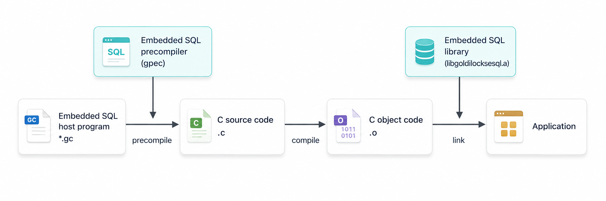
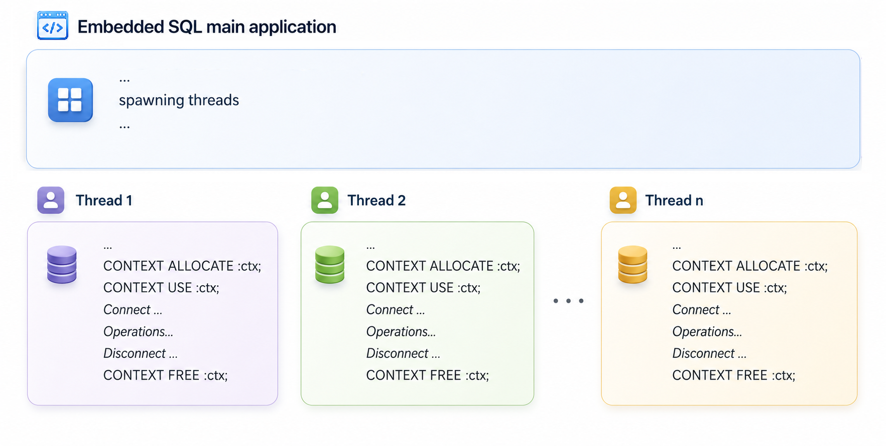
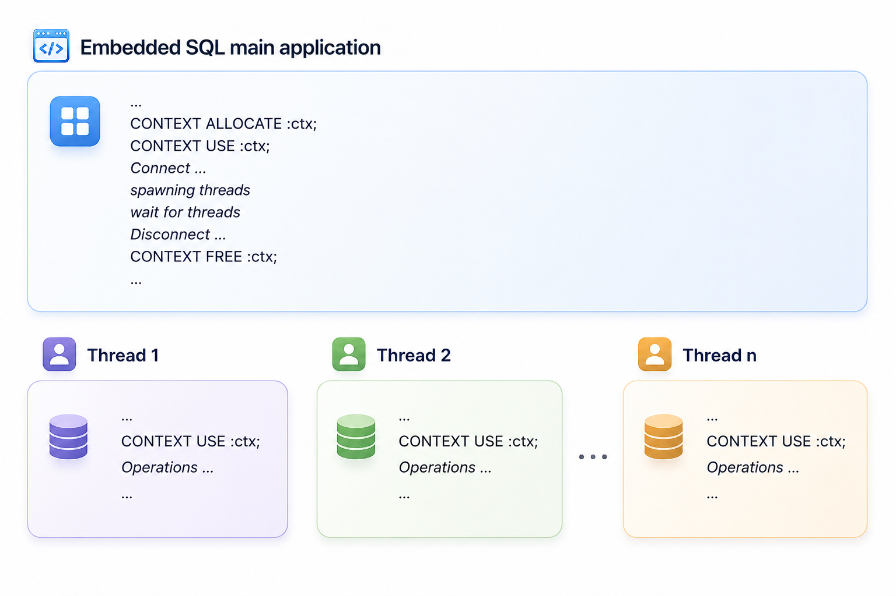
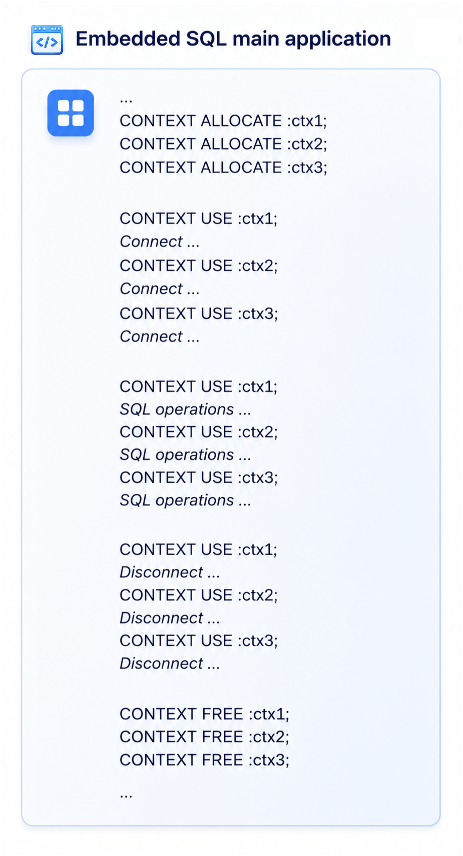

<a id="f59932372cc7d664"></a>

# 36. Embedded SQL

> 원본: [GOLDILOCKS 26c.1 User Manual (ko)](https://manual.sunjesoft.co.kr/goldilocks/26c_1/manual/ko/f59932372cc7d664)  
> 태그: `26c.1_0_tag`

[← 35. JDBC](35-jdbc.md) · [전체 목차](../README.md) · [37. PDO →](37-pdo.md)

<a id="fbc5ca3ffb7a05a0"></a>
## Precompiler

<a id="88c10b7bae860305"></a>
### 개요

GOLDILOCKS의 precompiler는 high-level 프로그래밍 언어에서 embedded SQL을 사용할 수 있게 해 주는 프로그램 개발 도구이다. 현재 GOLDILOCKS에서는 C/ C++ 언어에 대한 precompiler만 지원하는데 이 도구의 이름은 gpec이다.

<a id="2d44c705c9683dca"></a>
#### Embedded SQL 응용 프로그램 개발

[Embedded SQL 응용 프로그램 개발](#d5f15382c104641d)에 설명된 것과 같이, 사용자가 embedded SQL을 포함하는 C 소스 프로그램을 작성하고, 이를 gpec precompiler를 통하여 변환하면 소스 코드 상에 있던 embedded SQL이 GOLDILOCKS의 library를 호출하는 내용으로 변환된 순수 C 코드가 만들어진다. 이 C 코드는 시스템의 C compiler를 이용하여 object code로 compile한 다음, GOLDILOCKS에서 제공하는 embedded SQL library인 libgoldilocksesql.a와 함께 링크하여 최종 목적인 응용 프로그램을 만든다.

<a id="d5f15382c104641d"></a>


<a id="282089665f4a67e5"></a>
#### Embedded SQL 응용 프로그램 개발 도구 구성

GOLDILOCKS의 embedded SQL 응용 프로그램은 다음과 같은 요소들로 구성되어 있다.

**Embedded SQL 응용 프로그램 개발 도구 구성**

<a id="c4454165210f1f11"></a>
| Directory or file | Description |
| --- | --- |
| `\bin\gpec` | GOLDILOCKS precompiler embedded SQL for C |
| `\include\goldilocksesql.h` | Embedded SQL library header file. Precompiler가 자동으로 삽입하기 때문에 사용자가 별도로 조작할 것은 없다. |
| `\include\sqlca.h` | SQLCA 자료 구조와 관련된 header file 이다. Precompiler 가 자동으로 삽입하므로 사용자가 별도로 조작할 필요는 없다. |
| `\lib\libgoldilocksesql.a, \lib\libgoldilocksesqls.so` | Embedded SQL run-time library 이다. |
| `\lib\libgoldilocks.a, \lib\libgoldilockss.so` | GOLDILOCKS DA/ CS 혼용 mode library 이다. |
| `\lib\libgoldilocksa.a, \lib\libgoldilocksas.so` | GOLDILOCKS DA mode library 이다. |
| `\lib\libgoldilocksc.a, \lib\libgoldilockscs.so` | GOLDILOCKS CS mode library 이다. |
| `\sample\EmbeddedSQL` | Sample program 이다. |

<a id="f388105c369a10f7"></a>
### Building Application

본 절에서는 GOLDILOCKS의 embedded SQL 소스 프로그램을 build하여 실행 형태의 응용 프로그램을 만드는 과정을 설명한다.

<a id="4f2560847e29eb7f"></a>
#### Precompile

<a id="1322cbc1915ee1a0"></a>
##### 설명

사용자가 embedded SQL을 사용하여 작성한 C/ C++ 소스 코드를 precompile하여, 순수한 C/ C++ 소스 코드를 생성한다. 이 과정의 핵심은 사용자가 작성한 embedded SQL을 GOLDILOCKS에서 제공하는 library call로 변환하는 것이며, embedded SQL을 제외한 C/ C++ 소스 코드는 변환하지 않는다.

<a id="1bd3ee40c856b0a0"></a>
##### 사용 방법

GOLDILOCKS의 precompiler 이름은 gpec이고 $GOLDILOCKS_HOME/bin/에 위치한다.  
gpec은 다음과 같은 방법으로 사용한다.

```
$ gpec [OPTION]... <input file>
```

gpec은 &lt;input file&gt;을 입력 받아서 precompile 과정을 거친 다음 C/ C++ 소스 코드를 생성해낸다. &lt;input file&gt;은 기본적으로 *.gc 확장자를 가지고 있는데 이 확장자는 생략할 수 있다. 만약 &lt;input file&gt;이 *.gc 확장자를 가지고 있지 않을 경우, 반드시 file의 이름에 확장자까지 써 주어야 한다.  
gpec에 주어지는 옵션에 대한 자세한 내용은 [Precompiler Options](#acc3cf33eea6bb85)을 참조한다.

<a id="845f7d3d617ff351"></a>
##### Example

```
$ gpec sample1

FileName: sample1
Pre-compile sample1.gc -> sample1.c
```

<a id="cb4851d39b07a9e8"></a>
#### Compile

Precompile 과정을 거쳐서 생성된 코드는 C/ C++ 소스 코드이다. 이 소스 코드는 platform에서 제공하는 C/ C++ compiler를 사용하여 object code를 생성한다. 이 과정에 대한 자세한 내용은 사용자 각자의 platform에서 제공하는 C/ C++ compiler 사용설명서를 참조한다.

<a id="f57018a927a5a831"></a>
#### Link

위의 절차들을 통해 생성된 object code들을 link하여 응용 프로그램을 생성하는데, GOLDILOCKS에서는 embedded SQL에 대해 libgoldilocksesql.a를 제공한다. 이 library는 precompiler가 embedded SQL을 변환한 GOLDILOCKS API들을 포함하므로 embedded SQL 응용 프로그램을 만들 때 반드시 필요하다.

추가적으로 GOLDILOCKS의 다양한 동작 모드에 따라서 필요한 library가 달라지게 되는데, 현재 응용 프로그램의 동작 모드에 따라 다음과 같이 library를 선택하여 링크한다.

<a id="83b4ae986f37c7a6"></a>
| 동작 mode | Static library | Shared object |
| --- | --- | --- |
| DA 전용 | libgoldilocksa.a | libgoldilocksas.so |
| CS 전용 | libgoldilocksc.a | libgoldilockscs.so |
| DA/ CS 혼용 | libgoldilocks.a | libgoldilockss.so |

그 밖의 link 과정 역시 일반적인 C/ C++ 응용 프로그램 생성 과정과 다르지 않으므로, platform에서 제공하는 linker 매뉴얼을 참조한다.

<a id="789118ad4ccaa8bd"></a>
#### Example

위의 precompile, compile, link 과정을 편하게 수행하기 위하여 make를 많이 이용한다. 다음은 간단한 sample 프로그램을 만들기 위한 makefile의 예이다. 아래 예제를 참조하여 각자의 환경에 맞는 makefile을 만들어 사용해야 한다.

```
GPEC = gpec
GPECFLAGS = 
#GPECFLAGS = --unsafe-null --no-prompt

CC = gcc
CFLAGS = -g -Wall 
INC = -I$(GOLDILOCKS_HOME)/include

LFLAGS = -L$(GOLDILOCKS_HOME)/lib 
LIB = -lgoldilocksesql -lgoldilocksc -lpthread -lm -lrt
 
BINS = overview sample1 sample2 sample3 sample4 sample5 dyn1 dyn2 number date_time thread1 fetch_struct_array
 
ifneq ($(MAKECMDGOALS), clean)
ifneq ($(MAKECMDGOALS), all)
TARGET = $(MAKECMDGOALS)
OBJECT = $(TARGET).o
C_SRC  = $(TARGET).c
endif
endif
```

- 암묵적 규칙

```
.SUFFIXES: .gc .c .o

.gc.c:
    $(GPEC) $(GPECFLAGS) $^         ❶ Precompile

.c.o:
    $(CC) $(CFLAGS) -c $(INC) $^    ❷ Compile
```

- Build 규칙

```
NoTarget :
    @echo "Syntax : make {all | sample_name | clean}"
    @echo "sample_name is one of '$(BINS)'"
 
all :
    for target in $(BINS); do \
        $(MAKE) $$target;     \
    done
 
$(OBJECT) : $(C_SRC)
$(TARGET) : $(OBJECT)
    $(CC) -o $@ $^ $(LFLAGS) $(LIB)   ❸ Link
 
clean :
    rm -rf $(BINS) *.o *.c *~ core
```

<a id="9c1cf6722c9968bf"></a>
#### Sample

GOLDILOCKS에서는 embedded SQL 응용 프로그램 작성에 대한 이해를 돕기 위해 간단한 embedded SQL sample 코드를 제공한다. Sample 코드는 $GOLDILOCKS_HOME/sample/EmbeddedSQL 디렉토리에 있으며, 이 sample들을 수행하기 위해서는 해당 디렉토리에 함께 존재하는 sample.sql을 먼저 수행해야 한다.

```
$ cd $GOLDILOCKS/sample/EmbeddedSQL
$ gsql test test -i sample.sql
$ make
Syntax : make {all | sample_name | clean}
sample_name is one of 'overview sample1 sample2 sample3 sample4 sample5 dyn1 dyn2 number date_time thread1 fetch_struct_array xa long_binary psm whenever preprocess'
```

make all은 모든 sample을 build하는데 특정 sample만 별도로 만들려면 make &lt;sample_name&gt;을 하면 된다. &lt;sample_name&gt;은 위 메시지를 참조한다. sample2를 build하여 수행하면 다음과 같은 결과가 나온다.

```
$ make sample2
gpec  sample2.gc

FileName: sample2.gc
Pre-compile sample2.gc -> sample2.c
gcc -g -Wall -c -I/home/mycomman/work/product/Gliese/home/include sample2.c
gcc -o sample2 sample2.o -L/home/mycomman/work/product/Gliese/home/lib -lgoldilocksesql -lpthread -lm -lrt -lgoldilocksa
$ ./sample2 
Connect GOLDILOCKS ...
 EMPNO    ENAME                JOB      SALARY
====== ==================== ========== ========
  2854                 Park        RND      800
  2098                  Kim   SALESMAN     1600
  2175                 Choi   SALESMAN     1250
  2306                  Lee    SUPPORT     2975
  2122                  Lyu   SALESMAN     1250
  2999                  Ohn    SUPPORT     2850
  2012                Cheon    SUPPORT     2450
  2168                 Sohn        RND     3000
  2836                  Seo        CEO     5000
  2022                 Song   SALESMAN     1500
  2232                Jeong        RND     1100
  2676                 Kang        RND      950
  2714                  Cho        RND     3000
  2441                 Yoon        RND     1300
====== ==================== ========== ========
Record Count = 14
====== ==================== ========== ========

SUCCESS
############################
```

<a id="acc3cf33eea6bb85"></a>
### Precompiler Options

본 절에서는 gpec의 option들을 설명한다.

<a id="44c2c21138088f7b"></a>
#### --no-prompt, -n

<a id="3a685346dbb09ebf"></a>
##### 설명

Version 정보를 출력하지 않는다.

<a id="11f1b86d11aac8d3"></a>
##### 사용 예

```
$ gpec --no-prompt sample2
FileName: sample2
Pre-compile sample2.gc -> sample2.c
$
```

<a id="21e6effb8a7a438a"></a>
#### --version, -v

<a id="a5435c561978fd6c"></a>
##### 설명

Version 정보만 출력하고 종료한다.

<a id="538a5793cb12f40a"></a>
##### 사용 예

```
$ gpec --version

$
```

<a id="54b1c0b47c117eae"></a>
#### --help, -h

<a id="d58bd4811471c71b"></a>
##### 설명

Help message를 출력한다. gpec에 아무런 option이나 &lt;input file&gt;을 주지 않을 때도 동일하게 동작한다.

<a id="fa9b747215ef988e"></a>
##### 사용 예

```
$ gpec --help

gpec is the GOLDILOCKS embedded SQL precompiler for C programs.
 
Usage:
  gpec [OPTION]... <input file>
 
Options:
  --no-prompt    No Print version information
  --version      Print version information and exit
  --help         Print help message
  --output       Describe output filename
  --unsafe-null  Allow a NULL fetch without indicator variable
  --include-path Describe header file path
  --no-lineinfo  Exclude line information
  --char_map     Mapping of character arrays ( CHARZ | STRING )
  --cumulative   SQLERRD[2] records cumulative sum of rows processed for FETCH CURSOR.
  --autocommit   Set autocommit TRUE to all connection.
$
```

<a id="ab99a10ee935527e"></a>
#### --output, -o

<a id="39c6f3e5bb2f2488"></a>
##### 설명

Precompile 결과 file의 이름을 지정한다. 이 옵션이 주어지지 않으면, &lt;input file&gt;과 같은 file 이름을 가지고 확장자가 .c 인 file이 만들어진다.

<a id="9bd7169a5652916c"></a>
##### 사용 예

- Output을 사용하지 않은 경우

```
$ gpec sample2.gc

FileName: sample2.gc
Pre-compile sample2.gc -> sample2.c
$ ls
sample2.c  sample2.gc
```

- Output을 사용한 경우

```
$ gpec --output outfile.cpp sample2.gc
FileName: sample2.gc
Pre-compile sample2.gc -> outfile.cpp
$ ls
outfile.cpp  sample2.gc
```

<a id="3dcdc083aa54e777"></a>
#### --unsafe-null

<a id="ab2af3a22be32b3b"></a>
##### 설명

Host indicator variable을 사용하지 않은 경우에도 NULL fetch가 발생했을 때 성공하도록 해준다. 이것은 단지 연산이 성공했다는 의미일 뿐이지 NULL 값을 얻어올 수 있다는 의미는 아니다.

<a id="591ccc217b0fa3ce"></a>
##### 사용 예

```
$ gpec --unsafe-null sample2
FileName: sample2
Option : --unsafe-null
Pre-compile sample2.gc -> sample2.c
$
```

<a id="5624a45ee4430278"></a>
#### --include-path, -I

<a id="cf5d422f3fbd82f2"></a>
##### 설명

Precompile을 할 때 참조해야 할 header file의 경로를 기술한다. Precompile을 수행하면서 EXEC SQL INCLUDE 구문을 통해 다른 header file을 찾게 되는데, 우선 현재 file이 위치한 디렉토리부터 검색하고, 없으면 이 옵션이 기술된 디렉토리들에서 차례대로 찾는다.

<a id="a99b9cb7900ae025"></a>
##### 사용 예

Header file이 include 디렉토리에 존재하는 경우의 예이다.

- 에러가 발생한 경우

```
$ gpec sample.gc 

FileName: sample.gc
Pre-compile sample.gc -> sample.c

ERR-42000(41000): syntax error 
Error at line 12, in file sample.gc
ERR-42000(41004): "decl.h": file not exist 

ERR-42000(41000): syntax error 
rsEmpRecord gRecord[] = {
^
Error at line 15, in file sample.gc
```

- -I 옵션을 사용한 경우

```
$ gpec -Iinclude sample.gc 
FileName: sample.gc
Pre-compile sample.gc -> sample.c
$
```

<a id="9b449d6368a55184"></a>
#### --no-lineinfo

<a id="8990aac290e71e34"></a>
##### 설명

GPEC은 기본적으로 gc file을 c file로 변환할 때, gc file로 디버깅이 가능하도록 #line 정보를 추가한다. 그러나 이 옵션을 사용하면 c file을 생성할 때 #line preprocessor를 통한 line 정보를 추가하지 않는다.

<a id="f46149e0e3067e49"></a>
##### 사용 예

```
$ gpec --no-lineinfo sample2
FileName: sample2
Pre-compile sample2.gc -> sample2.c
$
```

<a id="9a106fc60f953804"></a>
#### --char_map, -c

<a id="3a5ae9208b3cc8c1"></a>
##### 설명

DECLARE SECTION 내에 선언된 char 형식의 data를 어떤 type으로 mapping을 할지 설정한다. Default 값은 'STRING'인데 NULL로 종료되는 data형식이다. 'CHARZ'는 space padding되고 NULL로 종료되는 data형식이다.

<a id="9ed8a3e14134f2b3"></a>
##### 사용 예

```
$ gpec --char_map=STRING overview
FileName: overview
Pre-compile overview.gc -> overview.c

$ gpec --char_map=CHARZ overview
FileName: overview
Pre-compile overview.gc -> overview.c
```

<a id="19cccb6de135df0d"></a>
#### --define, -D

<a id="9d00c8db21d7053b"></a>
##### 설명

gpec에서 사용되는 define 이름으로써 1로 설정된다.

<a id="9cadfc1b14731ef6"></a>
##### 사용 예

```
$ gpec --define=AAA preprocess
FileName: preprocess
Pre-compile preprocess.gc -> preprocess.c

$ gpec -D BBB preprocess
FileName: preprocess
Pre-compile preprocess.gc -> preprocess.c
ERR-42000(41028): 'BBB' macro is already defined at line 45, in file preprocess.gc
```

<a id="abe3b93e9ec1505f"></a>
#### --cumulative

<a id="8a63f8b3817330ca"></a>
##### 설명

FETCH CURSOR 구문에 대해서 sqlerrd[2]을 누적된 합으로 처리하도록 한다.

<a id="af872951e19e9840"></a>
##### 사용 예

```
$ gpec --cumulative sample.gc
FileName: sample Option : --cumulative
Pre-compile sample.gc -> sample.c
$
```

<a id="9277a0eecd74755a"></a>
#### --autocommit

<a id="b62c19545143d96b"></a>
##### 설명

모든 connection의 auto commit을 TRUE로 설정한다.

<a id="00d76ceb67351522"></a>
##### 사용 예

```
$ gpec --autocommit sample.gc
FileName: sample Option : --autocommit
Pre-compile sample.gc -> sample.c
$
```

<a id="49761b68c953cb6c"></a>
#### --parse

<a id="5ccc64777da0c1d4"></a>
##### 설명

gpec이 입력 소스를 어느 수준까지 파싱할지 지정한다. 지정하지 않으면 기본값은 partial이 적용된다.

- none: gpec 실행에 필요한 최소한의 구조만 파싱한다.
- partial: gpec 전처리 단계에 필요한 범위까지 파싱한다.

<a id="376bd5ff8c457914"></a>
##### 사용 예

```
$ gpec --parse=none sample.gc
FileName: sample Option : --pasrse=none
Pre-compile sample.gc -> sample.c
$
```

<a id="174fa5eee5426e21"></a>
## Embedded SQL

<a id="ab1a70c144bc2877"></a>
### Preprocessing

<a id="b983c0b7be3c7421"></a>
#### 개요

gpec에서 precompiling하기 전에 전처리 (preprocessing)를 수행한다.

gpec에서 지원하는 preprocess 지시문은 #if, #ifdef, #if defined, #ifndef, #else, #elif, #endif, #define, #undef 등이다.

gpec의 --define 옵션으로 predefine을 사용할 수 있다. gpec의 옵션으로 predefine된 경우, 1로 정의(definition) 된다.  
예: gpec --define=_DEV_ Test.gc는 Test.gc 파일 내의 #define _DEV_  (1)과 동일하다.

<a id="5cf285e54a68bc17"></a>
#### 적용 범위

gpec에 대한 SQL precompiler 기능은 DECLARE SECTION 내에서 선언된 호스트 변수에만 적용되며, 해당 변수는 EXEC SQL 문에서만 사용할 수 있다. (DECLARE SECTION 외부에서 선언된 변수는 EXEC SQL 문에서 사용할 수 없다.)   
전처리는 parse=partial일 때 소스 전체에 적용되며, parse=none일 경우 전처리 과정은 생략된다.  
또한 Include 파일 전처리는 EXEC SQL INCLUDE로 지정된 헤더 파일에만 적용되며, 해당 헤더 파일에서 참조하는 외부 헤더의 매크로는 gpec에서 인식되지 않는다.

<a id="84e97adc46c05282"></a>
##### parse = partial

parse 값을 partial로 설정하면 gpec은 소스 전체를 분석하고 전처리를 수행한다.

전처리 조건이 참 (true)인 영역 내의 EXEC SQL 문만 SQL precompiling 대상이 되며, 거짓 (false)인 영역은 그대로 무시된다.

Include 파일 전처리는 EXEC SQL INCLUDE로 추가된 header 파일에만 적용된다.

```
#define _DEV1_
EXEC SQL BEGIN DECLARE SECTION;
#define _DEV2_
char username[10]; 
char password[10];
#ifdef _DEV1_
VARCHAR conn_str[20]; ❶  
#elif defined _DEV2_
VARCHAR conn_str[30]; ❷
#endif
EXEC SQL END DECLARE SECTION;
```

> 1 위치의 _DEV1_는 DECLARE SECTION의 위치와 관계없이 전처리 시점에 평가될 수 있으므로 VARCHAR 선언은 정상적으로 변환된다.  
> 2 위치에서는 _DEV1_가 참이므로 전처리 시점에서 조건이 적용되어 VARCHAR가 변환되지 않는다.

그 결과 gpec을 이용하여 위 파일을 c 파일로 생성하면 다음과 같이 VARCHAR 타입 변수 conn_str[20] 만 변환된 상태로 출력된다.

```
#define _DEV1_
/* EXEC SQL BEGIN DECLARE SECTION; */
#define _DEV2_
char username[10]; 
char password[10];

#ifdef _DEV1_/* VARCHAR conn_str[20]; */
struct { int len; char arr[20]; } conn_str; ❶
#elif defined _DEV2_
VARCHAR conn_str[30];                       ❷
#endif
/* EXEC SQL END DECLARE SECTION; */
```

<a id="b678b49b7d335821"></a>
##### parse = none

parse 값을 none으로 설정하면 gpec은 전처리를 수행하지 않는다. 그 결과 EXEC SQL 문은 전처리 조건과 무관하게 변환된다.

```
#define _DEV1_
EXEC SQL BEGIN DECLARE SECTION;
#define _DEV2_
char username[10]; 
char password[10];
#ifdef _DEV1_
VARCHAR conn_str[20]; ❶  
#elif defined _DEV2_
VARCHAR conn_str[30]; ❷
#endif
EXEC SQL END DECLARE SECTION;
```

> 전처리 조건을 평가하지 않으므로 1 , 2 위치의 VARCHAR 선언 모두 변환 대상이 된다. 이 경우 gpec은 마지막에 선언된 변수를 호스트 변수로 간주한다.

그 결과 gpec을 이용하여 위 파일을 c 파일로 생성하면 다음과 같이 VARCHAR 타입 변수 conn_str[20] 과 conn_str[30] 이 모두 변환된 상태로 출력된다.

```
#define _DEV1_
/* EXEC SQL BEGIN DECLARE SECTION; */
#define _DEV2_
char username[10]; 
char password[10];

#ifdef _DEV1_/* VARCHAR conn_str[20]; */
struct { int len; char arr[20]; } conn_str; ❶
#elif defined _DEV2_
/* VARCHAR conn_str[30]; */
struct { int len; char arr[30]; } conn_str; ❷
#endif
/* EXEC SQL END DECLARE SECTION; */
```

<a id="a2eeafb04e8c988d"></a>
#### 유형

parse 옵션이 partial로 설정된 경우 적용되는 전처리 유형은 다음과 같다.

<a id="e299697add137560"></a>
##### #if

- 문법

```
#if constant
```

또는

```
#if defined identifier
```

또는

```
#if !defined identifier
```

- 예제

```
#if 0
int sVar1;
#endif

#if 3-2   ❶ 연산 가능
int sVar2;
#endif

#if defined _DEV_
int sVar3;
#endif

#if !defined (_DEV_)
int sVar4;
#endif
```

<a id="fd07dcfc7faff302"></a>
##### #ifdef, #ifndef

- 문법

```
#ifdef identifier
```

또는

```
#ifndef identifier
```

- 예제

```
#ifdef _DEV_
int sVar1;
#endif

#ifndef _DEV_
int sVar2;
#else
int sVar3;
#endif
```

<a id="0ce70b5cb92b6876"></a>
##### #else, #elif, #endif

- 문법

```
#else
```

또는

```
#endif
```

또는

```
#elif constant
```

또는

```
#elif defined identifier
```

- 예제

```
#if 1
int sVar1;
#else
int sVar2;
#endif

#if 0
int sVar3;
#elif 1
int sVar4;
#else
int sVar5;
#endif


#ifdef _DEV1_
int sVar6;

#elif defined _DEV2_
int sVar7;

#elif !defined _DEV3_
int sVar8;
#endif
```

<a id="74ed8782c36364b9"></a>
##### #define, #undef

- 문법

```
#define identifier
```

또는

```
#define identifier constant
```

또는

```
#undef identifier
```

- 예제

```
#define _DEV1_
EXEC SQL BEGIN DECLARE SECTION;
#define _DEV2_
char username[10]; 
char password[10];
#ifdef _DEV1_
VARCHAR conn_str[20]; ❶
#elif defined _DEV2_
VARCHAR conn_str[30]; ❷
#endif
#undef _DEV2_
#ifdef _DEV2_
VARCHAR sDept[10];  ❸
#endif
EXEC SQL END DECLARE SECTION;
```

> 1 _DEV1_가 정의되어 있기 때문에 gpec에서 host 변수로 처리된다.  
> 2 _DEV2_는 #ifdef _DEV1_이 true이므로 gpec에서 무시한다.  
> 3 _DEV2_가 undef 되었으므로 gpec에서 무시한다.

> #define에는 주석을 사용할 수 있다. 그러나 #define이 여러 라인으로 나뉘어 작성되면 주석을 정확하게 처리할 수 없다.

```
#define _DEF1_  1 \                           ❶ 
    + 1
#define _DEF2_   1 \ /* this is               ❷ 
  comment */  + 1
#define _DEF3_   1 \ /* this is comment */    ❸
    + 1
#define _DEF4_  1  /* this is comment */ + 1  ❹
```

> 1 _DEF1_은 1 + 1로 처리된다.  
> 2 _DEF2_는 1로 처리된다.   
>  3 _DEF3_은 정상적으로 처리되지 못한다.  
> 4 _DEF_4_는 1 + 1로 처리된다.

<a id="be186ee6a7fcc2cb"></a>
#### 제약사항

<a id="07ca978ede34acfb"></a>
##### 매크로 사용 위치 제약

매크로는 c 선언문의 중간이나 EXEC SQL 문의 중간에 사용될 수 없다.

```
EXEC SQL BEGIN DECLARE SECTION;
char 
#ifdef _DEV_
username[10]; ❶ 잘못된 MACRO 사용
#else
username[20]; ❷ 잘못된 MACRO 사용
#endif
EXEC SQL END DECLARE SECTION;
EXEC SQL 
    SELECT USERNAME INTO :username
#ifdef _DEV_
    FROM EMP ❸ 잘못된 MACRO 사용
#else
    FROM DEV_EMP ❹ 잘못된 MACRO 사용
#endif
    WHERE EMPNO = 10;
```

<a id="d0cf69d560504b5f"></a>
##### DECLARE SECTION 제약

Declare section의 내부에 정의되었다고 하더라도 EXEC SQL 문까지 확장되지는 않는다.

```
EXEC SQL BEGIN DECLARE SECTION;
#define C_EMP_NO   14
char username[10]; 
EXEC SQL END DECLARE SECTION;


EXEC SQL 
	SELECT USERNAME INTO :username
	FROM EMP

	WHERE EMPNO = C_EMP_NO; ❶ 잘못된 MACRO 사용
```

<a id="6b9de3ff0a8eae50"></a>
##### 전처리 조건식 제약

전처리기 지시문의 조건식(expression)은 하나의 라인으로 작성해야 한다. 라인 연속(\)을 이용한 다중 라인 조건식은 정상적으로 처리되지 않는다.

```
#if  1 && \  ❶ 반드시 단일 라인으로 작성해야 한다.
1
EXEC SQL INCLUDE "my.h";
#endif
```

<a id="603ee8ef879fbbd8"></a>
##### 매크로 지원 한계

gpec 전처리는 함수 형태의 매크로와 매크로 내부에서 다른 매크로를 참조 하는 매크로를 지원하지 못한다.

```
#define SIZE_1 10
#define SIZE_2 SIZE_1    ❶ 다른 매크로를 참조하는 경우 정상적인 값을 얻지 못한다.
#define FUNC_1( a, b ) a + b
#if FUNC_1( SIZE_1, SIZE_2 )
```

<a id="784857129fb02348"></a>
### 연결

<a id="ea4096a7a7eabf65"></a>
#### Database 연결

Embedded SQL 프로그램에서 database에 접속하여 작업을 수행하기 위해서는, database server에 연결하는 과정이 필요하다.   
GOLDILOCKS에서 database에 연결하는 구문은 다음과 같다.

```
EXEC SQL [ AT <db_name> ] CONNECT <user_name> IDENTIFIED BY <password> [ AT <db_name> ] [ USING <conn_string> ]

<db_name> := dbname | :hostvar
<user_name> := username | :hostvar
<password> := password | :hostvar
<conn_string> := connection_string | :hostvar
```

Database에 접속하는 가장 기본적인 방법은 다음과 같다.

```
EXEC SQL BEGIN DECLARE SECTION;
char username[10]; 
char password[10]; 
EXEC SQL END DECLARE SECTION;
strcpy( username, "test" );
strcpy( password, "test" );
...

EXEC SQL CONNECT :username IDENTIFIED BY :password;
```

GOLDILOCKS는 shared memory에 직접 attach하여 구동하는 D/A 모드와, TCP 통신을 사용하여 database에 접속하는 C/S 모드 둘 다 지원한다. D/A 모드로 동작할 때는 database의 동일한 호스트에서 직접 접근하게 되므로 위와 같이 별도의 서버 정보를 포함하지 않아도 사용할 수 있지만 C/S 모드로 동작하기를 원할 때는 Data Source Name (DSN)을 지정하여 접근하도록 해야 한다. DSN에 대한 자세한 내용은 [데이터 원본 구성](34-odbc.md#69c211015508ccf1)을 참조한다.

DSN을 사용할 때는 connection_string 정보가 주어져야 하는데, 이 때 connection_string 정보를 사용하기 위하여 USING 절을 이용한다. 다음은 이름이 "GOLDILOCKS"인 DSN과 USING 절을 사용하는 연결 구문의 예이다.

```
EXEC SQL BEGIN DECLARE SECTION;
char username[10]; 
char password[10];
char conn_str[20];
EXEC SQL END DECLARE SECTION;
strcpy( username, "test" );
strcpy( password, "test" );
strcpy( conn_str, "DSN=GOLDILOCKS" );
...

EXEC SQL CONNECT :username IDENTIFIED BY :password USING :conn_str;
```

응용 프로그램을 개발하면서 각 연결을 독자적으로 식별해야 할 때가 있다. D/A 모드의 multi-thread 프로그램에서 각각 connection을 맺거나, C/S 모드에서 connection을 여러 개 맺는 경우가 이에 해당하는데, 이 때 각 connection에 이름을 부여하려면 AT 절을 사용한다.

AT 절은 CONNECT 구문의 가장 앞에 올 수도 있고, USING 절 앞에 위치하는 것도 가능하다. 다음은 AT 절을 사용한 CONNECT 구문의 예이다.

```
EXEC SQL BEGIN DECLARE SECTION;
char username[10]; 
char password[10];
char conn_str[20];
char conn_name[10];
EXEC SQL END DECLARE SECTION;
strcpy( username, "test" );
strcpy( password, "test" );
strcpy( conn_str, "DSN=GOLDILOCKS" );
strcpy( conn_name, "DBCONN1" );
...

EXEC SQL CONNECT :username IDENTIFIED BY :password AT :conn_name USING :conn_str;
```

<a id="f431ca45a3ecfa16"></a>
#### Database 연결 해제

응용 프로그램에서 database에 대한 연결을 해제한다. Connect 구문과 마찬가지로, 연결 해제 역시 기본연결을 해제하는 방법과 connection 이름을 주어서 해제하는 방법이 있다. 또한, 현재 응용 프로그램에서 연결한 모든 연결을 해제하는 구문도 제공한다.

<a id="f5908bb1a696babe"></a>
##### 단일 연결 해제

단일 연결 해제에는 명시적인 방법과 암묵적인 방법이 있다.   
명시적인 방법은 DISCONNECT 구문을 사용하는 것으로써 그 사용 방법은 다음과 같다.

```
EXEC SQL [ AT <db_name> ] DISCONNECT;
```

Transaction은 commit이나 rollback을 통해 그 주기를 종료한다. 이 때 transaction 종료 구문 뒤에 RELEASE 옵션을 추가로 기술하여 암묵적으로 연결을 해제할 수 있다.

```
EXEC SQL [ AT <db_name> ] { COMMIT/ROLLBACK } [ WORK ] RELEASE;
```

<a id="0c4e8ab2fb18c66a"></a>
##### 전체 연결 해제

현재 응용 프로그램의 모든 연결을 한꺼번에 해제하기를 원할 경우, 다음과 같은 구문을 사용한다.

```
EXEC SQL DISCONNECT ALL;
```

<a id="8f93728ca58c8e12"></a>
### Transaction

Database 응용 프로그램은 트랜잭션 단위로 구성된다. 따라서 embedded SQL 프로그램 역시 트랜잭션을 조작할 수 있어야 하며, 본 절에서는 그 방법에 대해 설명한다.

<a id="3ea15d12e04239cb"></a>
#### Transaction의 시작과 종료

Transaction이 connection 된 후에 가장 처음으로 수행되는 SQL에서 시작된다. 이렇게 시작된 transaction은 명시적으로 종료 명령이 발생할 때까지 유지되며, 종료 명령은 완료 (COMMIT) 명령과 취소 (ROLLBACK) 명령 두 가지가 있다.

<a id="9c78991d22094d47"></a>
##### COMMIT

Transaction의 완료 명령이 주어지면 다음과 같은 작업들이 발생한다.

- 현재 transaction이 시작되고 나서 발생한 모든 data 갱신이 database에 영구적으로 반영된다.
- 반영된 갱신 사항이 이후에 시작된 모든 transaction이나 sensitive한 cursor에 visible하게 적용된다.
- 현재 transaction에서 생성된 모든 savepoint가 삭제된다.
- 현재 transaction에서 획득한 모든 lock이 해제된다.
- 현재 transaction에서 open 된 cursor들이 close된다. (단, holdable cursor는 예외이다.)
- Transaction을 종료한다

완료 명령은 다음과 같이 사용한다.

```
EXEC SQL COMMIT [ WORK ];
```

<a id="b0c27835dcacda54"></a>
##### ROLLBACK

취소 (rollback) 명령의 종류는 다음과 같다.

- Transaction 전체 rollback
- Transaction 부분 rollback
- Statement-level rollback

Transaction rollback 명령이 주어지면 다음과 같은 작업들이 발생한다.

- 현재 transaction이 시작되고 나서 발생한 모든 data 갱신 사항이 취소되어 transaction 발생 이전의 상태로 되돌아간다.
- 현재 transaction에서 생성된 모든 savepoint가 삭제된다.
- 현재 transaction에서 획득한 모든 lock이 해제된다.
- 현재 transaction에서 open 된 cursor들이 close된다. (단, holdable cursor는 예외이다.)
- Transaction을 종료한다

취소 명령은 다음과 같이 사용한다.

```
EXEC SQL ROLLBACK [ WORK ];
```

Transaction을 부분 rollback하려면 savepoint를 이용한다. 응용 프로그램 개발자는 명시적으로 savepoint를 지정하고, 이 savepoint까지 작업을 되돌려 취소하도록 함으로써 transaction을 부분적으로 rollback 할 수 있다. Transaction을 부분 rollback하면 다음과 같은 작업들이 발생한다.

- 취소된 savepoint 이후에 발생한 모든 갱신 사항이 취소된다.
- 취소된 savepoint 이후에 생성된 savepoint들이 삭제된다.
- 취소된 savepoint 이후에 획득한 lock들이 해제된다.

Transaction을 부분적으로 취소하는 명령은 다음과 같이 사용한다.

```
EXEC SQL ROLLBACK TO SAVEPOINT <savepoint_name>;
```

Statement-level rollback은 현재 수행중이었던 statement만 단독으로 취소하는 기능이다. 예를 들어, table에 row를 삽입하다가 unique violation이 발생한 경우처럼, 현재 statement를 더 이상 수행할 수 없는 경우에는 현재 statement만 취소해야 다음 작업을 계속 진행할 수 있다.

이 경우, GOLDILOCKS 내부에서 자체적으로 statement를 취소하기 때문에 별도로 구문상으로 지정할 명령은 없다.

<a id="efbc5de1ae2faf09"></a>
#### Auto Commit

일반적으로 GOLDILOCKS embedded SQL이 connection 될 때 transaction은 non auto-commit mode로 작동한다.

그러나 응용 프로그램의 개발 편의성이나, 특정 응용 프로그램의 논리 환경에서 auto-commit mode를 수정해야 할 때도 있다. 이러한 경우에 대비하여 GOLDILOCKS의 embedded SQL precompiler에서는 다음과 같은 구문을 사용하여 auto-commit mode를 켜거나 끌 수 있다.

```
EXEC SQL [ AT <db_name> ] AUTOCOMMIT { ON | OFF };
```

<a id="4cf8eefff24075e5"></a>
#### RELEASE Option

Transaction을 종료 (commit/ rollback) 할 때 RELEASE option을 사용하여 현재 사용 중인 connection을 해제할 수 있다.   
이 옵션은 transaction 전체 종료에만 적용할 수 있고 transaction을 부분적으로 취소 (ROLLBACK TO SAVEPOINT) 할 때는 사용할 수 없다.

<a id="030f6babdb3b6b52"></a>
### Host Variables and Datatypes

Embedded SQL 응용 프로그램은 database server와 연동하여 data를 조작 (manipulation)하고 질의(query)하여 원하는 결과를 획득하는 것을 목적으로 한다.

이러한 작업을 위해서는 응용 프로그램의 data를 database server로 전달하고, database server로부터 data를 얻어올 수 있는 수단이 필요한데 이 역할을 수행하는 매개체를 host variable이라고 정의한다.

Host variable은 C 언어의 변수로 선언되기 때문에, 응용 프로그램은 C 변수를 사용하는 것과 동일한 방법으로 host variable을 사용할 수 있고 이 변수가 SQL 문의 일부처럼 처리되어 database server와 응용 프로그램 사이의 value 입출력을 담당한다.

<a id="8219fec12c2a057b"></a>
#### Host Variable 선언

Host variable은 다음과 같이 embedded SQL directive 내에 선언되어야 한다.

```
EXEC SQL BEGIN DECLARE SECTION;
```

- Host variable 선언

```
EXEC SQL END DECLARE SECTION;
```

위와 같은 영역을 declare section이라고 하며 declare section 내에는 host variable을 선언할 수 있는데, 그 선언 방법은 C variable을 선언하는 방법과 동일하다. 다음은 일부 host variable을 선언하는 예이다.

```
EXEC SQL BEGIN DECLARE SECTION;
    int     empno;
    char    ename[20];
    double  salary;
EXEC SQL END DECLARE SECTION;
```

<a id="e333175fec662983"></a>
#### 함수 인자 선언

함수 인자를 host variable로 사용할 경우 함수 인자에 대한 정보를 제공해야 한다. 이 정보는 다음 embedded SQL directive 내에 선언되어야 한다.

```
EXEC SQL BEGIN ARGUMENT SECTION;
```

- Host variable 선언

```
EXEC SQL END ARGUMENT SECTION;
```

위와 같은 영역을 argument section이라고 하며 argument section 내에서 host variable은 함수 인자와 동일한 타입과 이름으로 선언해야 한다.

```
void func( int empno, char ename[20], double salary )
{
EXEC SQL BEGIN ARGUMENT SECTION;
     int     empno;
     char    ename[20];
     double  salary;
EXEC SQL END ARGUMENT SECTION;
...
```

Pseudo type은 함수 인자로 그대로 사용할 수 없지만, declare section과 typedef 키워드를 이용하여 사용할 수 있다.

```
EXEC SQL BEGIN DECLARE SECTION;
typedef VARCHAR domainName[20];
EXEC SQL END DECLARE SECTION;

void func( int * no, domainName * name )
{
    EXEC SQL BEGIN ARGUMENT SECTION;
    int        no[20];
    domainName name[20];
    EXEC SQL END ARGUMENT SECTION;

    EXEC SQL INSERT INTO EMP VALUES ( :no, :name );
}
```

> Host variable이 포인터 형으로 선언될 경우에는 배열 길이를 알 수 없다. 함수 인자가 포인터 형인 경우에도 host variable의 배열 크기가 argument section에 명시되어야 한다.

<a id="d0f4d27481f99cc8"></a>
#### Host Variable을 위한 C Data Type

Host variable로 사용되는 C data type은 C 언어에서 제공하는 native type과 GOLDILOCKS에서 부가적으로 제공하는 data type이 있다. 다음 표는 GOLDILOCKS의 embedded SQL에서 제공하는 data type을 설명한다.

<a id="46ea44c44c3cc1b3"></a>
##### C Native Datatype

C native datatype은 C 언어에서 제공하는 기본적인 type으로써 그 범위나 크기가 응용 프로그램을 개발할 때 사용된 platform에 전적으로 종속된다.

**C native datatype**

<a id="176aa70b63657d36"></a>
| C datatype | description |
| --- | --- |
| char | single character |
| char[n] | 최대 길이가 n인 문자열 |
| short | small integer (2 bytes) |
| int | integer (4 bytes) |
| long | large integer (4/8 bytes) |
| long long | very large integer (8 bytes) |
| float | single precision floating-point number |
| double | double precision floating-point number |

- char

char type은 single character를 나타낸다.

- char[n]

char[n] type은 최대 길이 n을 갖는 문자열(string) data를 나타낸다.  
다음 예제를 참조한다.

```
EXEC SQL BEGIN DECLARE SECTION;
char strName[20];
EXEC SQL BEGIN DECLARE SECTION;
```

위와 같이 선언할 경우, strName은 최대 길이 20을 갖는 문자열 data를 의미한다.   
strName이 ESQL의 output으로 사용되면 space padding이 된다.

> char[]의 최대 길이는 2001을 초과할 수 없다.

- short

2 byte 정수형 datatype을 나타낸다.

- int

4 byte 정수형 datatype을 나타낸다.

- long

Long type은 large integer라는 의미이지만 그 값의 실제 범위는 platform에 따라 결정된다. 64 bit Unix/ Linux platform에서는 long이 8 byte형 정수이지만 32 bit Unix/ Linux platform에서는 4 byte 정수이다.

- long long

Very large integer라는 의미이고 8 byte 정수형을 표현한다.

- float

C 언어의 float type으로써 4 byte single-precision floating-point number를 나타낸다.

- double

C 언어의 double type으로써 double-precision floating-point number를 나타낸다.

<a id="ede415b0e891d51a"></a>
##### Pseudo Datatype

Pseudo type은 다양한 형태의 GOLDILOCKS type을 지원하고 개발 편의성을 위해 GOLDILOCKS embedded SQL precompiler에서 제공하는 type으로써 그 내용의 대부분은 C의 구조체를 사용하여 구현된다.

<a id="3f0dedf0fdc2efe7"></a>
<table class="table column_count_2"><caption>GOLDILOCKS embedded SQL pseudo type</caption><thead><tr><th class="to_center"><div>Pseudo type</div></th><th class="to_center"><div>설명</div></th></tr></thead><tbody><tr><td><div>VARCHAR[n]</div></td><td><div>최대 길이가 n인 가변 길이 문자열</div></td></tr><tr><td><div>LONG VARCHAR</div></td><td><div>최대 길이가 100M (104857600)인 가변 길이 문자열</div></td></tr><tr><td><div>BINARY[n]</div></td><td><div>최대 길이가 n인 binary data</div></td></tr><tr><td><div>VARBINARY[n]</div></td><td><div>최대 길이가 n인 가변 길이 binary data</div></td></tr><tr><td><div>LONG VARBINARY</div></td><td><div>최대 길이가 100M (104857600)인 가변 길이 binary data</div></td></tr><tr><td><div>NUMBER</div></td><td><div>유효 자릿수가 38 자리인 정수</div></td></tr><tr><td><div>NUMBER(p)</div></td><td><div>유효 자릿수가 p 자리인 정수</div></td></tr><tr><td><div>NUMBER(p, s)</div></td><td><div>유효 자릿수가 p, scale이 s인 실수</div></td></tr><tr><td><div>BOOLEAN</div></td><td><div>Boolean type</div></td></tr><tr><td><div>DATE</div></td><td><div>날짜형 data</div></td></tr><tr><td><div>TIME</div></td><td><div>시간형 data</div></td></tr><tr><td><div>TIME WITH TIMEZONE</div></td><td><div>Timezone을 갖는 시간형 data</div></td></tr><tr><td><div>TIMESTAMP</div></td><td><div>날짜시간형 data</div></td></tr><tr><td><div>TIMESTAMP WITH TIMEZONE</div></td><td><div>Timezone을 갖는 시간형 data</div></td></tr><tr><td><div>INTERVAL YEAR</div></td><td class="to_middle" rowspan="13"><div>Interval data type</div></td></tr><tr><td><div>INTERVAL MONTH</div></td></tr><tr><td><div>INTERVAL DAY</div></td></tr><tr><td><div>INTERVAL HOUR</div></td></tr><tr><td><div>INTERVAL MINUTE</div></td></tr><tr><td><div>INTERVAL SECOND</div></td></tr><tr><td><div>INTERVAL YEAR TO MONTH</div></td></tr><tr><td><div>INTERVAL DAY TO HOUR</div></td></tr><tr><td><div>INTERVAL DAY TO MINUTE</div></td></tr><tr><td><div>INTERVAL DAY TO SECOND</div></td></tr><tr><td><div>INTERVAL HOUR TO MINUTE</div></td></tr><tr><td><div>INTERVAL HOUR TO SECOND</div></td></tr><tr><td><div>INTERVAL MINUTE TO SECOND</div></td></tr></tbody></table>

<a id="0e84c065ef89894e"></a>
###### **VARCHAR**

VARCHAR type은 가변 길이 문자열을 저장할 수 있는 datatype으로써 다음과 같은 구조체로 구성되어 있다.

```
struct {
    int  len;
    char arr[n];
}
```

여기서 n은 VARCHAR type이 가질 수 있는 최대 길이를 의미한다.

```
EXEC SQL BEGIN DECLARE SECTION;
    VARCHAR varstr[100];
EXEC SQL END DECLARE SECTION;
```

예를 들어 위와 같이 선언할 경우 precompile 과정에서 다음과 같이 변환된다.

```
struct VARCHAR_varstr {
    int  len;
    char arr[100];
} varstr;
```

응용 프로그램에서는 다음과 같은 방법으로 VARCHAR type을 사용할 수 있다.

```
strcpy( varstr.arr, "abcde" );
varstr.len = strlen( varstr.arr );
 
EXEC SQL INSERT INTO TEST_T1 VALUES ( :varstr );
```


> 
> - VARCHAR의 길이는 4000을 초과할 수 없다.
> - 멤버 변수 len에 음수 값을 설정하면 오류가 발생한다.
> 

<a id="6f9127f189a796e4"></a>
###### **LONG VARCHAR**

LONG VARCHAR type은 길이가 긴 가변 길이 문자열을 저장할 수 있는 datatype으로써 다음과 같은 구조체로 구성되어 있다.

```
typedef struct SQL_LONG_VARIABLE_LENGTH_STRUCT
{
    SQLINTEGER  buf_len;
    SQLINTEGER  len;
    SQLCHAR   * arr;
} SQL_LONG_VARIABLE_LENGTH_STRUCT;
```

LONG VARCHAR type은 다음과 같이 선언할 수 있다.

```
EXEC SQL BEGIN DECLARE SECTION;
    LONGVARCHAR long_text;
EXEC SQL END DECLARE SECTION;
```

LONG VARCHAR와 VARCHAR의 차이점은 LONG VARCHAR 길이는 최대 100M (104857600)까지 가능하므로 선언할 때 문자열을 저장할 공간을 미리 할당해 놓지 않는다는 것이다. 즉, LONG VARCHAR를 선언한 후에는 실제로 사용하기 전에 long_text.arr에 실제 메모리 공간을 할당해 주어야 하며, 사용 후에 이 메모리 공간을 해제하는 것 역시 응용 프로그램에서 담당해야 한다. 다음은 LONG VARCHAR를 사용하는 예이다.

```
long_text.arr = malloc( 1048576 );
long_text.buf_len = 1048576;
 
gets( long_text.arr );
long_text.len = strlen( long_text.arr );
 
EXEC SQL INSERT INTO TEST_T1 VALUES ( :long_text );
...
free( long_text.arr );
```

> LONG VARCHAR type의 길이는 현재 최대 100M (104857600)까지 지정하여 선언할 수 있다.

<a id="3799af082f13c33e"></a>
###### **BINARY**

BINARY type은 정형화되지 않은 raw data를 그대로 다루기 위한 datatype으로써 다음과 같이 구성되어 있다. 다음은 BINARY type을 선언하는 예이다.

```
EXEC SQL BEGIN DECLARE SECTION;
    BINARY binary[100];
EXEC SQL END DECLARE SECTION;
```

위와 같이 선언하면 precompile 과정에서 다음과 같이 변환된다.

```
char binary[100];
```

문자열 저장과 형태는 같지만 char[n]로 정의하는 것이 database의 문자열을 저장하기 위한 것이라면 BINARY type의 내용은 binary data라는 것만 다르다.   
따라서 응용 프로그램에서는 문자열 데이터를 다루는 방법과 동일한 방법으로 BINARY type을 사용할 수 있다.

> BINARY의 최대 길이는 2000을 초과할 수 없다

<a id="b63b3443146333cf"></a>
###### **VARBINARY**

VARBINARY type은 가변 길이 binary data를 저장할 수 있는 datatype으로써 다음과 같은 구조체로 구성되어 있다.

```
struct {
    int  len;
    char arr[n];
}
```

여기에서 n은 VARCHAR type이 가질 수 있는 최대 길이를 의미한다.

```
EXEC SQL BEGIN DECLARE SECTION;
    VARCHAR varbin[100];
EXEC SQL END DECLARE SECTION;
```

예를 들어 위와 같이 선언할 경우 precompile 과정에서 다음과 같이 변환된다.

```
struct VARBINARY_varbin {
    int  len;
    char arr[100];
} varbin;
```

VARBINARY type은 VARCHAR type과 그 형태가 동일하다. VARCHAR는 문자열을 저장하기 위해 사용되는 반면에 VARBINARY는 binary data를 다룬다는 것 외에는 사용방법을 포함한 모든 면에서 동일하다. 따라서 응용 프로그램에서는 VARCHAR를 사용할 때처럼 다음과 같은 방법으로 VARBINARY type을 사용할 수 있다.

```
memcpy( varbin.arr, binary_data, 50 );
varbin.len = 50;
 
EXEC SQL INSERT INTO TEST_T1 VALUES ( :varbin );
```


> 
> - VARBINARY의 길이는 4000을 초과할 수 없다
> - 멤버 변수 len에 음수 값을 설정하면 오류가 발생한다.
> 

<a id="2bcde318492593e1"></a>
###### **LONG VARBINARY**

LONG VARBINARY type은 길이가 긴 가변 길이 binary data를 저장할 수 있는 datatype으로써 다음과 같은 구조체로 구성되어 있다.

```
typedef struct SQL_LONG_VARIABLE_LENGTH_STRUCT
{
    SQLBIGINT   buf_len;
    SQLBIGINT   len;
    SQLCHAR   * arr;
} SQL_LONG_VARIABLE_LENGTH_STRUCT;
```

LONG VARBINARY type은 다음과 같이 선언할 수 있다.

```
EXEC SQL BEGIN DECLARE SECTION;
    LONGVARBINARY long_bin;
EXEC SQL END DECLARE SECTION;
```

LONG VARBINARY와 VARBINARY의 차이점은 LONG VARBINARY type을 선언할 때 binary data를 저장할 공간을 미리 할당해 놓지 않는다는 것이다. (LONG VARCHAR와 VARCHAR의 차이점과 같다.) 즉, LONG VARBINARY를 선언한 후에는 실제로 사용하기 전에 long_bin.arr에 실제 메모리 공간을 할당해 주어야 하며, 사용 후에 이 메모리 공간을 해제하는 것 역시 응용 프로그램에서 담당해야 한다. 다음은 LONG VARBINARY를 사용하는 예이다.

```
long_bin.arr = malloc( 1048576 );
long_bin.buf_len = 1048576; 

memcpy( long_bin.arr, long_binary_data, 1048576);
long_bin.len = 1048576;
 
EXEC SQL INSERT INTO TEST_T1 VALUES ( :long_bin );
...
free( long_bin.arr );
```

> LONG VARBINARY type의 길이는 현재 최대 100M (104857600)까지 지정하여 선언할 수 있다.

<a id="66c889c9324812b0"></a>
###### **NUMBER**

NUMBER type은 ODBC에서 정의된 SQL_NUMERIC_STRUCT를 응용 프로그램에서 사용할 수 있도록 제공하는 datatype이다.

```
#define SQL_MAX_NUMERIC_LEN 16
typedef struct tagSQL_NUMERIC_STRUCT
{
    SQLCHAR precision;
    SQLSCHAR scale;
    SQLCHAR sign; /* 1=pos 0=neg */
    SQLCHAR val[SQL_MAX_NUMERIC_LEN];
} SQL_NUMERIC_STRUCT;
```

NUMBER type은 precision과 scale을 가지는 실수형 data를 표현할 수 있도록 구성되어 있다. NUMBER type을 선언할 때는 precision과 scale을 결정하여 선언할 수 있고 경우에 따라 scale과 precision을 생략할 수도 있는데 그 의미는 다음과 같다.

**NUMBER type의 precision과 scale**

<a id="63d1b8d1d7617299"></a>
| NUMBER type 선언 | 설명 |
| --- | --- |
| NUMBER | NUMBER(38, 0)과 동일하다. |
| NUMBER(p) | NUMBER(p, 0)과 동일하다. |
| NUMBER(p, s) | Precision이 p이고 scale이 s인 실수형 data이다. |

```
EXEC SQL BEGIN DECLARE SECTION;
    NUMBER        number_default;
    NUMBER(20)    number_20;
    NUMBER(30,10) number_30_10;
EXEC SQL END DECLARE SECTION;
```

예를 들어 위와 같이 변수를 선언하였을 경우, number_default 변수는 NUMBER(38, 0)으로 선언된 것과 동일하고, number_20 변수는 NUMBER(20, 0)으로 선언된 것과 동일하다. NUMBER type은 ODBC type인 SQL_NUMERIC_STRUCT를 사용한다. 다음은 NUMBER type을 사용하는 예이다.

```
/*
 * number.gc
 *
 */
#include <stdio.h>
#include <stdlib.h>
#include <string.h>

EXEC SQL INCLUDE SQLCA;

#define  SUCCESS  0
#define  FAILURE  -1

#define  PRINT_SQL_ERROR(aMsg)                                      \
    {                                                               \
        printf("\n");                                               \
        printf(aMsg);                                               \
        printf("\nSQLCODE : %d\nSQLSTATE : %s\nERROR MSG : %s\n",   \
               sqlca.sqlcode,                                       \
               SQLSTATE,                                            \
               sqlca.sqlerrm.sqlerrmc );                            \
    }
 
int Connect(char *aHostInfo, char *aUserID, char *sPassword);
int CreateTable();
int DropTable();
 
unsigned long long ConvertMantisaToDecimal(SQLCHAR *aNumStrValue)
{
    unsigned long long sResult = 0;
    unsigned long long sLast=1;
    unsigned int sCurrent;
    unsigned int sLSD = 0;
    unsigned int sMSD = 0;
    int          i    = 1;

    for(i = 0; i < SQL_MAX_NUMERIC_LEN; i ++)
    {
        sCurrent = (unsigned char) aNumStrValue[i];
        sLSD = sCurrent % 16; //Obtain LSD
        sMSD = sCurrent / 16; //Obtain MSD
        sResult += sLast * sLSD;
        sLast = sLast * 16;
        sResult += sLast * sMSD;
        sLast = sLast * 16;
    }

    return sResult;
}
 
void PrintNumber(SQL_NUMERIC_STRUCT *aNumber)
{
    unsigned long long  sDigit;
    unsigned long long  sFraction;
    unsigned long long  sMantisa;
    unsigned long long  sFactor;
    int     i;

    sMantisa = ConvertMantisaToDecimal( aNumber->val );

    sFactor = 1;
    for( i = 0; i < aNumber->scale; i ++ )
    {
        sFactor *= 10;
    }

    sDigit = sMantisa / sFactor;
    sFraction = sMantisa % sFactor;
    if( sFraction != 0 )
    {
        printf("%llu.%-3llu", sDigit, sFraction);
    }
    else
    {
        printf("%llu", sDigit);
    }
}
 
int main(int     argc,
         char  **argv)
{
    EXEC SQL BEGIN DECLARE SECTION;
    NUMBER        sNumber;
    NUMBER(10,5)  sResultNumber1;
    NUMBER(10,5)  sResultNumber2;
    char          sCharNumber[20];
    int           sNo;
    int           sResultNo;
    EXEC SQL END DECLARE SECTION;
    int   i;
    int   sState = 0;

    printf("#### Number Datatype Test ####\n");
    printf("Connect GOLDILOCKS ...\n");
    if(Connect("DSN=GOLDILOCKS", "test", "test") != SUCCESS)
    {
        goto fail_exit;
    }

    printf("Create table ...\n");
    if(CreateTable() != SUCCESS)
    {
        goto fail_exit;
    }
    sState = 1;

    printf("Insert record ...\n");
    for(i = 0; i < 20; i ++)
    {
        sNo = i + 1;
        memset( &sNumber, 0x00, sizeof(SQL_NUMERIC_STRUCT) );
        sNumber.precision = 38;
        sNumber.scale = 3;
        sNumber.sign = 1;
        /*
         * 0x627d = 25213
         */
        sNumber.val[0] = 0x7d + i;
        sNumber.val[1] = 0x62;

        snprintf( sCharNumber, 20, "25.2%02d", 13 + i );
        EXEC SQL
            INSERT INTO TEST_T1(C1, C2, C3)
            VALUES(:sNo, :sNumber, :sCharNumber);
        if(sqlca.sqlcode != 0)
        {
            goto fail_exit;
        }
    }

    EXEC SQL COMMIT WORK;
    if(sqlca.sqlcode != 0)
    {
        goto fail_exit;
    }

    printf("Retrive record\n");
    EXEC SQL
        DECLARE CUR1 CURSOR FOR
        SELECT C1, C2, C3
        FROM   TEST_T1;

    EXEC SQL OPEN CUR1;
    if(sqlca.sqlcode != 0)
    {
        goto fail_exit;
    }

    printf(" NO   Number1  Number2\n");
    printf("==== ======== ========\n");

    memset( &sResultNumber1, 0x00, sizeof(SQL_NUMERIC_STRUCT) );
    memset( &sResultNumber2, 0x00, sizeof(SQL_NUMERIC_STRUCT) );
    while( 1 )
    {
        EXEC SQL
            FETCH FROM CUR1
            INTO :sResultNo, :sResultNumber1, :sResultNumber2;

        if(sqlca.sqlcode == SQL_NO_DATA)
        {
            /*
             * No more data
             */
            break;
        }

        if(sqlca.sqlcode != 0)
        {
            goto fail_exit;
        }

        printf("%3d   ", sResultNo);
        PrintNumber( &sResultNumber1 );
        printf("   ");
        PrintNumber( &sResultNumber2 );
        printf("\n");
    }

    printf("==== ======== ========\n");

    EXEC SQL CLOSE CUR1;
    if(sqlca.sqlcode != 0)
    {
        goto fail_exit;
    }

    EXEC SQL COMMIT WORK;
    if(sqlca.sqlcode != 0)
    {
        goto fail_exit;
    }

    sState = 0;
    printf("Drop table ...\n");
    if(DropTable() != SUCCESS)
    {
        goto fail_exit;
    }

    printf("Disconnect GOLDILOCKS ...\n");
    EXEC SQL COMMIT WORK RELEASE;

    printf("SUCCESS\n");
    printf("############################\n");

    return 0;

  fail_exit:
    PRINT_SQL_ERROR("[ERROR] SQL ERROR -");
    printf("FAILURE\n");
    printf("############################\n\n");

    switch(sState)
    {
        case 1:
            printf("Drop table ...\n");
            (void)DropTable();
        default:
            break;
    }

    EXEC SQL ROLLBACK WORK RELEASE;

    return 0;
}
 
int CreateTable()
{
    EXEC SQL DROP TABLE IF EXISTS TEST_T1;
    if(sqlca.sqlcode != 0)
    {
        goto fail_exit;
    }
```

- Create table

```
EXEC SQL CREATE TABLE TEST_T1 ( C1  INTEGER,
                                    C2  NUMERIC(38,4),
                                    C3  VARCHAR(20) );
    if(sqlca.sqlcode != 0)
    {
        goto fail_exit;
    }

    EXEC SQL COMMIT WORK;
    if(sqlca.sqlcode != 0)
    {
        goto fail_exit;
    }

    return SUCCESS;

  fail_exit:
    PRINT_SQL_ERROR("[ERROR] SQL ERROR -");

    EXEC SQL ROLLBACK WORK;

    return FAILURE;
}
```

- Drop table

```
int DropTable()
{
    EXEC SQL DROP TABLE TEST_T1;
    if(sqlca.sqlcode != 0)
    {
        goto fail_exit;
    }

    EXEC SQL COMMIT WORK;
    if(sqlca.sqlcode != 0)
    {
        goto fail_exit;
    }

    return SUCCESS;

  fail_exit:
    PRINT_SQL_ERROR("[ERROR] SQL ERROR -");
    EXEC SQL ROLLBACK WORK;

    return FAILURE;
}
 
int Connect(char *aHostInfo, char *aUserID, char *sPassword)
{
    EXEC SQL BEGIN DECLARE SECTION;
    VARCHAR  sUid[80];
    VARCHAR  sPwd[20];
    VARCHAR  sConnStr[1024];
    EXEC SQL END DECLARE SECTION;
```

- Log on GOLDILOCKS

```
strcpy((char *)sUid.arr, aUserID);
sUid.len = (short)strlen((char *)sUid.arr);
strcpy((char *)sPwd.arr, sPassword);
sPwd.len = (short)strlen((char *)sPwd.arr);
strcpy((char *)sConnStr.arr, aHostInfo);
sConnStr.len = (short)strlen((char *)sConnStr.arr);
```

- DB 연결

```
EXEC SQL CONNECT :sUid IDENTIFIED BY :sPwd USING :sConnStr;
    if(sqlca.sqlcode != 0)
    {
        goto fail_exit;
    }

    return SUCCESS;

  fail_exit:
    PRINT_SQL_ERROR("[ERROR] Connection Failure!");

    return FAILURE;
}
```

<a id="8a3413cfc29ecfa9"></a>
###### **BOOLEAN**

BOOLEAN type은 TRUE나 FALSE 값을 갖는다. 실제로는 이 변수가 C 언어의 변수로 사용되기 때문에 변수값이 1이면 TRUE를, 0이면 FALSE의 의미를 갖는다.  
다음은 BOOLEAN type 변수를 사용하는 예이다.

```
EXEC SQL BEGIN DECLARE SECTION;
    BOOLEAN boolean;
EXEC SQL END DECLARE SECTION;
 
EXEC SQL SELECT IsEnable INTO :boolean FROM STATUS WHERE ID = 100;
 
if( boolean != 0 )
{
    print( "Enable Status : TRUE\n" );
}
else
{
    print( "Enable Status : FALSE\n" );
}
```

<a id="a970308e47136b18"></a>
###### **DATE**

Date type은 날짜와 시간을 다룰 수 있다. Date type은 ODBC의 SQL_TIMESTAMP_STRUCT를 구조로 갖는다.

```
typedef struct tagTIMESTAMP_STRUCT
{
        SQLSMALLINT    year;
        SQLUSMALLINT   month;
        SQLUSMALLINT   day;
        SQLUSMALLINT   hour;
        SQLUSMALLINT   minute;
        SQLUSMALLINT   second;
        SQLUINTEGER    fraction;
} TIMESTAMP_STRUCT;
typedef TIMESTAMP_STRUCT SQL_TIMESTAMP_STRUCT;
```

DATE 타입의 변수를 선언하면, precompiler가 위와 같은 구조체로 변환시키는데 각 field의 의미는 ODBC의 SQL_TIMESTAMP_STRUCT와 같다.

<a id="e2e06b65035dc24b"></a>
###### **TIME**

TIME type은 시간을 다루는 datatyp으로써 ODBC의 SQL_TIME_STRUCT를 구조로 갖는다.

```
typedef struct tagTIME_STRUCT
{
        SQLUSMALLINT   hour;
        SQLUSMALLINT   minute;
        SQLUSMALLINT   second;
} TIME_STRUCT;
typedef TIME_STRUCT SQL_TIME_STRUCT;
```

TIME 타입의 변수를 선언하면 precompiler가 위와 같은 구조체로 변환시키는데 각 field의 의미는 ODBC의 SQL_TIME_STRUCT와 같다.

<a id="3413ecc1841e13c6"></a>
###### **TIME WITH TIMEZONE**

TIME WITH TIMEZONE type은 timezone이 있는 시간을 다루는 datatype으로써 다음과 같은 구조를 갖는다.

```
typedef struct tagTIME_WITH_TIMEZONE_STRUCT
{
   SQLUSMALLINT hour;
   SQLUSMALLINT minute;
   SQLUSMALLINT second;
   SQLUINTEGER  fraction;
   SQLSMALLINT  timezone_hour;
   SQLSMALLINT  timezone_minute;
} TIME_WITH_TIMEZONE_STRUCT;
typedef TIME_WITH_TIMEZONE_STRUCT SQL_TIME_WITH_TIMEZONE_STRUCT;
```

TIME WITH TIMEZONE 타입의 변수를 선언하면 precompiler가 위와 같은 구조체로 변환시키는데 각 field의 의미는 다음과 같다.

**TIME WITH TIMEZONE의 field**

<a id="be3cfae11ac720d7"></a>
| 파일 이름 | 설명 |
| --- | --- |
| hour | 시간 |
| minute | 분 |
| second | 초 |
| fraction | 소수점 이하 초 |
| timezone_hour | Timezone의 시간 |
| timezone_minute | Timezone의 분 |

<a id="6d507350d010102f"></a>
###### **TIMESTAMP**

TIMESTAMP type은 날짜~시간을 다루는 datatype으로써 ODBC의 SQL_TIMESTAMP_STRUCT를 구조로 갖는다.

```
typedef struct tagTIMESTAMP_STRUCT
{
        SQLSMALLINT    year;
        SQLUSMALLINT   month;
        SQLUSMALLINT   day;
        SQLUSMALLINT   hour;
        SQLUSMALLINT   minute;
        SQLUSMALLINT   second;
        SQLUINTEGER    fraction;
} TIMESTAMP_STRUCT;
typedef TIMESTAMP_STRUCT SQL_TIMESTAMP_STRUCT;
```

TIMESTAMP 타입의 변수를 선언하면 precompiler가 위와 같은 구조체로 변환시키는데 각 field의 의미는 ODBC의 SQL_TIMESTAMP_STRUCT와 같다.

<a id="9ff4054a96454209"></a>
###### **TIMESTAMP WITH TIMEZONE**

TIMESTAMP WITH TIMEZONE type은 timezone이 있는 timestamp를 다루는 datatype으로써 다음과 같은 구조를 갖는다.

```
typedef struct tagTIMESTAMP_WITH_TIMEZONE_STRUCT
{
   SQLSMALLINT  year;
   SQLUSMALLINT month;
   SQLUSMALLINT day;
   SQLUSMALLINT hour;
   SQLUSMALLINT minute;
   SQLUSMALLINT second;
   SQLUINTEGER  fraction;
   SQLSMALLINT  timezone_hour;
   SQLSMALLINT  timezone_minute;
} TIMESTAMP_WITH_TIMEZONE_STRUCT;
typedef TIMESTAMP_WITH_TIMEZONE_STRUCT SQL_TIMESTAMP_WITH_TIMEZONE_STRUCT;
```

TIMESTAMP WITH TIMEZONE 타입의 변수를 선언하면 precompiler가 위와 같은 구조체로 변환시키는데 각 field의 의미는 다음과 같다.

**TIMESTAMP WITH TIMEZONE의 field**

<a id="da8aebf041e80596"></a>
| Field 이름 | 설명 |
| --- | --- |
| year | 연 |
| month | 월 |
| day | 일 |
| hour | 시간 |
| minute | 분 |
| second | 초 |
| fraction | 소수점 이하 초 |
| timezone_hour | Timezone의 시간 |
| timezone_minute | Timezone의 분 |

다음은 DATE, TIME, TIMESTAMP, TIME WITH TIMEZONE, TIMESTAMP WITH TIMEZONE type을 다루는 간단한 예이다.

```
/*
 * date_time.gc
 *
 */
#include <stdio.h>
#include <stdlib.h>
#include <string.h>
 
EXEC SQL INCLUDE SQLCA;
 
#define  SUCCESS  0
#define  FAILURE  -1
 
#define  PRINT_SQL_ERROR(aMsg)                                      \
    {                                                               \
        printf("\n");                                               \
        printf(aMsg);                                               \
        printf("\nSQLCODE : %d\nSQLSTATE : %s\nERROR MSG : %s\n",   \
               sqlca.sqlcode,                                       \
               SQLSTATE,                                            \
               sqlca.sqlerrm.sqlerrmc );                            \
    }
 
int Connect(char *aHostInfo, char *aUserID, char *sPassword);
int CreateTable();
int DropTable();
 
int main(int     argc,
         char  **argv)
{
    EXEC SQL BEGIN DECLARE SECTION;
    int                      sNo;
    int                      sResultNo;
    DATE                     sDate, sResultDate;
    TIME                     sTime, sResultTime;
    TIME WITH TIMEZONE       sTimeTz, sResultTimeTz;
    TIMESTAMP                sTimestamp, sResultTimestamp;
    TIMESTAMP WITH TIMEZONE  sTimestampTz, sResultTimestampTz;
    EXEC SQL END DECLARE SECTION;
    int  sState = 0;
 
    printf("#### Datatype Insert Test ####\n");
    printf("Connect GOLDILOCKS ...\n");
    if(Connect("DSN=GOLDILOCKS", "test", "test") != SUCCESS)
    {
        goto fail_exit;
    }

    sState = 1;
    printf("Create table ...\n");
    if(CreateTable() != SUCCESS)
    {
        goto fail_exit;
    }

    sState = 2;
    printf("Insert record ...\n");
 
    sNo = 1;
    /**
     * Date : 2014-7-14 21:29:30
     */
    sDate.year  = 2014;
    sDate.month = 7;
    sDate.day   = 14;
    sDate.hour  = 21;
    sDate.minute = 29;
    sDate.second = 30;
    sDate.fraction = 0;
 
    /**
     * Time : 17:46:35
     */
    sTime.hour   = 17;
    sTime.minute = 46;
    sTime.second = 35;
 
    /**
     * Time With Timezone : 17:46:35.6789(+9:00)
     */
    sTimeTz.hour             = 17;
    sTimeTz.minute           = 46;
    sTimeTz.second           = 35;
    sTimeTz.fraction         = 678900000;
    sTimeTz.timezone_hour    = 9;
    sTimeTz.timezone_minute  = 0;
 
    /**
     * Timestamp : 2014-02-13 17:46:28.123
     */
    sTimestamp.year     = 2014;
    sTimestamp.month    = 2;
    sTimestamp.day      = 13;
    sTimestamp.hour     = 17;
    sTimestamp.minute   = 46;
    sTimestamp.second   = 28;
    sTimestamp.fraction = 123000000;
 
    /**
     * Time With Timezone : 2014-05-18 17:46:35.001(+9:00)
     */
    sTimestampTz.year     = 2014;
    sTimestampTz.month    = 5;
    sTimestampTz.day      = 18;
    sTimestampTz.hour     = 17;
    sTimestampTz.minute   = 46;
    sTimestampTz.second   = 35;
    sTimestampTz.fraction = 1000000;
    sTimestampTz.timezone_hour    = 9;
    sTimestampTz.timezone_minute  = 0;
 
    /**
     * Insert record
     */
    EXEC SQL
        INSERT INTO TEST_T1(C1, C2, C3, C4, C5, C6)
        VALUES(:sNo, :sDate, :sTime, :sTimeTz, :sTimestamp, :sTimestampTz);
    if(sqlca.sqlcode != 0)
    {
        goto fail_exit;
    }
 
    EXEC SQL COMMIT WORK;
    if(sqlca.sqlcode != 0)
    {
        goto fail_exit;
    }
 
    printf("Retrive record\n");
    EXEC SQL
        SELECT C1, C2, C3, C4, C5, C6
        INTO   :sResultNo, :sResultDate, :sResultTime, :sResultTimeTz, :sResultTimestamp, :sResultTimestampTz
        FROM   TEST_T1
        WHERE  C1 = 1;
    if(sqlca.sqlcode != 0)
    {
        goto fail_exit;
    }
 
    printf("=================================================================\n");
    printf( "DATE                   : %04d-%02d-%02d %02d:%02d:%02d\n",
            sResultDate.year,
            sResultDate.month,
            sResultDate.day,
            sResultDate.hour,
            sResultDate.minute,
            sResultDate.second );
 
    printf( "TIME                   : %02d:%02d:%02d\n",
            sResultTime.hour,
            sResultTime.minute,
            sResultTime.second );
 
    printf( "TIME WITH TIMEZONE     : %02d:%02d:%02d.%09u(GMT %+02d:%02d)\n",
            sResultTimeTz.hour,
            sResultTimeTz.minute,
            sResultTimeTz.second,
            sResultTimeTz.fraction,
            sResultTimeTz.timezone_hour,
            sResultTimeTz.timezone_minute );
 
    printf( "TIMESTAMP              : %04d-%02d-%02d %02d:%02d:%02d.%09u\n",
            sResultTimestamp.year,
            sResultTimestamp.month,
            sResultTimestamp.day,
            sResultTimestamp.hour,
            sResultTimestamp.minute,
            sResultTimestamp.second,
            sResultTimestamp.fraction );
 
    printf( "TIMESTAMP WITH TIMEZONE: %04d-%02d-%02d %02d:%02d:%02d.%09u(GMT %+02d:%02d)\n",
            sResultTimestampTz.year,
            sResultTimestampTz.month,
            sResultTimestampTz.day,
            sResultTimestampTz.hour,
            sResultTimestampTz.minute,
            sResultTimestampTz.second,
            sResultTimestampTz.fraction,
            sResultTimestampTz.timezone_hour,
            sResultTimestampTz.timezone_minute );
 
    printf("=================================================================\n");
 
    sState = 0;
    printf("Drop table ...\n");
    if(DropTable() != SUCCESS)
    {
        goto fail_exit;
    }
 
    sState = 0;
    printf("Disconnect GOLDILOCKS ...\n");
    EXEC SQL COMMIT WORK RELEASE;
 
    printf("SUCCESS\n");
    printf("############################\n");
 
    return 0;
 
  fail_exit:
    printf("\n");
    PRINT_SQL_ERROR("[ERROR] SQL ERROR -");
 
    printf("FAILURE\n");
    printf("############################\n\n");
 
    switch(sState)
    {
        case 1:
            printf("Drop table ...\n");
            (void)DropTable();
        default:
            break;
    }
 
    EXEC SQL ROLLBACK WORK RELEASE;
 
    return 0;
}
 
int CreateTable()
{
    EXEC SQL DROP TABLE IF EXISTS TEST_T1;
    if(sqlca.sqlcode != 0)
    {
        goto fail_exit;
    }
```

- Create table

```
EXEC SQL CREATE TABLE TEST_T1 ( C1  INTEGER,
                                    C2  DATE,
                                    C3  TIME,
                                    C4  TIME WITH TIME ZONE,
                                    C5  TIMESTAMP,
                                    C6  TIMESTAMP WITH TIME ZONE );
    if(sqlca.sqlcode != 0)
    {
        goto fail_exit;
    }
 
    EXEC SQL COMMIT WORK;
    if(sqlca.sqlcode != 0)
    {
        goto fail_exit;
    }
 
    return SUCCESS;
 
  fail_exit:
    PRINT_SQL_ERROR("[ERROR] SQL ERROR -");
 
    EXEC SQL ROLLBACK WORK;
 
    return FAILURE;
}
```

- Drop table

```
int DropTable()
{
    EXEC SQL DROP TABLE TEST_T1;
    if(sqlca.sqlcode != 0)
    {
        goto fail_exit;
    }
 
    EXEC SQL COMMIT WORK;
    if(sqlca.sqlcode != 0)
    {
        goto fail_exit;
    }
 
    return SUCCESS;
 
  fail_exit:
    PRINT_SQL_ERROR("[ERROR] SQL ERROR -");
 
    EXEC SQL ROLLBACK WORK;
 
    return FAILURE;
}
 
int Connect(char *aHostInfo, char *aUserID, char *sPassword)
{
    EXEC SQL BEGIN DECLARE SECTION;
    VARCHAR  sUid[80];
    VARCHAR  sPwd[20];
    VARCHAR  sConnStr[1024];
    EXEC SQL END DECLARE SECTION;
```

- Log on GOLDILOCKS

```
strcpy((char *)sUid.arr, aUserID);
    sUid.len = (short)strlen((char *)sUid.arr);
    strcpy((char *)sPwd.arr, sPassword);
    sPwd.len = (short)strlen((char *)sPwd.arr);
    strcpy((char *)sConnStr.arr, aHostInfo);
    sConnStr.len = (short)strlen((char *)sConnStr.arr);
```

- DB 연결

```
EXEC SQL CONNECT :sUid IDENTIFIED BY :sPwd USING :sConnStr;
    if(sqlca.sqlcode != 0)
    {
        goto fail_exit;
    }
 
    return SUCCESS;
 
  fail_exit:
    PRINT_SQL_ERROR("[ERROR] Connection Failure!");
 
    return FAILURE;
}
```

<a id="542cd53628891d94"></a>
###### **INTERVAL Types**

INTERAVAL type들은 두 개 시간 사이의 간격을 나타내는 datatype으로써 크게 year ~ month 계열과 day ~ second 계열로 구분되며 각 계열별로 다시 세분화된 type으로 구분된다.   
INTERVAL type의 상세한 구분은 다음 표와 같다

<a id="b7fc3a7cb884fdc3"></a>
<table class="table column_count_3"><caption>INTERVAL type 구분</caption><thead><tr><th class="to_center"><div>계열</div></th><th class="to_center"><div>세부 type</div></th><th class="to_center"><div>설명</div></th></tr></thead><tbody><tr><td class="to_left to_middle" rowspan="3"><div>YEAR TO MONTH</div></td><td class="to_left to_middle"><div>INTERVAL YEAR</div></td><td class="to_left to_middle"><div>연도 차이</div></td></tr><tr><td class="to_left to_middle"><div>INTERVAL MONTH</div></td><td class="to_left to_middle"><div>개월 차이</div></td></tr><tr><td class="to_left to_middle"><div>INTERVAL YEAR TO MONTH</div></td><td class="to_left to_middle"><div>연도부터 개월 차이</div></td></tr><tr><td class="to_left to_middle" rowspan="10"><div>DAY TO SECOND</div></td><td class="to_left to_middle"><div>INTERVAL DAY</div></td><td class="to_left to_middle"><div>날짜 차이</div></td></tr><tr><td class="to_left to_middle"><div>INTERVAL HOUR</div></td><td class="to_left to_middle"><div>시간 차이</div></td></tr><tr><td class="to_left to_middle"><div>INTERVAL MINUTE</div></td><td class="to_left to_middle"><div>분 차이</div></td></tr><tr><td class="to_left to_middle"><div>INTERVAL SECOND</div></td><td class="to_left to_middle"><div>초 차이</div></td></tr><tr><td class="to_left to_middle"><div>INTERVAL DAY TO HOUR</div></td><td class="to_left to_middle"><div>날짜부터 시간 차이</div></td></tr><tr><td class="to_left to_middle"><div>INTERVAL DAY TO MINUTE</div></td><td class="to_left to_middle"><div>날짜부터 분 차이</div></td></tr><tr><td class="to_left to_middle"><div>INTERVAL DAY TO SECOND</div></td><td class="to_left to_middle"><div>날짜부터 초 차이</div></td></tr><tr><td class="to_left to_middle"><div>INTERVAL HOUR TO MINUTE</div></td><td class="to_left to_middle"><div>시간부터 분 차이</div></td></tr><tr><td class="to_left to_middle"><div>INTERVAL HOUR TO SECOND</div></td><td class="to_left to_middle"><div>시간부터 초 차이</div></td></tr><tr><td class="to_left to_middle"><div>INTERVAL MINUTE TO SECOND</div></td><td class="to_left to_middle"><div>분부터 초 차이</div></td></tr></tbody></table>

INTERVAL type은 ODBC의 SQL_INTERVAL_STRUCT를 구조로 가지며 그 내용은 다음과 같다.

```
typedef enum
{
    SQL_IS_YEAR      = 1,
    SQL_IS_MONTH     = 2,
    SQL_IS_DAY      = 3,
    SQL_IS_HOUR      = 4,
    SQL_IS_MINUTE     = 5,
    SQL_IS_SECOND     = 6,
    SQL_IS_YEAR_TO_MONTH   = 7,
    SQL_IS_DAY_TO_HOUR    = 8,
    SQL_IS_DAY_TO_MINUTE   = 9,
    SQL_IS_DAY_TO_SECOND   = 10,
    SQL_IS_HOUR_TO_MINUTE   = 11,
    SQL_IS_HOUR_TO_SECOND   = 12,
    SQL_IS_MINUTE_TO_SECOND   = 13
} SQLINTERVAL;

typedef struct tagSQL_YEAR_MONTH
{
    SQLUINTEGER  year;
    SQLUINTEGER  month;
} SQL_YEAR_MONTH_STRUCT;

typedef struct tagSQL_DAY_SECOND
{
    SQLUINTEGER  day;
    SQLUINTEGER  hour;
    SQLUINTEGER  minute;
    SQLUINTEGER  second;
    SQLUINTEGER  fraction;
} SQL_DAY_SECOND_STRUCT;

typedef struct tagSQL_INTERVAL_STRUCT
{
    SQLINTERVAL  interval_type;
    SQLSMALLINT  interval_sign;
    union {
        SQL_YEAR_MONTH_STRUCT  year_month;
        SQL_DAY_SECOND_STRUCT  day_second;
   } intval;
} SQL_INTERVAL_STRUCT;
```

위의 모든 INTERVAL type은 동일한 구조체를 사용한다. 따라서 각 INTERVAL type에 대해 구조체 내에서 유효한 field를 별도로 구분하는데 구조체 내의 interval_type 필드를 가지고 INTERVAL type을 구분하고, 구조체 내의 intval 공용체로 실제 INTERVAL value를 표현한다. 각 type 별로 intval이 공용체에서 사용되는 field가 다른데 type별로 유효한 field는 다음 표와 같다.

**INTERVAL type별 유효 field**

<a id="0ba81c42024157cf"></a>
| Type | ?.interval_type | ?.intval 유효 field |
| --- | --- | --- |
| INTERVAL YEAR | SQL_IS_YEAR | *.year_month.year |
| INTERVAL MONTH | SQL_IS_MONTH | *.year_month.month |
| INTERVAL YEAR TO MONTH | SQL_IS_YEAR_TO_MONTH | *.year_month.year *.year_month.month |
| INTERVAL DAY | SQL_IS_DAY | *.day_second.day |
| INTERVAL HOUR | SQL_IS_HOUR | *.day_second.hour |
| INTERVAL MINUTE | SQL_IS_MINUTE | *.day_second.minute |
| INTERVAL SECOND | SQL_IS_SECOND | *.day_second.second *.day_second.fraction |
| INTERVAL DAY TO HOUR | SQL_IS_DAY_TO_HOUR | *.day_second.day *.day_second.hour |
| INTERVAL DAY TO MINUTE | SQL_IS_DAY_TO_MINUTE | *.day_second.day *.day_second.hour *.day_second.minute |
| INTERVAL DAY TO SECOND | SQL_IS_DAY_TO_SECOND | *.day_second.day *.day_second.hour *.day_second.minute *.day_second.second *.day_second.fraction |
| INTERVAL HOUR TO MINUTE | SQL_IS_HOUR_TO_MINUTE | *.day_second.hour *.day_second.minute |
| INTERVAL HOUR TO SECOND | SQL_IS_HOUR_TO_SECOND | *.day_second.hour *.day_second.minute *.day_second.second *.day_second.fraction |
| INTERVAL MINUTE TO SECOND | SQL_IS_MINUTE_TO_SECOND | *.day_second.minute *.day_second.second *.day_second.fraction |

Year, month, day, hour, minute, second는 각각 연, 월, 일, 시, 분, 초를 나타내며, fraction은 소수점 이하의 초를 표현한다. (Fraction field는 SECOND를 포함하는 INTERVAL type에서만 유효하다.)

<a id="71c7e6ab5792f6f5"></a>
##### Special Type

Special type은 자체적으로 data를 다루기보다는 응용 프로그램 작성에 부가적인 기능과 편의성을 제공하는 특별한 형태의 data type이다. Special type에는 다음과 같은 type들이 있다.

**Special type**

<a id="cc2fc7b977bf35ab"></a>
| Type | 설명 |
| --- | --- |
| SQL_CONTEXT | Multi-connection 구조에서 run-time context를 관리한다. |
| Struct | Column의 집합을 구조체로 구성하여 row를 다룰 때 사용한다. |
| Typedef | 기존에 정의된 type을 다른 이름으로 다시 정의한다. |

<a id="cfbf3653ee093d8c"></a>
###### **SQL_CONTEXT**

SQL_CONTEXT는 run-time context를 관리하기 위한 특별한 유형의 data type이다. Run-time context는 응용 프로그램이 실행되는 중에 run-time으로 connection과 connection에 관련된 개별 data를 관리하기 위해 사용된다.

SQL_CONTEXT 변수는 다음과 같이 선언한다.

```
EXEC SQL BEGIN DECLARE SECTION;
SQL_CONTEXT my_context;
EXEC SQL BEGIN DECLARE SECTION;
```

SQL_CONTEXT 변수를 선언한 뒤에는 다음과 같이 할당해 주어야 한다.

```
EXEC SQL CONTEXT ALLOCATE :my_context;
```

SQL_CONTEXT 변수를 사용하려면 USE 구문을 사용한다.

```
EXEC SQL CONTEXT USE :my_context;
```

USE 구문은 사용할 context를 지정하는 구문으로써, 응용 프로그램에서 선언한 context가 아닌 기본 context로 되돌리고자 할 때는 다음과 같이 사용한다.

```
EXEC SQL CONTEXT USE DEFAULT;
```

더 이상 사용하지 않는 SQL_CONTEXT 변수는 다음과 같이 해제할 수 있다.

```
EXEC SQL CONTEXT FREE :my_context;
```

다음은 SQL_CONTEXT를 사용하는 예이다.

```
/*
 * thread1.gc
 *
 */
#include <stdio.h>
#include <stdlib.h>
#include <string.h>
#include <pthread.h>
 
EXEC SQL INCLUDE SQLCA;
 
#define  SUCCESS  0
#define  FAILURE  -1
 
#define  PRINT_SQL_ERROR(aMsg)                                      \
    {                                                               \
        printf("\n");                                               \
        printf(aMsg);                                               \
        printf("\nSQLCODE : %d\nSQLSTATE : %s\nERROR MSG : %s\n",   \
               sqlca.sqlcode,                                       \
               SQLSTATE,                                            \
               sqlca.sqlerrm.sqlerrmc );                            \
    }
 
int Connect(sql_context aCtx, char *aHostInfo, char *aUserID, char *sPassword);
int CreateEmpTempTable();
int DropEmpTempTable();
void *clientThread(void *args);
 
typedef struct thread_param
{
    int    mNo;
    char  *mJobName;
} thread_param;
 
#define  THREAD_COUNT    2

char gJobName[THREAD_COUNT][20]= {
    "RND",
    "SUPPORT"
};
 
int main(int argc, char **argv)
{
    EXEC SQL BEGIN DECLARE SECTION;
    int          sEmpNo;
    varchar      sEName[20 + 1];
    char         sJob[20];
    long         sSalary;
    EXEC SQL END DECLARE SECTION;
    int          sRecordCount = 0;
    pthread_t    thread_id[THREAD_COUNT];
    thread_param param[THREAD_COUNT];
    int          i;
 
    printf("Connect GOLDILOCKS ...\n");
    if(Connect(NULL, "DSN=GOLDILOCKS", "test", "test") != SUCCESS)
    {
        goto fail_exit;
    }
 
    if(CreateEmpTempTable() != SUCCESS)
    {
        goto fail_exit;
    }
```

- Create client thread

```
for( i = 0; i < THREAD_COUNT; i ++ )
    {
        param[i].mNo = i;
        param[i].mJobName = gJobName[i];
        if( pthread_create(&thread_id[i],
                           NULL,
                           clientThread,
                           &param[i]) != 0 )
        {
            printf( "Can't create thread %d!\n", i );
        }
        else
        {
            printf( "Create thread %d!\n", i );
        }
    }
 
    for( i = 0; i < THREAD_COUNT; i ++ )
    {
        if( pthread_join(thread_id[i],
                         NULL) != 0 )
        {
            printf( "Error when waiting for thread %d to terminate!\n", i );
        }
        else
        {
            printf( "Stopped thread %d!\n", i );
        }
    }
```

- Retrieve employee

```
EXEC SQL
        DECLARE EMP_CUR CURSOR FOR
        SELECT empno, ename, job, sal
        FROM   EMP_TEMP
        ORDER BY empno;
 
    EXEC SQL OPEN EMP_CUR;
    if(sqlca.sqlcode != 0)
    {
        PRINT_SQL_ERROR("[ERROR] SQL ERROR -");
        goto fail_exit;
    }
 
    printf(" EMPNO    ENAME                JOB      SALARY\n");
    printf("====== ==================== ========== ========\n");
    while( 1 )
    {
        EXEC SQL
            FETCH EMP_CUR
            INTO  :sEmpNo, :sEName, :sJob, :sSalary;
        if(sqlca.sqlcode == SQL_NO_DATA)
        {
            break;
        }
        else if(sqlca.sqlcode != 0)
        {
            PRINT_SQL_ERROR("[ERROR] SQL ERROR -");
            goto fail_exit;
        }
 
        sRecordCount ++;
 
        printf("%6d %20s %10s %8ld\n",
               sEmpNo, sEName.arr, sJob, sSalary);
    }
 
    printf("====== ==================== ========== ========\n");
    printf("Record Count = %d\n", sRecordCount);
    printf("====== ==================== ========== ========\n");
 
    EXEC SQL CLOSE EMP_CUR;
    if(sqlca.sqlcode != 0)
    {
        PRINT_SQL_ERROR("[ERROR] SQL ERROR -");
        goto fail_exit;
    }
 
    if(DropEmpTempTable() != SUCCESS)
    {
        goto fail_exit;
    }
 
    EXEC SQL COMMIT WORK RELEASE;
    if(sqlca.sqlcode != 0)
    {
        PRINT_SQL_ERROR("[ERROR] SQL ERROR -");
        goto fail_exit;
    }
 
    printf("SUCCESS\n");
    printf("############################\n");
 
    return 0;
 
  fail_exit:
 
    printf("FAILURE\n");
    printf("############################\n\n");
    EXEC SQL ROLLBACK WORK RELEASE;
 
    return 0;
}
 
int Connect(sql_context aCtx, char *aHostInfo, char *aUserID, char *sPassword)
{
    EXEC SQL BEGIN DECLARE SECTION;
    VARCHAR  sUid[80];
    VARCHAR  sPwd[20];
    VARCHAR  sConnStr[1024];
    EXEC SQL END DECLARE SECTION;
    struct sqlca sqlca;
```

- Log on GOLDILOCKS

```
strcpy((char *)sUid.arr, aUserID);
    sUid.len = (short)strlen((char *)sUid.arr);
    strcpy((char *)sPwd.arr, sPassword);
    sPwd.len = (short)strlen((char *)sPwd.arr);
    strcpy((char *)sConnStr.arr, aHostInfo);
    sConnStr.len = (short)strlen((char *)sConnStr.arr);
```

- DB 연결

```
if( aCtx != NULL )
    {
        EXEC SQL CONTEXT USE :aCtx;
        EXEC SQL CONNECT :sUid IDENTIFIED BY :sPwd USING :sConnStr;
    }
    else
    {
        EXEC SQL CONTEXT USE DEFAULT;
        EXEC SQL CONNECT :sUid IDENTIFIED BY :sPwd USING :sConnStr;
    }

    if(sqlca.sqlcode != 0)
    {
        goto fail_exit;
    }
 
    return SUCCESS;
 
  fail_exit:
 
    PRINT_SQL_ERROR("[ERROR] Connection Failure!");
 
    return FAILURE;
}
 
int Disconnect(sql_context aCtx)
{
    struct sqlca sqlca;
```

- DB 연결 해제

```
if( aCtx != NULL )
    {
        EXEC SQL CONTEXT USE :aCtx;
        EXEC SQL DISCONNECT;
    }
    else
    {
        EXEC SQL CONTEXT USE DEFAULT;
        EXEC SQL DISCONNECT;
    }
    if(sqlca.sqlcode != 0)
    {
        goto fail_exit;
    }
 
    return SUCCESS;
 
  fail_exit:
 
    PRINT_SQL_ERROR("[ERROR] Connection Failure!");
 
    return FAILURE;
}
```

- Create table

```
int CreateEmpTempTable()
{
   EXEC SQL DROP TABLE IF EXISTS EMP_TEMP;
    if(sqlca.sqlcode != 0)
    {
        goto fail_exit;
    }
 
    EXEC SQL
        CREATE TABLE EMP_TEMP (
            EMPNO NUMBER(4) CONSTRAINT PK_EMP_TEMP PRIMARY KEY,
            ENAME VARCHAR2(10),
            JOB VARCHAR2(9),
            SAL NUMBER(7,2),
            DEPTNO NUMBER(2) );
    if(sqlca.sqlcode != 0)
    {
        goto fail_exit;
    }
 
    EXEC SQL COMMIT WORK;
    if(sqlca.sqlcode != 0)
    {
        goto fail_exit;
    }
    return SUCCESS;
 
  fail_exit:
 
    PRINT_SQL_ERROR("[ERROR] SQL ERROR -");
    EXEC SQL ROLLBACK WORK;
 
    return FAILURE;
}
```

- Drop table

```
int DropEmpTempTable()
{
    EXEC SQL DROP TABLE EMP_TEMP;
    if(sqlca.sqlcode != 0)
    {
        goto fail_exit;
    }
 
    EXEC SQL COMMIT WORK;
    if(sqlca.sqlcode != 0)
    {
        goto fail_exit;
    }
 
    return SUCCESS;
 
  fail_exit:
 
    PRINT_SQL_ERROR("[ERROR] SQL ERROR -");
    EXEC SQL ROLLBACK WORK;
 
    return FAILURE;
}
 
void *clientThread(void *args)
{
    EXEC SQL BEGIN DECLARE SECTION;
    SQL_CONTEXT   my_context;
    char          job_name[20 + 1];
    EXEC SQL END DECLARE SECTION;
    int           state = 0;
    thread_param *param = (thread_param *)args;
 
    EXEC SQL CONTEXT ALLOCATE :my_context;
    state = 1;
 
    EXEC SQL CONTEXT USE :my_context;
    if(Connect(my_context, "DSN=GOLDILOCKS", "test", "test") != SUCCESS)
    {
        goto fail_exit;
    }
    state = 2;
 
    strcpy( job_name, param->mJobName );
 
    EXEC SQL
        INSERT INTO EMP_TEMP
        SELECT *
        FROM   EMP
        WHERE  JOB = :job_name;
    if(sqlca.sqlcode != 0)
    {
        goto fail_exit;
    }
 
    EXEC SQL COMMIT WORK;
    if(sqlca.sqlcode != 0)
    {
        goto fail_exit;
    }
    state = 1;

    if(Disconnect(my_context) != SUCCESS)
    {
        goto fail_exit;
    }
    state = 0;

    EXEC SQL CONTEXT FREE :my_context;
    pthread_exit(0);

    return NULL;
 
  fail_exit:
 
    PRINT_SQL_ERROR("[ERROR] SQL ERROR -");
    switch(state)
    {
        case 2:
            (void)Disconnect(my_context);
        case 1:
            EXEC SQL CONTEXT FREE :my_context;
            break;
        default:
            break;
    }
 
    pthread_exit(0);

    return NULL;
}
```

<a id="87866d62f8ecc4be"></a>
###### **SQL_CURSOR**

질의를 하기 위해 embedded SQL 프로그램에서 cursor 변수를 사용할 수 있다. Cursor 변수는 PL/SQL을 사용하여 GOLDILOCKS 서버에서 정의하고 열어야 하는 커서에 대한 핸들이다.

SQL_CURSOR 타입을 사용하여 embedded SQL에서 cursor 변수를 선언한다. 다음은 cursor 변수를 선언하는 예이다.

```
EXEC SQL BEGIN DECLARE SECTION;
sql_cursor   emp_cursor;
SQL_CURSOR   sal_cursor;
sql_cursor * cur_ptr;
EXEC SQL END DECLARE SECTION;
cur_ptr = &emp_cursor;
```

Cursor 변수는 sql_cursor 또는 SQL_CURSOR로 선언하여 사용할 수 있다. Cursor 변수는 embedded SQL에서 다른 호스트 변수와 같이 C의 범위 규칙을 따른다. 함수의 매개변수로 전달할 수 있다. Cursor 변수 또는 cursor 변수에 대한 포인터를 반환하는 함수를 정의할 수도 있다. 다음은 cursor 변수를 함수의 매개변수와 반환으로 사용하는 예이다.

```
SQL_CURSOR * alloc_cursor( sql_cursor * emp_cursor )
{
EXEC SQL BEGIN DECLARE SECTION;
    sql_cursor * ret_cursor;
EXEC SQL END DECLARE SECTION;
    ret_cursor = emp_cursor;

....

    return ret_cursor;
}
```

Cursor 변수는 사용하기 전에 할당해야 한다. Cursor 변수를 선언한 후에 [ALLOCATE](#aefb4c2dbae31d67) 명령을 사용하여 이 작업을 수행한다. 다음은 위 예제의 alloc_cursor 함수에서 사용한 ret_cursor를 할당하는 예이다.

```
EXEC SQL ALLOCATE :ret_cursor;
```

Cursor 변수를 할당하면 run-time 도중에 메모리가 할당되기 때문에 [FREE](#646f28fafb0f10ea) 명령을 통해 해제해야 한다. Cursor 변수가 할당될 때 생성된 메모리는 cursor가 닫힐 때 해제되지 않고 명시적으로 CLOSE 명령을 사용하거나 연결이 닫힐 때 해제된다.

```
EXEC SQL FREE :ret_cursor;
```

GOLDILOCKS 데이터베이스 서버에서 cursor 변수를 open 해야 한다. Cursor 변수를 open 하기 위해 embedded SQL의 명령문 OPEN을 사용할 수는 없다. Cursor를 여는 PL/SQL의 저장 프로시저 또는 함수를 호출하여 cursor 변수를 open 하거나 cursor를 여는 anonymous block을 정의하여 cursor 변수를 open 할 수 있다.

다음은 PL/SQL의 저장 프로시저를 호출하여 cursor 변수를 open 하는 예이다.

```
CREATE OR REPLACE PROCEDURE empProc( curs IN OUT SYS_REFCURSOR,
                                     dept IN INTEGER )
AS
BEGIN
   OPEN curs FOR SELECT ename FROM emp
                        WHERE deptno = dept ORDER BY ename;
END;
/
```

위와 같이 empProc 저장 프로시저를 정의하고 embedded SQL에서 empProc 저장 프로시저를 호출하여 cursor 변수를 open 하고 FETCH 할 수 있다.

다음은 예제이다.

```
EXEC SQL BEGIN DECLARE SECTION;
SQL_CURSOR empCursor;
int  dept;
char ename[128];
EXEC SQL END DECLARE SECTION;

EXEC SQL ALLOCATE :empCursor;

EXEC SQL CALL empProc( :empCursor,  :dept );

while( 1 )
{
    EXEC SQL FETCH :empCursor INTO :ename;
    if( sqlca.sqlcode == 100 ) break;
    printf( "%s\n", ename );
}
```

다음은 embedded SQL에서 저장 프로시저를 정의하고 cursor 변수를 open 하는 예이다.

```
EXEC SQL BEGIN DECLARE SECTION;
SQL_CURSOR empCursor;
int  dept;
char ename[128];
EXEC SQL END DECLARE SECTION;

EXEC SQL ALLOCATE :empCursor;
EXEC SQL EXECUTE

    BEGIN
        OPEN :empCursor FOR SELECT ename FROM emp
                                   WHERE dept_no = :dept ORDER BY ename;
    END;
END-EXEC;

while( 1 )
{
    EXEC SQL FETCH :empCursor INTO :ename;
    if( sqlca.sqlcode == 100 ) break;
    printf( "%s\n", ename );
}
```

다음 예와 같이 CLOSE 명령문을 통해 cursor 변수를 닫을 수 있다.

```
EXEC SQL CLOSE :empCursor;
```

Cursor 변수를 닫으면 cursor가 닫힐 뿐 메모리를 반환하지는 않는다. Cursor 변수에 대한 메모리를 반환은 FREE 명령문을 통해 할 수 있다.

> Cursor 변수를 할당하면 내부적으로 client의 statement를 할당하기 때문에 context와도 연관된다. 따라서 cursor 변수를 할당한 후에 cursor를 open 하고 FETCH, CLOSE, FREE는 동일한 context에서만 동작 가능하다. 예를 들어 default context에서 할당된 cursor 변수를 다른 named context에서 사용하면 에러가 발생한다.

<a id="672d4f48ad3a3433"></a>
###### **Host Structure**

GOLDILOCKS의 embedded SQL에서는 C의 구조체를 host 변수로 사용할 수 있다. 일반적인 scalar 변수는 단일 column을 나타내는 반면에 구조체를 사용하면 여러 개의 column 집합을 간단하게 표현할 수 있다.

Host structure는 그 member 변수들을 차례대로 나열한 것과 결과가 같으므로 SELECT INTO, FETCH INTO의 INTO 절과 INSERT 구문의 VALUES 절에만 사용할 수 있고, WHERE 절이나 UPDATE SET 절 등에서는 사용할 수 없다.

Host structure를 사용하려면 declare section 내에 구조체를 정의하고 이 구조체 변수를 선언한 뒤에 host variable처럼 사용하면 된다. 구조체 정의 방법은 C struct 정의 방법과 같고 typedef를 통해 type을 정의한 후에 사용할 수도 있다.

다음은 host structure를 사용하는 예이다.

```
/*
 * sample4.gc
 *
 */
#include <stdio.h>
#include <stdlib.h>
#include <string.h>
 
EXEC SQL INCLUDE SQLCA;
 
#define  SUCCESS  0
#define  FAILURE  -1
#define  PRINT_SQL_ERROR(aMsg)                                      \
    {                                                               \
        printf("\n");                                               \
        printf(aMsg);                                               \
        printf("\nSQLCODE : %d\nSQLSTATE : %s\nERROR MSG : %s\n",   \
               sqlca.sqlcode,                                       \
               SQLSTATE,                                            \
               sqlca.sqlerrm.sqlerrmc );                            \
    }

EXEC SQL BEGIN DECLARE SECTION;
typedef struct rsRecord
{
    int          mEmpNo;
    varchar      mEName[20 + 1];
    char         mJob[20 + 1];
    long         mSalary;
} rsRecord;
EXEC SQL END DECLARE SECTION;
 
int Connect(char *aHostInfo, char *aUserID, char *sPassword);
 
int main(int argc, char **argv)
{
    EXEC SQL BEGIN DECLARE SECTION;
    rsRecord     sRecord;
    EXEC SQL END DECLARE SECTION;
    int  sRecordCount = 0;
 
    printf("Connect GOLDILOCKS ...\n");
    if(Connect("DSN=GOLDILOCKS", "test", "test") != SUCCESS)
    {
        goto fail_exit;
    }
```

- Retrieve employee

```
EXEC SQL
        DECLARE EMP_CUR CURSOR FOR
        SELECT empno, ename, job, sal
        FROM   EMP
        ORDER BY EMPNO;
 
    EXEC SQL OPEN EMP_CUR;
    if(sqlca.sqlcode != 0)
    {
        PRINT_SQL_ERROR("[ERROR] SQL ERROR -");
        goto fail_exit;
    }
 
    printf(" EMPNO    ENAME                JOB      SALARY\n");
    printf("====== ==================== ========== ========\n");
    while( 1 )
    {
        EXEC SQL
            FETCH EMP_CUR
            INTO  :sRecord;
        if(sqlca.sqlcode == SQL_NO_DATA)
        {
            break;
        }
        else if(sqlca.sqlcode != 0)
        {
            PRINT_SQL_ERROR("[ERROR] SQL ERROR -");
            goto fail_exit;
        }
 
        sRecordCount ++;
 
        printf("%6d %20s %10s %8ld\n",
               sRecord.mEmpNo, sRecord.mEName.arr, sRecord.mJob, sRecord.mSalary);
    }
 
    printf("====== ==================== ========== ========\n");
    printf("Record Count = %d\n", sRecordCount);
    printf("====== ==================== ========== ========\n");
 
    EXEC SQL CLOSE EMP_CUR;
    if(sqlca.sqlcode != 0)
    {
        PRINT_SQL_ERROR("[ERROR] SQL ERROR -");
        goto fail_exit;
    }
 
    EXEC SQL COMMIT WORK RELEASE;
    if(sqlca.sqlcode != 0)
    {
        PRINT_SQL_ERROR("[ERROR] SQL ERROR -");
        goto fail_exit;
    }
 
    printf("\n\nSUCCESS\n");
    printf("############################\n");
 
    return 0;
 
  fail_exit:
 
    printf("\n\nFAILURE\n");
    printf("############################\n\n");
 
    EXEC SQL ROLLBACK WORK RELEASE;
 
    return 0;
}
 
int Connect(char *aHostInfo, char *aUserID, char *sPassword)
{
    EXEC SQL BEGIN DECLARE SECTION;
    VARCHAR  sUid[80];
    VARCHAR  sPwd[20];
    VARCHAR  sConnStr[1024];
    EXEC SQL END DECLARE SECTION;
```

- Log on GOLDILOCKS

```
strcpy((char *)sUid.arr, aUserID);
    sUid.len = (short)strlen((char *)sUid.arr);
    strcpy((char *)sPwd.arr, sPassword);
    sPwd.len = (short)strlen((char *)sPwd.arr);
    strcpy((char *)sConnStr.arr, aHostInfo);
    sConnStr.len = (short)strlen((char *)sConnStr.arr);
```

- DB 연결

```
EXEC SQL CONNECT :sUid IDENTIFIED BY :sPwd USING :sConnStr;
    if(sqlca.sqlcode != 0)
    {
        goto fail_exit;
    }
 
    return SUCCESS;
 
  fail_exit:
    PRINT_SQL_ERROR("[ERROR] Connection Failure!");
 
    return FAILURE;
}
```

Host 변수를 사용하기 위해 구조체를 선언할 때는 제약사항이 있다. 구조체 선언에서 중첩된 구조체는 사용할 수 없다. 다음과 같이 구조체 선언 내부에 또 다른 구조체가 존재할 경우에는 host 변수로 사용할 수 없다.

```
EXEC SQL BEGIN DECLARE SECTION;
typedef struct rsRecord
{
    struct person {
        int          mEmpNo;
        varchar      mEName[20 + 1];
    } person;
    char         mJob[20 + 1];
    long         mSalary;
} rsRecord;
EXEC SQL END DECLARE SECTION;
```

<a id="d19e9042cd66986d"></a>
#### Indicator Variable

<a id="b2b9bd4d79a78107"></a>
##### Scalar Indicator

Host 변수들에는 그와 결합된 indicator 변수들이 함께 올 수 있는데 indicator 변수는 현재 host 변수의 값이 NULL인지 여부를 판별한다. Indicator 변수는 host 변수와 마찬가지로 선언하여 사용할 수 있는데 C의 정수형 type (short, int, long, long long)으로만 선언할 수 있다. Indicator는 다음과 같이 사용한다.

```
:hostvar INDICATOR :hostind
:hostvar :hostind (INDICATOR keyword는 생략할 수 있다.)
```

Indicator 변수값은 다음과 같은 의미를 갖는다.

**Input indicator 값**

<a id="2a445128bdd1b29f"></a>
| Value | 의미 |
| --- | --- |
| -1 | NULL |
| >= 0 | Host 변수의 값을 input 한다. |

**Output indicator 값**

<a id="0f6f30dc9c1a0986"></a>
| Value | 의미 |
| --- | --- |
| -1 | NULL |
| 0 | Value가 host 변수에 모두 저장되었다. |
| > 0 | Host 변수의 buffer size가 부족하여 value를 host 변수에 모두 저장하지 못한 경우의 DB data 길이이다. |

다음은 indicator를 사용하는 예이다.

```
/*
 * sample5.gc
 *
 */
#include <stdio.h>
#include <stdlib.h>
#include <string.h>
 
EXEC SQL INCLUDE SQLCA;
 
#define  SUCCESS  0
#define  FAILURE  -1
#define  PRINT_SQL_ERROR(aMsg)                                      \
    {                                                               \
        printf("\n");                                               \
        printf(aMsg);                                               \
        printf("\nSQLCODE : %d\nSQLSTATE : %s\nERROR MSG : %s\n",   \
               sqlca.sqlcode,                                       \
               SQLSTATE,                                            \
               sqlca.sqlerrm.sqlerrmc );                            \
    }
 
int Connect(char *aHostInfo, char *aUserID, char *sPassword);
int CreateEmpTempTable();
int DropEmpTempTable();
 
int main(int argc, char **argv)
{
    EXEC SQL BEGIN DECLARE SECTION;
    int          sEmpNo;
    varchar      sEName[20 + 1];
    char         sJob[20];
    long         sSalary;
    int          sDeptNo;
    int          sDeptNoInd;
    EXEC SQL END DECLARE SECTION;
    int          sRecordCount = 0;
    int          state = 0;
 
    printf("Connect GOLDILOCKS ...\n");
    if(Connect("DSN=GOLDILOCKS", "test", "test") != SUCCESS)
    {
        goto fail_exit;
    }
 
    if(CreateEmpTempTable() != SUCCESS)
    {
        goto fail_exit;
    }
    state = 1;
```

- Update Dept NULL where deptno = 10

```
EXEC SQL
        UPDATE EMP_TEMP
        SET    DEPTNO = NULL
        WHERE  DEPTNO = 10;
    if(sqlca.sqlcode != 0)
    {
        PRINT_SQL_ERROR("[ERROR] SQL ERROR -");
        goto fail_exit;
    }
```

- Retrieve employee

```
EXEC SQL
        DECLARE EMP_CUR CURSOR FOR
        SELECT empno, ename, job, sal, deptno
        FROM   EMP_TEMP
        ORDER BY empno;
 
    EXEC SQL OPEN EMP_CUR;
    if(sqlca.sqlcode != 0)
    {
        PRINT_SQL_ERROR("[ERROR] SQL ERROR -");
        goto fail_exit;
    }
 
    printf(" EMPNO         ENAME           JOB      SALARY  DEPTNO\n");
    printf("====== ==================== ========== ======== ======\n");
    while( 1 )
    {
        EXEC SQL
            FETCH EMP_CUR
            INTO  :sEmpNo, :sEName, :sJob, :sSalary, :sDeptNo :sDeptNoInd;
        if(sqlca.sqlcode == SQL_NO_DATA)
        {
            break;
        }
        else if(sqlca.sqlcode != 0)
        {
            PRINT_SQL_ERROR("[ERROR] SQL ERROR -");
            goto fail_exit;
        }
 
        sRecordCount ++;
 
        if(sDeptNoInd == -1)
        {
            printf("%6d %20s %10s %8ld (null)\n",
                   sEmpNo, sEName.arr, sJob, sSalary);
        }
        else
        {
            printf("%6d %20s %10s %8ld %4d\n",
                   sEmpNo, sEName.arr, sJob, sSalary, sDeptNo);
        }
    }
 
    printf("====== ==================== ========== ======== ======\n");
    printf("Record Count = %d\n", sRecordCount);
    printf("====== ==================== ========== ======== ======\n");

    EXEC SQL CLOSE EMP_CUR;
    if(sqlca.sqlcode != 0)
    {
        PRINT_SQL_ERROR("[ERROR] SQL ERROR -");
        goto fail_exit;
    }
 
    state = 0;
    if(DropEmpTempTable() != SUCCESS)
    {
        goto fail_exit;
    }
 
    EXEC SQL COMMIT WORK RELEASE;
    if(sqlca.sqlcode != 0)
    {
        PRINT_SQL_ERROR("[ERROR] SQL ERROR -");
        goto fail_exit;
    }
 
    printf("\n\nSUCCESS\n");
    printf("############################\n");
 
    return 0;
 
  fail_exit:
 
    printf("\n\nFAILURE\n");
    printf("############################\n\n");
 
    switch( state )
    {
        case 1:
            (void)DropEmpTempTable();
            break;
        default:
            break;
    }
 
    EXEC SQL ROLLBACK WORK RELEASE;
 
    return 0;
}
 
int Connect(char *aHostInfo, char *aUserID, char *sPassword)
{
    EXEC SQL BEGIN DECLARE SECTION;
    VARCHAR  sUid[80];
    VARCHAR  sPwd[20];
    VARCHAR  sConnStr[1024];
    EXEC SQL END DECLARE SECTION;
```

- Log on GOLDILOCKS

```
strcpy((char *)sUid.arr, aUserID);
    sUid.len = (short)strlen((char *)sUid.arr);
    strcpy((char *)sPwd.arr, sPassword);
    sPwd.len = (short)strlen((char *)sPwd.arr);
    strcpy((char *)sConnStr.arr, aHostInfo);
    sConnStr.len = (short)strlen((char *)sConnStr.arr);
```

- DB 연결

```
EXEC SQL CONNECT :sUid IDENTIFIED BY :sPwd USING :sConnStr;
    if(sqlca.sqlcode != 0)
    {
        goto fail_exit;
    }
 
    return SUCCESS;
 
  fail_exit:
 
    PRINT_SQL_ERROR("[ERROR] Connection Failure!");
 
    return FAILURE;
}
```

- Create table

```
int CreateEmpTempTable()
{
    EXEC SQL DROP TABLE IF EXISTS EMP_TEMP;
    if(sqlca.sqlcode != 0)
    {
        goto fail_exit;
    }
 
    EXEC SQL
        CREATE TABLE EMP_TEMP (
            EMPNO NUMBER(4) CONSTRAINT PK_EMP_TEMP PRIMARY KEY,
            ENAME VARCHAR2(10),
            JOB VARCHAR2(9),
            SAL NUMBER(7,2),
            DEPTNO NUMBER(2) );
    if(sqlca.sqlcode != 0)
    {
        goto fail_exit;
    }
 
    EXEC SQL
        INSERT INTO EMP_TEMP
        SELECT * FROM EMP;
    if(sqlca.sqlcode != 0)
    {
        goto fail_exit;
    }
 
    EXEC SQL COMMIT WORK;
    if(sqlca.sqlcode != 0)
    {
        goto fail_exit;
    }
 
    return SUCCESS;
 
  fail_exit:
 
    PRINT_SQL_ERROR("[ERROR] SQL ERROR -");
 
    EXEC SQL ROLLBACK WORK;
 
    return FAILURE;
}
```

- Drop table

```
int DropEmpTempTable()
{
    EXEC SQL DROP TABLE EMP_TEMP;
    if(sqlca.sqlcode != 0)
    {
        goto fail_exit;
    }
 
    EXEC SQL COMMIT WORK;
    if(sqlca.sqlcode != 0)
    {
        goto fail_exit;
    }
 
    return SUCCESS;
 
  fail_exit:
 
    PRINT_SQL_ERROR("[ERROR] SQL ERROR -");
    EXEC SQL ROLLBACK WORK;
 
    return FAILURE;
}
```

<a id="bbcb66868d98ebff"></a>
##### Structure Indicator

Host 변수가 scalar 변수일 경우, indicator 변수를 선언하고 결합하여 사용한다. 하지만 host 변수가 structure일 경우에는 구조체의 구성 변수에 각각 indicator를 붙여쓸 수가 없다. 이렇게 host 변수가 구조체일 경우에는 indicator 역시 구조체로 만들어서 사용한다.

Indicator 구조체를 선언할 때는 다음과 같은 사항을 준수해야 한다.

- Indicator의 멤버 수와 결합할 host 변수 구조체의 멤버 수가 동일해야 한다.
- Indicator 구조체의 멤버는 모두 정수형 데이터 type을 가져야 한다.

예를 들어 다음과 같은 구조체를 선언했을 경우, 구조체 변수가 네 개이므로 indicator 구조체의 멤버도 네 개가 되어야 한다.

```
EXEC SQL BEGIN DECLARE SECTION;
typedef struct rsRecord
{
    int          mEmpNo;
    varchar      mEName[20 + 1];
    char         mJob[20 + 1];
    long         mSalary;
} rsRecord;
EXEC SQL END DECLARE SECTION;
```

즉, 다음과 같이 선언되어야 한다.

```
EXEC SQL BEGIN DECLARE SECTION;
typedef struct rsRecordInd
{
    int          mEmpNoInd;
    int          mENameInd;
    int          mJobInd;
    int          mSalaryInd;
} rsRecordInd;
EXEC SQL END DECLARE SECTION;
```

Indicator 구조체는 그것과 결합하는 host 변수 구조체와 순서대로 1 : 1 대응한다. 즉, 위와 같이 구조체 선언이 이루어졌을 경우, 다음과 같은 결합 관계를 갖는다.

```
:rsRecordVar INDICATOR :rsRecordIndVar
```

<a id="32d267a983f87bf8"></a>
| Host variable | 결합되는 indicator |
| --- | --- |
| rsRecordVar.mEmpNo | rsRecordIndVar.mEmpNoInd |
| rsRecordVar.mEName | rsRecordIndVar.mENameInd |
| rsRecordVar.mJob | rsRecordIndVar.mJobInd |
| rsRecordVar.mSalary | rsRecordIndVar.mSalaryInd |

<a id="8e1b39e539c0fb29"></a>
### Embedded SQL

<a id="62e7d95b55f8b4c6"></a>
#### Host Variable

Host variable은 응용 프로그램과 GOLDILOCKS 사이의 data 입출력 매개체로 사용된다. 응용 프로그램에서 GOLDILOCKS로 data를 전달할 때는 input host variable이라고 하고 GOLDILOCKS에서 응용 프로그램으로 data를 받아올 때는 output host variable이라고 한다. 그러나 이 두 가지 사이에 선언상의 차이점은 없으며 사용되는 SQL 문장에서 그 역할이 결정된다.

SELECT 또는 FETCH 문의 INTO 절에 위치한 host variable은 GOLDILOCKS에서 data를 받아오는 output host variable이며 그 외에는 모두 input host variable이 된다. Input host variable 값은 해당 SQL 문을 수행하기 전에 설정되어야 한다.

<a id="eea64a7742ee5112"></a>
#### Host Indicator

Host variable은 C 언어의 변수를 그대로 사용하기 때문에, NULL을 표시할 수 있는 별도의 방법이 없다. 이 경우에 indicator 변수를 사용할 수 있으며 한 개의 indicator 변수는 한 개의 host variable과 결합한다.

Indicator 변수는 다음과 같은 의미를 갖는다.

**Input indicator 값**

<a id="96ac29a42eeff29a"></a>
| Value | 의미 |
| --- | --- |
| -1 | NULL |
| >= 0 | Host 변수값을 input 한다. |

**Output indicator 값**

<a id="7f8f245647d27a87"></a>
| Value | 의미 |
| --- | --- |
| -1 | NULL |
| 0 | Value가 host 변수에 모두 저장되었다. |
| > 0 | Host 변수의 buffer size가 부족하여 value를 host 변수에 모두 저장하지 못한 경우의 DB data 길이이다. |

<a id="73830ba78f4b83cf"></a>
##### Insert NULL

NULL 값은 다음과 같이 column에 insert 된다.

```
EXEC SQL INSERT INTO EMP ( EMPNO, DEPTNO ) VALUES ( :empno, NULL );
```

그러나 위와 같이 hard coding하여 응용 프로그램을 만들면 유연성이 매우 떨어진다. 다음은 indicator 변수를 사용하는 예이다.

```
deptno_ind = -1;
EXEC SQL INSERT INTO EMP ( EMPNO, DEPTNO ) VALUES ( :empno, :deptno :deptno_ind );
```

Indicator 변수인 deptno_ind에 -1 값이 주어지면 host variable인 deptno 값에 관계없이 NULL 값으로 인식된다.

<a id="cf44542e56bb62ab"></a>
##### Fetch NULL

GOLDILOCKS에서 data를 받을 때 indicator 변수를 사용하여 NULL 여부를 판단할 수 있다.   
다음 예제를 참조한다.

```
EXEC SQL DECLARE CUR_1 CURSOR FOR
    SELECT  EMPNO, DEPTNO
    FROM    EMP
    WHERE   EMPNO = :emp_number;

EXEC SQL OPEN CUR_1;
 
while( 1 )
{
    EXEC SQL FETCH CUR_1 INTO :empno, :deptno :deptno_ind;
    if( sqlca.sqlcode == SQL_NO_DATA )
    {
        break;
    }
 
    if( deptno_ind == -1 )
    {
        printf( "empno : %d, deptno : (null)\n", empno );
    }
    else
    {
        printf( "empno : %d, deptno : %d\n", empno, deptno );
    }
}
 
EXEC SQL CLOSE CUR_1;
```

FETCH 후에 deptno_ind가 -1이면 deptno가 NULL인 것으로 판단한다.

<a id="8d51c9358cdd7df7"></a>
#### Basic SQL statement

Embedded SQL에서는 GOLDILOCKS에서 제공하는 모든 SQL 문을 사용할 수 있는데 SQL 문에 대한 자세한 내용은 [SQL Manual](../part-03-sql-manual/README.md#6be5cc59631263cb)을 참조한다. Embedded SQL에서 SQL 문을 사용할 때는 EXEC SQL 키워드 뒤에 SQL 문을 기술하는데 본 장에서는 Data Definition Language (DDL)이나 Data Manipulation Language (DML)에 대한 내용을 기술하고 query와 같이 반복적으로 data를 가져오는 구문에 대해서는 다음 장에서 설명한다.

SQL 문을 실행한 이후에는 SQLCA를 검사하여 실행한 SQL 문의 성공 여부를 판단할 수 있으며, 자세한 내용은 [Handling Run-time Error](#a672e578a8d9abb6) 부분을 참조한다.

<a id="61b69cfe6d21fd25"></a>
##### DDL Statement

DDL statement는 GOLDILOCKS의 table, view, index 등과 같은 object들을 생성하거나, 제거, 변경 등의 작업을 수행하는 SQL 문이다. Embedded SQL 응용 프로그램에서 DDL문을 수행할 때는 EXEC SQL keyword 뒤에 해당 SQL 문을 기술한다.

```
EXEC SQL DROP TABLE IF EXISTS EMP;

EXEC SQL
    CREATE TABLE EMP (
        EMPNO NUMBER(4) CONSTRAINT PK_EMP PRIMARY KEY,
        ENAME VARCHAR2(10),
        JOB VARCHAR2(9),
        SAL NUMBER(7,2),
        DEPTNO NUMBER(2) );
```

DDL 문에서는 host variable을 사용할 수 없다. 따라서 다음은 잘못된 사용 방법이다.

```
strcpy( table_name, "T1" );
EXEC SQL CREATE TABLE :table_name ( C1 INTEGER );
```

만약, 응용 프로그램을 작성하는 도중에 DDL 구문을 확정하지 못하여 위와 같이 가변적으로 DDL 구문을 사용하고자 할 때는 다음과 같이 dynamic SQL 문을 사용할 수 있다.

```
strcpy( table_name, "T1" );
sprintf( sql_stmt, "CREATE TABLE %s ( C1 INTEGER )", table_name );
EXEC SQL EXECUTE IMMEDIATE :sql_stmt;
```

이에 대한 자세한 내용은 [Embedded Dynamic SQL](#70d95d21f1b0a78f)을 참조한다.

<a id="a49ab9fef423bbd8"></a>
##### Select Into Statement

GOLDILOCKS에서 data를 가져 오기 위해서 query를 사용한다. 일반적인 경우에는 해당 결과의 개수를 알지 못하는 경우가 많기 때문에, query를 사용하기 위해서는 cursor라는 객체를 선언하여 open, fetch, close라는 복잡한 과정을 거치게 된다. 이러한 과정의 실행 방식은 다음 [Cursors](#73119bf728696fa1) 부분에서 기술할 것이다.

그런데 특별한 경우에는 이미 결과의 개수를 알고 있을 수도 있다. 예를 들어 primary key를 알고 있고 해당 primary key와 같은 key를 가진 record를 검색할 때는 결과가 없거나 최대 한 개의 결과만 가진다는 것을 예측할 수 있다. 이렇게 결과가 한 개 이하일 때 사용할 수 있는 구문이 select into 구문이며 다음과 같이 간단하게 실행할 수 있다.

```
EXEC SQL
    SELECT ename, job, sal 
    INTO :emp_name, :job_title, :salary 
    FROM emp 
    WHERE empno = :emp_number;
```

> Host array를 사용하면 select into 구문을 사용하여 여러 개의 결과를 가져올 수 있다. Host array 사용법은 [Host Arrays](#671352c5ce48791c)를 참조한다.

<a id="47ffc910baa2b14d"></a>
##### Insert Statement

Insert 구문은 table에 row를 삽입하는 용도로 사용된다. Host variable을 사용하여 column값을 결정할 수 있고 indicator를 사용하여 NULL 값을 삽입할 수도 있다.

다음은 insert 구문의 예이다.

```
EXEC SQL
    INSERT INTO EMP ( empno, ename, job, sal )
    VALUES ( :emp_number, :emp_name, :job_name :job_ind, :saraly );
EXEC SQL
    INSERT INTO DEPT ( deptno, dname, loc )
    VALUES ( 1, :dept_name, NULL );
```

> Host structure를 사용하면 host variable을 개별적으로 사용하지 않고 structure 단위로 삽입할 수 있다.

```
EXEC SQL BEGIN DECLARE SECTION;
typedef struct rsRecord
{
    int          mEmpNo;
    varchar      mEName[20 + 1];
    char         mJob[20 + 1];
    long         mSalary;
} rsRecord;
 
rsRecord  sInsertRec;
EXEC SQL END DECLARE SECTION;
 
sInsertRec.mEmpNo = 3000;
strcpy( sInsertRec.mEName.arr, "John" );
sInsertRec.mEName.len = strlen( sInsertRec.mEName.arr );
strcpy( sInsertRec.mJob , "RND" );
sInsertRec.mSalary = 3500;
 
EXEC SQL INSERT INTO EMP ( empno, ename, job, sal ) VALUES ( :sInsertRec );
```

> Host array를 사용하면 한 번에 여러 개의 row를 삽입할 수 있다. 자세한 내용은 [Host Arrays](#671352c5ce48791c)를 참조한다.

<a id="79c9d50072d270dc"></a>
##### Update Statement

Update 구문은 table에서 특정 row의 column 값들을 갱신하는 용도로 사용된다. Host variable을 사용하여 column 값을 결정할 수 있고, indicator를 사용하여 NULL 값을 삽입할 수도 있다.

다음은 update 구문의 예이다.

```
EXEC SQL
    UPDATE emp 
    SET sal = :salary, deptno = :dept_number :deptno_ind
    WHERE empno = :emp_number;
```

> Host array를 사용하면 한 번에 여러 개의 row를 갱신할 수 있다. 자세한 내용은 [Host Arrays](#671352c5ce48791c)를 참조한다.

<a id="ee2fc2b256a15065"></a>
##### Delete Statement

Delete 구문은 특정 row를 table에서 삭제한다.

다음은 delete 구문의 예이다.

```
EXEC SQL
    DELETE FROM emp 
    WHERE empno = :emp_number;
```

> Host array를 사용하면 한 번에 여러 개의 row를 삭제할 수 있다. 자세한 내용은 [Host Arrays](#671352c5ce48791c)를 참조한다.

<a id="1a8f8c064e1c3d25"></a>
##### PSM Statement

PSM 구문은 서버 내부에 procedure나 function을 만들어서 사용한다.  
PSM에 대한 자세한 내용은 [PSM Manual](../part-04-sql-psm-manual/README.md#f2a08440541e75d3)을 참조한다.

기본적으로 EXEC SQL EXECUTE로 시작해서 END-EXEC;로 끝난다. 단, procedure나 function을 생성할 때는 EXEC SQL EXECUTE 대신 EXEC SQL를 사용한다.

다음은 procedure를 생성하고 호출하는 구문의 예이다.

```
EXEC SQL
    CREATE OR REPLACE PROCEDURE PROC1( A1 INTEGER, A2 INTEGER )
      IS
        V1 INTEGER;
      BEGIN

        SELECT COUNT(*)
          INTO V1
          FROM T1
          WHERE T1.I1 >= A1 AND T1.I1 <= A2;

        DBMS_OUTPUT.PUT_LINE( 'V1 = ' || V1 );
      END;
END-EXEC;

EXEC SQL CALL PROC1( 2, 4 );
```

다음은 function을 생성하고 호출하는 구문의 예이다.

```
EXEC SQL BEGIN DECLARE SECTION;
    int         sV1 = 0;
EXEC SQL END DECLARE SECTION;

EXEC SQL
    CREATE OR REPLACE FUNCTION FUNC1( A1 INTEGER, A2 INTEGER )
      RETURN INTEGER
      IS
        V1 INTEGER;
      BEGIN

        SELECT COUNT(*)
          INTO V1
          FROM T1
          WHERE T1.I1 >= A1 AND T1.I1 <= A2;

        RETURN V1;
      END;
END-EXEC;

EXEC SQL CALL FUNC1( 2, 4 ) INTO :sV1;
```

다음은 anonymous block 구문의 예이다.

```
EXEC SQL EXECUTE
    DECLARE
      V1 INTEGER := 0;
      FUNCTION FUNC1( A1 INTEGER )
        RETURN INTEGER
        IS
        BEGIN
          RETURN A1 * 10;
        END;
    BEGIN
      V1 := FUNC1( 10 );
      DBMS_OUTPUT.PUT_LINE( 'V1 = ' || V1 );
    END;
END-EXEC;
```

```
EXEC SQL EXECUTE
    DECLARE
      PROCEDURE PROC1( A1 INTEGER )
      IS
      BEGIN
        DBMS_OUTPUT.PUT_LINE( 'A1 = ' || A1 );
      END;
    BEGIN
      PROC1( 100 );
    END;
END-EXEC;
```

<a id="73119bf728696fa1"></a>
#### Cursor

응용 프로그램은 원하는 data를 GOLDILOCKS로 얻어오기 위해 질의를 수행한다. 일반적으로 질의를 수행할 때는 그 질의 결과의 양이 어느정도인지 정확히 알 수 없는 경우가 많기 때문에 cursor를 사용한다. Cursor는 질의 결과 집합에서 현재 row의 위치를 명시하는 식별자이며 다음과 같은 연산을 통해 cursor를 조작할 수 있다.

<a id="a7576a006e40f747"></a>
##### Declare Cursor

Cursor를 선언한다. Cursor를 선언할 때는 cursor 이름과 그에 부합하는 질의를 기술해야 한다. 여기에 선언된 cursor 이름은 이후에 다른 cursor 조작 명령에 사용된다.

다음은 cursor 선언문의 예이다.

```
EXEC SQL
    DECLARE RECORD_CUR1 CURSOR FOR
    SELECT   empno, ename, dept
    FROM     SEMP
    ORDER BY empno;
```

Cursor 이름은 precompiler에 의해 인식되고 사용되는 식별자로서 실제 C 프로그램의 변수와는 무관하다. Cursor의 scope는 파일이다. 그러므로 동일한 이름의 cursor를 다른 파일에 정의하더라도 별개의 cursor로 간주한다. 즉, cursor를 declare/ open/ fetch/ close 하는 구문은 모두 하나의 소스 파일 내에 위치해야 한다.

<a id="9e0d1743fb958e59"></a>
##### Open Cursor

Cursor를 open한다.

```
EXEC SQL OPEN <cursor_name>;
Example)
EXEC SQL OPEN EMP_CURSOR;
```

커서를 open하면 선언된 커서의 질의를 수행한 결과 집합을 가져올 준비가 된다. 여기서는 실제로 결과를 가져오는 것은 아니기 때문에 실제 결과를 얻어오려면 [Fetch cursor](#cb8ed847b1d1e512)를 수행해야 한다.  
질의를 수행할 때 사용한 host variable은 현재 커서가 close 될 때까지 결과 집합에 영향을 미치지 않는다.

```
EXEC SQL DECLARE EMP_CURSOR CURSOR FOR
        SELECT    empno, ename, dept
        FROM      EMP
        WHERE     empno < :sNo
        ORDER BY  empno;
 
    sNo = 100;
    EXEC SQL OPEN EMP_CURSOR;
    if(sqlca.sqlcode != 0)
    {
        goto fail_exit;
    }
 
    while( 1 )
    {
        sNo = 10;
        EXEC SQL FETCH EMP_CURSOR INTO :emp_number, :emp_name, :dept_name;

        if(sqlca.sqlcode == SQL_NO_DATA)
        {
            break;
        }
        else if(sqlca.sqlcode != 0)
        {
            goto fail_exit;
        }
        ...
    }
```

위의 예에서 커서가 sNo = 100으로 open 되었으면 중간에 sNo를 다른 값으로 바꾸더라도 이 커서가 close 될 때까지는 결과 집합이 변하지 않는다.

<a id="cb8ed847b1d1e512"></a>
##### Fetch Cursor

커서의 위치에 있는 row를 가져온다.

```
EXEC SQL FETCH <cursor_name> INTO <host_variable_list>;
Example)
EXEC SQL FETCH EMP_CURSOR INTO :emp_number, :emp_name, :dept_name;
```

FETCH 연산을 수행하려면 해당 커서가 미리 선언되어야 하고 OPEN 되어 있어야 한다. 최초로 FETCH를 수행하면 커서가 결과 집합의 첫 번째 row로 이동하여 current row로 지정한 다음 current row를 INTO 절의 host variable에 넣어 반환한다. 이후에 FETCH가 반복적으로 수행되면 커서가 다음 row로 current row를 갱신한 후 current row를 INTO 절의 host variable로 반환하는 작업을 반복한다. FETCH를 수행했는데 더 이상 결과가 존재하지 않을 경우에는 sqlca.sqlcode에 SQL_NO_DATA 코드를 반환하므로 응용 프로그램에서는 이 코드값을 보고 검색이 종료되었는지 여부를 판단할 수 있다.

<a id="c8b109848299d683"></a>
##### Close Cursor

커서를 close 한다.

```
EXEC SQL CLOSE <cursor_name>;
Example)
EXEC SQL CLOSE EMP_CURSOR;
```

커서를 close 하기 위해서는 해당 커서가 미리 open 되어 있어야 하고 커서를 close 한 뒤에는 더 이상 이 커서에서 FETCH를 수행할 수 없다. 만약 커서를 close 한 이후에 다시 사용하기 위해서 open할 경우, 이는 새로 open 된 커서이므로 이전에 close 했던 커서와 결과 집합이 달라질 수 있다.

<a id="ee537561ceaf9c61"></a>
#### Cursor 재사용

이미 선언한 cursor 이름을 반복해서 재사용할 수 있다. 본 절에서는 동일한 cursor 이름을 재사용하기 위한 선후 관계에 대해 설명한다.

<a id="b1d5b3df54498654"></a>
##### Cursor 구문 선후 관계

- DECLARE CURSOR  
  Cursor CLOSE, COMMIT, ROLLBACK 구문을 수행한 후에 수행할 수 있다.
- OPEN   
  Cursor를 끝까지 FETCH 하였거나 CLOSE 구문을 수행한 후에 수행할 수 있다.
- FETCH  
  Cursor OPEN 구문을 수행한 후에 수행할 수 있다.
- CLOSE  
  Cursor OPEN 구문 또는 FETCH 구문을 수행한 후에 수행할 수 있다.

<a id="f54fda80211f929b"></a>
##### Cursor 구문과 Host Variable

Cursor 구문은 파일 내에서 임의의 위치에 배치할 수 있다. 그러나 DECLARE 구문에 사용되는 input host variable이 전역 변수인지 지역 변수인지에 따라 cursor 구문 사용법도 달라진다.

- DECLARE 구문에 사용되는 input host variable이 지역 변수라면 OPEN 구문은 반드시 DECLARE 구문과 같은 함수 내에 위치해야 한다.
- DECLARE 구문에 사용되는 input host variable이 전역 변수라면 OPEN 구문은 DECLARE 구문과 다른 함수에 위치할 수 있다.
- DECLARE 구문에 input host variable이 없다면 OPEN 구문은 DECLARE 구문과 다른 함수에 위치할 수 있다.

이렇게 되는 이유는 cursor declare 구문에 사용되는 host variable의 포인터를 내부적으로 저장하고 cursor open 구문에서 포인터를 사용하는데 두 구문이 다른 함수에 위치하고 사용되는 host variable이 지역 변수일 경우 open 구문에서는 유효하지 않은 포인터를 참조하기 때문이다. 따라서 declare 구문과 open 구문은 같은 함수 내에 위치시킬 것을 권장한다.

<a id="aa5355bc19a01cef"></a>
#### Cursor 사용 예

다음은 DDL, DML, cursor를 사용하는 예이다.

```
/*
 * overview.gc
 *
 * Connect / Disconnect
 * DDL(Create/Drop table)
 * Basic DML(Insert, Delete, Update)
 * Standing Cursor
 */
EXEC SQL INCLUDE SQLCA;
 
#include <stdio.h>
#include <stdlib.h>
#include <string.h>
 
#define  SUCCESS  0
#define  FAILURE  -1
#define  PRINT_SQL_ERROR(aMsg)                                      \
    {                                                               \
        printf("\n");                                               \
        printf(aMsg);                                               \
        printf("\nSQLCODE : %d\nSQLSTATE : %s\nERROR MSG : %s\n",   \
               sqlca.sqlcode,                                       \
               SQLSTATE,                                            \
               sqlca.sqlerrm.sqlerrmc );                            \
    }
 
EXEC SQL BEGIN DECLARE SECTION;
typedef struct rsEmpRecord
{
    int      mEmpNo;
    char     mEName[20];
    char     mDept[10];
} rsEmpRecord;
 
rsEmpRecord gRecord[10] = {
    { 1, "Park", "RND" },
    { 2, "Kim", "CEO" },
    { 3, "Choi", "SALES" },
    { 4, "Lee", "CTO" },
    { 5, "Lyu", "RND" },
    { 6, "Ohn", "SUPPORT" },
    { 7, "Cheon", "RND" },
    { 8, "Sohn", "SALES" },
    { 9, "Smith", "WAIT" },
    { 10, "mycomman", "WAIT" }
};
EXEC SQL END DECLARE SECTION;
 
int CreateEmpTable();
int DropEmpTable();
int Connect(char *aHostInfo, char *aUserID, char *sPassword);
int Disconnect();
int PrintRecord();
 
int main(int argc, char **argv)
{
    EXEC SQL BEGIN DECLARE SECTION;
    int          sEmpNo;
    char         sDept[10 + 1];
    EXEC SQL END DECLARE SECTION;
    int  sState = 0;
 
    printf("Connect GOLDILOCKS ...\n");

    if(Connect("DSN=GOLDILOCKS", "test", "test") != SUCCESS)
    {
        goto fail_exit;
    }
    sState = 1;
 
    printf("Create SEMP table ...\n");
    if(CreateEmpTable() != SUCCESS)
    {
        goto fail_exit;
    }
    sState = 2;
 
    printf("Insert record ...\n");
    EXEC SQL
        INSERT INTO SEMP(empno, ename, dept)
        VALUES(:gRecord);
    if(sqlca.sqlcode != 0)
    {
        PRINT_SQL_ERROR("[ERROR] SQL ERROR -");
        goto fail_exit;
    }

    printf("====== ==================== ==========\n");
    printf("%d Record Inserted\n", sqlca.sqlerrd[2]);
    printf("====== ==================== ==========\n");
 
    EXEC SQL COMMIT WORK;
    if(sqlca.sqlcode != 0)
    {
        PRINT_SQL_ERROR("[ERROR] SQL ERROR -");
        goto fail_exit;
    }
 
    printf("Current record\n");
    PrintRecord();
 
    sEmpNo = 9;
    printf("Delete record WHERE empno == %d\n", sEmpNo);
    EXEC SQL
        DELETE FROM SEMP
        WHERE  empno = :sEmpNo;

    if(sqlca.sqlcode != 0)
    {
        PRINT_SQL_ERROR("[ERROR] SQL ERROR -");
        goto fail_exit;
    }
 
    printf("After Delete record\n");
    PrintRecord();
 
    EXEC SQL COMMIT WORK;
    if(sqlca.sqlcode != 0)
    {
        PRINT_SQL_ERROR("[ERROR] SQL ERROR -");
        goto fail_exit;
    }
 
    strcpy( sDept, "RND" );
    printf("Update record WHERE dept == 'WAIT'\n");
    EXEC SQL
        UPDATE SEMP
        SET    dept = :sDept
        WHERE  dept = 'WAIT';
    if(sqlca.sqlcode != 0)
    {
        PRINT_SQL_ERROR("[ERROR] SQL ERROR -");
        goto fail_exit;
    }
 
    printf("After Update record\n");
    PrintRecord();
 
    EXEC SQL COMMIT WORK;
    if(sqlca.sqlcode != 0)
    {
        PRINT_SQL_ERROR("[ERROR] SQL ERROR -");
        goto fail_exit;
    }
 
    sState = 1;
    printf("Drop SEMP table ...\n");
    if(DropEmpTable() != SUCCESS)
    {
        goto fail_exit;
    }
 
    sState = 0;
    printf("Disconnect GOLDILOCKS ...\n");
    if(Disconnect() != SUCCESS)
    {
        goto fail_exit;
    }
 
    printf("SUCCESS\n");
    printf("############################\n");
 
    return 0;
 
  fail_exit:
 
    printf("FAILURE\n");
    printf("############################\n\n");
 
    EXEC SQL ROLLBACK WORK;
    switch(sState)
    {
        case 2:
            printf("Drop SEMP table ...\n");
            (void)DropEmpTable();
        case 1:
            printf("Disconnect GOLDILOCKS ...\n");
            (void)Disconnect();
            break;
        default:
            break;
    }
 
    return 0;
}
```

- Create table

```
int CreateEmpTable()
{
    EXEC SQL DROP TABLE IF EXISTS SEMP;
    if(sqlca.sqlcode != 0)
    {
        goto fail_exit;
    }
 
    EXEC SQL CREATE TABLE SEMP ( empno        INTEGER,
                                 ename        VARCHAR(20),
                                 dept         VARCHAR(10),
                                 PRIMARY KEY (empno) );
    if(sqlca.sqlcode != 0)
    {
        goto fail_exit;
    }
 
    EXEC SQL COMMIT WORK;
    if(sqlca.sqlcode != 0)
    {
        goto fail_exit;
    }
 
    return SUCCESS;
 
  fail_exit:
 
    PRINT_SQL_ERROR("[ERROR] SQL ERROR -");
 
    EXEC SQL ROLLBACK WORK;
 
    return FAILURE;
}
```

- Drop table

```
int DropEmpTable()
{
    EXEC SQL DROP TABLE SEMP;
    if(sqlca.sqlcode != 0)
    {
        goto fail_exit;
    }
 
    EXEC SQL COMMIT WORK;
    if(sqlca.sqlcode != 0)
    {
        goto fail_exit;
    }
 
    return SUCCESS;
 
  fail_exit:
 
    PRINT_SQL_ERROR("[ERROR] SQL ERROR -");
 
    EXEC SQL ROLLBACK WORK;
 
    return FAILURE;
}
 
int Connect(char *aHostInfo, char *aUserID, char *sPassword)
{
    EXEC SQL BEGIN DECLARE SECTION;
    VARCHAR  sUid[80];
    VARCHAR  sPwd[20];
    VARCHAR  sConnStr[1024];
    EXEC SQL END DECLARE SECTION;
```

- Log on GOLDILOCKS

```
strcpy((char *)sUid.arr, aUserID);
    sUid.len = (short)strlen((char *)sUid.arr);
    strcpy((char *)sPwd.arr, sPassword);
    sPwd.len = (short)strlen((char *)sPwd.arr);
    strcpy((char *)sConnStr.arr, aHostInfo);
    sConnStr.len = (short)strlen((char *)sConnStr.arr);
```

- DB 연결

```
EXEC SQL CONNECT :sUid IDENTIFIED BY :sPwd USING :sConnStr;
    if(sqlca.sqlcode != 0)
    {
        goto fail_exit;
    }
 
    return SUCCESS;
 
  fail_exit:
 
    PRINT_SQL_ERROR("[ERROR] Connection Failure!");
 
    return FAILURE;
}
 
int Disconnect()
{
    EXEC SQL DISCONNECT;
    if(sqlca.sqlcode != 0)
    {
        goto fail_exit;
    }
 
    return SUCCESS;
 
  fail_exit:
 
    PRINT_SQL_ERROR("[ERROR] [ERROR] Disconnect Failure!");
 
    return FAILURE;
}
 
int PrintRecord()
{
    EXEC SQL BEGIN DECLARE SECTION;
    rsEmpRecord sResultRecord;
    EXEC SQL END DECLARE SECTION;
    int   sRecordCount = 0;
 
    EXEC SQL
        DECLARE RECORD_CUR1 CURSOR FOR
        SELECT   empno, ename, dept
        FROM     SEMP
        ORDER BY empno;
 
    EXEC SQL OPEN RECORD_CUR1;
    if(sqlca.sqlcode != 0)
    {
        goto fail_exit;
    }
 
    printf(" EMPNO    ENAME               DEPT\n");
    printf("====== ==================== ==========\n");
    while( 1 )
    {
        EXEC SQL FETCH RECORD_CUR1 INTO :sResultRecord;
        if(sqlca.sqlcode == SQL_NO_DATA)
        {
            break;
        }
        else if(sqlca.sqlcode != 0)
        {
            goto fail_exit;
        }
 
        sRecordCount ++;
 
        printf("%6d %20s %10s\n",
               sResultRecord.mEmpNo,
               sResultRecord.mEName,
               sResultRecord.mDept);
    }
 
    printf("====== ==================== ==========\n");
    printf("Record Count = %d\n", sRecordCount);
    printf("====== ==================== ==========\n");
 
    EXEC SQL CLOSE RECORD_CUR1;
    if(sqlca.sqlcode != 0)
    {
        goto fail_exit;
    }
 
    return SUCCESS;
 
  fail_exit:
 
    PRINT_SQL_ERROR("[ERROR] SQL ERROR -");
 
    return FAILURE;
}
```

<a id="c98129f3f0ac24c6"></a>
#### Cursor Property

앞 장에서는 가장 기본적인 커서에 대해서만 설명하였다. 그러나 커서는 다양한 속성들을 가질 수 있으며 커서가 갖는 속성에 따라 다양한 기능을 수행할 수 있다. GOLDILOCKS의 embedded SQL은 ISO/ IEC-9075-2 SQL foundation에서 제안하는 cursor 속성과 ODBC에서 제안하는 cursor 속성을 제공한다.  
커서 정의 구문과 속성에 대한 자세한 내용은 [DECLARE cursor_name](../part-03-sql-manual/19-sql-references-c-g.md#d0200d8897a107da)을 참조한다.

<a id="8ee1b1b3d1d9b718"></a>
##### Scrollable Cursor

SCROLL은 ISO type의 cursor 속성으로써 커서의 scroll 가능 여부를 결정한다. Scroll 가능한 커서는 FETCH 구문에서 위치 옵션을 받을 수 있고 이 옵션에 따른 위치의 row를 FETCH한다. Scroll 불가능한 커서는 결과 집합에 대해 순차적으로만 FETCH 할 수 있다.

Scroll cursor를 선언할 때는 SCROLL 옵션을 사용하는데 다음은 그 예이다.

```
EXEC SQL DECLARE cur_scroll SCROLL CURSOR FOR SELECT c1, c2 FROM t1;
```

NO SCROLL 옵션을 사용할 때는 scroll 불가능한 커서가 선언되고 scroll 옵션을 주지 않았을 경우에는 기본적으로 NO SCROLL이 된다.   
Scrollable cursor의 경우에는 FETCH 할 때 위치 정보를 줄 수 있다. 이 위치 정보를 fetch orientation이라고 하며 다음 표와 같다.

**Fetch orientation**

<a id="e0a05ab8261047c7"></a>
<table><thead><tr><th align="center">Fetch orientation</th><th align="center">설명</th></tr></thead><tbody><tr><td align="left" valign="middle">NEXT</td><td>현재 위치의 다음 row를 fetch 한다.</td></tr><tr><td align="left" valign="middle">PRIOR</td><td>현재 위치의 이전 row를 fetch 한다.</td></tr><tr><td align="left" valign="middle">FIRST</td><td>결과 집합의 첫 번째 row를 fetch 한다.</td></tr><tr><td align="left" valign="middle">LAST</td><td>결과 집합의 마지막 row를 fetch 한다.</td></tr><tr><td align="left" valign="middle">CURRENT</td><td>현재 위치의 row를 fetch 한다.</td></tr><tr><td align="left" valign="middle">ABSOLUTE &lt;position&gt;</td><td align="left" valign="middle"><ul><li>결과 집합에서 position의 위치에 해당하는 row를 fetch 한다.</li><li>Position 값이 음수일 경우, AFTER THE LAST ROW로부터 이전 위치에 해당하는 row를 fetch한다.</li></ul></td></tr><tr><td align="left" valign="middle">RELATIVE &lt;position&gt;</td><td align="left" valign="middle">현재 위치에서 position 만큼 떨어진 위치에 해당하는 row를 fetch 한다.</td></tr></tbody></table>

Fetch orientation이 ABSOLUTE, RELATIVE인 경우에는 &lt;position&gt; 값을 추가적으로 요구하는데, 이 &lt;position&gt; 값으로 정수형 상수나 정수형 type의 host variable이 사용될 수 있다. 다음은 fetch orientation을 사용하는 예이다.

```
EXEC SQL FETCH NEXT;
EXEC SQL FETCH PRIOR;
EXEC SQL FETCH FIRST;
EXEC SQL FETCH LAST;
EXEC SQL FETCH CURRENT;
EXEC SQL FETCH ABSOLUTE 100;
EXEC SQL FETCH RELATIVE :position;
```

<a id="b4282f6d64e723c7"></a>
##### Sensitive Cursor

Sensitivity는 ISO type의 cursor 속성으로써 커서를 운용하는 도중에 결과 집합이 변경될 경우 그 변경 내용을 볼 수 있는지 여부를 결정한다. Sensitivity에는 다음과 같은 세 가지 옵션이 있다.

**Sensitivity**

<a id="50cdf1438f43af35"></a>
| Option | 설명 |
| --- | --- |
| SENSITIVE | 다른 트랜잭션에서 변경하거나 삭제한 내용을 볼 수 있다. |
| INSENSITIVE | 커서를 open한 이후에 변경하거나 삭제한 내용을 볼 수 없다. |
| ASENSITIVE | &lt;query&gt;의 내용에 따라, SENSITIVE/ INSENSITIVE가 결정된다. |

Sensitive option을 명시하지 않았을 경우 기본값은 INSENSITIVE이며 sensitive 옵션을 사용한 커서는 다음과 같은 방법으로 선언한다.

```
EXEC SQL DECLARE <cur_name> SENSITIVE CURSOR FOR SELECT c1, c2 FROM t1;
EXEC SQL DECLARE <cur_name> INSENSITIVE CURSOR FOR SELECT c1, c2 FROM t1;
EXEC SQL DECLARE <cur_name> ASENSITIVE CURSOR FOR SELECT c1, c2 FROM t1;
```

<a id="9e8974cb5de5abc0"></a>
##### Holdable Cursor

Holdability는 ISO type의 cursor 속성으로써 현재 커서를 open한 트랜잭션이 commit된 이후에도 커서가 계속 유지되고 있는지 여부를 결정한다. Holdability에는 다음과 같은 두 가지 옵션이 있다.

**Holdability**

<a id="6e8bdf0257be2a9d"></a>
<table><thead><tr><th align="center">Option</th><th align="center">설명</th></tr></thead><tbody><tr><td align="left" valign="middle">WITH HOLD</td><td align="left" valign="middle"><ul><li>트랜잭션의 COMMIT 이후에도 커서가 유지된다.</li><li>FOR UPDATE 구문과 함께 사용할 수 없다</li><li>INSERT INTO ... RETURNING 구문과 함께 사용할 수 없다.</li><li>UPDATE ... RETURNING 구문과 함께 사용할 수 없다.</li><li>DELETE FROM ... RETURNING 구문과 함께 사용할 수 없다.</li><li>table commit action이 ON COMMIT DELETE ROWS인 global temporary table을 포함하는 질의에는 사용할 수 없다.</li></ul></td></tr><tr><td align="left" valign="middle">WITHOUT HOLD</td><td align="left" valign="middle">트랜잭션을 COMMIT/ ROLLBACK 하면 커서를 닫는다.</td></tr><tr><td align="left" valign="middle">Rollback 과 Cursor</td><td align="left" valign="middle"><ul><li>트랜잭션을 rollback하면 트랜잭션에 포함된 커서를 닫는다.</li><li>Savepoint까지 rollback하면 savepoint 이후에 생성된 커서를 닫는다.</li></ul></td></tr></tbody></table>

Holdable option을 명시하지 않았을 경우 기본값은 &lt;cursor updatability&gt;에 따라 결정된다.

- FOR READ ONLY 또는 &lt;cursor updatability&gt;가 명시되지 않은 경우, WITH HOLD 이다.
- FOR UPDATE 구문과 함께 사용될 경우, WITHOUT HOLD 이다.

Holdable option을 사용한 커서는 다음과 같은 방법으로 선언한다.

```
EXEC SQL DECLARE <cur_name> CURSOR WITH HOLD FOR SELECT c1, c2 FROM t1;
EXEC SQL DECLARE <cur_name> CURSOR WITHOUT HOLD FOR SELECT c1, c2 FROM t1 FOR UPDATE;
```

<a id="8956816e2b99340b"></a>
##### Static Cursor

Static 커서는 ODBC type의 cursor 속성으로써 ISO type의 INSENSITIVE SCROLL 커서와 동일하다.

```
EXEC SQL DECLARE cur_static STATIC CURSOR FOR SELECT c1, c2 FROM t1;
```

Static cursor의 fetch 방법은 [Scrollable Cursor](#8ee1b1b3d1d9b718)를 참조한다

<a id="5fffe8d47315ebe8"></a>
##### Keyset Driven Cursor

Keyset driven 커서는 ODBC type의 cursor 속성으로써 ISO type의 ASENSITIVE SCROLL 커서와 동일하다.

```
EXEC SQL DECLARE cur_static KEYSET CURSOR FOR SELECT c1, c2 FROM t1;
```

Keyset driven 커서 역시 scroll 기능을 가지고 있으므로 fetch 방법은 [Scrollable Cursor](#8ee1b1b3d1d9b718)를 참조한다.

<a id="db17e7a038880437"></a>
#### Positioned DML

CURRENT OF &lt;cursor_name&gt; 구문을 사용하여 마지막으로 fetch된 row에 대해 delete나 update 구문을 사용한 연산을 수행할 수 있는데, 이를 positioned DML이라고 한다. Positioned DML을 수행하려면 cursor가 open되어 있어야 하고, fetch가 최소 한 번 이상 수행되어 커서가 row의 위치를 가리키고 있어야만 한다.

다음은 positioned DML을 수행하는 예이다.

```
EXEC SQL DECLARE emp_cursor CURSOR FOR 
     SELECT ename, sal FROM emp WHERE job = 'SALES'
     FOR UPDATE; 
... 

EXEC SQL OPEN emp_cursor; 
EXEC SQL WHENEVER NOT FOUND GOTO ... 

while( 1 )
{
    EXEC SQL FETCH emp_cursor INTO :emp_name, :salary; 
    ... 
    EXEC SQL UPDATE emp SET sal = :new_salary 
         WHERE CURRENT OF emp_cursor; 
}
```

<a id="ce49541cbe582195"></a>
### Options

본 장에서는 embedded SQL 소스 코드를 precompile 할 때 적용할 수 있는 option에 대해 설명한다.

<a id="904e1adcb79b2dbc"></a>
#### Precompiled Header File

Embedded SQL 프로그램을 작성할 때, 여러 개의 소스 코드에서 공통적으로 참조하는 내용들은 별도의 header file로 작성하여 소스 코드가 해당 header File을 포함하도록 하는 것이 효율적이다. 이미 C 언어에서는 #include 문장을 사용하여 이런 기능을 지원하고 있다. 그런데 C 언어의 #include를 통해 header file을 포함할 때는 대상 파일을 precompile을 하지 않고 C 언어 컴파일러에 그 해석을 맡기기 때문에 그 파일 내의 declare section 등은 precompiler에 의해 변환되지 않는다.

이렇게 header file을 만들 때, 이 header file을 precompiler로 변환하여 소스 코드에 삽입하려면 EXEC SQL INCLUDE 구문을 사용해야 하며, 그 구문은 다음과 같다.

```
EXEC SQL INCLUDE <filename>;
```

이 구문은 주어진 파일을 precompile하여 소스 코드에 삽입해 준다.

<a id="c4c45fc6881e046f"></a>
#### Header File 경로 지정

기본적으로 header file을 찾을 때는 현재 소스 코드가 위치한 디렉토리를 우선 검색한다. 그러나 대체로 header file들은 별도로 모아 놓는 경우가 많고 모아놓지 않더라도 여러 가지 이유로 인해 다른 경로에 존재하는 경우가 많다.

이 때, header file을 검색할 디렉토리를 별도 옵션으로 줄 수 있으며, 그 구문은 다음과 같은 형식이다.

```
EXEC SQL OPTION( INCLUDE = <directory path> );
```

이 옵션 여러 개를 나열하여 부여할 수 있고 EXEC SQL INCLUDE를 통해 header file을 찾을 때, 이 옵션이 주어진 순서대로 디렉토리를 검색한다.

> 이 옵션은 precompiler의 command-line option을 통해서도 부여할 수 있다. 자세한 내용은 [Precompiler Options](#acc3cf33eea6bb85)의 [--include-path, -I](#5624a45ee4430278)를 참조한다.

<a id="671352c5ce48791c"></a>
### Host Array

지금까지는 host variable로 단일 값만을 갖는 scalar 변수에 대해 설명하였다. 본 장에서는 array를 host variable로 사용하는 방법에 대해 설명한다.

Host array를 사용하면 프로그램 소스 코드가 간결해지고 performance가 향상되지만 사용에 제한적인 면이 있으므로 주의해서 사용해야 한다.

<a id="d4080fe242a80ce3"></a>
#### Host Array 선언

Host array 선언은 scalar variable을 선언하는 경우와 다르지 않다. 변수 선언 자체를 배열로 선언하기만 하면 된다. 다음은 host array를 배열 크기 10으로 선언하는 예이다.

```
EXEC SQL BEGIN DECLARE SECTION;
    int    empno[10];
    char   ename[10][20];
    double salary[10];
EXEC SQL END DECLARE SECTION;
```

Host array 선언에는 다음과 같은 제약 사항이 있다.

- 2차원 이상의 배열은 허용되지 않는다.
- 예외적으로 문자열 계열 (char, varchar)과 binary 계열 (binary, varbinary)은 array size를 나타내는 배열 첨자와 데이터 size를 나타내는 배열 첨자로 구성되어 2차원 배열이 쓰일 수 있다.
- Pointer의 배열은 허용되지 않는다.

<a id="05c4588ed8464b33"></a>
#### Host Array 사용

<a id="39851f81cc93fcdc"></a>
##### Host Array 접근

Host array를 SQL 구문에서 사용하는 방법은 scalar host variable을 사용하는 것과 동일하다.

다음은 간단한 host array의 예이다.

```
EXEC SQL BEGIN DECLARE SECTION;
int    emp_number[20]; 
char   emp_name[20][10]; 
int    dept_number[20]; 
EXEC SQL END DECLARE SECTION;
```

- emp_number, emp_name, dept_number 값을 설정

```
...
```

- emp_number, emp_name, dept_number 값을 INSERT

```
EXEC SQL INSERT INTO emp (empno, ename, deptno) 
    VALUES (:emp_number, :emp_name, :dept_number);
```

위의 예는 다음 코드와 동일한 작업을 수행한다.

```
EXEC SQL BEGIN DECLARE SECTION;
int    emp_number[20]; 
char   emp_name[20][10]; 
int    dept_number[20]; 
EXEC SQL END DECLARE SECTION;
```

- emp_number, emp_name, dept_number 값을 설정

```
...
```

- emp_number, emp_name, dept_number를 INSERT

```
for( i = 0; i < 20; i ++ )
{
    EXEC SQL INSERT INTO emp (empno, ename, deptno) 
        VALUES (:emp_number[i], :emp_name[i], :dept_number[i]);
}
```

여러 개의 host variable array가 사용되었을 때는, 각 host array 중에 array size가 가장 작은 것에 대해서만 연산이 이루어진다. 위의 예에서는 모든 host variable의 크기가 20 이므로 20 개의 row가 삽입되지만 다음과 같이 dept_number의 배열 크기를 10으로 지정한 경우, 결과적으로 삽입되는 row의 수는 10 개가 된다.

```
EXEC SQL BEGIN DECLARE SECTION;
int    emp_number[20]; 
char   emp_name[20][10]; 
int    dept_number[10]; 
EXEC SQL END DECLARE SECTION;
```

- emp_number, emp_name, dept_number 값을 설정

```
...
```

- emp_number, emp_name, dept_number를 INSERT

```
EXEC SQL INSERT INTO emp (empno, ename, deptno) 
    VALUES (:emp_number, :emp_name, :dept_number);
```

<a id="857e6fb3342e6785"></a>
##### Host Indicator Array 사용

Host 변수가 배열일 경우, 여기에 결합되는 indicator 변수도 배열이어야 하며 indicator 변수의 배열 크기와 host 변수의 배열 크기는 같아야 한다. 위의 예에 indicator 변수가 추가될 경우, 다음과 같은 형태가 될 것이다.

```
EXEC SQL BEGIN DECLARE SECTION;
int    emp_number[20];
int    emp_number_ind[20]; 
char   emp_name[20][10];
int    emp_name_ind[20];
int    dept_number[20];
int      dept_number_ind[20];
EXEC SQL END DECLARE SECTION;
```

- emp_number, emp_name, dept_number 값을 설정
- emp_number_ind, emp_name_ind, dept_number_ind의 각 indicator 값을 설정

```
...
```

- emp_number, emp_name, dept_number를 INSERT

```
EXEC SQL INSERT INTO emp (empno, ename, deptno) 
    VALUES (:emp_number :emp_number_ind,
            :emp_name :emp_name_ind,
            :dept_number :dept_number_ind);
```

<a id="79c301565b9942d4"></a>
##### 제약 사항

- Host 변수가 여러 개 사용될 때는 scalar 변수와 array 변수를 혼합하여 사용할 수 없다.
- Select 구문의 WHERE 절에는 host array를 사용할 수 없다.
- Update, delete 구문의 CURRENT OF 절에는 host array를 사용할 수 없다.

<a id="98e7d967f8d03eff"></a>
#### INTO 절에서의 Array

GOLDILOCKS에서 row를 가져 오기 위해서는 SELECT INTO 구문이나 cursor를 사용할 수 있다. Embedded SQL에서는 이 두 가지 방법에 공통적으로 INTO 절을 사용하는데 이 INTO 절에 host array를 사용하면 여러 row를 가지고 올 수 있다.

<a id="f46c83a6909c18a1"></a>
##### SELECT INTO에서의 Array

가져와야 할 row의 개수를 정확히 알고 있을 경우에는 [Select Into Statement](#a49ab9fef423bbd8)를 사용하여 간단하게 구현할 수 있다. [Select Into Statement](#a49ab9fef423bbd8)에서는 결과가 없거나 한 개일 경우에 대해서만 언급하였지만 여기에 host array를 사용하면 다수의 row를 가져올 수 있다.

사용 방법은 scalar 변수를 쓰는 것과 동일하지만 host variable을 array로 선언하는 것만으로도 array를 사용한 select into 구문을 작성할 수 있다.

```
EXEC SQL BEGIN DECLARE SECTION;
char   emp_name[50][20];
int    emp_number[50];
float  salary[50];
EXEC SQL END DECLARE SECTION;
 
EXEC SQL SELECT ENAME, EMPNO, SAL 
    INTO :emp_name, :emp_number, :salary 
    FROM EMP 
    WHERE SAL > 1000;
```

위의 예를 보면 단지 host 변수들을 배열로 선언하는 것만으로 SELECT INTO 구문으로 50 개의 row를 가져오는 문장이 작성된다. 이 문장은 독립적인 실행 단위를 갖기 때문에 질의 조건에 부합하는 처음의 50개 row만 가져온다.

> 만약 질의 조건에 부합하는 row의 개수가 50 개 이상이라고 해도 SELECT INTO 구문을 사용할 때는 뒷 부분의 51 번째 row부터 가져올 수 있는 방법은 없다. 연속적으로 row를 fetch하려면 cursor를 사용해야만 한다.

<a id="667406ec54fbc40f"></a>
##### Cursor 사용에서 Array

현재 질의에 대한 결과 집합 개수를 알 수 없는 경우에는 커서를 사용해야만 한다. 커서를 사용하는 방법은 [Cursor](#73119bf728696fa1) 부분을 참조한다. 커서를 선언한 이후에 FETCH 구문에서 INTO 절의 host 변수를 array로 사용하는 것만으로도 다수의 row를 한 번에 가져올 수 있다.

```
EXEC SQL BEGIN DECLARE SECTION;
    int   emp_number[50];
    char  emp_name[50][20];
    char  dept_name[50][20];
EXEC SQL END DECLARE SECTION;
 
EXEC SQL DECLARE EMP_CURSOR CURSOR FOR
        SELECT    empno, ename, dept
        FROM      EMP
        WHERE     empno < :sNo
        ORDER BY  empno;
 
    sNo = 100;
    EXEC SQL OPEN EMP_CURSOR;
    if(sqlca.sqlcode != 0)
    {
        goto fail_exit;
    }
 
    while( 1 )
    {
        EXEC SQL FETCH EMP_CURSOR INTO :emp_number, :emp_name, :dept_name;

        if(sqlca.sqlcode == SQL_NO_DATA)
        {
            break;
        }
        else if(sqlca.sqlcode != 0)
        {
            goto fail_exit;
        }
        ...
    }
```

FETCH 구문에서 host array를 사용하는 것만으로도 한 번에 50 개의 row를 fetch하는 기능을 구현할 수 있다.

<a id="8577a2b80d4137b6"></a>
##### sqlca.sqlerrd[2]

Array를 사용하면 선언된 배열 크기만큼의 row를 fetch하는데 더 이상 row가 없어서 배열 크기만큼 가져오지 못하는 경우가 있다. 예를 들어, 배열 크기는 50으로 선언되었지만 결과 집합의 row가 30 개일 경우, 30 개의 row밖에 가지고 오지 못한다. 이런 경우에 대비하여 GOLDILOCKS의 embedded SQL은 현재 수행한 구문이 몇 개의 row를 처리하였는지에 대한 정보를 sqlca.sqlerrd[2]에 제공한다.  
sqlca.sqlerrd[2]에는 INSERT, UPDATE, DELETE, SELECT INTO, FETCH 구문에서 처리된 row의 개수를 반환한다.

```
EXEC SQL BEGIN DECLARE SECTION;
    int   emp_number[50];
    char  emp_name[50][20];
    char  dept_name[50][20];
EXEC SQL END DECLARE SECTION;
 
EXEC SQL DECLARE EMP_CURSOR CURSOR FOR
        SELECT    empno, ename, dept
        FROM      EMP
        WHERE     empno < :sNo
        ORDER BY  empno;
 
    sNo = 100;
    EXEC SQL OPEN EMP_CURSOR;
    if(sqlca.sqlcode != 0)
    {
        goto fail_exit;
    }
 
    while( 1 )
    {
        EXEC SQL FETCH EMP_CURSOR INTO :emp_number, :emp_name, :dept_name;

        if(sqlca.sqlcode == SQL_NO_DATA)
        {
            break;
        }
        else if(sqlca.sqlcode != 0)
        {
            goto fail_exit;
        }
 
        for( i = 0; i < sqlca.sqlerrd[2]; i ++ )
        {
            printf( "%d %s %s\n", emp_number[i], emp_name[i], dept_name[i] );
        }
        ...
    }
```

sqlca에 대한 자세한 내용은 [Handling Run-time Error](#a672e578a8d9abb6)를 참조한다.

<a id="1451f4000784f4a5"></a>
#### Insert 구문에서 Array

INSERT 구문에서 host 변수를 array로 선언하면 array insert가 구현된다.

```
EXEC SQL BEGIN DECLARE SECTION;
int    emp_number[20]; 
char   emp_name[20][10]; 
int    dept_number[20]; 
EXEC SQL END DECLARE SECTION;
```

- emp_number, emp_name, dept_number 값을 설정

```
...
```

- emp_number, emp_name, dept_number를 INSERT

```
EXEC SQL INSERT INTO emp (empno, ename, deptno) 
    VALUES (:emp_number, :emp_name, :dept_number);
```

위의 예는 다음 코드와 동일한 작업을 수행한다.

```
EXEC SQL BEGIN DECLARE SECTION;
int    emp_number[20]; 
char   emp_name[20][10]; 
int    dept_number[20]; 
EXEC SQL END DECLARE SECTION;
```

- emp_number, emp_name, dept_number 값을 설정

```
...
```

- emp_number, emp_name, dept_number를 INSERT

```
for( i = 0; i < 20; i ++ )
{
    EXEC SQL INSERT INTO emp (empno, ename, deptno) 
        VALUES (:emp_number[i], :emp_name[i], :dept_number[i]);
}
```


> 
> - Array insert를 사용할 때는 host 변수가 모두 array 변수이거나 모두 scalar 변수이어야 한다.
> - sqlca.sqlerrd[2]를 확인하여 몇 건의 row가 insert 되었는지 확인할 수 있다.
> 

<a id="8767a288d30590a3"></a>
#### Atomic Insert

Atomic insert는 array insert의 특별한 형태이지만 다음과 같은 두 가지 특징이 있다.

- Insert 하는 모든 row 중에 한 개라도 실패하면 전체 insert 작업이 실패한다.
- 응용 프로그램에서 GOLDILOCKS로 한 번만 명령어가 전달되기 때문에 performance가 뛰어나다.

Atomic insert를 위해 다음과 같은 ATOMIC 키워드를 사용한다.

```
EXEC SQL BEGIN DECLARE SECTION;
int    emp_number[20]; 
char   emp_name[20][10]; 
int    dept_number[20]; 
EXEC SQL END DECLARE SECTION;
```

- emp_number, emp_name, dept_number 값을 설정

```
...
```

- emp_number, emp_name, dept_number를 INSERT

```
EXEC SQL ATOMIC INSERT INTO emp (empno, ename, deptno) 
    VALUES (:emp_number, :emp_name, :dept_number);
```

<a id="a8460328ff22855b"></a>
#### Update 구문에서의 Array

다음은 update 구문에서 array를 사용하는 예이다.

```
EXEC SQL BEGIN DECLARE SECTION;
char  job_title [10][20]; 
float commission[10]; 
EXEC SQL END DECLARE SECTION;
 
... 
 
EXEC SQL UPDATE emp SET comm = :commission 
    WHERE job = :job_title;
```

위의 예는 다음과 동일한 기능을 수행한다.

```
EXEC SQL BEGIN DECLARE SECTION;
char  job_title [10][20]; 
float commission[10]; 
EXEC SQL END DECLARE SECTION;
 
... 

for( i = 0; i < 10; i ++ )
{ 
    EXEC SQL UPDATE emp SET comm = :commission[i] 
        WHERE job = :job_title[i];
}
```


> 
> - Array update를 사용할 때는 host 변수가 모두 array 변수이거나 모두 scalar 변수이어야 한다.
> - sqlca.sqlerrd[2]를 확인하여 몇 건의 row가 update 되었는지 확인할 수 있다.
> - UPDATE 구문의 CURRENT OF 절에는 array를 사용할 수 없다.
> 

<a id="d98859c8ebe9f0bc"></a>
#### Delete 구문에서의 Array

Array는 delete 구문에서 다음과 같이 사용할 수 있다.

```
EXEC SQL BEGIN DECLARE SECTION;
char job_title[10][20]; 
EXEC SQL BEGIN DECLARE SECTION;

... 
EXEC SQL DELETE FROM emp 
    WHERE job = :job_title;
```

위의 예는 다음과 동일한 기능을 수행한다.

```
EXEC SQL BEGIN DECLARE SECTION;
char job_title[10][20]; 
EXEC SQL BEGIN DECLARE SECTION;

...
for( i = 0; i < 10; i ++ )
{
    EXEC SQL DELETE FROM emp 
        WHERE job = :job_title[i];
}
```


> 
> - Array delete를 사용할 때는 host 변수가 모두 array 변수이거나 모두 scalar 변수이어야 한다.
> - sqlca.sqlerrd[2]를 확인하여 몇 건의 row가 delete 되었는지 확인할 수 있다.
> - DELETE 구문의 CURRENT OF 절에는 array를 사용할 수 없다.
> 

<a id="d6bb8b01ec594613"></a>
#### FOR 절 사용

SQL 문을 실행하면서 처리하고자 하는 배열 크기를 명시하고자 할 때 FOR 구문을 사용한다. FOR 구문은 다음과 같은 문장에서 사용될 수 있다.

- SELECT INTO
- FETCH
- INSERT
- UPDATE
- DELETE

For 절은 다음과 같이 사용된다.

```
EXEC SQL FOR :host_variable <sql_stmt>
EXEC SQL FOR <integer_constant> <sql_stmt>
```

For 문을 사용하는 예는 다음과 같다.

```
EXEC SQL BEGIN DECLARE SECTION;
int    emp_number[20]; 
char   emp_name[20][10]; 
int    dept_number[20]; 
int      record_cnt;
EXEC SQL END DECLARE SECTION;
```

- emp_number, emp_name, dept_number 값을 설정

```
...
```

- emp_number, emp_name, dept_number를 INSERT

```
record_cnt = 10;
EXEC SQL FOR :record_cnt INSERT INTO emp (empno, ename, deptno) 
    VALUES (:emp_number, :emp_name, :dept_number);
```

위의 예에서 host array의 크기는 20으로 주어졌지만 FOR 구문을 사용하여 record_cnt 만큼만 수행하도록 지정하였기 때문에 실제로는 10 건만 insert 된다.

> FOR 절은 UPDATE/ DELETE CURRENT OF 구문에서는 사용할 수 없다.

<a id="c126cafa844c86b3"></a>
#### 구조체 Array

일반적인 scalar 변수들을 배열로 사용하면 한 번에 다수의 row를 처리할 수 있어 편리하지만 한 개의 변수당 한 개의 column만 표시할 수 있다는 한계가 있다. 한 개의 host 변수에서 다수의 column에 접근하려면 [Host structure](#87866d62f8ecc4be)를 사용하면 되는데 이렇게 host 변수를 구조체로 선언하여 그 구조체를 array로 사용하면 다수의 column을 갖는 다수의 row를 한 번에 처리할 수 있다.

구조체 배열은 다음과 같은 경우에 사용될 수 있다.

- Output host variable array: SELECT INTO, FETCH INTO 구문
- Input host variable array: INSERT 구문의 VALUES 항목

<a id="4b74dd32efee3b15"></a>
##### 제약 사항

다음과 같은 경우에는 구조체 배열을 사용할 수 없다.

- WHERE 절이나 FROM 절
- UPDATE 구문의 SET 절

<a id="203acd202d965df7"></a>
##### 구조체 배열 선언

구조체는 일반적인 C 언어의 구조체 선언 방식으로 선언한다. 직접 구조체 변수를 선언할 수도 있고 typedef를 통해서 type을 선언한 후에 host 변수를 선언할 수도 있다.

```
EXEC SQL BEGIN DECLARE SECTION;
typedef struct rsRecord
{
    int          mEmpNo;
    varchar      mEName[20 + 1];
    char         mJob[20 + 1];
    long         mSalary;
} rsRecord;
rsRecord     sRecord[10];
 
struct {
    int          mEmpNo;
    varchar      mEName[20 + 1];
    char         mJob[20 + 1];
    long         mSalary;
} sResultRecord[10]; 
EXEC SQL END DECLARE SECTION;
```

Host 변수를 사용하기 위한 구조체를 선언할 때 중첩된 구조체는 사용할 수 없다. 다음과 같이 구조체 선언 내부에 또 다른 구조체가 존재할 경우에는 host 변수로 사용할 수 없다.

```
EXEC SQL BEGIN DECLARE SECTION;
typedef struct rsRecord
{
    struct person {
        int          mEmpNo;
        varchar      mEName[20 + 1];
    } person;
    char         mJob[20 + 1];
    long         mSalary;
} rsRecord;
EXEC SQL END DECLARE SECTION;
```

<a id="723e8e9734c4928a"></a>
##### 구조체 배열 Indicator

[Structure Indicator](#bbcb66868d98ebff)에 기술된 것과 같이 host 변수가 구조체이면 indicator 변수도 구조체이어야 한다. 따라서 host 변수가 구조체 배열일 경우 indicator 변수도 대응하는 구조체 배열이어야 한다.

Indicator 구조체 배열 선언은 다음 사항을 준수한다.

- Indicator의 멤버 수는 결합할 host 변수 구조체의 멤버 수와 같아야 한다.
- Indicator 구조체의 멤버는 모두 정수형 데이터 type을 가져야 한다.
- Indicator 구조체 배열의 크기는 host 변수 구조체 배열의 크기와 같아야 한다. 만약 indicator 구조체 배열의 크기가 작으면 SQL 문을 실행할 때 FOR 절을 이용하여 배열 실행 횟수를 제한해야 한다.

<a id="50a565634758eb81"></a>
##### Structure와 Scalar 변수 혼용

Host structure가 GOLDILOCKS로 전달될 때 그 structure member들은 순차적으로 나열된다. 다음은 host structure와 scalar 변수를 섞어서 사용하는 예이다.

```
EXEC SQL BEGIN DECLARE SECTION;
    typedef struct rsEmp
    {
        int          mEmpNo;
        varchar      mEName[20 + 1];
    } rsEmp;

    rsEmp     sEmp[5];
    char      sJob[5][20 + 1];
    long      sSalary[5];
EXEC SQL END DECLARE SECTION;
 
EXEC SQL
    DECLARE EMP_CUR CURSOR FOR
    SELECT empno, ename, job, sal
    FROM   EMP
    ORDER BY EMPNO;
EXEC SQL OPEN EMP_CUR;
 
EXEC SQL
    FETCH EMP_CUR
    INTO  :sEmp, :sJob, :sSalary;
```

FETCH 구문에는 rsEmp라는 structure와 sJob, sSalary라는 scalar 변수가 함께 사용되었다. 이 문장은 내부적으로 sEmp.mEmpNo, sEmp.mEName, sJob, sSalary 라는 네 개의 변수로 해석된다. 이런 식으로 host structure와 host scalar variable을 섞어서 사용할 수 있다.

다음은 host structure array, structure array indicator, structure와 scalar 변수를 섞어서 사용하는 예이다.

```
/*
 * fetch_struct_array.gc
 *  : structure array fetch
 *  : structure indicators
 *  : mix structure, scalar variable
 *  : sqlca.sqlerrd[2]
 *
 */
#include <stdio.h>
#include <stdlib.h>
#include <string.h>
 
EXEC SQL INCLUDE SQLCA;
 
#define  SUCCESS  0
#define  FAILURE  -1
 
#define  PRINT_SQL_ERROR(aMsg)                                      \
    {                                                               \
        printf("\n");                                               \
        printf(aMsg);                                               \
        printf("\nSQLCODE : %d\nSQLSTATE : %s\nERROR MSG : %s\n",   \
               sqlca.sqlcode,                                       \
               SQLSTATE,                                            \
               sqlca.sqlerrm.sqlerrmc );                            \
    }

EXEC SQL BEGIN DECLARE SECTION;
typedef struct rsEmp
{
    int          mEmpNo;
    varchar      mEName[20 + 1];
} rsEmp;
EXEC SQL END DECLARE SECTION;
 
int Connect(char *aHostInfo, char *aUserID, char *sPassword);
 
int main(int argc, char **argv)
{
    EXEC SQL BEGIN DECLARE SECTION;
    rsEmp     sEmp[5];
    char      sJob[5][20 + 1];
    long      sSalary[5];
    EXEC SQL END DECLARE SECTION;
    int  sRecordCount = 0;
    int  i;
 
    printf("Connect GOLDILOCKS ...\n");
    if(Connect("DSN=GOLDILOCKS", "test", "test") != SUCCESS)
    {
        goto fail_exit;
    }
```

- Retrieve employee

```
EXEC SQL
        DECLARE EMP_CUR CURSOR FOR
        SELECT empno, ename, job, sal
        FROM   EMP
        ORDER BY EMPNO;
 
    EXEC SQL OPEN EMP_CUR;
    if(sqlca.sqlcode != 0)
    {
        PRINT_SQL_ERROR("[ERROR] SQL ERROR -");
        goto fail_exit;
    }
 
    printf(" EMPNO    ENAME                JOB      SALARY\n");
    printf("====== ==================== ========== ========\n");
 
    while( 1 )
    {
        EXEC SQL
            FETCH EMP_CUR
            INTO  :sEmp, :sJob, :sSalary;
        if(sqlca.sqlcode == SQL_NO_DATA)
        {
            break;
        }
        else if(sqlca.sqlcode != 0)
        {
            PRINT_SQL_ERROR("[ERROR] SQL ERROR -");
            goto fail_exit;
        }
 
        sRecordCount += sqlca.sqlerrd[2];
 
        for( i = 0; i < sqlca.sqlerrd[2]; i ++ )
        {
            printf("%6d %20s %10s %8ld\n",
                   sEmp[i].mEmpNo, sEmp[i].mEName.arr, sJob[i], sSalary[i]);
        }
    }
    printf("====== ==================== ========== ========\n");
    printf("Record Count = %d\n", sRecordCount);
    printf("====== ==================== ========== ========\n");
 
    EXEC SQL CLOSE EMP_CUR;
    if(sqlca.sqlcode != 0)
    {
        PRINT_SQL_ERROR("[ERROR] SQL ERROR -");
        goto fail_exit;
    }
 
    EXEC SQL COMMIT WORK RELEASE;
    if(sqlca.sqlcode != 0)
    {
        PRINT_SQL_ERROR("[ERROR] SQL ERROR -");
        goto fail_exit;
    }
 
    printf("\n\nSUCCESS\n");
    printf("############################\n");
 
    return 0;
 
  fail_exit:
 
    printf("\n\nFAILURE\n");
    printf("############################\n\n");
 
    EXEC SQL ROLLBACK WORK RELEASE;
 
    return 0;
}
 
int Connect(char *aHostInfo, char *aUserID, char *sPassword)
{
    EXEC SQL BEGIN DECLARE SECTION;
    VARCHAR  sUid[80];
    VARCHAR  sPwd[20];
    VARCHAR  sConnStr[1024];
    EXEC SQL END DECLARE SECTION;
```

- Log on GOLDILOCKS

```
strcpy((char *)sUid.arr, aUserID);
sUid.len = (short)strlen((char *)sUid.arr);
strcpy((char *)sPwd.arr, sPassword);
sPwd.len = (short)strlen((char *)sPwd.arr);
strcpy((char *)sConnStr.arr, aHostInfo);
sConnStr.len = (short)strlen((char *)sConnStr.arr);
```

- DB 연결

```
EXEC SQL CONNECT :sUid IDENTIFIED BY :sPwd USING :sConnStr;
    if(sqlca.sqlcode != 0)
    {
        goto fail_exit;
    }
 
    return SUCCESS;
 
  fail_exit:
 
    PRINT_SQL_ERROR("[ERROR] Connection Failure!");
 
    return FAILURE;
}
```

<a id="a672e578a8d9abb6"></a>
### Handling Run-time Error

<a id="1e5261c0dcdee7a5"></a>
#### 개요

응용 프로그램이 실행되는 중에 기대했던 수행 결과를 내지 못하는 경우에 대비하여 embedded SQL 응용 프로그램을 작성할 때 이런 예외 상황에 대처할 필요가 있다. 본 절에서는 SQL 실행 후에 반환되는 실행 결과를 감지하는 방법에 대해서 설명한다.

<a id="3d5c0b58d64f5097"></a>
#### Run-time Error 감지

<a id="50fb8fc022e8c22e"></a>
##### SQLCA

Embedded SQL에서 발생하는 모든 종류의 에러는 SQL Communication Area (SQLCA)라고 하는 영역에 보고된다. 따라서 응용 프로그램에서 SQLCA의 내용을 확인하면 현재 연산의 성공 여부와 함께 에러가 발생했을 경우 그 에러의 종류까지 파악할 수 있다.

SQLCA는 error, warning, SQL 문의 수행 상태 등을 저장하는 자료 구조이다. SQLCA 에는 이 자료 구조가 결합된 마지막 SQL의 실행 결과만 저장되며, SQL 문 실행 이력은 저장되지 않는다. Embedded SQL 문이 실행되면 기존 SQLCA의 내용이 사라지므로, 예외를 처리하려면 SQL 실행 직후 SQLCA를 확인하여 필요한 조치를 취해야 한다.  
SQL 을 실행하여 여러 개의 ODBC diagnostic record가 생성되더라도 SQLCA에는 첫 번째 diagnostic record의 SQLSTATE, native error 및 message만 반영된다. 두 번째 이후의 diagnostic record는 SQLCA를 통해 조회할 수 없으므로, 전체 diagnostic chain이 필요한 응용 프로그램은 ODBC 인터페이스를 사용해야 한다.

<a id="9bba00ddc7297cb9"></a>
##### SQLCA 사용

Precompiler가 sqlca.h 를 자동으로 삽입하므로 일반적인 프로그램에서는 SQLCA 를 별도로 include 하지 않아도 사용할 수 있다. 소스에 sqlca.h를 직접 include 하거나 다른 embedded SQL precompiler 와의 이식성을 위해 다음 구문을 사용할 수도 있다.

```
EXEC SQL INCLUDE SQLCA;
```

위 문장은 precompile 과정에서 다음 문장으로 치환된다.

```
#include "sqlca.h"
```

이 문장은 첫 번째 embedded SQL 문장이 사용되기 전에 미리 쓰여야 하며 통상적으로 소스 코드의 상단에 배치하도록 권장한다.

GOLDILOCKS의 embedded SQL 응용 프로그램은 기본적으로 sqlca를 전역으로 가지고 있다. 따라서 single thread program에서는 별다른 선언 없이 sqlca를 사용할 수 있다. 그러나 multi thread program에서는 동시에 sqlca에 접근할 경우 동시성 문제가 발생하기 때문에 별도의 선언 방법을 가져야 한다. 이에 대한 내용은 [Multithread Applications](#ba9ed1e193ec310e)에서 설명한다.

<a id="0e543e5126e184b5"></a>
##### SQLCA 구조

다음은 sqlca의 구조체이다.

```
struct sqlca
{
    char    sqlcaid[8];   ❶ 문자열 SQLCA로 초기화한다.
    int     sqlabc;       ❷ sqlca 구조체의 크기이다.
```

- 가장 최근에 실행한 문장에서 발생한 error code가 0이면 성공, 양수이면 warning, 음수이면 error이다.

```
int     sqlcode;
```

- sqlcode에 해당하는 에러 메시지를 저장한다.
- .sqlerrml은 sqlerrmc의 길이이다.
- .sqlerrmc는 에러 메시지를 string 형태로 저장한다.

```
struct
    {
        unsigned short sqlerrml;
        char           sqlerrmc[SQLERRMC_LEN];
    } sqlerrm;
 
    char    sqlerrp[8];   ❸ unused                        
    int     sqlerrd[6];
```

- 0: empty
- 1: empty
- 2: INSERT, UPDATE, DELETE 후에 처리된 row의 개수이다.
- 3: empty
- 4: empty
- 5: empty

```
char    sqlwarn[8];
```

- 0: 임의의 warning이 한 개라도 발생할 경우 'W'이다.
- 1: SELECT, FETCH에서 결과 string이 truncate 된 경우 'W'이다.
- 2: unused
- 3: unused
- 4: unused
- 5: unused
- 6: unused
- 7: unused

```
char    sqlext[8];    ❹ unused                         
char    sqlstate[8];  ❺ SQLSTATE                       
unsigned short  *rowstatus;    ❻ fetched row status array
};
```

다음 절에서 각 구성 요소들을 설명한다.

<a id="3a1dbcbf614e3ffa"></a>
###### **SQLCODE**

SQLCODE는 다음과 같이 정의되어 있다.

```
#define SQLCODE          (sqlca.sqlcode)
```

SQLCODE는 embedded SQL 문을 실행한 후에 그 실행 결과 코드를 반환한다. SQLCODE는 ISO/ IEC-9075에서 초기에 제안되었으나 SQL-92에서 deprecate 되었다. 그러나 많은 응용 프로그램에서 사용되고 있기 때문에 하위 호환성을 위해서 제공되고 있다. 실행 결과 코드는 다음과 같다.

**SQLCODE 실행결과**

<a id="a04927c7fc296eb4"></a>
| SQLCODE | 결과 |
| --- | --- |
| 0 | 성공 |
| > 0 | Warning 발생 |
| SQL_NO_DATA | 결과 없음 |
| < 0 | Error 발생 |

sqlcode는 다음과 같은 방법으로 확인할 수 있다. sqlca.sqlcode나 SQLCODE를 사용할 수 있다.

```
EXEC SQL
        DECLARE EMP_CUR CURSOR FOR
        SELECT empno, ename, job, sal
        FROM   EMP;
 
    EXEC SQL OPEN EMP_CUR;
    if(SQLCODE != 0)
    {
        goto fail_exit;
    }

    while( 1 )
    {
        EXEC SQL
            FETCH EMP_CUR
            INTO  :sEmpNo, :sEName, :sJob, :sSalary;
        if(sqlca.sqlcode == SQL_NO_DATA)
        {
            break;
        }
        else if(sqlca.sqlcode != 0)
        {
            goto fail_exit;
        }
 
        ...
    }
```

<a id="4ac7b06a690c3f1d"></a>
###### **SQLSTATE**

SQLSTATE는 다음과 같이 정의되어 있다.

```
#define SQLSTATE         (sqlca.sqlstate)
```

ISO/ IEC-9075에서 SQLCODE가 deprecate된 후 이를 대신해 제안되었다. SQLSTATE는 다섯 개의 문자 (숫자, 영문 대문자 알파벳)로 구성되어 있는데 앞의 두 자리는 class이고, 뒤의 세 자리는 subclass 이다. SQLSTATE의 실행 결과는 다음과 같다.

**SQLSTATE 실행 결과**

<a id="cd8e1856597e2a59"></a>
| SQLSTATE | 결과 |
| --- | --- |
| 00000 | 성공 |
| 01xxx | Warning 발생 |
| 02000 | 결과 없음 |
| 그 밖의 모든 State | Error 발생 |

위 예제의 SQLCODE 대신 SQLSTATE를 확인하여 코드를 수정하면 다음과 같다. sqlca.sqlstate나 SQLSTATE를 사용할 수 있다.

```
EXEC SQL
        DECLARE EMP_CUR CURSOR FOR
        SELECT empno, ename, job, sal
        FROM   EMP;
 
    EXEC SQL OPEN EMP_CUR;
    if(strcmp(SQLSTATE, "00000") != 0)
    {
        goto fail_exit;
    }

    while( 1 )
    {
        EXEC SQL
            FETCH EMP_CUR
            INTO  :sEmpNo, :sEName, :sJob, :sSalary;
        if(strcmp(sqlca.sqlstate, "02000") == 0)
        {
            break;
        }
        else if(strcmp(sqlca.sqlstate, "00000") != 0)
        {
            goto fail_exit;
        }
 
        ...
    }
```

<a id="eb0ef2a3671cf511"></a>
###### **처리된 Row의 개수**

Update, delete 구문이나 array를 사용한 insert, select into, fetch 구문을 수행했을 때 몇 개의 row가 처리되었는지를 알려준다. 해당 정보는 sqlca.sqlerrd[2]에 저장되며 응용 프로그램에서는 해당 필드의 값을 참조하여 처리된 row의 개수를 파악할 수 있다. 다음은 sqlca.sqlerrd[2]를 사용하는 예이다.

```
EXEC SQL BEGIN DECLARE SECTION;
    typedef struct rsEmp
    {
        int          mEmpNo;
        varchar      mEName[20 + 1];
    } rsEmp;
    rsEmp     sEmp[5];
    char      sJob[5][20 + 1];
    long      sSalary[5];
EXEC SQL END DECLARE SECTION;

    EXEC SQL
        DECLARE EMP_CUR CURSOR FOR
        SELECT empno, ename, job, sal
        FROM   EMP;
 
    EXEC SQL OPEN EMP_CUR;
    if(SQLCODE != 0)
    {
        goto fail_exit;
    }

    while( 1 )
    {
        EXEC SQL
            FETCH EMP_CUR
            INTO  :sEmpNo, :sEName, :sJob, :sSalary;
        if(sqlca.sqlcode == SQL_NO_DATA)
        {
            break;
        }
        else if(sqlca.sqlcode != 0)
        {
            goto fail_exit;
        }
 
        sRecordCount += sqlca.sqlerrd[2];
        ...
    }
```

fetch 구문에 한하여 sqlca.sqlerrd[2]의 값을 누적된 row 개수로 처리할 수 있다. 이와 관련된 자세한 내용은 gpec(Precompiler)의 옵션 [--cumulative](#abe3b93e9ec1505f)을 참조한다.

<a id="de3f31c923057ca1"></a>
###### **처리된 Row의 상태**

sqlca.rowstatus는 현재 처리된 row의 상태를 나타낸다. Scroll sensitive cursor를 사용하거나 where CURRENT OF를 사용하여 row를 갱신/ 삭제하였을 경우, row의 상태가 갱신될 수 있으며 array를 사용한 SQL 구문을 사용했을 경우, array 크기만큼의 row status를 갖는다.

**Row 상태**

<a id="47b6aeaa81cedb00"></a>
| Row 개수 | Row 상태 |
| --- | --- |
| 1개 | *sqlca.rowstatus |
| Array size n | sqlca.rowstats[0] sqlca.rowstats[1] sqlca.rowstats[2] ... sqlca.rowstats[n-1] |

**Row 상태 값**

<a id="9d2c9ed9e24052bf"></a>
| Row 상태 | 설명 |
| --- | --- |
| SQL_ROW_SUCCESS | Row의 상태가 정상이다. |
| SQL_ROW_DELETED | Row가 삭제되었다. |
| SQL_ROW_UPDATED | Row가 갱신되었다. |
| SQL_ROW_NOROW | Row가 존재하지 않는다. |
| SQL_ROW_ADDED | Row가 추가되었다. |
| SQL_ROW_ERROR | Row의 상태가 비정상이다. |

다음은 row status를 참조하는 예이다.

```
EXEC SQL BEGIN DECLARE SECTION;
    typedef struct rsEmp
    {
        int          mEmpNo;
        varchar      mEName[20 + 1];
    } rsEmp;
    rsEmp     sEmp[5];
    char      sJob[5][20 + 1];
    long      sSalary[5];
EXEC SQL END DECLARE SECTION;

    EXEC SQL
        DECLARE EMP_CUR CURSOR FOR
        SELECT empno, ename, job, sal
        FROM   EMP;
 
    EXEC SQL OPEN EMP_CUR;
    if(SQLCODE != 0)
    {
        goto fail_exit;
    }

    while( 1 )
    {
        EXEC SQL
            FETCH EMP_CUR
            INTO  :sEmpNo, :sEName, :sJob, :sSalary;
        if(sqlca.sqlcode == SQL_NO_DATA)
        {
            break;
        }
        else if(sqlca.sqlcode != 0)
        {
            goto fail_exit;
        }
 
        sRecordCount += sqlca.sqlerrd[2];
 
        for( i = 0; i < sqlca.sqlerrd[2]; i ++ )
        {
            if( sqlca.rowstatus[i] == SQL_ROW_SUCCESS )
            {
                printf("%6d %20s %10s %8ld\n",
                       sEmp[i].mEmpNo, sEmp[i].mEName.arr, sJob[i], sSalary[i]);
            }
        }
        
        ...
    }
```

<a id="e62c0e26ed97dd35"></a>
###### **Error Message Text**

Embedded SQL 문을 실행한 결과 error나 warning이 발생하면 해당 메시지를 text 형태로 전송할 수 있다. 에러 메시지는 sqlca.sqlerrm에 저장되는데 sqlca.sqlerrm.sqlerrml은 text의 길이이고 실제 메시지는 sqlca.sqlerrm.sqlerrmc에 저장되어 있다. 에러 메시지 text는 응용 프로그램에서 이상 현상이 발생하였을 경우 이를 출력해서 사용자에게 정보를 전달할 때 유용하다. 다음은 error message text를 사용하는 예이다.

```
EXEC SQL INSERT INTO EMP VALUES ( :sEmp );
if( SQLCODE != 0 )
{
    printf("\nSQLCODE : %d\nSQLSTATE : %s\nERROR MSG : %s\n",
           SQLCODE,
           SQLSTATE,
           sqlca.sqlerrm.sqlerrmc );
}
```

<a id="9721e8fc14ebd580"></a>
###### **Warning Flags**

sqlca.sqlwarn은 embedded SQL을 수행한 후에 warning이 발생했을 때 warning을 mark해 주는 flag로 사용된다. 여덟 개의 char array로 구성되어 있으며 warning이 발생하였을 경우 'W' 마크를 남긴다.

**Warning flag**

<a id="85560801b240f891"></a>
| Warning flag | 설명 |
| --- | --- |
| sqlca.sqlwarn[0] | 임의의 warning이 한 개라도 발생할 경우 'W'가 된다. |
| sqlca.sqlwarn[1] | Select into, fetch에서 결과 string이 truncate된 경우 'W'가 된다. |
| sqlca.sqlwarn[2] | reserved |
| sqlca.sqlwarn[3] | reserved |
| sqlca.sqlwarn[4] | reserved |
| sqlca.sqlwarn[5] | reserved |
| sqlca.sqlwarn[6] | reserved |
| sqlca.sqlwarn[7] | reserved |

<a id="42a2fa0a9793434c"></a>
#### Handling Implicit Error

Embedded SQL 문을 실행한 후에는 반드시 SQLCA를 확인하여 수행 결과에 대한 조치를 취해야만 한다. 그러나 embedded SQL 문을 실행한 뒤에 동일한 예외 처리를 하는 경우에는 WHENEVER 지시자를 사용하여 이를 자동화할 수 있다.

<a id="1c89a1b631d6dc64"></a>
##### WHENEVER 구문 사용

WHENEVER 구문의 문법은 다음과 같다.

```
EXEC SQL WHENEVER conditions actions;
```

<a id="f2a3355ef6134017"></a>
##### WHENEVER Condition

WHENEVER 구문의 condition은 다음과 같다.

```
<conditions> ::=
      SQLERROR
    | SQLWARNING
    | NOT FOUND
    | SQLSTATE <sqlstate class value>[<sqlstate subclass value>]
    ;
 
<sqlstate_char> ::= [0-9A-Z];
<sqlstate class value> ::= <sqlstate_char><sqlstate_char>;
<sqlstate subclass value> ::= <sqlstate_char><sqlstate_char><sqlstate_char>;
```

**Conditions of WHENEVER statement**

<a id="ac158e61087daa7a"></a>
| Condition | 설명 |
| --- | --- |
| SQLERROR | Embedded SQL을 수행하는 중에 error가 발생했다. |
| SQLWARNING | Embedded SQL을 수행하는 중에 warning이 발생했다. |
| NOT FOUND | 결과 row가 없다. |
| SQLSTATE &lt;sqlstate&gt; | Embedded SQL을 수행하는 중에 SQLSTATE &lt;sqlstate&gt;가 발생하였다. |

<a id="33db177059e76705"></a>
##### WHENEVER Action

Action은 앞서 기술한 condition을 만족할 때 실제로 수행되는 동작을 기술한 것으로써 그 문법은 다음과 같다.

```
<actions> ::=
      CONTINUE
    | GOTO <label>
    | STOP
    | DO <c statements>
    ;
```

**Actions of WHENEVER statement**

<a id="7bf058024eba49b9"></a>
| Action | 설명 |
| --- | --- |
| CONTINUE | 아무런 action을 취하지 않는다. 즉, 주어진 condition을 무시한다. |
| GOTO &lt;label&gt; | &lt;label&gt;로 프로그램 흐름을 분기한다. |
| STOP | 프로그램 실행을 종료한다. |
| DO &lt;c statements&gt; | &lt;c statements&gt;를 실행한다. |

<a id="b69aab6deb192d1f"></a>
##### WHENEVER 구문 적용 범위

WHENEVER 구문은 conditions에 대한 actions를 기술하는데 하나의 condition에 대해 하나의 action만 기술할 수 있다. 따라서 WHENEVER 구문을 사용하면 현재 정의된 condition 이후에 다른 condition 정의가 나올 때까지 모든 embedded SQL 구문에 동일한 action이 사용된다.

WHENEVER 구문은 각 condition 별로 따로 관리되기 때문에 특정 시점에 적용할 수 있는 WHENEVER 구문의 최대 개수는 네 개이다. 같은 condition에 대해서 새로운 WHENEVER 구문이 적용될 경우, 기존 action은 취소되고 이후부터 해당 action이 적용된다. 다음은 그 예이다.

```
EXEC SQL WHENEVER SQLERROR STOP;
EXEC SQL INSERT INTO emp VALUES ( :emp_number, :emp_name, :salary ); ❶
...
EXEC SQL WHENEVER SQLERROR CONTINUE;
EXEC SQL UPDATE emp SET sal = sal * 1.1 WHERE sal < :sal_bound; ❷
...
EXEC SQL WHENEVER SQLERROR GOTO exit_label;
EXEC SQL WHENEVER NOT FOUND DO break;
EXEC SQL DECLARE EMP_CURSOR FOR
         SELECT empno, ename, sal
         FROM   emp;
 
EXEC SQL OPEN EMP_CURSOR; ❸
 
EXEC SQL WHENEVER SQLERROR GOTO close_label;
while( 1 )
{
    EXEC SQL FETCH EMP_CURSOR
             INTO   :emp_number, :emp_name, :salary; ❹
 
    printf( "emp number : %d, emp name : %s, salary : %lf\n",
            emp_number, emp_name, salary );
}

close_label:
EXEC SQL WHENEVER SQLERROR DO sql_error();
EXEC SQL CLOSE EMP_CURSOR; ❺
...
exit_label:
...
```

Line 1에서 SQLERROR의 경우에 STOP하도록 지시하였으므로 문장 1을 실행하다가 에러가 발생하면 응용 프로그램이 종료된다. Line 4에서 SQLERROR일 경우 CONTINUE하도록 지시하므로 SQLERROR의 action은 아무것도 하지 않고 진행하는 것으로 변경되고, 그에 따라 문장 2를 실행하다가 에러가 발생하더라도 아무 일도 없이 다음으로 넘어가게 된다. Line 7에서 SQLERROR의 action을 exit_label로 분기하는 것으로 설정하므로 문장 3을 실행하다가 에러가 발생하면 exit_label로 분기한다. Line 8에서 NOT FOUND에 대해 break를 수행하도록 지정하였고 line 15에서 SQLERROR의 action은 close_label로 다시 지정하였기 때문에 문장 4에는 두 가지의 condition이 적용되어 FETCH를 실행하는 도중에 error가 발생할 경우에는 close_label로 분기하고 FETCH의 결과가 없으면 break 문이 실행된다. Line 26에서 SQLERROR의 action을 sql_error()를 실행하는 것으로 지정하였으므로 문장 5를 실행하는 도중에 error가 발생하면 sql_error() 함수가 호출된다.

<a id="d97b89ba7aa0c5a8"></a>
##### WHENEVER 구문 사용 시 주의 사항

WHENEVER 구문을 사용할 때는 그 동작 원리를 정확히 파악하여 주의 깊게 사용해야 한다. WHENEVER 구문을 사용할 때 주의할 점은 다음과 같다.

- 소스 코드 상에서 WHENEVER 구문의 위치: WHENEVER 구문은 precompiler에게 exception handling 코드를 자동으로 삽입하도록 알려주는 지시자일 뿐, 논리적으로 실행되는 코드가 아니다. 따라서 WHENEVER 구문을 사용할 때는 소스 코드 상에서 적용할 embedded SQL 문의 앞 부분에 써 주어야 하고 이후에 등장하는 다른 embedded SQL에 영향을 주지 않으려면 반드시 CONTINUE action을 사용하여 초기화해 주어야 한다.
- Break, continue 키워드 사용: Action 구문에서 DO break, DO continue를 사용할 때는 반드시 loop의 영역을 확인해야 한다. 다음 예제를 참조한다.

```
EXEC SQL WHENEVER SQLERROR GOTO fail_exit;
EXEC SQL WHENEVER NOT FOUND DO break; ❶

EXEC SQL DECLARE EMP_CURSOR FOR
         SELECT empno, ename, sal
         FROM   emp;
 
EXEC SQL OPEN EMP_CURSOR; 
while( 1 )
{
    EXEC SQL FETCH EMP_CURSOR
             INTO   :emp_number, :emp_name, :salary;  ❷
    printf( "emp number : %d, emp name : %s, salary : %lf\n",
            emp_number, emp_name, salary );
}

EXEC SQL CLOSE EMP_CURSOR;
 
EXEC SQL
    SELECT MAX(sal)
    INTO   :max_salary
    FROM   emp;         ❸
...
```

1에서 NOT FOUND에 대한 action으로 DO break;를 정의하였으므로 이후 SQL 문을 실행할 때 NOT FOUND가 발생하면 break;를 실행하려 할 것이다. 2에서 FETCH를 수행하다가 NOT FOUND가 발생하면 break가 수행되어 while loop에서 빠져 나온다. 그러나 3의 경우에는 NOT FOUND가 발생할 때 break를 수행하려고 하여도 loop가 아니기 때문에 break를 실행할 수 없다. 이 경우에는 소스 프로그램을 build하여 응용 프로그램을 만드는 단계에서 이미 compile 에러가 발생한다.

- 무한 loop 회피

Action으로 분기를 사용할 때 잘못하면 무한 loop에 빠질 수 있다. 다음 예제를 참조한다.

```
EXEC SQL WHENEVER SQLERROR GOTO sql_error; 
...
EXEC SQL INSERT INTO emp VALUES ( :emp_number, :emp_name, :salary );
...
sql_error: 
    EXEC SQL ROLLBACK WORK RELEASE;
```

SQL을 실행하는 중에 error가 발생하면 sql_error 레이블로 분기하게 하였다. 이 때 embedded SQL 문을 실행하다가 error가 발생하면 sql_error로 분기한다. 그런데 이 에러처리 과정에서 또 다른 embedded SQL을 실행하도록 하고 여기서 반복적으로 error가 발생할 경우, 응용 프로그램이 무한 loop에 빠지게 된다. 이 경우에는 다음과 같이 error 처리 부분을 안전하게 초기화해 주는 것이 좋다.

```
EXEC SQL WHENEVER SQLERROR GOTO sql_error; 
...
EXEC SQL INSERT INTO emp VALUES ( :emp_number, :emp_name, :salary );
...
sql_error: 
    EXEC SQL WHENEVER SQLERROR CONTINUE; 
    EXEC SQL ROLLBACK WORK RELEASE;
```

- 분기 label의 scope

Action에서 분기할 때는 반드시 접근 가능한 곳에 해당 label이 존재해야 한다. 다음 예제를 참조한다.

```
func1() 
{ 
  
    EXEC SQL WHENEVER SQLERROR GOTO labelA; 
    EXEC SQL DELETE FROM emp WHERE deptno = :dept_number; 
    ... 
labelA: 
... 
} 

func2() 
{ 
  
    EXEC SQL INSERT INTO emp (job) VALUES (:job_title); 
    ... 
}
```

func1()에서 SQLERROR에 대하여 labelA 분기를 지정하였다. func1()에는 labelA가 있기 때문에 문제가 없지만 func2()에는 labelA가 존재하지 않기 때문에 compile 오류가 발생한다. 이 경우에는 func2()에도 동일한 labelA를 만들어 주거나 다음과 같이 action을 초기화 해주어야 한다.

```
func1() 
{ 
  
    EXEC SQL WHENEVER SQLERROR GOTO labelA; 
    EXEC SQL DELETE FROM emp WHERE deptno = :dept_number; 
    ... 
labelA: 
... 
} 

func2() 
{ 
    EXEC SQL WHENEVER SQLERROR CONTINUE; 
    EXEC SQL INSERT INTO emp (job) VALUES (:job_title); 
    ... 
}
```

<a id="37ce752158892a56"></a>
## Advanced Topic

<a id="70d95d21f1b0a78f"></a>
### Embedded Dynamic SQL

<a id="5bc2791353668cab"></a>
#### 개요

대부분의 embedded SQL 응용 프로그램은 GOLDILOCKS에 대한 구체적인 동작을 가지고 있다. 특정 테이블에 row를 삽입, 갱신, 삭제, 조회하는 것을 목표로 하고 있으며 그에 따른 동작 방법을 SQL이라는 database 언어를 사용하여 기술한다. 이를 위해 embedded SQL 소스 코드에 SQL을 직접 작성하면 precompiler는 이 SQL을 해석하여 주어진 SQL 내용과 input/ output host variable을 모두 알고 있는 상태에서 GOLDILOCKS에 동작 가능한 API 호출로 변환한다.

그러나 어떤 응용 프로그램의 경우에는 프로그램을 작성할 때 SQL을 미리 알 수 없는 경우도 있다. 예를 들어 GUI tool과 같은 응용 프로그램에서 사용자가 연산 종류, 테이블 이름, 조건 등을 선택하여 조회하기 위해 static SQL을 사용할 경우, 사용자가 선택할 수 있는 모든 조합에 대해 미리 SQL을 생성해야 하는데 이는 현실적으로 불가능할 뿐만 아니라 만약에 가능하다고 하더라도 매우 비효율적인 작업이 된다. 이 때 사용자가 선택하는 옵션을 가지고 SQL을 생성하여 실행할 수 있다면 프로그램 작성이 매우 유연해진다. 이렇게 소스 코드 상에서 SQL이 정의되지 않고 실행 시점에 가변적으로 변경되는 SQL을 dynamic SQL 이라고 하며 GOLDILOCKS에서는 embedded dynamic SQL 기능을 제공하고 있다.

Embedded dynamic SQL 응용 프로그램은 static SQL에 비해 좀 더 유연한 사용방법을 제공한다는 장점이 있지만 소스 코드 작성이 좀 더 까다로워진다는 특징이 있고 동일한 query를 하더라도 static SQL에 비해 dynamic SQL의 수행 성능이 더 떨어질 수 있다는 단점이 있다.

따라서 응용 프로그램을 작성할 때는 이러한 특징을 고려하여 static SQL과 dynamic SQL 중에 주의깊게 선택해야 한다.

본 장에서는 embedded dynamic SQL 프로그램을 작성하는 방법에 대해 설명한다.

<a id="41b158a2dc1bc4e3"></a>
#### Dynamic SQL의 종류

Dynamic SQL은 그 사용 방법에 따라 다음과 같이 분류된다.

**Dynamic SQL의 종류**

<a id="60320b0f25fd2fe3"></a>
| Method | 설명 | 지원 여부 |
| --- | --- | --- |
| Method 1 | Non-query, host variable이 없다. | O |
| Method 2 | Non-query, 그 개수와 type을 알고 있는 host variable이 있다. | O |
| Method 3 | Query, 그 개수와 type을 알고 있는 host variable이 있다. | O |
| Method 4 | Query, host variable의 존재 여부, 개수와 type등을 알지 못한다. | O |

현재 GOLDILOCKS에서는 method 3 까지만 지원하고 있다.

<a id="a3d9bb8e340d7c02"></a>
##### Method 1

가장 단순한 형태의 dynamic SQL로써, non-query이면서 host variable이 없는 경우에 사용할 수 있다. 일반적으로 DDL이나 host variable 없는 DML에 사용한다.

- EXECUTE IMMEDIATE

Method 1은 그 특성상 non-query이면서 host variable도 없기 때문에 SQL 문을 즉시 실행할 수 있다. SQL의 즉시 실행 문법은 다음과 같다.

```
EXEC SQL EXECUTE IMMEDIATE { :host_variable | <string_literal> };
<string_literal> ::=
      ' <sql_statement> '
    | " <sql_statement> "
    | <sql_statement>
    ;
```

Method 1은 다음과 같이 사용할 수 있다.

```
sprintf(sSqlStmt, "CREATE TABLE EMP_RND (\n"
            "EMPNO NUMBER(4) CONSTRAINT PK_EMP_RND PRIMARY KEY,\n"
            "ENAME VARCHAR2(10),\n"
            "JOB VARCHAR2(9),\n"
            "SAL NUMBER(7,2),\n"
            "DEPTNO NUMBER(2) )\n" );
    EXEC SQL EXECUTE IMMEDIATE :sSqlStmt;
    if(sqlca.sqlcode != 0)
    {
        goto fail_exit;
    }

    sprintf(sSqlStmt, "INSERT INTO EMP_RND\n"
            "SELECT *\n"
            "FROM   EMP\n"
            "WHERE  JOB = 'RND'\n" );
    EXEC SQL EXECUTE IMMEDIATE :sSqlStmt;
    if(sqlca.sqlcode != 0)
    {
        goto fail_exit;
    }
```

<a id="22ea30928c2461a8"></a>
##### Method 2

Method 2는 non-query이면서 input host variable이 존재하는 경우에 사용한다. 이 때 input host variable의 개수와 data type을 모두 알고 있어야 하며 준비 (prepare) 단계와 실행 (execute) 단계를 통해구현된다.

- Prepare

Prepare 단계에서는 SQL statement를 분석하고 이 statement에 이름을 부여한다. Prepare의 문법은 다음과 같다.

```
EXEC SQL PREPARE <statement_name> FROM { :host_variable | <string_literal> };
<string_literal> ::=
      ' <sql_statement> '
    | " <sql_statement> "
    | <sql_statement>
    ;
```

&lt;statement_name&gt;은 precompiler에게 알려주는 식별자로써 host variable이 아니기 때문에 별도의 type을 갖거나 변수를 선언할 필요가 없다.

- Execute

Execute 단계에서는 분석된 statement를 실행한다. Execute 구문의 문법은 다음과 같다.

```
EXEC SQL EXECUTE <statement_name> [ USING <host_variable_list> ];
<host_variable_list> ::= <host_variable_entry> [ , <host_variable_list> ];
<host_variable_entry> ::= :host_variable [ [ INDICATOR ] :host_indicator ];
```

Input host variable이 있을 경우에는 USING 절을 사용한다. Host variable이 없을 경우, USING 절은 생략한다. USING 절에 등장하는 host variable의 순서대로 prepare된 SQL 문의 host variable에 binding된다.

Method 2에서 동일한 SQL 문을 반복 실행할 때, prepare는 한 번만 수행한 뒤에 execute를 반복 실행할 수 있다. 이 prepare된 statement는 현재 소스 코드 내에서 같은 statement name으로 다른 SQL 문을 prepare 하거나 disconnect 할 때까지 유효하다.

<a id="371f1d7fb6d271a2"></a>
##### Method 3

Method 3는 query를 지원할 수 있도록 method 2에서 확장된 형태이다. 기본적으로 query prepare 과정을 통해 statement를 분석하고 query하기 위해 cursor를 다룰 수 있어야 하기 때문에 cursor에 대해 declare, open, fetch, close하는 구문이 추가된다.

- Prepare

Prepare 단계는 method 2와 마찬가지로 SQL statement를 분석하고 이 statement에 이름을 부여한다. Prepare의 문법은 다음과 같다.

```
EXEC SQL PREPARE <statement_name> FROM { :host_variable | <string_literal> };
<string_literal> ::=
      ' <sql_statement> '
    | " <sql_statement> "
    | <sql_statement>
    ;
```

&lt;statement_name&gt;은 precompiler에게 알려주는 식별자로 host variable이 아니기 때문에 별도의 type을 갖거나 변수를 선언할 필요가 없다.

- Declare cursor

Declare 구문은 prepare된 statement에 대해 cursor를 선언한다. Cursor를 선언할 때 standing cursor와 동일한 cursor property를 사용할 수 있으며 그 구문은 다음과 같다.

```
EXEC SQL <dynamic declare cursor>;
 
<dynamic declare cursor> ::=
    DECLARE <cursor_name> <cursor properties> { FOR | IS } <statement_name>
    ;

<cursor properties> ::=
      [ <cursor sensitivity> ] [ <cursor scrollability>] ] CURSOR [ <cursor holdability> ] 
    | [ <odbc cursor type] CURSOR [ <cursor holdability> ] 
    ;

<cursor sensitivity> ::=
      INSENSITIVE
    | SENSITIVE
    | ASENSITIVE
    ;

<cursor scrollability> ::=
      NO SCROLL
    | SCROLL
    ;

<cursor holdability> ::=
      WITH HOLD
    | WITHOUT HOLD
    ;

<odbc cursor type> ::=
      STATIC
    | KEYSET
    ;
```

&lt;cursor properties&gt;는 standing cursor와 의미 및 사용 이름이 동일하다.

&lt;statement_name&gt;은 PREPARE 구문에서 지정된 이름이며, &lt;cursor name&gt;과 &lt;statement name&gt;은 precompiler에게 알려주는 식별자로써 host variable이 아니기 때문에 별도의 type을 갖거나 변수를 선언할 필요가 없다.

한 개의 statement에는 한 개의 cursor만 선언할 수 있다. Statement에 이미 선언된 cursor가 있는 상태에서 다른 cursor가 선언되면 기존의 cursor가 닫힌다.

- Open cursor

Cursor를 open한다. Standing cursor의 [Open](#9e0d1743fb958e59)과 비교하여 기본적인 면에서는 동일하지만 dynamic cursor의 open만 갖는 중요한 차이점이 있다. Dynamic cursor는 run-time에 SQL 문을 자유롭게 변경하여 사용할 수 있기 때문에 declare된 statement의 SQL에 따라 host variable이 결정된다. 따라서 dynamic cursor를 open 할 때는 open 시점에 USING 절을 사용하여 host variable을 전달한다. Standing cursor는 open 시점에 cursor가 미리 닫혀 있어야 하지만 dynamic cursor는 cursor를 닫은 후에 open 한다.

Dynamic cursor의 open 구문은 다음과 같다.

```
EXEC SQL <dynamic cursor open>;
 
<dynamic cursor open> ::=
    OPEN <cursor_name> [ USING <host_variable_list> ]
    ;
 
<host_variable_list> ::= <host_variable_entry> [ , <host_variable_list> ];
<host_variable_entry> ::= :host_variable [ [ INDICATOR ] :host_indicator ];
```

- Fetch cursor

Cursor로부터 fetch한다. Dynamic cursor의 fetch는 [Standing cursor의 Fetch](#cb8ed847b1d1e512)와 동일하다.

- Close cursor

Cursor를 close한다. Dynamic cursor의 close는 [Standing cursor의 Close](#c8b109848299d683)와 동일하다.

<a id="d3f6958871fa8bc8"></a>
##### Method 4

Method 4는 조회할 column의 개수 및 타입 또는 매개변수의 개수를 프리컴파일 시점에서 알 수 없을 때 사용한다. PREPARE, EXECUTE 구문으로 구성하는 method 2 방식과 DECLARE, OPEN, FETCH, CLOSE 구문으로 구성하는 method 3 방식에 지시자를 사용하여 지원한다.

GOLDILOCKS embedded SQL은 [ANSI SQL Method 4](#d9e9b3081a29c1d8)와 SQLDA를 사용한 [SQLDA Method 4](#1962e2ee0117a1b4)를 지원한다.

<a id="96d2b117af21a815"></a>
#### Example Program

다음은 dynamic method 1, 2, 3을 사용한 sample program이다.

```
/*
 * dyn2.gc
 *  : dynamic method 1
 *  : dynamic method 2
 *  : dynamic method 3
 *
 */
#include <stdio.h>
#include <stdlib.h>
#include <string.h>
EXEC SQL INCLUDE SQLCA;
 
#define  SUCCESS  0
#define  FAILURE  -1
#define  PRINT_SQL_ERROR(aMsg)                                      \
    {                                                               \
        printf("\n");                                               \
        printf(aMsg);                                               \
        printf("\nSQLCODE : %d\nSQLSTATE : %s\nERROR MSG : %s\n",   \
               sqlca.sqlcode,                                       \
               SQLSTATE,                                            \
               sqlca.sqlerrm.sqlerrmc );                            \
    }
 
EXEC SQL BEGIN DECLARE SECTION;
typedef struct Record
{
    int          mEmpNo;
    varchar      mEName[20 + 1];
    char         mJob[20];
    char         mSalary[10];
} Record;
EXEC SQL END DECLARE SECTION;
 
int Connect(char *aHostInfo, char *aUserID, char *sPassword);
int CreateEmpTempTable();
int DropEmpTempTable();
int UpdateSalary(char *aJob, int aBound, double aRatio);
 
int main(int argc, char **argv)
{
    EXEC SQL BEGIN DECLARE SECTION;
    EXEC SQL END DECLARE SECTION;
    printf("Connect GOLDILOCKS ...\n");
    if(Connect("DSN=GOLDILOCKS", "test", "test") != SUCCESS)
    {
        goto fail_exit;
    }
 
    if(CreateEmpTempTable() != SUCCESS)
    {
        goto fail_exit;
    }
```

- Print RND employee increate 20% salary where salary < 2000

```
printf("print RND employee increate 20%% salary where salary < 2000\n");
UpdateSalary( "RND", 2000, 1.2 );
printf("\n\n");
```

- Print SUPPORT employee increate 10% salary where salary < 3000

```
printf("print SUPPORT employee increate 10%% salary where salary < 3000\n");
UpdateSalary( "SUPPORT", 3000, 1.1 );
printf("\n\n");
 
if(DropEmpTempTable() != SUCCESS)
{
     goto fail_exit;
}
 
printf("Disconnect GOLDILOCKS ...\n");
EXEC SQL COMMIT WORK RELEASE;
if(sqlca.sqlcode != 0)
{
    PRINT_SQL_ERROR("[ERROR] SQL ERROR -");
    goto fail_exit;
}
 
printf("SUCCESS\n");
printf("############################\n");
 
return 0;
 
  fail_exit:
 
    printf("\n\nFAILURE\n");
    printf("############################\n\n");
    EXEC SQL ROLLBACK WORK RELEASE;
 
    return 0;
}
 
int Connect(char *aHostInfo, char *aUserID, char *sPassword)
{
    EXEC SQL BEGIN DECLARE SECTION;
    VARCHAR  sUid[80];
    VARCHAR  sPwd[20];
    VARCHAR  sConnStr[1024];
    EXEC SQL END DECLARE SECTION;
```

- Log on GOLDILOCKS

```
strcpy((char *)sUid.arr, aUserID);
sUid.len = (short)strlen((char *)sUid.arr);
strcpy((char *)sPwd.arr, sPassword);
sPwd.len = (short)strlen((char *)sPwd.arr);
strcpy((char *)sConnStr.arr, aHostInfo);
sConnStr.len = (short)strlen((char *)sConnStr.arr);
```

- DB 연결

```
EXEC SQL CONNECT :sUid IDENTIFIED BY :sPwd USING :sConnStr;
    if(sqlca.sqlcode != 0)
    {
        goto fail_exit;
    }
 
    return SUCCESS;
 
  fail_exit:
 
    PRINT_SQL_ERROR("[ERROR] Connection Failure!");
 
    return FAILURE;
}
```

- Create table

```
int CreateEmpTempTable()
{
    EXEC SQL BEGIN DECLARE SECTION;
    char   sSqlStmt[8192];
    EXEC SQL END DECLARE SECTION;
    sprintf(sSqlStmt, "DROP TABLE IF EXISTS EMP_RND" );
    EXEC SQL EXECUTE IMMEDIATE :sSqlStmt;
    if(sqlca.sqlcode != 0)
    {
        goto fail_exit;
    }
 
    sprintf(sSqlStmt, "CREATE TABLE EMP_RND (\n"
            "EMPNO NUMBER(4) CONSTRAINT PK_EMP_RND PRIMARY KEY,\n"
            "ENAME VARCHAR2(10),\n"
            "JOB VARCHAR2(9),\n"
            "SAL NUMBER(7,2),\n"
            "DEPTNO NUMBER(2) )\n" );
    EXEC SQL EXECUTE IMMEDIATE :sSqlStmt;
    if(sqlca.sqlcode != 0)
    {
        goto fail_exit;
    }
 
    sprintf(sSqlStmt, "INSERT INTO EMP_RND\n"
            "SELECT *\n"
            "FROM   EMP\n"
            "WHERE  JOB = 'RND'\n" );
    EXEC SQL EXECUTE IMMEDIATE :sSqlStmt;
    if(sqlca.sqlcode != 0)
    {
        goto fail_exit;
    }
 
    sprintf(sSqlStmt, "DROP TABLE IF EXISTS EMP_SUPPORT" );
    EXEC SQL EXECUTE IMMEDIATE :sSqlStmt;
    if(sqlca.sqlcode != 0)
    {
        goto fail_exit;
    }
 
    sprintf(sSqlStmt, "CREATE TABLE EMP_SUPPORT (\n"
            "EMPNO NUMBER(4) CONSTRAINT PK_EMP_SUPPORT PRIMARY KEY,\n"
            "ENAME VARCHAR2(10),\n"
            "JOB VARCHAR2(9),\n"
            "SAL NUMBER(7,2),\n"
            "DEPTNO NUMBER(2) )\n" );
    EXEC SQL EXECUTE IMMEDIATE :sSqlStmt;
    if(sqlca.sqlcode != 0)
    {
        goto fail_exit;
    }
 
    sprintf(sSqlStmt, "INSERT INTO EMP_SUPPORT\n"
            "SELECT *\n"
            "FROM   EMP\n"
            "WHERE  JOB = 'SUPPORT'\n" );
    EXEC SQL EXECUTE IMMEDIATE :sSqlStmt;
    if(sqlca.sqlcode != 0)
    {
        goto fail_exit;
    }
 
    EXEC SQL COMMIT WORK;
    if(sqlca.sqlcode != 0)
    {
        goto fail_exit;
    }
 
    return SUCCESS;
 
  fail_exit:
 
    PRINT_SQL_ERROR("[ERROR] SQL ERROR -");
    EXEC SQL ROLLBACK WORK;
 
    return FAILURE;
}
```

- Drop table

```
int DropEmpTempTable()
{
    EXEC SQL DROP TABLE EMP_RND;
    if(sqlca.sqlcode != 0)
    {
        goto fail_exit;
    }
 
    EXEC SQL DROP TABLE EMP_SUPPORT;
    if(sqlca.sqlcode != 0)
    {
        goto fail_exit;
    }
 
    EXEC SQL COMMIT WORK;
    if(sqlca.sqlcode != 0)
    {
        goto fail_exit;
    }
 
    return SUCCESS;
 
  fail_exit:
 
    PRINT_SQL_ERROR("[ERROR] SQL ERROR -");
    EXEC SQL ROLLBACK WORK;
 
    return FAILURE;
}
 
int UpdateSalary(char *aJob, int aBound, double aRatio)
{
    EXEC SQL BEGIN DECLARE SECTION;
    Record       sRecord;
    char         sSelectSql[128];
    char         sUpdateSql[128];
    int          sBound = aBound;
    double       sRatio = aRatio;
    EXEC SQL END DECLARE SECTION;
 
    int  sRecordCount = 0;
    int  i;
    int  sIsOpenCur = 0;
 
    sprintf( sSelectSql, "SELECT EMPNO, ENAME, JOB, SAL FROM EMP_%s WHERE sal < :v1 FOR UPDATE", aJob );
    sprintf( sUpdateSql, "UPDATE EMP_%s SET sal = sal * :v1 WHERE CURRENT OF DYN_CUR", aJob);
 
    EXEC SQL PREPARE SELECT_STMT FROM :sSelectSql;
    if(sqlca.sqlcode != 0)
    {
        goto fail_exit;
    }
 
    EXEC SQL DECLARE DYN_CUR KEYSET CURSOR FOR SELECT_STMT;
    EXEC SQL OPEN DYN_CUR USING :sBound;
    if(sqlca.sqlcode != 0)
    {
        goto fail_exit;
    }
    sIsOpenCur = 1;
 
    EXEC SQL PREPARE UPDATE_STMT FROM :sUpdateSql;
    if(sqlca.sqlcode != 0)
    {
        goto fail_exit;
    }
 
    while( 1 )
    {
        EXEC SQL
            FETCH NEXT DYN_CUR
            INTO  :sRecord;
        if(sqlca.sqlcode == SQL_NO_DATA)
        {
            break;
        }
        else if(sqlca.sqlcode != 0)
        {
            goto fail_exit;
        }
 
        EXEC SQL EXECUTE UPDATE_STMT USING :sRatio;
        if(sqlca.sqlcode != 0)
        {
            goto fail_exit;
        }
    }
 
    sIsOpenCur = 0;
    EXEC SQL CLOSE DYN_CUR;
    if(sqlca.sqlcode != 0)
    {
        goto fail_exit;
    }
 
    sprintf( sSelectSql, "SELECT EMPNO, ENAME, JOB, SAL FROM EMP_%s ORDER BY SAL DESC", aJob );
    EXEC SQL PREPARE SELECT_STMT FROM :sSelectSql;
    if(sqlca.sqlcode != 0)
    {
        goto fail_exit;
    }
 
    EXEC SQL OPEN DYN_CUR;
    if(sqlca.sqlcode != 0)
    {
        goto fail_exit;
    }
    sIsOpenCur = 1;
 
    printf("%s salary list\n", aJob);
    sRecordCount = 0;
    printf(" EMPNO    ENAME                JOB       SALARY\n");
    printf("====== ==================== ========== ==========\n");
    while( 1 )
    {
        EXEC SQL
            FETCH DYN_CUR
            INTO  :sRecord;
        if(sqlca.sqlcode == SQL_NO_DATA)
        {
            break;
        }
        else if(sqlca.sqlcode != 0)
        {
            PRINT_SQL_ERROR("[ERROR] SQL ERROR -");
            goto fail_exit;
        }
 
        for(i = 0; i < sqlca.sqlerrd[2]; i ++)
        {
            sRecordCount ++;
            printf("%6d %20s %10s %10s\n",
                   sRecord.mEmpNo,
                   sRecord.mEName.arr,
                   sRecord.mJob,
                   sRecord.mSalary);
        }
    }
 
    printf("====== ==================== ========== ==========\n");
    printf("Record Count = %d\n", sRecordCount);
    printf("====== ==================== ========== ==========\n");
 
    sIsOpenCur = 0;
    EXEC SQL CLOSE DYN_CUR;
    if(sqlca.sqlcode != 0)
    {
        goto fail_exit;
    }
 
    return SUCCESS;
 
  fail_exit:
 
    PRINT_SQL_ERROR("[ERROR] SQL ERROR -");

    if(sIsOpenCur == 1)
    {
        EXEC SQL CLOSE DYN_CUR;
    }
    return FAILURE;
}
```

<a id="d9e9b3081a29c1d8"></a>
#### ANSI SQL Method 4

본 절에서는 응용 프로그램에 사용해야 하는 ANSI dynamic SQL method 4 구현에 대해 설명한다.

ANSI method 4는 GOLDILOCKS embedded SQL에서 지원하는 데이터 타입을 부분적으로 지원하고 있다. struct, SQL_CURSOR 타입은 사용하지 못하고 VARCHAR 타입 배열을 이용한 array operation도 사용할 수 없다.

<a id="2b8dd425a526a025"></a>
##### Overview

다음 SQL 문장을 처리한다.

```
SELECT ename, empno FROM emp WHERE deptno = :deptno_data
```

ANSI dynamic SQL 사용하려면 다음 절차를 따른다.

- ALLOCATE DESCRIPTOR: 입력, 출력 변수를 위한 descriptor를 할당한다.
- PREPARE Statement: 구문을 prepare 한다.
- DESCRIBE INPUT Statement: 입력 변수를 위해 구문에 대한 descriptor를 describe 한다.
- SET DESCRIPTOR: Descriptor에 입력 변수 ( deptno_data ) 정보를 설정한다.
- DECLARE and OPEN CURSOR: 커서를 선언하고 연다.
- DESCRIBE OUTPUT Statement: 출력되는 column을 위해 구문에 대한 descriptor를 describe 한다.
- SET DESCRIPTOR: Descriptor에 출력 column ( ename, empno) 정보를 설정한다.
- FETCH CURSOR: 커서를 통해 데이터를 얻는다.
- GET DESCRIPTOR: 출력 column의 데이터를 얻는다.
- CLOSE CURSOR: 커서를 닫는다.
- DEALLOCATE DESCRIPTOR: Descriptor를 해제한다.

<a id="05dd426bba6276c6"></a>
##### Syntax

<a id="83cd5654cb7d3caa"></a>
###### **ALLOCATE DESCRIPTOR**

Descriptor 영역을 할당하는데 사용한다. Descriptor 이름과 바인드 항목의 최대 개수 및 배열 크기를 지정할 수 있다.

```
EXEC SQL [<array_size>] ALLOCATE DESCRIPTOR [<descriptor_scope>] <descriptor_name> [<occurrences>];

<array_size> ::= FOR {:array_count | integer } ;
<descriptor_scope> ::= GLOBAL | LOCAL ;
<descriptor_name> ::= {:host_var | string_literal } ;
<occurrences> ::= WITH MAX integer;
```

array_size: Descriptor 영역의 최대 배열 크기를 정한다.

descriptor_scope: LOCAL 범위는 오직 같은 파일 내에서만 접근할 수 있다. GLOBAL 범위는 동일한 CONTEXT를 사용하는 경우 범위의 제한 없이 접근할 수 있다. 사용하지 않으면 기본값은 LOCAL이다.

descriptor_name: Descriptor 영역의 이름이다.

occurrences: 바인딩 항목의 최대 개수이다. 기본값은 100이며 범위는 1~65535이다.

• 예제

```
EXEC SQL ALLOCATE DESCRIPTOR 'BIND';

EXEC SQL FOR :batch ALLOCATE DESCRIPTOR GLOBAL :bind_desc WITH MAX 64;
```

<a id="87efe272f1a4b58a"></a>
###### **DEALLOCATE DESCRIPTOR**

할당된 Descriptor 영역의 메모리 해제한다.

```
EXEC SQL DEALLOCATE DESCRIPTOR [<descriptor_scope>] <descriptor_name>

<descriptor_scope> ::= GLOBAL | LOCAL ;
<descriptor_name> ::= {:host_var | string_literal } ;
```

descriptor_scope: LOCAL 범위는 오직 같은 파일 내에서만 접근할 수 있다. GLOBAL 범위는 동일한 CONTEXT를 사용하는 경우 범위의 제한 없이 접근할 수 있다. 사용하지 않으면 기본값은 LOCAL이다.

descriptor_name: Descriptor 영역의 이름이다.

• 예제

```
EXEC SQL DEALLOCATE DESCRIPTOR 'BIND';

EXEC SQL DEALLOCATE DESCRIPTOR GLOBAL :bind_desc;
```

<a id="42533f4f740b78db"></a>
###### **GET DESCRIPTOR**

Descriptor 영역의 항목을 얻는다.

```
EXEC SQL [<array_size>] GET DESCRIPTOR [<descriptor_scope>] <descriptor_name> { :hv0 = COUNT | VALUE <index> :hv1 = item_name1 [, :hvN = item_nameN] };

<array_size> ::= FOR {:array_count | integer } ;
<descriptor_scope> ::= GLOBAL | LOCAL ;
<descriptor_name> ::= {:host_var | string_literal } ;
<index> ::= {:array_count | integer } ;
```

array_size: FETCH 구문 실행할 때의 array_size와 동일하거나 작아야 유효한 데이터를 얻을 수 있다.

descriptor_scope: LOCAL 범위는 오직 같은 파일 내에서만 접근할 수 있다. GLOBAL 범위는 동일한 CONTEXT를 사용하는 경우 범위의 제한 없이 접근할 수 있다. 사용하지 않으면 기본값은 LOCAL이다.

descriptor_name: Descriptor 영역의 이름이다.

COUNT: 바인드 항목의 개수이다

index: SQL 구문에서 항목의 위치이다. COUNT 보다 크거나 0 이하일 경우 에러가 발생한다.

hv1 .. hvN: Descriptor 항목의 데이터가 저장될 호스트 변수이다.

item_name1 ... item_nameN: Descriptor 항목의 이름이다.

**Item names for GET DESCRIPTOR**

<a id="ed8052cfa7741ab2"></a>
| Descriptor Item Name | Description |
| --- | --- |
| TYPE | Column 타입이다. (SQL type) |
| LENGTH | Column 길이이다. |
| OCTET_LENGTH | Column 바이트 길이이다. |
| RETURNED_LENGTH | FETCH 한 데이터의 길이이다. |
| RETURNED_OCTET_LENGTH | FETCH 한 데이터의 바이트 길이이다. |
| PRECISION | Column의 precision 값이다. |
| SCALE | Column의 scale 값이다. |
| NULLABLE | Column이 NULL 값을 가지면 1, 가지지 못하면 0이다. |
| INDICATOR | 데이터가 NULL이면 -1, NULL이 아니면 0 이다. |
| DATA | 데이터 값이다. |
| NAME | Column 이름이다. |

GET DESCRIPTOR 구문에서 FOR 절은 DATA, INDICATOR, RETURNED_LENGTH 항목을 얻을 때 사용할 수 있다.

• 예제

```
EXEC SQL GET DESCRIPTOR 'BIND' :count = COUNT;

EXEC SQL GET DESCRIPTOR GLOBAL :bind_desc VALUE 1 :type = TYPE, :length = LENGTH;

EXEC SQL FOR :iter GET DESCRIPTOR 'BIND' VALUE 1 :data = DATA, :indicator = INDICATOR, :retLen = RETURNED_LENGTH;
```

<a id="26af24e150266dd9"></a>
###### **SET DESCRIPTOR**

Descriptor 영역의 항목을 설정한다.

```
EXEC SQL [<array_size>] SET DESCRIPTOR [<descriptor_scope>] <descriptor_name> { COUNT = :hv0 | VALUE <index> item_name1 = :hv1 [, item_nameN = :hvN] };

<array_size> ::= FOR {:array_count | integer } ;
<descriptor_scope> ::= GLOBAL | LOCAL ;
<descriptor_name> ::= {:host_var | string_literal } ;
<index> ::= {:array_count | integer } ;
```

array_size: EXECUTE 또는 FETCH 구문의 array operation과 동일한 값을 사용한다.

descriptor_scope: LOCAL 범위는 오직 같은 파일 내에서만 접근할 수 있다. GLOBAL 범위는 동일한 CONTEXT를 사용하는 경우 범위의 제한 없이 접근할 수 있다. 사용하지 않으면 기본 값은 LOCAL이다.

descriptor_name: Descriptor 영역의 이름이다.

COUNT: 바인드 항목의 개수이다.

index: SQL 구문에서 항목의 위치이다. COUNT 보다 크거나 0 이하일 경우, 에러가 발생한다.

hv1 .. hvN: Descriptor 항목의 데이터가 저장될 호스트 변수이다.

item_name1 ... item_nameN: Descriptor 항목의 이름이다.

• 예제

```
EXEC SQL SET DESCRIPTOR 'BIND' COUNT = :count;

EXEC SQL SET DESCRIPTOR GLOBAL :bind_desc VALUE 1 TYPE = :type, LENGTH = :length;

EXEC SQL FOR :iter SET DESCRIPTOR 'BIND' VALUE 1 DATA = :data, INDICATOR = :indicator, REF RETURNED_LENGTH = :retLen;
```

**Item names for SET DESCRIPTOR**

<a id="69cbeba102ef14c9"></a>
| Descriptor Item Name | Description |
| --- | --- |
| TYPE | Column 타입이다. (SQL type) |
| LENGTH | Column 길이이다. |
| PRECISION | 데이터의 precision 값이다. |
| SCALE | 데이터의 scale 값이다. |
| INDICATOR | 데이터가 NULL이면 -1이고, NULL이 아니면 0이다. |
| DATA | 데이터 값이다. |

INDICATOR, DATA, RETURNED_LENGTH 항목에 대해서는 REF 키워드를 사용할 수 있다. REF 키워드를 사용하면 descriptor 영역의 내부 메모리를 사용하지 않고 SET DESCRIPTOR에 사용되는 호스트 변수를 직접 사용한다. SET DESCRIPTOR 구문에서 RETURNED_LENGTH는 REF 키워드가 없이 사용되지 않는다.

SET DESCRIPTOR 구문에서 TYPE을 설정할 때 사용하는 것은 SQL type이다.

**ANSI dynamic SQL method 4. data type**

<a id="c4f6d4f47de1ca83"></a>
| Data type | Code |
| --- | --- |
| SQL_CHAR | 1 |
| SQL_NUMERIC | 2 |
| SQL_INTEGER | 3 |
| SQL_SMALLINT | 5 |
| SQL_FLOAT | 6 |
| SQL_REAL | 7 |
| SQL_DOUBLE | 8 |
| SQL_VARCHAR | 12 |
| SQL_BOOLEAN | 16 |
| SQL_LONGVARCHAR | -1 |
| SQL_BINARY | -2 |
| SQL_VARBINARY | -3 |
| SQL_LONGVARBINARY | -4 |
| SQL_BIGINT | -5 |
| SQL_BIT | -7 |
| SQL_DATE, SQL_TYPE_DATE | 9, 91 |
| SQL_TIME, SQL_TYPE_TIME | 10, 92 |
| SQL_TIMESTAMP, SQL_TYPE_TIMESTAMP | 11, 93 |
| SQL_TYPE_TIME_WITH_TIMEZONE | 94 |
| SQL_TYPE_TIMESTAMP_WITH_TIMEZONE | 95 |
| SQL_INTERVAL_YEAR | 101 |
| SQL_INTERVAL_MONTH | 102 |
| SQL_INTERVAL_DAY | 103 |
| SQL_INTERVAL_HOUR | 104 |
| SQL_INTERVAL_MINUTE | 105 |
| SQL_INTERVAL_SECOND | 106 |
| SQL_INTERVAL_YEAR_TO_MONTH | 107 |
| SQL_INTERVAL_DAY_TO_HOUR | 108 |
| SQL_INTERVAL_DAY_TO_MINUTE | 109 |
| SQL_INTERVAL_DAY_TO_SECOND | 110 |
| SQL_INTERVAL_HOUR_TO_MINUTE | 111 |
| SQL_INTERVAL_HOUR_TO_SECOND | 112 |
| SQL_INTERVAL_MINUTE_TO_SECOND | 113 |

Descriptor가 입력 매개변수로 EXECUTE 구문에 사용되는 경우를 예로 들어 본다. SET DESCRIPTOR를 사용하여 매개변수의 TYPE과 DATA를 설정해야 한다. 설정한 TYPE과 DATA가 호환되면 구문 수행 중에 데이터의 타입 변환이 발생하지 않는다. TYPE과 DATA가 호환되지 않으면 구문 수행 중에 타입 변환이 발생하고 타입 변환 가능 유무에 따라 구문이 성공 또는 실패한다. TYPE이 설정되지 않으면 DATA에 사용된 호스트 변수를 기반으로 TYPE을 설정한다.

SET DESCRIPTOR 구문에서 REF DATA의 호스트 변수를 VARCHAR 타입으로 설정하고 EXECUTE 구문에서 array operation 하면 데이터가 유효하지 않게 들어갈 수 있다. 따라서 REF DATA의 호스트 변수를 VARCHAR로 할 경우 array operation을 하면 안된다.

다음은 type을 설정하는 예이다.

```
int integer;
int type;

integer = 1;
type = SQL_CHAR;

EXEC SQL SET DESCRIPTOR GLOBAL :bind_desc VALUE 1 TYPE = :type, DATA = :integer;
```

TYPE은 SQL_CHAR로 설정하고 DATA에 사용한 호스트 변수의 타입은 C의 int이다. 이 경우 C의 int 타입을 SQL_CHAR 타입으로 바꾸는 타입 변환이 발생한다.

<a id="fd6fb6ad2968a612"></a>
###### **DESCRIBE INPUT**

Prepared statement의 바인드할 매개 변수 정보를 얻는다.

```
EXEC SQL DESCRIBER INPUT statement_name [SQL] DESCRIPTOR [<descriptor_scope>] <descriptor_name>;

<descriptor_scope> ::= GLOBAL | LOCAL ;
<descriptor_name> ::= {:host_var | string_literal } ;
```

statement_name: Prepared statement 이름이다.

descriptor_scope: LOCAL 범위는 오직 같은 파일 내에서만 접근할 수 있다. GLOBAL 범위는 동일한 CONTEXT를 사용하는 경우 범위의 제한 없이 접근할 수 있다. 사용하지 않으면 기본값은 LOCAL이다.

descriptor_name: Descriptor 영역의 이름이다.

• 예제

```
EXEC SQL DESCRIBE INPUT STMT1 DESCRIPTOR 'BIND';

EXEC SQL DESCRIBE INPUT STMT2 SQL DESCRIPTOR GLOBAL :bind_desc;
```

DESCRIBE INPUT 구문은 매개 변수의 개수만 얻는다.

<a id="1b0def1508b0677e"></a>
###### **DESCRIBE OUTPUT**

Prepared statement의 컬럼 정보를 얻는다.

```
EXEC SQL DESCRIBER [OUTPUT] statement_name [SQL] DESCRIPTOR [<descriptor_scope>] <descriptor_name>;

<descriptor_scope> ::= GLOBAL | LOCAL ;
<descriptor_name> ::= {:host_var | string_literal } ;
```

statement_name: Prepared statement 이름이다.

descriptor_scope: LOCAL 범위는 오직 같은 파일 내에서만 접근할 수 있다. GLOBAL 범위는 동일한 CONTEXT를 사용하는 경우 범위의 제한 없이 접근할 수 있다. 사용하지 않으면 기본값은 LOCAL이다.

descriptor_name: Descriptor 영역의 이름이다.

• 예제

```
EXEC SQL DESCRIBE STMT1 DESCRIPTOR 'SELECT';

EXEC SQL DESCRIBE OUTPUT STMT2 SQL DESCRIPTOR GLOBAL :select_desc;
```

<a id="d552b87c55b92858"></a>
###### **EXECUTE**

Descriptor를 이용하여 prepared statement를 EXECUTE 한다.

```
EXEC SQL <array_size> EXECUTE statement_name [USING [SQL] DESCRIPTOR [<descriptor_scope>] <descriptor_name>] [INTO [SQL] DESCRIPTOR [<descriptor_scope>] <descriptor_name>];

<array_size> ::= FOR {:array_count | integer } ;
<descriptor_scope> ::= GLOBAL | LOCAL ;
<descriptor_name> ::= {:host_var | string_literal } ;
```

array_size: 구문을 실행할 배열의 개수이다.

statement_name: Prepared statement 이름이다.

descriptor_scope: LOCAL 범위는 오직 같은 파일 내에서만 접근할 수 있다. GLOBAL 범위는 동일한 CONTEXT를 사용하는 경우 범위의 제한 없이 접근할 수 있다. 사용하지 않으면 기본값은 LOCAL이다.

descriptor_name: Descriptor 영역의 이름이다.

• 예제

```
EXEC SQL EXECUTE STMT1 USING DESCRIPTOR 'BIND';

EXEC SQL EXECUTE STMT2 USING SQL DESCRIPTOR :bind_desc INTO DESCRIPTOR :select_desc;
```

INTO 절은 EXECUTE 구문으로 SELECT, 매개 변수를 사용하지 않는 DML의 RETURN 절을 실행할 때 사용한다. 매개 변수를 이용한 DML의 RETURN, RETURNING 절은 USING 절을 사용한다.

<a id="efb48f6819d68354"></a>
###### **OPEN**

Descriptor를 이용하여 declared cursor를 OPEN 한다.

```
EXEC SQL <array_size> OPEN cursor_name [USING [SQL] DESCRIPTOR [<descriptor_scope>] <descriptor_name>];

<array_size> ::= FOR {:array_count | integer } ;
<descriptor_scope> ::= GLOBAL | LOCAL ;
<descriptor_name> ::= {:host_var | string_literal } ;
```

array_size: 구문을 실행할 배열의 개수이다.

cursor_name: Declared cursor 이름이다.

descriptor_scope: LOCAL 범위는 오직 같은 파일 내에서만 접근할 수 있다. GLOBAL 범위는 동일한 CONTEXT를 사용하는 경우 범위의 제한 없이 접근할 수 있다. 사용하지 않으면 기본값은 LOCAL이다.

descriptor_name: Descriptor 영역의 이름이다.

• 예제

```
EXEC SQL OPEN CUR1 USING DESCRIPTOR 'BIND';

EXEC SQL OPEN CUR2 USING SQL DESCRIPTOR :bind_desc;
```

<a id="98600e638d9cde66"></a>
###### **FETCH**

서술자를 이용하여 opened cursor를 FETCH 한다.

```
EXEC SQL <array_size> FETCH cursor_name [INTO [SQL] DESCRIPTOR [<descriptor_scope>] <descriptor_name>];

<array_size> ::= FOR {:array_count | integer } ;
<descriptor_scope> ::= GLOBAL | LOCAL ;
<descriptor_name> ::= {:host_var | string_literal } ;
```

array_size: 구문을 실행할 배열의 개수이다.

cursor_name: Opened cursor의 이름이다.

descriptor_scope: LOCAL 범위는 오직 같은 파일 내에서만 접근할 수 있다. GLOBAL 범위는 동일한 CONTEXT를 사용하는 경우 범위의 제한 없이 접근할 수 있다. 사용하지 않으면 기본값은 LOCAL이다.

descriptor_name: Descriptor 영역의 이름이다.

• 예제

```
EXEC SQL FETCH CUR1 INTO DESCRIPTOR 'SELECT';

EXEC SQL FETCH CUR2 INTO SQL DESCRIPTOR :select_desc;
```

<a id="bf24e54c08a84586"></a>
##### Example

다음은 ANSI dynamic SQL method 4에 대한 sample program 이다. Dynamic SQL method 2, 3이 함께 사용된다.

- DB 연결

```
/*
 * dyn4.gc
 *  : dynamic method 4
 */


#include <stdio.h>
#include <stdlib.h>
#include <string.h>
#include <sqlda.h>
#include <ctype.h>

EXEC SQL INCLUDE SQLCA;

#define  SUCCESS    0
#define  FAILURE   -1

#define  MAX_COLUMN   30
#define  MAX_NAME_LEN 128

#define  PRINT_SQL_ERROR(aMsg)                                      \
    {                                                               \
        printf("\n");                                               \
        printf(aMsg);                                               \
        printf("\nSQLCODE : %d\nSQLSTATE : %s\nERROR MSG : %s\n",   \
               sqlca.sqlcode,                                       \
               SQLSTATE,                                            \
               sqlca.sqlerrm.sqlerrmc );                            \
    }

int Connect(char *aHostInfo, char *aUserID, char *sPassword)
{
    EXEC SQL BEGIN DECLARE SECTION;
    VARCHAR  sUid[80];
    VARCHAR  sPwd[20];
    VARCHAR  sConnStr[1024];
    EXEC SQL END DECLARE SECTION;

    /*----------------------------------------------
      Log on GOLDILOCKS
      ------------------------------------------------*/
    strcpy((char *)sUid.arr, aUserID);
    sUid.len = (short)strlen((char *)sUid.arr);
    strcpy((char *)sPwd.arr, sPassword);
    sPwd.len = (short)strlen((char *)sPwd.arr);
    strcpy((char *)sConnStr.arr, aHostInfo);
    sConnStr.len = (short)strlen((char *)sConnStr.arr);

    /* DB connection*/
    EXEC SQL CONNECT :sUid IDENTIFIED BY :sPwd USING :sConnStr;
    if(sqlca.sqlcode != 0)
    {
        goto fail_exit;
    }

    return SUCCESS;

  fail_exit:

    PRINT_SQL_ERROR("[ERROR] Connection Failure!");

    return FAILURE;
}
```

- 실행할 SQL 문자열을 입력 받는다.

```
int getSqlString( char * aSqlString )
{
    char * sCp;
    char   sLineBuf[256];
    int    sIter = 1;
    int    sIsPlSql = 0;
    char * sStr;
    int    sLen;
    
    while( 1 )
    {
        if (sIter == 1)
        {
            printf("\nSQL> ");
            aSqlString[0] = '\0';
        }
        
        fgets(sLineBuf, sizeof(sLineBuf), stdin);

        sCp = strrchr(sLineBuf, '\n');
        if( (sCp != NULL) && (sCp != sLineBuf) )
        {
            *sCp = ' ';
        }
        else if ( sCp == sLineBuf )
        {
            continue;
        }

        if( (strncmp(sLineBuf, "EXIT", 4) == 0) ||
            (strncmp(sLineBuf, "exit", 4) == 0) ||
            (strncmp(sLineBuf, "QUIT", 4) == 0) ||
            (strncmp(sLineBuf, "quit", 4) == 0) )
        {
            return FAILURE;
        }

        if (strstr(sLineBuf, "BEGIN") ||
            (strstr(sLineBuf, "begin")))
        {
            sIsPlSql = 1;
        }

        strcat( aSqlString, sLineBuf);

        if ((sIsPlSql && (sCp = strrchr(aSqlString, '/'))) ||
            (!sIsPlSql && (sCp = strrchr(aSqlString, ';'))))
        {
            *sCp = '\0';
            break;
        }
        else
        {
            sIter++;
            printf("%3d  ", sIter);
        }
    }

    sLen = strlen( aSqlString );

    if( sLen > 0 )
    {
        sStr = aSqlString;
        while( isspace( sStr[sLen - 1] ) != 0 )
        {
            sLen--;
            sStr[sLen] = '\0';
            if( sLen == 0 )
            {
                goto finish;
            }
        }
        
        while( (*sStr) && (isspace( *sStr ) != 0) )
        {
            sStr++;
            sLen--;
        }
        memmove( aSqlString, sStr, sLen + 1 );
    }

finish:
    return SUCCESS;
}
```

- 입력 받은 SQL을 PREPARE 하고 descriptor를 할당한다.

```
int main(int argc, char **argv)
{
    EXEC SQL BEGIN DECLARE SECTION;
    char    sSqlString[1024];
    int     sCount;
    int     sIdx;
    int     sType;
    int     sInd;
    char    sName[128];
    char    sBindVar[1024];
    char    sRetData[1024];
    EXEC SQL END DECLARE SECTION;
    int     sRowCount;
    int     i;
    
    printf("Connect GOLDILOCKS ...\n");
    if(Connect("DSN=GOLDILOCKS", "test", "test") != SUCCESS)
    {
        exit( 1 );
    }

    while( 1 )
    {
        if( getSqlString( sSqlString ) != SUCCESS )
        {
            break;
        }

        EXEC SQL PREPARE STMT FROM :sSqlString;
        if( sqlca.sqlcode != 0 )
        {
            PRINT_SQL_ERROR("[ERROR] SQL ERROR -");
            continue;
        }

        EXEC SQL ALLOCATE DESCRIPTOR 'BIND_DESC' WITH MAX 30;
        if( sqlca.sqlcode != 0 )
        {
            PRINT_SQL_ERROR("[ERROR] SQL ERROR -");
            goto fail_exit;
        }

        EXEC SQL ALLOCATE DESCRIPTOR 'SELECT_DESC' WITH MAX 30;
        if( sqlca.sqlcode != 0 )
        {
            PRINT_SQL_ERROR("[ERROR] SQL ERROR -");
            goto fail_exit;
        }
```

- DESCRIBE INPUT으로 매개 변수 정보를 얻고 descriptor 항목을 설정한다.

```
EXEC SQL DESCRIBE INPUT STMT USING DESCRIPTOR 'BIND_DESC';
        if( sqlca.sqlcode != 0 )
        {
            PRINT_SQL_ERROR("[ERROR] SQL ERROR -");
            goto roop_skip;
        }

        EXEC SQL GET DESCRIPTOR 'BIND_DESC' :sCount = COUNT;
        if( sqlca.sqlcode != 0 )
        {
            PRINT_SQL_ERROR("[ERROR] SQL ERROR -");
            goto roop_skip;
        }
        
        for( i = 0; i < sCount; i++ )
        {
            printf("\nEnter value for %d bind variable : ", i);

            fgets(sBindVar, sizeof(sBindVar), stdin);

            sIdx  = i + 1;
            if( strncmp(sBindVar, "\n", 1) == 0 )
            {
                sInd = -1;
            }
            else
            {
                sInd = 0;
                EXEC SQL SET DESCRIPTOR 'BIND_DESC' VALUE :sIdx DATA = :sBindVar;
                if( sqlca.sqlcode != 0 )
                {
                    PRINT_SQL_ERROR("[ERROR] SQL ERROR -");
                    goto roop_skip;
                }
            }

            EXEC SQL SET DESCRIPTOR 'BIND_DESC' VALUE :sIdx INDICATOR = :sInd;
            if( sqlca.sqlcode != 0 )
            {
                PRINT_SQL_ERROR("[ERROR] SQL ERROR -");
                goto roop_skip;
            }

            sType = SQL_CHAR;
            EXEC SQL SET DESCRIPTOR 'BIND_DESC' VALUE :sIdx TYPE = :sType;
            if( sqlca.sqlcode != 0 )
            {
                PRINT_SQL_ERROR("[ERROR] SQL ERROR -");
                goto roop_skip;
            }
        }
```

- SELECT 구문이 아닐 경우, EXECUTE 구문을 실행한다.

```
if( (strncmp(sSqlString, "select ", 7) != 0) &&
            (strncmp(sSqlString, "SELECT ", 7) != 0) )
        {
            EXEC SQL EXECUTE STMT USING DESCRIPTOR 'BIND_DESC';
            if( sqlca.sqlcode == 0 )
            {
                printf( "\nEXECUTE SUCCESS\n" );
            }
            else
            {
                PRINT_SQL_ERROR("[ERROR] SQL ERROR -");
            }
        }
```

- SELECT 구문일 경우, DESCRIBE OUTPUT 구문으로 column 정보를 얻는다. Descriptor를 설정한 후에 DECLARE, OPEN, FETCH 구문으로 column 데이터를 얻는다.

```
else
        {
            EXEC SQL DESCRIBE OUTPUT STMT USING DESCRIPTOR 'SELECT_DESC';
            if( sqlca.sqlcode != 0 )
            {
                PRINT_SQL_ERROR("[ERROR] SQL ERROR -");
                goto roop_skip;
            }

            EXEC SQL GET DESCRIPTOR 'SELECT_DESC' :sCount = COUNT;
            if( sqlca.sqlcode != 0 )
            {
                PRINT_SQL_ERROR("[ERROR] SQL ERROR -");
                goto roop_skip;
            }
        
            EXEC SQL DECLARE CUR CURSOR FOR STMT;
            if( sqlca.sqlcode != 0 )
            {
                PRINT_SQL_ERROR("[ERROR] SQL ERROR -");
                goto roop_skip;
            }

            EXEC SQL OPEN CUR USING DESCRIPTOR 'BIND_DESC';
            if( sqlca.sqlcode != 0 )
            {
                PRINT_SQL_ERROR("[ERROR] SQL ERROR -");
                goto roop_skip;
            }

            for( i = 0; i < sCount; i++ )
            {
                sType = SQL_CHAR;
                sIdx = i + 1;
                EXEC SQL SET DESCRIPTOR 'SELECT_DESC' VALUE :sIdx TYPE = :sType;
                if( sqlca.sqlcode != 0 )
                {
                    PRINT_SQL_ERROR("[ERROR] SQL ERROR -");
                    goto roop_skip;
                }
            }

            sRowCount = 0;
            while( 1 )
            {
                EXEC SQL FETCH CUR INTO DESCRIPTOR 'SELECT_DESC';
                if( sqlca.sqlcode == 0 )
                {
                    sRowCount++;
                    printf( "\n" );

                    for( i = 0; i < sCount; i++ )
                    {
                        sIdx = i + 1;
                        EXEC SQL GET DESCRIPTOR 'SELECT_DESC' VALUE :sIdx :sRetData = DATA, :sInd = INDICATOR, :sName = NAME;
                        if( sInd == SQL_NULL_DATA )
                        {
                            printf( "%s: NULL\n",
                                    sName );
                        }
                        else
                        {
                            printf( "%s: %s\n",
                                    sName,
                                    sRetData );
                        }
                    }
                }
                else if( sqlca.sqlcode == 100 )
                {
                    if( sRowCount == 0 )
                    {
                        printf( "\n"
                                "no data\n" );
                    }
                    break;
                }
                else
                {
                    PRINT_SQL_ERROR("[ERROR] SQL ERROR -");
                    break;
                }
            }

            EXEC SQL CLOSE CUR;
            if( sqlca.sqlcode != 0 )
            {
                PRINT_SQL_ERROR("[ERROR] SQL ERROR -");
            }
        }
```

- FETCH 구문으로 데이터를 전부 얻고나면 cursor를 닫고 descriptor를 해제한다.

```
roop_skip:

        EXEC SQL DEALLOCATE DESCRIPTOR 'SELECT_DESC';
        if( sqlca.sqlcode != 0 )
        {
            PRINT_SQL_ERROR("[ERROR] SQL ERROR -");

        }

        EXEC SQL DEALLOCATE DESCRIPTOR 'BIND_DESC';
        if( sqlca.sqlcode != 0 )
        {
            PRINT_SQL_ERROR("[ERROR] SQL ERROR -");
        }
    }
```

- 종료 과정에서 연결 해제한다.

```
EXEC SQL COMMIT WORK RELEASE;
    if(sqlca.sqlcode != 0)
    {
        PRINT_SQL_ERROR("[ERROR] SQL ERROR -");
        goto fail_exit;
    }

    printf("\nGood Bye!!\n");
    
    return 0;

fail_exit:
    
    EXEC SQL ROLLBACK WORK RELEASE;
    
    return 0;
}
```

<a id="1962e2ee0117a1b4"></a>
#### SQLDA Method 4

본 절에서는 응용 프로그램에 사용해야 하는 SQLDA를 이용한 dynamic SQL method 4 구현에 대해 설명한다.

SQLDA method 4는 GOLDILOCKS embedded SQL에서 지원하는 데이터 타입을 부분적으로 지원하고 있다. ANSI method 4와 동일하게 struct, SQL_CURSOR 타입은 사용하지 못하고 VARCHAR 타입 배열을 이용한 array operation도 사용할 수 없다.

<a id="b32bbf0f34dde686"></a>
##### Overview

다음 SQL 문장을 처리한다.

```
SELECT ename, empno FROM emp WHERE deptno = :deptno_data
```

SQLDA를 이용한 dynamic SQL 사용하려면 다음 절차를 따른다.

- SQLSQLDAAlloc: SQLDA 구조체를 할당한다.
- PREPARE Statement: 구문을 prepare한다.
- DESCRIBE BIND VARIABLES Statement: 입력 변수를 위해 구문에 대한 SQLDA를 describe 한다.
- 입력 변수에 대해 SQLDA를 설정한다.
- DECLARE and OPEN CURSOR: 커서를 선언하고 연다.
- DESCRIBE SELECT LIST Statement: 출력되는 column을 위해 구문에 대한 SQLDA를 describe 한다.
- 출력 column을 위해 구문에 대한 SQLDA를 설정한다.
- FETCH CURSOR: 커서를 통해 데이터를 얻는다.
- SQLDA에서 column 데이터를 얻는다.
- CLOSE CURSOR: 커서를 닫는다.
- SQLSQLDAFree: SQLDA 구조체를 해제한다.

<a id="69fcbb71a22bd3ee"></a>
##### SQLDA struct

바인드 되는 매개변수 또는 column의 정보를 저장하는 구조체이다.

```
struct SQLDA
{
    int        N; /* Descriptor size in number of entries        */
    char    ** V; /* Ptr to Arr of addresses of main variables   */
    int      * L; /* Ptr to Arr of lengths of buffers            */
    short    * T; /* Ptr to Arr of types of buffers              */
    SQLLEN  ** I; /* Ptr to Arr of addresses of indicator vars   */
    int        F; /* Number of variables found by DESCRIBE       */

    char    ** S; /* Ptr to Arr of variable name pointers        */
    short    * M; /* Ptr to Arr of max lengths of var. names     */
    short    * C; /* Ptr to Arr of current lengths of var. names */
};
```

<a id="5831153ecc9d45bd"></a>
###### **Allocate SQLDA**

SQLDA는 SQLDA를 선언한 후에 SQLSQLDAAlloc 함수를 이용해서 할당할 수 있다. SQLSQLDAAlloc 함수는 SQLDA 구조체 이외에도 내부 변수들을 할당한다.

```
SQLDA * SQLSQLDAAlloc( int aMaxVars, int aMaxNameLength );
```

- aMaxVars: SQLDA가 관리하는 매개 변수 또는 column의 최대 개수이다.
- aMaxNameLength: Column 이름의 최대 길이이다.

다음은 30 개의 column 또는 매개 변수를 관리하고 길이가 256인 이름을 저장할 수 있는 (Null-terminated) SQLDA 구조체를 할당하는 예이다.

```
SQLDA * sBind;

sBind = SQLSQLDAAlloc( 30, 256 );
```

SQLDA 구조체는 SQLDASQLDAFree 함수를 이용하여 메모리를 해제한다.

```
void SQLSQLDAFree( SQLDA * aSQLDA );
```

<a id="25191a48f5e6bccb"></a>
###### **N**

SQLDA 구조체에 정보를 저장할 수 있는 column의 최대 개수이다.

<a id="c21b8dae95a897c7"></a>
###### **V**

데이터 버퍼의 포인터이다. SQLSQLDAAlloc 함수를 수행하면 V[0]부터 V[N-1]까지 배열이 초기화 되어 실제 데이터의 주소를 저장할 수 있다.

<a id="1e0612c8bbe9ed18"></a>
###### **L**

데이터 버퍼의 길이를 저장할 포인터이다. 매개 변수와 column에 따라 사용 방법이 다르다.

매개 변수를 위하여 DESCRIBE BIND VARIABLES 구문을 수행한 후, EXECUTE 또는 OPEN 구문을 실행하기 전에 L 배열은 데이터 버퍼의 길이로 설정되어야 한다.

Column을 위해 DESCRIBE SELECT LIST 구문을 수행한 후에 타입 별로 L 값을 수정할 필요가 있다. 문자 또는 이진 데이터의 경우 L 값은 column 길이를 의미한다. 숫자 타입의 경우 precision과 scale이 low, high 비트에 저장되어 있다. SQLNumberPrec 함수를 통해 precision과 scale을 얻을 수 있고 EXECUTE 또는 FETCH 구문을 수행하기 전에 데이터 버퍼의 길이로 L 값을 설정해야 한다. 예를 들어, DB에서 INTEGER 타입은 NUMBER 타입으로 precision 10, scale 0으로 NUMBER(10, 0)으로 되어 있다. 이 INTEGER 타입의 column을 c의 int 타입으로 얻으려면 int 크기로 L 값을 설정해야 한다. 또는 c의 char 타입으로 얻으려면 precision 10과 부호 및 null 처리를 위해 12의 크기로 L 값을 설정해야 한다.

<a id="d9c1b9a62de90648"></a>
###### **T**

데이터 타입 코드를 저장할 버퍼의 포인터이다.

DESCRIBE SELECT LIST 구문을 수행한 후, 최상위 비트에는 column NULLABLE 정보가 있다. 따라서 SQLColumnNullCheck 함수를 통해 column의 null 가능 여부와 실제 데이터 타입을 얻을 수 있다. DB에서 반환하는 데이터 타입은 SQL 타입이다. 이 SQL 타입을 기반으로 SQLDA 외부 데이터 타입으로 설정하면 된다.

<a id="fbab5641587bc446"></a>
###### **I**

Indicator 버퍼의 포인터이다. SQLSQLDAAlloc 함수를 수행하면 I[0]부터 I[N-1]까지 배열이 초기화 되어 실제 indicator의 주소를 저장할 수 있다. I 값을 설정하지 않은 경우에는 I[0]부터 I[N-1]까지 NULL 값으로 초기화 된다.

Indicator의 값이 -1이면 NULL 값이고 0 이상이면 NULL이 아니라는 의미이다. 다른 타입과 다르게 BINARY 타입은 데이터에 0x00 값을 고려해야 한다. 따라서 indicator 값은 BINARY 타입에 한정해서 실제 데이터의 길이를 의미한다.

<a id="3e216f85f573abbc"></a>
###### **F**

DESCRIBE 구문으로 얻은 매개 변수 또는 column의 개수이다. F의 값이 음수라면 DESCRIBE 구문으로 찾은 결과가 N의 값보다 크다는 의미이다.

<a id="307e01d9aa4ff9db"></a>
###### **S**

Column 이름이 저장될 버퍼이다. DESCRIBE SELECT LIST 구문을 수행하면 column 이름이 얻는다. 매개 변수는 적용되지 않는다.

<a id="816aadd4992135eb"></a>
###### **M**

Column 이름 버퍼의 최대 길이이다.

<a id="9c1b5b40d91744e4"></a>
###### **C**

Column 이름의 실제 길이이다.

<a id="9d1354c820d3d8bd"></a>
##### Data Types

본 절에서는 SQLDA 구조체의 데이터 타입 변수 T와 데이터 변환에 대해 설명한다. 데이터 타입을 의미하는 T는 매개 변수일 때와 column일 때 사용법이 다르다.

Column에 대해 DESCRIBIE SELECT LIST 구문을 수행하면 SQL type을 T에 얻을 수 있다. 이 SQL type은 [ANSI dynamic SQL method 4. data type](#c4f6d4f47de1ca83)에서 확인할 수 있다. T에 저장된 SQL type을 기반으로 FETCH 구문을 실행하기 전에 SQLDA 외부 타입을 설정해야 한다.

매개 변수를 위해서 EXECUTE 또는 OPEN 구문 이전에 T를 SQLDA 외부 타입으로 설정해야 한다.

**SQLDA external data type**

<a id="34fd87fa45dced62"></a>
| Data type | Code | C Type |
| --- | --- | --- |
| SQLDA_TYPE_CHAR | 1 | char, char[n] |
| SQLDA_TYPE_VARCHAR | 2 | char[n + 4] |
| SQLDA_TYPE_BOOLEAN | 3 | char, char[n] |
| SQLDA_TYPE_SSHORT | 4 | signed short |
| SQLDA_TYPE_USHORT | 5 | unsigned short |
| SQLDA_TYPE_SINT | 6 | signed int |
| SQLDA_TYPE_UINT | 7 | unsigned int |
| SQLDA_TYPE_SLONG | 8 | signed long |
| SQLDA_TYPE_ULONG | 9 | unsigned long |
| SQLDA_TYPE_SLONGLONG | 10 | signed long long |
| SQLDA_TYPE_ULONGLONG | 11 | unsigned long long |
| SQLDA_TYPE_NUMBER | 12 | SQL_NUMERIC_STRUCT |
| SQLDA_TYPE_FLOAT | 13 | float |
| SQLDA_TYPE_DOUBLE | 14 | double |
| SQLDA_TYPE_BINARY | 15 | char, char[n] |
| SQLDA_TYPE_VARBINARY | 16 | char[n + 4] |
| SQLDA_TYPE_LONGVARCHAR | 17 | SQL_LONG_VARIABLE_LENGTH_STRUCT |
| SQLDA_TYPE_LONGVARBINARY | 18 | SQL_LONG_VARIABLE_LENGTH_STRUCT |
| SQLDA_TYPE_DATE | 19 | SQL_TIMESTAMP_STRUCT |
| SQLDA_TYPE_TIME | 20 | SQL_TIME_STRUCT |
| SQLDA_TYPE_TIME_TZ | 21 | SQL_TIME_WITH_TIMEZONE_STRUCT |
| SQLDA_TYPE_TIMESTAMP | 22 | SQL_TIMESTAMP_STRUCT |
| SQLDA_TYPE_TIMESTAMP_TZ | 23 | SQL_TIMESTAMP_WITH_TIMEZONE_STRUCT |
| SQLDA_TYPE_INTERVAL_YEAR | 24 | SQL_INTERVAL_STRUCT |
| SQLDA_TYPE_INTERVAL_MONTH | 25 | SQL_INTERVAL_STRUCT |
| SQLDA_TYPE_INTERVAL_DAY | 26 | SQL_INTERVAL_STRUCT |
| SQLDA_TYPE_INTERVAL_HOUR | 27 | SQL_INTERVAL_STRUCT |
| SQLDA_TYPE_INTERVAL_MINUTE | 28 | SQL_INTERVAL_STRUCT |
| SQLDA_TYPE_INTERVAL_SECOND | 29 | SQL_INTERVAL_STRUCT |
| SQLDA_TYPE_INTERVAL_YEAR_TO_MONTH | 30 | SQL_INTERVAL_STRUCT |
| SQLDA_TYPE_INTERVAL_DAY_TO_HOUR | 31 | SQL_INTERVAL_STRUCT |
| SQLDA_TYPE_INTERVAL_DAY_TO_MINUTE | 32 | SQL_INTERVAL_STRUCT |
| SQLDA_TYPE_INTERVAL_DAY_TO_SECOND | 33 | SQL_INTERVAL_STRUCT |
| SQLDA_TYPE_INTERVAL_HOUR_TO_MINUTE | 34 | SQL_INTERVAL_STRUCT |
| SQLDA_TYPE_INTERVAL_HOUR_TO_SECOND | 35 | SQL_INTERVAL_STRUCT |
| SQLDA_TYPE_INTERVAL_MINUTE_TO_SECOND | 36 | SQL_INTERVAL_STRUCT |

DESCRIBE SELECT LIST 구문을 수행해서 얻은 T[i]의 값이 SQL_NUMERIC( 2 ) 이고 해당 column의 데이터를 문자열로 얻는 경우를 예로 들어본다. 먼저 L[i]로부터 precision과 scale을 얻고 최대 크기를 계산하여 데이터 버퍼를 설정한다. T[i]의 값을 SQLDA_TYPE_CHAR로 설정한다.

SQLDA_TYPE_VARCHAR, SQLDA_TYPE_VARBINARY 타입을 사용하는 경우 array operation을 하면 안된다.

<a id="0467a378677ebb84"></a>
##### SQLNumberPrec

DESCRIBE SELECT LIST 구문을 실행한 후에 T[i] 값이 정수 또는 실수 타입이면 L[i]은 precision과 scale로 구성된다. L에서 얻은 precision과 scale 정보를 토대로 데이터 타입 T의 값과 데이터 버퍼 V를 설정해야 한다.

```
void SQLNumberPrec( int * aLength, int * aPrecision, int * aScale );
```

- aLength: 정수 또는 실수 타입의 column에서 얻은 L[i]의 포인터이다. 상위 비트는 precision, 하위 비트는 scale을 갖는다.
- aPrecision: L[i]에서 얻은 precision 값이다.
- aScale : L[i]에서 얻은 scale 값이다.

데이터 타입에 대한 precision과 scale에 대한 자세한 내용은 [Built-in Data Type References](../part-03-sql-manual/16-built-in-data-type-references.md#fbbaddaf098ef635)을 참조한다.

<a id="c39707709050179f"></a>
##### SQLColumnNullCheck

DESCRIBE SELECT LIST 구문으로 얻은 T에는 column의 SQL type이 있고 최상위 비트에는 NULLABLE 정보가 있다.

```
void SQLColumnNullCheck( short * aType, short * aRefinedType, int * aNullable );
```

<a id="461c84356cec712d"></a>
##### Syntax

<a id="545f3527bee59ea2"></a>
###### **DESCRIBE BIND VARIABLES**

Prepared statement의 바인드 매개 변수 개수를 얻는다.

```
EXEC SQL DESCRIBER BIND VARIABLES FOR statement_name INTO host_var;
```

statement_name: Prepared statement 이름이다.

host_var: SQLDA 구조체이다.

• 예제

```
SQLDA * bind_dp;

EXEC SQL DESCRIBE BIND VARIABLES FOR STMT1 INTO bind_dp;
```

<a id="4064511cd6f2875c"></a>
###### **DESCRIBE SELECT LIST**

Prepared statement의 column 정보를 얻는다.

```
EXEC SQL DESCRIBER SELECT LIST FOR statement_name INTO host_var;
```

statement_name: Prepared statement 이름이다.

host_var: SQLDA 구조체이다.

• 예제

```
SQLDA * select_dp;

EXEC SQL DESCRIBE SELECT LIST FOR STMT1 INTO select_dp;
```

<a id="f2a920a48103e343"></a>
###### **EXECUTE**

SQLDA를 이용하여 prepared statement를 EXECUTE 한다.

```
EXEC SQL <array_size> EXECUTE statement_name [USING [SQL] DESCRIPTOR host_var1] [INTO [SQL] DESCRIPTOR host_var2];

<array_size> ::= FOR {:array_count | integer } ;
```

array_size: 구문을 실행할 배열의 개수이다.

statement_name: Prepared statement 이름이다.

host_var1, host_var2: SQLDA 구조체이다.

• 예제

```
SQLDA * bind_dp;
SQLDA * select_dp;

EXEC SQL EXECUTE STMT1 USING DESCRIPTOR bind_dp;

EXEC SQL EXECUTE STMT2 USING SQL DESCRIPTOR bind_dp INTO DESCRIPTOR select_dp;
```

INTO 절은 EXECUTE 구문으로 SELECT, 매개 변수를 사용하지 않는 DML의 RETURN 절을 실행할 때 사용한다. 매개 변수를 이용한 DML의 RETURN, RETURNING 절은 USING 절을 사용한다.

<a id="2bba335d66ce6cb2"></a>
###### **OPEN**

SQLDA를 이용하여 declared cursor를 OPEN 한다.

```
EXEC SQL <array_size> OPEN cursor_name [USING [SQL] DESCRIPTOR host_var;

<array_size> ::= FOR {:array_count | integer } ;
```

array_size: 구문을 실행할 배열의 개수이다.

cursor_name: Declared cursor의 이름이다.

host_var: SQLDA 구조체이다.

• 예제

```
SQLDA * bind_dp;

EXEC SQL OPEN CUR1 USING DESCRIPTOR bind_dp;
```

<a id="cb400b92a78d84c4"></a>
###### **FETCH**

SQLDA를 이용하여 opened cursor를 FETCH 한다.

```
EXEC SQL <array_size> FETCH cursor_name [INTO [SQL] DESCRIPTOR host_var;

<array_size> ::= FOR {:array_count | integer } ;
```

array_size: 구문을 실행할 배열의 개수이다.

cursor_name: Opened cursor 이름이다.

host_var: SQLDA 구조체이다.

• 예제

```
SQLDA * select_dp;

EXEC SQL FETCH CUR1 INTO DESCRIPTOR select_dp;
```

<a id="dfe890817ebcee57"></a>
##### Example

다음은 SQLDA를 이용하는 dynamic SQL method 4에 대한 sample program 이다. Dynamic SQL method 2, 3이 함께 사용된다.

- DB 연결

```
/*
 * sqlda.gc
 *  : dynamic method 4
 */

#include <stdio.h>
#include <stdlib.h>
#include <string.h>
#include <sqlda.h>

EXEC SQL INCLUDE SQLCA;

#define  SUCCESS    0
#define  FAILURE   -1

#define  MAX_COLUMN   30
#define  MAX_NAME_LEN 128

#define  PRINT_SQL_ERROR(aMsg)                                      \
    {                                                               \
        printf("\n");                                               \
        printf(aMsg);                                               \
        printf("\nSQLCODE : %d\nSQLSTATE : %s\nERROR MSG : %s\n",   \
               sqlca.sqlcode,                                       \
               SQLSTATE,                                            \
               sqlca.sqlerrm.sqlerrmc );                            \
    }

int Connect(char *aHostInfo, char *aUserID, char *sPassword)
{
    EXEC SQL BEGIN DECLARE SECTION;
    VARCHAR  sUid[80];
    VARCHAR  sPwd[20];
    VARCHAR  sConnStr[1024];
    EXEC SQL END DECLARE SECTION;

    /*----------------------------------------------
      Log on GOLDILOCKS
      ------------------------------------------------*/
    strcpy((char *)sUid.arr, aUserID);
    sUid.len = (short)strlen((char *)sUid.arr);
    strcpy((char *)sPwd.arr, sPassword);
    sPwd.len = (short)strlen((char *)sPwd.arr);
    strcpy((char *)sConnStr.arr, aHostInfo);
    sConnStr.len = (short)strlen((char *)sConnStr.arr);

    /* DB connection*/
    EXEC SQL CONNECT :sUid IDENTIFIED BY :sPwd USING :sConnStr;
    if(sqlca.sqlcode != 0)
    {
        goto fail_exit;
    }

    return SUCCESS;

fail_exit:

    PRINT_SQL_ERROR("[ERROR] Connection Failure!");

    return FAILURE;
}
```

- 실행할 SQL 문자열을 입력 받는다.

```
int getSqlString( char * aSqlString )
{
    char * sCp;
    char   sLineBuf[256];
    int    sIter = 1;
    int    sIsPlSql = 0;

    while( 1 )
    {
        if (sIter == 1)
        {
            printf("\nSQL> ");
            aSqlString[0] = '\0';
        }
        
        fgets(sLineBuf, sizeof(sLineBuf), stdin);

        sCp = strrchr(sLineBuf, '\n');
        if( (sCp != NULL) && (sCp != sLineBuf) )
        {
            *sCp = ' ';
        }
        else if ( sCp == sLineBuf )
        {
            continue;
        }

        if( (strncmp(sLineBuf, "EXIT", 4) == 0) ||
            (strncmp(sLineBuf, "exit", 4) == 0) ||
            (strncmp(sLineBuf, "QUIT", 4) == 0) ||
            (strncmp(sLineBuf, "quit", 4) == 0) )
        {
            return FAILURE;
        }

        if (strstr(sLineBuf, "BEGIN") ||
            (strstr(sLineBuf, "begin")))
        {
            sIsPlSql = 1;
        }

        strcat( aSqlString, sLineBuf);

        if ((sIsPlSql && (sCp = strrchr(aSqlString, '/'))) ||
            (!sIsPlSql && (sCp = strrchr(aSqlString, ';'))))
        {
            *sCp = '\0';
            break;
        }
        else
        {
            sIter++;
            printf("%3d  ", sIter);
        }
    }
    return SUCCESS;
}
```

- 입력 받은 SQL을 PREPARE 하고 SQLDA를 할당한다.

```
int main(int argc, char **argv)
{
    EXEC SQL BEGIN DECLARE SECTION;
    SQLDA * sBindDp;
    SQLDA * sSelectDp;
    char    sSqlString[1024];
    EXEC SQL END DECLARE SECTION;
    char    sBindVar[128];
    int     sRowCount;
    int     i;
    
    printf("Connect GOLDILOCKS ...\n");
    if(Connect("DSN=GOLDILOCKS", "test", "test") != SUCCESS)
    {
        exit( 1 );
    }

    while( 1 )
    {
        sBindDp = NULL;
        sSelectDp = NULL;
        
        if( getSqlString( sSqlString ) != SUCCESS )
        {
            break;
        }

        EXEC SQL PREPARE STMT FROM :sSqlString;
        if( sqlca.sqlcode != 0 )
        {
            PRINT_SQL_ERROR("[ERROR] SQL ERROR -");
            continue;
        }
        
        sBindDp = SQLSQLDAAlloc( MAX_COLUMN, MAX_NAME_LEN );
        if( sBindDp == NULL )
        {
            fprintf(stderr, "Cannot allocate memory for bind descriptor.");
            goto fail_exit;
        }
```

- DESCRIBE BIND VARIABLES 구문으로 매개변수 정보를 얻고 SQLDA를 설정한다.

```
EXEC SQL DESCRIBE BIND VARIABLES FOR STMT INTO sBindDp;
        if( sqlca.sqlcode != 0 )
        {
            PRINT_SQL_ERROR("[ERROR] SQL ERROR -");
            goto roop_skip;
        }

        if( sBindDp->F < 0 )
        {
            printf( "\nMaximum bind (%d), Too many bind variables(%d)\n",
                    MAX_COLUMN, -sBindDp->F );
            goto roop_skip;
        }
        
        sBindDp->N = sBindDp->F;
        
        for( i = 0; i < sBindDp->N ;i++)
        {
            printf("\nEnter value for %d bind variable : ", i);

            fgets(sBindVar, sizeof(sBindVar), stdin);

            //sBindDp->I[i] = (SQLLEN*)malloc( sizeof( SQLLEN ) );
            if( strncmp(sBindVar, "\n", 1) == 0 )
            {
                sBindDp->L[i] = 0;
                sBindDp->V[i] = NULL;
                //*sBindDp->I[i] = SQL_NULL_DATA;
            }
            else
            {
                sBindDp->L[i] = strlen(sBindVar);
                sBindDp->V[i] = (char*)malloc( sBindDp->L[i] + 1);
                strncpy( sBindDp->V[i], sBindVar, sBindDp->L[i] );
                sBindDp->V[i][sBindDp->L[i]] = '\0';
                //*sBindDp->I[i] = 0;
            }
            sBindDp->T[i] = SQLDA_TYPE_CHAR;
        }
```

- SELECT 구문이 아니라면 EXECUTE 구문을 실행한다.

```
if( (strncmp(sSqlString, "select ", 7) != 0) &&
            (strncmp(sSqlString, "SELECT ", 7) != 0) )
        {
            EXEC SQL EXECUTE STMT USING DESCRIPTOR sBindDp;
            if( sqlca.sqlcode == 0 )
            {
                printf( "\nEXECUTE SUCCESS\n" );
            }
            else
            {
                PRINT_SQL_ERROR("[ERROR] SQL ERROR -");
            }
        }
```

- SELECT 구문이라면 DESCRIBE SELECT LIST 구문으로 column 정보를 얻는다. SQLDA를 설정한 후에 DECLARE, OPEN, FETCH 구문으로 column 데이터를 얻는다.

```
else
        {
            sSelectDp = SQLSQLDAAlloc( MAX_COLUMN, MAX_NAME_LEN );
            if( sSelectDp == NULL )
            {
                fprintf(stderr, "Cannot allocate memory for select descriptor.");
                goto fail_exit;
            }

            EXEC SQL DESCRIBE SELECT LIST FOR STMT INTO sSelectDp;
            if( sqlca.sqlcode != 0 )
            {
                PRINT_SQL_ERROR("[ERROR] SQL ERROR -");
                goto roop_skip;
            }

            if( sSelectDp->F < 0 )
            {
                printf( "\nMaximum bind (%d), Too many bind variables(%d)\n",
                        MAX_COLUMN, -sSelectDp->F );
                goto roop_skip;
            }
        
            sSelectDp->N = sSelectDp->F;
        
            EXEC SQL DECLARE CUR CURSOR FOR STMT;
            if( sqlca.sqlcode != 0 )
            {
                PRINT_SQL_ERROR("[ERROR] SQL ERROR -");
                goto roop_skip;
            }

            EXEC SQL OPEN CUR USING DESCRIPTOR sBindDp;
            if( sqlca.sqlcode != 0 )
            {
                PRINT_SQL_ERROR("[ERROR] SQL ERROR -");
                goto roop_skip;
            }

            for( i = 0; i < sSelectDp->N; i++ )
            {
                sSelectDp->V[i] = (char*)malloc(1024);
                sSelectDp->L[i] = 1024;
                sSelectDp->T[i] = SQLDA_TYPE_CHAR;
                sSelectDp->I[i] = (SQLLEN*)malloc(sizeof(SQLLEN));
            }

            sRowCount = 0;
            while( 1 )
            {
                EXEC SQL FETCH CUR INTO DESCRIPTOR sSelectDp;
                if( sqlca.sqlcode == 0 )
                {
                    sRowCount++;
                    printf( "\n" );
                    for( i = 0; i < sSelectDp->N ; i++)
                    {
                        if ( *(SQLLEN*)(sSelectDp->I[i]) == SQL_NULL_DATA )
                        {
                            printf( "%s: NULL\n",
                                    sSelectDp->S[i] );
                        }
                        else
                        {
                            printf( "%s: %s\n",
                                    sSelectDp->S[i],
                                    sSelectDp->V[i] );
                        }
                    }
                }
                else if( sqlca.sqlcode == 100 )
                {
                    if( sRowCount == 0 )
                    {
                        printf( "\n"
                                "no data\n" );
                    }
                    break;
                }
                else
                {
                    PRINT_SQL_ERROR("[ERROR] SQL ERROR -");
                    break;
                }
            }
```

- FETCH 구문으로 데이터를 전부 얻고나면 cursor를 닫고 SQLDA를 해제한다.

```
EXEC SQL CLOSE CUR;
            if( sqlca.sqlcode != 0 )
            {
                PRINT_SQL_ERROR("[ERROR] SQL ERROR -");
            }
        }

    roop_skip:
        if( sSelectDp != NULL )
        {
            for( i = 0; i < sSelectDp->N; i++ )
            {
                if( sSelectDp->I[i] != NULL )
                {
                    free( sSelectDp->I[i] );
                }

                if( sSelectDp->V[i] != NULL )
                {
                    free( sSelectDp->V[i] );
                }
            }
            SQLSQLDAFree( sSelectDp );
            sSelectDp = NULL;
        }

        if( sBindDp != NULL )
        {
            for( i = 0; i < sBindDp->N; i++ )
            {
                if( sBindDp->I[i] != NULL )
                {
                    free( sBindDp->I[i] );
                }
                
                if( sBindDp->V[i] != NULL )
                {
                    free( sBindDp->V[i] );
                }
            }
            SQLSQLDAFree( sBindDp );
            sBindDp = NULL;
        }
    }
```

- 종료 과정에서 연결 해제한다.

```
EXEC SQL COMMIT WORK RELEASE;
    if(sqlca.sqlcode != 0)
    {
        PRINT_SQL_ERROR("[ERROR] SQL ERROR -");
        goto fail_exit;
    }

    printf("\nGood Bye!!\n");
    
    return 0;

fail_exit:
    
    EXEC SQL ROLLBACK WORK RELEASE;
    
    return 0;
}
```

<a id="ba9ed1e193ec310e"></a>
### Multi-threaded Application

Multi-threaded application이란 하나의 process 안에서 다수의 실행 단위를 갖도록 작성된 응용 프로그램이다. Multi-threaded application은 여러 개의 응용 프로그램을 동시에 실행하는 것처럼 여러 개의 작업을 병렬로 처리할 수 있으며 하나의 process이기 때문에 동일한 주소 영역을 공유할 수 있다는 장점이 있다.

동일한 주소 영역을 공유한다는 것은 global 변수와 static 변수를 공유한다는 의미이므로 이러한 변수들에 접근할 때는 각 thread에서 이들에 대한 동시성 제어를 감안해서 접근할 수 있도록 응용 프로그램을 작성할 때 주의를 기울여야 한다.

GOLDILOCKS에서는 이를 위해 run-time context를 제공하고 있으며 run-time context는 Direct Attach (D/A) 모드와 Client/Server (C/S) 모드에서 약간의 차이점이 있다. 다음 장에서는 run-time context와 multi-threaded application을 작성하는 guideline에 대해 설명한다.

<a id="8eecd59562f54ecc"></a>
#### Run-time Context

GOLDILOCKS의 embedded SQL에서 run-time context는 응용 프로그램에서 GOLDILOCKS로의 connection을 관리하기 위해 사용된다. Run-time context와 connection은 1 : 1 대응 관계를 가지며 run-time context를 connection 자체로 보아도 무방하다.

GOLDILOCKS는 구조적으로 D/A 모드에서 하나의 thread에 하나의 connection만 허용하므로 다수의 connection을 사용하려면 응용 프로그램을 multi-thread로 작성해야만 한다. 물론 C/S 모드는 network를 통한 server와의 connection이므로 하나의 thread에서 다수의 connection을 가질 수도 있다.

<a id="b88c4376d26722f6"></a>
##### Direct Attach (D/A) 모드

D/A 모드로 동작할 때는 한 개의 thread가 한 개의 connection만 가질 수 있다. 따라서 n개의 connection을 소유한 응용 프로그램을 작성할 때는 n개의 thread로 작동시켜야 한다.

<a id="1335f5ec16e06236"></a>


<a id="fb47b9e642d2449f"></a>
##### Client/Server (C/S) 모드

C/S 모드로 동작할 때는 connection에 대한 별도의 제약이 없다. 한 개의 thread가 다수의 connection을 가질 수도 있고, 다수의 thread가 한 개의 connection을 공유할 수도 있다. 물론, n개의 thread가 m개의 connection을 공유할 수도 있다.

<a id="40ffe0612197acec"></a>


<a id="5287ae6bcbc45079"></a>


<a id="f543adbbf31c518b"></a>
#### Guideline

Multi-threaded application을 작성할 때는 다음 사항들을 고려해야 한다.

- SQLCA 변수를 thread-safe하게 선언한다. 각 thread 내에서 stack 변수로 선언하는 방법이 권장되며 그 예는 다음 단락의 example program을 참조한다.
- Multi-thread는 하나의 process 내에서 동일한 주소 영역을 갖기 때문에 static 변수나 global 변수를 공유한다. 따라서 이러한 변수들을 사용할 때 응용 프로그램에서 동시성 제어를 고려해야 한다.
- 하나의 run-time context를 여러 thread에서 동시에 사용하지 못하도록 해야 한다. 즉, run-time context를 사용할 때의 동시성 제어도 고려해야 한다.

<a id="47fc1a0eb97bb1cb"></a>
#### Example Program

다음은 multi-threaded application의 sample 프로그램이다.

```
/*
 * thread1.gc
 *
 */
#include <stdio.h>
#include <stdlib.h>
#include <string.h>
#include <pthread.h>
 
EXEC SQL INCLUDE SQLCA;
 
#define  SUCCESS  0
#define  FAILURE  -1
 
#define  PRINT_SQL_ERROR(aMsg)                                      \
    {                                                               \
        printf("\n");                                               \
        printf(aMsg);                                               \
        printf("\nSQLCODE : %d\nSQLSTATE : %s\nERROR MSG : %s\n",   \
               sqlca.sqlcode,                                       \
               SQLSTATE,                                            \
               sqlca.sqlerrm.sqlerrmc );                            \
    }
 
int Connect(sql_context aCtx, char *aHostInfo, char *aUserID, char *sPassword);
int CreateEmpTempTable();
int DropEmpTempTable();
void *clientThread(void *args);
 
typedef struct thread_param
{
    int    mNo;
    char  *mJobName;
} thread_param;
 
#define  THREAD_COUNT    2

char gJobName[THREAD_COUNT][20]= {
    "RND",
    "SUPPORT"
};
 
int main(int argc, char **argv)
{
    EXEC SQL BEGIN DECLARE SECTION;
    int          sEmpNo;
    varchar      sEName[20 + 1];
    char         sJob[20];
    long         sSalary;
    EXEC SQL END DECLARE SECTION;
    int          sRecordCount = 0;
    pthread_t    thread_id[THREAD_COUNT];
    thread_param param[THREAD_COUNT];
    int          i;
 
    printf("Connect GOLDILOCKS ...\n");
    if(Connect(NULL, "DSN=GOLDILOCKS", "test", "test") != SUCCESS)
    {
        goto fail_exit;
    }
 
    if(CreateEmpTempTable() != SUCCESS)
    {
        goto fail_exit;
    }
```

- Create client thread

```
for( i = 0; i < THREAD_COUNT; i ++ )
    {
        param[i].mNo = i;
        param[i].mJobName = gJobName[i];
        if( pthread_create(&thread_id[i],
                           NULL,
                           clientThread,
                           &param[i]) != 0 )
        {
            printf( "Can't create thread %d!\n", i );
        }
        else
        {
            printf( "Create thread %d!\n", i );
        }
    }
 
    for( i = 0; i < THREAD_COUNT; i ++ )
    {
        if( pthread_join(thread_id[i],
                         NULL) != 0 )
        {
            printf( "Error when waiting for thread %d to terminate!\n", i );
        }
        else
        {
            printf( "Stopped thread %d!\n", i );
        }
    }
```

- Retrieve employee

```
EXEC SQL
        DECLARE EMP_CUR CURSOR FOR
        SELECT empno, ename, job, sal
        FROM   EMP_TEMP
        ORDER BY empno;
 
    EXEC SQL OPEN EMP_CUR;
    if(sqlca.sqlcode != 0)
    {
        PRINT_SQL_ERROR("[ERROR] SQL ERROR -");
        goto fail_exit;
    }
 
    printf(" EMPNO    ENAME                JOB      SALARY\n");
    printf("====== ==================== ========== ========\n");
    while( 1 )
    {
        EXEC SQL
            FETCH EMP_CUR
            INTO  :sEmpNo, :sEName, :sJob, :sSalary;
        if(sqlca.sqlcode == SQL_NO_DATA)
        {
            break;
        }
        else if(sqlca.sqlcode != 0)
        {
            PRINT_SQL_ERROR("[ERROR] SQL ERROR -");
            goto fail_exit;
        }
 
        sRecordCount ++;
 
        printf("%6d %20s %10s %8ld\n",
               sEmpNo, sEName.arr, sJob, sSalary);
    }
 
    printf("====== ==================== ========== ========\n");
    printf("Record Count = %d\n", sRecordCount);
    printf("====== ==================== ========== ========\n");
 
    EXEC SQL CLOSE EMP_CUR;
    if(sqlca.sqlcode != 0)
    {
        PRINT_SQL_ERROR("[ERROR] SQL ERROR -");
        goto fail_exit;
    }
 
    if(DropEmpTempTable() != SUCCESS)
    {
        goto fail_exit;
    }
 
    EXEC SQL COMMIT WORK RELEASE;
    if(sqlca.sqlcode != 0)
    {
        PRINT_SQL_ERROR("[ERROR] SQL ERROR -");
        goto fail_exit;
    }
 
    printf("SUCCESS\n");
    printf("############################\n");
 
    return 0;
 
  fail_exit:
 
    printf("FAILURE\n");
    printf("############################\n\n");
    EXEC SQL ROLLBACK WORK RELEASE;
 
    return 0;
}
 
int Connect(sql_context aCtx, char *aHostInfo, char *aUserID, char *sPassword)
{
    EXEC SQL BEGIN DECLARE SECTION;
    VARCHAR  sUid[80];
    VARCHAR  sPwd[20];
    VARCHAR  sConnStr[1024];
    EXEC SQL END DECLARE SECTION;
    struct sqlca sqlca;
```

- Log on GOLDILOCKS

```
strcpy((char *)sUid.arr, aUserID);
sUid.len = (short)strlen((char *)sUid.arr);
strcpy((char *)sPwd.arr, sPassword);
sPwd.len = (short)strlen((char *)sPwd.arr);
strcpy((char *)sConnStr.arr, aHostInfo);
sConnStr.len = (short)strlen((char *)sConnStr.arr);
```

- DB 연결

```
if( aCtx != NULL )
    {
        EXEC SQL CONTEXT USE :aCtx;
        EXEC SQL CONNECT :sUid IDENTIFIED BY :sPwd USING :sConnStr;
    }
    else
    {
        EXEC SQL CONTEXT USE DEFAULT;
        EXEC SQL CONNECT :sUid IDENTIFIED BY :sPwd USING :sConnStr;
    }

    if(sqlca.sqlcode != 0)
    {
        goto fail_exit;
    }
 
    return SUCCESS;
 
  fail_exit:
 
    PRINT_SQL_ERROR("[ERROR] Connection Failure!");
 
    return FAILURE;
}
```

- DB 연결 해제

```
int Disconnect(sql_context aCtx)
{
    struct sqlca sqlca;
    if( aCtx != NULL )
    {
        EXEC SQL CONTEXT USE :aCtx;
        EXEC SQL DISCONNECT;
    }
    else
    {
        EXEC SQL CONTEXT USE DEFAULT;
        EXEC SQL DISCONNECT;
    }
    if(sqlca.sqlcode != 0)
    {
        goto fail_exit;
    }
 
    return SUCCESS;
 
  fail_exit:
 
    PRINT_SQL_ERROR("[ERROR] Connection Failure!");
 
    return FAILURE;
}
```

- Create table

```
int CreateEmpTempTable()
{
    EXEC SQL DROP TABLE IF EXISTS EMP_TEMP;
    if(sqlca.sqlcode != 0)
    {
        goto fail_exit;
    }
 
    EXEC SQL
        CREATE TABLE EMP_TEMP (
            EMPNO NUMBER(4) CONSTRAINT PK_EMP_TEMP PRIMARY KEY,
            ENAME VARCHAR2(10),
            JOB VARCHAR2(9),
            SAL NUMBER(7,2),
            DEPTNO NUMBER(2) );
    if(sqlca.sqlcode != 0)
    {
        goto fail_exit;
    }
 
    EXEC SQL COMMIT WORK;
    if(sqlca.sqlcode != 0)
    {
        goto fail_exit;
    }
    return SUCCESS;
 
  fail_exit:
 
    PRINT_SQL_ERROR("[ERROR] SQL ERROR -");
    EXEC SQL ROLLBACK WORK;
 
    return FAILURE;
}
```

- Drop table

```
int DropEmpTempTable()
{
    EXEC SQL DROP TABLE EMP_TEMP;
    if(sqlca.sqlcode != 0)
    {
        goto fail_exit;
    }
 
    EXEC SQL COMMIT WORK;
    if(sqlca.sqlcode != 0)
    {
        goto fail_exit;
    }
 
    return SUCCESS;
 
  fail_exit:
 
    PRINT_SQL_ERROR("[ERROR] SQL ERROR -");
    EXEC SQL ROLLBACK WORK;
 
    return FAILURE;
}
 
void *clientThread(void *args)
{
    EXEC SQL BEGIN DECLARE SECTION;
    SQL_CONTEXT   my_context;
    char          job_name[20 + 1];
    EXEC SQL END DECLARE SECTION;
    int           state = 0;
    thread_param *param = (thread_param *)args;
 
    EXEC SQL CONTEXT ALLOCATE :my_context;
    state = 1;
 
    EXEC SQL CONTEXT USE :my_context;
    if(Connect(my_context, "DSN=GOLDILOCKS", "test", "test") != SUCCESS)
    {
        goto fail_exit;
    }
    state = 2;
 
    strcpy( job_name, param->mJobName );
 
    EXEC SQL
        INSERT INTO EMP_TEMP
        SELECT *
        FROM   EMP
        WHERE  JOB = :job_name;
    if(sqlca.sqlcode != 0)
    {
        goto fail_exit;
    }
 
    EXEC SQL COMMIT WORK;
    if(sqlca.sqlcode != 0)
    {
        goto fail_exit;
    }
    state = 1;

    if(Disconnect(my_context) != SUCCESS)
    {
        goto fail_exit;
    }
    state = 0;

    EXEC SQL CONTEXT FREE :my_context;
    pthread_exit(0);

    return NULL;
 
  fail_exit:
 
    PRINT_SQL_ERROR("[ERROR] SQL ERROR -");
    switch(state)
    {
        case 2:
            (void)Disconnect(my_context);
        case 1:
            EXEC SQL CONTEXT FREE :my_context;
            break;
        default:
            break;
    }
 
    pthread_exit(0);

    return NULL;
}
```

<a id="17f7f87e024eb1e2"></a>
### Multi-process Application

Multi-process application이란 하나의 process를 이용해서 다수의 process를 생성하여 실행하도록 작성된 응용 프로그램이다.

GOLDILOCKS embedded SQL은 multi-process application을 지원하지 않는다. Multi-process application을 작성할 때는 fork 함수를 사용한다. fork 함수를 호출한 후에 새로운 프로그램을 실행하는 것이 아니고 기존 작업을 이어서 실행하는 응용 프로그램이라면 다음 내용을 인지하고 주의해야 한다.

- 부모 프로세스에서 연결된 context는 fork 후 자식 프로세스에게 복사 되기 때문에 어떠한 문제가 발생할지 예측하기 어렵다.
- OS 마다 세마포어 관리 정책이 다르다. 부모 프로세스에서 생성된 세마포어를 부모, 자식 프로세스에서 이중으로 정리하는 것을 허용하지 않는 OS가 있다.

만약 multi-process application을 작성할 경우 어떠한 connection도 맺지 않은 상태에서 fork 해야 한다. 또한 해당 OS의 세마포어 관리 정책도 확인해야 한다.

<a id="631977b9d0758563"></a>
### C++ Application

<a id="6ee1e780b35859d1"></a>
#### Output Filename의 확장자

GOLDILOCKS의 precompiler (gpec)은 embedded SQL 소스 코드를 precompile하여 C 코드를 생성한다. 따라서 출력 파일의 확장자는 기본적으로 .c가 된다. 일반적인 C++ 소스 코드는 compiler의 종류에 따라 다양한 형태의 파일 확장자를 갖는다.

이렇게 파일 확장자를 원하는 것으로 출력하고 싶은 경우 gpec의 출력 파일 지정 옵션인 -o를 사용한다. 예를 들어, testfile.gc를 testfile.cpp로 변환하려면 다음과 같이 실행한다.

```
gpec $(GPEC_OPT) testfile.gc -o testfile.cpp
```

<a id="fa52754fdb5dce51"></a>
#### SQLCA_STORAGE_CLASS

C++ application에서 동일한 symbol을 global 변수로 선언한 경우, symbol에 대한 충돌이 발생한다. GOLDILOCKS의 embedded SQL에서는 default로 sqlca 변수를 가지고 있는데 다수의 C++ file을 link 할 때 이 변수의 충돌이 문제가 된다.

이를 피하기 위해 하나의 파일을 제외한 나머지 모든 파일들에 SQLCA_STORAGE_CLASS 매크로를 정의해야 한다. 가령 세 개의 파일들을 링크하여 응용 프로그램을 만들면 세 개 중에 두 개의 파일에 다음과 같이 SQLCA_STORAGE_CLASS 매크로를 정의한다.

```
#define SQLCA_STORAGE_CLASS extern
EXEC SQL INCLUDE SQLCA;
```

SQLCA_STORAGE_CLASS 매크로 정의는 반드시 다음 문장의 앞에 위치해야 한다.

```
EXEC SQL INCLUDE SQLCA;
```

<a id="02dbfd2663c73f8f"></a>
### XA

<a id="aaa97c03fd671288"></a>
#### xa_open string 정의

xa_open string은 Resource Manager (RM)에 접속하기 위한 정보를 포함하고 있는데 자세한 내용은 [SQLDriverConnect 인자설명](34-odbc.md#0629d9badf3f6088)을 참조한다.

다음은 xa_open string의 예이다.

```
DSN=GOLDILOCKS;UID=test;PWD=test;CONN_NAME=XA_CONN
```

<a id="eb85557f4b7e91ee"></a>
#### Precompiler에서 XA 사용

Precompiler에서 XA를 사용할 때 다음 중 하나를 선택할 수 있다.

- Default connection을 사용
- Named connection을 사용

<a id="22f1063b5f07461f"></a>
##### Default Connection 사용

xa_open string에 접속 정보만을 가지고 맺어진 connection을 사용한다.   
다음은 default connection을 위한 xa_open string의 예이다.

```
DSN=GOLDILOCKS;UID=test;PWD=test
```

Default connection을 사용한 embedded SQL을 사용할 때는 다음과 같은 형태로 기술한다.

```
EXEC SQL
        UPDATE Deposit
        Set InterestRates = :value :value_ind
        WHERE AccountNumber = :account_number;
```

> XA를 default context로 사용하려면 xa open 전 default context에 어떤 connection도 없어야 한다.  
> CONN_NAME이 없는 xa_open string으로 XA connection을 여러 개 생성하지 말아야 한다. CONN_NAME이 없는 connection을 여러 개 생성하면 가장 먼저 생성된 connection이 default context와 짝지어진다.

<a id="a1a6c349d0114f63"></a>
##### Named Connection 사용

xa_open string에 접속 정보와 함께 connection 이름을 사용한다.   
Named connection을 위한 xa_open string의 예는 다음과 같다.

```
DSN=GOLDILOCKS;UID=test;PWD=test;CONN_NAME=XA_CONN
```

Named connection을 사용한 embedded SQL에서는 다음과 같이 connection 이름을 기술해 주어야 한다.

```
EXEC SQL AT XA_CONN
        UPDATE Deposit
        Set InterestRates = :value :value_ind
        WHERE AccountNumber = :account_number;
```

<a id="fc544e0b7569ffe5"></a>
#### Example Program

- GOLDILOCKS Sample - XA

```
#include <stdio.h>
#include <string.h>
#include <stdlib.h>
```

- Include GOLDILOCKS ODBC header

```
#include <goldilocks.h>

EXEC SQL INCLUDE SQLCA;
#define  SUCCESS  0
#define  FAILURE  -1

#define  PRINT_SQL_ERROR(aMsg)                                      \
    {                                                               \
        printf("\n");                                               \
        printf(aMsg);                                               \
        printf("\nSQLCODE : %d\nSQLSTATE : %s\nERROR MSG : %s\n",   \
               sqlca.sqlcode,                                       \
               SQLSTATE,                                            \
               sqlca.sqlerrm.sqlerrmc );                            \
    }
```

- User-specific definitions

```
#define  BUF_LEN 101
#define GOLDILOCKS_SQL_THROW( aLabel )               \
    goto aLabel;
#define GOLDILOCKS_SQL_TRY( aExpression )            \
    do                                          \
    {                                           \
        if( !(SQL_SUCCEEDED( aExpression ) ) )  \
        {                                       \
            goto GOLDILOCKS_FINISH_LABEL;            \
        }                                       \
    } while( 0 )
#define GOLDILOCKS_FINISH                           \
    goto GOLDILOCKS_FINISH_LABEL;                   \
    GOLDILOCKS_FINISH_LABEL:
```

- Print diagnostic record to console

```
void PrintDiagnosticRecord( SQLSMALLINT aHandleType, SQLHANDLE aHandle )
{
    SQLCHAR       sSQLState[6];
    SQLINTEGER    sNaiveError;
    SQLSMALLINT   sTextLength;
    SQLCHAR       sMessageText[SQL_MAX_MESSAGE_LENGTH];
    SQLSMALLINT   sRecNumber = 1;
    SQLRETURN     sReturn;
```

- SQLGetDiagRec returns the current values which includes an error, warning.

```
while( 1 )
    {
        sReturn = SQLGetDiagRec( aHandleType,
                                 aHandle,
                                 sRecNumber,
                                 sSQLState,
                                 &sNaiveError,
                                 sMessageText,
                                 100,
                                 &sTextLength );
        if( sReturn == SQL_NO_DATA )
        {
            break;
        }
        GOLDILOCKS_SQL_TRY( sReturn );
        printf("\n=============================================\n" );
        printf("SQL_DIAG_SQLSTATE     : %s\n", sSQLState );
        printf("SQL_DIAG_NATIVE       : %d\n", sNaiveError );
        printf("SQL_DIAG_MESSAGE_TEXT : %s\n", sMessageText );
        printf("=============================================\n" );
        sRecNumber++;
    }
    return;
    GOLDILOCKS_FINISH;
    printf("SQLGetDiagRec failure.\n" );
    return;
}
```

- Create table

```
int testCreateTable()
{
    EXEC SQL AT XA_CONN
        DROP TABLE IF EXISTS DEPOSIT;
    if(sqlca.sqlcode != 0)
    {
        goto fail_exit;
    }
    EXEC SQL AT XA_CONN
        CREATE TABLE DEPOSIT (
            NAME          VARCHAR(30),
            BALANCE       INTEGER,
            ACCOUNTNUMBER VARCHAR(100),
            ACCOUNTDAY    DATE,
            INTERESTRATES NUMBER(10, 5),
            PHONENUMBER   VARCHAR(30) );
    if(sqlca.sqlcode != 0)
    {
        goto fail_exit;
    }
    EXEC SQL AT XA_CONN COMMIT;
    if(sqlca.sqlcode != 0)
    {
        goto fail_exit;
    }
    return SUCCESS;
  fail_exit:
    PRINT_SQL_ERROR("[ERROR] SQL ERROR -");
    EXEC SQL AT XA_CONN ROLLBACK;
    return FAILURE;
}
```

- Drop table

```
int testDropTable()
{
    EXEC SQL AT XA_CONN
        DROP TABLE DEPOSIT;
    if(sqlca.sqlcode != 0)
    {
        goto fail_exit;
    }
    EXEC SQL AT XA_CONN COMMIT;
    if(sqlca.sqlcode != 0)
    {
        goto fail_exit;
    }
    return SUCCESS;
  fail_exit:
    PRINT_SQL_ERROR("[ERROR] SQL ERROR -");
    EXEC SQL AT XA_CONN ROLLBACK;
    return FAILURE;
}
```

- Insert function

```
int testInsert( )
{
    EXEC SQL BEGIN DECLARE SECTION;
    char             sName[BUF_LEN];
    int              sNameInd                    = 0;
    int              sBalance                    = 0;
    int              sBalanceInd                 = 0;
    char             sAccountNumber[BUF_LEN];
    int              sAccountNumberInd           = 0;
    DATE             sAccountDay;
    int              sAccountDayInd              = 0;
    double           sInterestRates              = 0;
    int              sInterestRatesInd           = 0;
    char             sPhoneNumber[BUF_LEN];
    int              sPhoneNumberInd             = 0;
    EXEC SQL END DECLARE SECTION;
    sNameInd              = snprintf( (char*)sName, BUF_LEN, "sunje" );
    sBalance              = 30000000;
    sAccountNumberInd     = snprintf( (char*)sAccountNumber, BUF_LEN, "9999-99-9999" );
    sAccountDay.year      = 2009;
    sAccountDay.month     = 1;
    sAccountDay.day       = 1;
    sAccountDay.hour      = 0;
    sAccountDay.minute    = 0;
    sAccountDay.second    = 0;
    sAccountDay.fraction  = 0;
    sInterestRates        = (double)5.0;
    sPhoneNumberInd       = snprintf( (char*)sPhoneNumber, BUF_LEN, "010-9999-9999" );
    EXEC SQL AT XA_CONN
        INSERT INTO DEPOSIT
        VALUES ( :sName :sNameInd,
                 :sBalance :sBalanceInd,
                 :sAccountNumber :sAccountNumberInd,
                 :sAccountDay :sAccountDayInd,
                 :sInterestRates :sInterestRatesInd,
                 :sPhoneNumber :sPhoneNumberInd );
    if(sqlca.sqlcode != 0)
    {
        goto fail_exit;
    }
```

- The number of rows affected by INSERT statement

```
printf("\n%d row created.\n\n", sqlca.sqlerrd[2] );
    return SUCCESS;
  fail_exit:
    PRINT_SQL_ERROR("[ERROR] SQL ERROR -");
    return FAILURE;
}
```

- Update function

```
int testUpdate( )
{
    EXEC SQL BEGIN DECLARE SECTION;
    char     sCondition[BUF_LEN];
    int      sConditionInd           = 0;
    double   sValue                  = 0;
    int      sValueInd               = 0;
    EXEC SQL END DECLARE SECTION;
    sValue        = (SQLREAL)6.0;
    sConditionInd = snprintf( (char*)sCondition,
                              BUF_LEN,
                              "9999-99-9999" );
    EXEC SQL AT XA_CONN
        UPDATE Deposit
        Set InterestRates = :sValue :sValueInd
        WHERE AccountNumber = :sCondition :sConditionInd;
    if(sqlca.sqlcode != 0)
    {
        goto fail_exit;
    }
```

- The number of rows affected by UPDATE statement

```
printf("\n%d row updated.\n\n", sqlca.sqlerrd[2] );
    return SUCCESS;
  fail_exit:
    PRINT_SQL_ERROR("[ERROR] SQL ERROR -");
    return FAILURE;
}
```

- Select function

```
int testSelect( )
{
    EXEC SQL BEGIN DECLARE SECTION;
    char             sName[BUF_LEN];
    int              sNameInd                    = 0;
    int              sBalance                    = 0;
    int              sBalanceInd                 = 0;
    char             sAccountNumber[BUF_LEN];
    int              sAccountNumberInd           = 0;
    DATE             sAccountDay;
    int              sAccountDayInd              = 0;
    double           sInterestRates              = 0;
    int              sInterestRatesInd           = 0;
    char             sPhoneNumber[BUF_LEN];
    int              sPhoneNumberInd             = 0;
    EXEC SQL END DECLARE SECTION;
    int              sCount                      = 0;
    int              sIsOpen                     = 0;
    EXEC SQL DECLARE CUR1 CURSOR FOR
        SELECT NAME, BALANCE, ACCOUNTNUMBER, ACCOUNTDAY, INTERESTRATES, PHONENUMBER
        FROM DEPOSIT;
    EXEC SQL AT XA_CONN
        OPEN CUR1;
    if( sqlca.sqlcode != 0 )
    {
        goto fail_exit;
    }
    sIsOpen = 1;
    printf( "==========================================\n" );
    while( 1 )
    {
        EXEC SQL AT XA_CONN
            FETCH CUR1 INTO
            :sName :sNameInd,
            :sBalance :sBalanceInd,
            :sAccountNumber :sAccountNumberInd,
            :sAccountDay :sAccountDayInd,
            :sInterestRates :sInterestRatesInd,
            :sPhoneNumber :sPhoneNumberInd;
        if( sqlca.sqlcode == SQL_NO_DATA )
        {
            break;
        }
        else if( sqlca.sqlcode != 0 )
        {
            goto fail_exit;
        }
        printf( "NAME          : " );
        if( sNameInd == -1 )
        {
            printf( "(null)" );
        }
        else
        {
            printf( "%s", sName );
        }
        printf( "\n" );
        printf( "BALANCE       : " );
        if( sBalanceInd == -1 )
        {
            printf( "(null)" );
        }
        else
        {
            printf( "%d", sBalance );
        }
        printf( "\n" );
        printf( "ACCOUNTNUMBER : " );
        if( sAccountNumberInd == -1 )
        {
            printf( "(null)" );
        }
        else
        {
            printf( "%s", sAccountNumber );
        }
        printf( "\n" );
        printf( "ACCOUNTDAY    : " );
        if( sAccountDayInd == -1 )
        {
            printf( "(null)" );
        }
        else
        {
            printf( "%4d-%02d-%02d", sAccountDay.year, sAccountDay.month, sAccountDay.day);
        }
        printf( "\n" );
        printf( "INTERESTRATES : " );
        if( sInterestRatesInd == -1 )
        {
            printf( "(null)" );
        }
        else
        {
            printf( "%lf", sInterestRates );
        }
        printf( "\n" );
        printf( "PHONENUMBER   : " );
        if( sPhoneNumberInd == -1 )
        {
            printf( "(null)" );
        }
        else
        {
            printf( "%s", sPhoneNumber );
        }
        printf( "\n" );
        printf( "------------------------------------------\n" );
        sCount ++;
    }
    printf( "==========================================\n" );
    printf( "\n%d rows selected.\n\n", sCount );
    sIsOpen = 0;
    EXEC SQL AT XA_CONN
        CLOSE CUR1;
    if( sqlca.sqlcode != 0 )
    {
        goto fail_exit;
    }
    return SUCCESS;
  fail_exit:
    PRINT_SQL_ERROR("[ERROR] SQL ERROR -");
    if( sIsOpen == 1 )
    {
        EXEC SQL AT XA_CONN
            CLOSE CUR1;
    }
    return FAILURE;
}
```

- Delete function

```
int testDelete( )
{
    EXEC SQL BEGIN DECLARE SECTION;
    char     sCondition[BUF_LEN];
    int      sConditionInd           = 0;
    EXEC SQL END DECLARE SECTION;
    sConditionInd = snprintf( (char*)sCondition,
                              BUF_LEN,
                              "9999-99-9999" );
    EXEC SQL AT XA_CONN
        DELETE FROM DEPOSIT WHERE AccountNumber = :sCondition :sConditionInd;
    if( sqlca.sqlcode != 0 )
    {
        goto fail_exit;
    }
```

- The number of rows affected by DELETE statement

```
printf("\n%d row deleted.\n\n", sqlca.sqlerrd[2] );
    return SUCCESS;
  fail_exit:
    PRINT_SQL_ERROR("[ERROR] SQL ERROR -");
    return FAILURE;
}
```

- Start function

```
int main( int aArgc, char** aArgv )
{
    SQLHENV       sEnv    = NULL;
    SQLINTEGER    sState  = 0;
    xa_switch_t * sXaSwitch;
    XID           sXid;
    sXaSwitch = SQLGetXaSwitch();
```

- If a user calls SQLAllocEnv() which is included in GOLDILOCKS ODBC

```
GOLDILOCKS_SQL_TRY( SQLAllocHandle( SQL_HANDLE_ENV,
                                   NULL,
                                   &sEnv ) );
    sState = 1;
```

- SQLSetEnvAttr sets attributes which controls aspects of environments.

```
GOLDILOCKS_SQL_TRY( SQLSetEnvAttr( sEnv,
                                  SQL_ATTR_ODBC_VERSION,
                                  (SQLPOINTER)SQL_OV_ODBC3,
                                  0 ) );
    if( (sXaSwitch->xa_open_entry)( "DSN=GOLDILOCKS;UID=test;PWD=test;CONN_NAME=XA_CONN", 0, TMNOFLAGS ) != XA_OK )
    {
        GOLDILOCKS_SQL_THROW( GOLDILOCKS_FINISH_LABEL );
    }
    sState = 2;
    sXid.formatID = 0;
    sXid.gtrid_length = 2;
    sXid.bqual_length = 1;
    memcpy( sXid.data, "100", sXid.gtrid_length + sXid.bqual_length );
```

- Create table

```
if( testCreateTable() != SUCCESS )
    {
        GOLDILOCKS_SQL_THROW( GOLDILOCKS_FINISH_LABEL );
    }
    sState = 3;
    if( (sXaSwitch->xa_start_entry)( &sXid, 0, TMNOFLAGS ) != XA_OK )
    {
        GOLDILOCKS_SQL_THROW( GOLDILOCKS_FINISH_LABEL );
    }
    sState = 4;
```

- Insert row

```
if( testInsert() != SUCCESS )
    {
        GOLDILOCKS_SQL_THROW( GOLDILOCKS_FINISH_LABEL );
    }
```

- Update row

```
if( testUpdate() != SUCCESS )
    {
        GOLDILOCKS_SQL_THROW( GOLDILOCKS_FINISH_LABEL );
    }
```

- Select row

```
if( testSelect() != SUCCESS )
    {
        GOLDILOCKS_SQL_THROW( GOLDILOCKS_FINISH_LABEL );
    }
```

- Delete row

```
if( testDelete() != SUCCESS )
    {
        GOLDILOCKS_SQL_THROW( GOLDILOCKS_FINISH_LABEL );
    }
    sState = 3;
    if( (sXaSwitch->xa_end_entry)( &sXid, 0, TMSUCCESS ) != XA_OK )
    {
        GOLDILOCKS_SQL_THROW( GOLDILOCKS_FINISH_LABEL );
    }
    if( (sXaSwitch->xa_prepare_entry)( &sXid, 0, TMNOFLAGS ) != XA_OK )
    {
        GOLDILOCKS_SQL_THROW( GOLDILOCKS_FINISH_LABEL );
    }
    if( (sXaSwitch->xa_commit_entry)( &sXid, 0, TMNOFLAGS ) != XA_OK )
    {
        GOLDILOCKS_SQL_THROW( GOLDILOCKS_FINISH_LABEL );
    }
    sState = 2;
```

- Drop table

```
if( testDropTable() != SUCCESS )
    {
        GOLDILOCKS_SQL_THROW( GOLDILOCKS_FINISH_LABEL );
    }
    sState = 1;
    if( (sXaSwitch->xa_close_entry)( "", 0, TMNOFLAGS ) != XA_OK )
    {
        GOLDILOCKS_SQL_THROW( GOLDILOCKS_FINISH_LABEL );
    }
```

- SQLFreeHandleEnv releases resources related to the environment.

```
sState = 0;
    GOLDILOCKS_SQL_TRY( SQLFreeHandle( SQL_HANDLE_ENV,
                                  sEnv ) );
    sEnv = NULL;
    return EXIT_SUCCESS;
    GOLDILOCKS_FINISH;
    if( sEnv != NULL)
    {
        PrintDiagnosticRecord( SQL_HANDLE_ENV, sEnv );
    }
    switch( sState )
    {
        case 4:
            (void)(sXaSwitch->xa_end_entry)( &sXid, 0, TMSUCCESS );
            (void)(sXaSwitch->xa_prepare_entry)( &sXid, 0, TMNOFLAGS );
            (void)(sXaSwitch->xa_commit_entry)( &sXid, 0, TMNOFLAGS );
        case 3:
            (void)testDropTable();
        case 2:
            (void)(sXaSwitch->xa_close_entry)( "", 0, TMNOFLAGS );
        case 1:
            (void)SQLFreeHandle( SQL_HANDLE_ENV, sEnv );
            sEnv = NULL;
        default:
            break;
    }
    return EXIT_FAILURE;
}
```

<a id="b7d90075bd90fe7d"></a>
## Embedded SQL Reference

본 장에서는 GOLDILOCKS의 embedded SQL 응용 프로그램에서만 사용할 수 있는 SQL 문에 대해 설명한다. 소스 코드 상에서 embedded SQL 문을 다룰 때는 반드시 다음 문법을 따른다.

```
<statement> ::= EXEC SQL <exec sql statement>;
<exec sql statement> ::=
      <embedded SQL statement>
    | <embedded get cluster_group_id statement>
    | <embedded specific statement>
    ;
 
<embedded SQL statement> ::=
    [ AT <db_name> ] [ ATOMIC ] [ FOR <iteration_count> ] <sql statement>
    ;
<embedded get cluster_group_id statement> ::=
    [ AT <db_name> ]  <get cluster_group_id statement> <sql statement>

<embedded specific statement> ::=
      <autocommit statement>
    | <declare section statement>
    | <include statement>
    | <exception statement>
    | <context statement>
    | <option statement>
    | <allocate statement>
    | <free statement>
    ;
 
<autocommit statement> ::= [ AT <db_name> ] AUTOCOMMIT { ON | OFF };
<declare section statement> ::= { BEGIN | END } DECLARE SECTION;
<include statement> ::= INCLUDE { SQLCA | <identifier> };
<exception statement> ::= WHENEVER <exception_condition> <exception_action>;
<context statement> ::= CONTEXT <context action>;
<context action> ::=
      ALLOCATE :context_name
    | FREE :context_name
    | USE :context_name
    | USE DEFAULT
    ;
<option statement> ::= OPTION ( <option> );
<get cluster_group_id statement> :: GET CLUSTER_GROUP_ID INTO :group_id;
<allocate statement> ::= [AT <db_name>] ALLOCATE :cursor_variable;
<free statement> ::= [AT <db_name>] FREE :cursor_variable;
```

<a id="aefb4c2dbae31d67"></a>
### EXEC SQL ALLOCATE

<a id="014c78747cf9eff2"></a>
#### 기능

Embedded SQL에서 cursor 변수를 할당한다.

<a id="9ddbe58d19dc0091"></a>
#### 구문

```
EXEC SQL [ AT <db_name> ] ALLOCATE :hostvar

<db_name> ::=
       <identifier>
    | :hostvar
    ;
```

<a id="caa09f4f9206235c"></a>
#### 설명

Run-time cursor 변수의 메모리를 할당한다. Run-time cursor 변수를 할당하려면 DECLARE SECTION에 SQL_CURSOR 타입 변수를 선언한 후에 이 변수를 할당해야 한다. 이 구문은 메모리만 할당하는 것이 아니라 client에서 statement도 할당하기 때문에 context와도 연관된다. 즉, cursor 변수를 할당한 context에서만 사용할 수 있다.

<a id="c9bc884b82b648d1"></a>
#### 사용 예

```
{
    EXEC SQL BEGIN DECLARE SECTION;
    SQL_CURSOR empCursor;
    EXEC SQL END DECLARE SECTION;

    ...
    EXEC SQL AT CONN1 ALLOCATE :empCursor;
    ...
}
```

<a id="ddb8ee2038f772c1"></a>
### EXEC SQL AT

<a id="dea1e983b172db0f"></a>
#### 기능

Embedded SQL 문에 적용할 connection 이름을 지정한다.

<a id="277ca001933eb338"></a>
#### 구문

```
EXEC SQL [ AT <db_name> ] ...

<db_name> ::=
      <identifier>
    | :hostvar
    ;
```

<a id="0143e7ce11108418"></a>
#### 설명

Embedded SQL 응용 프로그램에서 connect 할 때, connection 이름을 지정할 수 있다. 이 이름은 특정 connection을 사용하여 embedded SQL 문을 수행하려 할 때 사용된다.

<a id="bca39475ef3a2fd5"></a>
#### 사용 예

```
{
    ...
    EXEC SQL AT :conn_name CONNECT :uid IDENTIFIED BY :pwd USING :conn_str;
 
    EXEC SQL AT :conn_name
        UPDATE EMP
        SET    sal = sal * 1.1
        WHERE  JOB = 'SALES';
 
    ...
}
```

<a id="f451b7284f664c4a"></a>
#### 참조

관련 내용은 [연결](#784857129fb02348)을 참조한다.

<a id="caa26437d25d2885"></a>
### EXEC SQL ATOMIC INSERT

<a id="43a080f0f89bc96e"></a>
#### 기능

Atomic array insert를 수행한다.

<a id="7a984d407c44d0c0"></a>
#### 구문

```
EXEC SQL ATOMIC <insert_statement>;
```

<a id="2663140eaa9f3833"></a>
#### 설명

Embedded SQL 응용 프로그램에서 atomic array insert를 수행한다. Atomic array insert는 한 번의 명령으로 다수의 row를 삽입하기 위한 구문으로써 삽입되는 모든 row가 성공을 해야만 성공을 반환하고, row 중에 한 개라도 실패할 경우 전체 row 삽입이 실패한다.   
한 번의 명령으로 삽입되기 때문에 개별적으로 row를 삽입하는 것보다 성능이 좋다.

<a id="14c2557a3c83239e"></a>
#### 사용 예

```
{
    EXEC SQL BEGIN DECLARE SECTION;
    int    emp_number[20]; 
    char   emp_name[20][10]; 
    int    dept_number[20]; 
    EXEC SQL END DECLARE SECTION;
```

- emp_number, emp_name, dept_number 값 설정

```
...
```

- emp_number, emp_name, dept_number를 INSERT

```
EXEC SQL ATOMIC INSERT INTO emp (empno, ename, deptno) 
                            VALUES (:emp_number, :emp_name, :dept_number);
}
```

<a id="4626526070130718"></a>
#### 참조

관련 내용은 [Atomic Insert](#8767a288d30590a3)를 참조한다.

<a id="9720a5f63719cd6f"></a>
### EXEC SQL AUTOCOMMIT

<a id="2340cb79d14e30f3"></a>
#### 기능

Autocommit 설정을 변경한다.

<a id="8963c8c15bdcca14"></a>
#### 구문

```
EXEC SQL AUTOCOMMIT { ON | OFF };
```

<a id="b083ed8b17d0f64c"></a>
#### 설명

Autocommit은 다음과 같이 설정할 수 있다.

<a id="89d6761e9bf66a58"></a>
| Flag | 설명 |
| --- | --- |
| ON | Statement를 수행한 후에 자동으로 commit 한다. |
| OFF | 명시적인 commit 문장이 올 때까지 commit 하지 않는다. |

<a id="b645bd6b2c399504"></a>
#### 사용 예

```
{
    ...
    EXEC SQL AT :conn_name CONNECT :uid IDENTIFIED BY :pwd USING :conn_str;
 
    EXEC SQL AUTOCOMMIT ON;

    EXEC SQL AT :conn_name
        UPDATE EMP
        SET    sal = sal * 1.1
        WHERE  JOB = 'SALES';
 
    ...
}
```

<a id="0149dd6382b4ab09"></a>
#### 참조

관련 내용은 [Auto Commit](#efbc5de1ae2faf09)을 참조한다.

<a id="c3865906b9d03a04"></a>
### EXEC SQL BEGIN DECLARE SECTION

<a id="c4290551b2be9374"></a>
#### 기능

Precompiler의 지시자로써 host variable 선언 영역을 지정한다.

<a id="de77d6ef53248a3d"></a>
#### 구문

```
EXEC SQL BEGIN DECLARE SECTION;
```

<a id="ed4040abf4279e15"></a>
#### 설명

Host variable 선언 영역을 지정하는 precompiler 지시자로써 항상 EXEC SQL END DECLARE SECTION과 함께 사용된다. Precompiler가 이 문장을 만나면 declare section의 시작으로 판단하고 이후에 나오는 변수 선언을 host variable로 인식하여 처리한다.

<a id="7962f3f2e5d4462a"></a>
#### 사용 예

```
{
    EXEC SQL BEGIN DECLARE SECTION;
    int    emp_number[20]; 
    char   emp_name[20][10]; 
    int    dept_number[20]; 
    EXEC SQL END DECLARE SECTION;
 
    ...
}
```

<a id="6eb08bcb9f600e71"></a>
#### 참조

관련 내용은 다음을 참조한다.

- [Host Variable의 선언](#8219fec12c2a057b)
- [EXEC SQL END DECLARE SECTION](#d89aad39d28ffa15)

<a id="0455785095d9b648"></a>
### EXEC SQL COMMIT RELEASE

<a id="394d335c8e2503e2"></a>
#### 기능

트랜잭션을 완료한 후에 connection을 종료한다.

<a id="164b680c11f006fa"></a>
#### 구문

```
EXEC SQL [ AT <db_name> ] COMMIT [ WORK ] RELEASE;
```

<a id="7ad22a73c386757c"></a>
#### 설명

트랜잭션을 완료한 후에, 현재 connection을 종료한다.

```
EXEC SQL AT :conn_name COMMIT RELEASE;
```

위의 문장은 다음과 동일하다.

```
EXEC SQL AT :conn_name COMMIT;
EXEC SQL AT :conn_name DISCONNECT;
```

<a id="f7f29d7b59d5b239"></a>
#### 사용 예

```
{
    ...
    EXEC SQL AT :conn_name CONNECT :uid IDENTIFIED BY :pwd USING :conn_str;
 
    EXEC SQL AT :conn_name
        UPDATE EMP
        SET    sal = sal * 1.1
        WHERE  JOB = 'SALES';

    EXEC SQL AT :conn_name COMMIT RELEASE; 
    ...
}
```

<a id="da2f8a65bad42829"></a>
#### 참조

관련 내용은 [RELEASE Option](#4cf8eefff24075e5)을 참조한다.

<a id="aa6f6e8c3f0d03e8"></a>
### EXEC SQL CONNECT

<a id="3ae441e8478f7c3c"></a>
#### 기능

GOLDILOCKS와 connection을 맺는다.

<a id="c26b1a80ab1816cc"></a>
#### 구문

```
EXEC SQL [ AT <db_name> ] CONNECT <user_name> IDENTIFIED BY <password> [ AT <db_name> ] [ USING <conn_string> ]

<db_name> ::=
      <identifier>
    | :hostvar
    ;
<user_name> ::=
      <identifier>
    | :hostvar
    ;
<password> ::=
      <identifier>
    | :hostvar
    ;
<conn_string> ::= :hostvar;
```

<a id="0cd231143cb37635"></a>
#### 설명

GOLDILOCKS에 연결을 설정한다.

<a id="709eab1cca62ef98"></a>
#### 사용 예

```
{
    ...
    EXEC SQL CONNECT :uid IDENTIFIED BY :pwd USING :conn_str;
 
    ...
}
```

<a id="1e81679bda3309c4"></a>
#### 참조

관련 내용은 [Database 연결](#ea4096a7a7eabf65)을 참조한다.

<a id="af5e435f59a93bb9"></a>
### EXEC SQL CONTEXT ALLOCATE

<a id="dca20b47324303dc"></a>
#### 기능

Run-time context 메모리를 할당한다.

<a id="06682b49cfcf3c71"></a>
#### 구문

```
EXEC SQL CONTEXT ALLOCATE :context;
```

<a id="8720ab75664eb887"></a>
#### 설명

Run-time context 메모리를 할당한다. Run-time context를 할당하려면 declare section에 SQL_CONTEXT type의 변수를 선언한 후, 이 변수에 대해서 할당해야 한다. 이 구문은 단지 메모리를 할당하는 역할만 수행하므로 이를 사용하려면 USE를 지정한 뒤에 connect를 수행해야 한다.

<a id="3b4f14b98b3a9b9f"></a>
#### 사용 예

```
{
    ...
    EXEC SQL BEGIN DECLARE SECTION;
    SQL_CONTEXT ctxt;
    EXEC SQL END DECLARE SECTION;

    EXEC SQL CONTEXT ALLOCATE :ctxt;
 
    EXEC SQL CONTEXT USE :ctxt;
    EXEC SQL CONNECT :uid IDENTIFIED BY :pwd USING :conn_str;
 
    EXEC SQL
        UPDATE EMP
        SET    sal = sal * 1.1
        WHERE  JOB = 'SALES';

    EXEC SQL DISCONNECT;
    EXEC SQL CONTEXT FREE :ctxt;
 
    ...
}
```

<a id="96fe2c56813970e9"></a>
#### 참조

관련 내용은 [SQL_CONTEXT](#cfbf3653ee093d8c)를 참조한다.

<a id="de23dec807a30b0a"></a>
### EXEC SQL CONTEXT FREE

<a id="8273a2c37f65cdc0"></a>
#### 기능

Run-time context 메모리를 해제한다.

<a id="5be73bb013bb0c54"></a>
#### 구문

```
EXEC SQL CONTEXT FREE :context;
```

<a id="6d2e6fe3a5c6517c"></a>
#### 설명

Run-time context 메모리를 해제한다. Run-time context를 해제하기 전에는 반드시 disconnect를 하여 더 이상 connection을 사용하지 않도록 해야한다. 그렇지 않으면 예기치 못한 오류가 발생할 수 있다.

<a id="97b483590a71f8c2"></a>
#### 사용 예

```
{
    ...
    EXEC SQL BEGIN DECLARE SECTION;
    SQL_CONTEXT ctxt;
    EXEC SQL END DECLARE SECTION;

    EXEC SQL CONTEXT ALLOCATE :ctxt;
 
    EXEC SQL CONTEXT USE :ctxt;
    EXEC SQL CONNECT :uid IDENTIFIED BY :pwd USING :conn_str;
 
    EXEC SQL
        UPDATE EMP
        SET    sal = sal * 1.1
        WHERE  JOB = 'SALES';

    EXEC SQL DISCONNECT;
    EXEC SQL CONTEXT FREE :ctxt;
 
    ...
}
```

<a id="080ec622405fd6d1"></a>
#### 참조

관련 내용은 [SQL_CONTEXT](#cfbf3653ee093d8c)를 참조한다.

<a id="584f25eae23c5031"></a>
### EXEC SQL CONTEXT USE

<a id="8586fcc19024858a"></a>
#### 기능

Run-time context 사용을 알린다.

<a id="6c444d292392f9c1"></a>
#### 구문

```
EXEC SQL CONTEXT USE { :context | DEFAULT };
```

<a id="12d1ee86aae1f9c5"></a>
#### 설명

Run-time context의 사용을 precompiler에 알리는 지시자로써 이제부터 사용할 run-time context를 지정한다. USE 구문에 SQL_CONTEXT 변수를 사용하면 사용자가 선언하여 할당한 run-time context를 사용하게 할 수 있으며, USE DEFAULT를 사용하면 응용 프로그램이 기본적으로 가지고 있는 default context를 사용하게 한다.

<a id="9207d59891dd8a38"></a>
#### 사용 예

```
{
    ...
    EXEC SQL BEGIN DECLARE SECTION;
    SQL_CONTEXT ctxt;
    double      max_sal;
    EXEC SQL END DECLARE SECTION;

    EXEC SQL CONTEXT ALLOCATE :ctxt;
 
    EXEC SQL CONTEXT USE :ctxt;
    EXEC SQL CONNECT :uid IDENTIFIED BY :pwd USING :conn_str;
 
    EXEC SQL
        UPDATE EMP
        SET    sal = sal * 1.1
        WHERE  JOB = 'SALES';

    EXEC SQL COMMIT RELEASE;
    EXEC SQL CONTEXT FREE :ctxt;
 
    EXEC SQL CONTEXT USE DEFAULT;
    EXEC SQL CONNECT :uid IDENTIFIED BY :pwd USING :conn_str;
 
    EXEC SQL
        SELECT MAX(sal)
        INTO   max_sal
        FROM   EMP
        WHERE  JOB = 'SALES';

    EXEC SQL DISCONNECT;
    ...
}
```

<a id="e2b171e276e644ff"></a>
#### 참조

관련 내용은 [SQL_CONTEXT](#cfbf3653ee093d8c)를 참조한다.

<a id="0849c108351bf614"></a>
### EXEC SQL DISCONNECT

<a id="c161f71eef75f160"></a>
#### 기능

GOLDILOCKS와의 connection을 종료한다.

<a id="9a8b8ff2c82ff942"></a>
#### 구문

```
EXEC SQL [ AT <db_name> ] DISCONNECT [ ALL ]
```

<a id="f720b61826bc811c"></a>
#### 설명

GOLDILOCKS와의 연결을 종료한다. AT 절을 이용하여 특정 connection을 해제할 수도 있고, AT 절을 사용하지 않으면 현재 자신이 사용하던 connection이 해제된다. DISCONNECT ALL을 사용하면 현재 응용 프로그램에서 사용하던 모든 connection이 해제된다.

<a id="0f810e2dc4664c1d"></a>
#### 사용 예

```
{
    ...
    EXEC SQL AT :conn_name DISCONNECT;
 
    ...
}
```

<a id="b5414c3c544d3ad6"></a>
#### 참조

관련 내용은 [Database 연결 해제](#f431ca45a3ecfa16)를 참조한다.

<a id="d89aad39d28ffa15"></a>
### EXEC SQL END DECLARE SECTION

<a id="e05c5cfaa387a1c6"></a>
#### 기능

Precompiler 지시자로써 host variable 선언 영역을 지정한다.

<a id="bd5f03d6e68b41a2"></a>
#### 구문

```
EXEC SQL END DECLARE SECTION;
```

<a id="27a653c56642d731"></a>
#### 설명

Host variable 선언 영역을 지정하는 precompiler 지시자로써 항상 EXEC SQL BEGIN DECLARE SECTION과 함께 사용된다. Precompiler가 declare section의 분석을 진행하는 도중에 이 문장을 만나면 declare section이 종료되었다고 판단한다.

<a id="819e91384b5d60fe"></a>
#### 사용 예

```
{
    EXEC SQL BEGIN DECLARE SECTION;
    int    emp_number[20]; 
    char   emp_name[20][10]; 
    int    dept_number[20]; 
    EXEC SQL END DECLARE SECTION;
 
    ...
}
```

<a id="d4e69dc7605a8abc"></a>
#### 참조

관련 내용은 다음을 참조한다.

- [Host Variable의 선언](#8219fec12c2a057b)
- [EXEC SQL BEGIN DECLARE SECTION](#c3865906b9d03a04)

<a id="3e4f0d5c15588316"></a>
### EXEC SQL FOR

<a id="22e6964b8ba3dbf3"></a>
#### 기능

Array operation에서 array 개수를 지정한다.

<a id="4c187a33a8ec2b63"></a>
#### 구문

```
EXEC SQL FOR { :array_count | integer_constant } <sql statement>;
```

<a id="a9ef707c21f68a56"></a>
#### 설명

SQL 문의 host 변수가 array일 경우 array count를 지정하는 precompiler 지시자이다. FOR 절이 주어지면 실제 host array의 array count는 무시하고 FOR 절에서 지정된 개수만큼의 array만 수행한다.

Array count를 의미하는 상수나 변수는 반드시 정수형이어야만 한다.

<a id="514960c3e34b875f"></a>
#### 사용 예

```
EXEC SQL BEGIN DECLARE SECTION;
int    emp_number[20]; 
char   emp_name[20][10]; 
int    dept_number[20]; 
int    record_cnt;
EXEC SQL END DECLARE SECTION;
```

- emp_number, emp_name, dept_number 값을 설정

```
...
```

- emp_number, emp_name, dept_number를 INSERT

```
record_cnt = 10;
EXEC SQL FOR :record_cnt INSERT INTO emp (empno, ename, deptno) 
    VALUES (:emp_number, :emp_name, :dept_number);
```

<a id="4cee5b5a2529e5ac"></a>
#### 참조

관련 내용은 [FOR 절 사용](#d6bb8b01ec594613)을 참조한다.

<a id="646f28fafb0f10ea"></a>
### EXEC SQL FREE

<a id="4b0e6baadb85daa6"></a>
#### 기능

Embedded SQL에서 cursor 변수를 해제한다.

<a id="977632f58d105707"></a>
#### 구문

```
EXEC SQL [ AT <db_name> ] FREE :hostvar

<db_name> ::=
       <identifier>
    | :hostvar
    ;
```

<a id="d2ee95f2ee00a3a0"></a>
#### 설명

Run-time cursor 변수의 메모리를 해제한다. 명시적으로 해제하지 않은 cursor 변수는 context가 disconnect 될 때 또는 프로그램이 종료될 때 해제된다. Cursor 변수는 할당한 context와 관련이 있기 때문에 FREE 명령어도 이와 관련이 있다.

<a id="c0ddf44089780f3e"></a>
#### 사용 예

```
{
    EXEC SQL BEGIN DECLARE SECTION;
    SQL_CURSOR empCursor;
    EXEC SQL END DECLARE SECTION;

    ...
    EXEC SQL AT CONN1 FREE :empCursor;
    ...
}
```

<a id="163e323215bf60ca"></a>
### EXEC SQL GET CLUSTER_GROUP_ID INTO

<a id="ffd8ed6c980f27ee"></a>
#### 기능

SQL statement의 group ID를 얻는다.

<a id="4c234018ea226db4"></a>
#### 구문

```
EXEC SQL [ AT <db_name> ] GET CLUSTER_GROUP_ID INTO :group_id { delete_stmt | insert_stmt | select_stmt | update_stmt };
```

<a id="5e446f16b81e7c97"></a>
#### 설명

Global connection을 사용하는 cluster 환경에서 SQL statement의 group ID를 얻는다. 호스트 변수 :group_id에는 signed numeric type만 사용할 수 있다. Group ID를 얻을 수 있는 SQL statement는 delete, insert, select, update로 한정되며 table에 shard key가 설정되어 있어야 한다.

group ID를 얻은 SQL statement는 내부적으로 SQLExecute를 실행하지 않은 SQLPrepare 상태로 cache 된다.

> 유효하지 않은 group ID 값인 -1이 반환될 수 있다.

<a id="dbb528f1f076c855"></a>
#### 사용 예

```
{
EXEC SQL BEGIN DECLARE SECTION;
int  group_id[10];
int  emp_no[10];
char emp_name[10][20];
int  dept_no[10];
EXEC SQL END DECLARE SECTION;
```

- emp_no, emp_name, dept_no 값을 설정한다.

```
...
```

- group id를 얻는다.

```
EXEC SQL GET CLUSTER_GROUP_ID INTO :group_id 
         INSERT INTO emp (empno, ename, deptno) VALUES (:emp_no, :emp_name, :dept_no);
```

- emp_no, emp_name, dept_no을 INSERT 한다.

```
EXEC SQL INSERT INTO emp (empno, ename, deptno) VALUES (:emp_no, :emp_name, :dept_no);
}
```

<a id="0ce48068fa364e01"></a>
### EXEC SQL INCLUDE

<a id="503f38d3cfa24a44"></a>
#### 기능

Embedded SQL header file을 포함시킨다.

<a id="001f3141d19510ba"></a>
#### 구문

```
EXEC SQL INCLUDE <Header file name>;
```

<a id="7b8f2a26a31c1522"></a>
#### 설명

Embedded SQL header file을 포함시킨다. C 언어의 #include 문으로 header file을 포함시킬 경우, 이는 precompiler에서 해석하지 않기 때문에 header file 내에 declare section등 precompiler가 알아야 할 내용이 있어도 이를 인식할 수가 없다. 따라서 precompiler가 알아야 하는 embedded SQL 구문이 사용될 경우, EXEC SQL INCLUDE 구문을 사용해야 한다.

<a id="0b3486ec8e881014"></a>
#### 사용 예

```
EXEC SQL INCLUDE decl.h;
```

<a id="bcfa30ec27b8978b"></a>
#### 참조

관련 내용은 [Precompiled Header File](#904e1adcb79b2dbc)을 참조한다.

<a id="04d55f6dd30bc41d"></a>
### EXEC SQL INCLUDE SQLCA

<a id="a2a7ae114a1446a0"></a>
#### 기능

*sqlca.h* header file을 포함시킨다.

<a id="a5462bd6068bcd19"></a>
#### 구문

```
EXEC SQL INCLUDE SQLCA;
```

<a id="069e57f9a9d078ab"></a>
#### 설명

EXEC SQL INCLUDE 구문의 특별한 형태로써 GOLDILOCKS에서 제공하는 sqlca.h header file을 포함시킨다. 이 header file은 embedded SQL 응용 프로그램에서 run-time exception handling을 하기 위해 반드시 필요하다.

<a id="8ff0e47a8d5cd2d0"></a>
#### 사용 예

```
EXEC SQL INCLUDE SQLCA;
```

<a id="b2b32bc32fc0461d"></a>
#### 참조

관련 내용은 [Run-time Error 감지](#3d5c0b58d64f5097)를 참조한다.

<a id="6911db3c27d0728c"></a>
### EXEC SQL OPTION

<a id="2103c73b2c34dee7"></a>
#### 기능

Embedded SQL 소스 코드를 precompile 하는 과정에서 option을 적용한다.

<a id="c1d3a48ce3272c63"></a>
#### 구문

```
EXEC SQL OPTION ( <option_desc> );
<option_desc> ::=
      INCLUDE = <directory path>
    ;
```

<a id="06587b9ee4ff35f9"></a>
#### 설명

Embedded SQL 소스 코드를 Precompiler 하는 과정에 적용할 Option을 기술한다. 현재 Version에서는 INCLUDE 경로 지정만 지원하고 있으며, 이 Option은 EXEC SQL INCLUDE 에서 Precompiler할 Header file이 위치한 디렉토리를 기술한다.

<a id="025be66522a7ece6"></a>
#### 사용 예

```
EXEC SQL OPTION ( INCLUDE = include );
```

<a id="5686a3307d7cf9c1"></a>
#### 참조

관련 내용은 [Header File 경로 지정](#c4c45fc6881e046f)을 참조한다.

<a id="1b92438ed57c8f82"></a>
### EXEC SQL ROLLBACK RELEASE

<a id="1eb69474cc63b2db"></a>
#### 기능

트랜잭션을 rollback 한 후에 현재 connection을 종료한다.

<a id="acbaa38467d55058"></a>
#### 구문

```
EXEC SQL [ AT <db_name> ] ROLLBACK [ WORK ] RELEASE;
```

<a id="6f2c1c0a58e3ec2d"></a>
#### 설명

트랜잭션을 rollback 한 후에 현재 connection을 종료한다.

```
EXEC SQL AT :conn_name ROLLBACK RELEASE;
```

위의 문장은 다음과 동일하다.

```
EXEC SQL AT :conn_name ROLLBACK;
EXEC SQL AT :conn_name DISCONNECT;
```

<a id="4b32eadf7931c3db"></a>
#### 사용 예

```
{
    ...
    EXEC SQL AT :conn_name CONNECT :uid IDENTIFIED BY :pwd USING :conn_str;
 
    EXEC SQL AT :conn_name
        UPDATE EMP
        SET    sal = sal * 1.1
        WHERE  JOB = 'SALES';

    EXEC SQL AT :conn_name ROLLBACK RELEASE; 
    ...
}
```

<a id="84743e38439f9343"></a>
#### 참조

관련 내용은 [RELEASE Option](#4cf8eefff24075e5)을 참조한다.

<a id="64591306310201d7"></a>
### EXEC SQL WHENEVER

<a id="872553dbb4f36881"></a>
#### 기능

Embedded SQL 응용 프로그램에서 run-time exception handling을 실행한다.

<a id="bbb5e5a5f74807b0"></a>
#### 구문

```
EXEC SQL WHENEVER <conditions> <actions>;
<conditions> ::=
      SQLERROR
    | SQLWARNING
    | NOT FOUND
    | SQLSTATE <sqlstate class value>[<sqlstate subclass value>]
    ;
<sqlstate_char> ::= [0-9A-Z];
<sqlstate class value> ::= <sqlstate_char> <sqlstate_char>;
<sqlstate subclass value> ::= <sqlstate_char> <sqlstate_char> <sqlstate_char>;
<actions> ::=
      CONTINUE
    | GOTO <label>
    | STOP
    | DO <c statements>
    ;
```

<a id="2136675e2fd75edb"></a>
#### 설명

Embedded SQL 응용 프로그램에서 run-time exception handling을 자동화하여 처리한다. 네 가지 condition이 있고 condition마다 한 개의 action을 지정할 수 있는데 이 action은 필요에 따라 다시 지정할 수도 있다. 자세한 사항은 [Handling Implicit Error](#42a2fa0a9793434c)를 참조한다.

<a id="ed153e749c5a46a6"></a>
#### 사용 예

```
EXEC SQL WHENEVER SQLERROR STOP;
EXEC SQL WHENEVER SQLERROR CONTINUE;
EXEC SQL WHENEVER SQLERROR GOTO exit_label;
EXEC SQL WHENEVER NOT FOUND DO break;
EXEC SQL WHENEVER SQLERROR GOTO close_label;
EXEC SQL WHENEVER SQLERROR DO sql_error();
EXEC SQL WHENEVER SQLWARNING CONTINUE;
EXEC SQL WHENEVER SQLSTATE HY000 DO sql_error();
```

<a id="e38ccc96b7efea66"></a>
#### 참조

관련 내용은 [Handling Implicit Error](#42a2fa0a9793434c)를 참조한다.

---

[← 35. JDBC](35-jdbc.md) · [전체 목차](../README.md) · [37. PDO →](37-pdo.md)

<sub>Copyright © 2010 SUNJESOFT Inc. All rights reserved.</sub>
