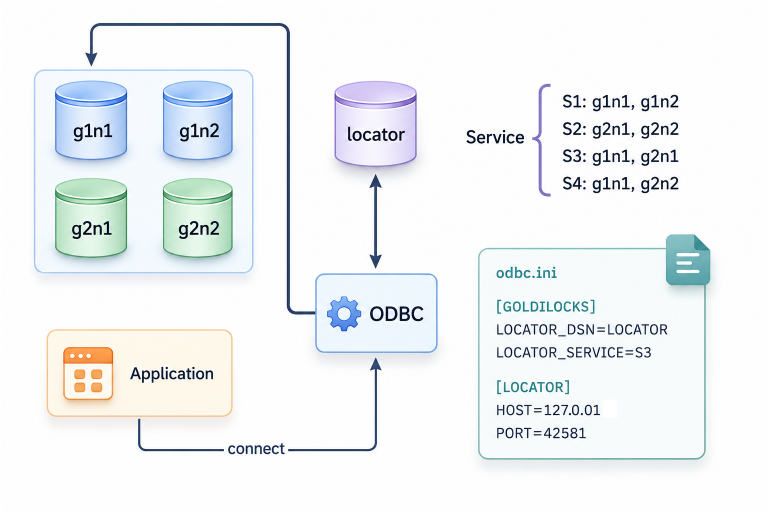

<a id="ad25c1271ccf5dff"></a>

# 51. glocator

> 원본: [GOLDILOCKS 26c.1 User Manual (ko)](https://manual.sunjesoft.co.kr/goldilocks/26c_1/manual/ko/ad25c1271ccf5dff)  
> 태그: `26c.1_0_tag`

[← 50. gtrclogger](50-gtrclogger.md) · [전체 목차](../README.md) · [52. gagent →](52-gagent.md)

<a id="e11da20737c116fc"></a>
## glocator 소개

<a id="f8f28031b1d653b2"></a>
### 정의

glocator는 GOLDILOCKS cluster system에서 client에게 location을 제공하고 관리하는 유틸리티이다.  
glocator 프로그램은 [gloctl](53-gloctl.md#a658035d7767fad3)를 통해 cluster member 노드들의 location 정보를 제공받는다.  
glocator는 client, gloctl와 UDP 통신을 하고 gagent와 TCP 통신을 한다.

> glocator가 필요로 하는 location 정보는 listener host, listener port, db home path 이며 gloctl을 통해 이 정보들을 제공받는다.

<a id="db564e720573a1fb"></a>
### 사용법

```
glocator [options]
```

<a id="b153a2f8d90570cc"></a>
### Option

<a id="d288472fa2f8b6a7"></a>
#### help

<a id="f61b249eb19ad950"></a>
##### 설명

Help 메시지를 출력한다.

<a id="7b00de2fd804a583"></a>
##### 사용 예

```
$ glocator --help

Usage:
 glocator [options]

Options:

-c  --create       Create glocator environment
-s  --start        Start glocator
-t  --stop         Stop glocator
-f  --conf         Set configure file
-u  --status       Get glocator status
-y  --sync         Synchronize with alternate glocator(BOTH, SOURCE)
-l  --silent       Suppress display message
-r  --no-copyright Suppress display copy right and version
-h  --help         Print help message
```

<a id="681cd503ea99a24b"></a>
#### create

<a id="ea547274a2ff162d"></a>
##### 설명

glocator의 데이터 파일을 생성한다.

<a id="bd0728d3f9e8258e"></a>
##### 사용 예

```
$ glocator --create

glocator is created.
```

> glocator 데이터 파일은 &lt;GOLDILOCKS_DATA&gt;/db 디렉토리에 생성된다.

```
$ ls
README  glocator.dat  system_data.dbf  system_dict.dbf  system_undo.dbf
```

<a id="b8fe9aa4b233d501"></a>
#### start

<a id="a45bd37f5aba612c"></a>
##### 설명

glocator를 구동한다. 같은 port를 갖는 glocator가 이미 구동 중이라면 에러가 발생한다.

<a id="fbfb98576781521d"></a>
##### 사용 예

```
$ glocator --start

glocator is started.
```

<a id="9fb3210c6d216486"></a>
#### stop

<a id="1ae1cdc94cae8fe8"></a>
##### 설명

구동 중인 glocator를 정지시킨다. 구동 중인 glocator를 멈추려면 같은 port가 설정되어야 한다.

<a id="1222fc0383b19df3"></a>
##### 사용 예

```
$ glocator --stop

glocator is stopped.
```

<a id="ccab45bd355165e3"></a>
#### conf

<a id="5cd3affc5721acbe"></a>
##### 설명

glocator를 구동할 때 configure file을 설정한다.

<a id="1c2c01bdf09595b0"></a>
##### 사용 예

```
$ glocator --start --conf goldilocks.glocator.conf

glocator is started.
```

<a id="7660241fa628b207"></a>
#### status

<a id="8879677f4956ab4f"></a>
##### 설명

구동 중인 glocator의 상태 메시지를 출력한다. 구동 중인 glocator 상태를 확인하려면 같은 port가 설정 되어야 한다.

<a id="8ccb3669da43d0df"></a>
##### 사용 예

```
$ glocator --status

Process ID: 26058
Configuration file: goldilocks.glocator.conf
Unix domain path: /tmp/unix-glocator.42581
Udp listen host: 0.0.0.0, Port: 42581
glocator is running.
```

<a id="9b6a64cefee9396a"></a>
#### sync

<a id="2305fc3bfaa15581"></a>
##### 설명

ALTERNATE_LOCATOR와 연결하고 데이터를 동기화 한다.

데이터 동기화는 두 glocator의 데이터를 병합하는데, 충돌하는 데이터가 있는 경우 데이터가 생성된 시간을 기준으로 더 최신의 데이터를 사용한다.

<a id="4eb8d46ab0dbe733"></a>
##### 사용 예

다음은 sync 옵션을 사용하는 예이다.

```
$ glocator --start --sync

glocator is started.
```

다음은 sync 옵션에 실패하는 예이다. configure 파일에 ALTERNATE_LOCATOR 속성 값이 설정되지 않았다.

```
$ glocator --start --sync

ERR-HY000(60016): Need more alternate locator host information.
```

<a id="5fa4f8da81a2a746"></a>
#### silent

<a id="ab46b8e8a477d5fb"></a>
##### 설명

실행에 대한 glocator의 메시지를 출력하지 않는다.

<a id="e631c8c7cae482dd"></a>
##### 사용 예

```
$ glocator --start --silent
```

<a id="2e680ef2ded691c6"></a>
#### no-copyright

<a id="9b5b93718515af2a"></a>
##### 설명

실행에 대한 glocator의 copy right와 버전 메시지를 출력하지 않는다.

<a id="79a6166acfd3771b"></a>
##### 사용 예

```
$ glocator --start --no-copyright

glocator is started.
```

<a id="39f6f62b3ca4fffd"></a>
## glocator 사용

<a id="7c06641cd12f9c59"></a>
### 데이터 파일

glocator를 구동하려면 시작하기 전에 glocator 데이터 파일을 먼저 생성해야 한다.

```
$ glocator --create

glocator is created.
```

glocator 데이터 파일이 저장되는 디렉토리는 configuration [LOCATION_FILE_DIR](#77d5c67f2b229ac1)을 수정하여 변경할 수 있다. 기본값은 &lt;GOLDILOCKS_DATA&gt;/db에 생성된다. 데이터 파일은 [LOCATION_FILE_NAME](#86e4d88bfb5dff0a) 을 수정하여 변경할 수 있다. 기본값은 glocator.dat이다.

glocator 데이터 파일의 최대 크기와 초기 크기는 configuration [LOCATION_FILE_MAX_SIZE](#7136df4067b4fdb2)와 [LOCATION_FILE_SIZE](#d2d0d780a4128655)를 수정하여 변경할 수 있다.

<a id="3cc1f447dd5bc362"></a>
### CSTARTUP과 CSHUTDOWN

glocator는 GOLDILOCKS 서버의 CSTARTUP과 CSHUTDOWN에 사용될 수 있다.  
이를 위해서는 glocator가 구동 중이고 gsqlnet을 통해 CSTARTUP 또는 CSHUTDOWN 명령을 실행해야 한다.  
다만, gsqlnet을 실행하는 장비의 odbc.ini에 LOCATOR_DSN과 속성값이 설정되어 있어야 한다.    
자세한 내용은 [GOLDILOCKS UNIX ODBC driver 라이브러리](../part-05-developer-manual/34-odbc.md#92cf7bc9ddbb61c6)를 참조한다.

다음은 glocator를 사용하기 위해 odbc.ini에 설정한 내용이다.

```
[GOLDILOCKS]
HOST=127.0.0.1
PORT=20101
UID=sys
PWD=gliese
LOCATOR_DSN=GLOCATOR

[GLOCATOR]
HOST=127.0.0.1
PORT=42581
```

> DSN [GLOCATOR]에 FILE 속성이 있으면 glocator 대신 FILE 속성에 명시된 파일을 우선해서 사용하므로 FILE 속성을 제외해야 한다.

CSTARTUP과 CSHUTDOWN 명령을 실행하려면 glocator가 member 노드들에 대한 location 정보를 알고 있어야 한다.

<a id="198e23e6d7fd28c0"></a>
### 이중화

<a id="fbe5cc8b7d54cbe2"></a>
#### 개요

glocator 이중화는 데이터를 일관성있게 유지하고, 서비스 중 장애가 발생할 경우 원격 glocator를 사용한 지속적인 서비스를 가능하게 한다.

<a id="347d34f034746923"></a>
#### 설정

이중화를 사용하기 위해서는 configuration file에 ALTERNATE_LOCATOR 속성을 설정해야 한다. 해당 속성에는 locator name이 기술되어야 하고, 설정된 locator name은 HOST, PORT 속성과 함께 configuration file에 존재해야 한다. Master glocator는 ALTERNATE_LOCATOR 속성을 작성하지 않아도 되지만, 만약 작성한다면 sub glocator의 HOST, PORT 속성과 일치해야 한다.

ALTERNATE_LOCATOR 속성은 다음과 같이 설정할 수 있다.

```
[LOCATOR]
ALTERNATE_LOCATOR = locator_name1
[locator_name1]
HOST= ip_address
PORT = port_num
```

다음은 ALTERNATE_LOCATOR 속성을 설정하는 configure 파일의 예이다.

```
[LOCATOR]
PORT=42581
SYNC_RESPONSE_TIMEOUT = 2
SYNC_RETRY_COUNT = 2
LOCATION_FILE_NAME='glocator_1.dat'
ALTERNATE_LOCATOR=LOCATOR_2

[LOCATOR_2]
HOST=127.0.0.1
PORT=42582
```


> 
> - [LOCATOR]는 glocator가 기본값으로 읽어들이는 DSN이다.
> - glocator와 관련된 ODBC와 gagent 설정에 대한 자세한 내용은 [odbc.ini 파일](../part-05-developer-manual/34-odbc.md#1edb504add88d834), [ALTERNATE_LOCATOR](52-gagent.md#6516869ff8ad95b4)를 참조한다.
> 

<a id="98d19d91a7e0ce7d"></a>
#### 데이터 동기화

이중화된 glocator를 서비스할 때 데이터는 일관되게 유지되어야 한다. 기존에 작동 중인 glocator가 없을 경우, 모든 glocator는 일반 시작을 하면 된다. 기존에 동작 중인 glocator가 있을 경우, [sync](#9b6a64cefee9396a) 옵션을 사용하여 데이터를 동기화하는 방법으로 alternate glocator와 연결할 수 있다.

[sync](#9b6a64cefee9396a) 옵션을 사용하면 두 glocator의 데이터는 병합된다. 서로 일치하지 않는 중복 데이터는 새로 갱신된 데이터로 덮어 쓰여진다.

glocator 서비스 중 데이터가 변경되면 데이터 동기화를 시도한다. 하지만 패킷 손실 등의 이유로 동기화에 실패하면 데이터 간에 차이가 발생할 수 있다. 이 경우, [gloctl](53-gloctl.md#46c88c3f586b1d6f) 프로그램을 사용하여 해당 glocator에서 직접 데이터를 수정하거나, sync 옵션을 사용해 glocator를 다시 시작할 수 있다.

<a id="ed9c6bf04f333228"></a>
#### 이중화와 gagent

glocator 이중화는 master와 sub (substitute)로 구분된다. 이 구분은 시작한 순서에 따라 결정된다. 늦게 시작된 sub glocator는 [sync](#9b6a64cefee9396a) 옵션을 사용해야 먼저 시작된 master glocator와 연결될 수 있다.

gagent는 반드시 master와 연결되어야 한다. 이는 gagent가 분산되지 않도록 하기 위함이다. gagent가 연결하려는 glocator가 sub일 경우, 연결을 끊고 master로 조정되어 연결된다.

<a id="dccd23f93065542b"></a>
## 기능

<a id="ddbb37a836d3c1cc"></a>
### Connection Service

Cluster 환경에서 특정 노드에 대한 location 정보를 알지 못해도 사용자가 정한 몇 개의 노드 중에 임의로 접속할 수 있도록 service 기능을 제공한다.

Service 기능은 glocator에서 관리하는 노드를 사용자가 임의의 그룹으로 지정하는 것이다. 이 service는 gloctl 프로그램을 사용하여 등록할 수 있다. glocator에서 관리하는 서비스 목록 역시 gloctl 프로그램을 사용하여 확인할 수 있다.

응용 프로그램은 ODBC 드라이버를 사용하여 접속해야 하며 [odbc.ini 파일](../part-05-developer-manual/34-odbc.md#1edb504add88d834)에 LOCATOR_DSN과 LOCATOR_SERVICE 속성을 지정해야 한다.

<a id="795f9d7e6af75d0b"></a>


위 그림은 응용 프로그램 (application)이 service s3에 속한 g1n1에 접속한 내용이다. ODBC 드라이버가 service를 이용하여 연결하는 순서는 service에 등록된 노드 순서와 동일하다. 위의 예에서 ODBC 드라이버가 g1n1에 연결하는데 실패하면 다음 순서인 노드 g2n1에 연결을 시도할 것이다.

> Service 기능을 사용하려면 glocator에 노드의 유효한 location 정보가 먼저 입력되어야 한다.

<a id="027f7ef35b3a087b"></a>
### Cluster Failover

glocator는 server가 failover를 진행할 때 도움이 된다.

Server 프로퍼티 [CLUSTER_SPLIT_BRAIN_RESOLUTION_POLICY](../part-02-administration-manual/10-server-property.md#5165de282789b915) 값이 1 또는 2로 설정되고, cluster 환경에서 노드 간에 연결이 끊어져 failover가 발생하면 각 노드는 cluster failover를 진행하여 gagent를 통해 glocator에게 자신의 viability를 질의한다.

질의를 받은 glocator는 연결이 끊어진 두 노드의 viability를 판단하고 질의를 한 gagent에 결과를 전달한다.

Viabilty 결과를 받은 노드는 종료되거나 failover를 진행한다.

> Server의 cluster failover 처리 시간은 여러 프로퍼티와 상관 관계가 있다.   
> Server 프로퍼티 [LOCATOR_QUERY_TIMEOUT](../part-02-administration-manual/10-server-property.md#286669eedd5ba8bb)은 server가 glocator에게 질의한 후에 응답을 기다리는 시간으로서 기본값은 20초로 설정되어 있다.  
> Server 프로퍼티 [CLUSTER_SPLIT_BRAIN_RETRY_COUNT](../part-02-administration-manual/10-server-property.md#4efadad9e0fc200e)는 glocator로부터 응답을 받지 못했을 때 다시 질의하는 횟수로서 cluster failover 처리 시간과 관계가 있다. 기본값은 1이다.

<a id="598bfe1e3338415a"></a>
## glocator Configuration

<a id="873c000f593741c1"></a>
### Configuration File 및 환경 변수

glocator는 configuration을 설정하기 위해 file 또는 환경 변수를 사용할 수 있다.

환경 변수는 configuration property name에 prefix로 'LOCATOR_'를 추가한 name을 사용하여 지정할 수 있다. 예를 들어 configuration file에 HOST를 설정하면 $LOCATOR_HOST를 지정하는 것과 같은 효과가 있다.

Configuration file 내용은 환경 변수 설정값보다 우선한다.

glocator는 DSN을 [LOCATOR] 기본값으로 하여 configuration file을 읽는다.

glocator는 $GOLDILOCKS_DATA/conf/goldilocks.glocator.conf 파일을 자신의 환경 파일로 가지고 있다. glocator의 구동 환경을 변경하려면 해당 파일의 내용을 변경하거나 환경 변수를 설정하고 glocator를 구동하면 된다.

<a id="e61c31249cbe1d59"></a>
### Configuration Property

<a id="4dbe2adba88bb637"></a>
#### HOST

<a id="68fc56205903727f"></a>
| 항목 | 설명 |
| --- | --- |
| 이름 | HOST |
| 설명 | glocator가 bind 하는 IP address이다. |
| Data type | ip address (ip v4) |
| 기본값/ 범위 | 0.0.0.0 |

glocator가 UDP 통신을 위해 bind하는 IP address이다.   
IP v4 형식의 IP address를 사용한다.

<a id="1f722b6b3731ba8b"></a>
#### PORT

<a id="30f1f7ace02d9374"></a>
| 항목 | 설명 |
| --- | --- |
| 이름 | PORT |
| 설명 | glocator가 Recv를 기다리는 port이다. |
| Data type | INT |
| 기본값/ 범위 | 42581 / 1024~49151 |

glocator가 UDP 통신으로 packet을 받는 port이다.   
Port는 1024부터 49151까지 사용할 수 있다.

<a id="cd4043f855786355"></a>
#### WORKER_COUNT

<a id="07b3de177e26854d"></a>
| 항목 | 설명 |
| --- | --- |
| 이름 | WORKER_COUNT |
| 설명 | Job을 처리하는 thread의 개수이다. |
| Data type | INT |
| 기본값/ 범위 | 1 / 1~8 |

glocator가 client 또는 내부 프로세스로부터 받은 packet을 처리하는 thread의 개수이다.

<a id="98a9dce9f79f6615"></a>
#### MAX_NODE_COUNT

<a id="9f39d0885dc2bc90"></a>
| 항목 | 설명 |
| --- | --- |
| 이름 | MAX_NODE_COUNT |
| 설명 | 연결 가능한 gagent의 최대 개수이다. |
| Data type | INT |
| 기본값/ 범위 | 64 / 1~8192 |

연결 가능한 gagent의 최대 개수이다.

<a id="272a689bf562c526"></a>
#### MESSAGE_QUEUE_SIZE

<a id="d607ab5d6fe1c374"></a>
| 항목 | 설명 |
| --- | --- |
| 이름 | MESSAGE_QUEUE_SIZE |
| 설명 | 수신한 packet을 처리하기 전까지 저장하는 queue size이다. |
| Data type | INT |
| 기본값/ 범위 | 33554432 / 10485760~2147483648 |

glocator가 client나 내부 프로세스로부터 받은 packet을 처리하기 전에 저장하는 queue의 size이다.  
Queue에는 packet이 message 단위의 단일 item으로 저장된다.

<a id="86e399c8cc144302"></a>
#### MESSAGE_ALLOCATOR_SIZE

<a id="1b9c5502d034a70d"></a>
| 항목 | 설명 |
| --- | --- |
| 이름 | MESSAGE_ALLOCATOR_SIZE |
| 설명 | Message queue에 저장되는 item을 할당하는 allocator size이다. |
| Data type | INT |
| 기본값/ 범위 | 33554432 / 10485760~2147483648 |

Message queue에 저장되는 item (message)을 할당할 때 사용되는 allocator의 size이다.

<a id="38d63b3d733ac934"></a>
#### PACKET_ALLOCATOR_SIZE

<a id="5ac6e0835f590ca4"></a>
| 항목 | 설명 |
| --- | --- |
| 이름 | PACKET_ALLOCATOR_SIZE |
| 설명 | UDP 통신으로 packet을 받을 때 packet을 할당하는 allocator size이다. |
| Data type | INT |
| 기본값/ 범위 | 33554432 / 10485760~2147483648 |

glocator가 packet을 받기 위해 할당하는 buffer를 위한 allocator의 size이다.

<a id="36b9b78ce6e0e4d8"></a>
#### SYSTEM_LOGGER_DIR

<a id="2856424f788160ed"></a>
| 항목 | 설명 |
| --- | --- |
| 이름 | SYSTEM_LOGGER_DIR |
| 설명 | glocator의 trace log file의 directory path이다. |
| Data type | String |
| 기본값/ 범위 | &lt;GOLDILOCKS_DATA&gt;/trc |

glocator의 system trace log file이 저장되는 directory path이다. 기본값의 &lt;GOLDILOCKS_DATA&gt;는 $GOLDILOCKS_DATA 환경 변수 값으로 대체된다.

<a id="0d82d342244c6aff"></a>
#### SYSTEM_UDS_DIR

<a id="9503da20185facc4"></a>
| 항목 | 설명 |
| --- | --- |
| 이름 | SYSTEM_UDS_DIR |
| 설명 | glocator에서 사용되는 unix domain socket 파일이 저장되는 directory path이다. |
| Data type | String |
| 기본값/ 범위 | /tmp (최대 60 byte) |

glocator에서 사용되는 unix domain socket 파일이 저장되는 directory path를 설정한다. Directory 최대 길이는 60 byte 이내로 설정해야 한다.

<a id="77d5c67f2b229ac1"></a>
#### LOCATION_FILE_DIR

<a id="14754362d0192323"></a>
| 항목 | 설명 |
| --- | --- |
| 이름 | LOCATION_FILE_DIR |
| 설명 | glocator에서 사용되는 location 파일이 저장되는 directory path이다. |
| Data type | String |
| 기본값/ 범위 | &lt;GOLDILOCKS_DATA&gt;/db |

glocator에서 사용되는 location 파일이 저장되는 directory path를 설정한다.

<a id="86e4d88bfb5dff0a"></a>
#### LOCATION_FILE_NAME

<a id="2524f70686ec68f8"></a>
| 항목 | 설명 |
| --- | --- |
| 이름 | LOCATION_FILE_NAME |
| 설명 | glocator에서 사용되는 location 파일 이름이다. |
| Data type | String |
| 기본값/ 범위 | glocator.dat |

glocator에서 사용되는 location 파일 이름을 설정한다.   
기본값은 glocator.dat 이다.

<a id="d2d0d780a4128655"></a>
#### LOCATION_FILE_SIZE

<a id="a7e02f36616314fd"></a>
| 항목 | 설명 |
| --- | --- |
| 이름 | LOCATION_FILE_SIZE |
| 설명 | Location 파일의 초기 size이다. |
| Data type | Int |
| 기본값/ 범위 | 1048576 / 104576~2147483648 |

glocator에서 사용되는 location 파일의 초기 size를 설정한다.

<a id="7136df4067b4fdb2"></a>
#### LOCATION_FILE_MAX_SIZE

<a id="58b08312e4c5c38e"></a>
| 항목 | 설명 |
| --- | --- |
| 이름 | LOCATION_FILE_MAX_SIZE |
| 설명 | Location 파일의 최대 size이다. |
| Data type | Int |
| 기본값/ 범위 | 10485760 / 104576~2147483648 |

glocator에서 사용되는 location 파일의 최대 size를 설정한다.

<a id="94ee9342049cf117"></a>
#### MESSAGE_TIMEOUT

<a id="e292e17efb3552a4"></a>
| 항목 | 설명 |
| --- | --- |
| 이름 | MESSAGE_TIMEOUT |
| 설명 | glocator가 packet을 수신하기 위해 최대로 대기하는 시간을 설정한다. |
| Data type | Int |
| 기본값/ 범위 | 100 / 0 ~2147483648 (second 단위) |

glocator가 packet을 수신하기 위해 최대로 대기하는 시간 (초)을 설정한다. 처리되지 못하고 시간 초과된 packet은 버려진다.

<a id="657f7fb6015f6833"></a>
#### ALTERNATE_LOCATOR

<a id="29ae13b1472852f3"></a>
| 항목 | 설명 |
| --- | --- |
| 이름 | ALTERNATE_LOCATOR |
| 설명 | glocator의 alternate locator, 다중화 설정을 한다. |
| Data type | String |
| 기본값/ 범위 | empty / 0 ~ 1024 bytes |

glocator의 [다중화](#198e23e6d7fd28c0)를 설정한다.

<a id="c16789a7a57dc8de"></a>
#### SYNC_RETRY_COUNT

<a id="939af7fb3cd43c12"></a>
| 항목 | 설명 |
| --- | --- |
| 이름 | SYNC_RETRY_COUNT |
| 설명 | glocator가 alternate locator와의 동기화 작업에 실패할 경우 다시 시도하는 횟수를 설정한다. |
| Data type | Int |
| 기본값/ 범위 | 1 / 0 ~ 5 |

glocator 동기화 작업의 재전달 횟수를 설정한다.

데이터가 변경되었을 때 glocator는 alternate locator에 변경된 데이터를 전달하는데, 데이터를 전달한 후에 응답을 받지 못하면 다시 전달한다.

<a id="b38d70c273876bd0"></a>
#### SYNC_RESPONSE_TIMEOUT

<a id="a7d2b7b2bd46003c"></a>
| 항목 | 설명 |
| --- | --- |
| 이름 | SYNC_RESPONSE_TIMEOUT |
| 설명 | glocator 동기화 작업에 대한 응답 대기 시간을 설정한다. |
| Data type | Int |
| 기본값/ 범위 | 5 / 1 ~ 20 |

glocator가 전달한 동기화 데이터에 대한 응답을 기다리는 시간을 설정한다.

<a id="f8cb7665c8a0323a"></a>
#### KEEPALIVE_IDLE_TIME

<a id="e4f25eb01da84877"></a>
| 항목 | 설명 |
| --- | --- |
| 이름 | KEEPALIVE_IDLE_TIME |
| 설명 | tcp keepalive idle time for checking dead client session (sec) |
| Data type | INT |
| 기본값/ 범위 | 1 / 1 ~ 16383 |

Keep alive packet을 송신하기 전에 TCP 패킷이 송수신 되지 않는 상태로 지속되는 시간 (idle) 이다. 즉, KEEPALIVE_IDLE_TIME에 설정된 초 동안 TCP 패킷 교환이 이루어지지 않으면 dead connection을 감지하기 위해 keep alive mechanism을 수행한다.

<a id="7e7a3cbfa939f765"></a>
#### KEEPALIVE_COUNT

<a id="3a2c2fff437aa71a"></a>
| 항목 | 설명 |
| --- | --- |
| 이름 | KEEPALIVE_COUNT |
| 설명 | tcp keepalive check count |
| Data type | INT |
| 기본값/ 범위 | 5 / 1 ~ 10 |

Keep alive mechanism을 수행하는 횟수이다.

<a id="37d91dfd09bb978f"></a>
#### KEEPALIVE_INTERVAL

<a id="70c7dc59518a3d6d"></a>
| 항목 | 설명 |
| --- | --- |
| 이름 | KEEPALIVE_INTERVAL |
| 설명 | tcp keepalive packet interval (sec) |
| Data type | INT |
| 기본값/ 범위 | 5 |

Keep alive 패킷을 전송하는 시간 간격이다.

---

[← 50. gtrclogger](50-gtrclogger.md) · [전체 목차](../README.md) · [52. gagent →](52-gagent.md)

<sub>Copyright © 2010 SUNJESOFT Inc. All rights reserved.</sub>
