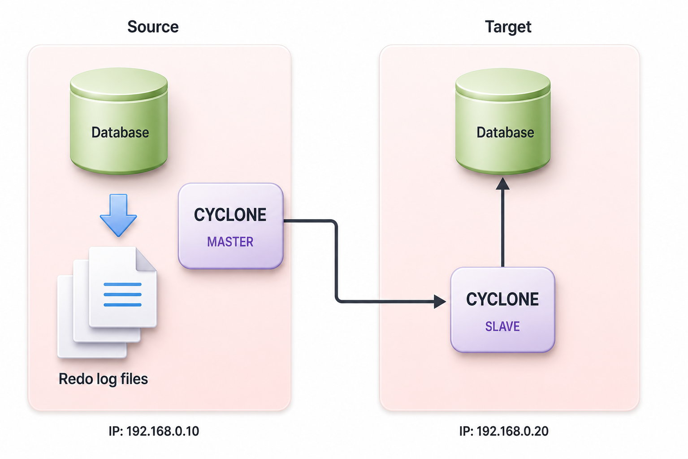

<a id="6bfdb1f20080b551"></a>

# 55. CYCLONE

> 원본: [GOLDILOCKS 26c.1 User Manual (ko)](https://manual.sunjesoft.co.kr/goldilocks/26c_1/manual/ko/6bfdb1f20080b551)  
> 태그: `26c.1_0_tag`

[← 54. 개요](54-개요.md) · [전체 목차](../README.md) · [56. LOGMIRROR →](56-logmirror.md)

<a id="173284f311407b50"></a>
## CYCLONE

CYCLONE은 Change Data Capture (CDC) 방식을 사용하는 이중화 툴이다.

<a id="f87b2f36314f159a"></a>
### 개요

데이터베이스는 복구작업을 위해 운영 중에 발생하는 데이터 갱신사항을 redo log file에 기록한다. CDC는 이런 redo log file에 기록되는 내용을 분석하여 이중화를 수행하는 방식이다.

CYCLONE은 master와 slave로 나뉘어져 구동된다. Master는 원본 데이터베이스의 redo log file의 갱신사항을 인식하고 분석하여 slave로 전송한다. Slave는 수신된 데이터를 분석하고 ODBC를 이용하여 이중화를 수행한다.

<a id="2c111d55fa65aa24"></a>
### 운영상 특징

- Master와 slave로 구분되어 수행되며 group 단위의 master/ slave로 동작한다.
- CYCLONE의 master와 slave는 TCP/ IP 통신을 사용한다.
- Group 단위로 실행/ 종료할 수 있다.
- 이중화는 table 단위로 이루어지며 group 내에는 한 개 이상의 table이 포함될 수 있다.
- 하나의 table은 여러 개의 group에 포함되어 운영될 수 있다.
- 원본 데이터베이스에는 반드시 redo log file이 있어야 한다. 즉, DATA_STORE_MODE는 TDS로 운영되어야 한다. 
- 원본 데이터베이스에는 반드시 SUPPLEMENTAL LOGGING이 있어야 한다.
    - SUPPLEMENTAL LOGGING은 CYCLONE 이중화를 위해 redo log file에 부가적인 정보를 추가한다. 
- 원본 데이터베이스는 ARCHIVE LOG 모드로 운영되어야 한다.
    - GOLDILOCKS는 redo log file을 recursive하게 재사용한다. 만약 이중화가 완료되지 않은 상황에서 redo log file이 재사용될 경우, 이중화는 종료되며 현재 시점부터 기존의 이중화 상태를 포기하고 재시작해야 한다. 따라서 ARCHIVE LOG 모드로 운영하여 해당 redo log file이 아카이빙되도록 해야 한다.
- GOLDILOCKS와 독립적인 process로 동작하므로 이중화 장애가 발생하더라도 GOLDILOCKS에 영향을 미치지 않는다.

<a id="104a41029409c1d6"></a>
### 운영 시 제약사항

- 이중화에 참여하는 table은 반드시 PRIMARY KEY를 가져야 한다.
- Commit 된 transaction만 이중화한다. 따라서 commit 전에는 slave에서 해당 내용을 확인할 수 없다.
- rid type은 지원하지 않는다.
- Primary key update는 지원하지 않는다. 
    - Primary key 값이 갱신되는 경우, 해당 table은 give up 되며 더 이상 이중화 대상이 되지 않는다.
- 이중화에 참여하는 table은 Generated Always As Identity 속성을 갖는 column을 사용할 수 없다.
- 이중화에 참여하는 table은 Deferred Constraint를 사용할 수 없다.
- 이중화가 진행 중인 table에 Data Definition Language (DDL)이 수행된 경우 give up 될 수 있다.
    - Table1의 [DDL 구문에 따른 give up 발생 및 절차에 따른 허용 여부](#0c96c385c72c2d01)를 참조한다.
    - CYCLONE의 table DDL 처리 절차에 따르지 않은 경우, 허용 가능한 DDL이라 하더라도 give up 된다.
    - 다른 table의 이중화에는 영향을 미치지 않는다.
    - Truncate table 또한 마찬가지이다.
- Give up 된 table 중에 --reset TABLE_NAME으로 give up된 table만 reset 할 수 있다.
- 이중화 하는 table을 구성하는 column은 동일한 구조 (데이터 타입, 순서)를 가져야 한다.
- 이중화를 수행하는 데이터베이스는 동일한 character encoding을 가져야 한다.
- 휴지통에 보관된 table은 이중화 대상이 되지 않는다.
- 이중화 구성 시, slave DB에서는 foreign key와 trigger 제약 조건이 강제로 비활성화 된다.
    - 이중화 운영 중 사용자의 임의 종료나 network 단절 등으로 인해 이중화가 중단될 경우, master와 slave 간의 데이터가 불일치 할 수 있으며, 이때 slave DB에는 foreign key, trigger와 같은 제약 조건이 비활성화된 상태로 인해 제약 조건을 위반한 데이터가 존재할 수 있다.
    - Slave DB의 제약 조건을 다시 활성화하려면 사용자가 데이터를 정제하는 과정이 필요하다. 
        - 이 경우에는 [이중화 종료 시 Slave DB의 Foreign Key 제약 조건 위반에 대한 대처 방안](#c7acd73515dfe7b1)을 참조한다.

<a id="0c96c385c72c2d01"></a>
<table class="table column_count_4"><caption>DDL 구문에 따른 give up 발생 및 절차에 따른 허용 여부</caption><thead><tr><th class="to_center to_middle"><div>DDL 분류</div></th><th class="to_center to_middle"><div>Give up 발생 여부</div></th><th class="to_center"><div>절차에 따른 
DDL 허용 여부</div></th><th class="to_center to_middle"><div>DDL 구문</div></th></tr></thead><tbody><tr><td class="to_middle" rowspan="8"><div>Table DDL</div></td><td class="to_center to_middle"><div>X</div></td><td class="to_center to_middle"><div>-</div></td><td class="to_middle"><div>CREATE TABLE</div></td></tr><tr><td class="to_center to_middle"><div>O</div></td><td class="to_center to_middle"><div>X</div></td><td class="to_middle"><div>DROP TABLE</div></td></tr><tr><td class="to_center to_middle"><div>O</div></td><td class="to_center to_middle"><div>X</div></td><td class="to_middle"><div>TRUNCATE TABLE</div></td></tr><tr><td class="to_center to_middle"><div>O</div></td><td class="to_center to_middle"><div>X</div></td><td class="to_middle"><div>ALTER TABLE .. RENAME</div></td></tr><tr><td class="to_center to_middle"><div>X</div></td><td class="to_center to_middle"><div>-</div></td><td class="to_middle"><div>ALTER TABLE .. STORAGE</div></td></tr><tr><td class="to_center to_middle"><div>X</div></td><td class="to_center to_middle"><div>-</div></td><td class="to_middle"><div>ALTER TABLE .. ADD SUPPLEMENTAL LOG</div></td></tr><tr><td class="to_center to_middle"><div>O</div></td><td class="to_center to_middle"><div>X</div></td><td class="to_middle"><div>ALTER TABLE .. DROP SUPPLEMENTAL LOG</div></td></tr><tr><td class="to_center to_middle"><div>X</div></td><td class="to_center to_middle"><div>-</div></td><td class="to_middle"><div>ALTER TABLE .. READ { ONLY | WRITE }</div></td></tr><tr><td class="to_middle" rowspan="10"><div>Column DDL</div></td><td class="to_center to_middle"><div>O</div></td><td class="to_center to_middle"><div>O</div></td><td class="to_middle"><div>ALTER TABLE .. ADD COLUMN</div></td></tr><tr><td class="to_center to_middle"><div>O</div></td><td class="to_center to_middle"><div>X</div></td><td class="to_middle"><div>ALTER TABLE .. SET UNUSED COLUMN</div></td></tr><tr><td class="to_center to_middle"><div>O</div></td><td class="to_center to_middle"><div>-</div></td><td class="to_middle"><div>ALTER TABLE .. RENAME COLUMN</div></td></tr><tr><td class="to_center to_middle"><div>X</div></td><td class="to_center to_middle"><div>-</div></td><td class="to_middle"><div>ALTER TABLE .. ALTER COLUMN .. SET DEFAULT</div></td></tr><tr><td class="to_center to_middle"><div>X</div></td><td class="to_center to_middle"><div>-</div></td><td class="to_middle"><div>ALTER TABLE .. ALTER COLUMN .. DROP DEFAULT</div></td></tr><tr><td class="to_center to_middle"><div>O</div></td><td class="to_center to_middle"><div>X</div></td><td class="to_middle"><div>ALTER TABLE .. ALTER COLUMN .. SET NOT NULL</div></td></tr><tr><td class="to_center to_middle"><div>O</div></td><td class="to_center to_middle"><div>X</div></td><td class="to_middle"><div>ALTER TABLE .. ALTER COLUMN .. DROP NOT NULL</div></td></tr><tr><td class="to_center to_middle"><div>O</div></td><td class="to_center to_middle"><div>X</div></td><td class="to_middle"><div>ALTER TABLE .. ALTER COLUMN .. ALTER IDENTITY</div></td></tr><tr><td class="to_center to_middle"><div>O</div></td><td class="to_center to_middle"><div>X</div></td><td class="to_middle"><div>ALTER TABLE .. ALTER COLUMN .. DROP IDENTITY</div></td></tr><tr><td class="to_center to_middle"><div>O</div></td><td class="to_center to_middle"><div>O</div></td><td class="to_middle"><div>ALTER TABLE .. ALTER COLUMN .. SET DATATYPE</div></td></tr><tr><td class="to_middle" rowspan="10"><div>Constraint DDL</div></td><td class="to_center to_middle"><div>O</div></td><td class="to_center to_middle"><div>X</div></td><td class="to_middle"><div>ALTER TABLE .. ADD CONSTRAINT .. PRIMARY KEY</div></td></tr><tr><td class="to_center to_middle"><div>O</div></td><td class="to_center to_middle"><div>X</div></td><td class="to_middle"><div>ALTER TABLE .. ADD CONSTRAINT .. UNIQUE KEY</div></td></tr><tr><td class="to_center to_middle"><div>X</div></td><td class="to_center to_middle"><div>-</div></td><td class="to_middle"><div>ALTER TABLE .. ADD CONSTRAINT .. FOREIGN KEY ..</div></td></tr><tr><td class="to_center to_middle"><div>X</div></td><td class="to_center to_middle"><div>-</div></td><td class="to_middle"><div>ALTER TABLE .. ADD CONSTRAINT .. CHECK ( .. )</div></td></tr><tr><td class="to_center to_middle"><div>O</div></td><td class="to_center to_middle"><div>X</div></td><td class="to_middle"><div>ALTER TABLE .. DROP .. PRIMARY KEY</div></td></tr><tr><td class="to_center to_middle"><div>O</div></td><td class="to_center to_middle"><div>X</div></td><td class="to_middle"><div>ALTER TABLE .. DROP .. UNIQUE KEY</div></td></tr><tr><td class="to_center to_middle"><div>X</div></td><td class="to_center to_middle"><div>-</div></td><td class="to_middle"><div>ALTER TABLE .. DROP CONSTRAINT foreign_key</div></td></tr><tr><td class="to_center to_middle"><div>X</div></td><td class="to_center to_middle"><div>-</div></td><td class="to_middle"><div>ALTER TABLE .. DROP CONSTRAINT</div></td></tr><tr><td class="to_center to_middle"><div>O</div></td><td class="to_center to_middle"><div>X</div></td><td class="to_middle"><div>ALTER TABLE .. ALTER CONSTRAINT</div></td></tr><tr><td class="to_center to_middle"><div>X</div></td><td class="to_center to_middle"><div>-</div></td><td class="to_middle"><div>ALTER TABLE .. RENAME CONSTRAINT</div></td></tr><tr><td class="to_middle" rowspan="6"><div>Index DDL</div></td><td class="to_center to_middle"><div>O</div></td><td class="to_center to_middle"><div>X</div></td><td class="to_middle"><div>CREATE UNIQUE INDEX</div></td></tr><tr><td class="to_center to_middle"><div>X</div></td><td class="to_center to_middle"><div>-</div></td><td class="to_middle"><div>CREATE INDEX</div></td></tr><tr><td class="to_center to_middle"><div>O</div></td><td class="to_center to_middle"><div>X</div></td><td class="to_middle"><div>DROP INDEX unique_index</div></td></tr><tr><td class="to_center to_middle"><div>X</div></td><td class="to_center to_middle"><div>-</div></td><td class="to_middle"><div>DROP INDEX non_unique_index</div></td></tr><tr><td class="to_center to_middle"><div>X</div></td><td class="to_center to_middle"><div>-</div></td><td class="to_middle"><div>ALTER INDEX .. STORAGE</div></td></tr><tr><td class="to_center to_middle"><div>X</div></td><td class="to_center to_middle"><div>-</div></td><td class="to_middle"><div>ALTER INDEX .. RENAME</div></td></tr><tr><td class="to_middle" rowspan="3"><div>Table의 상위 객체</div></td><td class="to_center to_middle"><div>O</div></td><td class="to_center to_middle"><div>X</div></td><td class="to_middle"><div>DROP USER</div></td></tr><tr><td class="to_center to_middle"><div>O</div></td><td class="to_center to_middle"><div>X</div></td><td class="to_middle"><div>DROP SCHEMA</div></td></tr><tr><td class="to_center to_middle"><div>O</div></td><td class="to_center to_middle"><div>X</div></td><td class="to_middle"><div>DROP TABLESPACE</div></td></tr></tbody></table>

> 사용자의 실수를 방지하기 위해, 이중화 give up을 유발하는 DDL을 수행하지 못하도록 [DISABLE_DDL_CDC_GIVEUP](../part-02-administration-manual/10-server-property.md#7b4b33d6b19ca33f) 서버 프로퍼티를 이용해 제어할 수 있다. 또한 [DISABLE_UPDATE_PK_CDC_GIVEUP](../part-02-administration-manual/10-server-property.md#b775fee01e3b2a48) 서버 프로퍼티를 사용하여 primary key 갱신을 비활성화 할 수 있다.

<a id="087650b531e0379b"></a>
### Goldilocks–Cyclone 버전 호환성 제약사항

1. Goldilocks와 Cyclone의 major, minor 버전은 동일해야 한다.
** 버전이 다를 경우 다음과 같은 에러 메시지가 발생한다.
*** ERR-HY000(46073): mismatched major & minor version - server(26.1.X), cyclone(26.2.X)
2. Cyclone의 master와 slave는 동일한 버전을 사용해야 한다.
** 또한, cymon도 Cyclone과 동일한 버전을 사용해야 한다.
** 버전이 다를 경우, 다음과 같은 에러 메시지가 발생한다.
*** ERR-HY000(46019): Protocol error occurred (Master and Slave version information mismatch)
3. 기능 수정, 프로토콜 변경, redo log 구조 변경 등으로 인해 내부 처리 방식이 변경되면 위의 조건을 모두 충족하더라도 호환되지 않는다.
** 호환 가능 여부는 CYCLONE_COMPATIBLE_NUMBER를 기준으로 판단한다.
** 호환되지 않는 경우에는 다음과 같은 에러 메시지가 출력된다.
*** ERR-HY000(46075): Cyclone is not compatible with Server. Server Compatible Number(2001) Cyclone Compatible Number(2002)
*** Server의 CYCLONE_COMPATIBLE_NUMBER는 다음과 같이 조회할 수 있다.
*+ `gSQL> SELECT CYCLONE_COMPATIBLE_NUMBER() FROM DUAL`
*** Cyclone의 CYCLONE_COMPATIBLE_NUMBER는 --help 옵션을 사용하여 조회할 수 있다.

```
$ cyclone --help
 Copyright © 2010 SUNJESOFT Inc. All rights reserved.
 Release 26c 26.1.0 revision(9fcbe37f230)
Info:
 Compatible with GOLDILOCKS version 26.1 and Compatible Number (2001)
```

<a id="196509ff15de6085"></a>
### 이중화 운영 중 DDL 처리

이중화가 수행되고 있는 table에 허용 가능한 DDL을 수행할 경우 반드시 다음 절차를 따라야 한다.

1. Master 측에서 DDL을 수행하기 전에 master와 slave에서 운영 중인 CYCLONE을 모두 종료한다.
** 진행 중인 업무 process는 종료할 필요없다.
** 예: cyclone --master --stop/ cyclone --slave --stop 
2. Master와 slave 양쪽에 DDL을 수행한다. (허용 가능한 DDL 이어야만 한다.)
** 자세한 내용은 [DDL 구문에 따른 give up 발생 및 절차에 따른 허용 여부](#0c96c385c72c2d01)를 참조한다.
3. Master와 slave의 CYCLONE을 다시 기동한다.
** cyclone --master --start .../ cyclone --slave --start ...
** --reset 옵션은 필요하지 않다.
** 다시 구동할 때 1단계에서 종료된 이후부터 recovery를 수행하고 DDL을 처리한다. (Trace log를 참조한다.)

**DDL 적용 절차**

<a id="7e4754bfb8537a10"></a>
| 구분 | MASTER CYCLONE | MASTER DB | SLAVE CYCLONE | SLAVE DB |
| --- | --- | --- | --- | --- |
| 1 | CYCLONE STOP | - | - | - |
| 2 | - | - | CYCLONE STOP | - |
| 3 | - | DDL 수행 | - | - |
| 4 | - | - | - | DDL 수행 |
| 5 | CYCLONE START | - | - | - |
| 6 | - | - | CYCLONE START | - |

> DDL 적용 절차를 정상적으로 수행한 후에 CYCLONE master에서 DDL을 수행한 TABLE이 give up 되었다면 다음 두 가지를 확인해야 한다.  
> 
> 
> 1. Master DB와 slave DB에 수행한 DDL이 모두 동일하고, 수행 후 table의 구조가 동일한지 확인한다. (DDL 수행 순서는 관계없다.)
> 2. 수행한 DDL이 허용 가능한 것인지 확인한다.
> 
>   
> 위와 같은 이유로 table이 give up되었을 경우, table 단위의 reset (예: cyclone --start --master --reset TABLE_NAME)을 사용하여 다시 구동하는 방법으로 give up된 table을 현재 시점부터 다시 이중화해야 한다.

<a id="8d3fef1788d18a28"></a>
### 다른 DBMS와 연동할 때 Datatype 호환성

- CYCLONE slave가 target database를 GOLDILOCKS가 아닌 다른 DBMS로 연동할 때 source database인 GOLDILOCKS 테이블의 column 데이터 타입이 다른 DBMS 테이블의 column 데이터 타입과 정상적으로 매핑되어야 데이터 손실이나 오류를 방지할 수 있다.
- Oracle, MySQL, DB2와 연동할 수 있다.
- 다른 DBMS와 연동할 경우, 허용 가능한 DDL 처리 기능을 사용할 수 없다.

<a id="9f6e300966c4cba9"></a>
#### Oracle

**Oracle 연동 datatype**

<a id="98e0ff8951585fe2"></a>
| GOLDILOCKS | Oracle | 비고 |
| --- | --- | --- |
| Boolean | X | 해당 데이터 타입이 없다. |
| NATIVE_SMALLINT | NUMBER(5) | - |
| NATIVE_INTEGER | NUMBER(10) | - |
| NATIVE_BIGINT | NUMBER(19) | - |
| NATIVE_REAL | BINARY_FLOAT | - |
| NATIVE_DOUBLE | BINARY_DOUBLE | - |
| FLOAT | FLOAT | - |
| SMALLINT | NUMBER(5,0) | - |
| INTEGER | NUMBER(10,0) | - |
| BIGINT | NUMBER(19,0) | - |
| INT2 | NUMBER(5,0) | - |
| INT4 | NUMBER(10,0) | - |
| INT8 | NUMBER(19,0) | - |
| REAL | FLOAT(24) | - |
| DOUBLE | FLOAT(53) | - |
| DOUBLE PRECISION | FLOAT(53) | - |
| FLOAT4 | FLOAT(24) | - |
| FLOAT8 | FLOAT(53) | - |
| DECIMAL | NUMERIC | - |
| NUMBER | NUMBER | - |
| NUMERIC | NUMERIC | - |
| CHAR | CHAR | - |
| VARCHAR | VARCHAR, VARCHAR2 | - |
| BINARY | RAW | - |
| VARBINARY | RAW | - |
| DATE | DATE | - |
| TIME | X | 해당 데이터 타입이 없다. |
| TIMESTAMP | TIMESTAMP | - |
| TIMESTAMP WITH TIMEZONE | X | ODBC driver를 지원하지 않는다. |
| INTERVAL | X | ODBC driver를 지원하지 않는다. |
| LONG VARCHAR | LONG VARCHAR | - |
| LONG VARBINARY | BLOB | - |

- 위의 표에 설명된 것과 같이 다음 네 가지 데이터 타입은 이중화할 수 없다.
    - BOOLEAN
    - TIME
    - TIMESTAMP WITH TIMEZONE
    - INTERVAL

<a id="d605d3a69160e674"></a>
#### MySQL

**MySQL 연동 datatype**

<a id="bda031eab9aa63df"></a>
| GOLDILOCKS | MySQL | 비고 |
| --- | --- | --- |
| Boolean | BOOL, BOOLEAN | MySQL에서 해당되는 타입은 TINYINT(1)의 synonym이다 |
| NATIVE_SMALLINT | SMALLINT | - |
| NATIVE_INTEGER | INT | - |
| NATIVE_BIGINT | BIGINT | - |
| NATIVE_REAL | FLOAT | - |
| NATIVE_DOUBLE | DOUBLE | MySQL에서 해당되는 타입은 DOUBLE PRECISION의 synonym이고 Unsigned를 지원하지 않는다. |
| FLOAT | X | MySQL에서는 precision 53까지만 지원하며 그 이상인 경우에는 데이터에 오차가 발생한다. |
| SMALLINT | SMALLINT | - |
| INTEGER | INTEGER | - |
| BIGINT | BIGINT | - |
| INT2 | SMALLINT | - |
| INT4 | INTEGER | - |
| INT8 | BIGINT | - |
| REAL | REAL | - |
| DOUBLE | DOUBLE | - |
| DOUBLE PRECISION | DOUBLE PRECISION | - |
| FLOAT4 | FLOAT(24) | 데이터 오차가 발생할 수 있다. |
| FLOAT8 | FLOAT(53) | 데이터 오차가 발생할 수 있다. |
| DECIMAL | DECIMAL | - |
| NUMBER | X | - |
| NUMERIC | NUMERIC | - |
| CHAR | TEXT | - |
| VARCHAR | TEXT | - |
| BINARY | VARBINARY | - |
| VARBINARY | VARBINARY | - |
| DATE | DATETIME | - |
| TIME | TIME(6) | Fractional seconds precision 설정시 데이터가 손실되지 않는다. |
| TIMESTAMP | DATETIME(6) | Fractional seconds precision 설정시 데이터가 손실되지 않는다. |
| TIMESTAMP WITH TIMEZONE | X | ODBC driver를 지원하지 않는다. |
| INTERVAL | X | ODBC driver를 지원하지 않는다. |
| LONG VARCHAR | TEXT | - |
| LONG VARBINARY | BLOB | - |

- 위의 표에 설명된 것과 같이 다음 네 가지 데이터 타입은 이중화할 수 없다.
    - FLOAT
    - NUMBER
    - TIMESTAMP WITH TIMEZONE
    - INTERVAL

> Mysql 설정 중 'lower_case_table_names'가 '0'으로 설정된 경우, 스키마/ 테이블 이름의 대소문자를 구분하므로 환경 파일을 명세할 때 스키마/ 테이블 이름에 double quotation (")을 사용해야 한다.

<a id="3a1644540513a231"></a>
#### DB2

**DB2 연동 datatype**

<a id="cd622274b5beefeb"></a>
| GOLDILOCKS | DB2 | 비고 |
| --- | --- | --- |
| Boolean | X | 해당되는 데이터 타입이 없다. |
| NATIVE_SMALLINT | SMALLINT | - |
| NATIVE_INTEGER | INT | - |
| NATIVE_BIGINT | BIGINT | - |
| NATIVE_REAL | REAL | - |
| NATIVE_DOUBLE | DOUBLE | - |
| FLOAT | DOUBLE | - |
| SMALLINT | DECIMAL(5) | - |
| INTEGER | DECIMAL(10) | - |
| BIGINT | DECIMAL(19) | - |
| INT2 | DECIMAL(5) | - |
| INT4 | DECIMAL(10) | - |
| INT8 | DECIMAL(19) | - |
| REAL | DOUBLE | - |
| DOUBLE | DOUBLE | - |
| DOUBLE PRECISION | DOUBLE | - |
| FLOAT4 | DOUBLE | - |
| FLOAT8 | DOUBLE | - |
| DECIMAL | DECIMAL | DB2의 유효 숫자 자리 수 (significant digit)는 31 이다. |
| NUMBER | DECIMAL | DB2의 유효 숫자 자리 수 (significant digit)는 31 이다. |
| NUMERIC | DECIMAL | DB2의 유효 숫자 자리 수 (significant digit)는 31 이다. |
| CHAR | CHAR | DB2의 최대 사이즈는 254 bytes 이다. |
| VARCHAR | VARCHAR | - |
| BINARY | CHAR(n) FOR BIT DATA | DB2의 최대 사이즈는 254 bytes 이다. |
| VARBINARY | VARCHAR(n) FOR BIT DATA | - |
| DATE | DATE / TIMESTAMP(0) | DB2의 DATE는 YYYY/MM/DD 형식으로만 저장할 수 있다. |
| TIME | X | - |
| TIMESTAMP | TIMESTAMP | - |
| TIMESTAMP WITH TIMEZONE | X | ODBC driver를 지원하지 않는다. |
| INTERVAL | X | ODBC driver를 지원하지 않는다. |
| LONG VARCHAR | CLOB | - |
| LONG VARBINARY | BLOB | - |

<a id="c7acd73515dfe7b1"></a>
### 이중화 종료 시 Slave DB의 Foreign Key 제약 조건 위반에 대한 대처 방안

이중화 구성 시, CYCLONE은 slave DB에서 foreign key와 trigger 제약 조건을 강제로 비활성화한다. 이로 인해 이중화가 비정상적으로 종료되거나, network 단절 등의 이유로 복제 과정이 중단될 경우, slave DB에는 제약 조건을 위반한 데이터가 존재할 수 있다. 이러한 상황을 해소하기 위한 절차는 다음과 같다.

1. Slave DB에 foreign key 제약 조건 위반 여부를 확인한다.

```
gSQL> SELECT * FROM parent;
PK
--
 1
 2
 3
3 rows selected.

gSQL> SELECT * FROM child;
FK
--
 1
 2
 3
 4
4 rows selected.
```

2. Foreign key를 비활성화 한다.

```
gSQL> ALTER TABLE child ALTER CONSTRAINT child_fk NOT ENFORCED;

Table altered.
```

3. Foreign key 제약 조건을 위반하는 데이터가 있을 경우, 해당 foreign key는 활성화할 수 없다.

```
gSQL> ALTER TABLE child ALTER CONSTRAINT child_fk ENFORCED;

ERR-23000(16631): referential constraint "PUBLIC"."CHILD_FK" violated : parent keys not found
```

4. Foreign key 제약 조건을 위반하는 데이터를 검색한다.

```
gSQL>
SELECT *
  FROM child
 WHERE fk IS NOT NULL
   AND NOT EXISTS ( SELECT *
                      FROM parent
                     WHERE parent.pk = child.fk );

FK
--
 4
1 row selected.
```

5. 위반 데이터를 삭제한다.

```
gSQL>
DELETE
  FROM child
 WHERE fk IS NOT NULL
   AND NOT EXISTS ( SELECT *
                      FROM parent
                     WHERE parent.pk = child.fk );

1 row deleted.
```

6. Foreign key 제약 조건을 활성화한다.

```
gSQL> ALTER TABLE child ALTER CONSTRAINT child_fk ENFORCED;

Table altered.
```

<a id="9fa56ce73376a70e"></a>
### 기타

이중화 시점은 다음과 같다.

- 최초로 실행할 때 master와 slave가 실행되고 초기화 과정이 끝난 이후부터 이중화가 시작된다.
- 이중화가 수행되는 도중에 종료 후 다시 구동하더라도 기존 종료 시점 이후부터 계속해서 이중화를 수행한다. (Recovery 기능)
- 기존 이중화를 포기하고 현재 시점부터 재시작하려면 --reset 옵션을 사용해야 한다.

<a id="884fcf4c445bda0b"></a>
## 준비사항

원본 GOLDILOCKS에서는 GOLDILOCKS 준비사항과 사용자 등록 및 권한 설정을 모두 수행해야 한다.  
원격 GOLDILOCKS에서는 사용자 등록 및 권한 설정만 수행하면 된다.

<a id="29d302f42fb62ccd"></a>
### GOLDILOCKS 준비사항

CYCLONE을 이용한 이중화를 시작하기 전에 GOLDILOCKS에는 다음과 같은 사항이 설정되어 있어야 한다.

<a id="d140c75d946b050b"></a>
#### SUPPLEMENTAL LOGGING

SUPPLEMENTAL LOGGING은 CYCLONE의 이중화를 위해 redo log file에 부가 정보를 함께 저장한다. 이미 운영 중인 데이터베이스의 해당 설정을 변경하려면 데이터베이스를 다시 시작해야 하는데 특정 테이블에만 SUPPLEMENTAL LOGGING을 설정할 경우에는 데이터베이스를 다시 시작할 필요가 없다.

<a id="ce151c30d19c04c7"></a>
##### 데이터베이스에 SUPPLEMENTAL LOGGING 설정

- GOLDILOCKS의 프로퍼티로 SUPPLEMENTAL LOGGING을 설정할 경우, 모든 테이블에 대해SUPPLEMENTAL LOGGING이 기록된다.
- GOLDILOCKS를 다시 시작해야 한다.
- 프로퍼티 파일에 해당 내용을 추가 또는 갱신한다.
    - 프로퍼티 파일: goldilocks.properties.conf
    - 프로퍼티 설정: SUPPLEMENTAL LOG_DATA_PRIMARY_KEY = YES

<a id="e8938c01181ddf5c"></a>
##### 이중화에 참여하는 특정 table에 SUPPLEMENTAL LOGGING 설정

```
<add table supplemental log statement> ::=
    ALTER TABLE table_name 
        ADD SUPPLEMENTAL LOG DATA ( PRIMARY KEY ) COLUMNS
    ;
```

<a id="88faa3cecb408524"></a>
#### ARCHIVE LOG

GOLDILOCKS는 redo log file을 순환하며 재사용한다. 만약 CYCLONE이 처리 중인 redo log file을 GOLDILOCKS가 재사용하면 CYCLONE은 더 이상 진행되지 못하고 종료된다. 이런 이중화의 지속적인 운영을 보장하려면 반드시 GOLDILOCKS를 ARCHIVE LOG 모드로 운영해야 한다.

<a id="b3291141a53e75a3"></a>
##### 운영 중인 데이터베이스를 ARCHIVE LOG 모드로 변경

- GOLDILOCKS를 다시 시작해야 한다.
- 데이터베이스를 종료한 후에 sysdba로 접속하여 mount 상태에서 ARCHIVE LOG 모드로 변경한다.

```
gSQL> \startup mount

Startup success

gSQL> alter database archivelog;

Database altered.
```

<a id="f92620aa627909dd"></a>
##### 데이터베이스 생성 시 ARCHIVE LOG 모드 설정

- 데이터베이스를 생성하기 전에 프로퍼티 파일을 갱신한다.
    - 프로퍼티 파일: goldilocks.properties.conf
    - 프로퍼티 설정: ARCHIVELOG_MODE = 1

> ARCHIVE LOG 파일이 저장되는 경로는 'ARCHIVELOG_DIR'로 확인하고 변경할 수 있다.

<a id="878554da28ff7289"></a>
#### DATA_STORE_MODE

CYCLONE은 GOLDILOCKS의 redo log file을 읽어서 이중화를 수행한다. 따라서 GOLDILOCKS는 Transactional Data Store (TDS) 모드로 동작해야 한다.

<a id="909b94dff6230530"></a>
##### DATA_STORE_MODE 변경

- 데이터베이스를 다시 시작해야 한다.
- 프로퍼티 파일에 해당 내용을 추가하거나 갱신한다.
    - 프로퍼티 파일: goldilocks.properies.conf
    - 프로퍼티 설정: DATA_STORE_MODE = 2

> DATA_STORE_MODE의 값이 1일 경우 Concurrent Data Store (CDS)를, 2일 경우 Transactional Data Store (TDS)를 의미한다.

<a id="a7bfd963b8ec5d43"></a>
### 사용자 등록 및 권한 설정

CYCLONE은 운영 중에 필요한 정보를 검색하고 조작한다. 따라서 CYCLONE 운영을 위한 사용자가 있어야 하며 해당 사용자에게 특정한 권한을 설정해 주어야 한다.

<a id="8d655c8f61ea5f7e"></a>
#### 데이터베이스 User 생성

CYCLONE을 운영하려면 특정 사용자를 추가해야 하는데, CYCLONE이 master, slave 모드로 동작하는 GOLDILOCKS 모두에 해당 사용자가 추가되어야 한다.

```
<user definition> ::=
    CREATE USER user_identifier IDENTIFIED BY password
    [ DEFAULT TABLESPACE tablespace_name ]
    [ TEMPORARY TABLESPACE tablespace_name ]
    [ INDEX TABLESPACE {tablespace_name|NULL} ]
    [ <schema clause> ]
    ;

<schema clause> ::=
      WITH SCHEMA [schema_name]
    | WITHOUT SCHEMA
```

다음은 이름이 cdc_user이고 password가 cdc_password인 사용자를 추가하는 예이다.

```
gSQL> CREATE USER cdc_user IDENTIFIED BY cdc_password;
```

<a id="b39d51878d2b7dde"></a>
#### 데이터베이스 권한

<a id="8240526ec337708b"></a>
##### 사용자의 접속 권한을 설정

다음은 cdc_user에게 접속 권한을 설정하는 예이며 master/ slave 모드로 동작하는 GOLDILOCKS 모두에 설정해야 한다.

```
gSQL> GRANT CREATE SESSION ON DATABASE TO cdc_user;
```

<a id="6d33975871848495"></a>
##### TABLE 변경 권한 설정

다음은 cdc_user에게 테이블 변경 권한을 설정하는 예이며 slave 모드로 동작하는 GOLDILOCKS에 설정한다.

```
gSQL> GRANT INSERT ANY TABLE, DELETE ANY TABLE, UPDATE ANY TABLE ON
DATABASE TO cdc_user;
```

<a id="47ebfc2fc1e5dd71"></a>
#### 테이블스페이스 권한

데이터 테이블스페이스와 임시 테이블스페이스에 권한을 설정해야 한다. 다음은 cdc_user에게 기본 테이블스페이스의 사용 권한을 설정하는 예이며 slave 모드로 동작하는 GOLDILOCKS에 설정한다.

```
gSQL> GRANT CREATE OBJECT ON TABLESPACE mem_data_tbs TO cdc_user;
gSQL> GRANT CREATE OBJECT ON TABLESPACE mem_temp_tbs TO cdc_user;
```

<a id="182199fee24164c2"></a>
#### 스키마 권한

CYCLONE에서 관리하는 meta를 생성하고 관리하기 위한 스키마 권한을 설정해야 한다. 다음은 cdc_user 스키마 권한을 설정하는 예이며 slave 모드로 동작하는 GOLDILOCKS에 설정한다.

```
gSQL> GRANT CREATE TABLE, CREATE INDEX, CREATE SEQUENCE, CREATE VIEW ON SCHEMA cdc_user TO cdc_user;
```

<a id="ba170cb1b638eb5c"></a>
## 환경설정

<a id="7f8822b01561a9fa"></a>
### 환경설정 파일

CYCLONE을 실행할 때 환경 설정 파일을 사용하여 운영에 필요한 정보와 옵션을 설정할 수 있다.

- --conf 옵션을 사용하여 특정 환경설정 파일을 설정하지 않을 경우, $GOLDILOCKS_DATA/conf 디렉토리에서 특정 파일을 읽어들인다. Master로 동작할 경우에는 cyclone.master.conf 파일을 읽고 slave로 동작할 경우에는 cyclone.slave.conf 파일을 읽는다.

**설정 내용**

<a id="0a569470fb7181af"></a>
| 이름 | 설명 | 적용 범위 |
| --- | --- | --- |
| COMM_CHUNK_COUNT | 통신에 사용될 BUFFER의 크기를 설정한다. | Master/ slave |
| DSN | Data Source Name을 설정한다. | Master/ slave |
| GROUP_NAME | 그룹 이름을 설정한다. | Master/ slave |
| HOST_IP | GOLDILOCKS가 운영 중인 host IP address를 설정한다. | Master/ slave |
| HOST_EXTERNAL_IP | cyclone master가 보는 slave GOLDILOCKS IP가 HOST_IP와 다를 때 사용한다. (Master, slave가 wan 구간에 있는 경우) | Slave |
| HOST_PORT | GOLDILOCKS가 운영 중인 host port를 설정한다. | Master/ slave |
| PORT | Master/ slave 통신에 사용될 port를 설정한다. | Master/ slave |
| USER_ID | 사용자 이름을 설정한다. | Master/ slave |
| USER_PW | 사용자 비밀번호를 설정한다. | Master/ slave |
| USER_ENCRYPT_PW | 암호화 된 사용자 비밀번호를 설정한다. | Master/ slave |
| CAPTURE_TABLE | 이중화할 테이블을 설정한다. | Master |
| LOG_PATH | LOGMIRROR와 연동할 때 사용되며 redo log file의 위치를 설정한다. | Master |
| PROTOCOL | Connection type을 설정한다. | Slave |
| READ_LOG_BLOCK_COUNT | CAPTURE가 동작할 때 한 번에 읽어들일 데이터의 양을 설정한다. | Master |
| TRANS_SORT_AREA_SIZE | CAPTURE에 할당될 BUFFER의 크기를 설정한다. | Master |
| TRANS_FILE_PATH | CAPTURE 할 때 임시로 생성되는 file이 저장될 위치를 설정한다. | Master |
| SYNCHER_COUNT | SYNC 기능을 사용할 때 적용되며, 데이터 INSERT를 동시에 수행하는 SYNCHER의 개수를 설정한다. | Master |
| SYNC_ARRAY_SIZE | SYNC 기능을 사용할 때 적용되며, 동시에 데이터를 INSERT하는 array의 사이즈를 설정한다. | Master |
| GIVEUP_INTERVAL | 이중화를 수행하는 속도가 GOLDILOCKS 속도를 따라가지 못할 경우 이중화를 포기하도록 설정한다. | Master |
| APPLIER_COUNT | 이중화를 적용할 때 동시에 수행하는 APPLIER의 개수를 설정한다. | Slave |
| APPLY_COMMIT_SIZE | 이중화를 적용할 때 COMMIT 하기 위한 최대 사이즈를 설정한다. | Slave |
| APPLY_TABLE | 이중화 테이블이 적용될 테이블을 설정한다. | Slave |
| MASTER_IP | CYCLONE master가 운영되고 있는 장비의 IP address를 설정한다. | Slave |
| PROPAGATE_MODE | CYCLONE으로 적용한 데이터를 PROPAGATE 할지 여부를 설정한다. | Slave |
| SUPPLEMENTAL_LOG_FORCE_MODE | 이중화 대상 table에 supplemental logging이 설정되어 있지 않은 경우, 해당 table의 supplemental logging을 활성화한다. 이 옵션을 사용하려면 해당 기능을 활성화할 수 있는 권한이 필요하다. | Master |
| SEPARATE_CONFLICT_LOG | Conflict 로그를 trace 로그와 분리하여 기록할지 여부를 설정한다. (기본값은 0이다.) * 0: 분리하지 않는다. * 1: 분리하여 저장하도록 한다. (파일 이름은 cyclone_conflict_GROUPNAME.log 이다.) | Slave |
| UPDATE_APPLY_MODE | Update 할 때 동작을 구분한다. (기본값은 0 이다) * 0: Primary key만 동일할 경우에 UPDATE를 수행한다. * 1: Primary key와 update 수행 이전 값이 동일할 경우에 UPDATE를 수행한다. * 2: Primary key만 동일한 경우에 UPDATE를 수행하는데 update 수행 이전/ 이후 값을 비교하여 다를 경우, 로그에 남긴다. | Slave |
| TCP_NODELAY | Socket의 TCP_NODELAY 옵션을 설정한다. (기본값은 1 이다) * 0: TCP_NODELAY off * 1: TCP_NODELAY on | Master |
| HEARTBEAT_TIMEOUT | 이중화 연결 후에 network가 끊기거나 시스템 장애로 인해 연결이 원활하지 않을 경우, 연결을 유지하는 최대 시간 (초)을 설정한다. | Master/ slave |
| SKIP_COMMENT | Transaction skip을 위한 문자를 입력한다. Master에서 commit comment로 동일한 문자가 입력될 경우, 해당 transaction을 이중화하지 않고 skip 하도록 한다. | Master |
| LOG_CAPTURE_INTERVAL_1 | Capture의 수행 주기를 설정한다. 해당 값으로 10 회 수행한 후에 변경 사항이 없을 경우에는 LOG_CAPTURE_INTERVAL_2의 값으로 전환되어 capture를 수행한다. (기본값은 0.2 초이다.) | Master |
| LOG_CAPTURE_INTERVAL_2 | Capture의 수행 주기를 설정한다. LOG_CAPTURE_INTERVAL_1의 값으로 수행한 후에 변경 사항이 없을 경우 capture 수행 주기를 설정한다. (기본값은 1초이다.) | Master |
| CLUSTER | Master가 cluster 환경일 경우 master의 접속 정보를 기술한다. 한 개의 master는 다음과 같은 세 개의 정보로 구성된다. * ID (1 이상의 값으로 설정되며 구분자이다.) * MASTER_IP * PORT | Slave |
| ORACLE_DRIVER | Oracle에서 제공하는 Oracle ODBC driver의 파일 위치를 기술한다. | Slave |
| MYSQL_DRIVER | MySQL에서 제공하는 MySQL ODBC driver의 파일 위치를 기술한다. | Slave |
| MYSQL_DATABASE | 이중화하려는 MySQL의 database 이름을 기술한다. | Slave |
| DB2_DRIVER | DB2에서 제공하는 DB2 ODBC driver의 파일 경로를 기술한다. | Slave |
| DB2_DATABASE | 이중화 대상 DB2의 database 이름을 기술한다. | Slave |
| TIBERO_DRIVER | TIBERO에서 제공하는 ODBC driver의 파일 경로를 기술한다. | Slave |
| SYNC_ORACLE_DRIVER | Oracle에서 제공하는 Oracle ODBC driver의 파일 경로를 기술한다. (SYNC 연결 시 사용) | Master |
| SYNC_MYSQL_DRIVER | MySQL에서 제공하는 MySQL ODBC driver의 파일 경로를 기술한다.  (SYNC 연결 시 사용) | Master |
| SYNC_DB2_DRIVER | DB2에서 제공하는 DB2 ODBC driver의 파일 경로를 기술한다.  (SYNC 연결 시 사용) | Master |
| SYNC_TIBERO_DRIVER | TIBERO에서 제공하는 TIBERO ODBC driver의 파일 경로를 기술한다. (SYNC 연결 시 사용) | Master |
| PACKET_COMPRESSION_MODE | Master와 slave 통신 데이터의 압축 여부를 설정한다. (1: Enable, 0: Disable, Default: Enable) | Master |
| APPLIER_DEADLOCK_PRIORITY | Applier 의 DEADLOCK_PRIORITY 값을 설정한다. (0 - 9: Enable, Default: Disable (-1)) | Slave |
| TRACE_LOG_PATH | CYCLONE TRACE LOG 파일의 경로를 기술한다. | Master/ slave |
| APPLIER_TRACE_LOG_ID | Applier의 TRACE_LOG_ID 값을 설정한다. (Default: Disable(0)) | Slave |

<a id="70153a60c9dec128"></a>
### 환경설정 옵션

<a id="001ddde6c0622fdd"></a>
#### COMM_CHUNK_COUNT

- CYCLONE의 master와 slave의 데이터 통신에 사용될 buffer (chunk) 개수를 설정한다.
- 16M * N (설정값)으로 자원을 할당한다.
- 기본값은 32이며 실제 크기는 16M * 32 = 512M 이다. 
- 최소값은 10 이다.
- Master와 slave에서 설정할 수 있다.
    - 너무 작은 값으로 설정하여 buffer가 모자랄 경우에는 성능이 느려진다.

• 모든 그룹에 적용되는 설정

```
COMM_CHUNK_COUNT = 10
```

• 특정 그룹에 적용되는 설정

```
GROUP_NAME = testGROUP
{
    COMM_CHUNK_COUNT=20
    ....
    ....
}
```

<a id="fb4fcb2d520b4fda"></a>
#### DSN

- GOLDILOCKS에 접속할 때 필요한 Data Source Name을 설정한다.
- Master와 slave에서 설정할 수 있다.
- Default 값은 GOLDILOCKS 이다.

• 모든 그룹에 적용되는 설정

```
DSN=GOLDILOCKS
```

• 특정 그룹에 적용되는 설정

```
GROUP_NAME = testGROUP
{
    DSN=GOLDILOCKS
    ....
    ....
}
```

<a id="24f9e20a8919cdd9"></a>
#### GROUP_NAME

- 장비 내에서 CYCLONE의 운영을 구분하기 위해 필요하며 운영 process가 생성되는 단위이다.
- CYCLONE을 그룹 단위로 시작하거나 종료할 때 구분자가 된다.
- 한 번 설정하면 이후에 변경하지 않아야 한다. 변경할 경우 새로운 그룹으로 인식된다.
- Master와 slave에서 설정할 수 있다.
    - Master와 slave 간에 접속할 때는 GROUP_NAME이 아니라 PORT를 이용하여 구분한다.
    - 동일한 장비에서 GROUP_NAME은 중복되지 않아야 한다.
- 중괄호 { }를 사용해야 한다.

```
GROUP_NAME = testGROUP
{
    ....
    ....
}
```

<a id="e9fb3332fb893180"></a>
#### HOST_IP

- CYCLONE이 접속하고자 하는 GOLDILOCKS의 IP address를 설정한다.
- Master와 slave에서 설정할 수 있다.
    - PROTOCOL이 TCP로 설정된 경우에만 유효하다.

• 모든 그룹에 적용되는 설정

```
HOST_IP = 127.0.0.1
```

• 특정 그룹에 적용되는 설정

```
GROUP_NAME = testGROUP
{
    HOST_IP = 127.0.0.1
    ....
    ....
}
```

<a id="d69c86699640bb36"></a>
#### HOST_EXTERNAL_IP

- Slave에서 설정할 수 있다.
- sync로 동작할 때 CYCLONE master에서 slave측 GOLDILOCKS에 접속하는데, 이 때 CYCLONE master에서 접속할 slave측 GOLDILOCKS IP가 HOST_IP와 다를 때 사용한다.
    - Master, slave가 wan 구간에 있어서 LAN 상의 IP와 wan 상의 IP가 다를 때 사용한다.
    - CYCLONE slave에서 이 값을 CYCLONE master로 전달하고 CYCLONE master에서 사용한다.

• 모든 그룹에 적용되는 설정

```
HOST_EXTERNAL_IP = 192.168.0.120
```

• 특정 그룹에 적용되는 설정

```
GROUP_NAME = testGROUP
{
    HOST_EXTERNAL_IP = 192.168.0.120
    ....
    ....
}
```

<a id="632d2960f27afb72"></a>
#### HOST_PORT

- CYCLONE이 접속하고자 하는 GOLDILOCKS의 port를 설정한다.
- HOST_IP와 함께 설정해야 한다.
- Master와 slave에서 설정할 수 있다.

• 모든 그룹에 적용되는 설정

```
HOST_PORT = 22531
```

• 특정 그룹에 적용되는 설정

```
GROUP_NAME = testGROUP
{
    HOST_PORT = 22531
    ....
    ....
}
```

<a id="2ec380317eb20359"></a>
#### PORT

- Master와 slave 간에 통신할 때 사용되는 PORT를 설정한다.
- GROUP 간에는 중복된 PORT를 설정하면 안되고 GROUP 마다 유일한 값을 사용해야 한다.
- GROUP_NAME 내에서만 설정할 수 있으며, 반드시 설정되어야 한다.

• 그룹 내에서만 설정할 수 있다.

```
GROUP_NAME = testGROUP
{
    PORT = 21102
    ....
    ....
}
```

<a id="d8fa1f79666c36b7"></a>
#### USER_ID

- GOLDILOCKS 접속에 필요한 사용자 ID를 설정한다.
- Master와 slave에서 설정할 수 있다.

• 모든 그룹에 적용되는 설정

```
USER_ID = testID
```

• 특정 그룹에 적용되는 설정

```
GROUP_NAME = testGROUP
{
    USER_ID = testID
    ....
    ....
}
```

<a id="0b05dd3b2ad680ca"></a>
#### USER_PW

- GOLDILOCKS 접속에 필요한 사용자 비밀번호를 설정한다.
- Master와 slave에서 설정할 수 있다.

• 모든 그룹에 적용되는 설정

```
USER_PW = testPW
```

• 특정 그룹에 적용되는 설정

```
GROUP_NAME = testGROUP
{
    USER_PW = testPW
    ....
    ....
}
```

<a id="5fc64a5d561bffcc"></a>
#### USER_ENCRYPT_PW

- GOLDILOCKS 접속에 필요한 사용자 비밀번호를 encrypt하여 설정한다.
- USER_PW를 대신하여 사용한다.
- encrypt 된 사용자 비밀번호는 [cyclone --encrypt 사용자비밀번호 --key 암호화할key] 로 생성한다.
- 해당 설정값을 사용한 경우 cyclone을 실행할 때 --key 옵션을 사용해야 한다. (이 때 --encrypt로 생성한 key와 동일한 key 값을 사용해야 한다.)

• 모든 그룹에 적용되는 설정

```
USER_ENCRYPT_PW = 't33KImiqvhqNyfN+uZmFrw=='
```

• 특정 그룹에 적용되는 설정

```
GROUP_NAME = testGROUP
{
    USER_ENCRYPT_PW = 't33KImiqvhqNyfN+uZmFrw=='
    ....
    ....
}
```

<a id="b41c406ca280fdaa"></a>
#### CAPTURE_TABLE

- 이중화할 테이블을 설정한다.
    - *스키마이름.테이블 이름* 형식으로 설정한다.
- Master에서만 설정할 수 있다.
- 그룹 내에서만 설정할 수 있다.
- 여러 개의 테이블을 명세할 경우, 소괄호 ( )를 사용해야 한다.
- 휴지통에 저장된 테이블은 이중화 대상으로 설정할 수 없다.

```
GROUP_NAME = testGROUP
{
    CAPTURE_TABLE = 
    (
        testSchema1.testTable1,
        testSchema1.testTable2,
        testSchema2.testTable1
    )
}
```

<a id="c416106c5008c355"></a>
#### LOG_PATH

- LOGMIRROR와 연동해서 수행할 때 사용된다.
- LOGMIRROR가 저장하는 redo log file의 경로를 설정한다.
    - 절대 경로를 사용해야 한다.
    - 경로에는 single quote (')를 사용해야 한다.

• 모든 그룹에 적용되는 설정

```
LOG_PATH = '/data/wal/'
```

• 특정 그룹에 적용되는 설정

```
GROUP_NAME = testGROUP
{
    LOG_PATH = '/data/wal/'
    ....
    ....
}
```

<a id="51d34ff70814ef05"></a>
#### PROTOCOL

- 접속에 사용할 유형 (type)을 설정한다.
- GOLDILOCKS에 접속하는 경우에는 TCP로 고정되며, DA 방식의 접속은 지원되지 않는다.
- Default 값은 TCP 이다.

• 모든 그룹에 적용되는 설정

```
PROTOCOL = TCP
```

• 특정 그룹에 적용되는 설정

```
GROUP_NAME = testGROUP
{
    PROTOCOL = TCP
    ....
    ....
}
```

<a id="b505dabd8f3b4f6a"></a>
#### READ_LOG_BLOCK_COUNT

- Redo log file을 캡처할 때, 한 번에 읽어들이는 로그 블록의 개수를 설정한다.
- Master에서만 설정할 수 있다.
- 로그 블록 한 개의 사이즈는 512 bytes 이다.
- 기본값은 40960 이며, 실제 읽어들이는 사이즈는 20 Mbytes 이다.
    - 최소값은 100 이다.

• 모든 그룹에 적용되는 설정

```
READ_LOG_BLOCK_COUNT = 1024
```

• 특정 그룹에 적용되는 설정

```
GROUP_NAME = testGROUP
{
    READ_LOG_BLOCK_COUNT = 1024
    ....
    ....
}
```

<a id="6d7bd3f1f8065ba2"></a>
#### TRANS_SORT_AREA_SIZE

- Redo log file을 캡처할 때 필요한 메모리 공간을 설정한다.
- Master에서만 설정할 수 있다.
- 단위는 MB (Megabyte) 이다.
- 기본값은 500 MB 이다.
    - 최소값은 10 MB 이다.
- 너무 작은 값으로 설정할 경우, 성능이 저하된다.

• 모든 그룹에 적용되는 설정

```
TRANS_SORT_AREA_SIZE = 300
```

• 특정 그룹에 적용되는 설정

```
GROUP_NAME = testGROUP
{
    TRANS_SORT_AREA_SIZE = 300
    ....
    ....
}
```

<a id="08c92403e6434859"></a>
#### TRANS_FILE_PATH

- TRANS_SORT_AREA_SIZE 이상의 공간이 필요할 경우 임시파일을 생성하는데, 이 때 해당 임시파일이 저장되는 경로를 설정한다.
    - 절대 경로를 사용해야 한다.
    - 경로에는 single quote (')를 사용해야 한다.
- Master에서만 설정할 수 있다.

• 모든 그룹에 적용되는 설정

```
TRANS_FILE_PATH = '/data/TmpTrans'
```

• 특정 그룹에 적용되는 설정

```
GROUP_NAME = testGROUP
{
    TRANS_FILE_PATH = '/data/TmpTrans'
    ....
    ....
}
```

<a id="193d5b734f64dedd"></a>
#### SYNCHER_COUNT

- 동기화를 수행할 때 사용된다.
    - 동기화 수행에 참여하는 SYNCHER의 개수를 설정한다.
    - 단위는 개수로 입력해야 한다.
- Master에서만 설정할 수 있다.

• 모든 그룹에 적용되는 설정

```
SYNCHER_COUNT = 8
```

• 특정 그룹에 적용되는 설정

```
GROUP_NAME = testGROUP
{
    SYNCHER_COUNT = 8
    ....
    ....
}
```

<a id="8077aa8fad871fae"></a>
#### SYNC_ARRAY_SIZE

- 동기화를 수행할 때 사용된다.
    - 동기화를 수행할 때 한 번에 삽입 (INSERT)되는 레코드의 단위를 설정한다.
    - 단위는 개수로 입력해야 한다.
- Master에서만 설정할 수 있다.

• 모든 그룹에 적용되는 설정

```
SYNC_ARRAY_SIZE = 1000
```

• 특정 그룹에 적용되는 설정

```
GROUP_NAME = testGROUP
{
    SYNC_ARRAY_SIZE = 1000
    ....
    ....
}
```

<a id="f86e3fa62368f32c"></a>
#### GIVEUP_INTERVAL

- GOLDILOCKS와 CYCLONE의 INTERVAL이 설정값보다 클 경우에 이중화를 포기하고 CYCLONE을 종료한다.
    - 단위는 REDO LOG BLOCK 개수로 입력해야 한다.
- Master에서만 설정할 수 있다.

• 모든 그룹에 적용되는 설정

```
GIVEUP_INTERVAL = 10000
```

• 특정 그룹에 적용되는 설정

```
GROUP_NAME = testGROUP
{
    GIVEUP_INTERVAL = 10000
    ....
    ....
}
```

<a id="d7a989a69dfbf120"></a>
#### APPLIER_COUNT

- 이중화를 적용하는 APPLIER의 개수를 설정한다.
    - Parallel factor를 나타낸다.
- 기본값은 6이며, 여섯 개의 session이 생성된다.
    - 최대값에 제한은 없지만 너무 큰 값을 설정할 경우 APPLIER 사이에 contention이 발생할 수 있다.
    - 설정값에 따라 성능에 중요한 영향을 미친다.
    - 해당 설정값만큼 session이 생성되며 동시에 이중화를 적용한다.
- Slave에서만 설정할 수 있다.

• 모든 그룹에 적용되는 설정

```
APPLIER_COUNT = 16
```

• 특정 그룹에 적용되는 설정

```
GROUP_NAME = testGROUP
{
    APPLIER_COUNT = 16
    ....
    ....
}
```

<a id="993dba8eee941752"></a>
#### APPLY_COMMIT_SIZE

- 이중화를 수행할 때 COMMIT을 수행하는 트랜잭션의 개수를 설정한다.
    - 원본 데이터베이스에서 COMMIT 된 트랜잭션을 원격 데이터베이스에 이중화할 때 한 번에 트랜잭션을 수행한 후 COMMIT 한다.
    - 설정값은 최대값을 나타낸다.
- 설정값에 따라 성능에 영향을 미친다.
- Slave에서만 설정할 수 있다.

• 모든 그룹에 적용되는 설정

```
APPLY_COMMIT_SIZE = 1000
```

• 특정 그룹에 적용되는 설정

```
GROUP_NAME = testGROUP
{
    APPLY_COMMIT_SIZE = 1000
    ....
    ....
}
```

<a id="756865c0e69ca7c2"></a>
#### APPLY_TABLE

- 이중화 테이블이 적용될 테이블을 설정한다.
    - *이중화 테이블이름 TO 적용될 테이블* 형식으로 설정한다.
    - 테이블 간의 이름은 서로 같지 않아도 된다.
- Slave에서만 설정할 수 있다.
- 그룹 내에서만 설정할 수 있다.
- 여러 개의 테이블을 명세할 경우, 소괄호 ( )를 사용해야 한다.

```
GROUP_NAME = testGROUP
{
    APPLY_TABLE =
    (
        testSchema1.testTable1 TO testSchema1.testTable1,
        testSchema1.testTable2 TO testSchema2.testTable3,
        testSchema2.testTable3 TO testSchema2.testTable4
    )
}
```

<a id="ee517ae54551be43"></a>
#### MASTER_IP

- CYCLONE master가 운영 중인 장비의 IP address를 설정한다.
- Slave측에서만 설정할 수 있으며 반드시 설정해야 한다.

• 모든 그룹에 적용되는 설정

```
MASTER_IP = 192.168.0.100
```

• 특정 그룹에 적용되는 설정

```
GROUP_NAME = testGROUP
{
    MASTER_IP = 192.168.0.100
    ....
    ....
}
```

<a id="a9d6395ef92b68cc"></a>
#### PROPAGATE_MODE

- CYCLONE이 CIRCULAR하게 구성되었을 경우, 한 CYCLONE이 적용한 트랜잭션을 다른 CYCLONE이 적용할지 여부를 설정한다.
- Slave에서만 설정할 수 있다.
    - 기본값은 0으로써 이 경우 PROPAGATE 하지 않는다.
    - PROPAGATE 할 경우 1, 그렇지 않을 경우 0으로 설정한다.

• 모든 그룹에 적용되는 설정

```
PROPAGATE_MODE = 1
```

• 특정 그룹에 적용되는 설정

```
GROUP_NAME = testGROUP
{
    PROPAGATE_MODE = 1
    ....
    ....
}
```

<a id="71bb73982f48ab97"></a>
#### SUPPLEMENTAL_LOG_FORCE_MODE

- CYCLONE에서 이중화를 수행하려면 대상 테이블에 supplemental logging이 활성화되어 있어야 한다.
- 이 옵션을 1 (Enable)로 설정하면, 대상 테이블에 supplemental logging이 비활성화되어 있는 경우 이를 강제로 활성화한다.
- Master에서 설정할 수 있다.
    - 기본값은 0 (Disable)이다.
    - 활성화하려면 1(Enable)로, 비활성화하려면 0으로 설정한다.
    - 이 옵션을 1(Enable)로 설정할 경우, supplemental logging을 활성화할 수 있는 사용자 권한이 필요하다.

• 모든 그룹에 적용되는 설정

```
SUPPLEMENTAL_LOG_FORCE_MODE = 1
```

• 특정 그룹에 적용되는 설정

```
GROUP_NAME = testGROUP
{
    SUPPLEMENTAL_LOG_FORCE_MODE = 1
    ....
    ....
}
```

<a id="d17ff15041b3da35"></a>
#### SEPARATE_CONFLICT_LOG

- Conflict 로그를 trace 로그와 분리하여 기록할지 여부를 설정한다.
- Slave에서만 설정할 수 있다.
    - 분리하여 기록할 경우 1, 그렇지 않을 경우 0으로 설정한다.
        - 기본값은 0이다.
        - 1일 경우에는 cyclone_conflict_GROUPNAME.log 파일에 기록된다.
- 특정 그룹에만 적용되도록 설정할 수 없다.

• 모든 그룹에 적용되는 설정

```
SEPARATE_CONFLICT_LOG = 1
```

<a id="c1671f4f871ea851"></a>
#### UPDATE_APPLY_MODE

- Slave에서 update 할 때 사용된다.
    - 0: Primary key만 동일할 경우에 UPDATE를 수행한다. (Default)
    - 1: Primary key와 update 수행 이전 값이 동일할 경우에 UPDATE를 수행한다.
    - 2: Primary key만 동일한 경우에 UPDATE를 수행하지만, update 수행 전/ 후 값을 비교하여 다를 경우에 로그를 남긴다.
- 0으로 설정된 경우, 이전 값을 확인하지 않고 update한다.
- 1로 설정된 경우, 이전 값이 다르면 update에 실패하고 conflict log를 남긴다. 
- 2로 설정된 경우, 이전 값이 다르면 update는 성공하고 conflict log를 남긴다.

• 모든 그룹에 적용되는 설정

```
UPDATE_APPLY_MODE = 1
```

• 특정 그룹에 적용되는 설정

```
GROUP_NAME = testGROUP
{
    UPDATE_APPLY_MODE = 1
    ....
    ....
}
```

> 데이터 타입이 long varchar 또는 long varbinary인 column의 경우, 성능상의 이유로 길이만 비교한다.

<a id="aa09bbef9fe0cc36"></a>
#### TCP_NODELAY

- Master에서만 사용된다.
- CDC 전송 socket에 대한 TCP_NODELAY 옵션을 설정한다. (Sync는 이 옵션의 영향을 받지 않는다. TCP_NODELAY on 으로 고정된다.)
    - 0: socket TCP_NODELAY 옵션을 off 한다.
    - 1: socket TCP_NODELAY 옵션을 on 한다. (Default)

• 모든 그룹에 적용되는 설정

```
TCP_NODELAY = 1
```

• 특정 그룹에 적용되는 설정

```
GROUP_NAME = testGROUP
{
    TCP_NODELAY = 1
    ....
    ....
}
```

<a id="112e9713597fb4ff"></a>
#### HEARTBEAT_TIMEOUT

- Master와 slave에서 설정할 수 있다.
- Master와 slave의 이중화 연결 후에 network가 끊기거나 시스템 장애에 의해 연결이 원활하지 않을 경우, 연결 유지를 지속하는 최대 시간 (초)을 설정한다.
- 기본값은 30 (초)이다.
    - 최소값은 10 (초)이다.

• 모든 그룹에 적용되는 설정

```
HEARTBEAT_TIMEOUT = 40
```

• 특정 그룹에 적용되는 설정

```
GROUP_NAME = testGROUP
{
    HEARTBEAT_TIMEOUT = 40
    ....
    ....
}
```

<a id="4e68eb37f9b4f396"></a>
#### SKIP_COMMENT

- Master에서 설정할 수 있다.
- 특정 transaction을 이중화하지 않을 경우에 사용할 수 있다.
- 해당 값을 설정한 후에 transaction commit 할 때 comment에 동일한 값을 입력할 경우, 해당 transaction을 이중화하지 않고 skip 하도록 한다.

• 모든 그룹에 적용되는 설정

```
SKIP_COMMENT = 'DO_SKIP'
```

• 특정 그룹에 적용되는 설정

```
GROUP_NAME = testGROUP
{
    SKIP_COMMENT = 'DO_SKIP'
    ....
    ....
}
```

<a id="82323da8a32e3993"></a>
#### LOG_CAPTURE_INTERVAL_1

- Master에서 설정할 수 있다. 
- Master에서 동작하는 capture의 수행 주기를 설정한다. 수행 주기는 밀리초 단위로 설정한다
- Redo log file이 갱신되는 것을 빠른 시간내에 감지하기 위해서 사용된다.
- 해당 설정값으로 10 회 수행한 후에 redo log file이 갱신되지 않을 경우에는 LOG_CAPTURE_INTERVAL_2로 전환하여 수행한다.
- 기본값은 200 (0.2초)이며 단위는 밀리초 (ms)이다.

• 모든 그룹에 적용되는 설정

```
LOG_CAPTURE_INTERVAL_1 = 200
```

• 특정 그룹에 적용되는 설정

```
GROUP_NAME = testGROUP
{
    LOG_CAPTURE_INTERVAL_1 = 200
    ....
    ....
}
```

<a id="89837175cf57fbc0"></a>
#### LOG_CAPTURE_INTERVAL_2

- Master에서 설정할 수 있다.
- Master에서 동작하는 capture의 수행 주기를 설정한다. 수행 주기는 밀리초 단위로 설정한다
- Redo log file이 갱신되는 것을 빠른 시간내에 감지하기 위해서 사용된다.
- LOG_CAPTURE_INTERVAL_1 설정값으로 10 회 수행한 뒤에 redo log file의 갱신되지 않을 경우에는 해당 값으로 전환하여 수행한다.
- 기본값은 1000 (1초)이며 단위는 밀리초 (ms)이다.

• 모든 그룹에 적용되는 설정

```
LOG_CAPTURE_INTERVAL_2 = 1000
```

• 특정 그룹에 적용되는 설정

```
GROUP_NAME = testGROUP
{
    LOG_CAPTURE_INTERVAL_2 = 1000
    ....
    ....
}
```

<a id="8797513966fef0af"></a>
#### CLUSTER

- Slave에서 설정할 수 있다.
- Cluster 환경에서 운영되는 N 개 master의 접속정보를 설정한다. (ID, MASTER_IP, PORT 정보로 구성된다.) 
    - ID: Slave에서 master를 구분하는 구분자이며 숫자만 입력할 수 있다. 해당 값은 한 번 설정한 이후에는 변경되지 않아야 한다.
    - MASTER_IP: Master가 운영되고 있는 IP를 설정한다.
    - PORT: Master가 운영되고 있는 PORT를 설정한다.

• Cluster는 group 내부에서만 설정할 수 있다.

```
GROUP_NAME = testGROUP
{
    CLUSTER = (ID=1, MASTER_IP=192.0.0.100, PORT=21102),
              (ID=2, MASTER_IP=192.0.0.101, PORT=21103)
    ....
    ....
}
```

<a id="55b3b6eb18b760e2"></a>
#### ORACLE_DRIVER

- Slave에서 설정할 수 있다.
- Oracle에서 제공하는 ODBC driver 파일의 위치와 이름을 기술한다.
    - Oracle 11g, 12c 버전을 지원한다.

• 모든 그룹에 적용되는 설정

```
ORACLE_DRIVER = '/app/oracle/product/11.2.0/db_1/lib/libsqora.so.11.1'

GROUP_NAME = testGROUP
{
    ....
    ....
}
```

<a id="b0e69cd5c974ab5a"></a>
#### MYSQL_DRIVER

- Slave에서 설정할 수 있다.
- MySQL에서 제공하는 ODBC driver 파일의 위치와 이름을 기술한다.

• 모든 그룹에 적용되는 설정

```
MYSQL_DRIVER = '/usr/lib64/libmaodbc.so'

GROUP_NAME = testGROUP
{
    ....
    ....
}
```

<a id="8c8acb529cec38bf"></a>
#### MYSQL_DATABASE

- Slave에서 설정할 수 있다.
- 이중화하려는 MySQL의 DATABASE 이름을 기술한다.
- MySQL의 DATABASE 이름은 SCHEMA 이름과 동일한 의미를 갖는다.

• 모든 그룹에 적용되는 설정

```
MYSQL_DATABASE = mysql

GROUP_NAME = testGROUP
{
    ....
    ....
}
```

<a id="3aba2806d3d05714"></a>
#### DB2_DRIVER

- Slave에서 설정할 수 있다.
- DB2에서 제공하는 ODBC driver 파일의 위치와 이름을 기술한다.

• 모든 그룹에 적용되는 설정

```
DB2_DRIVER = '/usr/lib64/libdb2o.so'

GROUP_NAME = testGROUP
{
    ....
    ....
}
```

<a id="31f942bb16567752"></a>
#### DB2_DATABASE

- Slave에서 설정할 수 있다.
- 이중화하려는 DB2의 DATABASE 이름을 기술한다.

• 모든 그룹에 적용되는 설정

```
DB2_DATABASE = db2

GROUP_NAME = testGROUP
{
    ....
    ....
}
```

<a id="d11e473be5d03b38"></a>
#### TIBERO_DRIVER

- Slave에서 설정할 수 있다.
- TIBERO에서 제공하는 ODBC driver 파일의 위치와 이름을 기술한다.

• 모든 그룹에 적용되는 설정

```
TIBERO_DRIVER = '/usr/lib64/libtbodb.so'

GROUP_NAME = testGROUP
{
    ....
    ....
}
```

<a id="629d654b04eada43"></a>
#### SYNC_ORACLE_DRIVER

- Master에서 설정할 수 있다.
- SYNC 작업 수행 시, slave로 동작하는 database가 Oracle 인 경우, Oracle ODBC driver 파일의 경로와 파일명을 기술한다.

• 모든 그룹에 적용되는 설정

```
SYNC_ORACLE_DRIVER = '/app/oracle/product/11.2.0/db_1/lib/libsqora.so.11.1'

GROUP_NAME = testGROUP
{
    ....
    ....
}
```

<a id="ba241bcc34b1047f"></a>
#### SYNC_MYSQL_DRIVER

- Master에서 설정할 수 있다.
- SYNC 작업 수행 시, slave로 동작하는 database가 MYSQL인 경우, MYSQL ODBC driver 파일의 경로와 파일명을 기술한다.

• 모든 그룹에 적용되는 설정

```
SYNC_MYSQL_DRIVER = '/usr/lib64/libmaodbc.so'

GROUP_NAME = testGROUP
{
    ....
    ....
}
```

<a id="b770353e921bc9f9"></a>
#### SYNC_DB2_DRIVER

- Master에서 설정할 수 있다.
- SYNC 작업 수행 시, slave로 동작하는 database가 DB2인 경우, DB2 ODBC driver 파일의 경로와 파일명을 기술한다.

• 모든 그룹에 적용되는 설정

```
SYNC_DB2_DRIVER = '/usr/lib64/libdb2o.so'

GROUP_NAME = testGROUP
{
    ....
    ....
}
```

<a id="8d2f688e9c0fe8ae"></a>
#### SYNC_TIBERO_DRIVER

- Master에서 설정할 수 있다.
- SYNC 작업 수행 시, slave로 동작하는 database가 TIBERO인 경우, TIBERO ODBC driver 파일의 경로와 파일명을 기술한다.

• 모든 그룹에 적용되는 설정

```
SYNC_TIBERO_DRIVER = '/usr/lib64/libtbodbc.so'

GROUP_NAME = testGROUP
{
    ....
    ....
}
```

<a id="783b6850e712d6b0"></a>
#### PACKET_COMPRESSION_MODE

- Master에서 설정할 수 있다.
- Master에서 slave로 전송되는 데이터의 압축 여부를 설정한다.
    - 1: Enable (Default)
    - 0: Disable

• 특정 그룹에 적용되는 설정

```
GROUP_NAME = testGROUP
{
    PACKET_COMPRESSION_MODE = 1
    ....
    ....
}
```

<a id="4692511765cf5d7f"></a>
#### APPLIER_DEADLOCK_PRIORITY

- Slave에서 설정할 수 있다.
- Applier의 DEADLOCK_PRIORITY 값을 설정한다.
    - 기본값은 -1 (Disable) 이다.
    - 활성화하려면 0~9 범위의 값 (Enable) 으로 설정한다.

• 모든 그룹에 적용되는 설정

```
APPLIER_DEADLOCK_PRIORITY = 8
```

• 특정 그룹에 적용되는 설정

```
GROUP_NAME = testGROUP
{
    APPLIER_DEADLOCK_PRIORITY = 8
    ....
    ....
}
```

<a id="0aa737ea9c0a9eaa"></a>
#### TRACE_LOG_PATH

- Master와 slave에서 설정할 수 있다.
- CYCLONE 운영 시 생성되는 TRACE LOG 파일의 경로를 지정한다.
    - 기본값은 '&lt;GOLDILOCKS_DATA&gt;/trc' 이다.

• 모든 그룹에 적용되는 설정

```
TRACE_LOG_PATH='<GOLDILOCKS_DATA>/trc'
```

• 특정 그룹에 적용되는 설정

```
GROUP_NAME = testGROUP
{
    TRACE_LOG_PATH='<GOLDILOCKS_DATA>/trc'
    ....
    ....
}
```

<a id="d34d4056395ca404"></a>
#### APPLIER_TRACE_LOG_ID

- Slave에서 설정할 수 있다.
- Applier의 TRACE_LOG_ID 값을 설정한다.
    - 기본값은 0 (Disable) 이다.
    - 활성화하려면 [TRACE_LOG_ID 의 flag 정보](../part-02-administration-manual/10-server-property.md#67e4de2f23f655d6)를 참고하여 적절한 값을 설정한다. (Enable)

• 모든 그룹에 적용되는 설정

```
APPLIER_TRACE_LOG_ID = 10010
```

• 특정 그룹에 적용되는 설정

```
GROUP_NAME = testGROUP
{
    APPLIER_TRACE_LOG_ID = 10010
    ....
    ....
}
```

<a id="af77edebd57b24ca"></a>
## 운영하기

CYCLONE은 GOLDILOCKS의 C/S 환경에서만 운영할 수 있다.

운영 환경에 따라 CONFIG 파일 또는 ODBC.INI 설정을 사용하여 접속하며, CONFIG 파일의 설정이 ODBC.INI 설정보다 우선 적용된다.

운영 중에 수행되는 내용은 trace log를 통해 확인할 수 있다.

<a id="08e0b15bc4563442"></a>
| 구분 | 파일 |
| --- | --- |
| Cyclone master | $GOLDILOCKS_DATA/trc/cyclone_master.trc |
| Cyclone slave | $GOLDILOCKS_DATA/trc/cyclone_slave.trc |
| Conflict log | $GOLDILOCKS_DATA/trc/cyclone_conflict.log |

> Trace log에 저장되는 에러 메시지와 대처 방안은 [CYCLONE 에러 메시지와 처리 방법](../part-02-administration-manual/8-goldilocks-데이터베이스-이중화.md#95929f6bea01ce45)을 참조한다.

<a id="1a78ef4d1d5b128f"></a>
### GOLDILOCKS 접속 정책

CYCLONE에서 GOLDILOCKS에 접속하는 정책이다.

GOLDILOCKS에 접속하는 기능은 두 가지가 있다. 하나는 CYCLONE에서 local GOLDILOCKS에 접속하는 기능이고 다른 하나는 SYNC를 수행할 때 CYCLONE master에서 slave 측 GOLDILOCKS에 원격으로 접속하는 기능이다. 두 가지 모두 CYCLONE config 설정값이 우선적으로 사용되고 그 다음에 odbc.ini를 사용한다. 단, SYNC를 수행할 때는 PROTOCOL 값은 무시되고 무조건 TCP로 설정된다.

GOLDILOCKS 접속과 관련된 config property는 DSN, PROTOCOL, HOST_IP, HOST_EXTERNAL_IP, HOST_PORT, USER_ID, USER_PW 이다.   
(USER_ENCRYPT_PW는 USER_PW를 대신하므로 USER_PW로 총칭한다.)

<a id="0166e1ab23e1085a"></a>
#### 올바르게 설정된 예

- TCP로 접속하였으며, CONFIG 설정이 우선되므로 USER_ID는 test 계정으로 동작한다.

**TCP로 접속하였으며, CONFIG 설정이 우선되므로 USER_ID는 test 계정으로 동작한다.**

<a id="8681bd62909f342d"></a>
| 구분 | 파일 |
| --- | --- |
| CONFIG | PROTOCOL=TCP, USER_ID=test, USER_PW=test |
| odbc.ini의 GOLDILOCKS 설정 | HOST_IP=127.0.0.1, HOST_PORT=22581, USER_ID=test2, USER_PW=test2 |

- Slave에는 HOST_EXTERNAL_IP를 설정할 수 있다.

**DA로 접속하더라도 slave에서는 HOST_EXTERNAL_IP를 설정할 수 있다.**

<a id="39e4e46e9071e62d"></a>
| 구분 | 파일 |
| --- | --- |
| CONFIG | HOST_EXTERNAL_IP=192.168.0.10, USER_ID=test |
| odbc.ini의 GOLDILOCKS 설정 | HOST_IP=127.0.0.1, HOST_PORT=22581,USER_PW=test |

<a id="a296a2dd2a39d798"></a>
#### 잘못 설정된 예

- 접속 시, USER_PW가 없다.

**DA로 접속 시, USER_PW가 없다.**

<a id="a0d0d5b4a73bce02"></a>
| 구분 | 파일 |
| --- | --- |
| CONFIG | HOST_EXTERNAL_IP=192.168.0.10 |
| odbc.ini의 GOLDILOCKS 설정 | PROTOCOL=TCP, USER_ID=test |

- TCP로 접속 시, HOST_IP가 없다.

**TCP로 접속 시, HOST_IP가 없다.**

<a id="d758aa452beaa9cb"></a>
| 구분 | 파일 |
| --- | --- |
| CONFIG | HOST_EXTERNAL_IP=192.168.0.10, USER_ID=test |
| odbc.ini의 GOLDILOCKS 설정 | PROTOCOL=TCP, HOST_PORT=22581,USER_PW=test |

<a id="8124a2daf2cc0844"></a>
### 실행 옵션

CYCLONE을 실행할 때는 다음의 옵션과 함께 사용해야 한다.

**실행 옵션**

<a id="6ba4186f5aa0c492"></a>
| 옵션 | 설명 | 비고 |
| --- | --- | --- |
| --start \| -s | CYCLONE을 실행한다. | --master \| --slave와 함께 사용해야 한다. |
| --stop \| -t | CYCLONE을 종료한다. | --master \| --slave와 함께 사용해야 한다. |
| --master \| -m | Master 모드로 수행한다. | --start \| --stop과 함께 사용해야 한다. |
| --slave \| -l | Slave 모드로 수행한다. | --start \| --stop과 함께 사용해야 한다. |
| --status \| -u | CYCLONE의 운영상태를 보여준다. | --master \| --slave와 함께 사용해야 한다. |
| --conf \| -c | CYCLONE을 실행할 때 필요한 환경파일의  경로를 설정한다. | --conf CONFIG_FILE 형식으로 입력한다. --start와 함께 사용해야 한다. 명시적으로 설정하지 않을 경우,  master는 $GOLDILOCKS_DATA/cyclone.master.conf, slave는 $GOLDILOCKS_DATA/cyclone.slave.conf 를 사용한다. |
| --silent \| -i | 메시지를 출력하지 않도록 한다. | - |
| --reset \| -r | 이중화 운영정보를 초기화한다. | --reset TABLE_NAME 또는 --reset all 형식으로 입력한다. 여러 개의 table을 reset할 경우에는 single quote (') 안에 기술한다. |
| --group \| -g | 특정 그룹을 설정한다. | --group GROUP_NAME 형식으로 입력한다. |
| --help \| -h | 도움말을 출력한다. | - |
| --sync \| -n | 데이터 동기화를 수행한다. | --master \| --slave와 함께 사용해야 한다. |
| --encrypt \| -e | 주어진 key로 사용자 비밀번호를 암호화한다. | - |
| --key \| -k | --encrypt 옵션을 사용할 때 암호화 key를 설정한다.  config에 USER_ENCRYPT_PW가 사용된 경우 복호화 key를 설정한다. | - |
| --info \| -o | 현재 이중화 되고 있는 테이블 상태를 보여준다. | --master, --group과 함께 사용해야 한다. |
| --recovery \| -v | Cluster 환경에서 단독모드로 수행 중이던 이중화를 다른 cluster member로 이관할 경우에 사용한다. | --recovery GROUP_NAME 형식으로 사용하며, GROUP_NAME은 이전에 수행되던 slave의 CYCLONE GROUP_NAME을 기술한다. |
| --stand-alone \| -S | Cluster 환경에서 단독모드로 동작하도록 한다. (Cluster 환경에서는 기본적으로 cluster 모드로 동작한다) | Master에서만 유효하다. (Slave에서는 환경설정파일에서 설정한다.) |
| --local \| -a | Cluster환경에서 sharding 된 table을 동기화할 경우에 사용한다. 해당 cluster 그룹의 데이터만 동기화한다. | --sync와 함께 사용해야 한다. |

- 기본 환경 파일을 사용하여 모든 그룹을 master 모드로 실행한다.

```
prompt> cyclone --master --start
```

- Master 모드로 모든 그룹을 종료한다.

```
prompt> cyclone --master --stop
```

- 기본 환경 파일을 사용하여 slave 모드로 모든 그룹을 실행한다.

```
prompt> cyclone --slave --start
```

• Slave 모드로 모든 그룹을 종료한다.

```
prompt> cyclone --slave --stop
```

- Master 모드로 TEST_GROUP 그룹만 실행한다.

```
prompt> cyclone --master --start --group TEST_GROUP
```

- Master 모드로 운영 중인 그룹 중에 TEST_GROUP 그룹만 종료한다.

```
prompt> cyclone --master --stop --group TEST_GROUP
```

- Slave 모드로 TEST_CONFIG 파일을 설정하여 실행한다.

```
prompt> cyclone --slave --start --conf TEST_CONFIG
```

- GOLDILOCKS 사용자 비밀번호를 암호화한다.

```
prompt> cyclone --encrypt test --key 1234
Cyclone Encrypted Passwd : 'YFH+bpBPNvk='
```

- config에 USER_ENCRYPT_PW가 설정되었다.

```
prompt> cyclone --master --start --key 1234
```

- Master와 slave의 기존 이중화를 제거하고 새로 시작하게 한다.

```
prompt> cyclone --master --start --reset all
prompt> cyclone --slave --start --reset all
```

- Master에서 T1, T2 테이블의 기존 이중화만 제거하고 현재 시점부터 새로 시작하게 한다.

```
prompt> cyclone --master --start --reset 'T1, T2'
prompt> cyclone --slave --start
```

- Master 측에서 현재 이중화 상태를 테이블별로 보여준다.

```
prompt> cyclone --master --info --group GROUP1
================================================
 GROUP NAME = GROUP1
================================================
 SCHEMA NAME         : PUBLIC
 TABLE NAME          : T1 (GIVE-UP (DDL-LSN:129541))
 PHYSICAL ID         : 5299989643264
================================================
 SCHEMA NAME         : PUBLIC
 TABLE NAME          : T2 (ACTIVE (CAPTURE-START-LSN:128922))
 PHYSICAL ID         : 35549444308992
================================================
 SCHEMA NAME         : PUBLIC
 TABLE NAME          : T3 (ACTIVE (CAPTURE-START-LSN:128922))
 PHYSICAL ID         : 35558034243584
================================================
 SCHEMA NAME         : PUBLIC
 TABLE NAME          : T4 (ACTIVE (CAPTURE-START-LSN:128922))
 PHYSICAL ID         : 35566624178176
================================================
   TOTAL   COUNT : 4
   GIVE-UP COUNT : 1
================================================
```

> 그룹 또는 노드의 추가/삭제와 관련된 예는 [노드 추가와 삭제](../part-02-administration-manual/8-goldilocks-데이터베이스-이중화.md#de0742b5a3f5740a)를 참조한다.  
> 이중화 초기화와 관련된 예는 [이중화 초기화](../part-02-administration-manual/8-goldilocks-데이터베이스-이중화.md#2b61f661584c1d93)를 참조한다.

<a id="90dff4c2ee11661a"></a>
## CYCLONE 운영 예

CYCLONE 운영 구조는 다음과 같다.

<a id="60a84c97d38c8197"></a>


- 장비 구조
    - 데이터 원본이 되는 source 장비
        - GOLDILOCKS IP: 192.168.0.10
        - GOLDILOCKS port: 22581
        - 이중화할 테이블: T1, T2
    - 이중화를 위한 원격 target 장비
        - GOLDILOCKS IP: 192.168.0.20
        - GOLDILOCKS port: 22581

<a id="fe7bf7d11a005b5c"></a>
### 운영 순서

1. 원본 GOLDILOCKS 환경 설정
2. 원격 GOLDILOCKS 환경 설정
3. CYCLONE MASTER 환경 설정
4. CYCLONE SLAVE 환경 설정
5. 실행 및 운영

<a id="9836939127df114e"></a>
### 원본 GOLDILOCKS 환경 설정

기술된 [준비사항](#884fcf4c445bda0b)을 모두 수행한다.

테스트를 위해 T1, T2 table을 생성한다.

```
gSQL > CREATE TABLE T1( COL1 INTEGER PRIMARY KEY, COL2 VARCHAR(20) );
gSQL > CREATE TABLE T2( COL1 INTEGER PRIMARY KEY, COL2 VARCHAR(20) );
gSQL > COMMIT;
```

<a id="b8c3a48f15ec87f4"></a>
### 원격 GOLDILOCKS 환경 설정

[사용자 등록 및 권한 설정](#a7bfd963b8ec5d43)을 수행한다.

<a id="116c3af8f474f6e0"></a>
### CYCLONE MASTER 환경 설정

- CYCLONE MASTER 환경 설정 파일
    - 저장위치: $GOLDILOCKS_DATA/conf/cyclone.master.conf
    - Source 장비이다.

- 동일한 장비의 D/A로 접속하기 때문에 HOST 정보는 없다.

```
USER_ID = cdc_user
USER_PW = cdc_password

GROUP_NAME = GROUP1
{
    PORT = 21102
    CAPTURE_TABLE =
    ( 
        T1,
        T2
    )
}
```

<a id="8f939252810dc31b"></a>
### CYCLONE SLAVE 환경 설정

- CYCLONE SLAVE 환경 설정 파일
    - 저장위치: $GOLDILOCKS_DATA/conf/cyclone.slave.conf
    - Target 장비이다.

- 동일한 장비의 D/A로 접속하지만 SYNC를 위해 HOST_IP와 HOST_PORT를 사용한다.

```
USER_ID = cdc_user
USER_PW = cdc_password
HOST_IP = 192.168.0.20
HOST_PORT = 22581
MASTER_IP = 192.168.0.10

GROUP_NAME = GROUP1
{
    PORT = 21102
    APPLY_TABLE =
    (
        T1 TO T1,
        T2 TO T2
    )
}
```

<a id="90ce304cb38e6d56"></a>
### 실행 및 운영

- CYCLONE master 실행
    - Source 장비에서 실행해야 한다.

```
cyclone --master --start --conf $GOLDILOCKS_DATA/conf/cyclone.master.conf
```

- CYCLONE SLAVE 실행
    - Target 장비에서 실행해야 한다.

```
cyclone --slave --start --conf $GOLDILOCKS_DATA/conf/cyclone.slave.conf
```

<a id="f7ada72355278027"></a>
### 데이터 동기화

- 데이터 동기화
    - Master의 데이터를 slave에 모두 복사한 뒤에 이중화한다.
    - 동기화를 수행할 때 이중화에 참여하는 master의 table 데이터를 slave에서 운영 중인 table에 복사한다.
    - 타 DB (Oracle, MySQL, DB2, Tibero)로 데이터 동기화를 수행할 수 있다.
        - 이 기능을 사용하려면 master에 대상 DB에 대한 ODBC driver가 설치되어 있어야 한다.
- 운영을 시작할 때 master와 slave 모두에 --sync 옵션을 적용해야 한다.
    - 모든 table을 sync할 경우에는 --sync all을 형식을 사용하고 특정 테이블을 sync할 경우에는 --sync TABLE_NAME 형식을 사용한다.
        - TABLE_NAME에는 master의 table 이름을 기술한다. (Slave로 실행하더라도 TABLE_NAME에는 master의 table 이름을 기술해야 한다.)
- D/A라도 slave의 CONFIG 또는 odbc.ini에 HOST_IP (또는 HOST_EXTERNAL_IP), HOST_PORT가 설정되어 있어야 한다.


> 
> - 이중화에 참여하는 slave의 table에 데이터가 있을 경우 PK 중복 등으로 인해 데이터가 정상적으로 동기화되지 않을 수 있으므로 동기화를 수행하기 전에 slave의 table 데이터를 사용자가 직접 제거해야 한다.
> - --sync 옵션을 사용하여 데이터를 동기화할 경우, 기존의 이중화 정보는 삭제된다. 즉, --sync 옵션을 사용하면 내부적으로 --reset 옵션이 강제로 설정된다.
> - Master로 운영 중인 cyclone이 slave로 운영 중인 GOLDILOCKS에 직접 접속하여 데이터를 동기화한다
> - 타 DB로 데이터 동기화를 수행하려면 각 DB vendor에 맞는 ODBC driver의 파일 경로를 기술해야 한다.
>     - Oracle: SYNC_ORACLE_DRIVER
>     - MySql: SYNC_MYSQL_DRIVER
>     - DB2: SYNC_DB2_DRIVER
>     - Tibero: SYNC_TIBERO_DRIVER
> 

1. 모든 Group의 모든 Table을 동기화 하는 경우

- CYCLONE master 실행
    - Source 장비에서 실행해야 한다.

```
cyclone --master --start --conf $GOLDILOCKS_DATA/conf/cyclone.master.conf --sync all
```

- CYCLONE SLAVE 실행
    - Target 장비에서 실행해야 한다.

```
cyclone --slave --start --conf $GOLDILOCKS_DATA/conf/cyclone.slave.conf --sync --all
```

2. 특정 Group의 모든 Table을 동기화 하는 경우

- CYCLONE master 실행
    - Source 장비에서 실행해야 한다.

```
cyclone --master --start --conf $GOLDILOCKS_DATA/conf/cyclone.master.conf --sync all --group GROUP1
```

- CYCLONE SLAVE 실행
    - Target 장비에서 실행해야 한다.

```
cyclone --slave --start --conf $GOLDILOCKS_DATA/conf/cyclone.slave.conf --sync all --group GROUP1
```

3. 특정 Group의 특정 Table을 동기화 하는 경우

- CYCLONE master 실행
    - Source 장비에서 실행해야 한다.

```
cyclone --master --start --conf $GOLDILOCKS_DATA/conf/cyclone.master.conf--sync cdc_user.T1 --group GROUP1
```

- CYCLONE SLAVE 실행
    - Target 장비에서 실행해야 한다.

```
cyclone --slave --start --conf $GOLDILOCKS_DATA/conf/cyclone.slave.conf --sync cdc_user.T1 --group GROUP1
```

- 다음은 sync 에러가 발생하는 예이다.
    - 에러를 방지하기 위해 slave의 테이블 데이터 삭제를 권장한다.

    - MASTER 실행

```
gSQL> CREATE TABLE T1( COL1 INTEGER PRIMARY KEY, COL2 VARCHAR(20) );
gSQL> INSERT INTO T1 VALUES( 1, 'HELLO' );
```

    - SLAVE 실행

```
gSQL> CREATE TABLE T1( COL1 INTEGER PRIMARY KEY, COL2 VARCHAR(20) );
gSQL> INSERT INTO T1 VALUES( 1, 'BYE' );
```

    - MASTER 실행

```
cyclone --master --start --sync all
```

    - SLAVE 실행

```
cyclone --slave  --start --sync all
SLAVE cyclone log
[RECEIVER] start the data synchronization.
[RECEIVER] Error Occurred.
STOP Done.
```

Primary key에 동일한 값을 사용하려고 했기 때문에 에러가 발생했으며 sync가 작동하지 않는다.

<a id="b1c778005b4c3d54"></a>
### 이중화 정보 초기화

- 이중화 정보 초기화
    - 이중화에 참여하는 테이블 전체 또는 특정 테이블에 대한 이중화를 현재 시점부터 다시 시작하도록 한다.
    - --reset TABLE_NAME 또는 --reset ALL 옵션을 사용하여 수행한다.
- Master와 slave에서 --reset 수행
    - Master에서는 이중화에 참여하는 table 정보와 column 정보 등을 meta로 저장하고 있다. Master에서 --Reset ALL 또는 Reset Table_name으로 RESET을 수행할 경우 해당 테이블의 meta를 제거하고 현재 시점의 정보를 사용하여 meta를 다시 구성한다.
        - DDL을 수행하여 이중화 과정에서 give up 된 table을 다시 이중화에 참여시키려면 반드시 master에서 --reset을 수행해야 한다.
    - Slave에서는 이중화를 재시작할 때 recovery 하기 위한 정보를 저장하고 있다. Master를 실행할 때와 마찬가지로 slave를 실행할 때도 --reset All이나 --reset TABLE_NAME을 기술해야 한다.


> 
> - 이중화에 참여하는 모든 table을 초기화하려면 master/ slave를 실행할 때 --reset ALL을 추가한다.  
>   prompt> cyclone --master --start --reset ALL  
>   prompt> cyclone --slave --start --reset ALL
> 
> 
> 
> - 특정 테이블의 이중화 정보를 초기화하려면 master를 실행할 때 --reset TABLE_NAME을 추가한다.
>     - Slave를 수행할 때의 테이블 이름은 master를 실행할 때 사용된 테이블 이름과 동일하게 기술해야 한다.  
>   prompt> cyclone --master --start --reset T1  
>   prompt> cyclone --slave --start --reset T1
> 
> 
> 
> - 두 개 이상의 테이블을 초기화 하려면 single quotation (')을 사용한다.  
>   prompt> cyclone --master --start --reset 'T1 T2'  
>   prompt> cyclone --master --start --reset 'T1, T2'
> 

<a id="a07f8fa114dc3f5b"></a>
### Recovery

- Recovery를 사용하는 경우
    - Cluster 환경에서 standalone 옵션을 사용하여 이중화하는 도중에 master의 장애로 인해 동일한 group의 다른 cluster member로 이중화를 이관하여 계속 진행할 경우에 사용된다.
    - Master에 --recovery GROUP_NAME으로 수행하며 GROUP_NAME은 기존에 이중화를 수행했던 slave의 group 이름을 기술한다.

> 이중화 정보 초기화 절차  
>   
> 1. Cluster 환경에서 G1N1 member로 (standalone) 이중화를 수행한다.  
> prompt> cyclone --master --start --reset ALL --group g1n1_master --stand-alone  
> prompt> cyclone --slave --start --reset ALL --group g1n1_slave  
>   
> 2. 해당 cluster member를 종료하거나 서비스를 이관하기 위해 기존 cyclone 운영을 중단한다.  
> prompt> cyclone --master --stop  
> prompt> cyclone --slave --stop  
>   
> 3. 기존 이중화 정보 (G1N1)를 사용하여 새로운 이중화 (G1N2)를 서비스한다.  
> prompt> cyclone --master --start --reset all --group g1n2_master --stand-alone --recovery g1n1_slave  
> prompt> cyclone --master --start --reset all --group g1n2_slave

<a id="11f12799fd5fe0dc"></a>
## Cluster 환경에서 CYCLONE 운영

<a id="6f2f4a1fb3087450"></a>
### 준비사항

- Cluster 환경에서 동일한 cluster group 내의 member를 이중화하기 위한 방법을 제공한다.
    - Standalone 환경에서 master와 slave는 1 : 1 구조로 운영된다.
    - Cluster 환경에서 master와 slave는 N : 1 구조로 운영된다.
- 실행 가능 환경
    - Master는 cluster 환경이어야 한다. (자동으로 인식한다.)
    - Slave는 standalone, cluster 환경 모두에서 실행할 수 있다.
- Slave와 접속된 master의 상태를 node라고 한다.


> 
> 1. 하나의 slave에 접속하는 master는 동일한 cluster group내의 member여야 한다.
> 
> 
>     - 다른 cluster group의 member는 다른 slave에서 운영되어야 한다.
> 
> 
> 1. Master가 cluster 환경일 경우, CYCLONE이 기본적으로 cluster 모드로 작동하므로 standalone 모드로 동작해야 할 경우에는 반드시 --stand-alone 옵션을 사용해야 한다.
> 
> 
>     - Master를 수행할 때만 --stand-alone 옵션을 사용한다.
>     - 환경 설정 파일에 CLUSTER 옵션을 추가하여 master의 cluster 정보를 기술하면 slave가 cluster 모드로 동작한다.
> 

<a id="5da230a7c00c1f34"></a>
### 운영

<a id="15d1e08dfd4f6401"></a>
#### 실행과 종료

- Standalone 환경과 cluster 환경은 master와 slave의 종료 시점이 다르다.
    - Standalone 환경
        - Master가 종료될 경우, slave도 자동 종료된다.
        - Slave가 종료될 경우, master는 대기상태로 전환되지만 종료되지는 않는다.
    - Cluster 환경
        - Master가 종료되더라도 slave는 종료되지 않는다. 만약 이미 접속한 다른 master가 있다면 지속적으로 이중화가 운영된다. 만약 접속된 master가 없을 경우에는 slave가 대기 상태로 전환된다.
        - Slave가 종료될 경우, 접속되어 있던 master는 모두 자동으로 종료된다.

> Master가 cluster 환경에서 실행될 경우 slave는 반드시 CLUSTER_LIST 옵션을 사용해야 한다.  
> 만약 master가 cluster 환경에서 standalone 옵션을 사용해서 실행된 경우, slave는 CLUSTER_LIST 옵션을 사용하지 말아야 한다.

<a id="ee3138f0cb9e2f66"></a>
#### Node Type

Cluster 환경에서 cyclone은 slave와 접속하는 master를 trust node와 non-trust node로 구분한다.

**Cluster 환경에서 node 운영 방식**

<a id="481188f89ba612a1"></a>
| Node | 설명 | 이중화 가능 여부 |
| --- | --- | --- |
| Trust node | 이중화에 참여하는 모든 table이 online 상태인 node이다. | O |
| Non-trust node | 이중화에 참여하는 table 중 하나 이상이 offline 상태인 node이다. | X |

<a id="135754516a224cc5"></a>
#### Node 상태변화에 따른 운영

- Non-trust node에서 trust node로 변경
    - Offline table이 존재하는 상태에서 해당 cluster member에 rebalance를 수행하여 모든 table이 online 상태로 변경될 경우에 수행된다.
    - 해당 node는 non-trust node에서 trust node로 자동으로 변경되며 이중화 운영에 참여한다.
- Trust node에서 non-trust node로 변경
    - 해당 cluster member가 종료되어 동작하지 않는 상황에서 운영 중인 다른 cluster member에서 이중화되고 있는 table이 변경될 경우에 수행된다.
    - Non-trust node는 cluster member가 조인할 때 자동으로 변경되며 이중화 운영에서 제외된다.


> 
> - 이중화에 참여하는 master 중에 trust node가 하나 이상 있어야 이중화가 유지된다.
> - Trust node는 특정 node에 국한되지 않으며, node의 종류에 관계없이 trust node이기만 하면 된다.
> - 이중화에 참여하는 모든 master가 non-trust node가 될 경우, 이중화는 더 이상 진행되지 않으며, 이후 trust node가 되더라도 이중화가 다시 진행되지 않는다.
> - Cluster 환경에서 지속적으로 이중화를 진행하기 위해서는 항상 trust node가 하나 이상 있어야 한다.
> 

<a id="502a454d040da4fd"></a>
### 수행

<a id="5822b796796b863c"></a>
#### 환경 설정 파일

Master의 환경 설정 파일은 standalone과 동일하다.  
다음은 G1N1의 master 환경을 설정하는 예로써 해당 장비의 IP는 192.168.0.10 이라고 가정한다.

- Cluster 환경이라 하더라도 master에서 변경할 부분은 없다.

```
USER_ID = cdc_user
USER_PW = cdc_password

GROUP_NAME = G1N1_Master
{
    PORT = 21011
    CAPTURE_TABLE =
    (
        T1,
        T2
    )
}
```

다음은 G1N2의 master 환경을 설정하는 예로써 해당 장비의 IP는 192.168.0.20 이라고 가정한다.

- Cluster 환경이라 하더라도 master에서 변경할 부분은 없다.

```
USER_ID = cdc_user
USER_PW = cdc_password

GROUP_NAME = G1N2_Master
{
    PORT = 21012
    CAPTURE_TABLE =
    (
        T1,
        T2
    )
}
```

Slave의 환경설정 파일에는 CLUSTER를 추가하여 master의 정보를 기술한다.

- CLUSTER 항목은 ID, MASTER_IP, PORT로 구성된다. (순서는 관계없다)
    - ID는 숫자로 입력하는데 slave에서 master를 구분하기 위한 내부 구분자로 사용된다. 한 번 설정한 이후에는 변경할 수 없다. (변경할 경우, 다른 master로 인식된다.)
    - MASTER_IP는 CLUSTER 멤버에서 CYCLONE MASTER가 운영되는 IP이다.
    - PORT는 CLUSTER 멤버에서 CYCLONE MASTER가 운영되는 PORT이다.
- 하나의 CLUSTER 정보는 괄호 안에 기술하고 괄호 사이에 comma (,)를 넣어 구분한다.

CLUSTER의 master 정보인 MASTER_IP, PORT는 CLUSTER 환경 설정에 기술한다.

```
USER_ID = cdc_user
USER_PW = cdc_password

GROUP_NAME = G1_Slave
{
    CLUSTER = ( ID = 1, MASTER_IP = 192.168.0.10, PORT = 21011 ),
              ( ID = 2, MASTER_IP = 192.168.0.20, PORT = 21012 )
    APPLY_TABLE =
    (
        T1 TO T1,
        T2 TO T2
    )
}
```

<a id="d2363af89231b408"></a>
#### 실행 방법

<a id="c54e1f87a19a636a"></a>
##### Master에서 수행

• G1N1에서 수행한다.

```
cyclone --master --start --conf $GOLDILOCKS_DATA/conf/cyclone.master.conf --group G1N1_Master
```

- G1N2에서 수행한다.

```
cyclone --master --start --conf $GOLDILOCKS_DATA/conf/cyclone.master.conf --group G1N2_Master
```

<a id="cc73dda48bea5553"></a>
##### Slave에서 수행

```
cyclone --slave --start --conf $GOLDILOCKS_DATA/conf/cyclone.slave.conf --group G1_Slave
```

<a id="d11f3dac6d71dbf4"></a>
### SYNC

<a id="6877356ab23af39f"></a>
#### Master에서 수행

G1N1에서 수행한다. (SYNC를 수행할 master로써 --sync 옵션을 사용한다.)

```
cyclone --master --start --conf $GOLDILOCKS_DATA/conf/cyclone.master.conf --sync all
```

<a id="39e7b8ab1ef6cda0"></a>
#### Slave에서 수행

```
cyclone --slave --start --conf $GOLDILOCKS_DATA/conf/cyclone.slave.conf --sync all
```

> Sharded Table이 이중화에 참여할 경우 sync 할 때 --local 옵션을 사용해야 한다. 이는 sharded table 데이터가 각 cluster group에만 존재하고 --local 옵션없이 sync를 수행할 경우에 다른 cluster group의 데이터까지 동기화되기 때문이다. 그러나 cluster 환경에서 이중화에 참여하는 모든 table이 cloned일 경우에는 동기화할 때 --local 옵션을 사용하지 않아도 된다.

<a id="7fcd0c716803a298"></a>
### 기타

--reset 옵션은 standalone 환경에서 쓰이는 것과 동일하게 사용할 수 있다.

<a id="9ff9922893fe20c6"></a>
## 모니터링 (CYMON)

CYMON (CYclone MONitor)은 CDC 이중화 툴인 CYCLONE을 모니터링하기 위한 툴이다. CDC 이중화 모니터링 정보를 master로 운영 중인 GOLDILOCKS에 주기적으로 갱신한다.

**실행파일**

<a id="5f010d8b32d11fb1"></a>
| 파일 이름 | 구분 |
| --- | --- |
| cymon | cyclone 용 monitor |

<a id="d06a2359dbd2d217"></a>
### 환경 설정 파일

cymon의 환경 설정 파일은 cyclone을 master로 실행할 때 사용한 환경 파일을 동일하게 사용한다. --conf 옵션을 사용하여 특정 환경 설정 파일을 설정하지 않을 경우, cyclone을 master로 실행할 때 기본값으로 $GOLDILOCKS_DATA/conf/cyclone.master.conf 파일을 읽는다.

> CYMON은 CYCLONE이 master로 운영 중인 장비와 동일한 장비에서 실행되어야 한다.

<a id="215ceabf15586508"></a>
### 모니터링 내용

<a id="89698ade69941b42"></a>
#### CYMON

CYMON은 CYCLONE의 운영 정보를 GOLDILOCKS의 CYCLONE_MONITOR_INFO 테이블에 주기적으로 갱신한다. 모니터링 내용은 다음과 같다.

**CYCLONE_MONITOR_INFO**

<a id="43d3c2be76df79d6"></a>
| Column | 설명 |
| --- | --- |
| GROUP_NAME | CYCLONE이 실행된 group 이름이다. |
| TIME | 해당 정보가 갱신된 시간 정보 (YYYY-MM-DD HH24:MI:SS)이다. |
| MASTER_STATE | Master로 운영 중인 CYCLONE의 상태이다. * N/A: 상태를 알 수 없다. * READY: Slave가 접속하기를 기다리는 중이다. * RUNNING: Slave가 접속하여 이중화를 수행하는 중이다. * SYNCING: Slave가 접속하여 sync 기능을 수행 중이다. |
| SLAVE_STATE | Slave로 운영 중인 CYCLONE의 상태이다. * N/A: 상태를 알 수 없다. * RUNNING: 이중화를 수행 중이다. * SYNCING: Sync 기능을 수행 중이다. |
| MASTER_PORT | Master로 운영 중인 CYCLONE이 slave를 기다리고 있는 port 정보이다. |
| SLAVE_IP | CYCLONE slave로 접속한 장비의 IP address 정보이다. |
| REDO_LOG_FILESEQ | 운영 중인 GOLDILOCKS redo log file의 sequence 번호이다. |
| REDO_LOG_BLOCKSEQ | 운영 중인 GOLDILOCKS redo log file의 block sequence 번호이다. |
| CAPTURE_FILESEQ | CYCLONE master가 capture 중인 redo log file의 sequence 번호이다. |
| CAPTURE_BLOCKSEQ | CYCLONE master가 capture 중인 redo log file의 block sequence 번호이다. |
| APPLY_FILESEQ | CYCLONE slave가 처리 중인 redo log file의 sequence 번호이다. |
| APPLY_BLOCKSEQ | CYCLONE slave가 처리 중인 redo log file의 block sequence 번호이다. |
| CAPTURE_INTERVAL | CYCLONE master가 처리해야 할 (남아있는) redo log block의 개수이다. * 1 block = 512 bytes (Redo log block size = 512 bytes) |
| CAPTURE_INTERVAL_SIZE | CYCLONE master가 처리해야 할 (남아있는) redo log file의 크기이다. |
| TOTAL_TX_COUNT | CYCLONE master에서 capture한 모든 transaction의 개수이다. |
| CAPTURE_TX_COUNT | CYCLONE master에서 capture한 transaction 중에 이중화할 대상이 포함된 transaction의 개수이다. |
| CAPTURE_COMMIT_LSN | CYCLONE master에서 capture한 마지막 transaction의 commit log 번호이다. 더 이상 capture할 transaction이 없으면 변경되지 않는다. |
| APPLY_COMMIT_LSN | CYCLONE slave에서 처리 중인 transaction의 commit log 번호이다. 더 이상 처리할 transaction이 없으면 변경되지 않는다. |

> INTERVAL 정보는 master로 운영 중인 CYCLONE의 redo log file을 분석하는 CAPTURE 정보이며, CYCLONE SLAVE에서 APPLIER에 의해 반영된 정보는 아니다.

<a id="6564a989e0147c21"></a>
### 실행 및 모니터링

<a id="a8ace26d961201ed"></a>
#### 실행 옵션

**실행옵션**

<a id="1528b83452ba9714"></a>
| 옵션 | 설명 | 비고 |
| --- | --- | --- |
| --conf \| -c | 환경파일의 경로를 설정한다. | --conf CONFIG_FILE 형식으로 입력한다. * CYCLONE을 master 환경에서 실행할 때 사용한 환경 파일과 동일한 파일로 설정해야 한다. |
| --start \| -s | CYMON을 실행한다. | - |
| --stop \| -t | CYMON을 종료한다. | - |
| --status \| -u | CYMON의 운영상태를 보여준다. | - |
| --cycle \| -y | 모니터링 정보의 갱신 주기를 설정한다. | --cycle X 형식으로 입력한다. * 초단위로 입력해야 한다. |
| --key \| -k | config에 USER_ENCRYPT_PW가 사용된 경우 복호화 key를 설정한다. | - |
| --trace \| -r | Capture의 모니터링 정보를 trace 로그에도 동시에 기록한다. | Trace log는 $GOLDILOCKS_DATA/trc/cymon.trc에 저장된다. |
| --silent \| -i | 메시지를 출력하지 않도록 한다. | - |
| --help \| -h | 도움말을 출력한다. | - |

<a id="30cec5cbc8b26092"></a>
#### 사용 예

- CYMON 실행 (cyclone_monitor_info 테이블 모니터링 정보를 갱신한다.)
    - CYMON을 실행하여 1초 주기로 모니터링 정보를 갱신한다. CYMON을 종료할 때까지 지속적으로 정보를 갱신한다.

```
cymon --start --cycle 1
```

- 모니터링 정보 확인

```
gSQL> \set vertical on
gSQL> select * from cyclone_monitor_info;

              GROUP_NAME # GROUP1
                    TIME # 2015-01-13 17:34:53
            MASTER_STATE # READY
             SLAVE_STATE # N/A
             MASTER_PORT # 21102
                SLAVE_IP # null
        REDO_LOG_FILESEQ # 0
       REDO_LOG_BLOCKSEQ # 52392
         CAPTURE_FILESEQ # 0
        CAPTURE_BLOCKSEQ # 0
           APPLY_FILESEQ # 0
          APPLY_BLOCKSEQ # 0
        CAPTURE_INTERVAL # 0
   CAPTURE_INTERVAL_SIZE # 0
      CAPTURE_COMMIT_LSN # 0
        APPLY_COMMIT_LSN # 0
```

    - 위의 정보를 통해 CYCLONE MASTER만 동작하고 있고 SLAVE는 대기 중임을 확인할 수 있다.

```
gSQL> \set vertical on
gSQL> select * from cyclone_monitor_info;

              GROUP_NAME # GROUP1
                    TIME # 2015-01-13 17:36:17
            MASTER_STATE # RUNNING
             SLAVE_STATE # RUNNING
             MASTER_PORT # 21102
                SLAVE_IP # 127.0.0.1
        REDO_LOG_FILESEQ # 0
       REDO_LOG_BLOCKSEQ # 52811
         CAPTURE_FILESEQ # 0
        CAPTURE_BLOCKSEQ # 52811
           APPLY_FILESEQ # 0
          APPLY_BLOCKSEQ # 52811
        CAPTURE_INTERVAL # 0
   CAPTURE_INTERVAL_SIZE # 0
      CAPTURE_COMMIT_LSN # 1023
        APPLY_COMMIT_LSN # 1023
```

    - 위의 정보를 통해 CYCLONE MASTER와 SLAVE가 운영 중임을 확인할 수 있다.

- CYMON 실행 (Trace log에 모니터링 정보를 저장한다.)
    - CYMON을 실행한 후 master와 정상적으로 실행되었을 때부터 모니터링 table 뿐만 아니라 trace 로그에도 모니터링 정보가 저장된다.
    - Trace log의 위치는 $GOLDILOCKS_DATA/trc/cymon.trc이다.

```
cymon --start --trace
```

- 모니터링 정보 확인 (--trace 옵션을 사용했을 경우)
    - Cyclone master가 정상적으로 실행되었을 때부터 모니터링 정보를 저장한다.

```
GROUP_NAME         TIME                MASTER_STATE SLAVE_STATE  MASTER_PORT  SLAVE_IP       CAPTURE_FILESEQ CAPTURE_BLOCKSEQ TOTAL_TX_COUNT CAPTURE_TX_COUNT  CAPTURE_COMMIT_LSN  APPLY_FILESEQ   APPLY_BLOCKSEQ   APPLY_COMMIT_LSN
------------------ ------------------- ------------ ------------ ----------- --------------- --------------- ---------------- -------------- ---------------- -----------------    -------------- ---------------- ------------------
GROUP1             2016-11-02 15:43:03 READY        N/A                21102 null                          0                0              0                0                0                  0               0                  0 
GROUP2             2016-11-02 15:43:03 READY        N/A                21103 null                          0                0              0                0                0                  0               0                  0
```

    - 위의 정보를 통해 CYCLONE MASTER만 동작하고 있고 SLAVE는 대기 중임을 확인할 수 있다.

```
GROUP_NAME         TIME                MASTER_STATE SLAVE_STATE  MASTER_PORT  SLAVE_IP       CAPTURE_FILESEQ CAPTURE_BLOCKSEQ TOTAL_TX_COUNT CAPTURE_TX_COUNT  CAPTURE_COMMIT_LSN  APPLY_FILESEQ   APPLY_BLOCKSEQ   APPLY_COMMIT_LSN
------------------ ------------------- ------------ ------------ ----------- --------------- --------------- ---------------- -------------- ---------------- -----------------    -------------- ---------------- ------------------
GROUP1             2016-11-02 15:43:11 RUNNING      RUNNING            21102 192.168.0.206                 7            52779              0                0               15346              7            52779             15346
GROUP2             2016-11-02 15:43:11 READY        N/A                21103 null                          0                0              0                0                   0              0                0                 0
```

    - 위의 정보를 통해 CYCLONE MASTER (group1)와 SLAVE가 운영 중임을 확인할 수 있다.

- CYMON 운영상태 확인

```
$ cymon --status
======================================
|             CYMON STATUS           |
======================================
|       Service is running...        |
--------------------------------------
```

- CYMON 종료

```
$ cymon --stop
stop done.
```

---

[← 54. 개요](54-개요.md) · [전체 목차](../README.md) · [56. LOGMIRROR →](56-logmirror.md)

<sub>Copyright © 2010 SUNJESOFT Inc. All rights reserved.</sub>
