<a id="e8ef64243ada8703"></a>

# 57. CYFILE

> 원본: [GOLDILOCKS 26c.1 User Manual (ko)](https://manual.sunjesoft.co.kr/goldilocks/26c_1/manual/ko/e8ef64243ada8703)  
> 태그: `26c.1_0_tag`

[← 56. LOGMIRROR](56-logmirror.md) · [전체 목차](../README.md) · [부록 A. SQLSTATE →](../appendices/appendix-01-부록-a-sqlstate.md)

<a id="4448de69d9f2f786"></a>
## CYFILE

CYFILE은 Change Data Capture (CDC) 방식을 사용하여 변경되는 데이터를 Comma-Separated Values (CSV) 형식의 파일로 저장해주는 툴이다.

<a id="834dadf6e60c2d5e"></a>
### 개요

실시간으로 redo log file을 분석하여 데이터베이스에서 수행되는 transaction을 CSV 형식의 파일로 저장한다. Async 방식으로 near real time으로 기록되는 transaction 파일을 3rd party tool을 사용하여 데이터베이스로 이중화하거나 다른 형식으로 변환할 수 있다.

<a id="39c0ed3aac143347"></a>
### 운영상 특징

- 운영되고 있는 데이터베이스와 동일한 장비에서 실행되어야 한다.
- Group당 한 개의 파일이 저장된다.
- Group 단위로 실행/ 종료할 수 있다.
- CSV 파일 저장은 table 단위로 설정할 수 있으며, group 내에는 한 개 이상의 table이 포함될 수 있다. 
- 하나의 table이 여러 group에 포함될 수 있다.
- 원본 데이터베이스에는 반드시 redo log file이 있어야 한다. 즉, DATA_STORE_MODE는 TDS로 운영되어야 한다.
- 원본 데이터베이스에는 반드시 SUPPLEMENTAL LOGGING이 있어야 한다.
    - SUPPLEMENTAL LOGGING은 redo log file에 부가 정보를 추가한다.
- 데이터베이스는 ARCHIVE LOG 모드로 운영되어야 한다.
- GOLDILOCKS와 독립적인 process로 동작하므로 해당 툴이 종료되더라도 GOLDILOCKS에 영향을 미치지 않는다.

<a id="0201a9e022602517"></a>
### 운영 시 제약사항

- Capture 하려는 table은 반드시 PRIMARY KEY를 가져야 한다.
- Commit 된 transaction만 capture한다. 따라서 commit 하기 전에는 CSV 파일에서 해당 내용을 확인할 수 없다.
- Primary key update는 지원하지 않는다.
    - Primary key 값이 갱신될 경우, 해당 table은 give up 되며 더 이상 capture되지 않는다.
- Capture 하려는 table은 Generated Always As Identity 속성을 갖는 column을 사용할 수 없다.
- Capture 하려는 table에 Data Definition Language (DDL)이 수행된 경우에는 give up 된다.
    - 다른 table의 이중화에는 영향을 미치지 않는다.
    - Truncate table도 마찬가지이다.
- Give up 된 table 중에 --reset TABLE_NAME으로 give up 된 table만 reset 할 수 있다.
- 휴지통에 보관된 table은 capture 대상이 되지 않는다.
- Long varchar, long varbinary 데이터 타입은 지원하지 않는다.

> 사용자 실수를 방지하기 위해 [DISABLE_DDL_CDC_GIVEUP](../part-02-administration-manual/10-server-property.md#7b4b33d6b19ca33f) 서버 프로퍼티를 사용하여 이중화 give up을 유발하는 DDL을 수행하지 못하도록 제어할 수 있다. 또한 [DISABLE_UPDATE_PK_CDC_GIVEUP](../part-02-administration-manual/10-server-property.md#b775fee01e3b2a48) 서버 프로퍼티를 사용하여 primary key의 갱신을 비활성화 할 수 있다.

<a id="0c6f95969af31f1a"></a>
### 기타

다음 시점에 파일이 저장된다.

- 최초로 실행할 때는 TX가 발생한 시점부터 파일이 저장된다.
- 운영 도중에 종료하고 다시 구동하더라도 기존 종료 시점부터 이어서 파일 저장을 수행한다.
- 기존 파일을 포기하고 현재 시점부터 재시작하려면 --reset 옵션을 사용해야 한다.

<a id="4cebcc58ebd7db2b"></a>
## 준비사항

GOLDILOCKS 준비사항과 사용자 등록 및 권한 설정을 수행해야 한다.

<a id="f1056625908c4981"></a>
### GOLDILOCKS 준비사항

CYFILE를 시작하기 전에 GOLDILOCKS에는 다음과 같은 사항이 설정되어 있어야 한다.

<a id="e713f50dfc06a4b7"></a>
#### SUPPLEMENTAL LOGGING

SUPPLEMENTAL LOGGING은 redo log file에 부가 정보를 함께 저장한다. 이미 운영 중인 데이터베이스의 해당 설정을 변경하려면 데이터베이스를 다시 시작해야 하는데 특정 테이블에만 SUPPLEMENTAL LOGGING을 설정할 경우에는 데이터베이스를 다시 시작할 필요가 없다.

<a id="baf2edcf3fee8d51"></a>
##### 데이터베이스에 SUPPLEMENTAL LOGGING 설정

- GOLDILOCKS의 프로퍼티로 SUPPLEMENTAL LOGGING을 설정할 경우, 모든 테이블에 대해SUPPLEMENTAL LOGGING이 기록된다.
- GOLDILOCKS를 다시 시작해야 한다.
- 프로퍼티 파일에 해당 내용을 추가 또는 갱신한다.
    - 프로퍼티 파일: goldilocks.properties.conf
    - 프로퍼티 설정: SUPPLEMENTAL LOG_DATA_PRIMARY_KEY = YES

<a id="036ed2b9c71f4d22"></a>
##### 이중화에 참여하는 특정 Table에 SUPPLEMENTAL LOGGING 설정

```
<add table supplemental log statement> ::=
    ALTER TABLE table_name 
        ADD SUPPLEMENTAL LOG DATA ( PRIMARY KEY ) COLUMNS
    ;
```

<a id="4af911844aacf7e8"></a>
#### ARCHIVE LOG

GOLDILOCKS는 redo log file을 순환하며 재사용한다. 만약 CYFILE이 처리 중인 redo log file을 GOLDILOCKS가 재사용하면 CYFILE은 더 이상 진행되지 못하고 종료된다. 이런 이중화가 지속적으로 운영되도록 보장하려면 반드시 GOLDILOCKS를 ARCHIVE LOG 모드로 운영해야 한다.

<a id="fbda6184b39e4fad"></a>
##### 운영 중인 데이터베이스를 ARCHIVE LOG 모드로 변경

- GOLDILOCKS를 다시 시작해야 한다.
- 데이터베이스를 종료한 후에 sysdba로 접속하여 mount 상태에서 ARCHIVE LOG 모드로 변경한다.

```
gSQL> \startup mount

Startup success

gSQL> alter database archivelog;

Database altered.
```

<a id="73eee59b67808ddb"></a>
##### 데이터베이스 생성 시 ARCHIVE LOG 모드 설정

- 데이터베이스를 생성하기 전에 프로퍼티 파일을 갱신한다.
    - 프로퍼티 파일: goldilocks.properties.conf
    - 프로퍼티 설정: ARCHIVELOG_MODE = 1

> ARCHIVE LOG 파일이 저장되는 경로는 'ARCHIVELOG_DIR'로 확인하고 변경할 수 있다.

<a id="a6c2284f7677dbfe"></a>
#### DATA_STORE_MODE

CYFILE은 GOLDILOCKS의 redo log file을 읽어서 이중화를 수행한다. 따라서 GOLDILOCKS는 Transactional Data Store (TDS) 모드로 동작해야 한다.

<a id="c1bf4496dec078c7"></a>
##### DATA_STORE_MODE 변경

- 데이터베이스를 다시 시작해야 한다.
- 프로퍼티 파일에 해당 내용을 추가하거나 갱신한다.
    - 프로퍼티 파일: goldilocks.properies.conf
    - 프로퍼티 설정: DATA_STORE_MODE = 2

> DATA_STORE_MODE 값이 1일 경우 Concurrent Data Store (CDS)를 의미하고, 2일 경우에는 Transactional Data Store (TDS)를 의미한다.

<a id="9986c1041891d93c"></a>
### 사용자 등록 및 권한 설정

CYFILE은 운영 중에 필요한 정보를 검색하고 조작한다. 따라서 CYFILE을 운영하는 사용자가 있어야 하고 해당 사용자에게 특정 권한을 설정해 주어야 한다.

<a id="6c76be41d1ebb578"></a>
#### 데이터베이스 User 생성

CYFILE을 운영하려면 특정 사용자를 추가해야 한다.

```
<user definition> ::=
    CREATE USER user_identifier IDENTIFIED BY password
    [ DEFAULT TABLESPACE tablespace_name ]
    [ TEMPORARY TABLESPACE tablespace_name ]
    [ INDEX TABLESPACE {tablespace_name|NULL} ]
    [ <schema clause> ]
    ;

<schema clause> ::=
      WITH SCHEMA [schema_name]
    | WITHOUT SCHEMA
```

다음은 이름이 cyfile_user이고 password가 cyfile_password인 사용자를 추가하는 예이다.

```
gSQL> CREATE USER cyfile_user IDENTIFIED BY cyfile_password;
```

<a id="f1473f9cf2759a1a"></a>
#### 데이터베이스 권한

<a id="b33eb38d31ab2594"></a>
##### 사용자 접속 권한 설정

다음은 cyfile_user에게 접속 권한을 부여하는 예이다.

```
gSQL> GRANT CREATE SESSION ON DATABASE TO cyfile_user;
```

<a id="43c3fe782c77d674"></a>
## 환경설정

<a id="ada43d8c12038ed1"></a>
### 환경설정 파일

CYFILE을 실행할 때 환경 설정 파일을 사용하여 운영에 필요한 정보와 옵션을 설정할 수 있다.

- --conf 옵션을 사용하여 특정 환경설정 파일을 설정하지 않을 경우, $GOLDILOCKS_DATA/conf/ cyfile.conf 파일을 읽어들인다.

**설정 내용**

<a id="ca573dbb1c24d518"></a>
| 이름 | 설명 |
| --- | --- |
| DSN | Data Source Name을 설정한다. |
| GROUP_NAME | 그룹 이름을 설정한다. |
| HOST_IP | GOLDILOCKS가 운영 중인 host IP address를 설정한다. |
| HOST_PORT | GOLDILOCKS가 운영 중인 host port를 설정한다. |
| USER_ID | 사용자 이름을 설정한다. |
| USER_PW | 사용자 비밀번호를 설정한다. |
| USER_ENCRYPT_PW | 암호화 된 사용자 비밀번호를 설정한다. |
| CAPTURE_TABLE | 이중화할 테이블을 설정한다. |
| PROTOCOL | GOLDILOCKS에 연결하는 connection type을 설정한다. (D/A or TCP) |
| READ_LOG_BLOCK_COUNT | CAPTURE가 동작할 때 한 번에 읽어들일 데이터의 양을 설정한다. |
| TRANS_SORT_AREA_SIZE | CAPTURE에 할당될 BUFFER의 크기를 설정한다. |
| TRANS_FILE_PATH | CAPTURE 할 때 임시로 생성되는 file이 저장될 위치를 설정한다. |
| LOG_CAPTURE_INTERVAL_1 | Capture 수행 주기를 설정한다. 해당 값으로 10 회 수행한 후에 변경 사항이 없을 경우에는 LOG_CAPTURE_INTERVAL_2의 값으로 전환되어 capture를 수행한다. (기본값은 0.2 초이다.) |
| LOG_CAPTURE_INTERVAL_2 | Capture 수행 주기를 설정한다. LOG_CAPTURE_INTERVAL_1의 값으로 수행한 후에 변경 사항이 없을 경우 capture 수행 주기를 설정한다. (기본값은 1 초이다.) |
| DATA_FILE_PATH | CSV 파일이 저장될 경로를 설정한다. (절대 경로여야 한다.) |
| DATA_FILE_PREFIX | CSV 파일 이름의 접두어를 설정한다. |
| DATA_FILE_SIZE | CSV 파일의 최대 사이즈를 설정한다. (대략적인 사이즈이며 반드시 설정된 값으로 저장되는 것은 아니다.) |
| UPDATE_BEFORE_VALUE | Update SQL을 처리할 때 update 되기 전의 값을 CSV로 저장할지 여부를 결정한다. (기본값은 0 이다.) |

<a id="bdf16374a0ee509a"></a>
### 환경설정 옵션

<a id="cf7cc0581f13a06b"></a>
#### DSN

- GOLDILOCKS에 접속할 때 필요한 Data Source Name을 설정한다.
- Master와 slave에서 설정할 수 있다.
- Default 값은 GOLDILOCKS 이다.

• 모든 그룹에 적용되는 설정

```
DSN=GOLDILOCKS
```

• 특정 그룹에 적용되는 설정

```
GROUP_NAME = testGROUP
{
    DSN=GOLDILOCKS
    ....
    ....
}
```

<a id="cf6a1957f4096b6b"></a>
#### GROUP_NAME

- 장비 내에서 CYFILE 운영을 구분하기 위해 필요하며 운영 process가 생성되는 단위이다.
- CYFILE을 그룹 단위로 시작하거나 종료할 때 구분자가 된다.
- 한 번 설정한 후에는 변경하지 않아야 한다. 변경할 경우 새로운 그룹으로 인식된다.
- 동일한 장비 내에서 GROUP_NAME은 중복되지 않아야 한다.
- 중괄호 { }를 사용해야 한다.

```
GROUP_NAME = testGROUP
{
    ....
    ....
}
```

<a id="2c41cae78e8bb551"></a>
#### HOST_IP

- CYFILE이 접속하려는 GOLDILOCKS의 IP address를 설정한다.
- PROTOCOL이 TCP로 설정된 경우에만 유효하다.

• 모든 그룹에 적용되는 설정

```
HOST_IP = 127.0.0.1
```

• 특정 그룹에 적용되는 설정

```
GROUP_NAME = testGROUP
{
    HOST_IP = 127.0.0.1
    ....
    ....
}
```

<a id="094cd4089607fae9"></a>
#### HOST_PORT

- CYFILE이 접속하려는 GOLDILOCKS의 port를 설정한다.
- HOST_IP와 함께 설정해야 한다.

• 모든 그룹에 적용되는 설정

```
HOST_PORT = 22531
```

• 특정 그룹에 적용되는 설정

```
GROUP_NAME = testGROUP
{
    HOST_PORT = 22531
    ....
    ....
}
```

<a id="412690a280bee012"></a>
#### USER_ID

GOLDILOCKS 접속에 필요한 사용자 ID를 설정한다.

• 모든 그룹에 적용되는 설정

```
USER_ID = testID
```

• 특정 그룹에 적용되는 설정

```
GROUP_NAME = testGROUP
{
    USER_ID = testID
    ....
    ....
}
```

<a id="e3fc7cfefb10d237"></a>
#### USER_PW

GOLDILOCKS 접속에 필요한 사용자 비밀번호를 설정한다.

• 모든 그룹에 적용되는 설정

```
USER_PW = testPW
```

• 특정 그룹에 적용되는 설정

```
GROUP_NAME = testGROUP
{
    USER_PW = testPW
    ....
    ....
}
```

<a id="130bcaf36f4ff2ce"></a>
#### USER_ENCRYPT_PW

- GOLDILOCKS 접속에 필요한 사용자 비밀번호를 encrypt하여 설정한다.
- USER_PW를 대신하여 사용한다.
- Encrypt 된 사용자 비밀번호는 [cyfile --encrypt 사용자비밀번호 --key 암호화할key] 로 생성한다.
- 해당 설정값을 사용한 경우 cyfile을 실행할 때 --key 옵션을 사용해야 한다. (이 때 --encrypt로 생성한 key와 동일한 key 값을 사용해야 한다.)

• 모든 그룹에 적용되는 설정

```
USER_ENCRYPT_PW = 't33KImiqvhqNyfN+uZmFrw=='
```

• 특정 그룹에 적용되는 설정

```
GROUP_NAME = testGROUP
{
    USER_ENCRYPT_PW = 't33KImiqvhqNyfN+uZmFrw=='
    ....
    ....
}
```

<a id="1f734cabd66f4ab7"></a>
#### CAPTURE_TABLE

- CAPTURE할 테이블을 설정한다.
    - *스키마이름.테이블 이름* 형식으로 설정한다.
- 그룹 내에서만 설정할 수 있다.
- 여러 개의 테이블을 명세할 경우, 소괄호 ( )를 사용해야 한다.
- 휴지통에 저장된 테이블은 이중화 대상으로 설정할 수 없다.

```
GROUP_NAME = testGROUP
{
    CAPTURE_TABLE = 
    (
        testSchema1.testTable1,
        testSchema1.testTable2,
        testSchema2.testTable1
    )
}
```

<a id="a40a4f460eed4adf"></a>
#### PROTOCOL

- 운영 중인 GOLDILOCKS에 접속할 type을 설정한다.
- DA 또는 TCP로 설정할 수 있다.
- PROTOCOL이 DA로 설정된 경우에는 GOLDILOCKS에 접속할 때 HOST_IP와 HOST_PORT를 사용하지 않는다.
- Default 값은 DA 이다.

• 모든 그룹에 적용되는 설정

```
PROTOCOL = DA
```

• 특정 그룹에 적용되는 설정

```
GROUP_NAME = testGROUP
{
    PROTOCOL = DA
    ....
    ....
}
```

<a id="3a0272e542803a40"></a>
#### READ_LOG_BLOCK_COUNT

- Redo log file을 캡처할 때, 한 번에 읽어들이는 로그 블록의 개수를 설정한다.
- 로그 블록 한 개의 사이즈는 512 bytes 이다.
- 기본값은 40960 이며, 실제 읽어들이는 사이즈는 20 Mbytes 이다.
    - 최소값은 100 이다.

• 모든 그룹에 적용되는 설정

```
READ_LOG_BLOCK_COUNT = 1024
```

• 특정 그룹에 적용되는 설정

```
GROUP_NAME = testGROUP
{
    READ_LOG_BLOCK_COUNT = 1024
    ....
    ....
}
```

<a id="214259c516533d6c"></a>
#### TRANS_SORT_AREA_SIZE

- Redo log file을 캡처할 때 필요한 메모리 공간을 설정한다.
- 단위는 MB (Megabyte) 이다.
- 기본값은 500 MB 이다.
    - 최소값은 10 MB 이다.
- 너무 작은 값으로 설정할 경우, 성능이 저하된다.

• 모든 그룹에 적용되는 설정

```
TRANS_SORT_AREA_SIZE = 300
```

• 특정 그룹에 적용되는 설정

```
GROUP_NAME = testGROUP
{
    TRANS_SORT_AREA_SIZE = 300
    ....
    ....
}
```

<a id="7d4868baa8e8f2be"></a>
#### TRANS_FILE_PATH

- TRANS_SORT_AREA_SIZE 이상의 공간이 필요할 경우 임시파일을 생성하는데, 이 때 해당 임시파일이 저장되는 경로를 설정한다.
    - 절대 경로를 사용해야 한다.
    - 경로에는 single quote (')를 사용해야 한다.

• 모든 그룹에 적용되는 설정

```
TRANS_FILE_PATH = '/data/TmpTrans'
```

• 특정 그룹에 적용되는 설정

```
GROUP_NAME = testGROUP
{
    TRANS_FILE_PATH = '/data/TmpTrans'
    ....
    ....
}
```

<a id="1a5a2037d072b618"></a>
#### LOG_CAPTURE_INTERVAL_1

- Capture의 수행 주기를 밀리초 단위로 설정한다.
- Redo log file이 갱신되는 것을 빠른 시간 내에 감지하기 위해서 사용된다.
- 해당 설정값으로 10 회 수행한 후에 redo log file이 갱신되지 않을 경우에는 LOG_CAPTURE_INTERVAL_2로 전환하여 수행한다.
- 기본값은 200 (0.2초)이며 단위는 밀리초 (ms)이다.

• 모든 그룹에 적용되는 설정

```
LOG_CAPTURE_INTERVAL_1 = 200
```

• 특정 그룹에 적용되는 설정

```
GROUP_NAME = testGROUP
{
    LOG_CAPTURE_INTERVAL_1 = 200
    ....
    ....
}
```

<a id="4bfabf79b93bde36"></a>
#### LOG_CAPTURE_INTERVAL_2

- Capture의 수행 주기를 밀리초 단위로 설정한다.
- Redo log file이 갱신되는 것을 빠른 시간내에 감지하기 위해서 사용된다.
- LOG_CAPTURE_INTERVAL_1 설정값으로 10 회 수행한 뒤에 redo log file의 갱신되지 않을 경우에는 해당 값으로 전환하여 수행한다.
- 기본값은 1000 (1초)이며 단위는 밀리초 (ms)이다.

• 모든 그룹에 적용되는 설정

```
LOG_CAPTURE_INTERVAL_2 = 1000
```

• 특정 그룹에 적용되는 설정

```
GROUP_NAME = testGROUP
{
    LOG_CAPTURE_INTERVAL_2 = 1000
    ....
    ....
}
```

<a id="37e68b3f0bcb8762"></a>
#### DATA_FILE_PATH

- CSV 파일이 저장될 경로를 설정한다.
    - 절대 경로를 사용해야 한다.
    - 경로에는 single quote (')를 사용해야 한다.
- 설정하지 않을 경우, cyfile을 실행시킨 위치가 기본 경로가 된다.
- 저장되는 파일은 다음과 같다.
    - Data 파일(.dat)
    - Control 파일(.ctl)
    - Control 미러파일(.ctl_0)

• 모든 그룹에 적용되는 설정

```
DATA_FILE_PATH = '/home/goldilocks/dat'
```

• 특정 그룹에 적용되는 설정

```
GROUP_NAME = testGROUP
{
    DATA_FILE_PATH = '/home/goldilocks/dat'
    ....
    ....
}
```

<a id="19c309779ec43a52"></a>
#### DATA_FILE_PREFIX

- CSV 파일을 저장할 때 사용할 이름의 접두어를 설정한다.
- 설정하지 않을 경우, 접두어는 'cyfile'이다.

• 모든 그룹에 적용되는 설정

```
DATA_FILE_PREFIX = 'SET_PREFIX'
```

• 특정 그룹에 적용되는 설정

```
GROUP_NAME = testGROUP
{
    DATA_FILE_PREFIX = 'SET_PREFIX'
    ....
    ....
}
```

<a id="c2aa511acf6a2279"></a>
#### DATA_FILE_SIZE

- CSV 파일의 대략적인 최대 사이즈를 설정한다.
    - 입력한 사이즈보다 최대 16 M 정도 클 수 있다.
- 입력한 값은 megabyte 단위이다.
    - 1 giga 일 경우, 1024를 입력하면 된다.
- 기본값은 100 M이다.
    - 최소값은 30 M, 최대값은 4096 M (4G)이다.

• 모든 그룹에 적용되는 설정

```
DATA_FILE_SIZE = 200
```

• 특정 그룹에 적용되는 설정

```
GROUP_NAME = testGROUP
{
    DATA_FILE_SIZE = 200
    ....
    ....
}
```

<a id="c44e932b9dda4dae"></a>
#### UPDATE_BEFORE_VALUE

- UPDATE SQL을 처리할 때, update 되기 전의 값을 CSV로 저장할지 여부이다.
    - 이전 값을 남기려면 1로 설정해야 한다.
    - 이전 값을 남기지 않으려면 0으로 설정한다.
- 기본값은 0으로서 이전 값을 남기지 않는다.

• 모든 그룹에 적용되는 설정

```
UPDATE_BEFORE_VALUE = 1
```

• 특정 그룹에 적용되는 설정

```
GROUP_NAME = testGROUP
{
    UPDATE_BEFORE_VALUE = 1
    ....
    ....
}
```

<a id="db1e9fd5f8cce9f4"></a>
## 운영하기

CYFILE은 GOLDILOCKS의 D/A 또는 C/S 환경에서 운영할 수 있다.

운영 환경에 따라 다음과 같이 CONFIG 파일 또는 ODBC.INI의 PROTOCOL 설정을 사용해야 한다.  
CONFIG 설정은 ODBC.INI 설정보다 우선한다.

**CONFIG, ODBC.INI 구분**

<a id="0cfa9f049d2d0bc8"></a>
| 설정 | 구분 |
| --- | --- |
| PROTOCOL=DA | D/A 환경에서 사용된다. (Default) |
| PROTOCOL=TCP | C/S 환경에서 사용된다. |

운영 중에 수행되는 내용은 trace log를 통해 볼 수 있다.

<a id="384be9ef75d8af23"></a>
| 구분 | 파일 |
| --- | --- |
| Cyfile | $GOLDILOCKS_DATA/trc/cyfile_(groupName).trc |

<a id="2db4dbea65486a74"></a>
### 실행 옵션

CYFILE을 실행할 때는 다음의 옵션과 함께 사용해야 한다.

**실행 옵션**

<a id="493a1d32c32a3953"></a>
| 옵션 | 설명 | 비고 |
| --- | --- | --- |
| --start \| -s | CYFILE을 실행한다. | - |
| --stop \| -t | CYFILE을 종료한다. | - |
| --status \| -u | CYFILE의 상태를 출력한다. | - |
| --conf \| -c | CYFILE을 실행할 때 필요한 환경파일의  경로를 설정한다. | --conf CONFIG_FILE 형식으로 입력한다. --start와 함께 사용해야 한다. 명시적으로 설정하지 않을 경우,  $GOLDILOCKS_DATA/conf/cyfile.conf를 사용한다. |
| --silent \| -i | 메시지를 출력하지 않도록 한다. | - |
| --reset \| -r | Capture 정보를 초기화한다. | --reset TABLE_NAME 또는 --reset all 형식으로 입력한다. 여러 개의 table을 reset할 경우에는 single quote (') 안에 기술한다. |
| --group \| -g | 특정 그룹을 설정한다. | --group GROUP_NAME 형식으로 입력한다. |
| --help \| -h | 도움말을 출력한다. | - |
| --encrypt \| -e | 주어진 key로 사용자 비밀번호를 암호화한다. | - |
| --key \| -k | --encrypt 옵션을 사용할 때 암호화 key를 설정한다.  config에 USER_ENCRYPT_PW가 사용된 경우에는 복호화 key를 설정한다. | - |
| --info \| -o | 현재 운영되고 있는 테이블 상태를 보여준다. | --group과 함께 사용해야 한다. |

- 기본 환경 파일을 사용하여 모든 그룹을 실행한다

```
prompt> cyfile --start
```

- 모든 그룹을 종료한다.

```
prompt> cyfile --stop
```

- TEST_GROUP 그룹만 실행한다.

```
prompt> cyfile --start --group TEST_GROUP
```

- 운영 중인 그룹 중에 TEST_GROUP 그룹만 종료한다.

```
prompt> cyfile --stop --group TEST_GROUP
```

- GOLDILOCKS 사용자 비밀번호를 암호화한다.

```
prompt> cyfile --encrypt test --key 1234
Cyfile Encrypted Passwd : '73LsLxss6lk='
```

- config에 USER_ENCRYPT_PW가 설정되었다.

```
prompt> cyfile --start --key 1234
```

- 기존 운영정보를 제거하고 새로 시작하게 한다.

```
prompt> cyfile --start --reset all
```

- T1, T2 테이블의 기존 운영정보를 제거하고 현재 시점부터 새로 시작하게 한다.

```
prompt> cyfile --start --reset 'T1, T2'
```

- 현재 운영 정보를 테이블별로 보여준다.

```
prompt> cyfile --info --group GROUP1

================================================
 GROUP NAME = GROUP1
================================================
 SCHEMA NAME         : PUBLIC
 TABLE NAME          : TEST_TABLE_02 (ACTIVE (CAPTURE-START-LSN:217368))
 PHYSICAL ID         : 36313948487680
 STATUS              : ONLINE
================================================
 SCHEMA NAME         : PUBLIC
 TABLE NAME          : TEST_TABLE_01 (ACTIVE (CAPTURE-START-LSN:217602))
 PHYSICAL ID         : 36322538422272
 STATUS              : ONLINE
================================================
   TOTAL   COUNT : 2
   GIVE-UP COUNT : 0
   NODE          : TRUST
================================================
```

<a id="1c35dba27bc73a8b"></a>
## Files

CYFILE은 insert/ update/ delete 및 capture 테이블 정보를 CSV 형식으로 저장한다. Async 방식을 사용하지만 near real-time으로 동작한다.

CYFILE을 운영할 때 저장되는 파일의 종류는 두 가지인데 CSV 형식으로 transaction을 저장하는 데이터 파일과 데이터 파일의 저장 정보를 가지고 있는 컨트롤 파일이다. 컨트롤 파일은 데이터 손실이나 삭제에 대비하여 미러 파일을 하나 더 만들어 운영한다.

**CYFILE 파일 종류**

<a id="098993e27fa34503"></a>
| 파일 구분 | 이름 정보 |
| --- | --- |
| Data file | CSV 형식으로 저장되며, 확장자는 dat 이다. |
| Control file | 확장자는 ctl 이다.  미러 파일의 확장자는 ctl_0 이다. |

<a id="667962db60eac6a2"></a>
### Data File

CSV 형식의 transaction 단위로 수행되는 I/D/U 정보 및 capture에 참여하는 테이블의 column 정보, give up 테이블 정보 등을 지속적으로 기록한다. 또한 해당 파일은 사용자가 삭제하지 않는 한 자동으로 삭제되지 않는다.

<a id="5e85527e5b21ae4f"></a>
#### 파일 이름

저장되는 파일은 DATA_FILE_PREFIX, DATA_FILE_PATH 등에 의해 위치와 이름이 결정된다. 확장자 이름은 .dat 이며, 다음 규칙에 따라 생성된다.

- 데이터 파일 형식
    - (DATA_FILE_PREFIX).(GROUP_NAME)_(FILE_SEQUENCE).dat
        - 예: CYFILE.GROUP1_1.dat, CYFILE.GROUP1_2.dat

데이터 파일의 사이즈가 DATA_FILE_SIZE보다 커져서 새로운 파일이 생성될 경우, FILE_SEQUENCE +1 한 값으로 결정된다.

> 운영이 시작된 이후에는 DATA_FILE_PATH, DATA_FILE_PREFIX를 바꾸면 안된다.

<a id="d62e5079dd5a91ca"></a>
#### INSERT의 저장 형식

- INSERT의 경우 table을 나타내는 T와 insert를 나타내는 I가 구분자로 기술되고, 해당 insert가 수행된 table의 schema name, table name이 기술된다.
- 실제 데이터는 column name, column value의 pair로 전체 column의 정보가 기술된다.

<a id="7239506e6d05365f"></a>
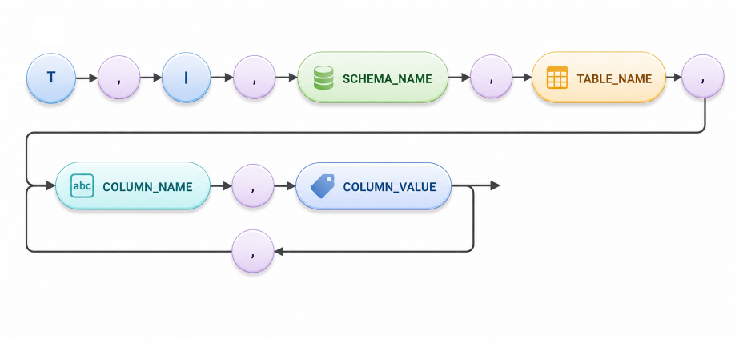

```
Query: INSERT INTO PUBLIC.TEST(C1, C2, C3) VALUES( 1, 2, 'ABC' );
CSV 저장: T, I, "PUBLIC", "TEST", "C1", "1", "C2", "2", "C3", "ABC"
```

```
Query: INSERT INTO PUBLIC.TEST(C1, C3) VALUES( 1, 'ABC' );
CSV 저장: T, I, "PUBLIC", "TEST", "C1", "1", "C2", NULL, "C3", "ABC"
```

<a id="5bd8aa48255cd553"></a>
#### DELETE의 저장 형식

- DELETE의 경우 table을 나타내는 T와 delete를 나타내는 D가 구분자로 기술되고, 해당 delete가 수행된 table의 schema name, table name이 기술된다.
- 삭제된 데이터의 primary key 정보가 기술되며 composite key일 경우에는 primary key count가 2이상이 되고 해당 개수만큼 반복 기술된다.

<a id="2669c593e9bd6184"></a>
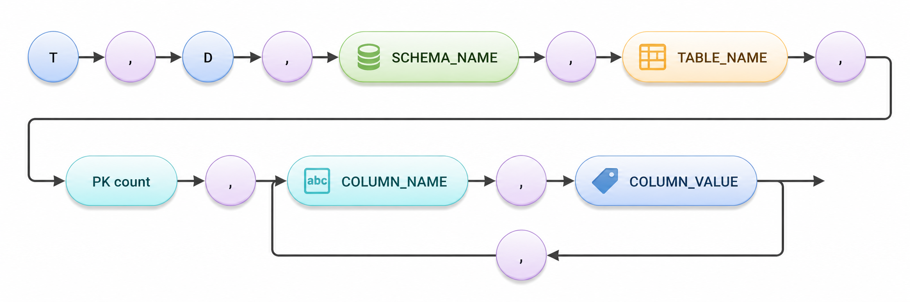

```
Sample: Primary key가 한 개인 경우
Query: DELETE FROM PUBLIC.TEST WHERE C1=1;
CSV 저장: T, D, "PUBLIC", "TEST", 1, "C1", "1"
```

```
Sample: Primary key가 두 개인 경우
Query: DELETE FROM PUBLIC.TEST WHERE C1=1 AND C2=2;
CSV 저장: T, D, "PUBLIC", "TEST", 2, "C1", "1", "C2", "2"
```

<a id="cf720d27f7f4617b"></a>
#### UPDATE의 저장 형식

- UPDATE의 경우 table을 나타내는 T와 update를 나타내는 U가 구분자로 기술되고 해당 update가 수행된 table의 schema name, table name이 기술된다.
- 갱신된 데이터의 primary key 정보가 기술되며 composite key일 경우에는 primary key count가 2이상이 되고 해당 개수만큼 반복 기술된다.
- 실제 갱신된 column의 정보가 반복되어 기술된다.
    - UPDATE_BEFORE_VALUE가 1로 설정된 경우에는 갱신 전의 값이 함께 기술된다.

<a id="c2551e1bd9109838"></a>
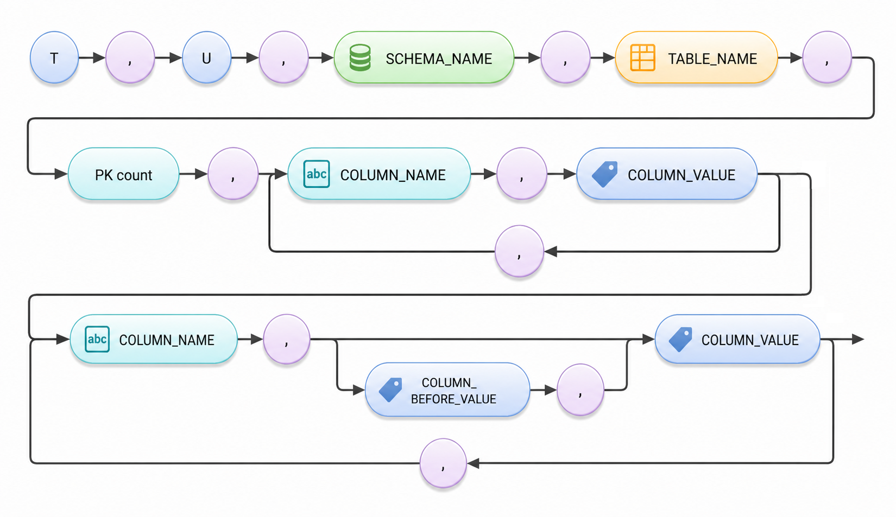

```
Sample: Primary key가 C1 한 개인 레코드의 C2 값을 1에서 2로 변경
Query: UPDATE PUBLIC.TEST SET C2=2 WHERE C1=1;

* UPDATE_BEFORE_VALUE가 설정되지 않았을 경우
CSV 저장: T, U, "PUBLIC", "TEST", 1, "C1", "1", "C2", "2"

* UPDATE_BEFORE_VALUE가 설정되어 있을 경우
CSV 저장: T, U, "PUBLIC", "TEST", 1, "C1", "1", "C2", "1", "2"
```

```
Sample: Primary key가 C1, C2 두 개인 레코드의 C3 값을 'ABC'에서 'BCD'로 C4 값을 3에서 4로 변경
Query: UPDATE PUBLIC.TEST SET C3='BCD', C4=4 WHERE C1=1 AND C2=2;

* UPDATE_BEFORE_VALUE가 설정되지 않았을 경우
CSV 저장: T, U, "PUBLIC", "TEST", 2, "C1", "1", "C2", "2", "C3", "BCD", "C4", "4"

* UPDATE_BEFORE_VALUE가 설정되어 있을 경우
CSV 저장: T, U, "PUBLIC", "TEST", 2, "C1", "1", "C2", "2", "C3", "ABC", "BCD", "C4", "3", "4"
```

<a id="fbe4cffcfb12fa84"></a>
#### Transaction 정보

- Transaction의 시작을 나타내는 begin
    - 부가 정보: Transaction ID
        - Cluster 환경일 경우에는 (Global Transaction ID)
- Transaction commit
    - 부가 정보: Commit SCN (System Change Number)
        - Cluster 환경일 경우에는 (Global SCN)

<a id="21e8218b78c51c8d"></a>
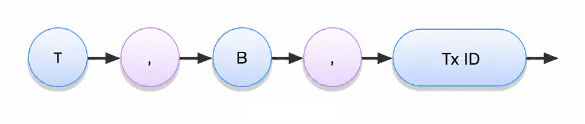

<a id="49584a6ef0caf699"></a>
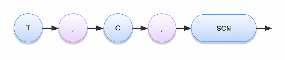

<a id="8ff324c6c0e6cf83"></a>
#### Table 정보

- 이중화하는 table과 column 정보를 기록한다.
    - Table 정보 한 개당 N 개의 column 정보가 연이어 기록된다.
    - 이중화하는 table의 개수만큼 반복 기록한다.
- 한 번만 기록된다.
    - 프로그램을 시작할 때 처음 기록된다.
    - 프로그램 재시작할 경우에는 기록되지 않는다.
- Reset하거나 추가된 table 있을 경우에는 해당 정보를 다시 기록한다.
- Give up 된 테이블의 정보를 기록한다.
    - Give up 된 테이블은 더 이상 capture 되지 않는다.
    - Reset 옵션을 사용하여 해당 테이블을 다시 이중화에 참여시킬 수 있다.

<a id="099e43e727c81c94"></a>
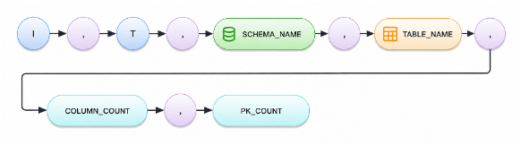

<a id="6efde5da3cccb45d"></a>
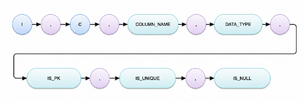

- TEST, TEST2 테이블 정보

```
I,T,"PUBLIC","TEST",3,1
I,C,"C1","NUMBER(10,0)",1,0,0
I,C,"C2","VARCHAR(20)",0,0,1
I,C,"C3","VARCHAR(10)",0,0,1
I,T,"PUBLIC","TEST2",2,1
I,C,"C1","NUMBER(10,0)",1,0,0
I,C,"C2","VARCHAR(20)",0,0,1
```

<a id="89238b258e0b1fc9"></a>
#### Meta 정보

- 데이터 파일을 생성할 때 가장 첫 번째 줄에 다음과 같은 정보가 기록된다.
    - Version 정보
        - 8 byte 버전 정보
        - 데이터 파일의 호환성을 체크하기 위해서 사용된다.
    - 날짜 정보
        - 파일이 생성된 시점이 기록된다.
    - 컨트롤 파일의 경로
        - 해당 데이터 파일의 정보가 기록된 컨트롤 파일의 경로가 기록된다.

<a id="47750b142ea1b8f4"></a>
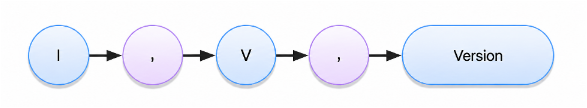

<a id="cb9b320aa504ff3b"></a>
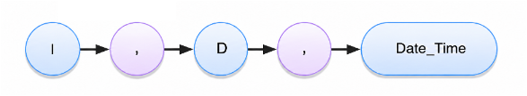

<a id="b9474955ff361f04"></a>
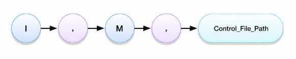

```
I,V, 00000000
I,D,"2022-12-24 00:01:00.000000"
I,M,"/home/cyfile/ctrl_file/cyfile.GROUP1.ctl"
```

<a id="6a9b733379255ff6"></a>
#### Command 정보

- 해당 data file이 최대 사이즈를 초과하여 새로운 파일에서 저장이 될 경우에는 기존 파일의 가장 끝에 EOF가 기록된다.
    - 해당 정보가 기록될 경우에는 다음 파일을 읽어서 처리하도록 해야 한다.

<a id="1b2283a07cb39ed0"></a>
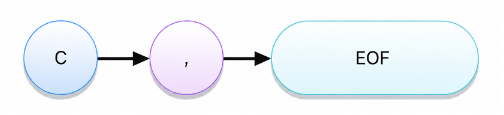

<a id="3f4da3906b2fa19c"></a>
### Control File

- 데이터 파일에 대한 유효 정보를 기록한다.
    - 데이터 파일은 restart와 복구 과정을 거치기 때문에 저장된 값이 언제나 유효한 값인 것은 아니다.
    - 컨트롤 파일에 있는 정보를 사용할 경우, restart와 복구를 거치더라도 항상 유효한 값을 알 수 있다.
- Control 파일의 사이즈는 512 Byte 이다.
    - 원하는 데이터를 offset 하거나 구조체를 정의하여 사용해야 한다.

```
typedef struct ctrlFileStr
{
    char           mVersion[8];
    unsigned int   mFileInfoCrc;   //mFileSeq + mFileOffset CRC
    unsigned int   mDummy;         //Not Used.
   
    signed long    mFileSeq;
    signed long    mFileOffset;    //Valid Offset
};
```

- mVersion: 호환성 체크
- mFileInfoCRC: mFileSeq와 mFileOffset의 CRC 정보
- mDummy: 사용하지 않는다.
- mFileSeq: 현재 데이터 파일의 번호
- mFileSeq: mFileSeq를 갖는 데이터 파일의 번호에서 유효한 위치 (Offset)

---

[← 56. LOGMIRROR](56-logmirror.md) · [전체 목차](../README.md) · [부록 A. SQLSTATE →](../appendices/appendix-01-부록-a-sqlstate.md)

<sub>Copyright © 2010 SUNJESOFT Inc. All rights reserved.</sub>
