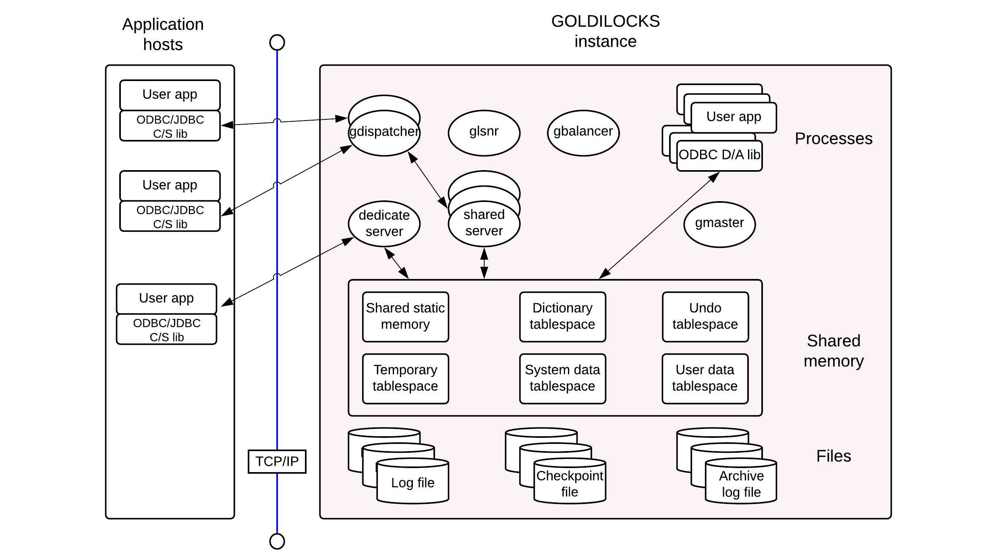
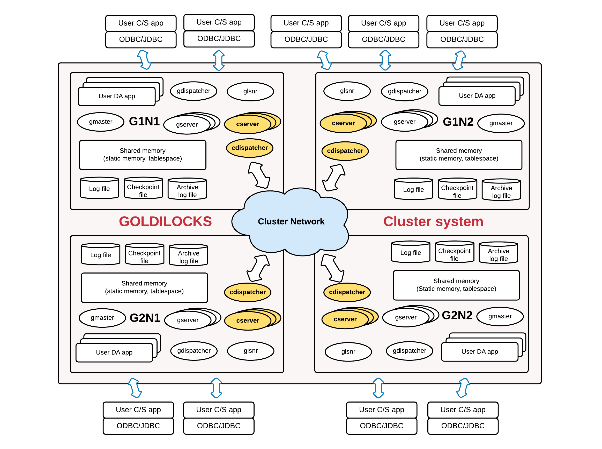

<a id="b9dfa8d60ff98761"></a>

# 1. Preface

> Source: [GOLDILOCKS 3.2 User Manual (en)](https://manual.sunjesoft.co.kr/goldilocks/3_2_x/manual/en/b9dfa8d60ff98761)  
> Tag: `GOLDILOCKS_Venus_3_2_14_retagged`

[Table of contents](../README.md) · [2. Tutorial →](2-tutorial.md)

<a id="6e869ca237ecc288"></a>
## Overview

This user manual is intended for the user who is configuring, managing and operating GOLDILOCKS. The purpose of this manual is to convey the basic concepts required for installation and management of GOLDILOCKS. This manual also describes cautions when using GOLDILOCKS system.

- The description which is presented in this document can be changed according to the installation environment and specific usage.
- This document is based on GOLDILOCKS 3.2 version.
- This document is based on RedHat linux - based platform.

<a id="c817809185240b06"></a>
### Target Reader

The target readers are as follows.

- Programmers who need basic knowledge about how to manage GOLDILOCKS database
- Administrators and performance managers of GOLDILOCKS database
- Administrators and performance managers of GOLDILOCKS cluster system

<a id="42d23e2abfdd3fc0"></a>
## Summary

This chapter describes the basic structure and characteristics of GOLDILOCKS for the novice user. A user can select either a standalone or a cluster system architecture to use GOLDILOCKS. Differences of each architecture and their usages are described.

<a id="f021ca69a04f0672"></a>
### GOLDILOCKS Database Management System

GOLDILOCKS is an in-memory relational DBMS. GOLDILOCKS stores all user data in in-memory as a table form so that it performs search and update operations of all such data effectively.

GOLDILOCKS database system consists of the following parts.

- User-installed GOLDILOCKS software binaries
- Database which is a set of tablespaces, implemented with one or more shared memory on in-memory
- Various files for persistence support of database
    - The data files created with the same size as shared memory per shared memory
    - Redo log files which support the recovery of the database in the event of a failure
    - Configuration files for database settings
    - Trace log files which record information such as events during database operations
- gmaster processes which manage in-memory database, and many system threads within it

<a id="e03563a5418a86f1"></a>
### GOLDILOCKS Architecture

To prevent spreading the application process failure over the entire database system, GOLDILOCKS database is a multi-process architecture based on shared memory, instead of a multi-thread architecture. The overall architecture of GOLDILOCKS database is as shown in figure 1. Data are loaded onto a shared memory and gmaster process is a management daemon which manages database such as boot-up, log flush, aging. Also, it stores redo log files and data files on a disk file to ensure the permanence of data. Applications using GOLDILOCKS database will use one of the following two accessing models.

<a id="622e51b68bd0cc22"></a>


- Direct Access (D/A) model
    - A user may use D/A model when user application is operated on the same equipment as GOLDILOCKS database.
    - User applications should be used by linking with GOLDILOCKS ODBC/JDBC libraries for D/A.
    - GOLDILOCKS ODBC/JDBC libraries for D/A include query processing module and storage management module inside and they process user request by directly attaching shared memory configuring that database.
    - It is suitable to implement a few works which require low-latency because the communication load between application process and database process module is removed. 
- Client/ Server (C/S) model
    - A user may use C/S model when user application is operated on the same equipment as GOLDILOCKS database or on a different equipment.
    - User applications should be used by linking with GOLDILOCKS ODBC/JDBC libraries for C/S.
    - The GOLDILOCKS development library for C/S processes user's requests through TCP communication with the server (gserver) which serves the database specified in the connect string.
    - The response speed of single application of C/S is inferior to that of D/A. However, C/S does not depend on the location of the application, and the relatively stable operation is possible even when an error occurs in the application.
    - C/S model may be operated in shared mode or dedicated mode. In dedicated mode, a single server (gserver) process is performed on a single client. In shared mode, it responds to multiple clients because dispatcher (gdispatcher) and shared-server (gserver) are always running.
    - Dedicated mode is suitable for large amount of data, and shared mode is suitable for many clients, small amount of data.
    - For more information about setting dedicated mode or shared mode, refer to [odbc.ini File](../part-05-developer-manual/25-odbc.md#bdc1948c0522f52f) and [Listener Configuration](../part-06-utility-manual/32-glsnr.md#89657c5620585252).

> In D/A model, an application directly accesses to database and manipulates it, and thus the database instance becomes unstable because many errors occur at an early development stages. Therefore, it would be efficient to develop it in C/S model at an early development stage, and then, to switch it to D/A model at the final development stage.

<a id="feee961913a6ab89"></a>
### GOLDILOCKS Cluster System Architecture

GOLDILOCKS can be used by configuring a standalone database, or binding multiple databases into a single cluster and managing the database in cluster unit. In other words, a user can distribute and store table data into multiple nodes according to the desired sharding strategy. This guarantees high availability and improves the throughput due to the parallel processing.

GOLDILOCKS cluster system guarantees ACID of transaction which is clister-widely performed. There fore, it provides the data reliability as same as that of the transaction performed on a standalone server when any node belonging to the cluster system is connected to perform the transaction.

Each database belonging to GOLDILOCKS cluster system has a structure for multi-process structure and data loading method, which is as same as the structure of the standalone database. However, cdispatcher process and cluster server (cserver) process are added. cdispatcher is a process for efficient communiation between member nodes in a cluster, and cluster server (cserver) process is for the data storage and management on the cluster member node. Also, tablespaces and management areas for transaction management of cluster system are added to the shared memory.

<a id="fda5d966da8a9add"></a>


<a id="9ccdf2affa02b0e8"></a>
## Characteristics of GOLDILOCKS Cluster

<a id="8d21392f536039fd"></a>
### Features of Cluster

GOLDILOCKS cluster is a cluster system of shared nothing structure and it overcomes limitations for transaction performance and storage of an existing standalone system.

- High throughput
    - GOLDILOCKS cluster does not limit creating groups, and the linear performance can be improved by creating groups. 
    - It overcomes the limitation for the storage space of the existing memory-based standalone system.
- High availability
    - If a group consists of multiple members and at least one member is running in a group, it does not affect the availability.
    - Even when not every member in a group is available, other groups except for that group normally provides service.
- Online expansion and online recovery
    - creating groups or members are possible even when the service is in progress, and it does not affect the service in progress.
    - Even the member of the suspended service due to an error can participate in a cluster online. 
- Providing the perfect transaction
    - It perfectly provides the following properties of which a transaction should comply with.
        - Atomicity
        - Consistency
        - Isolation
        - Durability
- Providing the perfect MVCC (multi-version concurrency control)
    - GOLDILOCKS cluster provides a global statement level consistency as standalone system does. 
    - The SQL starting at a specific point can access a desired version among the various versions when accessing to any node.
- Providing the standard SQL and the standard DBC
    - It provides SQL which is equivalent to SQL 92.
    - It provides standard DBCs such as JDBC, ODBC.
- Application compatibility
    - The application source or SQL developed in the existing standalone system can be used in GOLDILOCKS cluster without modifying it.

<a id="882d25b3272baf82"></a>
### Constraint of Cluster

All SQL statements in GOLDILOCKS cluster can be used same as those in standalone system except for the following constraints.

> PRIMARY KEY for the sharded table, UNIQUE constraint and the UNIQUE INDEX should include a sharding key.

The following is an example of a failure because the constraint of UNIQUE (name) does not include an id column which is a sharding key.

```
gSQL> 
CREATE TABLE t1 
(
    id   INTEGER PRIMARY KEY,
    name VARCHAR(128),
    UNIQUE (name)
)
SHARDING BY HASH(id);

ERR-HYC00(16380): UNIQUE or PRIMARY KEY must include all sharding key columns for cluster system
```

The constraint should be generated including sharding key like as UNIQUE ( id, name ) or UNIQUE ( name, id ) in the following example.

```
gSQL> 
CREATE TABLE t1 
(
    id   INTEGER PRIMARY KEY,
    name VARCHAR(128),
    UNIQUE( id, name ) 
) 
SHARDING BY HASH (id);

Table created.
```

> Non-deterministic statements should have the global secondary index to distinguish the same rows among the cluster members.

The following is an example of error which occurs when creating a table omitting the global secondary index by force.

```
gSQL> CREATE TABLE t1 ( c1 INTEGER ) WITHOUT GLOBAL SECONDARY INDEX;

Table created.

gSQL> INSERT INTO t1 VALUES (1), (2), (3), (4), (5);

5 rows created.

gSQL> COMMIT;

Commit complete.
```

The following is an example of deleting three rows and it does not guarantee that the cluster members delete the same rows.

```
gSQL> DELETE FROM t1 FETCH 3;

ERR-42000(16423): does not support non-deterministic DML in the cluster system : global secondary index expected
```

The following example does not guarantee that the cluster members update the same rows to the same value by using RANDOM(1, 100).

```
gSQL> UPDATE t1 SET c1 = RANDOM(1, 100);

ERR-42000(16423): does not support non-deterministic DML in the cluster system : global secondary index expected
```

The following is an example of updating the row at the current position by using updatable cursor, and it requires the global secondary index to distinguish the same rows among cluster members.

```
gSQL> \var v1 INTEGER
gSQL> DECLARE cur1 CURSOR FOR SELECT c1 FROM t1 FOR UPDATE;

Cursor declared.

gSQL> OPEN cur1;

Cursor is open.

gSQL> FETCH cur1 INTO :v1;

V1
--
 1

1 row fetched.

gSQL> UPDATE t1 SET c1 = 1 WHERE CURRENT OF cur1;

ERR-42000(16423): does not support non-deterministic DML in the cluster system : global secondary index expected
```

> It does not support the deferrable constraint.

```
gSQL> ALTER TABLE t1 ADD CONSTRAINT t1_uk UNIQUE(id) DEFERRABLE;

ERR-HYC00(16388): does not support deferrable constraints in the cluster system : 
ALTER TABLE t1 ADD CONSTRAINT t1_uk UNIQUE(id) DEFERRABLE
                                    *
ERROR at line 1:
```

> It does not guarantee the sequence when using the same sequence in different servers.

• It is executed in g1n1 server.

```
gSQL> SELECT seq1.NEXTVAL FROM dual;

NEXTVAL
-------
      1

1 row selected.

gSQL> SELECT seq1.NEXTVAL FROM dual;

NEXTVAL
-------
      2

1 row selected.
```

• It is executed in g2n1 server.

```
gSQL> SELECT seq1.NEXTVAL FROM dual;

NEXTVAL
-------
     21

1 row selected.
```

• It is executed again in g1n1 server.

```
gSQL> SELECT seq1.NEXTVAL FROM dual;

NEXTVAL
-------
      3

1 row selected.
```

---

[Table of contents](../README.md) · [2. Tutorial →](2-tutorial.md)

<sub>Copyright © 2010 SUNJESOFT Inc. All rights reserved.</sub>
