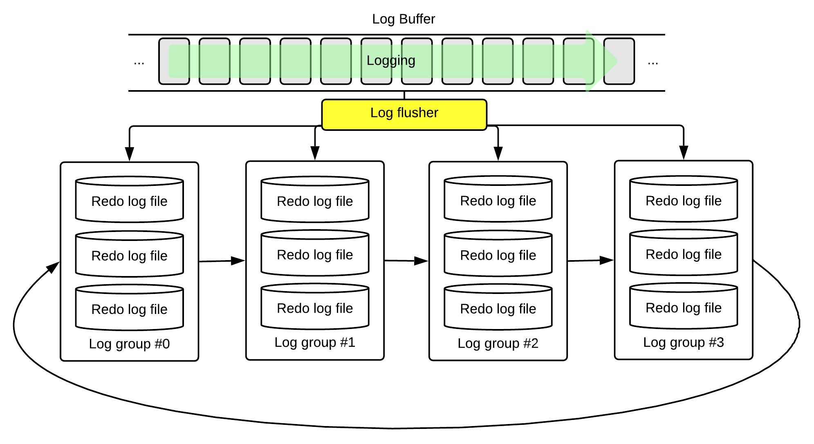

<a id="75f5489de958eebe"></a>

# 6. Structure and Storage Structure of GOLDILOCKS Database

> Source: [GOLDILOCKS 3.2 User Manual (en)](https://manual.sunjesoft.co.kr/goldilocks/3_2_x/manual/en/75f5489de958eebe)  
> Tag: `GOLDILOCKS_Venus_3_2_14_retagged`

[← 5. Basic Management of GOLDILOCKS Database](5-basic-management-of-goldilocks-database.md) · [Table of contents](../README.md) · [7. Backup and Recovery of GOLDILOCKS Database →](7-backup-and-recovery-of-goldilocks-database.md)

<a id="7abe23d0ce922352"></a>
## Managing Control File

A database instance should be created to use GOLDILOCKS database, and the control file is created when creating a database instance. The information is written on the control file when GOLDILOCKS multilevel startup moves from nomount level to mount level. The absolute path and the size of the file to be used in database are recognized by using the recorded information on the control file. The control file is a binary file and database information is stored as follows.

<a id="3a7dd4d63bfcdc24"></a>
### Control File Contents

**GOLDILOCKS database system information**

<a id="3505ffb071545356"></a>
| Item | Description |
| --- | --- |
| Data store mode | It stores mode which is set when database starts up. (TDS, CDS) |
| Server state | It is the database instance state. (NONE, RECOVERED, RECOVERING, SERVICE, SHUTDOWN) |
| Last checkpoint lsn | It is the LSN of the checkpoint which was executed last in the database. |

**Log information**

<a id="246da5c754363e40"></a>
| Item | Description |
| --- | --- |
| Checkpoint lid, lsn | It is the log information (LSN, log position) of the checkpoint which was executed last in the database. |
| Last inactivated log file sequence | It is the log file sequence which was changed to inactive last. |
| Archivelog mode | It is the archivelog mode of the database in operation. |
| Creation time | It is the database created time. |

Database information stores information about database operating, all tablespace in use, and data. The database operating information stored in the control file is as follows.

**Database information**

<a id="3af03bc74e9e33c3"></a>
| Item | Description |
| --- | --- |
| Transaction table size | It is the maximum number of using transaction table in database. |
| Undo relation count | It is the number of using undo relations in database. |
| Tablespace count | It is the number of tablespaces in use created in database. |
| New tablespace id | It is the tablespace ID to be created later. |

Tablespace information is stored in the control file as follows.

**Tablespace information**

<a id="2c0ebb4fad73e903"></a>
| Item | Description |
| --- | --- |
| Tablespace id | It is a unique tablespace ID. |
| Attributes | It is the attribute of a tablespace such as storage device (memory, disk), persistence attribute (temporary, persistent), tablespace usage (dictionary, undo, data, temporary). |
| Page count in extent | It is the number of extent pages. |
| State | It is the tablespace status. (CREATING, CREATED, DROPPING, DROPPED, AGING) |
| Relation id | It is the relation ID to store pending operation of tablespace. |
| New data file id | It is the data file ID which is set when new data file is inserted to tablespace. |
| Is logging | It is the logging mode of a tablespace. (LOGGING, NOLOGGING) |
| Is online | It is the online or offline status of a tablespace. (ONLINE, OFFLINE) |
| Data file count | It is the number of data files used by a tablespace. |
| Offline lsn | It is the last LSN which executes recovery if needed, in order to shift offline tablespace to online. |
| Offline state | It is the status of offline tablespace. (CONSISTENT, INCONSISTENT)  CONSISTENT offline tablespace does not have to be recovered when shifting the status to online. It is because the tablespace status is shifted to offline after the most recent data in memory is stored to disk. On the other hand, INCONSISTENT offline tablespace executes recovery using the log when shifting to online. |

Data file information is stored in the control file as follows.

**Data file information**

<a id="8a0b138a4312d973"></a>
| Item | Description |
| --- | --- |
| Name | It is the data file name including the absolute path which stores data. |
| State | It is the data file status. (CREATING, CREATED, DROPPING, DROPPED, AGING) |
| Data file id | It is the unique data file ID in a tablespace. |
| Auto extend | It is whether to extended automatically or not when a data file is full. |
| Size | It is the data file size. |
| Next size | It is the size to be extend when a data file is full. |
| Max size | It is the maximum size of extendable data file. |
| Timestamp | It is the time when data file was created. |
| Checkpoint lsn, lid | It is the checkpoint log information when the last checkpoint is executed in the data file. (LSN, log position) |
| Creation lsn, lid | It is the checkpoint log information of when a data file is created. (LSN, log position) |

It stores each incremental backup information operated in the database. GOLDILOCKS database supports the incremental backup for database and tablespaces, and the incremental backup information is stored in the control file as follows.

**Incremental backup information**

<a id="56cbd4df62c24c1c"></a>
| Item | Description |
| --- | --- |
| Backup lsn, lid | It is the checkpoint log information which was executed last at the beginning of backup. (LSN, log position) |
| Begin time | It is the incremental backup beginning time. |
| Completion time | It is the incremental backup completion time. |
| Tablespace id | It is the unique tablespace ID of which an incremental backup is executed.  If incremental backup for a tablespace is executed, its tablespace ID is recorded. If the backup is not executed for a tablespace, then the maximum tablespace ID (65535) is recorded. |
| Level | It is the level of executed incremental backup. |
| Object type | It is the target of incremental backup. (database, control file, tablespace) |
| Backup file name | It is the name of the incremental backup file. |
| Backup option | It is the incremental backup option. (cumulative, differential) |

<a id="468e250d2e756a96"></a>
### Multiplexing Control File

The control file stores the physical structure of GOLDILOCKS database and the information about data consistency. If the control file is corrupted or deleted by mistake, it is not possible to operate database.

Therefore, GOLDILOCKS database recommends creating at least two or more control files and keep them in physically separated disks. GOLDILOCKS supports multiplexing up to 8. To add control files when creating a database, set the number of multiplexing control files in the property file, and set the path of each control file. To add control files when operating database, increase the property value for control file multiplexing, and add the control file paths.

<a id="8d31f64de4bcd3e2"></a>
### Restoring Corrupted Control File

If a control file is corrupted due to database's abnormal termination, the corrupted control file is restored using a normal control file among multiplexed control files, and then it is restarted.

If all multiplexed control files are corrupted, the backup control file is restored, and the incomplete media recovery is executed for archive redo log files and redo log files, and then it is restarted. For more information about incomplete recovery using the backup control file, refer to [When all multiplexed control files are corrupted](7-backup-and-recovery-of-goldilocks-database.md#1db9d63ef893355c) in recovery examples.

<a id="08bd4a274e1021ee"></a>
### Control File Information

A user can enquire the control file name by using V$CONTROLFILE which is the performance view to retrieve the location and the name of the control file as follows.

```
gSQL> SELECT CONTROLFILE_NAME FROM V$CONTROLFILE;

CONTROLFILE_NAME                                         
---------------------------------------------------------
/goldilocks_data/wal/control_0.ctl
/goldilocks_data/wal/control_1.ctl

2 rows selected.
```

A user can retrieve the correct information written in the control file using [gdump](../part-06-utility-manual/35-gdump.md#2e68b28ee18d1919) the dump tool of GOLDILOCKS.

<a id="9032ce8148a9a58e"></a>
## Managing Redo Log File

GOLDILOCKS uses the redo log files to ensure database persistency. In other words, the database can be restored to the state before shutdown database using the redo log files and data files when GOLDILOCKS database is abnormally terminated due to various reasons.

In order to do so, GOLDILOCKS database uses Write Ahead Logging (WAL) policy to store log of all update operations.

The updated data by the update operation is not recorded in the data file, but the log for the update operation is recorded in the redo log file. It is because it is much more efficient in the terms of database performance. Whenever each update operation is recorded in the data file, a random access occurs and the update operations for the same file causes the excessive disk IO. However, the update log is smaller than the updated data, and it performs the efficient disk IO in a way being appended at the end of log file.

GOLDILOCKS database uses log buffer in shared memory to record the updated logs to the log buffer, and then records log buffer to the log file all together, and it leads to more efficient disk IO.

<a id="15922f7529ff7a18"></a>
### Redo Log File Structure

The redo log buffer and log file in GOLDILOCKS have a circular structure. The log files are created as many as predefined number of log groups, and then they record logs. If a log file is full, the following log file is used. When all log files are used up, the previously used log file is reused. The log file is a circular structure consisting of a single log group of several members. GOLDILOCKS performs the logging using minimum four log groups.

<a id="5569800753eb132e"></a>


<a id="861ed8b054dee7b2"></a>
### Redo Log Group and Its Member

GOLDILOCKS database uses a log group and members to record logs to the disk log file during database operation. A single redo log file is a member of a log group, and a log group consists of several log members. Log group which consists of many members ensures high availability because other log members can be used when a particular disk fails or a particular log member is corrupted.

The system records logs to a log group, and if the log group is full, the following group is used. This is a circular log group. The currently used log group shifts to the following log group one and this is called as log switching.

A log group, the number of members and each of its position are set by the property when creating database. They can be altered by adding or dropping syntax when operating database.

<a id="6c9e88ce093075a8"></a>
#### Log Group State

The state of log group is initialized to UNUSED when creating it. It is changed to CURRENT, ACTIVE, and INACTIVE state by the system during operation.

**GOLDILOCKS log group state**

<a id="2886a0df3d80a2f4"></a>
| Log group state | Description |
| --- | --- |
| UNUSED | The log group has never been used after creation. |
| CURRENT | The log group is being used by the current system. |
| ACTIVE | It is not yet ready to be reused after CURRENT log group is switched. |
| INACTIVE | ACTIVE state log group is ready to be reused. |

ACTIVE log group can not be reused in the system, but it can be reused after it is changed to INACTIVE by archive log thread. Archive log thread wakes up by an event before the checkpoint is completed, and it changes ACTIVE log groups to INACTIVE state. In order to do so, log archiving thread archives log file in ACTIVE log group, then change it to INACTIVE when the system is operated in ARCHIVELOG mode. If the system is operated in NOARCHIVELOG mode, then the ACTIVE log group is immediately reusable after changing the log group state to INACTIVE.

<a id="6ec678d4980be7f5"></a>
#### Adding Log Group and Log Member

<a id="d502abad85dd0d3f"></a>
##### Adding Log Group

Adding log group is allowed only in mount phase of GOLDILOCKS database multilevel startup. The new log group is added next to the CURRENT state of the log group which is currently being used.  
The following is an example to add a new log group whose file name is 'abc.log', and file size is 20 Mbytes to group ID 10.

```
ALTER DATABASE ADD LOGFILE GROUP 10 ('abc.log') SIZE 20M;
```

<a id="0c6ed217892dce2e"></a>
##### Adding Log Member

A new log member can be added for the stability of log group in use. It can be added in mount phase of GOLDILOCKS database multilevel startup in the same way of adding log group. The following is an example to add the log file named as 'test log' to group ID 10. The log file size is not specified because the log member size in a log group is same.

```
ALTER DATABASE ADD LOGFILE MEMBER 'test.log' TO GROUP 10;
```

<a id="b25e3f2869a6dd21"></a>
#### Altering Log Member Name

The position and the file name of the log member in use can be altered by executing RENAME in mount phase. RENAME is executed for log member when the log member's disk is physically failed or the log member should be transferred to another disk in terms of performance.  
The following is an example to RENAME the log file '/disk1/goldilocks_data/wal/redo_0_0.log' to the log file '/disk2/goldilocks_data/wal/redo_0_0.log'.

```
ALTER DATABASE RENAME LOGFILE '/disk1/GOLDILOCKS_data/wal/redo_0_0.log' TO '/disk2/GOLDILOCKS_data/wal/redo_0_0.log';
```

<a id="47073e380cb9a80b"></a>
#### Dropping Log Group or Log Member

A log member or log group in use can be dropped in mount phase when a user wants to reduce log groups, log members or when log file disk is failed.  
The following is an example to drop all members of log group ID 10.

```
ALTER DATABASE DROP LOGFILE GROUP 10;
```

Dropping log member is allowed only when at least two members exist in the log group.  
The following is an example to drop the '/disk1/goldilocks_data/wal/redo_0_0.log' log member.

```
ALTER DATABASE DROP LOGFILE MEMBER '/disk1/GOLDILOCKS_data/wal/redo_0_0.log';
```

<a id="97acbf1752fd4a01"></a>
### Restoring Corrupted Redo Log File

If the system fails and the redo log files are corrupted, then the restart recovery fails and the system can not be operated. If normal log members exist in the corrupted log group, the restart recovery and the system operation can be executed by copying the log file of the normal log member to the corrupted log files.

If all log files in a log group are corrupted or there is only one log member, it can be restarted by executing incomplete media recovery. The incomplete media recovery is restricted to the normal log file.  
For more information about incomplete media recovery, refer to [Incomplete Recovery](7-backup-and-recovery-of-goldilocks-database.md#bd2fce1ccde1d3e1).

<a id="a15f8ccc56587f09"></a>
### Redo Log File Information

A user can enquire V$LOGFILE which is a performance view to retrieve the location and the name of the redo log files. When inquiring V$LOGFILE, the log file name, its log group ID, its state, the file size are retrieved as follows.

```
gSQL> SELECT FILE_NAME, GROUP_ID, GROUP_STATE, FILE_SIZE FROM V$LOGFILE;

FILE_NAME                          GROUP_ID GROUP_STATE FILE_SIZE
---------------------------------- -------- ----------- ---------
/disk1/goldilocks_data/wal/redo_0_0.log        0 INACTIVE    104857600
/disk1/goldilocks_data/wal/redo_1_0.log        1 CURRENT     104857600
/disk1/goldilocks_data/wal/redo_2_0.log        2 UNUSED      104857600
/disk1/goldilocks_data/wal/redo_3_0.log        3 UNUSED      104857600

4 rows selected.
```

<a id="2450acfc04451922"></a>
## Managing Archive Redo Log File

The database should be operated in archive log mode for media recovery using backup, because GOLDILOCKS redo log file reuses log group which is used when *circular* structure log group is used. Then the written completed redo log files are copied to the archive redo log files.  
For more information about GOLDILOCKS database's archive log mode, refer to [ARCHIVELOG Mode](7-backup-and-recovery-of-goldilocks-database.md#38c2ba7212535dec) .

<a id="3418857bf4058044"></a>
### Creating Archive Redo Log File

The redo log file is copied to archive redo log file directory by log archiving thread which is GOLDILOCKS database's system thread. Log archiving thread is activated by checkpoint thread during checkpoint, and it archives the proper object among redo log files.

Archive redo log file is created in the directory set by the ARCHIVELOG_DIR_ 1 property. The name of archive redo log file is composed of its prefix set by the ARCHIVELOG_FILE property and of the sequence number of each redo log file.

<a id="9ebd79e751ac8770"></a>
### Maintaining and Dropping Archive Redo Log File

Media recovery using backup can fail if archive redo log files, similarly to the redo log files, are arbitrarily dropped. Therefore, archive redo log files should be saved with backup files, and the archive redo log files for media backup can be dropped when the backup file is not needed any more.

Backup is copying the data file which is downloaded to the disk by the most recent checkpoint. Therefore, the archive log files of the oldest LSN and later are needed to recover media using backup. Checkpoint is executed by the system when redo log file is switched, so one or more checkpoint logs exist in every log file except for the redo file in CURRENT state.

The followings describe how to get the archive redo log file required for media recovery using backup file.

1. Get the checkpoint LSN which is recorded in the file header of backup data files.
2. Dump the archive redo log file, and get the archive redo log file including checkpoint LSN.
3. The archive redo log file needed for the media recovery using backup begins just before the archive redo log file of No. 2.

Dump the control file and get the checkpoint LSN to get the archive redo log file needed for incremental backup. Subsequent process is as same as the entire backup process.

If backup files are not needed any more, the archive redo log file required for the media recovery using backup can be removed.

<a id="9b7f81e1fe7e12fc"></a>
### Multiplexing Archive Redo Log File Directory

If the archive redo log file is moved from the directory set in ARCHIVELOG_DIR_1 to the other directory or media to preserve the archive redo log file, the media recovery fails because it can not find the required archive redo log file.

Move the archive redo log file back to the directory set in ARCHIVELOG_DIR_1 to resolve this problem. Or set the archive log files existing directory to ARCHIVELOG_DIR_2 ~ ARCHIVELOG_DIR_10, and add archive redo file directory for media recovery. READABLE_ARCHIVELOG_DIR_COUNT should be set as many as the number of directory when using ARCHIVELOG_DIR_2 ~ ARCHIVELOG_DIR_10 for the media recovery.

<a id="8a184d9340c974c7"></a>
## Managing Tablespace

All the data used in database are stored in physical disk file, and use the database's logical structure for efficient data management and performance. GOLDILOCKS manages the disk space efficiently by using the logical structure such as tablespace, segment, extent, and page.

A tablespace can include multiple data files, and each tablespace is set to online/offline to support high data availability. Distributing data storing disks improves the IO performance, and reduces the contention of physical disk IO.

<a id="b678fdabd26abb6b"></a>
### Tablespace Type

GOLDILOCKS tablespace is divided into SYSTEM tablespace and non-SYSTEM tablespace. SYSTEM tablespace is created when database is created, and it is used and controlled only by the GOLDILOCKS system. Non-SYSTEM tablespace is created and used by a user.

<a id="ff9c3231d106753d"></a>
#### SYSTEM Tablespace

It is created when GOLDILOCKS database is created, and it is essential for database operation. There are dictionary tablespace, undo tablespace and system temporary tablespace.

<a id="dc645f875b7fe298"></a>
#### Non-SYSTEM Tablespace

It is a tablespace in which tables and indexes are stored for data storing, and a user can arbitrarily creates or drops.

<a id="6787de0ddcc46750"></a>
### Managing Tablespace and Data File

<a id="492a1ff469acf67e"></a>
#### Managing Tablespace

<a id="86f728eab8d14377"></a>
##### Managing Tablespace State

The GOLDILOCKS database tablespace state is divided into online and offline. The offline tablespace is not accessible. A user can arbitrarily set the tablespace state to offline. Or, an abnormal tablespace can be set to offline by the system. The system tablespace should not be set to offline.

- Offline tablespace

GOLDILOCKS database flushes all data files in the tablespace to disk before the tablespace is set to offline. All related logs should be flushed to disk to flush data file. Therefore, a recovery is not needed when switching to online later. However, it is applied when DDLs occurred in the offline tablespace state is changed to online state.

A tablespace can be immediately set to offline using IMMEDIATE mode, without flushing data file. In this case, the tablespace state is changed to online after media recovery when setting the tablespace to online.

**Tablespace offline option**

<a id="89e6ab910b79000f"></a>
| Option | Description | Media recovery when setting  the tablespace to online |
| --- | --- | --- |
| NORMAL | Flushing all the data file related logs in tablespace to the disk, then set it to offline | Media recovery is not required. |
| IMMEDIATE | Immediately setting a tablespace to offline | Media recovery is required. |

GOLDILOCKS can set tablespace to offline in mount phase. To do so, the service should be normally terminated, or the server should be operated in ARCHIVELOG mode. This method provides high availability by performing service excluding the unrecoverable tablespaces when starts up database.

```
gSQL> ALTER TABLESPACE TEST_TBS OFFLINE;
 
Tablespace altered.
 
gSQL> ALTER TABLESPACE TEST_TBS ONLINE;
 
Tablespace altered.
```

```
gSQL> ALTER TABLESPACE TEST_TBS OFFLINE IMMEDIATE;
 
Tablespace altered.
 
gSQL> ALTER TABLESPACE TEST_TBS ONLINE;
 
ERR-42000(14051): media recovery required - 'TEST_TBS'
 
gSQL> ALTER DATABASE RECOVER TABLESPACE TEST_TBS;
 
Database altered.
 
gSQL> ALTER TABLESPACE TEST_TBS ONLINE;
 
Tablespace altered.
```

<a id="36f5bda1cdb08ead"></a>
##### Attributes of Tablespace

The followings are attributes of tablespace in GOLDILOCKS database. PERSISTENT or TEMPORARY indicates whether persistence is ensured or not. DATA or UNDO indicates the type of tablespace and stored data.

<a id="8ee1da9ac912d2a1"></a>
<table class="table column_count_3"><caption>Tablespace attributes of GOLDILOCKS database</caption><thead><tr><th class="to_center" colspan="2"><div>Attributes</div></th><th class="to_center"><div>Description</div></th></tr></thead><tbody><tr><td class="to_middle" rowspan="2"><div>Persistence</div></td><td class="to_left to_middle"><div>PERSISTENT</div></td><td><div>It supports persistence of data stored in a tablespace. (A recovery is required.)</div></td></tr><tr><td><div>TEMPORARY</div></td><td><div>It does not support persistence of data stored in a tablespace.</div></td></tr><tr><td class="to_middle" rowspan="4"><div>Type of stored data</div></td><td><div>DATA</div></td><td><div>It stores the user input data.</div></td></tr><tr><td><div>UNDO</div></td><td><div>It stores data required for MVCC of database.</div></td></tr><tr><td><div>DICT</div></td><td><div>It stores dictionary information for database operation.</div></td></tr><tr><td><div>TEMPORARY</div></td><td><div>It stores data for SQL processing.</div></td></tr></tbody></table>

<a id="924902dd4358855b"></a>
##### Managing Tablespace

- Creating user tablespace

It creates a new user tablespace. The name of tablespace being used in the database instance should be unique when creating tablespace. A tablespace can have up to 1024 data files, and the size of each data file can be up to 30 GBytes. The database can create tablespaces up to 65,535, including system tablespace.

The data file name including the absolute path in the data file should be unique. Use 'REUSE' option to reuse the existing data file which is not being used in database. An extent size of a tablespace is selectable among 64 Kbytes, 128 Kbytes, 256 Kbytes, 512 Kbytes and 1 Mbyte, and the default extent size is 256 Kbytes.

```
gSQL> CREATE TABLESPACE TEST_TBS DATAFILE
     '/goldilocks1/db/TEST_TBS1.dbf' SIZE 20M,
     '/goldilocks2/db/TEST_TBS2.dbf' SIZE 50M,
     '/goldilocks3/db/TEST_TBS3.dbf' SIZE 100M REUSE;

Tablespace created.
```

The state can be set to ONLINE/OFFLINE when creating tablespace, and the LOGGING/NOLOGGING property also can be set.

- Dropping tablespace

The tablespace and data file can be dropped when the tablespace is not needed any more. The unused tablespace should be dropped not to waste the resources. It is because once tablespace is created, the added disk data file and memory is created and remains.

```
gSQL> DROP TABLESPACE TEST_TBS;

Tablespace dropped.
```

Dropping the tablespace does not drop its table index in use by default. Therefore, *INCLUDING CONTENTS* option should be used together when dropping tablespace including tables or indexes in use.

```
gSQL> DROP TABLESPACE TEST_TBS;

ERR-42000(16148): tablespace not empty, use INCLUDING CONTENTS option : 
drop tablespace TEST_TBS
                *
ERROR at line 1:

gSQL> DROP TABLESPACE TEST_TBS INCLUDING CONTENTS;

Tablespace dropped.
```

Use *AND DATAFILES* option to drop the data files added in the tablespace.

```
gSQL> DROP TABLESPACE TEST_TBS INCLUDING CONTENTS AND DATAFILES;

Tablespace dropped.
```

- Altering tablespace size

Add datafiles to the tablespace or drop datafiles from the tablespace to alter the tablespace size. Add new datafiles to tablespace to spare space when the storing space is not enough during database operation. Or, drop unused datafile from tablespace not to waste the space.

```
gSQL> ALTER TABLESPACE TEST_TBS ADD DATAFILE 'TEST_TBS2.dbf' SIZE 20M;

Tablespace altered.

gSQL> ALTER TABLESPACE TEST_TBS DROP DATAFILE 'TEST_TBS2.dbf;

Tablespace altered.
```

The data file could be dropped from tablespace only when is has never been used since its creation. The data file can not be dropped once it has been used even when all data was dropped.

```
ALTER TABLESPACE TEST_TBS DROP DATAFILE 'TEST_TBS2.dbf';

ERR-42000(14044): datafile not empty
```

- Managing temporary tablespace

Temporary tablespace does not store data file, but it allocates memory of specified size. Create the temporary tablespace as follows.

```
gSQL> CREATE TEMPORARY TABLESPACE TEST_TBS MEMORY 'TEST_TEMP_TBS' SIZE 10M EXTSIZE 256K;

Tablespace created.
```

Add memory to the temporary tablespace as follows.

```
gSQL> ALTER TABLESPACE TEST_TBS ADD MEMORY 'TEST_TBS2' SIZE 10M;

Tablespace altered.
```

Drop the unused memory from the temporary tablespace as follows.

```
gSQL> ALTER TABLESPACE TEST_TBS DROP MEMORY 'TEST_TBS2';

Tablespace altered.
```

Drop the temporary tablespace as follows.

```
gSQL> DROP TABLESPACE TEST_TBS INCLUDING CONTENTS AND DATAFILES;

Tablespace dropped.
```

<a id="6530cb558edc41bd"></a>
##### Transferring Data File

The data file storage path stored in the database should be modified when altering the datafile storage disk, or directory.

The following is an example to describe how to modify the path when transferring the datafile '/goldilocks1/db/TEST_TBS1.dbf' in tablespace TEST_TBS to '/goldilocks4/db/TEST_TBS1.dbf'.

```
gSQL> ALTER TABLESPACE TEST_TBS RENAME DATAFILE
    '/goldilocks1/db/TEST_TBS1.dbf' TO '/goldilocks4/db/TEST_TBS1.dbf';

Tablespace altered.
```

<a id="71ef5a7aa0a3a669"></a>
#### Tablespace Information

For more information about the tablespaces created in database, refer to [V$TABLESPACE](9-database-information.md#be1e643546f2fb41).

```
gSQL> \DESC V$TABLESPACE

COLUMN_NAME   TYPE                   IS_NULLABLE
------------- ---------------------- -----------
TBS_NAME      CHARACTER VARYING(128) FALSE      
TBS_ID        NUMBER                 FALSE      
TBS_ATTR      CHARACTER VARYING(128) FALSE      
IS_LOGGING    BOOLEAN                FALSE      
IS_ONLINE     BOOLEAN                FALSE      
OFFLINE_STATE CHARACTER VARYING(32)  FALSE      
EXTENT_SIZE   NUMBER                 FALSE      
PAGE_SIZE     NUMBER                 FALSE
```

<a id="e91caa9aa7403836"></a>
## Managing Data File

<a id="2acca0d8d5bffc29"></a>
### Data File Matching

Data file can be corrupted due to disk failure, database defects or human error. If the corrupted data file is used in database, serious problems occurs.

GOLDILOCKS database ensures the matching of the data file using a checksum for each page of the data file. GOLDILOCKS database's page checksum is generated using LSN and CRC value, and it is stored in each page. A user sets the page checksum type using the value in [PAGE_CHECKSUM_TYPE](10-server-property.md#984df5f741d0dddd), and uses LSN for the default value.

The page checksum is checked when loading the data file into the memory at database startup. If an error occurs concerning the checksum value, the database can not start up the service.

The following is an example to describe the database startup failure when the datafile TEST_TBS.dbf in the tablespace TEST_TBS created by a user is not matching.

```
gSQL> \STARTUP MOUNT

Startup success

gSQL> ALTER SYSTEM OPEN DATABASE;

ERR-HY000(14094): datafile recovery required - datafile(/goldilocks/db/TEST_TBS.dbf) of tablespace(TEST_TBS) corrupted
```

In case when the data file is not matching, set its tablespace having the data file to *OFFLINE*, or recover the data file to restart the database.

The following describes how to start up the database after setting the tablespace to *OFFLINE*.

```
gSQL> \STARTUP MOUNT

Startup success

gSQL> ALTER SYSTEM OPEN DATABASE;

ERR-HY000(14094): datafile recovery required - datafile(/goldilocks/db/TEST_TBS.dbf) of tablespace(TEST_TBS) corrupted

gSQL> ALTER TABLESPACE TEST_TBS OFFLINE IMMEDIATE;

Tablespace altered.

gSQL> ALTER SYSTEM OPEN DATABASE;

System altered.
```

Data file full backup or incremental backup should exist when recovering the data file.  
The following describes how to recover the data file when backup exists.

```
gSQL> \STARTUP MOUNT

Startup success

gSQL> ALTER SYSTEM OPEN DATABASE;

ERR-HY000(14094): datafile recovery required - datafile(/goldilocks/db/TEST_TBS.dbf) of tablespace(TEST_TBS) corrupted

gSQL> ALTER DATABASE RECOVER DATAFILE 'TEST_TBS.dbf' CORRUPTION;

Database altered.

gSQL> ALTER SYSTEM OPEN DATABASE;

System altered.
```

<a id="c530f1e3f2648b24"></a>
### Data File Information

For more information about data files being used in database, refer to [V$DATAFILE](9-database-information.md#79c3673feec2f180).

```
gSQL> \DESC V$DATAFILE

COLUMN_NAME    TYPE                           IS_NULLABLE
-------------- ------------------------------ -----------
TBS_NAME       CHARACTER VARYING(128)         FALSE      
DATAFILE_NAME  CHARACTER VARYING(1024)        FALSE      
CHECKPOINT_LSN NUMBER                         FALSE      
CREATION_TIME  TIMESTAMP(2) WITHOUT TIME ZONE FALSE      
FILE_SIZE      NUMBER                         FALSE
```

---

[← 5. Basic Management of GOLDILOCKS Database](5-basic-management-of-goldilocks-database.md) · [Table of contents](../README.md) · [7. Backup and Recovery of GOLDILOCKS Database →](7-backup-and-recovery-of-goldilocks-database.md)

<sub>Copyright © 2010 SUNJESOFT Inc. All rights reserved.</sub>
