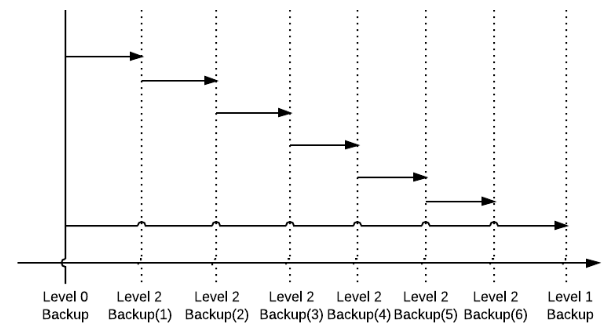
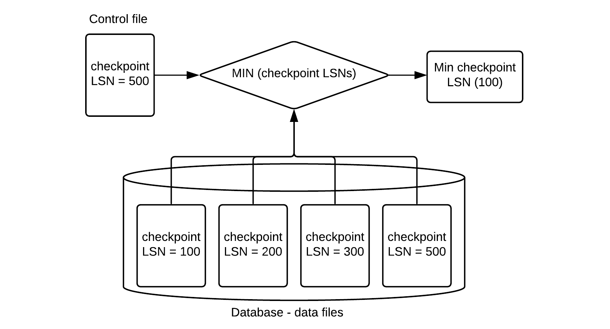

<a id="bf1ac5a9021c1fa9"></a>

# 7. Backup and Recovery of GOLDILOCKS Database

> Source: [GOLDILOCKS 3.2 User Manual (en)](https://manual.sunjesoft.co.kr/goldilocks/3_2_x/manual/en/bf1ac5a9021c1fa9)  
> Tag: `GOLDILOCKS_Venus_3_2_14_retagged`

[← 6. Structure and Storage Structure of GOLDILOCKS Database](6-structure-and-storage-structure-of-goldilocks-database.md) · [Table of contents](../README.md) · [8. GOLDILOCKS Database Replication →](8-goldilocks-database-replication.md)

This chapter describes GOLDILOCKS database backup and recovery, database ARCHIVELOG mode for the backup and recovery.

<a id="38c2ba7212535dec"></a>
## ARCHIVELOG Mode

GOLDILOCKS database executes logging using circular log group. A circular log group consists of at least four log groups, and if all log allocated to a log group are run out, then following log group is used. If all created log groups are run out, the first log group is reused. In this case, the new log file is not created but the previously recorded log file is reused.

The previously written logs are lost if a log group is reused in NOARCHIVELOG mode. Therefore, if an administrator does not manage the completed logging group, the completed transactions logs disappears while operating in NOARCHIVELOG mode.

On the other hand, in ARCHIVELOG mode, the system archives log files prior to reusing it when using the following log groups after the completion of recording on log file in a log group. Then the completed logs are permanently preserved unless they are deliberately deleted.

<a id="482726a08053e86c"></a>
### ACHIVELOG Mode

Log files should be archived before they are reused. It is because all log files after backup moment is required for the recovery using backup, and the backup could be needed anytime. Therefore, the backup is supported only in ARCHIVELOG mode.

The service can be interrupted in busy system due to archiving when operating in ARCHIVELOG mode. Also, an additional space is needed to store files.

<a id="e9d7c927b3a5d2b8"></a>
### NOARCHIVELOG Mode

Backup is not supported in NOARCHIVELOG mode, because it can not be determined if the log files of before reusing exist.

However, system does not archive log files. Therefore, the interruption due to an archiving at checkpoint when bulk logs are continuously being recorded does not occur. Also, it does not need a storage space for archive log files.

NOARCHIIVELOG mode is set by the 'ARCHIVELOG_MODE' property value when creating database. Database is created in NOARCHIIVELOG mode if the 'ARCHIVELOG_MODE' value is 0, and it is created in ARCHIIVELOG mode when the 'ARCHIVELOG_MODE' value is 1. This property is valid only when creating database, and it is not referenced when operating database.

Execute the following syntax in mount phase of GOLDILOCKS database startup level to change ARCHIVELOG mode during database operation.

```
gSQL> ALTER DATABASE ARCHIVELOG;       
 
Database altered.
 
gSQL> ALTER DATABASE NOARCHIVELOG;
 
Database altered.
```

Enquire *ARCHIVELOG_MODE* of *V$ARCHIVELOG* which is the performance view to retrieve archive log mode set in database.

```
gSQL> SELECT ARCHIVELOG_MODE FROM V$ARCHIVELOG;

ARCHIVELOG_MODE
---------------
NOARCHIVELOG   

1 row selected.
```

<a id="78073bc6c6f2d282"></a>
## Backup and Recovery

<a id="5f30ed2efca364ff"></a>
### Backup

<a id="a12f5e38122c199c"></a>
#### The Purpose of Backup and Recovery

Database can protect and recover data when various failures or data loss occurs. There are many reasons for failures. The duplicated copy is required especially when the database is physically corrupted or damaged by disaster, and this is called as backup.

When database service is not available due to various failures, it becomes available again by using current database or backup, and this is called as recovery. The restart recovery is to recover by using the current database. The media recovery is to recover by using the backup. GOLDILOCKS automatically or manually performs the media recovery to recover the backup data file, then recover and restarts by the restart recovery.

<a id="7904c0b852e596b7"></a>
#### Backup

Database backup is divided into physical backup and logical backup. Generally, backup means making copy of data files online. This chapter describes the online physical backup.

<a id="f05958c9c33eb3ae"></a>
<table class="table column_count_4"><caption>Database backup type</caption><thead><tr><th class="to_center"><div>Backup type
</div></th><th class="to_center"><div>Backup form
</div></th><th class="to_center"><div>Database state
</div></th><th class="to_center"><div>Description
</div></th></tr></thead><tbody><tr><td class="to_middle" rowspan="2"><div>Physical backup
</div></td><td class="to_middle"><div>Cold backup
</div></td><td class="to_middle"><div>Offline
</div></td><td><div>Creating the copy of data file
Stopping service to execute backup
</div></td></tr><tr><td class="to_middle"><div>Hot backup
</div></td><td class="to_middle"><div>Online
</div></td><td><div>Creating the copy of data file
Executing backup during service operation
Available only in ARCHIVELOG mode</div></td></tr><tr><td class="to_middle"><div>Logical backup
</div></td><td class="to_middle"><div>Export backup
</div></td><td class="to_middle"><div>Online
</div></td><td><div>Backup/recovery in table unit
Exporting regardless of HW/OS
</div></td></tr></tbody></table>

GOLDILOCKS uses data files and control files for executing service, and they should be recovered when they were corrupted from a failure. A control file is created when creating database, and stores necessary information to operate database. A data file stores actual data, and they are data files in system tablespaces created when database is created and datafiles in user made tablespace. Use backup files for recovery when some of those control files or data files are corrupted.

In other words, control files and data files should be backed up for recovery. In order to do so, GOLDILOCKS supports control file backup, database backup, and tablespace backup.

Depending on the backup method, it is divided into full backups and incremental backups. Full backup copies data files in time of backup, and an incremental backup copies only modified parts since the previous backup. The full backup copies data files, so the copy as big as the data file is created everytime of backup. Therefore, it consumes the storage space as much as the size of database or tablespace.

On the other hand, the size of the incremental backup is relatively small because it copies only the modified part after the previous backup.

<a id="12a505c6893ad3e4"></a>
<table><caption>Full backup vs. incremental backup</caption><thead><tr><th align="center" valign="middle">Item</th><th align="center" valign="middle">Full backup</th><th align="center" valign="middle">Incremental backup</th></tr></thead><tbody><tr><td align="left" valign="middle">Backup object</td><td colspan="2" valign="middle"><ul><li>Database: Entire data file which is being used by database</li><li>Tablespace: Data files in database's specific tablespace</li></ul></td></tr><tr><td align="left" valign="middle">Description</td><td valign="middle"><ul><li>Backup entire data file which is being used by database or tablespace</li><li>Creating a backup file per a data file</li><li>Restoring the required data file after failure by using appropriate backup method, then recover it</li></ul></td><td valign="middle"><ul><li>Backup the modified part of the data file being used by database or tablespace after the previous backup</li><li>Creating an incremental backup file in which the modified part is recorded</li><li>Recovery by using multiple incremental backups after failure</li></ul></td></tr></tbody></table>

<a id="d2c8cca6a9942ff4"></a>
#### Full Backup

Use full backup to execute database backup and tablespace backup. Database backup is to backup control files and data files.

<a id="cac2240a83678588"></a>
##### Control File Backup

Backup the control file as follows. Specify the backup control file name including the absolute path, or specify the backup control file name only. If only the backup control file name is specified, the backup file is created in the path set in the 'LOG_DIR' property.

```
gSQL> ALTER DATABASE BACKUP CONTROLFILE TO '/goldilocks_data/backup/backup.ctl';

Database altered.
```

<a id="dd825d76e49397bc"></a>
##### Database Backup

Database backup can backup entire data file being used in database. When backup data file, recording on the file should be prevented while coping the data file. If the file is used during copying, the data file becomes inconsistent, and even worse it will be inconsistent within a page. Set the database to the state which enables backup to prevent those inconsistencies.

```
gSQL> ALTER DATABASE BEGIN BACKUP;

Database altered.
```

Use operating system's file copy feature to create the copy of data file on database backup enabled state. Then set it as follows, then the database backup is completed, and it is writable.

```
gSQL> ALTER DATABASE END BACKUP;

Database altered.
```

<a id="acd03d0f1aae3860"></a>
##### Tablespace Backup

Tablespace backup can backup data files being used by a specified tablespace. Set it to backup enabled state by using the tablespace name (tablespace_name) as follows for the same reason of database backup.

```
gSQL> ALTER TABLESPACE TEST_TBS BEGIN BACKUP;

Tablespace altered.
```

Use operating system's file copy feature to create the copy of tablespace's data file on tablespace backup enabled state. Then, complete the tablespace backup as follows.

```
gSQL> ALTER TABLESPACE TEST_TBS END BACKUP;

Tablespace altered.
```

<a id="423bf5fff47a2cbf"></a>
#### Incremental Backup

An incremental backup supports database unit backup and tablespace unit as same as full backup. An incremental backup does not backup control files separately, but the control file is backed up together when executing the database incremental backup.

GOLDILOCKS supports incremental level from 0 to 4 for an incremental backup. When an incremental backup is executed for the first time, the level should be set to 0, and backup the entire data file. Set the incremental backup level to 1 or higher to back up only the modified parts since the last backup when executing the incremental backup later.

The given level of incremental backup searches for the time when the same level or lower level was executed. Then, it backups only the modified parts after the previous backup.

For example, after performing level 0 backup, level 2 backup(1) backs up only the modified parts after the level 0 backup, and level 2 backup(2) backs up the modified part after the level 2(1) backup. In the same way, level 2 backup(3), (4), (5), (6) backs up the modified part after the level 2 backup. The level 1 backup which was executed lastly backs up all modified parts after the level 0 backup.

<a id="1e452ce95f926fb9"></a>


<a id="eb51144a0b451658"></a>
##### Database Incremental Backup

Execute an incremental backup on the entire data file of database as follows. At first, the entire data file of database is backed up at level 0.

```
gSQL> ALTER DATABASE BACKUP INCREMENTAL LEVEL 0;

Database altered.
```

And then, the modified part after level 0 is backed up at level 1.

```
gSQL> ALTER DATABASE BACKUP INCREMENTAL LEVEL 1;

Database altered.
```

<a id="6e92d0cdcda61ecd"></a>
##### Tablespace Incremental Backup

At first, the entire data file of tablespace is backed up at level 0 as follows in the same way as the database backup.

```
gSQL> ALTER TABLESPACE TEST_TBS BACKUP INCREMENTAL LEVEL 0;

Tablespace altered.
```

And then, the modified part after level 0 is backed up at level 1.

```
gSQL> ALTER TABLESPACE TEST_TBS BACKUP INCREMENTAL LEVEL 1;

Tablespace altered.
```

<a id="fe2c557c0c0953e2"></a>
### Recovery

Database guarantees data consistency by executing recovery when a failure occurs or database is corrupted.   
The types of database failure are as follows.

**Database failure type**

<a id="aea076b31481f39b"></a>
| Failure type | Causes and symtoms | Solution |
| --- | --- | --- |
| Transaction failure | Transaction failure and deadlock due to the logical error (bad input, overflow, data not found) | Abort transaction |
| System crash | Corruption of volatile storage device due to an abnormal termination (blackout) of DBMS or OS | Restart recovery |
| Media failure | Corruption of non-volatile storage device | Restore, restart recovery |

Abort the executing transactions, rollback all database updates and release obtained lock items to solve transaction failure.

Database processes are abnormally terminated at system crash, so the recent information stored in volatile storage are not reflected in the non-volatile storage, and they are lost. Startup database, and recover the database to the state when it was consistent before abnormal termination. This process is called as restart recovery. To recover the database, the restart recovery uses control files, data files, and log files which were used by database before the failure.

The recovery using database file before failure is not possible if non-volatile storage device is corrupted. It is because control files, datafiles and log files are corrupted so that they can not be used for recovery. In this case, recover the database file by using previously archived backup files and log files, then execute the recovery.

GOLDILOCKS supports both the complete recovery and the incomplete recovery. The complete recovery recovers the datafile to the latest and consistent state by using the log file. The complete recovery targets database, tablespace and data file. For the tablespace and data file, the complete recovery is available for the offline tablespace even during the database service. The complete recovery is divided into the automatic recovery and the manual recovery. The automatic recovery is performed when restarting the database, and the manual recovery uses the recovery statement supported by GOLDILOCKS.

The incomplete recovery is available only for the database, and it recovers to the consistent state of a specific point. The incomplete recovery is performed only manually. It incompletely recovers at once up to the specific point, or it performs the user selective incomplete recovery. The user selective incomplete recovery is a method of which a user selects a log file available to recover and recovers up to that user selected log file.

If both the complete recovery and the incomplete recovery is required, then use redo log and archive log files.

**Database recovery**

<a id="bd3a74684cb619a3"></a>
<table><thead><tr><th align="center" valign="middle">Recovery</th><th align="center" valign="middle">Target</th><th align="center" valign="middle">Description</th></tr></thead><tbody><tr><td valign="middle">Complete recovery</td><td valign="middle">Database,<br>tablespace,<br>datafile</td><td valign="middle"><ul><li>Automatic recovery (Recovers at the restart)</li><li>Manual recovery (Manually recovers the database, tablespace and data file.)</li></ul></td></tr><tr><td valign="middle">Incomplete recovery</td><td valign="middle">Database</td><td valign="middle"><ul><li>Manual recovery only<br><ul><li>Incomplete recovery at once</li><li>User selective incomplete recovery</li></ul></li></ul></td></tr></tbody></table>

<a id="f25bcfeeb4700031"></a>
#### Automatic Recovery

The automatic recovery is executed when restarting after a normal or abnormal termination of database. It uses the control files, data files and log files which were used just before the termination.   
Especially when the latest database file is corrupted, the backed up database file is recovered and the automatic recovery is executed by using the archive log file.  

The recovery is executed in three phases, and they are analysis, redo and undo.

<a id="b12705271b862125"></a>
##### Analysis

Two operations are executed in analysis phase.  
First, it searches for the first log to perform the restart recovery. For that, it refers to the most recently executed checkpoint log, and looks for the most recent checkpoint log from the log information recorded in control file.  
Second, it initialize the transaction table of the system. It uses transaction information which was executed at checkpoint written on checkpoint log to initialize system transaction table.

<a id="94b27af59dd4c1fe"></a>
##### Restart Redo

All logs, from the first log obtained in the analysis phase for restart recovery to the last log recorded in the redo log files, execute restart redo. The transaction table is updated when a transaction is completed or a new transaction is started during this process.

<a id="0ceba7e7a0dd51fa"></a>
##### Restart Undo

After restart redo is completed, it performs the transaction rollback by performing undo all incomplete transactions remained in the transaction table.

<a id="16a59db64f10d247"></a>
#### Recovery Using Backup

If control files, data files and log files are corrupted or does not exist, the recovery should be performed after it is recovered by using the backup file. It is complicated to find the log on which the recovery starts when performing the recovery by using the backed up control file or the data file.

<a id="e13f7232349863a5"></a>
##### Analysis for Recovery Using Backup

In analysis phase for the recovery using backup, like as the automatic recovery, it searches for the first log for recovery and initializes the transaction table. It searches for the oldest LSN among the checkpoint LSN recorded in all the data file's file header, then selects the minimum value by comparing it with checkpoint LSN recorded in control file to find the first log for recovery.

The checkpoint LSN recorded in data file header stores the checkpointed LSN of the corresponding data file. Therefore, when using the backup datafile, select the oldest checkpoint LSN, and then select the minimum value comparing to the checkpoint LSN in the control file, then the minimum checkpoint LSN for the recovery is determined.

<a id="bbd3a6911155ac33"></a>


<a id="60507e89b060b437"></a>
##### Recovery Using Archive Log Files

The recovery using archive log files uses not only redo log files but also archive log files, when the minimum checkpoint LSN defined for the recovery is in an archive log file. The recovery using the backup is executed in a unit of database, tablespace and data file. Database recovery is executed only on MOUNT phase, and the recovery in tablespace and data file unit is executed on MOUNT phase or OPEN phase.

- Restoring the backup data files

Restoring data files is executed by using the full backup or the incremental backup. A user directly executes the full backup by using operating system's file copy command to restore data. On the other hand, the incremental backup is executed by using restoring syntax of GOLDILOCKS. The tablespace should be OFFLINE to restore data files on OPEN phase.

The followings describe how to restore data files using incremental backup.

```
gSQL> ALTER DATABASE RESTORE;
 
Database altered.
 
gSQL> ALTER DATABASE RESTORE TABLESPACE TEST_TBS;
 
Database altered.
```

- Manual recovery after restoring data files

The followings describe how to execute recovery using the syntax of recovery after restoring data files.

```
gSQL> ALTER DATABASE RECOVER;
 
Database altered.
 
gSQL> ALTER DATABASE RECOVER TABLESPACE TEST_TBS;
 
Database altered.
```

<a id="bd2fce1ccde1d3e1"></a>
#### Incomplete Recovery

If the restart recovery is not available due to a user mistake during operation, corrupted control files, or corrupted redo log files and archive log files nor can the recovery restore consistency of database, then execute the incomplete recovery. The incomplete recovery restores data only until the point-in-time.  
The followings are when the incomplete recovery is required.

<a id="67a267dbd8397202"></a>
##### Corrupted Control Files

Control files are multiplexed, so they can be recovered using uncorrupted files if not all of the multiplexed files are corrupted.  
However, if all control files are corrupted, recovery should be executed using the backup control files. In this case, the complete recovery is impossible because the log information of the control files can be changed. The recovery restores only until point-in-time.

<a id="d7ba9ee59655a8c4"></a>
##### Restoring Backup Control File

When control files are corrupted, copy other multiplexed control files to keep control files up-to-date.  
However, when all multiplexed control files are corrupted, restore the backup control files, then perform the recovery. The log information which is changed after the backup can not be recovered when executing recovery using the backup data files.

<a id="c566641972a23997"></a>
##### Corrupted Redo Log File

GOLDILOCKS consists redo log files with several log members in a log group to prevent log file corruption. However, if all log members in a log group are corrupted, it can not be recovered using redo log file. In this case, an incomplete recovery should be executed until uncorrupted log file.

<a id="a8c9adc0547a5796"></a>
##### Corrupted Archive Log File

In recovery, if archive log file is corrupted, then incomplete recovery should be executed until uncorrupted log file. The process is as same as when redo log file is corrupted.

<a id="d3145c45300109ca"></a>
##### User's Mistake

When a user dropped an important table by mistake, or inserted, updated, deleted wrong data, it should be recovered back to the point before the mistake.

<a id="474daa702b54dc59"></a>
##### Incomplete Recovery of GOLDILOCKS Database

GOLDILOCKS supports two types of incomplete recovery. One of the recovery is executed until the point which an operator specified. The other recovery is executed in log file unit interactively between an operator and system.

The incomplete recovery until a specified point can specify the point-in-time by using a specified log's LSN, specified time, or a specified SCN.

Incomplete recovery is executed for the entire database only on MOUNT phase. Incomplete recovery in the specific tablespace unit is not supported due to the database consistency problem.

- Incomplete recovery until specified LSN

It searches for log which will complete the incomplete  recovery, then executes the recovery until the log's LSN.  
The following is an example of executing the incomplete recovery until log LSN 1000.

```
gSQL> ALTER DATABASE RECOVER UNTIL CHANGE 1000;

Database altered;

gSQL> ALTER DATABASE RECOVER UNTIL CHANGE LSN 1000;

Database altered;
```

- Incomplete recovery until specified SCN

It searches for SCN which will complete the incomplete recovery, then executes the recovery until the log's SCN.   
The following is an example of executing the incomplete recovery until SCN 300.

```
gSQL> ALTER DATABASE RECOVER UNTIL CHANGE SCN 300;

Database altered;
```

> SCN is not sequentially recorded so even when the incomplete recovery is executed until SCN 300, it may be recovered beyond SCN 300. The following is an example of the recovery when SCN is reversed.  
>   
> Log: --- LSN 90 (SCN 3) -- LSN 91 (SCN 5) -- LSN 92 (SCN 4)  
>   
> gSQL> ALTER DATABASE RECOVER UNTIL CHANGE SCN 3;  
> → It is recovered until LSN 90.  
>   
> gSQL> ALTER DATABASE RECOVER UNTIL CHANGE SCN 4;  
> → It is recovered until LSN 92. (It is recovered until LSN 92 in which SCN 4 is.)  
>   
> gSQL> ALTER DATABASE RECOVER UNTIL CHANGE SCN 5;  
> → It is recovered until LSN 92. (Both SCN 4, SCN 5 are arbitrarily recovered until SCN5)

- Incomplete recovery until specified time

It searches for the time which will complete the incomplete recovery, then executes the recovery until the specified time.   
The following is an example of executing the incomplete recovery until '2017-05-18 16:10:10.00000'.

```
gSQL> ALTER DATABASE RECOVER UNTIL TIME '2017-05-18 16:10:10.000000';

Database altered;
```

- Interactive incomplete recovery

If the log file is corrupted, it executes the recovery until just before the corrupted log file. For that, GOLDILOCKS suggests an operator the required log files, and the operator executes the incomplete recovery by using the GOLDILOCKS' recommended log file or a new log file.

The following is an example of executing the interactive incomplete recovery of GOLDILOCKS. GOLDILOCKS suggests log files required for the recovery when executing BEGIN for the incomplete recovery. The operator executes the incomplete recovery by using the GOLDILOCKS' recommended log file, or may describe the log file for the recovery.

```
gSQL> ALTER DATABASE BEGIN INCOMPLETE RECOVERY;

ERR-01000(14104): Warning: suggestion '/goldilocks/archive_log/archive_0.log'
ERR-01000(14103): Warning: media recovery needs a logfile including log (Lsn 139992)
Database altered.

gSQL> ALTER DATABASE RECOVER AUTOMATICALLY;

ERR-01000(14104): Warning: suggestion '/goldilocks/archive_log/archive_1.log'
ERR-01000(14103): Warning: media recovery needs a logfile including log (Lsn 144143)
Database altered.

gSQL> ALTER DATABASE END INCOMPLETE RECOVERY;

Database altered.
```

<a id="9643997bb5c9a101"></a>
##### Restarting Database after Incomplete Recovery

After the incomplete recovery is completed, a user can not restart database in a normal way. It is because the recovered GOLDILOCKS database by the incomplete recovery has nothing to do with the current redo log files. A user should reset the redo log file to restart database because database is at the previous point, and the current redo log file is about the log after then. Use *RESETLOGS* option when restarting GOLDILOCKS database after the incomplete recovery.

```
gSQL> ALTER SYSTEM OPEN DATABASE;

ERR-HY000(14083): must use RESETLOGS option for database open

gSQL> ALTER SYSTEM OPEN DATABASE RESETLOGS;

System altered.
```

<a id="5bf6aff4aa8cfa9d"></a>
##### Cautions for Incomplete Recovery

Incomplete recovery is executed until the specific point to create consistent database, but it is not easy to find the specific point. All redo log files are reset after the incomplete recovery. Therefore, all the control files, data files, redo log files in database should be backed up offline before the incomplete recovery. Then the incomplete recovery should be executed several times to find the correct point.

Archive log files are needed during the incomplete recovery. However, the newly recovered database is different from the previous database, so drop the archive redo log file created by the previous database.

<a id="15e6d578c6a190f9"></a>
#### Recovery Examples

<a id="d7c312f5d255db15"></a>
##### Corrupted Control File

GOLDILOCKS database control files store the important information about the physical structure of database and the database consistency. If it is corrupted or dropped by mistake, the database can not be operated.

GOLDILOCKS database multiplexes at least 2 up to 8 control files. If there is at least one valid control file, the remaining control files are restored, then the database can be restarted.

<a id="5a2f669b6cef2a3c"></a>
###### **When a valid multiplexed control file exists**

If the multiplexed control file *'/goldilocks_data/wal/control_1.ctl'* is corrupted, restarting database fails as follows.

```
gSQL> \STARTUP

ERR-HY000(14097): control file is corrupted - '/goldilocks_data/wal/control_1.ctl'
```

Copy the valid control file *'/goldilocks_data/wal/control_0.ctl'* to *'/goldilocks_data/wal/control_1.ctl'*, and drop the shared memory which failed to restart. Then restart the database.

```
$ cp /goldilocks_data/wal/control_0.ctl /goldilocks_data/wal/control_1.ctl

gSQL> \SHUTDOWN

Shutdown success

gSQL> \STARTUP

Startup success
```

<a id="1db9d63ef893355c"></a>
###### **When all multiplexed control files are corrupted**

If all multiplexed control files are corrupted, a user can restart the database using backup control files after incomplete recovery. The database's physical structure can be changed after backing up control files. Therefore, the incomplete recovery should be executed when restoring control files using backup control files. Archive log files and redo log files still exist even after incomplete recovery. Therefore, an administrator executes GOLDILOCKS interactive incomplete recovery to manually restore until 'CURRENT' state redo log file.

The backup control file can be copied to multiplexed control files by operating system's file copy feature, or they can be restored by GOLDILOCKS database's recovery feature as follows. The control file recovery can be executed only in NOMOUNT phase of GOLDILOCKS multilevel startup.

```
gSQL> \STARTUP NOMOUNT

Startup success

gSQL> ALTER DATABASE RESTORE CONTROLFILE FROM '/goldilocks_data/backup/backup.ctl';

Database altered.
```

After restoring the backup control files, execute the incomplete recovery in MOUNT phase as follows.

```
gSQL> ALTER SYSTEM MOUNT DATABASE;

System altered.

gSQL> ALTER DATABASE BEGIN INCOMPLETE RECOVERY;

ERR-01000(14104): Warning: suggestion '/goldilocks/archive_log/archive_0.log'
ERR-01000(14103): Warning: media recovery needs a logfile including log (Lsn 137499)
Database altered.

gSQL> ALTER DATABASE RECOVER AUTOMATICALLY;

ERR-01000(14104): Warning: suggestion '/goldilocks/archive_log/archive_1.log'
ERR-01000(14103): Warning: media recovery needs a logfile including log (Lsn 137667)
Database altered.

gSQL> ALTER DATABASE RECOVER '/goldilocks/wal/redo_1_0.log';

ERR-01000(14104): Warning: suggestion '/goldilocks/archive_log/archive_2.log'
ERR-01000(14103): Warning: media recovery needs a logfile including log (Lsn 137672)
Database altered.

gSQL> ALTER DATABASE END INCOMPLETE RECOVERY;

Database altered.

gSQL> ALTER SYSTEM OPEN DATABASE RESETLOGS;

System altered.
```

<a id="f99e5df7ffe5bfb1"></a>
##### Corrupted Data File

If a data file is corrupted or dropped, the complete recovery is executed by using the backup data files. The full backup restores the data files by copying the backup files, and the incremental backup restores the data files by using the GOLDILOCKS' restoring syntax.  
The restoration and recovery of data files are executed in database unit or in tablespace unit. It can also be executed in the tablespace unit of the corresponding data file. The recovery in tablespace unit can be executed in MOUNT phase or OPEN phase. The tablespace should be in OFFLINE state to restore and recover data files on OPEN phase.

- Recovering the corrupted data files using full backup in MOUNT phase

Execute the complete recovery after copying the backup data file */goldilocks/backup/test.dbf* to */goldilocks/db/test.dbf*.

```
$ cp /goldilocks/backup/test.dbf /goldilocks/db/test.dbf

gSQL> \STARTUP MOUNT

System altered.

gSQL> ALTER DATABASE RECOVER;

Database altered.

gSQL> ALTER SYSTEM OPEN DATABASE;

System altered.
```

- Recovering the corrupted data files using full backup in OPEN phase

```
gSQL> SELECT IS_ONLINE FROM V$TABLESPACE WHERE TBS_NAME = 'TEST_TBS';

IS_ONLINE
---------
FALSE     

1 row selected.

$ cp /goldilocks/backup/test.dbf /goldilocks/db/test.dbf

gSQL> ALTER DATABASE RECOVER TABLESPACE TEST_TBS;

Database altered.

gSQL> ALTER TABLESPACE TEST_TBS ONLINE;

Tablespace altered.
```

- Recovering the corrupted data files using incremental backup in MOUNT phase

```
gSQL> \STARTUP MOUNT

System altered.

gSQL> ALTER DATABASE RESTORE;

Database altered.

gSQL> ALTER SYSTEM OPEN DATABASE;

System altered.
```

- Recovering the corrupted data files using incremental backup in OPEN phase

```
gSQL> SELECT IS_ONLINE FROM V$TABLESPACE WHERE TBS_NAME = 'TEST_TBS';

IS_ONLINE
---------
FALSE  

1 row selected.

gSQL> ALTER DATABASE RESTORE TABLESPACE TEST_TBS;

Database altered.

gSQL> ALTER TABLESPACE TEST_TBS ONLINE;

Tablespace altered.
```

<a id="19d04e0cd0c445a0"></a>
##### User's Mistake (Table Dropping or Wrong Insert/drop/update)

GOLDILOCKS database supports DDL rollback of table and index if the table *TEST* is dropped by mistake. Namely, a user can rollback to cancel the table dropping instead of committing as follows even if a user dropped the table.

```
gSQL> DROP TABLE TEST;

Table dropped.

gSQL> ROLLBACK;

Rollback complete.

gSQL> \DESC TEST

COLUMN_NAME TYPE          IS_NULLABLE
----------- ------------- -----------
I1          NUMBER(10,0)  TRUE       
I2          CHARACTER(10) TRUE

gSQL> DROP TABLE TEST;

Table dropped.

gSQL> COMMIT;

Commit complete.

gSQL> \DESC TEST

ERR-42000(16040): table or view does not exist : 
SELECT *   FROM TEST  WHERE 1 = 0 
                *
ERROR at line 1:
```

If table dropping is committed it can not be rolled back. Therefore, execute GOLDILOCKS incomplete recovery to recover until the specific point of the database using backup. Then, the data is recovered until the time before the table dropping. Restart the database after that.

The backup file at the point before the table dropping is used to restore the table in incomplete media recovery. The correct point can be found, as described above, by repeating the recovery several times to find the time of table dropped. At that time, the gdump tool is used to dump the log file and analyze it.

Assuming LSN is 1000 at the time after table dropping, the incomplete recovery is executed as follows.

```
gSQL> \STARTUP MOUNT

System altered.

gSQL> ALTER DATABASE RECOVER UNTIL CHANGE 1000;

Database altered.

gSQL> ALTER SYSTEM OPEN DATABASE RESETLOGS;

System altered

gSQL> \DESC TEST

COLUMN_NAME TYPE          IS_NULLABLE
----------- ------------- -----------
I1          NUMBER(10,0)  TRUE       
I2          CHARACTER(10) TRUE
```

<a id="9c6435f0383747b4"></a>
##### Corrupted Log Files (Archive File, Redo Log File)

- Corrupted archive log file during recovery

Assume that the data files are corrupted and a user are executing recovery using the backup data files. Also, assume that the specific archive log file is corrupted during the recovery so that the recovery can not be completed.

For example, there are archive log files such as 'archive_0.log', 'archive_1.log', 'archive_2.log', 'archive_3.log'. An 'archive_3.log' is corrupted, and the recovery can not be executed. In this case, incomplete recovery is executed until 'archive_2.log', and the database is restarted.

```
gSQL> \STARTUP MOUNT

System altered

gSQL> ALTER DATABASE BEGIN INCOMPLETE RECOVERY;

ERR-01000(14104): Warning: suggestion '/goldilocks/archive_log/archive_0.log'
ERR-01000(14103): Warning: media recovery needs a logfile including log (Lsn 139992)
Database altered.

gSQL> ALTER DATABASE RECOVER AUTOMATICALLY;

ERR-01000(14104): Warning: suggestion '/goldilocks/archive_log/archive_3.log'
ERR-01000(14103): Warning: media recovery needs a logfile including log (Lsn 194143)
Database altered.

gSQL> ALTER DATABASE END INCOMPLETE RECOVERY;

Database altered.

gSQL> ALTER SYSTEM OPEN DATABASE RESETLOGS;

System altered
```

- Corrupted redo log file

Assume that a failure occurs when operating database so the CURRENT log group in which logs are flushed is corrupted.

For example, when an abnormal termination occurs in the state of the following log groups, the manual recovery is executed and completes the incomplete recovery. It is because the log group 3, 0 is not archived yet.

**Log group state**

<a id="dd169428c36caf2e"></a>
| Log group | Log group state | Log file sequence no. | Prev last LSN |
| --- | --- | --- | --- |
| Log group 0 | ACTIVE | 8 | 80000 |
| Log group 1 | CURRENT | 9 | 90000 |
| Log group 2 | INACTIVE | 6 | 60000 |
| Log group 3 | ACTIVE | 7 | 70000 |

```
gSQL> \STARTUP MOUNT

System altered

gSQL> ALTER DATABASE BEGIN INCOMPLETE RECOVERY;

ERR-01000(14104): Warning: suggestion '/goldilocks/archive_log/archive_0.log'
ERR-01000(14103): Warning: media recovery needs a logfile including log (Lsn 1000)
Database altered.

gSQL> ALTER DATABASE RECOVER AUTOMATICALLY;

ERR-01000(14104): Warning: suggestion '/goldilocks/archive_log/archive_7.log'
ERR-01000(14103): Warning: media recovery needs a logfile including log (Lsn 70001)
Database altered.

gSQL> ALTER DATABASE RECOVER '/goldilocks/wal/redo_3_0.log';

ERR-01000(14104): Warning: suggestion '/goldilocks/archive_log/archive_8.log'
ERR-01000(14103): Warning: media recovery needs a logfile including log (Lsn 80001)
Database altered.

gSQL> ALTER DATABASE RECOVER '/goldilocks/wal/redo_0_0.log';

ERR-01000(14104): Warning: suggestion '/goldilocks/archive_log/archive_9.log'
ERR-01000(14103): Warning: media recovery needs a logfile including log (Lsn 90001)
Database altered.

gSQL> ALTER DATABASE END INCOMPLETE RECOVERY;

Database altered.

gSQL> ALTER SYSTEM OPEN DATABASE RESETLOGS;

System altered
```

<a id="d597e02de8ccb723"></a>
##### More Recent Datafile Than Log

All tablespaces created in GOLDILOCKS database consists of pages, and each page set the log LSN which was recorded by a transaction having updated that page last is set as the page LSN. Therefore, all page LSNs in the datafile have the same or smaller value than the LSN of the latest log recorded in the redo log file of the log group.

When restartig the database, if a specific page's LSN of the data file has a bigger value than the latest log's LSN, then it corrupts the database consistency and the normal service is not available. GOLDILOCKS database checks the data file and log when restarting so that this abnormal situation does not happen.

If any page whose LSN has bigger value than the latest log's LSN is in the data file, then restarting the database fails as follows.

```
gSQL> \STARTUP

ERR-HY000(14114): exist inconsistent datafiles; need to restore more older backup datafiles or more recent redo logfiles
```

To solve this problem, restore the backup data file consisting of LSNs smaller than the latest log LSN. Or, restart the database after restoring the log file on which the LSN log bigger than the data file is recorded. Check the trace file to find the data file to restore.

For example, if the following messages are output on the trace file when restarting fails, then the page whose LSN is '126787' in '/data/db/system_dic.dbf' data file, and this value is bigger than the latest log LSN of the log file '126652'. Therefore, for the restart, restore the previous backup data file, or restore the log file on which the log LSN same or bigger than '126787' is recorded. Also, if several pages of the data file has a LSN value bigger than the log file LSN, then restore the log file bigger than the maximum value among them to restart and provide the service.

```
[2016-01-15 12:41:14.045679 THREAD(10581,139799401453312)] [INFORMATION]

[STARTUP_SM] the max page lsn '126787' of datafile '/data/db/system_dict.dbf' is more recent than the latest redo log lsn '126652'.

[2016-01-15 12:41:14.045705 THREAD(10581,139799401453312)] [INFORMATION]
[STARTUP_SM] the max page lsn '126830' of datafile '/data/db/system_undo.dbf' is more recent than the latest redo log lsn '126652'.

[2016-01-15 12:41:14.045729 THREAD(10581,139799401453312)] [INFORMATION]
[STARTUP_SM] the max page lsn '126829' of datafile '/data/db/test_log.dbf' is more recent than the latest redo log lsn '126652'.
```

<a id="fe4050173f19af02"></a>
#### *in doubt* Transaction Recovery in Cluster Environment

The transactions in the cluster environment are divided into global transaction, domain transaction and local transaction. The global transaction is performed in two or more cluster groups, the domain transaction is performed in a single cluster group and the local transaction is performed in a single cluter member.

The local transaction uses only the local member's log when performing the recovery. The domain transaction uses the local member's log when performing the recovery, and performs the rollback when an abnormal termination occurs without completing the transaction, and performs the synchronization with a group member through the rebalance if needed.

The global transaction uses 2 phase commit protocol to commit. 2 phase commit is performed as follows for GOLDILOCKS global transaction.

- PREPARE phase
    - It transfers PREPARE messages from the driver member to all members, and waits for the respond message. 
    - It moves on to COMMIT phase when it receives the respond message of PREPARE from all members, or it rolls back when at least one member fails or does not respond.
- COMMIT phase
    - It transfers COMMIT messages from the driver member to all members, and waits for the respond message.
    - It commits even when a member fails.

If a member is abnormally terminated without recording the commit log on COMMIT phase, it should obtain the state information from other members when restarting. It is because it is unable to know if the global transaction in 'PREPARE' state was committed or rolled back, when restarting.

For that, GOLDILOCKS records the committed global transaction information in transaction record form in MEM_TRANS_TBS. Also, when recording a new record in that record, the previous record is recorded in commit.log if needed. Later, the abnormally terminated member performs the restart recovery or the manual recovery by using the log. It performs the recovery by obtaining the transaction COMMIT/ROLLBACK information from members in service when *in doubt* transaction in 'PREPARE' state is remained.

---

[← 6. Structure and Storage Structure of GOLDILOCKS Database](6-structure-and-storage-structure-of-goldilocks-database.md) · [Table of contents](../README.md) · [8. GOLDILOCKS Database Replication →](8-goldilocks-database-replication.md)

<sub>Copyright © 2010 SUNJESOFT Inc. All rights reserved.</sub>
