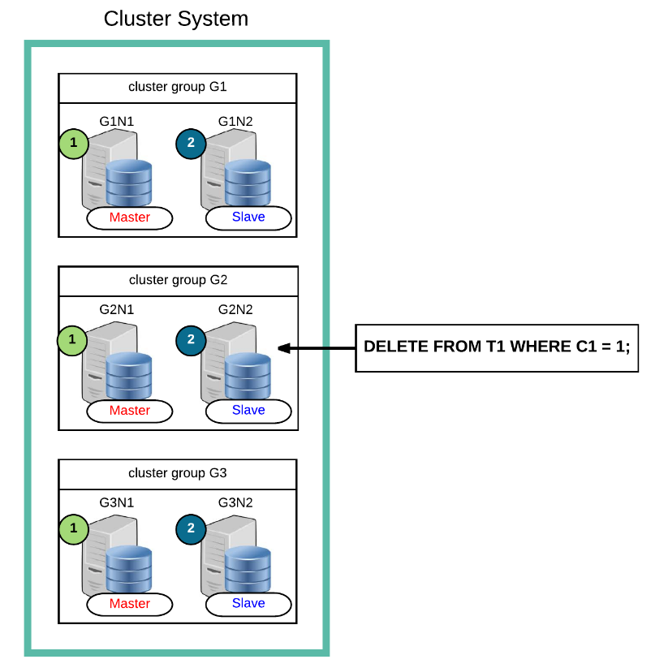
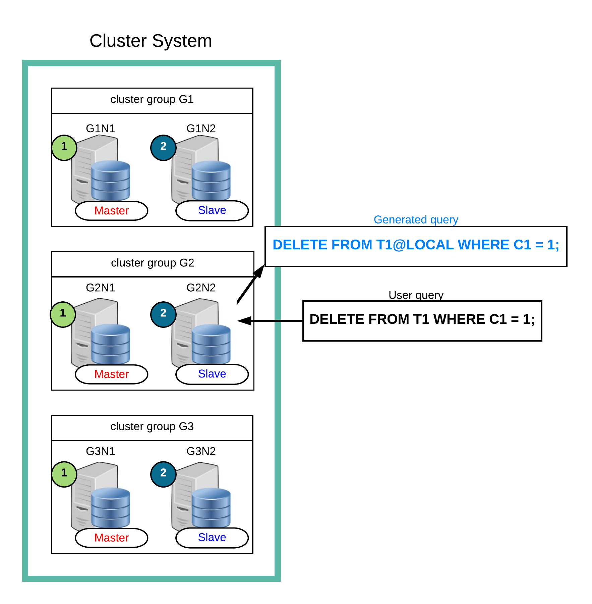
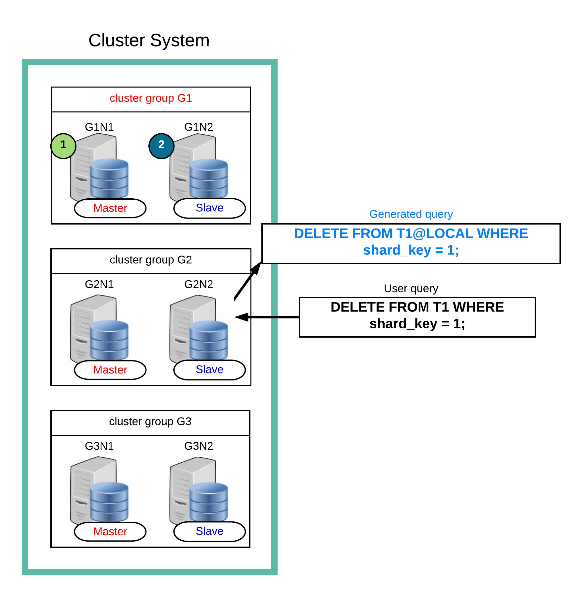
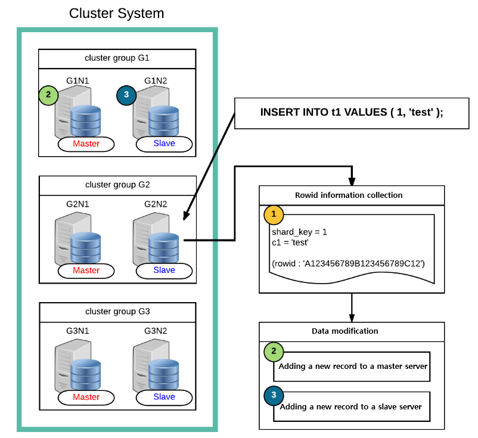
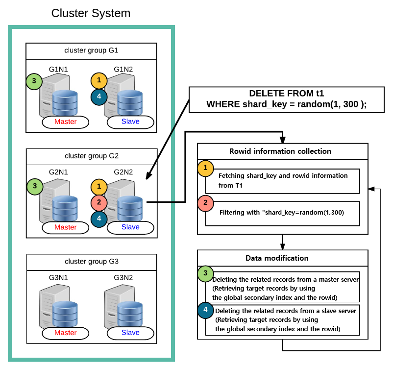

<a id="a6dc6b307063d249"></a>

# 12. SQL Languages

> Source: [GOLDILOCKS 3.2 User Manual (en)](https://manual.sunjesoft.co.kr/goldilocks/3_2_x/manual/en/a6dc6b307063d249)  
> Tag: `GOLDILOCKS_Venus_3_2_14_retagged`

[← 11. SQL Elements](11-sql-elements.md) · [Table of contents](../README.md) · [13. SQL Objects →](13-sql-objects.md)

Structured Query Languages (SQL) are classified as follows.

- Data Definition Language
- Data Manipulation Language
- Data Query Language
- Control Language

<a id="54f499f48bf7d79b"></a>
## Data Definition Language

<a id="68542f0b634c5690"></a>
### DDL Related Statements

For more information, refer to the followings.

- Non-schema object DDL
    - [Database Related Statements](13-sql-objects.md#0ed72409b706b5bc)
    - [Profile Related Statements](13-sql-objects.md#f0b4bb0e5f15818f)
    - [Audit Policy Related Statement](13-sql-objects.md#4eb958e24ff85679)
    - [Authorization Related Statements](13-sql-objects.md#f33e63ccb8e5b2fe)
    - [Schema Related Statements](13-sql-objects.md#167e316ac10904bf)
    - [Tablespace Related Statements](13-sql-objects.md#d957aaa2f5cc71f3)

- SQL schema object DDL
    - [Table Related Statements](13-sql-objects.md#c2920f04ed145130)
    - [Index Related Statements](13-sql-objects.md#a69602e4358185a6)
    - [View Related Statements](13-sql-objects.md#88761bbe7b3643f3)
    - [Sequence Related Statements](13-sql-objects.md#59cb0d20b8dc8fb8)
    - [Synonym Related Statements](13-sql-objects.md#8323ac60075a1d62)

- Cluster object DDL
    - [Cluster System Related Statements](14-cluster-objects.md#1f015c59b30d4ed2)
    - [Cluster Group Related Statements](14-cluster-objects.md#fcbcedb6fbfcf054)
    - [Cluster Member Related Statements](14-cluster-objects.md#85c419ad25d812f3)
    - [Cluster Location Related Statements](14-cluster-objects.md#33d4b72caf5ab4cc)
    - [Global Secondary Index Related Statements](14-cluster-objects.md#2a260ea047ac7231)

<a id="05063e8ea7b40b55"></a>
### Concepts of DDL

Data Definition Language (DDL) is an SQL language which creates, drops and alters SQL objects.

SQL objects of a database are listed in the following table. For more information, refer to the links in the following table.

<a id="2e5ccf4743675eda"></a>
<table class="table column_count_4"><caption>SQL objects types</caption><thead><tr><th class="to_center"><div>Object type</div></th><th class="to_center"><div>Object</div></th><th class="to_center"><div>Description</div></th><th class="to_center"><div>Refer to</div></th></tr></thead><tbody><tr><td class="to_left to_middle" rowspan="6"><div>Non-schema
object</div></td><td class="to_left to_middle"><div>Profile</div></td><td class="to_left to_middle"><div>It is an object which defines a password management policy.</div></td><td class="to_left to_middle"><div><a class="reference text" href="13-sql-objects.md#3bcdc46f1b2471ed">Profile</a></div></td></tr><tr><td class="to_middle"><div>Audit policy</div></td><td class="to_middle"><div>It is an object which defines the SQL audit policy.</div></td><td class="to_middle"><div><a class="reference text" href="13-sql-objects.md#d65bdf8ed1ea4a2a">Audit Policy</a></div></td></tr><tr><td class="to_left to_middle"><div>User</div></td><td class="to_left to_middle"><div>It is a user object which consists of a set of privileges.</div></td><td class="to_left to_middle"><div><a class="reference text" href="13-sql-objects.md#f7be8bf669bc1aaa">Authorization</a></div></td></tr><tr><td class="to_left to_middle"><div>Schema</div></td><td class="to_left to_middle"><div>It is a logical position including SQL schema objects such as tables.</div></td><td class="to_left to_middle"><div><a class="reference text" href="13-sql-objects.md#186fbafe5c0104d3">Schema</a></div></td></tr><tr><td class="to_left to_middle"><div>Tablespace</div></td><td class="to_left to_middle"><div>It is a physical storage of objects such as tables, indexes, etc.</div></td><td class="to_left to_middle"><div><a class="reference text" href="13-sql-objects.md#6e8fe96b8bd7a771">Tablespace</a></div></td></tr><tr><td class="to_left to_middle"><div>Public synonym</div></td><td class="to_left to_middle"><div>It is a public synonym.</div></td><td class="to_left to_middle"><div><a class="reference text" href="13-sql-objects.md#d763e51eed1a5f20">Public Synonym</a></div></td></tr><tr><td class="to_left to_middle" rowspan="7"><div>SQL schema 
object</div></td><td class="to_left to_middle"><div>Table</div></td><td class="to_left to_middle"><div>It is a physical relation where the data is stored.</div></td><td class="to_left to_middle"><div><a class="reference text" href="13-sql-objects.md#4753b81c546e39df">Table</a></div></td></tr><tr><td class="to_left to_middle"><div>View</div></td><td class="to_left to_middle"><div>It is a logical relation which consists of queries.</div></td><td class="to_left to_middle"><div><a class="reference text" href="13-sql-objects.md#acc3ec69459db2b4">View</a></div></td></tr><tr><td class="to_left to_middle"><div>Index</div></td><td class="to_left to_middle"><div>It is an index object to improve query performance.</div></td><td class="to_left to_middle"><div><a class="reference text" href="13-sql-objects.md#6cd111c0a16567fe">Index</a></div></td></tr><tr><td class="to_left to_middle"><div>Sequence</div></td><td class="to_left to_middle"><div>It is an object which generate sequence number.</div></td><td class="to_left to_middle"><div><a class="reference text" href="13-sql-objects.md#c4b0e8032f01f6d1">Sequence</a></div></td></tr><tr><td class="to_left to_middle"><div>Synonym</div></td><td class="to_left to_middle"><div>It is an object which declares an alias for an object.</div></td><td class="to_left to_middle"><div><a class="reference text" href="13-sql-objects.md#d42db9309037d254">Synonym</a></div></td></tr><tr><td class="to_middle"><div>Stored procedure</div></td><td class="to_middle"><div>It is a user defined procedure object.</div></td><td class="to_middle"><div><a class="reference text" href="13-sql-objects.md#fbfe0ef940689c24">Stored Procedure</a></div></td></tr><tr><td class="to_middle"><div>Stored function</div></td><td class="to_middle"><div>It is a user defined function object.</div></td><td class="to_middle"><div><a class="reference text" href="13-sql-objects.md#e8302685390ccfc2">Stored Function</a></div></td></tr><tr><td class="to_left to_middle" rowspan="5"><div>Cluster
object</div></td><td class="to_left to_middle"><div>Cluster group</div></td><td class="to_left to_middle"><div>It is a cluster member set.</div></td><td class="to_left to_middle"><div><a class="reference text" href="14-cluster-objects.md#8427362d2b016c7d">Cluster Group</a></div></td></tr><tr><td class="to_left to_middle"><div>Cluster member</div></td><td class="to_left to_middle"><div>It is a data server which configures a cluster system.</div></td><td class="to_left to_middle"><div><a class="reference text" href="14-cluster-objects.md#b365883a7191d4b2">Cluster Member</a></div></td></tr><tr><td class="to_left to_middle"><div>Cluster location</div></td><td class="to_left to_middle"><div>It is a location object of a cluster member.</div></td><td class="to_left to_middle"><div><a class="reference text" href="14-cluster-objects.md#e5320ab8711f31b4">Cluster Location</a></div></td></tr><tr><td class="to_left to_middle"><div>Shard</div></td><td class="to_left to_middle"><div>It is a set of rows which horizontally divides a cluster table.</div></td><td class="to_left to_middle"><div><a class="reference text" href="14-cluster-objects.md#8af55f007265bd00">Cluster Table and Shard</a></div></td></tr><tr><td class="to_left to_middle"><div>Global secondary
index</div></td><td class="to_left to_middle"><div>It is an index for the row identifier of a cluster.</div></td><td class="to_left to_middle"><div><a class="reference text" href="14-cluster-objects.md#0dd161605506f7a3">Global Secondary Index</a></div></td></tr></tbody></table>

<a id="63db3e2d784ab7e7"></a>
### DDL and Transaction

A transaction of GOLDILOCKS includes not only DML statements such as INSERT, DELETE, UPDATE data, but also DDL statement such as CREATE, DROP, ALTER objects. Many DBMS performs implicit transactions of DDL. On the other hand, GOLDILOCKS includes a DDL statement in the transaction, and it guarantees the atomicity and consistency of transaction.

This feature is useful when a user needs to atomically perform batch DDL such as database migration ortool installation, or to recover a mistake through ROLLBACK when statement such as DROP TABLE or TRUNCATE TABLE is executed by user mistake.

If the property of DDL statement is auto-commit, then it automatically commits when executing the statement. On the other hand, if it is not auto-commit, then it can rollback the transaction even after the statement was executed. Whether the DDL is auto-commit or not is queried by using [V$SQL_COMMAND](../part-02-administration-manual/9-database-information.md#d3f875d0d2cc9ccc) view as follows.

```
gSQL> 
SELECT command, auto_commit 
  FROM V$SQL_COMMAND 
 WHERE is_ddl = 'YES';


COMMAND                                                   AUTO_COMMIT
--------------------------------------------------------- -----------
ALTER AUDIT POLICY                                        YES        
ALTER CLUSTER GROUP .. ADD CLUSTER MEMBER                 YES        
ALTER CLUSTER GROUP .. OFFLINE CLUSTER MEMBER             YES        
ALTER DATABASE DROP INACTIVE CLUSTER MEMBERS              YES        
ALTER DATABASE OFFLINE INACTIVE CLUSTER MEMBERS           YES        
ALTER DATABASE RESET LOCAL CLUSTER MEMBER                 YES        
ALTER DATABASE ADD LOGFILE GROUP                          YES        
ALTER DATABASE ADD LOGFILE MEMBER                         YES        
ALTER DATABASE DROP LOGFILE GROUP                         YES        
ALTER DATABASE DROP LOGFILE MEMBER                        YES        
ALTER DATABASE RENAME LOGFILE                             YES        
ALTER DATABASE ARCHIVELOG                                 YES        
ALTER DATABASE NOARCHIVELOG                               YES        
ALTER DATABASE CLEAR PASSWORD HISTORY                     NO         
ALTER FUNCTION                                            NO         
ALTER INDEX AGING                                         NO         
ALTER INDEX .. STORAGE                                    NO         
ALTER INDEX .. RENAME                                     NO         
ALTER PROCEDURE                                           NO         
ALTER PROFILE                                             YES        
ALTER SEQUENCE                                            YES        
ALTER SYSTEM SWITCH LOGFILE                               YES        
ALTER TABLE .. ADD COLUMN                                 NO         
ALTER TABLE .. SET UNUSED COLUMN                          NO         
ALTER TABLE .. ALTER COLUMN .. SET DEFAULT                NO         
ALTER TABLE .. ALTER COLUMN .. DROP DEFAULT               NO         
ALTER TABLE .. ALTER COLUMN .. SET NOT NULL               NO         
ALTER TABLE .. ALTER COLUMN .. DROP NOT NULL              NO         
ALTER TABLE .. ALTER COLUMN .. SET DATA TYPE              YES        
ALTER TABLE .. ALTER COLUMN .. AS IDENTITY                NO         
ALTER TABLE .. ALTER COLUMN .. DROP IDENTITY              NO         
ALTER TABLE .. RENAME COLUMN                              NO         
ALTER TABLE .. STORAGE                                    NO         
ALTER TABLE .. ADD CONSTRAINT                             NO         
ALTER TABLE .. ALTER CONSTRAINT                           NO         
ALTER TABLE .. DROP CONSTRAINT                            NO         
ALTER TABLE .. RENAME CONSTRAINT                          NO         
ALTER TABLE .. RENAME TO ..                               NO         
ALTER TABLE .. REBALANCE ..                               YES        
ALTER TABLE .. MOVE SHARD .. TO CLUSTER GROUP ..          YES        
ALTER TABLE .. SPLIT SHARD .. INTO .. AT CLUSTER GROUP .. YES        
ALTER TABLE .. RENAME SHARD .. TO ..                      NO         
ALTER TABLE .. ADD SUPPLEMENTAL LOG                       NO         
ALTER TABLE .. ADD GLOBAL SECONDARY INDEX                 NO         
ALTER TABLE .. ALTER GLOBAL SECONDARY INDEX               NO         
ALTER TABLE .. ALTER GLOBAL SECONDARY INDEX AGING         NO         
ALTER TABLE .. DROP GLOBAL SECONDARY INDEX                NO         
ALTER TABLE .. DROP SUPPLEMENTAL LOG                      NO         
ALTER TABLE .. READ ONLY                                  YES        
ALTER TABLE .. READ WRITE                                 YES        
ALTER TABLESPACE .. ADD                                   YES        
ALTER TABLESPACE .. DROP                                  YES        
ALTER TABLESPACE .. ONLINE                                YES        
ALTER TABLESPACE .. OFFLINE                               YES        
ALTER TABLESPACE .. RENAME TO                             YES        
ALTER TABLESPACE .. RENAME { DATAFILE | MEMORY }          YES        
ALTER USER                                                YES        
ALTER USER .. IDENTIFIED BY                               YES        
ALTER VIEW                                                NO         
ANALYZE SYSTEM COMPUTE STATISTICS                         NO         
ANALYZE SYSTEM DELETE STATISTICS                          NO         
ANALYZE TABLE .. [COMPUTE|ESTIMATE] STATISTICS            YES        
ANALYZE TABLE .. DELETE STATISTICS                        NO         
AUDIT POLICY                                              YES        
COMMENT ON .. IS                                          NO         
CREATE AUDIT POLICY                                       YES        
CREATE CLUSTER GROUP                                      YES        
CREATE FUNCTION                                           NO         
CREATE INDEX                                              NO         
CREATE PROCEDURE                                          NO         
CREATE PROFILE                                            YES        
CREATE SCHEMA                                             YES        
CREATE SEQUENCE                                           YES        
CREATE SYNONYM                                            NO         
CREATE TABLE                                              NO         
CREATE TABLE ... AS SELECT                                NO         
CREATE TABLESPACE                                         YES        
CREATE USER                                               YES        
CREATE VIEW                                               NO         
DROP AUDIT POLICY                                         YES        
DROP CLUSTER GROUP                                        YES        
DROP FUNCTION                                             NO         
DROP INDEX                                                NO         
DROP PROCEDURE                                            NO         
DROP PROFILE                                              YES        
DROP SCHEMA                                               YES        
DROP SEQUENCE                                             YES        
DROP SYNONYM                                              NO         
DROP TABLE                                                NO         
DROP TABLESPACE                                           YES        
DROP USER                                                 YES        
DROP VIEW                                                 NO         
GRANT .. ON DATABASE                                      NO         
GRANT .. ON TABLESPACE                                    NO         
GRANT .. ON SCHEMA                                        NO         
GRANT .. ON TABLE                                         NO         
GRANT USAGE ON ..                                         NO         
GRANT .. ON PROCEDURE                                     NO         
NOAUDIT POLICY                                            YES        
REVOKE .. ON DATABASE                                     NO         
REVOKE .. ON TABLESPACE                                   NO         
REVOKE .. ON SCHEMA                                       NO         
REVOKE .. ON TABLE                                        NO         
REVOKE USAGE ON ..                                        NO         
REVOKE .. ON PROCEDURE                                    NO         
TRUNCATE TABLE                                            NO         

106 rows selected.
```

The followings are examples of COMMIT and ROLLBACK when table-related DDL statements are included in the transactions, and examples of its effects on other transactions. The example shows that the transaction including DDL guarantees the transaction atomicity. In addition, it ensures the reading consistency of the transaction, which is not affected by other transactions before transaction's commitment or when the transaction is rolled back.

<a id="a5f73f3d689eff33"></a>
#### Creating Object and Transaction

- Before committing or rolling back a transaction of creating table

When a table is created, and transaction is not committed, the table data can be manipulated on the DDL transaction as follows. However, other transactions are not allowed to enquire the table until the creating table transaction is committed. CREATE TABLE statement, like as INSERT statement, can not be queried by any other transaction until the transaction is committed.

    - Transaction A: Table t1 is created but the transaction is not committed.

```
gSQL> CREATE TABLE t1 ( id INTEGER, name VARCHAR(128) );
Table created.

gSQL> INSERT INTO t1 VALUES ( 1, 'leekmo' );
1 row created.

gSQL> SELECT * FROM t1;

ID NAME  
-- ------
 1 leekmo

1 row selected.
```

As above, if table t1 is created on the transaction A and the transaction is not yet committed, the transaction B in another session can not enquire the table t1 and can not create the table named as t1.

    - Transaction B: Table t1 can not be enquired until committing the transaction A.

```
gSQL> SELECT * FROM t1;

ERR-42000(16040): table or view does not exist : 
SELECT * FROM t1
              *
ERROR at line 1:
```

    - Table t1 can not be created until the transaction A is rolled back.

```
gSQL> CREATE TABLE t1 ( emp_no INTEGER );

ERR-HYT00(14026): resource busy or timeout expired
```

- After committing a transaction of creating table

If the transaction A is committed, table t1 can be enquired by the transaction B and CREATE TABLE statement returns a validation error to notify that the table t1 exists as follows.

    - Transaction B: After committing the transaction A, the table can be enquired as follows.

```
gSQL> SELECT * FROM t1;

ID NAME  
-- ------
 1 leekmo

1 row selected.
```

    - After the transaction A is committed, a validation error is returned.

```
gSQL> CREATE TABLE t1 ( emp_no INTEGER );

ERR-42000(16005): name 'PUBLIC.T1' is already used by an existing object : 
CREATE TABLE t1 ( emp_no INTEGER )
             *
ERROR at line 1:
```

- After rolling back a transaction of creating table

If the transaction A is rolled back, creating table t1 is also rolled back, and table t1 can be created by the transaction B.

    - Transaction B: The transaction A is rolled back and its state becomes as same as before creating table t1.

```
gSQL> SELECT * FROM t1;

ERR-42000(16040): table or view does not exist : 
SELECT * FROM t1
              *
ERROR at line 1:
```

    - The transaction A is rolled back and it can create the table t1.

```
gSQL> CREATE TABLE t1 ( emp_no INTEGER );

Table created.
```

<a id="31a35c1eb2f9ca32"></a>
#### Dropping Object and Transaction

- Before committing or rolling back a transaction of dropping table

When a table is dropped, and transaction is not committed, other transactions can enquire the dropped table until the DROP TABLE transaction is committed. DROP TABLE statement, like as DELETE statement, retrieves the state of before deleting the table when other transaction enquires it until the transaction is committed.

The following example describes the state which the transaction A drops the table t1, then it creates new table t1, and the transaction is not committed.

    - Transaction A: There is a row having two columns in the table t1 before dropping the table.

```
gSQL> SELECT * FROM t1;

ID NAME  
-- ------
 1 leekmo

1 row selected.
```

    - Dropping the existing table t1

```
gSQL> DROP TABLE t1;

Table dropped.
```

    - Creating the new table t1

```
gSQL> CREATE TABLE t1 ( addr VARCHAR(128) );    

Table created.
```

    - Creating a new row in the newly created table t1

```
gSQL> INSERT INTO t1 VALUES ( 'Seoul, Korea' );

1 row created.

gSQL> SELECT * FROM t1;

ADDR        
------------
Seoul, Korea

1 row selected.
```

If the transaction B enquires when the transaction A is not committed, the information which is before the transaction A is executed is obtained as follows. DROP TABLE statement, like as DELETE statement, does not affect any other transaction until the transaction is committed.

    - Transaction B: The transaction B retrieves the table which is before the execution of the transaction A.

```
gSQL> SELECT * FROM t1;

ID NAME  
-- ------
 1 leekmo

1 row selected.
```

- After committing a transaction of dropping table

If the transaction A is committed, then the transaction B enquires the newly created table t1 as follows.

    - Transaction B: After committing the transaction A, the transaction B enquires the newly created table t1.

```
gSQL> SELECT * FROM t1;

ADDR        
------------
Seoul, Korea

1 row selected.
```

- After rolling back a transaction of dropping table

If the transaction A is rolled back, the transaction B enquires the table t1 which is before the execution of the transaction A as follows. Namely, if the transaction A is rolled back, the rollback transaction does not affect the data of which the transaction B enquires.

    - Transaction B: If the transaction A is rolled back, the transaction B enquires the information which is before the execution of the transaction A.

```
gSQL> SELECT * FROM t1;

ID NAME  
-- ------
 1 leekmo

1 row selected.
```

<a id="f520232db891acef"></a>
#### Altering Object and Transaction

ALTER TABLE statement is used to alter the table structure. ALTER TABLE statement also ensures atomicity and consistency of the transaction like as CREATING TABLE or DROPPING TABLE statements. Before committing a transaction in which a column is added to a table, other transactions retrieve the information of the existing table as follows. Namely, ALTER TABLE statement, like as UPDATE statement, retrieves information which is before DDL transaction in other transaction until the transaction is committed.

- Transaction A: It adds a new UPDATE_TIME column.

```
gSQL> ALTER TABLE t1 ADD COLUMN ( update_time TIMESTAMP DEFAULT CURRENT_TIMESTAMP );

Table altered.
```

- The table t1 including the added column is retrieved.

```
gSQL> select * from t1;

ID NAME   UPDATE_TIME               
-- ------ --------------------------
 1 leekmo 2014-07-10 12:50:33.540495

1 row selected.
```

If the transaction B is executed before committing the transaction A as follows, then the table t1 which is before adding a column is retrieved.

- Transaction B: The added column UPDATE_TIME is not retrieve, because the transaction A is not committed.

```
gSQL> SELECT * FROM t1;

ID NAME  
-- ------
 1 leekmo

1 row selected.
```

<a id="7ec0e3a30e9571ff"></a>
## Data Manipulation Language

<a id="3355235beadeb1c2"></a>
### DML Related Statements

For more information, refer to the followings.

- INSERT related statements
    - [INSERT INTO](16-sql-references.md#db825a2bf01d54dd)
    - [INSERT INTO name RETURNING](16-sql-references.md#6e07672cf5aedd6b)
    - [INSERT INTO name RETURNING .. INTO](16-sql-references.md#be8a8f852c974819)

- UPDATE related statements
    - [UPDATE](16-sql-references.md#607eb6ad25aa2ec3)
    - [UPDATE name RETURNING](16-sql-references.md#247a80e4d8b5ad3d)
    - [UPDATE name RETURNING .. INTO](16-sql-references.md#0d90d25d49a050ed)
    - [UPDATE name WHERE CURRENT OF cursor_name](16-sql-references.md#b16d585b333e86ee)

- DELETE related statements
    - [DELETE FROM](16-sql-references.md#c496862da559967a)
    - [DELETE FROM name RETURNING](16-sql-references.md#6806f9f54690d5b6)
    - [DELETE FROM name RETURNING .. INTO](16-sql-references.md#1a665c9644be2b50)
    - [DELETE FROM name WHERE CURRENT OF cursor_name](16-sql-references.md#557c797ddb6c8af5)

- SELECT related statements: [SELECT .. INTO](16-sql-references.md#3a7d31ba115517c4)

- Dynamic SQL related statements
    - [EXECUTE IMMEDIATE 'sql_string'](16-sql-references.md#1eacad0a6072f76a)
    - [PREPARE statement_name](16-sql-references.md#897dbc4fb97ab869)
    - [EXECUTE statement_name](16-sql-references.md#ca4c1dbcc096bbdd)

<a id="0ff1a5da1d5f14e2"></a>
### Concepts of DML

Data Manipulation Language (DML) is an SQL language which manipulates and enquires data in existing tables such as INSERT, DELETE, UPDATE.

This chapter describes only DML statements which change data. For more information about queries, refer to [Data Query Language](#b04061edd8d6e7d9).

The DDL statements change the SQL object structure, but DML statements manipulate the objects contents. For example, ALTER TABLE statement alters the table structure, but INSERT statement adds one or more rows in the table.

DML statements such as inserting, deleting, updating data in table are classified as follows.

<a id="2fede41880d337dc"></a>
<table class="table column_count_3"><caption>Data manipulation statements</caption><thead><tr><th class="to_center"><div>Category</div></th><th class="to_center"><div>Statements</div></th><th class="to_center"><div>Description</div></th></tr></thead><tbody><tr><td class="to_left to_middle" rowspan="4"><div>INSERT</div></td><td class="to_left to_middle"><div>INSERT .. VALUES</div></td><td class="to_left to_middle"><div>It adds a single row to the table.</div></td></tr><tr><td class="to_left to_middle"><div>INSERT .. SELECT</div></td><td class="to_left to_middle"><div>It adds the query results to the table.</div></td></tr><tr><td class="to_left to_middle"><div>INSERT .. RETURN .. INTO</div></td><td class="to_left to_middle"><div>It sets the value of the added row as a variable.</div></td></tr><tr><td class="to_left to_middle"><div>INSERT .. RETURN</div></td><td class="to_left to_middle"><div>It retrieves the added row as the query result.</div></td></tr><tr><td class="to_left to_middle" rowspan="4"><div>DELETE</div></td><td class="to_left to_middle"><div>DELETE .. WHERE</div></td><td class="to_left to_middle"><div>It deletes the row which satisfies the condition.</div></td></tr><tr><td class="to_left to_middle"><div>DELETE .. WHERE CURRENT OF</div></td><td class="to_left to_middle"><div>It deletes the row which is at the cursor's position.</div></td></tr><tr><td class="to_left to_middle"><div>DELETE .. RETURN .. INTO</div></td><td class="to_left to_middle"><div>It sets the value of the removed row as a variable.</div></td></tr><tr><td class="to_left to_middle"><div>DELETE .. RETURN</div></td><td class="to_left to_middle"><div>It retrieves the removed row as the query result.</div></td></tr><tr><td class="to_left to_middle" rowspan="4"><div>UPDATE</div></td><td class="to_left to_middle"><div>UPDATE .. WHERE</div></td><td class="to_left to_middle"><div>It updates the row which satisfies the condition.</div></td></tr><tr><td class="to_left to_middle"><div>UPDATE .. WHERE CURRENT OF</div></td><td class="to_left to_middle"><div>It updates the row which is at the cursor's position.</div></td></tr><tr><td class="to_left to_middle"><div>UPDATE .. RETURN .. INTO</div></td><td class="to_left to_middle"><div>It sets the value of the updated row as a variable.</div></td></tr><tr><td class="to_left to_middle"><div>UPDATE .. RETURN</div></td><td class="to_left to_middle"><div>It retrieves the updated row as the query result.</div></td></tr></tbody></table>

<a id="4e6c39af67bfc040"></a>
### Inserting Data

It adds data in a row unit when adding data to a table. The INSERT statement cad add one or more rows to a table. Even when the data in some columns are omitted, all rows are added with completed columns to the table.

The following is an example of a table.

```
CREATE TABLE t1
(
    id   NUMBER(10,0),
    name VARCHAR(128),
    addr VARCHAR(1024) DEFAULT 'n/a'
);
```

The most basic way to add a row is as follows.

```
INSERT INTO t1 VALUES ( 1, 'leekmo', 'Seoul, Korea' );
```

The values listed in the VALUES clause are inserted in accordance with the sequence of the listed column when the table is created.   
However, the example above can cause an unexpected failure when inserting or deleting columns, so it is recommended to explicitly specify the column name as follows.

```
INSERT INTO t1 (id, name, addr) VALUES ( 1, 'leekmo', 'Seoul, Korea' );
INSERT INTO t1 (name, addr, id) VALUES ( 'leekmo', 'Seoul, Korea', 1 );
```

The two INSERT statements above are listed in different order from the columns, but the added row of the table t1 has the same data.

If the table does not list all the columns, unspecified column is set to the default value to complete the row. The addr column which was not used in the statement stores the default value (n/a) which was specified when creating table as follows.

```
INSERT INTO t1 ( id, name ) VALUES ( 1, 'leekmo' );
INSERT INTO t1 ( id, name ) SELECT id, name FROM emp;
```

Use DEFAULT to explicitly specify the default value for the column as follows.

```
INSERT INTO t1 ( id, name, addr ) VALUES ( 1, 'leekmo', DEFAULT );
```

Use either of the following two statements to set all the columns to the default value.

```
INSERT INTO t1 ( id, name, addr ) VALUES ( DEFAULT, DEFAULT, DEFAULT );
INSERT INTO t1 DEFAULT VALUES;
```

Use a single INSERT statement to add multiple rows. The following is an example of adding three new rows using a single INSERT statement.

```
INSERT INTO t1 (id, name, addr) VALUES
  ( 1, 'leekmo', 'Seoul, Korea' ),
  ( 2, 'mkkim', 'Seoul, Korea' ),
  ( 3, 'xcom', 'Inchon, Korea' );
```

Use the SELECT query results to add multiple rows. The following is an example of adding rows to the table t1 by retrieving employees who joined the company more than three years ago.

```
INSERT INTO t1 ( id, name, addr )
SELECT id, name, addr 
  FROM emp 
 WHERE DATEDIFF( YEAR, SYSDATE, join_date ) >= 3;
```

<a id="913a00f7ba6f8e8b"></a>
### Deleting Data

DELETE statement deletes data from the table in a row unit like when inserting data. Rows can be deleted by using WHERE condition or by using row's ID(ROWID).

The following is an example of deleting rows which satisfy WHERE condition.

```
DELETE FROM t1 WHERE id = 1;
```

The following is an example of deleting the row using ROWID.

```
gSQL> SELECT rowid FROM t1 WHERE id = 1;

                  ROWID
-----------------------
AAAAAAAAFNHAACAAAAAiAAA

1 row selected.

gSQL> DELETE FROM t1 WHERE ROWID = 'AAAAAAAAFNHAACAAAAAiAAA';

1 row deleted.
```

DELETE statement without a WHERE clause deletes the entire row in a table. DELETE statement without a WHERE clause is similar to TRUNCATE TABLE statement in terms of deleting entire row, but it is recommended to use the TRUNCATE TABLE statement.

```
DELETE FROM t1;
TRUNCATE TABLE t1;
```

<a id="afcb9624dda28536"></a>
### Updating Data

Update data by using UPDATE statement. One or more rows and columns can be updated. Other columns which is not specified in the UPDATE statement is not affected.

The following is an example of updating a column in rows which satisfy the condition.

```
UPDATE t1 SET page_view = page_view + 1 WHERE id = 1;
```

The followings are examples of updating multiple columns, and the two UPDATE statements mean the same.

```
UPDATE t1 SET page_view = page_view + 1, status = 'F' WHERE id = 1;
UPDATE t1 SET (page_view, status) = (page_view + 1, 'F') WHERE id = 1;
```

Use DEFAULT as follows to set the column value to a default value.

```
UPDATE t1 SET addr = DEFAULT WHERE id = 1;
```

<a id="043113d535f4908a"></a>
### Manipulating Data Using Cursor

Cursor is a session object to execute queries and to manipulate the query result. Use cursor to update or delete the query result set.

The following is an example of declaring updatable cursor, and updating or deleting the row at the position of the current cursor using the updatable cursor.

```
gSQL> DECLARE cur1 CURSOR FOR SELECT id, data FROM t1 FOR UPDATE;

Cursor declared.

gSQL> OPEN cur1;

Cursor is open.

gSQL> \var v_id INTEGER
gSQL> \var v_data VARCHAR(128)
gSQL> FETCH cur1 INTO :v_id, :v_data;

V_ID V_DATA
---- ------
   1 data_1

1 row fetched.

gSQL> FETCH cur1 INTO :v_id, :v_data;

V_ID V_DATA
---- ------
   2 data_2

1 row fetched.

gSQL> DELETE FROM t1 WHERE CURRENT OF cur1;

1 row deleted.

gSQL> FETCH cur1 INTO :v_id, :v_data;

V_ID V_DATA
---- ------
   3 data_3

1 row fetched.

gSQL> UPDATE t1 SET id = id + :v_id WHERE CURRENT OF cur1;

1 row updated.

gSQL> COMMIT;

Commit complete.

gSQL> SELECT * FROM t1 ORDER BY 1;

ID DATA  
-- ------
 1 data_1
 6 data_3

2 rows selected.
```

The examples above describe the followings.  
Use [DECLARE cursor_name](16-sql-references.md#9826eadcd321de1b) to declare FOR UPDATE cursor, and use [OPEN cursor_name](16-sql-references.md#503dadf63d95d09e) to open the cursor.  
Use [FETCH cursor_name](16-sql-references.md#8b90e7e7e6e0c963) to move the cursor to the specified position.  
Use [DELETE FROM name WHERE CURRENT OF cursor_name](16-sql-references.md#557c797ddb6c8af5) to delete the row in the specified position.  
Use [UPDATE name WHERE CURRENT OF cursor_name](16-sql-references.md#b16d585b333e86ee) to update the row in the specified position.

FOR UPDATE cursor is closed using [CLOSE cursor_name](16-sql-references.md#8094485dc3cb5ea5), or it is closed when committing transaction.

<a id="160960d1c045b2f9"></a>
### DML Query

When executing DML statements changing the data, use RETURNING clause to retrieve the changed data. The RETURNING clause of DML statements, like as SELECT, can retrieve data, so the execution of the DML statement and the SELECT statement can be replaced with the DML query.

The following is an example of using [INSERT INTO name RETURNING](16-sql-references.md#6e07672cf5aedd6b) syntax to insert data and retrieve the result. The join_date value which was input by using SYSDATE function can be retrieved by asingle DML query.

```
gSQL> INSERT INTO t1 ( id, join_date )  VALUES ( 1, SYSDATE ) RETURNING id, join_date;

ID JOIN_DATE 
-- ----------
 1 2014-07-18

1 row created.
```

The following is an example of using [DELETE FROM name RETURNING](16-sql-references.md#6806f9f54690d5b6) syntax to delete data and retrieve the result. The result data can be manipulated by using operation in RETURNING clause.

```
gSQL> DELETE FROM t1 RETURNING ( id || ': ' || join_date ) AS id_and_join_date;

ID_AND_JOIN_DATE
----------------
1: 2014-07-18   

1 row deleted.
```

The following is an example of using [UPDATE name RETURNING](16-sql-references.md#247a80e4d8b5ad3d) syntax to update rows and retrieve the updated values. The value which is before updating can be retrieved by using OLD clause.

- It updates the row and retrieves the updated value.

```
gSQL> UPDATE t1 SET page_view = page_view + 1 WHERE id = 1 RETURNING page_view;

PAGE_VIEW
---------
      102

1 row updated.
```

- It updates the row and retrieves the value which is before the updating.

```
gSQL> UPDATE t1 SET page_view = page_view + 1 WHERE id = 1 RETURNING OLD page_view;

PAGE_VIEW
---------
      102

1 row updated.
```

RETURNING clause of DML statements, like as SELECT query, can retrieve multiple query results. However, if the DML is executed only for a single row, then the host variable can be obtained by using RETURNING INTO clause. In this case, the number of changed rows should be one or less, like [SELECT .. INTO](16-sql-references.md#3a7d31ba115517c4) clause .

The following is an example of setting the value to the host variable using RETURNING .. INTO clause of each DML statement.

- It declares the host variable.

```
gSQL> \var v_id        INTEGER
gSQL> \var v_page_view BIGINT
gSQL> \var v_date      DATE
```

- After inserting the row, a value is set to the host variable.

```
gSQL> INSERT INTO t1 ( id, join_date ) VALUES ( 1, SYSDATE ) RETURNING join_date INTO :v_date;

V_DATE                    
--------------------------
2014-07-18 16:57:11.000000

1 row created.
```

- After updating the row, a value is set to the host variable.

```
gSQL> UPDATE t1 SET page_view = page_view + 1 WHERE id = 1 RETURN page_view INTO :v_page_view;

V_PAGE_VIEW
-----------
        101

1 row updated.
```

- After deleting the row, a value is set to the host variable.

```
gSQL> DELETE FROM t1 WHERE id = 1 RETURN id, page_view INTO :v_id, :v_page_view;

V_ID V_PAGE_VIEW
---- -----------
   1         101

1 row deleted.
```

For more information about DML query, refer to the followings.

- [INSERT INTO name RETURNING](16-sql-references.md#6e07672cf5aedd6b)
- [INSERT INTO name RETURNING .. INTO](16-sql-references.md#be8a8f852c974819)
- [DELETE FROM name RETURNING](16-sql-references.md#6806f9f54690d5b6)
- [DELETE FROM name RETURNING .. INTO](16-sql-references.md#1a665c9644be2b50)
- [UPDATE name RETURNING](16-sql-references.md#247a80e4d8b5ad3d)
- [UPDATE name RETURNING .. INTO](16-sql-references.md#0d90d25d49a050ed)

<a id="b04061edd8d6e7d9"></a>
## Data Query Language

<a id="0ee30191f2d183d1"></a>
### Query Related Statements

For more information, refer to the followings.

- SELECT query related statements
    - [SELECT](16-sql-references.md#1117040fd802dbd4)
    - [SELECT .. FOR UPDATE](16-sql-references.md#f7fb3657b7896855)

- DML query related statements
    - [INSERT INTO name RETURNING](16-sql-references.md#6e07672cf5aedd6b)
    - [UPDATE name RETURNING](16-sql-references.md#247a80e4d8b5ad3d)
    - [DELETE FROM name RETURNING](16-sql-references.md#6806f9f54690d5b6)

- Cursor related statements
    - [DECLARE cursor_name](16-sql-references.md#9826eadcd321de1b)
    - [OPEN cursor_name](16-sql-references.md#503dadf63d95d09e)
    - [FETCH cursor_name](16-sql-references.md#8b90e7e7e6e0c963)
    - [CLOSE cursor_name](16-sql-references.md#8094485dc3cb5ea5)
    - [DELETE FROM name WHERE CURRENT OF cursor_name](16-sql-references.md#557c797ddb6c8af5)
    - [UPDATE name WHERE CURRENT OF cursor_name](16-sql-references.md#b16d585b333e86ee)

<a id="e569e49ffa302774"></a>
### Concepts of Query

Query means a series of operations to retrieve data for one or more of the table or view. By using the query, a user can get the result data which satisfies the specific condition in the desired form from the stored data.

Query is a SELECT statement which is at the top in the entire SQL statement separated by ';'. Top-level SELECT statement can include another SELECT statement in it. In this case, the subordinate SELECT statement is called as a subquery.

In GOLDILOCKS, query is divided into SELECT query, DML query, and cursor. SELECT query returns the result by using the SELECT statement. DML query returns the result by using the RETURNING phrase in INSERT, DELETE, UPDATE statements. Cursor temporarily saves the result sets when it is enquired once, and randomly accesses to a row of the saved result set, then brings the result.   
A user can get the results at once by using SELECT query and DML query. On the other hand, by using the cursor, SELECT statement specified with DECLARE cursor is executed in OPEN cursor, and then it holds the result set until CLOSE cursor is called. Then it repeatedly brings the result by randomly accessing a row of the result set using FETCH cursor.

This chapter describes SELECT query, DML query and cursor.

<a id="3521a8b49d13ea69"></a>
### Basic Query

The basic form of a query is *SELECT &lt;select list&gt; FROM &lt;table expression&gt;*. *&lt;select list&gt;* which is between SELECT and FROM keywords, specifies one or more columns or expressions to be included in rows which are the result for the table or view described in *&lt;table expression&gt;*.

```
SELECT n_name
     , INITCAP( n_name )  
  FROM nation
 WHERE n_regionkey = 1;           


N_NAME                    INITCAP( N_NAME )        
------------------------- -------------------------
ARGENTINA                 Argentina                
BRAZIL                    Brazil                   
CANADA                    Canada                   
PERU                      Peru                     
UNITED STATES             United States            

5 rows selected.
```

One or more tables or views can be described in &lt;table expression&gt;, and same column can be included in two tables or views. In this case, the name of table or view should be specified together when describing that column in &lt;select list&gt;. When describing a table or a column, it is recommended to clearly describe the schema names and table names, etc.

- A wrong example

```
SELECT n_name
  FROM nation   AS n
     , v_nation AS v
 WHERE n.n_nationkey = v.n_nationkey
   AND v.n_regionkey = 1;


ERR-42000(16142): column ambiguously defined : 
SELECT n_name
       *
ERROR at line 1:
```

- A correct example

```
SELECT n.n_name
  FROM nation   AS n
     , v_nation AS v
 WHERE n.n_nationkey = v.n_nationkey
   AND v.n_regionkey = 1;

N_NAME                   
-------------------------
ARGENTINA                
BRAZIL                   
CANADA                   
PERU                     
UNITED STATES            

5 rows selected.
```

&lt;select list&gt; supports the alias name. It changes output column names in each columns which are separated by comma (,). Alias name can be used only in the &lt;order by clause&gt;, and it can not to be used in other phrases.

```
SELECT p_type
     , p_retailprice * 0.9 AS discount_price
  FROM part
 ORDER BY discount_price
 FETCH 5;

    2     3     4     5 
P_TYPE                 DISCOUNT_PRICE
---------------------- --------------
PROMO BURNISHED COPPER          810.9
ECONOMY BRUSHED NICKEL          810.9
LARGE BRUSHED BRASS             811.8
LARGE BRUSHED NICKEL            811.8
PROMO ANODIZED STEEL            811.8

5 rows selected.
```

In addition to &lt;select list&gt;, &lt;hint clause&gt; and &lt;set quantifier&gt; can also be used between SELECT and FROM keywords. &lt;hint clause&gt; allows a user to directly adjust the query execution plan. For more information, refer to [hint clause](16-sql-references.md#ad0ef76d32e7f521). &lt;set quantifier&gt; removes the duplicate data of the row which is returned as the result. For more information, refer to [query specification](16-sql-references.md#3ec5b3395d1f51b6).

- An example of using hint

```
SELECT 
       /*+ INDEX( part ) */
       p_type
     , p_retailprice
  FROM part
 WHERE p_partkey = 100;

P_TYPE               P_RETAILPRICE
-------------------- -------------
ECONOMY ANODIZED TIN        1000.1

1 row selected.
```

- An example of using &lt;set quantifier&gt;

```
SELECT DISTINCT
       o_orderpriority
  FROM orders;

O_ORDERPRIORITY
---------------
5-LOW          
2-HIGH         
3-MEDIUM       
1-URGENT       
4-NOT SPECIFIED

5 rows selected.
```

<a id="a581793ba21badf7"></a>
### SET Operator

SET operators combine the result set of two or more queries into a single result set. SET operators are UNION, EXCEPT, INTERSECT, and MINUS. MINUS operates as same as EXCEPT. Each SET operator has additional options such as ALL and DISTINCT. If the option is omitted, DISTINCT is used by default.

When using the SET operators to describe two or more queries, generally the queries are processed sequentially from the left. When parentheses are used to explicitly specify the processing order of the queries, then those queries are processed first.

```
SELECT n_name
  FROM nation
 WHERE n_nationkey < 10
INTERSECT
( SELECT n_name
    FROM nation
   WHERE n_regionkey = 1
  UNION ALL
  SELECT n_name
    FROM nation
   WHERE n_regionkey = 2 );

N_NAME                   
-------------------------
BRAZIL                   
ARGENTINA                
INDONESIA                
INDIA                    
CANADA                   

5 rows selected.
```

Each query of the SET operators should have the same number of the target, and the target at the same positions of each query should have a data type which belongs to the same group.

&lt;order by clause&gt; of SET operator sorts the final result set. Each query of SET operators can have its own &lt;order by clause&gt; to sort themselves.

For more information about SET operators, refer to [set operator](16-sql-references.md#ab0a1ea34982332b).

<a id="787781ef43af01ff"></a>
### Join

Join is a query that combines rows from more than one table or view in &lt;from clause&gt;. If there is not a join condition, the result is obtained by combining each result row of the left table or view with each result row of the right table or view.

If tables or views have a column name in common when joining two or more tables or views in &lt;from clause&gt;, a user should distinguish these columns by using the table or view name in &lt;select list&gt;, &lt;where clause&gt;. Otherwise, a validation error occurs.

Join queries either contain the join condition or do not contain the join condition. Join condition is for comparing columns from two different tables or views. If the join condition is not specified, each row of a table or view is combined with each row of another table or view, and the combined row is returned. If the join condition is specified, rows from each table or view which satisfies the join condition, are returned in the combined form.

Equi-join is a join whose join condition contains an equality operator(=). Equi-join condition is an important factor in optimizing the join operation by the optimizer.

Self-join is a join operation which has only the same tables in &lt;from clause&gt;. To describe column in &lt;select list&gt;, the alias name in each table is described and table alias in column is used.

<a id="fdb1c800e918a6d7"></a>
#### CROSS JOIN

CROSS JOIN is a join operation whose join condition does not exist, and it is also called as Cartesian Product. CROSS JOIN combines each row of one table or view with each row of the other, and the combined row is returned as a result.

```
SELECT a.r_name
     , b.r_name
  FROM region AS a
     , region AS b
 FETCH 5;


R_NAME                    R_NAME                   
------------------------- -------------------------
AFRICA                    AFRICA                   
AFRICA                    AMERICA                  
AFRICA                    ASIA                     
AFRICA                    EUROPE                   
AFRICA                    MIDDLE EAST              

5 rows selected.
```

<a id="d04e7ab08763760e"></a>
#### INNER JOIN

INNER JOIN returns the rows which satisfy the join condition for two or more tables or views. INNER JOIN is when *inner join* is explicitly specified in &lt;from clause&gt;. Or, when tables or views are listed with comma (,) in &lt;from clause&gt; and its join condition is specified in &lt;where clause&gt;.   
If there are explicit *inner join* in &lt;from clause&gt;, and the join condition in &lt;where clause&gt;, then they are processed as one inner join condition.

- An example of using an INNER JOIN statement

```
SELECT n_name
  FROM region INNER JOIN nation ON r_regionkey = n_regionkey
 WHERE r_name = 'AFRICA';

N_NAME                   
-------------------------
ALGERIA                  
ETHIOPIA                 
KENYA                    
MOROCCO                  
MOZAMBIQUE               

5 rows selected.
```

- An example of a list using a comma (,)

```
SELECT n_name
  FROM region
     , nation
 WHERE r_regionkey = n_regionkey
   AND r_name = 'AFRICA';

N_NAME                   
-------------------------
ALGERIA                  
ETHIOPIA                 
KENYA                    
MOROCCO                  
MOZAMBIQUE               

5 rows selected.
```

<a id="8197bdd0dc6fe798"></a>
#### OUTER JOIN

OUTER JOIN returns all rows which satisfy the join condition for two or more tables or views. It also returns rows which do not satisfy the join condition for one or both side of table or view depending on the direction of OUTER JOIN.

OUTER JOIN can be classified as LEFT OUTER JOIN , RIGHT OUTER JOIN, FULL OUTER JOIN. All three OUTER JOIN return rows which satisfy the join condition, but they are distinguished by the additional results.  
LEFT OUTER JOIN returns all rows of the left table which do not satisfy the join condition by filling NULL for all of its right rows. RIGHT OUTER JOIN returns all rows of the right table which do not satisfy the join condition by filling NULL for all of its left rows. FULL OUTER JOIN returns all additional return results of LEFT OUTER JOIN and RIGHT OUTER JOIN.

```
SELECT r_name
     , n_name
  FROM region LEFT OUTER JOIN nation 
       ON r_regionkey = n_regionkey AND r_name = 'AFRICA'; 

R_NAME                    N_NAME                   
------------------------- -------------------------
AFRICA                    ALGERIA                  
AFRICA                    ETHIOPIA                 
AFRICA                    KENYA                    
AFRICA                    MOROCCO                  
AFRICA                    MOZAMBIQUE               
AMERICA                   null                     
ASIA                      null                     
EUROPE                    null                     
MIDDLE EAST               null                     

9 rows selected.
```

GOLDILOCKS supports the outer join operator(+) for compatibility with Oracle, and which is not supported in the SQL standard. The outer join operator(+) lists tables by using a comma(,) in &lt;from clause&gt; and it adds a (+) to a node column which is operated as the outer node in the join condition of &lt;where clause&gt;.

When using the outer join operator (+), the sign(+) should be specified on the right side of the column as follows.

```
select * from t1, t2 where t1.i1 = t2.i1(+);
```

The syntax rules of the outer join operator (+) are as follows.

- &lt;Join outer operator&gt; can be used only for &lt;where clause&gt;.
- &lt;Join outer operator&gt; can be used only for &lt;column reference&gt; of &lt;table reference&gt; which is a target of &lt;joined table&gt;.
- &lt;value expression&gt; including &lt;join outer operator&gt;, can not be combined with other conditions which use &lt;OR logical operator&gt;.
- &lt;column reference&gt; including &lt;join outer operator&gt; can not be used as the argument of IN function.
- A &lt;table reference&gt; can not be used as null generated table of many outer joins (constraints on the outer join)
- When executing the outer join of two or more tables, they are listed according to the left outer join sequence, and executes the outer join from the very left of them.
- When executing outer join between two or more tables and multiple tables are combined into a table by the outer join, then the outer join is executed according to the sequence of calculation by an optimizer.

Even when the outer join operator (+) is specified, it is ignored in the following cases.

- &lt;join outer operator&gt; can be used for &lt;value expression&gt; which can be used as the join condition between the two tables, if it can not be used as the join condition, then it is ignored and an error or warning does not occur.
- &lt;join outer operator&gt; which is specified in &lt;column reference&gt; of the outer query is ignored, and an error or warning does not occur.
- If two &lt;table reference&gt; are outer joined using &lt;join outer operator&gt;, then &lt;join outer operator&gt; should be specified in all &lt;column reference&gt; which belong to null generated tables. Otherwise, join of two &lt;table reference&gt; is processed as an inner join, an error or warning does not occur.

Differences between Oracle and GOLDILOCKS for the outer join operator (+) are as follows.

- Quantified comparison (in, = any, = all = row, etc.)
    - GOLDILOCKS: It processes the operation as a validation error.
    - Oracle: The and/or operation is applied, and performs the validation check.
- *Or *sub-clause in an *and* clause
    - GOLDILOCKS: Validation is applied on the columns of an *or* sub-clause.
    - Oracle: Validation is ignored on the columns of an *or* sub-clause.
- When the condition clause includes a subquery
    - GOLDILOCKS: The outer join is applied and the condition is processed as a join condition.
    - Oracle: The outer join is applied but the condition is processed as a where filter.

> GOLDILOCKS supports the outer join operator (+) for compatibility with Oracle. It is recommended to specify OUTER JOIN in &lt;from clause&gt;. (Oracle also recommends to specify OUTER JOIN in &lt;from clause&gt;.)

<a id="bae6bda56eba3143"></a>
#### NATURAL JOIN

NATURAL JOIN uses the join condition of an equality operator(=) for columns of same name when joining two or more tables or views. It is as same as INNER JOIN except that NATURLAL JOIN has the implicit join condition for columns of the same name.

```
SELECT r_name
  FROM region a NATURAL JOIN region b;

R_NAME                   
-------------------------
AFRICA                   
AMERICA                  
ASIA                     
EUROPE                   
MIDDLE EAST              

5 rows selected.
```

<a id="3d89dc8fa797115c"></a>
#### SEMI JOIN

SEMI JOIN returns the corresponding left rows if there exist right rows which satisfy the join condition. Unlike other join operations to return the rows which combine the left and right rows, SEMI JOIN returns only the left rows as the result.

- An example of using the semi join

```
SELECT r_name
  FROM region
 WHERE r_regionkey IN ( SELECT n_regionkey
                          FROM nation
                         WHERE n_nationkey < 5 );

R_NAME                   
-------------------------
AFRICA                   
AMERICA                  
MIDDLE EAST              

3 rows selected.
```

<a id="d8608fbc934fb08d"></a>
#### ANTI-SEMI JOIN

ANTI-SEMI JOIN returns the corresponding left rows if there does not exist any right rows which satisfy the join condition. It returns only the left rows as the result like as SEMI JOIN.

- An example of using the anti-semi join

```
SELECT r_name
  FROM region
 WHERE r_regionkey NOT IN ( SELECT n_regionkey
                              FROM nation
                             WHERE n_nationkey < 5 );

R_NAME                   
-------------------------
ASIA                     
EUROPE                   

2 rows selected.
```

For more information about the join operation, refer to [joined table](16-sql-references.md#3b5e0afecad154e6).

<a id="f9c991946f253aeb"></a>
### Grouping Result Set (group by)

&lt;group by clause&gt; is used in order to group the rows which have the same column into one. &lt;group by clause&gt; lists and delimiters columns by using the comma (,), and GOLDILOCKS supports the group operation based on it.

```
SELECT 
       o_orderpriority
     , MIN( o_totalprice ) AS min_price
     , MAX( o_totalprice ) AS max_price
  FROM orders
 GROUP BY
       o_orderpriority;

O_ORDERPRIORITY MIN_PRICE MAX_PRICE
--------------- --------- ---------
5-LOW              857.71 530604.44
2-HIGH              896.8 522720.61
3-MEDIUM           875.52 508668.52
1-URGENT            866.9 544089.09
4-NOT SPECIFIED    884.82 555285.16

5 rows selected.
```

If &lt;group by clause&gt; is specified, only the columns and the aggregate functions described in &lt;group by clause&gt; can be included in &lt;select list&gt;.

If only constants or parentheses instead of columns are specified in &lt;group by clause&gt;, it is assumed to be empty grouping set which includes the imaginary columns of the same value in each row. Then, the grouping in column base is performed. It is same when specifying &lt;having clause&gt; without &lt;group by clause&gt;.

&lt;having clause&gt; can be used to get the specified rows from grouped results by &lt;group by clause&gt;. &lt;having clause&gt; describes the conditions for each group, and it can describes the condition using the aggregate operation.

```
SELECT 
       o_orderpriority
     , MIN( o_totalprice ) AS min_price
     , MAX( o_totalprice ) AS max_price
  FROM orders
 GROUP BY
       o_orderpriority
 HAVING
       MIN( o_totalprice ) < 870;

O_ORDERPRIORITY MIN_PRICE MAX_PRICE
--------------- --------- ---------
5-LOW              857.71 530604.44
1-URGENT            866.9 544089.09

2 rows selected.
```

For more information about the grouping, refer to [group by clause](16-sql-references.md#2a27f113f4d9b2c1).

<a id="d3ec6418f4172d73"></a>
### Sorting Result Set (order by)

&lt;Order by clause&gt; sorts the result set based on the specific columns. &lt;order by clause&gt; can sort based on all types of column except the LONG type.

When a positive integer value is in &lt;order by clause&gt;, it means the column which is located in the corresponding to an integer value for the targets in the &lt;select list&gt;. The range of positive integer value which can be described in &lt;order by clause&gt; is from 1 and to the number of the targets in &lt;select list&gt;.

```
SELECT 
       o_orderpriority
     , MIN( o_totalprice ) AS min_price
     , MAX( o_totalprice ) AS max_price
  FROM orders
 GROUP BY
       o_orderpriority
 ORDER BY 1;

O_ORDERPRIORITY MIN_PRICE MAX_PRICE
--------------- --------- ---------
1-URGENT            866.9 544089.09
2-HIGH              896.8 522720.61
3-MEDIUM           875.52 508668.52
4-NOT SPECIFIED    884.82 555285.16
5-LOW              857.71 530604.44

5 rows selected.
```

If the column data type in &lt;order by clause&gt; is numeric, it is sorted by numeric comparison. If the column data type is a character type, it is sorted by character comparison.

Each column in &lt;order by clause&gt; can be described by using the sorting direction option such as  ASC, DESC. If it is omitted, it is regarded as ASC.

For more information about sorting, refer to [order by clause](16-sql-references.md#b9310b0f0bbe10c9).

<a id="c1bea62e8bad4e21"></a>
### Subquery

Subquery supports a multi-level search request. The multi-level search request means that the result of the current query depends on the result of the subquery.   
For example, the query to get people who are older than the average age of the people in a specific group is written in multi-step. The first query is to obtain the average age of people in a specific group, then the second query is to retrieve the number of people who are older than the average using the first query.

```
SELECT e_name
  FROM emp
 WHERE e_age > ( SELECT AVG(e_age)
                   FROM emp
                  WHERE e_dept = 'RND' );
```

A subquery can be used in &lt;from clause&gt;, &lt;where clause&gt;. The subquery in &lt;from clause&gt; is "inline view" and the subquery in &lt;where clause&gt; is "nested subquery".

The column name of a table or view in nested subquery can be same as the column name of a table or view in the query including the nested subquery when using the nested subquery. If only the column name exists in &lt;select list&gt; of the nested subquery, then it refer to the column of the table or view in the nested subquery. If the column name in &lt;select list&gt; of the nested subquery does not exist in the nested subquery's table or view, then it refers to the column name of the table or view in the query which includes the nested subquery, if exists.

```
SELECT r_name
  FROM region
 WHERE EXISTS ( SELECT * 
                  FROM nation
                 WHERE n_nationkey < 5             /* nation.n_nationkey */
                   AND n_regionkey = r_regionkey ) /* nation.n_regionkey = region.r_regionkey */
;
```

The optimizer unnests the nested subquery of &lt;where clause&gt;  in the query which includes the nested subquery. Then it processes it as SEMI JOIN or ANTI-SEMI JOIN operation.  
This is an optimization of the nested subquery, and the optimizer determines it by calculating the cost of unnesting if the subquery exists in IN, NOT IN, EXISTS, NOT EXISTS, quantify operator.   
If a user wants to forcibly unnest the nested subquery, the user can use &lt;hint clause&gt; of nested subquery.

For more information about unnesting the nested subquery, refer to [hint clause](16-sql-references.md#ad0ef76d32e7f521).

```
SELECT r_name
  FROM region
 WHERE r_regionkey IN ( SELECT /*+ UNNEST */
                               n_regionkey
                          FROM nation
                         WHERE n_nationkey < 5 );
```

For more information about subquery, refer to [subquery](16-sql-references.md#831b79067708258d).

<a id="208c8e61fdeb66b6"></a>
## Control Language

<a id="69ac3421e44ea966"></a>
### Control Language Related Statements

Transaction control related statements: Refer to the followings.  
• [COMMIT](16-sql-references.md#97c03faa5a24c67f)  
• [ROLLBACK](16-sql-references.md#30d00b80c704d186)  
• [LOCK TABLE](16-sql-references.md#64e196a787076509)  
• [SAVEPOINT savepoint_specifier](16-sql-references.md#bf9e53dc119286d7)  
• [RELEASE SAVEPOINT savepoint_specifier](16-sql-references.md#065ee3ea308cf161)

Session control related statements: Refer to the followings.  
• [ALTER SESSION SET property_name](16-sql-references.md#c7a0e93656726619)  
• [SET SESSION AUTHORIZATION user_identifier](16-sql-references.md#271bb49251e35732)  
• [SET SESSION CHARACTERISTICS AS transaction_mode](16-sql-references.md#0f518ee0bd0d6a1a)  
• [SET TIME ZONE](16-sql-references.md#b5ef99e1c983e928)  
• [SET TRANSACTION transaction_mode](16-sql-references.md#3ee5dd4ad5b9c02b)

System control related statements: Refer to the followings.  
• [ALTER SYSTEM CHECKPOINT](16-sql-references.md#19612bdf5baa61ea)  
• [ALTER SYSTEM {MOUNT | OPEN} DATABASE](16-sql-references.md#e5a37a0f857e01cd)  
• [ALTER SYSTEM [KILL | DISCONNECT] SESSION](16-sql-references.md#1676380aa453fb44)  
• [ALTER SYSTEM SET property_name](16-sql-references.md#d5748a5f89f15f32)  
• [ALTER SYSTEM RESET property_name](16-sql-references.md#8369550130177ff2)  
• [ALTER SYSTEM SWITCH LOGFILE](16-sql-references.md#860138cb583a47fd)

<a id="476da158656445bb"></a>
### Transaction Control

Transaction control statements are used to manage the changes caused by executing DML or DDL statements in the transactions. Transaction control statements can be committed to keep the changes permanently, or rolled back to undo the changes.

Transaction control statements are classified as follows.

**Transaction control statements**

<a id="c17cb0934b23a495"></a>
| Statement | Description | Refer to |
| --- | --- | --- |
| COMMIT | It terminates the transaction normally. | [COMMIT](16-sql-references.md#97c03faa5a24c67f) |
| ROLLBACK | It undoes the transaction. | [ROLLBACK](16-sql-references.md#30d00b80c704d186) |
| SAVEPOINT | It creates the savepoint. | [SAVEPOINT savepoint_specifier](16-sql-references.md#bf9e53dc119286d7) |
| RELEASE SAVEPOINT | It removes the savepoint. | [RELEASE SAVEPOINT savepoint_specifier](16-sql-references.md#065ee3ea308cf161) |
| LOCK TABLE | It sets the table-level lock. | [LOCK TABLE](16-sql-references.md#64e196a787076509) |
| SET TRANSACTION | It controls the transaction properties. (Read/write, isolation level) | [SET TRANSACTION transaction_mode](16-sql-references.md#3ee5dd4ad5b9c02b) |
| SET CONSTRAINTS | It controls the checkpoint of the deferrable constraints. | [SET CONSTRAINTS](16-sql-references.md#8337ae2c011b78f5) |

A transaction is automatically created when the DML statements or DDL statements are executed for the first time. DML statements change the data and DDL statements change the SQL objects. However, the SELECT statements or the control statement do not generate a transaction.

The transaction rollbacks are classified as total rollback and partial rollback. The partial rollback is executed either in an explicit method or an implicit method. The total rollback is executed by ROLLBACK statement, and it undoes any changes performed by DML, DDL within the transaction.

The explicit partial rollback is a method which a user executes ROLLBACK statement using the savepoint as follows.  
The following example describes that savepoints sp1, sp2 are declared, and then the partial rollback is explicitly executed.

```
gSQL> CREATE TABLE t1 ( id INTEGER, name VARCHAR(128) );

Table created.

gSQL> COMMIT;

Commit complete.

gSQL> INSERT INTO t1 VALUES ( 1, 'leekmo' );

1 row created.

gSQL> SAVEPOINT sp1;

Savepoint created.

gSQL> INSERT INTO t1 VALUES ( 2, 'mkkim' );

1 row created.

gSQL> SAVEPOINT sp2;

Savepoint created.

gSQL> INSERT INTO t1 VALUES ( 3, 'xcom' );

1 row created.

gSQL> ROLLBACK TO SAVEPOINT sp2;

Rollback complete.

gSQL> SELECT * FROM t1;

ID NAME  
-- ------
 1 leekmo
 2 mkkim 

2 rows selected.

gSQL> ROLLBACK TO SAVEPOINT sp1;

Rollback complete.

gSQL> SELECT * FROM t1;

ID NAME  
-- ------
 1 leekmo

1 row selected.

gSQL> ROLLBACK WORK;

Rollback complete.

gSQL> SELECT * FROM t1;

no rows selected.
```

The implicit partial rollback is undoing only the changes of the corresponding statement when an error occurs while executing the statement.   
The following example describes the implicit partial rollback.   
If a unique constraint is violated, only the INSERT statement is rolled back and the previous changes of the transaction are retained.

```
gSQL> ALTER TABLE t1 ADD CONSTRAINT t1_uk UNIQUE(id);

Table altered.

gSQL> COMMIT;

Commit complete.

gSQL> INSERT INTO t1 VALUES ( 4, 'egonspace' );

1 row created.

gSQL> INSERT INTO t1 VALUES ( 1, 'jhkim' );  

ERR-40002(16057): unique constraint (PUBLIC.T1_UK) violated

gSQL> SELECT * FROM t1;

ID NAME     
-- ---------
 1 leekmo   
 2 mkkim    
 3 xcom     
 4 egonspace

4 rows selected.
```

<a id="07a400db8f2e941b"></a>
### Session Control

Session is a logical object to manage the user's state information who accesses the database. Session control statement changes the session properties.

Session control statements are classified as follows.

**Session control statements**

<a id="010ead24a0eb20d9"></a>
| Statement | Description | Refer to |
| --- | --- | --- |
| SET SESSION CHARACTERISTICS | It controls the transaction properties in the session. | [SET SESSION CHARACTERISTICS AS transaction_mode](16-sql-references.md#0f518ee0bd0d6a1a) |
| SET TIME ZONE | It alters the time zone of the session. | [SET TIME ZONE](16-sql-references.md#b5ef99e1c983e928) |
| SET SESSION AUTHORIZATION | It alters the user of the session. | [SET SESSION AUTHORIZATION user_identifier](16-sql-references.md#271bb49251e35732) |
| ALTER SESSION SET | It alters the session property. | [ALTER SESSION SET property_name](16-sql-references.md#c7a0e93656726619) |

SET TRANSACTION statement is the transaction controlling statement and SET SESSION CHARACTERISTICS statement is session controlling statement. Both SET TRANSACTION statement and SET SESSION CHARACTERISTICS statement control the transaction properties.   
The difference between SET TRANSACTION statement and SET SESSION CHARACTERISTICS statement  is that SET TRANSACTION statement is applied only to a transaction which will be executed next. On the other hand, SET SESSION CHARACTERISTICS statement is applied for all transactions which occur in the session afterwards.

The following is a result of CURRENT_TIMESTAMP statement which obtains the current date and time after changing the time zone by using SET TIME ZONE statement.

```
gSQL> SELECT CURRENT_TIMESTAMP FROM DUAL;

CURRENT_TIMESTAMP                
---------------------------------
2014-07-21 11:42:49.828276 +09:00

1 row selected.

gSQL> SET TIME ZONE '+00:00';

Session set.

gSQL> SELECT CURRENT_TIMESTAMP FROM DUAL;

CURRENT_TIMESTAMP                
---------------------------------
2014-07-21 02:43:03.437940 +00:00

1 row selected.
```

<a id="92dc4b96e0a911bf"></a>
### System Control

System control statements manage the database system, and they are classified as follows.

**System control statements**

<a id="037e2dfb8e9b507b"></a>
| Statement | Description | Refer to |
| --- | --- | --- |
| ALTER SYSTEM {OPEN\|MOUNT} DATABASE | It starts up the database. | [ALTER SYSTEM {MOUNT \| OPEN} DATABASE](16-sql-references.md#e5a37a0f857e01cd) |
| ALTER SYSTEM CHECKPOINT | It performs the checkpoint. | [ALTER SYSTEM CHECKPOINT](16-sql-references.md#19612bdf5baa61ea) |
| ALTER SYSTEM KILL SESSION | It forcibly terminates the specific session. | [ALTER SYSTEM [KILL \| DISCONNECT] SESSION](16-sql-references.md#1676380aa453fb44) |
| ALTER SYSTEM SWITCH LOGFILE | It switches the log file. | [ALTER SYSTEM SWITCH LOGFILE](16-sql-references.md#860138cb583a47fd) |
| ALTER SYSTEM SET | It sets the system properties. | [ALTER SYSTEM SET property_name](16-sql-references.md#d5748a5f89f15f32) |
| ALTER SYSTEM RESET | It removes the system properties. | [ALTER SYSTEM RESET property_name](16-sql-references.md#8369550130177ff2) |

The following is an example of enquiring sessions connected to the database, and terminating the specific session.

```
gSQL> SELECT USER_NAME, SESSION_ID, SERIAL_NO, SESSION_STATUS, PROGRAM_NAME FROM V$SESSION WHERE USER_NAME = 'TEST';

USER_NAME SESSION_ID SERIAL_NO SESSION_STATUS PROGRAM_NAME
--------- ---------- --------- -------------- ------------
TEST              62        49 CONNECTED      gsql        
TEST              65       109 CONNECTED      gsqlnet     
TEST              66       130 CONNECTED      gsql        

3 rows selected.

gSQL> ALTER SYSTEM DISCONNECT SESSION 65, 109;

System altered.
```

<a id="352d44c0270e4d5a"></a>
## Processing SQL in Cluster

This chapter describes how to process various SQL statements in a cluster environment.

<a id="6b1bcc267c5f877f"></a>
### Processing DDL in Cluster

<a id="dbe285d4b33a2688"></a>
#### DDL Processing Procedure in Cluster

GOLDILOCKS cluster does not have a separate meta server, and a user can perform DDL in any cluster member configuring the cluster system.

DDL is executed following the procedure below in a cluster environment.

<a id="fefc892c6f656c5a"></a>


DDL is performed through two phases, which are a lock phase and and execution phase. On the lock phase, a lock which is required for performing DDL is acquired and DDL is sequentially performed on every cluster member. On the execute phase, DDL is simultaneously performed for every cluster member.

DDL is completed when DDL is successfully performed on every cluster members. If DDL fails on a specific cluster member, then DDL operations on every cluster members are cancelled. DDL can not be performed if an error occurred in any cluster member. All cluster member synchronize meta information for objects through this process.

<a id="a306207006886df5"></a>
#### Simultaneous DDL Execution

The cluster object DDL which changes the cluster system configuration and the SQL object DDL can not be simultaneously performed. The availability of simultaneously performing the cluster object DDL and the SQL object DDL are as follows.

**Availability of simultaneously performing DDL**

<a id="baa94647314af6db"></a>
| DDL | Cluster object DDL | SQL object DDL |
| --- | --- | --- |
| Cluster object DDL | X | X |
| SQL object DDL | X | O |

The following DDL can not be simultaneously performed as given above.

- Cluster object DDL and cluster object DDL
    - (X) CREATE CLUSTER GROUP g2 CLUSTER MEMBER g2n1 HOST '192.168.0.21' PORT 10210;
    - (X) ALTER CLUSTER GROUP g1 ADD CLUSTER MEMBER g1n2 HOST '192.168.0.12' PORT 10120;
- Cluster object DDL and SQL object DDL
    - (X) CREATE CLUSTER GROUP g2 CLUSTER MEMBER g2n1 HOST '192.168.0.21' PORT 10210;
    - (X) CREATE TABLE t1 ( c1 INTEGER );
- SQL object DDL and SQL object DDL
    - (O) CREATE TABLE t1 ( c1 INTEGER );
    - (O) CREATE TABLE t2 ( a1 INTEGER );

<a id="10ffb2e825d49396"></a>
### Processing SELECT in Cluster

<a id="1fd19e13703aa55c"></a>
#### Processing Query in Cluster

Generally, a query processing of the cluster is similar to that of the stand alone. However, when the data exist on both a local server and a remote server, it is different that the cluster requests the query processing to a remote server and receives the result from it.

There are a sharded table and a cloned table (Refer to [Cluster Table and Shard](14-cluster-objects.md#8af55f007265bd00)) in a cluster environment, and each table data is stored in a local server and a remote server. The sharded table data is dividedly stored in a group, and its duplicated data is stored in members of the same group. The data is duplicated and stored in every group and member of a cloned table.

The following figure describes a 3 x 2 GOLDILOCKS cluster and tables stored in that cluster.

<a id="ed44cbfd54fbae74"></a>


The following DDL creates the tables given above.

```
CREATE TABLE part

(
    p_partkey     INTEGER
  , p_name        VARCHAR(55)
  , p_brand       CHAR(10)
  , p_type        VARCHAR(25)
  , p_size        INTEGER
  , p_retailprice NUMERIC(12,2)
  , CONSTRAINT part_pk PRIMARY KEY( p_partkey ) INDEX part_pk_index
) 
    SHARDING BY HASH(p_partkey) 
    SHARD COUNT 3;

CREATE TABLE partsupp
(
    ps_partkey    INTEGER
  , ps_suppkey    INTEGER
  , ps_availqty   INTEGER
  , ps_supplycost NUMERIC(12,2)
  , CONSTRAINT partsupp_pk PRIMARY KEY( ps_partkey, ps_suppkey ) INDEX partsupp_pk_index
) 
   SHARDING BY HASH(ps_partkey) 
   SHARD COUNT 3;

CREATE TABLE supplier
(
    s_suppkey     INTEGER
  , s_name        CHAR(25)
  , s_nationkey   INTEGER
  , s_phone       CHAR(15)
  , CONSTRAINT supplier_pk PRIMARY KEY( s_suppkey ) INDEX supplier_pk_index
)  CLONED;


CREATE TABLE nation
(
    n_nationkey   INTEGER
  , n_name        CHAR(25)
)  CLONED;
```

In the figure above, the part table and the partsupp table is a sharded table, and their data are dividedly stored per a group. The supplier table is a cloned table and its data is duplicated and stored in every node.

GOLDILOCKS in a cluster environment processes a query depending on the table type and the location of search target data. The query processing in the cluster is divided into a query processing at a single table and a processing at two or more tables.

<a id="c9db44c6a197356c"></a>
##### Query Process in a Single Table

The query processing in a single table is divided into a processing in a sharded table and a processing in a cloned table. A processing in a sharded table is dividedly stored in n groups, so it requests a query to both a local server and a remote server, and collects results to make a result set. GOLDILOCKS uses an access node called as cluster access to request a query to a remote server and receive a result. The cluster access simultaneously requests a query to both a local server and a remote server, and collects results in parallel to make a result set.

The following is an example of processing a query at a part table which is a sharded table.

```
gSQL> \explain plan
SELECT p_name, p_brand, p_type, cluster_group_id
  FROM part;

P_NAME P_BRAND    P_TYPE CLUSTER_GROUP_ID
------ ---------- ------ ----------------
Part#3 Brand#2    STEEL                 1
Part#2 Brand#1    NICKEL                2
Part#5 Brand#3    STEEL                 2
Part#1 Brand#1    COPPER                3
Part#4 Brand#3    NICKEL                3

5 rows selected.

>>>  start print plan

< Execution Plan >
=============================================================================================
|  IDX  |  NODE DESCRIPTION                                       |                    ROWS |
---------------------------------------------------------------------------------------------
|    0  |  SELECT STATEMENT                                       |                         |
|    1  |    CLUSTER ACCESS ("PART") [HASH SHARDING]              |                       5 |
|    2  |      TABLE ACCESS ("PART") [HASH SHARDING]              |                       1 |
=============================================================================================

     1  -  SQL : SELECT /*+ FULL("_A1") */ "_A1"."P_NAME","_A1"."P_BRAND","_A1"."P_TYPE","_A1".CLUSTER_GROUP_ID FROM "PUBLIC"."PART"@LOCAL "_A1"
     2  -  READ COLUMNS : P_NAME, P_BRAND, P_TYPE

<<<  end print plan
```

GOLDILOCKS specifies [Cluster Domain](#e5a0136e74d8f68c) for a sharded table, or specifies a shard with an equi condition of a shard key. When using a cluster domain, the search target is only the data in a specified domain. In this case, only the nodes belonging to the specified domain are accessible. If the cluster domain only needs to access a local server by using it, then a cluster access does not occur.

The following is an example of processing a query when allowing to access only to a local server by using the cluster domain.

```
gSQL> \explain plan
SELECT p_name, p_brand, p_type, cluster_group_id
  FROM part@g1;

P_NAME P_BRAND    P_TYPE CLUSTER_GROUP_ID
------ ---------- ------ ----------------
Part#3 Brand#2    STEEL                 1

1 row selected.

>>>  start print plan

< Execution Plan >
==================================================================================================
|  IDX  |  NODE DESCRIPTION                                            |                    ROWS |
--------------------------------------------------------------------------------------------------
|    0  |  SELECT STATEMENT                                            |                         |
|    1  |    TABLE ACCESS ("PART"@"G1") [HASH SHARDING]                |                       1 |
==================================================================================================

     1  -  READ COLUMNS : P_NAME, P_BRAND, P_TYPE

<<<  end print plan
```

Using an equi condition of a shard key indicates a specific shard of a table, and the query is transferred only to the domain in which the data of the corresponding shard key is located. When indicating a shard whose equi condition of a shard key is in a local server, differently from when specifying a cluster domain, a cluster access occurs, but it accesses only to a local server at an actual execution.

The following is an example of processing a query by using an equi condition.

```
gSQL> \explain plan
SELECT p_name, p_brand, p_type, cluster_group_id
  FROM part
 WHERE p_partkey = 3;

P_NAME P_BRAND    P_TYPE CLUSTER_GROUP_ID
------ ---------- ------ ----------------
Part#3 Brand#2    STEEL                 1

1 row selected.

>>>  start print plan

< Execution Plan >
=================================================================================================
|  IDX  |  NODE DESCRIPTION                                             |                  ROWS |
-------------------------------------------------------------------------------------------------
|    0  |  SELECT STATEMENT                                             |                       |
|    1  |    CLUSTER ACCESS ("PART") [HASH SHARDING]                    |                     1 |
|    2  |      INDEX ACCESS ("PART", "PART_PK_INDEX") [HASH SHARDING]   |         1)          1 |
=================================================================================================

     1  -  SQL : SELECT /*+ INDEX_ASC("_A1", "PART_PK_INDEX") */ "_A1"."P_PARTKEY","_A1"."P_NAME","_A1"."P_BRAND","_A1"."P_TYPE","_A1".CLUSTER_GROUP_ID FROM "PUBLIC"."PART"@LOCAL "_A1" WHERE "_A1"."P_PARTKEY" = ?
             BIND PARAMS : {0} IN 
             REFERENCE SHARD KEY VALUE : (3)
     2  -  READ INDEX COLUMNS : P_PARTKEY
           READ TABLE COLUMNS : P_NAME, P_BRAND, P_TYPE
             MIN RANGE : P_PARTKEY = 3
             MAX RANGE : P_PARTKEY = 3

<<<  end print plan
```

When processing a query for a cloned table in a cloned table, it is available in most of local servers because every node has a duplicated data unlike a sharded table. However, if a new group or a member is added, there is not any data for a cloned table in that group or that member. Therefore, the data should be retrieved from a remote server, then a cluster access occurs.

The following is an example of processing a query for a supplier, which is a cloned table.

```
gSQL> \explain plan
SELECT s_name, s_nation
  FROM supplier;

S_NAME                    S_NATION     
------------------------- -------------
Supplier#1                FRANCE       
Supplier#2                KOREA        
Supplier#3                GERMANY      
Supplier#4                UNITED STATES
Supplier#5                CANADA       

5 rows selected.

>>>  start print plan

< Execution Plan >
==================================================================================================
|  IDX  |  NODE DESCRIPTION                                            |                    ROWS |
--------------------------------------------------------------------------------------------------
|    0  |  SELECT STATEMENT                                            |                         |
|    1  |    TABLE ACCESS ("SUPPLIER") [CLONED]                        |                       5 |
==================================================================================================

     1  -  READ COLUMNS : S_NAME, S_NATION

<<<  end print plan
```

<a id="30b3d7c10c5ca1f2"></a>
##### Processing the Join Query

Whether to process a query for two or more tables in a cluster depends on the sharding type of the those tables. If the join condition for those tables are equi-join condition for a shard key, then GOLDILOCK processes that join in a local server and a remote server in parallel by using a join node of a cluster join.

A parallel processing for a join is available when data for a join processing is logically located in the same position. The combinations are a sharded table and a sharded table, a sharded table and a cloned table, a cloned table and a cloned table.

If the sharding strategy of a sharded table and a sharded table is same, and there is an equi condition for a shard key, then a parallel processing is available. It is because it is an equi-join with a same shard of when the shard arrangement is same.

In the figure above, it is assumed that a shard key of a part table is p_partkey, and a shard key of a partsupp is ps_partkey, and the following is an example of processing a query with an equi condition for a shard key of two tables.

```
gSQL> \explain plan
SELECT p_name, ps_availqty
  FROM part, partsupp
 WHERE p_partkey = ps_partkey;

P_NAME PS_AVAILQTY
------ -----------
Part#3        8895
Part#3        4969
Part#2        3956
Part#2        4069
Part#5        4651
Part#5        4093
Part#1        3325
Part#1        8076
Part#4        8539
Part#4        3025

10 rows selected.

>>>  start print plan

< Execution Plan >
==================================================================================================
|  IDX  |  NODE DESCRIPTION                                            |                    ROWS |
--------------------------------------------------------------------------------------------------
|    0  |  SELECT STATEMENT                                            |                         |
|    1  |    CLUSTER JOIN                                              |                      10 |
|    2  |      HASH JOIN (INNER JOIN)                                  |                       2 |
|    3  |        TABLE ACCESS ("PARTSUPP") [HASH SHARDING]             |                       2 |
|    4  |        HASH JOIN INSTANT ACCESS                              |                       2 |
|    5  |          TABLE ACCESS ("PART") [HASH SHARDING]               |                       1 |
==================================================================================================

     1  -  SQL : SELECT /*+ KEEP_JOINED_TABLE FULL("_A1") USE_HASH("_A1") FULL("_A2") USE_HASH("_A2") */ "_A2"."P_NAME","_A1"."PS_AVAILQTY" FROM "PUBLIC"."PARTSUPP"@LOCAL "_A1" INNER JOIN "PUBLIC"."PART"@LOCAL "_A2" ON "_A2"."P_PARTKEY" = "_A1"."PS_PARTKEY"
     2  -  JOINED COLUMNS : PART.P_NAME, PARTSUPP.PS_AVAILQTY
     3  -  READ COLUMNS : PS_PARTKEY, PS_AVAILQTY
     4  -  INDEX COLUMNS : P_PARTKEY
           TABLE COLUMNS : P_NAME
           READ COLUMNS : P_PARTKEY, P_NAME
             HASH FILTER : P_PARTKEY = {PS_PARTKEY}
     5  -  READ COLUMNS : P_PARTKEY, P_NAME

<<<  end print plan
```

In case when it is a sharded table and a cloned table, a parallel processing without any condition is available if a cloned table is also in the group in which a sharded table is. The following is an example of processing partsupp (a sharded table) and supplier (a cloned table) in parallel.

```
gSQL> \explain plan
SELECT s_name, ps_availqty
  FROM supplier, partsupp
 WHERE s_suppkey = ps_suppkey;

S_NAME                    PS_AVAILQTY
------------------------- -----------
Supplier#1                       8895
Supplier#4                       4969
Supplier#5                       3956
Supplier#2                       4069
Supplier#1                       4651
Supplier#4                       4093
Supplier#3                       3325
Supplier#2                       8076
Supplier#3                       8539
Supplier#5                       3025

10 rows selected.

>>>  start print plan

< Execution Plan >
==================================================================================================
|  IDX  |  NODE DESCRIPTION                                            |                    ROWS |
--------------------------------------------------------------------------------------------------
|    0  |  SELECT STATEMENT                                            |                         |
|    1  |    CLUSTER JOIN                                              |                      10 |
|    2  |      HASH JOIN (INNER JOIN)                                  |                       2 |
|    3  |        TABLE ACCESS ("PARTSUPP") [HASH SHARDING]             |                       2 |
|    4  |        HASH JOIN INSTANT ACCESS                              |                       2 |
|    5  |          TABLE ACCESS ("SUPPLIER") [CLONED]                  |                       5 |
==================================================================================================

     1  -  SQL : SELECT /*+ KEEP_JOINED_TABLE FULL("_A1") USE_HASH("_A1") FULL("_A2") USE_HASH("_A2") */ "_A2"."S_NAME","_A1"."PS_AVAILQTY" FROM "PUBLIC"."PARTSUPP"@LOCAL "_A1" INNER JOIN "PUBLIC"."SUPPLIER"@LOCAL "_A2" ON "_A2"."S_SUPPKEY" = "_A1"."PS_SUPPKEY"
     2  -  JOINED COLUMNS : SUPPLIER.S_NAME, PARTSUPP.PS_AVAILQTY
     3  -  READ COLUMNS : PS_SUPPKEY, PS_AVAILQTY
     4  -  INDEX COLUMNS : S_SUPPKEY
           TABLE COLUMNS : S_NAME
           READ COLUMNS : S_SUPPKEY, S_NAME
             HASH FILTER : S_SUPPKEY = {PS_SUPPKEY}
     5  -  READ COLUMNS : S_SUPPKEY, S_NAME

<<<  end print plan
```

In case when it is a cloned table and a cloned table, and if at least one node has both tables in it, then a parallel processing is available. If it is in a local server, then the cluster join is not used because accessing a remote server is not required.

The following is an example of processing a query when 2 cloned tables (supplier, nation) are in a local server.

```
gSQL> \explain plan
SELECT s_name, n_name
  FROM supplier, nation
 WHERE s_nationkey = n_nationkey;

S_NAME                    N_NAME                   
------------------------- -------------------------
Supplier#2                KOREA                    
Supplier#1                FRANCE                   
Supplier#3                GERMANY                  
Supplier#4                UNITED STATES            
Supplier#5                CANADA                   

5 rows selected.

>>>  start print plan

< Execution Plan >
==================================================================================================
|  IDX  |  NODE DESCRIPTION                                            |                    ROWS |
--------------------------------------------------------------------------------------------------
|    0  |  SELECT STATEMENT                                            |                         |
|    1  |    HASH JOIN (INNER JOIN)                                    |                       5 |
|    2  |      TABLE ACCESS ("NATION") [CLONED]                        |                       5 |
|    3  |      HASH JOIN INSTANT ACCESS                                |                       5 |
|    4  |        TABLE ACCESS ("SUPPLIER") [CLONED]                    |                       5 |
==================================================================================================

     1  -  JOINED COLUMNS : SUPPLIER.S_NAME, NATION.N_NAME
     2  -  READ COLUMNS : N_NATIONKEY, N_NAME
     3  -  INDEX COLUMNS : S_NATIONKEY
           TABLE COLUMNS : S_NAME
           READ COLUMNS : S_NATIONKEY, S_NAME
             HASH FILTER : S_NATIONKEY = {N_NATIONKEY}
     4  -  READ COLUMNS : S_NAME, S_NATIONKEY

<<<  end print plan
```

<a id="e5a0136e74d8f68c"></a>
#### Cluster Domain

Cluster domain collects data from limited servers in a cluster environment. For example, to retrieve employees of a specific range in a sharded table configured per a salary interval, enquire it as follows by setting the corresponding cluster group as a cluster domain.

- Configure a sharded table per salary interval

```
gSQL> CREATE TABLE t1( name VARCHAR(128), salary INTEGER )
    SHARDING BY RANGE( salary )
        SHARD s1 VALUES LESS THAN ( 200 )       AT CLUSTER GROUP G1,
        SHARD s2 VALUES LESS THAN ( 400 )       AT CLUSTER GROUP G2,
        SHARD s3 VALUES LESS THAN ( MAXVALUE )  AT CLUSTER GROUP G3;

Table created.

gSQL> INSERT INTO t1 VALUES ( 'A', 500 );

1 row created.

gSQL> INSERT INTO t1 VALUES ( 'B', 100 );

1 row created.

gSQL> INSERT INTO t1 VALUES ( 'C', 300 );

1 row created.
```

- Retrieve employees in a specific salary range

```
gSQL> SELECT name, salary FROM t1@G2;

NAME SALARY
---- ------
C       300

1 row selected.
```

Cluster domain is defined by targeting each table or view which is described in [from clause](16-sql-references.md#15851b1e9d806918), and by referring to . One of the followings can be selected.

- A cluster member performing a user query
- A cluster member performing a user query for an offline table
- All cluster groups
- A single cluster group
- A single cluster member

When a cluster member is selected as the cluster domain, it accesses to the server and collects the data. If the server does not have a data distribution for the table, then there is not any search result.

"@LOCAL_OFFLINE" cluster domain is supported to retrieve the offline table data on the server accessed by a user. If the table is online, then an error occurs.

When a cluster group is selected as the cluster domain, it accesses to a server which has a data distribution for the table and is able to communicate with, then collects the data. If there is not any accessible server, then there is not any search result.

When all cluster groups are selected as the cluster domain, then it collects the data from each cluster group, and transfers the result to a user.

The cluster domain can not be used to determine the target for the data update. In other words, &lt;cluster domain&gt; can not be applied to the table which is a DML target.

The cluster domain for the table which is a DML target causes a syntax error as follows.

```
gSQL> INSERT INTO T1@LOCAL VALUES ( 1 );

ERR-42000(16062): syntax error : 
INSERT INTO T1@LOCAL VALUES ( 1 )
              *
ERROR at line 1:


gSQL> UPDATE T1@GLOBAL SET I1 = 1;

ERR-42000(40000): syntax error: 
UPDATE T1@GLOBAL SET I1 = 1
..........^    ^
Error at line 1


gSQL> DELETE FROM T1@G1;

ERR-42000(40000): syntax error: 
DELETE FROM T1@G1
...............^^
Error at line 1
```

The cluster domain for the table which is an alteration target of SELECT FOR UPDATE causes a syntax error as follows.

- The cluster domain for the target of data collection

```
gSQL> SELECT I1 FROM T1@LOCAL;

I1
--
 1

1 row selected.
```

- The cluster domain for the target of data update

```
gSQL> SELECT I1 FROM T1@LOCAL FOR UPDATE;

ERR-42000(16062): syntax error : 
SELECT I1 FROM T1@LOCAL FOR UPDATE
                 *
ERROR at line 1:
```

<a id="743d3801e33e4698"></a>
#### Generated Query

The generated query is generated to refer to or to update the data in another server when processing a query given by a user.

```
SELECT c1 FROM t1;
```

When the query is given by a user as above, then the server to which the query is given generates a generated query to collect the t1 data from all related cluster groups as follows.

```
SELECT c1 FROM t1@LOCAL;
```

The following constructed table is used to describe a generated query.

```
CREATE TABLE t_shard_1( shard_key INTEGER, c1 INTEGER )
    SHARDING BY RANGE( shard_key )
        SHARD s1 VALUES LESS THAN ( 200 )       AT CLUSTER GROUP G1,
        SHARD s2 VALUES LESS THAN ( 400 )       AT CLUSTER GROUP G2,
        SHARD s3 VALUES LESS THAN ( MAXVALUE )  AT CLUSTER GROUP G3;

CREATE TABLE t_shard_2( shard_key INTEGER, c1 INTEGER )
    SHARDING BY RANGE( shard_key )
        SHARD s1 VALUES LESS THAN ( 300 )       AT CLUSTER GROUP G1,
        SHARD s2 VALUES LESS THAN ( MAXVALUE )  AT CLUSTER GROUP G3;


CREATE TABLE t_clone_1( c1 INTEGER ) CLONED AT CLUSTER WIDE;


CREATE TABLE t_clone_2( c1 INTEGER ) CLONED AT CLUSTER GROUP G2, G3;
```

<a id="68124319ba5af1d7"></a>
##### Configuring Generated Query

The generated query reconfigures a query based on the plan node information. The following plan nodes can be configured as a generated query.

- Access node
    - Table access
    - Index access
    - Rowid access
- Join node
    - Nested loops join
    - Hash join
    - Merge join (It is not currently supported.)

- Configuring a generated query for an access node

```
gSQL> \EXPLAIN PLAN ONLY
SELECT 1 FROM t_shard_1;

>>>  start print plan

< Execution Plan >
==================================================================================================
|  IDX  |  NODE DESCRIPTION                                            |                    ROWS |
--------------------------------------------------------------------------------------------------
|    0  |  SELECT STATEMENT                                            |                         |
|    1  |    CLUSTER ACCESS ("T_SHARD_1") [RANGE SHARDING]             |                       0 |
|    2  |      TABLE ACCESS ("T_SHARD_1") [RANGE SHARDING]             |                       0 |
==================================================================================================

     1  -  SQL : SELECT /*+ FULL("_A1") */ NULL FROM "PUBLIC"."T_SHARD_1"@LOCAL "_A1"
     2  -  READ COLUMNS : NOTHING

<<<  end print plan
```

- Configuring a generated query for a join node

```
gSQL> \EXPLAIN PLAN ONLY
SELECT * FROM t_shard_1, t_clone_1 WHERE t_shard_1.shard_key = t_clone_1.c1;

>>>  start print plan

< Execution Plan >
==================================================================================================
|  IDX  |  NODE DESCRIPTION                                            |                    ROWS |
--------------------------------------------------------------------------------------------------
|    0  |  SELECT STATEMENT                                            |                         |
|    1  |    CLUSTER JOIN                                              |                       0 |
|    2  |      HASH JOIN (INNER JOIN)                                  |                       0 |
|    3  |        TABLE ACCESS ("T_CLONE_1") [CLONED]                   |                       0 |
|    4  |        HASH JOIN INSTANT ACCESS                              |                       0 |
|    5  |          TABLE ACCESS ("T_SHARD_1") [RANGE SHARDING]         |                       0 |
==================================================================================================

     1  -  SQL : SELECT /*+ KEEP_JOINED_TABLE FULL("_A1") USE_HASH("_A1") FULL("_A2") USE_HASH("_A2") */ "_A2"."SHARD_KEY","_A2"."C1","_A1"."C1" FROM "PUBLIC"."T_CLONE_1"@LOCAL "_A1" INNER JOIN "PUBLIC"."T_SHARD_1"@LOCAL "_A2" ON "_A2"."SHARD_KEY" = "_A1"."C1"
     2  -  JOINED COLUMNS : T_SHARD_1.SHARD_KEY, T_SHARD_1.C1, T_CLONE_1.C1
     3  -  READ COLUMNS : C1
     4  -  INDEX COLUMNS : SHARD_KEY
           TABLE COLUMNS : C1
           READ COLUMNS : SHARD_KEY, C1
             HASH FILTER : SHARD_KEY = {C1}
     5  -  READ COLUMNS : SHARD_KEY, C1

<<<  end print plan
```

The generated query is configured based on the most appropriate plan among the available plan nodes by considering the cost.

When joining two tables as above, the generated query can be generated based on an access node for t_shard_1 and t_clone_1. Or, the generated query can be generated based on a join mode for two tables.

In the former case, the generated query based on two access nodes should be performed to process SELECT. In the latter case, the generated query based on a join node should be performed. An optimizer will select the latter execution plan in an environment whose communication cost is more expensive than the record navigation time.

When a user requests the data update such as [Cluster DML Processing](#95044717063493e5), then the generated query including the data update feature is generated

The following [Constraints of Generated Query Configuration](#5df4eef5a68d9b4a) determines the range of the contents for configuring the generated query, or determines it is impossible to configure the generated query.

<a id="5df4eef5a68d9b4a"></a>
##### Constraints of Generated Query Configuration

The generated query configuration is constrained in the following cases.

- [Grouping](#7fc2e49a1b6d3588)
- [Ordering](#48999d0b6cfd7899)
- [Offset & limit](#67f92ce430417cae)
- [Using Non-deterministic Expression](#fae1748052141ea8)
- [Joining Shard Tables Whose Sharding Strategies Are Different Each Other](#650bf35ce3b64557)
- [Joining Shard Tables without Equi-join Condition for shard_key](#d7bfef816def83d5)
- [When Unable to Unnest Subquery](#bf391f2aec8c9f7d)
- [When Including a Subquery with Different Sharding Strategy](#1012609c0e7d5143)

<a id="7fc2e49a1b6d3588"></a>
###### **Grouping**

> The grouping information is not configured with a generated query.

- The generated query does not include the grouping information.

```
gSQL> \EXPLAIN PLAN ONLY
SELECT 1 FROM t_shard_1 GROUP BY shard_key;

>>>  start print plan

< Execution Plan >
==================================================================================================
|  IDX  |  NODE DESCRIPTION                                            |                    ROWS |
--------------------------------------------------------------------------------------------------
|    0  |  SELECT STATEMENT                                            |                         |
|    1  |    GROUP HASH INSTANT ACCESS                                 |                       0 |
|    2  |      CLUSTER ACCESS ("T_SHARD_1") [RANGE SHARDING]           |                       0 |
|    3  |        TABLE ACCESS ("T_SHARD_1") [RANGE SHARDING]           |                       0 |
==================================================================================================

     1  -  GROUPING COLUMNS : SHARD_KEY
     2  -  SQL : SELECT /*+ FULL("_A1") */ "_A1"."SHARD_KEY" FROM "PUBLIC"."T_SHARD_1"@LOCAL "_A1"
     3  -  READ COLUMNS : SHARD_KEY

<<<  end print plan
```

- The generated query does not include the grouping information.

```
gSQL> \EXPLAIN PLAN ONLY
SELECT DISTINCT c1 FROM t_shard_1;

>>>  start print plan

< Execution Plan >
==================================================================================================
|  IDX  |  NODE DESCRIPTION                                            |                    ROWS |
--------------------------------------------------------------------------------------------------
|    0  |  SELECT STATEMENT                                            |                         |
|    1  |    GROUP HASH INSTANT ACCESS                                 |                       0 |
|    2  |      CLUSTER ACCESS ("T_SHARD_1") [RANGE SHARDING]           |                       0 |
|    3  |        TABLE ACCESS ("T_SHARD_1") [RANGE SHARDING]           |                       0 |
==================================================================================================

     1  -  GROUPING COLUMNS : C1
           READ COLUMNS : C1
     2  -  SQL : SELECT /*+ FULL("_A1") */ "_A1"."C1" FROM "PUBLIC"."T_SHARD_1"@LOCAL "_A1"
     3  -  READ COLUMNS : C1

<<<  end print plan
```

<a id="48999d0b6cfd7899"></a>
###### **Ordering**

> The ordering information is not configured with a generated query.

- The generated query does not include the ordering information.

```
gSQL> \EXPLAIN PLAN ONLY
SELECT 1 FROM t_shard_1 ORDER BY c1;

>>>  start print plan

< Execution Plan >
==================================================================================================
|  IDX  |  NODE DESCRIPTION                                            |                    ROWS |
--------------------------------------------------------------------------------------------------
|    0  |  SELECT STATEMENT                                            |                         |
|    1  |    SORT INSTANT ACCESS                                       |                       0 |
|    2  |      CLUSTER ACCESS ("T_SHARD_1") [RANGE SHARDING]           |                       0 |
|    3  |        TABLE ACCESS ("T_SHARD_1") [RANGE SHARDING]           |                       0 |
==================================================================================================

     1  -  SORT KEY : "T_SHARD_1.C1 ASC NULLS LAST"
     2  -  SQL : SELECT /*+ FULL("_A1") */ "_A1"."C1" FROM "PUBLIC"."T_SHARD_1"@LOCAL "_A1"
     3  -  READ COLUMNS : C1

<<<  end print plan
```

<a id="67f92ce430417cae"></a>
###### **Offset & limit**

> The information about [offset limit clause](16-sql-references.md#a7e3de58d6de6bbb) is not configured with a generated query.

- The generated query does not include the offset information.

```
gSQL> \EXPLAIN PLAN ONLY
SELECT c1 FROM t_shard_1 OFFSET 1;

>>>  start print plan

< Execution Plan >
==================================================================================================
|  IDX  |  NODE DESCRIPTION                                            |                    ROWS |
--------------------------------------------------------------------------------------------------
|    0  |  SELECT STATEMENT                                            |                         |
|    1  |    CLUSTER ACCESS ("T_SHARD_1") [RANGE SHARDING]             |                       0 |
|    2  |      TABLE ACCESS ("T_SHARD_1") [RANGE SHARDING]             |                       0 |
==================================================================================================

     1  -  SQL : SELECT /*+ FULL("_A1") */ "_A1"."C1" FROM "PUBLIC"."T_SHARD_1"@LOCAL "_A1"
     2  -  READ COLUMNS : C1

<<<  end print plan
```

- The generated query does not include the limit information.

```
gSQL> \EXPLAIN PLAN ONLY
SELECT c1 FROM t_shard_1 LIMIT 1;

>>>  start print plan

< Execution Plan >
==================================================================================================
|  IDX  |  NODE DESCRIPTION                                            |                    ROWS |
--------------------------------------------------------------------------------------------------
|    0  |  SELECT STATEMENT                                            |                         |
|    1  |    CLUSTER ACCESS ("T_SHARD_1") [RANGE SHARDING]             |                       0 |
|    2  |      TABLE ACCESS ("T_SHARD_1") [RANGE SHARDING]             |                       0 |
==================================================================================================

     1  -  SQL : SELECT /*+ FULL("_A1") */ "_A1"."C1" FROM "PUBLIC"."T_SHARD_1"@LOCAL "_A1"
     2  -  READ COLUMNS : C1

<<<  end print plan
```

<a id="fae1748052141ea8"></a>
###### **Using Non-deterministic Expression**

> When using the non-deterministic expression, if non-deterministic expression can not be made into a constant, then it is not included in the generated query.

- The generated query does not include a sequence related expression.

```
gSQL> \EXPLAIN PLAN ONLY
SELECT seq.nextval FROM t_shard_1;

>>>  start print plan

< Execution Plan >
==================================================================================================
|  IDX  |  NODE DESCRIPTION                                            |                    ROWS |
--------------------------------------------------------------------------------------------------
|    0  |  SELECT STATEMENT                                            |                         |
|    1  |    CLUSTER ACCESS ("T_SHARD_1") [RANGE SHARDING]             |                       0 |
|    2  |      TABLE ACCESS ("T_SHARD_1") [RANGE SHARDING]             |                       0 |
==================================================================================================

     1  -  SQL : SELECT /*+ FULL("_A1") */ NULL FROM "PUBLIC"."T_SHARD_1"@LOCAL "_A1"
     2  -  READ COLUMNS : NOTHING

<<<  end print plan
```

- The non-deterministic expression is made into a constant by a FILTER node.
- The generated query includes the non-deterministic expression.

```
gSQL> \EXPLAIN PLAN ONLY
SELECT 1 FROM t_shard_1 WHERE shard_key = random( 1, 100 );

>>>  start print plan

< Execution Plan >
==================================================================================================
|  IDX  |  NODE DESCRIPTION                                            |                    ROWS |
--------------------------------------------------------------------------------------------------
|    0  |  SELECT STATEMENT                                            |                         |
|    1  |    FILTER                                                    |                       0 |
|    2  |      CLUSTER ACCESS ("T_SHARD_1") [RANGE SHARDING]           |                       0 |
|    3  |        TABLE ACCESS ("T_SHARD_1") [RANGE SHARDING]           |                       0 |
==================================================================================================

     1  -  READ COLUMNS : NOTHING
           NODE EXPR : RANDOM(1,100)
     2  -  SQL : SELECT /*+ FULL("_A1") */ "_A1"."SHARD_KEY" FROM "PUBLIC"."T_SHARD_1"@LOCAL "_A1" WHERE "_A1"."SHARD_KEY" = ?
             BIND PARAMS : {0} IN 
     3  -  READ COLUMNS : SHARD_KEY
             PHYSICAL FILTER : SHARD_KEY = ?

<<<  end print plan
```

- The non-deterministic expression can not be made into a constant.
- The generated query does not include the non-deterministic expression.

```
gSQL> \EXPLAIN PLAN ONLY
SELECT 1 FROM t_shard_1 WHERE shard_key = random( c1, 100 ); 

>>>  start print plan

< Execution Plan >
==================================================================================================
|  IDX  |  NODE DESCRIPTION                                            |                    ROWS |
--------------------------------------------------------------------------------------------------
|    0  |  SELECT STATEMENT                                            |                         |
|    1  |    FILTER                                                    |                       0 |
|    2  |      CLUSTER ACCESS ("T_SHARD_1") [RANGE SHARDING]           |                       0 |
|    3  |        TABLE ACCESS ("T_SHARD_1") [RANGE SHARDING]           |                       0 |
==================================================================================================

     1  -  READ COLUMNS : NOTHING
           FILTER : T_SHARD_1.SHARD_KEY = RANDOM(T_SHARD_1.C1,100)
     2  -  SQL : SELECT /*+ FULL("_A1") */ "_A1"."SHARD_KEY","_A1"."C1" FROM "PUBLIC"."T_SHARD_1"@LOCAL "_A1"
     3  -  READ COLUMNS : SHARD_KEY, C1

<<<  end print plan
```

<a id="650bf35ce3b64557"></a>
###### **Joining Shard Tables Whose Sharding Strategies Are Different Each Other**

> The generated query can not be generated for shard tables whose sharding strategies are different each other.

- The generated query for the join can not be configured.
- The generated query related to an access is generated on the cluster access node.

```
gSQL> \EXPLAIN PLAN ONLY
SELECT 1 FROM t_shard_1, t_shard_2 WHERE t_shard_1.shard_key = t_shard_2.shard_key;

>>>  start print plan

< Execution Plan >
==================================================================================================
|  IDX  |  NODE DESCRIPTION                                            |                    ROWS |
--------------------------------------------------------------------------------------------------
|    0  |  SELECT STATEMENT                                            |                         |
|    1  |    HASH JOIN (INNER JOIN)                                    |                       0 |
|    2  |      CLUSTER ACCESS ("T_SHARD_1") [RANGE SHARDING]           |                       0 |
|    3  |        TABLE ACCESS ("T_SHARD_1") [RANGE SHARDING]           |                       0 |
|    4  |      HASH JOIN INSTANT ACCESS                                |                       0 |
|    5  |        CLUSTER ACCESS ("T_SHARD_2") [RANGE SHARDING]         |                       0 |
|    6  |          TABLE ACCESS ("T_SHARD_2") [RANGE SHARDING]         |                       0 |
==================================================================================================

     1  -  JOINED COLUMNS : NOTHING
     2  -  SQL : SELECT /*+ FULL("_A1") */ "_A1"."SHARD_KEY" FROM "PUBLIC"."T_SHARD_1"@LOCAL "_A1"
     3  -  READ COLUMNS : SHARD_KEY
     4  -  INDEX COLUMNS : SHARD_KEY
           READ COLUMNS : SHARD_KEY
             HASH FILTER : {SHARD_KEY} = SHARD_KEY
     5  -  SQL : SELECT /*+ FULL("_A1") */ "_A1"."SHARD_KEY" FROM "PUBLIC"."T_SHARD_2"@LOCAL "_A1"
     6  -  READ COLUMNS : SHARD_KEY

<<<  end print plan
```

<a id="d7bfef816def83d5"></a>
###### **Joining Shard Tables without Equi-join Condition for shard_key**

> The generated query can not be generated for the shard table join without a equi-join condition for a shard_key.

- The generated query for the join can not be configured.
- The generated query related to an access is generated on the cluster access node.

```
gSQL> \EXPLAIN PLAN ONLY
SELECT 1 FROM t_shard_1, t_shard_1;

>>>  start print plan

< Execution Plan >
==================================================================================================
|  IDX  |  NODE DESCRIPTION                                            |                    ROWS |
--------------------------------------------------------------------------------------------------
|    0  |  SELECT STATEMENT                                            |                         |
|    1  |    NESTED LOOP JOIN (INNER JOIN)                             |                       0 |
|    2  |      CLUSTER ACCESS ("T_SHARD_1") [RANGE SHARDING]           |                       0 |
|    3  |        TABLE ACCESS ("T_SHARD_1") [RANGE SHARDING]           |                       0 |
|    4  |      CLUSTER ACCESS ("T_SHARD_1") [RANGE SHARDING]           |                       0 |
|    5  |        TABLE ACCESS ("T_SHARD_1") [RANGE SHARDING]           |                       0 |
==================================================================================================

     1  -  JOINED COLUMNS : NOTHING
     2  -  SQL : SELECT /*+ FULL("_A1") */ NULL FROM "PUBLIC"."T_SHARD_1"@LOCAL "_A1"
     3  -  READ COLUMNS : NOTHING
     4  -  SQL : SELECT /*+ FULL("_A1") */ NULL FROM "PUBLIC"."T_SHARD_1"@LOCAL "_A1"
     5  -  READ COLUMNS : NOTHING

<<<  end print plan
```

- The generated query for the join can not be configured.
- The generated query related to an access is generated on the cluster access node.

```
gSQL> \EXPLAIN PLAN ONLY
SELECT 1 FROM t_shard_1 A, t_shard_1 B WHERE A.c1 = B.c1;

>>>  start print plan

< Execution Plan >
==================================================================================================
|  IDX  |  NODE DESCRIPTION                                            |                    ROWS |
--------------------------------------------------------------------------------------------------
|    0  |  SELECT STATEMENT                                            |                         |
|    1  |    HASH JOIN (INNER JOIN)                                    |                       0 |
|    2  |      CLUSTER ACCESS ("T_SHARD_1") [RANGE SHARDING]           |                       0 |
|    3  |        TABLE ACCESS ("T_SHARD_1" AS A) [RANGE SHARDING]      |                       0 |
|    4  |      HASH JOIN INSTANT ACCESS                                |                       0 |
|    5  |        CLUSTER ACCESS ("T_SHARD_1") [RANGE SHARDING]         |                       0 |
|    6  |          TABLE ACCESS ("T_SHARD_1" AS B) [RANGE SHARDING]    |                       0 |
==================================================================================================

     1  -  JOINED COLUMNS : NOTHING
     2  -  SQL : SELECT /*+ FULL("_A1") */ "_A1"."C1" FROM "PUBLIC"."T_SHARD_1"@LOCAL "_A1"
     3  -  READ COLUMNS : C1
     4  -  INDEX COLUMNS : C1
           READ COLUMNS : C1
             HASH FILTER : {C1} = C1
     5  -  SQL : SELECT /*+ FULL("_A1") */ "_A1"."C1" FROM "PUBLIC"."T_SHARD_1"@LOCAL "_A1"
     6  -  READ COLUMNS : C1

<<<  end print plan
```

- The generated query for the join can be configured.
- The generated query related to a join is generated on the cluster join node.

```
gSQL> \EXPLAIN PLAN ONLY
SELECT 1 FROM t_shard_1 A, t_shard_1 B WHERE A.shard_key = B.shard_key;

>>>  start print plan

< Execution Plan >
==================================================================================================
|  IDX  |  NODE DESCRIPTION                                            |                    ROWS |
--------------------------------------------------------------------------------------------------
|    0  |  SELECT STATEMENT                                            |                         |
|    1  |    CLUSTER JOIN                                              |                       0 |
|    2  |      HASH JOIN (INNER JOIN)                                  |                       0 |
|    3  |        TABLE ACCESS ("T_SHARD_1" AS A) [RANGE SHARDING]      |                       0 |
|    4  |        HASH JOIN INSTANT ACCESS                              |                       0 |
|    5  |          TABLE ACCESS ("T_SHARD_1" AS B) [RANGE SHARDING]    |                       0 |
==================================================================================================

     1  -  SQL : SELECT /*+ KEEP_JOINED_TABLE FULL("_A1") USE_HASH("_A1") FULL("_A2") USE_HASH("_A2") */ NULL FROM "PUBLIC"."T_SHARD_1"@LOCAL "_A1" INNER JOIN "PUBLIC"."T_SHARD_1"@LOCAL "_A2" ON "_A1"."SHARD_KEY" = "_A2"."SHARD_KEY"
     2  -  JOINED COLUMNS : NOTHING
     3  -  READ COLUMNS : SHARD_KEY
     4  -  INDEX COLUMNS : SHARD_KEY
           READ COLUMNS : SHARD_KEY
             HASH FILTER : {SHARD_KEY} = SHARD_KEY
     5  -  READ COLUMNS : SHARD_KEY

<<<  end print plan
```

<a id="bf391f2aec8c9f7d"></a>
###### **When Unable to Unnest Subquery**

> A subquery which can be made into a constant is included in the generated query in a bind parameter form.  
> A subquery which can not be made into a constant is not included in the generated query.

For more information about unnesting a subquery, refer to [Subquery](#c1bea62e8bad4e21).

- The generated query for the join can not be configured.
- The generated query related to an access is generated on the cluster access node.

```
gSQL> \EXPLAIN PLAN ONLY
SELECT 1 FROM t_shard_1 WHERE shard_key IN ( SELECT /*+ NO_QUERY_TRANSFORMATION */ shard_key FROM t_shard_1 );

>>>  start print plan

< Execution Plan >
==================================================================================================
|  IDX  |  NODE DESCRIPTION                                            |                    ROWS |
--------------------------------------------------------------------------------------------------
|    0  |  SELECT STATEMENT                                            |                         |
|    1  |    FILTER                                                    |                       0 |
|    2  |      CLUSTER ACCESS ("T_SHARD_1") [RANGE SHARDING]           |                       0 |
|    3  |        TABLE ACCESS ("T_SHARD_1") [RANGE SHARDING]           |                       0 |
|    4  |      SUB QUERY LIST                                          |                       0 |
|    5  |        SUB QUERY FUNCTION (MATERIALIZED)                     |                       0 |
|    6  |          CLUSTER ACCESS ("T_SHARD_1") [RANGE SHARDING]       |                       0 |
|    7  |            TABLE ACCESS ("T_SHARD_1") [RANGE SHARDING]       |                       0 |
==================================================================================================

     1  -  READ COLUMNS : NOTHING
           SUBQUERY FILTER : ( T_SHARD_1.SHARD_KEY ) IN ( T_SHARD_1.SHARD_KEY )
     2  -  SQL : SELECT /*+ FULL("_A1") */ "_A1"."SHARD_KEY" FROM "PUBLIC"."T_SHARD_1"@LOCAL "_A1"
     3  -  READ COLUMNS : SHARD_KEY
     5  -  FUNCTION : ( SHARD_KEY ) IN ( SHARD_KEY )
     6  -  SQL : SELECT /*+ FULL("_A1") */ "_A1"."SHARD_KEY" FROM "PUBLIC"."T_SHARD_1"@LOCAL "_A1"
     7  -  READ COLUMNS : SHARD_KEY

<<<  end print plan
```

- The generated query can not include a subquery.

```
gSQL> \EXPLAIN PLAN ONLY
SELECT 1 FROM t_shard_1 WHERE shard_key = ( SELECT t_shard_1.c1 FROM dual );

>>>  start print plan

< Execution Plan >
==================================================================================================
|  IDX  |  NODE DESCRIPTION                                            |                    ROWS |
--------------------------------------------------------------------------------------------------
|    0  |  SELECT STATEMENT                                            |                         |
|    1  |    FILTER                                                    |                       0 |
|    2  |      CLUSTER ACCESS ("T_SHARD_1") [RANGE SHARDING]           |                       0 |
|    3  |        TABLE ACCESS ("T_SHARD_1") [RANGE SHARDING]           |                       0 |
|    4  |      SUB QUERY LIST                                          |                       0 |
|    5  |        TABLE ACCESS ("DUAL") [CLONED]                        |                       0 |
==================================================================================================

     1  -  READ COLUMNS : NOTHING
           SUBQUERY FILTER : T_SHARD_1.SHARD_KEY = {C1}
     2  -  SQL : SELECT /*+ FULL("_A1") */ "_A1"."SHARD_KEY","_A1"."C1" FROM "PUBLIC"."T_SHARD_1"@LOCAL "_A1"
     3  -  READ COLUMNS : SHARD_KEY, C1
     4  -  READ COLUMNS : {C1}
     5  -  READ COLUMNS : NOTHING

<<<  end print plan
```

- The generated query includes a subquery.

```
gSQL> \EXPLAIN PLAN ONLY
SELECT 1 FROM t_shard_1 WHERE shard_key = ( SELECT 1 FROM dual );

>>>  start print plan

< Execution Plan >
==================================================================================================
|  IDX  |  NODE DESCRIPTION                                            |                    ROWS |
--------------------------------------------------------------------------------------------------
|    0  |  SELECT STATEMENT                                            |                         |
|    1  |    CLUSTER ACCESS ("T_SHARD_1") [RANGE SHARDING]             |                       0 |
|    2  |      TABLE ACCESS ("T_SHARD_1") [RANGE SHARDING]             |                       0 |
|    3  |    SUB QUERY LIST                                            |                       0 |
|    4  |      TABLE ACCESS ("DUAL") [CLONED]                          |                       0 |
==================================================================================================

     1  -  SQL : SELECT /*+ FULL("_A1") */ "_A1"."SHARD_KEY" FROM "PUBLIC"."T_SHARD_1"@LOCAL "_A1" WHERE "_A1"."SHARD_KEY" = ?
             BIND PARAMS : {0} IN 
     2  -  READ COLUMNS : SHARD_KEY
             PHYSICAL FILTER : SHARD_KEY = 1
     3  -  READ COLUMNS : 1
     4  -  READ COLUMNS : NOTHING

<<<  end print plan
```

<a id="1012609c0e7d5143"></a>
###### **When Including a Subquery with Different Sharding Strategy**

> It is a similar situation with when joining shard tables whose sharding strategies are different each other, and it can not configure the generated query by using the join in a form of the unnested subquery.

For more information about unnesting a subquery, refer to [Subquery](#c1bea62e8bad4e21).

- The generated query for the join can not be configured.
- The generated query related to an access is generated on the cluster access node.

```
gSQL> \EXPLAIN PLAN ONLY
SELECT 1 FROM t_shard_1 WHERE shard_key IN ( SELECT shard_key FROM t_shard_2 );    

>>>  start print plan

< Execution Plan >
==================================================================================================
|  IDX  |  NODE DESCRIPTION                                            |                    ROWS |
--------------------------------------------------------------------------------------------------
|    0  |  SELECT STATEMENT                                            |                         |
|    1  |    HASH JOIN (LEFT SEMI)                                     |                       0 |
|    2  |      CLUSTER ACCESS ("T_SHARD_1") [RANGE SHARDING]           |                       0 |
|    3  |        TABLE ACCESS ("T_SHARD_1") [RANGE SHARDING]           |                       0 |
|    4  |      HASH JOIN INSTANT ACCESS (UNIQUE)                       |                       0 |
|    5  |        CLUSTER ACCESS ("T_SHARD_2") [RANGE SHARDING]         |                       0 |
|    6  |          TABLE ACCESS ("T_SHARD_2") [RANGE SHARDING]         |                       0 |
==================================================================================================

     1  -  JOINED COLUMNS : NOTHING
     2  -  SQL : SELECT /*+ FULL("_A1") */ "_A1"."SHARD_KEY" FROM "PUBLIC"."T_SHARD_1"@LOCAL "_A1"
     3  -  READ COLUMNS : SHARD_KEY
     4  -  INDEX COLUMNS : SHARD_KEY
             HASH FILTER : {SHARD_KEY} = SHARD_KEY
     5  -  SQL : SELECT /*+ FULL("_A1") */ "_A1"."SHARD_KEY" FROM "PUBLIC"."T_SHARD_2"@LOCAL "_A1"
     6  -  READ COLUMNS : SHARD_KEY

<<<  end print plan
```

- The generated query for the join can be configured.
- The generated query related to a join is generated on the cluster join node.

```
gSQL> \EXPLAIN PLAN ONLY
SELECT 1 FROM t_shard_1 WHERE shard_key IN ( SELECT shard_key FROM t_shard_1 );

>>>  start print plan

< Execution Plan >
==================================================================================================
|  IDX  |  NODE DESCRIPTION                                            |                    ROWS |
--------------------------------------------------------------------------------------------------
|    0  |  SELECT STATEMENT                                            |                         |
|    1  |    CLUSTER JOIN                                              |                       0 |
|    2  |      HASH JOIN (LEFT SEMI)                                   |                       0 |
|    3  |        TABLE ACCESS ("T_SHARD_1") [RANGE SHARDING]           |                       0 |
|    4  |        HASH JOIN INSTANT ACCESS (UNIQUE)                     |                       0 |
|    5  |          TABLE ACCESS ("T_SHARD_1") [RANGE SHARDING]         |                       0 |
==================================================================================================

     1  -  SQL : SELECT /*+ FULL("_A1") */ NULL FROM "PUBLIC"."T_SHARD_1"@LOCAL "_A1" WHERE EXISTS( SELECT /*+ HASH_SJ FULL("_A2") */ TRUE FROM "PUBLIC"."T_SHARD_1"@LOCAL "_A2" WHERE "_A1"."SHARD_KEY" = "_A2"."SHARD_KEY" )
     2  -  JOINED COLUMNS : NOTHING
     3  -  READ COLUMNS : SHARD_KEY
     4  -  INDEX COLUMNS : SHARD_KEY
             HASH FILTER : {SHARD_KEY} = SHARD_KEY
     5  -  READ COLUMNS : SHARD_KEY

<<<  end print plan
```

<a id="50a44ce66ab685db"></a>
##### Selecting a Target Server for Performing Generated Query

It analyzes the following information and selects a target to perform the generated query.

- The table replication arrangement policy
- [Cluster Domain](#e5a0136e74d8f68c)
- The condition to retrieve a sharding key

It analyzes the information above of tables included in the generated query, then selects their common server as a server for performing the generated query.

The following is a summary of the table replication arrangement policy defined to describe [Generated Query](#743d3801e33e4698).

```
t_shard_1 (shard table)  : at cluster group G1, G2, G3
t_shard_2 (shard table)  : at cluster group G1, G3
t_clone_1 (cloned table) : at cluster group G1, G2, G3 (cluster wide)
t_clone_2 (cloned table) : at cluster group G2, G3
```

The following is an example of selecting a target server for performing according to the table replication arrangement policy.

- The target server for performing: All servers in G1, G3

```
gSQL> SELECT c1 FROM t_shard_2;
```

- The target server for performing: All servers in G1, G2, G3

```
gSQL> SELECT c1 FROM t_clone_1;
```

- The target server for performing: All servers in G1, G3 (The common cluster group)

```
gSQL> SELECT c1 FROM t_shard_2, t_clone_1;
```

The following is an example of selecting the target server for performing according to description of the cluster domain.

- The target server for performing: All servers in G1, G2, G3

```
gSQL> SELECT c1 FROM t_shard_1@GLOBAL;
```

- The target server for performing: The server which received a request form a user

```
gSQL> SELECT c1 FROM t_shard_1@LOCAL;
```

- The target server for performing: All servers in G2

```
gSQL> SELECT c1 FROM t_shard_1@G2;
```

- The target server for performing: G3N1 server

```
gSQL> SELECT c1 FROM t_shard_1@G3N1;
```

- The target server for performing: There is not a target server.

```
gSQL> SELECT c1 FROM t_shard_1@G4;
```

The following is an example of selecting the target server for performing according to the retrieving condition for a sharding key.

- The target server for performing: All servers in G1, G2, G3

```
gSQL> SELECT c1 FROM t_shard_1;
```

- The target server for performing: All servers in G1, G2, G3

```
gSQL> SELECT c1 FROM t_shard_1 WHERE c1 = 1;
```

- The target server for performing: All servers in G3

```
gSQL> SELECT c1 FROM t_shard_1 WHERE shard_key = 500;
```

- The target server for performing: There is not a target server.

```
gSQL> SELECT c1 FROM t_shard_1 WHERE shard_key = 100 AND shard_key = 500;
```

Selecting the target server for performing the generated query on a query processing phase may vary depending on whether the data is updated when performing the generated query.

<a id="ff8d69e128c646fa"></a>
##### Selecting Target Server for Generated Query Updating the Data

When performing the generated query to update the data, the performing target cluster group is analyzed by the table replication arrangement policy and the condition for retrieving a sharding key. All servers in the performing target cluster group is selected as targets for performing generated query.

[Cluster Domain](#e5a0136e74d8f68c) can not be specified in a user query updating the data.

When performing the generated query to update the data, the performing target is divided into a master server and a slave server. For more information, refer to [Data Update Using Generated Query](#985e7877d2739a9c).

The following is an example of selecting the performing target server.

- Generated query performing target server: All servers in G2
- t_shard_1: All servers in G2
- The table replication arrangement policy: All servers in G1, G2, G3
- The condition for retrieving a sharding key: All servers in G2
- t_clone_1: All servers in G1, G2, G3
- The table replication arrangement policy: All servers in G1, G2, G3

```
gSQL> \EXPLAIN PLAN ONLY
SELECT * FROM t_shard_1, t_clone_1 WHERE t_shard_1.shard_key = 300 FOR UPDATE;    

>>>  start print plan

< Execution Plan >
==================================================================================================
|  IDX  |  NODE DESCRIPTION                                            |                    ROWS |
--------------------------------------------------------------------------------------------------
|    0  |  SELECT STATEMENT                                            |                         |
|    1  |    CLUSTER JOIN                                              |                       0 |
|    2  |      NESTED LOOP JOIN (INNER JOIN)                           |                       0 |
|    3  |        TABLE ACCESS ("T_SHARD_1") [RANGE SHARDING]           |                       0 |
|    4  |        TABLE ACCESS ("T_CLONE_1") [CLONED]                   |                       0 |
==================================================================================================

     1  -  SQL : SELECT /*+ KEEP_JOINED_TABLE FULL("_A1") USE_NL("_A1") FULL("_A2") USE_NL("_A2") */ "_A1"."SHARD_KEY","_A1"."C1","_A2"."C1","_A1".ROWID,"_A2".ROWID FROM "PUBLIC"."T_SHARD_1"@LOCAL "_A1" INNER JOIN "PUBLIC"."T_CLONE_1"@LOCAL "_A2" ON "_A1"."SHARD_KEY" = ?
             BIND PARAMS : {0} IN 
             REFERENCE SHARD KEY VALUE (T_SHARD_1) : (300)
     2  -  JOINED COLUMNS : T_SHARD_1.SHARD_KEY, T_SHARD_1.C1, T_CLONE_1.C1
     3  -  READ COLUMNS : SHARD_KEY, C1
             PHYSICAL FILTER : SHARD_KEY = 300
     4  -  READ COLUMNS : C1

<<<  end print plan
```

<a id="bf2110fe6f062817"></a>
##### Selecting Target Server for Generated Query Retrieving the Data

When performing the generated query to retrieve the data, it retrieves the common servers by using the table replication arrangement policy and the condition for retrieving a sharding key. When multiple servers in a same cluster group become the targets, then the generated query is performed only for a single accessible server per cluster group considering the network condition.

The following is an example of selecting the performing target server.

- Generated query performing target server: A server in G2
- t_shard_1: All servers in G2
- The table replication arrangement policy: All servers in G1, G2, G3
- Cluster domain: All servers in G2
- The condition for retrieving a sharding key: All servers in G2
- t_clone_1: All servers in G1, G2, G3
- The table replication arrangement policy: All servers in G1, G2, G3
- Cluster domain: All servers in G1, G2, G3

```
gSQL> \EXPLAIN PLAN ONLY
SELECT * FROM t_shard_1@G2, t_clone_1 WHERE t_shard_1.shard_key = 300;

>>>  start print plan

< Execution Plan >
==================================================================================================
|  IDX  |  NODE DESCRIPTION                                            |                    ROWS |
--------------------------------------------------------------------------------------------------
|    0  |  SELECT STATEMENT                                            |                         |
|    1  |    CLUSTER JOIN                                              |                       0 |
|    2  |      NESTED LOOP JOIN (INNER JOIN)                           |                       0 |
|    3  |        TABLE ACCESS ("T_SHARD_1"@"G2N1") [RANGE SHARDING]    |                       0 |
|    4  |        TABLE ACCESS ("T_CLONE_1") [CLONED]                   |                       0 |
==================================================================================================

     1  -  SQL : SELECT /*+ KEEP_JOINED_TABLE FULL("_A1") USE_NL("_A1") FULL("_A2") USE_NL("_A2") */ "_A1"."SHARD_KEY","_A1"."C1","_A2"."C1" FROM "PUBLIC"."T_SHARD_1"@LOCAL "_A1" INNER JOIN "PUBLIC"."T_CLONE_1"@LOCAL "_A2" ON "_A1"."SHARD_KEY" = ?
             BIND PARAMS : {0} IN 
             REFERENCE SHARD KEY VALUE (T_SHARD_1) : (300)
     2  -  JOINED COLUMNS : T_SHARD_1.SHARD_KEY, T_SHARD_1.C1, T_CLONE_1.C1
     3  -  READ COLUMNS : SHARD_KEY, C1
             PHYSICAL FILTER : SHARD_KEY = 300
     4  -  READ COLUMNS : C1

<<<  end print plan
```

<a id="95044717063493e5"></a>
### Processing DML in Cluster

In GOLDILOCKS, a user can perform DML for all cluster members configuring a cluster system.

Data update on a cluster environment updates the data of the cluster member containing the same data replication same.

The following constructed table is used to describe the data update.

```
CREATE TABLE t1( shard_key INTEGER, c1 INTEGER )
    SHARDING BY RANGE( shard_key )
        SHARD s1 VALUES LESS THAN ( 200 )       AT CLUSTER GROUP G1,
        SHARD s2 VALUES LESS THAN ( 400 )       AT CLUSTER GROUP G2,
        SHARD s3 VALUES LESS THAN ( MAXVALUE )  AT CLUSTER GROUP G3;
```

DML is performed as the figure below on a cluster environment.

<a id="8399fe683b067c75"></a>


A master server and a slave server per each group are defined for the DML processing in cluster.

<a id="215be558fe2db9ad"></a>
#### Selecting Master Server in Each Cluster Group

It is a single cluster member with the smallest member_id among accessible cluster members per each cluster group when updating data on a cluster environment.

<a id="702f1fe76080e30e"></a>
#### Selecting Slave Server in Each Cluster Group

They are cluster members remained after excluding master servers from accessible cluster members per each cluster group when updating data on a cluster environment.

For more information about cluster group and cluster member configuration, refer to refer to [DBA_CLUSTER](../part-02-administration-manual/9-database-information.md#2e454976e81594fd).

```
gSQL> SELECT * FROM DBA_CLUSTER;

GROUP_ID GROUP_NAME MEMBER_ID MEMBER_NAME MEMBER_HOST MEMBER_PORT
-------- ---------- --------- ----------- ----------- -----------
       1 G1                 1 G1N1        127.0.0.1         10110
       1 G1                 2 G1N2        127.0.0.1         10120
       2 G2                 3 G2N1        127.0.0.1         10210
       2 G2                 4 G2N2        127.0.0.1         10220
       3 G3                 5 G3N1        127.0.0.1         10310
       3 G3                 6 G3N2        127.0.0.1         10320

6 rows selected.
```

<a id="077ad5f10cc7786e"></a>
#### Performing DML

DML is sequentially performed by applying to a master server phase then applying to a slave server phase.

- Applying to a master server 
    - It updates the data in the master server in each cluster group.
- Applying to a slave server
    - It updates the data in the slave server in the same way as they were applied in the master server in each cluster group.

In GOLDILOCKS, the following two methods are used to update data while synchronizing the master server and the slave server per each cluster group.

- [Data Modification Using a Generated Query](#985e7877d2739a9c)
- [Data Modification Using Rowid (Rowid Pseudo Column)](#78d297500fe39d5c)

<a id="985e7877d2739a9c"></a>
#### Data Update Using Generated Query

Data update using the generated query is a method to update records of each server by using the generated query. The generated query is internally generated by a server which was given a query from a user. It is supported only when the same result performed by a generated query from each server is guaranteed.

For more information, refer to [Generated Query](#743d3801e33e4698).

The generated query for a master server and the generated query for a slave server may be different each other depending on whether the updated record returns the result.

The data update using the generated query is performed as the figure below.

<a id="02bb58f491812c99"></a>


If there is not a condition to select an alteration target cluster group in a conditional clause as given above, then all cluster groups become the data update target by using the generated query.

The data update using the generated query is performed as follows.

1. The generated query is performed on each master server
2. The generated query is performed on each slave server

If only a specific cluster group is selected as a data update target by a conditional clause, then it is performed as follows.

<a id="17e524fdd55a3cd2"></a>


If the alteration target is determined by using the search condition (shard_key = 1) as given above, it is found that the record whose shard_key is 1 is in G1 cluster group by the sharding strategy. Therefore, only the record in G1 cluster group is deleted.

Updating the data in a specific cluster group is applied to a slave after it is applied to a master like as updating the data in the entire cluster group.

Data update using the generated query is supported only in the following cases.

- The generated query which guarantees the same result when performing the generated query on each cluster member of a cluster group can be generated.
    - This means that a deterministic statement or a function configures an unused generated query.
- Both of the data reference target server and the data update target server can be restricted to a same server when configuring the generated query. 
    - This means that the server performing the generated query does not need to access another server while processing the query.

The following user queries support the data update using the generated query.

- [SELECT .. FOR UPDATE](16-sql-references.md#f7fb3657b7896855)
- [SELECT .. INTO .. FOR UPDATE](16-sql-references.md#5ef29f0c327f68ca)
- [DELETE FROM](16-sql-references.md#c496862da559967a)
- [DELETE FROM name RETURNING](16-sql-references.md#6806f9f54690d5b6)
- [DELETE FROM name RETURNING .. INTO](16-sql-references.md#1a665c9644be2b50)
- [UPDATE](16-sql-references.md#607eb6ad25aa2ec3)
- [UPDATE name RETURNING](16-sql-references.md#247a80e4d8b5ad3d)
- [UPDATE name RETURNING .. INTO](16-sql-references.md#0d90d25d49a050ed)

The data update using the generated query is available even when the [Global Secondary Index](14-cluster-objects.md#0dd161605506f7a3) is not configured.

<a id="78d297500fe39d5c"></a>
#### Data Update Using Rowid (Rowid Pseudo Column)

Data update using the rowid information is a method to update the same records stored in different cluster members by using the rowid. This method is used when adding a new record or when [Data Update Using Generated Query](#985e7877d2739a9c) is not available.

The rowid provided on a cluster environment is a logical identification information and it is a standard to determine whether the records are same. The rowid of all same records stored in different cluster members is same. Rowid information is provided when creating a record, or a new rowid information is provided when modifying the value of the sharding key column.

For more information about the rowid, refer to [ROWID Pseudo Column](11-sql-elements.md#52bdf5a8567273d4) .

Data update using the rowid information is divided into a rowid information collection phase and a data update phase. When updating two or more records, a rowid information collection phase and a data update phase are repeated per record.

- The rowid information collection phase 
    - It collects the rowid information of records to be added or to be updated. 
- The data update phase
    - It updates records of a cluster group corresponding to the collected rowid.
    - It sequentially updates records of a slave server after updating records of a master server.

Data update using the rowid information supports the following two methods depending on whether to use the [Global Secondary Index](14-cluster-objects.md#0dd161605506f7a3).

- [Data Modification Using Rowid Without a Global Secondary Index](#fcc629752ba55c12)
- [Data Modification Using Rowid With a Global Secondary Index](#26283f8350362f0c)

<a id="fcc629752ba55c12"></a>
##### Data Update Using Rowid Information without Global Secondary Index

Data update using the rowid information without the global secondary index is supported when the existing record is not updated like as INSERT.

Data update using the rowid information without the global secondary index is performed as follows.

<a id="f89a469913e9428c"></a>


When adding a record, a rowid is provided to a new record and each record is stored at an appropriate position in a master server. All records are applied to a slave server after applying to a master server.

If the sharding key column is configured by using the value (shard_key = 1) as given above, it is found that the record whose shard_key is 1 is in G1 cluster group by the sharding strategy. Therefore, the record is added only to the G1 cluster group.

Data update using the rowid information without the global secondary index supports the following query types.

- [INSERT INTO](16-sql-references.md#db825a2bf01d54dd)
- [INSERT INTO name RETURNING](16-sql-references.md#6e07672cf5aedd6b)
- [INSERT INTO name RETURNING .. INTO](16-sql-references.md#be8a8f852c974819)

<a id="26283f8350362f0c"></a>
##### Data Update Using Rowid Information with Global Secondary Index

Data update using the rowid information with the global secondary index is supported when the existing record is updated.

To update the existing records, use the rowid information to guarantee the same update of the same data both in a master server and a slave server.

Data update using the rowid information with the global secondary index is performed as follows.

<a id="f837d2bf8038092e"></a>


On the rowid information collection phase, the server received the user query collects the information of the target record to be updated. If the conditional clause whose result is updatable whenever it is evaluated, the server received the user query collects the rowid information and the column information being referenced from that conditional clause by using the condition excluding that conditional clause. The target record to be updated is selected by filtering with a condition excluded before collecting the result.

On the data update phase, data in a master server and a slave server for a cluster group to which the records selected on the rowid information collection phase belong is sequentially updated. The shard_key is in the range from 1 to 300 by a condition ("shard_key = random(1,300)"), and it belongs to G1, G2 cluster group by the sharding strategy as the figure above. Therefore, only the records in G1, G2 cluster groups are deleted.

On the data update phase, the server which collected the rowid information, transfers it to a master server and a slave server, and requests the data modification. The servers received the request retrieves the target record and modify it by using the received rowid information and the existing global secondary index.

The rowid information collection phase and the data update phase are repeated until there is not any record to be updated.

The following cases require the identification among the records to be updated, and they are supported when data update using the generated query is not available.

- When using the non-deterministic expression
- When using the non-deterministic clause
- When unable to configure the generated query for the data update

The followings are query types supporting the data update using the rowid.

- [SELECT .. FOR UPDATE](16-sql-references.md#f7fb3657b7896855)
- [SELECT .. INTO .. FOR UPDATE](16-sql-references.md#5ef29f0c327f68ca)
- [DELETE FROM](16-sql-references.md#c496862da559967a)
- [DELETE FROM name RETURNING](16-sql-references.md#6806f9f54690d5b6)
- [DELETE FROM name RETURNING .. INTO](16-sql-references.md#1a665c9644be2b50)
- [DELETE FROM name WHERE CURRENT OF cursor_name](16-sql-references.md#557c797ddb6c8af5)
- [UPDATE](16-sql-references.md#607eb6ad25aa2ec3)
- [UPDATE name RETURNING](16-sql-references.md#247a80e4d8b5ad3d)
- [UPDATE name RETURNING .. INTO](16-sql-references.md#0d90d25d49a050ed)
- [UPDATE name WHERE CURRENT OF cursor_name](16-sql-references.md#b16d585b333e86ee)

<a id="8a720d9a59ae8684"></a>
###### **When Using Non-deterministic Expression**

The expression which can not guarantee the same result whenever performing the query described by using the expression is a non-deterministic expression.

If the generated query described by using the non-deterministic expression updates the data, then it can not guarantee that the query in a master server and the query in a slave server are updated same. Therefore, the data update using the rowid is supported when the non-deterministic expression is described.

- The non-deterministic expressions are as follows. 
    - Sequence
        - seq_name.currval, seq_name.nextval, next value for seq_name
        - currval(), nextval()
    - The built-in function which should be evaluated in expression unit
        - random()
        - clock_date(), clock_time(), clock_timestamp(), clock_localtime(), clock_localtimestamp()
    - psm
        - Schema level function

The following is an example of using the non-deterministic expression.

- Using the sequence

```
UPDATE t1 SET c1 = seq.nextval;
```

- The built-in function which should be evaluated in expression unit

```
DELETE FROM t1 WHERE c1 = random( 1, 100 );
```

- Schema level function

```
SELECT * FROM t1 WHERE shard_key = func( c1 );
```

<a id="5a12df6cb662b0dc"></a>
###### **When Using Non-deterministic Clause**

The clause which can not guarantee the same result whenever performing the query described by using the clause is a non-deterministic clause.

If the generated query described by using the non-deterministic clause updates the data, then it can not guarantee that the query in a master server and the query in a slave server are updated same. Therefore, the data update using the rowid is supported when the non-deterministic clause is described.

The clause using [&lt;offset limit clause&gt;](16-sql-references.md#6f6ecb2992a5d11a) is classified as a non-deterministic clause.

The following is an example of using the non-deterministic clause.

- Using the OFFSET clause

```
DELETE FROM t1 OFFSET 1;
```

- Using the LIMIT clause

```
UPDATE t1 SET c1 = c1 + 1 LIMIT 10;
```

<a id="b043d9dec70f44f0"></a>
###### **When Unable to Configure Generated Query for the Data Update**

The data update using the rowid is supported when unable to configure a generated query by using a data update query given by a user. For more information, refer to [Constraints of Generated Query Configuration](#5df4eef5a68d9b4a).

The following is an example of when unable to configure the generated query.

- Equi-join of tables with different sharding strategies each other

```
SELECT * FROM t1, t2 WHERE t1.shard_id = t2.shard_id FOR UPDATE;
```

- Accessing another cluster group to retrieve the t2 record of a subquery while retrieving the t1 record belonging to a cluster group

```
DELETE FROM t1 WHERE t1.shard_id IN ( SELECT t2.shard_id FROM t2 );
```

---

[← 11. SQL Elements](11-sql-elements.md) · [Table of contents](../README.md) · [13. SQL Objects →](13-sql-objects.md)

<sub>Copyright © 2010 SUNJESOFT Inc. All rights reserved.</sub>
