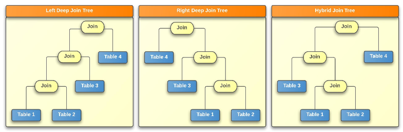

<a id="eacd9bce5ad93da5"></a>

# 15. SQL Tuning

> Source: [GOLDILOCKS 3.2 User Manual (en)](https://manual.sunjesoft.co.kr/goldilocks/3_2_x/manual/en/eacd9bce5ad93da5)  
> Tag: `GOLDILOCKS_Venus_3_2_14_retagged`

[← 14. Cluster Objects](14-cluster-objects.md) · [Table of contents](../README.md) · [16. SQL References →](16-sql-references.md)

<a id="6d7dc947035fbcfb"></a>
## Overview

SQL tuning describes a comprehensive overview on how to improve the query performance in the SQL statements. GOLDILOCKS provides hint, plan Cache, SQL execution plan output for SQL tuning.

SQL tuning aims to minimize query response time and to improve query throughput, so it describes how to find and solve the problem.

The knowledge about database, database structure, SQL syntax and optimizer is required to understand SQL tuning. This chapter is described under the assumption that the reader knows all prerequisite knowledge.

<a id="f56838b101afad43"></a>
## SQL Processing

The overall SQL processing of GOLDILOCKS has phases such as SQL parser, plan cache check, SQL validation, optimization, plan generation, execution as follows.

If an execution plan for the same query is stored in plan cache, then the plan cache check executes the plan.

<a id="7e5d1bf1d5efda31"></a>


<a id="f5150591a8e39608"></a>
### SQL Parser

SQL parser is the first phase of SQL processing, and it checks grammatical correctness of SQL statement input by a user. If the SQL statement is not grammatically correct, it is regarded as an error.

The following is an example of the grammatically incorrect SQL statement.

```
gSQL> SELECT * FORM t1;

ERR-42000(40000): syntax error 
SELECT * FORM t1
.........^  ^
Error at line 1
```

In SQL parser phase, the necessary information for parsing is collected and stored. The parsing result derives the parsed SQL structure. The parsed SQL structure and other information are stored and managed in each session area.

<a id="de7340ca9b23dd1f"></a>
### Plan Cache Check

After the SQL parser phase is completed, it checks if the same query as the submitted query is stored in the plan cache, and this is the plan cache check phase.

In the plan cache check phase, it searches for a plan which is matched with [Plan cache parameters](#91f4d4211bd81113) from the plan cache of the parsed query statement.

In case when the plan is stored in the plan cache, the plan checks the validity of the objects such as tables and columns to which the plan accesses. If all objects are valid the process moves on to the execution phase using the plan. If any object is invalid the process moves on to SQL validation phase.

All plans which are generated by different sessions are shared in plan cache, and plans stored by other sessions can be referenced.

By using the plan stored in the plan cache at plan cache check phase, the process from SQL validation phase to plan generation phase can be omitted, so the performance is improved.

<a id="dafda5f9ba88cef6"></a>
### SQL Validation

The syntactic correctness of a query is checked in the SQL validation phase. In this phase, it checks syntactic errors such as whether the tables and columns of the submitted query statement exist, or whether the columns can be referenced.

The following is an example of the syntactically incorrect SQL statement.

```
gSQL> SELECT * FROM t1;

ERR-42000(16040): table or view does not exist : 
SELECT * FROM t1
              *
ERROR at line 1:
```

<a id="6396c13f40986ec2"></a>
### Optimization

In the optimization phase, various execution plan for the SQL statement is set up, and the best plan is selected. In the optimization phase, the cost of the optimization methods such as an access method for a table, a join order, a join method is calculated. Then, it creates various plans and selects the best plan among them.

For more information, refer to [Query Optimizer](#b2ef12f62fddf8c6).

<a id="7ada7f2d6c25fb3c"></a>
### Plan Generation

In the plan generation phase, the execution plan which is selected in optimization phase is generated in executable form for execution phase. The execution plan consists of a combination of nodes in multiple phases, and the nodes of each phase returns a result set to the superordinate node. The final phase nodes send the final result of the SQL statement to the user.

The execution plan consists of the nodes in a tree form, and it includes the following information.

- An access method for each table
- An order of the referencing tables
- A join method of the table join operation
- Information about the data filter
- Information about data grouping and aggregation 
- Information about data sorting

The following is an example of the SQL execution plan generated in the plan generation phase.

```
gSQL> 
\EXPLAIN PLAN 
SELECT t1.i1, t1.i2, t2.i1, t2.i2
  FROM t1, t2
 WHERE t1.i1 = t2.i1
   AND t1.i2 = 1
   ORDER BY t1.i1;

no rows selected.

>>>  start print plan

< Execution Plan >
==========================================================================
|  IDX  |  NODE DESCRIPTION                                 |       ROWS |
--------------------------------------------------------------------------
|    0  |  SELECT STATEMENT                                 |            |
|    1  |    SORT INSTANT ACCESS                            |          0 |
|    2  |      HASH JOIN (INNER JOIN)                       |          0 |
|    3  |        TABLE ACCESS ("T2")                        |          0 |
|    4  |        HASH JOIN INSTANT ACCESS                   |          0 |
|    5  |          TABLE ACCESS ("T1")                      |          0 |
==========================================================================

     1  -  SORT KEY : "T1.I1 ASC NULLS LAST"
           RECORD COLUMNS : I2, I1, I2
           READ COLUMNS : I1, I2, I1, I2
     2  -  JOINED COLUMNS : T1.I1, T1.I2, T2.I1, T2.I2
     3  -  READ COLUMNS : I1, I2
     4  -  INDEX COLUMNS : I1
           TABLE COLUMNS : I2
           READ COLUMNS : I1, I2
             HASH FILTER : I1 = {I1}
     5  -  READ COLUMNS : I1, I2
             PHYSICAL FILTER : I2 = 1

<<<  end print plan
```

<a id="ebfa85c148a088bc"></a>
### Plan Cache Registration

When using the plan cache, the plan generated in [Plan Generation](#7ada7f2d6c25fb3c) phase is registered in plan cache. The plans in a cache are distinguished by whether it matches with the [Plan cache parameters](#91f4d4211bd81113)  
value.

**Plan cache parameters**

<a id="91f4d4211bd81113"></a>
| Parameter | Description |
| --- | --- |
| Query text | Case sensitive query text |
| User information | User id |
| Cursor property | The cursor property of the query which requires fetch |
| Bind parameter | The number of bind parameters, and the IN/OUT property of each bind parameter |
| Enable atomic | Whether to use atomic insertion |
| Enable hint error | Whether validation error occurs for the hint |

The followings are examples of queries which have different query text values.

```
"select i1 from t1"
"Select i1 from t1"
"select i1 from  t1"
"SELECT I1 FROM T1"
```

> If the schema objects (tables, indexes, views, sequences) referenced by the plan are not committed, the plan is not registered.

<a id="0a74d1c947652d6c"></a>
### Execution

In execution phase, the execution plan which is generated in plan generation phase or selected in plan cache check phase is executed, and the result is returned. The execution plan in tree structure is executed from the left and the lowest node to the superordinate node.

```
gSQL> 
\EXPLAIN PLAN
SELECT t1.i1, t1.i2, t2.c1, t2.c2
  FROM t1, t2
 WHERE t1.i1 = t2.c1
   AND t1.i2 = 1
 ORDER BY t1.i1;

no rows selected.

>>>  start print plan

< Execution Plan >
=============================================================================================
|  IDX  |  NODE DESCRIPTION                                       |                    ROWS |
---------------------------------------------------------------------------------------------
|    0  |  SELECT STATEMENT                                       |                         |
|    1  |    SORT INSTANT ACCESS                                  |                       0 |
|    2  |      HASH JOIN (INNER JOIN)                             |                       0 |
|    3  |        TABLE ACCESS ("T2")                              |                       0 |
|    4  |        HASH JOIN INSTANT ACCESS                         |                       0 |
|    5  |          TABLE ACCESS ("T1")                            |                       0 |
=============================================================================================

     1  -  SORT KEY : "T1.I1 ASC NULLS LAST"
           RECORD COLUMNS : I2, C1, C2
           READ COLUMNS : I1, I2, C1, C2
     2  -  JOINED COLUMNS : T1.I1, T1.I2, T2.C1, T2.C2
     3  -  READ COLUMNS : C1, C2
     4  -  INDEX COLUMNS : I1
           TABLE COLUMNS : I2
           READ COLUMNS : I1, I2
             HASH FILTER : I1 = {C1}
     5  -  READ COLUMNS : I1, I2
             PHYSICAL FILTER : I2 = 1

<<<  end print plan
```

The execution process using the plan generation example above is as follows.

1. The result is returned from IDX3 by using table access for the table T2. The result rows include the columns C1, C2.
2. The result is returned from IDX5 by using table access for the table T1. "I2 = 1" is processed by using physical filter, and the result is returned. The result rows include the columns I1, I2.
3. Hash join instant access for the result returned from IDX5 is created in IDX4, and "I1 = {I1}" is performed as hash filter. The rows of the result include the columns I1, I2.
4. Hash join is performed in IDX2 by using hash filter in IDX4 for the result of IDX3, and the result rows include the columns I1, I2 of the table T1, and the columns C1, C2 of the table T2.
5. Sort instant access for the result of IDX2 is generated in IDX1, and it is sorted by using the column I1 of the table T1. The result includes the columns I1, I2 of the table T1, and the columns I1, I2 of the table T2.
6. The result of IDX1 is finally returned to the user from IDX 0.

For more information about the SQL execution plan, refer to [SQL Execution Plan](#42225f96e9bd9c48).

<a id="b2ef12f62fddf8c6"></a>
## Query Optimizer

<a id="41015df0a85fd088"></a>
### Overview

An query optimizer determines the most effective execution plan for the SQL statement. In order to do so, the query optimizer generates various types of candidate plans for the SQL statement and calculates the cost for each plan. Then, it selects the final execution plan with the lowest cost among the candidate plans.

The process to find an effective plan by calculating the cost is cost-based optimization. During the process, the query optimizer uses information such as the number of rows which are returned by nodes, the access paths, and the join methods.

The query optimizer produces the candidate plans for the SQL statement returned from parsing and validation phases by calculating the cost based on query transformations and statistics. Then it selects the most efficient (the lowest cost) plan among the candidate plans, then produces the final execution plan.

The query transformations push the conditional clause to a view, or they convert the subQuery to the join form.   
There are a heuristic query transformation and a cost-based query transformation.   
The heuristic query transformation performs transformation only when transforming the queries is more efficient than the original query.   
When transformation is not always efficient, the cost-based query transformation determines the cost effective form by comparing the original query with the transformed query.

Generally, the cost is calculated by using the selectivity and the cardinality. The selectivity is the rows ratio of the result to be returned to the result set after applying conditions. The cardinality is the number of the rows returned to the result from each node.

The query optimizer calculates the cost based on the selectivity and the cardinality. It also uses the access paths method (table access, index access), the join method (nested loops join, hash join), and the join ordering method.

The final execution plan selected by the query optimizer can be retrieved through the explain plan statement. For more information about the translating the execution plan output through the explain plan statement, refer to [SQL Execution Plan](#42225f96e9bd9c48).

<a id="c9d8c506673acef1"></a>
### Query Transformations

To perform the SQL statement more efficiently, the query transformations transform an SQL statement by pushing the filter or by unnesting the subQuery. For these query transformations, GOLDILOCKS supports the following methods.

- Simple view merging
- Filter push down
- SubQuery unnesting
- Single table min/max aggregation conversion
- Rewrite target on exists

<a id="641fa56f5b48eabe"></a>
#### Simple View Merging

It merges a simple view to the superordinate query block.

Merging the simple view enables applying more number of cases when determining a join ordering, a join operation and an access path, so it can generate more optimized plan.

The following is an example of a query.

```
gSQL> \explain plan 
      select * 
      from   ( select t1.col1 col1, t2.col1 col2 
               from   t1, t2 
               where  t1.col1 = t2.col1 )v1, t3
      where  v1.col1 = t3.col1;
```

It is assumed that the table t1, t2 are big and the table t3 is small.

If the simple view is not merged, the query above performs t3 after performing the join in the view. In this case, the intermediate result is big and it is not filtered enough.

```
< Execution Plan >
=============================================================================================
|  IDX  |  NODE DESCRIPTION                                       |                    ROWS |
---------------------------------------------------------------------------------------------
|    0  |  SELECT STATEMENT                                       |                         |
|    1  |    NESTED LOOP JOIN (INNER JOIN)                        |                       1 |
|    2  |      VIEW (INLINE_VIEW AS V1)                           |                       5 |
|    3  |        NESTED LOOP JOIN (INNER JOIN)                    |                       5 |
|    4  |          INDEX ACCESS ("T2", "T2_COL1")                 | (         5)          5 |
|    5  |          INDEX ACCESS ("T1", "T1_COL1")                 | (         5)          5 |
|    6  |      INDEX ACCESS ("T3", "T3_COL3")                     | (         1)          1 |
=============================================================================================
```

However, if the simple view is merged, then t2 is performed after performing t1 and t3. In this case, the intermediate result is filtered enough so it improves the performance.

```
< Execution Plan >
=============================================================================================
|  IDX  |  NODE DESCRIPTION                                       |                    ROWS |
---------------------------------------------------------------------------------------------
|    0  |  SELECT STATEMENT                                       |                         |
|    1  |    NESTED LOOP JOIN (INNER JOIN)                        |                       1 |
|    2  |      NESTED LOOP JOIN (INNER JOIN)                      |                       1 |
|    3  |        TABLE ACCESS ("T3")                              |                       1 |
|    4  |        INDEX ACCESS ("T1", "T1_COL1")                   | (         1)          1 |
|    5  |      INDEX ACCESS ("T2", "T2_COL1")                     | (         1)          1 |
=============================================================================================
```

The view conditions to merge the simple view are as follows.

- A set operator should not exist within the view.
- DISTINCT should not exist within the view.
- GROUP BY, HAVING, aggregate function should not exist within the view.
- The full outer join should not exist within the view.
- The natural join should not exist within the view.
- The SELECT list within the view should not include a subquery.
- LIMIT, OFFSET statement should not exist within the view.
- The view should not participate in the full outer join.
- When the view is participating in the right side of the left outer join, then only one table should exist in the *from* clause within the view.
- The view should not exist on the right side of the semi join.

<a id="f5ba4d962bdd5f1d"></a>
#### Filter Push Down

The filter push down feature pushes the pushable filters among the filters of WHERE clause to the subQuery (view) of FROM clause. The filter push down feature pushes the filter to subQuery (view), and the pushed filter is used for index access in the subQuery (view). Or the pushed filter is used as the first executed filter. It improves the query processing performance.

The following is an example of a query.

```
SELECT l_linenumber, l_quantity
  FROM ( SELECT *
           FROM lineitem
          WHERE l_shipdate >= date '1996-01-01'
            AND l_shipdate <= date '1996-12-31' )
 WHERE l_shipmode = 'AIR';
```

In the example above, the filter l_shipmode = 'AIR' which exists in the top-level node (WHERE clause) is pushed to the subQuery in FROM clause. It is as same as the example below.

```
SELECT l_linenumber, l_quantity
  FROM ( SELECT *
           FROM lineitem
          WHERE l_shipdate >= date '1996-01-01'
            AND l_shipdate <= date '1996-12-31'
            AND l_shipmode = 'AIR' );
```

The transformed query as above improves the performance by using index access when an index exists for l_shipmode in the lineitem table.

<a id="86169b0718bdafbb"></a>
#### SubQuery Unnesting

The subQuery unnesting feature releases the subQuery in a conditional clause into join form. The subQuery unnesting feature transforms operators (IN, NOT IN, EXISTS, NOT EXISTS) and a quantify operator of ANY and ALL into the semi join operation or anti-semi join operation. The transformed query efficiently processes the join, and it improves the query processing performance.

The following is an example of a query.

```
SELECT ps_availqty
  FROM partsupp
 WHERE ps_partkey IN ( SELECT p_partkey
                         FROM part
                        WHERE p_type = 'STEEL' );
```

In the example above, IN operator can be transformed into semi join of ps_partkey = p_partkey condition. This transformed query can be retrieved by outputting the execution plan as follows.

```
gSQL> 
\EXPLAIN PLAN
SELECT ps_availqty
  FROM partsupp
 WHERE ps_partkey IN ( SELECT p_partkey
                         FROM part
                        WHERE p_type = 'STEEL' );

PS_AVAILQTY
-----------
       8895
       4969
       4651
       4093

4 rows selected.

>>>  start print plan

< Execution Plan >
=====================================================================================
|  IDX  |  NODE DESCRIPTION                                            |       ROWS |
-------------------------------------------------------------------------------------
|    0  |  SELECT STATEMENT                                            |            |
|    1  |    NESTED LOOP JOIN (INVERTED LEFT SEMI)                     |          4 |
|    2  |      SORT INSTANT ACCESS (UNIQUE)                            |          2 |
|    3  |        TABLE ACCESS ("PART")                                 |          2 |
|    4  |      INDEX ACCESS ("PARTSUPP, PARTSUPP_PK_INDEX")            |          4 |
=====================================================================================

     1  -  JOINED COLUMNS : PARTSUPP.PS_AVAILQTY
     2  -  SORT KEY : "PART.P_PARTKEY ASC NULLS LAST"
           READ COLUMNS : P_PARTKEY
     3  -  READ COLUMNS : P_PARTKEY, P_TYPE
             PHYSICAL FILTER : P_TYPE = 'STEEL'
     4  -  READ INDEX COLUMNS : PS_PARTKEY
           READ TABLE COLUMNS : PS_AVAILQTY
             MIN RANGE : PS_PARTKEY = {P_PARTKEY}
             MAX RANGE : PS_PARTKEY = {P_PARTKEY}

<<<  end print plan
```

In the execution plan output above, the IN operation is transformed into the inverted left semi join by using the nested loop join.

<a id="0ed6c3c88debe7db"></a>
#### Single Table Min/Max Aggregation Conversion

When a query has a min (or max) aggregate function in a select list, and has a single table in from clause, then an optimizer returns the result by using the index whose first key column is an argument column of the aggregation.

In order to do so, the following conditions should be satisfied.

- It should be a query for a single table. Only one of the MIN or MAX should exist on the target.
- OFFSET/LIMIT clause should not be in a query.
- A single column in a table should be the only aggregation argument.
- The index whose first key is the target column for aggregation should exist.
- The user should not provide a hint such as table access or rowid access.

The single table min/max aggregation conversion improves the query processing performance by reading a single data of the beginning or end of the Index instead of reading all the rows.

The following is an example of a query.

```
SELECT p_name, p_brand, p_type
  FROM part
 WHERE p_size = ( SELECT MAX( p_size )
                    FROM part );
```

The query above returns p_name, p_brand, p_type of the largest p_size value from part table. The query has MAX aggregation in the SubQuery of the conditional clause.  
The query above can be transformed to the query of returning only the last p_size data among data sorted in an ascending order by using the index access for p_size.

This transformed query can be retrieved by outputting the execution plan as follows.

```
gSQL> 
\EXPLAIN PLAN
SELECT p_name, p_brand, p_type
  FROM part
 WHERE p_size = ( SELECT MAX( p_size )
                    FROM part );

P_NAME P_BRAND    P_TYPE
------ ---------- ------
Part#3 Brand#2    STEEL 

1 row selected.

>>>  start print plan

< Execution Plan >
=====================================================================================
|  IDX  |  NODE DESCRIPTION                                            |       ROWS |
-------------------------------------------------------------------------------------
|    0  |  SELECT STATEMENT                                            |            |
|    1  |    TABLE ACCESS ("PART")                                     |          1 |
|    2  |    SUB QUERY LIST                                            |          1 |
|    3  |      INDEX ACCESS ("PART, PART_SIZE")                        |          1 |
=====================================================================================

     1  -  READ COLUMNS : P_NAME, P_BRAND, P_TYPE, P_SIZE
             PHYSICAL FILTER : P_SIZE = P_SIZE
     2  -  READ COLUMNS : P_SIZE
     3  -  READ INDEX COLUMNS : P_SIZE
             MAX RANGE : P_SIZE IS NOT NULL

<<<  end print plan
```

In the execution plan output above, the max range value is retrieved by using index access for subQuery in the conditional clause.

<a id="41994c92d4840327"></a>
#### Rewrite Target on Exists

The rewrite target on exists feature transforms the target clause into the constant value in a subQuery which is located in exists or not exists operation. Exists or not exists operation determines whether the subQuery result row exists or not.   
The result is same even when transforming target clause into the constant value because the number of targets or the result of the target expression does not affect the results of the operator.

The rewrite target on exists feature improves query processing performance by reducing an unnecessary expression processing in the target clause.

The following is an example of a query.

```
SELECT p_name, p_brand, p_type
  FROM part
 WHERE EXISTS( SELECT /*+ NO_QUERY_TRANSFORMATION */ 
                      l_quantity, l_extendedprice * (1 - l_discount) 
                 FROM lineitem
                WHERE l_partkey = p_partkey
                  AND l_quantity > 30 );
```

The query above returns the result rows of part table for the p_partkey when a row whose l_quantity is bigger than 30 exists among rows whose l_partkey and p_partkey are same in lineitem table.  
Exists operator in conditional clause has two targets, which are l_quantity and l_extendedprice* (1 - l_discount). They can be transformed to a constant value (TRUE), and the transformed query can be retrieved by outputting the execution plan as follows.  
However, [NO_QUERY_TRANSFORMATION](16-sql-references.md#257be93d818e89ae) hint prevents query transformation.

```
gSQL> 
\EXPLAIN PLAN
 SELECT p_name, p_brand, p_type
   FROM part
  WHERE EXISTS( SELECT /*+ NO_QUERY_TRANSFORMATION */ 
                       l_quantity, l_extendedprice * (1 - l_discount) 
                 FROM lineitem
                 WHERE l_partkey = p_partkey
                   AND l_quantity > 30 );

P_NAME P_BRAND    P_TYPE
------ ---------- ------
Part#1 Brand#1    COPPER
Part#3 Brand#2    STEEL 
Part#4 Brand#3    NICKEL
Part#5 Brand#3    STEEL 

4 rows selected.

>>>  start print plan

< Execution Plan >
=====================================================================================
|  IDX  |  NODE DESCRIPTION                                            |       ROWS |
-------------------------------------------------------------------------------------
|    0  |  SELECT STATEMENT                                            |            |
|    1  |    SUB QUERY FILTER                                          |          4 |
|    2  |      TABLE ACCESS ("PART")                                   |          5 |
|    3  |      SUB QUERY LIST                                          |          5 |
|    4  |        SUB QUERY FUNCTION                                    |          5 |
|    5  |          TABLE ACCESS ("LINEITEM")                           |          4 |
=====================================================================================

     1  -  FILTER : EXISTS( ( TRUE ) )
     2  -  READ COLUMNS : P_PARTKEY, P_NAME, P_BRAND, P_TYPE
     4  -  FUNCTION : EXISTS( ( TRUE ) )
     5  -  READ COLUMNS : L_PARTKEY, L_QUANTITY
             PHYSICAL FILTER : L_PARTKEY = {P_PARTKEY} AND L_QUANTITY > 30

<<<  end print plan
```

In the execution plan output above, target for subQuery in exists is transformed into TRUE.

<a id="a3bf3f254f9062bc"></a>
### Access Paths

An access paths is a method to access a single table. Access paths are classified into table access, index access, rowid access, index concat.  
An query optimizer calculates the cost of each access method, then selects the access method with the lowest cost as the execution plan.

<a id="d1fca02526de8be3"></a>
#### Table Access

A table access is a method which scans a stored table when retrieving a table instead of using index or rowid. In general, a query optimizer selects table access method only when other methods can not be used or the user specifies table access hint because table access cost more than any other access method.

The table access is used in the following cases.

- Index does not exist.
- The function exists on the column side at the filter for the column in an index. (e.g. i1 + 1 = 10)
- Table access cost is small because the condition for the index's first column does not exist. (e.g. i2 = 3 condition is given to an index whose index keys are i1 and i2 )
- The table is small so table access is less expensive than index access.
- A user specifies the table access hint (e.g. FULL(t1) hint)
- Though the condition for the index exists, but table access is needed. Therefore, the table access cost turns out to be low when calculating the cost.

The following is an example of using the table access when an index with filter column does not exist.

```
gSQL> 
\EXPLAIN PLAN
SELECT p_name, p_brand, p_type
  FROM part
  WHERE p_size > 20;

P_NAME P_BRAND    P_TYPE
------ ---------- ------
Part#3 Brand#2    STEEL 

1 row selected.

>>>  start print plan

< Execution Plan >
=====================================================================================
|  IDX  |  NODE DESCRIPTION                                            |       ROWS |
-------------------------------------------------------------------------------------
|    0  |  SELECT STATEMENT                                            |            |
|    1  |    TABLE ACCESS ("PART")                                     |          1 |
=====================================================================================

     1  -  READ COLUMNS : P_NAME, P_BRAND, P_TYPE, P_SIZE
             PHYSICAL FILTER : P_SIZE > 20

<<<  end print plan
```

The following is an example of specifying table access hint by a user, even when the index with filter column exists.

```
gSQL> 
\EXPLAIN PLAN
SELECT /*+ FULL(part) */
       p_name, p_brand, p_type
   FROM part
  WHERE p_partkey > 1;

P_NAME P_BRAND    P_TYPE
------ ---------- ------
Part#2 Brand#1    NICKEL
Part#3 Brand#2    STEEL 
Part#4 Brand#3    NICKEL
Part#5 Brand#3    STEEL 

4 rows selected.

>>>  start print plan

< Execution Plan >
=====================================================================================
|  IDX  |  NODE DESCRIPTION                                            |       ROWS |
-------------------------------------------------------------------------------------
|    0  |  SELECT STATEMENT                                            |            |
|    1  |    TABLE ACCESS ("PART")                                     |          4 |
=====================================================================================

     1  -  READ COLUMNS : P_PARTKEY, P_NAME, P_BRAND, P_TYPE
             PHYSICAL FILTER : P_PARTKEY > 1

<<<  end print plan
```

<a id="67bb3d9a9cf2c983"></a>
#### Index Access

An index access performs table scan using an index. In general, when an index is usable in the filter, the index access is more efficient than others. When the index access is available, a query optimizer calculates the cost, and selects the index access with the lowest cost. When a user specifies the index access hint, then a query optimizer calculates the cost of the user defined indexes, and selects the index access with the lowest cost.

However, the index access is not selected in the following cases.

- The index exists in a filter, but it costs more than another access method, such as the table access when calculating the cost.
- The user specifies another access hint except for an index access, and it can be used. (e.g. FULL(t1) hint)
- There is a condition to select another access method. (Refer to the case when using the [Table Access](#d1fca02526de8be3).)

The following is an example of using the index access selected by a query optimizer.

```
gSQL> 
\EXPLAIN PLAN
SELECT p_name, p_brand, p_type
  FROM part
 WHERE p_partkey = 1;

P_NAME P_BRAND    P_TYPE
------ ---------- ------
Part#1 Brand#1    COPPER

1 row selected.

>>>  start print plan

< Execution Plan >
=====================================================================================
|  IDX  |  NODE DESCRIPTION                                            |       ROWS |
-------------------------------------------------------------------------------------
|    0  |  SELECT STATEMENT                                            |            |
|    1  |    INDEX ACCESS ("PART, PART_PK_INDEX")                      |          1 |
=====================================================================================

     1  -  READ INDEX COLUMNS : P_PARTKEY
           READ TABLE COLUMNS : P_NAME, P_BRAND, P_TYPE
             MIN RANGE : P_PARTKEY = 1
             MAX RANGE : P_PARTKEY = 1

<<<  end print plan
```

The following is an example of the case when the index access hint is specified.

```
gSQL> 
\EXPLAIN PLAN
SELECT /*+ INDEX(part, part_size) */
      p_name, p_brand, p_type
   FROM part
  WHERE p_size > 10;

P_NAME P_BRAND    P_TYPE
------ ---------- ------
Part#4 Brand#3    NICKEL
Part#5 Brand#3    STEEL 
Part#3 Brand#2    STEEL 

3 rows selected.

>>>  start print plan

< Execution Plan >
=====================================================================================
|  IDX  |  NODE DESCRIPTION                                            |       ROWS |
-------------------------------------------------------------------------------------
|    0  |  SELECT STATEMENT                                            |            |
|    1  |    INDEX ACCESS ("PART, PART_SIZE")                          |          3 |
=====================================================================================

     1  -  READ INDEX COLUMNS : P_SIZE
           READ TABLE COLUMNS : P_NAME, P_BRAND, P_TYPE
             MIN RANGE : P_SIZE > 10
             MAX RANGE : P_SIZE IS NOT NULL

<<<  end print plan
```

<a id="150affc27c72497e"></a>
#### Rowid Access

Rowid access directly accesses the page by using the rowid when retrieving the table. To use the rowid access, the filter for the rowid should exists. A query optimizer selects the rowid access prior to other accesses when the condition for the rowid access exists.

The following is an example of using the rowid access.

```
gSQL> 
\EXPLAIN PLAN
 SELECT p_name, p_brand, p_type
   FROM part
  WHERE ROWID = 'AAAAAAAAADiAACAAACCjAAA';

P_NAME P_BRAND    P_TYPE
------ ---------- ------
Part#1 Brand#1    COPPER

1 row selected.

>>>  start print plan

< Execution Plan >
=====================================================================================
|  IDX  |  NODE DESCRIPTION                                            |       ROWS |
-------------------------------------------------------------------------------------
|    0  |  SELECT STATEMENT                                            |            |
|    1  |    USER ROWID ACCESS ("PART")                                |          1 |
=====================================================================================

     1  -  READ COLUMNS : P_NAME, P_BRAND, P_TYPE
             ROWID ACCESS EXPR : ROWID = 'AAAAAAAAADiAACAAACCjAAA'

<<<  end print plan
```

<a id="352af5ccd75af28c"></a>
#### Index Concat

If an *or* statement exists in a filter and the index access can be executed on each filter divided by the *or* operator, then the index concat returns the result by combining the results of each index access.  
The index concat is a concat node which has multiple index access on the subordinate nodes. If the *or* statement exists in a filter, a query optimizer calculates the cost of the index concat and selects the index concat when it has lower cost than other accesses.

The index concat cost is calculated as follows.

1. The filters are created which are newly adjusted based on *or*.
2. The most appropriate index is selected among indexes which are applicable to filters classified based on *or* .
3. The concat cost is calculated to remove the duplicate when collecting the results of the selected indexes.
4. The cost of the previously selected concat is added, then the final index concat cost is determined.

The index concat node is executed as follows.

1. The first node among the subordinate nodes of the index concat node is executed. 
2. Among the execution results, the data for removing the duplicates are stored in concat node. The result is transferred to the superordinate node. 
3. From the second node, the duplicates are checked in the concat node, and the data for removing the duplicates in the non-duplicate rows are stored in the concat node. Then, the result is transferred to the superordinate node.

The following is an example of using the index concat.

```
gSQL> 
\EXPLAIN PLAN
 SELECT /*+ INDEX_COMBINE(part, part_size) */
        p_name, p_brand, p_type
   FROM part
  WHERE p_size = 1
     OR p_size = 21;

P_NAME P_BRAND    P_TYPE
------ ---------- ------
Part#2 Brand#1    NICKEL
Part#3 Brand#2    STEEL 

2 rows selected.

>>>  start print plan

< Execution Plan >
=====================================================================================
|  IDX  |  NODE DESCRIPTION                                            |       ROWS |
-------------------------------------------------------------------------------------
|    0  |  SELECT STATEMENT                                            |            |
|    1  |    CONCAT                                                    |          2 |
|    2  |      INDEX ACCESS ("PART, PART_SIZE")                        |          1 |
|    3  |      INDEX ACCESS ("PART, PART_SIZE")                        |          1 |
=====================================================================================

     2  -  READ INDEX COLUMNS : P_SIZE
           READ TABLE COLUMNS : P_NAME, P_BRAND, P_TYPE
             MIN RANGE : P_SIZE = 1
             MAX RANGE : P_SIZE = 1
     3  -  READ INDEX COLUMNS : P_SIZE
           READ TABLE COLUMNS : P_NAME, P_BRAND, P_TYPE
             MIN RANGE : P_SIZE = 21
             MAX RANGE : P_SIZE = 21

<<<  end print plan
```

<a id="72fc47da31a622e2"></a>
### Join

Join combines result rows from two tables (or views) into a single result row. Join condition specifies the condition for combining rows from two tables (or views). Join without join condition returns the results which each rows of one table is combined with all rows of the other table.

The join process is generally expressed in a tree form. The left table in the join tree is an outer node and the right table is an inner node. In general, join is executed by reading a row of the outer node then combining it with the inner node rows which satisfy the join condition.

If there are three or more tables (or views) in FROM clause, two tables are joined first, and then the result is joined with the third table.   
In this case, if join node exists only on the outer node, it is called as left deep join tree. If join node exists only on the inner node, it is called as right deep join tree. If join node exists on both outer and inner node, it is called as hybrid join tree.

The figure below describes the join tree type.

<a id="7d50900d9c992acc"></a>


In the figure above, all three types of join tree are performed in an order of table 1, table 2, table 3, table 4. If all data in each table is same and all the join conditions are same as well, then the three types of join tree return the same result. The order of the result rows can be different from each other.

A query optimizer considers the following four items when calculating the join cost.

- The access paths cost to each table which participates in join
- The cost according to join type (inner, outer etc.)
- The cost of available join methods
- The cost according to the order of the two tables which participates in join

The cost differs according to the 4 items above, and a query optimizer selects the plan with lowest cost among them.

<a id="c894e491db25cc94"></a>
#### Join Type

<a id="9b6849fcd7fe8fcb"></a>
##### Cross Join

A cross join does not have a join condition. Therefore, all inner node rows are combined to each outer node row, then they are returned as the join result row.

The following is an example of the cross join.

```
gSQL> 
\EXPLAIN PLAN
SELECT s_name, c_name FROM supplier, customer;

S_NAME                    C_NAME    
------------------------- ----------
Supplier#1                Customer#1
Supplier#1                Customer#2
Supplier#1                Customer#3
Supplier#1                Customer#4
Supplier#1                Customer#5
Supplier#2                Customer#1
Supplier#2                Customer#2
Supplier#2                Customer#3
Supplier#2                Customer#4
Supplier#2                Customer#5
Supplier#3                Customer#1
Supplier#3                Customer#2
Supplier#3                Customer#3
Supplier#3                Customer#4
Supplier#3                Customer#5
Supplier#4                Customer#1
Supplier#4                Customer#2
Supplier#4                Customer#3
Supplier#4                Customer#4
Supplier#4                Customer#5

S_NAME                    C_NAME    
------------------------- ----------
Supplier#5                Customer#1
Supplier#5                Customer#2
Supplier#5                Customer#3
Supplier#5                Customer#4
Supplier#5                Customer#5

25 rows selected.

>>>  start print plan

< Execution Plan >
=====================================================================================
|  IDX  |  NODE DESCRIPTION                                            |       ROWS |
-------------------------------------------------------------------------------------
|    0  |  SELECT STATEMENT                                            |            |
|    1  |    NESTED LOOP JOIN (INNER JOIN)                             |         25 |
|    2  |      TABLE ACCESS ("SUPPLIER")                               |          5 |
|    3  |      TABLE ACCESS ("CUSTOMER")                               |          5 |
=====================================================================================

     1  -  JOINED COLUMNS : SUPPLIER.S_NAME, CUSTOMER.C_NAME
     2  -  READ COLUMNS : S_NAME
     3  -  READ COLUMNS : C_NAME

<<<  end print plan
```

<a id="a02883d48b8bdd61"></a>
##### Inner Join

An inner join has a join condition. Therefore, only the inner node rows which satisfy the join condition are combined to each row of outer node, then they are returned to the join result row.

A join condition consists of operators between columns of two tables (or views). If the operator of the Join condition is =(equal), then it is called equi-join. Otherwise it is called non-equi-join.

The following is an example of an equi-join in the inner join.

```
gSQL> 
\EXPLAIN PLAN
SELECT p_name, ps_availqty
  FROM part, partsupp
 WHERE p_partkey = ps_partkey;
P_NAME PS_AVAILQTY
------ -----------
Part#1        3325
Part#1        8076
Part#2        3956
Part#2        4069
Part#3        8895
Part#3        4969
Part#4        8539
Part#4        3025
Part#5        4651
Part#5        4093

10 rows selected.

>>>  start print plan

< Execution Plan >
=====================================================================================
|  IDX  |  NODE DESCRIPTION                                            |       ROWS |
-------------------------------------------------------------------------------------
|    0  |  SELECT STATEMENT                                            |            |
|    1  |    HASH JOIN (INNER JOIN)                                    |         10 |
|    2  |      TABLE ACCESS ("PARTSUPP")                               |         10 |
|    3  |      HASH JOIN INSTANT ACCESS                                |         10 |
|    4  |        TABLE ACCESS ("PART")                                 |          5 |
=====================================================================================

     1  -  JOINED COLUMNS : PART.P_NAME, PARTSUPP.PS_AVAILQTY
     2  -  READ COLUMNS : PS_PARTKEY, PS_AVAILQTY
     3  -  INDEX COLUMNS : P_PARTKEY
           TABLE COLUMNS : P_NAME
           READ COLUMNS : P_PARTKEY, P_NAME
             HASH FILTER : P_PARTKEY = {PS_PARTKEY}
     4  -  READ COLUMNS : P_PARTKEY, P_NAME

<<<  end print plan
```

The following is an example of a non-equi-join in the inner join.

```
gSQL> 
\EXPLAIN PLAN
SELECT o_totalprice, l_extendedprice, l_discount
  FROM orders, lineitem
 WHERE o_orderkey = 1
  AND l_shipdate > o_orderdate;

O_TOTALPRICE L_EXTENDEDPRICE L_DISCOUNT
------------ --------------- ----------
   173665.47        21168.23        .04
   173665.47        45983.16        .09
   173665.47         13309.6         .1
   173665.47        28955.64        .09
   173665.47        22824.48         .1

5 rows selected.

>>>  start print plan

< Execution Plan >
=====================================================================================
|  IDX  |  NODE DESCRIPTION                                            |       ROWS |
-------------------------------------------------------------------------------------
|    0  |  SELECT STATEMENT                                            |            |
|    1  |    NESTED LOOP JOIN (INNER JOIN)                             |          5 |
|    2  |      INDEX ACCESS ("ORDERS, ORDERS_PK_INDEX")                |          1 |
|    3  |      TABLE ACCESS ("LINEITEM")                               |          5 |
=====================================================================================

     1  -  JOINED COLUMNS : ORDERS.O_TOTALPRICE, LINEITEM.L_EXTENDEDPRICE, LINEITEM.L_DISCOUNT
     2  -  READ INDEX COLUMNS : O_ORDERKEY
           READ TABLE COLUMNS : O_TOTALPRICE, O_ORDERDATE
             MIN RANGE : O_ORDERKEY = 1
             MAX RANGE : O_ORDERKEY = 1
     3  -  READ COLUMNS : L_EXTENDEDPRICE, L_DISCOUNT, L_SHIPDATE
             PHYSICAL FILTER : L_SHIPDATE > {O_ORDERDATE}

<<<  end print plan
```

<a id="7cf42013776d7d17"></a>
##### Outer Join

Outer join have a join condition. If any inner join row satisfies the join condition, outer node rows are combined with inner node rows which satisfies the join condition, then return the results. If there is not any inner join row to satisfy the join condition, outer node rows are combined rows which have NULL data only, and return the results.

Outer join is differentiated from other joins by having direction such as left, right and full.   
Outer node of left outer join is the left table of a join, and outer node of right outer join is the right table of a join.   
Full outer join is the union of left outer join and right outer join. It combines rows which satisfy the join condition, the left and right node rows which do not satisfy the condition and the rows which have NULL data only. Then it returns the result.

The right outer join result is equivalent to the left outer join result when executing it after exchanging the tables' position which are located at each end. Namely, "A LEFT OUTER JOIN B" and "B RIGHT OUTER JOIN A" are equivalent in an aspect of the result. Therefore, query optimizer generates the plan by replacing all the right outer join with left outer join.

The following is an example of the left outer join.

```
gSQL> 
\EXPLAIN PLAN
 SELECT p_name, p_brand, ps_availqty
  FROM part LEFT OUTER JOIN partsupp
     ON p_partkey = ps_partkey
   AND ps_availqty > 5000;

P_NAME P_BRAND    PS_AVAILQTY
------ ---------- -----------
Part#1 Brand#1           8076
Part#2 Brand#1           null
Part#3 Brand#2           8895
Part#4 Brand#3           8539
Part#5 Brand#3           null

5 rows selected.

>>>  start print plan

< Execution Plan >
=====================================================================================
|  IDX  |  NODE DESCRIPTION                                            |       ROWS |
-------------------------------------------------------------------------------------
|    0  |  SELECT STATEMENT                                            |            |
|    1  |    HASH JOIN (LEFT OUTER JOIN)                               |          5 |
|    2  |      TABLE ACCESS ("PART")                                   |          5 |
|    3  |      HASH JOIN INSTANT ACCESS                                |          5 |
|    4  |        TABLE ACCESS ("PARTSUPP")                             |          3 |
=====================================================================================

     1  -  JOINED COLUMNS : PART.P_NAME, PART.P_BRAND, PARTSUPP.PS_AVAILQTY
     2  -  READ COLUMNS : P_PARTKEY, P_NAME, P_BRAND
     3  -  INDEX COLUMNS : PS_PARTKEY
           TABLE COLUMNS : PS_AVAILQTY
           READ COLUMNS : PS_PARTKEY, PS_AVAILQTY
             HASH FILTER : {P_PARTKEY} = PS_PARTKEY
     4  -  READ COLUMNS : PS_PARTKEY, PS_AVAILQTY
             PHYSICAL FILTER : PS_AVAILQTY > 5000

<<<  end print plan
```

The following is an example of the full outer join.

```
gSQL> 
\EXPLAIN PLAN
SELECT p_name, p_brand, ps_availqty
  FROM part FULL OUTER JOIN partsupp
    ON p_partkey = ps_partkey
   AND ps_availqty > 3000
   AND p_size < 20;

P_NAME P_BRAND    PS_AVAILQTY
------ ---------- -----------
Part#1 Brand#1           8076
Part#1 Brand#1           3325
Part#2 Brand#1           4069
Part#2 Brand#1           3956
Part#3 Brand#2           null
Part#4 Brand#3           3025
Part#4 Brand#3           8539
Part#5 Brand#3           4093
Part#5 Brand#3           4651
null   null              4969
null   null              8895

11 rows selected.

>>>  start print plan

< Execution Plan >
=====================================================================================
|  IDX  |  NODE DESCRIPTION                                            |       ROWS |
-------------------------------------------------------------------------------------
|    0  |  SELECT STATEMENT                                            |            |
|    1  |    HASH JOIN (FULL OUTER JOIN)                               |         11 |
|    2  |      TABLE ACCESS ("PART")                                   |          5 |
|    3  |      HASH JOIN INSTANT ACCESS                                |         11 |
|    4  |        TABLE ACCESS ("PARTSUPP")                             |         10 |
=====================================================================================

     1  -  JOINED COLUMNS : PART.P_NAME, PART.P_BRAND, PARTSUPP.PS_AVAILQTY
             JOIN FILTER : {PS_AVAILQTY} > 3000 AND {P_SIZE} < 20
     2  -  READ COLUMNS : P_PARTKEY, P_NAME, P_BRAND, P_SIZE
     3  -  INDEX COLUMNS : PS_PARTKEY
           TABLE COLUMNS : PS_AVAILQTY
           READ COLUMNS : PS_PARTKEY, PS_AVAILQTY
             HASH FILTER : {P_PARTKEY} = PS_PARTKEY
     4  -  READ COLUMNS : PS_PARTKEY, PS_AVAILQTY

<<<  end print plan
```

<a id="19a5918ff862961a"></a>
##### Semi Join

A semi join returns only the outer node rows which satisfy the join condition, so it should have a join condition. The semi join returns only the outer node rows whose inner node rows satisfy the join condition.

The semi join can not be explicitly specified in the SQL statement, but query optimizer transforms the operators (IN, EXIST) and ANY type quantify operators (= ANY) to the semi join.

A nested loops join and a hash join support the semi join in the inverted form.

An inverted semi join in the nested loops join has an index for the join condition of the outer node. Therefore, it reads inner node rows in the way of ensuring its uniqueness, and returns the result which satisfy the join condition from the outer node.  
This method is used when there are many rows in the outer node, there is a join condition index, and there are small number of rows in the inner node. The uniqueness of inner node rows should be ensured, so the sort instance is used for it. The inverted semi join using the nested loops join has better performance than the semi join using the general nested loops join. For example, it reduces the cost of generating the hash instance.  It is because the inverted semi join using the nested loops join performs the index access to  the outer node with many rows  by using a small number of inner node rows, and returns the join result.

The inverted semi join using the hash join generates outer node as a hash instant, and reads inner node rows. Then it returns the unreturned rows among the rows which satisfy the join condition from the hash instant.  
This method is used when there are small number of rows in the outer node, and there many rows in the inner node.   
The inverted semi join using the hash join makes a small number of outer node rows into the hash instant, and returns the result by reading many inner node rows and scanning the hash instant.  
Therefore, it improves the performance than the semi join which generates the hash instant in the inner node by using the hash join. For example, it reduces the cost of generating the hash instance.

The following is an example of the semi join.

```
gSQL> 
\EXPLAIN PLAN
SELECT p_name, p_brand
  FROM part
 WHERE p_partkey IN ( SELECT ps_partkey
                         FROM partsupp
                        WHERE ps_availqty > 5000 );

P_NAME P_BRAND   
------ ----------
Part#1 Brand#1   
Part#3 Brand#2   
Part#4 Brand#3   

3 rows selected.

>>>  start print plan

< Execution Plan >
=====================================================================================
|  IDX  |  NODE DESCRIPTION                                            |       ROWS |
-------------------------------------------------------------------------------------
|    0  |  SELECT STATEMENT                                            |            |
|    1  |    HASH JOIN (INVERTED LEFT SEMI)                            |          3 |
|    2  |      TABLE ACCESS ("PARTSUPP")                               |          3 |
|    3  |      HASH JOIN INSTANT ACCESS                                |          3 |
|    4  |        TABLE ACCESS ("PART")                                 |          5 |
=====================================================================================

     1  -  JOINED COLUMNS : PART.P_NAME, PART.P_BRAND
     2  -  READ COLUMNS : PS_PARTKEY, PS_AVAILQTY
             PHYSICAL FILTER : PS_AVAILQTY > 5000
     3  -  INDEX COLUMNS : P_PARTKEY
           TABLE COLUMNS : P_NAME, P_BRAND
           READ COLUMNS : P_PARTKEY, P_NAME, P_BRAND
             HASH FILTER : P_PARTKEY = {PS_PARTKEY}
     4  -  READ COLUMNS : P_PARTKEY, P_NAME, P_BRAND

<<<  end print plan
```

<a id="5ff36659ec4b1d81"></a>
##### Anti-semi Join

An anti-semi join returns only the outer node rows whose inner node rows do not satisfy the join condition. Therefore, the anti-semi join should have a join condition.

The anti-semi join can not be explicitly specified in the SQL statement, but query optimizer transforms the operators (NOT IN, NOT EXISTS) and ALL type quantify operators (= ALL) to anti-semi join.

The anti-semi join separately processes NULL data, unlike semi-join, if NULL data exists. It is because the comparison operation of NULL data returns UNKNOW instead of TRUE/FALSE.   
A query optimizer performs the anti-semi join if the anti-semi join condition guarantees the absence of NULL. It not, it performs the null-aware anti-semi join.

The following is an example of the anti-semi join which guarantees the absence of NULL data in the join condition.

```
gSQL> 
\EXPLAIN PLAN
SELECT p_name, p_brand
  FROM part
 WHERE p_partkey NOT IN ( SELECT ps_partkey
                             FROM partsupp
                            WHERE ps_availqty > 5000 );

P_NAME P_BRAND   
------ ----------
Part#2 Brand#1   
Part#5 Brand#3   

2 rows selected.

>>>  start print plan

< Execution Plan >
=====================================================================================
|  IDX  |  NODE DESCRIPTION                                            |       ROWS |
-------------------------------------------------------------------------------------
|    0  |  SELECT STATEMENT                                            |            |
|    1  |    HASH JOIN (LEFT ANTI SEMI)                                |          2 |
|    2  |      TABLE ACCESS ("PART")                                   |          5 |
|    3  |      HASH JOIN INSTANT ACCESS (UNIQUE)                       |          2 |
|    4  |        TABLE ACCESS ("PARTSUPP")                             |          3 |
=====================================================================================

     1  -  JOINED COLUMNS : PART.P_NAME, PART.P_BRAND
     2  -  READ COLUMNS : P_PARTKEY, P_NAME, P_BRAND
     3  -  INDEX COLUMNS : PS_PARTKEY
             HASH FILTER : {P_PARTKEY} = PS_PARTKEY
     4  -  READ COLUMNS : PS_PARTKEY, PS_AVAILQTY
             PHYSICAL FILTER : PS_AVAILQTY > 5000

<<<  end print plan
```

The following is an example of anti-semi join which does not guarantee the absence of NULL data in the join condition.

```
gSQL> 
\EXPLAIN PLAN
SELECT p_name, p_brand
  FROM part
 WHERE p_partkey NOT IN ( SELECT l_partkey
                            FROM lineitem
                           WHERE l_quantity > 30 );

P_NAME P_BRAND   
------ ----------
Part#2 Brand#1   

1 row selected.

>>>  start print plan

< Execution Plan >
=====================================================================================
|  IDX  |  NODE DESCRIPTION                                            |       ROWS |
-------------------------------------------------------------------------------------
|    0  |  SELECT STATEMENT                                            |            |
|    1  |    HASH JOIN (LEFT ANTI SEMI NA)                             |          1 |
|    2  |      TABLE ACCESS ("PART")                                   |          5 |
|    3  |      HASH JOIN INSTANT ACCESS (UNIQUE)                       |          1 |
|    4  |        TABLE ACCESS ("LINEITEM")                             |          5 |
=====================================================================================

     1  -  JOINED COLUMNS : PART.P_NAME, PART.P_BRAND
     2  -  READ COLUMNS : P_PARTKEY, P_NAME, P_BRAND
     3  -  INDEX COLUMNS : L_PARTKEY
             HASH FILTER : {P_PARTKEY} = L_PARTKEY
     4  -  READ COLUMNS : L_PARTKEY, L_QUANTITY
             PHYSICAL FILTER : L_QUANTITY > 30

<<<  end print plan
```

<a id="63cafced59cec8b3"></a>
#### Join Method

Join methods are join operation methods for two tables (or views). They are classified into a nested loops join, a sort merge join, and a hash join.  
A query optimizer calculates cost for these three join methods, then selects the join method of the lowest cost.

<a id="20b288db7b7ddbc5"></a>
##### Nested Loops Join

A nested loops join is the basic join and it does not generate a separate instant in the outer node or the inner node when performing the join. A query optimizer performs the nested loops join in the following cases.

- The join condition does not exist. 
- The equi-join condition does not exist in join condition.
- An effective access method such as index exists in inner node. 
- USE_NL hint is specified.

The nested loops join usually has a good performance when the inner node uses an index access by the join condition. A query optimizer selects the nested loops join when it is considered as best by calculating the cost.

The nested loops join can be extended by using instances. The extended nested loops join generates a sort instance in the inner node for a similar effects like as index access in join condition.   
It is used when the cost of generating the sort instance is added but the cost of searching the inner node rows satisfying the join condition is decreased, so the entire join cost is decreased.

The following is an example of the nested loops join.

```
gSQL> 
\EXPLAIN PLAN
SELECT /*+ USE_NL(part, partsupp) */
       p_name, p_brand, p_type
   FROM part, partsupp
  WHERE p_partkey = ps_partkey
   AND ps_availqty > 5000;

P_NAME P_BRAND    P_TYPE
------ ---------- ------
Part#1 Brand#1    COPPER
Part#3 Brand#2    STEEL 
Part#4 Brand#3    NICKEL

3 rows selected.

>>>  start print plan

< Execution Plan >
=====================================================================================
|  IDX  |  NODE DESCRIPTION                                            |       ROWS |
-------------------------------------------------------------------------------------
|    0  |  SELECT STATEMENT                                            |            |
|    1  |    NESTED LOOP JOIN (INNER JOIN)                             |          3 |
|    2  |      TABLE ACCESS ("PART")                                   |          5 |
|    3  |      INDEX ACCESS ("PARTSUPP, PARTSUPP_PK_INDEX")            |          3 |
=====================================================================================

     1  -  JOINED COLUMNS : PART.P_NAME, PART.P_BRAND, PART.P_TYPE
     2  -  READ COLUMNS : P_PARTKEY, P_NAME, P_BRAND, P_TYPE
     3  -  READ INDEX COLUMNS : PS_PARTKEY
           READ TABLE COLUMNS : PS_AVAILQTY
             MIN RANGE : PS_PARTKEY = {P_PARTKEY}
             MAX RANGE : PS_PARTKEY = {P_PARTKEY}
             PHYSICAL TABLE FILTER : PS_AVAILQTY > 5000

<<<  end print plan
```

The following is an example of the extended nested loops join using the sort instant in the inner node.

```
gSQL> 
\EXPLAIN PLAN
SELECT /*+ USE_INL(part, lineitem) */
       p_name, p_brand, p_type
   FROM part, lineitem
  WHERE p_partkey = l_partkey
    AND l_quantity > 30;

P_NAME P_BRAND    P_TYPE
------ ---------- ------
Part#4 Brand#3    NICKEL
Part#5 Brand#3    STEEL 
Part#1 Brand#1    COPPER
Part#4 Brand#3    NICKEL
Part#3 Brand#2    STEEL 

5 rows selected.

>>>  start print plan

< Execution Plan >
=====================================================================================
|  IDX  |  NODE DESCRIPTION                                            |       ROWS |
-------------------------------------------------------------------------------------
|    0  |  SELECT STATEMENT                                            |            |
|    1  |    NESTED LOOP JOIN (INNER JOIN)                             |          5 |
|    2  |      TABLE ACCESS ("LINEITEM")                               |          5 |
|    3  |      SORT INSTANT ACCESS                                     |          5 |
|    4  |        TABLE ACCESS ("PART")                                 |          5 |
=====================================================================================

     1  -  JOINED COLUMNS : PART.P_NAME, PART.P_BRAND, PART.P_TYPE
     2  -  READ COLUMNS : L_PARTKEY, L_QUANTITY
             PHYSICAL FILTER : L_QUANTITY > 30
     3  -  SORT KEY : "PART.P_PARTKEY ASC NULLS LAST"
           RECORD COLUMNS : P_NAME, P_BRAND, P_TYPE
           READ COLUMNS : P_PARTKEY, P_NAME, P_BRAND, P_TYPE
             MIN RANGE : P_PARTKEY = {L_PARTKEY}
             MAX RANGE : P_PARTKEY = {L_PARTKEY}
     4  -  READ COLUMNS : P_PARTKEY, P_NAME, P_BRAND, P_TYPE

<<<  end print plan
```

<a id="12d934c4a6a38702"></a>
##### Sort Merge Join

A sort merge join sorts the outer node rows and the inner node rows by column satisfying the join condition, then sequentially compares them, and returns the result of join. If there is an index in the outer node and in the inner node for the column which satisfies the join condition, and it is available, then that index is used. Otherwise, it sorts the rows by using the sort instant.

The sort merge join has the better performance than the nested loops join. It is because the sort merge join sequentially reads the sorted data in the outer node and the inner node, and compares the join condition. On the other hand, the nested loops join searches for rows which satisfy the join condition from all inner node rows for each outer node row.    
However, if the cost of generating the sort instant in the outer node and the inner node, and sorting rows are big, then the performance is degraded. Therefore, a query optimizer calculates the cost, and selects the sort merge join when its cost is low.

When performing the sort merge join, at least one equi-join should be included in the join condition, and rows are sorted by columns of equi-join conditions.   
If there is an index which includes all equi-join conditioned columns, it is used only when the order (ascending, descending) of each column in index key is usable in sort merge join.  
For example, if the column l1, l2 is used for sort merge join, and l1 is sorted in ascending order and I2 is sorted in descending order in an index, then the index can not be used.

The following is an example of the sort merge join.

```
gSQL> 
\EXPLAIN PLAN
 SELECT /*+ USE_MERGE(part, partsupp) */
        p_name, p_brand, p_type
   FROM part, partsupp
  WHERE p_partkey = ps_partkey
    AND ps_availqty > 5000;

P_NAME P_BRAND    P_TYPE
------ ---------- ------
Part#1 Brand#1    COPPER
Part#3 Brand#2    STEEL 
Part#4 Brand#3    NICKEL

3 rows selected.

>>>  start print plan

< Execution Plan >
=====================================================================================
|  IDX  |  NODE DESCRIPTION                                            |       ROWS |
-------------------------------------------------------------------------------------
|    0  |  SELECT STATEMENT                                            |            |
|    1  |    SORT MERGE JOIN (INNER JOIN) : EQUAL                      |          3 |
|    2  |      INDEX ACCESS ("PART, PART_PK_INDEX")                    |          5 |
|    3  |      SORT JOIN INSTANT ACCESS                                |          3 |
|    4  |        TABLE ACCESS ("PARTSUPP")                             |          3 |
=====================================================================================

     1  -  JOINED COLUMNS : PART.P_NAME, PART.P_BRAND, PART.P_TYPE
             MERGE FILTER : PART.P_PARTKEY = PARTSUPP.PS_PARTKEY
     2  -  READ INDEX COLUMNS : P_PARTKEY
           READ TABLE COLUMNS : P_NAME, P_BRAND, P_TYPE
     3  -  SORT KEY : "PARTSUPP.PS_PARTKEY ASC NULLS LAST"
           READ COLUMNS : PS_PARTKEY
     4  -  READ COLUMNS : PS_PARTKEY, PS_AVAILQTY
             PHYSICAL FILTER : PS_AVAILQTY > 5000

<<<  end print plan
```

<a id="adb3843cbd38082d"></a>
##### Hash Join

A hash join performs join by generating the hash instance in the inner node. It has a good performance because hash instance is generated only in the inner node and a join condition is compared by using the hash.

When performing hash join, at least one equi-join should be included in a join condition, and it costs for generating the hash instance whose hash key is columns in the equi-join condition.   
However, the hash join has a better performance than other join methods, when the index for the join condition does not exist in the inner node. It is because the hash key can quickly read each outer node row when performing the join condition.

The following is an example of the hash join.

```
gSQL> 
\EXPLAIN PLAN
SELECT /*+ USE_HASH(part, partsupp) */
       p_name, p_brand, p_type
   FROM part, partsupp
  WHERE p_partkey = ps_partkey
    AND ps_availqty > 5000;

P_NAME P_BRAND    P_TYPE
------ ---------- ------
Part#1 Brand#1    COPPER
Part#3 Brand#2    STEEL 
Part#4 Brand#3    NICKEL

3 rows selected.

>>>  start print plan

< Execution Plan >
=====================================================================================
|  IDX  |  NODE DESCRIPTION                                            |       ROWS |
-------------------------------------------------------------------------------------
|    0  |  SELECT STATEMENT                                            |            |
|    1  |    HASH JOIN (INNER JOIN)                                    |          3 |
|    2  |      TABLE ACCESS ("PARTSUPP")                               |          3 |
|    3  |      HASH JOIN INSTANT ACCESS                                |          3 |
|    4  |        TABLE ACCESS ("PART")                                 |          5 |
=====================================================================================

     1  -  JOINED COLUMNS : PART.P_NAME, PART.P_BRAND, PART.P_TYPE
     2  -  READ COLUMNS : PS_PARTKEY, PS_AVAILQTY
             PHYSICAL FILTER : PS_AVAILQTY > 5000
     3  -  INDEX COLUMNS : P_PARTKEY
           TABLE COLUMNS : P_NAME, P_BRAND, P_TYPE
           READ COLUMNS : P_PARTKEY, P_NAME, P_BRAND, P_TYPE
             HASH FILTER : P_PARTKEY = {PS_PARTKEY}
     4  -  READ COLUMNS : P_PARTKEY, P_NAME, P_BRAND, P_TYPE

<<<  end print plan
```

<a id="f5f7257edeebb50c"></a>
##### Join Concat

The join condition for the join concat has an *or* statement, and the join conditions which are separated by an *or* statement is processed as a separate join, then they are combined into one result. The join concat selects the best plan for each join condition which is separated by the *or* condition, and removes the duplicates, then returns the result.

The join concat is similar to the index concat except that the join concat has a join node as a subordinate node.

The following is an example the index concat.

```
gSQL> 
\EXPLAIN PLAN
SELECT p_name, p_brand, p_type
  FROM part, partsupp
 WHERE ( p_partkey = ps_partkey AND ps_availqty > 5000 )
    OR ( p_partkey = ps_partkey AND ps_supplycost > 900 );

P_NAME P_BRAND    P_TYPE
------ ---------- ------
Part#1 Brand#1    COPPER
Part#3 Brand#2    STEEL
Part#4 Brand#3    NICKEL
Part#3 Brand#2    STEEL
Part#5 Brand#3    STEEL

5 rows selected.

>>>  start print plan

< Execution Plan >
=====================================================================================
|  IDX  |  NODE DESCRIPTION                                            |       ROWS |
-------------------------------------------------------------------------------------
|    0  |  SELECT STATEMENT                                            |            |
|    1  |    CONCAT                                                    |          5 |
|    2  |      HASH JOIN (INNER JOIN)                                  |          3 |
|    3  |        TABLE ACCESS ("PARTSUPP")                             |          3 |
|    4  |        HASH JOIN INSTANT ACCESS                              |          3 |
|    5  |          TABLE ACCESS ("PART")                               |          5 |
|    6  |      HASH JOIN (INNER JOIN)                                  |          3 |
|    7  |        TABLE ACCESS ("PARTSUPP")                             |          3 |
|    8  |        HASH JOIN INSTANT ACCESS                              |          3 |
|    9  |          TABLE ACCESS ("PART")                               |          5 |
=====================================================================================

     2  -  JOINED COLUMNS : PART.P_NAME, PART.P_BRAND, PART.P_TYPE
     3  -  READ COLUMNS : PS_PARTKEY, PS_AVAILQTY
             PHYSICAL FILTER : PS_AVAILQTY > 5000
     4  -  INDEX COLUMNS : P_PARTKEY
           TABLE COLUMNS : P_NAME, P_BRAND, P_TYPE
           READ COLUMNS : P_PARTKEY, P_NAME, P_BRAND, P_TYPE
             HASH FILTER : P_PARTKEY = {PS_PARTKEY}
     5  -  READ COLUMNS : P_PARTKEY, P_NAME, P_BRAND, P_TYPE
     6  -  JOINED COLUMNS : PART.P_NAME, PART.P_BRAND, PART.P_TYPE
     7  -  READ COLUMNS : PS_PARTKEY, PS_SUPPLYCOST
             PHYSICAL FILTER : PS_SUPPLYCOST > 900
     8  -  INDEX COLUMNS : P_PARTKEY
           TABLE COLUMNS : P_NAME, P_BRAND, P_TYPE
           READ COLUMNS : P_PARTKEY, P_NAME, P_BRAND, P_TYPE
             HASH FILTER : P_PARTKEY = {PS_PARTKEY}
     9  -  READ COLUMNS : P_PARTKEY, P_NAME, P_BRAND, P_TYPE

<<<  end print plan
```

<a id="186dab49fd56af91"></a>
### Cluster

A cluster collects data in a local server and a remote server, then combines them into a result set. The clusters are classified into a cluster access and a cluster join. The cluster access collects data of a single table, and the cluster join collects the data of joining two or more tables.

<a id="16aaabdea98c4858"></a>
#### Cluster Access

The cluster access retrieves the table data in a local server and a remote server in a cluster environment. The cluster access collects a single table data and one of accesses corresponding to the [Access Paths](#a3bf3f254f9062bc) above can be in its subordinate.

The cluster access is required only when the data should be retrieved from the remote server. Therefore, the cluster access does not occur in a stand alone, nor does it occur when the data should be retrieved only from the local server in a cluster environment.

The following is an example of using the cluster access.

```
gSQL>
\EXPLAIN PLAN
SELECT p_name, p_brand, p_type
  FROM part
 WHERE p_size > 20;

P_NAME P_BRAND    P_TYPE
------ ---------- ------
Part#3 Brand#2    STEEL 

1 row selected.

>>>  start print plan

< Execution Plan >
==================================================================================================
|  IDX  |  NODE DESCRIPTION                                            |                    ROWS |
--------------------------------------------------------------------------------------------------
|    0  |  SELECT STATEMENT                                            |                         |
|    1  |    CLUSTER ACCESS ("PART") [HASH SHARDING]                   |                       1 |
|    2  |      TABLE ACCESS ("PART") [HASH SHARDING]                   |                       1 |
==================================================================================================

     1  -  SQL : SELECT /*+ FULL("_A1") */ "_A1"."P_NAME","_A1"."P_BRAND","_A1"."P_TYPE","_A1"."P_SIZE" FROM "PUBLIC"."PART"@LOCAL "_A1" WHERE "_A1"."P_SIZE" > ?
             BIND PARAMS : {0} IN 
     2  -  READ COLUMNS : P_NAME, P_BRAND, P_TYPE, P_SIZE
             PHYSICAL FILTER : P_SIZE > 20

<<<  end print plan
```

<a id="dba446d152c82413"></a>
#### Cluster Join

The cluster join retrieves the join result data in a local server and a remote server in a cluster environment. The cluster join collects the result data of joining two or more tables and one of methods corresponding to the [Join Methods](#63cafced59cec8b3) above can be in its subordinate.

The cluster join is required only when the data should be retrieved from the remote server. Therefore, the cluster join does not occur in a stand alone, nor does it occur when the data should be retrieved only from the local server in a cluster environment.

The following is an example of using the cluster join.

```
gSQL>
\EXPLAIN PLAN
SELECT c_name, o_totalprice
  FROM orders, customer
 WHERE o_custkey = c_custkey
   AND c_nation = 'KOREA';

C_NAME     O_TOTALPRICE
---------- ------------
Customer#1    173665.47
Customer#3     32151.78

2 rows selected.

>>>  start print plan

< Execution Plan >
===================================================================================================
|  IDX  |  NODE DESCRIPTION                                                     |            ROWS |
---------------------------------------------------------------------------------------------------
|    0  |  SELECT STATEMENT                                                     |                 |
|    1  |    CLUSTER JOIN                                                       |               2 |
|    2  |      NESTED LOOP JOIN (INNER JOIN)                                    |               2 |
|    3  |        TABLE ACCESS ("CUSTOMER") [CLONED]                             |               2 |
|    4  |        INDEX ACCESS ("ORDERS", "ORDERS_CUSTKEY_FK") [HASH SHARDING]   | (     2)      2 |
===================================================================================================

     1  -  SQL : SELECT /*+ KEEP_JOINED_TABLE FULL("_A1") USE_NL("_A1") INDEX_ASC("_A2", "ORDERS_CUSTKEY_FK") USE_NL("_A2") */ "_A1"."C_NAME","_A2"."O_TOTALPRICE" FROM "PUBLIC"."CUSTOMER"@LOCAL "_A1" INNER JOIN "PUBLIC"."ORDERS"@LOCAL "_A2" ON "_A1"."C_NATION" = ? AND "_A2"."O_CUSTKEY" = "_A1"."C_CUSTKEY"
             BIND PARAMS : {0} IN 
     2  -  JOINED COLUMNS : CUSTOMER.C_NAME, ORDERS.O_TOTALPRICE
     3  -  READ COLUMNS : C_CUSTKEY, C_NAME, C_NATION
             PHYSICAL FILTER : C_NATION = 'KOREA'
     4  -  READ INDEX COLUMNS : O_CUSTKEY
           READ TABLE COLUMNS : O_TOTALPRICE
             MIN RANGE : O_CUSTKEY = {C_CUSTKEY}
             MAX RANGE : O_CUSTKEY = {C_CUSTKEY}

<<<  end print plan
```

<a id="a06af1dd0ab72a81"></a>
### Statistics Information

A query optimizer uses statistics information to calculate the cost. Statistics information used by the query optimizer includes the information about table statistics, column statistics, and index statistics.

- Table statistics
    - The numer of rows.
- Column statistics
    - The number of non-identical values
    - The number of the NULL values
    - The average length of a value 
    - The minum value
    - The maximum value
- Index statistics
    - The number of non-identical keys

[ANALYZE TABLE](16-sql-references.md#7a194a6cfef8c726) statement is performed to construct the statistics. The constructed statistics is stored in the database and that statistics is used until the new statistics is constructed.

In case when a statistics is not constructed in a table, then use it after constructing the statistics by using the catalog information and page information at the time of query execution.

<a id="22c53acaea86f760"></a>
### Adjusting Optimizer

Generally, a query optimizer selects the most efficient plan by using the given statistics information. However, a better plan than the selected plan may exist. If a query optimizer does not select the best plan, the user can adjust the plan to be selected.

Currently in GOLDILOCKS, a query optimizer provides a hint. If the hint is described and applicable, then the the hint which is described by a user is preferentially applied regardless of the calculated cost. Therefore, when a better plan exists, the user can change the plan by using the hint.

For more information about hint, refer to [hint clause](16-sql-references.md#ad0ef76d32e7f521).

<a id="42225f96e9bd9c48"></a>
## SQL Execution Plan

<a id="31d763c1df9abf9c"></a>
### Overview

SQL execution constructs the plan which is selected as the best among many candidate plans by a query optimizer into a form to be executed. SQL execution plan is separated by execution node unit and each node has an filter to be executed.

The top nodes of an SQL execution plan are classified as INSERT, DELETE, UPDATE and SELECT statements. Each node consists in a tree form which starts from the top node, and it is actually performed from the left bottom node.

The SQL execution plan tree includes the following information.

- The order of the tables referenced by the statement
- Access paths to each table
- Join method of node which processes the join
- Information of the sorting, grouping, aggregation, filter, etc

The identical SQL statements have SQL execution plans in same form, but they can have SQL execution plans in other form in the following cases.

- The tables in different schemas have the same name and the queries are performed for the different schemas.
- After the previous query execution, the schema change occurs such as adding/deleting index. 
- After the previous query execution, the statistical information changed by adding/deleting the data, and query optimizer selects and performs the other plan which is better using the change.

<a id="02f095fe4c234575"></a>
### Output

<a id="355c8be6318dd2db"></a>
#### Syntax

```
<explain plan> ::= 
      \explain plan [ on | only ] <sql statement>

<sql statement> ::= 
        <query expression>
      | <select for update statement>
      | <select statement: single row>
      | <insert statement>
      | <update statement: searched>
      | <delete statement: searched>
```

<a id="22df202e39d332ad"></a>
#### Invocation and Access Rules

To execute &lt;explain plan&gt;, the access privilege on &lt;sql statement&gt; is required.

<a id="bb9c8c35552d07f9"></a>
#### Syntax Rules and Parameters

<a id="5aba8321f65f9e30"></a>
##### &lt;explain plan&gt;

- `\explain plan on`
    - &lt;sql statement&gt; is executed and the query result is output together. 
- `\explain plan only`
    - &lt;sql statement&gt; is not executed.
- `\explain plan`
    - It is as same as `\explain plan on`.

<a id="2133be03d27c56cc"></a>
##### &lt;sql statement&gt;

&lt;sql statement&gt; is a target query to output the execution plan.

<a id="6ef1d6ca2a570a54"></a>
#### Description

It outputs the execution plan of SELECT and DML statements specified in &lt;sql statement&gt;.

<a id="f924961fc746cf3b"></a>
#### Examples

When used together with ON as follows, it performs SQL statement and outputs the query result together with the execution plan.

```
gSQL> \explain plan on SELECT id, name FROM t1 ORDER BY 1;

ID NAME      
-- ----------
 1 leekmo    
 2 jhkim     
 3 bsyou     

3 rows selected.

>>>  start print plan

< Execution Plan >
==========================================================================
|  IDX  |  NODE DESCRIPTION                                 |       ROWS |
--------------------------------------------------------------------------
|    0  |  SELECT STATEMENT                                 |            |
|    1  |    SORT INSTANT ACCESS                            |          3 |
|    2  |      TABLE ACCESS ("T1")                          |          3 |
==========================================================================

     1  -  SORT KEY : "T1.ID ASC NULLS LAST"
           RECORD COLUMNS : NAME
           READ COLUMNS : ID, NAME
     2  -  READ COLUMNS : ID, NAME

<<<  end print plan
```

When ON or ONLY is omitted as follows, it performs SQL statement and outputs the query result together with the execution plan.

```
gSQL> \explain plan on SELECT id, name FROM t1 ORDER BY 1;

ID NAME      
-- ----------
 1 leekmo    
 2 jhkim     
 3 bsyou     

3 rows selected.

>>>  start print plan

< Execution Plan >
==========================================================================
|  IDX  |  NODE DESCRIPTION                                 |       ROWS |
--------------------------------------------------------------------------
|    0  |  SELECT STATEMENT                                 |            |
|    1  |    SORT INSTANT ACCESS                            |          3 |
|    2  |      TABLE ACCESS ("T1")                          |          3 |
==========================================================================

     1  -  SORT KEY : "T1.ID ASC NULLS LAST"
           RECORD COLUMNS : NAME
           READ COLUMNS : ID, NAME
     2  -  READ COLUMNS : ID, NAME

<<<  end print plan
```

When used together with ONLY as follows, it does not perform SQL statement but outputs the execution plan without the query result.

```
gSQL> \explain plan only SELECT id, name FROM t1 ORDER BY 1;


>>>  start print plan

< Execution Plan >
==========================================================================
|  IDX  |  NODE DESCRIPTION                                 |       ROWS |
--------------------------------------------------------------------------
|    0  |  SELECT STATEMENT                                 |            |
|    1  |    SORT INSTANT ACCESS                            |          0 |
|    2  |      TABLE ACCESS ("T1")                          |          0 |
==========================================================================

     1  -  SORT KEY : "T1.ID ASC NULLS LAST"
           RECORD COLUMNS : NAME
           READ COLUMNS : ID, NAME
     2  -  READ COLUMNS : ID, NAME

<<<  end print plan
```

<a id="256cd953f86a939c"></a>
### Reading

<a id="fbed2eaacad64b20"></a>
#### Configuring SQL Execution Plan

An SQL execution plan is determined by a query optimizer, and it consists of nodes for actual query processing. The SQL execution plan is output by using EXPLAIN PLAN as follows.

```
gSQL> \explain plan SELECT id, name FROM t1;

ID NAME      
-- ----------
 1 leekmo    
 2 jhkim     
 3 bsyou     

3 rows selected.

>>>  start print plan

< Execution Plan >
==========================================================================
|  IDX  |  NODE DESCRIPTION                                 |       ROWS |
--------------------------------------------------------------------------
|    0  |  SELECT STATEMENT                                 |            |
|    1  |    TABLE ACCESS ("T1")                            |          3 |
==========================================================================

     1  -  READ COLUMNS : ID, NAME

<<<  end print plan
```

In the example above, `\`explain plan is specified before the SQL statement to output the SQL execution plan. As a result, the execution plan is output between *>>> start print plan* and *<<< end print plan*, which is between the start and end of the execution result.

The output of SQL execution plans are classified as execution plan node table and node information. Execution plan node outputs the node name and the number of performed rows in a table form. Node Information outputs the detailed information of each execution plan node.

<a id="93d2937b83efa36e"></a>
##### Execution Plan Node Table

An execution plan node table in [Configuring SQL Execution Plan](#fbed2eaacad64b20) which is about the query to retrieve id and name of the table t1 is as follows.

```
< Execution Plan >
==========================================================================
|  IDX  |  NODE DESCRIPTION                                 |       ROWS |
--------------------------------------------------------------------------
|    0  |  SELECT STATEMENT                                 |            |
|    1  |    TABLE ACCESS ("T1")                            |          3 |
==========================================================================
```

In the example above, the execution plan node table consists of columns of IDX, NODE DESCRIPTION, ROWS. Each node has a unique id number starting from zero. The tree form structure of each node is distinguished by a white space before the node name. In the example above, SELECT STATEMENT has TABLE ACCESS as a subordinate node.

Information for each column in execution plan node table is as follows.

- IDX
    - The identifier assigned to each plan node 
- NODE DESCRIPTION
    - plan node name
    - Additional information in parentheses distinguishes the plan node.
    - Plan node indicated by the indentation means the subordinate plan node.
        - Starting from the subordinate plan node, and the result is transferred to the superordinate plan node. 
- ROWS
    - The number of the result records by performing plan node.

The execution plan node table above is interpreted as follows.

- The execution plan node table above obtained 3 results by performing *TABLE ACCESS* for the table T1, and it is transferred by inputting *SELECT STATEMENT*.

<a id="01f85914df078300"></a>
##### Node Information

Node information in [Configuring SQL Execution Plan](#fbed2eaacad64b20) which is about the query to retrieve id and name of the table t1 is as follows.

```
1  -  READ COLUMNS : ID, NAME
```

The node information is output when there are information to be output. The IDX of execution plan node table is output in front of the node to distinguish nodes. The classified name and information is output at the end of the node.   
Each information is output within a single line per information when it is needed to output various kinds of information.

The node information above is interpreted as follows.

- ID and NAME are the targets of read column when performing *TABLE ACCESS* for the table T1.

<a id="0733382c35769c33"></a>
#### Classification of Execution Plan Node

The execution plan nodes are classified as &lt;statement node&gt;, &lt;access node&gt;, &lt;join node&gt;, &lt;instant node&gt;, &lt;aggregation node&gt;, &lt;SET operator node&gt;, &lt;subQuery node&gt;, &lt;filter node&gt;, &lt;cluster node&gt; and &lt;other node&gt;.

Each node is described in the following table.

<a id="08e931edc1a7a10e"></a>
<table class="table column_count_2"><caption>Classification of the execution plan node </caption><thead><tr><th class="to_center to_middle"><div>Node</div></th><th class="to_center to_middle"><div>Refer to</div></th></tr></thead><tbody><tr><td class="to_middle" rowspan="4"><div>Statement node</div></td><td class="to_middle"><div><a class="reference" href="#c2abb4c827213082">DELETE STATEMENT</a></div></td></tr><tr><td class="to_middle"><div><a class="reference" href="#d014dace5c7454ba">INSERT STATEMENT</a></div></td></tr><tr><td class="to_middle"><div><a class="reference" href="#0067e51336f26a38">SELECT STATEMENT</a></div></td></tr><tr><td class="to_middle"><div><a class="reference" href="#769709b749cf56a7">UPDATE STATEMENT</a></div></td></tr><tr><td class="to_middle" rowspan="3"><div>Access node</div></td><td class="to_middle"><div><a class="reference" href="#fd71eb2f27cc8fed">INDEX ACCESS (table_name [ AS alias ], index_name)</a></div></td></tr><tr><td class="to_middle"><div><a class="reference" href="#2643102cb7b1aa4a">TABLE ACCESS (table_name [ AS alias ])</a></div></td></tr><tr><td class="to_middle"><div><a class="reference" href="#a993e915dbcd07fe">USER ROWID ACCESS (table_name [ AS alias ])</a></div></td></tr><tr><td class="to_middle" rowspan="3"><div>Join node</div></td><td class="to_middle"><div><a class="reference" href="#b668f94fe8044ece">HASH JOIN (join_method)</a></div></td></tr><tr><td class="to_middle"><div><a class="reference" href="#38e41ea1d315fc38">NESTED LOOP JOIN (join_method)</a></div></td></tr><tr><td class="to_middle"><div><a class="reference" href="#d144328f3b7cab05">SORT MERGE JOIN (join_method) : EQUAL</a></div></td></tr><tr><td class="to_middle" rowspan="7"><div>Instant node</div></td><td class="to_middle"><div><a class="reference" href="#8e294afb8368592f">GROUP HASH INSTANT ACCESS</a></div></td></tr><tr><td class="to_middle"><div><a class="reference" href="#ea6c720245a16de0">HASH JOIN INSTANT ACCESS</a></div></td></tr><tr><td class="to_middle"><div><a class="reference" href="#988f0e7d8bb798cd">HASH JOIN INSTANT ACCESS (UNIQUE)</a></div></td></tr><tr><td class="to_middle"><div><a class="reference" href="#32df104c3f39c233">SORT INSTANT ACCESS</a></div></td></tr><tr><td class="to_middle"><div><a class="reference" href="#7a1f62c28c2be3ac">SORT INSTANT ACCESS (UNIQUE)</a></div></td></tr><tr><td class="to_middle"><div><a class="reference" href="#6ca2fb4576c0581f">SORT JOIN INSTANT ACCESS</a></div></td></tr><tr><td class="to_middle"><div><a class="reference" href="#be8da9ba5a66a3e5">SORT JOIN INSTANT ACCESS (UNIQUE)</a></div></td></tr><tr><td class="to_middle"><div>Aggregation node</div></td><td class="to_middle"><div><a class="reference" href="#315aa17b74cc7940">HASH AGGREGATION</a></div></td></tr><tr><td class="to_middle" rowspan="6"><div>SET operator node</div></td><td class="to_middle"><div><a class="reference" href="#82fde6a98555e753">EXCEPT ALL</a></div></td></tr><tr><td class="to_middle"><div><a class="reference" href="#75067dc6fae6967d">EXCEPT DISTINC</a></div></td></tr><tr><td class="to_middle"><div><a class="reference" href="#f31d2f634edc2510">INTERSECT ALL</a></div></td></tr><tr><td class="to_middle"><div><a class="reference" href="#cc1b7d60cc5477f9">INTERSECT DISTINCT</a></div></td></tr><tr><td class="to_middle"><div><a class="reference" href="#f2ac7299f985f280">UNION ALL</a></div></td></tr><tr><td class="to_middle"><div><a class="reference" href="#4566a311f3a07c12">UNION DISTINCT</a></div></td></tr><tr><td class="to_middle" rowspan="3"><div>SubQuery node</div></td><td class="to_middle"><div><a class="reference" href="#6e1622101dc5c69b">SUB QUERY FUNCTION</a></div></td></tr><tr><td class="to_middle"><div><a class="reference" href="#70b4eb6f414b64dc">SUB QUERY FUNCTION (MATERIALIZED)</a></div></td></tr><tr><td class="to_middle"><div><a class="reference" href="#b31f5dd2b8170c46">SUB QUERY LIST</a></div></td></tr><tr><td><div>Filter node</div></td><td><div><a class="reference" href="#0f7be78e644c013b">FILTER</a></div></td></tr><tr><td class="to_middle" rowspan="2"><div>Cluster node</div></td><td><div><a class="reference" href="#4e6e5d70a4381ecc">CLUSTER ACCESS (table_name) [sharding_strategy]</a></div></td></tr><tr><td><div><a class="reference" href="#ba3f7d21d5637851">CLUSTER JOIN</a></div></td></tr><tr><td class="to_middle" rowspan="7"><div>Other node</div></td><td class="to_middle"><div><a class="reference" href="#1c1cf44e17824e80">CONCAT</a></div></td></tr><tr><td class="to_middle"><div><a class="reference" href="#4db7eadcff2c8108">DELETE (table_name)</a></div></td></tr><tr><td class="to_middle"><div><a class="reference" href="#cabc7726fcc7c22e">INSERT (table_name)</a></div></td></tr><tr><td class="to_middle"><div><a class="reference" href="#b54ed0e8891f644b">UPDATE (table_name)</a></div></td></tr><tr><td class="to_middle"><div><a class="reference" href="#8b4349cdd3784acc">VIEW</a></div></td></tr><tr><td class="to_middle"><div><a class="reference" href="#c542f944d4fecef6">VIEW (view_name)</a></div></td></tr><tr><td class="to_middle"><div><a class="reference" href="#0cff969dc4359463">GROUP</a></div></td></tr></tbody></table>

<a id="85e25e24d9c5122c"></a>
#### Classification of Node Information

Node information is classified as &lt;Column Information&gt;, &lt;Filter Information&gt; and &lt;Aggregation Information&gt;.

Each node information is described in the following table.

<a id="18c6a1ee849813b5"></a>
<table class="table column_count_3"><caption>Classification of node information</caption><thead><tr><th class="to_center to_middle"><div>Node
information</div></th><th class="to_center to_middle"><div>Name</div></th><th class="to_center to_middle"><div>Description</div></th></tr></thead><tbody><tr><td class="to_middle" rowspan="7"><div>Column 
information</div></td><td class="to_middle"><div>READ COLUMNS
COLUMNS</div></td><td class="to_middle"><div>The column list which will be transferred from current node to the result</div></td></tr><tr><td class="to_middle"><div>INDEX COLUMNS
READ INDEX COLUMNS</div></td><td class="to_middle"><div>The column list which the index will refer to</div></td></tr><tr><td class="to_middle"><div>TABLE COLUMNS
READ TABLE COLUMNS</div></td><td class="to_middle"><div>The column list which the table will refer to</div></td></tr><tr><td class="to_middle"><div>JOINED COLUMNS</div></td><td class="to_middle"><div>The column list which will be transferred to the join result</div></td></tr><tr><td class="to_middle"><div>SORT KEY</div></td><td class="to_middle"><div>The column list to be used as sort key in sort instance</div></td></tr><tr><td class="to_middle"><div>RECORD COLUMNS</div></td><td class="to_middle"><div>The column list excluding sort keys in sort instance</div></td></tr><tr><td class="to_middle"><div>GROUPING COLUMNS</div></td><td class="to_middle"><div>The column list to be used as grouping key</div></td></tr><tr><td class="to_middle" rowspan="17"><div>Filter 
information</div></td><td class="to_middle"><div>PHYSICAL FILTER</div></td><td class="to_middle"><div>AND-filter of comparison operation which does not need type casting</div></td></tr><tr><td class="to_middle"><div>LOGICAL FILTER</div></td><td class="to_middle"><div>AND-filter which excludes physical filter</div></td></tr><tr><td class="to_middle"><div>JOIN FILTER</div></td><td class="to_middle"><div>Filter about join condition</div></td></tr><tr><td class="to_middle"><div>WHERE FILTER</div></td><td class="to_middle"><div>Filter to apply to rows consisting of join operation</div></td></tr><tr><td class="to_middle"><div>HASH FILTER</div></td><td class="to_middle"><div>Filter which is processed by using hash key</div></td></tr><tr><td class="to_middle"><div>PHYSICAL TABLE FILTER</div></td><td class="to_middle"><div>AND-filter about comparison operation which does not need type casting among table filters</div></td></tr><tr><td class="to_middle"><div>LOGICAL TABLE FILTER</div></td><td class="to_middle"><div>AND-filter which excludes physical filter among table filters</div></td></tr><tr><td class="to_middle"><div>MIN RANGE</div></td><td class="to_middle"><div>Min key range of index</div></td></tr><tr><td class="to_middle"><div>MAX RANGE</div></td><td class="to_middle"><div>Max key range of index</div></td></tr><tr><td class="to_middle"><div>PHYSICAL KEY FILTER</div></td><td class="to_middle"><div>AND-filter about comparison operation which does not need type casting among index filters</div></td></tr><tr><td class="to_middle"><div>LOGICAL KEY FILTER</div></td><td class="to_middle"><div>AND-filter which excludes physical filter among index filters</div></td></tr><tr><td class="to_middle"><div>MERGE FILTER</div></td><td class="to_middle"><div>Filter which is used for merge join in sort merge join</div></td></tr><tr><td><div>SUBQUERY FILTER</div></td><td><div>SubQuery AND filter to process a subQuery</div></td></tr><tr><td><div>FUNCTION</div></td><td><div>Function expression to process a subQuery</div></td></tr><tr><td class="to_middle"><div>ROWID ACCESS EXPR</div></td><td class="to_middle"><div>Filter related to a rowid</div></td></tr><tr><td class="to_middle"><div>NODE FILTER</div></td><td class="to_middle"><div>Filter evaluating only once at the first execution</div></td></tr><tr><td class="to_middle"><div>FILTER</div></td><td class="to_middle"><div>Filter evaluating every rowid</div></td></tr><tr><td class="to_middle" rowspan="2"><div>Aggregation 
information</div></td><td class="to_middle"><div>AGGREGATIONS</div></td><td class="to_middle"><div>General aggregation list</div></td></tr><tr><td class="to_middle"><div>NESTED AGGREGATIONS</div></td><td class="to_middle"><div>Nested aggregation list</div></td></tr><tr><td class="to_middle" rowspan="4"><div>Other 
information</div></td><td><div>NODE EXPR</div></td><td><div>Expression executing only once at the first execution</div></td></tr><tr><td><div>SQL</div></td><td><div>SQL query statement to be transferred to a remote server</div></td></tr><tr><td><div>BIND PARAMS</div></td><td><div>Bind parameter used in the SQL query statement above</div></td></tr><tr><td><div>REFERENCE SHARD KEY VALUE</div></td><td><div>Value of '=' filter for a column which is specified as a shard key in a table</div></td></tr></tbody></table>

<a id="7584fdfd81ab6818"></a>
#### Execution Plan Node References

<a id="4e6e5d70a4381ecc"></a>
##### CLUSTER ACCESS (table_name) [sharding_strategy]

- It collects results of the access node in a local server and a remote server in a cluster environment.
- It is created only when the data should be retrieved from the remote server.
- Node Information
    - SQL: The SQL query statement to be transferred to a remote server
    - BIND PARAMS: A bind parameter used in the SQL query statement above
    - REFERENCE SHARD KEY VALUE: Value of '=' filter for a column which is specified as a shard key in a table

The following is an example.

```
gSQL> \explain plan only
      SELECT l_orderkey
      FROM lineitem
      WHERE l_orderkey = 1
        AND l_linenumber = 2;

>>>  start print plan

< Execution Plan >
===================================================================================================
|  IDX  |  NODE DESCRIPTION                                                     |            ROWS |
---------------------------------------------------------------------------------------------------
|    0  |  SELECT STATEMENT                                                     |                 |
|    1  |    CLUSTER ACCESS ("LINEITEM") [HASH SHARDING]                        |               0 |
|    2  |      INDEX ACCESS ("LINEITEM", "LINEITEM_PK_INDEX") [HASH SHARDING]   |               0 |
===================================================================================================

     1  -  SQL : SELECT /*+ INDEX_ASC("_A1", "LINEITEM_PK_INDEX") */ "_A1"."L_ORDERKEY","_A1"."L_LINENUMBER" FROM "PUBLIC"."LINEITEM"@LOCAL "_A1" WHERE "_A1"."L_ORDERKEY" = ? AND "_A1"."L_LINENUMBER" = ?
             BIND PARAMS : {0} IN  {1} IN
             REFERENCE SHARD KEY VALUE : (1, 2)
     2  -  READ INDEX COLUMNS : L_ORDERKEY, L_LINENUMBER
             MIN RANGE : L_ORDERKEY = 1 AND L_LINENUMBER = 2
             MAX RANGE : L_ORDERKEY = 1 AND L_LINENUMBER = 2

<<<  end print plan
```

<a id="ba3f7d21d5637851"></a>
##### CLUSTER JOIN

- It collects results of the join node in a local server and a remote server in a cluster environment.
- It is created only when the data should be retrieved from the remote server.
- Node Information
    - SQL: The SQL query statement to be transferred to a remote server
    - BIND PARAMS: A bind parameter used in the SQL query statement above
    - REFERENCE SHARD KEY VALUE: Value of '=' filter for a column which is specified as a shard key in a table

The following is an example.

```
gSQL> \explain plan only
      SELECT c_name, o_totalprice
      FROM orders, customer
      WHERE o_custkey = c_custkey
        AND o_orderkey = 1;
    2     3     4     5 

>>>  start print plan

< Execution Plan >
====================================================================================================
|  IDX  |  NODE DESCRIPTION                                                   |               ROWS |
----------------------------------------------------------------------------------------------------
|    0  |  SELECT STATEMENT                                                   |                    |
|    1  |    CLUSTER JOIN                                                     |                  0 |
|    2  |      NESTED LOOP JOIN (INNER JOIN)                                  |                  0 |
|    3  |        INDEX ACCESS ("ORDERS", "ORDERS_PK_INDEX") [HASH SHARDING]   |                  0 |
|    4  |        INDEX ACCESS ("CUSTOMER", "CUSTOMER_PK_INDEX") [CLONED]      |                  0 |
====================================================================================================

     1  -  SQL : SELECT /*+ KEEP_JOINED_TABLE INDEX_ASC("_A1", "ORDERS_PK_INDEX") USE_NL("_A1") INDEX_ASC("_A2", "CUSTOMER_PK_INDEX") USE_NL("_A2") */ "_A2"."C_NAME","_A1"."O_TOTALPRICE" FROM "PUBLIC"."ORDERS"@LOCAL "_A1" INNER JOIN "PUBLIC"."CUSTOMER"@LOCAL "_A2" ON "_A1"."O_ORDERKEY" = ? AND "_A2"."C_CUSTKEY" = "_A1"."O_CUSTKEY"
             BIND PARAMS : {0} IN
             REFERENCE SHARD KEY VALUE (ORDERS) : (1)
     2  -  JOINED COLUMNS : CUSTOMER.C_NAME, ORDERS.O_TOTALPRICE
     3  -  READ INDEX COLUMNS : O_ORDERKEY
           READ TABLE COLUMNS : O_CUSTKEY, O_TOTALPRICE
             MIN RANGE : O_ORDERKEY = 1
             MAX RANGE : O_ORDERKEY = 1
     4  -  READ INDEX COLUMNS : C_CUSTKEY
           READ TABLE COLUMNS : C_NAME
             MIN RANGE : C_CUSTKEY = {O_CUSTKEY}
             MAX RANGE : C_CUSTKEY = {O_CUSTKEY}

<<<  end print plan
```

<a id="1c1cf44e17824e80"></a>
##### CONCAT

- It concatenate the results for the subordinate nodes. 
- It is generated when OR operation exists in the WHERE clause for index access or join.

The following is an example.

```
gSQL> \explain plan only 
      SELECT s_suppkey FROM supplier WHERE s_suppkey = 1 or s_suppkey = 2;


>>>  start print plan

< Execution Plan >
==========================================================================
|  IDX  |  NODE DESCRIPTION                                 |       ROWS |
--------------------------------------------------------------------------
|    0  |  SELECT STATEMENT                                 |            |
|    1  |    CONCAT                                         |          0 |
|    2  |      INDEX ACCESS ("SUPPLIER, SUPPLIER_PK_INDEX") |          0 |
|    3  |      INDEX ACCESS ("SUPPLIER, SUPPLIER_PK_INDEX") |          0 |
==========================================================================

     2  -  READ INDEX COLUMNS : S_SUPPKEY
             MIN RANGE : S_SUPPKEY = 1
             MAX RANGE : S_SUPPKEY = 1
     3  -  READ INDEX COLUMNS : S_SUPPKEY
             MIN RANGE : S_SUPPKEY = 2
             MAX RANGE : S_SUPPKEY = 2

<<<  end print plan
```

<a id="c2abb4c827213082"></a>
##### DELETE STATEMENT

- It performs the DELETE statement.
- It has the subordinate node, [DELETE (table_name)](#4db7eadcff2c8108)

The following is an example.

```
gSQL> \explain plan only DELETE FROM supplier;


>>>  start print plan

< Execution Plan >
==========================================================================
|  IDX  |  NODE DESCRIPTION                                 |       ROWS |
--------------------------------------------------------------------------
|    0  |  DELETE STATEMENT                                 |            |
|    1  |    DELETE ("SUPPLIER")                            |          0 |
|    2  |      INDEX ACCESS ("SUPPLIER, SUPPLIER_PK_INDEX") |          0 |
==========================================================================

     2  -  READ INDEX COLUMNS : S_SUPPKEY

<<<  end print plan
```

<a id="4db7eadcff2c8108"></a>
##### DELETE (table_name)

It performs the DELETE statement on the specified table.

The following is an example.

```
gSQL> \explain plan only DELETE FROM supplier;


>>>  start print plan

< Execution Plan >
==========================================================================
|  IDX  |  NODE DESCRIPTION                                 |       ROWS |
--------------------------------------------------------------------------
|    0  |  DELETE STATEMENT                                 |            |
|    1  |    DELETE ("SUPPLIER")                            |          0 |
|    2  |      INDEX ACCESS ("SUPPLIER, SUPPLIER_PK_INDEX") |          0 |
==========================================================================

     2  -  READ INDEX COLUMNS : S_SUPPKEY

<<<  end print plan
```

<a id="82fde6a98555e753"></a>
##### EXCEPT ALL

It performs the EXCEPT ALL operation for the subordinate nodes in an order of IDX.

The following is an example.

```
gSQL> \explain plan only 
      SELECT s_suppkey FROM supplier 
      EXCEPT ALL 
      SELECT /*+ FULL( lineitem) */ l_suppkey FROM lineitem 
      EXCEPT ALL 
      SELECT ps_suppkey FROM partsupp;


>>>  start print plan

< Execution Plan >
==========================================================================
|  IDX  |  NODE DESCRIPTION                                 |       ROWS |
--------------------------------------------------------------------------
|    0  |  SELECT STATEMENT                                 |            |
|    1  |    EXCEPT-ALL                                     |          0 |
|    2  |      INDEX ACCESS ("SUPPLIER, SUPPLIER_PK_INDEX") |          0 |
|    3  |      TABLE ACCESS ("LINEITEM")                    |          0 |
|    4  |      INDEX ACCESS ("PARTSUPP, PARTSUPP_PK_INDEX") |          0 |
==========================================================================

     2  -  READ INDEX COLUMNS : S_SUPPKEY
     3  -  READ COLUMNS : L_SUPPKEY
     4  -  READ INDEX COLUMNS : PS_SUPPKEY

<<<  end print plan
```

<a id="75067dc6fae6967d"></a>
##### EXCEPT DISTINCT

It performs EXCEPT DISTINCT operation for the subordinate nodes in an order of IDX.

The following is an example.

```
gSQL> \explain plan only 
      SELECT s_suppkey FROM supplier 
      EXCEPT DISTINCT 
      SELECT /*+ FULL( lineitem) */ l_suppkey FROM lineitem 
      EXCEPT DISTINCT 
      SELECT ps_suppkey FROM partsupp;


>>>  start print plan

< Execution Plan >
==========================================================================
|  IDX  |  NODE DESCRIPTION                                 |       ROWS |
--------------------------------------------------------------------------
|    0  |  SELECT STATEMENT                                 |            |
|    1  |    EXCEPT-DISTINCT                                |          0 |
|    2  |      INDEX ACCESS ("SUPPLIER, SUPPLIER_PK_INDEX") |          0 |
|    3  |      TABLE ACCESS ("LINEITEM")                    |          0 |
|    4  |      INDEX ACCESS ("PARTSUPP, PARTSUPP_PK_INDEX") |          0 |
==========================================================================

     2  -  READ INDEX COLUMNS : S_SUPPKEY
     3  -  READ COLUMNS : L_SUPPKEY
     4  -  READ INDEX COLUMNS : PS_SUPPKEY

<<<  end print plan
```

<a id="0f7be78e644c013b"></a>
##### FILTER

- It processes a filter for the subordinate sub-query result, a node expression, or a node filter.
- Node Information
    - READ COLUMNS: A column list to be read from a filter
    - NODE EXPR: An expression executing only once at the first execution
    - NODE FILTER: A filter evaluating only once at the first execution 
    - FILTER: A filter evaluating every row
    - SUBQUERY FILTER: sub-query AND-filter

The following is an example.

```
gSQL> \explain plan only 
      SELECT l_orderkey 
      FROM lineitem
      WHERE 1 = 1
        AND l_linenumber = 1 + random(1,1)
        AND l_quantity * l_discount >= 10 + random(1,1)
        AND l_orderkey in 
           ( SELECT /*+ NO_QUERY_TRANSFORMATION */ o_orderkey 
             FROM orders );

>>>  start print plan

< Execution Plan >
===========================================================================================
|  IDX  |  NODE DESCRIPTION                                     |                    ROWS |
-------------------------------------------------------------------------------------------
|    0  |  SELECT STATEMENT                                     |                         |
|    1  |    FILTER                                             |                       0 |
|    2  |      TABLE ACCESS ("LINEITEM")                        |                       0 |
|    3  |      SUB QUERY LIST                                   |                       0 |
|    4  |        SUB QUERY FUNCTION (MATERIALIZED)              |                       0 |
|    5  |          INDEX ACCESS ("ORDERS", "ORDERS_PK_INDEX")   |                       0 |
===========================================================================================

     1  -  READ COLUMNS : LINEITEM.L_ORDERKEY
           NODE EXPR : 1 + RANDOM(1,1)
           NODE FILTER : 1 = 1
           FILTER : ( LINEITEM.L_QUANTITY * LINEITEM.L_DISCOUNT ) >= ( 10 + RANDOM(1,1) )
           SUBQUERY FILTER : ( LINEITEM.L_ORDERKEY ) IN ( ORDERS.O_ORDERKEY )
     2  -  READ COLUMNS : L_ORDERKEY, L_LINENUMBER
             PHYSICAL FILTER : L_LINENUMBER = ?
     4  -  FUNCTION : ( L_ORDERKEY ) IN ( O_ORDERKEY )
     5  -  READ INDEX COLUMNS : O_ORDERKEY

<<<  end print plan
```

<a id="0cff969dc4359463"></a>
##### GROUP

- It performs a grouping operation which does not require materialization. 
- It is generated when GROUP BY clause or DISTINCT clause is in SELECT statement.
    - However, it is supported only when the uniqueness or sort order is ensured for the grouping key. 
    - For other cases, the grouping is supported through GROUP HASH INSTANT ACCESS.
- Node information
    - AGGREGATIONS
        - An unnested aggregation list which is to be processed during grouping
        - Executing the grouping 
    - GROUPING COLUMNS: A column list consisting of a grouping key 
    - RECORD COLUMNS: A column list which is not a grouping key but is added for reference
    - READ COLUMNS: A column list to be read as the grouping results 
    - LOGICAL FILTER: The entire AND-filter

The following is an example.

```
gSQL> \explain plan only SELECT /*+ INDEX( lineitem ) */ max( sum( l_quantity ) ) 
      FROM lineitem 
      GROUP BY l_orderkey 
      HAVING sum( l_quantity ) > 10 and mod( sum( l_quantity ), 10 ) = 1;2 3 4 


>>>  start print plan

< Execution Plan >
==========================================================================
|  IDX  |  NODE DESCRIPTION                                 |       ROWS |
--------------------------------------------------------------------------
|    0  |  SELECT STATEMENT                                 |            |
|    1  |    HASH AGGREGATION                               |          0 |
|    2  |      GROUP                                        |          0 |
|    3  |        INDEX ACCESS("LINEITEM, LINEITEM_PK_INDEX")|          0 |
==========================================================================

     1  -  AGGREGATIONS : MAX( SUM( L_QUANTITY ) )
     2  -  AGGREGATIONS : SUM( L_QUANTITY )
           GROUPING COLUMNS : L_ORDERKEY
           RECORD COLUMNS : SUM( L_QUANTITY )
           READ COLUMNS : SUM( L_QUANTITY )
             LOGICAL FILTER : MOD(SUM( L_QUANTITY ),10) = 1 AND SUM( L_QUANTITY ) > 10
     3  -  READ INDEX COLUMNS : L_ORDERKEY
           READ TABLE COLUMNS : L_QUANTITY

<<<  end print plan
```

<a id="8e294afb8368592f"></a>
##### GROUP HASH INSTANT ACCESS

- It performs grouping operation. 
- It is generated when GROUP BY clause or DISTINCT clause is in SELECT statement.
- Node information
    - AGGREGATIONS: An unnested aggregation list which is to be processed during grouping
    - NESTED AGGREGATIONS
        - A nested aggregation list which is to be processed during grouping
        - Executing the grouping 
    - GROUPING COLUMNS: A column list of instance consisting of a grouping key
    - RECORD COLUMNS: A column list of instance which is not a grouping key but is added for reference
    - READ COLUMNS: A column list to be read from an instant
    - PHYSICAL FILTER: An AND-filter for comparison operation which does not require the type casting
    - LOGICAL FILTER: An AND-filter which excludes PHYSICAL FILTER from the entire FILTER

The following is an example.

```
gSQL> \explain plan only SELECT /*+ FULL( lineitem ) */ max( sum( l_quantity ) ) 
      FROM lineitem 
      GROUP BY l_orderkey 
      HAVING sum( l_quantity ) > 10 and mod( sum( l_quantity ), 10 ) = 1;


>>>  start print plan

< Execution Plan >
==========================================================================
|  IDX  |  NODE DESCRIPTION                                 |       ROWS |
--------------------------------------------------------------------------
|    0  |  SELECT STATEMENT                                 |            |
|    1  |    GROUP HASH INSTANT ACCESS                      |          0 |
|    2  |      TABLE ACCESS ("LINEITEM")                    |          0 |
==========================================================================

     1  -  AGGREGATIONS : SUM( L_QUANTITY )
           NESTED AGGREGATIONS : MAX( SUM( L_QUANTITY ) )
           GROUPING COLUMNS : L_ORDERKEY
           RECORD COLUMNS : SUM( L_QUANTITY )
           READ COLUMNS : SUM( L_QUANTITY )
             PHYSICAL FILTER : SUM( L_QUANTITY ) > 10
             LOGICAL FILTER : MOD(SUM( L_QUANTITY ),10) = 1
     2  -  READ COLUMNS : L_ORDERKEY, L_QUANTITY

<<<  end print plan
```

<a id="315aa17b74cc7940"></a>
##### HASH AGGREGATION

- It performs the aggregation for the result of the subordinate node.
- If aggregation can not be processed in the subordinate node, a separated HASH AGGREGATION node is generated. 
- Node information
    - AGGREGATIONS: An unnested aggregation list which is to be processed in a node

The following is an example.

```
gSQL> \explain plan only SELECT sum( l_quantity ) FROM orders, lineitem;


>>>  start print plan

< Execution Plan >
==========================================================================
|  IDX  |  NODE DESCRIPTION                                 |       ROWS |
--------------------------------------------------------------------------
|    0  |  SELECT STATEMENT                                 |            |
|    1  |    HASH AGGREGATION                               |          0 |
|    2  |      NESTED LOOP JOIN (INNER JOIN)                |          0 |
|    3  |        TABLE ACCESS ("LINEITEM")                  |          0 |
|    4  |        INDEX ACCESS ("ORDERS, ORDERS_PK_INDEX")   |          0 |
==========================================================================

     1  -  AGGREGATIONS : SUM( L_QUANTITY )
     2  -  JOINED COLUMNS : LINEITEM.L_QUANTITY
     3  -  READ COLUMNS : L_QUANTITY
     4  -  READ INDEX COLUMNS : NOTHING

<<<  end print plan
```

<a id="b668f94fe8044ece"></a>
##### HASH JOIN (join_method)

- It performs a hash join for the two subordinate nodes.
- Inner node of a subordinate node consists of hash instants.
- IDX of the outer node is smaller than IDX of the inner node. (The outer node is displayed on top.)
- join_method
    - INNER JOIN
    - LEFT OUTER JOIN
    - FULL OUTER JOIN
    - LEFT SEMI JOIN
    - LEFT SEMI JOIN NA
    - INVERTED LEFT SEMI JOIN
    - LEFT ANTI SEMI JOIN
- Node information
    - JOINED COLUMNS: A column list which is to be a join result
    - JOIN FILTER: A filter which is to be applied as a join condition
    - WHERE FILTER: A filter which is to be applied after join operation

The following is an example.

```
gSQL> \explain plan only 
      SELECT l_quantity 
      FROM orders FULL OUTER JOIN lineitem 
           ON o_orderkey = l_orderkey and o_orderdate <> l_shipdate 
      WHERE o_orderkey > 1;


>>>  start print plan

< Execution Plan >
==========================================================================
|  IDX  |  NODE DESCRIPTION                                 |       ROWS |
--------------------------------------------------------------------------
|    0  |  SELECT STATEMENT                                 |            |
|    1  |    HASH JOIN (FULL OUTER JOIN)                    |          0 |
|    2  |      TABLE ACCESS ("ORDERS")                      |          0 |
|    3  |      HASH JOIN INSTANT ACCESS                     |          0 |
|    4  |        TABLE ACCESS ("LINEITEM")                  |          0 |
==========================================================================

     1  -  JOINED COLUMNS : ORDERS.O_ORDERKEY, LINEITEM.L_QUANTITY
             JOIN FILTER : {O_ORDERDATE} <> {L_SHIPDATE}
             WHERE FILTER : ORDERS.O_ORDERKEY > 1
     2  -  READ COLUMNS : O_ORDERKEY, O_ORDERDATE
     3  -  INDEX COLUMNS : L_ORDERKEY
           TABLE COLUMNS : L_SHIPDATE, L_QUANTITY
           READ COLUMNS : L_ORDERKEY, L_SHIPDATE, L_QUANTITY
             HASH FILTER : {O_ORDERKEY} = L_ORDERKEY
     4  -  READ COLUMNS : L_ORDERKEY, L_QUANTITY, L_SHIPDATE

<<<  end print plan
```

<a id="ea6c720245a16de0"></a>
##### HASH JOIN INSTANT ACCESS

- It is the inner node of the hash join.
- It configures the hash instance for the result of the subordinate node based on the column expression which is used as a hash join condition(equi-join). 
- Node information
    - INDEX COLUMNS: A column list of the hash instant which is to be a hash column
    - TABLE COLUMNS: A column list of the hash instant which excludes hash columns 
    - READ COLUMNS: A column list which is to be read from the hash instant 
    - HASH FILTER: An equi-join condition for the hash join
    - PHYSICAL TABLE FILTER: An AND-filter for the comparison operation which does not require the type casting and does not include INDEX COLUMNS
    - LOGICAL TABLE FILTER: An AND-filter which excludes PHYSICAL TABLE FILTER from the entire TABLE FILTER

The following is an example.

```
gSQL> \explain plan only 
      SELECT /*+ USE_HASH( orders, lineitem ) 
                 ORDERING( orders, lineitem ) */ l_quantity 
      FROM orders INNER JOIN lineitem 
           ON o_orderkey = l_orderkey and l_suppkey > o_orderkey 
              and l_quantity * 20 > o_totalprice;


>>>  start print plan

< Execution Plan >
==========================================================================
|  IDX  |  NODE DESCRIPTION                                 |       ROWS |
--------------------------------------------------------------------------
|    0  |  SELECT STATEMENT                                 |            |
|    1  |    HASH JOIN (INNER JOIN)                         |          0 |
|    2  |      TABLE ACCESS ("ORDERS")                      |          0 |
|    3  |      HASH JOIN INSTANT ACCESS                     |          0 |
|    4  |        TABLE ACCESS ("LINEITEM")                  |          0 |
==========================================================================

     1  -  JOINED COLUMNS : LINEITEM.L_QUANTITY
     2  -  READ COLUMNS : O_ORDERKEY, O_TOTALPRICE
     3  -  INDEX COLUMNS : L_ORDERKEY
           TABLE COLUMNS : L_SUPPKEY, L_QUANTITY
           READ COLUMNS : L_ORDERKEY, L_SUPPKEY, L_QUANTITY
             HASH FILTER : {O_ORDERKEY} = L_ORDERKEY
             PHYSICAL TABLE FILTER : L_SUPPKEY > {O_ORDERKEY}
             LOGICAL TABLE FILTER : ( L_QUANTITY * 20 ) > {O_TOTALPRICE}
     4  -  READ COLUMNS : L_ORDERKEY, L_SUPPKEY, L_QUANTITY

<<<  end print plan
```

<a id="988f0e7d8bb798cd"></a>
##### HASH JOIN INSTANT ACCESS (UNIQUE)

- It configures the hash instance for the result of the subordinate node based on the column expression which is used as hash join condition(equi-join). 
    - However, it configures the hash instance by excluding the duplicates based on the entire hash column list.
- It is generated when the hash join method is semi join or anti semi join.
- Node information
    - INDEX COLUMNS: A column list of the hash instant which is to be a hash column
    - TABLE COLUMNS: A column list of the hash instance which excludes the hash column
    - READ COLUMNS: A column list which is to be read from hash instant
    - HASH FILTER: An equi-join condition for the hash join
    - PHYSICAL TABLE FILTER: An AND-filter for the comparison operation which does not require the type casting and includes columns which is not INDEX COLUMNS.
    - LOGICAL TABLE FILTER: An AND-filter which excludes PHYSICAL TABLE FILTER from the entire TABLE FILTER

The following is an example.

```
gSQL> \explain plan only 
      SELECT o_custkey 
      FROM orders 
      WHERE o_orderkey in 
       ( SELECT l_orderkey 
         FROM lineitem );

>>>  start print plan

< Execution Plan >
==========================================================================
|  IDX  |  NODE DESCRIPTION                                 |       ROWS |
--------------------------------------------------------------------------
|    0  |  SELECT STATEMENT                                 |            |
|    1  |    HASH JOIN (LEFT SEMI)                          |          0 |
|    2  |      TABLE ACCESS ("ORDERS")                      |          0 |
|    3  |      HASH JOIN INSTANT ACCESS (UNIQUE)            |          0 |
|    4  |        TABLE ACCESS ("LINEITEM")                  |          0 |
==========================================================================

     1  -  JOINED COLUMNS : ORDERS.O_CUSTKEY
     2  -  READ COLUMNS : O_ORDERKEY, O_CUSTKEY
     3  -  INDEX COLUMNS : L_ORDERKEY
             HASH FILTER : {O_ORDERKEY} = L_ORDERKEY
     4  -  READ COLUMNS : L_ORDERKEY

<<<  end print plan
```

<a id="fd71eb2f27cc8fed"></a>
##### INDEX ACCESS (table_name [ AS alias ], index_name)

- It searches for records in table_name using the index in index_name.
- Node information
    - READ INDEX COLUMNS: A referencing column list which is the index key column
    - READ TABLE COLUMNS: A referencing column list excluding the index key column
    - AGGREGATIONS: An unnested aggregation list which is to be processed in a node
    - MIN RANGE: A min key range of an index 
    - MAX RANGE: A max key range of an index 
    - PHYSICAL KEY FILTER: An AND-filter for the comparison which does not requires type casting and whose only target is the key column
    - LOGICAL KEY FILTER: An AND-filter in the entire KEY FILTER, except for PHYSICAL KEY FILTER
    - PHYSICAL TABLE FILTER: An AND-filter for the comparison which does not require the type casting and includes columns which are not index key columns
    - LOGICAL TABLE FILTER: An AND-filter which excludes PHYSICAL TABLE FILTER from the entire TABLE FILTER

The following is an example.

```
gSQL> \explain plan only 
      SELECT /*+ INDEX( lineitem ) */ count( l_orderkey ) 
      FROM lineitem 
      WHERE l_orderkey > 100 and l_linenumber > 0 
            and mod( l_orderkey, 2 ) = 0 and l_quantity > 0 
            and l_discount * l_tax > 100;


>>>  start print plan

< Execution Plan >
==========================================================================
|  IDX  |  NODE DESCRIPTION                                 |       ROWS |
--------------------------------------------------------------------------
|    0  |  SELECT STATEMENT                                 |            |
|    1  |    INDEX ACCESS ("LINEITEM, LINEITEM_PK_INDEX")   |   0        |
==========================================================================

     1  -  READ INDEX COLUMNS : L_ORDERKEY, L_LINENUMBER
           READ TABLE COLUMNS : L_QUANTITY, L_DISCOUNT, L_TAX
           AGGREGATIONS : COUNT( L_ORDERKEY )
             MIN RANGE : L_ORDERKEY > 100
             MAX RANGE : L_ORDERKEY IS NOT NULL
             PHYSICAL KEY FILTER : L_LINENUMBER > 0
             LOGICAL KEY FILTER : MOD(L_ORDERKEY,2) = 0
             PHYSICAL TABLE FILTER : L_QUANTITY > 0
             LOGICAL TABLE FILTER : ( L_DISCOUNT * L_TAX ) > 100

<<<  end print plan
```

<a id="d014dace5c7454ba"></a>
##### INSERT STATEMENT

- It performs the INSERT statement. 
- It has [INSERT (table_name)](#cabc7726fcc7c22e) as a subordinate node.

The following is an example.

```
gSQL> \explain plan only 
      INSERT INTO supplier VALUES ( 123, 'jhkim', 'KOREA', '0123456789' );


>>>  start print plan

< Execution Plan >
==========================================================================
|  IDX  |  NODE DESCRIPTION                                 |       ROWS |
--------------------------------------------------------------------------
|    0  |  INSERT STATEMENT                                 |            |
|    1  |    INSERT ("SUPPLIER")                            |          0 |
==========================================================================


<<<  end print plan
```

<a id="cabc7726fcc7c22e"></a>
##### INSERT (table_name)

It performs the INSERT operation for the specified table.

The following is an example.

```
gSQL> \explain plan only 
      INSERT INTO supplier VALUES ( 123, 'jhkim', 'KOREA', '0123456789' );


>>>  start print plan

< Execution Plan >
==========================================================================
|  IDX  |  NODE DESCRIPTION                                 |       ROWS |
--------------------------------------------------------------------------
|    0  |  INSERT STATEMENT                                 |            |
|    1  |    INSERT ("SUPPLIER")                            |          0 |
==========================================================================


<<<  end print plan
```

<a id="f31d2f634edc2510"></a>
##### INTERSECT ALL

It performs the INTERSECT ALL operation for subordinate nodes.

The following is an example.

```
gSQL> \explain plan only 
      SELECT s_suppkey FROM supplier 
      INTERSECT ALL 
      SELECT /*+ FULL( lineitem) */ l_suppkey FROM lineitem 
      INTERSECT ALL 
      SELECT ps_suppkey FROM partsupp;


>>>  start print plan

< Execution Plan >
==========================================================================
|  IDX  |  NODE DESCRIPTION                                 |       ROWS |
--------------------------------------------------------------------------
|    0  |  SELECT STATEMENT                                 |            |
|    1  |    INTERSECT-ALL                                  |          0 |
|    2  |      INDEX ACCESS ("SUPPLIER, SUPPLIER_PK_INDEX") |          0 |
|    3  |      TABLE ACCESS ("LINEITEM")                    |          0 |
|    4  |      INDEX ACCESS ("PARTSUPP, PARTSUPP_PK_INDEX") |          0 |
==========================================================================

     2  -  READ INDEX COLUMNS : S_SUPPKEY
     3  -  READ COLUMNS : L_SUPPKEY
     4  -  READ INDEX COLUMNS : PS_SUPPKEY

<<<  end print plan
```

<a id="cc1b7d60cc5477f9"></a>
##### INTERSECT DISTINCT

It performs the INTERSECT DISTINCT operation for subordinate nodes.

The following is an example.

```
gSQL> \explain plan only 
      SELECT s_suppkey FROM supplier 
      INTERSECT DISTINCT 
      SELECT /*+ FULL( lineitem) */ l_suppkey FROM lineitem 
      INTERSECT DISTINCT 
      SELECT ps_suppkey FROM partsupp;


>>>  start print plan

< Execution Plan >
==========================================================================
|  IDX  |  NODE DESCRIPTION                                 |       ROWS |
--------------------------------------------------------------------------
|    0  |  SELECT STATEMENT                                 |            |
|    1  |    INTERSECT-DISTINCT                             |          0 |
|    2  |      INDEX ACCESS ("SUPPLIER, SUPPLIER_PK_INDEX") |          0 |
|    3  |      TABLE ACCESS ("LINEITEM")                    |          0 |
|    4  |      INDEX ACCESS ("PARTSUPP, PARTSUPP_PK_INDEX") |          0 |
==========================================================================

     2  -  READ INDEX COLUMNS : S_SUPPKEY
     3  -  READ COLUMNS : L_SUPPKEY
     4  -  READ INDEX COLUMNS : PS_SUPPKEY

<<<  end print plan
```

<a id="38e41ea1d315fc38"></a>
##### NESTED LOOP JOIN (join_method)

- It performs a nested loop join for the two subordinate nodes.
- IDX of the outer node is smaller than IDX of the inner node. (The outer node is displayed on top.)
- join_method
    - CROSS JOIN
    - INNER JOIN
    - LEFT OUTER JOIN
    - FULL OUTER JOIN
    - LEFT SEMI JOIN
    - INVERTED LEFT SEMI JOIN
    - LEFT ANTI SEMI JOIN
- Node information
    - JOINED COLUMNS: A column list which is to be a join result
    - JOIN FILTER: A filter which is to be applied as a join condition
    - WHERE FILTER: A filter which is to be applied after join operation

The following is an example.

```
gSQL> \explain plan only 
      SELECT /*+ USE_NL( orders, lineitem ) 
                 ORDERING( orders, lineitem ) */ l_quantity 
      FROM orders FULL OUTER JOIN lineitem 
           ON o_orderkey = l_orderkey
      WHERE l_quantity > 10;


>>>  start print plan

< Execution Plan >
==========================================================================
|  IDX  |  NODE DESCRIPTION                                 |       ROWS |
--------------------------------------------------------------------------
|    0  |  SELECT STATEMENT                                 |            |
|    1  |    NESTED LOOP JOIN (FULL OUTER JOIN)             |          0 |
|    2  |      TABLE ACCESS ("ORDERS")                      |          0 |
|    3  |      TABLE ACCESS ("LINEITEM")                    |          0 |
==========================================================================

     1  -  JOINED COLUMNS : LINEITEM.L_QUANTITY
             JOIN FILTER : {O_ORDERKEY} = {L_ORDERKEY}
             WHERE FILTER : LINEITEM.L_QUANTITY > 10
     2  -  READ COLUMNS : O_ORDERKEY, O_TOTALPRICE
     3  -  READ COLUMNS : L_ORDERKEY, L_SUPPKEY, L_QUANTITY

<<<  end print plan
```

<a id="0067e51336f26a38"></a>
##### SELECT STATEMENT

It performs the SELECT statement.

The following is an example.

```
gSQL> \explain plan only SELECT s_suppkey FROM supplier;


>>>  start print plan

< Execution Plan >
==========================================================================
|  IDX  |  NODE DESCRIPTION                                 |       ROWS |
--------------------------------------------------------------------------
|    0  |  SELECT STATEMENT                                 |            |
|    1  |    INDEX ACCESS ("SUPPLIER, SUPPLIER_PK_INDEX")   |          0 |
==========================================================================

     1  -  READ INDEX COLUMNS : S_SUPPKEY

<<<  end print plan
```

<a id="32df104c3f39c233"></a>
##### SORT INSTANT ACCESS

- It configures the sort instance for the result of the subordinate node based on the sort key column. 
- It is generated when using the ORDER BY clause or materializing the subquery in SELECT statement. 
- Node information
    - SORT KEY: A column list of the sort instance to be a sort key column
    - RECORD COLUMNS: A column list of the sort instance which excludes the sort key column
    - READ COLUMNS: A column list which is read from the sort instant 
    - MIN RANGE: A min key range of an index 
    - MAX RANGE: A max key range of an index 
    - PHYSICAL KEY FILTER: An AND-filter for the comparison which does not require type casting and whose only target is the key column 
    - LOGICAL KEY FILTER: An AND-filter in the entire KEY FILTER, except for PHYSICAL KEY FILTER
    - PHYSICAL TABLE FILTER: An AND-filter for the comparison which does not require the type casting and includes columns which is not index key column 
    - LOGICAL TABLE FILTER: An AND-filter which excludes PHYSICAL TABLE FILTER from the entire TABLE FILTER

The following is an example.

```
gSQL> \explain plan only 
      SELECT /*+ USE_NL( lineitem, partsupp ) 
                 ORDERING( lineitem, partsupp ) */ l_orderkey 
      FROM lineitem INNER JOIN 
          ( SELECT /*+ NO_QUERY_TRANSFORMATION */ 
                  ps_partkey, ps_suppkey, ps_availqty 
            FROM partsupp OFFSET 1 )
        ON l_partkey = ps_partkey and l_suppkey = ps_suppkey 
           and ps_suppkey > l_suppkey and ps_partkey + 1 > l_partkey 
           and ps_availqty < l_quantity and ps_availqty * 10 > l_quantity;


>>>  start print plan

< Execution Plan >
==========================================================================
|  IDX  |  NODE DESCRIPTION                                 |       ROWS |
--------------------------------------------------------------------------
|    0  |  SELECT STATEMENT                                 |            |
|    1  |    NESTED LOOP JOIN (INNER JOIN)                  |          0 |
|    2  |      TABLE ACCESS ("LINEITEM")                    |          0 |
|    3  |      SORT INSTANT ACCESS                          |          0 |
|    4  |        VIEW                                       |          0 |
|    5  |          TABLE ACCESS ("PARTSUPP")                |          0 |
==========================================================================

     1  -  JOINED COLUMNS : LINEITEM.L_ORDERKEY
     2  -  READ COLUMNS : L_ORDERKEY, L_PARTKEY, L_SUPPKEY, L_QUANTITY
     3  -  SORT KEY : "PARTSUPP.PS_SUPPKEY ASC NULLS LAST",
                      "PARTSUPP.PS_PARTKEY ASC NULLS LAST"
           RECORD COLUMNS : PS_AVAILQTY
           READ COLUMNS : PS_SUPPKEY, PS_PARTKEY, PS_AVAILQTY
             MIN RANGE : PS_SUPPKEY = {L_SUPPKEY}
                         AND PS_SUPPKEY > {L_SUPPKEY}
             MAX RANGE : PS_SUPPKEY = {L_SUPPKEY}
             PHYSICAL KEY FILTER : PS_PARTKEY = {L_PARTKEY}
             LOGICAL KEY FILTER : ( PS_PARTKEY + 1 ) > {L_PARTKEY}
             PHYSICAL TABLE FILTER : PS_AVAILQTY < {L_QUANTITY}
             LOGICAL TABLE FILTER : ( PS_AVAILQTY * 10 ) > {L_QUANTITY}
     4  -  COLUMNS : PS_PARTKEY, PS_SUPPKEY, PS_AVAILQTY
     5  -  READ COLUMNS : PS_PARTKEY, PS_SUPPKEY, PS_AVAILQTY

<<<  end print plan
```

<a id="7a1f62c28c2be3ac"></a>
##### SORT INSTANT ACCESS (UNIQUE)

- It configures the sort instance for the result of the subordinate node based on the sort key column. 
    - However, it configures the sort instance by excluding the duplicates based on the entire sort key column list.
- The node is created when subquery result is materialized as a outer node of join.
- Node information
    - SORT KEY: A column list of the sort instance which is a sort key column
    - READ COLUMNS: A column list which is read from the sort instant

The following is an example.

```
gSQL> \explain plan only 
      SELECT l_orderkey 
      FROM lineitem 
      WHERE EXISTS( SELECT /*+ NL_ISJ */ o_orderkey 
                    FROM orders WHERE o_orderkey = l_orderkey );


>>>  start print plan

< Execution Plan >
==========================================================================
|  IDX  |  NODE DESCRIPTION                                 |       ROWS |
--------------------------------------------------------------------------
|    0  |  SELECT STATEMENT                                 |            |
|    1  |    NESTED LOOP JOIN (INVERTED LEFT SEMI)          |          0 |
|    2  |      SORT INSTANT ACCESS (UNIQUE)                 |          0 |
|    3  |        INDEX ACCESS ("ORDERS, ORDERS_PK_INDEX")   |          0 |
|    4  |      INDEX ACCESS ("LINEITEM, LINEITEM_PK_INDEX") |          0 |
==========================================================================

     1  -  JOINED COLUMNS : LINEITEM.L_ORDERKEY
     2  -  SORT KEY : "ORDERS.O_ORDERKEY ASC NULLS LAST"
           READ COLUMNS : O_ORDERKEY
     3  -  READ INDEX COLUMNS : O_ORDERKEY
     4  -  READ INDEX COLUMNS : L_ORDERKEY
             MIN RANGE : L_ORDERKEY = {O_ORDERKEY}
             MAX RANGE : L_ORDERKEY = {O_ORDERKEY}

<<<  end print plan
```

<a id="6ca2fb4576c0581f"></a>
##### SORT JOIN INSTANT ACCESS

- It is the inner node of sort merge join.
- It configures the sort instance for the result of the subordinate node based on the column expression which is used as sort merge join condition (equi-join). 
- Node information
    - SORT KEY: A column list of the sort instance which is a sort key column
    - RECORD COLUMNS: A column list of the sort instance which excludes the sort key column
    - READ COLUMNS: A column list which is read from the sort instant
    - MIN RANGE: The min key range of the sort instant 
    - MAX RANGE: The max key range of the sort instant

The following is an example.

```
gSQL> \explain plan only 
      SELECT /*+ USE_MERGE( orders, lineitem ) 
                 ORDERING( orders, lineitem ) */ l_quantity 
      FROM orders INNER JOIN lineitem 
           ON o_orderkey = l_orderkey 
              and l_quantity * 20 > o_totalprice;


>>>  start print plan

< Execution Plan >
==========================================================================
|  IDX  |  NODE DESCRIPTION                                 |       ROWS |
--------------------------------------------------------------------------
|    0  |  SELECT STATEMENT                                 |            |
|    1  |    SORT MERGE JOIN (INNER JOIN) : EQUAL           |          0 |
|    2  |      INDEX ACCESS ("ORDERS, ORDERS_PK_INDEX")     |          0 |
|    3  |      SORT JOIN INSTANT ACCESS                     |          0 |
|    4  |        TABLE ACCESS ("LINEITEM")                  |          0 |
==========================================================================

     1  -  JOINED COLUMNS : LINEITEM.L_QUANTITY
             MERGE FILTER : ORDERS.O_ORDERKEY = LINEITEM.L_ORDERKEY
             JOIN FILTER : ( {L_QUANTITY} * 20 ) > {O_TOTALPRICE}
     2  -  READ INDEX COLUMNS : O_ORDERKEY
           READ TABLE COLUMNS : O_TOTALPRICE
     3  -  SORT KEY : "LINEITEM.L_ORDERKEY ASC NULLS LAST"
           RECORD COLUMNS : L_QUANTITY
           READ COLUMNS : L_ORDERKEY, L_QUANTITY
             MIN RANGE : L_ORDERKEY >= {O_ORDERKEY}
             MAX RANGE : L_ORDERKEY IS NOT NULL
     4  -  READ COLUMNS : L_ORDERKEY, L_QUANTITY

<<<  end print plan
```

<a id="be8da9ba5a66a3e5"></a>
##### SORT JOIN INSTANT ACCESS (UNIQUE)

- It configures the sort instance for the result of the subordinate node based on the column expression which is used as sort merge join condition (equi-join).
    - However, it configures the sort instance by excluding the duplicates based on the entire sort key column list.
- Node information
    - SORT KEY: A column list of the sort instance which is a sort key column
    - RECORD COLUMNS: A column list to be read from a sort instance
    - MIN RANGE: The min key range of the sort instant 
    - MAX RANGE: The max key range of the sort instant

The following is an example.

```
gSQL> \explain plan only 
      SELECT o_custkey 
      FROM orders 
      WHERE o_orderkey in 
       ( SELECT /*+ MERGE_SJ FULL( lineitem ) */ l_orderkey FROM lineitem );


>>>  start print plan

< Execution Plan >
==========================================================================
|  IDX  |  NODE DESCRIPTION                                 |       ROWS |
--------------------------------------------------------------------------
|    0  |  SELECT STATEMENT                                 |            |
|    1  |    SORT MERGE JOIN (LEFT SEMI) : EQUAL            |          0 |
|    2  |      INDEX ACCESS ("ORDERS, ORDERS_PK_INDEX")     |          0 |
|    3  |      SORT JOIN INSTANT ACCESS (UNIQUE)            |          0 |
|    4  |        TABLE ACCESS ("LINEITEM")                  |          0 |
==========================================================================

     1  -  JOINED COLUMNS : ORDERS.O_CUSTKEY
             MERGE FILTER : ORDERS.O_ORDERKEY = LINEITEM.L_ORDERKEY
     2  -  READ INDEX COLUMNS : O_ORDERKEY
           READ TABLE COLUMNS : O_CUSTKEY
     3  -  SORT KEY : "LINEITEM.L_ORDERKEY ASC NULLS LAST"
           READ COLUMNS : L_ORDERKEY
             MIN RANGE : L_ORDERKEY >= {O_ORDERKEY}
             MAX RANGE : L_ORDERKEY IS NOT NULL
     4  -  READ COLUMNS : L_ORDERKEY

<<<  end print plan
```

<a id="d144328f3b7cab05"></a>
##### SORT MERGE JOIN (join_method) : EQUAL

- It performs a sort merge join for the two subordinate nodes.
- Inner node of the subordinate node consists of a sort instant.
- IDX of the outer node is smaller than IDX of the inner node. (The outer node is displayed on top.)
- join_method
    - INNER JOIN
    - LEFT OUTER JOIN
    - FULL OUTER JOIN
    - LEFT SEMI JOIN
    - LEFT ANTI SEMI JOIN
- Node information
    - JOINED COLUMNS: A column list which is to be a join result
    - MERGE FILTER: A filter which is to be used as a equi-join condition
    - JOIN FILTER: A filter which is to be applied to the join condition
    - WHERE FILTER: A filter which is to be applied after join operation

The following is an example.

```
gSQL> \explain plan only 
      SELECT /*+ USE_MERGE( orders, lineitem ) */ l_quantity 
      FROM orders FULL OUTER JOIN lineitem 
           ON o_orderkey = l_orderkey and o_orderdate <> l_shipdate 
      WHERE o_orderkey > 1;


>>>  start print plan

< Execution Plan >
==========================================================================
|  IDX  |  NODE DESCRIPTION                                 |       ROWS |
--------------------------------------------------------------------------
|    0  |  SELECT STATEMENT                                 |            |
|    1  |    SORT MERGE JOIN (FULL OUTER JOIN) : EQUAL      |          0 |
|    2  |      INDEX ACCESS ("ORDERS, ORDERS_PK_INDEX")     |          0 |
|    3  |      SORT JOIN INSTANT ACCESS                     |          0 |
|    4  |        TABLE ACCESS ("LINEITEM")                  |          0 |
==========================================================================

     1  -  JOINED COLUMNS : ORDERS.O_ORDERKEY, LINEITEM.L_QUANTITY
             MERGE FILTER : ORDERS.O_ORDERKEY = LINEITEM.L_ORDERKEY
             JOIN FILTER : {O_ORDERDATE} <> {L_SHIPDATE}
             WHERE FILTER : ORDERS.O_ORDERKEY > 1
     2  -  READ INDEX COLUMNS : O_ORDERKEY
           READ TABLE COLUMNS : O_ORDERDATE
     3  -  SORT KEY : "LINEITEM.L_ORDERKEY ASC NULLS LAST"
           RECORD COLUMNS : L_SHIPDATE, L_QUANTITY
           READ COLUMNS : L_ORDERKEY, L_SHIPDATE, L_QUANTITY
     4  -  READ COLUMNS : L_ORDERKEY, L_QUANTITY, L_SHIPDATE

<<<  end print plan
```

<a id="6e1622101dc5c69b"></a>
##### SUB QUERY FUNCTION

- It processes the function which includes a subquery.
- Node information
    - FUNCTION: A function expression

The following is an example.

```
gSQL> \explain plan only 
      SELECT exists ( SELECT /*+ FULL( lineitem ) */ l_orderkey 
      FROM lineitem 
      WHERE o_orderkey = l_orderkey ) FROM orders;


>>>  start print plan

< Execution Plan >
==========================================================================
|  IDX  |  NODE DESCRIPTION                                 |       ROWS |
--------------------------------------------------------------------------
|    0  |  SELECT STATEMENT                                 |            |
|    1  |    INDEX ACCESS ("ORDERS, ORDERS_PK_INDEX")       |          0 |
|    2  |    SUB QUERY LIST                                 |          0 |
|    3  |      SUB QUERY FUNCTION                           |          0 |
|    4  |        TABLE ACCESS ("LINEITEM")                  |          0 |
==========================================================================

     1  -  READ INDEX COLUMNS : O_ORDERKEY
     3  -  FUNCTION : EXISTS( ( L_ORDERKEY ) )
     4  -  READ COLUMNS : L_ORDERKEY
             PHYSICAL FILTER : {O_ORDERKEY} = L_ORDERKEY

<<<  end print plan
```

<a id="70b4eb6f414b64dc"></a>
##### SUB QUERY FUNCTION (MATERIALIZED)

- It processes the function after materializing the subquery result.
- Node information
    - FUNCTION: A function expression

The following is an example.

```
gSQL> \explain plan only 
      SELECT o_orderkey in 
             ( SELECT /*+ FULL( lineitem ) */ l_orderkey FROM lineitem ) 
      FROM orders;


>>>  start print plan

< Execution Plan >
==========================================================================
|  IDX  |  NODE DESCRIPTION                                 |       ROWS |
--------------------------------------------------------------------------
|    0  |  SELECT STATEMENT                                 |            |
|    1  |    INDEX ACCESS ("ORDERS, ORDERS_PK_INDEX")       |          0 |
|    2  |    SUB QUERY LIST                                 |          0 |
|    3  |      SUB QUERY FUNCTION (MATERIALIZED)            |          0 |
|    4  |        TABLE ACCESS ("LINEITEM")                  |          0 |
==========================================================================

     1  -  READ INDEX COLUMNS : O_ORDERKEY
     3  -  FUNCTION : ( O_ORDERKEY ) IN ( L_ORDERKEY )
     4  -  READ COLUMNS : L_ORDERKEY

<<<  end print plan
```

<a id="b31f5dd2b8170c46"></a>
##### SUB QUERY LIST

- It executes subqueries and transfers the results to the superordinate node.
- It makes an outer column, if exists, a constant, and transfers it to the superordinate node.
    - The subordinate node column which is referenced by the superordinate node is the outer column.
- Node information
    - READ COLUMNS: A column list consists of an outer column.

The following is an example.

```
gSQL> \explain plan only 
      SELECT ( SELECT count(*) FROM lineitem ) = count(*) FROM orders;


>>>  start print plan

< Execution Plan >
==========================================================================
|  IDX  |  NODE DESCRIPTION                                 |       ROWS |
--------------------------------------------------------------------------
|    0  |  SELECT STATEMENT                                 |            |
|    1  |    INDEX ACCESS ("ORDERS, ORDERS_PK_INDEX")       |          0 |
|    2  |    SUB QUERY LIST                                 |          0 |
|    3  |      INDEX ACCESS ("LINEITEM, LINEITEM_PK_INDEX") |          0 |
==========================================================================

     1  -  READ INDEX COLUMNS : NOTHING
           AGGREGATIONS : COUNT(*)
     2  -  READ COLUMNS : COUNT(*)
     3  -  READ INDEX COLUMNS : NOTHING
           AGGREGATIONS : COUNT(*)

<<<  end print plan
```

<a id="2643102cb7b1aa4a"></a>
##### TABLE ACCESS (table_name [ AS alias ])

- It searches for records in table_name.
- Node information
    - READ COLUMNS: A referencing column list 
    - AGGREGATIONS: An unnested aggregation list which is to be processed in a node
    - PHYSICAL FILTER: An AND-filter for the comparison operation which does not require type casting
    - LOGICAL FILTER: An AND-filter in the entire TABLE FILTER, except for PHYSICAL FILTER

The following is an example.

```
gSQL> \explain plan only 
      SELECT /*+  FULL( lineitem ) */ count( l_orderkey ) 
      FROM lineitem 
      WHERE l_orderkey > 0 
            and l_quantity * l_extendedprice > 100;


>>>  start print plan

< Execution Plan >
==========================================================================
|  IDX  |  NODE DESCRIPTION                                 |       ROWS |
--------------------------------------------------------------------------
|    0  |  SELECT STATEMENT                                 |            |
|    1  |    TABLE ACCESS ("LINEITEM")                      |          0 |
==========================================================================

     1  -  READ COLUMNS : L_ORDERKEY, L_QUANTITY, L_EXTENDEDPRICE
           AGGREGATIONS : COUNT( L_ORDERKEY )
             PHYSICAL FILTER : L_ORDERKEY > 0
             LOGICAL FILTER : ( L_QUANTITY * L_EXTENDEDPRICE ) > 100

<<<  end print plan
```

<a id="f2ac7299f985f280"></a>
##### UNION ALL

It performs the UNION ALL operation for the subordinate nodes.

The following is an example.

```
gSQL> \explain plan only 
      SELECT s_suppkey FROM supplier 
      UNION ALL 
      SELECT /*+ FULL( lineitem) */ l_suppkey FROM lineitem 
      UNION ALL 
      SELECT ps_suppkey FROM partsupp;


>>>  start print plan

< Execution Plan >
==========================================================================
|  IDX  |  NODE DESCRIPTION                                 |       ROWS |
--------------------------------------------------------------------------
|    0  |  SELECT STATEMENT                                 |            |
|    1  |    UNION-ALL                                      |          0 |
|    2  |      INDEX ACCESS ("SUPPLIER, SUPPLIER_PK_INDEX") |          0 |
|    3  |      TABLE ACCESS ("LINEITEM")                    |          0 |
|    4  |      INDEX ACCESS ("PARTSUPP, PARTSUPP_PK_INDEX") |          0 |
==========================================================================

     2  -  READ INDEX COLUMNS : S_SUPPKEY
     3  -  READ COLUMNS : L_SUPPKEY
     4  -  READ INDEX COLUMNS : PS_SUPPKEY

<<<  end print plan
```

<a id="4566a311f3a07c12"></a>
##### UNION DISTINCT

It performs the UNION DISTINCT operation for the subordinate nodes.

The following is an example.

```
gSQL> \explain plan only 
      SELECT s_suppkey FROM supplier 
      UNION DISTINCT 
      SELECT /*+ FULL( lineitem) */ l_suppkey FROM lineitem 
      UNION DISTINCT 
      SELECT ps_suppkey FROM partsupp;


>>>  start print plan

< Execution Plan >
==========================================================================
|  IDX  |  NODE DESCRIPTION                                 |       ROWS |
--------------------------------------------------------------------------
|    0  |  SELECT STATEMENT                                 |            |
|    1  |    UNION-DISTINCT                                 |          0 |
|    2  |      INDEX ACCESS ("SUPPLIER, SUPPLIER_PK_INDEX") |          0 |
|    3  |      TABLE ACCESS ("LINEITEM")                    |          0 |
|    4  |      INDEX ACCESS ("PARTSUPP, PARTSUPP_PK_INDEX") |          0 |
==========================================================================

     2  -  READ INDEX COLUMNS : S_SUPPKEY
     3  -  READ COLUMNS : L_SUPPKEY
     4  -  READ INDEX COLUMNS : PS_SUPPKEY

<<<  end print plan
```

<a id="769709b749cf56a7"></a>
##### UPDATE STATEMENT

- It performs the UPDATE statement.
- It has the subordinate node, [UPDATE (table_name)](#b54ed0e8891f644b).

The following is an example.

```
gSQL> \explain plan only UPDATE lineitem SET l_quantity = l_quantity + 1;


>>>  start print plan

< Execution Plan >
==========================================================================
|  IDX  |  NODE DESCRIPTION                                 |       ROWS |
--------------------------------------------------------------------------
|    0  |  UPDATE STATEMENT                                 |            |
|    1  |    UPDATE ("LINEITEM")                            |          0 |
|    2  |      TABLE ACCESS ("LINEITEM")                    |          0 |
==========================================================================

     2  -  READ COLUMNS : L_QUANTITY

<<<  end print plan
```

<a id="b54ed0e8891f644b"></a>
##### UPDATE (table_name)

It performs the UPDATE operation for the specified table.

The following is an example.

```
gSQL> \explain plan only UPDATE lineitem SET l_quantity = l_quantity + 1;


>>>  start print plan

< Execution Plan >
==========================================================================
|  IDX  |  NODE DESCRIPTION                                 |       ROWS |
--------------------------------------------------------------------------
|    0  |  UPDATE STATEMENT                                 |            |
|    1  |    UPDATE ("LINEITEM")                            |          0 |
|    2  |      TABLE ACCESS ("LINEITEM")                    |          0 |
==========================================================================

     2  -  READ COLUMNS : L_QUANTITY

<<<  end print plan
```

<a id="a993e915dbcd07fe"></a>
##### USER ROWID ACCESS (table_name [ AS alias ])

- It searches for a single record which matches the given rowid.
- Node information
    - READ COLUMNS: A referencing column list
    - AGGREGATIONS: An unnested aggregation list which is to be processed in a node
    - ROWID ACCESS EXPR: A rowid expression to be searched
    - PHYSICAL FILTER: An AND-filter for the comparison operation which does not require type casting
    - LOGICAL FILTER: An AND-filter in the entire TABLE FILTER, except for PHYSICAL FILTER

The following is an example.

```
gSQL> \explain plan only 
      SELECT /*+  ROWID( T1 ) */ COUNT( l_orderkey ) 
      FROM lineitem 
      WHERE rowid = null and l_orderkey > 0 
            and l_quantity * l_extendedprice > 100;


>>>  start print plan

< Execution Plan >
==========================================================================
|  IDX  |  NODE DESCRIPTION                                 |       ROWS |
--------------------------------------------------------------------------
|    0  |  SELECT STATEMENT                                 |            |
|    1  |    USER ROWID ACCESS ("LINEITEM")                 |          0 |
==========================================================================

     1  -  READ COLUMNS : L_ORDERKEY, L_QUANTITY, L_EXTENDEDPRICE
           AGGREGATIONS : COUNT( L_ORDERKEY )
             ROWID ACCESS EXPR : ROWID = NULL
             PHYSICAL FILTER : L_ORDERKEY > 0
             LOGICAL FILTER : ( L_QUANTITY * L_EXTENDEDPRICE ) > 100

<<<  end print plan
```

<a id="8b4349cdd3784acc"></a>
##### VIEW

- It performs a subordinate node which consists of inline view.
- Node information
    - COLUMNS: A referencing column list
    - FILTER: An AND-filter for the result of a view query

The following is an example.

```
gSQL> \explain plan only 
      SELECT /*+  ORDERED FULL( T1 ) */ count(*) 
      FROM lineitem AS T1,
           ( SELECT /*+ FULL( lineitem ) */ l_orderkey key FROM lineitem 
             UNION ALL 
             SELECT /*+ FULL( orders ) */  o_orderkey FROM orders )
      WHERE key = 1 or key = 2;


>>>  start print plan

< Execution Plan >
==========================================================================
|  IDX  |  NODE DESCRIPTION                                 |       ROWS |
--------------------------------------------------------------------------
|    0  |  SELECT STATEMENT                                 |            |
|    1  |    HASH AGGREGATION                               |          0 |
|    2  |      NESTED LOOP JOIN (INNER JOIN)                |          0 |
|    3  |        TABLE ACCESS ("LINEITEM AS T1")            |          0 |
|    4  |        VIEW                                       |          0 |
|    5  |          UNION-ALL                                |          0 |
|    6  |            TABLE ACCESS ("LINEITEM")              |          0 |
|    7  |            TABLE ACCESS ("ORDERS")                |          0 |
==========================================================================

     1  -  AGGREGATIONS : COUNT(*)
     2  -  JOINED COLUMNS : NOTHING
     3  -  READ COLUMNS : NOTHING
     4  -  COLUMNS : L_ORDERKEY
             FILTER : LINEITEM.L_ORDERKEY = 1 OR LINEITEM.L_ORDERKEY = 2
     6  -  READ COLUMNS : L_ORDERKEY
     7  -  READ COLUMNS : O_ORDERKEY

<<<  end print plan
```

<a id="c542f944d4fecef6"></a>
##### VIEW (view_name)

- It performs inline view, or a view with the view name.
- Node information
    - COLUMNS: A referencing column list
    - FILTER: An AND-filter for the result of querying a view

The following is an example.

```
gSQL> \explain plan only 
      SELECT /*+  ORDERING( T1, V1 ) FULL( T1 ) */ count(*) 
      FROM ( SELECT /*+ FULL( lineitem ) */ l_orderkey key FROM lineitem
             UNION ALL
             SELECT /*+ FULL( orders ) */  o_orderkey FROM orders ) V1, 
           lineitem AS T1
      WHERE V1.key = 1 or V1.key = 2;


>>>  start print plan

< Execution Plan >
==========================================================================
|  IDX  |  NODE DESCRIPTION                                 |       ROWS |
--------------------------------------------------------------------------
|    0  |  SELECT STATEMENT                                 |            |
|    1  |    HASH AGGREGATION                               |          0 |
|    2  |      NESTED LOOP JOIN (INNER JOIN)                |          0 |
|    3  |        TABLE ACCESS ("LINEITEM AS T1")            |          0 |
|    4  |        VIEW ("V1")                                |          0 |
|    5  |          UNION-ALL                                |          0 |
|    6  |            TABLE ACCESS ("LINEITEM")              |          0 |
|    7  |            TABLE ACCESS ("ORDERS")                |          0 |
==========================================================================

     1  -  AGGREGATIONS : COUNT(*)
     2  -  JOINED COLUMNS : NOTHING
     3  -  READ COLUMNS : NOTHING
     4  -  COLUMNS : L_ORDERKEY
             FILTER : LINEITEM.L_ORDERKEY = 1 OR LINEITEM.L_ORDERKEY = 2
     6  -  READ COLUMNS : L_ORDERKEY
     7  -  READ COLUMNS : O_ORDERKEY

<<<  end print plan
```

<a id="35754a1e124897fd"></a>
## SQL Trace Log

<a id="23a551e5179a96a1"></a>
### Overview

An SQL trace log is a log which records the analizable information of a user's query execution. SQL trace log is created in *$GOLDILOCKS_DATA/trc* directory. They are classified as a process ID and a session ID, and each of them is separately created. SQL trace log consists of the several information such as the user query, SQL execution plan, SQL processing time of each procedure, and they are output to the file.

<a id="fca81df443e0dbef"></a>
### Output

To output the SQL trace log, the TRACE_LOG_ID property value should be set by using the ALTER SESSION or the ALTER SYSTEM statement. For more information about the set value, refer to [TRACE_LOG_ID](../part-02-administration-manual/10-server-property.md#c84f8aaff4a549a8) of the server property.

A trace log can record both a successful SQL query and a failed SQL query, and this is set by combining the flag value of the TRACE_LOG_ID.

> A failed SQL query is the query which is failed during the execution (The execution phase of [SQL Processing](#f56838b101afad43)) after a execution plan is determined through parsing, validation, optimization of an SQL statement. Therefore, the query which failed before the determination of the query execution plan does not record the trace log.

The following is an example of output the SQL trace log by using the TRACE_LOG_ID property.

- It outputs a successful SQL query and a failed SQL query.

```
gSQL> ALTER SESSION SET TRACE_LOG_ID = 110000;

Session altered.
```

- It outputs a successful SQL query and a bind value.

```
gSQL> ALTER SYSTEM SET TRACE_LOG_ID = 100010;

System altered.
```

TRACE_LOG_ID is a property which is used to output SQL trace log. If TRACE_LOG_ID is set to ALTER SESSION, then it is applied only to the corresponding session. If TRACE_LOG_ID is set to ALTER SYSTEM, then it is applied to all sessions of all processes which are connected to the server.  
Therefore, ALTER SESSION is used to retrieve SQL trace log of the current session. ALTER SYSTEM is used to retrieve SQL trace log of other processes or sessions in progress.

> Note that if many processes and sessions are connected to the server when ALTER SYSTEM is set, then SQL trace log files are generated as many as that. Therefore, be cautious when using ALTER SYSTEM.

The SQL trace log file is created under *trc* directory. The rule for the file name is as follows.

```
opt_p[processID]_s[sessionID].trc
```

*opt* is added to the front of the file name, and it is followed by *p* identifier along with process ID, and then *s* identifier with session ID follows it. The delimiter is *-* and the file extension is *trc*.  
If the amount of information generated in the same session of the same process exceeds the maximum size of the SQL trace log file, the old information changes the file name by adding current time to the end of the file name. Then it keeps recording by making a new file with current file name.

The following is an example of the SQL trace log file name.

```
opt_p17104_s12.trc
```

<a id="1e5235de30fc1d1d"></a>
### Output Format

SQL trace logs are classified as &lt;SQL query string&gt;, &lt;execution plan&gt;, &lt;execution type&gt;, &lt;bind param value&gt;, and &lt;time info&gt;.

<a id="1e6352d7c5009b0f"></a>
#### &lt;SQL Query String&gt;

It outputs queries which are input by the user together with the current time, its success or failure, and the query processing time.

```
[The current time] [success or failure][the query processing time] SQL statement
```

[The current time] is an output of the data and the time up to us unit, [success or failure] is output an S (success) or a F (failure). The query processing time is output in us unit, and the SQL statement is a statement input by a user.

By the way, if the [TRACE_LOG_TIME_DETAIL](../part-02-administration-manual/10-server-property.md#bb3403753f23bba1) property is not set to *ON*, then the query processing time is measured in 10 ms unit. Be cautious when setting this property to *ON* because it may degrade the query processing performance.

<a id="72d2d018f200ae35"></a>
#### &lt;Execution Plan&gt;

It outputs the execution plan for the SQL statement. It is almost as same as [SQL Execution Plan](#42225f96e9bd9c48), and the total time column is additionally output on the execution plan node table.   
The total time which is output on the statement is the time to perform all queries. The total time which is output on each other node is the time to respectively perform the query in each node, and the total time is output in 10 ms units.

The [TRACE_LOG_TIME_DETAIL](../part-02-administration-manual/10-server-property.md#bb3403753f23bba1) property is used to output more detailed output time. Be cautious when setting this property to *ON* because it may degrade the query processing performance.

<a id="a890c6daeac34f5c"></a>
#### &lt;Execution Type&gt;

It is the execution form of the SQL statement. It outputs *DIRECT EXECUTE*, if the query is directly executed, and outputs PREPARE EXECUTE, if the query is executed by using *prepare*.

<a id="6e131b6877441cb6"></a>
#### &lt;Bind Param Value&gt;

It outputs the information of bind param value when bind param value is used in the SQL statement. It outputs *No Bind Param* when bind param value is not used in the SQL statement.

<a id="2af5cf8b7e71635d"></a>
#### &lt;Time Info&gt;

It outputs the execution time for each phase of SQL process. The time info is separately output into module, time, rate, and call. Module outputs the phase name such as parse, validate. Time outputs the actual execution time and rate outputs the ratio of the each step's execution time to the total execution time. Call outputs the number of times which each phase is called.

Module is divided to the seven phases and the total. The seven phases are parse, validate, code opt, optimizer, data opt, execute, and fetch.   
Parse is a step of parsing the query, and validate is a step of validating the parsed query. Code opt is a preprocessing step for performing SQL optimizer, and optimizer is a step of performing the actual SQL optimizer. Data opt is a step of preparing for the actual SQL execution plan, and execute is a step of executing SQL execution plan. Fetch is a step of collecting and returning the results of queries such as SELECT statements.

If the plan cache is used, then validate, code opt, optimizer may not be called. Time which is less than 10 ms outputs zero because time outputs in 10 ms units. Rate is the ratio of the execution time of each step to the total execution time, so the total is 100 %, and it outputs the ratio of dividing each step's execution time by total. If each step's execution time is zero, the rate outputs 0 %.

The [TRACE_LOG_TIME_DETAIL](../part-02-administration-manual/10-server-property.md#bb3403753f23bba1) property can be used to output more detailed time. Be cautious when setting this property to *ON* because it may degrade the query processing performance.

<a id="b8f6b35008fd6517"></a>
### Examples

The following is an SQL statement without the bind param value.

```
SELECT O_TOTALPRICE, O_ORDERDATE, L_QUANTITY
  FROM ORDERS, LINEITEM
 WHERE O_ORDERKEY = L_ORDERKEY
   AND O_ORDERDATE >= DATE '1996-01-01'
   AND L_SHIPMODE = 'AIR';
```

The following is an SQL trace log which is output when performing the SQL statement above after set the TRACE_LOG_ID to 101111.

```
[2017-05-25 12:27:59.199657] [S][0.000000] SELECT O_TOTALPRICE, O_ORDERDATE, L_QUANTITY
  FROM ORDERS, LINEITEM
 WHERE O_ORDERKEY = L_ORDERKEY
   AND O_ORDERDATE >= DATE '1996-01-01'
   AND L_SHIPMODE = 'AIR'
< Execution Plan >
======================================================================================
|  IDX  |  NODE DESCRIPTION                                |       ROWS | Total Time |
--------------------------------------------------------------------------------------
|    0  |  SELECT STATEMENT                                |            | 0:00:00.00 |
|    1  |    NESTED LOOP JOIN (INNER JOIN)                 |          1 | 0:00:00.00 |
|    2  |      TABLE ACCESS ("LINEITEM")                   |          2 | 0:00:00.00 |
|    3  |      INDEX ACCESS ("ORDERS, ORDERS_PK_INDEX")    |          1 | 0:00:00.00 |
======================================================================================
     1  -  JOINED COLUMNS : ORDERS.O_TOTALPRICE, ORDERS.O_ORDERDATE, LINEITEM.L_QUANTITY
     2  -  READ COLUMNS : L_ORDERKEY, L_QUANTITY, L_SHIPMODE
             PHYSICAL FILTER : L_SHIPMODE = 'AIR'
     3  -  READ INDEX COLUMNS : O_ORDERKEY
           READ TABLE COLUMNS : O_TOTALPRICE, O_ORDERDATE
             MIN RANGE : O_ORDERKEY = {L_ORDERKEY}
             MAX RANGE : O_ORDERKEY = {L_ORDERKEY}
             PHYSICAL TABLE FILTER : O_ORDERDATE >= CAST( '1996-01-01' AS DATE )


< Execution Type >
----------------------
  DIRECT EXECUTE


< Bind Param Value >
--------------------------
  No Bind Param.


< Time Info >
============================================
| Module    | Time       | Rate     | Call |
--------------------------------------------
| Parse     | 0:00:00.00 |   0.00 % |    1 |
| Validate  | 0:00:00.00 |   0.00 % |    1 |
| Code Opt  | 0:00:00.00 |   0.00 % |    1 |
| Optimizer | 0:00:00.00 |   0.00 % |    1 |
| Data Opt  | 0:00:00.00 |   0.00 % |    1 |
| Execute   | 0:00:00.00 |   0.00 % |    1 |
| Fetch     | 0:00:00.00 |   0.00 % |    1 |
| Total     | 0:00:00.00 | 100.00 % |      |
============================================
```

The following is an SQL statement with the bind param value.

```
SELECT L_QUANTITY
  FROM LINEITEM
 WHERE L_SHIPMODE = :V1;
```

The following is an SQL trace log which is output when performing the SQL statement above after setting the TRACE_LOG_ID to 101111.

```
[2017-05-25 12:27:59.200204] [S][0.000000] SELECT L_QUANTITY
  FROM LINEITEM
 WHERE L_SHIPMODE = :V1
< Execution Plan >
======================================================================================
|  IDX  |  NODE DESCRIPTION                                |       ROWS | Total Time |
--------------------------------------------------------------------------------------
|    0  |  SELECT STATEMENT                                |            | 0:00:00.00 |
|    1  |    TABLE ACCESS ("LINEITEM")                     |          0 | 0:00:00.00 |
======================================================================================
     1  -  READ COLUMNS : L_QUANTITY, L_SHIPMODE
             PHYSICAL FILTER : L_SHIPMODE = :V1


< Execution Type >
----------------------
  DIRECT EXECUTE


< Bind Param Value >
--------------------------
   1 - :V1(IN, "AIR")


< Time Info >
============================================
| Module    | Time       | Rate     | Call |
--------------------------------------------
| Parse     | 0:00:00.00 |   0.00 % |    1 |
| Validate  | 0:00:00.00 |   0.00 % |    1 |
| Code Opt  | 0:00:00.00 |   0.00 % |    1 |
| Optimizer | 0:00:00.00 |   0.00 % |    1 |
| Data Opt  | 0:00:00.00 |   0.00 % |    1 |
| Execute   | 0:00:00.00 |   0.00 % |    1 |
| Fetch     | 0:00:00.00 |   0.00 % |    1 |
| Total     | 0:00:00.00 | 100.00 % |      |
============================================
```

---

[← 14. Cluster Objects](14-cluster-objects.md) · [Table of contents](../README.md) · [16. SQL References →](16-sql-references.md)

<sub>Copyright © 2010 SUNJESOFT Inc. All rights reserved.</sub>
