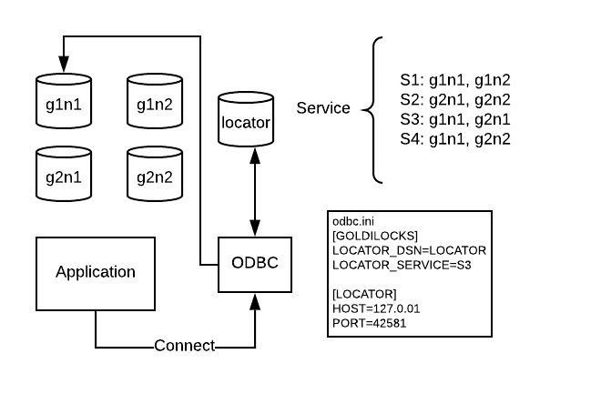

<a id="806ed1d0a43526e5"></a>

# 40. glocator

> Source: [GOLDILOCKS 3.2 User Manual (en)](https://manual.sunjesoft.co.kr/goldilocks/3_2_x/manual/en/806ed1d0a43526e5)  
> Tag: `GOLDILOCKS_Venus_3_2_14_retagged`

[← 39. gtrclogger](39-gtrclogger.md) · [Table of contents](../README.md) · [41. gagent →](41-gagent.md)

<a id="787a6a38e78fc2e9"></a>
## Overview of glocator

<a id="3f2dd6feab1a5618"></a>
### Definition

glocator is a utility which provides locations to a client and manages them in GOLDILOCKS cluster system.  
The location information of cluster member nodes is provided to the glocator program through [gloctl](42-gloctl.md#387aabf9d82371e9) and [gagent](41-gagent.md#95406be694697639).  
glocator communicates with client and inner process by using a User Datagram Protocol (UDP).

> The location information used by glocator is different from the location used by a cluster member node. glocator requires a host, a listener port, a db home path, an agent port of a member node.  
> glocator should be executed ahead of gagent to receive these location information from gagent, or glocator should receive it through gloctl.

<a id="1c4407b280d9215d"></a>
### Usage

```
glocator [options]
```

<a id="e5b3604a041af277"></a>
### Options

<a id="d3831be27dcda31f"></a>
#### help

<a id="e92af1f4b3e8668a"></a>
##### Description

It outputs a help message.

<a id="fc1259a005d31a60"></a>
##### Example

```
$ glocator --help

Usage:
 glocator [options]

Options:

-c  --create       Create glocator environment
-s  --start        Start glocator
-t  --stop         Stop glocator
-f  --conf         Set configure file
-u  --status       Get glocator status
-l  --silent       Suppress display message
-r  --no-copyright Suppress display copy right and version
-h  --help         Print help message
```

<a id="f129006c9fcd1e04"></a>
#### create

<a id="6eb8ccdd84fcdf27"></a>
##### Description

It creates the data file of glocator.

<a id="51347163a1eb20d7"></a>
##### Example

```
$ glocator --create

glocator is created.
```

> The data file of glocator is created in &lt;GOLDILOCKS_DATA&gt;/db directory.

```
$ ls
README  glocator.dat  system_data.dbf  system_dict.dbf  system_undo.dbf
```

<a id="fb75802c72d8a85e"></a>
#### start

<a id="384b28403d7d9305"></a>
##### Description

It starts glocator. If glocator having the same port already has started, then an error occurs.

<a id="5a35d7128f57fda0"></a>
##### Example

```
$ glocator --start

glocator is started.
```

<a id="a054215cb3361584"></a>
#### stop

<a id="2aabd1755648a5a7"></a>
##### Description

It stops glocator which is in operation. The same port should be set to stop glocator in operation.

<a id="292f9f4acb542fad"></a>
##### Example

```
$ glocator --stop

glocator is stopped.
```

<a id="07efcb54971c16a2"></a>
#### conf

<a id="be53ecbf255d681b"></a>
##### Description

It sets the configure file when starting glocator.

<a id="343c0a83cd0c6616"></a>
##### Example

```
$ glocator --start --conf goldilocks.glocator.conf

glocator is started.
```

<a id="b4b544e82bfe8ef1"></a>
#### status

<a id="35d573614d49e1c8"></a>
##### Description

It outputs the status message of glocator which is in operation. The same port should be set to check the status of glocator in operation.

<a id="b15bf31f70885761"></a>
##### Example

```
$ glocator --status

Process ID: 26058
Configuration file: goldilocks.glocator.conf
Unix domain path: /tmp/unix-glocator.42581
Udp listen host: 0.0.0.0, Port: 42581
glocator is running.
```

<a id="b9e185ed83756d47"></a>
#### sync

<a id="14fe29acf8837078"></a>
##### Description

It synchronizes the data of glocator set in ALTERNATE_LOCATORS before driving glocator.

There are two methods for the data synchronization, whichare SOURCE and BOTH. SOURCE method brings data from ALTERNATE_LOCATORS, and BOTH method merges two glocators.

<a id="f5729aa5ccd889fd"></a>
##### Example

The following is an example of success of a sync option.

```
$ glocator --start --sync

glocator is started.
```

The following is an example of failure of a sync option. The value is not set in ALTERNATE_LOCATORS property.

```
$ glocator --start --sync

ERR-HY000(60016): Need more alternate locator host information.
```

The following is an example of failure of a sync option. glocator set in ALTERNATE_LOCATORS property does not response.

```
$ glocator --start --sync

ERR-HY000(60016): Need more alternate locator host information.
```

<a id="27f608087b85ce8a"></a>
#### silent

<a id="f9295f4d637d00f6"></a>
##### Description

It does not output the message of glocator about the execution.

<a id="6b2fae069780b80b"></a>
##### Example

```
$ glocator --start --silent
```

<a id="1eb48a5caee7f557"></a>
#### no-copyright

<a id="cc09831788523f0f"></a>
##### Description

It does not output the message of glocator's copyright and version about the execution.

<a id="2553d4617e7bc59e"></a>
##### Example

```
$ glocator --start --no-copyright

glocator is started.
```

<a id="a096e6c83d07e726"></a>
## Using glocator

<a id="f951aa0d5bfe54b6"></a>
### Data File

glocator data file should be created before starting glocator.

```
$ glocator --create

glocator is created.
```

The directory in which glocator data file is stored can be altered by editing configuration [LOCATION_FILE_DIR](#600c8f8a0dbaf0a1). The default value is created in &lt;GOLDILOCKS_DATA&gt;/db. The data file can be altered by editing [LOCATION_FILE_NAME](#d1b77d44c37dda94). The default value is glocator.dat.

The maximum size and initial size of glocator data file can be altered by editing configuration [LOCATION_FILE_MAX_SIZE](#5b48ae9ee85f67c6)and [LOCATION_FILE_SIZE](#fc4ff7164d20ef92).

<a id="de6123c451ba8f59"></a>
### CSTARTUP and CSHUTDOWN

glocator can be used to CSTARTUP and CSHUTDOWN the GOLDILOCKS server.  
For that, glocator should be in operation, and CSTARTUP or CSHUTDOWN should be executed through gsqlnet.  
However, LOCATOR_DSN and the property should be set in odbc.ini of the device which executes gsqlnet. For more information, refer to [GOLDILOCKS UNIX ODBC driver libraries](../part-05-developer-manual/25-odbc.md#7e06a7ac3a92cc1a).

The following contents is set in odbc.ini to use glocator.

```
[GOLDILOCKS]
HOST=127.0.0.1
PORT=20101
UID=sys
PWD=gliese
LOCATOR_DSN=GLOCATOR

[GLOCATOR]
HOST=127.0.0.1
PORT=42581
```

> If FILE property exists in DSN [GLOCATOR], then the file specified in FILE property takes precedence instead of using glocator. Therefore, FILE property should be excluded.

glocator should know the location information of member nodes to execute CSTARTUP and CSHUTDOWN.

<a id="1f0ff943434bee8a"></a>
### Replication

<a id="81c76c7c489a3098"></a>
#### Overview

glocator replication keeps data consistent, so it enables the stable service through the remote glocator when an error occurs.

<a id="aad461fa573e463b"></a>
#### Configuration

Each glocator should set ALTERNATE_LOCATORS property in a configure file to use the replication feature. Locator_name should be set in ALTERNATE_LOCATORS property and the specified Locator_name should be set in a configure file together with HOST, PORT properties.

The following is how to set ALTERNATE_LOCATORS property.

```
[LOCATOR]
ALTERNATE_LOCATORS = (locator_name1,locator_name2)
[locator_name1]
HOST= ip_address
PORT = port_num
[locator_name2]
HOST= ip_address
PORT = port_num
```

The following is an example of a configure file which sets ALTERNATE_LOCATORS property.

```
[LOCATOR]
PORT=42581
SYNC_RESPONSE_TIMEOUT = 2
SYNC_RETRY_COUNT = 2
LOCATION_FILE_NAME='glocator_1.dat'
ALTERNATE_LOCATORS=(LOCATOR_2,LOCATOR_3)

[LOCATOR_2]
HOST=127.0.0.1
PORT=42582

[LOCATOR_3]
HOST=127.0.0.1
PORT=42583
```


> 
> - [LOCATOR] is DSN which is read as default by glocator.
> - For more information about glocator-related ODBC and how to set gagent, refer to [odbc.ini File](../part-05-developer-manual/25-odbc.md#bdc1948c0522f52f), [ALTERNATE_LOCATORS](41-gagent.md#8756177d001cb056).
> 

<a id="9196384f128cf8bd"></a>
#### Synchronizing Data

The data should be consistent when the replicated glocator is in service. If glocator in operation does not exist, then all glocator can perform the normal start. If glocator in operation exists, an alternate glocator can be started by synchronizing the data using a [sync](#b9e185ed83756d47) option.

[sync](#b9e185ed83756d47) option has BOTH and SOURCE. BOTH merges glocator's own data and alternate glocator's data. SOURCE brings the data from the counterpart glocator. The sync operation of glocator is 1 : 1 correspondence task between a glocator and an alternate glocator. Therefore, if A and B are already being operated, and C is operated after syncing by using BOTH for the replication of three (A, B, C) glocators, then the data of A and B glocators may be different.

glocator in service synchronizes only the updated content. If the data synchronization fails due to the packet loss or other reasons, then the data may be different. In this case, update the data within that glocator by using [gloctl](42-gloctl.md#58c6a5230940f6f1) program, or restart glocator with sync option.

<a id="25b07e39207fa681"></a>
## Features of glocator

<a id="318576dfe79dba8c"></a>
### Connection Service

It provides a service feature which enables arbitrarily access any node among user-defined nodes even though the location information of a specific node in a cluster environment is unknown.

The service feature is that a user specifies nodes managed by glocator an arbitrary group. This service can be registered by using gloctl program. Service lists managed by glocator can also be viewed by using gloctl program.

An application should be accessed by using ODBC driver, and LOCATOR_DSN and LOCATOR_SERVICE property should be specified in [odbc.ini file](../part-05-developer-manual/25-odbc.md#bdc1948c0522f52f).

<a id="91e6c0588e49244c"></a>


The figure above describes that an application accesses to g1n1 belonging to service s3. The connecting sequence of ODBC driver by using the service is as same as the sequence of node registered in the service. If ODBC driver fails to connect to g1n1 in the example above, it will try to connect to the next node g2n1.

> To use the service feature, the valid location information of a node should be input in glocator in advance.

<a id="961f985c4bbe7985"></a>
### Cluster Failover

glocator is helpful when a server proceeds the failover.

When the value of server property [CLUSTER_SPLIT_BRAIN_RESOLUTION_POLICY](../part-02-administration-manual/10-server-property.md#b8d613aa2234587a) is set to 1 or 2, and connection between nodes is disconnected in a cluster environment, a failover occurs, then each node proceeds the cluster failover and queries its viability to glocator through gagent.

The glocator which received a query decides the viability between two nodes which were disconnected, and transfer the result to each node through gagent.

Nodes received the viabilty results are terminated or proceeds the failover.

<a id="f17a142305b22a34"></a>
## glocator Configuration

<a id="6a7c602218548ee9"></a>
### Configuration File and Environment Variable

glocator can use a file or environment variable to set the configuration.

An environment variable can be set by using the name of which 'LOCATOR_' is added as a prefix to a configuration property name. For example, setting HOST in the configuration file has the same effect as specifying $LOCATOR_HOST.

The contents of a configuration file takes precedence over the environment variable setting values.

glocator reads the configuration file by reading DSN as the default value of [LOCATOR].

glocator has $GOLDILOCKS_DATA/conf/goldilocks.glocator.conf file as its environment file. To alter the driving environment of glocator, the file contents should be altered, or glocator should start after setting the environment variables.

<a id="d80a8a8aac45255b"></a>
### Configuration Properties

<a id="3db1f51bdf97a520"></a>
#### HOST

<a id="85bb9606ee623b05"></a>
| Item | Description |
| --- | --- |
| Name | HOST |
| Description | It is an IP address of which glocator binds. |
| Data type | ip address (ip v4) |
| Default value/ range | 0.0.0.0 |

It is an IP address of which glocator binds for UDP communication.  
It uses an IP address in IP v4 form.

<a id="c7ec74ec4755d82c"></a>
#### PORT

<a id="f29e32b3f1172cf9"></a>
| Item | Description |
| --- | --- |
| Name | PORT |
| Description | It is a port of which glocator waits for Recv. |
| Data type | INT |
| Default value/ range | 42581 / 1024~49151 |

It is a port of which glocator receives a packet through UDP communication.  
The port from 1024 to 49151 can be used.

<a id="0c5cde24150c274f"></a>
#### WORKER_COUNT

<a id="8ae2f6f5b3426e59"></a>
| Item | Description |
| --- | --- |
| Name | WORKER_COUNT |
| Description | It is the number of threads processing a job. |
| Data type | INT |
| Default value/ range | 1 / 1~8 |

It is the number of threads processing packets of which glocator received from a client or an internal process.

<a id="f6d2d466e5ed2f8a"></a>
#### SESSION_QUEUE_SIZE

<a id="0f3b1c991c03510d"></a>
| Item | Description |
| --- | --- |
| Name | SESSION_QUEUE_SIZE |
| Description | It is the queue size in which received packets are stored before processing them. |
| Data type | INT |
| Default value/ range | 33554432 / 10485760~2147483648 |

It is the size of queue of which glocator stores packets received from a client or or an internal process before processing them.  
Packets are stored as an item of a session unit in a queue.

<a id="547d808b563cf7d1"></a>
#### SESSION_ALLOCATOR_SIZE

<a id="c132e13133773594"></a>
| Item | Description |
| --- | --- |
| Name | SESSION_ALLOCATOR_SIZE |
| Description | It is the size of an allocator which allocates an item to be stored in a session queue. |
| Data type | INT |
| Default value/ range | 33554432 / 10485760~2147483648 |

It is the size of an allocator which is used to allocate an item (session) to be stored in a session queue.

<a id="a8715ce29442ef7b"></a>
#### PACKET_ALLOCATOR_SIZE

<a id="07698f32ba31127b"></a>
| Item | Description |
| --- | --- |
| Name | PACKET_ALLOCATOR_SIZE |
| Description | It is the size of an allocator which allocates a packet when receiving packets through UDP communication. |
| Data type | INT |
| Default value/ range | 33554432 / 10485760~2147483648 |

It is the size of an allocator for a buffer which is allocated for glocator to receive packets.

<a id="cf8e16803f0b481d"></a>
#### SYSTEM_LOGGER_DIR

<a id="ac79086b280513bb"></a>
| Item | Description |
| --- | --- |
| Name | SYSTEM_LOGGER_DIR |
| Description | It is the directory path of glocator trace log file. |
| Data type | String |
| Default value/ range | '&lt;GOLDILOCKS_DATA&gt;/trc' |

It is the directory path in which system trace log file of glocator is stored. &lt;GOLDILOCKS_DATA&gt; of the default value is replaced with the environment variable value of $GOLDILOCKS_DATA.

<a id="dfebeb2fa84afedc"></a>
#### SYSTEM_UDS_DIR

<a id="f937120d5b494fdf"></a>
| Item | Description |
| --- | --- |
| Name | SYSTEM_UDS_DIR |
| Description | It is the directory path in which unix domain socket file used in glocator is stored. |
| Data type | String |
| Default value/ range | '/tmp' / maximum 60 byte |

It sets the directory path in which the unix domain socket file used in glocator is stored. The maximum length of the directory should be set within 60 bytes.

<a id="600c8f8a0dbaf0a1"></a>
#### LOCATION_FILE_DIR

<a id="b3942f802d105632"></a>
| Item | Description |
| --- | --- |
| Name | LOCATION_FILE_DIR |
| Description | It is the directory path in which the location file used in glocator is stored. |
| Data type | String |
| Default value/ range | '&lt;GOLDILOCKS_DATA&gt;/db' |

It sets the directory path in which the location file used in glocator is stored.

<a id="d1b77d44c37dda94"></a>
#### LOCATION_FILE_NAME

<a id="1aa23441db1b3f98"></a>
| Item | Description |
| --- | --- |
| Name | LOCATION_FILE_NAME |
| Description | It is the name of a location file which is used in glocator. |
| Data type | String |
| Default value/ range | 'glocator.dat' |

It sets the name of a location file which is used in glocator.  
The default value is glocator.dat.

<a id="fc4ff7164d20ef92"></a>
#### LOCATION_FILE_SIZE

<a id="44103365bf7a46e5"></a>
| Item | Description |
| --- | --- |
| Name | LOCATION_FILE_SIZE |
| Description | It is the initial size of a location file. |
| Data type | Int |
| Default value/ range | 1048576 / 104576~2147483648 |

It sets the initial size of a location file used in glocator.

<a id="5b48ae9ee85f67c6"></a>
#### LOCATION_FILE_MAX_SIZE

<a id="df1face2069d0ae9"></a>
| Item | Description |
| --- | --- |
| Name | LOCATION_FILE_MAX_SIZE |
| Description | It is the maximum size of a location file. |
| Data type | Int |
| Default value/ range | 10485760 / 104576~2147483648 |

It sets the maximum size of a location file used in glocator.

<a id="1d971c5b1b093c51"></a>
#### SESSION_TIMEOUT

<a id="a7f3bb41412ac306"></a>
| Item | Description |
| --- | --- |
| Name | SESSION_TIMEOUT |
| Description | It sets the maximum time for glocator to wait to receive packets. |
| Data type | Int |
| Default value/ range | 100 / 0 ~2147483648(unit: seconds) |

It sets the maximum time (seconds) for glocator to wait to receive packets. Packets exceeds the maximum time without being processed, are dumped.

<a id="4fa979267a2e124b"></a>
#### FAILOVER_TIMEOUT

<a id="1f07e91823506a7f"></a>
| Item | Description |
| --- | --- |
| Name | FAILOVER_TIMEOUT |
| Description | It sets the maximum time for glocator to process the failover request. |
| Data type | Int |
| Default value/ range | 18 / 0 ~2147483648 |

It sets the maximum time for glocator to wait for packets while processing the failover request. If the time is over, then it returns an error to gagent which requested.

<a id="8c6db02941896095"></a>
#### ALTERNATE_LOCATORS

<a id="89085cfdc406a7cf"></a>
| Item | Description |
| --- | --- |
| Name | ALTERNATE_LOCATORS |
| Description | It sets an alternate locator and replication of glocator. |
| Data type | String |
| Default value/ range | empty / 0 ~ 1024 bytes |

It sets [Replication](#1f0ff943434bee8a) of glocator.

<a id="ca8ec14722536538"></a>
#### SYNC_RETRY_COUNT

<a id="5775e95c70b7a4a8"></a>
| Item | Description |
| --- | --- |
| Name | SYNC_RETRY_COUNT |
| Description | It sets the number of retry when glocator fails to synchronize with an alternate locator. |
| Data type | Int |
| Default value/ range | 1 / 0 ~ 5 |

It sets the number of redelivery of glocator synchronization.

glocator transfers the altered data to alternate locator when the data is altered, and it transfers the data again when it could not get any response.

<a id="2d77d571c5e43901"></a>
#### SYNC_RESPONSE_TIMEOUT

<a id="bb23a7ea10a72d09"></a>
| Item | Description |
| --- | --- |
| Name | SYNC_RESPONSE_TIMEOUT |
| Description | It sets the time waits for the response for the synchronization of glocator. |
| Data type | Int |
| Default value/ range | 5 / 1 ~ 20 |

It sets the time waits for the response for the synchronization data transferred from glocator.

---

[← 39. gtrclogger](39-gtrclogger.md) · [Table of contents](../README.md) · [41. gagent →](41-gagent.md)

<sub>Copyright © 2010 SUNJESOFT Inc. All rights reserved.</sub>
