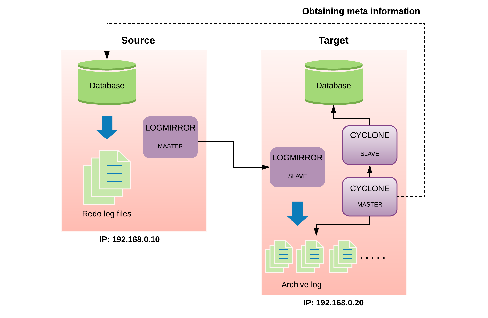

<a id="825637a16fcab368"></a>

# 45. LOGMIRROR

> Source: [GOLDILOCKS 3.2 User Manual (en)](https://manual.sunjesoft.co.kr/goldilocks/3_2_x/manual/en/825637a16fcab368)  
> Tag: `GOLDILOCKS_Venus_3_2_14_retagged`

[← 44. CYCLONE](44-cyclone.md) · [Table of contents](../README.md) · [Appendix A. Error Codes →](../appendices/appendix-01-appendix-a-error-codes.md)

<a id="2aa19999bb45f7e6"></a>
## LOGMIRROR

LOGMIRROR is a replication tool which copies the redo logs generated by GOLDILOCKS to the remote location for the configuration of the same redo log file.

<a id="b057095cc0eafff8"></a>
### Overview

CYCLONE, using the CDC method, analyzes and replicates the redo log file generated during the operation of GOLDILOCKS. Therefore, if the operating server is failed when analysis of the redo log file is not completed, then unanalyzed redo log file is not replicated and the data is lost.

However, if the redo logs are sent to a remote location without data loss and the redo log file is configured by using LOGMIRROR, then this problem of CYCLONE can be solved.

LOGMIRROR is a tool for eliminating the data loss which is caused because CYCLONE uses the ASYNC method, and it should work together with CYCLONE.

<a id="24d686a162e3c170"></a>
### Operational Features

- It is performed being divided into master and slave. Only one LOGMIRROR per GOLDILOCKS is allowed to be operated.
- Master and slave can use the TCP/ IP and infiniband communication.
    - Network speed significantly affects the GOLDILOCKS operation speed.
- The replication target is the redo log file of GOLDILOCKS.
- The original database should be operated in Transactional Data Store (TDS) mode.
    - LOGMIRROR has the same operational characteristics of CYCLONE because it should be operated together with CYCLONE.

<a id="e4ac5826958d836a"></a>
### Performance Degradation Factors of GOLDILOCKS When Operating LOGMIRROR

LOGMIRROR sends the redo logs generated by GOLDILOCKS to the remote location before storing them in the file, then processes the next after it is normally processed. Therefore, the network speed between the replication devices is an important factor of the performance, and it can cause performance degradation than GOLDILOCKS operated without LOGMIRROR. However, the high speed infiniband is supported to minimize the performance degradation.

<a id="b1da16fa6a298c98"></a>
## Requirements

<a id="f6bbcaa570ae3cff"></a>
### GOLDILOCKS Requirement

The followings should be set in GOLDILOCKS before performing LOG MIRROR.

<a id="b483e46548e4da2e"></a>
#### LOG_MIRROR_MODE

The LOG_MIRROR_MODE property is set to use LOGMIRROR in GOLDILOCKS. When it is activated, the resources which temporarily store the redo logs generated by GOLDILOCKS before LOGMIRROR sends them to a remote location are allocated.

- If the LOG_MIRROR_MODE property is changed, it is applied after restarting GOLDILOCKS.
- The changes are added or reflected in the property file.
    - Property file: goldilocks.properties.conf
    - Property setting: LOG_MIRROR_MODE = 1

Or, the following statement is executed in gSQL.

```
gSQL> ALTER SYSTEM SET LOG_MIRROR_MODE=1 SCOPE=FILE;

System altered.
```

<a id="c09d7ac8d4042f04"></a>
#### LOG_MIRROR_SHARED_MEMORY_STATIC_SIZE

LOG_MIRROR_SHARED_MEMORY_STATIC_SIZE sets the temporary storage space used by LOGMIRROR.

- It is a temporary storage space used before storing redo log file from redo log buffer.
    - The set value is related to MAXIMUM_FLUSH_LOG_BLOCK_COUNT used when storing the redo log file.
- The default value is 100 M.
    - The minimum value is 10 M, and the maximum value is 1 G.
    - Too small set value can affect the performance.

- If LOG_MIRROR_SHARED_MEMORY_STATIC_SIZE property is changed, then it is applied after the GOLDILOCKS is restarted.
- The changes are added or reflected in the property file.
    - Property file: goldilocks.properties.conf
    - Property setting: LOG_MIRROR_SHARED_MEMORY_STATIC_SIZE = the set value

Or, the following statement is executed in gSQL.

```
gSQL> ALTER SYSTEM SET LOG_MIRROR_SHARED_MEMORY_STATIC_SIZE = 200M SCOPE=FILE;

System altered.
```

<a id="97f5222ecb1bc47b"></a>
#### LOG_MIRROR_TIMEOUT

When interworking with LOGMIRROR, GOLDILOCKS includes the step of waiting for the response from LOG MIRROR. Too slow response causes the degradation of GOLDILOCKS performance. LOG_MIRROR_TIMEOUT sets the response time so when there is not any response after the time is over, LOGMIRROR stops the service, but only the GOLDILOCKS continues the service.

When restarting LOGMIRROR to perform LOGMIRROR again, it is normally operated after the recovery process.

- The default value is '0'.
    - 0 refers to an infinite waiting.
    - It can be set in seconds.
- If LOG_MIRROR_TIMEOUT property is changed, it is immediately reflected.
- The changes are added or reflected in the property file.
    - Property file: goldilocks.properties.conf
    - Property setting: LOG_MIRROR_TIMEOUT = the set value

Or, the following statement is executed in gSQL.

```
gSQL> ALTER SYSTEM SET LOG_MIRROR_TIMEOUT = 20;

System altered.
```

> The GOLDILOCKS requirements for operating CYCLONE should also be applied.

<a id="3a5fb12d5b8bcb92"></a>
## Configuration

<a id="3e687db6968359bf"></a>
### Configuration File

The information and options required for the operation can be set by using the configuration file when executing LOGMIRROR.

- If a specific configuration file is not set by using the --conf option, a specific file is read at $ GOLDILOCKS_DATA / conf directory. The logmirror.master.conf file is read when operating as master and the logmirror.slave.conf file is read when operating as slave.

**Configuration contents**

<a id="11e186629cb2f920"></a>
| Name | Description | Coverage |
| --- | --- | --- |
| PORT | It sets the port to be used for the communication between master and slave. | Master/ slave |
| DSN | It sets Data Source Name. | Master |
| HOST_IP | It sets the host IP address which is operated by GOLDILOCKS. | Master |
| HOST_PORT | It sets the host port which is operated by GOLDILOCKS. | Master |
| USER_ID | It sets the user name. | Master |
| USER_PW | It sets the user password. | Master |
| USER_ENCRYPT_PW | It sets encrypted user password. | Master/ slave |
| LOG_PATH | It sets the path in which the replicated redo log file is to be stored. | Slave |
| MASTER_IP | It sets the IP address of the device which is being operated by the log mirror master. | Slave |
| HEARTBEAT_TIMEOUT | It sets the maximum time (second) maintaining connection if the connection is not smooth due to network disconnection or system error after replication connection. | Master/ slave |
| TCP_NODELAY | It sets TCP_NODELAY option of a socket. (The default value is 1.) * 0: TCP_NODELAY off * 1: TCP_NODELAY on | Master |

<a id="b65aef8fe9034917"></a>
### Configuration Options

<a id="8356101c6c3e6179"></a>
#### PORT

- It sets the port used for the communication between master and slave.
- It can be set in master and slave.

```
PORT=21106
```

<a id="223ab38297069ca2"></a>
#### DSN

- It sets the data source name required for the access to GOLDILOCKS.
- It can be set in master.

```
DSN = GOLDILOCKS
```

<a id="322608329f512bd2"></a>
#### HOST_IP

- It sets the IP address of GOLDILOCKS in which LOGMIRROR is to be operated.
- It should be set together with HOST_PORT.
- It can be set in master.

```
HOST_IP = 127.0.0.1
```

<a id="ea893b0e2e689de0"></a>
#### HOST_PORT

- It sets the port of GOLDILOCKS on which LOGMIRROR is to be operated.
- It should be set together with HOST_IP.
- It can be set in master.

```
HOST_PORT = 22531
```

<a id="a0669d30faf9e5e0"></a>
#### USER_ID

- It sets the user ID required for the access to GOLDILOCKS.
- It can be set in master.

```
USER_ID = testID
```

<a id="19b7e907458cc8c4"></a>
#### USER_PW

- It sets the user password required for the access to GOLDILOCKS.
- It can be set in master.

```
USER_PW = testPW
```

<a id="ac1c1db85066146b"></a>
#### USER_ENCRYPT_PW

- It sets the user password which is required for the access to GOLDILOCKS by encrypting.
- It is used instead of USER_PW.
- Encrypted user password is created by [logmirror --encrypt *user password* --key *the key to be encrypted*].
- If this value is used, then --key option should be used when executing logmirror. (In this case, the key value as same as that created with --encrypt should be used.

```
USER_ENCRYPT_PW = 't33KImiqvhqNyfN+uZmFrw=='
```

<a id="060e83c7b445f14b"></a>
#### LOG_PATH

- It sets the path in which the replicated redo log file is to be stored.
    - The set path should be an absolute path. 
    - The path is set by using a single quote (') . 
- It can be set in slave.

```
LOG_PATH = '/data/wal'
```

<a id="8a37538a80f223e5"></a>
#### MASTER_IP

- It sets the IP address of the device of which LOGMIRROR master is operating.
- It can be set in slave.

```
MASTER_IP = 192.168.0.100
```

<a id="86a55cac71bb8c17"></a>
#### HEARTBEAT_TIMEOUT

- It can be set in master and slave.
- It sets the maximum time (second) maintaining connection if the connection is not smooth due to network disconnection or system error after replication connection between master and slave.
- The default value is 30 (seconds).
    - The minimum value is 10 (seconds).

```
HEARTBEAT_TIMEOUT = 40
```

<a id="467e185c863e2e52"></a>
#### TCP_NODELAY

- It is used only in master.
- It sets TCP_NODELAY option for the LogMirror transfer socket.
    - 0: It offs the socket TCP_NODELAY option.
    - 1: It ons the socket TCP_NODELAY option. (Default)

```
TCP_NODELAY = 1
```

<a id="688db0429554d51d"></a>
## Operating

The executing environment of master/ slave of LOGMIRROR is as follows.

**Executing environment**

<a id="deac3d8f708e1332"></a>
| Item | Whether to  operate  GOLDILOCKS | Description |
| --- | --- | --- |
| Master | O | When operating as master, LOGMIRROR should be operated at the device in which GOLDILOCKS is operated. |
| Slave | X | When operating as slave, GOLDILOCKS is not required to be operated and the storage space in the disk is required to store the redo log file. |

The operating contents during the execution can be viewed through a trace log.

<a id="f640a9bd0b2edf2b"></a>
| Item | File |
| --- | --- |
| Master | $GOLDILOCKS_DATA/trc/LogMirror_master.trc |
| Slave | $GOLDILOCKS_DATA/trc/LogMirror_slave.trc |

> For more information about the error messages and handlings stored in the trace log, refer to [Troubleshooting of LOGMIRROR](../part-02-administration-manual/8-goldilocks-database-replication.md#b729d2d126748f0f).

<a id="3b8f8daf3c76accd"></a>
### Operating LOGMIRROR

LOGMIRROR can normally replicates the redo log file only when the following procedures should be completed even after the GOLDILOCKS configuration, initializing and operating master/ slave.

> SWITCH of the redo log file should occur to start the replication. LOGMIRROR starts the normal operation after generating the new log file. Therefore, the following step should be performed.

```
gSQL> ALTER SYSTEM SWITCH LOGFILE;

System altered.
```

> The redo log file replicated by LOGMIRROR is continuously stored, and it is not automatically deleted. Therefore, the file management such as deleting or moving is regularly required according to the environment of the operating device.

<a id="803976a9a722cacb"></a>
### Executing Option

**Execution options**

<a id="d42e23c8d1d5b6b3"></a>
| Option | Description | Remarks |
| --- | --- | --- |
| --start \| -s | It executes LOGMIRROR. | It should be used together with --master \| --slave. |
| --stop \| -t | It terminates LOGMIRROR. | It should be used together with --master \| --slave. |
| --master \| -m | It is performed in master mode. | It should be used together with --start \| --stop. |
| --slave \| -l | It is performed in slave mode. | It should be used together with --start \| --stop. |
| --conf \| -c | It sets the configuration file path. | It is input in --conf CONFIG_FILE format. |
| --infiniband \| -f | It uses infiniband network environment. | It is not input when using TCP/IP environment. |
| --silent \| -i | It sets not to output the message. | - |
| --help \| -h | It sets to output the help message. | - |

- Execute it in master mode by using the default configuration file.

```
prompt> logmirror --master --start
```

- Terminate the LOGMIRROR which is being operated in master mode.

```
prompt> logmirror --master --stop
```

- Execute it in slave mode by using the default configuration file.

```
prompt> logmirror --slave --start
```

- Terminate the LOGMIRROR which is being operated in slave mode.

```
prompt> logmirror --slave --stop
```

- Execute it in master mode by using TEST_CONFIG file and infiniband network.

```
prompt> logmirror --master --start --conf TEST_CONFIG --infiniband
```

- Execute it in slave mode by using TEST_CONFIG file and infiniband network.

```
prompt> logmirror --slave --start --conf TEST_CONFIG --infiniband
```

> For examples of initializing LOGMIRROR, refer to [LOGMIRROR](../part-02-administration-manual/8-goldilocks-database-replication.md#488600f5b7621baf).

<a id="18ba4feb92a92733"></a>
## Examples of Interworking with CYCLONE

Interworking of CYCLONE, the CDC replication tool, with LOGMIRROR, the replication tool of the redolog file, eliminates the risk of data loss.

<a id="b8f9963460b8ea36"></a>
| Tool | Function | Interworking |
| --- | --- | --- |
| CYCLONE | Replication of CDC | If it is independently operated it may cause the data loss. |
| LOGMIRROR | Replication of REDO LOG FILE | If it is operated together it does not cause the data loss. |

The following describes the examples of interworked operation, and its structure.

<a id="d2ab29932eb2c024"></a>


- Device structure
    - The source device which is the original data
        - IP: 192.168.0.10
        - GOLDILOCKS listen port: 22581
        - The table to be replicated: T1, T2
- The remote target device for replication
    - IP: 192.168.0.20
- Two devices executes interworking between LOGMIRROR and CYCLONE for the replication without data loss. 
    - Source device: LOGMIRROR (master)
    - Target device: LOGMIRROR (slave) + CYCLONE (master, slave)

<a id="029e007086ac9379"></a>
### Operating Order

1. Set the configuration of CYCLONE and LOGMIRROR in the original GOLDILOCKS.
2. Set the configuration of LOGMIRROR MASTER/SLAVE.
3. Execute LOGMIRROR MASTER/SLAVE.
4. Perform LOG FILE SWITCH of the original GOLDILOCKS for the normal operation of LOGMIRROR.
5. Set the remote GOLDILOCKS configuration.
6. Set the CYCLONE MASTER/SLAVE configuration.
7. Execute CYCLONE MASTER/SLAVE.

<a id="936ee1d2f3fb75d8"></a>
#### Configuring CYCLONE and LOGMIRROR in Original GOLDILOCKS

Refer to the followings.  
• CYCLONE configuration: [Requirements](44-cyclone.md#75d4170bd3be7069)  
• LOGMIRROR configuration: [Requirements](#b1da16fa6a298c98)

Create the tables T1, T2 for a test after the configuration.

```
gSQL > CREATE TABLE T1( COL1 INTEGER PRIMARY KEY, COL2 VARCHAR(20) );
gSQL > CREATE TABLE T2( COL1 INTEGER PRIMARY KEY, COL2 VARCHAR(20) );
gSQL > COMMIT;
```

<a id="3aa04548d4339411"></a>
#### Configuring LOGMIRROR MASTER/SLAVE

- LOGMIRROR MASTER configuration file 
    - Storage location: $GOLDILOCKS_DATA/conf/logmirror.master.conf
    - It is the source device.

> LOG MIRROR MASTER should be operated on the device in which the original GOLDILOCKS is operated.

- Enter DSN or HOST information. HOST information is entered in the following example.

```
HOST_IP   = 192.168.0.10
HOST_PORT = 22581
```

- Use CYCLONE USER created in the previous step.

```
USER_ID = cdc_user
USER_PW = cdc_password
```

- Set the PORT to be used for LOGMIRROR communication.

```
PORT = 21106
```

- LOGMIRROR SLAVE configuration file
    - Storage path: $GOLDILOCKS_DATA/conf/logmirror.slave.conf
    - It is the target device.

- Enter the IP address of the device in which LOG MIRROR MASTER is being operated.

```
MASTER_IP = 192.168.0.10
```

- The PORT which is as same as LOGMIRROR MASTER should be entered.

```
PORT = 21106
```

- Enter the absolute path in which the replicated redo log file is to be stored.

```
LOG_PATH = '/data/LogMirrorWAL'
```

<a id="17ba372c757eb53b"></a>
#### Executing LOGMIRROR MASTER/ SLAVE

- Execute LOGMIRROR MASTER.
    - It should be executed in the source device.

```
logmirror --master --start --conf $GOLDILOCKS_DATA/conf/logmirror.master.conf
```

- Execute LOGMIRROR SLAVE.
    - It should be executed in the target device.

```
logmirror --slave --start --conf $GOLDILOCKS_DATA/conf/logmirror.slave.conf
```

<a id="23a7d9f139782c05"></a>
#### Executing LOGFILE SWITCH of Original GOLDILOCKS for Normal Operation of LOGMIRROR

- LOGFILE SWITCH for starting to record LOGMIRROR file.
    - It should be executed in the source device.

```
gSQL> ALTER SYSTEM SWITCH LOGFILE;
```

> When it is executed as above, the redo log file is generated in the path set in the SLAVE device. If the redo log file is not generated, a user should check the directory privilege or check whether the directory is created.

<a id="a0277288d083c3d4"></a>
#### Configuring Remote GOLDILOCKS

It is required to check the table configuration for the normal operation and replication of GOLDILOCKS operated on the target device, and check the schema information.

The tables T1, T2 are created for test as follows.

```
gSQL > CREATE TABLE T1( COL1 INTEGER PRIMARY KEY, COL2 VARCHAR(20) );
gSQL > CREATE TABLE T2( COL1 INTEGER PRIMARY KEY, COL2 VARCHAR(20) );
gSQL > COMMIT;
```

<a id="45615a699b6839f4"></a>
#### Configuring CYCLONE MASTER/ SLAVE

- CYCLONE MASTER configuration file
    - Storage path: $GOLDILOCKS_DATA/conf/cyclone.master.conf
    - It is the target device.

- Enter DSN or HOST information of the source device. HOST information is entered in the following example.

```
HOST_IP   = 192.168.0.10
HOST_PORT = 22581
```

- Use CYCLONE USER

```
USER_ID = cdc_user
USER_PW = cdc_password

GROUP_NAME = GROUP1
{
    PORT = 21102
    CAPTURE_TABLE = 
    (
        T1,
        T2
    )
}
```

- CYCLONE SLAVE configuration file 
    - Storage path: $GOLDILOCKS_DATA/conf/cyclone.slave.conf
    - It is the target device.

- Connect to GOLDILOCKS which is operated in the target device with D/A. (Therefore, DSN and HOST information does not exist.)

```
USER_ID = cdc_user
USER_PW = cdc_password
```

- CYCLONE master is being operated on the same device.

```
MASTER_IP = 192.168.0.20

GROUP_NAME = GROUP1
{
```

- Enter the path set by LogMirror slave.

```
LOG_PATH = '/data/LogMirrorWAL'
    PORT = 21102
    APPLY_TABLE =
    ( 
        T1 TO T1,
        T2 TO T2
    }
}
```

<a id="c58d6ac8838b12cc"></a>
#### Executing CYCLONE MASTER/ SLAVE

- Execute CYCLONE MASTER.
    - It should be executed in the target device when it is connected with D/A.

```
cyclonet --master --start --conf $GOLDILOCKS_DATA/conf/cyclone.master.conf
```

- Execute CYCLONE SLAVE.
    - It should be executed in the target device when it is connected with D/A.

```
cyclone --slave --start --conf $GOLDILOCKS_DATA/conf/cyclone.slave.conf
```

---

[← 44. CYCLONE](44-cyclone.md) · [Table of contents](../README.md) · [Appendix A. Error Codes →](../appendices/appendix-01-appendix-a-error-codes.md)

<sub>Copyright © 2010 SUNJESOFT Inc. All rights reserved.</sub>
