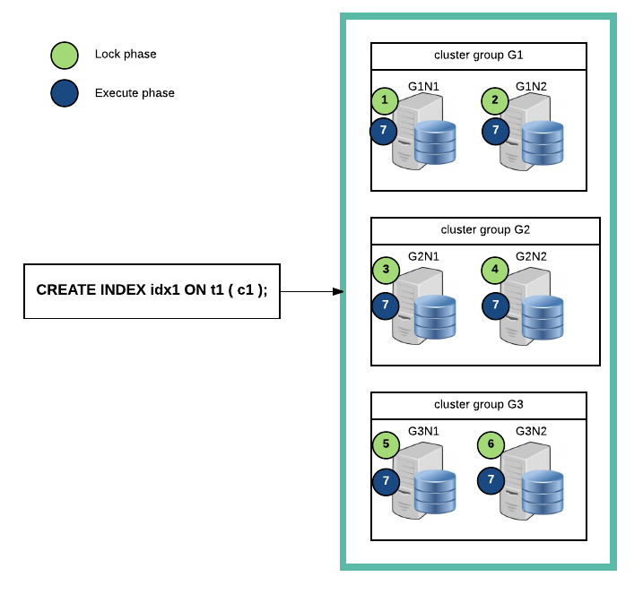
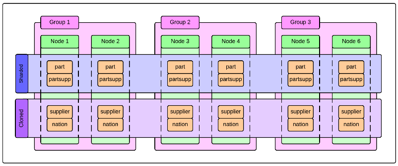
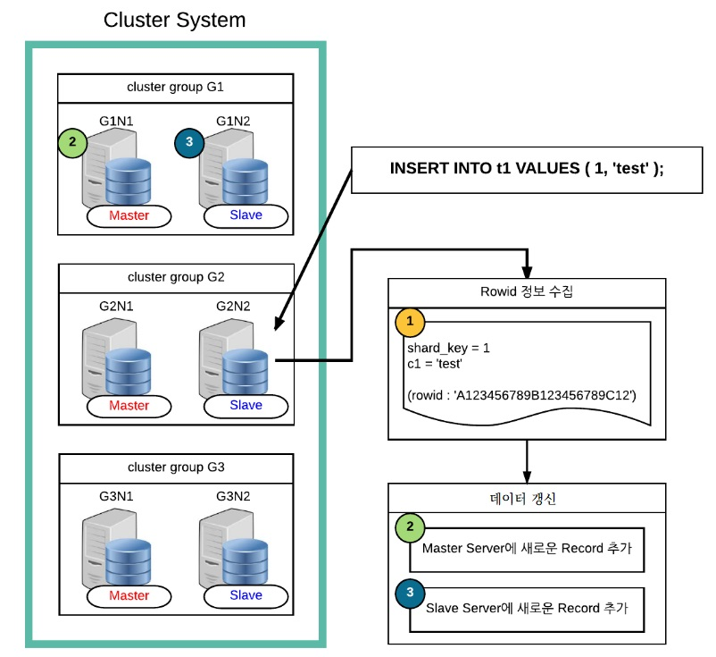
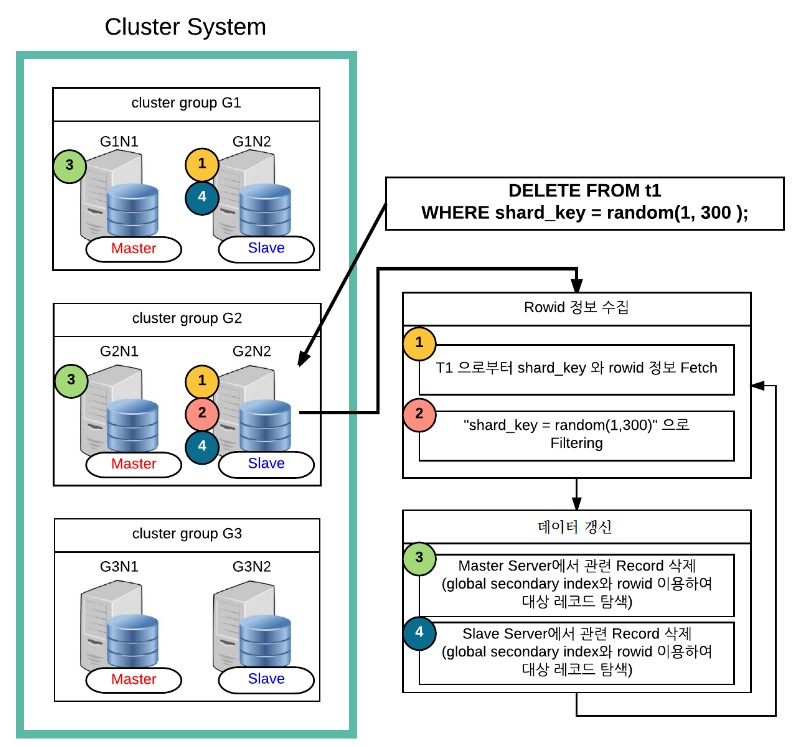

<a id="5f3be374dde84717"></a>

# 12. SQL Languages

> 원본: [GOLDILOCKS 3.2 User Manual (ko)](https://manual.sunjesoft.co.kr/goldilocks/3_2_x/manual/ko/5f3be374dde84717)  
> 태그: `GOLDILOCKS_Venus_3_2_14_retagged`

[← 11. SQL Elements](11-sql-elements.md) · [전체 목차](../README.md) · [13. SQL Objects →](13-sql-objects.md)

Structured Query Language (SQL)는 다음과 같이 구분할 수 있다.

- Data Definition Language: 데이터 정의 언어
- Data Manipulation Language: 데이터 조작 언어
- Data Query Language: 데이터 질의 언어
- Control Language: 제어 언어

<a id="f4a4a3c909b3a7fb"></a>
## Data Definition Language

<a id="371e9cc1f9e599b4"></a>
### DDL 관련 구문

관련 내용은 다음을 참조한다.

- Non-schema object DDL
    - [데이터베이스 관련 구문](13-sql-objects.md#545c4e8abe19ab9b)
    - [Profile 관련 구문](13-sql-objects.md#9e69934e4bb9ff13)
    - [Audit Policy 관련 구문](13-sql-objects.md#880dc41361f63359)
    - [Authorization 관련 구문](13-sql-objects.md#78fd272d46ce2c21)
    - [Schema 관련 구문](13-sql-objects.md#e52c546b85f70132)
    - [Tablespace 관련 구문](13-sql-objects.md#4b93327952568694)

- SQL schema object DDL
    - [테이블 관련 구문](13-sql-objects.md#33b3a06a399e59ff)
    - [Index 관련 구문](13-sql-objects.md#ab2cee8d5a040e9c)
    - [View 관련 구문](13-sql-objects.md#a173cea9751d11ed)
    - [Sequence 관련 구문](13-sql-objects.md#7b445d37ae728b73)
    - [Synonym 관련 구문](13-sql-objects.md#a95f9d676f4398ee)

- Cluster object DDL
    - [Cluster System 관련 구문](14-cluster-objects.md#b434d2e929a99911)
    - [Cluster Group 관련 구문](14-cluster-objects.md#66b68c3a9bdd24f1)
    - [Cluster Member 관련 구문](14-cluster-objects.md#caa30559a53ca391)
    - [Cluster Location 관련 구문](14-cluster-objects.md#9767fdb8bce50065)
    - [Global Secondary Index 관련 구문](14-cluster-objects.md#436341ea054fbaee)

<a id="2f40a67367890750"></a>
### DDL 개념

Data Definition Language (DDL)는 SQL 객체를 생성 (CREATE), 제거 (DROP), 변경 (ALTER)하는 SQL 언어이다.

데이터베이스를 구성하는 SQL 객체는 다음 표와 같으며 각 객체에 대한 자세한 설명은 참조 링크 항목을 참조한다.

<a id="5227f43d8aef078f"></a>
<table class="table column_count_4"><caption>SQL 객체의 종류</caption><thead><tr><th class="to_center"><div>구분</div></th><th class="to_center"><div>객체</div></th><th class="to_center"><div>객체 설명</div></th><th class="to_center"><div>참조 링크</div></th></tr></thead><tbody><tr><td class="to_left to_middle" rowspan="6"><div>Non-schema
객체</div></td><td class="to_left to_middle"><div>Profile</div></td><td class="to_left to_middle"><div>Password 관리 정책을 정의한 객체</div></td><td class="to_left to_middle"><div><a class="reference text" href="13-sql-objects.md#3a36093ed2ebba8a">Profile</a></div></td></tr><tr><td class="to_left to_middle"><div>Audit policy</div></td><td class="to_left to_middle"><div>SQL 감사 정책을 정의한 객체</div></td><td class="to_left to_middle"><div><a class="reference text" href="13-sql-objects.md#d9b540771815ba3c">Audit Policy</a></div></td></tr><tr><td class="to_left to_middle"><div>User</div></td><td class="to_left to_middle"><div>권한의 집합으로 이루어진 사용자 객체</div></td><td class="to_left to_middle"><div><a class="reference text" href="13-sql-objects.md#1db9efe0cd3bbf56">Authorization</a></div></td></tr><tr><td class="to_left to_middle"><div>Schema</div></td><td class="to_left to_middle"><div>테이블 등 SQL schema 객체를 포함하는 논리적 위치</div></td><td class="to_left to_middle"><div><a class="reference text" href="13-sql-objects.md#3000c3581fef9186">Schema</a></div></td></tr><tr><td class="to_left to_middle"><div>Tablespace</div></td><td class="to_left to_middle"><div>테이블, 인덱스 등의 객체를 저장하는 물리적 저장소</div></td><td class="to_left to_middle"><div><a class="reference text" href="13-sql-objects.md#777fbd27503738fe">Tablespace</a></div></td></tr><tr><td class="to_left to_middle"><div>Public synonym</div></td><td class="to_left to_middle"><div>공용 synonym</div></td><td class="to_left to_middle"><div><a class="reference text" href="13-sql-objects.md#501532a9693208d9">Public Synonym</a></div></td></tr><tr><td class="to_left to_middle" rowspan="7"><div>SQL schema 
객체</div></td><td class="to_left to_middle"><div>Table</div></td><td class="to_left to_middle"><div>데이터가 저장되는 물리적 릴레이션</div></td><td class="to_left to_middle"><div><a class="reference text" href="13-sql-objects.md#b2f2844f1077dd1c">Table</a></div></td></tr><tr><td class="to_left to_middle"><div>View</div></td><td class="to_left to_middle"><div>질의로 구성된 논리적 릴레이션</div></td><td class="to_left to_middle"><div><a class="reference text" href="13-sql-objects.md#41a647f0232a4438">View</a></div></td></tr><tr><td class="to_left to_middle"><div>Index</div></td><td class="to_left to_middle"><div>질의 성능을 향상시키기 위한 색인 객체</div></td><td class="to_left to_middle"><div><a class="reference text" href="13-sql-objects.md#84d3b90e1c80560f">Index</a></div></td></tr><tr><td class="to_left to_middle"><div>Sequence</div></td><td class="to_left to_middle"><div>순차 번호를 생성하는 객체</div></td><td class="to_left to_middle"><div><a class="reference text" href="13-sql-objects.md#9e2a0960d49f2520">Sequence</a></div></td></tr><tr><td class="to_left to_middle"><div>Synonym</div></td><td class="to_left to_middle"><div>객체에 대한 대체명을 선언한 객체</div></td><td class="to_left to_middle"><div><a class="reference text" href="13-sql-objects.md#2f21297635de4084">Synonym</a></div></td></tr><tr><td class="to_left to_middle"><div>Stored procedure</div></td><td class="to_left to_middle"><div>사용자 정의 procedure 객체</div></td><td class="to_left to_middle"><div><a class="reference text" href="13-sql-objects.md#4959d4d2dbb4e152">Stored Procedure</a></div></td></tr><tr><td class="to_left to_middle"><div>Stored function</div></td><td class="to_left to_middle"><div>사용자 정의 function 객체</div></td><td class="to_left to_middle"><div><a class="reference text" href="13-sql-objects.md#3d08b4b5410be8d2">Stored Function</a></div></td></tr><tr><td class="to_left to_middle" rowspan="5"><div>Cluster 
객체</div></td><td class="to_left to_middle"><div>Cluster group</div></td><td class="to_left to_middle"><div>Cluster member의 집합</div></td><td class="to_left to_middle"><div><a class="reference text" href="14-cluster-objects.md#c2d472beb0143e16">Cluster Group</a></div></td></tr><tr><td class="to_left to_middle"><div>Cluster member</div></td><td class="to_left to_middle"><div>Cluster system을 구성하는 data server</div></td><td class="to_left to_middle"><div><a class="reference text" href="14-cluster-objects.md#3c4b02aff6385466">Cluster Member</a></div></td></tr><tr><td class="to_left to_middle"><div>Cluster location</div></td><td class="to_left to_middle"><div>Cluster member의 위치 정보 객체</div></td><td class="to_left to_middle"><div><a class="reference text" href="14-cluster-objects.md#1e98c0c0145ff7f1">Cluster Location</a></div></td></tr><tr><td class="to_left to_middle"><div>Shard</div></td><td class="to_left to_middle"><div>Cluster table을 수평으로 분할한 row들의 집합</div></td><td class="to_left to_middle"><div><a class="reference text" href="14-cluster-objects.md#9275bfd2e66b74f5">Cluster Table과 Shard</a></div></td></tr><tr><td class="to_left to_middle"><div>Global secondary
index</div></td><td class="to_left to_middle"><div>Cluster의 row 식별자를 위한 색인</div></td><td class="to_left to_middle"><div><a class="reference text" href="14-cluster-objects.md#cdce6d59589f5f2a">Global Secondary Index</a></div></td></tr></tbody></table>

<a id="34890e77adfd0191"></a>
### DDL과 트랜잭션

GOLDILOCKS에서는 데이터를 추가 (INSERT), 삭제 (DELETE), 갱신 (UPDATE)하는 DML 뿐 아니라, 객체를 생성 (CREATE), 제거 (DROP), 변경 (ALTER)하는 DDL 역시 트랜잭션에 포함된다. 많은 DBMS에서 DDL을 실행할 때 암묵적으로 COMMIT을 수행하는 반면에 GOLDILOCKS에서는 DDL도 트랜잭션에 포함시켜 트랜잭션의 원자성 (atomicity)과 일관성 (consistency)을 보장한다.

이러한 기능은 데이터베이스 migration 작업이나 tool 설치와 같은 배치성 DDL을 원자적으로 수행해야 하는 경우나, 사용자가 실수로 DROP TABLE, TRUNCATE TABLE과 같은 구문을 실행하는 바람에 rollback을 통해 이를 복구해야 하는 경우에 유용하다.

DDL 구문의 속성이 auto-commit인 경우, 구문을 수행할 때 자동으로 commit을 수행하며 auto-commit 이 아닌 경우에는 구문을 수행한 후에도 트랜잭션을 rollback 할 수 있다. DDL의 auto-commit 여부는 [V$SQL_COMMAND](../part-02-administration-manual/9-database-information.md#6165b1024d56a016) view를 사용하여 다음과 같이 조회할 수 있다.

```
gSQL> 
SELECT command, auto_commit 
  FROM V$SQL_COMMAND 
 WHERE is_ddl = 'YES';


COMMAND                                                   AUTO_COMMIT
--------------------------------------------------------- -----------
ALTER AUDIT POLICY                                        YES        
ALTER CLUSTER GROUP .. ADD CLUSTER MEMBER                 YES        
ALTER CLUSTER GROUP .. OFFLINE CLUSTER MEMBER             YES        
ALTER DATABASE DROP INACTIVE CLUSTER MEMBERS              YES        
ALTER DATABASE OFFLINE INACTIVE CLUSTER MEMBERS           YES        
ALTER DATABASE RESET LOCAL CLUSTER MEMBER                 YES        
ALTER DATABASE ADD LOGFILE GROUP                          YES        
ALTER DATABASE ADD LOGFILE MEMBER                         YES        
ALTER DATABASE DROP LOGFILE GROUP                         YES        
ALTER DATABASE DROP LOGFILE MEMBER                        YES        
ALTER DATABASE RENAME LOGFILE                             YES        
ALTER DATABASE ARCHIVELOG                                 YES        
ALTER DATABASE NOARCHIVELOG                               YES        
ALTER DATABASE CLEAR PASSWORD HISTORY                     NO         
ALTER FUNCTION                                            NO         
ALTER INDEX AGING                                         NO         
ALTER INDEX .. STORAGE                                    NO         
ALTER INDEX .. RENAME                                     NO         
ALTER PROCEDURE                                           NO         
ALTER PROFILE                                             YES        
ALTER SEQUENCE                                            YES        
ALTER SYSTEM SWITCH LOGFILE                               YES        
ALTER TABLE .. ADD COLUMN                                 NO         
ALTER TABLE .. SET UNUSED COLUMN                          NO         
ALTER TABLE .. ALTER COLUMN .. SET DEFAULT                NO         
ALTER TABLE .. ALTER COLUMN .. DROP DEFAULT               NO         
ALTER TABLE .. ALTER COLUMN .. SET NOT NULL               NO         
ALTER TABLE .. ALTER COLUMN .. DROP NOT NULL              NO         
ALTER TABLE .. ALTER COLUMN .. SET DATA TYPE              YES        
ALTER TABLE .. ALTER COLUMN .. AS IDENTITY                NO         
ALTER TABLE .. ALTER COLUMN .. DROP IDENTITY              NO         
ALTER TABLE .. RENAME COLUMN                              NO         
ALTER TABLE .. STORAGE                                    NO         
ALTER TABLE .. ADD CONSTRAINT                             NO         
ALTER TABLE .. ALTER CONSTRAINT                           NO         
ALTER TABLE .. DROP CONSTRAINT                            NO         
ALTER TABLE .. RENAME CONSTRAINT                          NO         
ALTER TABLE .. RENAME TO ..                               NO         
ALTER TABLE .. REBALANCE ..                               YES        
ALTER TABLE .. MOVE SHARD .. TO CLUSTER GROUP ..          YES        
ALTER TABLE .. SPLIT SHARD .. INTO .. AT CLUSTER GROUP .. YES        
ALTER TABLE .. RENAME SHARD .. TO ..                      NO         
ALTER TABLE .. ADD SUPPLEMENTAL LOG                       NO         
ALTER TABLE .. ADD GLOBAL SECONDARY INDEX                 NO         
ALTER TABLE .. ALTER GLOBAL SECONDARY INDEX               NO         
ALTER TABLE .. ALTER GLOBAL SECONDARY INDEX AGING         NO         
ALTER TABLE .. DROP GLOBAL SECONDARY INDEX                NO         
ALTER TABLE .. DROP SUPPLEMENTAL LOG                      NO         
ALTER TABLE .. READ ONLY                                  YES        
ALTER TABLE .. READ WRITE                                 YES        
ALTER TABLESPACE .. ADD                                   YES        
ALTER TABLESPACE .. DROP                                  YES        
ALTER TABLESPACE .. ONLINE                                YES        
ALTER TABLESPACE .. OFFLINE                               YES        
ALTER TABLESPACE .. RENAME TO                             YES        
ALTER TABLESPACE .. RENAME { DATAFILE | MEMORY }          YES        
ALTER USER                                                YES        
ALTER USER .. IDENTIFIED BY                               YES        
ALTER VIEW                                                NO         
ANALYZE SYSTEM COMPUTE STATISTICS                         NO         
ANALYZE SYSTEM DELETE STATISTICS                          NO         
ANALYZE TABLE .. [COMPUTE|ESTIMATE] STATISTICS            YES        
ANALYZE TABLE .. DELETE STATISTICS                        NO         
AUDIT POLICY                                              YES        
COMMENT ON .. IS                                          NO         
CREATE AUDIT POLICY                                       YES        
CREATE CLUSTER GROUP                                      YES        
CREATE FUNCTION                                           NO         
CREATE INDEX                                              NO         
CREATE PROCEDURE                                          NO         
CREATE PROFILE                                            YES        
CREATE SCHEMA                                             YES        
CREATE SEQUENCE                                           YES        
CREATE SYNONYM                                            NO         
CREATE TABLE                                              NO         
CREATE TABLE ... AS SELECT                                NO         
CREATE TABLESPACE                                         YES        
CREATE USER                                               YES        
CREATE VIEW                                               NO         
DROP AUDIT POLICY                                         YES        
DROP CLUSTER GROUP                                        YES        
DROP FUNCTION                                             NO         
DROP INDEX                                                NO         
DROP PROCEDURE                                            NO         
DROP PROFILE                                              YES        
DROP SCHEMA                                               YES        
DROP SEQUENCE                                             YES        
DROP SYNONYM                                              NO         
DROP TABLE                                                NO         
DROP TABLESPACE                                           YES        
DROP USER                                                 YES        
DROP VIEW                                                 NO         
GRANT .. ON DATABASE                                      NO         
GRANT .. ON TABLESPACE                                    NO         
GRANT .. ON SCHEMA                                        NO         
GRANT .. ON TABLE                                         NO         
GRANT USAGE ON ..                                         NO         
GRANT .. ON PROCEDURE                                     NO         
NOAUDIT POLICY                                            YES        
REVOKE .. ON DATABASE                                     NO         
REVOKE .. ON TABLESPACE                                   NO         
REVOKE .. ON SCHEMA                                       NO         
REVOKE .. ON TABLE                                        NO         
REVOKE USAGE ON ..                                        NO         
REVOKE .. ON PROCEDURE                                    NO         
TRUNCATE TABLE                                            NO         

106 rows selected.
```

다음은 테이블 관련 DDL 구문이 트랜잭션에 포함되어 commit 또는 rollback 되는 경우와 다른 트랜잭션에 미치는 영향에 대해 설명하는 예들이다. 다음 예들을 통해 DDL을 포함한 트랜잭션도 트랜잭션의 원자성 (atomicity)을 보장하며 DDL을 포함한 트랜잭션이 commit 되기 전이거나 rollback 될 경우 다른 트랜잭션들이 영향을 받지 않는 트랜잭션의 읽기 일관성 (consistency)을 보장한다는 것을 확인할 수 있다.

<a id="84465e02e707f19e"></a>
#### 객체 생성과 트랜잭션

- 테이블 생성 트랜잭션이 commit/ rollback 되기 전

다음 예와 같이 테이블을 생성한 후에 트랜잭션을 commit 하지 않은 경우, DDL을 수행한 트랜잭션 내에서는 테이블의 데이터를 조작할 수 있지만 다른 트랜잭션에서는 테이블을 생성한 트랜잭션이 commit 될 때까지 해당 테이블을 조회할 수 없다. 즉, INSERT 구문과 마찬가지로 CREATE TABLE 구문도 트랜잭션이 commit 되기 전까지 다른 트랜잭션에서 조회할 수 없다.

    - 트랜잭션 A: t1 테이블을 생성한 후 트랜잭션을 commit 하지 않는다.

```
gSQL> CREATE TABLE t1 ( id INTEGER, name VARCHAR(128) );
Table created.

gSQL> INSERT INTO t1 VALUES ( 1, 'leekmo' );
1 row created.

gSQL> SELECT * FROM t1;

ID NAME  
-- ------
 1 leekmo

1 row selected.
```

위와 같이 트랜잭션 A에서 t1 테이블을 생성하고 commit 하지 않은 경우, 아래와 같이 다른 세션에서 수행하는 트랜잭션 B 에서는 t1 테이블을 조회할 수 없으며 아직 commit 되지 않은 t1 테이블과 동일한 이름의 테이블을 생성할 수 없다.

    - 트랜잭션 B: 트랜잭션 A가 commit 되기 전까지 t1 테이블을 조회할 수 없다.

```
gSQL> SELECT * FROM t1;

ERR-42000(16040): table or view does not exist : 
SELECT * FROM t1
              *
ERROR at line 1:
```

    - 트랜잭션 A가 rollback 되기 전까지 t1 테이블을 생성할 수 없다.

```
gSQL> CREATE TABLE t1 ( emp_no INTEGER );

ERR-HYT00(14026): resource busy or timeout expired
```

- 테이블 생성 트랜잭션이 commit 된 후

트랜잭션 A가 commit 될 경우, 다음과 같이 트랜잭션 B는 t1 테이블을 조회할 수 있고 테이블 생성 구문은 t1 테이블이 존재하고 있음을 알리는 유효성 에러를 반환한다.

    - 트랜잭션 B: 트랜잭션 A가 commit 된 후에 다음과 같이 테이블을 조회할 수 있다.

```
gSQL> SELECT * FROM t1;

ID NAME  
-- ------
 1 leekmo

1 row selected.
```

    - 트랜잭션 A가 commit 된 후에 다음과 같이 유효성 에러를 반환한다.

```
gSQL> CREATE TABLE t1 ( emp_no INTEGER );

ERR-42000(16005): name 'PUBLIC.T1' is already used by an existing object : 
CREATE TABLE t1 ( emp_no INTEGER )
             *
ERROR at line 1:
```

- 테이블 생성 트랜잭션이 rollback 된 후

트랜잭션 A가 rollback 될 경우, t1 테이블의 생성 역시 rollback 되며 다음과 같이 트랜잭션 B가 t1 테이블을 생성할 수 있다.

    - 트랜잭션 B: 트랜잭션 A가 rollback 되어 t1 테이블 생성 이전과 동일한 상태가 된다.

```
gSQL> SELECT * FROM t1;

ERR-42000(16040): table or view does not exist : 
SELECT * FROM t1
              *
ERROR at line 1:
```

    - 트랜잭션 A가 rollback 되어 t1 테이블을 생성할 수 있다.

```
gSQL> CREATE TABLE t1 ( emp_no INTEGER );

Table created.
```

<a id="d769958375090523"></a>
#### 객체 제거와 트랜잭션

- 테이블 제거 트랜잭션이 commit/ rollback 되기 전

테이블을 제거하고 트랜잭션을 commit 하지 않은 경우, DROP TABLE 구문을 수행한 트랜잭션이 commit 되기 전까지 다른 트랜잭션에서는 제거된 테이블을 조회할 수 있다. 즉, DELETE 구문과 마찬가지로 DROP TABLE 구문도 트랜잭션이 commit 되기 전까지, 다른 트랜잭션에서는 테이블이 제거되기 이전 상태를 조회하게 된다.

다음은 트랜잭션 A가 t1 테이블을 제거하고 새로운 테이블 t1을 생성한 후 트랜잭션을 commit 하지 않은 상태이다.

    - 트랜잭션 A: DROP 하기 전 t1 테이블에 두 개의 column을 가진 row 하나가 있다.

```
gSQL> SELECT * FROM t1;

ID NAME  
-- ------
 1 leekmo

1 row selected.
```

    - 기존 테이블 t1을 제거한다.

```
gSQL> DROP TABLE t1;

Table dropped.
```

    - 새로운 테이블 t1을 생성한다.

```
gSQL> CREATE TABLE t1 ( addr VARCHAR(128) );    

Table created.
```

    - 새로운 테이블 t1에 새로운 row를 생성한다.

```
gSQL> INSERT INTO t1 VALUES ( 'Seoul, Korea' );

1 row created.

gSQL> SELECT * FROM t1;

ADDR        
------------
Seoul, Korea

1 row selected.
```

트랜잭션 A가 commit 되지 않은 상태에서, 다음과 같이 트랜잭션 B가 조회를 수행하면 트랜잭션 A가 실행되기 이전의 상태 정보가 조회된다. 즉, DELETE 구문과 마찬가지로 DROP TABLE 구문도 트랜잭션이 commit 되기 전까지는 다른 트랜잭션에 영향을 미치지 않는다.

    - 트랜잭션 B: 트랜잭션 B는 트랜잭션 A가 수행되기 이전의 테이블을 조회한다.

```
gSQL> SELECT * FROM t1;

ID NAME  
-- ------
 1 leekmo

1 row selected.
```

- 테이블 제거 트랜잭션이 commit 된 후

트랜잭션 A가 commit 될 경우, 다음과 같이 트랜잭션 B가 새로 생성된 t1 테이블을 조회한다.

    - Transaction B: 트랜잭션 A가 commit 된 후에 새로 생성된 테이블 t1을 조회한다.

```
gSQL> SELECT * FROM t1;

ADDR        
------------
Seoul, Korea

1 row selected.
```

- 테이블 제거 트랜잭션이 rollback 된 후

트랜잭션 A가 rollback 될 경우, 다음과 같이 트랜잭션 B는 트랜잭션 A가 수행되기 이전의 테이블 t1을 조회한다. 즉, 트랜잭션 A가 rollback 될 경우 트랜잭션 B가 조회하는 데이터는 rollback 된 트랜잭션의 영향을 받지 않는다.

    - 트랜잭션 B: 트랜잭션 A가 rollback 된 경우, 트랜잭션 B는 트랜잭션 A를 수행하기 이전의 상태 정보를 조회한다.

```
gSQL> SELECT * FROM t1;

ID NAME  
-- ------
 1 leekmo

1 row selected.
```

<a id="552e9236beab99fd"></a>
#### 객체 변경과 트랜잭션

테이블 생성, 제거와 마찬가지로 테이블의 구조를 변경하는 ALTER TABLE 구문 역시 트랜잭션의 원자성 (atomicity)과 일관성 (consistency)을 보장한다. 다음과 같이 테이블에 column을 추가한 트랜잭션이 commit 되기 전까지 다른 트랜잭션은 기존의 테이블을 조회하게 된다. 즉, UPDATE 구문과 마찬가지로 ALTER TABLE 구문도 트랜잭션이 commit 되기 전까지 다른 트랜잭션이 조회를 수행하면 DDL 수행 전의 정보가 조회된다.

- Transaction A: 새로운 UPDATE_TIME column을 추가한다.

```
gSQL> ALTER TABLE t1 ADD COLUMN ( update_time TIMESTAMP DEFAULT CURRENT_TIMESTAMP );

Table altered.
```

- 추가된 column을 포함하는 t1 테이블이 조회된다.

```
gSQL> select * from t1;

ID NAME   UPDATE_TIME               
-- ------ --------------------------
 1 leekmo 2014-07-10 12:50:33.540495

1 row selected.
```

다음과 같이 트랜잭션 A를 commit 하기 전에 트랜잭션 B를 수행하면 column이 추가되기 이전의 테이블이 조회된다.

- Transaction B: 트랜잭션 A가 commit 되지 않았으므로 추가된 column UPDATE_TIME은 조회되지 않는다.

```
gSQL> SELECT * FROM t1;

ID NAME  
-- ------
 1 leekmo

1 row selected.
```

<a id="6d7636b0b6c273ce"></a>
## Data Manipulation Language

<a id="88609d74fedbd872"></a>
### DML 관련 구문

관련 내용은 다음을 참조한다.

- INSERT 관련 구문
    - [INSERT INTO](16-sql-references.md#3d30a4728f25da9f)
    - [INSERT INTO name RETURNING](16-sql-references.md#569eaa09c01382f1)
    - [INSERT INTO name RETURNING .. INTO](16-sql-references.md#c1f0fbbf948ca76c)

- UPDATE 관련 구문
    - [UPDATE](16-sql-references.md#545d9c2796a3df91)
    - [UPDATE name RETURNING](16-sql-references.md#5c5251f859c78279)
    - [UPDATE name RETURNING .. INTO](16-sql-references.md#9430037a3767eba7)
    - [UPDATE name WHERE CURRENT OF cursor_name](16-sql-references.md#0c2203e790c21b59)

- DELETE 관련 구문
    - [DELETE FROM](16-sql-references.md#4748cf43648c03f0) 
    - [DELETE FROM name RETURNING](16-sql-references.md#891b1183e582afc7) 
    - [DELETE FROM name RETURNING .. INTO](16-sql-references.md#c42062c47dd382ee)
    - [DELETE FROM name WHERE CURRENT OF cursor_name](16-sql-references.md#035958e58b243d9a)

- SELECT 관련 구문: [SELECT .. INTO](16-sql-references.md#f1d3efe9cfddaa45)

- Dynamic SQL 관련 구문
    - [EXECUTE IMMEDIATE 'sql_string'](16-sql-references.md#c9ffd94cba178e21)
    - [PREPARE statement_name](16-sql-references.md#ebbfd3f86e32b694)
    - [EXECUTE statement_name](16-sql-references.md#0220fe9761f46bb1)

<a id="82cd411d0dee10dc"></a>
### DML 개념

Data Manipulation Language (DML)는 추가 (INSERT), 삭제 (DELETE), 갱신 (UPDATE)과 같이 테이블 데이터를 조작하거나 질의하는 SQL 언어이다.

질의에 대해서는 [Data Query Language](#5de8d922befce410) 장에서 다루며 본 장에서는 데이터를 갱신하는 DML 구문만 다룬다.

DDL 구문이 SQL 객체의 구조를 변경하는 언어인 반면에 DML은 객체의 내용을 조작하는 언어이다. 예를 들어 ALTER TABLE 구문은 테이블의 구조를 변경하는 반면에 INSERT 구문은 테이블에 하나 이상의 row 를 추가하는 구문이다.

테이블에 데이터 추가, 삭제, 갱신 등을 수행하는 데이터 조작 구문은 크게 다음과 같이 구분할 수 있다.

<a id="c1bdf09d653ba731"></a>
<table class="table column_count_3"><caption>데이터 조작 구문</caption><thead><tr><th class="to_center"><div>구분</div></th><th class="to_center"><div>구문 유형</div></th><th class="to_center"><div>설명</div></th></tr></thead><tbody><tr><td class="to_left to_middle" rowspan="4"><div>추가</div></td><td class="to_left to_middle"><div>INSERT .. VALUES</div></td><td class="to_left to_middle"><div>하나의 row를 테이블에 추가한다.</div></td></tr><tr><td class="to_left to_middle"><div>INSERT .. SELECT</div></td><td class="to_left to_middle"><div>검색 결과를 테이블에 추가한다.</div></td></tr><tr><td class="to_left to_middle"><div>INSERT .. RETURN .. INTO</div></td><td class="to_left to_middle"><div>추가한 row의 값을 변수로 설정한다.</div></td></tr><tr><td class="to_left to_middle"><div>INSERT .. RETURN</div></td><td class="to_left to_middle"><div>질의 결과로 추가한 row들을 검색한다.</div></td></tr><tr><td class="to_left to_middle" rowspan="4"><div>삭제</div></td><td class="to_left to_middle"><div>DELETE .. WHERE</div></td><td class="to_left to_middle"><div>조건에 부합하는 row들을 삭제한다.</div></td></tr><tr><td class="to_left to_middle"><div>DELETE .. WHERE CURRENT OF</div></td><td class="to_left to_middle"><div>커서 위치에 있는 row를 삭제한다.</div></td></tr><tr><td class="to_left to_middle"><div>DELETE .. RETURN .. INTO</div></td><td class="to_left to_middle"><div>삭제한 row의 값을 변수로 설정한다.</div></td></tr><tr><td class="to_left to_middle"><div>DELETE .. RETURN</div></td><td class="to_left to_middle"><div>질의 결과로 삭제한 row들을 검색한다.</div></td></tr><tr><td class="to_left to_middle" rowspan="4"><div>갱신</div></td><td class="to_left to_middle"><div>UPDATE .. WHERE</div></td><td class="to_left to_middle"><div>조건에 부합하는 row들을 갱신한다.</div></td></tr><tr><td class="to_left to_middle"><div>UPDATE .. WHERE CURRENT OF</div></td><td class="to_left to_middle"><div>커서의 위치에 있는 row를 갱신한다.</div></td></tr><tr><td class="to_left to_middle"><div>UPDATE .. RETURN .. INTO</div></td><td class="to_left to_middle"><div>갱신한 row의 값을 변수로 설정한다.</div></td></tr><tr><td class="to_left to_middle"><div>UPDATE .. RETURN</div></td><td class="to_left to_middle"><div>질의 결과로 갱신한 row들을 검색한다.</div></td></tr></tbody></table>

<a id="667eb3068f5ef598"></a>
### 데이터 추가

테이블에 데이터를 추가할 때 row 단위로 데이터를 추가한다. INSERT 구문을 통해 하나 이상의 row를 추가할 수 있으며, 일부 column의 데이터를 생략하더라도 row의 모든 column에 데이터가 완성된 형태로 테이블에 row를 추가한다.

다음 예제 테이블을 참조한다.

```
CREATE TABLE t1
(
    id   NUMBER(10,0),
    name VARCHAR(128),
    addr VARCHAR(1024) DEFAULT 'n/a'
);
```

가장 기본적인 row 추가 방법은 다음과 같다.

```
INSERT INTO t1 VALUES ( 1, 'leekmo', 'Seoul, Korea' );
```

VALUES 절에 나열된 값들은 테이블을 생성할 때 나열한 column 순서와 동일하게 입력된다. 그러나 위와 같은 구문에 column이 추가되거나 제거될 경우 예기치 않은 오류가 발생할 수 있어 다음 구문과 같이 column 이름을 명시하는 것이 바람직하다.

```
INSERT INTO t1 (id, name, addr) VALUES ( 1, 'leekmo', 'Seoul, Korea' );
INSERT INTO t1 (name, addr, id) VALUES ( 'leekmo', 'Seoul, Korea', 1 );
```

위의 두 INSERT 구문은 column의 순서만 다르게 나열했을 뿐, 동일한 데이터를 가진 row를 추가한 구문이다.

테이블의 모든 column을 나열하지 않을 경우, 지정하지 않은 column에는 column의 기본값을 설정하여 row를 완성한다. 다음과 같이 구문 내에서 사용되지 않은 addr column에는 테이블을 생성할 때 정의한 기본값인 'n/a'가 저장된다.

```
INSERT INTO t1 ( id, name ) VALUES ( 1, 'leekmo' );
INSERT INTO t1 ( id, name ) SELECT id, name FROM emp;
```

Column의 기본값을 명시적으로 사용하고자 할 경우, 다음과 같이 DEFAULT를 명시할 수 있다.

```
INSERT INTO t1 ( id, name, addr ) VALUES ( 1, 'leekmo', DEFAULT );
```

모든 column에 기본값을 사용하고자 할 경우, 다음과 같이 두 가지 형태의 구문을 사용할 수 있다.

```
INSERT INTO t1 ( id, name, addr ) VALUES ( DEFAULT, DEFAULT, DEFAULT );
INSERT INTO t1 DEFAULT VALUES;
```

다음과 같이 하나의 INSERT 구문을 이용해 다수의 row를 추가할 수 있다. 아래 구문은 하나의 INSERT 구문으로 세 개의 새 row들을 추가하는 예이다.

```
INSERT INTO t1 (id, name, addr) VALUES
  ( 1, 'leekmo', 'Seoul, Korea' ),
  ( 2, 'mkkim', 'Seoul, Korea' ),
  ( 3, 'xcom', 'Inchon, Korea' );
```

다음과 같이 SELECT 질의 결과를 이용해 다수의 row들을 추가할 수 있다. 아래 예는 입사한 지 3년 이상인 직원들을 구하여 테이블 t1에 추가하는 구문이다.

```
INSERT INTO t1 ( id, name, addr )
SELECT id, name, addr 
  FROM emp 
 WHERE DATEDIFF( YEAR, SYSDATE, join_date ) >= 3;
```

<a id="781319f1ae858afa"></a>
### 데이터 삭제

데이터를 추가할 때와 마찬가지로 데이터를 삭제할 때도 row 단위로 테이블에서 제거한다. Row를 삭제할 때는 WHERE 조건을 이용하거나 row의 id (ROWID)를 이용할 수 있다.

다음은 WHERE 조건을 만족하는 row들을 삭제하는 예이다.

```
DELETE FROM t1 WHERE id = 1;
```

다음은 ROWID 값을 이용해 해당 row를 삭제하는 예이다.

```
gSQL> SELECT rowid FROM t1 WHERE id = 1;

                  ROWID
-----------------------
AAAAAAAAFNHAACAAAAAiAAA

1 row selected.

gSQL> DELETE FROM t1 WHERE ROWID = 'AAAAAAAAFNHAACAAAAAiAAA';

1 row deleted.
```

다음과 같이 WHERE 절이 없는 DELETE 구문은 테이블의 전체 row들을 삭제한다. WHERE 절이 없는 DELETE 구문은 전체 row를 제거한다는 점에서 TRUNCATE TABLE 구문과 기능이 동일하지만 TRUNCATE TABLE 구문을 사용할 것을 권장한다.

```
DELETE FROM t1;
TRUNCATE TABLE t1;
```

<a id="87a151f5a8e28b83"></a>
### 데이터 갱신

UPDATE 구문을 이용해 데이터를 갱신한다. 하나 이상의 row 들을 갱신할 수 있으며 하나 또는 다수의 column들을 갱신할 수 있다. UPDATE 구문에 기술되지 않은 다른 column들은 영향을 받지 않는다.

다음은 조건에 부합하는 row들의 한 column을 갱신하는 예이다.

```
UPDATE t1 SET page_view = page_view + 1 WHERE id = 1;
```

다음은 다수의 column을 갱신하는 UPDATE 구문으로써 두 구문의 의미는 동일하다.

```
UPDATE t1 SET page_view = page_view + 1, status = 'F' WHERE id = 1;
UPDATE t1 SET (page_view, status) = (page_view + 1, 'F') WHERE id = 1;
```

Column 값을 기본값으로 설정하려면 다음과 같이 DEFAULT를 사용한다.

```
UPDATE t1 SET addr = DEFAULT WHERE id = 1;
```

<a id="228b6a315009b387"></a>
### 커서를 이용한 데이터 조작

커서는 질의를 수행하고 질의 결과를 조작하는 세션 객체이다. 커서를 이용하여 질의 결과 집합을 갱신 하거나 삭제할 수 있다.

다음은 updatable cursor를 선언하고 이를 이용하여 현재 cursor 위치의 row를 갱신하거나 삭제하는 예이다.

```
gSQL> DECLARE cur1 CURSOR FOR SELECT id, data FROM t1 FOR UPDATE;

Cursor declared.

gSQL> OPEN cur1;

Cursor is open.

gSQL> \var v_id INTEGER
gSQL> \var v_data VARCHAR(128)
gSQL> FETCH cur1 INTO :v_id, :v_data;

V_ID V_DATA
---- ------
   1 data_1

1 row fetched.

gSQL> FETCH cur1 INTO :v_id, :v_data;

V_ID V_DATA
---- ------
   2 data_2

1 row fetched.

gSQL> DELETE FROM t1 WHERE CURRENT OF cur1;

1 row deleted.

gSQL> FETCH cur1 INTO :v_id, :v_data;

V_ID V_DATA
---- ------
   3 data_3

1 row fetched.

gSQL> UPDATE t1 SET id = id + :v_id WHERE CURRENT OF cur1;

1 row updated.

gSQL> COMMIT;

Commit complete.

gSQL> SELECT * FROM t1 ORDER BY 1;

ID DATA  
-- ------
 1 data_1
 6 data_3

2 rows selected.
```

위의 예와 같이 [DECLARE cursor_name](16-sql-references.md#c0f5909b51d661a3) 구문을 이용하여 FOR UPDATE 커서를 선언하고 [OPEN cursor_name](16-sql-references.md#275ead84ebffb434) 구문을 이용하여 해당 커서를 연다. [FETCH cursor_name](16-sql-references.md#f8b0914239210b68) 구문을 이용해 커서를 원하는 위치로 이동시키고 [DELETE FROM name WHERE CURRENT OF cursor_name](16-sql-references.md#035958e58b243d9a) 구문을 이용하여 해당 위치의 row를 삭제하거나 [UPDATE name WHERE CURRENT OF cursor_name](16-sql-references.md#0c2203e790c21b59) 구문을 이용하여 row를 갱신할 수 있다.

FOR UPDATE 커서는 [CLOSE cursor_name](16-sql-references.md#c718855fa5a651b0) 구문을 이용하여 닫거나 commit을 수행할 때 트랜잭션 종료와 함께 닫힌다.

<a id="5dc0a24ad9587249"></a>
### DML Query

데이터를 갱신하는 DML 구문을 수행할 때 RETURNING 절을 이용하여 갱신된 데이터를 조회할 수 있다. DML에 대한 RETURNING 절은 SELECT와 마찬가지로 data 조회를 가능하게 하므로 DML 구문과 SELECT 구문 두 가지 모두 수행할 것을 하나의 DML query로 대체할 수 있다.

다음은 [INSERT INTO name RETURNING](16-sql-references.md#569eaa09c01382f1) 구문을 이용하여 데이터를 추가하고 해당 결과를 조회하는 예이다. 다음 예와 같이 SYSDATE 함수를 통해 입력된 join_date 값을 하나의 구문으로 조회할 수 있다.

```
gSQL> INSERT INTO t1 ( id, join_date )  VALUES ( 1, SYSDATE ) RETURNING id, join_date;

ID JOIN_DATE 
-- ----------
 1 2014-07-18

1 row created.
```

다음은 [DELETE FROM name RETURNING](16-sql-references.md#891b1183e582afc7) 구문을 이용하여 데이터를 삭제하고 삭제된 row를 조회하는 예이다. RETURNING 절에 연산을 사용하여 데이터를 가공할 수 있다.

```
gSQL> DELETE FROM t1 RETURNING ( id || ': ' || join_date ) AS id_and_join_date;

ID_AND_JOIN_DATE
----------------
1: 2014-07-18   

1 row deleted.
```

다음은 [UPDATE name RETURNING](16-sql-references.md#5c5251f859c78279) 구문을 이용하여 갱신된 row 값을 기준으로 조회하는 예이다. OLD 절을 이용할 경우 변경되기 이전의 값을 조회할 수 있다.

• Row를 갱신하고 갱신된 값을 조회한다.

```
gSQL> UPDATE t1 SET page_view = page_view + 1 WHERE id = 1 RETURNING page_view;

PAGE_VIEW
---------
      102

1 row updated.
```

• Row를 갱신하고 갱신되기 전 값을 조회한다.

```
gSQL> UPDATE t1 SET page_view = page_view + 1 WHERE id = 1 RETURNING OLD page_view;

PAGE_VIEW
---------
      102

1 row updated.
```

DML에 사용하는 RETURNING 절은 SELECT query와 마찬가지로 다수의 질의 결과를 조회할 수 있는 반면에 row 하나에 대해서만 DML을 수행할 경우에는 RETURNING INTO 절을 이용하여 호스트 변수 값을 얻어올 수 있다. 이 경우, [SELECT .. INTO](16-sql-references.md#f1d3efe9cfddaa45) 구문과 마찬가지로 갱신된 row의 개수가 한 건 이하여야 한다.

다음은 각 DML의 RETURNING .. INTO 절을 이용하여 호스트 변수 값을 설정하는 예이다.

- Host 변수를 선언한다.

```
gSQL> \var v_id        INTEGER
gSQL> \var v_page_view BIGINT
gSQL> \var v_date      DATE
```

- Row를 추가한 후 host 변수에 값을 얻어온다.

```
gSQL> INSERT INTO t1 ( id, join_date ) VALUES ( 1, SYSDATE ) RETURNING join_date INTO :v_date;

V_DATE                    
--------------------------
2014-07-18 16:57:11.000000

1 row created.
```

- Row를 갱신한 후 host 변수에 값을 얻어온다.

```
gSQL> UPDATE t1 SET page_view = page_view + 1 WHERE id = 1 RETURN page_view INTO :v_page_view;

V_PAGE_VIEW
-----------
        101

1 row updated.
```

- Row를 삭제한 후 host 변수에 값을 얻어온다.

```
gSQL> DELETE FROM t1 WHERE id = 1 RETURN id, page_view INTO :v_id, :v_page_view;

V_ID V_PAGE_VIEW
---- -----------
   1         101

1 row deleted.
```

DML query와 관련된 자세한 내용은 다음 구문들을 참조한다.

- [INSERT INTO name RETURNING](16-sql-references.md#569eaa09c01382f1)
- [INSERT INTO name RETURNING .. INTO](16-sql-references.md#c1f0fbbf948ca76c)
- [DELETE FROM name RETURNING](16-sql-references.md#891b1183e582afc7)
- [DELETE FROM name RETURNING .. INTO](16-sql-references.md#c42062c47dd382ee)
- [UPDATE name RETURNING](16-sql-references.md#5c5251f859c78279)
- [UPDATE name RETURNING .. INTO](16-sql-references.md#9430037a3767eba7)

<a id="5de8d922befce410"></a>
## Data Query Language

<a id="61ac1859bdfb5511"></a>
### Query 관련 구문

관련 내용은 다음을 참조한다.

- SELECT query 관련 구문
    - [SELECT](16-sql-references.md#c9d76bf073f60db2)
    - [SELECT .. FOR UPDATE](16-sql-references.md#3d47d4f6b916da0d)

- DML query 관련 구문
    - [INSERT INTO name RETURNING](16-sql-references.md#569eaa09c01382f1)
    - [UPDATE name RETURNING](16-sql-references.md#5c5251f859c78279)
    - [DELETE FROM name RETURNING](16-sql-references.md#891b1183e582afc7)

- Cursor 관련 구문
    - [DECLARE cursor_name](16-sql-references.md#c0f5909b51d661a3) 
    - [OPEN cursor_name](16-sql-references.md#275ead84ebffb434)
    - [FETCH cursor_name](16-sql-references.md#f8b0914239210b68)
    - [CLOSE cursor_name](16-sql-references.md#c718855fa5a651b0)
    - [DELETE FROM name WHERE CURRENT OF cursor_name](16-sql-references.md#035958e58b243d9a)
    - [UPDATE name WHERE CURRENT OF cursor_name](16-sql-references.md#0c2203e790c21b59)

<a id="39bae94525ddcbc3"></a>
### Query 개념

Query는 하나 이상의 table 또는 view의 데이터를 검색하는 일련의 연산이다. Query를 이용하여 저장되어 있는 데이터 중 원하는 조건을 만족하는 데이터만 원하는 형태로 가공하여 가져올 수 있다.

Query는 ';'으로 구분되는 모든 SQL 구문 중에 최상위에 있는 SELECT 구문이다. 최상위 SELECT 구문은 그 안에 다시 SELECT 구문을 포함할 수 있는데 이 때 최상위 SELECT 구문에 포함된 하위 SELECT 구문들을 subquery라고 한다.

GOLDILOCKS에서 query는 크게 SELECT query와 DML query, cursor로 나뉜다. SELECT query는 SELECT 구문을 사용하여 결과를 반환하는 query이며, DML query는 INSERT, DELETE, UPDATE 구문에 RETURNING 구문을 사용하여 결과를 반환하는 query이다. Cursor는 한 번 질의한 결과 집합을 임시로 저장하고 저장된 결과 집합에서 임의의 row에 접근하여 원하는 결과를 가져오는 query이다. SELECT query와 DML query는 한 번의 질의로 결과를 얻을 수 있다. 하지만 cursor는 DECLARE cursor로 명시된 SELECT 구문을 OPEN cursor에서 수행하고 그 결과 집합을 CLOSE cursor를 호출할 때까지 유지하여 FETCH cursor로 결과 집합의 임의 row에 접근해가며 반복적으로 원하는 결과를 얻는다.

본 장에서는 SELECT query와 DML query, cursor에 대해 설명한다.

<a id="66752ba1554968c9"></a>
### 기본 Query

가장 기본적인 query의 형태는 SELECT &lt;select list&gt; FROM &lt;table expression&gt;이다. SELECT 키워드와 FROM 키워드 사이에 존재하는 &lt;select list&gt;에는 &lt;table expression&gt;에 기술한 table 또는 view에 대해 반환되는 결과 row들에 포함될 하나 이상의 column 또는 expression들을 명시한다.

```
SELECT n_name
     , INITCAP( n_name )  
  FROM nation
 WHERE n_regionkey = 1;           


N_NAME                    INITCAP( N_NAME )        
------------------------- -------------------------
ARGENTINA                 Argentina                
BRAZIL                    Brazil                   
CANADA                    Canada                   
PERU                      Peru                     
UNITED STATES             United States            

5 rows selected.
```

&lt;table expression&gt;에는 하나 이상의 table 또는 view들을 기술할 수 있는데 이 때 두 table 또는 view에동일한 column이 존재할 수 있다. 이 경우, &lt;select list&gt;에 해당 column을 기술하려면 해당 table 또는 view의 이름을 함께 기술하여야 한다. Table이나 column을 기술할 때 schema 이름과 table 이름을 명확하게 기술해주는 것이 좋다.

- 잘못된 예

```
SELECT n_name
  FROM nation   AS n
     , v_nation AS v
 WHERE n.n_nationkey = v.n_nationkey
   AND v.n_regionkey = 1;


ERR-42000(16142): column ambiguously defined : 
SELECT n_name
       *
ERROR at line 1:
```

- 올바른 예

```
SELECT n.n_name
  FROM nation   AS n
     , v_nation AS v
 WHERE n.n_nationkey = v.n_nationkey
   AND v.n_regionkey = 1;

N_NAME                   
-------------------------
ARGENTINA                
BRAZIL                   
CANADA                   
PERU                     
UNITED STATES            

5 rows selected.
```

&lt;select list&gt;는 alias name을 지원한다. 이는 콤마 (,) 리스트로 구분된 각 column들 중에 출력할 column 이름을 갱신한다. Alias name은 &lt;order by clause&gt;에서만 사용할 수 있고 그 외의 구문에서는 사용할 수 없다.

```
SELECT p_type
     , p_retailprice * 0.9 AS discount_price
  FROM part
 ORDER BY discount_price
 FETCH 5;

    2     3     4     5 
P_TYPE                 DISCOUNT_PRICE
---------------------- --------------
PROMO BURNISHED COPPER          810.9
ECONOMY BRUSHED NICKEL          810.9
LARGE BRUSHED BRASS             811.8
LARGE BRUSHED NICKEL            811.8
PROMO ANODIZED STEEL            811.8

5 rows selected.
```

SELECT 키워드와 FROM 키워드 사이에는 &lt;select list&gt; 이외에 &lt;hint clause&gt;와 &lt;set quantifier&gt;가 올 수 있다. [hint clause](16-sql-references.md#a12a3515f3dbcd31)는 query 실행 계획을 사용자가 직접 제어하는 구문이다. &lt;set quantifier&gt;는 결과로 반환되는 row들 간에 중복되는 데이터를 제거하는 구문으로써 자세한 내용은 [query specification](16-sql-references.md#d8630e2bdbb32181) 절을 참조한다.

- hint 사용 예

```
SELECT 
       /*+ INDEX( part ) */
       p_type
     , p_retailprice
  FROM part
 WHERE p_partkey = 100;

P_TYPE               P_RETAILPRICE
-------------------- -------------
ECONOMY ANODIZED TIN        1000.1

1 row selected.
```

- &lt;set quantifier&gt; 사용 예

```
SELECT DISTINCT
       o_orderpriority
  FROM orders;

O_ORDERPRIORITY
---------------
5-LOW          
2-HIGH         
3-MEDIUM       
1-URGENT       
4-NOT SPECIFIED

5 rows selected.
```

<a id="ee180f6d486c715b"></a>
### SET 연산자

SET 연산자는 둘 이상의 query들의 결과 집합을 하나의 결과 집합으로 결합한다. SET 연산자에는 UNION, EXCEPT, INTERSECT 등이 있으며 EXCEPT와 동일하게 동작하는 MINUS 연산자를 제공한다. 각각의 SET 연산자에는 ALL이나 DISTINCT와 같은 추가 옵션이 있는데 생략할 경우 DISTINCT로 간주한다.

SET 연산자를 이용하여 둘 이상의 query들을 기술하는 경우 기본적으로 왼쪽에 기술한 query부터 오른쪽에 기술한 query 순으로 순차적으로 처리하며 괄호를 사용하여 처리 순서를 명확하게 지정한 경우 해당 query부터 처리한다.

```
SELECT n_name
  FROM nation
 WHERE n_nationkey < 10
INTERSECT
( SELECT n_name
    FROM nation
   WHERE n_regionkey = 1
  UNION ALL
  SELECT n_name
    FROM nation
   WHERE n_regionkey = 2 );

N_NAME                   
-------------------------
BRAZIL                   
ARGENTINA                
INDONESIA                
INDIA                    
CANADA                   

5 rows selected.
```

SET 연산자에 기술된 각 query들은 모두 동일한 개수의 target을 가져야 하며, 각 query와 동일한 위치에 있는 target은 같은 그룹에 속하는 data type을 가져야 한다.

SET 연산자에는 최종 결과 집합을 정렬하기 위한 &lt;order by clause&gt;이 있고 SET 연산자에 속한 각각의 query들에는 query를 자체적으로 정렬하기 위한 &lt;order by clause&gt;가 있을 수 있다.

SET 연산자에 대한 자세한 내용은 [set operator](16-sql-references.md#96acd09fad234c3f) 절을 참고한다.

<a id="03f7f83f85175574"></a>
### 조인

조인은 &lt;from clause&gt;에 기술한 둘 이상의 table 또는 view의 각 row들을 결합하는 질의이다. 조인 조건이 없는 조인 연산은 두 table 또는 view의 왼쪽 결과에 있는 모든 row들과 오른쪽 결과의 모든 row들을 각각 row 하나로 결합한 row들을 결과로써 반환한다.

&lt;from clause&gt;에 둘 이상의 table 또는 view를 기술하여 조인할 때, 두 table 또는 view에 같은 이름의 column이 있다면 &lt;select list&gt;와 &lt;where clause&gt; 등의 구문들에 table 이름 등을 사용하여 column을 명확하게 구분해야 한다. 그렇지 않은 경우 validation 에러가 발생한다.

조인은 조인 조건이 있는 경우와 없는 경우로 나뉠 수 있다. 조인 조건이란 조인에 참여하는 서로 다른 두 table 또는 view의 column들을 비교하는 조건을 말한다. 조인 조건이 없으면 두 table 또는 view에 있는 각각의 row들을 row 하나로 결합한 결과가 반환되며, 조인 조건이 존재하는 경우 두 table 또는 view에 있는 각각의 row들 중 조인 조건을 만족하는 것들만 row 하나로 결합한 결과가 반환된다.

동등비교 (=)를 이용한 조인 조건이 있는 경우 equi-join이라 말한다. 조인 조건 중 equi-join에 해당하는 조건들은 optimizer에서 join을 위한 최적화를 하는데 중요한 요소이다.

조인 연산 중에 &lt;from clause&gt;에 동일한 table만 존재하는 경우 self-join이라 말하며, &lt;select list&gt; 등에 column을 기술하기 위하여 각 table에 alias 이름을 기술하고 column에 table의 alias를 이용한다.

<a id="0b939b3c40d5bfc1"></a>
#### CROSS JOIN

CROSS JOIN은 조인 조건이 존재하지 않는 조인 연산으로써 cartesian product라고도 한다. CROSS JOIN은 table 또는 view의 row들을 각각 다른 table 또는 view의 row들과 결합한 결과를 반환한다.

```
SELECT a.r_name
     , b.r_name
  FROM region AS a
     , region AS b
 FETCH 5;


R_NAME                    R_NAME                   
------------------------- -------------------------
AFRICA                    AFRICA                   
AFRICA                    AMERICA                  
AFRICA                    ASIA                     
AFRICA                    EUROPE                   
AFRICA                    MIDDLE EAST              

5 rows selected.
```

<a id="ac103b99f42a76af"></a>
#### INNER JOIN

INNER JOIN은 둘 이상의 table 또는 view에 대해 조인 조건을 만족하는 row들을 반환하는 조인 연산이다. INNER JOIN은 &lt;from clause&gt;에 명시적으로 inner join을 명시한 경우와 &lt;from clause&gt;에 콤마 (,) 리스트로 table 또는 view를 나열하고 &lt;where clause&gt;에서 이 table 또는 view에 대한 조인 조건을 기술한 경우 모두를 말한다. &lt;from clause&gt;에 inner join을 명시한 경우 &lt;where clause&gt;에도 조인 조건이 있다면 이 둘을 구분하지 않고 하나의 조인조건으로 묶어서 처리한다.

- INNER JOIN 구문을 사용한 예

```
SELECT n_name
  FROM region INNER JOIN nation ON r_regionkey = n_regionkey
 WHERE r_name = 'AFRICA';

N_NAME                   
-------------------------
ALGERIA                  
ETHIOPIA                 
KENYA                    
MOROCCO                  
MOZAMBIQUE               

5 rows selected.
```

- 콤마 (,) 리스트로 나열한 예

```
SELECT n_name
  FROM region
     , nation
 WHERE r_regionkey = n_regionkey
   AND r_name = 'AFRICA';

N_NAME                   
-------------------------
ALGERIA                  
ETHIOPIA                 
KENYA                    
MOROCCO                  
MOZAMBIQUE               

5 rows selected.
```

<a id="a4523c9f13dd11c1"></a>
#### OUTER JOIN

OUTER JOIN이란 둘 이상의 table 또는 view에 대해 조인 조건을 만족하는 row들을 반환하고 추가적으로 OUTER JOIN의 방향에 따라 한쪽 또는 양쪽의 table 또는 view에 대하여 조인 조건을 만족하지 않는 row들을 반환하는 조인 연산이다.

OUTER JOIN에는 LEFT OUTER JOIN과 RIGHT OUTER JOIN, FULL OUTER JOIN이 있다. 세 OUTER JOIN 모두 조인 조건을 만족하는 row를 반환한다. 다만, LEFT OUTER JOIN은 조인 조건을 만족하지 않는 왼쪽 row에 대하여 오른쪽 row 부분을 모두 NULL로 채워 결과로 반환하고 RIGHT OUTER JOIN은 조인 조건을 만족하지 않는 오른쪽 row에 대하여 왼쪽 row 부분을 모두 NULL로 채워 결과로 반환한다. FULL OUTER JOIN의 경우 LEFT OUTER JOIN과 RIGHT OUTER JOIN에서 추가적으로 반환하는 결과들 모두를 결과로 반환한다.

```
SELECT r_name
     , n_name
  FROM region LEFT OUTER JOIN nation 
       ON r_regionkey = n_regionkey AND r_name = 'AFRICA'; 

R_NAME                    N_NAME                   
------------------------- -------------------------
AFRICA                    ALGERIA                  
AFRICA                    ETHIOPIA                 
AFRICA                    KENYA                    
AFRICA                    MOROCCO                  
AFRICA                    MOZAMBIQUE               
AMERICA                   null                     
ASIA                      null                     
EUROPE                    null                     
MIDDLE EAST               null                     

9 rows selected.
```

GOLDILOCKS에서는 Oracle과의 호환성을 위해 SQL 표준에서는 지원하지 않지만 Oracle에서 지원하는 outer join operator (+)를 지원한다. Outer join operator (+)는 &lt;from clause&gt;에 table들을 콤마 (,) 리스트로 나열하고 &lt;where clause&gt;에 조인 조건들의 outer node가 될 column에 (+)를 추가한다.

Outer join operator (+)를 사용하는 경우 column에 추가하는 (+)는 다음 예제에서처럼 반드시 column의 오른쪽에 기술하여야 한다.

```
select * from t1, t2 where t1.i1 = t2.i1(+);
```

Outer join operator (+)를 사용하기 위한 구문 규칙은 다음과 같다.

- &lt;join outer operator&gt;는 &lt;where clause&gt; 이외의 구문에 기술할 수 없다.
- &lt;join outer operator&gt;는 &lt;joined table&gt; 대상인 &lt;table reference&gt;의 &lt;column reference&gt;에 대해서만 사용할 수 있다.
- &lt;join outer operator&gt;를 포함한 &lt;value expression&gt;과 OR logical operator를 사용한 다른 조건과 결합될 수 없다.
- &lt;join outer operator&gt;를 포함한 &lt;column reference&gt;를 IN function의 인자로 사용할 수 없다.
- 하나의 &lt;table reference&gt;는 다수의 outer join의 null-generated table로 사용될 수 없다. (Outer join의 제약 조건)
- 두 테이블 이상의 outer join이 실행되는 경우 left outer join 순서로 나열하여 제일 왼쪽부터 outer join을 수행한다.
- 두 테이블 이상의 outer join이 실행되고 한 테이블에 다수의 테이블이 outer join으로 묶이는 경우, optimizer가 계산한 순서대로 outer join을 실행한다.

다음과 같은 경우에는 outer join operator (+)를 기술하더라도 무시된다.

- &lt;join outer operator&gt;는 두 테이블간의 join condition으로 사용할 수 있는 &lt;value expression&gt;에 대해서 사용할 수 있으며, join condition으로 사용할 수 없을 경우 무시되며 이 때 error나 warning은 출력하지 않는다.
- Outer query에 대한 &lt;column reference&gt;에 기술된 &lt;join outer operator&gt;는 무시되고 error나 warning은 출력하지 않는다.
- &lt;join outer operator&gt;를 이용하여 두 &lt;table reference&gt;를 outer join하는 경우, null-generated table들에 속한 모든 &lt;column reference&gt;에 &lt;join outer operator&gt;를 기술해야 한다. 그렇지 않은 경우 두 &lt;table reference&gt;의 join은 inner join으로 간주하여 처리되며, 그에 대한 error나 warning은 출력하지 않는다.

GOLDILOCKS와 Oracle의 outer join operator (+)에는 다음과 같은 차이가 있다.

- Quantified comparison (in, = any, = all = row 등)
    - GOLDILOCKS: 해당 연산을 validation error로 처리한다.
    - Oracle: 해당 연산을 and/ or로 풀어낸 다음 validation 체크를 수행한다.
- And 절 하위에 or 절이 오는 경우
    - GOLDILOCKS: 하위 or 절에 나타나는 column들도 validation에 적용한다.
    - Oracle: 하위 or 절에 나타나는 column들은 validation에서 무시한다.
- 조건절에 부질의 (subquery)가 포함되는 경우
    - GOLDILOCKS: Outer join으로 풀리면서 해당 조건은 join condition으로 처리된다.
    - Oracle: Outer join으로 풀리지만 해당 조건은 where filter로 처리된다.

> GOLDILOCKS의 outer join operator (+)는 Oracle과의 호환성을 위해 지원하는 기능이며 &lt;from clause&gt;에 OUTER JOIN을 기술하는 방법을 사용할 것을 권장한다. (참고로 Oracle에서도 &lt;from clause&gt;에 OUTER JOIN을 기술하는 방법을 사용할 것을 권장하고 있다.)

<a id="83d71aa17508f98c"></a>
#### NATURAL JOIN

NATURAL JOIN이란 둘 이상의 table 또는 view의 이름이 같은 column들에 대해 동등비교 (=) 조건을 조인 조건으로 사용하는 조인 연산이다. 동일한 이름의 column들에 대한 조인조건을 내부적으로 만들어 사용한다는 것을 제외하고는 INNER JOIN과 동일하다.

```
SELECT r_name
  FROM region a NATURAL JOIN region b;

R_NAME                   
-------------------------
AFRICA                   
AMERICA                  
ASIA                     
EUROPE                   
MIDDLE EAST              

5 rows selected.
```

<a id="f7e4cbaf32f8cddf"></a>
#### SEMI JOIN

SEMI JOIN이란 오른쪽 row들 중에 조인 조건을 만족하는 row들의 왼쪽 row를 결과로 반환하는 조인 연산이다. SEMI JOIN은 왼쪽 row와 오른쪽 row를 결합한 row를 결과로 반환하는 다른 조인 연산과 달리 왼쪽 row만 결과로 반환한다.

- Semi join이 사용되는 예

```
SELECT r_name
  FROM region
 WHERE r_regionkey IN ( SELECT n_regionkey
                          FROM nation
                         WHERE n_nationkey < 5 );

R_NAME                   
-------------------------
AFRICA                   
AMERICA                  
MIDDLE EAST              

3 rows selected.
```

<a id="f0b9a8a56d8b50bc"></a>
#### ANTI-SEMI JOIN

ANTI-SEMI JOIN이란 오른쪽 row 들 중에 조인 조건을 만족하지 않는 row들의 왼쪽 row를 결과로 반환하는 조인 연산이다. ANTI-SEMI JOIN은 SEMI JOIN과 마찬가지로 왼쪽 row만 결과로 반환한다.

- Anti-semi join이 사용되는 예

```
SELECT r_name
  FROM region
 WHERE r_regionkey NOT IN ( SELECT n_regionkey
                              FROM nation
                             WHERE n_nationkey < 5 );

R_NAME                   
-------------------------
ASIA                     
EUROPE                   

2 rows selected.
```

조인 연산에 대한 자세한 내용은 [joined table](16-sql-references.md#084d9757859ddaed)절을 참고한다.

<a id="521134457a4fe1af"></a>
### 결과 집합 그룹 (group by)

하나 이상의 column을 기준으로 동일한 column들을 갖는 row들을 하나의 그룹으로 하여 연산을 처리하기 위해서는 &lt;group by clause&gt;를 사용한다. &lt;group by clause&gt;는 그룹을 구분하기 위해 column들을 콤마 (,)로 나열하며, GOLDILOCKS는 이를 기준으로 그룹에 대한 연산을 수행한다.

```
SELECT 
       o_orderpriority
     , MIN( o_totalprice ) AS min_price
     , MAX( o_totalprice ) AS max_price
  FROM orders
 GROUP BY
       o_orderpriority;

O_ORDERPRIORITY MIN_PRICE MAX_PRICE
--------------- --------- ---------
5-LOW              857.71 530604.44
2-HIGH              896.8 522720.61
3-MEDIUM           875.52 508668.52
1-URGENT            866.9 544089.09
4-NOT SPECIFIED    884.82 555285.16

5 rows selected.
```

&lt;group by clause&gt;를 기술한 경우 &lt;select list&gt;에는 &lt;group by clause&gt;에 기술한 column들과 집계 함수만 올 수 있다.

&lt;group by clause&gt;에 column이 아닌 상수를 기술하거나 괄호만 기술할 경우, 각 row에 동일한 값을 갖는 가상의 column이 있는 empty grouping set로 간주하고 해당 column을 기준으로 그룹화가 진행된다. 이는 &lt;group by clause&gt; 없이 &lt;having clause&gt;만 기술하는 경우에도 적용된다.

&lt;having clause&gt;를 사용하여 &lt;group by clause&gt;에 의해 그룹이 구분된 결과들 중에서 특정 row들만 가져오기 위한 조건을 기술할 수 있다. &lt;having clause&gt;는 그룹 각각에 대한 조건을 기술하는데 집계 연산을 이용한 조건 등을 기술할 수 있다.

```
SELECT 
       o_orderpriority
     , MIN( o_totalprice ) AS min_price
     , MAX( o_totalprice ) AS max_price
  FROM orders
 GROUP BY
       o_orderpriority
 HAVING
       MIN( o_totalprice ) < 870;

O_ORDERPRIORITY MIN_PRICE MAX_PRICE
--------------- --------- ---------
5-LOW              857.71 530604.44
1-URGENT            866.9 544089.09

2 rows selected.
```

그룹에 대한 자세한 내용은 [group by clause](16-sql-references.md#a73fcd9d4ff882ea) 절을 참조한다.

<a id="0d20b00ef6ae4502"></a>
### 결과 집합 정렬 (order by)

검색된 결과 집합을 원하는 column들을 기준으로 정렬하고 싶은 경우에 &lt;order by clause&gt;를 사용한다. &lt;order by clause&gt;는 LONG type을 제외한 모든 column을 기준으로 정렬할 수 있다.

&lt;order by clause&gt;에 양의 정수값을 기술하는 경우 &lt;select list&gt;에 존재하는 target들 중 정수값에 해당하는 위치의 column을 의미한다. &lt;order by clause&gt;에 기술할 수 있는 양의 정수값의 범위는 1부터 &lt;select list&gt;에 존재하는 target의 개수까지이다.

```
SELECT 
       o_orderpriority
     , MIN( o_totalprice ) AS min_price
     , MAX( o_totalprice ) AS max_price
  FROM orders
 GROUP BY
       o_orderpriority
 ORDER BY 1;

O_ORDERPRIORITY MIN_PRICE MAX_PRICE
--------------- --------- ---------
1-URGENT            866.9 544089.09
2-HIGH              896.8 522720.61
3-MEDIUM           875.52 508668.52
4-NOT SPECIFIED    884.82 555285.16
5-LOW              857.71 530604.44

5 rows selected.
```

&lt;order by clause&gt;에 기술한 column의 data type이 numeric data인 경우에는 숫자 비교에 의해 정렬되고 character data인 경우에는 문자 비교에 의해 정렬된다.

&lt;order by clause&gt;의 각 column들은 정렬 방향인 ASC와 DESC 옵션을 사용하여 기술할 수 있으며, 생략할 경우에는 ASC가 기술된 것으로 간주한다.

정렬에 대한 자세한 내용은 [order by clause](16-sql-references.md#39da5d5114d359af) 절을 참조한다.

<a id="3ed0f6b24f5dd6fa"></a>
### 부질의 (Subquery)

부질의는 여러 단계로 구성된 검색 요청을 수행한다. 여러 단계로 구성된 검색 요청이란 현재 query 결과가 하위 query 결과에 따라 결정되는 것을 말한다. 예를 들어 특정 그룹에 속한 사람들의 평균 나이보다 나이가 많은 사람들을 검색하려면 먼저 특정 그룹에 속한 사람들의 평균 나이를 구하는 query를 수행하고, 이를 이용하여 평균 나이보다 많은 사람들을 검색하는 query를 수행하는 식이다.

```
SELECT e_name
  FROM emp
 WHERE e_age > ( SELECT AVG(e_age)
                   FROM emp
                  WHERE e_dept = 'RND' );
```

부질의는 &lt;from clause&gt;와 &lt;where clause&gt;에 사용될 수 있으며, &lt;from clause&gt;에 사용되는 부질의를 inline view라 하고, &lt;where clause&gt;에 사용되는 부질의를 nested subquery라 한다.

Nested subquery를 사용하는 경우 nested subquery의 table 또는 view의 column 이름과 nested subquery를 포함하는 query의 table 또는 view의 column 이름이 같을 수 있다. 이 때 nested subquery의 &lt;select list&gt;에 column 이름만 기술한 경우 nested subquery에 존재하는 table 또는 view의 column를 참조한다. 만약 nested subquery의 &lt;select list&gt;에 nested subquery의 table 또는 view에 존재하지 않는 column 이름이 사용된 경우 nested subquery를 포함하고 있는 query table 또는 view에 있는 해당 column 이름을 참조한다.

```
SELECT r_name
  FROM region
 WHERE EXISTS ( SELECT * 
                  FROM nation
                 WHERE n_nationkey < 5             /* nation.n_nationkey */
                   AND n_regionkey = r_regionkey ) /* nation.n_regionkey = region.r_regionkey */
;
```

Optimizer는 &lt;where clause&gt;에 존재하는 부질의인 nested subquery를 nested subquery가 포함된 query에 unnest하고 SEMI JOIN 또는 ANTI-SEMI JOIN 으로 처리할 수 있다. 이는 nested subquery를 최적화하는 것으로 IN, NOT IN, EXISTS, NOT EXISTS, quantify operator 등에 부질의가 존재하는 경우 optimizer가 unnest에 대한 cost를 계산하여 판단한다. 만약 사용자가 해당 nested subquery를 강제로 unnest하고 싶다면 nested subquery의 &lt;hint clause&gt;를 사용할 수 있다.

자세한 내용은 nested subquery의 unnest에 대한 [hint clause](16-sql-references.md#a12a3515f3dbcd31)를 참조한다.

```
SELECT r_name
  FROM region
 WHERE r_regionkey IN ( SELECT /*+ UNNEST */
                               n_regionkey
                          FROM nation
                         WHERE n_nationkey < 5 );
```

부질의에 대한 자세한 내용은 &lt;[subquery](16-sql-references.md#5ddb0216f95db4a6)&gt; 절을 참조한다.

<a id="c46b8bb2f516cbcc"></a>
## Control Language

<a id="22963a1b62941fd3"></a>
### Control Language 관련 구문

Transaction control 관련 구문  
• [COMMIT](16-sql-references.md#75b82fec67e8ca7c)  
• [ROLLBACK](16-sql-references.md#1476005da98d89d8)  
• [LOCK TABLE](16-sql-references.md#a6a53775fc0e6d73)  
• [SAVEPOINT savepoint_specifier](16-sql-references.md#e403c1a580ceeb98)  
• [RELEASE SAVEPOINT savepoint_specifier](16-sql-references.md#2a6527afe2020779)

Session control 관련 구문  
• [ALTER SESSION SET property_name](16-sql-references.md#824f5c01b1aa6faa)  
• [SET SESSION AUTHORIZATION user_identifier](16-sql-references.md#fc35dac87707c70d)  
• [SET SESSION CHARACTERISTICS AS transaction_mode](16-sql-references.md#fddd557277575eef)  
• [SET TIME ZONE](16-sql-references.md#a2ab359009eff138)  
• [SET TRANSACTION transaction_mode](16-sql-references.md#5982821281cecdf0)

System control 관련 구문  
• [ALTER SYSTEM CHECKPOINT](16-sql-references.md#a5f0000705e9bf3d)  
• [ALTER SYSTEM {MOUNT | OPEN} DATABASE](16-sql-references.md#f434c9481edc0db8)  
• [ALTER SYSTEM [KILL | DISCONNECT] SESSION](16-sql-references.md#b6469604d5fddeb1)  
• [ALTER SYSTEM SET property_name](16-sql-references.md#6e2b8dbddba3fab3)  
• [ALTER SYSTEM RECONNECT GLOBAL CONNECTION](16-sql-references.md#26ff93695df9d6b1)  
• [ALTER SYSTEM SWITCH LOGFILE](16-sql-references.md#4153f6ebf956b981)

<a id="f5260d6217a27933"></a>
### Transaction Control

트랜잭션 제어 구문은 DML 구문과 DDL 구문으로 인한 갱신 사항을 트랜잭션 내에서 관리하기 위한 구문이다. 트랜잭션 제어 구문 중에 COMMIT은 갱신 사항을 영속적으로 보존하고 ROLLBACK은 갱신 사항을 철회한다.

트랜잭션 제어 구문은 크게 다음과 같이 분류할 수 있다.

**트랜잭션 제어 구문**

<a id="a741c78bdf7821d7"></a>
| 구문 | 설명 | 참조 링크 |
| --- | --- | --- |
| COMMIT | 트랜잭션 정상 종료 | [COMMIT](16-sql-references.md#75b82fec67e8ca7c) |
| ROLLBACK | 트랜잭션 철회 | [ROLLBACK](16-sql-references.md#1476005da98d89d8) |
| SAVEPOINT | 저장점 생성 | [SAVEPOINT savepoint_specifier](16-sql-references.md#e403c1a580ceeb98) |
| RELEASE SAVEPOINT | 저장점 제거 | [RELEASE SAVEPOINT savepoint_specifier](16-sql-references.md#2a6527afe2020779) |
| LOCK TABLE | Table-level lock 설정 | [LOCK TABLE](16-sql-references.md#a6a53775fc0e6d73) |
| SET TRANSACTION | 트랜잭션 속성 제어 (읽기/쓰기, isolation level) | [SET TRANSACTION transaction_mode](16-sql-references.md#5982821281cecdf0) |
| SET CONSTRAINTS | 지연가능한 제약 조건의 검사시점 제어 | [SET CONSTRAINTS](16-sql-references.md#8e1fec980aea373d) |

트랜잭션은 데이터를 갱신하는 DML이나 SQL 객체를 변경하는 DDL 구문을 최초로 실행할 때 자동으로 생성된다. 단, SELECT나 제어 구문을 실행할 때는 트랜잭션이 생성되지 않는다.

트랜잭션 철회 (ROLLBACK)는 전체 철회 (total rollback)와 부분 철회 (partial rollback)로 구분되며 부분 철회에는 명시적 방법과 암시적 방법이 있다. 전체 철회는 ROLLBACK 구문으로 실행하는데 트랜잭션 내에서 수행한 DML, DDL의 모든 변경 내용을 이전 상태로 복구한다.

사용자는 다음 예와 같이 savepoint를 사용한 ROLLBACK 구문을 이용하여 명시적으로 부분 철회를 실행한다. 다음 예에서는 저장점 sp1과 sp2를 선언하고 이를 이용하여 명시적으로 부분 철회하고 있다.

```
gSQL> CREATE TABLE t1 ( id INTEGER, name VARCHAR(128) );

Table created.

gSQL> COMMIT;

Commit complete.

gSQL> INSERT INTO t1 VALUES ( 1, 'leekmo' );

1 row created.

gSQL> SAVEPOINT sp1;

Savepoint created.

gSQL> INSERT INTO t1 VALUES ( 2, 'mkkim' );

1 row created.

gSQL> SAVEPOINT sp2;

Savepoint created.

gSQL> INSERT INTO t1 VALUES ( 3, 'xcom' );

1 row created.

gSQL> ROLLBACK TO SAVEPOINT sp2;

Rollback complete.

gSQL> SELECT * FROM t1;

ID NAME  
-- ------
 1 leekmo
 2 mkkim 

2 rows selected.

gSQL> ROLLBACK TO SAVEPOINT sp1;

Rollback complete.

gSQL> SELECT * FROM t1;

ID NAME  
-- ------
 1 leekmo

1 row selected.

gSQL> ROLLBACK WORK;

Rollback complete.

gSQL> SELECT * FROM t1;

no rows selected.
```

구문을 실행할 때 에러가 발생하면 해당 구문의 갱신 사항만을 철회하며 이를 암시적 부분 rollback이라고 한다. 다음은 암시적 부분 rollback의 예로써, unique 제약 조건을 위반한 경우 해당 INSERT 구문만 철회되고 트랜잭션의 이전 갱신 사항은 그대로 유지된다.

```
gSQL> ALTER TABLE t1 ADD CONSTRAINT t1_uk UNIQUE(id);

Table altered.

gSQL> COMMIT;

Commit complete.

gSQL> INSERT INTO t1 VALUES ( 4, 'egonspace' );

1 row created.

gSQL> INSERT INTO t1 VALUES ( 1, 'jhkim' );  

ERR-40002(16057): unique constraint (PUBLIC.T1_UK) violated

gSQL> SELECT * FROM t1;

ID NAME     
-- ---------
 1 leekmo   
 2 mkkim    
 3 xcom     
 4 egonspace

4 rows selected.
```

<a id="a666a1fe82ee1fb6"></a>
### Session Control

세션은 데이터베이스에 접속한 사용자의 상태 정보를 관리하는 논리적 객체이다. 세션 제어 구문은 세션의 속성을 변경한다.

세션 제어 구문은 다음과 같이 분류할 수 있다.

**세션 제어 구문**

<a id="3d5134ed9ac7ea92"></a>
| 구문 | 설명 | 참조 링크 |
| --- | --- | --- |
| SET SESSION CHARACTERISTICS | 세션 내의 트랜잭션 속성 제어 | [SET SESSION CHARACTERISTICS AS transaction_mode](16-sql-references.md#fddd557277575eef) |
| SET TIME ZONE | 세션 time zone 변경 | [SET TIME ZONE](16-sql-references.md#a2ab359009eff138) |
| SET SESSION AUTHORIZATION | 세션 사용자 변경 | [SET SESSION AUTHORIZATION user_identifier](16-sql-references.md#fc35dac87707c70d) |
| ALTER SESSION SET | 세션 프로퍼티 값 변경 | [ALTER SESSION SET property_name](16-sql-references.md#824f5c01b1aa6faa) |

트랜잭션 제어 구문인 SET TRANSACTION 구문과 세션 제어 구문인 SET SESSION CHARACTERISTICS 모두 트랜잭션의 속성을 제어하는 구문이지만 다음과 같은 차이가 있다. SET TRANSACTION 구문은 다음에 수행할 하나의 트랜잭션에만 적용되는 반면, SET SESSION CHARACTERISTICS 구문은 해당 세션에서 이후 발생하는 모든 트랜잭션에 적용된다.

다음은 SET TIME ZONE 구문을 사용하여 time zone을 변경한 후에 현재 날짜/ 시간을 얻어오는 CURRENT_TIMESTAMP 함수를 사용한 결과이다.

```
gSQL> SELECT CURRENT_TIMESTAMP FROM DUAL;

CURRENT_TIMESTAMP                
---------------------------------
2014-07-21 11:42:49.828276 +09:00

1 row selected.

gSQL> SET TIME ZONE '+00:00';

Session set.

gSQL> SELECT CURRENT_TIMESTAMP FROM DUAL;

CURRENT_TIMESTAMP                
---------------------------------
2014-07-21 02:43:03.437940 +00:00

1 row selected.
```

<a id="ef3c4afc473afa21"></a>
### System Control

시스템 제어 구문은 데이터베이스 시스템을 관리하는 구문으로써 다음과 같이 구분할 수 있다.

**시스템 제어 구문**

<a id="2b309bb220162a42"></a>
| 구문 | 설명 | 참조 링크 |
| --- | --- | --- |
| ALTER SYSTEM {OPEN\|MOUNT} DATABASE | 데이터베이스를 구동한다. | [ALTER SYSTEM {MOUNT \| OPEN} DATABASE](16-sql-references.md#f434c9481edc0db8) |
| ALTER SYSTEM CHECKPOINT | 체크포인트를 수행한다. | [ALTER SYSTEM CHECKPOINT](16-sql-references.md#a5f0000705e9bf3d) |
| ALTER SYSTEM KILL SESSION | 특정 세션을 강제로 종료한다. | [ALTER SYSTEM [KILL \| DISCONNECT] SESSION](16-sql-references.md#b6469604d5fddeb1) |
| ALTER SYSTEM SWITCH LOGFILE | 로그 파일을 전환한다. | [ALTER SYSTEM SWITCH LOGFILE](16-sql-references.md#4153f6ebf956b981) |
| ALTER SYSTEM SET | 시스템 프로퍼티를 설정한다. | [ALTER SYSTEM SET property_name](16-sql-references.md#6e2b8dbddba3fab3) |
| ALTER SYSTEM RESET | 시스템 프로퍼티를 제거한다. | [ALTER SYSTEM RESET property_name](16-sql-references.md#93ce1895117db4b3) |

다음은 데이터베이스에 연결되어 있는 세션들을 조회하고 이 중 특정 세션을 강제로 종료하는 예이다.

```
gSQL> SELECT USER_NAME, SESSION_ID, SERIAL_NO, SESSION_STATUS, PROGRAM_NAME FROM V$SESSION WHERE USER_NAME = 'TEST';

USER_NAME SESSION_ID SERIAL_NO SESSION_STATUS PROGRAM_NAME
--------- ---------- --------- -------------- ------------
TEST              62        49 CONNECTED      gsql        
TEST              65       109 CONNECTED      gsqlnet     
TEST              66       130 CONNECTED      gsql        

3 rows selected.

gSQL> ALTER SYSTEM DISCONNECT SESSION 65, 109;

System altered.
```

<a id="0b1330c1d1ad7189"></a>
## Cluster의 SQL 처리

본 장에서는 cluster 환경에서의 다양한 SQL 구문 처리 과정에 대해 설명한다.

<a id="b6e6776ce004b76f"></a>
### Cluster의 DDL 처리

<a id="48a55f9b16ede9fb"></a>
#### Cluster의 DDL 처리 과정

GOLDILOCKS cluster에는 별도의 meta server가 없으며 사용자는 cluster system을 구성하는 모든 cluster member에서 DDL을 수행할 수 있다.

Cluster 환경에서 DDL은 아래 그림과 같은 절차에 따라 실행된다.

<a id="dc7db50e09a61f46"></a>


DDL은 lock phase와 execution phase로 나뉘어 처리된다. Lock phase는 DDL 수행에 필요한 lock을 획득하는 단계로써 모든 cluster member들에 대해 순차적으로 DDL을 수행한다. Execute phase에서는 모든 cluster member에 대해 동시에 DDL을 처리한다.

모든 cluster member에서 성공적으로 DDL을 수행한 경우 DDL이 완료되며, 특정 cluster member에서 실패할 경우 모든 cluster member의 DDL 작업이 취소된다. Cluster member에서 장애가 발생할 경우 DDL 을 수행할 수 없다. 이러한 과정을 통해 모든 cluster member들이 객체들에 대한 meta 정보를 동일하게 동기화한다.

<a id="750ec7337a21f1cb"></a>
#### DDL 동시 수행

Cluster system의 구성을 변경하는 cluster 객체에 대한 DDL과 SQL 객체에 대한 DDL은 동시에 수행할 수 없다. Cluster 객체에 대한 DDL과 SQL 객체에 대한 DDL의 동시 수행 가능 여부는 다음과 같다.

**DDL 동시 수행 가능 여부**

<a id="29220e0a792d6654"></a>
| 구분 | Cluster 객체 DDL | SQL 객체 DDL |
| --- | --- | --- |
| Cluster 객체 DDL | X | X |
| SQL 객체 DDL | X | O |

위의 표에서와 같이 다음과 같은 DDL은 동시에 수행할 수 없다.

- Cluster 객체 DDL과 Cluster 객체 DDL
    - (X) CREATE CLUSTER GROUP g2 CLUSTER MEMBER g2n1 HOST '192.168.0.21' PORT 10210;
    - (X) ALTER CLUSTER GROUP g1 ADD CLUSTER MEMBER g1n2 HOST '192.168.0.12' PORT 10120;
- Cluster 객체 DDL과 SQL 객체 DDL
    - (X) CREATE CLUSTER GROUP g2 CLUSTER MEMBER g2n1 HOST '192.168.0.21' PORT 10210;
    - (X) CREATE TABLE t1 ( c1 INTEGER );
- SQL 객체 DDL과 SQL 객체 DDL
    - (O) CREATE TABLE t1 ( c1 INTEGER );
    - (O) CREATE TABLE t2 ( a1 INTEGER );

<a id="278e1b70335c3f98"></a>
### Cluster의 SELECT 처리

<a id="5d15b2afee50e4e1"></a>
#### Cluster의 질의 처리

Cluster에서는 기본적으로 standalone와 동일하게 질의를 처리하지만 데이터가 local server 뿐만 아니라 remote server에도 존재할 경우 remote server로 질의 처리를 요청하고 그 결과를 취합한다는 차이가 있다.

Cluster 환경에는 sharded table과 cloned table ([Cluster Table과 Shard](14-cluster-objects.md#9275bfd2e66b74f5) 참조)이 있는데 각각의 테이블 데이터는 local server와 remote server에 저장된다. Sharded table의 데이터는 group에 분할 저장되고 동일 group의 member들에는 데이터가 복제되어 저장된다. Cloned table에는 모든 group과 member에 데이터가 복제되어 저장된다.

아래 그림은 3 x 2로 구성된 GOLDILOCKS의 cluster와 해당 cluster에 저장된 table들이다.

<a id="a208ca0ced14cce3"></a>


다음은 위 그림의 table들을 생성하는 DDL 구문이다.

```
CREATE TABLE part

(
    p_partkey     INTEGER
  , p_name        VARCHAR(55)
  , p_brand       CHAR(10)
  , p_type        VARCHAR(25)
  , p_size        INTEGER
  , p_retailprice NUMERIC(12,2)
  , CONSTRAINT part_pk PRIMARY KEY( p_partkey ) INDEX part_pk_index
) 
    SHARDING BY HASH(p_partkey) 
    SHARD COUNT 3;

CREATE TABLE partsupp
(
    ps_partkey    INTEGER
  , ps_suppkey    INTEGER
  , ps_availqty   INTEGER
  , ps_supplycost NUMERIC(12,2)
  , CONSTRAINT partsupp_pk PRIMARY KEY( ps_partkey, ps_suppkey ) INDEX partsupp_pk_index
) 
   SHARDING BY HASH(ps_partkey) 
   SHARD COUNT 3;

CREATE TABLE supplier
(
    s_suppkey     INTEGER
  , s_name        CHAR(25)
  , s_nationkey   INTEGER
  , s_phone       CHAR(15)
  , CONSTRAINT supplier_pk PRIMARY KEY( s_suppkey ) INDEX supplier_pk_index
)  CLONED;


CREATE TABLE nation
(
    n_nationkey   INTEGER
  , n_name        CHAR(25)
)  CLONED;
```

위 그림에서 part table과 partsupp table은 sharded table로써 각 group별로 데이터가 분할되어 저장되어 있다. Supplier table은 cloned table로써 모든 node에 데이터가 복제되어 저장되어 있다.

GOLDILOCKS는 cluster 환경에서 table 형태 및 검색할 데이터의 위치에 따라 질의를 다르게 처리한다. Cluster의 질의처리는 single table에서 처리하는 것과 두 개 이상의 table에서 처리하는 것으로 나뉜다.

<a id="49d19b79cc01dc85"></a>
##### Single Table에서의 질의 처리

Single table에서의 질의 처리는 sharded table에서의 처리와 cloned table에서의 처리로 나누어진다. Sharded table에서 처리할 경우 n개의 group에 나뉘어 저장되므로 기본적으로 local server와 remote server 모두에 질의를 요청하고 이를 하나로 취합하여 결과 집합을 만든다. Remote server로 질의를 요청하고 결과를 받기 위하여 GOLDILOCKS는 cluster access라는 access node를 사용한다. Cluster access는 local server와 remote server에 동시에 질의를 보내고 이에 대한 결과를 병렬로 수집하여 결과 집합을 만든다.

다음은 sharded table인 part table에서 질의를 처리하는 예이다.

```
gSQL> \explain plan
SELECT p_name, p_brand, p_type, cluster_group_id
  FROM part;

P_NAME P_BRAND    P_TYPE CLUSTER_GROUP_ID
------ ---------- ------ ----------------
Part#3 Brand#2    STEEL                 1
Part#2 Brand#1    NICKEL                2
Part#5 Brand#3    STEEL                 2
Part#1 Brand#1    COPPER                3
Part#4 Brand#3    NICKEL                3

5 rows selected.

>>>  start print plan

< Execution Plan >
=============================================================================================
|  IDX  |  NODE DESCRIPTION                                       |                    ROWS |
---------------------------------------------------------------------------------------------
|    0  |  SELECT STATEMENT                                       |                         |
|    1  |    CLUSTER ACCESS ("PART") [HASH SHARDING]              |                       5 |
|    2  |      TABLE ACCESS ("PART") [HASH SHARDING]              |                       1 |
=============================================================================================

     1  -  SQL : SELECT /*+ FULL("_A1") */ "_A1"."P_NAME","_A1"."P_BRAND","_A1"."P_TYPE","_A1".CLUSTER_GROUP_ID FROM "PUBLIC"."PART"@LOCAL "_A1"
     2  -  READ COLUMNS : P_NAME, P_BRAND, P_TYPE

<<<  end print plan
```

GOLDILOCKS는 sharded table에 대하여 [Cluster Domain](#acd447d9e42057b7)을 지정하거나 shard key의 equi 조건으로 특정 shard를 지정할 수 있다. Cluster domain을 사용하는 경우 명시된 domain에 위치한 데이터만 검색 대상이 되는데, 이 때 명시된 domain에 속한 node들에만 접근한다. 만약 cluster domain이 이것을 이용하여 local server에만 접근하면 될 경우 cluster access는 발생하지 않는다.

다음은 cluster domain을 이용하여 local server에만 접근하도록 했을 때 질의를 처리하는 예이다.

```
gSQL> \explain plan
SELECT p_name, p_brand, p_type, cluster_group_id
  FROM part@g1;

P_NAME P_BRAND    P_TYPE CLUSTER_GROUP_ID
------ ---------- ------ ----------------
Part#3 Brand#2    STEEL                 1

1 row selected.

>>>  start print plan

< Execution Plan >
==================================================================================================
|  IDX  |  NODE DESCRIPTION                                            |                    ROWS |
--------------------------------------------------------------------------------------------------
|    0  |  SELECT STATEMENT                                            |                         |
|    1  |    TABLE ACCESS ("PART"@"G1") [HASH SHARDING]                |                       1 |
==================================================================================================

     1  -  READ COLUMNS : P_NAME, P_BRAND, P_TYPE

<<<  end print plan
```

Shard key의 equi 조건을 이용하는 것은 table의 특정 shard를 가리키며 해당 shard key의 데이터가 위치한 domain에만 질의를 보낸다. Shard key의 equi 조건이 local server에 있는 shard를 가리키는 경우에는 cluster domain을 명시했을 때와는 달리 cluster access가 발생하지만 실제 실행할 때는 local server에만 접근한다.

다음은 shard key의 equi 조건을 이용하여 질의를 처리하는 예이다.

```
gSQL> \explain plan
SELECT p_name, p_brand, p_type, cluster_group_id
  FROM part
 WHERE p_partkey = 3;

P_NAME P_BRAND    P_TYPE CLUSTER_GROUP_ID
------ ---------- ------ ----------------
Part#3 Brand#2    STEEL                 1

1 row selected.

>>>  start print plan

< Execution Plan >
=================================================================================================
|  IDX  |  NODE DESCRIPTION                                             |                  ROWS |
-------------------------------------------------------------------------------------------------
|    0  |  SELECT STATEMENT                                             |                       |
|    1  |    CLUSTER ACCESS ("PART") [HASH SHARDING]                    |                     1 |
|    2  |      INDEX ACCESS ("PART", "PART_PK_INDEX") [HASH SHARDING]   |         1)          1 |
=================================================================================================

     1  -  SQL : SELECT /*+ INDEX_ASC("_A1", "PART_PK_INDEX") */ "_A1"."P_PARTKEY","_A1"."P_NAME","_A1"."P_BRAND","_A1"."P_TYPE","_A1".CLUSTER_GROUP_ID FROM "PUBLIC"."PART"@LOCAL "_A1" WHERE "_A1"."P_PARTKEY" = ?
             BIND PARAMS : {0} IN 
             REFERENCE SHARD KEY VALUE : (3)
     2  -  READ INDEX COLUMNS : P_PARTKEY
           READ TABLE COLUMNS : P_NAME, P_BRAND, P_TYPE
             MIN RANGE : P_PARTKEY = 3
             MAX RANGE : P_PARTKEY = 3

<<<  end print plan
```

Sharded table과 달리 cloned table은 모든 node에 복제본을 가지고 있기 때문에 대부분의 local server에서 cloned table에 대한 질의를 처리할 수 있다. 다만, 새로운 group이나 member가 추가되는 경우 해당 group 또는 member에 cloned table에 대한 데이터가 없기 때문에 remote server로부터 데이터를 가져와야 하며, 이 때 cluster access가 발생한다.

다음은 cloned table인 supplier에 대한 질의를 처리하는 예이다.

```
gSQL> \explain plan
SELECT s_name, s_nation
  FROM supplier;

S_NAME                    S_NATION     
------------------------- -------------
Supplier#1                FRANCE       
Supplier#2                KOREA        
Supplier#3                GERMANY      
Supplier#4                UNITED STATES
Supplier#5                CANADA       

5 rows selected.

>>>  start print plan

< Execution Plan >
==================================================================================================
|  IDX  |  NODE DESCRIPTION                                            |                    ROWS |
--------------------------------------------------------------------------------------------------
|    0  |  SELECT STATEMENT                                            |                         |
|    1  |    TABLE ACCESS ("SUPPLIER") [CLONED]                        |                       5 |
==================================================================================================

     1  -  READ COLUMNS : S_NAME, S_NATION

<<<  end print plan
```

<a id="73c1d02557c36fdd"></a>
##### 조인 질의 처리

두 개 이상의 table에 대한 질의를 cluster로 처리할 수 있는지 여부는 해당 table들의 sharding 형태에 좌우된다. 해당 table들에 대한 조인 조건이 shard key에 대한 equi-join 조건인 경우 GOLDILOCKS는 cluster join의 join node를 사용하여 해당 join을 local server와 remote server에 병렬로 처리한다.

기본적으로 join을 처리하기 위한 데이터들이 논리적으로 같은 위치에 존재하는 경우에 join을 병렬 처리할 수 있는데, sharded table과 sharded table, sharded table과 cloned table, cloned table과 cloned table과 같은 조합이 있다.

Sharded table과 sharded table의 sharding 정책이 같고 shard key에 대한 equi 조건이 있을 경우 병렬처리 할 수 있다. 이는 shard의 배치가 동일한 상태에서 동일한 shard와의 equi-join이기 때문이다.

위 그림에서 part table의 shard key가 p_partkey이고, partsupp의 shard key가 ps_partkey라고 할 때, 두 table의 shard key에 대해 equi 조건을 갖는 질의는 다음과 같이 처리한다.

```
gSQL> \explain plan
SELECT p_name, ps_availqty
  FROM part, partsupp
 WHERE p_partkey = ps_partkey;

P_NAME PS_AVAILQTY
------ -----------
Part#3        8895
Part#3        4969
Part#2        3956
Part#2        4069
Part#5        4651
Part#5        4093
Part#1        3325
Part#1        8076
Part#4        8539
Part#4        3025

10 rows selected.

>>>  start print plan

< Execution Plan >
==================================================================================================
|  IDX  |  NODE DESCRIPTION                                            |                    ROWS |
--------------------------------------------------------------------------------------------------
|    0  |  SELECT STATEMENT                                            |                         |
|    1  |    CLUSTER JOIN                                              |                      10 |
|    2  |      HASH JOIN (INNER JOIN)                                  |                       2 |
|    3  |        TABLE ACCESS ("PARTSUPP") [HASH SHARDING]             |                       2 |
|    4  |        HASH JOIN INSTANT ACCESS                              |                       2 |
|    5  |          TABLE ACCESS ("PART") [HASH SHARDING]               |                       1 |
==================================================================================================

     1  -  SQL : SELECT /*+ KEEP_JOINED_TABLE FULL("_A1") USE_HASH("_A1") FULL("_A2") USE_HASH("_A2") */ "_A2"."P_NAME","_A1"."PS_AVAILQTY" FROM "PUBLIC"."PARTSUPP"@LOCAL "_A1" INNER JOIN "PUBLIC"."PART"@LOCAL "_A2" ON "_A2"."P_PARTKEY" = "_A1"."PS_PARTKEY"
     2  -  JOINED COLUMNS : PART.P_NAME, PARTSUPP.PS_AVAILQTY
     3  -  READ COLUMNS : PS_PARTKEY, PS_AVAILQTY
     4  -  INDEX COLUMNS : P_PARTKEY
           TABLE COLUMNS : P_NAME
           READ COLUMNS : P_PARTKEY, P_NAME
             HASH FILTER : P_PARTKEY = {PS_PARTKEY}
     5  -  READ COLUMNS : P_PARTKEY, P_NAME

<<<  end print plan
```

Sharded table과 cloned table의 경우 sharded table이 존재하는 group에 cloned table도 존재한다면 별도의 조건없이 병렬 처리할 수 있다. 다음은 sharded table인 partsupp와 cloned table인 supplier를 병렬처리하는 예이다.

```
gSQL> \explain plan
SELECT s_name, ps_availqty
  FROM supplier, partsupp
 WHERE s_suppkey = ps_suppkey;

S_NAME                    PS_AVAILQTY
------------------------- -----------
Supplier#1                       8895
Supplier#4                       4969
Supplier#5                       3956
Supplier#2                       4069
Supplier#1                       4651
Supplier#4                       4093
Supplier#3                       3325
Supplier#2                       8076
Supplier#3                       8539
Supplier#5                       3025

10 rows selected.

>>>  start print plan

< Execution Plan >
==================================================================================================
|  IDX  |  NODE DESCRIPTION                                            |                    ROWS |
--------------------------------------------------------------------------------------------------
|    0  |  SELECT STATEMENT                                            |                         |
|    1  |    CLUSTER JOIN                                              |                      10 |
|    2  |      HASH JOIN (INNER JOIN)                                  |                       2 |
|    3  |        TABLE ACCESS ("PARTSUPP") [HASH SHARDING]             |                       2 |
|    4  |        HASH JOIN INSTANT ACCESS                              |                       2 |
|    5  |          TABLE ACCESS ("SUPPLIER") [CLONED]                  |                       5 |
==================================================================================================

     1  -  SQL : SELECT /*+ KEEP_JOINED_TABLE FULL("_A1") USE_HASH("_A1") FULL("_A2") USE_HASH("_A2") */ "_A2"."S_NAME","_A1"."PS_AVAILQTY" FROM "PUBLIC"."PARTSUPP"@LOCAL "_A1" INNER JOIN "PUBLIC"."SUPPLIER"@LOCAL "_A2" ON "_A2"."S_SUPPKEY" = "_A1"."PS_SUPPKEY"
     2  -  JOINED COLUMNS : SUPPLIER.S_NAME, PARTSUPP.PS_AVAILQTY
     3  -  READ COLUMNS : PS_SUPPKEY, PS_AVAILQTY
     4  -  INDEX COLUMNS : S_SUPPKEY
           TABLE COLUMNS : S_NAME
           READ COLUMNS : S_SUPPKEY, S_NAME
             HASH FILTER : S_SUPPKEY = {PS_SUPPKEY}
     5  -  READ COLUMNS : S_SUPPKEY, S_NAME

<<<  end print plan
```

Cloned table과 cloned table이 모두 존재하는 node가 하나라도 있으면 병렬 처리할 수 있는데, 만약 local server에 있을 경우 remote server에 접근하지 않아도 되므로 cluster join을 사용하지 않는다.

다음은 local server에 두 개의 cloned table (supplier, nation)이 존재할 때 질의를 처리하는 예이다.

```
gSQL> \explain plan
SELECT s_name, n_name
  FROM supplier, nation
 WHERE s_nationkey = n_nationkey;

S_NAME                    N_NAME                   
------------------------- -------------------------
Supplier#2                KOREA                    
Supplier#1                FRANCE                   
Supplier#3                GERMANY                  
Supplier#4                UNITED STATES            
Supplier#5                CANADA                   

5 rows selected.

>>>  start print plan

< Execution Plan >
==================================================================================================
|  IDX  |  NODE DESCRIPTION                                            |                    ROWS |
--------------------------------------------------------------------------------------------------
|    0  |  SELECT STATEMENT                                            |                         |
|    1  |    HASH JOIN (INNER JOIN)                                    |                       5 |
|    2  |      TABLE ACCESS ("NATION") [CLONED]                        |                       5 |
|    3  |      HASH JOIN INSTANT ACCESS                                |                       5 |
|    4  |        TABLE ACCESS ("SUPPLIER") [CLONED]                    |                       5 |
==================================================================================================

     1  -  JOINED COLUMNS : SUPPLIER.S_NAME, NATION.N_NAME
     2  -  READ COLUMNS : N_NATIONKEY, N_NAME
     3  -  INDEX COLUMNS : S_NATIONKEY
           TABLE COLUMNS : S_NAME
           READ COLUMNS : S_NATIONKEY, S_NAME
             HASH FILTER : S_NATIONKEY = {N_NATIONKEY}
     4  -  READ COLUMNS : S_NAME, S_NATIONKEY

<<<  end print plan
```

<a id="acd447d9e42057b7"></a>
#### Cluster Domain

Cluster domain은 cluster 환경에서 제한된 server들에서만 데이터를 취합한다. 예를 들면 salary를 구간별로 나누어 구성한 sharded table에서 특정 구간의 직원들을 검색하려면 이에 해당하는 cluster group을 cluster domain으로 설정하여 다음과 같이 query할 수 있다.

- Salary 구간별로 sharded table을 구성

```
gSQL> CREATE TABLE t1( name VARCHAR(128), salary INTEGER )
    SHARDING BY RANGE( salary )
        SHARD s1 VALUES LESS THAN ( 200 )       AT CLUSTER GROUP G1,
        SHARD s2 VALUES LESS THAN ( 400 )       AT CLUSTER GROUP G2,
        SHARD s3 VALUES LESS THAN ( MAXVALUE )  AT CLUSTER GROUP G3;

Table created.

gSQL> INSERT INTO t1 VALUES ( 'A', 500 );

1 row created.

gSQL> INSERT INTO t1 VALUES ( 'B', 100 );

1 row created.

gSQL> INSERT INTO t1 VALUES ( 'C', 300 );

1 row created.
```

- 특정 salary 구간의 직원 검색

```
gSQL> SELECT name, salary FROM t1@G2;

NAME SALARY
---- ------
C       300

1 row selected.
```

Cluster domain은 [from clause](16-sql-references.md#43529f212b19c0e0)에 기술된 table이나 view를 대상으로 [&lt;cluster domain&gt;](16-sql-references.md#a04abf76011bd07d)을 참고하여 정의하는데 이 때 다음 중 하나를 선택할 수 있다.

- 사용자 질의를 수행하는 cluster member
- Offline table을 대상으로 사용자 질의를 수행하는 cluster member
- 모든 cluster group
- 하나의 cluster group
- 하나의 cluster member

Cluster member가 cluster domain으로 선택된 경우 해당 server에 접근하여 데이터를 취합한다. 만약 해당 server가 대상 테이블에 대한 data 분배를 가지지 않는 경우 검색 결과는 존재하지 않는다.

사용자가 접속한 server에서 offline 상태의 table 데이터를 조회하기 위해 "@LOCAL_OFFLINE" cluster domain을 지원한다. 만약 해당 table이 online 상태인 경우 에러가 발생한다.

Cluster group이 cluster domain으로 선택된 경우 해당 group 내에서 대상 테이블에 대한 data 분배를 가지며 통신이 가능한 하나의 server에 접근하여 데이터를 취합한다. 만약 접근 가능한 server가 없는 경우 검색 결과는 존재하지 않는다.

모든 cluster group이 cluster domain으로 선택된 경우 각각의 cluster group의 데이터를 수집하고 취합한 결과를 사용자에게 전달한다.

Cluster domain은 데이터 갱신의 대상을 정하기 위한 용도로 사용할 수 없다. 즉, &lt;cluster domain&gt;을 DML 대상 table에 적용할 수 없다.

DML 대상 table에 대한 cluster domain은 다음과 같이 syntax error를 발생시킨다.

```
gSQL> INSERT INTO T1@LOCAL VALUES ( 1 );

ERR-42000(16062): syntax error : 
INSERT INTO T1@LOCAL VALUES ( 1 )
              *
ERROR at line 1:


gSQL> UPDATE T1@GLOBAL SET I1 = 1;

ERR-42000(40000): syntax error: 
UPDATE T1@GLOBAL SET I1 = 1
..........^    ^
Error at line 1


gSQL> DELETE FROM T1@G1;

ERR-42000(40000): syntax error: 
DELETE FROM T1@G1
...............^^
Error at line 1
```

SELECT FOR UPDATE의 변경 대상 table에 대한 cluster domain은 다음과 같이 syntax error를 발생시킨다.

- 데이터 취합 대상에 대한 cluster domain

```
gSQL> SELECT I1 FROM T1@LOCAL;

I1
--
 1

1 row selected.
```

- 데이터 갱신 대상에 대한 cluster domain

```
gSQL> SELECT I1 FROM T1@LOCAL FOR UPDATE;

ERR-42000(16062): syntax error : 
SELECT I1 FROM T1@LOCAL FOR UPDATE
                 *
ERROR at line 1:
```

<a id="ef153cfa1439538d"></a>
#### Generated Query

Generated query는 사용자가 제공한 query를 처리할 때 다른 server의 데이터를 참조하거나 갱신하기 위해 생성된다.

```
SELECT c1 FROM t1;
```

위와 같은 사용자 query가 주어진 경우, 사용자 query를 받은 server는 관련된 모든 cluster group 으로부터 t1에 대한 데이터를 취합하기 위해서 다음과 같은 generated query를 생성한다.

```
SELECT c1 FROM t1@LOCAL;
```

다음은 generated query를 설명하기 위해 구성된 예제 테이블이다.

```
CREATE TABLE t_shard_1( shard_key INTEGER, c1 INTEGER )
    SHARDING BY RANGE( shard_key )
        SHARD s1 VALUES LESS THAN ( 200 )       AT CLUSTER GROUP G1,
        SHARD s2 VALUES LESS THAN ( 400 )       AT CLUSTER GROUP G2,
        SHARD s3 VALUES LESS THAN ( MAXVALUE )  AT CLUSTER GROUP G3;

CREATE TABLE t_shard_2( shard_key INTEGER, c1 INTEGER )
    SHARDING BY RANGE( shard_key )
        SHARD s1 VALUES LESS THAN ( 300 )       AT CLUSTER GROUP G1,
        SHARD s2 VALUES LESS THAN ( MAXVALUE )  AT CLUSTER GROUP G3;


CREATE TABLE t_clone_1( c1 INTEGER ) CLONED AT CLUSTER WIDE;


CREATE TABLE t_clone_2( c1 INTEGER ) CLONED AT CLUSTER GROUP G2, G3;
```

<a id="c1bc47e4d28117d7"></a>
##### Generated Query 구성

Generated query는 plan node 정보를 바탕으로 query를 재구성한다. 다음과 같은 plan node를 generated query로 구성할 수 있다.

- Access node
    - Table access
    - Index access
    - Rowid access
- Join node
    - Nested loops join
    - Hash join
    - Merge join (현재 지원하지 않음)

- Access node에 대한 generated query를 구성한다.

```
gSQL> \EXPLAIN PLAN ONLY
SELECT 1 FROM t_shard_1;

>>>  start print plan

< Execution Plan >
==================================================================================================
|  IDX  |  NODE DESCRIPTION                                            |                    ROWS |
--------------------------------------------------------------------------------------------------
|    0  |  SELECT STATEMENT                                            |                         |
|    1  |    CLUSTER ACCESS ("T_SHARD_1") [RANGE SHARDING]             |                       0 |
|    2  |      TABLE ACCESS ("T_SHARD_1") [RANGE SHARDING]             |                       0 |
==================================================================================================

     1  -  SQL : SELECT /*+ FULL("_A1") */ NULL FROM "PUBLIC"."T_SHARD_1"@LOCAL "_A1"
     2  -  READ COLUMNS : NOTHING

<<<  end print plan
```

- Join node에 대한 generated query를 구성한다.

```
gSQL> \EXPLAIN PLAN ONLY
SELECT * FROM t_shard_1, t_clone_1 WHERE t_shard_1.shard_key = t_clone_1.c1;

>>>  start print plan

< Execution Plan >
==================================================================================================
|  IDX  |  NODE DESCRIPTION                                            |                    ROWS |
--------------------------------------------------------------------------------------------------
|    0  |  SELECT STATEMENT                                            |                         |
|    1  |    CLUSTER JOIN                                              |                       0 |
|    2  |      HASH JOIN (INNER JOIN)                                  |                       0 |
|    3  |        TABLE ACCESS ("T_CLONE_1") [CLONED]                   |                       0 |
|    4  |        HASH JOIN INSTANT ACCESS                              |                       0 |
|    5  |          TABLE ACCESS ("T_SHARD_1") [RANGE SHARDING]         |                       0 |
==================================================================================================

     1  -  SQL : SELECT /*+ KEEP_JOINED_TABLE FULL("_A1") USE_HASH("_A1") FULL("_A2") USE_HASH("_A2") */ "_A2"."SHARD_KEY","_A2"."C1","_A1"."C1" FROM "PUBLIC"."T_CLONE_1"@LOCAL "_A1" INNER JOIN "PUBLIC"."T_SHARD_1"@LOCAL "_A2" ON "_A2"."SHARD_KEY" = "_A1"."C1"
     2  -  JOINED COLUMNS : T_SHARD_1.SHARD_KEY, T_SHARD_1.C1, T_CLONE_1.C1
     3  -  READ COLUMNS : C1
     4  -  INDEX COLUMNS : SHARD_KEY
           TABLE COLUMNS : C1
           READ COLUMNS : SHARD_KEY, C1
             HASH FILTER : SHARD_KEY = {C1}
     5  -  READ COLUMNS : SHARD_KEY, C1

<<<  end print plan
```

Generated query로 표현할 수 있는 plan node 중에서 비용을 고려하여 적합한 plan node를 기반으로 generated query를 구성한다.

위와 같이 두 테이블을 join하는 경우 t_shard_1과 t_clone_1에 대한 access node를 기반으로 generated query를 생성할 수도 있고, 두 테이블에 대한 join node를 기반으로 generated query를 생성할 수도 있다.

전자의 경우 SELECT 처리를 위해 두 개의 access node 기반 generated query를 수행하여야 하며, 후자의 경우 한 개의 join node 기반 generated query를 수행하여야 한다. 레코드 탐색 시간보다 통신 비용이 비싸다고 평가되는 환경에서는 cost optimizer가 후자의 실행 계획을 선택할 것이다.

[Cluster 의 DML 처리](#a6f76f2b7c89edff)와 같이 사용자가 데이터 변경을 요청한 경우 데이터 변경 기능을 포함하는 generated query를 생성한다.

다음과 같은 [Generated Query 구성 제약 사항](#62cab0b473db841f)에 따라 generated query 구성 내용의 범위를 정하거나 generated query 구성이 불가능하다고 판단할 수 있다.

<a id="62cab0b473db841f"></a>
##### Generated Query 구성 제약 사항

다음과 같은 경우에 generated query 구성에 제약을 받는다.

- [Grouping](#701e7c288a3cd618)
- [Ordering](#6e3d4e818029f9d1)
- [Offset & limit](#7907dbd10f3c8b4f)
- [Non-deterministic Expression 사용](#6aaf53196e147b05)
- [서로 다른 Sharding 정책을 가지는 Shard 테이블 Join](#c2a64c9444c97c53)
- [shard_key에 대한 Equi-join Condition이 없는 Shard 테이블 Join](#bf6871c7a6a43bf6)
- [부질의 (subquery)를 Unnest 할 수 없는 경우](#1a16bf53d5dcd9de)
- [다른 Sharding 정책을 가지는 부질의 (subquery)를 포함하는 경우](#4139228b8a3ffd44)

<a id="701e7c288a3cd618"></a>
###### **Grouping**

> Grouping 정보는 generated query로 구성되지 않는다.

- Generated query는 grouping 정보를 포함하지 않는다.

```
gSQL> \EXPLAIN PLAN ONLY
SELECT 1 FROM t_shard_1 GROUP BY shard_key;

>>>  start print plan

< Execution Plan >
==================================================================================================
|  IDX  |  NODE DESCRIPTION                                            |                    ROWS |
--------------------------------------------------------------------------------------------------
|    0  |  SELECT STATEMENT                                            |                         |
|    1  |    GROUP HASH INSTANT ACCESS                                 |                       0 |
|    2  |      CLUSTER ACCESS ("T_SHARD_1") [RANGE SHARDING]           |                       0 |
|    3  |        TABLE ACCESS ("T_SHARD_1") [RANGE SHARDING]           |                       0 |
==================================================================================================

     1  -  GROUPING COLUMNS : SHARD_KEY
     2  -  SQL : SELECT /*+ FULL("_A1") */ "_A1"."SHARD_KEY" FROM "PUBLIC"."T_SHARD_1"@LOCAL "_A1"
     3  -  READ COLUMNS : SHARD_KEY

<<<  end print plan
```

- Generated query는 grouping 정보를 포함하지 않는다.

```
gSQL> \EXPLAIN PLAN ONLY
SELECT DISTINCT c1 FROM t_shard_1;

>>>  start print plan

< Execution Plan >
==================================================================================================
|  IDX  |  NODE DESCRIPTION                                            |                    ROWS |
--------------------------------------------------------------------------------------------------
|    0  |  SELECT STATEMENT                                            |                         |
|    1  |    GROUP HASH INSTANT ACCESS                                 |                       0 |
|    2  |      CLUSTER ACCESS ("T_SHARD_1") [RANGE SHARDING]           |                       0 |
|    3  |        TABLE ACCESS ("T_SHARD_1") [RANGE SHARDING]           |                       0 |
==================================================================================================

     1  -  GROUPING COLUMNS : C1
           READ COLUMNS : C1
     2  -  SQL : SELECT /*+ FULL("_A1") */ "_A1"."C1" FROM "PUBLIC"."T_SHARD_1"@LOCAL "_A1"
     3  -  READ COLUMNS : C1

<<<  end print plan
```

<a id="6e3d4e818029f9d1"></a>
###### **Ordering**

> Ordering 정보는 generated query로 구성되지 않는다.

- Generated query는 ordering 정보를 포함하지 않는다.

```
gSQL> \EXPLAIN PLAN ONLY
SELECT 1 FROM t_shard_1 ORDER BY c1;

>>>  start print plan

< Execution Plan >
==================================================================================================
|  IDX  |  NODE DESCRIPTION                                            |                    ROWS |
--------------------------------------------------------------------------------------------------
|    0  |  SELECT STATEMENT                                            |                         |
|    1  |    SORT INSTANT ACCESS                                       |                       0 |
|    2  |      CLUSTER ACCESS ("T_SHARD_1") [RANGE SHARDING]           |                       0 |
|    3  |        TABLE ACCESS ("T_SHARD_1") [RANGE SHARDING]           |                       0 |
==================================================================================================

     1  -  SORT KEY : "T_SHARD_1.C1 ASC NULLS LAST"
     2  -  SQL : SELECT /*+ FULL("_A1") */ "_A1"."C1" FROM "PUBLIC"."T_SHARD_1"@LOCAL "_A1"
     3  -  READ COLUMNS : C1

<<<  end print plan
```

<a id="7907dbd10f3c8b4f"></a>
###### **Offset & limit**

> [offset limit clause](16-sql-references.md#37f82ae17691b17d) 정보는 generated query에 포함되지 않는다.

- Generated query는 offset 정보를 포함하지 않는다.

```
gSQL> \EXPLAIN PLAN ONLY
SELECT c1 FROM t_shard_1 OFFSET 1;

>>>  start print plan

< Execution Plan >
==================================================================================================
|  IDX  |  NODE DESCRIPTION                                            |                    ROWS |
--------------------------------------------------------------------------------------------------
|    0  |  SELECT STATEMENT                                            |                         |
|    1  |    CLUSTER ACCESS ("T_SHARD_1") [RANGE SHARDING]             |                       0 |
|    2  |      TABLE ACCESS ("T_SHARD_1") [RANGE SHARDING]             |                       0 |
==================================================================================================

     1  -  SQL : SELECT /*+ FULL("_A1") */ "_A1"."C1" FROM "PUBLIC"."T_SHARD_1"@LOCAL "_A1"
     2  -  READ COLUMNS : C1

<<<  end print plan
```

- Generated query는 limit 정보를 포함하지 않는다.

```
gSQL> \EXPLAIN PLAN ONLY
SELECT c1 FROM t_shard_1 LIMIT 1;

>>>  start print plan

< Execution Plan >
==================================================================================================
|  IDX  |  NODE DESCRIPTION                                            |                    ROWS |
--------------------------------------------------------------------------------------------------
|    0  |  SELECT STATEMENT                                            |                         |
|    1  |    CLUSTER ACCESS ("T_SHARD_1") [RANGE SHARDING]             |                       0 |
|    2  |      TABLE ACCESS ("T_SHARD_1") [RANGE SHARDING]             |                       0 |
==================================================================================================

     1  -  SQL : SELECT /*+ FULL("_A1") */ "_A1"."C1" FROM "PUBLIC"."T_SHARD_1"@LOCAL "_A1"
     2  -  READ COLUMNS : C1

<<<  end print plan
```

<a id="6aaf53196e147b05"></a>
###### **Non-deterministic Expression 사용**

> Non-deterministic expression을 사용할 때 non-deterministic expression을 상수화할 수 없다면 generated query에 포함되지 않는다.

- Generated query는 sequence 관련 expression을 포함하지 않는다.

```
gSQL> \EXPLAIN PLAN ONLY
SELECT seq.nextval FROM t_shard_1;

>>>  start print plan

< Execution Plan >
==================================================================================================
|  IDX  |  NODE DESCRIPTION                                            |                    ROWS |
--------------------------------------------------------------------------------------------------
|    0  |  SELECT STATEMENT                                            |                         |
|    1  |    CLUSTER ACCESS ("T_SHARD_1") [RANGE SHARDING]             |                       0 |
|    2  |      TABLE ACCESS ("T_SHARD_1") [RANGE SHARDING]             |                       0 |
==================================================================================================

     1  -  SQL : SELECT /*+ FULL("_A1") */ NULL FROM "PUBLIC"."T_SHARD_1"@LOCAL "_A1"
     2  -  READ COLUMNS : NOTHING

<<<  end print plan
```

- Non-deterministic expression이 FILTER node에 의해 상수화된다.
- Generated query는 non-deterministic expression에 포함된다.

```
gSQL> \EXPLAIN PLAN ONLY
SELECT 1 FROM t_shard_1 WHERE shard_key = random( 1, 100 );

>>>  start print plan

< Execution Plan >
==================================================================================================
|  IDX  |  NODE DESCRIPTION                                            |                    ROWS |
--------------------------------------------------------------------------------------------------
|    0  |  SELECT STATEMENT                                            |                         |
|    1  |    FILTER                                                    |                       0 |
|    2  |      CLUSTER ACCESS ("T_SHARD_1") [RANGE SHARDING]           |                       0 |
|    3  |        TABLE ACCESS ("T_SHARD_1") [RANGE SHARDING]           |                       0 |
==================================================================================================

     1  -  READ COLUMNS : NOTHING
           NODE EXPR : RANDOM(1,100)
     2  -  SQL : SELECT /*+ FULL("_A1") */ "_A1"."SHARD_KEY" FROM "PUBLIC"."T_SHARD_1"@LOCAL "_A1" WHERE "_A1"."SHARD_KEY" = ?
             BIND PARAMS : {0} IN 
     3  -  READ COLUMNS : SHARD_KEY
             PHYSICAL FILTER : SHARD_KEY = ?

<<<  end print plan
```

- Non-deterministic expression은 상수화할 수 없다.
- Generated query는 non-deterministic expression을 포함하지 않는다.

```
gSQL> \EXPLAIN PLAN ONLY
SELECT 1 FROM t_shard_1 WHERE shard_key = random( c1, 100 ); 

>>>  start print plan

< Execution Plan >
==================================================================================================
|  IDX  |  NODE DESCRIPTION                                            |                    ROWS |
--------------------------------------------------------------------------------------------------
|    0  |  SELECT STATEMENT                                            |                         |
|    1  |    FILTER                                                    |                       0 |
|    2  |      CLUSTER ACCESS ("T_SHARD_1") [RANGE SHARDING]           |                       0 |
|    3  |        TABLE ACCESS ("T_SHARD_1") [RANGE SHARDING]           |                       0 |
==================================================================================================

     1  -  READ COLUMNS : NOTHING
           FILTER : T_SHARD_1.SHARD_KEY = RANDOM(T_SHARD_1.C1,100)
     2  -  SQL : SELECT /*+ FULL("_A1") */ "_A1"."SHARD_KEY","_A1"."C1" FROM "PUBLIC"."T_SHARD_1"@LOCAL "_A1"
     3  -  READ COLUMNS : SHARD_KEY, C1

<<<  end print plan
```

<a id="c2a64c9444c97c53"></a>
###### **서로 다른 Sharding 정책을 가지는 Shard 테이블 Join**

> 서로 다른 sharding 정책을 가지는 shard 테이블 join에 대한 generated query를 생성할 수 없다.

- Join에 대한 generated query를 구성할 수 없다.
- Cluster access node에서 access와 관련된 generated query를 생성한다.

```
gSQL> \EXPLAIN PLAN ONLY
SELECT 1 FROM t_shard_1, t_shard_2 WHERE t_shard_1.shard_key = t_shard_2.shard_key;

>>>  start print plan

< Execution Plan >
==================================================================================================
|  IDX  |  NODE DESCRIPTION                                            |                    ROWS |
--------------------------------------------------------------------------------------------------
|    0  |  SELECT STATEMENT                                            |                         |
|    1  |    HASH JOIN (INNER JOIN)                                    |                       0 |
|    2  |      CLUSTER ACCESS ("T_SHARD_1") [RANGE SHARDING]           |                       0 |
|    3  |        TABLE ACCESS ("T_SHARD_1") [RANGE SHARDING]           |                       0 |
|    4  |      HASH JOIN INSTANT ACCESS                                |                       0 |
|    5  |        CLUSTER ACCESS ("T_SHARD_2") [RANGE SHARDING]         |                       0 |
|    6  |          TABLE ACCESS ("T_SHARD_2") [RANGE SHARDING]         |                       0 |
==================================================================================================

     1  -  JOINED COLUMNS : NOTHING
     2  -  SQL : SELECT /*+ FULL("_A1") */ "_A1"."SHARD_KEY" FROM "PUBLIC"."T_SHARD_1"@LOCAL "_A1"
     3  -  READ COLUMNS : SHARD_KEY
     4  -  INDEX COLUMNS : SHARD_KEY
           READ COLUMNS : SHARD_KEY
             HASH FILTER : {SHARD_KEY} = SHARD_KEY
     5  -  SQL : SELECT /*+ FULL("_A1") */ "_A1"."SHARD_KEY" FROM "PUBLIC"."T_SHARD_2"@LOCAL "_A1"
     6  -  READ COLUMNS : SHARD_KEY

<<<  end print plan
```

<a id="bf6871c7a6a43bf6"></a>
###### **shard_key에 대한 Equi-join Condition이 없는 Shard 테이블 Join**

> shard_key에 대한 equi-join condition이 없는 shard 테이블 join에 대한 generated query를 생성할 수 없다.

- Join에 대한 generated query를 구성할 수 없다.
- Cluster access node에서 access와 관련된 generated query를 생성한다.

```
gSQL> \EXPLAIN PLAN ONLY
SELECT 1 FROM t_shard_1, t_shard_1;

>>>  start print plan

< Execution Plan >
==================================================================================================
|  IDX  |  NODE DESCRIPTION                                            |                    ROWS |
--------------------------------------------------------------------------------------------------
|    0  |  SELECT STATEMENT                                            |                         |
|    1  |    NESTED LOOP JOIN (INNER JOIN)                             |                       0 |
|    2  |      CLUSTER ACCESS ("T_SHARD_1") [RANGE SHARDING]           |                       0 |
|    3  |        TABLE ACCESS ("T_SHARD_1") [RANGE SHARDING]           |                       0 |
|    4  |      CLUSTER ACCESS ("T_SHARD_1") [RANGE SHARDING]           |                       0 |
|    5  |        TABLE ACCESS ("T_SHARD_1") [RANGE SHARDING]           |                       0 |
==================================================================================================

     1  -  JOINED COLUMNS : NOTHING
     2  -  SQL : SELECT /*+ FULL("_A1") */ NULL FROM "PUBLIC"."T_SHARD_1"@LOCAL "_A1"
     3  -  READ COLUMNS : NOTHING
     4  -  SQL : SELECT /*+ FULL("_A1") */ NULL FROM "PUBLIC"."T_SHARD_1"@LOCAL "_A1"
     5  -  READ COLUMNS : NOTHING

<<<  end print plan
```

- Join에 대한 generated query를 구성할 수 없다.
- Cluster access node에서 access와 관련된 generated query를 생성한다.

```
gSQL> \EXPLAIN PLAN ONLY
SELECT 1 FROM t_shard_1 A, t_shard_1 B WHERE A.c1 = B.c1;

>>>  start print plan

< Execution Plan >
==================================================================================================
|  IDX  |  NODE DESCRIPTION                                            |                    ROWS |
--------------------------------------------------------------------------------------------------
|    0  |  SELECT STATEMENT                                            |                         |
|    1  |    HASH JOIN (INNER JOIN)                                    |                       0 |
|    2  |      CLUSTER ACCESS ("T_SHARD_1") [RANGE SHARDING]           |                       0 |
|    3  |        TABLE ACCESS ("T_SHARD_1" AS A) [RANGE SHARDING]      |                       0 |
|    4  |      HASH JOIN INSTANT ACCESS                                |                       0 |
|    5  |        CLUSTER ACCESS ("T_SHARD_1") [RANGE SHARDING]         |                       0 |
|    6  |          TABLE ACCESS ("T_SHARD_1" AS B) [RANGE SHARDING]    |                       0 |
==================================================================================================

     1  -  JOINED COLUMNS : NOTHING
     2  -  SQL : SELECT /*+ FULL("_A1") */ "_A1"."C1" FROM "PUBLIC"."T_SHARD_1"@LOCAL "_A1"
     3  -  READ COLUMNS : C1
     4  -  INDEX COLUMNS : C1
           READ COLUMNS : C1
             HASH FILTER : {C1} = C1
     5  -  SQL : SELECT /*+ FULL("_A1") */ "_A1"."C1" FROM "PUBLIC"."T_SHARD_1"@LOCAL "_A1"
     6  -  READ COLUMNS : C1

<<<  end print plan
```

- Join에 대한 generated query를 구성할 수 있다.
- Cluster join node에서 join과 관련된 generated query를 생성한다.

```
gSQL> \EXPLAIN PLAN ONLY
SELECT 1 FROM t_shard_1 A, t_shard_1 B WHERE A.shard_key = B.shard_key;

>>>  start print plan

< Execution Plan >
==================================================================================================
|  IDX  |  NODE DESCRIPTION                                            |                    ROWS |
--------------------------------------------------------------------------------------------------
|    0  |  SELECT STATEMENT                                            |                         |
|    1  |    CLUSTER JOIN                                              |                       0 |
|    2  |      HASH JOIN (INNER JOIN)                                  |                       0 |
|    3  |        TABLE ACCESS ("T_SHARD_1" AS A) [RANGE SHARDING]      |                       0 |
|    4  |        HASH JOIN INSTANT ACCESS                              |                       0 |
|    5  |          TABLE ACCESS ("T_SHARD_1" AS B) [RANGE SHARDING]    |                       0 |
==================================================================================================

     1  -  SQL : SELECT /*+ KEEP_JOINED_TABLE FULL("_A1") USE_HASH("_A1") FULL("_A2") USE_HASH("_A2") */ NULL FROM "PUBLIC"."T_SHARD_1"@LOCAL "_A1" INNER JOIN "PUBLIC"."T_SHARD_1"@LOCAL "_A2" ON "_A1"."SHARD_KEY" = "_A2"."SHARD_KEY"
     2  -  JOINED COLUMNS : NOTHING
     3  -  READ COLUMNS : SHARD_KEY
     4  -  INDEX COLUMNS : SHARD_KEY
           READ COLUMNS : SHARD_KEY
             HASH FILTER : {SHARD_KEY} = SHARD_KEY
     5  -  READ COLUMNS : SHARD_KEY

<<<  end print plan
```

<a id="1a16bf53d5dcd9de"></a>
###### **부질의 (subquery)를 Unnest 할 수 없는 경우**

> 상수화할 수 있는 부질의는 bind parameter 형태로 generated query 내에 포함된다.  
> 상수화할 수 없는 부질의는 generated query 내에 포함될 수 없다.

부질의 unnest에 대한 자세한 내용은 [부질의 (Subquery)](#3ed0f6b24f5dd6fa)를 참조한다.

- Join에 대한 generated query를 구성할 수 없다.
- Cluster access node에서 access와 관련된 generated query를 생성한다.

```
gSQL> \EXPLAIN PLAN ONLY
SELECT 1 FROM t_shard_1 WHERE shard_key IN ( SELECT /*+ NO_QUERY_TRANSFORMATION */ shard_key FROM t_shard_1 );

>>>  start print plan

< Execution Plan >
==================================================================================================
|  IDX  |  NODE DESCRIPTION                                            |                    ROWS |
--------------------------------------------------------------------------------------------------
|    0  |  SELECT STATEMENT                                            |                         |
|    1  |    FILTER                                                    |                       0 |
|    2  |      CLUSTER ACCESS ("T_SHARD_1") [RANGE SHARDING]           |                       0 |
|    3  |        TABLE ACCESS ("T_SHARD_1") [RANGE SHARDING]           |                       0 |
|    4  |      SUB QUERY LIST                                          |                       0 |
|    5  |        SUB QUERY FUNCTION (MATERIALIZED)                     |                       0 |
|    6  |          CLUSTER ACCESS ("T_SHARD_1") [RANGE SHARDING]       |                       0 |
|    7  |            TABLE ACCESS ("T_SHARD_1") [RANGE SHARDING]       |                       0 |
==================================================================================================

     1  -  READ COLUMNS : NOTHING
           SUBQUERY FILTER : ( T_SHARD_1.SHARD_KEY ) IN ( T_SHARD_1.SHARD_KEY )
     2  -  SQL : SELECT /*+ FULL("_A1") */ "_A1"."SHARD_KEY" FROM "PUBLIC"."T_SHARD_1"@LOCAL "_A1"
     3  -  READ COLUMNS : SHARD_KEY
     5  -  FUNCTION : ( SHARD_KEY ) IN ( SHARD_KEY )
     6  -  SQL : SELECT /*+ FULL("_A1") */ "_A1"."SHARD_KEY" FROM "PUBLIC"."T_SHARD_1"@LOCAL "_A1"
     7  -  READ COLUMNS : SHARD_KEY

<<<  end print plan
```

- Generated query에 부질의를 포함할 수 없다.

```
gSQL> \EXPLAIN PLAN ONLY
SELECT 1 FROM t_shard_1 WHERE shard_key = ( SELECT t_shard_1.c1 FROM dual );

>>>  start print plan

< Execution Plan >
==================================================================================================
|  IDX  |  NODE DESCRIPTION                                            |                    ROWS |
--------------------------------------------------------------------------------------------------
|    0  |  SELECT STATEMENT                                            |                         |
|    1  |    FILTER                                                    |                       0 |
|    2  |      CLUSTER ACCESS ("T_SHARD_1") [RANGE SHARDING]           |                       0 |
|    3  |        TABLE ACCESS ("T_SHARD_1") [RANGE SHARDING]           |                       0 |
|    4  |      SUB QUERY LIST                                          |                       0 |
|    5  |        TABLE ACCESS ("DUAL") [CLONED]                        |                       0 |
==================================================================================================

     1  -  READ COLUMNS : NOTHING
           SUBQUERY FILTER : T_SHARD_1.SHARD_KEY = {C1}
     2  -  SQL : SELECT /*+ FULL("_A1") */ "_A1"."SHARD_KEY","_A1"."C1" FROM "PUBLIC"."T_SHARD_1"@LOCAL "_A1"
     3  -  READ COLUMNS : SHARD_KEY, C1
     4  -  READ COLUMNS : {C1}
     5  -  READ COLUMNS : NOTHING

<<<  end print plan
```

- Generated query에 부질의를 포함한다.

```
gSQL> \EXPLAIN PLAN ONLY
SELECT 1 FROM t_shard_1 WHERE shard_key = ( SELECT 1 FROM dual );

>>>  start print plan

< Execution Plan >
==================================================================================================
|  IDX  |  NODE DESCRIPTION                                            |                    ROWS |
--------------------------------------------------------------------------------------------------
|    0  |  SELECT STATEMENT                                            |                         |
|    1  |    CLUSTER ACCESS ("T_SHARD_1") [RANGE SHARDING]             |                       0 |
|    2  |      TABLE ACCESS ("T_SHARD_1") [RANGE SHARDING]             |                       0 |
|    3  |    SUB QUERY LIST                                            |                       0 |
|    4  |      TABLE ACCESS ("DUAL") [CLONED]                          |                       0 |
==================================================================================================

     1  -  SQL : SELECT /*+ FULL("_A1") */ "_A1"."SHARD_KEY" FROM "PUBLIC"."T_SHARD_1"@LOCAL "_A1" WHERE "_A1"."SHARD_KEY" = ?
             BIND PARAMS : {0} IN 
     2  -  READ COLUMNS : SHARD_KEY
             PHYSICAL FILTER : SHARD_KEY = 1
     3  -  READ COLUMNS : 1
     4  -  READ COLUMNS : NOTHING

<<<  end print plan
```

<a id="4139228b8a3ffd44"></a>
###### **다른 Sharding 정책을 가지는 부질의 (subquery)를 포함하는 경우**

> 서로 다른 sharding 정책을 가지는 shard 테이블 join과 유사한 상황으로써 부질의가 unnest 된 형태의 join으로 generated query를 구성할 수 없다.

부질의 unnest에 대한 자세한 내용은 [부질의 (Subquery)](#3ed0f6b24f5dd6fa)를 참조한다.

- Join에 대한 generated query를 구성할 수 없다.
- Cluster access node에서 access와 관련된 generated query를 생성한다.

```
gSQL> \EXPLAIN PLAN ONLY
SELECT 1 FROM t_shard_1 WHERE shard_key IN ( SELECT shard_key FROM t_shard_2 );    

>>>  start print plan

< Execution Plan >
==================================================================================================
|  IDX  |  NODE DESCRIPTION                                            |                    ROWS |
--------------------------------------------------------------------------------------------------
|    0  |  SELECT STATEMENT                                            |                         |
|    1  |    HASH JOIN (LEFT SEMI)                                     |                       0 |
|    2  |      CLUSTER ACCESS ("T_SHARD_1") [RANGE SHARDING]           |                       0 |
|    3  |        TABLE ACCESS ("T_SHARD_1") [RANGE SHARDING]           |                       0 |
|    4  |      HASH JOIN INSTANT ACCESS (UNIQUE)                       |                       0 |
|    5  |        CLUSTER ACCESS ("T_SHARD_2") [RANGE SHARDING]         |                       0 |
|    6  |          TABLE ACCESS ("T_SHARD_2") [RANGE SHARDING]         |                       0 |
==================================================================================================

     1  -  JOINED COLUMNS : NOTHING
     2  -  SQL : SELECT /*+ FULL("_A1") */ "_A1"."SHARD_KEY" FROM "PUBLIC"."T_SHARD_1"@LOCAL "_A1"
     3  -  READ COLUMNS : SHARD_KEY
     4  -  INDEX COLUMNS : SHARD_KEY
             HASH FILTER : {SHARD_KEY} = SHARD_KEY
     5  -  SQL : SELECT /*+ FULL("_A1") */ "_A1"."SHARD_KEY" FROM "PUBLIC"."T_SHARD_2"@LOCAL "_A1"
     6  -  READ COLUMNS : SHARD_KEY

<<<  end print plan
```

- Join에 대한 generated query를 구성한다.
- Cluster join node에서 join과 관련된 generated query를 생성한다.

```
gSQL> \EXPLAIN PLAN ONLY
SELECT 1 FROM t_shard_1 WHERE shard_key IN ( SELECT shard_key FROM t_shard_1 );

>>>  start print plan

< Execution Plan >
==================================================================================================
|  IDX  |  NODE DESCRIPTION                                            |                    ROWS |
--------------------------------------------------------------------------------------------------
|    0  |  SELECT STATEMENT                                            |                         |
|    1  |    CLUSTER JOIN                                              |                       0 |
|    2  |      HASH JOIN (LEFT SEMI)                                   |                       0 |
|    3  |        TABLE ACCESS ("T_SHARD_1") [RANGE SHARDING]           |                       0 |
|    4  |        HASH JOIN INSTANT ACCESS (UNIQUE)                     |                       0 |
|    5  |          TABLE ACCESS ("T_SHARD_1") [RANGE SHARDING]         |                       0 |
==================================================================================================

     1  -  SQL : SELECT /*+ FULL("_A1") */ NULL FROM "PUBLIC"."T_SHARD_1"@LOCAL "_A1" WHERE EXISTS( SELECT /*+ HASH_SJ FULL("_A2") */ TRUE FROM "PUBLIC"."T_SHARD_1"@LOCAL "_A2" WHERE "_A1"."SHARD_KEY" = "_A2"."SHARD_KEY" )
     2  -  JOINED COLUMNS : NOTHING
     3  -  READ COLUMNS : SHARD_KEY
     4  -  INDEX COLUMNS : SHARD_KEY
             HASH FILTER : {SHARD_KEY} = SHARD_KEY
     5  -  READ COLUMNS : SHARD_KEY

<<<  end print plan
```

<a id="153aa97e6af540c9"></a>
##### Generated Query 수행 대상 Server 선정

다음 정보들을 분석하여 generated query를 수행하기 위한 대상을 결정한다.

- 테이블 복제본 (replica) 배치 정책
- [Cluster Domain](#acd447d9e42057b7)
- Sharding key 검색 조건

Generated query 안에 포함된 각 테이블들을 대상으로 위에 나열한 정보들을 분석하고 이들에 공통적으로 포함된 server를 찾아 generated query 수행 대상 server로 결정한다.

다음은 [Generated Query](#ef153cfa1439538d)를 설명하기 위해 정의된 테이블들의 복제본 (replica) 배치 정책을 요약한 것이다.

```
t_shard_1 (shard table)  : at cluster group G1, G2, G3
t_shard_2 (shard table)  : at cluster group G1, G3
t_clone_1 (cloned table) : at cluster group G1, G2, G3 (cluster wide)
t_clone_2 (cloned table) : at cluster group G2, G3
```

다음은 테이블 복제본 (replica) 배치 정책에 따라 수행 대상 server를 선정하는 예이다.

- 수행 대상 server: G1, G3 내 모든 server

```
gSQL> SELECT c1 FROM t_shard_2;
```

- 수행 대상 server: G1, G2, G3 내 모든 server

```
gSQL> SELECT c1 FROM t_clone_1;
```

- 수행 대상 server: G1, G3 내 모든 server (공통으로 포함된 cluster group)

```
gSQL> SELECT c1 FROM t_shard_2, t_clone_1;
```

다음은 cluster domain 기술에 따라 수행 대상 server를 선택하는 예이다.

- 수행 대상 server: G1, G2, G3 내 모든 server

```
gSQL> SELECT c1 FROM t_shard_1@GLOBAL;
```

- 수행 대상 server: 사용자 query를 요청 받은 server

```
gSQL> SELECT c1 FROM t_shard_1@LOCAL;
```

- 수행 대상 server: G2 내 모든 server

```
gSQL> SELECT c1 FROM t_shard_1@G2;
```

- 수행 대상 server: G3N1 server

```
gSQL> SELECT c1 FROM t_shard_1@G3N1;
```

- 수행 대상 server: 대상 server 없음

```
gSQL> SELECT c1 FROM t_shard_1@G4;
```

다음은 sharding key 검색 조건에 따라 수행 대상 server를 선택하는 예이다.

- 수행 대상 server: G1, G2, G3 내 모든 server

```
gSQL> SELECT c1 FROM t_shard_1;
```

- 수행 대상 server: G1, G2, G3 내 모든 server

```
gSQL> SELECT c1 FROM t_shard_1 WHERE c1 = 1;
```

- 수행 대상 server: G3 내 모든 server

```
gSQL> SELECT c1 FROM t_shard_1 WHERE shard_key = 500;
```

- 수행 대상 server: 대상 server 없음

```
gSQL> SELECT c1 FROM t_shard_1 WHERE shard_key = 100 AND shard_key = 500;
```

Generated query를 실행할 때 데이터 갱신 여부에 따라 query 처리 단계에서의 generated query 수행 대상 server가 달라진다.

<a id="c9410a35d40787e0"></a>
##### 데이터를 갱신하는 Generated Query의 수행 대상 Server 선정

데이터를 갱신하기 위해 generated query를 수행할 때는 테이블 복제본 (replica) 배치 정책과 sharding key 검색 조건을 통해 수행 대상 cluster group을 분석한다. 수행 대상 cluster group 내에 속한 모든 server들이 generated query 수행 대상으로 선택된다.

데이터 갱신을 위한 사용자 query에는 [Cluster Domain](#acd447d9e42057b7)을 명시할 수 없다.

데이터를 갱신하기 위해 generated query를 수행할 때는 master server와 slave server로 나누어 수행 대상 server를 선정한다. 자세한 내용은 [Generated Query를 이용한 데이터 갱신](#c8b2b0fe79243e4c)을 참조한다.

다음은 수행 대상 server를 선택하는 예이다.

- Generated query 수행 대상 server: G2 내의 모든 server
- t_shard_1: G2 내의 모든 server
- 테이블 복제본 (replica) 배치 정책: G1, G2, G3 내의 모든 server
- Sharding key 검색 조건: G2 내의 모든 server
- t_clone_1: G1, G2, G3 내의 모든 server
- 테이블 복제본 (replica) 배치 정책: G1, G2, G3 내의 모든 server

```
gSQL> \EXPLAIN PLAN ONLY
SELECT * FROM t_shard_1, t_clone_1 WHERE t_shard_1.shard_key = 300 FOR UPDATE;    

>>>  start print plan

< Execution Plan >
==================================================================================================
|  IDX  |  NODE DESCRIPTION                                            |                    ROWS |
--------------------------------------------------------------------------------------------------
|    0  |  SELECT STATEMENT                                            |                         |
|    1  |    CLUSTER JOIN                                              |                       0 |
|    2  |      NESTED LOOP JOIN (INNER JOIN)                           |                       0 |
|    3  |        TABLE ACCESS ("T_SHARD_1") [RANGE SHARDING]           |                       0 |
|    4  |        TABLE ACCESS ("T_CLONE_1") [CLONED]                   |                       0 |
==================================================================================================

     1  -  SQL : SELECT /*+ KEEP_JOINED_TABLE FULL("_A1") USE_NL("_A1") FULL("_A2") USE_NL("_A2") */ "_A1"."SHARD_KEY","_A1"."C1","_A2"."C1","_A1".ROWID,"_A2".ROWID FROM "PUBLIC"."T_SHARD_1"@LOCAL "_A1" INNER JOIN "PUBLIC"."T_CLONE_1"@LOCAL "_A2" ON "_A1"."SHARD_KEY" = ?
             BIND PARAMS : {0} IN 
             REFERENCE SHARD KEY VALUE (T_SHARD_1) : (300)
     2  -  JOINED COLUMNS : T_SHARD_1.SHARD_KEY, T_SHARD_1.C1, T_CLONE_1.C1
     3  -  READ COLUMNS : SHARD_KEY, C1
             PHYSICAL FILTER : SHARD_KEY = 300
     4  -  READ COLUMNS : C1

<<<  end print plan
```

<a id="140ff44d2fae9a1c"></a>
##### 데이터를 탐색하는 Generated Query 수행 대상 Server 선정

데이터를 탐색하기 위해 generated query를 수행할 때는 테이블 복제본 (replica) 배치 정책과 cluster domain, sharding key 검색 조건을 통해 공통된 server 들을 찾는다. 동일한 cluster group에 있는 다수의 server가 수행 대상이 되는 경우에는 수행 시의 네트워크 상태 등을 고려하여 cluster group 당 접근 가능한 하나의 server에 대해서만 generated query를 수행한다.

다음은 수행 대상 server를 선택하는 예이다.

- Generated query 수행 대상 server: G2 내의 한 개 server
- t_shard_1: G2 내의 모든 server
- 테이블 복제본 (replica) 배치 정책: G1, G2, G3 내의 모든 server
- Cluster domain: G2 내의 모든 server
- Sharding key 검색 조건: G2 내의 모든 server
- t_clone_1: G1, G2, G3 내의 모든 server
- 테이블 복제본(replica) 배치 정책: G1, G2, G3 내의 모든 server
- Cluster domain: G1, G2, G3 내의 모든 server

```
gSQL> \EXPLAIN PLAN ONLY
SELECT * FROM t_shard_1@G2, t_clone_1 WHERE t_shard_1.shard_key = 300;

>>>  start print plan

< Execution Plan >
==================================================================================================
|  IDX  |  NODE DESCRIPTION                                            |                    ROWS |
--------------------------------------------------------------------------------------------------
|    0  |  SELECT STATEMENT                                            |                         |
|    1  |    CLUSTER JOIN                                              |                       0 |
|    2  |      NESTED LOOP JOIN (INNER JOIN)                           |                       0 |
|    3  |        TABLE ACCESS ("T_SHARD_1"@"G2N1") [RANGE SHARDING]    |                       0 |
|    4  |        TABLE ACCESS ("T_CLONE_1") [CLONED]                   |                       0 |
==================================================================================================

     1  -  SQL : SELECT /*+ KEEP_JOINED_TABLE FULL("_A1") USE_NL("_A1") FULL("_A2") USE_NL("_A2") */ "_A1"."SHARD_KEY","_A1"."C1","_A2"."C1" FROM "PUBLIC"."T_SHARD_1"@LOCAL "_A1" INNER JOIN "PUBLIC"."T_CLONE_1"@LOCAL "_A2" ON "_A1"."SHARD_KEY" = ?
             BIND PARAMS : {0} IN 
             REFERENCE SHARD KEY VALUE (T_SHARD_1) : (300)
     2  -  JOINED COLUMNS : T_SHARD_1.SHARD_KEY, T_SHARD_1.C1, T_CLONE_1.C1
     3  -  READ COLUMNS : SHARD_KEY, C1
             PHYSICAL FILTER : SHARD_KEY = 300
     4  -  READ COLUMNS : C1

<<<  end print plan
```

<a id="a6f76f2b7c89edff"></a>
### Cluster의 DML 처리

GOLDILOCKS에서는 사용자가 cluster system을 구성하는 모든 cluster member에서 DML을 수행할 수 있다.

Cluster 환경에서 데이터를 갱신하면 동일한 data 복제본 (replica)을 가지는 cluster member들의 데이터가 동일하게 갱신된다.

다음은 데이터 갱신을 설명하기 위해 구성된 예제 테이블이다.

```
CREATE TABLE t1( shard_key INTEGER, c1 INTEGER )
    SHARDING BY RANGE( shard_key )
        SHARD s1 VALUES LESS THAN ( 200 )       AT CLUSTER GROUP G1,
        SHARD s2 VALUES LESS THAN ( 400 )       AT CLUSTER GROUP G2,
        SHARD s3 VALUES LESS THAN ( MAXVALUE )  AT CLUSTER GROUP G3;
```

Cluster 환경에서 DML은 아래 그림과 같은 절차로 수행된다.

<a id="d9f3b6575d9288c6"></a>


Cluster에서 DML을 처리하기 위해 각 group의 master server와 slave server를 정의한다.

<a id="5a7587736a7dee54"></a>
#### 각 Cluster Group의 Master Server 선정

Cluster 환경에서 데이터를 갱신할 때 각 cluster group에서 접근 가능한 cluster member 중에 member_id가 가장 작은 하나의 cluster member를 선택한다.

<a id="a7d5ca1ee4803865"></a>
#### 각 Cluster Group의 Slave Server 선정

Cluster 환경에서 데이터를 갱신할 때 각 cluster group에서 접근 가능한 cluster member 중에 master server를 제외한 나머지 cluster member들을 선택한다.

Cluster group과 cluster member의 구성 정보는 [DBA_CLUSTER](../part-02-administration-manual/9-database-information.md#adfd2f34239fda8b)를 통해 확인할 수 있다.

```
gSQL> SELECT * FROM DBA_CLUSTER;

GROUP_ID GROUP_NAME MEMBER_ID MEMBER_NAME MEMBER_HOST MEMBER_PORT
-------- ---------- --------- ----------- ----------- -----------
       1 G1                 1 G1N1        127.0.0.1         10110
       1 G1                 2 G1N2        127.0.0.1         10120
       2 G2                 3 G2N1        127.0.0.1         10210
       2 G2                 4 G2N2        127.0.0.1         10220
       3 G3                 5 G3N1        127.0.0.1         10310
       3 G3                 6 G3N2        127.0.0.1         10320

6 rows selected.
```

<a id="9d19f76b45460260"></a>
#### DML 수행

DML은 master server 반영 단계와 slave server 반영 단계로 나뉘어 차례대로 수행된다.

- Master server 반영 단계
    - 각 cluster group의 master server들의 데이터를 갱신한다.
- Slave server 반영 단계
    - 각 cluster group의 master server에 적용된 것과 동일하게 slave server들을 갱신한다.

GOLDILOCKS에서는 각 cluster group별로 master server와 slave server 간의 동기화를 유지하면서 데이터를 갱신하기 위해 다음 두 가지 방법을 지원한다.

- [Cluster query 이용한 데이타 변경](#c8b2b0fe79243e4c)
- [GRID 이용한 데이타 변경](#18124b571b0950bb)

<a id="c8b2b0fe79243e4c"></a>
#### Generated Query를 이용한 데이터 갱신

Generated query를 이용한 데이터 갱신은 사용자로부터 query를 받은 server가 내부적으로 생성한 generated query를 사용하여 각 server의 레코드들을 갱신하는 방법이다. 각 server에서 generated query를 이용해 수행된 결과가 동일함을 보장할 수 있는 경우에 한하여 지원된다.

자세한 내용은 [Generated Query](#ef153cfa1439538d)를 참조한다.

갱신된 레코드의 결과 반환 여부에 따라 master server와 slave server에 대한 generated query는 서로 다를 수 있다.

Generated query를 이용한 데이터 갱신은 아래 그림과 같은 절차로 수행된다.

<a id="47d3fef4ef79c700"></a>


위의 그림과 같이 조건절에 갱신 대상 cluster group을 선택하기 위한 조건이 없는 경우, 모든 cluster group이 generated query를 이용한 데이터 갱신의 대상이 된다.

Generated query를 이용한 데이터 갱신은 다음과 같은 절차로 수행된다.

1. 각 master server에서 generated query 수행
2. 각 slave server에서 generated query 수행

조건절에 의해 특정 cluster group만 데이터 갱신 대상으로 정해지는 경우에는 아래 그림과 같은 절차로 수행된다.

<a id="349c435ec44f7106"></a>


위의 그림과 같이 "shard_key = 1" 이라는 검색 조건을 사용하여 갱신 대상을 특정한 경우, sharding 정책에 의해 shard_key가 "1" 에 해당하는 레코드가 cluster group "G1"에 있는 것을 알 수 있다. 따라서 "G1" cluster group의 레코드만 삭제한다.

특정 cluster group의 데이터만 갱신하는 경우에도 전체를 갱신하는 절차와 동일하게 master에 반영한 후에 slave들에 수행한다.

다음과 같은 경우에 한하여 generated query를 이용한 데이터 갱신이 지원된다.

- 한 cluster group의 각 cluster member에서 generated query를 수행한 결과가 서로 동일함을 보장할 수 있는 generated query를 생성할 수 있는 경우
    - 이는 deterministic 하지 않은 구문 또는 함수들이 사용되지 않은 generated query를 구성한다는 것을 의미한다.
- Generated query를 구성할 때 데이터 참조 대상 server와 데이터 갱신 대상 server를 동일한 하나의 server로만 한정지을 수 있는 경우
    - 이는 generated query를 수행하는 server에서 질의를 처리하는 도중에 다른 server에 접근할 필요가 없음을 의미한다.

Generated query를 이용한 데이터 갱신을 지원하는 사용자 query 유형은 다음과 같다.

- [SELECT .. FOR UPDATE](16-sql-references.md#3d47d4f6b916da0d)
- [SELECT .. INTO .. FOR UPDATE](16-sql-references.md#f1d497f1e71e509f)
- [DELETE FROM](16-sql-references.md#4748cf43648c03f0)
- [DELETE FROM name RETURNING](16-sql-references.md#891b1183e582afc7)
- [DELETE FROM name RETURNING .. INTO](16-sql-references.md#c42062c47dd382ee)
- [UPDATE](16-sql-references.md#545d9c2796a3df91)
- [UPDATE name RETURNING](16-sql-references.md#5c5251f859c78279)
- [UPDATE name RETURNING .. INTO](16-sql-references.md#9430037a3767eba7)

Generated query를 이용한 데이터 갱신은 [Global Secondary Index](14-cluster-objects.md#cdce6d59589f5f2a)가 구성되어 있지 않아도 수행할 수 있다.

<a id="18124b571b0950bb"></a>
#### Rowid를 이용한 데이터 변경 (Rowid Pseudo Column)

Rowid 정보를 이용한 데이터 갱신은 rowid를 사용하여 서로 다른 cluster member에 저장된 동일한 레코드들을 갱신하는 방법이다. 이 방법은 새로운 레코드를 추가하거나 [Generated Query를 이용한 데이터 갱신](#c8b2b0fe79243e4c)이 불가능할 때 사용한다.

Cluster 환경에서 제공하는 rowid는 레코드에 부여된 논리적 식별 정보로써 레코드들 간의 동일성 여부를 판단하는 기준이 된다. 하나의 레코드가 서로 다른 여러 cluster member에 저장되는 경우, 모두 같은 rowid 값을 가지게 된다. Rowid 정보는 레코드를 생성할 때 부여되며, sharding key column에 대한 값을 갱신할 경우 새로운 값을 부여받기도 한다.

Rowid에 대한 자세한 내용은 [ROWID Pseudo Column](11-sql-elements.md#79cc06caf35b0f50)를 참조한다.

Rowid 정보를 이용한 데이터 갱신은 rowid 정보 수집 단계와 데이터 갱신 단계로 나누어 처리된다. 둘 이상의 레코드를 갱신할 때는 레코드 별로 rowid 정보 수집 단계와 데이터 갱신 단계를 반복 수행한다.

- Rowid 정보 수집 단계
    - 추가 또는 갱신 대상인 레코드들의 rowid 정보를 수집한다.
- 데이터 갱신 단계
    - 수집된 rowid에 해당하는 cluster group의 레코드를 갱신한다.
    - Master server의 레코드를 갱신한 후 slave server 레코드를 순차적으로 갱신한다.

Rowid 정보를 이용한 데이터 갱신은 [Global Secondary Index](14-cluster-objects.md#cdce6d59589f5f2a) 사용 여부에 따라 다음 두 가지 방법을 지원한다.

- [Global secondary index 사용하지 않는 GRID 이용한 데이타 변경](#2958a6535b18c236)
- [Global secondary index 사용하는 GRID 이용한 데이타 변경](#9af7555a0d06cb63)

<a id="2958a6535b18c236"></a>
##### Global Secondary Index를 사용하지 않는 rowid를 이용한 데이터 갱신

Global secondary index를 사용하지 않는 rowid를 이용한 데이터 갱신은 INSERT와 같이 기존 레코드를 갱신하지 않는 경우에 지원되는 방식이다.

Global secondary index를 사용하지 않는 rowid를 이용한 데이터 갱신은 아래 그림과 같은 절차로 수행된다.

<a id="013242978a654f75"></a>


레코드를 추가하는 경우에는 새로운 레코드들에 rowid를 부여하고 각 레코드들을 master server의 적합한 위치에 저장한다. 모든 레코드를 master server에 반영한 후 slave server에 반영한다.

위의 그림과 같이 "shard_key = 1" 이라는 값을 사용하여 sharding key column을 구성한 경우, sharding 정책에 의해 shard_key가 "1" 에 해당하는 레코드가 cluster group G1에 위치할 것을 알 수 있다. 따라서 G1 cluster group에만 레코드를 추가한다.

Global secondary index를 사용하지 않는 rowid를 이용한 데이터 갱신은 다음과 같은 query 유형을 지원한다.

- [INSERT INTO](16-sql-references.md#3d30a4728f25da9f)
- [INSERT INTO name RETURNING](16-sql-references.md#569eaa09c01382f1)
- [INSERT INTO name RETURNING .. INTO](16-sql-references.md#c1f0fbbf948ca76c)

<a id="9af7555a0d06cb63"></a>
##### Global Secondary Index를 사용하는 rowid를 이용한 데이터 갱신

Global secondary index를 사용하는 rowid를 이용한 데이터 갱신은 기존 레코드를 갱신하는 경우에 지원된다.

기존 레코드를 갱신하고자 할 경우에는 rowid 정보를 이용하여 master server와 slave server에서 동일한 데이터가 똑같이 갱신되도록 보장해야 한다.

Global secondary index를 사용하는 rowid를 이용한 데이터 갱신은 아래 그림과 같은 절차로 수행된다.

<a id="83b271a10c286709"></a>


Rowid 정보 수집 단계에서는 사용자 query를 받은 server가 데이터 갱신 대상 레코드에 대한 정보를 수집한다. 위의 그림에서와 같이 평가할 때마다 결과값이 갱신될 수 있는 조건절이 사용된 경우, 사용자 query를 받은 server는 해당 조건절을 제외한 조건을 사용하여 rowid 정보와 제외된 조건절에서 참조된 column 정보를 취합한다. 결과를 취합하기 전에 제외한 탐색 조건으로 filtering을 하여 갱신 대상 레코드를 선정한다.

데이터 갱신 단계에서는 rowid 정보 수집 단계에서 선정된 레코드가 속한 cluster group을 대상으로 master server와 slave server의 데이터를 순차적으로 갱신한다. 위의 그림에서와 같이 shard_key는 "shard_key = random(1,300)" 조건에 의해 1부터 300 까지의 범위를 가지고 sharding 정책에 의해 cluster group G1과 G2에 속하는 것을 알 수 있다. 따라서 cluster group G1과 G2에서만 레코드가 삭제된다.

데이터 갱신 단계에서 rowid 정보를 수집했던 server는 master server와 slave server에게 rowid 정보를 전달하여 데이터 갱신을 요청하고, 요청을 받은 server들은 전달받은 rowid 정보와 기존에 구축된 global secondary index를 이용하여 각 server에 저장된 갱신 대상 레코드를 찾아 데이터를 갱신한다.

Rowid 정보 수집 단계와 데이터 갱신 단계는 갱신 대상 레코드를 더 이상 찾을 수 없을 때까지 반복된다.

다음은 갱신 대상 레코드들간의 식별이 필요한 경우로써 generated query를 이용하여 데이터를 갱신할 수 없는 경우에 지원된다.

- Non-deterministic expression을 사용하는 경우
- Non-deterministic clause를 사용하는 경우
- 데이터 갱신을 위한 generated query를 구성할 수 없는 경우

다음은 rowid를 이용한 데이터 갱신을 지원하는 query 유형이다.

- [SELECT .. FOR UPDATE](16-sql-references.md#3d47d4f6b916da0d)
- [SELECT .. INTO .. FOR UPDATE](16-sql-references.md#f1d497f1e71e509f)
- [DELETE FROM](16-sql-references.md#4748cf43648c03f0)
- [DELETE FROM name RETURNING](16-sql-references.md#891b1183e582afc7)
- [DELETE FROM name RETURNING .. INTO](16-sql-references.md#c42062c47dd382ee)
- [DELETE FROM name WHERE CURRENT OF cursor_name](16-sql-references.md#035958e58b243d9a)
- [UPDATE](16-sql-references.md#545d9c2796a3df91)
- [UPDATE name RETURNING](16-sql-references.md#5c5251f859c78279)
- [UPDATE name RETURNING .. INTO](16-sql-references.md#9430037a3767eba7)
- [UPDATE name WHERE CURRENT OF cursor_name](16-sql-references.md#0c2203e790c21b59)

<a id="f17bc57337afc465"></a>
###### **Non-deterministic expression을 사용하는 경우**

특정 expression으로 작성한 query를 수행할 때마다 동일한 결과가 나오는 것을 보장할 수 없는 expression을 non-deterministic expression 이라 한다.

Non-deterministic expression으로 작성한 generated query를 이용하여 데이터를 갱신할 경우 master server와 slave server에서 동일하게 갱신된다는 보장이 없다. 따라서 non-deterministic expression을 기술한 경우 rowid를 이용한 데이터 갱신을 지원한다.

- Non-deterministic expression에 해당하는 경우는 다음과 같다.
    - sequence
        - seq_name.currval, seq_name.nextval, next value for seq_name
        - currval(), nextval()
    - 각 expression 단위로 평가되어야 하는 built-in function
        - random()
        - clock_date(), clock_time(), clock_timestamp(), clock_localtime(), clock_localtimestamp()
    - psm
        - schema level function

다음은 non-deterministic expression을 사용하는 예이다.

- Sequence 사용

```
UPDATE t1 SET c1 = seq.nextval;
```

- Expression 단위로 평가되어야 하는 built-in function

```
DELETE FROM t1 WHERE c1 = random( 1, 100 );
```

- Schema level function

```
SELECT * FROM t1 WHERE shard_key = func( c1 );
```

<a id="1798a40b984ab072"></a>
###### **Non-deterministic clause를 사용하는 경우**

특정 clause로 작성한 query를 수행할 때마다 동일한 결과가 나오는 것을 보장할 수 없는 clause를 non-deterministic clause라고 한다.

Non-deterministic clause로 작성한 generated query를 이용하여 데이터를 갱신할 경우 master server와 slave server에 동일하게 갱신된다는 보장이 없다. 따라서 non-deterministic clause를 기술한 경우에는 rowid를 이용한 데이터 갱신을 지원한다.

[&lt;offset limit clause&gt;](16-sql-references.md#a348b0d8addfbd88) 구문이 사용된 clause를 non-deterministic clause로 분류한다.

다음은 non-deterministic clause를 사용하는 예이다.

- OFFSET clause 사용

```
DELETE FROM t1 OFFSET 1;
```

- LIMIT clause 사용

```
UPDATE t1 SET c1 = c1 + 1 LIMIT 10;
```

<a id="3bf21c5690e8040e"></a>
###### **데이터 갱신을 위한 generated query를 구성할 수 없는 경우**

사용자로부터 주어진 데이터 갱신 query를 하나의 generated query로 구성할 수 없는 경우에 rowid를 이용한 데이터 변경을 지원한다. 자세한 내용은 [Generated Query 구성 제약 사항](#62cab0b473db841f)을 참조한다.

다음은 generated query를 구성할 수 없는 경우의 예이다.

- 서로 다른 sharding 정책을 가진 테이블의 equi-join

```
SELECT * FROM t1, t2 WHERE t1.shard_id = t2.shard_id FOR UPDATE;
```

- 한 cluster group에 속한 t1 레코드를 탐색할 때 부질의 (subquery)의 t2 레코드를 탐색하기 위해 다른 cluster group에 접근하는 경우

```
DELETE FROM t1 WHERE t1.shard_id IN ( SELECT t2.shard_id FROM t2 );
```

---

[← 11. SQL Elements](11-sql-elements.md) · [전체 목차](../README.md) · [13. SQL Objects →](13-sql-objects.md)

<sub>Copyright © 2010 SUNJESOFT Inc. All rights reserved.</sub>
